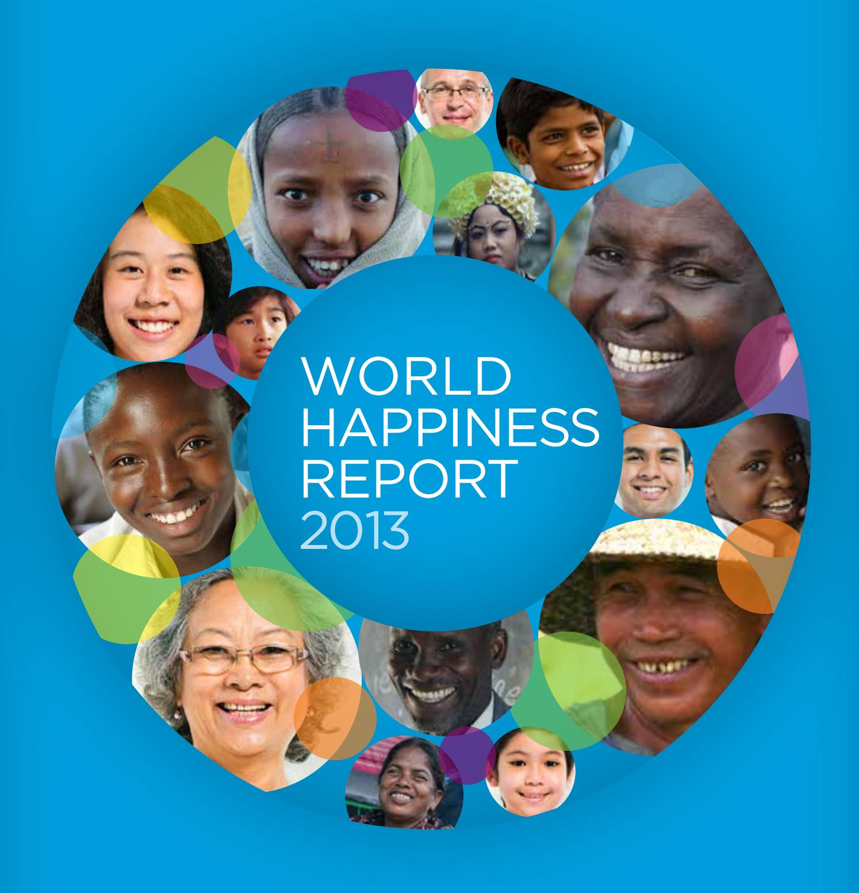

# WORLD HAPPINESS REPORT 2013

Edited by John Helliwell, Richard Layard and Jeffrey Sachs

## TABLE OF CONTENTS

- 1. Introduction
- 2. World Happiness: Trends, Explanations and Distribution
- 3. Mental Illness and Unhappiness
- 4. The Objective Benefits of Subjective Well-Being
- 5. Restoring Virtue Ethics in the Quest for Happiness
- 6. Using Well-being as a Guide to Policy
- 7. The OECD Approach to Measuring Subjective Well-Being
- 8. From Capabilities to Contentment: Testing the Links Between Human Development and Life Satisfaction

*The World Happiness Report was written by a group of independent experts acting in their personal JHWHJP[PLZ(U`]PL^ZL\_WYLZZLKPU[OPZYLWVY[KVUV[ULJLZZHYPS`YLÅLJ[[OL]PL^ZVMHU`VYNHUPaH[PVU agency or programme of the United Nations.*

## INTRODUCTION

JOHN F. HELLIWELL, RICHARD LAYARD AND JEFFREY D. SACHS

3 2

**John F. Helliwell**: Vancouver School of Economics, University of British Columbia, and the Canadian Institute for Advanced Research (CIFAR)

**Richard Layard:** Director, Well-Being Programme, Centre for Economic Performance, London School of Economics

The world is now in the midst of a major policy debate about the objectives of public policy. What should be the world's Sustainable Development Goals for the period 2015-2030? The *World Happiness Report 2013* is offered as a contribution to that crucial debate.

In July 2011 the UN General Assembly passed a historic resolution.1 It invited member countries to measure the happiness of their people and to use this to help guide their public policies. This was followed in April 2012 by the first UN high-level meeting on happiness and well-being, chaired by the Prime Minister of Bhutan. At the same time the first *World Happiness Report* was published,2 followed some months later by the OECD Guidelines setting an international standard for the measurement of well-being.3 The present Report is sponsored by the Sustainable Development Solutions Network.

## Happiness

The word "happiness" is not used lightly. Happiness is an aspiration of every human being, and can also be a measure of social progress. America's founding fathers declared the inalienable right to pursue happiness. Yet are Americans, or citizens of other countries, happy? If they are not, what if anything can be done about it?

The key to proper measurement must begin with the meaning of the word "happiness." The problem, of course, is that happiness is used in at least two ways — the first as an emotion ("Were you happy yesterday?") and the second as an evaluation ("Are you happy with your life as a whole?"). If individuals were to routinely mix up their responses to these very different questions, then measures of happiness might tell us very little. Changes in reported happiness used to track social progress would perhaps reflect little more than transient changes in emotion. Or impoverished persons who express happiness in

 terms of emotion might inadvertently diminish society's will to fight poverty.

Fortunately, respondents to happiness surveys do not tend to make such confusing mistakes. As we showed in last year's *World Happiness Report* and again in this year's report, respondents to surveys clearly recognize the difference between happiness as an emotion and happiness in the sense of life satisfaction. The responses of individuals to these different questions are highly distinct. A very poor person might report himself to be happy emotionally at a specific time, while also reporting a much lower sense of happiness with life as a whole; and indeed, people living in extreme poverty do express low levels of happiness with life as a whole. Such answers should spur our societies to work harder to end extreme poverty.

As with last year's report, we have again assembled the available international happiness data on how people rate both their emotions and their lives as a whole. We divide the available measures into three main types: measures of positive emotions (positive affect) including happiness, usually asked about the day preceding the survey; measures of negative emotions (negative affect) again asked about the preceding day; and evaluations of life as a whole. Together, these three types of reports constitute the primary measures of subjective well-being.4 The three main life evaluations are the Cantril ladder of life,5 life satisfaction,6 and happiness with life as a whole.7 Happiness thus appears twice, once as an emotional report, and once as part of a life evaluation, giving us considerable evidence about the nature and causes of happiness in both its major senses.

## Outline of Report

The first *World Happiness Report* presented the widest body of happiness data available, and explained the scientific base at hand to validate and understand the data. Now that the scientific stage has been set, we turn this year to consider more specific issues of measurement, explanation, and policy.

- t In Chapter 2 we update our ranking of life evaluations from all over the world, making primary use of the Gallup World Poll, since it continues to regularly collect and provide comparable data for the largest number of countries. We also present tentative explanations for the levels and changes of national-level and regional averages of life evaluations.
- t In Chapter 3 we learn that mental illness is the single most important cause of unhappiness, but is largely ignored by policy makers.
- t Chapter 4 adopts a different perspective, looking at the many beneficial consequences of well-being (rather than its causes).
- t Chapter 5 discusses values; returning to the ancient insights of Buddha, Aristotle, and others teachers and moralists, that an individual's values and character are major determinants of the individual's happiness with life as a whole.
- t Chapter 6 looks at the way policy makers can use well-being as a policy goal.
- t Chapter 7 presents the OECD's *Guidelines on Measuring Subjective Well-being* and general approach, and;
- t Chapter 8 explores the link between the UN's Human Development Index and subjective well-being.

We briefly review the main findings of each chapter.

#### **Trends, explanations and distribution**

Chapter 2 presents data by country and continent, and for the world as a whole, showing the levels, explanations, changes and equality of happiness, mainly based on life evaluations from the Gallup World Poll. Despite the obvious detrimental happiness impacts of the 2007-08 financial crisis, the world has become a slightly happier and more generous place over the past five years. Because of continuing improvements in most

supports for better lives in Sub-Saharan Africa, and of continued convergence in the quality of the social fabric within greater Europe, there has also been some progress toward equality in the distribution of well-being among global regions.

There have been important continental crosscurrents within this broader picture. Improvements in quality of life have been particularly notable in Latin America and the Caribbean, while reductions have been the norm in the regions most affected by the financial crisis, Western Europe and other western industrial countries; or by some combination of financial crisis and political and social instability, as in the Middle East and North Africa.

### **Mental health and unhappiness**

The next chapter focuses on mental health. It shows that mental health is the single most important determinant of individual happiness (in every case where this has been studied). About 10% of the world's population suffers from clinical depression or crippling anxiety disorders. They are the biggest single cause of disability and absenteeism, with huge costs in terms of misery and economic waste.

Cost-effective treatments exist, but even in advanced countries only a third of those who need it are in treatment. These treatments produce recovery rates of 50% or more, which mean that the treatments can have low or zero net cost after the savings they generate. Moreover human rights require that treatment should be as available for mental illness as it is for physical illness.

#### **Effects of well-being**

Chapter 4 considers the objective benefits of subjective well-being. The chapter presents a broad range of evidence showing the people who are emotionally happier, who have more satisfying lives, and who live in happier communities, are more likely both now and later to be healthy, productive, and socially connected. These benefits in turn flow more broadly to their families, workplaces, and communities, to the advantage of all.

The authors of Chapter 4 show that subjective well-being has an objective impact across a broad range of behavioral traits and life outcomes, and does not simply follow from them. They observe the existence of a *dynamic* relationship between happiness and other important aspects of life with effects running in both directions.

#### **Values and happiness**

Chapter 5 discusses a riddle in the history of thought. In the great pre-modern traditions concerning happiness, whether Buddhism in the East, Aristotelianism in the West, or the great religious traditions, happiness is determined not by an individual's material conditions (wealth, poverty, health, illness) but by the individual's moral character. Aristotle spoke of virtue as the key to *eudaimonia*, loosely translated as "thriving." Yet that tradition was almost lost in the modern era after 1800, when happiness became associated with material conditions, especially income and consumption. This chapter explores that transition in thinking, and what has been lost as a result. It advocates a return to "virtue ethics" as one part of the strategy to raise (evaluative) happiness in society.

#### **Policy making**

Chapter 6 explains how countries are using well-being data to improve policy making, with examples from around the world. It also explains the practical and political difficulties faced by policy makers when trying to use a well-being approach. The main policy areas considered include health, transport and education. The main conclusion is that the well-being approach leads to better policies and a better policy process.

#### **OECD Guidelines**

Chapter 7 describes the OECD approach to measuring subjective well-being. In particular the OECD approach emphasizes a single primary measure, intended to be collected consistently across countries, as well as a small group of core measures that data producers should collect where possible.8 The content and underpinnings

of the OECD approach are laid out more fully in the recent *OECD Guidelines on Measuring Subjective Well-being*. The chapter also outlines progress that has been made by national statistical offices, both before and after the release of the guidelines.

#### **Human Development Report**

Chapter 8 investigates the conceptual and empirical relationships between the human development and life evaluation approaches to understanding human progress. The chapter argues that both approaches were, at least in part, motivated by a desire to consider progress and development in ways that went beyond GDP, and to put people at the center. And while human development is at heart a conceptual approach, and life evaluation an empirical one, there is considerable overlap in practice: many aspects of human development are frequently used as key variables to explain subjective well-being. The two approaches provide complementary lenses which enrich our ability to assess whether life is getting better.

## Conclusion

In conclusion, there is now a rising worldwide demand that policy be more closely aligned with what really matters to people as they themselves characterize their lives. More and more world leaders including German Chancellor Angela Merkel, South Korean President Park Geun-hye and British Prime Minister David Cameron, are talking about the importance of well-being as a guide for their nations and the world. We offer the 2013 *World Happiness Report* in support of these efforts to bring the study of happiness into public awareness and public policy. This report offers rich evidence that the systematic measurement and analysis of happiness can teach us much about ways to improve the world's wellbeing and sustainable development.

- 1 UN General Assembly (19 July 2011).
- 2 Helliwell et al. (2012).
- 3 OECD (2013).
- 4 The use of "subjective well-being" as the generic description was recommended by Diener et al. (2010, x-xi), reflecting a conference consensus, later adopted also by the OECD *Guidelines* (2013, summarized in Chapter 7), that each of the three components of SWB (life evaluations, positive affect, and negative affect) be widely and comparably collected.
- 5 Used in the Gallup World Poll (GWP). The GWP included the life satisfaction question on the same 0 to 10 scale on an experimental basis, giving a sample sufficiently large to show that when used with consistent samples the two questions provide mutually supportive information on the size and relative importance of the correlates, as shown in Diener et al. (2010, Table 10.1).
- 6 Used in the World Values Survey, the European Social Survey and many other national and international surveys. It is the core life evaluation question recommended by the OECD (2013), and in the first *World Happiness Report*.
- 7 The European Social Survey contains questions about happiness with life as a whole, and about life satisfaction, both on the same 0 to 10 numerical scale. The responses provide the scientific base to support our findings that answers to the two questions give consistent (and mutually supportive) information about the correlates of a good life.
- 8 There are two elements to the OECD core measures module. The first is the primary measure of life evaluation, a question on life satisfaction. The second element consists of a short series of affect questions and the experimental eudaimonic question. The specifics are in Box 1 of Chapter 7.

## References

Diener, E., Helliwell, J. F., & Kahneman, D. (Eds.). (2010). *International differences in well-being.* New York: Oxford University Press. doi: 10.1093/acprof:oso/9780199732739.001.0001

Helliwell, J. F., Layard, R., & Sachs, J. (Eds.). (2012). *World happiness report*. New York: Earth Institute.

OECD. (2013). *Guidelines on measuring subjective well-being*. Paris: OECD. Retrieved from http://www.oecd.org/statistics/Guidelines on Measuring Subjective Well-being.pdf

UN General Assembly (19 July 2011). Happiness: Towards a holistic approach to development, A/RES/65/309.

## WORLD HAPPINESS: TRENDS, EXPLANATIONS AND DISTRIBUTION

JOHN F. HELLIWELL AND SHUN WANG

The first *World Happiness Report* attracted most attention with its rankings of average life evaluations, especially at the national level, based on data from all available years of the Gallup World Poll, mainly 2005 to 2011.2 This year we dig deeper. First, we repeat our summary of average levels for the Cantril ladder, this year using the most recent data available, now covering 2010-12. We will also compare international differences in life evaluations with average measures of positive and negative emotions. This will set the stage for our later analysis of the happiness trends that have appeared in some countries and regions since the beginning of the Gallup World Poll in 2005.

At the same time as we present the levels, we shall also provide a breakdown of the likely reasons why life evaluations are higher in each region or country than in a hypothetical comparison country called Distopia. Distopia is faced with the world's lowest national average values of each of six key variables that we have found to explain three-quarters of the international differences in average life evaluations: GDP per capita, years of healthy life expectancy, having someone to count on in times of trouble (sometimes referred to as "social support" in this chapter), perceptions of corruption, prevalence of generosity, and freedom to make life choices.3

After making these current comparisons based on the three most recent survey years, we then look for changes and trends in happiness in countries, regions, and for the world as a whole. Finally, we will look for differences and trends in the equality or inequality with which happiness is distributed within and among countries and regions.

As we found last year, whether we are interested in comparing levels or looking for trends, there is a necessary trade-off between sample size and the ability to identify the latest levels and trends. The Gallup World Poll, which still provides the most comparable data for a large group of countries, typically interviews 1,000 respondents per country in each survey year. We average the three most recent years (2010–12) in order to achieve a typical sample size of 3,000, thus reducing

uncertainty in the resulting estimates of country averages. In looking for possible trends, we compare these most recent three years with average values in the earliest years (2005–07) of data available for each country. In the future, when collection of data on subjective well-being (SWB) has a longer history, is based on larger samples, and has been made a part of large official surveys in many countries, as outlined in the recent OECD *Guidelines for the Measurement of Subjective Well-Being,*4 it will be possible to recognize and explain international and sub-national happiness changes and trends in a more timely way. But there are nonetheless some interesting findings in the data already in hand.

Throughout this chapter, we shall make primary use of the answers given by individual respondents asked to evaluate their current lives by imagining life as a ladder, with the best possible life for them as a 10, and the worst possible life as a zero. We shall then examine the average levels and distributions of these responses, sometimes referring to the measures as the Cantril ladder,5 and sometimes as life evaluations or measures of happiness about life as a whole.

Another two SWB measures are reports of emotional states. They are based on a list of survey questions on emotional experience the day before the interview: 1) Did you smile or laugh a lot yesterday? 2) Did you experience the following feelings during a lot of the day yesterday? How about enjoyment? 3) How about happiness? 4) How about worry? 5) How about sadness? 6) How about anger? The answers to the first three questions reveal positive emotional feelings. The answers to the other three questions reveal negative feelings. We use the first three questions to construct a score of positive emotions, which is essentially the number of "yes" answers. The score has four steps from zero to three. Zero means that the respondent reports no positive experiences; three means all three positive experiences are reported. In a symmetrical manner, we construct the score of negative emotions based on the three questions about negative emotions.

Using alternative descriptions for life evaluations and favoring life evaluations over measures of positive and negative affect follows from the analysis contained in the first World Happiness Report. There it was shown that while the three main types of life evaluation in frequent use — satisfaction with life as a whole, happiness about life as a whole, and the Cantril ladder — have different average values and distributions, they provide equivalent information about the sources of differences among individuals and nations.6 It was also shown there, and in Table 2.1 in this chapter, that life evaluations are much more fully explained by enduring life circumstances than are measures of the previous day's positive and negative emotions. Emotional measures are nonetheless of fundamental importance for experimental work, and for the analysis of daily life, as they respond to short-term events and surroundings much more than do the more stable life evaluations.7 Emotional states, especially positive ones, are nonetheless closely related to life evaluations, as we shall see in the next section.

If life evaluations are more closely determined by life circumstances than are emotions, we might also expect to find that that they line up more closely with other measures of human development, such as the United Nations Development Programme's Human Development Index (HDI), which is the subject of Chapter 8 in this report. We find that this is indeed so, as the simple correlation between the HDI and national averages of the Cantril ladder is 0.77, several times as great as that between the HDI and measures of positive and negative affect.8

If it is true that life evaluations are more determined by the circumstances of life, and if life circumstances are more unevenly distributed among nations than are the supports for emotions, then we would expect to find that the international distribution of life evaluations matches that of key life circumstances, while emotional states, like the personality differences that partially underlie them, might be expected to differ relatively more among individuals than among nations. The data support this expectation. Figure 2.1 shows for each of eight variables the share of their total variation among more than 500,000 Gallup World Poll respondents in 2010–12 that is among rather than within nations.9 The eight variables include the Cantril ladder, positive and negative affect, and five variables we use to explain international differences in our three measures of subjective well-being. Of all the variables, household income is by far the most unevenly divided among countries, with more than half of its global variation being among countries. International differences in perceived corruption and in the Cantril ladder are next in the extent to which their global variation is among countries, followed by generosity, freedom, positive affect, and social support. The variance of negative affect is almost entirely within rather than among countries, with an international share well below 10%.

To further compare life evaluations and emotions, we use six key variables to explain international differences in the Cantril ladder, positive affect, and negative affect. These equations, as shown in Table 2.1, use a pooled sample of all available annual national average scores for each of the three measures of well-being regressed on a set of variables, similar to those used in Table 3.1 of the first World Happiness Report. These variables, which span the main range of factors previously found to be important in explaining differences in life evaluations, include the log of GDP per capita, years of healthy life expectancy, having someone to count on in times of trouble, perceptions of corruption, prevalence of generosity, and freedom to make life choices.

As can be seen in Table 2.1, and in Table 3.1 of the first *World Happiness Report*, and as Figure 2.1 leads us to suppose, the six variables explain much more of the differences of life evaluations than of emotions. There is also a difference in their relative importance. The more objective circumstances of life (income and healthy life expectancy) are very strong determinants of the Cantril ladder life evaluations, but they have no significant links to positive and negative affect. Having someone to count on in times of trouble

and feeling a sense of freedom to make key life choices are both strong determinants of life evaluations and emotions. Perceived corruption provides an interesting contrast, as negative affect is much worse, and life evaluations lower, where corruption is perceived to be more prevalent. But there is no link between corruption perceptions and positive affect. Generosity is also interesting, as it has a strong positive link with life evaluations and positive affect, but no relation to negative affect. This latter result is supported by recent experimental evidence that subjects who behave generously when given the chance become significantly happier, but there is no change in their level of negative affect. Their initial levels of positive and negative affect, on the other hand, do not influence significantly the likelihood of them acting generously.

The fourth column of Table 2.1 repeats the first column, but adds the national averages, in each year, of positive and negative affect. Positive affect enters the equation strongly, but negative affect does not. Positive affect is itself strongly connected to generosity, freedom, and social support, as shown in column 2 of Table 2.1, and the addition of positive affect to the life evaluation equation in column 4 suggests that some substantial part of the impact from those variables to life evaluations flows through positive affect.

Partly because of their more robust connections with the established supports for better lives, life evaluations remain the primary statistic for measuring and explaining international differences and trends in subjective well-being. Although life satisfaction, happiness with life as a whole, and the Cantril ladder all tell similar stories about the sources of a good life, we shall concentrate here on the Cantril ladder, since it is the only life evaluation in continuous use in the Gallup World Poll, and the latter provides by far the widest and most regular country coverage. An online data appendix provides comparable data for positive and negative affect.

## Global and Regional Happiness Levels and Explanations

Figure 2.2 shows life evaluation averages for each of 10 regional groupings13 of countries, as well as for the world as a whole, based on data for the years 2010-12. For this figure, the levels and the 95% confidence bounds (shown by a horizontal line at the right-hand side of each bar) are based on all the individual-level observations available for each country in the survey, weighted by total population in each country.14 This population-weighting is done so that the regional averages, like the national averages to be presented later, represent the best estimate of the level and changes of the ladder scores for the entire population. The results for the world as a whole are similarly weighted by population in each country, just as was done in Figure 2.1 in the first *World Happiness Report*.

Figure 2.2 shows not only the average ladder scores for the world, and for each of 10 regional groupings, but also attempts to explain why average ladder scores are so much higher in some regions than in others. To do this, we make use of the coefficients found in the first column of Table 2.1. The length of each sub-bar in Figure 2.2 shows how much better life is for having a higher value of that variable than in Distopia. Distopia is a fictional country that has the world's lowest national average value (for the years 2010-12) for each of the six key variables used in Table 2.1. We calculate 2010–12 happiness in Distopia to have been 1.98 on the 10-point scale, less than one-half of the average score in any of the country groupings.15

Each region's bar in Figure 2.2 has seven components. Starting from the left, the first is the sum of the score in Distopia plus each region's average 2010-12 unexplained component.16 For many reasons, the six available variables cannot fully explain the differences in ladder scores among regions, so that the combined effect of all of the missing factors (to the extent that they are not correlated with the variables in the equation) turns up in the error term. The top-ranking regions and countries tend to have higher average positive

values for their error terms since the country rankings are based on the actual survey results, and not on what the model predicts. It is somewhat reassuring that even for the top-ranked and bottom-ranked countries and regions, most of the differences between their scores and those in Distopia are explained by having values of at least most variables that are better than those in Distopia. No country has the world's lowest values for more than one of the six variables, and this is why actual national scores in all countries, and of course in all regions, are well above the calculated ladder score in Distopia.

The second segment in each regional bar is the amount by which the regional ladder score exceeds that in Distopia by dint of having average per capita incomes higher than those in the poorest country in the world. To take a particular example, GDP per capita in the richest region is over 16 times higher than in the poorest of the 10 regions. This difference in GDP per capita between the richest and poorest regions translates into an average life evaluation difference of 0.80 points on the 10-point range of the scale.17 Similarly, the fraction of the population reporting having someone to count on is 0.93 in the top region compared to 0.56 in the region with the lowest average social support. This interregional difference translates into a 0.86 difference in ladder averages.18 The corresponding ladder differentials between the top region and the region with the lowest national average for that variable are 0.20 for perceived absence of corruption,19 0.66 for the 28-year life expectancy difference between the top (Western Europe) and bottom (Sub-Saharan Africa) regions,20 0.46 for generosity differences (adjusted for income levels) between the most and least generous regions,21 and 0.26 for freedom to make life choices.22 Thus there are substantial regional differences in each of the six variables used in Table 2.1 to explain international differences in ladder scores, with correspondingly large effects on average happiness.

Our regional results show some echo of cultural differences that have been found in a variety of survey and experimental contexts.23 Our explanatory framework assumes that the ladder question is seen and answered the same way in every language and culture, that the six measured variables do an equally good or bad job in capturing the main features of happy lives, that response scales are used similarly in all cultures, and that the variables have similar effects everywhere. These are unrealistically strong assumptions, and there is substantial evidence that for different reasons24 these assumptions might lead our equation to underestimate reported happiness in Latin America, and to overestimate it in East Asia. In terms of Figure 2.2, this would lead us to expect the left-hand bar, which measures the estimated happiness in Distopia plus each region's average amount of unexplained happiness, to be smaller for East Asia, and larger for the region including Latin America and the Caribbean. That is indeed what Figure 2.2 shows, with average ladder scores being higher than predicted in Latin America and the Caribbean, and lower in East Asia. If we compute average country errors in each region for the 2010-12 period covered by Figure 2.2, we find that average ladder scores are significantly higher than predicted in Latin America and the Caribbean, and significantly lower in East Asia, by about half a point in each case. There are three other regions where average measured happiness is significantly different in 2010**–**12 than what the equation in Table 2.1 would predict, in all cases by between one-fifth and one-quarter of a point. On the one hand, life assessments in Central and Eastern Europe, and in Southeast Asia, are lower than the model predicts, while in the small group comprising the United States, Canada, Australia and New Zealand (NANZ), the average scores are higher than predicted. These calculations all treat each country with an equal weight, and hence reflect the average of the country-by-country predicted and actual ladder scores in Figure 2.3. Figure 2.2 and the remaining discussion in this section, consider average lives in each region, and hence weight the data by each country's population.

Figure 2.2 shows that there are large inter-regional differences in average ladder scores, which range from 4.6 to over 7.1. The explanations, as revealed by the width of the individual bars, show that all factors contribute to the explanation, but the amounts explained by each factor differ by region. For example, while Sub-Saharan Africa has the lowest average ladder score, corruption is seen as a smaller problem there than in the Commonwealth of Independent States (CIS), Central and Eastern Europe, and South-East Asia. Similarly, a higher fraction of respondents have someone to count on in Sub-Saharan Africa than in either South Asia or the Middle East and North Africa (MENA). Generosity, even before adjusting for income differences, is higher in Sub-Saharan Africa than in three regions— the CIS, East Asia, and MENA. After adjusting for income differences, Sub-Saharan generosity is also higher than in Latin America and the Caribbean, and Central and Eastern Europe. And the sense of freedom to make key life decisions is higher in Sub-Saharan Africa than in either the CIS or MENA. In fact, only for the two traditional development measures— GDP per capita and years of healthy life expectancy— are the average values lowest in Sub-Saharan Africa.

However, as might be expected, each region contains a wide variety of individual and country experiences. Having now illustrated how our explanatory framework operates, we turn in the next section to use it to explain the much greater differences that appear at the national level.

## National Happiness Levels and Explanations

In this section, we first present in Figure 2.3 the 2010**–**12 national averages for life evaluations, with each country's average score divided into seven pieces.25 The overall ladder rankings differ from those in Figure 2.3 of the first *World Happiness Report*. First, they include more up-todate data, with the ending point of the new data coverage moving forward from mid-2011 to the

end of 2012. Second, in last year's report we averaged all available data, running from 2005 until mid-2011, while this year we present averages for the three years 2010-12, giving a sample size of 3,000 for most countries.26 We focus on the more recent data for two reasons. First, we expect that readers want the data presented in our key tables to be as current as possible, consistent with having sample sizes large enough to avoid too many ranking changes due to sampling fluctuations. Second, we want to be able to look for changes through time in the average happiness levels for countries, regions, and the world as a whole.

The three panels of Figure 2.3 divide the 156 countries into three groups. The top five countries are Denmark, Norway, Switzerland, Netherlands, and Sweden, and the bottom five are Rwanda, Burundi, Central African Republic, Benin, and Togo. The gap between the top and the bottom is quite large: the average Cantril ladder in the top five countries is 7.48, which is over 2.5 times the 2.94 average ladder in the bottom countries.

As was the case in the first *World Happiness Report*, there are no countries with populations over 50 million among the 10 top-ranking countries. Does this mean that it is harder for larger countries to create conditions supporting happier lives? A closer look at the data shows no evidence of this sort. There are two large countries in the top 20 countries, and none among the bottom 20. The 24 countries with populations over 50 million tend not to be at either end of the global distribution, in part because they each represent averages among many differing sub-national regions. Looking at the three parts of Figure 2.3, there are eight large countries in the top third, and five in the bottom third, with the other 11 in the middle group. There is no simple correlation between average ladder scores and country size, although if we look at the part of life evaluations not explained by the six key variables, ladder scores are if anything higher in larger countries.27

## Global and Regional Happiness Trends

On average, on a global and regional basis, as shown in Figure 2.4, there has been some evidence of convergence of Cantril ladder scores between 2007 and 2012. There have been significant increases for Latin America and the Caribbean (+7.0%), the CIS (+5.9%), Sub-Saharan Africa (+5.4%), and East Asia (+5.1%),28 up to almost half a point on the zero to 10 scale of the Cantril ladder. There were significant declines in four regions: the Middle East and North Africa (-11.7%), South Asia (-6.8%), the group of four miscellaneous industrial countries (United States, Canada, Australia and New Zealand, -3.2%), and Western Europe (-1.7%). In Central and Eastern Europe there was no significant change in the regional average, but here too, as in the other regions, there were offsetting increases and decreases. For the world as a whole, there was an insignificant 0.5% increase.

Figure 2.5 gives some idea of the variety of trend experiences within each region, for the 130 countries with adequate sample size at both the beginning and the end of the 2005**–**07 to 2010**–**12 period. It shows the percentages of countries in which life evaluations have grown significantly (in yellow), not changed by a significant amount (in blue), or fallen significantly (in red). The number of countries within each group is shown by numerals within each box. Overall, more countries have had significant increases (60) than decreases (41) in average life evaluations between 2005-07 and 2010-12, with a smaller group (29) showing no significant trend.

On a regional basis, by far the largest gains in life evaluations, in terms of the prevalence and size of the increases, have been in Latin America and the Caribbean, and in Sub-Saharan Africa. In Latin America and the Caribbean, more than threequarters of all countries showed significant increases in average happiness, with a populationweighted average increase amounting to 7.0% of the 2005-07 value.29 In Sub-Saharan Africa, 16 of

the 27 countries covered by the surveys showed significant increases in life evaluations, and taking all of Sub-Saharan Africa together the average increase was over 5%.30 On the other hand, there have been significant decreases in two-thirds of the countries in South Asia. On average, there have been significant reductions in ladder scores in Western Europe, while average evaluations in Central and Eastern Europe were almost unchanged, as shown in Figure 2.4. The diversity of the Western European experiences is apparent. Six of the 17 countries had significant increases, while seven countries had significant decreases, the largest of which were in four countries badly hit by the Eurozone financial crisis- Portugal, Italy, Spain and Greece. In Central and Eastern Europe, there were significant increases in four transition countries showing upward convergence to European averages, balanced by four others with significant decreases. We turn to the country data for our more detailed analysis, recognizing that the increase in focus is matched by a reduction in sample size.

## National Happiness Trends

Figure 2.6 compares the 2005**–**07 and 2010**–**12 average ladder scores for each country, ranked by the size of their increases from the first period to the second. The horizontal lines at the end of each bar show the 95% confidence regions for the estimate, making it relatively easy to see which of the changes are significant. Because not all countries have surveys at both ends of the comparison period, this restricts to 130 the number of countries shown in Figure 2.6.

Among the 130 countries, we focus here on those whose average evaluations have changed by half a point on the zero to 10 scale. Of these 32 countries, 19 saw improvements, and 13 showed decreases. Over half (10) of the countries with increased happiness were in Latin America and the Caribbean, and more than one-fifth in Sub-Saharan Africa. The rest of the large gainers included two in Eastern Europe, one in the CIS, and two Asian countries, South Korea31 and Thailand, but

none in Western Europe or elsewhere among the industrial countries, or in the Middle East and North Africa.

Of the 13 countries with average declines of 0.5 or more, there were four from the Middle East and North Africa, three from Sub-Saharan Africa, two from Asia, three from Western Europe, and only one from Latin America and the Caribbean.

## Reasons for Happiness Changes

The various panels of Figure 2.7 show, for the world as a whole and for each of the 10 regions separately, the underlying changes in the material and social supports for well-being. Population weights are used, thereby representing regional populations as a whole, by giving more weight to the survey responses in the more populous countries in each region. As shown in Figure 2.7.1,32 GDP per capita has increased in almost every region except the group of four miscellaneous industrial countries (United States, Canada, Australia and New Zealand), with the absolute increases being greatest in East Asia, Central and Eastern Europe, the CIS, and Latin America, and proportionate increases the largest in South Asia, which is mainly caused by India.

By contrast, the fraction of respondents having someone to count on was lower in most regions, and for the world as a whole. Social support was significantly up in Sub-Saharan Africa, Southeast Asia and the CIS, and generally lower everywhere else, including for the world as a whole, with the reductions greatest in South Asia and in the Middle East and North Africa. The European Social Survey (ESS) has a broad range of questions relating to trust, and research suggests that social trust is a strong determinant of life evaluations. Furthermore, although trust levels remain much lower in the transition countries than in Western Europe, they have been converging, and have been more important than income in explaining why life evaluations have been rising since the economic crisis.33

Perceptions of corruption were significantly improved (i.e. lower) in Latin America, Western Europe and East Asia, and higher (worse) in NANZ, MENA and Sub-Saharan Africa. The prevalence of generosity, which here is not adjusted for differences in income levels, grew significantly throughout Asia, Central and Eastern Europe and the CIS, and for the world as a whole, while being significantly reduced in Sub-Saharan Africa, Western Europe, Latin America and MENA. Perceived freedom to make life choices grew significantly in Sub-Saharan Africa, Southeast Asia, and Latin America, and shrank significantly in South Asia, NANZ and MENA. Among individual countries, as already shown in the panels of Figure 2.3, there is an even greater variety of experiences, and of underlying reasons.

We pay special attention here to the four Western European countries worst hit by the Eurozone crisis, since they provide scope for examining how large economic changes play out in subjective well-being, especially when they are accompanied by damage to a country's social and institutional fabric. Table 2.2 shows for each of the four countries worst affected (in terms of lower average life evaluations) by the Eurozone crisis, the average size of the reductions in average happiness,34 the extent to which these decreases were explained by change in the variables included in the equation of Table 2.1, and estimates of how much of the remaining drop can be explained by the rising unemployment rates in each country.

The first thing to note is the large size of the effects of the economic crisis on the four countries. Their average fall in life evaluations, of two-thirds of a point on the 10-point scale, is roughly equal to moving 20 places in the international rankings of Figure 2.3, or equivalent to that of a doubling or halving of per capita GDP.35 Among the countries who have suffered well-being losses from 2005**–**07 to 2010**–**12, Greece ranks second, Spain sixth, Italy eighth and Portugal twentieth. We expect, and find, that these losses are far greater than would follow simply from lower

incomes. If per-capita GDP were pushed 10% below what might otherwise have happened without the crisis, the estimated loss in average subjective well-being would have been less than .04, which is less than one-tenth of the average drop in the four countries. As Table 2.2 shows, GDP per capita in three of the four countries actually fell, though not by as much as the 10% assumed above. The other five key factors in the Table 2.1 equation showed improvement in some countries and deterioration elsewhere, on average contributing to explaining the average decline. Healthy life expectancy was calculated to have continued to grow and improve subjective wellbeing, but all other factors generally moved in the other direction. The biggest hit, in terms of the implied drop in life evaluations, was in respondents' perceived freedom to make key life choices. In each country the crisis tended to limit opportunities for individuals, both through cutbacks in available services and loss of expected opportunities. In the three of the four countries there were also increases in perceived corruption in business and government. Social support and generosity also each fell in three of the four countries. Assembling the partial explanations from each of the six factors still left most of the well-being drop to be explained.

The most obvious candidate to consider is unemployment, which grew significantly in each country, and has been shown to have large effects on the happiness of the unemployed themselves, and also on those who remain employed, but who either may be close to those who are unemployed, or may face possible future unemployment. Because of the lack of sufficiently widespread and comparable data for national unemployment rates, unemployment does not appear among the six factors captured in Table 2.1. For now, we can fill this gap by using OECD data for national unemployment rates to explain, for OECD countries, the remaining differences in life evaluations not explained by the model of Table 2.1.36 Our best estimate from this procedure is that each percentage point increase in the national unemployment rate will lower average subjective well-being by .033 points on the 10-point scale.37 This is several

times more than would flow from the large and well-established non-pecuniary effects on each unemployed person, because it combines these effects with the smaller but more widespread effects on those who are still employed, or are not in the labor force. Although large, this estimate is very similar to that obtained from US data,38 and smaller than that implied by previous research for Europe39 and for Latin America.40 Thus we are fairly confident that we are not overstating the likely well-being effects of the higher unemployment rates in the four countries.

For Portugal, which had the smallest average drop in average life evaluations, adding unemployment suffices to explain the whole drop in subjective well-being. For the other three countries the explained share was between one-half and three-quarters. On average, as shown by the last line of Table 2.2, the six basic factors explained one-third of the drop in life evaluations, rising unemployment was responsible for another third, leaving one-third to be explained by other reasons. This is probably because in each case the crisis has been severe enough in those four countries to damage not just employment prospects, but to limit the capacities of individuals, communities and especially cash-strapped governments to perform at the levels expected of them in times of crisis. The conclusion that the happiness effects in these countries are due to social as well as economic factors is supported by the evidence from measures of positive and negative affect, which have already been seen to depend more on social than economic circumstances. The patterns of affect change are consistent in relative size with those for life evaluations. Positive affect fell, and negative affect grew in Greece and Spain, by proportions as great as life evaluations.41 For Italy the affect picture was mixed, while for Portugal there were no significant changes.42 The ranking changes for both affect measures, and for the ladder are shown in Table 2.3. For Greece, but not the other countries, the affect changes are comparatively larger than for life evaluations, as reflected by the greater number of places lost in the international rankings.

Greece stands out from the other countries in having the largest changes in life evaluations and affect measures, beyond what can be explained by average responses to the economic crisis. Research has shown that economic and other crises are more easily weathered and indeed provide the scope for cooperative actions that improve subjective well-being, if trust levels and other aspects of the social and institutional fabric are sufficiently high and well-maintained when the crisis hits.43 The European Social Survey (ESS) can provide useful evidence on this score, as it covers all four countries, and has two life evaluations and several trust measures. The ESS life evaluations, both for life satisfaction and happiness with life as a whole, mirror the Gallup World Poll in showing well-being losses that are greater in Greece than in the other countries.44 The ESS trust data provide some insight into the reasons for this. Although generalized social trust is maintained roughly at pre-crisis levels, trust in police and in the legal system fall much more in Greece. Trust in police stayed stable at pre-crisis levels, or even grew slightly, in Spain and Portugal, while falling by 25% in Greece. Trust in the legal system fell significantly in all three countries, but by almost three times as much in Greece as in the other countries. Because trust measures have been shown to be strong supports for subjective well-being,45 this erosion of some key elements of institutional trust thus helps to explain the exceptionally large well-being losses in Greece.

## How Equal is the Distribution of Happiness, and is it Changing?

In the first *World Happiness Report*, we emphasized that while average happiness levels in countries and regions are very important, it is equally important to track how happiness is distributed among individuals and groups. There has been much attention paid to measuring the levels and trends of income inequality, and concern over the increases in income inequality that have marked the recent economic history of many countries.46

There have also been attempts to assess the empirical links between income inequality and average happiness in nations.47 In general, the results of this research have been mixed. It is time to pay more attention to the distribution of happiness itself.

All of the data presented thus far in this chapter have been based on national and regional averages. Our analysis of the distribution of average happiness among countries and regions showed some evidence of global convergence, with the growth of happiness being generally higher in Sub-Saharan Africa, the region with the lowest average level. We now turn to consider inequality among individuals within regions. Figure 2.8 shows two measures of the inequality, and their 95% confidence intervals, of the distribution of ladder scores among individuals in each of the 10 regions, and for the world as a whole.48 The first measure includes 2005–2007, and the second covers the most recent period, 2010 –2012. To make the analysis reflect the population of each region, and of the world as a whole, we use population weights to combine the individual observations to form regional and global totals.

Looking at the inequality of happiness measures for 2010–12, we see that inequality is highest in MENA, Sub-Saharan Africa, and South Asia. It is lowest in Western Europe and NANZ. The world measure, which takes both inter-regional and intra-regional differences into account, is higher than in most regions taken separately, about equal to that for South Asia.

Has the inequality of happiness been growing or declining? Over the 2005–07 to 2010–12 periods, inequality has been shrinking in Latin America and the CIS, while increasing in Western Europe, MENA, NANZ, South Asia, and the world as a whole.

## Summary and Conclusions

This chapter has presented data by country and region, and for the world as a whole, showing the levels, explanations, changes and equality of happiness, mainly based on life evaluations from the Gallup World Poll. Despite the obvious happiness impacts of the financial crisis of 2007-08, the world has become a slightly happier and more generous place over the past five years. Because of continuing growth in most supports for better lives in Sub-Saharan Africa, and of continued convergence in the quality of the social fabric within greater Europe, there has also been some progress toward equality in the regional distribution of well-being.

There have been important regional cross-currents within this broader picture. Improvements in the quality of life have been particularly prevalent in Latin America and the Caribbean, while reductions have been the norm in the regions most affected by the financial crisis, Western Europe and other western industrial countries, or by some combination of financial crisis and political and social instability, as in the Middle East and North Africa. Analysis of life evaluations in the four Western European countries most affected by the Eurozone crisis showed the happiness effects to be even larger than would be expected from their income losses and large increases in unemployment.

Other cross-currents were revealed also in South Asia, where there was a significant drop in average life evaluations. The positive contributions from continuing economic growth and greater generosity were more than offset by the effects of declining social support, and of less perceived freedom to make life choices. Inequality in the distribution of happiness also grew significantly within South Asia.

In summary, the global picture has many strands, and the slow-moving global averages mask a variety of substantial changes. Lives have been improving significantly in Latin America

and the Caribbean, and in Sub-Saharan Africa; worsening in the Middle East and North Africa; dropping slightly in the western industrial world, and very sharply in the countries most affected by the Eurozone crisis. As between the two halves of Europe, the convergence of quality of life, in its economic, institutional and social dimensions, continues, if slowly. Within each of these broad regions, many complexities were evident, and others remain to emerge or to be noticed.

The pictures of levels and changes in the quality of life emerging from the global data must be considered only indicative of what remains to be learned as there are increases in the available well-being data, and a better understanding of what contributes to a good life. The empirical conclusions we have been able to draw are tentative. They are nonetheless suggestive of what might and could become more routine analysis of how people assess the quality of their lives throughout the world, and of what might be done to improve their chances of leading better lives.

**Table 2.1: Regressions to Explain Average Happiness across Countries (Pooled OLS)**

|                                  | Dependent Variable |                 |                 |                |  |
|----------------------------------|--------------------|-----------------|-----------------|----------------|--|
| Independent Variable             | Cantril Ladder     | Positive Affect | Negative Affect | Cantril Ladder |  |
| Log GDP per capita               | 0.283***           | -0.005          | 0.010           | 0.293***       |  |
|                                  | (0.073)            | (0.011)         | (0.008)         | (0.075)        |  |
| Social support                   | 2.321***           | 0.238***        | -0.220***       | 1.780***       |  |
|                                  | (0.465)            | (0.059)         | (0.046)         | (0.423)        |  |
| Healthy life expectancy at birth | 0.023**            | 0.001           | 0.002*          | 0.021*         |  |
|                                  | (0.008)            | (0.001)         | (0.001)         | (0.008)        |  |
| Freedom to make life choices     | 0.902**            | 0.321***        | -0.107*         | 0.144          |  |
|                                  | (0.340)            | (0.044)         | (0.047)         | (0.333)        |  |
| Generosity                       | 0.858**            | 0.198***        | 0.001           | 0.359          |  |
|                                  | (0.274)            | (0.036)         | (0.030)         | (0.269)        |  |
| Perceptions of corruption        | -0.713*            | 0.042           | 0.086**         | -0.843***      |  |
|                                  | (0.283)            | (0.038)         | (0.026)         | (0.249)        |  |
| Positive affect                  |                    |                 |                 | 2.516***       |  |
|                                  |                    |                 |                 | (0.438)        |  |
| Negative affect                  |                    |                 |                 | 0.347          |  |
|                                  |                    |                 |                 | (0.546)        |  |
| Year dummy (ref. year: 2012)     |                    |                 |                 |                |  |
| 2005                             | 0.289**            | -0.021*         | 0.019*          | 0.337**        |  |
|                                  | (0.110)            | (0.010)         | (0.009)         | (0.104)        |  |
| 2006                             | -0.174***          | -0.005          | 0.014+          | -0.159**       |  |
|                                  | (0.052)            | (0.009)         | (0.007)         | (0.052)        |  |
| 2007                             | 0.079              | 0.002           | -0.013*         | 0.084          |  |
|                                  | (0.055)            | (0.008)         | (0.006)         | (0.053)        |  |
| 2008                             | 0.149**            | 0.005           | -0.018**        | 0.145**        |  |
|                                  | (0.053)            | (0.007)         | (0.006)         | (0.054)        |  |
| 2009                             | 0.059              | 0.002           | -0.009          | 0.058          |  |
|                                  | (0.050)            | (0.007)         | (0.006)         | (0.050)        |  |
| 2010                             | -0.011             | -0.005          | -0.016**        | 0.007          |  |
|                                  | (0.044)            | (0.007)         | (0.005)         | (0.045)        |  |
| 2011                             | 0.036              | -0.007          | -0.006          | 0.053          |  |
|                                  | (0.041)            | (0.006)         | (0.005)         | (0.039)        |  |
| Constant                         | -0.383             | 0.267***        | 0.249***        | -1.149*        |  |
|                                  | (0.498)            | (0.064)         | (0.055)         | (0.518)        |  |
| Number of countries              | 149                | 149             | 149             | 149            |  |
| Number of obs.                   | 732                | 732             | 733             | 729            |  |
|                                  |                    |                 |                 |                |  |
| Adjusted R-squared               | 0.742              | 0.482           | 0.232           | 0.773          |  |

Notes: This is a pooled OLS regression for a tattered panel consisting of all available surveys for 149 countries over the eight survey years 2005-12. GDP per capita for most countries is Purchasing Power Parity (PPP) adjusted to constant 2005 international dollars, taken from the World Development Indicators (WDI) released by the World Bank in April 2013. Data for Cuba, Puerto Rico, Taiwan, and Zimbabwe are missing in the World Development Indicators (WDI). Therefore we use the PPP-converted GDP per capita (chain series, "*rgdpch*") at 2005 constant prices from the Penn World Table 7.1. GDP data is in year *t-1* is matched with other data in year *t*. The most recent

data on healthy life expectancy at birth is only available in 2007 from World Health Organization (WHO), but life expectancy at birth is available for all years from World Development Indicators. We adopt the following strategy to construct healthy life expectancy at birth for other country-years: first we generate the ratio of healthy life expectancy to life expectancy in 2007 for countries with both data, and assign countries with missing data the ratio of world average of healthy life expectancy over life expectancy; then we apply the ratio to other years (i.e. 2005, 2006, and 2008-12) to generate the healthy life expectancy data. Social support (or having someone to count on in times of trouble) is the national average of the binary responses (either 0 or 1) to the question "If you were in trouble, do you have relatives or friends you can count on to help you whenever you need them, or not?" Freedom to make life choices is the national average of responses to the question "Are you satisfied or dissatisfied with your freedom to choose what you do with your life?" Generosity is the residual of regressing national average of response to the question "Have you donated money to a charity in the past month?" on GDP per capita. Perceptions of corruption are the average of answers to two questions: "Is corruption widespread throughout the government or not" and "Is corruption widespread within businesses or not?" Coefficients are reported with robust standard errors clustered by country in parentheses. \*\*\*, \*\*, \* and + indicate significance at the 0.1, 1, 5 and 10% levels respectively.

Table 2.2: Sources of Lower Life Evaluations in Four Hard-Hit Eurozone Countries

|                                            |                              |        |        | Country |          |         |
|--------------------------------------------|------------------------------|--------|--------|---------|----------|---------|
|                                            |                              | Spain  | Italy  | Greece  | Portugal | Average |
| $\Delta$ Ladder                            |                              | -0.750 | -0.691 | -0.891  | -0.305   | -0.659  |
|                                            | Social support               | -0.035 | -0.081 | 0.051   | -0.101   | -0.042  |
|                                            | Freedom to make life choices | -0.053 | -0.106 | -0.174  | -0.083   | -0.104  |
| Explained by change (∆) of                 | Generosity                   | -0.013 | -0.088 | -0.109  | 0.044    | -0.041  |
| each variable                              | Perceptions of corruption    | -0.050 | 0.003  | -0.079  | -0.063   | -0.047  |
|                                            | Life expectancy              | 0.030  | 0.020  | 0.026   | 0.038    | 0.029   |
|                                            | Ln(GDP per capita)           | -0.005 | -0.015 | -0.009  | 0.001    | -0.007  |
|                                            | Total                        | -0.126 | -0.267 | -0.294  | -0.162   | -0.212  |
| Δ Unemployment rate                        |                              | 13.7   | 2.3    | 9.2     | 5.3      | 7.6     |
| Explained by $\Delta$ unemployment rate -o |                              | -0.443 | -0.074 | -0.297  | -0.171   | -0.246  |

Table 2.3: Dynamics of Emotions and Life Evaluations in Four Hard-Hit Eurozone Countries

|                                      | _                         | Country    |        |        |          |         |
|--------------------------------------|---------------------------|------------|--------|--------|----------|---------|
|                                      |                           | Spain      | Italy  | Greece | Portugal | Average |
| 2005-07-2010-12                      | Δ Positive Affect         | -0.033     | -0.056 | -0.113 | 0.023    | -0.045  |
|                                      | Δ Negative Affect         | 0.096      | -0.003 | 0.079  | -0.025   | 0.037   |
| W/IID I (coor)                       | Δ Ladder Ranking          | -16        | -17    | -28    | -12      | -18     |
| WHR I (2005-11)- WHR II (2010-12) | Δ Positive Affect Ranking | <b>-</b> I | -5     | -16    | 6        | -4      |
| , ,                                  | Δ Negative Affect Ranking | -15        | -6     | -34    | 10       | -II     |

**Figure 2.1: International Shares of Variance: 2010–12**

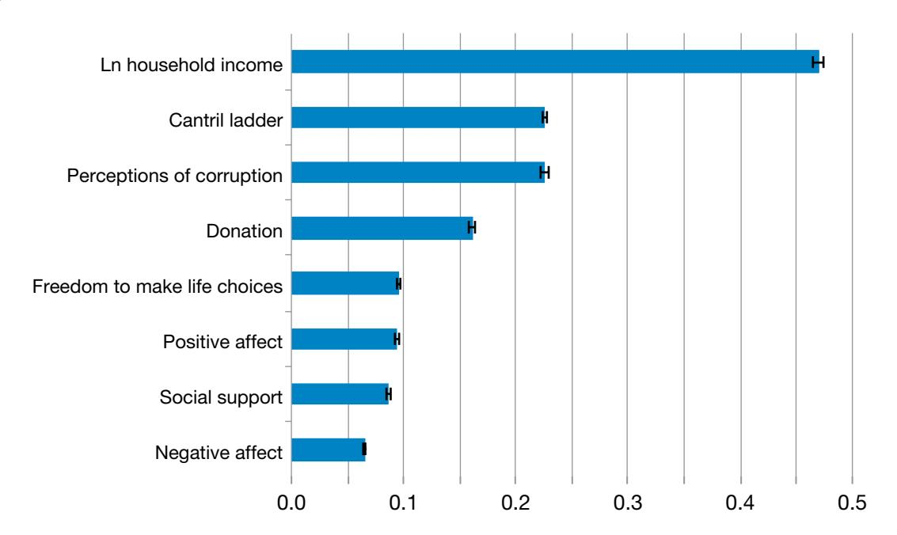

**Figure 2.2: Level and Decomposition of Happiness by Regions: 2010–12** 

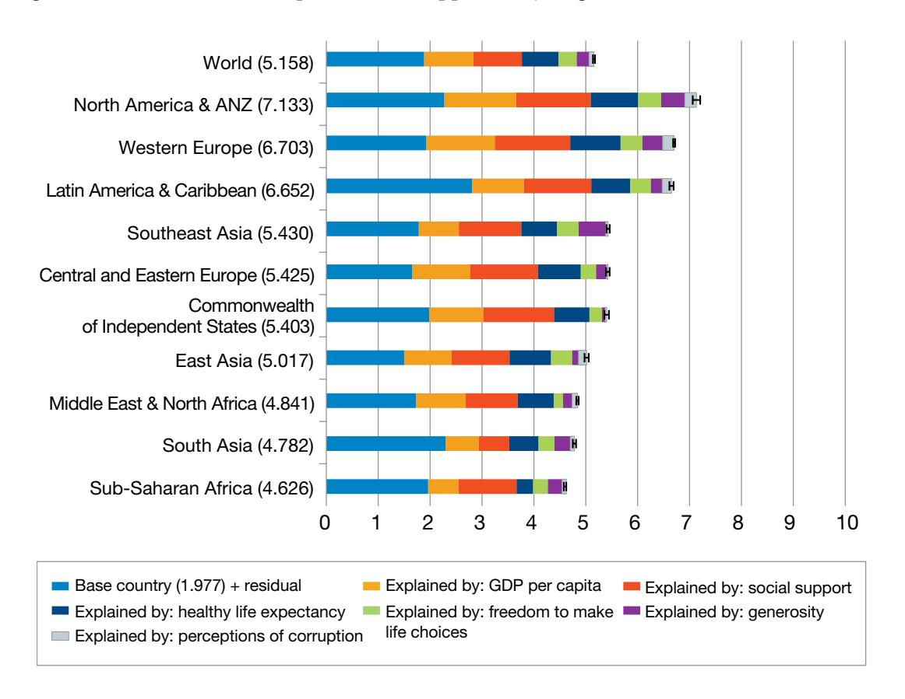

**Figure 2.3: Ranking of Happiness: 2010–12 (Part 1)**

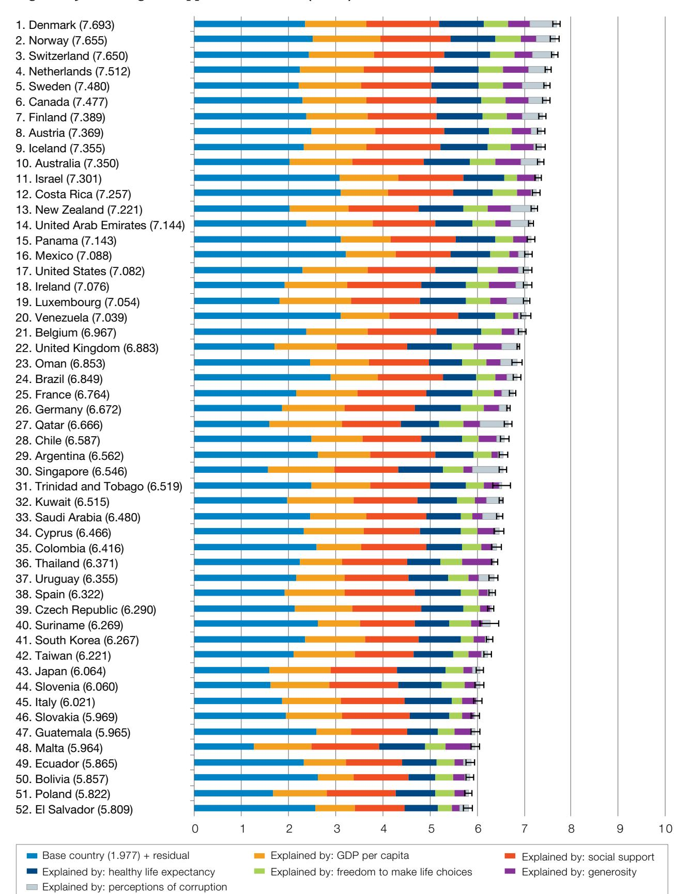

**Figure 2.3: Ranking of Happiness: 2010–12 (Part 2)**

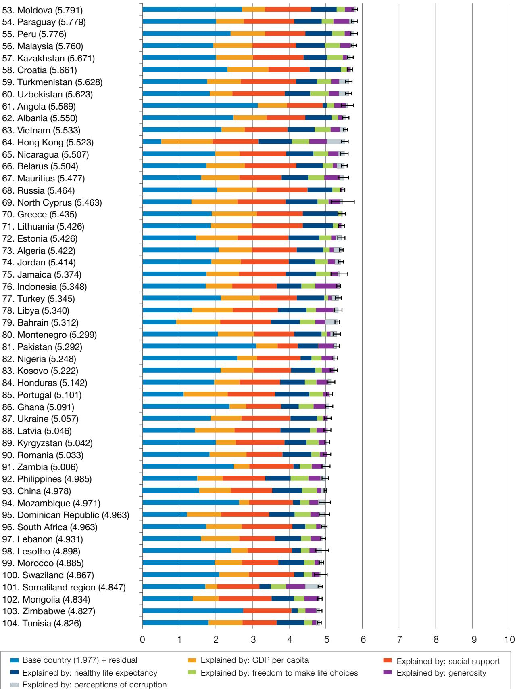

Explained by: perceptions of corruption

24 0 1 2 3 4 5 6 7 8 9 10 156. Togo (2.936) 155. Benin (3.528) 154. Central African Republic (3.623) 153. Burundi (3.706) 152. Rwanda (3.715) 151. Tanzania (3.770) 150. Guinea (3.847) 149. Comoros (3.851) 148. Syria (3.892) 147. Senegal (3.959) 146. Madagascar (3.966) 145. Botswana (3.970) 144. Bulgaria (3.981) 143. Afghanistan (4.040) 142. Yemen (4.054) 141. Chad (4.056) 140. Cambodia (4.067) 139. Malawi (4.113) 138. Gabon (4.114) 137. Sri Lanka (4.151) 136. Niger (4.152) 135. Nepal (4.156) 134. Georgia (4.187) 133. Liberia (4.196) 132. Mali (4.247) 131. Burkina Faso (4.259) 130. Egypt (4.273) 129. Congo (Brazzaville) (4.297) 128. Armenia (4.316) 127. Sierra Leone (4.318) 126. Haiti (4.341) 125. Tajikistan (4.380) 124. Sudan (4.401) 123. Kenya (4.403) 122. Cameroon (4.420) 121. Myanmar (4.439) 120. Uganda (4.443) 119. Ethiopia (4.561) 118. Macedonia (4.574) 117. Congo (Kinshasa) (4.578) 116. Azerbaijan (4.604) 115. Iran (4.643) 114. Djibouti (4.690) 113. Palestinian Territories (4.700) 112. Mauritania (4.758) 111. India (4.772) 110. Hungary (4.775) 109. Laos (4.787) 108. Bangladesh (4.804) 107. Bosnia and Herzegovina (4.813) 106. Serbia (4.813) 105. Iraq (4.817) Base country (1.977) + residual Explained by: GDP per capita Explained by: social support Explained by: healthy life expectancy Explained by: freedom to make life choices Explained by: generosity

**Figure 2.3: Ranking of Happiness: 2010–12 (Part 3)** 

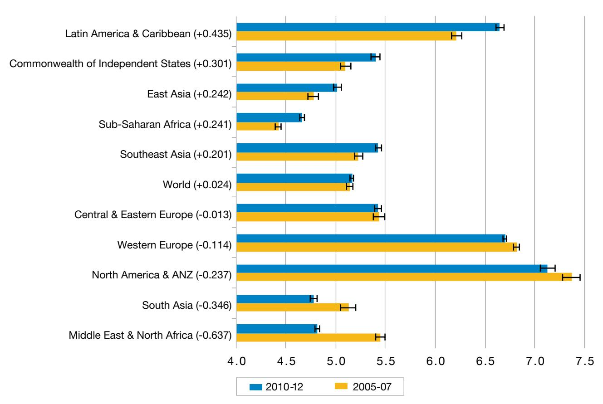

**Figure 2.4: Comparing World and Regional Happiness Levels: 2005–07 and 2010–12**

**Figure 2.5: Countries with Rising and Falling Happiness: 2005–07 and 2010–12**

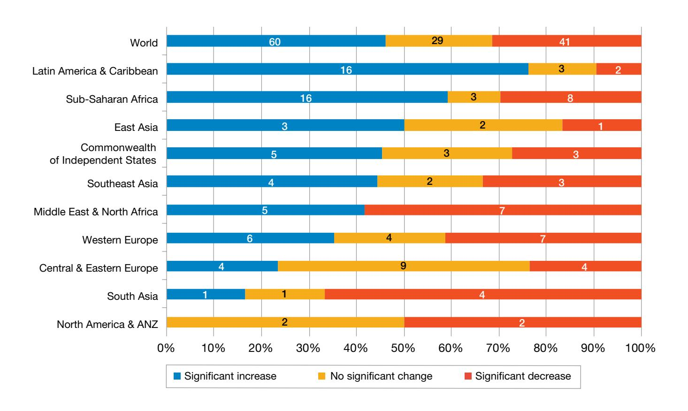

0 1 2 3 4 5 6 7 8 9 10 Norway (+0.263) Palestinian Territories (+0.267) Chad (+0.268) Israel (+0.293) Switzerland (+0.303) El Salvador (+0.313) Cameroon (+0.320) Indonesia (+0.329) Bangladesh (+0.331) Colombia (+0.334) Russia (+0.346) Uganda (+0.347) Burkina Faso (+0.349) Bolivia (+0.357) Latvia (+0.358) Argentina (+0.369) Brazil (+0.371) Kyrgyzstan (+0.372) Uzbekistan (+0.390) United Arab Emirates (+0.410) Kuwait (+0.440) Nigeria (+0.448) Liberia (+0.495) Georgia (+0.496) Ethiopia (+0.497) Thailand (+0.527) Mexico (+0.535) Haiti (+0.587) Zambia (+0.592) Uruguay (+0.615) Panama (+0.633) Trinidad and Tobago (+0.687) Slovakia (+0.705) Chile (+0.708) Sierra Leone (+0.712) South Korea (+0.728) Peru (+0.763) Paraguay (+0.777) Nicaragua (+0.800) Moldova (+0.852) Ecuador (+0.855) Albania (+0.915) Zimbabwe (+1.273) Angola (+1.438) **Figure 2.6: Comparing Happiness: 2005–07 and 2010–12 (Part 1)** 

2010–12 2005–07

**Figure 2.6: Comparing Happiness: 2005–07 and 2010–12 (Part 2)** 

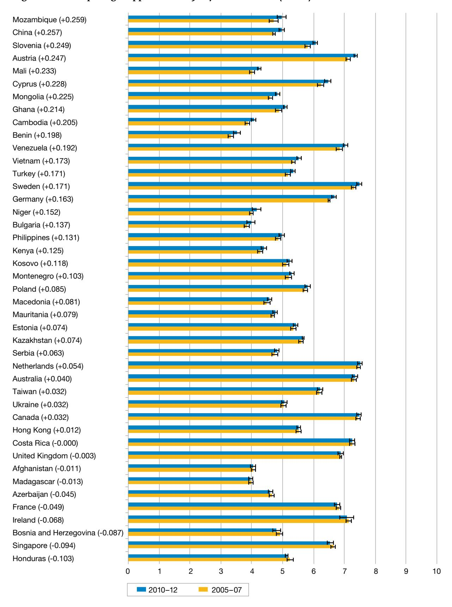

Figure 2.6: Comparing Happiness: 2005-07 and 2010-12 (Part 3) **Figure 2.6: Comparing Happiness: 2005–07 and 2010–12 (Part 3)** 

**Figure 2.7.1: Population-Weighted GDP Per Capita by Regions: 2005–07 and 2010–12**

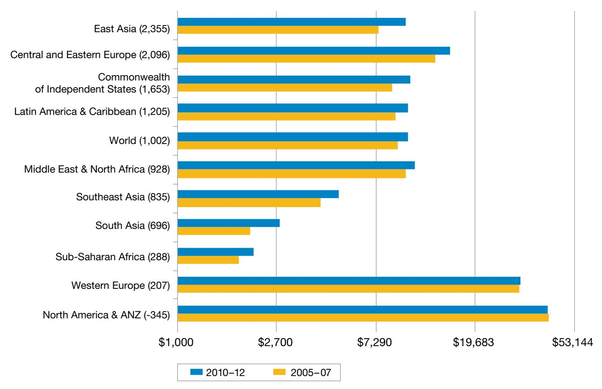

**Figure 2.7.2: Social Support by Regions: 2005–07 and 2010–12** 

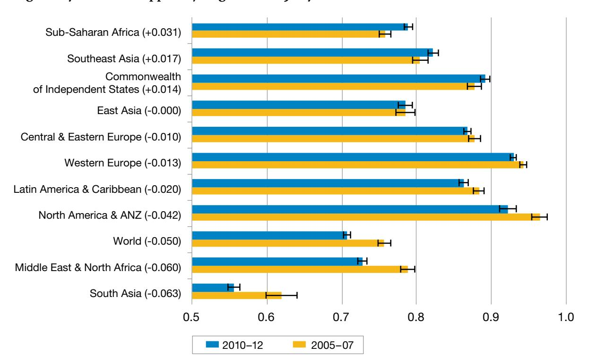

**Figure 2.7.3: Perceptions of Corruption by Regions: 2005–07 and 2010–12** 

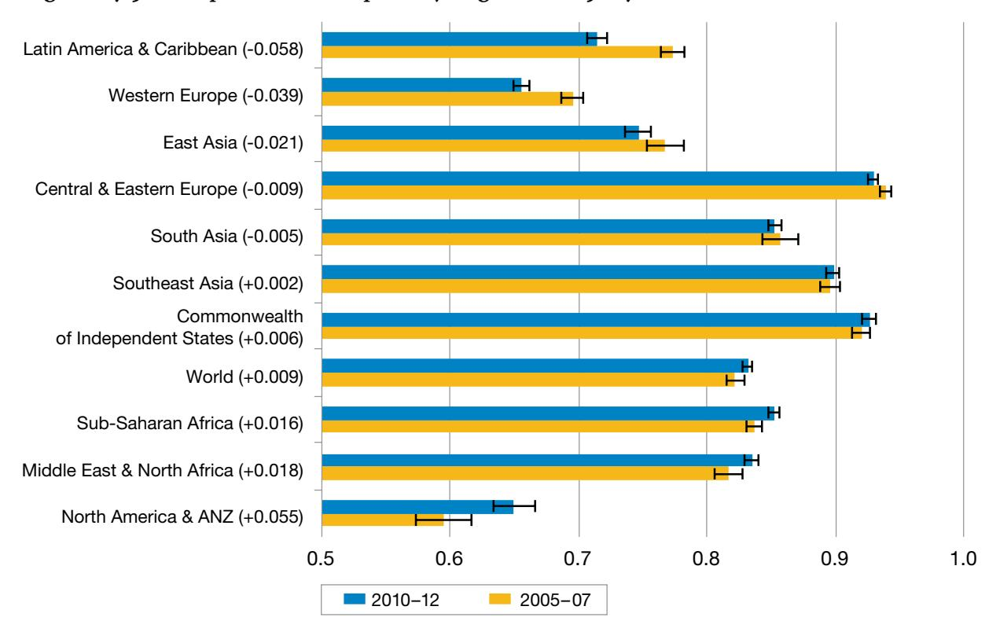

**Figure 2.7.4: Prevalence of Donations by Regions: 2005–07 and 2010–12** 

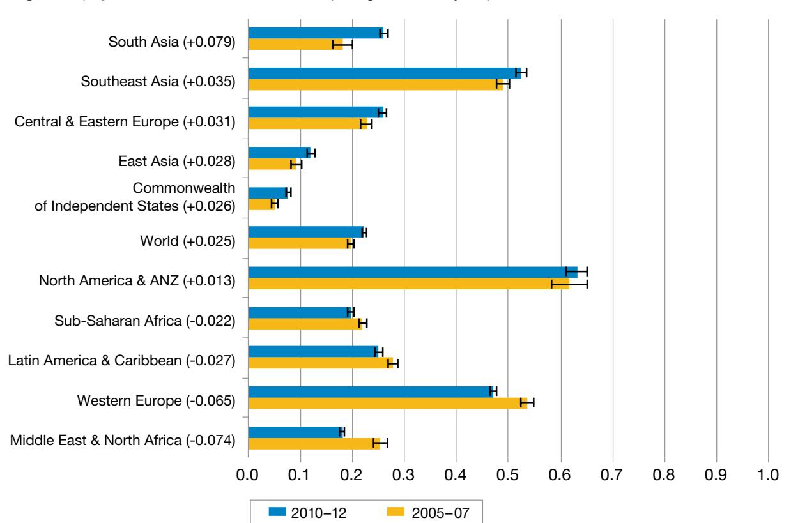

**Figure 2.7.5: Life-Choice Freedom by Regions: 2005–07 and 2010–12** 

**Figure 2.8: Comparing Gini of Happiness: 2005–07 and 2010–12** 

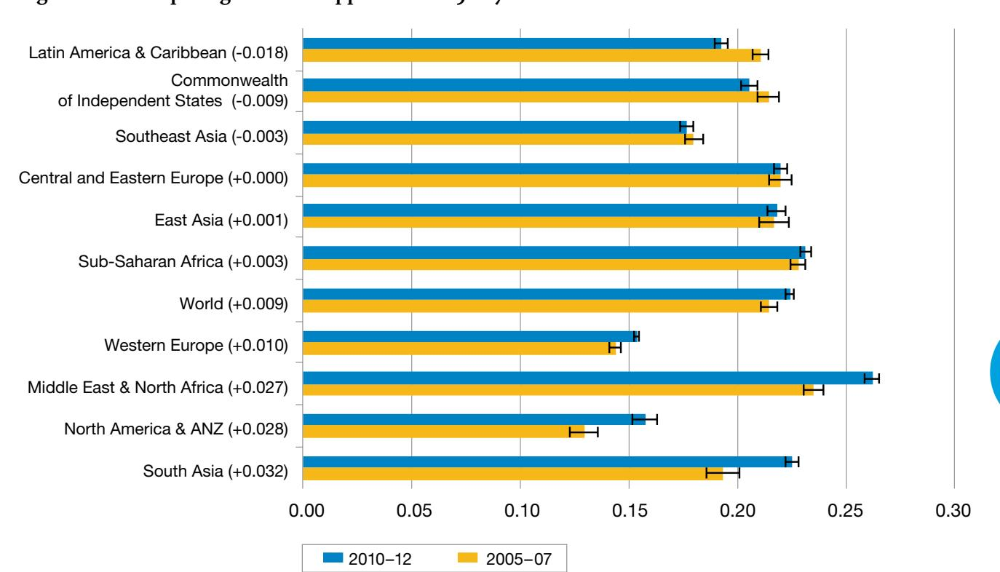

## Appendix

**Table A1: Imputation of Missing Values for Figure 2.3**

| Country                    | GDP per capita                            | Social support         | Perceptions of corruption            | Generosity                              | Freedom   | Healthy life expectancy |
|----------------------------|-------------------------------------------|------------------------|-----------------------------------------|-----------------------------------------|-----------|----------------------------|
| Myanmar                    | PPP US dollar in 2011 from IMF      |                        | Corruption in business in 2012       | Predicted by "donation a-b*ln(gdp)"1 |           |                            |
| Iran                       | 2009 data                                 |                        | 2008 data                               | Predicted by "donation a-b*ln(gdp)"  | 2008 data |                            |
| Palestinian Territories | 2004 data from Washington Institute |                        |                                         | Predicted by "donation a-b*ln(gdp)"  |           |                            |
| Somaliland Region       | Ethiopia's data                           |                        |                                         | Predicted by "donation a-b*ln(gdp)"  |           | Ethiopia's data         |
| Kosovo                     | Bosnia and Herzegovina's data       |                        |                                         | Predicted by "donation a-b*ln(gdp)"  |           |                            |
| North Cyprus               | Cyprus's data                             |                        |                                         | Predicted by "donation a-b*ln(gdp)"  |           | Cyprus's data           |
| Sudan                      |                                           |                        | 2008 data                               |                                         |           |                            |
| Ethiopia                   |                                           |                        | Kenya's data                            |                                         |           |                            |
| Bahrain                    |                                           |                        | 2009 data                               |                                         |           |                            |
| Jordan                     |                                           |                        | 2009 data                               |                                         |           |                            |
| Uzbekistan                 |                                           |                        | 2006 data                               |                                         |           |                            |
| Turkmenistan               |                                           |                        | Uzbekistan's data                       |                                         |           |                            |
| Kuwait                     |                                           |                        | Corruption in business in 2010-11 |                                         |           |                            |
| Saudi Arabia               |                                           |                        | 2009 data                               |                                         |           |                            |
| Qatar                      |                                           |                        | 2009 data                               |                                         |           |                            |
| Oman                       |                                           | Saudi Arabia's data | Saudi Arabia's data                  |                                         |           |                            |
| United Arab Emirates    |                                           |                        | Corruption in business in 2010       |                                         |           |                            |

1 The coefficients *a* and *b* are generated by regressing national-level donations on GDP per capita in a pooled OLS regression.

34

- I Our biggest debt of gratitude is to the Gallup Organization for complete and timely access to the data from all years of the Gallup World Poll. We are also grateful for continued helpful advice from Gale Muller and his team at Gallup, and for invaluable research support from the Canadian Institute for Advanced Research (CIFAR) and the Korea Development Institute (KDI) School of Public Policy and Management. Jerry Lee has provided fast and efficient research assistance, especially in the section relating to happiness changes in the Eurozone countries. Kind advice on chapter drafts has been provided by Chris Barrington-Leigh, Angus Deaton, Martine Durand, Richard Easterlin, Carol Graham, Jon Hall, Richard Layard, Daniel Kahneman, Conal Smith, and Arthur Stone.
- 2 See Helliwell, Layard & Sachs, eds. (2012).
- The detailed definitions of the variables are found in the notes to Table 2.1. The equations shown in Table 2.1 use pooled estimation from a panel of annual observations for each country, and thus explain differences over time and among countries. If a pure cross-section is run using the 115 countries for which 2012 data are available, the equation explains 75.5% of the international variance, similar to what is found using the larger sample of Table 2.1.
- 4 See OECD (2013).
- 5 See Cantril (1965).
- 6 See World Happiness Report (Helliwell, Layard & Sachs, eds. 2012, pp. 14-15). The result is shown by triangulation, since no surveys asks all three questions. We were first able to show the explanatory equivalence of SWL and the Cantril ladder using Gallup World Poll data. The triangle was completed using ESS data to show the same thing for SWL and happiness with life as a whole. The fact that ESS equations were even tighter using the average of SWL and happiness with life as a whole, than using either variable on its own, led us to recommend (Helliwell, Layard and Sachs 2012, p. 94) the inclusion of both questions in national surveys.
- 7 See, for example, Krueger et al. (2009). Measures of affect are also more useful in laboratory experiments, since these are generally expected to show only ephemeral effects, of a sort not likely to be revealed by life evaluations.
- 8 For the 606 country-years where there are observations for the HDI, ladder, and affect measures, there are significant positive correlations between the HDI and the Cantril ladder (+0.76), positive affect (+0.28), and happiness yesterday (+0.24). Thus the linkage with the HDI is three times as strong for the life evaluation as for positive emotions. The

- link is even weaker for negative affect, where the correlation with the HDI is anomalously positive but insignificant (+0.06).
- 9 The horizontal line at the right-hand end of each bar shows the estimated 95% confidence intervals. Bootstrapped standard errors (500 bootstrap replications) are used to construct the confidence intervals.
- The sixth variable used in Table 2.I, healthy life expectancy, is only available at the national level, so that all of its variance is among rather than within countries. Figure 2.I is based on the household income levels submitted by each Gallup respondent, made internationally comparable by the use of purchasing power parities. The income variable we use in Table 2.I is GDP per capita at the national level.
- This result holds for the individual emotions as well as their averages. If the base equation of Table 2.1 is fitted separately to each of the positive emotions, the proportion of variance explained ranges from 0.38 for enjoyment to 0.48 for happiness, while for the negative emotions the share ranges from 0.17 for worry to 0.21 for anger. Since the patterns of coefficients are broadly similar, the aggregation into measures of positive and negative affect produces equations that are generally tighter–fitting than for the individual emotions.
- 12 Using a large sample of individual-level observations for the Cantril ladder and positive affect from the Gallup Healthways US survey, Kahneman & Deaton (2010) also find much higher and more sustained income effects for the ladder than for positive affect.
- The regional groupings are the same as those used by the Gallup World Poll, except that we have split the European countries into two groups, one for Western Europe and the other for Central and Eastern Europe. The online appendix shows the allocation of countries among the 10 regions.
- 14 In most countries the sampling frame includes all those resident aged 14+ in the country, except for isolated or conflict-ridden parts of a few countries. In six Arab countries (Bahrain, Kuwait, Oman, Qatar, Saudi Arabia and the United Arab Emirates) the sample is restricted to nationals and Arab expatriates. The sampling details and extent of current exclusions are reported in Gallup (2013). The population weight used here is the adult (14+) in each country in 2011. The population data are drawn from World Development Indicators (WDI) except in the case of Taiwan, for which data are taken from its Department of Statistics of Ministry of the Interior (http://www.moi.gov. tw/stat/english/index.asp).

- 15 From the actual average data in each country, we can find the lowest value for each of the variables, and then calculate happiness in Distopia as the constant term of the equation plus each coefficient times the lowest observed average country's value for the six key variables in 2010-12.
- 16 This unexplained component is the country's average error term, for 2010-12, in the equation of Table 2.1.
- 17 There are 11 possible answers over the 10-point range of the scale, with 0 for the worst possible life and 10 for the best possible life. The 0.8 is calculated as follows: 0.80=0.283\*2.82, where 0.283 is the income coefficient from Table 2.1 and 2.82 is the difference of log incomes between the richest and poorest of the 10 regions. These are, respectively, the artificial region comprising the United States, Canada, Australia and New Zealand (NANZ) and Sub-Saharan Africa.
- 18 0.86=2.32\*(0.93-0.56), where 0.93 and 0.56 are the average shares of respondents who have someone to count on in Western Europe and South Asia, respectively.
- 19 0.20=0.713\*(0.35-0.07), where 0.35 and 0.07 are the average values for perceived absence of corruption in NANZ and Central & Eastern Europe, respectively.
- 20 0.66=0.023\*(72.56-43.76), where 72.56 and 43.76 are the average life expectancies in Western Europe and Sub-Saharan Africa.
- 21 0.46=0.86\*(0.28-(-0.25)), where 0.28 and -0.25 are the average generosity values (adjusted for income levels) in the most (Southeast Asia) and least (MENA) generous regions.
- 22 0.26=0.90\*(0.85-0.56), where 0.85 and 0.56 are the average freedom values in the most (NANZ) and least (MENA) free regions.
- 23 The issues and evidence are surveyed by Oishi (2010).
- 24 Higher positive affect, and greater sociability (beyond that captured by the social support variable) are advanced as possible sources of the Latin American boost, with question response styles an identified contributor to the East Asian effect. The positive effect for Latin America is also found by Inglehart (2010) using the World Values Survey data for a smaller number of countries. The negative difference for East Asians becomes larger if it is compared to respondents in North America, mirroring earlier studies suggesting that East Asian respondents report lower subjective well-being, and are less likely to give answers at the top of the scale, than are similarly-aged and situated respondents

- in the United States, with Asian immigrants to the United States falling in between. See Heine & Hamamura (2007).
- 25 There are some missing values for GDP per capita, healthy life expectancy at birth, social support, freedom to make life choices, generosity, and corruption in some countries. To generate the decomposition for each country, we impute the 2010-12 average values for the missing data. Table A1 in the Appendix show the imputation details.
- 26 There were no surveys in either 2010 or 2011 in Iceland, Switzerland, and Norway. To increase the data coverage and therefore the robustness of estimation of national averages representing the 2010-12 period, we combine data from 2008 and 2012 for Norway and Iceland, and data from 2009 and 2012 for Switzerland.
- 27 There is a zero correlation between the log of national population and average ladder scores, but if the log of population is added to the equation of Table 2.1, it takes the coefficient +0.075 (t=2.7). A similar coefficient, +0.071 (t=4.9), is obtained if the residuals from the Table 2.1 equation are regressed on the log of population.
- 28 The increase for East Asia is almost exactly the same as that for China, which has a dominant population share (86% in 2011) in the region. The increase in China matches that found in several other surveys over the 2005-10 period, as documented by Easterlin et al. (2012).
- 29 For the 21 countries, the population-weighted average increase was 0.435 points, on a 2005-07 average ladder score of 6.22.
- 30 For the 27 countries, the average increase was 0.241 points, or 5.5% of the 2005-07 average ladder score of 4.385.
- 31 South Korea's exceptional post-crisis performance, in both macroeconomic and happiness measures, is discussed in more detail in Helliwell, Huang & Wang (2013).
- 32 The units for GDP per capita on the horizontal axis are on a natural logarithmic scale.
- 33 See Helliwell, Huang & Wang (2013).
- 34 There are some slight differences among the four countries in survey coverage, and hence the comparability of the changes, at least with respect to Portugal. All four countries had surveys in each of 2010, 2011 and 2012, so no problems arise there. But for the starting points, they are based on the average of 2005 and 2007 surveys in each of Greece, Spain and Italy, but on a single survey, in 2006, in Portugal.

- 35 The losses are almost as large even when set against the rankings of the same countries in the first *World Happiness Report*. That report included all years from 2005 through 2010 and into 2011, and hence included at least the start of the Eurozone crisis. The four countries had an average Cantril ladder ranking of 41st in Figure 2.3 of that report, compared to 59th in Figure 2.3 of this report, which is based on surveys carried out during 2010-12.
- 36 This is an appropriate empirical strategy, in the current case, because all of the four countries under the microscope are members of the OECD.
- 37 For the 176 OECD observations, the unemployment rate explains 7.8% of the remaining variance, with a coefficient of 0.033 (t=3.8).
- 38 See especially the updated version of Helliwell & Huang (2011).
- 39 Di Tella et al. (2001, 2003) use Eurobarometer data with a four-point scale, making direct comparisons difficult. However, we get an approximate comparison by comparing the ratios of the country-level and individual-level unemployment coefficients in two-level estimation. These comparisons suggest a national unemployment rate effect about twice as large as that we employ.
- 40 Ruprah & Luengas (2011), using Latino-barometer data with the same scaling as the Eurobarometer results, find the same effect of aggregate unemployment as do Di Tella et al (2001), but a smaller effect of individual unemployment.
- 41 In Greece, average positive affect fell from 0.71 to 0.60, while negative affect grew from 0.24 to 0.32. In Spain, positive affect fell from 0.77 to 0.71, and negative affect grew from 0.25 to 0.35. In proportionate terms, or in terms of hypothetical shifts in country rankings, these are as large as the changes in life evaluations.
- 42 In Italy, positive affect fell from 0.70 to 0.64, while negative affect was unchanged. In Portugal, which had the smallest drops in life evaluations among the four countries, there were no significant changes in affect, with positive affect slightly up and negative affect slightly down.
- 43 Desmukh (2009) shows that the 2004 tsunami caused roughly the same physical damage and loss of life in Aceh (Indonesia) and in Jaffna (Sri Lanka), but had much better well-being outcomes in the Indonesian case. In Aceh, the physical disaster helped to deliver a "peace dividend" while the effect was the reverse in Sri Lanka. Helliwell et al. (2013) use evidence from a variety of sources to show the likely well-being benefits of social capital in times of crisis.

- 44 Although Italy was in the first two rounds of the ESS, it is missing from rounds three to five, covering 2006-10. Thus our comparisons here using ESS data are among Greece, Portugal and Spain.
- 45 See Helliwell & Wang (2011).
- 46 See, for example, OECD (2008, 2011) and Wilkinson & Pickett (2009).
- 47 See, for examples, Alesina et al. (2004), Diener & Oishi (2003), Graham & Felton (2006), Oishi et al. (2011), Schwarze & Härpfer (2007) and Van Praag & Ferreri-Carbonell (2009).
- 48 Bootstrapped standard errors (500 bootstrap replications) are used to construct the confidence intervals.

## References

Alesina, A., Di Tella, R.D., & MacCulloch, R.J. (2004). Inequality and happiness: Are Europeans and Americans different? *Journal of Public Economics, 88*, 2009-2042.

Cantril, H. (1965). *The pattern of human concerns* (Vol. 4). New Brunswick, NJ: Rutgers University Press.

Deshmukh, Y. (2009). The "hikmah" of peace and the PWI. Impact of natural disasters on the QOL in conflict-prone areas: A study of the tsunami-hit transitional societies of Aceh (Indonesia) and Jaffna (Sri Lanka). Florence, ISQOLS World Congress, July 2009.

Diener, E., & Oishi, S. (2003). Money and happiness: Income and subjective well-being across nations. In E. Diener & E.M. Suh (Eds.), *Culture and subjective well-being* (pp. 185-218). Cambridge & London: The MIT Press.

Di Tella, R.D., MacCulloch, R.J., & Oswald, A.J. (2001). Preferences over inflation and unemployment: Evidence from surveys of happiness. *American Economic Review*, *91*(1), 335-41.

Di Tella, R. D., MacCulloch, R. J., & Oswald, A. J. (2003). The macroeconomics of happiness. *Review of Economics and Statistics*, *85*(4), 809-827.

Easterlin, R. A., Morgan, R., Switek, M., & Wang, F. (2012). China's life satisfaction, 1990–2010. *Proceedings of the National Academy of Sciences*, *109*(25), 9775-9780.

Gallup (2013, March). *Country data set details*. Retrieved from http://www.gallup.com/strategicconsulting/128171/Country-Data-Set-Details-May-2010.aspx

Graham, C., & Felton, G. (2006). Inequality and happiness: Insights from Latin America. *Journal of Economic Inequality, 4*(1), 107-122.

Helliwell, J. F., & Huang, H. (2011). New measures of the costs of unemployment: Evidence from the subjective well-being of 2.3 million Americans. *NBER Working Paper No. 16829*, Cambridge: National Bureau of Economic Research. Retrieved from http://www.nber.org/papers/w16829

Helliwell, J. F., Layard, R., & Sachs, J. (Eds.). (2012). *World happiness report*. New York: Earth Institute.

Helliwell, J. F., Huang, H., & Wang, S. (2013). Social capital and well-being in times of crisis. *Journal of Happiness Studies*. doi: 10.1007/s10902-013-9441-z.

Helliwell, J. F. & Wang, S. (2011).Trust and well-being.*International Journal of Wellbeing, 1*(1), 42-78. Retrieved from www.internationaljournalofwellbeing.org/index.php/ijow/article/view/3/85

Inglehart, R. (2010). Faith and freedom: Traditional and modern ways to happiness. In E. Diener, J.F. Helliwell & D. Kahneman (Eds.), *International differences in well-being* (pp. 351-397). New York: Oxford University Press.

Kahneman, D., & Deaton, A. (2010). High income improves evaluation of life but not emotional well-being. *Proceedings of the National Academy of Sciences, 107*(38), 16489-16493. doi: 10.1073/pnas.1011492107.

Knight, J., & Gunatilaka, R. (2010). The rural–urban divide in China: Income but not happiness? *Journal of Development Studies*, *46*(3), 506-534.

Krueger, A. B., Kahneman, D., Schkade, D., Schwarz, N., & Stone, A. A. (2009). National time accounting: The currency of life. In A.B. Krueger (Ed.), *Measuring the subjective well-being of nations: National account s of time use and well-being* (pp. 9-86). Cambridge: National Bureau of Economic Research. Retrieved from http://www.nber.org/chapters/c5053.pdf

OECD. (2008). *Growing unequal? Income distribution and poverty in OECD countries.* Paris: OECD.

OECD. (2011). *Divided we stand: Why inequality keeps rising.*  Paris: OECD. doi:10.1787/9789264119536-en.

OECD. (2013). *OECD guidelines on measuring subjective well-being*. Paris: OECD Publishing. Retrieved from http:// www.oecd.org/statistics/Guidelines on Measuring Subjective Well-being.pdf.

Oishi, S. (2010). Culture and well-being. In E. Diener, J. F. Helliwell, & D. Kahneman (Eds.), *International differences in well-being* (pp. 34-69). New York: Oxford University Press.

Oishi, S., Kesebir, S., & Diener, E. (2011). Income inequality and happiness. *Psychological Science*, *22*(9), 1095-1100.

Ruprah, I. J., & Luengas, P. (2011). Monetary policy and happiness: Preferences over inflation and unemployment in Latin America. *Journal of Socio-Economics*, *40*(1), 59-66.

Schwarze, J., & Härpfer, M. (2007). Are people inequality averse, and do they prefer redistribution by the state? Evidence from German longitudinal data on life satisfaction. *Journal of Socio-Economics*, *36*(2), 233-249.

Van Praag, B., & Ferrer-i-Carbonell, A. (2009). Inequality and happiness. In W. Salverda, B. Nolan, & T. Smeeding (Eds.), *The oxford handbook of economic inequality.* Oxford: Oxford University Press.

## MENTAL ILLNESS AND UNHAPPINESS

RICHARD LAYARD, DAN CHISHOLM, VIKRAM PATEL AND SHEKHAR SAXENA

**Richard Layard :** Director, Well-Being Programme, Centre for Economic Performance, London School of Economics

**Dan Chisholm:** Department of Mental Health and Substance Abuse, World Health Organization, Geneva, Switzerland

**Vikram Patel:** Professor of International Mental Health and Wellcome Trust Senior Research Fellow in Clinical Science, Centre for Global Mental Health, London School of Hygiene and Tropical Medicine; Sangath, India; and the Centre for Mental Health, Public Health Foundation of India

**Shekhar Saxena:** Department of Mental Health and Substance Abuse, World Health Organization, Geneva, Switzerland

*Richard Layard is extremely grateful to the U.S. National Institute of Aging (R01AG040640) for financial support and to Sarah Flèche and Harriet Ogborn for support in preparing this paper. Vikram Patel is supported by a Senior Fellowship from the Wellcome Trust, as well as grants from NIMH and DFID. Dr. Chisholm and Dr. Saxena are employees of the World Health Organization (WHO). The authors alone are responsible for the views expressed in this publication and they do not necessarily represent the decisions, policy, or views of the WHO.*

Mental illness is one of the main causes of unhappiness. This is not a tautology. For, as the first *World Happiness Report* showed,1 people can be unhappy for many reasons — from poverty to unemployment to family breakdown to physical illness. But in any particular society, chronic mental illness is a highly influential cause of misery.

By far the most common forms of mental illness are depression and anxiety disorders, so we particularly concentrate on these in this chapter. We develop the following key points:

- 1. Mental illness is a highly influential and in the countries we have assessed, the single biggest determinant of misery (see Table 3.1).
- 2. Prevalence varies between countries, but these conditions affect about 10% of the world's population at any one time.
- 3. Worldwide, depression and anxiety disorders account for up to a fifth of all disability. This involves massive costs in lost output as well as increased physical illness.
- 4. Even in rich countries, less than a third of people who suffer from mental illness are in receipt of treatment and care; in lower-resource settings, the situation is considerably worse. This is serious discrimination; it is also unsound economics.
- 5. Cost-effective treatments exist. For depression and anxiety disorders, evidence-based treatments can have low or zero net cost. They can and should be made far more universally available.
- 6. Schools and workplaces need to be much more mental health-conscious, and directed to the improvement of happiness, if we are to prevent mental illness and promote mental health.

## Mental Illness As a Key Determinant of Unhappiness

Mental health or psychological well-being makes up an integral part of an individual's capacity to lead a fulfilling life, including the ability to study, work or pursue leisure interests, and to make day-to-day personal or household decisions about educational, employment, housing or other choices. The importance of good mental health to individual functioning and well-being can be amply demonstrated by reference to values that sit at the very heart of the human condition:

- t *Pleasure, happiness and life satisfaction*: There is a long-standing and widely accepted proposition that happiness represents the ultimate goal in life and the truest measure of well-being. It is hard if not impossible to flourish and feel fulfilled in life when individuals are beset by health problems such as depression and anxiety.
- t *Family relations, friendship and social interaction*: Individuals' self-identity and capacity to flourish are deeply influenced by their social surroundings, including the opportunity to form relationships and engage with those around them (family members, friends, colleagues). Difficulties in communication as well as loneliness and social isolation are well-documented concomitant consequences of mental illness.
- t *Independent thought and action:* The capacity of individuals to manage their thoughts, feelings and behavior, as well as their interactions with others, is a pivotal element of the human condition. Health states or conditions that rob individuals of independent thought and action — such as acute psychosis or profound intellectual disability — are regarded as among the most severely disabling. In the most recent Global Burden of Disease study, for example, acute schizophrenia has the highest disability weight out of 220 health state valuations made (0.76, where 0 equals no disability and 1 equals complete disability).2

It is in the interest of individuals, communities and countries to nurture and uphold these core human attributes.

**Table 3.1: How mental health affects misery**3 (Standardized β-statistics)

|                             | Britain | Germany | Australia |
|-----------------------------|---------|---------|-----------|
| Mental health problems   | 0.46*   | 0.26*   | 0.28*     |
| Physical health problems | 0.08*   | 0.16*   | 0.08*     |
| Log Income per head      | -0.05*  | -0.12*  | -0.04*    |
| Unemployed                  | 0.02*   | 0.04*   | 0.05*     |
| Age                         | -0.10*  | -0.07*  | -0.13*    |
| Married                     | -0.11*  | -0.06*  | -0.10*    |
| Female                      | -0.04*  | -0.04*  | -0.04*    |
| Time, Region Dummies     | 9       | 9       | 9         |
| N                           | 71,769  | 76,409  | 73,812    |

\* p<0.01

## Misery

We can see the crucial role of mental health by asking: what are the most important determinants of misery? It is now possible to address this question because in many countries representative samples of the population are now asked how satisfied they are with their lives. In the following analysis we define misery as being in the bottom quarter of the population in terms of life satisfaction. We then attempt to explain which members of the population over 25 are in misery (on that definition) and which are not.

As the table shows, mental health problems represent the most important explanatory variable. They are more important than physical illness, which in turn is more important than income or unemployment.4 These priorities differ markedly from those followed

by most politicians, largely because stigma inhibits the public expression of the demand for better treatment for mental illness.

So how can we improve the mental health of the adult population? There are two main strategies. One is to provide better healthcare and social support for adults who are mentally ill. But a second is to intervene earlier, since half of adults who are mentally ill experienced the onset of their mental health problems by the age of 15.**5**

To see the importance of early mental health intervention, we can look at a cohort of people born in one particular year and see what features of their childhood development best predict their life satisfaction as adults. Here we focus on the British cohort born in 1970, for whom we have detailed measurements of their development as children at ages 5, 10 and 16 along three dimensions: emotional, behavioral, and intellectual. We also have a wealth of information about their family background economic, social and psychological.

Holding constant these family background variables, Figure 3.1 shows the contribution of the child's development to her resulting life satisfaction as an adult.**6**It is the emotional development of the child that turns out to be much the most important factor. Next comes the child's behavior — another dimension of the child's mental health, and after that the child's intellectual development. If you are interested in well-being, intellectual development needs to be balanced by much more interest in emotional and social development. Similarly when we turn to the effect of family background, the most powerful factor (in this and other studies) is the mother's emotional health.**7**

All these facts underline the key importance of mental health services at every age, but particularly in the formative stages of life when the key attributes of emotional health are at their most crucial stage of development. It is vital to have good child (as well as adult) mental health services —both to improve the quality of life of children

and to stop mental illness that would otherwise continue into adult life. So how common are mental health problems?

## The Prevalence of Mental Illness Worldwide

Mental disorders are a common occurrence in all regions and cultures of the world. For many years, a persistently held belief was that these disorders were the preserve of rich countries; epidemiological studies over the last generation have manifestly shown this not to be the case. In fact, by dint of population size, the large majority of persons with a mental disorder reside in low- and middle-income countries of the world. The prevalence of these conditions is dominated by the so-called "common mental disorders" of depression and anxiety, and they are indeed highly prevalent – between them they occur at any one time in nearly one in 10 persons on the planet (676 million cases; see Table 3.2 for some overall global estimates).8 In childhood and adolescence, behavioral disorders constitute the most common problems, accounting for a further 85 million cases.

Prevalence rates differ between countries but not greatly between groups of countries (when grouped by income level). For example, the World Health Survey found the following point estimates for depression among adults:9 high-income countries 7.1%, upper middle-income 7.6%, lower middleincome 6.4% and low-income 6.0%. Such estimates of course mask variations with respect to age and sex. The prevalence of depression among women, for example, is substantially higher than among men.11

By weighting the time that individuals spend in these different health states by their estimated level of disability, one can get a better sense of the relative contribution that these disorders make to the overall burden of disease in a population. Figure 3.2 shows that, across different regions of the world, depression and anxiety disorders alone account for 10-18% of *all* years lived with disability in those populations. The disability burden is highest in adolescence and young adulthood (20% among 15-19 year olds), falling steadily to 10% by the age of 60-64 years (see Figure 3.3).

Research is only now beginning on what factors explain the observed variation in mental illness among countries. It is sufficient here to record that there is some relation at the country level between the scale of mental illness and the level of national happiness.12

**Figure 3.1: What are the main childhood influences on adult life satisfaction? (Britain)**10 (Partial correlation coefficients)

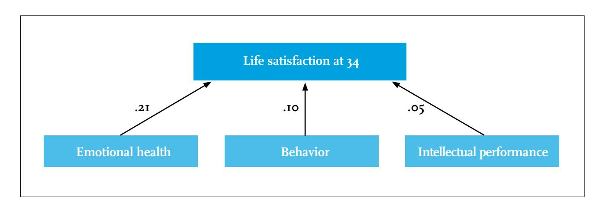

**Table 3.2: Global estimates of the prevalence of common mental disorders**13

|                                                            | Percent of the world's population | Total number of cases in the world |
|------------------------------------------------------------|--------------------------------------|---------------------------------------|
| Depression (incl dysthymia)                                | 6.8                                  | 404 million                           |
| Anxiety disorders                                          | 4.0                                  | 272 million                           |
| Childhood behavioral disorders (ADHD, conduct disorder) | 1.2                                  | 85 million                            |

**Figure 3.2: Percent of total years lived with disability (YLD) due to depression and anxiety disorders, by world sub-region**14

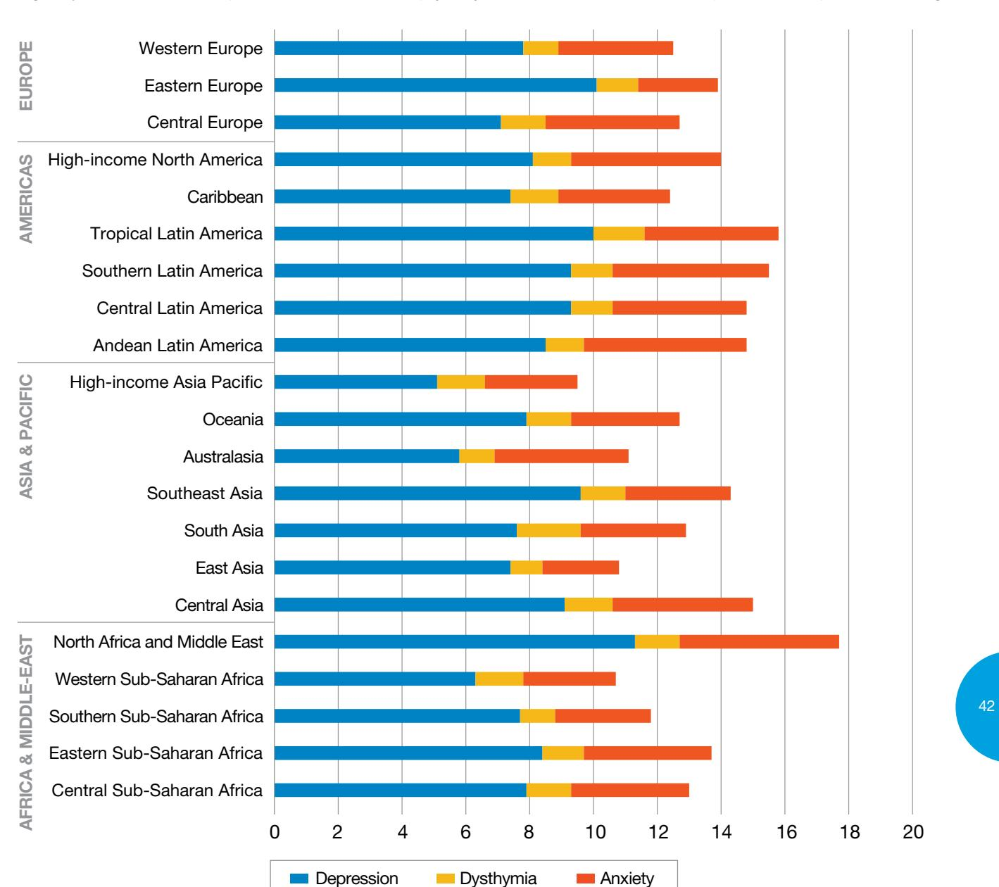

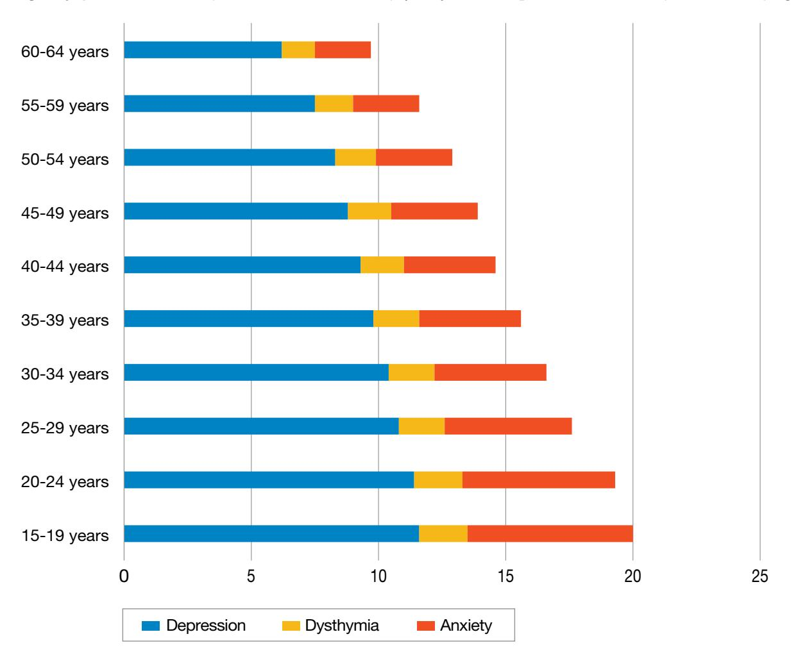

**Figure 3.4: Percent of total years lived with disability (YLD) due to depression and anxiety disorders, by age group**15

## The Under-Treatment of Mental Illness

A key contributing factor to the burden of mental disorders is the lack of appropriate care and treatment for those in need. This difference between identified need and actual service provision has been referred to as the "treatment gap." Making use of community-based psychiatric epidemiology studies that included data on the percentage of individuals receiving care, the median treatment gap for schizophrenia has been estimated at 32%, but for all other conditions — including bipolar disorder, depression, dysthymia, anxiety disorders and alcohol dependence — it well exceeded 50%.16

Again, global estimates mask important variations between different geographical or income settings, as well as different conditions and severity levels. Figure 3.4 reinforces this point by revealing just how very low service uptake rates are for mental and substance use disorders in most low- and middle-income countries, even when the degree of disability or health loss is severe: only 10-30% of severe cases were in contact with services over the previous year in low- and middle-income countries, compared to (a still inadequate) 25-60% in high-income countries.17

**Figure 3.4: Rate of service use for anxiety, mood and substance use disorders**18

Treatment rate over past year (%)

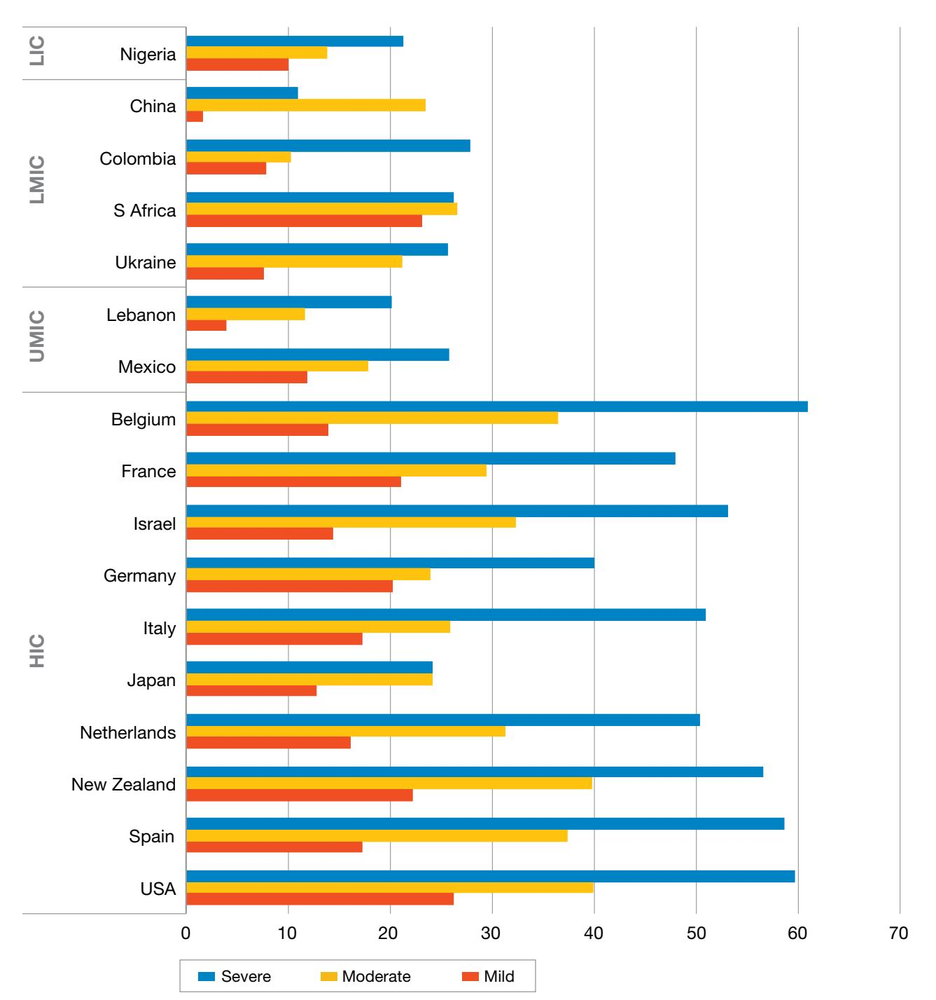

## The Cost of Mental Illness

The low rate of treatment of mental compared with physical illness is a case of extreme discrimination. It also makes no sense because:

- tuntreated mental illness exerts huge costs on society, and
- tgood treatments exist, which are not expensive.

We look first at the social costs of mental illness.

### **Loss of output and employment**

The most obvious of these are the loss of output that results when people cannot work. In OECD countries employment would be 4% higher if people who are mentally ill worked as much as the rest of the population.19 And, even if they are in work, people who are mentally ill are more likely to go off sick. If they were no more absent than other workers, hours worked would rise by 1%. On top of this, people experiencing mental health problems perform below par when they are at work. This "presenteeism" reduces output by at least another 1%. Thus if we add all these factors together OECD output is reduced by up to 6% by mental illness. Estimates are not available for other countries.

From a public policy point of view, however, governments may be less worried about the cost to the economy than about the cost to the public finances. These can be very substantial. In highincome countries, those who cannot work get disability benefits, and they also pay much less in tax than they otherwise would. In most high-income countries, mental illness accounts for at least a third of those on disability benefits — and more if psychosomatic conditions are included. Finance ministries in high-income countries are typically losing at least 1.5% of Gross Domestic Product (GDP) in disability benefits and lost taxes due to mental illness.

#### **Physical healthcare**

Mental illness also has a huge effect on physical health, and thus on the need for physical healthcare. Broadly speaking, compared with other people of the same age, people who are mentally ill are 50% more likely to die.20 For people who have been admitted to the hospital for mental health reasons, the difference in life expectancy is some 15-20 years.21

Moreover, if people with depression or anxiety disorders have a given physical condition, they are likely to receive 50% more healthcare than other patients who have similar physical conditions.22 In advanced countries these extra healthcare costs may amount to at least 1% of GDP.

#### **Mental healthcare**

So there are significant costs of mental illness, in terms of lost production and extra physical healthcare. If we also add in the cost of child mental illness, we have further major costs to include in terms of crime, social care and educational underachievement.

The main objective of mental healthcare is to raise the quality of life of patients and their families. But the case is stronger still when we take into account the costs to society and to the government.

So finally, how much do countries spend on mental healthcare? No government spends more than 15% of its health budget on mental healthcare,23 and even there (England and Wales) this amounts to only 1% of GDP. Other countries spend much less —see Figure 3.5. The underspend is particularly large in low-income countries.

When we consider the huge impact of mental health on life satisfaction, these figures are disproportionately low when compared with other items of government expenditure. But that judgment depends of course on the fact that costeffective treatments exist that could be made much more widely available.

0 1 2 3 4 5 6 Low-income Lower middle Upper middle High-income 0 0.1 0.2 0.3 0.4 0.5 0.6 Low-income Lower middle Upper middle High-income **As Percent of Health Spending As Percent of GDP**

**Figure 3.5: Mental health spending in different types of countries**24

## Evidence-based Treatments

Until the 1950s there was little that could be done for people with mental health problems other than to provide kind, compassionate care. But from the 1950s onwards new drugs were discovered that can help with depression and anxiety disorders, bipolar disorder and psychotic disorders. Then from the 1970s onwards new forms of evidence-based psychological therapy were developed, especially cognitive behavioral therapy (CBT), which have been subjected to the same rigorous testing as drugs. Let us begin with treatments for the most common mental health problems: depression and anxiety disorders.

#### **Adult mental health**

For major depression, drugs lead to recovery within four months in over 50% of cases. But rates of relapse remain high unless drugs continue to be taken. Psychological therapy such as CBT for up to 16 sessions produces similar recovery rates, but these are followed by much lower relapse rates than with drugs, unless the drugs continue to be taken. For anxiety disorders, recovery rates with drugs and CBT are also over 50%, but those who recover through CBT have low subsequent rates of relapse.

Both drugs and therapy are relatively inexpensive compared with treatments for most physical illnesses. For example, a typical course of 10 sessions of CBT may cost \$1,500 in a high-income country. Against this cost we have to set the humanitarian benefits of better mental health plus the economic benefits discussed earlier. Even if we consider only the public sector's savings on disability benefits and lost taxes, these are likely to be at least as large as the gross cost – reducing the net cost of wider access to psychological therapy to zero.

This important and surprising situation is possible because the costs of treatment are not large (in Britain £750) and the economic costs of disability are very high (in Britain some £750 per month if someone is disabled rather than working). To illustrate, if 100 people are treated, and in consequence four of them work for two years who would otherwise have remained disabled, this would be enough to reduce the net cost of the treatment to zero. Thus even quite small effects can reduce the net cost to zero.25

It was this argument that helped to persuade the British government to roll out from 2008 onwards an ambitious program for Improving Access to Psychological Therapies (IAPT). This program now treats half a million people a year and is still expanding. Recovery rates are close to levels obtained in clinical trials, and the employment record of those treated confirms the assumptions made in the previous paragraph.26 Similar programs are being considered in other countries. For example, population-based research on the costs and effects of depression treatment in primary healthcare in Chile has led to its inclusion and prioritization within the country's national health program.27

In poorer countries there will be much smaller flowbacks to the public finances, since disability benefits are much lower or non-existent. But the economic case remains strong. Two separate studies in India estimate the cost of episodic treatment of depression with antidepressants in primary care to be 150-300 rupees per month, equivalent to about \$20-40 for a six-month treatment episode,28 while an analysis for the South-East Asia region as a whole put the six-month cost of treatment at \$30-60. Treatment produces a health improvement of at least 20 "disability-free days" or 0.06 disabilityadjusted life-years (DALYs), resulting in a cost per healthy life-year gained in the range of \$500-1,000. That is the same as saying that \$1,000,000 will buy 1,000-2,000 years of healthy life. One only has to place a very modest monetary value on a healthy year of life — such as the average annual income per person — to make the return on investment highly favorable.

This of course does not consider the returns to productivity, the value of which also greatly surpasses the cost of treatment. Specifically, the cost of providing 10 sessions of CBT equates to about half the average monthly wage in highincome countries, so were this (very conservatively) to apply to a low-income country with, say, an average monthly wage of \$200, then treating 100 patients will cost \$10,000 but yield an expected 100 months or \$20,000 of additional output if just four of them return to work for two years. The economic cost-benefit test is passed with flying colors.

So there is a strong case for increased provision of both medication and psychological interventions in poorer countries. In richer countries medication is already widely available and the main need is for increased provision of psychological therapy: the majority of sufferers there want psychological therapy, and systematic reviews recommend at least one form of psychological therapy for every common mental health condition.29 At the same time as increasing the GDP, such an intervention will increase the health of the population.

What about the resources actually needed to implement an integrated package of cost-effective care and prevention? One financial analysis was carried out for 12 selected low- and middle-income countries to estimate the expenditures needed to scale up over a 10-year period the delivery of a specified mental healthcare package, comprising pharmacological and/or psychosocial treatment for schizophrenia, bipolar disorder, depression and hazardous alcohol use. The analysis estimated that in order to meet the specified target coverage levels (80% of cases for psychosis and bipolar disorder, 25-33% of cases with depression and risky drinking), annual spending for this package would need to be up to \$2 per capita in low-income countries (compared to \$0.10––0.20 now), and \$3-4 in middle-income countries.30 So for a middle-income country of 50 million people, total annual spending on the package would amount to \$150-200 million.

The Ethiopian Ministry of Health recently used an updated version of this costing tool to help them plan their national mental health strategy. It showed that modestly increasing coverage of basic psychosocial and pharmacological treatment of psychosis, bipolar disorder, depression and epilepsy will require \$25 million over the next four years, equivalent to just \$0.07-0.08 per capita per year.31

#### **Child mental health problems**

Half of all mental illness manifests itself by the age of 15. Child mental illness can be divided between "internalizing" disorders (anxiety and depression) and "externalizing" disorders (conduct disorder and Attention-Deficit Hyperactivity Disorder (ADHD)). Anxiety disorders can be effectively treated by psychological therapy with 50-60% recovery rates. Depression can also be treated by CBT, interpersonal therapy or (in carefully selected cases) medication, with good success rates. Conduct disorder if mild to moderate can be treated by parent training such as the Webster-Stratton method, while a child with ADHD will recover in at least 70% of cases if treated with the psychostimulant drug Methylphenidate.32 A recently completed trial undertaken in Jamaica demonstrated that a low-cost, school-based intervention substantially reduced child conduct problems and increased child social skills at home and at school.33

All these treatments are relatively cheap, and generate major savings to the public finances through reduced crime and social failure and improved economic performance. There is a strong humanitarian presumption in favor of early treatment, and also a strong economic case.34

When it comes to severely disturbed children, those with severe conduct disorder (say 1% of a typical child population) have the capacity to impose enormous costs on a society. In Britain they are estimated to cost society some £150,000 more in present value terms than other children. Suitable treatments include Multi-Systemic Therapy which can cost between £6,000 and £15,000 per child. Clearly this would pay for itself even if the success rate was only one in 10.

## Evidence-based Strategies for Prevention

But we should also do all that we possibly can to prevent the emergence of mental illness in the first place. So what are the main risk factors causing mental illness, and the main protective factors against it? Table 3.3 provides an illustrative set of factors.

**Table 3.3: Risk factors and protective factors for mental health35**

| Level of determinant  | Risk factors                      | Protective factors                     |
|-----------------------|-----------------------------------|----------------------------------------|
|                       | Low self-esteem                   | Self-esteem, confidence                |
| Individual attributes | Emotional immaturity              | Ability to manage stress and adversity |
|                       | Difficulties in communicating     | Communication skills                   |
|                       | Medical illness, substance abuse  | Physical health, fitness               |
|                       | Loneliness, bereavement           | Social support of family and friends   |
|                       | Neglect, family conflict          | Good parenting/family interaction      |
| Social circumstances  | Exposure to violence/abuse        | Physical security and safety           |
|                       | Low income and poverty            | Economic security                      |
|                       | Difficulties or failure at school | Scholastic achievement                 |
|                       | Work stress, unemployment         | Satisfaction and success at work       |
|                       | Poor access to basic services     | Equality of access to basic services   |
| Environmental factors | Injustice and discrimination      | Social justice, tolerance, integration |
|                       | Exposure to war or disaster       | Physical security and safety           |

So mental well-being can be put at risk by a wide range of factors that span not only the life course but also different spheres of life: cognition and behavior at the individual level; living and working conditions at the social level; and, opportunities and rights at the environmental level. Protection and promotion of mental health need to be built in at every level. Building the evidence base for mental health promotion and the prevention of mental disorders is particularly important, given current gaps and weaknesses in knowledge.

At its core, mental health or psychological wellbeing rests on the capacity of individuals to manage their thoughts, feelings and behavior, as well as their interactions with others. It is essential that these core attributes of self-control, resilience and confidence be allowed to develop and solidify in the formative stages of life, so that individuals are equipped to deal with the complex choices and potential adversities they will face as they grow older. Promoting a healthy start in life is therefore vital, and there is ample evidence to indicate that early intervention programs have an important protective or preventive effect.

Early child development holds considerable promise for protecting and promoting health.36 The most successful programs addressing risk and protective factors early in life are targeted at child populations at risk, especially from families with low income and education levels, including: home-based interventions in pregnancy and infancy; efforts to reduce tobacco and alcohol use during pregnancy; and parent management training and pre-school programs.37 Recent reviews of evidence from low- and middle-income countries likewise found significant positive effects for interventions delivered by community members on children's development and the psychosocial functioning of both mothers and children.38 For example, research from Jamaica has shown how adding psychosocial stimulation to a nutrition intervention can help reduce the development of long-term disabilities in undernourished infants and other young children.39

Mental health promotion and protection strategies may be targeted at specific groups or be more universal in nature. Evidence-based interventions for supporting families and community-level interventions include: home-based interventions, for socioeconomically disadvantaged families (as above); school-based interventions supporting social and emotional learning; work-based interventions for adults looking for employment or struggling to cope at work; and communitybased interventions aimed at enhanced social participation of older adults or providing psychosocial support for persons affected by conflict or disaster.40

## Concluding Remarks

So we need a completely different attitude to mental health worldwide. This should affect the availability of treatment, as well as major steps to prevent mental illness and to promote mental health. We offer a few thoughts.41

## **Treatment**

It is reasonable to expect that treatment is as available for mental illness as it is for physical illness. This is a basic matter of equity and human rights. It is enshrined in law in many countries including the US, the U.K. and South Africa, but is currently some distance from being achieved. The effects of treatment are now highly predictable and relatively inexpensive. More treatment of mental illness is therefore probably the single most reliably cost-effective action available for reducing misery.

Treatments are now well-developed and their impact on recovery is well known. This is however a relatively new situation and it is time now for the world to provide these treatments more widely. To provide even basic mental health services for all in need, countries will need to spend a larger proportion of their GDP on mental healthcare.

In advanced countries the largest neglected groups are those with depression and anxiety disorders and children with behavioral disorders. They urgently need a better deal. In poorer countries, even those with the most severe conditions are mostly not in treatment. Remedying that is the first priority in these countries.

It is vital that primary healthcare providers (e.g. general practice doctors, nurses and community health workers) are much better trained in recognizing and treating mental illness. The World Health Organization has developed clear and feasible guidelines for this.42 At the same time a new cadre of psychological therapists may need to be developed, whose services are available on the same basis as other medical services. In poorer countries there is also a major role for key counselors and community health workers.

#### **Prevention and promotion**

We also need a more mental health-conscious society. Every school teacher needs to be aware of mental health problems and be able to identify them in the children they teach. Similarly all managers should be aware of these problems and know what action to take when employees go off sick or are experiencing mental health problems. Governments also need to plan for mental health consequences of macroeconomic and social changes.

The social environment also has to change. Excessively macho environments generate stress which can easily turn into mental illness.43 Both schools and employees should treat the mental well-being of those in their care as a major priority.

## **Stigma and discrimination**

Those who suffer from mental illness are doubly unfortunate. They have the condition in the first place, but in addition they are frequently discriminated against44 and written off as hopeless cases. But, with the help of modern science, everyone can now be helped. It is time for every society to become much more open about mental illness, just as with other illnesses. This will also open the doors for people with mental illness playing

a role in contributing to policy service development for mental health.

The adoption of the Comprehensive Mental Health Action Plan by the World Health Assembly clearly marks the political commitment of countries to mental health. A systematic implementation of the Action Plan has the potential to decrease the burden of mental illness as well as to decrease unhappiness in the world.45

## Conclusion

Mental illness is a huge problem in every society and a major cause of misery in the world. The economic cost is also huge. But cost-effective treatments exist. Unfortunately however, most people who need treatment never get it. This can be reversed, and to do it will require countries to spend a higher proportion of their health budgets on mental health and to use these resources more efficiently. It ties in closely with the global happiness agenda in two ways. Better treatment for mental health would improve happiness directly; and improving happiness in other ways would reduce the frequency of mental illness.

If we want a happier world, we need a completely new deal on mental health.

- 1 Helliwell et al. (2012), Chapter 3.
- 2 Salomon et al. (2012).
- 3 Britain: British Household Panel Survey (1997-2008). Germany: SOEP (2002-9). Australia: HILDA (2007-2010) Dates relate to observations, but lagged data are from earlier years where this is necessary. Regressions by Sarah Flèche.
- 4 The full analysis by Sarah Flèche is available in an online Annex at www.unsdsn.org. In that analysis we also show the effect of lagged values for mental illness. When this is lagged one year, it is again more important than current physical illness. When mental health is lagged six years, the effects of lagged mental illness and current physical illness are similar in size. The annex also shows fixed effects results, with similar conclusions.
- 5 Kim-Cohen et al. (2003), Kessler et al. (2005).
- 6 Layard et al. (2013). See also Frijters et al. (2011).
- 7 See, for example, Johnston et al. (2011).
- 8 Layard et al. (2013).
- 9 Vos et al. (2012).
- 10 Rai et al. (2013).
- 11 5.9% compared to 3.8%, according to a recent systematic review, see Ferrari et al. (2013).
- 12 For the 66 countries with available data (Ayuso-Mateos et al. (2010), Data Supplement 1), there is a -.09 correlation between the prevalence of depressive episodes and the ladder life evaluation used in Chapter 2. Correlations are somewhat higher with two measures of negative affect yesterday: sadness (+.21) and worry (+.15). The highest correlations with measures of positive affect yesterday are with enjoyment (-.16) and laughter (-.12). It should be said that due to small sample numbers none of these correlations is significant at the 5% level.
- 13 *Source*: Vos et al. (2012).
- 14 *Source*: GBD 2010 summary dataset, retrieved from http://ghdx.healthmetricsandevaluation.org/sites/ ghdx/files/record-attached-files/IHME\_GBD\_2010\_ COD\_1990\_2010.CSV
- 15 *Source*: GBD 2010 summary dataset.
- 16 Kohn et al. (2004).
- 17 Wang et al. (2007).
- 18 *Source*: Wang et al. (2007).

- 19 OECD (2012), p. 41.
- 20 Mykletun et al. (2009), Satin et al. (2009), Nicholson et al. (2006), Roest et al. (2010).
- 21 Wahlbeck et al. (2011).
- 22 Naylor et al. (2012).
- 23 WHO (2008), p. 118.
- 24 WHO (2011).
- 25 Layard et al. (2007).
- 26 Clark (2011).
- 27 Araya et al. (2012).
- 28 Chisholm et al. (2000), Patel et al. (2003). See also Buttorff et al. (2012).
- 29 e.g The Cochrane Collaboration or Britain's National Institute for Health and Care Excellence (NICE).
- 30 Chisholm et al. (2007).
- 31 Federal Democratic Republic of Ethiopia (2012).
- 32 Roth & Fonagy (2005).
- 33 Baker-Henningham et al. (2012).
- 34 For various attempts at simulation, see Knapp et al. (2011), Table 11 et seq.
- 35 *Sources*: WHO (2004), WHO (2012). See also Cruwys et al. (2013).
- 36 See references in Lake (2011).
- 37 WHO (2004).
- 38 Kieling et al. (2011).
- 39 Walker et al. (2005).
- 40 WHO (2004), McDaid & Park (2011).
- 41 For more specific recommendations, see the Comprehensive Mental Health Action Plan agreed by WHO Member States at the World Health Assembly in May 2013.
- 42 WHO mhGAP (2010).
- 43 CSDH (2008).
- 44 Thornicroft (2006).
- 45 WHO (2013), Saxena et al. (2013).

## References

Araya, R., Alvarado, R., Sepulveda, R., & Rojas, G. (2012). Lessons from scaling up a depression treatment program in primary care in Chile. *Revista Panamericana de Salud Pública 32*(3), 234-240.

Ayuso-Mateos, J. L., Nuevo, R., Verdes, E., Naidoo, N., & Chatterji, S. (2010). From depressive symptoms to depressive disorders: The relevance of thresholds. *British Journal of Psychiatry, 196*, 365-371.

Baker-Henningham, H., Scott, S., Jones, K., & Walker, S. (2012). Reducing child conduct problems and promoting social skills in a middle-income country: Cluster randomised controlled trial. *British Journal of Psychiatry, 201*, 101-108.

Buttorff, C., Hock, R. S., Weiss, H. A., Naik, S., Araya, R., Kirkwood, B. R., . . . Patel, V. (2012). Economic evaluation of a task-shifting intervention for common mental disorders in India. *Bulletin of the World Health Organization, 90*, 813-821.

Chisholm, D., Lund, C., & Saxena, S. (2007). Cost of scaling up mental healthcare in low- and middle-income countries. *British Journal of Psychiatry, 191*, 528-535.

Chisholm, D., Sekar, K., Kishore Kumar, K., Saeed, K., James, S., Mubbashar, M., & Srinivasa Murthy, R. (2000). Integration of mental health care into primary care. Demonstration cost-outcome study in India and Pakistan. *British Journal of Psychiatry, 176*, 581-588.

Clark, D. M. (2011). Implementing NICE guidelines for the psychological treatment of depression and anxiety disorders: The IAPT experience. *International Review of Psychiatry, 23*, 318-327.

Commission on Social Determinants of Health (CSDH). (2008). *Closing the gap in a generation: Health equity through action on the social determinants of health (Final report)*. Geneva: World Health Organization.

Cruwys, T., Haslam, S. A., Dingle, G. A., Haslam, C., & Jetten, J. (2013). Depression and social identity: An integrative review. *Manuscript submitted for publication*.

Federal Democratic Republic of Ethiopia. (2012). *National mental health strategy, 2012/13 - 2015/16*. Addis Ababa: Ministry of Health, Federal Democratic Republic of Ethiopia.

Ferrari, A. J., Somerville, A. J., Baxter, A. J., Norman, R., Patten, S. B., Vos, T., & Whiteford, H. A. (2013). Global variation in the prevalence and incidence of major depressive disorder: A systematic review of the epidemiological literature. *Psychologicial Medicine, 43*, 471-481.

Frijters, P., Johnston, D. W., & Shields, M. A. (2011). Destined for (un)happiness: Does childhood predict adult life satisfaction? *IZA Discussion Paper Series No 5819*.

Helliwell, J., Layard, R., & Sachs, J. (Eds.). (2012). *World happiness report*. New York: Earth Institute

Johnston, D. W., Schurer, S., & Shields, M. A. (2011). Evidence on the long shadow of poor mental health across three generations. *IZA Discussion Paper Series No. 6014*.

Kessler, R. C., Berglund, P., Demler, O., Jin, R., Merikangas, K. R., & Walters, E. E. (2005). Lifetime prevalence and ageof-onset distributions of DSM-IV disorders in the national comorbidity survey replication. *Archives of General Psychiatry, 62*, 593-602.

Kieling, C., Baker-Henningham, H., Belfer, M., Conti, G., Ertem, I., Omigbodun, O., . . . Rahman, A. (2011). Child and adolescent mental health worldwide: Evidence for action. *Lancet, 378*, 1515-1525.

Kim-Cohen, J., Caspi, A., Moffitt, T. E., Harrington, H., Milne, B. J., & Poulton, R. (2003). Prior juvenile diagnoses in adults with mental disorder: Developmental follow-back of a prospective-longitudinal cohort. *Archives of General Psychiatry, 60*, 709-717.

Knapp, M., McDaid, D., & Parsonage, M. (Eds.). (2011). *Mental health promotion and mental illness prevention: The economic case*. London: Department of Health.

Kohn, R., Saxena, S., Levav, I., & Saraceno, B. (2004). The treatment gap in mental health care. *Bulletin of the World Health Organization, 82*(11), 858-866.

Lake, A. (2011). Early childhood development—global action is overdue. *Lancet, 378*(9799), 1277-1278.

Layard, R., Clark, A. E., Cornaglia, F., Powdthavee, N., & Vernoit, J. (2013). What predicts a successful life? A life-course model of wellbeing. *LSE CEP mimeo*.

Layard, R., Clark, D., Knapp, M., & Mayraz, G. (2007). Costbenefit analysis of psychological therapy. *National Institute Economic Review, 202*, 90-98.

McDaid, D., & Park, A.-L. (2011). Investing in mental health and well-being: Findings from the DataPrev project. *Health Promotion International, 26*(Suppl 1), i108-i139.

Mykletun, A., Bjerkeset, O., Overland, S., Prince, M., Dewey, M., & Stewart, R. (2009). Levels of anxiety and depression as predictors of mortality: The HUNT study. *British Journal of Psychiatry, 195*, 118-125.

Naylor, C., Parsonage, M., McDaid, D., Knapp, M., Fossey, M., & Galea, A. (2012). *Long-term conditions and mental health: The cost of co-morbidities*. London: The King's Fund and Centre for Mental Health.

Nicholson, A., Kuper, H., & Hemingway, H. (2006). Depression as an aetiologic and prognostic factor in coronary heart disease: A meta-analysis of 6362 events among 146,538 participants in 54 observational studies. *European Heart Journal, 27*, 2763-2774.

OECD. (2012). *Sick on the job? Myths and realities about mental health and work.* Paris: OECD Publishing.

Patel, V., Chisholm, D., Rabe-Hesketh, S., Dias-Saxena, F., Andrew, G., & Mann, A. (2003). Efficacy and cost-effectiveness of drug and psychological treatments for common mental disorders in general health care in Goa, India: A randomised controlled trial. *Lancet, 361*, 33-39.

Rai, D., Zitko, P., Jones, K., Lynch, J., & Araya, R. (2013). Country- and individual-level socioeconomic determinants of depression: Multilevel cross-national comparison. *British Journal of Psychiatry, 202*, 195-203.

Roest, A. M., Martens, E. J., Denollet, J., & De Jonge, P. (2010). Prognostic association of anxiety post myocardial infarction with mortality and new cardiac events: A meta-analysis. *Psychosomatic Medicine, 72*, 563-569.

Roth, A., & Fonagy, P. (Eds.). (2005). *What works for whom? Second edition*. New York: Guilford Press.

Salomon, J. A., Vos, T., Hogan, D. R., Gagnon, M., Naghavi, M., Mokdad, A., . . . Murray, C. J. L. (2012). Common values in assessing health outcomes from disease and injury: Disability weights measurement study for the Global Burden of Disease Study 2010. *Lancet, 380*, 2129-2143.

Satin, J. R., Linden, W., & Phillips, M. J. (2009). Depression as a predictor of disease progression and mortality in cancer patients: A meta-analysis. *Cancer, 115*, 5349-5361.

Saxena, S., Funk, M., & Chisholm, D. (2013). World health assembly adopts comprehensive mental health action plan 2013-2020. *Lancet, 381*(9882), 1970-1971.

Thornicroft, G. (2006). *Shunned: Discrimination against people with mental illness*. Oxford: Oxford University Press.

Vos, T., Flaxman, A. D., Naghavi, M., . . . Murray, C. J. L. (2012). Years lived with disability (YLDs) for 1160 sequelae of 289 diseases and injuries 1990-2010: A systematic analysis for the Global Burden of Disease Study 2010. *Lancet, 380*, 2163- 2196.

Wahlbeck, K., Westman, J., Nordentoft, M., Gissler, M., & Laursen, T. M. (2011). Outcomes of Nordic mental health systems: life expectancy of patients with mental disorders. *British Journal of Psychiatry, 199*, 453-458.

Walker, S. P., Chang, S. M., Powell, C. A., & Grantham-Mc-Gregor, S. M. (2005). Effects of early childhood psychosocial stimulation and nutritional supplementation on cognition and education in growth-stunted Jamaican children: Prospective cohort study. *Lancet, 366*(9499), 1804-1807.

Wang, P. S., Aguilar-Gaxiola, S., Alonso, J., Angermeyer, M. C., Borges, G., Bromet, E. J., . . . Wells, J. E. (2007). Use of mental health services for anxiety, mood, and substance disorders in 17 countries in the WHO world mental health surveys. *Lancet, 370*(9590), 841-850.

World Health Organization (WHO). (2004). *Prevention of mental disorders: Effective interventions and policy options*. Geneva: World Health Organization.

World Health Organization (WHO). (2008). *Policies and practices for mental health in Europe: Meeting the challenges*. Geneva: World Health Organization.

World Health Organization (WHO). (2010). *mhGAP Intervention Guide - for mental, neurological and substance use disorders in nonspecialized health settings*. Geneva: World Health Organization.

World Health Organization (WHO). (2011). *Mental health AT-LAS 2011*. Geneva: World Health Organization.

World Health Organization (WHO). (2012). *Risks to mental health: an overview of vulnerabilities and risk factors. WHO Discussion Paper*. Geneva: World Health Organization.

World Health Organization (WHO). (2013). *Draft comprehensive mental health action plan 2013–2020*. Geneva: World Health Organization.

## Chapter 4.

## THE OBJECTIVE BENEFITS OF SUBJECTIVE WELL-BEING

JAN-EMMANUEL DE NEVE, ED DIENER, LOUIS TAY AND CODY XUEREB

**Jan-Emmanuel De Neve:** University College London and Centre for Economic Performance (LSE)

**Ed Diener:** University of Illinois and The Gallup Organization

**Louis Tay:** Purdue University

**Cody Xuereb:** Centre for Economic Performance (LSE)

*Corresponding author: Jan-Emmanuel De Neve (email: j.de-neve@lse.ac.uk). The authors thank Claire Bulger, John Helliwell, and* 

*Richard Layard for very helpful comments and guidance. This article was prepared, in part, as a contribution to the research undertaken for the forthcoming New Development Paradigm (NDP) report of the Royal Government of Bhutan. Financial support from the LSE Centre for Economic Performance, Emirates Competitiveness Council, Earth Institute (Columbia University), UK Department for Work and* 

*Pensions, and National Institute on Aging/NIH Grant RO1-AG040640 is gratefully acknowledged.*

## Introduction

The aim of this chapter is to survey the "hard" evidence on the effects of subjective well-being. In doing so, we complement the evidence on the determinants of well-being by showing that human well-being also affects outcomes of interest such as health, income, and social behavior. Generally, we observe a dynamic relationship between happiness and other important aspects of our lives, with influence running in both directions.

Although happiness is considered here as a *means*  — rather than an *end* in itself — we do not imply that normative arguments for raising well-being are insufficient to make the case for well-being. However, a better understanding of the objective benefits of raising happiness may also help to put happiness more center-stage in policy making and to refine policy evaluation.

In the following sections we review the growing literature on the objective benefits of happiness across the major life domains categorized into (i) health & longevity; (ii) income, productivity, & organizational behavior; and (iii) individual & social behavior. Scientific research increasingly points to specific ways in which happiness generates tangible benefits. The experience of well-being encourages individuals to pursue goals that are capacity-building to meet future challenges. At the physiological level, positive emotions have been found to improve immune, cardiovascular, and endocrine functioning. In contrast, negative emotions are detrimental to these processes. Table 4.1 summarizes and categorizes the literature on the effects of subjective well-being.

Although high subjective well-being tends to help people function better, it is of course not a cure-all. Happy people do get sick and do lose friends. Not all happy people are productive workers. Happiness is like any other factor that aids health and functioning; with all other things being equal, it is likely (but not

guaranteed) to help. It is important to emphasize that research does not prescribe extreme bliss but, rather, tentative evidence suggests that a moderate degree of happiness tends to be "optimal" for the effects surveyed in this chapter.

Before concluding this chapter we also discuss *how* happiness may lead to better life outcomes and what its role may be in human evolution. There is initial evidence about the processes that mediate between happiness and its beneficial outcomes. For instance, positive feelings bolster the immune system and lead to fewer cardiovascular problems, whereas anxiety and depression are linked to poorer health behaviors and problematical physiological indicators such as inflammation. Thus, a causal impact of happiness on health and longevity can be understood with the mediating mechanisms that are now being uncovered. Research in the field of neuroscience provides further prospects for new scientific insights on mediating pathways between happiness and traits or outcomes of interest.

It naturally follows from this survey that it is important to balance economic measures of societal progress with measures of subjective well-being and to ensure that economic progress leads to broad improvements across life domains, not just greater economic capacity. Given the tangible benefits to individuals and societies of moderately high well-being, it is ever more urgent that we act to effectively put well-being at the heart of policy and generate the conditions that allow everyone to flourish.

Table 4.1: Summary of the objective benefits of subjective well-being

|                                                      | Benefits                                                                                                                                                                                                                                                                                                 | Evidence                                                                                                                                                                                                                                                                                                                                                                                                                                                                                                                                                                                                                                                                                                                                                                                                                                                                                                                            |  |
|------------------------------------------------------|----------------------------------------------------------------------------------------------------------------------------------------------------------------------------------------------------------------------------------------------------------------------------------------------------------|-------------------------------------------------------------------------------------------------------------------------------------------------------------------------------------------------------------------------------------------------------------------------------------------------------------------------------------------------------------------------------------------------------------------------------------------------------------------------------------------------------------------------------------------------------------------------------------------------------------------------------------------------------------------------------------------------------------------------------------------------------------------------------------------------------------------------------------------------------------------------------------------------------------------------------------|--|
| Health & Longevity                                   | <ul> <li>Reduced inflammation</li> <li>Improved cardiovascular health, immune &amp; endocrine systems</li> <li>Lowered risk of heart disease, stroke &amp; susceptibility to infection</li> <li>Practicing good health behaviors</li> <li>Speed of recovery</li> <li>Survival &amp; longevity</li> </ul> | <ul> <li>Adversity and stress in childhood is associated with higher inflammation later in life.1</li> <li>Positive emotions help cardiovascular, immune and endocrine systems,2 including heart rate variability.3 Evidence suggests a causal link between positive feelings and reduced inflammatory, cardiovascular and neuroendocrine problems.4</li> <li>Positive affect is associated with lower rates of stroke and heart disease and susceptibility to viral infection.5</li> <li>High subjective well-being is linked to healthier eating, likelihood of smoking, exercise, and weight.6</li> <li>Positive emotions can undo harmful physiological effects by speeding up recovery.7</li> <li>Happier individuals tend to live longer and have a lower risk of mortality, even after controlling for relevant factors.8</li> </ul> |  |
| Income, Productivity & Organizational Behavior | <ul> <li>Increased productivity</li> <li>Peer-rated &amp; financial performance</li> <li>Reduced absenteeism</li> <li>Creativity &amp; cognitive flexibility</li> <li>Cooperation &amp; collaboration</li> <li>Higher income</li> <li>Organizational performance</li> </ul>                              | <ul> <li>Individuals with induced positive emotions were more productive in an experimental setting.9</li> <li>Happy workers were more likely to be rated highly by supervisors and in term of financial performance.10</li> <li>Happiness can increase curiosity, creativity and motivation among employees.11</li> <li>Happy individuals are more likely to engage collaboratively and cooperatively during negotiations.12</li> <li>Well-being is positively associated with individual earnings.13 Longitudinal evident suggests that happiness at one point in timpredicts future earnings, even after controlling for confounding factors.14</li> <li>Greater satisfaction among employees term to predict organization-level productivity apperformance, e.g. revenue, sales and profit</li> </ul>                                                         |  |

|                                 | Benefits                                                                                                                                                                                                                                                                  | Evidence                                                                                                                                                                                                                                                                                                                                                                                                                                                                                                                                                                                                                                                                                                                                                                                                                                                                                                                                                                                                                                                                                                                                                                                                                                                                                                                                                           |
|---------------------------------|---------------------------------------------------------------------------------------------------------------------------------------------------------------------------------------------------------------------------------------------------------------------------|--------------------------------------------------------------------------------------------------------------------------------------------------------------------------------------------------------------------------------------------------------------------------------------------------------------------------------------------------------------------------------------------------------------------------------------------------------------------------------------------------------------------------------------------------------------------------------------------------------------------------------------------------------------------------------------------------------------------------------------------------------------------------------------------------------------------------------------------------------------------------------------------------------------------------------------------------------------------------------------------------------------------------------------------------------------------------------------------------------------------------------------------------------------------------------------------------------------------------------------------------------------------------------------------------------------------------------------------------------------------|
| Individual & Social Behavior | tLonger-term time preferences and delayed gratification tReduced consumption & in creased savings tEmployment tReduced risk-taking tPro-social behavior (e.g., donat ing money and volunteering) tSociability, social relationships & networks | tIn experiments, individuals with higher well-being and positive affect are more willing to forego a smaller benefit in the moment in order to obtain a larger benefit in the future.16 Happier individuals may be better able to purse long-term goals despite short-term costs due to a greater ability to delay gratification.17 tLongitudinal studies find evidence that happier individuals tend to spend less and save more, take more time when making decisions and have higher perceived life expectancies.18 tSurvey evidence shows the probability of re-employment within one year is higher among individuals who are happier.19 tThe prevalence of seat-belt usage and the likelihood of being involved in an auto mobile accident were both linked to life satisfaction in a survey of over 300,000 US households.20 tIndividuals who report higher subjective well-being donate more time, money, and blood to others.21 tWell-being increases interest in social activities leading to more and higher quality interactions.22 Positive moods also lead to more engagement in social activi ties.23 The happiness-social interaction link is found across different cultures and can lead to the transmission of happiness across social networks.24 |

Note: Further detail on each study cited in the table is included in the relevant sections of this chapter.

## Benefits of Happiness

#### **Happiness on health and longevity**

There are many factors that influence health, such as having strong social support, and practicing good health behaviors, such as exercising and not smoking. Although being happy is only one of those factors, it is an important one. This is because higher levels of subjective well-being can both directly and indirectly influence health. Below we review the up-to-date research on whether happy people experience better health.25

Happiness and unhappiness have been directly associated with physiological processes underlying health and disease. For example, Kubzansky and colleagues find that adversity and stress in childhood predict elevated markers of inflammation a few years later.26 And chronic inflammation that occurs over years can harm the cardiovascular system. Cohen et al. (2003) found that positive emotions were associated with stronger immune system responses to infection. Bhattacharyya et al. (2008) found that positive feelings were associated with healthier levels of heart rate variability. Negative emotions harm cardiovascular, immune, and endocrine systems in humans, whereas positive emotions appear to help them.27 Levels of subjective well-being influence health, with positive levels helping health and negative levels harming it. Through an accumulation of studies, we are beginning to understand not just that subjective wellbeing influences health, but *how* this occurs.

Because subjective well-being influences physiological processes underlying health and disease, it is predictive of lower rates of cardiovascular disease and quicker recovery. For example, positive affect is associated with lower rates of strokes in senior citizens.28 Davidson et al. (2010) found in a prospective longitudinal study that those without positive feelings were at a higher risk for heart disease than those with some positive feelings, who in turn had higher levels of heart disease than those with moderate positive feelings. Stress can even hinder wound healing after an injury.29

One indirect route from happiness to health is that individuals who are high in subjective well-being are more likely to practice good health behaviors and practices. Blanchflower et al. (2012) found that happier individuals have a healthier diet, eating more fruits and vegetables. Ashton and Stepney (1982) reported that neurotic individuals, people who are prone to more stress, are more likely to smoke. Pettay (2008) found that college students high in life satisfaction were more likely to be a healthy weight, exercise, and eat healthy foods. Schneider et al. (2009) found that happier adolescents, as assessed by brain scans of the left prefrontal area, showed a more positive response to moderate exercise. Garg et al. (2007) found that people put in a sad mood as part of an experiment were more likely to eat tasty but fattening foods, such as buttered popcorn, rather than a healthy fruit.

Using a large sample representative of the USA, Strine and her colleagues (2008a & b) found that depressed individuals are more likely to be obese and twice as likely to smoke, and parallel results were found for those with very high anxiety. Lack of exercise was associated with depression, and excessive drinking of alcohol was associated with anxiety. Grant et al. (2009) found, in a large sample across 21 nations, that higher life satisfaction was associated across regions with a greater likelihood of exercising and a lower likelihood of smoking. Kubzansky et al. (2012) found that distressed adolescents are more likely to be overweight. Thus, not only is there a direct biological path from happiness to healthier bodily systems, but unhappiness is also associated with destructive behaviors that can exacerbate health problems.

Another indirect effect of happiness, as will be described more fully in a next section, is that higher happiness can lead to more positive and fulfilling social relationships. And having these relationships promotes health.30 For instance, the experience of prolonged stress can lead to poor health, but the presence of supportive friends and family can help individuals during this time. In contrast, lonely individuals experience worse health.31

An important concern with these research findings is that healthier people may be happier because of their good health, and not the other way around. While this may be true for some reported findings, scientific studies also show support for a link going from happiness to health. Research findings have established a link from happiness to better physiological functioning. Ong (2010) and Steptoe et al. (2009) review various possible explanations for the effects of positive feelings on health. Steptoe et al. (2005) found among middle-aged men and women that those high in positive feelings had reduced inflammatory, cardiovascular, and neuroendocrine problems. For instance, happiness was associated with a lower ambulatory heart rate and with lower cortisol output across the day. Similarly, Rasmussen et al. (2009) found that optimism predicted future health outcomes such as mortality, immune function, and cancer outcomes, controlling for factors such as demographics, health, and negative feelings. Boehm and her colleagues found that optimism and positive emotions protect against cardiovascular disease and also predict slower disease progression.32 They discovered that those with positive moods were more often engaged in positive health behaviors, such as exercising and eating a nutritious diet. Furthermore, positive feelings were associated with beneficial biological markers, such as lower blood fat and blood pressure, and a healthier body mass index. These associations held even controlling for level of negative moods.

Another piece of evidence supporting happiness causing good health is that positive emotions can undo the ill-effects of negative emotions on health. Negative emotions generate increased cardiovascular activity and redistribute blood flow to specific skeletal muscles. It has been shown that positive emotions can undo harmful physiological effects by speeding physiological recovery to desirable levels.33

Diener and Chan (2011) reviewed eight types of evidence that point to a causal connection going from subjective well-being to health and longevity. They reviewed longitudinal studies with adults, animal experiments, experiments in which

participants' moods are manipulated and biomarkers are assessed, natural quasi-experiments, and studies in which moods and biomarkers are tracked together over time in natural settings. Diener and Chan (2011) concluded that the evidence overwhelmingly points to positive feelings being causally related to health.

Happiness on average leads not only to better health, but also to a longer life. Danner et al. (2001) found that happier nuns lived about 10 years longer than their less happy colleagues. Because the nuns all had similar diets, housing, and living conditions, and the happiness measure was collected at a very early age many decades before death (at age 22 on average), the study suggests a causal relation between positive moods and longevity. In another study, Pressman and Cohen (2012) found that psychologists who used aroused positive words (e.g., lively, vigorous) in their autobiographies lived longer. In a longitudinal study of individuals 40 years old and older, Wiest et al. (2011) found that both life satisfaction and positive feelings predicted mortality, controlling for socio-economic status variables. Conversely, Russ et al. (2012) reviewed 10 cohort studies and found that psychological distress predicted all-cause mortality, as well as cardiovascular and cancer deaths. Russ et al. (2012) found that even mild levels of psychological distress led to increased risk of mortality, controlling for a number of possible confounding factors. Whereas risk of death from cardiovascular diseases or external causes, such as accidents, was significant even at lower levels of distress, cancer death was only related to high levels of distress. Bush et al. (2001) found that even mild depression increased the risk of mortality after people had experienced a heart attack.

A systematic review by Chida and Steptoe (2008) on happiness and future mortality in longitudinal studies showed that happiness lowered the risk of mortality in both healthy and diseased populations, even when initial health and other factors were controlled. Moreover, the experience of positive emotions predicted mortality over and above negative emotions, showing that the effects of subjective well-being go beyond the absence of negativity.

Therefore, not only do negative emotions predict mortality, but positive emotions predict longevity. One reason this may be so, besides the toll that cardiovascular and immune diseases take on unhappy people, is that stress might lead to more rapid ageing. Epel et al. (2004) found shorter telomeres (the endcaps protecting DNA) in women who had significant stress in their lives. Because DNA must replicate with fidelity for an individual to remain healthy over the decades of life, and because the telomeres protect our DNA during replication, the reduction of telomeres due to stress leads to more rapid aging when a person chronically experiences unhappiness.

In a large representative sample of elderly people in the UK, Steptoe and Wardle (2011) found that higher levels of positive affect were significantly

associated with a higher probability of survival in the five years following the survey. The study divided respondents into three groups based on the positive affect they reported over a 24-hour period and then compared their mortality rates over a five-year period following the survey. Mortality rates among respondents in the highest positive affect group were reduced by 35% on average relative to those in the lowest positive affect group. This rate was robust even when controlling for demographic factors as well as health behaviors, self-reported health, and other conditions. Those in the high and medium positive affect groups had death rates of 3.6% and 4.6%, respectively, compared to 7.3% for the low positive affect group. Figure 4.1 below shows the differences in survival rates among the three groups in the follow-up period.

**Figure 4.1: Proportion of individuals surviving by level of positive affect in an analysis of the English Longitudinal Study of Ageing**

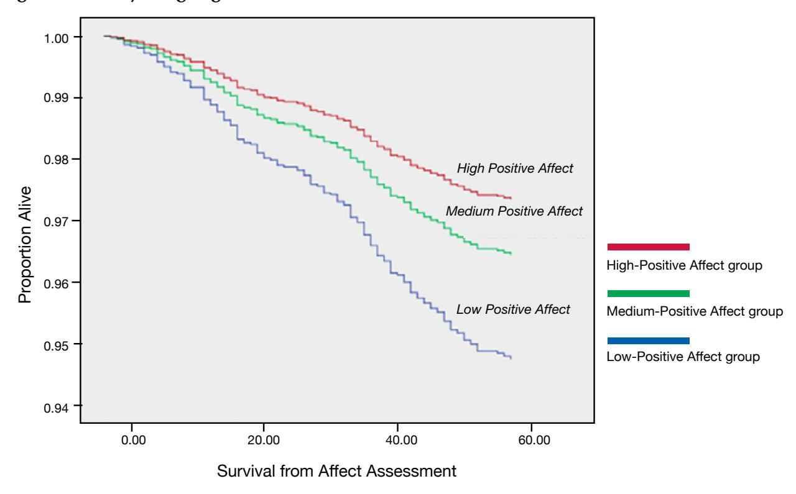

Notes: Figure from Steptoe and Wardle (2011). "Survival from affect assessment" is measured in months from initial interview where positive affect levels where reported. The English Longitudinal Survey of Ageing is a representative sample of older men and women living in England. Positive affect reported on a single day by individuals between 52 and 79 years old were used. Values are adjusted for age and sex. Respondents with the highest third of reported positive affect were 34% less likely to die over the period studied than those in the lowest positive affect group after controlling for demographic and health factors. Those in the high and medium positive affect groups had death rates of 3.6% and 4.6%, respectively, compared to 7.3% for the low positive affect group.

Primate studies also point to happiness affecting longevity. Weiss et al. (2011) found that orangutans who were rated as happier by their caretakers lived longer. Indeed, the difference between the apes that were one standard-deviation above versus below the mean in happiness was 11 years. Because these apes often live about 50 years in captivity, happiness accounted for a very large increase in longevity.

Research on the role of happiness in human evolution (a topic explored in more depth below) finds a relationship between well-being and successful reproduction. A recent review by Diener et al. (2012) highlighted the evidence linking positive mood to the frequency of sexual intercourse and fertility. For example, Rasmussen et al. (2009) found that pregnant women who were more optimistic tended to miscarry less frequently and have babies of a healthy weight.

The positive benefits of subjective well-being on health at the individual level generalize to more aggregate levels. Lawless and Lucas (2011) found that places with higher life satisfaction had greater life expectancies, with lower levels of mortality from heart disease, homicide, liver disease, diabetes, and cancer. Similarly, Blanchflower and Oswald (2008) found that higher levels of national well-being were related to lower levels of national hypertension in a sample of 16 nations. Blanchflower and Oswald (2008) also found that regions in the United Kingdom reporting more stress also had higher rates of blood pressure. Moum (1996) found that low subjective well-being is both a short- and long-term predictor of suicide, and uncovered similar findings in a 20-year study. Across 32 nations, it was found that experiencing higher life satisfaction and happiness was related to lower suicide rates.34 These findings suggest that links between happiness and health outcomes are not simply relative in nature as they persist in aggregate and cross-national studies. Happiness can therefore influence health outcomes for both individual citizens and entire societies.

There is also evidence that negative affect can worsen health, even making illness more likely. For example, depressed people are substantially more likely to have cardiovascular problems, such as heart disease and strokes. Rugulies (2000) found in a review of 11 studies that depressed feelings predict coronary heart disease and that clinical levels of depression predict even more strongly. Similarly, when a person is angry and hostile they are more likely to suffer from coronary heart disease.35 Depression is associated with unhealthy physiological processes, such as inflammation,36 which is believed to be connected to the development of heart diseases. Antidepressant medications can lower inflammation. A review by Zorrilla et al. (2001) found that stress is related to a weaker immune system. Studies on fertility provide yet more evidence on how negative emotions can be detrimental to healthy functioning. Fertility is lower among depressed women.37 An unhappy pregnancy is more likely to lead to a premature and low birth weight child.38 However, as discussed above, the effect of negative affect is not a mirror image of that observed for positive affect. In a study of susceptibility to developing a cold, Cohen et al. (2003) found that individuals with positive emotional styles had greater resistance to the virus when controlling for other factors, whereas negative emotions were not associated with resistance. This suggests that positive and negative affect may impact on health through different pathways but further study is needed to understand this interaction.

## **Happiness on income, productivity, and organizational behavior**

The experience of happiness is beneficial to workplace success because it promotes workplace productivity, creativity, and cooperation. There are several reasons why this is the case. The experience of positive feelings motivates people to succeed at work and to persist with efforts to attain their goals. As discussed above, individuals who are happier are more likely to be healthy and will, in turn, tend to be more productive (in part, simply because happier and healthier individuals

will take fewer sick days). In addition, individuals who are happier better integrate information leading to new ideas, which leads to creativity and innovation. Finally, individuals who are happier tend to have better social relations. In the context of work this leads to greater cooperation among coworkers and with customers.

Oswald et al. (2012) investigated how positive feelings influence productivity in an experimental setting. In an experiment involving piece-rate pay for research participants across a number of days, the economists found that those who were put in a positive mood had a greater quantity of work output (about 10-12%), but no less quality of output. Those performing the task at low and medium levels of productivity were helped most by being put in a good mood. As part of that same research, Oswald et al. (2012) also found that a bad mood induced by family illness or bereavement had a detrimental impact on productivity.

Employees who are high in subjective well-being are more likely to achieve more while at work. Peterson et al. (2011) found that happy workers – optimistic and hopeful, resilient and high in self-efficacy – were more likely to be high in supervisor-rated performance and in financial performance. Conversely, whereas positive feelings reduce absenteeism from work, negative feelings increase absenteeism as well as turnover.39

Happiness has also been shown to enhance curiosity and creativity. Foremost, positive feelings are associated with curiosity and creativity.40 Leitzel (2001) found that happy people are more likely to feel energetic and interested in doing things, as well as scoring higher on measures of curiosity. Further, there is a large experimental research literature showing that people put in a good mood tend to be more original, creative, and show greater cognitive flexibility.41 Both Amabile et al. (2005) and George and Zhou (2007) found that workers are more creative when they experience positive moods. Indeed, two recent meta-analyses of experimental and non-experimental studies showed that although

the strength of effects depend on the context and motivational focus, happiness is related to and generates creativity.42

A major reason for the success of happy individuals and organizations is that they experience on average more positive social relationships. Research clearly shows that happy workers are more cooperative and collaborative in negotiations than unhappy ones. In general, positive emotions boost cooperative and collaborative behavior in negotiations rather than withdrawal or competition.43 Individuals who are in a positive mood are more willing to make concessions during negotiations.44 Through cooperation, they reach a better joint solution in negotiations.45 Individuals in a positive mood are more likely to make cooperative choices in a prisoner's dilemma game as well.46 People in a positive mood are also more likely to show cohesion with their group. Recent experimental studies have shown that positive emotions lead to trust and cooperation when specific conditions are met.47 Overall, happiness leads to cooperation and collaboration in the workplace, particularly so in situations involving negotiation.

On the other hand, negative emotions in the workplace, especially chronic or intense ones, can be very detrimental to the organization. For example, Felps et al. (2006) found that a single negative individual in a work unit often brings down the morale and functioning of the entire group.

One indicator of the subjective well-being of employees is job satisfaction.48 A quantitative review found that job satisfaction is a key predictor of job performance, showing that happy employees are better performers in their workplace.49 To establish a causal relation, a meta-analysis of panel data demonstrated that job satisfaction predicted future performance, but performance did not predict future job satisfaction.50 Erdogan et al. (2012) reviewed the research showing that individuals with higher life satisfaction are more likely to have higher levels of career satisfaction, lower turnover intentions, and higher organizational commitment.

**Figure 4.2: Longitudinal relationship between subjective well-being during adolescence and young adulthood (ages 16, 18 and 22) and later earnings (at age 29)**

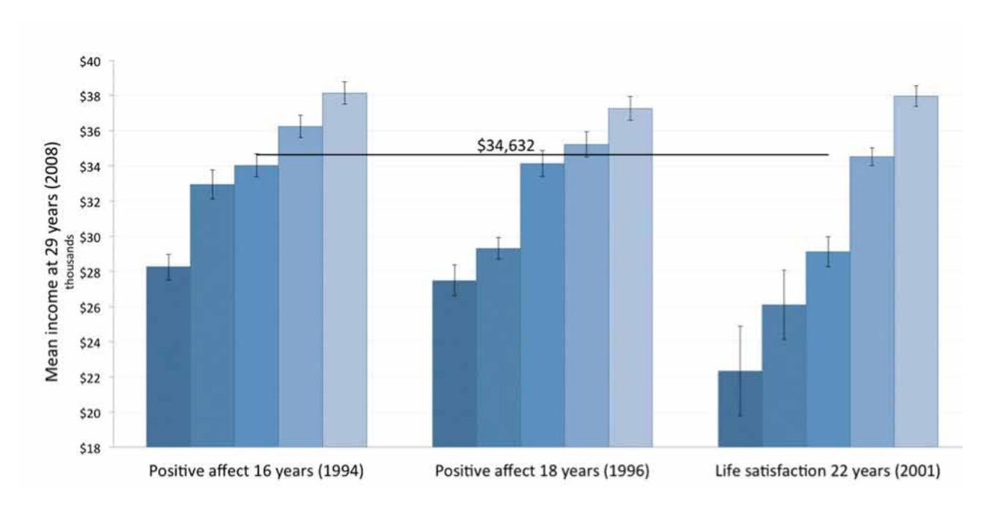

Notes: Figure from De Neve and Oswald (2012). The bars represent the response categories for positive affect (at ages 16 and 18) and life satisfaction (at age 22), from lowest to highest levels, and relate this to the mean income for the respondents in each category at age 29. Across the sample, the mean income at age 29 was \$34,632. Large samples were observed for each category (N=14,867 for positive affect at age 16, N=11,253 for positive affect at age 18 and N=12,415 for life satisfaction at age 22). A margin of error (i.e. 2 Standard Errors) is included around each estimate.

In line with the notion that happier workers are better workers, higher well-being is also shown to be associated with higher income51 and future income.52 De Neve and Oswald (2012) used a large US representative panel study to show that adolescents and young adults who report higher life satisfaction or positive affect grew up to earn significantly higher levels of income later in life. They used siblings as comparison controls, and also accounted for factors such as intelligence and health, as well as the human capacity to imagine later socioeconomic outcomes and anticipate the resulting feelings in current well-being (see Figure 4.2). Thus, to date, four longitudinal studies have systematically found that happiness at one point in time predicts higher future income, controlling for relevant factors such as intelligence, parental income, and even a sizable part of any genetic predispositions.53

Subjective well-being brings about greater success at the organizational level as well. Bockerman and Ilmakunnas (2012) found that job satisfaction predicts the productivity of manufacturing plants. Harter et al. (2010) found in a longitudinal study of 10 large organizations that worker engagement makes a difference to productivity. Work units in which employees were satisfied and otherwise felt highly engaged with their work led to improvements in the bottom line, measured in terms of revenue, sales, and profit.54 On the other hand, reverse causality going from company success to employee satisfaction was weaker. An analysis of the "100 Best Companies to Work For in America" revealed that they increased more in equity value compared to the industry benchmarks. The resulting higher returns were about 3% per year.

The study by Harter and his colleagues (2010), based on 2,178 work units in 10 large companies, found that engaged and satisfied workers led to greater revenue, sales, and profits. The two factors that mediated the relation between employee engagement and the performance outcomes were customer loyalty and employee retention. It makes intuitive sense that customers would prefer to interact with positive employees and thus frequent the business. Employee retention is a large challenge for modern companies both because it is expensive to replace employees, especially highly skilled ones, and because more senior employees have more experience on the job. Thus, it is not surprising that employee engagement, resulting in customer loyalty and employee retention, accounted for 10% of the variability in the productivity of the corporations studied.

### **Happiness on individual and social behavior**

Subjective well-being has an impact on individual behavior and decision-making. Happiness and positive affect have been identified as determinants of economic behavior ranging from consumption and savings to time preferences and risk-taking. Research in psychology and economics suggests this may occur through improved integration of information and broadened focus of attention in happier individuals.55 Thus, happier individuals may be better able to evaluate the implications of decisions with short and long term trade-offs, resulting in decisions that reflect greater selfcontrol and appropriate risk-taking.

Well-being can influence how individuals evaluate outcomes that may occur in the present or future — a concept known in economics as time preference, or discounting. In survey and experimental evidence, Ifcher and Zarghamee (2011a) found that subjective well-being and positive affect were associated with less preference for consumption in the present relative to the future. Using a randomized assignment experiment, they observed that among the group where greater positive affect was induced, participants were less likely to discount future payments, i.e. they were

more likely to give up a smaller payment in the current period to receive a larger payment at a later point in time. This implies that individuals with greater positive affect may be more able to exercise self-control or delay gratification (i.e. foregoing smaller short term benefits in order to receive greater benefits in the future or to avoid longer term costs). Happy individuals are motivated to pursue long-term goals despite short-term costs.56 Fry (1975) found that children placed in a happy mood better resisted temptation. Additionally, Lerner and Weber (2012) found in lab experiments that inducing sadness among participants led to a greater discounting of future rewards than those in a neutral state. Moreover, lack of selfcontrol is also related to over-consumption, obesity, and financial decisions, suggesting that changes in well-being may influence their prevalence.57

Greater self-control and longer-term time preferences among happier people have been linked to consumption and saving behaviors. Guven (2012) analyzed two representative longitudinal household surveys in the Netherlands and Germany to estimate the causal relationship (if any) between happiness and consumption and saving behaviors. The regression results found that happier people were more likely to save more and consume less than others. Further, happier people had different expectations about the future than those less happy. These individuals were more optimistic about the future, took more time when making decisions, and had higher perceived life expectancies (i.e. moving from "neither happy or unhappy" to "happy" was associated with 1.1 year increase in perceived life expectancy).58 Thus, happier individuals may be more forward-thinking and willing to consider the long-term implications of decisions taken in the present, leading to "better" decisions for themselves and society.

The probability of being re-employed has also been linked to individual happiness. Among individuals recently entering unemployment in Germany,

Krause (2012) found a statistically significant positive relationship between job seekers with higher than average well-being and the probability of re-employment within a year. Additionally, these individuals were more likely to enter into selfemployment, suggesting a link between happiness and entrepreneurship. Interestingly, the effect of happiness on re-employment decreased at the extremes, indicating that an "optimal" level of happiness may exist.

Research on individual risk-taking provides evidence of a relationship between happiness and risk-related behavior. According to economic theory, happier individuals have more to lose from engaging in risky behavior that may carry the risk of injury or death. Happier individuals should therefore be more willing to engage in activities that reduce risk. Goudie et al. (forthcoming) found that seatbelt use and not being

involved in a motor vehicle accident were both more likely among those with higher subjective well-being (see Figure 4.3 with respect to seatbelt use). In a representative sample of 313,354 US households, the authors estimated that individuals who reported being "very satisfied" with life were 5.3% more likely to always wear a seatbelt in the survey, even after controlling for potentially confounding factors. When Goudie et al. (forthcoming) looked at the probability of motor vehicle accidents, they found that individuals with higher levels of life satisfaction were less likely to be involved in an accident several years later.59 While these statistical analyses cannot fully rule out the possibility of reverse causality, the results are robust to including a number of confounding variables and provide strong evidence for a positive relationship between happiness and risk-avoiding behavior.

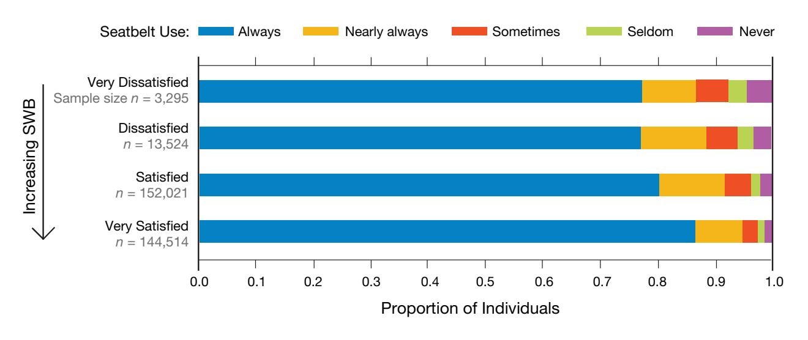

Notes: Figure from Goudie et al. (forthcoming). Data is from the Behavioral Risk Factor Surveillance System, a random-digit telephone survey in the US, N=313,354. Pearson's chi-squared statistic = 3,242, p-value < 2.2 x 10-16. Cross-tabulation figures indicate that subjective well-being and seatbelt use are strongly correlated but this does not account for other factors that may explain this relationship. Goudie et al. (forthcoming) use regression analysis to control for other potentially confounding factors and find the association is robust to these controls. Individuals who report they are "very satisfied" with life are 5.3% more likely to state they always wear a seatbelt. The authors also find that subjective well-being at the time of the survey is statistically significantly associated with a lower probability of having a motor vehicle accident several years later (even after controlling for confounding factors).

Research studies also indicate a powerful link between high subjective well-being and social behavior, such as being a better friend, colleague, neighbor, and citizen. People who are in a positive mood see others more inclusively and sympathetically. For example, they are less biased against other ethnic groups.60 Nelson (2009) found that people in a positive mood induction condition, as compared to neutral and negative mood conditions, showed greater compassion, perspective taking, and sympathy for a person experiencing distress.

Individuals who report high subjective well-being give more to their communities — in both time and money. Morrison et al. (2012) found that both life satisfaction and positive feelings predicted reports of donating money to charity, helping a stranger, and volunteering activities. Oishi et al. (2007) found that happier people volunteer more. Aknin et al. (2013) found in a study of 136 countries that prosocial uses of money by happy people generalized across regions of the world. However, further research is underway to clarify the causal relationship between prosocial spending and happiness. Priller and Shupp (2011) found slightly higher rates of blood donation, as well as monetary giving to charity, among happier individuals. They also found that those who were satisfied with their incomes were more likely to donate money to worthy causes.

Do happy moods *cause* the helping behavior and good citizenship? It is a consistent finding in social psychology experiments that when people are induced into a good mood, by various means, they are more likely to help others.61 These experimental studies in which people who are put into a good mood and compared to those in a neutral mood leave little doubt that happier feelings generally tend to increase helping. The fact that people give both more time and money when they are put into a positive mood in an experiment indicates that being happy raises prosocial behavior.62 Aknin et al. (2012) suggest that the relation between mood and helping is circular as shown in Figure 4.4. When people are in a good

**Figure 4.4: Model of positive feedback loop between prosocial spending and happiness**

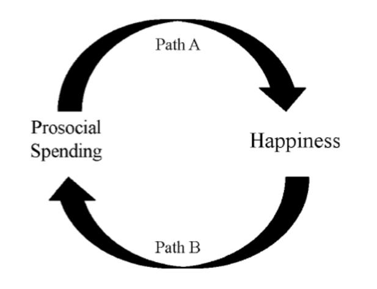

Notes: Figure from Aknin, Dunn and Norton (2012). The model posits that prosocial spending promotes happiness and, in turn, happiness improves the probability of future prosocial spending.

mood they tend to help others; helping others in turn fosters a good mood. Thus, friends, family, neighbors, and the society as a whole tend to profit from happy people because these individuals are more likely to be helpful to others.

Having supportive relationships boosts subjective well-being, but having high subjective well-being in turn leads to better social relationships.63 Thus, good relationships both cause happiness and are caused by it. Two major reasons why happiness benefits social relationships are because happiness increases a person's level of sociability and also improves the quality of social interactions. Happier people have a larger quantity and better quality of friendships and family relationships.64

Frequent positive emotions create a tendency in people to be more sociable. In a laboratory experiment people placed in a positive mood expressed greater interest in social and prosocial activities compared to those in a neutral condition, whereas those placed in a negative mood indicated lower interest in social activities.65 This pattern was replicated in a second study that found an interest in social and prosocial activities among those in

a good mood. People who were placed in a good mood expected social activities to be more rewarding than those not placed in a good mood. Similarly, other experimental studies have demonstrated that inducing happiness, in contrast to sadness, makes people more likely to express liking for others they meet for the first time.66 On the other hand, the absence of positive feelings is accompanied by feeling bored, unsociable, uninterested in things, slowed down, and unenergetic, reflecting a lack of active involvement with the environment and other people.67 It has also been shown that depressed individuals cause others to react in a negative manner.68 This can lead to unwillingness to have future interactions with those who have low happiness.

The links between positive moods and sociability are not just in terms of *feeling* sociable, but translate into actual behavior. Cunningham (1988a) discovered that people in an induced positive mood condition compared to a negative mood condition were more talkative. Mehl et al. (2010) monitored people's everyday conversations for four days and assessed happiness through both self-reports and informant reports. They found that happy participants spent about 25% less time alone and about 70% more time talking when they were with others. Furthermore, the happy participants engaged in less small talk and more substantive conversations compared to their unhappy peers.

Recent evidence shows the happiness-relationship link occurs across cultures. Lucas et al. (2000) found that across the world positive feelings were associated with tendencies for affiliation, dominance, venturesomeness, and social interaction. Similarly, a world survey of 123 nations found that the experience of positive feelings was strongly related to good social relationships across different socio-cultural regions.69

Happy people are not just more sociable; they also experience higher-quality social relationships. Kazdin et al. (1982) found that children put in a positive mood showed greater social skills and confidence in social behavior than those not put

in a good mood. Boehm and Lyubomirsky (2008) reviewed evidence showing that happy people tend to be more popular and likable. One study showed that reports of better interaction quality were not merely a function of the happy person's perceptions, but that observers similarly rated happier individuals as having better interactions with strangers.70

Happiness has the potential to generate positive snowball effects in society. Research has shown that people who are happier are likely to bring happiness to those around them, resulting in networks of happier individuals. It was found that happiness extends up to three degrees of separation, and longitudinal models show that individuals who are surrounded by happy people are likely to become happier in the future.71

Happiness can also have effects on the long-term quality of relationships. Luhmann et al. (2013) found that unmarried people high in life satisfaction are more likely to get married in the following years and less likely to get separated or divorced if they get married. Conversely, Stutzer and Frey (2006) found low life satisfaction prior to courtship predicted later dissolution of the marriage.

Depression, which is characterized by low or absent positive feelings, creates problems in social relationships such as divorce, limited social support, and distancing from one's neighbors.72 Even minor depression results in problems in social relations, such as higher rates of divorce.73 Even those recovering from depression show impairments in the social and occupational domains.74 In addition, clinical depression interferes with executive functioning, which is a hallmark of humans' special adaptive abilities. For example, Fossati et al. (2002) review evidence indicating that depressed individuals suffer deficits in problem solving and planning. Snyder (2012) reviewed extensive evidence showing that depressed people suffer substantially from broad impairments in executive functions, such as planning, with strong effect sizes varying from 0.32 to 0.97.

In sum, there is substantial evidence connecting positive moods to higher sociability and better quality of social relationships, and the opposite is the case for negative moods and depression. Happier people enjoy the company of others, and find that interacting with people is more rewarding compared to less happy individuals. Others in turn enjoy interacting with happy individuals. Those high in subjective well-being thus have more rewarding and stable social relationships.

## Moderation, mediation, and the evolutionary role of happiness

Although happy people and societies have a number of advantages, this does not imply that high subjective well-being is a panacea for everything. To illustrate, happiness can facilitate good health but is not a guarantee of it. Happy individuals may die at a young age. However, on average they will live longer. We can make statements about the effects of average happiness using the notion of *ceteris paribus* (i.e. assuming "all other things being equal") because in particular cases there will be other factors that override the influence of high subjective well-being.

Not every study has found positive benefits for long-term happiness. A few studies find no differences between happier and less happy individuals, and the rare study has shown opposite effects. This is common in research because of sampling, methodology, and other differences between studies. Nonetheless, reviews that summarize results across studies have virtually always shown benefits for high subjective wellbeing. One reason for the few null findings is that happiness will not show its value in all samples and contexts. For instance, for young adults there might be no differences in health or longevity due to happiness because young adults very rarely die and mostly have healthy bodies. The results of happiness and unhappiness become more manifest as adults age. Similarly,

one would not be surprised if happiness did not reduce divorce in a nation where divorce is virtually nonexistent.

Another caution about the conclusion that happiness is desirable is that people do not need to be constantly euphoric or ecstatic. Happy people most of the time feel merely pleasant — a mild positive state. Only occasionally do happy people feel intensely positive. Oishi et al. (2007) found that although the happiest individuals did very well in social relationships, the moderately happy — not 100% satisfied — often did the best in achievement domains. There is evidence that frequent high-arousal emotions could be harmful to health.75 Krause (2012) shows that re-employment prospects actually decreased for those with extreme levels of happiness. Furthermore, in a randomized lab experiment, Ifcher and Zarghamee (2011b) found that positive affect increased overconfidence among participants in the treatment group. Thus, extremely high happiness is not a recipe for extremely effective functioning, and in fact, moderate happiness can be more helpful.

It is important to note that happy people also occasionally feel unhappy, and this is not necessarily undesirable. Gruber et al. (2011) and Forgas (2007), as well as others, have shown that in some situations negative emotions can help people to respond more effectively. Thus, happiness does not mean a complete absence of negative feelings. The happy person, however, does not feel chronic negative feelings; he or she experiences negative feelings only occasionally, not frequently, and in appropriate situations.

An important question that is receiving increasing attention is *how* well-being and positive emotions may influence life outcomes. This is an emerging area of research with important contributions from psychology and neuroscience. The pathways leading from happiness to the life outcomes discussed in this chapter can either be direct or be subject to moderation and/or mediation by other variables that influence the

effect that subjective well-being may have on a trait or outcome of interest. Our discussion here is mostly on mediating pathways that may carry some part of the influence of happiness onto the outcome of interest and thus help explain the relationship. One branch of thinking in psychology posits that positive emotions broaden cognitive capacity and attention, allowing individuals to engage in the behaviors and build the skills associated with better health, productivity, and social interaction.76 Evidence from lab experiments provides initial backing for this theory. For example, Fredrickson and Branigan (2005) found that participants where positive emotions were induced showed greater scope of cognition and attention in psychological tests.

Studies focusing on neurological processes also support this approach and provide evidence for a connection between well-being and brain structure. Experiments using brain imaging to monitor participants' neurological processes have reported that positive affect is associated with activity in a part of the brain that is associated with "exploratory modes of thought and behavior."77 Further, Schmitz et al. (2009) found that affect can also alter neurological processing of visual stimuli — specifically, positive affect led to a widening of individuals' field of vision. Small-scale trials of the effect of mindfulness training, a type of meditation that has been linked to improved well-being in psychological studies, have also been shown to increase grey matter in parts of the brain that are believed to regulate cognition and emotion.78 Happiness may therefore be linked to neurological and cognitive processes that influence human behavior and particularly to behaviors that require broader and more integrative thinking (e.g. considering benefits over a longer time period or helping others).

In a promising new development in the study of mediating pathways between subjective well-being and health outcomes, Fredrickson and colleagues (2013) provide preliminary evidence for different epigenetic dynamics as a result of varying levels and types of happiness. The authors find that varied states of well-being influence gene expression

with particular relevance to genotypes underlying the immune system. Although the study is smallscale and is mostly interested in the epigenetic effects of different types of well-being (hedonic and eudaimonic well-being) it opens a promising new direction in the study of how happiness may influence health outcomes.

In their study of happiness in young adulthood and earnings later in life, De Neve and Oswald (2012) shed light on the potential pathways between happiness and income in a longitudinal survey. Their mediation tests reveal a direct effect as well as indirect effects that carry the influence from happiness to income. Significant mediating pathways include obtaining a college degree and a job, higher degrees of optimism and extraversion, and less neuroticism.79

Given the increasing evidence for a strong connection between happiness and behavior, a handful of studies have started to investigate the role of well-being in human evolution. Happiness is argued to play a role in promoting evolutionary success in two possible ways: (1) the experience of happiness acts as a reward for behaviors that increase the likelihood of evolutionary success (e.g. survival, reproduction, resource accumulation, etc.); or, alternatively, (2) given that happiness is beneficial to survival and other important life outcomes (such as those discussed throughout this chapter), it has persisted as an evolutionary characteristic.

Happiness as a reward mechanism for evolutionarily-advantageous behaviors has been explored in psychological and neurological research. A review of laboratory experiments by Wise (2004) highlighted the critical role dopamine plays in the neurological learning processes that embed how the brain anticipates reward and prompts action to obtain this reward. For example, Wise (2004) discusses a study where mice whose dopamine production is impaired are less able to undertake previously learned tasks to receive a reward (e.g. pressing a certain lever to receive food). Psychologists have argued elsewhere that positive affect and dopamine levels are connected.80 They hypothesize that the positive affect feedback from goal-directed behavior and the associated dopamine production are crucial to understanding how humans "learn" what behaviors and habits promote evolutionary success. This fits with other evolutionary theories that suggest the pursuit and experience of happiness incentivizes and increases the probability of successfully engaging in behaviors that improve health, productivity, and reproduction.81

Diener et al. (forthcoming) find that in a globally representative sample, 70% of respondents reported enjoying much of the previous day.82 The fact that happiness is a relatively common human trait can be considered indicative of its important role in evolutionary fitness. The authors also review the evidence that "positive mood offset," or the presence of positive mood in a neutral state, is associated with characteristics, such as longevity, material and social resource accumulation, and fertility, that have allowed humans to propagate successfully.

## Conclusion

Existing scientific evidence indicates that subjective well-being has an objective impact across a broad range of behavioral traits and life outcomes, and does not simply follow from them. In fact, we observe the existence of a *dynamic* relationship between happiness and other important aspects of our lives with effects running in both directions. Experimental research in which moods and emotions are induced in some participants and their actions are compared to a control group show that positive moods lead to creativity, sociability, altruism, and beneficial physiological patterns. Levels of subjective well-being are found to predict future health, mortality, productivity, and income, controlling statistically for other possible determinants. For example, young people who are less happy many years before they meet their future spouse later show higher rates of divorce compared to their happier peers. Furthermore, predictions in the other direction, from conditions to subjective well-being (that is, conditions influencing happiness) are also positive, helping to create feedback loops that may raise the longerterm happiness effects.

Although high subjective well-being tends to help people function better, it is of course not magic or a cure-all. Happy people do get sick and do lose friends. Not all happy people are productive workers. Happiness is like any other factor that aids health and functioning—all other things being equal it is likely (but not guaranteed) to help. Needless to say that many other factors such as personality, intelligence, and social capital are also important for good functioning.

It is important to emphasize that research does not prescribe extreme bliss but, rather, tentative evidence suggests that a moderate degree of happiness tends to be "optimal" for the effects surveyed in this chapter. Thus, a desirable level of happiness would imply feeling mildly to moderately positive most of the time, with occasional negative emotions in appropriate situations.

There is initial evidence about the processes that mediate between happiness and beneficial outcomes. For instance, happiness is associated with greater cooperation, motivation, and creativity, which in turn are instrumental to success in business, and in life as a whole. Conversely, depression creates problems, such as illness and quitting one's job more frequently, that all lead to less success in the workplace. Similarly, positive feelings harness the immune system and lead to fewer cardiovascular problems, whereas anxiety and depression are linked to poorer health behaviors and problematical physiological indicators, such as inflammation. Thus, a causal mechanism of happiness on health and longevity can be understood with the mediating mechanisms that are now being uncovered. Research in the field of neuroscience provides further prospects for new scientific insights on mediating pathways between happiness to behavioral traits and socio-economic outcomes of interest.

It naturally follows from this survey that it is important to balance economic measures of societal progress with measures of subjective well-being, to ensure that economic progress leads to broad improvements across life domains, not just greater economic capacity. By assessing subjective wellbeing as well as economic variables, a society can gauge whether overall net progress is positive in terms of raising human well-being. Diener et al. (2009) detail the case for national accounts of well-being. Most arguments for putting happiness more center-stage in policy making have been normative in nature; happiness is what would appear to matter most to most people. The aim of this chapter is to complement and inform the normative reasoning with a survey of the "hard"

evidence on the benefits of subjective well-being across outcomes of importance, such as health, income, and social behavior. A better understanding of the objective benefits of raising happiness may help in estimating the potential impact of making happiness more central in policy making and in enhancing policy evaluation by informing costbenefit analyses. Indeed, an argument could be constructed that raising subjective well-being leads to positive externalities or spillover effects across a number of policy domains, ranging from health to traffic safety. Given the tangible benefits to individuals and societies of moderately high wellbeing, it is imperative that we act to effectively put well-being at the heart of policy and generate the conditions that allow everyone to flourish.

- 1 Appleton et al. (2011); Slopen et al. (2012).
- 2 Edwards & Cooper (1988); Kiecolt-Glaser, McGuire, Robles, & Glaser (2002); Cohen, Doyle, Turner, Alper, & Skoner (2003).
- 3 Bhattacharyya, Whitehead, Rakhit, & Steptoe (2008).
- 4 Ong (2010); Steptoe, Wardle, & Marmot (2005); Steptoe, Dockray, & Wardle (2009).
- 5 Ostir, Markides, Peek, & Goodwin (2001); Davidson, Mostofsky, & Whang (2010); Cohen et al. (2003).
- 6 Blanchflower, Oswald, & Stewart-Brown (2012); Stepney (1982); Pettay (2008); Schneider, Graham, Grant, King, & Cooper (2009); Garg, Wansink, & Inman (2007); Strine et al. (2008a, 2008b); Grant, Wardle, & Steptoe (2009); Kubzansky, Gilthorpe, & Goodman (2012).
- 7 Fredrickson (2001); Fredrickson & Levenson (1998); Fredrickson, Mancuso, Branigan, & Tugade (2000).
- 8 Danner, Snowdon, & Friesen (2001); Pressman & Cohen (2012); Wiest, Schuz, Webster, & Wurm (2011); Russ et al. (2012); Bush et al. (2001); Chida & Steptoe (2008); Epel et al. (2004); Steptoe & Wardle (2011).
- 9 Oswald, Proto, & Sgroi (2012).
- 10 Peterson, Luthans, Avolio, Walumbwa, & Zhang (2011).
- 11 Ashby, Valentin, & Turken (2002); Jovanovic & Brdaric (2012); Leitzel (2001); Isen, Daubman, & Nowicki (1987); Amabile, Barsade, Mueller, & Staw (2005); George & Zhou (2007); Baas, De Dreu, & Nijstad (2008); Davis (2009).

- 12 Baron, Fortin, Frei, Hauver, & Shack (1990); Barsade (2002); Carnevale (2008); Forgas (1998); Baron (1990); Baron, Rea, & Daniels (1992); Carnevale & Isen (1986); Lawler, Thye, & Yoon (2000); Hertel, Neuhof, Theuer, & Kerr (2000); Lount (2010).
- 13 Judge, Piccolo, Podsakoff, Shaw, & Rich (2010); Diener, Nickerson, Lucas, & Sandvik (2002); Graham, Eggers, & Sandip (2004); Marks & Fleming (1999).
- 14 De Neve & Oswald (2012).
- 15 Bockerman & Ilmakunnas (2012); Harter, Schmidt, Asplund, Killham, & Agrawal (2010); Edmans (2011, 2012).
- 16 Ifcher & Zarghamee (2011a).
- 17 Aspinwall (1998); Fry (1975).
- 18 Guven (2009).
- 19 Krause (2012).
- 20 Goudie, Mukherjee, De Neve, Oswald, & Wu (forthcoming).
- 21 Morrison, Tay, & Diener (2012); Oishi, Diener, & Lucas (2007); Aknin et al. (2013).
- 22 Lyubomirsky, King, & Diener (2005); Myers (2000); Diener & Seligman (2002); Cunningham (1988b); Baron (1987, 1990); Berry & Hansen (1996).
- 23 Cunningham (1988b); Mehl, Vazire, Holleran, & Clark (2010).
- 24 Lucas, Diener, Grob, Suh, & Shao (2000); Tay & Diener (2011); Fowler & Christakis (2008).

- 25 Chida & Steptoe (2008); Cohen & Pressman (2006); Diener & Chan (2011); Howell, Kern, & Lyubomirsky (2007); Lyubomirsky et al. (2005); Pressman & Cohen (2005).
- 26 Appleton et al. (2011); Slopen et al. (2012).
- 27 Edwards & Cooper (1988); Kiecolt-Glaser et al. (2002).
- 28 Ostir et al. (2001).
- 29 Christian, Graham, Padgett, Glaser, & Kiecolt-Glaser (2006).
- 30 Tay & Diener (2011).
- 31 Cacioppo & Patrick (2008).
- 32 Boehm & Kubzansky (2012); Boehm, Peterson, Kivimaki, & Kubzansky (2011).
- 33 Fredrickson et al. (2000); Fredrickson (1998).
- 34 Bray & Gunnell (2006).
- 35 Smith, Glazer, Ruiz, & Gallo (2004).
- 36 Dinan (2009).
- 37 Gotz, Martin, & Volker (2008); Neggers, Goldenberg, Cliver, & Hauth (2006); Wisner et al. (2009).
- 38 Field, Diego, & Hernandez-Reif (2006); Field et al. (2009); Orr & Miller (1995); Williamson et al. (2008).
- 39 Pelled & Xin (1999).
- 40 Ashby et al. (2002); Jovanovic & Brdaric (2012).
- 41 Isen et al. (1987).
- 42 Baas et al. (2008); Davis (2009).
- 43 Baron et al. (1990); Barsade (2002); Carnevale (2008); Forgas (1998).
- 44 Baron et al. (1990); Baron, Rea, & Daniels (1992).
- 45 Carnevale & Isen (1986).
- 46 Lawler, Thye, & Yoon, (2000).
- 47 Hertel et al. (2000); Lount (2010).
- 48 Judge & Kinger (2007).
- 49 Judge, Thoreson, Bono, & Patton (2001).
- 50 Riketta (2008).
- 51 Judge et al. (2010).
- 52 Diener, Nickerson, Lucas, & Sandvik (2002); Graham, Eggers, & Sandip (2004); Marks & Fleming (1999).
- 53 De Neve (2011); De Neve, Christakis, Fowler, & Frey (2012); Rietveld et al. (2013).

- 54 Similarly, Edmans (2011, 2012) found evidence consistent with the importance of employee satisfaction for firm performance.
- 55 Fredrickson & Branigan (2005); Estrada, Isen, & Young (1997); Isen, Rosenzweig, & Young (1991).
- 56 Aspinwall (1998).
- 57 Guven (2012).
- 58 Ibid.
- 59 Goudie et al. (forthcoming) estimate that the probability of being involved in an accident is reduced by a factor of about 0.9.
- 60 Johnson & Fredrickson (2005).
- 61 Carlson, Charlin, & Miller (1988).
- 62 Anik, Aknin, Norton, & Dunn (2009).
- 63 Lyubomirsky et al. (2005); Myers (2000).
- 64 Diener & Seligman (2002).
- 65 Cunningham (1988b).
- 66 Baron (1987); Baron (1990).
- 67 Watson et al. (1995).
- 68 Coyne (1976).
- 69 Tay & Diener (2011).
- 70 Berry & Hansen (1996).
- 71 Fowler & Christakis (2008).
- 72 Gotlib & Hammen (2009).
- 73 Beck & Koenig (1996).
- 74 Romera et al. (2010).
- 75 Pressman & Cohen (2005).
- 76 Fredrickson (1998, 2001); Fredrickson & Branigan (2005); Kok et al. (2013).
- 77 Schmitz, De Rosa, & Anderson (2009).
- 78 Hölzela et al. (2011).
- 79 De Neve & Oswald (2012).
- 80 Ashby, Isen, & Turken (1999).
- 81 Lyubomirsky & Boehm (2010); Graham & Oswald (2010).
- 82 The Gallup World Poll is a representative sample of 941,161 individuals from 160 nations.

## Bibliography

- Aknin, L. B., Barrington-Leigh, C. P., Dunn, E. W., Helliwell, J. F., Biswas-Diener, R., Kemeza, I., Nyende, P., Ashton-James, C. E., & Norton, M. I. (2013). Prosocial spending and wellbeing: Cross-cultural evidence for a psychological universal. *Journal of Personality and Social Psychology, 104*, 635-652.
- Aknin, L. B., Dunn, E. W., & Norton, M. I. (2012). Happiness runs in a circular motion: Evidence for a positive feedback loop between prosocial spending and happiness. *Journal of Happiness Studies*, *13*, 347-355.
- Amabile, T. M., Barsade, S. G., Mueller, J. S., & Staw, B. (2005). Affect and creativity at work. *Administrative Science Quarterly*, *50*, 367-403.
- Anik, L., Aknin, L. B., Norton, M. I., & Dunn, E. W. (2009). Feeling good about giving: The benefits (and costs) of self-interested charitable behavior. Harvard Business School Marketing Unit Working Paper No. 10-012. Available at SSRN: http://ssrn.com/abstract=1444831 or http://dx.doi.org/10.2139/ssrn.1444831
- Appleton, A. A. Buka, S. L., McCormick, M. C., Koenen, K. C., Loucks, E. B., Gilman, S. E., & Kubzansky, L. D. (2011). Emotional functioning at age 7 years is associated with C-reactive protein in middle adulthood. *Psychosomatic Medicine, 73*, 295-303.
- Ashby, F. G., Isen, A. M., & Turken, A. U. (1999). A neuropsychological theory of positive affect and its influence on cognition. *Psychological Review, 106,* 529-550.
- Ashby, F. G., Valentin, V. V., & Turken, U. (2002). The effects of positive affect and arousal on working memory and executive attention. In S. Moore & M. Oaksford (Eds.), *Emotional cognition: From brain to behaviour* (pp. 245-287). Amsterdam: John Benjamins.
- Ashton, H., & Stepney, R. (1982). *Smoking: Psychology and pharmacology*. London: Tavistock Publications.
- Aspinwall, L. G. (1998). Rethinking the role of positive affect in self-regulation. *Motivation and Emotion, 22*, 1-32.
- Baas, M., De Dreu, C. K. W., & Nijstad, B. A. (2008). A metaanalysis of 25 years of mood-creativity research: Hedonic tone, activation, or regulatory focus? *Psychological Bulletin, 134*, 779-806.
- Baron, R. A. (1987). Interviewer's moods and reactions to job applicants: The influence of affective states on applied social judgments. *Journal of Applied Social Psychology, 17*, 911-926.

- Baron, R. A. (1990). Environmentally induced positive affect: Its impact on self-efficacy, task performance, negotiation, and conflict. *Journal of Applied Social Psychology, 20*, 368-384.
- Baron, R. A., Fortin, S. P., Frei, R. L., Hauver, L. A., & Shack, M. L. (1990). Reducing organizational conflict: The role of socially-induced positive affect. *The International Journal of Conflict Management, 1*, 133-152
- Baron, R. A., Rea, M. S., & Daniels, S. G. (1992). Effects of indoor lighting (illuminance and spectral distribution) on the performance of cognitive tasks and interpersonal behaviors: The potential mediating role of positive affect. *Motivation and Emotion, 16*, 1-33.
- Barsade, S. (2002). The ripple effect: Emotional contagion and its influence on group behavior. *Administrative Science Quarterly, 47*, 644-675.
- Beck, D. A., & Koenig, H. G. (1996). Minor depression: A review of the literature. *International Journal of Psychiatry in Medicine, 26*, 177-209.
- Berry, D. S., & Hansen, J. S. (1996). Positive affect, negative affect, and social interaction. *Journal of Personality and Social Psychology, 71*, 796-809.
- Bhattacharyya, M. R., Whitehead, D. L., Rakhit, R., & Steptoe, A. (2008). Depressed mood, positive affect, and heart rate variability in patients with suspected coronary artery disease. *Psychosomatic Medicine, 70*, 1020-1027.
- Blanchflower, D. G., & Oswald, A. J. (2008). Hypertension and happiness across nations. *Journal of Health Economics, 27*, 218-233.
- Blanchflower, D. G., Oswald, A. J., & Stewart-Brown, S. (2012). Is psychological well-being linked to the consumption of fruit and vegetables? *Social Indicators Research*, in press.
- Bockerman, P., & Ilmakunnas, P. (2012). The job-satisfactionproductivity nexus: A study using matched survey and register data. *Industrial* & *Labor Relations Review*, *65*, 244-262.
- Boehm, J. K., & Kubzansky, L. D. (2012). The heart's content: The association between positive psychological well-being and cardiovascular health. *Psychological Bulletin, 138,* 655-691.
- Boehm, J. K., Peterson, C., Kivimaki, M., & Kubzansky, L. (2011). A prospective study of positive psychological well-being and coronary heart disease. *Health Psychology, 30*, 259-267.

Boehm, J. K., & Lyubomirsky, S. (2008). Does happiness lead to career success? *Journal of Career Assessment, 16*, 101-116

Bray, I., & Gunnell, D. (2006). Suicide rates, life satisfaction and happiness as markers for population mental health. *Social Psychiatry and Psychiatric Epidemiology, 41*, 333-337.

Bush, D. E., Ziegelstein, R. C., Tayvack, M., Richter, D., Zahalsky, H., & Fauerbach, J. A. (2001). Even minimal symptoms of depression increase mortality risk after acute myocardial infarction. *American Journal of Psychiatry*, *15*, 337-341.

Cacioppo, J. T., & Patrick, W. (2008). *Loneliness: Human nature and the need for social connection*. New York: W. W. Norton.

Carlson, M., Charlin, V., & Miller, N. (1988). Positive mood and helping behavior: A test of six hypotheses. *Journal of Personality and Social Psychology, 55*, 211-229.

Carnevale, P. J. (2008). Positive effect and decision frame in negotiation. *Group Decision and Negotiation, 17*, 51-63.

Carnevale, P. J. D., & Isen, A.M. (1986). The influence of positive affect and visual access on the discovery of integrative solutions in bilateral negotiations. *Organizational Behavior and Human Decision Processes, 37*, 1-13.

Chida, Y., & Steptoe, A. (2008). Positive psychological wellbeing and mortality: A quantitative review of prospective observational studies. *Psychosomatic Medicine, 70*, 741-756.

Christian, L. M., Graham, J. E., Padgett, D. A., Glaser, R., & Kiecolt-Glaser, J. K. (2006). Stress and wound healing. *Neuroimmunomodulation, 13*, 337-346.

Cohen, S., Doyle, W. J., Turner, R. B., Alper, C. M., & Skoner, D. P. (2003). Emotional style and susceptibility to the common cold. *Psychosomatic Medicine, 65*, 652-657.

Cohen, S., & Pressman, S. D. (2006). Positive affect and health. *Current Directions in Psychological Science, 15*, 122-125.

Coyne, J. C. (1976). Depression and the response of others. *Journal of Abnormal Psychology, 85*, 186-193.

Cunningham, M. R. (1988a). Does happiness mean friendliness? Induced mood and heterosexual self-disclosure. *Personality and Social Psychology Bulletin, 14*, 283-297.

Cunningham, M. R. (1988b). What do you do when you're happy or blue? Mood, expectancies, and behavioral interest. *Motivation and Emotion, 12*, 309-330.

Danner, D. D., Snowdon, D. A., & Friesen, W. V. (2001). Positive emotions in early life and longevity: Findings from the nun study. *Journal of Personality and Social Psychology, 80*, 804-813.

Davidson, K. W., Mostofsky, E., & Whang, W. (2010). Don't worry, be happy: Positive affect and reduced 10-year incident coronary heart disease: The Canadian Nova Scotia health survey. *European Heart Journal*, *31*, 1065-1070.

Davis, M. A. (2009). Understanding the relationship between mood and creativity: A meta-analysis. *Organizational Behavior and Human Performance, 108*, 25-38.

De Neve, J.-E., & Oswald, A. J. (2012). Estimating the influence of life satisfaction and positive affect on later income using sibling fixed effects. *PNAS*: *Proceedings of the National Academy of Sciences, 109*(49), 19953-19958.

De Neve, J.-E. (2011) Functional polymorphism (5-HTTLPR) in the serotonin transporter gene is associated with subjective well-being: Evidence from a U.S. nationally representative sample. *Journal of Human Genetics, 56*, 456-459.

De Neve, J.-E., Christakis, N. A., Fowler, J. H., & Frey, B. S. (2012). Genes, economics, and happiness. *Journal of Neuroscience, Psychology, and Economics, 5*(4), 193-211.

Diener, E., & Chan, M. (2011). Happy people live longer: Subjective well-being contributes to health and longevity. *Applied Psychology: Health and Well-being, 3*, 1-43.

Diener, E., & Diener, C. (1996). Most people are happy. *Psychological Science*, *7*, 181-185.

Diener, E., Lucas, R., Schimmack, U., & Helliwell, J. (2009). *Well-being for public policy.* New York: Oxford University Press.

Diener, E., Nickerson, C., Lucas, R. E., & Sandvik, E. (2002). Dispositional affect and job outcomes. *Social Indicators… Research, 59*, 229-259.

Diener, E., Oishi, S., & Suh, E. (2012). Positive emotion offset was essential to human evolutionary success. Paper submitted for publication, University of Illinois.

Diener, E., & Seligman, M. E. P. (2002). Very happy people. *Psychological Science*, *13*, 81-84.

Dinan, T. G. (2009). Inflammatory markers in depression. *Current Opinion in Psychiatry*, *22*, 32-36.

Edmans, A. (2011). Does the stock market fully value intangibles? Employee satisfaction and equity prices. *Journal of Financial Economics, 101*, 621-640.

Edmans, A. (2012). The link between job satisfaction and firm value, with implications for corporate social responsibility. *Academy of Management Perspectives*, in press.

Edwards, J. R., & Cooper, C. L. (1988). The impacts of positive psychological states on physical health: A review and theoretical framework. *Social Science and Medicine, 12*, 1447-1459.

Epel, E. S., Blackburn, E. H., Liu, J., Dhabhar, F. S., Adler, N. E., Morrow, J. D., & Cawthon, R. M. (2004). Accelerated telomere shortening in response to life stress. *PNAS: Proceedings of the National Academy of Sciences, 101*(49), 17323–17324.

Erdogan, B., Bauer, T. N., Truxillo, D. M., & Mansfield, L. R. (2012). Whistle while you work: A review of the life satisfaction literature. *Journal of Management, 38*, 1038-1083.

Estrada, C. A., Isen, A. M., & Young, M. J. (1997). Positive affect facilitates integration of information and decreases anchoring in reasoning among physicians. *Organizational Behavior and Human Decision Processes, 72,* 117-135.

Felps, W., Mitchell, T. R., & Byington, E. (2006). How, when, and why bad apples spoil the barrel: Negative group members and dysfunctional groups. *Research in Organizational Behavior: An Annual Review Series of Analytic Essays and Critical Reviews*, *27*, 175-222.

Field, T., Diego, M., & Hernandez-Reif, M. (2006). Prenatal depression effects on the future of the newborn: A review. *Infant Behavior and Development, 29*, 445-455.

Field, T., Diego, M., Hernandez-Reif, M., Deeds, O., Holder, V., Schanberg, S., & Kuhn, C. (2009). Depressed pregnant black women have a greater incidence of prematurity and low birthweight outcomes. *Infant Behavior and Development, 32*, 10-16.

Forgas, J. P. (1998). On feeling good and getting your way: Mood effects on negotiator cognition and bargaining strategies. *Journal of Personality and Social Psychology, 74*, 565-577. Forgas, J. P. (2007). When sad is better than happy: Negative affect can improve the quality and effectiveness of persuasive messages and social influence. *Journal of Experimental Social Psychology*, *43*, 513-528.

Fossati, P., Ergis, A. M., & Allilaire, J. F. (2002). Executivie functioning in unipolar depression: A review. *L'Encephale, 28*, 97-107.

Fowler, J. H., & Christakis, N. A. (2008). Dynamic spread of happiness in a large social network: Longitudinal analysis over 20 years in the Framingham Heart Study. *British Medical Journal, 337*, a2338.

Fredrickson, B. L. (1998). What good are positive emotions? *Review of General Psychology, 2*, 300-319.

Fredrickson, B. L. (2001). The role of positive emotions in positive psychology: The Broaden-and-Build theory of positive emotions. *American Psychologist, 56*, 218-226.

Fredrickson, B. L., Grewen, K. M., Coffey, K. A., Algoe, S. B., Firestine, A. M., Arevalo, J. M. G., . . . Cole, S. W. (2013). A functional genomic perspective on human well-being. *PNAS: Proceedings of the National Academy of Sciences*, doi:10.1073/ pnas.1305419110.

Fredrickson, B.L., & Branigan, C. (2005). Positive emotions broaden the scope of attention and thought-action repertoires. *Cognition and Emotion, 19*, 313-332.

Fredrickson, B. L., & Levenson, R. W. (1998). Positive emotions speed recovery from the cardiovascular sequelae of negative emotions. *Cognition and Emotion, 12*, 191-220.

Fredrickson, B. L., Mancuso, R. A., Branigan, C., & Tugade, M. M. (2000). The undoing effect of positive emotions. *Motivation and Emotion, 24*, 237-258.

Fry, P. S. (1975). Affect and resistance to temptation. *Developmental Psychology, 11*, 466-472.

Garg, N., Wansink, B., & Inman, J. J. (2007). The influence of incidental affect on consumers' food intake. *Journal of Marketing*, *71*, 194-206.

George, J. M., & Zhou, J. (2007). Dual tuning in a supportive context: Joint contributions of positive mood, negative mood, and supervisory behaviors to employee creativity. *Management Journal, 50*, 605-622.

- Gotlib, I. H., & Hammen, C. L. (2009) (Eds.). *Handbook of depression*. New York: Guilford Publications.
- Gotz, A. A., Martin, W., & Volker, S. (2008). Psychosocial maternal stress during pregnancy: Effects on reproduction for F0 and F1 generation laboratory rats. *Physiology and Behavior, 93*, 1055-1060.
- Goudie, R., Mukherjee, S., De Neve, J.-E., Oswald, A. J., & Wu, S. (forthcoming). Happiness as a driver of risk-avoiding behavior: A conceptual framework with an application to seatbelt wearing and automobile accidents. *Economica*.
- Graham, L., & Oswald, A.J. (2010). Hedonic capital, adaption and resilience. *Journal of Economic Behavior* & *Organization, 76*(2)*,* 372-384.
- Graham, C., Eggers, A., & Sandip, S. (2004). Does happiness pay? An exploration based on panel data from Russia. *Journal of Economic Behavior and Organization, 55*, 319-342.
- Grant, N., Wardle, J., & Steptoe, A. (2009). The relationship between life satisfaction and health behaviour: A cross-cultural analysis of young adults. *International Journal of Behavioral Medicine, 16,* 259-268.
- Green, J. D., Sedikides, C., A., S. J., Wood, J. V., & Forzano, L. B. (2003). Happy mood decreases self-focused attention. *British Journal of Social Psychology, 42*, 147-157.
- Gruber, J., Mauss, I. B., & Tamir, M. (2011). A dark side of happiness: How, when, and why happiness is not always good. *Perspectives on Psychological Science, 6*, 222-233.
- Guven, C. (2012). Reversing the question: Does happiness affect consumption and savings behavior? *Journal of Economic Psychology*, 33(4), 701-717.
- Harter, J. K., Schmidt, F. L., Asplund, J. W., Killham, E. A., & Agrawal, S. (2010). Causal impact of employee work perceptions on the bottom line of organizations. *Perspectives on Psychological Science, 5*, 378-389.
- Hertel, G., Neuhof, J., Theuer, T., & Kerr, N. L. (2000). Mood effects on cooperation in small groups: Does positive mood simply lead to more cooperation? *Cognition and Emotion, 2000*, 441-472.
- Hölzela, B.K., Carmodyc, J., Vangela M., Congletona, C., Yerramsettia, S.M., Garda, T., & Lazara, S.W. (2011). Mindfulness practice leads to increases in regional brain gray matter density. *Psychiatry Research, 191*(1)*,* 36-43.

- Howell, R. T., Kern, M. L., & Lyubomirsky, S. (2007). Health benefits: Meta-analytically determining the impact of well-being on objective health outcomes. *Health Psychology Review, 1*, 83-136.
- Ifcher, J., & Zarghamee, H. (2011a). Happiness and time preference: The effect of positive affect in a random assignment experiment. *American Economic Review, 101*(7), 3109-3129.
- Ifcher, J., & Zarghamee, H. (2011b). Positive Affect and Overconfidence: A Laboratory Investigation. SCU Leavey School of Business Research Paper No. 11-02.
- Ilies, R., Scott, B. A., & Judge, T. A. (2006). The interactive effects of personal traits and experienced states on intraindividual patterns of citizenship behavior. *Academy of Management*, *49*, 561-575.
- Inglehart, R., Foa, R., Peterson, C., & Welzel, C. (2008). Development, freedom, and rising happiness: A global perspective (1981-2007). *Perspectives on Psychological Science, 3*, 264-285.
- Isen, A. M., Daubman, K. A., & Nowicki, G. P. (1987). Positive affect facilitates creative problem solving. *Journal of Personality and Positive Psychology, 52*, 1122-1131.
- Isen, A. M., Rosenzweig, A. S., & Young, M. J. (1991). The influence of positive affect on clinical problem solving. *Medical Decision Making, 11,* 221-227.
- Johnson, K. J., & Fredrickson, B. L. (2005). "We all look the same to me:" Positive emotions eliminate the own-race bias in face recognition. *Psychological Science*, *16*, 875-881.
- Jovanovic, V., & Brdaric, D. (2012). Did curiosity kill the cat? Evidence from subjective well-being of adolescents. *Personality and Individual Differences, 52*, 380-384.
- Judge, T. A., & Kinger, R. (2007). Job satisfaction: Subjective well-being at work. In M. Eid & R. Larsen (Eds.), *The science of subjective well-being*. New York: Guilford Publications.
- Judge, T. A., Piccolo, R. F., Podsakoff, N. P., Shaw, J. C., & Rich, B. L. (2010). The relationship between pay and job satisfaction: A meta-analysis of the literature. *Journal of Vocational Behavior, 77*, 157-167.
- Judge, T. A., Scott, B. A., & Ilies, R. (2006). Hostility, job attitudes, and workplace deviance: Test of a multilevel model. *Journal of Applied Psychology, 91*, 126-138.

Judge, T. A., Thoreson, C. J., Bono, J. E., & Patton, G. K. (2001). The job satisfaction-job performance relationship: A qualitative and quantitative review. *Psychological Bulletin, 127*, 376-407.

Kazdin, A. E., Esveldt-Dawson, K., & Matson, J. L. (1982). Changes in children's social skills performance as a function of preassessment experiences. *Journal of Clinical Child Psychology, 11*, 243-248.

Kessler, R. C. (2012). The costs of depression. *The Psychiatric Clinics of North America, 35*, 1-14.

Kiecolt-Glaser, J. K., McGuire, L., Robles, T. F., & Glaser, R. (2002). Emotions, morbidity, and mortality: New perspectives from psyhoneuroimmunology. *Annual Review of Psychology, 53*, 83–107.

Koivumaa-Honkanen, H., Honkanen, R., Viinamaki, H., Heikkila, K., Kaprio, J., & Koskenvuo, M. (2001). Life satisfaction and suicide: A 20-year follow-up study. *American Journal Psychiatry, 158*, 433-439.

Kok, B. E., Coffey, K. A., Cohn, M. A., Catalino, L. I., Vacharkulksemsuk, T., Algoe, S. B., Brantley, M., & Fredrickson, B. L. (2013). How positive emotions build physical health: Perceived positive social connections account for the upward spiral between positive emotions and vagal tone. *Psychological Science*, doi: 10.1177/0956797612470827.

Krause, Annabelle (2012). Don't worry, be happy? Happiness and reemployment. *Discussion Paper Series, Forschungsinstitut zur Zukunft der Arbeit, No. 7107.*

Kubzansky, L. D., Gilthorpe, M. S., & Goodman, E. (2012). A prospective study of psychological distress and weight status in adolescents/young adults. *Annals of Behavioral Medicine, 43*, 219-228.

Lawler, E. J., Thye, S. R., & Yoon, J. (2000). Emotion and group cohesion in productive exchange. *American Journal of Sociology 106,* 616-657.

Lawless, N. M., & Lucas, R. E. (2011). Predictors of regional well-being: A county level analysis. *Social Indicator Research, 101*, 341-357.

Lee, K., & Allen, N. J. (2002). Organizational citizenship behavior and workplace deviance: The role of affect and cognitions. *Journal of Applied Psychology*, *87*, 131-142.

Leitzel, J. D. (2000). A confirmatory factor analytic investigation of the tripartite model of depression and anxiety in high school adolescents. Dissertation Abstracts International, 2000-95024- 186 (Dissertation Number AA19976359).

Lerner, J. S., Li, Y., & Weber, E. (2013). The financial cost of sadness. *Psychological Science 24,* 72-79.

Lount, J. R. B. (2010). The impact of positive mood on trust in interpersonal and intergroup interactions. *Journal of Personality and Social Psychology, 98*, 420-433.

Lucas, R. E., Diener, E., Grob, A., Suh, E. M., & Shao, L. (2000). Cross-cultural evidence for the fundamental features of extraversion. *Journal of Personality and Social Psychology, 79*, 452-468.

Luechinger, S. (2009). Valuing air quality using the life satisfaction approach. *The Economic Journal, 119*, 482-515.

Luhmann, M., Lucas, R. E., Eid, M., & Diener, E. (2013). The prospective effect of life satisfaction on life events. *Social Psychological and Personality Science, 4,* 39-45.

Lyubomirsky, S., King, L. A., & Diener, E. (2005). The benefits of frequent positive affect: Does happiness lead to success? *Psychological Bulletin, 131,* 803-855.

Lyubomirsky, S. & Boehm, J.K. (2010). Human Motives, Happiness, and the Puzzle of Parenthood: Commentary on Kenrick et al. *Perspectives on Psychology Science 5(3)*, 327-334.

Marks, G. N., & Fleming, N. (1999). Influences and consequences of well-being among Australian young people: 1980- 1995. *Social Indicators Research, 46*, 301-323.

Mehl, M. R., Vazire, S., Holleran, S. E., & Clark, C. S. (2010). Eavesdropping on happiness: Well-being is related to having less small talk and more substantive conversations. *Psychological Science, 21*, 539-541.

Morrison, M., Tay, L., & Diener, E. (2012). Subjective wellbeing across the lifespan worldwide. Paper submitted for publication, University of Western Ontario.

Moum, T. (1996). Subjective well-being as a short- and longterm predictor of suicide in the general population. Paper presented at the World Conference in Quality of Life, University of Northern British Columbia, Prince George, Canada. August 22-25.

Myers, D. G. (2000). The funds, friends, and faith of happy people. *American Psychologist, 55*, 56-67.

Neggers, Y., Goldenberg, R., Cliver, S., & Hauth, J. (2006). The relationship between psychosocial profile, health practices, and pregnancy outcomes. *Acta Obstetricia et Gynecologica Scandinavica, 85*, 277-285.

Nelson, D. W. (2009). Feeling good and open-minded: The impact of positive affect on cross cultural empathic responding. *Journal of Positive Psychology, 4*, 53-63.

Oishi, S., Diener, E., & Lucas, R. (2007). The optimum level of well-being: Can people be too happy? *Perspectives on Psychological Science, 2*, 346–360.

Ong, A. D. (2010). Pathways linking positive emotion and health in later life. *Current Directions in Psychological Science, 19*, 358-362.

Organ, D. W., & Ryan, K. (1995). A meta-analytic review of attitudinal and dispositional predictors of organizational citizenship behavior. *Personnel Psychology, 48*, 775-802.

Orr, S. T., & Miller, A. (1995). Maternal depressive symptoms and the risk of poor pregnancy outcome. *Epidemiologic Reviews, 17*, 165-171.

Ostir, G. V., Markides, K. S., Peek, M. K., & Goodwin, J. S. (2001). The association between emotional well-being and the incidence of stroke in older adults. *Psychosomatic Medicine, 63*, 210-215.

Oswald, A. J., Proto, E., & Sgroi, D. (2012). Happiness and productivity. University of Warwick, Manuscript submitted for publication.

Pelled, L. H., & Xin, K. R. (1999). Down and out: An investigation of the relationship between mood and employee withdrawal behavior. *Journal of Management, 25*, 875-895.

Peterson, S. J., Luthans, F., Avolio, B. J., Walumbwa, F. O., & Zhang, Z. (2011). Psychological capital and employee performance: A latent growth modeling approach. *Personnel Psychology, 64*, 427-450.

Pettay, R. S. (2008). *Health behaviors and life satisfaction in college students*. Doctoral Dissertation, Kansas State University.

Pressman, S. D., & Cohen, S. (2005). Does positive affect influence health? *Psychological Bulletin, 131*, 925–971**.** 

Pressman, S. D., & Cohen, S. (2012). Positive emotion word use and longevity in famous deceased psychologists. *Health Psychology, 31*, 297-305.

Priller, E., & Schupp, J. (2011). Social and economic characteristics of financial and blood donors in Germany. *DIW Economic Bulletin, 6*, 23-30.

Rasmussen, H. N., Scheier, M. F., & Greenhouse, J. B. (2009). Optimism and physical health: A review. *Annals of Behavioral Medicine, 37*, 239-256.

Rietveld, C. A., Cesarini, D., Benjamin, D. J., Koellinger, P. D., De Neve, J.-E., Tiemeier, H., Johannesson, M., Magnusson, P., Pedersen, N. L., Krueger, R. F., & Bartels, M. (2013). Molecular genetics and subjective well-being. *PNAS: Proceedings of the National Academy of Sciences, 110*(24)*,* 9692-9697*.* 

Riketta, M. (2008). The causal relation between job attitudes and performance: A meta-analysis of panel studies. *Journal of Applied Psychology, 93*, 472-481.

Romera, I., Perez, V., Menchon, J. M., Delgado-Cohen, H., Polavieja, P., & Gilaberte, I. (2010). Social and occupational functioning impairment in patients in partial versus complete remission of a major depressive disorder episode. A sixmonth prospective epidemiological study. *European Psychiatry, 25,* 58-65.

Rugulies, R. (2002). Depression as a predictor for coronary heart disease: A review and meta-analysis. *American Journal of Preventive Medicine, 23,* 51-61*.*

Russ, T. C., Stamatakis, E., Hamer, M., Starr, J. M., Kivimaki, M., & Batty, G. D. (2012). Association between psychological distress and mortality: Individual participant pooled analysis of 10 prospective cohort studies. *British Medical Journal, 31*, 345.

Schmitz, T.W., De Rosa, E., & Anderson, A.K. (2009). Opposing influences of affective state valence on visual cortical encoding. *Journal of Neuroscience, 29*, 7199-7207.

Schneider, M., Graham, D., Grant, A., King, P., & Cooper, D. (2009). Regional brain activation and affective response to physical activity among healthy adolescents. *Biological Psychology, 82*, 246-252.

Smith, T. W., Glazer, K., Ruiz, J. M., & Gallo, L. C. (2004). Hostility, anger, aggressiveness, and coronary heart disease: An interpersonal perspective on personality, emotion, and health. *Journal of Personality, 72*, 1217-1270.

Slopen, N., Kubzansky, L. D., McLaughlin, K. A., & Koenen, K. C. (2012). Childhood adversity and inflammatory processes in youth: A prospective study. *Psychoneuroendocrinology*, in press.

Snyder, H. R. (2012). Major depressive disorder is associated with broad impairments on neuropsychological measures of executive function: A meta-analysis and review. *Psychological Bulletin,* Advance online publication. doi: 10.1037/a0028727

Spector, P. E., & Fox, S. (2002). An emotion-centered model of voluntary work behavior: Some parallels between counterproductive work behavior and organizational citizenship behavior. *Human Resource Management Review, 12*, 269-292.

Steptoe, A., Dockray, S., & Wardle, J. (2009). Positive affect and psychobiological processes relevant to health. *Journal of Personality, 77*, 1747-1776.

Steptoe, A., Wardle, J., & Marmot, M. (2005). Positive affect and health-related neuroendocrine, cardiovascular, and inflammatory processes. *PNAS: Proceedings of National Academy of Sciences, 102*, 6508-6512.

Steptoe, A., & Wardle, J. (2011) Positive affect measured using ecological momentary assessment and survival in older men and women. *PNAS: Proceedings of National Academy of Sciences, 108(45),* 18244-18248.

Strine, T. W., Mokdad, A. H., Balluz, L. S., Gonzalez, O., Crider, R., Berry, J. T., & Kroenke, K. (2008a). Depression and anxiety in the United States: Findings from the 2006 Behavioral Risk Factor Surveillance System. *Psychiatric Services*, *59*, 1383-1390.

Strine, T. W., Mokdad, A. H., Dube, S. R., Balluz, L. S., Gonzalez, O., Berry, J. T., Manderscheid, R., & Kroenke, K. (2008b). The association of depression and anxiety with obesity and unhealthy behaviors among community-dwelling US adults. *General Hospital Psychiatry, 30,* 127-137.

Stutzer, A., & Frey, B. S. (2006). Does marriage make people happy, or do happy people get married? *Journal of Socio-Economics, 35*, 326-347.

Tay, L., & Diener, E. (2011). Needs and subjective well-being. *Journal of Personality and Social Psychology, 101*, 354-365.

Tay, L., Tan, K., Diener, E., & Gonzalez, E. (2012). Social relations, health behaviors, and health outcomes: A survey and synthesis. *Applied Psychology: Health and Well-Being*, in press.

Watson, D., Clark, L. A., Weber, K., Assenheimer, J. S., Strauss, M. E., & McCormick, R. A. (1995). Testing a tripartite model: II. Exploring the symptom structure of anxiety and depression in student, adult, and patient samples. *Journal of Abnormal Psychology, 104*, 15-25.

Weiss, A., Adams, M. J., & King, J. E. (2011). Happy orangutans live longer lives. *Biology Letters, 7*, 872-874.

Wiest, M., Schuz, B., Webster, N., & Wurm, S. (2011). Subjective well-being and mortality revisited: Differential effects of cognitive and emotional facets of well-being on mortality. *Health Psychology, 30*, 728-735.

Williamson, D. M., Abe, K., Bean, C., Ferre, C., Henderson, Z., & Lackritz, E. (2008). Current research in preterm birth. *Journal of Women's Health, 17*, 1545-1549.

Wise, R.A. (2004). Dopamine, Learning, and Motivation. *Nature Reviews: Neuroscience*, 5, 1-12.

Wisner, K. L., Sit, D. K. Y., Hanusa, B.H., Moses-Kolko, E. L., Bogen, D. L., Hunker, D. F., Perel, J. M., Jones-Ivy, S., Bodnar, L. M., & Singer, L.T. (2009). Major depression and antidepressant treatment: Impact on pregnancy and neonatal outcomes. *Focus, 7*, 374-384.

Yang, J., & Diefendorff, J. M. (2009). The relations of daily counterproductive workplace behavior with emotions, situational antecedents, and personality moderators: A diary study in Hong Kong. *Personnel Psychology, 62*, 259-295.

Zorrilla, E. P., Luborsky, L., McKay, J. R., Rosenthal, R., Houldin, A., Tax, A., McCorkle, R., Seligman, D. A., & Schmidt, K. (2001). The relationship of depression and stressors to immunological assays: A meta-analytic review. *Brain Behavior and Immunity, 15*, 199-226.

## Chapter 5.

## RESTORING VIRTUE ETHICS IN THE QUEST FOR HAPPINESS

JEFFREY D. SACHS

80

**Jeffrey D. Sachs:** Director, The Earth Institute, Columbia University

What makes people happy? Economists typically claim that the answer is higher income and consumption. Sociologists emphasize the quality of social support such as one's network of family and friends ("social capital"). Psychologists stress the importance of personality, mental health, and an individual's state of mind (e.g. "positive psychology" or "mindfulness"). Many moral philosophers and religious leaders have suggested that virtue is the key to happiness, an approach sometimes called virtue ethics.1 Of these factors, it is the ethical dimension that is most often overlooked in current discussions of well-being, and one that I explore in this highly speculative essay.

As shown compelling by Helliwell and Wang (2013) in this volume, all four types of factors economic, social, psychological, and ethical — help to account for the differences across individuals and nations in measured happiness, used in the "evaluative" sense of life satisfaction. Helliwell and Wang identify six basic covariates that fall within the four dimensions. These six covariates include: log of GDP per capita (economic), years of healthy life expectancy (economic and psychological), perceptions of corruption (social and ethical), prevalence of generosity (ethical), and freedom to make life choices (all four categories). The variables behave as expected. Higher incomes and longevity raise happiness, corruption perceptions lower happiness, and generosity and freedom raise happiness.

Even though social, psychological, and ethical factors are crucially important in individual happiness, public discourse and public policies tend to focus the lion's share of attention on economics. The public is told, and generally believes, that the key to greater happiness is through more economic growth. This emphasis on economic growth as the principal path to happiness is relatively new, emerging gradually after 1700. Before then, psychologists and moralists dominated the thinking. Happiness was to be achieved by living a "good life," one imbued with the proper virtues. This was true both for secular philosophies in the spirit of Aristotle and the

stoics, as well as for the religious teachings of the medieval Roman Church.

With economic growth and the rise of the modern market economy, a new philosophy of consumerism gradually emerged. Economists, as champions of rising incomes and consumption, increasingly held sway. Individual economic success rose in the hierarchy of social and ethical values as offering the key to happiness. There was certainly something to this, since the new era of economic growth opened unprecedented opportunities for large parts of humanity to achieve improved nutrition, healthy lives, education, and material comforts, all of which do indeed influence happiness and well-being.

Yet the pendulum swung way too far away from the non-economic factors. More recently, the non-economists have begun successfully pushing back. Man never did live by bread alone, and we have learned — painfully— that too focused a pursuit of bread leads not only to obesity but also to a starvation of other human needs, including social connections, psychological balance, and virtue. When the CEO of Goldman Sachs declared that his bank— an orchestrator of brazen financial malfeasance that helped to cause global financial crisis in 2008— was simply doing "God's work," the world had a breathtaking example of the collapse of ethics.

The fact is that even before the 2008 financial crisis, income in the rich countries had already evinced a sharply declining marginal utility— that is, sharply diminished gains in happiness that could be achieved by an incremental dollar of national income. The aggressive pursuit of higher income in the United States came at the cost of declining social capital, mental well-being, and ethical behavior, a point that I develop at some length in my book *The Price of Civilization.*2 As Richard Easterlin and his followers have long and famously demonstrated, the US has substantially raised incomes over the course of several decades without raising subjective measures of happiness, a phenomenon known as the Easterlin Paradox.3

Bartolini et al. (2013) present a statistical model in which the gains to US happiness from rising income have been offset by declines due to falling social capital.4 (They don't explore whether adverse trends in psychological and ethical factors have also contributed to the paradox, but the decline in social trust in their data might well represent an average decline in ethical behavior in the US population.)

We are now returning, step by step, to a broader conception of happiness. Yet I would argue that the ethicists are still mostly overlooked. Sociologists have powerfully shown how social ties are fraying in many countries, to the detriment of well-being. Psychologists have successfully championed a surge of interest in ancient and modern practices of psychological well-being, including self-help groups, meditation, and various approaches of positive psychology. Yet modern ethicists, who are generally overshadowed in the public discourse, have not yet been successful in placing their subject back on the public agenda.

A renewed focus on the role of ethics, and in particular of virtuous behavior, in happiness could lead us to new and effective strategies for raising individual, national, and global well-being. To try to make this case, albeit in a highly preliminary and impressionistic way, I will briefly trace how virtue ethics were largely abandoned in modern thinking about happiness, and how virtue ethics might be restored to a proper place alongside economic, social, and psychological approaches.

## Ancient Traditions of Virtue Ethics and Happiness

Until the modern era, virtue and happiness were seen as intrinsically intertwined. One achieved happiness by living the right kind of life. The sages instructed us not to follow our base instincts for sensual pleasures and material possessions, but rather our higher potential for compassion and moderation. The better path was acknowledged

to be hard work, to be won through study, training, self-discipline and the emulation of great people. This philosophy is found in both East and West, and in both secular and religious traditions. Let's briefly consider three leading examples: Buddhism, Aristotelian ethics, and the Roman Catholic Church.

Buddhism teaches the path to escape from suffering. When Prince Siddhartha, the future Buddha, ventures beyond the palace walls, he finds a world filled with death, poverty, and suffering. He is overcome with a longing to find the solution to end this suffering. Siddhartha experiments with a variety of approaches, including hedonism (the unbridled pursuit of sensual pleasures) on one extreme, and asceticism (the self-denial of sensual pleasures) on the other. He finds both to be wanting. Neither frees him from suffering; neither is the key to happiness.

Siddhartha's great insight was that suffering and happiness are mainly determined by psychology, by one's state of mind, rather than by the relative presence or absence of material goods. To escape from suffering, an individual must have the right state of mind towards material good and also towards other people. Since possessions, sensual pleasures, and physical life itself are all transient, suffering can be overcome only by acknowledging the transience of all things and all relations, and living in mindfulness of that transience. Moreover, since all things and all people are naturally interdependent, with the untrained "ego" leading to a false sense of separation, we gain happiness by our compassion towards others.

The Buddha's basic teachings on achieving happiness (more properly, the escape from suffering) are summarized in the Four Noble Truths and the Noble Eightfold Path. The Four Noble truths convey the response to impermanence and interdependence. Human beings tend to grasp for sensual pleasures, personal possessions, and attachments that are in fact impermanent, and these then become a source of inevitable suffering through the disappointment of loss and envy of others.

By understanding the impermanence and interdependence of all things, according to the Buddha, the individual can achieve a healthier approach to life. The Buddha called for a Middle Way that steers between hedonism and asceticism, and a spirit of compassion in place of untrammeled ego.

The Eightfold Noble Path prescribes eight "right" responses to transience and interdependence. These are grouped into three dimensions: a cognitive dimension (right view, right intention); an ethical dimension (right speech, right action, right livelihood); and a mental-concentration dimension (right effort, right mindfulness, and right concentration). The cognitive dimension is to understand the nature of reality itself: always in flux, impermanent, and interconnected. The ethical dimension is to avoid causing harm to others through the wrong kind of behavior, such as lies or livelihoods that bring harm to others. The concentration dimension is to train the mind to avoid false attachments to transient pleasures. This mental training is to be achieved through exercises of meditation and mindfulness.

Buddhist teaching therefore follows a naturalistic logic. It starts with the impermanence and interdependence of all things, and then prescribes a psychological attitude and ethical framework consistent with this reality. Since goods and sensory pleasures are impermanent, it is important to maintain a psychological detachment from them, a philosophical attitude sometimes called *imperturbability*. Since humans are mortal, their social status impermanent, and their fates interdependent, humans are all worthy of compassion. In this sense, then, Buddhism is both a psychological and an ethical approach to happiness, calling for the right state of mind as well as the right actions (ethics) vis-à-vis others.

It is also an approach that must be achieved through life-long diligence. An individual must conquer one's passions and desires in order to achieve the necessary imperturbability and compassion towards others. Success is not easy, requiring acts of compassion and mental training through meditation. Like nearly every traditional philosophy, Buddhism holds that happiness must be achieved through striving, using tools of learning from masters, habitual practice, and the exercise of the mind and will.

Matthieu Ricard, a renowned Buddhist monk and humanitarian who is deeply engaged in the neuroscience of happiness, emphasizes that "achieving durable happiness as a way of being is a skill. It requires sustained effort in training the mind and developing a set of human qualities, such as inner peace, mindfulness, and altruistic love."5 Happiness, noted Ricard, is "a way of interpreting the world, since while it may be difficult to change the world, it is always possible to change the way we look at it."6

Inner fulfillment, moreover, contributes to social peace. "One who is at peace with herself will contribute spontaneously to establishing peace within her family, her neighborhood, and, circumstances permitting, society at large."7 The five "mental poisons"— desire, hatred, delusion, pride, and envy— undermine one's happiness while sowing social discord.8

In the Western tradition, Aristotle's approach to happiness, notably in the Nichomachean Ethics, has had as great an influence as Buddha's in the Eastern tradition, in part because Aristotle's approach was later incorporated into the doctrines of the medieval Roman Church through the writings of St. Thomas Aquinas. Aristotle and Buddha shared some fundamental precepts in their respective paths to happiness. Both followed an ethical and psychological naturalism, in which happiness is achieved by living consistently with human nature and physical reality. Both saw one's life task as living in the right manner through education, training, practice, and selfdiscipline.

For Aristotle, the key human reality is that man is a social animal, with individual happiness secured only within a political community, or *polis*. The polis should organize in its institutions to promote virtuous behavior. As in Buddhist teaching, virtue is conducive not only to individual well-being but also to social harmony. As with the Buddha, Aristotle believed that humans are easily lured to behavioral extremes of one kind or another. Some individuals pursue hedonism, others asceticism. Some individuals are physically reckless in the pursuit of glory, while others are excessively cowardly.

Virtue, according to Aristotle, is the path of moderation between these excesses, similar to the Buddha's Middle Way. Emotions and actions, wrote Aristotle, "admit of excess and deficiency and the mean":

Thus it is possible to go too far, or not to go far enough, in respect of fear, courage, desire, anger, pity, and pleasure and pain generally, and the excess and the deficiency are alike wrong; but to experience these emotions at the right times and on the right occasions and towards the right persons and for the right causes and in the right manner is the mean or the supreme good, which is characteristic of virtue.9

This kind of virtue leads to a deep well-being, termed *eudaimonia*, which promotes both the psychological strength of the individual and social harmony. Consider for example the virtuous approach to material possessions. Aristotle regarded both asceticism and greed (*pleonexia*) to be failures of virtue. Greed, noted Aristotle, threatens both psychological well-being as well as social cohesion (see Dierksmeier and Pirson (2009) for an insightful account, also related to business practices).

Eudaimonia is sometimes translated as happiness, and often as "flourishing," to convey the sense of deep and persistent well-being. This kind of virtue not only attends to the individual's thriving, but also to the community's harmony. *Eudaimonia* is the *telos*, the end goal of human beings; it is the *summum bonum*, the highest good.

Aristotle emphasized that virtue must be cultivated, above all, through the exercise of reason over emotions. And that in turn requires instruction, especially of the young. "[F]or a life of temperance and steadfastness is not pleasant to most people, least of all to the young. It follows that the pursuits *of the young* should be regulated by law, as they will not be painful, if he becomes used to them."10 Moreover, "we must practice what is right and get the habit of doing it…"11 This then becomes a matter of public policy:

It is best then that the state should undertake control of these matters and should exercise it rightly and have the power of giving effect to its control. But if the state altogether neglects it, it would seem to be the duty of every citizen to further the cause of virtue in his own children and friends, or at least to set before himself the purpose of furthering it."12

Philosopher Alisdair MacIntyre described Aristotle's ethics in the following way. There is, wrote MacIntyre, "a fundamental contrast between man-as-he-happens-to-be and man-as he-could-beif-he-realized-his-essential-nature."13 Accordingly, ethics, in Aristotelian terms, "is the science which is to enable men to understand how they make the transition from the former state to the latter."

The Buddha and Aristotle obviously shared many keen psychological and social insights. Both emphasized the tendency of human beings to pursue material possessions and sensual pleasures to excess, undermining their psychological wellbeing in pursuing of fleeting sensations. Both emphasized that more material possessions do not lead to happier lives. Both regarded hedonism and greed as threats to social stability. Both believed that the tensions between the individual and the community could be moderated through an ethic of virtue, in which individuals live their lives in accordance with the dictates of human nature and social realities. And both believed that the "right path" (for Buddha) and "virtue" (for Aristotle) require training, education, practice, and cultivation of the mind. The main difference between

them is the attitude towards the passions: Buddhism favors imperturbability, a subduing of the passions, while Aristotle believes that emotions should be controlled by reason, but not subdued.14

The Christian doctrine of happiness differs from Buddhism and Aristotelian ethics mainly by placing happiness in the context of servicing God's will. In the Roman Church teachings, the central human goal is eternal happiness rather than transitory happiness on Earth. Yet by living properly on Earth, in line with God's will, an individual can promote earthly well-being while gaining merit for eternal life.

Through the works of St. Thomas Aquinas, the Aristotelian virtues were incorporated into the path to salvation. The Church identified four cardinal (or human) virtues — prudence, justice, fortitude, and temperance — that together with three theological virtues— faith, hope, and charity define the disposition "to do the good," that is, "to become like God." In the Roman Catholic catechism, the cardinal virtues are "habitual and stable perfections of the intellect and will that govern our actions, order our passions, and guide our conduct," and that "are acquired and strengthened by the repetition of morally good acts," all in line with Aristotle's thinking.

The Church added two theological dimensions to Aristotle's ethics. First, the human virtues "are purified and elevated by divine grace," and second, through goodness inspired by the Holy Spirit, individuals "can merit for our selves and for others the graces needed for our sanctification and attainment of eternal life."15 The goal of the medieval Christian community, explained historian Brad Gregory, was "to live as part of the body of Christ extended in space and time … through the shared practice of the virtues constitutive of that community as the *via* to salvation."16

To summarize, the essence of traditional virtue ethics— whether in Buddhism, Aristotelianism, or Roman Catholicism— is that happiness is

achieved by harnessing the will and the passions to live the right kind of life. Individuals become virtuous through rational thought, instruction, mind training, and habits of virtuous behavior. All three traditional philosophies taught that the unrestrained passions can mislead individuals onto false paths that result in worldly suffering, and in the case of Christian doctrine, eternal damnation. While we have reviewed just three traditional virtue ethics, we would find strong echoes in many other revered traditions, such as Confucianism and Greek and Roman Stoicism.

## From Virtue Ethics to Consumerism

Over the course of several centuries, virtue ethics largely disappeared and was replaced by the economist's doctrine of utility. The traditional view of material goods as the source of suffering was turned on its head. The new "worldly philosophers" of economics came to regard material goods as the very key to happiness. They developed a "utility theory" in which each individual's utility (or well-being) is determined by the possession and consumption of material goods, mainly through market purchases. By the 20th century, utility theory is marked by an unrestrained consumerism, where advertising and PR fill the public space, even the pulpits in many churches. How did this nearly complete turnaround occur?

Perhaps it was inevitable that in a world of pervasive and persistent poverty, a world subject to the vagaries of famines and epidemics, moralists would view material goods with profound caution or even hostility. The Buddha emphasized the constant threat of suffering through transience and loss, certainly an apt worry in a world that lived on the very edge of survival. While it is certainly true that the Buddha and Aristotle also warned against hedonism because of the psychological risks of addiction, habituation, and other excesses of materialism, it was probably only with the onset of modern economic growth that a moral system could relax its warnings against material consumption and accumulation. Only

with modern economic growth would a rise in individual income signify more than zero-sum redistribution between wealth and poverty.

Still, we have to marvel, and with considerable dismay, that consumerism not only jostled its place alongside social, psychological, and ethical approaches to happiness, but in the profession of economics and in much public discourse and practice, totally displaced them. The story has not yet properly been told, so I can at best sketch the progression. I am also grateful to the writings of Claus Dierksmeier in vividly tracing some of these steps.17 Since I will put considerable emphasis on modern "utility theory," I will start by explaining this term.

To a present-day economist, a utility function expresses an individual's preferences over market commodities. Individuals buy "baskets" of goods (as if we think of individuals with their daily or weekly shopping carts). Utility function measures the happiness they achieve from the basket of goods. In the modern economic theory, elaborated by economists from the mid-19th century onward, the utility function gives a relative ranking of alternative baskets of goods, not an absolute measure of happiness. Thus, the individual buys the basket of commodities offering the highest relative happiness consistent with the individual's budget.

There are several features to emphasize. The utility function is *egoistic*, meaning that it focuses on the individual's relationship to commodities, rather than to other individuals and their well-being. It is *materialistic*, in that it focuses on goods and services purchased in the market, rather than on ideas, values, or behavior. It is *hedonistic*, in that it assumes that the market commodities give pain or pleasure to the consumer, varying according to the basket of commodities consumed. And it is *stable*, either unchanging over time or changing in a wholly predictable way anticipated by the individual. The mainstream of economics since the mid-19th century has not been much interested in the formation of preferences through education,

training, addictions, or other social and psychological processes.

The puzzling question is how economists came to adopt the egoistic, materialistic, hedonistic, and static utility function as their profession's theory of happiness, and how such a theory gained such prominence and social repute. The process did not happen quickly or linearly. We can watch it build over the course of several centuries, alongside the rise of the modern market economy. As a shorthand, I will call this the "utility theory" of happiness, though we must constantly remember that economists and philosophers who have used the term "utility" (such as Bentham, Mill, or Sidgwick) have meant different things by it since utility theory evolved over time, with the various aspects of the modern utility function (egoism, materialism, hedonism, and stability) being adopted in stages.

Many philosophers plausibly attribute to Thomas Hobbes the first clear enunciation of philosophical egoism. Hobbes' view in *The Leviathan* is, of course, a bleak one. Man's tendency is "a perpetual and restless desire for power after power, a desire that ceases only in death."18 In a state of nature, as a result, "the life of man is solitary, poor, nasty, brutish, and short." For this reason, men agree to the Leviathan of state power to create the conditions of peace. Power and contract, not virtue, is the key to happiness.

A next step was taken a half-century later, also in England. Bernard Mandeville, like Hobbes, starts from the philosophical attitude of egoism, and adds a materialist angle befitting the stirrings of commercialism in early 18th century England. His famous and notorious poem, *The Fable of the Bees*, published in 1705, announced a new approach to well-being in its subtitle: *Private Vices, Public Benefits*. Mandeville's was the first telling, albeit obliquely, of the Invisible Hand that would be described in analytical detail by Adam Smith seven decades later.

Mandeville shrewdly notes that in England's new commercial economy just then breaking free of poverty, the vice of greed is becoming the motor of new material success, and material success, in turn, is becoming the pride and power of England. Wrote Mandeville of the beehive, standing in for commercial England:

Thus every Part was full of Vice, Yet the whole Mass a Paradise; Flatter'd in Peace, and fear'd in Wars They were th' Esteem of Foreigners, And lavish of their Wealth and Lives, The Balance of all other Hives. Such were the Blessings of that State; Their Crimes conspired to make 'em Great; And Vertue, who from Politicks Had learn'd a Thousand cunning Tricks, Was, by their happy Influence, Made Friends with Vice: And ever since The Worst of all the Multitude Did Something for the common Good.19

Mandeville assumed that humanity is bound to be immoral rather than truly virtuous, but was arguing that immorality, and especially material greed, will ultimately serve human purpose through the market forces that build wealth and power. Mandeville's conceptual breakthrough is as startling as Hobbes. How far we are, already, from the medieval church's vision of virtue as the expression of man's goodness acting in God's image, the source of humanity's eternal salvation!

Mandeville's notion that private vice would be conducive to public good reflected something more than early economic growth. It was also a reflection of the collapse of the Roman Church's moral monopoly in Europe. The medieval consensus on the cardinal virtues was broken irreparably first by the Reformation, which permanently divided Christianity, and then by the Enlightenment. By 1705, when Mandeville wrote the Fable of the Bees, Church teachings were

increasingly viewed by many leading thinkers as artificial and arbitrary constraints on the society rather than as reflections of natural law and God's will.

MacIntyre brilliantly described the role of the Reformation and the Enlightenment in the collapse of virtue ethics.20 He argued that two things were lost in the process of modernization. The first was Aristotle's *telos*, the idea that ethics is the way to help men go from what they are to what human nature, guided by reason, can allow them to become. That is, ethics as a science of human improvement was largely abandoned. The second victim of modernity was the hierarchical authority of the Church, which had backed Aristotelian notions with the promise of eternal happiness. In an odd way, abandoning Aristotelian ideas about virtue were equated with a new freedom from Church dogma. If the Church had appropriated Aristotle, then freethinkers must drop him.21

Gregory deepens our understanding of the monumental upheaval caused to virtue ethics by the Reformation.22 Not only did the Roman Church lose its monopoly over doctrine, but the new Protestant faiths like Calvinism and Lutheranism decisively rejected the fundamental theological pillar of virtue ethics: the idea that virtues were the key to salvation. The Protestant view of human sin was much darker than the Roman Church's. Individuals could not save themselves through virtue; only God could grant salvation through grace. The case for virtue-as-salvation was overturned, yet as Max Weber23 famously argued, the case for worldly business success was ironically strengthened as Calvinists came to view business success as a sign of (predestined) salvation through God's grace.

In this new world of rapid change, where science, religious upheaval, technological advance, and global trade were rapidly overturning longstanding practices and beliefs, Mandeville's idea of making a virtue of vice was compelling, even if his initial telling of this story was viewed with

scandal and horror. By the time of Adam Smith, the notion of a self-organizing market economy was gaining force, as was the idea that untrammeled commercial ambitions brought prosperity rather than damnation. Smith did not glorify greed, but like Mandeville he believed that it could be harnessed for the public good.

Smith enshrined materialism at the very core of economics in his declaration of the basic human "propensity to truck, barter, and exchange one thing for another."24 Smith brilliantly described how that propensity gives rise to specialization and thereby to wealth. Cooperation comes not from virtue, noted Smith, but from self-interest:

But man has almost constant occasion for the help of his brethren, and it is in vain for him to expect it from their benevolence only. He will be more likely to prevail if he can interest their self-love in his favour, and show them that it is for their own advantage to do for him what he requires of them.

Then Smith famously noted that, "It is not from the benevolence of the butcher, the brewer, or the baker that we expect our dinner, but from their regard to their own interest."

A few years after Smith, in 1789, Jeremy Bentham took the new license for material consumption a step further, by adding a frank hedonism to the doctrines of egoism and materialism already expounded by Mandeville and Smith. Bentham aimed for a new science of happiness based on pain and pleasure. Bentham opened his masterwork, *An Introduction to the Principles of Morals and Legislation*, with his hedonist account of utility:

Nature has placed mankind under the governance of two sovereign masters, *pain* and *pleasure* … The *principle of utility* recognizes this subjection, and assumes it for the foundation of that system, the object of which is to rear the fabric of felicity by the hands of reason and of law…

By utility is meant that property in any object, whereby it tends to produce benefit, advantage, pleasure, good, or happiness (all this in the present case comes to the same thing) or (what comes again to the same thing) to prevent the happening of mischief, pain, evil, or unhappiness to the party whose interest is considered.25

Something remarkable has occurred with Bentham's viewpoint. As with Aristotle, the goal of the polity is to promote happiness, but now happiness is the sum of individual (egoistic) pain and pleasure, rather than virtue. Bentham's new utilitarianism had considerable merit as a revolutionary social doctrine for the emerging British parliamentary democracy. It drew attention to human happiness as the principle goal of public policy. In calling for the greatest good for the greatest number, it drew unprecedented attention to the *distribution* of well-being across the society, and thereby helped to promote many social reforms, with an emphasis on the poor.

Yet its outright egoism and hedonism also had a deleterious effect, albeit one unintended by its lead author. Though Bentham and his great utilitarian successor, John Stuart Mill, emphasized that hedonism could readily justify the cultivation of the virtues, on the grounds that the virtues raise the capacity for happiness, later 19th century economists adopted hedonism as justifying a utility function based solely on market commodities, with no attention to the virtues. And Bentham was not blameless. He himself asserted (and Mill chastised him for it),26 that "In *every* human breast … self-regarding interest is predominant over social interest; each person's own individual interest over the interests of all other persons taken together."27

A pivotal figure in this transition to the modern utility function is Stanley Jevons, whose *Theory of Political Economy* was profoundly influential in the emergence of modern economics. Jevons positioned himself squarely in the hedonist camp, endorsing Bentham's theory of pain and pleasure.

Moreover, while he recognized that the doctrine of utility could entertain "higher motives" in individuals, such as concern for the well-being of the nation, he placed his practical interest and analysis "in the lowest ranks of feelings":

The calculus of utility aims at supplying the ordinary wants of man at the least cost of labour. Each labourer, in the absence of other motives, is supposed to devote his energy to the accumulation of wealth. A higher calculus of moral right and wrong would be needed to show how he may best employ that wealth for the good of others as well as himself. But when that higher calculus gives no prohibition, we need the lower calculus to gain us the utmost good in matters of moral indifference.28

Another pivotal figure is F. Y. Edgeworth, whose *Mathematical Psychics* is proclaimed to be an "application of mathematics to the moral sciences." This brilliant and influential work in economic exchange adopted a mathematical utility function of the modern form, in which each individual's utility is now simply a function of the goods and services consumed by the individual. The "distributable proximate means of pleasure," assumed Edgeworth, are "chiefly wealth as destined for consumption and (what is conceivable if not usual in civilisation) the unpurchased command of unproductive labor."29 Economists like Jevons and Edgeworth knew better — that true happiness requires a deeper view than egoistic, materialistic hedonism— but by the end of the 1800s economists had advanced far down the slippery slope to a doctrine of unfettered consumerism.

Social ethics thereby took a radically new course, especially as economics rose to be the dominant social science of the new market society. Well-being is now defined as individual utility. An individual derives pain or pleasure, and hence utility, from the market goods that he or she consumes and accumulates. Individuals are no longer seen to derive their happiness from altruism, compassion, social connections, or virtue. Their happiness

comes from their relations to objects of pain and pleasure, rather than their relations to people. The "utility function," which economists would continue to elaborate mathematically into the late 20th century, neatly summarizes all of these assumptions in a "rigorous manner," easily conveyed to each new generation of students.

Of course there have been countless philosophical exceptions and refinements to the stark description of utility theory even within economics. Many economists have long-recognized the reality of interdependent utility functions (where one's well-being depends on the well-being of others), and of impulses of sympathy and altruism. These refinements, while real, have not fundamentally shaken the Benthamite edifice of individualism and object-based utility. Perhaps the newer field of behavioral economics, honing more closely to the findings of psychology and neuroscience, will have a deeper effect.

The economist's analytical machinery diverged further and further from virtue ethics as the 19th century unfolded. For Bentham, utility was truly a measure of happiness (or "felicity"), which he believed could be measured across individuals and thereby summed across the society to measure and to maximize the greatest good for the greatest number. Later on, though, economists dropped almost entirely Bentham's faith in measuring happiness. In the jargon of economics, utility became an "ordinal" measure, incommensurate across individuals, rather than a "cardinal" measure that could be compared and added across individuals. Utility theory came to be used as an explanation for consumer behavior rather than for individual or social well-being.

Several core assumptions thereby became codified in mainstream utility theory during the 19th and 20th centuries, which came to underpin both the high theory of market equilibrium and the work-a-day practice of neoclassical economics. These included:

90

- (1) The egoistic and materialist assumptions that utility is a function of the individual's consumption of market commodities rather than of social relations, virtues, state of mind, well-being of others, and other non-market conditions;
- (2) The stability assumption that the utility function is unaffected by experience, education, social norms, or moral instruction;
- (3) The moral presumption that individual tastes should be taken as given, in both a moral and descriptive sense. As Stigler and Becker famously put it, quoting a Latin saying, "*De Gustibus Est Non Disputandem*," tastes are not subject to dispute, and certainly not subject to improvement through ethical training;30
- (4) The loss of interest in happiness per se, as utility theory is reinterpreted not as a theory of well-being (as with Bentham, for example), but as a theory of consumer behavior.

Mainstream economics in effect lost interest in the state of mind of individuals, and in closely related questions of character, virtue, and happiness. Instead of asking about the economic, social, psychological, and ethical determinants of happiness, economists increasingly focused their attention on the study and explanation of observed consumer behavior. They lost interest in the question of whether an increase of market consumption truly raises the well-being of individuals, and they began to doubt that happiness could, in any event, be measured with reliability. Such was the growing influence of the economics profession that no other profession, such as moral philosophy or psychology, succeeded until the past quarter century in counteracting the economists' retreat from the study of happiness.

Bentham's utilitarianism lived on in the specialized sub-field of welfare economics. But even there, welfare economists paid most attention to policies that could raise social well-being without requiring interpersonal comparisons of happiness, the so-called Pareto improvements

that leave everybody at least as well off as before the change. A few hardy economists continued to follow Bentham in believing that utility functions could and should be aggregated through a "social welfare function" in order to maximize social well-being along utilitarian lines, but this remained the minority practice.

Even as 19th century economists retreated from an interest in happiness and virtue, there were still a few residual glimmers of virtue ethics. The Catholic Church, of course, maintained its own teachings on virtue ethics, for example in the influential Papal Encyclical *Rerum Novarum* (Of New Things) in 1891.31 This encyclical insisted on a moral framework for the market economy, one in which private property must conform with moral laws:

"It is lawful," says St. Thomas Aquinas, "for a man to hold private property; and it is also necessary for the carrying on of human existence." "But if the question be asked: How must one's possessions be used? - the Church replies without hesitation in the words of the same holy Doctor: "Man should not consider his material possessions as his own, but as common to all, so as to share them without hesitation when others are in need. (Paragraph 22)

Beyond the Catholic Church, traditional virtues of prudence and temperance were still looked to for social harmony. John Maynard Keynes, in *The Economic Consequences of the Peace*, emphasized that the vast new wealth of the late 19th century industrial era was socially tolerated in part because the rich did not in fact consume their vast wealth, but rather invested it:

Herein lay, in fact, the main justification of the capitalist system. If the rich had spent their new wealth on their own enjoyments, the world would long ago have found such a régime intolerable. But like bees they saved and accumulated, not less to the advantage of the whole community because they themselves held narrower ends in prospect.32

Consistent with Keynes' point, a few great titans of industry, notably Andrew Carnegie and John D. Rockefeller, turned much of their wealth over to the public by establishing philanthropic activities of unprecedented scale. Carnegie and Rockefeller professed their belief in the traditional values of temperance and charity. Here is how Carnegie put it in his manifesto, the *Gospel of Wealth*:

This, then, is held to be the duty of the man of Wealth: First, to set an example of modest, unostentatious living, shunning display or extravagance; to provide moderately for the legitimate wants of those dependent upon him, and after doing so to consider all surplus revenues which come to him simply as trust funds, which he is called upon to administer, and strictly bound as a matter of duty to administer in the manner which, in his judgment, is best calculated to produce the most beneficial results for the community—the man of wealth thus becoming the mere agent and trustee for his poorer brethren, bringing to their service his superior wisdom, experience and ability to administer, doing for them better than they would or could do for themselves.33

Carnegie summed up his philosophy in this way: "The man who dies thus rich dies disgraced."

## Unfettered Hyper-Commercialism

In the first decades of the 20th century, the social ethos in the US, the world's richest and most commercialized society, evolved into a full-throated consumerism and hedonism, exemplified by the "Roaring Twenties." Happiness, according to the prevailing elite ethos, was more and more to be found in personal wealth, pure and simple. Mandeville had written of "private vice, public benefit." Increasingly, as modern consumerism was born, the notion of private vice was dropped. In modern America, it became every man's Godgiven birthright to pursue and enjoy wealth, and as much of it as possible.

The mass media of the 20th century — especially radio, TV, and most recently Internet— transformed the market society, as I have recently described in *The Price of Civilization*. 34 Advertising soared, and the field of public relations emerged in the 1920s, with Sigmund Freud's nephew Edward Bernays credited as the inventor. PR specialists became the leading applied psychologists of the day, building on the new psychological insights of unconscious motivation to create powerful stimuli for consumption. America slid into hyper-commercialism, untethered by ethical, religious, or philosophical constraints.

The German free-market thinker Wilhelm Ropke launched a trenchant mid-20th century critique of the power of advertising and mass consumerism in his 1958 book *The Humane Society*. 35 (Vance Packard did the same in *The Hidden Persuaders*  (1957) and John Kenneth Galbraith also underscored these themes around the same period, in *The Affluent Society* in 1958 and *The New Industrial State* in 1967.) Ropke observed that advertising "separates our era from all earlier ones as little else does, so much so that we might well call our century the age of advertising." Ropke pointed out the ubiquity of advertising and the other dark arts of persuasion, and believed that they would undermine social values and ethics and end up destroying the market economy itself:

To assert oneself all the time by ubiquitous advertising, day and night, in town and country, on the air and on every free square foot of wall space, in prose and in verse, in word and picture, by open assault or by the subtler means of 'public relations,' until every gesture of courtesy, kindness, and neighborliness is degraded into a move behind which we suspect ulterior motives; to fashion all imaginable relations and performances on the principle of supply and demand and so to commercialize them, not excluding art and science and religion; forever to compare one's own position with that of others; always to tryout something new, to shift from one profession and from one place to the next ; to look with constant jealousy

and envy upon others -— such extreme commercialization, restlessness, and rivalry are an infallible way of destroying the free economy by morally blind exaggeration of its principle. This is bound to end up in an unhealthy state of which the worst must be feared.36

Ropke was concerned that an unfettered market economy is inherently biased towards commercialization because it pays to advertise for private goods but not for public goods. He also presciently worried that financial innovations would undermine personal thrift. Installment buying was, for Ropke, an insidious trap, in the way that sub-prime lending in recent years became a trap. Ropke rightly worried that such financial engineering would tempt households to go into excessive debt to buy consumer goods, undermining the fragile restraints that induce households to save for their future.

## The Failures of the Hyper-commercialism

The ethos of hyper-commercialism has prevailed the United States for around one century. It remains the dominant US ethos today. Yet there are growing counter-currents, both religious and secular, that insist on social justice, redistribution, ecological sustainability, social capital, and psychological detachment from consumerism. Hyper-commercialism has failed to lift average US happiness for more than half a century, even as per capita income has tripled. In Figure 2.3 of this report, the US ranks just 17th in happiness, though it has a higher income per capita than the 16 countries ahead of it, with the exception of Norway.

Hyper-commercialism has failed as an ethic of happiness on four fundamental grounds. First, despite Mandeville's hopes, an economy cannot run effectively on greed alone. A prosperous market economy depends on moral ballast for several fundamental reasons. There must be enough social cooperation to provide public goods. There must be enough honesty to underpin a stable financial system. There must be enough attention paid to

future generations to attend responsibly to the natural resource base. There must be enough regard for the poor to meet basic needs and protect social and political stability. The US is falling short on all of these fronts, in part because the moral consensus needed for public cooperation, a viable social safety net, and private ethical responsibility has seriously atrophied.37

Second, modern neuroscience, evolutionary biology, and psychology, all contributing to a newly emergent science of happiness, concur in refuting the model of individualistic, object-oriented utility. Economists are beginning to take heed, as well, of the young field of behavioral economics. Utility does not inhere only in objects after all. Pain, pleasure, and life satisfaction inhere at least as much in the mind as in the market, as Buddha and Aristotle rightly taught. Acts of altruism, such as gift giving and volunteer work, raise one's individual well-being.38 Moreover, even market preferences, attitudes towards wealth, and moral behavior such as honesty and compassion, depend on moral instruction, social norms, individual habits of behavior, and mind training.

Third, hyper-commercialism undermines social capital, a key factor in well-being. Unfettered labor markets undermine families and communities, for example, by driving fathers in poor households to leave their families in search of jobs. Technological change, such as the rise of television and the Internet, reduce face-to-face time and interaction, undermining the ingredients of social trust. As shown by Putnam and others, US social capital has declined markedly over the course of several decades.39

Fourth, the psychological burdens of hedonism have been grimly exposed, especially in the United States, the most hyper-commercial society. Study after study confirms the ancient wisdom that an exaggerated desire for wealth and consumption leads to personal unhappiness, addictions, ill health, and other psychological, social, and physical burdens.40 Relentless advertising and media imagery greatly amplify these problems.

Consumer addictions of all sorts (compulsive shopping, compulsive gambling, heavy TV watching, fast-food addictions, eating disorders, tobacco addiction, excessive borrowing, and more) seem to be soaring.

## The Return toVirtue Ethics?

By now we recognize that economic, social, and psychological factors are all at play in determining happiness. There has been considerable recent attention given to the challenges of falling social capital and psychological instability, even if solutions have not yet been achieved. But what of the fourth factor: ethics? Can we foresee a revival of virtue ethics?

We continue to shy away from virtue ethics in our diverse and pluralistic society in part because we believe implicitly that no ethical consensus is possible. Could there be a meaningful new consensus on ethics that could help to guide behavior and encourage individuals towards the pursuit of virtue?

I am cautiously optimistic. Professor Hans Küng and his colleagues at Tubingen University and the Global Ethic Foundation have convincingly argued that certain basic ethical principles are shared by all major religions, and therefore can become the basis for a shared ethical framework in a diverse and pluralistic society. Two notable attempts in this direction are the Declaration Toward a Global Ethic (1993)41 adopted by the Parliament of the World's Religions, and more recently the Global Economic Ethic (2009) that focuses on economic issues.42 This, I believe, is a course urgently in need of further exploration, especially as the world searches for a new, shared sustainable development agenda.

In the Global Economic Ethic, the overarching ethical framework is "the principle of humanity," meaning that, "The fundamental principle of a desirable global ethic is humanity." This includes

ensuring the basic needs of all people and honoring the Golden Rule of reciprocity ("What you do not wish done to yourself, do not do to others."). Within the principle of humanity, the Global Economic Ethic identifies four basic values:

- (1) Non-violence and respect for life, including respect for human life and respect for the natural environment;
- (2) Justice and solidarity, including rule of law, fair competition, distributive justice, and solidarity;
- (3) Honesty and tolerance, including truthfulness, honesty, reliability, toleration of diversity, and rejection of discrimination because of sex, race, nationality, or beliefs;
- (4) Mutual esteem and partnership, including fairness and sincerity vis-à-vis stakeholders and the rights to pursue personal and group interests through collective action.

Many other movements worldwide aim at a revival of virtue ethics. One, Action for Happiness, asks its members to live so as to produce as much happiness and as little misery as they can in the world.43

There would of course be much work to do to introduce a new virtue ethics into public policy. The US and much of the world are out of practice, to say the least. And there would be a grave danger in trying to force an ethical consensus where one does not exist. Yet we can still imagine a new ethics agenda with at least five components. The first, following the work of Küng and colleagues, would be to engage in deliberative processes to try to identify ethical values shared (or potentially shared) across society. The second would be more public education in ethical concepts, to help individuals, companies, and governments develop better tools to debate and adopt ethical positions. Two exemplary initiatives are the Good Project44 and Action for Happiness.45 The third would be public policies to promote voluntary, pro-social actions such as national or international service.

The fourth would be to encourage civil society organizations to create new tools to monitor business and government for their ethical behavior.

Finally, we need new thinking to understand and elaborate the modern linkages of virtue ethics and happiness. The OECD proposes in this report, for example, that governments collective data not only on subjective well-being but also on the covariates of well-being. The OECD mentions demographics, material conditions, quality of life, and psychological measures.

I would encourage one more category: individual values and social norms regarding honesty, trust, compassion, consumerism, and other aspects of virtue ethics. I am confident that more scientific understanding of the evolving values and norms around the world will offer new pathways to global consensus and happiness.

- Hursthouse (2013).
- Sachs (2011).
- Easterlin (1974).
- Bartolini et al. (2013).
- Ricard (2007, pp. 7-8).
- Ricard (2007, p. 19).
- Ricard (2007, p. 42).
- Ricard (2007, p. 118).
- Aristotle (1987, p. 54).
- Aristotle (1987, p. 353).
- Aristotle (1987, p. 353).
- Aristotle (1987, p. 354).
- MacIntyre (2008/1981, p. 52).
- McEvilley (2002, p. 600).
- McEvilley (2002, p. 127).
- Gregory (2012).
- See especially Dierksmeier (2011).
- Hobbes (1651, Chapter 11).
- 19 Mandeville (1732).
- 20 MacIntyre (2008/1981).
- I thank Claus Dierksmeier for this observation.
- Gregory (2012).
- Weber (2010/1905).
- Smith (1776, Book I, Chapter II).
- Bentham (1996/1789).
- Mill wrote, "By the promulgation of such views of human nature, and by a general tone of thought and expression perfectly in harmony with them, I conceive Mr. Bentham's writings to have done and to be doing very serious evil." (Mill, 1883).
- Bentham (1996/1789, pp. 392-3).
- Jevons (1879, p. 27).
- Edgeworth (1881, p. 57).
- Stigler & Becker (1977).
- Leo XIII (1891).

- Keynes (2011/1919).
- Carnegie (1889).
- Sachs (2011).
- Ropke (1960).
- Ropke (1960, p. 128).
- Sachs (2011).
- See, for example, Aknin et al. (2012), Aknin et al. (2013), and the discussion in Lyubomirsky (2013, pp. 174-6).
- Putnam (2000).
- See the discussion in Lyubomirsky (2013, pp. 170-2), and references therein.
- Parliament of the World's Religions (1993).
- Global Ethic Foundation (2009).
- Action for happiness. Retrieved from http://www.actionforhappiness.org/
- See *The Good Project* (http://www.thegoodproject.org/ about-us/): "The Good Project is a large scale, multi-site effort to identify individuals and institutions that exemplify good work—work that is excellent in quality, socially responsible, and meaningful to its practitioners—and to determine how best to increase the incidence of good work in our society."
- See *Action for Happiness* (http://www.actionforhappiness. org/): "Action for Happiness is a movement of people committed to building a happier society by making positive changes in their personal lives, homes, workplaces and communities."

## References

Aknin, L. B., Barrington-Leigh, C. P., Dunn, E. W., Helliwell, J. F., Burns, J., Biswas-Diener, R., . . . Norton, M. I. (2013). Prosocial spending and well-being: Cross-cultural evidence for a psychological universal. *Journal of Personality and Social Psychology*, *104*(4), 635-652.

Aknin, L. B., Dunn, E. W., & Norton, M. I. (2012). Happiness runs in a circular motion: Evidence for a positive feedback loop between prosocial spending and happiness. *Journal of Happiness Studies, 13*, 347-355.

Aristotle. (1987). *The nicomachean ethics*. Amherst: Prometheus Books.

Bartolini, S., Bilancini, E., & Pugno, M. (2013). Did the decline in social connections depress Americans' happiness?. *Social Indicators Research, 110*(3), 1033-1059.

Bentham, J. (1996/1789). *An introduction to the principles of morals and legislation*. Oxford: Clarendon.

Carnegie, A. (1889). *The gospel of wealth*. Retrieved from http://carnegie.org/fileadmin/Media/Publications/PDF/THE\_ GOSPEL\_OF\_WEALTH\_01.pdf

Catholic Church. (2006). *Compendium of the catechism of the Catholic Church.* Vatican: Catholic Truth Society.

Dierksmeier, C. (2011). The freedom-responsibility nexus in management philosophy and business ethics. *Journal of Business Ethics, 101,* 263-283.

Dierksmeier, C., & Pirson, M. (2009). *Oikonomia* versus *chresmatiske*: Learning from Aristotle about the future orientation of business management. *Journal of Business Ethics, 88,* 417-430.

Easterlin, R. (1974). Does economic growth improve the human lot? Some empirical evidence. In P. A. David & M. W. Reder (Eds.), *Nations and households in economic growth: Essays in honour of Moses Abramovitz* (89-125). New York: Academic Press Inc.

Edgeworth, F.Y. (1881). *Mathematical physics: An essay on the application of mathematics to the moral sciences*. London: C. Kegan Paul and Co.

Galbraith, J. K. (1958). *The affluent society*. Boston: Houghton Mifflin.

Galbraith, J. K. (1967). *The new industrial state*. Boston: Houghton Mifflin.

Global Ethic Foundation. (2009). Global economic ethic — Consequences for global businesses. Retrieved from http:// www.globaleconomicethic.org/

Gregory, B. (2012). *The unintended reformation: How a religious revolution secularized society*. Cambridge: Harvard University Press.

Hobbes, T. (1651). *The leviathan*. Retrieved from http://oregonstate.edu/instruct/phl302/texts/hobbes/leviathan-contents. html

Hursthouse, R. (2013). Virtue ethics. In E. N. Zalta (Ed.), *The Stanford encyclopedia of philosophy*. Retrieved from http://plato. stanford.edu/archives/fall2013/entries/ethics-virtue/

Jevons, S. W. (1879). *The theory of political economy* (2nd ed.). London: Macmillan and Co.

Keynes, J. M. (2011/1919). *The economic consequences of the peace*. Toronto: University of Toronto Libraries.

Leo XIII. (1891). Encyclical Letter. *Rerum novarum: Encyclical of Pope Leo XIII on capital and labor*. Retrieved from http://www. vatican.va/holy\_father/leo\_xiii/encyclicals/documents/hf\_lxiii\_enc\_15051891\_rerum-novarum\_en.html

Lyubomirksy, S. (2013). *The myths of happiness: What should make you happy, but doesn't, what shouldn't make you happy, but does*. New York: The Penguin Press.

MacIntyre, A. (2008/1981). *After virtue*. Notre Dame, Indiana: Notre Dame University Press.

Mandeville, B. (1732). *The fable of the bees or private vices, publick benefits, Vol. 1.* Retrieved from http://files.libertyfund.org/ files/846/Mandeville\_0014-01\_EBk\_v6.0.pdf

McEvilley, T. (2002). *The shape of ancient thought*: *Comparative studies in Greek and Indian philosophies.* New York: Allworth Press.

Mill, J.S. (1883). *The collected works of John Stuart Mill, volume X – Essays on ethics, religion, and society*. Retrieved from http://oll. libertyfund.org/?option=com\_staticxt&staticfile=show.php%3Ft itle=241&chapter=21482&layout=html&Itemid=27

Packard, V. (1957). *The hidden persuaders*. New York: Pocket Books.

Parliament of the World's Religions. (1993). *Declaration toward a global ethic*. Retrieved from http://www.parliamentofreligions. org/\_includes/FCKcontent/File/TowardsAGlobalEthic.pdf

Putnam, R. (2000). *Bowling alone: The collapse and revival of American community*. New York: Simon & Schuster.

Ricard, M. (2007). *Happiness: A guide to developing life's most important skill*. New York: Little, Brown and Company.

Ropke, W. (1960). *A humane economy: The social framework of the free market*. Wilmington: ISI Books.

Sachs, J. D. (2011). *The price of civilization*. New York: Random House.

Smith, A. (1776). *An inquiry into the nature and causes of the wealth of nations*. London: Methuen & Co., Ltd. Retrieved from http://www.econlib.org/library/Smith/smWN.html

Stigler, G. J., & Becker, G. S. (1977). De gustibus non est disputandum. *American Economic Review, 67*(2), 76-90.

Weber, M. (2010/1905). *The protestant ethic and the spirit of capitalism*. Blacksburg, Virginia: Wilder Publications.

## Chapter 6.

## USING WELL-BEING AS A GUIDE TO POLICY

GUS O'DONNELL

We are now measuring happiness and well-being across countries and across time. We are learning about what does and does not raise well-being. How can this new knowledge and information be used to develop better policies in terms of improved outcomes, and also create better ways of making policy?

This chapter explains how countries are using well-being data to improve policy making, with examples from around the world. It also explains the practical and political difficulties faced by policy makers when trying to use a well-being approach. The main conclusion is that this approach leads to better policies and a better policy process. The remaining technical problems are surmountable. There are some difficult philosophical issues about what constitutes success that are less easy to resolve and, as ever, there is an urgent need for more data, research and experiments.

## Introduction

More and more countries are starting to measure their progress with reference to the happiness of their citizens. The wealth of data and analysis in Chapter 2 shows how far this subject has come. Bhutan has gone the furthest but others, like the UK, are now systematically collecting data on happiness and life satisfaction. The OECD is leading the way in developing clear standards so that cross-country comparisons can be made.1 There are also many private organizations like Gallup that collect well-being data across the world and have been doing so for many years.

This is not to say that the philosophical and political debates about how a country's success should be measured are over. Indeed it is doubtful whether there will ever be complete unanimity on what constitutes success. But there is a growing consensus among governments and international institutions on two points: first, that GDP is a very partial and imperfect measure, and second, that measures of subjective well-being have an

important role to play in defining success. This is not to say that happiness should be the only measure, although some do believe that, but that a successful society would at the very least not have widespread misery.2

Last year's *World Happiness Report* contained a Chapter (4) on policy implications.3 This Chapter updates that one and summarizes the widespread use now being made of happiness and well-being data in the formulation of policy.

At the macroeconomic level, politicians have found it difficult to move the focus of commentary away from GDP towards well-being measures. This is in part due to cynicism that the politicians are merely trying to draw attention away from the economic realities of the world, particularly in those countries struggling to recover from the consequences of the financial crash in 2007-08. As the global recovery picks up pace, this problem should solve itself, but it is clear that in some countries like France, the impetus provided by the Stiglitz-Sen-Fitoussi report has not been maintained.4 In contrast, British Prime Minister David Cameron has set up a system requiring the Office for National Statistics (ONS) to measure well-being regularly. The publication of various league tables by the OECD, the UN and various independent organizations, has stimulated intense debate about how progress should be measured, why certain countries are lagging behind, and what they should do about it.

These measurements take a number of forms. Some use survey evidence to measure how happy people feel at the moment (so-called "affective" measures) while others ask about overall satisfaction with life (an "evaluative" measure). Many organizations use these measures in conjunction with other less subjective data on topics like life expectancy, and individuals' capabilities and freedoms. There is no consensus about how or whether these different factors should be combined to produce a single measure. Indeed, different governments will place different weights

on the various indicators. The important new development is that countries and researchers increasingly are using measures of subjective well-being to help formulate better policies and to measure the success of those policies.

There is also intense interest in the spatial distribution of well-being within countries.5 This has been driven by evidence showing that there are large spatial divergences in well-being that are not explained simply by differences in income. Just as we have many policies, such as progressive tax systems, designed to reduce economic inequalities, so policy makers are now developing ideas on how to reduce spatial inequalities. Certainly in the UK, the micro data suggest that "rurality" and "green space" are key drivers of well-being, even after controlling for many other factors. Yet our world is characterized by the growth of ever larger cities. China is an interesting case study. It has delivered an enormous reduction in economic poverty as a result of people moving from rural areas to large cities. However, these "migrants" are not as happy as you might expect given the increase in their incomes. They clearly miss many aspects of rural living that raised their well-being.6

At a micro level, governments are working out how to incorporate well-being into standard policy making. This is hardly surprising given that the need for government intervention often arises because of risks to individuals' well-being. We know, for example, the misery caused by unemployment, especially long term unemployment. This misery is in addition to the strains that high unemployment puts on private income and public sector budgets. Getting people back to work means they start paying taxes, not collecting benefits, and it raises their self-esteem and ability to look after themselves and their families with less reliance on the State. A greater emphasis on well-being would lead to more resources being devoted to overcoming the obstacles to returning people to work. A second obvious example is the need to reorient health budgets to take account of

well-being effects. Mental illness is a great cause of misery, and of unemployment and low productivity. Social networks are also tremendously important – lack of human contact and loneliness can have clear physiological effects and negative consequences for our health. A focus on wellbeing would shift resources from physical to mental health and would make more use of "social" prescriptions.

A third key policy implication is the need to switch public spending towards "prevention" rather than "care." Becoming ill, physically or mentally, can reduce happiness significantly and in some cases, recoveries can be very lengthy and far from complete. Money spent upfront, for example on improved education, resilience and emotional intelligence, and preventative measures like malaria nets, can allow people to live healthier, more fulfilled and more productive lives. Wellbeing clearly leads you to focus on asset-based approaches to policy rather than deficits. This applies to many areas of policy other than health, e.g. asset-based community development vs. multiple deprivation approaches.

It is not surprising that in these examples, the case for the policy interventions is both to raise well-being and to raise incomes. It is a mistake to believe that the two always have to be traded off. Of course, there are times when trade-offs must be made. For example, a more sustainable energy policy might raise the current cost of living as a result of higher energy prices. These kinds of policies involve trade-offs between current and future well-being. The future "you" and future generations may well be much happier if we move now to more sustainable energy policies. The problem for politicians is that it is the current cohort of electors who decide their fate. If the public does not put much weight on the welfare of future generations, possibly because they believe they will be much better off anyway, or because people are short-sighted, then politicians may respond accordingly.

Politicians have found it easier to get agreement to policies that enhance well-being by referring to the growing literature on behavioral insights.7 Where it is shown that people are not operating always in their own best interests, are being manipulated in ways that might lower their wellbeing, or are acting in ways that might damage the collective interest of the country or even the planet, politicians across the political spectrum are starting to be more confident about intervening to improve well-being. Those on the right are attracted to policies that involve small changes and do not require governments to be heavy handed, for example by banning certain products or very restrictive regulations. Those on the left emphasize the need to protect individuals from exploitation by companies or even corrupt governments. This relatively new area has allowed policies to be implemented that previously might have been ruled out as being part of a "nannying" state.

Another growth area for well-being policies comes from the various findings that policies that raise well-being may actually enhance other factors like health and incomes, and hence GDP, where politicians may get more credit for any successes.8

#### **Practical problems and political obstacles**

Governments are increasingly realizing that using well-being as a success measure will lead to better policies. However, they are worried about whether all the practical problems can be overcome and whether such policies can be implemented successfully. In many cases, there will be genuine disagreements about what changes will most enhance well-being. To assess well-being you need to engage with the affected groups. As Hall and Rickard9 have pointed out, engaging the public has its own advantages. They feel more ownership of the eventual policy decision, making it easier for policy makers to implement any changes, and such engagement helps build capacity and resilience. Many policies have upfront costs and yield benefits later. The more the public have been engaged in the policy decision, the more patience they usually display.

Quite often this kind of policy process will expose deficiencies in our understanding of what impact policies might have on certain groups. A focus on well-being often means experimenting, whether by step-by-step testing of options or using randomized control trials, to fill in the gaps. It is highly doubtful that a well-being analysis will immediately lead to the perfect policy. It is much more likely that it will be necessary to test various options, to learn from these tests, and then adapt the policies appropriately. But this process of testing options at the outset has its own political problems – it can take a long time, which those with vested interests can use to encourage resistance and marshal support for the status quo. Experimenting can involve treating identical groups differently, which is a political challenge. Overcoming these drawbacks requires a communication strategy that explains the eventual benefits from getting a better policy.

There is also a methodological problem. A great deal of research is now being published showing how policies and different policy processes lead to better outcomes. However, despite the opportunities for learning and informing policy, it is very difficult to publish negative findings, thus increasing the risk that policy makers will repeat errors that have been made before.

There is also a technical problem about inferring that the policy change causes the improvement in well-being. The statistical techniques that are used can show that certain changes are associated, or correlated, with changes in well-being. Outside of an experimental context, it is hard to establish that the improved well-being is caused by the specific policy in question. This is why more research is needed and a degree of humility is always appropriate.

The next sections look at real examples from around the world where well-being analysis has informed policy decisions. It then looks at three key policy areas, namely health, education and transport, to give a feel for some of the difficulties

that will be encountered and how they can be overcome. The final section covers some of the remaining technical barriers that need to be resolved to help policy analysts apply well-being techniques routinely.

#### **Global Examples**

Bhutan is the best known example where the government has adopted the objective of maximizing its Gross National Happiness (GNH) Index. This is a very broad measure with 124 different components. It is very much an indicator of the "colors and texture"10 of people's lives. The GNH Index acts as a measure of progress and by looking at those components that drag down overall GNH, it shows where policy changes are most needed. These changes can be implemented at the individual, community or country level.

Many countries are following Bhutan's lead. Under Bhutan's leadership, there is now a connected international network, supported by a series of international GNH conferences,11 to measure and build happiness in local organizations and communities in countries at all stages of economic development. These activities have been important in several countries, but are perhaps most widespread in Brazil, where GNH, or Felicidade Interna Bruta (FIB) in Portuguese, has inspired a variety of surveys and activities designed to improve lives. These typically involve community-level investigations using FIB surveys, combined with actions as diverse as cleaning up polluted waterways, building biodigesters for waste management,12 and training fencers drawn from favelas. The actions are locally inspired and directed, but connected by the FIB movement to parallel activities throughout the country. Thus in Brazil, GNH starts with indicators, but the questionnaire is simply the launching pad to generate a high level of citizen participation in collective discussions and concerted action, by means of both "topdown" official government policy, and "bottomup" social mobilization.

At the national level in New Zealand, the Government is engaged in a Quality of Life Project to look at well-being in urban environments and investigate how to use well-being measures more systematically in policy analysis. The UN has for some time measured a much broader set of development indicators, and it and the EU are now going further in measuring the sustainability of that progress. South Africa has published development indicators since 2007 covering 10 broad areas measuring progress in overcoming some of the legacy problems from apartheid. But the most systematic work is being carried out by the OECD and is explained in detail in Chapter 7 of this report. That Chapter describes the OECD *Guidelines on Measuring Subjective Well-being* and also documents progress already underway within a number of national statistical offices.

In the UK, the Office for National Statistics (ONS) is now regularly collecting data on wellbeing in terms of happiness, life satisfaction and anxiety. The results have created interest, for example, in the question of how happiness and life satisfaction vary with age. The spatial variations in the answers have also spurred intense debates about why some areas are so much better places to live than others.

There are also plenty of examples at the subcountry level. In the US, the Jacksonville Community indicators have been collected for the last 28 years. Inspired by the GNH examples, city-level groups in the United States and Canada have run GNH-type happiness questionnaires to inform and motivate local collaborative actions to improve communities. In Australia, the Tasmania Together project is a good example, and in the UK, there are numerous examples at the Local Authority level.13 The community level studies emphasize the building of social capital, covering issues like trust, relationships and cohesion, which have a profound effect on well-being.14 They are having a significant impact on local policy makers as they seek to understand what makes for great places to live and how they can improve the quality of lives of their constituents.

There are also numerous examples at the individual policy level. Since 1998, the Singapore Prison Service has implemented policies to improve the well-being of prisoners, staff and society as a whole, mainly by focusing on education and reducing reoffending.15 Elsewhere in Asia the focus on well-being comes through in their approach to handling disasters. In Aceh in Indonesia, for example, measures of well-being showed that despite the dreadful loss of life and property caused by the tsunami in 2004, people were more satisfied with their lives after the disaster. This is generally attributed to the ending of the civil war as communities worked together to rebuild their homes and lives.16

More generally, a focus on well-being has affected the macro policies implemented in some countries in response to the global financial crisis. It is well known that unemployment often leads to misery and low levels of life satisfaction. Following this large negative shock to growth, governments like South Korea realized they needed to stimulate growth to stop unemployment rising. President Lee highlighted that these policies followed from a desire to improve the quality of life in Korea.17 It will be very interesting to look back at the very different macro policy responses to the shock in different parts of the world to see which set of policies worked best from a well-being point of view.

From my personal experience, the use of well-being as the measure of success is particularly powerful in cross cutting areas, which are always the hardest. For example, to tackle climate change requires cooperation from many government departments, from Education to Energy, Business, and Treasury. Focusing on well-being allows a common language and a common metric to compare different policies and outcomes.

## Key Policy Areas

#### **Health**

On health, policy makers long ago realized that it made little sense to appraise health treatments in terms of their impact on GDP, not least because in many countries prices are set at zero or well below cost. The health profession hit upon the idea of using QALYS, so called Quality Adjusted Life Years. These are obtained by asking people various questions designed to reveal how much they would be affected by certain illnesses. A treatment that would extend someone's life by one year in perfect health adds 1 QALY. If it adds two years but the quality is only valued at half way between death (0) and perfect health (1) then it also provides 1 QALY (2 x ½). This system allows analysts to allocate scarce resources with the aim of maximizing QALYS. However, a well-being approach to the same issue gives rather different results.18

One of the main findings is that reductions in physical functioning matter less than people had thought, while reductions in mental health matter more than had been expected. Basing resource allocation on patients' well-being is by no means straightforward. We know that people adapt to different conditions, thus mitigating the impact of, say, losing a limb, on a person's well-being. But should we reduce the resources spent on someone because they have successfully adapted to a disability? A strict well-being approach would say we should. Those who favor a "capabilities" approach (Amartya Sen, for example)19 would be worried by such a conclusion. Nevertheless it is clear that the well-being approach can supplement QALYS and may point the way to measuring QALYS more accurately. Its most powerful conclusion – that mental health needs to be taken much more seriously – has widespread support and in some countries, like the UK, it has already resulted in important policy changes. Who knows, in a few years, we may all be assessing health measures in WELBYS (Well-being Years) not QALYS.

#### **Transport**

The standard method of analyzing transport investments, such as new roads, airports or railways is to compare the cost with the benefits (so called cost benefit analysis (CBA)). The costs are usually measured in money as they reflect wages, materials and profits. The benefits are more difficult to calculate as transport services are often not charged directly, e.g. via road tolls. The most common solution is to calculate the benefits in terms of time saved, injuries and deaths prevented, and the impact on the environment, for example in terms of changes in noise levels and air quality. All the latter factors are hard to value accurately and objectively.

How much is a reduction in noise worth? Are small time savings of much value when you are travelling on a comfortable train with internet access that allows you to work, or play, as you choose? Indeed, are we better off "working" or playing on the internet, or talking to companions on the train?20 Quite often time savings are valued in terms of average earnings, or some fraction of the average hourly pay rate. Standard approaches have been drawn up for the values of lives saved, and injuries, again based around average earnings. Even more difficult issues like valuing the loss of a particularly scenic view have been resolved by asking people how much they would pay to preserve the view. All the different effects are converted into monetary equivalents which allows the CBA to come up with a Net Present Value (NPV) of Benefits minus Costs. This allows projects to be ranked, and assuming there is a fixed budget, the "best" policy is to select that set of projects which maximizes the NPV.

A well-being approach would be more focused on assessing the effect of the environmental impact and time savings on people's subjective wellbeing. Factors like preventing deaths and injuries could be evaluated using WELBYs. A focus on maximizing WELBYs in transport policy would surely also tilt resources towards policies such as active travel or collaborative consumption with

well-being as an additional intended outcome, valued alongside traditional objectives such as reduced congestion and local growth.

Researchers have been trying to explain the determinants of well-being using regression techniques. These equations provide estimates of the individual effects of, for example, aircraft noise on people's subjective well-being. They are not subject to the obvious problems associated with asking people how much they would be prepared to spend to forego the noise, where the respondents have every incentive to overstate the impact. "Objective" measures like differences in the prices of similar houses with different noise levels can be useful as checks on the plausibility of the wellbeing estimates. This can be done as long as there is a way to equate well-being changes to income changes. Again, this effect can be estimated using a regression, but the results can vary considerably. This is definitely an area where more research is needed. A reliable way of converting money into well-being and vice versa would be extremely useful for policy analysts and decision makers.

#### **Education**

The traditional policy approach to education is to look for objective "success" measures such as test results. These are available using a country's own exams and there are some internationally comparable measures, like the PISA (Program for International Student Assessment) results. A standard economic approach to measuring the value of education is to consider the increase in lifetime earnings resulting from an educational intervention. This is a classic way for MBA courses to market their programs. Schools are held up as a success if they "add value" to their pupils as measured by the increase in their test results between joining and leaving the school. In reality there is more to education than just formal teaching, and there is more to life than just earning more money. A well-being approach to education policy would first of all look at the impact of measured levels of formal educational attainment on subjective well-being. Surprisingly,

the estimated effects are very small. Indirect effects of education on other factors included in such equations, such as income and even social trust,21 are often significant. More generally researchers like Michalos22 argue that you need a broad definition of education to include informal sources, like learning from the media and friends. In addition, you need a broader definition of well-being than simply individuals' subjective measures, more along the lines of Aristotle's eudaimonia, to pick up the ability of education to enhance capabilities and open new doors. Eudaimonic well-being measures appear particularly sensitive to the type of work you end up doing and the profession you enter. If students selected their course based on their future earnings and the well-being of people currently in their chosen career, the data suggests that perhaps more would choose courses leading to health, social care and teaching, which are associated with a greater sense of personal worth. Ultimately, you need to understand how education influences well-being by looking at more than just the size of a coefficient in a regression equation. This is another way of saying that there are lots of indirect channels through which education ultimately raises well-being. And it is a restatement of the view that there is more to a successful life than just high levels of well-being and happiness. This suggests a multi-equation approach would be more appropriate.

Education has a special place in well-being analysis because there are growing demands for schools to teach children how to enhance their own and others' well-being. This is an end in itself but also it helps to contribute to a better society where people are more sympathetic, compassionate and willing to help each other. From a public policy point of view, this has enormous attractions. A world where each individual "stands alone" is a world where there will be very strong pressures for the State to shoulder more responsibilities. For example, the combination of an ageing population with children feeling less obligation to look after their parents is potentially an expensive call upon the public

finances. And as individuals, those who have been taught about well-being may go on to be more independent and productive, better members of society, with less individual need to call on the State. In a world where tax competition is holding down tax revenues and the list of issues the State is expected to resolve keeps growing, Finance Ministries are likely to embrace ideas that reduce pressure on the public finances. This is another reason why even the most mechanistic, GDP-loving Treasury economists should embrace well-being analysis.

## Remaining Problems for Applying Well-being to Policy Questions

#### **Methodological**

The debate between those who believe that the goal of policy should be subjective well-being (SWB) and those who argue for a broader definition, such as Aristotle's eudaimonia, is still unresolved. However there is a growing consensus that SWB provides useful additional information to the standard GDP-style indicators, and resources are being allocated to ensure it is measured. The debate is philosophical and fundamental. It entails answers to questions like "Why are we here?," "What is the State for?," "What type of society do we want to shape for future generations?." These issues are not likely to be resolved soon to everybody's satisfaction, but they are important questions. Interest in well-being is keeping them at the forefront of debate and providing a tangible framework to explore them. Furthermore, as long as it can be shown that well-being analysis leads to better informed policy decisions it is likely to be a growth area.

There are three further issues holding back the more widespread use of well-being in policy work:

- (1) the need for interpersonal comparisons,
- (2) the choice of discount rate,

(3) the translation of well-being effects into monetary amounts and vice versa.

These issues are much more tractable, and answers that command broad support are emerging. Each issue is discussed in turn.

#### **Interpersonal Comparability**

As Sen (2008) has cogently argued, without interpersonal comparisons it is difficult to make any progress in comparing policies involving both winners and losers. The reality is that public policy decisions are based on a set of often implicit values that incorporate interpersonal comparisons. Usually the "values" are exemplified by using market prices and assuming away any distributional issues. This is generally not a sensible way to do policy work because if market prices were right and there were no distributional problems there would not be much need for governments to do anything, apart from providing public goods like defense. The key requirement is to make explicit the assumptions that are being used in the analysis. In the well-being area, this means you need to confront the issue of whether an increment to the well-being of a very happy person is worth as much as a similar increment to someone in a miserable state. One solution is to argue that governments should concentrate on creating what could be called a "not bad" society. This means concentrating on getting people out of misery, for example by spending more on mental health issues. Kahneman and Krueger,23 for example, suggested reducing the proportion of time people spend in an unpleasant state as a policy goal.24 This is similar to giving high weight to those with low levels of well-being and no weight at all to those with, say, above average well-being. The important point is to be transparent about the values used. As Sen argues: "it gives the public a clear opportunity to discuss, scrutinize and question the values that are being invoked, and also to debate the decisions that are being taken."25

It is also important to have a system that can be used in practice. For example, a government might decide to give twice as much weight to SWB gains to those with below the average or median SWB levels, compared to those with SWB above the average or median level. The specific choice of weighting system would be determined by the government and might well change if there were a change of political control.

### **The choice of discount rate**

Standard Cost Benefit Analysis values costs and benefits in monetary terms and applies a discount rate to future values. This is common practice by governments, although the Stern report presented some interesting questions about how governments should handle discounting when dealing with very long-term changes in our climate that might be irreversible.26 Most of us prefer \$1 today rather than an equivalent amount of spending power in a year's time. Is the same true for SWB? Again, most of us appear to prefer pleasure now to pleasure later, but there is no reason to believe that the discount rates for money and SWB should be the same. It is tempting merely to say we need more research, but this is no use to the policy analyst trying to present the decision maker with a choice of options. Some analysts might be tempted to use the same discount rate in the absence of strong arguments about what the SWB discount rate should be. But this cannot be right in a world with positive economic growth and declining marginal utility of income. Others have argued that we should not discount at all, as we should in principle treat all generations equally. One practical solution is to present a sensitivity analysis that would show the level of discount rate for SWB that would be the tipping point for choosing between options. This would leave the elected decision maker to decide on whether he or she felt that the rate should be above or below that point, a somewhat simpler problem than picking a particular rate. Of course this creates a problem that different decision makers might use different discount rates so create inconsistencies. This is inevitable unless a government makes a clear decision on what rate to use.

### **The translation of SWB effects into monetary values and vice versa**

One of the most difficult problems for policy makers is how to value so called "intangibles," like noise and air pollution. Economists have attacked the problem by asking people what they are prepared to pay, for example, to have fewer planes flying over their house. This is known as "Stated Preference" or Willingness to Pay (or Accept) method.27 An alternative method, known as "Revealed Preference," infers people's valuations by looking at the choices people make. For example, the market value of a house with one plane flying overhead every waking hour is \$100,000 but if that increased to \$120,000 when the nearby airport closed, you might infer that people are prepared to pay \$20,000 to avoid the noise. Both approaches have their advantages and disadvantages.28

The well-being approach has the advantage of being based on direct estimation of the impact of the "intangibles" on SWB. To use the above example again, we would need to have measured the SWB of those living under the flight path before the (unexpected) closure of the airport. Then we would measure their SWB after it had closed. The change would give an estimate of the SWB impact of the noise. But how do we compare this with the monetary costs that might result from the closure? One solution is to build a model that attempts to explain the variations in well-being among individuals. This would allow us to get an estimate of the impact of any changes, for example in their income, on their SWB. This would provide a measure of how much a change in SWB was "worth." In practice, this technique is generally applied by using panel data –information on a large group of people measured at different points in time – to run a regression where SWB is "explained" by factors like income, individual characteristics, and whatever environmental and other factors are believed to be important. The coefficient on the income term tells us how much extra income is needed to deliver a one unit increase in SWB. For example, we might find that

a \$1,000 increase in income is associated with a one unit rise in SWB, holding all other factors constant. If we also find that a 10% reduction in noise increases SWB by one unit then we can infer that the 10% reduction is "worth" \$1,000. These approaches also need to take account of the evidence suggesting that the marginal utility of income depends heavily on the level of income.29 There are many problems associated with this approach as well, but this demonstrates that it can be implemented. A key advantage is that it is based on people's actual experiences revealed through their life satisfaction ratings rather than relying on them to provide direct estimates; we know from behavioral science literature that people can find it difficult to estimate and predict such values. Of course, the big new requirement is to have measures of SWB. That is why campaigners for spreading this kind of analysis are so keen on getting more data collected as soon and as broadly as possible.

More sophisticated approaches are being developed.30 It remains to be seen if these approaches will come up with robust and stable measures of the relationship between income and well-being. This relationship is unlikely to be straightforward, and may well depend on context and be very different for different groups in society.

## Conclusions

The desire to enhance well-being is being used more and more to drive policy decisions. Each new example helps push forward the boundaries of what is possible. But these are early days and the techniques are being refined all the time. These analyses may give roughly the right solutions where many other techniques provide answers that, while more precise, are not measuring what really matters.

The international institutions can help this process by agreeing on ways of measuring well-being and by publicizing the results. Those institutions that

assess developments around the world, like the UN, the World Bank and the IMF, would do well to consider shifting some of the attention currently devoted to GDP to better, broader measures of sustainable progress.

The analytical community needs to help us understand which policies would raise well-being in a sustainable way. Then we need to convince the public of the link between their well-being and the policies that Governments are pursuing. In this way we can help politicians to reap the reward for good, sustainable policies that enhance individual and global well-being. Policy revolutions take time. The evolution from the GDP era to the well-being era has started. This is only the second *World Happiness Report*, but already the importance of well-being as the goal of policy is spreading both within and between societies.

- 1 OECD (2013).
- 2 Recent work by Benjamin et al. (2012) shows that surveys of subjective well-being (SWB) are a good, but imperfect, predictor of revealed preferences abut other outcomes or behavior. This suggests that people are taking into account more issues than just the impact on their well-being when making choices. Nevertheless, SWB surveys may still be our best available guide to what it is people are really trying to maximize.
- 3 Helliwell et al. (2012).
- 4 Stiglitz et al. (2009).
- 5 See, for example, Making Space for Well-being (2012).
- 6 Knight & Gunatilaka (2007), Knight & Gunatilaka (2008).
- 7 See for example Kahneman (2011), and Thaler & Sunstein (2008).
- 8 De Neve & Oswald (2012).
- 9 Hall & Rickard (2013).
- 10 For more detail, see the case study on Bhutan in Helliwell et al. (2012).
- 11 For the proceedings of the fifth international GNH conference, see www.felicidadeinternabruta.org.br
- 12 This project, in the Rajadinha community of Brasília, using a methodology developed by the Instituto Visão Futuro (www.visaofuturo.org.br), started by building community cooperation, followed by a GNH questionnaire. After processing the data, a large festive meeting was convened - with entertainment by the local schoolchildren as clowns and with cultural programs by the youth - in which the results of the questionnaire were presented to the members of the community. After extensive, community-wide discussion and voting, the treatment of water effluents was selected as the priority to increase collective well-being. A GNH committee was then constituted including adults and youth, which met regularly twice a month to plan and execute collective actions: the cleaning of the waste clogging the local stream; the involvement of the local university hospital to educate the neighborhoods about "Water and Health;" the partnership with the students and faculty of the local university in Brasília to help map the water problems of the area; and the mobilization of a citizen's group to negotiate with the local government to provide clean water to the community. In addition, the national Bank of Brazil (Banco do Brasil), a GNH project partner, is in the process of constructing 50 ecological "biodigestor septic tanks" to resolve the waste water problem.
- 13 See Aylott et al. (2012) and Hall & Rickard (2013) for more detail on these examples.
- 14 Halpern (2000).
- 15 Leong (2010) and Helliwell (2011).
- 16 Deshmukh (2009).

- 17 Lee (2009).
- 18 See Dolan et al. (2012).
- 19 Sen (1985).
- 20 See Helliwell & Huang (2013) for a comparison of the value of real and online friends.
- 21 Helliwell & Putnam (2007).
- 22 Michalos (2007)
- 23 Kahneman & Krueger (2006).
- 24 Of course, much of what the State does is designed to enhance efficiency e.g. building roads, resolving commercial disputes; and has no specific focus on misery prevention.
- 25 Sen (1985).
- 26 Stern (2007).
- 27 See Kahneman et al. (1999) for a powerful critique of this approach.
- 28 See Fujiawara & Campbell (2011) and the references cited therein to get a feel for the debate.
- 29 Layard et al. (2008).
- 30 See for example the work of Benjamin et al. (2012 and forthcoming).

## References

Abdallah, S., Michaelson, J., Shah, S., Stoll, L., & Marks, N. (2012). *The happy planet index: 2012 report*. United Kingdom: New Economics Foundation.

Aylott, M., Norman, W., Russell, C., & Sellick, V. (2012). *An insight into the impact of the cuts on some of the most vulnerable in Camden – A Young Foundation report for the London borough of Camden*. United Kingdom: The Young Foundation.

Beaumont, J., & Lofts, H. (2013). *Measuring national well-being – Health 2013.* United Kingdom: Office for National Statistics.

Benjamin, D., Heffetz, O., Kimball, M. S., & Rees-Jones, A. (2012). What do you think would make you happier? What do you think you would choose? *American Economic Review, 102*(5), 2083-2110.

De Neve, J.-E., & Oswald, A. J. (2012). Estimating the influence of life satisfaction and positive affect on later income using sibling fixed effects. *PNAS*: *Proceedings of the National Academy of Sciences, 109*(49), 19953-19958.

Deshmukh, Y. (2009). The "hikmah" of peace and the PWI. Impact of natural disasters on the QOL in conflict-prone areas: A study of the tsunami-hit transitional societies of Aceh (Indonesia) and Jaffna (Sri Lanka). Florence: ISQOLS World Congress.

Dolan, P., Lee, H., & Peasgood, T. (2012). Losing sight of the wood for the trees: Some issues in describing and valuing health, and another possible approach. *PharmacoEconomics*, *30*(11), 1035-49.

Foster, R., & Fender, V. (2013). *Valuing informal adultcare in the UK*. United Kingdom: Office for National Statistics.

Fujiawara, D., & Campbell, R. (2011). *Valuation techniques for social cost-benefit analysis: Stated peference, revealed preference and subjective well-being approaches*. United Kingdom: HM Treasury and Department for Work and Pensions.

Hall, J., & Rickard, L. (2013). People, progress and participation: How initiatives measuring social progress yield benefits beyond better metrics. Gütersloh: Bertelsmann Stiftung.

Halpern, D. (1999). *Social capital: the new golden goose*. Faculty of Social and Political Sciences, Cambridge University. Unpublished review.

Helliwell, J.F. (2011). Institutions as enablers of well-being: The Singapore prison case study. *International Journal of Wellbeing, 1*(2), 255-265.

Helliwell, J.F., & Huang, H. (2013). Comparing the happiness effects of real and on-line friends. *NBER Working Paper 18690*. Cambridge: National Bureau of Economic Research.

Helliwell, J., Layard, R., & Sachs, J. (Eds.). (2012). *World happiness report*. New York: Earth Institute.

Helliwell, J. F., & Putnam, R. (2007). Education and social capital*. Eastern Economic Journal, 33*(1), 1-19.

Kahneman, D. (2011). *Thinking, fast and slow*. New York: Farrar, Straus and Giroux.

Kahneman, D., & Krueger, A.B. (2006). Developments in the measurement of subjective well-being. *The Journal of Economic Perspectives, 20*(1), 3-24.

Kahneman, D., Ritov, I., & Schkade, D. (1999). Economic preferences or attitude expressions? An analysis of dollar responses to public issues. *Journal of Risk and Uncertainty, 19*, 220-242.

Knight, J., & Gunatilaka, R. (2007). Great expectations? The subjective well-being of rural-urban migrants in China*.* Discussion Paper Series, Number 322. Oxford: Department of Economics, University of Oxford.

Knight, J., & Gunatilaka, R. (2008). Aspirations, adaptation and subjective well-being of rural-urban migrants in China*.* Discussion Paper Series, Number 381. Oxford: Department of Economics, University of Oxford.

Layard, R., Nickell, S., & Mayraz, G. (2008). The marginal utility of income*. Journal of Public Economics*, *92*(8-9), 1846-1857.

Lee, Myung-bak (2009). *Opening Remarks*. OECD 3rd Global Forum. Busan: Korea.

Legatum Institute. (2012). The 2012 Legatum Prosperity Index. Retrieved from http://www.prosperity.com/

Leong, L. (2010). The story of Singapore prison service: From custodians of prisoners to captains of life. Civil Service College of Singapore. Retrieved from http://www.cscollege.gov. sg/Knowledge/Pages/The-Story-of-Singapore-Prison-Service-From-Custodians-of-Prisoners-to-Captains-of-Life.aspx

Making Space for Well-being (2012). *Cambridge Journal of Regions, Economy and Society, 5*(1).

Michalos, A. C. (2007). Education, happiness and wellbeing. *Social Indicators Research, 87*(3)*,* 347-366.

OECD. (2013). *OECD guidelines on measuring subjective wellbeing.* Paris: OECD Publishing.

Oguz, S., Merad, S., & Snape, D. (2013). *Measuring national well-being – What matters most to personal well-being?* United Kingdom: Office for National Statistics.

Self, A., & Randall, C. (2013). *Measuring national well-being - Review of domains and measures.* United Kingdom: Office for National Statistics.

Sen, A. (1985). *Commodities and capabilities*. Oxford: Oxford University Press.

Sen, A. (2008). The economics of happiness and capability. In L. Bruni, F. Comim, & M. Pugno (Eds.), *Capabilities* & *happiness*. Oxford: Oxford University Press.

Stern, N. (2007). *The economics of climate change: The Stern review*. Cambridge, UK: Cambridge University Press.

Stiglitz, J., Sen, A., & Fitoussi, J.-P. (2009). *Report by the commission on the measurement of economic and social progress*. Paris: OECD. Retrieved from http://www.stiglitz-sen-fitoussi.fr/documents/rapport\_anglais.pdf

Thaler, R., & Sunstein, C. (2008). *Nudge: Improving decisions about health, wealth, and happiness*. New Haven: Yale University Press.

## Chapter 7.

## THE OECD APPROACH TO MEASUR-ING SUBJECTIVE WELL-BEING

MARTINE DURAND AND CONAL SMITH

**Martine Durand**: OECD **Conal Smith**: OECD

## Introduction

Notions of subjective well-being or happiness have a long tradition as central elements of quality of life. However, until recently, these concepts were often deemed beyond the scope of official statistics. In recent years this view has changed, particularly following the report of the *Commission on the Measurement of Economic Performance and Social Progress*, which recommended that national statistical agencies collect and publish measures of subjective well-being.1

Following the release of the Commission's recommendations, an increasing number of statistical agencies have launched initiatives aimed at measuring subjective well-being. However, these measures are not necessarily collected in a consistent manner nor do they follow the same methodology. While subjective well-being has been examined extensively in the academic literature, including from the perspective of which subjective well-being measures to collect, and how to collect them, no consistent set of guidelines for national statistical agencies drawing on this research currently exist. Providing a single, self-contained reference document tailored to the needs of producers of statistical information in this field was the main motivation for developing the OECD *Guidelines on Measuring Subjective Well-being*. 2

The *Guidelines* published on March 20, 2013 represent an important step forward in moving the measurement of subjective well-being from a primarily academic activity to the sphere of official statistics. They constitute the first international Handbook on the measurement of subjective wellbeing. They are part of a broader OECD agenda aimed at improving the measurement of outcomes relevant to well-being and quality of life.

## Measuring subjective well-being: the OECD approach

The OECD approach to measuring subjective well-being covers both the range of concepts to be measured and the best approaches for measuring them. This includes considering issues of sample design, survey design, data processing, coding, and questionnaire design. In particular, the OECD approach emphasizes a single primary measure intended to be collected consistently across countries, as well as a small group of core measures that data producers should collect where possible. Beyond this, the *Guidelines* provide advice on how to collect a wide range of different measures of subjective well-being that national statistical offices and other data producers may want to tailor to their specific needs.

#### **Defining subjective well-being**

The OECD approach to measuring subjective wellbeing covers a wider range of concepts than just happiness. In particular, the focus is on subjective well-being, which is taken to be:3

*good mental states, including all of the various evaluations, positive and negative, that people make of their lives and the affective reactions of people to their experiences*

This definition is intended to be inclusive, encompassing the full range of different aspects of subjective well-being commonly identified by research in this field. It includes first and foremost measures of how people experience and evaluate their life as a whole. However, the scope of the definition also covers measures of "meaningfulness" or "purpose" in life (often described as "eudaimonic" aspects of subjective well-being). This definition of subjective well-being hence encompasses three elements:

- *tLife evaluation* a reflective assessment on a person's life or some specific aspect of it
- *tAffect* a person's feelings or emotional states, typically measured with reference to a particular point in time
- *tEudaimonia* a sense of meaning and purpose in life, or good psychological functioning

The measures of life satisfaction or happiness with "life as a whole" that form the main focus of the *World Happiness Report* are measures of life evaluation and, as will be outlined below, are also at the core of the OECD approach. However, the other aspects of subjective well-being — ffect and eudaimonia — are also important and play a complementary role in the OECD measurement framework.

#### **A modular approach**

For national statistical offices, collecting information on subjective well-being means using survey data. The choice of which questions to use is therefore of critical importance for measuring subjective wellbeing. Different questions capture different dimensions of subjective well-being and the precise question wording can have a non-trivial impact on results. In selecting questions to incorporate into existing or new survey vehicles, statistical agencies face trade-offs between the time taken to ask any new questions, the potential impact of new questions on responses to existing questions, and the added information gained from the new questions. These trade-offs will come under particularly severe scrutiny if the survey in question refers to an important and well-established concept (e.g*.* household income or unemployment).

In recognition of the different user needs and resources available to statistics producers, the OECD does not present a single approach to gathering information on subjective well-being. Instead, six question modules are presented in the *Guidelines*. Module A (see Box 1) measures all three aspects of subjective well-being (life evaluation, affect, and eudaimonia), with national statistical agencies encouraged to implement it in its entirety. When this is not possible, a primary measure — outlined in the module — should be used at the minimum. Additional modules (B to F — see Box 2) are focused on specific aspects of subjective well-being. These modules are not intended to be used in their entirety or unaltered, but provide a reference for statistical agencies that are developing their own questionnaires.

For statistical agencies already using subjective well-being measures in their surveys, a crucial question will be whether the potential benefit of using improved and/or more internationally comparable measures outweighs the potential cost of disrupting an established time series. This is a choice for individual statistical agencies, and will depend on a number of factors, including the current and future intended uses of the data, how drastic the change may be, and how long the time series series has been established. In any case, it is recommended that any changes to existing questions are phased in using parallel samples, so that the impact of the change can be fully documented and examined. This will enable insights into the systematic impact of changes in methodology and provide agencies with a potential method for adjusting previous data sets.4

### **Core measures of subjective well-being**

Core measures of subjective well-being are those for which there is the most evidence of validity and relevance, for which the results are best understood, and for which policy uses are most developed. These are measures for which international comparability is the highest priority. Although the *Guidelines* are intended to support producers of measures of subjective well-being rather than being overly prescriptive, the core measures are quite specific in content and collection method.

The core measures are intended to be used by data producers as the common reference point for the measurement of subjective well-being. Although limited to a few questions, the core measures provide the foundation for comparisons of the level and distribution of life evaluations, eudaimonia, and affect between countries, over time and between population groups.

Data producers are encouraged to use the core measures in their entirety (Box 1). The whole module should take less than 2 minutes to complete in most instances. It includes a basic measure of overall life evaluation and three affect questions. A single experimental eudaimonic measure is also included.

#### **Box 1. OECD core measures of subjective well-being**

#### *Primary Measure*

*The following question asks how satisfied you feel, on a scale from 0 to 10. Zero means you feel "not at all satisfied" and 10 means you feel "completely satisfied".*

A1. Overall, how satisfied are you with life as a whole these days? [0-10]

#### *Additional core measures*

*The following question asks how worthwhile you feel the things you do in your life are, on a scale from 0 to 10. Zero means you feel the things you do in your life are "not at all worthwhile," and 10 means "completely worthwhile."*

A2. Overall, to what extent do you feel the things you do in your life are worthwhile? [0-10]

*The following questions ask about how you felt yesterday on a scale from 0 to 10. Zero means you did not experience the feeling "at all" yesterday while 10 means you experienced the feeling "all of the time" yesterday. I will now read out a list of ways you might have felt yesterday.*

| A3. How about happy?     | [0-10] |
|--------------------------|--------|
| A4. How about worried?   | [0-10] |
| A5. How about depressed? | [0-10] |

*Source:* OECD, 2013

There are two elements to the core measures module. The first is the primary measure of life evaluation (question A1). This represents, in the OECD assessment, the absolute minimum required to measure subjective well-being, and it is recommended that all national statistical agencies include this measure in one of their annual household surveys. The primary measure is intended to be collected consistently across countries and should be the first question included in surveys where the measurement of subjective well-being is considered.

The second element consists of a short series of affect questions and the experimental eudaimonic question. These measures complement the primary evaluative measure both because they capture different aspects of subjective well-being (with a different set of drivers) and because the different nature of the measures means that they are affected in different ways by cultural and other sources of measurement error. While it is

highly desirable that these questions are collected along with the primary measure as part of the core, these questions should be considered a lower priority than the primary measure. In particular, the inclusion of the eudaimonic measure in the core should be considered experimental.

#### **Choosing the core measures**

The choice of questions to be included in the core measures is, perhaps, the most significant decision that was involved in developing the OECD *Guidelines*. It is therefore useful to summarize the decision process and the rationale for the measures finally included.

There were essentially two candidate questions for the primary measure. These were the Self-Anchoring Striving Scale5 (the Cantril Ladder) and a version of the commonly-used question on satisfaction with life.6 Both have been widely

used and have an extensive literature attesting to their validity and reliability. Both questions focus on the evaluative aspect of subjective well-being and have been used in large-scale surveys across many different nations and cultures. The choice between the two measures comes down to a balancing of the strengths and weaknesses of each measure.

The Cantril Ladder is designed to be "self-anchoring" ("self-anchoring" means that the scale is explicitly framed relative to the respondent's aspirations). It has therefore been thought to be less vulnerable to interpersonal differences in how people use the measurement scale. This, however, has been questioned by some authors who have suggested that the Cantril Ladder may actually be more rather than less vulnerable to issues of cross-country comparability.7 However, more recent evidence suggests that, apart from the fact that the Cantril Ladder tends to produce a marginally wider distribution of responses than does satisfaction with life, the two measures are essentially equivalent. However, the Cantril Ladder is a relatively lengthy question, requiring some explanation of the "ladder" concept involved to the person participating in the survey.

By way of contrast, the satisfaction with life question is simple and relatively intuitive. Although both measures have been extensively used, compared to

the Cantril Ladder, the satisfaction with life question has been the subject of more analysis, reflecting its inclusion not just in the World Values Survey, but also in crucial panel datasets such as the German Socio-Economic Panel and the British Household Panel Survey.

The Cantril Ladder and the satisfaction with life question are relatively similar in terms of their technical suitability for use as an over-arching evaluative measure, particularly if both use the same 11-point (0 to 10) scale.8 Given the above, the primary measure included in the core module has been chosen as a variant of the satisfaction with life question using a 0 to 10 scale. The decisive factor in favor of this choice is the relative simplicity of the question, which will make it easier to incorporate in large-scale household surveys where respondent burden is a significant issue.

Three affect questions are also included in the core module. This is because affect is inherently multi-dimensional and no single question can capture overall affect. The various dimensions of affect can be classified in two ways. One of these relates to positive versus negative emotions, while the other relates to level of "arousal." This classification gives four affect quadrants and is known as the Circumplex model.9 Figure 7.1 below illustrates the Circumplex model. The quadrants

**Figure 7.1. The Circumplex model of affect** 10

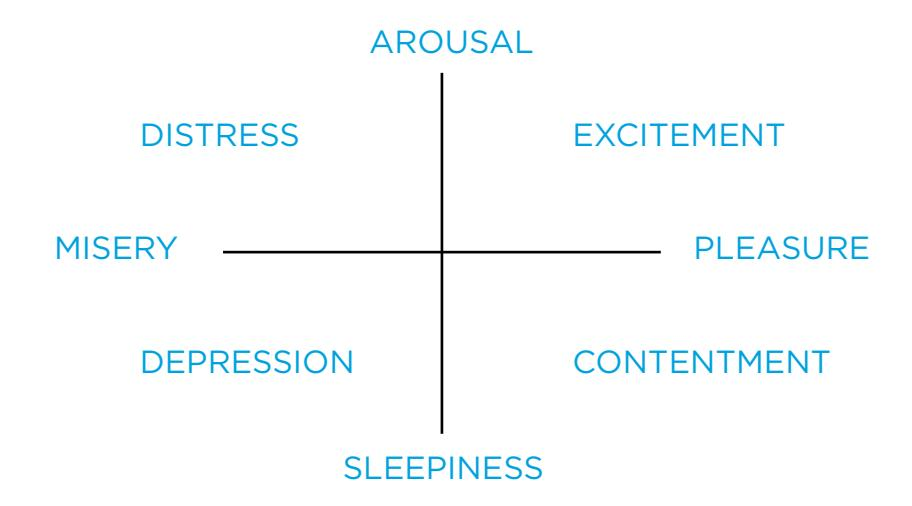

are: positive low arousal (e.g. contentment); positive high arousal (e.g*.* joy); negative low arousal (e.g*.* sadness); and negative high arousal (e.g. anger, stress). A good set of affect measures might attempt to cover all four quadrants.

Unlike overall life satisfaction, there is not an obvious choice of a simple affect measure that is suitable for inclusion in general household surveys. Most affect scales have been developed in the context of either the measurement of mental health or of more general psychological research. In the former case, many of the existing scales focus excessively on negative affect, while in the latter the questionnaire may be too long for practical use in a household survey. One model for collecting affect measures in a household survey is provided by the Gallup World Poll, which contains a range of questions on affect covering enjoyment, worry, anger, stress and depression, as well as some physical indicators such as smiling or experiencing pain, experienced by the respondent over the previous day. These questions now have a significant history of use and analysis behind them.11 A very similar set of questions (on positive affect only) was proposed by Davern, Cummins & Stokes.12

The affect questions contained in the core questions module are based on those in the Gallup World Poll and proposed by Davern et al., but reduced two questions covering the negative quadrants of the Circumplex model of affect and a single positive affect question. Only a single positive question is used because the different aspects of positive affect are, in practice, relatively closely correlated. The moods proposed for measurement in the OECD core set are being happy, worried and depressed. In each case, a 0 to 10 frequency scale is used for responses (ranging from "not at all," to "all of the time," which is similar to the scale anchors used in the European Social Survey).13

The eudaimonic question is based on a question trialed by the UK Office of National Statistics (ONS) in the Annual Population Survey: "to what extent do you feel the things you do in your life are worthwhile?" There is good evidence from the ONS data that this question captures information not provided by either life evaluation or affect measures.14 In addition, a similar question has been included in the ad hoc well-being module of the European Union Survey of Income and Living Conditions (EU-SILC) to be fielded in 2013. The question proposed here is similar to that used by the ONS and in EU-SILC. However, because there is as yet no overarching theory linking individual questions such as the one proposed to "eudaimonia" as a broad concept, the question should be regarded as experimental. In particular, although notions of meaning or purpose in life are a crucial part of eudaimonia, it is unclear as to whether a single question of this sort adequately captures all of the relevant aspects of eudaimonia.

## Best practice in data collection

Measuring subjective well-being in a consistent fashion requires not just using a common set of questions, but also taking into account a range of issues in survey design and implementation. It is important to consider the survey in which the subjective well-being questions are to be included as this affects both the type of information that can be collected and the range of covariates that can be analyzed. Beyond this, the specific details of survey and sample design, questionnaire design, and how the survey is implemented are also of crucial importance.

#### **Survey vehicles**

Subjective well-being measures are relevant in a wide range of contexts. Of particular importance for monitoring progress is the inclusion of such measures in integrated household surveys and in general social surveys. Time use surveys are the key vehicle for collecting detailed information on affect and its antecedents but it is possible to collect useful information on affect from other household surveys as well.

#### **Box 2. OECD question modules: beyond the core**

Much of the OECD Guidelines focus on the minimal set of questions for which international comparability is the highest priority. These are outlined in the core module (module A) containing the primary measure of life evaluation and a short set of questions addressing affect and eudaimonia. However, because the core questions are intended to be widely used, they are also brief. The entire core module is expected to take less than two minutes of survey time. This brevity prevents the core module from dealing with any of the aspects of subjective well-being in great depth.

The remaining five modules in the OECD Guidelines address the issue of depth. The first three of these modules (modules B, C, and D) address the concepts of life evaluation, affect, and eudaimonic well-being in more detail. Each module includes a range of measures related to the concept including multi-item scales consisting of several separate questions and measures of the different subdimensions related to each concept.

Multi-item scales are important because some of these—such as the Satisfaction With Life Scale are well tested and known to have higher statistical reliability than the single item questions contained in the core module. Although too long to include in the core, they may be valuable for national statistical offices to include in surveys where subjective well-being is an important focus and more time is available. Alternatively, they may be useful in more experimental contexts to help validate the single item measures used in the core.

Measures of sub-dimensions are particularly important for affect and eudaimonia. While the measures of affect included in the core will provide a useful summary, for some purposes more detailed information may be wanted. There is good evidence that the negative emotions in particular are only weakly correlated with each other and with positive affect.15 This means that

measuring additional negative emotions adds unique value to measurement.

Module E is different to the previous modules in that it focuses on people's evaluations of particular aspects of their life such as satisfaction with their health status or satisfaction with their personal relationships. These "domain evaluations" are more specific than overall life evaluation, but can play an important role in measuring overall well-being and in explaining variation in overall life evaluation.

Finally, module F focuses on the measurement of experienced well-being through time-use diaries. Experienced well-being measures involve collecting information on the moods and emotions people experience during different activities through the use of a time-use diary or via experience sampling, where people record their activity and affective state whenever prompted to by a pager. Obviously such data cannot be collected through a normal household survey, and are thus not suitable for the core measures. However, such data are extremely valuable and provide a different set of insights to the more standard survey questions. Module F provides two standard approaches for collecting experienced well-being data that can be implemented in official time use surveys.

All of the OECD question modules focus on information for surveys of the general population. However, there is also an important policy interest in the subjective well-being of children. The available evidence suggests that children are capable of responding effectively to subjective well-being questions from as young as age 11 with respect to measures of life evaluation and affective state.16 As the focus of the OECD Guidelines is on general population surveys, questions focused specifically at young children are therefore not provided in the question modules. However, this remains a significant gap that future work should address.

Measures of subjective well-being are also relevant to victimization surveys, health surveys, household income surveys, and special topic surveys. In particular, one-off special topic surveys are excellent vehicles for exploring aspects of subjective well-being in more depth, although they cannot be used to monitor changes in wellbeing over time due to their "one-off" nature.

Including measures of subjective well-being in panel surveys is important for research to explore causality and the drivers of subjective well-being.

### *What other information should be collected: covariates and analytical and variablezs.*

The range of covariates to collect alongside measures of subjective well-being will vary with the specific aspect of subjective well-being that is of interest and with the research question being examined. Despite this, it is possible to present some general guidelines on the most important information that should be collected in household or general social surveys alongside measures of subjective well-being.

- *t Demographics*: age, gender, place of birth, marital status (legal and social marital status), family type, number of children, household size, and geographic information
- *t Material conditions*: household income, consumption, wealth, housing conditions, and measures of material deprivation
- *tQuality of life*: employment status, health status, work/life balance, education and skills, social connections, civic engagement and governance, environmental quality, and personal security
- *t Psychological measures*: aspirations and expecta tions about the future, which form part of the frame of reference17 that individuals use when evaluating their lives or reporting their feelings

Although all of the measures of subjective wellbeing identified as suitable for inclusion in household surveys are equally relevant to time use surveys, the use of time diaries allows the collection of information on additional covariates in a way that is not possible in standard household surveys (e.g. activity classification, with whom an activity was performed, location where the activity took place). This is particularly useful where information on aspects of subjective well-being, such as affect, is collected for specific activities in the time-use diary itself rather than as an overall judgment as part of an individual questionnaire.

#### **Survey and sample design**

One important distinction between measures of subjective well-being and many of the measures typically included in official statistics is that subjective well-being measures will almost invariably need to be collected through sample surveys. In contrast to many economic or population statistics, there is generally no administrative database that would produce subjective information without, in effect, incorporating survey questions in an administrative process.18 Thus, issues relating to survey and sample design are fundamental to producing trustworthy and reliable measures of subjective well-being.

It is not the role of this chapter to provide detailed guidelines on sample frames and sample design. These are specialist areas in their own right, and excellent guides exist for data producers who are seeking advice on these technical aspects of data collection.19 However, in survey design, as in other aspects of design, form should follow function. The fact that subjective well-being is the goal of measurement has implications for survey design. This section hence discusses some of the most significant considerations for the measurement of subjective well-being with respect to the target population, to when and how frequently the data should be collected, to what collection mode should be used, and to identifying the most appropriate survey vehicle.

#### *Target population*

The target population for a survey describes the complete set of units to be studied. A sample survey will generally attempt to achieve a representative sample of the target population. While surveys may differ in terms of the population covered in terms of both concept (e.g. whether the institutional population is covered or not) and practice (e.g. in terms of including people living in collective living quarters, the specific resources to be shared in order to qualify people as members of the same households), most household surveys are restricted to people who are members of private households and are residents in the country to which the statistics relate. The same concept of usual residence should be applied when the focus is on measuring subjective well-being. However, the target population may be more detailed than the total population from which the sample is drawn. For example, the total population might be all persons aged 15 and over living in private dwellings in a specified area. However, the target population might specify males and females as sub-populations of interest, requiring the sampling frame to accommodate distinct analysis of these two groups. More generally, sub-groups are often defined by such characteristics as age, gender, ethnicity, employment status or migrant status.

The target age group for measures of subjective well-being will vary with respect to the goals of the research program. For example, in the context of research on retirement income policies, it may be appropriate to limit the target population to persons aged 65 or older. In general, however, for measures of subjective well-being, and particularly for the OECD core measures, the target population should normally be the resident population aged 15 and older, dwelling in private residences. It is important here to emphasize that the resident population should be captured rather than citizens of a country for two reasons. First, because most of the policy-relevant drivers of well-being relate to where a person lives, not their country of origin, and second, in order to ensure that international comparisons are comparing like with like.

Some surveys with the household as the unit of measurement rely on a single respondent (such as the head of household) to provide responses for the household as a whole. This approach cannot be used for measures of subjective well-being, since the cognitive process of evaluating and responding with respect to one's own subjective well-being is very different to that of providing an estimate of another householder's state of mind. As responses to questions on subjective well-being are inherently personal, the unit of measurement for subjective well-being must be the individual. This implies that the sampling frame must produce a representative sample of individuals. While this will typically not be an issue for surveys where the individual is the primary unit of analysis, some household surveys may require an additional set of individual weights to derive individual estimates. Surveys where the response is on the basis of "any responsible adult" will in particular be problematic in this regard.

#### *People not living in private households*

One population group that may be of high policy interest, but which is not typically covered in household surveys, is people not living in private households. This group includes people living in institutions, including prisons, hospitals or residential care facilities, as well as people with no fixed residence, such as the homeless. These groups raise two issues with respect to the measurement of subjective wellbeing. The first problem is common to all attempts to collect statistical information on such groups – that such population groups tend to be excluded from standard household survey sample frames. This means that, at a minimum, specific data collection efforts may be required to reach these groups, based on a sample frame designed to cover the relevant institutions. In some cases, such as for the homeless, it may be difficult to develop any statistically representative sampling approach at all.

A more significant challenge faced in the measurement of subjective well-being is that many of the people in the relevant groups may not be able to respond on their own behalf. This is particularly the case for people institutionalized for health-related

reasons that affect mental functioning (including people with some mental illnesses, with physical illnesses limiting the ability to communicate, and the very old). In these cases it is not possible to collect information on a person's subjective wellbeing. Proxy responses, which might be appropriate for some types of data (income, marital status, age), are not valid with respect to subjective well-being.

#### **Frequency and duration of enumeration**

The frequency with which data is collected typically involves a trade-off between survey goals and available resources. All other things being equal, more frequent collection of data will improve the timeliness of estimates available to analysts and policy makers, and will make it easier to discern trends in the data over time. More frequent enumeration, however, is more costly both in terms of the resources involved in conducting the data collection and in terms of the burden placed upon respondents. It is therefore important that decisions around the frequency of data collection are made with a clear view to the relationship between the timeliness and frequency of the data produced and the goals of the data collection exercise.

Aggregate measures of subjective well-being generally tend to change only slowly over time. This reflects the relatively slow movements in most of the social outcomes that affect subjective well-being and the fact that many changes only impact on a small proportion of the population. For example, the experience of unemployment which is associated with a change in life satisfaction of between 0.7 and 1 on a 0 to 10 scale for the person experiencing it 20— typically affects between 3% and 10% of the adult population. Thus, even a large shift in the unemployment rate — say, an increase of five percentage points — will translate only into a small change in measures of average subjective well-being 21 via its direct impact on the unemployed (there may also be an additional impact on the employed population if they feel less secure in their jobs).

The slow rate of change in measures of subjective well-being might suggest that such measures do not need to be collected frequently. However, the small absolute size of changes in subjective well-being also means that standard errors tend to be large relative to observed changes. A number of observations are therefore needed to distinguish between a genuine trend over time and simply noise in the data. Box 3 illustrates this point. For this reason, despite (or indeed, because of) the relatively slow rate of change in subjective wellbeing data, it is desirable that measures are collected on a regular and timely basis. For the most important measures used in monitoring well-being, annual time series should be regarded as the essential minimum in terms of frequency of enumeration. More frequent monthly or weekly data is, however, likely to be of lower value. It should be pointed out, however, that frequent, or rolling sample, surveys increase the possibilities for identifying the causal impacts of other factors whose dates of occurrence can be identified.22

#### *Duration of enumeration*

The duration of the enumeration period (i.e. the period of time over which information is collected) is very important for measures of subjective wellbeing. Unlike measures of educational attainment or marital status, for which it does not usually matter at what point during the year the data are collected, the precise timing of the collection period can have a significant impact on measured subjective well-being.23 For example, measures of positive affect are higher on weekends and holidays than on week days.24

The fact of being sensitive to the point in time at which they are collected is not unique to measures of subjective well-being. Many core labor market statistics, for example, have a pronounced seasonality, and published statistics usually adjust for this. However, such adjustments require collecting data over the course of a whole year in order to produce the information required for seasonal adjustments.

#### **Box 3. Identifying trends in subjective well-being: implications for frequency of measurement**

If measures of subjective well-being change only slowly over time, it might seem logical that they should be measured only infrequently. Figure 7.2 below illustrates why this assumption does not necessarily hold. The figure plots time series changes of life satisfaction in the Netherlands using data collected in the Eurobarometer from 1977 to 1997. Because the Eurobarometer has a relatively small sample size, the error is large relative to the size of changes over time. Between 1977 and 1997, life satisfaction in the Netherlands was largely static. Despite large fluctuations in the annual time series, the trend line for this 20-year period is almost flat.

Two additional lines included in Figure 7.2 illustrate what would emerge if information had been collected only every 10 years. If the base year were 1977, then a 10-yearly collection would show a slight decline in life satisfaction between 1977 and 1987, followed by a substantial increase from 1987 to 1997. The net effect over 20 years would be seen to be a significant increase in life satisfaction. Changing the base year to 1978 produces a different pattern, with life satisfaction declining from 1978 to 1988, before flattening out from 1988 to 1998. The overall effect over 20 years this time would be a slight decrease in life satisfaction. None of these 10-yearly patterns reproduces the pattern highlighted by annual data.

2.15 2.2 2.25 2.3 2.35 2.4 2.45 1977 1978 1979 1980 1981 1982 1983 1984 1985 1986 1987 1988 1989 1990 1991 1992 1993 1994 1995 1996 1997 1998 Annual data 10 yearly: base = 1978 10 yearly: base = 1977 Linear (Annual data)

**Figure 7.2. Life satisfaction in the Netherlands 1977-1997: Eurobarometer**

*Source:* Eurobarometer

The fact that some aspects of subjective wellbeing vary over the year suggests strongly that a long enumeration period is desirable. Ideally, enumeration would take place over a full year, and would include all days of the week, including holidays. This would ensure that measures of subjective well-being provide an accurate picture of subjective well-being across the whole year. Where a year-long enumeration period is not possible, enumeration should, as far as is possible, be spread proportionately over all the days of the week. All days of the week need to be covered because day of the week can matter, especially in the case of daily affect measures.25 Any attempt to measure the "typical" level of subjective well-being for a group would need to account for regular variations over time, and it may be necessary to develop a specific set of weights to ensure that responses from all days contribute equally to the final estimate.

Holidays (and to some degree the incidence of annual leave) are more problematic to deal with in that they tend to be distributed unevenly over the course of the year. Thus, if enumeration cannot be spread over a whole year, there is a risk that an incidence of holidays during the enumeration period that is higher or lower than normal might bias the survey results. For this reason, it is essential in the case of surveys collected with relatively short enumeration periods that data producers assess the impact of the inclusion of data collected during any holidays. While it may not be necessary to omit data collected during holidays if the impact is negligible or weak, the available evidence on the impact of some holidays suggests that testing for potential bias from this source is important. What constitutes a holiday will need to be considered with respect to the context in which the survey is collected. However, it is worth noting that Deaton finds a large effect on survey measures of subjective well-being for Valentine's Day in the United States, despite the day not being a public or bank holiday.26

#### **Sample size**

Large samples are highly desirable in any survey, as they reduce the standard error of estimates and allow both more precise estimates as well as a greater degree of freedom with respect to producing cross-tabulations and analysis of results for population sub-groups. With measures of subjective well-being, sample size is particularly important because of the relatively small changes in subjective well-being associated with many areas of analytical interest. Deaton, for example, notes that the expected decline in life satisfaction due to the changes in household incomes and unemployment associated with the 2008 financial crisis is less than the standard error on a sample of 1,000 respondents, and only three times larger than the standard error on a sample of 30,000 respondents.

Although it is impossible to give precise guidelines for what is an appropriate sample size, some general criteria can be noted. Most of the factors that should be taken into account in the planning of any survey also apply when collecting information on subjective well-being. Available resources, respondent burden, sample design (a stratified sample will have a different sample size to a random sample with the same objectives, all other things equal), anticipated response rate and the required output will all influence the desirable sample size. The need for sub-national estimates, in particular, will play an important role in determining the minimum required sample.

Beyond the general considerations mentioned above, which apply to all surveys, some features specific to measures of subjective well-being will influence the desired sample size. On a 0 to 10 scale, a change of one point of subjective well-being associated with a given change in the status of one of the drivers of subjective well-being (such as being unemployed rather than employed) implies a very large effect.27 Changes over time in average levels of subjective well-being tend to be even smaller than affects at the individual level. The analysis of subjective well-being data therefore requires a relatively large sample size in order to achieve the statistical precision required.28

#### **Survey Mode**

Surveys can be carried out in a number of different modes. Because the mode of collection influences survey costs and respondent burden and can induce mode effects in responses, the choice of mode is an important decision when collecting data. The two modes most commonly used to collect information on subjective wellbeing are Computer-Assisted Telephone Interviewing (CATI), conducted by an interview over the telephone, and Computer-Assisted Personal Interviewing (CAPI), where the interviewer is personally present when recording the data. Computer-Assisted Self-Interview (CASI) surveys can occur in the presence of an interviewer, when the interviewer is on hand but the respondent enters their own data into a computer, or without an interviewer present, such as when the respondent completes an internet survey. For some purposes, traditional paper-based self-complete surveys are still likely to be relevant. Most time-use diaries, for example, are self-completed paper diaries filled in by the respondent.

There is good evidence that the collection mode has a significant impact on responses to subjective wellbeing questions.29 In general, the use of CASI as a mode tends to produce lower positive self-reports than the use of CAPI, and this is assumed to be because interviewer-led approaches are more likely to prompt more socially desirable responding. CATI is viewed as the least reliable way to collect consistent subjective well-being data, because in these conditions the interviewer is unaware of whether the respondent is answering in a private setting or not, and it is more challenging for interviewers to build rapport with respondents.

As with other features of survey design, the choice of the survey mode will be influenced by a variety of factors, including resource constraints. However, the balance of evidence suggests that, where resources permit, CAPI is likely to produce the highest data quality. This is probably due in part to the rapport that interviewers can build in face-to-face situations. However, CAPI also provides the opportunity to use show cards, which CATI

lacks. Show cards that include verbal labels for the scale end-points are particularly valuable in collecting information on subjective well-being where the meaning of the scale end-points changes between questions, as this can impose a significant cognitive burden on respondents.30 For example, respondents may find that show cards assist in helping keep clear that a 10 on a question about happiness yesterday means happy "all of the time" yesterday (a good thing) but that a 10 on a question about being worried means that they were worried "all of the time" yesterday (a bad thing).

In terms of data quality, CAPI with show cards should be considered best practice for collecting subjective well-being data. Where other modes are used it is important that data producers collect information to enable the impact of mode effects to be estimated. National statistical agencies, in particular, should consider experimentally testing the impact of the survey mode on responses to the core measures of subjective well-being recommended by the OECD and publishing the results along with any evidence on the mode effect associated with CATI or CASI31 surveys.

#### **Questionnaire design**

Questionnaire design is an iterative process involving questionnaire designers, those responsible for determining survey content, and data users. A questionnaire designer must balance the cognitive burden on the respondent, a limited time budget for the survey, and the need to have a questionnaire that is clear, comprehensible and flows well, with different (and often competing) data needs. Some general guidance on issues affecting the inclusion of measures of subjective well-being into a survey is provided below. In particular, the section focuses on issues of question placement, question order and translation.

#### *Question placement*

Question order and the context in which a question is asked can have a significant impact on responses to subjective questions. Although measures of subjective well-being are not uniquely susceptible to such effects – question order and context will impact on all survey responses to some extent – the effect is relatively large in the case of subjective well-being. Several well-known examples suggest that such effects do need to be taken into account when incorporating questions on subjective well-being into a survey.

In general, question order effects appear to occur not because the question was early or late in the questionnaire *per se*, but because of the contextual impact of the immediately preceding questions. Thus, the key issue is to identify the most effective way to isolate questions on subjective well-being from the contextual impact of preceding questions. The most direct way of managing contextual effects of this sort is to put questions on subjective well-being as early in the survey as possible. Ideally, such questions should come immediately after the screening and household demographics questions that establish respondent eligibility to participate in the survey. This practice should eliminate many of the contextual effects and ensure that those that cannot be eliminated in this way are consistent from survey to survey.32

However, this cannot be a general response to the issue of dealing with contextual effects for two reasons. First, there will be instances when questions on subjective well-being are added to well-established surveys. In these conditions, changing the flow of the questionnaire would impose significant costs in terms of both resources and data quality. For example, introducing questions on subjective well-being early in such a survey might ensure that contextual effects do not impact on responses, but this might come at the expense of creating significant contextual effects for the following questions not related to subjective well-being. Second, in cases where there are several such questions in the survey, they cannot all be first.

With these factors in mind, four key recommendations emerge with regard to the placement of subjective well-being questions in surveys. These are as follows:

- *t Place important subjective well-being questions near the start of the survey.* Although, as noted above, placing questions early in a survey does not eliminate all of the problems associated with context effects, it is the best strategy available and should be pursued where possible. In particular, for the core measures of subjective well-being, for which international or time series comparisons are an important consideration, it is desirable to place the questions directly after the initial screening questions. The OECD core measures are intended to be placed at the start of a survey in this way.
- *t Avoid placing the subjective well-being questions immediately after questions likely to elicit a strong emotional response or that respondents might use as a heuristic for determining their response to the subjective well-being question.* This would include questions on income, social contact, labor force status, victimization, political beliefs or any questions suggesting social ranking. The best questions to precede subjective questions might be relatively neutral factual demographic questions.
- *t Make use of transition questions to refocus respondent attention.* One technique that has been used to address contextual effects resulting from a preceding question on a subjective well-being question is using a transition question designed to focus the respondent's attention on their personal life. The introduction of such a question in the Gallup Healthways Well-being Index in 2009 eliminated over 80% of the impact from a preceding question on politics on the subsequent life evaluation measure.33 However, it is important to consider that an additional question will add to the length of the survey and that there is still a risk that transition questions might introduce their own context effects. For example, drawing attention to a respondent's personal life may lead them to focus on personal relationships or family when answering subsequent questions about life overall. Development of effective transition questions should be a priority for future work.

*tUse of introductory text to distinguish between question topics*. Well-worded text that precedes each question or topic can serve as a buffer between measures of subjective well-being and sensitive questions. However, there is little hard evidence on the degree of effectiveness or optimal phrasing of such introductory text. A standard introductory text has been included in each of the OECD question modules. Consistent use of it should help reduce context effects (and will eliminate bias caused by inconsistent introductory text). Further cognitive testing or experimental analysis of the impact of different types of introductory text would, however, be of high value.

### *Question order within and between subjective wellbeing modules*

Questions on subjective well-being can be affected by previous subjective well-being questions just as easily as by questions on other topics. This has implications for the structure of subjective well-being question modules (particularly where more than one aspect of subjective well-being is addressed), as well as for the presentation of questions within modules and whether it is advisable to include several questions that address similar topics.

In terms of ordering question modules themselves, the evidence suggests that moving from the general to the specific may be the best approach.34 This implies that overall life evaluations should be assessed first, followed by eudaimonic wellbeing, then by more specific questions about recent affective experiences, and finally by domain-specific evaluative questions. Domain-specific measures in particular risk focusing respondent attention on those domains included in the questions, rather than thinking about their lives and experiences more broadly.

Question order within a battery of questions can also be important – particularly where a group of questions includes both positive and negative constructs (such as in the case of affect and some measures of eudaimonia). Although full randomization of such questions may be optimal, in

practice switching between positive and negative items may prove confusing for respondents, who may deal more easily with clusters of questions of the same valence. More evidence is needed to resolve this trade-off. In the meantime, consistency in the presentation (whether randomized or clustered) across all surveys will be important, particularly in terms of whether positive or negative constructs are measured first. In the question modules included in the OECD *Guidelines*, a clustered approach has been adopted.

Finally, asking two questions about a similar construct can be confusing for respondents, leading them to provide different answers because they anticipate that different answers must be required of them. This means that including several similar questions about life evaluations, for example, could lead respondents to react differently to these questions than when each question is presented in isolation. This underscores the importance of consistency in the number of measures used to assess a given construct, and in the order in which those measures are used.

### **Translation**

The exact question wording used in collecting information on subjective well-being matters a lot for responses. A standardized approach to question wording is therefore important for comparisons over time or between groups. This is relatively straight-forward where all surveys are in the same language. However, international comparisons or studies in multi-lingual countries raise the issue of translation. This is a non-trivial matter. Translating survey questionnaires to work in different languages is challenging for any survey, and the potential sensitivity of subjective wellbeing questions to differences in wording only reinforces this issue.

Potential issues arising from translation cannot be entirely eliminated, but they can be managed through an effective translation process. An example of good practice in the translation of survey questionnaires is provided by the *Guidelines for the development and criteria for the adoption of Health* 

*Survey Instruments*. 35 Although focused on health survey instruments, the framework for translation presented there has broader applicability, and is highly relevant to the measurement of subjective well-being. The health survey guidelines identify four main steps to the translation procedure:

- *t Initial or forward translation* of the questionnaire from the source document to the target language
- *t Independent review* of the translated survey instrument
- *t Adjudication* of the translated survey instrument by a committee to produce a final version of the translated survey instrument
- *t Back translation* of the final version of the translated survey instrument into the source language.

Back translation is somewhat controversial in the literature on survey design, with some experts recommending it and others not.36 The effect of back translation is generally to shift the focus onto literal translation issues rather than the conceptual equivalent of the original instrument. In the case of the measurement of subjective well-being, back translation is strongly advised. This reflects the sensitivity of subjective wellbeing measures to question wording.

#### **Survey implementation**

How a survey is implemented is crucial to its effectiveness. A poorly-implemented survey will result in low-quality and unreliable data regardless of the quality of the underlying questionnaire. In general, the features relevant to the effective implementation of any household survey also hold for those collecting information on subjective well-being.

#### *Interviewer training*

Interviewer training is crucial to the quality of responses in any survey. However, the measurement of subjective well-being raises additional issues because the subject matter may be unfamiliar to interviewers. This is, ironically, particularly so for national statistical agencies with a permanent force of field interviewers. Although a body of trained interviewers will generally contribute to higher response rates and better responses, interviewers may struggle with questions if they cannot explain adequately to respondents why collecting such information is important and how it will be used. Anecdotal evidence and feedback from cognitive testing shows that this can be an issue with some subjective measures, particularly measures of affect.37 In some cases, respondents may find it difficult to understand why governments might want to collect this information and that the concept that the survey intends to collect is their recently-experienced affective state rather than their "normal" state.

To manage risks around respondent attitudes to questions on subjective well-being, it is imperative that interviewers are well-briefed, not just on what concepts the questions are trying to measure, but also on how the information collected will be used. This is essential for interviewers to build a rapport with respondents and can be expected to improve compliance by respondents and the quality of responses. The OECD *Guidelines* contain an extensive discussion on the policy uses of subjective well-being measures and this can be used to complement information from data users in building a briefing for interviewers on the rationale for the data collection (see Box 4).

### *Ethical issues*

Evidence suggests that measures of subjective well-being are relatively non-problematic for respondents to answer. Rates of refusal to respond are low, both for life evaluations and for measures of affect.38 In general, item-specific non-response rates for subjective well-being measures are similar to those for marital status, education and labor market status, and much lower than those for measures of household income.39 Cognitive testing of measures of subjective well-being supports the conclusions reached from an examination of item-specific non-response rates,40 with some

#### **Box 4. The policy uses of subjective well-being data**

Official statistical agencies are under increasing resource pressures. This takes the form of both budget cuts, which preclude collecting all the information for which there is a potential demand, and issues of response burden. Even where funding exists to collect information, official statistical agencies must be careful not to over-burden respondents and jeopardize the good will on which high-quality responses depend. Because of this, collecting measures of subjective well-being will have an opportunity cost in terms of other data that will not be collected in order to produce such measures. If subjective well-being measures are to be included in official statistics, therefore, it is essential to be clear about how they will be used.

It is also important to be clear about how subjective well-being measures will be used for purely technical reasons. The field of subjective well-being covers

a wide range of different concepts and measures. Choosing which measures should be the focus of collection efforts requires knowing what the measures will be used for. Different measures of subjective well-being will be better suited to different purposes, and it is therefore important to identify the right measures needed given the core policy- and public-uses for the data.

Measures of subjective well-being have a wide variety of potential uses and audiences. For the purposes of these Guidelines it is useful to classify the possible uses of subjective well-being measures under a general framework. The following framework identifies three main ways in which measures of subjective well-being are used and notes what the measures are used for, why the information is valuable, who the target audience is, and what the key issues at stake are.

| Data Use                                                     | What                                                                                                                                                                                                                                                                                                                                                                                     | Why                                                                                                                                                                                                                                                                                                                                                                                                                                                                                                       | Who                                                                                                                                                                                                                                                                                                | Key Interpretive Issues                                                                                                                                                                                                                                                     |
|--------------------------------------------------------------|------------------------------------------------------------------------------------------------------------------------------------------------------------------------------------------------------------------------------------------------------------------------------------------------------------------------------------------------------------------------------------------|-----------------------------------------------------------------------------------------------------------------------------------------------------------------------------------------------------------------------------------------------------------------------------------------------------------------------------------------------------------------------------------------------------------------------------------------------------------------------------------------------------------|----------------------------------------------------------------------------------------------------------------------------------------------------------------------------------------------------------------------------------------------------------------------------------------------------|--------------------------------------------------------------------------------------------------------------------------------------------------------------------------------------------------------------------------------------------------------------------------------|
| (1) Comple menting exist ing measures of well-being | Core measures/ head line indicators used to examine: (i) national trends over time (ii) distribution of out comes across different groups within society (iii) distribution of outcomes across countries Includes indicators of central tendency or "level," as well as distribution, and the relative rate of rise or decline over time | To know if the changes affecting society have an impact on subjective well-being To identify vulnerable groups and areas of suffering – highlight ing where key drivers of subjective well-being may lie – and where there may be opportuni ties for policy interven tions To conduct interna tional benchmarking, assist in the interpreta tion of national data, and identify where countries may be able to learn from others' experiences | Governments (central, regional, local) Wider public Public, private and third sector organiza tions Researchers interested in country-level drivers of national well-being Individuals and orga nizations – e.g. making decisions about where to live and work | (i) What size of differ ence between groups or over time can be expected? (ii) What alternative explanations should be considered for observed differences? (iii) What is the role of culture and cultural bias in cross-country comparisons? |

| (2) Better understanding the drivers of subjective well being                                   | Analyses based on national and interna tional micro-data, with subjective well-being used as the dependent variable, to: (i) examine the relationship between subjective well-being and other important life circumstances, such as income and health (ii) inform policy op tions appraisal, design and evaluation (iii) inform policy trade-offs | To improve our under standing of well-being overall, by examin ing the relationship between subjective well being, life circumstanc es, and other important well-being outcomes To highlight areas of policy with the greatest potential to improve subjective well-being, and the life events/ circumstances most likely to put subjective well-being at risk To assist in govern ment decision-making processes, including the allocation of resources and the design ele ments of policies To inform the public and employers about the likely drivers of individual subjective well-being, providing better information for individual and organiza tional decision-making | Governments Researchers Individuals wanting better information to support decision making Employers wanting to understand and improve employee well-being | (i) What size of impact can be expected? (ii) How can the impacts of different drivers be compared?                                                                                                                           |
|-------------------------------------------------------------------------------------------------------------|------------------------------------------------------------------------------------------------------------------------------------------------------------------------------------------------------------------------------------------------------------------------------------------------------------------------------------------------------------------------------------------------------|-----------------------------------------------------------------------------------------------------------------------------------------------------------------------------------------------------------------------------------------------------------------------------------------------------------------------------------------------------------------------------------------------------------------------------------------------------------------------------------------------------------------------------------------------------------------------------------------------------------------------------------------------------------------------------------------------------------------------------------------------------------------------|--------------------------------------------------------------------------------------------------------------------------------------------------------------------------------------|-------------------------------------------------------------------------------------------------------------------------------------------------------------------------------------------------------------------------------------------|
| (3) Subjective well-being as an input for other analyses, particularly cost benefit analysis | Micro-data on subjec tive well-being, used as an input for other analyses, including: (i) as an explanatory variable for other ele ments of well-being or behavior (ii) used to estimate the value of non-mar ket goods and services, for the purposes of cost-benefit analyses                                                                                  | To better understand how subjective well being can contribute to other well-being out comes and shed light on human decision making processes, including the various biases that may be present To provide an alter native to traditional economic approaches to estimating the value of non-market goods, supporting government (and other organiza tions) in making deci sions about complex social choices                                                                                                                                                                                                                                                                                                | Researchers Governments Individuals wanting better information to support decision making Employers wanting to understand and improve employee well-being | (i) The sensitivity of subjective well-being data to non-market goods (ii) Measurement error and its impact on valu ations (iii) Covariates to include in regression models (iv) Time horizons for study |

notable exceptions. In particular, the ONS found that eudaimonic questions relating to whether respondents felt that what they did in their life was worthwhile and the experience of loneliness caused visible distress in some respondents, particularly among disabled and unemployed respondents.

Best practice suggests that statistical providers should consider how to manage the risks associated with questions that are distressing to respondents.41 Although it is important not to overstate the risks they apply mainly to eudaimonic questions, and to a small proportion of respondents – such issues should be dealt with effectively. A complicating factor is that it might not be evident at the time of the interview whether a respondent has been affected by the questioning. One approach to managing this issue proposed by the ONS is to distribute a leaflet at the time of the interview giving respondents information on the purpose of the survey and reiterating the confidentiality of the data collected.42 The leaflet would also contain information for distressed respondents about where to seek help.

#### *Coding and data processing*

The coding of information on subjective well-being is generally straightforward. In general, numerical scales should be coded as numbers, even if the scale bounds have labels. Much analysis of subjective well-being data is likely to be quantitative and will involve manipulating the data as if they were cardinal. "Don't know" and "refused to answer" responses should be coded separately from each other as the differences between them are of methodological interest.

Normal data-cleaning procedures include looking for obvious errors such as data coders transposing numbers, duplicate records, loss of records, incomplete responses, out-of-range responses or failure to follow correct skip patterns. Some issues are of particular relevance to subjective data. In particular, where a module comprising several questions with the same scale is used, data cleaning

should also involve checking for response sets. Response sets occur when a respondent provides identical ratings to a series of different items. For example, a respondent may answer "0" to all questions. This typically suggests that the respondent is not, in fact, responding meaningfully to the question and is simply moving through the questionnaire as rapidly as possible. Such responses should be treated as a non-response and discarded. In addition, interviewer comments provide an opportunity to identify whether the respondent was responding correctly, and a robust survey process will make provision for allowing such responses to be flagged without wiping the data record.

Finally, it is important to emphasize that much of the value from collecting measures of subjective well-being comes from micro-data analysis. In particular, analysis of the joint distribution of subjective well-being and other outcomes, and the use of subjective well-being measures in cost-benefit analysis (see Box 4 on policy uses) cannot usually be accomplished through tables of aggregate data. Because of this, a clear and comprehensive data dictionary is an essential output in any project focusing on subjective well-being. This data dictionary should have information on survey methodology, sampling frame and correct application of survey weights, as well as a description of each variable (covering the variable name, the question used to collect it and how the data are coded). If a variable is collected from only part of the survey sample due to question routing, this should be clearly noted in the data dictionary.

## National initiatives to measure subjective well-being

Although the OECD *Guidelines* were only released in March 2013, there has been substantial progress in collecting measures of subjective well-being in official statistics. Although the *Guidelines* themselves cannot take direct credit for these initiatives, extensive work by both the OECD and national statistical offices has ensured that the measures collected in national surveys are broadly comparable

and align both with each other and with the OECD core measures.

When the OECD produced the first *How's Life*? report in 2011, providing a broad measure of progress in OECD countries, the chapter on subjective well-being had to draw entirely on non-official sources of data. At the time, France and Canada were the only two OECD countries with high quality official measures of life evaluation similar to that which was eventually selected as the primary measure in the *Guidelines*. In the two years since then, leading up to the publication of the *Guidelines* in 2013, the situation has significantly changed. Table 7.1 lists the OECD countries that are either currently producing official measures of subjective well-being that align with the OECD *Guidelines* or that are currently in the process of planning for such a collection within the next 12 to 18 months. In particular, the table focuses on those countries that collect either the OECD primary measure or something directly equivalent to it.

One of the most important developments identified in Table 7.1 is the European Union inclusion of a well-being module as an add-on to the main EU survey of living conditions (EU-SILC). This module includes a question on life evaluation directly comparable to the OECD primary measure and a eudaimonic question that is very close to the one in the OECD core measures. As EU-SILC covers 27 EU countries as well as Croatia, Iceland, Norway, Switzerland, and Turkey, this will extend the available data from approximately a quarter of the OECD (those countries listed in Table 7.1) to the majority of the OECD, albeit with data updated only when the well-being module is run every six years. More importantly, although the decision has not been finalized, Eurostat (the EU Statistical Agency) has indicated that it is also considering including the primary life evaluation measure in the core of EU-SILC. This would make high quality annual data on life satisfaction available for the majority of the OECD.

The information contained in Table 7.1 is limited to those countries either currently producing

data in line with the OECD *Guidelines* or that are already well advanced in the process of planning for such a collection. Beyond this there is considerable interest in subjective data from many other countries both within the OECD and beyond. It is to be expected that over the next 18 months a significant number of additional countries will be able to be added to the table.

## Future directions

The OECD *Guidelines* mark an important step forward in the measurement of subjective well-being, but do not provide the "final word" on the subject. Although some aspects of the measurement of subjective well-being – such as questions on overall satisfaction with life – are well understood, other potentially important measures currently draw on much weaker evidence. It is expected that the evidence base on subjective well-being will develop rapidly over the next few years. In particular, to the extent that national statistical offices start regularly collecting and publishing data on subjective wellbeing, many methodological questions are likely to be resolved as better data become available, and an increasing body of knowledge will accumulate on the policy uses of these data.

The OECD *Guidelines* already identify a number of important issues that should inform future work by national statistical offices. Two issues in particular stand out: (1) the use of experimental techniques by national statistical offices; and (2) the necessity of collecting better income data alongside subjective well-being measures. Both issues are discussed further.

#### *Experimentation*

One important lesson has been the value of systematic experiments by national statistical offices. While the *Guidelines* were being drafted, the UK Office for National Statistics (ONS) was in the process of developing and collecting its first official measures of subjective well-being. Typically, national statistical offices invest in considerable

Table 7.1. Availability of official national statistics on subjective well-being

| Country           | Primary measure   | Other core measures |              | Periodicity                                    | Date for compa- | Source                                                                                                              |  |  |
|-------------------|----------------------|---------------------|--------------|------------------------------------------------|-----------------|---------------------------------------------------------------------------------------------------------------------|--|--|
|                   | (Life evaluation) | (Affect)            | (Eudaimonia) | -                                              | rable data      |                                                                                                                     |  |  |
| Australia         | Yes**                | No                  | No           | Every four years                               | 2014            | General Social Survey, Australian Bureau of Statistics                                                           |  |  |
| Canada            | Yes*                 | Yes**               | No           | Yearly                                         | 1985            | General Social Survey (GSS), Statistics Canada                                                                   |  |  |
| France            | Yes*                 | No                  | No           | To be determined                               | 2011            | L'enquête sur la qualité de la vie, INSEE                                                                           |  |  |
|                   | No                   | Yes*                | No           | To be de- termined                          | 2010            | L'enquête Emploi du temps, INSEE                                                                                    |  |  |
| Italy             | Yes*                 | No                  | No           | Yearly                                         | 2012            | Annual survey, Aspects of everyday life (Indagine multiscopo Aspetti della vita quotidiana), ISTAT            |  |  |
| Mexico            | Yes*                 | Yes*                | No           | Every two years                             | 2012            | Encuesta Nacional de Gastos de los Hog- ares, Subjective well-being (Bienestar Autorreportado – BIARE), INEGI |  |  |
|                   | No                   | No                  | Yes*         | Quarterly                                      | 2013            | Consumer Confidence Survey (ENCO), INEGI                                                                         |  |  |
| Morocco           | Yes*                 | No                  | No           | To be determined                               | 2012            | Enquête Nationale sur le Bien-être, Haut Commissariat au Plan                                                    |  |  |
| New Zealand       | Yes**                | No                  | Yes**        | Every two years                             | 2014            | New Zealand General Social Survey (NZGSS), Statistics New Zealand                                                |  |  |
|                   | Yes*                 | Yes*                | Yes*         | Quarterly                                      | 2011            | Annual Population Survey (APS), Office for National Statistics                                                   |  |  |
| United Kingdom | Yes*                 | Yes*                | Yes*         | Yearly                                         | 2012            | Crime Survey for England and Wales, Office for National Statistics                                               |  |  |
|                   | Yes*                 | Yes*                | Yes*         | Yearly                                         | 2011            | Wealth and Assets Survey, Office for National Statistics                                                         |  |  |
| United States     | No                   | Yes***              | Yes***       | To be de- termined                          | 2011            | American Time Use Survey, Bureau c Labor Statistics                                                              |  |  |
| European Union | Yes*                 | Yes**               | Yes*         | To be determined (potentially every six years) | 2013            | EU SILC 2013, Module Well-being                                                                                     |  |  |

\* In line with the OECD Guidelines on Measuring Subjective Well-being

\*\* Intend to be in line with the OECD Guidelines on Measuring Subjective Well-being

\*\*\* The US included subjective well-being indicators on experienced Affect and Eudaimonia in the *American Time Use Survey* 2011 (ATUS). These use a 0 to 6 scale but otherwise adopt a similar methodology to the OECD (and informed the OECD *Guidelines*).

methodological research up-front before collecting a new measure, but then implement collection in a homogenous way.

In developing their measures of subjective wellbeing the ONS deviated from this process significantly. Although the ONS did invest in methodological work before proceeding to measurement, rather than standardize on a single measure immediately, the ONS took an experimental approach by splitting the sample in their Household Opinion Survey and using this to test different questions, question order, and other methodological points.

The experimental approach adopted by the ONS has had an important impact with respect to knowledge of the validity and reliability of subjective well-being measures and best practice with respect to question design. However, the gains from the experimental approach are not limited to subjective well-being, and national statistical offices should look for opportunities to implement such an approach more widely.

#### *Income measures*

A second issue that emerged during the development of the *Guidelines* was the lack of high quality income measures in surveys that include subjective well-being questions. The relationship between income and subjective well-being has been a subject of interest since 1974 when Richard Easterlin identified the so-called "Easterlin paradox": that higher income is associated with higher happiness both between individuals and across countries, but there is no evidence that average happiness increases as average income increases over time.43 Understanding the causes of the Easterlin paradox is a high research priority because of the implications the paradox has for a range of policies. On a more technical level, one of the main policy uses for measures of subjective well-being is estimating the value of non-market outcomes. This involves obtaining precise measures of the impact of people's own income on their subjective well-being and comparing

this to the impact of marginal change in the non-market outcome in question on subjective well-being.

For both better understanding the Easterlin paradox and estimating the value of non-market outcomes, the quality of income measures in surveys is at least as important as the quality of subjective well-being measures. While national statistical offices collect high quality information on household income, and are increasingly collecting measures of subjective well-being, there are currently few data sources that bring the two together. Those surveys – both official and non-official – that include measures of subjective well-being typically collect income only in broad bands, and in the case of non-official surveys, often also have very high item-specific non-response rates for the income question. Filling this gap is a priority for the near future.

## Next steps

It is envisaged that the OECD *Guidelines* will be followed up by a review of progress on the measurement of subjective well-being over the next few years, with a view to deciding whether the guidelines need revising and whether it is possible and desirable to move towards a greater degree of international standardization. The intent is that this review will build on information collected by national statistical agencies, and will consider the feasibility of moving towards a more formal international standard for the measurement of subjective well-being.

- 1 In particular, the Commission noted that: *Recent research has shown that it is possible to collect meaningful and reliable data on subjective well-being. Subjective well-being encompasses three different aspects: cognitive evaluations of one's life, positive emotions (joy, pride), and negative ones (pain, anger, worry). While these aspects of subjective well-being have different determinants, in all cases these determinants go well beyond people's income and material conditions… All these aspects of subjective well-being should be measured separately to derive a more comprehensive measure of people's quality of life and to allow a better understanding of its determinants (including people's objective conditions). National statistical agencies should incorporate questions on subjective well-being in their standard surveys to capture people's life evaluations, hedonic experiences and life priorities.* (p216). Stiglitz et al. (2009).
- 2 OECD (2013). *Guidelines on measuring subjective well-being*. Paris: OECD. Retrieved from http://www.oecd.org/statistics/ Guidelines on Measuring Subjective Well-being.pdf
- 3 The definition used here draws largely on Diener et al. (2006).
- 4 e.g. Deaton (2011).
- 5 *Please imagine a ladder with steps numbered from 0 at the bottom to 10 at the top. Suppose we say that the top of the ladder represents the best possible life for you and the bottom of the ladder represents the worst possible life for you. If the top step is 10 and the bottom step is 0, on which step of the ladder do you feel you personally stand at the present time?*
- 6 *Overall, how satisfied are you with your life nowadays?*
- 7 Bjornskov (2010).
- 8 Some versions of the satisfaction with life question use different response scales, such as a 5-point labelled Likert scale or a 1 to 10 scale. Based on the conclusions from OECD *Guidelines* (OECD, 2013), the core module uses a 0 to 10 end-labelled scale.
- 9 Technically the Circumplex model implies that positive and negative affect are ends of a single dimension rather than a way of grouping several independent types of feeling. Here the Circumplex model is used as an organzing framework to help impose some structure on the range of different affective states, without assuming continuity on the positive/ negative axis. See Larson & Fredrickson (1999).
- 10 Derived from Russell (1980).
- 11 Kahneman & Deaton (2010).
- 12 Davern et al. (2007).
- 13 The European Social Survey "flourishing" module contains questions on competence, engagement, meaning, optimism, positive relationships, resilience, self-esteem, emotional stability, vitality, and positive emotion. See Huppert & So (2008) for more detail.

- 14 Abdallah & Shah (2012).
- 15 OECD (2013).
- 16 UNICEF (2007).
- 17 "Frame of reference" refers to the situation or group on which respondents base comparisons when formulating a judgement about their lives or feelings. The respondents' knowledge of how others live and their own prior experiences can influence the basis on which judgements are reached about the respondents' current status.
- 18 This is not, in fact, beyond the realm of possibility. Many government agencies may have an interest in collecting measures of client satisfaction. However, the case for collecting general measures of subjective well-being as a standard part of interactions with government service delivery agencies is beyond the scope of this paper.
- 19 UN (1986).
- 20 Winkelmann & Winkelmann (1998), Lucas et al. (2004).
- 21 Deaton (2011).
- 22 It was only the daily frequency of observations that made it possible to discover and eliminate the question-order effects in Deaton (2011).
- 23 Deaton (2011).
- 24 Helliwell & Wang (2011a), Deaton (2011).
- 25 See Helliwell & Wang (2011a).
- 26 Deaton (2011).
- 27 Boarini et al. (2012).
- 28 The need for a relatively large sample size is one reason to prefer a simple measure of subjective well-being with a low respondent burden in place of a technically more reliable multi-item measure with a higher respondent burden. The quality gains from a more detailed measure need to be assessed carefully against the quality losses associated with any reduction in sample size associated with a longer measure.
- 29 OECD (2013).
- 30 ONS (2012).
- 31 Internet surveys are, from this perspective, a way of implementing CASI.
- 32 OECD (2013).
- 33 See Deaton (2011). In this case the precise transition question used was: "Now thinking about your personal life, are you satisfied with your personal life today," and the subjective wellbeing measure that followed was the Cantril self-anchoring

ladder of life measure. It does not follow that the same transition question will work in other contexts, and transition questions should be tested empirically before being relied on.

- 34 OECD (2013).
- 35 Eurostat (2005).
- 36 Eurostat (2005).
- 37 ONS (2012).

- 38 Smith (2013).
- 39 Smith (2013).
- 40 ONS (2012).
- 41 OECD (2013).
- 42 ONS (2012).
- 43 Easterlin (1974).

## Bibliography

Abdallah, S., & Shah, S. (2012). *Well-being patterns uncovered: An analysis of UK data.* London: New Economics Foundation.

Balestra, C., & Sultan, J. (2012). Home sweet home: The determinants of residential satisfaction and its relation with well-being. *OECD Statistics Directorate Working Papers (forthcoming)*, OECD, Paris.

Bjørnskov, C. (2010). How comparable are the gallup world poll life satisfaction data?. *Journal of Happiness Studies, 11,* 41-60.

Blanchflower, D., & Oswald, A. (2008). Is well-being U-shaped over the life cycle?. *Social Science* & *Medicine*, *66*(8)*, 1733-1749.*

Blanchflower, D., & Oswald, A. (2011). International happiness. *NBER Working Paper No. 16668,* National Bureau of Economic Research.

Boarini, R., Comola, M., Smith, C., Manchin, R., & De Keulenaer, F. (2012). *What makes for a better life? The determinants of subjective well-being in OECD countries: Evidence from the Gallup World Poll*, STD/DOC 3. Paris: OECD.

Card, D., Mas, A., Moretti, E., & Saez, E. (2010). Inequality at work: The effect of peer salaries on job satisfaction. *NBER Working Paper 16396,* National Bureau of Economic Research.

Clark, A. E., Georgellis, Y., & Sanfey, P. (1998). Job satisfaction, wage changes and quits: Evidence from Germany. *Research in Labor Economics, 17*, 95-121*.*

Costa, P.T., Jr., & McCrae, R.R. (1992). *Revised NEO Personality Inventory (NEO-PI-R) and NEO Five-Factor Inventory (NEO-FFI) manual.* Odessa, FL: Psychological Assessment Resources.

Cummins, B., & Gullone, E. (2000). Why we should not use 5-point Likert scales: The case for subjective quality of life measurement. *Proceedings, Second International Conference on Quality of Life in Cities*, National University of Singapore, 74-93.

Davern, M., Cummins, R., & Stokes, M. (2007). Subjective wellbeing as an affective-cognitive construct. *Journal of Happiness Studies, 8,* 429–449.

Deaton, A. (2011). The financial crisis and the well-being of Americans. *Oxford Economic Papers, 64*, 1-26.

Diener, E., Helliwell, J. & Kahneman, D. (Eds.). (2010). *International differences in well-being*. New York: Oxford University Press.

Diener, E., Oishi, S., & Lucas, R. (2003). Personality, culture, and subjective well-being: Emotional and cognitive evaluations of life. *Annual Review of Psychology, 54*, 403-425.

Dolan P., Peasgood, T., & White, M. (2008). Do we really know what makes us happy? A review of the economic literature on the factors associated with subjective well-being. *Journal of Economic Psychology*, *29*, 94-122.

Dolan, P., & White, M. (2007). How can measures of subjective well-being be used to inform policy?. *Perspectives on Psychological Science*, *2*(1), 71-85.

Easterlin, R. (1974). Does economic growth improve the human lot? Some empirical evidence. In P. A. David & M. W. Reder (Eds.), *Nations and Households in Economic Growth: Essays in Honour of Moses Abramovitz* (89-125). New York: Academic Press Inc.

Eurofound. (2007). *2007* European Quality of Life Survey *Questionnaire.* Luxembourg: Office for Official Publications of the European Communities.

European Social Survey. (2007). *Final Source Questionnaire Amendment 03.*

Eurostat. (2004). *Guidelines on harmonised European time use surveys*. Luxembourg: Office for Official Publications of the European Communities.

Eurostat. (2005). *Guidelines for the development and criteria for the adoption of health survey instruments.* Luxembourg: Office for Official Publications of the European Communities.

Ferrer-i-Carbonell, A., & Frijters, P. (2004). How important is methodology for the estimates of the determinants of happiness. *The Economic Journal, 114*, 641-659.

Frey, B. S., & Stutzer, A. (2000). Happiness, economy and institutions. *The Economic Journal*, *110*(466), 918-938.

Frey B. S., & Stutzer, A. (2008). Stress that doesn't pay: The commuting paradox. *Scandinavian Journal of Economics*, *110*(2), 339-366.

Gallup Organisation. (2012). *Indexes and Questions.*

Goldberg, D.P., et al. (1978). Manual of the general health questionnaire. Windsor, England: NFER Publishing.

Gutiérez, J., Jiménez, B., Hernández, E., & Puente, C. (2005). Personality and subjective well-being: Big five correlates and demographic variables. *Personality and Individual Differences, 38*, 1561-1569.

Harkness, J., Pennell, B.-E., & Schoua-Glusberg, A. (2004). Survey questionnaire translation and assessment. In S. Presser, J. M. Rothgeb, M. P. Couper, J. T. Lessler, E. Martin, J. Martin & E. Singer (Eds.), *Methods for testing and evaluating survey questionnaires.* Hoboken, NJ: John Wiley & Sons, Inc.

Helliwell, J. F. (2008). Life satisfaction and the quality of development. *NBER Working Paper No. 14507,* National Bureau of Economic Research.

Helliwell, J., & Wang, S. (2011a). Weekends and subjective well-being. *NBER Working Paper No. 17180,* National Bureau of Economic Research.

Helliwell, J. F., & Wang, S. (2011b). Trust and well-being. *International Journal of Wellbeing.* Retrieved from www.internationaljournalofwellbeing.org/index.php/ijow/issue/current

Helliwell, J., Layard, R., & Sachs, J. (Eds.). (2012). *World happiness report.* New York: Earth Institute

Huppert, F., & So, T. (2008). Deriving an objective definition of well-being. *Working paper*. Well-being Institute, University of Cambridge.

INSEE. (2010). *Enquete Emploi du Temps 2010.*

Kahneman, D., & Deaton, A. (2010). High income improves life evaluation but not emotional well-being. *Proceedings of the National Academy of Sciences*, *107*(38), 16489-16493.

Kahneman, D., Diener, E., & Schwarz, N. (1999). *Well-being: Foundations of hedonic psychology*. New York: Russell Sage Foundation.

Kahneman, D., & Krueger, A. B. (2006). Developments in the measurement of subjective well-being. *Journal of Economic Perspectives, 20*(1), 19-20.

Kroh, M. (2006). An experimental evaluation of popular wellbeing measures. *DIW Berlin Working Paper 546.*

Krueger, A. B., & Mueller, A. I. (2012). Time use, emotional well-being, and unemployment: Evidence from longitudinal data. *The American Economic Review, 102*(3), 594-599.

Larsen, R. J. & Fredrickson, B. L. (1999). Measurement issues in emotion research. In D. Kahneman, E. Diener & N. Schwarz (Eds.), *Well-being: Foundations of hedonic psychology* (pp. 40-60). New York: Russel Sage Foundation.

Lucas, R. E. (2007). Long-term disability is associated with lasting changes in subjective well-being: evidence from two nationally representative longitudinal studies. *Journal of Personality and Social Psychology, 92*(4), 717-730.

Lucas, R., Clark, A., Georgellis, Y., & Diener, E. (2004). Unemployment alters the set point for life satisfaction. *Psychological Science, 15,* 8-13.

Michaelson, J., Abdallah, S., Steur, N., Thompson, S., & Marks, N. (2009). *National accounts of well-being: Bringing real wealth onto the balance sheet*. London: New Economics Foundation.

Organisation for Economic Co-operation and Development (OECD). (2009). *Doing better for children*. Paris: OECD Publishing.

OECD. (2013). *OECD guidelines on measuring subjective wellbeing.* Paris: OECD Publishing.

Office for National Statistics (ONS). (2011). *Initial investigations into subjective well-being from the opinions survey.* United Kingdom: ONS.

ONS. (2012). *Subjective well-being: A qualitative investigation of subjective well-being questions*. United Kingdom: ONS.

Oswald F., Wahl, H., Mollenkopf, H., & Schilling, O. (2003). Housing and life satisfaction of older adults in two rural regions in Germany. *Research on Aging, 25*(2), 122-143.

Pavot, W. & Diener, E. (1993). Review of the satisfaction with life scale. *Psychological Assessment, 5*(2), 164-172.

Ravallion, M. (2012). Poor, or just feeling poor? On using subjective data in measuring poverty. *World Bank Policy Research Working Paper No. 5968.* Washington DC: World Bank Development Research Group.

Russell, J. (1980). A circumplex model of affect. *Journal of Personality and Social Psychology, 39*(6), 1161-1178.

Sacks, W. D., Stevenson, B., & Wolfers, J. (2010). Subjective well-being, income, economic development and growth. *NBER Working Paper 16441*.

Silva, J., De Keulenaer, F., & Johnstone, N. (2012). Environmental quality and life satisfaction: Evidence based on micro-data. *OECD Environment Directorate Working Paper No.44.* Paris: OECD Publishing.

Smith, C. (2013). Making happiness count: Four myths about subjective measures of well-being. OECD Paper prepared for the ISI 2011: Special Topic Session 26.

Stiglitz, J., Sen, A., & Fitoussi, J.-P. (2009). *Report by the commission on the measurement of economic and social progress*. Paris: OECD. Retrieved from http://www.stiglitz-sen-fitoussi.fr/documents/rapport\_anglais.pdf

Tinkler, L., & Hicks, S. (2011). *Measuring subjective well-being.*  United Kingdom: ONS.

United Nations Children's Fund. (2007). *Child poverty in perspective: An overview of child well-being in rich countries,* Innocenti Report Card 7. Florence: UNICEF Innocenti Research Centre.

United Nations Economic Commission for Europe Secretariat. (2009). *Revised terms of reference of UNECE/WHO/Eurostat steering group and task force on measuring health status*. UNECE.

United Nations Office on Drugs and Crime (UNODC) & United Nations Economic Commission for Europe (UNECE). (2010). *Manual on victimization surveys.* Geneva: United Nations.

United Nations Statistical Division. (1984). *Handbook of household surveys*. New York: United Nations.

United Nations Statistical Division. (1986). *National household survey capability programme, sampling frames and sample designs for integrated survey programmes. Preliminary version*. New York: United Nations.

Van Praag, B.M.S., Frijters, P., & Ferrer-i-Carbonell, A. (2003). The anatomy of subjective well-being. *Journal of Economic Behaviour and Organisation, 51*, 29-49.

Veenhoven, R. (2008). The international scale interval study: Improving the comparability of responses to survey questions about happiness. In V. Moller & D. Huschka (Eds.), *Quality of life and the millennium challenge: Advances in quality-of-life studies, theory and research*. Social Indicators Research Series, *35,* Springer, 45-58.

Ware, J., & Gandek, B. (1998). Overview of the SF-36 health survey and the international quality of life assessment (IQOLA) project. *Journal of Clinical Epidemiology, 51*(11), 903-912.

Weinhold, D. (2008). How big a problem is noise pollution? A brief happiness analysis by a perturbable economist. *MPRA Working Paper No. 10660*.

Winkelmann, L., & Winkelmann, R. (1998). Why are the unemployed so unhappy? Evidence from panel data. *Economica*, *65*, 1-15.

World Health Organization. (2012). *World Health Survey Instruments and Related Documents.*

Chapter 8.

## FROM CAPABILITIES TO CONTENTMENT: TESTING THE LINKS BETWEEN HUMAN DEVELOPMENT AND LIFE SATISFACTION

JON HALL

**Jon Hall**: Human Development Report Office, UNDP

Those who are interested in promoting the collection and use of subjective well-being data often cite the importance of such data to help balance the attention placed on indicators of macroeconomic activity, such as Gross Domestic Product, as metrics for national progress or development.1 The same concerns played a formative role in the conception of the human development approach.2 Two economists, Mahbub ul Haq and Amartya Sen, developed the approach as an alternative to seeing economic growth as the sole measure of development. As the United Nations Development Programme's (UNDP) first Human Development Report said, "This Report is about people — and about how development enlarges their choices. It is about more than GNP growth, more than income and wealth and more than producing commodities and accumulating capital. A person's access to income may be one of the choices, but it is not the sum total of human endeavour."3 And so, at the outset of this chapter, it is important to note that the two approaches are not antithetical to each other: they were both developed, in part at least, as ways to tackle the same problem.

Nor should the quest for human development be seen as competing with the quest for increasing happiness: by looking at the human condition through different lenses, the two approaches can provide alternate, but complementary, pictures of — and improvements to — human lives. One of the insights that subjective data can bring to many aspects of life is the ability to compare people's perceptions with the objective evidence. As an aside, some would argue that the term "objective evidence" is often misleading as such data are often partly subjective and gathered from self-reported data collected through personal or household surveys. Consider, for instance the unemployment rate, which is officially calculated by asking people whether they were "actively looking for work" and those who answer "*no"* are not treated as unemployed. Interpretations of both "actively" and "looking" are inherently subjective: is a weekly scan of the situation vacant adverts as active as sending off a dozen resumes to prospective employers?

In any case, it is usually people's own perceptions of the state of the world, rather than other's measurements – or perceptions — of the "facts," that drive individual behavior. And so contrasting the objective data with perceptions is often necessary for understanding the nature of a problem and the ways in which it should be tackled. In other words, "measures of both objective and subjective well-being provide key information about people's quality of life."4

Crime is a good example. Consider, for instance, two communities with identical crime rates. But in one people are terrified to leave their homes, and in the other people don't bother to lock their doors. Different strategies are required in each to improve well-being: crime should be tackled in both, but in the former community citizens might need to be encouraged to be less fearful. In the latter they might be encouraged to take more appropriate precautions. And both behavior changes could also help to reduce crime rates.

And so it is that data on subjective well-being and especially life evaluations — can help answer important questions about human development, while data on human development can help us to understand differences in life evaluations. This chapter of the report looks at the similarities between the approaches and the differences too. It will emphasize how the two approaches can complement one another by looking at the world through different lenses: as an Indian proverb says, it is better to be blind than to see things only from one point of view.

## Defining Human Development

The human development approach arose in part as a result of growing criticism to the approaches prevailing in the 1980s, which presumed a close link between national economic growth and greater well-being. As Amartya Sen said, "Human development, as an approach, is concerned with what I take to be the basic development idea: namely, advancing the richness of human life,

rather than the richness of the economy in which human beings live, which is only a part of it."5

The human development approach is based on the twin – and related – concepts of functionings and capabilities. Functionings can be broadly defined as people's "beings and doings": those things that together describe our lives. Being fed, being sheltered, being hungry, being cold are examples of the group of *being* functionings. Travelling, working, attending the cinema, voting are examples of the *doing* group. Sen described five broad categories of functionings: political freedoms, economic facilities, social opportunities, transparency guarantees, and protective security.6

Capabilities, broadly defined as freedoms to "lead the kinds of lives we have reason to value,"7 are people's opportunities to achieve desirable functionings. Freedom, or agency, is central to the human development approach, and so both capabilities and functionings are important. Being well-nourished or being under-nourished are different functionings. But if the latter arises from poverty then it is a more undesirable outcome than if it is comes through choice (from fasting, say). So here, Sen would argue, it is the capability to enjoy an adequate diet that is the true measure of development, not simply whether an individual chooses to make use of that opportunity and actually eat.

Some functionings compete for resources against one another and so the human development approach sees that each person chooses a set of functionings (a life path) from among those they are capable of achieving given the capabilities they possess. For instance, people may be able to exercise the freedom to travel the world and have the skills to find a job in a different country, but choosing this path may come at the expense of being able to spend time with one's family. Similarly, enjoying freedom to choose from different options can come with the expense of greater complexity in life. This ability to choose from different functionings is an integral part of the human development approach.

The definition of human development has always been flexible and open-ended and there are as many dimensions of human development as there are ways of enlarging people's choices. But applying the approach generally requires one to identify things that matter to a particular community at a point in time and the Human Development Reports, since the first in 1990, have published the Human Development Index (HDI) as a measure of human development. The authors of the reports have always recognized, however, that the concept of human development is much broader than the HDI. It is impossible to come up with a comprehensive measure, or even a comprehensive set of indicators, because many vital dimensions of human development are nonquantifiable. But while a comprehensive single indicator is impossible, progress is being made on identifying indicator sets covering issues that are widely recognized as important around the world.8 That said, some core dimensions of human development include:9

- *Education, Health and Command over resources*  (income and nutrition).
- *Participation and freedom*: particularly empowerment; democratic governance; gender equality; civil and political rights; and cultural liberty; particularly for marginalized groups defined by urban-rural, gender, age, religion, ethnicity, physical/mental parameters, etc. Social support is also included here.
- *Human security* : security in daily life against such chronic threats as hunger and abrupt disruptions including joblessness, famine, conflict, crime, etc.
- *Equity:* in the distribution of all of the above.
- *Sustainability*: for future generations in ecological, economic and social terms.

This chapter will return to some of these areas in due course.

## Measuring Human Development

Human development can be measured in many ways but the best-known measure is UNDP's Human Development Index (HDI), developed by Amartya Sen and Mahbub Ul Haq back in the early 1990s as an attempt to challenge GDP's hegemony in development discourse. The HDI was introduced explicitly to challenge that orthodoxy.10 Though it was always seen as a crude measure that missed many aspects of human development, such as equity and sustainable development, it did recognize the multifaceted nature of human well-being by going beyond income alone. Indeed the HDI has helped transform the debate about development by demonstrating that while economic growth may foreshadow progress in health and education, this is not guaranteed. Moreover, a number of countries have seen relatively weak economic growth in recent years but enjoyed strong progress in health and education, as the figure from the 2010 Human Development Report shows below.

The left panel shows a positive association —though with substantial variation — suggesting that growth and improvements in human development are positively associated. Remember, however, that income is part of the HDI; thus, by construction, a third of the changes in the HDI come from economic growth, guaranteeing a positive association. A more useful exercise is to compare income growth with changes in the non-income dimensions of human development. The 2010 HDR did this using an index similar to the HDI but calculated with only the health and education component indicators of the HDI to compare its changes with economic growth. The non-income HDI is presented in the right panel of the figure below. The correlation is remarkably weak and statistically insignificant.11

#### **Weak relationship between economic growth and changes in health and education**

Relationship between economic growth and the HDI and its non-income components, 1970-2010

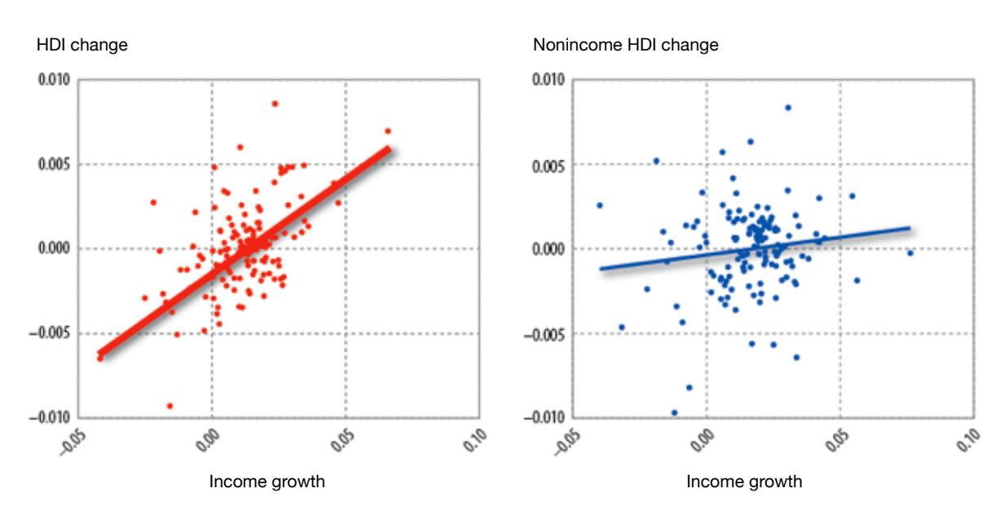

*Note:* Based on the analysis of deviation from fit (see *Human Development Report 2010,* box 2.1.) Income is per capita GDP. Thicker regression line indicates relationship is statistically significant.

*Source:* UNDP, *Human Development Report 2010,* figure 3.1. (HDRO calculations using data from the HDRO database)

Previous studies have found the same result. One of the first scholars to study this link systematically was US demographer Samuel Preston, who showed that the correlation between changes in income and changes in life expectancy over 30 years for 30 countries was not statistically significant.12

## The links between human development and happiness

Although, as already explained in this chapter, the two approaches share much in common, a key difference between them is that while human development is first and foremost a conceptual approach, subjective well-being is an empirical one. And so while an increase in human development must be — by definition — desirable, it is not so simple to tell whether such increases have happened. Instead human development is recognized as an open-ended concept which can be measured only partially using indices like the HDI. It is an approach that uses multiple dimensions and non-monetary measures of well-being to assess development; stresses the importance of freedom and opportunity; and recognizes that people convert their capabilities into well-being at different rates.

On the other hand, while it is possible to directly measure an individual's subjective well-being, it is not possible to be certain that improvements in subjective well-being are always socially (or individually) desirable because subjective well-being is defined empirically (just because someone feels happier doesn't necessarily mean they have more to feel genuinely happy about). These differences have been used by experts on either side to criticize the other approach. But these differences also demonstrate why the two approaches complement each other: using information about both human development and subjective wellbeing together can strengthen understanding of the whole picture.

As noted above, human development is broadly defined as endowing people with the opportunities to live a life "they have reason to value." This raises a rather obvious question: do people actually value their experience of living in the ways that human development practitioners believe they should? This question has been a key criticism of the capability approach, as the approach offers "no guidance" on how to decide which aspects of people's lives (functionings) constitute welfare.13,14 And so it is possible that those who human development economists believe are living lives they should value highly do not actually share that assessment. As a result the approach has been labeled by some as "paternalistic."15 This criticism is the equal — but opposite — of that made by Amartya Sen against relying on happiness as a measure of development: namely that "a grumbling rich man may well be less happy than a contented peasant, but he does have a higher standard of living than that peasant."16 In other words, both arguments show that life satisfaction is not necessarily the same as human development. This (potential) difference could be a problem for proponents of subjective well-being who feel that indicators of life satisfaction are indicative of broad development. And it could be a problem for proponents of human development who define human development as offering people the opportunity to lead lives they value.

However, while both arguments are logically possible, are they likely in reality? What do we know about the conditions under which people can achieve a higher level of human development but not see their overall life satisfaction increase, and *vice versa*?

Reassuringly many of the key determinants for human happiness — tested on the basis of empirical relationships — are also central to the human development concept, as research from over 30 years has demonstrated.

Chapter 3 of the first *World Happiness Report* described the factors that affect happiness and misery, noting that income, education, health and work were all important, as were personal and economic security, the quality of people's relationships,

corruption (or rather a lack of it), and personal freedom, the rule of law and the quality of the environment.17 Chapter 2 of this year's report finds that six variables together explain some 75% of differences in average happiness across countries and time. Four of these six variables are typical measures of human development, namely income (measured by log of GDP per capita), healthy life expectancy at birth, freedom to make life choices and social support. The other two measures — corruption and generosity— while not always seen as measures of human development are certainly not contradictory to the human development approach. Indeed one could argue that corruption in particular is a measure of human development as it reduces people's freedoms to live their lives in the way they want, while there is a growing literature on the links between altruism and human progress.18 And so, as one might expect given their shared origins, there seems much to unite the two approaches.

Meanwhile, using data from the United Kingdom, Paul Anand and colleagues examined the relationship between subjective well-being and people's capabilities, concluding that "life satisfaction is highly multivariate with respect to capabilities" and that the relationships were "reasonably robust" among different age groups and between men and women.19

Given the very considerable similarities between the thinking about human development and happiness it is difficult to understand why the two schools of thought are not more closely aligned. Perhaps one reason is that when human development experts hear the word "happiness" they think of the positive affect of day to day emotions (*happiness* in the emotional sense), rather than happiness defined in terms of overall life evaluation (*happiness* in the evaluative sense). In this chapter the word happiness is used to mean longer term life evaluations, a meaning which has closer conceptual links to the human development approach (remember, *lives they have reason to value*).20

## What Do The Data Show?

As argued, measures of human development and life evaluations should, in theory, be closely related. Three questions on the conceptual and empirical links between the two approaches are investigated.

- 1. Do those countries with higher human development according to the HDI (and therefore, as UNDP believes, with citizens who highly value the lives they lead) actually report higher life evaluations?
- 2. What are the empirical links between other aspects of human development, beyond the HDI, and overall life evaluations?
- 3. How do the variables that correlate strongly with life evaluation relate conceptually to human development theory?

All of the analysis that follows, other than the exceptions noted,21 uses annual national data averaged over the period 2010-12, in common with Chapter 2. The numbers of countries in the sample range from 124 to 152 depending on the variables used.

*Question 1: Do those countries with higher human development according to the HDI (and therefore, as UNDP believes, with citizens who have a higher reason to value the lives they lead) actually enjoy higher life evaluation?* 

Human development is an open-ended concept, and many things could be treated as dimensions of human development because they represent capabilities or functionings. Let's start with the HDI, which is the measure used by UNDP to rank countries but is, as the UNDP recognizes, only a partial measure of human development.

Health, income and education are all included in the HDI. Recall that the measures comprising the HDI are life expectancy at birth (as a proxy measure of overall health); both expected and mean

years of education (as proxies for how educated a country is and how educated it will be); and Gross National Income (GNI) per capita (as a proxy for command over resources), though the HDI uses the natural logarithm of GNI to account for the diminishing returns to scale associated with higher income: an extra dollar in the pocket of someone earning \$100 a year is far more important to their command over goods and resources than it would be for someone earning \$50,000 a year.

The following graphs and data show that the components of the HDI all correlate strongly with better life evaluations. Country life evaluations are measured using average national responses (2010-2012) to the Gallup World Poll Question: *Please imagine a ladder, with steps numbered from zero at the bottom to ten at the top. Suppose we say that the top of the ladder represents the best possible life for you, and the bottom of the ladder represents the worst possible life for you. On which step of the ladder would you say you personally feel you stand at this time, assuming that the higher the step the better you feel about your life, and the lower the step the worse you feel about it? Which step comes closest to the way you feel?*

Higher life expectancy at birth is strongly correlated with higher life evaluations, with a correlation coefficient of 0.70.

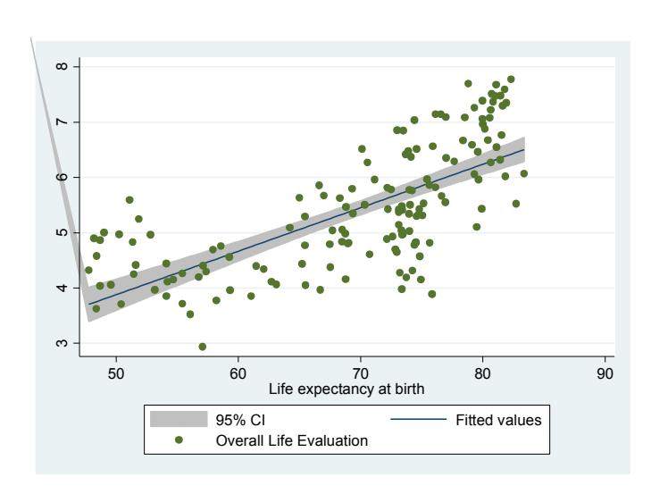

Expected years22 and mean years23 of schooling are, unsurprisingly, quite strongly correlated with each other (a correlation coefficient of 0.84) with expected years of schooling rather more correlated with higher life evaluation (0.69) than mean years of schooling (0.63).

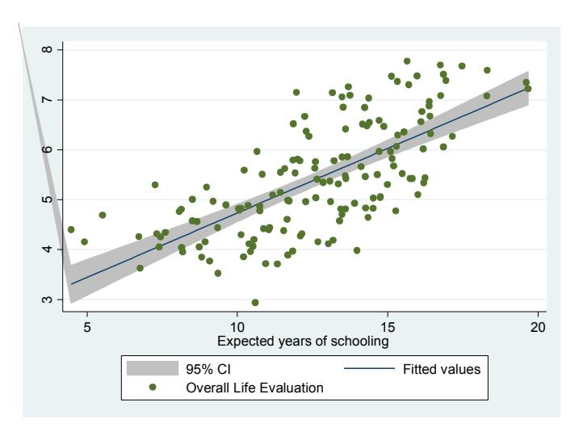

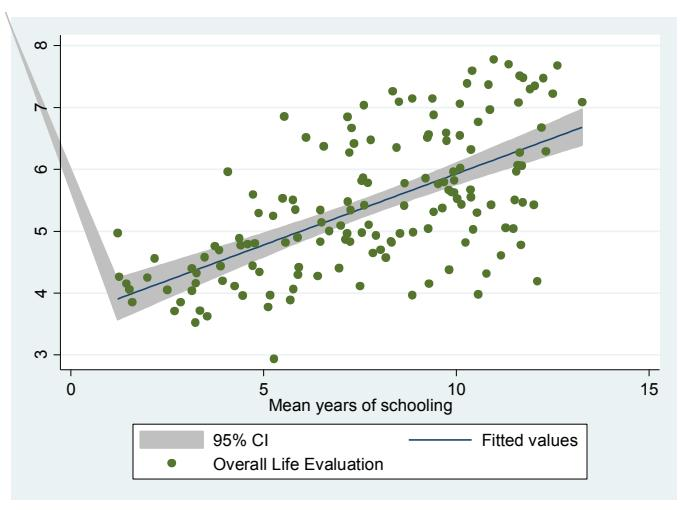

The shape of the scatter plot for GNI versus life evaluation (with a correlation of 0.73) suggests that taking the logarithm transform is also important here.

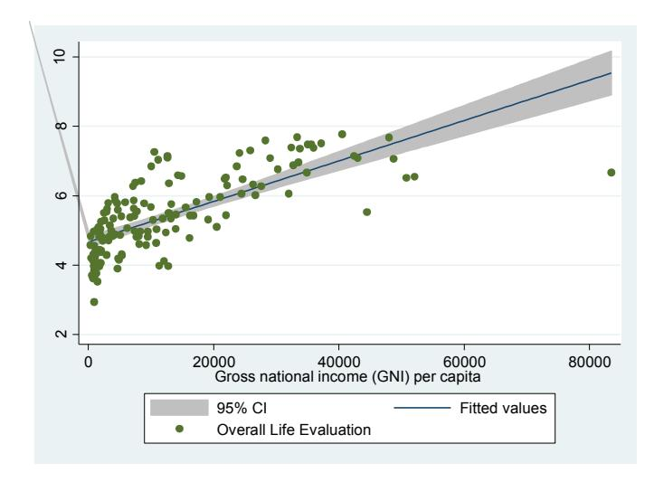

And the following graph confirms that, with a correlation of 0.78.

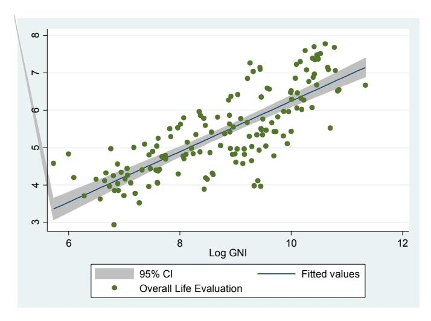

Finally the correlation between HDI and life evaluation is, at 0.77, similar to the correlation between life evaluation and log GNI.

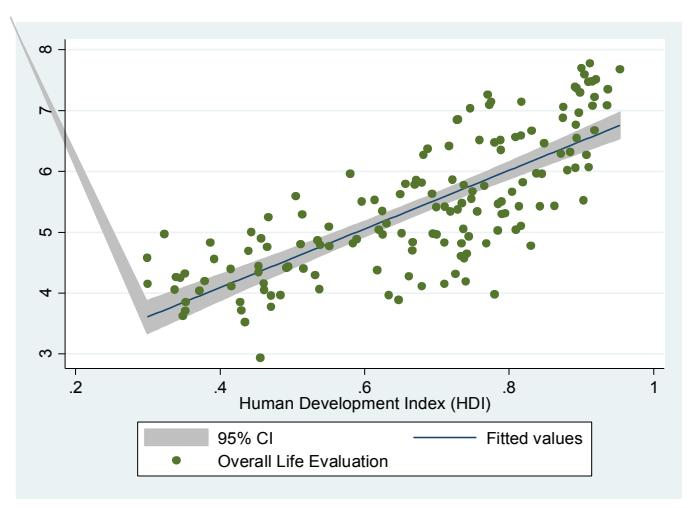

Chapter 2 investigates the trends, explanations and distribution of world happiness. It finds that income (measured with the log of Gross Domestic Product) is an important explanatory variable for life evaluation (see the equation of Table 2.1). Income is also, of course, a component of the HDI. So a natural question is to ask whether the correlation between life evaluation and the HDI is being driven by the correlation with income.

To test this we can look at the links between the non-income components of the HDI (i.e. the index computed from the health and education indicators only) and the life evaluation data after controlling for the explanatory effect of income on the data using the results in Chapter 2 (i.e. subtracting, from each life evaluation score, the log of per capita GDP multiplied by the coefficient for income as given in the equation of Table 2.1).

There remains a strong correlation (0.67) between life evaluation (after adjusting for the effect of income) and non-income HDI. So there is a strong relationship between the HDI and life evaluation, even after the effect of income has been controlled for.24

### *Question 2: What are the empirical links between life evaluations and other aspects of human development beyond the HDI?*

Which other aspects of human development, beyond the HDI, might be considered in this analysis? The 1990 Human Development Report listed several important aspects of human development, noting that "people often value achievements that do not show up at all, or not immediately, in higher measured income or growth figures: better nutrition and health services, greater access to knowledge, more secure livelihoods, better working conditions, security against crime and physical violence, satisfying leisure hours, and a sense of participating in the economic, cultural and political activities of their communities."25

Many more aspects of human development could be considered because there are as many variables for human development as there are ways of enlarging people's choices. But for this analysis we will consider some of the key examples that were included in the very first Human Development Report in 1990 — namely work, security, and participation in economic and political life.26 And we also included freedom (which is intrinsic to the very notion of human development) and inequality.

Some of these aspects are more amenable to direct measurement than others, and the measures in the analysis that follow are only partial proxies for each component of human development with which they are linked.

#### **Better Working Conditions**

International data on overall working conditions *per se* are not available, however data on job satisfaction are available as the percentage of respondents answering "satisfied" to the Gallup World Poll question, "Are you satisfied or dissatisfied with your job?" While not a summary measure of overall working conditions it is arguably at least a partial indicator of them. There is a quite strong correlation between job satisfaction and overall life evaluation (0.78), though this ought not to be

surprising given the impact work has on many people's overall quality of life.

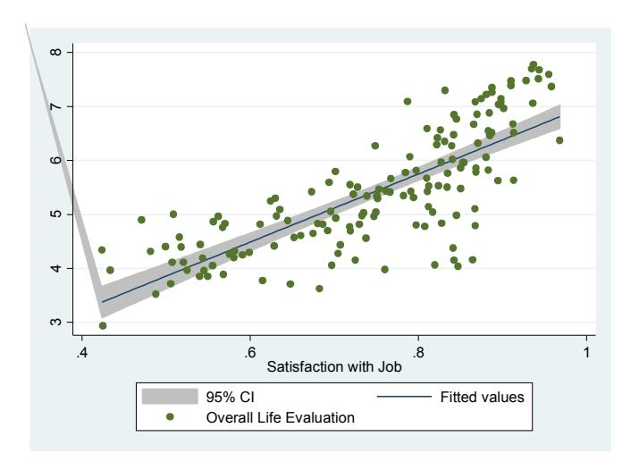

#### **Security Against Crime and Physical Violence**

Data on security against crime and violence are difficult to analyze at an international level in a single indicator because of difficulties in adding together different types of crimes into one indicator (homicide is far more serious than petty theft but how can they be combined?), while differences in police reporting practices also hamper genuine comparison. Instead one might use a perceptionbased measure of safety, which in any case might be a better measure of human development. An individual's perception of their own security arguably has the greater effect on their capabilities: if we feel unsafe we are less likely to leave the

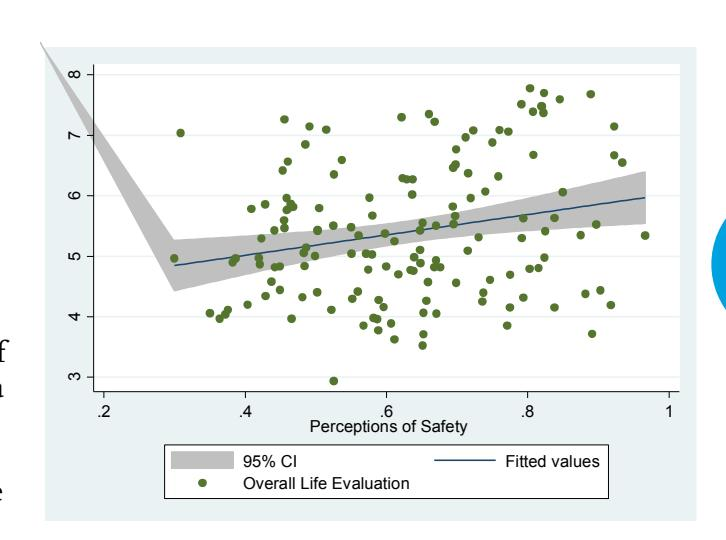

house at night, no matter what the official crime rate is. Here the data are from the Gallup World Poll based on the percentage of respondents answering "yes" to the Gallup World Poll question, "Do you feel safe walking alone at night in the city or area where you live?"

Somewhat surprisingly, the overall correlation with life evaluation is not strong (0.23), though that is not to say that safety doesn't help explain life evaluations once other measures of human development have been controlled for.

#### **Participation in Economic and Political Activities**

A sense of participating in "economic, cultural and political" activities is not available directly from international data sets. However one might believe that measures of satisfaction and trust from the Gallup World Poll could shed some light on this.

The percentage of respondents answering "better" (as opposed to "the same" or "worse" ) to the Gallup World Poll question, "Right now, do you think that economic conditions in the city or area where you live, as a whole, are getting better or getting worse?" might be somewhat linked to people's sense of economic participation but there is very little correlation (0.16) between that question and overall life evaluation. This is not altogether surprising as the conceptual link between changes in economic conditions and economic participation is not particularly strong.

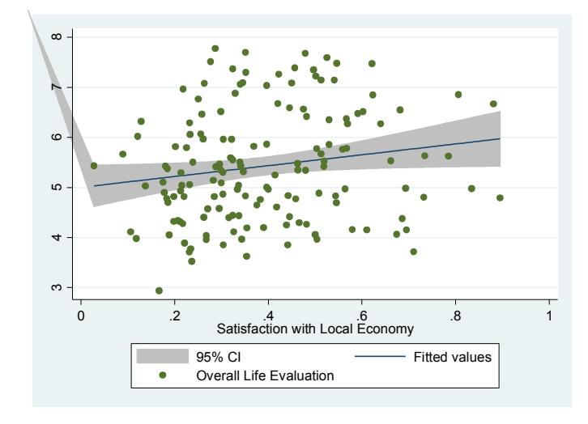

Trust in national government, based on the percentage of respondents answering "yes" to the Gallup World Poll question, "In this country, do you have confidence in the national government?" might link to a sense of participation in political activities. There is no apparent correlation between this question and overall life evaluations.27

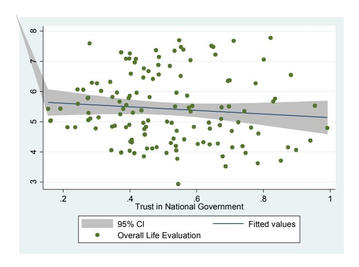

However, the World Bank publishes Worldwide Governance Indicators based on the perceptions of "*the views on the quality of governance provided by a large number of enterprise, citizen and expert survey respondents in industrial and developing countries*." The government effectiveness indicator "*reflects perceptions of the quality of public services, the quality of the civil service and the degree of its independence from political pressures, the quality of policy formulation and implementation, and the credibility of the government's commitment to such policies.*"28 These data are strongly correlated with life evaluations with a coefficient of 0.73.

#### **Freedom**

Freedom is an important part of human development with Amartya Sen himself seeing it as both a means to development and an end in itself.29 The 2013 Human Development Report presented data from the Gallup World Poll on the proportion of people answering "yes" to the question "In this country, are you satisfied or dissatisfied with your freedom to choose what you do with your life?"(the most recent available annual data during the period 2007-11). This has a correlation coefficient with overall life evaluation of 0.56.

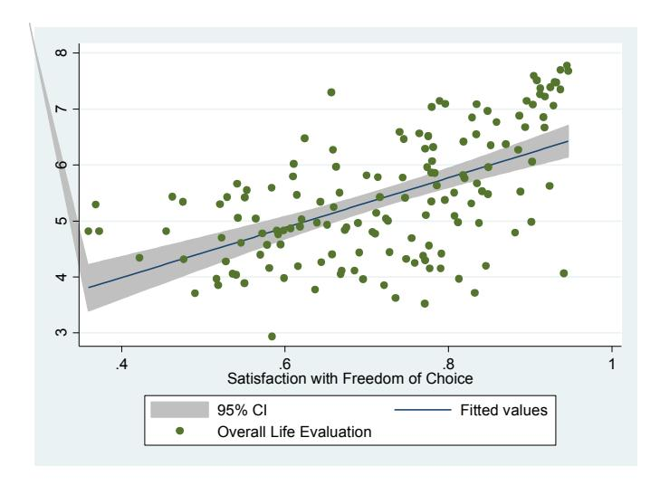

#### **Inequality**

Inequality is often seen as an important component of human development overall. Inequality in human development can be measured using UNDP's Inequality Adjusted Human Development Index (IHDI) which adjusts the HDI for inequalities in its three basic measures. The overall potential loss in human development can then be calculated and is based on the percentage difference between the HDI and the IHDI. This measure of overall potential loss is used here.

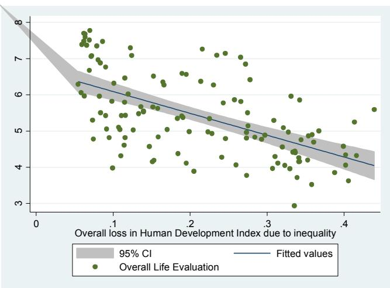

Once again a quite strong correlation is apparent from the graph (coefficient of -0.58).

Results for each variable regressed separately against life evaluation are as follows in Table 8.1:

Each variable, other than trust in government, was significant, with the *HDI*, *job satisfaction* and *government effectiveness* each accounting for over half of variance in life evaluations with an adjusted R-squared value of over 0.5, followed by *freedom of choice* and *inequality* each explaining around a third of the variation. The other variables — *economic conditions* and *perception of safety* — explained very little of the variation.

**Table 8.1**

|             | HDI      | Job Satisfaction | Perceptions of Safety | Economic Conditions | Trust in Government | Government Effectiveness | Freedom of choice | Inequality |
|-------------|----------|---------------------|--------------------------|------------------------|------------------------|-----------------------------|----------------------|------------|
| Coefficient | 4.813*** | 6.305***            | 1.685***                 | 1.08*                  | -0.595                 | 0.818***                    | 4.454***             | -6.027***  |
| Constant    | 2.167*** | 0.705*              | 4.342***                 | 5.00***                | 5.734***               | 5.429***                    | 2.208***             | 6.694***   |
| Adj- RSq    | 0.584    | 0.599               | 0.049                    | 0.02                   | 0.002                  | 0.535                       | 0.312                | 0.335      |
| N.          | 152      | 152                 | 148                      | 151                    | 133                    | 152                         | 151                  | 124        |

While there are significant correlations between these variables across the sample of all countries (which vary from 124 to 152 countries depending on the variable in question), it is also informative to investigate the relationships between variables when countries are divided into four groups according to their level of human development.

Table 8.2 below looks at the different mean levels of each variable for the four groups and whether the values are significantly different from the average in the group of countries with low human development.

The story here is rather interesting. The very high human development (HD) group of countries scores significantly better than the other countries in most aspects, save for *trust in government* and *optimism over economic conditions*, where there is no significant difference. There is less difference, however, between the high and medium HD groups of countries: these two groups differ significantly only in their *life evaluations*, *assessed effectiveness of government*, and their *potential loss in human development to inequality*: in each case the high HD group of countries do better.

Looking at each variable in turn:

*Average life evaluation* is significantly different among all four groups of countries, with higher human development associated with higher life evaluation.

*Average job satisfaction* in the very high HD group of countries is significantly higher than in the other groups. There is no significant difference between levels in the high and medium HD groups, although both groups have significantly higher job satisfaction than the low HD group of countries.

*Average perceptions of safety* are significantly higher in the very high HD group of countries than the others, though there is no significant difference in average levels among the other three groups.

*Average satisfaction with economic conditions* in the medium HD group of countries is significantly higher than in very high and low HD groups, but not significantly higher than in the high group. There is no significant difference between levels in the other groups.

*Average trust in government* is significantly different only between the very high HD and medium HD groups of countries, with the medium group having more trust in government.

*Average government effectiveness*, as assessed by the World Bank, does differ significantly between each HD group countries, with more human development corresponding to more effective government.

**Table 8.2 Average levels of key variables across the different quartiles of human development**

| HD Group  | Life Evaluation | Job Satisfaction | Perceptions of Safety | Economic Conditions | Trust in Government | Government Effectiveness | Freedom of choice | Inequality |
|-----------|--------------------|---------------------|--------------------------|------------------------|------------------------|-----------------------------|----------------------|------------|
| Very High | 6.56***            | 86.6***             | 72.1***                  | 35.7                   | 44.6                   | 1.308***                    | 80.4***              | 9.0***     |
| High      | 5.57***            | 75.9***             | 60.4                     | 39.0                   | 51.6                   | -0.104***                   | 68.6                 | 16.9***    |
| Medium    | 5.10***            | 75.8***             | 59.3                     | 46.0*                  | 58.7                   | -0.454***                   | 73.9***              | 23.5***    |
| Low       | 4.32               | 60.1                | 58.1                     | 36.7                   | 52.7                   | -0.961                      | 65.5                 | 34.8***    |

*Significance levels refer to whether the average for each group is significantly different from the average among the low human development group of countries.*

*\*\*\* Significant at 0.1% \*\* Significant at 1% \* Significant at 5%*

*Average satisfaction with freedom of choice* in the very high HD group of countries is significantly higher than in the other groups. Average satisfaction in the medium HD group is also significantly different to the low HD group of countries. The high group of countries has lower levels of satisfaction than the medium group, and is not significantly different to either the medium or the low groups.

*Average loss of HD to inequality* is significantly different for all groups with losses worsening as average HD levels decrease. The strong relationship here is due, at least in part, to the high levels of infant mortality and very low levels of schooling in the lower HD country groupings, which have a strong effect on the inequality measure.

*Question 3: How do the variables that correlate strongly with life evaluation relate conceptually to human development theory?* 

We have tested how different aspects of human development correlate with overall life evaluation measures. But, looking in the other direction, do the factors that explain life evaluation also represent human development?

The analysis in Chapter 2 shows that income, social support, healthy life expectancy at birth, freedom to make life choices, generosity, and corruption are all significant in explaining life evaluations. But while there is a strong empirical relationship between these variables and life evaluations, what are their conceptual links with human development?

As already discussed in this chapter, income, health, and freedom to make life choices are widely seen as key components of human development. An absence of corruption is also important to human development and to an individual's capabilities: corruption fetters people's freedoms to function, so this too is important to human development. Likewise, social support —having someone to count on in times of trouble — is arguably important to human development: having the security of

some form of safety net can allow people to make choices (such as certain career paths) they might otherwise feel they were not in a position to make. Generosity is not as frequently discussed in terms of human development though it would be difficult to argue it was somehow contrary to human development and, indeed, some of the literature on the importance of altruism demonstrates how greater altruism within a society can lead to broader benefits (within the household or community).30

There are many other factors that relate to subjective well-being. Though there is not space to cover them all here, mental health, the focus of Chapter 3, deserves a special mention. Mental illness is, the chapter notes, not solely the preserve of rich countries, with common mental disorders such as anxiety and depression affecting one in 10 people on the planet at any time. Such disorders have an obvious impact on human development, particularly on an individual's ability to turn their capabilities into well-being: a physically fit and educated person who suffers from severe anxiety or depression is surely less able to join the labor force, for example, than someone not suffering from such disorders.

## Conclusions

This chapter has sought to investigate the conceptual and empirical relationships between human development and life evaluation.

Conceptually the two areas are quite similar. Both approaches were, at least in part, motivated by a desire to consider progress and development in ways that went beyond GDP, and to put people at the center of the new metrics. And the two areas are importantly connected in two ways. First, human development has a place for happiness: a society that is becoming unhappier is not making progress against at least one important criterion. Second, there is very considerable overlap between the determinants of happiness and the goals of human development. Many aspects of human

development are frequently used as key variables to explain subjective well-being. And, vice versa, the key explanators of overall life evaluation are all (to varying degrees) aspects of human development.

Human development is, at heart, a conceptual approach. And while increases in human development are – by definition – desirable, the broadness of the concept means it is not possible to measure completely the extent of human development across a society. On the other hand, while one can measure changes in subjective well-being across a population, one cannot, with certainty, claim that an increase is always desirable. The two disciplines therefore offer alternative views of development which, when taken together, could complement one another. Using the human development lens and metrics can help assess whether genuine progress has occurred if subjective well-being has increased. Using the subjective well-being lens and metrics can help assess whether progress has indeed occurred if the (partial) metrics of human development suggest it appears to have.

Amartya Sen has argued that happiness is both an important human functioning, and one that can provide evidence about whether we are achieving our objectives in general.31 The empirical analysis in this chapter adds weight to this argument, showing that among the 150 countries analyzed there is broad correlation between life evaluation and several key measures of human development, as one might expect. However, this is not the case for all measures of human development, nor is it the case for all countries. And it is perhaps these differences that are most interesting for those working on improving human development and well-being: if the metrics from each approach give conflicting pictures of development it is natural to look more closely and wonder why.

The findings in Chapter 2 demonstrate that most of the key factors that together explain happiness levels across the world are also textbook human development variables. This also adds weight to the arguments that each approach can benefit from a better understanding of the other.

- 1 See, for example, Sachs (2012).
- 2 Sen (1979), with its critique of welfare economics, points to the origins of the capability approach.
- 3 See UNDP (1990).
- 4 See Stiglitz et al. (2009).
- 5 See UNDP (2013a).
- 6 See Sen (1999).
- 7 Ibid.
- 8 See for example Anand et al. (2009) who developed indicators for over 50 distinct aspects of capabilities.
- 9 See UNDP (2013b).
- 10 Although human development thinking was originally applied mainly to low income countries, it can be — and is now applied in high income countries too.
- 11 See UNDP (2010).
- 12 See Preston (1975).
- 13 See Binder (2013).
- 14 That said governments and others are starting to run large scale polling exercises to ask societies what they value. See The World We Want 2015.
- 15 See Sugden (1993), quoted in Binder (2013).
- 16 See Sen (1983).
- 17 See Layard et al. (2012).
- 18 See, for example, the experimental studies reviewed in Batson (2011), and the evolutionary perspective in Nowak & Highfield (2011).
- 19 See Anand et al. (2009).
- 20 The empirical links between the two measures are much stronger too, as discussed in Chapter 2 of this report which found that for the 606 country-years where there are observations for the HDI, ladder, and affect measures, there are significant positive correlations between the HDI and the Cantril ladder (+.76), positive affect (+.28), and happiness yesterday (+.24). Thus the linkage with the HDI is three times as strong for the life evaluation as for positive emotions. The link is even weaker for negative affect, where the correlation with the HDI is anomalously positive but insignificant (+.06).
- 21 All data are the average of available annual data from the years 2010, 2011 and 2012, other than a) the government effectiveness data from the World Bank is the average of 2010 and 2011 data (no 2012 data were available); b) Overall Loss in Human Development Index due to Inequality is only available for 2012; c) GDP data are from 2010 and 2011 (no 2012 data were available).

- 22 Expected years of schooling are the numbers of years of schooling that a child of school entrance age can expect to receive if prevailing patterns of age-specific enrollment rates persist throughout the child's life.
- 23 Mean years of schooling are the average number of years of education received by people ages 25 and older, converted from educational attainment levels using official durations of each level.
- 24 The correlation between life net, a variable comprising national life evaluations minus the estimated effect of Log GDP per capita from equation 2.1; and nonhdi, which is the Non-income HDI (i.e. HDI for a country calculated using only the health and education components and not the income component), is a highly significant +0.667, p<.0001.
- 25 See UNDP (1990).
- 26 Ibid.
- 27 Frey & Stutzer (2005) found, for instance, evidence that Swiss citizens living in areas with the rights for greater political participation also had higher subjective wellbeing.
- 28 See World Bank (2011).
- 29 Sen (1999).
- 30 A broader discussion of this is outside this chapter. But see, for example, Becker (1981).
- 31 See Sen (2008). He also stresses his view that happiness does not represent all that is important.

## References

Anand, P., Hunter, G., Carter, I., Dowding, K., Guala, F., & Van Hees, M. (2009). The development of capability indicators. *Journal of Human Development and Capabilities, 10*(1), 125–152.

Anand, P., Santos, C. & Smith, R. (2009). The measurement of capabilities. In K. Basu & R. Kanbur (Eds.), *Festschrift for Prof Amartya Sen*. Oxford: Oxford University Press.

Batson, C.D. (2011). *Altruism in humans*. New York: Oxford University Press.

Becker, G. S. (1981). Altruism in the family and selfishness in the market place. *Economica, New Series, 48*(189), 1-15.

Binder, M. (2013). Subjective well-being capabilities: Bridging the gap between the capability approach and subjective wellbeing research. *Papers on Economics and Evolution*. Max Planck Institute of Economics, Evolutionary Economics Group.

Frey, B., & Stutzer, A. (2005). Beyond outcomes: Measuring procedural utility. *Oxford Economic Papers 57*(1), 90-111.

Helliwell, J., Layard, R., & Sachs, J. (Eds.). (2013). *World happiness report* 2013. New York: UN Sustainable Development Solutions Network.

Layard, R., Clark, A., & Senik, C. (2012). The causes of happiness and misery. In J. Helliwell, R. Layard, & J. Sachs (Eds.), *World happiness report*. New York: Earth Institute.

Nowak, M. A., & Highfield, R. (2011). *Supercooperators: Altruism, evolution and why we need each other to succeed*. New York: Free Press.

Preston, S. H. (1975). The changing relation between mortality and level of economic development. *Population Studies 29*(2), 231–48.

Sachs, J. (2012). Introduction. In J. Helliwell, R. Layard, & J. Sachs (Eds.), *World happiness report*. New York: Earth Institute.

Sen, A. (1979). Personal utilities and public judgments: Or what's wrong with welfare economics? *Economic Journal, 89,*  537-558.

Sen, A. (1983). Poor, relatively speaking. *Oxford Economic Papers 35,* 153-169. Retrieved from http://oep.oxfordjournals.org/content/35/2/153.full.pdf

Sen, A. (1999). *Development as freedom*. Oxford: Oxford University Press.

Sen, A. (2008). The economics of happiness and capability. In L. Bruni, F. Comim, & M. Pugno (Eds.), *Capabilities* & *happiness*. Oxford: Oxford University Press.

Stiglitz, J., Sen, A., & Fitoussi, J-P. (2009). *Report of the commission on the measurement of economic performance and social progress*. Paris: OECD. Retrieved from http://www.stiglitz-sen-fitoussi.fr

Sugden, R. (1993). Welfare, resources, and capabilities: A review of inequality reexamined by Amartya Sen. *Journal of Economic Literature, 31*(4), 1947-1962.

UNDP. (1990). *Human development report 1990: Concept and measurement of human development*. New York: Oxford University Press.

UNDP. (2010). *Human development report 2010: The real wealth of nations: Pathways to human development*. New York: United Nations Development Programme.

UNDP. (2013a). *About human development.* Retrieved from http://hdr.undp.org/en/humandev/

UNDP. (2013b). *Origins of the human development approach.*  Retrieved from http://hdr.undp.org/en/humandev/origins/

World Bank. (2011). *Worldwide governance indicators* (full excel data set). Retrieved from http://info.worldbank.org/governance/wgi/index.asp

The World We Want 2015. Retrieved from http://www.worldwewant2015.org/

# WORLD HAPPINESS REPORT 2013

#### Edited by John Helliwell, Richard Layard and Jeffrey Sachs

This publication may be reproduced using the following reference: Helliwell, John F., Richard Layard, and Jeffrey Sachs, eds. 2013. *World Happiness Report 2013*. New York: UN Sustainable Development Solutions Network.

Full text and supporting documentation can be downloaded from the UN SDSN website (www.unsdsn.org) and the Earth Institute, Columbia University website (www.earth.columbia.edu).

The support of the Emirates Competitiveness Council is gratefully acknowledged.

*World Happiness Report* editing and coordination by Claire Bulger and design by Sunghee Kim.

#### UN SDSN

The Sustainable Development Solutions Network (SDSN) engages scientists, engineers, business and civil society leaders, and development practitioners for evidence based problem solving. It promotes solutions initiatives that demonstrate the potential of technical and business innovation to support sustainable development (www.unsdsn.org).

Sustainable Development Solutions Network 314 Low Library 535 W 116th Street New York, NY 10027 USA

# THE EARTH INSTITUTE COLUMBIA UNIVERSITY

CIFAR CANADIAN INSTITUTE FOR ADVANCED RESEARCH ICRA
L'INSTITUT
CANADIEN
DE
RECHERCHES
AVANCÉES

ISBN: 978-0-9968513-1-2