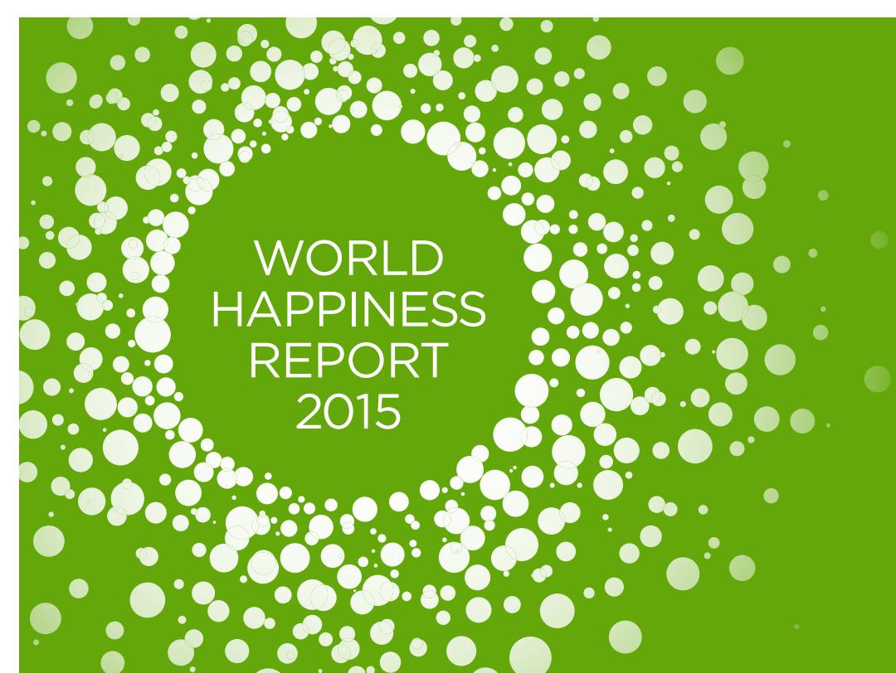

**WORLD HAPPINESS REPORT 2015** I EDITED BY JOHN HELLIWELL, RICHARD LAYARD AND JEFFREY SACHS | APRIL 2015

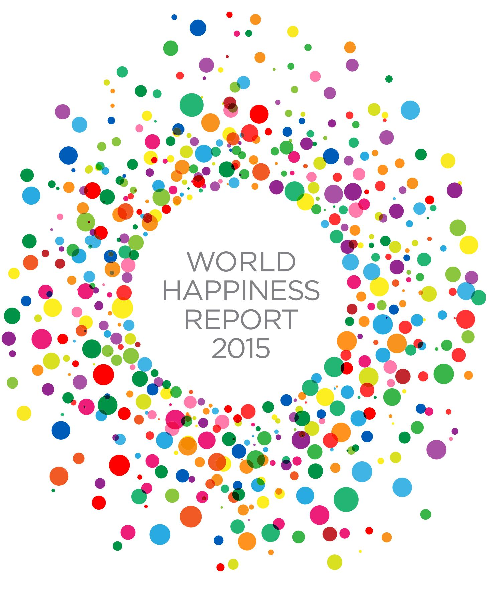

Edited by John Helliwell, Richard Layard and Jeffrey Sachs

ISBN: 978-0-9968513-2-9

## WORLD HAPPINESS REPORT 2015

Edited by John F. Helliwell, Richard Layard, and Jeffrey Sachs

#### TABLE OF CONTENTS

| 1. | Setting the Stage John F. Helliwell, Richard Layard, and Jeffrey Sachs                                                     | 2   |
|----|-------------------------------------------------------------------------------------------------------------------------------|-----|
| 2. | The Geography of World Happiness John F. Helliwell, Haifang Huang and Shun Wang                                            | 12  |
| 3. | How Does Subjective Well-being Vary Around the World by Gender and Age? Nicole Fortin, John F. Helliwell, and Shun Wang | 42  |
| 4. | How to Make Policy When Happiness is the Goal Richard Layard and Gus O'Donnell                                             | 76  |
| 5. | Neuroscience of Happiness Richard J. Davidson and Brianna S. Schuyler                                                      | 88  |
| 6. | Healthy Young Minds: Transforming the Mental Health of Children Richard Layard and Ann Hagell                           | 106 |
| 7. | Human Values, Civil Economy, and Subjective Well-being Leonardo Becchetti, Luigino Bruni and Stefano Zamagni               | 132 |
| 8. | Investing in Social Capital Jeffrey Sachs                                                                                  | 152 |

*The World Happiness Report was written by a group of independent experts acting in their personal capacities. Any views expressed in this report do not necessarily reflect the views of any organization, agency or programme of the United Nations.*

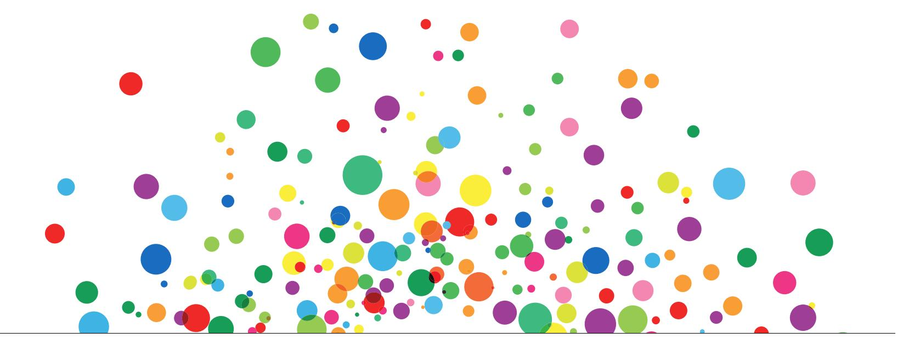

Chapter 1.

## SETTING THE STAGE

JOHN F. HELLIWELL, RICHARD LAYARD, AND JEFFREY SACHS

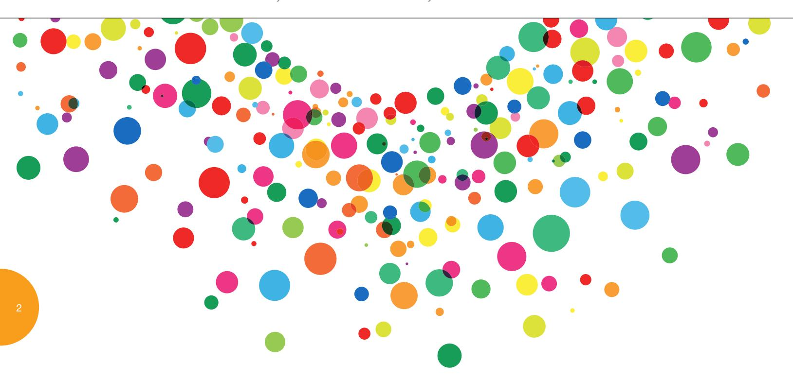

#### WORLD HAPPINESS REPORT 2015

The world has come a long way since the first *World Happiness Report* in 2012. Happiness is increasingly considered a proper measure of social progress and a goal of public policy. So it is worth beginning with some history, before summarizing the present report.

The first *World Happiness Report* was published in support of the April 2, 2012 United Nations High Level Meeting on Happiness and Well-Being. That meeting itself followed the July 2011 Resolution of the UN General Assembly, proposed by the Prime Minister of Bhutan, inviting member countries to measure the happiness of their people and to use this to help guide their public policies.

The initial *World Happiness Report* reviewed the scientific understanding of the measurement and explanation of subjective well-being, and presented a wide range of internationally comparable data, including a ranking of national average life evaluations, based on Gallup World Poll data from 2005-2011 for 156 countries. Following an introduction outlining the history and rationale for the use of happiness and well-being as touchstones for public policy, there were two parts to that Report. The chapters in Part 1 presented the global data and analysis, accompanied by a review of some policy implications of the available data and research, while Part II presented three case studies. The first was a full presentation of the Bhutanese Gross National Happiness framework while the other two included a description of the United Kingdom's then-recent efforts to devise and collect measures of subjective well-being, and the OECD's in-progress development of subjective well-being measurement guidelines for the use of National Statistical Offices. The Report was broadly successful in its aim of bringing comparable data and a scientific understanding to a broad global audience. The online readership of the first *Report* has grown broadly, and has by now exceeded one million.

The breadth of public and policy interest in local and national measures of subjective well-being was so great, and the need to develop regular reporting compelling enough, to encourage the production of the *World Happiness Report 2013*, this time published under the auspices of the Sustainable Development Solutions Network. In the *WHR 2013* the main data analysis, which covered both the 2010-2012 levels and also the changes from 2005-2007 to 2010-2012, were supplemented by a series of invited chapters covering key subject areas. The topics of the six invited chapters included mental health; a survey of the evidence on the variety of positive outcomes likely to flow, especially at the individual level, when people are or become happier; a review of the thought and evidence showing the importance of a strong ethical foundation for the support of better lives; a survey of the ways in which well-being data and research can be used to improve well-being; a review of the OECD *Guidelines on Measuring Subjective Well-being* for National Statistical Offices to use in measuring subjective well-being; and finally a comparison of life evaluations and the UNDP's Human Development Index as alternative ways of measuring national well-being. The UNDP has also, since 2010, included national average life evaluations as part of their compendium 1 of important human development statistics.

The data and analysis in the *World Happiness Report 2013* have helped to satisfy, and perhaps to fuel, growing public interest in applying the science of happiness to public affairs. Readership thus far is about 1.5 million, 50% more than for the first *World Happiness Report*. That interest in turn encouraged a number of local and national experiments in measuring and improving happiness, as well as the production of the *World Happiness Report 2015*.

## Adoption of Happiness as a Guide for Public Policy

The OECD Guidelines, and the generally growing awareness of the possibilities for well-beingbased measurement and policy, have led an increasing number of national and local governments to use happiness data and research in their search for policies that could enable people to live better lives. In the realm of national statistics, the OECD reports2 that almost all OECD countries collect at least life evaluations in at least one of their major social surveys, and several do much more. We note that for many European countries the collection of subjective well-being data is coming automatically through the EU-SILC module of well-being questions designed at the EU level for common application in all EU countries. Similar strategies may also be useful for countries in other global regions, as each region has good reason for wanting to have assessments that are comparable across all countries in the region. In addition, such collaborative efforts may well cut the costs and increase the timeliness of accounting for happiness.

Many national leaders are talking about the importance of well-being as a guide for their nations. Examples include German Chancellor Angela Merkel, South Korean President Park Geun-hye, British Prime Minister David Cameron, and His Highness Sheikh Mohammed bin Rashid Al Maktoum, Vice President and Prime Minister of the United Arab Emirates (UAE), and Ruler of Dubai.3

The UK focus on happiness and well-being is special in having been based right from the outset on widespread consultation, data collection and experimentation.4 These efforts are now of almost five-years duration, and have produced a large enough body of data to permit analysis and policy assessments at the local as well as national levels. Some of the related ventures, for example, the UK-based NGO Action for Happiness,5 have a global reach, with members from many countries interested in learning and sharing how the

science of well-being can be used to improve lives. The UK is also launching this year an official but independent "What Works Centre for Wellbeing" dedicated to making policies and services work for well-being.6

The case of the UAE is worth special mention in part for the extent to which happiness and well-being have been made central tenets of the design and delivery of the National Agenda "... to be the happiest of all nations."

At the Emirate level, when Dubai Plan 2021 was launched in December of 2014, Sheikh Mohammed bin Rashid Al Maktoum said, "The first objective for the Dubai Plan 2021 is achieving people's happiness." Dubai Plan 2021 itself covers six themes "that describe the vision for Dubai: a city of happy, creative and empowered people; an inclusive and cohesive society; the preferred place to live, work and visit; a smart and sustainable city; a pivotal hub in the global economy; and a pioneering and excellent government. The strategy was developed after extensive consultations involving civil society, the private and the public sectors."

In addition, His Highness has written an open letter to all Federal government employees reminding them of their core mission: providing world class services to the people of UAE with the goal of contributing to their happiness. His open letter is a testament to the strong commitment demonstrated by the UAE leadership towards making happiness a national policy goal.

Since much that matters in life is local, it is also natural to find that many sub-national governments are measuring subjective well-being, and using well-being research as a guide to the design of public spaces and the delivery of public services. For example, the state of Jalisco in Mexico has made happiness a key state objective. At the urban level, the City of Santa Monica, in California, won a large foundation grant to survey and search for ways of improving

the happiness of those living and working in the city. Similarly, in the United Kingdom, the Bristol Happy City project has a structure that could well be emulated elsewhere.

#### Harnessing Happiness Data and Research to Improve Sustainable Development

The year 2015 is a watershed for humanity, with the pending adoption of Sustainable Development Goals (SDGs) to help guide the world community towards a more inclusive and sustainable pattern of global development. The UN member states called for SDGs on the occasion of the Rio+20 Summit, marking the 20th anniversary of the Rio Earth Summit. The SDGs will be adopted by heads of state at a special summit at the United Nations in September 2015, on the 70th anniversary of the UN. The concepts of happiness and well-being are very likely to help guide progress towards sustainable development.

Sustainable development is a normative concept calling for all societies to balance economic, social, and environmental objectives in a holistic manner. When countries pursue GDP in a lopsided manner, forgetting about social and environmental objectives, the results can be adverse for human well-being. Many countries in recent years have achieved economic growth at the cost of sharply rising inequalities of income and grave damage to the natural environment. The SDGs are designed to help countries to achieve economic, social, and environmental objectives in harmony, thereby leading to higher levels of well-being for present and future generations.

The SDGs will include goals, targets and quantitative indicators. The Sustainable Development Solutions Network, in its recommendations on the selection of SDG indicators, has strongly recommended the inclusion of indicators of subjective well-being and positive mood affect

to help guide and measure the progress towards the SDGs. Many governments and experts offer considerable support for the inclusion of happiness indicators in the SDGs. The final SDG indicator list will most likely be decided during 2015-6. We hope that the 2015 *World Happiness Report* once again underscores the fruitfulness of using happiness measurements for guiding policy making and for helping to assess the overall well-being in each society.

#### Outline of Report

This report continues in the tradition of combining analysis of recent levels and trends of happiness data, with a variety of chapters providing deeper analysis of specific issues.

- Chapter 2, by John Helliwell, Haifang Huang, and Shun Wang, contains our primary rankings of and explanations for life evaluations.
- Chapter 3, by Nicole Fortin, John Helliwell, and Shun Wang, presents a far broader range of happiness measures, and shows how they differ by gender, age and global region.
- **Chapter 4**, by Richard Layard and Gus O'Donnell, advocates and explains the use of happiness as the measure of benefit in cost-benefit analysis.
- **Chapter 5**, by Richard Davidson and Brianna Schuyler, surveys a range of important new results from the neuroscience of happiness.
- Chapter 6, by Richard Layard and Ann Hagell, is aimed especially at the happiness of the young the one-third of the world population that is under the age of 18 years.
- Chapter 7, by Leonardo Becchetti, Luigino Bruni, and Stefano Zamagni, digs deeper into the ethical and community-level supports for happiness.
- **Chapter 8**, by Jeffrey Sachs, discusses the importance of social capital for well-being and

describes ways that societies may invest in social capital in order to promote well-being.

We now briefly review the main findings of each chapter.

#### **The Geography of Happiness**

The geography of happiness is presented first by means of a map using 10 different colors to show how average 2012-2014 life evaluations differ across the world. Average life evaluations, where 0 represents the worst possible life and 10 the best possible, range from an average above 7.5 at the top of the rankings to below 3 at the bottom. A difference of four points in average life evaluations separates the 10 happiest countries from the 10 least happy countries.

Three-quarters of the differences among countries, and also among regions, are accounted for by differences in six key variables, each of which digs into a different aspect of life. The six factors are GDP per capita, healthy years of life expectancy, social support (as measured by having someone to count on in times of trouble), trust (as measured by a perceived absence of corruption in government and business), perceived freedom to make life decisions, and generosity (as measured by recent donations, adjusted for differences in income). Differences in social support, incomes and healthy life expectancy are the three most important factors, with their relative importance depending on the comparison group chosen. International differences in positive and negative emotions (affect) are much less fully explained by these six factors. When affect measures are used as additional elements in the explanation of life evaluations, only positive emotions contribute significantly, appearing to provide an important channel for the effects of both perceived freedom and social support.

Analysis of changes in life evaluations from 2005-2007 to 2012-2014 shows big international differences in how the global recession affected national happiness. These were found to be due to differing exposure to the crisis and differences in the quality of governance, trust and social support. Countries with sufficiently high-quality social capital appear to be able to sustain, or even improve subjective well-being in the face of natural disasters or economic shocks, as the shocks provide them an opportunity to discover, use and build upon their communal links. In other cases, the economic crisis triggered drops in happiness greater than could be explained by falling incomes and higher unemployment. In this respect the new data continue to support the evidence and analysis in the *World Happiness Report 2013* .

#### **How Does Subjective Well-being Vary Around the World by Gender and Age?**

This chapter digs into some crucial detail, by considering how well-being differs by region, gender and age. To keep the sample size sufficiently high, most of the analysis includes together all of the Gallup World Poll data collected for each country between 2005 and 2014. The analysis extends beyond life evaluations to include a range of positive and negative experiences that show widely different patterns by gender, age and region. The positive items include: happiness, smiling or laughter, enjoyment, feeling safe at night, feeling well-rested, and feeling interested. The six negative items are: anger, worry, sadness, depression, stress and pain. For life evaluations, differences by gender are very small relative to those across countries, or even across ages within a country. On a global average basis, women's life evaluations are slightly higher than those for men, by about 0.09 on the 10-point scale, or about 2% as large as the 4.0 point difference between the 10 most happy and 10 least happy countries. The differences among age groups are much larger, and differ considerably by region. On a global basis, average life evaluations start high among the youngest respondents, and fall by almost 0.6 point by middle age, being fairly flat thereafter. This

global picture masks big regional differences, with U-shapes in some countries and declines in others.

For the six positive and six negative experiences, there are striking differences by gender, age and region, some of which illustrate previous experimental findings, and others revealing a larger cross-cultural differences in experiences than had previously been studied.

A parallel analysis of the six main variables used in Chapter 2 to explain international differences and changes in life evaluations, also shows the value of considering age, gender and region at the same time to get a better understanding of the global trends and differences. In general, the patterns for specific emotions are such as to confirm the reasoning used in Chapter 2 to explain differences in life evaluations. The importance of the social context shows up strongly in the analysis by gender and age group. For example, those regions where life evaluations are significantly higher in older age groups are also those regions where perceived social support, freedom and generosity (but not household incomes) are higher in the older age groups. All three of those variables have quite different levels and age group dynamics in different regions. By contrast, the levels and trends for the incidence of health problems (and pain yesterday) have very similar levels and trends in all regions. And the gender differences in the incidence of health problems are largely the same around the world, as they are for the related feelings of pain and depression.

#### **Cost-benefit Analysis Using Happiness as the Measure of Benefit**

If the aim of policy is to increase happiness, policy makers will have to evaluate their policy options in a quite new way. This is the subject of Chapter 4. The benefits of a new policy should now be measured in terms of the impact of the change upon the happiness of the population. This applies whether the policy is a regulation,

a tax change, a new expenditure, or a mix of all three. Initially at least, the authors recommend treating total public expenditure as politically chosen, but using evidence to show which pattern of expenditure would yield the most happiness. This can be achieved in a fully decentralized way by establishing a critical level of extra happiness which a project must yield per dollar of expenditure.

This new form of cost-benefit analysis avoids many of the serious problems with existing methods, where money is the measure of benefit. It uses evidence to allow for the obvious fact that an extra dollar brings more happiness to the poor than to the rich. It also includes the effects of all the other factors beyond income, so it can be applied to a much wider range of policy.

But some of the traditional problems of policy analysis remain. First, how much priority (if any) should be given to reducing misery compared with increasing existing happiness – ultimately an ethical decision. Second, how much weight should be given to the happiness of future generations – the chapter suggests a pure time discount rate of no more than 1.5% per annum. Third, how should we treat the length of life? We advocate an approach based on "quality-adjusted life years" as the ultimate measure of benefit.

It is still early days for this new approach. Rhetoric about happiness is not enough. To build a better world requires that decision-makers give a central role to the happiness criterion in decision-making at every level, requiring changes both in how outcomes are evaluated and in how policies are designed and delivered. Chapter 4 deals with a key aspect of this, by adapting cost-benefit analysis to take a broader focus.

#### **The Neuroscience of Happiness**

Chapter 5 highlights four supports for well-being and their underlying neural bases: 1. Sustained positive emotion; 2. Recovery of negative emotion; 3. Empathy, altruism and pro-social behavior; and 4. Mind-wandering, mindfulness and "affective stickiness" or emotion-captured attention. A growing body of evidence supports the importance of these four constituents, which are linked to emotions and life evaluations in different ways. In some cases, effects are stronger for certain supports for life evaluations, such as purpose in life, or positive relations with others. In other cases, the findings hold directly for overall measures of well-being. The neural circuits that underlie each of these four elements are partly separable, though with some overlap.

There are two overall lessons that can be taken from the neuroscientific evidence. The first is the identification of the four highlighted elements, since they are not commonly emphasized in well-being research. The second is that the circuits we identify as underlying these four supports for well-being all exhibit plasticity and thus can be transformed through experience and training. There are now training programs being developed to cultivate mindfulness, kindness, and generosity. The chapter reviews evidence showing that some of these training regimes, even those as short as two weeks, can induce measurable changes in the brain. These findings highlight the view that happiness and well-being are best regarded as skills that can be enhanced through training.

Chapters 2 and 5 are consistent in showing that life evaluations and measures of affect have separate but overlapping drivers and consequences, whether assessed by neural patterns or aggregate data. Thus it is no surprise to find that positive affect and life evaluations have separate but overlapping positive consequences for subsequent mortality rates.12

#### **The Happiness of Children**

Chapter 6 turns the focus of attention to the world's future, as embodied in the one-third of the current global population who are now under 18 years of age. Their happiness matters as much as the happiness of adults, or even more. For the

child becomes the adult, so it is vital to determine which aspects of child development are most important in determining whether a person becomes a happy, well-functioning adult. Research is now providing answers to that question, based on studies that follow a whole cohort of children from birth right through into adulthood. Which of the three key features of child development (academic, behavioral, or emotional) best predict whether the resulting adult will be satisfied with life? The answer is that emotional development is the best of the three predictors and academic achievement the worst.

This should not be surprising. Mental health is a key determinant of adult life satisfaction (see *WHR 2013*) and half of mentally ill adults already showed symptoms by the age of 15. Altogether 200 million children worldwide are suffering from diagnosable mental health problems requiring treatment. Yet even in the richest countries only a quarter are in treatment.

Chapter 6 suggests key steps needed to treat children with mental health problems and, equally important, to prevent these problems arising in the first place. Treatment arrangements should start from the basic principle of parity of esteem for mental and physical health, meaning that a child has the same access to evidence-based treatment whether their problem is with mental or physical health. Excellent treatments now exist for children's mental health problems, and making them more widely available would generate huge savings through improved educational performance, reduced youth offending and, later on, improved earnings and employment, and better parenting of the next generation.

But prevention is even better than cure, and most schools could do much more to promote the well-being of their children. This should be an explicit goal for every school. Schools should have a well-being code, agreed by every teacher, parent and child, and this should influence the

whole conduct and ethos of the school. There should also be explicit teaching of life-skills using evidence-based materials. And, to record progress and notice children in difficulty, schools should consider measuring the wellbeing of their children on a regular basis.

Both schools and healthcare systems should give much more priority to the well-being of children. It is one of the most obvious and cost-effective ways to invest in future world happiness.

#### **Human Values, Civil Economy and Subjective Well-being**

Chapter 7 presents history, evidence, and policy implications of the Italian Civil Economy paradigm. The approach has its roots in the "classic" Aristotelian-Thomistic tradition of moral philosophy, which has had a significant expression in social sciences within the Italian tradition of Civil Economy. This tradition represents an important attempt to keep alive within modernity the tradition of civil life based on friendship (Aristotle's notion of *philia*) and a more socialized idea of person and community. It is contrasted with other approaches that give a less central role to reciprocity and benevolence.

The empirical work surveyed in Chapter 7 echoes that presented in Chapter 2, and also that surveyed in the *WHR 2013*, in emphasizing the importance of positive social relations, as characterized by trust, benevolence and shared social identities, in motivating behavior, contributing positively to economic outcomes as well as delivering happiness directly.

The authors recommend changes to democratic mechanisms to allow these human capacities for pro-social actions to have more space. Happiness of course requires participation, but not just the formal variety as expressed at the polling station. Full participation is achieved when citizens are given the opportunity to take part in the deliberative process and to consider their consumption and saving actions as voting choices which then lead

to decisions and agreed actions. Because happiness lies more in the process than in the final outcome, giving citizens a real chance to participate in the deliberative process increases their happiness regardless of the level of GDP.

#### **Investing in Social Capital**

Well-being depends heavily on the pro-social behavior of members of the society. Chapter 8 digs into this more deeply. Pro-sociality entails individuals making decisions for the common good that may conflict with short-run egoistic incentives. Economic and social life is rife with "social dilemmas," in which the common good and individual incentives may conflict. In such cases, pro-social behavior – including honesty, benevolence, cooperation, and trustworthiness – is key to achieving the best outcome for society.

Societies with a high level of social capital – meaning generalized trust, good governance, and mutual support by individuals within the society – are conducive to pro-social behavior. Some countries show evidence of high social capital, while others show the opposite: generalized distrust, pervasive corruption, and lawless behavior (e.g. widespread tax evasion that deprives the government of the needed funds to invest in public goods).

High social capital directly and indirectly raises well-being, by promoting social support systems, generosity and voluntarism, and honesty in public administration, and by reducing the costs of doing business. The pressing policy question, therefore, is how societies with low social capital – riven by distrust and dishonesty – can invest in social capital. The chapter discusses various pathways to higher social capital, including education, moral instruction, professional codes of conduct, public opprobrium towards violators of the public trust, and public policies to narrow income inequalities, since social and economic equality is associated with higher levels of social capital and generalized trust.

- This compendium is the statistical annex to the UNDP's flagship Human Development Report.
- 2 The OECD Table showing the current state of official measurement of subjective well-being in OECD member countries is included as an online appendix to this report.
- 3 The UAE approach to the use of happiness as a guide to public policies, including its basis in Arab philosophical thinking, has been translated for our use, and appears as UAE (2015) in the reference list, and online as "Happiness-A UAE Perspective." The Emirates Competitiveness Council has also contributed to the costs of producing WHR 2013 and WHR 2015.
- 4 See Hicks (2012), chapter 6 of the first *World Happiness Report*.
- 5 Their website is: http://www.actionforhappiness.org
- 6 Their website is: https://www.gov.uk/government/news/new-what-works-centre-for-wellbeing
- 7 See UAE (2015).
- 8 Ibid.
- 9 As explained in their website: http://www.jaliscocomovamos.org
- The Santa Monica project was a winning entry in the Bloomberg Philanthropies Mayors challenge. Their website is: http://wellbeingproject.squarespace.com
- II Their website is: http://www.happycity.org.uk/content/happy-city-index
- 12 See Weist et al (2011).

#### WORLD HAPPINESS REPORT 2015

#### References

Hicks, S. (2012). Measuring subjective well-being: The UK Office for National Statistics experience. In Helliwell, J. F., Layard, R., & Sachs, J. (Eds.), *World happiness report.* New York: Earth Institute.

UAE. (2015). *Happiness: A UAE perspective*. http://www.ecc.ae/about/vision-2021

Wiest, M., Schüz, B., Webster, N., & Wurm, S. (2011). Subjective well-being and mortality revisited: Differential effects of cognitive and emotional facets of well-being on mortality. *Health Psychology*, 30(6), 728.

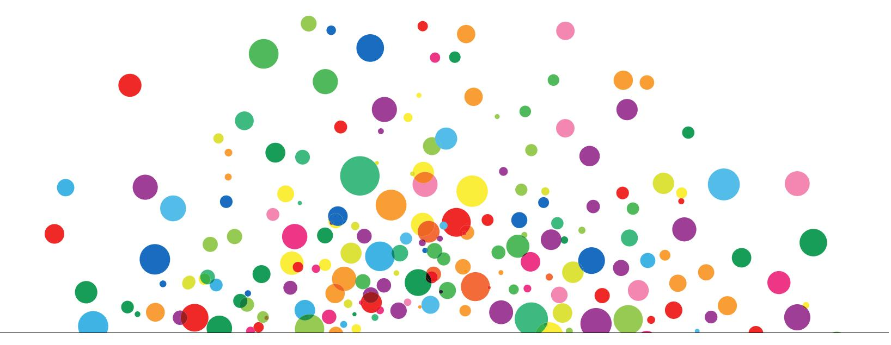

## Chapter 2.

# THE GEOGRAPHY OF WORLD HAPPINESS

JOHN F. HELLIWELL, HAIFANG HUANG AND SHUN WANG

The authors of Chapters 2 and 3 would like to thank the Gallup Organization, and especially Gale Muller, for access to and assistance with data from the Gallup World Poll, and to Mingyi Hua for her help with other data used in Chapter 3. For comments and advice on the contents of the chapters we are grateful to other chapter authors and to Ed Diener, Daniel Gilbert, Carol Graham, Shawn Grover, Jon Hall, Daniel Kahneman, Andrew Oswald, Ewen McKinnon, and Conal Smith.

It is now three years since the publication of the first World Happiness Report. A central purpose of that report, especially in Chapters 2 and 3, was to survey the scientific underpinnings of the measurement and understanding of subjective well-being. The main content of that review is as relevant today as it was then, and remains available for those now coming to the topic for the first time. Because the scientific basis has broadened and deepened in the past three years, it will be perhaps be useful for us to reiterate, and revise where appropriate, some of the evidence that underlies our choice of measures and informs the way we use the data to explain how happiness varies around the world. That will be the subject of the first section of this chapter.

We shall turn then to present national-level average scores for subjective well-being, as measured by answers to the Cantril ladder question asking people to evaluate the quality of their current lives on a scale of o to 10, where o represents the worst possible life for them, and 10 the best. For each country we shall present not just the average scores for 2012-2014, but our latest attempts to show how six key variables contribute to explaining the full sample of national average scores over the whole period 2005-2014, and to use that information to help understand the sources of the 2012-2014 rankings. These variables include GDP per capita, healthy life expectancy, social support, freedom, generosity and the absence of corruption. We shall also show how measures of experienced well-being, especially positive and negative emotions, and judgments about life purpose can combine with life circumstances to support higher life evaluations. Chapter 3 will present in more detail the distribution of life evaluations and 12 measures of experienced well-being by gender, age, and global region.

Then we shall study the changes in national average life evaluations between 2005-2007 and 2012-2014, by country and by region. We will estimate how various factors, including changes in the quality of governance, affected each country's success, in well-being terms,

in navigating what has for many countries been a difficult period of history.

## Measuring and Understanding Happiness

Chapter 2 of the first *World Happiness Report* explained the strides that had been made over the preceding 30 years in the development and validation, mainly within psychology, of a variety of measures of subjective well-being (SWB). Progress since then has been even faster, as the number of scientific papers on the topic has continued to grow rapidly,1 and as the measurement of subjective well-being has been taken up by more national and international statistical agencies, guided by technical advice from experts in the field.

By the time of the first report there was already a clear distinction to be made among three main classes of subjective measures: life evaluations, positive emotional experiences (positive affect) and negative emotional experiences (negative affect); see Technical Box 1. The subsequently released OECD Guidelines on Measuring Subjective Well-being,2 as foreshadowed in a case study in the first report, and more fully explained in the OECD chapter3 of World Happiness Report 2013, included both short and longer recommended modules of SWB questions. The centerpiece of the OECD short module was a life evaluation question, asking respondents to assess their satisfaction with their current lives on a o to 10 scale. This was to be accompanied by two or three affect questions and a question about the extent to which the respondents felt they had a purpose or meaning in their lives. The latter question, which we treat as an important support for subjective well-being, rather than a direct measure of it, is of a type4 that has come to be called "eudaimonic." This is in honor of Aristotle, who believed that having such a purpose would be central to any reflective individual's assessment of the quality of his or her own life.

Before the OECD guidelines were produced, the United Kingdom Office for National Statistics (ONS) had developed its own set of four core questions. The central measure was the same life satisfaction measure recommended by the OECD, accompanied by a eudaimonic question asking whether the respondent felt that the things they did in their lives were worthwhile and two affect questions – happy yesterday and anxious yesterday.5

As the OECD guidelines were being formulated, the US National Academy of Sciences (NAS) set up a panel to review measures of subjective well-being. This differed from the OECD study and guidelines as it focused on just a part of the spectrum of possible measures of subjective well-being. It concentrated on positive and negative affect ("experienced" or "experiential" well-being) rather than evaluative measures of well-being. The panel took pains to note that this was intended to explore less-developed aspects of well-being measurement, and not to suggest any lack of importance for evaluative measures.6 The panel also echoed the OECD guidelines in emphasizing the importance of collecting experiential and evaluative measures together, in order to better understand their separate and combined contributions. The NAS panel's emphasis on experiential measures (including especially current, remembered and diary reports of feelings) undoubtedly also reflected the number of influential US scholars who had invested several years of research proposing, collecting, and investigating experiential measures. To some extent this reflected a theoretical preference of Daniel Kahneman of Princeton University, whose experimental work had emphasized the differing sources, structures and implications of experiential and evaluative measures. One of his papers showed that the sum of momentary pain reports from colonoscopy patients differed from their subsequent overall evaluations of the extent of the pain. For Kahneman, the discrepancy was treated as an error on the part of the recollecting memory, leading him to favor,8 just as Jeremy Bentham had advocated two centuries ago, the

use of averaged emotional reports as the most accurate way of identifying human happiness. We and others give more weight to the evaluative measures, since the remembered pains and pleasures have been shown to be the more relevant drivers of subsequent decisions about future medical procedures, in the case of pain, or holidays, in the case of pleasures. Evaluative measures are also more reflective of a person's sense of living a meaningful life, a feature held by many, including Aristotle (and us), to be a key element of a life well lived.

Kahneman's emphasis on experiential measures was also encouraged by his collaboration with Alan Krueger in the development and application of the "Day Reconstruction Method" using end-of-day diary methods to evaluate the emotional counterparts of the changing flows of daily activities. 10 This has been a very fruitful line of research. Although the US national statistical agencies have otherwise been reluctant to collect measures of subjective well-being. measures of affect have been included in the National Time Use survey, making the United States the only major country whose official statistics include measures of affect but not life evaluations. The overall US system is much more comprehensively covered when non-official surveys are taken into account, as the world's two largest surveys regularly assessing population well-being on a scale big enough to follow both short-term movement and to provide geographic detail over the longer term are based in the United States. One survey is private – the Gallup/Healthways Daily Poll – and the other public – the Behavioral Risk Factor Surveillance System of the National Institutes for Health. Each of these surveys covers 1,000 respondents each day, and asks both evaluative and experiential measures.

These two large surveys, along with the European Social Survey (ESS) and a growing number of national surveys, such as those in the United Kingdom, Canada and Europe (via the EU-SILC well-being module), have been able to illuminate

the similarities and differences among the different types of measures. Earlier scholars often were tempted to consider all measures as equivalent, and then to reject them all when they gave inconsistent stories, or to back a preferred candidate. All of the official research-based reports on the subject have consistently argued,

regardless of past experiences or current preferences, that development of the scientific base for well-being research requires obtaining multiple measures of subjective well-being in as many survey vehicles as possible, so as to better understand how they relate to one another, and to the lives they monitor.

#### Technical Box 1: Measuring Subjective Well-being

The OECD (2013) *Guidelines for the Measurement of Subjective Well-being*, quotes in its introduction the following definition and recommendation from the earlier Commission on the Measurement of Economic and Social Progress:

"Subjective well-being encompasses three different aspects: cognitive evaluations of one's life, positive emotions (joy, pride), and negative ones (pain, anger, worry). While these aspects of subjective well-being have different determinants, in all cases these determinants go well beyond people's income and material conditions... All these aspects of subjective well-being should be measured separately to derive a more comprehensive measure of people's quality of life and to allow a better understanding of its determinants (including people's objective conditions). National statistical agencies should incorporate questions on subjective well-being in their standard surveys to capture people's life evaluations, hedonic experiences and life priorities."12

The OECD *Guidelines* go on to recommend a core module to be used by national statistical agencies in their household surveys:

"There are two elements to the core measures module.

The first is a primary measure of life evaluation. This represents the absolute minimum required to measure subjective well-being, and it is recommended that all national statistical agencies include this measure in one of their annual household surveys.

The second element consists of a short series of affect questions and an experimental eudaimonic question (a question about life meaning or purpose). The inclusion of these measures complements the primary evaluative measure both because they capture different aspects of subjective well-being (with a different set of drivers) and because the difference in the nature of the measures means that they are affected in different ways by cultural and other sources of measurement error. While it is highly desirable that these questions are collected along with the primary measure as part of the core, these questions should be considered a lower priority than the primary measure."13

Almost all OECD countries14 now contain a life evaluation on a o to 10 rating scale, usually a question about life satisfaction. However, it will be many years before the accumulated efforts of national statistical offices will produce as large a number of comparable country surveys as is now available through the Gallup World Poll (GWP), which has been surveying an increasing number of countries since 2005, and now includes almost all of the world's population. The GWP contains one life evaluation as well as a range of positive and negative experiential questions, including several measures of positive and negative affect, mainly asked with respect to the previous day. In this chapter, we make primary use of the life evaluations, since they are, as we show in Table 2.1, more international in their variation and are more readily explained by life circumstances. In Chapter 3 we also consider six positive and six negative experiences, and show how they vary by age and gender among nine global regions.

5

What has been learned? First, it is now possible to conclude that all three of the commonly used life evaluations tell structurally almost identical stories about the nature and relative importance of the various factors influencing subjective well-being. For example, for several years it was thought, as is still often reported in the literature, that answers to the Cantril ladder question, with its use of a ladder as a framing device, were more dependent on the respondent's income than were answers to questions about the respondent's satisfaction with life (SWL). The evidence for this came from comparing modeling using the Cantril ladder in the Gallup World Poll (GWP) with that based on life satisfaction answers in the World Values Survey (WVS). But this comparison, based on two different surveys, unfortunately combines survey and method differences with the effects of question wording. When it subsequently became possible to ask both questions15 of the same respondents on the same scale, as it was in the Gallup World Poll in 2007, it was shown that the estimated income effects and almost all other structural influences were identical, and a more powerful explanation was obtained by using an average of the two answers.16

It was also believed at one time that questions including the word "happiness" elicit answers that are less dependent on income than are answers to life satisfaction questions or the Cantril ladder. Evidence for that view was based on comparing WVS happiness and life satisfaction answers,17 and by comparing the Cantril ladder with happiness vesterday (and other emotions yesterday). Both types of comparison showed the effects of income on the happiness answers to be less significant than on SWL or the Cantril ladder. However, the first comparison, using WVS data, involved different scales and a question about happiness that might have combined emotional and evaluative components. The second strand of literature, based on GWP data, compared happiness vesterday, quite clearly an experiential/emotional response, with the Cantril ladder, quite clearly an evaluative

measure. In that context, the finding that income has more purchase on life evaluations than on emotions seems to have general applicability, and stands as an established result.18

But what if happiness is used as part of a life evaluation? That is, if respondents are asked how happy, rather than how satisfied, they are with their life as a whole? Would the use of "happiness" rather than "satisfaction" affect the influence of income and other factors on the answers? For this important question, no definitive answer was available until the European Social Survey (ESS) asked both life satisfaction and happy with life questions of the same respondents. The answers showed that income and other key variables all have the same effects on the "happy with life" answers as on the "satisfied with life" answers, so much so that once again more powerful explanations come from averaging the two answers.

Another previously common view was that changes in life evaluations at the individual level were largely transitory as people rapidly adapt to their circumstances. This view has been rejected by three independent lines of evidence. First, average life evaluations differ significantly and systematically among countries, and these differences are substantially explained by life circumstances. This implies that rapid and complete adaptation to life circumstances does not take place. Second, there is evidence of long-standing trends in the life evaluations of sub-populations within the same country, further demonstrating that life evaluations can be changed within policy-relevant time scales.19 Finally, even though individual-level partial adaptation to major life events is a normal human response, there is very strong evidence of continuing well-being effects from major disabilities and unemployment, among other life events.20 The case of marriage is still under debate. Some recent results using panel data from the UK have suggested that people return to baseline levels of life satisfaction several years after marriage, a result that has been argued to

support the more general applicability of set points.21 However, subsequent research using the same data has shown that marriage does indeed have long-lasting well-being benefits, especially in protecting the married from as large a decline in the middle-age years that in many countries represents a low-point in life evaluations.22

#### Why Happiness?

Why is this report called the "World Happiness Report" rather than the "World Well-being Report" or even the "World Subjective Wellbeing Report"? Three strands of argument have been used to suggest that our title choice is a bad one. First, it has been criticized for narrowness. since "happiness" is one of many emotions, so that it may be confusing to use it to cover the broader range of measures that we deal with. Second, it has been criticized for its breadth, since the appearance of happiness both as an emotion and as a form of evaluation may risk confusion.23 Thirdly, some are concerned that our title invites dismissal for its apparent flakiness – a topic to joke about, or to ignore for not being sufficiently serious. A number of these points were raised in the 2008 Princeton conference underlying a subsequent volume on international differences in well-being. The consensus view was that "subjective well-being" (SWB) was both accurate and appropriately serious to be the chosen generic title for the research field.24 Nonetheless, a number of authors who were present, while accepting the accuracy of SWB, nonetheless wrote their own books with "happiness" in the title because they or their editors knew that happiness draws more reader interest than does subjective well-being.

There was never any doubt in the editors' minds that the *World Happiness Report* should have the title it does. After all, the 2011 UN General Assembly Resolution (proposed by Bhutan),25 which led to the subsequent April 2012 UN High Level Meeting for which the first *World* 

Happiness Report was prepared, was quite explicit in its focus on happiness, as is the Bhutanese national objective of Gross National Happiness. We have no doubt that the 2012 meeting attracted such wide interest because it had such a direct focus on happiness rather than on either negative emotions or some more general or technical description of subjective well-being. Happiness has a convening and attention attracting power beyond that of subjective well-being. Our hope is that it is possible to make use of that power while being true to the underlying science.

We find the double usage of happiness – both as an emotional report, and as a type of life evaluation – an asset. Answers about happiness yesterday (questions asking for an emotional report) are quite different in structure from answers about happiness with life (questions asking for a judgment about life). There appears to be little doubt that respondents understand the difference and answer appropriately.26 The answers to the emotional reports are similar in structure to those for other emotions, while the "happy with life" answers, as we have already seen, are just like those for other life evaluations. We turn now to consider the differences between emotional reports and life evaluations, as a prelude to our emphasis on life evaluations for international comparisons at the aggregate level, and on both experiences and evaluations in Chapter 3, where we consider how experiences and life evaluations differ by gender and age across the world.

# Why Use Life Evaluations for International Comparisons of the Quality of Life?

In the first two *World Happiness Reports* we presented a wide range of data covering most of the experiences and life evaluations that were available for large numbers of countries. We were grateful for the breadth of available information, and used it to deepen our understanding of the ways in which experiential and evaluative reports

are connected. Our conclusion is that the measures differ from each other in ways that help to understand and validate both.

For example, experiential reports about happiness yesterday are well explained by the events and circumstances of the day being asked about. They show that most Americans sampled in the Gallup/Healthways Daily Poll feel happier on weekends, to an extent that depends on the social context on and off the job. The weekend effect disappears for those employed in a high trust workplace, who regard their superior more as a partner than a boss, and maintain their social hours during weekdays.27 By contrast, life evaluations asked of the same respondents in that same surveys show no weekend effects.28 This means that when they are answering the evaluative question about life as a whole, people see through the day-to-day and hour-to-hour fluctuations, so that the answers they give on weekdays and weekends do not differ.

On the other hand, although life evaluations do not vary by the day of week, they are much more responsive than are emotional reports to differences in life circumstances. This is true whether the comparison is among national averages29 or among individuals.30

Furthermore, life evaluations vary more between countries than do emotions. Thus almost a quarter of the global variation in life evaluations is among countries, compared to three-quarters among individuals in the same country. This one-quarter share for life evaluations is far more than for either positive affect (7%) or negative affect (4%). One of the reasons why the international share for life evaluations is so much higher is that income, one of the life circumstances that is more powerful for explaining life evaluations than for explaining emotions, is also very unequally distributed among nations, with more than 40% of its variance being among nations rather than among individuals within nations.31

These twin facts – that life evaluations vary much more than do emotions across countries, and that these life evaluation differences are much more fully explained than are emotional differences by life circumstances – provide for us a sufficient reason for using life evaluations as our central measure for making international comparisons. But there is more. To give a central role to life evaluations does not mean we need to either ignore or downplay the important information provided by experiential measures. On the contrary, we see every reason to keep experiential measures of well-being, as well as measures of life purpose, as important elements in our attempts to measure and understand subjective well-being. This is easy to achieve, at least in principle, because our evidence continues to suggest that experienced well-being and a sense of life purpose are important influences on life evaluations, above and beyond the critical role of life circumstances. We shall provide direct evidence of this, and especially of the importance of positive emotions, in the next section. Furthermore, in Chapter 3 we give experiential reports central billing in our analysis of variations of subjective well-being across genders, age groups, and global regions.

#### Why Not an Index?

Why do we give a primary role for people's own evaluations of their lives, in preference to constructing an index, or adopting an index prepared by someone else, designed to bring together the key elements of a good life? There are several index candidates at the global level, starting with the UNDP's Human Development Index (HDI),32 and more recently the Happy Planet Index,33 the Legatum Prosperity Index,34 and the Gallup/Healthways Well-Being Index.35 There are also well-being indexes prepared by the OECD (primarily for the OECD countries)36 and by official or private providers for specific countries, including Bhutan,37 the United States,38 Canada,39 and Italy.40 Each of these indexes has its own history and rationale. None of them is a

direct measure of subjective well-being, although some use SWB measures as a small fixed (Bhutan, Italy) or user-chosen (OECD, Legatum) part of the overall index. Others make some use of life evaluation data in picking indicators or weights — e.g. the Gallup/Healthways index chooses components in part by their correlations with life evaluations, and the Legatum index uses life evaluation measures as a means of estimating weights on the well-being half of their prosperity index. Among these indexes, the Human Development Index and the Canadian Index of Well-Being are outliers in making no use of subjective well-being data.41

The components of the indexes vary with the policy interests and objectives of their sponsors. For example, the Legatum Prosperity Index gives income an extra 50% weight on top of what it would have anyway as one of the determinants of life satisfaction. The Happy Planet Index attaches a large environmental weight, as the score is calculated as the product of a life evaluation multiplied by average life expectancy, then divided by the country's estimated ecological footprint. Once the components are chosen, most indexes use equal weights to construct the overall index from the components. Since the number and nature of the components is a matter of the maker's preference, it is no surprise that the different indexes give quite different global rankings among nations.

Why do we not rely on any of these indexes, or alternatively construct our own, as a basis for this chapter? There are many reasons why we think this would not be appropriate, among which four stand out.

First, we attach fundamental importance to the evaluations that people make of their own lives. This gives them a reality and power that no expert-constructed index could ever have. For a report that strives for objectivity, it is very important that the rankings depend entirely on the basic data collected from population-based samples of individuals, and not at all on what we think might or should influence the quality of their lives. Thus the average scores simply reflect what individual respondents report to the Gallup World Poll surveyors. The Report editors have no power to influence the averages beyond the choice of the number of survey years to use to establish sufficiently large samples.

Second, the fact that life evaluations represent primary new knowledge about the value people attach to their lives means we can use the data as a basis for research designed to show what helps to support better lives.

Third, the fact that our data come from population-based samples in each country means that we can calculate and present confidence regions about our estimates, thus providing a way to see if the rankings are based on differences big enough, or not, to be statistically meaningful. If a number of adjacent ranked countries all have values well within the sampling range of variance, then it can be concluded that they deserve to be treated as having statistically equivalent average life evaluations.

Fourth, all of the alternative indexes depend importantly, but to an unknown extent, on the index-makers' opinions about what is important. This uncertainty makes it hard to treat such an index as an overall measure of well-being or even to work out the extent to which variations in individual components are affecting overall scores. Even where this decomposition is done, there is no way of establishing its validity, since the index itself is just the sum of its parts, and not an independent measure of well-being.

Finally, we note in passing that data users themselves, when given a chance, attach more weight to people's own judgments of their lives than to any other well-being indicator. This is shown in part by the fact that when the OECD invited users to choose their own weights to attach to the various sub-indicators of the Better

Life Index, they found that in every country users typically attached high importance to life evaluations and health relative to other possibilities offered on the dashboard.42

#### Life Evaluations Around the World

In this edition of the *World Happiness Report* we divide our main data presentation between two chapters, with average national life evaluation and affect levels, and changes in life evaluations, shown and explained in this chapter. Chapter 3 presents and analyzes life evaluations and 12 experiential measures, split by gender, age and global region.

We start, in Figure 2.1, with a map showing the geographic distribution of the 2012-2014 average national values for answers to the Cantril ladder question asking respondents to value their lives

today on a o to 10 scale, with the worst possible life as a o and the best possible life as a 10. For the purposes of the map, countries are divided into 10 groups, with the darkest green for the highest averages, and the darkest red for the lowest. The scale range shows how widely life evaluations differ around the world. The averages in the top decile of countries are more than twice as high as in the bottom decile. To a surprising extent these differences are linked to differences in as few as six key variables that together cover important aspects of the components of a good life. When we come to present average 2012-2014 ladder scores for each country in Figure 2.2, we will include our attempts to attribute these differences to differences among countries in each of the six variables.

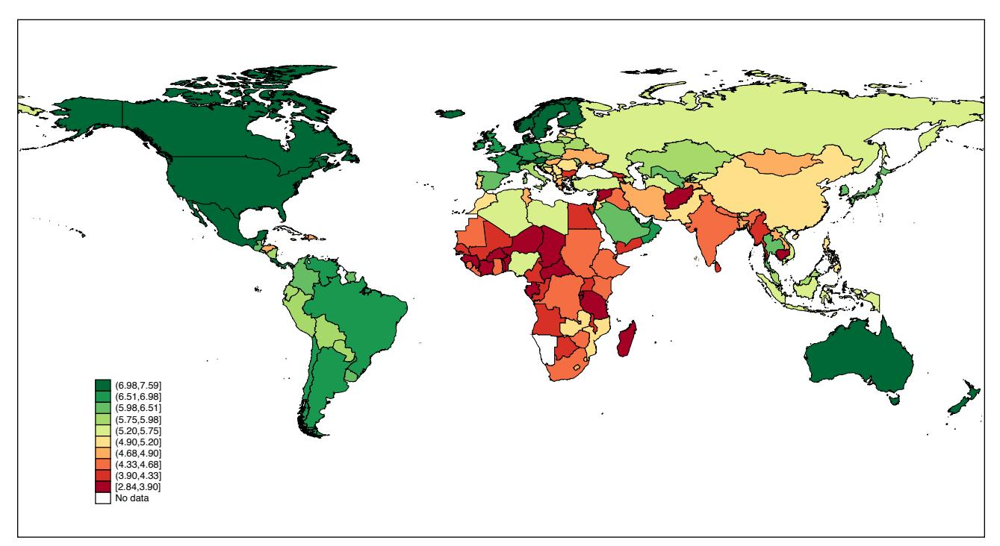

In Table 2.1 we present our latest modeling of national average life evaluations and measures of positive and negative affect (emotion) by country and year. For ease of comparison, the table has the same basic structure as Table 2.1 in the *World Happiness Report 2013*. The major difference comes from the inclusion of data for 2013 and 2014, which increases by about 200 the number of country-year observations. There are four equations in Table 2.1. The first equation underlies our attempts to explain the average national life evaluation differences in Figure 2.1 and provides the basis for constructing the sub-bars shown in Figure 2.2.

The equation explains national average life evaluations in terms of six key variables: GDP per capita, social support, healthy life expectancy, freedom to make life choices, generosity, and freedom from corruption.43 Taken together, these six variables explain almost three-quarters of the variation in national annual average ladder scores among countries, using data from the years 2005 to 2014.

The second and third columns of Table 2.1 use the same six variables to estimate equations for national averages of positive and negative affect, where both are based on averages for answers about yesterday's emotional experiences. In general, the emotional measures, and especially negative emotions, are much less fully explained by the six variables than are life evaluations. But the differences vary a lot from one circumstance to another. Household income and healthy life expectancy have significant effects on life evaluations, but not, in these national average data, on either positive or negative affect. The situation changes when we consider social variables. Bearing in mind that positive and negative affect are measured on a o to I scale, while life evaluations are on a o to 10 scale, social support can be seen to have the same proportionate effects on positive emotions as on life evaluations, with the effect only slightly smaller in the case of negative affect. Freedom and generosity have even larger effects on positive affect than on the

ladder. Negative affect is significantly reduced by social support, freedom, and absence of corruption.

In the fourth column we re-estimate the life evaluation equation from column I, adding both positive and negative affect to partially implement the Aristotelian presumption that sustained positive emotions are important supports for a good life.44 The most striking feature is the extent to which the results buttress a central finding in positive psychology, that the existence of positive emotions matters much more than the absence of negative ones. Positive affect has a large and highly significant impact in the final equation of Table 2.I, while negative affect has none.

As for the coefficients on the other variables in the final equation, the changes are material only on those variables – especially freedom and generosity – that have the largest impacts on positive affect. Thus we can infer first that positive emotions play a strong role in support of life evaluations, and second that most of the impact of freedom and generosity on life evaluations is mediated by their influence on positive emotions. That is, freedom and generosity have a large impact on positive affect, which in turn has an impact on life evaluations. The Gallup World Poll does not have a widely available measure of life purpose to test whether it too would play a strong role in support of high life evaluations. However, data from the large samples of UK data now available do suggest that life purpose plays a strongly supportive role, independent of the roles of life circumstances and positive emotions.

|                                  | Dependent Variable  |                     |                                                               |                     |
|----------------------------------|---------------------|---------------------|---------------------------------------------------------------|---------------------|
| Independent Variable             |                     |                     | Cantril Ladder Positive Affect Negative Affect Cantril Ladder |                     |
| Log GDP per capita               | 0.326 (0.062)*** | -0.005 (0.009)   | 0.011 (0.008)                                              | 0.339 (0.061)*** |
| Social support                   | 2.385 (0.462)*** | 0.233 (0.053)*** | -0.220 (0.047)***                                          | 1.802 (0.442)*** |
| Healthy life expectancy at birth | 0.028 (0.008)*** | 0.001 (0.001)    | 0.002 (0.0009)**                                           | 0.026 (0.008)*** |
| Freedom to make life choices     | 1.054 (0.341)*** | 0.330 (0.039)*** | -0.106 (0.046)**                                           | 0.274 (0.327)    |
| Generosity                       | 0.787 (0.273)*** | 0.169 (0.034)*** | -0.001 (0.032)                                             | 0.390 (0.270)    |
| Perceptions of corruption        | -0.632 (0.291)** | 0.031 (0.032)    | 0.092 (0.026)***                                           | -0.683 (0.272)** |
| Positive affect                  |                     |                     |                                                               | 2.343 (0.444)*** |
| Negative affect                  |                     |                     |                                                               | -0.172 (0.525)   |
| Year fixed effects               | Included            | Included            | Included                                                      | Included            |
| Number of countries              | 156                 | 156                 | 156                                                           | 156                 |
| Number of observations           | 974                 | 971                 | 973                                                           | 970                 |
| Adjusted R-squared               | 0.739               | 0.490               | 0.223                                                         | 0.765               |

**Notes:** This is a pooled OLS regression for a tattered panel explaining annual national average Cantril ladder responses from all available surveys from 2005 to 2014. See *Technical Box 2* for detailed information about each of the predictors. Coefficients are reported with robust standard errors clustered by country in parentheses. \*\*\*, \*\*, and \* indicate significance at the 1, 5 and 10% levels respectively.

#### WORLD HAPPINESS REPORT 2015

#### **Table 2.1: Regressions to Explain National Average Happiness Technical Box 2: Detailed information about each of the predictors in Table 2.1**

- 1. GDP per capita is in terms of Purchasing Power Parity (PPP) adjusted to constant 2011 international dollars, taken from the World Development Indicators (WDI) released by the World Bank in November 2014. See the appendix for more details. GDP data for 2014 are not yet available, so we extend the GDP time series from 2013 to 2014 using countryspecific forecasts of real GDP growth from the OECD Economic Outlook (May 2014 release) for OECD countries, and the World Bank's Global Economic Prospects (June 2014 release) for the rest of the world, after adjustment for population growth. The equation uses the natural log of GDP per capita, since that form fits the data significantly better than does GDP per capita.
- 2. Social support (or having someone to count on in times of trouble) is the national average of the binary responses (either 0 or 1) to the Gallup World Poll (GWP) question "If you were in trouble, do you have relatives or friends you can count on to help you whenever you need them, or not?"
- 22 23 3. The time series of healthy life expectancy at birth are constructed based on data from the World Health Organization (WHO) and the World Development Indicators (WDI). The WHO publishes the data on healthy life expec tancy for the year 2012. The time series of life expectancies, with no adjustment for health, are available in the WDI. We adopt the following strategy to construct the time series of healthy life expectancy at birth: first we generate the ratios of healthy life expectancy to life expectancy in 2012 for countries with both data. We then apply the country-specific ratios to other years to generate the healthy life expectancy data. See the appendix for more details.

- 4. Freedom to make life choices is the national average of binary responses to the GWP question "Are you satisfied or dissatisfied with your freedom to choose what you do with your life?"
- 5. Generosity is the residual of regressing the national average of GWP responses to the question "Have you donated money to a charity in the past month?" on GDP per capita.
- 6. Perceptions of corruption are the average of binary answers to two GWP questions: "Is corruption widespread throughout the government or not?" and "Is corruption widespread within businesses or not?" Where data for government corruption are missing, the perception of business corruption is used as the overall corruption-perception measure.
- 7. Positive affect is defined as the average of previous-day affect measures for happiness, laughter and enjoyment for GWP waves 3-7 (years 2008 to 2012, and some in 2013). It is defined as the average of laughter and enjoyment for other waves where the happiness question was not asked.
- 8. Negative affect is defined as the average of previous-day affect measures for worry, sadness and anger for all waves. See the appendix for more details.

Figure 2.2 shows the average ladder score (the average answer to the Cantril ladder question, asking people to evaluate the quality of their current lives on a scale of 0 to 10) for each country, averaged over the years 2012-2014. Not every country has surveys in every year; the total sample sizes are reported in the statistical appendix, and are revealed in Figure 2.2 by the horizontal lines showing the 95% confidence regions, which are smaller for countries with larger samples. To increase the number of countries ranked, we also include seven countries that had no 2012-2014 surveys, but did have a survey in 2011. This brings the number of countries shown in Figure 2.2 up to 158.

The length of each overall bar represents the average score, which is also shown in numerals. The rankings in Figure 2.2 depend only on the average Cantril ladder scores reported by the respondents, and not on our research efforts aimed at finding possible reasons.

Each of these bars is divided into seven segments. The first six sub-bars show how much each of the six key variables is calculated to contribute to that country's ladder score, relative to that in a hypothetical country called Dystopia, so named because it has values equal to the world's lowest national averages for 2012-2014 for each of the six key variables used in Table 2.1. We use Dystopia as a benchmark against which to compare each other country's performance in terms of each of the six factors. This choice of benchmark permits every real country to have a non-negative contribution from each of the six factors. We calculate, based on estimates in Table 2.1, a 2012–2014 ladder score in Dystopia to have been 2.10 on the 10-point scale. The final sub-bar is the sum of two components: the calculated average 2012-2014 life evaluation in Dystopia (=2.10) and each country's own prediction error (residual), which measures the extent to which life evaluations are higher or lower than predicted by our equation in the first column of Table 2.1. The residual is as likely to be negative as positive.45

Returning to the six sub-bars showing the contribution of each factor to each country's average life evaluation, it might help to show in more detail how this is done. Taking the example of healthy life expectancy, the sub-bar for this factor in the case of Brazil is equal to the amount by which healthy life expectancy in Brazil exceeds the world's lowest value, multiplied by the Table 2.1 coefficient for the influence of healthy life expectancy on life evaluations. The width of these different sub-bars then shows, country-by-country, how much each of the six variables is estimated to contribute to explaining the international ladder differences. These calculations are illustrative rather then conclusive, for several reasons. First, the selection of candidate variables was restricted by what is available for all these countries. Traditional variables like GDP per capita and healthy life expectancy are widely available. But measures of the quality of the social context, which have been shown in experiments and national surveys to have strong links to life evaluations, have not been sufficiently surveyed in the Gallup or other global polls. Even with this limited choice, we find that four variables covering different aspects of the social and institutional context – having someone to count on, generosity, freedom to make life choices and absence of corruption – are together responsible for 55% of the average differences between each country's predicted ladder score and that in Dystopia in the 2012-2014 period. The average country has a 2012-2014 ladder score that is 3.28 points above the Dystopia ladder score of 2.1. Of this 3.28 points, the largest single part (30%) comes from social support, followed by GDP per capita and healthy life expectancy (26% and 19%), and then by freedom (13%), generosity (7%) and corruption (4%).46

Our limited choice means that the variables we do use may be taking credit properly due to other better variables, or to un-measurable other factors. There are also likely to be vicious or virtuous circles, with two-way linkages among the variables. For example, there is much evidence that those who have happier lives are likely to

live longer, to be more trusting, more cooperative, and generally better able to meet life's demands.47 This will feed back to influence health, GDP, generosity, corruption, and the sense of freedom. Finally, some of the variables are derived from the same respondents as the life evaluations, and hence possibly determined by common factors. This risk is much less using national averages, because individual personality differences tend to average out at the national level.

The seventh and final segment is the sum of two components. The first is a fixed baseline number representing our calculation of the benchmark ladder score for Dystopia (=2.10). The second component is the average 2012-2014 residual for each country. The sum of these two components comprises the right-hand sub-bar for each country; it varies from one country to the next because some countries have life evaluations above their predicted values, and others lower. The residual simply represents that part of the national average ladder score that is not explained by our model; with the residual included, the sum of all the sub-bars adds up to the actual average life evaluations on which the rankings are based.

What do the latest data show for the 2012-2014 country rankings? Two main facts carry over from the previous editions of the *World Happiness Report*. First, there is a lot of year-to-year consistency in the way people rate their lives in different countries. Thus there remains a four-point gap between the 10 top-ranked and the 10 bottom-ranked countries, and most of the countries in the top and bottom 10 are the same as in the *World Happiness Report 2013*. Second, despite this general consistency and stability, many countries have had, as we shall show later in more detail, substantial changes in average scores, and hence in country rankings, between 2005-2007 and 2012-2014.

Figure 2.2: Ranking of Happiness 2012-2014 (Part 1)

Explained by: social support

Explained by: healthy life expectancy

Explained by: freedom to make life choices

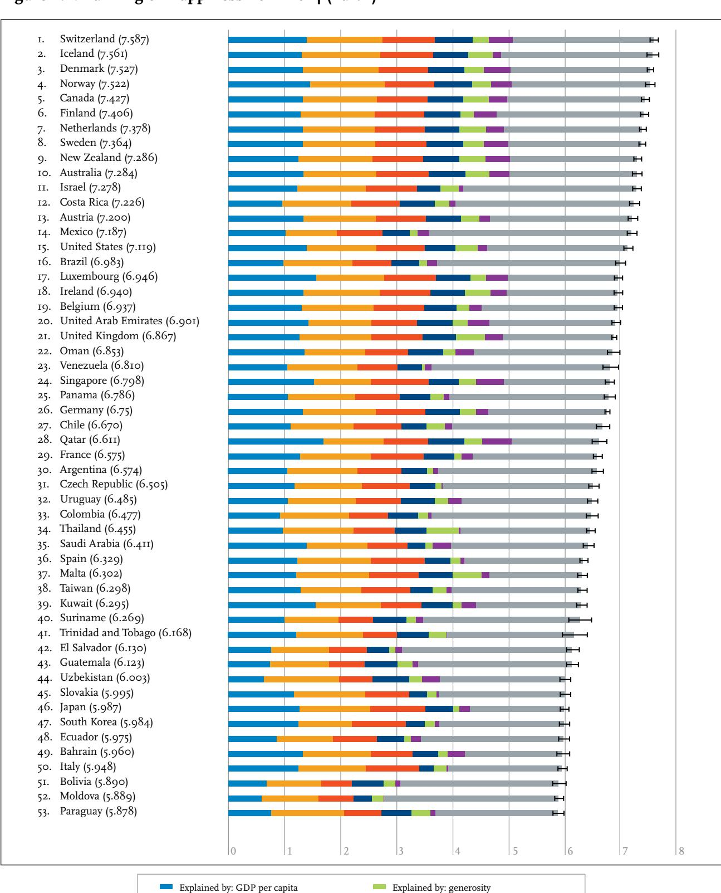

Explained by: perceptions of corruption

Dystopia (2.10) + residual

→ 95% confidence interval

WORLD HAPPINESS REPORT 2015

Figure 2.2: Ranking of Happiness 2012-2014 (Part 2)

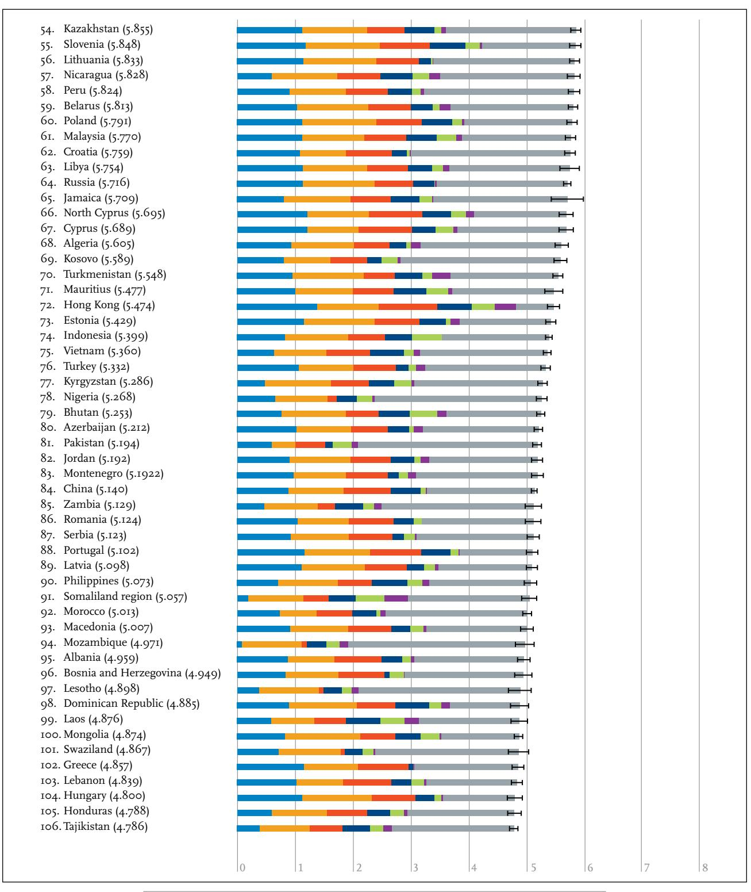

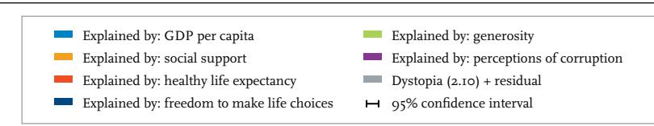

26

Figure 2.2: Ranking of Happiness 2012-2014 (Part 3)

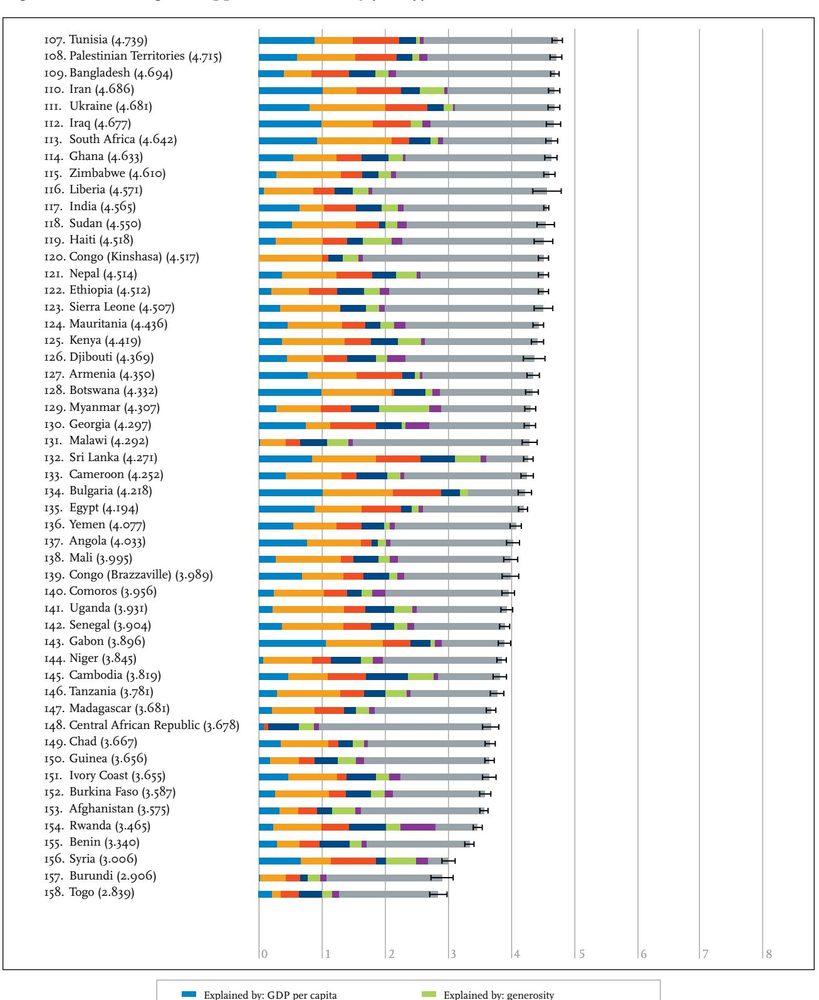

Explained by: generosity Explained by: social support Explained by: perceptions of corruption Explained by: healthy life expectancy Dystopia (2.10) + residual Explained by: freedom to make life choices → 95% confidence interval

When looking at the average ladder scores, it is important to note also the horizontal whisker lines at the right hand end of the main bar for each country. These lines denote the 95% confidence regions for the estimates, and countries with overlapping errors bars have scores that do not significantly differ from each other. Thus it can be seen that the four top-ranked countries (Switzerland, Iceland, Denmark and Norway) have overlapping confidence regions, and all have national average ladder scores above 7.5. The next four countries (Canada, Finland, Netherlands and Sweden) have overlapping confidence regions and average ladder scores above 7.35, while the final two (Australia and New Zealand) have almost identical averages just below 7.3.

The 10 countries with the lowest ladder scores 2012-2014 all have averages below 3.7. They span a range twice as large as the 10 top countries. with the three lowest countries having averages of 3.0 or lower. Eight of the 10 are in sub-Saharan Africa, while the remaining two are war-torn countries in other regions (Syria in the Middle East and Afghanistan in South Asia).

Average life evaluations in the top 10 countries are more than twice as high as in the bottom 10, 7.4 compared to 3.4. If we use the first equation of Table 2.1 to look for possible reasons for these very different life evaluations, it suggests that of the 4 point difference, 3 points can be traced to differences in the six key factors: I point from the GDP per capita gap, 0.8 due to differences in social support, o.6 to differences in healthy life expectancy, 0.3 to differences in freedom, 0.2 to differences in corruption, and 0.14 to differences in generosity. Income differences are as much as one-third of the total explanation because, of the six factors, income is the most unequally distributed among countries. GDP per capita is 25 times higher in the top 10 than in the bottom 10 countries.48

Overall, the model explains quite well the life evaluation differences within as well as between regions and for the world as a whole.49 However. on average the countries of Latin America have average life evaluations that are higher (by about 0.5 on the 10 point scale) than predicted by the model. This difference has been found in earlier work, and variously been considered to represent systematic personality differences, some unique features of family and social life in Latin countries, or some other cultural differences.50 In partial contrast, the countries of East Asia have average life evaluations below those predicted by the model, a finding that has been thought to reflect, at least in part, cultural differences in response style. It is also possible that both differences are in substantial measure due to the existence of important excluded features of life that are more prevalent in those countries than elsewhere.51 It is reassuring that our findings about the relative importance of the six factors are generally unaffected by whether or not we make explicit allowance for these regional differences.52

#### Navigating the Recession

In this section we consider how life evaluations have fared from 2005-2007, before the onset of the global recession, to 2012-2014, the most recent three-year period for which data from the Gallup World Poll are available. In Figure 2.3 we show the changes for all 125 countries that have sufficient numbers of observations for both 2005-2007 and 2012-2014.53

Of the 125 countries with data for 2005-2007 and 2012-2014, 53 had significant increases. ranging from 0.15 to 1.12 points on the 0 to 10 scale, while 41 showed significant decreases, ranging from -0.11 to -1.47 points, with the remaining 26 countries showing no significant change. Among the 10 top gainers, all of which showed average ladder scores increasing by 0.77 or more, five are in Latin America, three are in sub-Saharan Africa, and two are in the transition countries. Among the 10 top losers, all of which

showed ladder reductions of 0.63 or more, three were in the Middle East and North Africa, three were in Western Europe, and four were in sub-Saharan Africa. Sub-Saharan Africa thus displayed the greatest variety of experiences, while the other regions were all more unevenly split between gainers and losers.

Figure 2.3: Changes in Happiness from 2005-2007 to 2012-2014 (Part 1)

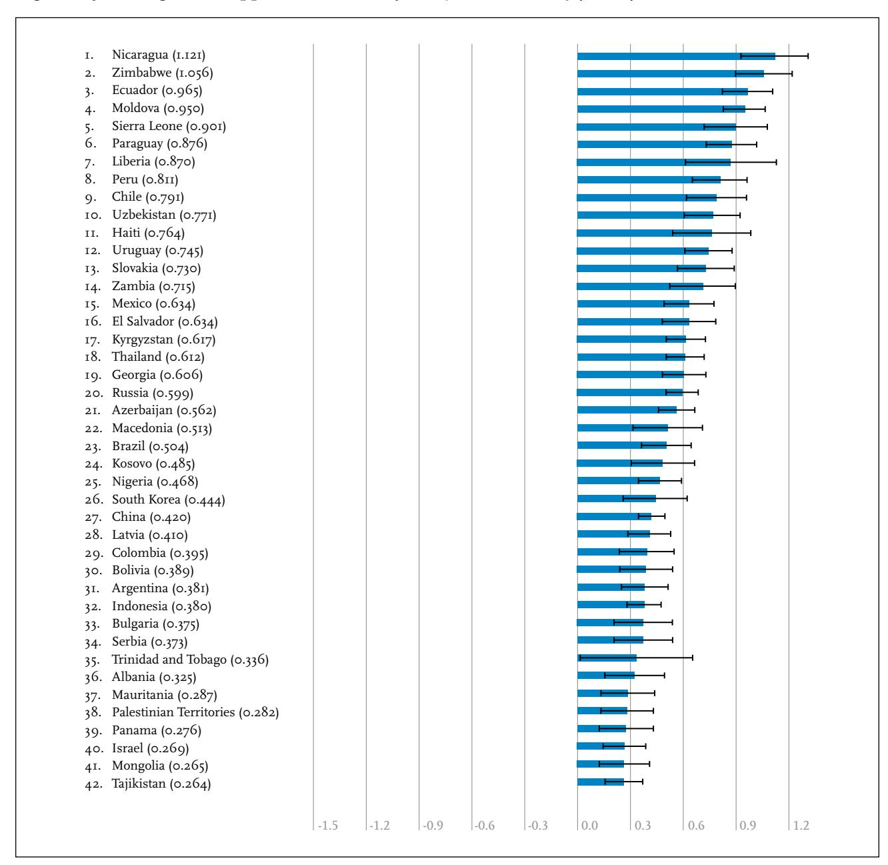

Changes from 2005–2007 to 2012–2014

→ 95% confidence interval

WORLD HAPPINESS REPORT 2015

Figure 2.3: Changes in Happiness from 2005-2007 to 2012-2014 (Part 2)

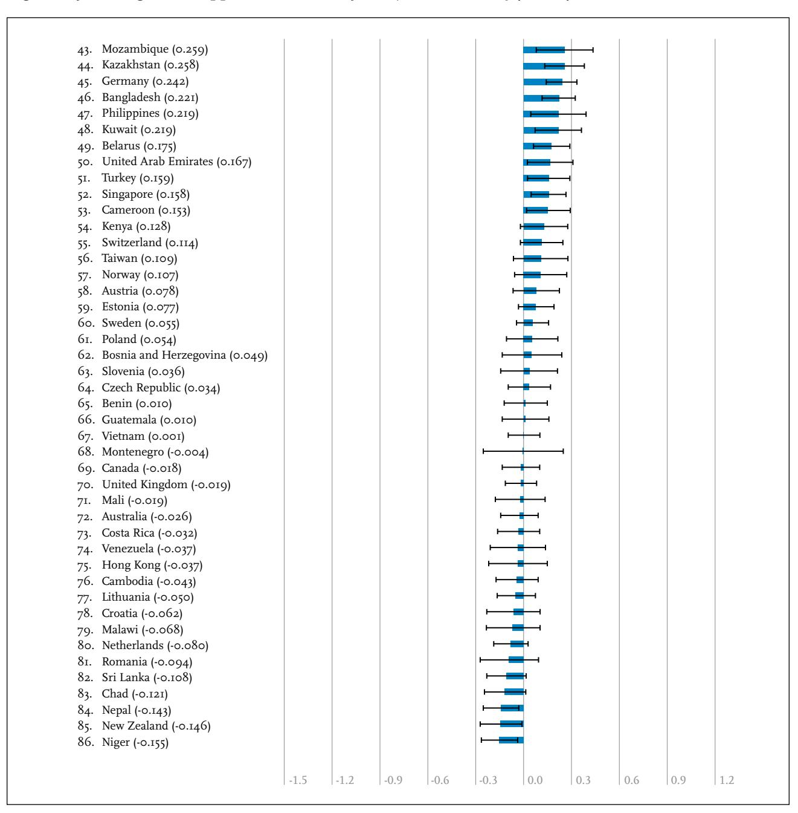

Changes from 2005–2007 to 2012–2014

→ 95% confidence interval

3

WORLD HAPPINESS REPORT 2015

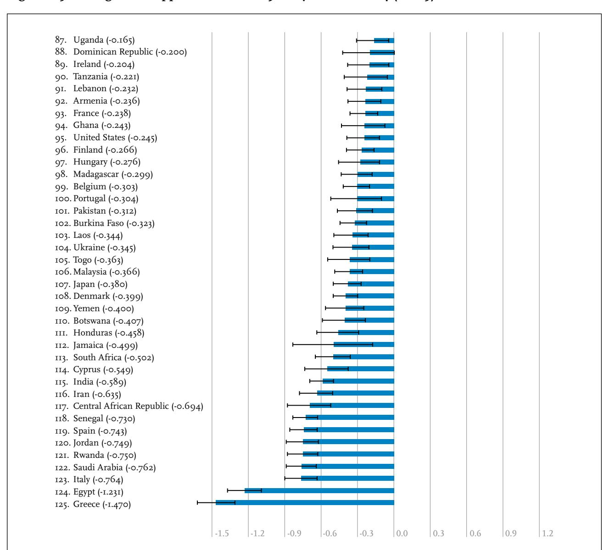

Figure 2.3: Changes in Happiness from 2005-2007 to 2012-2014 (Part 3)

Changes from 2005–2007 to 2012–2014 → 95% confidence interval

These gains and losses are very large, especially for the 10 most affected gainers and losers. For each of the 10 top gainers, the average life evaluation gains exceeded those that would be expected from a doubling of per capita incomes. For the 10 countries with the biggest drops in average life evaluations, the losses were more than would be expected from a halving of GDP per capita. Thus the changes are far more than would be expected from income losses or gains flowing from macroeconomic changes, even in the wake of an economic crisis as large as that following 2007. Thus, although we expect life evaluations to reflect important consequences of the global recession, there are clearly additional forces at play that have moderated, exacerbated or overridden global economic factors as drivers of national well-being from 2005-2007 to 2012-2014.

On the gaining side of the ledger, the inclusion of five Latin American countries among the top 10 gainers is emblematic of a broader Latin American experience. The analysis in Figure 3.10 of Chapter 3 shows that Latin Americans in all age groups reported substantial and continuing increases in life evaluations between 2007 and 2013.54 The large increases in some transition countries supported average increases in life evaluations in the transition countries. The appearance of sub-Saharan African countries among the biggest gainers and the biggest losers reflects the variety and volatility of experiences among the 25 sub-Saharan countries for which changes are shown in Figure 2.3.

The 10 countries with the largest declines in average life evaluations typically suffered some combination of economic, political and social stresses. Three of the countries (Greece, Italy and Spain) were among the four hard-hit Eurozone countries whose post-crisis experience was analyzed in detail in the *World Happiness Report* 2013. The losses were seen to be greater than could be explained directly by macroeconomic factors, even when explicit account was taken of the substantial consequences of higher unemployment.55 The four countries in the

Middle East and North Africa showed differing mixes of political and social unrest, while the three sub-Saharan African countries were more puzzling cases.56

Looking at the list as a whole, and not just at the largest gainers and losers, what were the circumstances and policies that enabled some countries to navigate the recession, in terms of happiness, better than others? The argument was made in the World Happiness Report 2013 that the strength of the underlying social fabric, as represented by levels of trust and institutional strength, affects a society's resiliency in response to economic and social crises. In this view, the value of social and institutional capital lies not just in the direct support that it provides for subjective well-being, but also in its ability to support collaborative rather than confrontational responses to external shocks and crises. The case of Greece, which remains the biggest happiness loser in Figure 2.3 (almost 1.5 points down from 2005-2007 to 2012-2014), was given special attention since the well-being losses were so much greater than could be explained directly by economic outcomes. The case was made that there is an interaction between social capital and economic or other crises, with the crisis providing a test of the quality of the underlying social fabric. If the fabric is sufficiently strong, then the crisis may even lead to higher subjective well-being, in part by giving people a chance to work together towards good purpose, and to realize and appreciate the strength of their mutual social support; and in part because the crisis will be better handled and the underlying social capital improved in use. On the other hand, should social institutions prove inadequate in the face of the challenges posed by the crisis, they may crumble further under the resulting pressures, making the happiness losses even greater, since social and institutional trust are themselves important supports for subjective well-being. The example of Greece was used as evidence for the latter possibility, with trust data from the European Social Survey used to document the erosion of the perceived quality of the Greek climate of trust.57

The evidence establishing the social and institutional context as an important part of the mechanisms linking external crises to their national happiness consequences, to be really convincing, needs examples on both sides of the ledger. It is one thing to show cases, such as Greece, where the happiness losses were very big and where the erosion of the social fabric appeared to be a part of the story. How about evidence on the other side, of countries with strong social fabrics being able to face comparably large shocks with better happiness consequences? With respect to the post-2007 economic crisis, the best examples of happiness maintenance in the face of large external shocks are Ireland and especially Iceland. Both suffered decimation of their banking systems as extreme as anywhere, and yet have suffered incommensurately small happiness losses. In the Icelandic case, the post-shock recovery in life evaluations has been great enough to put Iceland second in the global rankings for 2012-2014. That there is a continuing high degree of social support in both countries is indicated by the fact that of all the countries surveyed by the Gallup World Poll, the percentage of people who report that they have someone to count on in times of crisis is highest in Iceland and Ireland.58

If the social context is important for happiness-supporting resilience under crisis, it is likely to be equally applicable for non-economic crises. To add to earlier evidence about differential responses following the 2004 Indian Ocean tsunami,59 there is now research showing that levels of trust and social capital in the Fukushima region of Japan were sufficient that the Great East Japan Earthquake of 2011 actually led to increased trust and happiness in the region.60 This shows how crises can actually lead to improved happiness, by providing people with a chance to use, to cherish, and to build their mutual dependence and cooperative capacities.61

There is also evidence that broader measures of good governance have enabled countries to sustain or improve happiness during the economic crisis. Recent results show not just that people are more satisfied with their lives in countries with better governance, but also that actual changes in governance quality since 2005 have led to significant changes in the quality of life. This suggests that governance quality can be changed within policy-relevant time horizons, and that these changes have much larger effects than those flowing simply through a more productive economy. For example, the 10 most-improved countries, in terms of changes in government service delivery quality between 2005 and 2012, when compared to the 10 countries with most-worsened delivery quality, are estimated to have thereby increased average life evaluations by as much as would be produced by a 40% increase in per capita incomes. 62

#### **Summary and Conclusions**

In this Report the main global happiness data are split between two chapters. In this Chapter we have presented and attempted to explain the national levels and changes of life evaluations, positive affect and negative affect. In Chapter 3 there is a much larger body of data showing life evaluations and a number of specific positive and negative experiences split by gender, age and region. These more detailed data reveal many important similarities and many important differences among cultures, genders and ages.

In presenting and explaining the national-level data in this chapter, we make primary use of people's own reports of the quality of their lives, as measured on a scale with 10 representing the best possible life and 0 the worst. We average their reports for the years 2012 to 2014, providing a typical national sample size of 3,000. We then rank these data for 158 countries, as shown in Figure 2.2. The traditional top country, Denmark, this year ranks third in a cluster of four European countries with statistically similar scores, led by

Switzerland and including Iceland and Norway. The 10 top countries are once again all small or medium-sized western industrial countries, of which seven are in Western Europe. Beyond the first ten, the geography immediately becomes more varied, with the second 10 including countries from four of the nine global regions.

In the top 10 countries, life evaluations average 7.4 on the 0 to 10 scale, while for the bottom 10 the average is less than half that, at 3.4. The lowest countries are typically marked by low values on all of the six variables used here to explain international differences – GDP per capita, healthy life expectancy, social support, freedom, generosity and absence of corruption – and often subject in addition to violence and disease. Of the 4-point gap between the 10 top and 10 bottom countries, three-quarters is accounted for by differences in the six variables, with GDP per capita, social support and healthy life expectancy the largest contributors.

When we turn to consider life evaluation changes for 125 countries between 2005-2007 and 2012-2014, we see lots of evidence of movement, including 53 significant gainers and 41 significant losers. Gainers especially outnumber losers in Latin America, the Commonwealth of Independent States (former Soviet states) and Central and Eastern Europe (CIS/CEE). Losers outnumber gainers in Western Europe and to a lesser extent in South Asia and sub-Saharan Africa. 63 Changes in the six key variables explain a significant proportion of these changes, although the magnitude and natures of the crises facing nations since 2005 has been such as to move countries beyond the range of recent past experience, and into poorly charted waters. In particular, we found further evidence that major crises have the potential to alter life evaluations in quite different ways according to the quality of the social and institutional infrastructure. In particular, as analyzed first in the World Happiness Report 2013, we found evidence that a crisis imposed on a weak institutional structure can actually

further damage the quality of the supporting social fabric if the crisis triggers blame and strife rather than cooperation and repair. On the other hand, we found evidence that economic crises and natural disasters can, if the underlying institutions and fabric are of sufficient quality, lead to improvements rather than damage to the social fabric. These improvements not only ensure better responses to the crisis, but also have substantial additional happiness returns, since people place real value on feeling that they belong to a caring and effective community.

- Diener (2013) estimates the number of new scientific articles on subjective well-being to have grown by almost two orders of magnitude in the past 25 years, from about 130 per year in 1980 to more than 1,000 per month in 2013.
- 2 See OECD (2013).
- 3 See Durand & Smith (2013).
- 4 See Ryff & Singer (2008). The first use of a question about life meaning or purpose in a large-scale international survey was in the Gallup World Poll waves of 2006 and 2007. It was also introduced in the third round of the European Social Survey (Huppert et al. 2009). It has since become one of the four key well-being questions asked by the UK Office for National Statistics (Hicks et al. 2013).
- 5 See Hicks et al. (2013, 78) for the exact wording of the questions, which are all asked with 0 to 10 response scales.
- 6 "It should be made explicit that the panel's interpretation of its charge was to provide guidance primarily for measurement and data collection in the area of experienced (hedonic) well-being (ExWB). While acknowledging that measurement of the multiple dimensions of SWB is essential to a full understanding of it, this focus reflects the status of research on ExWB, which is less developed than it is for evaluative well-being, another dimension of SWB." See Stone & Mackie, eds. (2013, 2).
- 7 See Redelmeier & Kahneman (1996).
- 8 See Kahneman et al. (1997).
- 9 See Wirtz et al. (2003).
- 10 See Kahneman et al. (2004).
- II As is shown in the online appendix supplied by the OECD, experiential data are collected by the United States, France and Canada. Life satisfaction measures are collected by all OECD countries except the United States, Japan and Chile.
- 12 Stiglitz et al. (2009, 216).
- 13 OECD (2013, 164)
- 14 The latest OECD list of reporting countries is available as an online annex to this report.
- The Gallup Organization kindly agreed to include the SWL question in 2007 to enable this scientific issue to be addressed. Unfortunately, it has not yet been possible, because of limited space, to establish SWL as a core question in the continuing surveys.
- 16 See Table 10.1 of Helliwell et al. (2010, 298).

- 17 See Table 1.2 of Diener et al. (2010), which shows at the national level GDP per capita correlates more closely with WVS life satisfaction answers than with happiness answers. See also Figure 17.2 of Helliwell & Putnam (2005, 446), which compares partial income responses within individual-level equations for WVS life satisfaction and happiness answers. One difficulty with these comparisons, both of which do show bigger income effects for life satisfaction than for happiness, lies in the different response scales. This provides one reason for differing results. The second, and likely more important. reason is that the WVS happiness question lies somewhere in the middle ground between an emotional and an evaluative query. Table 1.3 of Diener et al. (2010) shows a higher correlation between income and the ladder than between income and life satisfaction using Gallup World Poll data, but this is shown, by Table 10.1 of Helliwell et al. (2010), to be because of using non-matched sets of respondents.
- 18 For an example using individual-level data, see Kahneman & Deaton (2010), and for national-average data Table 2.1 of Helliwell & Wang (2013, 19) or Table 2.1 of this chapter.
- 19 Barrington-Leigh (2013) documents a significant upward trend in life satisfaction in Québec, compared to the rest of Canada, of a size accumulating over 25 years to an amount equivalent to more than a trebling of mean household income.
- 20 See Lucas et al. (2003) and Yap et al. (2012).
- 21 See Lucas et al. (2003) and Clark & Georgellis (2013).
- 22 See Yap et al. (2012) and Grover & Helliwell (2014).
- 23 For example: "'Happiness' has been used in reference to momentary emotional states and also as a way of describing overall life evaluations; such lack of specificity has at times muddled the discourse." Stone & Mackie (2013, 4).
- 24 See Diener et al. (2010, xi).
- 25 UN General Assembly Resolution A/65/L.86 (13 July 2011).
- 26 The ability of people to see and apply this logic as a natural conversational skill is well accepted within linguistic philosophy. The case is well made by Grice (1975), recently reprinted as Grice (2013).
- 27 See Stone et al. (2012) and Tables 3 and 4 of Helliwell & Wang (2014). The presence of day-of-week effects for mood reports is also shown in Ryan et al. (2010).
- 28 See Stone et al. (2012) and Tables 3 and 4 of Helliwell & Wang (2014). The absence of day-of-week effects for life evaluations is also shown in Bonikowska et al. (2013).

- 29 Table 2.1 of the *World Happiness Report 2013* shows that a set of six variables descriptive of life circumstances explains 74% of the variations over time and across countries of national average life evaluations, compared to 48% for a measure of positive emotions and 23% for negative emotions. See Helliwell & Wang (2013, 19).
- 30 Using a global sample of roughly 650,000 individual responses, a set of individual-level measures of the same six life circumstances (using a question about health problems to replace healthy life expectancy) explains 19.5% of the variations in life evaluations, compared to 7.4% for positive affect, and 4.6% for negative affect.
- 31 As shown in Table 2.1 of the first *World Happiness Report*. See Helliwell et al. (2012, 16).
- 32 See Anand & Sen (1994) and Hall (2013).
- 33 See Marks et al. (2006) and Abdallah et al. (2012).
- 34 See http://www.prosperity.com
- 35 See http://info.healthways.com/wellbeingindex
- 36 See OECD (2011).
- 37 See Ura et al. (2012).
- 38 See http://info.healthways.com/wellbeingindex
- 39 See https://uwaterloo.ca/canadian-index-wellbeing
- 40 The BES Equitable and Sustainable Wellbeing index for Italy is an equally weighted average of 12 domain indicators, one of which is subjective well-being. It is a collaborative venture of the Italian National Council for Economics and Labour and the Italian National Institute of Statistics. See ISTAT (2014) and http://www.misuredelbenessere.it/fileadmin/upload/Bes\_\_\_2014\_Media\_summary.pdf
- 41 Yang (2014) provides a much larger inventory of composite indexes for various aspects of human progress.
- 42 See http://www.oecdbetterlifeindex.org/responses
- 43 The definitions of the variables are shown in the notes to Table 2.1, with additional detail in the online data appendix.
- 44 This influence may be direct, as many have found, e.g. De Neve et al. (2013). It may also embody the idea, made explicit in Fredrickson's broaden-and-build theory (Fredrickson [2001]), that good moods help to induce the sorts of positive connections that eventually provide the basis for better life circumstances.
- 45 We put the contributions of the six factors as the first elements in the overall country bars because this makes it easier to see that the length of the overall bar depends only on the average answers given to the life evaluation question. In the WHR 2013 we adopted a different ordering,

- putting the combined Dystopia+residual elements on the left of each bar to make it easier to compare the sizes of residuals across countries. To make that comparison equally possible in the *WHR* 2015, we include the alternative form of the figure in the online statistical appendix.
- 46 These calculations are shown in detail in Table 9 of the online Statistical Appendix.
- 47 The prevalence of these feedbacks was documented in Chapter 4 of the *World Happiness Report 2013*, De Neve et al. (2013).
- 48 The data and calculations are shown in detail in Table 10 of the Statistical Appendix. Average annual per capita incomes average \$43,000 in the top 10 countries, compared to \$1,770 in the bottom 10, measured in international dollars at purchasing power parity. For comparison, 94% of respondents have someone to count on in the top 10 countries, compared to 61% in the bottom 10. Healthy life expectancy is 71.5 years in the top 10, compared to 50 years in the bottom 10. 93% of the top 10 respondents think they have sufficient freedom to make key life choices, compared to 64% in the bottom 10. Average perceptions of corruption are 38% in the top 10, compared to 71% in the bottom 10.
- 49 Plots of actual and predicted national and regional average 2012-2014 life evaluations are plotted in Figure 4 of the online Statistical Appendix. The 45 degree line in each part of the Figure shows a situation where the actual and predicted values are equal. A predominance of country dots below the 45 degree line shows a region where actual values are below those predicted by the model, and vice versa.
- 50 Mariano Rojas has correctly noted, in partial exception to our earlier conclusion about the structural equivalence of the Cantril ladder and SWL, that if our figure could be drawn using SWL rather than the ladder it would show an even larger Latin American premium (based on data from 2007, the only year when the GWP asked both questions of the same respondents.).
- 51 For example, see Chen et al. (1995).
- 52 One slight exception is that the negative effect of corruption is estimated to be larger if we include a separate regional effect variable for Latin America. This is because corruption is worse than average in Latin America, and the inclusion of a special Latin American variable thereby permits the corruption coefficient to take a higher value. Veenhoven (2012) has performed a number of related tests of the sources and consequences of these regional differences, and concluded that they do not unduly dampen the ability to measure and explain happiness differences across countries.

36

- 53 There are thus, as shown in the Statistical Appendix, 33 countries that are in the 2012-2014 ladder rankings of Figure 2.2 but without changes shown in Figure 2.3. These countries for which changes are missing include five of the 10 lowest ranking countries in Figure 2.2. Several of these countries might well have been shown among the 10 major losers had their earlier data been available.
- 54 It should be noted that the analysis in this chapter is of country experiences, while in Chapter 3 the regional analysis is on a population-weighted basis. A region's average experience measured by the number of countries gaining and losing provides a different picture than does the population-weighted analysis of Chapter 3.
- 55 See Helliwell & Wang (2013), especially Table 2.2.
- 56 The case of Rwanda requires separate treatment, as it can be seen, from Figure 2.2, to have a predicted life evaluation, (based on the six variables) that is much higher than the average 2012-2014 evaluation. Hence, by our model, things are going much better in Rwanda than the evaluations yet show. It is also worth noting that there are significant improvements in the measured Rwanda averages from 2012 to 2013 and again from 2013 to 2014. Senegal had very low averages in 2012 and 2013, but in 2014 gained significantly, back almost to pre-crisis levels.
- 57 See Helliwell & Wang (2013, 17).
- 58 Iceland and Ireland are ranked first and second, respectively, with over 95% of respondents having someone to count on, compared to an international average of 80%.
- 59 See Helliwell & Wang (2013, 17) for references.
- 60 See Yamamura et al. (2014) and Uchida et al. (2014).
- 61 For other evidence and references, see Chapter 6 of this *Report*, and Helliwell et al. (2014).
- 62 This is above and beyond the direct effects of better governance on GDP. For a full explanation of the results, see Helliwell et al. (2014).
- 63 The numbers of significant gainers and losers, by region, are shown in tabular form in the Statistical Appendix, and on a country-by-country basis in Figure 2.3.

WORLD HAPPINESS REPORT 2015

#### References

Abdallah, S., Michaelson, J., Shah, S., Stoll, L., & Marks, N. (2012). *The Happy Planet Index: 2012 Report: A global index of sustainable well-being.* London: New Economics Foundation (NEF).

Anand, S., & Sen, A. (1994). *Human Development Index: Methodology and measurement* (No. HDOCPA-1994-02). Human Development Report Office (HDRO), United Nations Development Programme (UNDP).

Barrington-Leigh, C. P. (2013). The Quebec convergence and Canadian life satisfaction, 1985–2008. *Canadian Public Policy*, 39(2), 193-219.

Bonikowska, A., Helliwell, J. F., Hou, F., & Schellenberg, G. (2013). An assessment of life satisfaction responses on recent Statistics Canada Surveys. *Social Indicators Research*, 118(2), 1-27.

Blanchflower, D. G. (2009). International evidence on well-being. In A. B. Krueger (Ed.), Measuring the Subjective Well-Being of Nations: National Accounts of Time Use and Well-Being (p.155-226). Chicago: University of Chicago Press.

Boarini, R., Kolev, A. & McGregor, A. (2014). Measuring well-being and progress in countries at different stages of development: Towards a more universal conceptual framework, *OECD Development Centre Working Papers*, No. 325. Paris: OECD Publishing. DOI: 10.1787/5jxss4hv2d8n-en.

Cantril, H. (1965). *The pattern of human concerns.* New Brunswick: Rutgers University Press.

Chen, C., Lee, S. Y., & Stevenson, H. W. (1995). Response style and cross-cultural comparisons of rating scales among East Asian and North American students. *Psychological Science*, *6*(3), 170-175.

Clark, A. E., & Georgellis, Y. (2013). Back to baseline in Britain: Adaptation in the British Household Panel Survey. *Economica*, 80(319), 496-512.

Deaton, A. (2012). The financial crisis and the well-being of Americans. 2011 OEP Hicks Lecture. *Oxford Economic Papers*, 64(1), 1-26.

Deaton, A. (2013). The great escape: Health, wealth, and the origins of inequality. Princeton: Princeton University Press.

Deaton, A., & Stone, A. A. (2013). Two happiness puzzles. *The American Economic Review*, 103(3), 591-597.

De Neve, J. E., Diener, E., Tay, L., & Xuereb, C. (2013). The objective benefits of subjective well-being. In J. F. Helliwell, R. Layard, & J. Sachs—(Eds.), *World happiness report 2013* (pp. 54-79). New York: Sustainable Development Solutions Network.

Diener, E. (2013). The remarkable changes in the science of subjective well-being. *Perspectives on Psychological Science*, 8(6), 663-666.

Diener, E., Gohm, C. L., Suh, E., & Oishi, S. (2000). Similarity of the relations between marital status and subjective well-being across cultures. *Journal of Cross-Cultural Psychology*, 31(4), 419-436.

Diener, E., Kahneman, D., & Helliwell, J. (Eds.). (2010). *International differences in well-being*. Oxford: Oxford University Press.

Dolan, P., Hallsworth, M., Halpern, D., King, D., Metcalfe, R., & Vlaev, I. (2012). Influencing behaviour: The mindspace way. *Journal of Economic Psychology*, 33(1), 264-277.

Durand, M., & Smith, C. (2013). The OECD approach to measuring subjective well-being. In J. F. Helliwell, R. Layard, & J. Sachs (Eds.), *World happiness report 2013* (pp. 112-137). New York: Sustainable Development Solutions Network.

Fogel, R. W. (2004). *The escape from hunger and premature death*, 1700-2100: Europe, America, and the Third World (Vol. 38). Cambridge: Cambridge University Press.

Fredrickson, B. L. (2001). The role of positive emotions in positive psychology: The broaden-and-build theory of positive emotions. *American Psychologist*, 56(3), 218-226.

Grice, H.P. (1975). Logic and conversation. Syntax and Semantics, 3, 41-58.

Grice, H. P. (2013). Logic and conversation. In M. Ezcurdia & R. J. Stainton (Eds.), *The semantics-pragmatics boundary in philosophy* (pp. 47-59). Peterborough: Broadview Press.

Grover, S., & Helliwell, J. F. (2014). How's life at home? New evidence on marriage and the set point for happiness. NBER Working Paper 20794.

Hall, J. (2013). From capabilities to contentment: Testing the links between human development and life satisfaction. In J. F. Helliwell, R. Layard, & J. Sachs (Eds.), *World happiness report 2013* (pp. 138-153). New York: Sustainable Development Solutions Network.

Helliwell, J. F., Barrington-Leigh, C., Harris, A., & Huang, H. (2010). International evidence on the social context of well-being. In E. Diener, D. Kahneman, & J. F. Helliwell (Eds.), *International differences in well-being* (pp. 291-327). Oxford: Oxford University Press.

Helliwell, J. F., Huang, H., & Wang, S. (2014). Social capital and well-being in times of crisis. *Journal of Happiness Studies*, 15(1), 145-162.

Helliwell, J. F., & Putnam, R. D. (2005). The social context of well-being. *Philosophical Transactions of the Royal Society* (London), Series B, 359, 1435-1446.

Helliwell, J. F., Layard, R., & Sachs, J. (Eds.). (2012). World happiness report. New York: Earth Institute.

- Helliwell, J. F., & Wang, S. (2013). World happiness: Trends, explanations and distribution. In J. F. Helliwell, R. Layard, & J. Sachs; (Eds.), *World happiness report 2013* (pp. 8-37). New York: Sustainable Development Solutions Network.
- Helliwell, J. F., & Wang, S. (2014). Weekends and subjective well-being. *Social Indicators Research*, 116(2), 389-407.
- Helliwell, J. F., Huang, H., Grover, S., & Wang, S. (2014). Good governance and national well-being: What are the linkages? *OECD Working Papers on Public Governance*, No. 25. Paris: OECD Publishing. DOI: http://dx.doi.org/10.1787/5jxv9f651hvj-en.
- Hicks, S., Tinkler, L., & Allin, P. (2013). Measuring subjective well-being and its potential role in policy: Perspectives from the UK Office for National Statistics. *Social Indicators Research*, 114(1), 73-86.
- Huppert, F. A., Marks, N., Clark, A., Siegrist, J., Stutzer, A., Vittersø, J., & Wahrendorf, M. (2009). Measuring well-being across Europe: Description of the ESS well-being module and preliminary findings. *Social Indicators Research*, *91*(3), 301-315.
- Istat & CNEL. (2014). Bes 2014: Il benessere equo e sostenibile in Italia. Istituto nazionale di statistica.
- Kahneman, D., & Deaton, A. (2010). High income improves evaluation of life but not emotional well-being. *Proceedings of the National Academy of Sciences*, 107(38), 16489-16493.
- Kahneman, D., Wakker, P. P., & Sarin, R. (1997). Back to Bentham? Explorations of experienced utility. *The Quarterly Journal of Economics*, 112(2), 375-405.
- Kahneman, D., & Krueger, A. B. (2006). Developments in the measurement of subjective well-being. *The Journal of Economic Perspectives*, 20(1), 3-24.
- Krueger, A. B., Kahneman, D., Schkade, D., Schwarz, N., & Stone, A. A. (2009). National time accounting: The currency of life. In A. B. Krueger (ed.), *Measuring the subjective well-being of nations: National accounts of time use and well-being* (pp. 9-86). Chicago: University of Chicago Press.
- Krueger, A. B., & Stone, A. A. (2014). Progress in measuring subjective well-being. *Science*, 346(6205), 42-43.
- Legatum Institute. (2014). *The 2014 Legatum Prosperity Index*. http://www.li.com/prosperityindex
- Lucas, R. E., Clark, A. E., Georgellis, Y., & Diener, E. (2003). Reexamining adaptation and the set point model of happiness: reactions to changes in marital status. *Journal of Personality and Social Psychology*, 84(3), 527-539.
- Marks, N., Abdallah, S., Simms, A., & Thompson, S. (2006). *The Happy Planet Index*. London: New Economics Foundation.
- OECD. (2011). *How's life? Measuring well-being.* Paris: OECD Publishing. http://dx.doi.org/10.1787/9789264121164-en

- OECD. (2013). OECD guidelines on measuring subjective well-being. Paris: OECD Publishing.
- Redelmeier, D. A., & Kahneman, D. (1996). Patients' memories of painful medical treatments: Real-time and retrospective evaluations of two minimally invasive procedures. *Pain*, 66(1), 3-8.
- Ryan, R. M., Bernstein, J. H., & Brown, K. W. (2010). Weekends, work, and well-being: Psychological need satisfactions and day of the week effects on mood, vitality, and physical symptoms. *Journal of Social and Clinical Psychology*, 29(1), 95-122.
- Ryff, C. D., & Singer, B. H. (2008). Know thyself and become what you are: A eudaimonic approach to psychological well-being. *Journal of Happiness Studies*, 9(1), 13-39.
- Stiglitz, J., Sen, A., & Fitoussi, J.-P. (2009). Report by the commission on the measurement of economic and social progress. Paris: OECD. Retrieved from http://www.stiglitz-sen-fitoussi.fr/documents/rapport\_anglais.pdf
- Stone, A. A., Schneider, S., & Harter, J. K. (2012). Day-of-week mood patterns in the United States: On the existence of 'Blue Monday', 'Thank God it's Friday' and weekend effects. *The Journal of Positive Psychology*, 7(4), 306-314.
- Stone, A. A., & Mackie, C. (Eds.). (2013). Subjective well-being: Measuring happiness, suffering, and other dimensions of experience. Washington, DC: National Academies Press.
- Uchida, Y., Takahashi, Y., & Kawahara, K. (2014). Changes in hedonic and eudaimonic well-being after a severe nationwide disaster: The case of the Great East Japan Earthquake. *Journal of Happiness Studies*, 15(1), 207-221.
- Ura, K., Alkire, S., & Zangmo, T. (2012). Case Study: Bhutan. Gross National Happiness and the GNH Index. In J. F. Helliwell, R. Laryard, & J. Sachs (Eds.), *World happiness report* (pp. 108-148). New York: Earth Institute.
- Veenhoven, R. (2012). Cross-national differences in happiness: Cultural measurement bias or effect of culture? *International Journal of Wellbeing*, *2*(4), 333-353.
- Wirtz, D., Kruger, J., Scollon, C. N., & Diener, E. (2003). What to do on spring break? The role of predicted, on-line, and remembered experience in future choice. *Psychological Science*, 14(5), 520-524.
- Yamamura, E., Tsutsui, Y., Yamane, C., Yamane, S., & Powdthavee, N. (2014). Trust and happiness: Comparative study before and after the Great East Japan Earthquake. *Social Indicators Research*, forthcoming.
- Yang, Lin (2014). An inventory of composite measures of human progress. UNDP Occasional Paper on Methodology. http://hdr.undp.org/sites/default/files/inventory\_report\_working\_paper.pdf

#### WORLD HAPPINESS REPORT 2015

Yap, S. C., Anusic, I., & Lucas, R. E. (2012). Does personality moderate reaction and adaptation to major life events? Evidence from the British Household Panel Survey. *Journal of Research in Personality*, 46(5), 477-488.

41

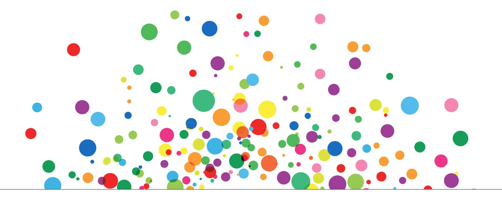

Chapter 3.

# HOW DOES SUBJECTIVE WELL-BEING VARY AROUND THE WORLD BY GENDER AND AGE?

NICOLE FORTIN, JOHN F. HELLIWELL AND SHUN WANG

#### Introduction

In this chapter we present subjective well-being data split by gender and age. Although our initial primary interest was in gender differences, we soon realized that the data need to be divided by both gender and age to become really informative about gender aspects of life around the world. In order to keep our sample sizes sufficiently large, we do most of our analysis using data covering the whole 10-year period for which the Gallup World Poll (GWP) has been conducted. Our first section deals with life evaluations, first at the global level and then for nine global regions. We then consider six positive and six negative experiences, mostly relating to feelings or emotions on the previous day, that are collected regularly in the Gallup World Poll, chosen to include especially those that previous research has shown to have interesting variations by gender, age or culture. We then consider variations by gender and age, globally and by region, in the six variables used in Chapter 2 to explain country level differences in life evaluations and affect.

In the final two sections we dig deeper into two aspects of the data already presented. First we make a preliminary attempt to disentangle cohort and age effects, limited by the relatively short time span for which Gallup World Poll data are available. Then we turn to consider gender differences in labor force participation across countries to see to what extent they help to explain international differences in gender gaps in variables already studied, for example feeling well-rested.

#### Life Evaluations by Gender and Age

As we have already seen in Chapter 2, there are very large differences among countries throughout the world in their average life evaluations. In the current section of this chapter we examine how these differences compare with those between genders and among age groups, for the world as a whole and in each of nine global regions.

Figure 3.1 shows our global distribution of ladder scores by gender and age. The global totals combine the regional average scores using weights for each region's share of global population. In order to increase sample size, and because the relations we have uncovered are fairly constant from year to year, Figures 3.1 to 3.9 are based on all the data collected by the Gallup World Poll from 2005 through most of 2014. This large sample size means that the 95% confidence intervals (shown by the shaded areas surrounding each of the lines) for our estimates of average values are fairly narrow. Thus we are able to say, in Figure 3.1, that on a global average basis females have higher life evaluations than do males, by an amount that is highest about the age of 30. Over all age groups taken together females average 0.00 points higher on the 0 to 10 life evaluation scale, or 1.5% of the global average life evaluation.

There are substantial variations among regions in gender differences in life evaluations.2 Females have higher life evaluations than males, of slight but statistically significant size, in five of the eight global regions: NANZ (+0.17 points), Southeast (SE) Asia (+0.09), South Asia (+0.05), East Asia (+0.09) and MENA (+0.28). Females have life evaluations significantly lower than males in two regions: CEE+CIS (-0.07) and sub-Saharan Africa (-0.03). There are very small and insignificant gender differences in Western Europe and Latin America. The differences among age groups are much larger, and more prevalent. Both males and females show, on a global average basis, a life evaluation decline with age in the early decades. It drops by 0.6 points, or more than 10% of the global average, from the teenage years (15 to 19) until the low point in midlife, and then stays roughly constant over the rest of the age distribution. The global figures in this chapter are all defined as averages of the regional figures, using the average total population of each region as weights. This ensures that the global and regional figures are consistent, and permits the shape of the global figures to be explained by examining the shapes of the regional figures.3

Figure 3.1: World: Cantril Ladder by Gender and 5-Year Age Groups

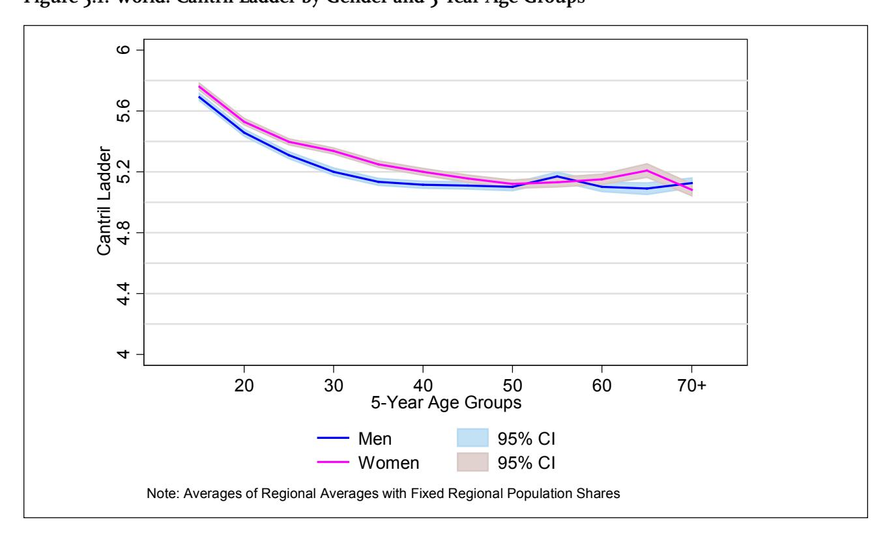

The first and most obvious point to make is that differences by age and gender are very small relative to international differences in average ladder scores, or even between the top and bottom groups within a country or region. As already noted in Chapter 2, the difference between the top 10 and the bottom 10 countries in average ladder scores is four points, which is almost 50 times larger than the average gender gap.

Differences among age groups are more marked. Some but not all regions display a U-shaped pattern established previously in many but not all countries. But almost all countries and regions show a decline in life evaluations over the early years, falling by 0.6 points, almost eight times larger than the average gender gap. Thereafter, life evaluations follow patterns that differ among regions, as can be seen in Figure 3.2.

Our second main conclusion, easily demonstrated in Figure 3.2, is that the patterns by gender and age vary substantially from region to region. Average life evaluations of course differ a lot among regions, as foreshadowed in Chapter 2 using somewhat different data. The average life evaluations reported in Figure 3.2 contain all years of the Gallup World Poll from 2005 to 2014, while Chapter 2 presented data from the more recent years of the same poll, mainly 2012 to 2014. In both cases the highest regional averages are in the NANZ group of countries5 and the lowest in sub-Saharan Africa, over 7.2 in the former case and less than 4.5 in the latter.

U-shapes over the age distribution appear in the East Asia and NANZ groups of countries, but with less recovery in the older age groups in East Asia. The groups of countries including Russia and other countries in Central and Eastern

WORLD HAPPINESS REPORT 2015

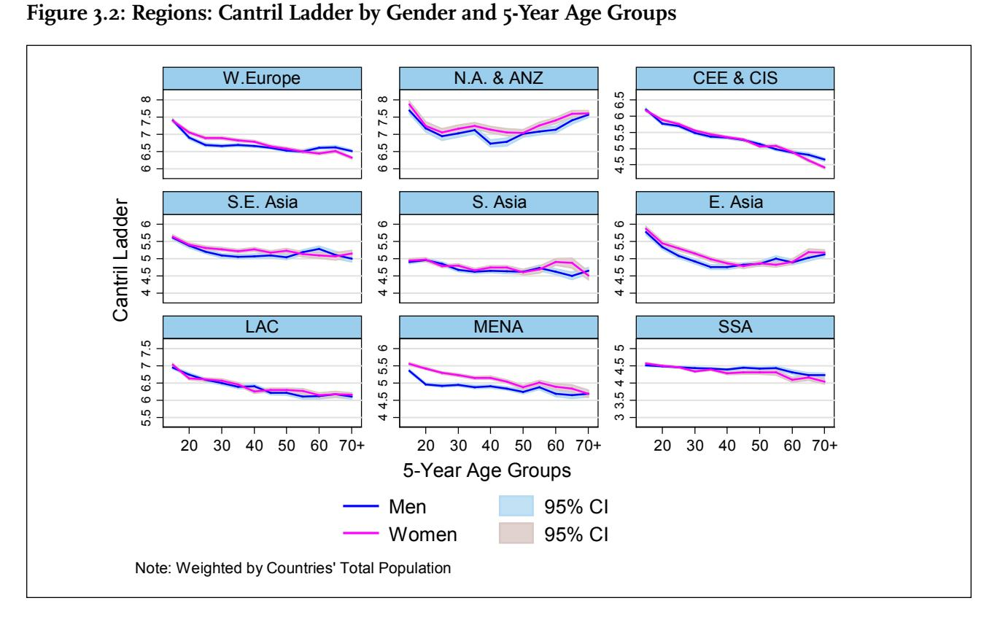

Europe (CIS+CEE) display little gender difference, and a sharply falling trend from lower to higher age groups. Latin America has little by way of gender differences, but has a much less steep downward trend across age groups. The biggest gender differences favoring women are in the Middle East and North Africa (MENA), where the gap for women in their early 20s is almost 10% of the national average, falling thereafter among the older age groups. 6 Western Europe follows a mainly downward trend to age 50, and is flat thereafter, with a gender gap favoring women before the age of 50 and men after 50. In sub-Saharan Africa there is little trend across age groups, and no gender differences until about age 40, after which the gender gap favors men.

The different gender and age patterns among regions no doubt reflect some combination of differing stages of development, differing mixtures of age and cohort effects, and local circumstances with uneven impacts across ages and genders. We shall return later in the chapter to show how the key explanatory variables used in Chapter 2 differ by age and gender, and hence provide a basis for the life evaluation differences shown in Figure 3.2. We shall also present a preliminary analysis by birth cohort, tracking people born in the same year, to see if the number of years in the Gallup World Poll is now large enough to permit us to distinguish age and cohort effects.

In Figure 3.3 we turn to consider gender differences in life evaluations at the country level, thus helping to illustrate the underlying sources of the regional variations already shown in Figure 3.2. There are seven different colors used to represent countries, each representing the average size of the life evaluation gap favoring

women, ranging from dark blue and dark green for the largest gaps, and red and orange for countries where the gap favors men. A small white diamond in the country space shows that the estimated effect is statistically significant at the 95% level. The countries with the largest female gender gap, shown in blue or dark green, are in the Middle East and North Africa (MENA) and a few industrial countries (Japan, South Korea, Finland, Canada). The countries with significant gender gaps favoring men are in sub-Saharan Africa, with a few others scattered about the globe. Much of Europe and Asia, and several Latin American countries, lie in the intermediate zone where the estimated gaps are small and statistically insignificant.

#### Experiences by Age and Gender

In this section we search for similarities and differences by age and gender in a variety of experiences drawn from answers to the Gallup World Poll. These include both positive and negative emotions7 of the sort already studied in Chapter 2, but also feelings of safety at night,

experience of smiling and laughter, interest, and pain on the previous day. We include six positive items: happiness, smiling or laughter, enjoyment, feeling safe at night, feeling well-rested, and feeling interested. The six negative items are: anger, worry, sadness, depression, stress and pain. The scales run from o to I, and reflect the fraction of respondents who reported significant amounts of the particular emotion or experience during the previous day. We report differences in terms of the percentage of respondents giving one answer rather than another.

Differences among respondents can be due to differences in the circumstances in which they are living, as well as to differences in the extent to which any given circumstances are likely to trigger responses that vary by gender and age. There are middle cases as well, whereby any given set of objective circumstances, e.g. the local night-time street scene, might pose objectively higher risks for females than males, and would hence reduce feelings of night-time safety for females more than males even if their reactions to any degree of objective risk were the same. Thus we recognize that the data we are assessing

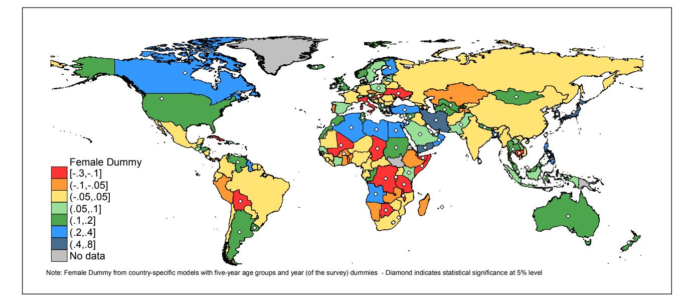

reflect a mixture of circumstances and responses to those circumstances. Hence the answer differences between genders will reveal some combination of underlying gender differences in reactions to external triggers, and the distribution between genders in the type and frequency of such triggers. For example, if in a given culture men report feeling anger more often than do women, it could be either because they are more likely than women to feel anger in the face of a particular challenge, or that their lives are such that they face more situations of a type that might make anyone angry.

The situation is complicated even more by the existence of gender stereotypes, whereby it is commonly believed, for example, that feeling anger is more stereotypically male than female, and that fear, worry and sadness are more typically female than male. The complication comes when the existence of the stereotype itself changes the prevalence of subsequent feelings.8 This is through three possible channels. First, the stereotype may lead people to perceive situations in ways that match the stereotype – e.g. to focus on behaviors that support the stereotype. Second, the stereotypes may lead people to act in a stereotypical fashion.9 Third, the existence of stereotypes provides the basis for what is taught to children about appropriate behavior. 10

The likely consequence is that gender stereotypes and reported frequency of feelings are both likely to vary with cultural contexts, even in cases where there is little factual underpinning for the stereotypes. Thus we may expect to find differences across global regions, to the extent that they mark separate cultural streams with different gender norms, without thereby being able to assume the presence of fundamental differences in human behavior. If, as we expect, there are important two-way linkages between gender norms and reported feelings, then the international differences along with the underlying social norms may be subject to change over time.

Therefore, although we are able to establish some interesting differences in the global data we analyze, we can make no claims about the extent to which they represent something fundamental that is likely to continue.

A second general point is worth making before we turn to the details. One broad feature of the literature and data we have surveyed is that while there are relatively few universal gender differences in the frequency and intensity of feelings and experiences, there are well-established gender differences, at least in some cultures, in the emotional responses of males and females to particular circumstances. One example will suffice. Although the general stereotype that males feel and express anger more than females does not get much support from the data, " there are nonetheless significant gender differences (at least in some cultures) in what triggers anger, especially within close relationships. Females are more often angered than are men following betraval, condescension, rebuff, unwarranted criticism, or negligence, while males are more frequently angry if their partner is moody or self-absorbed. 12 That particular example may be culture-bound, but it helps to show the situational logic of emotions, and how the outcome depends on gender and typical gender roles.

#### Positive Experiences

We show first, in Figure 3.4, population-weighted global average answers relating to the six positive experiences, with a separate line for each gender, and with respondents combined into 5-year age groups. The shaded area surrounding each bold line covers the 95% confidence region, so that any gap between the shaded lines denotes a difference that is statistically significant. The global averages in Figure 3.4 are averages of the regional results shown in Figure 3.5, using total population in each region as the weights. Each of the six parts of Figure 3.5 covers a different positive experience, with a separate sub-panel for each of nine regions. We will consider the

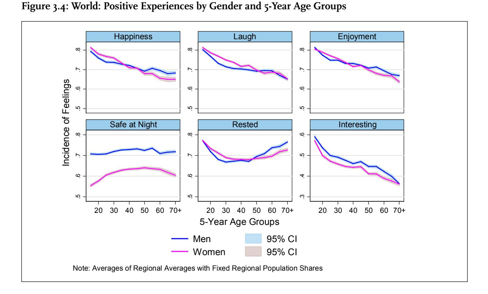

different experiences one by one, with reference both to global averages and on a regional basis, with some links to what has been shown by previous research. By way of preview, the largest and most sustained gender gap is for feeling safe at night. For the other experiences, significant gender differences (as represented by spaces between the shaded bands, which measure the 95% confidence regions for the estimated averages) appear only at certain ages.

Younger women report significantly more frequent experiences of happiness, laughter, enjoyment and feeling rested than do young men, but in all four instances the reported frequency drops significantly as women approach middle age, at which time there is a gender cross-over. Thereafter, both genders become better rested, but men significantly more than women, with the gap approaching

10% when both are over 70. For laughter and enjoyment, after middle age both genders trend downward at roughly the same rate, although enjoyment levels are generally significantly greater for men than women at ages over 50. The remaining positive experience, which is "having learned or done something interesting yesterday," favors males over females across the whole age range.

We now consider the six positive experiences in more detail, before turning to analyze the six negative experiences.

#### Happiness

From Figure 3.5a we can see that the global happiness boost for young women has its main sources in SE Asia (+2%), East Asia (+1%) and the countries of the Middle East and North Africa (+1%). In general, men and women report feeling happy yesterday in almost equal proportions, with a small but statistically significant difference favoring women (+0.5%). Women report significantly less frequent happiness yesterday in Western Europe (-1%) and Latin America (-3%). It is also worth noting the difference in happiness trends by age (for men and women combined) among the regions. For happiness, as for the other positive experiences, the largest downward trends with age are in the CIS and Eastern Europe.13 In four regions – Western Europe, Latin America, East Asia and SE Asia – the incidence of happiness yesterday is high for both men and women (about 80%) and constant across age categories. In South Asia, the incidence of happiness is also about 80% for the young age groups, but falls fairly steadily to about 60% at the older end of the age spectrum. Sub-Saharan Africa is similar, from a slightly lower starting point. The smaller NANZ group has the highest average reported incidence, with some slight U-shape, with the highest reported happiness at the two ends of the age distribution. In several regions, there is some small but significant happiness gap favoring men in the highest age groups.

#### Smiling and Laughter

Experimental evidence, relying mainly on data from western countries, has shown that on average females smile and laugh more than males and that the "difference between female and male smiling is greatest when they are teens or young adults and drops off significantly with

Figure 3.5a: Happiness by Gender and Regions

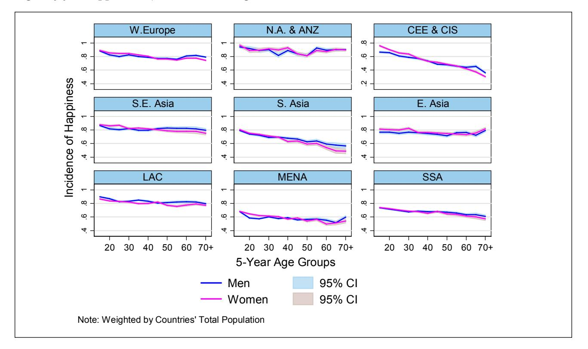

The global data in Figure 3.4 support the experimental findings, as they show the biggest laughter advantage for women is in the younger age groups, with a maximum gap of about 4% at about age 30. The average laughter gap favoring women, averaging across all age groups, is 2%. From Figure 3.5b it can be seen that the biggest contribution to the global laughter gap favoring young women comes from East Asia, with smaller contributions from South Asia and the countries

of the CIS and Eastern Europe. There is, however, no contribution from the NANZ grouping.

#### Enjoyment

The global data for enjoyment show a general downward trend with age, as shown in Figure 3.4, with lifetime averages being identical for males and females. However, females on average have more enjoyment below the age of 40, while males have an enjoyment advantage at ages above 50. Figure 3.5c shows the biggest drops by age group to be in the CIS and Eastern Europe, although this may well involve a strong cohort element, as we shall consider later. The other regions with significant negative trends are South Asia and Western Europe, followed by MENA and sub-Saharan Africa. The age relation is essentially flat in Latin America, and follows a U-shape in the NANZ grouping.

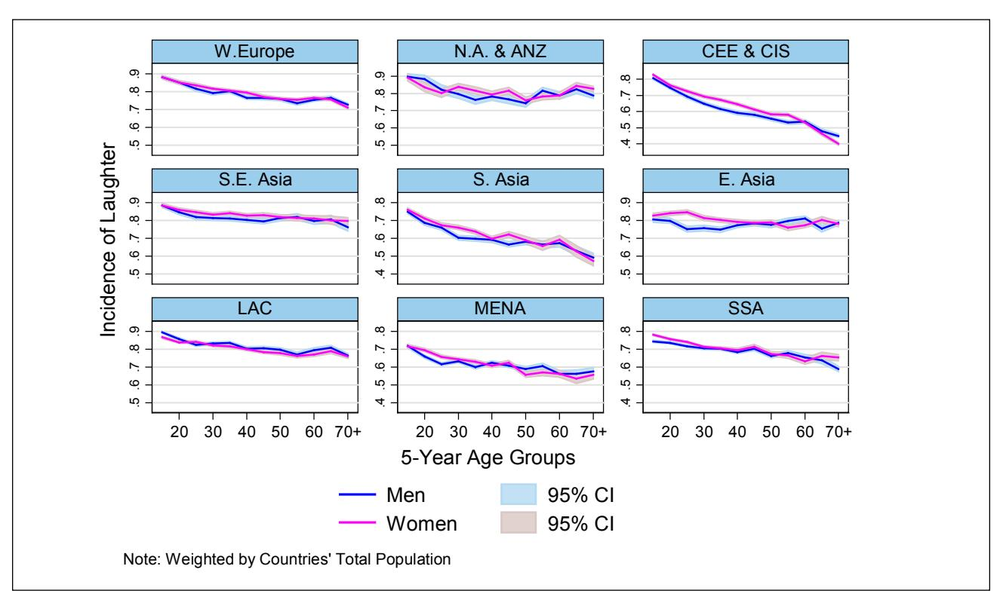

WORLD HAPPINESS REPORT 2015

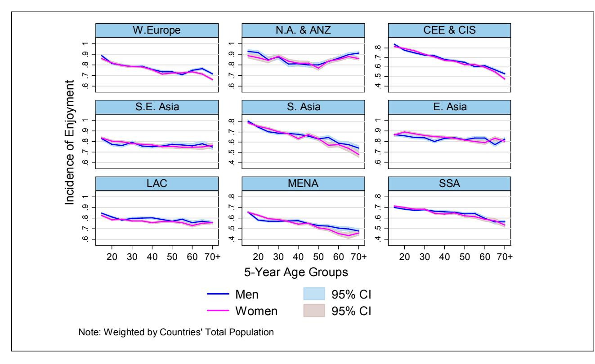

Figure 3.5c: Enjoyment: Averages by Gender and Regions

#### Well-rested

There are many differences across genders, regions and age in the frequency with which people report feeling well-rested. Globally, there is a U-shape for feeling well-rested for both men and women, but the shapes are different, with men aged 30 being the least well-rested, compared to a low point for women about age 50. Below the age of 50, men are less well-rested than women, and the reverse is true in later life. The biggest gender gap is the late-life gap of about 7% favoring men; the early gap favoring women has its peak of about 4% at age 30. Averaging over the ages there is a small gender advantage for women (+0.3%).

#### Feeling Safe at Night

As already noted, there is a large gender gap for safety at night. At all ages men more often report

feeling safe at night than do women, with the gap being largest at the two ends of the age distribution. For the global population considered as a whole, 71% of men feel safe at night, compared to 60% of women. Three regions have the largest gender gaps in feelings of night-time safety, with females of all ages less likely than men to feel safe at night – Western Europe (20% of respondents), Eastern Europe and the CIS (15%), and NANZ (22%).

On average for men and women, feelings of night-time safety are lowest in Latin America, where fewer than half of the respondents feel safe at night. Only about 40% of Latin American women feel safe at night, a proportion that remains constant across the age groups. About half of young men feel safe at night, but that proportion drops steadily with age, approaching that for women in the highest age categories. Average perceived safety at night is also low in MENA (60%) and sub-Saharan Africa (55%) and

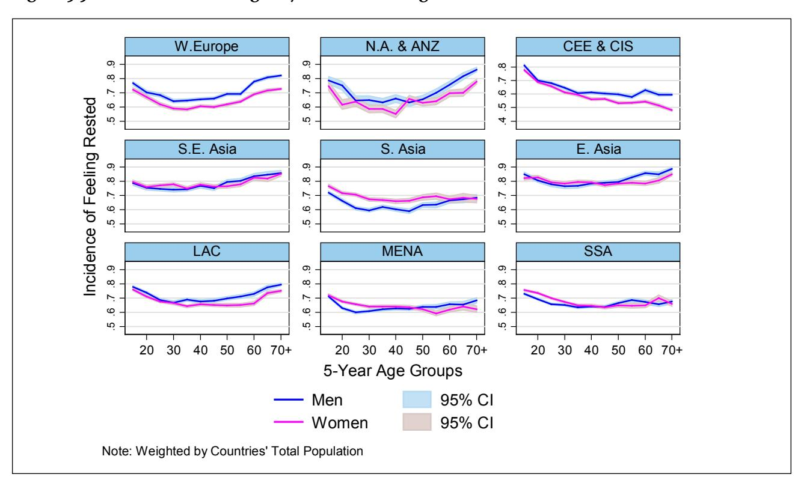

Figure 3.5d: Well Rested: Averages by Gender and Regions

the CIS+CEE (60%), with a gender gap that becomes smaller at higher ages in MENA, but slightly larger in sub-Saharan Africa. Average feelings of night-time safety are highest in East and Southeast Asia, more than 80% for males and 74% for females. The gender gaps for safety at night are lowest (below 10%) in all three Asian regions and sub-Saharan Africa.

#### Interest

Reports of learning or doing something interesting yesterday are more common among males than females for most age groups, especially below middle age, with the two lines converging in the top age groups. For both genders the average rate of positive answers for the interest question is much lower than for the other positive experiences, averaging 47%,

compared to averages above 73% for happiness, laughter and enjoyment.

#### **Negative Experiences**

The first thing to note when comparing the global averages for the six positive and six negative experiences, as shown in Figures 3.4 and 3.6, is how much more common are positive than negative experiences. The averages for the positive experiences fall between 47% and 74%, with most being near the upper end of the range. By contrast, the averages for negative experiences range from 14% to 32%, with most below 25%. Worry (31.5%) and stress (30%) are the most prevalent of the negative experiences, with depression (14%), sadness (19.5%) and anger (20%) the least common. There are significant gender differences, at least in some age groups,

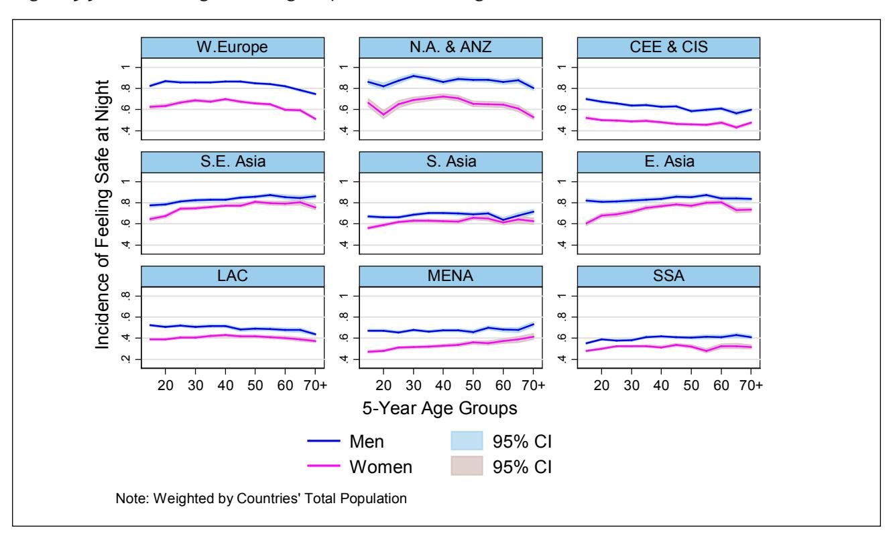

Figure 3.5f: Interesting: Averages by Gender and Regions

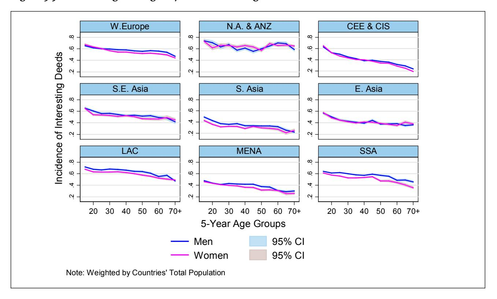

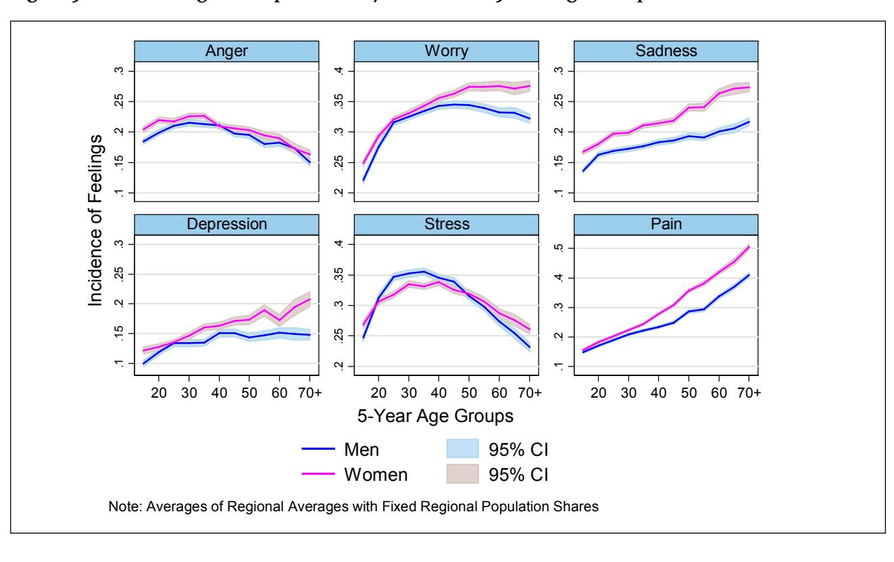

Figure 3.6: World: Negative Experiences by Gender and 5-Year Age Groups

for all of the negative experiences except for anger. We shall now consider the differences between genders and among age groups and regions, looking at each experience separately, thus making use of Figures 3.6 and 3.7 together.

#### Anger

As we have already noted, while there is an established gender stereotype that anger is more prevalent among males than females, our global evidence falls in line with earlier studies in showing very similar shares of women and men reporting having felt anger the previous day. Even the changes in the prevalence of anger among age groups are also similar for men and women. There is a slight but statistically significant gender difference before the age of 30, with females 2% more likely to report anger than

males, a difference equal to about 10% of the average frequency, which itself rises until the early 30s. Thereafter anger becomes steadily less prevalent among the old age groups, and is the same for men and women, falling to about 15% in the highest age groups.

Those are the global patterns. How do they differ by region? Figure 3.7a shows some interesting regional differences. Reported anger is significantly higher in the Middle East and North Africa than in other regions, at about 35%. The rates are very similar for men and women, with some tendency to be higher in the middle of the age distribution, giving a slight humpshaped pattern. The next highest incidence of anger is in South Asia, at an average rate of about 25% for both men and women. The generally decreasing prevalence of anger in the higher age groups is absent or highly muted in South Asia and sub-Saharan Africa. All other

regions show significantly less anger among the higher age groups, with the average incidence among the oldest groups at about 10% in Western Europe, NANZ, the CIC and CEE, and Latin America. The largest gender differences are in Latin America and SE Asia, where women under the age of 50 are significantly more likely to report anger than are men, by amounts approaching 5% for the youngest Latin women and over 7% for 30-year old women in SE Asia.

#### Worry

Although anger is mostly gender neutral, relatively low, and falling over most age groups, worry for women is generally more frequent than anger, and rises across age groups, from 25% among the youngest women, in the global data in Figure 3.6, to 37% for the oldest age groups. Men have, in the global average data, the same levels and trends as women until

middle age, and then fall to become 5% lower than women in the high age groups.

Figure 3.7b shows quite different regional levels and patterns by gender and age. In the CIS and CEE, worry is very low among the young and trends sharply upwards across age groups, from about 10% among the young to almost 45% for the oldest women and 35% for the oldest men. Worry rises steadily moving across age groups in South Asia, being about 20% in the youngest groups and 40% in the oldest groups, with men and women having the same prevalence and following the same age patterns. Sub-Saharan Africa also shows worry that is equal for men and women, and a rising trend with age that is the same for men and women, but less marked than in South Asia. East Asia has worry rates that are the lowest among all the regions, are the same for men and women, and show little variation among age groups.

Figure 3.7a: Anger: Averages by Gender and Regions

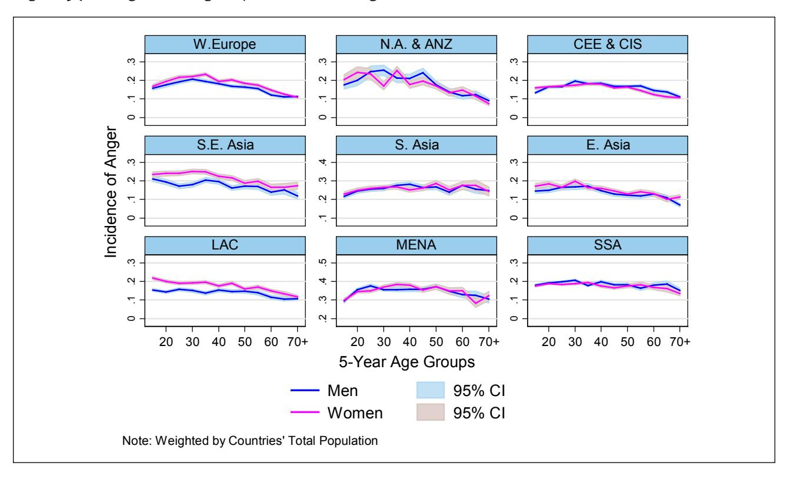

Figure 3.7b: Worry: Averages by Gender and Regions

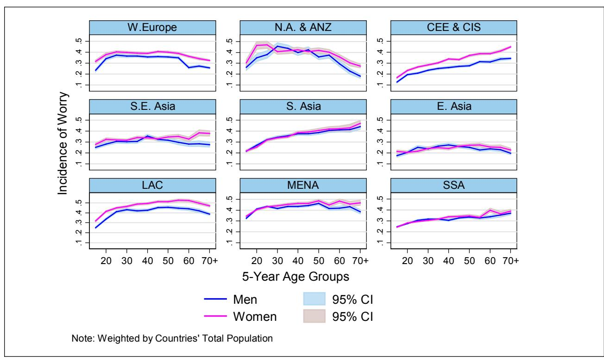

Figure 3.7c: Sadness: Averages by Gender and Regions

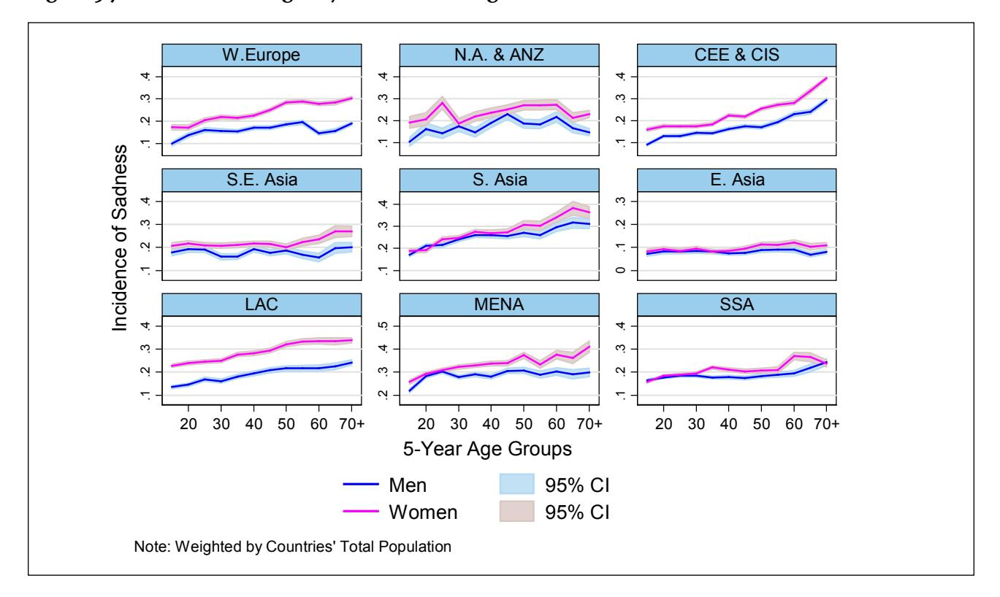

In Latin America, there is a hump-shaped worry pattern across ages for both men and women, with peak worry among those in their fifties, and females always being more worried than men, by amounts growing in the higher age groups, and reaching a peak difference of about 10%. Western Europe, NANZ, MENA and SE Asia all have only slight trends and gender differences, although all four regions reveal systematically higher worry for women than men in the oldest

# age groups.

#### Sadness

Globally, as shown in Figure 3.6, feelings of sadness yesterday are less common than worry, and also show significantly different patterns of variation. Feelings of sadness are always significantly more common for women than men, and steadily rise from lower to higher age groups, with about 7% more women than men feeling sad in the higher age groups. The various panels of Figure 3.7 show that sadness is more widely reported in higher age groups in all regions. The global gender gap of females being more likely to report sadness yesterday applies in all nine regions, and generally grows with age in all regions.

The greater frequency of expressed sadness for females than males is a standard finding in experimental psychology. It is attributed variously to differences in socialization, 15 inherent gender differences in emotionality. 16 and greater female willingness to discuss emotional problems.17 In some sense, the greater female reports of worry might be seen as part of the bridge between the well-established facts, applicable in many cultures, that while depression and attempted suicide are much more common among women than men, completed suicides are far more common among men than women. However, it is not clear how much of the differences between males and females in their willingness to discuss sadness with others would carry over in the same way in responses about sadness yesterday in a survey context.

Thus we might expect to find that gender differences in conversations about sadness might be larger than the differences we find among answers to the survey questions. Especially among younger adults, where most of the experimental research takes place, the Gallup World Poll frequencies for feelings of sadness yesterday are very similar for men and women in all regions, although higher for females everywhere.

#### Depression

Figure 3.6 shows that survey-reported depression starts at a low level for both men (10%) and women (12%) at age 20, and thereafter rises approximately twice as fast for women as for men, and exceeds 20% for women in the highest age group. These are still much lower reported frequencies than for the other negative experiences. The closest parallel is with pain, which also shows rising and diverging gender trends, and is always higher for women. As will be discussed below, pain reports rise faster with age than do depression reports, and on average are more than twice as frequent.

The similarities between pain reports and depression reports are more than coincidence, as an international study has shown very high rates of co-morbidity, with more than half of those in each country with depression or anxiety disorder having experienced chronic pain in the previous 12 months. On average the fraction of depression sufferers also suffering pain is about two-thirds in both developing and developed country samples.18

Figure 3.7d once again shows a lot of regional variation. Significantly higher and rising female rates of depression are apparent in Western Europe, Latin America and the CIC+CEE. Depression rates are flat across age groups, and the same for men and women, at average rates of about 10% in both East and SE Asia.

There are also striking regional differences in the average frequency of reported stress, ranging from more than 50% for middle-aged respondents in NANZ to a fairly stable average of less than 20% in the CIS and CEE. Other relatively low and stable averages are in SE Asia (25%) and sub-Saharan Africa (30%). On average over all age groups, the highest reported stress frequencies are in MENA, at about 45%.

women and 40% for men in the highest age groups. This is consistent with data from international health surveys, which show greater pain prevalence among women, and among those in higher age groups. 19 One cross-national study, based on many fewer countries than the GWP, reports the incidence of chronic pain is significantly higher in developing than in developed countries, and higher for females and older persons in both groups of countries. Figure 3.7f shows pain incidence as higher for females in all regions, and everywhere rising with age. It also shows generally lower incidence of pain in the two regions most closely matching the other study's classification of developed economies – Western Europe and NANZ. However, in our data the lowest average incidence of reported pain (especially at ages below 40) is in East Asia, which nonetheless shows the same growth with age, especially for women, found in the rest of the regions.

In all regions except Latin America and MENA males and females have essentially the same levels and trends of reported pain until about age 40, with both female and male pain reports being more frequent in higher age groups, especially for females.

#### Pain

The global average data; in Figure 3.6 for experiences of pain yesterday show equality between young males and females (20% at age 20). Prevalence rises steadily thereafter for both genders, but at different rates, reaching 50% for

Figure 3.7d: Depression: Averages by Gender and Regions

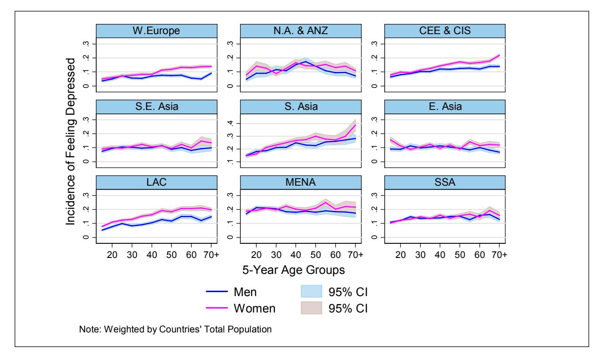

Figure 3.7e: Stress: Averages by Gender and Regions

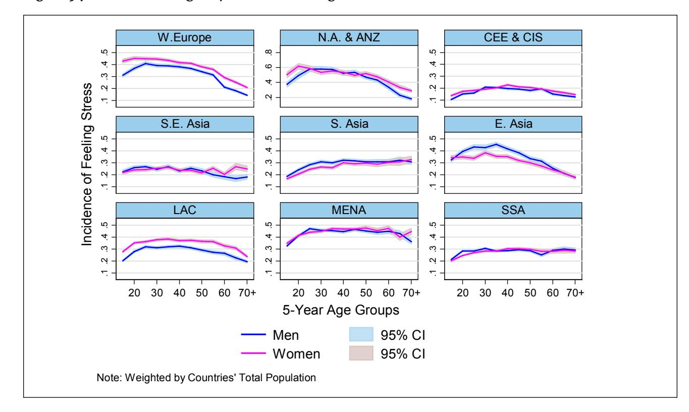

W.Europe N.A. & ANZ CEE & CIS Pain S.E. Asia S. Asia E. Asia ncidence of LAC MENA 20 30 40 50 60 70+ 20 30 40 50 60 70+ 20 30 40 50 60 70+ 5-Year Age Groups 95% CI Women 95% CI Note: Weighted by Countries' Total Population

Figure 3.7f: Pain: Averages by Gender and Regions

#### Gender and Age Differences in Six Key Variables Supporting Life Evaluations

Figure 3.8 shows the global average values, split by gender and age group, for the six variables used in Chapter 2 to explain international differences in life evaluations. For four variables – social support, generosity, corruption and freedom – we have individual-level data underlying the national averages used in Chapter 2. For the other two variables – GDP per capita and healthy life expectancy – this match is not possible, so we use reported household income to represent the former, and a Gallup World Poll question about the frequency of health problems for the latter.

In the global data of Figure 3.8, the largest differences by age and gender relate to health problems, which are almost four times as

prevalent at the top as at the bottom of the age range (50% vs 13%), and which start out equally prevalent for young men and women, and then increase faster for women in the higher age groups.

Social support (having someone to count on) and freedom to make life choices are both very prevalent, with global averages of about 75% in both cases. Social support has a declining trend for both genders, but with a later-life recovery that is greater for women than men. Men under 55 report less social support than women, and the reverse applies in the older age groups. Freedom to make life choices has the same levels and modestly upward trends for men and women, with average frequencies starting in the low 70-80% range for the younger ages, and two or three percentage points in the higher age groups.

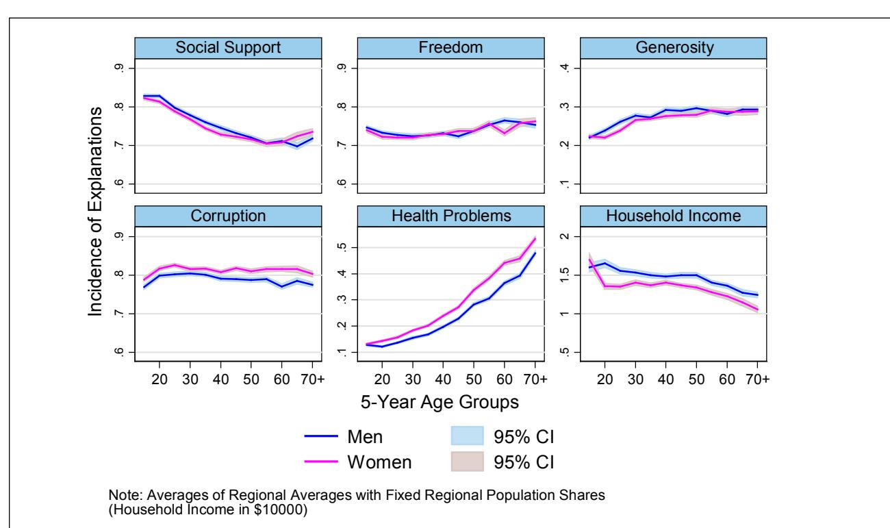

Figure 3.8: World: Explanations by Gender and 5-Year Age Groups

Donation frequencies follow a rising trend with age for both men and women, from about 20% donation rates for the young to 30% in the oldest age groups, averaging 26% over the age range. Women donate less than men at ages below 50, and more thereafter.20

Most people, 81% globally, think that corruption in business and government poses problems for their countries. There is slight evidence of a rising trend in the higher age groups, and perceptions of corruption are slightly more prevalent among females. Finally, in the global distribution of household income, the hump shape with a peak reported by respondents at about age 50 that is typical of developed economies is masked by the relative growth in the household incomes reported by the younger groups of respondents in developing countries. Male respondents report higher household income than do females in age groups up to late middle age.

Figure 3.9 shows the same distributions for each of nine global regions. Social support, shown in Figure 3.9a, is highest in Western Europe, averaging 92% for both men and women, and NANZ, at 94% for women and 92% for men. Males and females report roughly equal amounts of social support in all regions, with males showing more downward trend than females in the higher age groups. In Western Europe social support is received equally by males and females, on the same steady downward trend across age groups, from 97% at age 20 to 90% among those aged 70+. In NANZ both men and women show slight evidence of a U-shape in social support, with a low point in the 40 to 50 age group. In the CIC and Eastern Europe, there is a steady downward trend across age groups at roughly the same level for men and women. It starts at 95% for the 20 year olds and falls to 80% for men, and slightly above that for women in the highest age groups. Social support shows

Figure 3.9a: Social Support: Averages by Gender and Regions

Figure 3.9b: Freedom: Averages by Gender and Regions

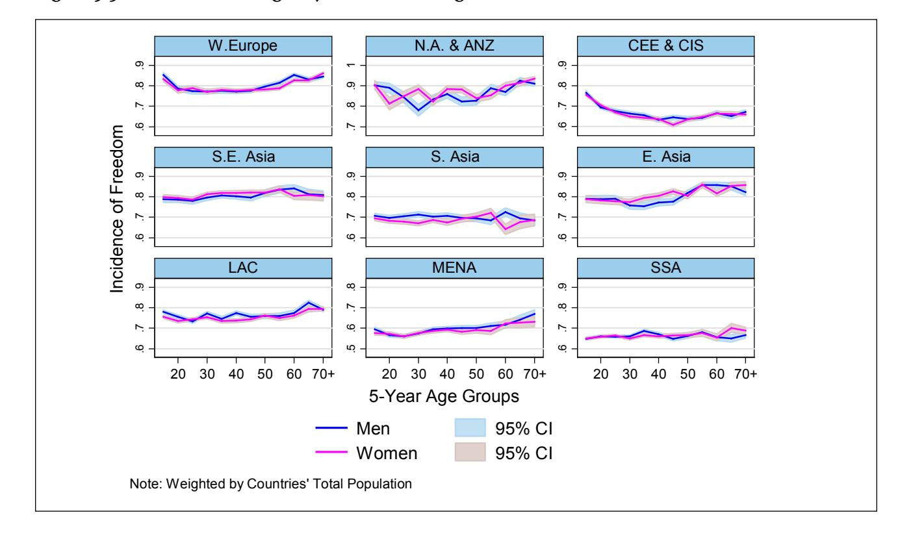

some evidence of U-shape in each of the three parts of Asia. Average social support is much higher in East Asia, followed by SE Asia, and then South Asia, which has the lowest average (58%) of all regional social support levels. East Asia shows the largest downward trend, from 90% at age 20 to 70% at age 60, with a rise in the highest age group, especially for women. Latin America shows a high level (87%) and a U-shape. It starts at 90% for both genders, reaches a low point of about 80% at age 50, and then rises to higher levels, especially for women, at higher ages. MENA and sub-Saharan Africa follow somewhat similar patterns, but starts at a lower level, about 70% for the youngest age groups.

Freedom to make life choices, shown in Figure 3.9b, is highest in NANZ, averaging 88% for women and 86% for men. It is a bit lower in Western Europe, SE Asia and East Asia, where it averages about 80% for both men and women. These regions are followed by Latin America and Caribbean (LAC) where freedom averages 75% for women and 76% for men. South Asia is the region where gender differences in freedom are the largest and where women are generally at a disadvantage, with averages of 68% for women and 70% for men in South Asia. The experience of freedom is similar in CIS and CEE and in SSA where it averages about 66%. Freedom is at its lowest in MENA where it is below 60%, but where the gender differences are not significant. Perhaps surprisingly, few gender differences in freedom to make life choices are revealed when we consider the age patterns. However, U-shaped patterns across age groups are present in many regions, as shown in Figure 3.9b. Younger and older adult have fairly similar average levels of perceived freedom in most regions, with two exceptions. It is higher for the old in East Asia, and lower for the older age groups in the CIS and CEE. The low perceived freedom among the older age groups in CIS and CEE may reflect a cohort effect, with transition opening more doors and opportunities for the young than the old, as discussed in the next section.

Generosity in Figure 3.9c is measured by the percentage of respondents who have donated to a charitable cause in the past 30 days. In the analysis of Chapter 2, these ratios are adjusted to reflect differences in average national income, since financial donations play a bigger role relative to other forms of generosity in richer countries. Here we show the actual reported donation rates, which are highest in NANZ, averaging about 60%, and on a sharply rising trend across age groups,21 and lowest in the CIS and CEE, MENA and sub-Saharan Africa, at roughly 20%. There are relatively few gender differences, and these are fairly slight, with more generosity among younger women in Western Europe and SE Asia, and among younger men in South Asia.

Corruption in business and government is seen as a problem by more than 80% of global respondents, with gender differences appearing only in Western Europe, NANZ and East Asia, where in each case women are more likely to perceive a corruption problem than are men. The highest reported rates are in the CIS and CEE, (91%, and higher in the older age groups), and SE Asia (89%). They are followed by South Asia (85%), sub-Saharan Africa (83%), MENA (80%), East Asia (77%) and Latin America (75%), with little difference by age and gender. Perceived corruption rates are lowest in Western Europe (68%) and NANZ (63%), and in both cases women above the age of 30 are significantly more likely to see corruption as a problem, with the gender gap approaching 10% of respondents.

The patterns of reported health problems, shown in Figure 3.9e, are strikingly similar by age and gender across regions. They generally start below 20% at age 20 and rise with age, to levels at the highest ages ranging from below 40% in Western Europe, NANZ and East Asia to 60% in the CIS/CEE and sub-Saharan Africa. In all regions except Western Europe, women report health problems more frequently than men in most age groups, although the difference, while often statistically significant, is seldom as large as 3%.

Figure 3.9c: Generosity: Averages by Gender and Regions

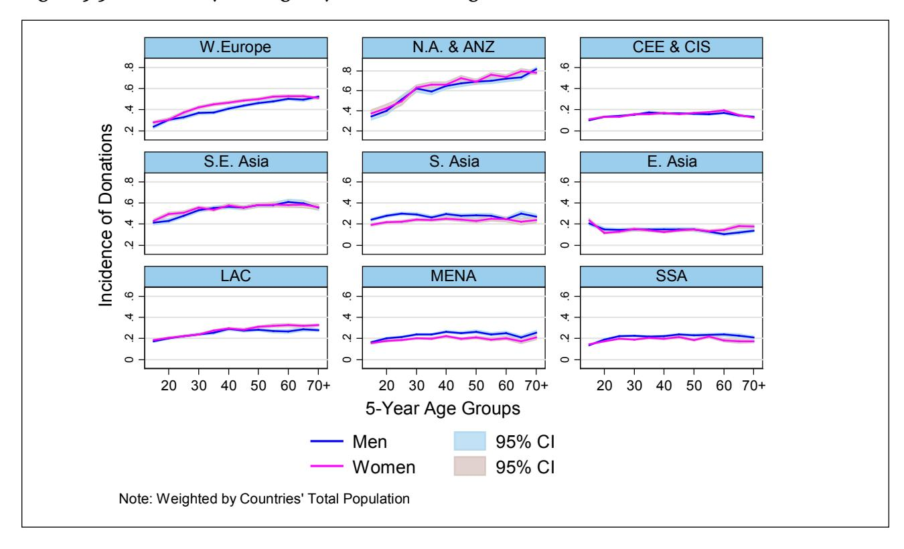

Figure 3.9d: Corruption: Averages by Gender and Regions

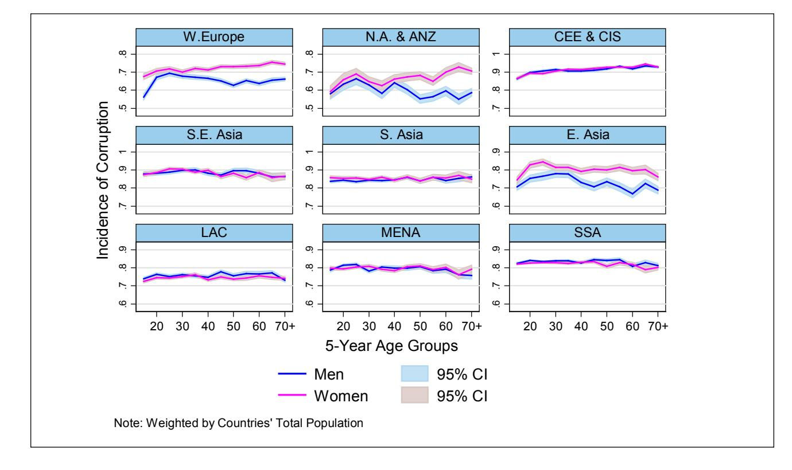

Figure 3.9e: Health Problems: Averages by Gender and Regions

WORLD HAPPINESS REPORT 2015

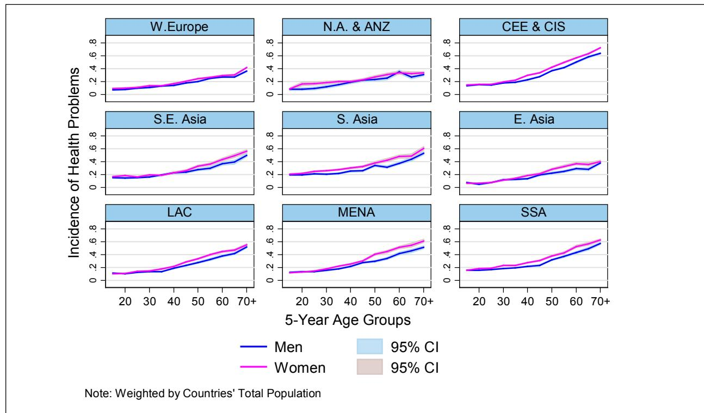

Figure 3.9f: Household Income: Averages by Gender and Regions

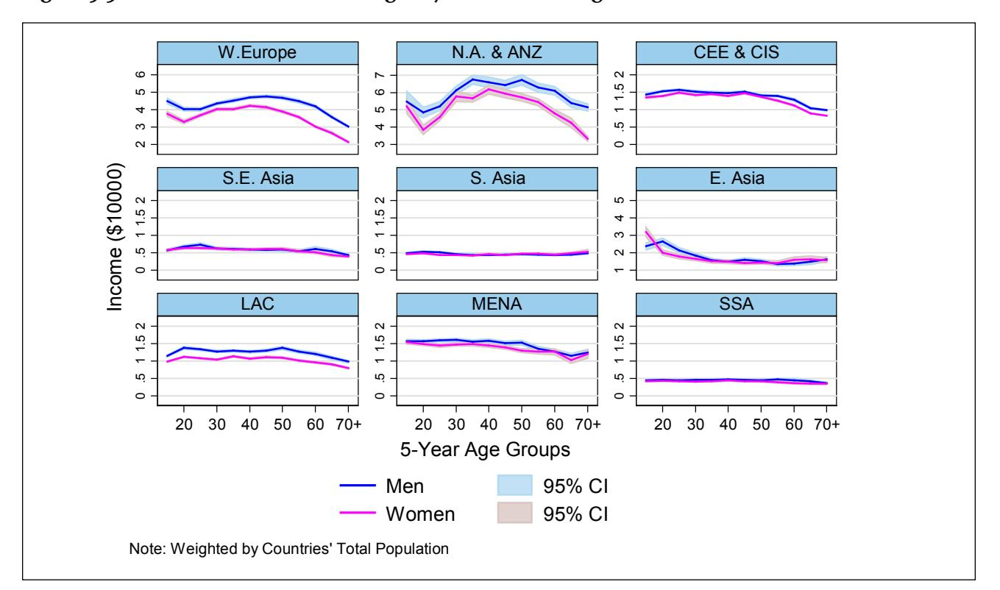

#### **Cohort Effects**

In this section we attempt in a preliminary way to see if our overall evidence calculating wellbeing by gender and age actually matches the experience of people in different cohorts as they progress through their own lives. To do this we have used the Gallup World Poll data, for a smaller set of 99 countries with full or almostfull survey coverage, to construct synthetic cohorts for a series of 10-year birth cohorts, starting with those born in or before 1932, and ending with those born between 1983 and 1992. We then plot the survey-to-survey history of average ladder scores for each of the synthetic cohorts. Figure 3.10 shows the cohort analysis separately for each of the nine global regions, since cohort-specific influences are more likely to appear at the regional than at the global level. The samples are still too small to split by gender as well, although we will report some gender analysis at the global level.

Figure 3.10 adds three main sorts of detail not previously seen in this report. First, we can see, for each 10-year birth cohort, how their average life evaluations have changed from one survey round to the next, shown for each survey year from 2007 to 2013.22 Second, we can see how the levels and changes in life evaluations differ for people born in different decades. Third, we can see how the effects of the global recession

on life evaluations differed by global region and people's ages at the time the recession hit.

The first panel of Figure 3.10 shows separately the 2007-2013 life evaluations for each of seven age cohorts of GWP respondents living in Western Europe. The peak effects of the economic crisis for all cohorts lie between 2008 and 2009, with the effects largest for those at the beginning and ends of their working careers. Life evaluation recovery since 2009 has been slow or absent for all cohorts, except perhaps the eldest group. As has already been seen in Chapter 2, there has been a great variety of experiences within the Western Europe group of countries, which include three of the seven countries with the largest drops in life evaluations 2005-07 to 2012-13 – Greece, Italy and Spain. But there were other countries in the same region where ladder levels had fully recovered by 2012-2014. Thus each cohort contains people undergoing quite different experiences, although averaging across countries, almost all cohorts had declining life evaluations.

The mixed NANZ group of countries, which by population weighting represents mainly the United States, shows a marked U-shape of life evaluations looking across age cohorts, and a mixed picture within cohorts. The youngest cohort shows the expected drop through time, but so also does the cohort in their 70s. Most other cohorts showed drops over the first three years, on average, and then recovery back to the starting values.

In the CIS plus Eastern Europe, the experience was rather different, with the economic crisis showing only small effects for all cohorts, but with both the levels and trends being worse for the older cohorts, who perhaps gained less in fresh opportunities than they lost during the transition process. The steep drop in ladder scores across the age groups, from about 5.8 in the youngest cohort to 4.5 in the oldest cohort, appears if anything to be getting steeper, as

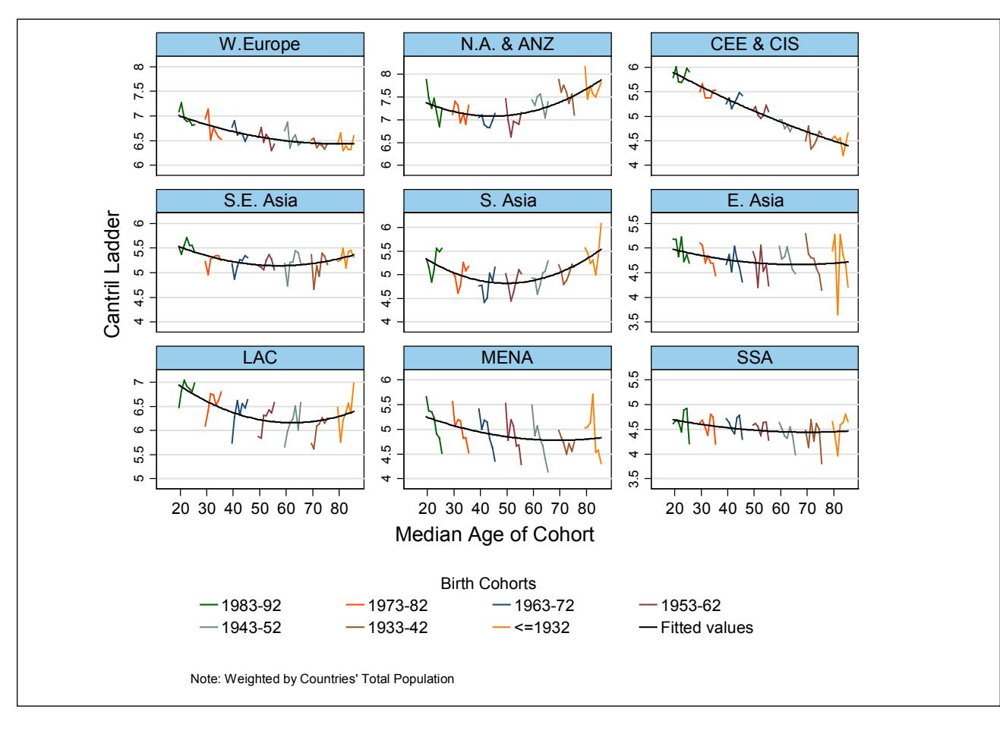

Figure 3.10: Cantril Ladder: Trends by Birth Cohort and Region

post-2007 gains are more prevalent in the three younger cohorts than in the four older ones.

In Southeast Asia there was a sharp drop from 2007 to 2008 in all but the eldest cohort, followed by subsequent gains that produced net gains for all cohorts, especially the three younger ones. Looking across the cohorts, there is a slight U-shape, with life evaluations highest in the youngest and the oldest age groups.

In South Asia, there is a very flat gradient across cohorts, and an uneven but nonetheless substantial drop within each cohort from 2007 to 2013.

In East Asia, there were drops from 2007 to 2009 in each cohort, followed by increases to

2013 levels above those in 2007. Across cohorts, the U-shape in age is more marked than elsewhere in Asia.

Latin America and the Caribbean show a quite different picture, with every cohort showing substantial gains from 2007 to 2013. The youngest three cohorts saw the largest gains, averaging more than 0.5 on the 10-point scale, from 2007 to 2009, the same years when the economic crisis was causing major well-being losses in Western Europe and elsewhere.

That picture is reversed in the countries of the Middle East and North Africa, where every cohort saw substantial losses in life evaluations from 2007 to 2013. These declines were led by

Egypt, which was seen in Chapter 2 to have been second only to Greece (-1.2 vs. -1.47) in terms of drops in life evaluations between 2005-07 to 2012-14. Some of the MENA drop is due to changes in the survey procedures, as in a number of Arab countries the Gallup World Poll was initially directed only to Arab respondents but from 2013 and beyond is attempting to cover the whole resident population. This is tending to lower the average evaluation in countries with a lot of guest workers, as the life evaluations by respondents born, for example, in India, tend to be lower than those of Arab citizens, though they are above those of average respondents in their home country. Looking across the cohorts, the gradient is fairly flat.

In sub-Saharan Africa the gradient across cohorts is also fairly flat, while also having little trend within each cohort, with a general modest trend upward reversed in 2013.

The regional data samples by cohort are too small for us to find significant gender differences. Using gender-split cohorts for all regions combined, the genders have equal matching paths for the youngest cohort, but above the age of 25, as full-time work becomes more prevalent for males than females, there is more evidence of an increasing ladder gap favoring women within and between the next three cohorts. For the two oldest cohorts, including all those born before 1942, there is a diminishing gender gap, so that the calculated trend lines for males and females meet at the top and bottoms of the age distribution.

#### Gender Differences in the Workplace

Around the world, the more striking differences across genders concern labor force participation: averaging across the globe, 55% of women participate in the labor market versus 82% of men. Traditional gender roles have women's work concentrated in child-rearing and other

home production activities, and men's work in productive and tradable activities in the marketplace. And research has shown a close link between gender role attitudes and women's labor force participation.23 Some researchers have argued that the origin of this gendered division of labor can be traced back to the introduction of the plough in agricultural production.24 The plough required a substantial amount of upper body strength, typical of males, and was appropriate only in certain soil conditions, leading to differences across countries in female empowerment. In many countries, increased levels of educational attainment and changing gender role attitudes have allowed women to embrace professions once the prerogative of men. This may have made their lives more interesting and financially rewarding, and it may have allowed women to feel more useful to others and society.25 However, Figure 3.4 shows that likelihood of learning or doing something interesting is still generally higher for men.

On the other hand, work in the marketplace may have led to more pressure from competition, more stress, and more worry or guilt regarding their traditional female responsibilities. Indeed, Figure 3. 7 shows that incidence of stress is higher among both men and women of working age. In addition, some women may have experienced discrimination or sexual harassment in the workplace. Researchers have investigated changes over time in happiness in the United States from the 1970s to the mid-2000s, a time period that saw a substantial increase in female labor force participation. They found a reversal in the female advantage in happiness, which they argue is paradoxical.26 But it is possible, given the uneven rewards of many jobs, in terms of the six key variables explaining life evaluations, that many women who are now engaging in market work do not experience higher overall quality of life compared to women who choose instead to become homemakers. With the exception of highly educated women who likely enter "careers" rather than "jobs," that seems consistent with our evidence.

Here we consider differences across countries and over a 10-year period centered in 2010 to explore women's labor force participation. Because questions about one's labor market participation were not asked before 2010 in the Gallup Survey, we use yearly country level data on average female labor force participation from the World Bank. Figure 3.11 displays a scatter plot of country level female labor force participation against the average value of the Cantril ladder for women, with both variables averaged over time. The average level of education computed from the Gallup Survey shows five quintiles of women's education attainment with different colors from the fire red (less education) to the deep blue (more education).27 In the rather cloudy picture, we discern a U-shaped pattern, where at lower education levels more female labor force participation is associated with lower levels of subjective well-being while at higher education levels the reverse is true.28 For middle levels of education, there is hardly any relationship between labor force participation and the Cantril Ladder for women. This U-shaped pattern parallels the U-shaped pattern for the labor force participation of married women previously found across the process of economic development and through the histories of currently advanced countries.29 These authors also emphasize the role of education, particularly at the secondary level, which allowed women to enter white-collar work that carried less social stigma than blue-collar work. It is interesting to find that the Cantril ladder reflects similar developments.

#### **Summary and Conclusions**

The first and most obvious summary point is that differences by age and gender are very small relative to international differences in average ladder scores, or even between the top and bottom

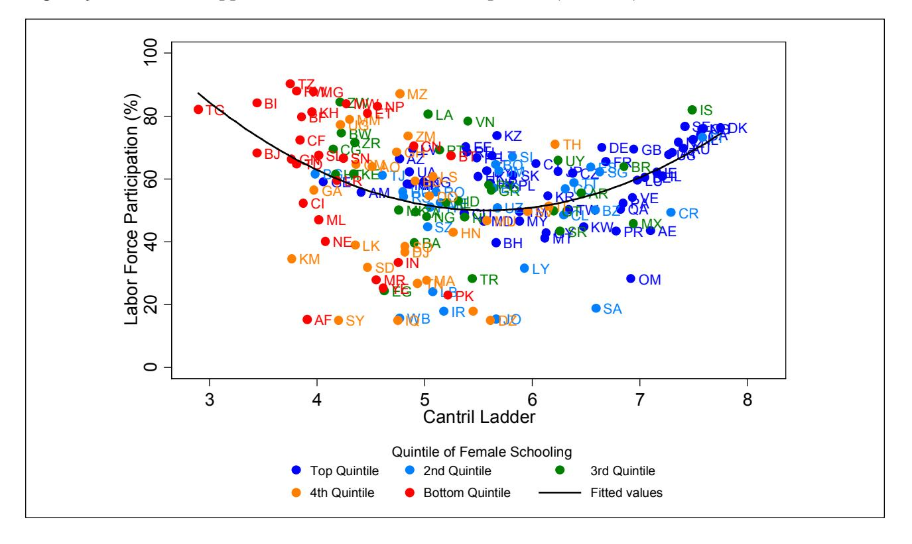

Second, we find that for life evaluations and experiences the global average differences by gender and age mask a striking variety of patterns among global regions. To provide just one example, the variations of life evaluations by age differ substantially from region to region, taking a full U-shape (with life evaluations significantly greater at high ages than in mid-life) for both men and women in only two of the nine regions, East Asia and NANZ. There are also significant U-shapes for men in Western Europe and women in South Asia. The left-hand side of the U-shape, representing significant declines from the late teens to age 40, exists in all regions except sub-Saharan Africa, where there is a gradual decline across all age groups. Given the large differences across regions, the regional graphs provide a more realistic picture than does the global average of how life has evolved for individuals living there.

The six positive and six negative experiences, split by gender, age and region, show interesting similarities and differences across regions. Happiness yesterday varies much less across regions than do life evaluations, and has a generally falling trend over the age groups, especially for women. Laughter, enjoyment and finding something of interest also show generally similar levels for men and women, and declining paths at higher ages. All three have a U-shape in NANZ, but not elsewhere. U-shapes appear for feeling well rested in all regions, although trends and levels differ by region. In all regions men are more likely to feel safe at night than women, with the largest gender gap in the industrial countries. The lowest levels for feeling safe at night for both genders are in Latin America, and the highest levels are in East Asia, Western Europe and NANZ.

The six negative experiences show quite different patterns, with anger generally lower in older age groups and both pain and sadness higher, especially for women. Despite the gender stereotypes, anger is felt everywhere almost equally by men and women. Stress follows a hump shape, with their peaks in the middle years, happening earlier for men than for women. Worry rises over the age groups for women and falls in later life for men, with a worry gender gap favoring men of about 5%, or 15% of its average values, in the highest age groups. Depression is everywhere more frequently felt by women then men, especially at higher ages.

When we turn to our parallel analysis of the six main variables used in Chapter 2 to explain international differences and changes in life evaluations, we find once again the importance of considering age, gender and region at the same time to get a better understanding of the global trends and differences. In general, the patterns for specific emotions are such as to confirm the reasoning used to support the differences in life evaluations. The importance of the social context shows up strongly in the analysis by gender and age group. For example, those regions where life evaluations are significantly higher in the older age groups are also those regions where perceived social support, freedom and generosity (but not household incomes) are higher in the older age groups. All three of those variables have quite different levels and age group dynamics in different regions. By contrast, the levels and trends for the incidence of health problems (and pain yesterday) have very similar levels and trends in all regions. The gender differences in the incidence of health problems are largely the same around the world, as they were previously seen to be for the related feelings of pain and depression.

Our cohort analysis suggests that the broad patterns we have seen for age and gender apply to all cohorts. One exception relates to those cohorts in the CIS and the CEE who were middle-aged or older in 1989-90. Compared to

subsequent cohorts, they have faced material hardships and reduced social safety nets without having the time and resources to make use of their possible new freedoms.

In general, our analysis by gender, region and age suggests that the questions asked are understood in similar terms around the world. and answered in line with local circumstances. Of course there are differences across cultures in the answers given, just as there are differences in the underlying factors that support wellbeing. Indeed, the social context and supporting social norms, including trust, are variables that are often used to define cultures and to assess cultural differences. No doubt we are missing many relevant measures that would help us to understand better what supports happy lives around the world. But we do think that the available data tell a coherent story, even if this story is being rewritten as events unfold and societies change, whether for better or worse.

- This matches the finding of Graham & Chattopadhyay (2013), also based on GWP data, but for a sample ending in 2011.
- 2 The regional average data by gender and age for life evaluations and the 12 experiential measures are shown in Table 1 of the online data appendix to this chapter.
- 3 An alternative way to construct the global figures, which we previously considered, involved using for the global figures exactly the same procedure as we use for the regional figures: weighting each observation by its Gallup World Poll national sampling weight multiplied by the country's share of total global population. This made the global figures quite different from the averages of the regional figures because the Gallup sampling weights reflect the age distributions of each national population, and a much larger share of the global population in higher age groups is located in regions with higher average ladder scores in all age groups. This produces a more pronounced U-shape in the global figure for life evaluations, by giving a progressively higher weight to observations coming from happier countries. Our current procedure makes it easier to see how life evaluations differ across age groups for people living in the same region.
- 4 See Blanchflower & Oswald (2008), Frijters & Beatton (2012), Steptoe et al. (2014) and the survey by Ulloa et al. (2013).
- 5 This group contains the United States, Canada, Australia and New Zealand. More than three-quarters of its population weight comes from the United States.
- 6 This result requires further research, as it surprises those familiar with the relative regional rankings on gender equality in the UNDP Human Development Index. It is worth noting that the life evaluations of young females in the MENA countries are about equal to global average for women, while male MENA life evaluations are significantly below the global average. Also relevant to any explanation will be the fact that in the MENA countries the proportion of young female respondents who feel they have someone to count on is significantly above that for young males, while the reverse pattern is seen at the global level. As noted in Chapter 2, having someone to count on is the most important of the six factors we use to explain differences in life valuations.
- 7 As pointed out by Stone et al. (2010), there has been less study of the age profiles of hedonic (affective) measures of subjective well-being than of life evaluations. As they note in their analysis of US data, which provide the majority of the observations in our NANZ region, the age profiles of hedonic measures differ from those of life evaluations.
- 8 This argument is made, with references to a broader literature, in Madden et al. (2000).

- 9 See Fabes & Martin (1991), and Shields (1984).
- 10 See Brody & Hall (2008).
- 11 See Kring (2000, 211).
- 12 See Kring (2000, 222).
- 13 We show also, in Figure 3.9e, that the prevalence of reported health problems is higher and rises faster with age in the CIS+CEE group of countries.
- 14 LaFrance & Hecht (2000, 227). Brody & Hall (2008, 399) and LaFrance et al. (2003) also report similar findings.
- 15 See for example, Camarena et al. (1990).
- 16 This is a widely shared stereotype, as both men and women believe that women experience and express emotions, and especially sadness, more intensely and frequently than men. See Fabes & Martin (1991). One study suggests that while parent-child conversations about many emotions do not have a gender bias, there was more frequent mention of sadness in discussion between both parents with their daughters then with their sons [Adams et al. (1995)].
- 17 For example, with specific reference to sadness, see Fivush & Buckner (2000, 248).
- 18 See Tsang et al. (2008, 988).
- 19 See Tsang et al. (2008).
- 20 The generosity data shown in Figures 3.8 and 3.9 reflect the actual reported donation rates, since they are built up from the individual responses. In our aggregate analysis in Table 2.1, and in the decomposition analysis in Figure 2.3, the generosity variable is adjusted for the average level of GDP per capita, so that the full effect of GDP per capita should flow through the income variable directly.
- 21 Poulin & Cohen Silver (2008) also find, in a population-based sample of US adults, feelings of benevolence higher for older than younger adults, and, for given respondents, rising over the two years of the study.
- 22 We use interpolation to fill in for missing survey years, to ensure a consistent country coverage from one survey wave to the next.
- 23 See Fortin (2005).
- 24 See Alesina et al. (2013).
- 25 See Fortin (2008).
- 26 See Stevenson & Wolfers (2009). They also find similar reversals in Western Europe.

#### WORLD HAPPINESS REPORT 2015

- 27 To approximate the average years of female schooling in each country, the percentage of women with a secondary education (as coded in the Gallup survey multiplied by 12) is added the percentage of women with a college education (as coded in the Gallup survey multiplied by 16). The resulting numbers are divided into quintiles.
- 28 We note that the quadratic relationship of female labor participation at the country/year level on the female Cantril ladder holds in a model with country and year fixed effects, controlling for demographics, 10 negative and positive experiences, and four explanations, excluding household income. Furthermore, the relationship holds using the male Cantril ladder as dependent variable.
- 29 See Goldin (1995).

79

#### References

- Adams, S., Kuebli, J., Boyle, P. A., & Fivush, R. (1995). Gender differences in parent-child conversations about past emotions: A longitudinal investigation. *Sex Roles*, 33(5-6), 309-323.
- Alesina, A., Giuliano, P., & Nunn, N. (2013). On the origins of gender roles: Women and the plough. *The Quarterly Journal of Economics*, 128(2), 469-530.
- Blanchflower, D. G., & Oswald, A. J. (2008). Is well-being U-shaped over the life cycle? *Social Science & Medicine*, 66(8), 1733-1749.
- Brody, L. R., & Hall, J. A. (2008). Gender and emotion in context. In M. Lewis, J. M. Haviland-Jones, & L. Feldman Barrett (Eds.), *Handbook of Emotions* (3rd ed., 395–408). New York: Guilford Press.
- Camarena, P. M., Sarigiani, P. A., & Petersen, A. C. (1990). Gender-specific pathways to intimacy in early adolescence. *Journal of Youth and Adolescence*, 19(1), 19-32.
- De Neve, J. E., Diener, E., Tay, L., & Xuereb, C. (2013). The objective benefits of subjective well-being. In J. H. Helliwell, R. Layard, & J. Sachs (Eds.), *World happiness report 2013*. New York: Sustainable Development Solutions Network.
- Fabes, R. A., & Martin, C. L. (1991). Gender and age stereotypes of emotionality. *Personality and Social Psychology Bulletin*, 17(5), 532-540.
- Fillingim, R. B., King, C. D., Ribeiro-Dasilva, M. C., Rahim-Williams, B., & Riley III, J. L. (2009). Sex, gender, and pain: A review of recent clinical and experimental findings. *The Journal of Pain*, 10(5), 447-485.
- Fischer, A. (Ed.). (2000). *Gender and emotion: Social psychological perspectives*. Cambridge: Cambridge University Press.
- Fivush, R., & Buckner, J. P. (2000). Gender, sadness, and depression: The development of emotional focus through gendered discourse. In A. H. Fischer (Ed.), *Gender and emotion: Social psychological perspectives* (pp. 232-253). New York: Cambridge University Press.
- Fortin, N. M. (2005). Gender role attitudes and the labour-market outcomes of women across OECD countries. *Oxford Review of Economic Policy*, 21(3), 416-438.
- Fortin, N. M. (2008). The gender wage gap among young adults in the United States: The importance of money versus people. *Journal of Human Resources*, 43(4), 884-918.
- Frijters, P., & Beatton, T. (2012). The mystery of the U-shaped relationship between happiness and age. *Journal of Economic Behavior & Organization*, 82(2), 525-542.
- Goldin, C. (1995). The U-shaped female labor force function in economic development and economic history. In T. P. Schultz (Ed.), *Investment in women's human capital* (pp. 61-90). Chicago: University of Chicago Press.

- Graham, C., & Chattopadhyay, S. (2013). Gender and well-being around the world. *International Journal of Happiness and Development*, 1(2); 212-232.
- Kring, A. M. (2000). Gender and anger. In A. H. Fischer (Ed.), *Gender and emotion: Social psychological perspectives* (pp. 211-231). New York: Cambridge University Press.
- LaFrance, M., & Hecht, M. (2000). Gender and smiling: A meta-analysis. In A. H. Fischer (Ed.), *Gender and emotion: Social psychological perspectives* (pp. 118-142). New York: Cambridge University Press.
- LaFrance, M., Hecht, M. A., & Paluck, E. L. (2003). The contingent smile: A meta-analysis of sex differences in smiling. *Psychological Bulletin*, 129(2), 305.
- Madden, T. E., Barrett, L. F., & Pietromonaco, P. R. (2000). Sex differences in anxiety and depression: Empirical evidence and methodological questions. In A. H. Fischer (Ed.), *Gender and emotion: Social psychological perspectives* (pp. 277-300). New York: Cambridge University Press.
- Poulin, M., & Cohen Silver, R. (2008). World benevolence beliefs and well-being across the life span. *Psychology and Aging*, 23(I), I3.
- Shields, S. A. (1984). Distinguishing between emotion and nonemotion: Judgments about experience. *Motivation and Emotion*, *8*(4), 355-369.
- Steptoe, A., Deaton, A., & Stone, A. A. (2014). Subjective wellbeing, health, and ageing. *The Lancet*, 385(9968), 640-648.
- Stevenson, B., & Wolfers, J. (2009). The paradox of declining female happiness. *American Economic Journal: Economic Policy*, 1(2), 190-225.
- Stone, A. A., Schwartz, J. E., Broderick, J. E., & Deaton, A. (2010). A snapshot of the age distribution of psychological well-being in the United States. *Proceedings of the National Academy of Sciences*, 107(22), 9985-9990.
- Tashani, O. A., Alabas, O. A., & Johnson, M. I. (2012). Understanding the gender-pain gap. *Pain Management*, 2(4), 315-317.
- Tsang, A., Von Korff, M., Lee, S., Alonso, J., Karam, E., Angermeyer, M. C., ... & Watanabe, M. (2008). Common chronic pain conditions in developed and developing countries: Gender and age differences and comorbidity with depression-anxiety disorders. *The Journal of Pain*, *9*(10), 883-891.
- Ulloa, B. F. L., Møller, V., & Sousa-Poza, A. (2013). How does subjective well-being evolve with age? A literature review. *Journal of Population Ageing*, 6(3), 227-246.

WORLD HAPPINESS REPORT 2015

75

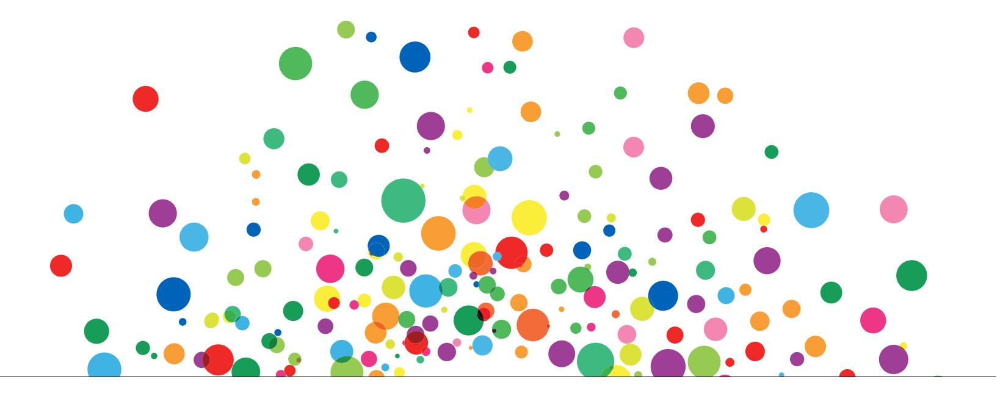

## Chapter 4.

# HOW TO MAKE POLICY WHEN HAPPINESS IS THE GOAL

#### RICHARD LAYARD AND GUS O'DONNELL

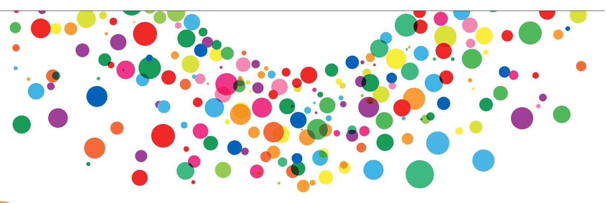

**Richard Layard:** Director, Well-Being Programme, Centre for Economic Performance, London School of Economics

Gus O'Donnell: Former UK Cabinet Secretary and Head of the Civil Service

This chapter draws on the Wellbeing and Policy Report, published by the Legatum Institute in March 2014. Gus O' Donnell (Chair), Angus Deaton, Martine Durand, David Halpern and Richard Layard contributed to the report. Richard Layard and Gus O'Donnell are extremely grateful to the US National Institute of Aging (R01AG040640) for financial support. Richard Layard is also grateful to the John Templeton Foundation and the UK Economic and Social Research Council.

"The care of human life and happiness... is the only legitimate object of good government"

Thomas Jefferson (1809)

What should be the goal of public policy? We agree with Thomas Jefferson. What matters is the quality of life, as people themselves experience it. And the best judge of each person's life is that same person. Is she happy with her life; is she satisfied? In a democracy that should be the criterion of good policy.1

So in this chapter we ask, how would policy makers (in governments or NGOs) proceed if their goal really was the happiness or life satisfaction of the relevant population? First, of course, they would organize themselves around that objective. Every department would include people well-versed in the evidence on the causes of happiness. For example, the UK government has recently established a What Works Centre for Wellbeing with strong links to departments and NGOs. Its first aim is to marshal the mass of existing evidence on what causes happiness and what interventions have been found to be effective. But the second task is to help policy makers to evaluate new policy options. That is the subject of this chapter.

Both policy makers and NGOs need a new form of project appraisal to replace or support existing forms of cost-benefit analysis.2 So how would a policy maker decide whether a policy change was desirable if the goal was the happiness of the relevant population? What follows is a simplified version of how one would proceed. It assumes throughout that happiness is measurable on a cardinal scale (like temperature) and that levels of happiness can be compared between one person and another.3 Further details of our approach are in the Technical Annex.

#### A New Form of Policy Analysis

We can begin with the problem of how to spend a given sum of money so as to deliver the best value, where value is measured in units of happiness. Thus in the case of government expenditure we take the size of the state as given. And we assume initially that the problem is how to maximize the aggregate happiness of the relevant population, subject to that constraint.4

The correct approach is then to rank all possible policies in terms of the extra happiness which they generate per dollar of expenditure, starting with the most effective and working down. We then undertake as many policies as it is possible to do before the total money available is exhausted.

In the process of doing this we can usefully focus attention on the policy which only just qualifies to be undertaken. The extra happiness which that policy generates per dollar of expenditure provides the critical ratio which all other projects must exceed if they are to pass the test of value for money. This critical ratio can be established by trial and error and, once established, provides the criterion that can be used in taking decisions about individual policies, one at a time, without looking at all policies simultaneously. This decentralized approach is the essence of effective policy making.

As we have formulated the approach, it is a form of cost-effectiveness analysis. We measure the benefits in one set of units (happiness) and the costs in another (money). And we assume that the total amount of money available is pre-determined. By contrast, in traditional cost-benefit analysis, both benefits and costs are in the same units. So traditional cost-benefit, applied across the board, in principle determines the total scale of public expenditure. This is politically unrealistic, so our form of cost-effectiveness analysis is a sensible way forward for the analysis of public expenditure.

, \_\_\_\_\_\_\_\_\_\_\_\_\_\_\_\_\_\_\_\_\_\_\_\_\_\_\_\_\_\_\_\_\_\_\_\_ Much information is required to do this well, as is true for traditional cost-benefit analysis. Ideally we would do a properly controlled experiment that would measure directly the impact of the policy upon happiness. The experimenters would also measure carefully not only the direct public expenditure cost of the policy but also its indirect cost implications. (For example, it might subsequently lead to savings on welfare benefits, or it might involve the additional cost of extra years of education.) The desirability of the project would then depend on the extra happiness it delivered relative to the extra expenditure involved, measured in net terms.

But, for governments, there are other important policy problems as well as how to spend a given budget total. There is the issue of how to raise the taxes. The approach here is more direct. If we envisage a self-financing tax change, we simply evaluate how this alters the happiness of each member of the population and aggregate these changes (if we are, as assumed so far, simply maximizing the sum of happiness across all individuals). Similarly, if we are considering a new regulation, we simply add up its effects on happiness across all members of the population. In practice of course a new regulation may also affect the budget deficit, making possible more (or fewer) opportunities for public expenditure. So we need a way to value such extra money, in units of happiness. We already have the answer: the value of the extra money is the extra happiness which is generated by the marginal public expenditure project.

Assembling the information needed for this new approach is a real challenge, but so it is with traditional cost-benefit analysis. So what problems can the new approach handle which traditional cost-benefit analysis cannot?

#### Problems with traditional cost-benefit analysis

In traditional cost-benefit analysis, benefits and costs are measured by estimating what people would be willing to pay for having the benefits or avoiding the costs. The unit of measurement is money, the idea being that people are willing to pay more for something the more it increases their happiness.

This is a reasonable assumption when the thing is something that people have choice over and are well informed about. But there are two problems with the approach. The first is the problem of adding up across individuals. Any policy affects more than one person and the happiness yielded by an extra dollar is generally greater for the poor than the rich. This problem can however be handled to a degree by showing the impact of the policy on different income groups.

The second problem is more profound. Willingness to pay works when people can show by their choices how much they value different outcomes. Sometimes they can do this but often they cannot. They can do it for things like transport, industry, education and some aspects of environment. But many outcomes are not things which people can choose – they are things that just happen to people through outside influences (what economists call external effects). People catch infectious diseases, children get abused, elderly people get abandoned, people get mugged. Moreover people are often ignorant about key areas of choice, as in health. And on top of that people have very different purchasing power. It is because of these classic problems of externality. asymmetric information and equity that most state activity occurs.

We cannot learn about these problems by observing people's choices. So how are we to evaluate a vaccination program, or child protection, or family courts, or elderly care, or police protection? Happiness research can tell us a lot.

But wait a moment. Even though people can't show their values by choice, couldn't we ask them hypothetical questions about how much

they would in principle be willing to pay to promote these public goods? It has been shown repeatedly that asking people hypothetical questions about how they value these things produces nonsensical answers. So data on the happiness effects of these activities offers a powerful new method of evidence-based policy making.

This said, many key questions remain, which also arise with traditional cost-benefit analysis. They include: the aggregation of happiness across people, the aggregation of happiness over time (the discount rate), and the length of life and the birth rate.

#### The aggregation of happiness across people

In any policy analysis we have to aggregate its effects on different people: normally some people gain but others lose. The approach we have used so far is that advocated by Jeremy Bentham: we simply add up the effects. But should we not give more weight to changes (up or down) in the happiness of people who are currently miserable than of people who are already quite happy? This is surely right, but how much extra weight? The best approach is probably to ask the population what they think about the weights. One can also use sensitivity analysis to see what difference (if any) it makes, when comparing mutually exclusive project options.

Before moving on, we ought to mention some other more data-intensive approaches which focus directly on misery. One approach is to focus specifically on negative emotion as measured by replies to questions like "How sad/worried/frustrated/angry were you yesterday?" Alternatively we could use time-use data, where individuals are asked about each episode in the previous day, with questions for each episode about the extent of various positive and negative emotions. As Kahneman and Krueger have proposed, we could then rate an episode as miserable if the most powerful negative emotion

was more powerful than the most positive emotion. From this we could find what fraction of the day each person spent being miserable – what they called the person's "misery" index. And we could make the average misery index into our measure of social welfare. Such an exercise, however, is very data-intensive and requires the collection of time-use data.

#### The discount rate

The next issue is how to add up effects occurring at different points in time. For most individuals the effects of a policy change are spread over a number of years, and indeed some policies affect people not yet born. So what discount rate should we use to combine effects that occur in different years? In traditional cost-benefit analysis the discount rate consists of two elements that are added together. The first element (the "social pure time discount rate") reflects the general uncertainty about the future; the second reflects the fact that future generations are expected to be richer and therefore to have a lower marginal utility of income. In the current UK Treasury Green Book the first element is put at 1.5% per annum and the second at 2%.10 There is clearly a case for a pure time discount rate. But, when our measurements are in units of happiness, declining marginal utility of income ceases to be relevant, although there is still the distributional issue of how we should allow for differences in happiness between different generations (or indeed different years of one person's life). There is no neat solution to this problem, and where it is severe it must be shown explicitly in the analysis. Where it is not, the pure time discount rate may suffice.™

If this is the approach to discounting happiness, how should we discount future public expenditure? In principle there should be a separate price attached to public expenditure in each period. But in practice, if the path of public expenditure is reasonably smooth, we can probably assume that the price of public expenditure in units of current happiness would remain the same from one year to the next.

This would mean that the price of future public expenditure in units of today's happiness should fall at the same discount rate as is used for future happiness.

#### The length of life and number of births

Finally, how should we value changes in the length of life? Most people would agree that a longer life is better, but so is a happier one. So how could we combine these two desirable things into a single objective measure of what we are aiming at for an individual? The most common approach is to multiply the person's length of life by her average happiness — so that the result equals the total happiness the person experiences — or in medical parlance the number of quality-adjusted life years (QALYs).

However for this to make sense we need to assume that there is such a thing as zero happiness – in other words happiness is measured on a ratio scale rather than a cardinal scale. The typical scale which measures life satisfaction runs from o ("not at all satisfied") to 10 ("extremely satisfied"), and at a stretch one could interpret o as equivalent to zero happiness.

But are all years of life after birth equally important? For example if life expectancy is 80, is it twice as valuable if we save the life of a newborn infant as if we save the life of a 40-year-old? Any other assumption is bound to be controversial.

Finally there is the issue of the numbers born. Is the world better if more people are born, provided the quality of life is constant? For most practical purposes we can take the number of births as exogenous.

But some policies clearly do affect the number of births, and some countries like France, India, China and Japan have all tried to influence the fertility of their populations. How do we evaluate such policies? We can imagine two extreme positions. One position says the only thing that

counts is the proportional distribution of QALYs among all those who are born and that the number of people born is immaterial. Thus a world of I million people is as good as one of 7 billion who are equally happy. The opposite position says that what matters are total QALYs, added up over all the people born. According to that position we should prefer a trebling of births even if it halved the QALYs per person born. Probably most people would hold some intermediate position, but no one of a liberal disposition would want government regulation of births – at most, perhaps, incentives one way or the other

#### **Acceptability**

This completes our outline of an approach to policy analysis based on happiness as the measure of benefit. We think it should be generally applied throughout the public services and by NGOs. As it took hold, people would become familiar with which ratios of happiness per unit of expenditure were typically acceptable and which were not.

Or is this quite impracticable? In fact, it has already been practiced, with little dissent, for 10 years in the British National Health Service. There is a public agency called NICE (National Institute for Health and Care Excellence) which evaluates all new treatments for all conditions and recommends which should be publicly-funded and which should not. Its criterion is the number of QALYs per dollar of NHS expenditure, and at present it recommends all treatments which cost less than \$45,000 for each additional quality-adjusted life year.

#### Relation to traditional cost-benefit analysis

One final question. Could we not do all of this equally well using money as the measure of benefit? After all, money has a specific impact on every person's happiness (its "marginal utility"), so we could always measure a person's change in happiness by the change in money that would produce the same change in happiness.

In the jargon this is known as the "equivalent variation." Why not use that?

The most obvious problem is that the marginal utility of income differs widely between people. It is much lower for richer than for poorer people. Can this problem be handled within the existing money-based framework of cost-benefit analysis? One approach would be to show separately the money-equivalent net benefits for different income groups, as the Treasury does now. But the problem with this is that income is not very closely correlated with happiness. Thus, for example, if mental illness were properly treated, it would mainly benefit people who were miserable, which is important.13 But if the breakdown were by income class, the benefits would be shown as evenly spread across the board. So the most natural approach is to do the analysis in units of happiness. We could then show net benefits separately for people with different levels of happiness (or of income).

That concludes our analysis of policy evaluation when the main effects cannot be measured directly in terms of willingness to pay. But there remain many policies where the main measurements of benefit can be in money, and it is natural to stick to those units. These policy areas may include education, industry, employment, and transport.

But in all of these areas there will be some elements of non-pecuniary effects where the original measurements are in units of well-being. For example, a policy to reduce unemployment will increase wage income and profits, but we also know that it will have major psychological benefits for the people who get employed (in addition to their extra income). A natural approach here is to convert these happiness changes into money, rather than vice versa. This can be done in the standard way by calculating the equivalent variation in money income.

#### Conclusion

In conclusion, much of public policy cannot be evaluated in terms of willingness to pay. In such areas we believe that governments should develop new methods of analysis where happiness is taken as the measure of benefit. Even with existing knowledge, such an approach suggests new policy priorities. But to discriminate effectively between specific interventions on a scientific basis, such as that outlined in the Technical Annex, will require much more detailed study. This should become one of the main focuses for social science. It would include much more detailed models of the life-course, such as those being developed by members of the OECD's Consortium for Modelling Wellbeing over the Life-Course.14 It will also require many more properly controlled experiments.

At the moment much policy is based on little more than a hunch. We firmly believe that a more scientific element can be introduced into the process. It will never be decisive, and ultimately decisions have to be made by elected politicians accountable to the electorate. But their decisions can be based on much better information. So from this chapter emerge four key recommendations:

- The goal of governments should be to increase the happiness of the people and, especially, to reduce misery.
- Where willingness to pay is not a feasible measure of benefit, governments should develop new methods of policy analysis based on happiness as the measure of benefit.
- All policy change should be evaluated through controlled experiments in which the impact on happiness is routinely measured.
- A major objective of social science (and of its funders) should be to throw light on the causes of happiness, how it can be enhanced, and at what cost.

This Annex spells out more formally and in more detail the argument in Chapter 4, as it applies to governments.

#### The conceptual objective

The government's aim is, we assume, to maximize the happiness of the population (initially considered as the sum of each individual's happiness,  $H_i$ ). This has to be done subject to the usual constraints of endowments, technology and tastes, working their way through the market mechanism. To affect things, the government has three main types of policy instrument.

(i) The first is programs involving **public expenditure**. We include in these not only public services but also transfer payments, in order to highlight the choice between giving people money and giving services which help people to help themselves. There is thus an array of possible programs(P). Each programme  $P_j$  involves an expenditure  $E_j$ . Not all possible programs can be activated, since there is a public expenditure constraint,  $\overline{E}$  (assumed given):

$$\sum_{i} E_{j} \leq \overline{E}$$
 (1

(ii) The second type of policy is **tax policy**, which determines the way in which public expenditure is financed. Again there is an array of different possible taxes (S). Each tax  $S_k$  will yield its own tax-take  $T_k$  and altogether these tax receipts must finance the total of public expenditure:

$$\sum_{k} T_{k} \geq \overline{E} \tag{2}$$

(iii) Finally there are **regulations**, where public revenue and expenditure are not the main issue. There is an array of possible regulations ( $\Re$ ) from which the government has to choose which ones to switch on.

(Clearly many actual policies are mixtures of these three forms, but this poses no substantive problem.)

So we can think of the happiness ( $H_i$ ) of individual i as being determined by which expenditure programs, taxes and regulations are switched on:

$$H_i = H_i \left( P, S, R \right) \quad (i=1,...,n) \quad (3)$$

The government's job then is to choose  $\underline{P}$ ,  $\underline{S}$  and  $\underline{R}$  to maximize  $\Sigma H_i$  subject to constraints (1), (2) and (3).

This task, if correctly undertaken, would throw up a shadow price of public expenditure (in units of happiness) corresponding to constraint (I). This price (call it  $\rho_E$ ) would measure the gain in happiness per dollar of expenditure resulting from the marginal public expenditure program. It would also throw up a shadow price of tax receipts (in units of happiness) corresponding to constraint (2). This price (call it  $\rho_T$ ) would measure the loss of happiness per dollar of tax receipts resulting from the most damaging tax that squeezed through. One would hope that these two shadow prices were the same. If the shadow price of expenditure were higher than that of taxes, it would suggest that  $\overline{E}$  should be higher. But issues of this kind must be left to the politicians. So we shall assume that  $\rho_E = \rho_T = \rho$ .

#### Decentralization

Maximizing  $\Sigma H_i$  subject to (1) – (3) describes the outcome we would like to achieve. But the same result can be achieved not through one single massive optimization, but through a decentralized process whereby each possible program, tax or regulation is looked at on its own. 15 For each possible change, we start from the existing

configuration of policy and ask whether the change will be for the better. The answer is Yes if

$$\sum \Delta H_i - \rho(\Delta E - \Delta T) > 0$$
 (4)

By trial and error we should soon find a value for  $\rho$  which allowed the right number of expenditure programs to pass the test. Equation (4) provides the basic rule for all cost-benefit analysis where happiness is the criterion.

(i) For **public expenditure** programs it says that the net gain in human happiness must exceed the net cost to the government times the shadow price of government funds. Perhaps more intuitively, it can also be written

$$\frac{\sum \Delta H_i}{\Delta E - \Delta T} > \rho \tag{5}$$

In other words the welfare gain per dollar of net public expenditure cost must exceed some crucial value  $\rho$ . In some parlance this approach is called "cost-effectiveness analysis," since the calculations of costs and effects are in different units (in this case costs being measured in money and effects in units of happiness).

(ii) For **taxation**, the following is perhaps the most intuitive formulation:

$$-\frac{\sum \Delta H_i}{\Delta T} < \rho \tag{6}$$

The loss of welfare per dollar of taxes raised must be below some critical level.

(iii) For **regulation** there are often few expenditure or tax implications and the rule reduces to: Do if

$$\sum \Delta H_i > 0$$
 (7)

In measuring the changes in happiness it is important to include not only the benefits (like food safety) but also the disbenefits like reduced liberty or increased enforcement costs.

#### **Distribution of happiness**

Many people argue that is more important to raise the life satisfaction of people for whom it is low than of those for whom it is already high. One approach here uses the veil of ignorance as the basis for ethical theory. The person making the ethical judgment is asked to rank states of the world without knowing what his place in the world will be. In such a situation he would probably prefer a state of the world with less inequality of happiness, even if this involved some fall in average happiness.16 This has led economists such as Atkinson and Stiglitz to propose a social welfare function where social welfare (*W*) is represented by17

$$W = \frac{I}{\alpha} \sum_{i} (H_{i}^{\alpha} - I) \quad (\alpha < I) \quad (8)$$

(This involves abandoning cardinality in favor of a ratio scale: the origin of  $H_i$  can no longer be varied at will.)

Now the change in social welfare resulting from a policy change becomes not  $\Sigma \Delta H_i$  but

$$\Delta W = \sum_{i} H_{i}^{\alpha - 1} . \Delta H_{i}$$
 (9)

This adds no real difficulty to the approach except for the choice of  $\infty$ , which is essentially a matter of ethical judgement or political preference. An alternative approach is simply to break down net benefits according to the levels of happiness (or income) of those affected – leaving the overall evaluation to the readers.

$$\sum_{t}\sum_{i}\Delta H_{it}$$
  $(\mathbf{I}-\delta)^{t}-\sum_{t}
ho_{t}(\Delta E_{t}-\Delta T_{t})>$  o (Io)

For  $\delta$  it seems reasonable to use a pure time preference rate of 1.5%, or possibly less. For  $\rho_t$ , which is the price of government funds in units of happiness, it also seems reasonable to assume that  $\rho_t = \rho_o (I - \delta)^t$ .

#### Length of life

The analysis so far takes person-years as given. If we follow standard practice and take births as exogenous, we shall simply add an extra, discounted,  $\Delta H_i$  for each additional year which comes about through increased life expectancy.

#### Measuring $\Delta H_i$

So much for the framework. The much greater problem is the measuring of  $\Delta H_i$ . There are important problems in measuring  $H_i$ . But, even if these are (roughly) overcome, there are major difficulties in measuring the  $\Delta H_i$  resulting from a policy change. The ideal approach would be a randomized controlled trial (RCT) but this is often not feasible. And it only gives data for as many years as the trial is continued.

This is where life-course models can help. But this depends on the model being truly causal. To derive more causal models will require a lot more work, and must be one of the main tasks of social science in the years to come.

#### Measuring ( $\Delta E - \Delta T$ )

An equally important task is to get better measurements of the net change in public expenditure as a result of a policy. The immediate cost is usually fairly clear, but the subsequent impact through additional costs and cost savings is much less so. There have been many notable cases of over-claiming in this field. For example, early work on the Perry Pre-School Program showed that program participants later received both more education and higher earnings than the control group. The higher earnings were credited to the program without deducting the costs of the extra education.

To trace the year-by-year impact of a policy on the individual's use of public services is an absolutely critical need now. Life-course models will help in this, as will experimental designs (as for example where a new mental health program is introduced for some groups and the subsequent savings on physical healthcare are evaluated against control groups).

#### Relation to traditional cost-benefit analysis

Traditional cost-benefit should of course continue to be used in some areas. But this raises two questions.

(I) How can non-pecuniary factors (such as X) be valued in money units? The best available approach is as follows. If we have a happiness equation in which both X and log income (log Y) appear, such as

$$H_i = a X_i + b \log Y_i + \text{etc}$$
 (II)

it follows that the equivalent variation for a change in  $X_i$  is

$$-\Delta Y_i = \frac{a}{h} Y_i (\Delta X_i)$$
 (12)

(2) If some policies are evaluated in units of happiness and others in money, how do we compare policies in those two different categories? The problem here is that there is a wide range of estimates of the marginal utility of money at any particular income level (though not of the ratios between the marginal utility at different income levels). So in practice it may be necessary to have two separate pots of money – one for policies evaluated in money units and one for policies evaluated in units of happiness.

#### Conclusion

Present methods of cost-benefit analysis give little guide to the cost-effectiveness of much of public policy. The only way forward is through direct measurement of happiness using causal models of how it is determined. This is still in its infancy. But, even existing knowledge indicates the need for major new priorities. And as knowledge accumulates, the evaluation of specific projects in terms of happiness outcomes will become increasingly feasible. We urge Finance Ministries to take a lead in making this happen, as they have done with traditional cost-benefit analysis.

- O'Donnell et al. (2014). There is also evidence that the life satisfaction of the population has a key influence on voting behavior, see Ward (2015).
- 2 For example those embodied in the UK Treasury's Green Book.
- 3 For evidence on comparability across people, see Layard (2010). On cardinality, if a variable is cardinal, this means that the difference between a score of *x* and (*x*+1) is the same as the difference between a score of *y* and (*y*+1), whatever the values of *x* and *y*. The evidence on whether happiness measures are truly cardinal is limited, but Krueger & Schkade (2008) found that test-retest differences were independent of the level of reported happiness, which if generally true would support cardinality.
- We return later to the issue of whether more weight should be given to reducing misery than to increasing existing happiness.
- 5 If there are two mutually exclusive policies of different cost, this approach has to be modified.
- 6 Kahneman et al. (1999).
- 7 According to Rawls (1971) we should simply focus on the very bottom.
- 8 For data on replies to these questions see Helliwell et al. (2012), Chapters 2 and 3.
- 9 Krueger et al. (2009). See also Layard (2009).
- 10 These are real amounts (inflation adjusted).
- II Stern (2007) argues that 1.5% is too high.
- 12 See Broome (2004).
- 13 Layard & Clark (2014).
- 14 See also Layard et al. (2014).
- 15 This needs modifying if there are some very large projects, or projects that are mutually exclusive but differ in public expenditure cost.
- 16 This does not contradict "expected utility theory." See Layard (2011), pp 312-3.
- 17 Atkinson & Stiglitz (1980).

#### WORLD HAPPINESS REPORT 2015

#### References

Atkinson, A. B., & Stiglitz, J. E. (1980). Lectures on public economics. Maidenhead: McGraw-Hill.

Broome, J. (2004). Weighing lives. Oxford: Oxford University Press.

Helliwell, J. F., Layard, R., & Sachs, J. (Eds.). (2012). World happiness report. New York: Earth Institute.

Kahneman, D., Diener, E., & Schwarz, N. (Eds.). (1999). *Well-being: The foundations of hedonic psychology.* New York: Russell Sage Foundation.

Krueger, A. B., Kahneman, D., Schkade, D., Schwarz, N., & Stone, A. A. (2009). National time accounting: The currency of life. In Krueger (Ed.), Measuring the subjective well-being of nations: National accounts of time use and well-being (pp. 9-86). Chicago: University of Chicago Press.

Krueger, A. B., & Schkade, D. A. (2008). The reliability of subjective well-being measures. *Journal of Public Economics*, 92(8-9), 1833-1845.

Layard, R. (2009). Well-being measurement and public policy. In Krueger (Ed.), Measuring the subjective well-being of nations: National accounts of time use and well-being (pp. 145-154). Chicago: University of Chicago Press.

Layard, R. (2010). Measuring subjective well-being. *Science*, 327, 534-535.

Layard, R. (2011). *Happiness: Lessons from a new science* (Second Edition ed.). London: Penguin.

Layard, R., Clark, A. E., Cornaglia, F., Powdthavee, N., & Vernoit, J. (2014). What predicts a successful life? A life-course model of well-being. *The Economic Journal*, 124(F720-738).

Layard, R., & Clark, D. M. (2014). Thrive: The power of evidence-based psychological therapies. London: Penguin.

O'Donnell, G., Deaton, A., Durand, M., Halpern, D., & Layard, R. (2014). Wellbeing and policy. London: Legatum Institute.

Rawls, J. (1971). *A theory of justice*. Cambridge, MA: Harvard University Press.

Stern, N. (2007). The economics of climate change: The Stern review. Cambridge: Cambridge University Press.

Ward, G. W. (2015). Can subjective well-being predict elections?. *CEP Working paper*.

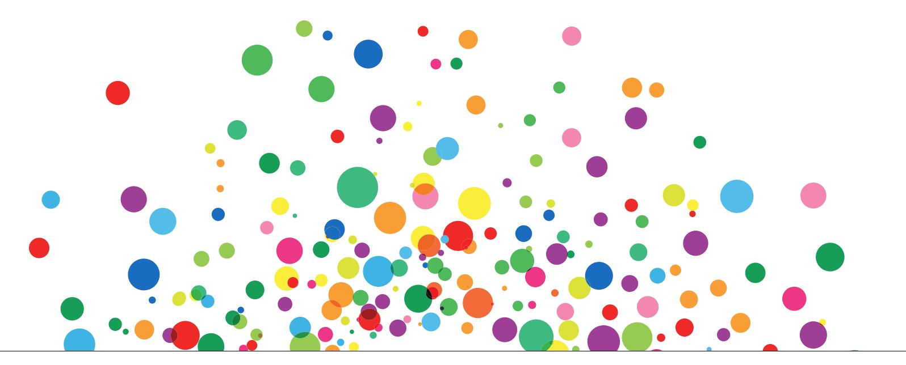

## Chapter 5.

## NEUROSCIENCE OF HAPPINESS

#### RICHARD J. DAVIDSON AND BRIANNA S. SCHUYLER

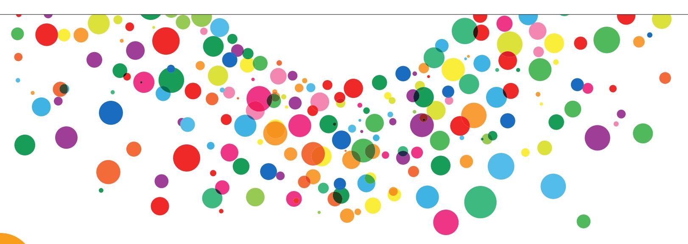

*This work was supported by the National Center for Complementary and Integrative Health (NCCIH) P01AT004952 to RJD, grants from the National Institute of Mental Health (NIMH) T32 MH018931, R01-MH43454, P50-MH084051, P50-MH100031 to RJD, a grant from the National Institute on Aging (NIA) P01 AG020166 to Carol Ryff, grants from the Fetzer Institute 2407 and the John Templeton Foundation 21337 to RJD, a core grant to the Waisman Center from the National Institute of Child Health and Human Development (NICHD) P30 HD003352 to Marsha Mailick.*

*We would like to thank the current and former members of the Center for Healthy Minds at Waisman Center (University of Wisconsin – Madison) for design and analysis of many of the studies mentioned here – particularly Alex Shackman, Andrew Fox, Carien van Reekum, Cory Burghy, Daniel Levinson, Darren Jackson, David Bachhuber, David Perlman, Diane Bussan, Jess Caldwell, Heather Urry, Kim Dalton, Regina Lapate, Sharee Light, Stacey Schaefer, Terry Oakes, Tom Johnstone. Specifically, we would like to thank Aaron Heller and Helen Weng for use of images and Susan Jensen for help with editing and formatting.*

#### Introduction

The past decade has seen robust scientific attention to the neural bases of human emotion. While this research area lay dormant for many earlier decades, 1 the global scientific community has taken up questions related to both normal or typical emotion as well as pathological changes in emotion associated with psychopathology. For many years, emotion and reason were thought to be associated with separate brain systems – with emotion associated with subcortical structures and reason associated with the cerebral cortex. However, extensive developments in neuroimaging techniques over the past two decades have given us a much more nuanced understanding of the interactive interplay between cortical and subcortical zones in the circuitry of emotion and emotion regulation.

Progress in understanding the neural bases of emotion, and happiness more specifically, has been tremendously helped by the availability of imaging methods to interrogate both the function and structure of the human brain. These methods have contributed importantly to our understanding of the different constituents of happiness and well-being.

This review will emphasize recent developments in affective and social neuroscience that showcase four constituents of well-being: sustained positive emotion; recovery from negative emotion; pro-social behavior and generosity; and mindwandering, mindfulness and "affective stickiness" or emotion-captured attention. The first two constituents have been studied within the framework of affective chronometry,2 the time course of emotional responding. In several early publications we argued that the ability to recover quickly from adversity was a key constituent of well-being and can be measured objectively. 3 More recently, we have extended these studies by directly measuring the time course of brain activity in specific circuits underlying both negative 4 and positive 5 emotion. Moreover, some of these new findings suggest that these patterns of brain function are related not just to reports of emotion and life satisfaction, but also to systemic biological measures that are associated with physical health. These studies help to provide an understanding of the mechanisms connecting psychological well-being and physical health. The third constituent—pro-social behavior and generosity—has recently been shown to play a very important role in promoting well-being, and the neural bases of these social behaviors are now the subject of more intensive study. The fourth and final constituent we consider—mind wandering, mindfulness and affective stickiness—is also receiving more serious research attention, though it still remains understudied.

Nevertheless, this last constituent is particularly important since it underscores the difference between well-being, as measured by life evaluation, and happiness, as measured by emotional reports. An individual can potentially have high levels of subjective well-being and yet not be happy at every moment. For example, such a person might respond with intense sadness, upon learning of a tragic event involving loss. An individual with high levels of well-being could conceivably also feel and express anger in response to a moral transgression or in response to an individual who is perceived to be thwarting an important goal. If the individual recovers quickly and there is no lingering resentment affective stickiness—then it is likely that high levels of well-being can persist even in the face of these seemingly inconsistent emotions. These considerations lead to two important conjectures. One is that from a neuroscientific perspective, there must be something different in the baseline patterns of brain function that distinguish those with high versus low levels of well-being, since well-being does not depend upon momentary or short-lived emotional states. And second, there is an important distinction between happiness (which can be momentary and short-lived) and well-being (most likely more enduring and related to life satisfaction). Whether happiness or well-being in the senses that are being used

here differentially contribute to other aspects of mental and physical health will be considered in the following sections.

In the concluding section of this chapter, we consider the implications of the fact that the circuits that have been implicated in well-being all exhibit plasticity, the ability to grow and change.6 Such plasticity occurs wittingly or unwittingly and most of the influences on our well-being that shape these circuits are unwitting. We are exposed to adversity and stressful life events that are often beyond our control. These contextual influences induce plastic changes in brain function and structure that clearly impact our well-being. However, plasticity in these circuits could also be harnessed for intentional cultivation and shaping. Engaging in specific forms of training to cultivate well-being through psychotherapy, meditation and other forms of mental training have been found to induce functional and structural changes in the brain and have also been found to benefit well-being. Some of the most promising evidence of this sort will be reviewed in the concluding section of the chapter.

#### **Positive Emotion**

Often, well-being is defined in two different but related ways—hedonia (pleasure or momentary well-being) and eudaimonia (flourishing, living a meaningful life) first described by Aristotle.8 There has been much work done exploring the neural correlates of hedonic well-being in animals by studying the brain response to reward.9 These mechanisms are very similar across species and research across human and animal populations have informed each other. Further, hedonic and eudaimonic well-being are highly correlated in humans 10 and many of the brain mechanisms involved in the hedonic experience of sensory pleasure are also active in the more eudaimonic experience of altruistic and higher order pleasurable experiences.11

By combining state-of-the-art cellular recording, microinjection and nuanced behavioral measurements, Berridge and his colleagues12 were able to isolate separate neural representations within ventral striatal circuitry—specifically within the nucleus accumbens and ventral pallidum—for wanting, liking and prediction components of the same reward. The ventral striatum is a region deep in the center of the brain that is associated with wanting, liking, and reward in a large number of species. We refer to it as subcortical, which means the structure is located below the cortex (which covers the surface of the brain). In humans, the region most activated by hedonic pleasure is the ventral prefrontal cortex (a region in the front of the brain directly above the eyeballs), but there is also activity in ventral striatum (the same region identified in rodents).

In a typical experiment designed to investigate circuitry activated during hedonic pleasure, 13 participants were presented with text that had been rated as highly positive (e.g., winning the lottery) and then asked to generate imagery related to this text for 12 seconds during which brain function was monitored with fMRI. When the positive imagery condition was contrasted with an unpleasant condition, greater activation for the former was found in the nucleus accumbens (within the ventral striatum) and a region of the ventromedial prefrontal cortex. Functional connectivity between the nucleus accumbens and amygdala (a brain region commonly activated by positive and negative emotional stimuli) and between the ventral prefrontal cortex and amygdala was significantly increased during the positive compared to negative imagery conditions. A similar pattern of prefrontal activation was observed in a study conducted in our laboratory14 with mothers soon after the birth of their first child. While in the scanner, mothers were presented with pictures of their own infants, a stranger infant or an adult. We found greater ventrolateral prefrontal activation in response to pictures of their own infants. These pictures also elicited significantly greater positive affect and the magnitude of prefrontal activation predicted

the intensity of positive mood ratings. Using positron emission tomography at rest to index baseline patterns of glucose metabolism (a measure of brain activation), Volkow found that individuals with increased activation in the ventromedial prefrontal cortex reported increased baseline levels of positive emotionality.15

The studies reviewed above all examined the regions of the brain activated by short-lived emotional stimuli. While some of the findings indicate that these short-term neural responses correlate with present moment measures of happiness, it is not clear if such short-term neural responses correlate with more enduring forms of well-being and life satisfaction or whether other patterns of neural activity better predict these more trait-like measures. Moreover, the studies reviewed above all focus on positive affect, yet some have suggested that enduring well-being is also associated with a more resilient

response to adversity, operationalized by some as faster recovery following negative events. 16 In the sections that follow, we take up these different issues.

#### Savoring: The Neural Bases of Sustaining Positive Emotion

The first clue that the neural bases of sustaining happiness might be different from the short-term elicitation of positive emotion came from studies with depressed patients. We investigated whether depressed patients showed the typical pattern of activation in response to positive stimuli compared with controls. Using conventional analysis methods, we were unable to detect robust differences in activation in reward-related brain regions between clinically depressed patients and non-depressed controls.17 However, when we examined the capacity to sustain activation in

**Figure 5.1:** Psychological well-being is predicted by sustained activation of the ventral striatum across trials in response to positive pictures, p<.005, corrected for multiple comparisons. Modified from Heller et al. (2013).

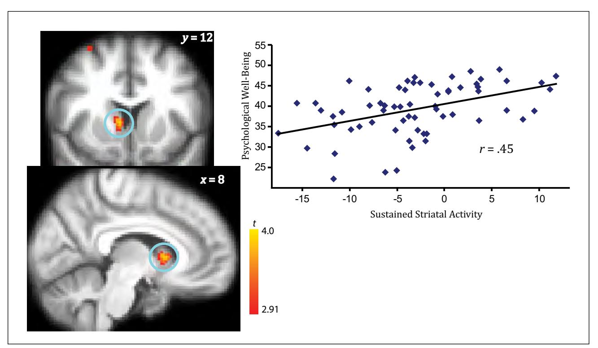

the nucleus accumbens over time (across trials in the experiment), robust differences between patients and controls became apparent. The depressed patients and the controls showed a very similar response during the early trials in the experiment, but as the experiment progressed across trials of positive stimulus presentations, the controls sustained activation in the nucleus accumbens, while the depressed patients did not. The nucleus accumbens is a cluster of neurons in the ventral striatum that is commonly associated with positive affect and reward. Moreover, when connectivity between the accumbens and other brain regions was examined, it was connectivity between the accumbens and the middle frontal gyrus (a region that has been associated with regulation and goal-directed behavior) that showed sustained activation among the controls but dropped off with increased trials in the depressed patients. Finally we also demonstrated18 that patients' reports of positive emotion were most strongly predicted by the metric that captured their sustained activation across trials over time, rather than the conventional measure of mean activation. This study provided the first strong experimental evidence that the neural correlates of savoring, the ability to maintain positive emotion over time, are associated with sustained activation in the ventral striatum and with sustained connectivity between regions of prefrontal cortex and the ventral striatum. Moreover, depressed patients differ from controls on these metrics.

In a direct follow-up to this initial study, 19 we examined whether sustained activation in the ventral striatum would change over the course of antidepressant treatment and whether an increase in the ability to sustain activity would specifically predict increases in reported positive affect. We found that when medication is taken, the greater the increase of sustained ventral striatum activation, the greater the rise in reports of positive affect among clinically depressed patients. These findings indicate that metrics of sustained activation in the ventral striatum can be used to index sustained

happiness and are an important outcome measure for studies of antidepressant impact.

In a recent study involving a large community sample derived from the MIDUS study,20 we experimentally examined relations between individual differences in sustained activation in the ventral striatum and psychological well-being.21 We found that individuals with higher levels of sustained activation across trials in the ventral striatum in response to positive pictures reported higher levels of psychological well-being on Ryff's22 composite measure of well-being (see Figure 5.1). In addition, we found a similar pattern in the dorsolateral prefrontal cortex, a region often involved in working memory and attention, but also active when a person is regulating his or her emotion (Figure 5.2). We also looked at the relationship between activity in these brain regions and an individual's cortisol output over the course of the day. Cortisol can be understood as a measure of a body's response to stress, with higher amounts over the course of the day indicating more stress signals being communicated in the body. We found that participants with greater sustained activation in both the ventral striatum and the dorsolateral prefrontal region had lower levels of cortisol output, which suggests less activation of the body's stress response (see Figure 5.3). These findings indicate that the initial clues we gleaned from studies with depressed patients generalize to healthy individuals, and indicate that sustained activation across time in response to positive incentives in the ventral striatum and dorsolateral prefrontal cortex predicts psychological wellbeing, a form of sustained happiness that may not depend directly upon external circumstances. Moreover, our findings indicate that these neural patterns predict not only reports of well-being but also peripheral biological measures (such as cortisol output) that may reflect both psychological and physical well-being.

WORLD HAPPINESS REPORT 2015

**Figure 5.2:** Psychological well-being is predicted by sustained activation of the right dorsolateral prefrontal cortex (RDLPFC) across trials in response to positive pictures, p<.005, corrected for multiple comparisons. Modified from Heller et al. (2013).

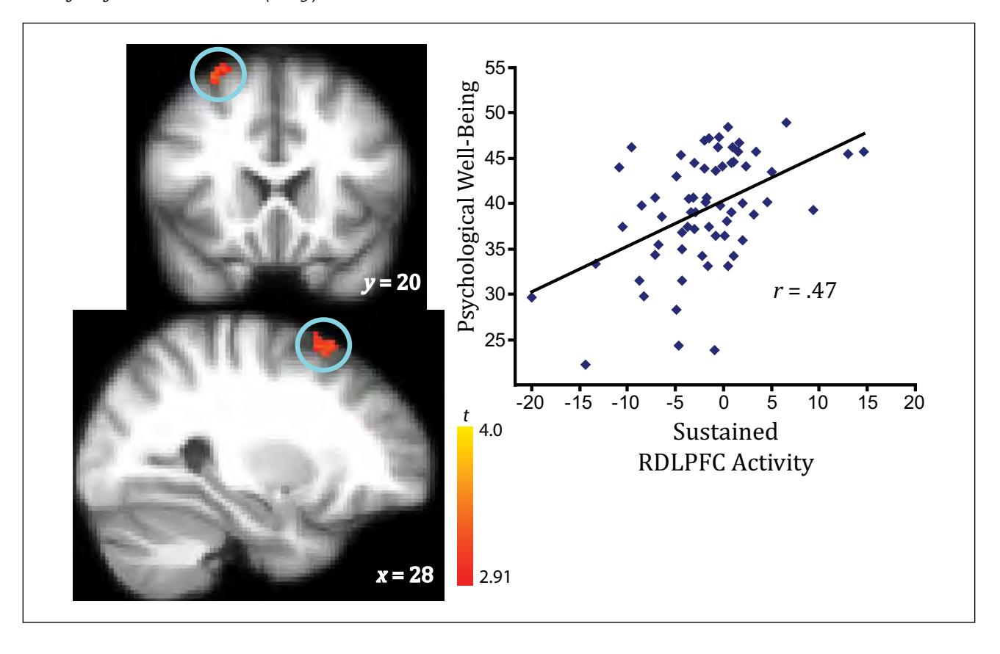

Our laboratory has developed methods to probe the duration of positive and negative affect using peripheral physiological measures.23 Using measures of facial electromyography (fEMG), facial expression behavior that follows the offset of emotional stimuli can be used to probe the extent to which positive and negative affect persist beyond the eliciting stimulus. We would predict that short-lived responses to positive stimuli should be associated with lower levels of well-being and should be impacted by stressful life experiences. In a sample of 116 participants who were part of the MIDUS study,24 we25 found that individuals exposed to prolonged marital stress exhibited short-lived responses to positive stimuli. And the findings above indicate that individuals with short-lived responses to positive stimuli show lower levels of well-being compared

with those who show more prolonged reactivity to such stimuli. These findings suggest that some of the key chronic obstacles to well-being such as marital stress may undermine wellbeing by specifically diminishing the capacity to sustain positive affect.

In a novel recent report, Telzer and colleagues26 studied adolescents longitudinally over a two year age span. They assessed brain activity with fMRI in response to two separate tasks that putatively engaged hedonic and eudaimonic happiness respectively. They found that ventral striatal activation in response to the task that engaged eudaimonic happiness (a family donation task that involved personal loss in the service of overall family gain) predicted longitudinal

**Figure 5.3:** Sustained activation in the ventral striatal and dorsolateral prefrontal cortex regions in response to positive pictures is associated with lower levels of overall total daily cortisol output. Modified from Heller et al. (2013).

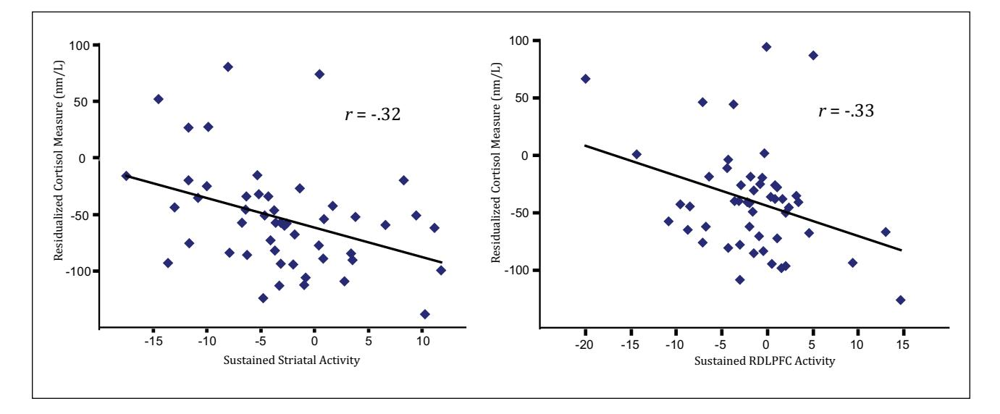

decrease in depressive symptoms while activation in this same region in response to a hedonic reward task did not. This suggests that the context in which ventral striatal activation is observed is significant and determines the network with which it associates. What is not known from this study is whether a more sensitive analytic method might have revealed differences in the pattern of activation (within the ventral striatum and related regions) between these conditions.

Both brain function and concepts of positive affect are complex and so it should not be surprising that there are interesting relationships between positive affect and other regions of the brain as well. Though they are not as straightforward as the findings within the ventral striatum, we discuss some of these thought-provoking findings in Annex I.

## Resilience and the Recovery from Adversity

The study of resilience is receiving increased neuroscientific attention.27 Much of this work is being conducted at the rodent level and entails the study of experimental manipulations that have resilience-promoting effects, including variations of maternal care, early handling, and partially restricted foraging schedules. While there are many definitions of resilience, the maintenance of high levels of well-being in the face of adversity seems to be a common theme among the differing definitions. One key way in which high levels of well-being can be sustained in the face of adversity is through effective recovery from negative events. We have conceptualized recovery as a form of automatic emotion regulation.28 It is automatic in the sense that it does not require explicit effortful control; rather, there are large individual differences in the naturally occurring rate at which we recover from negative events. Just as we described above in the case of savoring, the time course of recovery from negative events is the flip side of savoring. Measures of recovery from negative

events can be obtained using peripheral psychophysiological measures29 or can be assessed with direct measures of brain function30 where the actual time course of responding in specific neural circuits can be assessed. In both cases, the key time window for measuring recovery is the period after a negative emotional stimulus ceases to be present. Prolonged or slow recovery would be reflected in greater signal in the period that follows the end of a negative emotional stimulus, reflecting a continuation of the emotional response when it ceases to be relevant. We suggest that a key constituent of well-being is fast recovery following a negative stimulus. Moreover, we have proposed that the time course of responding in the amygdala represents a central node through which peripheral signs of recovery are modulated. The rationale for considering the amygdala a central node for resilience is the extensive literature implicating this structure in fear and anxiety.31 Faster recovery of the amygdala would therefore imply more adaptive coping with adversity, since the central and peripheral changes associated with fear and anxiety would be diminished more quickly if the amygdala exhibited a faster time course of decreased activation following exposure to a negative event.

To test these ideas, we recruited 120 middle-aged adults (mean age=48 years) and brought them into the laboratory for an imaging session during which an automatic emotion regulation paradigm was presented.32 In this paradigm, positive, negative or neutral pictures were presented for four seconds, after which a neutral face was presented one or three seconds after the image, or not at all. Three days after the scanning session, participants rated the likeability of the faces they had seen, along with novel unfamiliar faces that acted as foils.

In response to the emotional pictures, the time course was divided into separate reactivity and recovery periods. We measured amygdala activity in the four seconds while the image was on the screen (reactivity) and in the four seconds after

the image disappeared (recovery). We found that individual differences in neuroticism, one of the key attributes of trait negative affect and a personality variable that is inversely related to well-being,33 was predicted by greater amygdala signal during the recovery period, but not during the reactivity period. This implies that a person's initial reaction to a negative event (either large or small) has little effect on that person's trait levels of neuroticism. The process that results in less neuroticism is how well the person recovers once the negative stimulus is no longer relevant. We also found that ratings of less likeability of the neutral faces were associated with greater amygdala signal during both the reactivity and recovery periods. These findings suggest that individual differences in amygdala recovery may play an important role in resilience and wellbeing, and argue for increased attention to this construct in future studies of well-being.

Is there more direct evidence that recovery following negative events is connected with well-being, and is there a particular component of well-being that may be more strongly associated with recovery than others? We studied these questions in a sample of 331 participants from the MIDUS study between the ages of 34-84 years.34 Using an automatic emotion regulation task very similar to that described above for the imaging study, we examined emotion-modulated startle at different latencies during and following emotional picture presentation. After viewing emotional images, participants were sometimes subjected to a loud burst of sound, and the amount of startle in response to the sound was used as a measure of sustained emotional arousal. Evidence for better recovery following negative events would be reflected in greater startle diminution after negative pictures were removed from the participants' view. We used startle magnitude during the picture presentation as a measure of recovery that was unconfounded by reactivity. We found that participants with higher scores on the Purpose in Life subscale of well-being exhibited the most robust recovery following negative events. This finding holds

with measures of reactivity statistically removed. The other subscales of the Ryff well-being measure to reach statistical significance were the Personal Growth and Self-Acceptance subscales. These findings suggest that better recovery from negative events may be an important constituent of well-being. They further raise the possibility that strategies that might promote the learning of more effective recovery might serve to increase well-being.

Russo et al.35 review the growing literature in non-human animals (mostly rodents) that is focused on the mechanisms underlying resilience. For the purposes of these studies, resilience is operationalized as not succumbing to the deleterious effects of stress-inducing manipulations. In mice exposed to predators or chronic defeat stressors, those exhibiting a resilient behavioral profile showed higher levels of early gene expression in glutamatergic neurons in the medial prefrontal cortex (a region commonly involved in the regulation of emotion in humans). Activation in this brain region has been interpreted as a pro-resilience adaptation. Consistent with this interpretation, Covington et al.36 showed that direct stimulation of neurons in this region promotes resilience to social defeat stress, underscoring the causal role of this brain region in the expression of resilience. In squirrel monkeys, Katz et al.37 found that exposure to intermittent maternal separation (which has been found to promote resilience) increases cortical volume in the ventromedial prefrontal cortex, a pattern that is opposite to what is observed in depression. These and other related findings are consistent with human data in suggesting an important role for prefrontal regulatory regions in the promotion of resilience, and they further underscore the role of these circuits in well-being. These findings are also consistent with the evidence introduced in an earlier section of this chapter showing that individuals with sustained dorsolateral prefrontal activation in response to positive stimuli report higher levels of well-being.38 The general view suggested here is that opportunities with moderate

levels of adversity may facilitate the learning of emotional regulatory strategies that help promote better recovery and result in changes in prefrontal engagement.

#### Empathy, Altruism, and Well-Being

One of the strongest predictors of well-being is the quality of an individual's social relationships.39 In fact, when individuals are made to experience social isolation many of the same brain regions become active that are active in the experience of physical pain.4° Behavior that increases social bonds (altruism and pro-social behavior) reliably increases well-being in children41 and adults42 and appears to be consistent across cultures.43 In fact, individuals asked to recall a purchase they made for another person were happier immediately following the memory, and were subsequently more likely to spend money on another person. This type of behavior could result in a feedback loop, where pro-social behavior increases well-being, which then results in more pro-social behavior.44 Pro-social behavior is even associated with better health45 and longer life expectancy46 and these improved health outcomes in turn can also contribute to greater well-being.

#### Neural Correlates of Empathy and Altruism

A vital precursor to the development of pro-social behavior is the activation of empathy, or the ability of an individual to recognize and share the emotions of others. The neuroscience of empathy is in its nascent stages, but one thing that is clear is that many of the brain regions involved in empathy are the same as those involved in experiencing our own emotions.47 For example, when individuals watch other people being exposed to a painful stimulus, they show activation in the anterior insula (a region just behind the temples) and anterior medial

Figure 5.4: The anterior insula (AI) and anterior/medial cingulate cortex (aMCC) are activated during the experience of pain and also to witnessing pain in another. The inferior frontal gyrus (IFG) is also identified. From top left to bottom right are slices from the center of the brain outward showing regions that respond to witnessing another in pain. (From Lamm et al. [2011]).

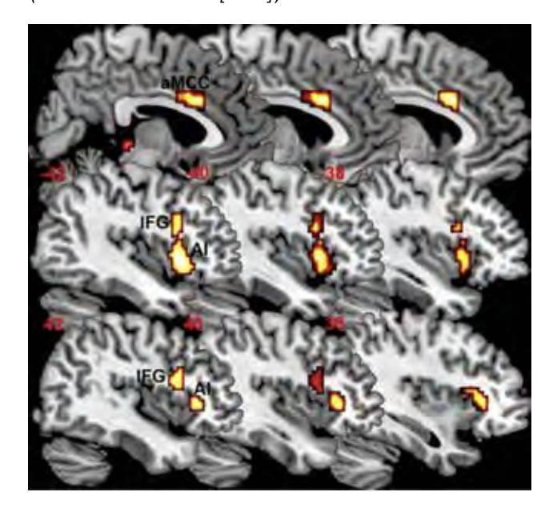

cingulate cortex (an area of cortex just above the corpus callosum in the medial part of the brain). This overlaps with the activity shown when those individuals are exposed to pain themselves.48 The anterior insula is not only active when witnessing the pain of another – it activates in response to a person's own positive and negative experiences. Similarly, increases activity when witnessing both positive and negative emotions of another, thus suggesting that it does not code valence but rather something that is common across different types of emotion. For example, Jabbi et al. found activation of the anterior insula when individuals witnessed others drinking both pleasant and unpleasant drinks.49

Activity in empathy-related regions is also affected by the degree of social connectedness between the observer and the individual experiencing pain. Hein et al. studied fans of two different sports teams and found that anterior insula activation was decreased in individuals observing the pain of a rival versus a fan of the same team.50 The anterior insula is a region that is involved in the feeling of bodily sensation, so this suggests that individuals observing others in pain "feel" some level of that pain themselves, and the feeling is stronger if the individual receiving the pain is someone that the person feels more socially connected to. In Hein's study of sports fans, they further found that the more anterior insula activity an individual showed, the more likely they were to help the individuals in pain when given the opportunity.51 In a study of African Americans and Caucasian Americans, Mathur et al.52 found that both groups showed anterior insula and anterior cingulate cortex activity in response to witnessing both African Americans and Caucasian Americans in pain. However, African Americans additionally recruited the medial prefrontal cortex (a region generally implicated in self-related processing) when witnessing the suffering of other African Americans as opposed to Caucasian Americans. Further, the magnitude of medial prefrontal activity positively predicted the amount of money participants indicated later that they would be willing to donate to help members of their in-group.53

One step beyond the experience of empathy (and more directly related to well-being) is the ability of an individual to engage in pro-social behavior. In a study of individuals deciding whether to donate money to charity, it was found that people showed activity in the same brain regions (ventral tegmental area and dorsal and ventral striatum) both when they donated money and when they received it.54 In fact, in that study the ventral striatum was even more active when participants donated money than when they received it. Given the role of the ventral striatum in the experience of positive affect (discussed in

a previous section), these data corroborate the adage that "it is better to give than to receive." Additionally, participants with greater magnitude of striatal activity also made a greater number of charitable donations than individuals with less striatal activity. This suggests that participants are more likely to engage in charitable donations if they find the activity more intrinsically rewarding.

Another interesting avenue of research in this area is the study of the brains of extraordinarily altruistic individuals. Marsh et al. found just such a population when they recruited voluntary organ donors, specifically individuals who donated a kidney to a stranger. They deemed these individuals "extraordinary altruists," as kidney donation is a significant cost to the donor to benefit an anonymous stranger. They found that extraordinary altruists showed increased amygdala response to faces of people in fear, and greater amygdala volume on average than a group of control participants. Further, greater amygdala response in the whole sample predicted better recognition of fearful faces one to two hours later.55 Given the role of the amygdala in emotional arousal, these results suggest a heightened sensitivity to the suffering of others in this group of extraordinary altruists, specifically others that are experiencing fear.

## Neural Changes in Response to Compassion Training

The expression of empathy and compassion has been a mainstay of many contemplative traditions for millennia, and some traditions have even evolved extensive methods to train these qualities. We define empathy here as sharing the feelings of others, whereas compassion is a feeling of concern for another, along with a desire to improve his or her well-being. Recent years have seen a gain in momentum towards the study of mindfulness and concentration trainings. However, it is only recently that scientists have begun to study the efficacy of methods that

specifically train compassion on an individual's well-being, and the well-being of those around them. Kemeny and colleagues enrolled female school teachers in a secular eight-week training with a focus on mindfulness, empathy, compassion, and recognition of emotions in oneself and others. They found that after the training, the women reported higher levels of positive emotion and lower levels of negative emotion compared to a wait-list control group. In addition to changes in their own emotions, they had an increased ability to recognize the emotions of others, a precursor for empathy and compassion.56 In a study of a much shorter training, Leiberg et al.57 studied the effects of just one day of compassion training compared to a day of memory training. They found that people trained in compassion reported increases in positive emotions, accompanied by greater helping behavior in a pro-social game.

Several studies provide insight into the brain mechanisms underlying these increases in the ability to recognize emotion and engage in helping behavior. Mascaro et al. investigated the effects of an eight-week cognitive-based compassion training versus a health discussion control group, and found that the compassion group was better able to recognize emotions after training. Further, the increases in recognition were predicted by activity in the ventral and dorsomedial prefrontal cortex.58 Since these regions are involved in the regulation of emotion and goal-directed behavior, this activity might indicate the compassion training led to the development of greater motivation to recognize the emotions of others, and thus a more compassionate response. In our laboratory, Weng et al.59 studied individuals who completed a two-week training in either compassion or cognitive reappraisal, and found that people engaged in more helping behavior after compassion training (versus reappraisal). We also studied the brain response to images of people suffering, before and after the trainings. We found that a greater increase in the connection between dorsolateral prefrontal cortex and nucleus

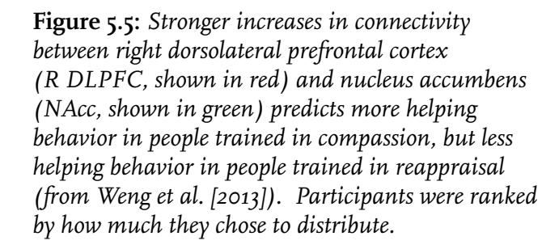

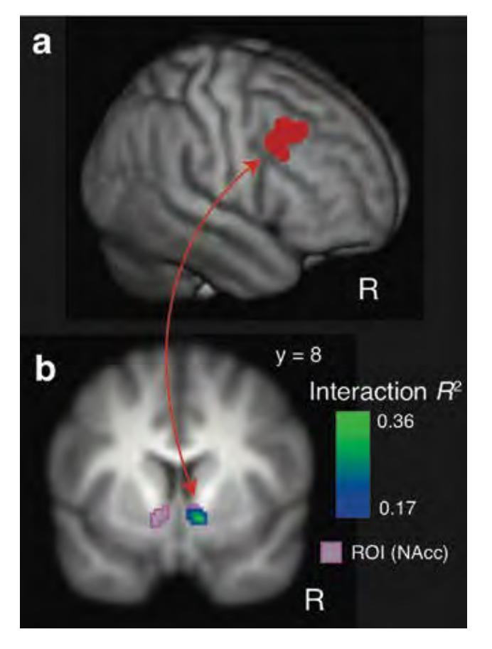

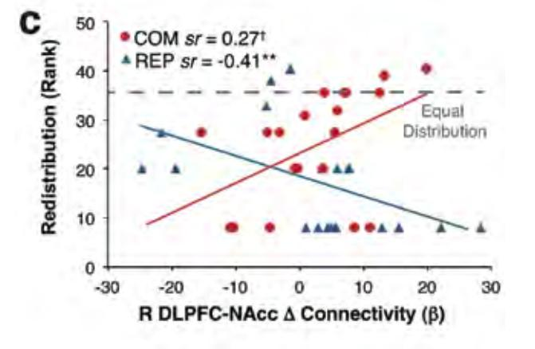

accumbens predicted greater helping behavior in the compassion group, but less helping behavior in the reappraisal group (see Figure 5.5). These data suggest that the regulation of emotion by the dorsolateral prefrontal cortex serves different purposes in the two different groups. In the reappraisal group it might allow the individual to more effectively disengage from another's suffering, while in the compassion group it might allow the individual to manage their own emotional response in order to have more resources to direct towards helping.60

In another study of the effects of compassion training on an individual's response to suffering, Klimecki et al. studied the effects of a one-day compassion training versus a one-day memory training on participants' response to short clips of strangers in distress. Before training, both groups showed increases in negative affect, accompanied by increases in anterior insula and anterior cingulate cortex, in response to the video clips. After the compassion training, participants watched another set of video clips of people in distress but this time reported a very different emotional response and exhibited a different neural signature. They reported greater positive affect (with respect to the memory training group) and showed activation in brain regions commonly associated with positive affect, namely the ventromedial prefrontal cortex, putamen, pallidum, ventral tegmental area. 61 These findings suggest that after compassion training, an individual witnessing another's suffering might buffer the debilitating effects of a negative empathic response with the generation of positive emotion to better allow the individual to respond with helping behavior.

A follow up on the previously mentioned study of a day of compassion training looked at the specific effects of empathy training versus compassion. Participants first watched videos of people suffering before any training, then after a day-long empathy training, and finally a third time after a day of compassion training. They found that the empathy training alone led

to increases in insula and anterior middle cingulate cortex activity as well as to an increase in negative affect in response to viewing people in distress. However, after the completion of both empathy and compassion trainings the participants again showed increases in positive affect, decreases in negative affect, and increases in regions more commonly associated with positive emotion, including the ventromedial prefrontal cortex and ventral striatum. 62

## Mind Wandering, Mindfulness and Affective Stickiness

In a well-known study, Killingsworth & Gilbert63 developed a smartphone app to sample the experience of more than 2,000 individuals (mean age=34 years) while they went about their daily activities in the world. They were interested in the frequency with which people reported their minds to be wandering (i.e., not focused on the activity in which they were predominantly engaged). At the same time, they also asked participants to rate the degree to which they were happy or unhappy at that moment. They found that on average, these participants reported their minds to be wandering 47% of the time. Moreover, when they reported their minds to be wandering, they also reported significantly more unhappiness than when they were focused on the activity at hand. In a very recent report, Wilson and colleagues64 found that across 11 different studies, college student participants typically did not enjoy spending 6-15 minutes in a room by themselves with nothing to do. They preferred to engage in external activities much more, even ones that were mundane, and some even preferred to receive electric shocks than to sit alone. In light of the high prevalence of mind wandering and negative affect during "resting" conditions, the findings from Wilson et al. 65 clearly indicate that the typical college student finds his/her thoughts during an uninstructed condition to be unpleasant.

Neuroscientists have begun to discover specific characteristics of the brain's function at rest, when no formal task or instruction is given and the mind is allowed to wander. When functional MRI data is collected from participants at rest (not completing any task), a very reliable network of brain regions becomes active. Because these regions are active specifically in the absence of a task, we refer to them as the default mode network. Connectivity between regions in this network, in the absence of explicit instruction or a task, has been found to be related to various aspects of mind wandering.66 For example, Mason et al.67 found increased activity in several areas of the default mode (including the medial prefrontal cortex and the posterior cingulate) related to an increased frequency of mind wandering reports.

Mindfulness is a construct that is receiving serious attention in the scientific literature for the first time. 68 Mindfulness is often defined as paying attention, on purpose, non-judgmentally, and, when cultivated through training, is said to promote increased well-being. 69 Recent evidence suggests that mindfulness meditation training results in a decrease in the same regions of the default mode that are increased in activation during mind wandering. 70 These authors suggest that their findings "demonstrate differences in the default-mode network that are consistent with decreased mind-wandering."

Mindfulness is also said to be associated with decreased attachment, reflected in part by a decreased influence of wanting, which may at least in part underlie the association between mindfulness and well-being. Wanting, defined as an incentive to approach, can be irrationally inconsistent with cognitive goals and lead to decreases in well-being. This occurs in a striking way in addiction. Using a newly developed behavioral measure of mindfulness based on breath counting accuracy,71 we recently examined the relation between individual differences in this behavioral measure of mindfulness and a behavioral measure of reward-related attention

capture, a proxy for emotional distraction. We used a task based upon Anderson et al.72 that assesses how much individuals are slowed by attending to a distractor formerly paired with reward, despite their cognitive goal of completing a visual search as quickly as possible. We found that participants with greater breath counting accuracy (i.e., higher levels of mindfulness) showed less attention capture by a previously rewarded stimulus, indicating decreased attachment to affect-relevant stimuli and less "stickiness"—involuntarily being attentionally pulled by irrelevant emotional distractors. Strengthening attentional skills through mindfulness or similar types of training may decrease stickiness and mind wandering and increase well-being by transforming default mode activity.

#### Summary

This review emphasizes four novel constituents of well-being and their underlying neural bases: I. Sustained positive emotion; 2. Recovery from negative emotion; 3. Empathy, altruism and pro-social behavior; and 4. Mind-wandering, mindfulness and "affective stickiness" or emotioncaptured attention. Well-being has been found to be elevated when individuals are better able to sustain positive emotion; recover more quickly from negative experiences; engage in empathic and altruistic acts; and express high levels of mindfulness. In each case, a growing body of evidence is pointing towards the importance of these four constituents to well-being. In some cases, effects are stronger for certain components of well-being, such as purpose in life, or positive relations with others. In other cases, the findings hold for measures of overall well-being. The neural circuits that underlie each of these four constituents are partially separable, though there is some overlap. The prefrontal cortex and ventral striatum are especially important in sustained positive emotion. Connectivity between the prefrontal cortex and amygdala is a key node through which effective recovery following negative events is mediated. The anterior insula

and regions of the anterior cingulate cortex are implicated in empathic responding and the prefrontal cortex-ventral striatum are critical here in subserving altruistic behavior. Mind-wandering and mindfulness engage the default networks that can be detected at rest. Two key nodes of the default mode—the medial prefrontal cortex and the precuneus/posterior cingulate cortex—have both been implicated in mind-wandering. These regions exhibit decreased activation during the explicit voluntary cultivation of mindfulness, and increased levels of mindfulness are associated with decreased behavioral signs of stickiness.

Just how these four constituents may synergistically work together has not been studied, nor has their relative contributions to well-being been rigorously dissected. There are two overall lessons that can be taken from the neuroscientific evidence. The first is the identification of the four constituents we highlight, which are not commonly emphasized in well-being research. The second concerns the profound implications of the fact that the circuits we identify as underlying these four constituents of well-being all exhibit plasticity, and thus can be transformed through experience and training. Training programs are now being developed to cultivate mindfulness, kindness, generosity etc. As we reviewed above, data are available that indicate that some of these training regimes, even those as short as two weeks, can induce measurable changes in the brain. These findings highlight the view that happiness and well-being are best regarded as skills that can be enhanced through training.

- I See Davidson & Begley (2012).
- 2 Davidson et al. (2000).
- 3 See Davidson (2000) for review.
- 4 Schuyler et al. (2012).
- 5 E.g., Heller et al. (2014).
- 6 Davidson & McEwen (2012).
- 7 Ibid.
- 8 Aristotle (2004).
- 9 See e.g., Berridge & Kringelbach (2011) for review.
- 10 Diener et al. (2008).
- II Berridge & Kringelbach (2011), Kringelbach & Berridge (2009).
- 12 Smith et al. (2011).
- 13 Costa et al. (2010).
- 14 Nitschke et al. (2004).
- 15 Volkow et al. (2011).
- 16 E.g., Davidson (2004).
- 17 Heller et al. (2009).
- 18 Ibid.
- 19 Heller et al. (2013).
- 20 See http://www.midus.wisc.edu/
- 21 Heller et al. (2013).
- 22 Ryff & Keyes (1995), Ryff (1989).
- 23 See e.g., Jackson et al. (2003).
- 24 See http://www.midus.wisc.edu/
- 25 Lapate et al. (2014).
- 26 Telzer et al. (2014).
- 27 E.g., Russo et al. (2012).
- 28 Schuyler et al. (2012).
- 29 E.g., Jackson et al. (2003), Schaefer et al. (2013).
- 30 E.g., Schuyler et al. (2012).

- 31 E.g., LeDoux (2014).
- 32 Schuyler et al. (2012).
- 33 E.g., Wink & Staudinger (2014).

62 Klimecki et al. (2013).

64 Wilson et al. (2014).

(2007) for review.

67 Mason et al. (2007).

68 See Davidson (2010).

69 Brown & Ryan (2003).

70 Brewer et al. (2011).

71 Levinson et al. (2012).

72 Anderson et al. (2011).

65 Ibid.

63 Killingsworth & Gilbert (2010).

66 Callard et al. (2013), Mason et al.

- 34 Schaefer et al. (2013).
- 35 Russo et al. (2012).
- 36 Covington et al. (2010).
- 37 Katz et al. (2009).
- 38 Heller et al. (2013).
- 39 Diener & Seligman (2002).
- 40 Eisenberger (2012).
- 41 Aknin et al. (2012).
- 42 Dunn et al. (2008), Hofmann et al. (2014).
- 43 Aknin et al. (2013).
- 44 Aknin et al. (2011).
- 45 Borgonovi (2008), Brown et al. (2005).
- 46 Brown et al. (2003).
- 47 Singer & Klimecki (2014).
- 48 Lamm et al. (2011); see Figure 4.
- 49 Jabbi et al. (2007).
- 50 Hein et al. (2010).
- 51 Ibid.
- 52 Mathur et al. (2010)
- 53 Ibid.
- 54 Moll et al. (2006).
- 55 Marsh et al. (2014).
- 56 Kemeny et al. (2012).
- 57 Leiberg et al. (2011).
- 58 Mascaro et al. (2013).
- 59 Weng et al. (2013).
- 60 Ibid.
- 61 Klimecki et al. (2012).

#### WORLD HAPPINESS REPORT 2015

#### References

Aknin, L. B., Barrington-Leigh, C. P., Dunn, E. W., Helliwell, J. F., Burns, J., Biswas-Diener, R., ... Norton, M. I. (2013). Prosocial spending and well-being: Cross-cultural evidence for a psychological universal. *Journal of Personality and Social Psychology*, 104(4), 635–52. doi:10.1037/a0031578

Aknin, L. B., Dunn, E. W., & Norton, M. I. (2011). Happiness runs in a circular motion: Evidence for a positive feedback loop between prosocial spending and happiness. *Journal of Happiness Studies*, 13(2), 347–355. doi:10.1007/s10902-011-9267-5

Aknin, L. B., Hamlin, J. K., & Dunn, E. W. (2012). Giving leads to happiness in young children. *PLoS ONE*, 7(6), e39211. doi:10.1371/journal.pone.0039211

Anderson, B. A., Laurent, P. A., & Yantis, S. (2011). Value-driven attentional capture. *Proceedings of the National Academy of Sciences*, 108(25), 10367–71. doi:10.1073/pnas.1104047108

Aristotle. (2004). *The nicomachean ethics*. H. Tredennick (Ed.). (J. A. K. Thomson, Trans.). Oxford, United Kingdom: Oxford University Press. (Original work published 350 BC)

Berridge, K. C., & Kringelbach, M. L. (2011). Building a neuroscience of pleasure and well-being. *Psychology of Well-Being*, 1(1), 1–3. doi:10.1186/2211-1522-1-3.

Biswal, B. B. (2012). Resting state fMRI: A personal history. *NeuroImage*, 62(2), 938–44. doi:10.1016/j.neuroimage.2012.01.090

Borgonovi, F. (2008). Doing well by doing good. The relationship between formal volunteering and self-reported health and happiness. *Social Science & Medicine*, 66(II), 232I–34. doi:10.1016/j.socscimed.2008.01.011

Brewer, J. A, Worhunsky, P. D., Gray, J. R., Tang, Y.-Y., Weber, J., & Kober, H. (2011). Meditation experience is associated with differences in default mode network activity and connectivity. *Proceedings of the National Academy of Sciences*, 108(50), 1–6. doi:10.1073/pnas.1112029108

Brown, K. W., & Ryan, R. M. (2003). The benefits of being present: Mindfulness and its role in psychological well-being. *Journal of Personality and Social Psychology*, 84(4), 822–848. doi:10.1037/0022-3514.84.4.822

Brown, S. L., Nesse, R. M., Vinokur, A. D., & Smith, D. M. (2003). Providing social support may be more beneficial than receiving it: Results from a prospective study of mortality. *Psychological Science*, 14(4), 320–327. doi:10.IIII/I467-9280.I446I

Brown, W. M., Consedine, N. S., & Magai, C. (2005). Altruism relates to health in an ethnically diverse sample of older adults. *The Journals of Gerontology Series B: Psychological Sciences and Social Sciences*, 60(3), P143–P152. doi:10.1093/geronb/60.3.P143

Callard, F., Smallwood, J., Golchert, J., & Margulies, D. S. (2013). The era of the wandering mind? Twenty-first century research on self-generated mental activity. *Frontiers in Psychology*, 4(December), 891. doi:10.3389/fpsyg.2013.00891

Costa, V. D., Lang, P. J., Sabatinelli, D., Versace, F., & Bradley, M. M. (2010). Emotional imagery: Assessing pleasure and arousal in the brain's reward circuitry. *Human Brain Mapping*, 31(9), 1446–57. doi:10.1002/hbm.20948

Covington, H. E., Lobo, M. K., Maze, I., Vialou, V., Hyman, J. M., Zaman, S., ... Nestler, E. J. (2010). Antidepressant effect of optogenetic stimulation of the medial prefrontal cortex. *The Journal of Neuroscience: The Official Journal of the Society for Neuroscience*, 30(48), 16082–90. doi:10.1523/JNEUROS-CI.1731-10.2010

Davidson, R. J. (1992). Emotion and affective style: Hemispheric substrates. *Psychological Science*, *3*(1), 39–43. doi:10.1111/j.1467-9280.1992.tb00254.x

Davidson, R. J. (2004). Well-being and affective style: Neural substrates and biobehavioural correlates. *Philosophical Transactions of the Royal Society of London*, 359(1449), 1395–411. doi:10.1098/rstb.2004.1510

Davidson, R. J. (2010). Empirical explorations of mindfulness: Conceptual and methodological conundrums. *Emotion*, 10(1), 8–11. doi:10.1037/a0018480

Davidson, R. J., Jackson, D. C., & Kalin, N. H. (2000). Emotion, plasticity, context, and regulation: Perspectives from affective neuroscience. *Psychological Bulletin*, 126(6), 890–909.

Davidson, R. J., & McEwen, B. S. (2012). Social influences on neuroplasticity: Stress and interventions to promote well-being. *Nature Neuroscience*, 15(5), 689–95. doi:10.1038/nn.3093

Davidson, R. J., & Begley, S. (2012). The emotional life of your brain: How its unique patterns affect the way you think, feel, and live – and how you can change them. New York, NY: Hudson Street Press.

Diener, E., Emmons, R. A., Larsen, R. J., & Griffin, S. (1985). The satisfaction with life scale. *Journal of Personality Assessment*, 49(1), 71–75.

Diener, E., Kesebir, P., & Lucas, R. (2008). Benefits of accounts of well-being— For societies and for psychological science. *Applied Psychology*, 57(s1), 37–53. doi:10.1111/j.1464-0597.2008.00353.x

Diener, E., & Seligman, M. E. P. (2002). Very happy people. *Psychological Science*, 13(1), 81–4. doi:10.1111/1467-9280.00415

Dunn, E. W., Aknin, L. B., & Norton, M. I. (2008). Spending money on others promotes happiness. *Science*, *319*(5870), 1687–8. doi:10.1126/science.1150952

- Hein, G., Silani, G., Preuschoff, K., Batson, C. D., & Singer, T. (2010). Neural responses to ingroup and outgroup members' suffering predict individual differences in costly helping. *Neuron*, 68(1), 149–60. doi:10.1016/j.neuron.2010.09.003
- Heller, A. S., Johnstone, T., Light, S. N., Peterson, M. J., Kolden, G. G., Kalin, N. H., & Davidson, R. J. (2013). Relationships between changes in sustained fronto-striatal connectivity and positive affect in major depression resulting from antidepressant treatment. *American Journal of Psychiatry*, 170(2), 197–206. doi:10.1176/appi.ajp.2012.12010014
- Heller, A. S., Johnstone, T., Shackman, A. J., Light, S. N., Peterson, M. J., Kolden, G. G., ... Davidson, R. J. (2009). Reduced capacity to sustain positive emotion in major depression reflects diminished maintenance of fronto-striatal brain activation. *Proceedings of the National Academy of Sciences*, 106(52), 22445–50. doi:10.1073/pnas.0910651106
- Heller, A. S., Lapate, R. C., Mayer, K. E., & Davidson, R. J. (2014). The face of negative affect: Trial-by-trial corrugator responses to negative pictures are positively associated with amygdala and negatively associated with ventromedial prefrontal cortex activity. *Journal of Cognitive Neuroscience*, 2102–2110. doi:10.1162/jocn\_a\_0622
- Heller, A. S., van Reekum, C. M., Schaefer, S. M., Lapate, R. C., Radler, B. T., Ryff, C. D., & Davidson, R. J. (2013). Sustained ventral striatal activity predicts eudaimonic well-being and cortisol output. *Psychological Science*, 24(11), 2191–2200.
- Hofmann, W., Wisneski, D. C., Brandt, M. J., & Skitka, L. J. (2014). Morality in everyday life. *Science*, *345*(6202), 1340–1343. doi:10.1126/science.1251560
- Jabbi, M., Swart, M., & Keysers, C. (2007). Empathy for positive and negative emotions in the gustatory cortex. *NeuroImage*, *34*(4), 1744–53. doi:10.1016/j.neuroimage.2006.10.032
- Jackson, D. C., Mueller, C. J., Dolski, I., Dalton, K. M., Nitschke, J. B., Urry, H. L., ... Davidson, R. J. (2003). Now you feel it, now you don't: Frontal brain electrical asymmetry and individual differences in emotion regulation. *Psychological Science*, 14(6), 612–7.
- Katz, M., Liu, C., Schaer, M., Parker, K. J., Ottet, M.-C., Epps, A., ... Lyons, D. M. (2009). Prefrontal plasticity and stress inoculation-induced resilience. *Developmental Neuroscience*, 31(4), 293–9. doi:10.1159/000216540
- Kemeny, M. E., Foltz, C., Cavanagh, J. F., Cullen, M., Giese-Davis, J., Jennings, P., ... Ekman, P. (2012). Contemplative/emotion training reduces negative emotional behavior and promotes prosocial responses. *Emotion*, 12(2), 338–50. doi:10.1037/a0026118

- Killingsworth, M. A., & Gilbert, D. T. (2010). A wandering mind is an unhappy mind. *Science*, 330(6006), 932. doi:10.1126/science.1192439
- Klimecki, O. M., Leiberg, S., Lamm, C., & Singer, T. (2012). Functional neural plasticity and associated changes in positive affect after compassion training. *Cerebral Cortex*, 1–10. doi:10.1093/cercor/bhs142
- Klimecki, O. M., Leiberg, S., Ricard, M., & Singer, T. (2013). Differential pattern of functional brain plasticity after compassion and empathy training. *Social Cognitive and Affective Neuroscience*. doi:10.1093/scan/nst060
- Kong, F., Hu, S., Wang, X., Song, Y., & Liu, J. (2014). Neural correlates of the happy life: The amplitude of spontaneous low frequency fluctuations predicts subjective well-being. *NeuroImage*, 107C, 136–145. doi:10.1016/j.neuroimage.2014.11.033
- Kringelbach, M. L., & Berridge, K. C. (2009). Towards a functional neuroanatomy of pleasure and happiness. *Trends in Cognitive Sciences*, 13(II), 479–87. doi:10.1016/j. tics.2009.08.006
- Lamm, C., Decety, J., & Singer, T. (2011). Meta-analytic evidence for common and distinct neural networks associated with directly experienced pain and empathy for pain. *NeuroImage*, 54(3), 2492–502. doi:10.1016/j.neuroimage.2010.10.014
- Lapate, R. C., van Reekum, C. M., Schaefer, S. M., Greischar, L. L., Norris, C. J., Bachhuber, D. R. W., ... Davidson, R. J. (2014). Prolonged marital stress is associated with short-lived responses to positive stimuli. *Psychophysiology*, *51*(6), 499–509. doi:10.1111/psyp.12203
- LeDoux, J. E. (2014). Coming to terms with fear. *Proceedings of the National Academy of Sciences*, (19), 1–8. doi:10.1073/pnas.1400335111
- Leiberg, S., Klimecki, O., & Singer, T. (2011). Short-term compassion training increases prosocial behavior in a newly developed prosocial game. *PloS One*, *6*(3), e17798. doi:10.1371/journal.pone.0017798
- Levinson, D. B., Smallwood, J., & Davidson, R. J. (2012). The persistence of thought: Evidence for a role of working memory in the maintenance of task-unrelated thinking. *Psychological Science*, *23*(4), 375–80. doi:10.1177/0956797611431465
- Luo, Y., Huang, X., Yang, Z., Li, B., Liu, J., & Wei, D. (2014). Regional homogeneity of intrinsic brain activity in happy and unhappy individuals. *PloS One*, *9*(1), 1–8. doi:10.1371/journal. pone.0085181
- Lyubomirsky, S., & Lepper, H. (1999). A measure of subjective happiness: Preliminary reliability and construct validation. *Social Indicators Research*, 46(2), 137–155.

- Marsh, A., Stoycos, S. A., Brethel-Haurwitz, K. M., Robinson, P., VanMeter, J. W., & Cardinale, E. M. (2014). Neural and cognitive characteristics of extraordinary altruists. *Proceedings of the National Academy of Sciences*. doi:10.1073/pnas.1408440111
- Mascaro, J. S., Rilling, J. K., Tenzin Negi, L., & Raison, C. L. (2013). Compassion meditation enhances empathic accuracy and related neural activity. *Social Cognitive and Affective Neuroscience*, 8(1), 48–55. doi:10.1093/scan/nss095
- Mason, M. F., Norton, M. I., Van Horn, J. D., Wegner, D. M., Grafton, S. T., & Macrae, C. N. (2007). Wandering minds: The default network and stimulus-independent thought. *Science*, 315(5810), 393–5. doi:10.1126/science.1131295
- Mathur, V., Harada, T., Lipke, T., & Chiao, J. Y. (2010). Neural basis of extraordinary empathy and altruistic motivation. *NeuroImage*, *51*(4), 1468–75. doi:10.1016/j.neuroimage.2010.03.025
- Moll, J., Krueger, F., Zahn, R., Pardini, M., de Oliveira-Souza, R., & Grafman, J. (2006). Human fronto-mesolimbic networks guide decisions about charitable donation. *Proceedings of the National Academy of Sciences*, 103(42), 15623–8. doi:10.1073/pnas.0604475103
- Nitschke, J. B., Nelson, E. E., Rusch, B. D., Fox, A. S., Oakes, T. R., & Davidson, R. J. (2004). Orbitofrontal cortex tracks positive mood in mothers viewing pictures of their newborn infants. *NeuroImage*, *21*(2), 583–92. doi:10.1016/j.neuroimage. 2003.10.005
- Power, J. D., Schlaggar, B. L., & Petersen, S. E. (2014). Studying brain organization via spontaneous fMRI signal. *Neuron*, 84(4), 681–696. doi:10.1016/j.neuron.2014.09.007
- Russo, S. J., Murrough, J. W., Han, M.-H., Charney, D. S., & Nestler, E. J. (2012). Neurobiology of resilience. *Nature Neuroscience*, 15(II), 1475–84. doi:10.1038/nn.3234
- Ryff, C. D. (1989). Happiness is everything, or is it? Explorations on the meaning of psychological well-being. *Journal of Personality and Social Psychology*, 57(6), 1069–1081. doi:10.1037/0022-3514.57.6.1069
- Ryff, C. D., & Keyes, C. L. M. (1995). The structure of psychological well-being revisited. *Journal of Personality and Social Psychology*, 69(4), 719–727. doi:10.1037/0022-3514.69.4.719
- Schaefer, S. M., Morozink Boylan, J., van Reekum, C. M., Lapate, R. C., Norris, C. J., Ryff, C. D., & Davidson, R. J. (2013). Purpose in life predicts better emotional recovery from negative stimuli. *PloS One*, 8(11), e80329. doi:10.1371/journal.pone.0080329
- Schuyler, B. S., Kral, T. R. A., Jacquart, J., Burghy, C. A., Weng, H. Y., Perlman, D. M., ... Davidson, R. J. (2012). Temporal dynamics of emotional responding: Amygdala recovery predicts emotional traits. *Social Cognitive and Affective Neuroscience*. doi:10.1093/scan/nss131

- Singer, T., & Klimecki, O. M. (2014). Empathy and compassion. *Current Biology*, 24(18), R875–R878. doi:10.1016/j. cub.2014.06.054
- Smith, A. K., Newport, J. D., Ashe, M. P., Brennan, P. A., Laprairie, J. L., Calamaras, M., ... Stowe, Z. N. (2011). Predictors of neonatal hypothalamic-pituitary-adrenal axis activity at delivery. *Clinical Endocrinology*, *75*(1), 90–95. doi:10.1111/j.1365-2265.2011.03998.x
- Smith, K. S., Berridge, K. C., & Aldridge, J. W. (2011). Disentangling pleasure from incentive salience and learning signals in brain reward circuitry. *Proceedings of the National Academy of Sciences*, 108(27), E255–64. doi:10.1073/pnas.1101920108
- Telzer, E. H., Fuligni, A. J., Lieberman, M. D., & Galván, A. (2014). Neural sensitivity to eudaimonic and hedonic rewards differentially predict adolescent depressive symptoms over time. *Proceedings of the National Academy of Sciences*, 111(18), 6600–5. doi:10.1073/pnas.1323014111
- Urry, H. L., Nitschke, J. B., Dolski, I., Jackson, D. C., Dalton, K. M., Mueller, C. J., ... Davidson, R. J. (2004). Making a life worth living: Neural correlates of well-being. *Psychological Science*, 15(6), 367–72. doi:10.1111/j.0956-7976.2004.00686.x
- Volkow, N. D., Tomasi, D., Wang, G.-J., Fowler, J. S., Telang, F., Goldstein, R. Z., ... Alexoff, D. (2011). Positive emotionality is associated with baseline metabolism in orbitofrontal cortex and in regions of the default network. *Molecular Psychiatry*, *16*(8), 818–25. doi:10.1038/mp.2011.30
- Weng, H. Y., Fox, A. S., Shackman, A. J., Stodola, D. E., Caldwell, J. Z. K., Olson, M. C., ... Davidson, R. J. (2013). Compassion training alters altruism and neural responses of suffering. *Psychological Science*, *24*(7), 1171–80. doi:10.1177/0956797612469537
- Wilson, T. D., Reinhard, D., Westgate, E. C., Gilbert, D. T., Ellerbeck, N., Hahn, C., ... Shaked, A. (2014). Just think: The challenges of the disengaged mind. *Science*, *345*(6192), 75–7. doi:10.1126/science.1250830
- Wink, P., & Staudinger, U. M. (2014). Wisdom and psychosocial functioning in later life. *Journal of Personality*, 1–43. doi:10.1111/jopy.12160
- Zuo, X.-N., & Xing, X.-X. (2014). Test-retest reliabilities of resting-state FMRI measurements in human brain functional connectomics: A systems neuroscience perspective. *Neuroscience and Biobehavioral Reviews*, 45, 100–18. doi:10.1016/j.neubiorev.2014.05.009

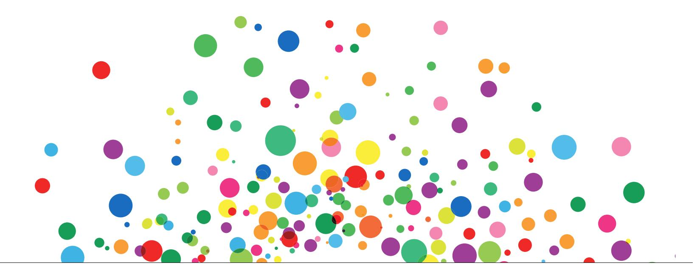

Chapter 6.

## HEALTHY YOUNG MINDS: TRANSFORMING THE MENTAL HEALTH OF CHILDREN

RICHARD LAYARD AND ANN HAGELL

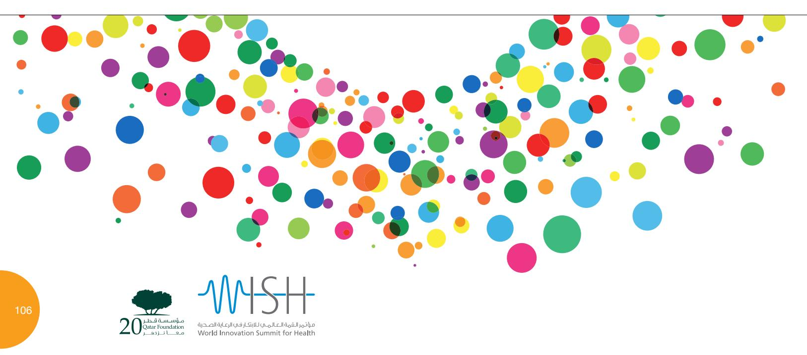

Acknowledgement: This chapter reproduces a report written for the World Innovation Summit for Health (WISH) held in Qatar on 17-18 February 2015. WISH is an initiative of Qatar Foundation for Education, Science and Community Development, chaired by Lord Darzi. The report received invaluable support from a WISH Forum consisting of Hamad Al Ibrahim; Helen Baker-Henningham; Chris Bonell; Zachary Brown; Mark Jordans; Vikram Patel; Linda Richter; Stephen Scott; Chiara Servili; Graham Thornicroft; and, Carolyn Webster-Stratton; and, with help from the WISH Forum team (Will Warburton, Sarah Henderson and Dominic King).

#### **Executive Summary**

Children matter vitally—both as people and as tomorrow's adults. Altogether, 31% of the world's population is aged under 18,1 representing one-third of all human experience. This is the group we focus on in this report, and for convenience we shall refer to them as "children."

What matters most about children is their subjective well-being – how they feel about their lives. This reflects a new shift of emphasis among policy makers worldwide. Increasingly people feel that the success of a society cannot be judged mainly by its level of wealth but rather by how satisfied people are with their lives.2 Nearly all Organisation for Economic Co-operation and Development (OECD) countries now measure adult life satisfaction as a routine statistic,3 and many are considering new forms of policy analysis with this as the objective.

Children differ hugely in their subjective well-being (or "well-being" for short). There is a very wide spectrum. For much of our report we focus on those with mental disorders, who lie at the bottom end of the spectrum. But we also look at the whole spectrum because a general upward shift in well-being can be an excellent way to reduce the numbers at the lowest levels. More fundamentally, there is increasing evidence that nurturing the positive aspects of all young lives is the most effective way of preventing mental disorders.

Children's mental well-being is affected by every aspect of their lives – by their physical health and quality of nutrition, by their wealth and poverty, by discrimination, by war and conflict – and a whole range of other social and economic factors. But it is also affected by more personal factors. First is the family – the stability it offers, the stimulus it provides and the values it nurtures. Then there is the psychological support of the wider community, including the healthcare system, but also a whole range of local social

organizations. And finally there is the school, which leaves its mark on the character of every child. In this report we cannot discuss all the factors that affect children. Instead we concentrate on the role of these more personal factors, and above all on how they can be improved.

Our central focus is on how to reduce mental illness by directly addressing the personal factors that have caused or are sustaining it. This means ensuring that mental disorders are treated when they arise, but also doing our best to prevent them in the first place. Prevention requires a wide approach because there is no reliable way of predicting which children will develop mental health problems. So, when thinking about prevention, we have to think about how to improve the well-being of all children – a task for everyone in our society.

We need a completely new priority to be given to the well-being of children and we make major recommendations about what this would imply – suggestions affecting communities, healthcare systems and schools. We start with three main points.

I. First, the scale of the issue. This is a massive problem. Around 10% of the world's children today are suffering from diagnosable mental health problems.4 Roughly half of these are suffering from anxiety disorders (or, less commonly, depression) and a half from conduct disorder or attention deficit and hyperactivity disorder (ADHD). Approximately 1% of all children suffer from developmental disorders such as autism. Where evidence exists over time. it shows that these problems have increased over the last half century.5 These children are unhappy and disturbed – the quality of their experience is very poor. And the majority of them will also become unhappy adults. The best predictor of whether a child will become a satisfied adult is not their academic achievement but their emotional health in childhood.6 The cost of child mental illness is borne by all of us. Crime is increased,

educational achievement is thwarted and productivity is diminished. Improving children's mental health is a critical issue across the globe, and the messages of this report are as relevant to high-income countries as to low- or middle-income countries.

- 2. Second, treatment and prevention. In the richest countries only a quarter of disturbed children get specialist help,7 and in the poorest countries it is much less. In every country in the world, far fewer children are in treatment if they have mental health problems than if the problem is one of physical illness. This is shocking, because today there are really effective treatments available for children in distress, as well as the opportunity to make major changes in schools and communities that can make the problem less likely in the first place. In treatment there has been a real revolution in the last 30 years. We now have well-researched treatments for child anxiety and depression and for conduct problems, with recovery rates of over 50%, and with effects that are observed to persist. 8 We can also treat maternal depression, which blights the lives of many young children. On prevention, we can use community structures and healthcare systems to promote good parenting, as well as openness and honesty about mental illness. And our schools should become as concerned with the well-being of children as they are with their academic performance. Because any child can develop mental health problems, we need a universal approach to mental health and wellbeing that involves the whole of society.
- 3. Third, economics. For the sake of our common humanity we should use all the tools that are available. But it is also good economics; in most countries, mental illness is reducing gross domestic product (GDP) by over 5%.9 And the net cost of the changes we propose is mostly small. Reorienting schools involves training teachers differently but not training more of them. The main cost is improved healthcare and support for parents. Intensive early intervention with at-risk families is expensive, but has been

shown to save as much as it costs. The same can be true of better treatment facilities. There should be parity of esteem between mental and physical health – children should be as likely to receive help if their problem is mental or physical. This will involve substantial gross cost. In poorer countries it will have to be done through people with less professional training than in richer countries, and with fewer of them. But the savings will be great and will often exceed the costs. We cannot afford not to do it.

In all these endeavors we have the enormous advantage of new technology – above all, the smartphone with internet access. Online programs can contribute hugely to staff training, to the mental health treatment of adolescents, and to life-skills curriculums in schools. Our single most important recommendation is that one or more major charities establish a substantial fund to design such programs that can be available for free worldwide.

#### **Action Points**

This is a short report, which cannot possibly cover the whole field. So we focus on 10 specific things that can be done in every country and that would bring great benefit. These action points are:

- r. Community action: Every local community should have a local child well-being strategy, including an assessment of the needs of children and families, and of the role that can be played by healthcare organizations, schools, community groups, non-government organizations (NGOs), youth and faith organizations.
- **2. Parity of esteem:** Evidence-based healthcare for children and their parents should be equally available whether their disorder is mental or physical.
- **3. Universality:** All health professionals should be trained to identify mental health problems in children, as well as perinatal depression in

mothers. They should be trained to provide general mental health education to parents and, unless more professional services are available, they should also be trained to treat these problems.

- **4. Professionals:** Every country should train more professionals in evidence-based treatments, especially psychological therapy. To develop quality, there should be at least one center of excellence for every region.
- 5. Schools for well-being: The well-being of pupils should be an explicit objective of every school. Schools should have a well-being code (including mutual respect, kindness and play) to which all teachers, parents and pupils subscribe. This should stress the importance of praise rather than criticism.
- **6. Measurement:** Schools should measure pupil well-being regularly.
- **7.** A life-skills curriculum: Schools should use evidence-based methods to provide explicit teaching in life skills for at least an hour a week throughout school life, and more in the early years. This should mainly emphasize dos rather than don'ts.
- **8. Teacher training:** All teachers should be trained in ways to notice and promote child well-being and mental health, and to maintain a civilized learning environment.
- **9. Use of mobiles:** There should be a major international program to develop free smartphone-based approaches to all our recommendations. A major international charity should be asked to support this.
- **10. The Sustainable Development Goals:** The Sustainable Development Goals should include explicit reference to physical *and* mental health.

#### To summarize

There is a massive problem: 10% of our children are suffering from a mental disorder, and under a quarter of these are receiving specialist help for their problem.

We know what to do: For children with mental health problems, there are effective evidence-based psychological treatments that the healthcare system should provide. Every school should promote the well-being of its children, using evidence-based approaches.

The net cost need not be high: Mental illness already imposes high costs on the economy. Above all, hundreds of high-quality online programs should be developed and offered free to children and their caretakers throughout the world.

#### Why Does Child Well-being Matter?

A central aim of any society should be that its children enjoy their lives and acquire the skills necessary to become happy, functioning adults. For this, they need to develop emotional buoyancy, coping skills, resilience and the ability to form constructive social relationships. Social and emotional capacity is a built-in response to experience. The main drivers of children's experiences are parents, teachers, health workers and the community in general. These relationships form the focus of this report. How can these relationships be supported and improved to maximize good outcomes for children? And how can this be achieved given the different challenges posed in low-, middle- and highincome countries?

Some 31% of the world's population is aged under 18. Tof them, around 10% have a diagnosable mental disorder (mainly anxiety, depression or conduct disorder). That means some 220 million children and young people. As Figure 1

shows, the problem affects every country. Of total child morbidity, the World Health Organization estimates that 23% results from mental rather than physical ill-health.14

This is serious enough in itself. But, on top of that, over half the children who experience mental illness in childhood will suffer from mental illness again as adults.15 Their lives are more likely to be impoverished and unhappy – 90% of people who commit suicide are mentally ill. 16 Moreover, mental health affects physical health. Depression reduces life expectancy as much as smoking does.17 It has a more disabling effect than arthritis, diabetes, angina or asthma.18 Mental health is also crucial for a satisfied life. and research on the British Cohort Study reveals a striking finding. If you wish to predict whether a child will grow into a satisfied adult, the best predictor is not the academic achievement of the child but their emotional health.19

The suffering produced by mental illness is the main reason to care. But on top of that there is the economic cost – the sheer waste. So here are some remarkable facts.

- Adult mental illness reduces GDP by at least 5% through reduced productivity or inability to work, and through increased crime and healthcare costs.20
- If we follow children with mental health problems into adult life, we can estimate the cost that they impose on the economy and society at large. For example, in Britain the least-happy tenth of children are 7% poorer as adults than they would otherwise be. This is partly because emotional problems interfere so much with their education and physical health 21
- Equally, children with conduct disorder become four times more likely to commit crime, take drugs, become teenage parents, depend on welfare, and attempt suicide as Table I dramatically demonstrates. It has been estimated that, in Britain, such children may cost the

Figure 1: Prevalence of mental disorders among children under 1922

WORLD HAPPINESS REPORT 2015

Table 1: Behavioral problems at age 7-9 predict problems in later life (New Zealand)24

| Percentage subsequently          | Children whose childhood conduct was in worst 5% | Children whose childhood conduct was in best 50% |
|-------------------------------------|--------------------------------------------------|--------------------------------------------------|
| Committing violent offences (21–25) | 35                                               | 3                                                |
| Drug dependent (21–25)           | 20                                               | 5                                                |
| Teenage parent                      | 20                                               | 4                                                |
| Suicide attempt (to age 25)      | 18                                               | 4                                                |
| Welfare dependent (age 25)       | 33                                               | 9                                                |

taxpayer in criminal justice costs an amount equal to three years' average wages.23

- Action to reduce mental illness among children would produce major savings to society, which should be offset against the costs. For example the Incredible Years training program for parents, teachers and children, described in Box 2, produces enough healthcare savings to offset the cost of training.25 If we add in savings to the criminal justice system, the amount saved is three times the cost.
- When parents are mentally ill, children suffer. Depression attacks one-fifth of all mothers, either during pregnancy or the following year. This takes a heavy toll on mother and child. The children are more likely to develop mental health problems and to require special educational support and, as adults, they are likely to experience reduced earnings. The mother also needs more care. The average cost to society of one case of perinatal depression has been estimated in Britain to equal the average annual wage. 27

By contrast, the cost of successful psychological treatment (assuming a 50% success rate28) is only 5% of that:29 the savings exceed the cost by a factor of 20 to 1. Therefore community health workers need to screen all mothers for depression, and as Box 3 shows, they can also be trained to deliver effective treatment in those countries where more expert specialists are not available.

These simple facts have fundamental policy implications. First, if we care about well-being, then the well-being of children must be a top policy priority for communities and families, healthcare systems and schools.30 This is a matter of basic human rights, as set out in the United Nations Convention on the Rights of the Child. And we must talk about mental health issues much more openly and destigmatize the issue. Second, if we do all of this, we shall certainly incur costs but we will also save huge expenses in the future. So who can do what?

#### Who Can Do What?

A fundamental principle is that it is better to intervene earlier. This applies especially if the child or its parents already have mental health problems. If problems do not resolve themselves quickly, evidence-based support should be provided to the parent, child, or both. But the principle of early intervention applies even more fundamentally to prevention. Supporting families is crucial. Communities need to promote good parenting practices from birth onwards. In most countries this is most easily led by the healthcare system, which is in touch with most families around the time of childbirth. That system is also best placed to detect problems of maternal depression. But education in life skills is needed throughout childhood, when schools become an increasingly important part of a child's life.

Early relationships are critical because the brain's plasticity is highest in young children and they are the most reactive to new influences, whether good or bad. There are marked brain differences between groups of people who have and have not been maltreated as children.31 Attachment is a key capacity for a healthy emotional life. It develops early but it also continues to develop well or badly throughout childhood and adolescence.32 Indeed, the growth spurt in the teenage years is another key period of change and development. So we need institutions that concern themselves with child happiness and well-being from conception to early adulthood.

The exact institutions for delivering support will vary between countries, but there are general principles that apply everywhere. First, there needs to be an integrated approach at the local level, so that no child in need slips through the cracks. This will involve community groups, NGOs, faith organizations and many others.33 But two systems are uniquely well-placed to reach every family: the healthcare system, which is involved even before the child is born, and the school system, which every child should attend.

In the sections that follow, we first review the role of the overarching community, before looking at healthcare and schools.

#### Communities

Children grow up in families that are based in communities, and each community needs a framework for promoting the well-being of its children and families. This needs to include at least the following elements:

- Understanding the extent of the opportunities and problems – what are the particular mental health needs of children in the community?
- Advice for parents on how to bring up children.
- Help for parents with mental health problems, especially perinatal depression.
- Help for parents to develop their children's well-being, and share solutions when things go badly for them or their children.
- Help for children who are in distress.
- Schools that promote good values, encourage happiness and support the suffering.
- Organizations that facilitate the transition to adulthood.

These functions can be performed by many types of service, but what matters is if the overall pattern is adequate to the task.34 Coordination can be provided through local government, community leaders, or ad hoc community groups, but it must happen. This can be adapted to different local contexts, as experiments with the Communities That Care intervention in the United States have illustrated. Communities That Care is a process rather than a program, providing a framework for bringing together key players in the local community to design an action plan specific to the needs of that community. Once needs are clear, a plan is drawn up that uses evidence-based programs to enhance existing services.35 What is implemented will vary from one area to another, but local leadership is central to success.

#### **ACTION POINT 1. COMMUNITY ACTION:**

Every local community should have a local child well-being strategy, including an assessment of the needs of children and families, and of the role that can be played by healthcare organizations, schools, community groups, NGOs, youth and faith organizations.

A good child well-being strategy will set out a vision for what we want, and clear actions on how we will get there. Components are likely to include:

- A forum for bringing together leaders of the key agencies dealing with families and children to ensure that everyone is aiming for the same outcomes.
- Ways of regularly assessing the need for services.

- Investment in child protection services.
- Good universal services for families, combined with specialist and targeted services for children with identified problems.
- High-quality education.
- Opportunities for positive youth experiences.
- Investment in workforce development.

It is especially challenging to cater for children who are victims of violence, yet experience of trauma is clearly related to child mental health outcomes.36 Building resilience and countering the effects of living in conflict zones are critically important for the protection of children's mental health in some areas of the world.37 In Box I we highlight one community-based approach to these problems.

#### Box 1: A psychosocial care system for children in areas of violence38

This multi-tiered psychosocial care system combines mental health promotion, prevention and treatment to address the needs of at-risk children and adolescents in areas of armed conflict. Based in Indonesia, South Sudan, Sri Lanka, Burundi and Nepal, the community-based system of care • Support parents of children with problems is intended to:

- Increase community awareness about children's psychosocial problems (for example, a local radio program in South Sudan).
- networks in Burundi).
- Increase social support systems (developing so-called Child Resilience Groups – semi-structured group activities once a week for five weeks).
- Identify children in need of focused psychosocial support (using a screening instrument developed for the purpose).

- Reduce psychosocial distress (through a 15-session classroom- or community-based intervention involving structured behavioral activities to increase children's capacity to deal with problems posed by being exposed to conflict).
- (through family-oriented psychoeducation).
- Provide individual counseling (or other treatment) to children with severe mental health problems.

• Mobilize community resources for healing (for All services are provided by trained teams, example, establishing child-to-child peer support including community volunteers, teachers, community counselors and mental health professionals. The system is set up to ensure that children can move between the levels and components of the system, depending on need. Supervision is an integral part of the service delivery framework. The system has been successfully evaluated.

In a typical country, rich or poor, roughly 10% of children are suffering from a diagnosable mental disorder (see Figure 1). Some 5% have behavioral disorders, sometimes accompanied by ADHD. Some 5% have mood disorders, mainly anxiety disorders, like social anxiety disorder, panic attacks, obsessive compulsive disorder, and post-traumatic stress disorder, which is especially common in conflict zones (depression becomes common only in the teens). And around 1% of children have neurodevelopmental disorders, like autism. As Figure I shows, there is no systematic pattern of difference between countries or continents. At the same time, 20% of mothers experience depression in pregnancy or in the year after childbirth.39

For all of these conditions there are evidencebased methods of treatment with good rates of effectiveness – many of them based on the ideas of cognitive behavioral therapy (CBT). For mild to moderate conduct disorders, the Incredible Years weekly parent training in groups for up to 24 weeks has good results, even seven years later (see Box 2).40 The training has been effective in a whole range of cultures.41 Fidelity to the basic ideas is crucial, but the detailed content has to be modified according to the culture and experience of the parents in the group. For severe conduct disorder, one-on-one treatments work best, but they are expensive.42 And for ADHD, medication helps 75% of those treated to become symptomfree, but should only be used in serious cases.43

For anxiety problems, CBT yields 50–60% success rates in children over eight.44 Depression can be treated by CBT, interpersonal therapy or, in carefully selected cases, medication – with good success rates.45 This applies also to perinatal mothers suffering from depression.46

## Box 2: The Incredible Years – training for parents of children with conduct disorder47

This is a well-known group training program for parents of children with conduct disorder, meeting weekly over 16 to 24 weeks. The emphasis is on promoting sociable, self-reliant child behavior and calm.

The relevant messages are introduced in a specific set of structured steps (described in a manual):

- I. Playing with the child, non-judgmentally, with the child leading.
- 2. Praise.
- 3. Authoritative rules and instructions, using eye contact.
- 4. Rewards and (small) punishments.

Methods include sharing filmed vignettes of parents in common parenting situations. These trigger discussions leading to interactive learning and improvements in selfmanagement of similar situations. The emphasis given to different elements can change, depending on the parents' cultural background experiences, education, knowledge or values.48

The program has been evaluated in randomized control group trials in the US, Canada, United Kingdom, Wales, Norway, the Netherlands and Portugal. Ongoing research is being done in New Zealand, Denmark, Spain, Hong Kong and Sweden. In the UK, children were followed up seven years later and found to be 80% less likely to have oppositional defiant disorder than those in the control group.49

The shocking thing is that, even in rich countries, most children with mental health problems get no treatment at all. In rich countries the figure is around a quarter and in poorer countries it is much lower.50 The same is true of mothers with perinatal depression.51

This is totally in conflict with the principle of parity of esteem for mental and physical health, which means that a person has equal access to evidence-based treatment whether their disorder is physical or mental. This principle of parity of esteem is now enshrined in law in the UK and the US but there, as elsewhere, more honored in the breach than the observance. This must change.

#### ACTION POINT 2. PARITY OF ESTEEM:

Evidence-based healthcare for children and their parents should be equally available whether their disorder is mental or physical.

But this is only a principle. To make it operational, we need enough suitably trained people to deliver the care. We need a framework in which children, parents and carers in need of help are identified. We also need a system that educates and supports parents to bring up children with good mental health.

The healthcare system is best placed to perform all these roles. Nearly all families interact with the system around the time of childbirth. That is the time primary care health workers identify perinatal maternal depression, and it is the time to offer parents lessons in how to bring up children who will be emotionally stable and well behaved.52 Equally, as the children grow, the healthcare system is well-placed to identify if the child is developing the symptoms of mental disorders. So all healthcare workers need some basic training in identifying mental ill-health in families and in arranging suitable treatment.

But who should actually provide the treatment? The issue here is similar to that in respect of physical illness. In rich countries, we should insist on fully professional care. For example, the recovery rates with treatment by well-trained practitioners are often double or triple those from personnel who are not as well-trained.53 In poorer countries, we have to use the available talent wherever we can find it. So ordinary community health workers should all be trained to deliver psychological therapy and, in many cases, it will be necessary to use non-health community workers as well.54 As Box 3 shows, it can become a routine function of primary health workers to identify and treat maternal depression.

#### Box 3: Treating maternal depression in rural Pakistan55

Community health workers were trained to identify and treat maternal depression, using a CBT-based intervention (the Thinking Healthy Program). The initiative used 16 home-based individual sessions and included active listening, collaboration with the family, guided discovery and homework (that is, trying things out between sessions, practicing what was learned).

Forty local areas were assigned to either intervention or routine care, with about 450 mothers in each group. At follow-up sessions (after six months) the experimental group included 23% still depressed, compared with 53% in the control group. In another study, psychoeducation is being offered to all mothers.56

In all countries, if possible, more intensive help should be offered to the most deprived young families. In the US, Nurse–Family Partnerships provided monthly visits to poor, teenage mothers for three years. Consequently their children behaved better, did better in school and earned more as adults.57 A similar program in Jamaica is described in Box 4.

## Box 4: Psychosocial stimulation to growth-stunted toddlers in Jamaica58

In weekly visits over a two-year period, community health workers taught parenting skills and encouraged mothers and children to interact in ways that develop cognitive and socio-emotional skills. Children were randomized into the trial and 20 years later were found to be earning 25% more than those from the control group. Children in the program were also found to score more highly on cognition, psycho-social skills and schooling attainment as well as showing reduced participation in violent crime.59

In every country there should also be a major expansion in higher-level mental health specialists, especially psychological therapists. England's Improving Access to Psychological Therapies (IAPT) program shows how child mental health services can be quite quickly transformed to deliver evidence-based therapies with measurable outcomes. 60 To promote change, there has to be a center of excellence in every region, which acts as a hub of training and researches and demonstrates good practice. This is as true for poorer countries as it is for richer countries. The quality in such centers can set the tone for the whole system. And they must do research that is relevant to their local problems. Mental health research is grossly underfunded and, within that, child mental health is especially underfunded. That should change.

We need more research on treatments but also much more research on prevention.

So from this discussion emerge two main action points:

ACTION POINT 3. UNIVERSALITY: All health professionals should be trained to identify mental health problems in children, as well as perinatal depression in mothers. They should be trained to provide general mental health education to parents and, unless more professional services are available, they should also be trained to treat these problems.

#### **ACTION POINT 4. PROFESSIONALS:**

Every country should train more professionals in evidence-based treatments, especially psychological therapy. To develop quality, there should be at least one center of excellence for every region.

#### **Schools**

Every parent wants their child to be happy at school and to learn how to become a happy adult. Yet many schools do not see this as a primary objective of their institution. Increasingly in many countries, schools are becoming exam factories. To improve child well-being, this must be reversed, and schools must address the emotional and spiritual education and opportunities for their children in addition to their intellectual development.

There is no conflict between these objectives. In fact, the evidence is clear – if children are happier, that is also good for their intellectual development. For example, a survey of 200 school-based programs to promote the social and emotional skills of children found that children taking these programs gained about 10 percentile points in emotional well-being and behavior as well as in academic achievement. 61 Conversely, low well-being is linked with worse

performance at school. For example, children with emotional or behavioral difficulties are more likely to be excluded from school and to leave school without qualifications.62

So schools should make the well-being of their children a major objective, and this should include the children's sense of social obligation and also how they feel inside: are they fulfilled or are they anxious or depressed? Every school should have a well-being policy, affecting the whole life of the school. There is good evidence that schools with such a policy improve their outcomes on all fronts. 63 A well-being policy should include at least three elements:

- A code of behavior (including an anti-bullying procedure).64
- A system of measuring well-being.
- Explicit teaching of life skills.

ACTION POINT 5. SCHOOLS FOR WELL-BEING: The well-being of pupils should be an explicit objective of every school. Schools should have a well-being code (including mutual respect and support) to which all teachers, parents and pupils subscribe. This should stress the importance of praise rather than criticism.

The well-being code should be designed in consultation with teachers, parents and children, all of whom should explicitly subscribe to it (in some ceremony and/or in writing). As Box 5 suggests, it should cover the basic values (for example, mutual respect) to be applied to all relationships. It should also cover the procedures to be applied when the code is infringed. But the fundamental aim in teacher–pupil relationships (as in parent–child relationships) should be to use praise and positive incentives rather than violence or harshness. 65 Children should be encouraged always to live up to the standards of their better selves. 66

#### Box 5: An illustrative school well-being code

#### OUR AIMS

- Our aim is to promote the happiness of every child, and equip each child to become a happy adult who contributes to the happiness of others.
- We also aim to develop academic competence and above all a love of learning. But this is easier to achieve if a child is happy. The two aims are thus complementary and not in competition.

#### TO ACHIEVE OUR AIMS, WE WILL ENSURE THAT:

- All members of the school (teachers, parents and children) treat each other with respect, using encouragement and praise rather than shame or criticism as the chief form of incentive.
- Bullying of one child by another is unacceptable and we have clear procedures for identifying it and dealing with it.
- We have explicit systems for developing values in our children, such as adopting one value as the "value of the month," for example caring, trust, honesty, courage.
- Our aims are fully reflected in all school activities, including assemblies.
- All teachers are comfortable talking about values and the necessity of developing good values and good habits throughout a child's life at school.
- We draw strongly on the evidence of what programs work best for developing specific life skills and devote at least one hour a week to evidence-based teaching of life skills throughout the school life.
- All our teachers are able to talk openly and positively about problems of mental health, and identify and get support for those needing help.

The questionnaires used will also help schools to recognize the children who are experiencing difficulties that might not otherwise be identified.

While children's behavior is easy to see, their inner world is much less visible. If we assess children's physical health when they go to school, it is surely wrong to not also assess their mental health. If a child is in distress, they should be offered help from a person with special competence in mental health. One possible questionnaire is illustrated in Table 2.

# **ACTION POINT 6. MEASUREMENT:** Schools should measure pupil well-being regularly.

Schools need an ethos that promotes children's well-being and identifies children who are languishing; but they should also devote at least an hour a week to education in life skills. Children and young people need to learn how to understand and manage their own emotions, understand others and care for them, manage their sexual relationships responsibly, eat and drink sensibly and avoid drugs, understand mental disorders and what can be done about them, understand parenting, manage their responses to modern media and choose positive life goals.

There are now hundreds of programs that have been developed worldwide to address one or more of these issues. Many of these programs have been rigorously evaluated on the whole age cohort in a school and been found to produce good results, at least in the short run. This was the finding of Durlak et al. that we quoted earlier,67 and it related to impacts in the first six months after the programs ended. But, in the few cases where children have been followed up over a longer period, the effects have often been found to fade over time and, in many cases, to disappear.68 This is not surprising given that the programs typically average 20 hours. We should also note that many quite famous programs have had at least one trial that found no effects.69

This leads to two important conclusions. First, if children are to develop good life skills, they need more than one or two 20-hour programs: they need a whole curriculum of life skills, at least once a week throughout the school life. As Aristotle observed, good habits are learned through interesting repetition in varying contexts. Second, this curriculum should be evidence- based and depend as little as possible on inspired improvisation by the teacher. It is universally found that the best results follow from using detailed materials accompanied by a good manual on how to use them and some explicit training of the teachers: (this is not so different from what is needed for a good surgical operation).7° And the best results always come from offering a positive vision rather than warnings about what not to do.

The obvious way forward is to draw on the most successful programs worldwide and to combine them into a single curriculum. For II- to I4-year-olds, Table 3 illustrates such a curriculum that is being trialed in the Healthy Minds experiment in 34 English schools.72 Mindfulness training will be used as a standard practice in every session, since it has already established itself as a reliable way in which children can calm themselves and improve their well-being.73

Table 2: An illustrative way of measuring well-being in children aged 13 and over (the Warwick-Edinburgh Mental Wellbeing Scale)71

Below are some statements about feelings and thoughts. Please tick the box that best describes your experience of each over the last 2 weeks.

| Statements                                               | None of the time | Rarely | Some of the time | Often | All of the time |
|----------------------------------------------------------|------------------|--------|---------------------|-------|--------------------|
| I've been feeling optimistic about the future            | I                | 2      | 3                   | 4     | 5                  |
| I've been feeling useful                              | I                | 2      | 3                   | 4     | 5                  |
| I've been feeling relaxed                             | I                | 2      | 3                   | 4     | 5                  |
| I've been feeling interested in other people       | I                | 2      | 3                   | 4     | 5                  |
| I've had energy to spare                              | I                | 2      | 3                   | 4     | 5                  |
| I've been dealing with problems well                  | I                | 2      | 3                   | 4     | 5                  |
| I've been thinking clearly                               | I                | 2      | 3                   | 4     | 5                  |
| I've been feeling good about myself                   | I                | 2      | 3                   | 4     | 5                  |
| I've been feeling close to other people                  | I                | 2      | 3                   | 4     | 5                  |
| I've been feeling confident                           | I                | 2      | 3                   | 4     | 5                  |
| I've been able to make up my own mind about things | I                | 2      | 3                   | 4     | 5                  |
| I've been feeling loved                               | I                | 2      | 3                   | 4     | 5                  |
| I've been interested in new things                       | I                | 2      | 3                   | 4     | 5                  |
| I've been feeling cheerful                            | I                | 2      | 3                   | 4     | 5                  |

\*Warwick-Edinburgh Mental Well-Being Scale (WEMWBS) © NHS Health Scotland, University of Warwick and University of Edinburgh, 2006, all rights reserved. www2.warwick.ac.uk/fac/med/research/platform/wemwbs/

| Торіс                | Program used                                                 |
|----------------------|--------------------------------------------------------------|
| Resilience           | Penn Resilience Program; 75 MoodGym 76 |
| Compassion           | Relationship Smarts                                          |
| Sexual relationships | SexEd Sorted                                                 |
| Drugs                | Unplugged                                                    |
| Eating and alcohol   | SHAHRP 77                                         |
| Mental disorders     | Science of Mental Illness 78                      |
| Parenting            | Parents Under Construction 79                     |
| Media awareness      | Media Navigator                                              |
| Life goals           | Schools to Life                                              |
| Mindfulness          | Breathe 80                                        |

For primary age children, the most respected curriculum of social and emotional learning is that provided by the Promoting Alternative Thinking Strategies (PATHS) program, which includes 130 lessons over a one-year period.81 Another admirable program which aims to develop moral sense and pro-social behavior is the Good Behavior Game, where children in a primary school class are divided into teams and each team is scored according to the number of times a member of the team breaks one of the behavior rules. If there are fewer than five infringements, all members of the team get a reward. Children in the treatment and control groups were followed up to age 19-21, and those in the treatment group had significantly

lower use of drugs, alcohol and tobacco, and significantly lower frequency of anti-social personality disorders.82

Incredible Years also has a child-training program for primary age young children, called the Incredible Years Dinosaur Social and Emotional Curriculum. It has been successfully evaluated both as a small group treatment program for young children with conduct problems and ADHD, as well as an indicated prevention program for high-risk children in schools that address high levels of families living in poverty.83

One finding from all these programs is that the children who benefit most are, on average, those

who start off with the greatest problems. But this is not an argument for targeted intervention. That would involve an unacceptable degree of stigma and exclude many others who stand to gain. Also, the programs are not expensive. Once teachers have been trained, they involve little extra expense – they become part of the school curriculum.

ACTION POINT 7. A LIFE-SKILLS CURRICULUM: Schools should use evidence-based methods to provide explicit teaching in life skills for at least an hour a week throughout school life, and more in the early years. This should mainly emphasize dos rather than don'ts.

Whether they teach life skills or not, all teachers should have basic training in how to promote child well-being and identify mental health problems in children. As suggested in Table 2, there are already easy-to-complete short questionnaires that teachers can use to identify young people who are struggling with high levels of psychological difficulties. In teacher—

child relationships, the same principles apply as in parent training: the importance of praise and of calm. These things can be learned by teachers in well-designed programs lasting five to eight days (see Box 6). This results in better-behaved children and a better learning environment.84

#### **ACTION POINT 8. TEACHER TRAINING:**

All teachers should be trained in ways to notice and promote child well-being and mental health, and to maintain a civilized learning environment.

#### Box 6: Training teachers to improve children's conduct in Jamaica85

Teachers in 12 community preschools were given eight days training in an adapted version of the Incredible Years teacher training program, using the principles of praise and calm. The participating schools were randomly selected from 24 schools, with another 12 acting as control groups. In all 24 schools, three children were followed in each

class (those with the worst pre-trial conduct). Following the trial, children's observed classroom behavior, teacher-reported and parent-reported behavior all improved significantly in schools using the program, relative to the control groups. School attendance also improved.

#### Mobilizing the Mobile

To implement all our recommendations, one of the most effective ways will be to harness the power of cheap, ubiquitous mobile telephone technology. In many low- and middle-income countries there may still be limited access to personal computers or landline telephones, but the majority of the world's young people have access to mobile telephones.86 And they love them. As the power of each generation of telephones increases exponentially, these phones are evolving into personal hand-held computers.

Year-on-year, access to information and communication technologies (ICTs) continues to grow. In 2013, nearly all of the world's population had access to a mobile cellular signal, and around 40% had access to mobile broadband. The number of mobile subscriptions used worldwide grew from fewer than 1 billion in 2000 to over 6 billion in 2011, of which nearly 5 billion were in low- and middle-income countries. The UN estimates that more people have access to a cell phone than a toilet (6 billion compared with 4.5 billion respectively). Mobile telephone apps are becoming widespread; 30 billion were downloaded in 2011—and this figure will continue to rise.

There are well-known dangers associated with the internet – online bullying, premature exposure to adult sexuality and so on. But the internet also offers a huge opportunity to bring to billions of children, parents and teachers tools that can transform their mental health. There are already exciting examples of well-being interventions that can be delivered online or through mobile telephone apps (see Boxes 7 and 8). 90 Not all programs work, and most work best when there is some human contact as well. But we firmly believe that this is an important part of the way forward, and that a concerted effort to develop new approaches using this technology is needed.

To make this happen rapidly requires a major coordinated effort. This could usefully be led by one or more major international charities. It is highly desirable that the resulting products become available worldwide free of charge – the intellectual property of the world. To develop such free products would require significant charitable money. It is hard to think of a more deserving cause than the well-being of children worldwide.91

#### **ACTION POINT 9. USE OF MOBILES:**

There should be a major international program to develop free smartphone-based approaches to all our recommendations. A major international charity should be asked to support this.

## Box 7: A computerized CBT game to treat depression (SPARX)92

In the online game SPARX, the young person chooses an avatar and, facing a series of challenges, learns how to restore balance in a fantasy world dominated by GNATS (Gloomy Negative Automatic Thoughts). The computerized program has seven modules and involves no significant contact with clinicians. It has been trialed on 94 New Zealand adolescents seeking help for depression, with an equal number randomized to face-to-face counseling. Remission rates were 44% in the CBT group and 28% for the control group.

## Box 8: A computerized CBT program for anxiety (Cool Teens)93

Cool Teens is a game on CD-ROM that consists of eight, half-hour modules that young people undertake, together with a weekly 15-minute call to a therapist. Compared with a randomized control group on a waiting list, the average participant shed at least one anxiety disorder.

#### Conclusion

We hope to have shown that:

- Children's well-being and mental health is vitally important, and there are high levels of untreated problems.
- We have good evidence-based ways to improve this.
- The cost of doing so is manageable, since so many other costs are saved.

The key principles are early intervention to support families, parity of treatment within the healthcare system, and children's well-being included as a major objective for schools.

These issues are moving up the political agenda, but far too slowly. Two things could make a real difference:

- Mental health should appear explicitly in the post-2015 Sustainable Development Goals.
- Countries could have a Cabinet Minister for Mental Health.

If something is really important, it should be reflected in policymaking structures. We cannot continue as if academic success is almost all that matters for a child.

**ACTION POINT 10. THE SUSTAINABLE DEVELOPMENT GOALS:** The Sustainable
Development Goals should include explicit
reference to physical and mental health.

- I UNICEF (2014).
- 2 O'Donnell et al. (2014).
- 3 OECD (2013).
- 4 Global Burden of Disease Study 2010 (2012).
- 5 Twenge et al. (2010), Layard & Dunn (2009), Collishaw et al. (2004), West & Sweeting (2003), Rutter & Smith (1995).
- 6 Layard et al. (2014).
- 7 Ford et al. (2007).
- 8 Kim-Cohen et al. (2003), Kessler et al. (2005).
- 9 OECD (2014), Layard & Clark (2014).
- 10 Society for Research in Child Development (2010), McDaid et al. (2014).
- 11 UNICEF (2014).
- 12 WHO (2003), Kieling et al. (2011).
- 13 Global Burden of Disease Study 2010 (2012).
- 14 Ibid.
- 15 Kim-Cohen et al. (2003), Kessler et al. (2005).
- 16 Williams (2001).
- 17 Mykletun et al. (2009). See also Danese et al. (2007).
- 18 Moussavi et al. (2007).
- 19 Layard et al. (2014).
- 20 OECD (2012), OECD (2014), Layard & Clark (2014), p. 86.
- 21 Layard et al. (2014).
- 22 Global Burden of Disease Study 2010 (2012).
- 23 Scott et al. (2001), see also Beecham (2014).
- 24 Fergusson et al. (2005), Table 1.
- 25 Knapp et al. (2011), Table 13, Bonin et al. (2011). For an analysis of a school-based intervention in Canada (Better Beginnings, Better Futures) that paid for itself, see Society for Research in Child Development (2010). For a general survey of the economic case for investing in the well-being of young people, see McDaid et al. (2014).
- 26 Rahman et al. (2013).
- 27 Bauer et al. (2014), Tables 1 and 2.

- 28 Dobson et al. (2008).
- 29 Assuming an average cost of a course of CBT to be £650; so, if 50% is recovered, the cost is £1,300. This is roughly 5% of the average annual wage.
- 30 See in particular the WHO Mental Health Action Plan 2013–20 adopted by the World Health Assembly.
- 31 Lim et al. (2014).
- 32 Groh et al. (2014).
- 33 Patel et al. (2013), Harper Browne (2014).
- 34 Bessenecker & Walker (2004), Rahman et al. (2013).
- 35 For a community-wide approach in the US and Colombia using the Communities That Care approach, see Hawkins et al. (2008), and Pérez-Gómez et al. (2014). For Qatar's approach to mental health, see Supreme Council of Health (2013).
- 36 Attanayake et al. (2009).
- 37 Tol et al. (2013).
- 38 Jordans et al. (2010), Jordans et al. (2011), Jordans et al. (2013), Tol et al. (2008), Tol et al. (2014).
- 39 Rahman et al. (2013).
- 40 Scott et al. (2014).
- 41 Webster-Stratton (2009).
- 42 Roth & Fonagy (2005).
- 43 Ibid.
- 44 Barrett et al. (1996).
- 45 Roth & Fonagy (2005).
- 46 Stuart & Koleva (2014), Rahman et al. (2008).
- 47 Webster-Stratton (Forthcoming).
- 48 Webster-Stratton (2009).
- 49 Scott et al. (2014).
- 50 On North America and Europe, see Ford et al. (2007), p. 16, Patel & Thornicroft (2009), Kohn et al. (2004).
- 51 Demyttenaere et al. (2004), Wang et al. (2007).
- 52 Cowan & Cowan (2000).
- 53 Scott et al. (2008).
- 54 Patel et al. (2013), Chowdhary et al. (2013).

- 55 Rahman et al. (2008).
- 56 Zafar et al. (2014).
- 57 Olds et al. (1998).
- 58 Gertler et al. (2014).
- 59 Walker et al. (2011).
- 60 Clark (2011), Layard & Clark (2014), Chapter 12.
- 61 Durlak et al. (2011).
- 62 Gutman & Vorhaus (2012), Weber & Ruch (2012).
- 63 Weare & Nind (2011).
- 64 Takizawa et al. (2014).
- 65 Webster-Stratton et al. (1989).
- 66 Farrer (2000).
- 67 These findings related to rich countries. For a systematic review of school-based interventions in low- and middle-income countries, see Barry et al. (2013) and Durlak et al. (2011).
- 68 Challen et al. (2014).
- 69 These include beyondblue Sawyer et al. (2010); Triple P Little et al. (2012), Eisner et al. (2012); Resourceful Adolescent Programme Stallard et al. (2012); The Incredible Years on sub-clinical groups of children, as opposed to those with diagnoses Scott et al. (2014).
- 70 Humphrey et al. (2010).
- 71 Maheswaran et al. (2012).
- 72 For the review of possible programs and their effects, see Hale et al. (2011). See also; Fazel et al. (2014).
- 73 Kuyken et al. (2013).
- 74 Bailey (2014). See www.howtothrive.org/healthy-minds/ for further details.
- 75 Brunwasser et al. (2009).
- 76 Calear et al. (2009).
- 77 McKay et al. (2011), McBride et al. (2004).
- 78 Watson et al. (2004).
- 79 Backscheider & Hawkins (2000).
- 80 Kuyken et al. (2013)
- 81 Kelly et al. (2004), Curtis & Norgate (2007).

- 82 Kellam et al. (2008), Ialongo et al. (1999).
- 83 Webster-Stratton et al. (2008), Webster-Stratton et al. (2004).
- 84 Webster-Stratton et al. (2011), Reinke et al. (2012), Webster-Stratton et al. (2001), Davenport & Tansey (2009).
- 85 Baker-Henningham et al. (2012).
- 86 In 2013, it was estimated that there were 96 mobilecellular telephone subscriptions per 100 inhabitants/ households in the world. ITU (2013) and GSM & NTT DOCOMO (2012).
- 87 ITU (2013).
- 88 World Bank (2012).
- 89 UN News Center. [Online press release]. *Deputy UN Chief* calls for urgent action to tackle global sanitation crisis.
  21 March 2013. Available at: www.un.org/apps/news/story.asp?NewsiD=44452#.VF9erzQgt8E
- 90 For a review of e-therapies for people under 18, see NCCMH (March 2014), Ye et al. (2014). Also see Mayo-Wilson & Montgomery (2013).
- 91 Jones et al. (2014).
- 92 Merry et al. (2012).
- 93 Wuthrich et al. (2012).

#### References

Attanayake, V., McKay, R., Joffres, M., Singh, S., Burkle, F., & Mills, E. (2009). Prevalence of mental disorders among children exposed to war: A systematic review of 7,920 children. *Medicine, Conflict and Survival*, *2*5, 3-17.

Backscheider, A., & Hawkins, J. (2000). Teaching children parenting skills: An interim evaluation of the primary prevention program 4-6 and 7-12 curricula at one year. Houston: Houston advocates for mental health in children.

Bailey, L. (2014). Healthy Minds – The Curriculum Journey: How To Thrive.

Baker-Henningham, H., Scott, S., Jones, K., & Walker, S. (2012). Reducing child conduct problems and promoting social skills in a middle-income country: Cluster randomised controlled trial. *British Journal of Psychiatry*, 201, 101-108.

Barrett, P. M., Dadds, M. R., & Rapee, R. M. (1996). Family treatment of childhood anxiety: A controlled trial. *Journal of Consulting and Clinical Psychology*, 64(2), 333-342.

Barry, M. M., Clarke, A. M., Jenkins, R., & Patel, V. (2013). A systematic review of the effectiveness of mental health promotion interventions for young people in low and middle income countries. *BMC Public Health*, *13*(835). doi: 10.1186/1471-2458-13-835

Bauer, A., Parsonage, M., Knapp, M., Iemmi, V., & Adelaja, B. (2014). *The costs of perinatal mental health problems*. LSE & Centre for Mental Health.

Beecham, J. (2014). Annual research review: Child and adolescent mental health interventions: A review of progress in economic studies across different disorders. *Journal of Child Psychology and Psychiatry*, 55(6), 714-732.

Bessenecker, C., & Walker, L. (2004). Reaching communities for child health: Advancing health outcomes through multi-sectoral approaches. Washington (DC): CORE.

Bonin, E.-M., Stevens, M., Beecham, J., Byford, S., & Parsonage, M. (2011). Costs and longer-term savings of parenting programmes for the prevention of persistent conduct disorder: A modelling study. *BMC Public Health*, 11(803).

Brunwasser, S. M., Gillham, J. E., & Kim, E. S. (2009). A meta-analytic review of the Penn Resiliency Program's effect on depressive symptoms. *Journal of Consulting and Clinical Psychology*, 77(6), 1042–1054. doi: 10.1037/a0017671

Calear, A. L., Christensen, H., Mackinnon, A., Griffiths, K. M., & O'Kearney, R. (2009). The YouthMood Project: A cluster randomized controlled trial of an online cognitive behavioral program with adolescents. *Journal of Consulting and Clinical Psychology*, 77(6), 1021-1032.

Challen, A. R., Machin, S. J., & Gillam, J. E. (2014). The UK Resilience Programme: A school-based universal non-randomized pragmatic controlled trial. *Journal of Consulting and Clinical Psychology*, 82(1), 75-89. doi: 10.1037/a0034854

Chowdhary, N., Sikhander, S., Atif, N., Sing, N., Fuhr, D., Rahman, A., & Patel, V. (2013). The content and delivery of psychological interventions for perinatal depression by non-specialist health workers in low and middle income countries: A systematic review. Best Practice & Research Clinical Obstetrics and Gynaecology, 28, 113–133.

Clark, D. M. (2011). Implementing NICE guidelines for the psychological treatment of depression and anxiety disorders: The IAPT experience. *International Review of Psychiatry*, 23, 318-327.

Collishaw, S., Maughan, B., Goodman, R., & Pickles, A. (2004). Time trends in adolescent mental health. *Journal of Child Psychology and Psychiatry*, 45(8), 1350-1362. doi: 10.1111/j.1469-7610.2004.00335.X

Cowan, C. P., & Cowan, P. A. (2000). When partners become parents: The big life change for couples. Mahwah, NJ: Lawrence Erlbaum Associates.

Curtis, C., & Norgate, R. (2007). An evaluation of the Promoting Alternative Thinking Strategies curriculum at Key Stage I. *Educational Psychology in Practice*, *23*(I), 33-44.

Danese, A., Pariante, C. M., Caspi, A., Taylor, A., & Poulton, R. (2007). Childhood maltreatment predicts adult inflammation in a life-course study. *PNAS*, 104(4), 1319-1324. doi: 10.1073/pnas.0610362104

Davenport, J., & Tansey, A. (2009). Outcomes of an Incredible Years classroom management programme with teachers from multiple schools. Trinity College Dublin/National Educational Psychological Service. Retrieved from http://incredibleyears.com/research-library/

Demyttenaere, K., Bruffaerts, R., Posada-Villa, J., Gasquet, I., Kovess, V., Lepine, J. P., ... WHO World Mental Health Survey Consortium. (2004). Prevalence, severity, and unmet need for treatment of mental disorders in the World Health Organisation World Mental Health Surveys. *JAMA*, 291(21), 2581-2590.

Dobson, K. S., Hollon, S. D., Dimidjian, S., Schmaling, K. B., Kohlenberg, R. J., Gallop, R., ... Jacobson, N. S. (2008). Randomized trial of behavioral activation, cognitive therapy, and antidepressant medication in the prevention of relapse and recurrence in major depression. *Journal of Consulting and Clinical Psychology*, 76(3), 468-477. doi: 10.1037/0022-006X.76.3.468

Durlak, J. A., Weissberg, R. P., Dymnicki, A. B., Taylor, R. D., & Schellinger, K. B. (2011). The impact of enhancing students' social and emotional learning: A meta-analysis of school-based universal interventions. *Child Development*, 82(1), 405-432.

Eisner, M., Nagin, D., Ribeaud, D., & Malti, T. (2012). Effects of a universal parenting program for highly adherent parents: A propensity score matching approach. *Prevention Science*, 13(3), 252-266. doi: 10.1007/SII12I-01I-0266-x

Farrer, F. (2000). A quiet revolution. London: Rider.

Fazel, M., Patel, V., Thomas, S., & Tol, W. (2014). Mental health interventions in schools in low-income and middle-income countries. *The Lancet Psychiatry*, 1(5), 388-398.

Fergusson, D. M., Horwood, L. J., & Ridder, E. M. (2005). Show me the child at seven: The consequences of conduct problems in childhood for psychosocial functioning in adulthood. *Journal of Child Psychology and Psychiatry*, *46*(8), 837-849. doi: 10.111/j.1469-7610.2004.00387.x

Ford, T., Hamilton, H., Meltzer, H., & Goodman, R. (2007). Child mental health is everybody's business: The prevalence of contact with public sector services by type of disorder among British school children in a three-year period. *Child and Adolescent Mental Health*, 12(1), 13–20.

Gertler, P., Heckman, J., Pinto, R., Zanolini, A., Vermeersch, C., Walker, S., Chang, S. M., & Grantham-McGregor, S. (2014). Labor market returns to an early childhood stimulation intervention in Jamaica. *Science*, 344(6187), 998-1001. doi: 10.1126/science.1251178

Global Burden of Disease Study 2010. (2012). Global burden of diseases, injuries, and risk factors study 2010. Seattle: Institute for Health, Metrics and Evaluation.

Groh, A. M., Roisman, G. I., Booth-LaForce, C., Fraley, R. C., Owen, M. T., Cox, M. J., & Burchinal, M. R. (2014). Stability of attachment security from infancy to late adolescence. *Monographs of the Society for Research in Child Development*, 79(3), 51-66.

Groupe Speciale Mobile (GSM) Association and NTT DOCOMO's Mobile Society Research Institute. (2012). *Children's use of mobile phones: An international comparison* 2012. Available from www.gsma.com/publicpolicy/wp-content/

Gutman, L. M., & Vorhaus, J. (2012). The impact of pupil behaviour and wellbeing on educational outcomes *Research* report DFE-RR253. London: Department for Education

Hale, D., Coleman, J., & Layard, R. (2011). A model for the delivery of evidence-based PSHE (Personal Wellbeing) in secondary schools. *CEP Discussion Paper No. 1071*. London: LSE Centre for Economic Performance.

Harper Browne, C. (2014). The strengthening families approach and protective factors framework: Branching out and reaching deeper. Washington (DC): Center for the Study of Social Policy.

Hawkins, J. D., Brown, E. C., Oesterle, S., Arthur, M. W., Abbott, R. D., & Catalano, R. F. (2008). Early effects of Communities That Care on targeted risks and initiation of delinquent behavior and substance use. *Journal of Adolescent Health*, 43(1).

Humphrey, N., Lendrum, A., & Wigelsworth, M. (2010). Social and emotional aspects of learning (SEAL) programme in secondary schools: National evaluation *Research report DFE-RR049*. London: Department for Education.

Ialongo, N. S., Werthamer, L., Kellam, S. G., Brown, C. H., Wang, S., & Lin, Y. (1999). Proximal impact of two first-grade preventive interventions on the early risk behaviors for later substance abuse, depression, and antisocial behavior. *American Journal of Community Psychology*, 27(5), 599-641.

International Telecommunications Union (ITU). (2013). *Measuring the information society*. Available from http://www.itu.int/en/ITU-D/Statistics/Documents/publications/mis2013/MIS2013\_without\_Annex\_4.pdf

Jones, S. P., Patel, V., Saxena, S., Radcliffe, N., Al-Marri, S. A., & Darzi, A. (2014). How Google's 'ten things we know to be true' could guide the development of mental health mobile apps. *Health Affairs*, 33(9), 1603-1611.

Jordans, M., Komproe, I., Tol, W., Susanty, D., Vallipuram, A., Ntamutumba, P., Lasuba, A., & de Jong, J. (2011). Practice-driven evaluation of a multi-layered psychosocial care package for children in areas of armed conflict. *Community Mental Health Journal*, 47(3), 267-277.

Jordans, M., Tol, W., Susanty, D., Ntamatumba, P., Luitel, N., Komproe, I., & de Jong, J. T. (2013). Implementation of a mental health care package for children in areas of armed conflict: A case study from Burundi, Indonesia, Nepal, Sri Lanka, and Sudan. *PLOS Medicine*, 10(1), e1001371.

Jordans, M. J., Tol, W. A., Komproe, I. H., Susanty, D., Vallipuram, A., Ntamatumba, P., Lasuba, A. C., & de Jong, J. T. (2010). Development of a multi-layered psychosocial care system for children in areas of political violence. *International Journal of Mental Health Systems*, 4(15). doi: 10.1186/1752-4458-4-15

126

Kellam, S. G., Brown, C. H., Poduska, J. M., Ialongo, N. S.,

- Kelly, B., Longbottom, J., Potts, F., & Williamson, J. (2004). Applying emotional intelligence: Exploring the Promoting Alternative Thinking Strategies curriculum. *Educational Psychology in Practice*, 20(3), 221-240. doi: 10.1080/0266736042000251808
- Kessler, R. C., Berglund, P., Demler, O., Jin, R., Merikangas, K. R., & Walters, E. E. (2005). Lifetime prevalence and age-of-onset distributions of *DSM-IV* disorders in the National Comorbidity Survey Replication. *Archives of General Psychiatry*, *62*, 593-602.
- Kieling, C., Baker-Henningham, H., Belfer, M., Conti, G., Ertem, I., Omigbodun, O., Rohde, L. A., Srinath, S., Ulkuer, N., & Rahman, A. (2011). Child and adolescent mental health worldwide: Evidence for action. *The Lancet*, 378(9801), 1515-1525.
- Kim-Cohen, J., Caspi, A., Moffitt, T. E., Harrington, H., Milne, B. J., & Poulton, R. (2003). Prior juvenile diagnoses in adults with mental disorder: Developmental follow-back of a prospective-longitudinal cohort. *Archives of General Psychiatry*, 60, 709-717.
- Knapp, M., McDaid, D., & Parsonage, M. (Eds.). (2011). *Mental health promotion and mental illness prevention: The economic case.* London: Department of Health.
- Kohn, R., Saxena, S., Levav, I., & Saraceno, B. (2004). The treatment gap in mental health care. *Bulletin of the World Health Organisation*, 82(11), 858-866.
- Kuyken, W., Weare, K., Ukoumunne, O. C., Vicary, R., Motton, N., Burnett, R., ... Huppert, F. (2013). Effectiveness of the Mindfulness in Schools Programme: Non-randomised controlled feasibility study. *British Journal of Psychiatry*, 203(2), 126-131. doi: 10.1192/bjp.bp.113.126649
- Layard, R., Clark, A. E., Cornaglia, F., Powdthavee, N., & Vernoit, J. (2014). What predicts a successful life? A life-course model of well-being. *The Economic Journal*, 124(F720-738).
- Layard, R., & Clark, D. M. (2014). Thrive: The power of evidence-based psychological therapies. London: Penguin.
- Layard, R., & Dunn, J. (2009). A good childhood: Searching for values in a competitive age. London: Penguin.
- Lim, L., Radua, J., & Rubia, K. (2014). Gray matter abnormalities in childhood maltreatment: A voxel-wise meta-analysis. *American Journal of Psychiatry*, 171(8), 854-863.
- Little, M., Berry, V., Morpeth, L., Blower, S., Axford, N., Taylor, R., ... Tobin, K. (2012). The impact of three evidence-based programmes delivered in public systems in Birmingham, UK. *International Journal of Conflict and Violence*, 6(2), 260-272.

- Maheswaran, H., Weich, S., Powell, J., & Stewart-Brown, S. (2012). Evaluating the responsiveness of the Warwick Edinburgh Mental Well-Being Scale (WEMWBS): Group and individual level analysis. *Health and Quality of Life Outcomes*, 10(156).
- Mayo-Wilson, E., & Montgomery, P. (2013). Media-delivered cognitive behavioural therapy and behavioural therapy (self-help) for anxiety disorders in adults. *Cochrane Database of Systematic Reviews*, 9(9), CD005330.
- McBride, N., Farringdon, F., Midford, R., Meuleners, L., & Phillips, M. (2004). Harm minimization in school drug education: Final results of the School Health and Alcohol Harm Reduction Project (SHAHRP). *Addiction*, *99*(3), 278-291.
- McDaid, D., Park, A.-L., Currie, C., & Zanotti, C. (2014). Investing in the wellbeing of young people: Making the economic case. In McDaid & Cooper (Eds.), *The economics of wellbeing: Wellbeing: A complete reference guide, Volume V* (pp. 181-214). Hoboken (NJ): Wiley Blackwell.
- McKay, M. T., McBride, N. T., Sumnall, H. R., & Cole, J. C. (2011). Reducing the harm from adolescent alcohol consumption: Results from an adapted version of SHAHRP in Northern Ireland. *Journal of Substance Use*, 17, 98-121.
- Merry, S. N., Stasiak, K., Shepherd, M., Frampton, C., Fleming, T., & Lucassen, M. F. G. (2012). The effectiveness of SPARX, a computerised self help intervention for adolescents seeking help for depression: Randomised controlled non-inferiority trial. *BMJ*, 344, e2598.
- Moussavi, S., Chatterji, S., Verdes, E., Tandon, A., Patel, V., & Ustun, B. (2007). Depression, chronic diseases, and decrements in health: Results from the World Health Surveys. *The Lancet*, 370(9590), 851-858.
- Mykletun, A., Bjerkeset, O., Overland, S., Prince, M., Dewey, M., & Stewart, R. (2009). Levels of anxiety and depression as predictors of mortality: The HUNT study. *British Journal of Psychiatry*, 195, 118-125.
- National Collaborating Centre for Mental Health. (March 2014). *E-therapies systematic review for children and young people with mental health problems*. Available from http://bit.ly/IAGgaUb
- O'Donnell, G., Deaton, A., Durand, M., Halpern, D., & Layard, R. (2014). *Wellbeing and policy*. London: Legatum Institute
- OECD. (2012). Sick on the job? Myths and realities about mental health and work. Paris: OECD Publishing.
- OECD. (2013). Guidelines on measuring subjective well-being. Paris: OECD Publishing.
- OECD. (2014). Making mental health count: The social and economic costs of neglecting mental health care, *OECD Health Policy Studies*. Paris: OECD Publishing.

- Olds, D., Henderson, C. R., Cole, R., Eckenrode, J., Kitzman, H., Luckey, D., ... Powers, J. (1998). Long-term effects of nurse home visitation on children's criminal and antisocial behavior: 15-year follow-up of a randomized controlled trial. *JAMA*, 280(14), 1238-1244. doi: 10.1001/jama.280.14.1238
- Patel, V., Kieling, C., Maulik, P. K., & Divan, G. (2013). Improving access to care for children with mental disorders. *Archives of Disease in Childhood*, *98*(5), 323-327.
- Patel, V., & Thornicroft, G. (2009). Packages of care for mental, neurological and substance use disorders in low- and middle-income countries. *PLOS Medicine*, 6(10), e1000160.
- Pérez-Gómez, A., Mejía-Trujillo, J., Brown, E. C., & Eisenberg, N. (2014). Adaptation and implementation of a science-based prevention system in Colombia: Challenges and achievements. *University of Washington mimeo*.
- Rahman, A., Malik, A., Sikander, S., Roberts, C., & Creed, F. (2008). Cognitive behaviour therapy-based intervention by community health workers for mothers with depression and their infants in rural Pakistan: A cluster-randomised controlled trial. *The Lancet*, *372*(9642), 902–909. doi: 10.1016/S0140-6736(08)61400-2
- Rahman, A., Surkan, P., Cayetano, C., Rwagatare, P., & Dickson, K. (2013). Grand challenges: Integrating maternal mental health into maternal and child health programmes. *PLoS Med*, 10(5), e1001442. doi: 10.1371/journal. pmed.1001442
- Reinke, W. M., Stormont, M., Webster-Stratton, C., Newcomer, L. L., & Herman, K. C. (2012). The Incredible Years Teacher Classroom Management program: Using coaching to support generalization to real-world classroom settings. *Psychology in the Schools*, 49(5), 416-428. doi: 10.1002/pits.21608
- Roth, A., & Fonagy, P. (Eds.). (2005). What works for whom? A critical review of psychotherapy research. New York: Guilford Press.
- Rutter, M., & Smith, D. (1995). *Psychosocial disorders in young people: Time trends and their causes.* Chichester: John Wiley & Sons.
- Sawyer, M. G., Pfeiffer, S., Spence, S. H., Bond, L., Graetz, B., Kay, D., Patton, G., & Sheffield, J. (2010). School-based prevention of depression: A randomised controlled study of the beyondblue schools research initiative. Journal of Child Psychology and Psychiatry, 51(2), 199-209.
- Scott, S., Briskman, J., & O'Connor, T. G. (2014). Early prevention of antisocial personality: Long-term follow-up of two randomized controlled trials comparing indicated and selective approaches. *American Journal of Psychiatry*, 171(6). doi: 10.1176/appi.ajp.2014.13050697
- Scott, S., Carby, A., & Rendu, A. (2008). Impact of therapists' skill on effectiveness of parenting groups for child antisocial behavior. *Institute of Psychiatry, King's College London and University College London mimeo*.

- Scott, S., Knapp, M., Henderson, J., & Maughan, B. (2001). Financial cost of social exclusion: Follow-up study of antisocial children into adulthood. *British Medical Journal*, 323(7306), 1-5.
- Society for Research in Child Development. (2010). The Better Beginnings, Better Futures project: Findings from grade 3 to grade 9. *Monographs of the Society for Research in Child Development*, 75(3), 100-120, (Chapter V). doi: 10.1111/j.1540-5834.2010.00582.x
- Stallard, P., Sayal, K., Phillips, R., Taylor, J. A., Spears, M., Anderson, R., ... & Montgomery, A. A. (2012). Classroom based cognitive behavioural therapy in reducing symptoms of depression in high risk adolescents: Pragmatic cluster randomised controlled trial. *British Medical Journal*, 345(7878), e6058. doi: 10.1136/bmj.e6058
- Stuart, S., & Koleva, H. (2014). Psychological treatments for perinatal depression. *Best Practice & Research Clinical Obstetrics & Gynaecology*, 28(1), 61-70.
- Supreme Council of Health. (2013). Qatar national mental health strategy: Changing minds, changing lives 2013-2018.
- Takizawa, R., Maughan, B., & Arseneault, L. (2014). Adult health outcomes of childhood bullying victimization: Evidence from a five-decade longitudinal British birth cohort. *American Journal of Psychiatry*, 171(7), 777-784. doi: 10.1176/appi.ajp.2014.13101401
- Tol, W., Komproe, I., Jordans, M., Ndayisaba, A., Ntamutumba, P., Sipsma, H., Smallegange, E., Macy, R., & de Jong, J. (2014). School-based mental health intervention for children in war-affected Burundi: A cluster randomized trial. *BioMed Central (BMC) Medicine*, 12(56).
- Tol, W., Komproe, I., Susanty, D., Jordans, M., & de Jong, J. (2008). School-based mental health intervention for political violence-affected children in Indonesia: A cluster randomized trial. *Journal of the American Medical Association (JAMA)*, 300, 655–662.
- Tol, W. A., Song, S., & Jordans, M. J. D. (2013). Annual research review: Resilience and mental health in children and adolescents living in areas of armed conflict A systematic review of findings in low- and middle-income countries. *Journal of Child Psychology and Psychiatry*, 54(4), 445-460.
- Twenge, J. M., Gentile, B., DeWall, C. N., Ma, D., Lacefield, K., & Schurtz, D. R. (2010). Birth cohort increases in psychopathology among young Americans, 1938-2007: A cross-temporal meta-analysis of the MMPI. *Clinical Psychology Review*, 30, 145-154. doi: 10.1016/j.cpr.2009.10.005
- UNICEF. (2014). The state of the world's children 2014 in numbers. Available from www.unicef.org/sowc2014/numbers/
- Walker, S., Chang, M., Vera-Hernandez, M., & Grantham-McGregor, S. (2011). Early childhood stimulation benefits adult competence and reduces violent behaviour. *Pediatrics*, 127(5), 849–857.

Wang, P. S., Aguilar-Gaxiola, S., Alonso, J., Angermeyer, M. C., Borges, G., Bromet, E. J., ... Wells, J. E. (2007). Use of mental health services for anxiety, mood, and substance disorders in 17 countries in the WHO world mental health surveys. *The Lancet*, *370*(9590), 841-850.

Watson, A. C., Otey, E., Westbrook, A. L., Gardner, A. L., Lamb, T. A., Corrigan, P. W., & Fenton, W. S. (2004). Changing middle schoolers' attitudes about mental illness through education. *Schizophrenia Bulletin*, *30*(3), 563-572.

Weare, K., & Nind, M. (2011). Mental health promotion and problem prevention in schools: What does the evidence say? *Health Promotion International*, *26*(S1), i29-i69. doi: 10.1093/ heapro/dar075

Weber, M., & Ruch, W. (2012). The role of a good character in 12-year-old school children: Do character strengths matter in the classroom? *Child Indicators Research*, *5*(2), 317-335.

Webster-Stratton, C. (2009). Affirming diversity: Multicultural collaboration to deliver the Incredible Years Parent Programs. *International Journal of Child Health and Human Development*, *2*(1), 17-32.

Webster-Stratton, C. (Forthcoming). The Incredible Years Parent Programs: The methods and principles that support fidelity of program delivery. In J. Ponzetti (Ed.), *Evidence-based parenting education: A global perspective*. Routledge, Taylor and Francis Group.

Webster-Stratton, C., Hollinsworth, T., & Kolpacoff, M. (1989). The long-term effectiveness and clinical significance of three cost-effective training programs for families with conductproblem children. *Journal of Consulting and Clinical Psychology*, *57*(4), 550-553.

Webster-Stratton, C., Reid, M., & Hammond, M. (2004). Treating children with early-onset conduct problems: Intervention outcomes for parent, child, and teacher training. *Journal of Clinical Child and Adolescent Psychology*, *33*(1), 105–124.

Webster-Stratton, C., Reid, M. J., & Hammond, M. (2001). Preventing conduct problems, promoting social competence: A parent and teacher training partnership in Head Start. *Journal of Clinical Child Psychology*, *30*(3), 283-302.

130 131 Webster-Stratton, C., Reid, M., & Stoolmiller, M. (2008). Preventing conduct problems and improving school readiness: Evaluation of the Incredible Years teacher and child training programs in high-risk schools. *Journal of Child Psychology and Psychiatry*, *49*(5), 471–488.

Webster-Stratton, C., Reinke, W. M., Herman, K. C., & Newcomer, L. L. (2011). The Incredible Years Teacher Classroom Management training: The methods and principles that support fidelity of training delivery. *School Psychology Review*, *40*(4), 509-529.

West, P., & Sweeting, H. (2003). Fifteen, female and stressed: Changing patterns of psychological distress over time. *Journal of Child Psychology and Psychiatry*, *44*(3), 399-411.

Williams, J. M. G. (2001). *Suicide and attempted suicide*. London: Penguin.

World Bank. (2012). *Information and communications for development 2012: Maximizing mobile*. Available from http://bit.ly/1pAfMiW

World Health Organisation (WHO). (2003). *Caring for children and adolescent with mental disorders: Setting WHO directions*. Geneva: World Health Organisation.

Wuthrich, V., Rapee, R., Cunningham, M., Lyneham, H., Hudson, J., & Schniering, C. (2012). A randomized controlled trial of the Cool Teens CD-ROM computerized program for adolescent anxiety. *Journal of the American Academy of Child and Adolescent Psychiatry*, *51*(3), 261-270. doi: 10.1016/j. jaac.2011.12.002

Ye, X., Bapuji, S. B., Winters, S. E., Struthers, A., Raynard, M., Metge, C., ... Sutherland, K. (2014). Effectiveness of internet-based interventions for children, youth, and young adults with anxiety and/or depression: A systematic review and meta-analysis. *BMC Health Services Research*, *14*(313). doi: 10.1186/1472-6963-14-313

Zafar, S., Sikander, S., Haq, Z., Hill, Z., Lingam, R., Skordis-Worrall, J., Hafeez, A., Kirkwood, B., & Rahman, A. (2014). Integrating maternal psychosocial well-being into a child-development intervention: The five-pillars approach. *Annals of the New York Academy of Sciences*, *1308*, 107-117.

WORLD HAPPINESS REPORT 2015

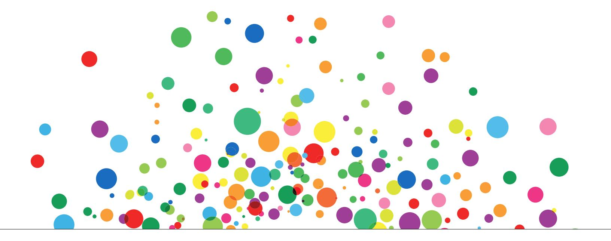

## Chapter 7.

# HUMAN VALUES, CIVIL ECONOMY, AND SUBJECTIVE WELL-BEING

LEONARDO BECCHETTI, LUIGINO BRUNI, STEFANO ZAMAGNI

# 1. The underpinnings of Civil Economy: human values, relational goods, subjective well-being and "public happiness"

Economics today looks like physics before the discovery of electrons. Economists "discovered," classified and studied in detail characteristics of private goods, public goods and even common goods, but they have only recently come to study more intensively the role and relevance of relational goods. The importance of human values and relational life for economic health and subjective well-being is still largely underestimated, and is a fascinating field for future research.

At the root of the current problem lies three forms of reductionism: i) anthropological reductionism by which human beings are conceived as homines economici2 (100% self-interested individuals) and not as *personae*, that is, human beings whose subjective well-being largely depends on the quality of their social life; ii) corporate reductionism by which all productive organizations need to be unfettered profit maximizers that prioritize the expectations of one category of stakeholders (shareholders) over all the others (customers, workers, suppliers, local communities); iii) value reductionism by which value is narrowly identified with GDP and not as the stock of economic, environmental, cultural, spiritual and relational goods that a community should enjoy.

The Civil Economy research program endeavors to show theoretically and empirically that economic productivity and subjective well-being may be significantly enhanced when one goes beyond these three forms of reductionism.

Within a general equilibrium perspective, the reductionist approach assumes that the aggregation of the actions of *homines economici* and of profit maximizing firms may be heroically transformed into a social optimum and common good by the forceful action of two (invisible and visible) hands: the invisible hand of market competition which reconciles a multiplicity of self-regarding

actions, and the visible hand of benevolent, perfectly informed institutions and regulators. The latter are assumed to be strong enough not to be captured by those who are being regulated. The visible and invisible hands reconcile private and social optimum by addressing market failures due to asymmetric information, public goods and externalities.

As widely demonstrated by the recent global financial crisis, the two (invisible and visible) hands tend too often to be affected by cramps and so, when left alone, they generate an outcome that is largely suboptimal in terms of both economic performance and subjective well-being.3 On the contrary, the Civil Economy perspective states that societal well-being is the fruit of a four-handed endeavor: the role of the two hands, to be effective, needs to be reinforced by the two additional hands of both responsible citizens and corporations. In essence it proposes to overcome the three-sided reductionist approach and introduce into the system; i) a share of non-reductionist (not purely self-interested) human beings who get happier with socially and environmentally responsible (consumption, saving, work) actions; and ii) a share of non-profit maximizing multi-stakeholder productive organizations. When doing so, the socioeconomic system has the potential to create economic value in a socially and environmentally responsible way, thereby producing authentic economic health. While emphasizing the bottom-up action of non-purely-self-interested individuals and organizations, the Civil Economy does not neglect the traditional role of institutions, since such bottom-up action is a forceful complement to and not a substitute for these institutions.

In what follows we explain theoretically and empirically why the Civil Economy paradigm (where human values play a fundamental role) may work and is already at work to transform the current socioeconomic environment for the better. More specifically, in the second section we illustrate the rich historical and philosophical roots of Civil Economy. In the third section we

discuss from a theoretical point of view why the current reductionist perspective may be harmful both in terms of economic and human health. In the fourth section we introduce the fundamental concept of relational goods. In the fifth section we provide ample empirical evidence from experimental behavioral economics challenging the reductionist paradigm and documenting that the two additional hands of responsible citizens and corporations are already at work. In the sixth section we provide evidence on the nexus between human and civic values and economic prosperity. The seventh section concludes the paper with some policy suggestions.

#### 2. Historical roots of Civil Economy

The Civil Economy paradigm has its roots in the "classic" tradition of moral philosophy, the so-called Aristotelian-Thomistic approach, which found a significant expression in social sciences within the Italian tradition of Civil Economy.4 This tradition represents an important attempt to keep alive within modernity the tradition of civil life based on friendship (Aristotle's notion of *philia*) and a more socialized idea of person and community. Central to this tradition is the role of Antonio Genovesi, a Neapolitan philosopher and economist, who lived around the same time as Smith. In many key aspects of their thought Genovesi and Smith are surprisingly similar, but there are also important differences.

The Civil Economy tradition of the eighteenth century may be seen as the modern expression of the civil tradition that originated in Aristotelian Greece and was rediscovered in the Middle Ages. Like the first civil humanists, Genovesi sees civil life as the place where happiness may be fully realized thanks to good and just laws, to trading, and to the civil bodies where men are free to practice their natural sociability: "Even if companionship can bring evils, on the other hand it also assures life and its goods; it is the source of the greatest pleasures, unknown to the men of nature."

On the natural (and non-artificial) character of sociality and on its essential role for a fully humane and happy life, Genovesi is also aligned with the ancient Aristotelian-Thomistic tradition: "Every person has a natural and inherent obligation to study how to procure her happiness; but the political body is made of persons; therefore, the entire political body and each of its members has an obligation to do what is on their part, i.e. all that they know and can for the sake of common prosperity, as long as that which is done does not offend the rights of the other civil bodies."

At the heart of the view of a social life in common. held by the authors of the Neapolitan school of Civil Economy (not only Genovesi), is the idea that "mere" sociability, man's character as a "political animal," cannot suffice to distinguish the human from other animals. The kind of sociality that is typical of human beings is a *qualified* type of sociality—which we must call reciprocity, friendship, mutual assistance, or fraternity, all basically synonyms in the vocabulary of Genovesi and of the other authors belonging to this tradition: "Man is a naturally sociable animal: goes the common saving. But not every man will believe there is no other animal on earth that is not sociable... In what way then is man more sociable than the others? ... [in] the reciprocal right to be assisted and consequently his reciprocal obligation to assist us in our needs."7 This passage contains something that we do not find in Aristotle or in Smith: for Genovesi, reciprocity (not only a general relationality, nor simple sociability) is the typical element of human sociality. For Smith, by contrast, what constitutes the typical character of human sociality is the "propensity in human nature ... to truck, barter, and exchange one thing for another,"8 founded, as we have seen, on the power of persuasion.

Genovesi portrays market relationships as relations of mutual assistance, hence neither impersonal nor anonymous. In fact, the market itself is conceived as an expression of the general law of society, i.e. reciprocity. This is both clear, and important, especially in his analysis of trust, or "public faith," which lies at the heart of his *Lezioni di economia civile*.

For the civil humanists the market is a matter of fides, i.e. trust. One of the key elements in Genovesi's theory of Civil Economy is "public faith," something he considers as the true precondition for economic development: "confidence is the soul of commerce, and without confidence all the component parts of this mighty structure would crumble under it."9 In his thought there is a substantial difference between *private* and *public* trust: while the first can be associated with reputation, i.e. a private good which can be "spent" on the market, the latter is not the sum of private "reputations;" rather, it entails genuine love for the Common Good (as intended in the classical philosophical tradition, i.e. Aristotle or Aquinas). This concept is similar to what modern theorists have called "social capital," that is, the fabric of faith and civil virtues that allows human and economic development to get into motion and preserve itself over time

According to Genovesi, the lack of "public faith" is what caused the lack of civil and economic development in the Kingdom of Naples—an argument that more than two and a half centuries later has lost none of its currency. In this Kingdom, as denounced by the tradition of Civil Economy, "private trust" (intended in particular as blood ties or bonds based on feudal pacts of vassalage), or honor, was abundant, but public and generalized trust, the kind that originates from the cultivation of civil virtues, was scant. Some decades later Gaetano Filangieri similarly maintained that no civil and economic development can be achieved without man having "confidence in the government, the magistrates, and his fellow citizens,"100 who are the first and most important resources for any kind of collective and individual development.

If on one side market development brings civil and economic development, for the Neapolitan school it is even more important to stress that *cultivating* public faith is the precondition for any possible discourse concerning civil and economic development: "nothing is more necessary than public trust in a wise and easy circulation." Very significant is also this footnote by Genovesi: "This word *fides* means rope that ties and unites. Public faith is therefore the bond of families united in companionship."

The civil economist then takes one further step. In the *Lezioni*, Genovesi explains to his students and fellow-citizens that public faith is above all a matter of authentic reciprocity, and not merely a matter of contracts.12 According to the Neapolitan economist, public faith is not the kind of capital that can be built outside the market and later be used on the market. On the contrary, the market is conceived as part of civil society, which produces what today we would call social capital and relational goods. For this reason his discourse on public faith is directly economic: "Where no trust exists—not in the part that constitutes the reciprocal confidence of citizens in each other, nor in the certainty of contracts, or in the vigour of laws, or in the science and integrity of judges ... there is no certainty of contracts, no power of laws, no trust of man towards man. Because contracts are bonds and civil laws are also themselves public pacts and contracts."13

The reference to Genovesi makes the case for further integrating social relations in happiness studies alongside the other standard determinants of happiness (income, unemployment, inflation, personality traits, socio-demographic and political and institutional factors). In this respect the Civil Economy paradigm encompasses eudaimonic analyses of happiness based on a particular version of the capabilities approach (CA) of Amartya Sen and Martha Nussbaum. The eudaimonic approach heavily relies upon the Aristotelian concept of the good life and appeals to the common shared intuition that there is more to life than a mere balance of pleasure and

pain along Benthaminian lines. Authenticity, self-actualization, participation, and purpose in life are elements to the lay concept of well-being.

As it is well known, the core of the CA is its focus on what people are effectively capable of doing and being. The basic idea advanced by this approach is that people should have more freedom to live the kind of life they have reason to value. It follows that the CA is not insensitive at all to mental states such as desire-fulfillment or happiness. Rather, what the CA claims is that people's capabilities to function come "before," in a logical sense, what one can reasonably ask people in questions of the type: "how subjectively happy do you feel" or "how happy are you these days." This is tantamount to saying that capabilities "precede," ontologically, subjective well-being declarations. Thus it is shown in Figure 2.2 in Chapter 2 of this Report that freedom to live the type of life people choose is one of the six key factors underpinning higher life evaluations.

## 3. The reductionist view as a constraint to social and economic progress

The crucial role of reciprocity and civic virtues for economic prosperity emphasized in the historical roots of Civil Economy challenges the "anthropological and social reductionism" we generally observe today. The problem of anthropological reductionism does not question the premise of individual rationality (that is, the consistent pursuit of a goal given constraints), but what we usually assume as arguments in the utility function. Binmore and Shaked implicitly support this point of view when they say we do not need to abandon the standard approach to accommodate other-regarding arguments in utility functions, since there is no "selfishness axiom" necessarily attached to it and no commitment to a particular fixed preference structure.14 Their thought is effectively explained when saying that the standard (utility maximizing) rationality

paradigm may accommodate preferences of both Attila the Hun or St. Francis of Assisi.15

The issue of anthropological reductionism therefore concerns the fact that, even though much progress has been made recently in this field (see sections 5 and 6), the benchmark still considered in many economic models is the old narrow view of human preferences. This hinges primarily on self-interest and largely ignores preferences such as altruism, strategic altruism, inequity aversion or reciprocity. In the section that follows we refer to the ample empirical evidence in support of the fact that deviations from the reductionist view on human preferences are huge, and that relational activities and community involvement are important drivers of life satisfaction. The anthropological reductionism, however, is not just a problem because the homo economicus is a behavior followed by a minority of individuals and producing suboptimal results in terms of life satisfaction (see Engel 2010 and section 5 below). It is also a problem because its behavior is suboptimal from the individual and social points of view. This last point is well addressed by "social dilemmas" that include, among others, trust games, Prisoner's Dilemmas, weakest link games and stag hunt games.

The main characteristics of social dilemmas are intuitively described by the well known Hume's Apologue where two neighboring farmers fail to cooperate in a "sequential harvest game" due to their lack of empathy and lack of trust, thereby producing the undesirable result of the loss of their crops. 16 The main message that will be later formalized in trust games by Berg et al. is that in social dilemmas with asymmetric information and incomplete contracts, such as that narratively described by Hume, the homo economicus form of rationality produces suboptimal individual and social outcomes by depriving individuals of enhanced gains from cooperation.17 Since most social and economic interactions have the characteristics of social dilemmas, the "reductionist" approach on human preferences turns out to be socially harmful (as widely

shown in the more recent literature surveyed in section 5), since purely self-regarding attitudes produce suboptimal individual and social outcomes that are inferior to those generated by other-regarding (i.e. team or we-thinking) attitudes.18

#### 4. Relational goods

One of the main reasons for the incapacity to broaden our view beyond the simplistic approach to the utility function and to go beyond anthropological reductionism is the missing concept of relational goods. Mainstream economists view relationships as a kind of background for market activity, or as useful and functional elements in the exchange or production of goods and services that are fully independent and distinct from the individual characteristics of agents and that are the typical objects of economic study.19

In recent decades, however, attention has been given to relational themes such as trust, social capital, networking, and reciprocity. Words that were rarely used in the tradition of economics, such as brotherhood, spiritual capital, and intrinsic motivations, are beginning to enter the lexicon. In the light of this development, and also thanks to the space created within the discipline of economics for such categories,20 relational goods today represent a rising field of theoretical and empirical research.

The basic idea of the concept of relational goods – which may vary in terms of technical detail, and in part in content – is to assign the status of economic good (or evil) to relationships in themselves since each human relationship is an infinitely "greater" fact than the economic dimension alone. But, nevertheless, relational goods can be understood and described also as economic goods; that is, as realities to which people attribute economic value alongside other non-economic values, and from which they obtain well-being. With relational goods, the

relationships among people (doing things together) are what increases utility and not the goods in themselves.

It is possible to identify the following as the basic characteristics of relational goods:21

- 1. *Identity:* The identity of the individuals involved is a fundamental ingredient since "goods which arise in exchanges where anyone could anonymously supply one or both sides of the bargain are not relational."22
- 2. Reciprocity: Inasmuch as they are goods made of relationships, they can only be enjoyed reciprocally. "Mutual activity, feeling, and awareness are such a deep part of what love and friendship are that Aristotle is unwilling to say that there is anything worthy of the name of love or friendship left, when the shared activities and the forms of communication that express it are taken away."23
- 3. Simultaneity: In contrast with normal market goods, whether private or public, where production is technically and logically separate from consumption, relational goods (such as many personal services) are simultaneously produced and consumed—the good is co-produced and co-consumed at the same time by those involved. Although the contribution to the production of the meeting may be asymmetric (consider the organization of a party among friends or the management of a social cooperative), in the act of consuming a relational good a pure free rider is not possible, since, to be enjoyed, the relational good requires that one become involved in a relationship with the characteristics that we are listing.24
- 4. Motivations: In genuinely reciprocal relationships the motivation behind the behavior is an essential component. The same encounter—for example, a dinner—may create only standard goods or relational goods as well, based on the motivations of those involved. If the relationship is not an end, but only a means to something else (e.g. doing business), we cannot talk about relational goods.25

5. Emergent Fact: Relational goods emerge within a relationship. Perhaps the category of "emergent fact" captures the nature of a relational good more than the economic category of "production." That is, the relational good is a "third" that exceeds the contributions of those involved, which in many cases was not among the initial intentions. This is why a relational good can emerge within a normal market transaction, when at a certain point, right in the middle of an ordinary instrumental market relationship, something happens that leads those involved to transcend the reasons for which they had met.26

6. Gratuitousness: An essential characteristic of relational goods is gratuitousness, in the sense that a relational good is such if the relationship is not "used" for anything else, if it is lived out as a good in itself, and arises from intrinsic motivations.27 This is why, as Martha Nussbaum claims, a relational good is a good in which the relationship is the good—a relationship that is not an encounter based on self-interest, but a gratuitous encounter. A relational good requires the presence of intrinsic motivations toward that particular relationship.

7. Good: Finally, another essential way of defining a relational good is focusing on the noun: it is a good but it is not a *commodity* (in Marx's terminology). That is, it has a value (because it satisfies a need) but it does not have a market price (precisely because of gratuitousness), though it always has an "opportunity cost."

These points, taken together, imply that relational goods present characteristics that are combinations of what economics call private and public goods. To understand the peculiar nature of relational goods, it is necessary to free oneself from the dichotomy of "public good" and "private good," and from the idea of a good as a means or instrument for reaching something (utility) that is external to the relationship. In fact, as long as we try to situate relational goods among private goods (such as a pair of shoes or a sandwich, which are "rival" and exclusive goods in consumption) or, alternatively, among public

goods (that is, non-rival goods, which tend to be non-exclusive), we remain within the nonrelational paradigm. Neither of the definitions of "private good" or "public good" imply in fact any relationship among those people involved; the only difference between the two types of goods is the presence or absence of "interference" in consumption. The consumption of a public good is simply consumption by isolated individuals independently of each other. Consider the use of an uncongested road, or two or more people admiring the same painting in a museum: the good is public as long as the consumption by one does not interfere with that of the other. This is what is implied by the hypothesis of non-rivalry in public goods, but it can be enjoyed without any relationship or production of relational goods. It is therefore misleading to attempt to locate relational goods among public goods, because, we claim, it is more scientifically fertile to consider relational goods as a third genus of goods.

## 5. Empirical evidence on the relevance of human values and Civil Economy

The above is important not only from a theoretical point of view. Empirical evidence from lab experiments and revealed preferences demonstrates that subjective well-being is heavily influenced by relational goods and that social and economic behavior is far from being identifiable with the homo economicus paradigm: individuals significantly deviate in their choices from the homo economicus model and their subjective well-being is enhanced by not purely self-interested choices.

Straightforward evidence of other-regarding attitudes in individual choices comes, among others, from i) donations, ii) voluntary activities, iii) consumers and investors paying ethical premia, iv) lab experiments on Dictator Games, and v) life satisfaction studies.

Statistical evidence on donations documents that in the US around 90% of the population donated money in 2009 (for a total amount of \$303.75 billion, around 2% of GDP),28 while around 26% "worked for nothing,"29 becoming volunteer workers in a not-for-profit organization.30 Both experiental studies and survey evidence (Table 2.1 in Chapter 2 of this Report) show that people are happier in just these circumstances.

A non-negligible share of individuals in most countries volunteer: the highest shares of population vounteering in registered organizations are in Canada (38.1%) and Australia (37.9%) and it is reasonable to assume that the real numbers are larger if we include those volunteering outside established organizations. The ILO acknowledges that "Volunteer work provides a sense of personal satisfaction, fulfillment, well-being and belonging to persons who volunteer." It has recently created a common accounting standard to measure volunteer work (in hours or in value), and reports that volunteers are around 12% of the adult population in 37 countries (140 million people), with activity equivalent to that of 20.8 million full-time equivalent paid workers that generates a \$400 billion contribution to the global economy.31

Even though not all donating and volunteering choices may be explained by other-regarding preferences and may also depend on strategic reasons,32 they expose individuals to the social risk of not being reciprocated, and are largely pursued to satisfy intrinsic motivations and other-regarding preferences.

Further empirical evidence in support of the relevance of human values in economic choices comes from revealed other-regarding preferences of the growing number of individuals "voting with the wallet" for products of companies that create economic value in socially and environmentally responsible ways. The Nielsen Globally Conscious Consumer survey finds that 46% of respondents in a sample of 28,000 consumers

in 56 countries are willing to pay a premium price for goods and services from companies adopting corporate social responsibility strategies.33 Even though the contingent evaluation literature34 tells us that these figures are likely to be biased upwards, the actual market shares of individuals voting with their wallets for ethical or green products show that consumption and savings are sophisticated acts, where material goals are just one driver of choices together with status, cultural and social motivations.35

The evidence provided below documents that a significant share of individuals follow what are apparently a non-purely-self-regarding behaviors by donating time, money and paying a premium for ethical features of consumption goods and financial investment. The interpretation of these facts is not unambiguous since strategic reasons may mix up with purely altruistic motivations. Results from lab experiments are therefore particularly important since they may test and reject specific assumptions on individual preferences with ad hoc treatments that control for all other potential confounding factors, and may be replicated by other researchers for different groups of individuals and time periods. The typical experiments used to investigate characteristics of human preferences are Dictator Games,36 Ultimatum Games,37 Gift Exchange Games,38 Trust Games39 and Public Good Games.40

The main finding of these experiments is that departures from purely self-regarding behavior are massive. A related fundamental result (in Prisoner's Dilemmas, Public Good Games and Trust Games) is that individuals facing social dilemmas depart from purely self-regarding behavior (and expect that other participants would do the same) since such departures produce superior outcomes from both an individual and a social point of view. The dilemma is that the superior outcome is produced only if the counterpart will also follow the same (cooperative) route of action. Many individuals, however, accept such social risk and their confidence, if reciprocated, is productive from an economic point of view.

of the homo economicus the dictator gives nothing since a donation would reduce her own monetary payoff. Note that, since the game ends with her move, the dictator has no strategic reasons to donate. In order to avoid the possibility that generosity would be driven by friendship or sympathy for a counterpart, standard Dictator Games are generally played under the maximum social distance since the giver plays with a computer and cannot see who is on the other side.

A meta-study by Engel examines results from around 328 different Dictator Game experiments for a total of 20,813 observations. The result is that only around 36% of individuals follow Nash rationality and give zero (based on these numbers the author can reject the null hypothesis that the dictator amount of giving is 0 with z = 35.44, p < .0001) and more than half give no less than 20%.

The most important results confirming what has

Games where departures from the self-regarding

reasons. In the Dictator Game a player is given

an amount of money and can decide whatever

part of it to donate to a second player. After this

Under the reductionist anthropological paradigm

paradigm cannot be explained by strategic

move there is no reply and the game ends.

been written above, however, come from Dictator

When analyzing factors affecting departures from the homo economicus behavior we find that the share of dictators giving zero falls to 28% if the money property rights are of the recipient and the dictator may take from him, 25% if players handle real money in the game, and 19% if the recipient is deserving (i.e. is identified as poor).42 A further interesting result is that student experiments (which are the vast majority of treatments) underestimate deviations from the self-regarding paradigm. Students are slightly closer to the homo economicus behavior (40%) while only 20% of children, 10% of middle age players and almost none of the elders behave in this way.43

Engel concludes his meta-analysis by saying that "While normally a sizeable fraction of participants does indeed give nothing, as predicted by the payoff maximisation hypothesis, only very rarely this has been the majority choice. It by now is undisputed that human populations are systematically more benevolent than homo economicus."

Another impressive set of results comes rom the meta-analysis of Johnson and Mislin on 162 trust games with more than 23,000 observations.45 As is well known, the trust game is a sequential game in which the trustor has the first move and may give part of her endowment to a second player (the trustee). The amount of money sent by the trustor is tripled when transmitted to the trustee, who may in turn decide how much of what she received to send back to the trustor. After the trustee moves the game ends. As is well known, the Nash equilibrium of the game is the one in which both trustor and trustee send zero under the assumption that there is common knowledge that both players behave as homines economici. Deviations from the Nash equilibrium for the trustor may be generally due to strategic reasons, inequity aversion and pure altruism. Trustees have no strategic reasons to give back money and may deviate from the Nash solution due to inequity aversion, pure altruism and reciprocity or kindness.

The meta-analysis reports average amounts sent by trustors and trustees in 35 different countries (equally weighting each experiment). The highest average amount is sent by trustees in Asia (.46) and the lowest in Africa (.32). All average contributions are significantly different from zero even though, differently from what occurs in the Dictator Game meta-experiment of Engel, we do not have information about the share of individuals following Nash rationality.

The above mentioned lab experiments have helped researchers to identify specific forms of other-regarding preferences in which contributing

to the well-being of others significantly and positively affects one's own well-being. Individuals feel a disutility for inequality, an obligation to reciprocate for the kindness received and may have the well-being of others in their utility functions. Technically speaking the implied broadened preference pattern has been shown to include elements of (positive and negative) reciprocity,46 other-regarding preferences,47 inequity aversion,48 social-welfare preferences,49 and various forms of pure and impure (warm glow) altruism.50 One of the most fascinating directions of research in this field is to investigate drivers and laws of motion of non-other-regarding preferences. Studies such as the Henrich et al. experiment on primitive ethnic groups51 and Becchetti et al. experiment comparing trusting attitudes of bridge and poker players52 document that everyday activities contribute to shape individual preferences. In this respect whale hunters and bridge players reveal superior social capital than, respectively, farmers and poker players, since their commonly practiced activity requires and rewards team thinking.

## 6. Empirical evidence on human values, relational goods and subjective well-being

More than two centuries later, the fundamental aspects of the discourse on Genovesi and Civil Economy remain absolutely topical and relevant they eloquently explain the absence of joy in any people who exclude the sometimes risky but deeply rewarding giving relationships with others.

Contemporary social sciences now widely recognize the decisive role of interpersonal relations, particularly those that are genuine, in the development of a good life. Research concerning the so-called paradox of happiness53 shows that it is the quality of genuine relational life (in a non-instrumental sense) that carries most of the weight, even compared to income, in people's estimation of subjective well-being.

A first robust bulk of empirical evidence on the relationship between human values, relational goods and subjective well-being may be found in psychological studies. In Kahneman et al.,54 900 Texas women were asked to assess how they spent their time, using his Day Reconstruction Method (DRM). The results showed that in 14 of 15 activities carried out during a day (in all except prayer), the women interviewed reported a greater self-evaluation of their own well-being when their activities were carried out in the company of other people. Furthermore, when psychologists analyze the characteristics of those who consider themselves more satisfied (and who are considered so by others), it emerges without exception that these people have meaningful and positive interpersonal relationships.55

Psychological studies thus offer much data that confirm the importance of relational life for people's happiness and satisfaction. Some scholars have defined relatedness as a primary need essential to well-being.56 In particular, scientists who consider themselves part of the eudaimonistic school of thought, inspired by Aristotle, hold that there is a universal nexus between the quality of human relationships and subjective well-being: "The evidence supports that the bond between relatedness and subjective well-being is complex. The studies suggest that, of all the factors that influence happiness, relatedness is very near the top of the list... Furthermore, loneliness is consistently negatively related to positive affect and life satisfaction."57

Evidence on the positive impact of relational goods on life satisfaction is also becoming widespread in economic studies. An important reference in the empirical literature is Helliwell documenting the presence of this nexus in two of the largest international databases containing information on life satisfaction, the World Values Survey and the Gallup World Poll.58 This empirical research documents that relational ties (marriage or living as married), voluntary activity and the number of people whom respondents can rely on are significantly and positively related to life

empirical analyses of life satisfaction data irrespective of geographical and time differences, and in studies where such variables are just used as socio-demographic controls. Along this line, Bruni and Stanca on the basis of the data of the World Values Survey (264,000 observations originating from 80 countries, between 1980 and 2003) find a strong correlation between the time that a person spends in activity with a relational component (with friends, family, or in volunteer work) and self-reported subjective well-being (or happiness). This correlation remains robust even when controlling many other variables (age, geographic region, education, culture, and so forth).59

satisfaction. The most impressive characteristic

of this nexus is that it appears in almost all

The research of Bartolini et al. looks at short and long-term effects of changes in sociability, showing that the fall in US social capital (Putnam's "bowling alone" effect) predicts a significant part of the Easterlin paradox in the 1975-2004 period. 60

More specifically, data from Bartolini et al. document a positive cross-country correlation between yearly changes in in-group membership (a proxy of social ties) and yearly changes in life satisfaction (Figure 7.1), compared to a negative cross-country correlation between average rates of growth of per capita GDP and yearly changes in life satisfaction (Figure 7.2).

The main problem is to understand whether correlation reflects true causality or is at least partially spurious since it conceals inverse causality (from subjective well-being to relational goods) or endogeneity (unobservable third drivers causing both of the two variables that produce the observed correlation between the latter). The direct causality hypothesis postulates that, if the relational nature of human beings supported by many cultures and philosophies is true, higher quality of relationships should bring higher subjective well-being. The reverse causality rationale, however, argues that it is also the case

that happier and more extroverted types have better relational lives; while one of the many endogenous explanations is that a background fostering human and social capital may be conducive to both better relational goods and life satisfaction. The problem of endogeneity and of the direction of causality in the relati@ship between human values, relational goods and life satisfaction has been more thoroughly experied by some papers that tried to outline sound identification strategies. Meier and Statze find in German reunification an exogenous shark that terminated many social activities and organizations in East Germany, and se this event to demonstrate a robust causal for from social activities to life satisfaction. 61

Becchetti et al. demonstrate that the average retirement probability for a given age class in the neighboring region is a relevant and valid instrument for relational goods (retirement has a strong impact on leisure and enjoyment of relational life), and document how the latter significantly affects life satisfaction. 62 Becchetti et al. provide non-experimental evidence of the relevance of sociability on subjective well-being by investigating the determinants of life satisfaction on a sample of Europeans aged above 50.63 Using an instrumental variable apperoach, they show that voluntary work, religious arendance, helping friends/neighbors, and participation in community-related organizations affect ife satisfaction positively and significant. Mereover, different combinations between actions and motivations have different impa son if ife satisfaction, thereby providing support for  $\Box$  he relevance of these specific "continger goods" and to the literature of procedural uti8ty.64

These findings should not lead us to a naïve and simplistic vision of relationships in social and economic life, while shedding light on their often unexplored dimension. Others may also be our rivals and competitors for the enjoyment of private goods. And they are our term of reference since well-being does not depend only on absolute but also on relative performance. 65 But they are

Figure 7.1: Group Membership and Life Satisfaction

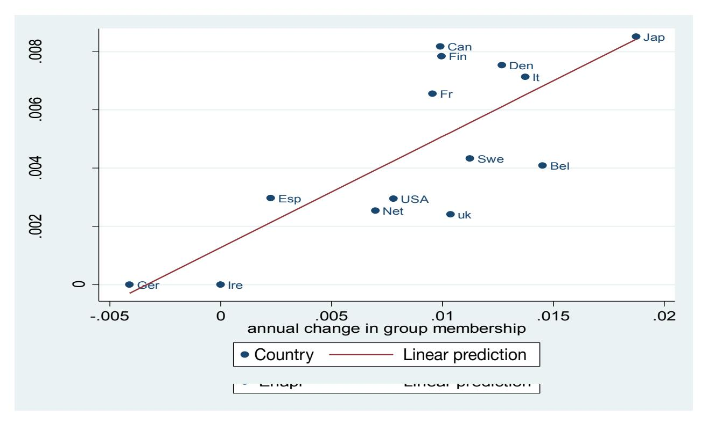

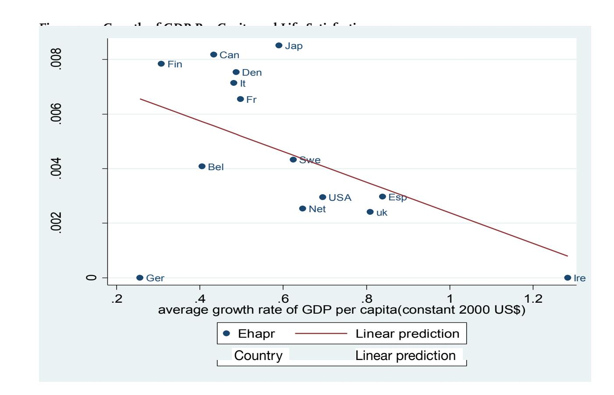

also those without which we cannot enjoy relational goods, which are fundamental for our life satisfaction.

A second obvious caveat is that, even though relational life is fundamental for individual well-being, it does not automatically have positive effects for the society as a whole. 66 Phenomena such as amoral familism, corporatism or even mafia connections tell us that the interest of a group of individuals linked by close ties can be pursued at the expense of the interests of third parties. Nonetheless – and this is what matters for our purpose – the reductionist individualist approach to the definition of individual utility, which neglects the role of relational life, is strongly rejected by empirical evidence.

To sum up, individuals donate time and money, and find a large part of their enjoyment and sense of purpose in cultivating relationships. Neglecting these will be economically counterproductive since economic vitality crucially depends on the quality of interpersonal relationships in social dilemmas such as those represented in Trust Investment games or Prisoner's Dilemmas, which are part of everyday economic interactions. Such dilemmas tell us that – in the presence of three factors such as asymmetric information, incomplete contracts and limits of civil justice – absence of trust, trustworthiness, or cooperative attitudes make economic outcomes suboptimal from both an individual and an aggregate point of view.

#### 7. Policy suggestions

The Civil Economy paradigm challenges the three reductionist views on human beings, corporations and "value indicators" that we documented as being contradicted by empirical evidence in this paper. These three reductionist views inevitably produce, in terms of policy measures, "inexpressive laws" – that is, laws that

have reduced effectiveness since they are in sharp contrast with social and moral norms. Consistency among the three types of norms is essential for sustainability and effectiveness of the legal framework. Legal rules, as an expression of the coercive power of the state – the enforceability of which is dependent upon penalties imposed by the same state – need to be in accordance with social rules. And social rules, which are the result of ancient and modern conventions and traditions – the enforceability of which depends on the shame that always accompanies the stigmatization of deviant forms of behavior (loss of status and social discrimination) – need to be in accordance with moral rules. These are associated with the prevalence of clearly-defined cultural matrices (religious and non-religious), the breach of which triggers a feeling of guilt in the individuals concerned.

If the legal rules that are promulgated "run counter" to the social rules and, more importantly, to the moral rules prevailing within that society, then the former will fail to produce the desired results, in that they will not be observed for the simple reason that that not all infringers of such rules can be punished. Even worse, they will undermine the credibility and/or the acceptability of the other two categories of rules, thus threatening the stability of the social order. This is precisely what happens with what are currently termed "inexpressive laws," that is, laws that fail to express those values constituting the pillars of a given society. Unfortunately, current economic theory continues to remain silent on the question of the relationship between the three types of rules. With few rare exceptions, jurists deal exclusively with laws, sociologists with social rules, and ethicists with moral rules. Thus it is not difficult to understand why it is that the majority of legal rules are of the "inexpressive" variety.

What should be done to cope with such a serious shortcoming? Our suggestion is to move beyond the still prevalent model of democracy, i.e. the elitist-competitive model of Max Weber and

Joseph Schumpeter. We believe that today this model of democracy is not capable of producing expressive laws in the above-mentioned sense – that is, laws capable of generating self-enforcing mechanisms that favor compliance even in the absence of specific forms of coercive punishment. In the language of the capabilities approach, this means that the elitist-competitive model fails to fully exploit the potential of the democratic principle in order to promote those policies designed to improve public well-being. We argue that the participative/deliberative model of democracy is the most adequate and effective model to that end

Of course, there are several theoretical and practical problems that have to be resolved if the participative/deliberative model of democracy is to constitute a fully acceptable alternative to the existing model. However, there can be no doubt that the participative/deliberative idea of democracy is, today, the one that more than any other – and certainly more than the neo-communitarian model that supporters of private politics are advocating in the USA and in Europe - manages to deal with the many problems posed by the paradoxes of happiness, the most serious of which is the decline in the social and moral legitimacy of the present model of development Happiness of course requires participation, but not just the formal variety as expressed at the polling station. Full participation is achieved when citizens are given the opportunity to take part in the deliberative process which then leads to a certain decision being made. As we are all aware, happiness lies more in the process than in the final outcome. This is why giving citizens a real chance to participate in the deliberative process increases their happiness regardless of the level of GDP.67

Empirical confirmation of the importance of deliberative democracy, in relation to the dual aim of improving government action and increasing public happiness, is provided by the vast survey conducted by the World Bank in 37 different countries.68 Constitutional

arrangements and economic conditions being basically equal, the greater the participation of citizens in deliberative forums, deliberative surveys, popular juries, etc., the higher the quality of welfare services, the greater the credibility of government, and the higher the index of public happiness.

The move from an elitist to a deliberative approach is urgent, since the traditional paradigm based on anthropological and corporate reductionism places an impossible task on the shoulders of the institutional elites. If all individuals are homines economici and all corporations are profit maximizing, there is a logical contradiction in believing that members of the institution are inherently benevolent. And it is hard to conceive that optimal legal rules can be something more than "inexpressive laws" that are ineffective due to their lack of relation to the social and moral norms of a given political community.

This is why the paradigm of Civil Economy suggests the creation of participatory rules that move from elitist to deliberative democracy, stimulating bottom-up (political and economic) participation and providing incentives for the non-purely-self-regarding behavior of citizens and corporations described in previous sections.

In the era of globalization – with still weak supranational institutions – we are also aware that an important part of deliberative democracy passes through economic life and relates to consumption, saving and corporate practices that incorporate issues of environmental and social responsibility. The role of policy is crucial from this point of view as well. An economic system is like a natural environment. It requires diversity to strengthen its resilience. The development of many different corporate forms of social economy (cooperatives, productive notfor-profit entities, ethical or sustainable banks and businesses, social businesses, etc.) together with traditional for-profit companies is fundamental to the creation of economic value in an

The implicit idea behind the Civil Economy is that solutions to the current problems cannot come just from institutions left to themselves in the face of passive and myopic citizens and corporations. There is nothing such as a neutral playing field. Active participation of the citizens in their economic actions and of corporations along the lines of social and environmental responsibility is crucial to tilt the balance. It is in the foremost interest of institutional actors to devise proper rules to stimulate the development of civic and corporate virtues.

- I This is contrary to what happens in real life economics for many entrepreneurs who become rich and famous by developing and marketing electronic social networks.
- 2 Sen (1977) labels the homo economicus as a "rational fool," arguing that the ingredients of real life individuals are not just self-interest but also sympathy and commitment. Recent scientific evidence on the empathic properties of many mammals makes this reductionist view (inconsistent with empirical findings, as will be shown in sections 5 and 6) of the human being less relational than the most "evolved" animal species. More specifically Bekoff & Pierce (2009) document that several animal species reveal signs of emotional and "moral" intelligence in behaviors implying trust, reciprocity, loyalty and some forms of "wild" justice.
- 3 An example of how the reductionist stance may fail to work is the global financial crisis. On the eve of the crisis, the prices of financial assets did not help in anticipating and preventing the outburst of the crisis itself. And in the preceding years regulators were not sufficiently benevolent, well informed and efficient to devise effective rules or actions to forestall the problem.

- 4 Bruni & Zamagni (2007).
- 5 Genovesi (1765-67), p. 37.
- 6 Ibid., p. 29.
- 7 Ibid., p. 283.
- 8 Smith (1776/1930), p. 25.
- 9 Genovesi (1765-67).
- 10 Filangieri (1780/1872), I, p. 10-11.
- 11 Genovesi (1765-67), p. 751.
- 12 Ibid., Book II, Chapter X.
- 13 Ibid., p. 752.
- 14 Binmore & Shaked (2010).

- The introduction of non-purely-self-regarding preferences in theoretical models, though infrequent, obviously dates back well before behavioral economics. A valuable example is the literature on Ricardian equivalence and bequests. See Leiderman & Blejer (1988).
- "Your corn is ripe to-day; mine will be so tomorrow. It is profitable for us both, that I should labour with you to-day, and that you should aid me to-morrow. I have no kindness for you, and know you have as little for me. I will not, therefore, take any pains upon your account; and should I labour with you upon my own account, in expectation of a return, I know I should be disappointed, and that I should in vain depend upon your gratitude. Here then I leave you to labour alone: You treat me in the same manner. The seasons change; and both of us lose our harvests for want of mutual confidence and security." Hume (n.d.), book III.
- 17 Berg et al. (1995).
- 18 See among others Becchetti et al. (2011) and Ostrom (2000) and the survey provided in section 5. An interesting paradox is that even game theorists may not follow Nash rationality when playing social dilemmas.
- 19 Gui (1987), Nussbaum (2001), Bruni & Porta (2005), Gui (2005).
- 20 Gui (1987), Nussbaum (2001).
- 21 For a thorough discussion on this see Bruni (2012), p. 88.
- 22 Uhlaner (1989), p. 255.
- 23 Nussbaum (2001), p. 344.
- 24 To give an example, consider a trip by a group of friends. At the time of the meeting to organize the trip, the commitment by various members may be asymmetric; but, if during the trip someone does not try to enter into a genuine reciprocal relationship with someone else, and thus puts no effort into the consumption, he or she will have taken advantage of a standard market good (a tourist trip) but will not have enjoyed any relational goods.
- 25 This does not mean that an authentic relational good cannot be produced in a business relationship, but, if it happens, somehow within an instrumental relationship something new emerges, which is not due either wholly or primarily to instrumentality.
- 26 Think of a situation in which a telephone call from home arrives during a meeting for one of the participants: the meeting is interrupted, and the person begins talking about the children and other private matters that are not on the agenda for the meeting. During that time the participants can create and consume relational goods.
- 27 We posit a very close link between the concepts of gratuitousness and intrinsic motivations. We see this link as closer than that between gratuitousness and altruism: there can be gratuitous non-altruistic acts (consider an athlete or a scientist) that create positive externalities

perhaps greater than those created by an altruistic act that does arise from intrinsic motivations. We often observe that there is a psychological mechanism in human beings that makes us feel pleasure whenever we see others (or ourselves) fulfill an act for intrinsic (i.e. non-instrumental) motivations, independently of the fact that we directly benefit from such behavior. This is the psychological mechanism that causes us, for example, to esteem a missionary who helps leprosy sufferers and not a company that does cause-related marketing, or to criticize an athlete who is too susceptible to monetary incentives.

- 28 Center on Philanthropy at Indiana University (2012).
- 29 Freeman (1997).
- 30 Blum (2008).
- 31 Salamon et al. (2004).
- 32 Andreoni (1989), Andreoni (1990), Harbaugh (1998), Goeree et al. (2002), Ribar & Wilhelm (2002); see also Camerer (2003) for a comprehensive review.
- 33 Nielsen (2012).
- 34 Carson et al. (2001).
- 35 Boston Consulting Group concludes that "Responsible consumption" (RC) products now account for at least 15% of all grocery sales—or a \$400b global market. See Smits et al. (2014). Assets engaged in sustainable and responsible investing practices currently represent 27.7% of all assets under management in Europe [Eurosif (2013)] and 11.3% in the US [US SIF (2012)].
- 36 Andreoni & Miller (1999).
- 37 Güth et al. (1982), Camerer & Thaler (1995).
- 38 Fehr et al. (1993), Fehr et al. (1998).
- 39 Berg et al. (1995), Ben-Ner & Putterman (2010).
- 40 Fischbacher et al. (2001), Sonnemans et al. (1999), Fehr & Gächter (2000).
- 41 Engel (2011).
- 42 On this point Konow (2009b) argues that giving arises from a mix of unconditional and conditional altruism where the latter is related to context-dependent norms where need can be more important than familiarity with the receiver.
- 43 Some recent developments of the Dictator Game literature seem to show that other-regarding behavior is stronger when players can enjoy the benefit of the effect of their other-regarding attitude on counterparts or when consequences of their actions are known to themselves and others. An example is Andreoni & Bernheim (2009) where dictator giving is significantly reduced when a random mechanism is applied to it so that its effect on

- beneficiaries may vanish with a positive probability. Furthermore, when an exit option from the game is available (with the counterpart not being aware of it), individuals are willing to pay for it and keep for them all the rest. See Broberg et al. (2007), Dana et al. (2006). Overall, these findings do not reject the hypothesis that other-regarding behavior may be viewed as the price individuals have to pay in terms of monetary payoffs if they want to create common consent and/or relational goods with other people.
- 44 The recent literature has qualified this general result investigating some relevant side questions. List (2007) demonstrates that, when individuals have the opportunity of taking and not just of giving in Dictator Games, they withhold significantly more even though the result that they do not choose the most selfish solution is confirmed. Furthermore, there is widespread evidence that people tend to be more selfish when their endowments are not a gift given by experimenters but are deserved with effort or talent. See Becchetti et al. (2011).
- 45 Johnson & Mislin (2011).
- 46 Rabin (1993).
- 47 Cox (2004).
- 48 Fehr & Schmidt (1999), Bolton & Ockenfels (2000).
- 49 Charness & Rabin (2002).
- 50 Andreoni (1989), Andreoni (1990).
- 51 Henrich et al. (2010).
- 52 Becchetti et al. (2014).
- 53 Easterlin (1974).
- 54 Kahneman et al. (2004).
- 55 Diener & Seligman (2002).
- 56 Deci & Ryan (1991).
- 57 Ryan & Deci (2001), p. 154.
- 58 Helliwell (2008).
- 59 Bruni & Stanca (2008).
- 60 Bartolini et al. (2008).
- 61 Meier & Stutzer (2008).
- 62 Becchetti et al. (2011).
- 63 Becchetti et al. (2013).
- 64 Frey & Stutzer (2005).

- 65 See among others Ferrer-i-Carbonell (2005) on relative income. The relative income literature shows that being below the average of a given reference group has a negative impact on subjective well-being, with the relevant exception of very dynamic contexts where vertical mobility is high. In such cases an improvement of economic well-being of peers may be perceived as an increase of the probability of the same observer's improvement. See results of Senik (2004) in transition countries, Jiang et al. (2009) in urban China and Becchetti & Savastano (2009) in Albania, among others.
- 66 An interesting branch of the literature analyzes the social capital produced internally and externally by members of Olson (those mainly looking at the interests of members) and Putnam (those by which members mainly aim to provide benefits for third parties) organizations. Results show in general that members of such organizations exhibit higher trust and trustworthiness in public good games even though documenting some forms of "in-group bias." See Degli Antoni & Grimalda (2013).
- 67 Crocker (2008).
- 68 World Bank (2015).

WORLD HAPPINESS REPORT 2015

#### References

Andreoni, J. (1989). Giving with impure altruism: Applications to charity and Ricardian equivalence. *The Journal of Political Economy*, 97(6), 1447–1458.

Andreoni, J. (1990). Impure altruism and donations to public goods: A theory of warm-glow giving. *The Economic Journal*, 100(401), 464–477.

Andreoni, J., & Bernheim, B. D. (2009). Social image and the 50–50 norm: A theoretical and experimental analysis of audience effects. *Econometrica*, *77*(5), 1607–1636. http://doi.org/10.3982/ECTA7384

Andreoni, J., & Miller, J. H. (1999). Giving according to GARP: An experimental test of the consistency of preferences for altruism. *Econometrica*, 70(2), 747-753.

Bartolini, S., Bilancini, E., & Pugno, M. (2008). Did the decline in social capital depress Americans' happiness? *Siena University, Quaderni Del Dipartimento Di Economia Politica*, 540, 52.

Bartolini, S., & Sarracino, F. (2011). Happy for how long?: How social capital and GDP relate to happiness over time (Working Papers No. 2011-60). CEPS/INSTEAD. Retrieved from http://www.econ-pol.unisi.it/bartolini/papers/CEPS\_happy\_for\_how\_long.pdf

Becchetti, L., & Savastano, S. (2010). The money–happiness relationship in transition countries: Evidence from Albania. *Transition Studies Review*, 17(1), 39–62. http://doi.org/10.1007/S11300-010-0135-5

Becchetti, L., Corrado, L., & Conzo, P. (2013). Sociability, altruism and subjective well-being. *CEIS Tor Vergata Research Paper Series*, 11(5, No. 270), 43.

Becchetti, L., Fiaschetti, M., & Marini, G. (2014). Card games and economic behavior. *Games and Economic Behavior*, 88, 112–129. http://doi.org/10.1016/j.geb.2014.08.003

Becchetti, L., Pelloni, A., & Rossetti, F. (2008). Relational goods, sociability, and happiness. *Kyklos*, *61*(3), 343–363. http://doi.org/10.1111/j.1467-6435.2008.00405.x

Becchetti, L., Ricca, E. G., & Pelloni, A. (2011). The relationship between social leisure and life satisfaction: Causality and policy implications. *Social Indicators Research*, 108(3), 453–490. http://doi.org/10.1007/s11205-011-9887-5

Bekoff, M., & Pierce, J. (2009). Wild justice: The moral lives of animals. Chicago: University of Chicago Press.

Ben-Ner, A., & Putterman, L. (2010). Trusting, trustworthiness, and CSR: Some experiments and implications. In L. Sacconi, M. Blair, R. E. Freeman and A. Vercelli (Eds.), Corporate social responsibility and corporate governance: The contribution of economic theory and related disciplines (pp. 410-431). Basingstoke: Palgrave Macmillan.

Berg, J., Dickhaut, J., & McCabe, K. (1995). Trust, reciprocity, and social history. *Games and Economic Behavior*, 10(1), 122–142. http://doi.org/10.1006/game.1995.1027

Binmore, K., & Shaked, A. (2010). Experimental economics: Where next? *Journal of Economic Behavior & Organization*, 73(1), 87–100. http://doi.org/10.1016/j.jebo.2008.10.019

Blum, D. (2008, July 27). 26% of Americans volunteer, new study finds. *The Chronicle of Philanthropy*.

Bolton, G. E., & Ockenfels, A. (2000). ERC: A theory of equity, reciprocity, and competition. *American Economic Review*, 90(1), 166–193.

Broberg, T., Ellingsen, T., & Johannesson, M. (2007). Is generosity involuntary? *Economics Letters*, 94(1), 32–37. http://doi.org/10.1016/j.econlet.2006.07.006

Bruni, L. (2012). The wound and the blessing: Economics, relationships, and happiness. New York: New City Press.

Bruni, L., & Porta, P. L. (Eds.). (2005). *Economics and happiness: Framing the analysis*. Oxford and New York: Oxford University Press.

Bruni, L., & Stanca, L. (2008). Watching alone: Relational goods, television and happiness. *Journal of Economic Behavior & Organization*, 65(3), 506–528. http://doi.org/10.1016/j.jebo.2005.12.005

Bruni, L., & Zamagni, S. (2007). *Civil economy: Efficiency, equity, public happiness* (Vol. 2). Oxford: Peter Lang International Academic Publishers.

Camerer, C. (2003). Behavioral game theory: Experiments in strategic interaction. Princeton: Princeton University Press.

Camerer, C., & Thaler, R. H. (1995). Anomalies: Ultimatums, dictators and manners. *The Journal of Economic Perspectives*, 9(2), 209–219.

Carson, R. T., Flores, N. E., & Meade, N. F. (2001). Contingent valuation: Controversies and evidence. *Environmental and Resource Economics*, 19(2), 173–210. http://doi.org/10.1023/A:1011128332243

Center on Philanthropy at Indiana University. (2012). *Giving USA 2012: The annual report on philanthropy for the year 2011.* Chicago: Giving USA Foundation.

Charness, G., & Rabin, M. (2002). Understanding social preferences with simple tests. *Quarterly Journal of Economics*, 117(3), 817–869.

Consumers International. (2010). *Checked out: Are European supermarkets living up to their responsibilities for labour conditions in the developing world?*. London, United Kingdom: Consumers International. Retrieved from http://www.consumersinternational.org/media/394236/checkedoutenglish-02.pdf

148

- Cox, J. C. (2004). How to identify trust and reciprocity. *Games and Economic Behavior*, *46*(2), 260–281. http://doi.org/10.1016/S0899-8256(03)00119-2
- Crocker, D. A. (2008). *Ethics of global development: Agency, capability, and deliberative democracy*. Cambridge: Cambridge University Press.
- Dana, J., Cain, D. M., & Dawes, R. M. (2006). What you don't know won't hurt me: Costly (but quiet) exit in dictator games. *Organizational Behavior and Human Decision Processes*, 100(2), 193–201. http://doi.org/10.1016/j.obhdp.2005.10.001
- Deci, E. L., & Ryan, R. M. (1991). A motivational approach to self: Integration in personality. In R. Dienstbier (Ed.), *Nebraska symposium on motivation: Perspectives on motivation, Vol.* 38 (pp. 237-288). Lincoln, NE: University Of Nebraska Press.
- Degli Antoni, G., & Grimalda, G. (2013). *The value of real voluntary associations*. Working Papers 2013/20. Spain: Economics Department, Universitat Jaume I, Castellón.
- Diener, E., & Seligman, M. E. (2002). Very happy people. *Psychological Science*, 13(1), 81–84. http://doi.org/10.1111/1467-9280.00415
- Easterlin, R. (1974). Does economic growth improve the human lot? Some empirical evidence. In P. A. David & M. W. Reder (Eds.), *Nations and households in economic growth: Essays in honour of Moses Abramovitz (89-125)*. New York: Academic Press Inc.
- Engel, C. (2011). Dictator games: A meta study. *Experimental Economics*, 14(4), 583–610. http://doi.org/10.1007/s10683-011-0283-7
- Eurosif. (2013). European SRI Study 2012. Brussels: Eurosif.
- Fehr, E., Kirchsteiger, G., & Riedl, A. (1993). Does fairness prevent market clearing? An experimental investigation. *The Quarterly Journal of Economics*, 108(2), 437–459.
- Fehr, E., Kirchler, E., Weichbold, A., & Gächter, S. (1998). When social forces overpower competition: Gift exchange in experimental labor markets. *Journal of Labor Economics*, 16(2), 324-351.
- Fehr, E., & Gächter, S. (2000). Cooperation and punishment in public goods experiments. *The American Economic Review*, 90(4), 980-994.
- Fehr, E. & Schmidt, K. M. (1999). A theory of fairness, competition, and cooperation. *The Quarterly Journal of Economics*, 114(3), 817-868.
- Ferrer-i-Carbonell, A. (2005). Income and well-being: An empirical analysis of the comparison income effect. *Journal of Public Economics*, 89(5-6), 997–1019. http://doi.org/10.1016/j.jpubeco.2004.06.003

- Filangieri, G., & Villari, P. (1872). *La scienza della legislazione* (Vol. 2). Firenze: Le Monnier. (Original work published 1780)
- Fischbacher, U., Gächter, S., & Fehr, E. (2001). Are people conditionally cooperative? Evidence from a public goods experiment. *Economics Letters*, 71(3), 397–404. http://doi.org/10.1016/S0165-1765(01)00394-9
- Freeman, R. B. (1997). Working for nothing: The supply of volunteer labor. *Journal of Labor Economics*, 15(1), S140–S166. http://doi.org/10.3386/w5435
- Frey, B. S., & Stutzer, A. (2005). Beyond outcomes: Measuring procedural utility. *Oxford Economic Papers*, *57*(I), 90–III. http://doi.org/I0.I093/oep/gpi002
- Genovesi, A. (1765-1767). *Delle lezioni di commercio, osia d'economia civile, stamperia simoniana*, Napoli. Bassano: Remondini con Licenza de' superiori.
- Goeree, J. K., Holt, C. A., & Laury, S. K. (2002). Private costs and public benefits: Unraveling the effects of altruism and noisy behavior. *Journal of Public Economics*, 83(2), 255–276. http://doi.org/10.1016/S0047-2727(00)00160-2
- Gui, B. (1987). Eléments pour une définition d'économie communautaire. *Notes et Documents*, 20(19), 32–42.
- Gui, B. (2005). From transactions to encounters: The joint generation of relational goods and conventional values. In B. Gui & R. Sugden (Eds.), *Economics and social interaction:* Accounting for interpersonal relations (pp. 23–51). Cambridge: Cambridge University Press.
- Güth, W., Schmittberger, R., & Schwarze, B. (1982). An experimental analysis of ultimatum bargaining. *Journal of Economic Behavior & Organization*, *3*(4), 367–388. http://doi.org/10.1016/0167-2681(82)90011-7
- Hall, J. (2013). From capabilities to contentment: Testing the links between human development and life satisfaction. In J. F. Helliwell, R. Layard, & J. Sachs (Eds.), *World happiness report 2013*. (pp. 138–153). New York: Sustainable Development Solutions Network.
- Harbaugh, W. T. (1998). What do donations buy? A model of philanthropy based on prestige and warm glow. *Journal of Public Economics*, 67(2), 269–284. http://doi.org/10.1016/S0047-2727(97)00062-5
- Helliwell, J. F. (2008). Life satisfaction and quality of development. *National Bureau of Economic Research*, (Paper 14507). Retrieved from http://www.nber.org/papers/w14507
- Henrich, J., Ensminger, J., McElreath, R., Barr, A., Barrett, C., Bolyanatz, A., ... Ziker, J. (2010). Markets, religion, community size, and the evolution of fairness and punishment. *Science*, 327(5972), 1480–1484.

Hume, D. (1739). *A treatise of human nature.* Courier Corporation. Retrieved from http://www.gutenberg.org/ebooks/4705?msg=welcome\_stranger

Jiang, S., Lu, M., & Sato, H. (2009). Happiness in the dual society of urban China: Hukou identity, horizontal inequality and heterogeneous reference. *Global COE Hi-Stat Discussion Paper Series*, 20. Tokyo: Institute of Economic Research, Hitotsubashi University.

Johnson, N. D., & Mislin, A. A. (2011). Trust games: A meta-analysis. *Journal of Economic Psychology*, 32(5), 865–889.

Kahneman, D., Krueger, A. B., Schkade, D. A., Schwartz, N., & Stone, A.A. (2004). A survey method for characterizing daily life experience: The day reconstruction method. *Science*, 306(5702), 1776-1780.

Konow, J. (2009a). Is fairness in the eye of the beholder? An impartial spectator analysis of justice. *Social Choice and Welfare*, 33(1), 101–127.

Konow, J. (2009b). Mixed feelings: Theories of and evidence on giving. *Journal of Public Economics*, 94(3-4), 279–297.

Leiderman, L., & Blejer, M. I. (1988). Modeling and testing Ricardian equivalence: A survey. *Staff Papers-International Monetary Fund*, 35(1), 1–35.

- Lester, S. M., Sokolowski, S. Wojciech, & Associates. (Eds.). (2004). *Global civil society: Dimensions of the Nonprofit Sector, Volume 2* (Vol. 2). Bloomfield, CT: Kumarian Press.
- List, J. A. (2007). On the interpretation of giving in dictator games. *Journal of Political Economy*, 115(3), 482–493.
- Meier, S., & Stutzer, A. (2008). Is volunteering rewarding in itself? *Economica*, 75(297), 39–59.
- Nielsen. (2012, March 27). *The global, socially conscious consumer*. Retrieved from http://www.nielsen.com/us/en/insights/news/2012/the-global-socially-conscious-consumer.html
- Nussbaum, M. C. (2001). The fragility of goodness: Luck and ethics in Greek tragedy and philosophy. Cambridge: Cambridge University Press.
- Ostrom, E. (2000). Collective action and the evolution of social norms. *The Journal of Economic Perspectives*, 14(3), 137–158.
- Rabin, M. (1993). Incorporating fairness into game theory and economics. *The American Economic Review*, 83(5), 1281–1302.
- Ribar, D. C., & Wilhelm, M. O. (2002). Altruistic and joy-of-giving motivations in charitable behavior. *Journal of Political Economy*, 110(2), 425–457. http://doi.org/10.1086/338750

Ryan, R. M., & Deci, E. L. (2001). On happiness and human potentials: A review of research on hedonic and eudaimonic well-being. *Annual Review of Psychology*, 52(1), 141–166. http://doi.org/10.1146/annurev.psych.52.1.141

Salamon, L. M., & Sokolowski, S. W. (Eds.). (2004). *Global civil society: Dimensions of the nonprofit sector*. Bloomfield: Kumarian Press.

Sen, A. K. (1977). Rational fools: A critique of the behavioral foundations of economic theory. *Philosophy & Public Affairs*, 6(4), 317–344.

Senik, C. (2004). Relativizing relative income. DELTA Working Paper n°2004-17. *DELTA and University Paris-IV Sorbonne*. Retrieved from ftp://129.199.13.54/pse/abstracts/wp200417.pdf

Smith, A. (1930). *The wealth of nations*. London: Cannan. (Original work published 1776)

Smits, M., Wald, D., Vismans, D., & Huet, E. (2014). When social responsibility leads to growth: An imperative for consumer companies to go green. Boston Consulting Group.

Sonnemans, J., Schram, A., & Offerman, T. (1999). Strategic behavior in public good games: When partners drift apart. *Economics Letters*, 62(1), 35–41. http://doi.org/10.1016/S0165-1765(98)00203-1

Stanca, L. (2009). With or without you? Measuring the quality of relational life throughout the world. *The Journal of Socio-Economics*, 38(5), 834–842. http://doi.org/10.1016/j.socec.2009.03.004

The World Bank Group. (2015). Worldwide Governance Indicators. Retrieved February 5, 2015, from http://info.worldbank.org/governance/wgi/index.aspx#home

Uhlaner, C. J. (1989). "Relational goods" and participation: Incorporating sociability into a theory of rational action. *Public Choice*, *62*(3), 253–285. http://doi.org/10.1007/BF02337745

US SIF: The Forum for Sustainable and Responsible Investment. (2012). 2012 trends report executive summary: 2012 report on sustainable and responsible investing trends in the United States. Washington, DC: US SIF. Retrieved from http://www.ussif.org/files/Publications/12\_Trends\_Exec\_Summary.pdf

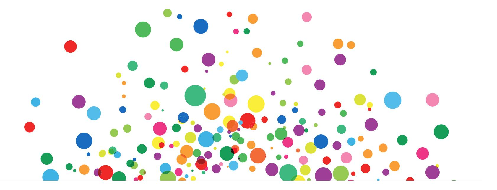

Chapter 8.

### INVESTING IN SOCIAL CAPITAL

JEFFREY D. SACHS

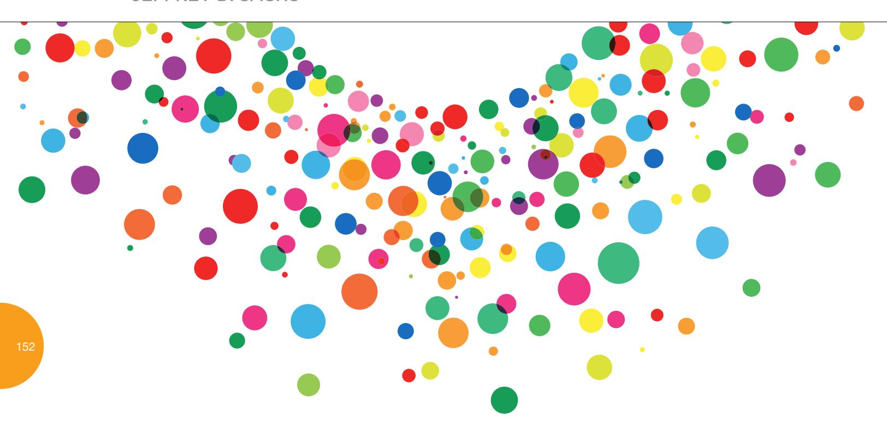

A considerable amount of research in recent years has established four related propositions:

- (1) Social capital is a meaningful albeit broad concept that describes the extent of trust, social support networks, and pro-sociality in a society;
- (2) Societies differ systematically in the various dimensions of social capital;
- (3) The various dimensions of social capital tend to be correlated across countries, including interpersonal trust, social support systems, individual generosity, honesty in governance; and
- (4) Societies with high social capital outperform those with low social capital in terms of subjective well-being (SWB) and economic development.

In the *World Happiness Report*, we see various dimensions of social capital directly at work in at least three of the six main determinants of SWB (Helliwell, Huang, and Wang, this volume):

- Social support: "If you were in trouble, do you have relatives or friends you can count on to help you whenever you need them, or not?"
- Generosity: "Have you donated money to a charity in the past month?"
- Honesty: "Is corruption widespread in business or not?" and "Is corruption widespread in government or not?"

Social capital probably raises well-being in two ways, one that might be considered intrinsic and the other instrumental. The intrinsic benefit of social capital is the human yearning for love, friendship, and community. Man, as Aristotle famously said, is a social animal. Social capital is a measure of the quality of interpersonal relations, involving trust, honesty, and mutual

support, and these in turn increase mental and physical well-being.

The instrumental benefit of social capital arises because of the contributions of social capital to improved economic performance and social insurance.2 Social capital facilitates economic cooperation, efficient contracting, the division of labor, and the provision of social insurance against shocks. The key point is the existence of "social dilemmas" in countless aspects of economic and social life. A social dilemma occurs when an individual faces the choice of incurring a personal cost for a greater benefit for others. When social capital is high, individuals are more prepared to incur such individual costs for the greater good; and when most people in society behave in that manner, society as a whole benefits in higher economic productivity, stronger social insurance, greater societal resilience to natural hazards, and greater mutual care (such as Good Samaritans coming to the emergency aid of others, and the well-known case of Nordic citizens being especially likely to return a wallet full of money, as reported in the Economist, 1996).

Many social dilemmas occur in countless face-to-face encounters in daily life and business dealings. When two individuals engage in a business encounter, there are the possibilities that they may engage in deceitful behavior such as theft, fraud, or even violence. Some of these threats can be controlled by legal contracts, but writing and enforcing contracts can be costly or even impossible in some circumstances. Thus, trust is critical: the confidence that the counterparty will behave honestly or morally and transparently. Without social trust, a wide range of mutually beneficial economic and social arrangements may be impossible to negotiate, much less to sustain.

Other social dilemmas occur at the societal scale. When social capital is high, individual citizens are more prepared to pay their taxes honestly, more prepared to support investments in public goods, and more likely to support social insurance policies. The Scandinavian countries, with perhaps the highest social capital in the world, also have the most extensive social welfare systems (broadly classified as social democracy). High social capital is conducive to electoral support for a strong social safety net and extensive social services. It is also likely that the emergence of social democratic systems in Scandinavia in the 1930s and onward helped to foster more social capital in those countries.3

Yet if social capital is so important to well-being, both directly and indirectly, how is high social capital achieved?4 Can societies invest in social capital in the same way that they invest in human and physical capital? Can we measure the rate of return to investments in social capital, in terms of benefits to SWB and economic performance?5

The answer to these questions is that we don't really know. What we know is that some societies display attributes of high social capital – trust, low corruption, strong social support networks – while others do not. Yet why one society has strong social capital while another does not is a bit of a mystery. It is my purpose here to survey the main ideas about social capital and use them to help explain the huge disparities worldwide in social capital, and what might be done to build social capital in societies stuck in a "social trap" of very low social capital.

## A Quick Look at the Cross-Country Evidence

Countries vary widely in their social capital, as measured along several dimensions: (I) generalized trust ("Can most people be trusted?"), (2) social support networks, (3) generosity and voluntarism, and (4) perceptions of corruption in business and government. Generalized trust may be the variable that comes closest to a single measure

of social capital, since it directly measures whether individuals in society trust each other. According to the results of the World Values Survey for the 2010-14 wave, 66% of respondents in the Netherlands and 61% in Sweden answered that most people can be trusted, compared with just 35% in the US and 28% in Russia. Moreover, comparing the extent of trust in the 1981-84 sampling period with the recent period, trust rose in Sweden (from 57 to 61%), while it declined in the United States (from 45 to 35%).

Notably, generalized trust is strongly negatively correlated with perceptions of corruption (r = -0.40 for 59 countries with data on both variables) and with income inequality as measured by the most recent Gini coefficient as reported by the World Bank (r = -0.45 for 44 countries). High-trust countries like Denmark, Norway, and Sweden are also low-corruption and low-inequality countries, compared with countries like the United States where generalized trust is much lower. The linkages of trust with economic inequality and with the perceptions of corruption in government are in line with theories of social capital described below.

Generalized trust is also positively related to the quality of social support networks (r = 0.28 for 59 countries) and the indicator of generosity (r = 0.36 for 59 countries). Overall, we see that the various dimensions of social capital are all correlated as one might expect, suggesting the various causal interconnections as discussed below.

#### The Challenge of Social Dilemmas

Social dilemmas arise when individual strategic behavior may result in the failure to garner the benefits of cooperation. In some cases the social dilemmas arise in the face-to-face interactions of just two individuals or a small number of people, such as in bargaining over a contract or an exchange of goods and services. In other cases, the dilemmas involve large numbers of individuals (e.g. in the polity debating a rise in taxes to finance a public good). In the latter case, we sometime use the concepts of market failures (e.g. free riding and externalities) to describe the social dilemmas – that is, decentralized market decisions lead to the under-provision of public goods such as infrastructure, or the over-provision of public bads such as pollution. In all cases, the social dilemmas pit individual egoistic actions against the broader social good.

The most famous case of a social dilemma is the Prisoner's Dilemma, of which the simplest form is the so-called Donation Game. In the 2-person Donation Game, each individual can expend a cost C in order to benefit the other person in the amount B > C. If both individuals expend C, both individuals have a net benefit in the amount B-C > o. However, if one individual forgoes the cost C, while the other expends C, the first individual reaps a net benefit B > B-C > o, while the second individual ends up with -C. The traditional game-theory language describes the shirker as "defecting" while the other individual "cooperates."

If the two individuals play this one-shot game, and consider only their own net payoffs, the dominant strategy for each individual is to defect. The outcome is that neither individual expends C, and neither party receives the benefit B. The net payoff for both is therefore zero, less than the mutual gain B-C if both individuals cooperate.

In the jargon of social dilemmas, the "pro-social" behavior is for each individual to expend C so that the other individual receives benefit B > C. When both individuals act pro-socially, they gain from mutual cooperation. When both individuals behave anti-socially, or egoistically, they end up with zero.

The standard game-theoretic treatment of the Donation Game assumes that the individuals act egoistically; that they adopt dominant strategies (in this case, each party defects); and that the predicted outcome is therefore the absence of cooperation. Yet in experimental settings over the past three decades, researchers have found a much higher tendency to cooperate than is predicted by egoistic strategies. Depending on the context of the game (e.g. whether the parties discuss their moves beforehand, whether the parties play repeated games or a one-shot game, whether the parties are primed in some way, whether they have had face-to-face contact, and so forth), the extent of cooperation varies from mostly defections to nearly full cooperation. Yet robustly, the extent of cooperation is greater than pure egoistic logic suggests.

Social dilemmas occur not only in small-group interactions such as bilateral dealings, but also in society-wide interactions. Consider, for example, the question of pro-sociality regarding the payment of taxes. In the classic public goods setting, a useful public investment (e.g. a highly beneficial road or bridge) is to be funded with tax collections. The government's ability to undertake the investment depends on the total tax revenues. Each individual taxpayer receives a benefit from the project based on the total taxes rather than the individual's own payment.

The situation poses the well-known free-rider problem, a social dilemma at the scale of the political community of taxpayers rather than of two individuals. If tax evasion is easy and largely undetectable, each individual may have the incentive to shirk on his own tax payments. The best outcome for each person is that all the other taxpayers honestly pay their taxes, yet the egoistic outcome is that each taxpayer shirks (defects), thereby preventing the public investment from being undertaken.

In experimental settings and real-life situations, groups tend to be more cooperative than pure egoistic game theory predicts. In the laboratory setting, researchers have extensively tested the Public Goods Game, akin to an N-person Donation

Game. In this game, each of N players receives an income Y at the beginning of the game. They are told that they may contribute some part of their income (from zero up to Y) into a common pot (equivalent to total tax revenues). Thus, with player i making contribution  $C_i$  the total collection is  $T = \sum C_i$ . The total collection is then multiplied by a factor  $\rho$  greater than I and less than N, and then divided equally among all of the players in the amount  $B = (I/N) \rho T$ . We may think of  $\rho > I$  as the rate of return on public investment.

Note that if player i makes contribution  $C_i$  the player's net income NYi at the end of the game is given by:

$$NY_i = Y - C_i + (I/N) \rho \sum C_i$$

It is immediately clear that for each player, the egoistic solution is to set  $C_i$  equal to zero, free riding on the contributions of the others. Each dollar of contribution gives a return to the individual contributor of  $\rho/N < I$ , but a society-wide benefit of  $\rho > I$ . The final outcome is no investment, so that each player ends up with net income Y. On the other hand, the social optimum is for each player to contribute to the maximum  $C_i = Y$ , leading all players to receive net income  $NY_i = \rho Y > Y$ .

The situation in this game is somewhat akin to real-world tax collections. Tax evasion may be the egoistic optimum, assuming of course no detection or penalties for non-payment, while paying taxes may be the social optimum, assuming that the government can make good use of the funds. The point is that social dilemmas occur both in bilateral relations and in society-wide interactions, and the reasons for defection or cooperation may be similar in the two circumstances.

The essential finding of more than 30 years of experimental research is that in both 2-person and N-person games, cooperation occurs far more often than egoistic game theory implies,

vet that cooperation is fragile and variable across contexts. Groups can be primed to move towards cooperation or towards defection, for example by subliminal images of happy faces that promote cooperation.6 Social groups display varying tendencies towards defection or cooperation, and honesty versus cheating, depending on socioeconomic status,7 culture,8 field of academic study,9 and sector of employment.10 Piff finds a systematically lower display of honesty among high socioeconomic status individuals in the US, a finding in line with Adam Smith's (1759) surmise that individuals of average rank in society are more likely to display moral behavior than the privileged classes, mainly in Smith's view because the poor and middling ranks must depend on their good reputations, while the rich can surround themselves with flatterers. II

Countries seem to differ markedly and persistently in the average prevalence of pro-social behavior. Such persistent differences are observed both in the replies of individuals in surveys and in the observed practices of voluntarism, tax evasion, public-sector corruption, and other contexts of social dilemmas. These persistent differences matter enormously, since countries with high social capital – meaning the observed tendencies towards pro-sociality – tend to have greater happiness and development performance through the channels we have already described.

There are several theories as to why cooperation occurs with much greater frequency than is predicted by egoistic game theory and as to why it differs across various social groups and contexts. These alternative theories are not necessarily mutually exclusive: more than one factor may explain pro-social cooperation in any particular setting.

First, individuals may be guided by true altruism and compassion, meaning that they intrinsically value the benefit B received by the counterpart in the 2-person Donation Game (or the equivalent in the N-person Public Goods Game). Fehr and

#### WORLD HAPPINESS REPORT 2015

Fischbacher explore the complex implications of altruism, especially involving the complex interactions of altruists and non-altruists.12 Capraro et al. show that benevolent characteristics of individuals are predictive of cooperation in social dilemmas.13

Second, individuals may be primed to cooperate through verbal and visual priming, suggesting that cooperation taps into unconscious emotional and cognitive pathways.14

Third, individuals may be guided by personality traits and/or cultural norms of cooperation, causing an individual the emotions of compunction, remorse, guilt, or embarrassment in the event of an individual defection. These traits may be "hard-wired" as the result of long evolutionary processes, such as group-level selection leading to the evolution of pro-social behaviors.15

Fourth, individuals may be guided by ethical commandments, such as the Golden Rule (behave in the manner each would want the other to behave), the Kantian Categorical Imperative (behave according to that maxim that could be a universal law), or God's rule ("Justice, justice shall you pursue," in Deuteronomy in the Bible).

Fifth, individuals may expect future rounds of strategic interaction with the same individual counterpart, so that cooperating now can foster future bilateral cooperation (direct reciprocal altruism).

Sixth, individuals may seek to build a public reputation for cooperation rather than defection, in order to garner respect and esteem and thereby to elicit cooperation from others in the future (indirect reciprocal altruism).

Seventh, individuals may seek to protect themselves from punishment and ostracism16 imposed by third parties following a bilateral defection (protection from "altruistic punishment").

Eighth, individuals may cooperate to the extent that they believe that others will cooperate as well (reciprocal or conditional cooperation). Face-to-face communication can also raise the confidence in the cooperation of the other party.

This final factor, reciprocal cooperation, perhaps bolstered in small-group cases by face-to-face communication, may seem obvious: individuals will be more cooperative if others are also expected to be more cooperative. Yet it is important to recognize that cooperation is not necessarily the dominant strategy of an egoistic player even when the other party is expected to cooperate. In the Donation Game, for example, the egoist does not determine his own play according to whether he expects the counterpart to cooperate. Defection is the dominant strategy, irrespective of the play of the other. That is why Defection-Defection is the (Nash) equilibrium of the 2-Person Donation Game, and tax evasion is the dominant strategy of the Public Goods Game.

In other games, however, such as the Stag Hunt Game, reciprocal cooperation may be more directly justified. The Stag Hunt Game works as follows. Two hunters can either hunt a stag, which requires their mutual cooperation for success, or each can hunt a hare, which is successful with a single hunter alone and no cooperation. Deciding to hunt a stag therefore requires that each hunter have the confidence (trust) that the other hunter will also join in the stag hunt. Hunting a hare is much safer, since success doesn't depend on the cooperation with the other hunter, yet the returns to the hunt are also much lower. In such a situation, reciprocal cooperation makes perfect sense: if one is confident (trusting) that one's counterpart will cooperate, it is egoistically rational to choose the stag hunt (cooperation) over the hare hunt (non-cooperation).

Why does reciprocal or conditional cooperation show up so frequently as an empirical explanation of observed behavior, even when it cannot be explained by egoistic self-interest in many cases (e.g. the Donation Game)? Individuals (and even lesser primates) seem to display a strong sense of "fairness," sometimes also called "inequality aversion." Individuals are ready to make sacrifices, e.g. to pay taxes, but only if they believe that others are doing the same. They pay taxes not out of a commitment to altruism (in which case they would pay taxes whether or not the others evade taxes), and not even necessarily out of concerns of reputation and punishment, but because they recognize that it is fair to do so if the result of fairness is mutual benefit.

#### Social Capital and Social Dilemmas

Social capital may be defined as social conditions that cause pro-sociality. This is admittedly a vague definition: it defines social capital in terms of the outcome (pro-sociality) that it promotes. Yet such vagueness is a reflection both of the social capital literature as it now stands, and of the real challenge of explaining pro-sociality. Since pro-sociality arises from several factors — altruism, culture, ethics, reputation, fear of ostracism, sense of fairness, emotional priming — social capital comes in many forms.

For example, social capital might reflect a high level of belief that others in the community are trustworthy (likely to cooperate), thereby triggering conditional cooperation. Social capital might work through shared religious beliefs and the fear of divine retribution following a defection. Social capital might work through society-wide standards for a positive reputation through demonstrated acts of pro-sociality. Each of these various motives for pro-sociality will imply a different content of social capital – trust, religious beliefs, community norms – and different ways that societies might promote social capital.

Unfortunately there is much more literature on the role of social capital in producing good societal outcomes (in GDP, well-being, health, and other outcomes) than on determining why social capital differs across societies and changes over time. The eventual power of social capital as an intellectual construct will depend in large part on a better understanding not only of why social capital is important but of how to achieve it through various kinds of societal investments.

Here are some of the things that researchers have reported in recent years.

First, pro-sociality differs across individuals, probably as a condition of deep personality traits.17 A leading modern expositor of this approach is Jonathan Haidt, 18 who has persuasively argued that morality entails several distinctive foundations, including concerns regarding: Care (harm), Fairness, Liberty, Loyalty, Authority, and Purity (taboo). Haidt argues that American left-of-center liberals interpret morality mainly in terms of care for others and distributive fairness, while American right-of-center conservatives put more weight on individual liberty, within-group loyalty (and less salience of the well-being of those outside of the group), authority (and hierarchy), and purity (disgust vis-a-vis sexual and other taboos). More generally, psychologists have explored personality traits that lead to Social Value Orientation (SVO). such as agreeableness, consideration of future consequences, low in narcissism, and need to belong.19

The powerful study by Iyer et al.20 of American libertarians, within Haidt's analytical framework, exemplifies this line of research. Using online survey data, Iyer, Haidt and associates describe the distinctive moral and affective beliefs of American libertarians. The argument, at the core, is that libertarians (who generally oppose government redistribution of income and public investments) have distinctive personality traits including low levels of empathetic concern; low extraversion and agreeableness; low emotional reactance to others; and weaker feelings of love

towards family, friends, and generic others. The result is a high degree of individualism that is then "moralized" into a moral code that puts personal liberty ahead of other moral standards such as compassion for others.

Second, general education, ethical instruction, and specialized compassion training make a difference in pro-sociality. Most tellingly, students trained in egoistic game theory, notably in university courses in neoclassical economics, are less likely to cooperate in laboratory settings. There is now a large literature on the lower levels of pro-sociality of economics students compared with non-economics students. The findings have been recently well summarized by Etzioni.21 The findings of low pro-sociality among economics students are robust; the interpretation, however, has differed between those who have identified self-selection as the cause and those who have identified the content of neoclassical economics training as the cause. In short, does economics attract students with low tendencies towards pro-sociality, or does it make them? The answer, after three decades of research, seems to be both. There is an element of self-selection, but there is also a clear "treatment effect," according to which pro-sociality declines as the result of instruction in mainstream, egoistic game theory and neoclassical economics more generally. Davidson and Schuyler (2015, this volume) discuss the efficacy of specialized compassion training to promote "increases in positive emotions, accompanied by greater helping behavior in a pro-social game."

Third, certain professions seem to display in-group cultures that may be inimical to social capital. The finance industry has been identified as a profession that seems to display especially egoistic behavioral patterns and cultural norms. A compelling recent study by Cohn et al.22 gives credence to the role of professional cultures. In this experiment, 128 employees of a large, international bank were divided randomly into two groups. In the "treatment" group, the subjects were given a questionnaire to prime them with

regard to the banking industry. The questions asked the subjects about their role in the bank and their professional background. In the control group, the questions were generic, not about banking but about daily life (such as the hours of television the subject watched per week).

The two groups were then subjected to a test environment examining their honesty. In particular, the subjects were asked to report the outcome of unsupervised coin flipping, having been told that flipping more "heads" would lead to a higher financial rewards for the subject. The actual coin flips were not observed, but the treatment group reported a rate of heads flips that was statistically far above the 50% fair mark, suggesting considerable lying in their selfreports. The control group reported near 50% heads flips. The essence of the experiment showed that priming subjects with their personal role in the bank decreased their honesty. According to further questions administered to the control and treatment groups, subjects primed with the banking questions led those subjects to report a greater materialistic orientation (specifically the belief that "social status is primarily determined by financial success:"23). That higher materialism, in turn, seems to have led to dishonest behavior.

Fourth, social scientists in many disciplines have long argued that particular social conditions cause individuals to adopt pro-social or antisocial behaviors. Five particularly important social conditions have been hypothesized. Putnam famously argued that voluntary participation in civic groups creates social capital.24 Rothstein has argued powerfully that honesty in public administration (low corruption and the rule of law in the public administration) causes individuals in the society to believe that their pro-social behavior will translate into beneficent outcomes for society.25 Uslaner,26 Uslaner and Rothstein,27 and Biørnskov28 have argued that the equality of income and socioeconomic status is critical for pro-social behavior in the population. Many political scientists and social theorists have long argued that *political democracy* is conducive to

social trust and the formation of high social capital.29 Finally, Putnam,30 Bjørnskov, and others have argued that ethnic homogeneity is conducive to pro-sociality, while ethnic, racial, religious, and linguistic diversity is problematic.

One of the most interesting debates has followed Putnam's famous hypothesis that voluntary association is the key to social capital. Subsequent studies have found that voluntarism per se is not strongly correlated with generalized trust, meaning trust across the extent of the society. Voluntarism can lead to strong within-group trust but at the same time may actually exacerbate the divide between groups according to ethnic, racial, ideological, or other identities. The same is true with generosity, which may extend only to the in-group, rather than across the boundaries of society. As a result, some sociologists, such as Rothstein and Uslaner, have put their emphasis on society-wide variables such as the quality of political institutions and the extent of income inequality as more important than voluntarism at the individual level as determining overall social capital.

These debates continue to rage among the social scientists, with no consensus yet in sight. Part of the problem is that the high-trust, high-social-capital societies tend to have certain key features in common, and causality is thereby very difficult to determine. The highest social capital region of the world, the three Scandinavian countries (Denmark, Norway, and Sweden) and other Nordic countries (Finland, Iceland), have all of the attributes that researchers have suggested: high civic participation, high ethnic homogeneity, high social and economic equality, and low public corruption. The result is a very high level of social trust not matched almost anywhere else in the world.

Deeper comparative studies and close observations of changes over time within societies will help to identify causation. For example, Rothstein has persuasively argued that Scandinavia's high

social trust had to be created through political agreements (e.g. Sweden's famous 1938 Saltsjöbaden accord between employers and the trade unions) and through the universalistic social welfare state.31 Sweden went from a high-conflict society to a high-trust society in the course of the 20th century. By contrast, the US has experienced a sharp decline in measures of social capital since 1980, even as other societies have held their own in social capital and trust. Why has the US deteriorated? The answers seem to be related to a rapidly widening inequality of income, a shift of politics towards free-market libertarian approaches, and perhaps also the shift of underlying demography with the surge of Hispanic immigration and consequent decreased homogeneity in the past half century.

#### Social Capital Traps

Even if societies evince deep reasons for the rise, fall, and variation of social capital, there are also likely to be "social capital traps" that lock some societies into prolonged crises of distrust. The basic idea is that social capital is low because society lacks interpersonal trust and norms of pro-sociality, but the lack of social capital in turn causes individuals to behave egoistically and anti-socially, and those anti-social actions in turn continue to perpetuate the low social trust. The result is a persistent "trap," in which individuals are distrustful because social capital is low because individuals are distrustful and so on, in a self-reinforcing cycle. Rothstein hints at this with his title Social Traps and the Problem of Trust, though his book is actually the story of how Scandinavia escaped from such a trap.32

The importance of conditional cooperation is probably the main reason for self-fulfilling traps. Individuals cooperate when they believe that others will cooperate as well. This tendency leads to a circularity and to two equilibria, a good one in which people cooperate because they expect others to cooperate, an expectation that is generally confirmed; and a bad one in

which people defect because they expect others to defect, an expectation that is generally confirmed. As in all self-fulfilling traps, the question becomes how to shift a social equilibrium from the bad equilibrium to the good one.

There are probably four underlying motivations for conditional cooperation: benevolence, reputation, fairness, and conformity. At least since Adam Smith's (1759) magisterial The Theory of Moral Sentiments, social thinkers have recognized that moral behavior arises in part from benevolence and also from the quest of each individual to win a favorable reputation among one's peers. But what kind of behavior elicits a favorable reputation? If most individuals adopt a norm of pro-sociality, then acting prosocially will boost one's reputation. But what if most individuals adopt the view that pro-sociality is naïve "do-gooder" behavior? Then one's reputation will be enhanced not by pro-sociality but by the opposite, the demonstration of toughness and self-serving behavior. Thus, there may be two reputational equilibria, one in which pro-social behavior is the dominant norm, and each individual behaves pro-socially to garner the favorable view of others in society; and the other in which cynical toughness is the dominant norm, and individuals shun pro-sociality in order to win the admiration of others.

The sense of fairness may similarly lead to two equilibria. If everybody else is cheating, fair behavior is to cheat as well. If everybody else is behaving cooperatively, then fair behavior is to behave cooperatively.

Both of these cases are examples of the power of conformity more generally: behave like others to be accepted within the society. The tendency towards conformity gives rise to the remarkable variation in cultures, taboos, social norms, and most likely, varying tendencies towards prosociality. Just as many aspects of culture are clearly functional adaptations to history and the environmental context, while others are

self-reinforcing tendencies without any evident functionality, so too the quest for conformity likely gives rise to a range of moral codes and behaviors, some of which are pro-social and others not. Of course, societies that do not cooperate well internally may eventually succumb to competition from other societies with more effective social norms, but that kind of betweengroup selection pressure may be weak and inconsistent over time.

## Towards a New Era of Investment in Social Capital

Aristotle gave birth to comparative political science by asking what kind of constitution is conducive to a good society, one that produces *eudaimonia* (thriving) among its citizens. Among Aristotle's many insights was that forging a good society involves not only selecting the right constitution (socio-political institutions) but also fostering the right kind of citizenry. Specifically, the *polis* should strive to develop the virtues of its citizens, and citizens have the purpose (telos) of pursuing life plans to develop their virtues. Political institutions and individual virtues are two sides of the same coin of the realm.

Modern political and economic science in the Anglo-Saxon tradition beginning with John Locke gave primacy to individual rights and consumer preferences, and downplayed the forging of virtuous citizens. In a tradition stretching from Locke to Mill to modern neoclassical economics, the state exists mainly to foster the maximum freedom of the individual, not to forge individuals to be responsible citizens. We might summarize the distinction of Aristotelian and Anglo-Saxon political economy by saying that Aristotle views the purpose of the good state as to forge the virtues of the citizenry. while Anglo-Saxon liberalism views the purpose of the good state as to protect the liberty of the citizens, including their rights to property.

The growing body of evidence on the importance of social capital to well-being and economic success is leading again to the question of how best to forge the virtues of the citizenry to achieve desirable society-wide outcomes. We are returning full circle to the question asked by Aristotle (as well as by Buddha, Confucius, Jesus, and other ancient sages): how best to achieve pro-sociality, through interpersonal trust, moral codes, education and compassion training,33 and effective public institutions.

I believe that we can expect many different approaches to this challenge in the years ahead, each of which provides a different way of investing in social capital.

First, as per Aristotle, society should pay attention to moral training in the schools. The discovery of the anti-social effect of neoclassical economics training is in a way grounds for optimism: education matters. Educational programs that teach about social dilemmas and the potential gains of cooperation could create an improved environment for cooperation. The chapter by Layard and Hagell in this report recommends that schools implement a life-skills curriculum, including this type of training.

Second, universal access to education more generally is likely to promote social capital in many additional ways, by raising awareness of social dilemmas, reducing social and economic inequalities, fostering a better understanding of public policy debates, raising individual skill levels, and creating an educated citizenry that can keep government in check.34

Third, specialized training in compassion, and in traditional techniques such as meditation to develop mindfulness, may be effective pathways at the individual level to greater compassion and thereby to social capital.35

Fourth, the professions should establish codes of ethics that emphasize pro-sociality. We have

seen that the modern banking sector currently lacks such a code of conduct. This was made vivid by the claim by Goldman Sachs after the 2008 financial crisis that it was justified in selling toxic securities to clients because those clients were "sophisticated" and therefore should have protected themselves against bad investment decisions. In other words, said Goldman, its counterparties are on their own, without any obligation by Goldman to disclose the truth about the securities it marketed. The assumption is pure egoism in the pursuit of profits. Ironically, the credit markets are named after the Latin root "credere," to trust.

Fifth, more effective regulation by the state against dangerous anti-social behavior (e.g. financial fraud, pollution, etc.) could help to give confidence in interpersonal trust, the point emphasized by Rothstein.36 Governments should disqualify bankers and others who have played by dirty rules, as not having the ethical standards to remain in practice. This kind of policing is within reach of bank regulators, but has rarely been used. One major NY hedge fund owner has been allowed to continue investing on his own account even after his firm and several of his top associates pled guilty to insider trading and other financial crimes. Another major firm, J.P. Morgan, has paid around \$35 billion in fines37 to the US government during the period 2011-14 for a large number of financial abuses, yet the senior management has stayed in place and has continued to receive enormous bonuses.

Sixth, a focused effort to reduce public-sector corruption could help to rebuild social capital, for the same reasons as just outlined. We have noted repeatedly that high-trust societies are also low-corruption societies. Rothstein, Knack and Zak, and others have argued that causation runs from the rule of law to interpersonal trust.38

Seventh, public policies to narrow income and wealth inequalities could raise social capital on the grounds that class inequalities are a major

detriment to interpersonal trust, as argued by Knack and Zak,39 Rothstein and Uslaner,40 and others.

Eighth, the adoption of universal social benefits and strong social safety nets (as in Scandinavia) rather than means testing, according to Rothstein41 can have the effect of raising social trust. Means testing, according to Rothstein and Uslaner,42 foments distrust by making the recipients of such aid a suspect class, tending "to stigmatize recipients as 'welfare clients.'" Strong social insurance protects individuals from the heavy psychological and economic burdens of adverse shocks. (See De Neve et al. for evidence on the asymmetric effects of negative and positive economic shocks on happiness, with negative shocks having twice the absolute impact.)43

Ninth, the recovery of moral discourse in society more generally – calling out illegal and immoral behavior by powerful companies and individuals – can increase the reputational benefits of pro-social behavior. Leading stakeholders in societies that suffer from pervasive corruption and lack of generalized trust should recognize that their societies are likely caught in a self-reinforcing social trap. Ethical leaders should help their societies to shift the ethical equilibrium by raising the social opprobrium to corruption, and by celebrating local leaders who defend pro-social values and behaviors.

Tenth, the strengthening of deliberative democracy, in which individuals meet face to face or in virtual online groups to discuss and debate public policy issues in detail, may well foster generalized trust, reputational benefits of pro-sociality, and more ethical framing of policy issues. The consistent evidence that effective democracy fosters generalized trust is a powerful indication that good governance not only reduces transaction costs in the economic sphere (i.e. lowers the costs of doing business), but also produces social capital with myriad direct and indirect benefits. In a fascinating new

study, Hauser et al. also suggest that democracy can restrain egoistic behavior by enforcing majority rule to curb the behavior of non-cooperators in the minority of the voting population.44

Eleventh, the accurate reporting of pro-social behavior may build social trust. For example, the actual rate of return of cash-bearing wallets found by strangers in downtown Toronto has been found to be three times as great as people believe. Feturn of a lost wallet is a genuinely benevolent act, and people are far happier to live in a community where they think such a return is likely. Correcting falsely pessimistic views of social mores, through better communication based on more extensive evidence, would provide a powerful step to build, or to rebuild, social capital.

We are at an early stage of testing effective approaches to building social trust and prosocial behavior, especially in societies riven by distrust, corruption, and anti-social behavior. As this challenge is of paramount importance for achieving sustainable development and a high level of well-being, we intend to pursue this challenge of building social capital in future editions of the *World Happiness Report*.

- The effects of social variables on subjective well-being identified using the Gallup World Poll are large, but are much larger still in the context of surveys with fuller sets of measures of trust and social connections, e.g. the results reported by Helliwell & Putnam (2004).
- 2 Bowles & Gintis (2015).
- 3 Rothstein (2005).
- 4 On the determinants of social trust at the individual level, see Putnam (2007) and Helliwell & Wang (2011).
- 5 On the rate of return front, Helliwell & Wang (2011) estimate lives saved, from both suicides and traffic fatalities, from higher levels of generalized trust. These are above and beyond the directly estimated SWB benefits.
- 6 Liu et al. (2014).
- 7 Piff<del>,</del> et al. (2012).
- 8 Gachter et al. (2010).
- 9 Etzioni (2015).
- 10 Cohn et al. (2014).
- "In the middling and inferior stations of life, the road to virtue and that to fortune, at least as men in such stations can reasonable expect to acquire, are, happily in most cases, very nearly the same... In the superior stations of life the case is unhappily not always the same. In the courts of princes, in the drawing rooms of the great... flattery and falsehood too often prevail over merit and abilities." However, this has to be reconciled with the pervasive finding that social trust is higher among those with more education, e.g. Helliwell & Putnam (2007).
- 12 Fehr & Fischbacher (2003).
- 13 Capraro et al. (2014).
- 14 Liu et al. (2014), Drouvelis et al. (2015). See also Pfaff (2014) for a neurobiological account.
- 15 Wilson (2012).
- 16 Feinberg et al. (2014).
- 17 Van Lange et al. (2013).
- 18 Haidt (2013).
- 19 Van Lange et al. (2013).
- 20 Iyer et al. (2012).
- 21 Etzioni (2015).
- 22 Cohn et al. (2014), p. 87.

- 23 Cohn et al. (2014), p. 87.
- 24 Putnam (1993).
- 25 Rothstein (2004).
- 26 Uslaner (2002).
- 27 Uslaner & Rothstein (2014).
- 28 Bjørnskov (2006).
- 29 See della Porta (2000) and Ljunge (2013).
- 30 Putnam (2007).
- 31 Rothstein (2005).
- 32 Ibid.
- 33 Layard & Hagell (2015).
- 34 Uslaner & Rothstein (2014) have recently described the historical role of mass education in reducing public corruption. Helliwell & Putnam (2007) have confirmed a strong link between education levels and social trust levels.
- 35 Davidson & Schuyler (2015).
- 36 Rothstein (2004).
- 37 Cummans (2014).
- 38 Rothstein (2005), Knack & Zak (2002).
- 39 Knack & Zak (2002).
- 40 Rothstein & Uslaner (2005).
- 41 Rothstein (2004).
- 42 Rothstein & Uslaner (2005).
- 43 De Neve et al. (2015).
- 44 Hauser et al. (2014).
- 45 The forecast frequency for return of a lost wallet found by a stranger in Toronto was 25%, while in fact 16 of 20 dropped wallets were returned, for an 80% return rate. There is less than one chance in many billion that the expected returns and the actual returns are consistent. See Helliwell & Wang (2011, 55).

#### References

Aknin, L. B., Barrington-Leigh, C. P., Dunn, E. W., Helliwell, J. F., Burns, J., Biswas-Diener, R., ... & Norton, M. I. (2013). Prosocial spending and well-being: Cross-cultural evidence for a psychological universal. *Journal of Personality and Social Psychology*, 104(4), 635.

Bjørnskov, C. (2006). Determinants of generalized trust: A cross-country comparison. *Public Choice*, 130, 1-21.

Bowles, S., & Gintis, H. (2015). The evolution of human cooperation. In R. F. Garnett, Jr., P. Lewis, & L. T. Ealy (Eds.), *Commerce and community: Ecologies of social cooperation*. New York: Rutledge.

Capraro, V., Smyth, C., Mylona, K., & Niblo, G. A. (2014). Benevolent characteristics promote cooperative behaviour among humans. *PLoS ONE 9*(8): e102881. doi:10.1371/journal.pone.0102881

Cohn, A., Fehr, E., & Marechal, M. A. (2014). Business culture and dishonesty in the banking industry. *Nature*, 516, 86-89.

Cummans, J. (2014, Dec 19). JP Morgan's fines to date: A brief history. Retrieved from http://www.dividend.com/dividend-education/a-brief-history-of-jp-morgans-massivefines-jpm

Davidson, R., & Schuyler, B. S. (2015). Neuroscience of happiness. In J. F. Helliwell, R. Layard, & J. Sachs; (Eds.), *World happiness report 2015*. New York: Sustainable Development Solutions Network.

De Neve, J. E., Ward, G. W., De Keulenaer, F., Van Landeghem, B., Kavetsos, G., & Norton, M. I. (2015). The asymmetric experience of positive and negative economic growth: Global evidence using subjective well-being data. CEP Discussion Paper 1304.

Della Porta, D. (2000). Social capital, beliefs in government, and political corruption. In S. J. Pharr & R. Putnam (Eds.), *Disaffected democracies* (pp. 202-230). Princeton: Princeton University Press.

Drouvelis, M., Metcalfe, R., & Powdthavee, N. (2015). Can priming cooperation increase public good contributions? *Theory and Decision*, January.

Etzioni, A. (2015). The moral effects of economics teaching. *Sociological Forum*, 30(1), 228–233.

Feinberg, M., Willer, R., & Schultz, M. (2014). Gossip and ostracism promote cooperation in groups. *Psychological Science*, 25(3), 656-664.

Fehr, E., & Fischbacher, U. (2003). The nature of human altruism. *Nature*, 425(6960), 785-791.

Gachter, S., Herrmann, B., & Thoni, C. (2010). Culture and cooperation. *Philosophical Transactions of the Royal Society B: Biological Sciences*, 365(1553), 2651-2661.

Haidt, J. (2013). The righteous mind: Why good people are divided by politics and religion. New York: Vintage Press.

Hauser, O. P., Rand, D. G., Peysakhovich, A., & Nowak, M. A. (2014). Cooperating with the future. *Nature*, 511(7508), 220-223.

Helliwell, J. F. (2006). Well-being, social capital and public policy: What's new? *The Economic Journal*, 116(510), C34-C45.

Helliwell, J. F., & Putnam, R. D. (2004). The social context of well-being. *Philosophical Transactions of the Royal Society B: Biological Sciences*, 359, 1435-1446.

Helliwell, J. F., & Putnam, R. D. (2007). Education and social capital. *Eastern Economic Journal*, 33, 1-19.

Helliwell, J. F., & Wang, S. (2011). Trust and wellbeing. *International Journal of Wellbeing*, 1(1), 42-78.

Helliwell, J. F., Huang, H., & Wang, S. (2015). The geography of world happiness. In J. F. Helliwell, R. Layard, & J. Sachs, (Eds.), *World happiness report 2015*. New York: Sustainable Development Solutions Network.

Helliwell, J. F., Huang, H., Grover, S., & Wang, S. (2014). Good governance and national well-being. *OECD Working Papers on Public Governance*, 25. Paris: OECD Publishing.

Iyer, R., Koleva, S., Graham, J., Ditto, P., & Haidt, J. (2012). Understanding libertarian morality: The psychological dispositions of self-identified libertarians. *PLoS ONE* 7(8): e42366. doi:10.1371/journal.pone.0042366

Knack, S., & Zak, P. J. (2002). Building trust: Public policy, interpersonal trust, and economic development. *Supreme Court Economic Review*, 10, 91-107.

Layard, R., & Hagell, A. (2015). Healthy young minds: Transforming the mental health of children. In J. F. Helliwell, R. Layard, & J. Sachs (Eds.), *World happiness report 2015*. New York: Sustainable Development Solutions Network.

Liu, J., Song, H., Dong, W., & Peng, W. (2014). Subliminal affective priming effect on decision making in prisoner's dilemma. 2014 International Conference on Social Sciences.

Ljunge, M. (2013). Social capital and political institutions: Evidence that democracy fosters trust, *IFN Working Paper No. 988*. Research Institute of Industrial Economics.

Ostrom, E., & Walker, J. (2003). Trust and reciprocity: Interdisciplinary lessons from experimental research. New York: Russell Sage Foundation.

Pfaff, D. (2014). The altruistic brain. Oxford: Oxford University Press

164

Piff, P. K., Stancatoa, D. M., Côtéb, S., Mendoza-Dentona, R., & Keltnera, D. (2012). Higher social class predicts increased unethical behavior. *Proceedings of the National Academy of Sciences*, *109*(11), 4086–4091.

Putnam, R. (2007). E pluribus unum: Diversity and community in the 21st century. *Scandinavian Political Studies*, *30*(2), 137-174.

Putnam, R., Leonardi, R., & Nanetti, R. Y. (1993). *Making democracy work: Civic traditions in modern Italy*. Princeton: Princeton University Press.

Rothstein, B. (2005). *Social traps and the problem of trust*. Cambridge: Cambridge University Press.

Rothstein, B. (2011). *The quality of government: Corruption, social trust, and inequality in international perspective*. Chicago: University of Chicago Press.

Rothstein, B., & Uslaner, E. M. (2005). All for one: Equality, corruption, and social trust. *World Politics*, *58*(1), 41-72.

Smith, A. (1759). *The theory of moral sentiments* (6th ed.) Available from http://www.ibiblio.org/ml/libri/s/SmithA\_ MoralSentiments\_p.pdf

Uslaner, E. M. (2002). *The moral foundations of trust*. Cambridge: Cambridge University Press.

Uslaner, E. M., & Rothstein, B. (2014). The historical roots of corruption: State building, economic inequality, and mass education. Forthcoming in *Comparative Politics* .

Van Lange, P. A. M., Joireman, J., Parks, C. D., & Van Dijk, E. (2013). The psychology of social dilemmas: A review. *Organi zational Behavior and Human Decision Processes*, *120*, 125-141.

Wilson, E. 0. (2012). *The social conquest of earth*. New York: W. W. Norton.

166 167

## WORLD HAPPINESS REPORT 2015

Edited by John F. Helliwell, Richard Layard and Jeffrey Sachs

This publication may be reproduced using the following reference: Helliwell, John F., Richard Layard, and Jeffrey Sachs, eds. 2015. *World Happiness Report 2015.*  New York: Sustainable Development Solutions Network.

*World Happiness Report* editing and management by Claire Bulger, design by John Stislow and Stephanie Stislow, cover design by Sunghee Kim.

Full text and supporting documentation can be downloaded from the website: www.unsdsn.org/happiness

The support of the Emirates Competitiveness Council is gratefully acknowledged.

#### SDSN

The Sustainable Development Solutions Network (SDSN) engages scientists, engineers, business and civil society leaders, and development practitioners for evidence based problem solving. It promotes solutions initiatives that demonstrate the potential of technical and business innovation to support sustainable development (www.unsdsn.org).

Sustainable Development Solutions Network 314 Low Library 535 W 116th Street New York, NY 10027 USA