# WORLD HAPPINESS REPORT 2017

Editors: John Helliwell, Richard Layard and Jeffrey Sachs Associate Editors: Jan-Emmanuel De Neve, Haifang Huang and Shun Wang

# WORLD HAPPINESS REPORT 2017

Editors: John Helliwell, Richard Layard, and Jeffrey Sachs Associate Editors: Jan-Emmanuel De Neve, Haifang Huang and Shun Wang

#### TABLE OF CONTENTS

| 1. | Overview John F. Helliwell, Richard Layard and Jeffrey D. Sachs                                                                  | 2   |
|----|-------------------------------------------------------------------------------------------------------------------------------------|-----|
| 2. | Social Foundations of World Happiness John F. Helliwell, Haifang Huang and Shun Wang                                             | 8   |
| 3. | Growth and Happiness in China, 1990-2015 Richard A. Easterlin, Fei Wang and Shun Wang                                            | 48  |
| 4. | 'Waiting for Happiness' in Africa Valerie Møller, Benjamin Roberts, Habib Tiliouine and Jay Loschky                           | 84  |
| 5. | The Key Determinants of Happiness and Misery Andrew Clark, Sarah Flèche, Richard Layard, Nattavudh Powdthavee and George Ward | 122 |
| 6. | Happiness at Work Jan-Emmanuel De Neve and George Ward                                                                           | 144 |
| 7. | Restoring American Happiness Jeffrey D. Sachs                                                                                    | 178 |

### Chapter 1

### OVERVIEW

JOHN F. HELLIWELL, RICHARD LAYARD AND JEFFREY D. SACHS

2

**John F. Helliwell**, Canadian Institute for Advanced Research and Vancouver School of Economics, University of British Columbia

**Richard Layard**, Director, Well-Being Programme, Centre for Economic Performance, London School of Economics and Political Science

**Jeffrey D. Sachs**, Director of The Center for Sustainable Development at The Earth Institute, Columbia University, and the Sustainable Development Solutions Network, and Special Advisor to United Nations Secretary-General

#### **Chapter 1: Overview (John F. Helliwell, Richard Layard, and Jeffrey D. Sachs)**

The first *World Happiness Report* was published in April, 2012, in support of the UN High Level Meeting on happiness and well-being. Since then we have come a long way. Happiness is increasingly considered the proper measure of social progress and the goal of public policy. In June 2016, the OECD committed itself "to redefine the growth narrative to put people's well-being at the centre of governments' efforts".1 In a recent speech, the head of the UN Development Program (UNDP) spoke against what she called the "tyranny of GDP", arguing that what matters is the quality of growth." Paying more attention to happiness should be part of our efforts to achieve both human and sustainable development" she said.

In February 2017, the United Arab Emirates held a full-day World Happiness meeting, as part of the World Government Summit. Now International Day of Happines, March 20th, provides a focal point for events spreading the influence of global happiness research. The launch of this report at the United Nations on International Day of Happines is to be preceded by a World Happiness Summit in Miami, and followed by a three-day meeting on happiness research and policy at Erasmus University in Rotterdam. Interest, data, and research continue to build in a mutually supporting way.

This is the fifth *World Happiness Report.* Thanks to generous long-term support from the Ernesto Illy Foundation, we are now able to combine the timeliness of an annual report with adequate preparation time by looking two or three years ahead when choosing important topics for detailed research and invited special chapters. Our next report for 2018 will focus on the issue of migration.

In the remainder of this introduction, we highlight the main contributions of each chapter in this report.

#### **Chapter 2: The Social Foundations of World Happiness (John F. Helliwell, Haifang Huang, and Shun Wang)**

This report gives special attention to the social foundations of happiness for individuals and nations. The chapter starts with global and regional charts showing the distribution of answers, from roughly 3000 respondents in each of more than 150 countries, to a question asking them to evaluate their current lives on a ladder where 0 represents the worst possible life and 10 the best possible. When the global population is split into ten geographic regions, the resulting distributions vary greatly in both shape and average values. Average levels of happiness also differ across regions and countries. A difference of four points in average life evaluations, on a scale that runs from 0 to 10, separates the ten happiest countries from the ten unhappiest countries.

Although the top ten countries remain the same as last year, there has been some shuffling of places. Most notably, Norway has jumped into first position, followed closely by Denmark, Iceland and Switzerland. These four countries are clustered so tightly that the differences among them are not statistically significant, even with samples averaging 3,000 underlying the averages. Three-quarters of the differences among countries, and also among regions, are accounted for by differences in six key variables, each of which digs into a different aspect of life. These six factors are GDP per capita, healthy years of life expectancy, social support (as measured by having someone to count on in times of trouble), trust (as measured by a perceived absence of corruption in government and business), perceived freedom to make life decisions, and generosity (as measured by recent donations). The top ten countries rank highly on all six of these factors.

International differences in positive and negative emotions (affect) are much less fully explained by these six factors. When affect

measures are used as additional elements in the explanation of life evaluations, only positive emotions contribute significantly, appearing to provide an important channel for the effects of both perceived freedom and social support.

Analysis of changes in life evaluations from 2005-2007 to 2014-2016 continue to show big international differences in the dynamics of happiness, with both the major gainers and the major losers spread among several regions.

The main innovation in the *World Happiness Report 2017* is our focus on the role of social factors in supporting happiness. Even beyond the effects likely to flow through better health and higher incomes, we calculate that bringing the social foundations from the lowest levels up to world average levels in 2014-2016 would increase life evaluations by almost two points (1.97). These social foundations effects are together larger than those calculated to follow from the combined effects of bottom to average improvements in both GDP per capita and healthy life expectancy. The effect from the increase in the numbers of people having someone to count on in times of trouble is by itself equal to the happiness effects from the 16-fold increase in average per capita annual incomes required to shift the three poorest countries up to the world average (from about \$600 to about \$10,000).

#### **Chapter 3: Growth and Happiness in China, 1990-2015 (Richard A. Easterlin, Fei Wang, and Shun Wang)**

While Subjective well-being (SWB) is receiving increasing attention as an alternative or complement to GDP as a measure of well-being. There could hardly be a better test case than China for comparing the two measures. GDP in China has multiplied over five-fold over the past quarter century, subjective well-being over the same period fell for 15 years before starting a recovery process. Current levels are still, on average, less than a quarter of a century ago. These disparate

results reflect the different scope of the two measures. GDP relates to the economic side of life, and to just one dimension—the output of goods and services. Subjective well-being, in contrast, is a comprehensive measure of individual well-being, taking account of the variety of economic and noneconomic concerns and aspirations that determine people's well-being. GDP alone cannot account for the enormous structural changes that have affected people's lives in China. Subjective well-being, in contrast, captures the increased anxiety and new concerns that emerge from growing dependence on the labor market. The data show a marked decline in subjective well-being from 1990 to about 2005, and a substantial recovery since then. The chapter shows that unemployment and changes in the social safety nets play key roles in explaining both the post-1990 fall and the subsequent recovery.

#### **Chapter 4: 'Waiting for Happiness' in Africa (Valerie Møller, Benjamin J. Roberts, Habib Tiliouine, and Jay Loschky)**

This chapter explores the reasons why African countries generally lag behind the rest of the world in their evaluations of life. It takes as its starting point the aspirations expressed by the Nigerian respondents in the 1960s Cantril study as they were about to embark on their first experience of freedom from colonialism. Back then, Nigerians stated then that many changes, not just a few, were needed to improve their lives and those of their families. Fifty years on, judging by the social indicators presented in this chapter, people in many African countries are still waiting for the changes needed to improve their lives and to make them happy. In short, African people's expectations that they and their countries would flourish under self-rule and democracy appear not yet to have been met.

Africa's lower levels of happiness compared to other countries in the world, therefore, might be attributed to disappointment with different aspects of development under democracy. Although most citizens still believe that democracy is the best political system, they are critical of governance in their countries. Despite significant improvement in meeting basic needs according to the Afrobarometer index of 'lived poverty', population pressure may have stymied infrastructure and youth development.

Although most countries in the world project that life circumstances will improve in future, Africa's optimism may be exceptional. African people demonstrate ingenuity that makes life bearable even under less than perfect circumstances. Coping with poor infrastructure, as in the case of Ghana used in the chapter, is just one example of the remarkable resilience that African people seem to have perfected. African people are essentially optimistic, especially the youth. This optimism might serve as a self-fulfilling prophecy for the continent in the years ahead.

#### **Chapter 5: The Key Determinants of Happiness and Misery (Andrew Clark, Sarah Flèche, Richard Layard, Nattavudh Powdthavee, and George Ward)**

This chapter uses surveys from the United States, Australia, Britain and Indonesia to cast light on the factors accounting for the huge variation across individuals in their happiness and misery (both of these being measured in terms of life satisfaction). Key factors include economic variables (such as income and employment), social factors (such as education and family life), and health (mental and physical). In all three Western societies, diagnosed mental illness emerges as more important than income, employment or physical illness. In every country, physical health is also important, yet in no country is it more important than mental health.

The chapter defines misery as being below a cutoff value for life satisfaction, and shows by how much the fraction of the population in misery would be reduced if it were possible to eliminate poverty, low education, unemployment, living alone, physical illness and mental illness. In all countries the most powerful effect would come from the elimination of depression and anxiety disorders, which are the main form of mental illness.

The chapter then uses British cohort data to ask which factors in child development best predict whether the resulting adult will have a satisfying life, and finds that academic qualifications are a worse predictor than the emotional health and behaviour of the child. In turn, the best predictor of the child's emotional health and behaviour is the mental health of the child's mother. Schools are also crucially important determinants of children's well-being.

In summary, mental health explains more of the variance of happiness in Western countries than income. Mental illness also matters in Indonesia, but less than income. Nowhere is physical illness a bigger source of misery than mental illness. Equally, if we go back to childhood, the key factors for the future adult are the mental health of the mother and the social ambiance of primary and secondary school.

#### **Chapter 6: Happiness at Work (Jan-Emmanuel De Neve and George Ward)**

This chapter investigates the role of work and employment in shaping people's happiness, and studies how employment status, job type, and workplace characteristics affect subjective well-being.

The overwhelming importance of having a job for happiness is evident throughout the analysis, and holds across all of the world's regions. When considering the world's population as a whole, people with a job evaluate the quality of their lives much more favorably than those who are unemployed. The clear importance of employment for happiness emphasizes the damage caused by unemployment. As such, this chapter delves further into the dynamics of unemployment to show that individuals' happiness adapts very little over time to being unemployed and that past spells of unemployment can have a

lasting impact even after regaining employment. The data also show that rising unemployment negatively affects everyone, even those still employed. These results are obtained at the individual level, but they also come through at the macroeconomic level, as national unemployment levels are negatively correlated with average national well-being across the world.

This chapter also considers how happiness relates to the types of job that people do, and finds that manual labor is systematically correlated with lower levels of happiness. This result holds across all labor-intensive industries such as construction, mining, manufacturing, transport, farming, fishing, and forestry.

Finally, the chapter studies job quality by considering how specific workplace characteristics relate to happiness. Beyond the expected finding that those in well-paying jobs are happier and more satisfied with their lives and their jobs, a number of further aspects of people's jobs are strongly predictive of greater happiness—these include work-life balance, autonomy, variety, job security, social capital, and health and safety risks.

#### **Chapter 7: Restoring American Happiness (Jeffrey D. Sachs)**

This chapter uses happiness history over the past ten years to show how the Report's emphasis on the social foundations of happiness plays out in the case of the United States. The observed decline in the Cantril ladder for the United States was 0.51 points on the 0 to 10 scale. The chapter then decomposes this decline according to the six factors. While two of the explanatory variables moved in the direction of greater happiness (income and healthy life expectancy), the four social variables all deteriorated—the United States showed less social support, less sense of personal freedom, lower donations, and more perceived corruption of government and business. Using the weights estimated in Chapter 2, the drops in the four social factors could explain 0.31 points of the total drop of 0.51 points. The offsetting gains from higher income and life expectancy were together calculated to increase happiness by only 0.04 points, leaving almost half of the overall drop to be explained by changes not accounted for by the six factors.

Overall, the chapter concludes that falling American happiness is due primarily to social rather than to economic causes.

1 See OECD (2016).

#### References

OECD (2016) *Strategic Orientations of the Secretary-General: For 2016 and beyond,* Meeting of the OECD Council at Ministerial Level Paris, 1-2 June 2016. https://www.oecd.org/ mcm/documents/strategic-orientations-of-the-secretary-general-2016.pdf

### Chapter 2

# THE SOCIAL FOUNDATIONS OF WORLD HAPPINESS

JOHN F. HELLIWELL, HAIFANG HUANG AND SHUN WANG

**John F. Helliwell**, Canadian Institute for Advanced Research and Vancouver School of Economics, University of British Columbia

**Haifang Huang**, Associate Professor, Department of Economics, University of Alberta, Edmonton, Alberta, Canada. Email: haifang.huang@ualberta.ca

**Shun Wang**, Associate Professor, KDI School of Public Policy and Management (Korea)

*The authors are grateful to the Canadian Institute for Advanced Research, the KDI School, and the Ernesto Illy Foundation for research support, and to Gallup for data access and assistance. The authors are also grateful for helpful advice and comments from Jan-Emmanuel De Neve, Ed Diener, Curtis Eaton, Carrie Exton, Paul Fritjers, Dan Gilbert, Leonard Goff, Carol Graham, Shawn Grover, Jon Hall, Richard Layard, John Madden, Guy Mayraz, Bo Rothstein and Meik Wiking.*

#### 9

#### Introduction

It is now five years since the publication of the first *World Happiness Report* in 2012. Its central purpose was to survey the science of measuring and understanding subjective well-being. Subsequent *World Happiness Reports* updated and extended this background. To make this year's *World Happiness Report* more useful to those who are coming fresh to the series, we repeat enough of the core analysis in this chapter to make it understandable. We also go beyond previous reports in exploring more deeply the social foundations of happiness.

Our analysis of the levels, changes, and determinants of happiness among and within nations continues to be based chiefly on individual life evaluations, roughly 1,000 per year in each of more than 150 countries, as measured by answers to the Cantril ladder question: "Please imagine a ladder, with steps numbered from 0 at the bottom to 10 at the top. The top of the ladder represents the best possible life for you and the bottom of the ladder represents the worst possible life for you. On which step of the ladder would you say you personally feel you stand at this time?"1 We will, as usual, present the average life evaluation scores for each country, based on averages from surveys covering the most recent three-year period, in this report including 2014-2016.

This will be followed, as in earlier editions, by our latest attempts to show how six key variables contribute to explaining the full sample of national annual average scores over the whole period 2005-2016. These variables include GDP per capita, social support, healthy life expectancy, social freedom, generosity, and absence of corruption. Note that we do not construct our happiness measure in each country using these six factors rather we exploit them to explain the variation of happiness across countries. We shall also show how measures of experienced well-being, especially positive emotions, add to life circumstances in explaining higher life evaluations.

We shall then turn to consider how different aspects of the social context affect the levels and distribution of life evaluations among individuals within and among countries. Previous *World Happiness Reports* have shown that of the international variation in life evaluations explainable by the six key variables, about half comes from GDP per capita and healthy life expectancy, with the rest flowing from four variables reflecting different aspects of the social context. In *World Happiness Report 2017* we dig deeper into these social foundations, and explore in more detail the different ways in which social factors can explain differences among individuals and nations in how highly they rate their lives. We shall consider here not just the four factors that measure different aspects of the social context, but also how the social context influences the other two key variables—real per capita incomes and healthy life expectancy.

This chapter begins with an updated review of how and why we use life evaluations as our central measure of subjective well-being within and among nations. We then present data for average levels of life evaluations within and among countries and global regions. This will be followed by our latest efforts to explain the differences in national average evaluations, across countries and over time. This is followed by a presentation of the latest data on changes between 2005-2007 and 2014-2016 in average national life evaluations. Finally, we turn to our more detailed consideration of the social foundations of world happiness, followed by a concluding summary of our latest evidence and its implications.

#### Measuring and Understanding Happiness

Chapter 2 of the first *World Happiness Report* explained the strides that had been made during the preceding three decades, mainly within psychology, in the development and validation of a variety of measures of subjective well-being. Progress since then has moved faster, as the number of scientific papers on the topic has continued to grow rapidly,2 and as the measurement of subjective well-being has been taken up by more national and international statistical agencies, guided by technical advice from experts in the field.

By the time of the first report, there was already a clear distinction to be made among three main classes of subjective measures: life evaluations, positive emotional experiences (positive affect), and negative emotional experiences (negative

affect) (see *Technical Box 1*). The Organization for Economic Co-operation and Development (OECD) subsequently released *Guidelines on Measuring Subjective Well-being*, 3 which included both short and longer recommended modules of subjective well-being questions.4 The centerpiece of the OECD short module was a life evaluation question, asking respondents to assess their satisfaction with their current lives on a 0 to 10 scale. This was to be accompanied by two or three affect questions and a question about the extent to which the respondents felt they had a purpose or meaning in their lives. The latter question, which we treat as an important support for subjective well-being, rather than a direct measure of it, is of a type that has come to be called "eudaimonic," in honor of Aristotle, who believed that having such a purpose would be central to any reflective individual's assessment of the quality of his or her own life.5

#### **Technical Box 1: Measuring Subjective Well-Being**

The OECD (2013, p.10) *Guidelines on Measuring of Subjective Well-being* define and recommend the following measures of subjective well-being:

"Good mental states, including all of the various evaluations, positive and negative, that people make of their lives and the affective reactions of people to their experiences.

… This definition of subjective well-being hence encompasses three elements:

- 1. *Life evaluation*—a reflective assessment on a person's life or some specific aspect of it.
- 2. *Affect*—a person's feelings or emotional states, typically measured with reference to a particular point in time.
- 3. *Eudaimonia*—a sense of meaning and purpose in life, or good psychological functioning."

Almost all OECD countries6 now contain a life evaluation question, usually about life satisfaction, on a 0 to 10 rating scale, in one or more of their surveys. However, it will be many years before the accumulated efforts of national statistical offices will produce as large a number of comparable country surveys as is now available through the Gallup World Poll (GWP), which has been surveying an increasing number of countries since 2005 and now includes almost all of the world's population. The GWP contains one life evaluation as well as a range of positive and negative experiential questions, including several measures of positive and negative affect, mainly asked with respect to the previous day. In this chapter, we make primary use of the life evaluations, since they are, as shown in Table 2.1, more international in their variation and more readily explained by life circumstances.

Analysis over the past ten years has clarified what can be learned from different measures of subjective well-being.7 What are the main messages? First, all three of the commonly used life evaluations (specifically Cantril ladder, satisfaction with life, and happiness with life in general) tell almost identical stories about the nature and relative importance of the various factors influencing subjective well-being. For example, for several years it was thought (and is still sometimes reported in the literature) that respondents' answers to the Cantril ladder question, with its use of a ladder as a framing device, were more dependent on their incomes than were answers to questions about satisfaction with life. The evidence for this came from comparing modeling using the Cantril ladder in the Gallup World Poll (GWP) with modeling based on life satisfaction answers in the World Values Survey (WVS). But this conclusion was due to combining survey and method differences with the effects of question wording. When it subsequently became possible to ask both questions8 of the same respondents on the same scales, as was the case in the Gallup World Poll in 2007, it was shown that the estimated income effects and almost all other structural influences were identical, and a more powerful explanation was obtained by using an average of the two answers.9

People also worried at one time that when questions included the word "happiness" they elicited answers that were less dependent on income than were answers to life satisfaction questions or the Cantril ladder.10 For this important question, no definitive answer was available until the European Social Survey (ESS) asked the same respondents "satisfaction with life" and "happy with life" questions, wisely using the same 0 to 10 response scales. The answers showed that income and other key variables all have the same effects on the "happy with life" answers as on the "satisfied with life" answers, so much so that once again more powerful explanations come from averaging the two answers.

A related strand of literature, based on GWP data, compared happiness yesterday, which is an experiential/emotional response, with the Cantril ladder, which is equally clearly an evaluative measure. In this context, the finding that income has more purchase on life evaluations than on emotions seems to have general applicability, and stands as an established result.11

Another previously common view was that changes in life evaluations at the individual level were largely transitory, returning to their baseline as people rapidly adapt to their circumstances. This view has been rejected by four independent lines of evidence. First, average life evaluations differ significantly and systematically among countries, and these differences are substantially explained by life circumstances. This implies that rapid and complete adaptation to different life circumstances does not take place. Second, there is evidence of long-standing trends in the life evaluations of sub-populations within the same country, further demonstrating that life evaluations can be changed within policy-relevant time scales.12 Third, even though individual-level partial adaptation to major life events is a normal human response, there is very strong evidence of continuing influence on well-being from major disabilities and unemployment, among other life events.13 The case of marriage has been subject to some debate. Some results using panel data from the UK suggested that people return to baseline levels of life satisfaction several years after marriage, a finding that has been argued to support the more general applicability of set points.14 However, subsequent research using the same data has shown that marriage does indeed have long-lasting well-being benefits, especially in protecting the married from as large a decline in the middle-age years that in many countries represent a low-point in life evaluations.15 Fourth, and especially relevant in the global context, are studies of migration showing migrants to have average levels and distributions of life evaluations that resemble those of other residents of their new countries more than of comparable residents in the

countries from which they have emigrated.16 This confirms that life evaluations do depend on life circumstances, and are not destined to return to baseline levels as required by the set point hypothesis.

#### Why Use Life Evaluations for International Comparisons of the Quality of Life?

We continue to find that experiential and evaluative measures differ from each other in ways that help to understand and validate both, and that life evaluations provide the most informative measures for international comparisons because they capture the overall quality of life as a whole in a more complete and stable way than do emotional reports based on daily experiences.

For example, experiential reports about happiness yesterday are well explained by events of the day being asked about, while life evaluations more closely reflect the circumstances of life as a whole. Most Americans sampled daily in the Gallup-Healthways Well-Being Index Survey feel happier on weekends, to an extent that depends on the social context on and off the job. The weekend effect disappears for those employed in a high trust workplace, who regard their superior more as a partner than a boss, and maintain their social life during weekdays.17

By contrast, life evaluations by the same respondents in that same survey show no weekend effects.18 This means that when they are answering the evaluative question about life as a whole, people see through the day-to-day and hour-tohour fluctuations, so that the answers they give on weekdays and weekends do not differ.

On the other hand, although life evaluations do not vary by the day of week, they are much more responsive than emotional reports to differences in life circumstances. This is true whether the comparison is among national averages19 or among individuals.20

Furthermore, life evaluations vary more between countries than do emotions. Thus almost one-quarter of the global variation in life evaluations is among countries, compared to three-quarters among individuals in the same country. This one-quarter share for life evaluations is far higher than for either positive affect (7 percent) or negative affect (4 percent). This difference is partly due to the role of income, which plays a stronger role in life evaluations than in emotions, and is also more unequally spread among countries than are life evaluations, emotions, or any of the other variables used to explain them. For example, more than 40 percent of the global variation among household incomes is among nations rather than among individuals within nations.21

These twin facts—that life evaluations vary much more than do emotions across countries, and that these life evaluations are much more fully explained by life circumstances than are emotional reports– provide for us a sufficient reason for using life evaluations as our central measure for making international comparisons.22 But there is more. To give a central role to life evaluations does not mean we must either ignore or downplay the important information provided by experiential measures. On the contrary, we see every reason to keep experiential measures of well-being, as well as measures of life purpose, as important elements in our attempts to measure and understand subjective well-being. This is easy to achieve, at least in principle, because our evidence continues to suggest that experienced well-being and a sense of life purpose are both important influences on life evaluations, above and beyond the critical role of life circumstances. We provide direct evidence of this, and especially of the importance of positive emotions, in Table 2.1. Furthermore, in Chapter 3 of *World Happiness Report 2015* we gave experiential reports a central role in our analysis of variations of subjective well-being across genders, age groups, and global regions. Although we often found significant differences by gender and age, and that these

patterns varied among the different measures, these differences were far smaller than the international differences in life evaluations.

We would also like to be able to compare inequality measures for life evaluations with those for emotions, but this is unfortunately not currently possible as the Gallup World Poll emotion questions all offer only yes and no responses. Thus we can know nothing about their distribution beyond the national average shares of yes and no answers. For life evaluations, however, there are 11 response categories, so we were able, in *World Happiness Report 2016* Update to contrast distribution shapes for each country and region, and see how these evolved with the passage of time.

Why do we use people's actual life evaluations rather than some index of factors likely to influence well-being? We have four main reasons:

First, we attach fundamental importance to the evaluations that people make of their own lives. This gives them a reality and power that no expert-constructed index could ever have. For a report that strives for objectivity, it is very important that the rankings depend entirely on the basic data collected from population-based samples of individuals, and not at all on what we think might influence the quality of their lives. The average scores simply reflect what individual respondents report to the Gallup World Poll surveyors.

Second, the fact that life evaluations represent primary new knowledge about the value people attach to their lives means we can use the data as a basis for research designed to show what helps to support better lives. This is especially useful in helping us to discover the relative importance of different life circumstances, thereby making it easier to find and compare alternative ways to improve well-being.

Third, the fact that our data come from population-based samples in each country means that we can present confidence regions for our estimates, thus providing a way to see if the rankings are based on differences big enough to be statistically meaningful.

Fourth, all of the alternative indexes depend importantly, but to an unknown extent, on the index-makers' opinions about what is important. This uncertainty makes it hard to treat such an index as an overall measure of well-being, since the index itself is just the sum of its parts, and not an independent measure of well-being.

We turn now to consider the population-weighted global and regional distributions of individual life evaluations, based on how respondents rate their lives. In the rest of this Chapter, the Cantril ladder is the primary measure of life evaluations used, and "happiness" and "subjective well-being" are used interchangeably. All the global analysis on the levels or changes of subjective well-being refers only to life evaluations, specifically, the Cantril ladder.

#### Life Evaluations Around the World

The various panels of Figure 2.1 contain bar charts showing for the world as a whole, and for each of 10 global regions23, the distribution of the 2014-2016 answers to the Cantril ladder question asking respondents to value their lives today on a 0 to 10 scale, with the worst possible life as a 0 and the best possible life as a 10.

**Figure 2.1: Population-Weighted Distributions of Happiness, 2014-2016**

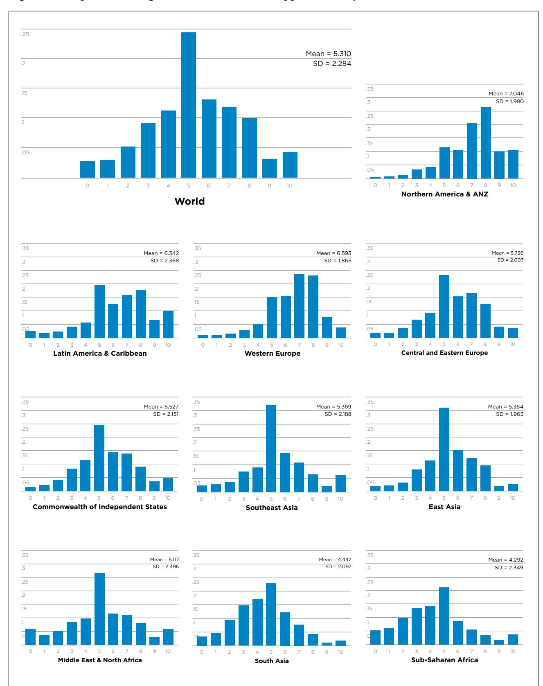

In Table 2.1 we present our latest modeling of national average life evaluations and measures of positive and negative affect (emotion) by country and year. For ease of comparison, the table has the same basic structure as Table 2.1 in the *World Happiness Report Update 2016*. The major difference comes from the inclusion of data for late 2015 and all of 2016, which increases by 131 (or about 12 percent) the number of country-year observations.24 The resulting changes to the estimated equation are very slight.25 There are four equations in Table 2.1. The first equation provides the basis for constructing the sub-bars shown in Figure 2.2.

The results in the first column of Table 2.1 explain national average life evaluations in terms of six key variables: GDP per capita, social support, healthy life expectancy, freedom to make life choices, generosity, and freedom from corruption.26 Taken together, these six variables explain almost three-quarters of the variation in national annual average ladder scores among countries, using data from the years 2005 to 2016. The model's predictive power is little changed if the year fixed effects in the model are removed, falling from 74.6% to 74.0% in terms of the adjusted R-squared.

The second and third columns of Table 2.1 use the same six variables to estimate equations for national averages of positive and negative affect, where both are based on averages for answers about yesterday's emotional experiences. In general, the emotional measures, and especially negative emotions, are much less fully explained by the six variables than are life evaluations. Yet, the differences vary greatly from one circumstance to another. Per capita income and healthy life expectancy have significant effects on life evaluations, but not, in these national average data, on either positive or negative affect. The situation changes when we consider social variables. Bearing in mind that positive and negative affect are measured on a 0 to 1 scale, while life evaluations are on a 0 to 10 scale, social support can be seen to have a similar

proportionate effect on positive and negative emotions as on life evaluations. Freedom and generosity have even larger influences on positive affect than on the ladder. Negative affect is significantly reduced by social support, freedom, and absence of corruption.

In the fourth column we re-estimate the life evaluation equation from column 1, adding both positive and negative affect to partially implement the Aristotelian presumption that sustained positive emotions are important supports for a good life.27 The most striking feature is the extent to which the results buttress a finding in psychology that the existence of positive emotions matters much more than the absence of negative ones. Positive affect has a large and highly significant impact in the final equation of Table 2.1, while negative affect has none.

As for the coefficients on the other variables in the final equation, the changes are material only on those variables—especially freedom and generosity—that have the largest impacts on positive affect. Thus we can infer first, that positive emotions play a strong role in support of life evaluations, and second, that most of the impact of freedom and generosity on life evaluations is mediated by their influence on positive emotions. That is, freedom and generosity have large impacts on positive affect, which in turn has a major impact on life evaluations. The Gallup World Poll does not have a widely available measure of life purpose to test whether it too would play a strong role in support of high life evaluations. However, newly available data from the large samples of UK data does suggest that life purpose plays a strongly supportive role, independent of the roles of life circumstances and positive emotions.

**Table 2.1: Regressions to Explain Average Happiness across Countries (Pooled OLS)**

|                                  |                     | Dependent Variable  |                      |                     |
|----------------------------------|---------------------|---------------------|----------------------|---------------------|
| Independent Variable             | Cantril Ladder      | Positive Affect     | Negative Affect      | Cantril Ladder      |
| Log GDP per capita               | 0.341 (0.06)***  | 002 (0.009)      | 0.01 (0.008)      | 0.343 (0.06)***  |
| Social support                   | 2.332 (0.407)*** | 0.255 (0.051)*** | -0.258 (0.047)*** | 1.813 (0.407)*** |
| Healthy life expectancy at birth | 0.029 (0.008)*** | 0.0002 (0.001)   | 0.001 (0.001)     | 0.028 (0.008)*** |
| Freedom to make life choices     | 1.098 (0.31)***  | 0.325 (0.039)*** | 081 (0.043)*      | 0.403 (0.301)    |
| Generosity                       | 0.842 (0.273)*** | 0.164 (0.031)*** | 006 (0.029)       | 0.482 (0.275)*   |
| Perceptions of corruption        | 533 (0.287)*     | 0.029 (0.028)    | 0.095 (0.025)***  | 607 (0.276)**    |
| Positive affect                  |                     |                     |                      | 2.199 (0.428)*** |
| Negative affect                  |                     |                     |                      | 0.153 (0.474)    |
| Year fixed effects               | Included            | Included            | Included             | Included            |
| Number of countries              | 155                 | 155                 | 155                  | 155                 |
| Number of obs.                   | 1,249               | 1,246               | 1,248                | 1,245               |
| Adjusted R-squared               | 0.746               | 0.49                | 0.233                | 0.767               |

Notes: This is a pooled OLS regression for a tattered panel explaining annual national average Cantril ladder responses from all available surveys from 2005 to 2016. See *Technical Box 2* for detailed information about each of the predictors. Coefficients are reported with robust standard errors clustered by country in parentheses. \*\*\*, \*\*, and \* indicate significance at the 1, 5 and 10 percent levels respectively.

#### **Technical Box 2: Detailed Information About Each of the Predictors in Table 2.1**

- 1. GDP per capita is in terms of Purchasing Power Parity (PPP) adjusted to constant 2011 international dollars, taken from the World Development Indicators (WDI) released by the World Bank in August 2016. See the appendix for more details. GDP data for 2016 are not yet available, so we extend the GDP time series from 2015 to 2016 using country-specific forecasts of real GDP growth from the OECD Economic Outlook No. 99 (Edition 2016/1) and World Bank's Global Economic Prospects (Last Updated: 01/06/2016), after adjustment for population growth. The equation uses the natural log of GDP per capita, as this form fits the data significantly better than GDP per capita.
- 2. The time series of healthy life expectancy at birth are constructed based on data from the World Health Organization (WHO) and WDI. WHO publishes the data on healthy life expectancy for the year 2012. The time series of life expectancies, with no adjustment for health, are available in WDI. We adopt the following strategy to construct the time series of healthy life expectancy at birth: first we generate the ratios of healthy life expectancy to life expectancy in 2012 for countries with both data. We then apply the country-specific ratios to other years to generate the healthy life expectancy data. See the appendix for more details.
- 3. Social support is the national average of the binary responses (either 0 or 1) to the Gallup World Poll (GWP) question "If you were in trouble, do you have relatives or friends you can count on to help you whenever you need them, or not?"

- 4. Freedom to make life choices is the national average of binary responses to the GWP question "Are you satisfied or dissatisfied with your freedom to choose what you do with your life?"
- 5. Generosity is the residual of regressing the national average of GWP responses to the question "Have you donated money to a charity in the past month?" on GDP per capita.
- 6. Perceptions of corruption are the average of binary answers to two GWP questions: "Is corruption widespread throughout the government or not?" and "Is corruption widespread within businesses or not?" Where data for government corruption are missing, the perception of business corruption is used as the overall corruption-perception measure.
- 7. Positive affect is defined as the average of previous-day affect measures for happiness, laughter, and enjoyment for GWP waves 3-7 (years 2008 to 2012, and some in 2013). It is defined as the average of laughter and enjoyment for other waves where the happiness question was not asked.
- 8. Negative affect is defined as the average of previous-day affect measures for worry, sadness, and anger for all waves. See the appendix for more details.

#### Ranking of Happiness by Country

Figure 2.2 (pp. 20-22) shows the average ladder score (the average answer to the Cantril ladder question, asking people to evaluate the quality of their current lives on a scale of 0 to 10) for each country, averaged over the years 2014-2016. Not every country has surveys in every year; the total sample sizes are reported in the statistical appendix, and they are reflected in Figure 2.2 by the horizontal lines showing the 95 percent confidence regions. The confidence regions are tighter for countries with larger samples. To increase the number of countries ranked, we also include one that had no 2014-2016 surveys, but did have one in 2013. This brings the number of countries shown in Figure 2.2 to 155.

The length of each overall bar represents the average score, which is also shown in numerals. The rankings in Figure 2.2 depend only on the average Cantril ladder scores reported by the respondents.

Each of these bars is divided into seven segments, showing our research efforts to find possible sources for the ladder levels. The first six sub-bars show how much each of the six key variables is calculated to contribute to that country's ladder score, relative to that in a hypothetical country called Dystopia, so named because it has values equal to the world's lowest national averages for 2014-2016 for each of the six key variables used in Table 2.1. We use Dystopia as a benchmark against which to compare each other country's performance in terms of each of the six factors. This choice of benchmark permits every real country to have a non-negative contribution from each of the six factors. We calculate, based on estimates in Table 2.1, that Dystopia had a 2014-2016 ladder score equal to 1.85 on the 0 to 10 scale. The final sub-bar is the sum of two components: the calculated average 2014-2016 life evaluation in Dystopia (=1.85) and each country's own prediction error, which measures the extent to which life evaluations are higher or lower than predicted by our equation in the first column of Table 2.1. The residuals are as likely to be negative as positive.28

Returning to the six sub-bars showing the contribution of each factor to each country's average life evaluation, it might help to show in more detail how this is done. Taking the example of healthy life expectancy, the sub-bar for this factor in the case of Mexico is equal to the amount by which healthy life expectancy in Mexico exceeds the world's lowest value, multiplied by the Table 2.1 coefficient for the influence of healthy life expectancy on life evaluations. The width of these different sub-bars then shows, country-by-country, how much each of the six variables is estimated to contribute to explaining the international ladder differences. These calculations are illustrative rather than conclusive, for several reasons. First, the selection of candidate variables is restricted by what is available for all these countries. Traditional variables like GDP per capita and healthy life expectancy are widely available. But measures of the quality of the social context, which have been shown in experiments and national surveys to have strong links to life evaluations, have not been sufficiently surveyed in the Gallup or other global polls, or otherwise measured in statistics available for all countries. Even with this limited choice, we find that four variables covering different aspects of the social and institutional context—having someone to count on, generosity, freedom to make life choices and absence of corruption—are together responsible for more than half of the average difference between each country's predicted ladder score and that in Dystopia in the 2014-2016 period. As shown in Table 18 of the Statistical Appendix, the average country has a 2014-2016 ladder score that is 3.5 points above the Dystopia ladder score of 1.85. Of the 3.5 points, the largest single part (34 percent) comes from social support, followed by GDP per capita (28 percent) and healthy life expectancy (16 percent), and then freedom (12 percent), generosity (7 percent), and corruption (4 percent).29

Our limited choice means that the variables we use may be taking credit properly due to other better variables, or to un-measurable other factors. There are also likely to be vicious or virtuous circles, with two-way linkages among the variables. For example, there is much evidence that those who have happier lives are likely to live longer, be most trusting, be more cooperative, and be generally better able to meet life's demands.30 This will feed back to improve health, GDP, generosity, corruption, and sense of freedom. Finally, some of the variables are derived from the same respondents as the life evaluations and hence possibly determined by common factors. This risk is less using national averages, because individual differences in personality and many life circumstances tend to average out at the national level.

To provide more assurance that our results are not seriously biased because we are using the same respondents to report life evaluations, social support, freedom, generosity, and corruption, we have tested the robustness of our procedure this year (see Statistical Appendix for more detail). We did this by splitting each country's respondents randomly into two groups, and using the average values for one group for social support, freedom, generosity, and absence of corruption in the equations to explain average life evaluations in the other half of the sample. The coefficients on each of the four variables fall, just as we would expect. But the changes are reassuringly small (ranging from 1% to 5%) and are far from being statistically significant.31

The seventh and final segment is the sum of two components. The first component is a fixed number representing our calculation of the 2014-2016 ladder score for Dystopia (=1.85). The second component is the average 2014-2016 residual for each country. The sum of these two components comprises the right-hand sub-bar for each country; it varies from one country to the next because some countries have life evaluations above their predicted values, and

others lower. The residual simply represents that part of the national average ladder score that is not explained by our model; with the residual included, the sum of all the sub-bars adds up to the actual average life evaluations on which the rankings are based.

**Figure 2.2: Ranking of Happiness 2014-2016 (Part 1)**

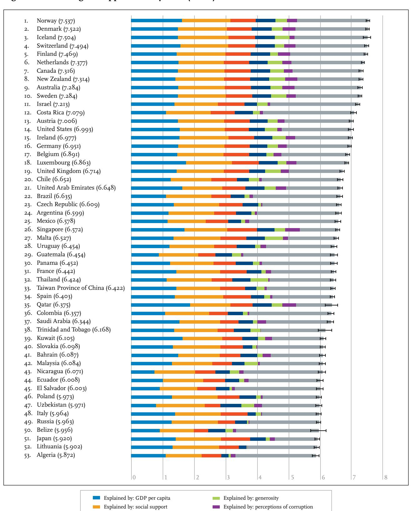

Dystopia (1.85) + residual 95% confidence interval

Explained by: healthy life expectancy Explained by: freedom to make life choices

**Figure 2.2: Ranking of Happiness 2014-2016 (Part 2)**

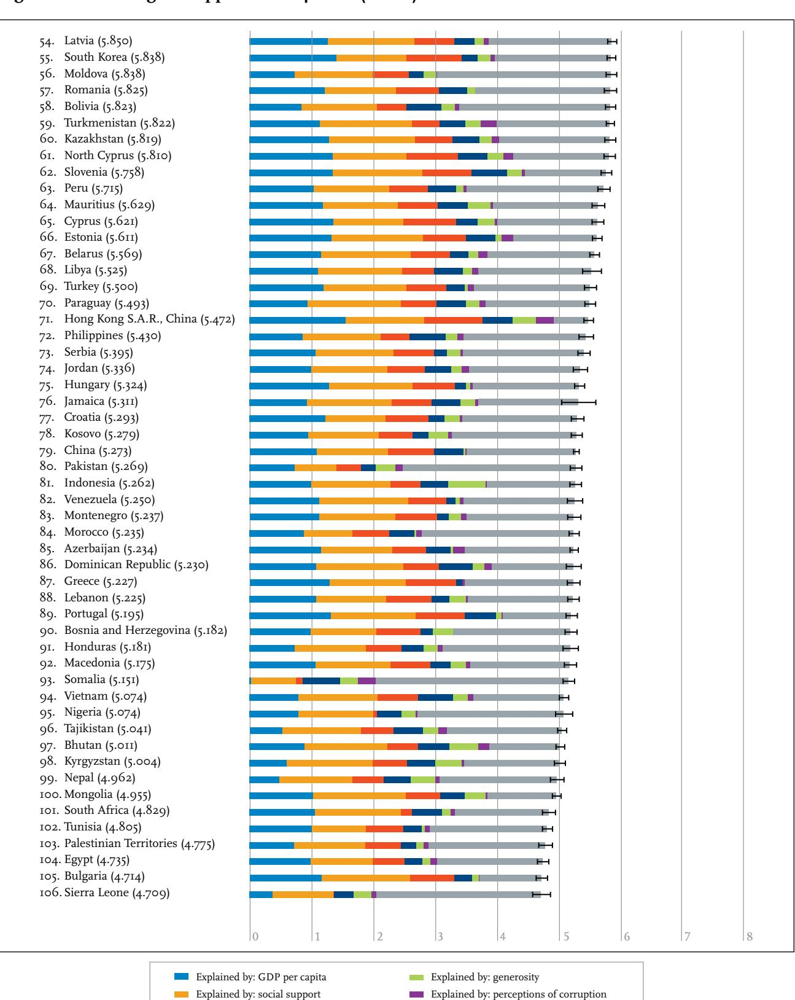

Dystopia (1.85) + residual 95% confidence interval

Explained by: healthy life expectancy Explained by: freedom to make life choices

**Figure 2.2: Ranking of Happiness 2014-2016 (Part 3)**

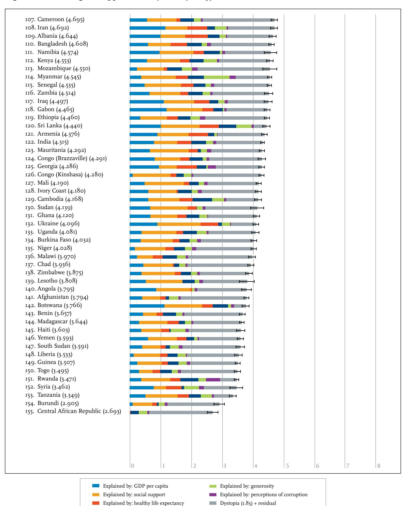

Explained by: freedom to make life choices

95% confidence interval

What do the latest data show for the 2014-2016 country rankings? Two features carry over from previous editions of the *World Happiness Report*. First, there is a lot of year-to-year consistency in the way people rate their lives in different countries. Thus there remains a four-point gap between the 10 top-ranked and the 10 bottom-ranked countries. The top 10 countries in Figure 2.2 are the same countries that were top-ranked in *World Happiness Report 2016 Update*, although there has been some swapping of places, as is to be expected among countries so closely grouped in average scores. The top four countries are the same ones that held the top four positions in *World Happiness Report 2016 Update*, with Norway moving up from 4th place to overtake Denmark at the top of the ranking. Denmark is now in 2nd place, while Iceland remains in 3rd, Switzerland is now 4th, and Finland remains in 5th position. Netherlands and Canada have traded places, with Netherlands now 6th, and Canada 7th. The remaining three in the top ten have the same order as in the *World Happiness Report 2016 Update*, with New Zealand 8th, Australia 9th, and Sweden 10th. In Figure 2.2, the average ladder score differs only by 0.25 points between the top country and the 10th country, and only 0.043 between the 1st and 4th countries. The 10 countries with the lowest average life evaluations are somewhat different from those in 2016, partly due to some countries returning to the surveyed group—the Central African Republic, for example, and some quite large changes in average ladder scores, up for Togo and Afghanistan, and down for Tanzania, South Sudan, and Yemen. Compared to the top 10 countries in the current ranking, there is a much bigger range of scores covered by the bottom 10 countries. Within this group, average scores differ by as much as 0.9 points, more than one-quarter of the average national score in the group. Tanzania and Rwanda have anomalous scores, in the sense that their predicted values, which are based on their performance on the six key variables, are high enough to rank them much higher than do the survey answers.

Despite the general consistency among the top countries scores, there have been many significant changes in the rest of the countries. Looking at changes over the longer term, many countries have exhibited substantial changes in average scores, and hence in country rankings, between 2005–2007 and 2014–2016, as shown later in more detail.

When looking at average ladder scores, it is also important to note the horizontal whisker lines at the right-hand end of the main bar for each country. These lines denote the 95 percent confidence regions for the estimates, so that countries with overlapping error bars have scores that do not significantly differ from each other. Thus it can be seen that the five topranked countries (Norway, Denmark, Iceland, Switzerland, and Finland) have overlapping confidence regions, and all have national average ladder scores either above or just below 7.5. The remaining five of the top ten countries are closely grouped in a narrow range from 7.377 for Netherlands in 6th place, to 7.284 for Sweden in 10th place.

Average life evaluations in the top 10 countries are thus more than twice as high as in the bottom 10. If we use the first equation of Table 2.1 to look for possible reasons for these very different life evaluations, it suggests that of the 4 point difference, 3.25 points can be traced to differences in the six key factors: 1.15 points from the GDP per capita gap, 0.86 due to differences in social support, 0.57 to differences in healthy life expectancy, 0.33 to differences in freedom, 0.2 to differences in corruption, and 0.13 to differences in generosity. Income differences are more than one-third of the total explanation because, of the six factors, income is the most unequally distributed among countries. GDP per capita is 25 times higher in the top 10 than in the bottom 10 countries.32

Overall, the model explains quite well the life evaluation differences within as well as between regions and for the world as a whole.33 On average, however, the countries of Latin America still have mean life evaluations that are higher (by about 0.6 on the 0 to 10 scale) than predicted by the model. This difference has been found in earlier work and been considered to represent systematic personality differences, some unique features of family and social life in Latin countries, or some other cultural differences.34 In partial contrast, the countries of East Asia have average life evaluations below those predicted by the

model, a finding that has been thought to reflect, at least in part, cultural differences in response style. It is also possible that both differences are in substantial measure due to the existence of important excluded features of life that are more prevalent in those countries than elsewhere.35 It is reassuring that our findings about the relative importance of the six factors are generally unaffected by whether or not we make explicit allowance for these regional differences.36

#### **Technical Box 3: Country Happiness Averages are Based on Resident Populations, Sometimes Including Large Non-national Populations**

The happiness scores used in this report are intended to be representative of resident populations of each country regardless of their citizenship. This reflects standard census practice, and thereby includes all of the world's population in the survey frame, as appropriate for a full accounting of world happiness. Some countries have very large shares of residents who are not citizens (non-Nationals). This is especially true for member countries of the Gulf Cooperation Council (GCC). In United Arab Emirates and Qatar, for example, non-Nationals are estimated to comprise well over 80% of the country's total population. The following table compares the happiness scores of GCC countries' Nationals and non-Nationals over the period from 2014- 2016, focusing on those that have sufficiently large numbers of survey respondents in both categories of Nationals and non-Nationals (exceeding 300 over the 3-year period).

| Country      | Total population | Nationals only | Non-Nationals |
|--------------|---------------------|-------------------|---------------|
| Bahrain      | 6.09                | 5.64              | 6.41          |
| Kuwait       | 6.10                | 6.58              | 5.85          |
| Saudi Arabia | 6.34                | 6.45              | 6.13          |
| UAE          | 6.65                | 7.11              | 6.57          |

The table does not include Oman because it was not surveyed between 2014 and 2016. It does not include Qatar because there was only one survey in the period, with the number of Nationals surveyed being less than 100. We are grateful to Gallup for data and advice on tabulations.

The sources and nature of the differences in life evaluations between migrants and non-migrants deserve more research in a world with increasingly mobile populations. We are planning in *World Happiness Report 2018* to do a deeper analysis of migration and its consequences for the happiness of migrants and others in the nations from which and to which they move.

#### Changes in the Levels of Happiness

In this section we consider how life evaluations have changed. For life evaluations, we consider the changes from 2005-2007 before the onset of the global recession, to 2014-2016, the most recent three-year period for which data from the Gallup World Poll are available. We present first the changes in average life evaluations. In Figure 2.3 we show the changes in happiness levels for all 126 countries having sufficient numbers of observations for both 2005-2007 and 2014-2016.37

**Figure 2.3: Changes in Happiness from 2005-2007 to 2014-2016 (Part 1)**

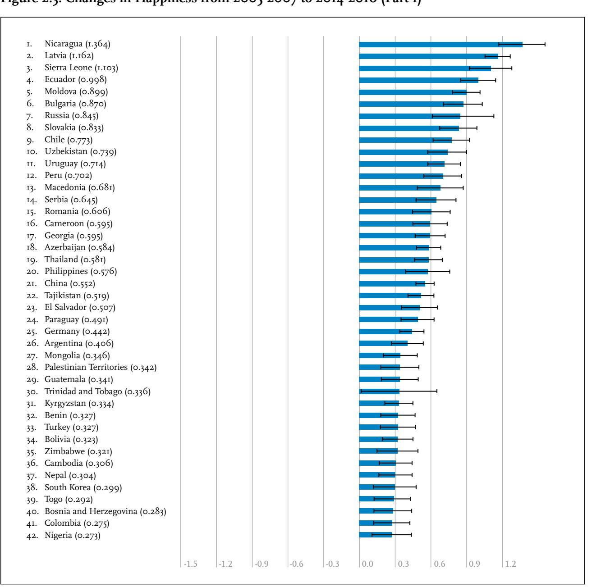

**Figure 2.3: Changes in Happiness from 2005-2007 to 2014-2016 (Part 2)**

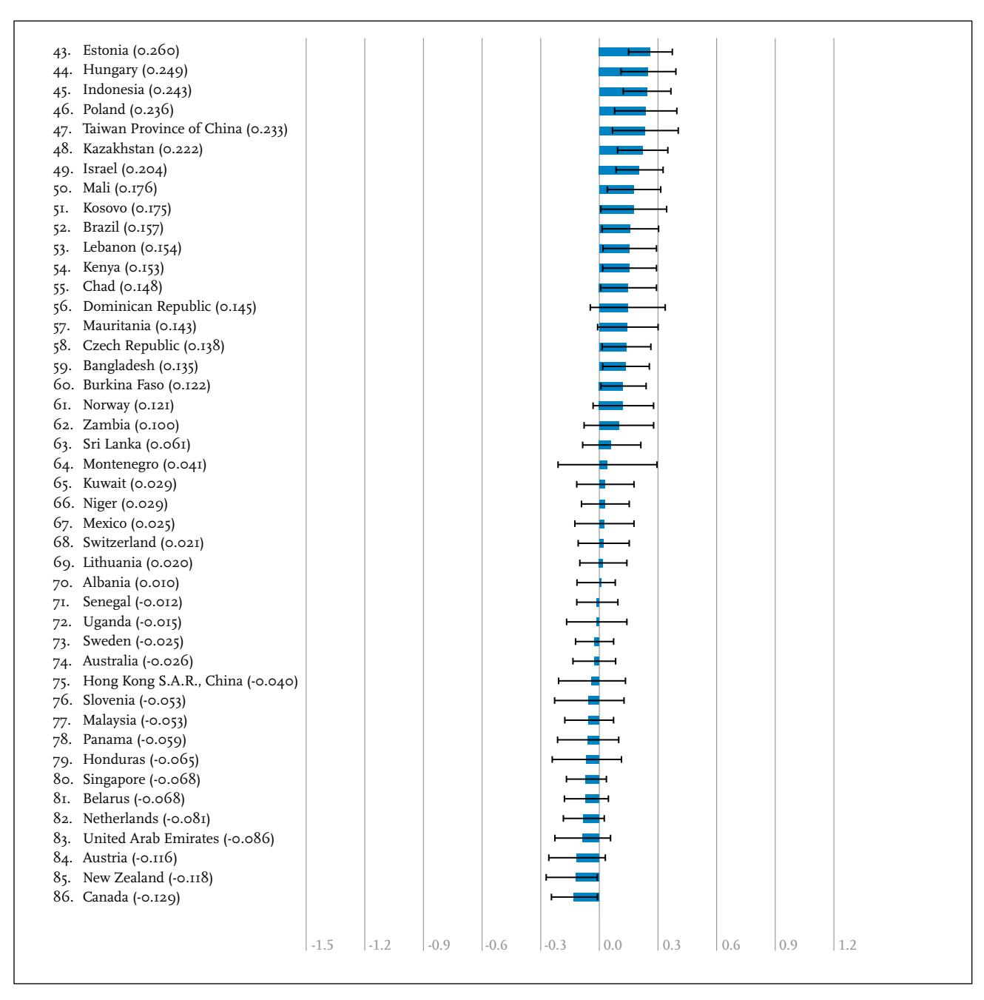

87. Haiti (-0.151) 88. Mozambique (-0.163) 89. Ireland (-0.167) 90. Liberia (-0.169) 91. United Kingdom (-0.172) 92. Costa Rica (-0.178) 93. Finland (-0.203) 94. Armenia (-0.210) 95. Portugal (-0.210) 96. Pakistan (-0.237) 97. Vietnam (-0.285) 98. Namibia (-0.312) 99. South Africa (-0.316) 100. Madagascar (-0.336) 101. Belgium (-0.349) 102. France (-0.372) 103. United States (-0.372) 104. Malawi (-0.391) 105. Denmark (-0.404) 106. Japan (-0.447) 107. Belize (-0.495) 108. Croatia (-0.528) 109. Jordan (-0.605) 110. Cyprus (-0.617) 111. Egypt (-0.624) 112. Iran (-0.629) 113. Spain (-0.669) 114. Rwanda (-0.744) 115. Italy (-0.749) 116. Ghana (-0.757) 117. Tanzania (-0.776) 118. Saudi Arabia (-0.829) 119. India (-0.839) 120. Yemen (-0.884) 121. Jamaica (-0.897) 122. Ukraine (-0.930) 123. Botswana (-0.973) 124. Greece (-1.099) 125. Central African Republic (-1.467) 126. Venezuela (-1.597) -1.5 -1.2 -0.9 -0.6 -0.3 0.0 0.3 0.6 0.9 1.2

Changes from 2005–2007 to 2014–2016 95% confidence interval

**Figure 2.3: Changes in Happiness from 2005-2007 to 2014-2016 (Part 3)**

Of the 126 countries with data for 2005-2007 and 2014-2016, 95 had significant changes, 58 of which were significant increases, ranging from 0.12 to 1.36 points on the 0 to 10 scale. There were 38 showing significant decreases, ranging from -0.12 to -1.6 points, while the remaining 30 countries revealed no significant trend from 2005-2007 to 2014-2016. As shown in Table 34 of the Statistical Appendix, the significant gains and losses are very unevenly distributed across the world, and sometimes also within continents. For example, in Western Europe there were 11 significant losses but only 1 significant gain. In Central and Eastern Europe, by contrast, these results were reversed, with 12 significant gains against 1 loss. Two other regions had many more significant gainers than losers, as measured by country counts. Latin America and the Caribbean had 13 significant gainers against 4 losses, and the Commonwealth of Independent States had 8 gains against 2 losses. In all other world regions, the numbers of significant gains and losses were much more equally divided.

Among the 20 top gainers, all of which showed average ladder scores increasing by 0.50 or more, eleven are in the Commonwealth of Independent States, Central and Eastern Europe, five in Latin America, two in sub-Saharan Africa, Thailand and Philippines in Asia. Among the 20 largest losers, all of which showed ladder reductions of 0.5 or more, five were in the Middle East and North Africa, five in sub-Saharan Africa, four in Western Europe, three in Latin America and the Caribbean, and one each in South Asia, Central and Eastern Europe, and the Commonwealth of Independent States.

These gains and losses are very large, especially for the 10 most affected gainers and losers. For each of the 10 top gainers, the average life evaluation gains exceeded those that would be expected from a doubling of per capita incomes. For each of the 10 countries with the biggest drops in average life evaluations, the losses were more than would be expected from a halving of

GDP per capita. Thus the changes are far more than would be expected from income losses or gains flowing from macroeconomic changes, even in the wake of an economic crisis as large as that following 2007.

On the gaining side of the ledger, the inclusion of five transition countries among the top 10 gainers reflects the rising average life evaluations for the transition countries taken as a group. The appearance of sub-Saharan African countries among the biggest gainers and the biggest losers reflects the variety and volatility of experiences among the sub-Saharan countries for which changes are shown in Figure 2.3, and whose experiences are analyzed in more detail in Chapter 4.

The 10 countries with the largest declines in average life evaluations typically suffered some combination of economic, political, and social stresses. In the *World Happiness Report 2016 Update*, 3 of the 10 largest losers (Greece, Italy, and Spain) were among the four hard-hit Eurozone countries whose post-crisis experience was analyzed in detail in *World Happiness Report 2013*. Of the three, Greece, the hardest hit, is the only one still ranked among the ten largest declines, with a net decline of 1.1, compared to 1.3 previously. The other nine countries come from six of the ten global regions, with separate circumstances at play in each case.

Figure 18 and Table 33 in the Statistical Appendix show the population-weighted actual and predicted changes in happiness for the ten regions of the world from 2005-2007 to 2014-2016. The correlation between the actual and predicted changes is 0.35, with the predicted matching the actual exactly only for the largest gaining region, the Commonwealth of Independent States, which had life evaluations up by 0.43 points on the 0 to 10 scale. South Asia had the largest drop in actual life evaluations while predicted to have a substantial increase. Sub-Saharan Africa was predicted to have a substantial gain, while the

actual change was a very small drop. For all other regions, the predicted and actual changes were in the same direction, with the substantial reductions in the United States (the largest country in the NANZ group), Western Europe, and the Middle East and North Africa being larger in each case than predicted. The substantial happiness gains in Southeast Asia, East Asia, and Central and Eastern Europe were all predicted to be substantial, while the Latin American gain was not predicted by the equation. As Figure 18 shows, changes in the six factors are only moderately successful in capturing the evolving patterns of life over what have been tumultuous times for many countries. Most of the directions of change were predicted, but generally not the amounts of change.

#### Social Foundations of Happiness

In this central section of the chapter we examine the social foundations of world happiness. Within the six-factor explanatory framework we have adopted to explain levels and changes of life evaluations, four—social support, freedom to make life choices, generosity, and absence of corruption in government and business—are best seen as representative of different aspects of the social foundations of well-being. The other two—GDP per capita and healthy life expectancy—both long-established as goals for development, are not themselves measures of the quality of a nation's social foundations, but they are nonetheless strongly affected by the social context. So where do we start in attempting to understand the importance of the social context to the quality of life? After toying with a number of approaches, we come back to the simplest, and organize our discussion under the headings provided by our six explanatory variables, followed by some links to what this method fails to cover.

We start by reviewing some of the linkages between the quality of the social context and real incomes as well as healthy life expectancy. We

then turn to consider the mechanisms whereby the other four variables, themselves more plausibly treated as primary measures of the quality of a society's social foundations, establish their additional linkages to the quality of life, as revealed by individual life assessments. We then consider how inequality affects the social foundations, and vice versa, followed by some links to our earlier analysis of the social foundations of resilience. Finally, we consider new evidence about the social foundations of well-being over the life course, arguing that the age-profiles of happiness in different societies reflect the relative quality of the social fabric for people at different ages and stages of life.

#### **Social Foundations of Income**

As human lives and technologies have become more complicated and intertwined over the centuries, the benefits of a bedrock of stable social norms and institutions have become increasingly obvious. There have been many strands of opinion and research about which social norms are most favorable for human development. Adam Smith highlighted two of these strands. In the *Theory of Moral Sentiments*, Smith argued that human beings are inherently sympathetic to the fates of others beyond themselves, but too imperfect to apply such sympathies beyond themselves, their friends and family, and perhaps their countries. The power and responsibility for achieving general happiness of the world population lay with God, with individuals and families presumed able to be fully sympathetic only with those close to themselves. Modern experimental research in psychology echoes this view, since the willingness of students to mark in their own favor has been found to be significant, but reversed by reminders of instructions from a higher power.38 Smith's idea of a strong but limited sense of sympathy underpinned his later and more influential arguments in the *Wealth of Nations*. Therein, he extolled the capacities of impersonal markets to facilitate specialization in production, with trade being used to share efforts and rewards to mutual advantage as long as these markets were

sufficiently underpinned by social norms. These norms are needed to enable people to plan in some confidence that others would deliver as promised, as well as to limit the use of coercion. Much subsequent research in economics has tended to follow Smith's presumption that each individual's moral sympathy is limited mainly to family and friends, with individual self-interest serving to explain their decisions. Over the past century, there has been increasing realization of the importance of social norms for any joint activity, especially including the production and distribution of goods and services, as measured by GDP. Indeed, research, including that in this chapter, shows that people routinely act more unselfishly than Smith presumed39, and are happier when they do so40.

Trust has long been seen as an especially important support for economic efficiency. Trust among participants is an asset vital to dealing with the many contingencies that lie beyond the power of contracts to envisage. It also helps to ensure that contracts themselves will be reliable.41 Empirical research over the past twenty years on the social basis of economic efficiency has given trust a central role, seen as an element or consequence of social capital, which the OECD has defined as "networks together with shared norms, values and understandings that facilitate co-operation within or among groups."42 Evidence that average levels of economic performance and rates of economic growth have been higher in regions or countries with higher trust levels is accumulating.43 To the extent that these social norms are present in and protected by public institutions, their capacity to support economic performance is thereby increased.44 There is thus much evidence that good governance is a key foundation for economic growth; we shall see later that it has benefits for happiness that extend beyond its support for economic progress.

#### **Social Foundations of Health**

There is a long-standing research literature on the social determinants of health. The primary factors considered to represent social determinants are measures of social and economic status, primarily income, education, and job status.45 For all three of these markers, both within and across societies, those at the top fare better, in terms of both death and illness, than do those at the bottom.46 The channels for these effects are not yet widely understood, but are thought to include access to health care, better health behaviors, and better nutrition. There has also been some evidence that addressing inequalities of income and education would not only narrow health inequalities, but also raise average levels at the same time. This literature suggests that at least some of the total influence of income, and perhaps a larger part of the influence of education, on well-being flows through its influence on healthy life expectancy.

Another stream of research has tested and found significant links between social trust and health status.47 The case was made that inequalities in income might have effects on health status through the established linkage between income inequality and social trust.48 Global evidence also suggests that two key social variables—social support and volunteering—are in most countries consistently associated with better self-reported health status.49 Furthermore, the quality of social institutions also has important direct effects on health, as health outcomes are better where corruption is less and government quality generally higher.50

More generally, there are many studies showing that maintaining or improving the quality of the social context, whether within the operating room51, in post-operative care, among those recovering from trauma52 or hoping to avoid a new or recurring disease, or among those in elder care53, is a notable protective and healing agent. Both the extent and the quality of social relationships are important. Social support also

delivers better health by reducing the damage to health from stressful events. For example, a prospective study of Swedish men found that prior exposure to stressful events sharply increased subsequent mortality among previously healthy men, but that this risk was almost eliminated for those who felt themselves to have high levels of emotional support.54 More direct beneficial health effects of social integration, without mediation through stressful events, is revealed by a variety of community-level prospective studies wherein those with more active social networks had lower subsequent mortality, even after taking into account initial health status and a variety of other protective factors.55

Generosity, which we have found to be an important source of happiness, also turns out to benefit physical health, with a variety of studies showing that health benefits are greater for the givers than for the receivers of peer-to-peer and other forms of support.56

Experimental evidence has shown that those with a broader range of social contacts have significantly lower susceptibility to a common cold virus to an extent that reflects the range of social roles they play.57 By similar reasoning, negative social relations can impose a health cost. For example, those with enduring social conflicts were more than twice as likely to develop a cold from an experimentally delivered cold virus.58

The bulk of the evidence on the health-giving powers of social capital relates to the presence or maintenance of pre-existing natural social connections. The evidence from social support interventions for those with serious life-threatening illnesses is more mixed, leading some to suggest that improving natural social networks may be more effective than more targeted patient support.59

#### **The Direct Role of Social Support**

Social support has been shown in the previous section to have strong linkages to happiness through its effects on physical and mental health. This is only part of the story, however. We have already seen in Table 2.1 that having someone to count on has a very large impact on life evaluations even after allowing for the effects flowing through higher incomes and better health. The percentage of the population who report that they have someone to count on in times of trouble ranges from 29% in Dystopia to almost 99% in Iceland. For a country to have 10% more of its population with someone to count on, (not a large change given the range of 70% between the highest and lowest countries) is associated with an increase in average life evaluations of 0.23 points on the 0 to 10 scale. An increase of that size in life evaluations is equivalent to that from a doubling of GDP per capita, or, for the median country, a ranking increase of seven places in Figure 2.2. These effects are above and beyond those that might flow through higher incomes or better health. Having just one person to count on is not a very demanding definition of social support, as revealed by the large number of countries where more than 90% of respondents have someone to count on. We suspect that a more informative measure of social support might show even larger effects, and, of course, there are many other dimensions of the social support available to people in their homes, on the streets, in their workplaces, among their neighbors, and within their social networks. Having someone to count on is of fundamental importance, but having a fuller set of supporting friendships and social contacts must be even better.

#### **How Does a sense of freedom affect happiness?**

The Gallup World Poll asks respondents if they are satisfied or dissatisfied with their freedom to choose what to do with their lives. The generality of the question is a virtue, as people are free to focus on whatever aspects of life they find most important. The fact that 0 and 1 are the only

possible answers does pose a problem, as it stops us from deriving a measure of just how free people feel, and how evenly this sense of freedom is spread among the population. Even the simple measure has considerable power to explain international differences in life evaluations, however. The variation across countries is even larger than for social support, ranging from 26% to 98%, with an average of 71%. Moving 10% of the population from dissatisfied to satisfied with their life-choice freedom is matched by an increase in average life evaluations of 0.11 points on the 0 to 10 scale. This is slightly less than half of what was calculated for having someone to count on. It is nonetheless a very substantial effect, equivalent to an increase of 40% in GDP per capita, or a few places on the ranking tables.

How do answers to the freedom question relate to the social foundations of happiness? In some ways the freedom and social support questions cover different but tightly related aspects of the social fabric. To feel secure, people need to feel that others care for them and will come to their aid when needed. To some extent, being in such a network of usually mutual obligations sets limits on each person's freedom to make life choices freely, as the interests of others must always be borne in mind. It is apparent from our results that both features are important for a good life. It is also clear from the data that these different aspects need not conflict with each other, as the most successful societies are ones where both measures of the social fabric are strong. Indeed, some of the features of the social fabric that reflect its ability to care for people, in particular the health and education systems, also serve to level out the differences in life opportunities that affect the breadth and reality of the life choices open to each individual. For example, some Northern European countries ranking high in both social support and life-choice freedom have education systems that combine high average success while also narrowing the gaps in performance, and hence future life choices, between children raised in homes with very different levels of parental education.60

#### **Generosity**

The Gallup World Poll asked respondents if they have given money for a charitable purpose within the past 30 days. When we use the resulting national averages to explain happiness, we first take out whatever variance is explained by international differences in GDP per capita. Giving money to others is more prevalent in richer countries, in part because higher incomes provide more resources available for sharing. We adjust for income effects so that we can be sure that the effect we find is not a consequence of higher incomes. By doing this, we also increase the estimated effects of per capita incomes, since they now include the effects flowing through greater generosity.

To have 10% more of the population donating is associated with a 0.084 increase in average life evaluations. This is roughly equivalent to the effect of per capita GDP being more than 25% higher.

There are two types of evidence that have been used to assess the happiness effects of generosity. Survey evidence can measure average frequency of generous acts and show how these are related to life evaluations. In lab experiments used to dig deeper into the motivations and consequences of generous acts, the changes under study are too small and too temporary to affect life evaluations, so various positive and negative emotions, measured before, after, and sometimes during the experiments, are used instead61.

Experimental research has routinely found people being more benevolent and altruistic than their self-interest would seem to predict, defying efforts made to explain this in terms of expected reciprocity or other longer term versions of self-interest. But subjective well-being research is now showing that in all cultures62, and even from infancy63, people are drawn to pro-social behavior64, and that they are happier when they act pro-socially65.

#### **Corruption, Trust, and Good Governance**

Social trust, as we have shown above, has been found to be an important support for economic efficiency and physical health. But beyond these channels, the evidence shows that high-trust communities and societies are happier places to live, even after allowing for the effects of higher incomes and better health. The Gallup World Poll does not include the social trust question on a regular basis, so we must rely on the regularly asked questions about perceptions of corruption in business and government to provide a proxy measure.

Respondents are asked separately about corruption in business and government in their own countries, and we use the average of those responses in our estimates of the effects of corruption. Unfortunately, the answers to whether corruption is a problem in one or the other aspect of life are simply 'yes' or 'no,' so we are unable to properly measure just how bad the problem is seen to be; nor can we see how unequally corruption assessments are distributed. Looking at the 2005 to 2016 data as a whole, the national average corruption assessments vary from 4% to 98%, with an average of 76%. To decrease by 10% the share of the population who think that corruption is a problem is estimated by our model to increase average life evaluations by 0.05 points on the 0 to 10 scale—a smaller amount than for social support, freedom, and generosity, but still substantial, equivalent to an increase of GDP per capita of almost 20%. These happiness gains lie above and beyond the well-established effects of corruption on real GDP per capita.

The full happiness effects of a trustworthy environment are likely to be significantly greater than can be captured by a simple measure of the presence or absence of corruption in business and government. It has already been established that even beyond social trust and absence of corruption there are several different aspects of life where trust is important for well-being—in

the workplace, on the streets, in neighborhoods, in business dealings, and in several aspects of government. The European Social Survey (ESS) has several different measures of trust, making it possible to see to what extent they have independent impacts on happiness. If all trust measures are tapping into the same space, then one measure might be as good as another, and it might not matter which is used. The ESS evidence shows that several different measures of trust have independently important consequences for well-being, and that the total effects of improvements in several types of trust are significantly higher than would be estimated using a single measure to stand in for all measures. The ESS also helpfully asks for trust assessments on a 0 to 10 scale, which provides better measures of the levels and distribution of trust, while also increasing the chances for distinguishing the effects of different sorts of trust. The ESS individual-level results show that five different sorts of trust contribute independently to life satisfaction. The two most important are social trust and trust in police, each of which increases life satisfaction by about .08 points for a 1-point improvement on the 0 to 10 scale used for trust assessments in the ESS. Smaller contributions, each about one-third as great as for social trust and trust in police, come from trust in the legal system, trust in parliament, and trust in politicians. Single-point increases in all five types of trust are estimated to increase an individual's satisfaction with life by 0.23 points on the 0 to 10 scale. If social trust is used on its own to stand in for all forms of trust, the estimated effect is less than half as great, at 0.11 points.66

Even if only social trust is used as a basis for estimating the aggregate value of a nation's social capital, evidence from 132 countries, using wealth-equivalent trust valuations from three different international surveys, shows that social trust represents a substantial share of national wealth in all countries and regions. There are nonetheless big differences among world regions, ranging from 12% of total wealth in Latin America to 28% in the OECD countries.67

While absence of corruption and presence of trust are both useful measures of the quality of a country's institutions, they are clearly much too limited in scope to provide a broader view of how the quality of governance affects life evaluation beyond the effects flowing through income and health. In looking at the quality of governance more generally, there is a useful distinction to be drawn between the formal structure of institutions and the way they operate on a day-to-day basis. The former is much more frequently studied than the latter, partly because it is more easily measured and categorized. But even when we consider the formal structure of national institutions, such as a country's parliament, courts, or electoral systems, their effects on life evaluations depend less on what is said in the laws that set them up than in how well they are seen to perform.68 At the aggregate level, several studies have compared the well-being links between two major sets of government characteristics and average life evaluations. The first set of characteristics relates to the reliability and responsiveness of governments in their design and delivery of services, referred to here as the quality of delivery. The second set of characteristics relate to the presence and pervasiveness of key features of democratic electoral elections and representation. The quality of delivery was measured as the average of four World Bank measures: government effectiveness, regulatory quality, rule of law, and the control of corruption.69 The quality of a country's democratic processes was based on the average of the remaining two World Bank measures: voice and accountability, and political stability and absence of violence. The results showed that for all countries taken together, the quality of delivery mattered more for well-being than did the presence or absence of democracy.70 The quality of delivery was strongly important for all groups of countries, while the democracy variable had a zero effect for all countries as a group, with a positive effect among richer countries offset by a negative effect among the poorer countries. Subsequent studies using larger country samples, and a variety of survey

sources and life evaluations, have generally supported this ranking of the relative effects of the delivery and democratic aspects of government quality as supports for happier lives.71

Previous reports considered evidence that good governance has enabled countries to sustain or improve happiness, even during an economic crisis. Results presented there suggested not just that people are more satisfied with their lives in countries with better governance, but also that actual changes in governance quality since 2005 have led to significant changes in the quality of life. For this report we have updated that analysis using an extended version of the model that includes country fixed effects, and hence tries to explain the changes going on from year to year in each country. Our updated results, in Table 17 of the Statistical Appendix, show both GDP per capita and changes in governmental quality to have contributed significantly to changes in life evaluations over the 2005 to 2016 period.72

#### **How does inequality affect the social foundations of happiness?**

In *World Happiness Report Update 2016*, we argued that well-being inequality may be as or more relevant than the more commonly used measures of inequality in income and wealth. If happiness is a better measure of well-being than is income, then we might expect concerns about inequality to be focused more on well-being inequality than on the narrower concept of income inequality. We discussed evidence from three international datasets (the World Values Survey, the European Social Survey, and the Gallup World Poll) suggesting that well-being inequality, as measured by the standard deviation of life satisfaction responses within the sample populations, does indeed outperform income inequality as a predictor of life satisfaction differences among individuals. In addition, the estimated effects of well-being inequality on life satisfaction are significantly larger for those individuals who agree with the statement that

income inequalities should be reduced.73 Furthermore, well-being inequality performs much better than income inequality in one of the key causal roles previously found for income inequality—as a factor explaining differences in social trust.74 Thus we find that well-being inequality is likely to damage social trust, itself an important index of the strength and quality of the social fabric.75

Another recently exposed link between the social foundations and inequality is that improvements in social trust have been shown to have greater happiness payoffs for the unemployed, those with health problems, and those subject to discrimination, than for others.76 Since these three conditions are much more prevalent among those with the lowest life evaluations, increases in social trust improve average life evaluations both directly and also indirectly by reducing the inequality of well-being.

#### **Social Foundations of Resilience**

The argument was made in previous *World Happiness Reports* that the strength of the underlying social fabric, as represented by levels of trust and institutional quality, affects a society's resilience in response to economic and social crises. We gave Greece, which is the third biggest happiness loser in Figure 2.3 (improved from earlier *World Happiness Reports*, but still 1.1 points down from 2005-2007 to 2014-2016), special attention, because the well-being losses were so much greater than could be explained directly by economic outcomes. The reports provided evidence of an interaction between social capital and economic or other crises, with the crisis providing a test of the quality of the underlying social fabric.77 If the fabric is sufficiently strong, then the crisis may even lead to higher subjective well-being, in part by giving people a chance to do good works together and to realize and appreciate the strength of their mutual social support78, and in part because the crisis will be better handled and the underlying social capital improved in use.

For this argument to be convincing, we realized that we needed examples on both sides of the ledger. It is one thing to show cases where the happiness losses were large and where the erosion of the social fabric appeared to be a part of the story. But what examples are there on the other side? With respect to the post-2007 economic crisis, the best examples of happiness maintenance in the face of large external shocks were Ireland and especially Iceland.79 Both suffered decimation of their banking systems as extreme as anywhere, and yet suffered incommensurately small happiness losses. In the Icelandic case, the post-shock recovery in life evaluations has been great enough to put Iceland third in the global rankings for 2014-2016. That there is a continuing high degree of social support in both countries is indicated by the fact that of all the countries surveyed by the Gallup World Poll, the percentage of people who report that they have someone to count on in times of crisis remains highest in Iceland and very high in Ireland.80

#### **Social Foundations of the Life Course of Happiness**

In Chapter 3 of *World Happiness Report 2015* we analyzed how several different measures of subjective well-being, including life evaluations and emotions, have varied by age and gender. Chapter 5 of this report makes use of surveys that follow the same people over time to show how well-being varies with age in ways that reflect individual personalities and a variety of past and current experiences and living conditions. Both these sources as well as a variety of other research81 have shown that life satisfaction in many countries exhibits a U-shape over the life course, with a low point at about the age of 50. Yet there is also much variety, with some countries showing little or no tendency to rise after middle age, while elsewhere there is evidence of an S-shape, with the growing life evaluations after middle age becoming declines again in the late 70s.82 The existence and size of these trends depends on whether they are

measured with or without excluding the effects of physical health. Rises in average life evaluations after middle age are seen in many countries even without excluding the increasing negative effects due to health status, which gradually worsens with age. Because the U-shape in age is quite prevalent, some researchers have thought that it might represent something beyond the scope of life experiences, also since it has been found in a similar form among great apes.83

We shall consider instead the possibility that what has been taken as a natural feature of the life course may be primarily a reflection of a changing pattern of social relationships, and hence likely to appear in some places and not in others, and for some people but not others, depending on the social circumstances in which they live.84 Our analysis of this is very preliminary, and based on a few scattered findings, since the idea itself is fresh and hence largely unstudied. As the empirical science of well-being has developed, and as the available data become richer, it is becoming natural to consider not just the possible separate effects of age, marriage, employment, income, and the social context, but also to consider interactions between them. In the present case, we are asking whether the U-shape in age applies equally to people in different social contexts. The simple answer is that it does not. For example, the U-shape in age is significantly less for those who are married than those who are not.85 This suggests that together spouses can better shoulder the extra demands that may exist mid-life when career and other demands coincide. Yet if the U-shape is partly due to workplace stress and its carry-over into the rest of life, then we might also expect to find the U-shape in age smaller for those whose workplace provides a more welcoming social context. That indeed seems to be the case, so much so that among employed respondents to the Gallup-Healthways Daily Poll who regard their immediate work superior as a partner (rather than a boss), life evaluations show no reduction from the under-30s into middle age.

By contrast, for those whose superior is seen as a boss, there is a significant U-shape, with life evaluations significantly lower at ages 45–54 than for those under 30.86

If the U-shape in age is importantly based on the quality of the social context, we might also expect to find the U-shape to be less for those who have lived for longer in their local communities as social foundations take time to build. Danish researchers calculated age distributions separately for those residing for more or less than 15 years in their communities, and found that there was some U-shape in age for both groups, with a much deeper mid-life drop for those who arrived more recently in the community.87

#### **Summary of Social Foundations**

We have seen that the roles of social factors as supports for happiness are pervasive and encompassing. Wherever we looked, from income and health to life in the workplace and on the streets, the quality of the social fabric is seen to be important. Even the widely investigated U-shape in life evaluations over the life course has come to be seen as importantly driven by changes in the supporting power of the social foundations. While the importance of social factors is becoming more widely recognized, the underlying mechanisms are just barely beginning to be understood. Our brief review of some recent research covers only a tiny fraction of what has been done, and a smaller fraction still of what needs to be known. In the design and delivery of services, the care for the ailing, and the creation of purpose and opportunities for those who have had neither, a deeper understanding of how people can work better together in achieving happier lives must be thought of as a primary objective. Acceptance of this objective would in turn help to ensure that subjective well-being data are collected wisely and routinely, that new ideas are tested more methodically against currently accepted practice, and that the results of these experiments are shared across communities, disciplines, and cultures.

The potential benefits from improving the social foundations of well-being are enormous. Appendix Table 18 gives some impression of the scale of what might be achieved. It reports the improvements in life evaluations if each of the four social variables we use in Table 2.1 could be improved from the lowest levels that were observed in the 2014-2016 period to world average levels. To do this, we multiply the lowest-to-average distances for each of the social variables—social support, freedom, generosity, and perceived corruption—with the estimated per-unit contributions of those variables, shown in Table 2.1.

Even ignoring the effects likely to flow through better health and higher incomes, we calculate that bringing the social foundations up to world average levels would increase life evaluations by almost two points (1.97) on the 0 to 10 scale. This comprises 1.19 points from having someone to count on, 0.41 from a greater sense of freedom to make life choices, 0.25 from living in a more generous environment, and 0.12 from less perceived corruption. These social foundation effects are together larger than those calculated to follow from the combined effects of bottom to average improvements in both GDP per capita and healthy life expectancy. The effects from the increase in the numbers of people having someone to count on in times of trouble are by themselves equal to the happiness effects from the 16-fold increase in average per capita incomes required to shift the three poorest countries up to the world average (from about \$600 to about \$10,000).

If the countries with the weakest social foundations for happiness were able not just to improve to world average standards, but also to match the performance of the three top countries for each of four factors, they would harvest another 1.27 points of happiness, for a total of 3.24 points. Such a move from dystopian to utopian social circumstances is of course not feasible any time soon, but it does show the importance of paying

attention to the oft-ignored social foundations. These calculations do not take into account any improvements flowing through the better health and higher incomes made possible from the better social foundations. Moving from bottom to top-three levels of healthy life expectancy (an increase of 34 healthy years) or GDP per capita (from \$600 to \$100,000 per year) are calculated to improve life evaluations by 0.98 and 1.78 points, respectively.88 Thus we can see that while all of our six explanatory factors are important in explaining what life looks like in Dystopia and Utopia, the four elements of the social foundations together comprise the largest part of the story.

#### Conclusions

In presenting and explaining the national-level data in this chapter, we continue to highlight people's own reports of the quality of their lives, as measured on a scale with 10 representing the best possible life and 0 the worst. We average their reports for the years 2014 to 2016, providing a typical national sample size of 3,000. We then rank these data for 155 countries, as shown in Figure 2.2. The 10 top countries are once again all small or medium-sized western industrial countries, of which seven are in Western Europe. Beyond the first ten, the geography immediately becomes more varied, with the second 10 including countries from 4 of the 10 global regions.

In the top 10 countries, life evaluations average 7.4 on the 0 to 10 scale, while for the bottom 10 the average is less than half that, at 3.4. The lowest countries are typically marked by low values of all six variables used here to explain international differences—GDP per capita, healthy life expectancy, social support, freedom, generosity, and absence of corruption—and in addition, often subject to violence and disease. Of the 4-point gap between the top 10 and bottom 10 countries, more than three-quarters is accounted for by differences in the six variables, with GDP per capita, social support, and healthy life expectancy as the largest contributors.

When we turn to consider life evaluation changes for 126 countries between 2005-2007 and 2014-2016, we see much evidence of movement, including 58 significant gainers and 38 significant losers. Gainers especially outnumber losers in Latin America, the Commonwealth of Independent States, and Central and Eastern Europe. Losers outnumber gainers in Western Europe, while in the rest of the world the numbers of gainers and losers are in rough balance. Changes in the six key variables explain a significant proportion of these changes, although the magnitude and nature of the crises facing nations since 2005 have been such as to move some countries into poorly charted waters. We continue to see evidence that major crises have the potential to alter life evaluations in quite different ways according to the quality of the social and institutional infrastructure. In particular, as shown in previous *World Happiness Reports*, there is evidence that a crisis imposed on a weak institutional structure can actually further damage the quality of the supporting social fabric if the crisis triggers blame and strife rather than co-operation and repair. On the other hand, economic crises and natural disasters can, if the underlying institutions are of sufficient quality, lead to improvements rather than damage to the social fabric.89 These improvements not only ensure better responses to the crisis, but also have substantial additional happiness returns, since people place real value on feeling that they belong to a caring and effective community.

In the *World Happiness Report Update 2016*, we showed that the inequality of well-being, as measured by the standard deviation of life evaluations within each country, varies among countries quite differently from average happiness, and from the inequality of income. We also found evidence that greater inequality of well-being contributes to lower average

well-being. We noted that broadening the focus from income to happiness greatly increases the number of ways of improving lives for the unhappy without making others worse off, and further, this can be achieved in more sustainable and less resource-demanding ways.

This is especially clear for improvements in the social foundations of happiness, the primary focus of our chapter this year. Whether we looked at social support, generosity, or a trustworthy environment, we found that all can be built in ways that improve the lives of both givers and receivers, those on both ends of the handshake or the exchange of smiles, and whatever the ranks of those who are pooling ideas or sharing tasks.

Targeting the social sources of well-being, which is encouraged by considering a broader measure of well-being, uncovers fresh possibilities for increasing happiness while simultaneously reducing stress on scarce material resources. Much more research is needed to fully understand the interplay of factors that determine the social foundations of happiness and consider alternative ways of improving those foundations. There is every hope, however, that simply changing the focus from the material to the social foundations of happiness will improve the rate at which lives can be sustainably improved for all, throughout the world and across generations.

- 1 It is also called Cantril Self-Anchoring Striving Scale (Cantril, 1965).
- 2 Diener, Lucas, & Oishi (2016) estimate the number of new scientific articles on subjective well-being to have grown by two orders of magnitude over 25 years, from about 130 per year in 1980 to almost 15,000 in 2014.
- 3 See OECD (2013).
- 4 As foreshadowed by an OECD case study in the first WHR, and more fully explained in the OECD Chapter in WHR 2013. See Durand & Smith (2013).
- 5 See Ryff & Singer (2008). The first use of a question about life meaning or purpose in a large-scale international survey was in the Gallup World Poll waves of 2006 and 2007. It was also introduced in the third round of the European Social Survey (Huppert et al. 2009). It has since become one of the four key well-being questions asked by the UK Office for National Statistics (Hicks, Tinkler, & Allin, 2013).
- 6 The latest OECD list of reporting countries in in Exton et al (forthcoming) and also as an online annex to this report. See here
- 7 See Helliwell, Layard, & Sachs (2015, Chapter 2, p.14-16). That chapter of *World Happiness Report 2015* also explained, on pp. 18-20, why we prefer direct measures of subjective well-being to various indexes of well-being.
- 8 The Gallup Organization kindly agreed to include the life satisfaction question in 2007 to enable this scientific issue to be addressed. Unfortunately, it has not yet been possible, because of limited space, to establish satisfaction with life as a core question in subsequent Gallup World Polls.
- 9 See Table 10.1 of Helliwell, Barrington-Leigh, Harris, & Huang (2010, p. 298).
- 10 See Table 1.2 of Diener, Helliwell, & Kahneman (2010), which shows at the national level GDP per capita correlates more closely with WVS life satisfaction answers than with happiness answers. See also Figure 17.2 of Helliwell & Putnam (2005, p. 446), which compares partial income responses within individual-level equations for WVS life satisfaction and happiness answers. One difficulty with these comparisons, both of which do show bigger income effects for life satisfaction than for happiness, lies in the different response scales. This provides one reason for differing results. The second, and likely more important, reason is that the WVS happiness question lies somewhere in the middle ground between an emotional and an evaluative query. Table 1.3 of Diener et al. (2010) shows a higher correlation between income and the ladder than between income and life satisfaction using Gallup World Poll data, but this is shown, by Table 10.1 of Helliwell et al. (2010), to be because of using non-matched sets of respondents.

- 11 See, for an example using individual-level data, Kahneman & Deaton (2010), and for national-average data Table 2.1 of Helliwell, Huang, & Wang (2015, p. 22) or Table 2.1 of this chapter.
- 12 Barrington-Leigh (2013) documents a significant upward trend in life satisfaction in Québec, compared to the rest of Canada, of a size accumulating over 25 years to an amount equivalent to more than a trebling of mean household income.
- 13 See Lucas (2007) and Yap, Anusic, & Lucas (2012).
- 14 See Lucas et al. (2003) and Clark & Georgellis (2013).
- 15 See Yap et al. (2012) and Grover & Helliwell (2014).
- 16 See International Organization for Migration (2013, chapter 3), Frank, Hou, & Schellenberg (2016), and Helliwell, Bonikowska and Shiplett (2016).
- 17 See Stone, Schneider, & Harter (2012) and Helliwell & Wang (2015). The presence of day-of-week effects for mood reports is also shown in Ryan, Bernstein, & Brown (2010).
- 18 See Stone et al. (2012), Helliwell & Wang (2014) and Bonikowska, Helliwell, Hou, & Schellenberg (2013).
- 19 Table 2.1 of this chapter shows that a set of six variables descriptive of life circumstances explains almost 75 percent of the variations over time and across countries of national average life evaluations, compared to 49 percent for a measure of positive emotions and 23 percent for negative emotions.
- 20 Using a global sample of roughly 650,000 individual responses, a set of individual-level measures of the same six life circumstances (using a question about health problems to replace healthy life expectancy) explains 19.5 percent of the variations in life evaluations, compared to 7.4 percent for positive affect, and 4.6 percent for negative affect.
- 21 As shown in Table 2.1 of the first *World Happiness Report*. See Helliwell, Layard, & Sachs (2012, p. 16).
- 22 For these comparisons to be meaningful, it should be the case that life evaluations relate to life circumstances in roughly the same ways in diverse cultures. This important issue was discussed some length in *World Happiness Report 2015.* The burden of the evidence presented was that the data are internationally comparable in structure despite some identified cultural differences, especially in the case of Latin America. Subsequent research by Exton, Smith, & Vandendriessche (2015) confirms this conclusion.
- 23 Gallup weights sum up to the number of respondents from each country. To produce weights adjusted for

population size in each country for the period of 2014- 2016, we first adjust the Gallup weights so that each country has the same weight (one-country-one-vote) in the period. Next we multiply total population aged 15+ in each country in 2015 by the one-country-one-vote weight. To simplify the analysis, we use population in 2015 for the period of 2014-2016 for all the countries/regions. Total population aged 15+ is equal to the proportion of population aged 15+ (=one minus the proportion of population aged 0-14) multiplied by the total population. Data are mainly taken from WDI (2016). Specifically, the total population and the proportion of population aged 0-14 are taken from the series "Population ages 0-14 (percent of total)" and "Population, total" respectively from WDI (2016). There are a few regions which do not have data in WDI (2016), such as Nagorno-Karabakh, Northern Cyprus, Somaliland, and Taiwan. In this case, other sources of data are used if available. The population in Taiwan is 23,492,000, and the aged 15+ is 20,305,000 in 2015 (Statistical Yearbook of the Republic of China 2015, Table 3). The total population in Northern Cyprus in 2015 is not available, thus we use its population in 2014. It is 313,626 according to *Economic and Social Indicators 2014* published by State Planning Organization of Northern Cyprus in December 2015 (p. 3). The ratio of population 0-14 is not available in 2015, so we use the one in 2011, 18.4 percent, calculated based on the data in 2011 Population Census, reported in *Statistical Yearbook 2011* by State Planning Organization of Northern Cyprus in April 2015 (p. 13). There are no reliable data on population and age structure in Nagorno-Karabakh and Somaliland region, therefore these two regions are not included in the calculation of world or regional distributions.

- 24 The statistical appendix contains alternative forms without year effects (Appendix Table 13), and a repeat version of the Table 2.1 equation showing the estimated year effects (Appendix Table 8). These results confirm, as we would hope, that inclusion of the year effects makes no significant difference to any of the coefficients.
- 25 As shown by the comparative analysis in Table 7 of the Statistical Appendix.
- 26 The definitions of the variables are shown in the notes to Table 2.1, with additional detail in the online data appendix.
- 27 This influence may be direct, as many have found, e.g. De Neve, Diener, Tay, & Xuereb (2013). It may also embody the idea, as made explicit in Fredrickson's broaden-andbuild theory (Fredrickson, 2001), that good moods help to induce the sorts of positive connections that eventually provide the basis for better life circumstances.
- 28 We put the contributions of the six factors as the first elements in the overall country bars because this makes it easier to see that the length of the overall bar depends only on the average answers given to the life evaluation question. In *World Happiness Report 2013* we adopted a different ordering, putting the combined Dystopia+residual elements on the left of each bar to make it easier to

- compare the sizes of residuals across countries. To make that comparison equally possible in subsequent *World Happiness Reports*, we include the alternative form of the figure in the on-line statistical appendix (Appendix Figures 7-9).
- 29 These calculations are shown in detail in Table 18 of the on-line Statistical Appendix.
- 30 The prevalence of these feedbacks was documented in Chapter 4 of *World Happiness Report 2013,* De Neve et al. (2013)*.*
- 31 The coefficients on GDP per capita and healthy life expectancy are affected even less, and in the opposite direction in the case of the income measure, being increased rather than reduced, once again just as expected. The changes are tiny because the data come from other sources, and are unaffected by our experiment. However, the income coefficient does increase slightly, since income is positively correlated with the other four variables being tested, so that income is now able to pick up a fraction of the dropin influence from the other four variables. We also performed an alternative robustness test, using the previous year's values for the four survey-based variables. This also avoids using the same respondent's answers on both sides of the equation, and produces similar results, as shown in Table 12 of the Statistical Appendix. The Table 12 results are very similar to the split-sample results shown in Tables 10 and 11, and all three tables give effect sizes very similar to those in Table 2.1.
- 32 The data and calculations are shown in detail in Table 19 of the Statistical Appendix. Annual per capita incomes average \$45,000 in the top 10 countries, compared to \$1,500 in the bottom 10, measured in international dollars at purchasing power parity. For comparison, 94 percent of respondents have someone to count on in the top 10 countries, compared to 58 percent in the bottom 10. Healthy life expectancy is 71.7 years in the top 10, compared to 52 years in the bottom 10. 93 percent of the top 10 respondents think they have sufficient freedom to make key life choices, compared to 63 percent in the bottom 10. Average perceptions of corruption are 35 percent in the top 10, compared to 73 percent in the bottom 10.
- 33 Actual and predicted national and regional average 2014-2016 life evaluations are plotted in Figure 16 of the Statistical Appendix. The 45-degree line in each part of the Figure shows a situation where the actual and predicted values are equal. A predominance of country dots below the 45-degree line shows a region where actual values are below those predicted by the model, and vice versa. East Asia provides an example of the former case, and Latin America of the latter.
- 34 See the Latin American panel of Figure 16 of the Statistical Appendix, showing almost all countries to have measured ladder averages higher than predicted. Mariano Rojas has previously noted that if our figure were drawn using satisfaction with life rather than the ladder it would

show an even larger Latin American premium (based on data from 2007, the only year when the GWP asked both questions of the same respondents). It is also true that looking across all countries, satisfaction with life is on average higher than the Cantril ladder scores, by an amount that is higher at higher levels of life evaluations.

- 35 For example, see Chen, Lee, & Stevenson (1995).
- 36 One slight exception is that the negative effect of corruption is estimated to be slightly larger, although not significantly so, if we include a separate regional effect variable for Latin America. This is because corruption is worse than average in Latin America, and the inclusion of a special Latin American variable thereby permits the corruption coefficient to take a higher value.
- 37 There are thus, as shown in Table 15 of the Statistical Appendix, 29 countries that are in the 2014-2016 ladder rankings of Figure 2.2 but without changes shown in Figure 2.3. These countries for which changes are missing include some of the 10 lowest ranking countries in Figure 2.2. Several of these countries might well have been shown among the 10 major losers had their earlier data been available.
- 38 Merely being asked to remember the Ten Commandments removed any tendency for the students to mark falsely in their own favour. See Mazar et al (2008).
- 39 See, for example, Ostrom (2000).
- 40 See Ricard (2015).
- 41 See Solow (2000, p.8) and Fukuyama (1995).
- 42 OECD (2001, p. 41). See also Putnam (2001).
- 43 See, in chronological order, Knack & Keefer (1997), Zak & Knack (2001), Beugelsdijk et al (2004). Algan & Cahuc (2010), and Bjørnskov (2012).
- 44 For a review of the global evidence, see Acemoglu & Robinson (2012).
- 45 For a recent review combining the income and education channels with more direct consideration of supportive social networks, see Havranek et al (2015).
- 46 See Marmot et al (1997), Evans et al (1994), Marmot (2005) and Wilkinson & Marmot (2003).
- 47 See Kawachi & Berkman (2000).
- 48 See Kawachi et al (1997).
- 49 See Kumar et al (2012).
- 50 See Holmberg & Rothstein (2011).
- 51 The use of surgical safety checklists has become globally widespread following the adoption of the WHO guidelines (Haynes et al 2009). Subsequent research has shown that

typical application of the checklist procedures may not be enough to significantly improve outcomes (Urbach et al 2014). What seems to be most important in achieving safety improvements are improvements in team training (Neily et al 2010), team involvement (Rydenfält et al 2013, Walker et al 2012) and teamwork and communication in the operating room (Russ et al 2013). These latter are all elements contributing directly to the subjective well-being of team members as well as to the safety of the patients.

- 52 See C. Haslam et al (2008).
- 53 See Theurer et al (2015).
- 54 See Rosengren et al (1993). The protective effects of social integration and emotional support were both evident, but much larger for emotional support.
- 55 The initial Almeda County study was reported by Berkman & Syme (1979), and the results confirmed by a number of subsequent studies reviewed by Berkman & Glass (2000). There are many more recent studies in smaller settings showing that those who are able to maintain their social networks have better post-stroke recoveries (C. Haslam et al, 2008) and are less likely to suffer post-partum depression (Seymour-Smith et al 2016). And altruism has found to be health predicting in elder care settings, e.g. Theurer & Wister (2010)
- 56 See Abolfathi Momtaz (2014), Brown et al. (2003), Thomas (2009) and Weinstein & Ryan (2010).
- 57 See Cohen et al (1997).
- 58 See Cohen et al (1998).
- 59 See Cohen (2004, 681-2). For example, Helgeson et al (2000) found that peer emotional support groups helped women cancer patients who lacked support from their partners or physicians but harmed women who had high levels of natural support.
- 60 See Willms (2003, Figure 1) showing that the two Northern European countries in the 12-country sample, Sweden and the Netherlands, had the highest average literacy levels for their students, and also the smallest impact flowing from parental education.
- 61 See, e.g. Aknin et al (2017).
- 62 See Aknin et al (2013).
- 63 See Aknin et al (2012).
- 64 See Shultz and Dunbar (2007).
- 65 See Schwartz & Sendor (1999).
- 66 These results are drawn from Appendix Table 6 of Helliwell, Huang & Wang (2016).
- 67 See Hamilton et al (2016).

42

- 68 There are thus complicated links among public institutions, trust and corruption. High quality institutions have been shown to favour the development of social trust, above and beyond trust in the institutions themselves (Charron & Rothstein 2017). It has also been argued that social trust and trustworthy institutions are both more likely to be developed where historical circumstances (such as high climate variability) require more cooperation and better institutions (Buggle &Durante 2016).
- 69 From Kaufmann, Kraay & Mastruzzi (2009) and Helliwell &Huang (2008).
- 70 See Helliwell & Huang (2008).
- 71 See Ott (2010) and Helliwell, Huang, Grover & Wang (2014).
- 72 Columns 8 and 9 in Table 17, which include country fixed effects, show the links between changes in governance and GDP and those of life evaluations. In these annual data, causality is much more likely to be flowing from GDP and delivery quality (both measured independently from the GWP survey data) to life evaluations than in the reverse direction.
- 73 See Goff et al (2016).
- 74 Evidence for a central trust-destroying role for income inequality is provided by Rothstein and Uslaner (2005). Goff et al. (2016, Table 6) have since shown, using three international datasets, that well-being inequality is much more important than is income inequality as a factor explaining differences among people in how much they think that others can be trusted.
- 75 Of course, the positive linkages between inequality and social trust are likely to run in both directions. What the evidence in Goff et al (2016) shows is that the combined effect of the two-way linkage between social trust and inequality is larger for well-being inequality than for income inequality.
- 76 See Helliwell, Huang & Wang (2016).
- 77 See Helliwell, Huang, & Wang (2014).
- 78 See Ren & Ye (2016), Brown & Westaway (2011), Uchida et al (2014) and Yamamura et al, (2015).
- 79 Gudmundsdottir (2013) presents data from a longitudinal survey showing stability of life satisfaction ratings in Iceland from 2007 to 2009.
- 80 Averaging across the 2014-16 GWP surveys, Iceland and Ireland are ranked first and fourth, respectively, in terms of social support, with over 98 percent of Icelandic respondents, and 96% of Irish ones, having someone to count on, compared to an international average of 80 percent.

- 81 See, for example, Blanchflower & Oswald (2008).
- 82 See Bonke et al (2016).
- 83 See Weiss et al (2012).
- 84 This is one way of interpreting the results of Frijters and Beatton (2012) who find little evidence of a U-shape when they include individual fixed effects in three panel surveys. For most continuing panel members, there would be little change in the quality of the social contexts of their lives.
- 85 See Grover and Helliwell (2014).
- 86 For those whose superior is seen as a partner, the average Cantril ladder score is 7.1 (se=.005) for those under 30, and 7.1 (se=.004) for those aged 45-54. For those whose superior is seen as a boss, the average ladder score is 6.88 (se=.007) for those under 30 and 6.67 (se=.006) for those aged 45-54. In the same vein, the age U-shape in daily happiness ratings is much flatter for reports relating to weekend days and holidays than for regular weekdays. See Helliwell (2014, p.128) for the latter evidence.
- 87 See Bonke et al (2016).
- 88 The calculations above, as well as those reported in Tables 18 and 19, are based on country-period averages for 155 countries for the 2014-2016 period. The minimum, maximum and averages are thus slightly different from the summary statistics reported in Table 6 of the Statistical Appendix, which is based on country-year observations instead of country-period observations.
- 89 See Dussaillant & Guzmán (2014). In the wake of the 2010 earthquake in Chile, there was looting in some places and not in others, depending on initial trust levels. Trust subsequently grew in those areas where helping prevailed instead of looting.

#### References

- Abolfathi Momtaz, Y., Ibrahim, R., & Hamid, T. A. (2014). The impact of giving support to others on older adults' perceived health status. *Psychogeriatrics*, *14*(1), 31-37.
- Acemoglu, D., & Robinson, J. (2012). *Why nations fail: The origins of power, prosperity, and poverty*. Crown Business.
- Aknin, L. B., Barrington-Leigh, C. P., Dunn, E. W., Helliwell, J. F., Burns, J., Biswas-Diener, R., ... & Norton, M. I. (2013). Prosocial spending and well-being: Cross-cultural evidence for a psychological universal. *Journal of Personality and Social Psychology*, *104*(4), 635.
- Aknin, L. B., Hamlin, J. K., & Dunn, E. W. (2012). Giving leads to happiness in young children. *PLoS One*, *7*(6), e39211.
- Aknin, L. B., Mayraz, G., & Helliwell, J. F. (2017). The emotional consequences of donation opportunities. *The Journal of Positive Psychology*, *12*(2), 169-177.
- Algan, Y., & Cahuc, P. (2010). Inherited trust and growth. *The American Economic Review*, *100*(5), 2060-2092.
- Barrington-Leigh, C. P. (2013). The Quebec convergence and Canadian life satisfaction, 1985–2008. *Canadian Public Policy*, *39*(2), 193-219.
- Berkman, L. F., & Glass, T. (2000). Social integration, social networks, social support, and health. *Social epidemiology*, *1*, 137-173.
- Berkman, L. F., & Syme, S. L. (1979). Social networks, host resistance, and mortality: a nine-year follow-up study of Alameda County residents. *American journal of Epidemiology*, *109*(2), 186-204.
- Beugelsdijk, S., De Groot, H. L., & Van Schaik, A. B. (2004). Trust and economic growth: a robustness analysis. *Oxford economic papers*, *56*(1), 118-134.
- Bjørnskov, C. (2012). How does social trust affect economic growth?. *Southern Economic Journal*, *78*(4), 1346-1368.
- Blanchflower, D. G., & Oswald, A. J. (2008). Is well-being U-shaped over the life cycle?. *Social science & medicine*, *66*(8), 1733-1749.
- Bonikowska, A., Helliwell, J. F., Hou, F., & Schellenberg, G. (2013). An assessment of life satisfaction responses on recent Statistics Canada Surveys. *Social Indicators Research*, *118*(2), 1-27.
- Bonke, J., Mortensen, L.H., Ploug, N., Hansen, A.V. (2016) Explaining inter-area variation in life-satisfaction - matched survey and register data. Statistics Denmark (Paper presented at the OECD/LSE conference on well-being over the life course. December 13, 2016.
- Brown, S. L., Nesse, R. M., Vinokur, A. D., & Smith, D. M. (2003). Providing social support may be more beneficial than

- receiving it: results from a prospective study of mortality. *Psychological Science*, *14*(4), 320-327.
- Brown, K., & Westaway, E. (2011). Agency, capacity, and resilience to environmental change: lessons from human development, well-being, and disasters. *Annual review of environment and resources*, *36*(1), 321.
- Buggle, J., & Durante, R. (2016). Climate risk, cooperation and the co-evolution of culture and institutions. http://www. johannesbuggle.com/docs/climate.pdf
- Cantril, H. (1965). *The pattern of human concerns*. New Brunswick: Rutgers University Press.
- Charron, N., & Rothstein, B. (2017). Regions of trust and distrust: How good institutions can foster social cohesion. In Benritz, U., Mårtensson, M., Oxelheim, L. & Persson, T. eds. *Bridging the Prosperity Gap in the EU: The Social Challenge Ahead*. Cheltenham, Edward Elgar.
- Chen, C., Lee, S. Y., & Stevenson, H. W. (1995). Response style and cross-cultural comparisons of rating scales among East Asian and North American students. *Psychological Science, 6*(3), 170-175.
- Clark, A. E., & Georgellis, Y. (2013). Back to baseline in Britain: Adaptation in the British Household Panel Survey. *Economica, 80*(319), 496-512.
- Cohen, S. (2004). Social relationships and health. *American psychologist*, *59*(8), 676.
- Cohen, S., Doyle, W. J., Skoner, D. P., Rabin, B. S., & Gwaltney, J. M. (1997). Social ties and susceptibility to the common cold. *Journal of the American medical association*, *277*(24), 1940-1944.
- Cohen, S., Frank, E., Doyle, W. J., Skoner, D. P., Rabin, B. S., & Gwaltney Jr, J. M. (1998). Types of stressors that increase susceptibility to the common cold in healthy adults. *Health Psychology*, *17*(3), 214.
- Deci, E. L., La Guardia, J. G., Moller, A. C., Scheiner, M. J., & Ryan, R. M. (2006). On the benefits of giving as well as receiving autonomy support: Mutuality in close friendships. *Personality and Social Psychology Bulletin*, *32*(3), 313-327.
- De Neve, J. E., Diener, E., Tay, L., & Xuereb, C. (2013). The objective benefits of subjective well-being. In J. F. Helliwell, R. Layard, & J. Sachs (Eds.), *World happiness report 2013* (pp. 54-79). New York: UN Sustainable Development Solutions Network.
- Diener, E., Helliwell, J., & Kahneman, D. (Eds.) (2010). *International differences in well-being*. Oxford University Press.
- Diener, E., Lucas, R. & Oishi, S. (2016). Advances and open questions in the science of well-being. Unpublished manuscript, University of Viginia.

- Durand, M., & Smith, C. (2013). The OECD approach to measuring subjective well-being. In J. F. Helliwell, R. Layard, & J. Sachs (Eds.), *World Happiness Report 2013* (pp. 112-137). New York: UN Sustainable Development Solutions Network.
- Dussaillant, F., & Guzmán, E. (2014). Trust via disasters: The case of Chile's 2010 earthquake. *Disasters*, *38*(4), 808-832.
- Evans, R. G., Barer, M. L., & Marmor, T. R. (Eds.) (1994). *Why are some people healthy and others not? The Determinants of the health of populations*. New York: De Gruyter.
- Exton, C., Smith, C., & Vandendriessche, D. (2015). Comparing happiness across the world: Does culture matter? OECD Statistics Working Papers, 2015/04, Paris: OECD Publishing. http://dx.doi.org/10.1787/5jrqppzd9bs2-en
- Exton, C., Siegerink, V., and Smith, C. (forthcoming), *Measuring subjective well-being in national statistics: Taking stock of recent OECD activities*, OECD Publishing, Paris.
- Frank, K., Hou, F., & Schellenberg, G. (2016). Life satisfaction among recent immigrants in Canada: comparisons to source-country and host-country populations. *Journal of Happiness Studies,* 17(4): 1659–1680. doi:10.1007/s10902-015- 9664-2
- Fredrickson, B. L. (2001). The role of positive emotions in positive psychology: The broaden-and-build theory of positive emotions. *American psychologist*, *56*(3), 218-226.
- Frijters, P., & Beatton, T. (2012). The mystery of the U-shaped relationship between happiness and age. *Journal of Economic Behavior & Organization*, *82*(2), 525-542.
- Fukuyama, F. (1995). *Trust: The social virtues and the creation of prosperity*. New York: Free press.
- Gandelman, N., & Porzecanski, R. (2013). Happiness inequality: How much is reasonable? *Social Indicators Research*, *110*(1), 257-269.
- Gërxhani, K. (2016). Tax evasion and well-being: A study of the social and institutional context in Central and Eastern Europe. *European Journal of Political Economy, 45*, 149-159.
- Goff, L., Helliwell, J., & Mayraz, G. (2016). The welfare costs of well-being inequality. *NBER Working Paper 21900.*
- Grover, S., & Helliwell, J. F. (2014). How's life at home? New evidence on marriage and the set point for happiness. *NBER Working Paper 20794.*
- Gudmundsdottir, D. G. (2013). The impact of economic crisis on happiness. *Social Indicators Research*, *110*(3), 1083-1101.
- Hamilton, K., Helliwell, J. F., & Woolcock, M. (2016). *Social capital, trust and well-being in the evaluation of wealth*. NBER Working Paper 22556.
- Haslam, C., Holme, A., Haslam, S. A., Iyer, A., Jetten, J., & Williams, W. H. (2008). Maintaining group memberships: Social identity continuity predicts well-being after stroke. *Neuropsychological Rehabilitation*, *18*(5-6), 671-691.

- Haslam, C., Cruwys, T., Haslam, S. A., Dingle, G., & Chang, M. X. L. (2016). Groups 4 Health: Evidence that a social-identity intervention that builds and strengthens social group membership improves mental health. *Journal of affective disorders*, *194*, 188-195.
- Havranek, E. P., Mujahid, M. S., Barr, D. A., Blair, I. V., Cohen, M. S., Cruz-Flores, S., ... & Rosal, M. (2015). Social determinants of risk and outcomes for cardiovascular disease a scientific statement from the American Heart Association. *Circulation*, *132*(9), 873-898.
- Haynes, A. B., Weiser, T. G., Berry, W. R., Lipsitz, S. R., Breizat, A. H. S., Dellinger, E. P., ... & Merry, A. F. (2009). A surgical safety checklist to reduce morbidity and mortality in a global population. *New England Journal of Medicine*, *360*(5), 491-499.
- Helgeson, V. S., Cohen, S., Schulz, R., & Yasko, J. (2000). Group support interventions for women with breast cancer: who benefits from what?. *Health psychology*, *19*(2), 107.
- Helliwell, J. F. (2014). Understanding and improving the social context of well-being. In Hämäläinen, T. & Michaelson, J. (Eds.) *Well-Being and Beyond: Broadening the Public and Policy Discourse*. Elgar (pp 125-143). (Also as NBER Working Paper 18486).
- Helliwell, J. F., Barrington-Leigh, C., Harris, A., & Huang, H. (2010). International evidence on the social context of well-being. In E. Diener, J. F. Helliwell, & D. Kahneman (Eds.), *International differences in well-being* (pp. 291-327). Oxford: Oxford University Press.
- Helliwell, John F., Bonikowska, A. & Shiplett, H. (2016). Migration as a test of the happiness set point hypothesis: Evidence from Immigration to Canada. *NBER Working Paper 22601.*
- Helliwell, J. F., & Huang, H. (2008). How's your government? International evidence linking good government and well-being. *British Journal of Political Science, 38*(04), 595-619.
- Helliwell, J. F., Huang, H., Grover, S., & Wang, S. (2014). Good governance and national well-being: What are the linkages? OECD *Working Papers on Public Governance*, No. 25, Paris: OECD Publishing. DOI: http://dx.doi.org/10.1787/5jxv9f651hvj-en.
- Helliwell, J. F., Huang, H., & Wang, S. (2014). Social capital and well-being in times of crisis. *Journal of Happiness Studies, 15*(1), 145-162.
- Helliwell, J. F., Huang, H., & Wang, S. (2016). *New Evidence on Trust and Well-being* (No. w22450). National Bureau of Economic Research.
- Helliwell, J. F., Layard, R., & Sachs, J. (Eds.). (2012). *World happiness report*. New York: UN Sustainable Development Solutions Network.
- Helliwell, J. F., Layard, R., & Sachs, J. (Eds.). (2015). *World happiness report 2015*. New York: UN Sustainable Development Solutions Network.

- Helliwell, J. F., Layard, R., & Sachs, J. (Eds.). (2016). *World Happiness Report Update 2016*. New York: UN Sustainable Development Solutions Network.
- Helliwell, J. F., & Wang, S. (2013). World happiness: Trends, explanations and distribution. In J. F. Helliwell, R. Layard, & J. Sachs (Eds.), *World Happiness Report 2013* (pp. 8-37). New York: UN Sustainable Development Solutions Network.
- Helliwell, J.F., & Wang, S. (2014). Weekends and subjective well-being. *Social Indicators Research, 116*(2), 389-407.
- Helliwell, J. F., & Wang, S. (2015). How was the weekend? How the social context underlies weekend effects in happiness and other emotions for US workers. *PLoS ONE, 10*(12), e0145123.
- Hicks, S., Tinkler, L., & Allin, P. (2013). Measuring subjective well-being and its potential role in policy: Perspectives from the UK Office for National Statistics. *Social Indicators Research, 114*(1), 73-86.
- Holmberg, S., & Rothstein, B. (2011). Dying of corruption. *Health Economics, Policy and Law, 6*(04), 529-547.
- Huppert, F. A., Marks, N., Clark, A., Siegrist, J., Stutzer, A., Vittersø, J., & Wahrendorf, M. (2009). Measuring well-being across Europe: Description of the ESS well-being module and preliminary findings. *Social Indicators Research, 91*(3), 301-315.
- Inagaki, T. K., & Eisenberger, N. I. (2012). Neural correlates of giving support to a loved one. *Psychosomatic Medicine, 74*(1), 3-7.
- International Organization for Migration (2013). *World migration report 2013*. http://publications.iom.int/system/files/ pdf/wmr2013\_en.pdf.
- Kahneman, D., & Deaton, A. (2010). High income improves evaluation of life but not emotional well-being. *Proceedings of the National Academy of Sciences, 107*(38), 16489-16493.
- Kalmijn, W., & Veenhoven, R. (2005). Measuring inequality of happiness in nations: In search for proper statistics. *Journal of Happiness Studies, 6*(4), 357-396.
- Kaufmann, D. Kraay, A., & Mastruzzi, M. (2009). Governance matters VIII: Aggregate and individual governance indicators, 1996-2008. World Bank Policy Research Working Paper No. 4978. http://ssrn.com/abstract=1424591
- Kawachi, I., & Berkman, L. (2000). Social cohesion, social capital, and health. *Social epidemiology*, 174-190.
- Kawachi, I., Kennedy, B. P., Lochner, K., & Prothrow-Stith, D. (1997). Social capital, income inequality, and mortality. *American journal of public health, 87*(9), 1491-1498.
- Keeley, B. (2015). *Income inequality: The gap between rich and poor*. OECD Insights, Paris: OECD Publishing.
- Knack, S., & Keefer, P. (1997). Does social capital have an economic payoff? A cross-country investigation. *The Quarterly journal of economics*, 1251-1288.

- Konrath, S., Fuhrel-Forbis, A., Lou, A., & Brown, S. (2012). Motives for volunteering are associated with mortality risk in older adults. *Health Psychology, 31*(1), 87.
- Kumar, S., Calvo, R., Avendano, M., Sivaramakrishnan, K., & Berkman, L. F. (2012). Social support, volunteering and health around the world: Cross-national evidence from 139 countries. *Social science & medicine, 74*(5), 696-706.
- Kuznets, S. (1955). Economic growth and income inequality. *American Economic Review, 45*(1), 1-28.
- Lucas, R. E. (2007). Adaptation and the set-point model of subjective well-being: Does happiness change after major life events? *Current Directions in Psychological Science, 16*(2), 75-79.
- Lucas, R. E., Clark, A. E., Georgellis, Y., & Diener, E. (2003). Reexamining adaptation and the set point model of happiness: reactions to changes in marital status. *Journal of Personality and Social Psychology, 84*(3), 527-539.
- Marmot, M. (2005). Social determinants of health inequalities. *The Lancet, 365*(9464), 1099-1104.
- Marmot, M., Ryff, C. D., Bumpass, L. L., Shipley, M., & Marks, N. F. (1997). Social inequalities in health: Next questions and converging evidence. *Social Science & Medicine, 44*(6), 901-910.
- Mazar, N., Amir, O., & Ariely, D. (2008). The dishonesty of honest people: A theory of self-concept maintenance. *Journal of marketing research, 45*(6), 633-644.
- Neckerman, K. M., & Torche, F. (2007). Inequality: Causes and consequences. *Annual Review of Sociology, 33*, 335-357.
- Neily, J., Mills, P. D., Young-Xu, Y., Carney, B. T., West, P., Berger, D. H., ... & Bagian, J. P. (2010). Association between implementation of a medical team training program and surgical mortality. *Jama, 304*(15), 1693-1700.
- OECD (2001). *The Well-Being of Nations: The Role of Human and Social Capital. Education and Skills*. Organisation for Economic Cooperation and Development, 2 rue Andre Pascal, F-75775 Paris Cedex 16, France.
- OECD. (2013). *OECD guidelines on measuring subjective well-being*. Paris: OECD Publishing.
- OECD (2015). In it together: *Why less inequality benefits all*. Paris: OECD Publishing. DOI: http://dx.doi. org/10.1787/9789264235120-en.
- Ostrom, E. (2000). Collective Action and the Evolution of Social Norms. *Journal of Economic Perspectives, 14*(3), 137-158.
- Ott, J. C. (2010). Good governance and happiness in nations: Technical quality precedes democracy and quality beats size. *Journal of Happiness Studies, 11*(3), 353-368.
- Piketty, T. (2014). *Capital in the 21st Century*. Cambridge: Harvard University Press.
- Putnam, R. D. (2001). *Bowling alone: The collapse and revival of American community*. Simon and Schuster.

- Ren, Q., & Ye, M. (2016). Donations make people happier: Evidence from the Wenchuan earthquake. *Social Indicators Research*, 1-20.
- Ricard, M. (2015). *Altruism: The power of compassion to change yourself and the world*. Atlantic Books Ltd.
- Rosengren, A., Orth-Gomer, K., Wedel, H., & Wilhelmsen, L. (1993). Stressful life events, social support, and mortality in men born in 1933. *BMJ: British Medical Journal*, *307*(6912), 1102.
- Rothstein, B., & Uslaner, E. M. (2005). All for all: Equality, corruption, and social trust. *World Politics*, *58*(1), 41-72.
- Russ, S., Rout, S., Sevdalis, N., Moorthy, K., Darzi, A., & Vincent, C. (2013). Do safety checklists improve teamwork and communication in the operating room? A systematic review. *Annals of surgery*, *258*(6), 856-871.
- Ryan, R. M., Bernstein, J. H., & Brown, K. W. (2010). Weekends, work, and well-being: Psychological need satisfactions and day of the week effects on mood, vitality, and physical symptoms. *Journal of Social and Clinical Psychology*, *29*(1), 95-122.
- Rydenfält, C., Johansson, G., Odenrick, P., Åkerman, K., & Larsson, P. A. (2013). Compliance with the WHO Surgical Safety Checklist: deviations and possible improvements. *International Journal for Quality in Health Care*, *25*(2), 182-187.
- Ryff, C. D., & Singer, B. H. (2008). Know thyself and become what you are: A eudaimonic approach to psychological well-being. *Journal of Happiness Studies*, *9*(1), 13-39.
- Shultz, S., & Dunbar, R. I.M. (2007). The evolution of the social brain: anthropoid primates contrast with other vertebrates. *Proceedings of the Royal Society of London B: Biological Sciences*, *274*(1624), 2429-2436.
- Schwartz, C. E., & Sendor, R. M. (1999). Helping others helps oneself: response shift effects in peer support. *Social science & medicine*, *48*(11), 1563-1575.
- Solow, R. M. (2000). Notes on social capital and economic performance. *Social capital: A multifaceted perspective*, *6*(10).
- Steffens, N. K., Jetten, J., Haslam, C., Cruwys, T., & Haslam, S. A. (2016). Multiple Social Identities Enhance Health Post-Retirement Because They Are a Basis for Giving Social Support. *Frontiers in Psychology*, *7*.
- Stiglitz, J., Sen, A., & Fitoussi, J. P. (2009). *The measurement of economic performance and social progress revisited: Reflections and overview.* Paris: Commission on the Measurement of Economic Performance and Social Progress.
- Stone, A. A., Schneider, S., & Harter, J. K. (2012). Day-of-week mood patterns in the United States: On the existence of 'Blue Monday', 'Thank God it's Friday' and weekend effects. *Journal of Positive Psychology*, *7*(4), 306-314.

- Theurer, K., & Wister, A. (2010). Altruistic behaviour and social capital as predictors of well-being among older Canadians. *Ageing and Society*, *30*(1), 157.
- Theurer, K., Mortenson, W. B., Stone, R., Suto, M., Timonen, V., & Rozanova, J. (2015). The need for a social revolution in residential care. *Journal of aging studies*, *35*, 201-210.
- Thomas, P. A. (2009). Is it better to give or to receive? Social support and the well-being of older adults. *The Journals of Gerontology Series B: Psychological Sciences and Social Sciences, 65B*(3):351-357. .
- Uchida, Y., Takahashi, Y., & Kawahara, K. (2014). Changes in hedonic and eudaimonic well-being after a severe nationwide disaster: The case of the Great East Japan Earthquake. *Journal of Happiness Studies*, *15*(1), 207-221.
- Urbach, D. R., Govindarajan, A., Saskin, R., Wilton, A. S., & Baxter, N. N. (2014). Introduction of surgical safety checklists in Ontario, Canada. *New England Journal of Medicine*, *370*(11), 1029-1038.
- Walker, I. A., Reshamwalla, S., & Wilson, I. H. (2012). Surgical safety checklists: do they improve outcomes?. *British Journal of Anaesthesia*, aes175.
- Weiss, A., King, J. E., Inoue-Murayama, M., Matsuzawa, T., & Oswald, A. J. (2012). Evidence for a midlife crisis in great apes consistent with the U-shape in human well-being. *Proceedings of the National Academy of Sciences*, *109*(49), 19949-19952.
- Weinstein, N., & Ryan, R. M. (2010). When helping helps: autonomous motivation for prosocial behavior and its influence on well-being for the helper and recipient. *Journal of personality and social psychology*, *98*(2), 222.
- Wilkinson, R. G., & Marmot, M. G. (2003). *Social determinants of health: the solid facts*. World Health Organization.
- Willms, J. D. (2003). Literacy proficiency of youth: Evidence of converging socioeconomic gradients. *International Journal of Educational Research*, *39*(3), 247-252.
- Yamamura, E., Tsutsui, Y., Yamane, C., Yamane, S., & Powdthavee, N. (2015). Trust and happiness: Comparative study before and after the Great East Japan Earthquake. *Social Indicators Research, 123*(3), 1-17.
- Yap, S. C., Anusic, I., & Lucas, R. E. (2012). Does personality moderate reaction and adaptation to major life events? Evidence from the British Household Panel Survey. *Journal of Research in Personality*, *46*(5), 477-488.
- Zak, P. J., & Knack, S. (2001). Trust and growth. *The Economic Journal*, *111*(470), 295-321.

### ONLINE APPENDIX

HELLIWELL, HUANG AND WANG, THE SOCIAL FOUNDATIONS OF WORLD HAPPINESS HTTP://WORLDHAPPINESS.REPORT/

### Chapter 3

# GROWTH AND HAPPINESS IN CHINA, 1990-2015

RICHARD A. EASTERLIN, FEI WANG AND SHUN WANG

48 **Richard A. Easterlin**, University Professor and Professor of Economics, University of Southern California **Fei Wang**, Assistant Professor, School of Labor and Human Resources, Renmin University of China **Shun Wang**, Associate Professor, KDI School of Public Policy and Management (Korea) *The authors are grateful for the assistance of Kelsey J. O'Connor, and for the helpful comments of Jan-Emmanuel DeNeve, John F. Helliwell, John Knight, Matthew Kahn, and Kelsey J. O'Connor. Financial assistance was provided by the University of Southern California.*

#### Can't get no satisfaction!

*Rolling Stones, 1965*

In the past quarter century China's real GDP per capita has multiplied over five times, an unprecedented feat.1 By 2012 virtually every urban household had, on average, a color TV, air conditioner, washing machine, and refrigerator. Almost nine in ten had a personal computer, and one in five, an automobile. Rural households lagged somewhat behind urban, but these same symptoms of affluence, which were virtually nonexistent in the countryside in 1990, had become quite common by 2012.2 In the face of such new-found plenitude, one would suppose that the population's feelings of well-being would have enjoyed a similar multiplication. Yet, as will be discussed, well-being today is probably less than in 1990.

This chapter, which builds on a prior study3 , describes the evolution of China's well-being in the quarter century since 1990 and suggests the likely reasons for the disparate trajectories of subjective well-being (SWB) and GDP per capita (hereafter, simply GDP). The terms subjective well-being, life satisfaction, and happiness are used here interchangeably, and refer to people's overall evaluation of their lives. The chapter also describes important differences in subjective well-being among various groups in the population and notes some possible reasons for these differences.

As in any historical study of a developing country, quantitative data are in short supply—though typically expanding and improving with time. The task of empirical study is to assemble and evaluate the quantitative evidence available and assess its fit with the broader historical context, as is attempted here. Although the available measures of China's SWB in the period under study tend to be biased toward the urban sector, the same is true of economic growth.4 Hence the present data should provide a reasonable perspective on the course of well-being in an area experiencing an unparalleled increase

in the per capita output and consumption of goods and services.

#### Long Term Movement

Since 1990 China's SWB has been U-shaped over time, falling to a 2000-2005 trough and subsequently recovering (Fig. 3.1).5 This pattern is found in four different series that reach back into the 1990s—WVS, Gallup1 and 2, and Horizon. The fifth series in Figure 3.1, based on the China General Social Survey (CGSS) only starts in the 2000s, and trends upward, like the other series in the same time span. The series that include 1990s data come from three different survey organizations, two American and one Chinese. In every series both pre- and post-trough values are higher than those in 2000-2005, even though the series differ in their origin, measure of SWB, and sample size (see Technical Box 1). The consistency of the results from these different series strengthens the finding on the overall movement. Lack of annual data prevents more precise dating of the trough in SWB. Additional support for the U-shape is provided by the 95% confidence interval bars presented for the WVS data. There is no overlap between the confidence interval at the 2000-2005 trough and the corresponding intervals for the initial value of the series in 1990 and the terminal value in 2012.

The 1990 WVS value of 7.29 for SWB seems high for what was then a poor country, but several considerations point to its plausibility.6 China's urban labor market at that time has been described as a "mini-welfare state," its workers as having an "iron rice bowl."7 Concerns about one's current and future job and family security were virtually non-existent. Those employed by public enterprises (which accounted for the bulk of urban employment) were essentially guaranteed life-time jobs and had benefits that included subsidized food, housing, health care, child care, and pensions, as well as assurance of jobs for their grown children. Russia's

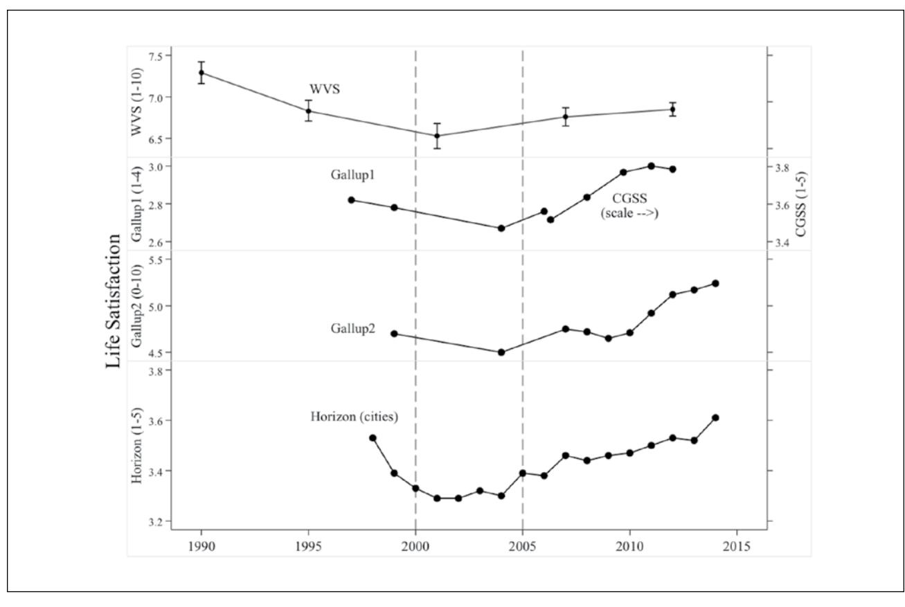

**Fig. 3.1. Mean Subjective Well-Being, Five Series, 1990-2015**

Source: Appendix, Table A3.1.

Notes: Horizon series is 3-year moving average, centered, of annual data for 1997-2015; Gallup 2, after 2004, is three-year moving average, centered, of annual data for 2006-2015; CGSS is three item moving average for dates given in Technical Box 1. Series with response options of 1-4 or 1-5 are plotted to twice the scale of series with response options of 1-10 and 0-10. For survey questions and response options, see Technical Box 1.

labor and wage policies served as the model for communist China, and China's value of 7.29 is almost identical to the 7.26 value found in the available data for pre-transition Russia.8 In 1990 life satisfaction differences by socio-economic status in China were very small, as was true also of former Soviet Union countries prior to transition.9 In the 1990 survey data for China, mean values exceeding 7.0 are found across the distributions by education, occupation, and income; hence the high overall average cannot be attributed to a disproportionate representation in the 1990 survey of those with high life satisfaction.

It is doubtful that the recovery in SWB by the end of the period reaches a value equal to that in 1990. In the WVS series, the one covering the longest time span, the terminal value of 6.85 in 2012 is significantly less than the 1990 value of 7.29. The upper bound of the 95% confidence interval in 2012 is 6.93, well below the lower bound of 7.16 in 1990. Another indication that China has not recovered to its 1990 value is the slippage in its worldwide ranking by SWB. If the 2012 high-to-low array of 100 countries with recent WVS data is taken as a reference,10 China falls from 28th to 50th between 1990 and 2012. The middling position of China in the 2012

#### **Technical Box 3.1. Surveys and Measures of Subjective Well-Being**

**World Values Survey (Sample Size: c. 1,000–c. 2,000).** Life satisfaction: All things considered, how satisfied are you with your life as a whole these days? Please use this card to help with your answer. 1 (dissatisfied) 2 3 4 5 6 7 8 9 10 (satisfied)

**Gallup1 (Sample Size: c. 3,500).** Life satisfaction: Overall, how satisfied or dissatisfied are you with the way things are going in your life today? Would you say you are 4, very satisfied; 3, somewhat satisfied; 2, somewhat dissatisfied; or 1, very dissatisfied?

**Gallup2 1999, 2004 (Sample Size: c. 4,000).**  Ladder of life: Please imagine a ladder with steps numbered from 0 at the bottom to 10 at the top. Suppose we say that the top of the ladder represents the best possible life for you, and the bottom of the ladder represents the worst possible life for you. On which step of the ladder would you say you personally stand at this time?

**Gallup2: Gallup World Poll 2006-2015 (Sample Size: c. 4,000, except 2012 c. 9,000)** Ladder of life: Please imagine a ladder with steps numbered from zero at the bottom to ten at the top. Suppose we say that the top of the ladder represents the best possible life for you, and the bottom of the ladder represents the worst possible life for you. On which step of the ladder would you say you personally stand at this time, assuming that the higher the step the better you feel about your life, and the lower the step the worse you feel about it? Which step comes closest to the way you feel?

**Horizon 1997–1999, 2001 (Sample Size: c. 5,000).** (In Chinese) In general, are you satisfied with your current life: very satisfied, fairly satisfied, fairly dissatisfied, or very dissatisfied? (Single answer). Coded 5, 4, 2, or 1.

**Horizon 2000, 2002–2010 (Sample Size: c. 2,500–c. 5,500).** (In Chinese) In general, are you satisfied with your current life: very satisfied, fairly satisfied, average, fairly dissatisfied, or very dissatisfied? (Single answer). Coded 5, 4, 3, 2, or 1.

**Chinese General Social Survey (CGSS) 2003, 2005, 2006, 2008, 2010-2013 (Sample Size: c. 5,500-c. 12,000).** (In Chinese) On the whole, do you feel happy with your life: very unhappy, unhappy, so-so, happy, or very happy? (Single answer). Coded 1, 2, 3, 4, or 5.

WVS ranking is fairly consistent with that in the current Gallup World Poll ladder-of- life array for 157 countries—in 2013-15 China was 83rd.11

In the research literature on SWB, cross section studies typically find that happiness varies positively with GDP, and this finding is frequently cited as evidence that economic growth increases subjective well-being.12 The SWB data for China call into question the validity of this assertion. Based on the regression results of such cross section studies, China's

striking five-fold multiplication of GDP since 1990 would be expected to increase SWB by upwards of a full point or more on a 1–10 life satisfaction scale. It is noteworthy that four different surveys reaching back to the 1990s fail to give evidence of an overall increase approaching this magnitude (Figure 3.1).

The positive cross section relation of SWB to GDP reported in prior happiness research implies that the growth rates of GDP and SWB are positively related. Yet China's GDP growth

**Fig. 3.2. Growth Rate of Real GDP per Capita and Price Level, 1988-2015 (3-year moving average, centered)**

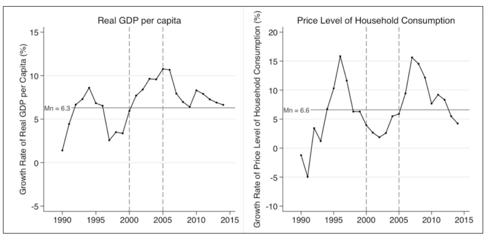

Sources: PWT and NBS. See Appendix, Table A3.2, cols. 3 and 6.

rate goes through three cycles between 1990 and 2012 while SWB goes through only one (compare Figure 3.2, left panel with Figure 3.1). Moreover, the growth rate of GDP is highest in 2000-2005 when SWB is bottoming out with a growth rate close to zero. Also noteworthy is the disparate course of the rate of inflation, which has typically been found to have an inverse relation to SWB.13 In China in 2000- 2005, when SWB was at its lowest, the rate of inflation was also low—lower than in any other years between 1994 and 2015 (Figure 3.2, right panel and Table A3.2). Neither GDP nor inflation has a time series pattern that might by itself explain the course of SWB. As will be seen below, the explanation of China's SWB rests on different factors.

A number of Eastern European countries have been transitioning from a socialist to free market economy at the same time as China, and it is of interest to ask how China's transition pattern

of life satisfaction compares with that of these other countries. Indeed, China's overall trajectory of SWB is quite similar. For those European countries whose SWB data extend back into the socialist period, SWB invariably follows a U- or V-shaped pattern in the transition.14 Unlike China, however, where GDP grows at an unprecedented rate, in the European countries GDP collapses and recovers in a pattern much like that of SWB, a difference between China and Europe to be discussed subsequently.

#### Determinants of the SWB Trajectory

Two factors appear to have been of critical importance in forming the U-shaped course of subjective well-being in China—unemployment and the social safety net. In the 1990s severe unemployment emerged, and the social safety net broke down. The "iron rice bowl" was smashed, giving rise to urgent new concerns

about jobs, income security, family, and health. Although incomes rose for most of those who had jobs, the positive effect on well-being of income growth was offset by a concurrent rise in material aspirations. The counteracting effect to income growth of increasing aspirations has been pointed out by a number of China specialists. Shenggen Fan et al observe: "Happiness draws from relative comparisons. As income increases, people's aspirations aim for a new target."15 Research by John Knight and his collaborators further provides valuable insights into the effect of reference groups on happiness in China.16

In its survey of findings on subjective well-being, the high profile Stiglitz-Sen-Fitoussi Commission states: "One aspect where all research on subjective well-being does agree concerns the high human costs associated with unemployment."17 The reason why unemployment has a major adverse effect on well-being is straightforward jobs are of critical importance for sustaining people's livelihood, family, and health, and it is concerns with these personal circumstances that are foremost in shaping people's happiness.18

The quantitative evidence on unemployment is consistent with the view that unemployment has been an important determinant of China's SWB trajectory. The unemployment rate rose sharply from near-zero shortly before 1990 to double-digit levels in 2000-2005, and then declined moderately. Although the unemployment estimates are somewhat rudimentary,19 this pattern appears consistently in unemployment data from several different sources (Fig. 3.3). Subjective well-being largely inversely mirrors the path of the unemployment rate. As the unemployment rate rises, SWB declines; as the rate falls, SWB increases. The 2000-2005 trough in SWB occurs when the unemployment rate reaches its peak.

 The term "massive" is used repeatedly by China specialists in describing the precipitous upsurge

in unemployment that began in the 1990s.20 In little more than a decade (1992-93 to 2004) 50 out of 78 million lost their jobs in state-owned enterprises (SOEs), and another 20 million were laid off in urban collectives.21 Knight and Song aptly describe this period as one of "draconian … labor shedding."22

The impact of unemployment on SWB was not confined to those who lost their jobs. As has been demonstrated in the SWB literature,23 increased unemployment also reduces the well-being of those who remain employed as they fear for their own jobs as layoffs increase. An indication of the widespread anxiety associated with a high level of unemployment in China is the answer to a nationally representative survey question that asked, "Now thinking about our economic situation, how would you describe the current economic situation in China: is it very good, somewhat good, somewhat bad or very bad?" In 2002 when unemployment was at two-digit levels, almost half of respondents (48 per cent) answered somewhat or very bad; by 2014, when the unemployment rate had markedly improved, only six per cent fell in these two categories.24 The survey responses demonstrate that employment is what matters for SWB, not growth of GDP. The growth rate of GDP was considerably higher in 2002 than in 2014 (Table A3.2), but respondents assessed the state of the economy as much worse in 2002.

Along with the upsurge in unemployment, the social safety net (with employer-provided benefits) broke down, aggravating the decline in SWB. As workers lost jobs, their benefits disappeared, though for a modest fraction temporary support was provided through an urban layoff program. Those who found jobs in private firms no longer enjoyed the benefits that they previously had in the public sector. Even for those who retained public jobs, new government policies abolished guaranteed employment and life-time benefits. This positive relationship between the social safety net and SWB has been demonstrated by both economists and political scientists.25

The unemployment rate is itself an indicator of safety net coverage because benefits were employment-dependent. Survey data on pension and health care coverage provide additional quantitative evidence of the course of safety net benefits (Figure 3.4). Note that the pattern in these safety net indicators tends to be U-shaped, and the trough in coverage occurs in 2000-2005 when unemployment peaks and SWB reaches its lowest point.

The emergence of extensive unemployment and dissolution of the social safety net were due to the government-initiated comprehensive policy of restructuring SOEs, many of which were inefficient and unprofitable. Although the new policy was successful in stimulating economic growth, it marked an abrupt end to the era of "reform without losers." As Naughton points out, urban SOE workers "bore the brunt of reform-related costs."26 According to a World Bank report, "by all measures, SOE restructuring had a profound effect on … the welfare of millions of urban workers."27 The quantitative unemployment, safety net, and SWB patterns here are consistent with these statements.

Faced with massive and rising urban unemployment, government policy shifted gears. Beginning in 2004 the rate at which SOEs were down-sized diminished sharply. Between 1995 and 2003, reduced employment in SOEs far exceeded increased employment elsewhere in the urban sector; thereafter, the situation was reversed, and the unemployment rate improved (Figure 3.3).28 The safety net, as indexed by healthcare and pension coverage, also started to improve (Figure 3.4). The result was a turnaround and gradual recovery of SWB.

In 2000-2005 the growth rate of GDP was approaching its highest level at the same time that unemployment was peaking. How could output be growing, and so rapidly, when employment was falling? China's restructuring policy involved greatly expanded support for a relatively

**Fig. 3.3. Urban Unemployment Rate, Four Series, 1988-2015 (percent of labor force)**

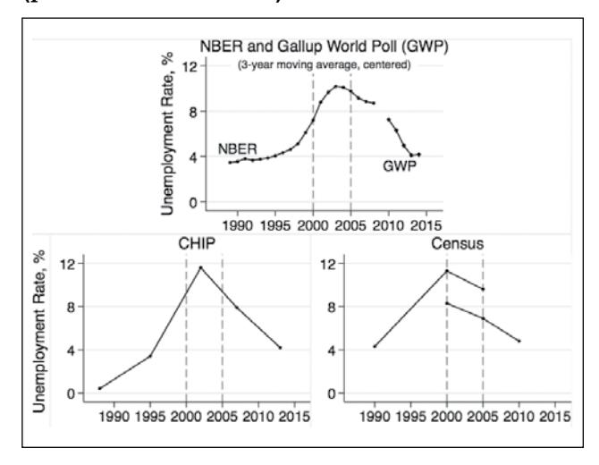

Source: Appendix, Table A3.3.

**Fig. 3.4. Safety Net Indicators: Pension and Healthcare Coverage, 1988-2013 (urban households)**

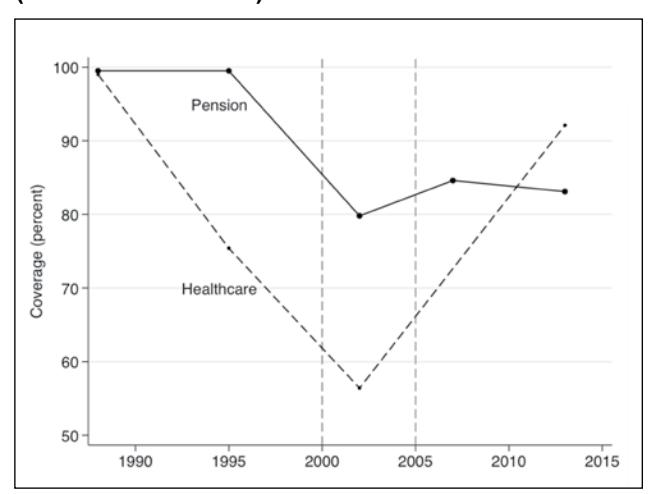

Source: CHIP. See Appendix, Table A3.4.

small proportion of large, capital-intensive, and high productivity SOEs at the expense of numerous small, labor-intensive, and low productivity SOEs, a policy officially labeled "Grasping the big and letting go of the small." As described by Huang:29

"Grasping the big" meant restructuring, consolidating, and strengthening China's largest SOEs…. "Letting go of the small" meant that the government supported privatization of individually small but numerically numerous SOEs. These are labor-intensive firms and singling them out for privatization, with no established social protection in place, led to massive unemployment, social instability, and wrenching human costs…. Instead of managing tens of thousands of small firms scattered around the country, the Chinese state could now focus on only a few thousand firms [which benefitted from] a massive reallocation of financial, human, and managerial resources away from the small SOEs to a handful of the largest SOEs.

This redistribution of resources from low productivity small SOEs to high productivity large SOEs resulted in a strong upsurge in output at the same time that small SOEs shed labor, creating a large pool of unemployed. As Huang points out, "…GDP growth in the 1990s increasingly was disconnected from the welfare of Chinese citizens."30 The survey responses reported above on the state of the economy in 2002 and 2014 provide concrete evidence of the continuation of this disconnect. The economy was viewed by the public as much worse in 2002, even though the GDP growth rate was considerably higher than in 2014.

As previously noted, China's GDP in transition has grown at an unprecedented rate while that of European transition countries collapsed and recovered in a pattern similar to SWB. The difference between China's GDP trajectory and that of the European countries appears to be due to the difference in restructuring policies. In both cases restructuring led to massive unemployment. While the European transition countries abandoned the entire public sector to privatization and experienced a major GDP collapse, however, China invested heavily in the most productive SOEs and was rewarded with significant output growth.

#### Other Social and Economic Factors

Is China's SWB trajectory also a reflection of societal conditions such as social capital, income inequality, or environmental pollution? What about the "predictors" of SWB differences among countries identified in previous World Happiness Reports—material, social, and institutional supports for a good life—do they explain the time series course of SWB in China?31 To answer these questions, this section examines whether changes over time in these variables conform as expected to the movement in SWB since 1990. This is the same procedure as that followed in the previous section on unemployment and the social safety net.

The measures of social capital examined here trust in others and civic cooperation—are those used in a recent article that seeks to explain the change in China's life satisfaction from 1990 to 2007, one of the rare articles addressing change over time.32 The specific questions and responses are given in Technical Box 2. The two indicators of social capital are treated separately in what follows.

Trust has an overall trajectory fairly similar to SWB, falling at the beginning of the period and rising at the end (Figure 3.5). It is plausible that in the 1990s, as restructuring led to the emergence and growth of unemployment and job competition, a decline in interpersonal trust occurred. Correspondingly, the upswing in employment during the 2000s recovery may have helped restore trust. The decline and

#### **Technical Box 3.2. Measures of Social Capital and Freedom of Choice**

**World Values Survey 1990, 1995, 2001 (Sample Size: ~1,000–1,500).** Trust: General speaking, would you say that most people can be trusted or that you can't be too careful in dealing with people? 1, most people can be trusted; 2, can't be too careful. Recoded 1 or 0.

**World Values Survey 2007, 2012 (Sample Size: ~2000).** Trust: General speaking, would you say that most people can be trusted or that you can't be too careful in dealing with people? 1, most people can be trusted; 2, need to be very careful. Recoded 1 or 0.

**World Values Survey (Sample Size: ~1,000–2000).** Civic cooperation: Please tell me for each of the following statements whether you think it can always be justified, never be justified, or something in between, using this card.

A) Claiming government benefits which you are not entitled to Never 1 / 2 / 3 / 4 / 5 / 6 / 7 / 8 / 9 / 10 Always B) Avoiding a fare on public transport

Never 1 / 2 / 3 / 4 / 5 / 6 / 7 / 8 / 9 / 10 Always C) Cheating on tax if you have the chance

Never 1 / 2 / 3 / 4 / 5 / 6 / 7 / 8 / 9 / 10 Always D) Someone accepting a bribe in the course of their duties Never 1 / 2 / 3 / 4 / 5 / 6 / 7 / 8 / 9 / 10 Always Recoded 10, 9, 8, 7, 6, 5, 4, 3, 2, or 1 for each item.

**World Values Survey (Sample Size: ~1,000–2000).** Freedom of choice: Some people feel they have completely free choice and control over their lives, and other people feel that what they do has no real effect on what happens to them. Please use the scale to indicate how much freedom of choice and control you feel you have over the way your life turns out. None at all 1 2 3 4 5 6 7 8 9 10 A great deal

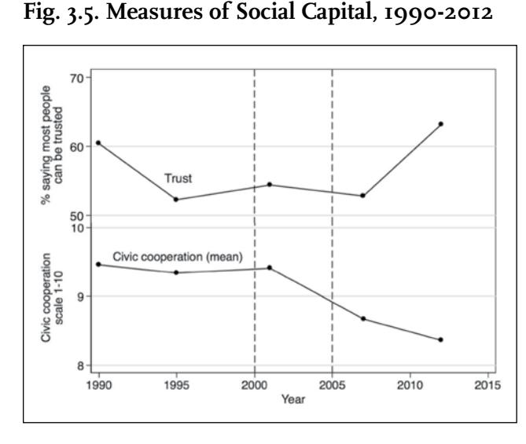

Source: WVS. See Appendix, Table A3.5.

recovery of interpersonal trust may, in turn, have reinforced the U-shaped trajectory of SWB. The biggest difference between trust and SWB centers on the value in the 2000-2005 period. Trust is slightly higher, but not much different from that in adjacent years, while SWB is lower. As noted previously, the lower value of SWB in the 2000-2005 period is credible because it is found in four different surveys conducted independently of each other.

Another measure of social capital is civic cooperation, a term reflecting disapproval of cheating or bribery in circumstances such as paying taxes or claiming government benefits (see Technical Box 2). The composite measure presented here is the

average of four components, each of which has "a pattern fairly similar to that in the summary measure (Technical Box 3.2 and Table A3.5). In each interval from 1990 to 2007, the summary measure of civic cooperation moves in the same direction as trust, though the movements in civic cooperation through 2001 are slight. After 2001, however, trust and civic cooperation begin to diverge noticeably and, from 2007 on, in seemingly contradictory directions—a rise in trust being accompanied by a decline in civic cooperation, i.e., increased acceptance of cheating and bribery. Unlike trust, the overall pattern of change in civic cooperation consequently differs considerably from that in SWB, and casts doubt on any causal connection between the two.

The results in the general literature on the relation between income inequality and happiness are mixed—some studies report no relationship, while others find that an increase in inequality reduces happiness.33 In China, income inequality as measured by the Gini coefficient has trended upward since the early 1980s, increasing when SWB is both falling and rising (Figure 3.6, panel A).34 It is hard to see how the course of income inequality could solely explain the U-shaped movement of SWB. Indeed, as will be seen subsequently, since the beginning of the millennium the life satisfaction difference between the lowest and highest income groups has diminished despite an increase in income inequality.

**Figure 3.6. Indicators of Trends in Income Inequality, Environmental Pollution, and Housing Prices** 

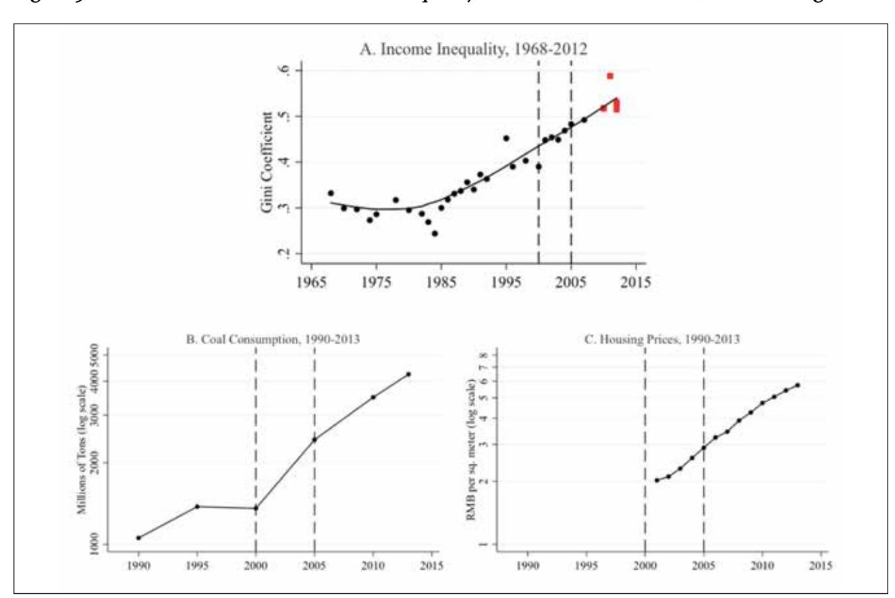

Sources: Panel A, reproduced from Xie and Zhou (2014); panels B and C, NBS. See Appendix, Table A3.6.

One might expect that the widely-publicized environmental pollution problem in China would have had an adverse impact on happiness. A recent study based on cross sectional data, however, finds no relation between pollution and overall life satisfaction, although there is a shorter-term effect on day-to-day moods.35 The time series finding in the present analysis turns out to be much like the nil cross section finding. If the trend in coal consumption is taken as a measure of the course of environmental pollution, one finds that coal consumption trends upward throughout most of the period, rising after 2005 at close to its highest rate, while life satisfaction also rises, rather than falls (Figure 3.6, panel B).

Housing prices are also sometimes mentioned as a determinant of life satisfaction. The housing price data only start in 2000, not long after a housing market becomes widely established in China.36 Housing prices trend steadily upward from 2000 onward (Figure 3.6, panel C), a development that might be expected to reduce life satisfaction; in fact, life satisfaction rises, not falls.

There are six "predictors" of the annual national evaluations of SWB presented in the World Happiness Reports—GDP per capita (in log form), healthy life expectancy, freedom to control one's life, corruption, social support, and giving to charity. Of these it is possible to obtain time series measures for China that span the

**Figure 3.7. Predictors of SWB in World Happiness Reports, 1990-2012**

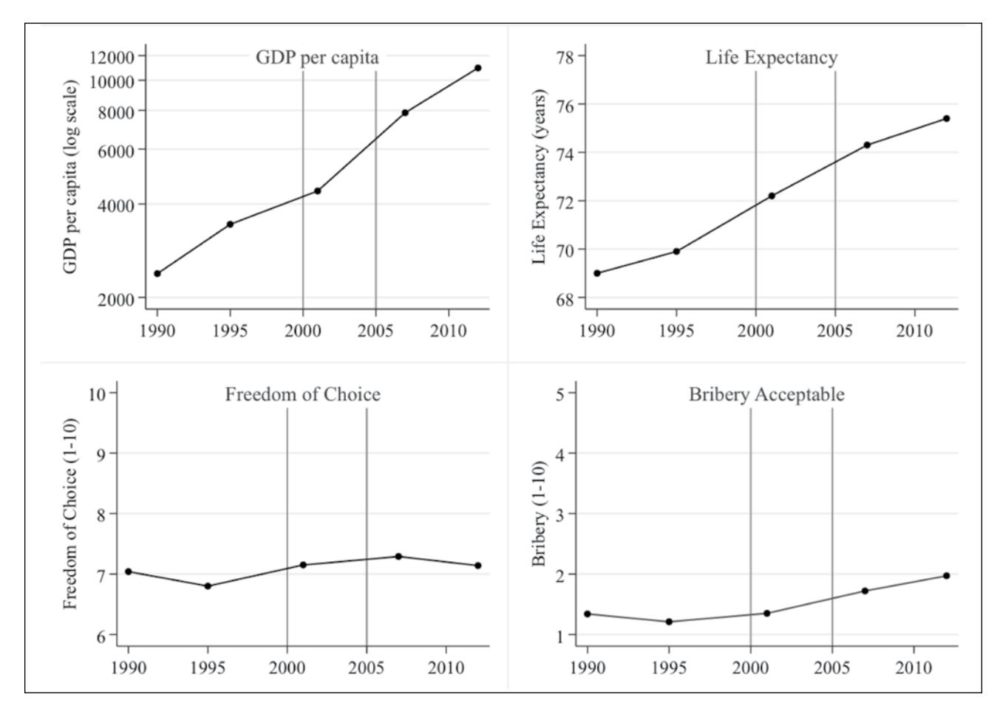

Sources: PWT, WB, and WVS. See Appendix, Table A3.7.

period covered here for the first four. (In the 2016 *World Happiness Report* the time series course of healthy life expectancy is based on that in life expectancy at birth, and the latter is consequently used in the present analysis.)37 None of these "predictors" has a time series pattern suggestive of a causal relation to SWB. GDP and life expectancy, themselves highly correlated, both trend upward throughout the period (Figure 3.7). Freedom to choose the course of one's life changes very little over time, and its movements do not conform to those in SWB. Corruption, approximated here by the acceptability of bribery, increases somewhat after 2001, but remains at a very low level. The two measures with the greatest changes—GDP and

life expectancy—reach their highest values at the end of the period, but SWB does not.

The 2016 World Happiness Report presents a pooled time series and cross section regression equation based on data for 156 countries in the period 2006-2015, in which the six predictors are found to fit national ladder-of-life evaluations with an R-squared of 0.74.38 Another way of examining the predictors here is to ask how accurately this equation predicts China's actual ladder-of-life values from 2006 to 2015. The answer is, not very well. If China's values for the independent variables are entered into the equation, the predicted values are uniformly higher, often by a substantial amount (Figure

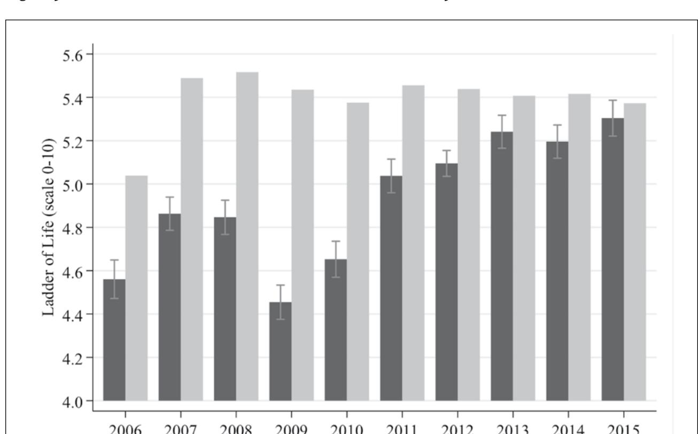

**Figure 3.8. Actual and Predicted Mean Ladder of Life, 2006-2015**

Source: GWP. See Appendix, Table A3.8.

3.8). Moreover, if one leaves aside the year 2006 (for which values for China are available for only three of the six independent variables) the predicted values in SWB exhibit a nil trend, while the actual trend is upward.

As pointed out in the 2016 World Happiness Report, the choice of "predictors" is constrained by the limited availability of comparable data for a large number of countries worldwide, and the variables that are in fact chosen "may be taking credit properly due to other better variables."39 The advantage of a country study, like the present one, is that it is not inhibited by the requirement of comparable international data. This makes it possible to explore the possible role in determining SWB of a wider range of variables and consequently develop a deeper understanding of the mechanisms at work. Indeed, an analysis of selected countries in the 2016 report moves in the direction of the present study. In evaluating the reasons for a decline in life satisfaction in four Eurozone countries hard hit by the Great Recession, the unemployment rate is added to the analysis and found to have an explanatory effect equal to that of all six of the present "predictors" combined,40 a result more similar to the present findings. Unfortunately, it is not possible to include unemployment as a predictor in the pooled regression equation for all countries due to lack of comparable international data.

As a brief summary of the results to this point, Table 3.1 presents the bivariate correlation and corresponding p-value between life satisfaction and each of the variables discussed in this and the preceding section. (The housing price variable is not included because the series spans only half the period). There are, at best, only five observations available for computing each correlation, which means each variable is evaluated singly in a bivariate analysis. Subject to the qualification that a multivariate analysis might give a fuller picture, the pattern of results is generally consistent with the observations based on the graphs. The unemployment rate and

safety net indicators come quite close to the 0.10 level of significance. Trust and income inequality have the next highest correlation coefficients, but the p-values are above 0.30. The remaining variables have even worse p-values, and in some cases, the sign of the correlation coefficient is contrary to what might be expected. As a whole, the correlations uphold the conclusion that unemployment and the safety net have been the important forces shaping the course of China's life satisfaction.

**Table 3.1. Time Series Correlation with WVS Life Satisfaction of Indicated Variable, 1990-2012**

| Correlation Coefficient | p-value |
|----------------------------|---------|
| -0.76                      | 0.13    |
| 0.74                       | 0.15    |
| 0.89                       | 0.11    |
|                            |         |
| 0.52                       | 0.37    |
| 0.17                       | 0.79    |
| -0.57                      | 0.31    |
| -0.21                      | 0.73    |
|                            |         |
| -0.46                      | 0.44    |
| -0.50                      | 0.40    |
| -0.27                      | 0.67    |
| -0.10                      | 0.87    |
|                            |         |

n = 5, except healthcare coverage, n = 4.

Note: The basic data are given in the Online Appendix Table A3.1, col.1; Table A3.3, col. 3; Table A3.4 rows 1, 6; Table A3.5, rows 1, 2; and Table A3.6a, cols. 1-4.

Why are unemployment and the social safety net so important? These two factors bear most directly on the concerns foremost in shaping personal happiness—income security, family life, and the health of oneself and one's family. It is these concerns that are typically cited by people worldwide when asked an open-ended question as to what is important for their happiness.41 In contrast, broad societal matters such as inequality, pollution, political and civil liberties, international relations, and the like, which

most individuals have little ability to influence, are rarely mentioned. Abrupt changes in these conditions may affect happiness, but for the most part, such circumstances are taken as given. The things that matter most are those that take up most people's time day after day, and which they think they have, or should have, some ability to control.

#### Differences by Socio-Economic Status

Although China's well-being declined on average and then somewhat recovered, there were significant differences among various groups in the population. Perhaps most striking was the severe impact of restructuring on those of lower socio-economic status (SES). In 1990 the difference in life satisfaction between the third of the population with the lowest incomes and that with the highest was quite small (Figure 3.9). Subsequently life satisfaction of the lowest third plunged markedly, while that of the highest actually improved slightly. The result was the emergence of a marked disparity in life satisfaction by socio-economic status. Toward the end of the

**Fig. 3.9. Mean Life Satisfaction, Top and Bottom Income Terciles, and Standard Deviation of Life Satisfaction, 1990 – 2012**

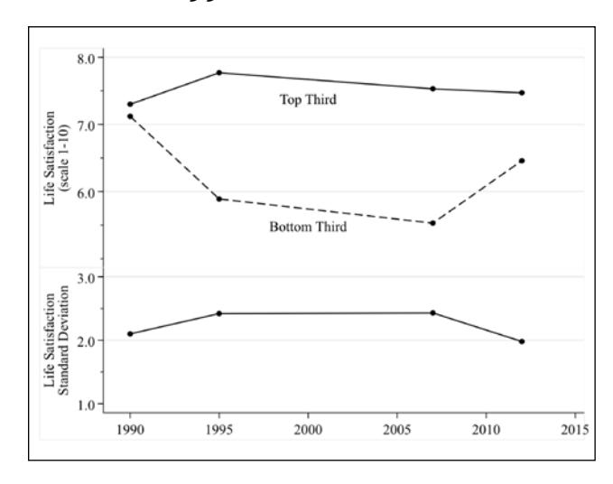

Source: WVS. See Appendix, Table A3.9.

period, life satisfaction of the lowest stratum somewhat recovered, and by 2012 the disparity in life satisfaction, though still sizeable, had shrunk considerably.42 The standard deviation of life satisfaction, a measure reflecting all sources of life satisfaction differences, not just SES, follows the SES pattern of rising and decreasing inequality in life satisfaction (Figure 3.9, bottom).

The course of the life satisfaction difference by socio-economic status demonstrates the critical importance of full employment and safety net policies for the well-being of the most disadvantaged segment of the population. As these policies were abandoned in the 1990s, the lowest socio-economic group was the one that suffered severely. Data by level of education are indicative of the differential employment and safety net effects. The unemployment rate of those with a primary education or less soared to almost 20 per cent in 2000-2005, while that of the college-educated group remained at less than 5 per cent (Figure 3.10). Similarly, pension and healthcare coverage of the less-educated declined much more than that of the more-educated (Figure 3.11). Consistent with these differences, satisfaction with finances and self-rated health increased for the highest income stratum and decreased for the lowest (Figure 3.12).43 Eventually, as economic policy reversed and brought unemployment down, and substantial efforts were initiated to repair the social safety net,44 these disparities diminished. Life satisfaction of the lowest third of the population recovered as employment and the safety net improved, though in 2012 it was still less than in 1990 (Figure 3.9).

**Fig. 3.10. Unemployment Rate by Level of Education,**a  **1988-2013 (percent of labor force)**

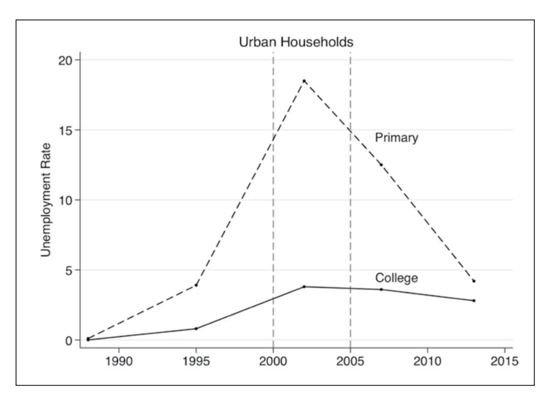

Source: CHIP. See Appendix, Table A3.10.

a. Persons with college education or more and primary school education or less.

**Fig.3.11. Safety Net Indicators by Level of Education,**a  **1988-2013 (urban households)**

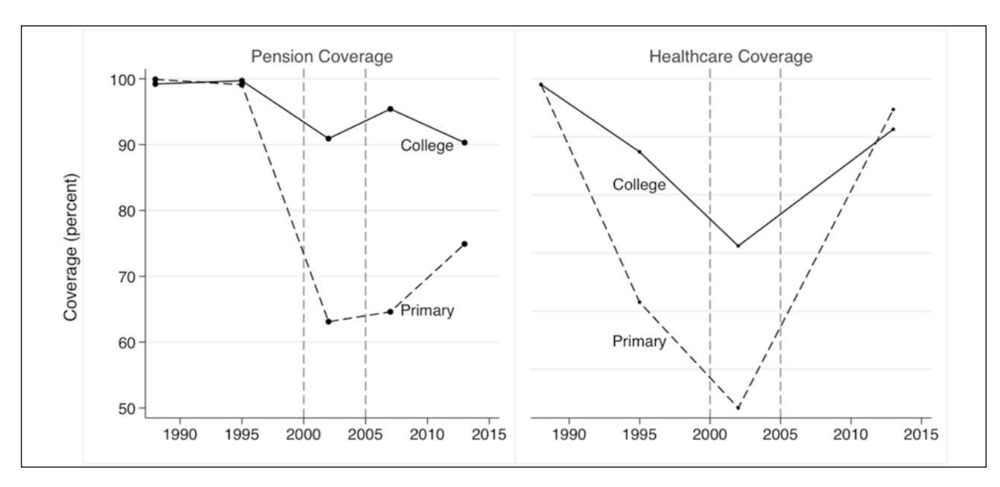

Source: CHIP. See Appendix, Table A3.4.

a. Persons with college education or more and primary school education or less.

**Fig. 3.12. Mean Financial Satisfaction and Mean Self-Reported Health, Top and Bottom Income Terciles, 1990 – 2012**

Source: WVS. See Appendix, Tables A3.11 and A3.12.

#### Differences by Age and Cohort

Those aged 30 and over experienced large declines in life satisfaction over the quarter century studied here; men and women were about equally affected. In 1990 those aged 30 and over were already on a life course set under "iron rice bowl" conditions. The collapse of the traditional environment severely disrupted their lives, and substantially reduced their well-being. As economic restructuring took hold, the cohort of 1946-60, which spanned ages 30-44 in 1990, suffered the biggest decline in life satisfaction (Figure 3.13). From an initial situation in which virtually everyone had jobs, men and women alike, in 2002 fewer than 70 per cent were employed. Most of the remainder of the cohort, 21 per cent, had been forced into early retirement, and six per cent were unemployed.45

The next oldest cohort, that of 1936-45, also had a considerable initial drop in life satisfaction. The overall decline was somewhat cushioned, however, as by 2012 most of this cohort had reached retirement age (55 for women, 60 for men) and qualified for pensions, though these were sometimes reduced or in arrears.46

In contrast, the cohort of 1961-70, which in 1990 was merely in its twenties, experienced only a mild decline in life satisfaction between 1990 and 2002 and ended up with life satisfaction about the same as initially. The members of this and the successor cohorts were less wedded to traditional ways and better able to adapt to the new "free market" conditions, most notably by acquiring a college education. Thirty-five per cent of the cohort of 1961-70 had completed a

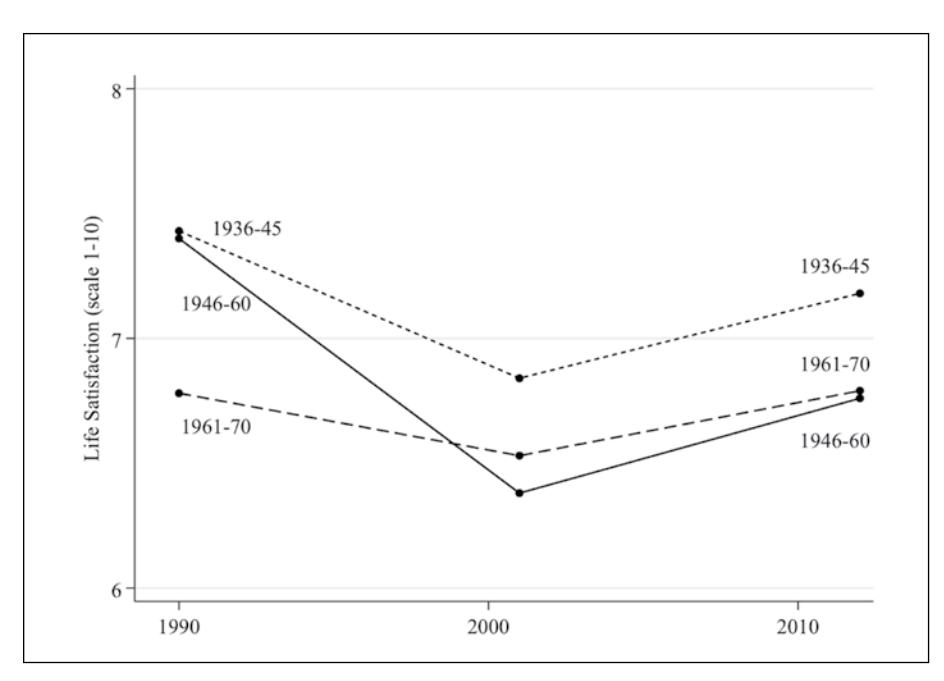

**Fig. 3.13. Mean Life Satisfaction by Birth Cohort, 1990-2012**

Note: In 1990 the birth cohort of 1961-70 was 20 to 29 years old; the birth cohort of 1946-60, 30 to 44; and the birth cohort of 1936-45, 45 to 54. Source: WVS. See Appendix, Table A3.13.

college education by the time they were in their thirties; for the successor cohort, that of 1971-80, the corresponding figure was 40 per cent. Among the cohorts born before the 1960s, however, the percentage with a college education was only 11 to 15 per cent.47 As seen above, those belonging to the higher SES group—which includes those with a college education—largely escaped the adverse impact on life satisfaction of economic restructuring; clearly young adults were among the beneficiaries.

A comparison with the European transition countries is once again of interest. As has been seen, the trajectory of life satisfaction for the population as a whole is quite similar in China and the European countries. This similarity is also true of the differentials in life satisfaction that emerged in both areas. For both China and the European countries, small SES differences at the start of the transition were replaced by large disparities.48 The lowest SES group experienced

a severe decline in life satisfaction, while the upper tier typically enjoyed a mild improvement. Those under age 30 fared better than their older counterparts.49 In both China and Europe adaptation to the new environment was greatly facilitated by a college education.50

#### Differences by Residence and Migration Status

Subjective well-being in China's urban areas has been greater than in rural on average, a pattern typical of developing countries.51 The principal evidence for China is from three sources—the 1995 World Values Survey, CGSS surveys done almost annually since 2005, and surveys conducted annually since 2006 by the Gallup World Poll (Table A3.14).52 The urban-rural life satisfaction differential in the 1995 WVS—about half a point (1-10 scale)—is just about the same as the average differential in the Gallup World Poll

65

over the period 2006-15 (0-10 scale). Starting in 2010, a wider range of surveys is available some continue to show the usual excess of urban over rural SWB, but in a few the urban and rural areas are about equal.53

Since 2005, when fairly continuous data become available, the trend in rural life satisfaction appears to have largely paralleled urban. Two different surveys give a highly consistent picture (Figure 3.14). The improvement in rural life satisfaction may have been partly due to new policies strengthening the social safety net in rural areas. Also, there was a change in government policies that significantly lessened the burden placed on agriculture to support industrialization.54 Lack of comparable data prevents generalization of the trend prior to 2005.

The 1990s saw the onset of a substantial population movement from rural to urban areas, as government restrictions on migration were increasingly relaxed. According to census data, between 1990 and 2010 the proportion of people in cities that had a rural *hukou* (identifying the holder as a resident of a rural place) rose from 17 to 36 per cent.

Rural *hukou* holders in urban areas were initially treated as second-class citizens but are gradually being assimilated.55 The few life satisfaction surveys in the early 2000s that classified the urban population by *hukou* status uniformly found urban *hukou* holders with higher SWB than rural migrants.56 The upward trend in life satisfaction since then has been fairly similar for the two groups (Figure 3.15). The evidence is mixed on whether or not the gap in urban areas between urban and rural *hukou* holders has closed. In several surveys the gap persists, but in others it has disappeared.57 A comparison between rural migrants and those remaining in rural areas is less ambiguous—initially the migrant group was higher, but in recent years there is no difference.58

**Fig. 3.14. Mean Life Satisfaction by Urban-Rural Residence, 2003-2015**

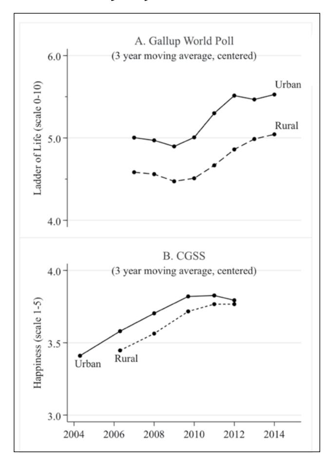

Source: Appendix, Table A3.14.

**Fig. 3.15. Mean Life Satisfaction, Urban and Rural Hukou Holders in Urban Areas, 2003-2013**

Source: Appendix, Table A3.15.

Legend: UH = Urban *hukou* holders in urban areas RH = Rural *hukou* holders in urban areas

#### Summary and Implications

China's soaring GDP growth over the past quarter century is viewed by many analysts as the hallmark of a successful transition from socialism to capitalism. But if the welfare of the "common man" is taken as a criterion of success, the picture is much less favorable and more like that of European transition countries. From 1990 to 2000-2005, life satisfaction in China, on average, declined. Since then it has turned upward, but at present it is probably less than a quarter century ago. China's ranking in the international array of countries by SWB appears to have declined considerably since 1990, although it has improved as of late. There is no evidence of an increase in China's life satisfaction of the sizeable magnitude that would be expected based on the international point-oftime bivariate relationship of happiness to GDP.

The lower income and older segments of the population have suffered most, and their life satisfaction remains below that in 1990. The upper income and youngest population groups have, in contrast, enjoyed a fairly constant or modest improvement in life satisfaction. The rather small life satisfaction differential by socio-economic-status that prevailed in 1990 has been replaced by a considerably larger one, though there has been some lessening since the SWB trough of 2000-2005.

The evidence on subjective well-being comes from four surveys conducted independently by three different survey organizations and shows quite consistent results. Further support derives from the similarity between the course of SWB during China's transition and that in the European transition countries. The U-shaped pattern of SWB is a transition phenomenon common to both Europe and China.

To understand the course of well-being in China, one must recognize that few societies have undergone such wrenching change in such a short period of time. Isabelle Attané and Baochang Gu succinctly convey the essence of this transformation:

[T]he dismantling of collective structures under the reform and opening-up policy … overturned the social organization that had prevailed in previous decades, producing an impact that extended far beyond the economy alone. Previously, each individual had depended on the state, through his or her work unit, for all aspects of daily life. Everyone enjoyed guaranteed access to employment, housing, health, education of children, and for urban dwellers, retirement and social insurance. Gradually transferred to the private sector, these areas are now governed by the market, which makes access to them less systematic, and therefore increasingly unequal.59

The data on life satisfaction herein provide a summary indication of the overall impact of this social transformation on people's lives. The circumstances through which SWB was most directly affected were labor market conditions and the social safety net. Briefly put, the dynamics of change are as follows. In the first part of the transition, as economic restructuring is undertaken, jobs and safety net benefits shrink markedly for the disadvantaged members of the population, and their well-being suffers severely, especially for those who are older or in the lowest economic stratum. In contrast, life satisfaction of those who are in the highest economic stratum tends to improve slightly, while that of young adults, who are typically more-educated and better able to cope with the new economic environment, remains fairly constant. The difference in life satisfaction by socio-economic status, which initially was quite small, widens substantially. Eventually, as economic recovery takes hold, the job market improves. In addition, the government, in

response to symptoms of economic distress, starts to mend the social safety net. The result is that life satisfaction, on average, turns upward, and the disparity in life satisfaction between the more and less affluent shrinks somewhat. Life satisfaction of the disadvantaged, however, remains below its 1990 level.

The evidence supporting this interpretation is three-fold. The first is quantitative time series on unemployment and the social safety net. These series move as one might expect in relation to SWB, in terms of both average levels and differences by SES. The second type of evidence is qualitative - descriptions by China specialists of the state of the economy and society, especially the job market and social protection. These qualitative accounts are consistent with the time series pattern in the quantitative data and contribute to its understanding. The third is the fact that the same factors explain the U-shaped trajectory of life satisfaction in the European transition countries.

Plausible causal variables other than GDP that fail the time series test of conformity to the SWB pattern are civic cooperation (one of the proxies for social capital), income inequality, environmental pollution, housing prices, life expectancy, freedom to control one's life, and corruption (as indexed by acceptance of bribery). Trust in others, another social capital proxy, is a borderline case, moving somewhat similarly to SWB, but less so than unemployment and the social safety net. The six predictors of differences in SWB in the World Happiness Reports do not explain the time series change in China's SWB.

The preeminence of employment and the safety net in explaining SWB lies in the evidence that it is these circumstances that bear most immediately on the concerns that are at the heart of people's personal happiness—jobs and income security, family life, and health. In the 1990s, the emergence of massive unemployment and dissolution of the social safety net led to growing anxiety regarding these concerns and a marked decline in overall life satisfaction. Since the 2000-2005 trough, employment conditions and the social safety net have improved, and life satisfaction has returned to near its 1990 level. There remains, however, considerable opportunity for further progress. Of particular importance is attention to increasing the well-being of the disadvantaged segment of the population through improved employment opportunities and safety net policies.

Within policy circles, subjective well-being is receiving increasing attention as an alternative or complement to GDP as a measure of well-being.60 There could hardly be a better test case than China for comparing the two measures. As indexed by GDP, well-being in China has multiplied over five-fold; based on SWB, well-being is, on average, less than a quarter of a century ago. These disparate results reflect the different scope of the two measures. GDP relates to the economic aspect of life, and to just one dimension—the output of goods and services. SWB, in contrast, is a comprehensive measure of individual well-being, taking into account the variety of economic and noneconomic concerns and aspirations that principally determine people's well-being. There is no hint in GDP of the enormous structural changes that impacted people's lives in China. In contrast, SWB captures the increased anxiety and new concerns that emerged as a result of growing dependence on the labor market. If the objective of policy is to improve people's well-being, then SWB is a more meaningful measure than GDP, as China's experience attests.61

Abbreviations Explanation

CFPS. China Family Planning Studies.

CGSS. Chinese General Social Survey.

CHFS. China Household Finance Survey.

CHIP. China Household Income Project.

GWP. Gallup World Poll.

NBER. National Bureau of Economic Research (United States).

NBS. National Bureau of Statistics of China.

OECD. Organization for Economic Cooperation and Development.

PWT. Penn World Table.

WB. World Bank, World Development Indicators.

WVS. World Values Survey.

- 1 Penn World Table (2016).
- 2 National Bureau of Statistics of China (2013).
- 3 See Easterlin et al (2012). There has been a welcome increase in studies of China's subjective well-being. The journal, *Social Indicators Research*, recently devoted an entire issue to the subject (see also Abbott et al (2016), Steele & Lynch (2013)). The article in *Social Indicators Research* by Cheng et al (2016) provides a valuable survey of recent research. Almost all of this work, however, comprises cross section studies. With the important exception of Bartolini and Sarracino (2015), there are virtually none that focus on the principal concern here, the nature and determinants of the change over time in SWB. For a discussion of time series studies prior to 2012 see Easterlin et al (2012). Good overviews of the Chinese economy are Brandt and Rawski (2008), Fan et al (2014a), and Naughton (2007).
- 4 Knight and Song (2005), Xu (2011). Speaking of the period of policy reforms initiated in 1993, Cai et al. (2008), p. 181, observe that "a large amount of resources have been extracted from the agricultural and rural sector to support urban industrialization."
- 5 Here and in subsequent figures, vertical broken lines delimit the period when SWB troughs. Also, in order to highlight the longer-term movement, a three-year moving average is plotted for series with annual data.
- 6 Data and sources for the graphs and numbers cited in the text are presented in the Appendix.
- 7 Knight and Song (2005), p. 19.
- 8 Easterlin (2014).
- 9 Easterlin (2012).
- 10 Helliwell at al. (2012), p. 39.
- 11 Helliwell et al (2016), p.21.
- 12 Arrow and Dasgupta (2009), Deaton (2008), Diener et al (2010), Frey and Stutzer (2002), Guriev and Zhuravskaya (2009), Inglehart (2002), Stevenson and Wolfers (2008), Veenhoven (1991).
- 13 DiTella et al. (2001).
- 14 Easterlin (2009).
- 15 Fan et al. (2014b), p. 10. See also Akay et al (2012), Carlsson and Qui (2010), Chen (2014), and Chapter 5, Table 5.8 in this Report.
- 16 For a good summary, see Knight and Gunatilaka (2011).
- 17 Stiglitz, Sen, and Fitoussi (2008), p.149. See also Helliwell and Huang (2014), Layard et al (2012), and chapter 7 in

- this Report.
- 18 See Cantril (1965), Easterlin (2013), and Radcliff (2013).
- 19 Feng, Hu, and Moffitt (2015); Gustafson and Ding (2011); Knight and Xue (2006).
- 20 See Cai, Park, and Zhao (2008), p.182; Naughton (2008), pp.121-122; Huang (2014), p. 294.
- 21 Naughton (2008), p. 121.
- 22 Knight and Song (2005), p. 22.
- 23 DiTella, MacCulloch, and Oswald (2001), Helliwell and Huang (2014).
- 24 Pew Research Center (2014).
- 25 DiTella et al. (2003), O'Connor (2016), Pacek and Radcliff (2008), Radcliff (2013).
- 26 Naughton (2008), p. 121.
- 27 World Bank (2007). See Giles, Park, and Cai (2006) for a comprehensive study of the impact of economic restructuring on urban workers.
- 28 OECD 2010, Gustafsson and Ding (2011).
- 29 Huang (2014), p. 294. Cf. also Huang (2008), pp. 169 ff.
- 30 Huang (2008), p. 273.
- 31 Helliwell et al. (2012) pp. 13 ff.; (2013) pp. 11 ff.; (2016), p. 17.
- 32 See Bartolini and Sarracino (2015). The authors include a third measure of social capital, social participation, which is measured as the percentage of the population reporting (a) membership in or (b) unpaid voluntary work for various associations. Unfortunately, this measure is not comparable over time. The number of associations named in the WVS surveys varies between 8 and 15, and the question on voluntary work is asked in only two surveys. As a result, the total number of options presented to a respondent varies from lows of 8 to 15 (in 1995, 2007, and 2012) to highs of 29 and 30 in 1990 and 2001. Not surprisingly the highest values for participation occur in the latter two years, those with the largest number of respondent options.
- 33 Layard et al. (2012), pp. 70-71.
- 34 Xie and Zhou (2014); we are grateful to Professors Xie and Zhou for providing the data needed to reproduce the China series in Figure 1 of their paper. See also Cai et al. (2010), Gustafsson et al. (2008), Knight and Song (2000).
- 35 Zhang et al. (2015).
- 36 Wang and Zhou (2016).

- 37 Helliwell at al. (2016), p. 17.
- 38 Ibid., p.16.
- 39 Ibid., p. 19.
- 40 Helliwell et al. (2013), pp. 15ff., Table 2.2.
- 41 Cantril (1965), p. 162, Table VIII: 6.
- 42 In this and subsequent figures depicting differences by SES based on WVS data, the 2001 WVS observations are omitted, because the highest and lowest education groups were not covered in the 2001 survey. Due to this omission, SES differences in 2001 are much smaller than in the two adjacent surveys, 1995 and 2007. The mean value of SWB in 2001, however, does not seem to be affected by the omission of the highest and lowest education groups. If the highest and lowest education groups are dropped from the 1995 and 2007 surveys, one finds that the overall means in both surveys are virtually identical to those when the two education groups are included.
- 43 Graham et al. (2015) report an increase in mental illness from 2002 to 2012.
- 44 For a comprehensive overview of China's new social protection system see Cai and Du (2015); see also Fang (2014), Frazier (2014), and Ravallion (2014).
- 45 See CHIP surveys of 1988 and 2002.
- 46 Giles, Park, and Cai (2006).
- 47 Cohort data on percentage completing college education are from CHIP surveys 1988, 2002, and 2013.
- 48 Easterlin (2012).
- 49 Easterlin (2009).
- 50 Demographic changes in China differed somewhat from Europe, primarily because China's 1990 situation was governed by public policies and traditional strictures regarding marriage, divorce, and childbearing. See Davis (2015) and Attané & Gu (2014).
- 51 Easterlin et al. (2011).
- 52 The 1995 WVS figures for mean life satisfaction are: places <5,000 population, 6.52; places 5,000+, 7.00). Unfortunately 1995 is the only WVS survey in which comprehensive size-of-place data are available.
- 53 The 2002 CHIP survey is noticeably different from all other surveys in that rural happiness (3.68 on a 1-5 scale) considerably exceeds urban (3.47). Unlike the 2013 CHIP survey, the 2002 survey contained a special rural module on SWB in which the question preceding that on happiness asked respondents with whom they compared themselves, offering eight options (Knight and Gunatilaka 2017, p. 20). This question elicited valuable information on reference groups, but probably tended to channel

- responses to the subsequent happiness question toward social comparison, precluding comparison with one's past experience. Neither the 2002 CHIP urban module nor the 2013 CHIP urban and rural modules had this reference group question before the question on happiness. In the 2013 CHIP survey, urban happiness exceeds rural by 0.14 points, a more typical result.
- 54 Anderson (2014), pp. 152-153. See also Cai et al. (2008), p. 181.
- 55 Henderson (2014).
- 56 See CGSS (2003), CHIP (2002), and Horizon (2003).
- 57 Surveys showing the persistence of the gap are the CGSS (2010-2013), CFPS (2012), and CHIP (2013); those showing no gap are CFPS (2010) and (2014), and CHFS (2011).
- 58 See CGSS (2005-2013) and CFPS (2010-2014).
- 59 Attané and Gu (2014), p, 3.
- 60 See OECD (2013) and Layard and O'Donnell (2015).
- 61 An objection to SWB sometimes voiced is that the SWB scale is bounded, while GDP is not. In response, one might note, first, that there is substantial agreement that international differences in self-reported SWB, such as those reported in the series of World Happiness Reports, are meaningful. The Nordic countries are invariably leaders in SWB with values in the neighborhood of 8 on scales with an upper limit of 10, while the lowest values are down around 3. This suggests that there is plenty of opportunity to improve the happiness of people worldwide even in the Nordic countries. Moreover, if well-being is the goal of public policy, then reaching a value of 10 with everyone "completely satisfied" would seem to be a sign of remarkable policy success. By contrast, if GDP is the measure of well-being, there is no clear mark of achievement other than an ever-higher growth rate, which, as evidenced by China's experience, says little about what is really happening to people's lives.

#### References

- Abbott, P., Claire, W., Lin, K., & Haerpfer, C. (2016). The quality of society and life satisfaction in China. *Social Indicators Research, 127(2)*, 653-670.
- Akay, A., Bargain, O., & Zimmermann, K. (2012). Relative concerns of rural-to-urban migrants in China. *Journal of Economic Behavior & Organization, 81*, 421-441.
- Anderson, K. (2014). China's evolving trade composition. In S. Fan, Kanbur, R., Wei, S-J., and Zhang, X. [Eds.], *The Oxford Companion to the Economics of China*. Oxford, UK: Oxford University Press, pp. 150-155.
- Arrow, K. J., & Dasgupta, P. S. (2009). Conspicuous consumption, inconspicuous leisure. *The Economic Journal, 119(541)*, F500-F513.
- Attané, I. & Gu, B. (2014). Eds. *Analysing China's Population: Social Change in a New Demographic Era*. New York: Springer*.*
- Bartolini, S., & Sarracino, F. (2015). The dark side of Chinese growth: Declining social capital and well-being in times of economic boom. *World Development, 74*, 333-351.
- Brandt, L., & Rawski, T. G. (Eds.) (2008). *China's great economic transformation*. New York: Cambridge University Press.
- Cai, F., & Du, Y. (2015). The social protection system in ageing China. *Asian Economic Policy Review*, *10(2)*, 250-270.
- Cai, F., Park, A., & Zhao, Y.H. (2008). The Chinese labor market in the reform era. In L. Brandt & T. G. Rawki (Ed.), *China's Great Economic Transition* (pp. 167-214). New York: Cambridge University Press.
- Cai, H. B., Chen, Y. Y., & Zhou, L. A. (2010). Income and consumption inequality in urban China: 1992-2003. *Economic Development and Cultural Change, 58(3)*, 385-413.
- Cantril, H. (1965). *The Pattern of Human Concerns*. New Brunswick, NJ: Rutgers University Press.
- Carlsson, F., & Qin, P. (2010). It is better to be the head of a chicken than the tail of a phoenix: Concerns for the relative standing in rural China. *Journal of Socio-Economics, 39(2)*, 180-186.
- Census of China 1990. 1% Random Sample, National Bureau of Statistics of China.
- Census of China 2000. 0.1% Random Sample, National Bureau of Statistics of China.
- Census of China 2000. Tabulation of the 2000 Population Census of the People's Republic of China, National Bureau of Statistics of China (2002), http://www.stats.gov.cn/tjsj/pcsj/ rkpc/5rp/index.htm.
- Census of China 2005. 20% Random sample of the 1% National Population Sample Survey, National Bureau of Statistics of China.

- Census of China 2010. Tabulation of the 2010 Population Census of the People's Republic of China, National Bureau of Statistics of China (2012), http://www.stats.gov.cn/tjsj/pcsj/ rkpc/6rp/indexch.htm.
- CFPS (2010-) Institute of Social Science Survey at Peking University, China Family Panel Studies, http://www.isss.edu. cn/cfps.
- CGSS (2003-) National Survey Research Center at Renmin University of China, Chinese General Social Survey, http:// www.chinagss.org/index.php?r=index/index&hl=en.
- Chen, X. (2014). Relative deprivation in China, In S. Fan, R. Kanbur, S. J. Wei, & X., Zhang (Eds.), *The Oxford Companion to The Economics of China* (pp. 406-410). Oxford and New York: Oxford University Press.
- Cheng, Z., Mishra, V., Nielsen, I., Smyth, R. & Wang, B. Z. (2016). Wellbeing in China. *Social Indicators Research*, 1-10.
- CHFS (2011-) Survey and Research Center for China Household Finance at Southwestern University of Finance and Economics, China Household Finance Survey, http://www. chfsdata.org/chfs.html.
- CHIP (1988-) China Institute for Income Distribution, China Household Income Project, http://www.ciidbnu.org/chip/ index.asp.
- Davis, D. R. (2015). *Continuity and Change in Mainland China's Recent Marital History*. Ph. D. dissertation in sociology. University of California, Los Angeles.
- Deaton, A. (2008). Income, health, and well-being around the World: Evidence from the Gallup World Poll. *Journal of Economic Perspectives, 22(2)*, 53-72.
- Diener, E., Ng, W., Harter, J., & Arora, R. (2010). Wealth and happiness across the world: Material prosperity predicts life evaluation, whereas psychosocial prosperity predicts positive feeling. *Journal of Personality and Social Psychology, 99(1)*, 52-61.
- Di Tella, R., MacCulloch, R. J., & Oswald, A. J. (2001). Preferences over inflation and unemployment: Evidence from surveys of happiness. *American Economic Review, 91(1)*, 335-241.
- Di Tella, R., MacCulloch, R. J., & Oswald, A.J., (2003). The macro-economics of happiness*. Review of Economics and Statistics*. 85 (4), 809-27.
- Easterlin, R. A. (2009). Lost in transition: Life satisfaction on the road to capitalism, *Journal of Economic Behavior and Organization, 71(2)*, 130-145.
- Easterlin, R. A. (2012). Life satisfaction of rich and poor under socialism and capitalism. *International Journal of Happiness and Development,* 1(1), 112-126.

- Easterlin, R. A. (2013). Happiness, growth, and public policy. *Economic Inquiry*, 51 (1), 1-15.
- Easterlin, R. A. (2014). Life satisfaction in the transition from socialism to capitalism: Europe and China. In A. Clark & C. Senik (Ed.), *Happiness and Economic Growth: Lessons from Developing Countries* (pp. 6-31). Oxford: Oxford University Press.
- Easterlin, R. A., Angelescu-McVey, L., & Zweig, J. S. (2011). The Impact of Modern Economic Growth on Urban-Rural Differences in Subjective Well-Being. *World Development*, 39 (12), 2187-2198.
- Easterlin, R. A., Morgan, R., Switek, M., & Wang, F. (2012). China's life satisfaction, 1990–2010. *Proceedings of the National Academy of Sciences,* 109(25), 9775-9780.
- Fan, S., Kanbur, R., Wei, S.-J., & Zhang, X. (Ed.). (2014a). *The Oxford companion to the economics of China*. Oxford and New York: Oxford University Press.
- Fan, S., Kanbur, R., Wei, S. J., & Zhang, X. (2014b). Overview: The economics of China: Success and challenges. In S. Fan, R. Kanbur, S.-J. Wei, & X. Zhang (Ed.), *The Oxford Companion to The Economics of China* (pp. 1-27). Oxford and New York: Oxford University Press.
- Fang, H. (2014). Insurance Markets in China. In S. Fan, R. Kanbur, S.-J. Wei, & X. Zhang (Ed.), *The Oxford Companion to The Economics of China* (pp. 279-284). Oxford and New York: Oxford University Press.
- Feng, S., Hu, Y., & Moffitt, R. (2015). *Long run trends in unemployment and labor force participation in China*. National Bureau of Economic Research Working Paper no. 21460.
- Frazier, M. W. (2014). State Schemes or Safety Nets? China's Push for Universal Coverage. *Daedalus*, 143(2), 69-80.
- Frey, B. S., & Stutzer, A. (2002). *Happiness and Economics: How the economy and institutions affect well-being.* New Jersey: Princeton University Press.
- Giles, J., Park, A., & Cai, F. (2006). How has economic restructuring affected China's urban workers?. *The China Quarterly, 185*, 61-95.
- Graham, C., Zhou, S., & Zhang J., (2015). Happiness and health in China: The paradox of progress, Global Economy & Development Working Paper 89.
- Guriev, S., & Zhuravskaya, E. (2009). (Un)happiness in transition. *Journal of Economic Perspectives, 22(2)*, 143-168.
- Gustafsson, B., & Ding, S. (2011). Unemployment and the rising number of non-workers in urban China: Causes and distributional consequences. In S. Li, H. Sato, & T. Sicular (Ed.), *Rising Inequality in China*: *Challenge to a Harmonious Society* (pp. 289-331). New York: Cambridge University Press.
- Gustafsson, B. A., Li, S., & Sicular, T. (2008). *Inequality and public policy in China*. New York: Cambridge University Press.

- Helliwell, J. F. & H. Huang (2014). New Measures on the Costs of unemployment: Evidence from the subjective well-being of 3.3 million Americans. *Economic Inquiry*, 52 (4), 1485-1502.
- \_\_\_\_\_\_\_\_\_\_\_\_\_,H. Huang, & S. Wang (2016). The Distribution of World Happiness. In J. f. Helliwell, R. Layard, and J. Sachs (eds.) *World Happiness Report 2016 Update* (Vol. 1), New York: Sustainable Development Solutions Network.
- Helliwell, J. F., R. Layard, & J. Sachs (2012), eds. *World Happiness Report 2012*. New York: Sustainable Development Solutions Network.
- \_\_\_\_\_\_\_\_\_\_\_\_\_\_\_\_\_\_\_\_\_\_\_\_\_\_\_\_\_\_\_ (2013), eds. *World Happiness Report 2013*. New York: Sustainable Development Solutions Network.
- \_\_\_\_\_\_\_\_\_\_\_\_\_\_\_\_\_\_\_\_\_\_\_\_\_\_\_\_\_\_\_\_(2016), eds. *World Happiness Report 2016, Update* (Vol. 1), New York: Sustainable Solutions Network.
- Henderson, J. V. (2014). Urbanization in China. In S. Fan, R. Kanbur, S.-J. Wei, & X. Zhang (Ed.),
- *The Oxford Companion to the Economics of China* (pp.225-229). Oxford and New York: Oxford University Press.
- Horizon Research Consultancy Group (1997-2015). <www. agmr.com/members/horizon.html>
- Huang, Y. (2008). *Capitalism with Chinese characteristics: Entrepreneurship and the State*. New York: Cambridge University Press.
- Huang, Y. (2014). Political economy of privatization in China. In S. Fan, R. Kanbur, S.-J. Wei, & X. Zhang (Ed.), *The Oxford Companion to The Economics of China* (pp. 291-295). Oxford and New York: Oxford University Press.
- Inglehart, R. F. (2002). Globalization and postmodern values, *The Washington Quarterly, 23(1)*, 215-228.
- Inglehart, R., Basanez, M., & Moreno, A. (1998). *Human values and beliefs: A cross-cultural sourcebook.* Ann Arbor, MI: University of Michigan Press.
- Knight, J., & Gunatilaka, R. (2011). Does economic growth raise happiness in China? *Oxford Development Studies*, 39 (1), 1-24.
- \_\_\_\_\_\_\_\_\_\_\_\_\_\_\_\_\_\_\_\_\_\_\_(2017). Is Happiness Infectious? *Scottish Journal of Political Economy*, 64 (1), 1-24.
- Knight, J., & Song, L. (2000). *The rural-urban divide: Economic disparities and interactions in China*. New York: Oxford University Press.
- Knight, J. & Song, L. (2005). *Towards a labour market in China*. New York: Oxford University Press.
- Knight, J. & Xue, J. J. (2006). How high is urban unemployment in China?. *Journal of Chinese Economic and Business Studies, 4*, 91-107.

Layard, R., Clark, A. & Senik, C. (2012). The Causes of Happiness and Misery. In J. Helliwell, R. Layard, & J. Sachs (eds.) *World Happiness Report*. New York: The Earth Institute, Columbia University.

Layard, R. & O'Donnell, G. (2015). How to make policy when happiness is the goal. In J. F. Helliwell, R. Layard, & J. Sachs (eds.), *World Happiness Report 2015* (pp. 76-87). New York: UN Sustainable Development Solutions Nework.

National Bureau of Statistics of China. (2013). *China statistical yearbook 2013*. Beijing: China Statistics Press.

National Bureau of Statistics of China. (2016). Statistical communiqué of the People's Republic of China on the 2015 national economic and social development. http://www.stats. gov.cn/english/PressRelease/201602/t20160229\_1324019. html, Released on February 29, 2016.

Naughton, B. (2007). *The Chinese Economy: Transitions and Growth*. Cambridge, MA: MIT Press.

Naughton, B. (2008). The demographic factor in China's transition. In L. Brandt & T. G. Rawki (Ed.), *China's Great Economic Transformation* (pp. 91-135). New York: Cambridge University Press.

O'Connor, K. J. (2016). Happiness and Welfare State Policy around the World. Working Paper, University of Southern California Department of Economics.

OECD (2010). *Economic surveys: China.* Vol. 2010/6. Paris: OECD Publishing.

OECD (2013). *OECD guidelines for measuring subjective well-being*. Paris: OECD Publishing.

Pacek, A. & B. Radcliff (2008). "Assessing the welfare state." *Perspectives on Politics,* 6 (2), 267-277.

Penn World Table 9.0, (2016). http://www.rug.nl/research/ ggdc/data/pwt/pwt-9.0, Released on: June 9, 2016, DOI: 10.15141/S5J01T.

Pew Research Center (2014). Spring 2014 Global Attitudes Survey. Accessed July 2016: http://www.pewglobal. org/2014/06/05/spring-2014-survey-data/.

Radcliff, B. (2013). *The political economy of human happiness: How voters' choices determine the quality of life*. Cambridge: Cambridge University Press.

Ravallion, M. (2014). An emerging new form of social protection in 21st Century China. In S. Fan., R. Kanbur, S.-J. Wei, & X. Zhang (Ed.), *The Oxford Companion to The Economics of China* (pp. 441-445). Oxford and New York: Oxford University Press.

Steele, L. G., & Lynch, S. M. (2013). The pursuit of happiness in China: Individualism, collectivism, and subjective well-being during China's economic and social transformation. *Social Indicators Research, (114)2*, 441-451.

Stevenson, B., & Wolfers, J. (2008). Economic growth and subjective well-being: Reassessing the Easterlin Paradox. *Brookings Papers on Economic Activity*, 39 (1), 1-87.

Stiglitz, J. E., Sen, A, & Fitoussi, J. P. (2008). Report of the Commission on the Measurement of Economic Performance and Social Progress. Available at www.stiglitz-sen-fitoussi.fr.

Veenhoven, R. (1991). Is happiness relative? *Social Indicators Research, 24(1)*, 1-34.

Wang, S. & W. Zhou (2016). Family Structure and Home Ownership: Evidence from China. Working Paper, Korean Development Institute.

World Bank. (2007). *China's modernizing labor market: Trends and emerging challenges*. Washington: World Bank.

Xie, Y., & Zhou, X. (2014). Income inequality in today's China. *Proceedings of the National Academy of Sciences, 111(19)*, 6928-6933.

Xu, C. G. (2011). The fundamental institutions of China's reforms and development. *Journal of Economic Literature, 49(4)*, 1076-1151.

Zhang, X., Zhang, X., & Chen, X. (2015). Happiness in the air. How does dirty sky affect subjective well-being? IZA Discussion Papers 9312.

### APPENDIX

(EASTERLIN, WANG AND WANG, GROWTH AND HAPPINESS IN CHINA, 1990-2015)

**Table A3.1. Mean Subjective Well-Being, Five Series, Total Population, China, 1990-2015**a

|      | (1)    | (2)     | (3)   | (4)       | (5)     | (6)       | (7)      | (8)       |
|------|--------|---------|-------|-----------|---------|-----------|----------|-----------|
|      |        |         |       | CGSS      |         | Gallup2   | Horizon  | Horizon   |
|      | WVS    | Gallup1 | CGSS  | (MAb ) | Gallup2 | (MAb ) | (Cities) | (MAb ) |
|      | (1-10) | (1-4)   | (1-5) | (1-5)     | (0-10)  | (0-10)    | (1-5)    | (1-5)     |
| 1990 | 7.29   |         |       |           |         |           |          |           |
| 1995 | 6.83   |         |       |           |         |           |          |           |
| 1997 |        | 2.82    |       |           |         |           | 3.69d    |           |
| 1998 |        |         |       |           |         |           | 3.48d    | 3.54      |
| 1999 |        | 2.78    |       |           | 4.7c    |           | 3.44d    | 3.40      |
| 2000 |        |         |       |           |         |           | 3.27     | 3.33      |
| 2001 | 6.53   |         |       |           |         |           | 3.28d    | 3.29      |
| 2002 |        |         |       |           |         |           | 3.33     | 3.29      |
| 2003 |        |         |       |           |         |           | 3.26     | 3.32      |
| 2004 |        | 2.67    |       |           | 4.5c    |           | 3.38     | 3.31      |
| 2005 |        |         | 3.41  |           |         |           | 3.28     | 3.39      |
| 2006 |        | 2.76    | 3.46  | 3.52      | 4.56    |           | 3.52     | 3.38      |
| 2007 | 6.76   |         |       |           | 4.86    | 4.76      | 3.35     | 3.46      |
| 2008 |        |         | 3.68  | 3.64      | 4.85    | 4.72      | 3.51     | 3.44      |
| 2009 |        |         |       |           | 4.45    | 4.65      | 3.47     | 3.46      |
| 2010 |        |         | 3.77  | 3.77      | 4.65    | 4.71      | 3.41     | 3.47      |
| 2011 |        |         | 3.86  | 3.80      | 5.04    | 4.93      | 3.53     | 3.50      |
| 2012 | 6.85   |         | 3.78  | 3.79      | 5.09    | 5.12      | 3.57     | 3.53      |
| 2013 |        |         | 3.72  |           | 5.24    | 5.18      | 3.49     | 3.52      |
| 2014 |        |         |       |           | 5.20    | 5.25      | 3.51     | 3.61      |
| 2015 |        |         |       |           | 5.30    |           |          |           |

Sources: WVS (World Values Survey: www.worldvaluessurvey.org); Gallup1 and Gallup2: (www.gallup.com); Horizon Research Consultancy Group, series for "cities" (www.agmr.com/members/horizon.html)

a. For specific questions and response options, see text, Technical Box 1. The scale for each survey is shown above in parentheses.

b. Three-year moving average, centered.

c. 1-10 scale

d. 1-4 scale, mean computed from 5, 4, 2, 1 coding.

**Table A3.2. Real GDP per Capita and Price Level of Household Consumption, 1988-2015**

|      | (1)    | (2)                 | (3)   | (4)   | (5)                | (6)   |  |
|------|--------|---------------------|-------|-------|--------------------|-------|--|
|      |        | Real GDP per Capita |       |       | Price Level        |       |  |
|      |        | (2011 US dollars)   |       |       | (US 2005 = 100)    |       |  |
|      |        | Rate of Change (%)  |       |       | Rate of Change (%) |       |  |
| Year |        | Annual              | MAc   |       | Annual             | MAc   |  |
| 1988 | 2408   |                     |       | 13.3  |                    |       |  |
| 1989 | 2361   | -1.94               |       | 15.6  | 17.45              |       |  |
| 1990 | 2386   | 1.08                | 1.37  | 12.8  | -18.05             | -1.28 |  |
| 1991 | 2505   | 4.98                | 4.43  | 12.4  | -3.24              | -5.00 |  |
| 1992 | 2687   | 7.24                | 6.66  | 13.2  | 6.29               | 3.40  |  |
| 1993 | 2896   | 7.78                | 7.31  | 14.1  | 7.16               | 1.19  |  |
| 1994 | 3095   | 6.90                | 8.59  | 12.7  | -9.87              | 6.74  |  |
| 1995 | 3439   | 11.09               | 6.82  | 15.6  | 22.95              | 10.32 |  |
| 1996 | 3523   | 2.45                | 6.52  | 18.4  | 17.89              | 15.86 |  |
| 1997 | 3735   | 6.00                | 2.56  | 19.7  | 6.74               | 11.63 |  |
| 1998 | 3706   | -0.76               | 3.50  | 21.7  | 10.27              | 6.29  |  |
| 1999 | 3901   | 5.26                | 3.35  | 22.1  | 1.86               | 6.27  |  |
| 2000 | 4118   | 5.56                | 5.90  | 23.5  | 6.67               | 3.92  |  |
| 2001 | 4401   | 6.87                | 7.66  | 24.3  | 3.23               | 2.67  |  |
| 2002 | 4866   | 10.56               | 8.39  | 23.8  | -1.90              | 1.87  |  |
| 2003 | 5243   | 7.75                | 9.62  | 24.9  | 4.27               | 2.60  |  |
| 2004 | 5796   | 10.56               | 9.58  | 26.2  | 5.41               | 5.51  |  |
| 2005 | 6400   | 10.43               | 10.77 | 28.0  | 6.84               | 5.93  |  |
| 2006 | 7126   | 11.33               | 10.68 | 29.6  | 5.54               | 9.47  |  |
| 2007 | 7858   | 10.29               | 7.95  | 34.3  | 16.02              | 15.66 |  |
| 2008 | 8034   | 2.23                | 6.97  | 43.0  | 25.43              | 14.54 |  |
| 2009 | 8709   | 8.41                | 6.41  | 44.0  | 2.18               | 12.15 |  |
| 2010 | 9456   | 8.58                | 8.30  | 47.8  | 8.85               | 7.68  |  |
| 2011 | 10205  | 7.92                | 7.92  | 53.6  | 12.02              | 9.22  |  |
| 2012 | 10945  | 7.25                | 7.27  | 57.2  | 6.81               | 8.35  |  |
| 2013 | 11673  | 6.66                | 6.92  | 60.8  | 6.22               | 5.49  |  |
| 2014 | 12473  | 6.85                | 6.63  | 62.9  | 3.45               | 4.23  |  |
| 2015 | 13271a | 6.40                |       | 64.8b | 3.03               |       |  |
|      |        |                     |       |       |                    |       |  |

Sources: Real GDP per capita 1988-2014 (Penn World Table 9.0, http://www.rug.nl/research/ggdc/data/pwt/), Real GDP per capita 2015 (NBS of China, http://www.stats.gov.cn/), Price level 1988-2014 (Penn World Table 9.0, http://www.rug.nl/research/ ggdc/data/pwt/), Price level 2015 (NBS of China, http://www.stats.gov.cn/).

a. Extrapolated by the NBS series, assuming the 2015 growth rate is the same (6.4%) in both series.

b. Extrapolated by the NBS series, assuming the ratio of the NBS CPI (1978=100) to the PWT price level in 2015 is 9.5, following the decreasing trend of the ratio since 2011.

c. Three-year moving average, centered.

**Table A3.3. Urban Unemployment Rate, Four Series, 1988-2015 (percent of labor force)**

| Year | (1) NBER | (2) GWP | (3) NBER (MAa ) | (4) GWP (MAa ) | (5) CHIP | (6) Census |  |
|------|-------------|------------|--------------------------|-------------------------|-------------|---------------|--|
| 1988 | 3.5         |            |                          |                         | 0.4         |               |  |
| 1989 | 3.0         |            | 3.5                      |                         |             |               |  |
| 1990 | 3.9         |            | 3.6                      |                         |             | 4.3           |  |
| 1991 | 3.8         |            | 3.8                      |                         |             |               |  |
| 1992 | 3.7         |            | 3.7                      |                         |             |               |  |
| 1993 | 3.5         |            | 3.8                      |                         |             |               |  |
| 1994 | 4.1         |            | 3.9                      |                         |             |               |  |
| 1995 | 4.0         |            | 4.1                      |                         | 3.4         |               |  |
| 1996 | 4.1         |            | 4.3                      |                         |             |               |  |
| 1997 | 4.9         |            | 4.6                      |                         |             |               |  |
| 1998 | 4.9         |            | 5.1                      |                         |             |               |  |
| 1999 | 5.6         |            | 6.1                      |                         |             |               |  |
| 2000 | 7.8         |            | 7.2                      |                         |             | 11.3/8.3b     |  |
| 2001 | 8.2         |            | 8.8                      |                         |             |               |  |
| 2002 | 10.4        |            | 9.7                      |                         | 11.6        |               |  |
| 2003 | 10.4        |            | 10.2                     |                         |             |               |  |
| 2004 | 9.9         |            | 10.1                     |                         |             |               |  |
| 2005 | 10.0        |            | 9.8                      |                         |             | 9.6/6.9b      |  |
| 2006 | 9.4         |            | 9.2                      |                         |             |               |  |
| 2007 | 8.1         |            | 8.9                      |                         | 7.9         |               |  |
| 2008 | 9.1         |            | 8.7                      |                         |             |               |  |
| 2009 | 8.9         | 8.2        |                          |                         |             |               |  |
| 2010 |             | 8.7        |                          | 7.3                     |             | 4.8b          |  |
| 2011 |             | 4.9        |                          | 6.3                     |             |               |  |
| 2012 |             | 5.3        |                          | 5.0                     |             |               |  |
| 2013 |             | 4.7        |                          | 4.1                     | 4.2         |               |  |
| 2014 |             | 2.3        |                          | 4.2                     |             |               |  |
| 2015 |             | 5.5        |                          |                         |             |               |  |

Sources: NBER (urban *hukou* population): Feng, Hu, and Moffitt 2015; GWP (www.gallup.com); CHIP (urban households, http://www.ciidbnu.org/chip/index.asp); Census (random samples of the Census data from the NBS of China, and statistics on http://www.stats.gov.cn/).

a. Three-year moving average, centered.

b. Urban (city + town) population; other census values are for urban *hukou* population.

78

**Table A3.4. Safety Net Indicators by Level of Education, 1988-2013 (urban households)**

|    | A. Pension Coverage (percent of males ages 60+ and females ages 55+) |       |      |      |      |      |  |  |  |  |
|----|-------------------------------------------------------------------------|-------|------|------|------|------|--|--|--|--|
|    |                                                                         | 1988  | 1995 | 2002 | 2007 | 2013 |  |  |  |  |
| 1  | All                                                                     | 99.5  | 99.5 | 79.8 | 84.6 | 83.1 |  |  |  |  |
| 2  | College or more                                                         | 99.2  | 99.7 | 90.9 | 95.4 | 90.3 |  |  |  |  |
| 3  | Middle school or high school                                            | 99.8  | 99.7 | 88.7 | 90.6 | 86.8 |  |  |  |  |
| 4  | Primary school or less                                                  | 99.9  | 99.1 | 63.1 | 64.6 | 74.9 |  |  |  |  |
| 5  | Row 2 - Row 4                                                           | -0.7  | 0.6  | 27.8 | 30.8 | 15.4 |  |  |  |  |
|    | B. Healthcare Coverage (percent of population ages 15+)              |       |      |      |      |      |  |  |  |  |
|    |                                                                         | 1988  | 1995 | 2002 | 2007 | 2013 |  |  |  |  |
| 6  | All                                                                     | (99)a | 75.4 | 56.4 |      | 92.1 |  |  |  |  |
| 7  | College or more                                                         | (99)  | 87.4 | 71.2 |      | 91.3 |  |  |  |  |
| 8  | Middle school or High School                                            | (99)  | 74.6 | 52.8 |      | 91.9 |  |  |  |  |
| 9  | Primary school or less                                                  | (99)  | 61.5 | 43.3 |      | 94.7 |  |  |  |  |
| 10 | Row 7 - Row 9                                                           | (0)   | 25.9 | 27.9 |      | -3.4 |  |  |  |  |

Source: CHIP (urban households, http://www.ciidbnu.org/ chip/index.asp). Healthcare was not asked in 1988 and 2007. a. Values for 1988 assume coverage was nearly universal, based on responses on self-rated health (SRH) by income and education in the 1990 WVS which are very close together. Cf. Inglehart et al. 1998, V83.

**Table A3.5. Measures of Social Capital, 1990-2012**

|                                        | 1990 | 1995 | 2001 | 2007 | 2012 |
|----------------------------------------|------|------|------|------|------|
| Most people can be trusted (% agree)   | 60.4 | 52.3 | 54.4 | 52.8 | 63.2 |
| Civic cooperation (10=always; 1=never) |      |      |      |      |      |
| Wrong to falsely claim benefits        | 9.30 | 8.63 | 8.86 | 7.48 | 7.33 |
| Wrong to avoid fare                    | 9.42 | 9.39 | 9.66 | 8.96 | 8.38 |
| Wrong to cheat on tax                  | 9.46 | 9.47 | 9.42 | 9.00 | 8.79 |
| Bribing not acceptable                 | 9.66 | 9.79 | 9.65 | 9.28 | 9.03 |
|                                        |      |      |      |      |      |
| Mean                                   | 9.46 | 9.34 | 9.41 | 8.67 | 8.36 |

Source: WVS. Specific questions and response options are given in Technical Box 2.

**Table A3.6. Indicators of Trends in Environmental Pollution and Housing Prices, 1990-2014**

|      | Coal              |                   | Housing Prices |
|------|-------------------|-------------------|-------------------|
| Year | Consump tion   | Housing Prices | (MAa )         |
|      | (million tons) | RMB/sq. meter  | RMB/sq. meter  |
| 1990 | 1055              |                   |                   |
| 1991 |                   |                   |                   |
| 1992 |                   |                   |                   |
| 1993 |                   |                   |                   |
| 1994 |                   |                   |                   |
| 1995 | 1377              |                   |                   |
| 1996 |                   |                   |                   |
| 1997 |                   |                   |                   |
| 1998 |                   |                   |                   |
| 1999 |                   |                   |                   |
| 2000 | 1357              | 1948              |                   |
| 2001 |                   | 2017              | 2019              |
| 2002 |                   | 2092              | 2102              |
| 2003 |                   | 2197              | 2299              |
| 2004 |                   | 2608              | 2581              |
| 2005 | 2434              | 2937              | 2888              |
| 2006 |                   | 3119              | 3234              |
| 2007 |                   | 3645              | 3447              |
| 2008 |                   | 3576              | 3893              |
| 2009 |                   | 4459              | 4253              |
| 2010 | 3490              | 4725              | 4726              |
| 2011 |                   | 4993              | 5049              |
| 2012 |                   | 5430              | 5424              |
| 2013 | 4244              | 5850              | 5738              |
| 2014 |                   | 5933              |                   |

Sources: Coal Consumption, Department of Energy Statistics, National Bureau of Statistics (2015). China Energy Statistical Yearbook 2014. China Statistics Press; Housing Prices, NBS of China.

a. Three-year moving average, centered.

**Table A3.7. Predictors of SWB in World Happiness Reports, 1990-2012**

|      | (1)       | (2)                | (3)                  | (4)                   |
|------|-----------|--------------------|----------------------|-----------------------|
|      | GDP p.c.  | Life               | Freedom              | Bribery               |
|      | US\$ 2011 | Expectancy yrs. | of Choice (1-10)a | acceptable (1-10)b |
| 1990 | 2386      | 69.0               | 7.04                 | 1.34                  |
| 1995 | 3439      | 69.9               | 6.80                 | 1.21                  |
| 2001 | 4401      | 72.2               | 7.15                 | 1.35                  |
| 2007 | 7858      | 74.3               | 7.29                 | 1.72                  |
| 2012 | 10945     | 75.4               | 7.14                 | 1.97                  |

a. 1 = none; 10 = a great deal.

b. 1 = never; 10 = always.

Source: Col. (1) Table A2, col.1

Col. (2) World Bank, World Development Indicators

Cols. (3), (4) World Values Survey

**Table A3.8. Actual and Predicted Mean Ladder of Life, 2006-2015**

| Year | Actual ladder | Predicted ladder | 1.96 s.e. |  |
|------|------------------|---------------------|-----------|--|
| 2006 | 4.56             | 5.04                | 0.09      |  |
| 2007 | 4.86             | 5.49                | 0.08      |  |
| 2008 | 4.85             | 5.52                | 0.08      |  |
| 2009 | 4.45             | 5.44                | 0.08      |  |
| 2010 | 4.65             | 5.38                | 0.08      |  |
| 2011 | 5.04             | 5.46                | 0.08      |  |
| 2012 | 5.09             | 5.44                | 0.06      |  |
| 2013 | 5.24             | 5.41                | 0.08      |  |
| 2014 | 5.20             | 5.42                | 0.08      |  |
| 2015 | 5.30             | 5.37                | 0.08      |  |
|      |                  |                     |           |  |

Sources: Cols. 2 and 4, Gallup World Poll. Col. 3, based on equation in Helliwell et al (2016), p. 16, Table 2.1, col. 1.

81

**Table A3.9. Mean Life Satisfaction, Top and Bottom Income Terciles, and Standard Deviation of Life Satisfaction, 1990-2012 (scale 1-10)**

|                            | (1) 1990 | (2) 1995 | (3) 2007 | (4) 2012 |
|----------------------------|-------------|-------------|-------------|-------------|
| All                        | 7.29        | 6.83        | 6.77        | 6.86        |
| Top Tercile                | 7.30        | 7.77        | 7.53        | 7.47        |
| Bottom Tercile             | 7.12        | 5.89        | 5.53        | 6.46        |
| Top minus bottom           | 0.18        | 1.88        | 2.00        | 1.01        |
| Life Satisfaction St. Dev. | 2.10        | 2.42        | 2.43        | 1.98        |

Source: World Values Survey.

**Table A3.10. Unemployment Rate, by Level of Education, 1988-2013 (per cent of labor force)**

|                              | 1988 | 1995 | 2002 | 2007 | 2013 |  |
|------------------------------|------|------|------|------|------|--|
| All                          | 0.4  | 3.4  | 11.6 | 7.9  | 4    |  |
| College or more              | 0.0  | 0.8  | 3.8  | 3.6  | 2.8  |  |
| Middle school or high school | 0.5  | 3.7  | 13.8 | 8.8  | 5.2  |  |
| Primary school or less       | 0.1  | 3.9  | 18.5 | 12.5 | 4.2  |  |
| Primary minus college        | 0.1  | 3.1  | 14.7 | 8.9  | 1.5  |  |

Source: World Values Survey.

**Table A11. Mean Financial Satisfaction, Top and Bottom Income Terciles, 1990-2012 (scale 1-10)**

|                  | (1) 1990 | (2) 1995 | (3) 2007 | (4) 2012 |
|------------------|-------------|-------------|-------------|-------------|
| All              | 6.10        | 6.11        | 6.06        | 6.18        |
| Top third        | 6.34        | 7.25        | 7.38        | 7.00        |
| Bottom third     | 5.73        | 4.90        | 5.00        | 5.54        |
| Top minus bottom | 0.61        | 2.35        | 2.38        | 1.46        |

Source: World Values Survey.

**Table A3.12. Mean Self-Reported Health, Top and Bottom Income Terciles, 1990-2012 (scale 1-5)**

|                  | (1) 1990 | (2) 1995 | (3) 2007 | (4) 2012 |
|------------------|-------------|-------------|-------------|-------------|
| All              | 3.82        | 4.01        | 3.93        | 3.86        |
| Top third        | 3.83        | 4.26        | 4.13        | 4.02        |
| Bottom third     | 3.80        | 3.80        | 3.71        | 3.69        |
| Top minus bottom | 0.03        | 0.46        | 0.42        | 0.33        |

Source: World Values Survey.

**Table A3.13. Mean Life Satisfaction by Birth Cohort, 1990-2012 (scale 1-10)**

| Cohort  | (1) 1990 | (2) 2001 | (3) 2012 |  |
|---------|-------------|-------------|-------------|--|
| 1936-45 | 7.43        | 6.84        | 7.18        |  |
| 1946-60 | 7.40        | 6.38        | 6.76        |  |
| 1961-65 | 6.78        | 6.53        | 6.79        |  |

Source: World Values Survey.

**Table A3.14. Mean Subjective Well-Being by Urban-Rural Residence, 2003-2015a**

|      | (1)           |      |      | (2)   |      | (3)        |      | (4)   |  |  |
|------|---------------|------|------|-------|------|------------|------|-------|--|--|
|      | Gallup (0-10) |      |      |       |      | CGSS (1-5) |      |       |  |  |
|      | Urban         |      |      | Rural |      | Urban      |      | Rural |  |  |
| Year | Y             | MA   | Y    | MA    | Y    | MA         | Y    | MA    |  |  |
| 2003 |               |      |      |       | 3.28 |            |      |       |  |  |
| 2004 |               |      |      |       |      |            |      |       |  |  |
| 2005 |               |      |      |       | 3.45 | 3.41       | 3.36 |       |  |  |
| 2006 | 4.80          |      | 4.41 |       | 3.50 | 3.58       | 3.40 | 3.45  |  |  |
| 2007 | 5.12          | 5.00 | 4.70 | 4.58  |      |            |      |       |  |  |
| 2008 | 5.09          | 4.97 | 4.64 | 4.56  | 3.79 | 3.70       | 3.58 | 3.56  |  |  |
| 2009 | 4.70          | 4.90 | 4.34 | 4.47  |      |            |      |       |  |  |
| 2010 | 4.90          | 5.01 | 4.44 | 4.51  | 3.82 | 3.82       | 3.71 | 3.72  |  |  |
| 2011 | 5.42          | 5.30 | 4.75 | 4.67  | 3.85 | 3.83       | 3.86 | 3.77  |  |  |
| 2012 | 5.58          | 5.51 | 4.81 | 4.86  | 3.81 | 3.79       | 3.73 | 3.77  |  |  |
| 2013 | 5.54          | 5.47 | 5.02 | 4.99  | 3.72 |            | 3.71 |       |  |  |
| 2014 | 5.28          | 5.53 | 5.13 | 5.04  |      |            |      |       |  |  |
| 2015 | 5.76          |      | 4.98 |       |      |            |      |       |  |  |

Legend: Y= yearly

MA = Three item moving average, centered

Sources: Gallup, See Table A1. CGSS (http://www.chinagss.org/index.php?r=index/index&hl=en).

a. For specific questions and response options, see Technical Box 1

**Table A3.15. Mean Subjective Well-Being, Urban and Rural Hukou Holders in Urban Areas, 2003-2013a**

|      |      | (1)  | (2)        |      |
|------|------|------|------------|------|
|      |      |      | CGSS (1-5) |      |
|      |      | UH   | RH         |      |
| Year | Y    | MA   | Y          | MA   |
| 2003 | 3.28 |      | 3.19       |      |
| 2004 |      |      |            |      |
| 2005 | 3.45 | 3.41 | 3.44       |      |
| 2006 | 3.50 | 3.58 | 3.43       | 3.55 |
| 2007 |      |      |            |      |
| 2008 | 3.79 | 3.70 | 3.79       | 3.67 |
| 2009 |      |      |            |      |
| 2010 | 3.82 | 3.82 | 3.78       | 3.80 |
| 2011 | 3.85 | 3.83 | 3.82       | 3.78 |
| 2012 | 3.81 | 3.79 | 3.74       | 3.75 |
| 2013 | 3.72 |      | 3.70       |      |

Legend: UH = Urban *hukou* holders in urban areas

RH = Rural *hukou* holders in urban areas

Y= yearly

MA = Three item moving average, centered

Source: CGSS (http://www.chinagss.org/index.php?r=index/index&hl=en).

a. For specific questions and response options, see Technical Box 1

### Chapter 4

# 'WAITING FOR HAPPINESS' IN AFRICA1

VALERIE MØLLER, BENJAMIN J. ROBERTS, HABIB TILIOUINE, AND JAY LOSCHKY

**Valerie Møller**, Institute of Social and Economic Research, Rhodes University, Grahamstown, South Africa. v.moller@ru.ac.za

**Benjamin J. Roberts**, Co-ordinator: South African Social Attitudes Survey and Senior Research Manager: Democracy, Governance & Service Delivery, Human Sciences Research Council, South Africa. broberts@hsrc.ac.za

**Habib Tiliouine**, Department of Psychology and Educational Sciences, Faculty of Social Sciences, University of Oran, Algeria. htiliouine@yahoo.fr

**Jay Loschky**, Regional Director Africa, Gallup. Jay\_Loschky@gallup.com

*We thank John Helliwell and Haifang Huang for providing Figure 4.2 that shows the latest 2014-16 happiness evaluations in Africa and useful comments on this chapter. Support from South Africa's National Research Foundation is gratefully acknowledged (NRF unique grant 66960). Views expressed are those of the authors and should not be attributed to the NRF or others.*

#### Introduction

Are the people in Africa really among the least happy in the world? And if African countries do have a 'happiness deficit', what are the prospects of Africa achieving happiness in the near future? These are questions we shall try to address in this chapter.

The World Happiness Report (WHR), published since 2012, has found that happiness is less evident in Africa than in other regions of the world. It reports Gallup World Poll (GWP) ratings of happiness, measured on the 'ladder of life', a scale of 0 to 10, with 10 indicating greatest happiness. On the map of the Geography of Happiness, published in an earlier World Happiness Report Update 2015, the happiest countries in the world are shaded green, the unhappiest red. Africa stands out as the unhappiest continent, being coloured almost entirely in shades of glaring red (See Fig. 4.1).

In 2017, the WHR reports that average ladder scores for over four in five African countries are below the mid-point of the scale (see Fig. 4.2). And only two African countries have made significant gains in happiness over the past decade2 . There are also considerable inequalities in life evaluations in African countries, and this inequality in happiness has increased over the past years3 .

In this chapter, we shall tentatively seek a number of explanations for the unhappiness on the African continent, which is home to about 16% of the world's population. It will be no easy task to identify factors that may have shaped perceptions of well-being among the 1.2 billion African people who live in 54 nation states with different historical, cultural, and socio-economic backgrounds. Nonetheless, we shall attempt to describe some of the positive and negative experiences in the lives of people in African countries that likely impact on personal

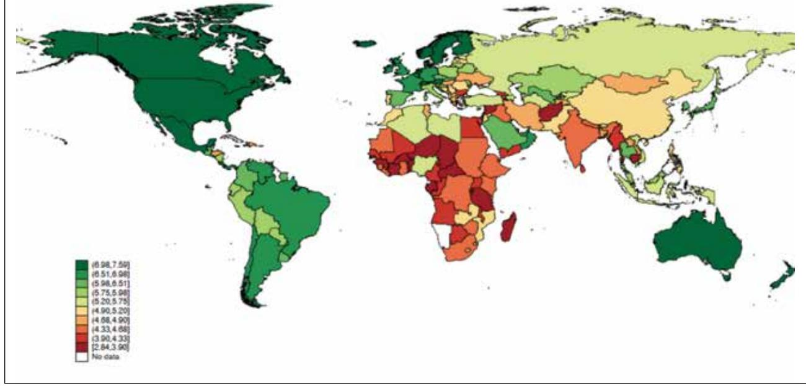

Source: Helliwell, Huang, & Wang (2015, p. 20)

**Figure 4.2: Ranking of Happiness in Africa, 2014-16**

Source: Gallup World Poll

well-being. We shall also try to identify the prospects for change and development that could spell hope for increasing the happiness of African people in future.

#### **The 'patchwork of countries that make up Africa'4**

Africa includes 54 countries, the largest number of nation states on a single continent. Forty-seven of the 166 countries in the Gallup World Poll, about a quarter, are African countries. South Sudan, which gained its independence in 2011 following Africa's longest civil war, is now included in the poll. The GWP has also collected data in Djibouti on the Horn of Africa, in the small island state of Comoros, and in both Somalia and Somaliland, although the latter region is not officially recognised as an independent state but considered a part of Somalia5 . The 2017 World Happiness Report tracks the happiness of 44 African countries polled by Gallup, including the island states of Mauritius and Madagascar located off the east coast of Africa (see Fig. 4.36).

At the outset, it will be important to remember that Africa is the continent with the longest history of humankind. We all have ancestors on the continent. Given the length of time that Homo sapiens have dwelt in Africa, it is also the continent with the greatest cultural diversity and a wealth of ancient civilisations. There are a multitude of different ethnicities and languages spoken in Africa. The continent extends from the Mediterranean Sea in the north to the meeting of the Indian and Atlantic Oceans in the south, and from the Atlantic Ocean in the west to the Suez Canal and the Red Sea in the east. Climatic regions range from temperate coastal regions, deserts and semi-deserts, bushland and savannah, to tropical jungles over the equator.

Africa's turbulent history has produced an extremely diverse cultural and linguistic landscape. Centuries of slavery, colonialism and apartheid preceded the period of independence. During the turbulent years following the 'first

dance of freedom'7 in the 1960s, the new African nation states experimented briefly with various styles of self-rule in what has been called the 'third wave' of democracy8 . The expansion of the Arabian Islamic Caliphate into North Africa in the 7th century and the European 'scramble for Africa' in the late 19th century introduced several of the European and Arabic languages that still serve as lingua franca and national languages on the continent. Over the centuries, African people have adopted some of the customs, technological advancements and new lifestyles of their former colonial masters. In recent times, Africa has leapfrogged older technology to embrace the latest advancements, such as mobile phones and solar-powered electricity.

This tumultuous history will have left its imprint on expectations and perceptions of personal well-being.9 Given the diversity found on the continent, it is natural to expect, as is shown in Figure 4.2, that there will be large differences among African countries in both life evaluations and likely reasons for these differences. Africa watchers frequently note how different the situations are from one African country to the next. Contrary to the once commonly held view that Africa is a single entity or 'brand', each country in fact has unique features that distinguish it from its neighbours.10 For this reason, there is likely to be a multitude of explanations for Africa's 'happiness deficit'. In this chapter we can only begin to search for plausible factors that may have undermined Africa's potential for happiness and satisfaction with life.

The quality of life of African people can be observed from a number of different perspectives. There have been many frames of reference for the narrative of Africa since independence ranging from the dismissive 'basket case' to the 'structural adjustment' imposed by the International Monetary Fund during the 1980s followed by debt forgiveness in the 1990s. The 'Africa Rising' narrative in the new millennium was followed by the global economic recession; and lately Africa has become part of the so-called

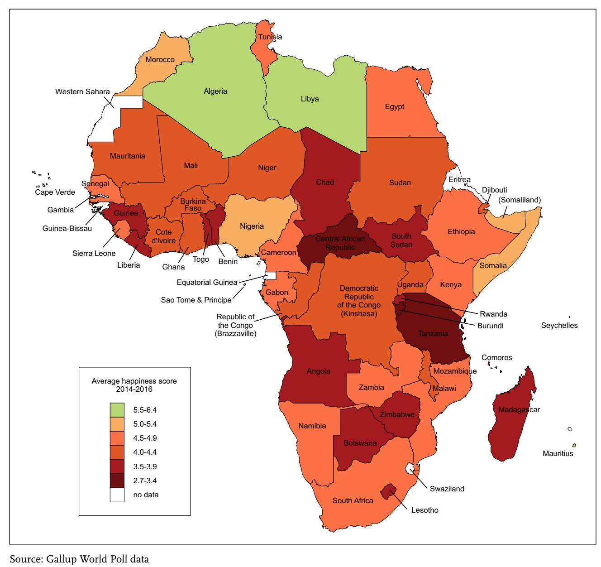

**Figure 4.3: Map of Africa with Average Happiness Scores**

'war on terror'. Each of these narratives homes in on a different set of factors that may determine the fortunes of Africa and its people.11

Twenty-first century Africa is no longer associated only with 'endless famine, disease, and dictatorship'. The 'Africa Rising' narrative, which overturned earlier stereotypes, projected a continent with a growing urban middle class

market with new consumer appetites.12 Africa's youthfulness promised to be an asset in an increasingly ageing global society. The continent's rich mineral wealth had not been exhausted and its agricultural land was still waiting to be exploited. In the new millennium, foreign direct investment in Africa eclipsed development aid for the first time since the colonial era.13

#### **Outline of this chapter**

We start our examination by first reflecting on the paucity of data on African happiness. We then discuss local reactions of disbelief to some other polls that have found African countries to be among the happiest, in contrast to the Gallup World Poll findings reported above. We next consider whether Africa's happiness deficit since independence14 may in fact be a long-standing one, in which case, it may take more time to remedy. Then we examine how changes in the lives of African people under democratic rule have affected quality of life on the continent. In particular, we review how aspects of good governance have affected the well-being of citizens. Finally, we consider how African people have managed to live with their 'happiness deficit' in anticipation of the good life.

#### Data for Africa

The GWP data on happiness for Africa is a valuable source of information on happiness in developing countries in Africa and serves as our point of departure. (See Technical Box 1: Gallup methodology in Africa). However, a major challenge for us when reflecting on Africa's well-being has been sourcing further data in support of our arguments. Our chapter will focus on all countries in Africa—unlike studies that divide Africa into sub-Saharan Africa and North Africa, or the extended region of MENA (Middle East and North Africa). While data coverage for Africa has improved over the past decades, there is still a dearth of social indicators that cover the whole of the continent. In particular, there is a shortage of trend data that would help us track the relationship between happiness and the factors that we think might have influenced happiness over time.15

We have opted for a practical solution. Where possible we draw on Africa's home-grown data. A useful source for our purpose is the Afrobarometer, which collects subjective indicators that give voice to ordinary citizens on the continent.16 Other home-grown initiatives that provided useful pointers for our examination are the Ibrahim Index of African Governance (IIAG)17 that covers all 54 countries on the continent based mainly on objective indicators, and the Arab Barometer, launched in 2005, which covers countries in North Africa and the Middle East.18

#### Do Gallup Happiness Ratings Ring True in Africa?

Before we consider what may be holding back African happiness, it will be important to know whether WHR reports on life evaluations in African countries ring true to people living on the continent. Measures of subjective well-being, other than Gallup World Poll ones, have, on occasion, ranked African countries such as Ghana and Nigeria among the happiest in the world. In these cases, it seems that local reactions to media reports on such high happiness rankings were mixed. In the Ghanaian case, political leaders reportedly took credit for promoting the well-being in their country, while their citizens tended to doubt that the scores were credible, and debated their validity. Similarly, Nigerian scholars referred to a 'Nigerian paradox' when their country achieved less than credible very high happiness rankings in international studies.

When Ghanaians heard that their country ranked among the ten happiest countries in the world in a news story circulating on the internet in 2006, there was excitement but also mainly disbelief. In her contribution to a handbook on happiness across cultures, Vivian Afi Abui Dzokoto recalls that the rating was received with mixed feelings of pride and disbelief that triggered debate on what 'really mattered' for well-being in Ghana. 'Did this statistic take into consideration the state of life in the country: the unemployment rates, traffic, state of roads, and the price of gasoline? Was it because Ghana was a very religious country? Or was it family values

#### **Technical Box 1: Gallup Methodology in Africa**

Introduced in 2005, the Gallup World Poll is conducted in approximately 140 countries every year worldwide, including 40 in Africa, tracking attitudes toward law and order, institutions and infrastructure, jobs, well-being, and other topics.

Gallup surveys approximately 1,000 residents per country, targeting the entire civilian, non-institutionalized population, aged 15 and older. In 2016, face-to-face surveys were used in all of Sub-Saharan Africa and most of North Africa. In Libya, telephone survey methodology has been used since 2015 owing to the country's high rate of mobile phone coverage and ongoing instability which has made it too dangerous to use face-to-face interviewers.

In countries where face-to-face surveys are conducted in Africa, the first stage of sampling is the identification of 100 to 125 ultimate clusters (sampling units), consisting of clusters of households. Sampling units are stratified by population size and geography and clustering is achieved through one or more stages of sampling. Where population information is available, sample selection is based on probabilities proportional to size (PPS) sampling, otherwise simple random sampling is used. Samples are drawn independent of any samples drawn for surveys conducted in previous years. In most African countries, national coverage is at or near 100%. However, national coverage is lower in countries such as Nigeria (96%), Somalia (68%), and South Sudan (56%) where insecurity makes interviewing dangerous in specific regions or neighbourhoods.

Data weighting is used to ensure a nationally representative sample for each country and is intended to be used for calculations within a country. First, base sampling weights are constructed to account for household size. Weighting by household size (number of residents aged 15 and older) is used to adjust for the probability of selection, as residents in large households will have a disproportionately lower probability of being selected for the sample. Second, post-stratification weights are constructed. Population statistics are used to weight the data by gender, age, and, where reliable data are available, education. At country level in Africa, each survey carries a margin of sampling error ranging from a low of ±2.6 percentage points to a high of ±5.4 percentage points.

The Gallup World Poll is translated into 85 languages throughout Africa and attempts are made to conduct interviews in the language the respondent speaks most comfortably. When at least 5% of a national population considers a language to be their most comfortable language, a new language is added to the survey.

Where necessary, Gallup seeks the permissions of national, regional, and local governments. In many African locations, permission from Chiefs and Elders must also be sought in order to gain access to rural areas or villages. In Somalia, permission is obtained not only from authorities in Somaliland, Puntland, and the Central Government in Mogadishu, but also from so-called "emerging states" such as Jubbaland Administration and South-West State.

Following 4-5 day training courses in capital cities, interviewers are sent across the country to reach ultimate clusters. While public transportation is used in many cases, it is often necessary in some regions to rent 4x4's owing to poor infrastructure and the remoteness of many sampling areas. In South Sudan, all interviewers not working in Juba must be flown to provincial towns immediately following training as road networks make travel exceedingly difficult. While at least 30% of interviews are accompanied in-person or back-checked by supervisors in all countries, data is also monitored remotely throughout fieldwork by quality control personnel utilising GPS data and interviewer productivity metrics.

or the tropical climate?'19

In the case of the Nigerian happiness 'paradox', Aaron Agbo and his colleagues, writing in the same handbook on cross-cultural happiness, thought that respondents who indicated that they felt happy might not have meant they were truly happy with their situation, but rather they felt that reporting otherwise 'could only aggravate the matter'. Saying you are happy might have been a way 'of counter-acting everyday negative life experiences', they speculated.20

#### Africa's History of Depressed Happiness

Well-being may reflect the history of a region.21 This may especially be the case for Africa that has a short history of self-rule. Low levels of subjective well-being are likely not to be a recent development in Africa. Indeed, the first international studies of happiness already found that evaluations of life were less positive in African countries south of the Sahara than elsewhere.

The WHR uses the ladder of life measure introduced by Hadley Cantril in the early 1960s as the yardstick for ranking countries on global happiness. Going back in time, Cantril's classic study of *The Pattern of Human Concerns* in 13 countries conducted in the early 1960s included two African countries: Nigeria represented an 'underdeveloped giant' along with Brazil and India, while Egypt was among three samples drawn in the Middle East. It seems that the country evaluations reported by Cantril in the 1960s for Egypt and Nigeria have not shifted much in fifty years. The highest score is 10 on Cantril's 0 to 10 ladder of life scale. Egypt's mean ladder score was 5.5 in Cantril's 1960s study and 4.735 as recorded in this year's WHR 2017 (see Fig. 4.2). Nigeria's ladder ratings in the two periods are 4.8 in Cantril's 1960s study and 5.074 in WHR 2017 (see Fig. 4.2).22

A decade after Cantril's study, the Gallup-Kettering study conducted in the 1970s, the largest global study of well-being of its time, found that African countries produced the lowest ladder of life scores, apart from India. A combined sample of eleven sub-Saharan African countries scored 4.61 in the 1970s, a ladder rating not very different from the most recent Gallup World Poll ladder ratings reported in WHR 2017 for the same eleven African countries that range from 3.35 to 5.07.23

#### Africa's Quest for Positive Change

Of importance for our discussion here is that the Gallup-Kettering study of the 1970s also asked respondents if they thought they would be happier if things could be changed about their lives. The desire for change was greatest by far in sub-Saharan Africa. Some 90% of African respondents wished for change in their lives and the vast majority in this group wanted not a 'few', but 'many' things to change to improve their lives.24

There can be no doubt that the most profound changes in the lives of African people were caused by the 'winds of change' that swept through the continent in the late 1950s and early 1960s, bringing independence to formerly subjugated peoples. On gaining independence from colonial rule, most countries on the continent experimented with democratic rule that was to restore dignity and freedom for Africa's people.

Why should democracy be important for African well-being? One argument is that Africa's approach to democracy focuses on 'horizontal equality' among diverse cultural and ethnic groups rather than on 'individual' or vertical rights.25 Thus, Africa's democracy project might be said to be in tune with a continent that has always nurtured collectivist values, such as African humanism. It ensured societal well-being in the past and still continues to do so today.26

In the next sections, we shall review attitudes to democracy and citizen evaluations of good governance. Later we shall return to discuss threats to an inclusive African democracy, in the form of authoritarian leaders (Africa's so-called 'Big Men'), patronage systems, and corruption, all of which may have negative impacts on well-being on the continent.

#### Democracy, Good Governance, and the Promise of Prosperity

Africa is said to have embraced democracy 'in fits and starts' since the winds of change blew through the continent in the 1960s. Although the newly independent states adopted the Western liberal democratic systems of their former colonial masters, in due course authoritarian rule became the order of the day. By the end of the 1980s, only Botswana, The Gambia and Mauritius still had democratic systems. Democracy was generally restored in the 1990s, and today, the vast majority of Africa's countries are multiparty democracies, at least in name if not in practice. The African Union's Vision 2063 envisages a prosperous and peaceful Africa that promotes democratic governance. Free and fair elections are seen as a test of the strength of Africa's democracies and more than a third of states on the continent were due to hold elections in 2016.27

**Africa's 'Third Liberation'.** Now that Africa has liberated itself from both colonial and authoritarian rule, African countries are advised to achieve the so-called 'third liberation', that is, to free themselves from poor governance in order to accelerate development and prosperity.28 International evidence suggests there is a strong link between good governance and well-being. Societies that have high levels of well-being tend to be economically developed, to have effective governments with low levels of corruption, to have high levels of trust, and to be able to meet citizens' basic needs for food and health.29

#### **Supply and demand for democracy in Africa.**

Afrobarometer surveys have found that the most common meaning of democracy in Africa relates to civil liberties, especially freedom of speech.30 And successive waves of the Afrobarometer show that Africans consider democracy to be preferable to any other form of government, disapproving of authoritarian options including one-party, military and one-man rule (see Fig. 4.4A left). However, this demand for democracy is not matched by supply over the course of fifteen years. The African countries that favour democratic rule outweigh those that are satisfied with democracy and regard their country as a democracy (see Fig. 4.4B right).

Importantly, Figures 4.5 and 4.6 show that satisfaction with democracy is weakly positively associated with happiness, while a 'democratic deficit'—the gap between preference for democracy and satisfaction with its functioning depresses levels of happiness. Looking back over the past decade, Figure 4.7 indicates that gains and losses in satisfaction with democracy relate to corresponding changes in happiness.

#### **The material underpinnings of democracy and African well-being**

It is important to note that African citizens expect much more of their democracies than just civil liberties such as free and fair elections. They are just as likely to associate democracy with better living conditions—with basic services such as clean water, electricity, and housing—as with regular elections, competing political parties, and freedom to criticise government.31

Given the continent's history of colonialism, there was hope that democracy would restore dignity to African people and improve their life circumstances. Africa's independence from colonial rule promised material benefits—the decent standard of living that provides dignity. It is telling that an improved or decent standard of living was the greatest hope expressed by Nigerians participating in Cantril's 1960s study. Before

**Figure 4.4: Trends in the Demand for and Supply of Democracy, 12 African Countries, 1999-2015**

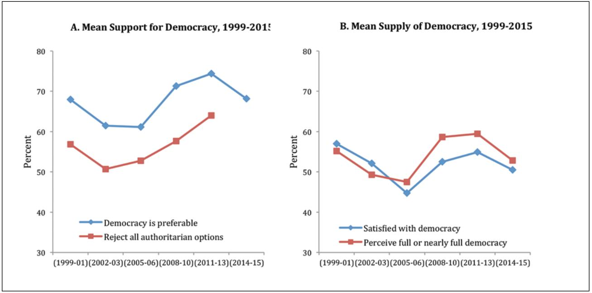

Source: Afrobarometer Rounds 1-6, Online Appendix, Table A4.1.

**Figure 4.5: Satisfaction with Democracy and Happiness, 34 African Countries, 2013-2015**

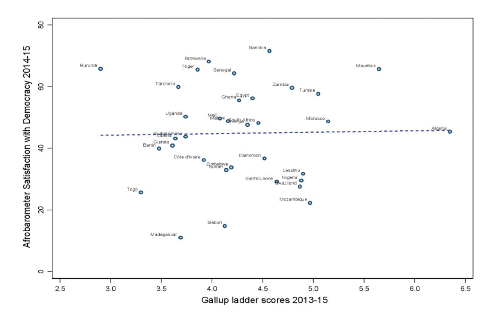

Sources: Afrobarometer Round 6 and Gallup World Poll ladder-of-life data, Online Appendix, Table A4.2.

**Figure 4.6: Democratic Deficits and Happiness, 34 African Countries, 2013-2015a**

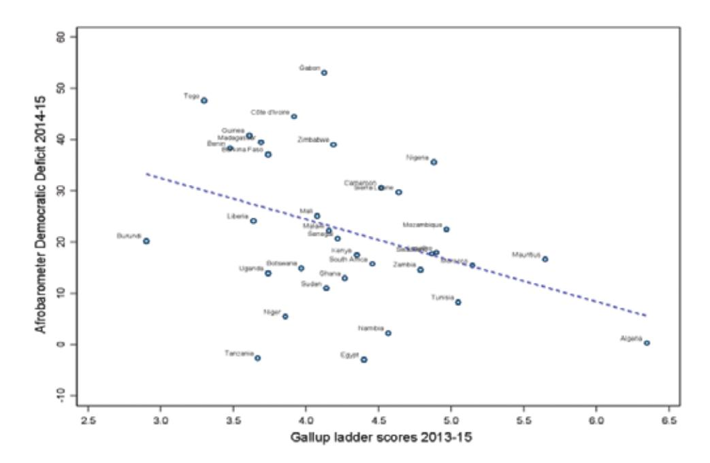

Sources: Afrobarometer Round 6 and Gallup World Poll ladder-of-life data, Online Appendix, Table A4.2. a. The democratic deficit is the percentage point difference between the share stating that democracy is preferable and those that report satisfaction with democratic functioning. The larger the score, the greater the deficit.

**Figure 4.7: Changes in Satisfaction with Democracy and Happiness, 15 African Countries, 2005- 2015a**

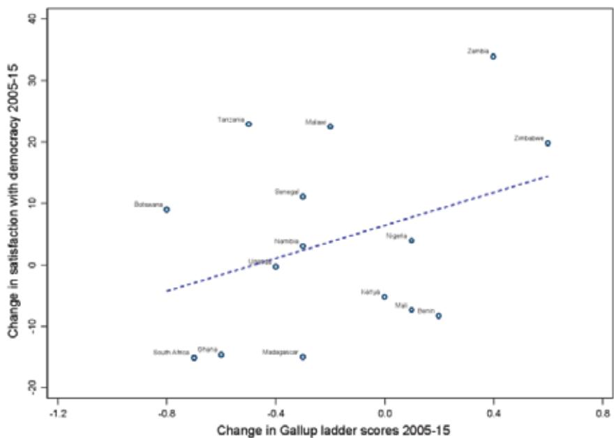

Sources: Afrobarometer Rounds 3 and 6 and Gallup World Poll ladder-of-life data, Online Appendix, Table A4.3. a. Changes refer to absolute changes in levels of satisfaction with democracy and happiness between the two periods. The results are confined to those countries with available Afrobarometer and Gallup data in both time periods.

giving their life evaluations, 69% of Nigerian respondents stated they aspired to a better standard of living, while 60% worried that they might not achieve a decent standard of living.32

**Waiting for the 'end of poverty'33.** The Afrobarometer uses the Lived Poverty Index34 to measure freedom from the experience of deprivations in everyday life. Respondents are asked whether they have gone without six basic necessities in the past year, ranging from food and water to electricity in the home. There is a strong negative association between happiness and lived poverty. African countries that have experienced less lived poverty report higher levels of happiness in the Gallup World Poll (see Fig. 4.8). Burundi, one of the world's poorest nations, that is struggling to emerge from a 12-year ethnic-based civil war, scores highest on Afrobarometer's lived poverty and lowest on happiness. In contrast,

Algeria, a leading North African oil-exporting country, and Mauritius, a strongly democratic island state, have low lived poverty and are the two happiest countries on the continent in the GWP. Other North African countries follow close behind Algeria and Mauritius in their lived poverty and happiness ratings.

Figure 4.9 indicates that changes in lived poverty and happiness over time are associated. For example, Zimbabwe, formerly a breadbasket in southern African and now often regarded as a failed state where unemployment and poverty are endemic and political strife and repression are commonplace, has experienced some poverty relief in daily life over the past decade. The drop in Zimbabwe's lived poverty score of 0.61 points in Figure 4.9 is matched by a corresponding increase of 0.64 points in its happiness score.

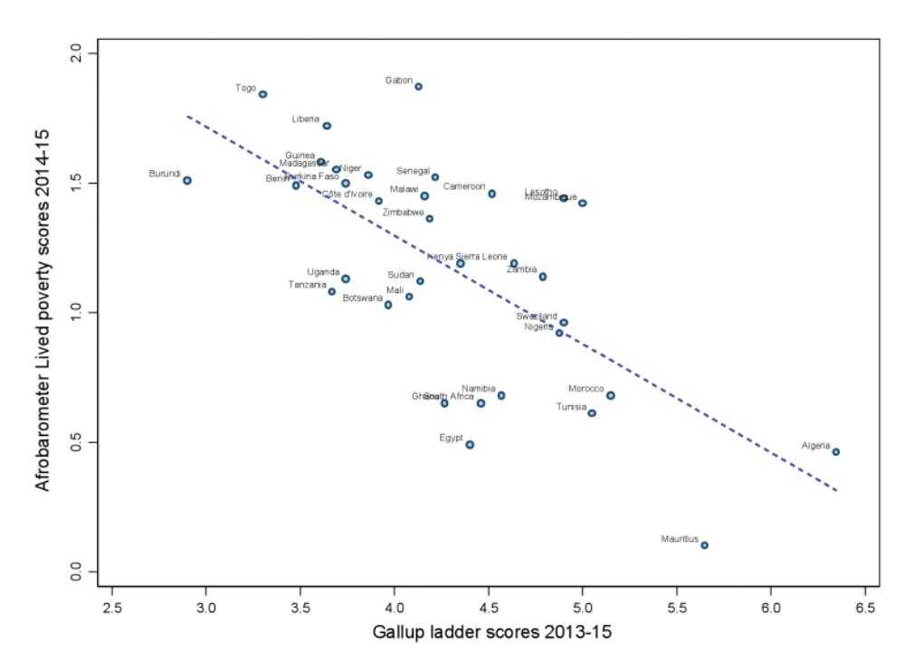

Sources: Afrobarometer Round 6 and Gallup World Poll ladder-of-life data, Online Appendix, Table A4.4. Note: In three instances (Lesotho, Mozambique and Swaziland), there was no available happiness data point in the 2013-2015 period, so we instead utilized the data for the 2009-2011 period instead. In the case of Morocco, there was no lived poverty data for the 2014-2015 period, so we relied on Afrobarometer round 5 data for 2011-2013 in this case.

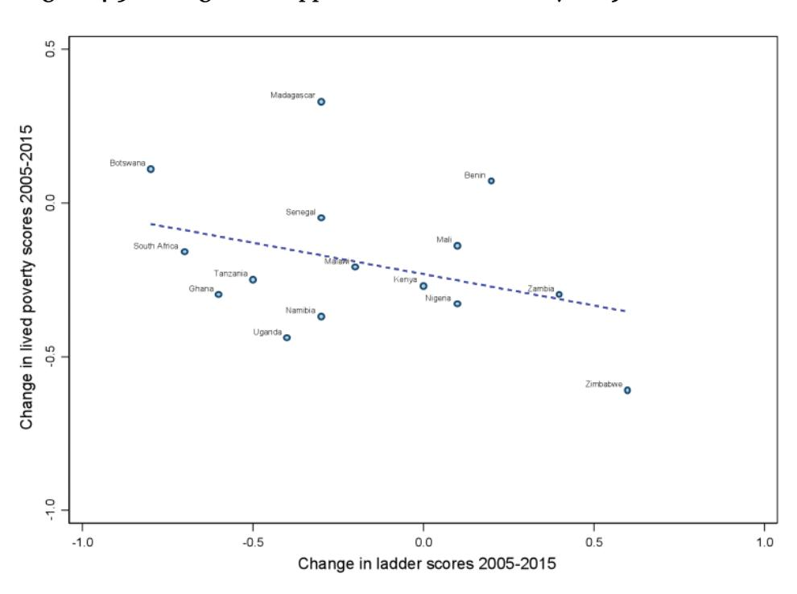

**Figure 4.9: Changes in Happiness and Lived Poverty in 15 African Countries, 2005-15a**

Sources: Afrobarometer Rounds 3 and 6 and Gallup World Poll ladder-of-life data, Online Appendix, Table A4.5. a. Changes refer to absolute changes in levels of lived poverty and happiness between the two periods. The results are confined to those countries with available Afrobarometer and Gallup data in both time periods.

#### **Infrastructure development and happiness.**

Developing the continent's infrastructure is a major challenge that has not kept pace with population growth. The Programme for Infrastructure Development in Africa estimates that the continent would need to invest up to \$93 billion a year until 2020 for capital investment and maintenance.35 Africa's huge backlog of infrastructure may play a more important role in determining personal well-being in Africa than in the more developed countries of the West, whose higher levels of happiness are indicated in shades of green in the Geography of Happiness map (see Fig. 4.1 above).

Afrobarometer reports that on average across 35 African countries, only about two-thirds of the people live in communities with an electric grid (65%) and/or piped water infrastructure (63%), and less than one in three have access to sewage (30%), while more than three times as many have access to cellular phone service (93%). Only about half (54%) live in zones with tarred or paved roads. Regional comparisons show that North Africa has the best availability of all five services36, which may be reflected in their higher than average happiness ratings on the continent (see Figs. 4.1, 4.2 and 4.3 above).

It is telling that in 1994 the government of South Africa, the last country on the continent to gain its independence, promised a 'better life' to meet its newly enfranchised black citizens' aspirations for housing, running water, and electricity. Some twenty years later, there is still a marked difference between what determines happiness among black and white South Africans. Economists report that better access to infrastructure and public goods increases happiness among black South Africans, while determinants

**Figure 4.10: Satisfaction with State Provided Infrastructural Services and Happiness in 34 African Countries, 2013-15a**

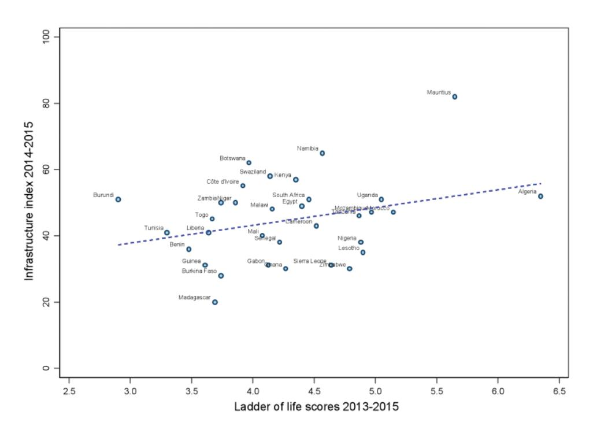

Sources: Afrobarometer Round 6 and Gallup World Poll ladder-of-life data, Online Appendix, Table A4.6. a. In three instances (Lesotho, Mozambique and Swaziland), there was no available happiness data point in the 2013-2015 period, so we instead utilized the data for the 2009-2011 period instead. The index is simple average of the percent that the government is doing very or fairly well in handling four infrastructural services, namely: roads and bridges, electricity, water and sanitation, and basic health.

of the happiness among mainly wealthier white South Africans mirrors those typically found in Western developed research settings.37

Afrobarometer surveys highlight the importance of infrastructure development for the African experience of everyday well-being throughout the continent. The latest round of surveys found that the lived poverty index had declined in two-thirds of the 36 countries surveyed by Afrobarometer. Countries that had made progress in developing basic infrastructure were more likely to have experienced declines in lived poverty.38 Figure 4.10 shows that satisfaction with the state's development of infrastructure in African countries is also positively associated with happiness.

**Infrastructure and democracy.** While poor infrastructure and lack of service delivery may contribute to lived poverty and depressed happiness, it may also undermine Africa's democracy project. A case in point is South Africa's relatively new democracy. The latest Afrobarometer survey conducted there suggests that South African citizens might be willing to give up their democratic rights in favour of their living conditions being improved. While almost two-thirds (64%) of South African respondents thought that democracy was preferable to any other kind of government, a similarly high percentage (62%) stated they would be 'very willing' or 'willing' to give up regular elections to live under a non-elected government capable of ensuring law and order and service delivery.39 A growing global trend towards authoritarianism could lead to a resurgence of such regimes in Africa.40

#### Africa's 'Big Men', Authoritarian Regimes, and Discontent

Three decades after its restoration in the 1990s, Africa's democratic process is still very fragile. Although the era of military coups, dictatorships and authoritarianism may be over, there are still a number of African leaders who resort to manipulating electoral and constitutional mechanisms and intimidating citizens in order to prolong their stay in power.41 The Ibrahim Prize for good governance in Africa, instituted by the Mo Ibrahim Foundation in 2006, goes to former African leaders who have honoured their country's constitutionally mandated term limits, and have dedicated their rule to improving people's lives. Only five winners have been selected in the ten years since 2007.42

Africa's longest-ruling leaders are to be found across the continent. Fifteen leaders of 48 African countries that hold regular elections have served more than two terms or indicated their intention to do so in 2016. Africa's 'Big Men', who personalise power, often have poor human rights records and use repression to hang on to power.43 They gain support through Africa's widespread patronage system.44 A number of Africa's authoritarian regimes have survived because they have provided political stability or support for the 'war on terror', thus attracting the foreign aid and investment needed for development.45

An example of a country valued for its political stability after years of conflict is business-friendly Rwanda. The country was chosen to host the 2016 World Economic Forum on Africa in its capital city Kigali in recognition of its role as a model for regional development.46 Rwanda's President Paul Kagame, a leader in Rwanda's post-genocide government since 1994, gained approval by referendum in 2015 to stand for an unprecedented third term in 2017. The controversial vote on the country's constitution means that Kagame could be in power until 2034 in a country with unusually low life evaluations

relative to its economic success (see Fig. 4.2). President Kagame is said to have remarked that African countries that change their leaders too often have not fared as well as his country. He may not be alone in claiming that authoritarian rule is a more efficient form of democracy in less developed parts of the world.47

Citizens in a number of African countries appear to share President Kagame's view that strong leadership is in the interest of political stability and economic development. The latest Afrobarometer surveys show that views are divided on governance issues, such as one-man rule and term limits (see Table 4.1, top). On average, one-man rule is rejected by four out of five citizens, while only 11% are in favour, and three-quarters support two-term limits for their president. However, the differences between highest and lowest values of support and rejection are striking. Over 90% in Benin, Gabon, and Burkina Faso were in favour of constitutional two-term limits. In Mozambique, a country still suffering from the effects of a 16-year civil war that ended in 1994, near-equal proportions were against (35%) and in favour (30%) of one-man rule and only 50% supported a term limit. Noteworthy is that all four countries have experience of longer-term leadership.48

#### **Trust and Corruption**

Perceptions of the trustworthiness and honesty attributed to Africa's leaders and civil servants vary across the continent (see Table 4.1, middle). Highest and lowest values differ by at least 50 percentage points between countries. Within countries, trust in the president is consistently greater than trust in other members of the ruling party (Malawi and South Africa are exceptions). Similarly, government officials are consistently seen to be more corrupt than those in the office of the president (Gabon is an exception49). Nigeria was voted among the most corrupt countries on all three indicators recorded in Table 4.1.

**Table 4.1: Support for Authoritarian Rule in Africa, Political Trust, and Perceived Corruption, Average and Range of Values Across 36 Countries, 2014-15 (%)**

|                                                                             | African average | Lowest value | Highest value | Diff high to low | Three most positive ratings | Three most negative ratings |
|-----------------------------------------------------------------------------|--------------------|-----------------|------------------|---------------------|-----------------------------------|-----------------------------------|
| Reject one-man rule                                                         | 80                 | 35              | 93               | 59                  | MUS, SEN, BEN                  | MOZ, EGY, ALG                  |
| Support one-man rule                                                        | 11                 | 3               | 30               | 27                  | MUS, SLE, TZA                  | MOZ, SDN, TUN                  |
| Agree that Constitution should limit president to a maximum of two terms | 75                 | 50              | 93               | 43                  | BEN, GAB, BFA                  | MOZ, LSO, BWA                  |
| Trust President somewhat / a lot                                            | 56                 | 29              | 82               | 53                  | EGY, BDI, NER                  | STP, MWI, LBR                  |
| Trust Ruling Party somewhat / a lot                                         | 47                 | 20              | 72               | 52                  | BDI, NAM, NIG                  | GAB, LBR, NGA                  |
| All / most of government officials corrupt                               | 39                 | 15              | 70               | 55                  | CPV, MUS, STP                  | LBR, NGA, GAB                  |
| All / most of those in Office of President corrupt                       | 31                 | 13              | 63               | 51                  | CPV, TZA, BDI                  | LBR, BFA, NGA                  |
| Corruption increased a lot / somewhat in last year                       | 58                 | 26              | 83               | 57                  | MOR, BFA, EGY                  | RSA, NGA, GHA                  |
| Government doing very / fairly well in fighting corruption               | 30                 | 10              | 54               | 44                  | BWA, SWZ, LSO                  | MDG, GAB, ZWE                  |

Source: Afrobarometer Round 6, Online Appendix, Table A4.7.

Note: ALG=Algeria; BEN=Benin; BFA=Burkina Faso; BWA=Botswana; BDI=Burundi; CPV=Cape Verde; EGY=Egypt; GAB=Gabon; GHA=Ghana; LSO=Lesotho; LBR=Liberia; MDG=Madagascar; MWI=Malawi; MUS=Mauritius; MOR=Morocco; MOZ=Mozambique; NAM=Namibia; NER=Niger; NGA=Nigeria; RSA=South Africa; SLE=Sierra Leone; SEN=Senegal; STP=Sao Tome & Principe; SDN=Sudan; SWZ=Swaziland; TZA=Tanzania; TUN=Tunisia; ZWE=Zimbabwe

On average, 58% of respondents across all Afrobarometer countries surveyed thought corruption had increased in their country in the past year, while less than one in three approved of their government's efforts to fight corruption (see Table 4.1 bottom). Exceptionally, 54% in Botswana, considered to be a stable democracy, thought the government was doing well in fighting corruption. Noteworthy is that corruption might be easier to contain in smaller island states, such as Cape Verde, Mauritius, and Sao Tome & Principe, where Afrobarometer respondents indicated there was less corruption or approved of their governments' fight against corruption.

Our examination of the relationship between happiness and corruption (not shown here)

suggests that it is not a recent increase or decrease in perception of corruption that counts, but rather longer-term changes. Over the past decade, happiness improved markedly in a number of countries where citizens saw a reduction in corruption at the top level of leadership (see Fig. 4.11) and stronger government performance in fighting corruption (see Fig. 4.12).

#### 'Africa Uprising'50

The question is how long African citizens will support their strongmen and long-serving leaders. Five years ago, the so-called Arab Spring of 2011 saw regime change in North African countries that may have caused a ripple effect on

**Figure 4.11: Changes in Happiness and Perceived Corruption in the Office of the President in 15 African Countries, 2005-15a**

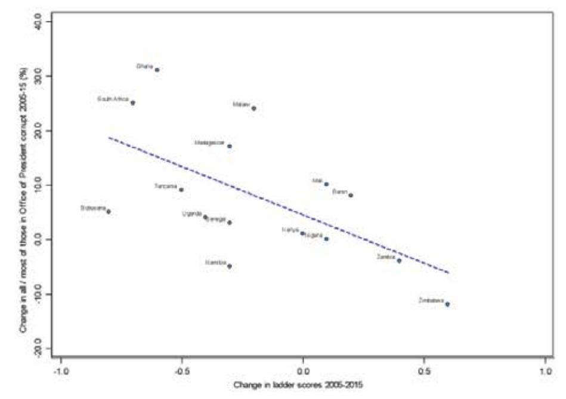

Sources: Afrobarometer Rounds 3 and 6 and Gallup World Poll ladder-of-life data, Online Appendix, Table A4.8.

a. Changes refer to absolute changes in levels of perceived corruption in the Office of the President and happiness between the two periods. The results are confined to those countries with available Afrobarometer and Gallup data in both time periods.

**Figure 4.12: Changes in Happiness and Perceived Government Performance in Fighting Corruption in 15 African Countries, 2005-15a**

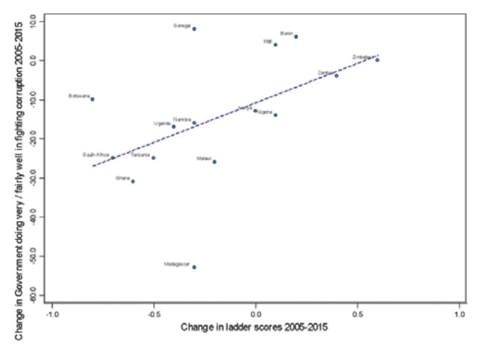

Sources: Afrobarometer Rounds 3 and 6 and Gallup World Poll ladder-of-life data, Online Appendix, Table A4.8.

a. Changes refer to absolute changes in the shares perceiving government performed very / fairly well in fighting corruption and levels happiness between the two periods. The results are confined to those countries with available Afrobarometer and Gallup data in both time periods.

the continent. When Burkina Faso's dictator of 27 years, Blaise Compaoré, was toppled in November 2014, an Africa watcher foresaw that a season of protest might have hitched a ride on the Sahara's Harmattan, a wind that blows south every November.51 Interestingly, the Gallup World Poll conducted a year prior to the coup in Burkina Faso found awareness of the Arab Spring was greater in Burkina Faso than in other sub-Saharan countries.52

It may be significant that a further long-term president was almost ousted in 2016. Yahya Jammeh had boasted he would rule The Gambia for a billion years.53 In December, his 22-year authoritarian rule was set to end by a shock election result. The event was initially heralded as a triumph for African democracy until Jammeh later disputed the election outcome. He was finally forced to step down in early 2017.54

Youth have always been in the forefront of protest. In the past two years, youth and student protests have swept through many countries south of the Sahara, including in Ethiopia where a state of emergency was imposed in mid-2016.55 It is significant that the student protests there and in South Africa have been interpreted as a clash between generations.56

In 2016, Afrobarometer reported that their latest round of surveys found 11% of youth reported having been involved in at least one protest action in the past year.57

#### **The disconnect: Africa's 'youth bulge' and ageing leaders**

A problem for Africans who yearn for change and greater life chances is that there is a dramatic disconnect between Africa's longest serving leaders and the continent's youth.58 The age

**Figure 4.13: Trends in Mobile Cellular Telephone Subscriptions and Individual Internet Usage per 100 Inhabitants in Africa, 2005-16a**

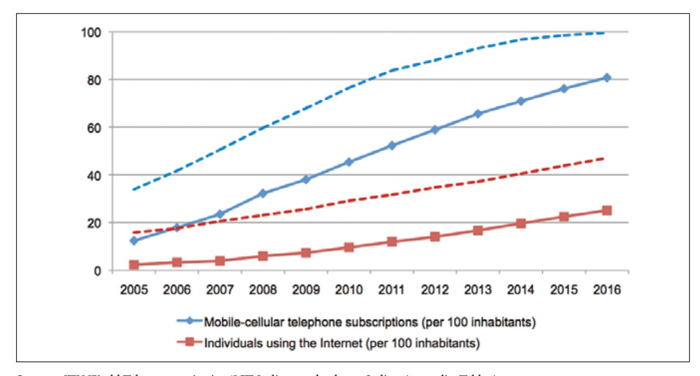

Sources: ITU World Telecommunication/ICT Indicators database, Online Appendix, Table A4.9. a. The dashed lines represent the World average on the two ICT indicators.

difference between leaders and the youth is striking. While the average age of Africa's presidents is estimated to be about 70 years, some 70% of African citizens are younger than 30 years. Most of Africa's leaders will have been born before the age of television and mobile phones and before the end of the colonial era. Given this generation gap, there is likely to be a mismatch between youth's expectations of democracy, and the reality that confronts them.59

Social media played an important role in the Arab Spring and has continued to do so in more recent youth protests across Africa. Figure 4.13 shows that mobile phones have captured the imagination of the people on the continent. Africa's mobile-cellular telephone and internet usage is fast catching up with the rest of the world.

#### **Youth voting with their feet**

At the heart of the Arab Spring were disgruntled youth seeking democratic representation and economic participation. Political analysts have warned that responses to Africa's current youth revolts may not necessarily meet protestors' demands for greater access to education and to skills that will lead to employment.60 An important question, therefore, is what will happen to Africa's youth who do not find jobs in their countries of birth by their mid- to late twenties. Will they despair, join extremist groups, or emigrate?

Africa's increasingly IT-connected youth will have expectations of a higher standard of living than their parents. Not all rural youth are content to till the soil as past generations have done and will try to find greener pastures in urban areas or, in some cases, even overseas. African people have always been on the move.61

Consider that South Africa's migrant labour system, introduced during the colonial era, forced rural men to work on faraway mines to earn the cash to pay a hut tax. In the twentieth century, labour circulation became a way of life and working on the mines became a rite of passage for young Xhosa men. Working underground, they earned both prestige and the money to pay bride wealth in order to get married.62

Fast forward to 2016. Young men in a rural village in The Gambia, where President Jammeh's authoritarian rule was challenged in the December elections, see the need to risk a perilous 4,800 km journey across the Sahara and the Mediterranean in search of work in Europe. They hope to earn money in order to be able to marry a local young woman and gain respect in their community. As many as 600 of the approximately 4,000 villagers have risked this so-called 'Back Way'.63

Youth working overseas earn not only to benefit themselves but also to support their families in Africa. The remittances sent home by nearly 140 million Africans living abroad currently surpass Western foreign aid.64 Africans fleeing conflict in their countries or seeking a better life have overwhelmed Europe in the past year. Since 2014, an estimated 80,000 of the passengers on the Mediterranean people-smuggling boats have come from sub-Saharan Africa.

#### **'Asinamali'65—we have no money!**

Africa will need to provide jobs for its youth if it is to meet their aspirations for the good life. In 2010 there were roughly 200 million Africans between 15 and 24 years of age and this number could rise to over 450 million by 2050. According to an African Development Bank report, young people aged 15 to 24 constitute 37% of Africa's labour force but make up 60% of the continent's total.66 It is estimated that 18 million jobs will need to be created every year just to accommodate Africa's current jobseekers.67

The latest Afrobarometer identified unemployment as a top concern in African countries (see Fig. 4.14). Some Africa watchers argue that the continent is already falling behind in providing education and employment for its youth. The

**Figure 4.14: The Most Important Problem Facing African Countries, 2013-15 (%)a**

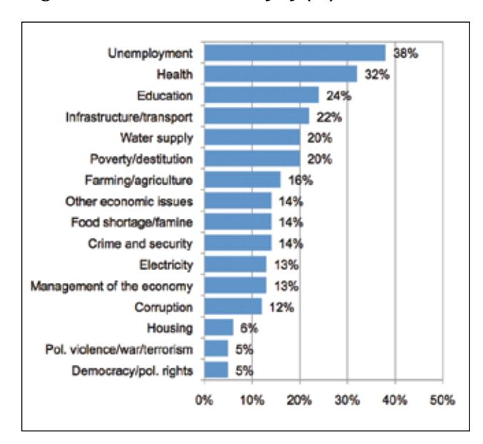

Source: Afrobarometer (2016) Highlights of Round 6 survey findings from 36 African countries, p.2, Online Appendix, Table A4.10.

a. Respondents were asked: In your opinion, what are the most important problems facing this country that government should address? Respondents were allowed to provide up to three responses. The bars in the figure show the percentage of respondents who mentioned each problem among their top three challenges.

African Development Bank has pointed out that in 2012 only a quarter of young African men and just 10% of young African women managed to get jobs in the formal economy before they reached the age of 30.68

One hopeful future scenario sees the African continent diversifying from extractive industries to investing in its youth. If business friendly policies were introduced, some analysts predict that production in China could shift to Africa69 and Africa's 'youth bulge' could be 'put to work'. However, there are also fears of 'Chinese neo-colonialism' that might jeopardise Africa's future.

#### **Drought and commodity prices as risk factors for 'Africa Uprising'**

It might be worth considering that economic recessions following periods of drought have played a critical role in fueling the continent's discontent, as in the cases of the Arab Spring and the Ethiopian protests. Drought may well spark further uprisings. Africa has a long history of extreme weather patterns70, which is likely to be aggravated by climate change in the 21st century.71 In 2016, countries in east and southern Africa experienced severe drought conditions that have negatively affected food production and increased food prices. It was anticipated that the drought would be followed by severe flooding in the region.72

A further risk factor for discontent and unrest is the combination of lower demand for commodities and lower commodity prices, which will call for belt-tightening in Africa's oil-producing countries. The latest International Monetary Fund outlook for sub-Saharan Africa predicts a growth of only 1.4%. A number of African countries have already had to turn to the IMF and the World Bank for bailouts. Sub-Saharan countries, including Angola, Ghana, Kenya, Mozambique, Nigeria, Zambia, and Zimbabwe have asked for financial assistance or are in talks to do so.73

#### Demography and Well-Being

Although major investment in Africa's youth is needed to address barriers to youth employment, there may not be time to make sufficient investment to avert a population 'time bomb'. The international Children's Worlds survey suggests that Africa is lagging behind other countries in investing in its youth. (See Technical Box 2: African children's well-being in international context). Noteworthy is that some of Africa's smaller nations, particularly island states such as Mauritius, are among the happiest (see Figure 4.2 above), a finding that suggests it may be easier for the state to provide services for a smaller number of people.

#### **Technical box 2: African Children's Well-being in an International Context**

African countries are aware that investing in children will contribute to a better future for their nations and their people. Over the past decade, Africa has seen significant changes that affect child well-being, including a reduction in infant and child mortality, and improved access to basic health services. However, there are still many factors that hold back the advancement of young children, such as malnutrition and stunting, on-going conflict in some countries, and unequal education for girls.

Research on the well-being of African children is still in its infancy. Children's Worlds, the International Survey of Children's Well-Being, is so far the largest international comparative research on children's own views of their lives and well-being. Children's Worlds aims to create awareness of the state of child well-being among children, their parents and their communities, and to inform policy makers and the general public. The 2013-14 wave tracked just over 53,000 children aged about 8, 10, and 12 years in 15 countries across four continents. Country samples typically include approximately 1,000 children attending mainstream schools in each age group.

**The survey** is based solely on children's own evaluations, perceptions and aspirations. Children are asked to evaluate their lives relating to some dozen domains, including their living situation, home and family relationships, money and economic circumstances, friends and other relationships, the local area, school, time use, the self, children's rights, and subjective well-being.

The survey uses a number of response formats for its questionnaire items: Life circumstances are captured by agreement with statements on 5 or 10-point response scales from 'I do not agree' to 'I totally agree'. Responses to frequency items, mainly time-use ones, are recorded on a 4-point scale from 'rarely or never' to 'every day or almost every day'. Domain and life satisfactions are rated on a 0 to 10-point scale from 'not at all satisfied' to 'totally satisfied'. For international comparative purposes, country standing is variously reported as the country's mean score on a survey item, the standard deviation of the mean country score to indicate dispersal of responses, and the rank order of the country's score among the 15 countries.

**Three African countries** are included in the Children's Worlds 2013-14 survey: Algeria, Ethiopia, and South Africa. The samples of children drawn are representative of the whole country in the case of Ethiopia, the Western Cape Province in South Africa, and the Western Region of Algeria. These three countries differ markedly according to their objective socio-economic indicators. For example, Gross Domestic Product per capita in Algeria and South Africa is approximately ten times higher than in Ethiopia, the poorest country in the Children's Worlds survey apart from Nepal. Ethiopia ranks 173 out of 187 on the Human Development Index, the lowest ranking among the 15 countries, compared to somewhat higher HDI rankings for Algeria (93) and South Africa (118) in 2013. South Africa is the most unequal country in the survey, with a very high Gini coefficient of 63 (100 indicates highest inequality).

**Select findings** from the Children's Worlds 2013-14 survey among approximately 36,000 children aged 10 to 12 years provide glimpses of how African children view and evaluate their lives compared to age peers in Colombia, Estonia, Germany, Israel, Nepal, Norway, Poland, Romania, South Korea, Spain, Turkey, and the United Kingdom.

**Home and family life:** Children in all 15 countries generally viewed their home and family life fairly positively. Algeria's evaluations of this domain ranked among the most favourable while Ethiopia's were often the least favourable. Algerian children achieved high rankings for satisfaction with 'my family life' and endorsement that parents listened to them and treated them fairly. In contrast, children in all three African countries were among the most dissatisfied with 'the house or flat where you live', and Ethiopian and South African children were most likely not to 'feel safe at home' and not to 'have a quiet place to study at home'.

**Local area.** The African countries rated the 'area you live in in general' and opportunities for 'doing things away from home' less favourably than others, and were less likely to say they have places to play and feel safe in the area where they live.

**Material well-being.** The Children's Worlds index of material deprivation asked children if they had or lacked nine items including good clothes for school, a computer at home, internet access, a mobile phone, own room, books to read for fun, a family car, 'own stuff' to listen to music, and a television in the home. Pooled world data indicated that, on average, children lacked only 1.9 items. Norway's children suffered the least material deprivation; they lacked only 0.2 items on average. Ethiopia was the most materially deprived of all countries, with 6.3 lacked items. There was less material deprivation in the other African countries: Algeria lacked 3.6 items, South Africa 2.3, but the distribution of deprivation was particularly uneven in the two countries. African children were also among the least satisfied with 'the things you have' compared to other countries.

**School life.** Children in all 15 countries were mainly positive about school life. African children were no exception. For example, endorsement of 'I like going to school' by Ethiopian and Algerian children was higher than in other countries. Children in Algeria were also among the most satisfied with 'my life as a student', 'my school experience', and 'the things I learn at school'. Unusually, Ethiopian children's evaluation of school life was generally more positive than home life, although they did not feel very safe at school.

**Time use.** Homework was one of the most common after-school activities in all countries. African children also looked after siblings and other family members and helped with household chores. Participation in organized spare-time activities, such as reading for fun and sports were less common, particularly in Ethiopia and Algeria.

**Safety.** Satisfaction with personal safety, a topic explored across the domains of home, school, local area, and the self, attracted lower scores in South Africa and Ethiopia than in many other countries.

**Subjective well-being.** Three indicators measured children's overall subjective well-being: a satisfaction item (with 'life as a whole'), a frequency item ('how happy were you in the past two weeks'), and an agreement item ('I feel positive about the future'). Country scores on all three measures were highly skewed towards the positive end of the 0 to 10 point scale. In the 12-years survey, scores on the three measures were contained in a narrow band from 9.0-9.5 in Romania down to 7.5-7.6 in South Korea. Scores on subjective well-being varied across the African countries with Algeria leading, South Africa in an intermediate position, and Ethiopia lagging behind. Algeria ranked among the four countries with the highest scores on life satisfaction (9.1) and happiness (8.9) for 12 year olds. South Africa's distribution of life satisfaction scores for 10 and 12 year olds were the most extreme: low scores (below 5) and high scores (10) were split 7.4% to 63%. Ethiopia ranked second-lowest, after South Korea, on life satisfaction among 10 to 12 year olds. Only every second Ethiopian child rated life satisfaction with a score of 10 compared to over 7 in 10 in the four top-ranking countries.

In contrast to these widely varying present life evaluations, African children were consistently positive about the future. All three countries gave a future rating of 8.7 out of 10, a score only 0.3 points lower than top-ranking Romania's score of 9.

**Final Comments.** The select findings from the 2013-14 Children's World survey previewed here expose some of the disadvantages many African children face in early life. The most glaring hardship may be doing without the resources that children in more developed countries take for granted. Obviously, much needs to be done to improve African children's life circumstances. Meanwhile Africa's children, like all children around the world, try to enjoy everyday life. Importantly, they express confidence in their future.

**Further information:** See the report on the Children's Worlds Survey, 2013-14, in 15 countries (Rees & Main 2015), and African country reports on Children's Worlds surveys in Algeria (Tiliouine 2015b), Ethiopia (Mekonen & Dejene 2015), and South Africa (Savahl et al. 2015), available on the project website: www.isciweb.org

For centuries Africa was underpopulated. The continent only started to reach its potential for population growth toward the end of the 20th century.74 Now Africa's exploding population is expected to double by 2050. Population growth, together with migration to Africa's urban areas has put severe pressure on the state's capacity to provide education, health services, and infrastructure. Further population growth may undermine progress in human development achieved so far. It is predicted that by 2050, Africa could have 35 cities with over 5 million inhabitants with Kinshasa and Lagos each exceeding 30 million.75

**Africa's population challenge.** Demographers Jean-Pierre Guengant and John May describe the scale of the continent's new population challenge. In the early 1960s, they report, African countries had fertility rates of between 5.5 and 7.5, comparable with other developing economies at that time. Whereas Asian and Latin American nations saw their fertility rates decline at a fairly steady rate over the next fifty years, African countries' fertility stayed high until the 1980s, before it fell sharply. As a result, they predict that Africa's overall population will rise sharply, its big cities will grow alarmingly, and although its labour force will also expand, its 'youth bulge' will be 'hard to manage'.76

Currently, some 78% of Africa's people live in countries that have not passed the demographic transition to low fertility and low mortality; only the countries in the far north and south of the continent are exceptions with lower fertility rates. Countries with the top ten fertility rates in the world are found in sub-Saharan Africa, with nearly all above six children per woman. Fertility rates are particularly high among Africa's landlocked countries and ones with low rates of urbanisation. Niger, a land-locked country in the Sahel is a case in point. It has the world's highest fertility rate of 7.6. The rate of contraception use among child-bearing age women in sub-Saharan Africa is lower than in other regions of the world.77

Our examination of demographic factors (see Figs. 4.15 and 4.16) suggests that African countries with higher fertility rates and a large youth population may find it harder to provide quality of life for their citizens.

**Figure 4.15: Fertility Rates and Happiness in 34 African Countries, 2013-15a**

Sources: World Bank World Development Indicators and Gallup World Poll ladder-of-life data, Online Appendix, Table A4.11. a. In three instances (Lesotho, Mozambique and Swaziland), there was no available happiness data point in the 2013-2015 period, so we instead utilized the data for the 2009-2011 period instead.

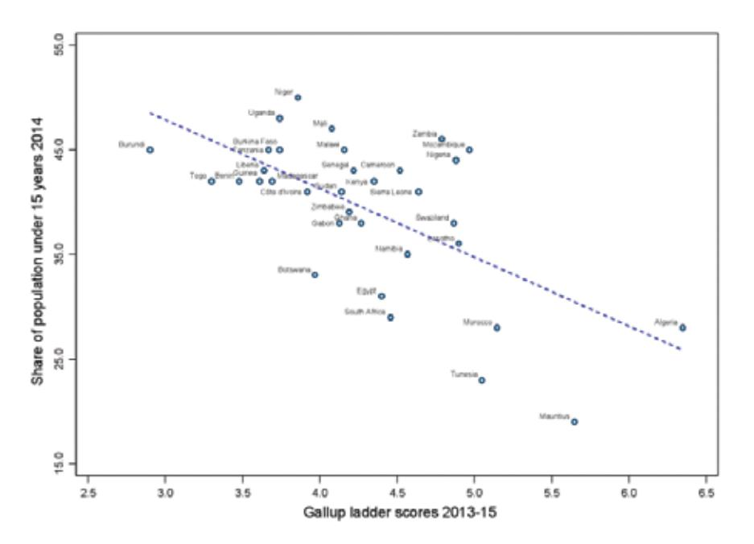

**Figure 4.16: Youth Share (under 15 years) and Happiness in 34 African Countries, 2013-15a**

Sources: World Bank World Development Indicators and Gallup World Poll ladder-of-life data, Online Appendix, Table A4.11. a. In three instances (Lesotho, Mozambique and Swaziland), there was no available happiness data point in the 2013-2015 period, so we instead utilized the data for the 2009-2011 period instead.

#### The Unfinished Story: African Resilience and Hope for the Future

#### **African resilience**

Given the development challenges that Africa currently faces, it may take a while before people in Africa join the happiest people on the globe. Meanwhile, Africa's relative happiness deficit is buoyed by its astonishing resilience. The West African scholars, cited in the introduction to this chapter, referred to African people's coping skills when discussing how improbable it was for their countries to be assigned high happiness rankings in international studies. In the case of Nigeria, Aaron Agbo and his colleagues reason that the country's happiness 'paradox' serves as an 'adaptive mechanism'.78 Similarly, Vivian Dzokoto reproduces a typical 'emblematic' conversation between a foreign visitor and a local to illustrate how Ghanaians cope in everyday life. The visitor to Africa is perplexed to find there is no running water when turning on the tap, and asks successive questions to seek a plausible explanation. In response, the Ghanaian, who takes such things for granted, simply shrugs and says: 'My friend, this is Ghana. Sometimes, the water runs, sometimes, it doesn't. That is how it is. Here, take this bucket. There is water in the tank around the corner.'79

#### **African optimism**

Optimism that 'many things' will change for the better, to paraphrase the Gallup-Kettering question put to African respondents in its 1970s global survey, is a further coping skill perfected by African people. People living on the continent have developed this skill over time, possibly over centuries, to make daily hassles and hardships tolerable.80 A series of studies of democracy and happiness in the authoritarian states of Chad and Zimbabwe, and in South Africa's new democracy, suggest that even when the demand for democracy in Africa is not matched by satisfaction with living conditions, discontent is tempered by optimism for the future.81

The majority of African countries rate life at present below the mid-point of the Cantril ladder scale in the latest available Gallup World Poll. This is not the case for average future ratings. Projected ladder ratings in five years' time are uniformly higher than present evaluations across all countries on the continent. In fact, the percentage increase in future expectations of life is often higher among some of the least contented nations.

Nigeria's track record of such positive expectations is well documented. Cantril's 1960s study already reported a difference of 2.6 points between the country's average present (4.8) and future (7.4) ladder ratings.82 Similarly, in 2016, there is a difference of 2.9 points between Nigeria's present (5.3) and future (8.2) ratings in the Gallup World Poll. An international study of comparative ladder ratings in ten countries with large populations, including China, India and the United States, found Nigeria's 2.6 point difference between present and future ratings to be by far the largest.83 Nigeria's spirit of optimism may be exceptional by world standards, but not in Africa.

On average in African countries, future life evaluations are much higher than present ones. Optimism, the gap between present and future ladder ratings, is greatest for Africa's youth and decreases with age (see Fig. 4.17). In almost all African countries, youthful optimism is above the national average (see Fig. 4.18). It is likely that this belief that things may change for the better helps African people to manage their lives in difficult circumstances. African children may grow up with such a sense of optimism (see Technical Box 2 above).

**Figure 4.17: Average Cantril Present and Future Ladder Evaluations by Age Group, 37 African Countries, 2015-16**

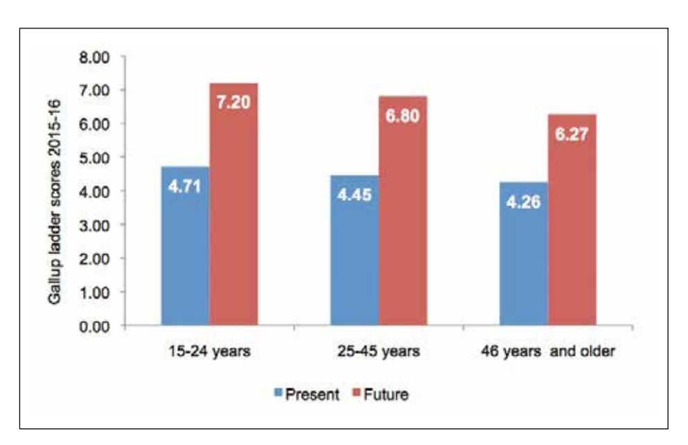

Sources: Gallup World Poll ladder-of-life data, Online Appendix, Table A4.12.

**Figure 4.18: Comparison of Differences Between Future and Present Ladder Scores Between Youth (15-24 years) and the National Average, 37 African Countries, 2015-16a**

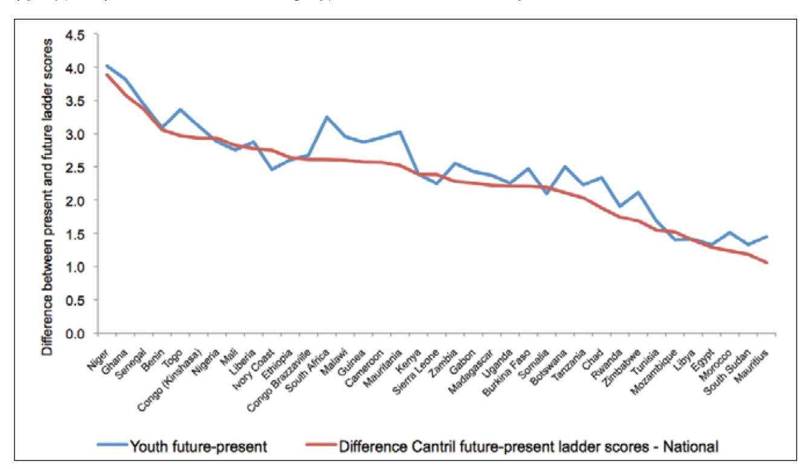

Sources: Gallup World Poll ladder-of-life data, Online Appendix, Table A4.12. a. The data are ranked from highest to lowest difference in ladder scores based on national averages.

**Figure 4.19: Importance of Religion in Life, 9 African and 21 Other Countries, 2013a**

Sources: Pew Global Attitudes & Trends Question Database, Online Appendix, Table A4.13. a. The data are ranked from highest to lowest within each country cluster based on the percentage saying that religion is 'very important' in life.

#### **Drying tears84—African religiosity**

African people also tend to turn to religion to find fellowship, comfort, and a sense of hope in the future.85 A recent Pew study of religiosity86 across 30 countries found that the importance of religion is higher, on average, in Africa than elsewhere (see Fig. 4.19). The relationship between religiosity and happiness among these countries lends support to the idea that faith might assuage Africa's unhappiness (see Fig. 4.20).

#### Conclusions

In this chapter we have attempted to explore the reasons why African countries lag behind other countries in the world in their evaluation of life. We took as our starting point the aspirations expressed by the Nigerian respondents in the 1970 Gallup-Kettering study who were about to embark on their first experience of freedom

from colonialism. Nigerians stated that *many* changes, not just a few, were needed to improve their lives and those of their families. Fifty years on, judging by the social indicators we have presented in this chapter, people in many African countries are still waiting for changes to improve their lives and to make them happy. In short, African people's expectations that they and their countries would flourish under self-rule and democracy appear not to have been met.

Africa's lower levels of happiness compared to other countries in the world might be attributed to this disappointment with different aspects of development under democracy. Although most citizens still believe that democracy is the best political system, they are critical of good governance in their countries. While there has been significant improvement in meeting basic needs according to the Afrobarometer index of 'lived poverty', population pressure may have stymied infrastructure and youth development.

111

**Figure 4.20: Happiness and the Importance of Religion in Life, 9 African and 21 Other Countries, 2013-15a**

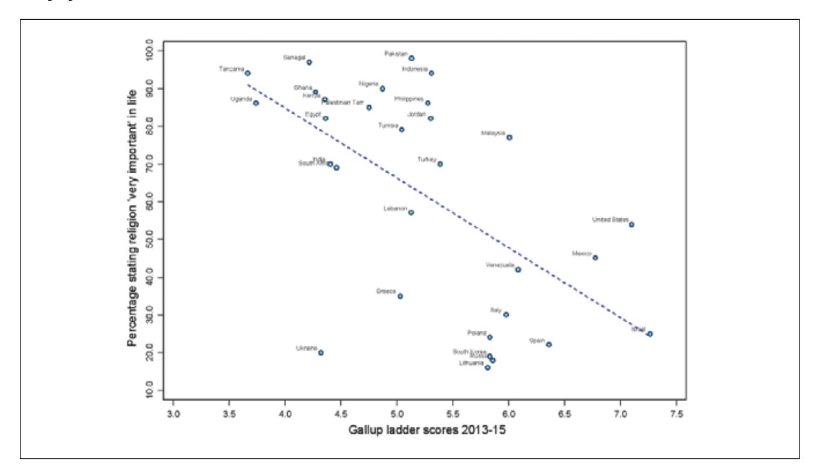

Sources: Pew Global Attitudes & Trends Question Database and Gallup World Poll ladder-of-life data, Online Appendix, Table A4.14.

a. The religiosity data are based on the percentage saying that religion is 'very important' in life. The 2007 values for Morocco and the Netherlands are based on 2005 data, while it is based on 2009 data for Hungary. The 2013 values are based on 2011 data in the cases of Lithuania, Sweden and Ukraine, and 2012 data in India and the United States.

Most countries in the world project that life circumstances will improve in future.87 However, Africa's optimism may be exceptional. African people demonstrate ingenuity that makes life bearable even under less than perfect circumstances. Coping with poor infrastructure, as illustrated in the case of Ghana referred to in this chapter, is just one example of the remarkable resilience that African people have perfected. African people are essentially optimistic, most of all the youth who have their lives ahead of them. This optimism might serve as a self-fulfilling prophecy for the continent.

**What if** Africa looks to its youth to realise the continent's dreams of prosperity? What if the African youth's confidence in their future and their entrepreneurial spirit were to be matched by substantial investment in their development? Then, no doubt, African countries would join the ranks of the world's prosperous and happy nations.

- 1 'Waiting for Happiness' is the title of Abderrahmane Sissako's 2002 film that depicts the daily lives of people living in northwest Africa's Mauritania. See Niemiec & Wedding (2014, p. 329).
- 2 Equal numbers of African countries gained or lost happiness over the periods 2005-2007 to 2014-2016 as set out in Chapter 2 of this report. However, only two African countries out of 126 worldwide made significant gains of 0.5 point increases or more in their ladder scores. Sierra Leone – one of the three West African countries affected by the outbreak of the Ebola virus in 2014 – gained 1.1 points, Cameroon 0.59 points. In contrast, six countries' ladder scores dropped significantly by 0.6 points or more over the two periods. (see WHR 2017, Chapter 2).
- 3 In 2014-16, the average standard deviation in happiness ratings was 2.301 for 44 African countries, ranging from 1.588 for Senegal to 3.287 for Sierra Leone (See Fig. 14 in the Statistical Appendix WHR 2017). Average standard deviation in happiness ratings for 39 African countries increased from 2.132 to 2.265 over the periods 2012-15 to 2014-16.
- 4 Dianna Games (2015) at Business Advisory Africa at Work (www.africaat-work.co.za) refers to the 'patchwork of countries that make up Africa'. Responsible for this patchwork is the 19th century 'scramble for Africa' that created borders that cut across ethnicities and ancient polities (see Meredith 2011). In the interest of political stability on the continent, the African Union, formed in 2002 with the objectives of promoting peace and democracy on the continent, supports the maintenance of country borders dating back to independence. South Sudan, which gained its independence from Sudan in 2011, is an exception.
- 5 The 2016 WHR reported ladder scores for both Somaliland and Somali in the global distribution of happiness (see Helliwell, Huang & Wang, 2016, Figure 2.2, pp. 20–22). Ladder scores for two small African countries of Comoros and Djibouti were included in earlier WHRs: Comoros in the WHR Updates 2013 to 2016 and Djibouti in WHR 2015.
- 6 There were no ladder scores available for the 2014–16 period for Comoros, Djibouti, Mauritania and Somaliland, so we used the latest available data reported in earlier WHRs instead. The map shows a 2012–14 ladder score for Djibouti (4.369) (see Helliwell et al. 2015, Fig. 2.2, p. 28), and 2013–15 ladder scores for Comoros (3.956), Mauritania (4.201) and Somaliland (5.057) (see Helliwell et al. 2016, Fig. 2.2, p. 21–2).
- 7 The title of a chapter in Meredith's (2011, p. 162) history of Africa.
- 8 See Huntington (1991), Diamond (2008), and Diamond & Plattner (2010).

- 9 For reports on Africa's quality of life and well-being from an historical perspective, see Tiliouine (2015a) and Tiliouine & Meziane (2017) on North Africa, and Roberts et al. (2015) and Møller & Roberts (2017) on sub-Saharan Africa.
- 10 See Furlonger (2016) commenting on access to African markets in a South African business daily.
- 11 See veteran Africa journalist and University of Kent professor Keith Somerville's (2013) views on the different lenses through which we can observe and evaluate Africa's performance.
- 12 See, for example, Roger Southall's (2016) portrait of South Africa's emergent black middle class.
- 13 See the article on 'Africa Rising' by Aryn Baker (2015), *Time* Magazine's Africa correspondent.
- 14 In this chapter we limit our examination of happiness to Africa's post-independence period, which coincides with the emergence of the 1960s social indicators movement that applied the first rigorous measures of quality of life and well-being. It is possible that Africa's people, or at least those of standing, flourished in earlier times, e.g. when the pharaohs ruled in the Nile valley (van Wyk Smith 2009), during Islam's golden age in Africa (Renima, Tiliouine & Estes 2016), and at the height of the ancient kingdoms and civilisations in West and East Africa (see Møller & Roberts 2017). Going further back in time, Africa's more egalitarian hunter-gatherer societies (Reader 1997), whose expectations of life will have been more modest than present-day ones, might have been more contented than contemporary African citizens.
- 15 Richard Easterlin (2010) argues that it is important to examine time-series as opposed to point-of-time evidence on happiness.
- 16 The Afrobarometer is an African-led series of public attitude surveys on democracy and governance, whose coverage of African countries has increased from 12 in Round 1 (1999–2001) to 36 in Round 6 (2014–2015). Afrobarometer's Round 6 interviews with about 54 000 citizens in 36 countries represent the views of more than three-fourths of the continent's population.
- 17 The Ibrahim Index of African Governance (IIAG) covers all 54 countries on the continent. The tenth iteration of the IIAG 2016 incorporates Afrobarometer public attitude survey data for the first time. This addition means that just over 17% of IIAG's 95 indicators are now provided by African sources (Mo Ibrahim Foundation 2016, p. 9). See www.afrobarometer.org and Mo Ibrahim Foundation (2016).
- 18 See http://www.arabbarometer.org/

- 19 See Vivian Afi Abui Dzokoto's (2012, p. 311) chapter on happiness in Ghana, which she contributed to a handbook on happiness across cultures. An Associate Professor of African America Studies at Virginia Commonwealth University in the USA, Dzokoto was raised in Germany and Ghana.
- 20 See the chapter on happiness in Nigeria, which University of Nigeria researchers Aaron A. Agbo, Thaddeus C. Nzeadibe, and Chukwuedozie K. Ajaero (2012, p. 303) contributed to a handbook on happiness across cultures. Lead author Aaron Agbo is based in the Department of Psychology; his colleagues Nzeadibe and Ajaero in the Department of Geography at the University of Nigeria, Nsukka.
- 21 Inglehart and Klingemann (2000, cited in Tov & Diener 2009, p.22) suggest that, apart from economic development, national levels of well-being might also reflect historical factors. Their research found that the number of years living under communist rule negatively predicted national well-being in former communist states of Eastern Europe and the USSR. One might consider that Africa's history of colonial rule may have played a similar role in shaping life evaluations on the continent. In South Africa, we were only able to rule out the possibility that cultural factors rather than miserable living conditions and lack of opportunities in life might be responsible for the very low happiness ratings of black South Africans under apartheid. Eight years into democracy, there was a sufficiently large subsample of black respondents of economic standing to test the notion. A 2002 study found that the higher happiness ratings of South Africa's emergent black economic elites matched their better standard of living under democracy (Møller 2004).
- 22 Hadley Cantril's (1965) classic study for the 1960s reports the mean present ladder ratings of 4.8 for Nigeria (p.78) and 5.5 for Egypt (p. 118). Nigeria's ladder rating of 4.875 in the WHR 2016 (Helliwell et al. 2016, pp. 20–21, Figure 2.2) is almost identical to its 1960 rating of 4.8.
- 23 See the Gallup-Kettering global survey (1976). The range of Gallup World Poll ladder ratings 2014-16 for the 11 countries is taken from Figure 4.2 above.
- 24 Of the 90% in the sub-Saharan sample who wished for change in their lives, 67% wanted 'many things' to change, 22% 'just a few' things. The question on the 'extent of change necessary for a happier life' read: 'Thinking about how your life is going now, do you think you would be happier if things could be changed about your life? (If yes) Would you like many things about your life changed or just a few things? See Table VI in the Gallup-Kettering Global Survey (1976) summary volume's reprint of: Human Needs and Satisfactions, Mankind: The Global Survey and the Third World, Blue Supplement to the "Monthly Public Opinion Surveys" of the Indian Institute of Public Opinion, Vol. XXI, Nos. 9 & 10. http:// worlddatabaseofhappiness.eur.nl/hap\_bib/freetexts/~Gallup\_Kettering\_1976k.pdf

- 25 Noting that Africans live on the world's 'most ethnically diverse and fractious continent', John Stremlau (2016) argues that Africa's democracies need to cater to the needs of multiple groups in society.
- 26 See Møller & Roberts (2017).
- 27 See Akokpari (2004) and Mtimkulu (2015).
- 28 Greg Mills and Jeffrey Herbst (2012) contend that Africa has already undergone two liberations, first from colonialism and then from the autocratic rulers that often followed on colonial rule. Africa is now awaiting its third liberation from bad governance so that it can accelerate its development towards more jobs and less poverty.
- 29 Here we refer to observations on the importance of good governance for citizen well-being in Helliwell and Huang (2008) and the volume on well-being for public policy edited by Ed Diener, Richard Lucas, Ulrich Schimmack & John Helliwell (2009, p. 60) and an OECD working paper that traces the linkages between good governance and national well-being (Helliwell et al. 2014). Similarly, an Institute for Security Studies African Futures scenario links gains in effective governance with poverty reduction on the continent (Aucoin & Donnenfeld 2016).
- 30 See Afrobarometer (2002).
- 31 The briefing paper on the first round of Afrobarometer surveys conducted in 12 countries in 2001 reports that the democracy concept is understood mainly as civil liberties, such as freedom of speech. In practice, people want democracy to deliver basic necessities of life such as food, water, shelter and education, even more strongly than they insist on regular elections, majority rule, competing political parties, and freedom to criticise the government. See Afrobarometer (2002).
- 32 See Cantril (1965, p. 75).
- 33 Referring to development economist Jeffrey Sach's (2005) book by that title.
- 34 Afrobarometer's Lived Poverty Index is an experiential measure that is based on a series of survey questions about how frequently people actually go without six basic necessities during the course of a year. Respondents report how often (just once or twice, several times, many times, always) they or a member of their family have gone without enough food, clean water for home use, medicines or medical treatment, cooking fuel, cash income, and electricity in the home. See Mattes (2008) and www. afrobarometer.org
- 35 See Gernetzky (2016).
- 36 See Afrobarometer (2016) on highlights from Round 6 survey findings from 36 African countries and Afrobarometer Dispatch No. 69 by Mitullah, Samson, Wambua, & Balongo (2016) on infrastructure development challenges in Africa.

- 37 Bookwalter (2012) reports that studies conducted by economists found factors such as rising levels of income and access to consumption goods were more likely to boost happiness among white South Africans.
- 38 Robert Mattes, Boniface Dulani and E. Gyimah-Boadi (2016) report on the drop in lived poverty in African countries in their January 2016 Afrobarometer policy paper.
- 39 See Afrobarometer (2015, p. 22) for results relating to conditional support for democracy in South Africa amid rising discontent, and Afrobarometer Dispatch No. 71 by Lekalake (2016).
- 40 See Robert Stefan Foa and Yacha Mounk (2017) on the global rise in citizens wishing for a strong leader in their paper on signs of democratic deconsolidation.
- 41 See Maphunye (2016).
- 42 Since being launched in 2006, the Ibrahim Prize has been awarded to President Joaquim Chissano of Mozambique (2007), President Festus Mogae of Botswana (2008), President Pedro Pires of Cabo Verde (2011), and President Hifikepunye Pohamba of Namibia (2014). President Nelson Mandela of South Africa was the inaugural Honorary Laureate in 2007. See Turianskyi (2016) and http://mo.ibrahim.foundation/news/2016/ mo-ibrahim-foundation-announces-no-winner-2015-ibrahim-prize-achievement-african-leadership
- 43 See Cohen & Doya (2016).
- 44 Many scholars have written about the clientelism, cronyism, nepotism, and rent-seeking practices that have kept Africa's leaders in power and retarded economic growth and advances in democracy. See among others, Cheeseman (2015), Meredith (2011; 2014), Mills (2014), Mills & Herbst (2012), Ndulu & O'Connell (1999), van de Walle (2003), and Wrong's (2010) account of Kenya's whistle-blowers. Regarding corruption, Historian Martin Meredith, visiting South Africa for the launch of his new book on Africa (Meredith 2014), was asked why Asian economies grew faster than African ones in spite of corruption. He replied that Asia's wealth was reinvested in Asia, whereas Africa's wealth left the continent (Interview with Meredith on the South African Broadcasting Corporation's After Eight morning programme, 26 November 2014, own notes).
- 45 See Somerville (2016)
- 46 See Joffe's (2016) report on the World Economic Forum on Africa.
- 47 See Serge Schmemann's (2016) overview of the challenges facing democratic principles in an unstable world that include authoritarian rule and the attraction of the 'big man'.

- 48 Benin's Mathieu Kérékou, in and out of power over a thirty year period since 1972, was barred from running for a third term as president in 2016 on constitutional and age grounds. Gabon's current President Ali Bongo, sworn in for a second seven-year term in 2016, took over from his late father who ruled the country for 41 years until his death in 2009. In Burkina Faso, meaning 'land of honest men', President Blaise Compaoré was in power for 27 years before he was toppled in the 2014 popular uprising. Mozambique's Joachim Chissano, installed as president in 1986 after President Samora Machel was killed in a plane crash, stepped down in 2004 after 18 years in office. He was awarded the Mo Ibrahim prize for good governance.
- 49 Ali Bongo was sworn in for a second seven-year term in September 2016, after Gabon's constitutional court upheld his narrow victory in a bitterly disputed election.
- 50 The title is taken from a book by Adam Branch and Zachariah Mampilly (2015) on the new wave of popular protest in Africa.
- 51 See Adebajo (2014).
- 52 See Loschky (2013).
- 53 See BBC's The Gambia country profile. http://www.bbc. com/news/world-africa-13376517, Accessed 2 December 2016.
- 54 See Kiwuwa's (2016) report on Jammeh's quick acceptance of defeat that astounded the world until it was overturned. Postscript: Mr Jammeh finally left office in January 2017 after mediation by neighbouring countries and the threat of armed intervention. See Pilling (2017) on the significance of the turn of events in The Gambia for democracy in Africa.
- 55 Mark Swilling (2016) sees the protests in South Africa and Ethiopia as part of a wave of protests sweeping through the continent known as 'Africa Uprising'. In Kenya, Elizabeth Cooper (2014; 2016) interprets high school students' torching of boarding schools as political protest action.
- 56 African studies professor Jonny Steinberg (2016) describes South Africa's student protests as 'a war against the fathers' and 'inter-generational loathing'. Writing on Ethiopia's protests, Jeffry Gettleman (2016) cites a university lecturer in central Ethiopia saying that: 'If you suffocate people and they don't have any other options but to protest, it breaks out. ..the whole youth.. a whole generation is protesting'.
- 57 Afrobarometer (2016, p. 11).
- 58 See Greg Mills (2014, p. 571) on the disconnect between the expectations of youth and their ruling parties in authoritarian regimes in sub-Saharan Africa.

115

- 59 See Gopaldas (2015) and Population Reference Bureau (2016) on the age gap.
- 60 Already in 2002, a special issue of the *African Studies Review 45*(2) was devoted to the role of Africa's universities in promoting democratic culture in Africa. Amutabi (2002) examined the case of Kenya's universities. Nshimbi (2016) reviews the Nigerian experience of clashes between students and government in the past that led to repressive measures.
- 61 Africa has seen migration on the continent and beyond for millions of years (see Reader 1997).
- 62 See Francis Wilson (1972) on South Africa's migrant labour system.
- 63 See *The Daily Telegraph* (2015).
- 64 Bodomo (2013) reports that money sent home by Africans surpassed foreign aid by 2013. Remittances benefit households directly as they go towards paying school fees, building new homes and growing businesses.
- 65 Zulu for 'we have no money', the title of a play by Mbongeni Ngema in the Athol Fugard tradition that expresses the rage of young black men in South Africa during the apartheid era.
- 66 African Development Bank (2011, p. 2)
- 67 See OECD (2016) for a report on youth unemployment in North Africa.
- 68 See *The Economist* (2014), the Population Reference Bureau (2016), and Baker (2015).
- 69 See Davies (2015).
- 70 See Reader's (1997) biography of the African continent.
- 71 See Vink (2016).
- 72 See Chagutah (2016).
- 73 See Khor (2016).
- 74 See Reader (1997).
- 75 See Baker (2015), *The Economist* (2014) and Guengant & May (2013).
- 76 See Guengant & May (2013) and *The Economist*'s (2014) report on their study of African demography.
- 77 See Guengant & May (2013) and *The Economist*'s (2014) report on their study of African demography. The data we sourced gave Niger a fertility rate of 7.6, which is higher than the 7.5 rate reported by Guengant and May in 2013. This might indicate that Niger's fertility has increased since 2013.
- 78 See Agbo, Nzeadibe & Ajaero (2012, p. 303).

- 79 See Dzokoto (2012, p. 319).
- 80 Veenhoven (2005) reports that happiness in hardship is possible if people rise to the challenge of coping with difficulties in life.
- 81 The 2005 study conducted in Zimbabwe classified 45% of respondents as very democratic and a further 36% as democratic. Only 11% of Zimbabweans were satisfied with life at present, but twice as many (22%) thought they would feel satisfied with life in ten years' time (Dickow 2007, pp. 111, 121–2). The 2004 study conducted in four main cities in Chad found 60% of respondents supported democratic principles. Only 14 percent were very happy with their life at present, but more than twice as many (35%) thought they would be very happy with life in future (Dickow 2005, pp. 112, 128–9). In the 2002 South Africa study, 51% of black and 74% of white South Africans supported democratic values and were classified as either very democratic or democratic. Black respondents reported the lowest levels of current life satisfaction (37%) and happiness (38%) in the country, but 45% projected life satisfaction to increase in future (Møller & Hanf 2007, p.99 ff.).
- 82 See Cantril (1965, p. 78).
- 83 See Gulyas (2015).
- 84 With reference to a South African evangelical church's promise of salvation and prosperity: 'We are open seven days a week and seven services a day. The God of the Bible will dry away your tears and you will have the result you need in your life' (See Van Wyk 2014, p.160)
- 85 For example, see Pokimica, Addai & Takyi (2012) on the relationship between religion and subjective well-being in Ghana. Helga Dickow (2012) reports on religion, personal well-being, and attitudes to democracy among South Africans.
- 86 See Pew Global Attitudes and Trends question database, http://www.pewglobal.org/question-search/?qid=408&cntIDs=&stdIDs=
- 87 See Cantril (1965) and Gulyas (2015).

#### References

Adebajo, A. (2014). From 'Arab Spring' to 'African Harmattan', *Business Day*, Johannesburg, 17 November, p. 9.

African Development Bank (2011). Enhancing Capacity of Youth Employment in Africa. *Africa Capacity Development* 2(1), 1–5. http://www.afdb.org/fileadmin/uploads/afdb/Documents/Publications/Africa%20Capacity%20Dev%20Brief\_Africa%20Capacity%20Dev%20Brief.pdf (Accessed 8 November 2016).

Afrobarometer (2002). *What do Africans think about democracy and development?* Afrobarometer Briefing Paper No. 1. www. afrobarometer.org

Afrobarometer (2015). *Summary of Results, Afrobarometer Round 6 Survey in South Africa, 2015*. Compiled by: Plus 94 Research. http://afrobarometer.org/sites/default/files/ publications/Summary%20of%20results/saf-r6-sor.pdf#page=1&zoom=auto,-13,653 (Accessed 4 November 2016)

Afrobarometer (2016). *Highlights of Round 6 survey findings from 36 African countries*. http://afrobarometer.org/sites/ default/files/summary\_results/ab\_R6\_afrobarometer\_global\_release\_highlights3.pdf (Accessed 31 October 2016)

Agbo, A.A., Nzeadibe, T.C. & Ajaero, C.K. (2012). Happiness in Nigeria: A Socio-Cultural Analysis. In: H. Selin & G. Davey (Eds.), *Happiness Across Cultures* (pp. 293–310). Dordrecht: Springer.

Akokpari, J.K. (2004). The AU, NEPAD and the promotion of good governance in Africa. *Nordic Journal of African Studies 13*(3), 243–263.

Amutabi, M.N. (2002). Crisis and student protest in universities in Kenya: Examining the role of students in national leadership and the democratization process. *African Studies Review 45*(2), Special Issue: African universities in crisis and the promotion of a democratic culture, 157–177.

Aucoin, D. & Donnenfeld, Z. (2016). *Unlocking Africa's potential: The relationship between effective governance and poverty*. Institute for Security Studies, African Futures Paper 21. https://issafrica.s3.amazonaws.com/site/uploads/af21.pdf

Baker, A. (2015). Let's prepare for Africa's population surge now – or face the consequences. *Time Magazine*, 11 June. http://time.com/3918006/lets-prepare-for-africas-populationsurge-now-or-face-the-consequences/

Bodomo, A. (2013). Sending money back home beats foreign aid. *Africa in Fact* 10, April, 33–35. www.gga.org

Bookwalter, J.T. (2012). Living the good life: An economic view of happiness in South Africa. In: H. Selin, G. Davey (Eds.), *Happiness Across Cultures* (pp. 329–344). Dordrecht: Springer.

Branch, A. & Mampilly, Z.C. (2015). *Africa Uprising: Popular protest and political change*.

Chicago: University of Chicago Press.

Cantril, H. (1965). *The Pattern of Human Concerns.* New Brunswick, NJ: Rutgers University Press.

Chagutah, T. (2016). Region must urgently plan for La Niña. *Business Day*, Johannesburg. 31 October, p. 13.

Cheeseman, N. (2015). *Democracy in Africa: Successes, failures, and the struggle for political reform*. Cambridge: Cambridge University Press.

Cohen, M. & Doya, D.M. (2016). Power-drunk leaders block Africa's dawn. *Business Day*, Johannesburg, 8 February, p. 13.

Cooper, E. (2014). Students, arson, and protest politics in Kenya: School fires as political action. *African Affairs 113*(453), 583–600. doi: 10.1093/afraf/adu059.

Cooper, E. (2016). A burning question: why are Kenyan students setting fire to their schools? *The Conversation*, 25 November. https://theconversation. com/a-burning-question-why-are-kenyan-students-setting-fireto-their-schools-69153?utm\_

Davies, M. (2015). Why Africa must adapt or die – sustained investment in people key for continent's development. *Business Times*, Johannesburg, 18 January, p. 8.

Diamond, L.J. (2008). *The Spirit of Democracy: The struggle to build free societies throughout the world*. New York: Times Books.

Diamond, L.J. & Plattner, M.F. (2010). *Democratization in Africa: Progress and retreat*. Baltimore, Maryland: Johns Hopkins University Press.

Dickow, H. (2005). *Democrats without democracy? Attitudes and opinions on society, religion and politics in Chad*. Letters from Byblos No. 10, International Centre for Human Sciences, Byblos, Lebanon.

Dickow, H. (2007). Before a change? Attitudes and opinions on society, religion and politics in Zimbabwe. In: H. Dickow, E. Masunungure & B. Schlee (Eds.) *Zimbabwe, a Case of Resilient Authoritarianism,* (pp. 51–124). Letters from Byblos No. 15, International Centre for Human Sciences, Byblos, Lebanon.

Dickow, H. (2012). *Religion and Attitudes towards Life in South Africa: Pentecostals, Charismatics and Reborns.* Baden-Baden: Nomos.

Diener, E., Lucas, R.E., Schimmack, U. & Helliwell, J.F. (2009). *Well-Being for Public Policy*. Oxford: Oxford University Press.

Dzokoto,V.A.A. (2012). Ghanaian happiness: global, cultural, and phenomenological perspectives. In: H. Selin & G. Davey (Eds.), *Happiness Across Cultures* (pp. 311–327). Dordrecht: Springer.

Easterlin, R. (2010). Happiness and growth the world over: Time series evidence on the happiness-income paradox. In: H. Hinte & K.F. Zimmermann (Eds.), *Richard Easterlin: Happiness, Growth and the Life Cycle* (pp. 111–129). New York: Oxford University Press.

Foa, R.S. & Mounk, Y. (2017). The signs of deconsolidation. *Journal of Democracy 28*(1). http://www.journalofdemocracy. org/sites/default/files/Foa%26Mounk%20-%20JoD%20 28.1%20-%20PRE-PRINT%20VERSION.pdf

Furlonger, D. (2016). Global brands learn Africa is not a country. *Business Day*, Johannesburg, 16 March, p. 13.

Gallup-Kettering Global Survey (1976). *Human needs and satisfactions in sub-Saharan Africa, Summary volume*. http://worlddatabaseofhappiness.eur.nl/hap\_bib/freetexts/~- Gallup\_Kettering\_1976k.pdf

Games, D. (2015). Hold your hats – next year will be a rocky ride for Africa. *Business Day*, Johannesburg, 7 December, p.11.

Gernetzky, K. (2016). SA manufacturers urged to take on African rail projects. *Business Day*, Johannesburg, 10 October, p. 2.

Gettleman, J. (2016). Protests destabilize Ethiopia, a steady U.S. ally. *International New York Times*, 13-14 August, p. 3.

Gopaldas, R. (2015). Ageing leaders need to bridge generation chasm. *Business Day*, Johannesburg, 4 February, p. 7.

Guengant, J-P. & May, J.F. (2013). African demography. *Global Journal of Emerging Market Economies* 5(3), 215–267.

Gulyas, J. (2015). Hopes and Fears – Future Views of Quality of Life. In: W. Glatzer, and V. Møller, L. Camfield, & M. Rojas (Eds.), *The Global Handbook of Wellbeing and Quality of Life*  (pp. 869–894). Dordrecht: Springer.

Helliwell, J.F. & Huang, H. (2008). How's your government? International evidence linking good government and wellbeing. *British Journal of Political Science 38*, 595–619.

Helliwell, J., Huang, H., Grover, S. & Wang, S. (2014). Good Governance and National Well-being: What Are the Linkages?, OECD *Working Papers on Public Governance*, No. 25, OECD Publishing, Paris. http://dx.doi.org/10.1787/5jxv9f651hvj-en

Helliwell, J.F., Huang, H., & Wang, S. (2015). The geography of world happiness. In: J. F. Helliwell, R. Layard, & J. Sachs (Eds.), *World Happiness Report 2015*, (pp. 12–41), New York: Sustainable Development Solutions Network.

Helliwell, J.F., Huang, H. & Wang, S. (2016). The distribution of world happiness. In: J.F. Helliwell, R. Layard & J. Sachs (Eds.), *World Happiness Report 2016, Update (Volume 1)*, (pp. 8–48), New York: Sustainable Development Solutions Network.

Huntington, S.P. (1991). *The Third Wave: Democratization in the late twentieth century.* Norman, Oklahoma: University of Oklahoma Press.

Inglehart, R., & Klingemann, H-D. (2000). Genes, culture, democracy, and happiness. In: E. Diener & E. M. Suh (Eds.), *Culture and Subjective Well-Being* (pp. 185–218). Cambridge, MA: MIT Press.

Joffe. H. (2016). Risky Africa slips down investors' priority list. *Business Day*, Johannesburg, 12 May, p. 2.

Khor, M. (2016). New debt crises threaten global stability. *Southviews* No. 133, 19 October. www.southcentre.int

Kiwuwa, D.E. (2016). The Gambia keeps dream of deepening democracy in Africa alive. *The Conversation*, 6 December. https://theconversation.com/the-gambia-keeps-dream-ofdeepening-democracy-in-africa-alive-69899?utm\_

Lekalake, R. (2016). *Support for democracy in South Africa declines amid rising discontent with implementation.* Afrobarometer Dispatch No. 71. http://afrobarometer.org/sites/default/ files/publications/Dispatches/ab\_r6\_dispatchno71\_south\_africa\_perceptions\_of\_democracy.pdf

Loschky, J. (2013). *Arab Spring largely ignored in Sub-Saharan Africa*. Gallup World Poll. http://www.gallup.com/ poll/172079/arab-spring-largely-ignored-sub-saharan-africa. aspx. (Accessed 9 January 2017)

Maphunye, K.J. (2016). Africa's 2015 election experiences present dilemmas for 2016 polls. *The Conversation*, 27 January. https://theconversation.com/africas-2015-election-experiences-present-dilemmas-for-2016-polls-53312

Mattes, R. (2008). The material and political bases of lived poverty in Africa: Insights from the Afrobarometer. In: V. Møller, D. Huschka, & A. C. Michalos (Eds.), *Barometers of Quality of Life Around the Globe: How are we doing?* (pp. 161–185), Social Indicators Research Series 33, Dordrecht: Springer.

Mattes, R., Dulani, B. & Gyimah-Boadi, E. (2016*). Africa's growth dividend? Lived poverty drops across much of the continent*. Afrobarometer Policy Paper No. 29. www.afrobarometer.org

Mekonen, Y. & Dejene, N. (2015). *Children's Worlds National Report: Ethiopia. Children's Worlds Project.* www.isciweb.org

Meredith, M. (2011). *The State of Africa: A history of the continent since independence*. London: Simon & Schuster.

Meredith, M. (2014). *The Fortunes of Africa: A 5,000-year history of wealth, greed and endeavour*. London: Simon & Schuster with Johannesburg/Cape Town: Jonathan Ball Publishers.

Mills, G. (2014). *Why States Recover: Changing walking societies into winning nations, from Afghanistan to Zimbabwe*. Johannesburg: Picador Africa.

Mills, G. & Herbst, J.I. (2012). *Africa's Third Liberation: The new search for prosperity and jobs.* London: Penguin.

Mitullah, W.V., Samson, R., Wambua, P.M. & Balongo, S. (2016). *Building on progress: Infrastructure development still a major challenge in Africa*. Afrobarometer Dispatch No. 69: http://afrobarometer.org/publications/ad69-building-progress-infrastructure-development-still-major-challenge-africa.

Mtimkulu, P. (2015). Democracy in Africa: the ebbs and flows over six decades. *The Conversation*, 12 June. https://theconversation.com/democracy-in-africa-the-ebbs-and-flows-over-sixdecades-42011

Mo Ibrahim Foundation (2016). *A Decade of African Governance 2006 – 2016: 2016 Ibrahim Index of African Governance Index Report.* http://s.mo.ibrahim. foundation/u/2016/10/01184917/2016-Index-Report.pdf?\_g (Accessed 31 October 2016)

Møller, V. (2004). *Peaceful Co-Existence in South Africa in the Millennium: A review of social indicators in the 2002 democracy study.* Letters from Byblos No. 4, International Centre for Human Sciences. Byblos: Lebanon. http://hdl.handle. net/10962/d1010768

Møller, V. and Hanf, Th. (2007). *South Africa's new democrats: a 2002 profile of democracy in the making*. Lettres de Byblos/ Letters from Byblos No. 21, Centre International des Sciences de l'Homme/International Centre for Human Sciences, Byblos, Lebanon. http://hdl.handle.net/10962/d1010768

Møller, V. & Roberts, B. (2017). New beginnings in an ancient region: Well-being in Sub-Saharan Africa. In: R.J. Estes & M.J. Sirgy (Eds.), *The Pursuit of Well-Being: The Untold Global History,* (pp. 161–215), International Handbooks of Quality-of-Life Research. Springer International Publishing Switzerland.

Ndulu, B., & O'Connell, S. (1999). Governance and growth in sub-Saharan Africa. *The Journal of Economic Perspectives 13*(3), 41–66.

Niemiec, R.M. & Wedding, D. (2014, 2nd Edition). *Positive Psychology at the Movies: Using films to build character strengths and well-being*. Boston: Hogrefe Publishing.

Nshimbi, C.C. (2016). When politics and academia collide, quality suffers. Just ask Nigeria . *The Conversation*, 25 October. https://theconversation.com/when-politics-and-academia-collide-quality-suffers-just-ask-nigeria-67313?utm

OECD (2016). *Youth in the MENA Region: How to bring them in*. Paris: OECD Publishing. http://www.keepeek.com/ Digital-Asset-Management/oecd/governance/youth-in-themena-region\_9789264265721-en#page1

Pilling, D. (2017). Democrats in Africa take fight to its dictators. *Business Day* (Johannesburg), 26 January, p.4.

Pokimica, J., Addai, I., & Takyi, B.K. (2012). Religion and Subjective Well-Being in Ghana. *Social Indicators Research 106*, 61–79.

Population Reference Bureau (2016). *World Population Data Sheet 2016*. http://www.prb.org/pdf16/prb-wpds2016 web-2016.pdf (Accessed 1 November 2016)

Reader, J. (1997). *Africa: A biography of the continent*. London: Hamish Hamilton.

Rees, G. & Main, G. (Eds.) (2015). *Children's Views on their Lives and Well-Being in 15 Countries: An initial report on the Children's Worlds survey, 2013-14*. York, UK: Children's Worlds Project. www.isciweb.org

Renima, A., Tiliouine, H. & Estes, R.J. (2016). The Islamic Golden Age: A Story of the Triumph of the Islamic Civilization. In: H. Tiliouine & R.J. Estes (Eds.). *The State of Social Progress of Islamic Societies* (Chapter 2). Dordrecht: Springer.

Roberts, B. J., Gordon, S. L., Struwig, J., & Møller, V. (2015). Shadow of the sun: The distribution of wellbeing in sub-Saharan Africa. In: W. Glatzer, and V. Møller, L. Camfield, & M. Rojas (Eds.), *Global Handbook of Quality of Life: Exploration of well-being of nations and continents* (pp. 531–568). Dordrecht: Springer.

Sachs, J.D. (2005). *The End of Poverty: Economic possibilities for our time.* New York: Penguin.

Savahl, S., Adams, S., Isaacs,S., Hendricks, G., Matzdorff, A., Wagenaar, C., Abrahams, L. & September, R. (2015). *Children's Worlds National Report : South Africa*. Children's Worlds Project www.isciweb.org

Schmemann, S. (2016). Rough sailing for liberal values: Democratic principles face critical challenges in an unstable world. *International New York Times* supplement: Democracy 2016, a perfect storm of international crises, 14 September, p. S1.

Somerville, K. (2013). Framing news in Africa – how journalists approach stories and reinforce stereotypes. *The Conversation,* 26 February. http://africanarguments.org/2013/02/26/ framing-news-in-africa-%E2%80%93-how-journalists-approach-stories-and-reinforce-stereotypes-%E2%80%93-bykeith-somerville/

Somerville, K. (2016). How Africa's 1990s 'poster boys' use security fears to roll back democracy. *The Conversation*, 27 June. https://theconversation.com/how-africas-1990s-posterboys-use-security-fears-to-roll-back-democracy-61307

Southall, R. (2016). *The New Black Middle Class in South Africa*. Auckland Park: Jacana & Dunkeld.

Steinberg, J. (2016). The war against the fathers of freedom. *Business Day*, 28 October, p. 9.

Stremlau, J.J. (2016). The US election: what's at stake for Africa's quest to deepen democracy? *The Conversation*, 17 August. https://theconversation.com/the-us-election-whats-atstake-for-africas-quest-to-deepen-democracy-63777

119

Swilling, M. (2016). The death knell of Zuma's rule echoes transitions elsewhere in Africa. *The Conversation*, 3 November. https://theconversation.com/the-death-knell-of-zumas-ruleechoes-transitions-elsewhere-in-africa-68084

*The Daily Telegraph* (2015). Gambia loses its youth to 'Back Way'. 11 November. http://www.timeslive.co.za/thetimes/2015/11/11/Gambia-loses-its-youth-to-Back-Way

*The Economist* (2014). The dividend is delayed – hopes that Africa's dramatic population bulge may create prosperity seem to have been overdone. 8 March. http://www.economist. com/news/middle-east-and-africa/21598646-hopes-africasdramatic-population-bulge-may-create-prosperity-seem-have (Accessed 26 January 2016).

Tiliouine, H. (2015a). Quality of life and wellbeing in North Africa – Algeria, Egypt, Libya, Morocco and Tunisia. In: W. Glatzer, and V. Møller, L. Camfield, & M. Rojas (Eds.), *Global Handbook of Quality of Life: Exploration of well-being of nations and continents* (pp. 507–530). Dordrecht: Springer.

Tiliouine, H. (2015b). *Children's Worlds National Report: Algeria*. Children's Worlds Project (ISCWeB) .

Tiliouine, H. & Meziane, M. (2017). The history of well-being in the Middle East and North Africa (MENA). In: R.J. Estes & M.J. Sirgy (Eds.), *The Pursuit of Well-Being: The Untold Global History* (pp. 523–563), International Handbooks of Quality-of-Life Research. Springer International Publishing Switzerland.

Tov, W. & Diener, E. (2009). Culture and subjective well-being. In: E. Diener (Ed.), *Culture and Well-Being,* (pp. 9–41), Social Indicators Research Series 38. Dordrecht: Springer.

Turianskyi, Y. (2016). There is good as well as bad news about the state of governance in Africa. *The Conversation,* 5 October. https://theconversation.com/there-is-good-as-well-as-badnews-about-the-state-of-governance-in-africa-66520

Van de Walle, N. (2003). Presidentialism and clientelism in Africa's emerging party systems. *The Journal of Modern African Studies* (41)2, pp. 297–321.

Van Wyk, I. (2014) *A Church of Strangers: The Universal Church of the Kingdom of God in South Africa*. Cambridge: Cambridge University Press.

Van Wyk Smith, M. (2009). *The First Ethiopians*. Johannesburg: Wits University Press.

Vink, D. (2016). Innovative use of water can turn crisis into opportunity. *Business Day*, Johannesburg, 14 April 2016, Infrastructure supplement, p.7

Veenhoven, R. (2005). Happiness in hardship. In: L. Bruni & P. L. Porta (Eds.), *Economics and happiness: Framing the analysis* (pp. 243–266). Oxford: Oxford University Press.

Wilson, F. (1972). *Labour in the South African Gold Mines, 1911-1969.* Cambridge University Press.

Wrong, M. (2010). *It's Our Turn to Eat.* London: Fourth Estate.

### ONLINE APPENDIX

(MØLLER, ROBERTS, TILIOUINE, & LOSCHKY, 'WAITING FOR HAPPINESS' IN AFRICA)

HTTP://WORLDHAPPINESS.REPORT/

### Chapter 5

# THE KEY DETERMINANTS OF HAPPINESS AND MISERY

ANDREW E. CLARK, SARAH FLÈCHE, RICHARD LAYARD, NATTAVUDH POWDTHAVEE AND GEORGE WARD

**Andrew E. Clark**, CNRS Research Professor, Paris School of Economics and Professorial Research Fellow, Well-Being Programme, Centre for Economic Performance, London School of Economics and Political Science

**Sarah Flèche**, Research Economist, Well-Being Programme, Centre for Economic Performance, London School of Economics and Political Science

**Richard Layard,** Well-Being Programme, Centre for Economic Performance, London School of Economics and Political Science

**Nattavudh Powdthavee**, Professor of Behavioural Science at Warwick Business School and Associate of the Well-Being Programme, Centre for Economic Performance, London School of Economics and Political Science

**George Ward,** PhD Student, Massachusetts Institute of Technology and Associate Research Economist of the Well-Being Programme, Centre for Economic Performance, London School of Economics and Political Science

*This paper draws heavily on the December 2016 draft of* The Origins of Happiness: The Science of Well-being over the Life-Course *by Clark et al., to be published by Princeton University Press. See also Layard et al. (2014). Support from the US National Institute on Aging (Grant R01AG040640), the John Templeton Foundation and the What Works Centre for Well-being is gratefully acknowledged, as is the contribution of all the survey organisations and their survey participants.*

This chapter is directed at policy-makers of all kinds—both in government and in NGOs. We assume, like Thomas Jefferson, that "the care of human life and happiness … is the only legitimate object of good government."1 And we assume that NGOs would have similar objectives. In other words, all policy-makers want to create the conditions for the greatest possible happiness in the population and, especially, the least possible misery.

For this purpose they need to know the causes of happiness and misery. Happiness is caused by many factors, such as income, employment, health and family life and we need to ask, How much does a difference in each of these factors change the happiness of the person affected?

There is also a prior and related question that tries to explain the huge variation in levels of happiness within any country. The question is **How far does the variation in each of the factors (e.g. income inequality) explain the overall variation of happiness?** 

In this chapter we concentrate mainly on the latter question.2 We begin by looking at the role of current circumstances, and then (in the second part of the chapter) examine the influence of earlier childhood experience.

To be useful to policy-makers, any analysis of the causes of happiness and misery should satisfy at least three criteria, which have not generally been satisfied in the literature.

- 1. It must use a consistent measure of happiness throughout.
- 2. It must look at the effect of all the factors affecting happiness simultaneously, not one by one.
- 3. It must check whether the factors have the same effect on misery as they do on happiness

further up the scale. This is important if, as many believe, it is more important to reduce misery than to increase happiness by an equal amount further up the scale.

We have identified five major surveys of adults that make possible such analyses and also include meaningful measures of mental health. They cover the USA, Australia, Britain (two surveys) and Indonesia. We would like to have covered more countries, but the data are not yet there.

#### Life Satisfaction

The measure of happiness that we use is life satisfaction. The typical question is "Overall how satisfied are you with your life these days?" measured on a scale of 0 to 10 (from 'extremely dissatisfied' to 'extremely satisfied').

This is a democratic criterion—we do not rely on researchers or policy-makers to give their own weights to enjoyment, meaning, anxiety, depression, and the like. Instead we leave it to individuals to evaluate their own well-being.

Moreover, policy-makers like the concept—and so they should. Our work shows that in European elections since 1970, the life satisfaction of the people is the best predictor of whether the government is re-elected—much more important than economic growth, unemployment or inflation (see Table 5.1).

The task is thus to explain how all the different factors affect our life satisfaction, entering them all simultaneously in the same equation.

**Table 5.1. Factors Explaining the Existing Government's Vote Share**

(Partial correlation coefficients)3

| Life satisfaction | 0.64  |
|-------------------|-------|
| Economic growth   | 0.36  |
| Unemployment      | -0.06 |
| Inflation         | 0.15  |

Source: Ward (2015).

Notes: Eurobarometer data on life satisfaction and standard election data for most European countries since the 1970s. The regressors include the government's vote share in the previous election. Life-satisfaction is from the latest survey before the election. Other variables are for the year of the election.

#### The Life-Course

In explaining our current life satisfaction, there are of course **immediate** influences (our current situation) but also more **distant** ones going back to our childhood, schooling and family background. This diagram gives a stylised version of how our life satisfaction as an adult is determined.

**Figure 5.1. Determinants of Adult Life Satisfaction**

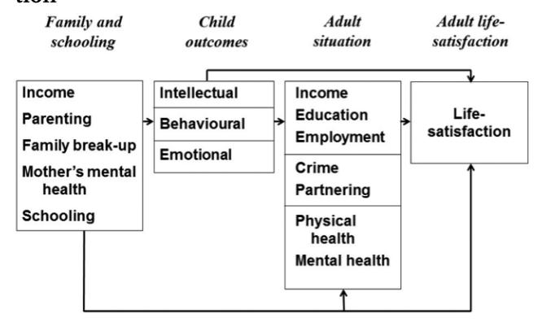

When we are adults, our happiness depends significantly on our adult situation—our economic situation (our income, education and employment), our social situation (whether we have a partner and whether we are involved in crime), and our personal health (physical and mental). These in turn depend partly on our development as children (intellectual, behavioural and emotional), which in turn depend on family and schooling. As our results show, there is scope for policy to affect a person's development at every age.

#### The Effects of the Current Situation

We begin with the impact on adult happiness of the person's current situation, using the following data:4

**USA:** Behavioural Risk Factor Surveillance System (BRFSS) (sample aged 25+)

**Australia:** Household, Income and Labour Dynamics in Australia (HILDA) Survey (sample aged 25+)

**Britain:** British Cohort Study (BCS) (surveyed at ages 34 and 42)

**Britain:** British Household Panel Survey (BHPS) (sample aged 25+)

**Indonesia:** Indonesian Family Life Survey (IFLS) (sample aged 25+)

The factors we examine are

- Income: log household income per equivalised adult
- Education: years, except Indonesia (higher education versus none)
- Unemployment: measured as 'not unemployed'
- Partnership: married, or living as married
- Physical health: USA, Britain and Indonesia: number of illnesses; Australia: SF36, lagged one year
- Mental health: USA and Australia: has ever been diagnosed for depression or an anxiety disorder; Britain (BCS): has seen a doctor in the last year for emotional problems; Britain (BHPS): GHQ-12, lagged one year; Indonesia: replies to 8 questions.

Most earlier analyses of life satisfaction have not included mental health as a factor explaining life satisfaction. The reason is that both life satisfaction and mental health are subjective states, and there is therefore a danger that the two concepts are, at least in part, measuring the same thing. To omit mental health as a factor in the equation, however, is to leave out one of the most potent sources of misery, in addition to standard external causes like poverty, unemployment, and physical illness. The solution is, whenever possible, to record only mental illness that has been diagnosed or has led to treatment. That is our approach and it shows clearly that mental illness not caused by poverty, unemployment or ill health is a potent influence on life satisfaction.

**How far does each factor explain the variation in life satisfaction within the population?** Table 5.2 shows the results of regressing life satisfaction on all the factors simultaneously. The coefficients given are partial correlation coefficients, which show how far the independent variation of each factor explains the overall variation.5

**Table 5.2. How Adult Life Satisfaction is Predicted by Adult Outcomes** (Partial correlation coefficients)

|                    | USA         | Australia    | Britain BCS | Britain BHPS | Indonesia   |
|--------------------|-------------|--------------|-------------|--------------|-------------|
| Income (log)       | 0.16 (.00)  | 0.09 (.01)   | 0.08 (.01)  | 0.09 (.01)   | 0.18 (.03)  |
| Years of education | 0.05 (.01)  | -0.03 (.01)  | 0.03 (.01)  | 0.02 (.00)   | 0.05 (.01)  |
| Not unemployed     | 0.05 (.00)  | 0.04 (.01)   | 0.03 (.01)  | 0.06 (.00)   | 0.02 (.01)  |
| Partnered          | 0.34 (.01)  | 0.14 (.01)   | 0.21 (.01)  | 0.11 (.00)   | 0.04 (.01)  |
| Physical illness   | -0.05 (.00) | -0.17 (.01)* | -0.06 (.01) | -0.11 (.00)  | -0.07 (.01) |
| Mental illness     | -0.21 (.00) | -0.18 (.01)  | -0.11 (.01) | -0.32 (.00)* | -0.07 (.01) |
| Female             | 0.08 (.00)  | 0.08 (.01)   | 0.11 (.02)  | 0.05 (.00)   | 0.07 (.01)  |
|                    |             |              |             |              |             |
| N                  | 268,300     | 16,001       | 17,812      | 139,507      | 31,437      |

Sources: USA (BRFSS); Australia (HILDA); Britain (BCS); Britain (BHPS); Indonesia (IFLS).

Notes: See Appendix C. \* Lagged one year.

In all three Western countries, diagnosed mental illness emerges as more important than income, employment or physical illness. In Indonesia as well, mental health is important, though less so than income. In every country physical health is of course also important, but in no country is it more important than mental health.

Having a partner is also a crucial factor in Western countries, while in Indonesia it is less so, perhaps reflecting the greater importance of the extended family. Education has a positive effect in all countries (except Australia), yet it is nowhere near the most powerful explanatory factor on its own.6 In every country, income is more important than education as such.

At this point a natural question is **Do different variables impact differently on life-satisfaction at**  **different points on the scale?** For example, how well does Table 5.2 explain whether a person is really unhappy? To answer this we identify in each country people in the lowest levels of happiness, which we call "In Misery." Because happiness is measured in discrete units, the percentage identified as 'In Misery' varies from 5.6% in the USA to 13.9% in Indonesia.

We then run a standardised linear regression of the dummy variable 'In Misery' on the same explanatory variables as before.7 The results are shown in Table 5.3, where they are compared with our previous results in Table 5.2 for the full range of life-satisfaction. The two sets of coefficients are remarkably similar. There is thus no evidence that income, mental health, or any other variable is any more important lower down the well-being scale than it is higher up.

**Table 5.3. Explaining the Variation of Life Satisfaction and of Misery Among Adults** (Partial correlation coefficients)

|                    | USA      |        | Australia |        | Britain BCS |        | Britain BHPS |        | Indonesia |        |
|--------------------|----------|--------|-----------|--------|-------------|--------|--------------|--------|-----------|--------|
|                    | Life Sat | Misery | Life Sat  | Misery | Life Sat    | Misery | Life Sat     | Misery | Life Sat  | Misery |
| Income (log)       | 0.16     | -0.12  | 0.09      | -0.09  | 0.08        | -0.05  | 0.09         | -0.07  | 0.18      | -0.17  |
| Years of education | 0.05     | -0.04  | -0.03     | -0.00  | 0.03        | -0.02  | 0.02         | -0.01  | 0.05      | -0.06  |
| Not unemployed     | 0.05     | -0.06  | 0.04      | -0.06  | 0.03        | -0.03  | 0.06         | -0.07  | 0.02      | -0.03  |
| Partnered          | 0.34     | -0.19  | 0.14      | -0.10  | 0.21        | -0.11  | 0.11         | -0.08  | 0.04      | -0.04  |
| Physical illness   | -0.05    | 0.05   | -0.17 *   | 0.16*  | -0.06       | 0.05   | -0.11        | 0.09   | -0.07     | 0.07   |
| Mental illness     | -0.21    | 0.19   | -0.18     | 0.14   | -0.11       | 0.09   | -0.32 *      | 0.26*  | -0.07     | 0.08   |
| Female             | 0.08     | -0.06  | 0.08      | -0.06  | 0.11        | -0.06  | 0.05         | -0.04  | 0.07      | -0.06  |

Sources: USA (BRFSS); Australia (HILDA); Britain (BCS); Britain (BHPS); Indonesia (IFLS)

Notes: See Appendix C. \* Lagged one year.

In many ways a more vivid way of analysing misery is to make all the right hand variables into discrete variables, such as poor/non-poor or sick/ non-sick. This enables us to give an exact answer to the question **If we could eliminate each problem, how much could we reduce misery?**

The different risk factors are now as follows: **Poor:** below 60% of the median household income

**Uneducated:** USA and Indonesia: no higher education; Australia and Britain (BHPS): less than 10 years of education; in Britain (BCS): no qualification

**Unemployed**

**Not partnered**

**Physical illness:** below the current 20th percentile of physical health

**Depression/anxiety:** diagnosed/treated except Britain (BHPS) and Indonesia (below the 20th percentile).

We then estimate an equation of the form

Is miserable 
$$(1,0) = a_1$$
 Is poor  $(1,0) + a_2$  Is uneducated  $(1,0) + \text{etc.}$  (1)

The results are given in Table 5.4, column (1). This shows that in the USA, for example, a person who is poor is 5.5 percentage points more likely than otherwise to be miserable. By contrast someone with depression or anxiety is 10.7 percentage points more likely to be miserable.

So how much could we reduce the prevalence of misery in the USA if we could miraculously abolish depression and anxiety disorders without changing anything else? Well, around 22% of the population have this diagnosis. If they were all cured, we could reduce the percentage of the population in misery by 0.107 times 22%. This is 2.35% of the whole population (see column 3). That is large portion of the total 5.6% who are in misery.

By contrast, eliminating poverty in the USA reduces misery by 1.7% points, unemployment by 0.3% and physical illness by 0.5% out of the total 5.6% in misery. Taken together, those three factors barely make as much difference as mental illness on its own.

The pattern in Australia is very similar, but with more problems coming from physical illness. In Britain the role of poverty is less than it is in the USA, but the role of mental health as large or larger.

Finally in Indonesia, eliminating mental illness again reduces misery by more than reducing poverty does. Further, increased education would also greatly help. In all countries there would be much less misery if fewer people were living on their own.

This set of results is repeated, for effect, in Figure 5.3.

**Table 5.4. How Would the Percentage in Misery Fall if Each Problem Could be Eliminated on its Own?**

|                                                                 | α-coefficient | × | Prevalence (%) | = | α × Prevalence | Total in misery (% points) |
|-----------------------------------------------------------------|---------------|---|-------------------|---|----------------|-------------------------------|
| USA                                                             |               |   |                   |   |                |                               |
| Poverty (below 60% of median income)                            | 0.055         | × | 31                | = | 1.71           |                               |
| Uneducated (no higher education)                                | 0.012         | × | 11                | = | 0.13           |                               |
| Unemployed                                                      | 0.079         | × | 4.0               | = | 0.32           | 5.6                           |
| Not partnered                                                   | 0.034         | × | 43                | = | 1.46           |                               |
| Physical illness (bottom 20%)                                   | 0.027         | × | 20                | = | 0.54           |                               |
| Depression or anxiety, diagnosed                                | 0.107         | × | 22                | = | 2.35           |                               |
| Australia                                                       |               |   |                   |   |                |                               |
| Poverty (below 60% of median income)                            | 0.044         | × | 30                | = | 1.32           |                               |
| Uneducated (below 10 years of educ.)                            | 0.017         | × | 13                | = | 0.22           |                               |
| Unemployed                                                      | 0.096         | × | 3.0               | = | 0.29           | 7.0                           |
| Not partnered                                                   | 0.047         | × | 37                | = | 1.74           |                               |
| Physical illness lagged (bottom 20%)                            | 0.097         | × | 20                | = | 1.94           |                               |
| Depression or anxiety, diagnosed                                | 0.098         | × | 21                | = | 2.06           |                               |
| Britain (BCS)                                                   |               |   |                   |   |                |                               |
| Poverty (below 60% of median income)                         | 0.025         | × | 30                | = | 0.75           |                               |
| Uneducated (no qualification)                                   | 0.009         | × | 19                | = | 0.17           |                               |
| Unemployed                                                      | 0.059         | × | 2.2               | = | 0.13           | 8.0                           |
| Not partnered                                                   | 0.049         | × | 47                | = | 2.30           |                               |
| Physical illness (bottom 20%)                                   | 0.017         | × | 20                | = | 0.34           |                               |
| Has seen a doctor for emotional health problems in last year | 0.155         | × | 14                | = | 2.17           |                               |
| Britain (BHPS)                                                  |               |   |                   |   |                |                               |
| Poverty (below 60% of median income)                            | 0.028         | × | 29                | = | 0.81           |                               |
| Uneducated (below 10 years of educ.)                            | 0.026         | × | 10                | = | 0.26           |                               |
| Unemployed                                                      | 0.152         | × | 3.8               | = | 0.41           | 9.9                           |
| Not partnered                                                   | 0.053         | × | 36                | = | 1.90           |                               |
| Physical illness (bottom 20%)                                   | 0.057         | × | 20                | = | 1.14           |                               |
| Emotional health symptoms lagged (bottom 20%)                | 0.205         | X | 20                | = | 4.10           |                               |
| Indonesia                                                       |               |   |                   |   |                |                               |
| Poverty (bottom 20%)                                            | 0.063         | X | 20                | = | 1.26           |                               |
| Uneducated (no qualification)                                   | 0.055         | X | 27                | = | 1.48           |                               |
| Unemployed                                                      | 0.152         | X | 01                | = | 0.15           | 13.9                          |
| Not partnered                                                   | 0.044         | X | 30                | = | 1.32           |                               |
| Physical illness (bottom 10%)                                   | 0.071         | X | 10                | = | 0.71           |                               |
|                                                                 |               |   |                   |   |                |                               |

Sources: USA (BRFSS); Australia (HILDA); Britain (BCS); Britain (BHPS); Indonesia (IFLS).

Notes: People aged 25+, except for Britain (BCS) where people aged 34 and 42. The first column consists of regression coefficients in equation (1). For Indonesia the bottom quintile of the number of physical illnesses had much less explanatory power than the composite variable used for Indonesia throughout this chapter—see Online Annex. See also Appendix C.

129

**Figure 5.3. How Would the Percentage in Misery Fall if each Problem Could be Eliminated on its Own?**

Sources: USA (BRFSS); Australia (HILDA); Britain (BHPS); Indonesia (IFLS)

From Figure 5.3 we can see how much misery could be reduced if we eliminated each of the risk factors, one at a time. But clearly none of them can be totally eliminated. Moreover the cost of reducing them is also relevant. So a natural question to ask in each country is **If we wanted to have one less person in misery, what is the cost of achieving this by different means?** We attempt a very rough calculation of this for Britain in Table 5.5. As Table 5.5 shows, it costs money to reduce misery, but the cheapest of the policies is treating depression and anxiety disorders.

**Table 5.5. Average Cost of Reducing the Numbers in Misery, by One Person. Britain**

|                                  | £k per year |
|----------------------------------|-------------|
| Poverty.                         | 180         |
| Raising more people above the    |             |
| poverty line                     |             |
| Unemployment.                    | 30          |
| Reducing unemployment            |             |
| by active labour market policy   |             |
| Physical health.                 | 100         |
| Raising more people from the     |             |
| worst 20% of present-day illness |             |
| Mental health.                   | 10          |
| Treating more people for         |             |
| depression and anxiety           |             |

Sources available from authors.

#### The Effects of Childhood

Importantly, many of the problems of adulthood can of course be traced back to childhood and adolescence. **So which aspects of child development best predict whether an adult is satisfied with life?** Answering this question requires cohort data which are available for many fewer countries. Since Britain is rich in such data, we shall from now on use data on Britain only. We first use data from the British Cohort Study, which has followed children born in 1970 right up to today.

Three key dimensions of child development are at work. One is intellectual development, which we measure by the highest qualification that the individual achieved. This is turned into a single variable using weights derived by regressing wages on highest qualification. A second dimension is behavioural, measured in the Rutter behaviour questionnaire by 17 questions answered by the mother. The third dimension is emotional health based on a malaise inventory (22 questions answered by the child and 8 by the mother).

We now regress adult life-satisfaction on these three variables, as well as on family background. As Figure 5.4 shows, the strongest predictor of a satisfying adult life is not qualifications but a combination of the child's emotional health and behaviour.8 These findings have direct relevance to policy.

#### **But what, in turn, determines child development?**

To study this we use a very detailed survey of all children born in the English County of Avon in 1991/2 who have been followed intensively up until today. Our aim is to explain the three measures of child development. Intellectual development is now measured by GCSE scores. The emotional health of the child, however, has particular significance, since it is also the best measure we have of the child's own quality of life—it is a final product as well as an input into the resulting adult.

**Figure 5.4. How Adults' Life Satisfaction is Affected by Different Aspects of their Development as Children: Britain.**

(Partial correlation coefficients)

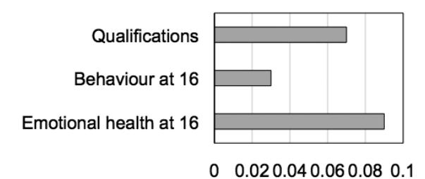

Sources: Britain (BCS)

Notes: Qualifications is the highest qualification that the person achieved. Behaviour at 16 is reported by the mother, and emotional health at 16 is reported by mother and child.

Clearly both parents and schools affect a child's development. **How, first, do parents affect their children's development?** We have a mass of information about parents, and in Table 5.6 we show the family variables that have the main effects. As is well known, family income has a substantial effect on a child's academic performance, but a much smaller effect on the child's emotional health and behaviour. Father's unemployment has adverse effects, but is not that common. What is the effect if the mother goes out to work? If this happens in the first year, there are on average very small negative effects. If the mother works in subsequent years, however, it is positively beneficial for academic performance and further does no measured harm to the child's emotional health.

As regards "parenting style," parental engagement and involvement with their children (e.g. in reading and play) is immensely valuable, while aggressive parenting (hitting or shouting) only exacerbates bad behaviour. Conflict between parents is especially disadvantageous for the behaviour of the children. The worst thing of all for children's emotional health and behaviour is a mother who is mentally ill. Indeed, the survey suggests strongly that the mother's mental health matters more than the father's.9

**Table 5.6. How Child Outcomes at 16 are Affected by Different Factors: Britain.** (Partial correlation coefficients)

|                           | Emotional   | Behavioural | Intellectual |
|---------------------------|-------------|-------------|--------------|
| Family income             | 0.07 (.02)  | 0.08 (.02)  | 0.14 (.01)   |
| Father's unemployment     | -0.04 (.03) | -0.00 (.02) | -0.03 (.01)  |
| Mother worked in 1st year | -0.02 (.02) | -0.01 (.02) | -0.02 (.01)  |
| Mother worked thereafter  | -0.01 (.02) | -0.05 (.02) | 0.04 (.01)   |
| Parents' involvement      | 0.04 (.02)  | 0.05 (.02)  | 0.02 (.01)   |
| Aggressive parenting      | -0.03 (.02) | -0.12 (.02) | -0.01 (.01)  |
| Family conflict           | -0.04 (.02) | -0.14 (.02) | -0.01 (.01)  |
| Father's mental health    | 0.04 (.02)  | -0.00 (.02) | -0.00 (.01)  |
| Mother's mental health    | 0.16 (.02)  | 0.17 (.02)  | 0.03 (.01)   |

Source: Britain (ALSPAC) Note: See Appendix C.

Clearly, family matters. **What about the effect of schools?** In the 1960s, the Coleman Report in the US told us that parents mattered more than schools.10 Since then the tide of opinion has turned. Our data strongly confirm the importance of the individual school and the individual teacher. This applies equally to the academic performance of the pupils and to their happiness.

In Figure 5.5, we look at child outcomes at 16 and show how they are explained. The top bar shows the combined effect of all observed family factors (treated as a single weighted variable). The next bar shows the enduring effect of the primary school a child went to (again a single aggregate of dummy variables), and the last is the effect of the secondary school.11 These are big effects.

**Figure 5.5. How Child Outcomes at 16 are Affected by Family and Schooling: Britain.** (Partial correlation coefficients)

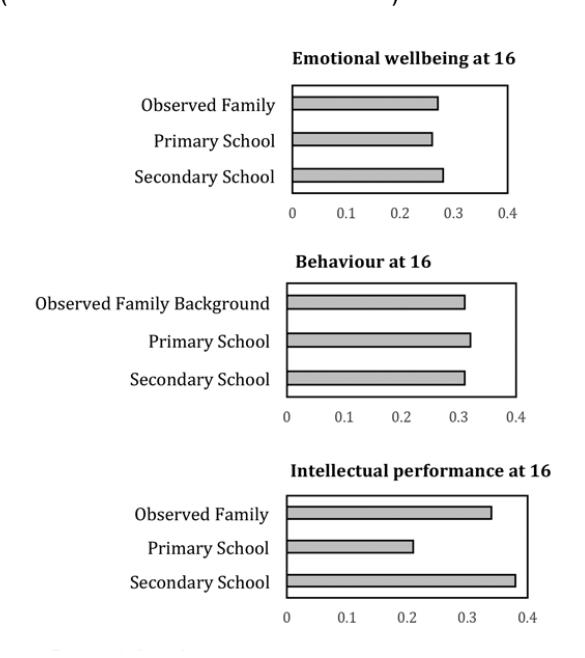

Source: Flèche (2016). ALSPAC data.

Notes: See Appendix C.

#### Behaviour and Crime

We have so far focussed exclusively on the happiness of the individual person being studied. But each of us also has a marked impact on the happiness of other people. This social impact has been given insufficient weight in much of the literature on happiness, although it is well known that how others behave is a major influence on our own happiness.

So we must modify Figure 5.1 to take this into account (see Figure 5.6). Unfortunately, however, we have only limited ability to study this important determinant of the well-being of human populations. One route is by inter-country comparisons of the type developed in Chapter 2 of this report. The other is by studying the effects of crime on individual happiness, and then investigating the determinants of criminality.

**Figure 5.6. The New Element: Behaviour**

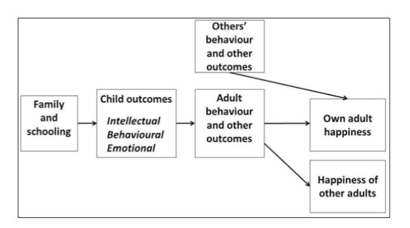

**Table 5.7. How the Number of Crimes Committed by an Individual up to Age 34 is Affected by Child Development: Britain.** 

| Qualifications (1 SD improvement)   | -0.87 |
|-------------------------------------|-------|
| Behaviour (1 SD improvement)        | -0.25 |
| Emotional health (1 SD improvement) | -0.04 |

Source: Britain (BCS).

Notes: Controls for family background, gender and age dummies.

Using data on local crime rates from police records, together with the corresponding local happiness data from the British Household Panel Survey, we can infer that each crime on average reduces the aggregate life-satisfaction of the local population by the equivalent of 1 point-year for one person.

If we then look at how child development affects crime, we find that the number of crimes a person commits is affected by child development, as shown in Table 5.7. Thus more education has a major benefit through the resulting reduction of crime. From one standard deviation of qualifications comes a one-off benefit to the rest of the population of just under 1 point-year of life-satisfaction (1 x 0.87). This can be compared to the gain to the educated individual of 0.10 pointyear in every year of their life, as discussed earlier. Thus the crime-reducing effect of education adds proportionately little to the total social returns to education.

#### Social Comparisons

There remains the elephant in the room—social comparisons. People are constantly amazed that aggregate happiness has not risen in the USA and many other countries, when incomes and educational levels have risen so much and when income and education are associated with greater individual happiness. This is the Easterlin paradox.

It is really no mystery, however.12 There is much evidence that people compare their income with other people and, if others become richer, they feel less happy at any given level of income.13 This is confirmed in the present study. Table 5.8 shows the effect of the average of log income in one's region, age-group and gender upon one's own happiness. In all three countries the negative effect of others' income is large, and any rise in overall income has little effect on overall life satisfaction. The same is true for education.

**Table 5.8. How Life Satisfaction (0-10) is Affected by Own Income, Comparator Income, Own Years of Education and Comparator Years of Education** (Partial correlation coefficients)

|                      | Britain (BHPS) | Germany     | Australia   |  |
|----------------------|----------------|-------------|-------------|--|
| Own income (log)     | 0.16 (.01)     | 0.26 (.01)  | 0.16 (.01)  |  |
| Comparator income    | -0.15 (.07)    | -0.34 (.05) | -0.13 (.06) |  |
| Years of education   | 0.03 (.00)     | 0.05 (.00)  | -0.01 (.00) |  |
| Comparator education | -0.09 (.02)    | -0.05 (.01) | -0.03 (.01) |  |

Notes: Robust standard errors in parentheses. Controls for self-employed, employed part time, unemployed, not in labour force, partnered, separated, widowed, parent, physical health, emotional health, female, age, age-squared, comparator unemployment, comparator partnership, year and region dummies.

#### Conclusion

Policy-makers need to know the causes of happiness and misery. Some of these are factors that affect everyone in a society (see Chapter 2), while other vital factors differ across individuals. For the latter, policy-makers need to know what factors account for the huge variation across individuals in their happiness and misery (both of these being measured in terms of life-satisfaction).

Key factors include economic factors (such as income and employment), social factors (such as education and family life), and health (mental and physical). We use surveys from the USA, Australia, Britain and Indonesia to cast light on the relative importance of these various factors.

In all three Western societies, diagnosed mental illness emerges as more important than income, employment or physical illness. In Indonesia as well, mental health is important, though less so than income. In every country, physical health is also of course important. Yet in no country is it more important than mental health.

Having a partner is also a crucial factor in Western countries, while in Indonesia it is less so, perhaps reflecting the greater importance of the extended family. Education has a positive effect in all countries (except Australia) but it is nowhere near the most powerful explanatory factor on its own. In every country, income is more important than education as such.

Even so, household income per head explains under 2% of the variance of happiness in any country. Moreover it is largely relative income that matters, so as countries have become richer, many have failed to experience any increase in their average happiness. A similar problem relates to education—people care largely about their education relative to that of others.

What about the causes of misery? Do the same factors affect misery as affect life-satisfaction

across the whole range? The answer is yes, and the factors have the same ranking in explaining misery as in explaining life-satisfaction. In Table 5.4 we show a novel decomposition which illustrates how much misery could in principle be eliminated by eliminating either poverty, low education, unemployment, living alone, physical illness or mental illness. In all countries the most powerful effect would come from the elimination of depression and anxiety disorders, which are the main form of mental illness. This would also be the least costly way of reducing misery (Table 5.5).

While much could be done to improve human life by policies directed at adults, as much or more could be done by focussing on children. We examine this issue using British cohort data. We ask, Which factors in child development best predict whether the resulting adult will have a satisfying life? We find that academic qualifications are a worse predictor than the emotional health and behaviour of the child.

What in turn affects the emotional health and behaviour of the child? Parental income is a good predictor of a child's academic qualifications (as is well known), but it is a much weaker predictor of the child's emotional health and behaviour. The best predictor of these is the mental health of the child's mother.

Schools are also crucially important. Remarkably, which school a child went to (both primary and secondary) predicts as much of how the child develops as all the characteristics we can measure of the mother and father. This is true of what determines the child's emotional health, their behaviour and their academic achievement.

To conclude, within any country, mental health explains more of the variance of happiness in Western countries than income does. In Indonesia mental illness also matters, but less than income. Nowhere is physical illness a bigger source of misery than mental illness.

Equally, if we go back to childhood, the key factors for the future adult are the mental health of the mother and the social ambiance of primary and secondary school. The implications for policy are momentous.

136

- 1 Jefferson (1809).
- 2 The relation between these two questions is shown in Appendix A, which provides data from which the answers to the previous question can be calculated.
- 3 The partial correlation coefficients are sometimes called the standardised regression coefficients. They are the s in a regression where all variables are divided by their standard deviation. The overall explanatory power of the equation is given by

$$R^{2} = \sum_{i} \beta_{i}^{2} + \sum_{i} \sum_{j} \beta_{i} \beta_{j} r_{ij} \ (i \neq j)$$

- 4 Details are in Appendix B and an online Annex at https:// tinyurl.com/WHR2017Ch5Annex
- 5 See Note 3.
- 6 The total effect of education includes of course its effect via income and other channels. If income is excluded from the regression, the coefficient on education becomes USA 0.08, Australia 0.03, Britain BHPS 0.06, and Indonesia 0.06.
- 7 We thus estimate a linear probability model. Almost identical results are obtained from logit analysis.
- 8 The coefficient for the combination of the child's emotional health and behaviour is 0.101 (s.e. = 0.009), which compares with 0.068 (s.e. 0.008) for qualifications—a significant difference (p = 0.010).
- 9 Presumably since she is more present. However the mother's mental health is measured 8 times up to when the child is 11, while the father's is only measured 3 times until the child is 2. To see if this matters, we also focused on explaining the child's emotional health at 5, using three observations on both parents' mental health. The difference between the effect of mother and father remained as large as it is in Table 5.6. The same occurred if we focussed on explaining the child's emotional health at 16, using only the first three observations on each parent's mental health.

The mother's mental health was measured using the Edinburgh Post Natal Depression Scale (EDPS), and the father's was tested using the Crown-Crisp Experiential Index.

- 10 Coleman et al. (1966).
- 11 The dependent variable is regressed on two sets of dummy variables, one for each primary school and one for each secondary school. The set of primary school variables is then turned into one composite variable using the coefficients on each dummy variable. The same is done for secondary schools.

- 12 For an earlier discussion of the Easterlin paradox, see WHR 2012, Chapter 3.
- 13 Clark et al. (2008); Layard et al. (2010).

#### References

Clark, A. E., Flèche, S., Layard, R., Powdthavee, N., & Ward, G. (forthcoming). *The Origins of Happiness: The Science of Wellbeing over the Life Course*: Princeton University Press.

Clark, A. E., Frijters, P., & Shields, M. (2008). Relative Income, Happiness and Utility: An Explanation for the Easterlin Paradox and Other Puzzles. *Journal of Economic Literature*, 46(1), 95-144.

Coleman, J. S., Campbell, E. Q., Hobson, C. J., McPartland, J., Mood, A. M., Weinfeld, F. D., & York, R. L. (1966). *Equality of Educational Opportunity*. Washington, D.C.: Office of Education, U. S. Department of Health, Education, and Welfare.

Flèche, S. (2016). Teacher Quality, Test Scores and Non-Cognitive Skills: Evidence from Primary School Teachers in the UK. *CEP mimeo*.

Jefferson, T. (1809). Letter to the Maryland Republicans: in *The Writings of Thomas Jefferson* (1903-1904) Memorial Edition (Lipscomb and Bergh, editors) 20 Vols., Washington, D.C: ME 16:359.

Layard, R., Clark, A. E., Cornaglia, F., Powdthavee, N., & Vernoit, J. (2014). What Predicts a Successful Life? A Life-Course Model of Wellbeing. *Economic Journal, 124*(580), F720- F738.

Layard, R., Mayraz, G., & Nickell, S. J. (2010). Does relative income matter? Are the critics right? In E. Diener, J. F. Helliwell & D. Kahneman (Eds.), *International Differences in Well-Being* (pp. 139-165). New York: Oxford University Press.

Ward, G. (2015). Is Happiness a Predictor of Election Results? LSE Centre for Economic Performance.

### Appendix A: Calculating The Absolute Impact of A Factor

The equations presented in this chapter are of the form

$$\frac{LS}{\sigma_{LS}} = \sum \beta_i \frac{X_i}{\sigma_i}$$

where measures the standard deviation of the variable. For cost-effectiveness analysis a policymaker needs the coefficients in the equation

$$LS = \sum \propto_i X_i$$

Thus

$$\propto_i = \beta_i \frac{\sigma_{LS}}{\sigma_i}$$

The tables in the text provide the s. The following tables provide the s and the means.

#### **Standard deviations for Tables 5.2, 5.3 and 5.8**

|                      | USA  | Australia | Britain BCS | Britain BHPS | Indonesia |
|----------------------|------|-----------|-------------|--------------|-----------|
| Life satisfaction    | 0.62 | 1.49      | 1.90        | 2.36         | 0.80      |
| Misery               | 0.22 | 0.26      | 0.27        | 0.35         | 0.35      |
| Income (log)         | 0.82 | 0.88      | 0.74        | 1.22         | 7.86      |
| Education            | 1.11 | 2.58      | 1.57        | 2.51         | 0.43      |
| Not unemployed       | 0.20 | 0.21      | 0.14        | 0.21         | 0.08      |
| Partnered            | 0.50 | 0.48      | 0.50        | 0.48         | 0.35      |
| Physical illness     | 1.06 | 4.95      | 1.32        | 1.10         | 0.83      |
| Mental illness       | 0.42 | 2.59      | 0.18        | 5.54         | 4.97      |
| Female               | 0.50 | 0.50      | 0.50        | 0.50         | 0.50      |
| Comparator income    |      | 0.40      |             | 1.07         |           |
| Comparator education |      | 1.17      |             | 0.97         |           |

#### **Means for Tables 5.2, 5.3 and 5.8**

|                      | USA  | Australia | Britain BCS | Britain BHPS | Indonesia |
|----------------------|------|-----------|-------------|--------------|-----------|
| Life satisfaction    | 3.40 | 7.90      | 7.39        | 6.97         | 3.32      |
| Misery               | 0.06 | 0.07      | 0.08        | 0.10         | 0.14      |
| Income (log)         | 9.99 | 7.51      | 9.55        | 6.42         | 15.75     |
| Education            | 4.78 | 12.08     | 3.37        | 12.35        | 0.26      |
| Not unemployed       | 0.96 | 0.67      | 0.97        | 0.96         | 0.99      |
| Partnered            | 0.57 | 0.63      | 0.53        | 0.64         | 0.70      |
| Physical illness     | 1.38 | 22.68     | 2.01        | 0.73         | 0.48      |
| Mental illness       | 0.22 | 0.21      | 0.14        | 23.11        | 18.83     |
| Female               | 0.50 | 0.53      | 0.52        | 0.55         | 0.51      |
| Comparator income    |      | 7.64      |             | 6.22         |           |
| Comparator education |      | 12.07     |             | 12.19        |           |

### Appendix B: The Surveys Used

#### https://tinyurl.com/WHR2017Ch5Annex

| USA (BRFSS) Behavioural Risk Factor Surveillance System (BRFSS) Cross-sectional survey which includes a life-satisfaction question since 2005. In 2006, 2008, 2010, 2013, respondents were asked whether they have ever been diagnosed with depression or anxiety. Sample size = 270,000 Australia Household Income and Labour Dynamics in Australia (HILDA) Survey Household-based panel study which began in 2001. The panel members are followed over time and interviewed every year. Life-satisfaction is measured throughout. In 2007, 2009, 2013, respondents were asked whether they have ever been diagnosed with depression or anxiety. Sample size = 16,000 Britain British Cohort Study (BCS) British cohort data which began in 1970. The children are followed over time and interviewed at ages 5, 10, 16, 26, 30, 34, 38 and 42. A life satisfaction question has been included in the study from age 26. At ages 34 and 42, respondents were asked whether they have any physical health problems. Sample size = 18,000 Britain British Household Panel Survey (BHPS) Household-based panel study which began in 1991. The panel members are followed over time and interviewed every year. A life satisfaction question has been included in the study from 1996. Sample size = 140,000 Britain Avon Longitudinal Study of Parents and Children (ALSPAC) Near census English cohort study. The study recruited over 14,000 pregnant women residing in the Avon area in the UK with expected delivery dates between April 1991 and December 1992. The children have been followed almost every year since then. The study contains various measures of the family environment, schooling environment as well as indicators of the development of child well-being and skills over time. Sample size = 8,000 |  |  |  |  |  |  |
|---------------------------------------------------------------------------------------------------------------------------------------------------------------------------------------------------------------------------------------------------------------------------------------------------------------------------------------------------------------------------------------------------------------------------------------------------------------------------------------------------------------------------------------------------------------------------------------------------------------------------------------------------------------------------------------------------------------------------------------------------------------------------------------------------------------------------------------------------------------------------------------------------------------------------------------------------------------------------------------------------------------------------------------------------------------------------------------------------------------------------------------------------------------------------------------------------------------------------------------------------------------------------------------------------------------------------------------------------------------------------------------------------------------------------------------------------------------------------------------------------------------------------------------------------------------------------------------------------------------------------------------------------------------------------------------------------------------------------------------------------------------------------------------------------------------------------------------------------------------------------------------------------------------------------|--|--|--|--|--|--|
|                                                                                                                                                                                                                                                                                                                                                                                                                                                                                                                                                                                                                                                                                                                                                                                                                                                                                                                                                                                                                                                                                                                                                                                                                                                                                                                                                                                                                                                                                                                                                                                                                                                                                                                                                                                                                                                                                                                           |  |  |  |  |  |  |
|                                                                                                                                                                                                                                                                                                                                                                                                                                                                                                                                                                                                                                                                                                                                                                                                                                                                                                                                                                                                                                                                                                                                                                                                                                                                                                                                                                                                                                                                                                                                                                                                                                                                                                                                                                                                                                                                                                                           |  |  |  |  |  |  |
|                                                                                                                                                                                                                                                                                                                                                                                                                                                                                                                                                                                                                                                                                                                                                                                                                                                                                                                                                                                                                                                                                                                                                                                                                                                                                                                                                                                                                                                                                                                                                                                                                                                                                                                                                                                                                                                                                                                           |  |  |  |  |  |  |
|                                                                                                                                                                                                                                                                                                                                                                                                                                                                                                                                                                                                                                                                                                                                                                                                                                                                                                                                                                                                                                                                                                                                                                                                                                                                                                                                                                                                                                                                                                                                                                                                                                                                                                                                                                                                                                                                                                                           |  |  |  |  |  |  |
|                                                                                                                                                                                                                                                                                                                                                                                                                                                                                                                                                                                                                                                                                                                                                                                                                                                                                                                                                                                                                                                                                                                                                                                                                                                                                                                                                                                                                                                                                                                                                                                                                                                                                                                                                                                                                                                                                                                           |  |  |  |  |  |  |
|                                                                                                                                                                                                                                                                                                                                                                                                                                                                                                                                                                                                                                                                                                                                                                                                                                                                                                                                                                                                                                                                                                                                                                                                                                                                                                                                                                                                                                                                                                                                                                                                                                                                                                                                                                                                                                                                                                                           |  |  |  |  |  |  |
|                                                                                                                                                                                                                                                                                                                                                                                                                                                                                                                                                                                                                                                                                                                                                                                                                                                                                                                                                                                                                                                                                                                                                                                                                                                                                                                                                                                                                                                                                                                                                                                                                                                                                                                                                                                                                                                                                                                           |  |  |  |  |  |  |
|                                                                                                                                                                                                                                                                                                                                                                                                                                                                                                                                                                                                                                                                                                                                                                                                                                                                                                                                                                                                                                                                                                                                                                                                                                                                                                                                                                                                                                                                                                                                                                                                                                                                                                                                                                                                                                                                                                                           |  |  |  |  |  |  |
|                                                                                                                                                                                                                                                                                                                                                                                                                                                                                                                                                                                                                                                                                                                                                                                                                                                                                                                                                                                                                                                                                                                                                                                                                                                                                                                                                                                                                                                                                                                                                                                                                                                                                                                                                                                                                                                                                                                           |  |  |  |  |  |  |
|                                                                                                                                                                                                                                                                                                                                                                                                                                                                                                                                                                                                                                                                                                                                                                                                                                                                                                                                                                                                                                                                                                                                                                                                                                                                                                                                                                                                                                                                                                                                                                                                                                                                                                                                                                                                                                                                                                                           |  |  |  |  |  |  |
|                                                                                                                                                                                                                                                                                                                                                                                                                                                                                                                                                                                                                                                                                                                                                                                                                                                                                                                                                                                                                                                                                                                                                                                                                                                                                                                                                                                                                                                                                                                                                                                                                                                                                                                                                                                                                                                                                                                           |  |  |  |  |  |  |
|                                                                                                                                                                                                                                                                                                                                                                                                                                                                                                                                                                                                                                                                                                                                                                                                                                                                                                                                                                                                                                                                                                                                                                                                                                                                                                                                                                                                                                                                                                                                                                                                                                                                                                                                                                                                                                                                                                                           |  |  |  |  |  |  |
|                                                                                                                                                                                                                                                                                                                                                                                                                                                                                                                                                                                                                                                                                                                                                                                                                                                                                                                                                                                                                                                                                                                                                                                                                                                                                                                                                                                                                                                                                                                                                                                                                                                                                                                                                                                                                                                                                                                           |  |  |  |  |  |  |
|                                                                                                                                                                                                                                                                                                                                                                                                                                                                                                                                                                                                                                                                                                                                                                                                                                                                                                                                                                                                                                                                                                                                                                                                                                                                                                                                                                                                                                                                                                                                                                                                                                                                                                                                                                                                                                                                                                                           |  |  |  |  |  |  |
| Indonesia Indonesia Family Life Survey (IFLS) (IFLS) Longitudinal survey in Indonesia.                                                                                                                                                                                                                                                                                                                                                                                                                                                                                                                                                                                                                                                                                                                                                                                                                                                                                                                                                                                                                                                                                                                                                                                                                                                                                                                                                                                                                                                                                                                                                                                                                                                                                                                                                                                                                           |  |  |  |  |  |  |
| The fifth wave (ILFS-5) in 2014 includes a question on life satisfaction, emotional health and number of health conditions diagnosed by a doctor.                                                                                                                                                                                                                                                                                                                                                                                                                                                                                                                                                                                                                                                                                                                                                                                                                                                                                                                                                                                                                                                                                                                                                                                                                                                                                                                                                                                                                                                                                                                                                                                                                                                                                                                                                                      |  |  |  |  |  |  |
| Observations: 32, 000                                                                                                                                                                                                                                                                                                                                                                                                                                                                                                                                                                                                                                                                                                                                                                                                                                                                                                                                                                                                                                                                                                                                                                                                                                                                                                                                                                                                                                                                                                                                                                                                                                                                                                                                                                                                                                                                                                     |  |  |  |  |  |  |

### Appendix C: Notes on Tables and Figures

#### **Table 2: How Adult Life-satisfaction is Predicted by Adult Outcomes**

Robust standard errors are in parentheses. Controls for age, age-squared, region and year dummies. Australia and Britain (BHPS) also include comparison income, education, unemployment and partnership. Britain (BCS) also includes non-criminality, child outcomes at 16 and family background. Cross-section regressions using information from BCS respondents at ages 34 and 42. BHPS, HILDA, IFLS and BRFSS respondents at age 25+.

#### **Table 3. Explaining the Variation of Life-Satisfaction and of Misery Among Adults**

Controls for age, age-squared, region and year dummies. Australia and Britain (BHPS), also include comparison income, education, unemployment and partnership. Britain (BCS) also includes non-criminality, child outcomes at 16 and family background. Cross-section regressions using information from BCS respondents at ages 34 and 42. BHPS, HILDA and BRFSS respondents at age 25+. Those included in misery are USA 1-2 (on scale 1-4); Australia 0-5 (on scale 0-10); Britain (BCS) 0-4 (on scale 0-10); Britain (BHPS) 1-3 (on scale 1-7); and Indonesia (IFLS) 1-2 (on scale 1-5).

#### **Table 6. How Child Outcomes at 16 are Affected by Different Factors: Britain.**

Robust standard errors are in parentheses. Controls for parental separation, parents' education, mother's age at birth, parents' marital status at birth, female child, ethnicity, first born child, number of siblings, low birth weight, premature baby, and primary school and secondary school fixed effects.

#### **Figure 5. How Child Outcomes at 16 are Affected by Family and Schooling: Britain.**

Family background include family income, proportion of time mother worked in first year, proportion of time mother worked thereafter, father's unemployment, mother's mental health, father's mental health, involvement, aggression, family conflict, parental separation, parents' education, mother's age at birth, and parents' marital status at birth. Controls for female child, ethnicity, first born child, number of siblings, low birth weight, and premature baby.

### ONLINE APPENDIX

(CLARK, FLÈCHE, LAYARD, POWDTHAVEE, & WARD, THE KEY DETERMINANTS OF HAPPINESS AND MISERY)

HTTP://WORLDHAPPINESS.REPORT/

### Chapter 6

### HAPPINESS AT WORK

JAN-EMMANUEL DE NEVE AND GEORGE WARD

**Jan-Emmanuel De Neve**, Saïd Business School, University of Oxford jan-emmanuel.deneve@sbs.ox.ac.uk

**George Ward**, Institute for Work and Employment Research, Massachusetts Institute of Technology & Centre for Economic Performance, London School of Economics wardg@mit.edu

*We are grateful to John Helliwell, Richard Layard, Andrew Clark, Valerie Møller and Shun Wang for useful comments and valuable suggestions. We thank the Gallup Organization for providing access to the Gallup World Poll data set. De Neve serves as a Research Advisor to Gallup. Support from the US National Institute on Aging (Grant R01AG040640), the John Templeton Foundation and the What Works Centre for Wellbeing is gratefully acknowledged.*

144

#### Introduction

Happiness is typically defined by how people experience and evaluate their lives as a whole.1 Since the majority of people spend much of their lives at work, it is critically important to gain a solid understanding of the role that employment and the workplace play in shaping happiness for individuals and communities around the world.

In this chapter, we focus largely on the role of work and employment in shaping people's happiness, and investigate how employment status, job type, and workplace characteristics relate to measures of subjective wellbeing. Nevertheless, it is important to note from the onset that the relationship between happiness and employment is a complex and dynamic interaction that runs in both directions. Recent research shows that work and employment are not only drivers of happiness, but that happiness can also itself help to shape job market outcomes, productivity, and even firm performance.2

The overwhelming importance of having a job for happiness is evident throughout the analysis, and holds across all of the world's regions. When considering the world's population as a whole, people with a job evaluate the quality of their lives much more favorably than those who are unemployed. The importance of having a job extends far beyond the salary attached to it, with non-pecuniary aspects of employment such as social status, social relations, daily structure, and goals all exerting a strong influence on people's happiness.

The importance of employment for people's subjective wellbeing shines a spotlight on the misery and unhappiness associated with being unemployed. In this chapter, we delve into unemployment and build on the existing research literature to show empirically that individuals do not adapt over time to becoming unemployed and that unemployment can even have a "scarring" effect after regaining employment.

The data also show that high unemployment has spillover effects, and negatively affects everyone—even those who are employed. These results are obtained at the individual level but they also come through at the macroeconomic level, with national unemployment levels correlating negatively with average national wellbeing across the world.

We also consider how happiness relates to the types of job that people do. The overarching finding on job type is that data from around the globe reveal an important difference in how blue-collar and white-collar jobs are related to happiness. Even when accounting for any relevant covariates between these two broad categories of job type, we find that blue-collar labor is systematically correlated with lower levels of happiness, and that this is true of all labor-intensive industries such as construction, mining, manufacturing, transport, farming, fishing, and forestry.

In addition to considering happiness differentials between broad categories of job type, we also study job quality by focusing on more specific workplace characteristics and how they relate to employees' happiness. As might be expected, we find that those in well-paying jobs are happier and more satisfied with their lives and their jobs, but a number of further aspects of people's jobs are strongly predictive of varied measures of. Work-life balance emerges as a particularly strong predictor of people's happiness. Further factors include job variety and the need to learn new things, as well the level of individual autonomy enjoyed by the employee. Moreover, job security and social capital (as measured through the support one receives from fellow workers) are also positively correlated with happiness, while jobs that involve risks to health and safety are generally associated with lower levels of subjective wellbeing.

The data used in this chapter are drawn mainly from the Gallup World Poll, which covers over 150 countries worldwide and is representative of 98% of the world's population. Nationally representative samples of people for these countries have been surveyed for most years beginning in 2006. These surveying efforts allow the analyses reported in this chapter to incorporate hundreds of thousands of individual responses that enable us to investigate how employment status and job type measures relate to the wellbeing of respondents. The Gallup World Poll is complemented by the European Social Survey for the analysis of how more specific workplace characteristics relate to happiness, and the German Socio-Economic Panel is used to illustrate dynamics surrounding unemployment and happiness over time.

For the sake of ease, we use the terms happiness and wellbeing interchangeably. However, important differences exist between the different elements that make up subjective wellbeing, and how these relate to employment characteristics. Such differences are captured in this chapter by systematically using a number of measures: life evaluation (by way of the Cantril "ladder of life"3 ), positive4 and negative5 affect to measure respondents' experienced positive and negative wellbeing, as well as the more domain-specific items of job satisfaction6 and employee engagement7 . We find that these diverse measures of subjective wellbeing correlate strongly with each other, but that there are nevertheless important differences in how they relate to aspects of work and employment. For example, we find that being self-employed is associated with higher overall life evaluation in most developed nations, but that self-employment is also associated with the heightened experience of negative emotions such as stress and worry.

We conclude the chapter by emphasizing the main results and by suggesting a number of possible subsequent avenues for researchers and policy-makers to consider. Given the importance of employment for happiness, it is evident that even more weight ought to be given to fostering employment, as well as protecting people against the damaging effects of joblessness.

Moreover, policies that promote high quality jobs could be stimulated by, for example, incentivizing employers who provide jobs with working conditions that are conducive to people's wellbeing. The results reported in this chapter provide new empirical evidence for such policies in a global context.

#### Employment Status and Subjective Wellbeing Around the World

In Figure 6.1 we present differences in the self-reported wellbeing of individuals around the world according to whether or not they are employed. The bars measure the subjective wellbeing of individuals of working age8 who are employed (either for an employer or for themselves regardless of whether they work full-time or part-time) and those who are currently unemployed. In all cases where we present either global or regional averages such as these, we weight the averages by national population.9 As can be seen, the difference in average subjective wellbeing between having and not having a job is very large indeed. This is the case regardless of whether one considers wellbeing measures that gauge life evaluation or positive and negative affective states. In fact, the employed evaluate the quality of their lives around 0.6 points higher on average as compared to the unemployed on a scale from 0 to 10. Equally noteworthy is that individuals who are unemployed report approximately 30 percent more negative affective experiences as compared to individuals that are employed. The notion that employment matters greatly for the wellbeing of individuals is one of the most robust results to have come out of the economic study of human happiness.10

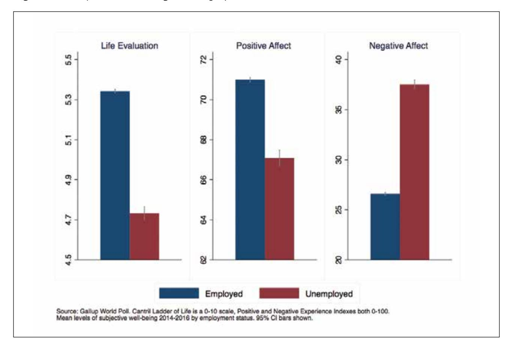

**Figure 6.1: Subjective Wellbeing and Employment Status**

Figure 6.1 presents simply the raw wellbeing differentials between those in and out of work. These descriptive statistics are corroborated in the regression analyses, which break employment status into finer categories and consider men and women as well as different regions separately. Here we are able to control for a number of additional variables in a multivariate regression analysis that may be related to both labor market outcomes as well as subjective wellbeing. These are gender, age (and its squared term), level of education, (the natural logarithm of) income, marital status, and household composition. These variables are included in order to avoid so-called 'omitted variable bias,' in case these demographic variables might be driving both employment and happiness and thus lead us to false conclusions on the relation-

ship between work and wellbeing. Moreover, these regressions incorporate country and year fixed-effects in order to account for the many political, economic, and cultural differences between countries as well as year-to-year variation that would otherwise cloud our interpretation of the relationship between employment and happiness.

In all of our regression analyses throughout the chapter, we standardize the various outcome variables such that they each have a mean of 0 and a standard deviation of 1 in the whole sample. This enables us to more easily compare the magnitude of the coefficients across the different outcomes. The coefficients on each of the employment status indicator variables in Table 6.1 estimate the difference in standard

deviation units of each of the three outcome variables (life evaluation, positive affect, and negative affect) associated with holding that status, as compared to being employed full-time for an employer, controlling for income as well the other demographic variables noted above.

As can be seen, the unemployed evaluate the overall state of their lives less highly on the Cantril ladder, and experience more negative emotions in their day-to-day lives as well as fewer positive ones. These are among the most widely accepted and replicated findings in the science of happiness.11 Here, income is being held constant along with a number of other relevant covariates, showing that these unemployment effects go well beyond the income loss associated with losing one's job.12

While we are able to control for a number of confounding variables in this analysis, one further important methodological concern is the possibility of so-called 'reverse causality.' Indeed, there is some evidence that the relationship between employment and happiness is dynamic in nature and may run in both directions. That is to say that happier individuals may be somewhat more likely to obtain employment in the first place or that unhappy people may be more likely to lose their jobs.13 This means that the cross-sectional results reported in this chapter and much of the related literature—cannot be interpreted causally and require this important caveat. Nevertheless, while this important methodological proviso needs to be noted, a number of studies have shown that the damaging effects of unemployment remain large in within-person longitudinal analyses, which hold constant an individual fixed effect,14 while others have leveraged external employment shocks namely plant closures—to further demonstrate the causal effects of unemployment on subjective wellbeing.15

If unemployment is so bad, what about part-time work? As one might expect, much depends here

on whether one actually wants to work any more hours. If the respondent is underemployed that is, is seeking to work more hours than they currently do—then, in line with intuition, there remains some scope for happiness gains through increasing their employment. This is not the case for individuals who report actually preferring to be part-time employed. In fact, part-time employed individuals who do not seek more hours of work report greater happiness and less negative experiences (such as stress and worry) as compared to full-time employed people, controlling for income and other confounding variables. As will be noted later, this particular finding applies mostly to women rather than men.

Being self-employed has a complex relationship to wellbeing.16 While the global data indicate that self-employment is generally associated with lower levels of happiness as compared to being a full-time employee, the follow-up analyses reported later in this chapter show that this very much depends on the region of the world that is being considered as well as which measure of subjective wellbeing is under consideration.

In Figure 6.2 and Table 6.2 we investigate whether the relationship between employment and wellbeing varies by gender. Being of working age and out of the labor force has a different effect on the subjective wellbeing of men and women. The data suggest that not participating in the labor market (for example by being a stay-at-home parent, being out of the labor force through disability, or being retired) is worse for the happiness of men than it is for women. Both men and women of working age who are out of the labor force evaluate their lives more negatively than those in full-time work, but the effect is much stronger for men. Moreover, while men in this situation experience higher negative and lower positive affect, there is no statistically significant difference between the daily emotional experiences of women who are out of the labor force and those who are full-time employees.

149

**Table 6.1: Subjective Wellbeing and Employment Status**

|                                                 | (1)             | (2)             | (3)             |
|-------------------------------------------------|-----------------|-----------------|-----------------|
|                                                 | Life Evaluation | Positive Affect | Negative Affect |
| Employment (v. employed full-time for employer) |                 |                 |                 |
| Employed Full-Time for Self                     | -0.018***       | 0.008           | 0.018***        |
|                                                 | (0.005)         | (0.006)         | (0.006)         |
| Employed Part-Time (does not want more hours)   | 0.048***        | 0.017***        | -0.021***       |
|                                                 | (0.006)         | (0.006)         | (0.006)         |
| Employed Part-Time (would like more hours)      | -0.096***       | -0.016***       | 0.089***        |
|                                                 | (0.007)         | (0.006)         | (0.007)         |
| Out of Labor Force                              | -0.045***       | -0.024***       | 0.022***        |
|                                                 | (0.005)         | (0.006)         | (0.008)         |
| Unemployed                                      | -0.236***       | -0.100***       | 0.207***        |
|                                                 | (0.008)         | (0.008)         | (0.008)         |
| Control Variables                               |                 |                 |                 |
| Household Income (ln)                           | 0.218***        | 0.124***        | -0.118***       |
|                                                 | (0.005)         | (0.004)         | (0.003)         |
| Education: Medium (vs. low)                     | 0.159***        | 0.103***        | -0.080***       |
|                                                 | (0.005)         | (0.006)         | (0.006)         |
| Education: High                                 | 0.308***        | 0.215***        | -0.118***       |
|                                                 | (0.007)         | (0.008)         | (0.008)         |
| Marital Status: Married (vs. single)            | 0.046***        | 0.016***        | -0.024***       |
|                                                 | (0.004)         | (0.004)         | (0.004)         |
| Marital Status: Divorced/Separated              | -0.091***       | -0.109***       | 0.121***        |
|                                                 | (0.006)         | (0.006)         | (0.006)         |
| Marital Status: Widowed                         | -0.089***       | -0.133***       | 0.148***        |
|                                                 | (0.008)         | (0.008)         | (0.008)         |
| Female                                          | 0.082***        | 0.012***        | 0.072***        |
|                                                 | (0.003)         | (0.004)         | (0.004)         |
| Age                                             | -0.019***       | -0.024***       | 0.021***        |
|                                                 | (0.001)         | (0.001)         | (0.001)         |
| Age2                                            | 0.000***        | 0.000***        | -0.000***       |
|                                                 | (0.000)         | (0.000)         | (0.000)         |
| Children in Household                           | -0.031***       | -0.016***       | 0.032***        |
|                                                 | (0.004)         | (0.004)         | (0.003)         |
| Adults in Household                             | -0.008***       | -0.008***       | 0.010***        |
|                                                 | (0.001)         | (0.001)         | (0.001)         |
| Country + Year FEs                              | Yes             | Yes             | Yes             |
| Observations                                    | 848594          | 817339          | 805839          |
| R-squared                                       | 0.084           | 0.032           | 0.032           |
| Countries                                       | 162             | 162             | 162             |
|                                                 |                 |                 |                 |

Standard errors in parentheses adjusted for clustering at the country level. Outcome variables are standardized to have mean=0 and SD=1. Sample is 21-60 year olds. p < \* 0.1 \*\* p < 0.05 \*\*\* p < 0.01.

150

**Table 6.2: Subjective Wellbeing and Employment Status by Gender**

|                                                 |           | Life Evaluation | Positive Affect |           | Negative Affect |           |
|-------------------------------------------------|-----------|-----------------|-----------------|-----------|-----------------|-----------|
|                                                 | Men       | Women           | Men             | Women     | Men             | Women     |
| Employment (v. employed full-time for employer) |           |                 |                 |           |                 |           |
| Employed Full-Time for Self                     | -0.024*** | -0.009          | 0.008           | 0.011     | 0.018**         | 0.018**   |
|                                                 | (0.006)   | (0.006)         | (0.007)         | (0.007)   | (0.007)         | (0.007)   |
| Employed Part-Time                              | 0.025***  | 0.064***        | 0.005           | 0.035***  | -0.000          | -0.044*** |
| (does not want more hours)                      | (0.009)   | (0.007)         | (0.008)         | (0.007)   | (0.008)         | (0.008)   |
| Employed Part-Time (would like more hours)   | -0.120*** | -0.072***       | -0.028***       | 0.002     | 0.094***        | 0.079***  |
|                                                 | (0.008)   | (0.008)         | (0.008)         | (0.008)   | (0.009)         | (0.008)   |
| Out of Labor Force                              | -0.092*** | -0.027***       | -0.069***       | 0.003     | 0.078***        | -0.008    |
|                                                 | (0.006)   | (0.005)         | (0.007)         | (0.006)   | (0.009)         | (0.008)   |
| Unemployed                                      | -0.281*** | -0.201***       | -0.145***       | -0.055*** | 0.217***        | 0.195***  |
|                                                 | (0.009)   | (0.009)         | (0.010)         | (0.008)   | (0.010)         | (0.009)   |
| Country + Year FEs                              | Yes       | Yes             | Yes             | Yes       | Yes             | Yes       |
| Observations                                    | 394629    | 453965          | 377950          | 439389    | 372192          | 433647    |
| R-squared                                       | 0.084     | 0.084           | 0.033           | 0.033     | 0.026           | 0.032     |
| Countries                                       | 162       | 162             | 162             | 162       | 162             | 162       |

Standard errors in parentheses adjusted for clustering at the country level. Outcome variables are standardized to have mean=0 and SD=1. Further controls: log income, education level, marital status, household composition, gender, age and its square. Sample is 21-60 year olds. p < \* 0.1 \*\* p < 0.05 \*\*\* p < 0.01.

**Figure 6.2: Subjective Wellbeing and Employment Status by Gender**

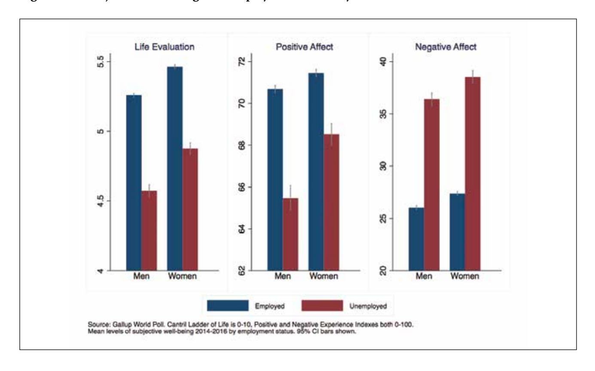

In line with the existing body of research, the results indicate that unemployment is devastating for the wellbeing of both men and women. Nevertheless, the effects of joblessness tend to be felt more strongly by men. One further notable gender difference regards part-time work. Women who work part-time but who do not wish for any more hours experience fewer negative affective states (such as stress and worry) in their day-to-day lives and more positive ones as compared to full-time employed women, whereas the same is not the case for men.

In Figure 6.3 and Table 6.3 we investigate whether the relationship between employment and wellbeing varies by world region.17 As can be seen in Figure 6.3, across all of the world

regions, we find that individuals in employment generally report higher life evaluation and positive affect than those who are unemployed. The unemployed also report more negative affective experiences across all regions around the world. The magnitude of the regression coefficients on being unemployed reported in panel A of Table 6.3 does, however, indicate that the strength of the relationship to life evaluation is less pronounced in South Asia and Southeast Asia. Furthermore, panel B in Table 6.3 shows that for these two regions there does not appear to be a statistically significant relationship between unemployment and positive affective experiences, although panel C in Table 6.3 notes a significantly higher level of negative affective experiences.

**Figure 6.3: Subjective Wellbeing and Employment Status by World Region**

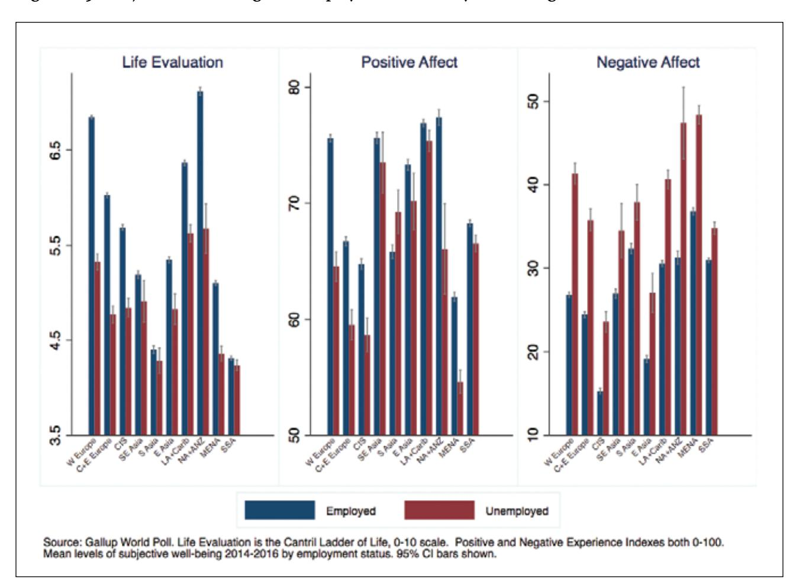

**Table 6.3: Subjective Wellbeing and Employment Status Around the World**

|                                                 | W Europe  | C+E Europe | CIS       | SE Asia   | S Asia                   | E Asia    | LA + Carib | NA+ANZ    | MENA      | SSA       |
|-------------------------------------------------|-----------|------------|-----------|-----------|--------------------------|-----------|------------|-----------|-----------|-----------|
|                                                 |           |            |           |           | Panel A: Life Evaluation |           |            |           |           |           |
| Employment (v. employed full-time for employer) |           |            |           |           |                          |           |            |           |           |           |
| Employed                                        | 0.019**   | 0.083***   | 0.030*    | 0.018     | -0.008                   | 0.025**   | -0.092***  | 0.022     | -0.001    | -0.051*** |
| Full-Time for Self                              | (0.008)   | (0.014)    | (0.016)   | (0.019)   | (0.028)                  | (0.011)   | (0.011)    | (0.020)   | (0.013)   | (0.012)   |
| Employed                                        | 0.066***  | 0.070***   | 0.062***  | 0.063**   | 0.026                    | 0.106***  | 0.018      | 0.080***  | 0.090***  | -0.017    |
| Part-Time (does not want more hours)         | (0.011)   | (0.019)    | (0.015)   | (0.025)   | (0.057)                  | (0.015)   | (0.019)    | (0.022)   | (0.014)   | (0.014)   |
| Employed                                        | -0.174*** | -0.135***  | -0.014    | -0.012    | -0.108*                  | -0.002    | -0.148***  | -0.214*** | -0.108*** | -0.085*** |
| Part-Time (would like more hours)            | (0.012)   | (0.020)    | (0.019)   | (0.023)   | (0.055)                  | (0.027)   | (0.016)    | (0.030)   | (0.016)   | (0.012)   |
| Out of Labor Force                              | -0.126*** | -0.068***  | -0.011    | 0.019     | 0.005                    | 0.011     | -0.048***  | -0.171*** | -0.017    | -0.087*** |
|                                                 | (0.013)   | (0.012)    | (0.010)   | (0.016)   | (0.036)                  | (0.014)   | (0.012)    | (0.025)   | (0.010)   | (0.014)   |
| Unemployed                                      | -0.396*** | -0.306***  | -0.187*** | -0.113*** | -0.095*                  | -0.180*** | -0.257***  | -0.434*** | -0.258*** | -0.156*** |
|                                                 | (0.014)   | (0.023)    | (0.021)   | (0.030)   | (0.047)                  | (0.025)   | (0.018)    | (0.041)   | (0.016)   | (0.016)   |
| Observations                                    | 125659    | 78228      | 72053     | 47723     | 62986                    | 52100     | 98357      | 18043     | 136099    | 156412    |
| R-squared                                       | 0.115     | 0.160      | 0.087     | 0.071     | 0.122                    | 0.133     | 0.064      | 0.110     | 0.081     | 0.074     |
|                                                 |           |            |           |           | Panel B: Positive Affect |           |            |           |           |           |
| Employment (v. employed full-time for employer) |           |            |           |           |                          |           |            |           |           |           |
| Employed                                        | 0.006     | 0.033*     | 0.006     | 0.023     | 0.017                    | 0.061***  | -0.034***  | 0.038*    | -0.012    | -0.010    |
| Full-Time for Self                              | (0.014)   | (0.018)    | (0.018)   | (0.018)   | (0.025)                  | (0.013)   | (0.011)    | (0.021)   | (0.016)   | (0.010)   |
| Employed                                        | 0.016     | 0.045**    | 0.060***  | 0.094***  | -0.026                   | 0.070**   | -0.007     | 0.048     | -0.002    | -0.038*** |
| Part-Time (does not want more hours)         | (0.012)   | (0.021)    | (0.019)   | (0.025)   | (0.031)                  | (0.033)   | (0.016)    | (0.031)   | (0.018)   | (0.013)   |
| Employed                                        | -0.058*** | -0.072***  | 0.006     | 0.082***  | -0.010                   | 0.077***  | -0.043***  | 0.009     | -0.056*** | -0.027**  |
| Part-Time (would like more hours)            | (0.012)   | (0.024)    | (0.021)   | (0.023)   | (0.058)                  | (0.017)   | (0.012)    | (0.034)   | (0.017)   | (0.012)   |
| Out of Labor Force                              | -0.073*** | 0.027*     | -0.021    | 0.026     | 0.036                    | 0.030*    | -0.018     | -0.083*** | -0.043*** | -0.087*** |
|                                                 | (0.012)   | (0.015)    | (0.015)   | (0.022)   | (0.031)                  | (0.017)   | (0.012)    | (0.018)   | (0.013)   | (0.013)   |
| Unemployed                                      | -0.112*** | -0.077***  | -0.102*** | 0.013     | -0.076                   | -0.074**  | -0.058***  | -0.124*** | -0.231*** | -0.078*** |
|                                                 | (0.016)   | (0.024)    | (0.028)   | (0.033)   | (0.051)                  | (0.028)   | (0.014)    | (0.040)   | (0.020)   | (0.015)   |
| Observations                                    | 113004    | 78759      | 73044     | 47369     | 63685                    | 49783     | 99432      | 15098     | 120161    | 156067    |
| R-squared                                       | 0.027     | 0.082      | 0.058     | 0.020     | 0.058                    | 0.033     | 0.020      | 0.027     | 0.038     | 0.028     |
|                                                 |           |            |           |           | Panel C: Negative Affect |           |            |           |           |           |
| Employment (v. employed full-time for employer) |           |            |           |           |                          |           |            |           |           |           |
| Employed Full-Time                              | 0.084***  | 0.055***   | 0.033**   | -0.043**  | -0.081***                | 0.001     | 0.027**    | 0.100***  | 0.037**   | -0.012    |
| for Self                                        | (0.013)   | (0.014)    | (0.014)   | (0.019)   | (0.019)                  | (0.009)   | (0.013)    | (0.027)   | (0.015)   | (0.010)   |
| Employed                                        | -0.025*   | 0.035*     | 0.021     | -0.091*** | -0.047                   | -0.050*** | -0.084***  | -0.088**  | -0.051*** | -0.008    |
| Part-Time (does not want more hours)         | (0.014)   | (0.019)    | (0.016)   | (0.023)   | (0.035)                  | (0.018)   | (0.016)    | (0.032)   | (0.017)   | (0.013)   |
| Employed                                        | 0.146***  | 0.136***   | 0.050***  | -0.007    | 0.047                    | -0.007    | 0.104***   | 0.184***  | 0.108***  | 0.058***  |
| Part-Time (would like more hours)            | (0.014)   | (0.021)    | (0.018)   | (0.024)   | (0.031)                  | (0.033)   | (0.013)    | (0.034)   | (0.020)   | (0.013)   |
| Out of Labor Force                              | 0.147***  | 0.066***   | 0.057***  | -0.063*** | -0.111***                | -0.004    | -0.041***  | 0.244***  | -0.029**  | 0.011     |
|                                                 | (0.022)   | (0.014)    | (0.012)   | (0.018)   | (0.027)                  | (0.016)   | (0.012)    | (0.027)   | (0.014)   | (0.012)   |
| Unemployed                                      | 0.260***  | 0.241***   | 0.176***  | 0.163***  | 0.187***                 | 0.207***  | 0.205***   | 0.377***  | 0.249***  | 0.111***  |
|                                                 |           | (0.025)    | (0.023)   | (0.049)   | (0.043)                  | (0.031)   | (0.018)    | (0.051)   | (0.019)   | (0.013)   |
| Observations                                    | 113004    | 78759      | 73044     | 47369     | 63685                    | 49783     | 99432      | 15098     | 111485    | 153243    |
| R-squared                                       | 0.041     | 0.052      | 0.031     | 0.026     | 0.054                    | 0.027     | 0.042      | 0.050     | 0.036     | 0.041     |
|                                                 |           |            |           |           |                          |           |            |           |           |           |

Standard errors in parentheses adjusted for clustering at the country level. Outcome variables are standardized to have mean=0 and SD=1. Further controls: log income, education level, marital status, household composition, gender, age and its square. Sample is 21-60 year olds. p < \* 0.1 \*\* p < 0.05 \*\*\* p < 0.01.

All models include country and year FEs.

In terms of self-employment, the results reveal an interesting reversal across regions. Being self-employed tends to be associated with higher life evaluation and positive affect (as compared to being a full-time employee) across Europe, North America, Australia, New Zealand, the Commonwealth of Independent States, and East Asia. However, individuals that are self-employed in Latin America, the Caribbean, and Sub-Saharan Africa tend to report lower life evaluation and less positive affective experience. Interestingly, however, although in some regions self-employment is associated with higher levels of life evaluation, most regions do converge in terms of showing that employing oneself and running one's own business is generally associated with the experience of more negative emotions such as stress and worry.18

#### Unemployment Dynamics and Spillovers

Unemployment is damaging to people's happiness, but how short-lived is the misery associated with being out of work? People tend to adapt to many different circumstances, and unemployment may well be one of them. If the pain is only fleeting and people quickly get used to being unemployed, then we might see joblessness as less of a key public policy priority in terms of happiness. However, a number of studies have demonstrated that people do not adapt much, if at all, to being unemployed.19 We cannot show this dynamic using the Gallup World Poll, which provides repeated snapshots of countries across the world, but we can instead look to longitudinal data from the German Socio-Economic Panel, which has each year since 1984 surveyed and re-surveyed the same large random sample of the German population.

We are interested in two issues here: adaptation and scarring. First, in Figure 6.4 we investigate whether people adapt to being jobless as they spend longer and longer out of work.20 As can

be seen, there is a large initial shock to becoming unemployed, and then as people stay unemployed over time their levels of life satisfaction remain low. A second issue is scarring: several studies have shown that even once a person becomes re-employed, the prior experience of unemployment leaves a mark on his or her happiness. Comparing people who are both in work, those who have recently experienced a bout of unemployment are systematically less happy than those who have not.21

**Figure 6.4: Adaptation to Spells of Unemployment**

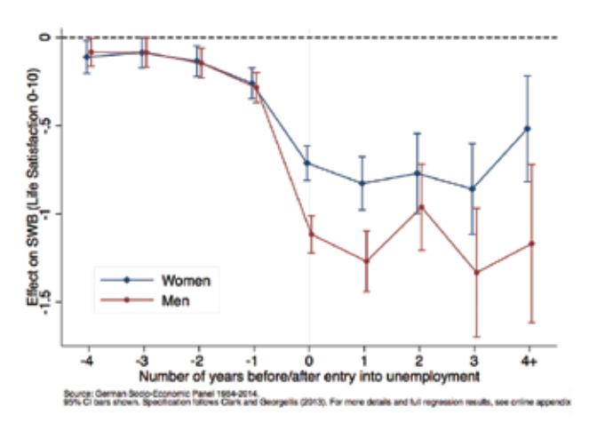

As we have seen, being out of a job is detrimental to the subjective wellbeing of the unemployed themselves. What about everyone else? A further canonical finding in the literature on unemployment and subjective wellbeing is that there are so-called "spillover" effects.22 As we will see in more detail below when we come to examine the effects of specific job characteristics, job security is a key driver of subjective wellbeing.23 High levels of unemployment can have an indirect effect on those who remain in work, as they increase fear and heighten the sense of job insecurity. Poor labor market conditions tend to signal to those in work that layoffs are relatively commonplace and that they may well be next in line to lose their jobs.24

**Table 6.4: Social Comparison Effects of Unemployment**

|                                | Life Evaluation |           | Positive Affect |           | Negative Affect |           |
|--------------------------------|-----------------|-----------|-----------------|-----------|-----------------|-----------|
|                                | Men             | Women     | Men             | Women     | Men             | Women     |
| Unemployed                     | -0.298***       | -0.236*** | -0.176***       | -0.073*** | 0.276***        | 0.240***  |
|                                | (0.015)         | (0.013)   | (0.015)         | (0.013)   | (0.014)         | (0.014)   |
| Unemployment Rate              | -0.449***       | -0.154*** | -0.014          | -0.006    | 0.080           | -0.058    |
|                                | (0.066)         | (0.047)   | (0.061)         | (0.041)   | (0.062)         | (0.045)   |
| Unemployed * Unemployment Rate | 0.209**         | 0.199***  | 0.219**         | 0.091     | -0.425***       | -0.218*** |
|                                | (0.087)         | (0.060)   | (0.096)         | (0.056)   | (0.089)         | (0.057)   |
| Country + Year FEs             | Yes             | Yes       | Yes             | Yes       | Yes             | Yes       |
| Observations                   | 394555          | 453285    | 377876          | 438738    | 372132          | 433055    |
| R-squared                      | 0.085           | 0.084     | 0.033           | 0.033     | 0.027           | 0.032     |
| Countries                      | 162             | 162       | 162             | 162       | 162             | 162       |

Standard errors in parentheses adjusted for clustering at the country level. Outcome variables are standardized to have mean=0 and SD=1. Further controls: log income, education level, marital status, household composition, gender, age and its square. Sample is 21-60 year olds. p < \* 0.1 \*\* p < 0.05 \*\*\* p < 0.01.

We can investigate this by turning our attention back to the Gallup World Poll data. We can see in Table 6.4 that, controlling for one's own employment status, the unemployment of one's peers enters negatively into a subjective wellbeing equation. The unemployment rate is calculated here as the fraction of the labor force unemployed within the respondent's gender, age group (20s, 30s, and so on), country, and year. The negative effect of peers' joblessness can be seen in columns 1 and 2, with the comparison unemployment rate having a negative effect on life evaluation. An interesting new finding here, however, is that while the overall evaluative subjective wellbeing of those who are not unemployed seems to be negatively affected by others' unemployment, their day-to-day experience of life does not seem to be similarly affected in models 3-6 which investigate effects on positive and negative affect.

Although higher unemployment rates have negative spillovers for those still in work, the third row of Table 6.4 shows the opposite may be true for those who are out of work. This so-called "social norm" effect has been widely

shown in the literature.25 For the unemployed, the individual effects of unemployment are less strongly felt in situations where the local unemployment rate is higher, as in areas of high unemployment the social stigma of unemployment may be lessened while it may also be easier to find social contacts. Much of the existing evidence is focused on a handful of countries and finds significant effects only for men. We are able to show here in a worldwide sample that this social norm effect is present for both men and women: unemployed people evaluate their lives less negatively on the Cantril ladder, the higher the comparison unemployment rate. They also experience fewer negative and more positive emotions in their day-to-day lives. It is worth noting, however, that even at conventionally high levels of unemployment, the overall effect of being unemployed on the individual is still very much negative across all three measures of subjective wellbeing.

Our analyses have thus described the damaging effects of unemployment on the individual as well as the negative spillover effects on those around them. This raises the question of whether these broadly negative effects of unemployment also show up in the macroeconomic data. High levels of unemployment have an indirect effect on those who remain in work because they heighten the sense of job insecurity, since generally poor labor market conditions signal to those in work that redundancies are relatively commonplace. If this is the case, we may be able to detect this in the relationship between the unemployment rate and the average wellbeing in a society. Figure 6.5 shows a scatterplot that maps average wellbeing for most countries in the world against their unemployment rate.26

Although any such bivariate treatment of the relationship between national wellbeing and unemployment is necessarily limited in nature, in line with the analyses that focus on the

individual impact of falling unemployed we find a generally negative correlation between unemployment rates and societal wellbeing at the national level. In an online appendix (Figure A6.8), the same cross-sectional relationship is reported by world region. These regional results mostly corroborate the generally negative relationship between national unemployment and subjective wellbeing, with the exceptions of Southeast Asia and Sub-Saharan Africa. The global relationship depicted in Figure 6.5 is not only found in most regions, but is also present across the entities that make up large nations. For example, it has analogously been shown that this cross-sectional relationship between unemployment rates and average wellbeing is also found when considering the separate states that make up the United States of America.27

**Figure 6.5: Unemployment Rates and National Levels of Subjective Wellbeing**

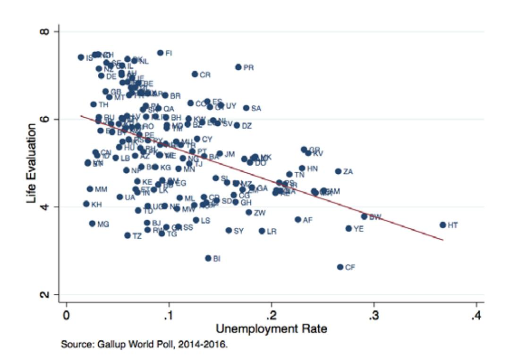

#### Subjective Wellbeing and Job Type

In addition to investigating the importance of having a job, the data also allow us to ask whether different types of jobs are associated with higher or lower levels of subjective wellbeing. The availability of eleven different job types in the Gallup World Poll allows us to gain a sense for which types of employment are more or less associated with happiness across the world. The available categories cover many kinds of jobs, including being a business owner, office worker, or manager, and working in farming, construction, mining, or transport.

Figure 6.6 represents the descriptive data on how these varied broad job types relate to our three main measures of subjective wellbeing life evaluation, positive affect, and negative affect. The overarching finding here is that the global data reveal an important difference in how blue-collar and white-collar work are related to happiness (also when controlling for any differences in income, as shown below). We find that labor-intensive work is systematically correlated with less happiness and this is the case across a number of labor-intensive industries such as construction, mining, manufacturing, transport, farming, fishing, and forestry. In fact, people around the world who categorize themselves as a manager, an executive, an official, or a professional worker evaluate the quality of their lives at a little over 6 out of 10 whereas people working in farming, fishing, or forestry evaluate their lives around 4.5 out of 10 on average. A very similar picture is obtained when considering not only life evaluation but also the day-to-day experience of positive affective states such as smiling, laughing, enjoyment, or feeling well rested. The data also show the situation is similar when considering negative affective states such as feelings of worry, stress, sadness, and anger. Here we find that professionals in senior roles (manager, executive, or official) experience fewer negative affective states as compared to all other job types.

It is worth noting that we are considering average effects in all of our analyses. While individuals doing some types of jobs are generally more or less happy on average than those doing another type, there will be individual heterogeneity in these effects that we are not able to investigate fully in our analysis. People differ in their interests and personalities, among other things, and a large literature for example on 'job fit' suggests there are few jobs that would be ideal for everyone—certain types of people are best suited to and more able to flourish in different types of jobs.28

It is also of interest to note that classic economic theory would suggest that there should be little difference in the happiness or utility of people with different types of jobs, holding constant their skill level. This is because so-called "compensating wage differentials" or "equalizing differences" should balance the happiness levels associated with the types of jobs that an individual chooses to take on.29 That is to say that people willing to take on a job that they anticipate is not going to make them happy should be compensated monetarily to the extent that it should at least compensate for the unhappiness associated with that particular job as compared to another job that would have made them happier but with a lower pay attached to it. The empirical case for the existence of such compensating wage differentials is mixed30, and while we do not directly address this point in our analysis, we do not appear to observe a strong presence of such compensating differentials in the global data employed here.31

The descriptive statistics shown in Figure 6.6 represent the raw differences in happiness across job types. Of course, there are likely to be many things that differ across people working in these diverse fields that could potentially be driving these happiness differentials. If we want to have a more precise view of how varied job types actually relate to happiness than we need to hold constant the confounding variables such as the different wages associated with different

**Figure 6.6A: Life Evaluation and Job Type**

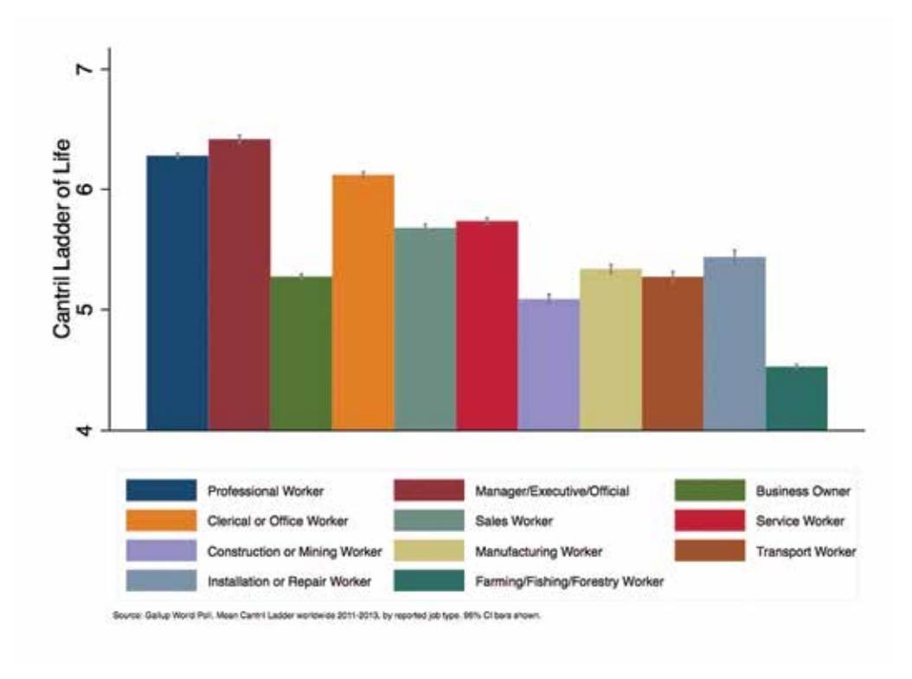

**Figure 6.6B: Positive Affect and Job Type**

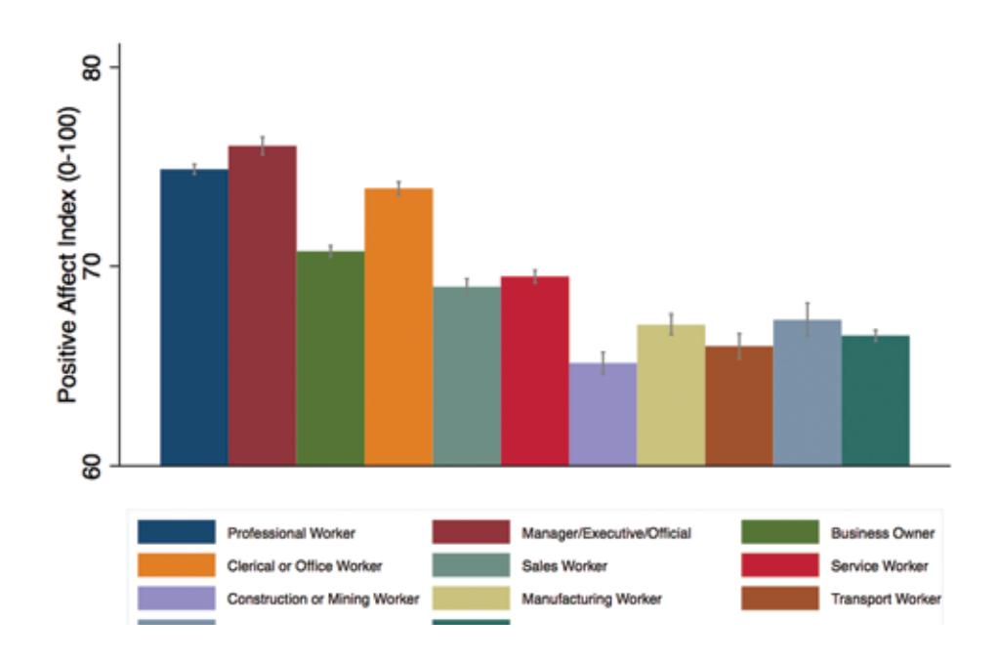

**Figure 6.6C: Negative Affect and Job Type**

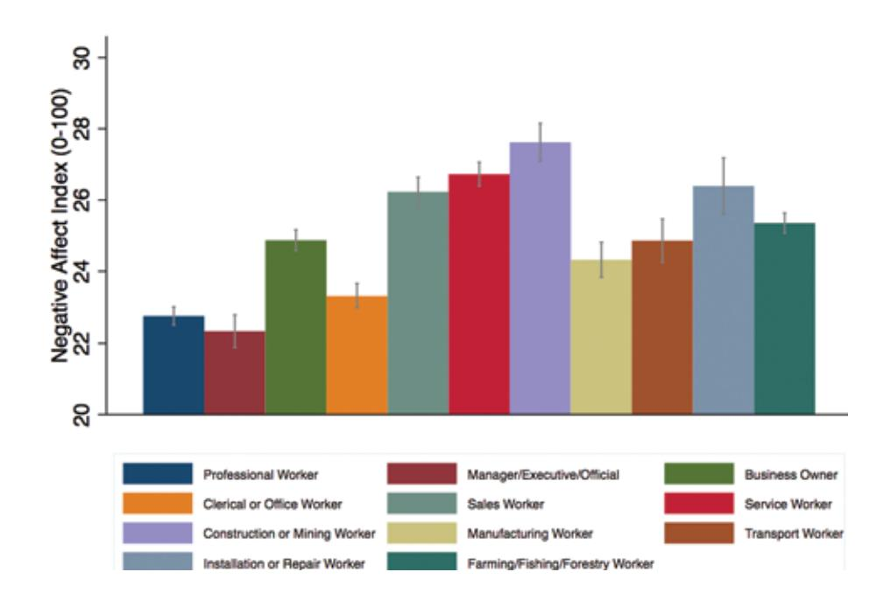

job types as well as the age, gender, marital status, and education level of the individual. To account and control for these and other differences we also report a multiple regression analysis in Table 6.5. In terms of life evaluation and positive affect, these regressions replicate the broad patterns shown in the descriptive statistics shown above. Senior professionals (manager, executive, official) evaluate their lives higher and report more positive affective experiences. The self-reported happiness of office workers (clerical, sales, or service) is significantly lower than their senior colleagues, even controlling for income and other covariates. We find that the association of being in labor-intensive jobs and wellbeing is even greater still.

In an online appendix (Figures A6.1-3), we also split these descriptive and statistical analyses on job type and happiness by gender. Although some small differences can be observed, these analyses do little to alter the interpretations from the general trends reported above. The same cannot quite be said of the relationship between job type and happiness, however, when we split the analysis by the world's different regions. As shown in Figure 6.7, there are some clear differences in life evaluation across regions and job types, as is to be expected, but the trends are somewhat less streamlined as compared to the globally pooled data that was reported on above. Other things equal, senior professionals report the highest life evaluation across all regions (at the notable exception of farming/forestry/fishing workers in North America, Australia, and New Zealand who report equal or higher life evaluation and positive affect). Office workers and manual laborers report lower life evaluation, a trend most pronounced in the MENA, East Asia, and Latin American regions in particular. The figures that represent the relation between job type and positive affect and negative affect are given in the online appendix, along with accompanying multiple regression tables by region.

**Table 6.5: Job Type and Subjective Wellbeing**

|                                 | (1)             | (2)             | (3)             |  |
|---------------------------------|-----------------|-----------------|-----------------|--|
|                                 | Life Evaluation | Positive Affect | Negative Affect |  |
| Job Type (v. Professional)      |                 |                 |                 |  |
| Manager/Executive/Official      | 0.033***        | -0.021**        | 0.019**         |  |
|                                 | (0.009)         | (0.009)         | (0.009)         |  |
| Business Owner                  | -0.050***       | -0.053***       | 0.031***        |  |
|                                 | (0.008)         | (0.008)         | (0.008)         |  |
| Clerical or Office Worker       | -0.021***       | -0.069***       | -0.009          |  |
|                                 | (0.007)         | (0.008)         | (0.008)         |  |
| Sales Worker                    | -0.070***       | -0.121***       | 0.039***        |  |
|                                 | (0.009)         | (0.010)         | (0.009)         |  |
| Service Worker                  | -0.096***       | -0.106***       | 0.033***        |  |
|                                 | (0.007)         | (0.008)         | (0.007)         |  |
| Construction or Mining Worker   | -0.153***       | -0.178***       | 0.069***        |  |
|                                 | (0.010)         | (0.012)         | (0.012)         |  |
| Manufacturing Worker            | -0.128***       | -0.171***       | 0.052***        |  |
|                                 | (0.009)         | (0.011)         | (0.011)         |  |
| Transportation Worker           | -0.113***       | -0.195***       | 0.066***        |  |
|                                 | (0.011)         | (0.014)         | (0.011)         |  |
| Installation or Repair Worker   | -0.131***       | -0.151***       | 0.074***        |  |
|                                 | (0.011)         | (0.014)         | (0.013)         |  |
| Farming/Fishing/Forestry Worker | -0.136***       | -0.162***       | 0.032***        |  |
|                                 | (0.010)         | (0.011)         | (0.009)         |  |
| Country + Year FEs              | Yes             | Yes             | Yes             |  |
| Observations                    | 338282          | 333927          | 328000          |  |
| R-squared                       | 0.080           | 0.029           | 0.018           |  |
| Countries                       | 153             | 153             | 153             |  |

Standard errors in parentheses adjusted for clustering at the country level. Outcome variables are standardized to have mean=0 and SD=1. Further controls: log income, education level, marital status, household composition, gender, age and its square. Sample is 21-60 year olds. p < \* 0.1 \*\* p < 0.05 \*\*\* p < 0.01.

**Figure 6.7: Life Evaluation and Job Type by Region**

#### Job Satisfaction and Employee Engagement Around the World

The World Happiness Report is mostly concerned with how people experience and evaluate their lives as a whole, rather than domain-specific wellbeing outcomes. The academic literature on the relationship between work and wellbeing, however, has for a long time also considered other measures of wellbeing. The notion of job satisfaction has been widely studied in particular, and more recently the literature has begun to investigate other outcomes such as employee engagement.32 The Gallup World Poll contains data on both of these domain-specific wellbeing

items, and in Table6.6 we report the correlations between the measures of job satisfaction and employee engagement and the subjective wellbeing items that we have employed so far. All these measures correlate with each other to varying degrees and mostly in line with intuition. Being satisfied (as opposed to dissatisfied) with your job is strongly correlated with the Cantril ladder measure of life evaluation, whereas feeling actively engaged with your job is more strongly correlated with positive affect. The strongest relationship across all of these measures of general and workplace wellbeing is that feeling 'actively disengaged with one's job' is most strongly correlated with low job satisfaction.

**Table 6.6: Correlation Matrix of Individual Responses to General and Domain-Specific SWB Measures** 

|                              | Life Evaluation | Positive Affect | Negative Affect | Job Satisfaction | Engaged | Disengaged |
|------------------------------|--------------------|--------------------|--------------------|---------------------|---------|------------|
| Life Evaluation              | 1                  |                    |                    |                     |         |            |
| Positive Affect              | 0.252              | 1                  |                    |                     |         |            |
| Negative Affect              | -0.189             | -0.372             | 1                  |                     |         |            |
| Satisfied with Job           | 0.280              | 0.253              | -0.178             | 1                   |         |            |
| Actively Engaged with Job    | 0.105              | 0.168              | -0.0672            | 0.156               | 1       |            |
| Actively Disengaged with Job | -0.188             | -0.257             | 0.140              | -0.411              | -0.209  | 1          |

Note: All correlations are statistically significant at at least the 0.1% level.

Whereas in Table 6.6 we correlate these measures with each other using individual-level responses, in appendix table A6.5 we also examine the correlation of these variables when we consider the unit of analysis to be country-year and look at the correlation of these national average wellbeing measures.

In Figure 6.8 we map average job satisfaction around the world. Here we color nations around the globe according to job satisfaction. Unlike the general wellbeing measures that elicit a broader scale of responses, the data on job satisfaction refers to a simpler yes/no question. We map the percentage of respondents in work by who reported to be "satisfied" (as opposed to "dissatisfied") with their job.33 The resulting picture provides a general sense for job satisfaction around the world indicating that countries across North and South America, Europe, and Australia and New Zealand typically see more individuals reporting satisfaction with their jobs. In an online appendix (Table A6.13), we provide more detailed information on the levels of job satisfaction around the world.

In Figure 6.9 we move on to consider the global distribution of employee engagement. This survey measure in the Gallup World Poll asks whether individuals feel 'actively engaged,' 'not engaged,' or 'actively disengaged' in their jobs. The results paint a bleak picture of employee engagement around the world. The number of

people noting that they are actively engaged is typically less than 20%, while being around 10% in Western Europe, and much less still in East Asia.

The difference in the global results between job satisfaction and employee engagement may partially be attributable to measurement issues, but it also has to do with the fact that both concepts measure different aspects of happiness at work. While job satisfaction can perhaps be reduced to feeling content with one's job, the notion of (active) employee engagement requires individuals to be positively absorbed by their work and fully committed to advancing the organization's interests. Increased employee engagement thus represents a more difficult hurdle to clear.

The generally low worldwide levels of employee engagement may also underlie why many people do not report being happy while at work. In fact, a recent study collected data from individuals at different times of the day via a smartphone app.34 Troublingly, the authors found that paid work is ranked lower than any of the other 39 activities individuals can report engaging in, with the exception of being sick in bed. The more precise extent to which people are unhappy at work varies with where they work, whether they combine work with other activities, whether they are alone or with others, and the time of day or night that respondents are working.

**Figure 6.8: Job Satisfaction Around the World** 

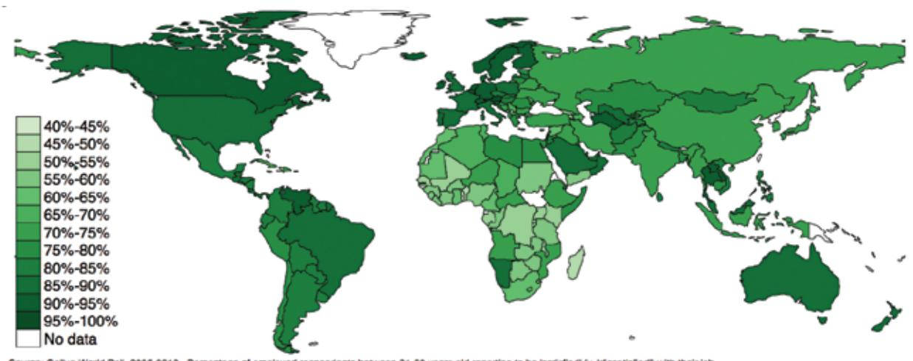

**Figure 6.9: Employee Engagement Around the World**

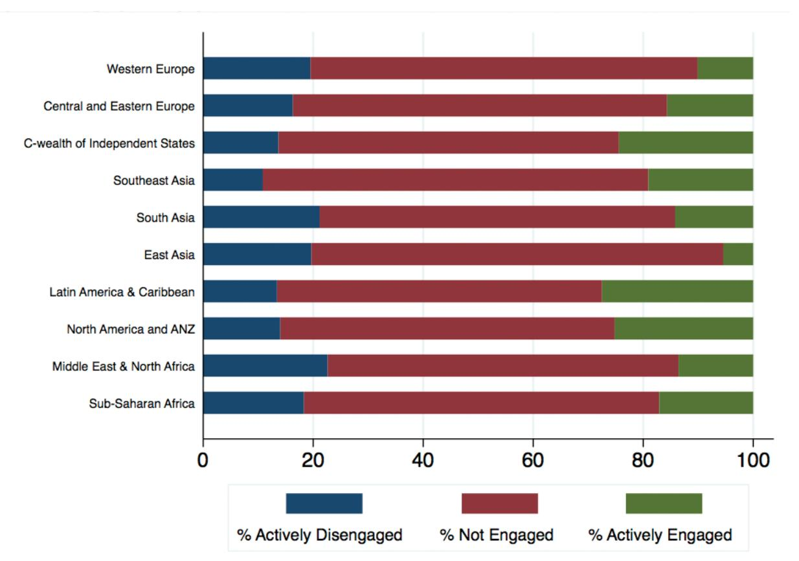

**Figure 6.10: Job Satisfaction and Job Type**

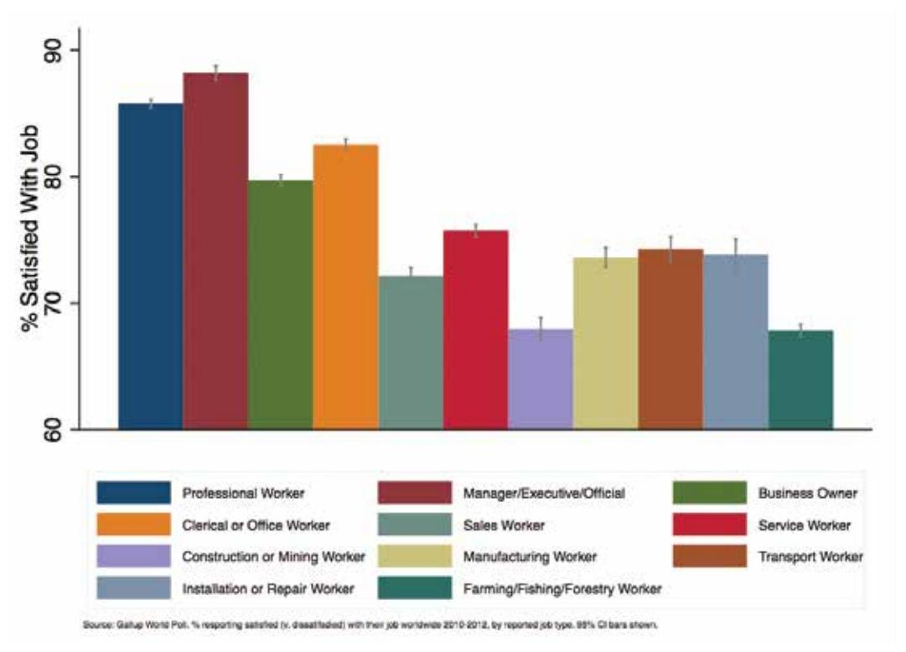

**Figure 6.11: Employee Engagement and Job Type**

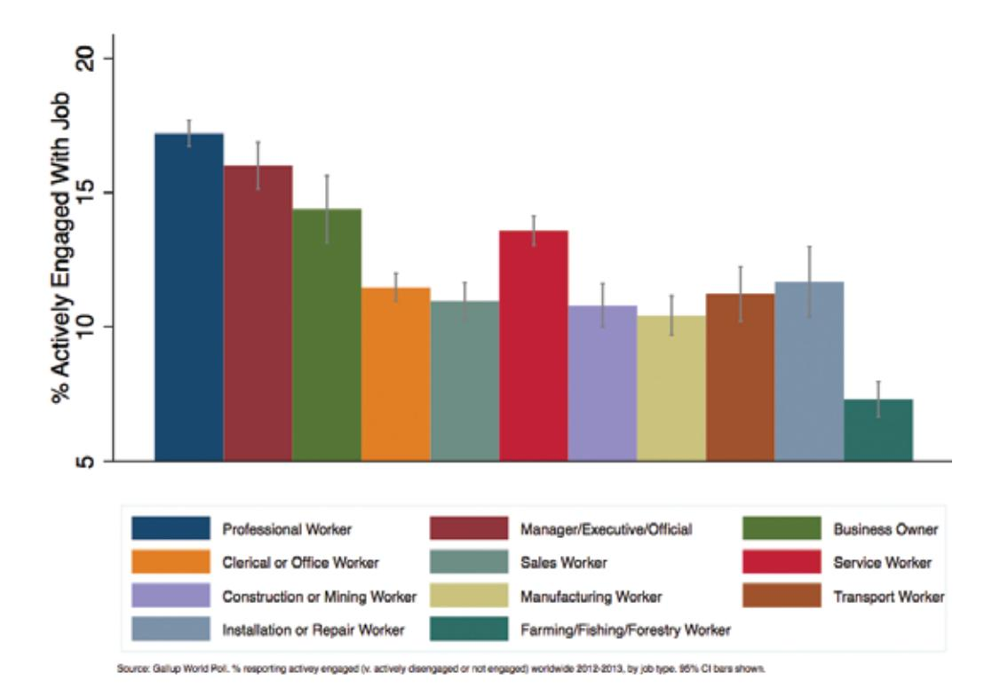

We also consider how the varied job types studied above are related to measures of job satisfaction and employee engagement. Figure 6.10 paints a picture for the relationship between job type and job satisfaction that closely tracks the trends that were reported earlier for the links between job type and the more general measures of subjective wellbeing. Senior professionals report much greater job satisfaction as compared to all other job types. The relationship between job type and employee engagement reveals an interesting and important difference with all other wellbeing measures looked at so far in relation to job type. Figure 6.11 shows clearly that business owners report being much more actively engaged at work as compared to all other job types.

When considering job satisfaction and engagement across the world's regions in Figures 6.12 and 13, we observe the same general trends that were inferred from the global data. It is worthwhile to note, however, that some regions see much starker differences in job satisfaction between job types. For example, in Central and Eastern Europe and in the MENA region we find that about 90% of senior professionals report being satisfied with their job whereas this number drops to little over 60% for workers in the farming, fishing, or forestry industries. No such large differentials in job satisfaction are found in Western Europe or North America, Australia, and New Zealand. In terms of job engagement statistics, Figure 6.13 indicates that the outlier remains being a business owner across most regions with the exception of South and Southeast Asia.

**Figure 6.12: Job Satisfaction and Job Type by Region**

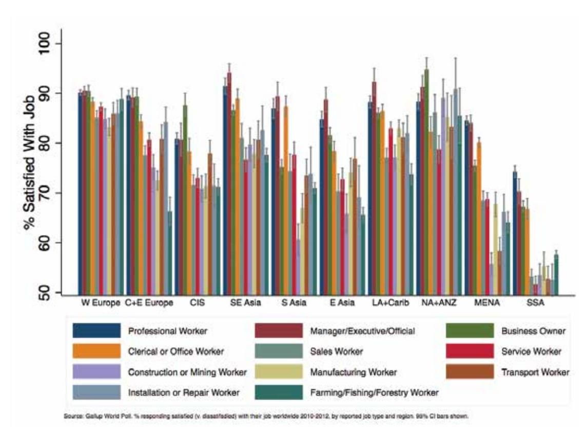

**Figure 6.13: Employee Engagement and Job Type by Region**

Tables 7 and 8 report regression results of the relationships between job types and job satisfaction and engagement by region, controlling for the usual set of income, demographic variables, as well as country and year fixed effects. Notwithstanding the introduction of the control variables, we find that the results largely mirror the descriptive statistics, the main exception being that the correlation between being a

business owner and being actively engaged is now only statistically significant for Western Europe and Central and Eastern Europe. In an online appendix (Figures A6.4-5) we also split these descriptive statistics on job type and job satisfaction and engagement by gender. The separate findings for men and women do not lead us to largely different interpretations from the general trends reported above.

**Table 6.7: Job Satisfaction and Job Type by Region** 

| SSA (10) -0.030 (0.039) -0.074** (0.030) -0.099** (0.042) -0.234*** (0.040) -0.291*** |
|---------------------------------------------------------------------------------------------------------------------|
|                                                                                                                     |
|                                                                                                                     |
|                                                                                                                     |
|                                                                                                                     |
|                                                                                                                     |
|                                                                                                                     |
|                                                                                                                     |
|                                                                                                                     |
|                                                                                                                     |
|                                                                                                                     |
|                                                                                                                     |
|                                                                                                                     |
| (0.031)                                                                                                             |
| -0.247***                                                                                                           |
| (0.047)                                                                                                             |
| -0.238***                                                                                                           |
| (0.047)                                                                                                             |
| -0.264***                                                                                                           |
| (0.055)                                                                                                             |
| -0.319***                                                                                                           |
| (0.058)                                                                                                             |
| -0.244***                                                                                                           |
| (0.041)                                                                                                             |
| Yes                                                                                                                 |
|                                                                                                                     |
| 38472                                                                                                               |
| 0.047                                                                                                               |
|                                                                                                                     |

Standard errors in parentheses adjusted for clustering at the country level. Outcome variables are standardized to have mean=0 and SD=1. Further controls: log income, education level, marital status, household composition, gender, age and its square. Sample is 21-60 year olds. p < \* 0.1 \*\* p < 0.05 \*\*\* p < 0.01.

**Table 6.8: Employee Engagement and Job Type by Region** 

|                                  | W Europe  | C+E Europe | CIS       | SE Asia   | S Asia    | E Asia    | LA + Carib | NA + ANZ  | MENA     | SSA       |
|----------------------------------|-----------|------------|-----------|-----------|-----------|-----------|------------|-----------|----------|-----------|
|                                  | (1)       | (2)        | (3)       | (4)       | (5)       | (6)       | (7)        | (8)       | (9)      | (10)      |
| Job Type (v. Professional)       |           |            |           |           |           |           |            |           |          |           |
| Manager/Executive/ Official   | 0.035**   | 0.077**    | 0.118*    | -0.036    | 0.017     | -0.020    | -0.035     | -0.043    | 0.054    | -0.063    |
|                                  | (0.014)   | (0.038)    | (0.069)   | (0.063)   | (0.069)   | (0.056)   | (0.069)    | (0.043)   | (0.037)  | (0.054)   |
| Business Owner                   | 0.239***  | 0.235**    | 0.155     | -0.074    | -0.045    | 0.010     | 0.095      | 0.164     | 0.008    | 0.037     |
|                                  | (0.050)   | (0.097)    | (0.144)   | (0.092)   | (0.076)   | (0.039)   | (0.073)    | (0.131)   | (0.066)  | (0.066)   |
| Clerical or Office               | -0.097*** | -0.159***  | -0.089**  | -0.145**  | -0.073    | -0.160*** | -0.124***  | -0.194*** | -0.085** | -0.148*** |
| Worker                           | (0.022)   | (0.028)    | (0.039)   | (0.064)   | (0.049)   | (0.028)   | (0.039)    | (0.047)   | (0.041)  | (0.040)   |
| Sales Worker                     | -0.020    | -0.214***  | -0.147*** | -0.166**  | -0.068    | -0.109*** | -0.145**   | -0.206*   | -0.101** | -0.121**  |
|                                  | (0.023)   | (0.038)    | (0.030)   | (0.067)   | (0.053)   | (0.035)   | (0.054)    | (0.096)   | (0.047)  | (0.058)   |
| Service Worker                   | -0.017    | -0.193***  | -0.130*** | -0.130**  | -0.033    | -0.104*** | -0.090**   | -0.048    | -0.003   | -0.133*** |
|                                  | (0.014)   | (0.038)    | (0.032)   | (0.057)   | (0.035)   | (0.027)   | (0.040)    | (0.070)   | (0.045)  | (0.033)   |
| Construction or Mining Worker | 0.013     | -0.230***  | -0.086*** | -0.206*** | -0.101**  | -0.045    | 0.007      | 0.040     | -0.115** | -0.125**  |
|                                  | (0.034)   | (0.035)    | (0.031)   | (0.066)   | (0.041)   | (0.046)   | (0.064)    | (0.120)   | (0.046)  | (0.049)   |
| Manufacturing Worker          | -0.063*** | -0.195***  | -0.134*** | -0.180*** | -0.158*** | -0.108*** | -0.092*    | -0.222**  | -0.086*  | -0.151*** |
|                                  | (0.021)   | (0.031)    | (0.046)   | (0.048)   | (0.045)   | (0.029)   | (0.053)    | (0.077)   | (0.046)  | (0.054)   |
| Transportation                   | -0.011    | -0.205***  | -0.168*** | -0.199*** | -0.028    | -0.105*   | -0.216***  | -0.205**  | -0.126** | -0.200*** |
| Worker                           | (0.036)   | (0.046)    | (0.041)   | (0.054)   | (0.039)   | (0.054)   | (0.069)    | (0.089)   | (0.059)  | (0.048)   |
| Installation or                  | -0.045    | -0.262***  | -0.101*   | -0.240*** | -0.140**  | -0.159*** | 0.017      | -0.085    | -0.078   | -0.169*** |
| Repair Worker                    | (0.031)   | (0.044)    | (0.058)   | (0.061)   | (0.065)   | (0.045)   | (0.085)    | (0.115)   | (0.072)  | (0.048)   |
| Farming/Fishing/                 | 0.125**   | -0.173**   | -0.197*** | -0.134*   | -0.082**  | -0.088**  | -0.148*    | -0.101    | -0.098*  | -0.203*** |
| Forestry Worker                  | (0.061)   | (0.067)    | (0.058)   | (0.075)   | (0.033)   | (0.031)   | (0.081)    | (0.173)   | (0.056)  | (0.039)   |
| Country + Year FEs               | Yes       | Yes        | Yes       | Yes       | Yes       | Yes       | Yes        | Yes       | Yes      | Yes       |
| Observations                     | 26334     | 14614      | 11291     | 5652      | 7108      | 8157      | 13711      | 3753      | 13752    | 13417     |
| R-squared                        | 0.009     | 0.030      | 0.032     | 0.017     | 0.032     | 0.018     | 0.011      | 0.020     | 0.011    | 0.028     |
| Countries                        | 21        | 17         | 12        | 9         | 7         | 5         | 21         | 4         | 16       | 30        |

Standard errors in parentheses adjusted for clustering at the country level. Outcome variables are standardized to have mean=0 and SD=1. Further controls: log income, education level, marital status, household composition, gender, age and its square. Sample is 21-60 year olds. p < \* 0.1 \*\* p < 0.05 \*\*\* p < 0.01.

#### Job Characteristics and Subjective Wellbeing

We now turn to look more closely at job quality. We have seen that being in work is a strong predictor of higher subjective wellbeing and that certain broad types of jobs are associated with higher and lower levels of individual happiness, even once we control for confounding variables such as income and education. But what is it specifically about these different types of jobs that produce different levels of wellbeing across individuals?

In order to answer this question more precisely we draw on data from the European Social Survey (ESS), which benefits from more detailed questions about job characteristics together with several measures of subjective wellbeing. What ultimately makes for a 'good job'? For a long time the answer to this important question was simply how much the job paid, and occasionally also how many hours of labor it entailed. The ever-increasing amount of survey data available now allows us to go much further than this, and ask what particular aspects of a job are most predictive of different measures of wellbeing. In the ESS, for example, respondents who are in work are asked about the amount of variety their job entails, how much autonomy they have in how they carry out their work, how much support they receive from co-workers around them, along with a number of further job characteristics.

By regressing subjective wellbeing measures on such measures of work design, together with earnings and a number of other demographic variables, we are able to infer what matters most to people in their working lives. This is a distinctly democratic way of investigating what exactly makes a 'good job.' Rather than impose certain ideas about which characteristics are most important in a job, using multivariate regression analysis in this way we allow workers themselves to determine which aspects of their jobs are the biggest drivers of their wellbeing. Much of the literature in this vein focuses on the elements of jobs that correlate with job satisfaction35, but it is also important to know what elements of people's jobs ultimately feed through into how they evaluate their lives as a whole, as well how job characteristics affect the emotional states that people experience as they proceed through their lives. We thus follow much of the existing literature in estimating job satisfaction equations, but also investigate the effects of job characteristics on life satisfaction, general happiness "taking all things together," as well as a positive affect measure referring to emotions felt in "the last two weeks."36

In line with the literature and general intuition, we find that higher wages are indeed predictive of greater wellbeing. Those in well-paying jobs are happier and more satisfied with their lives and jobs than those in the lower income brackets. The relationship is roughly log-linear, however, suggesting that there are diminishing returns to higher income: an extra \$100 of salary is worth much more to someone at the lower end of the income distribution than someone already earning much more. It is still striking that a number of further aspects of people's jobs are strongly predictive of the different measures of subjective wellbeing even once we condition upon log earnings.

As always, these regressions control for a standard set of demographic variables, but here we also control for industry as well as occupation dummies. That is, when we ask about having a lesser or greater amount of a specific job characteristic—be it autonomy, security, co-worker support, or whatever else—we are comparing workers who have the same occupation and who work in the same industry.

What is important, beyond income? Work-life balance comes out in Table 6.9 as perhaps the strongest workplace driver of an individual's subjective wellbeing. This turns out to be true across the board, in terms of people's life and job satisfaction, general happiness, and

169

**Table 6.9: Subjective Wellbeing and Job Characteristics** 

|                                               |                    | (1)                  | (2)       | (3)                 | (4)             |
|-----------------------------------------------|--------------------|----------------------|-----------|---------------------|-----------------|
|                                               | Units              | Life Satisfaction | Happiness | Job Satisfaction | Positive Affect |
| Wages                                         | (Log)              | 0.068**              | 0.041*    | 0.084***            | 0.048**         |
|                                               |                    | (0.030)              | (0.024)   | (0.025)             | (0.019)         |
| Hours of Work                                 | (Weekly hours)     | 0.002                | 0.001     | 0.000               | 0.002**         |
|                                               |                    | (0.001)              | (0.001)   | (0.001)             | (0.001)         |
| Responsible for supervising employees         | (0/1)              | 0.030                | 0.031     | 0.029               | 0.025           |
|                                               |                    | (0.023)              | (0.022)   | (0.018)             | (0.022)         |
| High variety in work                          | (Very True=1)      | 0.079***             | 0.081***  | 0.229***            | 0.101***        |
|                                               |                    | (0.024)              | (0.028)   | (0.020)             | (0.021)         |
| Job requires learning new things              | (Very True=1)      | 0.047**              | 0.059**   | 0.137***            | 0.074***        |
|                                               |                    | (0.019)              | (0.023)   | (0.018)             | (0.020)         |
| Wages depend on effort                        | (Very True=1)      | 0.042                | 0.044     | 0.026               | 0.062*          |
|                                               |                    | (0.029)              | (0.031)   | (0.023)             | (0.035)         |
| Can get support/help from co-workers          | (Very True=1)      | 0.107***             | 0.161***  | 0.249***            | 0.133***        |
|                                               |                    | (0.019)              | (0.020)   | (0.025)             | (0.020)         |
| Job entails health/safety risk                | (Very True=1)      | -0.155***            | -0.086*   | -0.194***           | -0.135***       |
|                                               |                    | (0.045)              | (0.045)   | (0.033)             | (0.031)         |
| Can decide start/finish time                  | (Very True=1)      | -0.040**             | -0.026    | -0.019              | -0.016          |
|                                               |                    | (0.016)              | (0.028)   | (0.031)             | (0.029)         |
| Job is secure                                 | (Very True=1)      | 0.103***             | 0.105***  | 0.190***            | 0.089***        |
|                                               |                    | (0.018)              | (0.023)   | (0.025)             | (0.018)         |
| Job requires very hard work                   | (Strongly Agree=1) | -0.034               | 0.018     | -0.024              | 0.029           |
|                                               |                    | (0.037)              | (0.037)   | (0.031)             | (0.028)         |
| Never enough time to get everything done      | (Strongly Agree=1) | -0.015               | -0.016    | -0.132***           | -0.081**        |
|                                               |                    | (0.025)              | (0.028)   | (0.025)             | (0.030)         |
| Good opportunities for promotion              | (Strongly Agree=1) | 0.107**              | 0.073*    | 0.210***            | 0.111**         |
|                                               |                    | (0.040)              | (0.041)   | (0.046)             | (0.040)         |
| Job prevents giving time to family/partner    | (Often/Always=1)   | -0.150***            | -0.100*** | -0.214***           | -0.174***       |
|                                               |                    | (0.019)              | (0.019)   | (0.023)             | (0.021)         |
| Worry about work problems when not working    | (Often/Always=1)   | -0.107***            | -0.084*** | -0.033              | -0.196***       |
|                                               |                    | (0.025)              | (0.020)   | (0.029)             | (0.028)         |
| Too tired after work to enjoy things          | (Often/Always=1)   | -0.210***            | -0.201*** | -0.221***           | -0.405***       |
|                                               |                    | (0.022)              | (0.027)   | (0.024)             | (0.033)         |
| Control over how daily work is organized      | (8-10/10=1)        | 0.046***             | 0.088***  | 0.192***            | -0.019          |
|                                               |                    | (0.017)              | (0.018)   | (0.019)             | (0.022)         |
| Control over pace of work                     | (8-10/10=1)        | 0.085***             | 0.069***  | 0.091***            | 0.066**         |
|                                               |                    | (0.021)              | (0.020)   | (0.022)             | (0.024)         |
| Control over policy decisions of organization | (8-10/10=1)        | 0.031                | 0.040*    | 0.121***            | 0.053**         |
|                                               |                    | (0.026)              | (0.022)   | (0.024)             | (0.023)         |
| Trade Union Member                            | (0/1)              | 0.020                | 0.040**   | 0.053*              | 0.022           |
|                                               |                    | (0.021)              | (0.019)   | (0.029)             | (0.021)         |
| Self-Employed (v. Employee)                   | (0/1)              | 0.053                | 0.008     | 0.039               | 0.026           |
|                                               |                    | (0.034)              | (0.036)   | (0.029)             | (0.036)         |
| Education                                     | (Years)            | 0.004*               | 0.003     | -0.010***           | -0.002          |
|                                               |                    | (0.002)              | (0.002)   | (0.002)             | (0.002)         |
| Female                                        | (0/1)              | 0.038                | 0.037     | 0.048*              | -0.066**        |
|                                               |                    | (0.025)              | (0.024)   | (0.023)             | (0.024)         |
| Age                                           | (Years)            | -0.045***            | -0.049*** | -0.003              | -0.036***       |
|                                               |                    | (0.006)              | (0.008)   | (0.006)             | (0.008)         |
| Age^2                                         | (Years^2)          | 0.000***             | 0.000***  | 0.000               | 0.000***        |
|                                               |                    | (0.000)              | (0.000)   | (0.000)             | (0.000)         |
| Observations                                  |                    | 11555                | 11555     | 11555               | 11555           |
| R-squared                                     |                    | 0.287                | 0.229     | 0.220               | 0.160           |

Standard errors in parentheses adjusted for clustering at the country level. All outcome variables standardised to have mean of 0 and standard deviation of 1. Source: European Social Survey: Round 5 (2010). Further controls: marital status, household composition, migrant status, industry and occupation dummies, country dummies. \* p < 0.1 \*\* p < 0.05 \*\*\* p<0.01

moment-to-moment emotional experiences. Those who have a job that leaves them too tired to enjoy the non-work elements of their lives report levels of positive affect in their day-to-day lives that are substantially lower than those who do not. Furthermore, workers who report that their job interferes with their ability to spend time with their partner and family, as well as those who 'bring their job home' with them by worrying about work matters even when they are not at work, report systematically lower levels of subjective wellbeing across all four measures, controlling as always for the usual covariates, including the level of remuneration they receive and the number of hours they work per week.

We can also see in Table 6.9 that the content of the job is important. Those with jobs that entail high levels of variety and the need to learn new things are more satisfied with their lives and their jobs and experience more positive emotions day-to-day. Further, individual autonomy in the workplace is a significant driver of happiness: having control over how the workday is organized as well as the pace at which the employee works is positively correlated with higher wellbeing outcomes. Conversely, those with jobs that involve risks to their health and safety generally score worse on the measures of subjective wellbeing captured in this survey.

Social capital in the workplace is even more important. The level of support that a worker receives from his or her fellow workers is very strongly predictive of all four measures of subjective wellbeing in the sample, as is being able to have a say in policy decisions made by the organization for which the employee works. Furthermore, workers who report being a member of a trade union are generally more satisfied with their jobs, though the differential in life satisfaction as well as positive affect between union and non-union workers is statistically insignificant in the sample.

As we saw earlier in our discussion of the spillover effects of unemployment, job security is a robust driver of individual wellbeing. Those who feel their livelihood is at risk systematically report lower levels of subjective wellbeing than those who report having high levels of perceived job security. Connected to this is the notion of being able to 'get on in life': those who feel they have a job that has good opportunities for advancement and promotion—even controlling for their current level of remuneration and the current content of their job—feel more satisfied with their jobs and lives and also tend to experience more positive affective states.

Finally, bosses have been shown to be important. Although the data does not permit us here to measure and quantify the importance of who one's boss is and how he or she affects one's wellbeing, recent work has demonstrated that bosses and supervisors can play a substantial role in determining subjective wellbeing. In particular, the competence of bosses has been shown to be a strong predictor of job satisfaction, even controlling for individual fixed effects in a longitudinal analysis that follows people who stay in the same job as their boss gains (or loses) competence over time.37

#### Conclusion

As has been shown in the various editions of the World Happiness Report, national levels of subjective wellbeing vary greatly across the globe. The different kinds of work that people in different corners of the world do may well contribute in some way to these cross-country differentials. After all, work makes up such an important part of our lives. The structure of economies differs a great deal, both across countries at any one point in time as well as within countries as they develop over time. Thus the kind of work that people actually engage in during their days differs greatly—whether they sit in offices, work on production lines, or work in the fields—and this can be a potentially

171

contributing factor to the global differences in wellbeing that we observe.

This chapter has aimed to bring an empirical perspective to the relationship between happiness and employment, job type, and job characteristics around the world. Throughout the world, employed people evaluate the quality of their lives much higher than those who are unemployed. The clear importance of employment for happiness emphasizes the damage that unemployment can do. As such, this chapter delved further into the dynamics of unemployment to show that individuals' happiness adapts very little over time to being unemployed and that past spells of unemployment can have a lasting impact even after regaining employment. The data also showed that rising unemployment negatively affects everyone, even those still employed. These results are obtained at the individual level, but they also come through at the macroeconomic level, with national unemployment levels being negatively correlated with average national wellbeing across the world.

We also considered how happiness is related to the broad type of job being performed. The principal result on job type is that data from around the world reveal a significant difference in how manual and non-manual labor are related to happiness. Even when accounting for relevant covariates between these two broad categories of job type, we found that blue-collar work is systematically correlated with less happiness. We also investigated job quality more closely by looking at specific workplace characteristics and how they relate to happiness. Well-paying jobs are conducive to happiness, but this is far from being the whole story. A range of further aspects were found to be strongly predictive of varied measures of happiness. Some of the most important job factors that were shown to be driving subjective wellbeing included work-life balance, autonomy, variety, job security, social capital, and health and safety risks.

The results and inferences drawn from the available data are far from exhaustive but aim to inspire further research as well as provide some empirical guidance to employees, employers, and policy-makers. Given the importance of employment for happiness, it is evident that even more weight could be given to fostering employment. Equally, policies aimed at helping people to manage the non-monetary as well as the monetary difficulties associated with being unemployed, in addition to helping them back into work, will likely help to raise societal wellbeing. In addition to the quantity of jobs, policy instruments can be used to encourage employers to improve the quality of jobs. In turn, recent research suggests that high levels of worker wellbeing may even lead to gains in productivity and firm performance,38 a finding that points toward the benefits of engaging in what might be called 'high-road' employment strategies conducive to employee wellbeing. Generally, the analyses reported in this chapter provide additional empirical evidence for the merit of policies that focus on both the quantity and the quality of employment to support worldwide wellbeing.

- 1 OECD Guidelines on Measuring Subjective Wellbeing (2013)
- 2 De Neve and Oswald (2012), Oswald, Proto, and Sgroi (2015), Edmans (2011)
- 3 The Cantril ladder item to survey life evaluation asks the following question: "Please imagine a ladder, with steps numbered from 0 at the bottom to 10 at the top. The top of the ladder represents the best possible life for you and the bottom of the ladder represents the worst possible life for you. On which step of the ladder would you say you personally feel you stand at this time?"
- 4 The measure for positive affect is an index that measures respondents' experienced positive wellbeing on the day before the survey using the following five items: (i) Did you feel well-rested yesterday?; (ii) Were you treated with respect all day yesterday?; (iii) Did you smile or laugh a lot yesterday?; (iv) Did you learn or do something interesting yesterday?; (v) Did you experience the following feelings during a lot of the day yesterday? How about enjoyment?
- 5 The measure for negative affect is an index that measures respondents' experienced negative wellbeing on the day before the survey using the following five items: (i) Did you experience the following feelings during a lot of the day yesterday? How about physical pain?; (ii) Did you experience the following feelings during a lot of the day yesterday? How about worry?; (iii) Did you experience the following feelings during a lot of the day yesterday? How about sadness?; (iv) Did you experience the following feelings during a lot of the day yesterday? How about stress?; (v) Did you experience the following feelings during a lot of the day yesterday? How about anger?
- 6 The questionnaire measure asks respondents to chose whether they are either "satisfied" or "dissatisfied" with their job.
- 7 The survey measure asks respondents how engaged they are with the job they do, with 3 response categories: "actively engaged", "not engaged", and "actively disengaged".
- 8 Throughout this chapter we restrict our analyses to the working age population between the ages of 21-60.
- 9 We follow a procedure analogous to that outlined in Chapter 2. When calculating world or regional averages, we in all cases use population-adjusted weighting. Gallup's own weights sum to the number of respondents in each country. To produce population-adjusted weights for the period 2014-2016 here, we first adjust the Gallup weights such that each country has an equal weighting. We then multiply that weight by the total population aged between 15 and 64 in 2015 (this population data is drawn from the World Bank's World Development Indicators).

- 10 See, e.g., Clark and Oswald (1994); Clark (2010); Kassenböhmer and Haisken-DeNew 2009
- 11 See, e.g., Clark and Oswald (1994); Winkelmann and Winkelmann (1998); Helliwell and Huang (2014).
- 12 The non-pecuniary effects of unemployment have been the subject of decades of research in psychology and economics. A seminal study back in the 1930s (Eisenberg and Lazersfeld 1938), for example, found that, when someone loses their job they lose not only their income but also other things that are important to them such status, social contact with others in the workplace, and daily structure and goals.
- 13 Evidence for this has been provided by a handful of studies including recent work on a large-scale US panel study that evaluated whether the wellbeing of adolescents predicted their labor market outcomes. De Neve and Oswald (2012) found that adolescents and young adults who report higher life satisfaction or positive affect grow up to earn significantly higher levels of income later in life (controlling for socio-economic status) and significant mediating pathways included a higher probability of getting hired and promoted.
- 14 See, e.g., Blanchflower and Oswald (2004).
- 15 Kassenböhmer and Haisken-DeNew (2009).
- 16 It is worth noting that self-employment can refer to a huge range of things – from owning a large multinational grocery chain all the way to being a sole-trader on a market stall.
- 17 We look here at 10 world regions: Western Europe (W Europe), Central and Eastern Europe (C+E Europe), The Commonwealth of Independent States (CIS), South-East Asia (SE Asia), South Asia (S Asia), East Asia (E Asia), Latin America and the Caribbean (LA+Carib), North American and Australia and New Zealand (NA+ANZ ), Middle East and North Africa (MENA), and Sub-Saharan Africa (SSA).
- 18 The notable exceptions here are South-East Asia and South Asia where self-employed individuals report less negative affect as compared to being full-time employees.
- 19 See, e.g., Clark et al (2008); Clark and Georgelis (2013).
- 20 Our approach here follows Clark et al (2008) and Clark and Georgelis (2013). We take advantage of the longitudinal nature of the German Socio-Economic Panel, which has been running since the 1980s, and take a within-person (i.e. fixed effect) approach and ask to what extent people who become unemployed and stay unemployed adapt to their circumstances in terms of happiness. We look at both the 4 years prior to becoming unemployed as well as the 4+ years following that event. Those entering the panel already unemployed are dropped from the

analysis (i.e. we exclude any left-censored spells). For each individual, we look only at the first occurrence of unemployment they experience in the panel, and examine how the respondent's happiness adapts as they experience their first spell of unemployment. Specifically, we run the following regression:

$$\begin{split} LS_{it} &= \alpha_{i} + \theta'X_{it} + \beta_{.4}U_{.4,it} + \beta_{.3}U_{.3,it} + \beta_{.2}U_{.2,it} + \beta_{.1}U_{.1,it} + \\ & \beta_{0}U_{0it} + \beta_{1}U_{1it} + \beta_{2}U_{2it} + \beta_{3}U_{3it} + \beta_{4}U_{4it} + \epsilon_{it} \end{split}$$

where LSit refers to the life satisfaction on a 0-10 scale of person i in year t and X is a vector of control variables typical to the literature. Those who are unemployed are split into five categories: the U dummies (Uo to U4) refer to those who have been unemployed for under a year, those unemployed between 1-2 years, and so on up to four (or more) years. The U-4 to U-1 dummies refer to future entry into unemployment in the next o-1 years, 1-2 years and so on. Figure 4 reports these lag and lead coefficients from this equation, along with 95% confidence intervals. The omitted category in this equation is those who will not enter into being unemployed in the following four years. The sample is all those individuals who are not unemployed in their first year in the panel. The  $\alpha_i$  term is an individual fixed effect, such that the adaptation we are examining here compares the life satisfaction of someone who has been unemployed for 3 years with their own life satisfaction before becoming unemployed.

- 21 See, e.g., Clark et al (2001); Knabe and Rätsel (2011).
- 22 Di Tella et al (2001).
- 23 E.g. Knabe and Rätsel (2011); Luechinger et al (2010).
- 24 In addition to job insecurity effects caused by others' unemployment, there may be further psychological conduits. One is that in times of high unemployment people may be more likely to stay in jobs they do not particularly enjoy, given the difficulty of finding a more agreeable job when labor market conditions are poor. A second is that those who are left in work may feel some level of guilt being unemployed whilst those around them are being laid off and suffering the consequences of job loss. Finally, there may be more immediate spill-over effects, with those close to unemployed people spouses and other family members in particular suffering as they live with and attempt to provide support for the unemployed
- 25 See Clark (2003).
- 26 In order to present an up-to-date picture of the relationship, we calculate the 2016 unemployment rate for each country using the Gallup World Poll sample. This is the fraction of those participating in the labor force between the ages of 21 and 60 who report being unemployed. The most recent set of unemployment rate figures produced by the World Bank (in the 2016 World Development Indicators) pertain to 2014; an analogous analysis using this data together with the 2014 Gallup data produce

- similar results.
- 27 Note that Helliwell and Huang (2014) obtain the negative correlation between unemployment and wellbeing in the cross-sectional data for the United States without even including those individuals that are themselves unemployed.
- 28 See, e.g. Kristof-Brown et al (2005) for a review.
- 29 See, e.g., Rosen (1986).
- 30 See, e.g., Bonhomme and Jolivet (2009).
- 31 Our analyses do not address the theory of "compensating differentials" head-on but it is worthwhile noting that there are a number of possible reasons behind why such stark differences are observed in the happiness levels associated with different job types even though compensating differentials in terms of income may suggest otherwise (holding skill levels constant). One plausible reason being that most individuals may not have a wide range of options to choose from in terms of which type of job to perform (even when holding skill levels constant) and, as such, there is not as much free movement between job types as economic theory would have it. Another reason why we find that the classic notion of compensating differentials does not fit these data well is because monetary compensation is really only but a part of the overall package of job characteristics that relate job type to happiness.
- 32 See, e.g., Freeman (1978); Harter et al. (2002, 2003); Bockerman and Ilmakunnas (2012), Judge et al (2001).
- 33 The question was incuded in the Gallup World Poll between 2006 and 2012. Here we map the country averages over this period. More detailed information on these figures is provided in Table A6.13.
- 34 Bryson and Mackerron (2017).
- 35 See, e.g. Clark (2010). There are a number of approaches to the measurement of job quality. For a useful overview, see Osterman (2013).
- 36 The survey questions we use are: 1) "All things considered, how satisfied are you with your life as a whole nowadays?" 2) "Taking all things together, how happy would you say you are?" 3) "How satisfied are you in your main job?" 4) A positive affect measure aggregated from three questions asking how much in the last two weeks the respondent has "felt cheerful and in good spirits", "felt calm and relaxed", "felt active and vigorous".
- 37 Artz et al. (2016).
- 38 See, e.g., Oswald, Proto, and Sgroi (2015), Edmans (2011), and Harter et al. (2002)

#### References

Artz, B. M., Goodall, A. H., & Oswald, A. J. (2016). Boss competence and worker wellbeing. *Industrial and Labor Relations Review,* forthcoming.

Blanchflower, D., & Oswald, A.J. (2004). Wellbeing over time in Britain and the USA. *Journal of Public Economics,* 88, 1359– 1386.

Bockerman, P., & Ilmakunnas, P. (2012). The Job Satisfaction-productivity Nexus: A Study Using Matched Survey and Register Data. *Industrial and Labor Relations Review,* 65 (2), 244–262.

Bonhomme, S., & Jolivet, G. (2009). The pervasive absence of compensating differentials. *Journal of Applied Econometrics,* 24 (5), 763-795.

Bryson, A., & Mackerron, G. (2017). Are you happy while you work? *The Economic Journal,* 127(599), 106–125.

Clark, A.E. (2003). Unemployment as a Social Norm: Psychological Evidence from Panel Data. *Journal of Labour Economics,* 21, 323-351.

Clark, A.E. (2010). Work, Jobs and Well-Being Across the Millennium. In E. Diener, J. Helliwell, and D. Kahneman (Eds.), *International Differences in Well-Being.* Oxford: Oxford University Press.

Clark, A.E., & Oswald A.J. (1994). Unhappiness and Unemployment, *Economic Journal,* 104, 648-659.

Clark, A.E., Diener, E., Georgellis, Y. & Lucas, R. (2008). Lags and Leads in Life Satisfaction: A Test of the Baseline Hypothesis. *Economic Journal,* 118, F222–F243.

Clark, A., Georgellis, Y., & Sanfey, P. (2001). Scarring: The psychological impact of past unemployment. *Economica,* 68(270), 221-241.

Clark, Andrew E., & Georgellis, Y. (2013). Back to baseline in Britain: adaptation in the British household panel survey. *Economica,* 80.319: 496-512.

De Neve, J.-E., & Oswald, A.J. (2012). Estimating the influence of life satisfaction and positive affect on later income using sibling fixed-effects. *Proceedings of the National Academy of Sciences,* 109(49), 19953-19958.

Di Tella, R., R, MacCulloch, & Oswald A.J. (2001). Preferences over Inflation and Unemployment: Evidence from Surveys of Happiness, *American Economic Review,* 91, 335-341.

Edmans, A. (2011). Does the Stock Market Fully Value Intangibles? Employee Satisfaction and Equity Prices. *Journal of Financial Economics,* 101(3), 621-640.

Eisenberg, P., & Lazarsfeld, P. (1938). The psychological effects of unemployment. *Psychological Bulletin,* 35, 358-390. Freeman, R. B. (1978). Job Satisfaction as an Economic Variable. *The American Economic Review,* 68(2), 135-141.

Harter, J. K., Schmidt, F. L., & Hayes, T. L. (2002). Business-unit-level relationship between employee satisfaction, employee engagement, and business outcomes: A meta-analysis, *Journal of Applied Psychology,* 87(2), 268-279.

Harter, J. K., Schmidt, F. L., & Keyes, C. L. (2003). Wellbeing in the workplace and its relationship to business outcomes: A review of the Gallup studies. *Flourishing: Positive psychology and the life well-lived,* 2, 205-224.

Helliwell, J.F., & Haifang, H. (2014). New measures of the costs of unemployment: Evidence from the subjective well-being of 3.3 million Americans. *Economic Inquiry,* 52(4), 1485-1502.

Judge, T. A., Thoresen, C. J., Bono, J. E., & Patton, G. K. (2001). The Job Satisfaction-Job Performance Relationship: A Qualitative and Quantitative Review. *Psychological Bulletin,*  127(3), 376-407.

Kassenboehmer, S.C., & Haisken-DeNew, J.P. (2009). You're fired! The causal negative effect of entry unemployment on life satisfaction. *The Economic Journal,* 119: 448-462.

Knabe, A., & Rätzel, S. (2011). Scarring or Scaring? The psychological impact of past unemployment and future unemployment risk. *Economica,* 78(310), 283-293.

Kristof-Brown, Amy L., Ryan D. Zimmerman, and Erin C. Johnson. (2005) Consequences of individual's fit at work: A meta-analysis of person-job, person-organization, person-group, and person-supervisor fit. *Personnel Psychology,* 58: 281-342.

Luechinger, S., Meier, S., & Stutzer, A. (2010). Why does unemployment hurt the employed? Evidence from the life satisfaction gap between the public and the private sector," *Journal of Human Resources* 45.4: 998-1045.

Osterman, P. (2013). Introduction to the special issue on job quality: What does it mean and how might we think about it? *Industrial & Labor Relations Review,* 66(4), 739-752.

Oswald, A., Proto, E., & Sgroi, D. (2014). Happiness and Productivity. Journal of Labor Economics, 33(4), 789–822.

Rosen, S. (1986). The theory of equalizing differences. In Ashenfelter, Orley; Layard, Richard. *The Handbook of Labor Economics.* New York: Elsevier. 641–692.

Winkelmann, L., & Winkelmann, R. (1998). Why are the unemployed so unhappy? Evidence from panel data. *Economica,* 65, 1-16.

### ONLINE APPENDIX

(DE NEVE AND WARD, HAPPINESS AT WORK)

HTTP://WORLDHAPPINESS.REPORT/

### Chapter 7

# RESTORING AMERICAN HAPPINESS

JEFFREY D. SACHS

The central paradox of the modern American economy, as identified by Richard Easterlin (1964, 2016), is this: income per person has increased roughly three times since 1960, but measured happiness has not risen. The situation has gotten worse in recent years: per capita GDP is still rising, but happiness is now actually falling.

The predominant political discourse in the United States is aimed at raising economic growth, with the goal of restoring the American Dream and the happiness that is supposed to accompany it. But the data show conclusively that this is the wrong approach. The United States can and should raise happiness by addressing America's multi-faceted social crisis—rising inequality, corruption, isolation, and distrust—rather than focusing exclusively or even mainly on economic growth, especially since the concrete proposals along these lines would exacerbate rather than ameliorate the deepening social crisis.

Figure 7.1 shows the U.S. score on the Cantril ladder over the last ten years. If we compare the two-year average for 2015/6 with the two-year average for 2006/7, we can see that the Cantril score declined by 0.51. While the US ranked third among the 23 OECD countries surveyed in 2007, it had fallen to 19th of the 34 OECD countries surveyed in 2016.

To understand America's falling happiness, we make use of the framework from Chapter 2 of this Report to explain the sources of subjective

**Figure 7.1. US Happiness Score, 2006-2016**

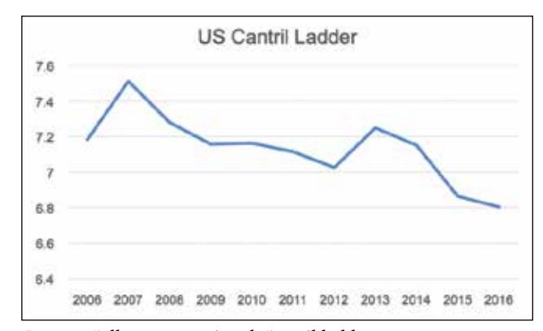

Source: Gallup International Cantril ladder

well-being using six underlying variables: log income per capita (lgdp), healthy life expectancy (hle), social support (ssup), freedom to make life choices (freedom), generosity of donations (donation), and perceived corruption of government and business (corruption). Of these sources, two involve personal material conditions (lgdp, hle); one focuses on individual values (donation); and two involve social capital (ssup, corruption). The last, freedom, should be interpreted as a combination of individual factors (wealth, skills) and social factors (democracy, civil rights, and social rights).

As noted, the observed decline in the Cantril ladder between 2006/7 and 2015/6 is 0.51. In Table 7.1, we decompose this decline according to the six factors. While two of the explanatory variables moved in the direction of greater U.S. happiness (lgdp, hle), the four social variables (ssup, freedom, donation, corruption) all

**Table 7.1. Accounting for the Change in US Happiness, 2006/7 to 2015/6**

|                      | GDP   | ladder | freedom | supp  | lgdp  | corrupt | hle   | donation |
|----------------------|-------|--------|---------|-------|-------|---------|-------|----------|
| United States 2006/7 | 50805 | 7.35   | 0.89    | 0.96  | 10.84 | 0.62    | 68.97 | 0.18     |
| United States 2015/6 | 52819 | 6.83   | 0.80    | 0.90  | 10.87 | 0.72    | 70.08 | 0.17     |
| Change               | 2013  | -0.51  | -0.09   | -0.06 | 0.04  | 0.10    | 1.11  | -0.01    |
| Effect on Happiness  |       |        | -0.10   | -0.15 | 0.01  | -0.05   | 0.03  | -0.01    |

Source: Decomposition based on the global explanatory equation shown in Table 2.1. GDP levels are in PPP 2011 constant dollars. Data details can be found in the Statistical Appendix for Chapter 2.

**Table 7.2. Comparison of the US and the Nordic Countries in 2016**

| COUNTRY          | GDP   | LADDER | FREEDOM | SUPP | LGDP  | CORRUPT | HLE   | DONATION |   |
|------------------|-------|--------|---------|------|-------|---------|-------|----------|---|
| Finland          | 38901 | 7.66   | 0.95    | 0.95 | 10.57 | 0.25    | 71.38 | -0.04    |   |
| Norway           | 64124 | 7.60   | 0.95    | 0.96 | 11.07 | 0.41    | 70.78 | 0.11     |   |
| Denmark          | 43613 | 7.56   | 0.95    | 0.95 | 10.68 | 0.21    | 70.92 | 0.13     |   |
| Iceland          | 43872 | 7.51   | 0.95    | 0.98 | 10.69 | 0.72    | 72.05 | 0.27     |   |
| Sweden           | 46365 | 7.37   | 0.92    | 0.91 | 10.74 | 0.25    | 71.96 | 0.13     |   |
| Nordic Average   | 47375 | 7.54   | 0.94    | 0.95 | 10.75 | 0.37    | 71.42 | 0.12     |   |
| United States    | 53088 | 6.80   | 0.76    | 0.90 | 10.88 | 0.74    | 70.13 | 0.13     |   |
| DELTA            | -5713 | 0.73   | 0.19    | 0.06 | -0.13 | -0.37   | 1.29  | -0.01    |   |
| Happiness Effect |       |        | 0.20    | 0.13 | -0.04 | 0.20    | 0.04  | -0.01    | 0 |

Note: All data definitions can be found in the Statistical Appendix for Chapter 2.

deteriorated—US showed less social support, less sense of personal freedom, lower donations, and more perceived corruption of government and business. Applying the coefficients from the regression model in Table 2.1 in Chapter 2, the six factors account for a net decline of 0.27 (with an unexplained residual of another 0.24 points of decline).

America's crisis is, in short, a social crisis, not an economic crisis.

This America social crisis is widely noted, but it has not translated into public policy. Almost all of the policy discourse in Washington DC centers on naïve attempts to raise the economic growth rate, as if a higher growth rate would somehow heal the deepening divisions and angst in American society. This kind of growth-only agenda is doubly wrong-headed. First, most of the pseudo-elixirs for growth especially the Republican Party's beloved nostrum of endless tax cuts and voodoo economics will only exacerbate America's social inequalities and feed the distrust that is already tearing society apart. Second, a forthright attack on the real sources of social crisis would have a much larger and more rapid beneficial effect on U.S. happiness.

We can see this in the following thought experiment. Suppose that the U.S. were to return to the 2006/7 baselines for the social variables. This

would boost happiness substantially. We can then calculate the equivalent rise in U.S. GDP that would lead to the same increase in happiness as an improvement in social conditions. It becomes immediately clear that restoring social conditions would be the faster and more reliable way to achieve the same gain in happiness.

Consider the corruption variable, for example. The U.S. corruption index rose by 0.10 between 2006/7 and 2015/6. With a coefficient -0.53 in the happiness regression, the negative effect on U.S. happiness is 0.054. Reversing the rise in perceived corruption would therefore raise happiness by 0.054. To achieve the *same gain in happiness* through higher income growth would require a rise in lgdp equal to 0.054/0.341, which translates into a rise in the level of GDP from roughly \$53,000 to \$62,000.

The needed rise in income to offset the recent decline in America's social support networks would be even greater. The decline in social support measured 0.064, with a coefficient on happiness of 2.332. This implies a loss of happiness of 0.15 points on the Cantril ladder. To offset this loss, lgdp would need to rise by 0.15/0.341, which translates into a rise in GDP from \$53,000 to \$82,000. Such an increase in GDP would take decades to achieve, while an improvement in social conditions that reverts back to the social conditions of 2006 would presumably be much faster. Strangely, however,

181

**Figure 7.2. Decline of Generalized Trust**

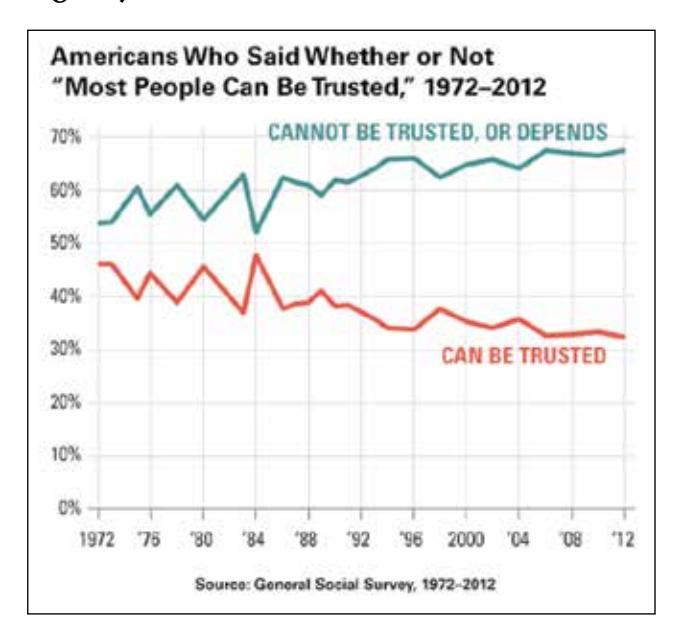

these sociological variables are nowhere to be seen in the U.S. political debate.

Putting this all together: The combined effect of the four social variables (ssup, freedom, donation, corruption) is a reduction of happiness of 0.31 points, implying that lgdp would have to increase by 0.314/.341, or GDP would have to raise from \$53,000 to around \$133,000 to offset the combined deterioration of social capital.

There is another way to view the ramifications for happiness of America's social crisis. Consider the five Nordic countries (Denmark, Finland, Iceland, Norway, and Sweden), all of which score far higher than the U.S. in happiness. If we compare the US with a simple average score across the Nordic countries in 2016, shown in Table 7.2, we can see that the Nordic countries are 0.73 points higher on the Cantril ladder, even though the U.S. has a higher GDP per capita around \$53,000 compared with \$47,000 in terms of PPP constant 2011 international dollars. The explanation is that the Nordic countries far outpace the U.S. on personal freedom, social support, and lower corruption, thereby accounting for the higher levels of Nordic happiness.

**Figure 7.3. Decline in US Trust in Government**

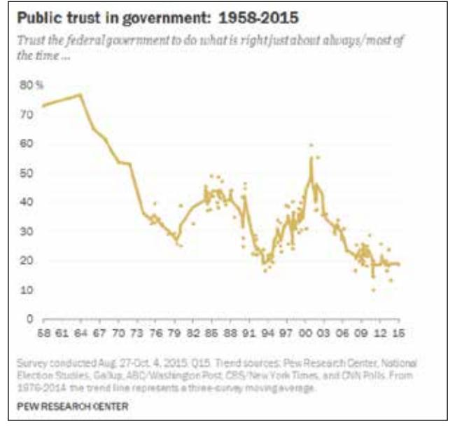

**Figure 7.4. The Rise of Inequality in the United States, 1962-2014**

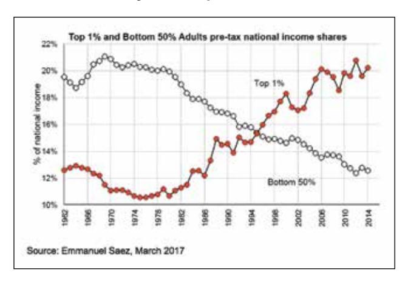

It is of course well-known that social capital in the United States has been in decline for several decades now. Robert Putnam's1 pioneering research played a major role in opening the eyes of Americans to the fraying of social ties. In recent years, the evidence of social crises has become overwhelming, across every aspect of social life. A small group at the top of the income distribution has continued to make striking gains in wealth and income, while the rest of society has faced economic stagnation or decline, worsening public health indicators including

rising rates of drug addiction and suicide, and declining social trust.

To spell this out: Generalized trust among Americans has been falling for decades, as illustrated in Figure 7.2. Trust in government has plummeted to the lowest level in modern history, as seen in Figure 7.3, consistent with the rise in the perception of corruption (see also Dalton, 2017). Income inequality has reached astronomical levels, with the top 1 percent of American households taking home almost all of the gains in economic growth in recent decades, while the share of the bottom 50% plummets, as shown in Figure 7.4. The top 1 percent of households now claims around 23 percent of income, roughly equal to the share of the bottom 70 percent.

At the same time, the extent of pro-social behavior among Americans seems to be on the decline. In one well-known experiment, stamped and addressed envelopes were dropped in public areas (sidewalks, shopping malls, phone booths), to see whether people pick them up and put them in a mailbox. This is a measure of helping behavior among strangers. A recent study2 showed that the extent of helping behavior by U.S. residents declined sharply between 2001 and 2011, but this was not true for Canadian residents.

Another very stark indicator of social collapse is the startling finding that mortality rates rose between 1999 and 2013 for white, non-Hispanics aged 45-54.3 For women, the rise in the age-specific mortality rate is observed over the entire interval, while for men, the rise in the morality rate between 1999 and 2005 was mostly reversed during 2005-2013. This trend stands in sharp contrast to the experience of Western Europe and Canada, where mortality rates continue to fall. What makes the United States case so disturbing and revealing is that it is clearly a social crisis as much as a health crisis—the increased mortality rates are accounted for

mainly by drug and alcohol poisoning, suicide, and chronic liver disease and cirrhosis. There are several factors at work in this interconnected destruction of social capital, and their relative importance has not been determined with any precision or consensus. I would point to five.

The first is the rise of mega-dollars in U.S. politics. A typical federal election cycle now involves at least \$7 billion in campaign financing, and billions of dollars more in corporate lobbying outlays that are indirect forms of campaign financing. Because of profoundly damaging Supreme Court decisions, most especially Citizens United, billionaires and large corporations are able to make enormous and essentially untraceable campaign contributions to candidates. There is a strong and correct feeling among Americans that the government does not serve their interest, but rather the interest of powerful lobbies, wealthy Americans, and of course, the politicians themselves. Political scientists such as Martin Gilens have shown that only rich Americans have real input into political decision making.

The second, and closely related, factor is the soaring income and wealth inequality. Since the 1980s, America has been in a new gilded age, with tax cuts for the rich, special privileges for the wealthy to hide income in offshore tax havens, the destruction of union power, financial deregulation, and other steps to shift national income to the very top of the income distribution. It has worked better and longer than could have been imagined. Of course, the big money in politics keeps the political direction towards further tax cuts and benefits for the super-rich.

The third factor is the decline in social trust related to the post-1965 surge in immigration to the United States, especially the rise of the Hispanic population. Putnam4 reported that communities with higher ethnic diversity also have lower measures of social trust.5 This finding seems true for the United States, but not

consistently so for other countries (such as Canada). Some sociologists suggest that the U.S. high ethnic diversity is also characterized by considerable economic and ethnic segregation, so that the potential for inter-group contact to diminish distrust is not as operative in the United States as in other countries: "American exceptionalism may be linked to relatively high levels of heterogeneity combined with the pronounced segregation of cities in the United States compared with other Western countries … and the persistence of ethnic inqualities."6

The fourth factor relates to the aftermath of 9/11. America's reaction to these unprecedented terrorist attacks was to stoke fear rather than appeal to social solidarity. The U.S. government launched an open-ended global war on terror, appealing to the darkest side of human nature by invoking a stark "us versus them" dualism, and terrifying American citizens through the government's projections of fear. Since then, the United States has been involved in non-stop war—in Afghanistan, Iraq, Libya, Syria, and Yemen among others—and Americans are subject to daily indignities of searches, frisking, body pat downs, orders barked at airports, and terrorist alerts. In the meantime, the U.S. government has repeatedly misled its own citizens about the scope of its activities, whom it is spying on, and where it is fighting.

The fifth and final factor that I would raise is the severe deterioration of America's educational system. On the demand side, the market premium for a college degree has continued to rise in the United States, reflecting the fact that new technologies demand better technical skills. Yet on the supply side, the share of young Americans completing a bachelor's degree or higher is essentially stagnant at around 36 percent. College tuition has soared and student aid has been pared back dramatically. The result is a \$1 trillion mountain of student debt and a generation of young people with half-finished bachelor's degrees facing a precarious future.

This matters because the failure of America to educate its young people is a major force behind the rise in income inequality (condemning those with less than a bachelors degree to stagnant or falling incomes) and, it appears, to the fall of social capital as well. The US political divide is increasingly a divide between those with a college degree and those without. This is reflected in the recent presidential election. According to exit polling, college graduates backed Hillary Clinton by a margin of 52-43, while those without a college degree backed Trump by 52-44. If U.S. states are ranked according to the share of 25-29 year olds with a bachelor's degree or higher, Clinton won 17 of the top 18 states, while Trump won 29 of the bottom 32 states. The deep social and economic divisions according to educational attainment seem to be similar to the dynamics of the Brexit vote and other anti-migrant parties in Europe, which find their base among voters with lower educational attainment.

In sum, the United States offers a vivid portrait of a country that is looking for happiness "in all the wrong places." The country is mired in a roiling social crisis that is getting worse. Yet the dominant political discourse is all about raising the rate of economic growth. And the prescriptions for faster growth—mainly deregulation and tax cuts—are likely to exacerbate, not reduce social tensions. Almost surely, further tax cuts will increase inequality, social tensions, and the social and economic divide between those with a college degree and those without.

To escape this social quagmire, America's happiness agenda should center on rebuilding social capital. This will require a keen focus on the five main factors that have contributed to falling social trust and confidence in government. The first priority should be campaign finance reform, especially to undo the terrible damage caused by the Citizens United decision. The second should be a set of policies aiming at reducing income and wealth inequality. This would include an expanded social safety net, wealth taxes, and greater public financing of

health and education. The third should be to improve the social relations between the native-born and immigrant populations. Canada has demonstrated a considerable success with multiculturalism; the United States has not tried very hard. The fourth is to acknowledge and move past the fear created by 9/11 and its memory. The US remains traumatized to this day; Trump's ban on travel to the United States from certain Muslim-majority countries is a continuing manifestation of the exaggerated and irrational fears that grip the nation. The fifth priority, I believe, should be on improved educational quality, access, and attainment. America has lost the edge in educating its citizens for the 21st century; that fact alone ensures a social crisis that will continue to threaten well-being until the commitment to quality education for all is once again a central tenet of American society.

- 1 See Putnam (2000).
- 2 See Hampton (2016).
- 3 See Case & Deaton (2015).
- 4 See Putnam (2007).
- 5 It is sometimes suggested that the degree of ethnic diversity is the single most powerful explanation of high or low social trust. It is widely believed that Scandinavia's high social trust and happiness are a direct reflection of their high ethnic homogeneity, while America's low and declining social trust is a reflection of America's high and rising ethnic diversity. The evidence suggests that such "ethnic determinism" is misplaced. As Bo Rothstein has cogently written about Scandinavia, the high social trust was far from automatically linked with ethnic homogeneity. It was achieved through a century of active social democratic policies that broke down class barriers and distrust (see Rothstein and Stolle, 2003). Social democracy was buttressed by a long tradition and faith in the quality of government even before the arrival of democracy itself in Scandinavia. Moreover, highly diverse societies, such as Canada, have been able to achieve relatively high levels of social trust through programs aimed at promoting multiculturalism and inter-ethnic understanding.

#### References

Case, A., & Deaton, A. (2015). Rising morbidity and mortality in midlife among white non-Hispanic Americans in the 21st century. *Proceedings of the National Academy of Sciences of the United States of America (PNAS),*112(49), 15078-15083. doi:10.1073/pnas.1518393112

Dalton, R. Political Trust in North America.(2017) In *Handbook on Political Trust,* edited by Zmerli, S. and van der Meer, T. pp. 375-394. Edward Elgar Publishing

Easterlin, R. (1974). Does Economic Growth Improve The Human Lot? Some Empirical Evidence. In *Nations and and Households in Economic Growth: Essays in Hoor of Moses Abramovitz,* edited by Paul A. David and Melvin Warren Reder, 89-125. New York: Academic Press

Easterlin, R. (2016). Paradox Lost? USC Dornsife Institute for New Economic Thinking, Working Paper No. 16-02

Hampton, K. N. (2016). Why is Helping Behavior Declining in the United States But Not in Canada?: Ethnic Diversity, New Technologies, and Other Explanations. *City & Community,* 15(4), 380-399. doi:10.1111/cico.12206

Putnam, R. D. (2000). Bowling alone: America's declining social capital. In *Culture and politics* (pp. 223-234). Palgrave Macmillan US.

Putnam, R.D. (2007). *E Pluribus Unam:* Diversity and Community in the Twenty-first Century. *Scandinavian Political Studies,* Vol. 30, No. 2, 137-174

Rothstein, B. and Stolle, D. (2003). Introduction: Social Capital in Scandinavia. *Scandinavian Political Studies,* Vol. 26, No. 1, 2003

Van der Meer, T. and Tolsma, J. (2014). Ethnic Diversity and its Effects on Social Cohesion. *Annual Review of Sociology,* 2014, 40: 459-478

This publication may be reproduced using the following reference: Helliwell, J., Layard, R., & Sachs, J. (2017). *World Happiness Report 2017,* New York: Sustainable Development Solutions Network.

World Happiness Report management by Sharon Paculor, copy edit by Louise Doucette, Mariam Gulaid, and Saloni Jain. Design by John Stislow and Stephanie Stislow.

Full text and supporting documentation can be downloaded from the website:

#### SDSN

### WORLD HAPPINESS REPORT 2017

