John F. Helliwell, Richard Layard and Jeffrey D. Sachs

## Table of Contents

# World Happiness Report 2018

Editors: John F. Helliwell, Richard Layard, and Jeffrey D. Sachs Associate Editors: Jan-Emmanuel De Neve, Haifang Huang and Shun Wang

| 1 | Happiness and Migration: An Overview 3 John F. Helliwell, Richard Layard and Jeffrey D. Sachs                                                                  |
|---|----------------------------------------------------------------------------------------------------------------------------------------------------------------------|
| 2 | International Migration and World Happiness 13 John F. Helliwell, Haifang Huang, Shun Wang and Hugh Shiplett                                                      |
| 3 | Do International Migrants Increase Their Happiness and That of Their Families by Migrating? 45 Martijn Hendriks, Martijn J. Burger, Julie Ray and Neli Esipova |
| 4 | Rural-Urban Migration and Happiness in China 67 John Knight and Ramani Gunatilaka                                                                              |
| 5 | Happiness and International Migration in Latin America 89 Carol Graham and Milena Nikolova                                                                  |
| 6 | Happiness in Latin America Has Social Foundations 115 Mariano Rojas                                                                                               |
| 7 | America's Health Crisis and the Easterlin Paradox 146 Jeffrey D. Sachs                                                                                         |
|   | Annex: Migrant Acceptance Index: Do Migrants Have Better Lives in Countries That Accept Them? 160 Neli Esipova, Julie Ray, John Fleming and Anita Pugliese  |

The World Happiness Report was written by a group of independent experts acting in their personal capacities. Any views expressed in this report do not necessarily reflect the views of any organization, agency or programme of the United Nations.

## Chapter 1 **3**

# Happiness and Migration: An Overview

John F. Helliwell, Vancouver School of Economics at the University of British Columbia, and Canadian Institute for Advanced Research

Richard Layard, Wellbeing Programme, Centre for Economic Performance, at the London School of Economics and Political Science

Jeffrey D. Sachs, Director, SDSN, and Director, Center for Sustainable Development, Columbia University

The authors are grateful to the Ernesto Illy Foundation and the Canadian Institute for Advanced Research for research support, and to Gallup for data access and assistance. The authors are also grateful for helpful advice and comments from Claire Bulger, Jan-Emmanuel De Neve, Neli Esipova, Carol Graham, Jon Hall, Martijn Hendriks, Haifang Huang, Marie McAuliffe, Julie Ray, Martin Ruhs, and Shun Wang.

**Increasingly,** with globalisation, the people of the world are on the move; and most of these migrants are seeking a happier life. But do they achieve it? That is the central issue considered in this 2018 World Happiness Report.

But what if they do? The migrants are not the only people affected by their decision to move. Two other major groups of people are affected by migration:

- those left behind in the area of origin, and
- those already living in the area of destination.

This chapter assesses the happiness consequences of migration for all three groups. We shall do this separately, first for rural-urban migration within countries, and then for international migration.

### **Rural-Urban Migration**

Rural-urban migration within countries has been far larger than international migration, and remains so, especially in the developing world. There has been, since the Neolithic agricultural revolution, a net movement of people from the countryside to the towns. In bad times this trend gets partially reversed. But in modern times it has hugely accelerated. The timing has differed in the various parts of the world, with the biggest movements linked to boosts in agricultural productivity combined with opportunities for employment elsewhere, most frequently in an urban setting. It has been a major engine of economic growth, transferring people from lower productivity agriculture to higher productivity activities in towns.

In some industrial countries this process has gone on for two hundred years, and in recent times rural-urban migration within countries has been slowing down. But elsewhere, in poorer countries like China, the recent transformation from rural to urban living has been dramatic enough to be called "the greatest mass migration in human history". Over the years 1990-2015 the Chinese urban population has grown by 463 million, of whom roughly half are migrants from villages to towns and cities.1 By contrast, over the same period the increase in the number of international migrants in the entire world has been 90 million, less than half as many as rural to urban migrants in China alone. Thus internal migration is an order of magnitude larger than

international migration. But it has received less attention from students of wellbeing – even though both types of migration raise similar issues for the migrants, for those left behind, and for the populations receiving the migrants.

The shift to the towns is most easily seen by looking at the growth of urban population in developing countries (see Table 1.1). Between 1990 and 2015 the fraction of people in these countries who live in towns rose from 30% to nearly 50%, and the numbers living in towns increased by over 1,500 million people. A part of this came from natural population growth within towns or from villages becoming towns. But at least half of it came from net migration into the towns. In the more developed parts of the world there was also some rural-urban migration, but most of that had already happened before 1990.

**Table 1.1: Change in the Urban Population in Developing Countries 1990–2015**

|                                 | Change in urban population | Change in % urbanised |
|---------------------------------|----------------------------------|-----------------------------|
| China                           | + 463m                           | + 30%                       |
| Other East Asian and Pacific | + 211m                           | +11%                        |
| South Asia                      | + 293m                           | + 8%                        |
| Middle East and North Africa | + 135m                           | + 9%                        |
| Sub-Saharan Africa           | + 242m                           | + 4%                        |
| Latin America and Caribbean  | + 191m                           | + 10%                       |
| Total                           | + 1,535m                         | + 19%                       |

Source: Chapter 4.

#### **International Migration**

If rural-urban migration within countries is an age-old phenomenon, large-scale international migration has increased greatly in recent years due to globalisation (see Table 1.2). In 1990 there were in the world 153 million people living outside the country where they were born.2 By 2015 this number had risen to 244 million, of whom about 10% were refugees.3 So over the last quarter century international migrants increased by 90 million. This is a large number, even if dwarfed by the scale of rural-urban migration. In addition, on one estimate there are another 700 million people who would like to move between countries but haven't yet done so.4

**Table 1.2: Number of International Migrants**

|      | Number of migrants | Migrants as % of world population |
|------|-----------------------|--------------------------------------|
| 1970 | 85m                   | 2.3                                  |
| 1990 | 153m                  | 2.9                                  |
| 2015 | 244m                  | 3.3                                  |

Source: World Migration Report 2018

Of the increased number of recent migrants, over a half comes from migration between continents (see Table 1.3). There were big migrations into North America and Europe, fuelled by emigration from South/Central America, Asia and Africa. There were also important flows of international migrants within continent (see Table 1.4). In Asia for example there were big flows from the Indian sub-continent to the Gulf States; and in Europe there was the strong Westward flow that has followed the end of Communism.

From the point of view of the existing residents an important issue is how many immigrants there are, as a share of the total population. This requires us to look at immigrants as a fraction of the total population. At the world level this has risen by a half in recent years (see Table 1.2). But in most of the poorer and highly populous countries of the world, the proportion of migrants remains quite low. It is in some richer countries that the proportion of immigrants is very high. In Western Europe, most countries have immigrants at between 10 and 15 per cent of the population.5 The same is true of the USA; while Canada, Australia and New Zealand have between 20 and 30%. The most extreme cases are the UAE and Kuwait, both over 70%. Figure 1.1 shows the situation worldwide.

**Table 1.3: Numbers of International Migrants from a Different Continent (Millions)**

|                       |      | By destination continent | By continent of origin |      |
|-----------------------|------|--------------------------|------------------------|------|
|                       | 1990 | 2015                     | 1990                   | 2015 |
| Europe                | 20   | 35                       | 20                     | 20   |
| North America         | 24   | 50                       | 2                      | 3    |
| South/Central America | 3    | 3                        | 12                     | 30   |
| Asia                  | 10   | 12                       | 22                     | 40   |
| Africa                | 1    | 2                        | 8                      | 17   |
| Oceania               | 4    | 7                        | -                      | 1    |
| Total                 | 62   | 109                      | 64                     | 111  |

Source: World Migration Report 2018.

**Table 1.4: Numbers of International Migrants from a Different Country Within the Same Continent (Millions)**

|                       | 1990 | 2015 |
|-----------------------|------|------|
| Europe                | 28   | 40   |
| North America         | 1    | 2    |
| South/Central America | 4    | 6    |
| Asia                  | 36   | 59   |
| Africa                | 13   | 17   |
| Oceania               | 1    | 1    |
| Total                 | 83   | 125  |

Source: World Migration Report 2018

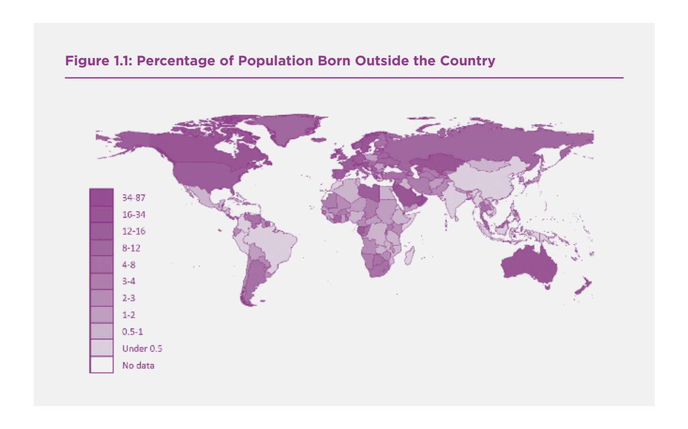

## **The Happiness of International Migrants**

As already noted, migration within and between countries has in general shifted people from less to more productive work, and from lower to higher incomes. In many cases the differences have been quite extreme. International migration has also saved many people from extremes of oppression and physical danger – some 10% of all international migrants are refugees, or 25 million people in total.

But what can be said about the happiness of international migrants after they have reached their destination? Chapter 2 of this report begins with its usual ranking and analysis of the levels and changes in the happiness of all residents, whether locally born or immigrants, based on samples of 1,000 per year, averaged for 2015-2017, for 156 countries surveyed by the Gallup World Poll. The focus is then switched to international migration, separating out immigrants to permit ranking of the average life evaluations of immigrants for the 117 countries having more than 100 foreign-born respondents between 2005 and 2017. (These foreign-born residents may include short-term guest workers, longer term immigrants, and serial migrants who shift their residency more often, at different stages of their upbringing, careers, and later lives).

So what determines the happiness of immigrants living in different countries and coming from different, other countries? Three striking facts emerge.

- 1. In the typical country, immigrants are about as happy as people born locally. (The difference is under 0.1 point out of 10). This is shown in Figure 1.2. However the figure also shows that in the happiest countries immigrants are significantly less happy than locals, while the reverse is true in the least happy countries. This is because of the second finding.
- 2. The happiness of each migrant depends not only on the happiness of locals (with a weight of roughly 0.75) but also on the level of happiness in the migrant's country of origin (with a weight of roughly 0.25). Thus if a migrant goes (like many migrants) from a less happy to a more happy country, the migrant ends up somewhat less happy than

**Figure 1.2: Average Life Evaluation of Foreign-Born and Locally-Born Adults: by Country**

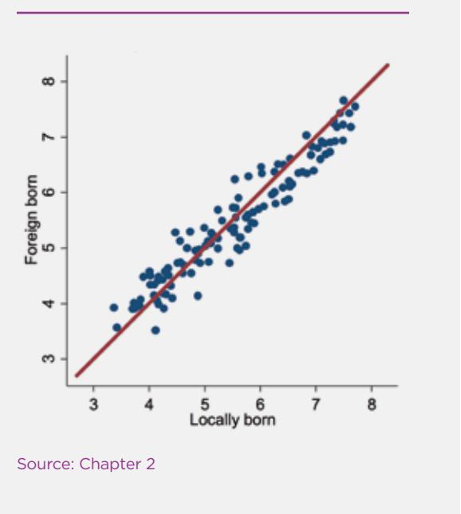

the locals. But the reverse is true if a migrant goes from a more to a less happy country. This explains the pattern shown in Figure 1.2 – and is a general (approximate) truth about all bilateral flows. Another way of describing this result is to say that on average, a migrant gains in happiness about three-quarters of the difference in average happiness between the country of origin and the destination country.

3. The happiness of immigrants also depends importantly on how accepting the locals are towards immigrants. (To measure acceptance local residents were asked whether the following were "good things" or "bad things": having immigrants in the country, having an immigrant as a neighbour, and having an immigrant marry your close relative). In a country that was more accepting (by one standard deviation) immigrants were happier by 0.1 points (on a 0 to 10 scale).

Thus the analysis in Chapter 2 argues that migrants gain on average if they move from a less happy to a more happy country (which is the main direction of migration). But that argument was based on a simple comparison of the happiness of migrants with people in the countries they have left. What if the migrants were different types of people from those left behind? Does this change the conclusion? As Chapter 3 shows, the answer is, No. In Chapter 3 the happiness of migrants is compared with individuals in their country of origin who are as closely matched to the migrants as possible and are thinking of moving. This again uses the data from the Gallup World Poll. The results from comparing the migrants with their look-a-likes who stayed at home suggests that the average international migrant gained 0.47 points (out of 10) in happiness by migration (as measured by the Cantril ladder). This is a substantial gain.

But there is an important caveat: the majority gain, but many lose. For example, in the only controlled experiment that we know of, Tongans applying to migrate to New Zealand were selected on randomised basis.6 After moving, those who had been selected to move were on average less happy than those who (forcibly) stayed behind. Migration clearly has its risks. These include separation from loved ones, discrimination in the new location, and a feeling of relative deprivation, because you now compare yourself with others who are richer than your previous reference group back home.

One obvious question is: Do migrants become happier or less happy the longer they have been in a country? The answer is on average, neither – their happiness remains flat. And in some countries (where this has been studied) there is evidence that second-generation migrants are no happier than their immigrant parents.7 One way of explaining these findings (which is developed further in Chapter 4) is in terms of reference groups: When people first move to a happier country, their reference group is still largely their country of origin. They experience an immediate gain in happiness. As time passes, their objective situation improves (which makes them still happier) but their reference group becomes increasingly the destination country (which makes them less happy). These two effects roughly offset each other. This process continues in the second generation.

The Gallup World Poll excludes many current refugees, since refugee camps are not surveyed. Only in Germany is there sufficient evidence on refugees, and in Germany refugees are 0.4 points less happy than other migrants. But before they moved, the refugees were also much less happy than the other migrants were before they moved. So refugees too are likely to have benefitted from migration.

Thus average international migration benefits the majority of migrants, but not all. Does the same finding hold for the vast of the army of people who have moved from the country to the towns within less developed countries?

### **The Happiness of Rural-Urban Migrants**

The fullest evidence on this comes from China and is presented in Chapter 4. That chapter compares the happiness of three groups of people:

- rural dwellers, who remain in the country,
- rural-urban migrants, now living in towns, and
- urban dwellers, who always lived in towns.

Migrants have roughly doubled their work income by moving from the countryside, but they are less happy than the people still living in rural areas. Chapter 4 therefore goes on to consider possible reasons for this. Could it be that many of the migrants suffer because of the remittances they send home? The evidence says, No. Could it be that the people who migrate were intrinsically less happy? The evidence says, No. Could it be that urban life is more insecure than life in the countryside – and involves fewer friends and more discrimination? Perhaps.

The biggest factor affecting the happiness of migrants is a change of reference group: the happiness equation for migrants is similar to that of urban dwellers, and different from that of rural dwellers. This could explain why migrants say they are happier as a result of moving – they would no longer appreciate the simple pleasures of rural life.

Human psychology is complicated, and behavioural economics has now documented hundreds of ways in which people mispredict the impact of decisions upon their happiness. It does not follow that we should over-regulate their lives, which would also cause unhappiness. It does follow that we should protect people after they make their decisions, by ensuring that they can make positive social connections in their new communities (hence avoiding or reducing discrimination), and that they are

helped to fulfil the dreams that led them to move in the first place.

It is unfortunate that there are not more studies of rural-urban migration in other countries. In Thailand one study finds an increase in happiness among migrants8, while in South Africa one study finds a decrease9.

### **The Happiness of Families Left Behind**

 In any case the migrants are not the only people who matter. What about the happiness of the families left behind? They frequently receive remittances (altogether some \$500 billion into 2015).10 But they lose the company and direct support of the migrant. For international migrants, we are able to examine this question in Chapter 3.

This is done by studying people in the country of origin and examining the effect of having a relative who is living abroad. On average this experience increases both life-satisfaction and positive affect. But there is also a rise in negative affect (sadness, worry, anger), especially if the migrant is abroad on temporary work. Unfortunately, there is no comparable analysis of families left behind by rural-urban migrants who move to towns and cities in the same country.

## **The Happiness of the Original Residents in the Host Country**

The final issue is how the arrival of migrants affects the existing residents in the host country or city. This is one of the most difficult issues in all social science.

One approach is simply to explain happiness in different countries by a whole host of variables including the ratio of immigrants to the locallyborn population (the "immigrant share"). This is done in Chapter 2 and shows no effect of the immigrant share on the average happiness of the locally born.11 It does however show that the locally born population (like immigrants) are happier, other things equal, if the country is more accepting of immigrants.12

Nevertheless, we know that immigration can create tensions, as shown by its high political salience in many immigrant-receiving countries, especially those on migration trails from unhappy source countries to hoped-for havens in the north.

Several factors contribute to explaining whether migration is welcomed by the local populations.13 First, scale is important. Moderate levels of immigration cause fewer problems than rapid surges.14 Second, the impact of unskilled immigration falls mainly on unskilled people in the host country, though the impact on public services is often exaggerated and the positive contribution of immigrants is often underestimated. Third, the degree of social distress caused to the existing residents depends importantly on their own frame of mind – a more open-minded attitude is better both for immigrants and for the original residents. Fourth, the attitude of immigrants is also important – if they are to find and accept opportunities to connect with the local populations, this is better for everyone. Even if such integration may initially seem difficult, in the long run it has better results – familiarity eventually breeds acceptance,15 and inter-marriage more than anything blurs the differences. The importance of attitudes is documented in the Gallup Annex on migrant acceptance, and in Chapter 2, where the migrant acceptance index is shown to increase the happiness of both sectors of the population – immigrants and the locally born.

Chapter 5 completes the set of migration chapters. It seeks to explain why so many people emigrate from Latin American countries, and also to assess the happiness consequences for those who do migrate. In Latin America, as elsewhere, those who plan to emigrate are on average less happy than others similar to themselves in income, gender and age. They are also on average wealthier – in other words they are "frustrated achievers". But those who do emigrate from Latin American countries also gain less in happiness than emigrants from some other continents. This is because, as shown in chapters 2 and 6, they come from pretty happy countries. Their choice of destination countries is also a less happy mix. This combination lessens their average gains, because of the convergence of immigrant happiness to the general happiness levels in the countries to which they move, as documented in Chapter 2. If immigrants from Latin America are compared to other migrants to the same countries, they do very well in relation both to other immigrants and to the local population. This is shown in Chapter 2 for immigration to Canada and the United Kingdom – countries with large

enough happiness surveys to permit comparison of the happiness levels of immigrants from up to 100 different source countries.

Chapter 6 completes the Latin American special package by seeking to explain the happiness bulge in Latin America. Life satisfaction in Latin America is substantially higher than would be predicted based on income, corruption, and other standard variables, including having someone to count on. Even more remarkable are the levels of positive affect, with eight of the world's top ten countries being found in Latin America. To explain these differences, Chapter 6 convincingly demonstrates the strength of family relationships in Latin America. In a nutshell, the source of the extra Latin American happiness lies in the remarkable warmth and strength of family bonds, coupled with the greater importance that Latin Americans attach to social life in general, and especially to the family. They are more satisfied with their family life and, more than elsewhere, say that one of their main goals is making their parents proud.

#### **Conclusion**

In conclusion, there are large gaps in happiness between countries, and these will continue to create major pressures to migrate. Some of those who migrate between countries will benefit and others will lose. In general, those who move to happier countries than their own will gain in happiness, while those who move to unhappier countries will tend to lose. Those left behind will not on average lose, although once again there will be gainers and losers. Immigration will continue to pose both opportunities and costs for those who move, for those who remain behind, and for natives of the immigrantreceiving countries.

Where immigrants are welcome and where they integrate well, immigration works best. A more tolerant attitude in the host country will prove best for migrants and for the original residents. But there are clearly limits to the annual flows which can be accommodated without damage to the social fabric that provides the very basis of the country's attraction to immigrants. One obvious solution, which has no upper limit, is to raise the happiness of people in the sending countries – perhaps by the traditional means of foreign aid and better access to rich-country markets, but more importantly by helping them to grow their own levels of trust, and institutions of the sort that make possible better lives in the happier countries.

To re-cap, the structure of the chapters that follow is:

Chapter 2 analyses the happiness of the total population in each country, the happiness of the immigrants there, and also the happiness of those born locally.

Chapter 3 estimates how international migrants have improved (or reduced) their happiness by moving, and how their move has affected the families left behind.

Chapter 4 analyses how rural-urban migration within a country (here China) affects the happiness of the migrants.

Chapter 5 looks at Latin America and analyses the causes and consequences of emigration.

Chapter 6 explains why people in Latin American countries are on average, other things equal, unusually happy.

In addition,

Chapter 7 uses US data set in a global context to describe some growing health risks created by human behaviour, especially obesity, substance abuse, and depression.

#### **Endnotes**

- 1 As Chapter 4 documents, in 2015 the number of rural hukou residents in towns was 225 million.
- 2 This is based on the definitions given in the sources to UN-DESA (2015) most of which are "foreign born".
- 3 See IOM (2017).
- 4 See Esipova, N., Ray, J. and Pugliese, A. (2017).
- 5 See World Migration Report 2018, Chapter 3.
- 6 See Chapter 3.
- 7 See Safi, M. (2009).
- 8 De Jong et al. (2002)
- 9 Mulcahy & Kollamparambil (2016)
- 10 Ratha et al. (2016)
- 11 In this analysis, the equation includes all the standard explanatory variables as well, making it possible to identify the causal effect of the immigrant share. (This share also of course depends on the happiness level of the country but in a much different equation). A similar approach, using individual data, is used by Akay et al (2014) comparing across German regions, and by Betz and Simpson (2013) across the countries covered by the European Social Survey. Both found effects that were positive (for only some regions in Akay et al (2014) but quantitatively tiny. Our results do not rule out the possibility of small effects of either sign.

- 12 One standard deviation raises their happiness on average by 0.15 points. This estimate comes from an equation including, also on the right-hand side, all the standard variables explaining country-happiness used in Chapter 2. This provides identification of an effect running from acceptance to happiness rather than vice versa.
- 13 See Putnam, R. D. (2007).
- 14 Another important factor is the availability of sparselypopulated space. Earlier migrations into North America and Oceania benefitted from more of this.
- 15 See for example Rao (2018).

#### **References**

Akay, A., et al. (2014). The impact of immigration on the well-being of natives. *Journal of Economic Behavior & Organization, 103*(C), 72-92.

Betz, W., & Simpson, N. (2013). The effects of international migration on the well-being of native populations in Europe. *IZA Journal of Migration, 2*(1), 1-21.

De Jong, G. F., et al. (2002). For Better, For Worse: Life Satisfaction Consequences of Migration. *International Migration Review, 36*(3), 838-863. doi: 10.1111/j.1747-7379.2002.tb00106.x

Esipova, N., Ray, J. and Pugliese, A. (2017) Number of potential migrants worldwide tops 700 million. Retrieved February 28, 2018 from http://news.gallup.com/poll/211883/ number-potential-migrants-worldwide-tops-700-million. aspx?g\_source=link\_NEWSV9&g\_medium=TOPIC&g\_ campaign=item\_&g\_content=Number%2520of%2520Potential %2520Migrants%2520Worldwide%2520 Tops%2520700%- 2520Million

IOM (2017), *World Migration Report 2018*, UN, New York.

Mulcahy, K., & Kollamparambil, U. (2016). The Impact of Rural-Urban Migration on Subjective Well-Being in South Africa. *The Journal of Development Studies, 52*(9), 1357-1371. doi: 10.1080/00220388.2016.1171844

Putnam, R. D. (2007). E Pluribus Unum: Diversity and Community in the Twenty-first Century The 2006 Johan Skytte Prize Lecture. Scandinavian Political Studies, 30(2), 137-174. doi: 10.1111/j.1467-9477.2007.00176.x

Rao, G. (2018). Familiarity Does Not Breed Contempt: Diversity, Discrimination and Generosity in Delhi Schools.

Ratha, D., et al. (2016). *Migration and remittances Factbook 2016*: World Bank Publications.

Safi, M. (2009). Immigrants' life satisfaction in Europe: Between assimilation and discrimination. *European Sociological Review, 26*(2), 159-176.

UN-DESA. (2015). *International Migrant Stock: The 2015 Revision*. Retrieved from: www.un.org/en/development/desa/ population/migration/data/estimates2/index.shtml

## Chapter 2 **13**

# International Migration and World Happiness

John F. Helliwell, Canadian Institute for Advanced Research and Vancouver School of Economics, University of British Columbia

Haifang Huang, Associate Professor, Department of Economics, University of Alberta

Shun Wang, Associate Professor, KDI School of Public Policy and Management

Hugh Shiplett, Vancouver School of Economics, University of British Columbia

The authors are grateful to the Canadian Institute for Advanced Research, the KDI School, and the Ernesto Illy Foundation for research support, and to the UK Office for National Statistics and Gallup for data access and assistance. The authors are also grateful for helpful advice and comments from Claire Bulger, Jan-Emmanuel De Neve, Neli Esipova, Carol Graham, Jon Hall, Martijn Hendriks, Richard Layard, Max Norton, Julie Ray, Mariano Rojas, and Meik Wiking.

#### **Introduction**

This is the sixth World Happiness Report. Its central purpose remains just what it was in the first Report in April 2012, to survey the science of measuring and understanding subjective well-being. In addition to presenting updated rankings and analysis of life evaluations throughout the world, each World Happiness Report has had a variety of topic chapters, often dealing with an underlying theme for the report as a whole. For the World Happiness Report 2018 our special focus is on migration. Chapter 1 sets global migration in broad context, while in this chapter we shall concentrate on life evaluations of the foreign-born populations of each country where the available samples are large enough to provide reasonable estimates. We will compare these levels with those of respondents who were born in the country where they were surveyed. Chapter 3 will then examine the evidence on specific migration flows, assessing the likely happiness consequences (as represented both by life evaluations and measures of positive and negative affect) for international migrants and those left behind in their birth countries. Chapter 4 considers internal migration in more detail, concentrating on the Chinese experience, by far the largest example of migration from the countryside to the city. Chapter 5 completes our migration package with special attention to Latin American migration.

Before presenting our evidence and rankings of immigrant happiness, we first present, as usual, the global and regional population-weighted distributions of life evaluations using the average for surveys conducted in the three years 2015-2017. This is followed by our rankings of national average life evaluations, again based on data from 2015-2017, and then an analysis of changes in life evaluations, once again for the entire resident populations of each country, from 2008-2010 to 2015-2017.

Our rankings of national average life evaluations will be accompanied by our latest attempts to show how six key variables contribute to explaining the full sample of national annual average scores over the whole period 2005-2017. These variables are GDP per capita, social support, healthy life expectancy, social freedom, generosity, and absence of corruption. Note that we do not construct our happiness measure in each country

using these six factors – the scores are instead based on individuals' own assessments of their subjective well-being. Rather, we use the variables to explain the variation of happiness across countries. We shall also show how measures of experienced well-being, especially positive emotions, supplement life circumstances in explaining higher life evaluations.

Then we turn to the main focus, which is migration and happiness. The principal results in this chapter are for the life evaluations of the foreignborn and domestically born populations of every country where there is a sufficiently large sample of the foreign-born to provide reasonable estimates. So that we may consider a sufficiently large number of countries, we do not use just the 2015-2017 data used for the main happiness rankings, but instead use all survey available since the start of the Gallup World Poll in 2005.

#### **Life Evaluations Around the World**

We first consider the population-weighted global and regional distributions of individual life evaluations, based on how respondents rate their lives. In the rest of this chapter, the Cantril ladder is the primary measure of life evaluations used, and "happiness" and "subjective well-being" are used interchangeably. All the global analysis on the levels or changes of subjective well-being refers only to life evaluations, specifically, the Cantril ladder. But in several of the subsequent chapters, parallel analysis will be done for measures of positive and negative affect, thus broadening the range of data used to assess the consequences of migration.

The various panels of Figure 2.1 contain bar charts showing for the world as a whole, and for each of 10 global regions,1 the distribution of the 2015-2017 answers to the Cantril ladder question asking respondents to value their lives today on a 0 to 10 scale, with the worst possible life as a 0 and the best possible life as a 10. It is important to consider not just average happiness in a community or country, but also how it is distributed. Most studies of inequality have focused on inequality in the distribution of income and wealth,2 while in Chapter 2 of World Happiness Report 2016 Update we argued that just as income is too limited an indicator for the overall quality of life, income inequality is too

limited a measure of overall inequality.3 For example, inequalities in the distribution of health care4 and education5 have effects on life satisfaction above and beyond those flowing through their effects on income. We showed there, and have verified in fresh estimates for this report,6 that the effects of happiness equality are often larger and more systematic than those of income inequality. Figure 2.1 shows that wellbeing inequality is least in Western Europe, Northern America and Oceania, and South Asia; and greatest in Latin America, sub-Saharan Africa, and the Middle East and North Africa.

In Table 2.1 we present our latest modeling of national average life evaluations and measures of positive and negative affect (emotion) by country and year.7 For ease of comparison, the table has the same basic structure as Table 2.1 in World Happiness Report 2017. The major difference comes from the inclusion of data for 2017, thereby increasing by about 150 (or 12%) the number of country-year observations. The resulting changes to the estimated equation are very slight.8 There are four equations in Table 2.1. The first equation provides the basis for constructing the sub-bars shown in Figure 2.2.

The results in the first column of Table 2.1 explain national average life evaluations in terms of six key variables: GDP per capita, social support, healthy life expectancy, freedom to make life choices, generosity, and freedom from corruption.9 Taken together, these six variables explain almost three-quarters of the variation in national annual average ladder scores among countries, using data from the years 2005 to 2017. The model's predictive power is little changed if the year fixed effects in the model are removed, falling from 74.2% to 73.5% in terms of the adjusted R-squared.

The second and third columns of Table 2.1 use the same six variables to estimate equations for national averages of positive and negative affect, where both are based on answers about yesterday's emotional experiences (see Technical Box 1 for how the affect measures are constructed). In general, the emotional measures, and especially negative emotions, are differently, and much less fully, explained by the six variables than are life evaluations. Per-capita income and healthy life expectancy have significant effects on life evaluations, but not, in these national average

data, on either positive or negative affect. The situation changes when we consider social variables. Bearing in mind that positive and negative affect are measured on a 0 to 1 scale, while life evaluations are on a 0 to 10 scale, social support can be seen to have similar proportionate effects on positive and negative emotions as on life evaluations. Freedom and generosity have even larger influences on positive affect than on the ladder. Negative affect is significantly reduced by social support, freedom, and absence of corruption.

In the fourth column we re-estimate the life evaluation equation from column 1, adding both positive and negative affect to partially implement the Aristotelian presumption that sustained positive emotions are important supports for a good life.10 The most striking feature is the extent to which the results buttress a finding in psychology that the existence of positive emotions matters much more than the absence of negative ones.11 Positive affect has a large and highly significant impact in the final equation of Table 2.1, while negative affect has none.

As for the coefficients on the other variables in the final equation, the changes are material only on those variables – especially freedom and generosity – that have the largest impacts on positive affect. Thus we infer that positive emotions play a strong role in support of life evaluations, and that most of the impact of freedom and generosity on life evaluations is mediated by their influence on positive emotions. That is, freedom and generosity have large impacts on positive affect, which in turn has a major impact on life evaluations. The Gallup World Poll does not have a widely available measure of life purpose to test whether it too would play a strong role in support of high life evaluations. However, newly available data from the large samples of UK data does suggest that life purpose plays a strongly supportive role, independent of the roles of life circumstances and positive emotions.

Mean = 5.264 SD = 2.298 **World** Mean = 6.958 SD = 1.905 **Northern America & ANZ** Mean = 5.848 SD = 2.053 **Central and Eastern Europe** Mean = 6.193 SD = 2.448 **Latin America & Caribbean** Mean = 6.635 SD = 1.813 **Western Europe** Mean = 5.280 SD = 2.276 **Southeast Asia** Mean = 5.343 SD = 2.106 **East Asia** Mean = 5.460 SD = 2.178 **Commonwealth of Independent States** Mean = 4.355 SD = 1.934 **South Asia** Mean = 4.425 SD = 2.476 **Sub-Saharan Africa** Mean = 5.003 SD = 2.470 **Middle East & North Africa** 0 1 2 3 4 5 6 7 8 9 10 0 1 2 3 4 5 6 7 8 9 10 0 1 2 3 4 5 6 7 8 9 10 0 1 2 3 4 5 6 7 8 9 10 0 1 2 3 4 5 6 7 8 9 10 0 1 2 3 4 5 6 7 8 9 10 0 1 2 3 4 5 6 7 8 9 10 0 1 2 3 4 5 6 7 8 9 10 0 1 2 3 4 5 6 7 8 9 10 0 1 2 3 4 5 6 7 8 9 10 0 1 2 3 4 5 6 7 8 9 10

**Figure 2.1: Population-Weighted Distributions of Happiness, 2015–2017**

**Table 2.1: Regressions to Explain Average Happiness Across Countries (Pooled OLS)**

|                                  | Dependent Variable |                 |                 |                |  |  |  |
|----------------------------------|--------------------|-----------------|-----------------|----------------|--|--|--|
| Independent Variable             | Cantril Ladder     | Positive Affect | Negative Affect | Cantril Ladder |  |  |  |
| Log GDP per capita               | 0.311              | 003             | 0.011           | 0.316          |  |  |  |
|                                  | (0.064)***         | (0.009)         | (0.009)         | (0.063)***     |  |  |  |
| Social support                   | 2.447              | 0.26            | 289             | 1.933          |  |  |  |
|                                  | (0.39)***          | (0.049)***      | (0.051)***      | (0.395)***     |  |  |  |
| Healthy life expectancy at birth | 0.032              | 0.0002          | 0.001           | 0.031          |  |  |  |
|                                  | (0.009)***         | (0.001)         | (0.001)         | (0.009)***     |  |  |  |
| Freedom to make life choices     | 1.189              | 0.343           | 071             | 0.451          |  |  |  |
|                                  | (0.302)***         | (0.038)***      | (0.042)*        | (0.29)         |  |  |  |
| Generosity                       | 0.644              | 0.145           | 0.001           | 0.323          |  |  |  |
|                                  | (0.274)**          | (0.03)***       | (0.028)         | (0.272)        |  |  |  |
| Perceptions of corruption        | 542                | 0.03            | 0.098           | 626            |  |  |  |
|                                  | (0.284)*           | (0.027)         | (0.025)***      | (0.271)**      |  |  |  |
| Positive affect                  |                    |                 |                 | 2.211          |  |  |  |
|                                  |                    |                 |                 | (0.396)***     |  |  |  |
| Negative affect                  |                    |                 |                 | 0.204          |  |  |  |
|                                  |                    |                 |                 | (0.442)        |  |  |  |
| Year fixed effects               | Included           | Included        | Included        | Included       |  |  |  |
| Number of countries              | 157                | 157             | 157             | 157            |  |  |  |
| Number of obs.                   | 1394               | 1391            | 1393            | 1390           |  |  |  |
| Adjusted R-squared               | 0.742              | 0.48            | 0.251           | 0.764          |  |  |  |

Notes: This is a pooled OLS regression for a tattered panel explaining annual national average Cantril ladder responses from all available surveys from 2005 to 2017. See Technical Box 1 for detailed information about each of the predictors. Coefficients are reported with robust standard errors clustered by country in parentheses. \*\*\*, \*\*, and \* indicate significance at the 1, 5 and 10 percent levels respectively.

#### **Technical Box 1: Detailed Information About Each of the Predictors in Table 2.1**

- 1. GDP per capita is in terms of Purchasing Power Parity (PPP) adjusted to constant 2011 international dollars, taken from the World Development Indicators (WDI) released by the World Bank in September 2017. See Appendix 1 for more details. GDP data for 2017 are not yet available, so we extend the GDP time series from 2016 to 2017 using country-specific forecasts of real GDP growth from the OECD Economic Outlook No. 102 (Edition November 2017) and the World Bank's Global Economic Prospects (Last Updated: 06/04/2017), after adjustment for population growth. The equation uses the natural log of GDP per capita, as this form fits the data significantly better than GDP per capita.
- 2. The time series of healthy life expectancy at birth are constructed based on data from the World Health Organization (WHO) and WDI. WHO publishes the data on healthy life expectancy for the year 2012. The time series of life expectancies, with no adjustment for health, are available in WDI. We adopt the following strategy to construct the time series of healthy life expectancy at birth: first we generate the ratios of healthy life expectancy to life expectancy in 2012 for countries with both data. We then apply the country-specific ratios to other years to generate the healthy life expectancy data. See Appendix 1 for more details.

- 3. Social support is the national average of the binary responses (either 0 or 1) to the Gallup World Poll (GWP) question "If you were in trouble, do you have relatives or friends you can count on to help you whenever you need them, or not?"
- 4. Freedom to make life choices is the national average of binary responses to the GWP question "Are you satisfied or dissatisfied with your freedom to choose what you do with your life?"
- 5. Generosity is the residual of regressing the national average of GWP responses to the question "Have you donated money to a charity in the past month?" on GDP per capita.
- 6. Perceptions of corruption are the average of binary answers to two GWP questions: "Is corruption widespread throughout the government or not?" and "Is corruption widespread within businesses or not?" Where data for government corruption are missing, the perception of business corruption is used as the overall corruption-perception measure.
- 7. Positive affect is defined as the average of previous-day affect measures for happiness, laughter, and enjoyment for GWP waves 3-7 (years 2008 to 2012, and some in 2013). It is defined as the average of laughter and enjoyment for other waves where the happiness question was not asked.
- 8. Negative affect is defined as the average of previous-day affect measures for worry, sadness, and anger for all waves. See Statistical Appendix 1 for more details.

### **Ranking of Happiness by Country**

Figure 2.2 (below) shows the average ladder score (the average answer to the Cantril ladder question, asking people to evaluate the quality of their current lives on a scale of 0 to 10) for each country, averaged over the years 2015-2017. Not every country has surveys in every year; the total sample sizes are reported in the statistical appendix, and are reflected in Figure 2.2 by the horizontal lines showing the 95% confidence regions. The confidence regions are tighter for countries with larger samples. To increase the number of countries ranked, we also include four that had no 2015-2017 surveys, but did have one in 2014. This brings the number of countries shown in Figure 2.2 to 156.

The overall length of each country bar represents the average ladder score, which is also shown in numerals. The rankings in Figure 2.2 depend only on the average Cantril ladder scores reported by the respondents.

Each of these bars is divided into seven segments, showing our research efforts to find possible sources for the ladder levels. The first six sub-bars show how much each of the six key variables is calculated to contribute to that country's ladder score, relative to that in a hypothetical country called Dystopia, so named because it has values equal to the world's lowest national averages for 2015-2017 for each of the six key variables used in Table 2.1. We use Dystopia as a benchmark against which to compare each other country's performance in terms of each of the six factors. This choice of benchmark permits every real country to have a non-negative contribution from each of the six factors. We calculate, based on the estimates in the first column of Table 2.1, that Dystopia had a 2015- 2017 ladder score equal to 1.92 on the 0 to 10 scale. The final sub-bar is the sum of two components: the calculated average 2015-2017 life evaluation in Dystopia (=1.92) and each country's own prediction error, which measures the extent to which life evaluations are higher or lower than predicted by our equation in the first column of Table 2.1. These residuals are as likely to be negative as positive.12

It might help to show in more detail how we calculate each factor's contribution to average life evaluations. Taking the example of healthy life expectancy, the sub-bar in the case of Tanzania

is equal to the number of years by which healthy life expectancy in Tanzania exceeds the world's lowest value, multiplied by the Table 2.1 coefficient for the influence of healthy life expectancy on life evaluations. The width of these different sub-bars then shows, country-by-country, how much each of the six variables is estimated to contribute to explaining the international ladder differences. These calculations are illustrative rather than conclusive, for several reasons. First, the selection of candidate variables is restricted by what is available for all these countries. Traditional variables like GDP per capita and healthy life expectancy are widely available. But measures of the quality of the social context, which have been shown in experiments and national surveys to have strong links to life evaluations and emotions, have not been sufficiently surveyed in the Gallup or other global polls, or otherwise measured in statistics available for all countries. Even with this limited choice, we find that four variables covering different aspects of the social and institutional context – having someone to count on, generosity, freedom to make life choices and absence of corruption – are together responsible for more than half of the average difference between each country's predicted ladder score and that in Dystopia in the 2015-2017 period. As shown in Table 19 of Statistical Appendix 1, the average country has a 2015-2017 ladder score that is 3.45 points above the Dystopia ladder score of 1.92. Of the 3.45 points, the largest single part (35%) comes from social support, followed by GDP per capita (26%) and healthy life expectancy (17%), and then freedom (13%), generosity (5%), and corruption (3%).13

Our limited choice means that the variables we use may be taking credit properly due to other better variables, or to other unmeasured factors. There are also likely to be vicious or virtuous circles, with two-way linkages among the variables. For example, there is much evidence that those who have happier lives are likely to live longer, be more trusting, be more cooperative, and be generally better able to meet life's demands.14 This will feed back to improve health, GDP, generosity, corruption, and sense of freedom. Finally, some of the variables are derived from the same respondents as the life evaluations and hence possibly determined by common factors. This risk is less using national averages, because

individual differences in personality and many life circumstances tend to average out at the national level.

To provide more assurance that our results are not seriously biased because we are using the same respondents to report life evaluations, social support, freedom, generosity, and corruption, we tested the robustness of our procedure (see Statistical Appendix 1 for more detail) by splitting each country's respondents randomly into two groups, and using the average values for one group for social support, freedom, generosity, and absence of corruption in the equations to explain average life evaluations in the other half of the sample. The coefficients on each of the four variables fall, just as we would expect. But the changes are reassuringly small (ranging from 1% to 5%) and are far from being statistically significant.15

The seventh and final segment is the sum of two components. The first component is a fixed number representing our calculation of the 2015-2017 ladder score for Dystopia (=1.92). The second component is the 2015-2017 residual for each country. The sum of these two components comprises the right-hand sub-bar for each country; it varies from one country to the next because some countries have life evaluations above their predicted values, and others lower. The residual simply represents that part of the national average ladder score that is not explained by our model; with the residual included, the sum of all the sub-bars adds up to the actual average life evaluations on which the rankings are based.

What do the latest data show for the 2015-2017 country rankings? Two features carry over from previous editions of the World Happiness Report. First, there is a lot of year-to-year consistency in the way people rate their lives in different countries. Thus there remains a four-point gap between the 10 top-ranked and the 10 bottom-ranked countries. The top 10 countries in Figure 2.2 are the same countries that were top-ranked in World Happiness Report 2017, although there has been some swapping of places, as is to be expected among countries so closely grouped in average scores. The top five countries are the same ones that held the top five positions in World Happiness Report 2017, but Finland has vaulted from 5th place to the top of the rankings this year.

Although four places may seem a big jump, all the top five countries last year were within the same statistical confidence band, as they are again this year. Norway is now in 2nd place, followed by Denmark, Iceland and Switzerland in 3rd, 4th and 5th places. The Netherlands, Canada and New Zealand are 6th, 7th and 8th, just as they were last year, while Australia and Sweden have swapped positions since last year, with Sweden now in 9th and Australia in 10th position. In Figure 2.2, the average ladder score differs only by 0.15 between the 1st and 5th position, and another 0.21 between 5th and 10th positions.

Compared to the top 10 countries in the current ranking, there is a much bigger range of scores covered by the bottom 10 countries. Within this group, average scores differ by as much as 0.7 points, more than one-fifth of the average national score in the group. Tanzania, Rwanda and Botswana have anomalous scores, in the sense that their predicted values based on their performance on the six key variables, would suggest they would rank much higher than shown by the survey answers.

Despite the general consistency among the top countries scores, there have been many significant changes in the rest of the countries. Looking at changes over the longer term, many countries have exhibited substantial changes in average scores, and hence in country rankings, between 2008-2010 and 2015-2017, as shown later in more detail.

When looking at average ladder scores, it is also important to note the horizontal whisker lines at the right-hand end of the main bar for each country. These lines denote the 95% confidence regions for the estimates, so that countries with overlapping error bars have scores that do not significantly differ from each other. Thus, as already noted, the five top-ranked countries (Finland, Norway, Denmark, Iceland, and Switzerland) have overlapping confidence regions, and all have national average ladder scores either above or just below 7.5.

Average life evaluations in the top 10 countries are thus more than twice as high as in the bottom 10. If we use the first equation of Table 2.1 to look for possible reasons for these very different life evaluations, it suggests that of the 4.10 point difference, 3.22 points can be traced to differences in the six key factors: 1.06 points from the GDP

Figure 2.2: Ranking of Happiness 2015–2017 (Part 1)

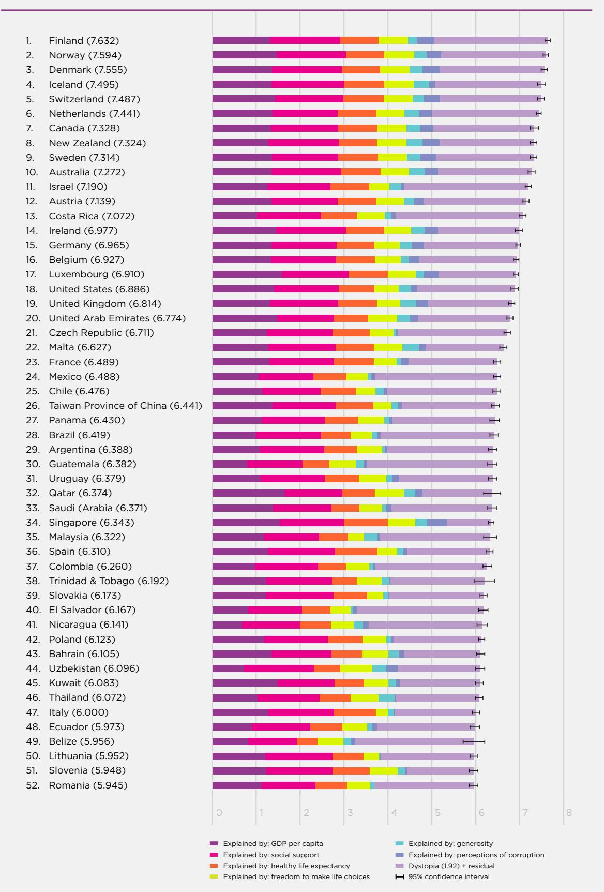

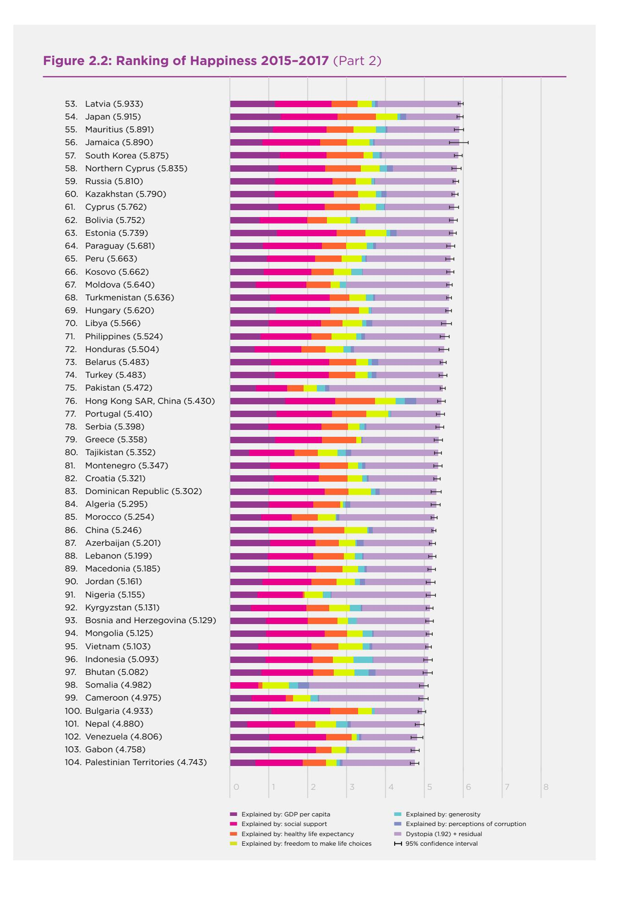

Figure 2.2: Ranking of Happiness 2015–2017 (Part 3)

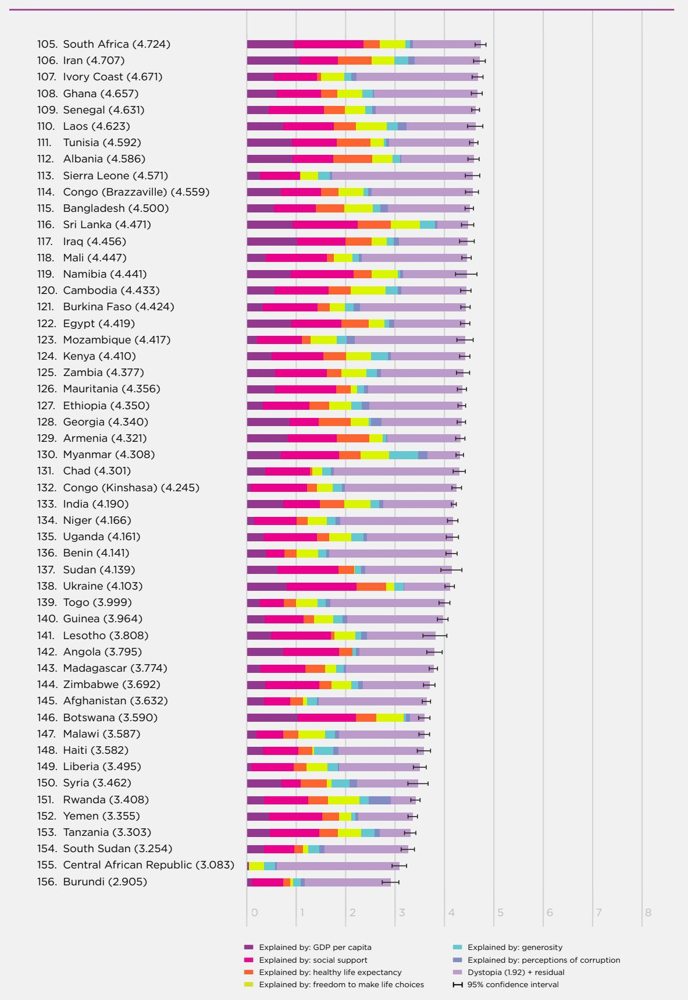

per capita gap, 0.90 due to differences in social support, 0.61 to differences in healthy life expectancy, 0.37 to differences in freedom, 0.21 to differences in corruption perceptions, and 0.07 to differences in generosity. Income differences are the single largest contributing factor, at one-third of the total, because, of the six factors, income is by far the most unequally distributed among countries. GDP per capita is 30 times higher in the top 10 than in the bottom 10 countries.16

Overall, the model explains quite well the life evaluation differences within as well as between regions and for the world as a whole.17 On average, however, the countries of Latin America still have mean life evaluations that are higher (by about 0.3 on the 0 to 10 scale) than predicted by the model. This difference has been found in earlier work and been attributed to a variety of factors, including especially some unique features of family and social life in Latin American countries. To help explain what is special about social life in Latin America, and how this affects emotions and life evaluations, Chapter 6 by Mariano Rojas presents a range of new evidence showing how the social structure supports Latin American happiness beyond what is captured by the variables available in the Gallup World Poll. In partial contrast, the countries of East Asia have average life evaluations below those predicted by the model, a finding that has been thought to reflect, at least in part, cultural differences in response style.18 It is reassuring that our findings about the relative importance of the six factors are generally unaffected by whether or not we make explicit allowance for these regional differences.19

### **Changes in the Levels of Happiness**

In this section we consider how life evaluations have changed. In previous reports we considered changes from the beginning of the Gallup World Poll until the three most recent years. In the report, we use 2008-2010 as a base period, and changes are measured from then to 2015-2017. The new base period excludes all observations prior to the 2007 economic crisis, whose effects were a key part of the change analysis in earlier World Happiness Reports. In Figure 2.3 we show the changes in happiness levels for all 141 countries that have sufficient numbers of observations for both 2008-2010 and 2015-2017.

Of the 141 countries with data for 2008-2010 and 2015-2017, 114 had significant changes. 58 were significant increases, ranging from 0.14 to 1.19 points on the 0 to 10 scale. There were also 59 significant decreases, ranging from -0.12 to -2.17 points, while the remaining 24 countries revealed no significant trend from 2008-2010 to 2015-2017. As shown in Table 35 in Statistical Appendix 1, the significant gains and losses are very unevenly distributed across the world, and sometimes also within continents. For example, in Western Europe there were 12 significant losses but only three significant gains. In Central and Eastern Europe, by contrast, these results were reversed, with 13 significant gains against two losses. The Commonwealth of Independent States was also a significant net gainer, with seven gains against two losses. The Middle East and North Africa was net negative, with 11 losses against five gains. In all other world regions, the numbers of significant gains and losses were much more equally divided.

Among the 20 top gainers, all of which showed average ladder scores increasing by more than 0.5 points, 10 are in the Commonwealth of Independent States or Central and Eastern Europe, three are in sub-Saharan Africa, and three in Asia. The other four were Malta, Iceland, Nicaragua, and Morocco. Among the 20 largest losers, all of which showed ladder reductions exceeding about 0.5 points, seven were in sub-Saharan Africa, three were in the Middle East and North Africa, three in Latin America and the Caribbean, three in the CIS and Central and Eastern Europe, and two each in Western Europe and South Asia.

These gains and losses are very large, especially for the 10 most affected gainers and losers. For each of the 10 top gainers, the average life evaluation gains were more than twice as large as those that would be expected from a doubling of per capita incomes. For each of the 10 countries with the biggest drops in average life evaluations, the losses were more than twice as large as would be expected from a halving of GDP per capita.

On the gaining side of the ledger, the inclusion of six transition countries among the top 10 gainers reflects the rising average life evaluations for the transition countries taken as a group. The appearance of sub-Saharan African countries among the biggest gainers and the biggest

**Figure 2.3: Changes in Happiness from 2008–2010 to 2015–2017** (Part 1)

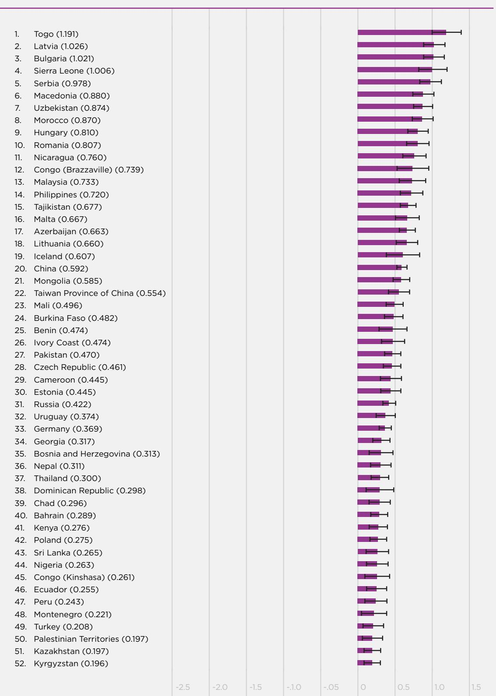

**Figure 2.3: Changes in Happiness from 2008–2010 to 2015–2017** (Part 2)

| 53. Cambodia (0.194) 54. Chile (0.186) 55. Lebanon (0.185) 56. Senegal (0.168) |     |
|--------------------------------------------------------------------------------------------------|-----|
|                                                                                                  |     |
|                                                                                                  |     |
|                                                                                                  |     |
|                                                                                                  |     |
|                                                                                                  |     |
| 57. South Korea (0.158)                                                                       |     |
| 58. Kosovo (0.136)                                                                            |     |
| 59. Slovakia (0.121)                                                                          |     |
| 60. Argentina (0.112)                                                                            |     |
| 61. Portugal (0.108)                                                                          |     |
| 62. Finland (0.100)                                                                           |     |
| 63. Moldova (0.091)                                                                           |     |
| 64. Ghana (0.066)                                                                                |     |
| 65. Hong Kong SAR, China (0.038)                                                              |     |
| 66. Bolivia (0.029)                                                                              |     |
| 67. New Zealand (0.021)                                                                       |     |
| 68. Paraguay (0.018)                                                                             |     |
| 69. Saudi Arabia (0.016)                                                                         |     |
| 70. Guatemala (-0.004)                                                                           |     |
| 71. Japan (-0.012)                                                                            |     |
| 72. Colombia (-0.023)                                                                         |     |
| 73. Belarus (-0.034)                                                                          |     |
|                                                                                                  |     |
| 74. Niger (-0.036)                                                                            |     |
| 75. Switzerland (-0.037)                                                                      |     |
| 76. Norway (-0.039)                                                                           |     |
| 77. Slovenia (-0.050)                                                                         |     |
| 78. Belgium (-0.058)                                                                          |     |
| 79. Armenia (-0.078)                                                                          |     |
| 80. Australia (-0.079)                                                                           |     |
| 81. El Salvador (-0.092)                                                                      |     |
| 82. Sweden (-0.112)                                                                           |     |
| 83. Austria (-0.123)                                                                          |     |
| 84. Netherlands (-0.125)                                                                         |     |
| 85. Israel (-0.134)                                                                           |     |
| 86. Luxembourg (-0.141)                                                                          |     |
| 87. United Kingdom (-0.160)                                                                   |     |
| 88. Indonesia (-0.160)                                                                        |     |
| 89. Singapore (-0.164)                                                                        |     |
| 90. Algeria (-0.169)                                                                             |     |
| 91. Costa Rica (-0.175)                                                                       |     |
| 92. Qatar (-0.187)                                                                            |     |
| 93. Croatia (-0.198)                                                                          |     |
|                                                                                                  |     |
| 94. Mauritania (-0.206)                                                                          |     |
| 95. France (-0.208)                                                                           |     |
| 96. United Arab Emirates (-0.208)                                                                |     |
| 97. Canada (-0.213)                                                                           |     |
| 98. Haiti (-0.224)                                                                               |     |
| 99. Mozambique (-0.237)                                                                          |     |
| 100. Spain (-0.248)                                                                              |     |
| 101. Denmark (-0.253)                                                                            |     |
| 102. Vietnam (-0.258)                                                                            |     |
| 103. Honduras (-0.269)                                                                           |     |
| 104. Zimbabwe (-0.278)                                                                           |     |
|                                                                                                  |     |
| -2.5 -2.0 -1.5 1.0 05 0 0.5                                                    | 1.0 |

Changes from 2008–2010 to 2015–2017 95% confidence interval

**Figure 2.3: Changes in Happiness from 2008–2010 to 2015–2017** (Part 3)

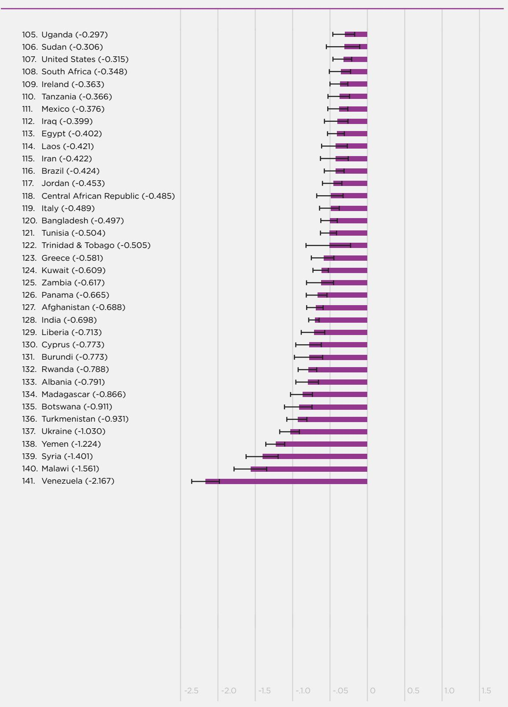

losers reflects the variety and volatility of experiences among the sub-Saharan countries for which changes are shown in Figure 2.3, and whose experiences were analyzed in more detail in Chapter 4 of World Happiness Report 2017. Togo, the largest gainer since 2008-2010, by almost 1.2 points, was the lowest ranked country in World Happiness Report 2015 and now ranks 17 places higher.

The 10 countries with the largest declines in average life evaluations typically suffered some combination of economic, political, and social stresses. The five largest drops since 2008-2010 were in Ukraine, Yemen, Syria, Malawi and Venezuela, with drops over 1 point in each case, the largest fall being almost 2.2 points in Venezuela. By moving the base period until well after the onset of the international banking crisis, the four most affected European countries, Greece, Italy, Spain and Portugal, no longer appear among the countries with the largest drops. Greece just remains in the group of 20 countries with the largest declines, Italy and Spain are still significantly below their 2008-2010 levels, while Portugal shows a small increase.

Figure 18 and Table 34 in the Statistical Appendix show the population-weighted actual and predicted changes in happiness for the 10 regions of the world from 2008-2010 to 2015-2017. The correlation between the actual and predicted changes is 0.3, but with actual changes being less favorable than predicted. Only in Central and Eastern Europe, where life evaluations were up by 0.49 points on the 0 to 10 scale, was there an actual increase that exceeded what was predicted. South Asia had the largest drop in actual life evaluations (more than half a point on the 0 to 10 scale) while predicted to have a substantial increase. Sub-Saharan Africa was predicted to have a substantial gain, while the actual change was a very small drop. Latin America was predicted to have a small gain, while it shows a population-weighted actual drop of 0.3 points. The MENA region was also predicted to be a gainer, and instead lost almost 0.35 points. Given the change in the base year, the countries of Western Europe were predicted to have a small gain, but instead experienced a small reduction. For the remaining regions, the predicted and actual changes were in the same direction, with the substantial reductions in the United States (the largest country in the NANZ group) being

larger than predicted. As Figure 18 shows, changes in the six factors are not very successful in capturing the evolving patterns of life over what have been tumultuous times for many countries. Eight of the nine regions were predicted to have 2015-2017 life evaluations higher than in 2008-2010, but only half of them did so. In general, the ranking of regions' predicted changes matched the ranking of regions' actual changes, despite typical experience being less favorable than predicted. The notable exception is South Asia, which experienced the largest drop, contrary to predictions.

### **Immigration and Happiness**

In this section, we measure and compare the happiness of immigrants and the locally born populations of their host countries by dividing the residents of each country into two groups: those born in another country (the foreign-born), and the rest of the population. The United Nations estimates the total numbers of the foreign-born in each country every five years. We combine these data with annual UN estimates for total population to derive estimated foreign-born population shares for each country. These provide a valuable benchmark against which to compare data derived from the Gallup World Poll responses. We presented in Chapter 1 a map showing UN data for all national foreign-born populations, measured as a fraction of the total population, for the most recent available year, 2015. At the global level, the foreign-born population in 2015 was 244 million, making up 3.3% of world population. Over the 25 years between 1990 and 2015, the world's foreign-born population grew from 153 million to 244 million, an increase of some 60%, thereby increasing from 2.9% to 3.3% of the growing world population.

The foreign-born share in 2015 is highly variable among the 160 countries covered by the UN data, ranging from less than 2% in 56 countries to over 10% in 44 countries. Averaging across country averages, the mean foreign-born share in 2015 was 8.6%. This is almost two and a half times as high as the percentage of total world population that is foreign-born, reflecting the fact that the world's most populous countries have much lower shares of the foreign-born. Of the 12 countries with populations exceeding 100 million in 2015, only three had foreign-born

population shares exceeding 1% – Japan at 1.7%, Pakistan at 1.9% and the United States at 15%. For the 10 countries with 2015 populations less than one million, the foreign-born share averaged 12.6%, with a wide range of variation, from 2% or less in Guyana and Comoros to 46% in Luxembourg.

The 11 countries with the highest proportions of international residents, as represented by foreignborn population shares exceeding 30%, have an average foreign-born share of 50%. The group includes geographically small units like the Hong Kong SAR at 39%, Luxembourg at 45.7% and Singapore at 46%; and eight countries in the Middle East, with the highest foreign-born population shares being Qatar at 68%, Kuwait at 73% and the UAE at 87%.

How international are the world's happiest countries? Looking at the 10 happiest countries in Figure 2.2, they have foreign-born population shares averaging 17.2%, about twice that for the world as a whole. For the top five countries, four of which have held the first-place position within the past five years, the average 2015 share of the foreign-born in the resident population is 14.3%, well above the world average. For the countries in 6th to 10th positions in the 2015-2017 rankings of life evaluations, the average foreign-born share is 20%, the highest being Australia at 28%.

For our estimates of the happiness of the foreignborn populations of each country, we use data on the foreign-born respondents from the Gallup World Poll for the longest available period, from 2005 to 2017. In Statistical Appendix 2 we present our data in three different ways: for the 162 countries with any foreign-born respondents, for the 117 countries where there are more than 100 foreign-born respondents, and for 87 countries where there are more than 200 foreign-born respondents. For our main presentation in Figure 2.4 we use the sample with 117 countries, since it gives the largest number of countries while still maintaining a reasonable sample size. We ask readers, when considering the rankings, to pay attention to the size of the 95% confidence regions for each country (shown as a horizontal line at the right-hand end of the bar), since these are a direct reflection of the sample sizes in each country, and show where caution is needed in interpreting the rankings. As discussed in more detail in Chapter 3, the Gallup World Poll samples are designed to reflect the total resident population, without special regard for the representativeness of the foreign-born population shares. There are a number of reasons why the foreign-born population shares may be under-represented in total, since they may be less likely to have addresses or listed phones that would bring them into the sampling frame. In addition, the limited range of language options available may discourage participation by potential foreign-born respondents not able to speak one of the available languages.20 We report in this chapter data on the foreign-born respondents of every country, while recognizing that the samples may not represent each country's foreign-born population equally well.21 Since we are not able to estimate the size of these possible differences, we simply report the available data.

We can, however, compare the foreign-born shares in the Gallup World Poll samples with those in the corresponding UN population data to get some impression of how serious a problem we might be facing. Averaging across countries, the UN data show the average national foreignborn share to be 8.6%, as we reported earlier. This can be compared with what we get from looking at the entire 2005-2017 Gallup sample, which typically includes 1,000 respondents per year in each country. As shown in Statistical Appendix 2, the Gallup sample has 93,000 foreign-born respondents, compared to 1,540,000 domestic-born respondents. The foreign-born respondents thus make up 5.7% of the total sample,22 or two-thirds the level of the UN estimate for 2015. This represents, as expected, some under-representation of the foreign-born in the total sample, with possible implications for what can safely be said about the foreign-born. However, we are generally confident in the representativeness of the Gallup estimates of the number for foreign-born in each country, for two reasons. First, the average proportions become closer when it is recognized that the Gallup surveys do not include refugee camps, which make up about 3% of the UN estimate of the foreign-born. Second, and more importantly for our analysis, the cross-country variation in the foreign-born population shares matches very closely with the corresponding intercountry variation in the UN estimates of foreign-born population shares.23

Figure 2.4 ranks countries by the average ladder score of their foreign-born respondents in all of

the Gallup World Polls between 2005 and 2017. For purposes of comparison, the figure also shows for each country the corresponding average life evaluations for domestically born respondents.24 Error bars are shown for the averages of the foreign-born, but not for the domestically born respondents, since their sample sizes from the pooled 2005-2017 surveys are so large that they make the estimates of the average very precise.

The most striking feature of Figure 2.4 is how closely life evaluations for the foreign-born match those for respondents born in the country where the migrants are now living. For the 117 countries with more than 100 foreign-born respondents, the cross-country correlation between average life evaluations of the foreignborn and domestically-born respondents is very high, 0.96. Another way of describing this point is that the rankings of countries according to the life evaluations of their immigrants is very similar to the ranking of Figure 2.2 for the entire resident populations of each country 2015-2017, despite the differences in the numbers of countries and survey years.

Of the top 10 countries for immigrant happiness, as shown by Figure 2.4, nine are also top-10 countries for total population life evaluations for 2015-2017, as shown in Figure 2.2. The only exception is Mexico, which comes in just above the Netherlands to take the 10th spot. However, the small size of the foreign-born sample for Mexico makes it a very uncertain call. Finland is in the top spot for immigrant happiness 2005- 2017, just as it is also the overall happiness leader for 2015-2017. Of the top five countries for overall life evaluations, four are also in the top five for happiness of the foreign-born. Switzerland, which is currently in 5th position in the overall population ranking, is in 9th position in the immigrant happiness rankings, following several high-immigration non-European countries – New Zealand, Australia and Canada – and Sweden. This is because, as shown in Figure 2.4, Switzerland and the Netherlands have the largest top-10 shortfall of immigrant life evaluations relative to those of locally born respondents.

Looking across the whole spectrum of countries, what is the general relation between the life evaluations for foreign-born and locally born respondents? Figure 2.5 shows scatter plots of

life evaluations for the two population groups, with life evaluations of the foreign-born on the vertical axis, and life evaluations for the locally born on the horizontal axis.

If the foreign-born and locally born have the same average life evaluations, then the points will tend to fall along the 45-degree lines marked in each panel of the figure. The scatter plots, especially those for sample sizes>100, show a tight positive linkage, and also suggest that immigrant life evaluations deviate from those of the native-born in a systematic way. This is shown by the fact that immigrants are more likely to have life evaluations that are higher than the locally born in countries where life evaluations of the locally born are low, and vice versa. This suggests, as does other evidence reviewed in Chapter 3, that the life evaluations of immigrants depend to some extent on their former lives in their countries of birth. Such a 'footprint' effect would be expected to give rise to the slope between foreign-born life evaluations and those of the locally born being flatter than the 45-degree line. If the distribution of migrants is similar across countries, recipient countries with higher ladder scores have more feeder countries with ladder scores below their own, and hence a larger gap between source and destination happiness scores. In addition, as discussed in Chapter 3, immigrants who have the chance to choose where they go usually intend to move to a country where life evaluations are high. As a consequence, foreign-born population shares are systematically higher in countries with higher average life evaluations. For example, a country with average life evaluations one point higher on the 0 to 10 scale has 5% more of its population made up of the foreign-born.25 The combination of footprint effects and migrants tending to move to happier countries is no doubt part of the reason why the foreign-born in happier countries are slightly less happy than the locally born populations.

But there may also be other reasons for immigrant happiness to be lower, including the costs of migration considered in more detail in Chapter 3. There is not a large gap to explain, as for those 117 countries with more than 100 foreign-born respondents, the average life evaluations of a country's foreign-born population are 99.5% as large as those of the locally-born population in the same country. But this overall equality covers

1. Finland (7.662) 2. Denmark (7.547) 3. Norway (7.435) 4. Iceland (7.427) 5. New Zealand (7.286) 6. Australia (7.249) 7. Canada (7.219) 8. Sweden (7.184) 9. Switzerland (7.177) 10. Mexico (7.031) 11. Netherlands (6.945) 12. Israel (6.921) 13. Ireland (6.916) 14. Austria (6.903) 15. United States (6.878) 16. Oman (6.829) 17. Luxembourg (6.802) 18. Costa Rica (6.726) 19. United Arab Emirates (6.685) 20. United Kingdom (6.677) 21. Singapore (6.607) 22. Belgium (6.601) 23. Malta (6.506) 24. Chile (6.495) 25. Japan (6.457) 26. Qatar (6.395) 27. Uruguay (6.374) 28. Germany (6.366) 29. France (6.352) 30. Cyprus (6.337) 31. Panama (6.336) 32. Ecuador (6.294) 33. Bahrain (6.240) 34. Kuwait (6.207) 35. Saudi Arabia (6.155) 36. Spain (6.107) 37. Venezuela (6.086) 38. Taiwan Province of China (6.012) 39. Italy (5.960) 40. Paraguay (5.899) 41. Czech Republic (5.880) 42. Argentina (5.843) 43. Belize (5.804) 44. Slovakia (5.747) 45. Kosovo (5.726) 46. Belarus (5.715) 47. Slovenia (5.703) 48. Portugal (5.688) 49. Poland (5.649) 50. Uzbekistan (5.600)

**Figure 2.4: Happiness Ranking for the Foreign-Born, 2005–2017, sample>100** (Part 1)

 Average happiness of foreign born Average happiness of domestic born

51. Russia (5.548)

95% confidence interval

**Figure 2.4: Happiness Ranking for the Foreign-Born, 2005–2017, sample>100** (Part 2)

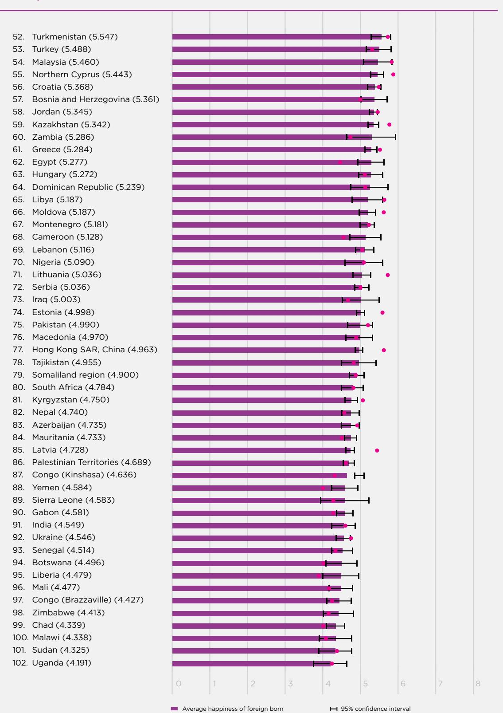

Average happiness of domestic born

**Figure 2.4: Happiness Ranking for the Foreign-Born, 2005–2017, sample>100** (Part 3)

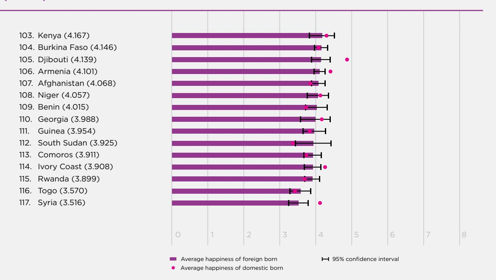

**Figure 2.5: Life Evaluations, Foreign-born vs Locally Born, with Alternative Foreign-born Sample Sizes**

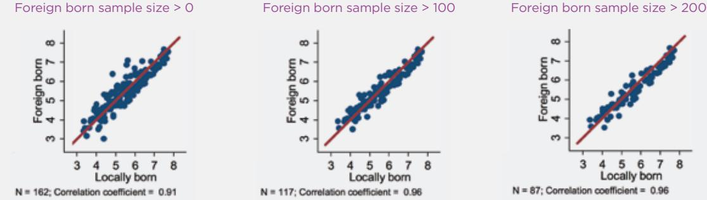

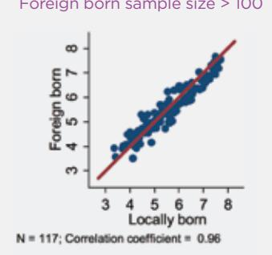

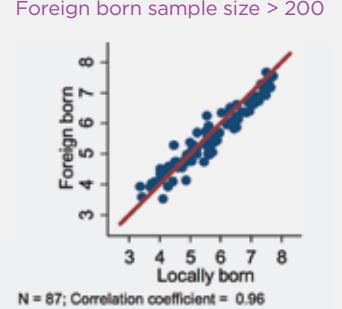

quite a range of experience. Among these 117 countries, there are 64 countries where immigrant happiness is lower, averaging 94.5% of that of the locally born; 48 countries where it is higher, averaging 106% of the life evaluations of the locally born; and five countries where the two are essentially equal, with percentage differences below 1%.26

The life evaluations of immigrants and of the native-born are likely to depend on the extent to which residents in each country are ready to happily accept foreign migrants. To test this possibility, we make use of a Migrant Acceptance Index (MAI) developed by Gallup researchers27 and described in the Annex to this Report.28 Our first test was to add the values of the MAI to the first equation in Table 2.1. We found a positive coefficient of 0.068, suggesting that immigrants, local residents, or both, are happier in countries where migrants are more welcome. An increase of 2 points (about one standard deviation) on the 9-point scale of migrant acceptance was associated with average life evaluations higher by 0.14 points on the 0 to 10 scale for life evaluations. Is this gain among the immigrants or the locally-born? We shall show later, when we set up and test our main model for immigrant happiness, that migrant acceptance makes both immigrants and locally born happier, with the per capita effects being one-third larger for immigrants. But the fact that the foreign-born populations are typically less than 15%, most of the total happiness gains from migrant acceptance are due to the locally born population, even if the per-person effects are larger for the migrants.

Footprint effects, coupled with the fact that happier countries are the major immigration destinations, help to explain why immigrants in happier countries are less happy than the local population, while the reverse is true for immigrants in less happy countries. Thus for those 64 countries where immigrants have lower life evaluations than the locally born, the average life evaluation is 6.00, compared to 5.01 for the 48 countries where immigrants are happier than the locally born. When the OECD studied the life evaluations of immigrants in OECD countries, they found that immigrants were less happy than the locally born in three-quarters of their member countries.29 That reflects the fact that most of the happiest countries are also OECD countries. In just over half of the non-OECD

countries, the foreign-born are happier than the locally born.

Another way of looking for sources of possible life evaluation differences between foreign-born and locally born respondents is to see how immigrants fare in different aspects of their lives. All four of the social factors used in Table 2.1 show similar average values and cross-country patterns for the two population groups, although these patterns differ in interesting ways. The correlation is lowest, although still very high (at 0.91), for social support. It also has a lower average value for the foreign-born, 79% of whom feel they have someone to count on in times of trouble, compared to 82% for the locally born respondents. This possibly illustrates a consequence of the uprooting effect of international migration, as discussed in Chapter 3. The slope of the relation is also slightly less than 45%, showing that the immigrant vs locally born gap for perceived social support is greatest for those living in countries with high average values for social support. Nonetheless, there is still a very strong positive relation, so that immigrants living in a country where the locally born have internationally high values of social support feel the same way themselves, even if in a slightly muted way. When it comes to evaluations of the institutional quality of their new countries, immigrants rank these institutions very much as do the locally-born, so that the cross-country correlations of evaluations by the two groups are very high, at 0.93 for freedom to make life choices, and 0.97 for perceptions of corruption. There are on average no footprint effects for perceptions of corruption, as immigrants see less evidence of corruption around them in their new countries than do locally born, despite having come, on average, from birth countries with more corruption than where they are now living. Generosity and freedom to make life choices are essentially equal for immigrants and the locally born, although slightly higher for the immigrants.

To a striking extent, the life evaluations of the foreign-born are similar to those of the locally born, as are the values of several of the key social supports for better lives. But is the happiness of immigrants and the locally born affected to the same extent by these variables? To assess this possibility, we divided the entire accumulated individual Gallup World Poll respondents 2005-2017, typically involving 1,000 observations per year in each country, into separate foreign-born and domestically born samples. As shown in Table 10 of Statistical Appendix 2, immigrants and non-immigrants evaluate their lives in almost identical ways, with almost no significant differences.30

All of the evidence we have considered thus far suggests that average life evaluations depend first and foremost on the social and material aspects of life in the communities and countries where people live. Put another way, the substantial differences across countries in average life evaluations appear to depend more on the social and material aspects of life in each community and country than on characteristics inherent in individuals. If this is true, then we would expect to find that immigrants from countries with very different average levels of life evaluations would tend to have happiness levels much more like those of others in their new countries than like those of their previous friends, family and compatriots still living in their original countries.

We can draw together the preceding lines of evidence to propose and test a particular model of immigrant happiness. Immigrant happiness will be systematically higher in countries where the local populations are happier, but the effect will be less than one for one because of footprint effects. Footprints themselves imply a positive effect from the average happiness in the countries from which the migrants came. Finally, immigrant happiness will be happier in countries where migrant acceptance is higher. All three propositions are tested and confirmed by the following equation, where average immigrant life evaluations 2005-2017 (ladderimm) are explained by average happiness of the locally born population (ladderdom), weighted average happiness in the source countries (laddersource),31 and each country's value for the Gallup Migrant Acceptance Index as presented in the Annex. The life evaluation used is the Cantril ladder, as elsewhere in this chapter, with the estimation sample including the 107 countries that have more than 100 immigrant survey responders and a value for the Migrant Acceptance Index.

Ladderimm = 0.730 ladderdom + (0.033)

> 0.243 laddersource + (0.057)

0.049 migrant acceptance (0.014)

Adjusted R2=0.941 n=107

All parts of the framework are strongly supported by the results. It is also interesting to ask what we can say about the effects of immigration on the locally-born population. We have already seen that immigrants more often move to happier countries, as evidenced by the strong positive simple correlation between immigrant share and national happiness (r=+0.45). We cannot simply use this to conclude also that a higher immigrant share makes the domestic population happier. To answer that question appropriately, we need to take proper account of the established sources of well-being. We can do this by adding the immigrant share to a cross-sectional equation explaining the life evaluations of the locally-born by the standard variables used in Table 2.1. When this is done, the estimated effect of the immigrant population share32 is essentially zero.

A similar test using the same framework to explain cross-country variations of the life evaluations of immigrants also showed no impact from the immigrant share of the population. The same framework also showed that GDP per capita has no effect on the average life evaluations, once the effect flowing through the average life evaluations of the locally born is taken into account.33

We can use the same framework to estimate the effects of migrant acceptance on the happiness of the host populations, by adding the index to a cross-sectional equation explaining the average life evaluations of the host populations 2005- 2017 by the six key variables of Table 2.1 plus the Migrant Acceptance Index. The Migrant Acceptance Index attracts a coefficient of 0.075 (SE=0.028), showing that those who are not themselves immigrants are happier living in societies where immigrant acceptance is higher. The total effect of the Migrant Acceptance Index on immigrants is slightly larger, as can be seen by combining the direct effect from the equation shown above (0.049) plus that flowing indirectly through the life evaluations of the locally born (0.73\*0.075),34 giving a total effect of 0.103.

Does this same framework apply when we consider migration from a variety of source countries to a single destination? If the framework is apt, then we would expect to find migrants from all countries having happiness levels that converge toward the average for the locally born, with the largest gains for those coming from the least happy origin countries. The existence of footprint effects would mean that immigrants coming from the least happy countries would have life evaluations slightly below those of immigrants from happier source countries. To compare life evaluations of immigrants from many source countries within a single destination country requires much larger samples of migrants than are available from the Gallup World Poll. Fortunately, there are two countries, Canada and the United Kingdom, that have national surveys of life satisfaction large enough to accumulate sufficient samples of the foreign-born from many different source countries. The fact that we have two destination countries allows us to test quite directly the convergence hypothesis presented above. If convergence is general, we would expect it to apply downward as well as upward, and to

converge to different values in the two destination countries.

The Canadian data on satisfaction with life (SWL) for immigrants from many different countries have been used to compare the life evaluations of immigrants from each source country with average life evaluations in the source countries, using SWL data from the World Values Survey (WVS), or comparable data from the Gallup World Poll.35 If source country SWL was a dominant force, as it would be if international SWL differences were explained by inbuilt genetic or cultural differences, then the observations would lie along the 45-degree line if Canadian immigrant SWL is plotted against source-country SWL. By contrast, if SWL depends predominantly on life circumstances in Canada, then the observations for the SWL of the immigrant groups would lie along a horizontal line roughly matching the overall SWL of Canadians. The actual results, for immigrants from 100 different source countries, are shown in Figure 2.6.

The convergence to Canadian levels of SWL is apparent, even for immigrants from countries

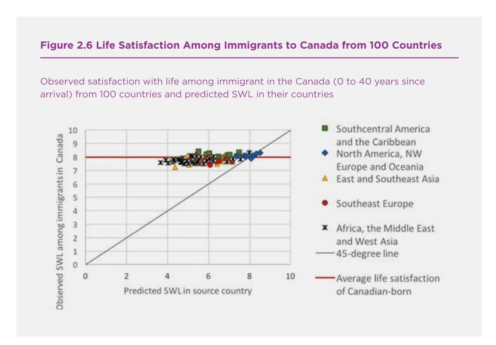

with very low average life evaluations. This convergence can be seen by comparing the country spread along the horizontal axis, measuring SWL in the source countries, with the spread on the vertical axis, showing the SWL of the Canadian immigrants from the same source countries. For the convergence model to be generally applicable, we would expect to find that the variation of life evaluations among the immigrant groups in Canada would be significantly less than among the source country scores. This is indeed the case, as the happiness spread among the immigrant groups is less than one-quarter as large as among the source countries.36 This was found to be so whether or not estimates were adjusted to control for possible selection effects.37 Most of the immigrants rose or fell close to Canadian levels of SWL even though migrations intentions data from the Gallup World Poll show that those wishing to emigrate, whether in general or to Canada, generally have lower life evaluations than those who had no plans to emigrate.38 There is, as expected, some evidence of a footprint effect, with average life evaluations in the source country having a carry-over of 10.5% into Canadian life evaluations.39 If the convergence model applies strictly, and if the footprint effects are sufficiently large, then we would expect to find most or all of the points falling in the north-east and south-west quadrants, with life satisfaction increases for those coming from less happy countries, and decreases for those from more happy countries. This is confirmed by Figure 2.6, the only qualification being that immigrants from some countries less happy than Canada find themselves happier in Canada than the average of the native-born population – convergence plus overshoot.

It is possible that the Canadian results reported above might relate specifically to conditions facing immigrants to Canada, or to depend on the specific source countries from which Canadian migrants are drawn. Thus it is very helpful to be able to undertake a similar analysis for SWL data for immigrants to the United Kingdom, making use of the very large samples of well-being responses available from the UK Annual Population Survey. With the assistance of the UK Office for National Statistics, we have obtained, and present here, comparable data for the SWL of immigrants to the United Kingdom.40 The pattern of results,

as shown in Figure 2.7, is strikingly similar to that found for Canada. As with Canada, there is strong evidence of convergence to the UK average, with a corresponding reduction in the vertical spread of the country points. There is also a footprint effect, averaging 12.6% in the UK case.

Bringing the Canadian and UK experiences together, perhaps the most interesting result is the extent to which convergence is not just generally up, but is towards the national averages in the destination countries. To show this most clearly, it is probably best to consider migration to Canada and the UK from countries sending sufficiently great numbers of migrants to enable them to appear in both the Canada and UK samples above. This is a smaller number of countries than either in the UK or Canadian groups, since Canada and the UK draw from differing mixes of source countries. Looking just at the 63 countries that have sufficiently large numbers of migrants to both countries to provide representative samples, we can compare the average SWL in the 63 source countries with the average SWL of the same immigrant groups in Canada and the United Kingdom. The average SWL across the source countries is 6.08 (SE=0.15), while migrants to the UK have a mean SWL of 7.57 (SE=0.038), and those to Canada have a mean SWL of 7.81 (SE=0.028). The three means are strikingly different from each other in statistical terms. The immigrant happiness scores have converged to local averages to such an extent that they form two quite different groups. This is perhaps the strongest evidence in this chapter that it is local conditions that determine how people value their lives. Migrants who move to the UK tend to value their lives like others in the UK, while migrants from the same countries to Canada have life evaluations converging towards those of other Canadians.

The data from the United Kingdom and Canada can be used to shed more light on the Chapter 5 finding that emigrants from Latin America to other countries have not had large happiness gains relative to other migrants. How does that relate to the evidence presented above that migrant happiness is determined primarily by the happiness in their destination countries? That evidence would suggest that if Latin American migrants came from happy countries and did not move to happier countries, they would not be

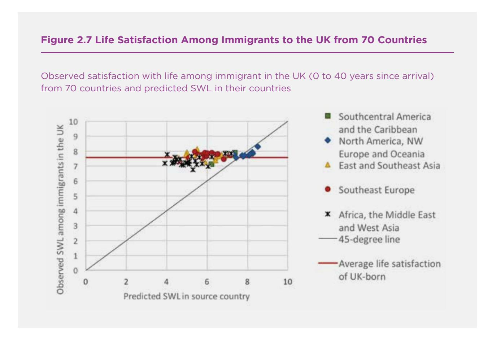

likely to gain. The way to test how well Latin American migrants fare, relative to migrants from other countries, would be to compare immigrants from different source countries while holding the destination country fixed. This we can do by using the large samples from the UK and Canadian national surveys. What do they show? For both the United Kingdom and Canada, the Latin American source countries have higher life evaluations than the average of source countries. That gives the Latin migrants less to gain compared to migrants from less happy countries. But in both countries, the happiness levels of immigrants from Latin America exceeds that of other immigrants, suggesting that at least some of the Latin happiness bulge described in Chapter 6 is brought along as part of the migrant's possessions. Putting the two bits together, immigrants from Latin America have life satisfaction of 7.71 in the United Kingdom and 8.01 in Canada, a difference very similar to the difference between average life satisfaction in the two countries. This compares to Latin American source country life satisfaction of about 7.0 for the eight countries with sufficient numbers of migrants to both

countries. Thus Latin migrants to the United Kingdom show happiness gains of about 0.7 points, compared to 1.0 points for those bound for Canada.

In both cases, the migrants from Latin America fare slightly better than other migrants in their destinations, having life satisfaction 0.10 points higher in the UK and 0.17 points higher in Canada, compared to other migrants. But their happiness gains from migration are smaller, reflecting the fact that they were already in happy countries. The average gain for all migrants to the UK was about 1.3 points, and 1.8 points for migrants to Canada. This reflects that Latin American countries are happier than most other source countries, and not that Latin Americans in the UK or Canada are less happy than other immigrants. Indeed, as shown by the positions of the symbols for Latin American countries in both Figures 2.6 and 2.7, immigrants from Latin America often have life evaluations that are higher than those of the locally born.

Any study of migration, especially one that focuses on the happiness of both migrants and non-migrants, leads naturally to considerations of the possible linkages between migration and world happiness. We have done our best to assemble the available data on the life evaluations of migrants and non-migrants alike. Many countries, especially those where people evaluate their lives highly, have many would-be migrants, on top of the humanitarian need to somehow accommodate those whose lives in their birth countries have become impossibly difficult. Is migration making the world as a whole happier or unhappier? Is there any preferred level of migration that will best serve to provide opportunities for newcomers, to build positive linkages among countries, and accommodate the need to find new homes for refugees, while still maintaining and improving the quality of the social fabric that supports better lives? There is no easy answer to this question.

Are countries with higher immigration rates thereby happier places to live, for migrants and non-migrants alike? We have already seen that most migration is from less happy to happier places, so we expect to find that happier countries do tend to have higher foreign-born population shares. But that does not answer the question, since in this case the migration is responding to the differences in happiness and other aspects of life, and is probably not responsible for creating the differences. One limited way of answering the question might be to add the foreign-born population share for each country to the equation we used in Table 2.1 to explain annual observations of life evaluations in the sample of 157 countries using data from 2005 through 2017. We did this, and there was no significant effect. Alternatively, and preferably, we repeated that analysis using country fixed effects, so that any influence we found would be free of country effects, and would instead look for happiness changes within countries in response to changes in their shares of foreign-born population. We found an insignificant negative effect that remained both negative and insignificant under several alternative specifications.41 There are only limited data for changes in each country's shares of foreign-born population, and many other factors that might be in play, so there can be no firm conclusions drawn from these limited experiments. As described previously, we also tested whether international differences in accumulated net immigration (as measured by the foreign-born

population share) had any impact in explaining cross-country variations in the average 2005- 2017 life evaluations for either the immigrant or locally born populations, once account is taken of the six main determinants of life evaluations. We found no effect, either positive or negative.

#### **Conclusions**

This chapter, as usual, has a double focus. The first half of the chapter presented our latest ranking of countries according to their average life evaluations over the previous three years, followed by a ranking of changes in life evaluations from 2008-2010 to 2015-2017. The second half turned the focus to international migration, ranking countries by the average life evaluations of all the foreign-born respondents to the Gallup World Poll between 2005 and 2017.

The rankings of country happiness are based this year on the pooled results from Gallup World Poll surveys from 2015-2017, and show both change and stability. There is a new top ranking country, Finland, but the top ten positions are held by the same countries as in the last two years, although with some swapping of places. Four different countries have held top spot since 2015 – Switzerland, Denmark, Norway and now Finland.

All the top countries tend to have high values for all six of the key variables that have been found to support well-being: income, healthy life expectancy, social support, freedom, trust and generosity, to such a degree that year to year changes in the top ranking are to be expected.

This year the happiness changes reported are those from 2008-2010, in the immediate aftermath of the financial crisis of 2007-2008; to the most recent years, covering 2015-2017. The winner of the change category was Togo, as it posted the largest gain since 2008-2010, almost 1.2 points. It was the lowest ranked country in World Happiness Report 2015 and now ranks 17 places higher. Other signal success stories, countries with average life evaluation gains of more than a full point on the 0 to 10 scale since 2008-2010, include Latvia, Bulgaria and Sierra Leone. The largest happiness losses since 2008-2010 were in Ukraine, Yemen, Syria, Malawi and Venezuela, with drops over 1 point in each case, the largest fall being almost 2.2 points in Venezuela.

Five of this report's seven chapters deal primarily with migration. Perhaps the most striking finding of the whole report is that a ranking of countries according to the happiness of their immigrant populations is almost exactly the same as for the rest of the population. The immigrant happiness rankings are based on the full span of Gallup data from 2005 to 2017, which is sufficient to have 117 countries with more than 100 immigrant respondents. Finland picks up a second gold medal here, as home to the world's happiest immigrants.

The closeness of the two rankings shows that immigrant happiness depends predominantly on the quality of life where they now live, illustrating a general pattern of convergence. Happiness can change, and does change, according to the quality of the society in which people live. Immigrant happiness, like that of the locally born depends on a range of features of the social fabric, extending far beyond the higher incomes traditionally thought to inspire and reward migration. Once the overall quality of life is taken into account (with income given its due weight as one of the six factors), there is no happiness gain from moving to a higher income country. That has been tested, but is already suggested by the countries with the happiest immigrants are not the richest countries, but instead the countries with a more balanced set of social and institutional supports for better lives.

While convergence to local happiness levels is quite rapid, it is not complete, as there is a 'footprint' effect based on the happiness in each source country. This effect ranges from 10% to 25%. This footprint effect, coupled with the fact that most migration is from less happy to happier countries, explains why, although on average across the world immigrant happiness is very close to that of the locally born, it is less than that of the locals in the happiest countries and greater in the less happy countries.

Since immigrants tend on average to have life evaluations close to those of people already living in destination countries, does this suggest that world happiness would be higher if there were more migration from unhappy to happy places? Although this question underlies many current political debates, the available evidence is not yet good enough to provide anything like definitive conclusions. What does seem apparent, as will be shown in more detail in Chapter 3, is that every migration pathway, and each migration flow, has its own story, with often diverging well-being outcomes for the migrants, their new communities, and the communities left behind. We have shown that the happiest counties have higher than world average shares of foreign-born population. The top 10 countries in the Figure 2.2 rankings of 2015-2017 life evaluations had foreignborn population shares averaging 18% in 2015, more than twice the global country average of 8.7%, and covering a wide range, from 6% to 30%. These same countries also had the happiest foreign-born populations. Based on the average life evaluations 2005-2017 for foreign-born respondents (in Figure 2.4), the same countries dominated the top spots in the world rankings, with all of the top 10 countries in the overall happiness rankings 2015-2017 being in the top 11 countries for 2005-2017 happiness of their foreign-born populations. This is due to a combination of factors: their attractiveness to international migrants, their willingness to accept migrants, and their ability to achieve integration in ways that maintain life evaluations for both immigrants and the locally born.

Helsinki, Copenhagen and Reykjavik are already very international places. What is for them, and for the world, the right scale and pattern of future migration to help support and build international cooperation of a sort that will help the billions of people still living in misery? These are not the world's happiest cities because of where they are, but because their residents have over many decades built levels of trust, connections, cooperation and innovation sufficient to deliver satisfying lives for themselves, and to be in a position to help others do the same. What is needed is to look behind the average life evaluations to see what makes for better lives, and to help others to make progress in improving their own lives. International migration, with its increasing two-way flows, is likely to continue to provide international human linkages and shared sympathies sufficient to support knowledge transfers of the sort that are needed. But migration flows not properly managed and digested have the potential for destroying trust and inflaming anti-immigrant views.

Similar questions arise when city-level happiness is ranked in countries that have sufficiently great samples of data to make such comparisons

feasible. One immediate response among readers and commentators is to suggest that people should move to a happier community in order to make themselves happier. On reflection, when they see the nature of the social connections, and the quality of communities, governments and workplaces that underlie these happier lives, they see that the right answer is not to move to the happier communities but instead to learn and apply the lessons and inspirations that underlie their happiness. Happiness is not something inherently in short supply, like gold, inciting rushes to find and much conflict over ownership. My gold cannot be your gold. But happiness, unlike gold, can be created for all, and can be shared without being scarce for those who give. It even grows as it is shared.

#### **Endnotes**

- 1 Gallup weights sum up to the number of respondents from each country. To produce weights adjusted for population size in each country for the period of 2015-2017, we first adjust the Gallup weights so that each country has the same weight (one-country-one-vote) in the period. Next we multiply total population aged 15+ in each country in 2016 by the one-country-one-vote weight. To simplify the analysis, we use population in 2016 for the period of 2015-2017 for all the countries/regions. Total population aged 15+ is equal to the total population minus the amount of population aged 0-14. Data are mainly taken from WDI released by the World Bank in September 2017. Specifically, the total population and the proportion of population aged 0-14 are taken from the series "Population ages 0-14 (percent of total)" and "Population, total" respectively from WDI. There are a few regions lack of data in WDI, such as Somaliland, Kosovo, and Taiwan. In this case, other sources of data are used if available. The share of population aged 0-14 is missing in WDI, we thus use the data from CIA's World Fact Book, 25.01% to calculate the amount of adult population. The total population in Taiwan in 2016 is 23,540,000, and the aged 15+ is 20,398,000 in 2015 (Statistical Yearbook of the Republic of China 2016, Table 3). There are no reliable data on population and age structure in Somaliland region, therefore it is not included in the calculation of world or regional distributions.
- 2 See, for example, Atkinson (2015), Atkinson and Bourguignon (2014), , Kennedy, Lochner, and Prothrow-Stith (1997), Keeley (2015), OECD (2015), Neckerman and Torche (2007), and Piketty (2014).
- 3 See Helliwell, Huang, and Wang (2016). See also Goff, Helliwell, and Mayraz (2016), Gandelman and Porzekanski (2013), Kalmijn and Veenhoven (2005).
- 4 See, for example, Evans, Barer, and Marmor (1997), Marmot, Ryff, Bumpass, Shipley, and Marks (1994), and Marmot (2005).
- 5 See Corak (2013).
- 6 See Table 17 in Statistical Appendix 1.
- 7 The statistical appendix contains alternative forms without year effects (Table 14 of Appendix 1), and a repeat version of the Table 2.1 equation showing the estimated year effects (Table 9 of Appendix 1). These results confirm, as we would hope, that inclusion of the year effects makes no significant difference to any of the coefficients.
- 8 As shown by the comparative analysis in Table 8 of Appendix 1.
- 9 The definitions of the variables are shown in Technical Box 1, with additional detail in the online data appendix.
- 10 This influence may be direct, as many have found, e.g. De Neve, Diener, Tay, and Xuereb (2013). It may also embody the idea, as made explicit in Fredrickson's broaden-and-build theory (Fredrickson, 2001), that good moods help to induce the sorts of positive connections that eventually provide the basis for better life circumstances.
- 11 See, for example, Danner, Snowdon, and Friesen (2001), Cohen, Doyle, Turner, Alper, and Skoner (2003), and Doyle, Gentile, and Cohen (2006).

- 12 We put the contributions of the six factors as the first elements in the overall country bars because this makes it easier to see that the length of the overall bar depends only on the average answers given to the life evaluation question. In World Happiness Report 2013 we adopted a different ordering, putting the combined Dystopia+residual elements on the left of each bar to make it easier to compare the sizes of residuals across countries. To make that comparison equally possible in subsequent World Happiness Reports, we include the alternative form of the figure in the online Statistical Appendix 1 (Appendix Figures 7-9).
- 13 These calculations are shown in detail in Table 19 of the online Statistical Appendix 1.
- 14 The prevalence of these feedbacks was documented in Chapter 4 of World Happiness Report 2013, De Neve, Diener, Tay, and Xuereb (2013).
- 15 The coefficients on GDP per capita and healthy life expectancy are affected even less, and in the opposite direction in the case of the income measure, being increased rather than reduced, once again just as expected. The changes are tiny because the data come from other sources, and are unaffected by our experiment. However, the income coefficient does increase slightly, since income is positively correlated with the other four variables being tested, so that income is now able to pick up a fraction of the drop in influence from the other four variables. We also performed an alternative robustness test, using the previous year's values for the four survey-based variables. This also avoids using the same respondent's answers on both sides of the equation, and produces similar results, as shown in Table 13 of the Statistical Appendix 1. The Table 13 results are very similar to the split-sample results shown in Tables 11 and 12, and all three tables give effect sizes very similar to those in Table 2.1 in reported in the main text.
- 16 The data and calculations are shown in detail in Table 20 of the Statistical Appendix 1. Annual per capita incomes average \$46,000 in the top 10 countries, compared to \$1,500 in the bottom 10, measured in international dollars at purchasing power parity. For comparison, 95% of respondents have someone to count on in the top 10 countries, compared to 58% in the bottom 10. Healthy life expectancy is 72 years in the top 10, compared to 53 years in the bottom 10. 93% of the top 10 respondents think they have sufficient freedom to make key life choices, compared to 62% in the bottom 10. Average perceptions of corruption are 34%in the top 10, compared to 73% in the bottom 10.
- 17 Actual and predicted national and regional average 2015-2017 life evaluations are plotted in Figure 16 of the Statistical Appendix 1. The 45-degree line in each part of the Figure shows a situation where the actual and predicted values are equal. A predominance of country dots below the 45-degree line shows a region where actual values are below those predicted by the model, and vice versa. East Asia provides an example of the former case, and Latin America of the latter.
- 18 For example, see Chen, Lee, and Stevenson (1995).
- 19 One slight exception is that the negative effect of corruption is estimated to be slightly larger, although not significantly so, if we include a separate regional effect variable for Latin America. This is because corruption is worse than average in Latin America, and the inclusion of a special Latin American variable thereby permits the corruption coefficient to take a higher value.

- 20 The number of languages used in a country includes all those spoken by more than 5% of the population.
- 21 As noted in Technical Box 3 in Chapter 2 of World Happiness Report 2017, the Gulf Cooperation Council (GCC) countries are a special case in three ways. First they have very high foreign-born population shares. Second, their overall country estimates are adjusted to reflect outside estimates of the non-national population, and third, Gallup Polls in those countries were offered in Arabic only prior to 2014, so that their non-national respondents in the earlier years were almost entirely drawn from other Arab-speaking countries. In Figure 2.4 we report the foreign-born ladder scores using all available years for all countries, while in Technical Box 3 of WHR 2017 the figures are based only on 2014 and later, permitting a comparison of the two procedures. For most of the GCC countries the estimates are quite similar, differences presumably resulting from the relative evaluations and numbers of the Arab-speaking and English-speaking respondents.
- 22 5.7%=100\*(93/(93+1540)).
- 23 The correlation is 0.9 between the two country-level estimates of foreign-born population shares.
- 24 There is a similar ranking of immigrant life evaluations for the OECD countries in Figure 3.21 of OECD (2017).
- 25 Regressing the immigrant share, as a proportion, on the average ladder score of the locally born gives a coefficient of 0.058 (t=5.5).
- 26 This is based on the ratios of foreign-born to locally born life evaluation averages for the 117 countries where there are more than 100 foreign-born respondents in the 2005-2017 data period. The ratios are averaged for each country to the nearest percentage point – hence the equality for five countries.
- 27 The Migrant Acceptance Index is a proprietary index developed by Gallup, based on items it asks in its Gallup World Poll surveys. Their initial analysis of the data may be found at: http://news.gallup.com/poll/216377/new-indexshows-least-accepting-countries-migrants.aspx. The definition of the index, and its values for the most accepting and non-accepting countries, are shown in the Annex to this report by Esipova, Ray, Fleming, and Pugliese (2018).
- 28 There is only a single value of the index for each country, which then has to be repeated for each country-year in the panel.
- 29 See OECD (2017), Figure 3.21.
- 30 A similar conclusion follows, as also shown in Statistical Appendix 2, if we use national average data in separate cross-sectional equations for the foreign-born and locally born sub-populations. In this instance we need to do a pure cross section rather than the panel approach used in Table 2.1, because the samples of the foreign-born in each annual sample of 1,000 respondents are much too small to enable regressions using country-year data.
- 31 The average life evaluations of the locally born and the weighted average source country life evaluations also make use of the entire 2005-2017 sample. The Migrant Acceptance Index is a single value for each country, as described in Esipova et al. (2018).

- 32 The simple correlation between the ratio and the immigrant share of the population is significantly negative, but disappears when the happiness of the locally born is controlled for. This is because, as we have already shown, foreign-born population shares are higher in countries with happier locally born populations.
- 33 This is consistent with Hendriks and Bartram (2016), who find economic conditions to be incomplete as explanations of migrant happiness. Our results are testing whether national income is more important for migrant than for non-migrant happiness, and we find that it is not, since there is a zero coefficient on log GDP per capita when added to an equation explaining immigrant happiness by native-born happiness and the happiness in their source countries. Hence the non-economic sources of life evaluations are equally important for both immigrant and locally born respondents.
- 34 The effect flowing through domestic happiness is equal to the effect in the domestic happiness equation (0.075) times the effect of domestic happiness on immigrant happiness (0.73). The total effect on immigrants is the sum of the direct and indirect elements (0.049 + 0.73\*.075 = 0.103).
- 35 The use of the Gallup World Poll data permits more countries to be considered, as it covers many more countries than does the World Values Survey. Helliwell, Bonikowska, and Shiplett (2018) show comparable results using WVS and Gallup estimates for source country life evaluations. An empirically estimated conversion factor is used to convert Gallup ladder data to SWL equivalents, based on Gallup data from the year when ladder and SWL questions were both asked of all respondents.
- 36 More precisely, the standard deviation across countries is 1.17 among the source countries, and 0.24 among the immigrant groups. The Canadian distribution is about a higher mean, as the average SWL in the 100 source countries is 6.06, compared to 7.84 among the immigrant groups.
- 37 See Helliwell et al. (2018). A similar matching process, with similar results, is available for a smaller number of countries in Frank, Hou, and Schellenberg (2016).
- 38 See Helliwell et al. (2018, Figure 1).
- 39 That is, if the average SWL of immigrants from each of the 100 source countries is regressed on the average estimated SWL in those 100 countries, the estimated coefficient is 0.105 (t=5.8).
- 40 The ONS has posted the data for public use on: https://www.ons.gov.uk/peoplepopulationandcommunity/ wellbeing/adhocs/007955estimatesofpersonalwellbeingbrokendownbycountryofbirthfromtheukannualpopulationsurveyaps
- 41 For example, regressing country averages of immigrant life evaluations on the corresponding averages for the locally born and each country's share of foreign-born population shows a slight but insignificant negative effect for the foreign-born population share.

#### **References**

Atkinson, A. B. (2015). Inequality: What can be done? Cambridge: Harvard University Press.

Atkinson, A. B., & Bourguignon, F. (2014). Handbook of income distribution (Vols. 2A &2B). Elsevier.

Chen, C., Lee, S. Y., & Stevenson, H. W. (1995). Response style and cross-cultural comparisons of rating scales among East Asian and North American students. Psychological Science, 6(3), 170-175.

Cohen, S., Doyle, W. J., Turner, R. B., Alper, C. M., & Skoner, D. P. (2003). Emotional style and susceptibility to the common cold. Psychosomatic Medicine, 65(4), 652-657.

Corak, M. (2013). Income inequality, equality of opportunity, and intergenerational mobility. The Journal of Economic Perspectives, 27(3), 79-102.

Danner, D. D., Snowdon, D. A., & Friesen, W. V. (2001). Positive emotions in early life and longevity: findings from the nun study. Journal of Personality and Social Psychology, 80(5), 804.

De Neve, J. E., Diener, E., Tay, L., & Xuereb, C. (2013). The objective benefits of subjective well-being. In J. F. Helliwell, R. Layard, & J. Sachs (Eds.), World happiness report 2013 (pp. 54-79). New York: UN Sustainable Development Solutions Network.

Doyle, W. J., Gentile, D. A., & Cohen, S. (2006). Emotional style, nasal cytokines, and illness expression after experimental rhinovirus exposure. Brain, Behavior, and Immunity, 20(2), 175-181.

Esipova, N., Ray, J., Fleming, J., & Pugliese, A. (2018). Migrant Acceptance Index: Do migrants have better lives in countries that accept them? Annex to World happiness report 2018.

Evans, R. G., Barer, M. L., & Marmor, T. R. (Eds.) (1994). Why are some people healthy and others not? The determinants of the health of populations. New York: De Gruyter.

Frank, K., Hou, F., & Schellenberg, G. (2016). Life satisfaction among recent immigrants in Canada: comparisons to source-country and host-country populations. Journal of Happiness Studies, 17(4): 1659-1680. doi:10.1007/s10902-015- 9664-2.

Fredrickson, B. L. (2001). The role of positive emotions in positive psychology: The broaden-and-build theory of positive emotions. American psychologist, 56(3), 218-226.

Gandelman, N., & Porzecanski, R. (2013). Happiness inequality: How much is reasonable? Social Indicators Research, 110(1), 257-269.

Goff, L., Helliwell, J., & Mayraz, G. (2016). The welfare costs of well-being inequality. NBER Working Paper no. 21900.

Helliwell, J. F., Bonikowska, A. & Shiplett, H. (2018). Migration as a test of the happiness set point hypothesis: Evidence from immigration to Canada and the United Kingdom. NBER Working Paper no. 22601 (original version 2016, revised to include the United Kingdom, March 2018).

Helliwell, J. F., Huang, H., & Wang, S. (2016). New evidence on trust and well-being. NBER Working Paper no. 22450.

Hendriks, M., & Bartram, D. (2016). Macro-conditions and immigrants' happiness: Is moving to a wealthy country all that matters? Social Science Research, 56, 90-107.

Kalmijn, W., & Veenhoven, R. (2005). Measuring inequality of happiness in nations: In search for proper statistics. Journal of Happiness Studies, 6(4), 357-396.

Kawachi, I., & Berkman, L. (2000). Social cohesion, social capital, and health. In L. F. Berkman & I. Kawachi (Eds.), Social epidemiology (pp. 174-190). New York: Oxford University Press.

Kawachi, I., Kennedy, B. P., Lochner, K., & Prothrow-Stith, D. (1997). Social capital, income inequality, and mortality. American Journal of Public Health, 87(9), 1491-1498.

Keeley, B. (2015). Income inequality: The gap between rich and poor. OECD Insights, Paris: OECD Publishing.

Marmot, M. (2005). Social determinants of health inequalities. The Lancet, 365(9464), 1099-1104.

Marmot, M., Ryff, C. D., Bumpass, L. L., Shipley, M., & Marks, N. F. (1997). Social inequalities in health: Next questions and converging evidence. Social Science & Medicine, 44(6), 901-910.

Neckerman, K. M., & Torche, F. (2007). Inequality: Causes and consequences. Annual Review of Sociology, 33, 335-357.

OECD (2015). In it together: Why less inequality benefits all. Paris: OECD Publishing. DOI: http://dx.doi. org/10.1787/9789264235120-en.

OECD (2017). How's life?: Measuring well-being. Paris: OECD Publishing.

Piketty, T. (2014). Capital in the 21st Century. Cambridge: Harvard University Press.

## Chapter 3 **45**

# Do International Migrants Increase Their Happiness and That of Their Families by Migrating?

Martijn Hendriks, Erasmus Happiness Economics Research Organisation (EHERO), Erasmus University Rotterdam

Martijn J. Burger, Erasmus Happiness Economics Research Organisation (EHERO), Department of Applied Economics, and Tinbergen Institute, Erasmus University Rotterdam

Julie Ray, Gallup

Neli Esipova, Gallup

**The considerable happiness differences** between countries suggest that migrating to another country provides for many people a major opportunity to obtain a happier life. However, negative migrant experiences are common, including exploitation, social exclusion, homesickness, and unsuccessful socioeconomic assimilation.1 This raises important questions in our globalizing world, where more than 700 million people currently say they would like to move permanently to another country if they had the opportunity,2 and where the international migrant population is expected to increase from the current 250 million to an estimated 400 million people in 2050.3 Do migrants generally gain happiness from moving to another country? In what specific migration flows do migrants gain happiness from moving abroad? Do the shortterm and long-term impacts of migration on migrants' happiness differ? What is the impact of migration on the happiness of families left behind?

We assess these questions in a global context using Gallup World Poll (GWP) data including more than 36,000 first-generation migrants from over 150 countries and territories. By addressing these questions empirically, this chapter is intended to develop globally comparable information about how migration affects the happiness of migrants and their families. The outcomes in both the affective and cognitive dimensions of happiness will be considered. The affective dimension refers to the frequency of experiencing pleasant moods and emotions as opposed to unpleasant ones, whereas the cognitive dimension refers to a person's contentment and satisfaction with life.4

Approximately 10% of international migrants are considered refugees who were forced to migrate by external circumstances such as war, persecution, or natural disasters.5 The other 90% of international migrants are believed to move largely voluntarily. Voluntary migrants mention a variety of motives for migration, including economic gain, career or study opportunities, living closer to family, or a more livable or suitable environment (e.g., more religious or political freedom). On the most general level, however, these concrete motives are different ways migrants attempt to improve their own or their families' lives.6 Empirical research shows that, when making important decisions such as

migration decisions, most people tend to choose the option they think will make them or their families happiest.7 This suggests that migrants move particularly to improve their own or their families' lives in terms of happiness, with the exception of refugees who move primarily to secure their lives. Conceptually, then, happiness, which is often used synonymously with subjective well-being, provides valuable information about migrant well-being.

The above considerations imply that voluntary migrants anticipate that migration will lead to improved well-being for themselves and/or their families. Many migrants will surely experience considerable happiness gains, particularly those who meet basic subsistence needs by migrating, as basic needs such as economic security and safety are vital conditions for happiness.8 Migrants moving to more developed countries may also experience major gains in other important well-being domains, such as freedom, education, and economic welfare.9

It should come as no surprise, however, to find that some migrants have not become happier following migration. Migration is associated with severe costs in other critical well-being domains, particularly those relating to social and esteem needs. Separation from friends and family, social exclusion in the host country (e.g., discrimination), and decreased social participation due to linguistic and cultural barriers are typical social costs of migration that frequently result in experiences of social isolation, loneliness, and impaired social support among migrants.10 Migration also often entails a lower position in the social hierarchy, a sense of dislocation, and acculturative stress (cultural clashes and identity issues).11 Additionally, happiness gains may falter over time because people tend to adapt more to the typical benefits of migration, such as improvements in economic welfare, than to migration's typical costs, such as leaving behind one's social and cultural environment.12

Migration decisions are complicated by major information constraints. Most prospective migrants have never been in their intended destination country. They necessarily resort to information from the media or their personal social network. However, these sources tend to provide limited and positively biased information; for example, migrants tend to be hesitant about

revealing their disappointing migration outcomes to people in their home country.13 In essence, prospective migrants must make one of the most important and difficult decisions of their lives based on limited knowledge of its consequences. Imperfect decisions may also follow from inaccurately weighing the importance of the anticipated advantages and disadvantages of migrating. Placing disproportionate weight on certain aspects of the outcome may be common, since human susceptibility to deviations from a standard of rationality is well-documented in the social sciences.14 Specifically, people are believed to put excessive weight on satisfying salient desires, most notably economic gain, at a cost to more basic needs such as social needs.15 These beliefs are inspired by the weak correlation between economic welfare and happiness for people who have sufficient money to make ends meet.16 Migration may thus be a misguided endeavour for some migrants who move in search of a better life,17 which signals the need to evaluate whether migrants are truly better off after migration.

Evaluating the outcomes of migration is complicated, however, by the rarity of experimental studies and panel studies tracking international migrants across international borders. Existing work evaluating migrants' happiness outcomes is mostly limited to comparing the happiness of migrants with that of demographically similar people living in a migrant's home country (matched stayers).18 The happiness of matched stayers reflects what the migrant's happiness would have been like had they not migrated, which implies that migrants benefit from migration if they report higher happiness levels than matched stayers.19 This methodology has limited leverage in estimating the causal impact of migration because the non-random selection of people into migration is not fully captured by the comparison of demographically similar migrants and stayers. For example, compared with stayers, migrants tend to be less risk-averse, to have a higher achievement motivation and lower affiliation motivation, and to differ in terms of pre-migration skills and wealth.20 Moreover, people who are relatively unhappy given their socio-economic conditions are more willing to migrate.21 Such unobserved pre-migration differences between migrants and stayers may bias the estimated impact of migration when using simple comparisons of migrants and stayers.

The current literature generally reports happiness gains for migrants moving to more developed countries, whereas non-positive happiness outcomes are observed particularly among migrants moving to less developed countries.22 However, there are notable exceptions to this general pattern. Convincing evidence comes from the only experimental data available, which concerns a migration lottery among Tongan residents hoping to move to New Zealand.23 Four years after migration, the 'lucky' Tongans who were allowed to migrate were less happy than the 'unlucky' Tongans who were forced to stay, even though the voluntary migrants enjoyed substantially better objective well-being, such as nearly triple their pre-migration income. Non-positive happiness outcomes are also reported among other migration flows to more developed countries, such as for Polish people moving to Western Europe24 and in the context of internal migration, rural-urban migrants in China.25 The strong dependence of migration outcomes on where migrants come from and where they go highlights the unique characteristics of each migration flow and the importance of information on the well-being outcomes of migrants in specific migration flows.

One possible reason for non-positive outcomes among some migrants is that they have not yet fully reaped the benefits of migration. Most migrants perceive migration as an investment in their future; they typically expect their well-being to gradually improve over time after overcoming initial hurdles, such as learning the language and finding a job. Conversely, as mentioned above, the initial effect of migration is weakened by migrants' adaptation to their lives in the host country that may follow from a shifting frame-of-reference.26 The migrant's length of stay may thus be important to consider when evaluating the well-being consequences of migration.

Another possible reason that some migrants may not become happier from migration is that they sacrifice some of their own happiness to support, via remittances, the well-being of family members and/or others who remain in the country of origin. The vast scope of worldwide bilateral remittance flows—exceeding an estimated \$600 billion in 2015 alone27—illustrates that moving abroad to improve the welfare of people back home is an established reason for migration, particularly among migrants moving from

developing to developed countries, and highlights that migration is often a family decision rather than an individual one.28 The receipt of remittances often results in significant economic gains and poverty alleviation for families left behind and thereby enables access to better health care, education for one's children, and other consumption opportunities that benefit happiness.29 However, family separation also has various negative consequences for family members who remain in the country of origin, such as impaired emotional support, psychological disconnection from the migrant, and a greater burden of responsibility for household chores and child nurturing.30 Do the advantages of having a family member abroad outweigh the disadvantages? Although the receipt of remittances is associated with greater happiness,31 having a household member abroad was not positively associated with life satisfaction among left-behind adult household members in an Ecuadorian community.32 Similarly, household members left behind in small Mexican and Bolivian communities do not evaluate their family happiness as having improved more than non-migrant households.33 In contrast, in a comprehensive set of Latin American countries, adult household members with relatives or friends abroad who they can count on evaluate their lives more positively than adults without such relatives or friends abroad.34 Causal evidence for emotional well-being and mental health is also mixed. For example, the emigration of a family member did not affect the emotional well-being of left-behind families in Tonga and the elderly in Moldova but did negatively affect various aspects of emotional well-being among left-behind Mexican women and caregivers in Southeast Asia.35 Hence, the happiness consequences of migration for those staying behind appear to be strongly context-dependent. Given that the current literature has predominantly focused on specific countries or communities, a global picture is missing of how migration affects the happiness of those staying behind.

This chapter contributes to existing knowledge in three main ways. First, it covers the happiness outcomes of migrants in previously unexplored migration flows between world regions (e.g., from South Asia to Southeast Asia), within world regions (e.g., within sub-Saharan Africa), and between specific countries (e.g., Russians to

Israel) using a methodology that allows for more accurate estimates of the happiness consequences of migration than is typically used in the literature. Second, while previous work predominantly evaluated migrants' cognitive happiness outcomes (life evaluations), this chapter explores migrants' happiness outcomes more comprehensively by additionally considering the impact of migration on the affective dimension of happiness (moods and emotions).36 Third, this chapter provides a global overview of the relationship between migration and the happiness of families left behind and examines the impact of migration on families left behind in various previously unexplored migration flows.

## **The Happiness Outcomes of International Migrants**

To determine the impact of migration, we aim to compare the happiness of migrants to what their happiness would have been had they not migrated. The latter is unobserved. In the absence of large-scale experimental or panel data tracking migrants across international borders, we use pooled annual cross-sectional GWP data across more than 150 countries and territories spanning the period 2009-2016 to make this comparison. The adult sample contains more than 36,000 first-generation migrants.37 To mitigate the above discussed self-selection and reverse causality issues in the best possible way given our cross-sectional data, we use a more rigorous approach than a simple comparison of migrants and matched stayers, as has been typically done in the literature.38 We first matched migrants to demographically similar people in their country of origin who desire to move permanently to another country, i.e., potential migrants. Given that emigration aspirations are found to be good predictors of subsequent migration behaviour,39 potential migrants can be assumed to have similar unobserved characteristics (e.g., similar risk preferences and pre-migration wealth) as migrants had before they migrated. By using the happiness of potential migrants as a proxy for migrants' pre-migration happiness, we created a synthetic panel that allows us to estimate migrants' pre-versus post-migration change in happiness. The comparison of migrants and potential migrants captures a migrant's change in happiness but not how the happiness of migrants would

have developed had they not migrated. We included a control group to capture this counterfactual. Specifically, we matched migrants with demographically similar stayers who expressed no desire to migrate (reflecting the happiness of stayers in the post-migration period) and we additionally matched potential migrants with demographically similar stayers who expressed no desire to migrate (reflecting the happiness of stayers in the pre-migration period). In the end, we have four groups: migrants after migration (group 1), migrants before migration (group 2), stayers in the post-migration period (group 3), and stayers in the pre-migration period (group 4). We calculated the impact of migration by comparing migrants' average pre-versus post-migration period change in happiness to that of stayers (i.e., difference-in-differences). Our empirical strategy is described in more detail in Technical Box 3.1.

We ensured that our immigrant sample is as representative as possible for the true immigrant stock size of each country by virtue of a weighting variable using UN DESA (2015) data on each country's immigrant stock. In some analyses, the immigrant population is divided into newcomers and long-timers based on whether the immigrant has lived for more or fewer than five years in their country of residence to compare the short- and long-term impacts of migration. We consider three happiness indicators that together cover the cognitive and affective dimension of happiness:

- 1. Life evaluation—as measured by the Cantril ladder-of-life question that asks people to make a cognitive assessment of the quality of their lives on an 11-point ladder scale, with the bottom rung of the ladder (0) being the worst possible life for them and the top rung (10) being the best possible life.40
- 2. Positive affect—as measured before 2012 by a three-item index asking respondents whether they frequently experienced (1) enjoyment, (2) laughter, and (3) happiness on the day before the interview. For the 2013-2016 period, a two-item index comprising the first two items was used because the latter item was not available for this period.
- 3. Negative affect—as measured by a threeitem index asking respondents whether they frequently experienced (1) worry, (2) sadness, and (3) anger on the day before the interview.41

We conduct separate analyses for each happiness indicator because, while positively correlated, outcomes can differ considerably between these dimensions.42

The average happiness gains of the global immigrant population are presented in Figure 3.1. Immigrants across the globe evaluate their lives on average 0.47 points higher (on a 0-10 scale) after migration, which implies that migrants report approximately 9% higher life evaluations following migration.43 Migrants also experience 5% more positive affect (0.33 points on a 0-10 scale) and 7% less negative affect (0.23 points on a 0-10 scale) due to migration.44

The increased life evaluations of "newcomers", and to a lesser extent their increased positive affect experiences,45 show that immigrants already achieve happiness gains during their first five years after migration. The happiness gains of long-timers are very similar to those of newcomers. This finding suggests that the happiness of immigrants does not improve much with their length of stay in the destination country,46 which is in line with previous research findings.47

#### **Technical Box 3.1: Estimation Strategy**

We first matched each migrant to observably similar potential migrants and two groups of observably similar stayers who have no desire to migrate using an exact matching procedure. In the end, a synthetic panel is created with the following four groups:

- 1. Migrants after moving to another country.
- 2. Potential migrants before moving to another country.48 This group is obtained by exactly matching migrants in the first group with one or more respondents who expressed a desire to permanently move to another country using country of origin, gender, and education level as matching variables.49 To make realistic comparisons, potential migrants had to be younger than the migrant they were matched with.
- 3. Stayers that are matched with Group 1. This group consists of those expressing no desire to permanently move abroad, and who were identified by matching the migrants from the first group with one or more stayers based on country of origin, gender, education level, age group (maximum age difference of 5 years), and year of interview.
- 4. Stayers that are matched with Group 2. This group consists of those expressing no desire to permanently move abroad, and who were identified by matching the potential migrants from the second group with one or more stayers based on country of origin, gender, education level, age group (maximum age difference of 5 years), and year of interview.

By construction, potential migrants (group 2) and stayers in the pre-migration period (group 4) are on average younger than migrants (group 1) and stayers in the post-migration period (group 3). Descriptive statistics of the four matched groups are provided in Table A1 of the Online Appendix. A counterfactual (groups 3 and 4) is typically included in panel studies to mitigate the effect of time-varying extraneous factors, but the counterfactual has a slightly different purpose in our repeated cross-sectional design. In the context of this study, the counterfactual mainly mitigates possible differences between migrants and potential migrants that are due to a confounding age trend. This correction allows us to better account for how migrants' happiness would have developed had they not migrated. After the creation of our synthetic panel, a parametric difference-in-difference estimator was used to estimate the effect of migration on happiness:

$$(H_{GROUP1} - H_{GROUP2}) - (H_{GROUP3} - H_{GROUP4})$$
 (1)

where H is the happiness indicator (life evaluation, positive affect, or negative affect). In case of a (potential) migrant matched with more than one non-migrant, the average life evaluation, positive affect, and negative affect of the matched non-migrants was taken. The difference-in-differences estimates are based on OLS regressions using robust standard errors and including age and age squared as covariates.

**Figure 3.1: The Happiness Outcomes of the Global Immigrant Population**

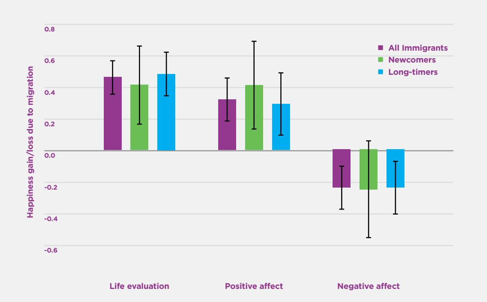

Source: GWP 2009-2016.

Note: All measures have a 0-10 scale. 95% confidence interval bars shown. The sample contains 36,574 immigrants, including 6,499 newcomers and 30,075 long-timers. See Table A2 for unweighted descriptive statistics of the various migrant groups and Table A3 for the weighted sample composition.

## **Happiness Outcomes by Migration Flow**

Table 3.1 shows the happiness outcomes in some of the largest migration flows within or between ten world regions: Latin America and the Caribbean (LAC), sub-Saharan Africa (SSA), the Middle East and North Africa (MENA), South Asia, Southeast Asia, East Asia, the Commonwealth of Independent States (CIS), Central and Eastern Europe (CEE), Western Europe, and Northern America combined with Australia and New Zealand (NA & ANZ).50 We highlight the most important results.

Migrants in almost all reported migration flows evaluate their lives more positively after migration, including migrants moving within world regions (e.g., migrants within CIS), migrants moving to more developed world regions

(e.g., from CEE to Western Europe), and migrants moving between similarly developed world regions (e.g., from Western Europe to Northern America & ANZ). At the same time, migrants do not experience less negative affect following migration in the majority of considered migration flows. Increased positive affect following migration is more common than reduced negative affect but less common than life evaluation gains. Taken together, improved contentment is more prevalent than improved affective experiences. Accordingly, migration positively impacts all three aspects of happiness (life evaluations, positive affect, and negative affect) in only four out of the 20 considered migration flows. These four migration flows include migrants within the Commonwealth of Independent States, the Middle East and North Africa, Western Europe, and Central & Eastern

**Table 3.1: Migrants' Happiness Outcomes by Regional Migration Flow** 

| Migration flow                     | Life evaluation       | Positive affect       | Negative affect       | Size of migrant stocka | N of migrants |
|------------------------------------|--------------------------|--------------------------|--------------------------|---------------------------|------------------|
| Within regions                     |                          |                          |                          |                           |                  |
| Commonwealth of Independent States | +0.39** [0.28 - 0.49] | +0.43** [0.23 - 0.63] | -0.51** [-0.640.37]   | 22,092,847                | 4,176            |
| Sub-Saharan Africa                 | +0.21** [0.06 - 0.35] | NS                       | NS                       | 15,952,589                | 4,184            |
| Middle East and North Africa       | +0.44** [0.21 - 0.66] | +0.57** [0.18 - 0.96] | -0.95** [-1.360.54]   | 14,273,111                | 2,563            |
| Western Europe                     | +0.45** [0.31 - 0.60] | +0.36** [0.12 - 0.60] | -0.31** [-0.530.09]   | 11,525,545                | 4,123            |
| South Asia                         | NS                       | NS                       | NS                       | 9,653,943                 | 524              |
| Southeast Asia                     | +1.08* [0.13 - 2.03]  | NS                       | NS                       | 7,044,470                 | 607              |
| Latin America & the Caribbean      | +0.45** [0.24 - 0.66] | NS                       | NS                       | 5,918,332                 | 1,846            |
| East Asia                          | +0.54** [0.23 - 0.84] | +0.85** [0.46 - 1.24] | NS                       | 5,204,219                 | 1,062            |
| Central & Eastern Europe           | +0.39** [0.26 - 0.52] | +0.51** [0.27 - 0.75] | -0.49** [-0.670.31]   | 3,064,126                 | 3,517            |
| Northern America & ANZ             | NS                       | NS                       | NS                       | 2,245,399                 | 455              |
| Between regions                    |                          |                          |                          |                           |                  |
| CEE  Western Europe               | +0.78** [0.58 - 0.97] | +0.50** [0.15 – 0.85] | NS                       | 11,296,274                | 1,609            |
| MENA  Western Europe              | +0.90** [0.64 - 1.17] | +0.86** [0.37 - 1.35] | NS                       | 9,239,336                 | 655              |
| Western Europe  NA&ANZ            | +0.84** [0.53 - 1.14] | +0.73* [0.14 - 1.32]  | NS                       | 6,785,656                 | 1,627            |
| LAC  Western Europe               | +0.36** [0.15 - 0.56] | -0.37* [-0.700.04]    | NS                       | 4,627,262                 | 734              |
| SSA  Western Europe               | +1.44** [1.03 - 1.86] | +0.87** [0.16 - 1.58] | NS                       | 4,111,872                 | 375              |
| CIS  Western Europe               | +0.59** [0.22 – 0.96] | NS                       | NS                       | 4,053,523                 | 396              |
| CIS  CEE                          | +0.57** [0.26 - 0.88] | +0.69* [0.10 – 1.28]  | NS                       | 1,481,054                 | 1,975            |
| South Asia  Southeast Asia        | +0.80* [0.08 - 1.51]  | NS                       | -0.93* [-1.640.22]    | 1,219,086                 | 308              |
| Western Europe  CEE               | NS                       | NS                       | NS                       | 768,172                   | 653              |
| CIS  MENA                         | +1.11** [0.66 - 1.66] | NS                       | +0.57** [0.14 - 1.00] | 461,174                   | 908              |

Sources: GWP 2009-2016. a UN DESA (2015).51

Notes: 95% confidence intervals in parentheses.\* p<0.05, \*\* p<0.01, NS = not significant at the 5% level. Migration flows with fewer than 300 migrant-stayer matches are not reported. The composition of regional migration flows is presented in Table A5.

Europe. Non-positive outcomes for all three happiness indicators are experienced by migrants who left Western European countries to live in Central or Eastern Europe, migrants within South Asia, and migrants within Northern America & ANZ. These findings highlight that migrants typically experience divergent outcomes in life evaluations, positive affect, and negative affect.

Nevertheless, negative outcomes at the level of regional migration flows are uncommon; only migrants from CIS to MENA and migrants from Latin America to Western Europe report increased negative affect and decreased positive affect, respectively. Finally, the results show that there is no strong relationship between the size of the migration flow and the size of migrants' happiness gains.

It should be noted that the happiness outcomes of migrants from a given source region to the various destination regions are not directly comparable. For example, the slightly higher happiness gains among migrants within LAC compared with Latin American migrants moving to Western Europe does not imply that those who moved to Western Europe would have been better off had they moved within LAC. One reason is that the considered migration flows differ in the distribution of source countries. For example, compared with Argentinians, relatively more Nicaraguans move within Latin America than to Western Europe. Another reason is that migrants in different migration flows may have different characteristics. For example, many migrants moving within regions do not have the financial resources to move to

another world region and certain types of migrants (e.g., humanitarian migrants) are admitted in some countries/regions but not in others. Moreover, the achieved happiness gains are not indicative of the maximum possible happiness gain of a certain migration flow. For instance, most Latin American migrants in Western Europe live in Spain and Portugal, but they may have been happier had they moved to another Western European country.

In Table 3.2, we present migrants' happiness outcomes in selected flows between specific nations. One general pattern that emerges is the positive outcomes among United Kingdom (UK) emigrants who moved to other Anglo-Saxon countries. Another general pattern is the non-positive outcomes of Russia-born people

**Table 3.2: Migrants' Happiness Outcomes in Migration Flows Between Specific Nations** 

| Migration flow                   | Life evaluation       | Positive affect        | Negative affect       | N of migrants |
|----------------------------------|--------------------------|---------------------------|--------------------------|------------------|
| United Kingdom  Ireland         | +0.65** [0.48 - 0.81] | +0.72** [0.43 - 1.01]  | -0.54** [-0.830.25]   | 478              |
| United Kingdom  Australia       | +0.94** [0.76 - 1.11] | NS                        | -0.64** [-0.910.37]   | 528              |
| United Kingdom  New Zealand     | +1.11** [0.95 - 1.26] | +0.83** [0.58 - 1.08]  | -0.97** [-1.220.72]   | 519              |
| Russia  Estonia                 | -0.28** [-0.450.12]   | -0.91** [-1.260.56]    | NS                       | 691              |
| Russia  Latvia                  | NS                       | NS                        | NS                       | 416              |
| Russia  Belarus                 | +0.45** [0.25 - 0.65] | NS                        | -0.33* [-0.640.01]    | 385              |
| Russia  Kazakhstan              | +0.28* [0.05 - 0.52]  | +0.57* [0.10 - 1.04]   | -0.71** [-1.040.37]   | 338              |
| Russia  Israel                  | +1.55** [1.40 - 1.71] | NS                        | +1.42** [1.15 - 1.69] | 580              |
| China  Hong Kong                | +0.16* [0.01 - 0.31]  | -0.43** [-0.70 - 0.16] | +0.24* [0.02 - 0.46]  | 829              |
| Palestinian Territories  Jordan | +1.63** [1.42 - 1.84] | +1.03** [0.64 - 1.42]  | -2.09** [-2.421.76]   | 626              |
| Nicaragua  Costa Rica           | +1.48** [1.24 - 1.72] | +0.60** [0.31 - 0.89]  | -0.79** [-1.120.46]   | 459              |
| France  Luxembourg              | +0.83** [0.66 - 1.00] | +0.67** [0.30 - 1.04]  | -1.02** [-1.350.69]   | 361              |
| Portugal  Luxembourg            | +1.43** [1.23 - 1.63] | +0.49** [0.08 - 0.90]  | -1.05** [-1.420.68]   | 352              |
| Albania  Greece                 | NS                       | NS                        | NS                       | 355              |
| Serbia  Montenegro              | +0.48** [0.19 - 0.77] | +0.79** [0.29 - 1.27]  | NS                       | 309              |
| Ivory Coast  Burkina Faso       | NS                       | -0.90** [-1.370.43]    | NS                       | 310              |

Source: GWP 2009-2016.

Notes: 95% confidence intervals in parentheses. \* p<0.05, \*\* p<0.01, NS = not significant at the 5% level. Migration flows with fewer than 300 migrant-stayer matches are not reported.

who moved to the Baltic states, whereas Russia-born migrants in some other former Soviet republics did gain happiness from migration. A noteworthy finding is that Russia-born people in Israel evaluate their lives much more positively after migration but simultaneously experience adverse outcomes in terms of affect. These results are in line with the relatively high life evaluations but relatively low emotional well-being of Israel's native population (Israel ranks 14th out of 156 countries on the Cantril ladder but 107th out of 156 countries on net affect in the period 2005-2011).52 The happiness outcomes of Russia-born migrants

in Israel mainly drive the results reported in Table 3.1 for migrants from CIS to MENA.

In Chapter 2 of this World Happiness Report, it was shown that the happiness of immigrants does not differ much from that of the nativeborn population. This finding suggests that the happiness of immigrants depends first and foremost on their conditions in the host country and relatively less on their former lives in their countries of origin or innate cultural differences in happiness. We further test to what extent the happiness levels of migrants converge towards the average happiness level in the destination

**Figure 3.2: The Relationship Between Migrants' Happiness Gains and the Corresponding Origin-Destination Happiness Differential**

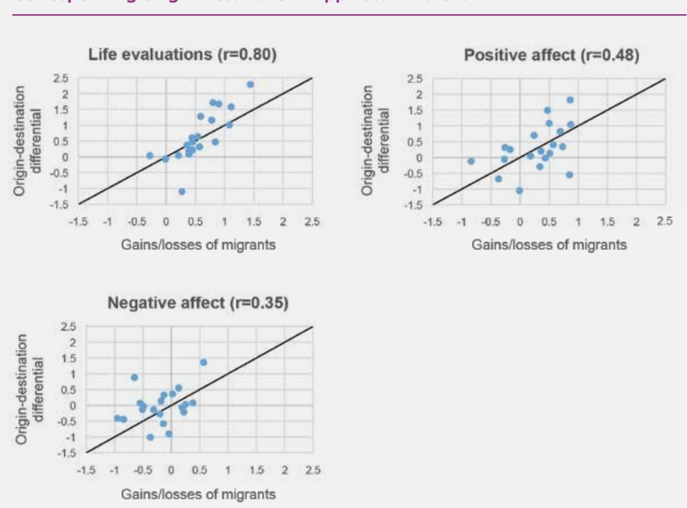

Source: GWP 2009-2016.

Notes: The interpretation of these graphs can be exemplified using the upper right data point in the "life evaluations" panel. This data point represents migrants from sub-Saharan Africa to Western Europe, and shows that these migrants evaluate their lives 1.44 higher due to migration (as presented on the X-axis) while the corresponding difference in life evaluations between the native populations of their host- and origin countries is 2.29 (as presented on the Y-axis). The origin-destination differential is weighted by the size of bilateral migration flows within these world regions to ensure accurate comparisons. Detailed information is presented in Table A6.

country by comparing a migrant's happiness gain with the happiness differential between the migrant's origin and destination country. This origin-destination happiness differential is calculated by subtracting the average happiness level in the country of origin from that of the destination country's native-born population. Figure 3.2 shows three scatter plots—one for each happiness indicator—of migrants' happiness gains/losses due to migration (as presented on the X-axis) and the corresponding origin-destination happiness differentials (as presented on the Y-axis). The data points represent the 20 regional migration flows considered in Table 3.1. Migrants' happiness levels tend to become more similar to those of people in their destination country when there is a high positive correlation between migrants' happiness gains and the destination-origin happiness differential, i.e., when the points are closer to the 45-degree lines in each panel. Indeed, we find a strong positive correlation between the life evaluation gains of migrants and the life evaluation differentials between their origin and destination countries (r=0.80). The correlations

for positive affect (r=0.48) and negative affect (r=0.35) are also positive but more moderate. These results provide further evidence that the happiness of migrants converges substantially — though not entirely — towards the average happiness level in the host country, particularly in terms of life evaluations. Migrant happiness thus strongly depends on the host country environment.

The refugee population requires special attention because refugees are exceptionally vulnerable and are the only migrant group for which migration is largely involuntary. An analysis focusing on the happiness of refugees is presented in Box 3.2.

#### **Box 3.2: Refugee Happiness**

As refugees cannot be identified in the GWP, we use migrant data from the German Socio-Economic Panel (SOEP) to empirically assess how the happiness of refugees develops with their length of stay in Germany and how happy refugees are relative to "voluntary" immigrants in Germany (job-seekers, expats with job offers, co-moving family members, etc.). We focus here on the cognitive dimension of happiness using a life satisfaction question.53 Our sample contains 607 refugees and 4,607 voluntary migrants. Column 1 of Table 3.3 shows that refugees are significantly less satisfied with life than voluntary migrants and that the general immigrant population experiences decreasing life satisfaction with their length of stay in Germany. Column 2 shows that the nonpositive relationship between life satisfaction and the time since migration holds both for

refugees and voluntary immigrants in Germany.54 These findings concur with the previously shown global pattern that immigrants in general do not become happier with their length of stay in the host country. Taken together, refugees are unable to close the happiness gap with other immigrants (and natives), at least in Germany. However, refugees' non-improving happiness with their length of stay does not necessarily imply that they do not become happier by migrating; refugees may obtain a substantial immediate happiness gain upon arrival in Germany due to their improved safety, freedom, and so forth. A more detailed analysis, reported in Table A8, shows that refugees are significantly less happy than all specific subgroups of voluntary immigrants (job-seekers, co-moving family members, and so forth).

**Table 3.3: OLS Regression: Life Satisfaction of Refugees and Voluntary Migrants by Length of Stay** 

| Dependent variable: Life satisfaction | (1)     | (2)    |  |
|------------------------------------------|---------|--------|--|
| Type of migrant                          |         |        |  |
| Refugees                                 | Ref.    | Ref.   |  |
| Voluntary migrants                       | 0.39**  | 0.48** |  |
|                                          | (0.08)  | (0.16) |  |
| Years since migration                    | -0.01** | -0.00  |  |
|                                          | (0.00)  | (0.01) |  |
| Years since migration*type of migrant    |         |        |  |
| Refugees                                 |         | Ref.   |  |
| Voluntary migrants                       |         | -0.01  |  |
|                                          |         | (0.01) |  |
| Age                                      | -0.02*  | -0.02* |  |
|                                          | (0.01)  | (0.01) |  |
| Age2/100                                 | 0.01    | 0.01   |  |
|                                          | (0.01)  | (0.01) |  |
| Female                                   | 0.04    | 0.04   |  |
|                                          | (0.05)  | (0.05) |  |
| Observations                             | 5,214   | 5,214  |  |
| R2                                       | 0.02    | 0.02   |  |

Sources: IAB-SOEP Migration samples M1 (2013-2015) and M2 (2015).

Notes: Regression coefficients are displayed with robust standard errors in parentheses. \* p<0.05, \*\* p<0.01. Refugees moved to Germany on average 13 years ago; 48% of these refugees come from MENA (primarily Iraq, Syria, Afghanistan, and Turkey), 26% from the former Yugoslavia, 14% from the former Soviet Union, and 12% from other world regions. See Table A7 for detailed sample descriptives. For the M1 sample, the average life satisfaction over the years 2013–2015 was taken.

## **The Happiness Outcomes of Families Left Behind**

We estimate the happiness consequences of having a household member abroad by comparing the happiness of individuals with and without a household member abroad. For this purpose, we use global GWP data spanning the period 2007-2011. To account for the non-random selection of households into migration, we employ exact matching and compare only individuals with the same gender and education level, who are from the same country of residence and age group (maximum age difference of 5 years), and who live in a similar type of location (rural vs. urban).55

In a first model, we estimate how having one or multiple household members living abroad for

under five years affects the happiness of leftbehind household members across 144 countries. We do not have information on the exact relationship between the migrant and left-behind household member and the migrant's motive for migration. However, it is conceivable that one of the most common reasons for moving abroad without other household members is to improve the household's living standard by working abroad and sending back remittances. This group of migrant workers is characterized by great diversity, ranging from female nurses from the Philippines to male construction workers from Latin America. The household member abroad can, however, also be another family member (e.g., a child or sibling) or move for different reasons (e.g., for study purposes). Household members left behind are likely to be

Figure 3.3: The Impact of Migration on the Happiness of Household Members Left Behind

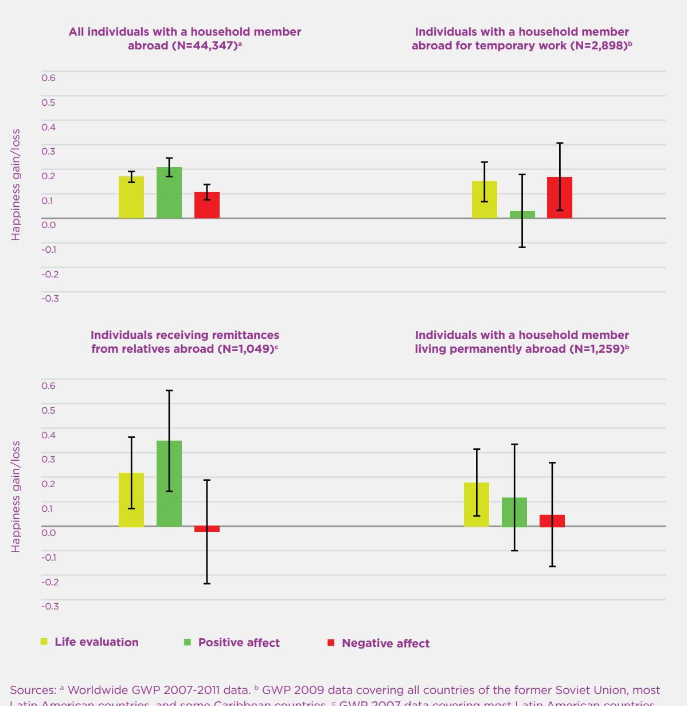

Sources: a Worldwide GWP 2007-2011 data. GWP 2009 data covering all countries of the former Soviet Union, most Latin American countries, and some Caribbean countries. GWP 2007 data covering most Latin American countries and the Dominican Republic.

Note: 95% confidence interval bars shown.

the migrant's spouse, children, parents, siblings, or other extended family members. The results, presented in the upper left panel of Figure 3.3, show that individuals with a household member abroad typically evaluate their lives more positively and experience more positive affect than their counterparts without a relative abroad.

However, they also experience more negative affect. A plausible explanation for these mixed happiness outcomes is that the family's often significant economic gain from migration is more strongly related to cognitive assessments of quality of life (life evaluations) than affective experiences,56 and those left behind may

often suffer emotionally because they may experience increased sadness from being separated from the migrated household member and increased worry from communicating infrequently with the family member and being unable to share responsibilities such as child nurturing.57

The two right panels of Figure 3.3 present the outcomes of household members left behind by household members who specifically moved abroad for temporary work or permanent residence, respectively. The analysis sample is limited to countries in Latin America and the Caribbean and countries of the former Soviet Union. Household members left behind by migrants moving for temporary work or to permanently live abroad evaluate their lives more positively than their counterparts without a household member abroad. However, they do not benefit from migration in terms of emotional well-being; most notably, individuals with a household member abroad for temporary work experience increased negative affect following migration. Similarly, as shown in the lower left panel, Latin Americans who receive remittances from relatives abroad evaluate their lives more positively and experience more positive affect but they do not experience less negative affect compared with non-migrant households.

Taken together, the results reported in Figure 3.3 suggest that migration generally improves the perceived quality of life of household members back home but not necessarily their emotional well-being. Particularly interesting is that having a household member abroad generally does not reduce—and often even increases—negative affect experiences among the family back home. Hence, migration often requires trade-offs between different aspects of happiness for people staying behind.

In Table 3.4, we present the impact of migration on left-behind household members for selected migration flows within or between world regions. The analysis sample contains all individuals with a household member abroad, i.e., the sample as in the upper left panel of Figure 3.3. There is considerable heterogeneity in outcomes between migration flows. The benefits in terms of life evaluations and positive affect are particularly large for individuals in the developing world who have a household member living in Western

Europe, Northern America, Australia, or New Zealand. It is plausible that benefits are largest in these migration flows given that the large wage gaps between these origin and destination regions allow for high remittances. However, in some cases, benefits are also present among families left behind in other types of migration flows, such as migrants moving within the Commonwealth of Independent States. In 8 out of 21 migration flows, non-positive outcomes are experienced for all three aspects of happiness. For example, household members left behind by migrants within MENA experience increased negative affect and no improvements in life evaluations or positive affect. Interestingly, there are no migration flows in which migration reduced negative affect experiences among families back home, which highlights the prevalence of a non-positive impact of migration on the negative affect experiences of those staying behind. Outcomes between bilateral migration flows are presented in Table 3.5.

#### **Robustness Checks and Limitations**

Some possible validity threats cannot be fully addressed in our cross-sectional study, which is typical of empirical literature estimating the impact of migration on migrants and families left behind.58 A first concern relates to migrant selectivity. In our analysis of migrant outcomes, we mitigated possible selection bias in terms of demographics, skills, ability, personality, and other characteristics to the extent possible by introducing potential migrants as a comparison group and by comparing migrants only to demographically similar stayers. Nevertheless, unobserved migrant-stayer differences in personal characteristics that affect happiness could remain present and may bias our results to some extent. To alleviate this concern, we conducted a robustness check in which potential migrants were replaced by a smaller sample of migrants with concrete plans to migrate within a year. The pre-migration characteristics of our migrant sample may be more similar to those of people with concrete migration plans than to those of people expressing only a willingness to migrate. A potential limitation of using migrants with concrete migration plans as a comparison group is that their anticipated migration may have affected their happiness. The results using this

alternative comparison group are reported in Figure A1 and are consistent with our main finding that migrants are generally better off after migration on all three happiness indicators. However, compared with our main results, migration has a somewhat weaker impact on positive affect and a stronger impact on negative affect.

Second, temporary migrants live for a shorter period in the host country compared with permanent migrants and thus have a smaller chance of being sampled in the host country. Therefore, temporary migrants are likely to be under-represented in our sample. This may bias the results if returnees achieve relatively better or worse happiness outcomes in the host country than permanent migrants. However, return migration is in many cases not primarily driven by the success of the migration experience (e.g., for refugees returning home), whereas in other cases return migration resulting from a disappointing migration experience is to some extent counterbalanced by return migration resulting from having successfully achieved one's migration goals.59 Nevertheless, non-causal evidence shows that returnees tend to be less happy than stayers in the home country and non-returned migrants, which may be either because return migrants were already relatively unhappy before moving abroad or because migrants with disappointing migration outcomes are more inclined to return home.60 Based on the current evidence, we cannot provide a reliable estimate of the extent and direction of the bias resulting from the underrepresentation of temporary migrants.

Third, our migrant sample excludes some migrant groups. Migrants in Gulf Cooperation Council countries and sparsely populated countries and island states are excluded, representing altogether less than 8% of the world's migrant population.61 Aside from the exclusion of these groups, the analysis sample was made representative, to the extent possible, of each destination country's immigrant stock size by virtue of a weighting adjustment. By contrast, the sample is not fully representative of the migrant populations *within* host countries, since the GWP is not specifically designed to study migrants. The analysis sample may particularly under-represent undocumented migrants and excludes migrants in refugee camps, migrant children, and migrants who do not speak the host country's most common

languages. The latter two groups are excluded because GWP respondents are aged 15+ and interviews are only held in each country's most common languages, respectively. Initial evidence suggests that proficiency in the host country language may improve immigrant happiness,62 whereas there is no specific research available on the happiness gains of the other excluded immigrant groups.63 The exclusion of these groups must be taken into account when interpreting the results.

Fourth, interviews are conducted over the phone in developed countries, including Western Europe, Northern America & ANZ, and some East-Asian countries, but face-to-face in most of the developing world, including CIS, sub-Saharan Africa, South Asia, and much of Latin America, Southeast Asia, and MENA (see Table A11). Approximately 25% of the face-to-face interviews in our migrant sample were computer-assisted (CAPI). The lack of within-country variance in survey mode in a given year constrained us from statistically correcting for possible survey mode bias in our main analysis. In Table A12, we show that life evaluations and self-reported negative and positive affect are not significantly affected by survey mode (phone, face-to-face *without* CAPI, or face-to-face *with* CAPI), with one exception. A person interviewed by phone reports 0.60 points higher negative affect on a 0-10 scale than if s/he had been interviewed face-to-face without CAPI.64 Particularly for negative affect, then, survey mode differences may somewhat bias outcome estimations for migration flows between developing and developed regions. Nevertheless, this bias will have a negligible impact on the average global happiness outcome from migration because migration flows in opposite directions counterbalance this bias to some extent, and many migrants move between countries with the same survey mode.

We ask readers to take these limitations into account when interpreting our results.

**Table 3.4: The Impact of Migration on Left-Behind Household Members by Regional Migration Flow**

| Migration flow                     | Life evaluation          | Positive affect          | Negative affect          | N     |
|------------------------------------|--------------------------|--------------------------|--------------------------|-------|
| Within regions:                    |                          |                          |                          |       |
| Commonwealth of Independent States | +0.13** [0.06 - 0.20] | +0.29** [0.13 - 0.45] | NS                       | 3,356 |
| Sub-Saharan Africa                 | +0.12** [0.05 - 0.20] | +0.23** [0.06 - 0.39] | +0.23** [0.08 - 0.37] | 3,354 |
| Latin America & the Caribbean      | NS                       | NS                       | +0.37** [0.18 - 0.56] | 1,776 |
| Middle East and North Africa       | NS                       | NS                       | +0.34** [0.11 - 0.57] | 1,552 |
| Western Europe                     | NS                       | NS                       | NS                       | 1,074 |
| Central & Eastern Europe           | NS                       | NS                       | NS                       | 550   |
| Southeast Asia                     | NS                       | NS                       | NS                       | 309   |
| East Asia                          | +0.26* [0.05 - 0.47]  | NS                       | NS                       | 304   |
| Between regions:                   |                          |                          |                          |       |
| LAC  NA & ANZ                     | +0.24** [0.16 - 0.33] | +0.29** [0.19 - 0.40] | NS                       | 3,360 |
| CEE  Western Europe               | +0.12** [0.04 - 0.21] | NS                       | NS                       | 3,311 |
| SSA  Western Europe               | +0.29** [0.21 - 0.37] | +0.34** [0.16 - 0.52] | NS                       | 3,202 |
| LAC  Western Europe               | +0.28** [0.17 - 0.40] | +0.19* [0.02 - 0.36]  | NS                       | 1,806 |
| SSA  NA & ANZ                     | +0.16** [0.04 - 0.28] | +0.54** [0.30 - 0.78] | NS                       | 1,575 |
| South Asia  MENA                  | +0.29** [0.15 - 0.42] | NS                       | NS                       | 1,024 |
| MENA  Western Europe              | +0.22* [0.06 - 0.38]  | NS                       | +0.32* [0.02 - 0.62]  | 834   |
| SSA  MENA                         | NS                       | +0.42* [0.03 - 0.82]  | NS                       | 717   |
| Southeast Asia  NA & ANZ          | +0.21** [0.06 - 0.35] | +0.52** [0.20 - 0.84] | NS                       | 705   |
| CEE  NA & ANZ                     | +0.28** [0.07 - 0.49] | +0.47* [0.12 - 0.82]  | NS                       | 695   |
| East Asia  NA & ANZ               | NS                       | NS                       | NS                       | 637   |
| CIS  Western Europe               | +0.51** [0.31 - 0.70] | +0.50** [0.13 - 0.86] | NS                       | 604   |
| Western Europe  NA & ANZ          | +0.21* [0.00 - 0.42]  | NS                       | NS                       | 463   |

Source: GWP 2007-2011.

Notes: 95% confidence intervals in parentheses. \* p<0.05, \*\* p<0.01. NS = not significant at the 5% level. Migration flows with fewer than 300 homestayer matches are not reported. See Table A10 for the composition of regional migration flows.

**Table 3.5: The Impact of Migration on Left-Behind Household Members in Migration Flows Between Specific Nations**

| Migration flow              | Life evaluation          | Positive affect          | Negative affect          | N   |
|-----------------------------|--------------------------|--------------------------|--------------------------|-----|
| Tajikistan  Russia         | +0.22* [0.09 – 0.35]  | NS                       | NS                       | 918 |
| Kyrgyzstan  Russia         | NS                       | +0.61** [0.27 - 0.94] | NS                       | 642 |
| Armenia  Russia            | +0.48** [0.27 - 0.68] | NS                       | NS                       | 360 |
| Moldova  Russia            | NS                       | NS                       | NS                       | 323 |
| Honduras  United States    | NS                       | NS                       | NS                       | 493 |
| El Salvador  United States | NS                       | NS                       | NS                       | 466 |
| Guatemala  United States   | +0.23* [0.00 - 0.26]  | NS                       | NS                       | 361 |
| Paraguay  Argentina        | NS                       | -0.34* [-0.670.02]    | +0.49** [0.12 - 0.84] | 406 |
| Zimbabwe  South Africa     | NS                       | +0.65* [0.10 - 1.19]  | NS                       | 385 |
| Bolivia  Spain             | +0.34* [0.05 - 0.62]  | +0.60** [0.23 - 0.97] | NS                       | 324 |

Source: GWP 2007-2011.

Notes: 95% confidence intervals in parentheses \* p<0.05, \*\* p<0.01, NS = not significant at the 5% level. Migration flows with fewer than 300 home stayer matches are not reported.

## **Conclusions and Implications**

Using Gallup World Poll data, this chapter sheds light on the happiness consequences of migration for international migrants and families left behind across the globe. Three types of happiness outcomes were considered: life evaluations, positive affect (experiences of enjoyment, happiness, and laughter), and negative affect (experiences of worry, sadness, and anger).

By comparing migrants to matched potential migrants and stayers without migration plans, we estimate that migrants across the globe evaluate the quality of their lives on average 9% higher following migration. They also experience approximately 5% more positive affect and 7% less negative affect due to migration. Accordingly, the happiness levels of migrants converge substantially towards the average happiness level in the host country, particularly in terms of life evaluations. Most of these happiness gains are

already experienced within the first five years after migration given that the happiness of international migrants generally does not further improve following those first five years.

A happiness gain in at least one of the three happiness indicators is not only the dominant outcome among migrants moving to more developed world regions (e.g., from Central and Eastern Europe to Western Europe) but also among migrants moving between similarly developed world regions (e.g., from Western Europe to Northern America & ANZ), or within world regions (e.g., migrants within Latin America and the Caribbean). Notable groups that have *not* become happier, in some or all aspects of happiness, by migrating include migrants within South Asia, migrants within Northern America & ANZ, Albanian migrants in Greece, migrants from the Ivory Coast in Burkina Faso, and Russianborn migrants in the Baltic states. These findings imply that despite the happiness gains achieved

by a majority of migrants, there is a considerable group of international migrants who do not become happier from migration.

Migration has a mixed impact on the happiness of possible household members who stay behind in the country of origin. Household members left behind generally evaluate their lives more positively after the migration of a household member. A plausible reason for this positive impact is the receipt of remittances. However, they also experience on average more—or at least no reduced—negative affect. This suggests that the disadvantages of migration, such as impaired emotional support, are more related to affect, while the benefits of migration, such as an increased living standard, are more related to life evaluations. Not surprisingly, the greatest benefits are experienced by families in the developing world who have a household member living in a developed country.

Our findings suggest that it is likely that a portion of migrants who did not gain happiness from migration sacrificed happiness for the benefit of their family back home. However, for many other migrants who are not happier after migration, this reason may not apply. For instance, in some migration flows in which non-positive outcomes are common, such as migration flows between developed countries, the entire household typically moves or the migrant does not specifically move to improve the lives of family members back home. One question that thus requires attention is why some migrants voluntarily move abroad if it benefited neither themselves nor their families back home. These non-positive happiness outcomes cannot be justified by the argument that one invests in one's own long-term happiness or the happiness of one's children because we do not find that happiness increases with the migrant's length of stay, while existing literature shows that the second generation is not happier than first-generation migrants.65 Migrants may trade off happiness for other goals, such as economic security, freedom, safety, and health. However, in most cases, positive outcomes in these other domains go together with greater happiness. For example, greater happiness often accompanies greater health and safety. A more worrisome but oft-mentioned potential cause of negative outcomes is migrants' excessive expectations about their future happiness in the destination country, which originate from inaccurate perceptions about what determines their happiness and inaccurate or incomplete information about the destination country.66

The opposite question also requires attention: Considering the substantial happiness gains experienced by most international migrants, why don't more than the current 250 million people (3.3% of the world population) live in a country other than where they were born? It seems likely that more people could benefit from migration, given the large happiness differences between countries and the benefits for the current international migrant population. Several reasons may apply. First, many people are restricted from migration by personal constraints, such as financial, health, or family constraints. Second, many people cannot move to their preferred destination countries because of those countries' restrictive admission policies.67 Third, many people are locally oriented and moving abroad is simply not a salient pathway in people's long-term orientation toward improving their lives. Finally, according to prospect theory, the human tendency for risk- and loss aversion may cause people to stay in their home countries given that many people face great uncertainty about the outcomes of migration as they have little knowledge about life abroad.68

In sum, international migration is, for many people, a powerful instrument to improve their lives given that the majority of migrants and families back home benefit considerably from migration. Nevertheless, not all migrants and families left behind gain happiness from migration, and the happiness of migrants does not increase over time as they acclimatize to their new country. Therefore, there is still much to be done, and much to be learned, to ensure lasting benefits for migrants and their families.

#### **Endnotes**

- 1 See, e.g., IOM (2015) on migrant exploitation, Portes and Zhou (1993) on unsuccessful socio-economic assimilation, and Dreby (2010) on homesickness.
- 2 Esipova et al. (2017).
- 3 United Nations (2015).
- 4 Diener et al. (1999).
- 5 UNHCR (2017).
- 6 Ottonelli and Torresi (2013).
- 7 Benjamin et al. (2014).
- 8 For an overview of basic human needs, see Maslow's hierarchy of needs (1943).
- 9 Nikolova and Graham (2015), Zuccotti et al. (2017).
- 10 Morosanu (2013).
- 11 Berry (2006).
- 12 Frey and Stutzer (2014).
- 13 Mahler (1995), Sayad (2004), Mai (2005).
- 14 Schkade and Kahneman (1998), Gilbert (2006).
- 15 Frey and Stutzer (2014).
- 16 See particularly the "Easterlin paradox" (Easterlin 1974).
- 17 Bartram (2013a), Olgiati et al. (2013), Hendriks and Bartram (2016).
- 18 For exceptions, see Mähönen et al. (2013), Nikolova and Graham (2015), and Stillman et al. (2015).
- 19 See, e.g., IOM (2013).
- 20 Boneva and Frieze (2001), Jaeger et al. (2010), McKenzie et al. (2010).
- 21 Graham and Markowitz (2011), Cai et al. (2014).
- 22 See Hendriks (2015) for a review and Nikolova and Graham (2015) and IOM (2013) for studies using GWP data.
- 23 Stillman et al. (2015).
- 24 Bartram (2013a).
- 25 Knight and Gunatilaka (2010).
- 26 Hendriks et al. (2018).
- 27 Ratha et al. (2016).
- 28 Stark and Bloom (1985).
- 29 See Antman (2013) for a review of how migration affects various well-being outcomes of children, spouses, and parents who remain in the country of origin.
- 30 Dreby (2010), Abrego (2014).
- 31 Joarder et al. (2017).
- 32 Borraz et al. (2010).
- 33 Jones (2014; 2015).
- 34 Cárdenas et al. (2009).
- 35 Gibson et al. (2011), Böhme et al. (2015), Nobles et al. (2015).
- 36 See Stillman et al. (2015) for a rare study examining migrants' affective happiness outcomes.
- 37 First-generation immigrants are those who are not born in their country of residence. Because of data limitations,

- immigrants' native-born children (the second generation) and later generations are beyond the scope of this chapter. Our migrant sample differs from that of Chapter 2 of this World Happiness Report because an important variable for estimating the consequences of migration—country of birth—is not available before 2009. Migrants originating from countries that are not covered by the GWP predominantly sparsely populated countries and island states—are excluded from analysis because they could not be matched to stayers. Immigrants in Gulf Cooperation Council (GCC) countries are excluded because these countries lack sufficiently representative immigrant samples.
- 38 Our empirical strategy builds on the work of IOM (2013) and Nikolova and Graham (2015) and is broadly in line with the empirical strategy used by Nikolova and Graham to explore the happiness consequences of migration for migrants from transition countries. For a more general discussion of this methodology, see Blundell and Costa Dias (2000).
- 39 Van Dalen and Henkens (2013), Creighton (2013), Docquier et al. (2014).
- 40 Cantril (1965).
- 41 To be consistent with the Cantril-ladder-of-life measure, both affect indexes were re-scaled to range from 0 to 10.
- 42 Kahneman and Deaton (2010).
- 43 The percentage of the happiness gain is calculated by first solving equation 1 (using the sample means of groups 2-4) to find the sample mean of group 1 for which the happiness gain would be zero and subsequently calculating the absolute happiness gain as a percentage of that sample mean.
- 44 Our results are very similar when we would only compare migrants to potential migrants (groups 1 and 2), i.e., when we would exclude the counterfactual (groups 3 and 4). Specifically, we find a life evaluation gain of 0.49 points, a positive affect gain of 0.37 points, and a decrease in negative affect of 0.29 for the total immigrant sample.
- 45 In the main analysis, the reported happiness gains for newcomers and long-timers are based on the same weighting criteria (the migrant stock by destination country) to ensure that our assessment of the short- and long-term impacts of migration is not driven by a different distribution of newcomers and long-timers over destination countries. We additionally calculated the happiness gains for "newcomers" using an alternative weighting variable that is more representative for countries' migration inflows in recent years. This self-created weighting variable is based on each country's migrant inflow in the period 2005-2010 as estimated by Abel and Sander (2014). When applying this alternative weighting variable, newcomers report 0.41 higher life evaluations after migration (p<.01), Newcomers also report 0.22 more positive affect and 0.08 less negative affect but these gains are not statistically significant.
- 46 Given our cross-sectional data, possible cohort effects may affect the relative happiness gains of newcomers versus long-timers. However, Hendriks et al. (2018) did not find evidence for cohort effects among immigrants in Western Europe, and Stillman et al. (2015) found no improvement in happiness in the first years after migration using panel data. Hence, it is unlikely that cohort effects drive migrants' non-improving happiness with their length of stay.

- 47 See e,g., Safi (2010).
- 48 The following question was used to identify potential migrants: "Ideally, if you had the opportunity, would you like to move permanently to another country, or would you prefer to continue living in this country?"
- 49 While education is not independent of migration, we included it to match migrants only to stayers with similar ability, intelligence, and skills.
- 50 See Table A4 for the regional classification of countries.
- 51 Underestimation of migration flows to non-developed regions (e.g., sub-Saharan Africa) is likely, as considerable migration flows may go unreported because of the more limited and less reliable collection of data in those regions.
- 52 Helliwell and Wang (2012).
- 53 The life satisfaction question is formulated as follows: "How satisfied are you with your life, all things considered?", with a numerical response scale ranging from 0 (completely dissatisfied) to 10 (completely satisfied).
- 54 We found no evidence of a non-linear relationship between length of stay and life satisfaction, i.e., the quadratic term for years since migration did not enter significantly into our models and is therefore excluded from our models.
- 55 Sample descriptives are reported in Table A9. While immigrants in GCC countries were excluded in previous analyses, the analysis samples in this section include families left behind by immigrants in GCC countries. The analyses in this section are based on unweighted data because there are no global data available on the number of left-behind migrant households by origin country or migration flow.
- 56 Kahneman and Deaton (2010).
- 57 Nobles et al. (2015), Abrego (2014).
- 58 For example, the literature on migrants' income gains from migration emphasizes that cross-sectional studies have limited leverage in estimating the benefits of migration because self-selection biases cannot be fully eliminated (e.g., Borjas 1987, McKenzie et al. 2010).
- 59 De Haas et al. (2015), Esipova and Pugliese (2012).
- 60 Bartram (2013b), Nikolova and Graham (2015).
- 61 UN DESA (2015).
- 62 Angelini et al. (2015).
- 63 Undocumented migrants and immigrants in refugee camps often face exploitation, discrimination, limited freedom and safety, and other negative circumstances. They may nevertheless have obtained considerable happiness gains because they move away from possibly even more deprived conditions in their home countries; many of these migrants were forced to move because they could not meet their basic subsistence needs back home.
- 64 Our results differ from Dolan and Kavetsos' (2016) finding that people report higher happiness over the phone than via CAPI. This may be because their study uses different happiness measures, a different sample (a UK sample), or a different interview procedure.
- 65 Safi (2010).
- 66 Schkade and Kahneman (1998), Knight and Gunatilaka (2010), Bartram (2013a), Olgiati et al. (2013).

- 67 Recent studies in Europe, however, show that if anything, immigrant influxes tend to slightly improve the happiness of the host countries' native populations, at least in Europe (Betz and Simpson 2013; Akay et al. 2014).
- 68 Morrison and Clark (2016).

#### **References**

Abel, G. J., & Sander, N. (2014). Quantifying global international migration flows. *Science*, *343*(6178), 1520-1522.

Abrego, L. (2014). *Sacrificing families: Navigating laws, labor, and love across borders*. Stanford University Press.

Akay, A., Constant, A., & Giulietti, C. (2014). The impact of immigration on the well-being of natives. *Journal of Economic Behavior & Organization, 103*, 72-92.

Angelini, V., Casi, L., & Corazzini, L. (2015). Life satisfaction of immigrants: Does cultural assimilation matter?. *Journal of Population Economics*, *28*(3), 817-844.

Antman, F. M. (2013), The Impact of Migration on Family Left Behind, in A. F. Constant and K. F. Zimmermann (eds.), *International Handbook on the Economics of Migration*, Edward Elgar, Northampton, MA, 293–308.

Bartram, D. (2013a). Happiness and 'economic migration': A comparison of eastern European migrants and stayers. *Migration Studies, 1*(2), 156-175.

Bartram, D. (2013b). Migration, return, and happiness in Romania. *European Societies, 15*(3), 408-422.

Benjamin, D.J., Heffetz, O., Kimball, M.S., & Rees-Jones, A. (2014). Can marginal rates of substitution be inferred from happiness data? Evidence from residency choices. *The American Economic Review*, *104*(11), 3498-3528.

Berry, J.W. (2006). Acculturative stress. In P.T.P. Wong & L.C.J. Wong, *Handbook of multicultural perspectives on stress and coping* (pp. 287–298). Dallas, TX: Spring.

Betz, W. & Simpson, N.B. (2013). The effects of international migration on the well-being of native populations in Europe. *IZA Journal of Migration*, *2*(12), 1-21.

Blundell, R., & Costa Dias, M. (2000). Evaluation methods for non-experimental data. *Fiscal studies*, 21(4), 427-468.

Böhme, M. H., Persian, R., & Stöhr, T. (2015). Alone but better off? Adult child migration and health of elderly parents in Moldova. *Journal of Health Economics*, *39*, 211-227.

Boneva, B.S. & Frieze, I.H. (2001). Toward a concept of a migrant personality. *Journal of Social Issues*, *57*(3), 477-491.

Borjas G. J. (1987). Self selection and the earnings of immigrants. *American Economic Review 77*(4): 531–553.

Borraz, F., Pozo, S. & Rossi, M. (2010). And what about the family back home? International migration and happiness in Cuenca, Ecuador. *Journal of Business Strategies*, *27*(1), 7-27.

Brücker, H., Kroh, M., Bartsch, S., Goebel, J., Kühne, S., Liebau, E., ... & Schupp, J. (2014). *The new IAB-SOEP Migration Sample: an introduction into the methodology and the contents* (No. 216). SOEP Survey Papers.

Cai, R., Esipova, N., Oppenheimer, M., & Feng, S. (2014). International migration desires related to subjective well-being. *IZA Journal of Migration*, *3*(1), 1-20.

Cantril, H. (1965). *The pattern of human concerns*. New Brunswick, NJ: Rutgers University Press.

Cárdenas, M., Di Maro, V., & Sorkin, I. (2009). Migration and life satisfaction: evidence from Latin America. *Journal of Business Strategies*, *26*(1), 9-33.

Creighton, M. J. (2013). The role of aspirations in domestic and international migration. *The Social Science Journal*, *50*(1), 79-88.

De Haas, H., Fokkema, T., & Fihri, M. F. (2015). Return migration as failure or success?. *Journal of International Migration and Integration*, *16*(2), 415-429.

Diener, E., Suh, E.M., Lucas, R.E., & Smith, H.L. (1999). Subjective well-being: Three decades of progress. *Psychological Bulletin, 125*(2), 276–302.

Docquier, F., Peri, G., & Ruyssen, I. (2014). The cross-country determinants of potential and actual migration. *International Migration Review*, *48*(s1): S37–S99.

Dolan, P., & Kavetsos, G. (2016). Happy talk: Mode of administration effects on subjective well-being. *Journal of Happiness Studies*, *17*(3), 1273-1291.

Dreby, J. (2010) *Divided by borders: Mexican migrants and their children*, Berkeley: University of California Press.

Easterlin, R.A. (1974). Does economic growth improve the human lot? Some empirical evidence, in *Nations and households in economic growth: Essays in honor of Moses Abramowitz. Paul A. David and Melvin W. Reder, eds*. NY: Academic Press, pp. 89-125.

Esipova, N., Ray, J., & Pugliese, A. (2017). *Number of Potential Migrants Worldwide Tops 700 Million*. Retrieved from http://news.gallup.com/poll/211883/number-potentialmigrants-worldwide-tops-700-million.aspx

Esipova, N. & Pugliese, A. (2012). *Labor Migration Doesn't Always Pay Off for FSU Migrants*. Retrieved from http://news. gallup.com/poll/159572/labor-migration-doesn-always-payoff-fsu-migrants.aspx

Frey, B.S. & Stutzer, A. (2014). Economic consequences of mispredicting utility. *Journal of Happiness Studies, 15*(4), 937-956.

Gibson, J., McKenzie, D., & Stillman, S. (2011). The impacts of international migration on remaining household members: omnibus results from a migration lottery program. *Review of Economics and Statistics*, *93*(4), 1297-1318.

Gilbert, D.T. (2006) *Stumbling on happiness*, New York, USA: Knopf.

Graham, C. & Markowitz, J. (2011). Aspirations and happiness of potential Latin American immigrants. *Journal of Social Research & Policy, 2*(2), 9-25.

Helliwell, J. F., & Wang, S. (2012). The state of world happiness. In J. Helliwell, R. Layard, & J. Sachs (Eds.), *World happiness report* (pp. 10–57). New York: Earth Institute at Columbia University.

Hendriks, M. (2015). The happiness of international migrants: A review of research findings. *Migration Studies. 3*(3), 343-369.

Hendriks, M. & Bartram, D. (2016). Macro-conditions and immigrants' happiness: Is moving to a wealthy country all that matters?. *Social Science Research, 56,* 90-107.

Hendriks, M., Burger, M., & De Vroome, T. (2018). Unsuccessful subjective well-being assimilation among immigrants: The role of shifting reference points and faltering perceptions of the host society. *Working paper*.

International Organization for Migration (IOM) (2013). *World migration report 2013: Migrant well-being and development*. Geneva: IOM.

International Organization for Migration (IOM) (2015). *The other migrant crisis - Protecting migrant workers against exploitation in the Middle East and North Africa*. Geneva: IOM.

Joarder, M. A. M., Harris, M., & Dockery, A. M. (2017). Remittances and happiness of migrants and their home households: Evidence using matched samples. *The Journal of Development Studies*, *53*(3), 422-443.

Jones, R.C. (2014). Migration and family happiness in Bolivia: Does social disintegration negate economic well-being?. *International Migration, 52*(3), 177-193.

Jones, R. (2015). Migration pessimism and the subjective well-being of migrant households in Mexico. *Bulletin of Latin American Research*, *34*(3), 305-323.

Kahneman, D., & Deaton, A. (2010). High income improves evaluation of life but not emotional well-being. *Proceedings of the National Academy of Sciences*, *107*(38), 16489-16493.

Knight, J. & Gunatilaka, R. (2010). Great expectations? The subjective well-being of rural urban migrants in China. *World Development, 38*, 113-124.

Mai, N. (2004). Looking for a more modern life: the role of Italian television in the Albanian migration to Italy. *Westminster Papers in Communication and Culture, 1*(1), 3-22.

Mahler, S.J. (1995). *American dreaming: Immigrant life on the margins*. Princeton, NJ: Princeton University Press.

Mähönen, T.A., Leinonen, E., & Jasinskaja-Lahti, I. (2013). Met expectations and the wellbeing of diaspora immigrants: A longitudinal study. *International Journal of Psychology*, *48*(3), 324-333.

Maslow, A.H. (1943). A theory of human motivation. *Psychological Review*, *50*(4), 370-396.

McKenzie, D., Stillman, S., & Gibson, J. (2010). How important is selection? Experimental vs. non-experimental measures of the income gains from migration. J*ournal of the European Economic Association*, *8*(4), 913-945.

Morrison, P. S., & Clark, W. A. (2016). Loss aversion and duration of residence. *Demographic Research*, *35*, 1079.

Morosanu, L. (2013). Between fragmented ties and 'soul friendships': The cross-border social connections of young Romanians in London. *Journal of Ethnic and Migration Studies*, *39*(3), 353-372.

Nikolova, M. & Graham, C. (2015). In transit: The well-being of migrants from transition and post-transition countries. *Journal of Economic Behavior & Organization*, *112*, 164-186.

Nobles, J., Rubalcava, L., & Teruel, G. (2015). After spouses depart: Emotional wellbeing among nonmigrant Mexican mothers. *Social Science & Medicine*, *132*, 236-244.

Olgiati, A., Calvo, R. & Berkman, L. (2013). Are migrants going up a blind alley? Economic migration and life satisfaction around the world: Cross-national evidence from Europe, North America and Australia. *Social Indicators Research, 114*(2), 383-404.

Ottonelli, V. & Torresi, T. (2013). When is migration voluntary? *International Migration Review*, *47*(4), 783-813.

Portes, A. & Zhou, M. (1993). The new second generation: Segmented assimilation and its variants. *The annals of the American academy of political and social science*, *530*(1), 74-96.

Ratha, D., Eigen-Zucchi, C., & Plaza, S. (2016). *Migration and remittances Factbook 2016*. World Bank Publications.

Safi, M. (2010). Immigrants' life satisfaction in Europe: Between assimilation and discrimination. *European Sociological Review, 26*(2), 159-176.

Sayad, A. (2004). *The suffering of the immigrant*. Cambridge: Polity Press.

Schkade, D.A. & Kahneman, D. (1998). Does living in California make people happy? A focusing illusion in judgments of life satisfaction. *Psychological Science*, *9*(5), 340-346.

Stark, O. & Bloom, D.E. (1985). The new economics of labor migration. *American Economic Review*, 173-178.

Stillman, S. Gibson, J., McKenzie, J., & Rohorua, J., (2015). Miserable migrants? Natural experiment evidence on international migration and objective and subjective well-being. *World Development*, 65, 79-93.

United Nations, Department of Economic and Social Affairs (UN DESA) (2015). Trends in International Migrant Stock: Migrants by Destination and Origin (United Nations database, POP/DB/MIG/Stock/Rev.2015).

United Nations High Commissioner for Refugees (UNHCR) (2017). *Global trends: Forced displacement in 2016*. Geneva: UNHCR.

Van Dalen, H. P., & Henkens, K. (2013). Explaining emigration intentions and behaviour in the Netherlands, 2005–10. *Population Studies, 67*(2), 225-241.

Zuccotti, C.V., Ganzeboom, H.B., & Guveli, A. (2017). Has migration been beneficial for migrants and their children? *International Migration Review*, 51(1), 97-126.

## Chapter 4 **67**

# Rural-Urban Migration and Happiness in China

John Knight, Emeritus Professor, Department of Economics, University of Oxford; Emeritus Fellow, St Edmund Hall, Oxford; Academic Director, Oxford Chinese Economy Programme

Ramani Gunatilaka, Director, Centre for Poverty Analysis, Colombo; Research Associate, International Centre for Ethnic Studies, Colombo

#### **1. Introduction**

This chapter links the literatures on rural-urban migration and on subjective well-being in developing countries and is one of the few to do so. Using microeconomic analysis (of people and households), it poses the question: why do rural-urban migrant households settled in urban China have an average happiness score lower than that of rural households? Three basic possibilities of mistaken expectations are examined: migrants had false expectations about their future urban conditions, or about their future urban aspirations, or about their future selves. Estimations and analyses, based on a national household survey, indicate that certain features of migrant conditions make for unhappiness, and that their high aspirations in relation to achievement, influenced by their new reference groups, also make for unhappiness. Although the possibility that migrants are not typical cannot be ruled out, it is apparently difficult for migrants to form unbiased expectations about life in a new and different world. Since the ongoing phenomenon of internal rural-urban migration in developing countries involves many millions of the world's poor, it deserves more attention from researchers and policymakers, especially on the implications of migration for subjective well-being.

Migration can be viewed as a decision, taken independently by myriad rural-dwellers, to better themselves and their families by moving to where the jobs and facilities are. It is generally viewed as a force for good, albeit one that poses many challenges for society and for the state. There are two main forms of rural-urban migration. One is the permanent movement of entire households to the city or town. The other is the temporary movement of individual migrant workers, with at least part of the household remaining in the village. The choice is influenced by government policies of encouragement or discouragement and by the institutions which can impose private costs and benefits on the workers or their households. Both forms of rural-urban migration can take place simultaneously.

Rural-urban migration in developing countries is the great exodus of our time. Rapid urbanisation is taking place in Asia, Africa, Latin America and elsewhere. Table 4.1 shows urbanisation in the regions of the developing world over the period 1990-2015. In each region there was a sharp rise

in the urban population as a percentage of total population. The increase in the urban population of the developing regions as a whole was no less than 1,535 million. China was outstanding both in its increase in the urbanisation rate (by 30 percentage points) and in the number of people becoming urbanised (by 463 million). China accounted for 30% of the increase in urban population of the developing world as a whole over the period.

China's urbanisation is not the same as its ruralurban migration. Urbanisation comprises three elements: reclassification of rural places as urban places, natural increase of the urban population, and rural-urban migration. However, China's rural-urban migration is likely to have made up much of the rise in its urban population over this quarter century.1

The data on migrants in China pose an interesting and socially important puzzle. Migration theory usually assumes that rural people migrate in order to raise their utility, at least in the long run. Thus, migrants who have made the transition into urban employment and living are expected to be happier than they would have been had they remained at home. Yet our sample of rural-urban migrants has an average happiness score of 2.4, well below the average score of the rural sample (2.7) and also below that of the urban-born sample (2.5). Of course, initial hardship is to be expected – and indeed it is predicted by migration models. However, our sample comprises migrants who have established urban households and whose average urban stay is no less than 7.5 years. So why is it that even seven and a half years after migrating to urban areas, migrants from rural areas are on average less happy than they might have been had they stayed at home?

Unfortunately, there is as yet scant evidence to measure and explain the subjective well-being of rural-urban migrants in the developing world. There is more literature on their objective well-being (not only income but also other physical measures of the quality of life). Fortunately, there is more evidence on migrants and their happiness in China, the country which, it is commonly said, has recently experienced 'the greatest migration in human history'. There are many lessons that China can offer policymakers elsewhere in the developing world.

**Table 4.1: Urbanisation in Developing Countries: China, Regions, and Total, 1990 and 2015**

|                                 | 1990 | 2015 | Change 1990-2015 |
|---------------------------------|------|------|---------------------|
| China                           |      |      |                     |
| Urbanisation rate (%)           | 26   | 56   | 30                  |
| Urban population (millions)     | 300  | 763  | 463                 |
| Other East Asia and Pacific     |      |      |                     |
| Urbanisation rate (%)           | 48   | 59   | 11                  |
| Urban population (millions)     | 305  | 516  | 211                 |
| Latin America and the Caribbean |      |      |                     |
| Urbanisation rate (%)           | 70   | 80   | 10                  |
| Urban population (millions)     | 313  | 504  | 191                 |
| Middle East and North Africa    |      |      |                     |
| Urbanisation rate (%)           | 55   | 64   | 9                   |
| Urban population (millions)     | 140  | 275  | 135                 |
| South Asia                      |      |      |                     |
| Urbanisation rate (%)           | 25   | 33   | 8                   |
| Urban population (millions)     | 283  | 576  | 293                 |
| Sub-Saharan Africa              |      |      |                     |
| Urbanisation rate (%)           | 27   | 38   | 11                  |
| Urban population (millions)     | 138  | 380  | 242                 |
| All Developing Country Regions  |      |      |                     |
| Urbanisation rate (%)           | 30   | 49   | 19                  |
| Urban population (millions)     | 1479 | 3013 | 1535                |

Notes: Derived from World Bank, World Development Indicators 2017, Online Tables, Table 3.12

One of the themes explored in this chapter is the relationship between actual and hoped-for achievement, i.e. between what people manage to achieve and what they aspire to achieve. Reported happiness might be determined by the extent to which aspirations are fulfilled. That raises research questions to be explored. How best can aspirations be measured? For instance, are the aspirations of migrants moulded by the achievements of the people with whom they make comparisons? Rising aspirations in their new environment might provide an explanation for the relatively low happiness of rural-urban migrants.

#### **2. Rural-Urban Migration in China**

The phenomenon of rural-urban migration has been different in China from that in most other poor countries.2 During its early years in power the Communist Party separated China into two distinct compartments – creating an 'invisible Great Wall' between rural and urban China primarily as a means of social control. Integral to this separation was a universal system of household registration, known as *hukou*, which accorded rights, duties and barriers. Rural-born people held rural *hukous*, urban-born people (including migrants from other urban areas) held urban *hukous*, and (with a few exceptions such as university graduates from rural areas) ruralurban migrants retained their rural *hukous*. By the late 1950s, a combination of *hukou* registration, the formation of the communes, and urban food rationing had given the state the administrative levers to prevent rural-urban migration. Throughout the period of central planning the movement of people, and especially movement from the communes to the cities, was strictly controlled and restricted.

Even after economic reform began in 1978, migration was very limited although temporary migration was permitted when urban demand for labour exceeded the resident supply. The hardships and disadvantages facing temporary migrants holding rural *hukous* caused many to prefer local non-farm jobs whenever they were available.3 When, increasingly, migrants holding rural *hukous* began to settle in the cities with their families, they faced discrimination in access to jobs, housing, education and health care. City governments favoured their own residents, and rural-urban migrants were generally treated as second class citizens.4 For instance, they were allowed only into the least attractive or remunerative jobs that urban *hukou* residents shunned; many entered self-employment, which was less regulated. Although the urban labour markets for urban-*hukou* and rural-*hukou* workers have become less segmented over time, the degree of competition between them remained very limited in 2002.5 The tough conditions experienced by rural-urban migrants living in urban China might provide another explanation for their lower happiness.

Despite these drawbacks, rural-urban migration has burgeoned as the controls on movement have been eased and the demand for urban labour has increased. A study drawing on official figures, reported that the stock of rural-urban migrant workers was 62 million in 1993 and 165 million in 2014, in which year it represented 43% of the urban labour force.6 An extrapolation from the 2005 National Ten Percent Population Survey on the basis of forecast urban *hukou* working age population and of assumed urban employment growth derived a stock of rural-*hukou* migrant workers in the cities of 225 million in 2015, having been 125 million in 2005.7 Despite the difficulties of concept, definition and measurement (which no doubt explain much of the difference between the estimates for 2014 and 2015), it is very likely the case that China is indeed experiencing 'the greatest migration in human history'.

Although a large percentage of migrants come temporarily to the cities with the intention of returning home, an increasing percentage wish to settle in the cities, and are establishing urban households. As Figure 4.1 below suggests, and as evidence of migrant wages in urban China confirms8, the prospect of income gain was the likely spur to the great migration.

## **3. Overview of Rural-Urban Migration in China**

This study is based on an urban sample of ruralurban migrant households collected as part of a national household-based survey.9 The survey was conducted by the National Bureau of Statistics early in 2003 and its information generally relates to 2002. There was no repeat interviewing of the same households although there were some questions that required recall of the past or projection of the future. The urban and rural samples were sub-samples of the official annual national household survey. However, because the official urban survey covered only households possessing urban *hukous* and did not yet cover households possessing rural *hukous*, the rural-urban migrant sample was based on a sampling of households living in migrant neighbourhoods in the selected cities. Migrants living on their own temporarily in the city before returning to the village were excluded.

The migrant survey contains a great deal of information about the household and each of its members, including income, consumption, assets, housing, employment, labour market history, health, education, and rural links. Less commonly, various migrant attitudes and perceptions were explored. The great advantage of this survey is that the separate questionnaire module on subjective well-being contained specially designed questions that help to answer the questions posed in this chapter.

The question on subjective well-being that was asked of one of the adults in each sampled household was: "Generally speaking, how happy do you feel nowadays"? The six possible answers were: very happy, happy, so-so, not happy, not at all happy, and don't know. They were converted into cardinal scores as very happy = 4, happy = 3, so-so = 2, not happy = 1, and not at all happy = 0; the small number of don't knows were not used for the analysis. The happiness variable is critical for our analysis as it is the dependent variable in the happiness functions that are estimated to explain happiness.

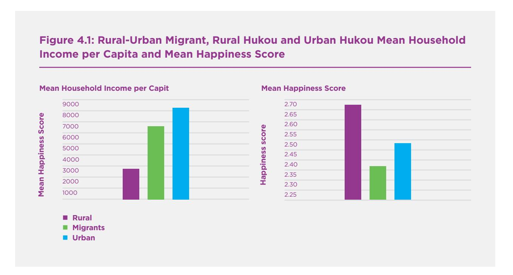

It is helpful first to provide descriptive information about the migrants before presenting the happiness functions that will explain what makes rural-urban migrants happy or unhappy. This will inform our interpretations. Consider the characteristics of those household members – 77% of whom were the household head - who responded to the attitudinal questions: 61% were men, 90% were married, 93% were employed, and 88% were living with their family. These respondents were generally not pessimistic about the future: 7% expected a big increase in real income over the next five years, 55% a small increase, 28% no change, and only 10% a decrease. Rural links were commonly retained: 53% had family members who still farmed in the village, 51% remitted income to the village, and 32% had one or more children still living in the village.

Figure 4.1 shows the average happiness of the three groups rural-urban migrants, rural-dwellers and urban-dwellers (possessing rural *hukous*, rural *hukous* and urban *hukous* respectively), and also their average income per capita. Although the happiness of the migrants was lower than that of rural dwellers, their income was not. The average income per capita of migrant households was 2.39 times that of rural households. Even allowing for the smaller number of dependants in migrant households by comparing total instead of per capita household incomes, the ratio is still 1.54. The ratios of household income per worker

and of wage income per employee are 2.01 and 3.02 respectively. Whichever concept is considered most relevant; migrants were at a considerable income advantage. The higher income of ruralurban migrants appears not to raise their happiness above that of rural dwellers. Yet when ruralurban households are divided into income per capita quintiles, their happiness level increases steadily (from 2.13 for respondents in the lowest fifth to 2.56 for those in the highest fifth). This sensitivity to income compounds the puzzle.

The respondents in the categories "unhappy" and "not at all happy" were asked the reason for their unhappiness. More than two-thirds of the respondents said that their income was too low. The next most important reason, reported by over 11%, was uncertainty about the future, suggesting that insecurity was a problem. This evidence suggests that income can be expected to be an important determinant of migrant happiness. In a separate question, migrants were asked what they thought was the most important social problem: lack of social security as it affected migrants (e.g. unemployment benefit, pension, access to health care) was the most common response to the options available, mentioned by 24% of respondents. Environmental pollution was the second-most reported problem (20%), corruption came third (18%), followed by social polarization (11%), discrimination against migrants (10%), and crime (8%).

Migrants were also asked: "Compared with your experience of living in the rural areas, are you happier living in the city"? No fewer than 56% felt that urban living gave them greater happiness, 41% reported themselves equally happy in rural and urban life, while only 3% reported greater rural happiness. When asked what they would do if forced to leave the city, more migrants would go to another city (54%) than would go back to their village (39%). These results add to the puzzle. If most migrants view urban living as yielding them greater happiness, and most wish to remain in an urban area, why are their mean happiness scores lower than those of rural residents?

### **4. Possible Explanations**

There are several possible explanations for these results. The first possibility is that migrants, when they decided to migrate from the village, had excessively high expectations of the conditions that they would experience in the city. We shall look for evidence that this might be the case by considering the characteristics of their urban life that reduce their welfare.

Second, the puzzle might be solved by recourse to the possibility of adaptation, following Easterlin's evidence.10 He argues that happiness depends both on income and aspirations, the former having a positive and the latter a negative effect. Moreover, as income rises over time, aspirations adapt to income, so giving rise to what has been called a 'hedonic treadmill'.11 When respondents are asked to assess how happy they had been in the past, when their income was lower, they tend to judge that situation by their current aspirations for income and therefore to report that they are more happy now. Similarly, when they are asked to assess their happiness in the future, when they expect to have higher income, they do not realise that their aspirations will rise along with their income and therefore report that they will be happier. This is possibly because, as findings from social psychology suggest, 'We don't always predict our own future preferences, nor even accurately assess our experienced well-being from past choices'.12

If current judgements about subjective wellbeing, whether in the past, the present, or the future, are based only on aspirations in the

present, this might explain why migrants on average are less happy than rural people: aspirations could have risen after having made the decision to migrate. While aspirations might not be directly measurable, the implications of adaptation can be tested. Similarly, we might also find an explanation for why it is that migrants generally report that their happiness is higher, or at least no lower, in urban than in rural areas.

A second possibility is that people form their aspirations relative to some 'reference group', i.e. the people with whom they compare themselves. The reference group can change when they move to the city and find themselves with richer neighbours. The notion that aspirations depend on income relative to that of the relevant reference group comes from the sociological literature,13 and has been developed for China in related papers on subjective well-being.14 The literature on relative income was well summarised and evaluated in 2008,15 since when many more studies of the effects of relative income have been made, albeit mainly for developed economies. Other studies for developing countries which show the importance of reference groups include shifts in reference norms in Peru and Russia,16 comparison with close neighbours in South Africa,17 and rural-urban migrants retaining a village reference group in Nepal.18 If the group with which the migrants compare themselves changes as a result of rural-urban migration and urban settlement, this might explain why their aspirations change. We can test whether migrants show 'relative deprivation' in relation to urban society.

Our third possibility is that the presence of members left behind in the village can place a burden on the urban members of the two-location family. Insofar as migrants remit part of their income, their own happiness score might fall and that of their rural family rise. Equivalently, our measure of the income per capita of the urban migrant household might overstate its disposable income per capita.

Fourth, our results might be explained by the untypical nature of the migrants. The lower happiness of migrants may be the result of their, or of their households, having characteristics different from those of the rural population as a whole. If this were the case, they could indeed have been less happy on average had they

remained in the village. Such happiness-reducing characteristics might be captured by the survey data – and thus be capable of being accounted for in the statistical estimations - or they might be unobservable to the researcher. For instance, it is possible that those rural-dwellers who by nature are melancholy or have high and unfulfilled aspirations hold their rural life to be responsible and expect that migration will provide a cure. They might therefore be more prone to leave the village for the city. If the self-selected migrants are intrinsically less happy, this might explain why the sample of rural-urban migrants has a lower average happiness score than does the sample representative of the rural population of which they were previously a part. Self-selection of this sort might also involve false expectations, in this case based on self-misdiagnosis. Its implications can be tested.

### **5. The Determinants of Happiness**

Happiness functions were estimated to discover the factors associated with the happiness of rural-urban migrants19 so as to test the possible explanations 1, 2 and 3, just outlined. We proceed in stages: first, we estimate ordinary least squares (OLS) estimates of the happiness score with a full set of explanatory variables. Second, we investigate whether these explanatory variables have different effects on happiness depending on the length of time that the household had been living in urban areas by dividing the migrant sample into 'short-stayers' and 'long-stayers', i.e. those who had settled in the city for less and more than the median time (7.5 years) respectively. Third, we confine the sample to employed migrants, as this enables us to see whether working conditions, denoted by work-related variables, have an impact on happiness. However, because the full results are available elsewhere (Knight and Gunatilaka, 2009, 2012, on which this chapter draws heavily) we report only the variables that are critical for our story.

Table 4.2 reports, for the full sample but with only the most relevant variables shown, the average values of the explanatory variables (column 1) and then coefficients in the happiness function estimated with the full set of available explanatory variables (column 2). With the happiness score as the dependent variable (the variable to be explained) and various independent variables

(chosen as the explanatory variables), the estimated 'coefficients' on the explanatory variables indicate the effect on happiness made by a unit change in each explanatory variable, holding all other explanatory variables constant. The asterisks show levels of statistical significance: the more asterisks against a coefficient, the more statistically significant is the effect on happiness. In column 2, the coefficient on log of income per capita is significantly positive, and its value (0.20) indicates that a doubling of income raises the happiness score by about 0.14 points. Income is relevant, as predicted, but its effect does not appear powerful by comparison with either the presumptions of economists or the estimated effects of some other variables. For example, reporting to be in good health (rather than not in good health) raises the happiness score by 0.12 points according to column 2.

Migrants can be expected to adjust over time to urban life in various ways. On the one hand, as they overcome initial difficulties and become more settled, we expect their happiness to rise. On the other hand, their reference groups might change, from the poorer, village society to the richer, urban society, and this fall in perceived comparative status might reduce happiness. The length of time spent in the urban area is introduced as an explanatory variable, and also its square so as to allow the possibility that the relationship is curved rather than being a straight line. The variable and its square are both significant, the former positively and the latter negatively although only at the 10% critical level. The coefficients imply that the happiness score rises to a peak after 12 years and then declines. However, it is possible that there is selective settlement: happier migrants are more likely to choose to stay long in the city. This would tend to bias upwards the estimated returns to duration of urban residence. In summary, it would appear that migrants' happiness tends to rise over several years of urban living, but the evidence is weak.

In order to pursue the notion that reference groups can be important, the effect of relative income was investigated. Drawing on the urban and rural samples of the 2002 national household survey, the average urban income per capita in the destination city and (lacking information on the origin county) the average rural income per capita in the origin province of the migrant, are introduced. The expectation is that both have

**Table 4.2: Happiness Functions of Rural-Urban Migrants: OLS Estimation**

|                                                                  | Mean or proportion | Full sample | Below median duration | Above median duration |
|------------------------------------------------------------------|-----------------------|-------------|--------------------------|--------------------------|
|                                                                  | (1)                   | (2)         | (3)                      | (4)                      |
| Log of per capita household income                            | 8.55                  | 0.2081***   | 0.1295***                | 0.2766***                |
| Duration of urban residence (years)                           | 7.51                  | 0.0136*     |                          |                          |
| Duration of urban residence, squared                          | 84.83                 | -0.0005*    |                          |                          |
| In good health                                                   | 0.90                  | 0.1231**    | 0.0266                   | 0.1691**                 |
| Expect big increase in income over next 5 years               | 0.07                  | 0.2984***   | 0.2673**                 | 0.3373**                 |
| Expect small increase in income over next 5 years             | 0.55                  | 0.0262      | 0.0508                   | -0.0035                  |
| Expect decrease in income over next 5 years                   | 0.10                  | -0.4033***  | -0.3221**                | -0.4506***               |
| Log of average per capita income in city of current residence | 8.97                  | -0.1204     | 0.0053                   | -0.2800**                |
| Log of average rural income in province of origin             | 7.81                  | 0.0700      | 0.1245                   | 0.0519                   |
| Living with family members                                       | 0.88                  | 0.1347      | 0.2079**                 | 0.1283                   |
| Number of relatives and friends in city                       | 7.19                  | 0.0039*     | 0.0076                   | 0.0016                   |
| Child still in village                                           | 0.32                  | -0.1250**   | -0.1254**                | -0.1131                  |
| No heating                                                       | 0.65                  | -0.1499**   | -0.2042***               | -0.1166*                 |
| Constant                                                         |                       | 1.0248      | 0.4658                   | 1.6702                   |
| R-squared                                                        |                       | 0.100       | 0.091                    | 0.134                    |
| Number of observations                                           |                       | 1850        | 925                      | 926                      |

Notes: Dependent variable in this table and in Table 4.4: Score of happiness based on cardinal values assigned to qualitative assessments as follows: very happy=4; happy=3; so-so=2; not happy=1 and not at all happy=0.Model 1 is for the full sample. Models 2 and 3 are based on sub-samples selected according to the length of stay in urban areas. The omitted categories in the dummy variable analyses are: single female; employed or labour force non-participant not healthy; in normal or worse than normal mood; change in income expected in the next five years. In this and subsequent tables, \*\*\*, \*\*, and \* denote statistical significance at the one per cent, five per cent and ten per cent levels respectively. The models have been clustered at city level for robust standard errors.

a negative coefficient, reflecting relative deprivation. The coefficient on destination income is indeed large and negative but not significantly so; that on origin income is small and positive and not significantly different from zero. If the migrant is living with family, or has relatives in the city who can be turned to for help, the effect on happiness is positive, but not significantly so in the former case. Having a child still in the village has a significant depressing impact. Of the housing variables, only lack of heating is significant: the effect is predictably negative.

Columns 3 and 4 of Table 4.2 reproduce the equation for two sub-samples: those who had less than 7.5 years of urban residence and those who had more, respectively. Only the notable variables for which there is a significant difference in coefficients are mentioned. The long-stayers have a higher coefficient on the income variable (0.25 compared with 0.12). This might be because, through self-selection, they are more successful and happier than the short-stayers. However, the result is also consistent with migrants learning to enjoy the costly pleasures of urban life and so becoming more materialistic as they get more involved in urban society. The long-stayers are

more sensitive to average urban income per capita in the destination city (a significant -0.28 compared with a non-significant -0.01). This suggests that over time urban residents increasingly become the reference group for migrants. Moreover, the fact that this makes them relatively less happy might explain why additional income becomes more important for their happiness.

The sensitivity of happiness to relative income in the destination city, especially for long-stayers, seems to agree with our second possible explanation, i.e. that migrants' aspirations rise as they adjust to their new urban environment. The extreme sensitivity of migrant happiness scores to income rank in the city (shown in Table 4.5 below) provides further supporting evidence.

These results were found to be unchanged using alternative versions of the happiness variable20. An attempt was also made to examine the sensitivity of our results to the influence of the unobserved determinants of happiness.21 For instance, unobserved characteristics such as personal energy might raise both income and happiness, or happiness itself might improve motivation and so raise income. The income variable was therefore adjusted to correct for such unobserved influences, but the results of this exercise did not alter our story.22

We investigated the effect of working conditions on the subjective well-being of employed respondents. In other words, does the unpleasantness and insecurity of urban work contribute to the unhappiness of migrants? Table 4.3 is based on estimates of the full sample equation of Table 4.2 but for employed respondents only, the reason being that it is then possible to add various employment-related explanatory variables.23 The first column provides mean values and the second shows only the results for the additional variables as the coefficients of the variables in common barely change.

Where satisfaction with the current job is rated 4 for 'very satisfied' down to 0 for 'not at all satisfied', this variable has the expected positive and significant coefficient. Respondents were asked whether rural workers enjoyed the same treatment as urban workers in seven different aspects of the employment relationship. The negative answers were added to form an index of discrimination (ranging from 0 to 7). The coefficient is negative and significant, indicating that perceptions of discrimination contribute to unhappiness. Compared with being selfemployed, having permanent work or long term contract work raises happiness but this result is not statistically significant, i.e. it could arise by

**Table 4.3: Happiness Functions of Employed Rural-Urban Migrants: OLS Estimation**

|                                             | Mean or proportion | Coefficient |
|---------------------------------------------|--------------------|-------------|
| Satisfaction with job                       | 1.98               | 0.0735*     |
| Index of discrimination                     | 5.35               | -0.0322***  |
| Permanent or long-term contract work        | 0.05               | 0.1338      |
| Temporary work                              | 0.24               | 0.0079      |
| Can find another job in two weeks           | 0.11               | -0.0997     |
| Can find another job in a month             | 0.23               | -0.1213**   |
| Can find another job in 2 months            | 0.10               | -0.1478*    |
| Can find another job in 6 months            | 0.13               | -0.1917**   |
| Need more than 6 months to find another job | 0.17               | -0.2140***  |
| R-squared                                   |                    | 0.129       |
| N                                           |                    | 1715        |

Notes: With the addition of employment-related variables, the specification of column 2 is identical to that of column 2 of Table 4.3, but the variables presented in Table 4.3 are not reported. The omitted categories in the dummy variable analyses reported are: self-employed; can find a job immediately. The equation has been clustered at city level for robust standard errors.

chance. Another aspect of the insecurity of urban employment can also be incorporated. Respondents were asked how long it would take them to find another job with equivalent pay if they lost their current job. Compared with 'within one week' - the reference category with which other categories are compared - the coefficients are generally significantly negative and increase steadily in size. The evidence is consistent with our first possible explanation: migrant employment can be unpleasant and insecure, and this depresses migrant happiness.

The third possible explanation emerges from theories of rural-urban migration expressed in terms of decision-making by the rural family, of which the migrant remains a part. The inference is that the average happiness score of migrants is low because they support their rural family members by remitting part of their income to them. In that case, our dependent variable cannot reflect the full gain in happiness of the two-location family. In principle the argument is weak. First, it is less plausible for settled than for temporary migrants. Second, 'utility-maximising economic agents' (a concept commonly used by economists!) are assumed to allocate their income optimally, i.e. at the margin gifts yield as much utility for the giver as consumption. Altruism and satisfaction that they are fulfilling their family obligations might raise migrants' happiness. So happiness need not fall if income is remitted. It is nevertheless true that migrant household disposable income per capita is often reduced by the presence of family members elsewhere.

It is relevant that 51% of migrant households made remittances, and that remittances represented 9% of household income for the sample as a whole and 17% for the remitting households. Do remittances reduce the happiness of respondents in migrant urban households, and so contribute to the low average happiness score? If that were the case, the variable log of household remittance per capita would be significantly negative in the estimated happiness function.24 However, whether this term is added to the full estimated equation or the sub-sample of remitters, the coefficient on the remittance variable remains no different from zero. To illustrate, when the variable log remittances per capita is added to column 2 of Table 4.2 (not shown), the coefficient is a non-significant 0.0064. Thus, we found no evidence in support

of the third possible explanation, i.e. that migrants' happiness is reduced because they remit part of their income,

## **6. Why Are Migrants Less Happy Than either Rural Dwellers or Urban Dwellers?**

Migrants might be less happy on average than either rural or urban people because they differ in their average characteristics, i.e. average endowments of happiness-affecting attributes such as health status. Here a different testing methodology is required. The migrants are compared with both rural and urban residents, employing a standard decomposition technique. The objective is to pinpoint the reasons for the difference in happiness. The decomposition shows the contribution to the difference in happiness that is made by each determinant of happiness.

We began by conducting a decomposition analysis of the difference in household mean income per capita, in order to throw some light on the representativeness and the motivation of the migrants. The decomposition methodology is explained in the technical box below, where it is illustrated in terms of differences in average happiness. Those migrating from rural China are indeed a selective and unrepresentative group. Migrant households, had they remained in the rural areas, would on average earn 10% less income than do rural resident households. There is also a considerable income advantage to their migration: the average income that migrant households actually earn is 2.64 times what they would earn in the rural areas. By contrast, if they were to migrate, average rural households would earn 2.19 times more than they actually earn. It appears that rural households possess productive characteristics that are relatively valuable in the countryside whereas migrant households possess productive characteristics that are relatively valuable in the city.

The average happiness score of rural people was 2.68 and that of migrants 2.37, implying a migrant shortfall of 0.31. Table 4.4 decomposes this gap into the parts which can be explained by differences between the two groups in the average values of their characteristics and by differences in the coefficients in the two

#### **Technical Box**

The Blinder-Oaxaca decomposition technique is employed to explain the difference in mean happiness between migrant and rural households. This is based on identical happiness regression equations for the two groups being compared. The choice of explanatory variables used is governed by the availability of the same variable in the two data sets, and by whether it is a successful predictor of happiness in the estimated happiness functions.

The decomposition is based on two equations:

$$H_{r} - H_{m} = X_{m} (a_{r} - a_{m}) + a_{r} (X_{r} - X_{m}),$$
 (1)

and

$$H_{\rm r} - H_{\rm m} = X_{\rm r} (a_{\rm r} - a_{\rm m}) + a_{\rm m} (X_{\rm r} - X_{\rm m}).$$
 (2)

In the equations, *H*r , *H*m are the mean happiness scores in the rural and migrant samples respectively, *X*r , *X*m are vectors of rural and migrant mean characteristics, and *a*r , *a*m are vectors of rural and migrant coefficients. Equation (1) enables us to pose the counterfactual question 'what would be the effect on the mean happiness of migrants if they had the same happiness function as rural people?', and equation (2) the question 'what would be the effect on the mean happiness of rural people if they had the same happiness function as migrants?' To illustrate the decomposition according to equation (2), the entry -55.39 in row 1, column 1 of Table 4.4 is obtained by multiplying the difference in mean log of income per capita by the migrant coefficient of log of income per capita, and the entry 1.01 in row 1, column 2 by multiplying the mean rural log of income per capita by the difference in coefficients, and then expressing these products as percentages of the gross mean difference in happiness. Only the decomposition based on equation (2) is reported in the table. However, the results for the alternative decomposition are very similar.

happiness functions. The figures show the percentage contributions of the difference in average values of characteristics and of the difference in coefficients respectively.

We see from the first column of Table 4.4 that the share of the difference in average happiness scores that is attributable to differences in average characteristics sums to -35%, and from the second column that the share attributable to differences in coefficients sums to 135%. The effect of characteristics is therefore actually to increase the difference in mean happiness scores. This is mainly due to the variable log of income per capita: the effects of income are the same in the two samples but migrants have higher incomes. The reason why migrants have lower average happiness must therefore be found in the different explanations for the happiness of the rural and urban residents, based on their different coefficients. The constant term, health,

and income expectations are the main contributors, and age is the big exception. The importance of the constant term implies that there are unobserved characteristics that we have not been able to include in the model which reduce migrant relative to rural happiness. For example, we are unable to standardise for the various social disadvantages that migrants encounter in the cities because the same variables are not available in the rural data set. Perhaps because rural people are on average less healthy than migrants - poor health being a deterrent to migration - they place a higher value on good health.

In both samples happiness is highly sensitive to expectations about future income in five years' time. It appears from Figure 4.2 that expectations of future income can influence current happiness. With the expectation of no change in income as the reference category in the dummy variable

**Table 4.4: Decomposition of the Difference in Mean Happiness Score between Rural-Urban Migrants and Rural Residents: Percentage Contribution to the Difference**

|                          |                        | Using the migrants' happiness function |  |
|--------------------------|------------------------|----------------------------------------|--|
|                          | Due to characteristics | Due to coefficients                    |  |
| Log of income per capita | -55.39                 | 1.01                                   |  |
| Health                   | -5.81                  | 94.41                                  |  |
| Income expectations      | 11.34                  | 36.36                                  |  |
| Age                      | 6.69                   | -131.54                                |  |
| Other variables          | 7.95                   | 5.48                                   |  |
| Sum (percentage)         | -35.23                 | 135.23                                 |  |
| Sum (score)              | -0.1078                | 0.4137                                 |  |

Notes: The mean happiness scores are 2.6764 in the case of rural residents and 2.3703 in the case of migrants, creating a migrant shortfall of 0.3061 (set equal to +100%) to be explained by the decomposition. This represents 100 per cent. The composite variables are age and age squared for age, married, single, divorced and widowed for marital status, and big increase, small increase and decrease for income expectations. 'Other variables' included in the equation but not reported are education, age, male, marital status, ethnicity, CP membership, unemployment, working hours, and net financial assets.

**Figure 4.2: Rural-Urban Migrant and Rural Dweller Coefficients Of Variables Denoting Expectations of Income in the Next Five Years, Derived from the Happiness Equations Estimated for Table 4.4**

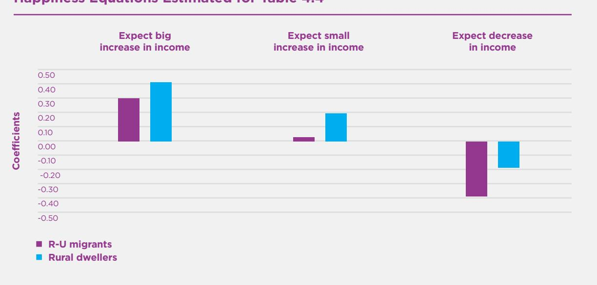

analysis, the coefficients in the migrant sample vary from 0.31, if a large increase is expected, to 0.05, if a small increase is expected, and to -0.39, if a decrease is expected; the corresponding estimates for the rural sample are 0.41, 0.19 and -0.19 respectively. The fact that in the migrant

sample the coefficients are uniformly lower, in relation to the expectation of static income, suggests that migrants have higher aspirations relative to their current income. This can be expected if aspirations depend on the income of the relevant comparator group. Whereas the

rural respondents are fairly representative of rural society, and so their mean income is close to the mean income of their likely comparator group, the migrant sub-sample is unrepresentative of urban society: migrants tend to occupy the lower ranges of the urban income distribution. If migrants make comparisons with urban-born residents, their aspirations will be high in relation to their current income.

Is the low mean happiness of migrants a general characteristic of city life? The inquiry can be pursued further by comparing migrants with 'urban residents', i.e. persons who are urban-born and or in other ways have acquired urban *hukou* status, with the rights and privileges that accompany it. The average happiness score of urban residents is 2.48 and that of migrants 2.37, implying a migrant shortfall of 0.11. Table 4.5 provides a decomposition exercise similar to that of Table 4.4 but with a different set of explanatory variables - those that are common to the two datasets.

In this case the differences in coefficients add slightly to the migrant shortfall in average happiness score (in total, coefficients' share of the explanation for the difference in average happiness is -21%). The coefficient on the income variable is higher for urban residents (0.173) than for migrants (0.111), so raising urban relative to migrant happiness. The positive effect of income expectations reflects the lower coefficients in the migrant sample: with static expectations as the reference category, for migrants an expected big increase in income has a coefficient of 0.21, a small increase 0.00, and a decrease -0.37, whereas for urban residents the corresponding estimates are 0.34, 0.10, and -0.29 respectively. Again, migrants appear to have higher aspirations relative to their current income.

The contribution of the various income coefficients to the explanation of the difference in mean happiness is offset by the negative effects of such variables as age, gender and the constant term. Note that position in the city income distribution has a powerful effect on happiness. With the highest quarter of households being the omitted category, the happiness coefficient falls monotonically, to lower than -0.80 in the lowest

**Table 4.5: Decomposition of the Difference in Mean Happiness Score between Rural-Urban Migrants and Urban-Hukou Residents: Percentage Contribution to the Difference**

|                                                   | Using the migrants' happiness function |                     |
|---------------------------------------------------|----------------------------------------|---------------------|
|                                                   | Due to characteristics                 | Due to coefficients |
| Log of income per capita                          | 28.15                                  | 472.62              |
| Income expectations                               | -39.92                                 | 59.32               |
| Living standard in second highest quarter in city | -33.68                                 | 26.28               |
| Living standard in third highest quarter in city  | -11.71                                 | 77.84               |
| Living standard in lowest quarter in city         | 175.93                                 | -8.37               |
| Age                                               | 32.85                                  | -594.05             |
| Male                                              | -4.08                                  | -46.78              |
| Health                                            | -28.01                                 | 51.89               |
| Other variables                                   | 1.14                                   | 36.97               |
| Constant term                                     | 0.00                                   | -96.38              |
| Sum (percentage)                                  | 120.67                                 | -20.67              |
| Sum (score)                                       | 0.1342                                 | -0.0230             |

Notes: The mean happiness scores are 2.4845 in the case of urban residents and 2.3703 in the case of migrants, creating a migrant shortfall of 0.1143 (set equal to +100%) to be explained by the decomposition. This represents 100 per cent. The composite variables are age and age squared for age, married, single, divorced and widowed for marital status, and big increase, small increase and decrease for income expectations. 'Other variables' are education, marital status, ethnicity, CP membership, unemployment, working hours and net financial assets.

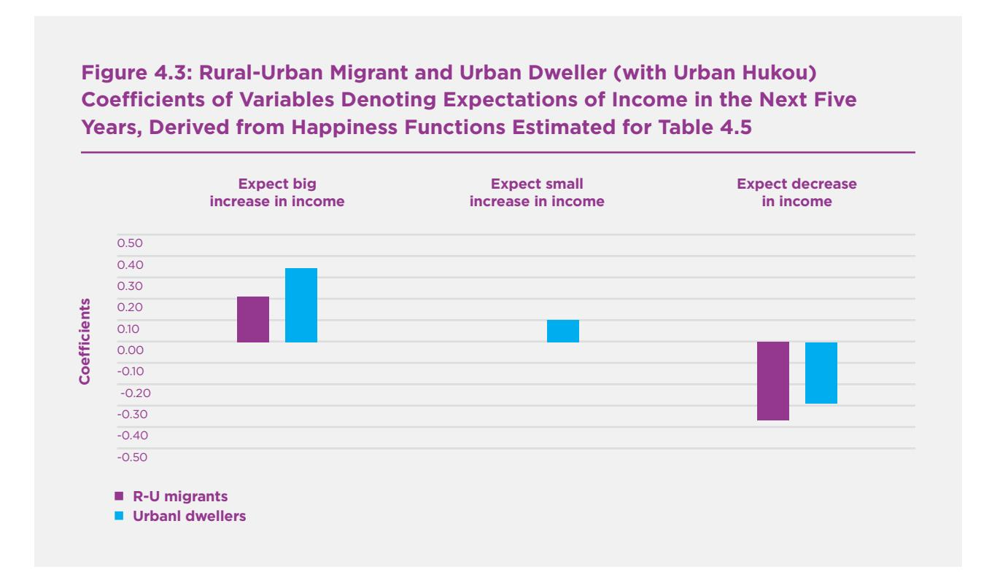

quarter. As this is true of both samples, it does not affect relative happiness.

The migrant shortfall in happiness therefore has to be explained in terms of differences in average characteristics (the total share of characteristics in accounting for the difference in average happiness is 121%). Two variables stand out: the higher mean income of urban residents improves their relative happiness, and their superior position in the city income distribution has the same effect. A far higher proportion of migrants than of urban residents fall in the lowest quarter of city households in terms of living standard (35% compared with 11%). This fact alone can explain more than the entire migrant deficit. If the income of the relevant comparator group influences aspirations, the inferior position of migrants in the city income distribution can also explain why they appear to have higher aspirations in relation to their current income.

## **7. Are Migrants Self-Selected?**

It is evident that differences in unobserved characteristics are important for the differences in happiness. For example, the constant term in the decomposition presented in Table 4.4 explains more than the entire difference in the average

happiness scores of migrants and rural-dwellers. Migrants might be less happy on average simply because inherently unhappy people tend to be the ones who migrate. Support for this idea comes from answers to the question as to whether urban living had yielded greater happiness than rural living. Despite the average happiness score being lower for migrants than for rural people, 56% of migrants thought that urban living made for greater happiness and only 3% disagreed. This is the picture that could emerge if migrants are intrinsically unhappy people whose happiness remains low despite improving after migration.

Migrants might be unhappy people because by nature they are melancholy or they have high but unfulfilled aspirations. However, the latter reason fits ill with the stereotype of migrants as relatively self-confident, optimistic, risk-loving individuals. Consider the implications of assuming both that migrants are naturally unhappy people and that migration does indeed generally raise happiness. Insofar as those migrants with a relatively unhappy disposition become absolutely happier albeit still relatively unhappy after migration, we might expect as high a proportion of unhappy as of happy migrants to report that their life is more satisfactory in urban than in rural areas. In fact the proportion falls, from 67% in the highest happiness category to 34% in the lowest

happiness category, suggesting that this sort of self-selection can at best be only a partial explanation for the lower average happiness of migrants.

The Technical Box below explains how it was possible to isolate that part of the happiness of each migrant that cannot be explained by our variables. We could then test whether this residual helps to explain the respondent's report that they are happier in the city than in the village. Table 4.6, predicting an affirmative answer, identifies the characteristics which have raised happiness. When the residual is introduced into the equation (column 2) the prediction is that it will not be different from zero if inherent and unchanging personality is the cause of unhappiness. However, the positive effect suggests that migration changed the unobserved characteristics of migrants. In that case inherent disposition cannot solve out puzzle.

Instead, migrants might select themselves on the basis of unobserved characteristics that are different or have different effects in the two locations. Several examples come to mind (beyond the case discussed under our second possible explanation, i.e. migrants' aspirations rise). If people who are dissatisfied with life in general but with village life in particular have a high propensity to migrate, migrants might have low average happiness in both locations but particularly in the village. For instance, own or family misfortune or bad family or village relationships could reduce a person's happiness but more so if they remained in the village. If migrants have high pre-existing aspirations which cannot be fulfilled in the village but have the potential to be better met in the city, this might have the same effect. In each of these cases the migrants would be likely to report that their urban life is better than their rural life had

**Table 4.6: Determinants of Urban Living Happier than Rural Living: Employed Sample, Probit Estimation**

|                                                         | Marginal Effects of Probit Estimation |           |
|---------------------------------------------------------|---------------------------------------|-----------|
|                                                         | (1)                                   | (2)       |
| Log of per capita household income                      | 0.0506*                               | 0.0466*   |
| Duration of urban residence (years)                     | 0.0174***                             | 0.0190*** |
| Duration of urban residence, squared                    | -0.0003                               | -0.0004   |
| Expect big increase in income over next 5 years         | 0.1657**                              | 0.1766*** |
| Expect small increase in income over next 5 years       | 0.0869**                              | 0.0941*** |
| Expect decrease in income over next 5 years             | -0.0557                               | -0.0559   |
| Difference between actual and predicted happiness score |                                       | 0.1736*** |
| Living with family members                              | 0.1286**                              | 0.1070*   |
| Living in own house                                     | 0.1304**                              | 0.1286**  |
| Satisfaction with job                                   | 0.0719***                             | 0.0768*** |
|                                                         |                                       |           |
| Number of observations                                  | 1715                                  | 1715      |

Notes: The dependent variable is the probability of being happier in urban areas. For the dummy variables denoted by (d), the marginal effects are denoted by dy/dx for discrete change of dummy variable from 0 to 1.

The variable, difference between actual and predicted happiness score, has been derived by obtaining predicted happiness score from estimating Model (1) in Table 4.3.The omitted categories in the dummy variable analyses are: single female; employed or labour force non-participant; not healthy; in normal or worse than normal mood; change in income expected in the next five years. Explanatory variables estimated in the equations but not reported in the table are: male, married, male and married, education, working hours, net financial assets, ln average household per capita income in city of current residence, ln household per capita rural income in province of origin,, permanent or long-term contract work, index of discrimination, can find another job in two weeks, .one month, two months, six months, needs more than six months to get another job. The equations have been clustered at city level for robust standard errors.

#### **Technical Box**

The argument can be tested rigorously as follows. Estimating the predicted happiness score for each respondent (from column 2 of Table 4.2), the residual (actual minus predicted) score is the part of happiness that cannot be explained by our equation. The residual is made up of measurement error and two sorts of unobserved characteristics of the respondent: those which were present before migration and those which came after migration. A disposition to be happy or unhappy is of the former sort. Assume that migration had a similar effect on the happiness of all respondents whose unobserved characteristics did not change pre- and post-migration. In that case, we can test whether the residual helps to explain whether the respondent reported that their happiness was higher in the city than in the village.

Table 4.6 shows the results of a Probit regression predicting an affirmative answer. Its two columns, presenting the marginal effects of each explanatory variable, both refer to the employed sample. The object is to identify the characteristics which have raised happiness. Comparing Tables 4.2 and 4.3 (using OLS) with Table 4.6 (using Probit), we see that some of the same variables that determine happiness also correspondingly determine an increase in happiness. When the residual is introduced into the equation corresponding to column 2 of Table 4.6, the expectation is that it will not be significantly different from zero if inherent and unchanging personality is the cause of unhappiness. However, the coefficient is positive and significantly so at the 1% level (column 2), and the marginal implies that a residual of +1.0 raises the probability of an affirmative answer by 17 percentage points. This positive effect suggests that migration changed the unobserved characteristics of migrants, in which case inherent disposition cannot solve the puzzle.

been, despite their low average urban happiness. A test of this type of explanation would require a survey which could reveal the happiness score, and the reasons given for unhappiness, before migrating

### **8. Other China Studies**

One other study deals specifically with migrants.25 It analysed the China Household Income Project (CHIP) survey [also known as the Rural-Urban Migration in China (RUMIC) survey] relating mainly to 2007. The research interest is in the effects of various measures of relative income on happiness. The data differed from that used in the analysis above in that it contained all rural *hukou* people present in the urban areas, i.e. both temporary and settled migrants, and the dependent variable was an aggregation of twelve measures of mental health.

It was found that subjective well-being is negatively affected by the incomes of other migrants and of workers in the home region. However, a positive coefficient was obtained on average income in the local urban area. This was interpreted as a 'signal' effect, i.e. the higher incomes of urban people served as a signal of future income prospects. A similar positive coefficient had been obtained and similarly explained for Russia.26 It contrasts sharply with our finding of a negative coefficient. The contrast was explained as arising because our sample contained only settled migrants, who were more likely to have transferred their reference group from the village to the city. In support of this explanation, it was noted that the positive coefficient declined with years since migration. Containing very different definitions both of a migrant and of subjective well-being, the two analyses are not necessarily contradictory.

Another study examined the changes in the average happiness of urban, rural, and ruralurban migrant households between the CHIP 2002 and CHIP 2013 national household surveys.27 The ratio of migrants' to rural households' income per capita was higher in 2013 than it had been in 2002: again, the economist's expectation is that rural people would have an incentive to migrate to raise their utility. However, the average happiness of rural-dwellers remained higher than that of migrants, although the gap had narrowed. The rise in migrant happiness was probably due to the rapid growth of their income, associated with the growing scarcity of migrant labour, and gradual (but minor) improvements in their urban treatment and conditions in recent years. We surmise that the fall in average rural happiness, despite a rise in average rural income, was because the loss of household members to the cities often left unbalanced families and villages behind, or because rural households' aspirations rose rapidly as their information about urban life improved.

## **9. Studies in Other Developing Countries**

To what extent can the China story be generalised? In one respect – the harsh institutional and policy treatment of rural *hukou* migrants in the cities – China is likely to be exceptional. However, in many countries ruralurban migrants are at a disadvantage: their social networks are often weak, their education is liable to be of poor quality for urban life and work, and their village customs and weak assimilation might cause social discrimination. However, the available evidence cannot provide a clear answer to this question. It appears that research on the relationship between rural-urban migration and happiness in developing countries remains very limited.

Whereas our China case study found that migration may well have had the consequence of reducing subjective well-being, a study of Thailand found that a somewhat higher proportion of the permanent migrants in that sample experienced an increase in life satisfaction after migration than experienced a decrease.28

The interpretation of our main finding in terms of changing reference groups is echoed in a

pioneering study for developing countries of aspirations relative to achievement which examined 'frustrated achievers' in Peru. More than half of those who had objectively achieved the largest income growth subjectively reported that their economic condition had deteriorated over the previous decade. Part of the explanation was to be found in their perception of increased relative deprivation.29

In South Africa a very extensive system of temporary circular migration prevailed in the past. However, since the advent of democracy the country has increasingly experienced the permanent urban settlement of rural-dwellers. The same question has been posed for South Africa as was posed above for China.30 That study reached similar results and suggested some of the same interpretations but used a different methodology. A longitudinal panel survey identified the happiness of rural people and their happiness four years later after rural-urban migration (excluding temporary migration). The real income of the migrants rose substantially, largely because of their migration. Yet sophisticated estimation yielded a fall in subjective well-being (measured on a scale of 0 to 10) of 8.3%. A favoured interpretation was that this reduction was the result of false expectations and changing reference groups after the migrants settled in the urban areas.

#### **10. Summary and Conclusion**

This chapter illustrates how it should be possible to go beyond a description of happiness and its correlates. Using microeconomic (individual and household) data based on a well-designed survey and questionnaire, microeconomic analysis can be used to explore and to answer interesting and important questions about what makes people happy or unhappy. The settled rural-urban migrants that we study are the vanguard of a great wave of settlement as the urban economy becomes increasingly dependent on migrants from rural China.

We have posed the question: why do rural-urban migrant households which have settled in urban China report lower happiness than rural households? Migrants had lower average happiness despite their higher average income: the income difference merely adds to the puzzle. It is a

question that cannot easily be answered in terms of economists' conventional models of ruralurban migration based on 'utility maximisation'. Four possibilities were examined. We found no evidence for the idea that happiness was reduced by the need for the migrants to provide support for family members in the village. Each of the other three possibilities involves false expectations, of three different types: prospective migrants may have false expectations about their urban conditions, or about their urban aspirations, or about themselves. What they have in common is that rural-urban migrants are likely to lack the necessary information to enable them to judge the quality of their new lives in a different world. For each of the three types of belief there are reasons why they are too optimistic about life in the city.

Consider first the idea that migrants are too optimistic about the conditions of city life. The fact that happiness appears to rise over several years suggests that migrants are able to overcome the early hardships of arriving, finding work, and settling in the city. However, some hardships remain, relating to accommodation, family, and work. Provided that accurate information had been available to prospective migrants, they should have taken account of adverse conditions reducing their happiness when deciding to migrate: expectations would not have been false. Why might migrants overestimate the conditions of their urban life and work? It is possible that, whereas expected income is quantifiable and understandable, other aspects of urban life have to be experienced to be understood. Moreover, expectations of conditions might be based on images of the lives of urban residents rather than those of rural-urban migrants, or the reports provided by migrant networks might be too rosy. The migrants, when they made their decisions to move, may have been realistic about their urban income prospects, whereas their expectations of living and working conditions could have been biased upwards. However, there is a caveat: the better the information flows to the villages, the weaker is the case for this possibility.

The second possibility is that migrants had falsely believed, at the time of migration, that their aspirations would not alter in the city. Consider the reasons why migrants' aspirations may have risen and now exceed their actual

achievements. When we conducted a decomposition analysis to discover why migrants have a lower mean happiness score than both rural dwellers and urban dwellers possessing urban *hukous*, in each case a major contribution came from the higher aspirations of migrants in relation to current income. This is consistent with the fact that over two-thirds of migrants who were unhappy or not at all happy gave low income as the predominant reason for their unhappiness. The relatively high aspirations might be explained by the lowly position of most migrants in the city income distribution: having relatively low income was shown to reduce their happiness. The evidence suggests that migrants draw their reference groups from their new surroundings, and for that reason have feelings of relative deprivation. It is plausible that migrants, when they took their decisions to move, could predict that their incomes would rise but not how their aspirations would rise as they became part of the very different urban society.

Consider the possibility that people with unobserved and invariant characteristics that reduce happiness have a higher propensity to migrate, in the false expectation that migration will provide a cure, and that their continuing unhappiness pulls down the mean happiness score. However, our test using the residual, unexplained component of individual happiness scores provided no support for this argument. Inherent disposition is unlikely to provide a good explanation for the low average happiness score of migrants.

There are other possible explanations which cannot be adequately tested by means of our data set. The one mentioned above is that migration is subject to 'selection bias' on the basis of unobserved characteristics which are different or have different effects in the two locations. Another is that rural-urban migrants, once they settle in the city, are induced by urban cultural norms to use a different scale for measuring happiness, and thus to report happiness scores lower than those of rural residents. We would expect the reported happiness of migrants to be higher before they have time to adjust their happiness scale. However, the average happiness score of migrants who have been in the city for less than three years is 0.08 points lower than the average for all migrants, and the regression results in

Tables 4.3 and 4.4 suggest that the standardised happiness score rises for more than a decade after arrival. Although it is not possible to refute the rescaling explanation, this evidence fails to confirm it. Yet another possibility is that migrants are willing to sacrifice current happiness for future happiness - plausible in a country with an overall household saving rate of no less than 24%. Migrants might be willing to put up with unhappiness because they feel that life will eventually get better for them or their children. Analysis of the 2002 CHIP survey found that a reason for the high happiness of rural-dwellers is that they place a high value on village personal and community relationships (Knight et al., 2009). A further possible contribution to the lower happiness of rural-urban migrants is that they come to realise that their social environment is less friendly and less supportive than it was in the village.

The absence of tests for these alternative explanations means that our conclusions have to be qualified. Further research based on better data sets is required to explain the puzzle in China and, if it is found to be a general phenomenon, in other poor urbanising societies.

Whatever the explanation, the obvious question arises: why do unhappy migrants not return to their rural origins? One reason is that the majority do perceive urban living to have yielded them more happiness than rural living. This result was found to be sensitive to expected income, and the majority of migrants did indeed expect that their incomes would rise over the next five years. Migrants were also more likely to favour urban living the longer they stayed in the city – possibly because they increasingly valued aspects of urban living that were not to be found in rural areas. Social psychology might again be relevant: migrants do not take into account how their aspirations will adjust if they return to village life. Alternatively, migrants might correctly expect that their new aspirations will not adjust back. So there might be symmetry in the way they view leaving their rural residence and not leaving their urban one. Another possible reason why unhappy migrants do not return to their origins – unfortunately not pursued in the survey - is that the cost might be prohibitive. This is plausible if their households have forgone the tenurial rights to village farm land and housing land that they previously held.

The main policy instrument available to a government that is concerned to improve the subjective well-being of rural-urban migrants is to reform the range of institutions and policies which place the migrants at a disadvantage in the cities. In some respects, however, migrants might have to take the initiative. There is scattered evidence that some rural-urban migrants have created a more supportive and helpful city environment for themselves - where migrants from the same village, county or area choose to concentrate in particular parts of a city.

The study has broader implications. Should social evaluation by policy-makers reflect measured happiness? The contrary argument has been examined and found wanting.31 The distinction made above between expected utility (which economic agents are assumed to maximise) and experienced utility (which happiness scores are assumed to measure) is relevant. Insofar as there is a systematic difference between the two, this can arise because of an unpredicted change in aspirations, for instance, owing to a change in reference group. In our judgement, changes in aspirations should be taken into account in assessing people's perceptions of their own welfare. To regard some objectively based 'true' utility as existing separately from subjectively perceived utility is effectively to make a normative judgement about what is socially valuable.

In many developing countries rapid rural-urban migration gives rise to various social ills – such as urban poverty, slums, pressure on infrastructure, unemployment and crime – which adversely affect the welfare of all urban residents. In contrast, by attempting to restrict migration the Chinese government has curbed these outcomes. For instance, in the 2002 national household survey few urban *hukou* residents reported that the presence of migrants constituted the greatest social problem - well behind corruption, lack of social security and environmental pollution. The fact that rural-urban migrants were the least happy group suggests that they themselves might foment unrest. However, because social instability probably requires not only unhappiness but also a perception that it is man-made and capable of being remedied, no such conclusion can be safely drawn.

The ongoing phenomenon of internal rural-urban migration in developing countries involves many millions of the world's poor. Not only their objective well-being but also their subjective well-being deserves more extensive and more intensive research. There is much to be done, both to advance understanding and to assist policymaking.

#### **Endnotes**

- 1 China's rate of natural increase of the urban population was low on account of the one-child family policy, and much reclassification was the result of migration from rural areas.
- 2 Knight and Song (1999: chs. 8,9)
- 3 Zhao (1999).
- 4 Knight and Song (1999: ch.9; 2005, chs.5,6).
- 5 Knight and Yueh (2008).
- 6 Gao et al. (2017: 285). These labour force figures are of course lower than the urban population figures of Table 4.1.
- 7 Knight et al. (2011: 597)
- 8 Knight et al. (2010: table 1).
- 9 Organised by the Institute of Economics, Chinese Academy of Social Sciences, and designed by Chinese and foreign scholars including one of the authors.
- 10 In several papers but especially Easterlin (2003).
- 11 The explanation draws on the psychological literature to make the distinction between 'decision utility' and 'experienced utility': the utility expected at the time of making a choice and the utility subsequently experienced from that choice.
- 12 Rabin (1998:12).
- 13 At least as far back as Runciman (1966).
- 14 Knight et al. (2009); Knight and Gunatilaka (2010).
- 15 Clark et al. (2008).
- 16 Graham and Pettinato (2002), Senik (2004).
- 17 Kingdon and Knight (2007).
- 18 Fafchamps and Shilpi (2008).
- 19 Unless a variable is both important to our story and likely to be endogenous (as in the case of income, discussed below), we interpret the coefficients as indicating causal effects on happiness.
- 20 First, happiness was made a binary variable and estimated by means of a probit model; secondly, happiness was converted into a multinomial variable and estimated with an ordered probit model. The pattern of results was very similar to that of Table 4.3.
- 21 The same specification as in Table 4.3 (column 2) with the potentially endogenous variable that is most relevant to our tests, log of income per capita, now instrumented. The exclusion restrictions are mother's years of education, spouse's years of education, and the income that the migrant earned in the village before migrating, It is plausible that these variables do not directly influence current happiness (not even own happiness has a positive effect in Tables 4.3 and 4.4). The instrument passed the conventional tests.
- 22 The coefficient on income was raised but the effect was modest. One possible explanation for the rise is that hidden relationships have the opposite sign, e.g. higher aspirations raise income but lower happiness, or happiness discourages effort.
- 23 Fortunately, few observations are lost.
- 24 With zero remittances set equal to one yuan.
- 25 Akay et al. (2012).

- 26 Senik (2004).
- 27 Luo (2017).
- 28 De Jong et al. (2002).
- 29 Graham (2005).
- 30 Mulcahy and Kollamparambil (2016).
- 31 Clark et al. (2008).

#### **References**

Akay, Alpasian, Oliver Bargain, and Klaus F. Zimmermann (2012). Relative concerns of rural-to-urban migrants in China, *Journal of Economic Behavior and Organization*, 81: 421-41.

Clark, Andrew, Paul Frijters and Michael Shields (2008). Relative income, happiness and utility: an explanation of the Easterlin Paradox and other puzzles, *Journal of Economic Literature*, 46, 1: 95-144.

De Jong, Gordon, Aphichat Chamrarrirthirong, and Quynth-Giang Tran (2002). For better, for worse: life satisfaction consequences of migration, *International Migration Review*, 36, 3: 838-63.

Easterlin, Richard A. (2001). Income and happiness: towards a unified theory, *Economic Journal*, 111, July: 465-84.

Fafchamps, M. and F. Shilpi (2008). Subjective welfare, isolation and relative consumption, *Journal of Development Economics*, 86, 1: 43-60.

Graham, Carol (2005). Insights on development from the economics of happiness, *World Bank Research Observer*, 20, 2, Fall: 201-32.

Graham, Carol and Stefano Pettinato (2002). Frustrated achievers: winners, losers and subjective well-being in new market economies, *Journal of Development Studies*, 38, 4: 100-40.

Knight, John, Deng Quheng and Li Shi (2011). The puzzle of migrant labour shortage and rural labour surplus in China, *China Economic Review*, 22: 585-600.

Knight, John and Ramani Gunatilaka (2009). Great expectations? The subjective well-being of rural-urban migrants in China, *World Development*, 38, 1: 113-24.

Knight, John and Ramani Gunatilaka (2010). The rural-urban divide in China: income but not happiness?, *Journal of Development Studies*, 46, 3, March: 506-34.

Knight, John and Ramani Gunatilaka (2012). Aspirations, adaptation and subjective well-being of rural-urban migrants in China, in David A. Clark (ed), *Adaptation, Poverty and Development. The Dynamics of Subjective Well-being*, Basingstoke: Palgrave Macmillan, 91-110.

Knight, John, Li Shi and Deng Quheng (2010). Education and the poverty trap in rural China, *Oxford Development Studies*, 38, 1, March: 1-24.

Knight, John and Lina Song (1999). *The Rural-Urban Divide. Economic Disparities and Interactions in China*, Oxford: Oxford University Press.

Knight, John and Lina Song (2005). *Towards a Labour Market in China*, Oxford: Oxford University Press.

Knight, John, Lina Song and Ramani Gunatilaka (2009). The determinants of subjective well-being in rural China, *China Economic Review*, 20: 635-49.

Knight, John and Linda Yueh (2008). Segmentation or competition in China's urban labour market?, *Cambridge Journal of Economics*, 33, 1: 79-94.

Luo Chuliang (2017). Income growth and happiness growth in China, *Economic and Political Studies*, 5, 3, September: 266-84.

Mulcahy, Kirsten and Umakrishnan Kollamparabil (2016). The impact of rural-urban migration on subjective well-being in South Africa, *Journal of Development Studies*, 52, 9: 1357-71.

Rabin, M. (1998). Psychology and economics, *Journal of Economic Literature*, 36, March: 11-46.

Runciman, W. G. (1966). *Relative Deprivation and Social Justice*, Berkeley: University of California Press.

Senik, Claudia (2004). When information dominates comparison: learning from Russian subjective panel data, *Journal of Public Economics*, 88: 99-123.

Zhao, Yaohui (1999). Labor migration and earnings differences: the case of rural China, *Economic Development and Cultural Change*, 47: 766-82.

## Chapter 5 **89**

# Happiness and International Migration in Latin America

Carol Graham, Leo Pasvolsky Senior Fellow, The Brookings Institution; College Park Professor, University of Maryland

Milena Nikolova, Assistant Professor and Rosalind Franklin Fellow at the University of Groningen, Faculty of Economics and Business, Global Economics and Management

**Latin Americans** consistently score higher on happiness—and on a range of other subjective well-being indicators—than respondents in other world regions with comparable income levels (see Chapter 6 in this report). Yet there is substantial out-migration from the region. Why do many Latin Americans move abroad? Does emigration increase or decrease their happiness? How does migration affect the well-being of the families at the origin?

In this chapter, we build on our earlier work on well-being and migration to explain this seeming paradox.1 We use data from the Gallup World Poll (GWP) for 2009-20162 and focus on two distinct subjective well-being dimensions—*hedonic* (i.e., experienced) and *evaluative* (i.e., overall life evaluations). Specifically, we explore whether pre-migration levels of well-being can help explain the emigration decision. We then look at the well-being costs or benefits of that decision, both for migrants themselves and for the families they leave behind in the origin countries.

We primarily focus on migration to other countries within Latin America and to the United States and Europe. While there is a historical literature on the large migration episodes that occurred from rural areas to the major Latin American cities in earlier decades, there has not been much work in the area of rural to urban migration in recent years. Nor are there sufficient fine-grained within-country-level data to study this in a consistent manner across the region. John Knight's excellent work on internal migration for this report uses extensive data for China; we do not know of similar data on internal migration for Latin America.3

## **1. Emigration Aspirations and Emigration Plans**

Who are the potential emigrants from Latin America? Where would they like to go? How much do happiness and economic considerations matter for the decision to move abroad? To answer these questions, we explored variables measuring two different degrees of willingness to emigrate – emigration *intentions* (*aspirations*) and emigration *plans* (for definitions, see Table A1).4 While emigration intentions are tentative and some respondents may never end up moving abroad, several studies show that such

moving *intentions* are relatively good predictors of subsequent *behavior*.

Unsurprisingly, potential migrants weigh the costs and benefits of migration before undertaking the move.6 Migration costs can include payments for visas, transportation, or language courses as well as psychological costs related to separation from family and friends. Emigrants hope to benefit from moving in the form of higher earnings, better opportunities, and a better quality of life. Most studies of migration predict that the least happy and poorest individuals will migrate because they have the most to gain (and the least to lose) from emigration.

In reality though, the poorest people often do not emigrate, as a certain level of income is necessary to finance moving abroad.7 Similarly, the outmigration of relatively rich people is also low as the expected benefits abroad are smaller relative to the psychological costs that migration entails. Nevertheless, we know less about the happiness or unhappiness of the individuals who intend to emigrate, and how or if that affects their emigration decisions. The few existing studies reveal that respondents who report emigration intentions are relatively less happy than the average; only one study finds the opposite.8

The evidence for Latin America9 shows that individuals who intend to migrate have the means and capabilities to migrate (in terms of income and education) but are relatively dissatisfied with their lives. As such, they fit into the category of "frustrated achievers."10 Specifically, analysis based on Latinobarometro data demonstrates that a one-point increase in happiness (on a 1-4 scale, where 1 is the least happy and 4 is the most happy) decreases the predicted probability of emigration by about two percentage points.11,12

Following up on these studies, we used GWP data for Latin America (2009-2016) to understand whether potential Latin American emigrants are really "frustrated achievers." We also explored whether income or well-being is more important for the decision to move.

Our data reveal that a relatively large percentage – 25% – of respondents in the Latin American sample in the Gallup World Poll reported that given the opportunity, they would migrate to another country (Figure 1). Among the countries

with the highest proportions of potential emigrants were Honduras (47%), El Salvador (42%), and Peru (33%). The top five potential destinations mentioned were the United States, Spain, Canada, Argentina, and Brazil. A considerably smaller share of respondents, about 3% of the sample, reported plans to emigrate permanently to another country in the next 12 months (Figure 5.1). Among those with emigration plans, the top desired destination countries were the United States, Spain, Argentina, Costa Rica, and Canada.

In Figure 5.2, we document the life evaluations and incomes of Latin Americans with and without emigration aspirations and plans (comparisons along other variables are available in Table A3).13 Our results are highly suggestive of a frustrated achiever pattern, with those who intend to migrate being unhappier but richer (more likely to be in the upper income quintiles) than those

who want to stay. The differences in life evaluations and incomes in Figure 2 may appear small, but are meaningful in the statistical sense. At the same time, potential emigrants are more likely to report difficulties with living comfortably on their current income and lower satisfaction with their living standards than those who do not intend to emigrate. Potential emigrants were also more likely to be unemployed and educated (Table A3).

We also estimated the probabilities of reporting emigration aspirations and plans in a regression framework, whereby we hold constant certain characteristics such as age, education, gender, income, employment status, and perceptions of the country's economic, political, and institutional situation. Simply put, regression analysis allows us, to the extent possible, to compare similar groups of Latin Americans with and without emigration intentions.

**Figure 5.1: Share of Respondents Reporting Emigration Aspirations and Plans, Analysis Samples**

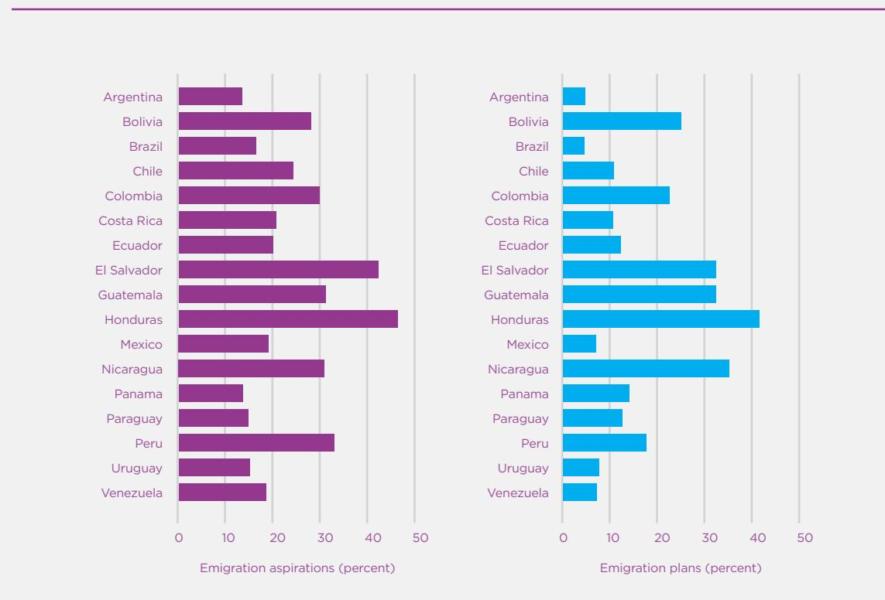

Source: Authors' calculations based on Gallup World Poll data

Notes: N=101,317 in the emigration aspirations sample; N=77,459 in the emigration plans sample

**Figure 5.2: Average Life Evaluations and Percent of Respondents in Upper Income Quintiles, Analysis Samples** Source: Authors' calculations based on Gallup World Poll data Notes: N=101,317 in the emigration aspirations sample; N=77,459 in the emigration plans sample. See Table A3 for more details. Percent high-income refers to the "share of respondents in the top two income quintiles." The differences in means between all groups are statistically significant. The p-value of the t-test of equality of means between those with and without emigration intentions (top left panel) is 0.000 (t-stat=12.2). The p-value of the t-test of the equality of means (percent high-income) between those with and without emigration intentions (bottom left panel) is 0.000 (t-stat=12.9). The p-value of the t-test of the equality of means (percent high-income) between those with and without emigration plans (bottom right panel) is 0.000 (t-stat=5.2). The p-value of the t-test of the equality of means (life evaluations) between those with and without emigration plans (top right panel) is 0.000 (t-stat=7.1). 6 4 40 Average life evaluations (0-10) Percent  **intent no intent intent no intent plan no plan no plan** 6.35 6.31 **Average life evaluations Percent high-income Average life evaluations Percent high-income**

These regression results (shown in Table A4) confirm the frustrated achiever story. First, emigration aspirations and plans for Latin American respondents decrease as happiness (evaluative and hedonic well-being) increases. Simply put, the happier people are, the less likely they are to want to leave their homes and emigrate abroad. A one-unit increase in evaluative wellbeing is associated with a 0.3 percentage point decline in the probability of reporting emigration aspirations and a 0.1 percentage point decline in the probability of reporting emigration plans. Having smiled the day before is also associated

with a lower chance of reporting emigration aspirations and plans.

Figure 5.3 displays the key findings from the regression analyses. The predicted probability of having emigration aspirations is 27% for the least happy respondents (whose best possible life evaluation scores are at 0), while it is 23% for the happiest respondents (whose life evaluations are at 10), a difference of 4 percentage points. Another way to put these effects in perspective is to look at the difference in predicted emigration intentions of those at the bottom quartile and

top quartile of the life evaluations distribution. Specifically, the emigration probability for those at the 25th percentile of the happiness distribution (life evaluation=5) is 25.5%, while for those at the 75th percentile of happiness distribution (life evaluation score=8) it is 24.6%, a difference of just 1 percentage point. The difference in the predicted emigration aspirations for respondents reporting no smiling (a measure of hedonic well-being/affect) and those who do is about 2.4 percentage points, meanwhile (see Table A4). The predicted probability of having emigration plans is much lower than that for having emigration aspirations, with the difference between the probability of reporting emigration plans being 3.3% for the least happy Latin Americans in the sample and 2.6% for the happiest ones. These results are in line with the

findings in other studies on Latin American emigration intentions.14

Further interesting findings emerge from the analyses (Table A4). For example, as in other studies,15 we document that rich individuals are more likely to express emigration aspirations compared to poorer individuals within the same Latin American country. At the same time, those who find it difficult to get by with their current income are more likely to want to emigrate than those who live comfortably with their means. This reflects that income aspirations matter as much as current conditions for the emigration decision. When it comes to the probability of having concrete emigration *plans*, however, the relatively rich and the poor do not differ from each other.

**Figure 5.3: Emigration Aspirations and Plans, Adjusted Predictions with 95% Confidence Intervals**

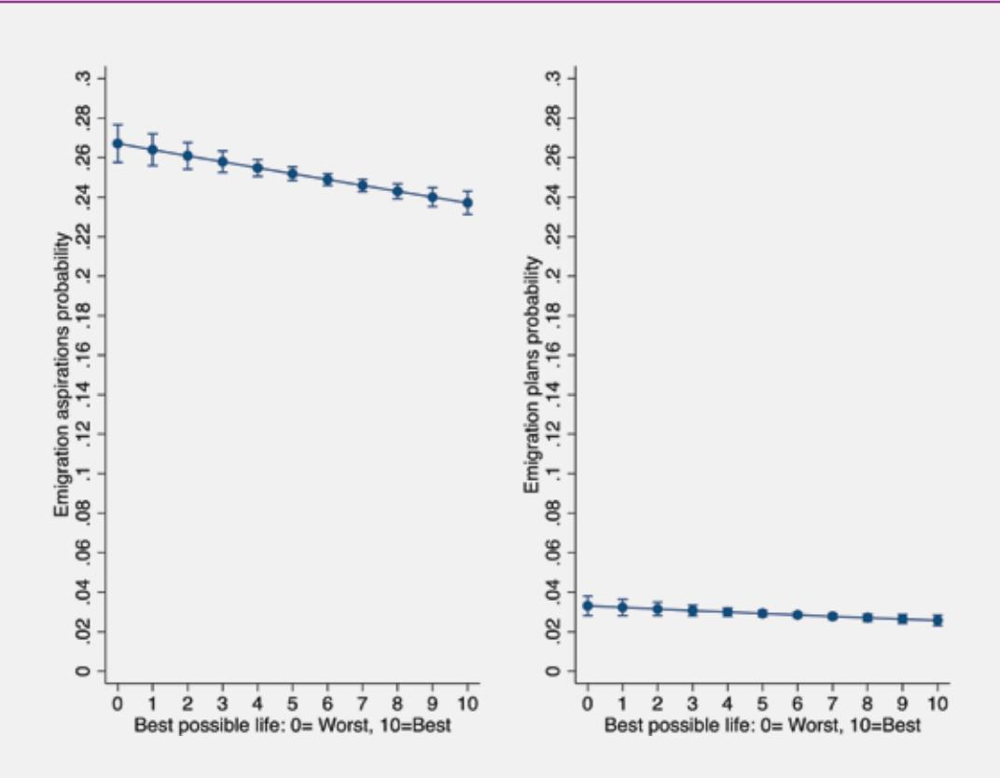

Source: Authors' calculations based on Gallup World Poll data

Notes: N=101,317 in the emigration aspirations sample; N=77,459 in the emigration plans sample

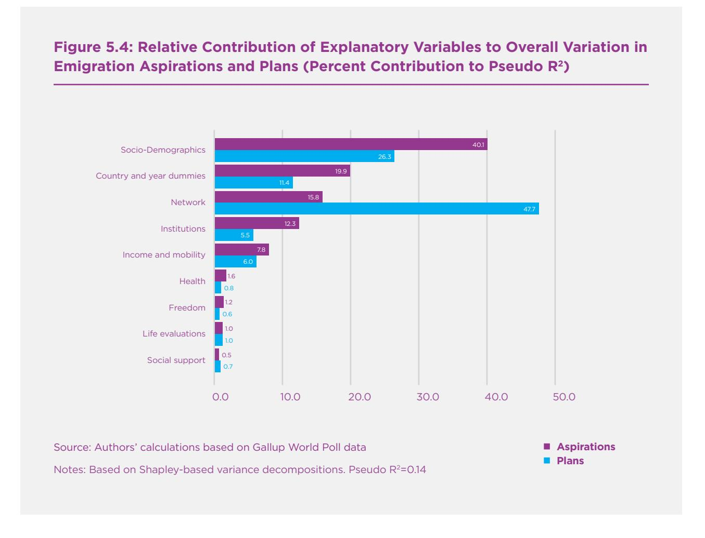

Emigration aspirations and plans also vary according to how Latin Americans in our sample perceive their economic mobility. Those who reported no change in their economic situation are *less* likely to have emigration aspirations and plans compared with those who report that their economic situation has *improved* (again reflecting differences in aspirations). Individuals who report worsening economic mobility are even more likely than those reporting economic improvement to want to move abroad.

There are some additional findings (shown in Table A4), which are highly intuitive – the more educated, the unemployed, those living in urban areas, those with networks abroad, and those reporting that corruption is present in government and in business are more likely to want to move.16 The old, females, the married, and those who are satisfied with institutions and their freedom, as well as those who have social support, are less likely to want to move. Respondents experiencing physical pain are also more likely to want to

emigrate, while household size does not seem to make a difference for emigration aspirations and plans.17

We next look at how important different circumstances are in explaining emigration intentions and plans.18 Specifically, we show in Table A4 whether each variable in our analysis is positively or negatively associated with emigration intentions and plans, and we here examine its explanatory power (relative weight or statistical importance) for the overall variation in emigration intentions and plans.

Figure 5.4 shows that socio-economic variables (such as age, marital status, gender, education), country of origin, and year trends are by far the biggest predictors of emigration aspirations. Having a network of contacts abroad is also a pivotal determinant of potential emigration, accounting for almost half of the explained variation in emigration plans, and 16% in emigration aspirations. At the same time, subjective well-being is a relatively weak

predictor of potential emigration, with happiness/life satisfaction explaining just 1% of the intent to migrate response, and smiling even less. Income factors are about six to eight times more important for potential emigration than subjective well-being. As such, while subjective well-being plays a role in the decision to emigrate or not, it is a minor one compared to that of the objective factors.

## **2. The Well-being Consequences of Migration for Those Who Move**

Our findings thus far suggest that potential emigrants from Latin America are frustrated achievers who are less happy but wealthier than respondents who wish to remain in their countries of origin. What happens to these frustrated achievers once they reach their desired destinations? Does their perceived well-being improve?

Chapter 3, which is in part based on a methodology we developed in earlier work,19 provides evidence that Latin Americans may positively benefit from emigrating. In this section, we extend this analysis by providing further insights into the relationship. To that end, we again utilize data from the GWP for 2009-2016 but to increase our statistical power and be able to reveal more about migration patterns, we rely on all available Latin American and Caribbean countries, including those with small sample sizes.

Studying migration's consequences for those who move is challenging as migration does not occur at random and emigrants take their selective traits with them when they move.20 Moreover, while migration may influence well-being, those who leave might have lower life satisfaction before the move, as we show in the previous section. Thus, a valid analysis must rely on constructing a comparison group that demonstrates the counter-factual – i.e. what would have happened to migrants' well-being if they had not migrated (see Chapter 3 in this report).

Relying on a statistical matching procedure, we compare the post-migration outcomes of immigrants from Latin America living abroad with those of a matched group of non-migrants (stayers) at the origin. Specifically, based on information about country of birth, we identify Latin American immigrants living abroad and pair them with similar native-born individuals

from the same origin country who have no emigration intentions.21 This second group provides some insight into what might have happened to the life evaluations of Latin Americans if they had not emigrated.

While arguably less robust than the methodology in our earlier work, where we found that migrants from post-socialist countries moving to developed countries experienced gains in subjective well-being,22 our method allows us to rely on larger sample sizes necessary to look at specific nuances in the migration experiences of Latin Americans from particular countries and living in certain destinations.23

Our main findings are featured in Table 5.1. As in Chapter 3, overall, we find that Latin American emigrants have higher life evaluations compared to similar stayers from the same country (Model (1)).24 Specifically, the life evaluations differential between immigrants and stayers is about 0.3 on a scale of 0-10, which represents about 5% of the sample mean of 6.3. This effect is relatively modest, yet meaningful in the statistical sense. We further explore nuances and patterns behind this finding. Specifically, in Model (2) we only compare stayers with migrants who go to advanced developed countries – such as those in Western Europe, the United States, Canada, Australia, and others (see the Notes to Table 5.1 for the included countries), while in Model (3), only stayers and Latin American immigrants going to other Latin American countries are included. Our findings suggest that Latin Americans moving to other Latin American countries may gain more in terms of life evaluations compared to those in developed countries. In part, this finding is likely due to the fact that distance and culture play a role for the "happiness premium" immigrants are able to realize, which is also what our earlier work on immigrants from transition economies finds.25

We next exclude the Caribbean countries, so that the results are restricted to the countries in the analyses of potential emigrants in the previous section (Model (4)). The findings and main conclusions remain robust. Finally, the results in Models (5)-(9) suggest that while migrant men and women benefit equally from migration in terms of their life evaluations, the "happiness gains" from migration are clearly concentrated for the middle-aged Latin Americans (those aged 35 to 50). This is likely because migrants in

**Table 5.1: Difference in Life Evaluation Levels Between Latin American Migrants and Matched Stayers**

|                  | (1)      | (2)                                   | (3)                 | (4)                  | (5)      | (6)     | (7)                   | (8)        | (9)             |
|------------------|----------|---------------------------------------|---------------------|----------------------|----------|---------|-----------------------|------------|-----------------|
|                  | Overall  | Advanced countries destinations | LAC destinations | Restricted sample | Females  | Males   | Age 34 and younger | Ages 35-50 | 50 and older |
| Life evaluations | 0.316*** | 0.171*                                | 0.481***            | 0.287***             | 0.267*** | 0.238** | 0.145                 | 0.473***   | 0.171           |
| difference       | (0.070)  | (0.096)                               | (0.099)             | (0.071)              | (0.090)  | (0.109) | (0.109)               | (0.120)    | (0.133)         |
| N                | 4,262    | 1,722                                 | 2,426               | 4,006                | 2,546    | 1,716   | 1,610                 | 1,328      | 1,324           |
| Adj. R2          | 0.065    | 0.069                                 | 0.050               | 0.060                | 0.063    | 0.063   | 0.041                 | 0.076      | 0.063           |

Notes: Robust standard errors in parentheses. The differences are based on OLS regressions applied after statistical matching. All estimates are adjusted for the pre-treatment covariates (age groups, gender, education levels, country of origin, and year of interview). Column (1) shows the estimates for the full matched sample for all matched Latin American and Caribbean countries. The advanced country destinations in (2) are based on all available countries from the list in Nikolova and Graham (2015a) and include: United States, United Kingdom, France, Germany, The Netherlands, Belgium, Spain, Italy, Sweden, Greece, Denmark, Hong Kong, Japan, Israel, Canada, Australia, New Zealand, South Korea, Austria, Cyprus, Finland, Iceland, Ireland, Luxembourg, Malta, Norway, Portugal, Slovenia, and Switzerland. The LAC destinations in (3) are: Venezuela, Brazil, Mexico, Costa Rica, Argentina, Belize, Bolivia, Chile, Colombia, Dominican Republic, Ecuador, El Salvador, Guatemala Honduras, Nicaragua, Panama, Paraguay, Peru, Puerto Rico, and Uruguay. The restricted sample in (4) includes the following origin countries: Brazil, Mexico, Costa Rica, Argentina, Bolivia, Chile, Colombia, Ecuador, El Salvador, Guatemala, Honduras, Nicaragua, Panama, Paraguay, Peru, and Uruguay. Models (5)-(9) are based on the overall sample, which is split according to the respective socio-demographic characteristic.

this age group are in their prime working years, whereby their chances of income and opportunity gains are highest, while younger and in particular older migrants may benefit more from being near their families, and have less to trade off in terms of income gains.

We next turn our attention to the experiences of migrants from the sending countries with at least 90 migrants. These results should be interpreted with caution due to the small sample sizes. Table 5.2 reveals that not all migrants uniformly gain from emigrating. For example, the post-migration life evaluation levels of Venezuelans, Mexicans, Argentinians, Bolivians, and Chileans are, on average, indistinguishable from those of their compatriots who did not emigrate. Moreover, Brazilian immigrants, whose top three destination countries are Portugal, Paraguay, and Uruguay, may even incur life evaluation losses compared to comparable non-migrant Brazilians at the origin. At the same time, Colombians, Nicaraguans, Paraguayans, and Peruvians living abroad are happier than their stayer counterparts. It is

difficult to explain the differences across so many different countries. It is more intuitive for some, such as Nicaragua, Colombia, and Paraguay, where migrants are leaving either civil violence or generally poor governance behind, than for others. In the specific case of Venezuela, meanwhile, it is plausible that many migrations were not desired paths, but rather an escape from an atmosphere of rapidly deteriorating political freedom and economic stability.

Finally, Table 5.3 offers some insights into the happiness differential between migrants and stayers at particular destination countries. Immigrants from Latin American countries living in Spain, Costa Rica, and Argentina, may be better off in terms of happiness compared to their counterparts in the origin countries. Yet immigrants in the United States, Panama, and Portugal may not be happier after migrating, though the non-statistically significant findings may be due to the small sample sizes. Given the largest immigrant group in the United States in our matched sample are Mexicans, the nil happiness gains may also reflect

**Table 5.2: Difference in Life Evaluation Levels Between Latin American Immigrants and Matched Stayers, Origin Countries with at Least 90 Migrants**

|                                | (1)       | (2)       | (3)     | (4)       | (5)     | (6)     | (7)      | (8)       | (9)      | (10)     |
|--------------------------------|-----------|-----------|---------|-----------|---------|---------|----------|-----------|----------|----------|
|                                | Venezuela | Brazil    | Mexico  | Argentina | Bolivia | Chile   | Colombia | Nicaragua | Paraguay | Peru     |
| Life evaluations difference | 0.245     | -0.516*** | 0.025   | -0.299    | 0.400   | -0.124  | 0.396*   | 1.058***  | 0.677**  | 0.685*** |
|                                | (0.332)   | (0.180)   | (0.262) | (0.214)   | (0.281) | (0.277) | (0.202)  | (0.191)   | (0.303)  | (0.258)  |
| N                              | 196       | 500       | 236     | 348       | 190     | 210     | 556      | 718       | 186      | 222      |
| Adj. R2                        | 0.024     | 0.060     | 0.105   | 0.041     | 0.032   | 0.095   | 0.078    | 0.058     | 0.052    | 0.060    |

Notes: Robust standard errors in parentheses. The differences are based on OLS regressions applied after statistical matching. All estimates are adjusted for the pre-treatment covariates (age groups, gender, education levels, country of origin, and year of interview).

**Table 5.3: Difference in Life Evaluation Levels Between Latin American Immigrants and Matched Stayers, Destinations with at Least 90 Immigrants**

|                             | (1)           | (2)     | (3)                  | (4)      | (5)     | (6)      |
|-----------------------------|---------------|---------|----------------------|----------|---------|----------|
|                             | United States | Spain   | Costa Rica Argentina |          | Panama  | Portugal |
| Life evaluations difference | 0.038         | 0.396** | 0.920***             | 0.587*** | 0.115   | -0.326   |
|                             | (0.291)       | (0.173) | (0.190)              | (0.202)  | (0.330) | (0.362)  |
| N                           | 196           | 500     | 236                  | 348      | 190     | 210      |
| Adj. R2                     | 0.024         | 0.060   | 0.105                | 0.041    | 0.032   | 0.095    |

Source: Authors' calculations based on Gallup World Poll data

Notes: Robust standard errors in parentheses. The differences are based on OLS regressions applied after statistical matching. All estimates are adjusted for the pre-treatment covariates (age groups, gender, education levels, country of origin, and year of interview).

the illegal and low-skilled nature of this particular migrant stream.26 The largest immigrant groups in Spain in our analysis sample are Argentinians and Colombians; and in Costa Rica – the Nicaraguans. Similarly, the largest immigrant group in our sample residing in Argentina are the Paraguayans; in Panama – the Colombians; and in Portugal – Brazilians.

The findings in Tables 5.1-5.3 suggest that while Latin Americans may realize some modest life

evaluation gains due to migrating, the costs and benefits of migration are not uniform and depend on the context and the particular migration stream. These varied outcomes may be due to differing reasons for migrating, such as paths chosen for economic opportunity versus cultural affinity versus escaping from deteriorating political conditions. While it is not possible to observe the drivers of these individual choices, one can imagine that they could have differential

effects on subjective well-being outcomes. Our work comparing the life satisfaction of migrants from transition countries suggests that migrants who move to places where it is easy to assimilate culturally and/or also have the ability to return home frequently and with ease tend to have higher gains in subjective well-being than those who do not.27

## **3. Emigration's Consequences for the Well-being of the Family Left Behind at the Origin**

Thus far, we have found that potential Latin American emigrants are frustrated achievers who may gain in terms of happiness from migrating. In this section, we examine the well-being of migrants' family members left behind in the countries of origin.

We rely on two questions in the Gallup World Poll: (i) whether the respondent has family abroad who left in the last five years and is still in the destination country and (ii) whether the respondent's household receives remittances (both in kind and monetary) from abroad. All analyses are for 2009-2010 due to the availability of the family abroad variable. The Poll included a question about which country respondents' relatives are in, and the top locations for Latin Americans were the U.S., Spain, and Argentina. We use several outcome variables capturing evaluative well-being, and positive and negative hedonic affect.28

Emigration can have conflicting consequences for the subjective well-being of the left behind. On the one hand, it may result in negative emotions due to the pain of separation. On the other hand, it may also increase psychological well-being if relatives back home know that migrants are expanding their opportunities abroad. Furthermore, remittances should at least in part compensate for the pain of separation. For example, remittance receipt is positively associated with life satisfaction in Latin America, possibly through increased financial security.29 An additional study documents that migrant and non-migrant households in Cuenca, Ecuador experience similar happiness levels, arguing that remittances compensate migrant households for the pain of separation and the disruption of family life.30

About 17% of respondents in our analysis sample have a family member abroad who emigrated in the last five years (see Tables A6 and A7 in the Appendix for information regarding the analysis sample). The first set of results (Table 5.4) document the relationship between the emigration of family members and life evaluations (See Table A8 for detailed findings).

Our findings suggest a positive relationship between having family members abroad and life evaluations, which is independent of remittance receipt (Table 5.4). Having family abroad corresponds to an average increase in life evaluations by about 0.10 points (on a 0-10 scale) Models (1)-(2). This associated influence is substantively small.31 Next, we net out the influence of the within-country income quintile of the respondent, thus comparing the well-being of households with similar levels of income Models (3)-(6). Having relatives and friends abroad is still positively associated with life evaluations.32

We next include variables for financial and living standard satisfaction and economic mobility, which are important determinants of the emigration decision, as shown above (Models (5)-(6) in Table 5.4). Once we control for this perceived economic status, the positive influence of having relatives and friends abroad becomes smaller and indistinguishable from zero. This suggests that part of the happiness "premium" for the left behinds associated with having relatives and friends abroad stems from the perceived economic mobility and financial security that comes with it.33

We also examined the relationship between family members moving abroad and smiling, stress, and depression (Table A9 in the Appendix). Having relatives abroad and remittance receipts have no association with smiling and stress. There is, however, is a clear relationship with reporting depression, which is independent of remittance receipt. Having relatives abroad is associated with one percentage point increase in the probability of feeling depressed the previous day; meanwhile, 13.7% of respondents with family abroad report depression feelings (Table A7). This likely reflects the pain of separation, and is independent of having a social network of family and friends on whom to rely in times of need. Additional analyses (not shown) reveal that the associated increase in depression resulting from the out-migration of family members also holds

**Table 5.4: Emigration of Family Members, Remittances, and Life Evaluations**

|                                                                               | (1) Life evaluations | (2) Life evaluations | (3) Life evaluations | (4) Life evaluations | (5) Life evaluations | (6) Life evaluations |
|-------------------------------------------------------------------------------|-------------------------|-------------------------|-------------------------|-------------------------|-------------------------|-------------------------|
| Relatives abroad                                                              | 0.124***                | 0.108**                 | 0.085**                 | 0.078*                  | 0.063*                  | 0.058                   |
|                                                                               | (0.043)                 | (0.045)                 | (0.039)                 | (0.041)                 | (0.037)                 | (0.039)                 |
| Remittances                                                                   |                         | 0.073                   |                         | 0.032                   |                         | 0.025                   |
|                                                                               |                         | (0.062)                 |                         | (0.056)                 |                         | (0.054)                 |
| Remittance control                                                            | N                       | Y                       | N                       | Y                       | N                       | Y                       |
| Income quintile controls                                                      | N                       | N                       | Y                       | Y                       | Y                       | Y                       |
| Economic mobility, financial satisfaction, living standard satisfaction | N                       | N                       | N                       | N                       | Y                       | Y                       |
| Country dummies and control variables                                      | Y                       | Y                       | Y                       | Y                       | Y                       | Y                       |
| Observations                                                                  | 23,909                  | 23,909                  | 23,909                  | 23,909                  | 23,909                  | 23,909                  |
| Adjusted R2                                                                   | 0.152                   | 0.152                   | 0.163                   | 0.163                   | 0.230                   | 0.230                   |

Notes: Robust standard errors are reported in parentheses. All models include controls for social support, age, age squared, gender, marital status, child in the household, household size, education, unemployment status, pain yesterday, health problem, religiosity, freedom, urban location, and a dummy for year 2010. All regressions use the Gallup-provided survey weight. The sample includes Venezuela, Brazil, Mexico, Costa Rica, Argentina, Bolivia, Chile, Colombia, Ecuador, El Salvador, Guatemala, Honduras, Nicaragua, Panama Paraguay, Peru, and Uruguay and excludes the foreign-born in each country of interview.

\*\*\* p<0.01, \*\* p<0.05, \* p<0.1

once we net out the influence of income, financial and standard of living satisfaction, and economic mobility perceptions.

Our results are in line with to those in an earlier study, which looks at out-migration from several world regions.34 Sub-Saharan Africa is the only other region displaying a similar statistically significant relationship between depression and the out-migration of family members. This very likely reflects the longer distance and at times illegal status that emigrants from these two regions (Latin America and sub-Saharan Africa) face when they arrive in the U.S. and Europe, and their related inability to return home frequently.

#### **4. Conclusions**

Chapter 6 in this report, as well as our earlier findings,35 highlight the complex reasons for Latin Americans' higher than average well-being scores. The hedonic dimensions of well-being

play a strong role in this explanation, and likely reflect cultural traits, such as the high value that Latins attach to family ties and quality of social life. Nevertheless, the strong role that learning or creativity plays in Latins' well-being goes well beyond the hedonic or daily dimensions of well-being and suggests a deeper appreciation of quality of life in the region. A puzzle, then, is why there is so much out-migration from the region.

Our exploration of the reasons for and the consequences of emigration in this chapter finds that factors such as income and perceived mobility lead many Latin Americans to sacrifice their family and social life at home to seek opportunities and better life chances abroad. Those who wish to emigrate are less satisfied with their lives and their economic situations than their counterparts who stay behind, and on average, they realize modest gains in terms of happiness once they move. While their family members left in the places of origin realize

modest life evaluation gains and benefit from the income gains that result from remittances, they are also more likely to report depression than are those without family members abroad.

In short, the Latin American happiness "premium" is not without its own paradoxes – migration being a primary example. Many individuals choose to leave to seek opportunities elsewhere, in order to be better able to provide for themselves and for the families they leave behind. Some migrant groups – such as the Paraguayans, Peruvians, and Nicaraguans abroad – may realize happiness benefits from emigrating. Yet not all Latin American migrants become happier by emigrating. Nor are there net positive effects for the families left behind, as increases in reported depression often offset their income gains. This reflects progress paradoxes that we have identified elsewhere, meanwhile, where significant income gains can co-exist with psychological costs.36

**Table A1: Variables Included in the Analyses (in Alphabetical Order)**

**Appendix**

| Variable                                    | Explanation                                                                                                                                                                                                                                                                                                                                                                                                                                                                                                                                                                                                                                                                                                                                                                                                   |
|---------------------------------------------|---------------------------------------------------------------------------------------------------------------------------------------------------------------------------------------------------------------------------------------------------------------------------------------------------------------------------------------------------------------------------------------------------------------------------------------------------------------------------------------------------------------------------------------------------------------------------------------------------------------------------------------------------------------------------------------------------------------------------------------------------------------------------------------------------------------|
| Anger yesterday                             | A binary indicator coded as 1 if the respondent reported experiencing a lot of anger the day before and 0 otherwise                                                                                                                                                                                                                                                                                                                                                                                                                                                                                                                                                                                                                                                                                        |
| Belief in hard work                         | A binary indicator coded as 1 if the respondent answered that people in this country can get ahead by working hard, and 0 if not                                                                                                                                                                                                                                                                                                                                                                                                                                                                                                                                                                                                                                                                           |
| Children grow/Overall country assessment | Whether the respondent thinks that most children in this country have the opportunity to learn and grow every day (1=yes, 0=no)                                                                                                                                                                                                                                                                                                                                                                                                                                                                                                                                                                                                                                                                            |
| Christian                                   | Whether the respondent's religion is Christian or not                                                                                                                                                                                                                                                                                                                                                                                                                                                                                                                                                                                                                                                                                                                                                         |
| Confidence in government                    | Whether the respondent has confidence in the national government (1=yes, 0=no)                                                                                                                                                                                                                                                                                                                                                                                                                                                                                                                                                                                                                                                                                                                                |
| Corruption                                  | Two separate binary indicators measuring whether the respondent thinks there is corruption in government (1=no, 2=yes, 3=no answer); Whether the respondent thinks there is corruption in businesses (1=no, 2=yes, 3=no answer).                                                                                                                                                                                                                                                                                                                                                                                                                                                                                                                                                                        |
| Depressed yesterday                         | A binary indicator coded as 1 if the respondent felt depressed a lot during the previous day and 0 otherwise                                                                                                                                                                                                                                                                                                                                                                                                                                                                                                                                                                                                                                                                                                  |
| Economic mobility                           | Respondent's assessment of current living standard: 1=Living standard getting better, 2=Living standard the same; 3=Living standard getting worse                                                                                                                                                                                                                                                                                                                                                                                                                                                                                                                                                                                                                                                          |
| Emigration aspirations                      | A binary indicator coded as 1 if respondents answered "yes" to the question "Ideally, if you had the opportunity, would you like to move PERMANENTLY to another country, or would you prefer to continue living in this country?" and 0 if they answered "no"                                                                                                                                                                                                                                                                                                                                                                                                                                                                                                                                           |
| Emigration plans                            | A binary indicator coded as 1 if respondents answered "yes" to the question "Are you planning to move permanently to another country in the next 12 months, or not?" and 0 if they had no migration intentions. (Defined for all respondents who answered the emigration aspirations question)                                                                                                                                                                                                                                                                                                                                                                                                                                                                                                          |
| Financial satisfaction                      | Feeling about current household income, coded as 1 if respondents are "living comfortably on present income," 2 if they responded "getting by on present income," and 3 if they responded "finding it difficult on present income" or "finding it very difficult on present income"                                                                                                                                                                                                                                                                                                                                                                                                                                                                                                                     |
| Freedom                                     | Whether the respondent is satisfied with the freedom to choose what do to with his or her life in this country (1=yes, 0=no)                                                                                                                                                                                                                                                                                                                                                                                                                                                                                                                                                                                                                                                                               |
| Health problem                              | Whether the respondent has a health problem preventing him or her to do things other people his or her age normally do (1=yes, 0=no)                                                                                                                                                                                                                                                                                                                                                                                                                                                                                                                                                                                                                                                                       |
| Household and demographic variables      | Age, age squared gender, education, household size, indicator for presence of child(ren) in the household, religiosity, marital status, urban/rural location dummy, employment status.                                                                                                                                                                                                                                                                                                                                                                                                                                                                                                                                                                                                                     |
| Household income                            | This variable is based on the Gallup-provided household income in international dollars                                                                                                                                                                                                                                                                                                                                                                                                                                                                                                                                                                                                                                                                                                                       |
| Income quintile                             | Within-country income quintiles based on household income in the local currency. Respondents are coded as 1 if they belong to the respective quintile and 0 otherwise. Respondents can only belong to one quintile.                                                                                                                                                                                                                                                                                                                                                                                                                                                                                                                                                                                        |
| Learned yesterday                           | A binary indicator coded as 1 if respondents answered "yes" to the question "Did you learn or do something interesting yesterday?" and 0 if they answered "no"                                                                                                                                                                                                                                                                                                                                                                                                                                                                                                                                                                                                                                             |
| Life evaluations                            | The response to the question of respondents' assessment of their current life based on an imaginary 11-point scale whereby 0 designates one's worst possible life and 10 denotes the best possible life respondents can imagine for themselves. Based on the question "Please imagine a ladder with steps numbered from zero at the bottom to ten at the top. Suppose we say that the top of the ladder represents the best possible life for you, and the bottom of the ladder represents the worst possible life for you. On which step of the ladder would you say you personally feel you stand at this time, assuming that the higher the step the better you feel about your life, and the lower the step the worse you feel about it? Which step comes closest to the way you feel?" |
| Living standard satisfaction                | Satisfaction with living standard, whereby 1=yes, and 0=no                                                                                                                                                                                                                                                                                                                                                                                                                                                                                                                                                                                                                                                                                                                                                    |
| Network                                     | Constructed using a series of questions related to whether the respondent has friends or relatives on whom they can count when they need them, whether household members or relatives work abroad, and whether the respondent's household has received remittances                                                                                                                                                                                                                                                                                                                                                                                                                                                                                                                                      |
| Pain                                        | Whether the respondent experienced a lot of physical pain the day before                                                                                                                                                                                                                                                                                                                                                                                                                                                                                                                                                                                                                                                                                                                                      |
| Relative abroad                             | A binary indicator variable based on responses to the question "Have any members of your household gone to live in a foreign country permanently or temporarily in the past five years?" Respondents who have family members who are still there are coded as 1 and those with family members who returned from abroad and no family members abroad in the past five years are coded as 0.                                                                                                                                                                                                                                                                                                                                                                                                           |
| Remittances                                 | Based on the question: "In the past 12 months, did this household receive help in the form of money or goods from another individual?" A binary indicator variable was constructed taking the value of 1 for respondents receiving money or goods from an individual abroad and both abroad and from this country, and zero otherwise                                                                                                                                                                                                                                                                                                                                                                                                                                                                   |
| Smiled yesterday                            | A binary indicator coded as 1 if the respondent reported smiling a lot the day before and 0 if they did not                                                                                                                                                                                                                                                                                                                                                                                                                                                                                                                                                                                                                                                                                                   |
| Social support                              | Whether the respondent has family and friends to rely on in times of trouble (1=yes, 0=no)                                                                                                                                                                                                                                                                                                                                                                                                                                                                                                                                                                                                                                                                                                                    |
| Stress yesterday                            | A binary indicator coded as 1 if the respondent reported experiencing a lot of stress the day before and 0 otherwise                                                                                                                                                                                                                                                                                                                                                                                                                                                                                                                                                                                                                                                                                       |

Source: Authors based on Gallup World Poll documentation; the questions pertain to Gallup: Copyright © 2005-2018 Gallup, Inc.

**Table A2: Number of Observations per Country and Year of Interview, Emigration Intentions and Aspirations Analysis Samples**

|             | Emigration aspirations |      |      |       |      |      |      |      |      | Emigration aspirations |       |      |      |      |  |
|-------------|------------------------|------|------|-------|------|------|------|------|------|------------------------|-------|------|------|------|--|
|             | 2009                   | 2010 | 2011 | 2012  | 2013 | 2014 | 2015 | 2016 | 2010 | 2011                   | 2012  | 2013 | 2014 | 2015 |  |
| Argentina   | 813                    | 783  | 808  | 791   | 828  | 827  | 714  | 774  | 783  | 808                    | 791   | 828  | 827  | 714  |  |
| Bolivia     | 753                    | 836  | 843  | 854   | 850  | 831  | 676  |      | 753  | 836                    | 843   | 854  | 850  | 831  |  |
| Brazil      | 916                    | 900  | 914  | 1,780 | 902  | 921  | 890  |      | 900  | 914                    | 1,780 | 902  | 921  |      |  |
| Chile       | 836                    | 817  | 876  | 791   | 879  | 806  | 903  | 870  | 817  | 876                    | 791   | 879  | 806  | 903  |  |
| Colombia    | 807                    | 887  | 866  | 902   | 852  | 897  | 870  | 833  | 887  | 866                    | 902   | 852  | 897  | 870  |  |
| Costa Rica  | 771                    | 793  | 785  | 810   | 746  | 700  | 651  |      | 771  | 793                    | 785   | 810  | 746  | 700  |  |
| Ecuador     | 800                    | 817  | 838  | 875   | 841  |      |      |      | 817  | 838                    | 875   |      |      |      |  |
| El Salvador | 790                    | 793  | 839  | 896   | 871  | 842  | 675  | 636  | 793  | 839                    | 896   | 871  | 842  | 675  |  |
| Guatemala   | 818                    | 840  | 880  | 834   | 634  | 626  |      |      | 840  | 880                    | 834   | 634  |      |      |  |
| Honduras    | 784                    | 670  | 857  | 862   | 844  | 862  | 729  | 591  | 670  | 857                    | 862   | 844  | 862  | 729  |  |
| Mexico      | 624                    | 758  | 766  | 701   | 782  | 877  | 851  |      | 758  | 766                    | 701   | 782  | 877  |      |  |
| Nicaragua   | 884                    | 788  | 786  | 832   | 856  | 805  | 662  | 799  | 788  | 786                    | 832   | 856  | 805  | 662  |  |
| Panama      | 843                    | 730  | 811  | 780   | 848  | 756  | 817  | 635  | 730  | 811                    | 780   | 848  | 756  | 817  |  |
| Paraguay    | 795                    | 748  | 828  | 894   | 849  | 830  | 739  |      | 748  | 828                    | 894   | 849  | 830  | 739  |  |
| Peru        | 745                    | 734  | 753  | 737   | 820  | 770  | 831  | 812  | 734  | 753                    | 737   | 820  | 770  | 831  |  |
| Uruguay     | 771                    | 629  | 657  | 762   | 737  | 796  | 710  | 668  | 629  | 657                    | 762   | 737  | 796  | 710  |  |
| Venezuela   | 634                    | 771  | 782  | 806   | 809  | 795  | 773  | 845  | 771  | 782                    | 806   | 809  | 795  | 773  |  |

**Table A3: Selected Summary Statistics for Respondents with Emigration Aspirations and Emigration Plans** 

|                                      |       | No aspirations, N=77,767 |       | Aspirations, N=23,550 |       | No plans, N=75,378 |       | Plans, N=2,081 |
|--------------------------------------|-------|-----------------------------|-------|--------------------------|-------|--------------------|-------|----------------|
| Variable                             | Mean  | Std. Dev.                   | Mean  | Std. Dev.                | Mean  | Std. Dev.          | Mean  | Std. Dev.      |
| Live evaluations (0-10 scale)        | 6.349 | 2.354                       | 6.134 | 2.420                    | 6.311 | 2.355              | 6.038 | 2.499          |
| Smiled yesterday (1=yes)             | 0.863 | 0.344                       | 0.848 | 0.359                    | 0.862 | 0.345              | 0.844 | 0.363          |
| Within-country income quintiles      |       |                             |       |                          |       |                    |       |                |
| Q1                                   | 0.213 | 0.410                       | 0.182 | 0.386                    | 0.205 | 0.404              | 0.167 | 0.373          |
| Q2                                   | 0.201 | 0.400                       | 0.184 | 0.388                    | 0.200 | 0.400              | 0.174 | 0.379          |
| Q3                                   | 0.194 | 0.395                       | 0.194 | 0.396                    | 0.193 | 0.394              | 0.179 | 0.384          |
| Q4                                   | 0.190 | 0.392                       | 0.205 | 0.404                    | 0.192 | 0.394              | 0.203 | 0.402          |
| Q5                                   | 0.202 | 0.402                       | 0.234 | 0.423                    | 0.211 | 0.408              | 0.276 | 0.447          |
| Financial satisfaction               |       |                             |       |                          |       |                    |       |                |
| Living comfortably on current income | 0.147 | 0.354                       | 0.137 | 0.344                    | 0.150 | 0.357              | 0.163 | 0.369          |
| Getting by on current income         | 0.472 | 0.499                       | 0.432 | 0.495                    | 0.465 | 0.499              | 0.424 | 0.494          |
| Difficult on current income          | 0.380 | 0.485                       | 0.430 | 0.495                    | 0.385 | 0.487              | 0.413 | 0.493          |
| Living standard satisfaction         | 0.741 | 0.438                       | 0.668 | 0.471                    | 0.734 | 0.442              | 0.682 | 0.466          |
| Economic mobility                    |       |                             |       |                          |       |                    |       |                |
| Better                               | 0.517 | 0.500                       | 0.524 | 0.499                    | 0.527 | 0.499              | 0.550 | 0.498          |
| No change                            | 0.313 | 0.464                       | 0.250 | 0.433                    | 0.303 | 0.459              | 0.216 | 0.412          |
| Worse                                | 0.170 | 0.375                       | 0.227 | 0.419                    | 0.171 | 0.376              | 0.234 | 0.423          |
| Education                            |       |                             |       |                          |       |                    |       |                |
| Elementary                           | 0.376 | 0.485                       | 0.262 | 0.440                    | 0.354 | 0.478              | 0.247 | 0.431          |
| Secondary                            | 0.513 | 0.500                       | 0.601 | 0.490                    | 0.531 | 0.499              | 0.565 | 0.496          |
| Tertiary                             | 0.110 | 0.313                       | 0.136 | 0.343                    | 0.115 | 0.319              | 0.188 | 0.391          |
| Unemployed                           | 0.067 | 0.249                       | 0.113 | 0.317                    | 0.079 | 0.269              | 0.155 | 0.362          |

Notes: The reported statistics were weighted using the Gallup-provided survey weight. The sample includes Venezuela, Brazil, Mexico, Costa Rica, Argentina, Bolivia, Chile, Colombia, Ecuador, El Salvador, Guatemala, Honduras, Nicaragua, Panama Paraguay, Peru, and Uruguay and excludes the foreign-born in each country of interview. The means of all variables are statistically significantly different from each other at the 5% confidence level or lower. The exceptions are: the proportion of respondents in Q3 for those in the aspirations sample and Q2 in the plans sample.

**Table A4: Emigration Aspirations and Plans, Logistic Regressions, Average Marginal Effects** 

|                                                                    | (1)                                           | (2)       | (3)         | (4)                                           |  |
|--------------------------------------------------------------------|-----------------------------------------------|-----------|-------------|-----------------------------------------------|--|
|                                                                    | Aspirations                                   | Plans     | Aspirations | Plans                                         |  |
|                                                                    | Key independent Variable: Life evaluations |           |             | Key independent Variable: Smiled yesterday |  |
| Subjective well-being                                              | -0.003***                                     | -0.001**  | -0.024***   | -0.006***                                     |  |
|                                                                    | (0.001)                                       | (0.000)   | (0.004)     | (0.002)                                       |  |
| Within-country income quintiles (Ref: Q1(poorest))                 |                                               |           |             |                                               |  |
| Q2                                                                 | 0.006                                         | 0.001     | 0.005       | 0.001                                         |  |
|                                                                    | (0.005)                                       | (0.002)   | (0.005)     | (0.002)                                       |  |
| Q3                                                                 | 0.011**                                       | 0.001     | 0.010**     | 0.001                                         |  |
|                                                                    | (0.005)                                       | (0.002)   | (0.005)     | (0.002)                                       |  |
| Q4                                                                 | 0.010**                                       | -0.001    | 0.010*      | -0.001                                        |  |
|                                                                    | (0.005)                                       | (0.002)   | (0.005)     | (0.002)                                       |  |
| Q5                                                                 | 0.011**                                       | 0.001     | 0.010*      | 0.001                                         |  |
|                                                                    | (0.005)                                       | (0.003)   | (0.005)     | (0.003)                                       |  |
| Financial satisfaction (Ref: Living comfortably on current income) |                                               |           |             |                                               |  |
| Getting by on current income                                       | 0.005                                         | -0.001    | 0.006       | -0.001                                        |  |
|                                                                    | (0.005)                                       | (0.002)   | (0.005)     | (0.002)                                       |  |
| Difficult on current income                                        | 0.029***                                      | 0.000     | 0.030***    | 0.001                                         |  |
|                                                                    | (0.005)                                       | (0.002)   | (0.005)     | (0.002)                                       |  |
| Living standard satisfaction                                       | -0.044***                                     | -0.004**  | -0.045***   | -0.005**                                      |  |
|                                                                    | (0.004)                                       | (0.002)   | (0.004)     | (0.002)                                       |  |
| Economic mobility (Ref: Better)                                    |                                               |           |             |                                               |  |
| No change                                                          | -0.013***                                     | -0.005*** | -0.013***   | -0.005***                                     |  |
|                                                                    | (0.004)                                       | (0.002)   | (0.004)     | (0.002)                                       |  |
| Worse                                                              | 0.040***                                      | 0.008***  | 0.042***    | 0.008***                                      |  |
|                                                                    | (0.005)                                       | (0.002)   | (0.005)     | (0.002)                                       |  |
| Education (Ref: Elementary)                                        |                                               |           |             |                                               |  |
| Secondary                                                          | 0.029***                                      | 0.003     | 0.029***    | 0.003                                         |  |
|                                                                    | (0.004)                                       | (0.002)   | (0.004)     | (0.002)                                       |  |
| Tertiary                                                           | 0.042***                                      | 0.011***  | 0.041***    | 0.010***                                      |  |
|                                                                    | (0.006)                                       | (0.003)   | (0.006)     | (0.003)                                       |  |
| Unemployed                                                         | 0.041***                                      | 0.015***  | 0.042***    | 0.015***                                      |  |
|                                                                    | (0.006)                                       | (0.003)   | (0.006)     | (0.003)                                       |  |
| Age                                                                | -0.004***                                     | 0.001*    | -0.004***   | 0.001*                                        |  |
|                                                                    | (0.001)                                       | (0.000)   | (0.001)     | (0.000)                                       |  |
| Age2/100                                                           | -0.001*                                       | -0.001*** | -0.001*     | -0.001***                                     |  |
|                                                                    | (0.001)                                       | (0.000)   | (0.001)     | (0.000)                                       |  |
| Female                                                             | -0.027***                                     | -0.007*** | -0.027***   | -0.007***                                     |  |
|                                                                    | (0.003)                                       | (0.001)   | (0.003)     | (0.001)                                       |  |
| Married/Partnership                                                | -0.039***                                     | -0.010*** | -0.039***   | -0.010***                                     |  |
|                                                                    | (0.003)                                       | (0.002)   | (0.003)     | (0.002)                                       |  |
| Child in household                                                 | 0.009**                                       | 0.000     | 0.009**     | 0.000                                         |  |
|                                                                    | (0.004)                                       | (0.002)   | (0.004)     | (0.002)                                       |  |
| Household size                                                     | 0.000                                         | -0.000    | 0.000       | -0.000                                        |  |
|                                                                    | (0.001)                                       | (0.000)   | (0.001)     | (0.000)                                       |  |
| Health problem                                                     | -0.001                                        | 0.001     | -0.001      | 0.001                                         |  |
|                                                                    | (0.004)                                       | (0.002)   | (0.004)     | (0.002)                                       |  |
| Pain                                                               | 0.014***                                      | 0.003*    | 0.012***    | 0.003*                                        |  |
|                                                                    | (0.003)                                       | (0.002)   | (0.003)     | (0.002)                                       |  |
| Freedom                                                            | -0.016***                                     | -0.004**  | -0.016***   | -0.004**                                      |  |
|                                                                    |                                               |           |             |                                               |  |
|                                                                    | (0.004)                                       | (0.002)   | (0.004)     | (0.002)                                       |  |

**Average Marginal Effects** (continued)

**Table A4: Emigration Aspirations and Plans, Logistic Regressions,** 

|                                          | (1)         | (2)                                           | (3)         | (4)                                           |  |
|------------------------------------------|-------------|-----------------------------------------------|-------------|-----------------------------------------------|--|
|                                          | Aspirations | Plans                                         | Aspirations | Plans                                         |  |
|                                          |             | Key independent Variable: Life evaluations |             | Key independent Variable: Smiled yesterday |  |
| Social support                           | -0.018***   | -0.006***                                     | -0.018***   | -0.006***                                     |  |
|                                          | (0.005)     | (0.002)                                       | (0.005)     | (0.002)                                       |  |
| Children grow/Overall country assessment | -0.026***   | 0.001                                         | -0.025***   | 0.001                                         |  |
|                                          | (0.003)     | (0.001)                                       | (0.003)     | (0.001)                                       |  |
| Confidence in government                 | -0.054***   | -0.006***                                     | -0.054***   | -0.006***                                     |  |
|                                          | (0.003)     | (0.002)                                       | (0.003)     | (0.002)                                       |  |
| Corruption in government (Ref: No)       |             |                                               |             |                                               |  |
| Yes                                      | 0.025***    | -0.000                                        | 0.025***    | -0.000                                        |  |
|                                          | (0.004)     | (0.002)                                       | (0.004)     | (0.002)                                       |  |
| No answer                                | -0.001      | -0.009**                                      | -0.001      | -0.009**                                      |  |
|                                          | (0.008)     | (0.004)                                       | (0.008)     | (0.004)                                       |  |
| Corruption in business (Ref: No)         |             |                                               |             |                                               |  |
| Yes                                      | 0.040***    | 0.006***                                      | 0.040***    | 0.006***                                      |  |
|                                          | (0.004)     | (0.002)                                       | (0.004)     | (0.002)                                       |  |
| No answer                                | 0.018**     | 0.002                                         | 0.019**     | 0.002                                         |  |
|                                          | (0.008)     | (0.004)                                       | (0.008)     | (0.004)                                       |  |
| Urban location                           | 0.029***    | 0.003**                                       | 0.029***    | 0.003**                                       |  |
|                                          | (0.003)     | (0.002)                                       | (0.003)     | (0.002)                                       |  |
| Network                                  | 0.130***    | 0.036***                                      | 0.130***    | 0.036***                                      |  |
|                                          | (0.003)     | (0.002)                                       | (0.003)     | (0.002)                                       |  |
| Country and Year dummies                 | Yes         | Yes                                           | Yes         | Yes                                           |  |
| Observations                             | 101,317     | 77,459                                        | 101,317     | 77,459                                        |  |
| Pseudo R2                                | 0.137       | 0.135                                         | 0.137       | 0.135                                         |  |

Source: Authors' calculations based on Gallup World Poll data

Notes: The table shows the average marginal effects from logistic regression estimates (using the Gallup-provided survey weight). Robust standard errors are reported in parentheses. The dependent variable in all models equals 1 if the individual expressed willingness or plans to move permanently to another country. The subjective well-being variable in Models (1)-(2) is life evaluations, and in models (3)-(4)-smiling yesterday. Life evaluations (Best Possible Life) measures the respondent's assessment of her current life relative to her best possible life on a scale of 0 to 10, where 0 is the worst possible life and 10 is the best possible life. Smiled yesterday is a binary indicator for whether the respondent reported smiling the previous day. The sample includes Venezuela, Brazil, Mexico, Costa Rica, Argentina, Bolivia, Chile, Colombia, Ecuador, El Salvador, Guatemala, Honduras, Nicaragua, Panama Paraguay, Peru, and Uruguay and excludes the foreign-born in each country of interview.

\*\*\* p<0.01, \*\* p<0.05, \* p<0.1

**Table A5: Summary Statistics, Latin American Immigrants and Stayers, Matched Sample**

|                     |        | Immigrants, N=2,131 |        | Stayers, N=2,131 |  |  |
|---------------------|--------|---------------------|--------|------------------|--|--|
| Variable            | Mean   | Std. Dev.           | Mean   | Std. Dev.        |  |  |
| Age                 | 41.968 | 16.166              | 41.888 | 16.065           |  |  |
| Female              | 0.597  | 0.491               | 0.597  | 0.491            |  |  |
| Education           |        |                     |        |                  |  |  |
| Elementary          | 0.283  | 0.451               | 0.283  | 0.451            |  |  |
| Secondary           | 0.555  | 0.497               | 0.555  | 0.497            |  |  |
| Tertiary            | 0.162  | 0.368               | 0.162  | 0.368            |  |  |
| Country of birth    |        |                     |        |                  |  |  |
| Venezuela           | 0.046  | 0.210               | 0.046  | 0.210            |  |  |
| Brazil              | 0.117  | 0.322               | 0.117  | 0.322            |  |  |
| Mexico              | 0.055  | 0.229               | 0.055  | 0.229            |  |  |
| Costa Rica          | 0.009  | 0.096               | 0.009  | 0.096            |  |  |
| Argentina           | 0.082  | 0.274               | 0.082  | 0.274            |  |  |
| Bolivia             | 0.045  | 0.206               | 0.045  | 0.206            |  |  |
| Chile               | 0.049  | 0.216               | 0.049  | 0.216            |  |  |
| Colombia            | 0.130  | 0.337               | 0.130  | 0.337            |  |  |
| Dominican Republic  | 0.028  | 0.165               | 0.028  | 0.165            |  |  |
| Ecuador             | 0.029  | 0.168               | 0.029  | 0.168            |  |  |
| El Salvador         | 0.030  | 0.169               | 0.030  | 0.169            |  |  |
| Guatemala           | 0.034  | 0.182               | 0.034  | 0.182            |  |  |
| Haiti               | 0.023  | 0.148               | 0.023  | 0.148            |  |  |
| Honduras            | 0.017  | 0.131               | 0.017  | 0.131            |  |  |
| Jamaica             | 0.003  | 0.057               | 0.003  | 0.057            |  |  |
| Nicaragua           | 0.168  | 0.374               | 0.168  | 0.374            |  |  |
| Panama              | 0.007  | 0.084               | 0.007  | 0.084            |  |  |
| Paraguay            | 0.044  | 0.204               | 0.044  | 0.204            |  |  |
| Peru                | 0.052  | 0.222               | 0.052  | 0.222            |  |  |
| Puerto Rico         | 0.001  | 0.038               | 0.001  | 0.038            |  |  |
| Suriname            | 0.004  | 0.061               | 0.004  | 0.061            |  |  |
| Trinidad and Tobago | 0.001  | 0.031               | 0.001  | 0.031            |  |  |
| Uruguay             | 0.024  | 0.154               | 0.024  | 0.154            |  |  |
| Survey year         |        |                     |        |                  |  |  |
| 2009                | 0.105  | 0.306               | 0.105  | 0.306            |  |  |
| 2010                | 0.115  | 0.320               | 0.115  | 0.320            |  |  |
| 2011                | 0.113  | 0.317               | 0.113  | 0.317            |  |  |
| 2012                | 0.129  | 0.335               | 0.129  | 0.335            |  |  |
| 2013                | 0.091  | 0.287               | 0.091  | 0.287            |  |  |
| 2014                | 0.179  | 0.384               | 0.179  | 0.384            |  |  |
| 2015                | 0.132  | 0.338               | 0.132  | 0.338            |  |  |
| 2016                | 0.137  | 0.343               | 0.137  | 0.343            |  |  |

Notes: The table shows the means and standard deviations of the analysis samples after matching - the means and standard deviations are (almost) identical for both groups due to the exact matching technique we applied.

**Table A6: Number of Observations per Country and Year of Interview, Left Behind Analysis Sample**

| Country     | 2009 | 2010 |  |
|-------------|------|------|--|
| Argentina   | 860  | 830  |  |
| Bolivia     | 808  |      |  |
| Brazil      | 958  | 980  |  |
| Chile       | 887  | 875  |  |
| Colombia    | 847  | 929  |  |
| Costa Rica  |      | 797  |  |
| Ecuador     | 887  |      |  |
| El Salvador | 771  |      |  |
| Guatemala   | 834  |      |  |

| Country   | 2009 | 2010 |
|-----------|------|------|
| Honduras  | 830  | 683  |
| Mexico    | 638  | 793  |
| Nicaragua | 926  | 836  |
| Panama    | 865  | 786  |
| Paraguay  | 860  | 823  |
| Peru      | 778  | 773  |
| Uruguay   | 821  | 679  |
| Venezuela | 699  | 856  |

**Table A7: Summary Statistics for Respondents with and Without Relative Abroad**

|                               |        | No family abroad, N=19,933 |        | Family abroad, N=3,976 |
|-------------------------------|--------|----------------------------|--------|------------------------|
| Variable                      | Mean   | Std. Dev.                  | Mean   | Std. Dev.              |
| Live evaluations (0-10 scale) | 6.414  | 2.305                      | 6.336  | 2.287                  |
| Smiled yesterday (1=yes)      | 0.859  | 0.348                      | 0.868  | 0.338                  |
| Stress yesterday (1=yes)      | 0.256  | 0.437                      | 0.271  | 0.444                  |
| Depressed yesterday (1=yes)   | 0.113  | 0.317                      | 0.137  | 0.344                  |
| Remittances                   | 0.038  | 0.192                      | 0.302  | 0.459                  |
| Age                           | 37.994 | 16.905                     | 36.001 | 17.176                 |
| Female                        | 0.516  | 0.500                      | 0.489  | 0.500                  |
| Married                       | 0.539  | 0.499                      | 0.479  | 0.500                  |
| Child in household            | 0.607  | 0.488                      | 0.650  | 0.477                  |
| Household size                | 4.691  | 2.083                      | 4.977  | 2.217                  |
| Education                     |        |                            |        |                        |
| Elementary                    | 0.372  | 0.483                      | 0.335  | 0.472                  |
| Secondary                     | 0.522  | 0.500                      | 0.537  | 0.499                  |
| Tertiary                      | 0.111  | 0.314                      | 0.148  | 0.355                  |
| Unemployed                    | 0.068  | 0.251                      | 0.064  | 0.245                  |
| Pain                          | 0.259  | 0.438                      | 0.282  | 0.450                  |
| Health problem                | 0.208  | 0.406                      | 0.220  | 0.414                  |
| Religiosity                   | 0.795  | 0.403                      | 0.830  | 0.375                  |
| Freedom                       | 0.749  | 0.433                      | 0.742  | 0.437                  |
| Social support                | 0.871  | 0.336                      | 0.899  | 0.302                  |
| Urban location                | 0.615  | 0.487                      | 0.602  | 0.490                  |

Source: Authors' calculations based on Gallup World Poll data

Notes: The reported statistics were weighted using the Gallup-provided survey weight. The sample includes Venezuela, Brazil, Mexico, Costa Rica, Argentina, Bolivia, Chile, Colombia, Ecuador, El Salvador, Guatemala, Honduras, Nicaragua, Panama Paraguay, Peru, and Uruguay and excludes the foreign-born in each country of interview. All differences in means between the two groups are statistically significant except those for smiling, depression, unemployment, freedom, and urban location.

**Table A8: Emigration of Family Members, Remittances, and Life Evaluations**

|                                                                    | (1)              | (2)              | (3)              | (4)              | (5)              | (6)              |
|--------------------------------------------------------------------|------------------|------------------|------------------|------------------|------------------|------------------|
|                                                                    | Life evaluations | Life evaluations | Life evaluations | Life evaluations | Life evaluations | Life evaluations |
| Relatives abroad                                                   | 0.124***         | 0.108**          | 0.085**          | 0.078*           | 0.063*           | 0.058            |
|                                                                    | (0.043)          | (0.045)          | (0.039)          | (0.041)          | (0.037)          | (0.039)          |
| Remittances                                                        |                  | 0.073            |                  | 0.032            |                  | 0.025            |
|                                                                    |                  | (0.062)          |                  | (0.056)          |                  | (0.054)          |
| Social support                                                     | 0.755***         | 0.752***         | 0.688***         | 0.687***         | 0.405***         | 0.404***         |
|                                                                    | (0.046)          | (0.046)          | (0.046)          | (0.046)          | (0.044)          | (0.044)          |
| Within-country income quintiles (Ref: Q1(poorest))                 |                  |                  |                  |                  |                  |                  |
| Q2                                                                 |                  |                  | 0.254***         | 0.253***         | 0.155***         | 0.155***         |
|                                                                    |                  |                  | (0.045)          | (0.046)          | (0.044)          | (0.044)          |
| Q3                                                                 |                  |                  | 0.463***         | 0.462***         | 0.270***         | 0.269***         |
|                                                                    |                  |                  | (0.046)          | (0.046)          | (0.045)          | (0.045)          |
| Q4                                                                 |                  |                  | 0.640***         | 0.639***         | 0.355***         | 0.354***         |
|                                                                    |                  |                  | (0.046)          | (0.046)          | (0.045)          | (0.045)          |
| Q5                                                                 |                  |                  | 0.869***         | 0.868***         | 0.435***         | 0.434***         |
|                                                                    |                  |                  | (0.048)          | (0.048)          | (0.049)          | (0.049)          |
| Financial satisfaction (Ref: Living comfortably on current income) |                  |                  |                  |                  |                  |                  |
| Getting by on current income                                       |                  |                  |                  |                  | -0.336***        | -0.336***        |
|                                                                    |                  |                  |                  |                  | (0.040)          | (0.040)          |
| Difficult on current income                                        |                  |                  |                  |                  | -0.672***        | -0.672***        |
|                                                                    |                  |                  |                  |                  | (0.048)          | (0.048)          |
| Economic mobility (Ref: Better)                                    |                  |                  |                  |                  |                  |                  |
| No change                                                          |                  |                  |                  |                  | -0.307***        | -0.307***        |
|                                                                    |                  |                  |                  |                  | (0.031)          | (0.031)          |
| Worse                                                              |                  |                  |                  |                  | -0.925***        | -0.925***        |
|                                                                    |                  |                  |                  |                  | (0.046)          | (0.046)          |
| Living standard satisfaction                                       |                  |                  |                  |                  | 0.767***         | 0.767***         |
|                                                                    |                  |                  |                  |                  | (0.034)          | (0.034)          |
| Age                                                                | -0.053***        | -0.053***        | -0.054***        | -0.054***        | -0.032***        | -0.032***        |
|                                                                    | (0.005)          | (0.005)          | (0.004)          | (0.004)          | (0.004)          | (0.004)          |
| Age2/100                                                           | 0.047***         | 0.047***         | 0.048***         | 0.048***         | 0.029***         | 0.029***         |
|                                                                    | (0.005)          | (0.005)          | (0.005)          | (0.005)          | (0.004)          | (0.004)          |
| Female                                                             | 0.108***         | 0.107***         | 0.136***         | 0.136***         | 0.138***         | 0.138***         |
|                                                                    | (0.032)          | (0.032)          | (0.028)          | (0.028)          | (0.027)          | (0.027)          |
| Married/In partnership                                             | -0.003           | -0.002           | -0.019           | -0.018           | -0.028           | -0.028           |
|                                                                    | (0.036)          | (0.036)          | (0.031)          | (0.031)          | (0.030)          | (0.030)          |
| Child in household                                                 | -0.120***        | -0.120***        | -0.103***        | -0.103***        | -0.089***        | -0.089***        |
|                                                                    | (0.039)          | (0.039)          | (0.035)          | (0.035)          | (0.033)          | (0.033)          |
| Household size                                                     | -0.016           | -0.016           | -0.027***        | -0.027***        | -0.012           | -0.012           |
|                                                                    | (0.010)          | (0.010)          | (0.009)          | (0.009)          | (0.008)          | (0.008)          |
| Education (Ref: Elementary)                                        |                  |                  |                  |                  |                  |                  |
| Secondary education                                                | 0.445***         | 0.444***         | 0.285***         | 0.284***         | 0.249***         | 0.249***         |
|                                                                    | (0.041)          | (0.041)          | (0.037)          | (0.037)          | (0.035)          | (0.035)          |
| Tertiary education                                                 | 0.761***         | 0.760***         | 0.426***         | 0.426***         | 0.353***         | 0.353***         |
|                                                                    |                  |                  |                  |                  |                  |                  |

**Table A8: Emigration of Family Members, Remittances, and Life Evaluations** (continued)

|                 | (1)              | (2)              | (3)              | (4)              | (5)              | (6)              |
|-----------------|------------------|------------------|------------------|------------------|------------------|------------------|
|                 | Life evaluations | Life evaluations | Life evaluations | Life evaluations | Life evaluations | Life evaluations |
| Unemployed      | -0.615***        | -0.615***        | -0.575***        | -0.575***        | -0.317***        | -0.317***        |
|                 | (0.074)          | (0.074)          | (0.063)          | (0.063)          | (0.061)          | (0.061)          |
| Pain yesterday  | -0.377***        | -0.377***        | -0.371***        | -0.371***        | -0.215***        | -0.215***        |
|                 | (0.037)          | (0.037)          | (0.033)          | (0.033)          | (0.032)          | (0.032)          |
| Health problem  | -0.458***        | -0.459***        | -0.449***        | -0.449***        | -0.276***        | -0.276***        |
|                 | (0.042)          | (0.042)          | (0.037)          | (0.037)          | (0.036)          | (0.036)          |
| Religiosity     | 0.036            | 0.035            | 0.062*           | 0.061*           | 0.005            | 0.005            |
|                 | (0.041)          | (0.041)          | (0.036)          | (0.036)          | (0.034)          | (0.034)          |
| Freedom         | 0.295***         | 0.295***         | 0.251***         | 0.251***         | 0.086***         | 0.086***         |
|                 | (0.037)          | (0.037)          | (0.032)          | (0.032)          | (0.031)          | (0.031)          |
| Urban location  | 0.255***         | 0.254***         | 0.154***         | 0.153***         | 0.197***         | 0.197***         |
|                 | (0.035)          | (0.035)          | (0.031)          | (0.031)          | (0.030)          | (0.030)          |
| Year 2010       | 0.051            | 0.051            | 0.073**          | 0.073**          | 0.022            | 0.022            |
|                 | (0.035)          | (0.035)          | (0.031)          | (0.031)          | (0.029)          | (0.029)          |
| Constant        | 6.498***         | 6.498***         | 6.382***         | 6.382***         | 6.480***         | 6.480***         |
|                 | (0.129)          | (0.129)          | (0.114)          | (0.114)          | (0.117)          | (0.117)          |
| Country dummies | Y                | Y                | Y                | Y                | Y                | Y                |
| Observations    | 23,909           | 23,909           | 23,909           | 23,909           | 23,909           | 23,909           |
| Adjusted R2     | 0.152            | 0.152            | 0.163            | 0.163            | 0.230            | 0.230            |

Notes: Robust standard errors are reported in parentheses. All regressions use the Gallup-provided survey weight. The sample includes Venezuela, Brazil, Mexico, Costa Rica, Argentina, Bolivia, Chile, Colombia, Ecuador, El Salvador, Guatemala, Honduras, Nicaragua, Panama Paraguay, Peru, and Uruguay and excludes the foreign-born in each country of interview.

\*\*\* p<0.01, \*\* p<0.05, \* p<0.1

**Table A9: Emigration of Family Members, Remittances, Positive and Negative Hedonic Well-Being, Logistic Regressions, Average Marginal Effects**

|                             | (1)       | (2)                                                | (3)       | (4)              | (5)                    | (6)                    |
|-----------------------------|-----------|----------------------------------------------------|-----------|------------------|------------------------|------------------------|
|                             |           | Smiled yesterday Smiled yesterday Stress yesterday |           | Stress yesterday | Depressed yesterday | Depressed yesterday |
| Relatives abroad            | 0.008     | 0.011                                              | 0.010     | 0.006            | 0.010*                 | 0.011*                 |
|                             | (0.007)   | (0.007)                                            | (0.008)   | (0.009)          | (0.006)                | (0.006)                |
| Remittances                 |           | -0.014                                             |           | 0.018            |                        | -0.003                 |
|                             |           | (0.010)                                            |           | (0.012)          |                        | (0.008)                |
| Social support              | 0.064***  | 0.064***                                           | -0.052*** | -0.053***        | -0.054***              | -0.054***              |
|                             | (0.008)   | (0.008)                                            | (0.009)   | (0.009)          | (0.007)                | (0.007)                |
| Age                         | -0.004*** | -0.004***                                          | 0.010***  | 0.010***         | 0.004***               | 0.004***               |
|                             | (0.001)   | (0.001)                                            | (0.001)   | (0.001)          | (0.001)                | (0.001)                |
| Age2/100                    | 0.004***  | 0.004***                                           | -0.012*** | -0.012***        | -0.004***              | -0.004***              |
|                             | (0.001)   | (0.001)                                            | (0.001)   | (0.001)          | (0.001)                | (0.001)                |
| Female                      | -0.009*   | -0.009*                                            | 0.036***  | 0.036***         | 0.026***               | 0.026***               |
|                             | (0.005)   | (0.005)                                            | (0.006)   | (0.006)          | (0.005)                | (0.005)                |
| Married/In partnership      | 0.008     | 0.008                                              | 0.000     | 0.000            | -0.016***              | -0.016***              |
|                             | (0.006)   | (0.006)                                            | (0.007)   | (0.007)          | (0.005)                | (0.005)                |
| Child in household          | -0.005    | -0.005                                             | 0.012     | 0.012            | 0.009                  | 0.009                  |
|                             | (0.006)   | (0.006)                                            | (0.008)   | (0.008)          | (0.006)                | (0.006)                |
| Household size              | 0.001     | 0.001                                              | 0.001     | 0.001            | -0.001                 | -0.001                 |
|                             | (0.002)   | (0.002)                                            | (0.002)   | (0.002)          | (0.001)                | (0.001)                |
| Education (Ref: Elementary) |           |                                                    |           |                  |                        |                        |
| Secondary education         | 0.008     | 0.008                                              | 0.022***  | 0.022***         | -0.013**               | -0.013**               |
|                             | (0.006)   | (0.006)                                            | (0.007)   | (0.007)          | (0.006)                | (0.006)                |
| Tertiary education          | 0.014     | 0.014                                              | 0.029***  | 0.028**          | -0.043***              | -0.043***              |
|                             | (0.009)   | (0.009)                                            | (0.011)   | (0.011)          | (0.007)                | (0.007)                |
| Unemployed                  | -0.023**  | -0.023**                                           | 0.016     | 0.016            | 0.059***               | 0.059***               |
|                             | (0.011)   | (0.011)                                            | (0.013)   | (0.013)          | (0.011)                | (0.011)                |
| Pain yesterday              | -0.094*** | -0.094***                                          | 0.243***  | 0.243***         | 0.136***               | 0.136***               |
|                             | (0.007)   | (0.007)                                            | (0.008)   | (0.008)          | (0.006)                | (0.006)                |
| Health problem              | -0.028*** | -0.028***                                          | 0.068***  | 0.068***         | 0.063***               | 0.063***               |
|                             | (0.007)   | (0.007)                                            | (0.008)   | (0.008)          | (0.006)                | (0.006)                |
| Religiosity                 | 0.036***  | 0.036***                                           | -0.006    | -0.006           | 0.002                  | 0.002                  |
|                             | (0.007)   | (0.007)                                            | (0.008)   | (0.008)          | (0.006)                | (0.006)                |
| Freedom                     | 0.043***  | 0.043***                                           | -0.052*** | -0.052***        | -0.023***              | -0.023***              |
|                             | (0.006)   | (0.006)                                            | (0.007)   | (0.007)          | (0.005)                | (0.005)                |
|                             |           |                                                    |           |                  |                        |                        |
| Urban location              | 0.004     | 0.004                                              | 0.042***  | 0.042***         | 0.010**                | 0.010**                |
|                             | (0.006)   | (0.006)                                            | (0.007)   | (0.007)          | (0.005)                | (0.005)                |
| Year 2010                   | 0.009*    | 0.009*                                             | -0.009    | -0.009           | -0.009*                | -0.009*                |
|                             | (0.005)   | (0.005)                                            | (0.007)   | (0.007)          | (0.005)                | (0.005)                |
| Country dummies             | Y         | Y                                                  | Y         | Y                | Y                      | Y                      |
| Observations                | 23,909    | 23,909                                             | 23,909    | 23,909           | 23,909                 | 23,909                 |
| Pseudo R2                   | 0.054     | 0.0541                                             | 0.096     | 0.096            | 0.137                  | 0.137                  |

#### **Table A9: Emigration of Family Members, Remittances, Positive and Negative Hedonic Well-Being, Logistic Regressions, Average Marginal Effects** (continued)

Source: Authors' calculations based on Gallup World Poll data

Notes: The table shows the average marginal effects from logistic regression estimates (using the Gallup-provided survey weight). Robust standard errors are reported in parentheses. The dependent variable in all models equals 1 if the individual experienced the emotion the day before (smiling in Models (1)-(2), stress in Models (3)-(4), or depression in Models (5)-(6)). The sample includes Venezuela, Brazil, Mexico, Costa Rica, Argentina, Bolivia, Chile, Colombia, Ecuador, El Salvador, Guatemala, Honduras, Nicaragua, Panama Paraguay, Peru, and Uruguay and excludes the foreign-born in each country of interview.

\*\*\* p<0.01, \*\* p<0.05, \* p<0.1

#### **Endnotes**

- 1 Ivlevs et al. (2016), Nikolova & Graham (2015a, 2015b).
- 2 The GWP is an annual survey fielded in about 160 countries worldwide, and is representative of each country's civilian population aged 15 and older, and more than 99% world's adult population. Here we provide insights for these questions using the latest available data for Latin America in the Poll. Since key variables for our analyses such as income and employment status are available from 2009 onwards, our analyses focus on the years 2009-2016 and cover the following Latin American countries: Argentina, Bolivia, Brazil, Chile, Colombia, Costa Rica, Ecuador, El Salvador, Guatemala, Honduras, Mexico, Nicaragua, Panama, Paraguay, Peru, Uruguay, Venezuela. As they are geographically and culturally distinct from the Latin American countries, we exclude the Caribbean nations (Cuba, the Dominican Republic, Haiti, Jamaica, Trinidad and Tobago, and Puerto Rico). Due to the small sample size of about 500 respondents – polled only once – we also exclude Suriname and Belize. Graham is a Senior Scientist at Gallup and Nikolova a collaborator and, as such, have access to the data.
- 3 One notable exception is a recent study of return migration to rural areas in Peru conducted by Richard Webb (2013). Webb highlights the important role of improved transportation infrastructure and access to technology (cell phones in particular) in spurring rural residents to return to rural towns and villages to start small businesses. While there are likely other countries that display these trends, we do not have sufficient data, either on return migration or on well-being, to take this topic on.
- 4 The emigration plans variable is defined for all respondents who answered the emigration aspirations/intentions question. The emigration plans question was not asked in 2009 and 2016.
- 5 Creighton (2013), Simmons (1985), van Dalen & Henkens (2008, 2013)
- 6 Massey et al. (1993), Sjaastad (1962)
- 7 Hanson (2010)
- 8 Ivlevs (2014)
- 9 Chindarkar (2014), Graham and Markowitz (2011)
- 10 Graham and Pettinato (2002)
- 11 Graham and Markowitz (2011)
- 12 Similarly, again relying on Latinobarometro data, Chindarkar (2014) shows that life satisfaction is also associated with emigration intentions. Respondents with life satisfaction scores of 3 and 4 (on a 1-4 scale) were two to four percentage points less likely to express emigration intentions.
- 13 The sample sizes for each country and year are in Table A2 in the Appendix.
- 14 Graham and Markowitz (2011), Chindarkar (2014)
- 15 Manchin & Orazbayev (2015)
- 16 These findings are corroborated by some earlier work by the Gallup Organization and the IOM. See Esipova, Ray, and Pugliese (2011).

- 17 Our results should be interpreted as conditional correlations rather than as causal estimates, due to a number of methodological and data issues – in particular the cross-sectional nature (see Ivlevs (2014) for a discussion of the methodological challenges).
- 18 We rely on Shapley-based decomposition, which splits the goodness of fit statistic (i.e., the pseudo R2 in this case) into the relative percentage contributions of each included independent variable (Israeli, 2007; Shorrocks, 2013). To conduct the decompositions, we relied on Stata's user-written command shapley2 (Juarez, 2012). The pseudo R2 value shows that we were only able to explain about 14% of the variation in emigration aspirations and plans using the included variables in the model.
- 19 Nikolova and Graham (2015a); see also Esipova, Ray, and Pugliese (2011).
- 20 By "selective traits," we mean characteristics such as ability, risk preferences, and aspirations. See Chapter 3 in this report and Nikolova (2015) for the associated challenges of measuring migration's subjective well-being consequences.
- 21 We used one-to-one nearest neighbor matching without replacement with a caliper (i.e., maximum allowable distance between the propensity scores) of 0.01. Our matching covariates include age group indicators, as well as gender, country of origin, year of interview, and education. Specifically, we applied exact matching. We excluded income and employment status from the matching covariates as these variables may be influenced by migration itself (see Nikolova and Graham (2015a)). Next, we checked whether on average, the matching covariates are balanced for the migrants and stayers (i.e., whether the means are statistically indistinguishable from zero) and our checks indicate that covariance balance is achieved. Summary statistics are available in Table A5. Finally, we kept the pairs of immigrants and matched stayers that were on the common support. We ran OLS regressions with the matched sample whereby the dependent variable is life evaluations, the focal independent variable is whether the immigrant is a migrant or a stayer. We also include the matching covariates for precision.
- 22 Nikolova and Graham (2015a)
- 23 The matched sample is representative of the birth countries and destination countries of all Latin-American immigrant respondents in the GWP.
- 24 Our findings are very similar to yet slightly different from those in Chapter 3 due to the differences in methodology. Our findings also differ from those in Stillman et al. (2015) who document that migration from Tonga to New Zealand lowers movers' hedonic well-being despite improvements in income, mental well-being, and income adequacy perceptions. The differences with Stillman et al. (2015) are likely due to differences in the origin and destination countries and in methodology.

terms of well-being gains (with migrants living in advanced western societies gaining more than those living in the South i.e., Italy, Greece, Portugal, Spain) and post-socialist migrants moving to the "old" EU gaining the most in terms of both happiness and income. 26 It is important to note that Gallup does not collect data on

25 In Nikolova and Graham (2015a), we show that migrants from transition economies realize happiness, income, and freedom perception gains when they move to developed countries. In that paper, we also present suggestive evidence that distance (cultural as well as physical) is negatively correlated with the life evaluations of the immigrants. We also document a North/South difference in

- the legal status of immigrants. This is our interpretation of the results.
- 27 Nikolova and Graham (2015a)
- 28 Our methodology is similar to that in Ivlevs et al. (2016).
- 29 Cárdenas et al. (2009)
- 30 Borraz et al. (2010)
- 31 Evaluated at the sample mean, the coefficient estimate is about 1.5 percent.
- 32 These findings resonate with those for Latin America and the Caribbean in Ivlevs et al. (2016). The main difference is that in Ivlevs et al., in addition to having relatives and friends abroad, the remittance variable is also positive and statistically significant, likely due to the inclusion of the poorer Caribbean countries, whereby remittances enhance the life evaluation effects of being a migrant-sending household.
- 33 Our findings corroborate those in Nobles et al. (2015) and Marchetti-Mercer (2012), who find a negative relationship between the emigration of household members and the mental well-being of those left behind in Mexico and South Africa. They also echo our previous finding that the emigration of family members is associated with higher levels of depression in more unequal countries (and the world's most unequal countries are in sub-Saharan Africa and Latin America) (see Ivlevs et al. (2016)).
- 34 Ivlevs et al. (2016)
- 35 Graham and Nikolova (2015)
- 36 Graham & Pettinato (2002), Graham et al. (2017)

#### **References**

Borraz, F., Pozo, S., & Rossi, M. (2010). And what about the family back home? International migration and happiness in Cuenca, Ecuador. *Journal of Business Strategies, 27*(1), 7.

Cárdenas, M., Di Maro, V., & Sorkin, I. (2009). Migration and life satisfaction: Evidence from Latin America. *Journal of Business Strategies, 26*(1), 9-33.

Chindarkar, N. (2014). Is Subjective well-being of concern to potential migrants from Latin America? *Social Indicators Research, 115*(1), 159-182.

Creighton, M. J. (2013). The role of aspirations in domestic and international migration. *The Social Science Journal, 50*(1), 79-88.

Esipova, N., Ray, J., and Pugliese, A. (2011). "Gallup World Poll: The Many Faces of Global Migration", *IOM Migration Series*, International Organization for Migration; Geneva.

Fields, G. S. (2003). Accounting for income inequality and its change: A new method, with application to the distribution of earnings in the United States. *Research in Labor Economics, 22*, 1-38.

Fields, G. S. (2004). Regression-based decompositions: A new tool for managerial decision-making. *Department of Labor Economics, Cornell University*, 1-41.

Graham, C., & Pettinato, S. (2002). Frustrated achievers: winners, losers and subjective well-being in new market economies. *The Journal of Development Studies, 38*(4), 100-140.

Graham, C., & Nikolova, M. (2015). Bentham or Aristotle in the development process? An empirical investigation of capabilities and subjective well-being. *World Development, 68*, 163-179.

Graham, C., Zhou, S., & Zhang, J. (2017). Happiness and health in China: The paradox of progress. *World development, 96*(Supplement C), 231-244.

Hanson, G. H. (2010). International migration and the developing world. In D. Rodrik & M. Rosenzweig (Eds.), *Handbook of Development Economics* (Vol. 5, pp. 4363-4414).

Israeli, O. (2007). A Shapley-based decomposition of the R-square of a linear regression. *The Journal of Economic Inequality, 5*(2), 199-212.

Ivlevs, A. (2014). Happiness and the emigraiton decision. *IZA World Of Labor*. Retrieved from http://wol.iza.org/articles/ happiness-and-the-emigration-decision-1.pdf

Ivlevs, A., Nikolova, M., & Graham, C. (2016). Emigration, remittances and the subjective well-being of those staying behind: Evidence from the Gallup World Poll. *Working Paper*.

Juarez, F. C. (2012). SHAPLEY2: Stata module to compute additive decomposition of estimation statistics by regressors or groups of regressors. Retrieved from http://fmwww.bc.edu/ RePEc/bocode/s

Marchetti-Mercer, M. C. (2012). Those easily forgotten: the impact of emigration on those left behind. *Family process, 51*(3), 376-390.

Massey, D. S., Arango, J., Hugo, G., Kouaouci, A., Pellegrino, A., & Taylor, J. E. (1993). Theories of international migration: a review and appraisal. *Population and development review, 19*(3), 431-466.

Nikolova, M. (2015). Migrant well-being after leaving transition economies. *IZA World of Labor 2015: 195 doi: 10.15185/ izawol.195.*

Nikolova, M., & Graham, C. (2015a). In transit: The well-being of migrants from transition and post-transition countries. *Journal of Economic Behavior & Organization, 112*(0), 164-186. doi:http://dx.doi.org/10.1016/j.jebo.2015.02.003

Nikolova, M., & Graham, C. (2015b). Well-being and migration intentions: New evidence from the Gallup World Poll. *Working Paper*.

Nobles, J., Rubalcava, L., & Teruel, G. (2015). After spouses depart: Emotional wellbeing among nonmigrant Mexican mothers. *Social Science & Medicine, 132*, 236-244. doi:http://dx.doi.org/10.1016/j.socscimed.2014.11.009

Shorrocks, A. F. (2013). Decomposition procedures for distributional analysis: a unified framework based on the Shapley value. *Journal of Economic Inequality*, 1-28.

Simmons, A. (1985). Recent studies on place-utility and intention to migrate: An international comparison. *Population and Environment, 8*(1-2), 120-140. doi:10.1007/bf01263020

Sjaastad, L. A. (1962). The costs and returns of human migration. *The Journal of Political Economy, 70*(5), 80-93.

van Dalen, H. P., & Henkens, K. (2008). Emigration intentions: Mere words or true plans? Explaining international migration intentions and behavior. Available at SSRN: https://ssrn.com/ abstract=1153985 or http://dx.doi.org/10.2139/ssrn.1153985

van Dalen, H. P., & Henkens, K. (2013). Explaining emigration intentions and behaviour in the Netherlands, 2005-10. *Population Studies, 67*(2), 225-241.

Webb, R. (2013). *Conexion y Despegue Rural*. Lima: Editorial Universidad San Martin de Porres.

## Chapter 6 **115**

# Happiness in Latin America Has Social Foundations

Mariano Rojas, Latin American Faculty of Social Sciences (FLACSO-México) & Universidad Popular Autónoma del Estado de Puebla

#### **Introduction**

Latin Americans report high happiness levels. Positive-affect scores are substantially high both in comparison to other countries in the world and to what income levels in the region would predict. Latin Americans' evaluation of life is also above what income levels would predict. It is clear that there is more to life than income and that there is something to learn from the Latin American case about the drivers of happiness.

There are deeper lessons to be learned from the high happiness situation in Latin America. Our results confirm that currently used development indicators neglect important aspects in life which are of relevance for people's well-being. By appropriately incorporating people's values, subjective well-being measures become highly relevant in addressing development debates and strategies. These measures recognize human universality in the experience of being well, but allow for heterogeneity in the relationship between this experience and its drivers. Heterogeneity emerges from historical processes that shape culture and influence values. Hence, well-being is better assessed by subjective well-being measures than by indicators of its potential drivers.

The happiness situation of Latin Americans can be considered as very favorable, especially when contrasted with commonly used socio-political and economic indicators. These indicators often portray a situation of weak political institutions, high corruption, high violence and crime rates, very unequal distribution of income, and high poverty rates in many Latin American countries. The chapter does suggest neglecting these problems. In fact, happiness in Latin America could be higher if these problems were properly solved. However, the chapter shows that by focusing primarily on these problems scholars and journalists get a misleading impression of life in Latin America. Furthermore, the exclusive focus on problems could lead scholars and journalists to neglect the positive drivers of happiness in Latin America and could induce policy makers to undertake wrong policies by lacking a more balanced and complete view of human beings and societies.

As a matter of fact, even on the basis of traditional development indicators, not everything is problematic in Latin America. For example, per capita incomes are not low and there is reasonable provision of public goods and an acceptable provision of health and education services in most countries. Many Latin American countries are classified by the United Nations Development Programme as having 'High Human Development'.1

In addition, this chapter argues that high happiness in Latin America is neither an anomaly nor an oddity. It is explained by the abundance of family warmth and other supportive social relationships frequently sidelined in favor of an emphasis on income measures in the development discourse. Happiness research has shown that relationships are important for people's happiness; and that positive relationships are abundant in Latin America. Hence, happiness in Latin America has social foundations.

The chapter starts by arguing that Latin America is more than a geographic region: it is the home to a culture which presents particular features that are relevant in generating high happiness. The subsequent section provides a description of the happiness situation in Latin America, showing that Latin Americans enjoy very high positive affective states, as well as evaluative states that are above what income levels would predict for the region. The chapter then moves on to show that happiness in Latin America does suffer from the effects of the many social and economic problems in the region. The life satisfaction of people in Latin America is negatively impacted by corruption, violence and crime, and economic difficulties. An explanation for the relatively high happiness levels in Latin America is provided in the following section, which describes the abundance and relevance of close and warm interpersonal relations in the region. The patterns of interpersonal relations in Latin America differ significantly from those in other regions of the world. The specific pattern of interpersonal relations leads to Latin Americans enjoying high family satisfaction levels and experiencing many daily positive emotions. A more relational sense of purpose in life also contributes in explaining the favorable evaluation of life. Final considerations are presented in the last section.

## **Latin America: Not Just a Geographical Region**

One could think of Latin America as a collection of countries that happen to be in the same geographical region However, Latin America is much more than this. It is a distinct culture. Of course, there is considerable intra-regional heterogeneity as well as substantial similarities with other regions of the world, but it is possible to think of a Latin American culture with a clearly recognized way of life where close interpersonal relations and the enjoyment of positive affective states predominate.2 The Latin American culture emerged from particular historical processes, and some of its features are relevant in explaining happiness in the region.3

#### **The Latin American Region**

The Latin American category usually includes those countries in the American continent where romance languages are predominant. On the basis of this vague definition the region incorporates Brazil – where Portuguese is the official language – and 18 countries where Spanish is an official language: Argentina, Bolivia, Chile, Colombia, Costa Rica, Cuba, Dominican Republic, Ecuador, El Salvador, Guatemala, Honduras, Mexico, Nicaragua, Panama, Paraguay, Peru, Uruguay, and Venezuela. Puerto Rico, another state where Spanish is spoken, is not usually included due to its status as unincorporated territory of the United States; however, it is recognized that Puerto Ricans have a Latin American character. On the basis of a romance-language criterion Haiti – where French is widely spoken – could also be considered as being part of the region. However, its history and culture are very different from those of the Spanish and Portuguesespeaking countries.

It is important to note that many indigenous languages are also widely spoken in the region – such as Quechua, Guaraní, Nahuatl, Maya, Zapotec, Mapuche, Aymara, and others. These languages are particularly important in some countries where the indigenous population is large, such as Bolivia, Ecuador, Guatemala, Paraguay, Peru, and Mexico.

The region goes from the northern 32° parallel to the southern 56° parallel (not considering Antarctic territories). It comprises a population of about 620 million people living in a geographical area of about 19.5 million square kilometers. In terms of population size the largest countries in the region are, by far, Brazil and Mexico, with population figures of 209 million and 129 million people, respectively. Colombia, Argentina, Peru and Venezuela can be considered mid-size countries, with populations in between 50 and 25 million people.

Latin America is not a high income region, and no Latin American country would be classified as developed on the basis of its per capita income level. Some social indicators point towards the existence of many social problems, such as corruption and lack of transparency, high income inequality, and high crime and victimization rates.4

As expected, Latin America is a diverse region; there are significant inter-country differences, as well as substantial intra-country disparities. However, there is a general idea of the region as a single entity, and most people in the region can identify themselves as Latin Americans.

#### **The Latin American Culture**

The Latin American identity is not defined by language alone or by sharing a geographic space in the world. The Latin American identity points towards a culture that has emerged from historical processes that have been common to all countries in the region.5 With the emergence of happiness research and the gathering of happiness information it has become visible that the Latin American way of life is associated with high happiness. The emerging data from Latin America shows that life evaluation indicators are high in relation to what income levels in the region would predict and that positive affect indicators are outstandingly high with respect to the rest of the world. In other words, it seems that the set of social and economic indicators which are commonly used in development studies do not provide a complete picture of the well-being of Latin Americans.

It is the collision of major civilizations which gave rise to the Latin American nations. Christopher Columbus' journeys in the late years of the 15th century and the beginning of the 16th century triggered this process. The European civilizations – mostly Spaniards and Portuguese – collided with the large pre-Columbian indigenous civilizations which existed in the region. Three main

civilizations existed in the Latin American region by the end of the 15th century when the Europeans arrived to the so-called 'new world': the Aztecs, the Incas, and the Mayans.6 Archeological evidence shows that the Aztec empire had a population of about 5 million people at the time. The Aztec capital, Tenochtitlan, had about 200,000 people when the Spaniards arrived, a population more or less similar to that of Paris, the largest European city at the time. In addition to the Aztecs, the Mayans, and the Incas, many other groups populated the region, such as the Guarani and Mapuche in South America. The collision of these major civilizations was not a peaceful process; it is a history of battles and impositions, of treason and ambition, of conquering and colonization, of being forced to adapt to rapidly changing social and political circumstances and to understand unfamiliar points of view.

The large indigenous populations were neither exterminated nor segregated, and over time Europeans and indigenous groups mixed, creating "mestizo" (racially mixed ancestry between American Indian and European – usually Spanish or Portuguese).7 Many Indians died as a consequence of the new illnesses brought by Europeans, and many others died as a consequence of unhealthy working conditions. But it was not in the interest of the conquerors to exterminate the local populations, and some religious congregations fought for the incorporation of the indigenous groups into the new society.8 It was clear that the Europeans were the conquerors, but the society emerging from this process incorporated both the conquerors and the conquered. A majority of the Latin American population is considered to be "mestizo" and there are large indigenous populations in countries such as Mexico, Guatemala, El Salvador, Ecuador, Peru, and Bolivia. For example, in Guatemala, about 50% of the population speaks an indigenous language, whereas another 40% are considered mestizo.

It has been more than 500 years since the beginning of the conquest. Latin American culture has evolved during the 300 years of colonial times and the 200 years of independence times. Many factors intervened in the shaping of the current Latin American culture, and the blending of the values and worldview of the indigenous people with those of Spaniards and Portuguese

is an important one.9 Coexistence with – rather than dominance of – nature was a central value of many indigenous groups; this value contributes to generate a society that is not as interested in changing the social and natural context as it is in living within it.10 This leads to a society that has a slower pace of life and that is not so focused on transforming and mastering nature and in generating economic growth as it is in living and enjoying life within the existing conditions.11 In addition, the extended-family values of the conquerors blended with the communitarian values of indigenous groups – where relatives tended to live together and to be in close contact.12 This generated societies where interpersonal relations centered in the family and relatives were dominant, with the corresponding abundance of disinterested and collaborative interpersonal relations. In other words, the purpose of the relationship is not motivated by an external task that needs to be performed but by the existence of family ties and the expectation for the relationship to be close, warm, and enjoyable. It could be said that this process leads to societies where the purpose of the relationship is the relationship itself.

The culture that has emerged in Latin America can be characterized by: the focus on the nurturing of warm and close interpersonal relations with relatives and friends, the centrality of the family – both nuclear and extended – an affective regime that values and encourages the experience and manifestation of emotions, the existence of relatively weak civic relationships (those relations beyond family, friends, neighbors, and colleagues), a relative disregard for materialistic values, and weak political institutions.143 It can be stated that the Latin American culture has a human-relations orientation. These cultural features play a central role in explaining happiness in Latin America.14 Culture plays a role in the relevance of affective and evaluative aspects in life, in how these affective and evaluative aspects relate, and in the importance some drivers have in explaining them. Affective experiences of being well are highly relevant in Latin Americans' happiness; in addition, affective and evaluative aspects are not highly correlated in the region. Hence, life evaluation measures provide an incomplete picture of the Latin American happiness situation. Furthermore, the variables most often used to explain life evaluations play a

smaller role in explaining affective states in Latin America. In consequence, it is necessary to have a broader perspective in order to get a better explanation of happiness in Latin America. This chapter provides an explanation based on the relevance of interpersonal relations, which are abundant and of high quality in Latin America, and which are not fully captured by commonlyused indicators in the development discourse.

A cultural explanation necessarily relies on comparisons, since the particular features of a culture can only be shown when it is compared to others. In order to portray some Latin American cultural features we will compare them to their counterparts in some Western European and Anglo-Saxon countries.15 This comparison can highlight the special features of the Latin American culture, at least relative to the Anglo-Saxon and Western European countries. Of course, it is important to state that culture and region are two different concepts that may overlap in some cases but which are not exactly identical. By

associating culture with region one makes the assumption that the particular features of a culture predominate in a specific region, but this does not make these features to be exclusive in and of this region.

## **Life Evaluation and Affect in Latin America**

In general, Latin Americans' evaluation of life16 is high with respect to what income and other social indicators would predict; this finding points toward the existence of an omittedvariable situation in the explanation of Latin Americans' life evaluation. The affective state – in particular positive affect – is outstandingly high in Latin America; as a matter of fact, Latin American countries usually show up in the top positions when rankings are elaborated on the basis of the experience of positive affect. Moreover, the low correlation between affect and evaluation in Latin America points towards

**Figure 6.1: Life Evaluation in Latin American Countries**

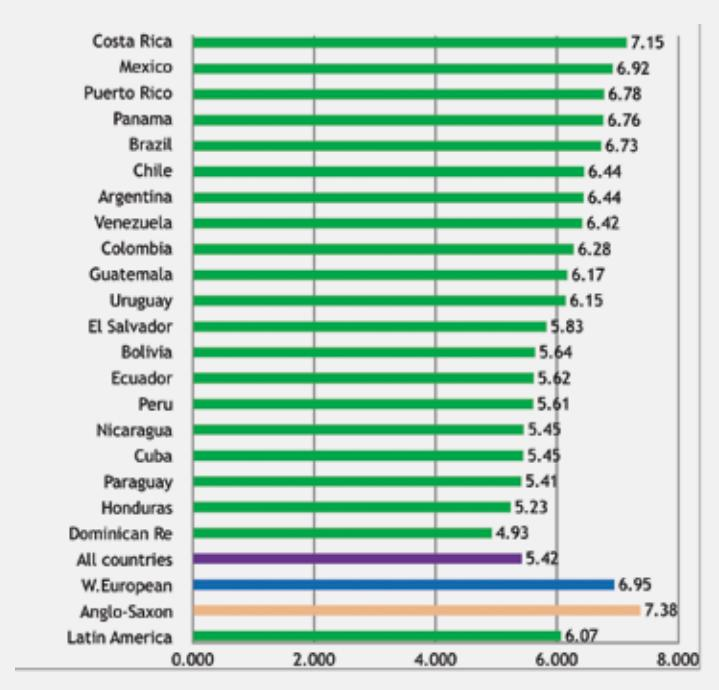

Note: Country means. Regional figures are computed as simple regional averages of country means.

Source: Gallup World Poll, waves 2006 to 2016.

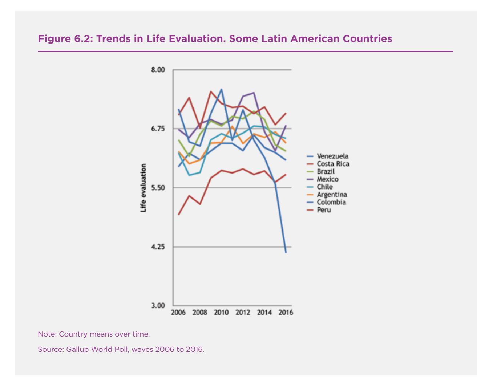

the need of incorporating people's affective state when aiming to have an overall assessment of their happiness.

#### **Life Evaluation in Latin America**

Life evaluations in Latin American range from an average of 7.15 in Costa Rica to 4.93 in Dominican Republic on the basis of information from Gallup World Polls from 2006 to 2016 (See Figure 6.1). The simple country average for the Latin American region is 6.07, which is not as high as the average for the group of Western European countries (6.95) or for the Anglo-Saxon countries (7.38), but which is much greater than the simple country average for all the countries in the world (5.42).17 Given the economic and social conditions in Latin America it comes as no surprise that, on average, life evaluation in the region is much lower than that in the European and Anglo-Saxon countries, which continuously show much better indicators in terms of income, income distribution, income-poverty rates, transparency,

crime and violence rates, and education and health. The high evaluative levels reported by Costa Ricans (7.15) (See Figure 6.1), which are above the average Western European levels, are partially explained by the existence of a relatively good welfare system in the country. There is no army in Costa Rica since 1949, and the country's inhabitants have universal access to health care and primary and secondary education, with the government providing many services that ensure the satisfaction of basic needs for most Costa Ricans, independently of their income.

Figure 6.2 presents time trends in life evaluation for some Latin American countries. Venezuela – a country undergoing difficult political, social and economic processes during the past years – shows an astonishing decline in people's evaluation of life, moving from 7.6 in 2010 to 4.1 in 2016. The volatility of life evaluation is also extremely high in Venezuela; as a matter of fact, the average year to year change in Venezuela is 0.67. Peruvians have moved from an average life

evaluation of 4.9 in 2006 to one of 5.8 in 2016; some increase in life evaluation is also observed during the past years in Chile. The largest countries in the region – Brazil and Mexico – show a slightly negative trend in recent years.

One of the main questions regarding Latin Americans' life evaluation is whether it corresponds to the social and economic conditions in the region as they are portrayed by commonly used indicators such as income levels and other socio-economic indicators. Two ordinary least square regression exercises are implemented on the basis of all observations from all countries in the Gallup World Polls surveys from 2006 to 2016 in order to study this correspondence between life evaluation in Latin America and some relevant variables which have been used to explain happiness. The first exercise (model 1) uses the logarithm of household per capita income as the unique explanatory variable of life evaluation. The second exercise (model 2) adds other explanatory variables such as: count on the help, donated money, freedom in your life, corruption within businesses, and corruption in Government.18 Figure 6.3 presents the mean of the estimated errors from these regressions for the Latin American countries; as observed, with the exception of the Dominican Republic all other Latin American countries show actual life evaluations higher than those predicted by the global equation. This finding indicates that Latin Americans tend to evaluate their lives above what their income and what the set of commonly used explanatory variables would predict. The simple country average of the estimated error for the whole region is between 0.71 (for model 2) and 0.81 (for model 1). Hence, Latin Americans

**Figure 6.3: Life Evaluation in Latin America. Estimated errors from Regression Exercises**

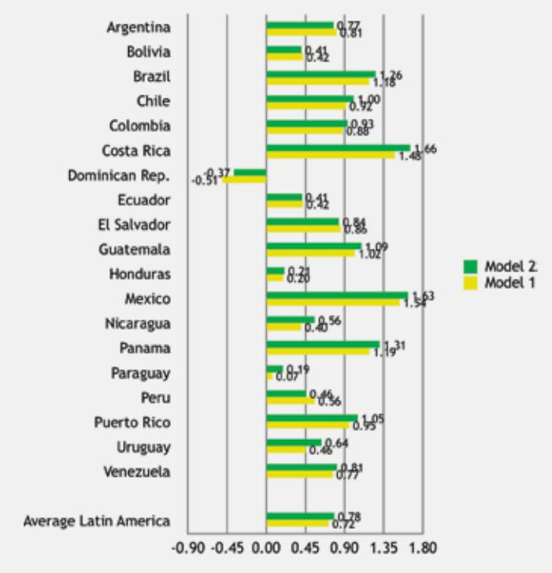

Note: Estimated errors from OLS regression analyses using all observations in the GWP 2006 to 2016 surveys. Life evaluation as dependent variable, measured in a 0 to 10 scale. Independent variables in Model 1: logarithm of household per capita income, having someone to count on, donated money, freedom in your life, corruption within businesses, and corruption in Government. Independent variables in Model 2: logarithm of household per capita income.

Source: Gallup World Polls, all waves 2006 to 2016.

have life-evaluation levels that are above what would correspond to their situation on the basis of commonly used explanatory variables of life evaluation. This finding suggests that there are some factors which are relevant in explaining life evaluation in Latin America and which are not yet fully incorporated in the available data.

#### **Affective State in Latin America**

Latin Americans report outstandingly high levels of positive affect. A simple average on the basis of five questions19 in the Gallup World Poll and which are associated to positive affect shows the situation: eight of the top ten countries in the world are from Latin America, as well as ten out of the top fifteen countries. The non-Latin American countries in the top ten are Canada and Philippines (See Table 6.1).

It is important to remark that the outstanding performance of Latin American countries in positive affect does not correspond to the situation in negative affect.20 In other words, Latin Americans' positive affect is very high, but negative affect in the region is not low –neither in comparison to other countries nor to what would be expected on the basis of the socioeconomic situation in the region.

On the basis of information from Gallup World Polls 2006 to 2016 it is evident that Latin Americans enjoy very high positive affect (See Figure 6.4). On average, the simple regional mean for Latin Americans is similar to that for the Anglo-Saxon countries and slightly higher than that for the Western European countries. Some countries like Paraguay, Panama and Costa Rica enjoy very high positive affect.

**Table 6.1: Top 15 Countries in the World in Positive Affect. Positive and Negative Affect. Mean Values by Country. 2006–2016**

|      |                            | Number          |                 |                 |
|------|----------------------------|-----------------|-----------------|-----------------|
| Rank | Country                    | of observations | Positive affect | Negative affect |
| 1    | Paraguay                   | 10995           | 0.842           | 0.222           |
| 2    | Panama                     | 11025           | 0.833           | 0.215           |
| 3    | Costa Rica                 | 11006           | 0.829           | 0.279           |
| 4    | Venezuela                  | 10994           | 0.824           | 0.243           |
| 5    | El Salvador                | 11008           | 0.818           | 0.319           |
| 6    | Guatemala                  | 11045           | 0.812           | 0.297           |
| 7    | Colombia                   | 10999           | 0.810           | 0.308           |
| 8    | Ecuador                    | 11135           | 0.809           | 0.323           |
| 9    | Canada                     | 11325           | 0.804           | 0.257           |
| 10   | Philippines                | 12198           | 0.800           | 0.364           |
| 11   | Iceland                    | 3131            | 0.799           | 0.217           |
| 12   | Denmark                    | 10777           | 0.798           | 0.193           |
| 13   | Honduras                   | 10991           | 0.797           | 0.273           |
| 14   | Norway                     | 6010            | 0.797           | 0.208           |
| 15   | Nicaragua                  | 11015           | 0.796           | 0.312           |
|      | All countries in the world | 0.697           | 0.270           |                 |

Note: Positive affect measured as simple average of the following five 'day-before' dichotomous variables: Smile or laugh yesterday, Learn something, Treated with respect, Experienced enjoyment, and Feel well-rested. Negative affect measured as simple average of the following five 'day-before' dichotomous variables: Experienced worry, Sadness, Anger, Stress, and Depression. Positive and negative affect are measured in a 0 to 1 scale.

Source: Gallup World Poll waves 2006 to 2016.

**Figure 6.4: Positive and Negative Affect. Latin America, 2006–2016**

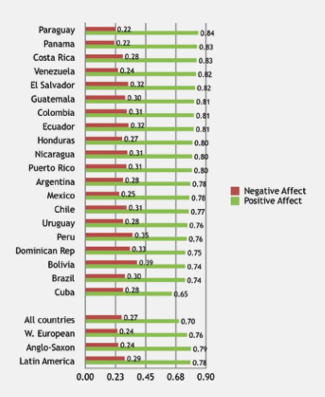

Note: Country means in positive and negative affect. Regional averages refer to simple country means in the region. Positive and negative affect are measured in a 0 to 1 scale.

Source: Gallup World Poll waves 2006-2016.

While positive affect is more favorable in Latin America, the reverse is true for negative affect, with Bolivians and Peruvians reporting especially high negative affect.

The information presented in Figure 6.4 corresponds to mean values across all years in the surveys (2006 to 2016). However, some countries show clear time trends and of particular interest is the situation in Venezuela, where positive affect have declined from a top value of 0.87 in 2010 to 0.74 in 2016 while negative affect have risen from a value of 0.13 in 2010 to 0.42 in 2016 (See Figure 6.5). No doubt the complexities of economic crisis, political polarization, high violence, and migration and separation of families are affecting the well-being of Venezuelans.

Positive affect is very high in Latin America and negative affect is also high, but the main question is whether they do correspond to the levels of commonly used variables in the explanation of happiness. Two regression exercises21 are implemented on the basis of all observations in the Gallup World Polls surveys from 2006 to 2016 in order to study this correspondence between affect in Latin America and some relevant variables which are often used to explain happiness. The first regression exercise (model 1) uses the logarithm of household per capita income as the unique explanatory variable of affect. The second regression exercise (model 2) adds other explanatory variables such as: count on the help, donated money, freedom in your life, corruption within businesses, and corruption in government. Figure 6.6 presents the estimated errors from these regressions for the case of positive affect, while Figure 6.7 provides the same information for the case of negative affect.

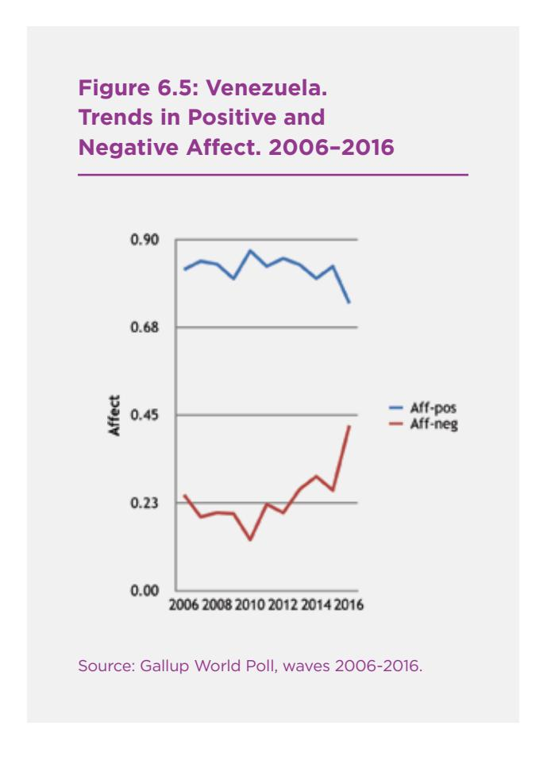

**Table 6.2: Explanatory Power of Some Relevant Variables.1 R-Squares from Person-Level Regressions.2 By Region, 2006–2016**

|                        |                 | Dependent Variable |                 |  |
|------------------------|-----------------|--------------------|-----------------|--|
| Region                 | Life Evaluation | Positive Affect    | Negative Affect |  |
| Latin America          | 0.064           | 0.034              | 0.031           |  |
| Anglo-Saxon            | 0.107           | 0.064              | 0.078           |  |
| Western Europe         | 0.215           | 0.094              | 0.119           |  |
| All countries in world | 0.181           | 0.072              | 0.032           |  |

1 List of explanatory variables in regressions: Count on help, Donated money, Freedom in your life, Corruption within businesses, Corruption within government, and Logarithm of household per capita income.

Source: Gallup World Poll waves 2006 to 2016.

2 Linear regressions, Ordinary least squares technique.

**Figure 6.6: Positive Affect. Estimated Errors**

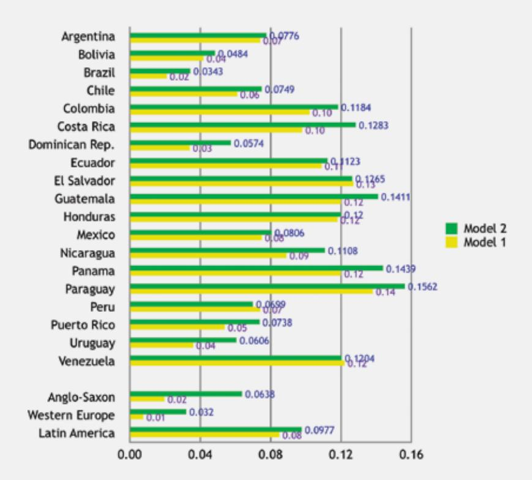

Notes: Estimated errors from worldwide regression analyses. Positive affect as dependent variable. Independent variables in Model 1: logarithm of household per capita income, count on the help, donated money, freedom in your life, corruption within businesses, and corruption in Government. Independent variables in Model 2: logarithm of household per capita income. Positive affect is measured in a 0 to 1 scale.

Source: Gallup World Poll, all waves 2006 to 2016.

It is observed in Figure 6.6 that positive affect is very high with respect to corresponding income levels as well as to the situation as described by a group of variables which are often used to explain people's happiness. All Latin American countries show, on average, positive affect levels which are much above what would be predicted. In addition, the regional average in Latin America is much above that in the Anglo-Saxon and Western European regions and, of course, much above the world average (which is 0). Hence, it is concluded that a strong tendency to experience above-expected positive emotions is observed in most Latin American countries. These findings clearly indicate that the set of explanatory variables which are commonly used in explaining happiness is missing some relevant factors which are relatively abundant in Latin America.

Estimated errors for negative affect in Latin America do show a pattern which is closer to the expected one: Some countries show negative mean errors while others show positive mean errors, and the regional average is small –but still significantly different from zero. Hence, it is concluded that a slight tendency to experience above-expected negative emotions is observed in most Latin American countries.

In addition, the explanatory variables of happiness which are commonly used have less explanatory power in Latin America. Table 6.2 presents the goodness of fit (R-square coefficients) for regional regression exercises with life evaluation, positive affect, and negative affect as dependent variables, and with the following variables as explanatory ones: count on help, donated

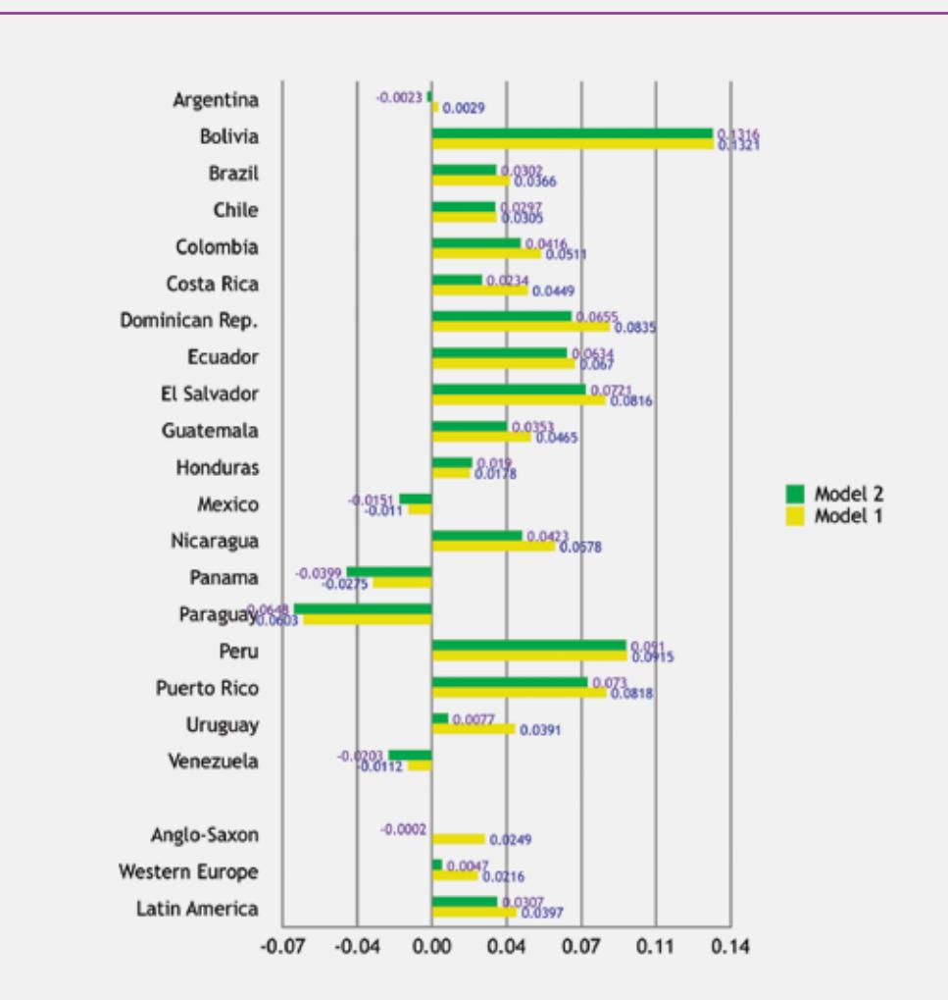

**Figure 6.7: Negative Affect. Estimated Errors**

Notes: Estimated errors from worldwide regression analyses. Negative affect as dependent variable. Independent variables in Model 1: logarithm of household per capita income, count on the help, donated money, freedom in your life, corruption within businesses, and corruption in Government. Independent variables in Model 2: logarithm of household per capita income. Negative affect is measured in a 0 to 1 scale.

Source: Gallup World Poll, all waves 2006 to 2016.

money, freedom in your life, corruption within businesses, corruption within government, and logarithm of household per capita income. All observations from the Gallup World Poll surveys from 2006 to 2016 are used and regressions are run by region. It is observed in Table 6.2 that the group of independent variables has good explanatory power in Western Europe, but very little explanatory power in Latin America. For example, while this group of independent variables explains about 22 percent of the variability of Western European's life evaluation they do only explain about 6 percent of the

variability of Latin Americans' life evaluation. Similarly, while the group of variables explains 9 percent of the variability of Western European's positive affect – and 12 percent of their negative affect –, they do only explain 3 percent of the variability of Latin American's positive affect – and 3 percent of their negative affect.

It is evident that Latin Americans are outliers in what respect to their experience of positive affect. Latin Americans' positive affect is high in comparison to most countries in the world and also high with respect to what some commonly

used explanatory variables would predict. A slightly similar result is found for negative affect. Hence, the explanation of happiness on the basis of variables such as Income, count on help, donated money, freedom in your life, corruption within businesses, and corruption within government, seems to be missing some very important drivers, at least for the Latin American case.

Furthermore, the correlation between evaluative and affective states is smaller in Latin America than in other regions in the world. Figure 6.8 shows the simple country means by region for the intra-country correlations22 between affects (positive and negative) and life evaluation. It is observed that the regional mean for the intracountry correlations between positive affect and life evaluation is much smaller in Latin America (0.19) than in a group of Anglo-Saxon countries23 (0.32) as well as than in a group of western European countries (0.28). In a similar way, the regional mean for the intra-country correlations

between negative affect and life evaluation is much smaller – in absolute terms – in Latin America (-0.19) than in a group of Anglo-Saxon countries (-.34) as well as than in a group of western European countries (-.28).24

It is also important to state that the regional mean values for intra-country correlations between positive and negative affect are very similar across the regions under study. The regional mean values are -0.37 in Latin America, -0.37 in Western Europe, and -0.42 in Anglo-Saxon countries. In other words, the pattern of personal correlations between positive and negative affects does not seem to vary substantially across regions in the world. However, the pattern of personal correlations between positive affect and life evaluation as well as between negative affect and life evaluation does substantially differ across regions.

**Figure 6.8: Life Evaluations and Affective States. Intra-Country Correlations, Means by Region**

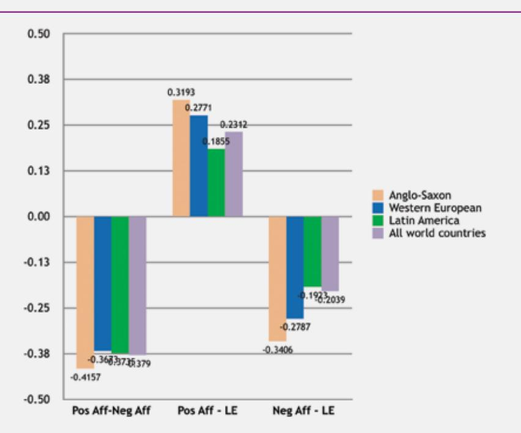

Note: Simple means of intra-country correlations between positive affect (Pos Aff), negative affect (Neg Aff), and life evaluation (LE). Simple means by region.

Source: Gallup World Poll wave 2006 to 2016.

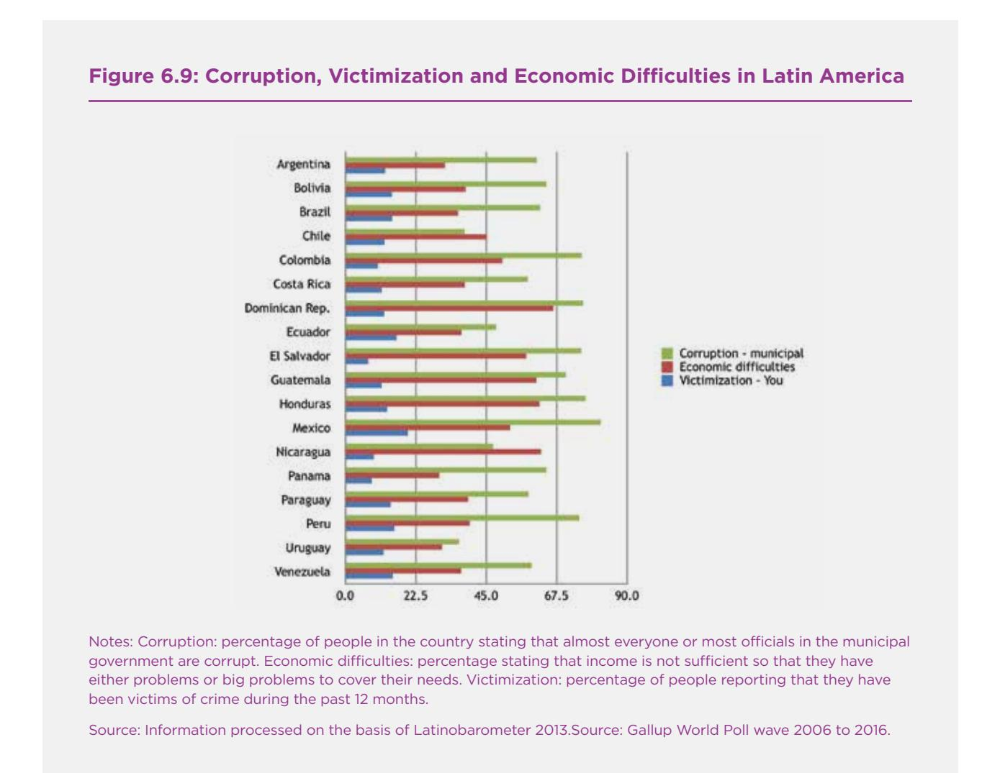

Affective experiences are an important substrate in overall assessments of life, and they play a central role in people's aspirations and behavior. The outstandingly high positive affect levels in Latin America, their lack of correspondence to life-evaluation measures, and the relatively low correlation between life evaluation and affective states call for further study of the affective situation in the region. Furthermore, it is clear that the set of commonly used explanatory variables for life evaluation provide an incomplete explanation for both evaluative and emotional happiness in Latin America. An expanded study of affective regimes, emotional communities, and emotional regimes25 could contribute to a better understanding of how the relevance of affective states in a region is associated to its cultural attributes. The results from this study could help to understand the emergence of communities and societies that value, promote, and have

particular attitudes to the experience of positive

affect.26 In addition, it is also important to further study the drivers of affective states because the nature and dynamics of these drivers could explain the behavior of affect in a society.27 For example, the abundance of close and intimate interpersonal relations could be a driver for the experience of high positive affect but also, when relations are not going well, of high negative affect.

Some scholars have pointed to the apparent contradiction that emerges when contrasting the socio-economic situation in many Latin American countries with the high happiness levels reported by Latin Americans. The following two sections address this issue and show that there is no contradiction. The next section shows that the socio-economic and political problems in the region do depress people's happiness; however, these problems do not suffice to generate low happiness in the region because Latin America's

social organization promotes and nurtures some drivers of happiness which are not fully captured by commonly-used explanatory variables. The following section elaborates an explanation of Latin Americans' happiness in terms of the importance human relations have in the region, not only as a source of material support but, fundamentally, as a source of positive affect and of non-materialistic purpose in life. In particular, the abundance and the quality of family relations play a crucial role in understanding happiness in Latin America.

## **Social, Economic and Political Problems in Latin America and Their Impact on Happiness**

Latin America is no paradise; there are many social and economic problems in the region. Some of the problems are structural and emerge from historical processes, such as: weak political institutions, high corruption levels, and high income inequality that magnifies poverty rates in what would mostly be considered as mid-income countries. Other problems have been triggered

by recent processes; for example: the closeness to the largest drug market in the world combined with a wrong strategy that looks to represses production rather than to reduce consumption has exacerbated drug-related violence and has led to alarming crime rates in some areas of Latin America. This process of rising violence is also fostered by weak civic interpersonal relations, high corruption rates, and greater penetration of materialistic values during the last decades.

Figure 6.9 shows some figures on corruption, victimization and economic difficulties which suffice to portray the situation of social problems in the region. The belief that there is some level of corruption at the local and national governmental levels is widespread in Latin America. Country level figures for municipal-level corruption go as high as 82 percent in Mexico; with relatively low figures -beneath 40 percentin Chile and Uruguay.28

Living within some degree of economic difficulty is also common in most countries of Latin America. For example, about 36 percent of Brazilians and 53 percent of Mexicans declare

**Table 6.3: Corruption, Economic Difficulties and Victimization. Impact on Life Satisfaction**

|                                                                                  |                                                     | Coefficient | Prob>t |
|----------------------------------------------------------------------------------|-----------------------------------------------------|-------------|--------|
| Perception of corruption municipal level                                   | Almost everyone is corrupt                          | -0.106      | 0.000  |
|                                                                                  | Most officials are corrupt                          | -0.093      | 0.000  |
|                                                                                  | Not many officials are involved                     | -0.050      | 0.045  |
|                                                                                  | There is hardly anyone involved                     | Reference   |        |
| Economic difficulties. Problems or big problems to cover their needs | It is not sufficient, has big problems              | -0.409      | 0.000  |
|                                                                                  | It is not sufficient, has problems                  | -0.242      | 0.000  |
|                                                                                  | It is just sufficient, does not have major problems | -0.036      | 0.066  |
|                                                                                  | It is sufficient, can save                          | Reference   |        |
| Victimization during the past 12 months                                    | both you and relative                               | -0.126      | 0.000  |
|                                                                                  | you                                                 | -0.067      | 0.000  |
|                                                                                  | relative                                            | -0.042      | 0.003  |
|                                                                                  | none                                                | Reference   |        |
|                                                                                  | R2                                                  | 0.116       |        |

Note. Control variables: marital state, gender, age, age squared, education level, language, country dummies.

Source: Latinobarometer 2013.

that their earnings are insufficient to cover their needs. This figure reaches levels above 60 percent in Guatemala, Honduras, Nicaragua and Dominican Republic, and it is not beneath 30 percent in any country in the region.

Many people report being victims of crime during the past year; for example, this figure reaches levels of 20 percent in Mexico and it is above 15 percent in Ecuador, Peru, Venezuela and Brazil. The fear of victimization is high in some areas of Latin America, where people have directly been a victim of crime or know of a relative who has been.

Latin Americans are not immune to the many social and economic problems they do live with. Table 6.3 shows the results from an econometric exercise that studies the impact of corruption, violence and economic difficulties on life satisfaction. It is clear that life satisfaction declines with the presence of perceptions of corruption, with economic difficulties, and with exposure to crime.29

The existence of social problems and of economic difficulties does reduce happiness in Latin America, but it does not necessarily imply low happiness. How can Latin Americans experience high happiness levels within this context? There are many positive factors in the region, in particular the nature and abundance of close and warm interpersonal relations. This specific structure of Latin Americans' interpersonal relations allows them to enjoy high levels of satisfaction in domains of life that are particularly important to Latin Americans: the social domain and, in especial, the family domain of life.

## **The Importance of the Relational Realm in Latin America**

Latin Americans spend much time and resources in the nurturing of interpersonal relations.30 Some Latin American social thinkers have made a distinction between the realm of relations and the realm of the material world; their research shows

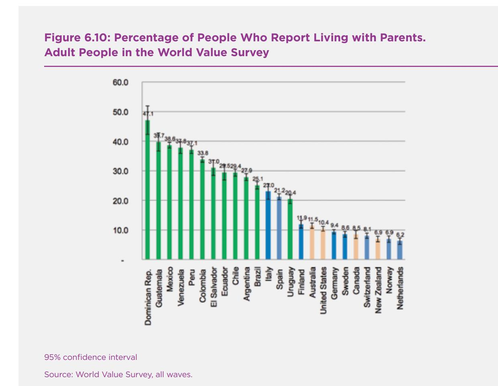

that Latin Americans give greater importance to the relational realm and, in consequence, to the creation and sustain of interpersonal relations.31 The family – both the nuclear one and the extended one – is a central institution in Latin American culture and it is also an important source of positive affect and of purpose in life.

This section shows that the nature of Latin American interpersonal relations substantially differ from those in other regions of the world –in particular from those in Western European and Anglo-Saxon countries. Latin Americans place great interest in nurturing their interpersonal relations, and this implies for the abundance of warm and close relationships that positively impact family satisfaction as well as overall happiness –both from an evaluative and from an affective perspective. Family satisfaction is very high in Latin America, and close and warm relations do also extend to friends, neighbors, and colleagues.

#### **Living in the Family**

Most people grow up in families. But in some cultures it is expected for them to leave their family as soon as they reach adulthood, while in Latin American people tend to live longer with their parents and do not necessarily leave their family when they become adults. By living longer in the family people extend their companionship with those they grew up with, and with whom a close, disinterested, and long-lasting relationship already exists. It is also common to find elder parents living in their adult-children households.

Information from the World Value Surveys (all waves) shows that adult people in Latin American tend to live with their parents in a larger proportion than those from Western European countries and from Anglo-Saxon countries (See Figure 6.10). The simple country average for those Latin American countries in the survey is 33 percent, which shows that one third of people

**Figure 6.11: Under School Age Kids: Provider of Childcare. Percentage Who Say Family Members** 

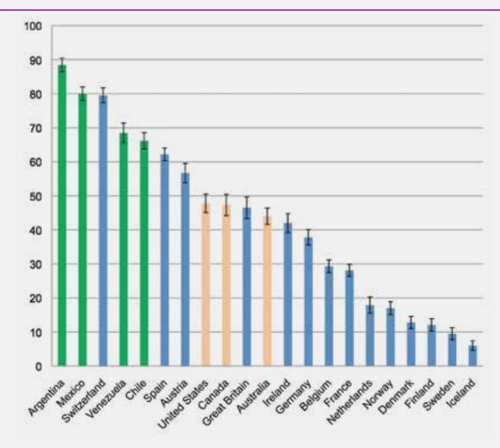

Note: Other response options are: government agencies, non-profit organizations, private childcare providers, and employers.

Source: International Social Survey Program's module on Family and Changing Gender Roles IV (2012)

**Figure 6.12: Provider of Domestic Help to Elderly People. Percentage Who Say it is for Family Members to Take Care of Domestic Help for Elderly People**

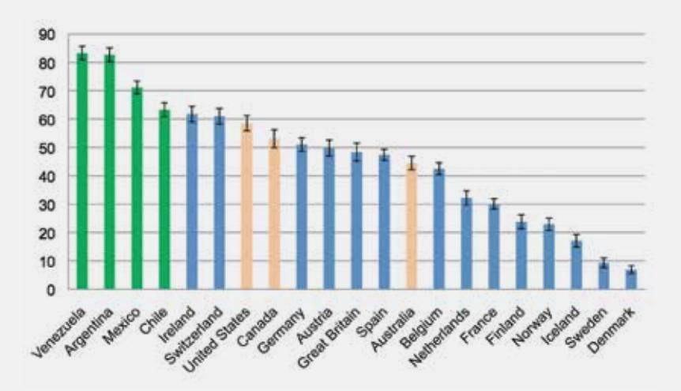

Note: Other response options are: government agencies, non-profit organizations, private childcare providers, and employers.

Source: International Social Survey Program's module on Family and Changing Gender Roles IV (2012)

**Figure 6.13: Taking Care of Family Before Helping Others. Country Means** 

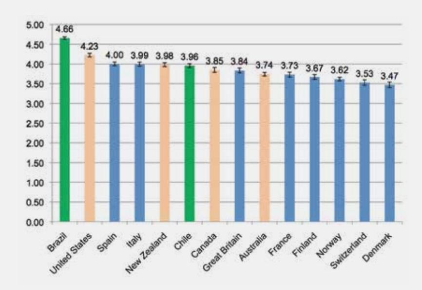

Note: You should take care of yourself and your family first, before helping other people. Response scale: 5 Agree strongly, 4 agree, 3 neither agree nor disagree, 2 disagree, 1 disagree strongly.

Source: International Social Survey Program, Social Networks II, 2001.

who were surveyed reported living with their parents. This figure is only 12 percent for those western European countries and only 9 percent for those Anglo-Saxon countries included in Figure 6.10.

The extension of children's stay at home as well as the incorporation of the elders in their grownup children's households implies an abundance of close and normally supportive interpersonal relationships. When these relationships are gratifying they do contribute to both high live evaluation and the enjoyment of high positive affect; however, in those cases where the intimate relationships become unsatisfactory they may detonate the experience of strong negative affect.32

#### **Taking Care of Children and Elderly in the Family**

Family members do also play a central role in child rearing in Latin America, and many elder persons do live with their adult children and their grandchildren and/or do keep in close contact with them.

The International Social Survey Program's module on Family and Changing Gender Roles IV (2012) asked the following two questions to people from many countries: First, '*People have different views on childcare for children under school age. Who do you think should primarily provide childcare?*', second, '*Thinking about elderly people who need some help in their everyday lives, such as help with grocery shopping, cleaning the house, doing the laundry etc. Who do you think should primarily provide this help?*'. The information from the survey shows that Latin Americans strongly believe that the family must play a central role in raising kids as well as in taking care of the elder. The simple

**Figure 6.14: One of Main Goals: Make My Parents Proud. Country Means**

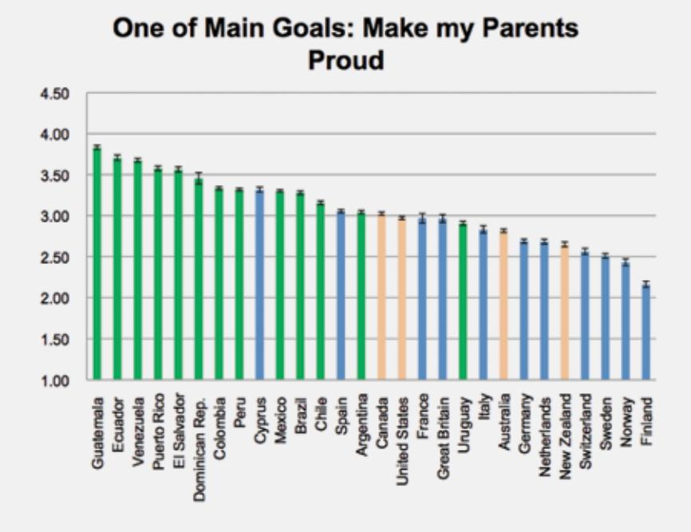

Note: Making parents proud as one of the main goals in life. Response scale: Strongly agree (4), Agree (3), Disagree (2), Strongly disagree (1)

Source: World Value Survey, all waves.

**Figure 6.15: Watching Children Grow is Greatest Joy. Country Means** 

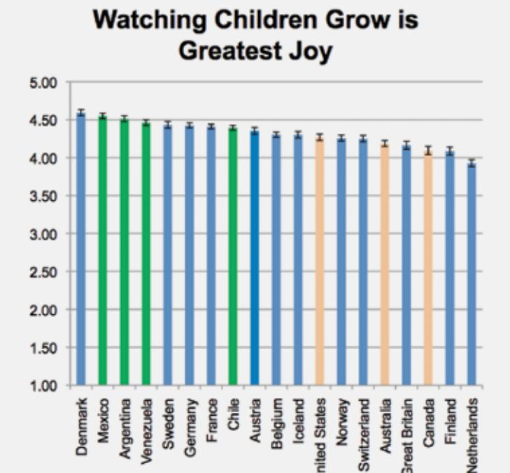

Note: Watching children grow up is greatest joy. Response scale: 5 Strongly agree, 4 Agree, 3 Neither agree nor disagree, 2 Disagree, 1 Strongly disagree.

Source: International Social Survey Program's module on Family and Changing Gender Roles IV (2012)

country average for people responding that the family should take care of under-school age kids is 76 percent in the Latin American countries in the survey. The same figure is only 33 percent for Western European countries and 46 percent for Anglo-Saxon countries in the survey (See Figure 6.11).

Similarly, a larger proportion of Latin Americans do also believe that elderly people should be supported by their family members rather than by governmental and private institutions. The simple country average for those Latin American countries in the survey is 77 percent, while this figure is 36 percent in the Western European countries and 52 percent in the Anglo Saxon countries in Figure 6.12.

A larger proportion of under-school-age children in Latin America grow up within a family environment and enjoying the close interaction with people who love them and who are intrinsically motivated to take care of them. Elder people do also frequently enjoy the company of loved ones. Research has shown that there are positive emotional benefits of growing in family environments where parents are present in the raising of their kids.33

#### **Preference for Taking Care of Family**

The ISSP Social Networks II survey (2001) asked people about their degree of agreement with the following statement: "*You should take care of yourself and your family first, before helping other people*". There were only two Latin American countries in this survey, but the data shows that people in Brazil – Latin America's largest country – tend to strongly agree with this statement, while in Chile people do agree with the statement (Figure 6.13).

**Figure 6.16: Uncles and Aunts. Visited More than Twice in the Last Four Weeks**

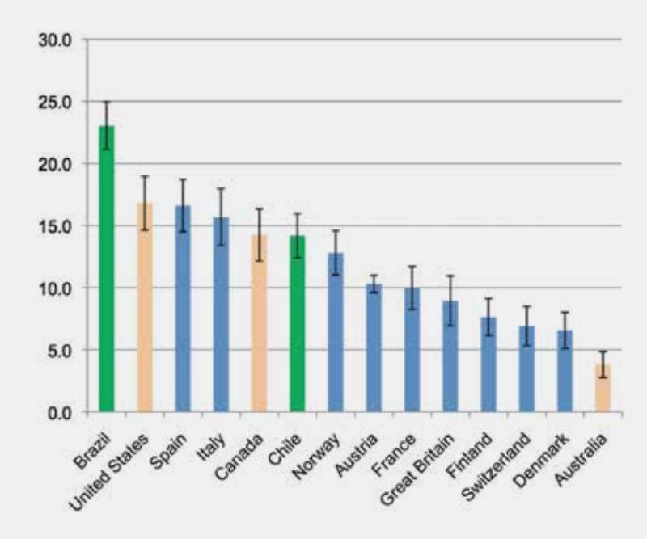

Note: Percentage of people who visited at least one uncle or aunt 'more than twice in the last four weeks'

Source: International Social Survey Programme's block on Social Networks II (2001)

This information does not only show the concern people have for the well-being of family members in Latin America, but it also shows a relative disregard for the well-being of people who are neither relatives or friends. Hence, family relations are relatively strong, but civic relations are relatively weak in Latin America; and this takes place in countries with weak institutional arrangements.

#### **Life Evaluation Incorporates Family Considerations**

People's evaluation of life, as well as their affective experiences, depends on the attainment of those goals that they consider important. Goals and values play a central role in the relationship between drivers of happiness and happiness itself. The importance of the realm of relations in Latin Americans' way of life does also show up in the greater relevance of some relational goals, such as making parents proud and watching children grow up.34

The World Value Survey asks people on the degree of agreement with the following statement: "*One of my main goals in life has been to make my parents proud*". Figure 6.14 presents the simple averages for the degree of agreement with this statement in many Latin American countries as well as in some West European and Anglo-Saxon countries. It is observed that there is a huge difference in the degree of agreement with this statement between Latin Americans and people from the other two regions under consideration; as a matter of fact the simple country average in Latin America is 3.40, while this figure is 2.74 for the Western European countries and 2.87 for the Anglo-Saxon countries under consideration.

The International Social Survey Programme's Family and Changing Gender Roles IV module does also have a question on the relevance of watching children grow up. To be specific, the question asks for the degree of agreement with the following statement: "*To what extent do you* 

**Figure 6.17: Cousins. Visited More than Twice in the Last Four Weeks** 

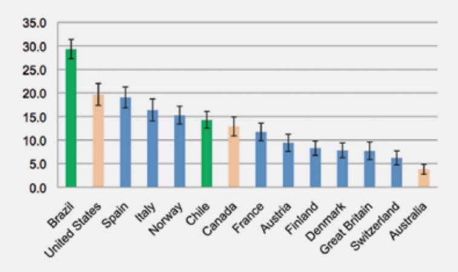

Note: Percentage of people who visited at least one cousin 'more than twice in the last four weeks' Source: International Social Survey Programme's block on Social Networks II (2001)

**Figure 6.18: Nieces and Nephews. Visited More than Twice in the Last Four Weeks** 

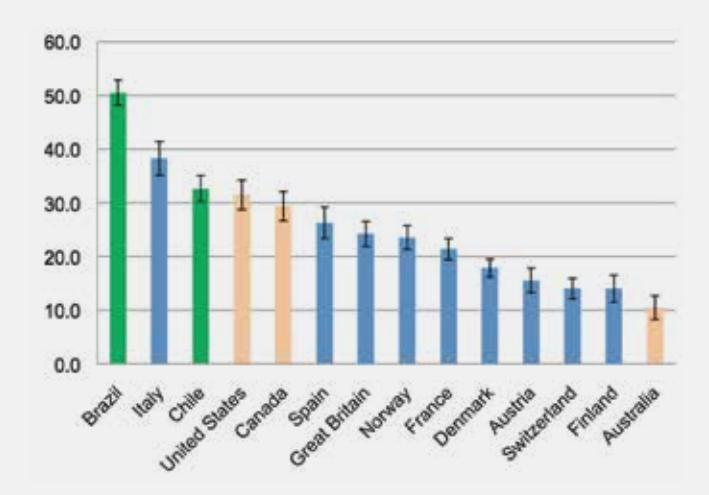

Note Percentage of people who visited at least one niece or nephew 'more than twice in the last four weeks' Source: International Social Survey Programme's block on Social Networks II (2001)

*agree or disagree?: Watching children grow up is life's greatest joy*". The information presented in Figure 6.15 shows that the nurturing of children is a source of greatest joy in Latin American countries. The simple country average for the Latin American countries in the sample is 4.48, while this figure is 4.29 for the Western European countries and 4.18 for the Anglo-Saxon countries in the study.

Goals and values do intervene both in the evaluation of life as well as in the triggering of affective states. The more relational-oriented goals of Latin Americans implies for happiness to depend closely on the family situation and on the quality and quantity of family relations.35

#### **The Presence of Extended Family**

It is natural for most people to have an extended family: cousins, uncles and aunts, nieces and nephews, grandparents, grandchildren, godparents and so on. However, the degree of involvement of extended-family members in a person's life may vary across cultures. The

International Social Survey Programme's Social Networks II (2001) asked people about how often they have been in contact with the following kind of relatives in the last four weeks: Uncles and aunts, Cousins, and Nieces and nephews. Only two Latin American countries are present in the survey: Brazil and Chile, and it is important to note that Chile usually performs relatively low within the Latin American ranking of these kinds of interpersonal relations. Figures 6.16 to 6.18 show the percentage of respondents who say that they visited their relative '*More than twice in the last four weeks*'. It is observed that the extended-family is quite involved in the daily life of Brazilians. The interaction with the extended family in Chile is also much above of that in the Western European countries in the survey. Hence, the involvement and interaction with members of the extended family is quite high in Latin America. Research on the relationship between quantity and quality of relationships with relatives and life satisfaction is scarce – probably as a consequence of these relationships being relatively scarse in those countries where

**Figure 6.19: Visit Closest Friend Daily or at Least Several Times a Week**

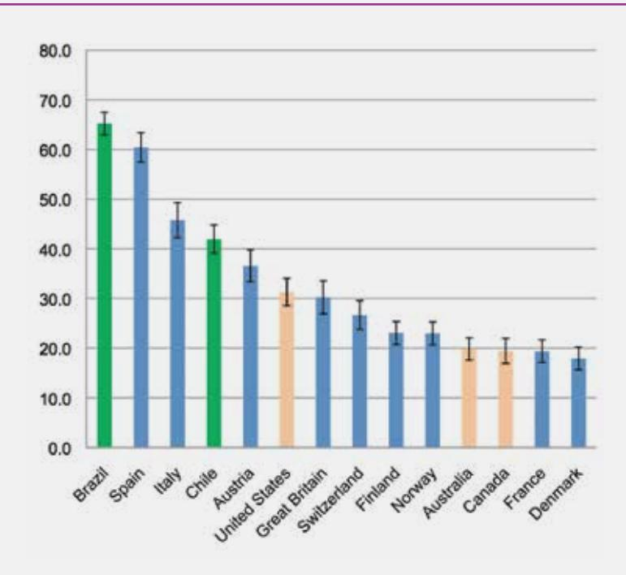

Note: Percentage responding daily or at least several times a week

Source: International Social Survey Programme's block on Social Networks II (2001)

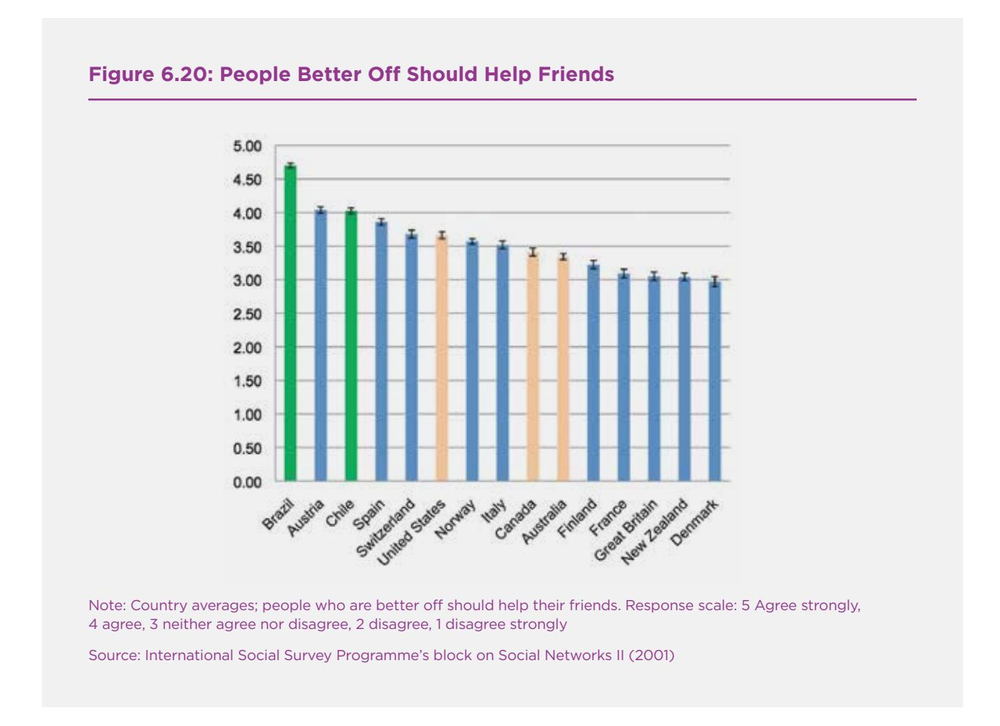

major research is undertaken –; however, some findings suggest that this kind of relationship may contribute to people's happiness.36

#### **Close Relationships with Close Friends**

The realm of close interpersonal relations in Latin America extends beyond the nuclear and extended family. Friends are also highly involved in the daily life of Latin Americans, and friends are expected to play an important role not only in bringing emotional and economic support but also in sharing daily life.

The International Social Survey Programme's block on Social Networks II (2001) has a couple of questions regarding the involvement and support which is expected from friends in different countries of the world. Two Latin American countries are included in this survey: Brazil and Chile.

The first question asks how often people see or visit their closest friend. Figure 6.19 shows the percentage of people who report seeing or visiting their closest friend daily or at least

several times a week. It is observed that this percentage is very high in Brazil and it is also high in Chile.

The second question asks people about their degree of agreement with the following statement: "*People who are better off should help friends who are less well off*". Figure 6.20 shows that in the two Latin American countries in the survey there is wide agreement about expecting friends who are better off to help those who are less well off.

Data from other sources, such as the BIARE-Mexico (National Statistical Office survey on self-reported well-being) and the United States' General Social Survey show that people in Mexico gather more often and more frequently with relatives and with friends than people in the United States. For example, 77 percent of people in Mexico state that they gather with relatives at least several times per month, while this figure is of 53 percent in the United States. Regarding gathering with friends several times per month, the figure is 68 percent in Mexico and 45 percent in the United States.

**Figure 6.21: Family Satisfaction**

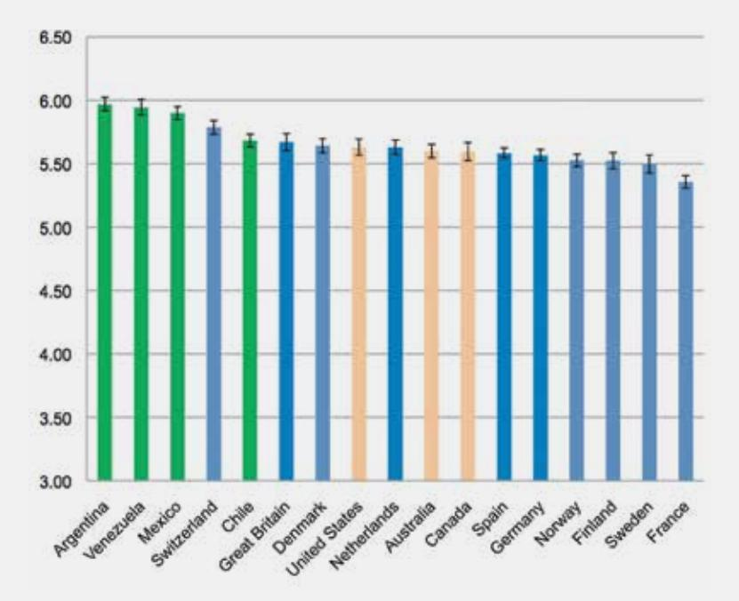

Note: Satisfaction with family, country means. 'All things considered, how satisfied are you with your family life?' Response scale: Completely satisfied (7), very satisfied (6), fairly satisfied (5), neither satisfied nor dissatisfied (4), fairly dissatisfied (3), very dissatisfied (2), completely dissatisfied (1).

Source: International Social Survey Programme's module on Family and Changing Gender Roles IV (2012)

#### **High Family Satisfaction in Latin America and its Importance for Happiness**

Given the nature of interpersonal relations in Latin America and the centrality of the family it should come as no surprise that family satisfaction is very high in the region. The International Social Survey Programme's module on Family and Changing Gender Roles IV (2012) has a question on family satisfaction: '*All things considered, how satisfied are you with your family life?*'. The response scale is categorical and in this chapter it is treated as cardinal in a 1 to 7 scale for descriptive purposes, where 7 is associated to a 'completely satisfied' response. Figure 6.21 shows country means for family satisfaction in Latin America, Western Europe and Anglo-Saxon countries. The simple country average for the four Latin American countries in the survey is 5.87, which is much higher than the average for the Western European countries in the graph (5.58) and for the Anglo Saxon countries (5.60)

High family satisfaction is of the greatest relevance in explaining high happiness in Latin America, both in terms of evaluation of life as well as of enjoyment of positive emotions.

#### **An Illustration from Mexico**

Mexico's National Statistical Office (INEGI) has recently started measuring subjective well-being indicators in order to have better assessments of people's situation. A large representative survey (about 39,000 observations) implemented in 2014 provides information about: life satisfaction, satisfaction with achievements in life, satisfaction with affective life, family satisfaction, standard of living satisfaction, health satisfaction, leisure satisfaction, occupation satisfaction, and social life satisfaction. all variables are measured in a 0 to 10 scale. Figure 6.22 presents descriptive statistics for these variables; it is observed that Mexicans report very high levels of family satisfaction and that their satisfaction with affective life is higher than that with achievements in life.

**Figure 6.22: Subjective Well-Being Information. Mean Values, Mexico 2014** 

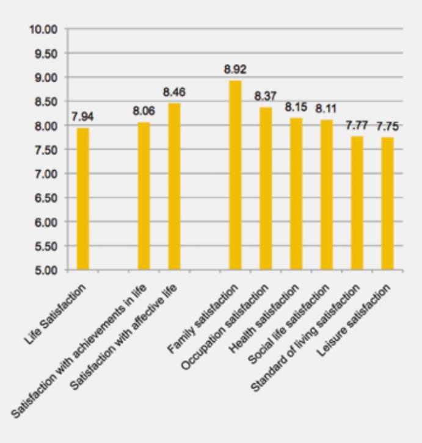

Note: Satisfaction measured in a 0 to 10 scale.

Source: BIARE survey 2014, Mexico's National Statistical Office (INEGI)

**Table 6.4: Domains of Life Explanation of Satisfaction with Affective Life and with Achievements in Life. Mexico 2014. Ordinary Least Square Regression**

|                                 | Satisfaction with achievements in life |       | Satisfaction with affective life |       |
|---------------------------------|----------------------------------------|-------|----------------------------------|-------|
|                                 | Coefficient                            | P>t   | Coefficient                      | P>t   |
| Family satisfaction             | 0.085                                  | 0.000 | 0.428                            | 0.000 |
| Standard of living satisfaction | 0.273                                  | 0.000 | 0.192                            | 0.000 |
| Health satisfaction             | 0.132                                  | 0.000 | 0.052                            | 0.000 |
| Leisure satisfaction            | 0.098                                  | 0.000 | 0.039                            | 0.000 |
| Occupation satisfaction         | 0.137                                  | 0.000 | 0.055                            | 0.000 |
| Social life satisfaction        | 0.085                                  | 0.000 | 0.105                            | 0.000 |
| Intercept                       | 1.520                                  | 0.000 | 1.107                            | 0.000 |
| R_squared                       | 0.359                                  |       | 0.321                            |       |

Source: BIARE survey 2014, Mexico's National Statistical Office (INEGI)

Relatively low levels of satisfaction are seen in the standard of living and leisure (free-time) domains of life.

Table 6.4 presents the main results from an econometric exercise that aims at explaining satisfaction with achievements in life and with affective life on the basis of satisfaction in domains of life.

It is observed that family satisfaction has, by far, the largest impact on the satisfaction with affective life of Mexicans. Family satisfaction is also statistically significant in explaining satisfaction with achievements in life; however, in this case the standard of living has a much larger coefficient. It seems that interpersonal relations matter for both affective and evaluative aspects of life, but they count more for the former than for the latter.37

#### **Conclusions**

Latin Americans report high happiness levels. Positive-affect scores are substantially high both in comparison to other countries in the world and to what income levels in the region would predict. Latin Americans' evaluation of life is also above what income levels would predict.

Many social and economic indicators portray Latin America as a mid to low income-level region with high poverty rates, great income inequality, high violence and crime rates, and high levels of corruption. How can Latin Americans be so happy within a context that may look somehow unfavorable? This chapter has shown that the happiness of Latin Americans is diminished by their many social and economic problems and that, in fact, happiness could increase if these problems were properly addressed. However, it would be a big mistake to assume that these problems overwhelm the daily lives of Latin Americans. In fact, it would be a focusing-illusion bias to assume that Latin Americans must be unhappy because there are some problems in their life. In fact, the daily life of Latin Americans is not constricted to the consequences of income poverty, institutional corruption, income inequality, crime and violence, and other problems. This chapter shows that there are many positive factors that contribute to the happiness of Latin Americans; in particular, the abundance and quality of close,

warm, and genuine interpersonal relations. The specific structure of Latin Americans' interpersonal relations allows them to enjoy high levels of satisfaction in domains of life that are particularly important to Latin Americans: the social domain and, in especial, the family domain of life. It explains the outstandingly high positive affect in the region as well as the above-expected evaluative states.

The Latin American case shows that the abundance and nature of interpersonal relations is an important driver of happiness which deserves further attention, as was emphasized in Chapter 2 of *World Happiness Report 2017*. Happiness research that focuses on evaluative measures may risk underestimating the importance that close, warm and genuine interpersonal relations have in people's happiness because their impact is larger on affective than on evaluative states. Happiness in relationaloriented societies may be better portrayed by overall assessments of life that incorporate information from both the evaluative and the affective substrates.

There are many lessons from the Latin American case to the development discourse.

First, it shows the need of going beyond objective measures when aiming to assess people's situation. Subjective well-being measures provide better assessments of the experience of being well people have and contribute to a better understanding of their actions. Subjective well-being measures better incorporate the values people have and which are relevant in assessing their lives; because values differ across cultures this subjectivity constitutes an advantage when making cross-cultural assessments of people's well-being.

Second, the Latin American case does not ignore the importance of income, but it clearly shows that there is more to life than income. The development discourse should neither confuse persons with consumers nor well-being with purchasing power.

Third, the Latin American case shows that genuine, warm, and person-based interpersonal relations substantially contribute to happiness. The development discourse has neglected these relations in favor of instrumental ones, which

may have a larger impact on economic growth but not on people's happiness. By objectifying other people, instrumental relations are not as gratifying as genuine ones.

Fourth, it is not only acceptable for but also expected from public policy to focus on solving social problems; however, such policies will not succeed in raising happiness if they neglect the positive aspects of social life, and if they follow a partial rather than integral view. In fact, policies should not focus only on eradicating problems but also on strengthening those riches Latin Americans currently have.

#### Switzerland, Norway, Portugal, and Ireland. The Anglo-Saxon classification makes reference to the following countries: United States, Canada, Australia, and New Zealand.

- 1 According to the Human Development Report 2017 Mexico, Costa Rica, Panamá, Cuba, Dominican Republic, Colombia, Venezuela, Ecuador, Peru, Brazil and Uruguay are classified as 'High Human Development'. Chile and Argentina are classified as 'Very High Human Development'. Guatemala, El Salvador, Honduras, Nicaragua, Bolivia and Paraguay are classified as 'Medium Development'. Haiti, which has a different history, is the only country in the region classified as 'Low Human Development'.
- 2 Rojas (2012a), Beytía (2016, 2018), Yamamoto (2016)
- 3 Rojas & García (2017)

**Endnotes**

- 4 Puchet et al. (2012), Rojas (2012b), Casas-Zamora and Carter (2017), O'Donnell (1999), Gasparini and Lustig (2011), Jaitman (2017), World Bank (2011)
- 5 Culture is neither static nor fully determined by past events and the concept involves extreme simplification and homogenization (Holler, 2014); however, it is relevant to explain the phenomenon of high happiness in Latin America.
- 6 It is important to recognize that the Mayan civilization had seen better times in the past.
- 7 Bushnell et al. (2017) mention the following factors promoting the mixing of Europeans and Indians in Latin America: The relatively scarcity of Spanish women in the new territory induced male Spaniards to quickly mixed with indigenous women. Inter-ethnic mixing was no alien to Spanish conquerors and colonizers as a result of the recent history of coexistence of Moors and Christians in the Iberian Peninsula. The idea of accumulating wealth before marrying was common among Spanish men, and the custom of having illegitimate children was already widely spread in Spain at the time of conquest and colony. In addition, the indigenous civilizations had social hierarchies, with many male and female Indians enjoying high social status.
- 8 Las Casas (1945, 1951, 1967), Díaz del Castillo (1955), León-Portilla (2014), Estrada (2009)
- 9 Bonfill (1994), Morandé (1971, 1985), Zea (1971, 1985), Larraín (1971), de Imaz (1984). It is important to remark that the blending of values and worldviews does not necessarily imply the complete integration of Europeans and indigenous groups; many studies show that even today there is some discrimination on the basis of the skin color (Ortiz et al., 2018)
- 10 Noguera and Pineda (2011), Ángel Maya (1995, 2002, 2006)
- 11 Acosta (2008), Gudynas and Acosta (2011)
- 12 Esteinou (2004), Arizpe (1973), Gonzalbo (1996, 1998), Gonzalbo and Rabell (1996)
- 13 Díaz-Guerrero (1979), Germany (1965), Díaz-Loving et al. (2008).
- 14 Rojas & García-Vega (2017), Yamamoto (2016), Beytía (fc), Velásquez (2016), Martínez Cruz & Castillo Flores (2016), Mochón Morcillo & de Juan Díaz (2016), Ateca-Amestoy et al. (2014).
- 15 The specific countries which are included in the Western European and Anglo-Saxon lists may vary across analyses due to the availability of information. However, in general the Western European classification makes reference to the following countries: United Kingdom, France, Germany, Netherlands, Belgium, Spain, Italy, Sweden, Greece, Denmark, Austria, Cyprus, Finland, Iceland, Luxembourg,

- 16 Life evaluation is measured on the following question from the Gallup Polls: "Please imagine a ladder with steps numbered from zero at the bottom to ten at the top. Suppose we say that the top of the ladder represents the best possible life for you, and the bottom of the ladder represents the worst possible life for you. On which step of the ladder would you say you personally feel you stand at this time, assuming that the higher the step the better you feel about your life, and the lower the step the worse you feel about it? Which step comes closest to the way you feel?" The response to the question is based on an imaginary 11-point scale whereby 0 designates one's worst possible life and 10 denotes the best possible life respondents can imagine for themselves.
- 17 Figures are computed using information from the Gallup World Poll waves 2006 to 2016. The survey includes 166 countries and regions.
- 18 If you were in trouble, do you have relatives or friends you can count on to help you whenever you need them, or not? (1=yes, 0=no). Donated money to a charity (1=yes, 0=no). Whether the respondent is satisfied with the freedom to choose what do to with his or her life in this country (1=yes, 0=no). Whether the respondent thinks there is corruption in businesses (1=yes, 0=no). Whether the respondent thinks there is corruption in government (1=yes, 0=no).
- 19 The five dichotomous variables are: Smile or laugh yesterday, learn something, treated with respect, experienced enjoyment, and feel well-rested. The questions in the survey ask whether this affect was experienced the day before.
- 20 Negative affect is assessed as the simple average of the following dichotomous variables in the Gallup World Poll: Experience worry, Sadness, Anger, Stress, and Depression. The Gallup survey asks whether the person experienced the emotion the day before, with a Yes or No answer.
- 21 The regression exercises use an ordinary least square technique, which means that the independent variable is treated as a cardinal one.
- 22 By intra-country correlations we mean the correlations between affect and life evaluation based on differences across persons living in the same country.
- 23 Canada, United States, Australia and New Zealand.
- 24 It is also possible to estimate regional correlations based on country mean values of life evaluation, and positive and negative affect. It is found that these correlations do also differ across regions. For example, the correlation between country means of positive affect and life evaluation is 0.87 in the Western European region and only 0.29 in the Latin American region. Similarly, the correlation between negative affect and life evaluation is -0.90 in the western European region and only -.36 in the Latin American region. This finding basically indicates that by knowing a Western European country's life evaluation mean it is possible to predict with high confidence this country's positive and negative-affect means; however, this would not be possible for Latin American countries, where a relatively high life evaluation is not necessarily associated to a relatively high positive affect or a relatively low negative affect in a country.

- 25 Sterns and Sterns, 1985; Rosenweim, 2002; Reddy, 2001.
- 26 Holler, 2014; Villa-Flores and Lipsett-Rivera, 2014; Rivera, 2000. It may also be interesting to note that a study of human language found that Latin American languages show the greatest positivity in comparison to other languages in the study. The authors state that "Mexican Spanish and Brazilian Portuguese exhibit relatively high medians" (Dodds et al., 2015; p. 2390) in perceived average word happiness for 10 languages under study.
- 27 Rojas, 2013; Rojas and Guardiola, 2017.
- 28 Some international data shows that corruption in Latin America is comparatively high. Transparency International's Corruption Perception Index (CPI) goes from 0 (highest level of perceived corruption) to 100 (lowest level of perceived corruption). The mean value of the CPI for Latin American countries is 37.9, which is slightly lower than the mean value for the world (42.9) and much lower than the value for Western European countries (74.8) and for the Anglo-Saxon countries (81.2). This means that Latin America's perceived corruption level is higher than the world average and much higher than those levels in Western Europe and the Anglo-Saxon countries, according to data from 2016 of Transparency International. Uruguay, Chile and Costa Rica present the lowest levels of perceived corruption in Latin America, while Guatemala, Nicaragua and Venezuela present the highest levels.
- 29 Country-level studies suggest that negative events such as corruption and victimization trigger negative affect and reduce life evaluation (Leyva et al., 2016)
- 30 In some towns of Mexico people do also spend a lot of time and resources nourishing their relationship with the dead ones. The night before The Day of the Death (November 2nd) the living ones gather in the cemeteries with their dead relatives in order to celebrate and eat together. Relatives are always present, even after they have died.
- 31 Díaz Guerrero (1997)
- 32 See Leyva et al., 2016. It may be stated that in terms of the experience of affective states close, warm, and disinterested interpersonal relations provide greater mean returns but also greater risk.
- 33 For the importance of parent-child relationships see Noble and McGrath (2012) and O'Brien and Mosco (2012) For a review of many studies on the emotional benefits of family relationships see Kasser (2002) For an in-depth study of the importance of parent-child relationships for life satisfaction over the life course see Layard et al. (2013) and Clark et al. (2018)
- 34 Germani (1965); Díaz-Guerrero (1979); Yamamoto (2016)
- 35 Domains-of-life studies in Latin America show that the family domain is crucial in explaining life satisfaction as well as its evaluative and affective substrates (Rojas, 2006, 2012c)
- 36 On the basis of information from the United Kingdom Powdthavee (2008) finds that frequency of contact with relatives –as well as with friends- does make a significant impact on people's happiness. Powdthavee concludes that "the estimated figure is even larger than that of getting married . . . It can compensate for nearly two-third in the loss of the happiness from going through a separation or unemployment". Nguyen at al. (2016) also find that the frequency of contact with family members has a positive impact on life satisfaction, happiness and self-esteem; however, the delimitation of family members is not clear in

- the study. There is also some research finding out that inter-generational family relations are very relevant for the well-being of elder people (Katz, 2009) Of course, there is also an ample literature on relational goods which emphasizes the importance of interpersonal relations without providing an in-depth study of specific kinds of family relations (Gui, 2005; Gui and Stanca, 2010; Becchetti et al., 2008) Relatedness is also considered a basic psychological need by Deci and Ryan (1985), while Grinde (2009) elaborates an evolutionary argument about the importance of community relations for people's well-being.
- 37 Life satisfaction is highly correlated with both satisfaction with affective life (0.42) and satisfaction with achievements in life (0.46).

#### **References**

Acosta, A. (2008). El buen vivir, una oportunidad por construir. *Ecuador Debate*, 75, 33-47.

Ángel Maya, A. (1995). *La fragilidad ambiental de la cultura*. Bogotá: Editorial Universidad Nacional Instituto de Estudios Ambientales IDEA.

Ángel Maya, A. (2006). *Ataraxia*. Cali: Universidad Autónoma de Occidente.

Ángel Maya, A. (2002). El retorno de Icaro; Serie La Razón de la Vida X. *Pensamiento ambiental latinoamericano* 3, Bogotá: ASOCAR, IDEA, PNUMA, PNUD.

Arizpe, L. (1973). *Parentezco y economía en una sociedad nahua*. México: Colección SEP-INI.

Ateca-Amestoy, V., Cortés Aguilar, A., & Moro-Egido A. (2014). Social interactions and subjective well-being: Evidence from Latin America. *Journal of Happiness Studies*, 15, 527-554.

Becchetti, L., Pelloni, A., & Rossetti, F. (2008). Relational goods, sociability, and happiness. *Kyklos* 61(3), 343-363.

Beytía, P. (2018). The efficiency of subjective well-being: A key of Latin American development. In Bula, G., & Masaheli, M. (Eds.). *Latin American perspectives on global development*. Cambridge: Cambridge Scholars Publishing.

Beytía, P. (2016). The singularity of Latin American patterns of happiness. In Rojas, M. (Ed.) *Handbook of happiness research in Latin America*, Springer.

Beytía, P. (forthcoming). Vínculos familiares: una clave explicativa de la felicidad. In Reyes, C. & Muñoz, M. *La familia en tiempos de cambio*. Ediciones UC.

Bonfil, G. (1994). *México Profundo. Una civilización negada*. México DF: Editorial Grijalbo.

Bushnell, D., Lockhart, J., & Kittleson, R.A. (2017). History of Latin America, *Encyclopedia Britannica*. Retrieved from www. britannica.com/place/Latin-America.

Casas-Zamora, K., & Carter, M. (2017). *Beyond the scandals: The changing context of corruption in Latin America*, Washington DC: Inter-American Dialogue.

Clark, A.E., Flèche, S., Layard, R., Powdthavee, N., & Ward, G. (2018) *The origins of happiness: the science of well-being over the life course*, New Jersey: Princeton University Press.

de Imaz J.L. (1984). *Sobre la identidad iberoamericana*. Buenos Aires: Editorial Sudamericana.

Deci, E., & R. Ryan (1985). *Intrinsic motivation and self-determination in human behavior*. New York: Plenum Press.

Díaz del Castillo, B. (1955). *Historia verdadera de la conquista de la Nueva España*. Madrid: Espasa-Calpe.

Díaz-Guerrero, R. (2007). La evolución de la cohesión familiar. In Díaz-Guerrero, R., *Psicología del mexicano 2: Bajo las garras de la cultura*. México, D.F.: Editorial Trillas.

Díaz-Guerrero, R. (1979). *Estudios de psicología del mexicano*. México, D.F.: Editorial Trillas.

Díaz-Loving, R., Rivera, S., Reyes, I., Rocha, T., Reidl, L., Sánchez, R., Flores, M., Andrade, P., Valdez, J., & García, T. (2008). *Etnopsicologia mexicana: Siguiendo la huella teórica y empírica de Díaz-Guerrero*. México, D.F.: Editorial Trillas.

Dodds, P.S., et al., (2015). Human language reveals a universal positivity bias. *PNAS*, 112(8), 2389-2394.

Esteinou, R. (2004). *El surgimiento de la familia nuclear en* 

*México*. *Estudios de Historia Novohispana*, 31, 99-136.

Estrada, A. (2009). Naturaleza, cultura e identidad. Reflexiones desde la tradición oral maya contemporánea. *Estudios de Cultura Maya*, XXXIV, 181-20.

Gasparini, L., & Lusting, N. (2011). The rise and fall of income inequality in Latin America. In J.A. Ocampo & Ros, J. (Eds.) *The Oxford handbook of Latin American economics*. Oxford: Oxford University Press.

Germani, G. (1965). *Política y sociedad en una época de transición de la sociedad de masas*. Buenos Aires: Editorial Paidos.

Grinde, B. (2009). An evolutionary perspective on the importance of community relations for quality of life. *The Scientific World Journal*, 9, 588-605.

Gonzalbo, P. (1996). *Historia de la familia*. México: Instituto Mora y Universidad Nacional Autónoma de México.

Gonzalbo, P. (1998). *Familia y orden colonial*. México: El Colegio de México.

Gonzalbo, P., & Rabell, C. (Eds.) (1996). *Familia y vida privada en la historia de Iberoamérica*. México: El Colegio de México y Universidad Nacional Autónoma de México.

Gudynas, E., & Acosta, A. (2011). El buen vivir o la disolución de la idea del progreso. In M. Rojas (Ed.) *La medición del progreso y del bienestar: propuestas desde América Latina*. Mexico City: Foro Consultivo Científico y Tecnológico.

Gui, B. (2005). From transactions to encounters: the joint generation of relational goods and conventional values. In B. Gui & Sudgen, R. (Eds.) *Economics and social interactions*. Cambridge: Cambridge University Press.

Gui, B., & Stanca, L. (2010). Happiness and relational goods: well-being and interpersonal relations in the economic sphere. *International Review of Economics*, 57, 105-118.

Holler, J. (2014). Of sadness and joy in colonial Mexico. In Villa-Flores, J., & Lipsett-Rivera, S. (Eds.) *Emotions and daily life in colonial Mexico*. Albuquerque: University of New Mexico Press.

Jaitman, L. (2017). *The costs of crime and violence: New evidence and insights in Latin America and the Caribbean*. Washington D.C.: Inter-American Development Bank.

Kasser, T. (2002). *The High Price of Materialism*. Cambridge: MIT Press.

Katz, R. (2009). Intergenerational family relations and subjective well-being in old age: A cross-national study. *European Journal of Ageing*, 6, 79-90.

Larraín, J. (1994). La identidad latinoamericana. Teoría e historia. *Estudios Públicos*, 55, 31-64.

Las Casas, B. (1945). *Brevísima relación de la destrucción de las Indias*. México: Secretaría de Educación Pública.

Las Casas, B. (1951). *Historia de las Indias*, t. 2. México D.F.: Fondo de Cultura Económica.

Las Casas, B. (1967). *Apologética historia sumaria*, t. I. México: UNAM.

Layard, R., Clark, A.E., Cornaglia, F., Powdthavee, N., & Vernoit, J. (2013) *What predicts a successful life? a life-course model of well-being*. IZA Discussion Paper Series No. 7682.

León-Portilla, M. (2014). *Visión de los vencidos. Relaciones indígenas de la conquista*. México: UNAM. (1959).

Leyva, G., Bustos, A. & Romo, A.M. (2016). Life Satisfaction and happiness in Mexico: Correlates and redundancies. In M. Rojas (Ed.) *Handbook of happiness research in Latin America*. Springer.

Martínez Cruz, J. & Castillo Flores, H. (2016). "Like the zompopito": Social relationships in happiness among rural and indigenous women in Nicaragua. In M. Rojas (Ed.) *Handbook of happiness research in Latin America*. Springer.

Mochón Morcillo, F. & de Juan Díaz, R. (2016). Happiness and social capital: Evidence from Latin American countries. In M. Rojas (Ed.) *Handbook of happiness research in Latin America*. Springer.

Morandé, P. (1990). Latinoamericanos: Hijos de un diálogo ritual. *Creces*, 11 (11-12), 8-16.

Morandé, P. (1991). La síntesis cultural hispánica indígena. *Teología y Vida*, 32 (1-2), 43-45.

Nguyen, A.W., Chatters, L., Taylor, R. & Mouzon, D. (2016). Social support from family and friends and subjective well-being of older African Americans. *Journal of Happiness Studies*, 17, 959-979.

Noble, T., & McGrath, H. (2012). Wellbeing and resilience in young people and the role of positive relationships. In S. Roffey (Ed.) *Positive relationships: Evidence based practice across the world*. Springer.

Noguera, A.P., & Pineda, J.A. (2011). Medición del progreso de la sociedad. de las cuentas a los cuentos ambientales: propuesta de otra manera de pensar-nos en clave de Comunidad Abyayalense en expansión vital. In M. Rojas (Ed.) *La medición del progreso y del bienestar: Propuestas desde América Latina*. Mexico City: Foro Consultivo Científico y Tecnológico.

O'Brien, K., & Mosco, J. (2012). Positive parent-child relationships. In S. Roffey (Ed.) *Positive relationships: Evidence based practice across the world*. Springer.

O'Donnell, G. (1999). Polyarchies and the (un)rule of law in Latin America: A partial conclusion. In Mendez, J.E., O'Donnell, G., & Pinheiro, P.S. (Eds.) *The (un)rule of law and the underprivileged in Latin America*. Notre Dame: Notre Dame University Press, 303-337.

Ortiz Hernández, L., Ayala, C.I., & Pérez-Salgado, D. (2018). Posición socioeconómica, discriminación y color de piel en México. *Perfiles Latinoamericanos*, 26(51), 215-239.

Powdthavee, N. (2008). Putting a price tag on friends, relatives, and neighbours: Using surveys of life satisfaction to value social relationships. *The Journal of Socio-Economics*, 37(4), 1459-1480.

Puchet, M., Rojas, M., Salazar, R., Valdés, F., & Valenti, G. (Eds.) (2012). *América latina en los albores del siglo XXI: Política, sociedad y economía*. México: Facultad Latinoamericana de Ciencias Sociales.

Reddy, W. (2001). *The navigation of feeling: A framework for the history of emotions*. Cambridge: Cambridge University Press.

Rivera, S. (2000). Dance of the people: The Chuchumbé. In Boyer, R., & Spurling, G. (Eds.) *Colonial lives: Documents on Latin American history, 1550-1850*. Oxford: Oxford University Press.

Rojas, M. (2006). Life satisfaction and satisfaction in domains of life: Is it a simple relationship? *Journal of Happiness Studies*, 7(4), 467-497.

Rojas, M. (2012a). El bienestar subjetivo en América Latina. In Puchet, M., Rojas, M., Salazar, E., Valdés, F. & Valenti, G. (Eds.) *América latina en los albores del siglo XXI: Política, sociedad y economía*. México: Facultad Latinoamericana de Ciencias Sociales.

Rojas, M. (2012b). Quality-of-life research in Latin America. In Land, K. (Ed.) *Handbook of social indicators and quality-of-life research*. Springer.

Rojas, M. (2012c). Happiness in Mexico: The importance of human relations. In Selin, A. & Davey, G. (Eds.) *Happiness across cultures: Views of happiness and quality of life in non-western cultures*. Springer.

Rojas, M. (2013). Estatus económico y situación afectiva en América Latina. *Estudos Contemporâneos da Subjetividade* (Contemporary Studies on Subjectivity), 3(2), 202-218.

Rojas, M., & García, J. J. (2017). Well-being in Latin America. In Estes, R. & Sirgy, J. (Es.) *The Pursuit of Human Well-Being*. Springer.

Rojas, M., & Guardiola, J. (2017). Hunger and the experience of being well: Absolute and relative concerns. *World Development*, 96, 78-86.

Rosenweim, B. (2002). *Emotional communities in the early middle ages*. Ithaca, NY: Cornell University Press.

Stearns, P., & Stearns, C. (1985). Emotionology: Clarifying the history of emotions and emotional standards. *The American Historical Review*, 90 (4), 813-836.

Velásquez, L. (2016). The importance of relational goods for happiness: Evidence from Manizales, Colombia. In Rojas, M. (Ed.) *Handbook of happiness research in Latin America*. Springer.

Villa-Flores, J., & Lipsett-Rivera, S. (Eds.) (2014). *Emotions and daily life in colonial Mexico*. Albuquerque: University of New Mexico Press.

World Bank (2011). *Crime and violence in Central America: A development challenge*. Washington D.C.: The World Bank.

Yamamoto, J. (2016). The social psychology of Latin American happiness. In Rojas, M. (Ed.) *Handbook of happiness research in Latin America*. Springer.

Zea, L. (1985). *El problema de la identidad latinoamericana*. México: Universidad Nacional Autónoma de México.

Zea, L. (1971). *La esencia de lo americano*. Buenos Aires: Pleamar.

## Chapter 7 **147**

# America's Health Crisis and the Easterlin Paradox

Jeffrey D. Sachs, Director, SDSN, and Director, Center for Sustainable Development, Columbia University

**The most striking fact** about happiness in America is the Easterlin Paradox: income per capita has more than doubled since 1972 while happiness (or subjective well-being, SWB) has remained roughly unchanged or has even declined (Figure 7.1). Many explanations for the Easterlin Paradox have been put forward, the most prominent being the decline of America's social capital. I wrote approvingly of that explanation in my short essay "Restoring America's Happiness" in the *World Happiness Report 2017*. In this article, I explore a complementary explanation: that America's subjective well-being is being systematically undermined by three interrelated epidemic diseases, notably obesity, substance abuse (especially opioid addiction), and depression.

When Richard Easterlin first presented his famous paradox, he hypothesized that subjective well-being is affected mainly by relative income (one's relative position in the social pecking order) rather than by absolute income. If that is true, an overall rise in national income per person that leaves the distribution of income broadly unchanged will have little effect on well-being. Yet the view that only relative but not absolute income matters is hard to defend in the face of evidence that many countries are experiencing gains in well-being alongside their

economic growth, including high-income countries. The evidence broadly suggests that absolute income, not just relative income, matters for subjective well-being, albeit with a clearly declining marginal utility of income (the Cantril ladder score of SWB is roughly linear in the *logarithm* of per capita income).

The most likely explanation for the Easterlin Paradox, therefore, is that certain non-income determinants of U.S. happiness are worsening alongside the rise in U.S. per capita income, thereby offsetting the gains in SWB that would normally arise with economic growth. John Helliwell has identified five major variables other than per capita income that help to account for cross-country happiness: population health (measured by health-adjusted life expectancy, HALE); the strength of social support networks; personal freedom (measured by the perceived freedom of individuals to make key life decisions); social trust (measured by the public's perception of corruption in government and business); and generosity. To understand the Easterlin Paradox, we should look to the trends in these non-market causes of SWB.

Indeed, while America's income per capita has increased markedly during the past half century, several of the determinants of well-being have been in decline. Social support networks in the

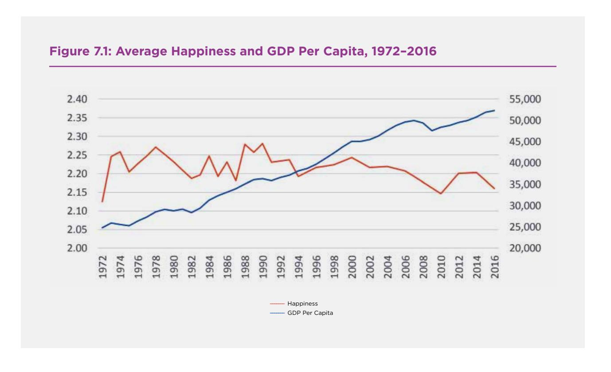

U.S. have weakened over time; perceptions of corruption in government and business have risen over time; and confidence in public institutions has waned. Since these various dimensions of social capital have all been shown to be important determinants of subjective well-being, it seems likely that gains in U.S. well-being that would have resulted from rising incomes have been offset by declines in social capital, as I have previously emphasized.

In addition to the loss of social capital, there is another possible culprit that has been less widely discussed in the context of the Easterlin Paradox. America's public health, as measured for example by HALE, has improved much less than in most other high-income countries, and in recent years, is experiencing an outright decline. The U.S. life expectancy actually fell by 0.1 years from 2014 to 2015, and then by another 0.1 years from 2015 to 2016.

Table 7.1 shows the Health-Adjusted Life Expectancy for the OECD countries for the years 2000 and 2015. The U.S. fell from 26th in the OECD ranking in 2000 to 28th in 2015 and experienced the second smallest overall increase in HALE between 2000 and 2015, just 1.9 years, whereas more than half of the OECD countries enjoyed an increase of more than 3 years. In 2015, America's healthy life years were 4.3 years lower than the average of the top five countries (Japan, Korea, Switzerland, Italy, and Israel). We now know that the gap likely widened further in 2016 in view of the absolute decline in U.S. life expectancy.

The U.S. is suffering from three serious epidemics: obesity, substance abuse, and depression. Each of these constitutes a significant burden of disease, and each is likely to be causing a significant decrement to U.S. subjective well-being. Each could be ameliorated through public policies that would contribute measurably to U.S. well-being.

#### **The Obesity Epidemic**

Obesity is now a global epidemic, and America's obesity epidemic is extreme in comparison with other countries. As shown in Figure 7.2, America's rate of adult obesity is by far the highest of the OECD countries, standing at an estimated 38.2 percent in 2015. Of the next six countries, secondranked Mexico (32 percent) is next door to the U.S., and four of the six are English-speaking

countries with close business and advertising linkages with the U.S., including Canada, UK, Australia, and New Zealand.

America's obesity epidemic rose gradually in the 1960s and 1970s, and then soared in the 1980s onward, as shown in Figure 7.3. There is a vast literature trying to account for the epidemic.

**Table 7.1: Health-Adjusted Life Expectancy (HALE), 2000 and 2015, OECD Countries**

| Country        | 2000 | 2015 | Change |
|----------------|------|------|--------|
| Japan          | 72.7 | 74.9 | 2.2    |
| Iceland        | 70.3 | 72.7 | 2.4    |
| Italy          | 70.0 | 72.8 | 2.8    |
| Switzerland    | 69.9 | 73.1 | 3.2    |
| Canada         | 69.8 | 72.3 | 2.5    |
| Israel         | 69.7 | 72.8 | 3.1    |
| France         | 69.7 | 72.6 | 2.9    |
| Sweden         | 69.7 | 72.0 | 2.3    |
| Greece         | 69.5 | 71.9 | 2.4    |
| Norway         | 69.3 | 72.0 | 2.7    |
| Australia      | 69.3 | 71.9 | 2.6    |
| Spain          | 69.2 | 72.4 | 3.2    |
| Netherlands    | 69.2 | 72.2 | 3.0    |
| New Zealand    | 69.1 | 71.6 | 2.5    |
| Austria        | 69.0 | 72.0 | 3.0    |
| Germany        | 68.7 | 71.3 | 2.6    |
| United Kingdom | 68.6 | 71.4 | 2.8    |
| Luxembourg     | 68.5 | 71.8 | 3.3    |
| South Korea    | 68.1 | 73.2 | 5.1    |
| Belgium        | 68.0 | 71.1 | 3.1    |
| Denmark        | 67.9 | 71.2 | 3.3    |
| Finland        | 67.9 | 71.0 | 3.1    |
| Chile          | 67.7 | 70.5 | 2.8    |
| Portugal       | 67.6 | 71.4 | 3.8    |
| Ireland        | 67.4 | 71.5 | 4.1    |
| United States  | 67.2 | 69.1 | 1.9    |
| Slovenia       | 66.8 | 71.1 | 4.3    |
| Czechia        | 65.8 | 69.4 | 3.6    |
| Mexico         | 65.6 | 67.4 | 1.8    |
| Poland         | 65.3 | 68.7 | 3.4    |
| Slovakia       | 64.9 | 68.1 | 3.2    |
| Hungary        | 63.7 | 67.4 | 3.7    |
| Estonia        | 63.1 | 69.0 | 5.9    |
| Latvia         | 63.0 | 67.1 | 4.1    |
| Turkey         | 61.6 | 66.2 | 4.6    |
|                |      |      |        |

Source: World Health Organization

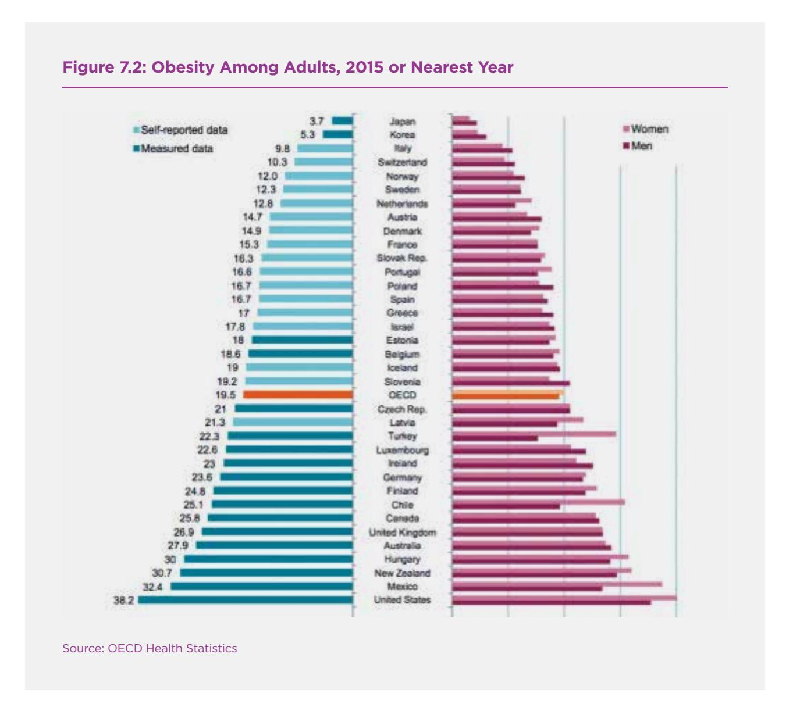

The evidence points strongly to the change in the American diet after mid-century, with a massive shift toward sugar additives, processed foods, and snack foods. The intake of energy from snack foods soared between 1977 and 2012, according to recent data. Diets with high sugar intake and high glycemic loads are obesogenic (tending to cause obesity) and also raise the risk of metabolic diseases such as adult-onset diabetes. Cross-national data show that average per capita sugar consumption by country is correlated with national obesity prevalence.

Dietary sugar (sucrose, a disaccharide of glucose and fructose) was added both for taste and for increased shelf-life (such as for baked goods). The industrial process to produce High-Fructose Corn Syrup (HFCS, also roughly half glucose and half fructose) was improved in the 1960s, and the FDA approved HFCS as "generally recognized as safe" (GRAS) in 1976. Thereafter the use of HFCS as a low-cost sweetener soared, as did overall sugar consumption, until peaking around 2000 and declining somewhat thereafter. Coffee consumption also gave way to sugary soda consumption (Figure 7.4).

The results have been disastrous for obesity and closely related metabolic diseases such as adult-onset (type-II) diabetes. As explained by Lustig and colleagues, fructose metabolism l eads directly to fatty deposits in the liver (de novo lipogenesis), which in turn causes insulin resistance and other metabolic disorders. Highly processed foods are characterized by a high glycemic load, meaning that they lead to a spike in blood glucose that in turn provokes a spike in insulin. This, in turn, may lead to insulin resistance

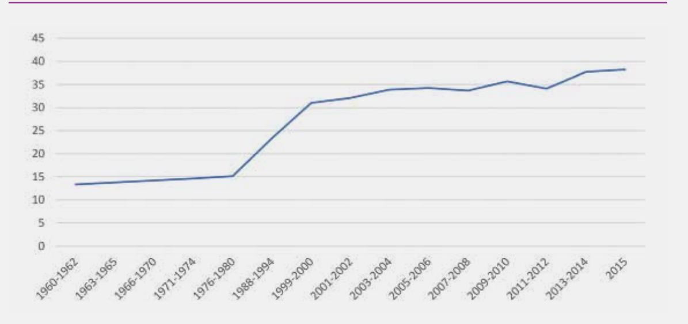

Source: OECD Health Statistics

**Figure 7.4: Coffee Availability in the United States Peaked in 1946**

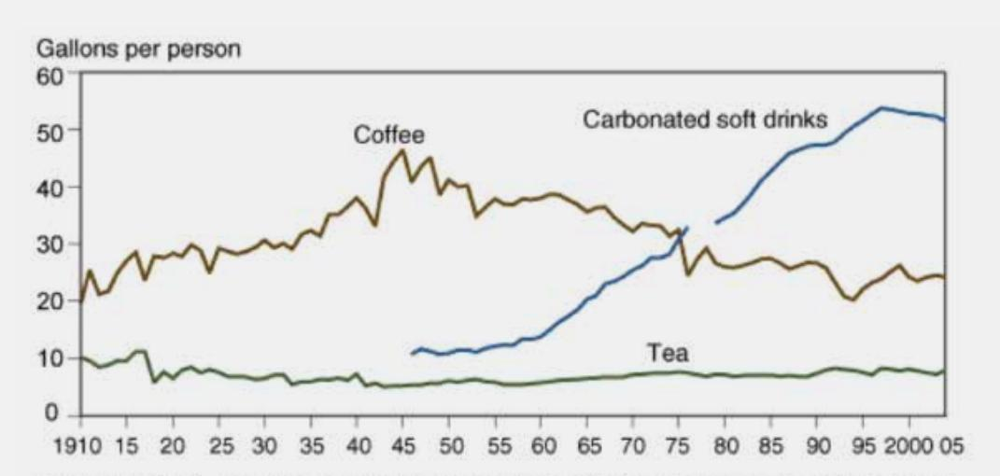

Source: USDA ERS

as well, and metabolic disease. Thus, both high sugar intake and highly processed foods are culprits of the obesity epidemic and the accompanying epidemic of metabolic disorders.

According to a recent estimate by Euromonitor International, the U.S. tops the world in the amount of sugar in purchases of packaged foods and beverages, with an average of 126 grams per person per day compared with a global average at 34 grams per person per day. Of the 126 grams, a remarkable 50 grams comes from soft drinks alone. Some causes of America's very high sugar consumption include: (1) the relatively low cost per calorie of sugar additives and high glycemic-load foods compared with foods with lower glycemic loads such as fruits and vegetables; (2) the U.S. federal government's relentless promotion of corn production from the 1970s onward, which in turn lowered the cost of high-fructose corn syrup as a major food additive; (3) unregulated advertising by the U.S. fast-food industry to promote prepared, frozen, and take-out foods with higher sugar content; and (4) the addictive properties of sugar, leading to habituation and chronic over-consumption.

Many studies show that obese individuals have significantly poorer health and lower subjective well-being. The lower SWB may result both from the direct health consequences of obesity as well as the social stigma associated with obesity. The adverse health consequences are extensive. The U.S. Centers for Disease Control (CDC) lists the following adverse disease burdens: all-causes of death (mortality); high blood pressure (hypertension); high LDL cholesterol, low HDL cholesterol, or high levels of triglycerides (dyslipidemia); type II diabetes; coronary heart disease; stroke; gallbladder disease; osteoarthritis (a breakdown of cartilage and bone within a joint); sleep apnea and breathing problems; some cancers (endometrial, breast, colon, kidney, gallbladder, and liver); low quality of life; mental illness such as clinical depression, anxiety, and other mental disorders; and body pain and difficulty with physical functioning.

According to obesity expert Dr. Robert Lustig, excessive sugar consumption has direct adverse effects on mental well-being by disrupting the dopamine-EOP "reward" pathway, causing an addictive craving for sugar with the classic hallmarks of addiction (including tolerance, withdrawal, craving, and continued use despite negative consequences). Sugar addiction also disrupts the serotonin pathway that is responsible for the psychological sense of contentment. In essence, according to Lustig, sugar is a toxic and addictive substance that has been dangerously foisted on an unsuspecting and poorly informed public by the U.S. government and the fast-food industry.

Studies have found that obesity is a significant predictive factor for subsequent depression, while depression is a predictive factor for subsequent obesity. A meta-analysis of longitudinal studies of depression and obesity in the U.S. and Europe reached the following conclusion: "Obesity was found to increase the risk of depression, most pronounced among Americans and for clinically diagnosed depression. In addition, depression was found to be predictive of developing obesity." Lustig describes how interactions between the dopamine ("reward") pathways and the serotonin ("happiness" or "mood") pathways may account for this bi-directional linkage between obesity and depression.

### **The Opioid Epidemic**

In December 2017, the U.S. Centers for Disease Control announced that U.S. life expectancy had declined for the second straight year, declining 0.1 years between 2015 to 2016 following a decline of the same magnitude between 2014 and 2015. This reversal in the upward trend of life expectancy is shocking and almost unprecedented for a rich country in recent decades. The CDC emphasized the role of rising substance abuse, and especially the modern opioid epidemic, in the reversal. The CDC counted 63,000 deaths from drug overdoses in 2016, marking an increase in the age-specific mortality rate from 6.1 per 100,000 in 1999 to 19.8 per 100,000 in 2016, as shown in Figure 7.5.

While many socioeconomic factors and substances are involved in this epidemic, one major culprit is the class of opioids. Causes of increased opioid deaths include the introduction in the 1990s of new prescription opioids such as OxyContin, the update of new powerful synthetic opioids such as Fentanyl, and the increased use of heroin, with trends shown in Figure 7.6.

Roughly 20 years after the onset of the opioid prescription-drug epidemic, it is becoming

**Figure 7.5: Age-adjusted Drug Overdose Death Rates: U.S., 1999–2016**

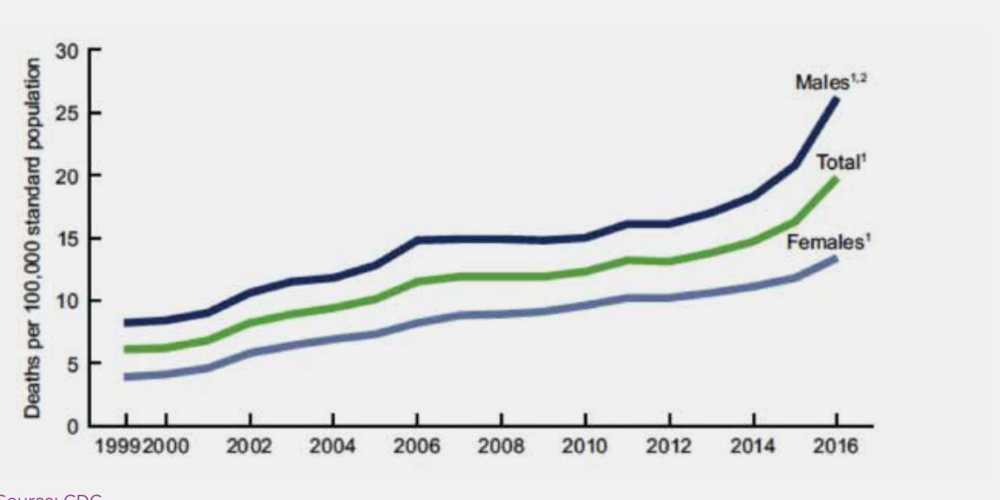

Source: CDC

**Figure 7.6: Overdose Deaths Involving Opioids, by Type of Opioid, United States, 2000–2015**

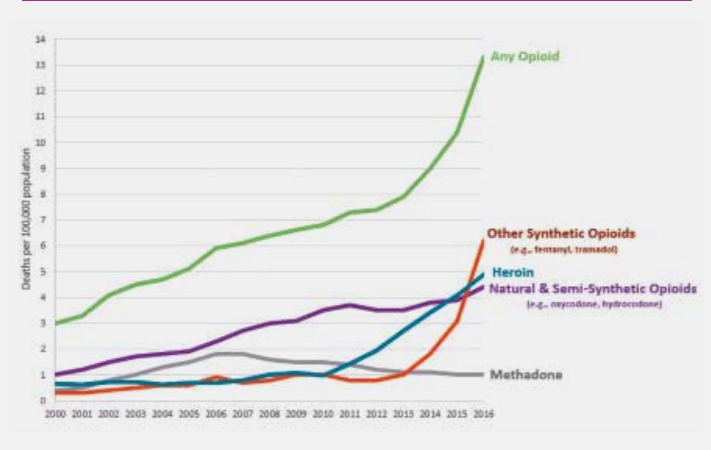

Source: CDC

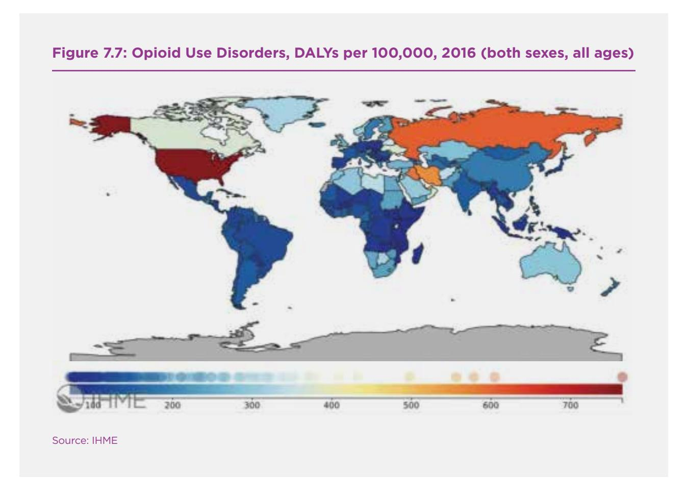

increasingly clear that pharmaceutical companies, notably Purdue Pharma (the manufacturer of OxyContin), engaged in aggressive marketing of the opioid prescription drugs despite growing evidence that a dangerous epidemic was getting underway.

No doubt because the U.S. is the epicenter of opioid drug manufacturing and prescription, it is also the epicenter of the global opioid epidemic. Estimates of the Disability-Adjusted Life years (DALYs) per 100,000 population for opioid use disorders is shown in the map in Figure 7.7. The U.S. shows appears bright red, the world's most intense hotspot, with 764 DALYs per 100,000, followed by Russia (605), Iraq (578), and Iran (556).

#### **The Depression Epidemic**

There is significant evidence of a major, long-term, and continuing epidemic of clinical depression (including Major Depression Disorder, MDD, and Major Depressive Episodes, MDEs) and other psychopathologies including psychopathic deviation, paranoia, and hypomania. Twenge et al. report the following:

Two cross-temporal meta-analyses find large generational increases in psychopathology among American college students (N=63,706) between 1938 and 2007 on the MMPI [Minnesota Multiphasic Personality Inventory] and MMPI-2 and high school students (N=13,870) between 1951 and 2002 on the MMPI-A … The results best fit a model citing cultural shifts toward extrinsic goals, such as materialism and status and away from intrinsic goals, such as community, meaning in life, and affiliation.

New research supports this conclusion for more recent years. Mojtabai et al. examined national trends in the prevalence of major

depressive episodes (MDEs) in adolescents and young adults between 2005 and 2014, with the following conclusions:

The 12-month prevalence of MDEs increased from 8.7% in 2005 to 11.3% in 2014 in adolescents and from 8.8% to 9.6% in young adults (both P < .001). The increase was larger and statistically significant only in the age range of 12 to 20 years. The trends remained significant after adjustment for substance use disorders and sociodemographic factors … In the context of little change in mental health treatments, trends in prevalence translate into a growing number of young people with untreated depression.

Another study this past year reaches a very similar conclusion:

The current study estimated trends in the prevalence of major depression in the U.S. population from 2005 to 2015 overall and by demographic subgroups. Data were drawn from the National Survey on Drug Use and Health (NSDUH), an annual cross-sectional

study of U.S. persons ages 12 and over (total analytic sample N = 607,520). Depression prevalence increased significantly in the U.S. from 2005 to 2015, before and after controlling for demographics. Increases in depression were significant for the youngest and oldest age groups, men, and women, Non-Hispanic White persons, the lowest income group, and the highest education and income groups.

The causes of the MDD epidemic are not definitively established. They may include sociological factors (decline in social support systems, more loneliness), economic factors (rising inequality of income, financial crisis, economic stress), shifting cultural norms (more materialism), biophysical factors (declining physical activity, sugar addiction and other dietary changes, obesity, less time spent in open sunlight), technological facts (time spent on social media and electronic devices such as smartphones), or other causes still to be identified.

As with obesity and opioid abuse, the U.S. stands out among the world's nations as having one of the highest burdens of disease from major

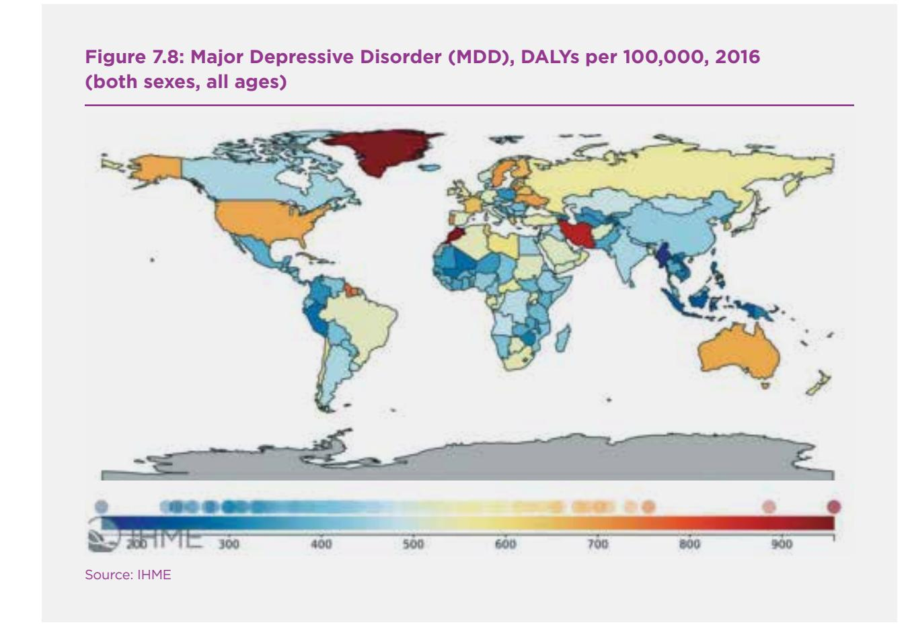

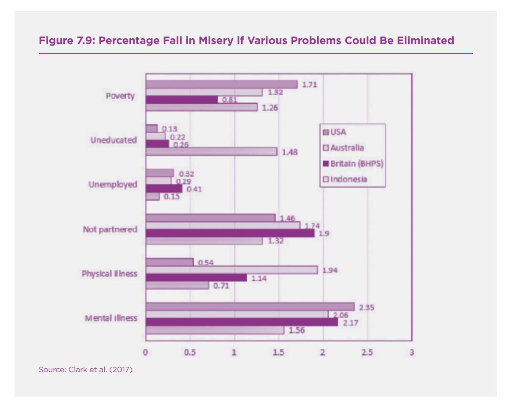

depressive disorder. The estimates of DALYs per capita for the world, estimated by the IHME, are shown in Figure 7.8. The highest burdens per capita are estimated to be in Morocco (956 DALYs per 100,000). Among the OECD countries, the U.S. ranks third (679), behind Portugal (702) and Sweden (702).

As reported by Twenge and colleagues, the evidence suggests a significant rise in adolescent depressive symptoms and suicide rates between 2010 and 2015. There is evidence, moreover, that the rising rates of adolescent depression are correlated with the use of new screen technologies (smartphones, video games) and social media. Causation may run in both directions, from depressive syndromes toward screen time (as a kind of "self-medication") and from screen time toward depressive symptoms, for example, through the development of addictive behaviors to the new technologies, and other depression-inducing conditions such

as increased loneliness and feelings of alienation resulting from online rather than interpersonal interactions. Video games, for example, seem to have six attributes of addiction: salience, mood modification ("self-medication"), tolerance, withdrawal, conflict, and relapse. See also Shakya and Christakis for evidence that Facebook use is associated with lower self-reported mental health.

Without question, the burden of mental illness on SWB in the U.S. is enormous, and according to Layard and colleagues, depression is the single largest determinant of SWB in a cross-section of individuals within the U.S. Indeed, Layard and colleagues find that mental illness is the single largest determinant of well-being across individuals in four countries studied: the U.S., Australia, Britain, and Indonesia. The importance of mental illness in the variation of SWB across individuals in the population is illustrated by Clark et al. in Figure 7.9.

## **Discussion**

The U.S. is in the midst of a complex and worsening public-health crisis, involving epidemics of obesity, opioid addiction, and major depressive disorder that are all remarkable by global standards. The cumulative effect of these epidemics is the remarkable recent fall in overall life expectancy at birth (LEB), an event that is nearly unprecedented for a high-income country in peacetime. Even before the national LEB began to decline in 2015, age-specific all-cause mortality rates were already on the rise between 1999 and 2013 for white, non-Hispanic, workingclass, midlife adults (aged 45-54), notably those without a college degree, as documented by Case and Deaton. The major causes of the rising death rates noted by Case and Deaton were drug overdoses, suicides, and alcohol-related liver mortality, consistent with the rising prevalence of substance abuse (including opioids) and mental illness.

The quantitative implications of these epidemics for America's overall SWB is hard to assess without more granular data linking individual SWB with individual conditions of obesity, opioid dependence, and depression. Yet we are justified to suspect that the implications are very large. America's HALE is now around 4.3 years behind the five leading countries, and America's obesity prevalence, opioid misuse, and MDD prevalence are among the very highest in the world. As Layard has recently reminded us:

Mental illness is one of the main causes of unhappiness in the world. It produces nearly as much of the misery that exists as poverty does, and more than is caused by physical illness. Treating it should be a top priority for every government, as should the promotion of good mental health … This would save billions because mental illness is a major block on the economy. It is the main illness among people of working age. It reduces national income per head by some 5 per cent—through non-employment, absenteeism, lowered productivity, and extra physical healthcare costs. Mental illness accounts for a third of disability worldwide.

Why has the United States performed more poorly than other high-income countries on public health generally, and on these three

epidemics specifically? I would suggest the following four hypotheses.

First, the U.S. sociopolitical system produces higher levels of income inequality than in the other OECD high-income countries. High U.S. inequality, and especially the persistent absolute and relative poverty of a significant portion of the U.S. population, are risk factors for all three epidemics. The evidence is clear that low socioeconomic status is a major risk factor for poor mental and physical health. As Everson et al. concluded:

Many of the leading causes of death and disability in the United States and other countries are associated with socioeconomic position. The least well-off suffer a disproportionate share of the burden of disease, including depression, obesity, and diabetes … Data from these studies demonstrate that the effects of economic disadvantage are cumulative, with the greatest risk of poor mental and physical health seen among those who experienced sustained hardship over time.

Second, the three epidemics are mostly likely mutually reinforcing. Obesity causes depression and depression can lead to obesity. Depression and substance abuse are also bi-causal.

Third, the U.S. healthcare system is woefully inadequate to face these epidemics. U.S. healthcare is the most expensive in the world by far. Coverage rates of the poor are the lowest among the high-income countries. The emphasis is on treatment rather than prevention. And healthcare for depression is notably deficient. According to Dr. Renee Goodwin, "A growing number of Americans, especially socioeconomically vulnerable individuals and young persons, are suffering from untreated depression."

Fourth, America's culture and politics of corporate deregulation is partly responsible. The obesity epidemic can be linked directly to the fast-food industry, especially the aggressive use and promotion of sugar additives and other obesogenic processed foods. The opioid epidemic can be traced in part to the lobbying and direct marketing of major pharmaceutical companies. The extraordinarily high cost, and therefore under-coverage, of the U.S. healthcare system, including for mental illnesses, is the result in part

of corporate lobbying for the freedom of private healthcare providers to set exorbitant prices despite the evidence of very limited and inadequate market competition over prices.

Fifth, the U.S. may be among the leading countries experiencing depressive syndromes associated with the new social media and with increasing screen times on the new ICTs. As indicated earlier, the correlation of depression and new media is likely to be bi-causal. Depressive tendencies may lead to excessive use of new technologies, while screen time may itself be addictive and/or linked to increased loneliness and alienation.

The disease epidemics, in short, most likely have a similar etiology to the decline in social capital that I addressed in my analysis in last year's *World Happiness Report*. In both cases, inequality, corporate power, and disruptions of social-support networks, are major factors in America's social crisis. The result is a decline in trust, a rise in perceptions of corruption, and a population that is suffering from pain, suffering, and premature mortality.

Practical policies exist to reverse all three of the epidemics. Obesity can be reduced through regulations limiting sugar additives in storebought products; corrective taxes on soda beverages; the elimination of subsidies on corn (and therefore on high-fructose corn syrup); limits on food advertising, especially to young children; and the promotion of public awareness regarding the causes of obesity and solution through more healthful diets. Mental health can be improved through preventative medicine, measures to strengthen social support systems for vulnerable groups, steps to combat addictions to the new social media and technologies, and greatly improved access to mental health services. The opioid epidemic could be radically reduced by ending the direct marketing of addictive drugs to patients as well as banning the implicit and explicit kickbacks to doctors who (over-)prescribe these dangerous products.

These are important "top-down" policy changes. At the same time, "bottom-up" programs of positive psychology and wellness at schools, workplaces, and in the community can help individuals to change their own behaviours, overcome addictions, and pursue life strategies

(such as meditation) to bolster their personal well-being and the well-being of friends, family, and community. The evidence is large and growing that such life-change strategies can be highly effective. This year's *Global Happiness Policy Report* contains detailed surveys on best practices in education, the workplace, and personal, family, and community well-being.

The main issue for the U.S. is not the lack of means to address the crises of public health and declining well-being. Rather, perhaps the major practical barrier is corporate lobbying that keeps dangerous corporate practices in place and imposes untold burdens on the poor and vulnerable parts of the U.S. population, coupled with the failure of the American political system to address and understand America's growing social crisis. The challenge of well-being is a matter both of high politics and economics and the sum of individual and community-based efforts.

#### **Endnotes**

- 1 Helliwell, Layard, & Sachs (2017).
- 2 Easterlin (1974).
- 3 Sachs (2017).
- 4 Dunford & Popkin (2017); Lustig (2017).
- 5 Willett (2011); Lustig (2017).
- 6 Siervo et al. (2014).
- 7 Lim (2010).
- 8 Euromonitor International (2015).
- 9 Lustig (2017).
- 10 Luppino et al. (2010).
- 11 Lustig (2017).
- 12 Keefe (2017).
- 13 Twenge et al. (2010).
- 14 Weinberger et al. (2017).

- 15 Mojtabai et al. (2016).
- 16 Twenge et al. (2017).
- 17 Andreassen et al. (2015).
- 18 Shakya & Christakis (2017).
- 19 Clark et al. (2017).
- 20 Case & Deaton (2015, 2017).
- 21 Layard (2018).
- 22 Everson et al. (2002).
- 23 Co-author of Weinberger et al. (2017).
- 24 Helliwell, Layard, & Sachs (2017).
- 25 Lai et al. (2017).
- 26 Willett (2011); Lustig (2017).
- 27 Layard (2018).
- 28 Global Happiness Council (2018).

#### **References**

Andreassen, C. S., Billieux, J., Griffiths, M. D., Kuss, D. J., Demetrovics, Z., Mazzoni, E., & Pallesen, S. (2016). The relationship between addictive use of social media and video games and symptoms of psychiatric disorders: A large-scale cross-sectional study. *Psychology of Addictive Behaviors*, *30*(2), 252-262. doi: 10.1037/adb0000160

Bandy, L. (2015). Global nutrition overview: Sugar. *Euromonitor International*. Retrieved from https://blog.euromonitor. com/2015/10/global-nutrition-overview-sugar.html

Case, A., & Deaton, A. (2017). Mortality and morbidity in the 21st century. *Brookings Papers on Economic Activity*, 397-476. Retrieved from https://www.brookings.edu/wp-content/ uploads/2017/08/casetextsp17bpea.pdf

Case, A., & Deaton, A. (2015). Rising morbidity and mortality in midlife among white non-Hispanic Americans in the 21st century. *Proceedings of the National Academy of Sciences*, *112*(49), 15078-15083. doi: 10.1073/pnas.1518393112

Centers for Disease Control and Prevention. (2017). Adult Obesity Causes & Consequences. *Overweight & Obesity: Defining Adult Obesity*. Retrieved from https://www.cdc.gov/ obesity/adult/causes.html

Centers for Disease Control and Prevention. (2017). Opioid data analysis. *Opioid Overdose: Data*. Retrieved from https://www.cdc.gov/drugoverdose/data/analysis.html

Columbia University, Mailman School of Public Health. (2017). Depression is on the rise in the U.S., especially among young teens. *Public Health Now: News*. Retrieved from https://www. mailman.columbia.edu/public-health-now/news/depressionrise-us-especially-among-young-teens

Clark, A. E., Fleche, S., Layard, R., Powdthavee, N., & Ward, G. (2017). The key determinants of happiness and misery. In J. Helliwell, R. Layard, & J. Sachs (Eds.), *World Happiness Report 2017*, 122-142. New York: UN Sustainable Development Solutions Network.

Currie, J. M. (2018). Inequality in mortality over the life course: why things are not as bad as you think. *Contemporary Economic Policy*, *36*(1), 7-23. doi: 10.1111/coep.12267

Dunford, E. K., & Popkin, B. M. (2017). Disparities in snacking trends in us adults over a 35-year period from 1977 to 2012. *Nutrients*, *9*(8), 1-10. doi: 10.3390/nu9080809

Easterlin, R. (1974). Does economic growth improve the human lot? Some empirical evidence. In P. A. David & M. W. Reder (Eds.), *Nations and Households in Economic Growth: Essays in Honor of Moses Abramovitz*, 89-125. New York: Academic Press.

Everson, S. A., Siobhan, C. M., Lynch, J. W., & Kaplan, G. A. (2002). Epidemiologic evidence for the relation between socioeconomic status and depression, obesity, and diabetes. *Journal of Psychosomatic Research 53*(4), 891-895. doi: http:// dx.doi.org/10.1016/S0022-3999(02)00303-3

Global Happiness Council (2018). *Global Happiness Policy Report 2018*. New York: Sustainable Development Solutions Network.

Hedegaard, H., Warner, M., & Miniño, A. M. (2017). Drug overdose deaths in the United States, 1999–2016. *NCHS Data Brief*, (294), 1-8. Retrieved from https://www.cdc.gov/nchs/ data/databriefs/db294.pdf

Helliwell, J., Layard, R., & Sachs, J. (2017) Restoring American happiness. In J. Helliwell, R. Layard, & J. Sachs (Eds.), *World Happiness Report 2017*, 178-184. New York: Sustainable Development Solutions Network.

Helliwell, J., Huang, H., & Wang, S. (2017). Social foundations of world happiness. In J. Helliwell, R. Layard, & J. Sachs (Eds.), *World Happiness Report 2017*, 8-47. New York: UN Sustainable Development Solutions Network.

Holt-Lunstad, J., Robles, T., & Sbarra, D. A. (2017). Advancing social connection as a public health priority in the United States. *American Psychologist*, *72*(6), 517-530. doi: http://dx. doi.org/10.1037/amp0000103

Holt-Lunstad, J., Smith, T. B., Baker, M., Harris, T., & Stephenson, D. (2015). Loneliness and social isolation as risk factors for mortality: a meta-analytic review. *Perspectives on Psychological Science*, *10*(2), 227-237. doi: https://doi. org/10.1177/1745691614568352

IHME. (2017). B.7.4.1: Major depressive disorder, both sexes, all ages, 2016, DALYs per 100,000. *GBD Compare: Viz Hub*. Retrieved from http://ihmeuw.org/4cn3

IHME. (2017). B.7.3.1: Opioid use disorders, both sexes, all ages, 2016, DALYs per 100,000. *GBD Compare: Viz Hub*. Retrieved from http://ihmeuw.org/4cn1

Keefe, P. R. (2017). The family that built an empire of pain. *The New Yorker*. Retrieved from https://www.newyorker.com/ magazine/2017/10/30/the-family-that-built-an-empire-of-pain

Kochanek, K. D., Murphy, S. L., Xu, J., & Arias, E. (2017). Mortality in the United States, 2016. *NCHS Data Brief*, (293), 1-8. Retrieved from https://www.cdc.gov/nchs/data/databriefs/ db293.pdf

Lal, A., Mantilla-Herrera, A. M., Veerman, L., Backholer, K., Sacks, G., Moodie, M., Siahpush, M., Carter, R., & Peeters, A. (2017). Modelled health benefits of a sugar-sweetened beverage tax across different socioeconomic groups in Australia: A cost-effectiveness and equity analysis. *PLoS Medicine*, *14*(6), 1-17. doi: 10.1371/journal.pmed.1002326

Layard, R. (2018). Mental illness destroys happiness and is costless to treat. In J. Sachs (Ed.), *Global Happiness: Policy Report 2018*, 27-52. New York: Sustainable Development Solutions Network.

Lim, J. S., Mietus-Snyder, M., Valente, A., Schwarz, J. M., & Lustig, R. H. (2010). The role of fructose in the pathogenesis of NAFLD and the metabolic syndrome. *Nature Reviews Gastroenterology & Hepatology*, *7*(5), 251-264. doi: 10.1038/ nrgastro.2010.41

Luppino, F. S., de Wit, L. M., Bouvy, P. F., Stijnen, T., Cuijpers, P., Penninx, B. W. J. H., & Zitman, F. G. (2010). Overweight, obesity, and depression: A systematic review and meta-analysis of longitudinal studies. *Archives of General Psychiatry*, *67*(3), 220-229. doi: 10.1001/archgenpsychiatry.2010.2

Lustig, R. H. (2017). *The Hacking of the American Mind*. New York: Avery.

Mojtabai, R., Olfson, M., & Han, B. (2016). National trends in the prevalence and treatment of depression in adolescents and young adults. *Pediatrics*, *138*(6), 1-10. doi: 10.1542/peds.2016- 1878 OECD. (2017). Obesity update: 2017. Retrieved from: https://www.oecd.org/els/health-systems/Obesity-Update-2017.pdf

Ogden, C. L., & Carroll, M. D. (2010). Prevalence of obesity among children and adolescents: United States, trends 1963-1965 through 2007-2008. *National Center for Health Statistics, Centers for Disease Control and Prevention*, 1-5. Retrieved from https://www.cdc.gov/nchs/data/hestat/ obesity\_child\_07\_08/obesity\_child\_07\_08.pdf

Ogden, C. L., Carroll, M. D., Fryar, C. D., & Flegal, K. M. (2015). Prevalence of obesity among adults and youth: United States, 2011-2014. *NCHS Data Brief*, (219), 1-8. Retrieved from https:// www.cdc.gov/nchs/data/databriefs/db219.pdf

Shakya, H. B., & Christakis, N. A. (2017). Association of Facebook use with compromised well-being: A longitudinal study. *American Journal of Epidemiology*, *185*(3), 203-211. doi: 10.1093/ aje/kww189

Siervo, M., Montagnese, C., Mathers, J. C., Soroka, K. R., Stephan, B. C. M, & Wells, J. C. K. (2014). Sugar consumption and global prevalence of obesity and hypertension: An ecological analysis. *Public Health Nutrition*, *17*(3), 587–596. doi: 10.1017/ S1368980013000141

Twenge, J. M., Gentile, B., DeWall, C. N., Ma, D., Lacefield, K., & Schurtz, D. R. (2010). Birth cohort increases in psychopathology among young Americans, 1938–2007: A cross-temporal meta-analysis of the MMPI. *Clinical Psychology Review*, *30*(2), 145-154. doi: 10.1016/j.cpr.2009.10.005

Twenge, J. M., Joiner, T. E., Rogers, M. L., & Martin, G. N. (2017). Increases in depressive symptoms, suicide-related outcomes, and suicide rates among U.S. adolescents after 2010 and links to increased new media screen time. *Clinical Psychological Science*, *6*(1), 3-17. doi: https://doi. org/10.1177/2167702617723376

USDA ERS. (2014). Coffee availability in the United States peaked in 1946. *Data Products*. Retrieved from https://www. ers.usda.gov/data-products/chart-gallery/gallery/chartdetail/?chartId=58921

Weinberger, A. H., Gbedemah, M., Martinez, A. M., Nash, D., Galea, S., & Goodwin, R. D. (2017). Trends in depression prevalence in the USA from 2005 to 2015: Widening disparities in vulnerable groups. *Psychological Medicine*, 1-10. doi: 10.1017/ S0033291717002781

Willett, W. (2011). *Eat, Drink, and Be Healthy: The Harvard Medical School Guide to Health Eating*. Free Press.

## Annex **161**

# Migrant Acceptance Index: Do Migrants Have Better Lives in Countries That Accept Them?

Neli Esipova, Julie Ray, John Fleming and Anita Pugliese

**In reaction to the migrant crisis** that swept Europe in 2015 and the backlash against migrants that accompanied it, Gallup developed a Migrant Acceptance Index (MAI) designed to gauge people's personal acceptance of migrants not just in Europe, but throughout the rest of the world.1

Gallup's Migrant Acceptance Index is based on three questions that ask respondents about migrants in increasing level of proximity to them. Respondents are asked whether the following situations are "good things" or "bad things": immigrants living in their country, an immigrant becoming their neighbor and immigrants marrying into their families.

"A good thing" response is worth three points in the index calculation, a volunteered response of "it depends" or "don't know" is worth one point, and "a bad thing" is worth zero points. We considered volunteered responses such as "it depends" because in some countries, who these migrants are may factor more heavily into whether they are accepted. The index is a sum of the points across the three questions, with a maximum possible score of 9.0 (all three are good things) and a minimum possible score of zero (all three are bad things). The higher the score, the more accepting the population is of migrants.

Scores on Gallup's first global deployment of this index ranged widely across the total 140 countries where these questions were asked in 2016 and 2017,2 from a high of 8.26 in Iceland to a low of 1.47 in Macedonia. The total sample included more than 147,000 adults aged 15 and older, and among them, more than 8,000 first-generation migrants.

In all, 29 countries' index scores fall more than one standard deviation below the country-level mean score and 23 countries' index scores fall more than one standard deviation above the country-level mean score. The bulk of the rest of the world falls in the middle. In the countries at the extreme ends of the distribution—the countries that are the least-accepting and the most-accepting of migrants – is where we see the biggest differences in how migrants themselves rate their lives, which we will discuss in more detail later.

## **Least-Accepting Countries Cluster Primarily in Eastern, Southeastern Europe**

Many of the countries that are the least-accepting of migrants are located in Eastern or Southeastern Europe, and were on the front lines or touched somehow by the recent migrant crisis. For example, nine of the 10 countries that score a 2.39 or lower on the index are former Soviet bloc countries—most located along the Balkan route that once channeled asylum seekers from Greece to Germany.

While the bulk of the least-accepting countries are in Eastern or Southeastern Europe, four are in the Middle East and North Africa. This includes Israel, Egypt, Iraq and Jordan. The others are in

**Table A1. Migrant Acceptance Index Items**

| Question                                                                                                                                         | Response options* |
|--------------------------------------------------------------------------------------------------------------------------------------------------|-------------------|
| I would like to ask you some questions about foreign immigrants people                                                                           | A good thing      |
| who have come to live and work in this country from another country. Please tell me whether you, personally, think each of the following is a | A bad thing       |
| good thing or a bad thing? How about:                                                                                                            | (It depends)      |
| • Immigrants living in [country name]?                                                                                                        | (Don't know)      |
| • An immigrant becoming your neighbor? • An immigrant marrying one of your close relatives?                                             | (Refused)         |

\*Responses in parentheses were volunteered by the respondent. Copyright © 2016–2017 Gallup, Inc. All rights reserved.

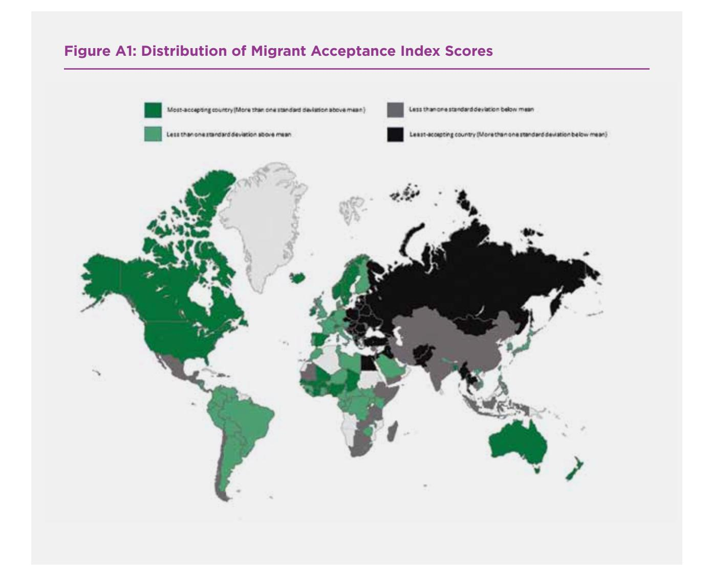

Asia: Afghanistan and Pakistan in South Asia, Myanmar and Thailand in Southeast Asia, and Mongolia in East Asia.

## **Most-Accepting Countries Span Globe, Income Levels**

As opposed to the least-accepting countries, which are more geographically and culturally clustered, the most-accepting countries for migrants are located in disparate parts of the globe. The top two most-accepting countries could not be farther apart—Iceland with a score of 8.26, and New Zealand with a score of 8.25.

The bulk of the most-accepting countries for migrants primarily come from Oceania, Western Europe, sub-Saharan Africa and Northern America. However, a common thread tying many of the most-accepting countries together is their long history as receiving countries for migrants. Although the recent U.S. election was marked by considerable anti-immigrant rhetoric, the U.S. ranks among the most-accepting countries with a score of 7.86. Canada also makes this list, but scores higher than its neighbor to the south, with a score of 8.14.

## **Migrant Acceptance Linked to Migrants' Evaluations of Their Current, Future Lives**

For the past decade, Gallup has asked adults worldwide to evaluate their lives on the Cantril Self-Anchoring Striving Scale, where "0" represents the worst possible life, and "10" represents the best possible life.3 In our earlier research, we were able to determine that where migrants come from, where they go, and how

#### **Table A2: Least-Accepting Countries for Migrants**

29 countries with index scores that fall one standard deviation below the country-level mean score

| Country                | Migrant Acceptance Index |
|------------------------|--------------------------------|
| Egypt                  | 3.50                           |
| Iraq                   | 3.42                           |
| Belarus                | 3.38                           |
| Greece                 | 3.34                           |
| Poland                 | 3.31                           |
| Turkey                 | 3.27                           |
| Ukraine                | 3.15                           |
| Georgia                | 3.05                           |
| Mongolia               | 2.99                           |
| Jordan                 | 2.99                           |
| Myanmar                | 2.96                           |
| Romania                | 2.93                           |
| Lithuania              | 2.72                           |
| Bosnia and Herzegovina | 2.71                           |
| Thailand               | 2.69                           |
| Russia                 | 2.60                           |
| Afghanistan            | 2.51                           |
| Pakistan               | 2.47                           |
| Bulgaria               | 2.42                           |
| Croatia                | 2.39                           |
| Estonia                | 2.37                           |
| Czech Republic         | 2.26                           |
| Latvia                 | 2.04                           |
| Israel                 | 1.87                           |
| Slovakia               | 1.83                           |
| Serbia                 | 1.80                           |
| Hungary                | 1.69                           |
| Montenegro             | 1.63                           |
| Macedonia              | 1.47                           |

Gallup World Poll, 2016–2017

**Table A3: Most-Accepting Countries for Migrants**

| Country       | Migrant Acceptance Index |
|---------------|--------------------------------|
| Iceland       | 8.26                           |
| New Zealand   | 8.25                           |
| Rwanda        | 8.16                           |
| Canada        | 8.14                           |
| Sierra Leone  | 8.05                           |
| Mali          | 8.03                           |
| Australia     | 7.98                           |
| Sweden        | 7.92                           |
| United States | 7.86                           |
| Nigeria       | 7.76                           |
| Ireland       | 7.74                           |
| Burkina Faso  | 7.74                           |
| Norway        | 7.73                           |
| Ivory Coast   | 7.71                           |
| Benin         | 7.67                           |
| Luxembourg    | 7.54                           |
| Netherlands   | 7.46                           |
| Bangladesh    | 7.45                           |
| Spain         | 7.44                           |
| Chad          | 7.26                           |
| Albania       | 7.22                           |
| Switzerland   | 7.21                           |
| Senegal       | 7.17                           |

Gallup World Poll, 2016–2017

long they stay affects their life evaluations on this scale.4 Turning our focus to the potential relationship between life evaluations and migrant acceptance, we also see that people's acceptance of migrants—or the lack thereof—is linked to how migrants themselves evaluate their lives.

To explore the relationship between migrant life evaluations and the level of migrant acceptance in their new countries, we conducted an analysis of covariance on individuals' current life

evaluations on this scale, using age, gender and education level as covariates. We adjusted the data with regard to age, gender and education to allow for fairer comparisons between migrants' life evaluations and the life ratings of other populations, such as the native-born in destination countries.5

Migrants as well as the native-born living in countries that are the least-accepting of migrants evaluate their lives less positively than

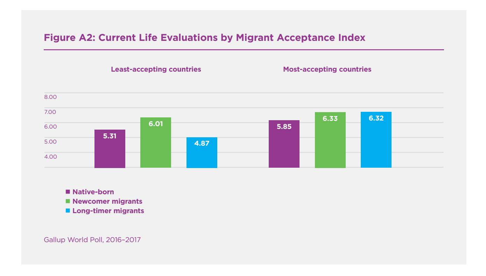

those who live in countries that are the most accepting, regardless of whether they are newcomers (who have lived in the country for less than five years) or long-timers (who have lived in the country for more than five years).6

In the least-accepting countries, newcomers who may be full of optimism and hope about life in their new countries—rate their current lives more positively than the native-born. But this positively fades the longer migrants stay in countries where the population is not receptive to them. Long-timers' life evaluations are statistically much lower than the scores for newcomers, but their life evaluations also drop lower than the scores for the native-born.7

The story is different for migrants in the most-accepting countries. Newcomer migrants and long-timer migrants both rate their lives higher than the native-born do. Notably, migrants do not lose their positive outlook the longer they stay: The life evaluations of newcomers and long-timers is statistically the same.

#### **Outlook for the Future**

Migrants and the native-born in the least-accepting countries rate their lives *in five years* better than their present situations, but they still lag far behind their counterparts in the most-accepting countries. Newcomers in the least-accepting countries have a more positive outlook for their lives than the native-born do, but long-timers again are more pessimistic than either group.

In the most-accepting countries, the native-born and newcomer migrants share the same level of optimism about their lives in five years, but long-timers give their future lives higher ratings than the native-born or newcomers do. It's possible that since long-timers have had more time than newcomers to establish themselves in their lives and careers, they not only may be more hopeful, but also more confident about what the future may bring.

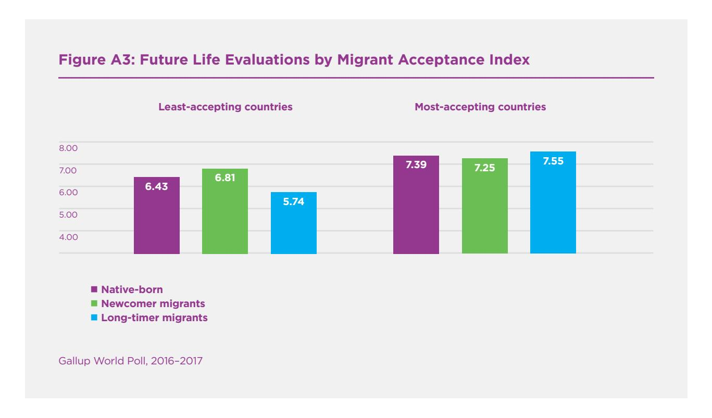

#### **Future Research**

Although Gallup has data from 140 countries, the samples of migrants available in a single year of data collection permits us to analyze the links between migrant acceptance and migrants' lives only in broad strokes.

Earlier Gallup research on migrants indicates that where people come from and where they move to and how long they stay play a large role in whether they gain or lose from migration.8 Future World Poll research on migrant acceptance may allow us not only to do more in-depth analysis at the country level, but also to discover whether migrants' countries of origin also factor into their life evaluations when they move to countries that are more likely to accept or to not accept them. Further, with larger sample sizes, we would be able to investigate how migrant acceptance may affect potential migrants' desire to migrate and their plans to move and where they would like to go.

#### **Endnotes**

- 1 Esipova et al (2018).
- 2 Based on World Poll surveys in 138 countries in 2016, and the U.S. and Canada in 2017.
- 3 Gallup (2010).
- 4 International Organization for Migration (2013).
- 5 Results of the ANCOVA revealed statistically significant effects for two of the three covariates: Education level (F(1,32521) = 2126.5, p < .0001; Gender (F(1,32521) = 23.1, p < .001; and Age (F(1,32521) = 1.9, p < .168).
- 6 A significant main effect for migrant status emerged with newcomer migrants providing significantly higher life evaluations than either native-born or long-timer migrants, F(2,32521) = 9.0, p < .001. A significant main effect for migrant acceptance also emerged, with respondents from the most-accepting countries providing significantly higher life evaluations than those from the least-accepting countries, F(1,32521) = 60.2, p < .002.
- 7 A significant Migrant Status x Migrant Acceptance interaction emerged, F(2,32521) = 21.0, p < .001. Simple effects analyses revealed that while newcomer migrants had higher life ratings than their native-born counterparts for both the most- and least-accepting countries, long-timer migrants in the least-accepting countries had significantly lower life ratings than either the native-born or newcomer migrants. Long-timer migrants in the most-accepting countries had life evaluations that were equal to those of newcomer migrants.
- 8 Esipova et al (2013).

#### **References**

Esipova, N., Fleming, J., & Ray, J. (2018). New index shows least-, most-accepting countries for migrants. Retrieved from: http://news.gallup.com/poll/216377/new-index-shows-least-accepting-countries-migrants.aspx

Esipova, N., Pugliese, A., & Ray, J. (2013). Worldwide, migrants' well-being depends on migration path. Retrieved from: http:// news.gallup.com/poll/164381/worldwide-migrants-wellbeing-depends-migration-path.aspx

Gallup (2010). Understanding how Gallup uses the Cantril scale. Retrieved from: http://news.gallup.com/poll/122453/ Understanding-Gallup-Uses-Cantril-Scale.aspx

International Organization for Migration (2013). World migration report 2013: migrant well-being and development. IOM.

Edited by John F. Helliwell, Richard Layard and Jeffrey D. Sachs

This publication may be reproduced using the following reference: Helliwell, J., Layard, R., & Sachs, J. (2018). *World Happiness Report 2018,* New York: Sustainable Development Solutions Network.

World Happiness Report management by Sharon Paculor, copy edit by Claire Bulger, Sybil Fares and Saloni Jain. Design by Stislow Design.

Full text and supporting documentation can be downloaded from the website: **http://worldhappiness.report/**

#happiness2018

ISBN 978-0-9968513-6-7

The support of the Ernesto Illy Foundation and illycaffè is gratefully acknowledged.

SDSN The Sustainable Development Solutions Network (SDSN) engages scientists, engineers, business and civil society leaders, and development practitioners for evidence-based problem solving. It promotes solutions initiatives that demonstrate the potential of technical and business innovation to support sustainable development.

Sustainable Development Solutions Network 475 Riverside Drive New York, NY 10115 USA

Center for Sustainable Development

EARTH INSTITUTE | COLUMBIA UNIVERSITY

CENTRE for ECONOMIC PERFORMANCE

CANADIAN INSTITUTE FOR ADVANCED RESEARCH

#### ICRA

L'INSTITUT CANADIEN DE RECHERCHES AVANCÉES

