## Table of Contents

# World Happiness Report 2019

| 1 | Happiness and Community: An Overview 3 John F. Helliwell, Richard Layard and Jeffrey D. Sachs                                                       |
|---|--------------------------------------------------------------------------------------------------------------------------------------------------------|
| 2 | Changing World Happiness 11 John F. Helliwell, Haifang Huang and Shun Wang                                                                       |
| 3 | Happiness and Voting Behaviour 47 George Ward                                                                                                       |
| 4 | Happiness and Prosocial Behavior: An Evaluation of the Evidence 67 Lara B. Aknin, Ashley V. Whillans, Michael I. Norton and Elizabeth W. Dunn |
| 5 | The Sad State of Happiness in the United States and the Role of Digital Media 87 Jean M. Twenge                                                  |
| 6 | Big Data and Well-being 97 Clément Bellet and Paul Frijters                                                                                         |
| 7 | Addiction and Unhappiness in America 123 Jeffrey D. Sachs                                                                                        |

# Chapter 1 **3**

# Happiness and Community: An Overview

#### John F. Helliwell

Vancouver School of Economics at the University of British Columbia, and Canadian Institute for Advanced Research

#### Richard Layard

Wellbeing Programme, Centre for Economic Performance, at the London School of Economics and Political Science

### Jeffrey D. Sachs

Director, SDSN, and Director, Center for Sustainable Development, Columbia University

the Mexican National Institute of Statistics and Geography (INEGI) for the data

This is the 7th World Happiness Report. The first was released in April 2012 in support of a UN High level meeting on "Wellbeing and Happiness: Defining a New Economic Paradigm". That report presented the available global data on national happiness and reviewed related evidence from the emerging science of happiness, showing that the quality of people's lives can be coherently, reliably, and validly assessed by a variety of subjective well-being measures, collectively referred to then and in subsequent reports as "happiness." Each report includes updated evaluations and a range of commissioned chapters on special topics digging deeper into the science of well-being, and on happiness in specific countries and regions. Often there is a central theme. This year we focus on happiness and community: how happiness has been changing over the past dozen years, and how information technology, governance and social norms influence communities.

The world is a rapidly changing place. Among the fastest changing aspects are those relating to how people communicate and interact with each other, whether in their schools and workplaces, their neighbourhoods, or in far-flung parts of the world. In last year's report, we studied migration as one important source of global change, finding that each country's life circumstances, including the social context and political institutions were such important sources of happiness that the international ranking of migrant happiness was almost identical to that of the native born. This evidence made a powerful case that the large international differences in life evaluations are driven by the differences in how people connect with each other and with their shared institutions and social norms.

This year after presenting our usual country rankings of life evaluations, and tracing the evolution since 2005 of life evaluations, positive affect, negative affect, and our six key explanatory factors, we consider more broadly some of the main forces that influence happiness by changing the ways in which communities and their members interact with each other. We deal with three sets of factors:

- 1. links between government and happiness (Chapters 2 and 3),
- 2. the power of prosocial behaviour (Chapter 4), and
- 3. changes in information technology (Chapters 5-7).

Chapter 2 examines empirical linkages between a number of national measures of the quality of government and national average happiness. Chapter 3 reverses the direction of causality, and asks how the happiness of citizens affects whether and how people participate in voting.

The second special topic, covered in Chapter 4, is generosity and pro-social behaviour, important because of its power to demonstrate and create communities that are happy places to live.

The third topic, covered by three chapters, is information technology. Chapter 5 discusses the happiness effects of digital technology use, Chapter 6 deals with big data, while Chapter 7 describes an epidemic of mass addictions in the United States, expanding on the evidence presented in Chapter 5.

#### **Happiness and Government**

Governments set the institutional and policy framework in which individuals, businesses and governments themselves operate. The links between the government and happiness operate in both directions: what governments do affects happiness (discussed in Chapter 2), and in turn the happiness of citizens in most countries determines what kind of governments they support (discussed in Chapter 3). It is sometimes possible to trace these linkages in both directions. We can illustrate these possibilities by making use of separate material from national surveys by the Mexican national statistical agency (INEGI), and kindly made available for our use by Gerardo Leyva, INEGI's director of research.1

The effects of government actions on happiness are often difficult to separate from the influences of other things happening at the same time. Unravelling may sometimes be made easier by having measures of citizen satisfaction in various domains of life, with satisfaction with local and national governments treated as separate domains. For example, Figure 1.1 shows domain satisfaction levels in Mexico for twelve different domains of life measured in mid-year in 2013, 2017 and 2018. The domains are ordered by their average levels in the 2018 survey, in descending order from left to right. For Mexicans, domain satisfaction is highest for personal relationships and lowest for citizen security. The high levels of satisfaction with personal relationships echoes a

more general Latin American finding in last year's chapter on the social foundations of happiness in Latin America.

Our main focus of attention is on satisfaction with the nation as a whole, which shows significant changes from year to year. Satisfaction with the country fell by about half a point between 2013 and 2017, with a similarly sized increase from 2017 to 2018. These changes, since they are specific to satisfaction with the national government, can reflect both the causes and the immediate consequences of the 2018 national election. As shown in Chapter 3, citizen unhappiness has been found to translate into voting against the incumbent government, and this link is likely even stronger when the dissatisfaction is focused in particular on the government. Consistent with this evidence from other countries and elections, the incumbent Mexican government lost the election. Despite the achievements of the administration in traditionally relevant fields, such as economic activity and employment, mirrored by sustained satisfaction with those domains of life, the public seemed to feel angry and fed up with political leaders, who were perceived as being unable to solve growing

inequalities, corruption, violence and insecurity. When the election went the way these voters wished, then this arguably led to an increase in their life satisfaction, as noted by the AMLO spike in Figure 1.2.

The Mexican data thus add richness to the linkages from domain happiness to voting behaviour by showing a post-election recovery of satisfaction with the nation to the levels of 2013. As shown by Figure 1.1, post-election satisfaction with the government shows a recovery of 0.5 points from its 2017 level, returning to its level in 2013. It nonetheless remains at a low level compared to all other domains except personal security. The evidence in Figure 1.1 thus suggests that unhappiness with government triggers people to vote against the government, and that the outcomes of elections are reflected in levels of post-election satisfaction. This is revealed by Figure 1.2, which shows the movements of overall life satisfaction, on a quarterly basis, from 2013 to 2018.

Three particular changes are matched by spikes in life satisfaction, upwards from the introduction of free long distance calls in 2015 and the election in 2018, and downwards from the rise in fuel

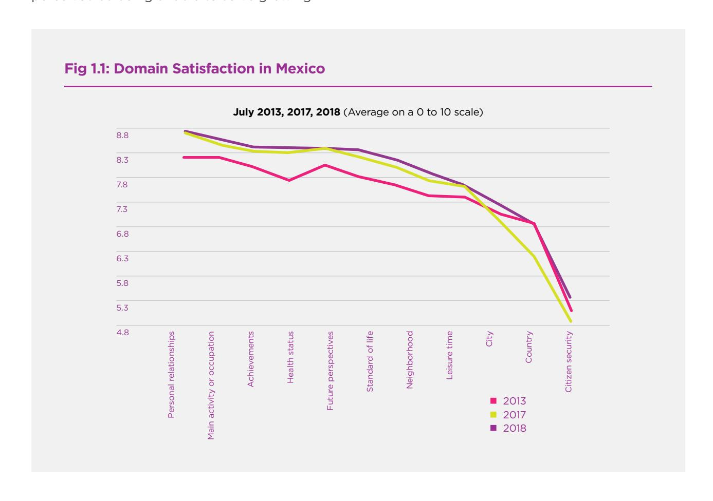

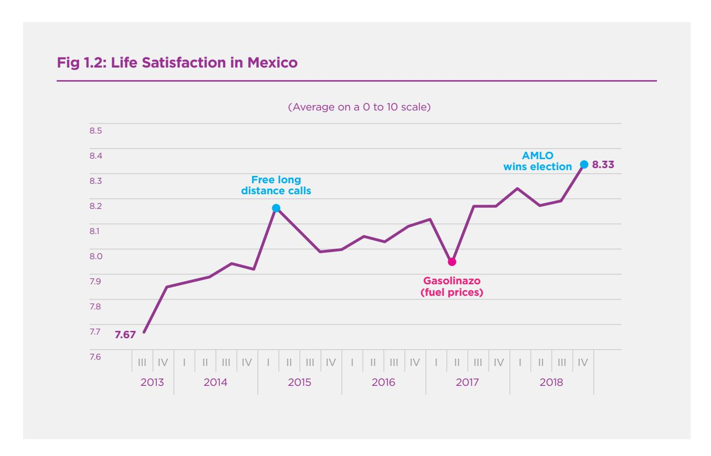

prices in 2017. Two features of the trends in life satisfaction are also worth noting. First is the temporary nature of the spikes, none of which seems to have translated into a level change of comparable magnitude. The second is that the data show a fairly sustained upward trend, indicating that lives as a whole were gradually getting better even as dissatisfaction was growing with some aspects of life being attributed to government failure. Thus the domain satisfaction measures themselves are key to understanding and predicting the electoral outcome, since life satisfaction as a whole was on an upward trend (although falling back in the first half of 2018) despite the increasing dissatisfaction with government. Satisfaction with government will be tested in Chapter 2, along with other indicators of the quality of government, as factors associated with rising or falling life satisfaction in the much larger set of countries in the Gallup World Poll. It will be shown there that domain satisfaction with government and World Bank measures of governmental quality both have roles to play in explaining changes in life evaluations within countries over the period 2005 through 2018. The Mexican data provide, with their quite specific timing and trends, evidence that the domain satisfaction measures are influencing

life satisfaction and electoral outcomes, above and beyond influences flowing in the reverse direction, or from other causes.

# Happiness and Community: The Importance of Pro-Sociality

Generosity is one of the six key variables used in this Report to explain differences in average life evaluations. It is clearly a marker for a sense of positive community engagement, and a central way that humans connect with each other. Chapter 4 digs into the nature and consequences of human prosociality for the actor to provide a close and critical look at the well-being consequences of generous behaviour. The chapter combines the use of survey data, to show the generality of the positive linkage between generosity and happiness, with experimental results used to demonstrate the existence and strength of likely causal forces running in both directions.

#### **Happiness and Digital Technology**

In the final chapters we turn to consider three major ways in which digital technology is changing the ways in which people come to understand their communities, navigate their own life paths, and connect with each other, whether at work or play. Chapter 5 looks at the consequences of digital use, and especially social media, for the happiness of users, and especially young users, in the United States. Several types of evidence are used to link rising use of digital media with falling happiness. Chapter 6 considers more generally how big data are expanding the ways of measuring happiness while at the same time converting what were previously private data about locations, activities and emotions into records accessible to many others. These data in turn influence what shows up when individuals search for information about the communities in which they live. Finally, Chapter 7 returns to the US focus of Chapter 5, and places internet addiction in a broader range of addictions found to be especially prevalent in the United States. Taken as a group, these chapters suggest that while burgeoning information technologies have ramped up the scale and complexities of human and virtual connections, they also risk the quality of social connections in ways that are not yet fully understood, and for which remedies are not yet at hand.

#### **Looking Ahead**

We finish this overview with a preview of what is to be found in each of the following chapters:

**Chapter 2** *Changing World Happiness*, by John Helliwell, Haifang Huang and Shun Wang, presents the usual national rankings of life evaluations, supplemented by global data on how life evaluations, positive affect and negative affect have evolved on an annual basis since 2006. The sources of these changes are investigated, with the six key factors being supplemented by additional data on the nature and changes in the quality of governance at the global and country-by-country levels. This is followed by attempts to quantify the links between various features of national government and average national life evaluations.

**Chapter 3** *Happiness and Voting Behaviour*, by George Ward, considers whether a happier population is any more likely to vote, to support governing parties, or support populist authoritarian candidates. The data suggest that happier people are both more likely to vote, and to vote for incumbents when they do so. The evidence on populist voting is more mixed. Although unhappier people seem to hold more populist and authoritarian attitudes, it seems difficult to adequately explain the recent rise in populist electoral success as a function of rising unhappiness - since there is little evidence of any recent drop in happiness levels. The chapter suggests that recent gains of populist politicians may have more to do with their increased ability to successfully chime with unhappy voters, or be attributable to other societal and cultural factors that may have increased the potential gains from targeting unhappy voters.

**Chapter 4** *Happiness and Prosocial Behavior: An Evaluation of the Evidence*, by Lara Aknin, Ashley Whillans, Michael Norton and Elizabeth Dunn, shows that engaging in prosocial behavior generally promotes happiness, and identifies the conditions under which these benefits are most likely to emerge. Specifically, people are more likely to derive happiness from helping others when they feel free to choose whether or how to help, when they feel connected to the people they are helping, and when they can see how their help is making a difference. Examining more limited research studying the effects of generosity on both givers and receivers, the authors suggest that prosocial facilitating autonomy and social connection for both givers and receivers may offer the greatest benefits for all.

**Chapter 5** *The Sad State of US Happiness and the Role of Digital Media*, by Jean Twenge, documents the increasing amount of time US adolescents spend interacting with electronic devices, and presents evidence that it may have displaced time once spent on more beneficial activities, contributing to increased anxiety and declines in happiness. Results are presented showing greater digital media use to predict lower well-being later, and randomly assigned people who limit or cease social media use improve their well-being. In addition, the increases in teen depression after smartphones became common after 2011 cannot be explained by low well-being causing digital media use.

**Chapter 6** *Big Data and Well-Being*, by Paul Frijters and Clément Bellet, asks big questions about big data. Is it good or bad, old or new, is it useful for predicting happiness, and what regulation is needed to achieve benefits and reduce risks? They find that recent developments are likely to help track happiness, but to risk increasing complexity, loss in privacy, and increased concentration of economic power.

**Chapter 7** *Addiction and Unhappiness in America*, by Jeffrey D. Sachs, situates the decline of American well-being in the context of a mass-addiction society. A variety of interrelated evolutionary, socioeconomic, physiological, and regulatory factors are associated with rising addiction rates across areas including drugs and alcohol, food and obesity, and internet usage. The United States' historical failure to implement public health policies that emphasize well-being over corporate interests must be addressed to respond to the addiction epidemic. Effective interventions might include a rapid scale-up of publicly financed mental health services and increased regulation of the prescriptive drug industry and other addictive products and activities.

#### **Endnotes**

1 Figures 1.1 and 1.2 are drawn from a presentation given by Gerardo Leyva during the 2° Congreso Internacional de Psicología Positiva "La Psicología y el Bienestar", November 9-10, 2018, hosted by the Universidad Iberoamericana, in Mexico City and in the "Foro Internacional de la Felicidad 360", November 2-3, 2018, organized by Universidad TecMilenio in Monterrey, México.

# Chapter 2 **11**

# Changing World Happiness

#### John F. Helliwell

Vancouver School of Economics at the University of British Columbia, and Canadian Institute for Advanced Research

#### Haifang Huang

Associate Professor, Department of Economics, University of Alberta

#### Shun Wang

Professor, KDI School of Public Policy and Management

help in collecting and interpreting data for various measures of the quality of

#### **Introduction**

In the first *World Happiness Repor*t we surveyed a wide range of available data. The Gallup World Poll surveys covering 2005-2011 gave the widest international coverage. Now, seven years later, we have twice as many years of data from the Gallup World Poll, giving us a sufficient time span to consider how our principal measures of happiness, and their main supporting factors, have evolved from 2005 through 2018.

The chapter therefore starts with a presentation of the evolution of annual data at the global and regional levels for three key happiness measures – life evaluations, positive affect, and negative affect over the whole course of the Gallup World Poll from 2005 through 2018. For all our plots of annual data, we combine the surveys in 2005 and 2006, because of the small number of countries in the first year.1

The title of this chapter is intentionally ambiguous, designed to document not just the year-to-year changes in happiness, but also to consider how happiness has been affected by changes in the quality of government. After our review of how world happiness has been changing since the start of the Gallup World Poll, we turn to present our rankings and analysis of the 2016-2018 average data for our three measures of subjective well-being plus the six main variables we use to explain their international differences. See Technical Box 1 for the precise definitions of all nine variables.

For our country-by-country analysis of changes, we report changes from 2005-2008 to 2016-2018, grouping years together to provide samples of sufficient size. We shall also provide estimates of the extent to which each of the six key explanatory variables contributed to the actual changes in life evaluations from 2005-2008 to 2016-2018.

We then complete the chapter with our latest evidence on the links between changes in the quality of government, by a variety of measures, and changes in national average life evaluations over the 2005-2018 span of years covered by the Gallup World Poll.

## **The Evolution of World Happiness 2005-2018**

In recent previous reports, we presented bar charts showing for the world as a whole, and for each of 10 global regions, the distribution of answers to the Cantril ladder question asking respondents to value their lives today on a 0 to 10 scale, with the worst possible life as a 0 and the best possible life as a 10. This gave us a chance to compare happiness levels and inequality in different parts of the world. Populationweighted average life evaluations differed significantly among regions, being highest in North America and Oceania, followed by Western Europe, Latin America and the Caribbean, Central and Eastern Europe, the Commonwealth of Independent States, East Asia, Southeast Asia, the Middle East and North Africa, Sub-Saharan Africa and South Asia, in that order. We found that well-being inequality, as measured by the standard deviation of the distributions of individual life evaluations, was lowest in Western Europe, North America and Oceania, and South Asia; and greatest in Latin America, Sub-Saharan Africa, and the Middle East and North Africa.2

This year we shift our focus from the levels and distribution of well-being to consider their evolution over the years since the start of the Gallup World Poll. We now have twice as many years of coverage from the Gallup World Poll as were available for the first *World Happiness Report* in 2012. This gives us a better chance to see emerging happiness trends from 2005 through 2018, and to investigate what may have contributed to them.

First we shall show the population-weighted trends3, based on annual samples for the world as a whole, and for ten component regions, for each of our three main happiness measures: life evaluations, positive affect, and negative affect. As described in Technical Box 1, the life evaluation used is the Cantril Ladder, which asks survey respondents to place the status of their lives on a "ladder" scale ranging from 0 to 10, where 0 means the worst possible life and 10 the best possible life. Positive affect comprises the average frequency of happiness, laughter and enjoyment on the previous day, and negative affect comprises the average frequency of worry, sadness and anger on the previous day. The affect measures thus lie between 0 and 1.

The three panels of Figure 2.1 show the global and regional trajectories for life evaluations. positive affect, and negative affect. The whiskers on the lines in all figures indicate 95% confidence intervals for the estimated means. The first panel shows the evolution of life evaluations measured three different ways. Among the three lines, two lines cover the whole world population, with one of the two weighting the country averages by each country's share of the world population, and the other being an unweighted average of the individual national averages. The unweighted average is always above the weighted average, especially after 2015, when the weighted average starts to drop significantly, while the unweighted average starts to rise equally sharply. This suggests that the recent trends have not

favoured the largest countries, as confirmed by the third line, which shows a population-weighted average for all countries in the world except the five countries with the largest populations – China, India, Indonesia, the United States and Russia. 4 The individual trajectories for these largest countries are shown in Figure 1 of Statistical Appendix 1, while their changes from 2005-2008 to 2016-2018 are shown later in this chapter, in Figure 2.8. Even with the largest countries removed, the population-weighted average does not rise as fast as the unweighted average, suggesting that smaller countries have had greater happiness growth since 2015 than have the larger countries.

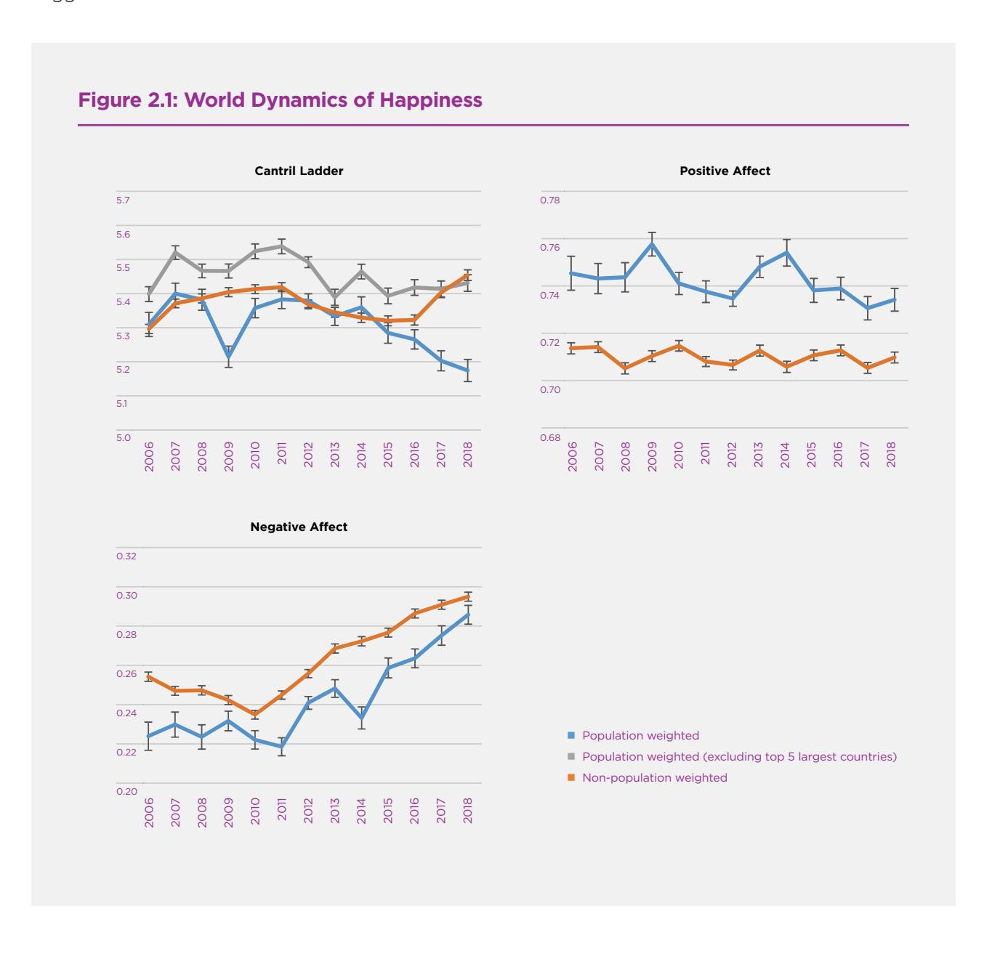

The second panel of Figure 2.1 shows positive affect over the same period as used in the first panel. There is no significant trend in either the weighted or unweighted series. The populationweighted series show slightly but significantly more positive affect than does the unweighted series, showing that positive affect is on average higher in the larger countries.

The third panel of Figure 2.1 shows negative affect, which follows a quite different path from positive affect. The population-weighted world frequency of negative affect in 2005-2006 is about one-third of the frequency of positive affect. Negative affect is lower for the weighted series, just as positive affect is greater. Both the weighted and unweighted series show significant upward trends in negative affect starting in 2010 or 2011. The global weighted measure of negative affect rises by more than one-quarter from 2010 to 2018, from a frequency of 22% to 28%. This global total, striking as it is, masks a great deal of difference among global regions, as will be shown later in Figure 2.4.

The four panels of Figure 2.2 show the evolution of life evaluations in ten global regions, divided into four continental groupings.5 In each case the averages are adjusted for sampling and population weights. The first panel has three lines, one each for Western Europe, Central and Eastern Europe, and the Commonwealth of Independent States (CIS). All three groups of countries show average life evaluations that fell in the wake of the 2007- 2008 financial crash, with the falls being greatest in Western Europe, then in the CIS, with only a slight drop in Central and Eastern Europe. The post-crash happiness recovery started first in the CIS, then in Central and Eastern Europe, while in Western Europe average life evaluations only started recovering in 2015. CIS evaluations rose almost to the level of those in Central and Eastern Europe by 2014, but have since fallen, while those in Central and Eastern Europe have continued to rise, parallelling the post-2015 rise in Western Europe. The overall pattern is one of happiness convergence among the three parts of Europe, but with a recent large gap opening up between Central and Eastern Europe and the CIS.

The second panel of Figure 2.2 covers the Americas. The upper line shows the North America+ANZ country grouping comprising the United States, Canada, Australia and New Zealand, with about 80% of its population in the United States. The weighted average, heavily influenced by the U.S. experience, has fallen more than 0.4 points from its pre-crisis peak to 2018, about on a par with Western Europe. The lower line shows that average happiness in Latin America and the Caribbean rose without much pause until a peak in 2013, with a continuing decline since then.

The third panel shows quite different evolutions of life evaluations in the three parts of Asia, with South Asia showing a drop of a full point, from 5.1 to 4.1 on the 0 to 10 scale, driven mainly by the experience of India, given its dominant share of South Asian population. Southeast Asia and East Asia, in contrast, have had generally rising life evaluations over the period. Southeast and South Asia had the same average life evaluations in 2005-2006, but the gap between them was up to 1.3 points by 2018. Happiness in East Asia was worst hit in the economic crisis years, but has since posted a larger overall gain than Southeast Asia to end the period at similar levels.

Finally, the fourth panel of Figure 2.2 contains the Middle East and North Africa (MENA) and Sub-Saharan Africa (SSA), with MENA dropping fairly steadily, and SSA with no overall trend. In all regions there is a variety of country experiences underlying the averages reported in Figure 2.2. The country-by-country data are reported in the on-line statistical data, and the country changes from 2005-2008 to 2016-2018 shown later in Figure 2.8 will help to reveal the national sources of the regional trends.

The four panels of Figures 2.3 and 2.4 have the same structure as Figure 2.2, with life evaluations being replaced by positive affect in Figure 2.3 and by negative affect in Figure 2.4. Figure 2.3 shows that positive affect is generally falling in Western Europe, and falling and then rising in both Central and Eastern Europe and the CIS, achieving its highest levels at the end of the period. This pattern of partial convergence of positive affect between the two parts of Europe leaves positive affect still significantly more frequent in Western Europe. Within the Americas, the incidence of positive affect is generally falling, at about the same rates in both the NA-ANZ region (with most of the population weight being on the United States), and in Latin America. Positive affect is fairly stable and at similar levels in East and Southeast Asia, while

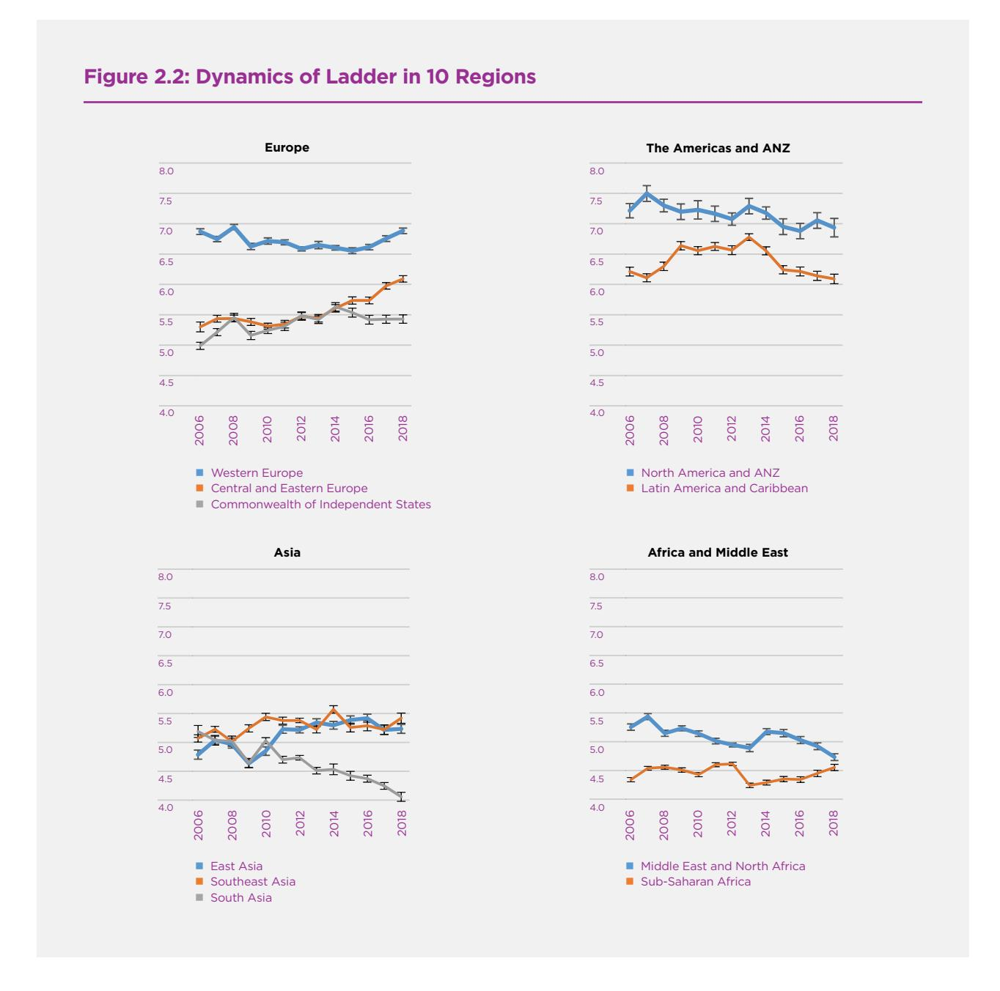

starting lower and falling significantly in South Asia. There are no significant trends in positive affect in Sub-Saharan Africa, while in MENA, it starts lower and follows a declining trend.

Figure 2.4 shows that negative affect is generally increasing in Western Europe, generally lower and falling since 2012 in Central and Eastern Europe, and also falling in the CIS until 2015, but rising thereafter. Negative affect thus shows divergence rather than the convergence within Europe seen for life evaluations and positive affect. There is a continuing post-crisis increase in the incidence of negative affect in Latin America as well as in the NA-ANZ region. Within

Asia the frequency of negative affect rises most sharply in Southeast Asia, and by only slightly less in South Asia, while falling in East Asia until 2014 and then rising thereafter. In the Middle East and North Africa, the frequency at first falls and then rises, but within a narrow range. The biggest increases in the frequency of negative affect are found in Sub-Saharan Africa, with the 2018 frequency greater by half than in 2010. Thus all global regions except for Central and Eastern Europe have had significantly increasing negative affect in recent years, with some variations among regions in starting dates for the increases.

Figure 2.3: Dynamics of Positive Affect in 10 Regions

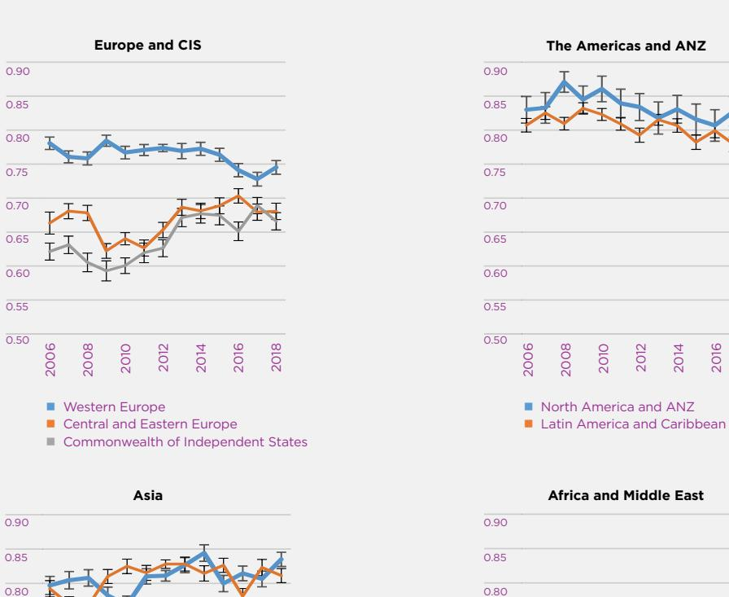

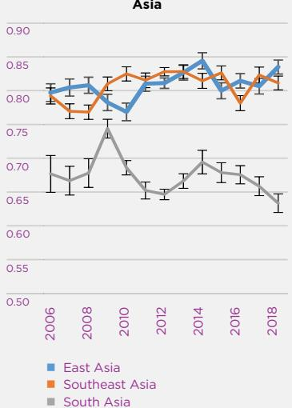

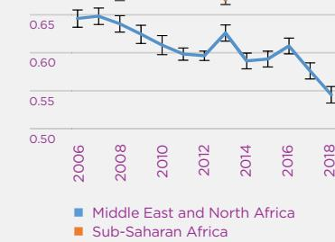

0.75

Figure 2.4: Dynamics of Negative Affect in 10 Regions

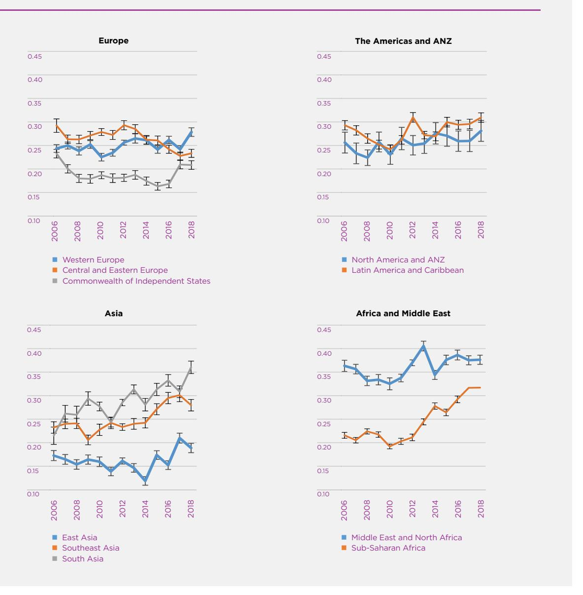

#### **The Evolution of Happiness Inequality**

In this section we focus our attention on changes in the distribution of happiness. There are at least two reasons for us to do this. First, it is important to consider not just average happiness in a community or country, but also how it is distributed. Second, it is done to encourage those interested in inequality to consider happiness inequality as a useful umbrella measure. Most studies of inequality have focused on inequality in the distribution of income and wealth,6 while in Chapter 2 of *World Happiness Report 2016 Update* we argued that just as income is too limited an indicator for the overall quality of life, income inequality is too limited a measure of overall inequality.7 For example, inequalities in the distribution of health8 have effects on life satisfaction above and beyond those flowing through their effects on income. We and others have found that the effects of happiness equality are often larger and more systematic than those of income inequality. For example, social trust, often found to be lower where income inequality is greater, is even more closely connected to the inequality of subjective well-being.9

Figure 2.5 shows the evolution of global inequality of happiness, as measured by the standard deviation of the distribution of the individual life evaluations on the 0 to 10 scale, from 2005-2006 to 2018. The upper line illustrates the trend of overall inequality, showing a clear increase since 2007. We further decompose overall inequality into two components: one for within-country inequality, and another for between-country inequality. The figure shows that inequality within countries follows the same increasing trend as overall inequality, while between-country inequality has increased only slightly. In summary, global happiness inequality, measured by the standard deviation of Cantril Ladder, has been increasing, driven mainly by increasing happiness inequality within countries.

Figure 2.6 shows that the inequality of happiness has evolved quite differently in the ten global regions. The inequality of happiness rose between 2006 and 2012 in Western Europe, and has been falling steadily since, while in Central and Eastern Europe it has followed a similar path but starting from a higher starting point and falling faster. Inequality in the CIS region follows somewhat the reverse pattern, being stable at first and

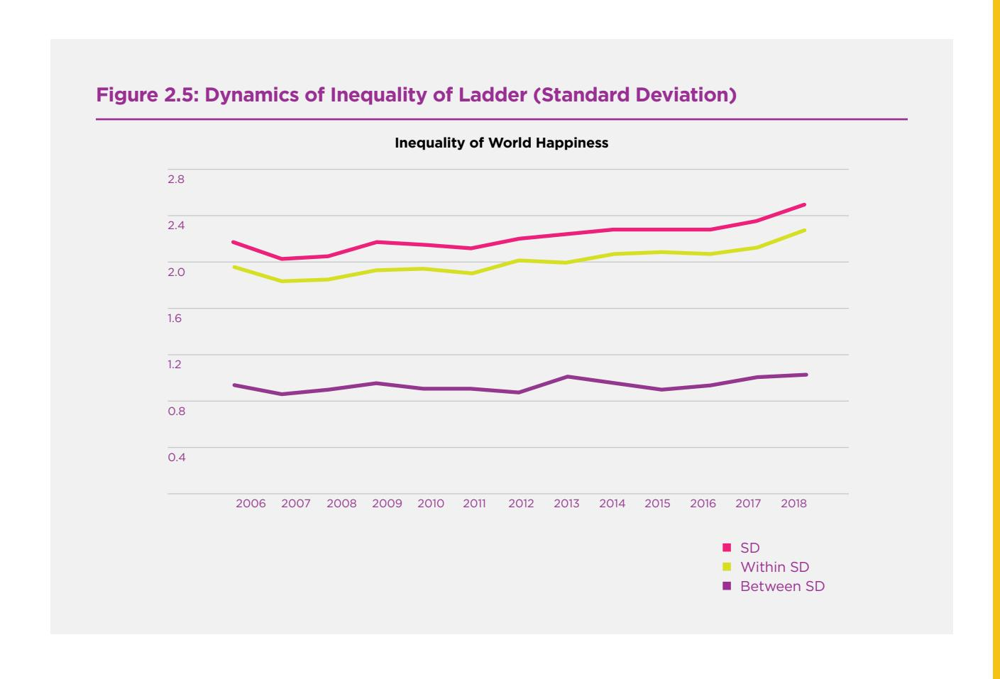

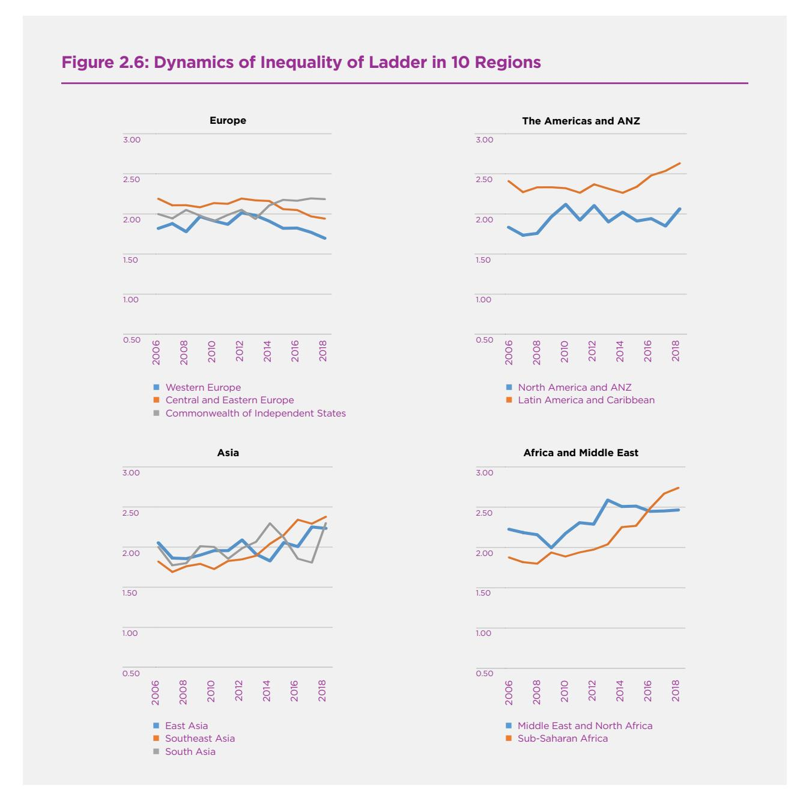

rising since 2013. In Latin America, inequality was steady until 2014 and has risen since, while rising until 2010 in the US-dominated NA+ANZ region and being fairly constant since. Inequality in Southeast Asia has been rising throughout the period since 2010, while in the rest of Asia rising much less. Inequality in Sub-Saharan Africa has risen on the steep post-2010 path similar to that in Southeast Asia. In the MENA region, inequality rose from 2009 to 2013, while being stable since.

#### **Ranking of Happiness by Country**

Now we turn to consider life evaluations covering the 2016-2018 period, and to present our annual country rankings. These rankings are accompanied by our latest attempts to show how six key variables contribute to explaining the full sample of national annual average scores over the whole period 2005-2018. These variables are GDP per capita, social support, healthy life expectancy, freedom, generosity, and absence of corruption. Note that we do not construct our happiness measure in each country using these six factors – the scores are instead based on individuals' own assessments of their lives, as

indicated by the Cantril ladder. Rather, we use the six variables to explain the variation of happiness across countries. We shall also show how measures of experienced well-being, especially positive affect, supplement life circumstances in explaining higher life evaluations.

In Table 2.1 we present our latest modeling of national average life evaluations and measures of positive and negative affect (emotion) by country and year.10 For ease of comparison, the table has the same basic structure as Table 2.1 in several previous editions of the *World Happiness Report*. The major difference comes from the inclusion of data for 2018, and the resulting changes to the estimated equation are very slight.11 There are four equations in Table 2.1. The first equation provides the basis for constructing the sub-bars shown in Figure 2.7.

The results in the first column of Table 2.1 explain national average life evaluations in terms of six key variables: GDP per capita, social support, healthy life expectancy, freedom to make life choices, generosity, and freedom from corruption.12 Taken together, these six variables explain almost three-quarters of the variation in national annual average ladder scores among countries, using data from the years 2005 to 2018. The model's predictive power is little changed if the year fixed effects in the model are removed, falling from 0.740 to 0.735 in terms of the adjusted R-squared.

The second and third columns of Table 2.1 use the same six variables to estimate equations for national averages of positive and negative affect, where both are based on answers about yesterday's emotional experiences

**Table 2.1: Regressions to Explain Average Happiness across Countries (Pooled OLS)**

|                                  | Dependent Variable       |                          |                          |                          |  |  |  |  |
|----------------------------------|--------------------------|--------------------------|--------------------------|--------------------------|--|--|--|--|
| Independent Variable             | Cantril Ladder (0-10) | Positive Affect (0-1) | Negative Affect (0-1) | Cantril Ladder (0-10) |  |  |  |  |
|                                  |                          |                          |                          |                          |  |  |  |  |
| Log GDP per capita               | 0.318                    | 011                      | 0.008                    | 0.338                    |  |  |  |  |
|                                  | (0.066)***               | (0.01)                   | (0.008)                  | (0.065)***               |  |  |  |  |
| Social support                   | 2.422                    | 0.253                    | 313                      | 1.977                    |  |  |  |  |
|                                  | (0.381)***               | (0.05)***                | (0.051)***               | (0.397)***               |  |  |  |  |
| Healthy life expectancy at birth | 0.033                    | 0.001                    | 0.002                    | 0.03                     |  |  |  |  |
|                                  | (0.01)***                | (0.001)                  | (0.001)                  | (0.01)***                |  |  |  |  |
| Freedom to make life choices     | 1.164                    | 0.352                    | 072                      | 0.461                    |  |  |  |  |
|                                  | (0.3)***                 | (0.04)***                | (0.041)*                 | (0.287)                  |  |  |  |  |
| Generosity                       | 0.635                    | 0.137                    | 0.008                    | 0.351                    |  |  |  |  |
|                                  | (0.277)**                | (0.03)***                | (0.028)                  | (0.279)                  |  |  |  |  |
| Perceptions of corruption        | 540                      | 0.025                    | 0.094                    | 612                      |  |  |  |  |
|                                  | (0.294)*                 | (0.027)                  | (0.024)***               | (0.287)**                |  |  |  |  |
| Positive affect                  |                          |                          |                          | 2.063                    |  |  |  |  |
|                                  |                          |                          |                          | (0.384)***               |  |  |  |  |
| Negative affect                  |                          |                          |                          | 0.242                    |  |  |  |  |
|                                  |                          |                          |                          | (0.429)                  |  |  |  |  |
| Year fixed effects               | Included                 | Included                 | Included                 | Included                 |  |  |  |  |
| Number of countries              | 157                      | 157                      | 157                      | 157                      |  |  |  |  |
| Number of obs.                   | 1,516                    | 1,513                    | 1,515                    | 1,512                    |  |  |  |  |
| Adjusted R-squared               | 0.74                     | 0.476                    | 0.27                     | 0.76                     |  |  |  |  |

Notes: This is a pooled OLS regression for a tattered panel explaining annual national average Cantril ladder responses from all available surveys from 2005 to 2018. See Technical Box 1 for detailed information about each of the predictors. Coefficients are reported with robust standard errors clustered by country in parentheses. \*\*\*, \*\*, and \* indicate significance at the 1, 5 and 10 percent levels respectively.

(see Technical Box 1 for how the affect measures are constructed). In general, the emotional measures, and especially negative emotions, are differently, and much less fully, explained by the six variables than are life evaluations. Per-capita income and healthy life expectancy have significant effects on life evaluations, but not, in these national average data, on either positive or negative affect. The situation changes when we consider social variables. Bearing in mind that positive and negative affect are measured on a 0 to 1 scale, while life evaluations are on a 0 to 10 scale, social support can be seen to have similar proportionate effects on positive and negative emotions as on life evaluations. Freedom and generosity have even larger influences on positive affect than on the ladder. Negative affect is significantly reduced by social support, freedom, and absence of corruption.

In the fourth column we re-estimate the life evaluation equation from column 1, adding both positive and negative affect to partially implement the Aristotelian presumption that sustained positive emotions are important supports for a good life.13 The most striking feature is the extent to which the results buttress a finding in psychology that the existence of positive emotions matters much more than the absence of negative ones.14 Positive affect has a large and highly significant impact in the final equation of Table 2.1, while negative affect has none.

As for the coefficients on the other variables in the final equation, the changes are material only on those variables – especially freedom and generosity – that have the largest impacts on positive affect. Thus we infer that positive emotions play a strong role in support of life evaluations, and that much of the impact of freedom and generosity on life evaluations is channeled through their influence on positive emotions. That is, freedom and generosity have large impacts on positive affect, which in turn has a major impact on life evaluations. The Gallup World Poll does not have a widely available measure of life purpose to test whether it too would play a strong role in support of high life evaluations. However, data from large samples of UK do suggest that life purpose plays a strongly supportive role, independent of the roles of life circumstances and positive emotions.

Our country rankings in Figure 2.7 show life evaluations (the average answer to the Cantril ladder question, asking people to evaluate the quality of their current lives on a scale of 0 to 10) for each country, averaged over the years 2016-2018. Not every country has surveys in every year; the total sample sizes are reported in the statistical appendix, and are reflected in Figure 2.7 by the horizontal lines showing the 95% confidence intervals. The confidence intervals are tighter for countries with larger samples. To increase the number of countries ranked, we also include three countries that did have surveys in 2015 but have not had one since.15

The overall length of each country bar represents the average ladder score, which is also shown in numerals. The rankings in Figure 2.7 depend only on the average Cantril ladder scores reported by the respondents, and not on the values of the six variables that we use to help account for the large differences we find.

Each of these bars is divided into seven segments, showing our research efforts to find possible sources for the ladder levels. The first six sub-bars show how much each of the six key variables is calculated to contribute to that country's ladder score, relative to that in a hypothetical country called Dystopia, so named because it has values equal to the world's lowest national averages for 2016-2018 for each of the six key variables used in Table 2.1. We use Dystopia as a benchmark against which to compare contributions from each of the six factors. The choice of Dystopia as a benchmark permits every real country to have a positive (or at least zero) contribution from each of the six factors. We calculate, based on the estimates in the first column of Table 2.1, that Dystopia had a 2016-2018 ladder score equal to 1.88 on the 0 to 10 scale. The final sub-bar is the sum of two components: the calculated average 2016-2018 life evaluation in Dystopia (=1.88) and each country's own prediction error, which measures the extent to which life evaluations are higher or lower than predicted by our equation in the first column of Table 2.1. These residuals are as likely to be negative as positive.16

It might help to show in more detail how we calculate each factor's contribution to average life evaluations. Taking the example of healthy life expectancy, the sub-bar in the case of Tanzania is equal to the number of years by which healthy

#### **Technical Box 1: Detailed information about each of the predictors in Table 2.1**

- 1. GDP per capita is in terms of Purchasing Power Parity (PPP) adjusted to constant 2011 international dollars, taken from the World Development Indicators (WDI) released by the World Bank on November 14, 2018. See Statistical Appendix 1 for more details. GDP data for 2018 are not yet available, so we extend the GDP time series from 2017 to 2018 using countryspecific forecasts of real GDP growth from the OECD Economic Outlook No. 104 (Edition November 2018) and the World Bank's Global Economic Prospects (Last Updated: 06/07/2018), after adjustment for population growth. The equation uses the natural log of GDP per capita, as this form fits the data significantly better than GDP per capita.
- 2. The time series of healthy life expectancy at birth are constructed based on data from the World Health Organization (WHO) Global Health Observatory data repository, with data available for 2005, 2010, 2015, and 2016. To match this report's sample period, interpolation and extrapolation are used. See Statistical Appendix 1 for more details.
- 3. Social support is the national average of the binary responses (either 0 or 1) to the Gallup World Poll (GWP) question "If you were in trouble, do you have relatives or friends you can count on to help you whenever you need them, or not?"
- 4. Freedom to make life choices is the national average of binary responses to the GWP question "Are you satisfied or dissatisfied with your freedom to choose what you do with your life?"

- 5. Generosity is the residual of regressing the national average of GWP responses to the question "Have you donated money to a charity in the past month?" on GDP per capita.
- 6. Perceptions of corruption are the average of binary answers to two GWP questions: "Is corruption widespread throughout the government or not?" and "Is corruption widespread within businesses or not?" Where data for government corruption are missing, the perception of business corruption is used as the overall corruption-perception measure.
- 7. Positive affect is defined as the average of previous-day affect measures for happiness, laughter, and enjoyment for GWP waves 3-7 (years 2008 to 2012, and some in 2013). It is defined as the average of laughter and enjoyment for other waves where the happiness question was not asked. The general form for the affect questions is: Did you experience the following feelings during a lot of the day yesterday? See pp. 1-2 of Statistical Appendix 1 for more details.
- 8. Negative affect is defined as the average of previous-day affect measures for worry, sadness, and anger for all waves.

life expectancy in Tanzania exceeds the world's lowest value, multiplied by the Table 2.1 coefficient for the influence of healthy life expectancy on life evaluations. The width of these different sub-bars then shows, country-by-country, how much each of the six variables is estimated to contribute to explaining the international ladder differences. These calculations are illustrative rather than conclusive, for several reasons. First, the selection of candidate variables is restricted by what is available for all these countries. Traditional variables like GDP per capita and healthy life expectancy are widely available. But measures of the quality of the social context, which have been shown in experiments and national surveys to have strong links to life evaluations and emotions, have not been sufficiently surveyed in the Gallup or other global polls, or otherwise measured in statistics available for all countries. Even with this limited choice, we find that four variables covering different aspects of the social and institutional context – having someone to count on, generosity, freedom to make life choices and absence of corruption – are together responsible for more than half of the average difference between each country's predicted ladder score and that in Dystopia in the 2016-2018 period. As shown in Statistical Appendix 1, the average country has a 2016-2018 ladder score that is 3.53 points above the Dystopia ladder score of 1.88. Of the 3.53 points, the largest single part (34%) comes from social support, followed by GDP per capita (26%) and healthy life expectancy (21%), and then freedom (11%), generosity (5%), and corruption (3%).17

Our limited choice means that the variables we use may be taking credit properly due to other better variables, or to unmeasured factors. There are also likely to be vicious or virtuous circles, with two-way linkages among the variables. For example, there is much evidence that those who have happier lives are likely to live longer, be more trusting, be more cooperative, and be generally better able to meet life's demands.18 This will feed back to improve health, GDP, generosity, corruption, and sense of freedom. Finally, some of the variables are derived from the same respondents as the life evaluations and hence possibly determined by common factors. This risk is less using national averages, because individual differences in personality and many

life circumstances tend to average out at the national level.

To provide more assurance that our results are not seriously biased because we are using the same respondents to report life evaluations, social support, freedom, generosity, and corruption, we tested the robustness of our procedure (see Table 10 of Statistical Appendix 1 of *World Happiness Report 2018* for more detail) by splitting each country's respondents randomly into two groups, and using the average values for one group for social support, freedom, generosity, and absence of corruption in the equations to explain average life evaluations in the other half of the sample. The coefficients on each of the four variables fall, just as we would expect. But the changes are reassuringly small (ranging from 1% to 5%) and are far from being statistically significant.19

The seventh and final segment is the sum of two components. The first component is a fixed number representing our calculation of the 2016-2018 ladder score for Dystopia (=1.88). The second component is the average 2016-2018 residual for each country. The sum of these two components comprises the right-hand sub-bar for each country; it varies from one country to the next because some countries have life evaluations above their predicted values, and others lower. The residual simply represents that part of the national average ladder score that is not explained by our model; with the residual included, the sum of all the sub-bars adds up to the actual average life evaluations on which the rankings are based.

What do the latest data show for the 2016-2018 country rankings? Two features carry over from previous editions of the *World Happiness Report*. First, there is still a lot of year-to-year consistency in the way people rate their lives in different countries, and of course we do our ranking on a three-year average, so that there is information carried forward from one year to the next. But there are nonetheless interesting changes. The annual data for Finland have continued their modest but steady upward trend since 2014, so that dropping 2015 and adding 2018 boosts the average score, thereby putting Finland significantly ahead of other countries in the top ten. Denmark and Norway have also increased their average scores, but Denmark by more than

Figure 2.7: Ranking of Happiness 2016-2018 (Part 1)

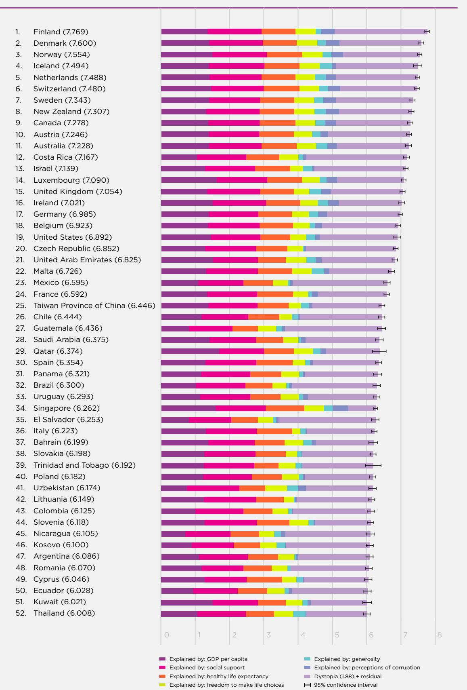

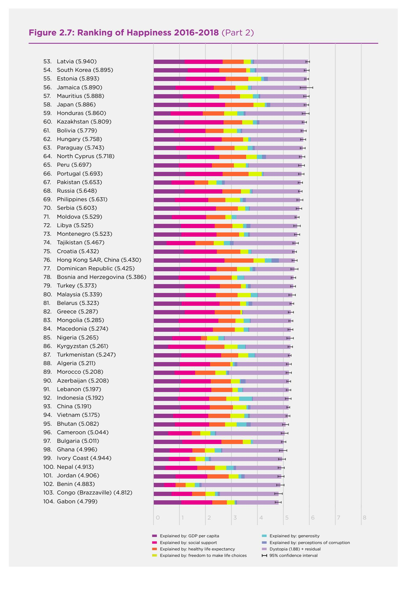

Figure 2.7: Ranking of Happiness 2016-2018 (Part 3)

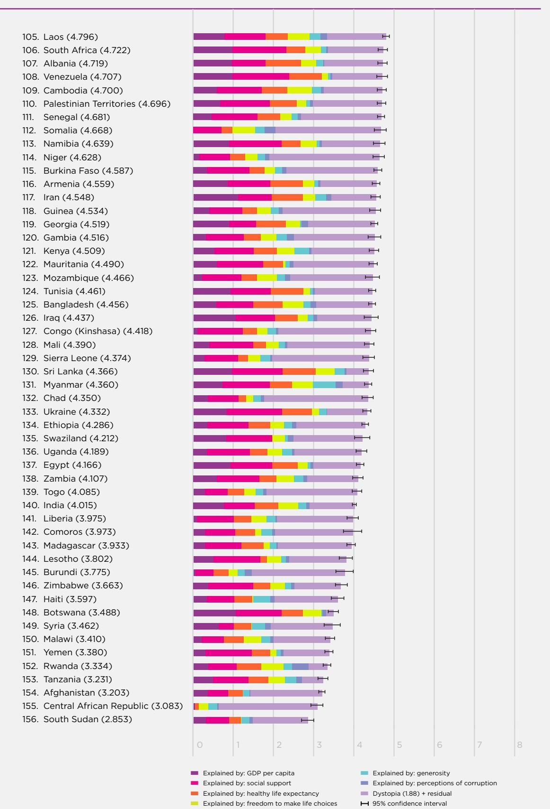

Norway, so Denmark is now in second place and Norway third. There are no 2018 survey results available for Iceland, and their score and ranking remain the same, in 4th place. The Netherlands have slipped into 5th place, dropping Switzerland to 6th.The next three places contain the same three countries as last year, with Sweden's increasing scores raising it to 7th, with New Zealand remaining 8th and Canada now in 9th. The final position in the top ten goes to Austria, rising from 12th to 10th, with Australia dropping to 11th, followed by Costa Rica in 12th, and Israel in 13th.There are further changes in the rest of the top 20, with Luxembourg rising to 14th and the United Kingdom to 15th, Ireland and Germany in 16th and 17th, and Belgium and the United States in 18th and 19th. The Czech Republic rounds out the top 20 by switching positions with the United Arab Emirates. Both countries posted rising averages, with the Czech score rising more. Throughout the top 20 positions, and indeed at most places in the rankings, even the three-year average scores are close enough to one another that significant differences are found only between country pairs that are several positions apart in the rankings. This can be seen by inspecting the whisker lines showing the 95% confidence intervals for the average scores.

There remains a large gap between the top and bottom countries. The top ten countries are less tightly grouped than last year. The national life evaluation scores now have a gap of 0.28 between the 1st and 5th position, and another 0.24 between 5th and 10th positions, a more spread-out situation than last year. Thus there is now a gap of about 0.5 points between the first and 10th positions. There is a bigger range of scores covered by the bottom 10 countries. Within this group, average scores differ by almost three-quarters of a point, more than one-fifth of the average national score in the group. Tanzania, Rwanda and Botswana still have anomalous scores, in the sense that their predicted values, based on their performance on the six key variables, would suggest they would rank much higher than shown by the survey answers.

Despite the general consistency among the top country scores, there have been many significant changes in the rest of the countries. Looking at changes over the longer term, many countries have exhibited substantial changes in average

scores, and hence in country rankings, between 2005-2008 and 2016-2018, as will be shown in more detail in Figure 2.8.

When looking at average ladder scores, it is also important to note the horizontal whisker lines at the right-hand end of the main bar for each country. These lines denote the 95% confidence regions for the estimates, so that countries with overlapping error bars have scores that do not significantly differ from each other. The scores are based on the resident populations in each country, rather than their citizenship or place of birth. In *World Happiness Report 2018* we split the responses between the locally and foreignborn populations in each country, and found the happiness rankings to be essentially the same for the two groups, although with some footprint effect after migration, and some tendency for migrants to move to happier countries, so that among 20 happiest countries in that report, the average happiness for the locally born was about 0.2 points higher than for the foreign-born.20

Average life evaluations in the top 10 countries are more than twice as high as in the bottom 10. If we use the first equation of Table 2.1 to look for possible reasons for these very different life evaluations, it suggests that of the 4.16 points difference, 3.06 points can be traced to differences in the six key factors: 0.99 points from the GDP per capita gap, 0.88 due to differences in social support, 0.59 to differences in healthy life expectancy, 0.35 to differences in freedom, 0.20 to differences in corruption perceptions, and 0.06 to differences in generosity.21 Income differences are the single largest contributing factor, at one-third of the total, because, of the six factors, income is by far the most unequally distributed among countries. GDP per capita is 22 times higher in the top 10 than in the bottom 10 countries.22

Overall, the model explains average life evaluation levels quite well within regions, among regions, and for the world as a whole.23 On average, the countries of Latin America still have mean life evaluations that are higher (by about 0.6 on the 0 to 10 scale) than predicted by the model. This difference has been attributed to a variety of factors, including especially some unique features of family and social life in Latin American countries. To help explain what is special about social life in Latin America,

Chapter 6 of *World Happiness Report* 2018 by Mariano Rojas presented a range of new data and results showing how the social structure supports Latin American happiness beyond what is captured by the variables available in the Gallup World Poll. In partial contrast, the countries of East Asia have average life evaluations below those predicted by the model, a finding that has been thought to reflect, at least in part, cultural differences in response style.24 It is reassuring that our findings about the relative importance of the six factors are generally unaffected by whether or not we make explicit allowance for these regional differences.25

Our main country rankings are based on the average answers to the Cantril ladder life evaluation question in the Gallup World Poll. The other two happiness measures, for positive and negative affect, are themselves of independent importance and interest, as well as being, especially in the case of positive affect, contributors to overall life evaluations. Measures of positive affect also play important roles in other chapters of this report, in large part because most lab experiments, being of relatively small size and duration, can be expected to affect current emotions but not life evaluations, which tend to be more stable in response to small or temporary disturbances. The various attempts to use big data to measure happiness using word analysis of Twitter feeds, or other similar sources, are likely to be capturing mood changes rather than overall life evaluations. In this report, for the first time since 2012, we are presenting, in Table 2.2, rankings for all three of the measures of subjective well-being that we track: the Cantril ladder (and its standard deviation, which provides a measure of happiness inequality), positive affect and negative affect. We also show country rankings for the six variables we use in Table 2.1 to explain our measures of subjective well-being.26 The same data are also shown in graphical form, on a variable by variable basis, in Figures 16 to 39 of Statistical Appendix 1. The numbers shown reflect each country's global rank for the variable in question, with the number of countries ranked depending on the availability of data. The league tables are divided into a premier league (the OECD, whose 36 member countries include 19 of the top 20 countries) and a number of regional leagues comprising the remaining countries

grouped in the same global regions used elsewhere in the report. Within leagues, countries are ordered by their 2016-2018 ladder scores.

**Table 2.2: Happiness League Tables**

| Country (region) | Ladder | SD of ladder | Positive affect | Negative affect                            | Social support | Freedom |     | Corruption Generosity | Log of GDP per capita | Healthy life expectancy |
|---------------------|--------|--------------|--------------------|-----------------------------------------------|-------------------|---------|-----|-----------------------|--------------------------|----------------------------|
|                     |        |              |                    |                                               | OECD              |         |     |                       |                          |                            |
| Finland             | 1      | 4            | 41                 | 10                                            | 2                 | 5       | 4   | 47                    | 22                       | 27                         |
| Denmark             | 2      | 13           | 24                 | 26                                            | 4                 | 6       | 3   | 22                    | 14                       | 23                         |
| Norway              | 3      | 8            | 16                 | 29                                            | 3                 | 3       | 8   | 11                    | 7                        | 12                         |
| Iceland             | 4      | 9            | 3                  | 3                                             | 1                 | 7       | 45  | 3                     | 15                       | 13                         |
| Netherlands         | 5      | 1            | 12                 | 25                                            | 15                | 19      | 12  | 7                     | 12                       | 18                         |
| Switzerland         | 6      | 11           | 44                 | 21                                            | 13                | 11      | 7   | 16                    | 8                        | 4                          |
| Sweden              | 7      | 18           | 34                 | 8                                             | 25                | 10      | 6   | 17                    | 13                       | 17                         |
| New Zealand         | 8      | 15           | 22                 | 12                                            | 5                 | 8       | 5   | 8                     | 26                       | 14                         |
| Canada              | 9      | 23           | 18                 | 49                                            | 20                | 9       | 11  | 14                    | 19                       | 8                          |
| Austria             | 10     | 10           | 64                 | 24                                            | 31                | 26      | 19  | 25                    | 16                       | 15                         |
| Australia           | 11     | 26           | 47                 | 37                                            | 7                 | 17      | 13  | 6                     | 18                       | 10                         |
| Israel              | 13     | 14           | 104                | 69                                            | 38                | 93      | 74  | 24                    | 31                       | 11                         |
| Luxembourg          | 14     | 3            | 62                 | 19                                            | 27                | 28      | 9   | 30                    | 2                        | 16                         |
| United Kingdom      | 15     | 16           | 52                 | 42                                            | 9                 | 63      | 15  | 4                     | 23                       | 24                         |
| Ireland             | 16     | 34           | 33                 | 32                                            | 6                 | 33      | 10  | 9                     | 6                        | 20                         |
| Germany             | 17     | 17           | 65                 | 30                                            | 39                | 44      | 17  | 19                    | 17                       | 25                         |
| Belgium             | 18     | 7            | 57                 | 53                                            | 22                | 53      | 20  | 44                    | 21                       | 26                         |
| United States       | 19     | 49           | 35                 | 70                                            | 37                | 62      | 42  | 12                    | 10                       | 39                         |
| Czech Republic      | 20     | 20           | 74                 | 22                                            | 24                | 58      | 121 | 117                   | 32                       | 31                         |
| Mexico              | 23     | 76           | 6                  | 40                                            | 67                | 71      | 87  | 120                   | 57                       | 46                         |
| France              | 24     | 19           | 56                 | 66                                            | 32                | 69      | 21  | 68                    | 25                       | 5                          |
| Chile               | 26     | 61           | 15                 | 78                                            | 58                | 98      | 99  | 45                    | 49                       | 30                         |
| Spain               | 30     | 21           | 107                | 107                                           | 26                | 95      | 78  | 50                    | 30                       | 3                          |
| Italy               | 36     | 31           | 99                 | 123                                           | 23                | 132     | 128 | 48                    | 29                       | 7                          |
| Slovakia            | 38     | 39           | 53                 | 47                                            | 21                | 108     | 142 | 70                    | 35                       | 38                         |
| Poland              | 40     | 28           | 76                 | 33                                            | 44                | 52      | 108 | 77                    | 41                       | 36                         |
| Lithuania           | 42     | 55           | 138                | 41                                            | 17                | 122     | 113 | 124                   | 36                       | 62                         |
| Slovenia            | 44     | 54           | 114                | 71                                            | 14                | 13      | 97  | 54                    | 34                       | 29                         |
| Latvia              | 53     | 30           | 119                | 38                                            | 34                | 126     | 92  | 105                   | 43                       | 68                         |
| South Korea         | 54     | 57           | 101                | 45                                            | 91                | 144     | 100 | 40                    | 27                       | 9                          |
| Estonia             | 55     | 32           | 50                 | 6                                             | 12                | 45      | 30  | 83                    | 37                       | 41                         |
| Japan               | 58     | 43           | 73                 | 14                                            | 50                | 64      | 39  | 92                    | 24                       | 2                          |
| Hungary             | 62     | 36           | 86                 | 31                                            | 51                | 138     | 140 | 100                   | 42                       | 56                         |
| Portugal            | 66     | 73           | 97                 | 100                                           | 47                | 37      | 135 | 122                   | 39                       | 22                         |
| Turkey              | 79     | 58           | 154                | 121                                           | 61                | 140     | 50  | 98                    | 44                       | 69                         |
| Greece              | 82     | 87           | 102                | 94                                            | 102               | 150     | 123 | 152                   | 46                       | 21                         |
|                     |        |              |                    |                                               |                   |         |     |                       |                          |                            |
|                     |        |              |                    |                                               | Europe            |         |     |                       |                          |                            |
|                     |        |              |                    | Non-OECD Western, Central, and Eastern Europe |                   |         |     |                       |                          |                            |
| Malta               | 22     | 42           | 83                 | 103                                           | 16                | 12      | 32  | 5                     | 28                       | 19                         |
| Kosovo              | 46     | 107          | 71                 | 7                                             | 85                | 50      | 144 | 31                    | 88                       | N.A.                       |
| Romania             | 48     | 75           | 80                 | 62                                            | 86                | 57      | 146 | 102                   | 48                       | 61                         |
| Cyprus              | 49     | 95           | 60                 | 99                                            | 90                | 81      | 115 | 39                    | 33                       | 6                          |
| Northern Cyprus     | 64     | 35           | 144                | 90                                            | 81                | 77      | 29  | 43                    | N.A.                     | N.A.                       |
| Serbia              | 70     | 100          | 148                | 92                                            | 57                | 124     | 118 | 84                    | 71                       | 48                         |
| Montenegro          | 73     | 84           | 143                | 118                                           | 60                | 139     | 77  | 76                    | 61                       | 44                         |
| Croatia             | 75     | 29           | 122                | 101                                           | 79                | 118     | 139 | 81                    | 50                       | 32                         |

**Table 2.2: Happiness League Tables** (continued)

| Country (region)          | Ladder | SD of ladder | Positive affect | Negative affect                 | Social support  | Freedom |      | Corruption Generosity | Log of GDP per capita | Healthy life expectancy |
|------------------------------|--------|--------------|--------------------|------------------------------------|--------------------|---------|------|-----------------------|--------------------------|----------------------------|
| Bosnia and Herzegovina    | 78     | 80           | 116                | 79                                 | 92                 | 137     | 145  | 32                    | 82                       | 50                         |
| Macedonia                    | 84     | 67           | 140                | 89                                 | 74                 | 105     | 125  | 55                    | 75                       | 52                         |
| Bulgaria                     | 97     | 47           | 117                | 13                                 | 18                 | 115     | 147  | 112                   | 56                       | 65                         |
| Albania                      | 107    | 126          | 90                 | 108                                | 133                | 87      | 134  | 60                    | 81                       | 40                         |
|                              |        |              |                    | Commonwealth of Independent States |                    |         |      |                       |                          |                            |
| Uzbekistan                   | 41     | 99           | 19                 | 15                                 | 11                 | 1       | 18   | 29                    | 104                      | 83                         |
| Kazakhstan                   | 60     | 40           | 81                 | 5                                  | 19                 | 80      | 57   | 57                    | 47                       | 88                         |
| Russia                       | 68     | 64           | 96                 | 9                                  | 40                 | 107     | 127  | 101                   | 45                       | 89                         |
| Moldova                      | 71     | 45           | 133                | 67                                 | 65                 | 128     | 148  | 86                    | 109                      | 86                         |
| Tajikistan                   | 74     | 50           | 120                | 54                                 | 113                | 86      | 35   | 72                    | 123                      | 92                         |
| Belarus                      | 81     | 22           | 149                | 36                                 | 33                 | 131     | 37   | 103                   | 58                       | 76                         |
| Kyrgyzstan                   | 86     | 46           | 58                 | 4                                  | 45                 | 38      | 138  | 36                    | 120                      | 91                         |
| Turkmenistan                 | 87     | 2            | 135                | 63                                 | 8                  | 83      | N.A. | 33                    | 60                       | 100                        |
| Azerbaijan                   | 90     | 24           | 134                | 20                                 | 104                | 101     | 22   | 146                   | 65                       | 82                         |
| Armenia                      | 116    | 82           | 126                | 145                                | 117                | 123     | 93   | 129                   | 91                       | 64                         |
| Georgia                      | 119    | 51           | 141                | 43                                 | 147                | 104     | 28   | 153                   | 87                       | 84                         |
| Ukraine                      | 133    | 69           | 131                | 44                                 | 56                 | 141     | 143  | 66                    | 94                       | 87                         |
|                              |        |              |                    | Latin America and the Caribbean    |                    |         |      |                       |                          |                            |
| Costa Rica                   | 12     | 62           | 4                  | 87                                 | 42                 | 16      | 58   | 75                    | 67                       | 28                         |
| Guatemala                    | 27     | 136          | 8                  | 85                                 | 78                 | 25      | 82   | 78                    | 99                       | 85                         |
| Panama                       | 31     | 121          | 7                  | 48                                 | 41                 | 32      | 104  | 88                    | 51                       | 33                         |
| Brazil                       | 32     | 116          | 69                 | 105                                | 43                 | 84      | 71   | 108                   | 70                       | 72                         |
| Uruguay                      | 33     | 88           | 10                 | 76                                 | 35                 | 30      | 33   | 80                    | 52                       | 35                         |
|                              |        |              |                    |                                    |                    |         |      |                       |                          |                            |
| El Salvador                  | 35     | 112          | 23                 | 84                                 | 83                 | 74      | 85   | 134                   | 100                      | 75                         |
| Trinidad and Tobago       | 39     | 89           | 14                 | 52                                 | 29                 | 51      | 141  | 41                    | 38                       | 93                         |
| Colombia                     | 43     | 120          | 30                 | 88                                 | 52                 | 56      | 124  | 111                   | 74                       | 51                         |
| Nicaragua                    | 45     | 133          | 31                 | 125                                | 66                 | 70      | 43   | 71                    | 108                      | 53                         |
| Argentina                    | 47     | 97           | 28                 | 93                                 | 46                 | 54      | 109  | 123                   | 55                       | 37                         |
| Ecuador                      | 50     | 113          | 11                 | 113                                | 71                 | 42      | 68   | 95                    | 86                       | 45                         |
| Jamaica                      | 56     | 102          | 51                 | 51                                 | 28                 | 49      | 130  | 119                   | 93                       | 55                         |
| Honduras                     | 59     | 151          | 13                 | 73                                 | 84                 | 39      | 79   | 51                    | 113                      | 57                         |
| Bolivia                      | 61     | 71           | 70                 | 138                                | 93                 | 35      | 91   | 104                   | 101                      | 94                         |
| Paraguay                     | 63     | 90           | 1                  | 39                                 | 30                 | 34      | 76   | 67                    | 90                       | 81                         |
| Peru                         | 65     | 114          | 36                 | 127                                | 77                 | 61      | 132  | 126                   | 76                       | 47                         |
| Dominican Republic        | 77     | 155          | 66                 | 77                                 | 55                 | 43      | 52   | 93                    | 69                       | 80                         |
| Venezuela                    | 108    | 141          | 77                 | 135                                | 49                 | 145     | 110  | 139                   | 78                       | 71                         |
| Haiti                        | 147    | 111          | 142                | 119                                | 146                | 152     | 48   | 20                    | 138                      | 125                        |
|                              |        |              |                    |                                    | Asia               |         |      |                       |                          |                            |
|                              |        |              |                    |                                    | Non-OECD East Asia |         |      |                       |                          |                            |
| Taiwan Province of China  | 25     | 37           | 17                 | 1                                  | 48                 | 102     | 56   | 56                    | N.A.                     | N.A.                       |
| Hong Kong S.A.R. of China | 76     | 33           | 105                | 28                                 | 76                 | 66      | 14   | 18                    | 9                        | N.A.                       |
| Mongolia                     | 83     | 48           | 95                 | 17                                 | 10                 | 112     | 119  | 38                    | 80                       | 97                         |
| China                        | 93     | 72           | 21                 | 11                                 | 108                | 31      | N.A. | 133                   | 68                       | 34                         |

**Table 2.2: Happiness League Tables** (continued)

| Country (region)        | Ladder | SD of ladder | Positive affect | Negative affect     | Social support            | Freedom |      | Corruption Generosity | Log of GDP per capita | Healthy life expectancy |
|----------------------------|--------|--------------|--------------------|------------------------|------------------------------|---------|------|-----------------------|--------------------------|----------------------------|
|                            |        |              |                    |                        | Southeast Asia               |         |      |                       |                          |                            |
| Singapore                  | 34     | 5            | 38                 | 2                      | 36                           | 20      | 1    | 21                    | 3                        | 1                          |
| Thailand                   | 52     | 81           | 20                 | 35                     | 53                           | 18      | 131  | 10                    | 62                       | 58                         |
| Philippines                | 69     | 119          | 42                 | 116                    | 75                           | 15      | 49   | 115                   | 97                       | 99                         |
| Malaysia                   | 80     | 12           | 25                 | 23                     | 97                           | 36      | 137  | 27                    | 40                       | 59                         |
| Indonesia                  | 92     | 108          | 9                  | 104                    | 94                           | 48      | 129  | 2                     | 83                       | 98                         |
| Vietnam                    | 94     | 27           | 121                | 27                     | 64                           | 23      | 86   | 97                    | 105                      | 49                         |
| Laos                       | 105    | 59           | 5                  | 112                    | 120                          | 22      | 27   | 34                    | 102                      | 112                        |
| Cambodia                   | 109    | 135          | 27                 | 142                    | 109                          | 2       | 94   | 61                    | 116                      | 102                        |
| Myanmar                    | 131    | 70           | 45                 | 86                     | 96                           | 29      | 24   | 1                     | 106                      | 110                        |
|                            |        |              |                    |                        | South Asia                   |         |      |                       |                          |                            |
| Pakistan                   | 67     | 53           | 130                | 111                    | 130                          | 114     | 55   | 58                    | 110                      | 114                        |
| Bhutan                     | 95     | 6            | 37                 | 98                     | 68                           | 59      | 25   | 13                    | 95                       | 104                        |
| Nepal                      | 100    | 128          | 137                | 134                    | 87                           | 67      | 65   | 46                    | 127                      | 95                         |
| Bangladesh                 | 125    | 52           | 145                | 68                     | 126                          | 27      | 36   | 107                   | 119                      | 90                         |
| Sri Lanka                  | 130    | 91           | 32                 | 81                     | 80                           | 55      | 111  | 35                    | 79                       | 54                         |
| India                      | 140    | 41           | 93                 | 115                    | 142                          | 41      | 73   | 65                    | 103                      | 105                        |
| Afghanistan                | 154    | 25           | 152                | 133                    | 151                          | 155     | 136  | 137                   | 134                      | 139                        |
|                            |        |              |                    | Africa and Middle East |                              |         |      |                       |                          |                            |
|                            |        |              |                    |                        | Middle East and North Africa |         |      |                       |                          |                            |
| United Arab Emirates    | 21     | 65           | 43                 | 56                     | 72                           | 4       | N.A. | 15                    | 4                        | 60                         |
| Saudi Arabia               | 28     | 93           | 49                 | 82                     | 62                           | 68      | N.A. | 82                    | 11                       | 74                         |
| Qatar                      | 29     | 86           | N.A.               | N.A.                   | N.A.                         | N.A.    | N.A. | N.A.                  | 1                        | 43                         |
| Bahrain                    | 37     | 83           | 39                 | 83                     | 59                           | 24      | N.A. | 23                    | 20                       | 42                         |
| Kuwait                     | 51     | 98           | 89                 | 97                     | 69                           | 47      | N.A. | 42                    | 5                        | 70                         |
| Libya                      | 72     | 115          | 85                 | 137                    | 73                           | 79      | 31   | 87                    | 63                       | 96                         |
| Algeria                    | 88     | 56           | 113                | 106                    | 101                          | 149     | 46   | 128                   | 72                       | 78                         |
| Morocco                    | 89     | 101          | 110                | 91                     | 139                          | 76      | 84   | 154                   | 98                       | 79                         |
| Lebanon                    | 91     | 60           | 150                | 61                     | 89                           | 136     | 133  | 63                    | 73                       | 66                         |
| Jordan                     | 101    | 127          | 112                | 120                    | 88                           | 88      | N.A. | 118                   | 92                       | 63                         |
| Palestinian Territories | 110    | 110          | 128                | 140                    | 82                           | 134     | 90   | 147                   | 112                      | N.A.                       |
| Iran                       | 117    | 109          | 109                | 150                    | 134                          | 117     | 44   | 28                    | 54                       | 77                         |
| Tunisia                    | 124    | 79           | 147                | 132                    | 121                          | 143     | 101  | 144                   | 84                       | 67                         |
| Iraq                       | 126    | 147          | 151                | 154                    | 124                          | 130     | 66   | 73                    | 64                       | 107                        |
| Egypt                      | 137    | 66           | 146                | 124                    | 118                          | 129     | 89   | 132                   | 85                       | 101                        |
| Syria                      | 149    | 137          | 155                | 155                    | 154                          | 153     | 38   | 69                    | N.A.                     | 128                        |
| Yemen                      | 151    | 85           | 153                | 75                     | 100                          | 147     | 83   | 155                   | 141                      | 124                        |
|                            |        |              |                    |                        | Sub-Saharan Africa           |         |      |                       |                          |                            |
| Mauritius                  | 57     | 94           | 55                 | 16                     | 54                           | 40      | 96   | 37                    | 53                       | 73                         |
| Nigeria                    | 85     | 130          | 61                 | 55                     | 111                          | 75      | 114  | 59                    | 107                      | 145                        |
| Cameroon                   | 96     | 131          | 106                | 129                    | 129                          | 90      | 120  | 91                    | 121                      | 141                        |
| Ghana                      | 98     | 129          | 92                 | 72                     | 132                          | 91      | 117  | 52                    | 114                      | 121                        |
| Ivory Coast                | 99     | 134          | 88                 | 130                    | 137                          | 100     | 62   | 114                   | 118                      | 147                        |
| Benin                      | 102    | 149          | 118                | 148                    | 153                          | 103     | 75   | 116                   | 128                      | 133                        |
| Congo (Brazzaville)     | 103    | 152          | 124                | 136                    | 138                          | 92      | 60   | 140                   | 111                      | 116                        |
|                            |        |              |                    |                        | 95                           | 119     | 103  |                       |                          |                            |

**Table 2.2: Happiness League Tables** (continued)

| Country (region)         | Ladder | SD of ladder | Positive affect | Negative affect | Social support | Freedom |     | Corruption Generosity | Log of GDP per capita | Healthy life expectancy |
|-----------------------------|--------|--------------|--------------------|--------------------|-------------------|---------|-----|-----------------------|--------------------------|----------------------------|
| South Africa                | 106    | 124          | 40                 | 80                 | 63                | 85      | 102 | 89                    | 77                       | 123                        |
| Senegal                     | 111    | 44           | 68                 | 60                 | 106               | 121     | 88  | 130                   | 126                      | 109                        |
| Somalia                     | 112    | 74           | 2                  | 18                 | 145               | 14      | 16  | 96                    | N.A.                     | 144                        |
| Namibia                     | 113    | 106          | 75                 | 59                 | 70                | 82      | 98  | 142                   | 89                       | 122                        |
| Niger                       | 114    | 144          | 79                 | 141                | 140               | 111     | 51  | 135                   | 148                      | 138                        |
| Burkina Faso                | 115    | 92           | 115                | 117                | 116               | 127     | 47  | 125                   | 137                      | 136                        |
| Guinea                      | 118    | 146          | 82                 | 143                | 136               | 109     | 70  | 94                    | 130                      | 137                        |
| Gambia                      | 120    | 142          | 29                 | 109                | 125               | 89      | 26  | 64                    | 139                      | 130                        |
| Kenya                       | 121    | 118          | 59                 | 46                 | 123               | 72      | 105 | 26                    | 122                      | 106                        |
| Mauritania                  | 122    | 68           | 94                 | 58                 | 99                | 151     | 67  | 148                   | 117                      | 120                        |
| Mozambique                  | 123    | 154          | 108                | 131                | 122               | 46      | 40  | 121                   | 146                      | 134                        |
| Congo (Kinshasa)         | 127    | 78           | 125                | 95                 | 107               | 125     | 106 | 127                   | 149                      | 140                        |
| Mali                        | 128    | 96           | 48                 | 122                | 112               | 110     | 107 | 138                   | 129                      | 142                        |
| Sierra Leone                | 129    | 153          | 139                | 149                | 135               | 116     | 112 | 79                    | 145                      | 146                        |
| Chad                        | 132    | 139          | 136                | 151                | 141               | 142     | 80  | 106                   | 133                      | 148                        |
| Ethiopia                    | 134    | 38           | 100                | 74                 | 119               | 106     | 53  | 99                    | 135                      | 115                        |
| Swaziland                   | 135    | 104          | 26                 | 57                 | 103               | 113     | 41  | 145                   | 96                       | N.A.                       |
| Uganda                      | 136    | 148          | 91                 | 139                | 114               | 99      | 95  | 74                    | 136                      | 127                        |
| Zambia                      | 138    | 145          | 84                 | 128                | 115               | 73      | 69  | 53                    | 115                      | 131                        |
| Togo                        | 139    | 103          | 123                | 147                | 149               | 120     | 72  | 131                   | 142                      | 132                        |
| Liberia                     | 141    | 156          | 103                | 146                | 127               | 94      | 126 | 110                   | 150                      | 126                        |
| Comoros                     | 142    | 143          | 67                 | 114                | 143               | 148     | 81  | 62                    | 143                      | 117                        |
| Madagascar                  | 143    | 77           | 46                 | 96                 | 128               | 146     | 116 | 136                   | 144                      | 111                        |
| Lesotho                     | 144    | 150          | 72                 | 64                 | 98                | 97      | 59  | 151                   | 124                      | 149                        |
| Burundi                     | 145    | 138          | 98                 | 126                | 152               | 135     | 23  | 149                   | 151                      | 135                        |
| Zimbabwe                    | 146    | 123          | 63                 | 34                 | 110               | 96      | 63  | 141                   | 131                      | 129                        |
| Botswana                    | 148    | 125          | 87                 | 65                 | 105               | 60      | 54  | 150                   | 66                       | 113                        |
| Malawi                      | 150    | 132          | 129                | 110                | 150               | 65      | 64  | 109                   | 147                      | 119                        |
| Rwanda                      | 152    | 63           | 54                 | 102                | 144               | 21      | 2   | 90                    | 132                      | 103                        |
| Tanzania                    | 153    | 122          | 78                 | 50                 | 131               | 78      | 34  | 49                    | 125                      | 118                        |
| Central African Republic | 155    | 117          | 132                | 153                | 155               | 133     | 122 | 113                   | 152                      | 150                        |
| South Sudan                 | 156    | 140          | 127                | 152                | 148               | 154     | 61  | 85                    | 140                      | 143                        |

Notes: The data are organized so that for negative affect a higher rank (i.e. a lower number in the Table) means fewer negative experiences and for corruption a higher rank means a lower perceived frequency of corruption. All other variables are measured in their usual scales, with a higher rank standing for better performance.

### **Changes in National Happiness and Its Main Supports**

We now turn to our country-by-country ranking of changes in life evaluations. In the two previous reports, we concentrated on looking at recent changes in life evaluations. This year we take advantage of the ever-growing length of the Gallup sample to compare life evaluations over a longer span, averaging ten years, from 2005-2008 to 2016-2018. In Figure 2.8 we show the changes in happiness levels for all 132 countries that have sufficient numbers of observations for both 2005-2008 and 2016-2018.

Of the 132 countries with data for 2005-2008 and 2016-2018, 106 had significant changes. 64 were significant increases, ranging from 0.097 to 1.39 points on the 0 to 10 scale. There were also 42 significant decreases, ranging from -0.179 to –1.944 points, while the remaining 26 countries revealed no significant trend from 2005-2008 to 2016-2018. As shown in Table 32 in Statistical Appendix 1, the significant gains and losses are very unevenly distributed across the world, and sometimes also within continents. In Central and Eastern Europe, there were 15 significant gains against only one significant decline, while in Western Europe there were eight significant losses compared to four significant gains. The Commonwealth of Independent States was a significant net gainer, with eight gains against two losses. In Latin America and the Caribbean and in East Asia, significant gains outnumbered significant losses by more than a two to one margin. The Middle East and North Africa was net negative, with six losses against three gains. In the North American and Australasian region, the four countries had two significant declines and no significant gains. The 28 Sub-Saharan African countries showed a real spread of experiences, with 13 significant gainers and 10 significant losers. In South and Southeast Asia, most countries had significant changes, with a fairly even balance between gainers and losers.

Among the 20 top gainers, all of which showed average ladder scores increasing by more than 0.7 points, 10 are in the Commonwealth of Independent States or Central and Eastern Europe, five are in Sub-Saharan Africa, and three in Latin America. The other two are Pakistan and the Philippines. Among the 20 largest losers, all of which show ladder

reductions exceeding about 0.5 points, seven are in the Middle East and North Africa, six in Sub-Saharan Africa, three in Western Europe, with the remaining significant losers being Venezuela, India, Malaysia and Ukraine.

These changes are very large, especially for the 10 most affected gainers and losers. For each of the 10 top gainers, the average life evaluation gains were more than would be expected from a tenfold increase of per capita incomes. For each of the 10 countries with the biggest drops in average life evaluations, the losses were more than twice as large as would be expected from a halving of GDP per capita.

On the gaining side of the ledger, the inclusion of four transition countries among the top 10 gainers reflects the rising average life evaluations for the transition countries taken as a group. The appearance of Sub-Saharan African countries among the biggest gainers and the biggest losers reflects the variety and volatility of experiences among the Sub-Saharan countries for which changes are shown in Figure 2.8, and whose experiences were analyzed in more detail in Chapter 4 of *World Happiness Report 2017*. Benin, the largest gainer since 2005-2008, by almost 1.4 points, ranked 4th from last in the first *World Happiness Report* and has since risen 50 places in the rankings.

The 10 countries with the largest declines in average life evaluations typically suffered some combination of economic, political, and social stresses. The five largest drops since 2005-2008 were in Yemen, India, Syria, Botswana and Venezuela, with drops over one point in each case, the largest fall being almost two points in Venezuela. Among the countries most affected by the 2008 banking crisis, Greece is the only one remaining among the 10 largest happiness losers, although Spain and Italy remain among the 20 largest.

Figure 42 and Table 31 in Statistical Appendix 1 show the population-weighted actual and predicted changes in happiness for the 10 regions of the world from 2005-2008 to 2016-2018. The correlation between the actual and predicted changes is only 0.14, and with actual changes being less favorable than predicted. Only in Central and Eastern Europe, where life evaluations were up by 0.6 points on the 0 to 10 scale, was there an actual increase exceeding

**Figure 2.8: Changes in Happiness from 2005-2008 to 2016-2018** (Part 1)

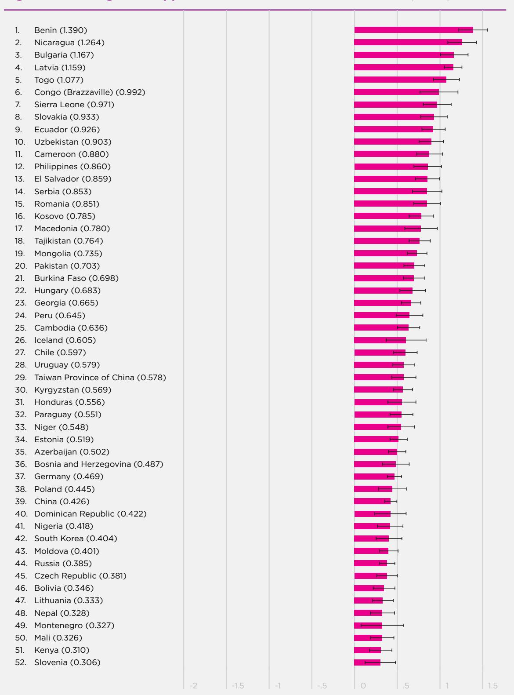

**Figure 2.8: Changes in Happiness from 2005-2008 to 2016-2018** (Part 2) 53. Mauritania (0.292) 54. Lebanon (0.285) 55. Palestinian Territories (0.279) 56. Chad (0.275) 57. Indonesia (0.240) 58. Zimbabwe (0.236) 59. Thailand (0.227) 60. Guatemala (0.223) 61. Turkey (0.218) 62. Burundi (0.212) 63. United Kingdom (0.137) 64. Portugal (0.129) 65. Kazakhstan (0.118) 66. Hong Kong SAR, China (0.100) 67. Finland (0.097) 68. Austria (0.094) 69. Ghana (0.090) 70. United Arab Emirates (0.090) 71. Senegal (0.088) 72. Albania (0.084) 73. Costa Rica (0.046) 74. Israel (0.045) 75. Norway (0.030) 76. Colombia (0.014) 77. Liberia (0.014) 78. Switzerland (0.007) 79. Netherlands (-0.028) 80. Argentina (-0.029) 81. Sri Lanka (-0.030) 82. Sweden (-0.035) 83. Armenia (-0.048) 84. Mexico (-0.051) 85. Kuwait (-0.055) 86. Uganda (-0.064) 87. Australia (-0.065) 88. Trinidad and Tobago (-0.071) 89. New Zealand (-0.109) 90. Iraq (-0.153) 91. Canada (-0.179) 92. Cyprus (-0.192) 93. Bangladesh (-0.195) 94. Haiti (-0.203) 95. Japan (-0.215) 96. Vietnam (-0.225) 97. Mozambique (-0.227) 98. Namibia (-0.246) 99. Brazil (-0.250) 100. Belarus (-0.257) 101. Belgium (-0.276) 102. France (-0.282) 103. Jamaica (-0.318) 104. Panama (-0.329)

Changes from 2005–2008 to 2016–2018 95% confidence interval

**Figure 2.8: Changes in Happiness from 2005-2008 to 2016-2018** (Part 3)

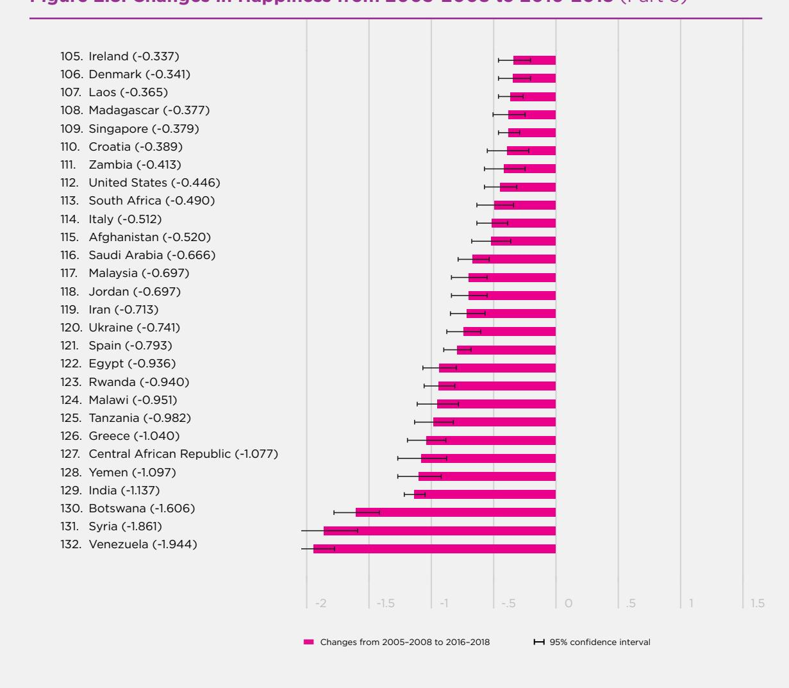

what was predicted. South Asia had the largest drop in actual life evaluations (more than 0.8 points on the 0 to 10 scale) while it was predicted to have a substantial increase. Since these regional averages are weighted by national populations, the South Asian total is heavily influenced by the Indian decline of more than 1.1 points. Sub-Saharan Africa was predicted to have a substantial gain, while the actual increase was much smaller. Latin America was predicted to have a small gain, while it shows a population-weighted actual drop of the same size. The MENA region was predicted to be a gainer, and instead lost 0.52 points. The countries of Western Europe were predicted to have no change, but instead experienced a small reduction. For the remaining regions, the predicted and actual changes were in the same direction, with the substantial reductions in the United States (the largest country in the NANZ group) being larger than predicted. As Figure 42 and Table 31 show in Statistical Appendix 1, changes in the six factors are not very successful in capturing the evolving patterns of life over what have been tumultuous times for many countries. Nine of the ten regions were predicted to have 2016-2018 life evaluations higher than in 2005-2008, but only half of them did so. In general, the ranking of regional predicted changes matched the ranking of the actual changes, despite typical experience being less favorable than predicted. The notable exception is South Asia, which experienced the largest drop, contrary to predictions.

On a country-by-country basis, the actual changes from 2005-2008 to 2016-2018 are on average much better predicted than on a regional basis, with a correlation of 0.50, as shown in Figure 41 in Statistical Appendix 1. This difference can be traced to the great variety of experiences within regions, many of which were predicted reasonably well on a national basis, and by the presence of some very large countries with substantial prediction errors, India being the largest example.

#### **Changes in Governance**

Government institutions and policies set the stages on which lives are lived. These stages differ largely from country to country, and are among primary factors influencing how highly people rate the quality of their lives. The importance of national institutions and living conditions was

shown forcefully in *World Happiness Report 2018*, which presented happiness rankings for immigrants and the locally born, and found them to be almost exactly the same (a correlation of +0.96 for the 117 countries with a sufficient number of immigrants in their sampled populations). This was the case even for migrants coming from source countries with life evaluations less than half as high as in the destination country.

The evidence from the happiness of immigrants and the locally born suggests strongly that the large international differences in average national happiness documented in this report depend primarily on the circumstances of life in each country. These differences in turn invite explanation by factors that differ among nations, including especially institutions that are national in scope, among which governments are perhaps the most prominent examples.

It is natural, as public and policy attention starts to shift from GDP to broader measures of progress, and especially to how people value their lives, that there should be growing policy interest in knowing how government institutions and actions influence happiness, and in whatever changes in policies might enable citizens to lead happier lives.

#### **What is Good Government?**

At the most basic level, good government establishes and maintains an institutional framework that enables people to live better lives. Similarly, good public services are those that improve lives while using fewer scarce resources. How can the excellence of government be measured, and how can its effects on happiness be determined? There are two main possibilities for assessment, one very specific and the other at the aggregate level. The more specific approach is adopted in the *Global Happiness and Well-being Policy Reports*, while here we shall take a more aggregate approach using the national happiness data that lie at the core of the *World Happiness Reports*.

Created in response to growing interest in the policy relevance of happiness, the *Global Happiness and Well-being Policy Reports* aim to find and evaluate best-practice examples from around the world on how government policies in specific

areas could be redesigned to support happier lives. The just-released *Global Happiness and Well-being Policy Report 2019*, 27 for example, contains surveys of happiness-oriented policy interventions in specific areas of public policy – in particular education, health, work and cities – as well as on topics of cross-cutting importance, such as personal happiness28 and the metrics and policy frameworks29 needed to support policies for well-being. These policy surveys show that what counts as good governance is specific to each policy area. Within each ministry or subject area there are specific targets that are the primary focus of attention, including mainly medical and cost outcomes in health care,30 academic achievement and completion in education,31 productivity and job satisfaction in the workplace,32 reduced crime and incarceration rates in justice, and a range of specific indicators of the quality of city life.33 The happiness lens is then used to find those policies that achieve their traditional objectives in the most happinesssupporting ways. This kind of specific focus is probably the most effective way to move from a general interest in using happiness as a policy objective to the development of cost-effective ways of delivering happiness. One major common element in the chapters of *Global Happiness and Well-being Policy Report 2019* is the use of results from happiness research to establish the relative importance of a variety of outcomes long considered important but not readily comparable. As advocated by Chapter 634 in *World Happiness Report 2013*, developed in more detail in a recent paper35 for the UK Treasury, and exemplified by the happiness-based policy evaluation tool in Dubai, and in the health chapter36 of *Global Happiness and Well-being Policy Report 2019*, this involves expanding traditional methods for estimating the cost-effectiveness of policies to make happier lives the objective. Seen from this perspective, good governance would be defined in terms of the methods used and results obtained, both for traditional policy objectives and the happiness of all participants.

There is another way of assessing different government structures and policies. This is done at a more aggregate level by using a number of national-level indicators of the quality of governance to see how well they correlate with levels and changes in national average life evaluations. There are now many examples of

this sort of research. We consider here some of the effects of government structure and behavior on average national happiness, while Chapter 3 considers how happiness affects voting behavior.

Our own analysis in Table 2.1 provides one example of the effects of government via its estimate of the links between corruption and life satisfaction, holding constant some other key variables, including income, health, social support, a sense of freedom and generosity, all of which themselves are likely to be affected by the quality of government. Unpacking these channels convincingly is not possible using the aggregate data available, since there is too much in play to establish strong evidence of causality, and many of the system features held to be of primary importance, for example the rule of law, tend to take long to establish, thereby reducing the amount of evidence available.

Hence any conclusions reached are likely to be suggestive at best, and have also been found to be more evident in some countries and times than in others. For example, a number of studies have divided the World Bank's37 six main indicators of governmental quality into two groups, with the four indicators for effectiveness, rule of law, quality of regulation, and control of corruption combined to form an index of the quality of delivery, and the two indicators for voice and accountability and for political stability and absence of violence combined to form an index of the democratic quality of government.

Previous studies comparing these two indexes as predictors of life evaluations have found that quality of delivery is more important than the democracy variable, both in studies across countries38 and in ones that include country-fixed effects, so that the estimated effects are based on changes in governance quality within each country.39 These latter results are more convincing, since they are uninfluenced by cross-country differences in other variables, and have the capacity to show whether significant changes in the quality of government can happen within a policy-relevant time horizon. These studies made use of data from the World Values Survey and from the Gallup World Poll, but were based on shorter sample periods. For this chapter we replicated earlier analysis based on the GWP data for 2005-2012 but now using the longest sample with available data for life evaluations

and for the indicators of government quality, covering 2005-2017. The results are shown in Table 10 in Statistical Appendix 2. The core results continue to show that delivery quality has a significant positive effect on average life evaluations with or without accounting for the effects flowing through the higher levels of GDP per capita made possible by government regulations and services that are more efficient, more configured to match the rule of law, and less subject to corruption. The estimated magnitude of the more convincing results, which are the ones based on within-country changes in governance quality, is substantial. For example, a previous study found that "the ten most-improved countries, in terms of delivery quality changes between 2005 and 2012, when compared to the ten countries with most worsened delivery quality, are estimated to have higher average life evaluations by one tenth of the overall life evaluation gap between the world's most and least happy ten countries."40 In other words, the estimated effect of the divergence in governance quality on life evaluations was about 0.4 points on the 0 to 10 scale. We have been able to confirm that previous result with data now covering twice as long a time period, as shown in Table 22 in Statistical Appendix 2.

To extend our analysis into other aspects of governance, we have assembled data to match our mix of country-years for several variables that have either been used as measures of the quality of governance, or can been seen to reflect some aspects of governmental quality. One question of perennial research and policy interest is whether people are happier living in political democracies. Our earlier research based on World Values Survey data and shorter samples of Gallup World Poll data found that delivery quality was always more important than the measure of democratic quality, whether or not the analysis included country fixed effects, which help to make the results more convincing. This is still borne out in our doubled sample length for the Gallup World Poll (Table 10, Appendix 2). We also found in earlier research that if the sample was split between countries with higher and lower governmental effectiveness, that increases in the extent of democracy had positive life satisfaction effects in those countries with effective governments, but not in countries with less effective governments.41 But this interaction

effect disappears in the new longer sample, where we find that changes in the quality of delivery have equally large and significant effects on life evaluations, and changes in democratic quality have no significant effects, whatever the average state of delivery quality.42

Tables 12 to 15 in Statistical Appendix 2 test whether changes in a variety of other measures of governmental quality contribute to changes in life evaluations. None show significant effects with one notable exception. Changes in the Gallup World Poll's measure of confidence in government do contribute significantly to life evaluations, as shown in Table 13 of Statistical Appendix 2. To some extent, this variable might be thought to reflect a measure of satisfaction with a particular life domain, much as was shown in Figure 1.1 for Mexico in Chapter 1.

Tables 16 to 18 of Statistical Appendix 2 look for linkages between average life evaluations and a number of government characteristics including different forms of democratic institutions, social safety net coverage, and percent of GDP devoted to education, healthcare and military spending.43 The only characteristics that contribute beyond what is explained by the six variables of Table 2.1 and regional fixed effects are the shares of GDP devoted to healthcare and military spending, the former having a positive effect and the latter a negative one.44

It is noteworthy that many countries with low average life evaluations, and with life evaluations much lower than would be predicted by the standard results in Table 2.1, have been subject to internal and external conflicts. Such conflicts can in part be seen as evidence of bad governance, and have no doubt contributed to bad governance elsewhere. In any event, they are almost surely likely to lead to low life evaluations.45 For example, freedom from violence is part of one of the World Bank's six indicators for the quality of governance, and several of the countries among those ranked as least happy in Figure 2.7 are or have been subject to fatal political violence. We have assembled data for several measures of internal and international conflict, and have found evidence that conflict is correlated with lower life evaluations, sometimes beyond what is already captured by the variables for income, health, freedom, social support, generosity and corruption. The Uppsala data for death rates

from armed conflicts, non-state conflicts and one-sided violence are negatively correlated with life evaluations, but also with GDP per capita, the World Bank's democracy variables, and both freedom and social support. These correlations are almost unchanged if put on a within-country change basis, as can been seen by comparing Tables 2 and 3 in Statistical Appendix 2. The estimated impact of conflict deaths on average life evaluations is especially great in the 14 countries where conflict deaths have in one or more years been above the 90th percentile of the distribution of positive death rates by year from 2005 to 2017.46 But even here they add little additional explanatory power once allowance is made for all the other variables in Table 2.1.

Somewhat stronger results are obtained by using the Global Peace Index assessing 163 countries in three domains: the level of societal safety and security, the extent of ongoing domestic and international conflict, and the degree of militarisation. The index (which is defined as if it were a conflict variable, so that a more peaceful country has a lower value) is negatively correlated with average life evaluations in both levels and changes from 2008 to 2016-2018.47 The effect of withincountry changes in the peace index remains significant even when changes in GDP and the rest of the six key variables are included, with a change of 0.5 in the peace index (about 1 standard deviation) estimated to alter average life evaluations by 0.15 points on the 0 to 10 scale, a value equivalent to a change of more than 15% in per capita GDP.48

#### **Conclusions**

This chapter has had a special focus on how several measures of happiness, and of its contributing factors, have changed over the 2005 to 2018 period covered by the Gallup World Poll. We started by tracing the trajectories of happiness, and its distribution, primarily based on annual population-weighted averages for the world as a whole and for its ten constituent regions. This was followed by our latest ranking of countries according to their average life evaluations over the previous three years, accompanied this year by comparable rankings for positive and negative affect, for six key factors used to explain happiness, and for happiness inequality. We then presented

2005-2008 to 2016-2018 changes in life evaluations, positive and negative affect, and the key variables supporting life evaluations. Finally, we considered different ways in which the nature and quality of government policies and institutions can influence happiness.

At a global level, population-weighted life evaluations fell sharply during the financial crisis, recovered completely by 2011, and fell fairly steadily since to a 2018 value about the same level as its post-crisis low. This pattern of falling global life evaluations since 2011 was driven mainly by what was happening in the five countries with the largest populations, and especially India, which has had a post-2011 drop of almost a full point on the 0 to 10 scale. Excluding the five largest countries removes the decline, while an unweighted average of the country scores shows a significant rise since 2016. Positive emotions show no significant trends by either weighted or unweighted measures. Negative emotions show the most dramatic global trends, rising significantly by both global measures. Global inequality of well-being has been fairly constant between countries while rising within countries.

These global movements mask a greater variety of experiences among and within global regions. There continues to be convergence of life evaluations among the three main regions of Europe. In Asia, divergence among the regions is more evident. All three parts of Asia had roughly comparable life evaluations in the 2006-2010 period, but since then life evaluations have generally risen in East and Southeast Asia and fallen in South Asia, with a gap building to more than 1 point on the 0 to 10 scale by 2018. Since 2013, life evaluations have risen by 0.4 points in Sub-Saharan Africa and fallen by 0.4 points in the Middle East and North Africa, finishing in 2018 at roughly equal levels. In Latin America, life evaluations rose by half a point to 2013, and have fallen slightly more than that since, while in the North America plus Australia and New Zealand group, with population dominated by the United States, life evaluations have fallen by roughly 0.3 points from the beginning to the end of the period.

What about well-being inequality? Since 2012, the mid-point of our data period, well-being inequality has fallen insignificantly in Western

Europe and Central and eastern Europe, while increasing significantly in most other regions, including especially South Asia, Southeast Asia, Sub-Saharan Africa, the Middle East and North Africa, and the CIS (with Russia dominating the population total).

The rankings of country happiness are based this year on the pooled results from Gallup World Poll surveys from 2016-2018, and continue to show both change and stability. As shown by our league tables for happiness and its supports, the top countries tend to have high values for most of the key variables that have been found to support well-being: income, healthy life expectancy, social support, freedom, trust and generosity, to such a degree that year to year changes in the top rankings are to be expected. With its continuing upward trend in average scores, Finland consolidated its hold on first place, ahead of an also-rising Denmark in second place.

Then for each country, we showed that average changes in life evaluations from the earliest years of the Gallup World Poll (2005-2008) to the three most recent years (2016-2018). Most countries show significant changes, with slightly more gainers than losers. The biggest gainer was Benin, up 1.4 points and 50 places in the rankings. The biggest life evaluation drops were in Venezuela and Syria, both down by about 1.9 points.

We turned finally to consider the ways in which the quality of government, and the structure of government policies, influence happiness. The effects were seen to be easier to trace in specific policy areas, but also showed up in aggregate measures of governmental quality, whether based on citizen perceptions or the quality indicators prepared by the World Bank. Among these latter measures, the greatest impact still appears to flow from the quality of policy delivery, including the control of corruption. Finally, making use of international data measuring peace and conflict, countries able to reduce conflict and achieve peace were estimated to become happier places to live.

#### **Endnotes**

- 1 Though the Gallup World Poll started in 2005 with an initial 27 countries, the first full wave was not completed until 2006. We thus merge the survey data for 2005 and 2006 for presentation in all our figures based on annual data. For simplicity, the 2005-2006 wave is labeled as 2006 in figures.
- 2 These results may all be found in Figure 2.1 of *World Happiness Report 2018*.
- 3 Gallup weights sum up to the number of respondents from each country. To produce weights adjusted for population size in each country, we first adjust the Gallup weights so that each country has the same weight (one-country-onevote) in each period. Next we multiply total population aged 15+ in each country by the one-country-one-vote weight. Total population aged 15+ is equal to the total population minus the amount of population aged 0-14. Data are mainly taken from WDI released by the World Bank in January 2019. Specifically, the total population and the proportion of population aged 0-14 are taken from the series "Population ages 0-14 (percent of total)" and "Population, total" respectively from WDI. Population data in 2018 is not available yet, so we use the population growth rate in 2017 and population in 2017 to predict the population in 2018. There are a few regions lacking data in WDI, such as Somaliland, Kosovo, and Taiwan Province of China. In the case of Taiwan, we use the data provided by its statistical agency. Other countries/regions without population are not included in the calculation of world or regional trends. There were some countries which didn't have surveys in certain years. In this case, we use the survey in the closest year to interpolate them.
- 4 Together, these five countries comprised almost half of the 2017 global population of 7550 million. The individual country percentages of global population in 2017 were China 18.4%, India 17.7%, United States 4.3%, Indonesia 3.5% and Brazil 2.8%.
- 5 The countries in each region are listed in Table 33 of Statistical Appendix 1.
- 6 See, for example, Atkinson (2015), Atkinson and Bourguignon (2014), Kennedy, Lochner, and Prothrow-Stith (1997), Keeley (2015), OECD (2015), Neckerman and Torche (2007), and Piketty (2014).
- 7 See Helliwell, Huang, and Wang (2016). See also Goff, Helliwell, and Mayraz (2018), Gandelman and Porzekanski (2013), and Kalmijn and Veenhoven (2005).
- 8 See, for example, Evans, Barer, and Marmor (1997), Marmot, Ryff, Bumpass, Shipley, and Marks (1994), and Marmot (2005).
- 9 See Goff et al. (2018) for estimates using individual responses from several surveys, including the Gallup World Poll, the European Social Survey, and the World Values Survey.
- 10 The statistical appendix contains alternative forms without year effects (Table 14 of Appendix 1), and a repeat version of the Table 2.1 equation showing the estimated year effects (Table 9 of Appendix 1). These results confirm, as we would hope, that inclusion of the year effects makes no significant difference to any of the coefficients.
- 11 As shown by the comparative analysis in Table 8 of Appendix 1.
- 12 The definitions of the variables are shown in Technical Box 1, with additional detail in the online data appendix.

- 13 This influence may be direct, as many have found, e.g. De Neve, Diener, Tay, and Xuereb (2013). It may also embody the idea, as made explicit in Fredrickson's broaden-and-build theory (Fredrickson, 2001), that good moods help to induce the sorts of positive connections that eventually provide the basis for better life circumstances.
- 14 See, for example, Danner, Snowdon, and Friesen (2001), Cohen, Doyle, Turner, Alper, and Skoner (2003), and Doyle, Gentile, and Cohen (2006).
- 15 These are Syria, Qatar and Bhutan. There are two reasons for thinking the 2015 Bhutan score may be an under-estimate for 2016-2018 happiness. One is that large-scale Bhutanese surveys asking happiness questions have revealed a rising trend. The other is that the SWL average from the 2015 Bhutanese survey is significantly higher than would be expected by comparison with other countries with answers available for both SWL and the Cantril ladder. The eighth round (2016-2017) of the European Social Survey (ESS) asked the life satisfaction question in 23 European countries that are also included in the Gallup World Poll, permitting an approximate relation to be estimated between national average scores for life satisfaction and the Cantril ladder. For the 23 countries, the cross-sectional correlation between SWL and ladder averages for 2016-2017 is 0.88. Using these data to interpolate a ladder equivalent for the Bhutan 2015 survey SWL average of 6.86 gives 6.40 as an equivalent ladder score. This ladder estimate is substantially higher than the Gallup estimate for Bhutan in 2015 of 5.08.
- 16 We put the contributions of the six factors as the first elements in the overall country bars because this makes it easier to see that the length of the overall bar depends only on the average answers given to the life evaluation question. In *World Happiness Report 2013* we adopted a different ordering, putting the combined Dystopia+residual elements on the left of each bar to make it easier to compare the sizes of residuals across countries. To make that comparison equally possible in subsequent *World Happiness Reports*, we include the alternative form of the figure in the online Statistical Appendix 1 (Appendix Figures 7-9).
- 17 These calculations are shown in detail in Table 16 of online Statistical Appendix 1.
- 18 The prevalence of these feedbacks was documented in Chapter 4 of *World Happiness Report 2013*, De Neve, Diener, Tay, and Xuereb (2013).
- 19 The coefficients on GDP per capita and healthy life expectancy were affected even less, and in the opposite direction in the case of the income measure, being increased rather than reduced, once again just as expected. The changes were very small because the data come from other sources, and are unaffected by our experiment. However, the income coefficient does increase slightly, since income is positively correlated with the other four variables being tested, so that income is now able to pick up a fraction of the drop in influence from the other four variables. We also performed an alternative robustness test, using the previous year's values for the four survey-based variables. This also avoided using the same respondent's answers on both sides of the equation, and produced similar results, as shown in Table 13 of Statistical Appendix 1 in *World Happiness Report 2018*. The Table 13 results are very similar to the split-sample results shown in Tables 11 and 12, and all three tables give effect sizes very similar to

- those in Table 2.1 in reported in the main text. Because the samples change only slightly from year to year, there was no need to repeat these tests with this year's sample.
- 20 This footprint affects average scores by more for those countries with the largest immigrant shares. The extreme outlier is the United Arab Emirates (UAE), with a foreignborn share exceeding 85%. The UAE also makes a distinction between nationality and place of birth, and oversamples the national population to obtain larger sample sizes. Thus, it is possible in their case to calculate separate average scores 2016-2018 for nationals (7.10), the locally born (6.95), and the foreign-born (6.78). The difference between the foreign-born and locally-born scores is very similar to that found on average for the top 20 countries in the 2018 rankings. Compared to other countries' resident populations, UAE nationals rank 14th at 7.10.
- 21 These calculations come from Table 17 in Statistical Appendix 1.
- 22 The data are shown in Table 17 of Statistical Appendix 1. Annual per capita incomes average \$47,000 in the top 10 countries, compared to \$2,100 in the bottom 10, measured in international dollars at purchasing power parity. For comparison, 94% of respondents have someone to count on in the top 10 countries, compared to 58% in the bottom 10. Healthy life expectancy is 73 years in the top 10, compared to 55 years in the bottom 10. 93% of the top 10 respondents think they have sufficient freedom to make key life choices, compared to 63% in the bottom 10. Average perceptions of corruption are 35% in the top 10, compared to 72% in the bottom 10.
- 23 Actual and predicted national and regional average 2016-2018 life evaluations are plotted in Figure 40 of Statistical Appendix 1. The 45-degree line in each part of the Figure shows a situation where the actual and predicted values are equal. A predominance of country dots below the 45-degree line shows a region where actual values are below those predicted by the model, and vice versa. East Asia provides an example of the former case, and Latin America of the latter.
- 24 For example, see Chen, Lee, and Stevenson (1995).
- 25 One slight exception is that the negative effect of corruption is estimated to be slightly larger, although not significantly so, if we include a separate regional effect variable for Latin America. This is because corruption is worse than average in Latin America, and the inclusion of a special Latin American variable thereby permits the corruption coefficient to take a higher value.
- 26 The variables used for ranking in this table are the same as those used for regressions in Table 2.1.
- 27 The *Global Happiness and Well-being Policy Report 2019*, which was released in February, 2019, is published by the Sustainable Development Solutions Network, and may be found on line at http://www.happinesscouncil.org.
- 28 See Diener & Biswas-Diener (2019).
- 29 See Durand & Exton (2019).
- 30 See Peasgood et al. (2019).
- 31 See Seligman & Adler (2019).
- 32 See Krekel et al. (2019).
- 33 See Bin Bishr et al. (2019).
- 34 See O'Donnell (2013), and the Technical Appendix to O'Donnell et al. (2014).

- 35 See Frijters & Layard (2018).
- 36 See Peasgood et al. (2019).
- 37 See Kraay et al. (1999) and Kaufman et al. (2009). The latest data are included in the on-line data files.
- 38 See Helliwell & Huang (2008) and Ott (2010).
- 39 See Helliwell, Huang, Grover & Wang (2018).
- 40 See Helliwell, Huang, Grover & Wang (2018, p.1345).
- 41 The result is presented in Helliwell, Hung, Grover and Wang (2108), and confirmed in columns 7 and 8 of Table 11 in Statistical Appendix 2, using the Gallup World Poll data from 2005 through 2012.
- 42 These results are shown in Columns 1 and 2 of Table 11 in Statistical Appendix 2.
- 43 Because of the limited year-to-year variation of these features within countries, the estimates are done using the same estimation framework as in Table 2.1, with year fixed effects generally included and also regional fixed effects in Table 17.
- 44 As shown in column 12 of Table 17 in Statistical Appendix 2. The completeness of social safety net coverage has a positive effect that drops out in more fully specified models including GDP per capita and the shares spent for health and military spending, as shown in columns 10-12 of Table 17.
- 45 For evidence in the case of Ukraine, see Coupe & Obrizan (2016). The authors also show that the happiness effects of conflict are found especially within the parts of the country directly affected by conflict.
- 46 The results are shown in Table 19 of Statistical Appendix 2, and the list of 14 countries is in Table 20. Syria must be treated as a special case, as it is not represented in the Uppsala data. The dramatic effects of the conflict in Syria are revealed by the annual data in Figure 5 of Statistical Appendix 1.
- 47 The correlations are -0.51 for the levels and -0.20 for the changes, as shown in Figures 1 and 2, respectively, in Statistical Appendix 2. See also Welsch (2008).
- 48 The calculation is based on the results shown in column 9 of Table 21 in Statistical Appendix 2.

#### **References**

Atkinson, A.B. (2015). *Inequality: What can be done?* Cambridge: Harvard University Press.

Atkinson, A. B., & Bourguignon, F. (2014). *Handbook of income distribution* (Vols. 2A &2B). Elsevier.

Bin Bishr, A., al-Azzawi, A. et al. (2019). Happy Cities Agenda. In Global Happiness Council, *Global Happiness and Well-being Policy Report 2019*, *112-139*. http://www.happinesscouncil.org

Blanchflower, D. G., Bell, D. N., Montagnoli, A., & Moro, M. (2014). The happiness trade-off between unemployment and inflation. *Journal of Money, Credit and Banking*, *46*(S2), 117-141.

Chen, C., Lee, S. Y., & Stevenson, H. W. (1995). Response style and cross-cultural comparisons of rating scales among East Asian and North American students. *Psychological Science*, *6*(3), 170-175.

Cohen, S., Doyle, W. J., Turner, R. B., Alper, C. M., &Skoner, D. P. (2003). Emotional style and susceptibility to the common cold. *Psychosomatic Medicine*, *65*(4), 652-657.

Coupe, T., & Obrizan, M. (2016). The impact of war on happiness: The case of Ukraine. *Journal of Economic Behavior & Organization*, *132*, 228-242.

Danner, D. D., Snowdon, D. A., & Friesen, W. V. (2001). Positive emotions in early life and longevity: findings from the nun study. *Journal of Personality and Social Psychology*, *80*(5), 804.

De Neve, J. E., Diener, E., Tay, L., &Xuereb, C. (2013). The objective benefits of subjective well-being. In J. F. Helliwell, J.F., Layard, R. & Sachs, J. (Eds.), *World Happiness Report 2013*  (pp. 54-79). New York: UN Sustainable Development Solutions Network.

Diener, E., & Biswas-Diener, R. (2019). Well-being interventions to improve societies. In Global Happiness Council, *Global Happiness and Well-being Policy Report 2019*, 95-110. http://www.happinesscouncil.org

Doyle, W. J., Gentile, D. A., & Cohen, S. (2006). Emotional style, nasal cytokines, and illness expression after experimental rhinovirus exposure. *Brain, Behavior, and Immunity*, *20*(2), 175-181.

Durand, M., & Exton, C. (2019). Adopting a well-being approach in central government: Policy mechanisms and practical tools. In Global Happiness Council, *Global Happiness and Well-being Policy Report 2019*, 140-162. http://www.happinesscouncil.org

Evans, R. G., Barer, M. L., & Marmor, T. R. (Eds.) (1994). *Why are some people healthy and others not? The determinants of the health of populations*. New York: De Gruyter.

Fredrickson, B. L. (2001). The role of positive emotions in positive psychology: The broaden-and-build theory of positive emotions. *American Psychologist*, *56*(3), 218-226.

Frijters, P., & Layard, R. (2018). Direct well-being measurement and policy appraisal: a discussion paper. London: LSE CEP Discussion Paper.

Gandelman, N., & Porzecanski, R. (2013). Happiness inequality: How much is reasonable? *Social Indicators Research*, *110*(1), 257-269.

Goff, L., Helliwell, J., & Mayraz, G. (2018).Inequality of subjective well-being as a comprehensive measure of inequality. *Economic Inquiry 56*(4), 2177-2194.

Helliwell, J. F., Huang, H., & Wang, S. (2018). New evidence on trust and well-being. In Uslaner, E.M., Ed. *The Oxford Handbook of Social and Political Trust*. New York: Oxford University Press, 409-446.

Helliwell, J. F., Huang, H., Grover, S., & Wang, S. (2018). Empirical linkages between good governance and national well-being. *Journal of Comparative Economics* 46(4), 1332-1346.

Kalmijn, W., & Veenhoven, R. (2005). Measuring inequality of happiness in nations: In search for proper statistics. *Journal of Happiness Studies*, *6*(4), 357-396.

Kaufmann, D., Kraay, A., & Mastruzzi, M. (2009). *Governance matters VIII: Aggregate and individual governance indicators 1996-2008*. The World Bank.

Kawachi, I., & Berkman, L. (2000). Social cohesion, social capital, and health. In L. F. Berkman & I. Kawachi (Eds.), *Social epidemiology* (pp. 174-190). New York: Oxford University Press.

Kawachi, I., Kennedy, B. P., Lochner, K., & Prothrow-Stith, D. (1997). Social capital, income inequality, and mortality. *American Journal of Public Health*, *87*(9), 1491-1498.

Keeley, B. (2015). *Income inequality: The gap between rich and poor*. OECD Insights, Paris: OECD Publishing.

Kraay, A., Zoido-Lobaton, P., & Kaufmann, D. (1999). Governance Matters. *Policy Research Working Paper 2196*. The World Bank: Washington, D.C.

Krekel, C., Ward, G. & De Neve, J.E. (2019). Employee wellbeing, productivity and firm performance: Evidence and case studies. In Global Happiness Council, *Global Happiness and Well-being Policy Report 2019*, 73-94. http://www.happinesscouncil.org

Marmot, M. (2005). Social determinants of health inequalities. *The Lancet*, *365*(9464), 1099-1104.

Marmot, M., Ryff, C. D., Bumpass, L. L., Shipley, M., & Marks, N. F. (1997). Social inequalities in health: Next questions and converging evidence. *Social Science & Medicine*, *44*(6), 901-910.

Neckerman, K. M., & Torche, F. (2007). Inequality: Causes and consequences. *Annual Review of Sociology*, *33*, 335-357.

O'Donnell, G. (2013). Using well-being as a guide to policy. In Helliwell, J.F., Layard, R. & Sachs, J. (Eds.), *World happiness report 2013* (pp. 98-110). New York: UN Sustainable Development Solutions Network.

O'Donnell, G., Deaton, A., Durand, M., Halpern, D., & Layard, R. (2014). *Well-being and policy*. Legatum Institute.

OECD (2015). *In it together: Why less inequality benefits all*. Paris: OECD Publishing. DOI: http://dx.doi. org/10.1787/9789264235120-en.

OECD (2017). *How's life? Measuring well-being*. Paris: OECD Publishing

Ott, J. C. (2010). Good governance and happiness in nations: Technical quality precedes democracy and quality beats size. *Journal of Happiness Studies*, *11*(3), 353-368.

Ott, J. (2018). Measuring economic freedom: Better without size of government. *Social Indicators Research*, *135*(2), 479-498.

Peasgood, T., Foster, D., & Dolan, P. (2019). Priority setting in healthcare through the lens of happiness. In Global Happiness Council, *Global Happiness and Well-being Policy Report 2019*, 27-52. http://www.happinesscouncil.org

Piketty, T. (2014). *Capital in the 21st Century*. Cambridge: Harvard University Press.

Seligman, M, &Adler, A. (2019). Positive Education 2019. In Global Happiness Council, *Global Happiness and Well-being Policy Report 2019*, 53-72. http://www.happinesscouncil.org

Welsch, H. (2008). The social costs of civil conflict: evidence from surveys of happiness. *Kyklos*, *61*(2), 320-340.

# Chapter 3 **47**

# Happiness and Voting Behaviour

George Ward

Massachusetts Institute of Technology

#### **Introduction**

The idea that policymakers should aim for something beyond GDP is far from new, but it has regained prominence in recent years. A growing contingent of governments and international organisations are beginning to focus their attention on the "happiness" or subjective well-being (SWB) of citizens.1 Some governments now produce national well-being statistics, while many others also go further and use SWB data and research to inform their policymaking decisions. Despite this nascent change in the way many governments are going about the way they formulate and evaluate public policy, relatively little is currently known about the ways in which the SWB of citizens influences their behaviour in the political sphere.

This chapter reviews some of the research on SWB and political behaviour, and assesses the evidence for some of the key questions that arise within the literature. For example, are happier people any more or less likely to engage with politics and, when it comes to it, turn out to vote? And if so, does their level of happiness influence whom they ultimately vote for? In particular, are happier people any likelier to vote to re-elect governing parties? And to what extent might levels of (un)happiness play a role in driving support for populist and authoritarian politicians?

One of the overarching themes that arises from the chapter is that although the existing literature on happiness and political behaviour is somewhat small, the issues nevertheless are of pressing significance for policy. In many ways, research in the social and behavioural sciences currently lags behind developments in the real world of government and public policy. Directions for future research abound and, in reviewing the small number of existing studies on SWB and voting, the discussion points towards various potentially fruitful directions for further investigation in the area.

Most of the existing literature on politics and happiness relates to the ways in which political institutions and processes affect people's well-being, thus treating happiness as an outcome (or dependent) variable. But much less is generally known about the effects of individual and societal happiness on political behaviour and outcomes. Many of the open questions involve happiness as

a causal force — an input (or independent) variable predicting and possibly producing political behaviours. It is on this issue that the chapter is focused.

A number of topics fall outside of the scope of the chapter. Principal among these is the aforementioned research into the effects *on* happiness of political processes and outcomes like democracy, participation, governance quality, and particular government programmes and policies.2 Likewise, the discussion leaves aside the issue of whether being a liberal or a conservative makes people any more or less happy,3 as well as the extent to which the winning and losing of elections affects the happiness of partisans.4 Equally, the discussion does not generally review the literatures on the correlates of satisfaction with democracy, emotional responses to specific candidates or the role of discrete emotions like fear, anger and hope in the political process,5 and focuses rather on the effects of core dimensions of subjective wellbeing like life satisfaction on political behaviour.

#### **Are happier people more likely to be engaged with politics?**

A large and long-running literature in political science has studied the determinants of political participation.6 Relatively little attention has been paid, however, to the extent to which subjective well-being is one of the factors influencing whether people vote in elections, or engage with politics in other ways such as donating time and money to political campaigns.

From a theoretical standpoint, one might imagine the effects of happiness on participation to be ambiguous. On the one hand, people who are more satisfied with their lives may feasibly disengage from politics, having already reached a level of comfortable apathy. In this sense, it has been speculated that raising happiness could lead to "an emptying of democracy".7 But on the other hand, a growing literature on the 'objective benefits of subjective well-being' has shown that happiness has important effects on a variety of pro-social behaviours.8 Happier people are, for example, more likely to volunteer in the community and donate money to charity. But does this translate also to engagement in the political sphere?

One answer to this question uses data from the American National Election Survey (ANES),9 which in 2000 for one year only included question asking respondents: "*In general, how satisfying do you find the way you're spending your life these days? Would you call it completely satisfying, pretty satisfying, or not very satisfying?*" The survey also included its regular questions on participation, including whether or not the respondent voted, contributed or worked for a political campaign, attended a rally, or engaged in other political behaviours.

The data on a sample of around 1,300 US citizens show a strong positive relationship between life satisfaction and turnout. This is true in the raw data, and remains the case when controlling for a wide range of confounding demographic factors typically known to drive turnout such as age, race, and education. Importantly, the association remains statistically and substantively significant over-and-above factors relating to political partisanship, ideology, and various measures of social capital such as inter-personal trust (which are themselves known to be well-correlated with SWB, as well as voting). In the authors' most restrictive specification, the estimated coefficient on life satisfaction suggests that being very satisfied, as opposed to not very satisfied, is associated with a 6.7 percentage point change in the probability of voting – a magnitude that rivals that of education.

Along the same lines, other research has shown that in the United States people who are depressed are less likely to vote.10 Further, it has also been found using survey research that in rural China there is a positive correlation between happiness and voting in local village elections.11 Using panel data from the United Kingdom, as people become happier over time, their propensity to vote also increases.12 A one-point increase in life satisfaction is associated with a 2% increase in the propensity to vote in an upcoming election. However, the magnitude of this association is reduced greatly by the inclusion of other background variables associated with the probability of voting.

What about other forms of participation, beyond voting? The ANES data suggest that happier people are also more likely to participate in politics in the United States in other ways like working on political campaigns and contributing

to political candidates. However, interestingly, there is no such significant relationship with more 'conflictual' forms of political activity like protesting.13 In German panel data that follows individuals from year-to-year, there is seemingly little systematic relationship between life satisfaction and non-voting forms of political participation.14

Although participation is perhaps the hitherto most studied outcome in the literature on the effects of happiness in the political sphere, there remains a great deal of room for further research in the area. In the first instance, there is a clear need for more empirical work using causal research designs. This may include laboratory and field experiments in which researchers directly seek to influence the SWB of randomly chosen groups or individuals, or take advantage of natural experiments occurring in the real world.

In addition, a great deal more theoretical development is needed in order to more clearly understand any observed empirical link between happiness and participation. For example, what are the main mechanisms we would expect to be driving this relationship? Given these mechanisms, would we expect the relationship to vary in different institutional contexts? Or in different political contexts? Or according to different elements of subjective well-being, such as positive and negative affect? Might we also expect different types of people (rich or poor, old or young, high or low education, and so on) to be differentially influenced by their well-being when it comes to making participation decisions? Are there reasons to expect the relationship to be linear, or might we expect non-linearities like a tail-off at high levels of satisfaction or happiness? This important theoretical work will surely also lead to further empirical work.

In beginning to investigate the generalisability of the relationships observed in the current literature, it is instructive to turn here briefly to the World Values Survey, a large cross-national survey including respondents from over 100 countries worldwide, in order to shed some initial empirical light on the issue. Here it is possible to investigate the basic relationship between happiness and individuals' self-reported "interest in politics". The question has been asked in 310 national surveys in 103 countries since the early 1980s, alongside a 4-point overall

**Figure 3.1: Happiness and Political Interest**

Source: Integrated Values Survey, 1981-2013. Binned scatter-plot shown, after adjusting for country fixed effects. Quadratic line of best-fit shown. "Interested in politics" is equal to 1 if the respondent is either 'somewhat' or 'very' interested in politics. Happiness is measured on a 1 to 4 scale. N=439,732 in 103 countries worldwide.

happiness question. Figure 3.1 shows that very unhappy people are more likely to be disengaged from politics.15 Happier people are more likely to be enageged, but this relationship flattens off at higher levels of happiness. Once a range of demographics such as education, marital status, age, and income quintiles are controlled for in a fuller regression specification, very happy people are around 9.3 percentage points more likely to be interested in politics than not at all happy people.16

### **Are happier people more likely to vote for incumbents?**

While it is interesting to study the extent to which happiness affects whether or not people vote, it is perhaps even more important to understand whether it influences whom they vote for. As has been documented in previous editions of the *World Happiness Report*, a number of countries around the globe have begun to see subjective well-being as a major policy goal.17 Do governments have any electoral motivation to do so?

For a long time, the main measure of government success has been GDP. Despite movements in the direction of going beyond such macroeconomic indicators, this is undoubtedly still the case for most if not all countries. One perfectly good reason for this focus is the extensive evidence that governments are much more likely to be re-elected when the economy is doing well. A truly vast empirical research literature going back several decades in economics and political science on "economic voting" has shown this to be the case.18 Economic voting is evident both at the individual level, where individuals with healthy household financial situations are more likely to profess a preference for governing parties. And also at the national level, where incumbent parties generally receive higher vote shares the more buoyant is the election-year economy.

The theoretical literature in political economy sharpens the (perhaps intuitive) point that by linking re-election chances to an outcome like the state of the economy, incumbent politicians are given powerful incentives to act on that set of issues.19 Elections can be seen as a device for voters to "control" politicians. Knowing they will only be re-elected if the economy is doing well, they will make sure to work hard to ensure that

this is the case, rather than spending their time, among other things, enriching themselves through corruption or pursuing pet projects that may be of little use to voters and what they care about.20

But what sort of incentives do politicians face exactly? If their re-election is dependent upon the economy above all else, it is not unreasonable for governments to concentrate their efforts there. But if their chances of re-election are tied to a broader set of outcomes, which might reasonably be measured using a more comprehensive measure of success like subjective well-being, then it follows that they will have strong incentives to focus their policymaking on individuals' broader well-being.

Since the early 1970s, the *Eurobarometer* series of opinion surveys has included a four-category question on respondents' overall life satisfaction, with answers ranging from "not at all" to "very" satisfied. Since the survey has taken place roughly twice a year, it is possible to link general election results to the national average life satisfaction of a country in the run-up to that election, and study the extent to which SWB is

a predictor of election results (alongside other more standard measures).21

In a paper examining a set of elections in 15 EU countries since 1973 it was found that, in the first place, the electoral fate of governing parties is significantly tied to the performance of the national economy. Using a standard model of economic voting, the data show that government vote share in these elections is associated positively with the election-year economic growth rate, and negatively with the unemployment rate.22

Over and above this, however, the study showed that national average life satisfaction is significantly related to the vote share subsequently received by parties that go into the election as part of the governing coalition. Figure 3.2 shows this relationship graphically. Having adjusted for country and year fixed effects (as well as set of variables standard to the economic voting literature such as party fractionalisation and the number of parties in government), there is a clear and significant positive relationship between national life satisfaction in the run-up to general elections and the subsequent electoral success

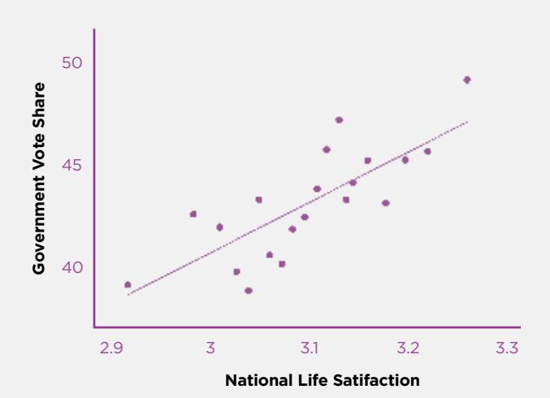

Source: Based on data from Ward (2015) on general elections in Europe, 1973-2014. Binned scatterplot is shown, having first adjusted both life satisfaction and government vote share for country and year fixed effects, as well as party fractionalisation, cabinet ideological disparity, prior government seat share, and the number of parties in government. National Happiness is the country-mean of the 1-4 life satisfaction question at the closest Eurobarometer survey prior to the election. Government vote share is the vote share collectively received by all of the parties in government going into the election

of governing parties. A one standard deviation increase in national life satisfaction is associated with nearly an 8 percentage-point increase in cabinet vote share. In a model including SWB together with the main macroeconomic indicators, one standard deviation increases in national life satisfaction and the economic growth rate are associated with roughly 6 and 3 percentage point gains for incumbent parties, respectively.

Figure 3.3 shows the fraction of the variance in cabinet party vote share that can be explained by a) national levels of life satisfaction in the months leading up to a general election and b) each of the standard macroeconomic indicators. In a bivariate regression, national SWB is able to account for around 9% of the variance in the incumbent vote within countries. Whereas economic growth—the more orthodox measure used in the literature on retrospective voting—explains around 6.5%.

While it is an interesting (partial) correlation, there is naturally a limit to what can be inferred from a cross-national regression of only 140 or so elections. One concern is that the finding may be an example of an 'ecological fallacy,' meaning, that despite this aggregate relationship, individual voters may not actually vote on the basis of their happiness. A further concern is that the three main macroeconomic indicators included in the regression (GDP growth, unemployment, and inflation) are measured with error and may not fully capture the state of the economy. Any remaining association of government vote share and SWB could simply reflect this unmeasured bit of economic performance, and thus not really tell us a great deal beyond what is already known from the extensive literature on economic voting. Moreover, a major worry when seeking to attach a causal interpretation to the association between SWB and incumbent voting is that that any observed empirical relationship may simply reflect 'reverse causality,' since people are known to be happier on average when their chosen political party is in power.23

However, an ingenious paper by Federica Liberini and her colleagues provides support for a causal interpretation of the happiness-to-voting link.24 They use longitudinal data from the British Household Panel Survey (BHPS), which follows individuals repeatedly on an annual basis. Between 1996 and 2008 the authors are able to track respondents' life satisfaction on a scale of 1-7

and also their support for governing parties. Each year people were asked whether they support or feel closer to a particular party (and, if not, which party they would vote for were there a general election tomorrow). Using a sample of 4,882 individuals, the authors estimate regression analyses predicting whether or not the respondent reports supporting a political party that was in power at the time of the survey.25 The data show a significant relationship between life satisfaction and incumbent support. This remains the case when looking withinindividuals over time, and thus controlling for a wide range of potentially confounding permanent factors between people (such as some elements of attitudes, personality, social class, and so on). Controlling for individual and year fixed effects as well as time-varying individual demographics like age and marital status, becoming satisfied with life (i.e. answering at least 5 out of 7) makes people around 1.9 percentage points more likely to support the incumbent party.

It is well established in the academic literature that happiness is influenced by economic circumstances. In the BHPS data household income and subjective financial situation (whether household finances have stayed the same, gotten better, or worse over the past year) are positively related to incumbent voting over time, as we would expect from the extensive prior literature on economic voting. However, even controlling for these financial factors, being satisfied with life makes people 1.6 percentage points more likely to support the incumbent.

Importantly, the authors also leverage an exogenous "shock" to people's happiness, which allows them to consider the relationship between SWB and voting in a quasi-experimental setting and ultimately attach a causal interpretation to the relationship. They observe the happiness and voting patterns of individuals who become widowed, an event which on the whole should not be directly attributable to the actions of incumbent government politicians.26 As can be seen in Figure 3.3, widowhood reduces both happiness and government support.27, 28

Taken together, the emerging evidence suggests that there is a causal relationship between happiness and incumbent voting. However, there remains a large amount of room and need for further research in the area.

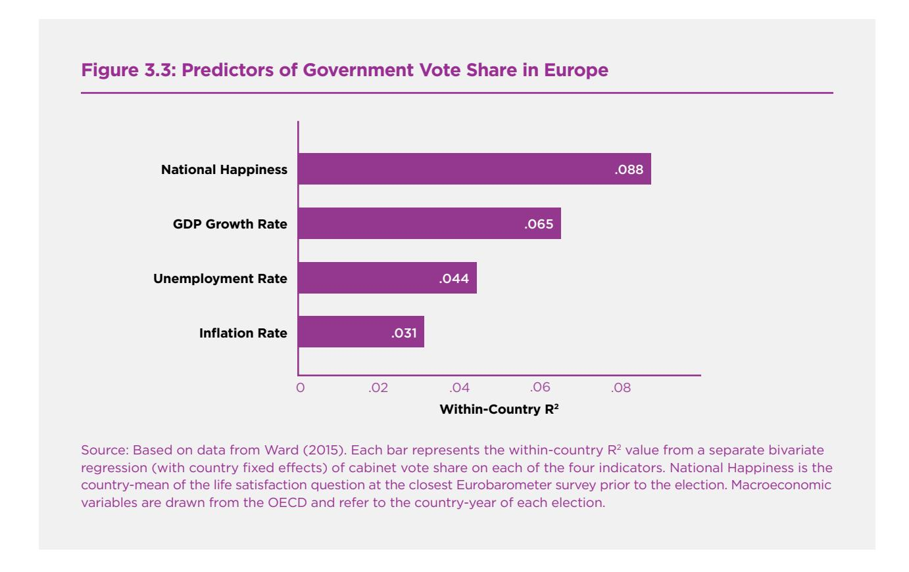

One obvious omission from the existing literature is the use of alternative measures of SWB. Currently the evidence shows a strong relationship between life satisfaction and voting (both the decision whether to vote and whom to vote for). But there may well be differences between evaluative SWB and more emotional measures such as positive and negative affect. A further dimension here is temporal – it may well be that people's subjective feelings about the future have a stronger role to play in determining voting behaviour than current SWB. Use, for example, of the "Cantril Ladder in 5 years" measure may be of interest to researchers in the coming years.

In general, a great deal more theoretical work is needed in order to better understand and rationalise existing findings (as well as to point towards directions for further empirical research). While studies have sketched formal models of retrospective voting in which voters observe their own well-being in order to update their beliefs about the quality of incumbent politicians,30 these are otherwise typically relatively standard political agency models. The principal difference is that the model and empirical work focuses on assessing the extent

to which the use of SWB as a proxy for (experienced) utility in the model tells us any more than using financial indicators as a proxy for the more standard notion of (decision) utility. However, in the future much more could be said about the ways in which the two may be expected to behave differently, as well as potentially interact with each other. The existing research suggests that both people's financial situation and their happiness have independent effects on their voting intentions. Thus one potential avenue for further theory could be to use a multitask framework where politicians face incentives to improve both the material and non-material well-being of voters.

Currently the literatures on i) SWB and participation and ii) SWB and incumbent voting are largely separate. Further research will likely synthesise these two processes, since ultimately the act of voting for a particular candidate is likely to be a two-step process. In the first step, people decide whether or not to vote. And in the second, they decide whom to vote for. Both may be equally important in determining electoral outcomes.

Another important area of empirical and theoretical development will likely seek to understand what might be thought of as a third (initial) step, "step

zero," in this progression, namely the process of attribution for outcomes. On the one hand, one might see a voter's decision to base their electoral choice on their level of happiness as a rational response to a substantive policy outcome (namely, their welfare under the current government). But on the other hand, evidence of well-being affecting voting could equally be seen as evidence of behavioural or emotional bias in the electoral process. One key question here is whether or not voters distinguish between policy-relevant and policy-irrelevant determinants of their SWB when it comes to making vote choices.31 One might imagine, for example, that people attribute losses in subjective well-being to government action but gains to their own efforts and actions.32

The evidence on widowhood suggests that people are to some extent not able or willing to filter relevant and irrelevant sources of happiness. Additional research suggests that incidental (i.e. non-relevant) mood can play a role in swinging political outcomes. For example, it has been shown in the United States that incumbents benefit in terms of vote share following local college football wins.33 In addition, rain has been shown to affect voting patterns in ballot propositions in Switzerland, with rainfall decreasing the vote shares for change.34 Further theoretical work is needed in order to determine the extent to which, and the conditions under which, this kind of behaviour weakens or strengthens the incentives faced by incumbent politicians.35 In other words, if people are using their well-being as a heuristic that helps them to update their beliefs about incumbents, when does and doesn't this lead them astray? Ultimately, the over-arching theoretical question to be addressed in this area is the extent to which happiness-based voting is likely to be welfare-enhancing overall.

## **Are unhappier people more likely to vote for populists?**

Populism is far from new.36 But the past decade has seen a significant rise in the prominence of populist political movements, particularly in Western Europe where parties like The League and Five Star Movement in Italy, Front National in France, and the AfD in Germany have gained

significant electoral ground, with some now having entered into governing coalitions at both the regional and national levels. Elsewhere, populist parties in countries like Austria, Greece, Hungary, Poland, the UK and further afield have also been rising to prominence and power.

There is no single definition of populism, making its measurement and empirical study problematic. Perhaps the key aspect of populist ideology, which spans various different definitions, is an anti-establishment worldview.37 Populist politicians typically distinguish between the virtue of "ordinary" people on the one hand, and the corrupt "elite" on the other. Related themes in the study of the recent rise in populism have also included a growth in the success of parties promoting nativist or nationalist sentiment, as well as an opposition to or rejection of cosmopolitanism and globalisation.38

An obvious question arises from this recent political trend: is this all a manifestation of rising levels of unhappiness? If pressed to describe one thing that brings these different political movements and parties together, one feature that stands out is that they all share a certain discontent, or unhappiness, with the status quo in their respective countries.

Yann Algan and his colleagues leverage a unique survey dataset of 17,000 French voters in the 2017 presidential election, which saw a radical redrawing of the French political landscape.39 Figure 3.4 shows the relationship in the data between life satisfaction and voting for Marine Le Pen's right-wing populist candidacy, which made it through to the second-round of voting. Happier individuals were much less likely to have voted for her, across all income levels. Indeed, of all of the main candidates, Le Pen voters were on average the least satisfied with life. Mélenchon voters were more satisfied, though not a great deal more so. However, voters of the two more establishment candidates, Macron and Fillon, had on average much higher life satisfaction.40 Ultimately, the research suggests that standard social and economic variables are not sufficient to explain or understand the rise in support for the far-right in France. The common factor among the disparate groups of Le Pen voters was their low levels of current subjective well-being, and a general sense of pessimism about the future.

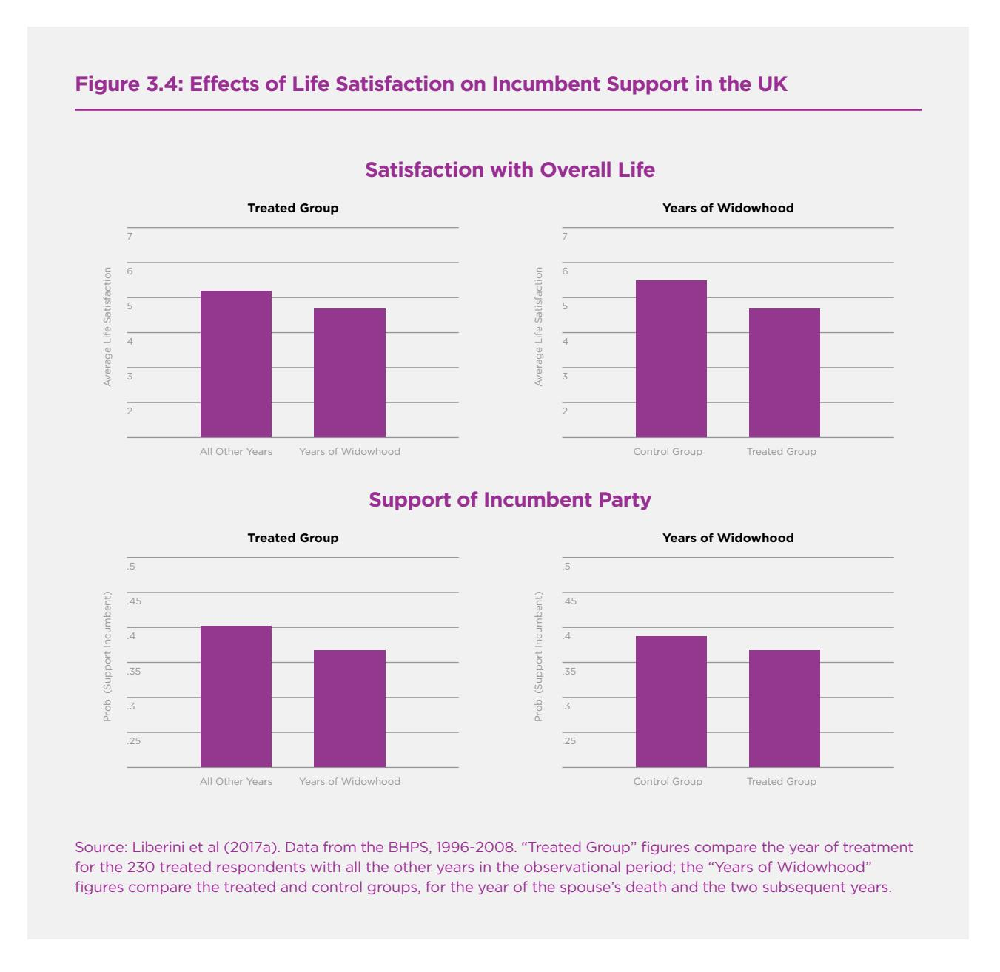

A growing number of studies have begun to examine the determinants of two other noteworthy electoral events in which populism is often said to have prevailed: the 2016 Brexit vote in the United Kingdom and the election of Donald Trump in the United States. Were these, again, instances of an unhappy populace venting its frustration with the establishment?

Eleonora Alabrese and colleagues use large-scale survey data in the UK Understanding Survey to assess the extent to which subjective well-being predicted the Brexit vote.41 Using a sample of around 13,000 respondents, they assess the extent to which a number of different variables at the individual and aggregate level are predictive

of leave voting. They find a strongly significant association between life satisfaction and leave support, those who were dissatisfied with life overall were around 2.5 percentage points more likely to answer yes to the question of whether the United Kingdom should leave the European Union. This is true both at the individual-level and at the aggregate local-authority level, where the percentage of people dissatisfied predicts the leave vote.

Federica Liberini and colleagues also use data from the UK Understanding Society survey to show the same thing: that, all else equal, people with lower levels of life satisfaction were more likely to be leave voters.42 However, they also

show that this unhappiness was not the main driver of leave support in the data, rather measures of subjective financial insecurity were able to explain more of the variance in support for the United Kingdom leaving the European Union.43

In the United States, Gallup has for the past decade surveyed a large random sample of US residents every day on a number of topics, including various aspects of their subjective well-being. Aggregating well-being measures like life satisfaction and the experience of different emotions day-to-day to the county-level, Jeph Herrin and colleagues find a strong correlation in the raw data between area-level SWB and shifts in the Republican vote share.44 Table 3.1 shows their main finding of a correlation between SWB and Trump voting. The authors split counties into 6 categories, according to the percentage point electoral shift from 2012 to 2016, and relate these to county-level SWB measures.45 As can be seen, a higher percentage of people placing themselves near the bottom of the Cantril ladder - both currently and in 5 years' time – is significantly associated with larger swings towards the Republican Party. In counties where the Romney to Trump swing was smaller than

-10 percentage points, only 3.4% of people were of low life satisfaction (0-4 on the 0-10 scale). But in strong Trump voting areas (where the swing was greater than 10 percentage points) this more than doubles to 7.1%.

Similarly, feelings of happiness, enjoyment, smiling and laughter were associated with smaller Republican swings. Perhaps surprisingly, negative emotions like stress, anger, and worry were not significantly associated with voting patterns. The results are highly suggestive, but more work is needed in order to assess the extent to which these patterns are more or less predictive of the election outcome than more standard economic and demographic factors,46 and, importantly, whether they contribute any explanatory power over-and-above such factors in a multivariate regression framework.

As yet, the evidence on SWB and populism is confined to a small number of (important) political events. To what extent do these findings translate to other countries and time periods? In order to attempt to shed some suggestive empirical light on the question of (un)happiness and populism (and/or authoritarianism), it is useful to turn to the World Values survey

**Table 3.1: Subjective Well-Being and the Election of Donald Trump**

| Swing to Republicans |        | Current Life Satisfaction       |         | Life Satisfaction in 5 Years |        |        |           | Experienced a lot yesterday |        |         |       |
|-------------------------|--------|------------------------------------|---------|------------------------------------|--------|--------|-----------|--------------------------------|--------|---------|-------|
| (2016-2012)             |        | % (0-4) % (7- 10) % (0-4) % (8-10) |         |                                    | Happy  | Stress | Enjoyment | Worry                          | Smile  | Sadness | Anger |
| lowest to - 10%         | 3.4    | 72.5                               | 4.5     | 71.7                               | 90.8   | 43.0   | 86.7      | 31.6                           | 82.0   | 16.1    | 13.9  |
| -10% to -5%             | 4.4    | 69.2                               | 4.3     | 69.1                               | 88.9   | 39.6   | 85.0      | 29.7                           | 82.3   | 17.5    | 14.5  |
| -5% to 0%               | 4.9    | 66.9                               | 5.1     | 67.2                               | 88.7   | 40.0   | 85.0      | 29.3                           | 81.3   | 17.2    | 14.5  |
| 0% to 5%                | 6.0    | 63.5                               | 6.2     | 63.6                               | 87.8   | 39.1   | 84.0      | 29.6                           | 79.9   | 18.3    | 14.5  |
| 5% to 10%               | 6.4    | 61.8                               | 7.4     | 59.9                               | 87.9   | 40.5   | 84.1      | 29.0                           | 78.4   | 18.2    | 14.5  |
| 10% to highest          | 7.1    | 60.9                               | 7.7     | 57.9                               | 86.5   | 40.4   | 83.1      | 29.5                           | 77. 1  | 18.6    | 13.2  |
| p-value                 | <0.001 | <0.001                             | < 0.001 | <0.001                             | <0.001 | Q.410  | <0.001    | 0.114                          | <0.001 | <0.001  | 0.932 |

Source: Herrin et al (2018). SWB figures are based on surveys of 177,192 respondents in 2016 in the Gallup-Healthways Well-being survey. P-value based on a non-parametric test for trend over voting shift categories. Change in vote share is from 2012 to 2016. All figures are at the county level.

**Table 3.2: Life Evaluation and Political Values/Attitudes**

|                              | (1)                                | (2)                            | (3)                                | (4)                     | (5)                               |
|------------------------------|------------------------------------|--------------------------------|------------------------------------|-------------------------|-----------------------------------|
|                              | Confidence in Political Parties | Opinion of Political System | Having a Strong Leader Bad/Good | Opinion of Democracy | See Myself as Citizen of World |
|                              | (1-4)                              | (1-10)                         | (1-4)                              | (1-4)                   | (1-4)                             |
| Life Satisfaction (vs. 1) |                                    |                                |                                    |                         |                                   |
| 2                            | 0.067*                             | 0.276***                       | -0.123*                            | -0.002                  | -0.049*                           |
|                              | (0.038)                            | (0.053)                        | (0.072)                            | (0.017)                 | (0.028)                           |
| 3                            | 0.041**                            | 0.530***                       | -0.077***                          | 0.048***                | -0.052*                           |
|                              | (0.016)                            | (0.075)                        | (0.020)                            | (0.017)                 | (0.027)                           |
| 4                            | 0.084***                           | 0.801***                       | -0.079***                          | 0.053**                 | -0.026                            |
|                              | (0.019)                            | (0.093)                        | (0.027)                            | (0.020)                 | (0.022)                           |
| 5                            | 0.094***                           | 0.823***                       | -0.065**                           | 0.055***                | 0.027                             |
|                              | (0.017)                            | (0.099)                        | (0.026)                            | (0.020)                 | (0.029)                           |
| 6                            | 0.126***                           | 1.050***                       | -0.091***                          | 0.068***                | -0.002                            |
|                              | (0.022)                            | (0.114)                        | (0.031)                            | (0.023)                 | (0.028)                           |
| 7                            | 0.152***                           | 1.189***                       | -0.109***                          | 0.088***                | 0.020                             |
|                              | (0.021)                            | (0.116)                        | (0.031)                            | (0.022)                 | (0.029)                           |
| 8                            | 0.172***                           | 1.279***                       | -0.119***                          | 0.113***                | 0.064**                           |
|                              | (0.022)                            | (0.125)                        | (0.031)                            | (0.023)                 | (0.028)                           |
| 9                            | 0.200***                           | 1.379***                       | -0.131***                          | 0.119***                | 0.122***                          |
|                              | (0.025)                            | (0.132)                        | (0.042)                            | (0.025)                 | (0.027)                           |
| 10                           | 0.194***                           | 1.259***                       | -0.041                             | 0.097***                | 0.188***                          |
|                              | (0.023)                            | (0.128)                        | (0.034)                            | (0.025)                 | (0.032)                           |
| Mean Dep Var                 | 2.05                               | 4.65                           | 2.21                               | 3.34                    | 3.01                              |
| Individuals                  | 333329                             | 180261                         | 349371                             | 352725                  | 146402                            |
| Countries                    | 99                                 | 68                             | 100                                | 100                     | 74                                |
| Within-Country R2            | 0.01                               | 0.04                           | 0.02                               | 0.02                    | 0.01                              |

Source: World Values Survey. Standard errors in parentheses adjusted for clustering at the country-level. Further controls in all models: household income (quintiles), education level, marital status, gender, age and its square.

Notes: \* 0.1, \*\* p < 0.05, \*\*\* p < 0.01.

(WVS), which has since the early 1980s included questions on both SWB and people's political attitudes and beliefs. The empirical analysis here looks in turn at five different attitudes and seeks to investigate their relationship with both life satisfaction and general happiness.47

Columns 1 and 2 of Table 3.2 assess the drivers of i) respondents' confidence in established political parties as well as ii) their overall assessment of the current political system in their country. Both measures are likely to tap into the antiestablishment ideas lying behind populist rhetoric and the general mistrust of the elite.48 As can be seen in Table 3.2, life satisfaction is associated with each of the two anti-elite/ anti-establishment variables.49 Unhappy respondents have the least faith in political parties and the political system as a whole in their country.50 For example, those least satisfied with their lives have an opinion of the political system that is nearly 1.3 points (on a 1 to 10 scale) lower than the most satisfied, holding constant other important factors like income, age and education.51

Columns 3 and 4 move on to the issue of authoritarian attitudes and beliefs. Here there is a clear relationship between satisfaction with life and respondents' opinion of the benefit of having a strong leader. The unhappiest among the survey respondents are the most likely to say that having a strong leader in charge would be good for the country.52 A similar relationship between happiness and authoritarian beliefs is evident when respondents are asked of their opinion of democracy in general. Coefficients for the full set of control variables are reported in an appendix, and show a particularly strong effect of education. In predicting both support for strong leaders and opinions of democracy, being of high education (as compared to low) is associated with over a 2-point difference on each of the 1-4 scales.

Finally, column 5 attempts to tap into concepts of nativism versus cosmopolitanism. Again, a clear relationship is found with subjective well-being. Holding constant a variety of factors like age, income, and education, the unhappiest people across the countries included in the WVS are most likely to more strongly reject the idea of being a citizen of the world.

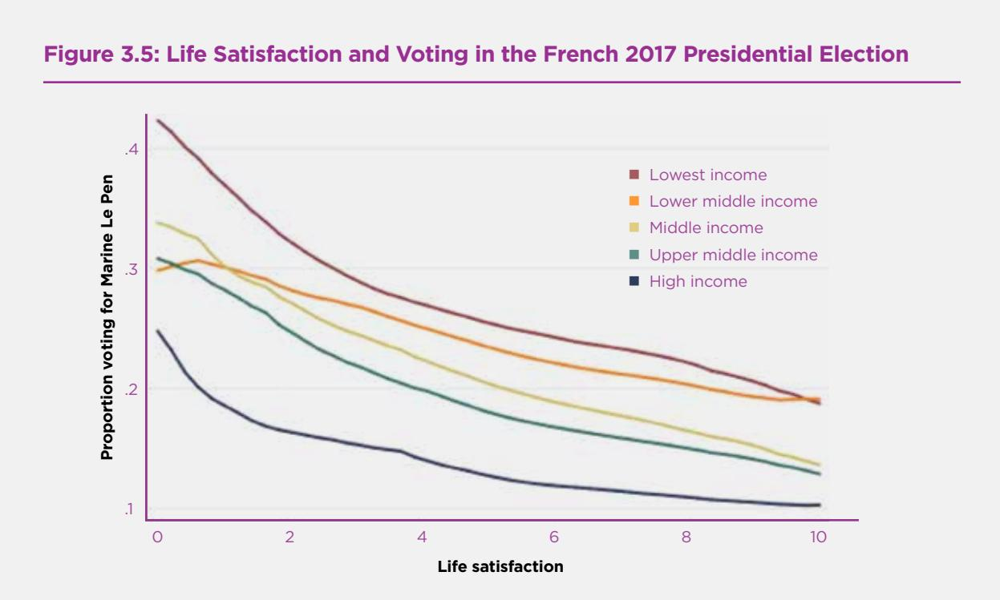

Source: Algan et al (2018). Lines show the smoothed weighted average of the proportion of people voting for Marine Le Pen at each level of life satisfaction and at different quintiles of income.

**Figure 3.6: Life Satisfaction over Time in Western Europe**  40 60 **% of Population**

Notes: Source: Eurobarometer 1973-2016. Includes all countries that were in the survey at its beginning, in 1973: Belgium, Denmark, France, Germany, Ireland, Italy, Luxembourg, Netherlands, United Kingdom. Charts for individual countries are shown in an appendix.

 Not At All Satisfied Not Very Satisfied Fairly Satisfied Very Satisfied

1970 1980 1990 2000 2010 2020

So, does this mean that rising unhappiness is driving the rise in populism? The issue is far from clear-cut, mainly because in the longest-running source of data for countries where populist parties have made the most gains over the past decade, there appears to be very little evidence of a general increase in misery. Figure 3.5 looks at the 9 countries that have been in the Eurobarometer from its inception in 1973, and plots the percentage of the population answering in each of the four life satisfaction categories. As can be seen, there is no evident dramatic uptick in the number of people declaring themselves to be either "not at all" or "not very" satisfied with their lives.53 Similarly, Chapter 2 of this report finds that levels of life evaluation have remained relatively steady over the past decade and, if anything, have risen over the past few years.

0

20

A puzzle thus arises as to why it is that a) unhappier people seem to hold more populist and/or authoritarian attitudes, but b) the rise of populism seems difficult to explain by any *rise* in unhappiness overall. Future research is needed in order to understand these issues more clearly, both in Europe (the region on which much of the

discussion here is focused) as well as, importantly, elsewhere around the world.

One strong hypothesis is that although there has been little rise in unhappiness in terms of life satisfaction, it may be that a significant rise in levels of negative affect (or a drop in positive affect) is driving the rise in populism support.54 Chapter 2 of this report documents a concerted rise over the past decade in levels of negative affect, a measure that is made up of the average frequency of worry, sadness and anger, all over the world. In Western Europe, where populist parties have made significant gains, there has been a significant rise in these negative emotional states since 2010. 55 Future work should look more closely by country (and by region within countries) at the relationship, if there is one, between such measures of negative emotional states and populist party vote shares at general elections. Additionally, research should investigate the potential effects of future expectations of well-being on populist voting.

An alternative, or more likely complementary, explanation may be that the current rise in populism is not best explained by demand-side factors (i.e. unhappiness), but rather on the

supply-side of populist politics. If this is the case, one important and interesting line of research may attempt to study the extent to which populist politicians have successfully developed ways of appealing to and "tapping into" the existing well of unhappy people. The use of (increasingly sophisticated) methods like sentiment analysis on the text of speeches and other campaign materials by populist and non-populist politicians, for example, may provide a highly fruitful avenue of further research in this regard.56

A related hypothesis is that while unhappy people may have long been favourable to populist ideas, other cultural and societal factors have changed over the past few decades that have allowed for this unhappiness (pent-up demand) to be now "activated" in the political sphere. For example, some candidate variables in this regard might include: the secular decline across the Western world in general deference, the rise of social media as a source of information, or the loss of credibility that elites suffered following the financial crisis in 2008 (or other public policy mismanagements).

A final possibility could be that it is not the average level of well-being that is driving changes in support for populist political movements, but it rather has to do with the variance of SWB (i.e. well-being inequality). Work in the future in this regard might explore the explanatory power of measures like the standard deviation of happiness rather than the mean in predicting populist electoral success.57 It is worth noting, however, that the evidence presented in Chapter 2 of this report suggests that there has been no significant increase in well-being inequality in Western Europe over the past decade.

#### **Conclusion**

Happier people are not only more likely to engage in politics and vote, but are also more likely to vote for incumbent parties. This has significant implications for the electoral incentives that politicians face while in office. There appears to be a significant electoral dividend to improving happiness, beyond ensuring a buoyant economic situation. Governments around the globe that are moving in the direction of focusing their policymaking efforts on the population's broad well-being are not only doing so to improve

people's happiness for its own sake, but they also appear to have electoral reasons to do so out of (enlightened) self-interest.

The empirical evidence that exists is currently largely focused on correlations between happiness and voting behaviour — with influences likely to be running in both directions, or due to movements in some third factor. This has obvious drawbacks, and a significant area of further research will likely be focused on establishing the likely causal influences for the various relationships studied in this chapter.

Not only this, a number of further open questions (both theoretical and empirical) are of great interest both academically as well as in the policy sphere. For example, which domains or sources of people's subjective well-being are most prominently driving the empirical association between happiness, the decision of whether to vote, and whom to vote for? If there are political incentives to focus policy on happiness, to what extent do politicians respond to them? Do people vote more on the basis of their own happiness or society's happiness as a whole? Are people more likely to make vote choices based on SWB in countries where official happiness statistics are more prominently published? Does the relationship between well-being and voting differ when considering local and national elections? Do people reward (punish) left- and right-wing governments differently for the (un)happiness of the country? Are right- and left-wing voters equally likely to base their political decision-making on their level of happiness? To what extent, and how, have successful populist political movements managed to tap into people's unhappiness? If it is true that unhappier people vote for populists, will populist incumbents be able to retain their support? And what makes some unhappy people turn to right-wing populism and some to left-wing populism?

Research into the links between happiness and political behaviour is still very modest in scale, but it is growing significantly. Given the increasing use of subjective well-being data in public policy, there is increasing interest in knowing if and why happiness affects voting behaviour. Open theoretical and empirical questions abound in the field, and it is likely that the literature will continue to grow over the coming years.

#### **Endnotes**

- 1 The OECD (Durand 2018) reports that over 20 countries worldwide have begun to use well-being data in some way during the policymaking process. See also O'Donnell et al (2014).
- 2 See, e.g., chapter 2 of this report.
- 3 For more on this, see Napier and Jost (2008); Wojcik (2015); Curini et al (2014).
- 4 See, e.g., Di Tella and MacCulloch (2005); Blais and Gélineau (2007); Powdthavee et al (2017); Dolan et al (2008).
- 5 See, e.g., Blais et al (2017) and Stadelmann-Steffen and Vatter (2012) on satisfaction with democracy. See Glaser and Salovey (2010) for a review of early work in psychology on affective responses to candidates. For an introduction to, and review of, some of the early work in political science on the role of emotions in the political process, see Marcus (2000).
- 6 See Blais (2006) for a review.
- 7 Veenhoven (1988).
- 8 See De Neve et al (2013).
- 9 Flavin and Keane (2012).
- 10 Ojeda (2015).
- 11 See Zhong and Chen (2002).
- 12 Dolan et al (2008).
- 13 Flavin and Keane (2012).
- 14 Pirralha (2018).
- 15 Binned scatterplots of continuous SWB and binary political interest are shown, using OLS FE regressions. No covariates are included; however, the measures are adjusted for country fixed effects. That is, the plots are shown having first residualised from country dummies. The "binning" takes places after the residualisation from country FEs, which accounts for the fact that the number of bins is not necessarily equal to the number of response categories to the happiness question in the survey.
- 16 Country and year fixed effects are also included in the model. The coefficient on "very happy" of .09277 (SE = .04078) reported in the text is derived from a linear probability model; non-linear specifications produce similar estimates. N= 439,732.
- 17 See endnote 1 above.
- 18 See, e.g., Fair (1978), Kramer (1971), Lewis-Beck and Stegmaier (2000), Healy and Malhotra (2013).
- 19 Such theories are usually referred to as "political agency" models, since they model the political process as a principal-agent relationship (much like in models of contracts in other areas of economics). Voters are the principals while governing politicians are the agents, to whom voters have delegated the responsibility and authority to make policy. The actions and effort of politicians are not generally directly observable by the voters, who instead are left to make their judgements based on the outcomes that are observable in the world such as like the state of the economy.

- 20 For a classic moral hazard model of this type, see, e.g., Barro 1973. It is also worth noting that more recent theoretical models have focused on adverse selection in addition to moral hazard. On these accounts, elections provide a chance for voters to re-elect incumbents whose observable outcomes suggest they are more competent or honest (see, e.g., Fearon 1999, Besley 2006).
- 21 Ward (2015). On average, the time between a survey and election is around 4 months.
- 22 Ibid. The regressions predict cabinet vote share, and include country and year fixed effects as well as various contextual and institutional variables standard to the literature on macroeconomic voting patterns.
- 23 Di Tella and MacCulloch (2005).
- 24 Liberini et al (2017a).
- 25 This was the Labour Party in all-but-one year of the study.
- 26 In some instances, this may not be the case for example, where people die in public hospitals the widowed spouse could well reasonably blame the government if politicians have underfunded health care. The authors show, however, that even after transitions of governments, widowed individuals continue to "blame" the new governing party.
- 27 Using a matched control group, the authors confirm this more formally in a difference-in-difference regression framework. Additionally, they also show that happiness has a significant effect on incumbent voting intentions when using widowhood as an instrumental variable for happiness in a two-stage least squares regression framework.
- 28 Away from the United Kingdom, but also at the individual level, life satisfaction is significantly and positively related to the intention to vote for a governing party in a survey of voters in the run-up to the 2013 general election in Malaysia (Ng et al (2016)). At the national level, the average happiness of countries using the *Latinobarómetro* survey is positively related to national governments' re-election chances in subsequent Presidential elections (Martínez Bravo (2016).
- 30 See Ward (2015).
- 31 Determining what is and is not policy-relevant is not necessarily straightforward. The burgeoning academic literature across the social sciences on subjective wellbeing has shown that individual and societal happiness is influenced by a wide array of policy-relevant factors. These include personal and national income, (un)employment and inflation, noise and air quality, educational provision, mental and physical health, the provision and quality of public services, the control of corruption, social capital and societal cohesion, and many more (for overviews, see Clark (2018), Dolan et al (2008), Clark et al (2018)). Even some of the more inherently personal (and thus seemingly more policy-irrelevant) factors of people's lives studied in the literature - such as gender, age and racial differences in happiness - are often inextricably linked to the social and political context of where people live, and frequently call for a policy-related explanation and/or a policy response.
- 32 In which case the relationship between changes in SWB and government vote share may well be asymmetric.
- 33 Healy et al (2010).
- 34 Meier et al (2016).

- 35 For a fuller discussion of the issue of attribution and incentives, see Healy and Malhotra (2013).
- 36 For a review of the history of populism in Europe, see Mudde (2016). See also Mudde (2007).
- 37 I make no attempt here to provide an overall or comprehensive definition. There are a number of different approaches to defining populism – for example, one can distinguish ideational approaches, political-strategic approaches, as well as social-cultural ones. For a recent review of these different approaches to the study of populism, see Kaltwasser et al (2017).
- 38 See, e.g., Inglehart and Norris (2017), Dustmann et al (2017).
- 39 Algan et al (2018).
- 40 The difference between Le Pen and Macron voters is substantial. Macron voters are on average nearly 0.3 SDs above the mean and Le Pen voters just over 0.25 SDs below it.
- 41 Alabrese et al (2018).
- 42 Liberini et al (2017b).
- 43 Examining a separate political phenomenon the rise of protest voting in Rotterdam in the Netherlands - Ouweneel and Veenhoven (2016) find in a similar vein that protest voters did not come most frequently from the least happy districts of Rotterdam. But rather they came from from what they term the "medium-happy segment". The authors instead interpret their results as generally fitting an explanation in terms of middle-class status anxiety.
- 44 Herrin et al (2018).
- 45 These are: less than -10 (in other words a larger than 10 percentage point shift towards Hillary Clinton), -10 to -5, -5 to 0 (inclusive), 0 to 5, 5 to 10, and greater than a 10 percentage point shift towards Donald Trump.
- 46 For example, other more commonly used variables in the explanation of the 2016 election in academic as well as policy discourse - such as economic hardship (the stagnant wages of the American middle class as well as job losses arising from the decline in domestic manufacturing) and other more demographic factors like a perceived 'status threat' by minorities felt on the part of high-status individuals such as white Americans and men.
- 47 These five survey items are arguably indicative of populist and authoritarian attitudes; however, clearly there is no pretence to these being exhaustive of the concepts of either.
- 48 In each case, the model holds constant a number of variables important to the literature such as age, gender, education status, and income. A version of the table reporting coefficients for this full set of controls is shown in an online appendix. A set of country and year fixed effects are also included, such that the estimates are derived by making comparisons between people within any given country. Here the focus is on life satisfaction, but analogous tables using general happiness are also shown in an online appendix.
- 49 The associations are slightly smaller for women than men, though not greatly so. See Tables S3.3 and S3.4 in the online appendix for interaction models of all the regressions in Table 3.2. Interactions are shown with gender, education level, and income quintiles.

- 50 Although these outcomes are measured on ordered likert scales, linear regressions are presented here for ease of interpretation; arguably more suitable regressions estimated using ordered logit models produce similar results.
- 51 Similar findings are found for general happiness in an online appendix.
- 52 This relationship goes in the same (expected) direction when considering general happiness, but the point estimates are less clearly defined statistically.
- 53 In an online appendix, analogous plots for each of the countries are shown in turn, including those who joined the European Union (and thus the Eurobarometer) later on in time.
- 54 Future work in this direction should look both at overall levels of positive and, in particular negative affect; but it should also investigate the role of distinct emotions like worry, stress, and anger in driving populist support. Work in this direction will thus build upon the established political psychology literature, cited above, that investigates the role of distinct emotions in the political process.
- 55 It is worth noting, however, that negative affect has fallen in Central and Eastern Europe, where populist have also seen electoral success.
- 56 For more on the use of text-based analysis in the study of SWB, see Chapter 6 of this report.
- 57 The same point applies to the question of SWB and turnout as well as SWB and incumbent voting. Additional models (available on request) on the sample of elections studied in Ward (2015) show that the SD of life satisfaction is a significant predictor of government vote share. However, the mean (level) effect dominates, and the SD is statistically non-significant once both level and variance are included in the equation.

#### **References**

Alabrese, E., Becker, S. O., Fetzer, T., & Novy, D. (2018). Who voted for Brexit? Individual and regional data combined. *European Journal of Political Economy*, In press (available online August 2018).

Algan, Y., Beasley, E., Cohen, D. & Foucault, M. (2018). The rise of populism and the collapse of the left-right paradigm: lessons from the 2017 French presidential election. *CEPR Discussion Paper 13103*.

Barro, R. J. (1973). The control of politicians: an economic model. *Public Choice*, *14*, 19-42.

Besley, T. (2006). *Principled agents? The political economy of good government*. Oxford, UK: Oxford University Press.

Blais, A. (2006). What affects voter turnout? *Annual Review of Political Science*, *9*, 111-125.

Blais, A., & Gélineau, F. (2007). Winning, losing and satisfaction with democracy. *Political Studies*, *55*(2), 425-441.

Blais, A., Morin-Chassé, A., & Singh, S. P. (2017). Election outcomes, legislative representation, and satisfaction with democracy. *Party Politics*, *23*(2), 85-95.

Clark, A. E. (2018). Four decades of the economics of happiness: where next? *Review of Income and Wealth*, *64*(2), 245-269.

Clark, A. E., Flèche, S., Layard, R., Powdthavee, N., & Ward, G. (2018). *The origins of happiness: the science of well-being over the life course*. Princeton, NJ: Princeton University Press.

Curini, L., Jou, W., & Memoli, V. (2014). How moderates and extremists find happiness: ideological orientation, citizengovernment proximity, and life satisfaction. *International Political Science Review*, *35*(2), 129-152.

Di Tella, R., & MacCulloch, R. (2005). Partisan social happiness. *The Review of Economic Studies*, *72*(2), 367-393.

Dolan, P., Metcalfe, R., & Powdthavee, N. (2008). Electing happiness: does happiness affect voting and do elections affect happiness. *University of York Discussion Papers in Economics 08/21*.

Dolan, P., Peasgood, T., & White, M. (2008). Do we really know what makes us happy? A review of the economic literature on the factors associated with subjective well-being. *Journal of Economic Psychology*, *29*(1), 94-122.

Durand, M. (2018). Countries' experiences with well-being and happiness metrics. In J. Sachs (Ed.), *Global happiness policy report* (pp. 200-245). Global Happiness Council.

Dustmann, C., Eichengreen, B., Otten, S., Sapir, A., Tabellini, G. & Zoega, G. (2017). *Europe's trust deficit: causes and remedies, monitoring international integration*. Cardiff, UK: CEPR Press.

Fair, R. C. (1978). The effect of economic events on votes for president. *Review of Economics and Statistics*, *60*, 159-173.

Fearon, J. D. (1999). Electoral accountability and the control of politicians: selecting good types versus sanctioning poor performance. In A. Przeworski S. C.Stokes & B. Manin (Eds.), *Democracy, accountability, and representation* (pp. 55-97). Cambridge, UK: Cambridge University Press.

Flavin, P., & Keane, M. J. (2012). Life satisfaction and political participation: Evidence from the United States. *Journal of Happiness Studies*, *13*(1), 63-78.

Glaser, J., & Salovey, P. (1998) Affect in electoral politics. *Personality and Social Psychology Review*, *2*(3), 156-172.

Healy, A., Malhotra, N., & Mo C. H. (2010). Irrelevant events affect voters' evaluations of government performance. *Proceedings of the National Academy of Sciences*, *107*(29), 12804-12809.

Healy, A., & Malhotra, N. (2013). Retrospective voting reconsidered. *Annual Review of Political Science*, *16*, 285-306.

Herrin, J., Witters, D., Roy, B., Riley, C., Liu, D., & Krumholz, H. M. (2018). Population well-being and electoral shifts. *PLoS One*, *13*(3). https://doi.org/10.1371/journal.pone.0193401

Inglehart, R., & Norris, P. (2017). Trump and the populist authoritarian parties: the silent revolution in reverse. *Perspectives on Politics*, *15*(2), 443-453.

Kaltwasser, C. R., Taggart, P. A., Espejo, P. O., & Ostiguy, P. (Eds.). (2017). *The Oxford handbook of populism*. Oxford, UK: Oxford University Press.

Kramer, G. H. (1971). Short-term fluctuations in U.S. voting behavior 1896-1963. *American Political Science Review*, *65*, 131-143.

Lewis-Beck, M. S., & Stegmaier, M. (2000). Economic determinants of electoral outcomes. *Annual Review of Political Science*, *3*(1), 183-219.

Liberini, F., Redoano, M., & Proto, E. (2017a). Happy voters. *Journal of Public Economics*, *146*, 41-57.

Liberini, F., Oswald, A. J., Proto, E., & Redoano, M. (2017b). Was Brexit caused by the unhappy and the old? *IZA Institute of Labor Economics*, *Discussion Paper No. 11059*. Retrieved from http://ftp.iza.org/dp11059.pdf

Marcus, G.E. (2000). Emotions in politics. *Annual Review of Political Science*, *3*, 221-250.

Martinez Bravo, I. (2016). The usefulness of subjective wellbeing to predict electoral results in Latin America. In M. Rojas, (Ed.), *Handbook of happiness research in Latin America* (pp. 613-632). New York, NY: Springer Press.

Meier, A., Schmid, L., & Stutzer, A. (2016). Rain, emotions and voting for the status quo. *IZA Institute of Labor Economics, Discussion Paper No. 10350*. Retrieved from https://ssrn.com/ abstract=2868316

Mudde, C. (2007). *Populist radical right parties in Europe*. Cambridge, UK: Cambridge University Press.

Mudde, C. (2016). Europe's populist surge: a long time in the making. *Foreign Affairs*, 95, 25.

Ng, J. W. J., Vaithilingam, S., & Rangel, G. J. (2017). The role of life satisfaction on election voting preferences in Malaysia. *Asian Journal of Social Science*, *45*(1-2), 149-175.

O'Donnell, G., Deaton, A., Durand, M., Halpern, D., & Layard, R. (2014). *Wellbeing and Policy*. Legatum Institute. Retrieved from https://li.com/docs/default-source/commission-on-wellbeingand-policy/commission-on-wellbeing-and-policy-report-- march-2014-pdf

Ouweneel, P., & Veenhoven, R. (2016). Happy protest voters: The case of Rotterdam 1997–2009. *Social Indicators Research*, *126*(2), 739-756.

Ojeda, C. (2015). Depression and political participation. *Social Science Quarterly*, *96*(5), 1226-1243.

Pirralha, A. (2017). Political participation and well-being in the Netherlands: exploring the causal links. *Applied Research in Quality of Life*, *12*(2), 327-341.

Pirralha, A. (2018). The link between political participation and life satisfaction: a three wave causal analysis of the German SOEP household panel. *Social Indicators Research*, *138*(2), 1-15.

Powdthavee, N., Plagnol, A. C., Frijters, P., & Clark, A. E. (2017). Who got the Brexit blues? Using a quasi-experiment to show the effect of Brexit on subjective well-being in the UK. I*ZA Institute of Labor Economics, Discussion Paper No. 11206*. Retrieved from http://ftp.iza.org/dp11206.pdf

Stadelmann-Steffen, I., & Vatter, A. (2012). Does satisfaction with democracy really increase happiness? Direct democracy and individual satisfaction in Switzerland. *Political Behavior*, *34*(3), 535-559.

Veenhoven, R. (1988). The utility of happiness. *Social Indicators Research*, *20*(4), 333-353.

Ward, G. (2015). Is happiness a predictor of election results? *CEP Discussion Paper Series, CEPDP1343*

Zhong, Y., & Chen, J. (2002). To vote or not to vote: an analysis of peasants' participation in Chinese village elections. *Compar ative Political Studies*, *35*(6), 686-712.

# Chapter 4 **67**

# Happiness and Prosocial Behavior: An Evaluation of the Evidence

Lara B. Aknin

Associate Professor, Simon Fraser University

Ashley V. Whillans

Assistant Professor, Harvard Business School

Michael I. Norton

Professor, Harvard Business School

Elizabeth W. Dunn

Professor, University of British Columbia

### **Introduction**

Humans are an extremely prosocial species. Compared to most primates, humans provide more assistance to family, friends, and strangers, even when costly.1 Why do people devote their resources to helping others? In this chapter, we examine whether engaging in two specific types of prosocial behavior, mainly donating one's time and money to others, promotes subjective well-being, which encompasses greater positive affect, lower negative affect, and greater life satisfaction.2 Next, we identify the conditions under which the well-being benefits of prosociality are most likely to emerge. Finally, we briefly highlight several levers that can be used to increase prosocial behavior, thereby potentially increasing well-being.

#### **How to Interpret the Evidence**

In interpreting the evidence presented in this chapter, it is crucial to recognize that most research on generosity and happiness has substantial methodological limitations. Many of the studies we describe are correlational, and therefore causal conclusions cannot be drawn. For example, if people who give to charity report higher happiness than people who do not, it is tempting to conclude that giving to charity increases happiness. But it is also possible that happier people are more likely to give to charity (i.e. *reverse causality*). Or, people who give to charity may be wealthier, and their wealth – not their charitable giving – may make them happy. Researchers typically try to deal with this problem by statistically controlling for "confounding variables," such as wealth. This approach works reasonably well when the variable of interest (e.g., charitable giving) and any confounding variables (e.g., wealth) are measured with a high degree of precision.

In reality, however, it is often difficult to reliably measure complex constructs (like wealth) using brief, self-report surveys. Rather than reporting all of their assets and liabilities, survey respondents might be asked to report their household income, which provides a sensible—but incomplete indicator of the broader construct of wealth. For example, if Sian and Kelly each earn \$60,000/ year, but Sian has six kids and no savings, and Kelly has no kids and a six-figure savings account, then Kelly is wealthier than Sian and may be able to give more money to charity. Now, let's imagine the relationship between charitable giving and happiness was really explained entirely by wealth. Because income does not fully capture the complex concept of wealth, charitable giving might still predict happiness over and above income because the ability to give captures an aspect of financial security not captured by income. Although researchers have recognized these challenges for decades, recent work using computer simulations has demonstrated that effectively ruling out confounds is harder than many scholars have assumed.3

To overcome this issue, it is essential to conduct experiments in which the variable of interest can be manipulated without altering other variables. For example, using experimental methodology, researchers can give participants money and assign them at random to spend it on themselves or on others; because participants are assigned to engage in generous spending based on the flip of a coin (metaphorically speaking), they should not be any wealthier than those assigned to spend money on themselves, on average. While experiments may sometimes seem slight or artificial because they typically involve adjustments of small behaviours, this approach eliminates many pesky confounds, like wealth, that plague correlational research, thereby enabling statements about how generous behavior affects happiness.

As the example above illustrates, conducting experiments tends to be much costlier than simply asking survey questions. Therefore, researchers have traditionally relied on relatively small sample sizes when conducting experiments, particularly when the experiments attempt to alter people's behavior in the real world. This reliance on small sample sizes not only creates a risk of failing to detect effects that are real—it also creates a high risk of finding "false positives," effects that turn out not to be real.4

In order to establish replicable effects, researchers now recognize that it is important to conduct experiments with sufficiently large sample sizes. A recent meta-analysis concluded that experiments on helping and happiness should include at least 200 participants per condition.5 This means that an experiment in which participants are randomly assigned to one of two conditions needs at least

400 participants in order to produce reliable results. Unfortunately, almost none of the experiments conducted in this area meet this criterion, although we specifically flag those that do. In fact, many studies in this area include fewer than 50 participants per condition (including some of our own). This is worrisome because samples sizes much under 50 are barely sufficient to detect that men weigh more than women (at least 46 men and 46 women are needed to reliably detect this difference, which is about half a standard deviation).6 Thus, unless researchers are examining an effect that is genuinely large (i.e., bigger than the gender difference in weight), studies with group sizes under 50 run a high risk of being false positives. For this reason, we describe studies with group sizes below 50 as "small" throughout this chapter, and we urge readers to treat evidence from these studies as suggestive rather than conclusive.

#### **Well-being Benefits of Giving Time**

Volunteering is defined as helping another person with no expectation of monetary compensation.7 A great deal of correlational research shows that spending time helping others is associated with emotional benefits for the giver. Indeed, research has documented a robust link between volunteering and greater life satisfaction, positive affect, and reduced depression. In a review of 37 correlational studies with samples ranging from 15 to over 2,100,8 adult volunteers scored significantly higher on quality of life measures compared to non-volunteers.9

The conclusions of this review paper have been confirmed in two more recent large-scale examinations. First, a recent synthesis of the literature including 17 longitudinal cohort studies (*N*=72,241) found that volunteering was linked to greater life satisfaction, greater quality of life, and lower rates of depression.10 The majority of the studies included in this synthesis used inconsistent quality of life measures and participants were mostly women living in North America aged fifty or older. Fortunately, converging data from a large nationally representative sample of respondents living in the UK helps to overcome these limitations. In a sample of 66,343 respondents, volunteering was associated with greater well-being, as measured by the General Health Survey, a

validated scale which includes several items related to general happiness.11 In this study, the well-being benefits of volunteering emerged most strongly for individuals forty years of age or older. Collectively, these data provide compelling evidence that there is a reliable link between volunteering and various measures of subjective well-being, while also indicating the possibility of critical moderators, which is a point we return to below.

Additional research suggests that the relationship between volunteering and well-being appears to be a cross-cultural universal. Researchers analyzed data from the Gallup World Poll, a survey that comprises representative samples from over 130 countries. Across both poor and wealthy countries (*N*=1,073,711), there is a positive relationship between volunteer participation and well-being (see Table 4.1 for average monthly estimates of the percentage of people who volunteered time or made charitable donations in years 2009-2017 of the Gallup World Poll, and Figure 4.1 for a graphical representation of the individual-level data depicting the strength of the relationship between volunteering and well-being for the same years).12 These results further point to the reliability of the association between volunteering and subjective well-being across diverse economic, political, and cultural settings.13

Of course, it is possible that demographic differences between volunteers and non-volunteers explain observed differences in well-being.14 For example, women are more likely than men to volunteer15 and derive greater satisfaction from communal activities.16 Moreover, a large survey of over 2,000 people in the UK indicates volunteers are older and from higher socioeconomic backgrounds.17 In addition, a large sample of over 5,000 responses to the English Longitudinal Study of Aging indicates that volunteers are healthier than non-volunteers.18 It is also possible that the benefits of volunteering are driven entirely by the fact that people who volunteer are generally more socially connected than non-volunteers.19 Stated differently, it is possible that there is no unique relationship between volunteering and well-being. Casting doubt on these possibilities, in a sample of 10,317 women and men recruited from the Wisconsin Longitudinal Study, volunteering predicted well-being above and beyond numerous demographic characteristics and participation in self-focused social activities,

**Figure 4.1: A graphical representation of the association between volunteer participation and well-being around the world.** 

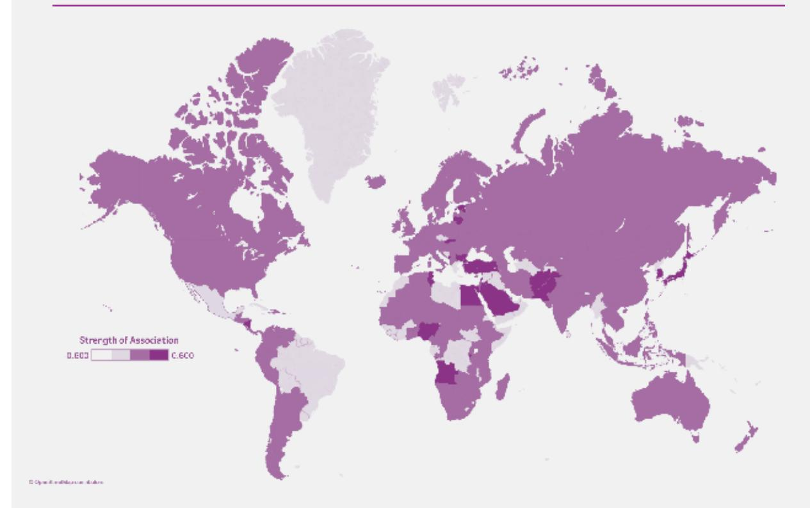

Note: Volunteer work predicts greater life satisfaction in most countries surveyed by the Gallup World Poll (2009-2017; N=1,073,711) while controlling for several important covariates, such as age, household income, gender, food security, education, and marital status. Shading depicts the degree of association in standardized beta weights.

such as formal sports, cultural groups, or country clubs.20 The results of these large-scale surveys suggest a robust link between volunteering and well-being that exists beyond demographics and social connectedness.

Despite the seemingly ubiquitous association between volunteering and well-being, there is very little experimental evidence showing that volunteering causally improves happiness. For instance, in a systematic review of nine experiments with a total sample of 715 participants (median number of participants per study = 54), researchers found no evidence that volunteering casually improved well-being or reduced depressive symptoms.21 Consistent with this observation, in a more recent experimental study, 106 Canadian 10th graders were assigned to volunteer 1-2 hours per week for 10 consecutive weeks or to a wait-list control.22 Students assigned to volunteer showed no

change in positive affect, negative affect, or self-esteem as compared to the wait-list.

Similarly, the largest known experimental study in the literature to date showed no causal impact of volunteering on subjective well-being. A sample of 293 college students in Boston were randomly assigned to complete 10-12 hours of formal volunteering each week or were randomly assigned to a wait-list control group. When subjective well-being was assessed for both groups, there was no positive benefit of formal volunteering.23 Unlike the majority of published experimental research in this area, this experiment was pre-registered and sufficiently powered to detect a small effect of volunteering on subjective well-being. Thus, this experimental study suggests that existing correlational data may have overestimated the well-being benefits of volunteering.24

Another possibility is that there are critical conditions predicting when and for whom volunteering promotes well-being. In a study of more than 1,000 community dwelling older adults living in the US, volunteering was linked to greater well-being for individuals who believe that other people are fundamentally good versus those higher in hostile cynicism and believe other people are selfish and greedy.25 As described above, older individuals benefit more from formal volunteering.26 Relatedly, individuals who score higher in depressive symptoms also report experiencing greater boosts in well-being from volunteering. In one daily diary study—which asked 100 participants to report on their mood and helping activities each day for ten days respondents experiencing the greatest depressive symptoms reported the greatest mood benefits from helping others.27 Individuals who score lower in agreeableness also experience greater well-being in response to volunteering. In one experimental study (*N*=348), participants who scored lower in agreeableness, and who were randomly assigned to spend time helping other people in their daily life (vs. a control condition), reported the greatest increases in life satisfaction over a three-week intervention study period.28

In summary, the research presented in this section provides evidence for a reliable association between formal volunteering and subjective well-being in large correlational surveys but reveals little evidence for a causal relationship. Given the dearth of large-scale experimental studies sufficiently powered to explore this question, more research is needed. Recent findings indicate that individuals from at-risk groups gain the greatest benefits from volunteering, suggesting that these may be the most fruitful samples for further exploration.

#### **Well-being Benefits of Giving Money**

Spending money on others – often called *prosocial spending* – is associated with higher levels of well-being. Evidence for this relationship comes from various sources. For instance, individual who pay more money in taxes – thereby directing a portion of their income to fellow citizens through public goods – report greater well-being in over two decades of German panel data, even while controlling for income and a number of other predictors of happiness.29 In addition, charitable

donations appear to activate reward centers within the human brain, such as the orbital frontal cortex and ventral striatum.30 Moreover, in a representative sample of over 600 American adults, individuals who spent more money in a typical month on others by providing gifts and donating to charity reported greater happiness.31 Meanwhile, how much money people reported spending on themselves in a typical month was unrelated to their happiness.32 More broadly, responses from more than one million people in 130 countries surveyed by the Gallup World Poll indicates that financial generosity – measured as whether one has donated to charity in the past month – is one of the top six predictors of life satisfaction around the world (see Table 2.1 in Chapter 2 for the latest aggregate results, while Figure 4.2 shows results based on individual data).

In contrast to the volunteering literature discussed above, the causal impact of financial generosity on happiness is supported by several small experimental studies.33 For example, in one of the first experiments on this topic, 46 Canadian students were randomly assigned to spend a five or twenty dollar windfall on themselves or others by the end of the day. In the evening, all students were called on the phone to report their happiness levels.34 Individuals randomly assigned to spend money on others (vs. themselves) reported significantly higher levels of happiness. Although the sample size of this initial study was very small and consisted only of university students, more recent research has provided further support for this idea. A large scale experiment using a similar design yields consistent findings with over 200 participants per condition.35

Several experiments support the possibility that the relationship between prosocial spending and happiness may be detectable in most humans around the globe.36 For instance, participants in Canada (*N*=140), India (*N*=101), and Uganda (*N*=700) reported higher levels of happiness after reflecting on a time they spent money on others versus themselves.37 The emotional benefits of generous spending are also detectable among individuals from rich and poor nations immediately after purchases are made. In one study, a total of 207 students from Canada and South Africa earned a small amount of money that they could use to purchase an edible treat, such as cookies or juice, available to them at a discounted price. Half the participants were

**Figure 4.2: A graphical representation of the association between prosocial spending and well-being around the world.** 

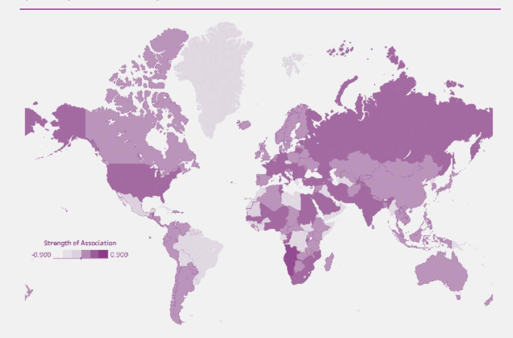

Note: Donating money to charity predicts greater life satisfaction in most countries surveyed by the Gallup World Poll (2009-2017; N=1,073,711) while controlling for several important covariates, such as age, household income, gender, food security, education, and marital status. Shading depicts the degree of association in standardized beta weights.

told that the items they purchased were for themselves, and the other half of participants were told that the items they purchased would be donated to a sick child at a local hospital. Importantly, participants in both conditions were able to choose between whether they wanted to make a purchase (and, if so, what to buy) or take the cash for themselves. This choice provided participants with a sense of autonomy over their spending , which is important for experiencing the emotional rewards of giving (discussed in greater detail below). Immediately afterward, all participants reported their current positive affect. Converging with earlier findings, individuals who purchased items for others were happier.38 Importantly, this finding emerged not only in Canada (where few students reported financial hardship), but also in South Africa, where more than 20% of respondents reported trouble securing food for their family in the past year.

Additional research suggests that the emotional benefits of prosocial spending are detectable even in places where people have had little to no contact with Western culture. Consider one study conducted with a small number of villagers (*N*=26) from a traditional society in Vanuatu, where villagers live in huts made from local materials, survive on subsistence farming, and have no running water or electricity. Villagers participated in a version of the goody-bag study, in which they earned a small sum of money that they could use to buy packaged candy, a rare treat on the island nation. Once again, half the participants were able to purchase the candy for themselves while the other half were able to purchase the candy for another villager. Consistent with previous research, villagers reported greater happiness after purchasing treats for others rather than themselves.39

As well as emerging around the world, the emotional rewards of giving may be detectable early in life. In one small study conducted with 20 Canadian toddlers, children were given eight edible treats and asked to share some of these treats with a puppet. Throughout the study, children's' facial responses were captured on film and later coded for happiness. Coders observed that toddlers showed larger smiles when giving treats away than when receiving treats themselves,40 and this result has been replicated in a handful of subsequent studies with larger samples.41

Finally, the emotional rewards of prosocial spending are even detectable among recent criminal offenders. In one large, pre-registered experiment, 1295 ex-offenders were randomly assigned to purchase items for themselves or children in need before reporting their current happiness.42 As observed in other samples, ex-offenders reported greater happiness when purchasing for others than when purchasing for themselves. Taken together, these findings point to the possibility that the well-being benefits of generous spending may be a human universal.

Financial generosity seems to lead to happiness in a variety of contexts, suggesting that it is a relatively robust effect. Studies using the goody bag paradigm demonstrate that the emotional benefits of prosocial spending emerge even when givers do not interact directly with the recipient (*N*=207).43 In addition, the positive emotions that givers experience after generous spending have been detected with various assessment tools, such as self-report happiness scales and observer reports, suggesting that findings are not accidental outcomes captured on one specific measure. Indeed, in one experiment conducted with 119 Canadian university students, a research assistant unaware of a participant's recent spending rated individuals who bought items for charity as happier than individuals who bought items for themselves.44

## **Different Currencies, Different Contexts**

In addition to giving time and money, people can provide assistance in various other ways. For instance, holding the door open for a stranger, paying someone a compliment, caring for a sick relative, comforting a spouse, or returning a lost

wallet are all small but meaningful forms of generous action. Consistent with much of the work reported above, these demonstrations of social support and kindness may promote well-being for the helper as well.45 In one study, 104 participants randomly assigned to commit five random acts of kindness a week over a six-week period were happier than those assigned to a no-action control group, but only when all five acts were completed on one day per week (as opposed to spread out over a week).46 More recently, researchers conducted a six-week experiment in which a sample of students, online workers, and community dwelling adults (*N*=473) were randomly assigned to commit acts of kindness for either other people, humanity/the world, or themselves; meanwhile, a neutral control group did not alter their behavior.47 Both forms of prosocial – kindness directed to others and humanity/the world – led to the greatest happiness improvements overtime.

Even in the workplace, where most adults spend a substantial portion of their time, research suggests that prosocial behavior and a prosocial orientation are linked to emotional benefits for employees and overall job satisfaction.48 For instance, in one well-powered longitudinal survey (from 1957-2004, *N* > 10,000), the importance participants reported placing on the opportunity to help others when selecting a job predicted their well-being almost 30 years later.49 In a 3-week study, employees (*N* = 68) completed mood measures each morning and then several times during the course of each workday. Employees who engaged in prosocial behaviors (e.g., "Helped someone outside my workgroup" and "Covered for coworkers who were absent or on break") experienced greater positive mood over time.50 Yet, while every corporation offers personal incentives (in the form of wages and bonuses), far fewer companies offer prosocial incentives or bonuses – such as the opportunity to donate to charity, or to spend on co-workers. Although companies clearly believe that such "personal" incentives are effective, they are linked with some unfortunate consequences, including increased competition and decreased helping among employees.51 While personal incentives clearly are effective in some situations and with some employees, it is possible that prosocial incentives may also be effective in not only improving the well-being of employees, but

also their performance. Demonstrating this, in one small-scale field experiment (*N* = 139), bank employees randomly assigned to donate either \$50 to charity reported not only greater job satisfaction but also greater happiness, compared to employees not given this opportunity or those assigned to donate only \$25.52

### **When Giving to Others is Most Likely to Increase Well-Being**

Behaving generously can increase happiness but this effect is not inevitable. Instead, research has identified several key ingredients that seem to be important for turning good deeds into good feelings. Specifically, people are more likely to derive joy from helping others when:

- (1) they feel free to choose whether or how to help.
- (2) they feel connected to the people they are helping.
- (3) they can see how their help is making a difference.

Freedom of choice. Considering the potential benefits of giving for both individuals and society, it is tempting to require at least some groups of people (such as students or the unemployed) to engage in volunteer work or other forms of helping. But making people feel that they have been forced to help others can undercut the pleasure of giving. For example, in one study, 138 American university students were asked to keep a daily diary, reporting whether and how they helped each day, as well as rating their day-to-day happiness.53 The students felt happier on days when they provided help to someone or did something for a good cause—but only if they did so because it seemed important to them, enjoyable, and consistent with their values. When they helped because they felt it was mandatory or necessary in order to avoid disapproval, the emotional benefits of generosity evaporated.

Similarly, data from 167 American adults reveals spending money on others is associated with greater happiness among individuals who believe strongly in social justice, equality, helping and similar self-transcendent values.54 But there is no detectable relationship between prosocial spending and happiness for individuals who do not endorse such self-transcendent values,

suggesting that requiring these people to help would not improve their happiness.

The importance of free choice may help to explain a long-standing puzzle within research on volunteering: Older people tend to derive greater emotional benefits from volunteering than younger people.55 Although a variety of factors may contribute to this age difference, scholars have argued that younger people may derive less pleasure from volunteering in part because they are more likely to see this activity as an obligation—something they have to do to gain work experience.56

Several small experimental studies provide supporting evidence for the idea that choice matters. In one experiment, 80 American university students made a series of decisions about how to divide a windfall of \$5 between themselves and another participant. The more they gave away, the better they felt afterward.57 However, when the opportunity to choose was removed, such that participants were forced to give a certain amount of money away, the benefits of giving disappeared entirely. And in an fMRI study with 19 participants, people exhibited greater activation in regions of the brain linked to processing rewards when they were allowed to make voluntary donations to a local food bank than when these donations were mandatory.58 Participants in this study also reported feeling 10% more satisfied with their donation when it was voluntary rather than mandatory, even though the money was always going to a good cause.

How, then, can people be encouraged to engage in generous behavior, without undermining the emotional benefits of their generosity? Simply altering the way help is requested or framed may make a difference. In a small lab study, 104 American university students were presented with an opportunity to help out with a task and were told that they "should help out" or that "it's entirely your choice whether to help or not".59 When their freedom to choose was highlighted, participants felt happier after helping compared to those who were told they should help. In a more extensive six-week study, 218 university students across both the US and South Korea were required to complete acts of kindness each week.60 Half of them were randomly assigned to receive messages designed to support their feelings of autonomy by, for example, emphasizing

that how and where they chose to help was entirely up to them. Across both cultural groups, students who received these messages showed greater improvement in happiness compared to students who engaged in acts of kindness without receiving these messages. These results were somewhat inconsistent across outcome measures, however, and like all of the findings presented in this section, this promising approach would be worthwhile to test on a larger scale.

Social connection. When engaging in generous behavior provides opportunities for positive social interactions and relationships, helping is likely to be especially beneficial for the helper. Correlational research on volunteering suggests that part of the reason volunteers are less depressed than non-volunteers is simply that volunteers attend more meetings, providing more opportunities for social integration.61 A correlational study of spending habits points to a similar conclusion. A sample of over 1,500 Japanese students were asked whether they had spent any money on others over the summer and whether doing so had exerted any positive influence on their social relationships.62 Most students who spent money on others reported that this expenditure had positively influenced their relationships. And these students reported greater overall happiness compared to students who had not spent money on others or had spent money on others without perceiving any positive impact on their relationships. Of course, these correlational findings are open to a variety of explanations—for example, happier people may simply be more likely to spend money on others and to perceive positive effects on their relationships.

Several small experimental studies provide at least some supporting evidence for the idea that feelings of social connection are important in turning generosity into happiness. When 80 adults were approached on a Canadian university campus and asked to reflect on a past prosocial spending experience, they felt happier if they were asked to think about spending money on a close friend or family member rather than an acquaintance.63 Even when people give money to stranger or acquaintances, providing an opportunity for social interaction might increase the emotional benefits of giving. A small sample of twenty-four students in a lecture hall were given \$10 and allowed to decide how much, if

any, to share with a classmate who had not received any money.64 The more money these students gave away, the better they felt afterward—but only if they were allowed to deliver the money in person to their classmate. When students made the same decision without having the opportunity to personally deliver the donation, those who gave away more money actually felt slightly worse.

For charities, then, an important challenge lies in making donors feel connected to causes that otherwise would feel distant or unfamiliar. To explore this idea, researchers approached 68 adults on a Canadian university campus and presented them with an opportunity to donate to a charity that provides fresh water to rural African communities.65 Half the time, the researcher disclosed that she was personally involved with the charity and that she was helping raise money for a friend who had recently returned from working with the charity in Africa. The rest of the time, the researcher did not reveal this information. Although participants made their donations in private, without the researcher's knowledge, they got more of an emotional boost from giving if they knew that the researcher was personally connected to the cause.66 Because this experiment (like all the others in this section) relied on a small convenience sample, these results should be interpreted with special caution. Still, we would tentatively suggest that enhancing feelings of social connection for volunteers and donors may represent a promising avenue for increasing the emotional benefits of helping.

Seeing how you made a difference. Generous behavior may be more likely to promote happiness when helpers can easily see how their actions make a difference for others. When people look back on their past acts of kindness, they feel happier if they are asked to think about actions that were motivated by a genuine concern for others, rather than by benefits for themselves (*N*=299).67 This finding aligns with research examining the health correlates of volunteering. For instance, a study examining data from over 10,000 individuals in the Wisconsin Longitudinal Study found that volunteering is associated with lower mortality risk in older adults,68 but only when volunteering is motivated by other-oriented (as opposed to self-oriented) reasons.69 These findings tentatively suggest that helping people see how their actions make a difference for

others might enhance their long-term positive feelings about engaging in acts of kindness.

To test this idea more directly, researchers presented 120 people on a Canadian university campus with an opportunity to donate to charity.70 Half of them were asked to donate to UNICEF. The others were asked to donate to Spread the Net. Although both UNICEF and Spread the Net are devoted to promoting children's health, UNICEF tackles a very broad range of initiatives, potentially making it difficult for donors to envision how their dollars will make a difference. In contrast, Spread the Net offers a clear, concrete promise: For every \$10 donated, they supply one bed net to protect a child from malaria. The more participants donated to Spread the Net, the better they felt afterward, whereas this emotional "return on investment" was eliminated when people gave money to UNICEF. This finding suggests that charities may be able to increase donors' happiness by making it easier for them to envision how their help is making a concrete difference.

In fact, simply re-framing helpers' *goals* to be more concrete and achievable can make giving feel more satisfying.71 While taking a break between completing surveys, 92 American university students were asked to help recruit bone marrow donors by preparing flyers. Before completing this task, they were asked to pursue either a relatively abstract goal (providing "hope" to those in need of bone marrow donations) or a more concrete one (providing "a better chance of finding a donor"). After helping out with the fliers, individuals who had been told to pursue the more concrete goal felt happier than those presented with the more abstract goal. Thus, by prompting donors and volunteers to give with a concrete, achievable goal in mind, charities may be able to increase the emotional rewards of their contributions.

Finally, some research suggests that the benefits of having a specific prosocial impact also strengthen the link between helping and emotional benefits both at and after work.72 Indeed, some initial evidence from a small sample (*N* = 33) of employees suggests that feelings of prosocial impact may in some cases lead to improved employee performance. In a two week longitudinal study, call center employees who read information about how their work

made a difference in the lives of others were more successful in garnering donations than workers who read about how their work could benefit them personally, or those in a control condition.73

Summary and implications for policy. Research on the factors that amplify the happiness benefits of helping is limited, due to reliance on correlational designs and experiments with small convenience samples. Still, this literature provides some valuable clues: people seem most likely to derive happiness from giving experiences that provide a sense of free choice, opportunities for social connection, and a chance to see how the help has made a difference.

Policies and programs that offer all three of these ingredients may have a particularly high likelihood of providing happiness benefits for givers. For example, consider Canada's innovative Group of 5 program, whereby any five Canadians can privately sponsor a family of refugees. Although tax dollars provide support for refugees in many countries, Canada is the only country in the world that allows ordinary citizens to take such an autonomous role in this process. After raising enough money to support a family for their first year in Canada, the sponsorship group has the opportunity to meet the family at the airport, as they first set foot in Canada. Because the sponsorship group provides help with everything from finding housing and a family doctor to getting the kids enrolled in school, there is ample opportunity to see how the family's life is being transformed and to develop strong social relationships with them. It is also notable that no Canadian is allowed to undertake this alone; requiring people to work together in a group of five or more is likely to increase social bonds among those who want to help (as well as improving feasibility). Thus, this policy provides a model of one way in which governments can facilitate positive helping experiences for their own citizens, while addressing broader problems in the world.

Finally, while the evidence above examines the link between prosociality and happiness for the *giver*, it is worth asking if receiving assistance is beneficial for the *recipient*. To this end, a large body of research demonstrates that receiving social support, such as encouragement from close others, is typically associated with greater psychological and physical well-being.74 However, receiving other forms of aid, such as financial support, may have detrimental consequences for the recipient because it may lead to social stigma75 or threaten one's self-esteem.76 As a result, it is critical to examine when generosity is beneficial for both parties. To the best of our knowledge, research in this area is limited but early evidence suggests that two of the aforementioned ingredients – autonomy and social connection – may prove important. Highlighting the value of autonomy, one small experiment (*N*=124) found that both helpers and recipients experienced greater positive emotion after helpers provided autonomous help (as opposed to controlled help or no help at all).77 Another small study demonstrates the potential value of social connection. Above we described a study in which twenty-four students could decide how much of a \$10 sum to give another student in their classroom.78 Givers were happier when they gave more money, but only when the funds were delivered in person. Interestingly, recipients also reported greater happiness from receiving more money when the funds were given in person (vs. through an intermediary). Taken together these findings provide tentative evidence that giving which facilitates autonomy and social connection may offer the greatest benefits for both parties.

#### **How to Encourage Prosociality**

Given its benefits, how can prosociality be encouraged? A large body of research suggests that prosocial behavior can be increased through various individual, organizational, and cultural factors, some of which we briefly describe below.

At the *individual level*, some research suggests that helpers are more likely to provide assistance when experiencing positive emotional states.79 For instance, *awe* – a positive emotion felt when encountering vast and expansive stimuli, such a panoramic view of the Pacific Ocean – is associated with and leads to greater generosity. Evidence supporting this claim comes from several sources. Among a large, nationally representative sample of over 1,500 Americans, people reporting that they experience more awe in their daily lives were also more likely to generously share raffle tickets for a large cash draw with a stranger.80 Supplementing this

correlational research, an experiment conducted with 254 students suggests that awe causally increases generosity. Students randomly assigned to view an awe-inducing video of stunning nature scenes were more generous in a subsequent task than students shown an amusing or emotionally neutral film.81 How can communities and policy makers harness this research to increase generosity? One way may be to invest in public green spaces, such as parks, trails, or beaches. Exposure to nature, especially scenes that are large and expansive, may boost kindness in light of the research discussed above.

A number of other factors have been shown to promote prosocial behavior. As just one example, some evidence suggests that people donate more money to charitable causes and campaigns when they appreciate how their assistance will help those in need. For instance, one experiment found that providing potential donors with information about how their funds would be used led to donations that were nearly double the size.82 Therefore, information about the impact of one's help may not only unleash the emotional benefits of giving as discussed above, it may also increase generosity. Organizations and charities can capitalize on these findings by providing clear information about their programs. Doing so allows people to see how they can effectively improve the lives of vulnerable targets, which should bolster support from potential donors.

In addition, certain large-scale or cultural factors can impact generosity as well. For instance, culture may shape the rates and forms of help provided around the world. Indeed, while generosity appears to be valued in many cultures,83 cultural norms shape rates and forms of helping behavior.84 In our analyses of the Gallup World Poll, it is evident that rates of volunteering and charitable giving differ dramatically depending on the cultural context. For example, rates of charitable donation within the past month range from the lowest of 7% of respondents in Myanmar to the highest of 89% in Burundi (See Table 4.1).

**Table 4.1: The percentage of respondents within each country who reported donating to charity or volunteering within the last month.** 

|      | Country                  | Percentage of respondents within the country who reported Donating Money to a Charity in the Past Month | Percentage of respondents within the country who reported Volunteering Time to an Organization in the Past Month |
|------|--------------------------|------------------------------------------------------------------------------------------------------------------|---------------------------------------------------------------------------------------------------------------------------|
|      | All Countries            | 29.2%                                                                                                            | 19.7%                                                                                                                     |
| (1)  | Afghanistan              | 28.1%                                                                                                            | 17.9%                                                                                                                     |
| (2)  | Albania                  | 18.8%                                                                                                            | 8.4%                                                                                                                      |
| (3)  | Algeria                  | 11.2%                                                                                                            | 8.7%                                                                                                                      |
| (4)  | Angola                   | 13.6%                                                                                                            | 16.8%                                                                                                                     |
| (5)  | Argentina                | 19.0%                                                                                                            | 16.4%                                                                                                                     |
| (6)  | Armenia                  | 9.3%                                                                                                             | 7.9%                                                                                                                      |
| (7)  | Australia                | 70.3%                                                                                                            | 38.1%                                                                                                                     |
| (8)  | Austria                  | 53.0%                                                                                                            | 26.9%                                                                                                                     |
| (9)  | Azerbaijan               | 15.0%                                                                                                            | 22.3%                                                                                                                     |
| (10) | Bangladesh               | 15.9%                                                                                                            | 11.4%                                                                                                                     |
| (11) | Belarus                  | 18.6%                                                                                                            | 27.0%                                                                                                                     |
| (12) | Belgium                  | 40.7%                                                                                                            | 25.9%                                                                                                                     |
| (13) | Belize                   | 28.6%                                                                                                            | 25.3%                                                                                                                     |
| (14) | Benin                    | 11.4%                                                                                                            | 13.2%                                                                                                                     |
| (15) | Bolivia                  | 22.3%                                                                                                            | 22.1%                                                                                                                     |
| (16) | Bosnia Herzegovina       | 33.4%                                                                                                            | 5.2%                                                                                                                      |
| (17) | Botswana                 | 13.9%                                                                                                            | 19.0%                                                                                                                     |
| (18) | Bulgaria                 | 16.9%                                                                                                            | 5.4%                                                                                                                      |
| (19) | Burkina Faso             | 13.2%                                                                                                            | 14.5%                                                                                                                     |
| (20) | Burundi                  | 6.5%                                                                                                             | 8.6%                                                                                                                      |
| (21) | Cambodia                 | 41.5%                                                                                                            | 8.3%                                                                                                                      |
| (22) | Cameroon                 | 19.1%                                                                                                            | 15.7%                                                                                                                     |
| (23) | Canada                   | 63.4%                                                                                                            | 37.4%                                                                                                                     |
| (24) | Central African Republic | 14.0%                                                                                                            | 21.3%                                                                                                                     |
| (25) | Chad                     | 15.6%                                                                                                            | 14.9%                                                                                                                     |
| (26) | Chile                    | 45.1%                                                                                                            | 15.0%                                                                                                                     |
| (27) | China                    | 10.5%                                                                                                            | 4.8%                                                                                                                      |
| (28) | Colombia                 | 22.7%                                                                                                            | 20.5%                                                                                                                     |
| (29) | Congo Brazzaville        | 11.9%                                                                                                            | 14.8%                                                                                                                     |
| (30) | Congo Kinshasa           | 11.2%                                                                                                            | 14.7%                                                                                                                     |
|      |                          |                                                                                                                  |                                                                                                                           |
| (31) | Costa Rica               | 32.5%                                                                                                            | 23.2%                                                                                                                     |
| (32) | Croatia                  | 20.7%                                                                                                            | 8.6%                                                                                                                      |
| (33) | Cyprus                   | 46.0%                                                                                                            | 25.8%                                                                                                                     |
| (34) | Denmark                  | 60.3%                                                                                                            | 22.4%                                                                                                                     |
| (35) | Dominican Republic       | 26.5%                                                                                                            | 33.2%                                                                                                                     |
| (36) | Ecuador                  | 17.0%                                                                                                            | 14.3%                                                                                                                     |
| (37) | Egypt                    | 15.8%                                                                                                            | 6.2%                                                                                                                      |
| (38) | El Salvador              | 12.6%                                                                                                            | 18.3%                                                                                                                     |
| (39) | Estonia                  | 19.9%                                                                                                            | 17.9%                                                                                                                     |
| (40) | Ethiopia                 | 18.4%                                                                                                            | 16.8%                                                                                                                     |
| (41) | Finland                  | 43.3%                                                                                                            | 28.7%                                                                                                                     |
| (42) | France                   | 27.7%                                                                                                            | 27.6%                                                                                                                     |
| (43) | Georgia                  | 5.2%                                                                                                             | 17.5%                                                                                                                     |
| (44) | Germany                  | 49.4%                                                                                                            | 25.0%                                                                                                                     |
| (45) | Ghana                    | 24.5%                                                                                                            | 31.6%                                                                                                                     |

**Table 4.1: The percentage of respondents within each country who reported donating to charity or volunteering within the last month.** (continued)

|              | Country            | Percentage of respondents within the country who reported Donating Money to a Charity in the Past Month | Percentage of respondents within the country who reported Volunteering Time to an Organization in the Past Month |
|--------------|--------------------|------------------------------------------------------------------------------------------------------------------|---------------------------------------------------------------------------------------------------------------------------|
| (46)         | Guatemala          | 33.3%                                                                                                            | 35.0%                                                                                                                     |
| (47)         | Haiti              | 47.6%                                                                                                            | 31.2%                                                                                                                     |
| (48)         | Honduras           | 27.8%                                                                                                            | 30.8%                                                                                                                     |
| (49)         | Hong Kong          | 60.4%                                                                                                            | 16.9%                                                                                                                     |
| (50)         | Hungary            | 20.7%                                                                                                            | 9.5%                                                                                                                      |
| (51)         | Iceland            | 67.3%                                                                                                            | 26.8%                                                                                                                     |
| (52)         | India              | 25.9%                                                                                                            | 18.5%                                                                                                                     |
| (53)         | Indonesia          | 68.7%                                                                                                            | 38.8%                                                                                                                     |
| (54)         | Iran               | 51.9%                                                                                                            | 23.3%                                                                                                                     |
| (55)         | Ireland            | 69.9%                                                                                                            | 38.3%                                                                                                                     |
| (56)         | Israel             | 51.9%                                                                                                            | 23.1%                                                                                                                     |
| (57)         | Italy              | 38.4%                                                                                                            | 16.4%                                                                                                                     |
| (58)         | Japan              | 24.4%                                                                                                            | 24.0%                                                                                                                     |
| (59)         | Jordan             | 18.9%                                                                                                            | 6.9%                                                                                                                      |
| (60)         | Kazakhstan         | 21.3%                                                                                                            | 21.2%                                                                                                                     |
| (61)         | Kenya              | 36.2%                                                                                                            | 35.7%                                                                                                                     |
| (62)         | Kosovo             | 38.6%                                                                                                            | 11.4%                                                                                                                     |
| (63)         | Kyrgyzstan         | 25.3%                                                                                                            | 25.8%                                                                                                                     |
| (64)         | Laos               | 42.9%                                                                                                            | 13.2%                                                                                                                     |
| (65)         | Latvia             | 26.9%                                                                                                            | 10.2%                                                                                                                     |
| (66)         | Lebanon            | 35.1%                                                                                                            | 10.4%                                                                                                                     |
| (67)         | Liberia            | 16.8%                                                                                                            | 48.5%                                                                                                                     |
| (68)         | Lithuania          | 12.2%                                                                                                            | 11.2%                                                                                                                     |
| (69)         | Luxembourg         | 52.1%                                                                                                            | 30.0%                                                                                                                     |
| (70)         | Macedonia          | 28.1%                                                                                                            | 8.6%                                                                                                                      |
| (71)         | Madagascar         | 11.0%                                                                                                            | 25.1%                                                                                                                     |
| (72)         | Malawi             | 21.5%                                                                                                            | 29.7%                                                                                                                     |
| (73)         | Malaysia           | 44.9%                                                                                                            | 29.5%                                                                                                                     |
| (74)         | Mali               | 12.1%                                                                                                            | 10.2%                                                                                                                     |
| (75)         | Malta              | 71.0%                                                                                                            | 25.3%                                                                                                                     |
| (76)         | Mauritania         | 22.6%                                                                                                            | 16.3%                                                                                                                     |
| (77)         | Mexico             | 20.9%                                                                                                            | 18.9%                                                                                                                     |
| (78)         | Moldova            | 20.6%                                                                                                            | 17.3%                                                                                                                     |
| (79)         | Mongolia           | 42.3%                                                                                                            | 35.5%                                                                                                                     |
| (80)         | Montenegro         | 20.2%                                                                                                            | 7.6%                                                                                                                      |
| (81)         | Mozambique         | 16.7%                                                                                                            | 30.2%                                                                                                                     |
| (82)         | Namibia            | 11.1%                                                                                                            | 22.0%                                                                                                                     |
| (83)         | Nepal              | 30.6%                                                                                                            | 27.0%                                                                                                                     |
| (84)         | Netherlands        | 70.0%                                                                                                            | 35.6%                                                                                                                     |
| (85)         | New Zealand        | 67.5%                                                                                                            | 41.5%                                                                                                                     |
| (86)         | Nicaragua          | 28.3%                                                                                                            | 20.5%                                                                                                                     |
| (87)         | Niger              | 8.8%                                                                                                             | 10.4%                                                                                                                     |
| (88)         | Nigeria            | 29.6%                                                                                                            | 33.7%                                                                                                                     |
|              | Norway             | 60.3%                                                                                                            | 32.1%                                                                                                                     |
|              |                    |                                                                                                                  |                                                                                                                           |
| (89)         |                    |                                                                                                                  |                                                                                                                           |
| (90) (91) | Pakistan Panama | 32.8% 33.4%                                                                                                   | 14.2% 26.7%                                                                                                            |

**Table 4.1: The percentage of respondents within each country who reported donating to charity or volunteering within the last month.** (continued)

| Country in the Past Month Past Month     |  |
|------------------------------------------------|--|
| (93) Peru 19.3% 19.4%                 |  |
| (94) Philippines 25.3% 39.3%          |  |
| (95) Poland 28.9% 11.5%               |  |
| (96) Portugal 22.5% 14.2%             |  |
| (97) Puerto Rico 39.3% 26.2%          |  |
| (98) Qatar 59.6% 16.6%                |  |
| (99) Romania 21.6% 6.7%               |  |
|                                                |  |
| (100) Russia 10.1% 17.5%              |  |
| (101) Rwanda 16.3% 13.5%              |  |
| (102) Saudi Arabia 29.5% 14.0%        |  |
| (103) Senegal 12.5% 13.4%             |  |
| (104) Serbia 21.7% 5.1%               |  |
| (105) Sierra Leone 26.1% 41.0%        |  |
| (106) Singapore 49.8% 19.9%           |  |
| (107) Slovakia 29.5% 14.3%            |  |
| (108) Slovenia 37.1% 33.5%            |  |
| (109) South Africa 16.7% 24.9%        |  |
| (110) South Korea 35.4% 21.6%         |  |
| (111) Spain 29.9% 15.9%               |  |
| (112) Sri Lanka 52.8% 48.3%           |  |
| (113) Sudan 19.9% 23.1%               |  |
| (114) Sweden 57.0% 13.5%              |  |
| (115) Switzerland 54.0% 31.8%         |  |
| (116) Syria 43.0% 13.0%               |  |
| (117) Taiwan 40.7% 18.8%              |  |
| (118) Tajikistan 19.9% 39.9%          |  |
| (119) Tanzania 31.5% 14.3%            |  |
| (120) Thailand 72.8% 15.4%            |  |
| (121) Togo 9.4% 14.5%                 |  |
| (122) Trinidad and Tobago 37.1% 31.9% |  |
| (123) Tunisia 10.6% 8.6%              |  |
| (124) Turkey 18.4% 8.5%               |  |
| (125) Uganda 22.0% 26.0%              |  |
| (126) Ukraine 18.2% 20.3%             |  |
| (127) United Kingdom 72.3% 29.5%      |  |
| (128) United States 62.3% 42.4%       |  |
| (129) Uruguay 26.4% 15.4%             |  |
| (130) Uzbekistan 32.4% 35.5%          |  |
| (131) Venezuela 13.4% 12.5%           |  |
| (132) Vietnam 22.9% 12.0%             |  |
| (133) Zambia 20.8% 28.5%              |  |
| (134) Zimbabwe 9.9% 20.5%             |  |

Note: This table presents the percentage of respondents reporting that they donated money to charity or volunteered time to an organization within the past month within each country surveyed by the Gallup World Poll, averaged across 2009-2017.

#### **Conclusion**

This chapter summarizes research on the link between prosocial behavior and happiness. While numerous large-scale surveys document a robust association between donating time and well-being (even while statistically controlling for a number of confounds), experimental evidence offers little support for a causal relationship. Meanwhile, a growing body of experimental evidence suggests that using money to benefit others leads to happiness. Future research should aim to utilize large, pre-registered experiments that identify key predictions in advance.

As research examining these questions continues, there may be opportunities for testing and

harnessing the benefits of prosociality in daily life. For instance, education and health care services may adopt prosocial strategies that can be compared to current "business as usual" practices used elsewhere. This also has the advantage of building collaborations spanning academic, private, and governmental partners. The involvement of front-line service providers in both the design and execution of alternatives would do much to increase the success, policy relevance and wider application of the innovations being tested. Harnessing pro-sociality offers the prospect of managing institutions and delivering services in ways that can save resources while potentially boosting happiness for all parties.85

#### **Endnotes**

- 1 Fehr & Fischbacher, 2003; Warneken & Tomasello, 2006
- 2 Diener, 1999
- 3 Westfall & Yarkoni, 2016
- 4 Fraley & Vazire, 2014
- 5 Curry et al., 2018
- 6 Simmons et al., 2011
- 7 Tilly & Tilly, 1994
- 8 Wheeler, Gorey & Greenblatt ,1998
- 9 see also Brown & Brown, 2005; Grimm, Spring, & Dietz, 2007; Harris & Thoreson, 2005; Musick & Wilson, 2003; Oman, 2007; Wilson & Musick, 1999
- 10 Jenkinson et al., 2013
- 11 Tabassum, Mohan & Smith, 2016
- 12 Mimicing analyses from Aknin et al. 2013, we examined the relationship between SWB and volunteering while controlling for household income and whether respondents had lacked money to buy food in last year as well as demographic variables (age, gender, marital status, and education level). We also included dummy controls for year/wave of data collection and the specific well-being measure used. This allowed us to create a regression equation for each country, pooled over years 2009-2017, examining the relationship between volunteering and well-being at the individual level while controlling for household income, food inadequacy, age, gender, marital status, and education across various waves of the GWP and measures of well-being. These findings are shown in Figure 4.1. A nearly identical analysis was conducted for prosocial spending in Figure 4.2; the only difference is that the volunteering information was replaced with charitable donation information.

- 13 see also Kumar et al., 2012, c.f. Fiorillo & Nappo, 2013; Haski-Leventhal, 2009
- 14 Bekkers, 2012
- 15 Jenkinson et al., 2013
- 16 e.g., Willer, Wimer & Owens, 2012
- 17 Low, Butt, Ellis, & Smith, 2007
- 18 McMunn et al., 2009
- 19 Creaven, Healy & Howard, 2018
- 20 Piliavin & Siegl, 200, c.f., Creaven, Healy & Howard, 2017
- 21 Jenkinson et al., 2013
- 22 Schreier, Schonert-Reichl, & Chen, 2013
- 23 Whillans et al., 2016
- 24 see also Ruhm, 2000; Wilkinson, 1992
- 25 Poulin, 2014, see Konrath et al., 2012 for similar results
- 26 see also Van Willigen, 2000; Wheeler, Gorey & Greenblatt, 1998
- 27 Schacter & Margolin, 2018
- 28 Mongrain, Barnes, Barnhart & Zalan, 2018
- 29 Akay et al., 2012
- 30 Harbaugh, Mayr, & Bughart, 2007; Moll et al., 2006; Tankersley, Stowe, & Huettel, 2007
- 31 Dunn, Aknin, & Norton, 2008
- 32 Dunn et al., 2008
- 33 see Curry et al., 2018 for meta-analysis
- 34 Dunn et al., 2008

- Whillans, Aknin, Ross, Chen, & Chen, under review
- Aknin, Barrington-Leigh et al., 2013
- Aknin, Barrington-Leigh et al., 2013
- Aknin, Barrington-Leigh et al., 2013
- Aknin, Broesch, Hamlin, & Van de Vondervoort, 2015
- Aknin, Hamlin & Dunn, 2012
- Van de Vondervoort, Hamlin & Aknin, in prep
- Hanniball et al., 2018
- see Study 3 in Aknin, Barrington-Leigh et al., 2013
- Aknin, Fleerackers & Hamlin, 2014
- 45 e.g., Brown, Nesse, Vinokur & Smith, 2003; Inagaki & Oherek, 2017; Uchino, Cacioppo, & Kiecolt-Glaser, 1996
- Lyubomirsky et al., 2005
- Nelson and colleagues (2016)
- e.g., Grant, 2007
- Moynihan, DeLeire, & Enami, 2015
- Glomb, Bhave, Miner, & Wall, 2011
- Bloom, 1999; Lazear, 1989
- Anik, Aknin, Dunn, Norton, & Quoidbach, 2013
- Weinstein & Ryan, 2010
- Hill & Howell, 2014
- Musick & Wilson, 2003
- Musick & Wilson, 2003
- Weinstein & Ryan, 2010
- 58 Harbaugh, Mayr, & Burghart, 2007; see Hubbard et al., 2016 for a conceptual replication
- Weinstein & Ryan, 2010
- Nelson et al., 2015
- Musick & Wilson, 2003
- Yamaguchi et al., 2016
- Aknin, Sandstrom, Dunn, & Norton, 2011
- Aknin, Dunn, Sandstrom, & Norton, 2013
- Aknin, Dunn, Sandstrom, & Norton, 2013
- Aknin, Dunn, Sandstrom, & Norton, 2013
- Wiwad & Aknin, 2017
- Konrath, Fuhrel-Forbis, Lou and Brown (2012)
- see also Poulin, 2014
- Aknin et al. (2013)
- Rudd, Aaker, & Norton, 2014
- Grant & Sonnentag, 2010; Sonnentag & Grant 2012
- Grant, 2008
- 74 e.g., Holt-Lunstad, Smith, Baker, Harris & Stephenson, 2015; Uchino et al., 1996
- Rothstein, 1998
- 76 e.g., Fisher, Nadler & Whitcher-Alagna, 1982
- Weinstein & Ryan, 2010
- Aknin, Dunn, Sandstrom, & Norton, 2013

- 79 see Aknin, Van de Vondervoort, & Hamlin, 2018 for summary of child and adult evidence
- Piff, Dietze, Feinberg, Stancato, & Keltner, 2015
- Piff et al., 2015
- 82 Cryder et al., 2013, c.f. Aknin, Dunn, Whillans, Grant & Norton, 2013
- Klein, Grossmann, Uskul, Kraus, & Epley, 2015
- House et al. 2013
- Frijers, 2013; Helliwell & Aknin, 2018

#### **References**

- Akay, A., Bargain, O., Dolls, M., Neumann, D., Peichl, A., & Siegloch, S. (2012). Income, Taxes and Happiness. *Income Taxation and Well-Being*. *IZA Discussion Paper*, *6999*, 1-31.
- Aknin, L. B., Barrington-Leigh, C. P., Dunn, E. W., Helliwell, J. F., Burns, J., Biswas-Diener, R., ... & Norton, M. I. (2013). Prosocial spending and well-being: Cross-cultural evidence for a psychological universal. *Journal of Personality and Social Psychology*, *104*(4), 635-652.
- Aknin, L. B., Broesch, T., Hamlin, J. K., & Van de Vondervoort, J. W. (2015). Prosocial behavior leads to happiness in a small-scale rural society. *Journal of Experimental Psychology: General*, *144*(4), 788-795.
- Aknin, L. B., Dunn, E. W., Sandstrom, G. M., & Norton, M. I. (2013). Does social connection turn good deeds into good feelings? On the value of putting the 'social' in prosocial spending. *International Journal of Happiness and Development*, *1*(2), 155-171.
- Aknin, L. B., Dunn, E. W., Whillans, A. V., Grant, A. M., & Norton, M. I. (2013). Making a difference matters: Impact unlocks the emotional benefits of prosocial spending. *Journal of Economic Behavior & Organization*, *88*, 90-95.
- Aknin, L. B., Fleerackers, A. L., & Hamlin, J. K. (2014). Can third-party observers detect the emotional rewards of generous spending? *The Journal of Positive Psychology*, *9*(3), 198-203.
- Aknin, L. B., Hamlin, J. K., & Dunn, E. W. (2012). Giving leads to happiness in young children. *PLoS one*, *7*(6), e39211.
- Aknin, L. B., Sandstrom, G. M., Dunn, E. W., & Norton, M. I. (2011). It's the recipient that counts: Spending money on strong social ties leads to greater happiness than spending on weak social ties. *PLoS one*, *6*(2), e17018.
- Aknin, L. B., Van de Vondervoort, J. W., & Hamlin, J. K. (2018). Positive feelings reward and promote prosocial behavior. *Current Opinion in Psychology*, *20*, 55-59.
- Anik, L., Aknin, L. B., Dunn, E. W., Norton, M. I., & Quoidbach, J. (2013). Prosocial bonuses increase employee satisfaction and team performance. *PLoS one*, *8*(9), 1–8.
- Bekkers, R. (2012). Trust and volunteering: Selection or causation? Evidence from a 4 year panel study. *Political Behavior*, *34*(2), 225-247.
- Bloom, M. (1999). The performance effects of pay dispersion on individuals and organizations. *Academy of Management Journal*, *42*(1), 25–40.
- Brown, S. L., & Brown, R. M. (2005). Social bonds, motivational conflict, and altruism: Implications for neurobiology. *Behavioral and Brain Sciences*, *28*, 351-352.
- Brown, S. L., Nesse, R. M., Vinokur, A. D., & Smith, D. M. (2003). Providing social support may be more beneficial than receiving it: Results from a prospective study of mortality. *Psychological Science*, *14*(4), 320-327.
- Creaven, A. M., Healy, A., & Howard, S. (2018). Social connectedness and depression: Is there added value in volunteering? *Journal of Social and Personal Relationships*, *35*(10), 1400–1417.
- Cryder, C. E., Loewenstein, G., & Scheines, R. (2013). The donor is in the details. *Organizational Behavior and Human Decision Processes*, *120*(1), 15-23.
- Curry, O. S., Rowland, L. A., Van Lissa, C. J., Zlotowitz, S., McAlaney, J., & Whitehouse, H. (2018). Happy to help? A systematic review and meta-analysis of the effects of performing

- acts of kindness on the well-being of the actor. *Journal of Experimental Social Psychology*, *76*, 320-329.
- Diener, E. (1999). Personality and subjective well-being. In Kahneman, D., Diener, E., & Schwarz, N. (Eds.), *Well-being: The foundations of hedonic psychology*. New York, NY, US.
- Dunn, E. W., Aknin, L. B., & Norton, M. I. (2008). Spending money on others promotes happiness. *Science*, *319*(5870), 1687-1688. doi: 10.1126/science.1150952.
- Fehr, E., & Fischbacher, U. (2003). The nature of human altruism. *Nature*, *425*(6960), 785-791.
- Fiorillo, D., & Nappo, N. (2014). Volunteering and perceived health: A European cross-countries investigation. Working paper.
- Fisher, J. D., Nadler, A., & Whitcher- Alagna, S. (1982). Recipient reactions to aid. *Psychological Bulletin*, *91*(1), 27-54.
- Fraley R. C., & Vazire S. (2014). The N-pact factor: Evaluating the quality of empirical journals with respect to sample size and statistical power. *PLoS one*, *9*(10), e109019.
- Frijters, P. (2013). *An economic theory of greed, love, groups, and networks*. Cambridge University Press.
- Glomb, T. M., Bhave, D. P., Miner, A. G., & Wall, M. (2011). Doing good, feeling good: Examining the role of organizational citizenship behaviors in changing mood. *Personnel Psychology*, *64*, 191–223.
- Grant, A. M. (2007). Relational job design and the motivation to make a prosocial difference. *Academy of Management Review*, *32*(2), 393–417.
- Grant, A. M. (2008). Does intrinsic motivation fuel the prosocial fire? Motivational synergy in predicting persistence, performance, and productivity. *Journal of Applied Psychology*, *93*, 48–58.
- Grant, A. M., & Sonnentag, S. (2010). Doing good buffers against feeling bad: Prosocial impact compensates for negative task and self-evaluations. *Organizational Behaviour and Human Decision Processes*, *111*, 13-22.
- Grimm, R., Spring, K., & Dietz, N. (2007). The health benefits of volunteering: A review of recent research. New York: Corporation for National & Community Service.
- Hanniball, K. B., Aknin, L. B., Douglas, K. S., & Viljoen, J. L. (2018). Does helping promote well-being in at-risk youth and ex-offender samples? *Journal of Experimental Social Psychology*. https://doi.org/10.1016/j.jesp.2018.11.00
- Harbaugh, W. T., Mayr, U., & Burghart, D. R. (2007). Neural responses to taxation and voluntary giving reveal motives for charitable donations. *Science*, *316*(5831), 1622-1625.
- Harris, A. H. S., & Thoreson, C. E. (2005). Volunteering is associated with delayed mortality in older people: Analysis of the longitudinal study of aging. *Journal of Health Psychology*, *10*(6), 739-752.
- Haski-Leventhal, D. (2009). Altruism and volunteerism: The perceptions of altruism in four disciplines and their impact on the study of volunteerism. *Journal for the Theory of Social Behaviour*, *39*(3), 271-299.
- Helliwell, J. F., & Aknin, L. B. (2018). Expanding the social science of happiness. *Nature Human Behaviour*, *2*, 248-252.
- Helliwell, J. F., Huang, H., & Wang, S. (2017). The Social Foundations of World Happiness. *World Happiness Report 2017*, 8-47.

Hill, G., & Howell, R. T. (2014). Moderators and mediators of pro-social spending and well-being: The influence of values and psychological need satisfaction. *Personality and Individual Differences*, *69*, 69-74.

Holt-Lunstad, J., Smith, T. B., Baker, M., Harris, T., & Stephenson, D. (2015). Loneliness and social isolation as risk factors for mortality: A meta-analytic review. *Perspectives on Psychological Science*, *10*(2), 227-237.

House, B. R., Silk, J. B., Henrich, J., Barrett, H. C., Scelza, B. A., Boyette, A. H., ... & Laurence, S. (2013). Ontogeny of prosocial behavior across diverse societies. *Proceedings of the National Academy of Sciences*, *110*(36), 14586-14591.

Hubbard, J., Harbaugh, W. T., Srivastava, S., Degras, D., & Mayr, U. (2016). A general benevolence dimension that links neural, psychological, economic, and life-span data on altruistic tendencies. *Journal of Experimental Psychology: General*, *145*(10), 1351-1358.

Inagaki, T. K., & Orehek, E. (2017). On the benefits of giving social support: When, why, and how support providers gain by caring for others. *Current Directions in Psychological Science*, *26*(2), 109-113.

Jenkinson, C. E., Dickens, A. P., Jones, K., Thompson-Coon, J., Taylor, R. S., Rogers, M., … & Richards, S. H. (2013). Is volunteering a public health intervention? A systematic review and metaanalysis of the health and survival of volunteers. *BMC Public Health*, *13*(1), 773-783.

Klein, N., Grossmann, I., Uskul, A. K., Kraus, A. A., & Epley, N. (2015). It pays to be nice, but not really nice: Asymmetric reputations from prosociality across 7 countries. *Judgment and Decision Making*, *10*(4), 355-364.

Konrath, S., Fuhrel-Forbis, A., Lou, A., & Brown, S. (2012). Motives for volunteering are associated with mortality risk in older adults. *Health Psychology*, *31*(1), 87-96.

Kumar, S., Calvo, R., Avendano, M. Sivaramakrishnah, K., & Berkman L. (2012). Social support, volunteering and health around the world: Cross-national evidence from 139 countries. *Social Science & Medicine*, *74*(5), 696-706.

Lazear, E. P. (1989). Pay equality and industrial politics. *Journal of Political Economics*, 97(3), 561-580.

Low, N., Butt, S., Ellis, P., Smith, J. (2007). Helping out: A national survey of volunteering and charitable giving. London: Cabinet Office Report.

Lyubomirsky, S., Sheldon, K. M., & Schkade, D. (2005). Pursuing happiness: The architecture of sustainable change. *Review of General Psychology*, *9*(2), 111-131.

McMunn, A., Nazroo, J., Wahrendorf, M., Breeze, E., & Zaninotto, P. (2009). Participation in socially-productive activities, reciprocity and well-being in later life: Baseline results in England. *Ageing & Society*, *29*(5), 765-782.

Moll, J., Krueger, F., Zahn, R., Pardini, M., de Oliveira-Souza, R., & Grafman, J. (2006). Human frontomesolimbic networks guide decisions about charitable donation. *Proceedings of the National Academy of Sciences of the United States of America*, *103*, 15623–15628. doi: 10.1073/pnas.0604475103

Mongrain, M., Barnes, C., Barnhart, R., & Zalan, L. B. (2018). Acts of kindness reduce depression in individuals low on agreeableness. *Translational Issues in Psychological Science*, *4*(3), 323-334.

Moynihan, D. P., DeLeire, T., & Enami, K. (2015). A life worth living: Evidence on the relationship between prosocial values and happiness. *The American Review of Public Administration*, *45*(3), 311–326.

Musick, M. A., & Wilson, J. (2003). Volunteering and depression: The role of psychological and social resources in different age groups. *Social Science and Medicine*, *56*(2), 259-269.

Nelson, S. K., Della Porta, M. D., Jacobs Bao, K., Lee, H. C., Choi, I., & Lyubomirsky, S. (2015). 'It's up to you': Experimentally manipulated autonomy support for prosocial behavior improves well-being in two cultures over six weeks. *The Journal of Positive Psychology*, *10*(5), 463-476.

Nelson, S. K., Layous, K., Cole, S. W., & Lyubomirsky, S. (2016). Do unto others or treat yourself? The effects of prosocial and self-focused behavior on psychological flourishing. *Emotion*, *16*(6), 850-861.

Oman, D. (2007). Does volunteering foster physical health and longevity? *Altruism and Health: Perspectives from Empirical Research*, 15-32.

Piff, P. K., Dietze, P., Feinberg, M., Stancato, D. M., & Keltner, D. (2015). Awe, the small self, and prosocial behavior. *Journal of Personality and Social Psychology*, *108*(6), 883-899.

Piliavin, J. A., & Siegl, E. (2007). Health benefits of volunteering in the Wisconsin longitudinal study. *Journal of Health and Social Behaviour*, *48*(4), 450-464.

Poulin, M. J. (2014). Volunteering predicts health among those who value others: Two national studies. *Health Psychology*, *33*(2), 120-129.

Rothstein, B. (1998). *Just institutions matter: the moral and political logic of the universal welfare state*. Cambridge University Press.

Rudd, M., Aaker, J., & Norton, M. I. (2014). Getting the most out of giving: Concretely framing a prosocial goal maximizes happiness. *Journal of Experimental Social Psychology*, *54*, 11-24.

Ruhm, C. J. (2000). Parental leave and child health. *Journal of Health Economics*, *19*(6), 931–960.

Schacter, H. L., & Margolin, G. (2018). When it feels good to give: Depressive symptoms, daily prosocial behavior, and adolescent mood. *Emotion*, Advance online publication. http://dx.doi.org/10.1037/emo0000494

Schreier, H. M., Shonert-Reichl, K. A., Chen, E. (2013). Effect of volunteering on risk factors for cardiovascular disease in adolescents: A randomized controlled trial. *JAMA Pediatrics*, *167*(4), 327-332.

Simmons, J. P., Nelson, L. D., & Simonsohn, U. (2011). False-positive psychology: Undisclosed flexibility in data collection and analysis allows presenting anything as significant. *Psychological Science*, *22*(11), 1359-1366.

Sonnentag, S. & Grant, A. M., (2012). Doing good at work feels good at home, but not right away: When and why perceived prosocial impact predicts positive affect. *Personnel Psychology*, *65*(3), 495-530.

Tabassum, F., Mohan, J., & Smith, P. (2016). Association of volunteering with mental well-being: A life course analysis of a national population-based longitudinal study in the UK. *BMJ open 2016*. doi:10.1136/bmjopen-2016-011327.

Tankersley, D., Stowe, C. J., & Huettel, S. A. (2007). Altruism is associated with an increased neural response to agency. *Nature Neuroscience*, *10*, 150–151. doi:10.1038/nn1833

Tilly, C., & Tilly, C. (1994) Capitalist work and labor markets. *Handbook of Economic Sociality*. N. Smelser, & R. Swedberg (Ed.). Princeton, NJ.

Uchino, B. N., Cacioppo, J. T., & Kiecolt-Glaser, J. K. (1996). The relationship between social support and physiological processes: a review with emphasis on underlying mechanisms and implications for health. *Psychological Bulletin*, *119*(3), 488-531.

Van de Vondervoort, J. W., Hamlin, J. K., & Aknin, L. B. (in prep). Toddlers' happiness after giving versus receiving: A well-powered replication attempt and exploration of key moderators. Manuscript in preparation.

Van Willigen, M. (2000). Differential benefits of volunteering across the life course. *The Journals of Gerontology Series B: Psychological Sciences and Social Sciences*, *55*(5), 308-318.

Warneken, F., & Tomasello, M. (2006). Altruistic helping in human infants and young chimpanzees. *Science*, *311*(5765), 1301-1303.

Weinstein, N., & Ryan, R. M. (2010). When helping helps: Autonomous motivation for prosocial behavior and its influence on well-being for the helper and recipient. *Journal of Personality and Social Psychology*, *98*(2), 222-224.

Westfall, J., & Yarkoni, T. (2016). Statistically controlling for confounding constructs is harder than you think. *PLoS one*, *11*(3), e0152719.

Whillans, A. V., Aknin, L. B., Ross, C., Chen, B., & Chen, F. S. (in press). Common variants of the oxytocin receptor gene do not predict the positive mood benefits of prosocial spending. *Emotion*.

Wheeler, J. A., Gorey, K. M., & Greenblatt, B. (1998). The beneficial effects of volunteering for older volunteers and the people they serve: A meta-analysis. *The International Journal of Aging and Human Development*, *47*(1), 69-79.

Whillans, A. V., Seider, S. C., Chen, L., Dwyer, R. J., Novick, S., Gramigna, K. J., … & Dunn, E. W. (2016). Does volunteering improve well-being? *Comprehensive Results in Social Psychology*, *1*(1-3), 35-50.

Willer, R., Wimer, C., & Owens, L. A. (2012). Explaining the gender gap in charitable giving: Lower empathy leads men to give less to poverty relief. *Social Science Research*, *52*, 83-98.

Wilson, J., & Musick, M. (1999). The effects of volunteering on the volunteer. *Law and Contemporary Problems*, *62*(4), 141-168. doi:10.2307/1192270

Wilkinson, R. G. (1992). Income distribution and life expectancy. BMJ: *British Medical Journal*, *304*(6820), 165-168.

Wiwad, D., & Aknin, L. B. (2017). Motives matter: The emotional consequences of recalled self-and other-focused prosocial acts. *Motivation and Emotion*, *41*(6), 730-740.

Yamaguchi, M., Masuchi, A., Nakanishi, D., Suga, S., Konishi, N., Yu, Y. Y., & Ohtsubo, Y. (2016). Experiential purchases and prosocial spending promote happiness by enhancing social relationships. *The Journal of Positive Psychology*, *11*(5), 480-488.

# Chapter 5 **87**

# The Sad State of Happiness in the United States and the Role of Digital Media

Jean M. Twenge Author of *iGen* San Diego State University

The years since 2010 have not been good ones for happiness and well-being among Americans. Even as the United States economy improved after the end of the Great Recession in 2009, happiness among adults did not rebound to the higher levels of the 1990s, continuing a slow decline ongoing since at least 2000 in the General Social Survey (Twenge et al., 2016; also see Figure 5.1). Happiness was measured with the question, "Taken all together, how would you say things are these days—would you say that you are very happy, pretty happy, or not too happy?" with the response choices coded 1, 2, or 3.

Happiness and life satisfaction among United States adolescents, which increased between 1991 and 2011, suddenly declined after 2012 (Twenge et al., 2018a; see Figure 5.2). Thus, by 2016-17, both adults and adolescents were reporting significantly less happiness than they had in the 2000s.

In addition, numerous indicators of low psychological well-being such as depression, suicidal ideation, and self-harm increased sharply among adolescents since 2010, particularly among girls and young women (Mercado et al., 2017; Mojtabai et al., 2016; Plemmons et al., 2018; Twenge et al., 2018b, 2019a). Depression and self-harm also increased over this time period

among children and adolescents in the UK (Morgan et al., 2017; NHS, 2018; Patalay & Gage, 2019). Thus, those in iGen (born after 1995) are markedly lower in psychological well-being than Millennials (born 1980-1994) were at the same age (Twenge, 2017).

This decline in happiness and mental health seems paradoxical. By most accounts, Americans should be happier now than ever. The violent crime rate is low, as is the unemployment rate. Income per capita has steadily grown over the last few decades. This is the Easterlin paradox: As the standard of living improves, so should happiness – but it has not.

Several credible explanations have been posited to explain the decline in happiness among adult Americans, including declines in social capital and social support (Sachs, 2017) and increases in obesity and substance abuse (Sachs, 2018). In this article, I suggest another, complementary explanation: that Americans are less happy due to fundamental shifts in how they spend their leisure time. I focus primarily on adolescents, since more thorough analyses on trends in time use have been performed for this age group. However, future analyses may find that similar trends also appear among adults.

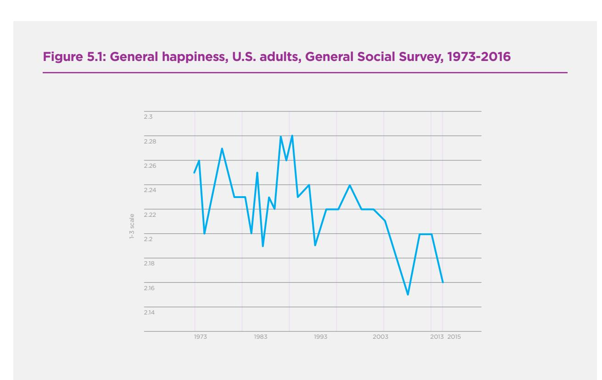

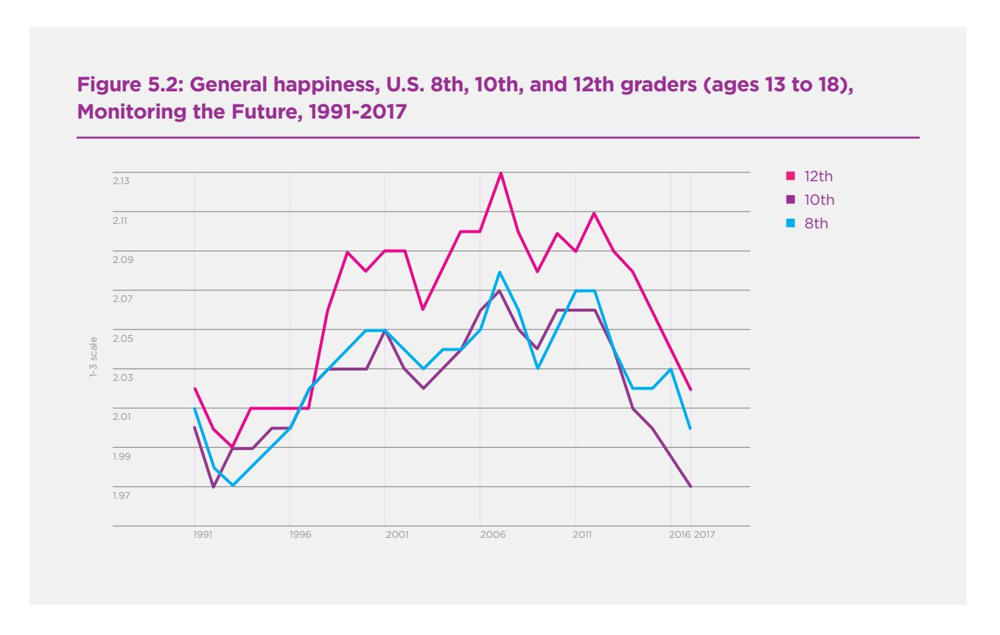

The data on time use among United States adolescents comes primarily from the Monitoring the Future survey of 13- to 18-year-olds (conducted since 1976 for 12th graders and since 1991 for 8th and 10th graders), and the American Freshman Survey of entering university students (conducted since 1966, with time use data since 1987). Both collect large, nationally representative samples every year (for more details, see *iGen*, Twenge, 2017).

## **The rise of digital media and the fall of everything else**

Over the last decade, the amount of time adolescents spend on screen activities (especially digital media such as gaming, social media, texting, and time online) has steadily increased, accelerating after 2012 after the majority of Americans owned smartphones (Twenge et al., 2019b). By 2017, the average 12th grader (17-18 years old) spent more than 6 hours a day of leisure time on just three digital media activities (internet, social media, and texting; see Figure 5.3). By 2018, 95% of United States adolescents had access to a smartphone, and 45% said they were online "almost constantly" (Anderson & Jiang, 2018).

During the same time period that digital media use increased, adolescents began to spend less time interacting with each other in person, including getting together with friends, socializing, and going to parties. In 2016, iGen college-bound high school seniors spent an hour less a day on faceto-face interaction than GenX adolescents did in the late 1980s (Twenge et al., 2019). Thus, the way adolescents socialize has fundamentally shifted, moving toward online activities and away from face-to-face social interaction.

Other activities that typically do not involve screens have also declined: Adolescents spent less time attending religious services (Twenge et al., 2015), less time reading books and magazines (Twenge et al., 2019b), and (perhaps most crucially) less time sleeping (Twenge et al., 2017). These declines are not due to time spent on homework, which has declined or stayed the same, or time spent on extracurricular activities, which has stayed about the same (Twenge & Park, 2019). The only activity adolescents have spent significantly more time on during the last decade is digital media. As Figure 5.4 demonstrates, the amount of time adolescents spend online increased at the same time that sleep and in-person social interaction declined, in tandem with a decline in general happiness.

**Figure 5.3: Hours per day U.S. 12th graders spent online, playing electronic games, texting, and on social media, Monitoring the Future, 2017.** 

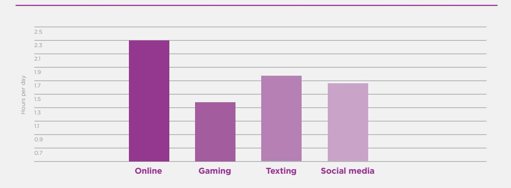

NOTE: Online time includes time spent e-mailing, instant messaging, gaming, shopping, searching, and downloading music.

**Figure 5.4: Time spent on the internet, sleeping more than 7 hours a night most nights, frequency of in-person social interaction across 7 activities, and general happiness, standardized (Z) scores, 8th and 10th graders, Monitoring the Future, 2006-2017** 

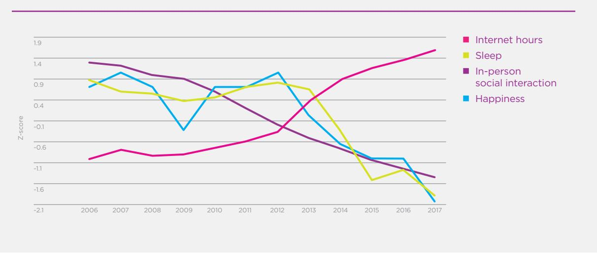

Several studies have found that adolescents and young adults who spend more time on digital media are lower in well-being (e.g., Booker et al., 2015; Lin et al., 2016; Twenge & Campbell, 2018). For example, girls spending 5 or more hours a day on social media are three times more likely to be depressed than non-users (Kelly et al., 2019), and heavy internet users (vs. light users)

are twice as likely to be unhappy (Twenge et al., 2018). Sleeping, face-to-face social interaction, and attending religious services – less frequent activities among iGen teens compared to previous generations – are instead linked to more happiness. Overall, activities related to smartphones and digital media are linked to less happiness, and those not involving technology are linked to

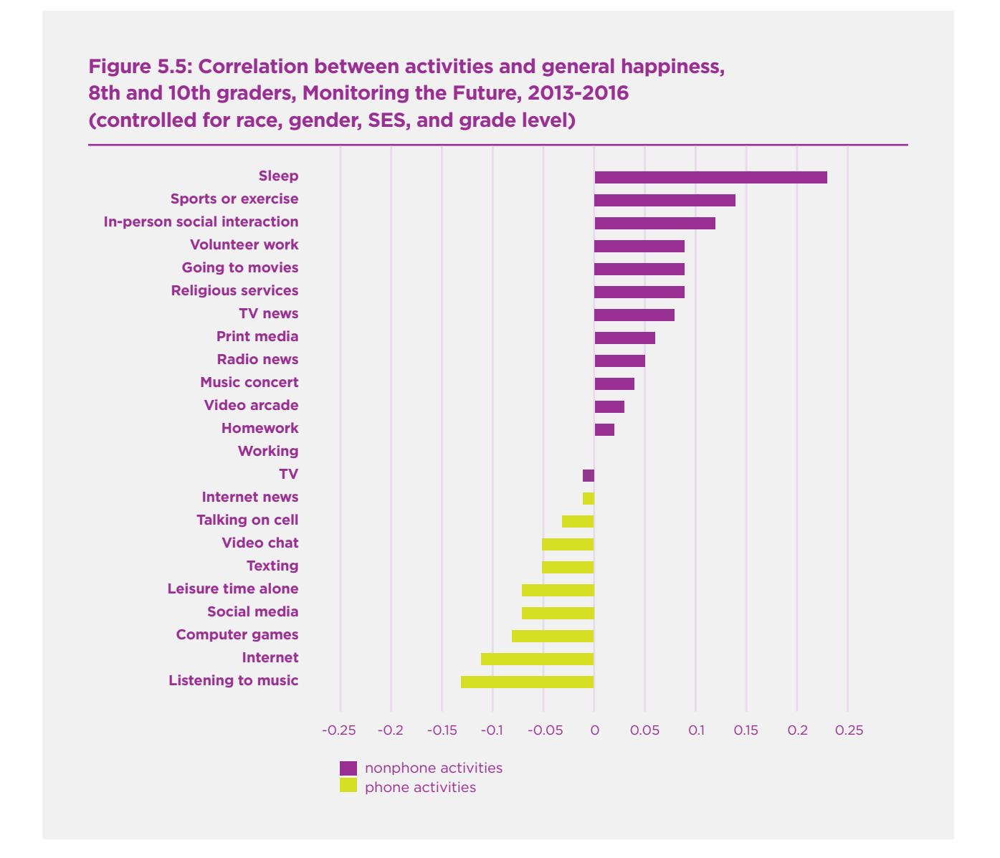

more happiness. (See Figure 5.5; note that when iGen adolescents listen to music, they usually do so using their phones with earbuds).

In short, adolescents who spend more time on electronic devices are less happy, and adolescents who spend more time on most other activities are happier. This creates the possibility that iGen adolescents are less happy because their increased time on digital media has displaced time that previous generations spent on non-screen activities linked to happiness. In other words, digital media may have an indirect effect on happiness as it displaces time that could be otherwise spent on more beneficial activities.

Digital media activities may also have a direct impact on well-being. This may occur via upward social comparison, in which people feel that their lives are inferior compared to the glamorous "highlight reels" of others' social media pages; these feelings are linked to depression (Steers et al., 2014). Cyberbullying, another direct effect of digital media, is also a significant risk factor for depression (Daine et al., 2013; John et al., 2018). When used during face-to-face social interaction, smartphone use appears to interfere with the enjoyment usually derived from such activities; for example, friends randomly assigned to have their phones available while having dinner at a restaurant enjoyed the activity less than those who did not have their phones available (Dwyer et al., 2018), and strangers in a waiting room who had their phones available were significantly less likely to talk to or smile at other people (Kushlev et al., 2019). Thus, higher use of digital media may be linked to lower well-being via direct means or by displacing time that might have been spent on activities more beneficial for well-being.

#### **Correlation and causation**

Most of the analyses presented thus far are correlational, so they cannot prove that digital media time causes unhappiness. Third variables may be operating, though most studies control for factors such as gender, race, age, and socioeconomic status. Reverse causation is also possible: Perhaps unhappy people spend more time on digital media rather than digital media causing unhappiness. However, several longitudinal studies following the same individuals over time

have found that digital media use predicts lower well-being later (e.g., Allen & Vella, 2018; Booker et al., 2018; Kim, 2017; Kross et al., 2013; Schmiedeberg & Schroder, 2017; Shakya & Christakis, 2017). In addition, two randomassignment experiments found that people who limit or cease social media use improve their well-being. Tromholt (2017) randomly assigned more than 1,000 adults to either continue their normal use of Facebook or give it up for a week; those who gave it up reported more happiness and less depression at the end of the week. Similarly, Hunt et al. (2018) asked college students to limit their social media use to 10 minutes a day per platform and no more than 30 minutes a day total, compared to a control group that continued their normal use. Those who limited their use were less lonely and less depressed over the course of several weeks.

Both the longitudinal and experimental studies suggest that at least some of the causation runs from digital media use to well-being. In addition, the increases in teen depression after smartphones became common after 2011 cannot be explained by low well-being causing digital media use (if so, one would be forced to argue that a rise in teen depression caused greater ownership of smartphones, an argument that defies logic). Thus, although reverse causation may explain some of the association between digital media use and low well-being, it seems clear it does not explain all of it.

In addition, the indirect effects of digital media in displacing time spent on face-to-face social interaction and sleep are not as subject to reverse causation arguments. Deprivation of social interaction (Baumeister & Leary, 1995; Hartgerink et al., 2015; Lieberman, 2014) and lack of sleep (Zhai et al., 2015) are clear risk factors for unhappiness and low well-being. Even if digital media had little direct effect on wellbeing, it may indirectly lead to low well-being if it displaces time once spent on face-to-face social interaction or sleep.

#### **Conclusion**

Thus, the large amount of time adolescents spend interacting with electronic devices may have direct links to unhappiness and/or may have displaced time once spent on more beneficial activities, leading to declines in happiness. It is not as certain if adults have also begun to spend less time interacting face-to-face and less time sleeping. However, given that adults in recent years spent just as much time with digital media as adolescents do (Common Sense Media, 2016), it seems likely that their time use has shifted as well. Future research should explore this possibility.

Thus, the fundamental shift in how adolescents spend their leisure time may explain the marked decline in adolescent well-being after 2011. It may also explain some of the decline in happiness among adults since 2000, though this conclusion is less certain. Going forward, individuals and organizations focused on improving happiness may turn their attention to how people spend their leisure time.

## *connect*. New York, NY: Broadway Books.

Lieberman, M. D. (2014). *Social: Why our brains are wired to* 

behaviour and psychosocial well-being in childhood: Cross-sectional and longitudinal associations. *Mental Health and Physical Activity*, 9, 41-47. Anderson, M., & Jiang, J. (2018). *Teens, social media,* 

*& technology 2018*. Pew Research Center. http://www.pewinternet.org/2018/05/31/teens-social-media-technology-2018/

Allen, M. S., & Vella, S. A. (2015). Screen-based sedentary

**References**

Baumeister, R. F., & Leary, M. R. (1995). The need to belong: Desire for interpersonal attachments as a fundamental human motivation. *Psychological Bulletin*, *117*, 497–529.

Baumeister, R. F., & Leary, M. R. (1995). The need to belong: Desire for interpersonal attachments as a fundamental human motivation. *Psychological Bulletin*, *117*, 497–529.

Booker, C. L., Skew, A. J., Kelly, Y. J., & Sacker, A. (2015). Media use, sports participation, and well-being in adolescents: Cross-sectional findings from the UK household longitudinal study. *American Journal of Public Health*, *105*, 173-179.

Booker, C. L., Kelly, Y. J., & Sacker, A. (2018). Gender differences in the associations between age trends of social media interaction and well-being among 10-15 year olds in the UK. *BMC Public Health*, *18*, 321-333.

Common Sense Media, 2016. The Common Sense Census: Plugged-in parents of tweens and teens 2016. https://www. commonsensemedia.org/research/the-common-sense-censusplugged-in-parents-of-tweens-and-teens-2016

Daine, K., Hawton, K., Singaravelu, V., Stewart, A., Simkin, S., & Montgomery, P. (2013). The power of the web: a systematic review of studies of the influence of the internet on self-harm and suicide in young people. *PloS One*, *8*(10), e77555.

Dwyer, R., Kushlev, K., & Dunn, E. (2018). Smartphone use undermines enjoyment of face-to-face social interactions. *Journal of Experimental Social Psychology*.

Hunt, M. G., Marx, R., Lipson, C., & Young, J. (2018). No more FOMO: Limiting social media decreases loneliness and depression. *Journal of Social and Clinical Psychology*, *37*, 751-768.

John, A., Glendenning, A. C., Marchant, A., Montgomery, P., Stewart, A., Wood, S., … Hawton, K. (2018). Self-harm, suicidal behaviours, and cyberbullying in children and young people: Systematic review. *Journal of Medical Internet Research*, *20*(4), e129.

Kelly, Y., Zilanawala, A., Booker, C., & Sacker, A. (2019). Social media use and adolescent mental health: Findings from the UK Millennium Cohort Study. *EClinical Medicine*.

Kim, H. H. (2017). The impact of online social networking on adolescent psychological well-being (WB): a population-level analysis of Korean school-aged children. *International Journal of Adolescence and Youth*, *22*, 364-376.

Kross, E., Verduyn, P., Demiralp, E., Park, J., Lee, D. S., Lin, N., Shablack, H., Jonides, J., & Ybarra, O. (2013). Facebook use predicts declines in subjective well-being in young adults. *Plos One*, *8*, e69841.

Kushlev, K., Hunter, J. F., Proulx, J., Pressman, S. D., & Dunn, E. (2019). Smartphones reduce smiles between strangers. *Computers in Human Behavior*, 91, 12-16.

Hartgerink, C. H. J., van Beest, I., Wicherts, J. M., & Williams, K. D. (2015). The ordinal effects of ostracism: A meta-analysis of 120 cyberball studies. PLoS ONE, 10(5).

Lin, L. y., Sidani, J. E., Shensa, A., Radovic, A., Miller, E., Colditz, J. B., & ... Primack, B. A. (2016). Association between social media use and depression among U.S. young adults. *Depression and Anxiety*, *33*, 323-331.

Mercado, M. C., Holland, K., & Leemis, R. W. (2017). Trends in emergency department visits for nonfatal self-inflicted injuries among youth aged 10 to 24 years in the United States, 2001-2015. *Journal of the American Medical Association*, *318*, 1931-1933.

Mojtabai, R., Olfson, M., & Han, B. (2016). National trends in the prevalence and treatment of depression in adolescents and young adults. Pediatrics, 138(6).

Morgan, C., Webb, R. T., Carr, M. J., Kontopantelis, E., Green, J., Chew-Graham, C. A., Kapur, N., & Ashcroft, D. M. (2017). Incidence, clinical management, and mortality risk following self harm among children and adolescents: Cohort study in primary care. British Medical Journal, 359, j4351.

NHS (2018). Mental Health of Children and Young People in England. https://digital.nhs.uk/data-and-information/ publications/statistical/mental-health-of-children-and-youngpeople-in-england/2017/2017

Patalay, P., & Gage, S. (2019). Trends in millennial adolescent mental health and health related behaviours over ten years: a population cohort comparison study. Manuscript under review.

Plemmons, G., Hall, M., Doupnik, S., Gay, J., Brown, C., Browning, W., & ... Williams, D. (2018). Hospitalization for suicide ideation or attempt: 2008-2015. *Pediatrics*, *141*(6).

Sachs, J. D. (2017). Restoring American happiness. World Happiness Report 2017. https://s3.amazonaws.com/ happiness-report/2017/HR17.pdf

Sachs, J. D. (2018). America's health crisis and the Easterlin paradox. World Happiness Report 2018. https://s3.amazonaws. com/happiness-report/2018/WHR\_web.pdf

Schmiedeberg, C., & Schroder, J. (2017). Leisure activities and life satisfaction: An analysis with German panel data. *Applied Research in Quality of Life*, *12*, 137-151.

Shakya, H. B., & Christakis, N. A. (2017). Association of Facebook use with compromised well-being: A longitudinal study. *American Journal of Epidemiology*, 185, 203-211.

Tromholt, M. (2016). The Facebook experiment: Quitting Facebook leads to higher levels of well-being. *Cyberpsychology, Behavior, and Social Networking*, *19*, 661-666.

Twenge, J. M. (2017). *iGen: Why Today's Super-Connected Kids Are Growing Up Less Rebellious, More Tolerant, Less Happy – and Completely Unprepared for Adulthood*. New York: Atria Books.

Twenge, J. M., & Campbell, W. K. (2018). Associations between screen time and lower psychological well-being among children and adolescents: Evidence from a population-based study. *Preventative Medicine Reports*, *12*, 271-283.

Twenge, J. M., Cooper, A. B., Joiner, T. E., Duffy, M. E., & Binau, S. G. (2019a). Age, period, and cohort trends in mood disorder and suicide-related outcomes in a nationally representative dataset, 2005-2017. *Journal of Abnormal Psychology*.

Twenge, J. M., Exline, J. J., Grubbs, J. B., Sastry, R., & Campbell, W. K. (2015). Generational and time period differences in American adolescents' religious orientation, 1966-2014. *PLoS ONE*, 10 (5): e0121454.

Twenge, J. M., Joiner, T. E., Rogers, M. L., & Martin, G. N. (2018b). Increases in depressive symptoms, suicide-related outcomes, and suicide rates among U.S. adolescents after 2010 and links to increased new media screen time. *Clinical Psychological Science*, *6*, 3-17.

Twenge, J. M., Krizan, Z., & Hisler, G. (2017). Decreases in self-reported sleep duration among U.S. adolescents 2009- 2015 and links to new media screen time. *Sleep Medicine*, 39, 47-53.

Twenge, J.M., Martin, G. N., & Campbell, W. K. (2018). Decreases in psychological well-being among American adolescents after 2012 and links to screen time during the rise of smartphone technology. *Emotion*, *18*, 765-780.

Twenge, J. M., & Park, H. (2019). The decline in adult activities among U.S. adolescents, 1976-2016. *Child Development*, *90*, 638-654.

Twenge, J. M., Martin, G. N., & Spitzberg, B. H. (2019b). Trends in U.S. adolescents' media use, 1976-2016: The rise of digital media, the decline of TV, and the (near) demise of print. *Psychology of Popular Media Culture*.

Twenge, J.M., Martin, G. N., & Campbell, W. K. (2018a). Decreases in psychological well-being among American adolescents after 2012 and links to screen time during the rise of smartphone technology. *Emotion*, *18*, 765-780.

Twenge, J. M., Sherman, R. A., & Lyubomirsky, S. (2016). More happiness for young people and less for mature adults: Time period differences in subjective well-being in the United States, 1972-2014. *Social Psychological and Personality Science*, *7*, 131-141.

Twenge, J. M., Spitzberg, B. H., & Campbell, W. K. (2019). Less in-person social interaction with peers among U.S. adolescents in the 21st century and links to loneliness. *Journal of Social and Personal Relationships*.

Zhai, L., Zhang, H., & Zhang, D. (2015). Sleep duration and depression among adults: A meta-analysis of prospective studies. *Depression and Anxiety*, *32*, 664–670.

## Chapter 6 **97**

# Big Data and Well-being

Clément Bellet INSEAD

Paul Frijters

Professor of Wellbeing Economics at the LSE

This chapter provides a general review and discussion of the debate surrounding Big Data and well-being. We ask four main questions: Is Big Data very new or very old? How well can we now predict individual and aggregate well-being with Big Data, and to what extent do novel measurement tools complement surveybased measures? Is Big Data responsible for the rising interest in well-being or a threat to it? What are the economic and societal consequences of Big Data, and is there a point to government regulation of ownership, access, and consent?

#### **Quo Vadis?**

The availability of information has increased dramatically over the last decades, with roughly a doubling in the market for data storage every two years.1 The main driver of this has been the spectacular reduction in the costs of gathering and transferring information: cheaper computer chips and faster computers have followed Moore's law since the 1970s. As a result, there are now billions of databases on the planet with all kinds of information, including lists of genetic markers, inventory, pictures, topography, surveillance videos, administrative datasets and others.2

The amount of data on individuals collected is baffling. For instance, whilst it was reported in 2014 that there were thousands of "data brokering" firms buying and selling information on consumers, with the biggest company Axciom alone already having an average of 1500 pieces of information on 200 million Americans, today the amount is 4 times higher at least. As for Google queries, they went from 14 billions per year in 2000 to 1.2 trillions a decade later.

The main business model that pays for the collection and analysis of all this data is advertising: Internet companies and website hosts now sell personalised advertising space in a spot market, an industry worth around 250 billion a year. There is also a smaller market for information about individuals: professional "data broker" firms specialise in collecting data on individuals around the world, selling it to all and sundry. This includes their creditworthiness and measures of their Internet-related activities. Firms are getting increasingly good at matching records from different sources, circumventing privacy laws and guessing the identification

behind de-personalised information by crossreferencing financial transactions and recurrent behaviour.

Academic articles and books on these developments are now plentiful. The term used to describe this data explosion and its Big Brother type uses, "Big Data", was cited 40,000 times in 2017 in Google Scholar, about as often as "happiness"! This data explosion was accompanied by the rise of statistical techniques coming from the field of computer science, in particular machine learning. The later provided methods to analyse and exploit these large datasets for prediction purposes, justifying the accumulation of increasingly large and detailed data.3

The term Big Data in this chapter will refer to large datasets that contain multiple observations of individuals.4 Of particular interest is the data gathered on individuals without their "considered consent". This will include all forms of data that one could gather, if determined, about others without their knowledge, such as visual information and basic demographic and behavioural characteristics. Other examples are Twitter, public Facebook posts, the luminescence of homes, property, etc.

Is this information used to say something about well-being, ie Life Satisfaction? How could it be used to affect well-being? And how should it be used? These question concerning Big Data and Well-being - where are we, where could we go, and where should we go - will be explored in this chapter.

In the first Section we give a brief history of Big Data and make a broad categorization of all available forms of Big Data and what we know about their usages. In the second Section we ask how well different types of data predict well-being, what the potential use is of novel measurement instruments, and what the most promising forms of data are to predict our individual well-being. We will also look at the question of what the likely effects are of the increased use of Big Data to influence our behaviour. This includes how useful information on well-being itself is to governments and businesses. In the third Section we then review the agency issues surrounding Big Data and well-being: who is in control of this data and what future usage is desirable? How important is considered consent when data usage agreements for commercial purposes become either the default option or a requirement to access services provided by Internet companies?

To illustrate the review, we augment the chapter with twitter data from Mexico and draw on the 2018 WHR calculations from the Gallup World and Daily Polls, and other major data sources. We do this in particular to discuss how much of well-being one can explain the types of information that currently available in the public domain.

#### **1. Big Data: A Brief History**

Before the advent of writing and during the long hunter-gatherer period, humans lived in fairly small groups (20-100) of people who knew each other well. Gathering data on those around them, particularly their emotional state, was necessary and normal, as one can gleam from humanity's empathic abilities and the varied ways in which faces and bodies communicate internal lives to others. It might not have been recorded on usb-drives, but the most intimate details would have been the subject of gossip and observation within the whole group with which humans lived. It would have been vital to know about others' abilities, health, likes and dislikes, and kinship relations. All that shared data would now have to be called something like "distributed Big Data".

Then came large agricultural hierarchies and their need to control populations, leading to systems of recording. The Sumerian script is the oldest known system of writing, going back at least 6,000 years, and one of its key uses was to keep track of the trades and taxes of those early kingdoms: the business of gathering taxes needed records on who had paid how much and who was yet to pay how much. One might see the hundreds of thousands of early clay tablets of the Sumerian accountants as the first instance of "Big Data": systematic information gathered to control and manipulate a population.

Some 4,000 years ago, in both Egypt and China, the first population censuses were held, recording who lived where and how much their wealth was, with the express purpose of supporting the tax ambitions of the courts of those days. A census was the way to know how much individuals, households, villages, and whole regions could be taxed, both in terms of produce and labour time.

The key initial use of Big Data was simply to force individuals into paying taxes. The use of a census to measure and tax a population has stayed with humanity ever since, including the regular censuses of the Romans, the Domesday book ordered by William the Conqueror in 1086 in Britain, up to the present day where censuses are still held in many countries. The modern countries that don't have a census, usually have permanent population records, an even more sophisticated form of Big Data.

The Bible illustrates these early and still dominant uses of Big Data: the book of Genesis lists the genealogy of the tribe, important for matters of intermarriage and kinship claims; and the book of Exodus mentions the use of a population census to support the tabernacle. Courts and governments were not the only gatherers of Big Data with an interest in recording and controlling the population. Organised religion and many secular organisations collected their own data. Medieval churches in Europe collected information on births, christenings, marriages, wills, and deaths. Partly this was in order to keep track of the daily business of a church, but it also served the purposes of taxation: the accounts were a means of counting the faithful and their wealth. Medieval universities also kept records, for instance of who had earned what qualification, because that is what they sold and they needed to keep track of their sales. As with churches, universities also had internal administrations where they kept track of their possessions, loans, debts, "the academic community", teaching material, etc.

With the advent of large corporations came totally different data, connected to the need to manage long-run relations with many employees: records on the entitlements and behaviour of employees, alongside identifying information (where they could be found, next of kin, etc.). These records were held to allow a smooth operation of organisations and were subsequently used as the basis of income taxation by governments, a good example of where the Big Data gathered by one entity (firms) gets to be used by another (a tax authority) for totally different purposes.

What has been said above can be repeated for many other large organisations throughout the ages: they kept track of the key information they needed to function. Traders needed to keep track of their clients and suppliers. Hospitals and doctors needed to keep track of ailments and individual prescriptions. Inns needed to keep track of their guests. Towns needed to keep track of their rights versus other authorities. Ideologies needed to keep track of actual and potential supporters. Etc. There is hence nothing unusual about keeping records on individuals and their inner lives, without their consent, for the purposes of manipulation. One might even say that nothing on the Internet is as invasive as the monitoring that is likely to have been around before the advent of writing, nor is anything on the internet more manipulative than the monitoring of large empires that pressed their populations into taxes, wars, and large projects (like building the pyramids). Big Data is thus ancient. There is just a lot more of it nowadays that is not run and owned by governments, and an incomparably stronger capacity to collect, classify, analyse, and store it due to the more recent rise in computer power and the rapid development of computer science.

In the present day, governments are still large producers and consumers of Big Data, usually without the consent of the population. The individual records are kept in different parts of the government, but in Western countries they usually include births, marriages, addresses, emails, fingerprints, criminal records, military service records, religion, ethnicity, kinship relations, incomes, key possessions (land, housing, companies), and of course tax records. What is gathered and which institution gathers the data varies by country: whereas in France the data is centrally gathered in a permanent population record and it is illegal to gather data on religion and ethnicity, in the US the various bits of data are gathered by different entities and there is no problem in measuring either religion or ethnicity.5

Governments are also in the business of analysing, monitoring, and manipulating our inner lives. This is a well-understood part of the social contract and of the socialisation role of education, state media, military service, national festivities or national ceremonies: successful countries manage to pass on their history, values and loyalties to the next generation.6 Big Data combined with specific institutions surrounding education, information, taxation or the legal system is then used to mould inner lives and individuals' identities. Consent in that process is ex post: once individuals are "responsible citizens" they can have some say about this in some countries, but even then only to a limited degree because opting out is often not an option.

In the Internet age, the types and volume of data are truly staggering, with data gathered and analysed for lots of purposes, usually profit-motivated. The generic object is to get a consumer to click on a website, buy a service, sign some document, glance some direction, vote some way, spend time on something, etc. A few examples illustrate the benefits and dangers.

Supermarket chains now gather regular scanner and card-data on the sales to their customers.7 Partly in order to improve the accuracy of their data, they have loyalty programs where customers get discounts in exchange for private information that allows the supermarkets to link names and addresses to bank cards and other forms of payment. As a result, these companies have information on years of purchases by hundreds of millions of households. One use of that data has been to support "just on time" delivery to individual stores, reducing the necessity for each store to have large and expensive magazines where stocks are held, making products cheaper. That system requires supermarkets to fairly accurately predict what the level of sales will be for thousands of products in stock, which not merely needs good accounting of what is still in stock, but also good forecasting of future demand which requires sophisticated analysis of previous sales. Hence supermarkets know with near-perfect accuracy how much extra ice-cream they will sell in which neighbourhood if the weather gets warmer, and just how many Easter eggs they will sell at what discounted price. One might see this use of Big Data as positive, efficiency improving.

Then there is the market for personalised advertising, also called behavioural targeting. On the basis of their internet-observable history, which will often include their social communication on the internet (including their mobile phone device), it is predicted what advertising is most likely to work on them. Personalised advertising is then sold on a spot market, leading to personalised recommendations (ie one's previous purchases), social recommendations (what similar people bought), and item recommendations

(what the person just sought). Hildebrandt typified the key aspect of this market when she said "profiling shifts the balance of power between those that can afford profiling (...) and those (...) profiled".8 This advertising market is enormous and has grown fast. Paid media content in 2017 was reportedly worth over 500 billion dollars, and digital advertising was worth some 230 billion in 2017 according to industry estimates. The business model of many internet firms is to offer services for free to anyone in the world, funded by the ads attracted to the traffic on that site. The grand bargain of the Internet is thus free services in exchange for advertising. This is both well-understood and well-known, so one could say that this bargain is made under conditions of considered consent: users of free services (like Facebook) should know that the price of those services is that their personal information is sold for advertising purposes.

There is also a market for more invasive information, where access to goods and services is decided on the basis of that information. An old example from before the internet was credit-worthiness information, which could be bought off banks and other brokers. This was of course important when it came to large purchases, such as a house or setting up a new business. A good modern example is personalised information on the use of online health apps. Individuals visiting free online health apps which give feedback on, for instance, how much someone has run and where, are usually asked to consent to the sale of their information. That information is very useful to, for instance, health insurance companies interested in knowing how healthy the behaviour of someone is. Those health insurance companies will look more favourably on someone known to have a fit body, not buy large volumes of cigarettes and alcohol online, and have a generally considered and healthy lifestyle. It is thus commercially important for health insurance companies to buy such data, and not really an option to ignore it.

This example also shows the ambiguity involved in both consent and the option of staying "off the grid": it is unlikely that everyone using health apps realises the potential uses of the data they are then handing over, and it is not realistic to expect them to wade through hundreds of pages of detailed consent forms wherein all the potential uses would be spelled out. Also,

someone who purposefully stays "off the grid" and either actively hides their online behaviour via specialised software or is truly not online at all, will not be unaffected by health profiling activities for the very reason that there is then no profile of them. To a health insurance company, the lack of information is also informative and likely to mean that person has something to hide. Hence, even someone actively concerned with leaving no digital footprints and having very limited data on them online, will be affected without their consent by the activities of others.

Privacy is very difficult to maintain on the Internet because nearly all large internet-site providers use a variety of ways to identify who accesses their websites and what their likely interests are. Websites use cookies, Javascripts, browser Fingerprinting, Behavioural Tracking, and other means to know the moment a person clicks on a website who that person is and what they might want. What helps these websites is the near-uniqueness of the information that a website receives when it is accessed: the IP-address, the Browser settings, the recent search history, the versions of the programs used, and the presence of a variety of added software (Flash, Javascript, cameras, etc.). From that information, internet sites can usually know who has accessed them, which can then be matched to previous information kept on that IP address, bought and sold in a market. Only very Internet-literate individuals can hope to remain anonymous.

The fact that the main use of Big Data on the Internet is to aid advertising should also be somewhat reassuring for those who fear the worst about Big Data: because the advertising market is worth so much, large internet companies are careful not to sell their data for purposes that the population would be highly disapproving of, whether those purposes are legal or not. It is for instance not in the interest of e-bay, Apple, Google, or Samsung to sell information about the porn-viewing habits of their customers to potential employers and romantic partners. These uses are certainly worth something, and on the "Dark Web" (the unauthorised parts of the internet) such information can (reportedly) indeed be bought and sold, but for the "legitimate" part of the market, there is just too much to lose.

How does this relate to well-being?

## **2. The Contribution of Big Data to Well-being Science**

Mood analysis is very old, with consumer and producer sentiment recorded in many countries since the 1950s because it predicts economic cycles well.9 However, the analysis of the well-being of individuals and aggregate well-being is starting to take off as more modern forms of mood analysis develop. These include counting the positive/negative affect of words used in books or any written documents (e.g. Linguistic Inquiry and Word Count); analysis of words used in Twitter feeds, Facebook posts, and other social media data through more or less sophisticated models of sentiment analysis; outright opinion and election polling using a variety of tools (mobile phone, websites, apps). New technologies include Artificial Intelligence analysis of visual, olfactory, sensory, and auditory information. They also include trackable devices that follow individuals around for large parts of the day and sometimes even 24/7, such as fitbits, mobile phones or credit cards.

One may first wonder whether "Big Data" can improve well-being predictions, and help solve what economists have called "prediction policy problems"?10

#### **2.1 Predictability of Individual and Aggregate Well-being, a benchmark.**

Some forms of Big Data will trivially explain well-being exceedingly well: social media posts that inform friends and family of how one feels are explicitly meant to convey information about well-being and will thus have a lot of informational content about well-being to all those with access. Claims that social media can hence predict our well-being exceedingly well thus need not be surprising at all for that is often the point of social media. Nevertheless, it is interesting to have some sense of how much well-being can be deduced from the average individual, which is equivalent to the question how much well-being is revealed by the average user of social media. A similar question arises concerning medical information about individuals: very detailed medical information, which includes assessments of how individuals feel and think about many aspects of their lives, will also explain a lot of their well-being and may even constitute the best measures available. Yet, the question how much

one on average would know from typical medical records remains an interesting question.

In order to have some comparison, we first document how available datasets that include direct information on well-being reveal the potential of different types of information to predict well-being. We take the square of the correlation coefficient (R2) as our preferred indicator of predictability.

Andrew Clark et al. (2018) run typical life satisfaction regressions for the United Kingdom, with comparisons for Germany, Australia, and the United States. The main finding is that the R2 does not typically go beyond 15% and even to reach that level needs more than socio-democraphic and economic information (income, gender, age, family circumstances, wealth, employment, etc.) but also needs subjective indicators of health, both physical health and mental health which are both measured using subjective questions. Using the US Gallup Daily poll, we show in the Online Appendix that the same relationship holds there too. The relatively low predictability of life satisfaction at the individual level has long been a known stylised fact in the literature, with early reviews found for instance in the overview book by Michael Argyle et al. (1999) where Michael Argyle also notes the inability of regularly available survey-information to explain more than 15% of the variation in life satisfaction (largely based on World Value Survey data).

Generally, well-being is poorly predicted by information from regular survey questions, but health conditions appear to be the most reliable predictors of well-being. The availability of administrative datasets capturing the health conditions of an entire population - for instance via drug prescriptions - suggests health may be the best proxy available to predict well-being in the future (see also Deaton 2008). Clark et al. (2018) find that mental health explains more variation in well-being than physical health does, also a typical finding that we replicate for the United States (see online Appendix).

What about variation in aggregate well-being? In Chapter II of the WHR 2018, Helliwell et al. (2018) looked at how well differences in average well-being across countries over time can be explained by observabled average statistics. Table 2.1 of that chapter showed a typical

cross-country regression wherein 74% of the variance could be explained by no more than a few regressions: GDP per capita, levels of social support, life expectancy, an index of freedom, an index of generosity, and an index of perceptions of corruption.

That chapter also found that the strongest moves up and down were due to very plausible and observable elements: the collapsing economy of Venuzuela showed up in a drop of over 2 points in life expectancy from 2008-2010 to 2015-2017, whilst the recovery from civil war and Ebola in Sierra Leone lead it to increase life satisfaction by over a point. Hence countryvariations are strongly predictable. We did our own calculations with the same Daily Gallup dataset (in the Online Appendix) and also found we could explain even higher levels (90%) of variation between US states if one added selfreported health indicators to this set.

Predictability of aggregate well-being thus differs strongly from individual well-being and has different uses. Predicting aggregate well-being can be useful if individual measures are unavailable, for instance due to wars or language barriers.

When individuals originate from various countries, well-being predictions based on standardized variables capturing income, jobs, education levels or even health are about half as powerful as within country predictions (see online Appendix, but also, for instance Claudia Senik (2014) on the cultural dimensions of happines). This is true both for individual-level and country-level predictability.11 This suggests socio-economic and demographic factors affect subjective well-being in very different ways across cultures and countries at various levels of economic development.

The use of alternative sources of Big Data, like content analysis of tweets, does not necessarily help. In their research, Laura Smith and her co-authors ask whether well-being 'translates' on Twitter.12 They compare English and Spanish tweets and show translation across languages leads to meaningful losses of cultural information. There exists strong heterogeneity across wellbeing measures. For instance, at the individual level, experienced feelings of happiness are better predicted than reported satisfaction with life as measured by the Cantril ladder. This is the opposite for country-level regressions.

#### **2.2 Can Big Data Improve Well-being Predictions?**

Standard socio-demographic variables, especially the health conditions of a population, can generate high well-being predictability, at least at a more aggregate level. However, with the rise of digital data collection and improvements in machine learning or textual analysis techniques, alternative sources of information can now be exploited. Standard survey-based measures of happiness could then be used to train prediction models relying on "Big Data" sources, hence allowing for a finer analysis across time and space of the determinants of well-being.13 Table 6.1 reviews the main studies that have tried to predict life satisfaction or happiness from alternative Big Data sources. The information collected is extracted from digital footprints left by individuals when they go online or engage with social media networks. In this section, we focus on studies proposing the construction of new measures of well-being based on how well they can predict reported happiness and life satisfaction. Hence, Table 6.1 does not reference articles that have used NLP and other computerized text analysis methods for the sole purpose of eliciting emotional content, which we discuss in the next section.

Quite surprisingly, the classical issue of a generally low predictability of individual-level satisfaction remains. The clearest example is a study by Kosinsky and his co-authors that looks at how predictive Facebook user's page likes are of various individual traits and attributes, including their well-being.14 Life satisfaction ranks at the bottom of the list in terms of how well it can be predicted, with an R squared of 2.8% only. This does not mean predictive power cannot be improved by adding further controls, but it provides a reasonable account of what should be expected. Strikingly, alternative studies using sentiment analysis of Facebook status updates find similarly low predictive power, from 2% of between-subjects variance explained to a maximum or 9%.15 These differences are explained by the measure of well-being being predicted, and the model used. Research also showed positive emotions are not significantly correlated to life satisfaction on Facebook, contrary to negative emotions.16 This suggests social pressure may incite unhappy individuals to pretend they are happier than they really are, which is less likely to be the case for the display of negative emotions.

**Table 6.1: Can Big Data Predict Well-being? Review of R2 Coefficients Across Studies**

| Reference                        | SWB measure       | Big Data measure                      |               | Big Data source Unit of analysis | R2    |
|----------------------------------|-------------------|---------------------------------------|---------------|----------------------------------|-------|
| Individual level pre dictions |                   |                                       |               |                                  |       |
| Collins et al. (2015)            | Life satisfaction | Status updates                        | Facebook      | Facebook users                   | 0.02  |
| Kosinski et al. (2013)           | Life satisfaction | Type of Facebook pages liked       | Facebook      | Facebook users                   | 0.028 |
| Liu et al. (2015)                | Life satisfaction | Status updates (positive emotions) | Facebook      | Facebook users                   | 0.003 |
| Liu et al. (2015)                | Life satisfaction | Status updates (negative emotions) | Facebook      | Facebook users                   | 0.026 |
| Schwartz et al. (2016)           | Life satisfaction | Status updates (topics, lexica)    | Facebook      | Facebook users                   | 0.09  |
| Aggregate level predictions   |                   |                                       |               |                                  |       |
| Algan et al. (2016)              | Life satisfaction | Word searches                         | Google Trends | US weekly time series         | 0.760 |
| Algan et al. (2016)              | Happiness         | Word searches                         | Google Trends | US weekly time series         | 0.328 |
| Collins et al. (2015)            | Life satisfaction | Average size of personal network   | Facebook      | LS bins                          | 0.7   |
| Collins et al. (2015)            | Life satisfaction | Average number of status updates   | Facebook      | LS bins                          | 0.096 |
| Collins et al. (2015)            | Life satisfaction | Average number of photo tags       | Facebook      | LS bins                          | 0.348 |
| Hills et al. (2017)              | Life satisfaction | Words                                 | Google Books  | Yearly panel of 5 countries   | 0.25  |
| Schwartz et al. (2013)           | Life satisfaction | Topics and lexica from tweets      | Twitter       | US counties                      | 0.094 |

Notes: This Table lists the main studies that have tried to predict survey responses to life satisfaction or happiness questions from alternative Big Data sources. The information collected is extracted from digital footprints left by individuals when they go online or engage with social media networks.

**Figure 6.1: County-Level Life Satisfaction, Survey-Based Measures vs. Predicted from Tweets**

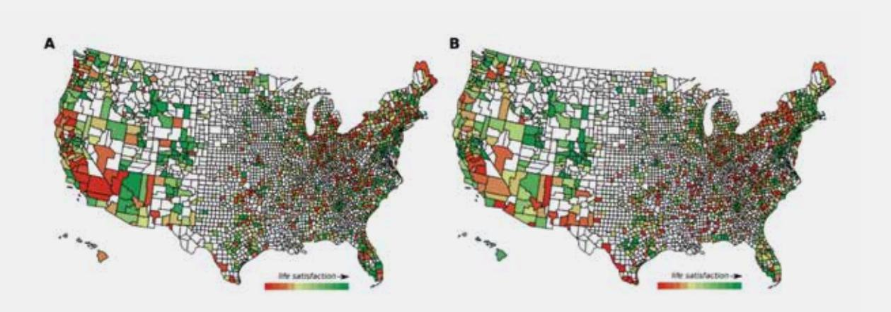

Notes: Source: Schwartz et al. (2013) The Figure shows county-level life satisfaction (LS) as measured (A) using survey data and (B) as predicted using our combined model (controls + word topics and lexica). Green regions have higher satisfaction, while red have lower. White regions are those for which the language sample or survey size is too small to have valid measurements. (No counties in Alaska met criteria for inclusion; r = 0.535, p < 0.001)

**Figure 6.2: Galup Daily Polls Life Satisfaction vs. Estimated Life Satisfaction from Google Trends**

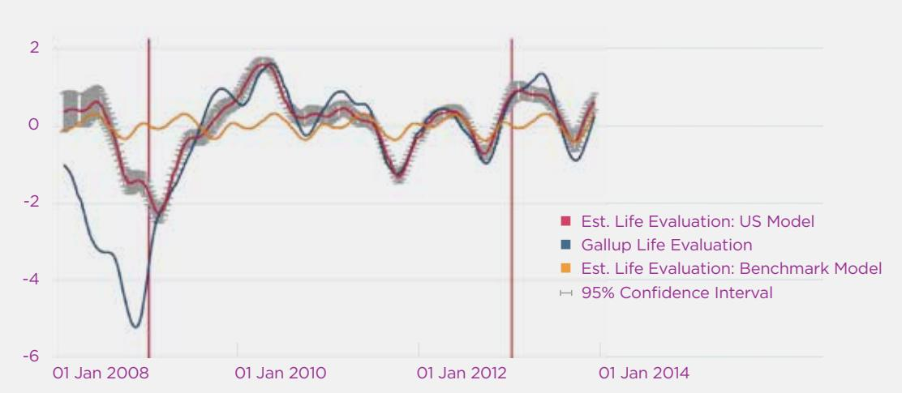

Notes: Source: Algan et al. (2019). The graph shows the estimates (with confidence intervals) for weekly life satisfaction at the US level, constructed using US Google search levels, in red, alongside estimates from the benchmark (seasonality only) model in yellow and the Gallup weekly series in blue. Confidence intervals are constructed using 1000 draws. Training data is inside the red lines, and Testing data is outside the red lines.

However, once aggregated, measures extracted from social networks' textual content have a much stronger predictability. A measure of status updates which yields a 2% R squared in individuallevel regressions yields a five times bigger coefficient, close to 10%, when looking at life satisfaction bins.17 Alternative measures have a much higher predictability like the average number of photo tags (70%) or the average size of users' network of friends (35%). Looking at a cross-section of counties in the United States, research by Schwartz and co-authors find the topics and lexica from Tweets explains 9.4% of the variance in life satisfaction between-counties.18 Predictability improves to 28% after including standard controls, as shown in Figure 6.1 which maps county-level life satisfaction from survey data along with county-level life satisfaction predicted using Tweets and controls. This coefficient remains relatively low, which may again be due to the manipulability of positive emotions in social networks.

Research using the emotional content of words in books led to higher predictability for life satisfaction.19 Using a sample of millions of books published over a period of 40 years in five countries, researchers find an R squared of 25%, which is similar to the predictive power of income or employment across countries in the Gallup World Polls. But the strongest predictability comes from a paper by Yann Algan, Elizabeth Beasley and their co-authors, who showed that daily variation in life satisfaction in the US could be well-predicted (around 76%) by google-trend data on the frequency with which individuals looked for positive terms to do with work, health, and family.20 Figure 6.2 illustrates these results. The authors find a lower predictability of experienced happiness (about 33%). A clear disadvantage of this method though is that these results would not easily carry over to a different time-frame, or a different language. The authors also use standard regression analysis, while the use of machine learning models (like Lasso regressions) can greatly improve out-of-sample prediction in such cases.

Sentiment analysis via twitter and other searchable Big Data sources may thus lead to a greater ability to map movements in mood, both in the recent past and geographically. The ability to past-cast and now-cast life satisfaction via Google search terms and various other forms of

available Big Data may similarly improve our understanding of well-being in the recent past and across areas. This increased ability to predict current and previous levels of mood and life satisfaction might prove very important for research as it reduces the reliance on expensive large surveys. One might start to see papers and government evaluations using derived measures of mood and life satisfaction, tracking the effects of local changes in policy or exogenous shocks, as well as their effects on other regions and times. This might be particularly useful when it comes to social multipliers of events that only directly affect a subset of the population, such as unemployment or identity-specific shocks.

The increased ability to tell current levels of mood and life satisfaction, both at the individual and aggregated level, can also be used for deliberate manipulation: governments and companies can target the low mood / life satisfaction areas with specific policies aimed at those communities (eg more mental health help or more early childcare facilities). Opposition parties might deliberately 'talk down' high levels of life satisfaction and blame the government for low levels. Advertisers might tailor their messages to the mood of individuals and constituents. In effect, targeting and impact analyses of various kinds should be expected to improve.

#### **2.3 Big Data as a Complement to Survey-Based Well-being Measures**

Even if mood extracted from social networks may not fully match variation in survey-based measures of life satisfaction or happiness, they often allow for much more detailed analysis of well-being at the daily level, or even within days. A good example of how massive data sources allow a fuller tracking of the emotional state of a population is given by large-scale Twitter-data on Mexico, courtesy of Gerardo Leyva who kindly allowed us to use the graphs in Figure 6.3 based on the work of his team.21 Sub-Figure (A) shows how the positive/negative ratio of words varied from day to day in the 2016-2018 period. One can see the large positive mood swings on particular days, like Christmas 2017 or the day that Mexico beat Germany in the Football Word Cup 2018, and the large negatives, like the earthquake in 2017, the loss in the World Cup against Brasil, or the election of Donald Trump in the 2016 US Election.

**Figure 6.3: Mood from Tweets in Mexico**

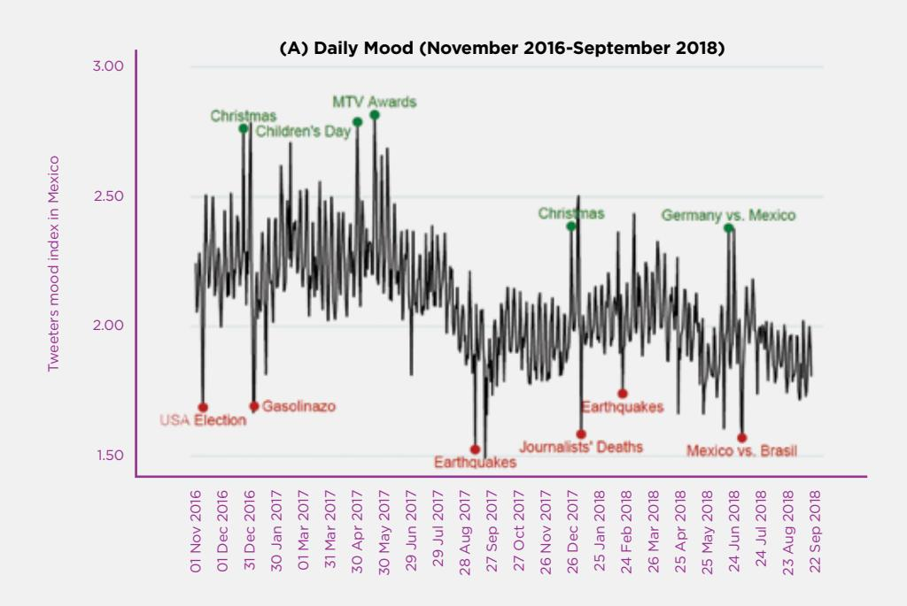

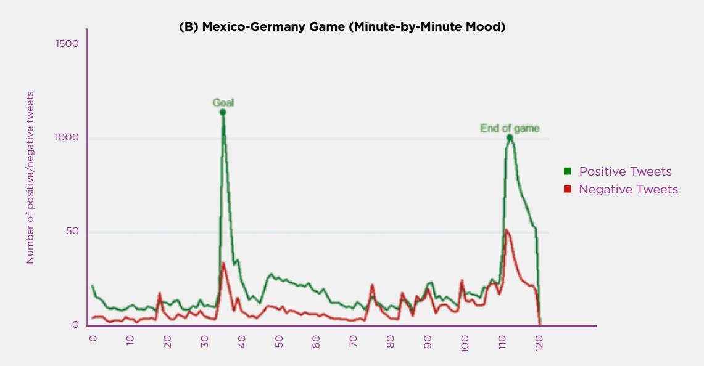

Notes: We thank Gerardo Leyva from Mexico´s National Institute of Statistics and Geography (INEGI) for generously sharing his data, which were based on the subjective well-being surveys known as BIARE and the big data research project "Estado de Animo de los Tuiteros en Mexico" (The mood of twitterers in Mexico), both carried out by INEGI. These data are part of a presentation given by Gerardo Leyva during the "2° Congreso Internacional de Psicologia Positiva "La Psicologia y el Bienestar", November 9-10, 2018, hosted by the Universidad Iberoamericana, in Mexico City and in the "Foro Internacional de la Felicidad 360", November 2-3, 2018, organized by Universidad TecMilenio in Monerrey, Mexico.

**Figure 6.4: Positive and negative emotions of Wolfgang Amadeus Mozart** 

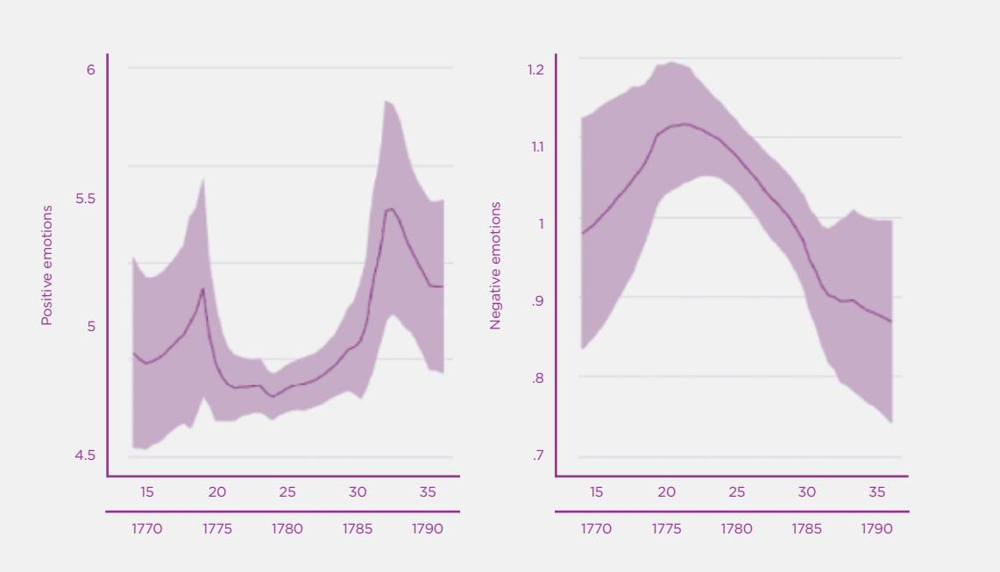

Notes: Source: Borowiecki (2017). The left (right) panel plots the author's index of positive (negative) emotions from Mozart's letters from age 15 until his death at age 35. The depicted prediction is based on a local polynomial regression method with an Epanechnikov kernel, and it is presented along with a 95% confidence interval.

Sub-Figure (B) shows how the mood changes minute-by-minute during the football match against Germany, with ups when Mexico scores and the end of the match. The main take-aways from these Figures are that one gets quite plausible mood-profiles based on an analysis of Twitter data and that individual events are quite short-lived in terms of their effect on Twitter-mood: the variation is dominated by the short-run, making it hard to say what drives the longer-run variation that you also see in this data. This high daily variability in mood also shows the limits of its usefulness in driving policy or understanding the long-run level of well-being in Mexico.

Another example of the usefulness of alternative metrics of well-being extracted from Big Data sources can be found in recently published research by Borowiecki.22 The author extracts negative and positive mood from a sample of 1,400 letters written by three famous music composers (Mozart, Beethoven and Liszt). It provides an interesting application of Linguistic Inquiry and Word Count (LIWC) to the question of whether well-being determines creative processes. The research leverages historical panels of the emotional state of these composers over nearly their entire lifetime, and shows poor health or the death of a relative negatively relates to their measure of well-being, while work-related accomplishments positively relates to it. Figure 6.4 shows the positive and negative mood panel of Mozart. Using random life events as instruments in an individual fixed effects model, the author shows negative emotions trigger creativity in the music industry.

Measures extracted from the digital footprints of individuals can also provide a set of alternative metrics for major determinants of well-being available at a much more detailed level (across time and space). One example can be found in previously mentioned research by Algan and their co-authors.23 They investigate the various domains of well-being explaining variation in overall predicted life satisfaction using Google search data for a list of 554 keywords. From this list of words, they construct 10 composite categories corresponding to different dimensions of life. They find that higher searches for domains

like Job Market, Civic Engagement, Healthy Habits, Summer Leisure, and Education and Ideals are consistently associated with higher well-being at the aggregate US level, while Job Search, Financial Security, Health Conditions, and Family Stress domains are negatively associated with well-being.

The fact that "Big Data" often includes time and geographical information (e.g. latitude and longitude) can trigger both new research designs and novel applications to well-being research. For instance, data based on the location of mobile devices can have many applications in the domains of urban planning, which we know matters for things as important to well-being as trust, security or sense of community.24 Another example can be found in research by Clement Bellet who matches millions of geo-localised suburban houses from Zillow, a large American online real estate company, to reported house and neighborhood satisfaction from the American Housing Surveys.25 The author finds new constructions which increase house size inequality lower the house satisfaction of existing homeowners through a relative size effect, but no such effect is found on neighborhood satisfaction. Making use of the richness of Big Data, this research also investigates the contribution of spatial segregation and reference groups to the trade-off new movers face between higher status (i.e. a bigger house) and higher neighborhood satisfaction.

Life Satisfaction is of course not the only thing of relevance to our inner lives that can be predicted. Important determinants of well-being can also be predicted. For instance, online ratings have been used to measure interpersonal trust and reciprocity, known to be major drivers of subjective well-being.26 How much can we know about important determinants of well-being simply from how someone writes, walks, looks, smells, touches, or sounds?

#### **2.4 New Measures and Measurement Tools**

To see the future uses of Big Data for well-being, we can look at developments in measurement. Pre-internet, what was measured was largely objective: large possessions, social relations (marriages), births and deaths, forms of accreditation (education, training, citizenship), income flows (employment, welfare, taxes), other-relating activities (crime, court cases,

social organisations, large purchases). Measurement in all these cases was usually overt and took place via forms and systems that the population could reasonably be aware of.

Relatively new is data on purely solitary behaviour that identifies individuals, including all things to do with body and mind. There is an individual's presence in space (where someone is), all manner of health data on processes within, and data on physical attributes, such as fingerprints, retina structure, height, weight, heart rates, brain activity, etc. Some of this information is now gathered as a matter of course by national agencies, starting before birth and continuing way past death, such as height, eye colour, finger prints, physical appearance, and age.

In some countries, like Singapore and China, there are now moves under way to also store facial features of the whole population, which are useful in automatically recognising people from video information and photos, allowing agencies to track the movements of the population by recognising them wherever they are. In the European Union, facial features are automatically used to verify that individuals crossing borders are the same as the photos on their passports.

Fingerprint and iris recognition is nigh perfect, and is already used by governments to check identity. This has uses that are arguably very positive, such as in India where fingerprint and iris-based ID is now used to bypass corruption in the bureaucracy and directly pay welfare recipients and others. It of course also has potential negative uses, including identity theft by copying fingerprints and iris-scan information in India.

The main biophysical measurement devices now in common use in social science research (and hence available to everyone) are the following: MRIs, fMRIs, HRV, eye-scanners, skin conductivity, cortisol, steroid hormones, introspection, and mobile sensors that additionally pick up movement, speech, and posture. Table 6.2 lists the measurement devices currently in wide operation in the social sciences, with their essential characteristics and uses reviewed in the book edited by Gigi Foster (2019). Individually, each of these biophysical markers has been studied for decades, with fairly well-know properties. Some have been around for centuries, such as eye-tracking and heart rate monitoring. Table 6.2 quickly describes them and their inherent limitations.

**Table 6.2: Description of biophysical measurement devices used frequently in social sciences**

| Measure                             | Description                                                                                                                                                                                                                                                                                                                                                                                                                                                                                                     |  |  |  |
|-------------------------------------|-----------------------------------------------------------------------------------------------------------------------------------------------------------------------------------------------------------------------------------------------------------------------------------------------------------------------------------------------------------------------------------------------------------------------------------------------------------------------------------------------------------------|--|--|--|
| Magnetic Resonance Imaging (MRI) | Requires individuals to lie in a large machine and is mainly used to map the size and structure of the brain, useful for finding brain anomalies. It is expensive, rare, and not informative on what people think.                                                                                                                                                                                                                                                                                        |  |  |  |
| Functional MRI (fMRI)               | Requires large contraptions and is used to track blood flows in the brain, marking the level of neuronal activity, useful for knowing which areas are active in which tasks. It is expensive, rare, very imprecise about people's thoughts and thought processes (lots of brain areas light up even in simple cases), and thus of very limited use to any would-be manipulator.                                                                                                                        |  |  |  |
| Heart Rate Variability              | Can be tracked with heart monitors (small or large) and is primarily useful for picking up short-term stress and relaxation responses. It is cheap and can be part of a portable package but is unreliable (high individual heterogeneity) and mainly useful in very specific applications, such as monitoring sleep patterns or stress levels in work situations.                                                                                                                                     |  |  |  |
| Eye-tracking scanners               | Require close-up equipment (preferably keeping the head fixed) and can be used to see what draws attention. They are awkward, quite imprecise, and are almost impossible to use outside of very controlled situations because one needs to know the exact spot of all the things that someone could be looking at in 3-dimensional space. Except for things like virtual reality, that is still too hard to do on a large-scale basis.                                                              |  |  |  |
| Skin conductivity                   | Essentially about measuring sweat responses and requires only small on-body devices, mainly useful as a measure of the level of excitement. It is very imprecise though (people sweat due to weather, diet, movement, etc.) and even at best only measures the level of excitement, not whether that is due to something positive or negative.                                                                                                                                                         |  |  |  |
| Cortisol levels                     | Can be measured in bodily fluids like saliva and is primarily used as a measure of stress. It reacts sluggishly to events, is susceptible to diet and individual specific variation, varies highly across individuals and over time due to diurnal, menstrual, and other cycles, and is difficult to measure continuously.                                                                                                                                                                             |  |  |  |
| Steroid hormones                    | Like testosterone can also be measured via saliva and is a measure of things like aggression, for instance going up in situations of competition and arousal. It varies over the life-time and the day cycle, having both very long-term effects (e.g. testosterone in uterus affects the relative length of digits) and short-run effects (more testosterone increases risk-taking). It is difficult and expensive to measure continuously though, and its ability to predict behaviour is patchy. |  |  |  |
| Introspection                       | Introspection (the awareness of own bodily processes) is mainly measured by asking people to guess their own heart rate and is linked to cognitive-emotional performance. It is a very imprecise construct though, and its ability to predict behaviour is highly limited.                                                                                                                                                                                                                                |  |  |  |
| Mobile sensors                      | Can track many aspects of the body and behaviour at the same time, as well as yield dynamic feedback from the individual via spot-surveys.                                                                                                                                                                                                                                                                                                                                                                   |  |  |  |

Whilst these measures have many research uses, they all suffer from high degrees of measurement error, high costs, and require the active participation of the individuals concerned. People know if there is a large device on their heads that tracks their eye-movements. And they can easily mislead most of these measurement devices if they so wished, for instance via their diet and sleep patterns (which affect pretty much all of them). With the exception of non-invasive mobile sensors, which we will discuss later, the possibilities for abuse are thereby limited and their main uses require considered consent.

A new development is the increased ability to recognise identity and emotional state by means of features that can be deduced from a distance: facial features (the eyes-nose triangle), gait, facial expressions, voice, and perhaps even smell.27 These techniques are sometimes made readily available, for instance when it comes to predicting emotional display from pictures. For instance, FaceReader is a commercial software using an artificial neural network algorithm trained on more than 10,000 faces to predict emotions like anger or happiness with high levels of accuracy (above 90% for these two).28

The ability to recognise individuals from afar is now advancing at high speed, with whole countries like Singapore and China investing billions in this ability. Recent patents show that inventors expect to make big money in this field.29 The ability to recognise identity from a distance is not merely useful for governments trying to track down criminals in their own country or 'terrorists' in a country they surveillance covertly. It can be used for positive commercial applications, like mobile phone companies and others to unlock devices of customers who have forgotten their passwords. Yet, it also offers a potential tool for companies and other organisations to link the many currently existing datasets that have a different basis than personal identity, so as to build a profile of whole lives.

Consider this last point more carefully: currently, many forms of Big Data are not organised on the basis of people's identity in the sense of their real name and unique national identifier (such as their passport details) which determine their rights and duties in their countries. Rather, they are based on the devices used, such as IP-addresses, credit cards, Facebook accounts, email accounts, mobile phone numbers, Instagram IDs, twitter handles, etc. Only rarely can these records be reliably linked to individuals' true identities, something that will be increasingly difficult for companies when individuals get afraid of being identified and start to deliberately mix and swap devices with others.

Remote recognition might give large organisations, including companies that professionally collect and integrate datasets, the key tool they need to form complete maps of individuals: by linking the information from photos, videos, health records, and voice recordings they might well be able to map individuals to credit cards, IP addresses, etc. It is quite conceivable that Google Street view might at one point be used to confirm where billions of individuals live and what they look like, then coupled with what persons using a particular credit card look like in shop videos. This can then be coupled with readily available pictures, videos, and documents in ample supply on the internet (eg Youtube, facebook, twitter, snapchat, etc.) to not only link records over time, but also across people and countries. The time might thus come that a potential employer is able to buy your personal life story, detailing the holidays you had when you were 3 years old, deduced from pictures your aunt posted on the internet, not even naming you, simply by piecing together your changing features over time.

Remote recognition is thus a potentially powerful new surveillance tool that has a natural increasingreturns-to-scale advantage (accuracy and usefulness increase with data volume), which in turn means it favours big organisations over small ones. It is not truly clear what counter-moves are available to individuals or even whole populations against this new technology. The data can be analysed and stored in particular small countries with favourable data laws, bought anonymously online by anyone willing to pay. And one can see how many individual holders of data, including the videos made by the shopkeepers or the street vendors, have an incentive to sell their data if there is a demand for it, allowing the 'map of everyone's life' to be gathered, rivalling even the data that governments have.

The advances in automatic emotional recognition are less spectacular, but nevertheless impressive. At the latest count, it appears possible for neural-network software that is fed information

from videos to recognise around 80% of the emotions on the faces of humans. If one adds to this the potential in analysing human gaits and body postures30, the time is soon upon us in which one could remotely build up a picture of the emotions of random individuals with 90% accuracy.

The imperfection in measurement at the individual level, which invalidates it clinically, is irrelevant at the group level where the measurement error washes out. Many of the potential uses of these remote emotion-recognition technologies are thus highly advantageous to the well-being research agenda. They for instance promise to revolutionise momentary well-being measurement of particular groups, such as children in school, prisoners in prison, and passengers on trains. Instead of engaging in costly surveys and non-randomised experiments, the mood of workers, school children, and whole cities and countries can be measured remotely and noninvasively, without the need to identify anyone personally. This might well revolutionise well-being research and applications, leading to less reliance on costly well-being surveys and the ability to 'calibrate' well-being surveys in different places and across time with the use of remote emotion measures on whole groups. Remote emotional measurement of whole groups is particularly important once well-being becomes more of a recognised policy tool, giving individuals and their groups an incentive to 'game' measures of well-being to influence policy in the desired direction. There will undoubtedly be technical problems involved, such as cultural norms in emotional expression, but the promise is high.

The potential abuses of remote emotional measurement are harder to imagine, precisely because the methods are quite fallible at the individual level, just as with 'lie detectors' and other such devices supposed to accurately measure something that is sensitive to people. Individuals can pretend to smile, keep their face deliberately impassive, and practise gaits that mimic what is desired should there be an individual incentive to do so. Hence commercial or government abuse would lie more in the general improvement it would herald in the ability to predict individual and group well-being.

If one then thinks of data involving interactions and devices, one thinks of the whole world of

online-behaviour, including twitter, mobile phones, portable devices, and what-have-you. Here too, the new data possibilities have opened new research possibilities as well as possible abuses. Possibly the most promising and dangerous of the new measurement options on interactive behaviour 'in the real world' is to equip a whole community, like everyone in a firm, with mobile sensors so as to analyse how individuals react to each other. This is the direction taken by the MIT Media Lab.31

The coding of mood from textual information ("sentiment analysis") has led to an important literature in computer science.32 So far, its empirical applications mainly resulted in predictive modeling of industry-relevant outcomes like stock market prices, rather than the design of well-being enhancing policies.33 Well-being researchers should thus largely benefit from collaborating with computer scientists in the future. Such collaborations should prove fruitful for the latter as well, who often lack knowledge on the distinction between cognitive or affective measures of well-being, which measures should be used to train a predictive model of well-being (besides emotions), and why. Another promising technique is to use speech analysis to analyse emotional content or hierarchical relations, building on the finding that individuals lower in the social pecking order adapt their speech and language to those higher in the social pecking order.34

Overall, these methods should lead to major improvements in our capacity to understand and affect the subjective well-being of a population. By equipping and following everyone in a community, researchers and manipulators might obtain a full social hierarchy mapping that is both relative (who is higher) and absolute (average hierarchical differences), yielding social power maps of a type not yet seen before. Analyses of bodily stances and bilateral stressresponses hold similar promise for future measurement. This can be used both positively (eg to detect bullying) and negatively (to enforce bullying).

#### **2.5 Is Big Data Driving the Renewed Interest in Well-being?**

The explosion of choice that the Internet has enabled is probably a key driver of the use of well-being information: to help them choose something they like from the millions of possibilities on offer, consumers use information on how much people like themselves enjoyed a purchase.

Large internet companies actively support this development and have in many ways led research on well-being in this world. Ebay and Amazon for instance regularly experiment with new forms of subjective feedback that optimise the information about the trustworthiness of sellers and consumers. Nearly all newspapers use a system of likes for their comments to help individuals sift through them and inform themselves of what others found most interesting. Brands themselves are getting increasingly interested in collecting the emotional attitudes linked to their mentions on social networks. Social media monitoring companies like Brandwatch analyse several billion emoticons shared on Twitter or Instagram each year to learn which brands generate the most anger or happiness.

Hence some part of the surge in interest in well-being is because of Big Data: individuals are so bewildered by the huge variety of choice that they turn to the information inherent in the subjective feedback of others to guide their own choices. This subjective feedback is of course subject to distortion and manipulation, and one might well see far more of that in the future. Restaurants may already manipulate their facebook likes and ratings on online restaurant guides (as well as off-line guides that give stars to restaurants), leading to an arms race in terms of sophisticated rating algorithms that screen out suspect forms of feedback.35

Yet, the key point is that Big Data gives more value to well-being measurements. New generations of consumers and producers are entirely used to subjective feedback, including its limitations and potential abuse: they have learnt by long exposure what information there is in the subjective feedback of others.

An interesting aspect of the Big Data revolution is that it is largely driven by private organisations, not government. It is Google that collected information on all the streets and dwellings in the world. Facebook owns billions of posts that have information on trillions of photos, videos, and personal statements. Apple has information on the billions of mobile phones and app-movements of its customers, data it can use for advertising. Private companies also collect information on millions of genetic profiles, so as to sell people gene charts that show them where their ancestors came from on the basis of a sample of their own genes. They also have the best data on genealogy, which involves collecting family trees going back centuries, allowing them for instance to trace beneficiaries of wills and unspecified inheritances. Lastly, they collect embarrassing information on bankruptcies or credit worthiness, criminal activities, pornography, defamatory statements, and infidelity, allowing them to blackmail individuals and provide buyers with information about individuals of interest (eg employers or potential partners).

The fact that this data is in private hands and often for sale means academics (and sometimes governments) are very much at a disadvantage because they often lack the best data and the resources: no academic institution had the resources to set up GoogleMaps or Wikipedia, nor the databases of the NSA that track people and communication around the world. In many areas of social science then, the academic community is likely far behind commercial research units inside multinational organisations. Amazon, eBay, and Google probably know more about consumer sentiments and purchasing behaviour than any social scientist in academia. A few leading academic institutions or researchers do sign data sharing agreements with institutions like Nielsen or Facebook. Yet, these agreements are scarce and can lead to problems, like the 2017 scandal of the (ab)use of Facebook profiles by Cambridge Analytica.

However, the fact that private companies gather the bulk of Big Data means we should not confuse the existence of Big Data with an omniscient Big Brother who is able to analyse and coherently use all the information. Individual data packages are held for particular reasons, and data in one list is often like a foreign language to other data, stored in different ways on different machines. This results in marketing companies often buying inaccurate information on customer segments (age, gender, etc.) to data brokers.36 We should thus not presume that

merely because it exists, it is all linked and used to the benefit or harm of the population. It costs resources to link data and analyse them, meaning that only the most lucrative forms of data get matched and used, with a market process discovering those uses gradually over time. An average health centre can for instance easily have 50 separate databases kept up to date, ranging from patient invoices to medicine inventory and pathology scans. The same person can be in those databases several times, as the subject of pathology reports, the patient list of 2015, the invoice list of 2010, the supplier of computer software, the father of another patient, and the partner of yet another. All on separate lists and not recorded in the same format and thus necessarily recognised as one and the same person.

## **3. Implications: the Economic Perspective**

#### **3.1 Price Discrimination, Specialisation and AI**

We want to discuss three economic aspects of Big Data: the issue of predictability, insurance and price-discrimination; the general equilibrium aspects of the improved predictability of tastes and abilities; and the macro-consequences of the availability of so much information about humanity.

There are two classic reasons for insurance: one is to ensure individuals against sheer bad luck, and the other is to share risks within a community of different risk profiles. The first is immune to Big Data by construction, but the second is undermined by Big Data. If one were able to predict different risk profiles, then insurance companies would either ask higher premiums of higher risks, or not even insure the high-risk types. The use of Big Data means a reduction in risk-sharing which benefits the well-off (who are generally lower risks).37

This is indeed happening in health38, but also other insurance markets. Data on age, weight, and self-rated health is predictive of future longevity, health outcomes, and consumption patterns, making it of interest to health insurance companies, travel insurance companies, financial institutions, potential partners, potential employers, and many others.

The degree to which such data is known and can be used by insurance companies depends on the social norms in countries and their legislation. Denmark is very free with such data, offering 5% of their population records to any researcher in the world to analyse, giving access to the health, basic demographics, and family information of individuals, including the details of their birth and their grandparents. Norway is similarly privacyinsensitive with everyone's tax records available to everyone in the world. Yet, both Denmark and Norway have a free public health service so it actually is not that relevant that one could predict the individual health risk profile of their citizens.

Where private health insurance is more important, the issue of Big Data is more acute. Some countries like Australia forbid health insurance companies from using personal information (including age) to help set their insurance rates.

The use of Big Data to differentiate between low-risk and high-risk is but one example of the general use of Big Data to price-discriminate, a theme more generally discussed by Alessandro Acquisti in his research.39 When it comes to products that differ in cost by buyer (ie, insurance), that works against the bottom of the market, but when it concerns a homogenous good, it works in favour of the bottom of the market: lower prices are charged of individuals with lower ability to pay, which is inequality reducing. Privacy regulation can thereby hinder favourable price-discrimination. Privacy regulations restricting advertisers' ability to gather data on Internet users has for instance been argued to reduce the effectiveness of online advertising, as users receive mis-targeted ads.40

The main macro-economic effect of Big Data is to reduce market frictions: it is now easier to know when shops have run out of something, where the cheapest bargains are, what the latest technologies are, whom to work with that has the right skills, what the ideal partner looks like, where the nearest fuel station is, etc.

In the longer run, the main effect of reduced frictions is to increase the degree of specialisation in the economy. The increase in specialisation will come from reduced search frictions involved in knowing suppliers and buyers better: companies and individuals can target their services and products better and more locally, which in general is a force for greater specialisation, a

change that Durkheim argued was the main economic and social change of the Industrial revolution.

Greater specialisation can be expected to have many effects on social life, some of which are very hard to predict, just as the effects of the Industrial Revolution were hard to foresee in the 19th century. Specialisation reduces the importance of kinship groups in production and increases the reliance on anonymous platforms and formal exchange mechanisms, which increases efficiency but also makes economic relations less intimate. On the other hand, specialisation and increased knowledge of others increases communication over large distances, which is likely to be pacifying and perhaps culturally enriching. Specialisation will favour the production factor that is hardest to increase and most vital to production, which in the past was human capital, but in the future might be physical capital in the form of AI machines. We already see a reduction in the share of labour in national income, and Big Data might increase the importance of sheer computing power and data storage capacity, both likely to favour capital and thus increase inequality whilst reducing median wages. However, this is no more than pure speculation as it is also possible that Big Data will allow the majority of human workers to focus on a skill that is not AI-replicable, perchance human interaction and creativity (though some fear that there is no human skills AI cannot over time acquire).

There will also be macro-effects of Big Data via a totally different avenue: the effect of lots of data available for training the intelligence of non-human entities. It is already the case that Artificial Intelligence techniques use Wikipedia and the whole of the Internet to train, for instance, translation programs from one language into another. It is the case that the internet was used by IMB's Watson machine to outperform humans at 'Jeopardy', a general knowledge quiz. It is the case right now that the internet's vast store of pictures and videos is being used to train AI machines in the recognition of objects, words, attitudes, and social situations.41 Essentially, the available knowledge on the lives of billions of humans is improving the intelligence of nonhuman entities. This might benefit humanity, for instance by allowing individuals from totally different language communities to quickly

understand each other, or might be training rivals for political dominance.

It is beyond this chapter to speculate what the end result of these societal forces will be, as one is then pretty much talking about the future of the world, so we simply state here that the explosion in data available to lots of different actors is part and parcel of major economic shifts that seem difficult to contain and hard to predict.

#### **3.2 Privacy and Conclusions**

The point of gathering and analysing Big Data is to uncover information about individuals' tastes, abilities, and choices. The main case wherein that is a clear problem is where individuals want to keep secrets from others.42 That in turn shows up the issue of 'face', ie the need for individuals to be seen to adhere to social norms whilst in reality deviating from them.

Big Data potentially uncovers 'faces': the faces individuals present to some can be unmasked, leading to the possibility of blackmail on a huge scale. One should expect this danger to lead to countermoves. Whilst some companies may hence buy information on the behaviour of the clicks made from an IP address that is then linked to a credit card and then linked to an individual name, the individual can react by setting up random internet behaviour routines specifically designed to create random clicknoise. Or an individual can totally hide their internet tracks using specific software to do that. Similarly, individuals can open multiple bank accounts, use various names, switch devices with others, and limit their web presence entirely. The rich will find this easier than the poor, increasing the divide.

The crucial question for the state is when and how to respect the right of individuals to keep their 'faces' and thus, in some sense, to lie to others. The key aspect of that discussion lies in the reasons for using the faces.

When the reason to keep a face is criminal, the law already mandates everyone with data on the criminal activities on others to bring this to the attention of the authorities. Big Data gatherers and analysers that uncover criminal activities will hence be pressed into becoming law-informers, lest they become complicit in covering up for

crimes. When it comes to crime, Big Data will simply be part of the cat-and-mouse aspect of authorities and criminals, which is as old as society itself. Take taxation, which was the original reason for the emergence of Big Data. Sophisticated individuals will now use Big Data to cover up what they earn via the use of anonymous companies, online purchases via foreign countries, and what-have-you. Tax authorities react by mandating more reporting, though with uncertain effect. Even China, which is arguably the country most advanced in constantly keeping its population under electronic surveillance, has great difficulties curtailing its wealthier citizens, whose children often study abroad and who funnel their wealth as well.43

There are also non-criminal reasons for people to keep different faces for different audiences though. People can be embarrassed about their looks, their sexuality, their family background, their age, their health, their friends, their previous opinions, and their likes. They might also want to keep their abilities, or lack thereof, secret from employers, friends, and families. Having their personal information known to all could well be devastating for their careers, their love life, and their families.

There is a whole continuum here of cases where 'face' might differ from 'reality', ranging from self-serving hypocrisy to good manners to maintaining diverging narratives with diverging interest groups. From a societal perspective a decision has to made as to whether it is deemed beneficial or not to help individuals keep multiple faces hidden or not.

The norms on what is considered embarrassing and private differ from country to country. Uncovering faces might be considered a crime in one country and totally normal in another. Having an angry outburst on social media might be considered a healthy expression in one country and an unacceptable transgression in another. Medical information about sexually transmitted diseases (even if deduced from surveillance cameras or Facebook) might scarcely raise an eyebrow in one country and be devastating to reputation in another. Indeed, information that is gathered as a matter of course by officials in one country (ie the gender and ethnicity in one country) might be illegal in another country (eg. France where one is

forbidden from storing data on ethnicity). World-wide rules on what information should or should not be subject to privacy legislation (or what should be considered unethical to gather by a researcher) would hence seem futile. Embarrassment and privacy are culture-specific.

Is well-being itself subject to embarrassment? It would seem not: response rates to well-being questions are very high in every country sampled, signifying its universal status as a general signal of the state of someone's life that is regularly communicated in many ways.

It is not immediate that the existence of embarassment means that privacy is good for society. For instance, an employer who screens out an unhappy person as a potential worker because a happier alternative candidate is likely to be more productive, is not necessarily having a net negative effect on society, even though the person being screened out probably is worse off in the short run.

From a classic economic point of view, the employer who discriminates against the unhappy because they are less productive is perfecting the allocation of resources and is in fact improving the overall allocation of people to jobs, leaving it up to societal redistributive systems to provide a welfare floor (or not) to those whose expected productivity is very low.

The same argument could be run for the formation of romantic partnerships, friends, and even communities: the lack of privacy might simply be overall improving for the operation of society. Yet, it seems likely that the inability of those without great technical ability to maintain multiple faces will favour those already at the top. Whilst the poor might not be able to hide from their management what they really think and might not be able to hide embarrassing histories, those with greater understanding of the new technologies and deeper pockets will likely be able to keep multiple faces. One can for instance already pay internet firms to erase one's searchable history on the web.

Whilst the scientific well-being case for the well-being benefits and costs of maintaining multiple faces is not well-researched, the UN has nevertheless declared the "Right to Privacy" which consists of the right to withhold information from public view - a basic human right. Article 12

says "No one shall be subjected to arbitrary interference with his privacy, family, home or correspondence, nor to attacks upon his honour and reputation. Everyone has the right to the protection of the law against such interference or attacks."

The UN definition partly seems motivated by the wish for individuals to be free to spend parts of their day without being bothered by others, which is not about multiple faces but more about the limits to the ability of others to impose themselves on others. That is not in principle connected to Big Data and so not of immediate interest here. The 'face' aspect of privacy is contained in the reference to "honour and reputation" and is seen as a fundamental Human Right.

If we thus adopt the running hypothesis that holding multiple faces is important in having a well-functioning society, the use of Big Data to violate that privacy and thus attack reputation is a problem.

Privacy regulation at present is not set up for the age of Big Data, if there are laws at all. For instance, the United States doesn't have a privacy law, though reference is made in the constitution against the use of the government of information that violates privacy. Companies can do what governments cannot in the United States. In the United Kingdom, there is no common law protection of privacy (because various commissions found they could not adequately define privacy), but there is jurisprudence protecting people from having some of their private life exposed (ie, nude pictures illegally obtained cannot be published), and there is a general defence against breaches of confidence which invokes the notion that things can be said or communicated 'in confidence'. Where confidentiality ends and the right of others to remark on public information begins is not clear.

Finally, is it reasonable to think that individuals will be able to control these developments and to enforce considered consent for any possible use of the Big Data collected? We think this is likely to be naive: in an incredibly complex and highly specialised society, it must be doubted that individuals have the cognitive capacity to understand all the possible uses of Big Data, nor that they would have the time to truly engage with all the informed consent requests that they would then get.

Ones sees this dynamic happening right now in the EU with respect to greater privacy rules that came in mid 2018, forcing large companies to get more consent from their clients. As a result, e-mail inboxes were being flooded with additional information, requiring consumers to read hundreds of pages in the case of large companies, followed by take-it-or-leave-it consent requests which boil down to "consent to our terms or cease using our services". This is exactly the situation that has existed for over a decade now, and it is simply not realistic to expect individuals to wade through all this. The limits of considered consent in our society are being reached, with companies and institutions becoming faster at finding new applications and forms of service than individuals can keep up with.

Hence, the 'consumer sovereignty' approach to consent and use of Big Data on the internet seems to us to have a limited lifetime left. The historical solution to the situation where individuals are overwhelmed by organised interests that are far ahead of them technologically and legally is to organise in groups and have professional intermediaries bargain on behalf of the whole group. Unions, professional mediators, and governments are examples of that groupbargaining role. It must thus be expected that in countries with benevolent and competent bureaucracies, it will be up to government regulators to come up with and enforce defaults and limits on the use of Big Data. In countries without competent regulators, individuals will probably find themselves relying on the market to provide them with counter-measures, such as via internet entities that try and take on a pro-bono role in this (such as the Inrupt initiative).

A key problem that even benevolent regulators will face is that individuals on the internet can be directed to conduct their information exchange and purchases anywhere in the world, making it hard for regulators to limit the use of 'foreign produced' data. Legal rules might empower foreign providers by applying only to domestic producers of research, which would effectively stimulate out-sourcing of research to other countries, much like Cambridge Analytica was offering manipulation services to dictators in Africa from offices in London.

Concerns for privacy, along with other concerns that national agencies or international charitable groups might have about Big Data and the difficulty of controlling the internet in general, might well lead to more drastic measures than mere privacy regulation. It is hard to predict how urgent the issue will prove to be and what policy levers regulators actually have. The ultimate policy tool for national agencies (or supranational authorities such as the EU) would be to nationalise parts of the internet and then enforce privacy-sensitive architecture upon it. Nationalisation of course would bring with it many other issues, and might arise from very different concerns, such as taxation of internet activities.

It seems likely to us that events will overtake our ability to predict the future in this area quite quickly.

Our main conclusion is then that Big Data is increasing the ability of researchers, governments, companies, and other entities to measure and predict the well-being and the inner life of individuals. This should be expected to increase the ability to analyse the effects on well-being of policies and major changes in general, which should boost the interest and knowledge of well-being. The increase in choices that the information boom is generating will probably increase the use of subjective ratings to inform other customers about goods and activities, or about participants to the "sharing economy" with which they interact.

At the aggregate level, the increased use of Big Data is likely to increase the degree of specialisation in services and products in the whole economy, as well as a general reduction in the ability of individuals to guard their privacy. This in turn is likely to lead to profound societal changes that are hard to foretell, but at current trajectory seem to favour large-scale information collectors over the smaller scale providers and users. This is likely to make individuals less in control of how information about themselves is being used, and of what they are told, or even able to discover, about the communities in which they live.

#### **Endnotes**

- 1 See https://www.statista.com/statistics/751749/worldwide-data-storage-capacity-and-demand/
- 2 Improved internet usage and access have been major drivers of data collection and accessibility: internet users worldwide went from less than 10% of the world population to more than 50% today, with major inequalities across countries.
- 3 For a review of such methods and how they can complement standard econometrics methods, see Varian (2014)
- 4 We define Big data as large-scale repeated and potentially multi-sourced information on individuals gathered and stored by an external party with the purpose of predicting or manipulating choice behaviour, usually without the individuals reasonably knowing or controlling the purpose of the data gathering.
- 5 The question of ethnic-based statistics is an interesting instance where Big Data is sometimes used to circumvent legal constraints, for instance by predicting ethnicity or religion using information on first names in French administrative or firm databases (Algan et al., 2013).
- 6 Frijters and Foster (2013)
- 7 This data is now partly available to researchers and led to numerous studies, for instance Nielsen consumer panel and scanner data in the United States.
- 8 Hildebrandt (2006)
- 9 Carroll et al. (1994)
- 10 Kleinberg et al. (2015)
- 11 The Gallup World Polls survey 1000 individuals each year in 166 countries.
- 12 Smith et al. (2016)
- 13 For a discussion, see Schwartz et al. (2013)
- 14 Kosinski et al. (2013)
- 15 See Collins et al. (2015), Liu et al. (2015) or Schwartz et al. (2016)
- 16 Liu et al. (2015)
- 17 See Collins et al. (2015)
- 18 Schwartz et al. (2013)
- 19 Hills et al. (2017)
- 20 Algan et al. (2019)
- 21 We thank Gerardo Leyva from Mexico´s National Institute of Statistics and Geography (INEGI) for generously sharing these slides, which were based on the subjective well-being surveys known as BIARE and the big data research project "Estado de Animo de los Tuiteros en Mexico" (The mood of twitterers in Mexico), both carried out by INEGI. These slides are part of a presentation given by Gerardo Leyva (head of research at INEGI) during the "2° Congreso Internacional de Psicología Positiva "La Psicología y el Bienestar", November 9-10, 2018, hosted by the Universidad Iberoamericana, in Mexico City and in the "Foro Internacional de la Felicidad 360", November 2-3, 2018, organized by Universidad TecMilenio in Monerrey, México
- 22 Borowiecki (2017)
- 23 Algan et al. (2019)
- 24 Ratti et al. (2006)

- 25 Bellet (2017)
- 26 See for instance Proserpio et al. (2018) or Albrahao et al. (2017) for recent applications to AirBnb data. See also Helliwell et al. (2016) for a survey on trust and well-being.
- 27 See Croy and Hummel (2017)
- 28 See Bijlstra and Dotsch (2011)
- 29 See https://patents.google.com/patent/US9652663B2/en
- 30 See Xu et al. (2015)
- 31 Hedman et al. (2012)
- 32 See Liu (2012) for a review.
- 33 Bollen et al. (2011)
- 34 Danescu et al. (2012)
- 35 Online platforms actively try to mitigate manipulation concerns. Besides, whether subjected to manipulation or not, these reviews do play a large influential role on economic outcomes like restaurant decisions or customer visits. For a review on user-generated content and social media addressing manipulation concerns, see Luca and Zervas (2016).
- 36 See Newmann et al. (2018)
- 37 Looking at refusals to reveal private information on a large-scale market research platform, Goldfarb and Tucker (2012) provides evidence of increasing privacy concerns between 2001 and 2008, driven by contexts in which privacy is not directly relevant, i.e. outside of health or financial products.
- 38 E.g. Tanner (2017)
- 39 Acquisti et al. (2016)
- 40 Goldfarb and Tucker (2011)
- 41 For instance, recent papers used scenic ratings on internet sites with pictures or hedonic pricing models to build predictive models of what humans found to be scenic (Seresinhe et al. 2017; Glaeser et al. 2018).
- 42 There are other cultural aspects of the Internet age in general that lie outside of the scope of this chapter, such as the general effect of social media, the increased (ab)use of the public space for attention, and the effects of increasingly being in a Global Village of uniform language, tastes, and status.
- 43 A popular means of estimating the size of tax-evasion is by looking at the difference in the actual usage of cash versus the official usage of cash, yielding perhaps 25% tax evasion in China (Jianglin, 2017). There have also been attempts to compare reported exports with reported imports (Fisman and Wei, 2004).

#### Glaeser, E. L., M. S. Kincaid, and N. Naik (2018). Computer vision and real estate: Do looks matter and do incentives determine looks. Technical report, National Bureau of Economic Research.

Abrahao, B., P. Parigi, A. Gupta, and K. S. Cook (2017). Reputation offsets trust judgments based on social biases among airbnb users. *Proceedings of the National Academy of Sciences* 114 (37), 9848–9853.

**References**

Acquisti, A., C. Taylor, and L. Wagman (2016). The economics of privacy. *Journal of Economic Literature* 54 (2), 442–92.

Algan, Y., T. Mayer, and M. Thoenig (2013). The economic incentives of cultural transmission: Spatial evidence from naming patterns across france.

Algan, Y., F. Murtin, E. Beasley, K. Higa, and C. Senik (2019). Well-being through the lens of the internet. *PloS one* 14 (1), e0209562.

Argyle, M., Kahneman, D., Diener, E., & Schwarz, N. (1999). Well-being: The foundations of hedonic psychology. Russell Sage Foundation.

Bellet, C. et al. (2017). The paradox of the joneses: Superstar houses and mortgage frenzy in suburban america. *CEP Discussion Paper 1462*.

Bijlstra, G. and R. Dotsch (2011). Facereader 4 emotion classification performance on images from the radboud faces database. *Unpublished manuscript, Department of Social and Cultural Psychology, Radboud University Nijmegen, Nijmegen, The Netherlands.*

Bollen, J., H. Mao, and X. Zeng (2011). Twitter mood predicts the stock market. *Journal of computational science* 2 (1), 1–8.

Borowiecki, K. J. (2017). How are you, my dearest mozart? well-being and creativity of three famous composers based on their letters. *Review of Economics and Statistics* 99 (4), 591–605.

Carroll, C. D., J. C. Fuhrer, and D. W. Wilcox (1994). Does consumer sentiment forecast household spending? if so, why? *The American Economic Review* 84 (5), 1397–1408.

Clark, A. E., Flèche, S., Layard, R., Powdthavee, N., & Ward, G. (2018). The origins of happiness: the science of well-being over the life course. Princeton University Press.

Collins, S., Y. Sun, M. Kosinski, D. Stillwell, and N. Markuzon (2015). Are you satisfied with life?: Predicting satisfaction with life from facebook. In *International Conference on Social Computing, Behavioral-Cultural Modeling, and Prediction*, pp. 24–33. Springer.

Croy, I. and T. Hummel (2017). Olfaction as a marker for depression. *Journal of neurology* 264 (4), 631–638.

Danescu-Niculescu-Mizil, C., L. Lee, B. Pang, and J. Kleinberg (2012). Echoes of power: Lan- guage effects and power differences in social interaction. In *Proceedings of the 21st international conference on World Wide Web*, pp. 699–708. ACM.

Deaton, A. (2008). Income, health, and well-being around the world: Evidence from the Gallup World Poll. *Journal of Economic perspectives*, 22(2), 53-72.

Fisman, R. and S.-J. Wei (2004). Tax rates and tax evasion: evidence from missing imports in china. *Journal of Political Economy* 112 (2), 471–496.

Foster, G. (2019, ed.). Biophysical Measurement in Experimental Social Science Research. *Elsevier*.

Frijters, P., with G. Foster (2013), An economic theory of love, groups, power and networks. *Cambridge University Press, 431 pg*. Goldfarb, A. and C. Tucker (2012). Shifts in privacy concerns. *American Economic Review* 102 (3), 349–53.

Goldfarb, A. and C. E. Tucker (2011). Privacy regulation and

online advertising. *Management science* 57 (1), 57–71.

Hedman, E., L. Miller, S. Schoen, D. Nielsen, M. Goodwin, and R. Picard (2012). Measuring autonomic arousal during therapy. In Proc. of Design and Emotion, pp. 11–14. Citeseer.

Helliwell, J. F., H. Huang, and S. Wang (2016). New evidence on trust and well-being. Technical report, National Bureau of Economic Research.

Helliwell, J. F., H. Huang, Wang, S., and H. Shiplett (2018). International Migration and World Happiness. Chapter II of the World Happiness Report 2018.

Hildebrandt, M. (2006). Profiling: From data to knowledge. *Datenschutz und Datensicherheit- DuD* 30 (9), 548–552.

Hills, T., E. Proto, and D. Sgroi (2017). Historical analysis of national subjective well-being using millions of digitized books. *Working Paper*

Jianglin, L. (2017). Estimation of the scale of china's tax evasion caused by hidden econ- omy based on revised cash ratio model. *Journal of Hefei University of Technology (Social Sciences)* 3, 004.

Kleinberg, J., J. Ludwig, S. Mullainathan, and Z. Obermeyer (2015). Prediction policy prob- lems. *American Economic Review* 105 (5), 491–95.

Kosinski, M., D. Stillwell, and T. Graepel (2013). Private traits and attributes are predictable from digital records of human behavior. *Proceedings of the National Academy of Sciences*, 201218772.

Liu, B. (2012). Sentiment analysis and opinion mining. *Synthesis lectures on human language technologies* 5 (1), 1–167.

Liu, P., W. Tov, M. Kosinski, D. J. Stillwell, and L. Qiu (2015). Do facebook status updates reflect subjective well-being? *Cyberpsychology, Behavior, and Social Networking* 18 (7), 373– 379.

Luca, M. and G. Zervas (2016). Fake it till you make it: Reputation, competition, and yelp review fraud. *Management Science* 62 (12), 3412–3427.

Neumann, N., C. E. Tucker, and T. Whitfield (2018). How effective is black-box digital consumer profiling and audience delivery?: Evidence from field studies (june 25, 2018). Available at SSRN: https://ssrn.com/abstract=3203131 or http://dx.doi. org/10.2139/ssrn.3203131 .

Proserpio, D., W. Xu, and G. Zervas (2018). You get what you give: theory and evidence of reciprocity in the sharing economy. *Quantitative Marketing and Economics* 16 (4), 371–407.

Ratti, C., D. Frenchman, R. M. Pulselli, and S. Williams (2006). Mobile landscapes: using location data from cell phones for urban analysis. *Environment and Planning B: Planning and Design* 33 (5), 727–748.

Schwartz, H. A., J. C. Eichstaedt, M. L. Kern, L. Dziurzynski, R. E. Lucas, M. Agrawal, G. J. Park, S. K. Lakshmikanth, S. Jha, M. E. Seligman, et al. (2013). Characterizing geographic variation in well-being using tweets. In ICWSM, pp. 583–591.

Schwartz, H. A., M. Sap, M. L. Kern, J. C. Eichstaedt, A. Kapelner, M. Agrawal, E. Blanco, L. Dziurzynski, G. Park, D. Stillwell, et al. (2016). Predicting individual well-being through the language of social media. In *Biocomputing 2016: Proceedings of the Pacific Symposium*, pp. 516–527. World Scientific.

Senik, C. (2014). The French unhappiness puzzle: The cultural dimension of happiness. Journal of Economic Behavior & Organization, 106, 379-401.

Seresinhe, C. I., T. Preis, and H. S. Moat (2017). Using deep learning to quantify the beauty of outdoor places. *Royal Society open science* 4 (7), 170170.

Smith, L., S. Giorgi, R. Solanki, J. Eichstaedt, H. A. Schwartz, M. Abdul-Mageed, A. Buffone, and L. Ungar (2016). Does well-being ranslate on twitter? In *Proceedings of the 2016 Conference on Empirical Methods in Natural Language Processing*, pp. 2042–2047.

Tanner, A. (2017). *Our bodies, our data: How companies make billions selling our medical records*. Beacon Press.

Varian, H. R. (2014). Big data: New tricks for econometrics. *Journal of Economic Perspectives* 28 (2), 3–28.

Xu, X., R. W. McGorry, L.-S. Chou, J.-h. Lin, and C.-c. Chang (2015). Accuracy of the microsoft kinect for measuring gait parameters during treadmill walking. *Gait & posture* 42 (2), 145– 151.

# Chapter 7 **123**

# Addiction and Unhappiness in America

Jeffrey D. Sachs

Director, SDSN, and Director, Center for Sustainable Development, Columbia University

## **The United States: A Mass-Addiction Society**

The surge of interest in happiness and public policy owes much to the case of the United States. Professor Richard Easterlin (1974) famously noted 45 years ago that happiness in the U.S. had remained unchanged from 1946 to 1970 despite the significant rise of GDP per person. This finding became known as the Easterlin Paradox. It has continued to hold true until today. Indeed, the average life evaluation in the United States, as measured by the Cantril ladder, has declined during the past dozen years, from 7.2 in 2006 to 6.9 in 2018, despite ongoing U.S. economic growth. (See also Twenge, 2019, Figure 1, in this report,on the decline of subjective well-being (SWB) among U.S. adults since 2000).

As I noted in last year's World Happiness Report (Sachs, 2018), the long-term rise in U.S. income per person has been accompanied by several trends adverse to SWB: worsening health conditions for much of the population; declining social trust; and declining confidence in government. Whatever benefits in SWB might have accrued as the result of rising incomes seem to have been offset by these adverse trends. This year, I propose a common driver of many of America's social maladies: *a mass-addiction society*.

Consider the article in this year's report by Prof. Jean Twenge (2019) on the rapid rise of adolescent depression, suicidal ideation, and self-harm after 2010, and a marked decline in SWB, apparently due in part to the astoundingly large amount of time that young people are spending on digital media: smartphones, videogames, computers, and the like. It's plausible to describe a significant fraction of adolescents as addicted to screen time, and that is certainly how many young people themselves describe it. They regard their own heavy use of smartphones and other screens as a major problem to overcome, with 54% saying that they spend too much time on their devices (Jiang, 2018). The numbers cited by Twenge are indeed startling: "By 2017, the average 12th grader (17-18 years old) spent more than 6 hours a day of leisure time on just three digital media activities (internet, social media, and texting)," disaggregated by type in Figure 3 of the paper.

An addiction, generally speaking, is a behavior like substance abuse, excessive gambling, or excessive use of digital media, which individuals pursue compulsively in the face of adverse consequences known to the individual. My argument is that the U.S. is suffering an epidemic of addictions, and that these addictions are leaving a rising portion of American society unhappy and a rising number clinically depressed.

The concept of addiction was originally applied by psychologists and public health specialists mainly or exclusively to substances such as tobacco, alcohol, marijuana, opioids (natural and synthetic), and other drugs. More recently, many psychologists have come to regard various behaviors as potential addictions as well. Such addictive behaviors include gambling; social media use, video gaming, shopping, consuming unhealthy foods, exercising, engaging in extreme sports, engaging in risky sexual behaviors, and others. Such behaviors may become compulsive, with individuals pursuing them to excess, despite the awareness of their harmful nature to the individuals themselves and to those around them (including family and friends).

The prevalence of addictions in American society seems to be on the rise, perhaps dramatically. These addictions, in turn, seem to be causing considerable unhappiness and even depression. The implication, if correct, is that the U.S. society should be taking actions – as individuals, in schools, at workplaces, and through public policies – to reverse these epidemics, as part of an overall strategy to increase well-being in the United States to previous levels and beyond.

At the outset of this chapter it's worth emphasizing that if the U.S. is indeed suffering from an epidemic of addictions, the implications are crucial not only for public policy but also for the rethinking of economic science. The free-market theory taught in our universities holds that consumers know what's best for them, with businesses efficiently and appropriately catering to those desires. The prevalence of addiction suggests a very different picture: that individuals may be lured into self-destructive behaviors, notably by businesses keen on boosting sales of their goods and services. Economists of course know of such risks, but drastically underestimate their prevalence and significance.

#### **The Basic Psychology and Neuroscience of Addiction**

Warren Bickel (2017) provides a very useful overview of addiction theories in psychology and neuroscience. He describes four broad theories, with considerable overlap among them. These are:

- 1. Dopamine-related theories
- 2. Opponent process theories
- 3. Self-control failure theories
- 4. Dual decision system theories

These overarching theories have subsidiary theories as well. Bickel evaluates these four main theories according to their ability to answer six benchmarks questions:

- 1. Why are some commodities or behaviors addictive while others are not?
- 2. Why does addiction follow some common developmental trends?
- 3. Why do some individuals decrease their valuation of non-addictive commodities?
- 4. Why do individuals with addictions engage in self-defeating patterns of behavior?
- 5. Why do individuals with addictions engage in other unhealthy behaviors?
- 6. What interventions are implied by the theories?

The dopamine-related theories emphasize the role of dopamine (DA) pathways as accounting for the allegedly rewarding effects of addictive substances or behaviors. In particular, addictive substances and behaviors are hypothesized to cause a spike in dopamine release in the mesolimbic DA pathway linking the ventral tegmental area (VTA) with the nucleus accumbens, as well as other DA pathways (to the frontal cortex and the dorsal striatum). For many years it was thought that DA was itself a "pleasure" neurotransmitter. Now, DA is hypothesized to heighten the salience of stimuli, leading to a "craving" for the addictive substance or activity.

The opponent process theory hypothesizes a dysregulation of the neural reward circuitry, such that a substance or behavior that initially stimulates pleasure (or positive hedonic valence) later stimulates an anti-reward system that causes dysphoria (or negative hedonic valence) in the case of withdrawal. The basic idea is that drug-taking or addictive behaviors become compulsions to avoid the dysphoria associated with withdrawal.

The self-control failure theories hypothesize that self-control in general is an exhaustible resource, and that when that resource is depleted, because of stress, exhaustion, or other reasons, the result is short-sighted decisions and impulsivity. In general terms, stress of various sorts leads to depletion, which leads to the addictive behavior.

The dual-decision system theory is based on the core idea that mental processes involve complex interactions of multiple neurobiological pathways. At least since the ancient Greeks, philosophers have, in a similar manner, distinguished between different parts of the "soul" or mind. Plato distinguished between reason and emotions; Aristotle divided the soul into three parts, the nutritive soul (shared with all plants and animals), the appetitive soul (shared with animals), and the rational soul (distinctly human). For both Plato and Aristotle, the rational soul battled the emotions and desires emanating from the animal soul. Modern psychologists have also distinguished between different pathways of decision making, for example conscious versus unconscious decision making, or alternatively, "hot" versus "cold" decision systems, also called "fast" versus "slow" systems by Daniel Kahneman.

Neuroscientists try to link these hypothesized decision pathways to specific brain structures and neuronal networks. The dominant current thinking distinguishes between a reward-driven impulsive pathway centered in the DA-mediated mesolimbic system and an executive system of top-down decision making mediated by the pre-frontal cortex (PFC). The executive system is responsible for complex problem solving, planning, and choices involving the future, while the DA-mediated mesolimbic system gives salience to immediate rewards associated with conditional stimuli. One can loosely (though far from precisely) associate the PFC with Aristotelian rationality and the mesolimbic system with "the appetitive soul" or Plato's notion of the emotions.

In Bickel's theory, normal and healthy human choice is governed by the inputs of both systems, while addictions result from the dysregulation of the two systems, specifically from the dominance of the DA-mediated system relative to the PFC. He associates the weakening of PFC-linked decision making with a *rise in time discounting*. Specifically, the weakening of the PFC relative to

the mesolimbic system is hypothesized to give a larger relative weight to immediate gratification (as guided by the mesolimbic system) relative to long-term costs and benefits (as guided by the executive system of the PFC). In some theories, a third pathway, associated with the insular cortex, modulates the interactions of the PFC and the mesolimbic pathways.

In Bickel's interpretation, addiction is a disorder marked by an abnormally high rate of time discount, leading to choices of immediate gratification even when the choice will bring known and predictable high costs in the longer term. Some evidence suggests that dysregulation of the insular cortex "hijacks" the PFC functions that would otherwise resist the short-term temptations. The key to overcoming addiction, in this view, is to strengthen the PFC once again to play its crucial role in long-term planning, complex decision making, and the inhibition of impulses driven by the mesolimbic system.

According to Bickel, the dual-decision theories best account for addictive behaviors, which are characterized by the choice of immediate gratification despite predictable adverse consequences in the longer term. With a weakened executive control, the individual acts compulsively in the face of a stimulus associated with a previous surge of dopamine. The stimulus creates a craving that is not inhibited by the executive function of the PFC.

### **An Epidemic of Addictions in the United States**

There is no single comprehensive epidemiology of addictive behaviors in the United States, in part because there is no consensus on the definition and diagnosis of addiction, and in part because the data are not comprehensively collected and analyzed to understand the prevalence and co-morbidities of various kinds of addictions. It is clear that some individuals are highly vulnerable to multiple addictions, in part because of the underlying neurobiological mechanisms of addiction that are common across addictive behaviors, e.g. a weakening of executive control.

The U.S. is in the midst of epidemics of several addictions, both of substances and behaviors. Recent data of the Institute of Health Metrics

and Evaluation (IHME) show that the U.S. has among the world's highest rates of substance abuse. The estimates for 2017 are shown in Table 7.1, comparing the U.S., Europe, and Global rates of disease burden for various categories of substance abuse. The measures are the Disability-Adjusted Life Years (DALYs) per 100,000 (100K) population. For example, the U.S. lost 1,703.3 DALYs per 100K population from all forms of drug use, the second-highest rate of drug-use disease burden in the world. The U.S. rate compares with 340.5 DALYs per 100K in Europe, roughly one-fifth of the U.S. rate.

Among all 196 countries, the U.S. ranks 2nd overall in DALYs lost to all drug use disorders; 1st in DALYs from cocaine use; 3rd in DALYs from opioid addiction; and 2nd in DALYs from amphetamine use. The U.S. is moderate only for alcohol use disorders, ranking 39th. These very heavy burdens of substance disorders are matched by the high U.S. rankings on other mental disorders. The U.S. ranks 5th in the world in DALYs from anxiety disorders and 11th in the world from depressive disorders. Across all mental disorders, the U.S. ranks 4th in the world.

While there is no comprehensive data on the prevalence of addictions, academic studies and government reports suggest addiction epidemics in several areas, including the following (with prevalence estimates cited by Sussman, 2017, Table 6.1 and Table 7.1):

- Marijuana: 7% of 18-year-olds, 2% of 50-yearolds
- Illicit drugs, non-marijuana: 8% of 18-yearolds, 5% of 50-year-olds
- Tobacco: 15% of U.S. adult population
- Alcohol: 10% for older teenagers and adults
- Food addiction: 10% of U.S. adult population (= 25% of obese population)
- Gambling: 1-3% of U.S. adult population
- Internet: 2% of U.S. adult population
- Exercise: 3-5% of U.S. adult population (22-26% of college youth)
- Workaholism: 10% of U.S. adult population
- Shopping addiction: 6% of U.S. adult population
- Love and sex addiction: 3-6% of adult population

According to Sussman's estimates, around half of the population suffers from one or more addictions at any one time.

**Table 7.1: DALYs (Rate per 100,000, 2017) for Various Mental Disorders and Substance Abuse**

| Disorders            | U.S. DALYs (rank per 195 countries in parenthesis) | Europe DALYs | Global DALYs |
|----------------------|----------------------------------------------------------|--------------|--------------|
| Mental disorders     | 2220.5 (4)                                               | 1814.9       | 1606.8       |
| Drug Use             | 1703.3 (2)                                               | 340.5        | 355.8        |
| Amphetamines         | 64.9 (2)                                                 | 17.7         | 15.5         |
| Cocaine              | 131.1 (1)                                                | 20.3         | 13.0         |
| Opioids              | 1220.2 (3)                                               | 231.6        | 281.2        |
| Alcohol              | 339.8 (39)                                               | 515.6        | 228.6        |
| Anxiety disorders    | 606.7 (5)                                                | 420.6        | 355.0        |
| Depressive disorders | 779.2 (11)                                               | 659.5        | 429.9        |

Source: Institute for Health Metrics and Evaluation, Global Burden of Disease Results Tool,

Online: http://ghdx.healthdata.org/gbd-results-tool

There is a tremendous co-occurrence of addictions, consistent with the dual-decision theory that attributes addictive behavior to the dominance of the DA-mesolimbic circuitry relative to the PFC circuitry. Individuals with addictions may choose several kinds of short-run boosts to dopamine over their long-term well-being. Sussman cites voluminous data on the co-occurrences of addictions, with 30% to 60% co-occurrence of cigarettes, alcohol, and other drug use disorders. He similarly cites many studies linking tobacco use, drinking and gambling; substance abuse with sex addiction; substance abuse with Internet addiction, shopping addiction, and exercise addiction. A recent study by Lindgren et al. (2018) demonstrates the common neurobiological mechanisms of food addiction and substance abuse. As the article notes, "Food consumption is rewarding, in part, through activation of the mesolimbic dopamine (DA) pathways. Certain foods, especially those high in sugar and fat, act in a similar way to drugs, leading to compulsive food consumption and loss-of-control over food intake."

## **Some Implications of Addictions**

Addictive behaviors are associated with high economic costs, personal unhappiness, and co-morbidities with depressive disorders (MDD) and other mood and anxiety disorders. Addictions directly lower well-being through their direct

impacts on poor decision making and outcomes, social isolation and stigmatization, criminal activities to obtain illicit substances or to pursue illicit behaviors, personal shame, and other kinds of distress. Addictions may also give rise to clinical depression through mood dysregulation or secondarily through the acute stresses resulting from the addiction. At the same time, depression and other mood disorders may give rise to addictive behaviors, as individuals try to "self-medicate" their dysphoria by resorting to substance abuse or addictive behaviors.

The economic costs run into the hundreds of billions of dollars per year, certainly several percent of GDP. One recent online compilation citing numerous government studies suggests an annual cost of around \$820 billion per year, more than 4% of GDP (Forogos 2018). Such estimates should certainly not be regarded as definitive. The losses directly attributed to addictions are hard to determine. Moreover, by summing over the estimated costs of individual addictions, one is bound to double-count many costs, as many individuals are addicted to multiple substances and behaviors, with the resulting absenteeism and healthcare costs most likely attributed to each of the individual addictions. On the other hand, such estimates almost surely fail to incorporate an accurate monetary measure of the immense pain and suffering resulting from the addictions.

## **Possible Causes of Rising Rates of Addiction**

Many studies indicate a rising prevalence of several addictions, certainly including opioids, Internet-related, eating-related, and possibly others. These epidemics are accompanied by rising suicide rates and overdoses related to substance abuse, rising obesity related to eating addictions, and rising adolescent depression apparently related to Internet and related addictions. While there is no overarching consensus on the reasons for the rising prevalence of addictions in American society, several broad hypotheses have been put forward for consideration. These hypotheses are inter-related and by no means mutually exclusive.

#### **Mismatches of Human Nature and Modern Life**

The first hypothesis, as expressed cogently for example by Prof. Lee Goldman in his book *Too Much of a Good Thing* (2015), is that several prevalent addictions result from a discrepancy between our evolutionary heritage and our current life conditions. As Goldman explains, "Early humans avoided starvation by being able to gorge themselves whenever food was available. Now that same tendency to eat more than our bodies really need explains why 35 percent of Americans are obese and have an increased risk of developing diabetes, heart disease, and even cancer." Similarly, the ancient risk of fatal dehydration created a craving for salt and water, which now leads many people to consume an excess of salt that in turn contributes to high blood pressure.

## **Rising Stress Levels Associated with Increased Socioeconomic Inequality**

The second hypothesis, powerfully described by Profs. Richard Wilkinson and Kate Pickett in their new book *The Inner Level* (2019), argues that high and rising income inequality in high-income societies leads to stress that leads to addiction: "As we have seen, trying to maintain self-esteem and status in a more unequal society can be highly stressful … [T]his experience of stress can lead to an increased desire for anything which makes them feel better – whether alcohol, drugs,

eating for comfort, 'retail therapy' or another crutch. It's a dysfunctional way of coping, of giving yourself a break from the relentlessness of the anxiety so many feel."

#### **Super-normal Stimuli**

The third major hypothesis points to a core design feature of a market economy: addictive products boost the bottom line. Americans are being drugged, stimulated, and aroused by the work of advertisers, marketers, app designers, and others who know how to hook people on brands and product lines. If Sigmund Freud is the psychologist who made the "unconscious" the basis of his theories, it was his nephew, Edward Bernays, the inventor of modern public relations (PR), who preyed on the unconscious to sell goods. Bernays trafficked in behavioral conditioning, for example, famously associating cigarette smoking with sexual allure of the female models who were photographed smoking in public, a dubious "first" for women.

The academic and business literature is rife with examples of businesses "spiking" their products by associating them with various kinds of craving: sex, power, fame, euphoria, or others. As Adam Alter (2017) powerfully describes in his book *Irresistible: The Rise of Addictive Technology and the Business of Keeping Us Hooked*, the tech companies are aggressively adjusting their apps to induce more screen time (e.g. by including time delays or other screen signals designed to prompt our heightened attention and rush of dopamine). Slot machine owners program their machines so that they give a payout after a long stretch of losses, in order to hook the individual on continued gambling. Food companies spike their products with extra sugar and salt, highly processed foodstuffs, and fats that trigger a craving response. The tobacco industry adds nicotine in order to induce more smoking addiction.

#### **Social Contagion**

For countless behaviors, peer imitation and peer pressure are often decisive for leading an individual to addiction. Zhang et al. (2018) review studies showing that "friendship networks and weight outcomes/behaviours were *interdependent*, and that friends were

similar in weight status and related behaviours." Social effects have been identified for marijuana (Ali et al., 2011), alcohol (Rosenquist, 2010), cocaine (Barman-Adhikari, 2015), gambling (Lutter, 2018), and other addictions.

#### **Metabolic Disorders**

Illicit drugs, we know, have powerful and direct pharmacological impacts on the brain that contribute to their addictive nature and their long-term harmful effects. Direct physiological impacts may be contributing to the addictive qualities and adverse consequences of addictions other than illicit drugs. For example, recent research (Small & DiFeliceantonio, 2019) suggests that processed foods may short-circuit the gut-brain signaling network that controls satiety. As the authors conclude, "This raises the possibility that how foods are prepared and processed, beyond their energy density or palatability, affects physiology in unanticipated ways that could promote overeating and metabolic dysfunction." (p. 347)

Similarily, smartphone use may have physiological effects beyond the psychological effects of peer pressure, social anxieties, exposure to onscreen violence, and so forth. Lissak (2018) reports that "excessive screen time is associated with poor sleep and risk factors for cardiovascular diseases such as high blood pressure, obesity, low HDL cholesterol, poor stress regulation (high sympathetic arousal and cortisol dysregulation), and insulin resistance." (p. 149)

#### **Failures of Government Regulation**

In view of the multiple addictive epidemics underway in the United States that are contributing to shockingly adverse public health outcomes – obesity rates among the highest in the world; rising rates of adolescent depression; rising age-adjusted suicide rates since the year 2000; a searing opioid epidemic; and falling overall life expectancy – one would expect a major public policy response. Yet the shocking truth is that U.S. public health responses have been small, even insignificant, to date. If anything, the epidemics expose the remarkable power of corporate vested interests in American political life, power that is so great that it has forestalled

any effective responses that would jeopardize corporate profits and control.

Let me briefly describe three examples.

First, much of America's opioid epidemic is itself the result of deliberate corporate activity by one now-notorious company, Purdue Pharma, owned by the Sackler family. As described in many recent exposes, Purdue Pharma developed and aggressively marketed two highly addictive drugs, MS Contin and Oxycontin, despite inside knowledge of the dangers of addiction. The company used hard-sell approaches such as kickbacks to doctors who prescribed the drugs. When the addiction risks began to be noted, the company denied or downplayed them. Even after paying a large fine and incurring criminal convictions in 2007, the company continued its relentless and reckless policies of pushing the addictive medicines onto unsuspecting patients. In early 2019, it has begun talk of entering bankruptcy to protect the assets against future lawsuits.

Second, the beverage industry has strenuously resisted responsibility or regulation for the obesogenic risks of sugar-based sodas. It has fought relentlessly against sugar taxes aimed to induce consumers to buy less expensive, safer beverages. And when one city, San Francisco, imposed a mandatory warning on sugar-based beverages ("Drinking beverages with added sugar(s) contributes to obesity, diabetes, and tooth decay. This is a message from the City and County of San Francisco."), the American Beverage Association and other plaintiffs successfully sued San Francisco. In a ruling that epitomizes the alarming state of U.S. public policy, the U.S. Court of Appeals found that the mandatory warning was an infringement of commercial free speech under the First Amendment. (U.S. Court of Appeals, 2019)

Third, processed food industry leaders, such as Heinz Kraft, have strenuously resisted claims that highly processed foods are obesogenic, contributory to metabolic disease, and in need of regulation. Instead, the industry has mocked these warnings. In a highly noted and publicized advertisement during the 2019 Super Bowl, for example, the Heinz Kraft subsidiary Devour Foods indeed mocks food addiction by glorifying it instead. In the Devour Foods Super Bowl ad, an alluring young woman declares, "My boyfriend

has an addiction," showing the boyfriend gobbling up his food. (In the uncensored version of the ad, she declares that the addiction is "to frozen-food porn.") She implies that she tried to lure him away from the food through spiced-up sex, but notes of the food, "It's hard to resist." The ad ends with the message: "Never just eat. Devour."

The list of corporate recklessness in the U.S. goes on and on, and now especially implicates the tech industry as well, which has played no constructive role to date in addressing the alarming trends of adolescent screen time and the ensuing depressive disorders described by Twenge (2019) in this volume. As every major study of Facebook has shown, the company is duplicitous in use of personal data, relentlessly focused on its bottom line, and steadfastly dismissive of the dire consequences emanating from the use of its product and services.

#### **Policy Implications**

The U.S. has had, by now, two startling wake-up calls: back to back years of falling life expectancy and declining measured subjective well-being. Major studies have documented the rising suicide rates and substance misuse. Psychologists have been decrying the apparently soaring rates of addictive disorders and seemingly associated mental disorders, including major depressive disorders and a range of anxiety disorders. Measured subjective well-being has declined during the past 10 years, and there are reasons to believe that the sheer scale of addictive disorders is probably implicated by this decline in SWB, though studies have not yet made that definitive link.

A public policy response built around well-being rather than corporate profits would place the rising addiction rates under intensive and urgent scrutiny, and would design policies to respond to these rising challenges.

Such responses would perhaps begin with the following types of measures:

(1) Stringent regulations of the prescription drug industry, and a much tougher crackdown on companies like Purdue Pharma that knowingly contribute to massive substance abuse;

- (2) Urgent and honest public reflection and debate on the sociology of addiction epidemics, noting the role of high and rising income inequality in unleashing addictions;
- (3) A rapid scale up of publicly financed mental health services for addiction, anxiety and mood disorders;
- (4) Strong and effective regulations to limit advertising and to enforce warning messages regarding addictive products and activities, including digital technologies, obesogenic foods, lotteries and gambling activities;
- (5) Stringent restrictions of advertising to young children and adolescents of potentially harmful products and activities;
- (6) Mindfulness programs in schools to help children to avoid the lures of substance and behavioral addictions.

Longer-term measures would include public policies to reduce stress levels in society, including greater job and healthcare security, reduced inequalities of income and wealth, healthier work-life balance, and greater integration of health and well-being programs in work, schools and communities. Many of these programs, and the demonstrably beneficial effects, are described in the *Global Happiness and Well-being Policy Report 2019 (SDSN, 2019)*.

#### **References**

Ali, M. M., Amialchuk, A., & Dwyer, D. S. (2011). The Social Contagion Effect of Marijuana Use Among Adolescents. PloS one, 6(1), e16183.

Alter, A. (2018). Irresistible: The rise of addictive technology and the business of keeping us hooked. New York: Penguin Press.

American Beverage Association v. City & County of San Francisco (United States Court of Appeals for the Ninth Circuit February 31, 2019).

Barman-Adhikari, A., Rice, E., Winetrobe, H., & Petering, R. (2015). Social network correlates of methamphetamine, heroin, and cocaine use in a sociometric network of homeless youth. Journal of the Society for Social Work and Research, 6(3), 433-457.

Bickel, W. K., Mellis, A. M., Snider, S. E., Athamneh, L. N., Stein, J. S., & Pope, D. A. (2018). 21st century neurobehavioral theories of decision making in addiction: Review and evaluation. *Pharmacology Biochemistry and Behavior*, *164*, 4-21.

Easterlin, R. A. (1974). Does economic growth improve the human lot? Some empirical evidence. In *Nations and households in economic growth* (pp. 89-125). Academic Press.

Fogoros, R. N., & T., B. (2018). The Costs of Drug Use to Society. Retrieved from https://www.verywellmind.com/what-are-thecosts-of-drug-abuse-to-society-63037

Goldman, L. (2015). Too Much of a Good Thing. Little, Brown and Company.

Institute for Health Metrics and Evaluation. (2017). Global Burden of Disease [Results Tool]. Retrieved from http://ghdx. healthdata.org/gbd-results-tool

Jiang, J. (2018). How teens and parents navigate screen time and device distractions. *Pew Research Center for Internet and Technology, Retrieved from http://www. pewinternet. org/2018/08/22/how-teens-and-parents-navigate-screen-timeand-device-distractions*.

Lindgren, E., Gray, K., Miller, G., Tyler, R., Wiers, C. E., Volkow, N. D., & Wang, G. J. (2018). Food addiction: A common neurobiological mechanism with drug abuse. *Front Biosci (Landmark Ed)*, *23*, 811-836.

Lissak, G. (2018). Adverse physiological and psychological effects of screen time on children and adolescents: Literature review and case study. *Environmental research*, *164*, 149-157.

Lutter, M., Tisch, D., & Beckert, J. (2018). Social Explanations of Lottery Play: New Evidence Based on National Survey Data. *Journal of gambling studies*, 1-19.

Sachs, J. D. (2018). America's health crisis and the Easterlin paradox. *World happiness report*, *218*, 146-159.

Small, D. M., & DiFeliceantonio, A. G. (2019). Processed foods and food reward. *Science*, *363*(6425), 346-347.

Sussman, S. (2017). *Substance and behavioral addictions: Concepts, causes, and cures*. Cambridge University Press.

Twenge, J. (2019) The sad state of happiness in the United States and the role of digital media. In Helliwell, J., Layard, R. and Sachs, J., eds., World Happiness Report 2019, xx-xx.

Wilkinson, R. G., & Pickett, K. (2019). The inner level: How more equal societies reduce stress, restore sanity and improve everyones well-being. New York: Penguin Press.

Zhang, S., de la Haye, K., Ji, M., & An, R. (2018). Applications of social network analysis to obesity: a systematic review. *Obesity reviews*, *19*(7), 976-988.

Edited by John F. Helliwell, Richard Layard and Jeffrey D. Sachs

This publication may be reproduced using the following reference: Helliwell, J., Layard, R., & Sachs, J. (2019). *World Happiness Report 2019,* New York: Sustainable Development Solutions Network.

World Happiness Report management by Sharon Paculor, copy edit by Sweta Gupta, Sybil Fares and Ismini Ethridge. Design by Stislow Design and Ryan Swaney.

Full text and supporting documentation can be downloaded from the website: **http://worldhappiness.report/**

#happiness2019

ISBN 978-0-9968513-9-8

The support of the Ernesto Illy Foundation and illycaffè is gratefully acknowledged.

SDSN The Sustainable Development Solutions Network (SDSN) engages scientists, engineers, business and civil society leaders, and development practitioners for evidence-based problem solving. It promotes solutions initiatives that demonstrate the potential of technical and business innovation to support sustainable development.

Sustainable Development Solutions Network 475 Riverside Drive New York, NY 10115 USA

Center for Sustainable Development

EARTH INSTITUTE | COLUMBIA UNIVERSITY

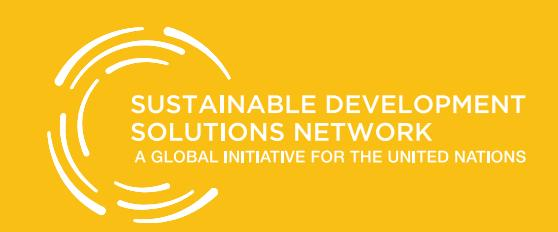

.DIAN L'INST TUTE CAN, DE NCED RECH ARCH AVAN

