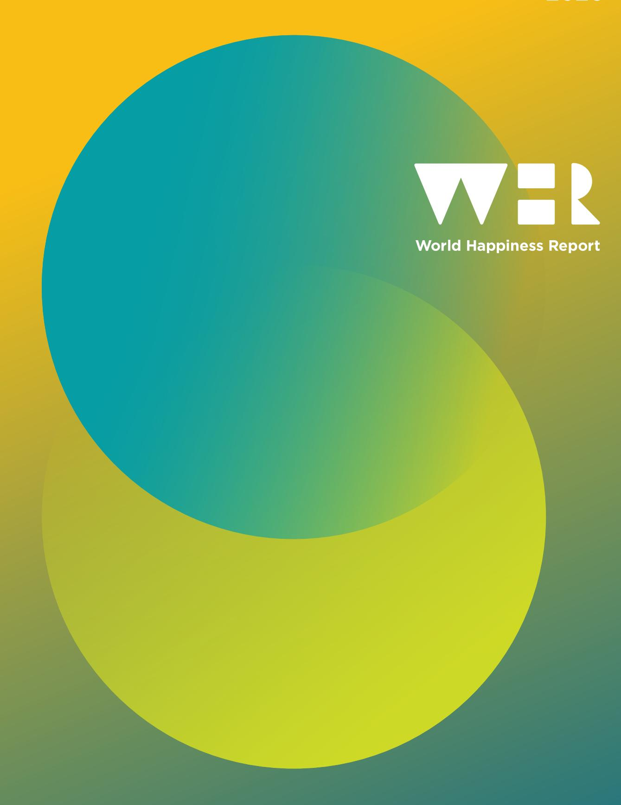

Editors: John F. Helliwell, Richard Layard, Jeffrey D. Sachs, and Jan-Emmanuel De Neve Associate Editors: Lara B. Aknin, Haifang Huang, and Shun Wang

## Table of Contents

## World Happiness Report 2020

|   | Foreword 1                                                                                                                                                    |
|---|------------------------------------------------------------------------------------------------------------------------------------------------------------------|
| 1 | Environments for Happiness: An Overview 3 Helliwell, Layard, Sachs, & De Neve                                                                                 |
| 2 | Social Environments for World Happiness 13 Helliwell, Huang, Wang, & Norton                                                                                |
| 3 | Cities and Happiness: A Global Ranking and Analysis 47 De Neve & Krekel                                                                                    |
| 4 | Urban-Rural Happiness Differentials Across the World 67 Burger, Morrison, Hendriks, & Hoogerbrugge                                                         |
| 5 | How Environmental Quality Affects Our Happiness . 95 Krekel & MacKerron                                                                                       |
| 6 | Sustainable Development and Human Well-Being . 113 De Neve & Sachs                                                                                         |
| 7 | The Nordic Exceptionalism: What Explains Why the Nordic Countries are Constantly Among the Happiest in the World 129 Martela, Greve, Rothstein, & Saari |
|   | Annex: Using a New Global Urban-Rural Definition, Called the Degree of Urbanisation, to Assess Happiness 147 Dijkstra & Papadimitriou                   |

### **Foreword**

This is the eighth World Happiness Report. We use this Foreword, the first we have had, to offer our thanks to all those who have made the Report possible over the past eight years, and to announce our expanding team of editors and partners as we prepare for our 9th and 10th reports in 2021 and 2022. The first seven reports were produced by the founding trio of co-editors assembled in Thimphu in July 2011 pursuant to the Bhutanese Resolution passed by the General Assembly in June 2011, that invited national governments to "give more importance to happiness and well-being in determining how to achieve and measure social and economic development." The Thimphu meeting, chaired by Prime Minister Jigme Y. Thinley and Jeffrey D. Sachs, was called to plan for a United Nations High-Level Meeting on 'Well-Being and Happiness: Defining a New Economic Paradigm' held at the UN on April 2, 2012. The first *World Happiness Report* was prepared in support of that meeting, bringing together the available global data on national happiness and reviewing evidence from the emerging science of happiness.

The preparation of the first *World Happiness Report* was based in the Earth Institute at Columbia University, with the research support of the Centre for Economic Performance at the London School of Economics (LSE) and the Canadian Institute for Advanced Research, through their grants supporting research at the Vancouver School of Economics at the University of British Columbia (UBC). The central base for the reports since 2013 has been the Sustainable Development Solutions Network (SDSN) and The Center for Sustainable Development (CSD) at Columbia University directed by Jeffrey D. Sachs. Although the editors and authors are volunteers, there are administrative, and research support costs covered most recently through a series of research grants from the Ernesto Illy Foundation and illycaffè.

Although the World Happiness Reports have been based on a wide variety of data, the most important source has always been the Gallup World Poll, which is unique in the range and comparability of its global series of annual surveys. The life evaluations from the Gallup World Poll provide the basis for the annual happiness rankings that have always spurred

widespread interest. Readers may be drawn in by wanting to know how their nation is faring, but soon become curious about the secrets of life in the happiest countries. The Gallup team has always been extraordinarily helpful and efficient in getting each year's data available in time for our annual launches on International Day of Happiness, March 20th. Right from the outset, we received very favourable terms from Gallup, and the very best of treatment. Gallup researchers have also contributed to the content of several World Happiness Reports. The value of this partnership was recognized by two Betterment of the Human Conditions Awards from the International Society for Quality of Life Studies. The first was in 2014 for the World Happiness Report, and the second, in 2017, went to the Gallup Organization for the Gallup World Poll.

From 2020, Gallup will be a full data partner, in recognition of the importance of the Gallup World Poll to the contents and reach of the *World Happiness Report*. We are proud to embody in this more formal way a history of co-operation stretching back beyond the first *World Happiness Report* to the start of the Gallup World Poll itself.

We have had a remarkable range of expert contributing authors over the years, and are deeply grateful for their willingness to share their knowledge with our readers. Their expertise is what assures the quality of the reports, and their generosity is what makes it possible. Thank you.

Our editorial team has been broadening over the years. In 2017, we added Jan-Emmanuel De Neve, Haifang Huang, and Shun Wang as Associate Editors, joined in 2019 by Lara Aknin. From 2020, Jan-Emmanuel De Neve has become a co-editor, and the Wellbeing Research Centre at the University of Oxford thereby becomes a fourth research pole for the Report.

Sharon Paculor has for several years been the central figure in the production of the reports, and we now wish to recognize her long-standing dedication and excellent work with the title of Production Editor. The management of media has for many years been handled with great skill by Kyu Lee of the Earth Institute, and we are very grateful for all he does to make the reports widely accessible. Ryan Swaney has been our web designer since 2013, and Stislow Design has

done our graphic design work over the same period. Juliana Bartels, a new recruit this year, has provided an important addition to our editorial and proof-reading capacities. All have worked on very tight timetables with great care and friendly courtesy.

Our group of partners has also been enlarged, and now includes the Ernesto Illy Foundation, illycaffè, Davines Group, Blue Chip Foundation, The William, Jeff and Jennifer Gross Family Foundation, and Unilever's largest ice cream brand Wall's.

Our data partner is Gallup, and Institutional Sponsors now include the Sustainable Development Solutions Network, the Center for Sustainable Development at Columbia University, the Centre for Economic Performance at the LSE, the Vancouver School of Economics at UBC, and the Wellbeing Research Centre at the University of Oxford.

For all of these contributions, whether in terms of research, data, or grants, we are enormously grateful.

*John Helliwell, Richard Layard, Jeffrey D. Sachs, and Jan Emmanuel De Neve, Co-Editors;*

*Lara Aknin, Haifang Huang and Shun Wang, Associate Editors; and Sharon Paculor, Production Editor*

## Chapter 1 **3**

## Environments for Happiness: An Overview

#### John F. Helliwell

Vancouver School of Economics, University of British Columbia

### Richard Layard

Wellbeing Programme, Centre for Economic Performance, London School of Economics and Political Science

#### Jeffrey D. Sachs

President, SDSN Director, Center for Sustainable Development, Columbia University

#### Jan-Emmanuel De Neve

Director, Wellbeing Research Centre, University of Oxford

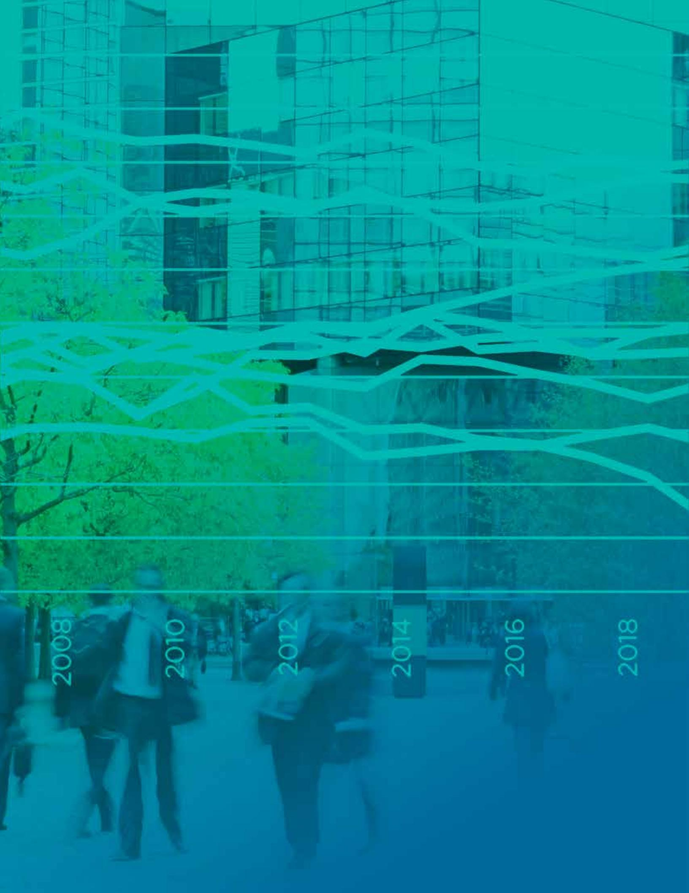

#### **This year the World Happiness Report focuses especially on the environment – social, urban, and natural.**

After presenting our usual country rankings and explanations of life evaluations in Chapter 2, we turn to these three categories of environment, and how they affect happiness.

The social environment is dealt with in detail in the later parts of Chapter 2. It is also a main focus of Chapter 7, which looks at happiness in the Nordic countries and finds that higher personal and institutional trust are key factors in explaining why life evaluations are so high in those countries.

Urban life is the focus of Chapter 3, which examines the happiness ranking of cities, and of Chapter 4, which compares happiness in cities and rural areas across the world. An Annex considers recent international efforts to develop common definitions of urban, peri-urban, and rural communities.

The natural environment is the focus of Chapter 5, which examines how the local environment affects happiness. Chapter 6 takes a longer and broader focus on the UN's Sustainable Development Goals (SDGs). The wide range of the SDGs links them to all three of the environmental themes considered in other chapters.

In the rest of this Overview chapter, we synthesize the main findings relating to the three environmental themes. We then conclude with a brief summary of the individual chapters whose results are being reviewed here.

#### **Social Environments for Happiness**

In the first half of Chapter 2, six factors are used to explain happiness, and four of these measure different aspects of the social environment: having someone to count on, having a sense of freedom to make key life decisions, generosity, and trust. The second half of the chapter digs deeper, paying special attention first to the effects that inequality has on average happiness, and then on how a good social environment operates to reduce inequality. Just as life evaluations provide a broader measure of well-being than income does, inequality of well-being turns out to be more important than income inequality in explaining average

levels of happiness. Well-being inequality significantly reduces average life evaluations, suggesting that people are happier to live in societies with less disparity in the quality of life.

The next step is to explore what determines well-being inequality, and to see how the effects of misfortune on happiness are moderated by the strength and warmth of the social fabric. Life evaluations are first explained at the individual level based on income, health, and a variety of measures of the quality of the social environment. Several particular risks are considered: ill-health, discrimination, low income, unemployment, separation, divorce or widowhood, and safety in the streets. The happiness costs of these risks are very large, especially for someone living in a low-trust social environment. For example, Marie, who is in good health, employed, married, with average income, sees herself as free from discrimination, and feels safe in the streets at night is estimated to have life satisfaction 3.5 points higher, on the 0 to 10 scale, than Helmut, who is in fair or worse health, unemployed, in the bottom-fifth of the income distribution, divorced, and afraid in the streets at night. This is the difference if they both live in a relatively low-trust environment. But if they both lived where trust in other people, government, and the police were relatively high, the well-being gap between them would shrink by one-third. The well-being costs of hardship are thus significantly less where there is a positive social environment within which one is more likely to find a helping hand and a friendly face. Since hardships are more prevalent among those at the bottom of the well-being ladder, a trusting social environment does most to raise the happiness of those in distress, and hence delivers greater equality of well-being.

A similar story emerges when we look at supports for well-being, which include the direct effects of social and institutional trust, high incomes, close social support and frequent meetings with friends. Let's consider the example of Luigi, who is in the top-third of Europeans in terms of the trust he has in other people, government, and the police, meets socially with friends weekly or more, has at least one person with whom to discuss intimate problems, and is in the top fifth of the distribution of household income. He has a happiness level 1.8 points higher than Klara, who lives in a low trust environment with weak social

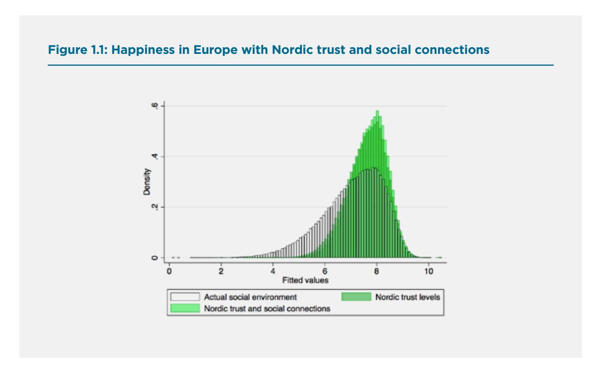

ties. This gap is reduced by one-fifth when we take account of the fact that the advantages of higher income and close personal social supports are less significant in an environment of generally high social trust.

This new evidence of the power of an environment to raise average life quality and to reduce inequality can be used to illustrate the analysis of Chapter 7, which explains the higher happiness of the Nordic countries largely in terms of the high quality, often hard-won, of their local and national social environments. We can illustrate this by comparing the distribution of happiness among 375.000 individual Europeans in 35 countries with what it would be if all countries had the same average levels of social trust, trust in institutions, and social connections as are found in the Nordic countries. The new distribution does not change anyone's health, income, employment, family status, or neighbourhood safety, all of which are more favourable, on average, in the Nordic countries than in the rest of Europe. In Figure 1.1 we simply increase each person's levels of trust and social connections to the average of those living in the Nordic countries, to give some idea of the power of a good social environment to raise the average level and lower the inequality of well-being.

The results shown in Figure 1.1 are striking. The current European distribution of happiness (shown in black and white, with a mean value of 7.09) shifts significantly, with a higher mean and with much less inequality if the trust and social connection levels of the Nordic countries existed across all of Europe (as shown in two-tone green, with a mean value of 7.68). The darker green bars show the effects of the trust increases on their own, while the lighter green bars show what is added by having Nordic levels of social connections. The trust increases alone are sufficient to raise average life evaluations by 0.50 points (to 7.59), thereby accounting for more than half the amount by which actual life satisfaction in the Nordic countries (=8.05) exceeds than of Europe as a whole. The Nordic social connections add another 0.09 points. Together the changes in trust and social connections explain 60% of the happiness gap between the Nordic countries and Europe as a whole. Although close social connections are very important, they are only modestly more prevalent in the Nordic countries than elsewhere in Europe. It is the higher levels of social and institutional trust that are especially important in raising happiness and reducing inequality.

### **Urban Happiness**

This Report marks the first time that we have looked at the happiness of city life across the world, both comparing cities with other cities and looking at how happy city dwellers are, on average, compared to others living in the same country. The results are contained in the city rankings of Chapter 3, the urban/rural happiness comparisons of Chapter 4, and an Annex presenting and making use of new urban definitions from the EU and other international partners. There are several striking findings in the two chapters, as illustrated by Figure 1.2. The figure plots the average life evaluations of city dwellers in 138 countries against average life evaluations in the country as a whole, in both cases measured using all available Gallup World Poll responses for 2014-2018.

Three key facts are immediately apparent from Figure 1.2, all of which are amplified and explained in the chapters on urban life. First, city rankings and country rankings are essentially identical. Second, in most countries, especially at lower levels of average national happiness, city dwellers are happier than those living outside cities by about 0.2 points on the life evaluation scale running from 0 to 10. Third, the urban happiness advantage is less and sometimes negative in countries at the top of the happiness distribution. This is shown by the regression line in Figure 1.2.

If the ranking of city-level life evaluations mimics that of the countries in which they are located, then we would expect cities from the same country to be clustered together in the city rankings. This is indeed what we find. For example, the 10 large US cities included in the cities ranking all fall between positions 18 and 31 in the

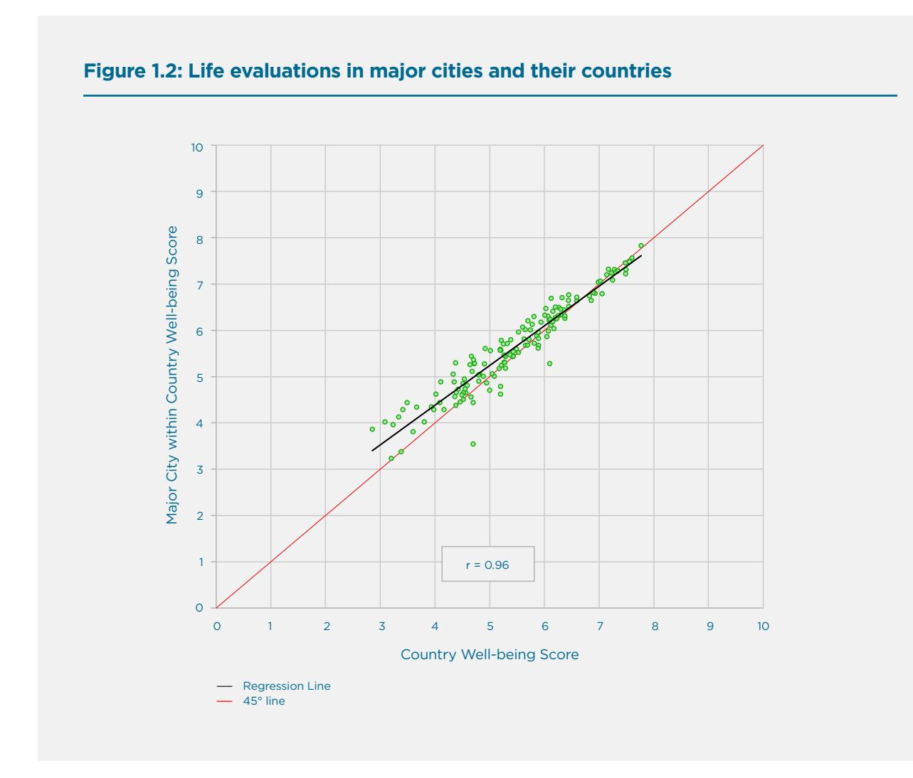

list of 186 cities. The fact that two Swedish cities, Stockholm and Göteborg, differ by fifteen places in the rankings, 9 for Stockholm and 24 for Göteborg, might suggest a large gap between two cities in the same country. But they lie within the same statistical confidence region, partly because of the number of similarly scoring US cities lying between Göteborg and Stockholm in the rankings, and partly because of the small samples available for cities outside the United States.

The urban/rural chapter pays special attention to the declining urban advantage as development proceeds and lists a number of contributing factors. Their key Figure 4.3 actually shows average urban happiness falling below average rural happiness after some level of economic development. In most regions of the world, the higher levels of happiness in cities can be explained by better economic circumstances and opportunities in cities. Although in a number of the richer countries the rural population is happier than its urban counterpart, cities that combine higher income with high levels of trust and connectedness are less likely to have their life evaluations fall below the national average as they become richer. In the relatively few countries with detailed data on life satisfaction of communities of all sizes, and where rural communities are happier than major urban centres, the key factor correlated with the rural advantage in average life evaluations is the extent to which people feel a sense of belonging to their local community. Another factor is inequality of happiness, which is more prevalent in urban communities. For example, in Canada, life evaluations are 0.18 points higher in rural neighbourhoods than in urban ones.1 This gap is halved if community belonging is maintained, or reduced to one-third if well-being inequality is also maintained at the levels of the rural communities.2 Thus the social environments discussed above seem also to be important in explaining differences in happiness between urban and rural communities.

### **Sustainable Natural Environments**

The natural environment is the focus of both Chapters 5 and 6. Chapter 5 starts by noting the widespread surge in interest in protecting the natural environment, supported by Gallup World Poll data showing widespread public concern about the environment. The chapter then presents two sorts of evidence, the first international and the second local and immediate. For the first, the chapter assesses how national average densities of various pollutants and different aspects of the climate and land cover affect average life evaluations in those OECD countries where data on these measures are recorded. The authors find significant negative effects on life evaluations from airborne particulates (shown in Figures 5.2a and 5.2b), and a small but significant preference for more moderate temperatures.

The second strand of the evidence shifts from national data to very local experiences of a sample of 13,000 volunteers in greater London whose phones reported their locations when they were asked on half a million occasions to report their emotional states, what they were doing, and with whom they were doing it. These answers were than collated with detailed environmental data for the time and location of each response. These data included closeness to rivers, lakes, canals and greenspaces, air quality and noise levels, and weather conditions. The activities included work, walking, sports, gardening, and birdwatching, in all cases in comparison with being sedentary at home. Nearby public parks and trees in the streets, as well as closeness to the River Thames or a canal, spurred positive moods. Mood appeared unaffected by local concentrations of particulate matter PM10, while NO2 concentrations had a modest negative impact only in certain model specifications. Weather had an effect on emotional state, with better moods in sunshine, clear skies, light winds, and warm temperatures. Moods were better outdoors than indoors, and worse at work. As for other activities, many were accompanied by significant changes in moods. Moods rather than life evaluations are used for these very short-term reports, since life evaluations tend to be stable under such temporary changes, although, as shown in Chapter 2, accumulated positive moods contribute to higher life evaluations.

Supplementary material in the on-line appendix to Chapter 5 links activities directly to the social environment, using a large sample of 2.3 million responses in the United Kingdom. All of the 43 listed activities improve moods when done with a friend or partner. For example, to hike or walk alone raises mood by 2%, while a shared walk raises mood by much more, by 7.5% with a friend or 8.9% with a partner. Activities that normally worsen moods can induce happiness when done in the company of a friend or partner. Commuting or travelling, activities that on average worsen mood levels (-1.9%) are happiness-inducing when shared with friends or partners, with mood up 5.3% for a trip shared with a friend, or 3.9% with a partner. Even waiting or queueing, a significant negative when done alone (-3.5%) becomes a net positive when the experience is done with the company of a friend (+3.5%). These estimated effects may be exaggerated when friends are normally not invited along for unpleasant queues or trips. But they may be underestimated for those who want a friend or partner along to help them deal with waits for bad news at the doctor's office or long queues at the airport. Even taken with a grain of salt, these are large effects. These snapshots from the daily lives of UK residents confirm what much other research has shown, namely that experiences make people happier when they are shared with others.

Chapter 6 moves from the more immediate natural environment to the broader long-term environment, mainly by testing the linkages between the Sustainable Development Goals (SDGs) and people's current life evaluations. The chapter makes the general case for using life evaluations as a way of providing an umbrella measure of well-being likely to be improved by achieving progress towards the SDG targets. The goals themselves came from quite diverse attempts to set measurable standards for natural environmental quality and the quality of life, but there is a strong case for some overarching measure to help evaluate the importance of each separate SDG.

The primary empirical finding of Chapter 6 is that international differences in reaching the SDGs are positively and strongly correlated with international differences in life evaluations, with goal attainment rising even faster among the happiest countries, which implies increasing marginal returns to sustainable development in terms of happiness. However, unpacking the

SDGs by looking at how each SDG relates to life evaluations—as well as how these relationships play out by region—reveals much heterogeneity. For example, SDG 12 (responsible consumption and production) and SDG 13 (climate action) are negatively correlated with life evaluations, a finding which holds for SDG 12 even when controlling for general level of economic development. These insights suggest that more complex and contextualized policy efforts are needed to chart a course towards environmentally sustainable growth that also delivers high levels of human well-being.

Generally, what might make achievement of the SDGs so closely match overall life evaluations? Part of the reason, of course, is that many of the specific goals cover the same elements, e.g. good health and good governance, that have been pillars in almost all attempts to understand what makes some nations happier than others. However, there is a deeper set of reasons that may help to explain why actions to achieve long-term sustainability are more prevalent among the happier countries. As shown in Chapter 7 on Nordic happiness, and earlier in this synthesis, people are happier when they trust each other and their shared institutions, and care about the welfare of others. Such caring attitudes are then typically extended to cover those elsewhere in the world and in future generations. This trust also increases social and political support for actions to help secure the futures of those in other countries and future generations. Thus, actions required to achieve the longer-term sustainable development goals are more likely to be met in those countries that have higher levels of social and institutional trust. But these are the countries that already rank highest in the overall rankings of life evaluations, so it is not surprising that actual attainment of SDG targets, and political support for those objectives, is especially high in the happiest countries, as is shown in Chapter 6. The same social connections that favour current happiness are also likely to support actions to improve the quality and security of the environment for future generations.

#### **To re-cap, the structure of the chapters to follow is:**

**Chapter 2** starts with the usual national rankings of recent life evaluations, and their changes from a 2008-2012 base period to 2017-2019. The sources of these levels and changes are investigated, with the six key factors being supplemented by an analysis of how well-being inequality is linked to lower average levels of happiness. Then the chapter turns to show the importance of social environments with special emphasis on trust and social connections and the ability of high trust to improve life evaluations for all, but especially those who are most at risk by lessening the well-being costs of discrimination, unemployment, illness, and low income.

**Chapter 3** provides a ranking of happiness measures, including both life evaluations and measures of positive and negative affect for 186 global cities for which there are samples of sufficient size from the Gallup World Poll.

**Chapter 4** digs deeper into the relative happiness of urban and rural life around the world, showing city dwellers to be generally happier than rural dwellers in most countries, with these advantages being less, and sometimes reversed, in a number of the richer countries.

**Chapter 5** examines how different aspects of the natural environment influence subjective well-being. The first part of the chapter does this using natural environmental data for OECD countries combined with happiness measures from the Gallup World Poll, while the second part uses data collected from just-in-time reports from a sample of Londoners, seeing how their emotions change with their activities and features of the local environment surrounding them.

**Chapter 6** studies the empirical relationships between the Sustainable Development Goals (SDGs) and happiness measures from the Gallup World Poll, mainly the life evaluations that are the focus of earlier chapters.

**Chapter 7** describes several features of life in the Nordic countries that help to explain why life evaluations in those countries are very high. The chapter also discounts several other proposed explanations that are not supported by the evidence.

**The Annex** presents new data based on standardized definitions of urban, peri-urban, and rural populations and uses them to compare happiness, generally finding happiness highest in the cities and lowest in rural areas for their sample of countries.

#### **Endnotes**

- 1 When roughly 400,000 life satisfaction observations, on the 0 to 10 scale, from several years of Canadian Community Health Surveys were divided among 1200 contiguous communities spanning the whole of Canada, they showed average life satisfaction in the roughly 800 urban communities to be 0.18 points lower (p<.001) than for the 400 rural communities (Helliwell et al 2019). The average reported level of community belonging was 0.692 in the urban neighbourhoods and 0.782 in the rural ones (p<.001 for the difference). Inequality of life satisfaction was greater in the urban neighbourhoods (SD=0.086 urban vs 0.080 rural, p<.001). Average census-based household income, by contrast, was significantly higher in the urban than in the rural communities, roughly \$C84,000 vs \$C69,000.
- 2 A regression of life satisfaction on the rural community identifier shows life satisfaction to be 0.175 (t=14.0) higher in the rural communities. When each community's average sense of community belonging is added to the equation (coeff 0.882, t=10.8), the coefficient on the rural dummy drops to 0.095 (t=6.7). Subsequently, adding the community level of life satisfaction inequality, as measured by the standard error (coefficient=-5.93, t=16.3) lowers the rural coefficient further (to 0.061, t=4.7), illustrating that higher community belonging and lower inequality in the rural communities together account for most of the life satisfaction difference.

#### **References**

Helliwell, J. F., Shiplett, H., & Barrington-Leigh, C. P. (2019). How happy are your neighbours? Variation in life satisfaction among 1200 Canadian neighbourhoods and communities. *PloS one*, *14*(1).

## Chapter 2 **13**

## Social Environments for World Happiness

### John F. Helliwell

Vancouver School of Economics, University of British Columbia

#### Haifang Huang

Associate Professor, Department of Economics, University of Alberta

### Shun Wang

Professor, KDI School of Public Policy and Management

#### Max Norton

University of British Columbia

The authors are as always grateful for the data partnership with Gallup, under which we gain fast and friendly access to Gallup World Poll data coming from the field only weeks previously. They are also grateful for the research support from the Illy Foundation and the other institutions listed in the Foreword, and for helpful advice and comments from Lara Aknin, Jan-Emmanuel De Neve, Len Goff, Jon Hall, Richard Layard, Guy Mayraz, Grant Schellenberg, and Meik Wiking.

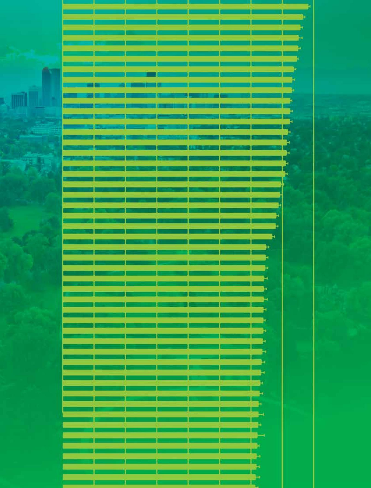

### **Introduction**

This is the eighth *World Happiness Report*. Its central purpose remains as it was for the first *Report*, to review the science of measuring and understanding subjective well-being, and to use survey measures of life satisfaction to track the quality of lives as they are being lived in more than 150 countries. In addition to presenting updated rankings and analysis of life evaluations throughout the world, each *World Happiness Report* has a variety of topic chapters, often dealing with an underlying theme for the report as a whole. Our special focus for *World Happiness Report 2020* is environments for happiness. This chapter focuses more specifically on social environments for happiness, as reflected by the quality of personal social connections and social institutions.

Before presenting fresh evidence on the links between social environments and how people evaluate their lives, we first present our analysis and rankings of national average life evaluations based on data from 2017-2019.

Our rankings of national average life evaluations are accompanied by our latest attempts to show how six key variables contribute to explaining the full sample of national annual averages from 2005-2019. Note that we do not construct our happiness measure in each country using these six factors – the scores are instead based on individuals' own assessments of their subjective well-being, as indicated by their survey responses in the Gallup World Poll. Rather, we use the six variables to help us to understand the sources of variations in happiness among countries and over time. We also show how measures of experienced well-being, especially positive emotions, supplement life circumstances and the social environments in supporting high life evaluations. We will then consider a range of data showing how life evaluations and emotions have changed over the years covered by the Gallup World Poll.1

We next turn to consider social environments for happiness, in two stages. We first update and extend our previous work showing how national average life evaluations are affected by inequality, and especially the inequality of well-being. Then we turn to an expanded analysis of the social context of well-being, showing for the first time how a more supportive social environment not

only raises life evaluations directly, but also indirectly, by providing the greatest gains for those most in misery. To do this, we consider two main aspects of the social environment. The first is represented by the general climate of interpersonal trust, and the extent and quality of personal contacts. The second is covered by a variety of measures of how much people trust the quality of public institutions that set the stage on which personal and community-level interactions take place.

We find that individuals with higher levels of interpersonal and institutional trust fare significantly better than others in several negative situations, including ill-health, unemployment, low incomes, discrimination, family breakdown, and fears about the safety of the streets. Living in a trusting social environment helps not only to support all individual lives directly, but also reduces the well-being costs of adversity. This provides the greatest gains to those in the most difficult circumstances, and thereby reduces well-being inequality. As our new evidence shows, to reduce well-being inequality also improves average life evaluations. We estimate the possible size of these effects later in the chapter.

## **Measuring and Explaining National Differences in Life Evaluations**

In this section we present our usual rankings for national life evaluations, this year covering the 2017-2019 period, accompanied by our latest attempts to show how six key variables contribute to explaining the full sample of national annual average scores over the whole period 2005-2019. These variables are GDP per capita, social support, healthy life expectancy, freedom, generosity, and absence of corruption. As already noted, our happiness rankings are not based on any index of these six factors – the scores are instead based on individuals' own assessments of their lives, as revealed by their answers to the Cantril ladder question that invites survey participants to imagine their current position on a ladder with steps numbered from 0 to 10, where the top represents the best possible and the bottom the worst possible life for themselves. We use the six variables to explain the variation of happiness across countries, and also to show how measures of experienced well-being, especially positive

affect, are themselves affected by the six factors and in turn contribute to the explanation of higher life evaluations.

In Table 2.1 we present our latest modeling of national average life evaluations and measures of positive and negative affect (emotion) by country and year.2 For ease of comparison, the table has the same basic structure as Table 2.1 in several previous editions of the *World Happiness Report*. We can now include 2019 data for many countries. The addition of these new data slightly improves the fit of the equation, while leaving the coefficients largely unchanged.3 There are four equations in Table 2.1. The first equation provides the basis for constructing the sub-bars shown in Figure 2.1.

The results in the first column of Table 2.1 explain national average life evaluations in terms of six key variables: GDP per capita, social support, healthy life expectancy, freedom to make life choices, generosity, and freedom from corruption.4 Taken together, these six variables explain three-quarters of the variation in national annual average ladder scores among countries, using data from the years 2005 to 2019. The model's predictive power is little changed if the year fixed effects in the model are removed, falling from 0.751 to 0.745 in terms of the adjusted R-squared.

The second and third columns of Table 2.1 use the same six variables to estimate equations for national averages of positive and negative affect, where both are based on answers about yesterday's emotional experiences (see Technical Box 1 for how the affect measures are constructed). In general, emotional measures, and especially negative ones, are differently and much less fully explained by the six variables than are life evaluations. Per-capita income and healthy life expectancy have significant effects on life evaluations, but not, in these national average data, on either positive or negative affect. The situation changes when we consider social variables. Bearing in mind that positive and negative affect are measured on a 0 to 1 scale, while life evaluations are on a 0 to 10 scale, social support can be seen to have similar proportionate effects on positive and negative emotions as on life evaluations. Freedom and generosity have even larger influences on positive affect than on the Cantril ladder. Negative affect is significantly reduced by social support, freedom, and absence of corruption.

In the fourth column we re-estimate the life evaluation equation from column 1, adding both positive and negative affect to partially implement the Aristotelian presumption that sustained positive emotions are important supports for a good life.5 The most striking feature is the extent to which the results buttress a finding in psychology that the existence of positive emotions matters much more than the absence of negative ones when predicting either longevity6 or resistance to the common cold.7 Consistent with this evidence we find that positive affect has a large and highly significant impact in the final equation of Table 2.1, while negative affect has none.

As for the coefficients on the other variables in the fourth column, the changes are substantial only on those variables – especially freedom and generosity – that have the largest impacts on positive affect. Thus, we infer that positive emotions play a strong role in support of life evaluations, and that much of the impact of freedom and generosity on life evaluations is channeled through their influence on positive emotions. That is, freedom and generosity have large impacts on positive affect, which in turn has a major impact on life evaluations. The Gallup World Poll does not have a widely available measure of life purpose to test whether it too would play a strong role in support of high life evaluations.

Our country rankings in Figure 2.1 show life evaluations (answers to the Cantril ladder question) for each country, averaged over the years 2017-2019. Not every country has surveys in every year; the total sample sizes are reported in Statistical Appendix 1, and are reflected in Figure 2.1 by the horizontal lines showing the 95% confidence intervals. The confidence intervals are tighter for countries with larger samples.

The overall length of each country bar represents the average ladder score, which is also shown in numerals. The rankings in Figure 2.1 depend only on the average Cantril ladder scores reported by the respondents, and not on the values of the six variables that we use to help account for the large differences we find.

Each of these bars is divided into seven segments, showing our research efforts to find possible sources for the ladder levels. The first six sub-bars show how much each of the six key variables is calculated to contribute to that

**Table 2.1: Regressions to Explain Average Happiness across Countries (Pooled OLS)**

|                                  |                |                 | Dependent Variable |                |
|----------------------------------|----------------|-----------------|--------------------|----------------|
|                                  | Cantril Ladder | Positive Affect | Negative Affect    | Cantril Ladder |
| Independent Variable             | (0-10)         | (0-1)           | (0-1)              | (0-10)         |
|                                  |                |                 |                    |                |
| Log GDP per capita               | 0.31           | 009             | 0.008              | 0.324          |
|                                  | (0.066)***     | (0.01)          | (0.008)            | (0.065)***     |
| Social support                   | 2.362          | 0.247           | 336                | 2.011          |
|                                  | (0.363)***     | (0.048)***      | (0.052)***         | (0.389)***     |
| Healthy life expectancy at birth | 0.036          | 0.001           | 0.002              | 0.033          |
|                                  | (0.01)***      | (0.001)         | (0.001)            | (0.009)***     |
| Freedom to make life choices     | 1.199          | 0.367           | 084                | 0.522          |
|                                  | (0.298)***     | (0.041)***      | (0.04)**           | (0.287)*       |
| Generosity                       | 0.661          | 0.135           | 0.024              | 0.39           |
|                                  | (0.275)**      | (0.03)***       | (0.028)            | (0.273)        |
| Perceptions of corruption        | 646            | 0.02            | 0.097              | 720            |
|                                  | (0.297)**      | (0.027)         | (0.024)***         | (0.294)**      |
| Positive affect                  |                |                 |                    | 1.944          |
|                                  |                |                 |                    | (0.355)***     |
| Negative affect                  |                |                 |                    | 0.379          |
|                                  |                |                 |                    | (0.425)        |
| Year fixed effects               | Included       | Included        | Included           | Included       |
| Number of countries              | 156            | 156             | 156                | 156            |
| Number of obs.                   | 1627           | 1624            | 1626               | 1623           |
| Adjusted R-squared               | 0.751          | 0.475           | 0.3                | 0.768          |

Notes: This is a pooled OLS regression for a tattered panel explaining annual national average Cantril ladder responses from all available surveys from 2005 to 2019. See *Technical Box 1* for detailed information about each of the predictors. Coefficients are reported with robust standard errors clustered by country in parentheses. \*\*\*, \*\*, and \* indicate significance at the 1, 5 and 10 percent levels respectively.

country's ladder score, relative to that in a hypothetical country called "Dystopia", so named because it has values equal to the world's lowest national averages for 2017-2019 for each of the six key variables used in Table 2.1. We use Dystopia as a benchmark against which to compare contributions from each of the six factors. The choice of Dystopia as a benchmark permits every real country to have a positive (or at least zero) contribution from each of the six factors. We calculate, based on the estimates in the first column of Table 2.1, that Dystopia had a 2017-2019 ladder score equal to 1.97 on the 0 to 10 scale. The final sub-bar is the sum of two components: the calculated average 2017-2019 life evaluation in Dystopia (=1.97) and each country's own prediction error, which measures the extent to which life evaluations are higher or lower than predicted by our equation in the first

column of Table 2.1. These residuals are as likely to be negative as positive.8

How do we calculate each factor's contribution to average life evaluations? Taking the example of healthy life expectancy, the sub-bar in the case of Tanzania is equal to the number of years by which healthy life expectancy in Tanzania exceeds the world's lowest value, multiplied by the Table 2.1 coefficient for the influence of healthy life expectancy on life evaluations. The width of each sub-bar then shows, countryby-country, how much each of the six variables contributes to the international ladder differences. These calculations are illustrative rather than conclusive, for several reasons. First, the selection of candidate variables is restricted by what is available for all these countries. Traditional variables like GDP per capita and healthy life

#### **Technical Box 1: Detailed information about each of the predictors in Table 2.1**

- 1. GDP per capita is in terms of Purchasing Power Parity (PPP) adjusted to constant 2011 international dollars, taken from the World Development Indicators (WDI) released by the World Bank on November 28, 2019. See Statistical Appendix 1 for more details. GDP data for 2019 are not yet available, so we extend the GDP time series from 2018 to 2019 using country-specific forecasts of real GDP growth from the OECD Economic Outlook No. 106 (Edition November 2019) and the World Bank's Global Economic Prospects (Last Updated: 06/04/2019), after adjustment for population growth. The equation uses the natural log of GDP per capita, as this form fits the data significantly better than GDP per capita.
- 2. The time series of healthy life expectancy at birth are constructed based on data from the World Health Organization (WHO) Global Health Observatory data repository, with data available for 2005, 2010, 2015, and 2016. To match this report's sample period, interpolation and extrapolation are used. See Statistical Appendix 1 for more details.
- 3. Social support is the national average of the binary responses (0=no, 1=yes) to the Gallup World Poll (GWP) question, "If you were in trouble, do you have relatives or friends you can count on to help you whenever you need them, or not?"

- 4. Freedom to make life choices is the national average of binary responses to the GWP question, "Are you satisfied or dissatisfied with your freedom to choose what you do with your life?"
- 5. Generosity is the residual of regressing the national average of GWP responses to the question, "Have you donated money to a charity in the past month?" on GDP per capita.
- 6. Perceptions of corruption are the average of binary answers to two GWP questions: "Is corruption widespread throughout the government or not?" and "Is corruption widespread within businesses or not?" Where data for government corruption are missing, the perception of business corruption is used as the overall corruption-perception measure.
- 7. Positive affect is defined as the average of previous-day affect measures for happiness, laughter, and enjoyment for GWP waves 3-7 (years 2008 to 2012, and some in 2013). It is defined as the average of laughter and enjoyment for other waves where the happiness question was not asked. The general form for the affect questions is: Did you experience the following feelings during a lot of the day yesterday? See Statistical Appendix 1 for more details.
- 8. Negative affect is defined as the average of previous-day affect measures for worry, sadness, and anger in all years.

expectancy are widely available. But measures of the quality of the social context, which have been shown in experiments and national surveys to have strong links to life evaluations and emotions, have not been sufficiently surveyed in the Gallup or other global polls, or otherwise measured in statistics available for all countries. Even with this limited choice, we find that four variables covering different aspects of the social and institutional context – having someone to count on, generosity, freedom to make life choices, and absence of corruption – are together responsible for more than half of the average difference between each country's predicted ladder score and that of Dystopia in the 2017-2019 period. As shown in Statistical Appendix 1, the average country has a 2017-2019 ladder score that is 3.50 points above the Dystopia ladder score of 1.97. Of the 3.50 points, the largest single part (33%) comes from social support, followed by GDP per capita (25%) and healthy life expectancy (20%), and then freedom (13%), generosity (5%), and corruption (4%).9

The variables we use may be taking credit properly due to other variables, or to unmeasured factors. There are also likely to be vicious or virtuous circles, with two-way linkages among the variables. For example, there is much evidence that those who have happier lives are likely to live longer, and be more trusting, more cooperative, and generally better able to meet life's demands.10 This will feed back to improve health, income, generosity, corruption, and sense of freedom. In addition, some of the variables are derived from the same respondents as the life evaluations and hence possibly determined by common factors. There is less risk when using national averages, because individual differences in personality and many life circumstances tend to average out at the national level.

To provide more assurance that our results are not significantly biased because we are using the same respondents to report life evaluations, social support, freedom, generosity, and corruption, we tested the robustness of our procedure (see Table 10 of Statistical Appendix 1 of *World Happiness Report 2018* for more detail) by splitting each country's respondents randomly into two groups. We then used the average values from one half the sample for social support, freedom, generosity, and absence of corruption to explain average life evaluations in

the other half. The coefficients on each of the four variables fell slightly, just as we expected.11 But the changes were reassuringly small (ranging from 1% to 5%) and were not statistically significant.12

The seventh and final segment in each bar is the sum of two components. The first component is a fixed number representing our calculation of the 2017-2019 ladder score for Dystopia (=1.97). The second component is the average 2017-2019 residual for each country. The sum of these two components comprises the right-hand sub-bar for each country; it varies from one country to the next because some countries have life evaluations above their predicted values, and others lower. The residual simply represents that part of the national average ladder score that is not explained by our model; with the residual included, the sum of all the sub-bars adds up to the actual average life evaluations on which the rankings are based.

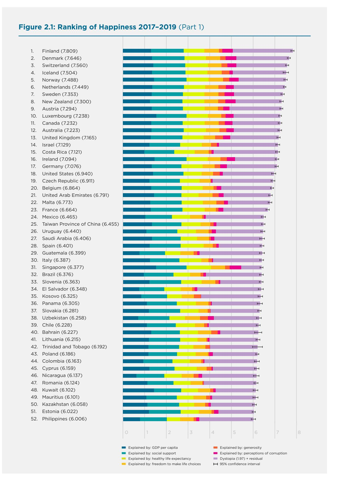

Figure 2.1: Ranking of Happiness 2017–2019 (Part 2)

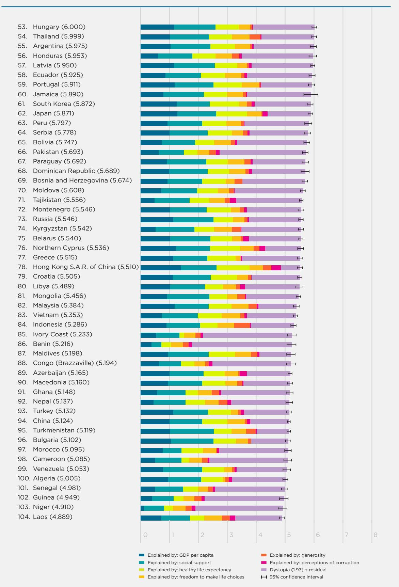

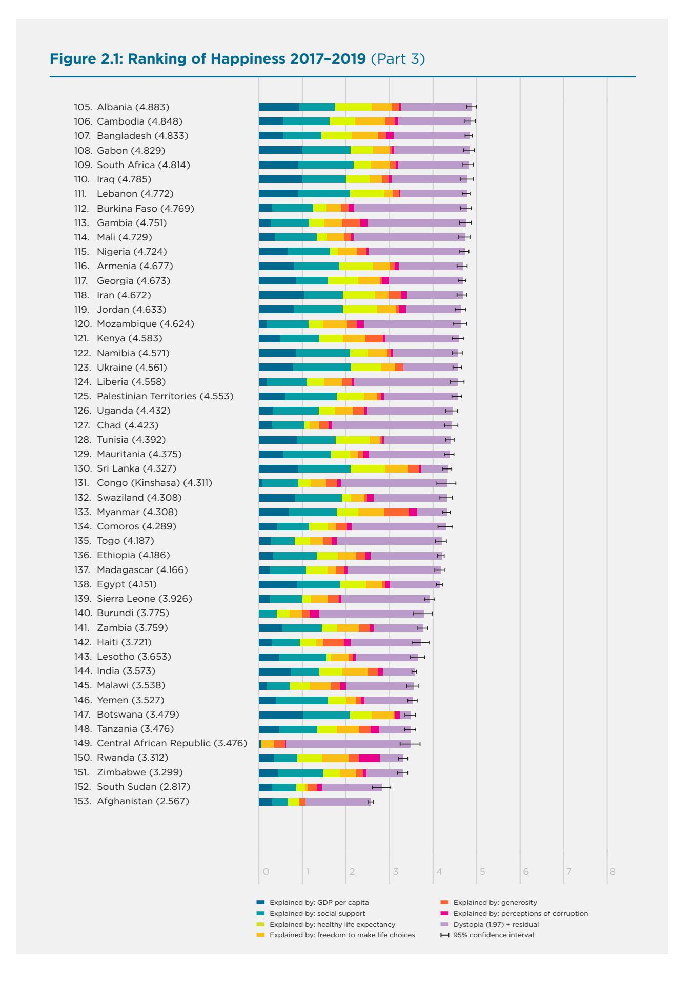

What do the latest data show for the 2017-2019 country rankings? Two features carry over from previous editions of the *World Happiness Report*. First, there is still a lot of year-to-year consistency in the way people rate their lives in different countries, and since we do our ranking on a three-year average, there is information carried forward from one year to the next. Nonetheless, there are interesting changes. Finland reported a modest increase in happiness from 2015 to 2017, and has remained roughly at that higher level since then (See Figure 1 of Statistical Appendix 1 for individual country trajectories). As a result, dropping 2016 and adding 2019 further boosts Finland's world-leading average score. It continues to occupy the top spot for the third year in a row, and with a score that is now significantly ahead of other countries in the top ten.

Denmark and Switzerland have also increased their average scores from last year's rankings. Denmark continues to occupy second place. Switzerland, with its larger increase, jumps from 6th place to 3rd. Last year's third ranking country, Norway, is now in 5th place with a modest decline in average score, most of which occurred around between 2017 and 2018. Iceland is in 4th place; its new survey in 2019 does little to change its 3-year average score. The Netherlands slipped into 6th place, one spot lower than in last year's ranking. The next two countries in the ranking are the same as last year, Sweden and New Zealand in 7th and 8th places, respectively, both with little change in their average scores. In 9th and 10th place are Austria and Luxembourg, respectively. The former is one spot higher than last year. For Luxembourg, this year's ranking represents a substantial upward movement; it was in 14th place last year. Luxembourg's 2019 score is its highest ever since Gallup started polling the country in 2009.

Canada slipped out of the top ten, from 9th place last year to 11th this year. Its 2019 score is the lowest since the Gallup poll begins for Canada in 2005.13 Right after Canada is Australia in 12th, followed by United Kingdom in 13th, two spots higher than last year, and five positions higher than in the first *World Happiness Report* in 2012.14 Israel and Costa Rica are the 14th and 15th ranking countries. The rest of the top 20 include four European countries: Ireland in 16th, Germany in 17th, Czech Republic in 19th and Belgium in 20th. The U.S. is in 18th place, one

spot higher than last year, although still well below its 11th place ranking in the first *World Happiness Report*. Overall the top 20 are all the same as last year's top 20, albeit with some changes in rankings. Throughout the top 20 positions, and indeed at most places in the rankings, the three-year average scores are close enough to one another that significant differences are found only between country pairs that are several positions apart in the rankings. This can be seen by inspecting the whisker lines showing the 95% confidence intervals for the average scores.

There remains a large gap between the top and bottom countries. Within these groups, the top countries are more tightly grouped than are the bottom countries. Within the top group, national life evaluation scores have a gap of 0.32 between the 1st and 5th position, and another 0.25 between 5th and 10th positions. Thus, there is a gap of about 0.6 points between the 1st and 10th positions. There is a bigger range of scores covered by the bottom ten countries, where the range of scores covers almost an entire point. Tanzania, Rwanda and Botswana still have anomalous scores, in the sense that their predicted values, based on their performance on the six key variables, would suggest much higher rankings than those shown in Figure 2.1. India now joins the group sharing the same feature. India is a new entrant to the bottom-ten group. Its large and steady decline in life evaluation scores since 2015 means that its annual score in 2019 is now 1.2 points lower than in 2015.

Despite the general consistency among the top country scores, there have been many significant changes among the rest of the countries. Looking at changes over the longer term, many countries have exhibited substantial changes in average scores, and hence in country rankings, between 2008-2012 and 2017-2019, as will be shown in more detail in Figure 2.4.

When looking at average ladder scores, it is also important to note the horizontal whisker lines at the right-hand end of the main bar for each country. These lines denote the 95% confidence regions for the estimates, so that countries with overlapping error bars have scores that do not significantly differ from each other. The scores are based on the resident populations in each country, rather than their citizenship or place of

birth. In *World Happiness Report 2018* we split the responses between the locally and foreignborn populations in each country, and found the happiness rankings to be essentially the same for the two groups, although with some footprint effect after migration, and some tendency for migrants to move to happier countries, so that among 20 happiest countries in that report, the average happiness for the locally born was about 0.2 points higher than for the foreign-born.15

Average life evaluations in the top ten countries are more than twice as high as in the bottom ten. If we use the first equation of Table 2.1 to look for possible reasons for these very different life evaluations, it suggests that of the 4.16 points difference, 2.96 points can be traced to differences in the six key factors: 0.94 points from the GDP per capita gap, 0.79 due to differences in social support, 0.62 to differences in healthy life expectancy, 0.27 to differences in freedom, 0.25 to differences in corruption perceptions, and 0.09 to differences in generosity.16 Income differences are the single largest contributing factor, at one-third of the total, because of the six factors, income is by far the most unequally distributed among countries. GDP per capita is 20 times higher in the top ten than in the bottom ten countries.17

Overall, the model explains average life evaluation levels quite well within regions, among regions, and for the world as a whole.18 On average, the countries of Latin America still have mean life evaluations that are higher (by about 0.6 on the 0 to 10 scale) than predicted by the model. This difference has been attributed to a variety of factors, including some unique features of family and social life in Latin American countries. To explain what is special about social life in Latin America, Chapter 6 of *World Happiness Report 2018* by Mariano Rojas presented a range of new data and results showing how a generationspanning social environment supports Latin American happiness beyond what is captured by the variables available in the Gallup World Poll. In partial contrast, the countries of East Asia have average life evaluations below those predicted by the model, a finding that has been thought to reflect, at least in part, cultural differences in the way people answer questions.19 It is reassuring that our findings about the relative importance of the six factors are generally unaffected by whether or not we make explicit allowance for these regional differences.20

Our main country rankings are based on the average answers to the Cantril ladder life evaluation question in the Gallup World Poll. The other two happiness measures, for positive and negative affect, are themselves of independent importance and interest, as well as being contributors to overall life evaluations, especially in the case of positive affect. Measures of positive affect also play important roles in other chapters of this report, in large part because most lab experiments, being of relatively small size and duration, can be expected to affect current emotions but not life evaluations, which tend to be more stable in response to small or temporary disturbances. Various attempts to use big data to measure happiness using word analysis of Twitter feeds, or other similar sources, are likely to capture mood changes rather than overall life evaluations. In *World Happiness Report 2019* we presented comparable rankings for all three of the measures of subjective well-being that we track: the Cantril ladder, positive affect, and negative affect, accompanied by country rankings for the six variables we use in Table 2.1 to explain our measures of subjective well-being. Comparable data for 2017-2019 are reported in Figures 19 to 42 of Statistical Appendix 1.

### **Changes in World Happiness**

As in Chapter 2 of *World Happiness Report 2019*, we start by showing the global and regional trajectories for life evaluations, positive affect, and negative affect between 2006 and 2019. This is done in the four panels of Figure 2.2.21 The first panel shows the evolution of global life evaluations measured three different ways. Among the three lines, two lines cover the whole world population (age 15+), with one of the two weighting the country averages by each country's share of the world population, and the other being an unweighted average of the individual national averages. The unweighted average is often above the weighted average, especially after 2015, when the weighted average starts to drop significantly, while the unweighted average starts to rise equally sharply. This suggests that the recent trends have not favoured the largest countries, as confirmed by the third line, which shows a population-weighted average for all countries in the world except the five countries with the largest populations – China, India, the

United States, Indonesia, and Brazil. Even with the five largest countries removed, the populationweighted average does not rise as fast as the unweighted average, suggesting that smaller countries have had greater happiness growth since 2015 than have the larger countries. To expose the different trends in different parts of the world, the second panel of Figure 2.2 shows the dynamics of life evaluations in each to ten global regions, with population weights used to construct the regional averages.

The regions with the highest average evaluations are Northern American plus Australasian region, Western Europe, and the Latin America Caribbean region. Northern America plus Australasia, though they always have the highest life evaluations, show an overall declining trend since 2007. The level in 2019 was 0.5 points lower than that in 2007. Western Europe shows a U-shape, with a flat bottom spanning from 2008 to 2015. The Latin America Caribbean region shows an inverted U-shape with the peak in 2013. Since then, the level of life evaluations has fallen by about 0.6 points. All other regions except Sub-Saharan Africa were almost in the same cluster before 2010. Large divergences have emerged since. Central and Eastern Europe's life evaluations achieved a continuous and remarkable increase (by over 0.8 points), and caught up with Latin American and Caribbean region in the most recent two years. South Asia, by contrast, has continued to show falling life evaluations, amounting to a cumulative decrease of more than 1.3 points, by far the largest regional change. The country data in Figure 1 of Statistical Appendix 1 shows the South Asian trend to be dominated by India, with its large population and sharply declining life evaluations. The Middle East and North Africa (MENA) also shows a long-term declining trend, though with a rebound in 2014. Comparing 2019 to 2009, the decrease in life evaluations in MENA is over 0.5 points.

East Asia, Southeast Asia, and the Commonwealth of Independent States (CIS) remain largely stable since 2011. The key difference is that East Asia and the CIS suffered significantly in the 2008 financial crisis, while life evaluations in Southeast Asia were largely unaffected. Sub-Saharan Africa has significantly lower level of life evaluations than any other region, particularly before 2016. Its level has remained fairly stable since, though with some decrease in 2013 and then a recovery

until 2018. In the meantime, South Asia's life evaluations worsened dramatically so that its average life evaluations since 2017 are significantly below those in Sub-Saharan Africa, with no sign of recovery.

We next examine the global pattern of positive and negative affect in the third and fourth panels of Figure 2.2. Each figure has the same structure for life evaluations as in the first panel. There is no striking trend in the evolution of positive affect, except that the population-weighted series excluding the five largest countries declined mildly since 2010. The population-weighted series show slightly, but significantly, more positive affect than does the unweighted series, showing that positive affect is on average higher in the larger countries.

In contrast to the relative stability of positive affect over the study period, there has been a rapid increase in negative affect, as shown in the last panel of Figure 2.2. All three lines consistently show a generally increasing trend since 2010 or 2011, indicating that citizens in both large and small countries have experienced increasing negative affect. The increase is sizable. In 2011, about 22% of world adult population reported negative affect, increasing to 29.3% in 2019. In other words, the share of adults reporting negative affect increased by almost 1% per year during this period. Seen in the context of political polarization, civil and religions conflicts, and unrest in many countries, these results created considerable interest when first revealed in *World Happiness Report 2019*. Readers were curious to know in particular which negative emotions were responsible for this increase. We have therefore unpacked the changes in negative affect into their three components: worry, sadness, and anger.

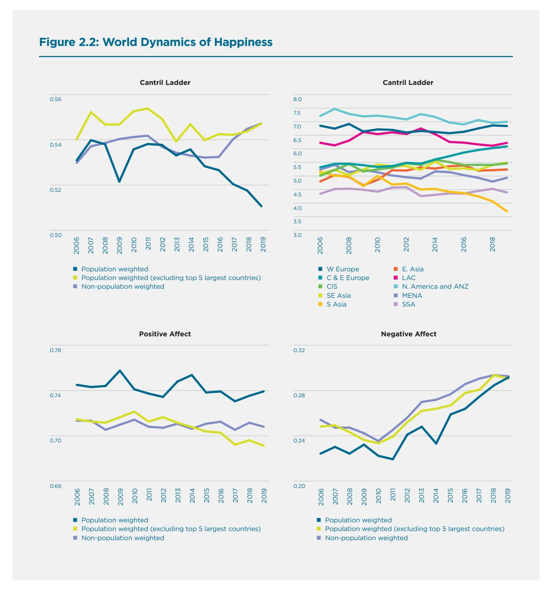

Figure 2.3 illustrates the global trends for worry, sadness, and anger, while the changes for each individual country are shown in Tables 16 to 18 of Statistical Appendix 1. Figure 2.3, like Figure 2.2, shows three lines for each emotion, representing a population-weighted average, a population-weighted average excluding the five most populous countries, and an unweighted average. The first panel shows the trends for worry. The three lines move in the same direction, starting to increase about 2010. People reporting worry yesterday increased by around 8~10% in the 9 years span. Sadness is much less frequent than worry, although the trend is very similar. The share of respondents reporting sadness yesterday increases by around 7~9% since 2010 or 2011. Anger yesterday in the third panel also shows an upward trend in recent years, but contributes very little to the rising trend for negative affect. The rise is almost entirely due to sadness and worry, with the latter being a slightly bigger contributor. Comparable

**Figure 2.3: World Dynamics of Components of Negative Affect**

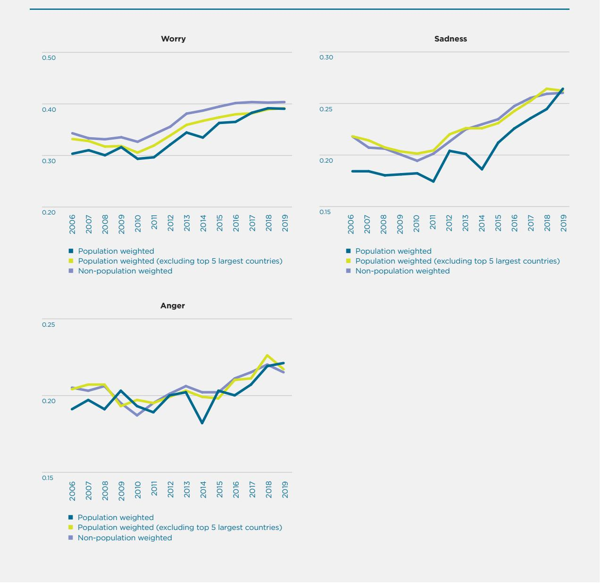

data for other emotions, including stress, are shown in Statistical Appendix 2.

We now turn to our country-by-country ranking of changes in life evaluations. The year-by-year data for each country are shown, as always, in Figure 1 of online Statistical Appendix 1, and are also available in the online data appendix. Here we present a ranking of the country-by-country changes from a five-year starting base of 2008-2012 to the most recent three-year sample period, 2017-2019. We use a five-year average to provide a more stable base from

which to measure changes. In Figure 2.4 we show the changes in happiness levels for all 149 countries that have sufficient numbers of observations for both 2008-2012 and 2017-2019.

**Figure 2.4: Changes in Happiness from 2008–2012 to 2017–2019** (Part 1) 1. Benin (1.644) 2. Togo (1.314) 3. Hungary (1.195) 4. Bulgaria (1.121) 5. Philippines (1.104) 6. Guinea (1.102) 7. Congo (Brazzaville) (1.076) 8. Serbia (1.074) 9. Ivory Coast (1.036) 10. Romania (1.007) 11. Tajikistan (0.999) 12. Latvia (0.951) 13. Kosovo (0.913) 14. Bosnia and Herzegovina (0.824) 15. Nepal (0.803) 16. Senegal (0.802) 17. Bahrain (0.800) 18. Lithuania (0.768) 19. Uzbekistan (0.768) 20. Malta (0.756) 21. Nicaragua (0.742) 22. Niger (0.718) 23. Gabon (0.715) 24. Mongolia (0.706) 25. Cambodia (0.693) 26. Portugal (0.686) 27. Dominican Republic (0.656) 28. Estonia (0.645) 29. Pakistan (0.629) 30. Cameroon (0.628) 31. Mauritius (0.624) 32. Macedonia (0.622) 33. Czech Republic (0.620) 34. Burkina Faso (0.612) 35. Honduras (0.578) 36. Georgia (0.568) 37. Mali (0.563) 38. Kyrgyzstan (0.555) 39. Comoros (0.544) 40. Azerbaijan (0.524) 41. Jamaica (0.515) 42. El Salvador (0.455) 43. Germany (0.422) 44. Kazakhstan (0.403) 45. Taiwan Province of China (0.402) 46. Poland (0.375) 47. Montenegro (0.372) 48. Liberia (0.349) 49. Finland (0.349) 50. Kenya (0.339) 51. Slovenia (0.336)

Changes from 2008–2012 to 2017–2019 95% confidence interval

**Figure 2.4: Changes in Happiness from 2008–2012 to 2017–2019** (Part 2)

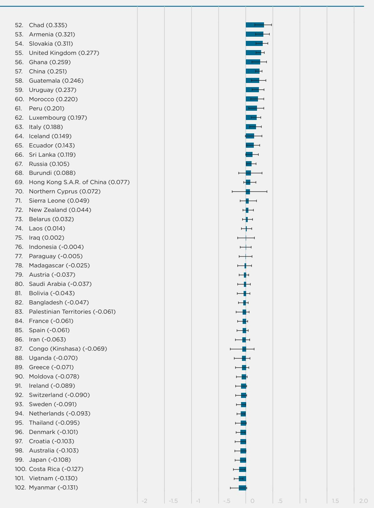

**Figure 2.4: Changes in Happiness from 2008–2012 to 2017–2019** (Part 3) 103. Singapore (-0.140) 104. Belgium (-0.141) 105. South Korea (-0.145) 106. Central African Republic (-0.147) 107. Turkey (-0.154) 108. Norway (-0.167) 109. Chile (-0.168) 110. Colombia (-0.174) 111. Israel (-0.175) 112. Lebanon (-0.183) 113. United States (-0.187) 114. Mozambique (-0.189) 115. Canada (-0.248) 116. South Africa (-0.255) 117. Mauritania (-0.257) 118. Egypt (-0.262) 119. Libya (-0.266) 120. United Arab Emirates (-0.284) 121. Malaysia (-0.310) 122. Tanzania (-0.342) 123. Cyprus (-0.369) 124. Ethiopia (-0.375) 125. Nigeria (-0.409) 126. Trinidad and Tobago (-0.416) 127. Kuwait (-0.433) 128. Argentina (-0.440) 129. Algeria (-0.457) 130. Tunisia (-0.462) 131. Brazil (-0.472) 132. Haiti (-0.498) 133. Ukraine (-0.543) 134. Mexico (-0.558) 135. Swaziland (-0.559) 136. Rwanda (-0.643) 137. Albania (-0.651) 138. Yemen (-0.715) 139. Panama (-0.774) 140. Turkmenistan (-0.819) 141. Jordan (-0.857) 142. Botswana (-0.860) 143. Malawi (-0.920) 144. Zimbabwe (-1.042) 145. India (-1.216) 146. Zambia (-1.241) 147. Lesotho (-1.245) 148. Afghanistan (-1.530) 149. Venezuela (-1.859) Changes from 2008–2012 to 2017–2019 95% confidence interval

Of the 149 countries with data for 2008-2012 and 2017-2019, 118 had significant changes. 65 were significant increases, ranging from around 0.11 to 1.644 points on the 0 to 10 scale. There were also 53 significant decreases, ranging from around -0.13 to –1.86 points, while the remaining 31 countries revealed no significant trend from 2005-2008 to 2016-2018. As shown in Table 36 in Statistical Appendix 1, the significant gains and losses are very unevenly distributed across the world, and sometimes also within continents. In Central and Eastern Europe, there were 15 significant gains against only two significant declines, while in Middle East and North Africa there were 11 significant losses compared to two significant gains. The Commonwealth of Independent States was a significant net gainer, with eight gains against two losses. In the Northern American and Australasian region, the four countries had two significant declines and no significant gains. The 36 Sub-Saharan African countries showed a real spread of experiences, with 17 significant gainers and 13 significant losers. The same is true for Western Europe, with 7 gainers and 6 losers. The Latin America and Caribbean region had 9 gainers and 10 losers. In East, South and Southeast Asia, most countries had significant changes, with a fairly even balance between gainers and losers.

Among the 20 top gainers, all of which showed average ladder scores increasing by more than 0.75 points, ten are in the Commonwealth of Independent States or Central and Eastern Europe, and six are in Sub-Saharan Africa. The other four are Bahrain, Malta, Nepal and the Philippines. Among the 20 largest losers, all of which show ladder reductions exceeding 0.45 points, seven are in Sub-Saharan Africa, five in the Latin America and Caribbean region with Venezuela at the very bottom, three in the Middle East and North Africa including Yemen, and two in the Commonwealth of Independent States including Ukraine. The remaining three are Afghanistan, Albania, and India.

These changes are very large, especially for the ten most affected gainers and losers. For each of the ten top gainers, the average life evaluation gains were more than would be expected from a tenfold increase of per capita incomes. For each of the ten countries with the biggest drops in average life evaluations, the losses were more than four times as large as would be expected from a halving of GDP per capita.

On the gaining side of the ledger, the inclusion of a substantial number of transition countries among the top gainers reflects rising life evaluations for the transition countries taken as a group. The appearance of Sub-Saharan African countries among the biggest gainers and the biggest losers reflects the variety and volatility of experiences among the Sub-Saharan countries for which changes are shown in Figure 2.8, and whose experiences were analyzed in more detail in Chapter 4 of *World Happiness Report 2017*. Benin, the largest gainer over the period, by more than 1.6 points, ranked 4th from last in the first *World Happiness Report* and has since risen close to the middle of the ranking (86 out of 153 countries this year).

The ten countries with the largest declines in average life evaluations typically suffered some combination of economic, political, and social stresses. The five largest drops since 2008-2012 were in Venezuela, Afghanistan, Lesotho, Zambia, and India, with drops over one point in each case, the largest fall being almost two points in Venezuela. In previous rankings using the base period 2005-2008, Greece was one of the biggest losers, presumably because of the impact of the financial crisis. Now with the base period shifted to the post-crisis years from 2008 to 2012, there has been little net gain or loss for Greece. But the annual data for Greece in Figure 1 of Statistical Appendix 1 do show a U-shape recovery from a low point in 2013 and 2014.

#### **Inequality and Happiness**

Previous reports have emphasized the importance of studying the distribution of happiness as well as its average levels. We did this using bar charts showing for the world as a whole and for each of ten global regions the distribution of answers to the Cantril ladder question asking respondents to value their lives today on a scale of 0 to 10, with 0 representing the worst possible life, and 10 representing the best possible life. This gave us a chance to compare happiness levels and inequality in different parts of the world. Population-weighted average life evaluations differed significantly among regions from the highest evaluations in Northern America and Oceania, followed by Western Europe, Latin America and the Caribbean, Central and Eastern Europe, the Commonwealth of Independent States, East Asia, Southeast Asia, The Middle East and North Africa, Sub-Saharan Africa, and South Asia, in that order. We found that well-being inequality, as measured by the standard deviation of the distributions of individual life evaluations, was lowest in Western Europe, Northern America and Oceania, and South Asia, and greatest in Latin America, Sub-Saharan Africa, and the Middle East and North Africa.22 What about changes in well-being inequality? Since 2012, well-being inequality has increased significantly in most regions, including especially South Asia, Southeast Asia, Sub-Saharan Africa, the Middle East and North Africa, and the CIS (with Russia dominating the population total), while falling insignificantly in Western Europe and Central and Eastern Europe.

In this section we assess how national changes in the distribution of happiness might influence the average national level of happiness. Although most studies of inequality have focused on inequality in the distribution of income and wealth,23 we argued in Chapter 2 of *World Happiness Report 2016 Update* that just as income is too limited an indicator for the overall quality of life, income inequality is too limited a measure of overall inequality.24 For example, inequalities in the distribution of health25 have effects on life satisfaction above and beyond those flowing through their effects on income. We and others have found that the effects of happiness inequality are often larger and more systematic than those of income inequality.26 For example, social trust, often found to be lower

**Table 2.2: Estimating the effects of well-being inequality on average life evaluations**

|                        | Country panel     |                                |                   | Micro data                     |
|------------------------|-------------------|--------------------------------|-------------------|--------------------------------|
|                        | P80/P20 Ladder | P80/P20 predicted Ladder | P80/P20 Ladder | P80/P20 predicted Ladder |
| Ln(income)             | 0.31              | 0.31                           | 0.17              | 0.17                           |
|                        | (0.06)***         | (0.06)***                      | (0.01)***         | (0.01)***                      |
| Missing income         |                   |                                | 1.43              | 1.39                           |
|                        |                   |                                | (0.15)***         | (0.14)***                      |
| Social support         | 1.97              | 1.89                           | 0.60              | 0.61                           |
|                        | (0.39)***         | (0.45)***                      | (0.03)***         | (0.03)***                      |
| Health                 | 0.03              | 0.03                           | -0.57             | -0.57                          |
|                        | (0.01)***         | (0.01)***                      | (0.03)***         | (0.03)***                      |
| Freedom                | 1.12              | 1.11                           | 0.35              | 0.35                           |
|                        | (0.30)***         | (0.33)***                      | (0.02)***         | (0.02)***                      |
| Generosity             | 0.61              | 0.57                           | 0.26              | 0.26                           |
|                        | (0.28)**          | (0.27)**                       | (0.01)***         | (0.01)***                      |
| Perceived corruption   | -0.53             | -0.56                          | -0.24             | -0.24                          |
|                        | (0.28)*           | (0.28)**                       | (0.02)***         | (0.02)***                      |
| Inequality of SWB      | -0.17             | -1.49                          | -0.09             | -0.68                          |
|                        | (0.05)***         | (0.68)**                       | (0.04)**          | (0.35)*                        |
| Country fixed effects  |                   |                                | Included          | Included                       |
| Year fixed effects     | Included          | Included                       | Included          | Included                       |
| Number of observations | 1,516             | 1,516                          | 1,968,596         | 1,968,596                      |
| Number of countries    | 157               | 157                            | 165               | 165                            |
| Adjusted R-squared     | 0.759             | 0.748                          | 0.253             | 0.252                          |

In the micro-level regressions, the independent variables are as follows: *income* is household income; *health* is whether the respondent experienced health problems in the last year; *generosity* is whether the respondent has donated money to charity in the last month. In the panel-level regressions, all independent variables are defined as in the *World Happiness Report 2019*, with *income* being GDP per capita. Standard errors are clustered at the country level. \*\*\*, \*\*, and \* indicate significance at the 1, 5 and 10 percent levels respectively.

where income inequality is greater, is more closely connected to the inequality of subjective well-being than it is to income inequality.27

To extend our earlier analysis of the effects of well-being inequality we now consider a broader range of measures of well-being inequality. In our previous work we mainly measured the inequality of well-being in terms of its standard deviation. Since then we have found evidence28 that the shape of the well-being distribution is better and more flexibly captured by a ratio of percentiles, for example, the average life evaluation at the 80th percentile divided by that at the 20th percentile. Using this and other new ways of measuring the distribution of well-being we continue to find that well-being inequality is consistently stronger than income inequality as a predictor of life evaluations. Statistical Appendix 3 provides a full set of our estimation results; here we shall report only a limited set. Table 2.2 shows an alternative version of Table 2.1 of *World Happiness Report 2019* in which we have added a variable equal to the ratio of the 80th and 20th percentiles of a distribution of predicted values for individual life evaluations. As explained in detail in Statistical Appendix 3, we use the 80/20 ratio because it provides marginally the best fit of the alternatives tested, and we use its predicted value in order to provide a more continuous ranking across countries. Our use of the predicted values also helps to avoid any risk that our measure is contaminated by being derived directly from the same data as the life evaluations themselves.29 The calculated 80/20 ratio adds to the explanation provided by the six-factor explanation of Table 2.1. The left-hand columns of Table 2.2 use national aggregate panel data for comparability with Table 2.1, while the right-hand columns are based on individual responses.

Inequality matters, such that increasing well-being inequality by two standard deviations (covering about two thirds of the countries) in the country panel regressions would be associated with life evaluations about 0.2 points lower on the 0 to 10 scale used for life evaluations. This result helps to motivate the next section, wherein we consider how a higher quality of social environment not only raises the average quality of lives directly, but also reduces their inequality.30

## **Assessing the Social Environments Supporting World Happiness**

In *World Happiness Report 2017*, we made a special review of the social foundations of happiness. In this report we return to dig deeper into several aspects of the social environments for happiness. The social environments influencing happiness are diverse and interwoven, and likely to differ within and among communities, nations and cultures. We have already seen in earlier *World Happiness Report*s that different aspects of the social environment, as represented by the combined impact of the four social environment variables—having someone to count on, trust (as measured by the absence of corruption), a sense of freedom to make key life decisions, and generosity—together account for as much as the combined effects of income and healthy life expectancy in explaining the life evaluation gap between the ten happiest and the ten least happy countries in *World Happiness Report 2019*. 31 In this section we dig deeper in an attempt to show how the social environment, as reflected in the quality of neighbourhood and community life as well as in the quality of various public institutions, enables people to live better lives. We will also show that strong social environments, by buffering individuals and communities against the well-being consequences of adverse events, are predicted to reduce well-being inequality. As we will show, this happens because those who gain most from positive social environments are those most subject to adversity, and are hence likely to fall at the lower end of the distribution of life evaluations within a community or nation.

We consider individual and community-level measures of social capital, and people's trust in various aspects of the quality of government services and institutions as separate sources of happiness. Both types of trust affect life evaluations directly and also indirectly, as protective buffers against adversity and as substitutes for income as means of achieving better lives.

Government institutions and policies deserve to be treated as part of the social environment, as they set the stages on which lives are lived. These stages differ from country to country, from community to community, and even from year to year. The importance of international differences in the social environment was shown forcefully in *World Happiness Report 2018*, which presented

separate happiness rankings for immigrants and the locally-born, and found them to be almost identical (a correlation of +0.96 for the 117 countries with a sufficient number of immigrants in their sampled populations). This was the case even for migrants coming from source countries with life evaluations less than half as high as in the destination country. This evidence from the happiness of immigrants and the locally-born suggests strongly that the large international differences in average national happiness documented in each *World Happiness Report* depend primarily on the circumstances of life in each country.32

In Chapter 2 of *World Happiness Report 2017* we dealt in detail with the social foundations of happiness, while in Chapter 2 of *World Happiness Report 2019* we presented much evidence on how the quality of government affects life evaluations. In this chapter, we combine these two strands of research with our analysis of the effects of inequality. In this new research we are able to show that social connections and the quality of social institutions have primary direct effects on life evaluations, and also provide buffers to reduce happiness losses from several life challenges. These indirect or protective effects are of special value to people most at risk, so that happiness increases more for those with the lowest levels of well-being, thereby reducing inequality. A strong social environment thus allows people to be more resilient in the face of life's hardships.

#### **Strong social environments provide buffers against adversity**

To test the possibility that strong social environments can provide buffers against life challenges, we estimate the extent to which a strong social environment lowers the happiness loss that would otherwise be triggered by adverse circumstances. Table 2.3 shows results from a life satisfaction equation based on nine waves of the European Social Survey, covering 2002-2018. We use that survey for our illustration, even though it has fewer countries than some other surveys because it has a larger range of trust variables, all measured on a 0 to 10 scale giving them more explanatory power than is provided by variables with 0 and 1 as the only possible answers. The equation is estimated using data from approximately 375,000

respondents in 35 countries.33 We use fixed effects for survey waves and for countries, thereby helping to ensure that our results are based on what is happening within each country.

The top part of Table 2.3 shows the effects of risks to life evaluations. These risks include a variety of different challenges to well-being, including discrimination, ill-health, unemployment, low income, loss of family support (through separation, divorce or spousal death), or lack of perceived night-time safety, for respondents with relatively low trust in other people and in public institutions. For example, respondents who describe themselves as belonging to a group that is discriminated against in their country have life evaluations that are on average lower by half a point on the 0 to 10 scale. Life evaluations are almost a full point lower for those in poor rather than good health.34 Unemployment has a negative life evaluation effect of three-quarters of a point. To have low income, as defined here as being in the bottom quintile of the income distribution, with the middle three quintiles as the basis for comparison, has a negative impact of almost half a point, similar to the impact of separation, divorce, or widowhood. The final risk to the social environment is faced by those who are afraid to be in the streets after dark, for whom life evaluations are lower by one-quarter of a point. These impacts are all estimated in the same equation so that their effects can be added up to apply to any individual who is in more than one of the categories. The sub-total shows that someone in a low trust environment who faces all of these circumstances is estimated to have a life evaluation almost 3.5 points lower than someone who face none of these challenges. Statistical Appendix 3 contains the full results for this equation. The Appendix also shows results estimated separately for males and females. The coefficients are similar, with a few interesting differences.35

The next columns show the extent to which those who judge themselves to live in high-trust environments are buffered against some of the well-being costs of misfortune. This is done separately for inter-personal trust, average confidence in a range of state institutions, and trust in police, where the latter is considered to be of independent importance for those who describe themselves as being afraid in the streets after dark. The effects estimated are known as

**Table 2.3: Interaction of social environment with risks and supports for life evaluations in the ESS**

|                      | Main effect | x social trust | x system trust | x trust in police | Total of interactions | Offset percentage |
|----------------------|----------------|-------------------|-------------------|----------------------|--------------------------|----------------------|
| Risks                |                |                   |                   |                      |                          |                      |
| Discrimination       | -0.50          | 0.16              | 0.06              |                      | 0.22                     | 44%                  |
|                      |                |                   | p=0.21            |                      |                          |                      |
| Ill-health           | -0.98          | 0.15              | 0.18              |                      | 0.33                     | 34%                  |
| Unemployment         | -0.75          | 0.06              | 0.17              |                      | 0.22                     | 30%                  |
|                      |                | p=0.22            |                   |                      |                          |                      |
| Low income           | -0.48          | 0.04              | 0.19              |                      | 0.23                     | 47%                  |
|                      |                | p=0.18            |                   |                      |                          |                      |
| Sep., div., wid.     | -0.51          | 0.12              | 0.08              |                      | 0.20                     | 39%                  |
| Afraid after dark    | -0.25          | 0.06              | 0.07              | 0.05                 | 0.18                     | 72%                  |
|                      |                | p=0.002           |                   |                      |                          |                      |
| Sub-total: risks     | -3.46          | 0.59              | 0.74              | 0.05                 | 1.38                     | 40%                  |
| Supports             |                |                   |                   |                      |                          |                      |
| Social trust         | 0.23           |                   |                   |                      |                          |                      |
| System trust         | 0.24           |                   |                   |                      |                          |                      |
| Trust in police      | 0.30           |                   |                   |                      |                          |                      |
| Social meetings      | 0.44           | -0.07             | -0.15             |                      | -0.22                    | 50%                  |
| Intimates            | 0.54           | -0.07             | -0.10             |                      | -0.17                    | 31%                  |
|                      |                | p=0.06            | p=.04             |                      |                          |                      |
| High income          | 0.33           | -0.06             | -0.10             |                      | -0.15                    | 46%                  |
|                      |                | p=0.01            |                   |                      |                          |                      |
| Sub-total: supports  | 2.08           | -0.20             | -0.34             |                      | -0.54                    | 26%                  |
| Supports minus risks | 5.54           | -0.79             | -1.08             | -0.05                | -1.92                    | 35%                  |

Notes: The interaction terms are all defined using a binary measure of the relevant trust measure, with values of 7 and above used to represent high social trust and trust in police, and values of 5.5 and above taken to represent high system trust. The regression equation contains decile income categories, age and age squared, gender, and both country and year fixed effects. The coefficients all come from the same equation, and are significant at greater than the .001 level, except where otherwise marked. Errors are clustered by the 35 countries in the European Social Survey, with 376,246 individual observations

interaction effects, since they estimate the offsetting change in well-being for someone who is subject to the hardship in question, but lives in a high-trust environment.36 The interaction effects are usually assumed to be zero, implying, for example, that being in a high-trust environment has the same well-being effects for the unemployed as for the employed, and so on. Once we started to investigate these interactions, we discovered them to be highly significant in statistical, economic, and social terms, and hence demanding of more of our attention.37

For this chapter we have expanded our earlier analysis to cover the buffering effects of two types of trust (social and institutional) in reducing the well-being costs of six types of adversity: discrimination,38 ill-health,39 unemployment, low income,40,41 loss of marital partner (through separation, divorce, or death), and fear of being in the streets after dark. The total number of risk interactions tested rises to 13 because we surmised, and found, that trust in police might mitigate the well-being costs of unsafe streets. Of these 13 interaction terms tested in the upper part of Table 2.3, nine are estimated to have a very high

degree of statistical significance (p<0.001). For the remaining four coefficients, the statistical significance is shown. The less significant effects are where they might be expected. For those feeling subject to discrimination, social trust provides a stronger buffer than does trust in public institutions, with the reverse being the case for unemployment, where a number of public programs are often in play to support those who are unemployed.

For every one of the identified risks to well-being, a stronger social environment provides significant buffering against loss of well-being, ranging from 30% to over 70% for the separate risks, and averaging 40%. The credit for this extra wellbeing resilience is slightly more due to system trust than to social trust, responsible for 0.59 and 0.74 points of well-being recovered, respectively, for those who are subjected to the listed risks. The underlying rationale for these interaction effects differs in detail from risk to risk, with a common thread being that living in a supportive social environment provides people in hardship with extra personal and institutional support to help them face difficult circumstances.

In the rest of the table, we look at the reverse side of the same coin. The bottom part of Table 2.3 shows, in its first column, the direct effects of several supports to life evaluations, including social trust, trust in public institutions, trust in police, frequent social meetings, having at least one close friend or relative with whom to discuss personal matters, and having household income falling in the top quintile, relative to those in the three middle quintiles. Someone who has all of those supports has life evaluations almost 2.1 points higher than someone who has none of them before accounting for the offsetting interaction effects. The direct effects of the three trust measures are each estimated to fall in the range of 0.23 to 0.3 points, totaling three-quarters of a point.42

We then ask, in the subsequent columns, whether the well-being benefits of frequent social meetings, of having intimates available for the discussion of personal matters, and having a high income (as indicated by being in the top income quintile, relative to those in the three middle quintiles) are of equal value for those in high and low trust social environments. The theory supporting the risk results reported above would suggest that

the benefits of closer personal networks and high incomes are both likely to be less for those who are living in broader social networks that are more supportive. For those without confidence in the broader social environment, there is more need for, and benefit from, more immediate social networks. Similarly, higher income can be used to purchase some substitute for the benefits of a more trustworthy environment, e.g. defensive expenditures of the sort symbolized by gated communities.

The interaction effects for the well-being supports, as shown in Table 2.4, are as predicted above. The high-trust offsets have the expected signs, ranging from 31% to half (in the case of social meetings) of the well-being advantages of having the support in question, totaling 0.54 points, or 26% of the main effects plus the three supports.

Bringing the top and bottom halves of Table 2.3 together, two results are clear. First, there are large estimated well-being differences between those in differing life circumstances, and these effects differ by type of risk and by the extent to which there is a buffering social environment. Ignoring for a moment the buffers provided by a positive social environment, someone living in a low trust environment suffering from all six risks is estimated to have a life evaluation that is lower by almost 3.5 points on the 10-point scale when compared to someone facing none of those risks. On the support side of the ledger, someone in the top income quintile with a close confidante and at-least weekly social meetings, and has high social and institutional trust has life evaluations higher by more than two points compared to someone in the middle income quintiles, without a close friend, with infrequent social meetings, and with low social and institutional trust. Of this difference, about half comes from the two personal social connection variables, one-third from higher social and institutional trust, and one-sixth from the higher income.

Secondly, as shown in the last column of Table 2.3, we have found large direct and interaction effects when the social environment is considered in the calculations. To get some idea of the **direct** effects of a good social environment, we consider not just trust, but also those aspects of the social environment that affect well-being directly, but do not have estimated interaction effects. In our

table, these additional variables include intimates and social meetings43, which have a combined effect of almost a full point. We can add this to the direct effects of the three trust measures, for a total direct social environment effect of over 1.7 points, twice as large as the effect from moving from the bottom to the top quintile of the income distribution. This does not yet include consideration of the all-important interaction effects.

We must also take into account the **indirect** effects coming from the interaction terms in Table 2.3. If we compare the effects of both risks and advantages for those living in high and low trust social environments, the well-being gap is 1.9 points smaller in the high trust than the low trust environment, as shown by the bottom line of Table 2.3. This is of course in addition to the direct effects of social and institutional trust. These interaction effects are especially relevant for well-being inequality. The 1.9 points calculated above represents the total interaction effects for someone suffering from all of the risks with none of the supports, so that it overestimates the benefits for more typical respondents. To get a suitable population-wide measure, we need to consider how risks and supports are distributed in the population at large. We shall do this after first presenting some parallel results from the Gallup World Poll. The European Social Survey was selected for special treatment because of its fuller coverage of the social environment. To make sure that our results are applicable on a world-wide basis, we have used a very similar model to explain the effects of the social environment using individual-level Gallup World Poll data from about a million respondents from 143 countries. The results from this estimated equation are shown in Table 2.4 below, and in detail in Statistical Appendix 1.

**Table 2.4: Interaction of social environment with risks and supports for life evaluations in the Gallup World Poll**

|                               | Main effect | x system trust | Offset percentage |
|-------------------------------|-------------|----------------|-------------------|
| SWL risks                     |             |                |                   |
| ill-health                    | -0.423      | 0.063          | 15%               |
| unemployment                  | -0.389      | 0.02           | 5%                |
|                               |             | p=0.606        |                   |
| low income                    | -0.407      | 0.038          | 9%                |
| (bottom quartile)             |             | p=0.067        |                   |
| separation, div., wid.        | -0.208      | 0.087          | 42%               |
| Sub-total: risks              | -1.427      | 0.208          | 15%               |
| SWL supports                  |             |                |                   |
| system trust                  | 0.264       |                |                   |
| social support                | 0.68        | 0.015          | -2%               |
|                               |             | p=0.36         |                   |
| high income (top quartile) | 0.454       | -0.067         | 15%               |
| Sub-total: supports           | 1.134       | -0.052         | 5%                |
| Supports minus risks          | 2.561       | -0.26          | -10%              |

Notes: The interaction terms are all defined using a binary measure of high system trust. We start by taking the first principal component of the following five measures: confidence in the national government, confidence in the judicial system and courts, confidence in the honesty of elections, confidence in the local police force, and perceived corruption in business. This principal component is then used to create the binary measure using the 75th percentile as the cutoff point. The regression equation contains gender, age and age squared, educational attainment, sense of freedom, an indicator of having donated money to a charity in the past month, and both country and year fixed effects. All coefficients shown in the table are significant at greater than the 0.001 level, except where otherwise marked. Errors clustered by the 144 country groups in the Gallup World Poll from 2009 to 2019, with about 1 million individual observations. This is less than in Table 2.2 because of missing income and some trust variables, especially in earlier years.

The results from the Gallup World Poll (GWP) show a very similar pattern to what we have already seen from the European Social Survey (ESS).44 There is no social trust variable generally available in the Gallup World Poll, but a system trust variable has been generated that is analogous to the one used for the ESS analysis. The GWP results show a smaller direct health effect that is nonetheless significantly buffered for respondents who have more confidence in the quality of their public institutions.45 We find in the GWP, as we did in the ESS, that the negative effects of low income and the positive effects of high income are of a similar magnitude in the two surveys, and are significantly buffered in both cases by the climate of institutional trust. Divorce, separation, and widowhood have negative effects in both surveys, and in both cases these effects are significantly buffered by institutional trust. Unemployment has a lower estimated life evaluation effect in the Gallup World Poll, and this effect is less significantly buffered by institutional trust. Overall, the two large international surveys both find that trust provides a significant offset to the negative well-being consequences of adverse events and circumstances.46

To get an overall measure of the importance of the social environment, we return to the ESS data, since it covers a larger range of social capital measures. Finding a realistic answer requires us to estimate how the social environment affects the level and distribution of life evaluations of the population taken as a whole. We do this by calculating for each ESS respondent what their life satisfaction would be, given their actual health, employment, income, personal social supports, and marital circumstances, under two different assumptions about the climate for social and institutional trust. One assumption is that everyone has trust levels equal to the average value from all those who report relatively low trust on a 0 to 10 scale.47 The alternative is that everyone has the same levels of social and institutional trust as currently held by the more trusting 30% of the population. The calculations thus take into account the actual distributions of life circumstances, but different levels of trust. These trust differences alter each person's life satisfaction both directly and indirectly (via the interaction effects in Table 2.3). The distributions are significantly different, reflecting the fact that the interactions are especially helpful for those under difficult circumstances. Living in a higher trust environment gives an average life satisfaction of 7.72, compared to 6.76 in the lower trust environment. These results take into account all of the effects reported in Table 2.3, and also now reflect the prevalence and distribution of the various individual-level risks and supports shown in Table 2.3. Distributions based on the details of individual lives enables us to calculate the consequences of different trust levels for the distribution of well-being. The effects of trust on inequality of well-being are very substantial. The dispersion of life satisfaction about its population average, as measured by the standard deviation, is more than 40% larger in the low trust environment.48 As can be seen in Panel A of Figure 2.5, the high-trust distribution is not only less widely dispersed, but also the bulk of the changes have come at the bottom end of the distribution, improving especially the lives of those worst off.

Trust, as we have seen, is very important both directly and indirectly, for life evaluations. But there are more personal aspects of social capital that are important to the quality of life. In the case we have examined in Table 2.3, these include the frequency of social meetings and whether a respondent has one or more intimate friend. We can then use the distribution of these social connections to create a pair of happiness distributions that differ according to social connections. The fortunate group has one or more friends or relatives available for intimate discussions and has weekly or more frequent social meetings. The unfortunate group has neither of these forms of social support. We know that those with more supportive personal social connections and activity are more satisfied with their lives, but the reductions in inequality are expected to be less than in the trust case, since separate interaction effects are not estimated. This is confirmed by the results shown in Panel B of Figure 2.5 in which the well-connected population has life evaluations averaging 0.86 points higher than the group with weaker social connections. There is also a reduction in the dispersion of the distribution, but only by one-quarter as much as in the trust case.

Next, as shown in Panel C of Figure 2.5, we can combine the estimated effects of trust and

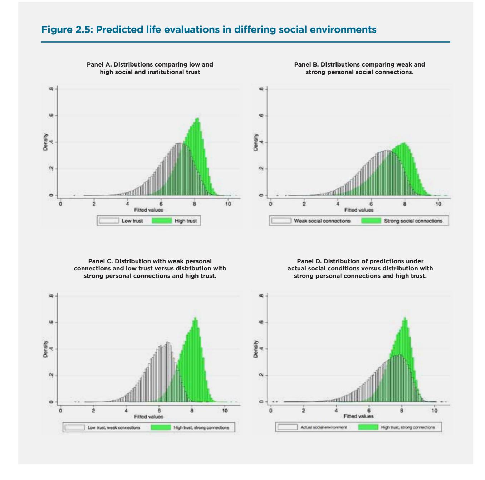

personal social connections as aspects of the social environment. One distribution covers people with low trust and weaker social connections, while the other gives everyone higher average trust and social connections. As before, the actual circumstances for all other aspects of their lives are unchanged. This provides the most comprehensive estimate of the total effects of the social environment on the levels and distribution of life satisfaction. The life evaluation difference provided by higher trust and closer social connections amounts to 1.8 points on the 10-point scale. While the reduction in inequality is very large in the combined case shown in

Panel C, the reduction is slightly less than in the trust case on its own. This is because the primary inequality-reducing power of a better social environment comes from the interaction effects that enable higher trust to buffer the well-being effects of a variety of risks.

Finally, to provide a more realistic example that starts from existing levels of trust and social connections, we show in Panel D of Figure 2.5 a comparison of the predicted results in a high-trust strong-connection world with predicted values based on everyone's actual reported trust and personal social connections. The differences

are smaller than those in Panel C, since we are now comparing the high-trust case not with a low-trust environment, but with the actual circumstances of the surveyed populations. This is a more interesting comparison, since it starts with the current situation and asks how much better that reality might be if those who have low trust and social connections were to have the same levels as respondents in the more trusting and socially connected part of the population. This is in principle an achievable result, since the gains of trust and social connections do not need to come at the expense of those already living in more supportive social environments. It is apparent from Panel D that there are large potential gains for raising average well-being and reducing inequality at the same time. For example, the median respondent stands to gain 0.71 points, compared to an average gain of more than twice as much (1.51 points) for someone at the 10th percentile of the happiness distribution.49 Conversely, the gains for those already at the 90th percentile of the distribution are much smaller (0.25 points). There are two reasons for the much smaller gains at the top. The main reason is that almost all those at the top of the happiness distribution are already living in trusting and connected social environments. The second reason is that they are individually less likely to be suffering from the risks shown in Table 2.4 and hence less likely to receive the buffering gains delivered by high social capital to those most in need.

Given that better social environments raise average life satisfaction and reduce the inequality of its distribution, we can use the results from our estimation of the effects of inequality to supplement the benefits shown in Panel D. To do this, we start with the actual distribution of life evaluations from each survey respondent, and then adjust each evaluation to reflect what their answer would have been if every respondent had the same levels of social and institutional trust as the average of the more trusting respondents, had weekly or more social meetings, had a confidante, and was not afraid in the streets after dark.50 By comparing the degree of inequality in these two distributions, we get a measure of how much actual inequality would be reduced if everyone had reasonably high levels of social trust, institutional trust, and personal social connections. We calculate that the P80/20 ratio

is reduced from 1.33 in the actual distribution on Panel D to 1.16 in the high trust and high connections case, a change of 0.17 points. To get an estimate of how much this might increase average life evaluations, we added the predicted P80/20 ratio reflecting actual conditions to our regression, where it attracts a coefficient of -0.33. We can thus estimate that moving from the current distribution of happiness to one with higher trust and social connections would lower inequality by enough to deliver a further increase in life satisfaction of 0.06 points.51 This would be in addition to what is already included in Panel D of Figure 2.5.52 In total, the combined effect of the better social environment, compared to the existing one, without any changes in the underlying incomes and other life circumstances, is estimated to be about 1.0 point.

These results may underestimate the total effects of better social environments, as they are calculated holding constant the existing levels of income and health, both of which have frequently been shown to be improved when trust and social connections are more supportive. There is also evidence that communities and nations with higher levels of social trust and connections are more resilient in the face of natural disasters and economic crises.53 Fixing rather than fighting becomes the order of the day, and people are happy to find themselves willing and able to help each other in times of need.

But there are also possibilities that our primary evidence, which comes from 35 countries in Europe, may not be so readily applied to the world as a whole. Our parallel research with the Gallup World Poll in Table 2.4 gave somewhat smaller estimates, and showed effects that were somewhat larger in Europe than in the rest of the world. It is also appropriate to ask whether the trust answers reflect reality. Fortunately, experiments have shown that social trust measures are a strong predictor of international differences in the likelihood of lost wallets being returned.54 There is also evidence that people are too pessimistic about the extent to which their fellow citizens will go out of their way to help return a lost wallet.55 To the extent that trust levels are falsely low, better information in itself would help to increase trust levels. But there is clearly much more research needed about the creation and maintenance of a stronger social environment.

### **Conclusions**

The rankings of country happiness are based this year on the pooled results from Gallup World Poll surveys from 2017-2019 and continue to show both change and stability. The top countries tend to have high values for most of the key variables that have been found to support well-being, including income, healthy life expectancy, social support, freedom, trust, and generosity, to such a degree that year to year changes in the top rankings are to be expected. The top 20 countries are the same as last year, although there have been ranking changes within the group. Over the eight editions of the Report, four different countries have held the top position: Denmark in 2012, 2013 and 2016, Switzerland in 2015, Norway in 2017, and now Finland in 2018, 2019 and 2020. With its continuing upward trend in average scores, Finland consolidated its hold on first place, now significantly ahead of an also-rising Denmark in second place, and an even faster-rising Switzerland in 3rd, followed by Iceland in 4th and Norway 5th. All previous holders of the top spot are still among the top five. The remaining countries in the top ten are the Netherlands, Sweden, New Zealand, and Austria in 6th, 7th, 8th, and 9th followed this year by a top-ten newcomer Luxembourg, which pushes Canada and Australia to 11th and 12th, followed by the United Kingdom in 13th, five places higher than in the first *World Happiness Report*. The rest of the top 20 include, in order, Israel, Costa Rica, Ireland, Germany, the United States, the Czech Republic, and Belgium.

At a global level, population-weighted life evaluations fell sharply during the financial crisis, recovered almost completely by 2011, and then fell fairly steadily to a 2019 value about the same level as its post-crisis low. These global movements mask a greater variety of experiences among and within global regions. The most remarkable regional dynamics include the continued rise of life evaluations in Central and Eastern Europe, and their decline in South Asia. More modest changes have brought Western Europe up and Northern America plus Australia and New Zealand down, with roughly equal averages for the two regions in 2019. As for affect measures, positive emotions show no significant trends, while negative emotions have risen significantly, mostly driven by worry and sadness rather than anger.

At the national level, most countries showed significant changes from 2008-2012 to 2017- 2019, with slightly more gainers than losers. The biggest gainer was Benin, up 1.64 points and moving from the bottom of the ranking to near the middle. The biggest life evaluation drops were in Venezuela and Afghanistan, down by about 1.8 and 1.5 points respectively. India, with close to a fifth of global population, saw a 1.2-point decline.

We next consider how well-being inequality affects the average level of well-being, before turning to the main focus for this year's chapter: how different features of the social environment affect the level and distribution of happiness. Using a variety of different measures for the inequality of well-being, we find a consistent picture wherein countries with a broader spread of well-being outcomes have lower average life evaluations. The effect is substantial, despite being measured with considerable uncertainty. This suggests that people do care about the well-being of others, so that efforts to reduce the inequality of happiness are likely to raise happiness for all, especially those at the bottom end of the well-being distribution. Second, as we showed in our analysis of the buffering effects of trust, anything that can increase social and institutional trust produces especially large benefits for those subject to various forms of hardship.

The primary result from our empirical analysis of the social environment is that several kinds of individual and social trust and social connections have large direct and indirect impacts on life evaluations. The indirect impacts, which are measured by allowing the effects of trust to buffer the estimated well-being effects of bad times, show that both social trust and institutional trust reduce the inequality of well-being by increasing the resilience of individual well-being to various types of adversity, including perceived discrimination, ill-health, unemployment, low income, and fear when walking the streets at night. Average life satisfaction is estimated to be almost one point higher (0.96 points) in a high trust environment than in a low trust environment.

The total effects of the social environment are even greater when we add in the well-being benefits of personal social connections, which provide an additional 0.87 points, for a total of 1.83 points, as shown in Panel C of Figure 2.5. This is considerably more than double the 0.8 point estimated life satisfaction gains from moving from the bottom to the top quintile of the income distribution.

To measure the possible gains from improving current trust and connection levels, we can compare the distribution of life evaluations under actual trust and social connections with what would be feasible if all respondents had the same average trust and social connections as enjoyed already by the more trusting and connected share of the population. The results are shown in Panel D of Figure 2.5. Average life evaluations are higher by more than 0.8 points, and the gains are concentrated among those who are currently the least happy. For example, those who are currently at the 10th percentile of the happiness distribution gain more than 1.5 points, compared to less than 0.3 points for those at the 90th percentile. The stronger social environment thereby leads to a significant reduction in the inequality of well-being (by about 13%), which then adds a further boost (about 0.06 points) to average life satisfaction. Moving from current levels of trust and social connections in Europe to a situation of high trust and good social connections is therefore estimated to raise average life evaluations by almost 0.9 on the 0 to 10 scale. Favourable social environments not only raise the level of well-being but also improve its distribution. We conclude that social environments are of first-order importance or the quality of life.

#### **Endnotes**

- 1 The evidence and reasoning supporting our choice of a central role for life evaluations, with supporting roles for affect measures, have been explained in Chapter 2 of several *World Happiness Report*s, and have been updated and presented more fully in Helliwell (2019).
- 2 The statistical appendix contains alternative forms without year effects (Table 12 of Appendix 1), and a repeat version of the Table 2.1 equation showing the estimated year effects (Table 11 of Appendix 1). These results confirm, as we would hope, that inclusion of the year effects makes no significant difference to any of the coefficients.
- 3 As shown by the comparative analysis in Table 10 of Appendix 1.
- 4 The definitions of the variables are shown in Technical Box 1, with additional detail in the online data appendix.
- 5 This influence may be direct, as many have found, e.g. De Neve et al. (2013). It may also embody the idea, as ade explicit in Fredrickson's broaden-and-build theory (Fredrickson, 2001), that good moods help to induce the sorts of positive connections that eventually provide the basis for better life circumstances.
- 6 See, for example, the well-known study of the longevity of nuns, Danner, Snowdon, and Friesen (2001).
- 7 See Cohen et al. (2003), and Doyle et al. (2006).
- 8 We put the contributions of the six factors as the first elements in the overall country bars because this makes it easier to see that the length of the overall bar depends only on the average answers given to the life evaluation question. In *World Happiness Report 2013* we adopted a different ordering, putting the combined Dystopia+residual elements on the left of each bar to make it easier to compare the sizes of residuals across countries. To make that comparison equally possible in subsequent *World Happiness Report*s, we include the alternative form of the figure in the online Statistical Appendix 1 (Appendix Figures 7-9).
- 9 These calculations are shown in detail in Table 20 of online Statistical Appendix 1.
- 10 The prevalence of these feedbacks was documented in Chapter 4 of *World Happiness Report 2013*, De Neve et al. (2013).
- 11 We expect the coefficients on these variables (but not on the variables based on non-survey sources) to be reduced to the extent that idiosyncratic differences among respondents tend to produce a positive correlation between the four survey-based factors and the life evaluations given by the same respondents. This line of possible influence is cut when the life evaluations are coming from an entirely different set of respondents than are the four social variables. The fact that the coefficients are reduced only very slightly suggests that the commonsource link is real but very limited in its impact.
- 12 The coefficients on GDP per capita and healthy life expectancy were affected even less, and in the opposite direction in the case of the income measure, being increased rather than reduced, once again just as expected. The changes were very small because the data come from other sources, and are unaffected by our experiment. However, the income coefficient does increase slightly, since income is positively correlated with the other four variables being tested, so that income is now able to pick

- up a fraction of the drop in influence from the other four variables. We also performed an alternative robustness test, using the previous year's values for the four survey-based variables. This also avoided using the same respondent's answers on both sides of the equation, and produced similar results, as shown in Table 13 of Statistical Appendix 1 in *World Happiness Report 2018*. The Table 13 results are very similar to the split-sample results shown in Tables 11 and 12, and all three tables give effect sizes very similar to those in Table 2.1 in reported in the main text. Because the samples change only slightly from year to year, there was no need to repeat these tests with this year's sample.
- 13 There has been a corresponding drop in Canada's ranking, from 4th in 2012 to 11th in 2020. Average Cantril ladder scores for Canada fell from 7.42 in 2017 to 7.17 in 2018 and 7.11 in 2019. The large-scale official surveys measure life satisfaction every year, so some cross-checking is possible. The data for 2019 are not yet available, but for the larger Canadian Community Health Survey there is no drop from 2017 to 2018. The smaller General Social Survey shows a drop from 2017 to 2018, although survey cycle effects make the magnitude hard to establish.
- 14 The United Kingdom's rise in Cantril ladder score of .277 points from 2008-2012 to 2017-2019 (as shown in Figure 2.4) closely matches the rise of 0.25 points, or 3.4% in UK life satisfaction from March 2013 to March 2019, as measured by the much larger surveys of the Office for National Statistics. Those more detailed data show the largest increases to have taken place in London, as reported in https://www.ons.gov.uk/peoplepopulationand community/wellbeing/bulletins/measuringnationalwell being/april2018tomarch2019
- 15 This footprint affects average scores by more for those countries with the largest immigrant shares. The extreme outlier is the United Arab Emirates (UAE), with a foreignborn share exceeding 85%. The UAE also makes a distinction between nationality and place of birth, and oversamples the national population to obtain larger sample sizes. Thus it is possible in their case to calculate separate average scores 2017-2019 for nationals (6.98), the locally born (6.85), and the foreign-born (6.76). The difference between their foreign-born and locally-born scores is very similar to that found on average for the top 20 countries in the 2018 rankings.
- 16 These calculations come from Table 21 in Statistical Appendix 1.
- 17 The data are shown in Table 21 of Statistical Appendix 1. Annual per capita incomes average \$51,000 in the top 10 countries, compared to \$2,500 in the bottom 10, measured in international dollars at purchasing power parity. For comparison, 94% of respondents have someone to count on in the top 10 countries, compared to 61% in the bottom 10. Healthy life expectancy is 73 years in the top 10, compared to 56 years in the bottom 10. 93% of the top 10 respondents think they have sufficient freedom to make key life choices, compared to 70% in the bottom 10. Average perceptions of corruption are 33% in the top 10, compared to 73% in the bottom 10.
- 18 Actual and predicted national and regional average 2017-2019 life evaluations are plotted in Figure 43 of Statistical Appendix 1. The 45-degree line in each part of the Figure shows a situation where the actual and predicted values are equal. A predominance of country dots below the 45-degree line shows a region where actual values are

- below those predicted by the model, and vice versa. East Asia provides an example of the former case, and Latin America of the latter.
- 19 For example, see Chen et al. (1995).
- 20 One slight exception is that the negative effect of corruption is estimated to be slightly larger, although not significantly so, if we include a separate regional effect variable for Latin America. This is because perceived corruption is worse than average in Latin America, and its happiness effects there are offset by stronger close-knit social networks, as described in Rojas (2018). The inclusion of a special Latin American variable thereby permits the corruption coefficient to take a higher value.
- 21 Some countries do not have data in all years over the duration of the study period (2006–2019). We impute the missing data by using the neighboring year's data. The first wave of Gallup World Poll was collected in 2005 and 2006. We treat them all as 2006 observations in the trend analysis.
- 22 These results may all be found in Figure 2.1 of *World Happiness Report 2018*.
- 23 See, for example, Atkinson (2015), Atkinson and Bourguignon (2014), Kennedy et al. (1997), Keeley (2015), OECD (2015), Neckerman and Torche (2007), and Piketty (2014).
- 24 See Helliwell, Huang, and Wang (2016). See also Goff et al. (2018), Gandelman and Porzekanski (2013), and Kalmijn and Veenhoven (2005).
- 25 See, for example, Evans et al. (1997), Marmot et al. (1994), and Marmot (2005).
- 26 See Goff et al. (2018) for estimates using individual responses from several surveys, including the Gallup World Poll, the European Social Survey, and the World Values Survey.
- 27 See Goff et al. (2018), Table 6.
- 28 Following the example of Nichols and Reinhart (2019).
- 29 The predicted values are obtained by estimating a life evaluation equation from the entire micro sample of GWP data, based on a version of the Table 2.1 equation suitable for this application, and then using the results to create predicted values for each individual in every year and country. These values are then used to build predicted distributions for each year and country, and these distributions are in turn used to construct percentile ratios for each country and year.
- 30 See Goff et al. (2018), Table 6.
- 31 See Table 17 in the online Statistical Appendix 1 of *World Happiness Report 2019*.
- 32 The importance of local environments is emphasized by more recent research showing that the happiness of immigrants to different regions of Canada and the United Kingdom approaches the happiness of other residents of those regions (Helliwell et al., 2020). This is a striking finding, especially in the light of the fact, illustrated by the city rankings of Chapter 3, that life evaluation differences among cities in a country are far smaller than differences between countries.
- 33 The adjusted R-squared is 0.350. Without country fixed effects, the adjusted R-squared is 0.318.

- 34 This move is measured by the difference, in points, between the averages of the good and very good responses and of the fair, poor and very poor responses. The poor-health group comprises 35% of the ESS respondents.
- 35 The effects of unemployment on happiness are roughly one-third greater for males than females, while the effect of feeling unsafe on the street is more than 60% greater for males. Weekly or more frequent social meetings add 25% more happiness for females than for males. The sample frequencies of circumstances can also differ by gender, with males 25% more likely to be unemployed, and 15% less likely to see the streets as unsafe. The frequency of weekly or more social meetings is the same for male and female respondents. Full results may be found in Statistical Appendix 3.
- 36 For social trust, the value of 7 is the lower bound of the high trust group, since that provides the same share of high trusters, about 30%, that is provided in the same countries when people are asked a binary question on social trust. We use the same lower bound for trust in police. For institutional trust, where assessments are generally lower, we adopt a lower bound of 5.5, since that puts about 30% of respondents into the high-trust group.
- 37 See Helliwell et al. (2018) and Helliwell, Aknin et al. (2018).
- 38 Yanagisawa et al. (2011) provide experimental evidence that social trust reduces the psychosocial costs of social exclusion, while Branscombe et al. (2016) show that a sense of community belonging buffers the life satisfaction effects of perceived discrimination felt by disabled youth.
- 39 Although there have been many studies showing links between trust and actual or perceived ill-health (See Kawachi (2018) for a recent review), there has not been corresponding analysis of whether and how trust might affect the links running between actual or perceived health and life evaluations.
- 40 Akaeda (2019), using data from the European Quality of Life Survey, also finds that higher social trust (in his case using national averages for social trust) significantly reduces the effects on income on life evaluations. Akaeda assumes symmetric effects from top and bottom incomes, while we estimate the two effects separately and find them to be of roughly equivalent size.
- 41 Our findings on this score are consistent with those of Annick et al. (2016), who find that high social trust reduces the estimated losses of subjective well-being caused by perceived financial hardship among self-employed respondents to two waves of the European Social Survey.
- 42 As shown in Statistical Appendix 3, each of the three main effect trust coefficients is between .06 and .07 for a one point change in the 0 to 10 scale, for a total of more than two points on the life evaluation scale for someone who has full trust on the 0 to 10 scale relative to someone who has zero trust in all three dimensions. To get a figure that matches more closely the rest of the table, we separate the respondents into those with high trust (7 and above for social and police trust, 5.5 and above for system trust) and with lower trust (<7 and <5.5, respectively), and find the average responses for high and low trusters, for each of the trust measures taken separately. We then multiply the difference between high and low trust responses (4.05, 3.72, and 4.26 for social trust, system trust, and police trust) by the estimated coefficients in the equation to get the total direct contributions shown in the left-hand column of the Table.

- 43 These social resources have also been considered as possible sources of life-satisfaction buffering in the face of adverse events. Kuhn and Brulé (2019) found social support to be a buffer in the case of unemployment, but not ill-health or widowhood using a Swiss longitudinal survey. Anusic and Lucas (2014) found that the size of the available network of friends during the adaption phase of adjustment to widowhood lessened the loss of life satisfaction in each of the three national longitudinal surveys used, although the effects were significant in one of the three surveys. We tested the interaction of widowhood and high frequency of meeting with friends in the ESS data, and found no significant effects.
- 44 To further check the consistency of the two sets of results, we estimated the GWP equation using a subsample of the data including only the countries covered by the ESS. This produced larger offset estimates, closer to those estimated for the ESS sample.
- 45 The individual health variable in the GWP reflects only a yes or no answer to whether the individual has a serious health problem, while the ESS contains a five-point scale for each respondent to assess their health status. This difference is the most likely source of the differing health effect.
- 46 But there is some evidence that the direct and indirect effects of institutional trust may be larger in Europe than in the rest of the world. This is shown by Table 13 in Statistical Appendix 1, where we find effects that are generally larger and more significant for the European countries in the Gallup World Poll.
- 47 We define low as less than 5.5 for system trust, and less than 7 for social trust and trust in police. Our reason for choosing these thresholds is that such a division produces a high-trust population share most equal to that of respondents to a social trust question asked on a yes/no binary basis.
- 48 1.04 vs. 0.73.
- 49 More precisely, the calculation reflects the difference between the 10th percentiles of the two distributions.
- 50 Thus what we are doing is taking, for each individual, the difference between their scores in the two distributions shown in Panel D of Figure 2.5, and then adding these to their actual recorded answers on the 0 to 10 scale. The effects are generally positive, but not necessarily so, as there will be some individuals whose actual trust and social meetings were higher than the average high values attributed to them in the high-trust, strong social connection scenario of Table 2.4 Panel D.
- 51 More precisely, the reduction of 0.170 in the P8020 ratio is multiplied by the coefficient of -0.331 to get a predicted further increase of 0.056 in life evaluations, rounded to 0.06 in the text.
- 52 There is a possible element of double-counting here if the coefficients in Table 2.3 are already taking some of the credit for the inequality effects, since the inequality variable is not included in the equation used in that table. To investigate the possible size of such an effect, we reestimated the distribution for high-trust and high social connections making use of coefficients from the alternative equation with inequality included. The resulting effects are negligible. The new coefficients do lower the expected gains, but by a negligible 0.0005 of a point, as the mean happiness drops from 7.931 to 7.926.

- 53 See Aldrich and Meyer (2015) for a review of the evidence on community-level resilience.
- 54 Wallet return questions were asked in 132 countries in the 2006 Gallup World Poll. Those with a high expected wallet return were significantly happier, by an amount more than equivalent to a doubling of income (Helliwell & Wang, 2011, table 2-d). These expectations of wallet return reflect underlying realities, as the average national rates of expected wallet return, if found by a stranger, are highly correlated (r = 0.83, p < 0.001) with the actual return of wallets for the 16 countries in both samples in a recent large experimental study (Cohn et al., 2019).
- 55 The actual rates of wallet return in the international study of Cohn et al. (2019) were far higher than predicted by the Gallup World Poll respondents described in the previous end-note. Similarly, experimentally dropped wallets in Toronto were returned in 80% of cases, while respondents to the Canadian General Social Survey asked about the likely return of their lost wallets in the same city forecast a return rate of less than 25%. See Helliwell et al. (2018) and Helliwell, Aknin et al. (2018) for the details.

#### **References**

Akaeda, N. (2019). Contextual social trust and well-being inequality: From the perspectives of education and income. *Journal of Happiness Studies*, 1-23. https://doi.org/10.1007/ s10902-019-00209-4

Aldrich, D. P., & Meyer, M. A. (2015). Social capital and community resilience. *American Behavioral Scientist*, *59*(2), 254-269.

Annink, A., Gorgievski, M., & Den Dulk, L. (2016). Financial hardship and well-being: a cross-national comparison among the European self-employed. *European Journal of Work and Organizational Psychology*, *25*(5), 645-657.

Anusic, I., & Lucas, R. E. (2014). Do social relationships buffer the effects of widowhood? A prospective study of adaptation to the loss of a spouse. *Journal of Personality*, *82*(5), 367-378.

Atkinson, A.B. (2015). *Inequality: What can be done?* Cambridge: Harvard University Press.

Atkinson, A. B., & Bourguignon, F. (2014). *Handbook of income distribution* (Vols. 2A &2B). Elsevier.

Branscombe, N., Daley, A., & Phipps, S. (2016). *Perceived Discrimination, Belonging and the Life Satisfaction of Canadian Adolescents with Disabilities* (No. daleconwp2016-04).

Chen, C., Lee, S. Y., & Stevenson, H. W. (1995). Response style and cross-cultural comparisons of rating scales among East Asian and North American students. *Psychological Science*, *6*(3), 170-175.

Cohen, S., Doyle, W. J., Turner, R. B., Alper, C. M., & Skoner, D. P. (2003). Emotional style and susceptibility to the common cold. *Psychosomatic Medicine*, *65*(4), 652-657.

Cohn, A., Maréchal, M. A., Tannenbaum, D., & Zünd, C. L. (2019). Civic honesty around the globe. *Science*, *365*(6448), 70-73.

Danner, D. D., Snowdon, D. A., & Friesen, W. V. (2001). Positive emotions in early life and longevity: findings from the nun study. *Journal of Personality and Social Psychology*, *80*(5), 804.

De Neve, J. E., Diener, E., Tay, L., & Xuereb, C. (2013). The objective benefits of subjective well-being. In J. F. Helliwell, R. Layard, & J. Sachs (Eds.), *World happiness report 2013* (pp. 54-79). New York: UN Sustainable Development Solutions Network.

Doyle, W. J., Gentile, D. A., & Cohen, S. (2006). Emotional style, nasal cytokines, and illness expression after experimental rhinovirus exposure. *Brain, Behavior, and Immunity*, *20*(2), 175-181.

Durand, M., & Exton, C. (2019). Adopting a well-being approach in central government: Policy mechanisms and practical tools. In Global Happiness Council, *Global happiness and wellbeing policy report 2019* (pp. 140-162). http://www.happinesscouncil.org

Evans, R. G., Barer, M. L., & Marmor, T. R. (Eds.). (1994). *Why are some people healthy and others not? The determinants of the health of populations*. New York: De Gruyter.

Fredrickson, B. L. (2001). The role of positive emotions in positive psychology: The broaden-and-build theory of positive emotions. *American psychologist*, *56*(3), 218-226.

Frijters, P., & Layard, R. (2018). Direct wellbeing measurement and policy appraisal: a discussion paper. London: LSE CEP Discussion Paper.

Gandelman, N., & Porzecanski, R. (2013). Happiness inequality: How much is reasonable? *Social Indicators Research*, *110*(1), 257-269.

Goff, L., Helliwell, J., & Mayraz, G. (2018). Inequality of subjective well-being as a comprehensive measure of inequality. *Economic Inquiry* 56(4), 2177-2194.

Helliwell, J. F. (2019). *Measuring and Using Happiness to Support Public Policies* (No. w26529). National Bureau of Economic Research.

Helliwell, J. F., Aknin, L. B., Shiplett, H., Huang, H., & Wang, S. (2018). Social capital and prosocial behavior as sources of well-being. *Handbook of well-being. Salt Lake City, UT: DEF Publishers. DOI: nobascholar.com*.

Helliwell, J. F., Huang, H., & Wang, S. (2018). New evidence on trust and well-being. In E. M. Uslaner (Eds.), *The Oxford handbook of social and political trust (pp. 409-446)*. New York: Oxford University Press.

Helliwell, J. F., Bonikowska, A., & Shiplett, H. (2020). Migration as a test of the happiness set point hypothesis: Evidence from Immigration to Canada and the United Kingdom. *Canadian Journal of Economics* (forthcoming).

Helliwell, J. F., & Wang, S. (2011). Trust and well-being. *International Journal of Wellbeing*, *1*(1), 42-78.

Kalmijn, W., & Veenhoven, R. (2005). Measuring inequality of happiness in nations: In search for proper statistics. *Journal of Happiness Studies*, *6*(4), 357-396.

Kawachi, I. (2018). Trust and population health. In E. M. Uslaner (Ed.), *The Oxford handbook of social and political trust* (pp. 447-470). New York: Oxford University Press.

Keeley, B. (2015). *Income inequality: The gap between rich and poor*. OECD Insights, Paris: OECD Publishing.

Kuhn, U., & Brulé, G. (2019). Buffering effects for negative life events: The role of material, social, religious and personal resources. *Journal of Happiness Studies*, *20*(5), 1397-1417.

Marmot, M. (2005). Social determinants of health inequalities. *The Lancet*, *365*(9464), 1099-1104.

Marmot, M., Ryff, C. D., Bumpass, L. L., Shipley, M., & Marks, N. F. (1997). Social inequalities in health: Next questions and converging evidence. *Social Science & Medicine*, *44*(6), 901-910.

Neckerman, K. M., & Torche, F. (2007). Inequality: Causes and consequences. *Annual Review of Sociology*, *33*, 335-357.

Nichols, S. & Reinhart, R.J. (2019) Well-being inequality may tell us more about life than income. https://news.gallup.com/ opinion/gallup/247754/wellbeing-inequality-may-tell-lifeincome.aspx

OECD (2015). *In it together: Why less inequality benefits all*. Paris: OECD Publishing. DOI: http://dx.doi. org/10.1787/9789264235120-en.

OECD (2017). *How's life?: Measuring well-being*. Paris: OECD Publishing.

Piketty, T. (2014). *Capital in the 21st Century*. Cambridge: Harvard University Press.

Rojas, M. (2018). Happiness in Latin America has social foundations. In J. F. Helliwell, R. Layard, & J. Sachs (Eds.), *World happiness report 2018* (pp. 89-114). New York, Sustainable Development Solutions Network. https://worldhappiness. report/ed/2018/

Yanagisawa, K., Masui, K., Furutani, K., Nomura, M., Ura, M., & Yoshida, H. (2011). Does higher general trust serve as a psychosocial buffer against social pain? An NIRS study of social exclusion. *Social Neuroscience*, *6*(2), 190-197.

## Chapter 3 **47**

## Cities and Happiness: A Global Ranking and Analysis

Jan-Emmanuel De Neve

Director, Wellbeing Research Centre, University of Oxford

Christian Krekel

Assistant Professor, London School of Economics

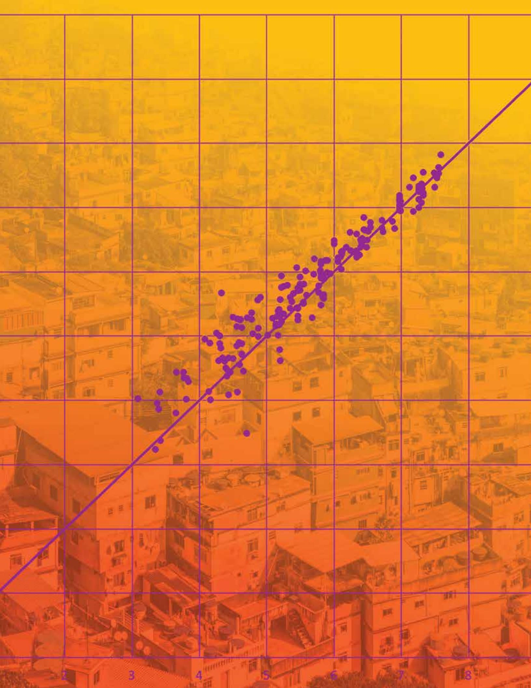

### **Introduction**

About 4.2 billion people, more than half of the world's population (55.3 per cent), are living in urban areas today. By 2045, this figure is estimated to increase by 1.5 times, to more than six billion.1 There were 371 cities with more than one million inhabitants at the turn of the century in 2000. In 2018, there were 548, and in 2030, a projected 706 cities will have at least one million inhabitants. During the same time, the number of so-called *mega cities* – cities that have more than ten million inhabitants, most of which are located in the Global South – is expected to increase from 33 to 43, with the fastest growth in Asia and Africa. Today, Tokyo (37.4 million), New Delhi (28.5 million), and Shanghai (25.6 million inhabitants) are the most populous cities worldwide.2

Cities are economic powerhouses: more than 80 per cent of worldwide GDP is generated within their boundaries.3 They allow for an efficient division of labour, bringing with them agglomeration and productivity benefits, new ideas and innovations, and hence higher incomes and living standards. They often outperform their countries in terms of economic growth.4 City dwellers are often younger, more educated, and more liberal than their rural counterparts. They are more likely to be in professional and service jobs, and less likely to have kids. With urbanisation set to increase, by 2050, seven in ten people worldwide will be city dwellers.

Rapid urbanisation, however, also imposes challenges: a lack of affordable housing results in nearly one billion urban poor living in informal settlements at the urban periphery, vulnerable and often exposed to criminal activity. A lack of public transport infrastructure results in congestion and often hazardous pollution levels in inner cities. By one estimate, in 2016, 90 per cent of city dwellers have been breathing unsafe air, resulting in 4.2 million deaths due to ambient air pollution.5 Cities account for about two-thirds of the world's energy consumption and for more than 70 per cent of worldwide greenhouse gas emissions. Urban sprawl and inefficient land use contribute to biodiversity loss.6 Rapid urbanisation also puts pressure on public open spaces such as parks and urban green areas, which provide space for social interaction and important ecosystem services.7,8

Given the speed and scale of urbanisation, with all its benefits and challenges, how do city dwellers fare, on balance, when it comes to their subjective well-being? How did their well-being change over time? Which cities around the world promote a higher well-being amongst their inhabitants than others, conditional on the same development level? And how does well-being and well-being inequality within cities relate to that within countries? This chapter explores these questions, by providing the first global ranking of cities based on their residents' selfreported well-being.

Our ranking is fundamentally different from existing rankings of cities in terms of quality of life, such as The Economist's *Global Liveability Index*, which ranks cities according to a summary score constructed from qualitative and quantitative indicators across five broad domains.9 Rather than relying on a list of factors that researchers consider relevant, our ranking relies on city residents' self-reports of how they themselves evaluate the quality of their lives. In doing so, it emancipates respondents to consider and weigh for themselves which factors – observable or unobservable to researchers – they feel matter most to them. Arguably, this bottom-up approach gives a direct voice to the population as opposed to the more top-down approach of deciding *ex-ante* what ought to matter for the well-being of city residents. Importantly, leveraging wellbeing survey responses is an approach that allows us to get a more holistic grip on the drivers of happiness. In fact, employing wellbeing surveys allows to figure out the relative importance of different domains in shaping well-being, thus providing evidence- based guidance for policymakers on how to optimize the well-being of their populations.

The importance of cities for global development has long been recognised in Sustainable Development Goal (SDG) 11, *Sustainable Cities and Communities*, which includes targets with clear relevance for citizens' life satisfaction, such as strengthening public transport systems to reduce congestion and commuting times10, reducing ambient air pollution11, and improving access to green and public open spaces12 for all citizens.13,14 Our chapter aims to make an important contribution to benchmarking progress towards this goal and its targets in an integrated fashion by studying the current state of how cities are

actually doing when it comes to their citizens' subjective well-being and, in doing so, by casting an anchor for continuous future benchmarking.

In what follows, we first describe the methodology behind our ranking and present our findings on cities' happiness around the world. Then, we analyse whether and how cities' happiness has changed during the past decade, whether there exist significant differences between cities and their countries, and whether there are substantial happiness inequalities within cities relative to countries.

## **Ranking Cities' Happiness Around the World**

#### **Methodology**

As is the case for the ranking of countries in this World Happiness Report, our ranking of cities' happiness around the world relies on the Gallup World Poll, an annual survey that started in 2005 and that is conducted in more than 160 countries covering 99 per cent of the world's population. It includes at least 1,000 observations per country per year, covering both urban and rural areas, with a tendency to oversample major cities. The survey is nationally representative of the resident population aged 15 and above in each country. To increase sample size for the US, we complement the data with the Gallup US Poll, a survey which sampled US adults aged 18 and above nationwide between 2008 and 2017.15 It included at least 500 observations per day and, importantly, asked respondents a similar set of questions as does the Gallup World Poll. To ensure that it is appropriate to merge the data coming from different surveys, we calculated the 2014-2018 average current life evaluation score for the Gallup US Poll and the World Poll, and found them to be almost identical: 6.96 for the US Poll and 6.97 for the World Poll. This and other checks make it possible to integrate the Gallup US Poll data without the need for re-scaling.16

In line with the methodology of the World Happiness Reports, our main outcome is current *life evaluation*, obtained from the so-called *Cantril ladder*, which is an item asking respondents to imagine themselves on a ladder with steps numbered from zero at the bottom to ten at the top, where zero represents the worst possible

and ten the best possible life.17 While life evaluation is our primary measure of subjective well-being, we also take into account well-being measures of how people experience their lives on a day-today basis.18 To do so, we turn again – in line with the methodology applied in the World Happiness Reports – to the Gallup World Poll and the Gallup US Poll, which include items on positive and negative affect, constructed from batteries of yes-no questions that ask respondents about their emotional experiences on the previous day. For positive affect, we include whether respondents experienced enjoyment and whether they smiled or laughed a lot.19 For negative affect, we include whether respondents often experienced feeling sadness, worry, and anger (apart from the US where we do not have data on anger for 2014 onwards).20 Indices are then created by averaging across items, and are bound between zero and one. Finally, to elicit respondents' expectations about their future, we look at *future life evaluation*, which is a future- oriented Cantril ladder survey item asking respondents where they think that they will stand in terms of their quality of life in five years from now.

We restrict our analysis to the period 2014 to 2018 and in order to reduce statistical noise, to cities with at least 300 observations recorded during this five-year span. Leveraging the US Poll, we added the ten largest American cities. Our definition of what constitutes a city (for the US) is based on the notion of *functional urban areas*: territorial and functional units with a population of a particular size in which people live, work, access amenities, and interact socially. It is preferable over definitions of cities based on, say, administrative boundaries, in that it is much more representative of the life realities of most people living in a city. Taken together, our methodological approach leads our ranking of cities' happiness to cover 186 cities across the globe.

#### **Ranking**

In our ranking of cities' happiness around the world, we first look at current life evaluation – an evaluative measure of subjective well-being and our main outcome – and then contrast our findings with those on expected future life evaluation of cities' inhabitants. We also compare our findings with those on positive and negative affect on a day-to-day basis, which are experiential measures, in the follow-up discussion section.

#### **Current Life Evaluation**

Figure 3.1 shows the complete list of cities according to how positively their inhabitants currently evaluate their lives on average.

As can be seen in Figure 3.1, the top ten are clearly dominated by Scandinavian cities: Helsinki (Finland) and Aarhus (Denmark) are ranked first and second, Copenhagen (Denmark), Bergen (Norway), and Oslo (Norway) fifth, sixth, and seventh. Stockholm (Sweden) comes out ninth. Thus, more than half of the top ten cities worldwide according to how positively their inhabitants currently evaluate their lives are located in Scandinavia. Two of the top ten cities are located in Australia and New Zealand: Wellington, the capital of New Zealand, is ranked third and Brisbane (Australia) is ranked tenth. The only top ten cities that are not located in either Scandinavia or Australia and New Zealand are Zurich (Switzerland) and Tel Aviv (Israel).

Figure 3.1 also shows that the bottom ten cities are less clustered geographically, but more correlated in terms of common themes. Although most cities at the bottom are located in some of the least developed countries worldwide, mostly in Africa and the Middle East (with India as a notable exception), they are distinct from other less developed countries around the world by having experienced recent histories of war (Kabul in Afghanistan and Sanaa in Yemen, which are at the very bottom of our global ranking); continuous armed conflict (Gaza in Palestine, which comes third from the bottom); civil war (Juba in South Sudan comes fifth, Bangui in the Central African Republic ninth); political instability (Cairo in Egypt comes tenth from the bottom); or devastating natural catastrophes with longrun impacts (Port-au-Prince in Haiti comes fourth from the bottom).

Besides their low economic development levels, therefore, these cities are also located in countries with high political instability, a strained security situation, and reoccurring periodic outbreaks of armed conflict. The impacts of (threat of) war, armed conflict, and terrorism on subjective well-being are well-documented in the literature.21

The other cities in the bottom ten according to how positively their inhabitants evaluate their current lives are Dar es Salaam in Tanzania (which comes sixth from the bottom), New Delhi in India (which comes seventh), and Maseru in Lesotho (which comes eighth).

#### **Expected Future Life Evaluation**

Figure A1 in Appendix replicates Figure 3.1, but reports on expected future rather than current life evaluation. It presents our global ranking of cities according to how positively their inhabitants evaluate their expected future lives, as raw means.

Although the top ten according to how cities' inhabitants evaluate their expected future lives feature familiar faces such as Aarhus (Denmark), Copenhagen (Denmark), and Helsinki (Finland), which rank sixth, seventh, and eighth, and which also feature in the top ten of current life evaluation (ranking second, fifth, and first, respectively), it is fascinating to see that the top ten in terms of optimistic outlook also includes new cities. Many of them originate from Latin America and the Caribbean, as well as many regions in Africa. In fact, places two, three, and five in terms of future life evaluation are populated by San Miguelito (Panama), San Jose (Costa Rica), and Panama City (Panama), whereas places four and ten are populated by Accra (Ghana) and Freetown (Sierra Leone). The most optimistic outlook is found in Tashkent (Uzbekistan). The finding for optimism of city dwellers in the Latin American and Caribbean region is mirrored by high levels of subjective well-being found in Latin American societies more generally. Atlanta (US) is also found in the top ten of optimistic future outlook.

While the top ten feature many new faces, the bottom ten feature rather familiar ones: city dwellers in Kabul (Afghanistan), Gaza (Palestine), and Port-au-Prince (Haiti) – places torn by recent war, continuous armed conflict, and devastating natural catastrophes – are the least optimistic worldwide. Sanaa in Yemen, another war-torn city, is ranked sixth, whereas Beirut in Lebanon

#### **Figure 3.1: Global Ranking of Cities — Current Life Evaluation** (Part 1) **Figures**

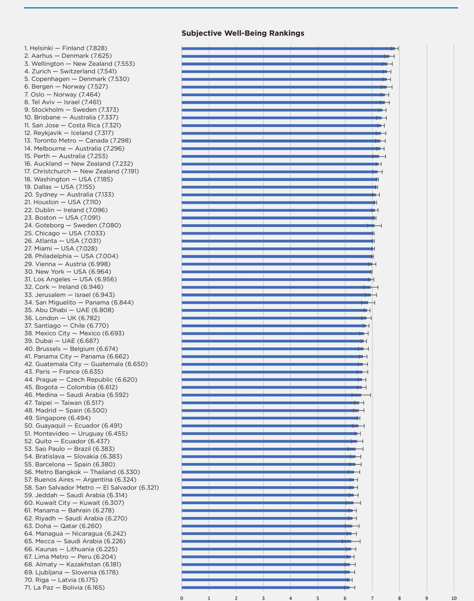

#### Subjective Well-Being Rankings (2) **Subjective Well-Being Rankings**

**Figure 3.1: Global Ranking of Cities — Current Life Evaluation** (Part 2)

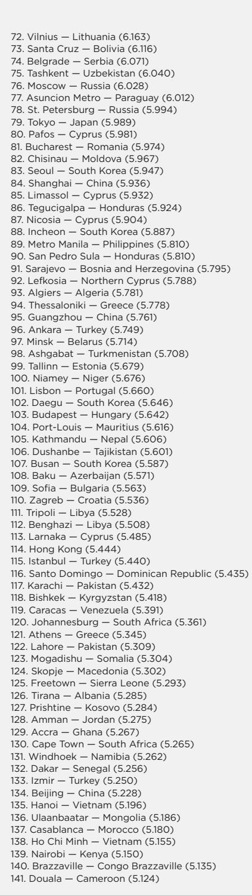

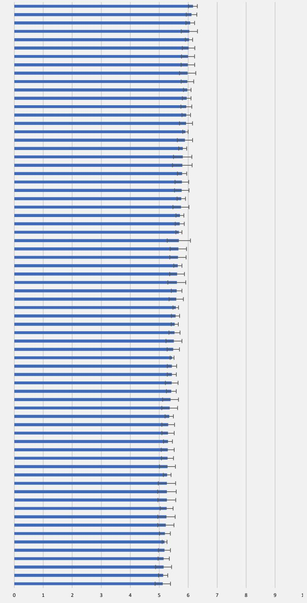

**Figure 3.1: Global Ranking of Cities — Current Life Evaluation** (Part 3)

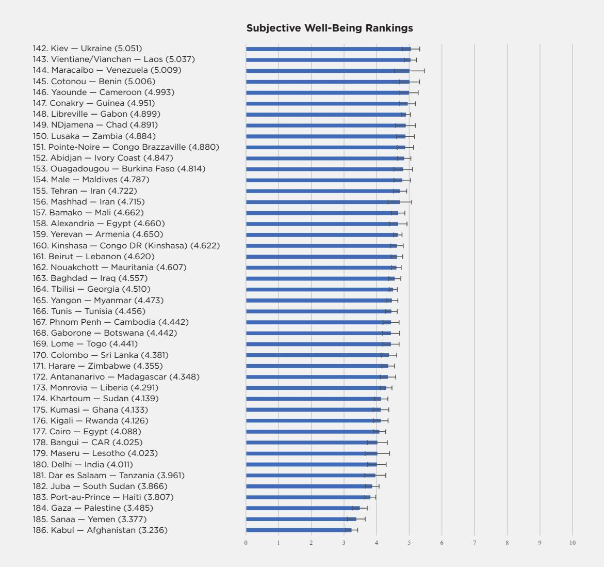

Notes: The scatterplot takes into account all cities worldwide with at least 300 observations in the Gallup World Poll during the period 2014-2018 as well as the ten largest cities in the US using data from the Gallup US Poll.

Sources: Gallup World Poll, Gallup US Poll.

(bordering Syria) is ranked fourth from the bottom. As with current life evaluation, New Delhi (India) scores rather low when it comes to the optimistic outlook of its inhabitants (ranked fifth from the bottom). Likewise, cities in Egypt (here Alexandria, which is ranked eighth from the bottom) are quite pessimistic places when it comes to the future, and so are cities located in Iran (Tehran, the capital, is ranked ninth and Mashhad is ranked tenth from the bottom). These are places that have seen economically difficult times recently. The only European city in the bottom ten cities of how positively their inhabitants evaluate their future lives is Athens in Greece, which may be explained by the recent economic crisis in the country.

Is there predictive power from these self-predicted future scores? To check this, we regress current life evaluation on life evaluation scores pre-2014 and expected life evaluation scores pre-2014. In this multivariate regression, we find that life evaluation scores pre-2014 are highly significant, while expected future life evaluation scores pre-2014 are not significant. Even when doing a univariate regression of current life evaluation scores on expected life evaluation only, we find that it is not significant. This perhaps shows that people are not quite able to accurately predict their future life evaluation and the best indicator of the future is current life evaluation.

#### **Positive and Negative Affect**

Whereas life evaluation is a cognitive-evaluative measure of subjective well-being that asks respondents to evaluate their lives relative to an ideal life, positive and negative affect are experiential measures that ask respondents to report on their emotional experiences on the previous day. They are thus less prone to social narratives, comparisons, or issues of adaptation and anticipation. Contrary to life evaluation, they also take into account the duration of experiences, arguably an important dimension when it comes to people's overall quality of life. Figure A2 in the Appendix replicates our global ranking of city happiness for positive affect, Figure A3 for negative affect.

When it comes to the worldwide top ten in terms of positive affect, we find that six out of ten cities originate from the Latin America and Caribbean region. For some of these places,

these scores may come as a surprise, given the difficult economic situations in the countries in which these cities are located. Yet to some extent this finding mirrors our finding on expected future life evaluation: city dwellers in the Latin American and Caribbean region are not only looking more optimistically into the future than their current levels of life evaluation would predict, but also report higher levels of momentary happiness and joy. The generally high level of affective well-being in the region is welldocumented in the literature22 and may be due to, for example, stronger family relationships, social capital, and culture-related factors. Note that since the Gallup World Poll is nationally representative, it is unlikely that self-selection of survey respondents who are exceptionally happy are driving our results.

We find cities in areas that are in current or past conflict zones at the bottom in terms of positive affect. Somewhat surprising is the large number of Turkish city dwellers reporting low positive affect, including people living in Ankara, Istanbul, and Izmir. Perhaps less surprising, most cities that score low on positive affect also score high on negative affect, as seen in Figure A3.

#### **Further Analysis**

#### **Changes Over Time**

So far, our global ranking of cities' happiness has looked at a snapshot of happiness, taken as the average happiness across the period 2014 to 2018. Naturally, the question arises how cities' happiness has changed over the years. To answer this question, in Figure 3.2 we calculate the change in life evaluation for each city against its average life evaluation in the period 2005 to 2013. The Gallup World Poll was initiated in 2005, which is the earliest possible measurement we can use for our purposes.

Some cities have experienced significant positive changes in their citizens' happiness over the past decade: changes above 0.5 points in life evaluation, which is measured on a zero-to-ten scale, can be considered very large changes; a change of 0.5 points is approximately the change when finding gainful employment after a period of unemployment.23 The top ten cities in our global ranking in terms of change have experienced changes of

#### **Figure 3.2: Global Ranking of Cities — Changes in Current Life Evaluation** (Part 1)

#### **Change in Subjective Well-Being**

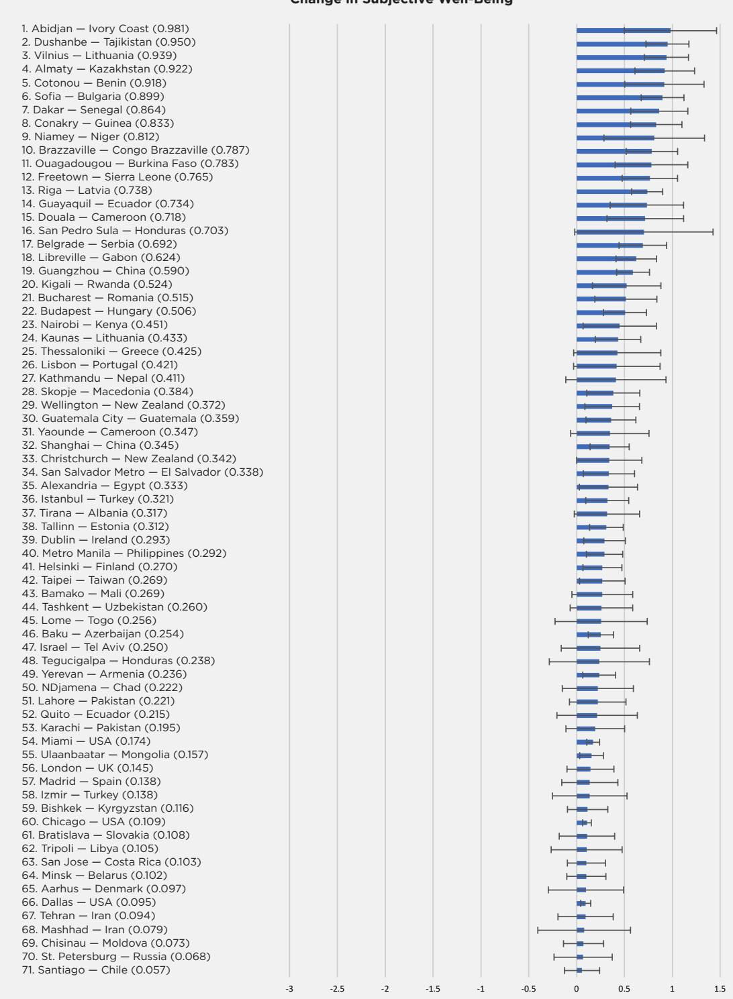

**Figure 3.2: Global Ranking of Cities — Changes in Current Life Evaluation** (Part 2)

*(Figure 3.2 Continued)*

#### Change in Subjective Well-Being (2) **Change in Subjective Well-Being**

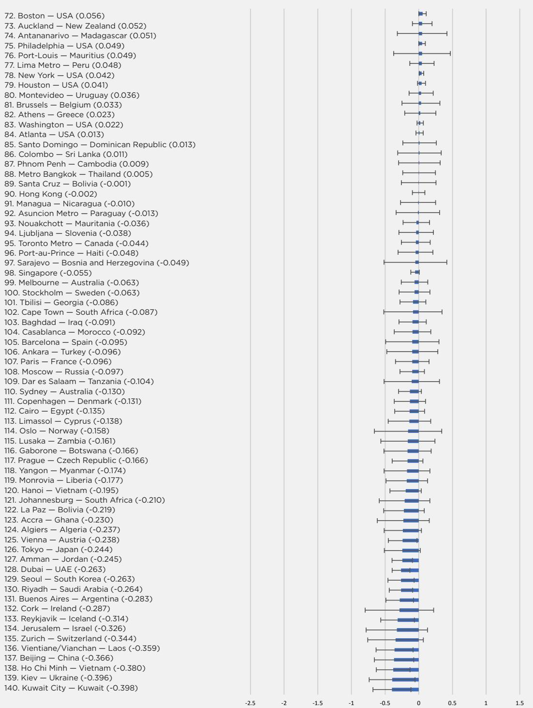

Figure 3.2: Global Ranking of Cities — Changes in Current Life Evaluation (Part 3)

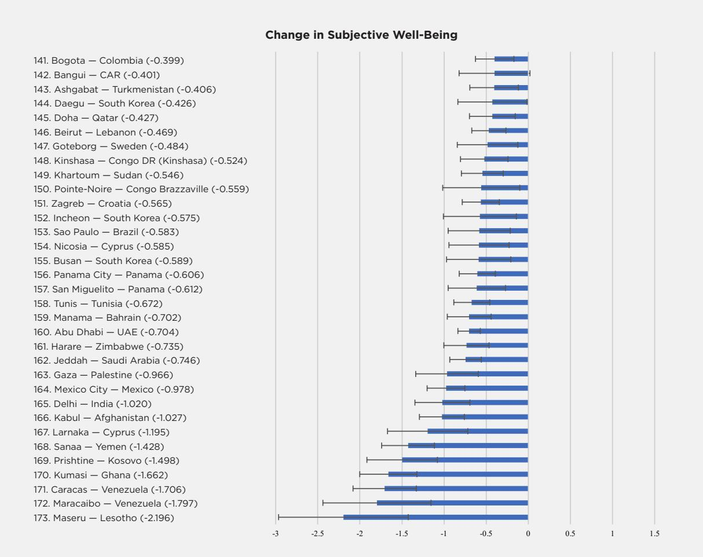

Notes: The list takes into account all cities worldwide with at least 300 observations in the Gallup World Poll during the period 2014-2018 as well as the ten largest cities in the US using data from the Gallup US Poll. The outcome measure is the change in current life evaluation from 2005-2013 to 2014-2018 on a zero-to-ten scale. Figures are raw means. Confidence bands are 95%.

Sources: Gallup World Poll, Gallup US Poll.

0.75 points or more. They are predominantly in Africa, Eastern Europe, or Central Asia. The city with the largest positive change is Abidjan (Ivory Coast). Other cities that have experienced large positive changes in Africa are Cotonou (Benin), Dakar (Senegal), Conakry (Guinea), Niamey (Niger), and Brazzaville (Congo), which are ranked fifth, seventh, eighth, ninth, and tenth in our global ranking of changes. Dushanbe (Tajikistan) and Almaty (Kazakhstan) – two former Soviet republics located in Central Asia – are ranked second and fourth, respectively. Strong improve-

ments are also found in Vilnius (Lithuania) and Sofia (Bulgaria), two capital cities in countries that are now part of the European Union. Other cities in or at the fringes of the European Union that have made substantial progress (of 0.5 or more points on the zero-to-ten life evaluation scale) are Riga (Latvia), ranked 13, Belgrade (Serbia), ranked 17, Bucharest (Romania), ranked 22, and Budapest (Hungary), ranked 23.

While some cities have experienced large increases in their citizens' happiness over the past decade, others have experienced

tremendous reductions, often by more than an entire point on the zero-to-ten life evaluation scale. The strongest reduction is found in Maseru, the capital of Lesotho, which has seen current life evaluation decrease by more than two points. Maracaibo and Caracas, the second largest city and the capital of Venezuela, are placed second and third from the bottom, respectively. Other cities that have seen large decreases are Pristina (Kosovo), Sanaa (Yemen), and Kabul (Afghanistan), which come fifth, sixth, and seventh from the bottom, respectively. Perhaps less surprising, most of these cities – together with New Delhi (India), ranked ninth, and Mexico City (Mexico), ranked tenth from the bottom – also score low when it comes to expected future life evaluation. People living in these cities are not optimistic about their future. Somewhat new on the radar are Kumasi (Ghana) and Larnaka (Cyprus), which have also experienced strong reductions in happiness over the past decade.

In sum, there have been winners and losers in terms of changes in cities' happiness over the past decade. On a global scale, has happiness in cities increased or decreased? On average, there has been a decrease in mean city happiness over the past decade. However, this decrease is driven by very strong reductions in city happiness at the very bottom of our global ranking. If we were to exclude Maseru (Lesotho), Maracaibo and Caracas (both Venezuela), Sanaa (Yemen), Kabul (Afghanistan), and Gaza (Palestine) – cities which have been facing exceptional challenges – from our global ranking, we could say that happiness in cities worldwide has increased in recent years.

#### **City-Country Differences**

Another interesting question is whether or not our global ranking of cities is determined by something different than the mean happiness of the counties in which they are located. One way

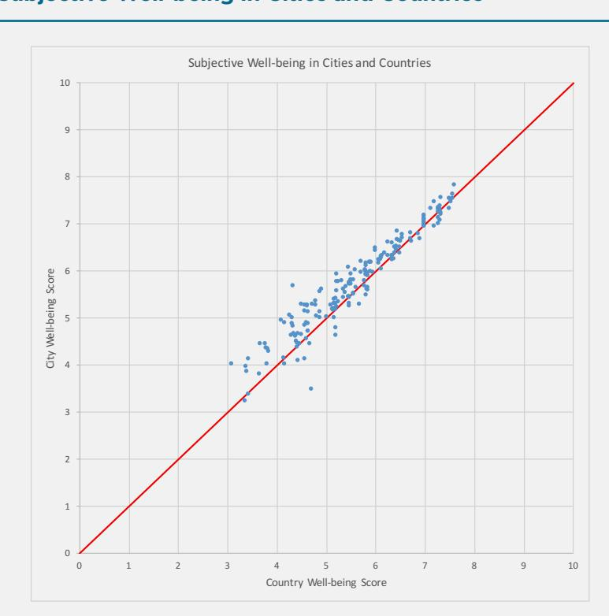

**Figure 3.3: Subjective Well-being in Cities and Countries**

Notes: The scatterplot takes into account all cities worldwide with at least 300 observations in the Gallup World Poll during the period 2014-2018 as well as the ten largest cities in the US using data from the Gallup US Poll.

Sources: Gallup World Poll, Gallup US Poll.

of testing this is to use country mean happiness scores to predict city rankings, and then to look for significant outliers. As Figure 3.3 suggests, residents of cities are somewhat happier than the mean happiness of their respective country populations suggests. This global difference amounts to, on average, 0.2 points on the zeroto-ten life evaluation scale. What stands out from this analysis, however, is that this difference is greater for city residents at the lower end of the well-being scale before it diminishes and often reverses at the top-end: residents of cities at the lower end are about 0.5 points happier than the average populations in their respective countries. This observation appears to corroborate Morrison's model, which suggests such a skewed relationship for reasons that are considered in more detail in chapter 4 of this report.24

Following Morrison, we split the sample into high-income and low-income countries in order to get a better sense for the different slopes in

the relationship between city residents' happiness and their respective country average happiness.25 Figures 3.4 and Figure 3.5 illustrate these different slopes at different levels of economic development: for low-income city-country pairs we can confidently reject the hypothesis that the line of best fit shown in Figure 3.4 is the same as the 45-degree line (F-test = 35.72). The same is not the case for the line of best fit in Figure 3.5, which relates to high-income city-country pairs. Here, we cannot statistically distinguish it from the 45-degree line (F-test = 3.59). These results imply that the average country happiness is a very strong predictor of city happiness at higher levels of well-being and economic development. However, this is somewhat less the case for countries at lower levels. In fact, while the general correlation coefficient between country-city pairs stands at 0.96, the correlation coefficient is slightly lower at 0.90 for the low-income group.

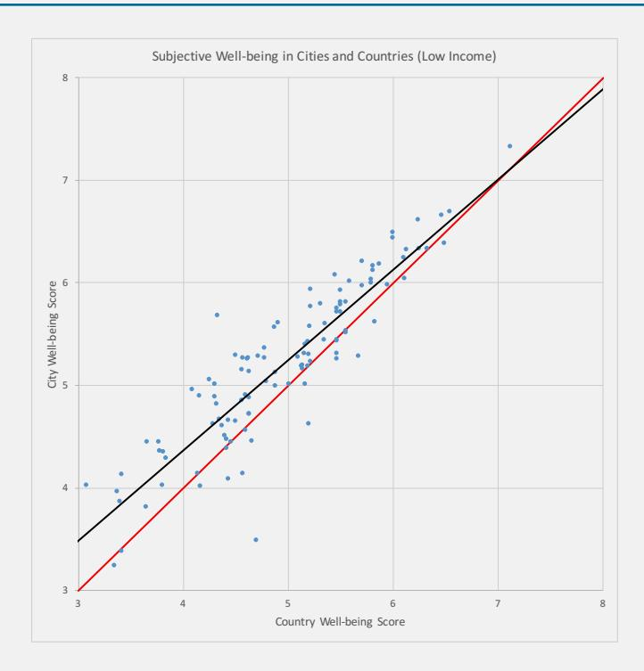

Notes: The scatterplot takes into account all cities worldwide with at least 300 observations in the Gallup World Poll during the period 2014-2018 as well as the ten largest cities in the US using data from the Gallup US Poll.

Sources: Gallup World Poll, Gallup US Poll.

**Figure 3.5: Subjective Well-being in Cities and Countries (High Income)**

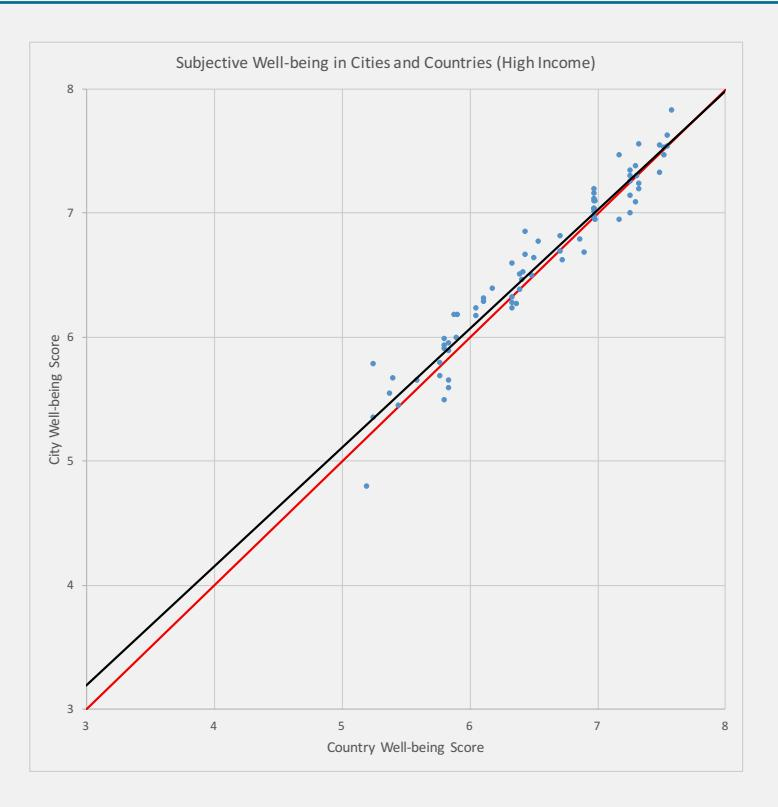

Notes: The scatterplot takes into account all cities worldwide with at least 300 observations in the Gallup World Poll during the period 2014-2018 as well as the ten largest cities in the US using data from the Gallup US Poll.

Sources: Gallup World Poll, Gallup US Poll.

Generally, we find that the average happiness of city residents is more often than not higher than the average happiness of the general country population, especially at the lower end of the well-being and national income scales. Thus, when contrasting the positive agglomeration and productivity benefits of urbanisation and urban amenities with its disadvantages due to disamenities such as congestion or pollution, it seems that, on balance, city dwellers fare slightly better than the remainder of the population, at least when it comes to current life evaluation as our measure of comparison. Of course, this does not mean that moving into a city makes everybody happier: people living in cities differ in important observable and unobservable characteristics from their rural counterparts, which could very well explain the difference in happiness that we observe. Our analysis is purely descriptive and cannot make causal claims about the effects of urbanisation itself on happiness.

#### **Well-being Inequality in Cities and Countries**

A related question asks not so much whether cities are, on average, happier places than their surrounding countries, but rather whether happiness inequality is different within cities as compared to countries. In other words: is the difference between the least happy and the happiest person, on average, greater or smaller in cities than in their respective countries?

Figure 3.6 sheds light on this question by plotting the standard deviation of city happiness relative to the standard deviation of country happiness, both measured in terms of current life evaluation. The standard deviation is a measure of how dispersed a set of numbers is and can hence serve as a simple measure of inequality in this case. As before, the 45-degree line indicates the points at which there is no difference between the standard deviation in country and city

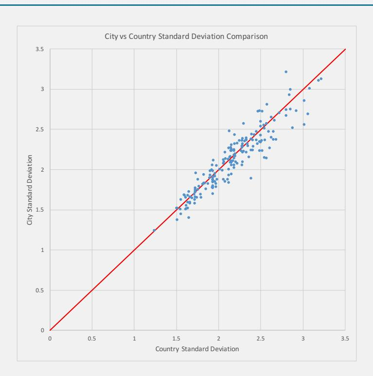

**Figure 3.6: Well-being Inequality in Cities and Countries**

Notes: The scatterplot takes into account all cities worldwide with at least 300 observations in the Gallup World Poll during the period 2014-2018 as well as the ten largest cities in the US using data from the Gallup US Poll. This analysis did not use the weighted data.

Sources: Gallup World Poll, Gallup US Poll.

happiness scores. If a city lies above the 45-degree line, it has a higher level of happiness inequality than its respective country; if it lies below, it has a lower level.

As Figure 3.6 shows, the scatterplot is almost evenly spread around the 45-degree line, suggesting that there are no systematic differences in happiness inequality between cities and their countries. In other words, the difference between the least happy and the happiest person is, on average, not much different in cities than in the country at large. Of course, this does not mean that there are large differences on a case-bycase basis: in fact, for some cities and countries, happiness inequality is much larger at the countrylevel, whereas for others, it is much larger at the city-level. This is an important area for future research, with important policy implications for urbanisation and rural exodus.

### **Conclusion**

In this chapter, we provided the first-ever global ranking and analysis of cities' happiness. Allowing for an efficient division of labour, cities bring with them agglomeration and productivity benefits, inspiring new ideas and innovations, and the generation of higher incomes and living standards. At the same time, however, cities create negative externalities such as urban sprawl, crime, congestion, and often hazardous pollution levels. As half of the world's population is living in cities today, and since this number is expected to rise to two third by the middle of the century, studying how city dwellers fare on balance when it comes to their quality of life is an important undertaking. Casting an anchor, and continuously monitoring and benchmarking city dwellers' quality of life around the world, is also an important step towards implementing Sustainable Development Goal (SDG) 11: *Sustainable Cities and Communities*.

We rank cities' quality of life fundamentally differently than existing rankings: our ranking relies entirely on city dwellers' self-reported quality of life, measured in terms of their subjective well-being. One might criticise our ranking for relying only on subjective indicators. We argue that this is precisely their advantage. We are not relying on a limited number of objective dimensions of quality of life, often defined *ex-ante* according to what researchers (or policy-makers) consider important. Instead, our ranking is bottom up, emancipating city dwellers to consider for themselves which factors they feel matter most to them. Arguably, this makes it also a more democratic way of measuring their quality of lives.

Our ranking of cities' happiness does not yield fundamentally different results than existing rankings: Scandinavian cities and cities in Australia and New Zealand score high when it comes to the subjective well-being of their residents; cities in countries with histories of political instability, (civil) war, armed conflict, and recent incidences of terrorism score low. Deploying a diverse set of subjective well-being indicators, including evaluative measures such as current and future life evaluation as well as experiential measures such as positive and negative affect, our ranking paints an internally consistent image. Yet, there are significant differences to other rankings

relying on pre-defined dimensions of quality of life. Studying these differences about what matters most for city residents' quality of life is–besides a continuous monitoring and benchmarking of cities' happiness around the world–an important next step.

#### **Endnotes**

- 1 See The World Bank (2019a).
- 2 See United Nations (2018).
- 3 See The World Bank (2019a).
- 4 See Kilroy et al. (2015).
- 5 See United Nations (2019).
- 6 See The World Bank (2019b).
- 7 See European Commission (2013).
- 8 In psychology, there is a large and growing stream of literature looking at how our environment affects our brain structure and function, suggesting that more 'enriched' environments that are more complex and provide more stimulation facilitate brain plasticity (see Kuehn et al. (2017) on urban land use). While urban 'richness' may promote brain development, several studies suggest that living in denser urban environments is associated with lower mental health and certain mental health conditions (Tost et al., 2015; van Os et al., 2010).
- 9 See The Economist Intelligence Unit (2019).
- 10 See, for example Stutzer and Frey (2008), Dickerson et al. (2014), and Loschiavo (2019).
- 11 See, for example Luechinger (2009), Levinson (2012), Ferreira et al. (2013), Ambrey et al. (2014a), and Zhang et al. (2017).
- 12 See, for example, White et al. (2013) Ambrey and Fleming (2014b), Bertram and Rehdanz (2015), Krekel et al. (2016), and Bertram et al. (2020).
- 13 See United Nations (2019).
- 14 By referring to "all citizens", SDG 11 makes an explicit reference to being inclusive, which is an important point as evidence shows that urban amenities and disamenities are of differential importance for citizens with different socio-demographic characteristics (see Eibich et al. (2016), for example).
- 15 Included US cities are Atlanta, Boston, Chicago, Dallas, Houston, Los Angeles, Miami, New York, Philadelphia, and Washington DC. The choice of cities was motivated by selecting the ten largest US cities, all of which have well over 300 observations in the US Poll.
- 16 We investigated whether there are systematic differences in responses to the Gallup World Poll and the Gallup US Poll surveying of the Cantril ladder. Out of the 12 US cities that are included in the 2014-2018 World Poll, seven are also in the top ten list of cities that we obtain from the US Poll. Out of these seven cities, the scores for six of the cities in the US Poll fall within the statistical confidence intervals of the World Poll scores (Chicago, Dallas, Houston, Miami, New York City, and Philadelphia). For Los Angeles, however, we find that the US Poll score is significantly higher (6.96) than the World Poll score (6.36). However, these and other tests are based on very few observations in the World Poll even when pooling the 2014-2018 samples (e.g. there are only 87 observations for Los Angeles). Since there is no systematic bias upwards or downwards when comparing city scores between both surveys, and especially because the Gallup US Poll score and the Gallup World Poll score are essentially identical, we merge the US Poll with the World Poll data without the need for any adjustments.

- 17 If not stated otherwise, we use the terms *life evaluation*, *life satisfaction*, and *happiness* inter-changeably.
- 18 See Dolan (2014) and Dolan and Kudrna (2016).
- 19 Note that the 'happiness' survey item is no longer available after 2012 so that the index is comprised of 'enjoyment' and 'smile or laugh' from 2012 onwards.
- 20 For the US cities, we use the Gallup US Poll in exactly the same way as the Gallup World Poll, with the sole exception of not including 'anger' as part of the negative affect index because it is unavailable in the US Poll.
- 21 For example, see Frey et al. (2007, 2009), van Praag et al. (2010), and Metcalfe et al. (2011)
- 22 See Graham and Lora (2009) and Rojas (2016)
- 23 For example, see De Neve and Ward (2017), Clark et al. (2018), and Krekel et al. (2018)
- 24 See Morrison (2018)
- 25 We split our sample into low-income and high-income countries based on the World Bank's categorization of low, lower middle, upper middle, and high-income countries. High-income countries are considered those with a GNI per capita of \$12,376 or more (World Bank, 2020).

#### Krekel, C., and Kolbe, J. (2020, forthcoming) "New Ways of Valuing Ecosystem Services: Big Data, Machine Learning, and the Value of Urban Green Spaces," in: Ruth, M. (ed), *Research Agenda for Environmental Economics*, Cheltenham: Edward Elgar.

choose to be happy? Tradeoffs between happiness and the other dimensions of life in a large population survey," *Journal of Economic Behavior & Organization*, 139, 60-73.

Adler, M. D., Dolan, P. and Kavetsos, G. (2017) "Would you

**References**

Ambrey, C. L., Fleming, C. M. and Chan, A. Y.-C. (2014a) "Estimating the cost of air pollution in South East Queensland: An application of the life satisfaction non-market valuation approach," *Ecological Economics*, 97, 172-181.

Ambrey, C., and Fleming, C. (2014b) "Public Greenspace and Life Satisfaction in Urban Australia," *Urban Studies*, 51(6), 1290-1321.

Bertram, C., and Rehdanz, K. (2015) "The role of urban green space for human well-being," *Ecological Economics*, 120, 139-152.

Bertram, C., Goebel, J., Krekel, C., and Rehdanz, K. (2020) "Urban Land Use Fragmentation and Human Wellbeing," *Kiel Working Papers*, 2147.

Clark, A. E., Flèche, Layard, S. R., Powdthavee, N., and Ward G. (2018) *"The Origins of Happiness: The Science of Well-being Over the Life Course"*, Princeton, NJ: Princeton University Press.

Clark, A. E., Doyle, O., and Stancanelli, E. (forthcoming) "The Impact of Terrorism on Well-being: Evidence from the Boston Marathon Bombing," *Economic Journal*.

De Neve, J.-E., and Ward, G. (2017) "Happiness at Work," in: Helliwell, J., Layard, R. and Sachs, J. (eds), *World Happiness Report*.

Dickerson, A., Hole, R. A., and Munford, L. A. (2014) "The relationship between well-being and commuting revisited: Does the choice of methodology matter?," *Regional Science and Urban Economics*, 49, 321-329.

Dolan, P., and Kudrna, L. (2016) "Sentimental Hedonism: Pleasure, Purpose, and Public Policy," in: Vittersø, J. (ed), *Handbook of Eudaimonic Well-Being*, Cham: Springer.

Eibich, P., Krekel, C., Demuth, J., and Wagner, G. (2016) "Associations between Neighborhood Characteristics, Well-Being and Health Vary over the Life Course," *Gerontology*, 62(3), 362-370.

European Commission (2013) "*Building a Green Infrastructure for Europe*", Brussels: Publications Office of the European Union.

Frey, B. S., Luechinger, S., and Stutzer, A. (2007) "Calculating Tragedy: Assessing the Costs of Terrorism," *Journal of Economic Surveys*, 21(1), 1-24.

Frey, B. S., Luechinger, S., and Stutzer, A. (2009) "The life satisfaction approach to valuing public goods: The case of terrorism," *Public Choice*, 138, 317-345.

Graham, C., and Lora, E. (2009) "*Paradox and Perception: Measuring Quality of Life in Latin America*", Washington, DC: Brookings Institution/Inter-American Development Bank.

Helliwell, J., Layard, R., and Sachs, J. (2019) *World Happiness Report*, New York: UN Sustainable Development Solutions Network.

Kilroy, A. F. L., Mukim, M. and Negri, S. (2015) "Competitive cities for jobs and growth: what, who, and how," in: *Competitive cities for jobs and growth*, Washington, DC: World Bank Group.

Krekel, C., Ward, G., and De Neve, J.-E. (2018) "Work and Well-being: A Global Perspective," in: Sachs, J. (ed), *Global Happiness and Well-Being Policy Report*.

Krekel, C., Kolbe, J. and Wüstemann, H. (2016) "The greener, the happier? The effect of urban land use on residential well-being," *Ecological Economics*, 121, 117-127.

Kuehn, S., Duezel, S., Eibich, P., Krekel, C., Wüstemann, H., Kolbe, J., Martensson, J., Goebel, J., Gallinat, J., Wagner, G. G., and Lindenberger, U. (2017) "In search of features that constitute an 'enriched environment' in humans: Associations between geographical properties and brain structure," *Nature: Scientific Reports*, 7(11920), 1-8.

Loschiavo, D., (2019) "Big-city life (dis)satisfaction? The effect of urban living on subjective well-being," *Bank of Italy Working Paper*, 1221.

Metcalfe, R., Powdthavee, N., and Dolan, P. (2011) "Destruction and Distress: Using a Quasi-Experiment to Show the Effects of the September 11 Attacks on Mental Well-Being in the United Kingdom," *Economic Journal*, 121(550), 81-103.

Morrison, P.S. (2018). Resolving the urban paradox: subjective well-being, education and the big city. *Promotion of quality of life in the changing world. 16th annual meeting of the International Society for Quality-of-Life Studies*. The Hong Kong Polytechnic University, Kow-loon, Hong Kong.

Rojas, M. (2016) "*Handbook of Happiness Research in Latin America*", Berlin: Springer.

Stutzer, A., and Frey, B. S. (2008) "Stress that Doesn't Pay: The Commuting Paradox," *Scandinavian Journal of Economics*, 110(2), 339-366.

The World Bank (2019a) *Urban Development*, Online: http://data.worldbank.org/topic/urban-development, last accessed 11/12/2019.

The World Bank (2019b), *Urban Development Overview*, Online: http://www.worldbank.org/en/topic/urbandevelopment/ overview, last accessed 12/12/2019.

The World Bank (2020) *World Bank Country and Lending Groups*, Online: http://datahelpdesk.worldbank.org/knowledgebase/articles/906519-world-bank-country-and-lending-groups, last accessed 13/01/2020.

The Economist Intelligence Unit (2019), *The Global Liveability Index*, Online: http://www.eiu.com/topic/liveability?zid= liveability2019&utm\_source=economist-daily-chart&utm\_ medium=link&utm\_name=liveability2019, last accessed 12/12/2019.

Tost, H., Champagne, F. A., and Meyer-Lindenberg, A. (2015) "Environmental influence in the brain, human welfare and mental health," *Nature: Neuroscience*, 18, 1421-1431.

United Nations (2018) *The World's Cities in 2018: Data Booklet*, New York: United Nations, Department of Economic and Social Affairs, Population Division.

United Nations (2019), *Cities – United Nations Sustainable Development Action 2015*, Online: http://www.un.org/ sustainabledevelopment/cities/, last accessed 12/12/2019.

van Os, J., Kenis, G. and Rutten, B. P. F. (2010) "The environment and schizophrenia," *Nature*, 468, 203-212.

van Praag, B. M. S., Romanov, D., and Ferrer-i-Carbonell, A. (2010) "Happiness and financial satisfaction in Israel: Effects of religiosity, ethnicity, and war," *Journal of Economic Psychology*, 31(6), 1008-1020.

White, M. P., Alcock, I., Wheeler, B. W., and Depledge, M. H. (2013) "Would You Be Happier Living in a Greener Urban Area? A Fixed-Effects Analysis of Panel Data," *Psychological Science*, 24(6), 920-928.

Zhang, X., Zhang, X., and Chen, X. (2017) "Happiness in the air: How does a dirty sky affect mental health and subjective well-being," *Journal of Environmental Economics and Management*, 85, 81-94, 2017.

## Chapter 3 Appendix

#### **Figure A1: Global Ranking of Cities — Future Life Evaluation** (Part 1)

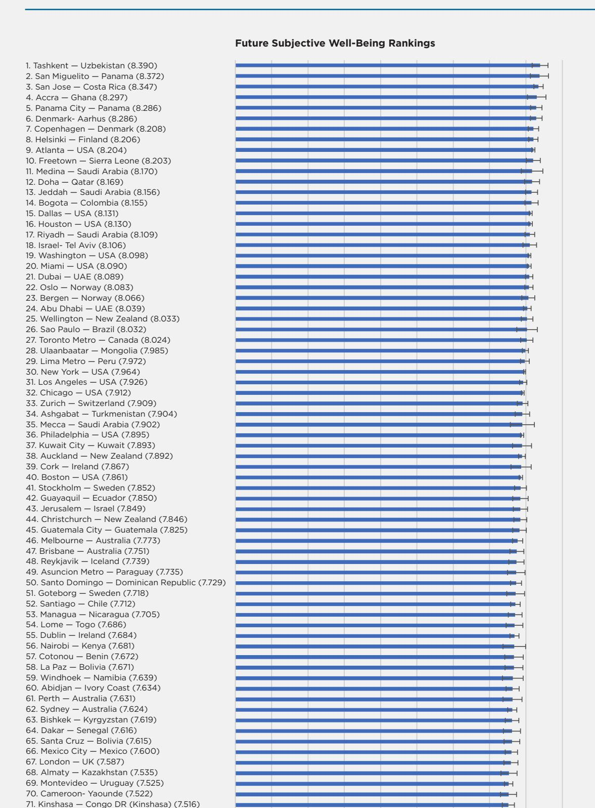

0 1 2 3 4 5 6 7 8 9 10

#### **Figure A1: Global Ranking of Cities — Future Life Evaluation** (Part 2)

#### 72. Quito — Ecuador (7.503) 73. Vienna — Austria (7.497) 74. Tegucigalpa — Honduras (7.488) 75. Buenos Aires — Argentina (7.470) 76. Johannesburg — South Africa (7.443) 77. Douala — Cameroon (7.435) 78. Cape Town — South Africa (7.431) 79. Bamako — Mali (7.407) 80. Kathmandu — Nepal (7.395) 81. Manama — Bahrain (7.372) 82. Niamey — Niger (7.366) 83. San Pedro Sula — Honduras (7.356) 84. Metro Bangkok — Thailand (7.354) 85. Monrovia — Liberia (7.351) 86. Metro Manila — Philippines (7.333) 87. Benghazi — Libya (7.309) 88. Conakry — Guinea (7.302) 89. Kumasi — Ghana (7.277) 90. Brazzaville — Congo Brazzaville (7.264) 91. Brussels — Belgium (7.262) 92. Vilnius — Lithuania (7.250) 93. Ouagadougou — Burkina Faso (7.243) 94. Libreville — Gabon (7.164) 95. Singapore (7.144) 96. San Salvador Metro — El Salvador (7.138) 97. Algiers — Algeria (7.137) 98. Mogadishu — Somalia (7.117) 99. Madrid — Spain (7.104) 100. Lusaka — Zambia (7.100) 101. Barcelona — Spain (7.088) 102. Vientiane/Vianchan — Laos (7.081) 103. Tripoli — Libya (7.045) 104. Caracas — Venezuela (7.030) 105. Guangzhou — China (7.015) 106. Riga — Latvia (7.002) 107. Maseru — Lesotho (6.994) 108. Yangon — Myanmar (6.978) 109. Male — Maldives (6.976) 110. Dushanbe — Tajikistan (6.966) 111. Phnom Penh — Cambodia (6.950) 112. Hanoi — Vietnam (6.946) 113. Limassol — Cyprus (6.933) 114. Moscow — Russia (6.931) 115. Belgrade — Serbia (6.930) 116. Pointe-Noire — Congo Brazzaville (6.891) 117. Paris — France (6.883) 118. Casablanca — Morocco (6.854) 119. Baku — Azerbaijan (6.839) 120. Port-Louis — Mauritius (6.832) 121. Antananarivo — Madagascar (6.830) 122. Harare — Zimbabwe (6.821) 123. Shanghai — China (6.807) 124. Gaborone — Botswana (6.806) 125. Prague — Czech Republic (6.798) 126. Amman — Jordan (6.788) 127. St. Petersburg — Russia (6.782) 128. Ho Chi Minh — Vietnam (6.782) 129. Nicosia — Cyprus (6.777) 130. Chisinau — Moldova (6.759) 131. Lahore — Pakistan (6.750) 132. Nouakchott — Mauritania (6.731) 133. Bratislava — Slovakia (6.687) 134. Kaunas — Lithuania (6.668) 135. Lefkosia — Northern Cyprus (6.659) 136. Pafos — Cyprus (6.647)

137. Bucharest — Romania (6.618) 138. Dar es Salaam — Tanzania (6.613) 139. Seoul — South Korea (6.611) 140. Ljubljana — Slovenia (6.576) 141. Skopje — Macedonia (6.571)

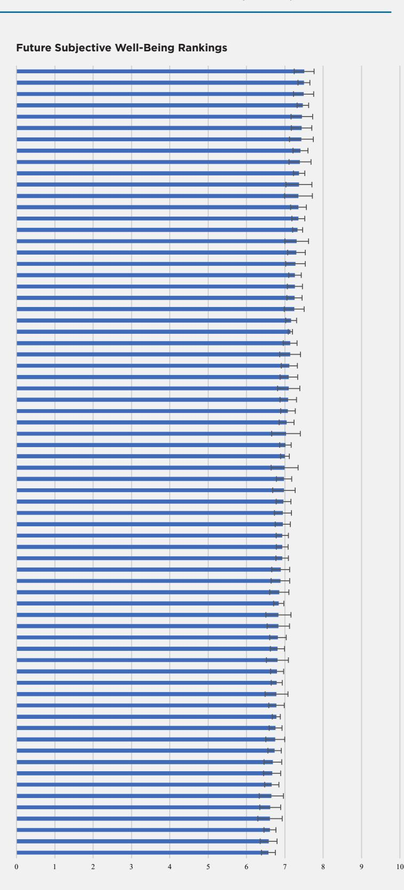

#### **Figure A1: Global Ranking of Cities — Future Life Evaluation** (Part 3)

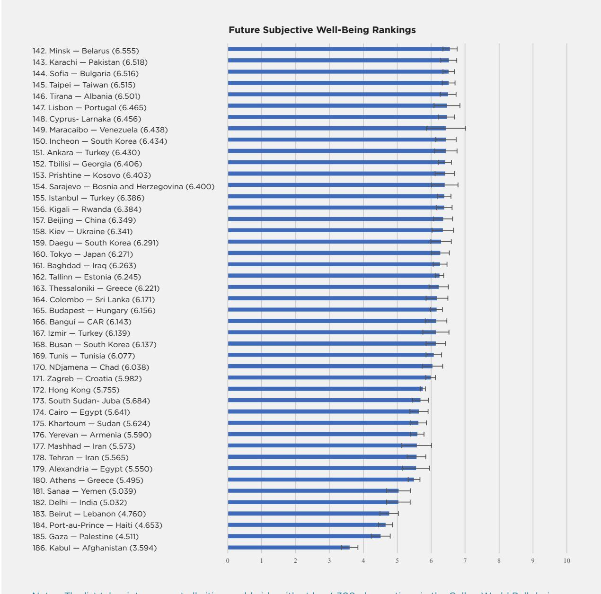

Notes: The list takes into account all cities worldwide with at least 300 observations in the Gallup World Poll during the period 2014-2018 as well as the ten largest cities in the US using data from the Gallup US Poll. The outcome measure is future life evaluation on a zero-to-ten scale. Figures are raw means. Confidence bands are 95%. *Notes:* The list takes into account all cities worldwide with at least 300 observations in the

Sources: Gallup World Poll, Gallup US Poll. Gallup World Poll during the period 2014-2018 as well as the ten largest cities in the US us-

#### **Figure A2: Global Ranking of Cities in Terms of Positive Affect** (Part 1)

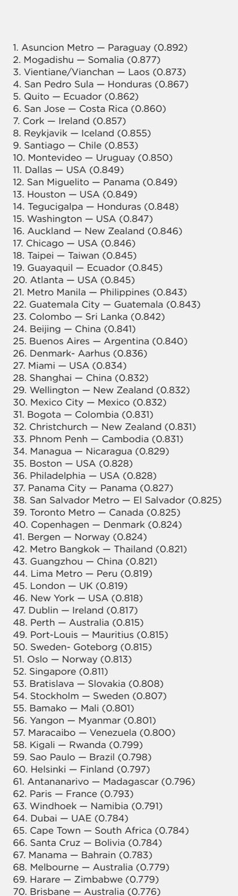

71. Johannesburg — South Africa (0.775)

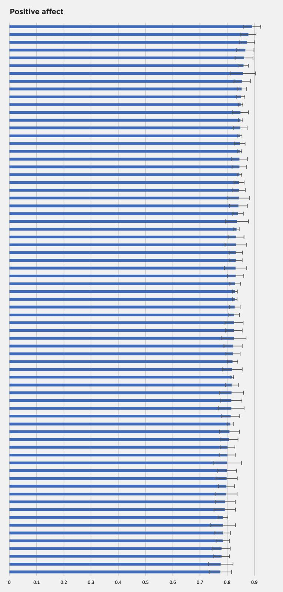

#### **Figure A2: Global Ranking of Cities in Terms of Positive Affect** (Part 2)

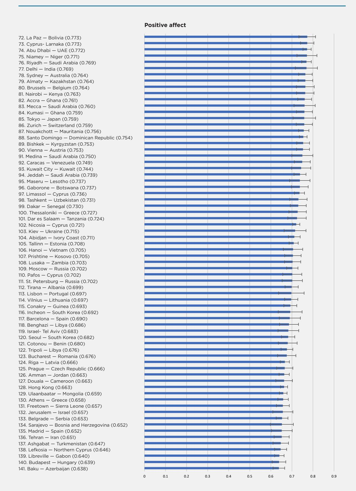

#### Figure A2: Global Ranking of Cities in Terms of Positive Affect (Part 3)

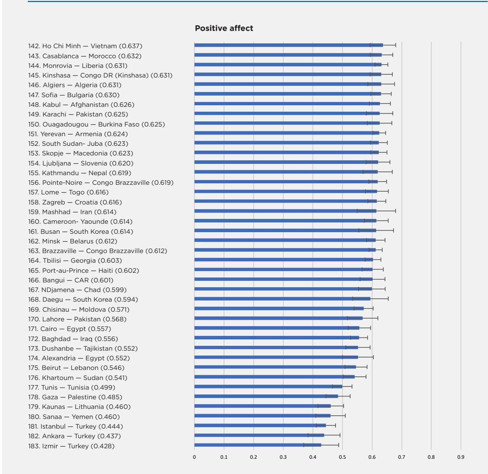

Notes: The list takes into account all cities worldwide with at least 300 observations in the Gallup World Poll during the period 2014-2018 as well as the ten largest cities in the US using data from the Gallup US Poll. The outcome measure is a positive affect index on a zero-to-one scale. Figures are raw means. Confidence bands are 95%.

Sources: Gallup World Poll, Gallup US Poll.

#### **Figure A3: Global Ranking of Cities in Terms of Negative Affect** (Part 1)

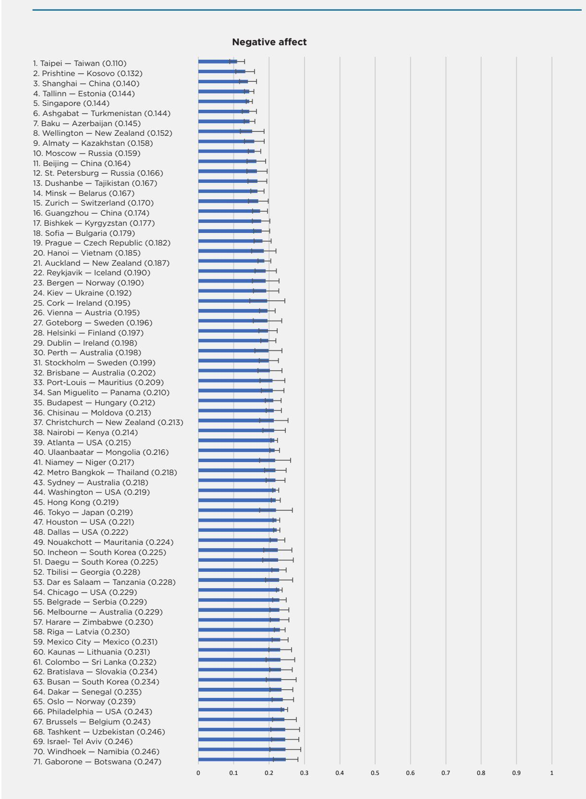

#### **Figure A3: Global Ranking of Cities in Terms of Negative Affect** (Part 2)

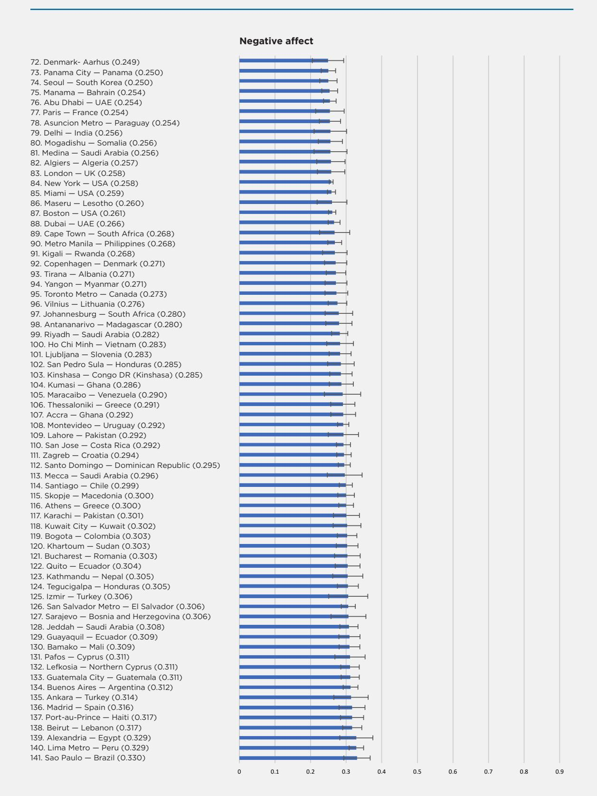

Figure A3: Global Ranking of Cities in Terms of Negative Affect (Part 3)

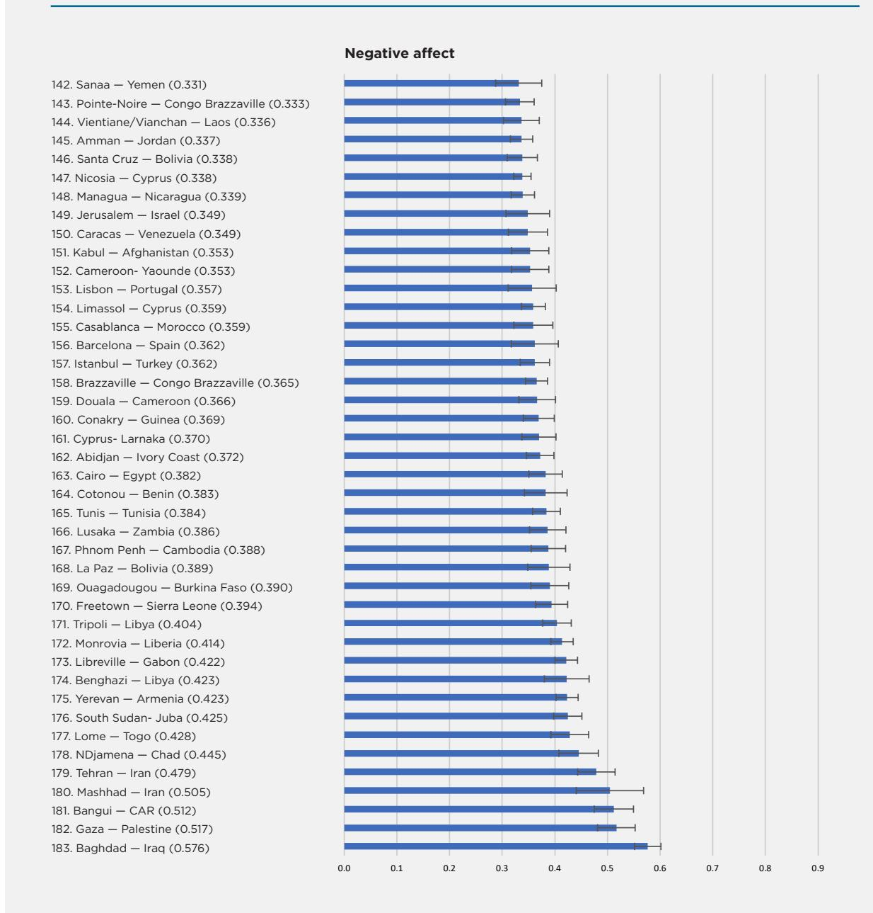

Notes: The list takes into account all cities worldwide with at least 300 observations in the Gallup World Poll during the period 2014-2018 as well as the ten largest cities in the US using data from the Gallup US Poll. The outcome measure is a negative affect index on a zero-to-one scale. Figures are raw means. Confidence bands are 95%.

Sources: Gallup World Poll, Gallup US Poll.

## Chapter 4 **67**

## Urban-Rural Happiness Differentials across the World

### Martijn J. Burger

Erasmus Happiness Economics Research Organisation (EHERO), Department of Applied Economics, and Tinbergen Institute, Erasmus University Rotterdam, The Netherlands

#### Philip S. Morrison

School of Geography, Environment and Earth Sciences, Victoria University of Wellington, New Zealand

#### Martijn Hendriks

Erasmus Happiness Economics Research Organisation (EHERO) and Department of Applied Economics, Erasmus University Rotterdam, The Netherlands

#### Marloes M. Hoogerbrugge

Erasmus Happiness Economics Research Organisation (EHERO), Erasmus University Rotterdam, The Netherlands

### **Abstract**

The aim of this chapter is to draw on the Gallup World Poll to examine urban-rural happiness differentials across the world.1 We begin with a general description of urban-rural differentials and gradually introduce more detail in order to reveal the complexity that underlines these differences. In particular, we contrast the differentials in North Western Europe and the Western world with those in Sub-Saharan Africa and examine the degree to which these differentials are due to people-based and place-based factors. For both cases we identify those whose well-being increases most in cities.

This chapter adds to the existing literature in several ways. First, we provide an empirical extension of the work by Easterlin, Angelescu and Zweig2 on urban-rural happiness differentials by providing information on 150 countries. Second, we estimate the extent to which urban-rural differences in happiness are driven by place-based and people-based factors. Third, we identify the degree to which certain groups are more likely to return higher levels of happiness in cities.

## **Framing Urban-Rural Happiness Differentials**

The world's urban population has grown from 30% of the total in 1950 to 55% in 2018 and is projected to continue growing to 68% by 2050.3 While the global rural population is expected to decline from 3.4 billion in 2018 to around 3.1 billion in 2050, the urban population is expected to increase from the current 4.2 billion in 2018 to 6.7 billion by 2050.4 This upward trend of urbanization is expected to continue in both more developed regions (from 79% in 2018 to almost 87% by 2050) and less developed regions (from 51% in 2018 to almost 66% by 2050).5 Hence, there is a continuing rise in the level of urbanisation across the world. The most urbanized regions include Northern America (with 82% of its population living in urban areas in 2018), Latin America and the Caribbean (81%), Europe (74%), and Oceania (68%). The level of urbanization in Asia is now approximating 50%. In contrast, Africa remains mostly rural, with only 43% of its population living in urban areas.6

In his seminal work, *The Great Escape*, Angus Deaton7 has shown that in cross-section the Cantril Ladder measure of subjective well-being rises successively with each percentage change in per capita income. Since urbanisation is widely considered a primary instrument in the generation of economic growth and higher living standards, one would expect that the spatial redistribution of the world's population into cities would be associated with a rise in happiness.8 For the most part, this is the case, but the ability of cities to raise productivity and for this to be passed on as wages and widening employment opportunities is not the only route to higher well-being. The improved accessibility which agglomeration brings is also associated with reductions in the costs of consumption and increased opportunities for social engagement, even if it is also associated with widening inequality.9

Easterlin, Angelescu, and Zweig10 draw on 80 countries from the first three waves of the Gallup World Poll (2005-2008) and use the life evaluation question developed by Cantril11 to show that average happiness rises with economic growth. They view this largely as a result of the agricultural and industrial restructuring that accompanied urbanization and argue therefore that urban-rural well-being differences are predominantly driven by associated changes in income and economic opportunities. In early stages of economic development, the shift from an agricultural to an industrialized society is characterized by the replacement of small scale pre-industrial handicraft technology by large-scale mechanized general-purpose technologies. These new technologies induce geographic clustering of non-agricultural production and services in cities through the existence of internal and external economies of scale (including input sharing, labour market pooling, and knowledge spillovers). Whereas in agricultural or pre-industrial societies most people live on the countryside, industrial restructuring and technological change goes hand-in-hand with the migration of people from rural to urban areas because urban areas offer both a higher probability of employment and higher wages if a job is secured.12 Accompanying these urban responses to changes in technology has been a change in the industrial and occupational structure of rural areas, as well as changes in wages and standards of living, which are also reflected in rising levels of well-being.

As a working generalization, Figure 4.1 suggests the way in which average levels of subjective well-being (life evaluation) in countries has risen at different rates for those living in urban and rural areas. This figure draws a distinction between the way subjective well-being changes with economic development in the very large metropolitan centres (Big City) compared to the smaller cities and rural areas.

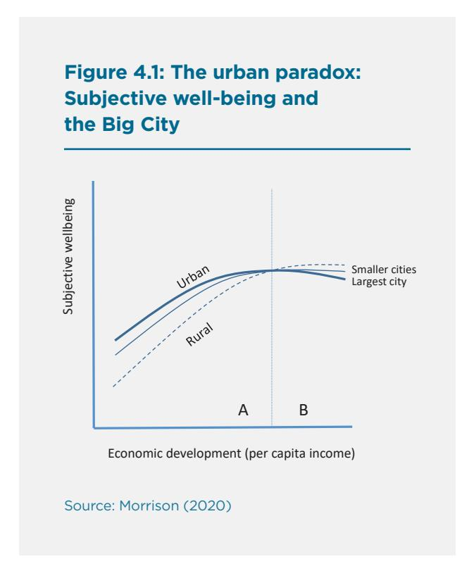

As incomes and economic opportunities in cities are higher in phase A of Figure 4.1, they are accompanied by higher levels of happiness compared to rural areas. When incomes rise and technology further evolves, and when transport and digital infrastructure improves, rural areas become more accessible and diversified. This widespread transformation in the nature of work eventually results in reduced urban-rural happiness differentials to the point where average happiness levels in rural areas, villages, and small towns approach and even exceed those of large cities. Ironically, although the large cities constitute the driving force of developed economies and are still seen as attractive places to live, their average levels of reported well-being show evidence of decline as suggested in phase B of Figure 4.1.13 It is this

phase in the relationship between rural and urban areas that has given rise to the term 'the urban paradox.'14

The living environment and the composition of the population inhabiting the very large cities in developed economies have an important role in shaping their lower average well-being compared to smaller urban and rural settlements.15 The majority of people in phase B of Figure 4.1 choose to live in urban areas because they offer a higher quality of life both in terms of employment opportunities and access to amenities and public services.16 These urban benefits may not be distributed evenly, however, for such urbanization is typically associated with higher real costs of living.17 Depending on their levels of income and education, an individual's urban residence may be accompanied by lower levels of social capital18, as well as higher levels of pollution19, traffic congestion20, crime21, inequality22, lack of green space23, and exposure to diseases24. The degree to which these costs are experienced and featured in measures of well-being is likely contingent on residents' education and associated socio-economic status.

While in developing countries the well-being advantages of the city may outweigh the disadvantages relative to settlements beyond the large city, this might not be the case for the majority of urban residents in developed countries.25 Many residents in restructured rural areas of developed economies are no longer dependent upon farming, and the expansion of urban centres means many find themselves living and working in close proximity to metropolitan centres and able to 'borrow' the positive effects of much larger cities26, while being relatively insulated from the negative effects. There may also be selection of unhappy people into cities and happy people into the countryside. For example, Veenhoven27 found that it is the unhappier part of the countryside in the Western world that tends to move to the city.28 In this regard, cities in developed countries typically have relatively more singles, unemployed, and migrants, which tend to reduce the average happiness levels of cities.29

Evidence in support of the urban-rural happiness differential may be found in a variety of regional studies. Although population size or density per hectare is not inevitably correlated with lower subjective well-being, in developed economies and several rapidly developing economies, average levels of subjective well-being have been shown to fall as population size and population density increase. Initially, the evidence came from a range of new settler developed economies including the United States30, Canada31, Australia32, and New Zealand33. Old settler country examples include the United Kingdom34 and Ireland35, as well as continental Europe36. The phenomena have been identified in a number of individual country studies such as Germany37, Italy38, and The Netherlands.39 At the same time, lower average subjective well-being is now also being observed in the largest cities in other parts of the world. Particularly significant are the more recent findings emerging from China40 and Hong Kong41, which suggests a phenomenon that is more broadly associated with rapid economic development.

By comparison, little is known about urban-rural happiness differentials in the developing world, and the degree to which urban-rural happiness differentials are driven by people-based and by placed-based factors is unclear. To complicate matters, the relationship between place of residence and happiness is heterogeneous in that people do not rate environmental attributes similarly.42 In addition, certain people are more exposed to the positive (or negative) effects of cities than others. Most notably, there are differences between socio-economic groups and those at different stages in the life course. For instance, Hoogerbrugge and Burger43 found that in the United Kingdom, students moving from rural areas to cities gain in life satisfaction, while Okulicz-Kozaryn and Valente44 obtained that urban unhappiness does not hold for the younger generation in American cities.

Morrison45 has argued that while urban agglomeration (in European cities) raises the income and well-being returns of those with tertiary education, the falling average levels of well-being in phase B of Figure 4.1 is primarily the result of lower well-being experienced by the larger number of less educated who have lower incomes and longer commutes, and provide support services in the large city.46 The large city in particular provides the necessary infrastructure for realisation of returns to tertiary education as a result of the expansion of both the scale and scope of economic and cultural activities. However, the tertiary-educated in turn

attract a large number of the less educated who work in the non-tradable sector supplying haircuts, massages, gardening, cleaning, brewed coffee, and other personal as well as firm-related services. The economic imperative of working locally for low wages competes with the rising price of residence close to work resulting in their much longer commute. The demand for such personal services is highly income elastic and since very large cities pay much higher wages to skilled workers, the ratio of service to educated personnel is higher than in other settlement types. The resulting gap in well-being between the tertiary and non-tertiary educated is further stretched by the joint effect of education and income on the level of social interaction in the large city, in part because the longer commute reduces time with family and leisure.47 Since the educated are better paid and can exercise a much wider choice as to where to live, they can not only live closer to work, but also cluster geographically and thereby solidify social networks, thus enhancing their well-being. In short, the competition engendered by large city size leads to higher inequality, which translates into a wider discrepancy in average well-being.48

In the remainder of this chapter, we draw on the Gallup World Poll to examine the evidence in support of the stylised argument in Figure 4.1. In the process, we demonstrate empirically the way in which combined effects of resettlement and growth of the population within urban and rural settlements is associated with a change in the way people evaluate their lives. We begin with broad generalisations and gradually introduce more detail in order to reveal the complexity that underlines the general argument. In particular, we focus on two extreme cases: urban happiness in Sub-Saharan Africa and urban unhappiness in the Western world, and in so doing we explore whether urban-rural differences are driven by selection and composition effects and/or by differences in the quality of the urban and rural environment. Sub-Saharan Africa is not only one of the areas in the world with low happiness scores, but also a region in which happiness differences between the city and countryside are most pronounced in favour of city life. Do cities indeed offer more chances or is it merely hope that drives the happiness of urban Africa and are there still parts of the population better off on the countryside? Differently, the puzzle of urban

unhappiness in the Western world is interesting because cities are seen as 'the place to be' in that they feature an attractive diversity of consumption amenities including bars, restaurants, museums, theatres, music and sport events.49 However, the urban happiness benefits may be offset by the happiness costs for a large part of the population, such as high costs of living, longer commutes, greater inequality, social isolation, noise, and pollution. At the same time, accessibility to urban amenities and a lack of the problems associated with city life may explain the relatively high levels of happiness on the Western countryside. For both cases (Sub-Saharan Africa and the Western world), we also examine whether certain types of people are better off in cities or on the countryside.

## **Exploring Urban-Rural Differences in Happiness**

#### **Measuring Urban-Rural Happiness Differentials**

In this chapter, we use the annual cross-sectional Gallup World Poll (GWP) data across 150 countries spanning the period 2014-2018 in order to examine urban-rural differences in happiness.50 We use three well-being indicators that together cover the cognitive and affective dimensions of happiness:

- 1. Life evaluation, as measured by the Cantril ladder question51 that asks respondents to evaluate the quality of their lives on an 11-point ladder scale, with the bottom step of the ladder (0) being the worst possible life they can imagine and the highest step (10) being the best possible life.
- 2. Positive affect, as measured by a two-item index asking respondents whether or not they frequently experienced (1) enjoyment and (2) laughter on the day before the survey.52
- 3. Negative affect, as measured by a three-item index asking respondents whether they frequently experienced (1) worry, (2) sadness, and (3) anger on the day before the survey.

While positively correlated, outcomes can differ between these dimensions and therefore we conduct separate analyses for each well-being indicator.53 When examining urban-rural differences in happiness, we use the Gallup classification based on the respondent's

self-reported type of settlement: (1) in rural area or farm; (2) in a small town or village; (3) in a large city; (4) refused; (5) don't know; (6) in the suburb of a large city. In our analysis, "rural" is defined as individuals in category (1) and "urban" is defined as individuals in categories (3) and (6). Following Easterlin, Angelescu, and Zweig54, we define category (2) as "peri-urban" as it typically takes in an intermediate position between urban and rural. In line with global urbanization, more people in our sample indicate they live in an urban area (41%) than in a peri-urban area (33%) or a rural area (26%) (see Online Appendix A). We use two types of weights: sampling weights are used to improve the national representativeness of the surveys and population weights are used in cross-national analyses to account for each country's population 15 years and over.55

To date most published assessments of subjective well-being by settlement type have used the respondent's own assessment of the type of place they live in.56 Recently, a coalition of six international organizations (the EU, FAO, ILO, OECD, UN-Habitat, and the World Bank) have developed a uniform definition of the Degree of Urbanization, which has been applied to the Gallup World Poll by overlaying the interview geotags against this geospatial layer. An overview of this method is presented in an annex to this report by Dijkstra and Papadimitriou. However, as these data are only available for the 2016-2018 period, and for 115 countries, we refrain from using this indicator in this chapter. Most importantly, for a significant number of high-income countries with more negative urban-rural differentials the new urbanization measure is not available, which may explain some of the differences between our results and the results presented in this annex. A comparison between the Degree of Urbanization measure and perceived urbanization measure is provided later in this chapter.

#### **Urban-Rural Differences in Happiness**

The three graphs in Figure 4.2 show urban-rural differences in life evaluation, positive affect, and negative affect for the various world regions, while Table 4.1 provides an overview of the number of countries with significant urban-rural differences in life evaluation, positive affect, and negative affect by world region. Countries with the most pronounced differences are listed in Table 4.2; a complete

overview of urban-rural differences by country can be found in Online Appendix C.

Graph A in Figure 4.2 shows urban-rural differences in life evaluation. While the worldwide average life evaluation for the urban population is a 5.48, the worldwide life evaluation for the rural population is a 5.07; a difference of 0.41 points on the 11-point Cantril ladder. The differences between the urban and rural population are largest in East-Asia (0.56) and Sub-Saharan Africa (0.56), followed by South Asia (0.47), Southern Europe (0.46), and Latin America and the Caribbean (0.38). Only in Australia and New Zealand (-0.16), Northern and Western Europe (-0.05), and Northern America (-0.01), is the average life evaluation of the rural population higher than the average life evaluation of the urban population. These findings are in line with the results reported in Chapter 3, in which the average happiness of city residents is more often than not higher than the average happiness in a country, especially in the less happy and less affluent countries.

Table 4.1 confirms this global picture. All in all, in only 13 of the 150 surveyed countries (9%), is the average life evaluation of the rural population significantly higher than the average life evaluation of the urban population. The largest differences can be found in Lebanon (-0.41), Iceland (-0.38), the Netherlands (-0.35), New Zealand (-0.34), the United Kingdom (-0.34), and Egypt (-0.34) (See Table 4.2). None of the countries with higher life evaluation scores in rural areas can be found in the Commonwealth of Independent States (CIS), Eastern Europe, East Asia, Latin America and the Caribbean, and South Asia. At the same time, in 101 of the 150 surveyed countries (67%), the average life evaluation of the urban population is significantly higher than the average life evaluation of the rural population. However, none of the countries in this category can be found in Oceania and Northern America, while in the majority of Northern and Western European countries there is no statistically significant difference in how positively the urban and rural population evaluate their lives.

Do we find similar differences when we look at the measures of affect? When we turn to positive affect (graph B in Figure 4.2) we find that worldwide 76.3% of the urban population indicated

they experienced enjoyment or laughter on the day before the survey, compared to 72.0% for the rural population. Differences in favour of the urban population were largest in South Asia (8.3%), Southern Europe (8.0%), and Sub-Saharan Africa (5.3%). Only in Northern and Western Europe was the average positive affect of the rural population (80.0%) higher than the average positive affect of the urban population (78.2%), while in Australia, New Zealand, and Northern America there were few differences in recalled happiness the previous day, despite the average life evaluation in urban areas being higher.

In only a handful of countries (17 out of 150 countries; 11%) is the positive affect score of the rural population significantly higher than that of the urban population (Table 4.1). In contrast to the life evaluation measure, however, there is no statistically significant difference between the city and the countryside in half of the countries (75 out of 150 countries) for which sufficient information was available. This suggests that worldwide urban-rural differences in positive affect are smaller than worldwide urban-rural differences in life evaluations.57

Finally, for negative affect (Graph C in Figure 4.2), we find that the worldwide urban population experienced less worry, sadness, and anger the day before the survey (24.8%) compared to the rural population (27.8%). The largest urban-rural differences can be found in South Asia (8.1%) and Southern Europe (4.7%). In general, urban-rural differences in negative affect tend to be smaller than urban-rural differences in life evaluation and urban-rural differences in positive affect. In 93 of the 150 surveyed countries (62%) there was no significant difference in negative affect, while in 37 countries (25%) the urban population had a significantly lower negative affect score than the rural population.

Figure 4.2: Urban — rural differences in life evaluations, positive affect, and negative affect by world region

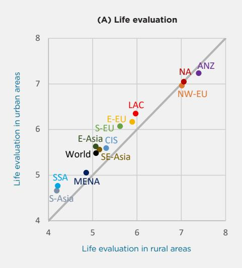

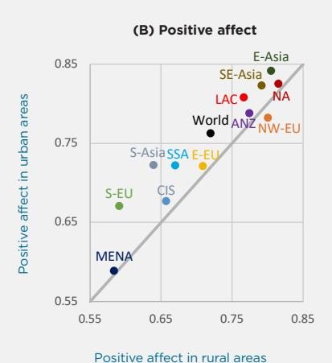

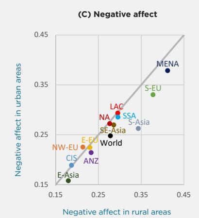

Note: N=150 countries. Figures are weighted averages using sampling and population weights. No control variables used. SSA = Sub-Saharan Africa, S-Asia = South Asia, MENA = Middle East and North Africa; E-Asia = East Asia; SE-Asia = Southeast Asia; CIS = Commonwealth of Independent States; LAC = Latin America and the Caribbean; E-EU = Eastern Europe; S-EU = Southern Europe; NW-EU = Northern & Western Europe; NA = Northern America; ANZ = Australia-New Zealand. Countries or territories with fewer than 50 observations in rural or urban areas are not included. See See Online Appendix B for the regional classification of countries.

**Table 4.1: Number of countries with significant urban-rural differences in life evaluation (LE), positive affect (PA) and negative affect (NA) by worldregion**

|                                  |                      | Life Evaluation  |                      |                      | Positive Affect  |                                                                                                                                                      |                                                                                                     | Negative Affect  |                      |  |
|----------------------------------|----------------------|------------------|----------------------|----------------------|------------------|------------------------------------------------------------------------------------------------------------------------------------------------------|-----------------------------------------------------------------------------------------------------|------------------|----------------------|--|
| World Region                     | Urban LE>Rural LE | No difference | Rural LE>Urban LE | Urban PA>Rural PA | No difference | Urban PA <rural pa<="" th=""><th>Urban NA<rural na<="" th=""><th>No difference</th><th>Urban NA&gt;Rural NA</th></rural></th></rural> | Urban NA <rural na<="" th=""><th>No difference</th><th>Urban NA&gt;Rural NA</th></rural> | No difference | Urban NA>Rural NA |  |
| Northern & Western Europe     | 2                    | 7                | 5                    | 0                    | 11               | 3                                                                                                                                                    | 1                                                                                                   | 7                | 6                    |  |
| Southern Europe                  | 10                   | 1                | 1                    | 8                    | 2                | 2                                                                                                                                                    | 6                                                                                                   | 6                | 0                    |  |
| Eastern Europe                   | 6                    | 3                | 0                    | 3                    | 5                | 1                                                                                                                                                    | 2                                                                                                   | 7                | 0                    |  |
| CIS                              | 8                    | 4                | 0                    | 6                    | 3                | 3                                                                                                                                                    | 5                                                                                                   | 6                | 1                    |  |
| Australia & New Zealand       | 0                    | 1                | 1                    | 0                    | 2                | 0                                                                                                                                                    | 0                                                                                                   | 2                | 0                    |  |
| Southeast Asia                   | 6                    | 1                | 1                    | 4                    | 3                | 1                                                                                                                                                    | 1                                                                                                   | 7                | 0                    |  |
| South Asia                       | 5                    | 2                | 0                    | 6                    | 1                | 0                                                                                                                                                    | 3                                                                                                   | 4                | 0                    |  |
| East Asia                        | 4                    | 0                | 0                    | 2                    | 2                | 0                                                                                                                                                    | 0                                                                                                   | 2                | 2                    |  |
| Middle East & North Africa    | 9                    | 5                | 3                    | 4                    | 9                | 4                                                                                                                                                    | 4                                                                                                   | 11               | 2                    |  |
| Sub-Saharan Africa            | 35                   | 6                | 0                    | 19                   | 22               | 2                                                                                                                                                    | 10                                                                                                  | 23               | 8                    |  |
| Northern America              | 0                    | 1                | 1                    | 0                    | 2                | 0                                                                                                                                                    | 0                                                                                                   | 2                | 0                    |  |
| Latin America & the Caribbean | 16                   | 6                | 0                    | 6                    | 15               | 1                                                                                                                                                    | 5                                                                                                   | 16               | 1                    |  |
| World                            | 101                  | 36               | 13                   | 58                   | 75               | 17                                                                                                                                                   | 37                                                                                                  | 93               | 20                   |  |

Note: Categorization of urban-rural differences in life evaluation, positive affect, and negative affect within countries is based on statistically significant positive and negative differences at the 95% confidence level, respectively. Urban-rural differences for countries falling into the category 'no difference' are not significantly different from zero at the 95% confidence level. Countries with fewer than 50 respondents in urban or rural areas are not categorized. Full estimates by country are provided in Online Appendix Tables C1-C3.

**Table 4.2: Countries with most pronounced urban-rural differences in life evaluation, positive affect, and negative affect**

| Difference Urban-Rural Life Evaluation |       | Difference Urban-Rural Positive Affect                            |       | Difference Urban-Rural Negative Affect                     |       |
|-------------------------------------------|-------|----------------------------------------------------------------------|-------|---------------------------------------------------------------|-------|
| Angola                                    | 1.61  | Bulgaria                                                             | 0.18  | Saudi Arabia                                                  | -0.15 |
| Congo Brazzaville                         | 1.37  | Tunisia                                                              | 0.16  | Turkey, South Sudan                                           | -0.13 |
| Benin, Colombia                           | 1.29  | Serbia                                                               | 0.14  | Croatia, India, Serbia                                        | -0.10 |
| Central African Republic                  | 1.15  | Latvia                                                               | 0.13  | Central African Republic, Montenegro, Niger                | -0.09 |
| Peru                                      | 1.13  | Afghanistan, Congo Kinshasa, Croatia, Peru, South Korea, Spain | 0.12  | Ethiopia, Tunisia                                             | -0.08 |
| Bulgaria, Namibia                         | 1.11  | Mauritania, Montenegro                                               | 0.11  | Angola, Bolivia, Mexico, Philippines, Turkmenistan         | -0.07 |
| South Africa                              | 1.08  | Benin, Ethiopia, Mexico                                              | 0.10  |                                                               |       |
| Gambia                                    | 1.04  | Bangladesh, Bosnia and Herzegovina, Georgia, India                | 0.09  |                                                               |       |
| Niger                                     | 1.02  | Namibia, Nepal, Niger                                                | 0.08  |                                                               |       |
| Liberia                                   | -0.29 | Egypt, Germany, Greece, Netherlands                               | -0.04 |                                                               |       |
| Belgium, Cambodia                         | -0.31 | Malta, Uzbekistan                                                    | -0.05 | Cameroon, Denmark, Egypt, Morocco, Switzerland          | 0.04  |
| Malta                                     | -0.32 | Moldova                                                              | -0.06 | Burkina Faso, Iceland, Namibia, Netherlands, Uzbekistan | 0.05  |
| Egypt, New Zealand, United Kingdom     | -0.34 | Belgium, Israel, Turkey                                              | -0.07 | Mongolia                                                      | 0.06  |
| Netherlands                               | -0.35 | Comoros                                                              | -0.08 | Sudan                                                         | 0.07  |
| Iceland                                   | -0.38 | Burundi, Estonia                                                     | -0.09 | Argentina                                                     | 0.09  |
| Lebanon                                   | -0.41 | Tajikistan                                                           | -0.12 | Swaziland                                                     | 0.11  |
|                                           |       |                                                                      |       |                                                               |       |

Note: Presented differences are significant at the 95% confidence level. The higher the position of a country in the ordering, the higher is the happiness of the urban population relative to the rural population.

Figure 4.3 provides empirical support for the theoretical suggestions in Figure 4.1, namely that the urban advantage in happiness decreases and eventually reverses into an urban disadvantage with rising levels of economic development (GDP per capita).59 Overall, while people are happier in urban areas than in rural areas this difference does generally not hold for (highly) developed countries.

#### **Urban-Peri-Urban and Rural-Peri-Urban Differences in Happiness**

In addition to urban-rural differences in happiness, we also examined urban vs. peri-urban and rural-peri vs. urban differences in well-being. The results of most of these examinations can be found in Online Appendices C, D, and E. The life

evaluation (5.29), positive affect (73.9%), and negative affect (25.7%) scores of the peri-urban population fall in between the scores of the urban and rural populations. We find few countries in which the peri-urban population return significantly higher levels of happiness than the urban population. At the same time, urban-peri-urban differences are less pronounced. We find no significant differences in 43% of the countries for the life evaluation metric, 65% for the positive affect metric, and 63% for the negative affect metric. Therefore, in the remainder of this chapter, we mainly focus on the urban-rural differences.

**Figure 4.3: Urban-rural differences in life evaluations by country GDP per capita**

Notes: N=149 countries. Figures are weighted averages using sampling and population weights. No control variables are used. The country sample is as in Figure 4.2, except for the exclusion of Luxembourg which is an outlier in terms of GDP per capita. R2=0.25. Quadratic term is insignificant (t=1.16).

#### **Alternative Definition of Urbanization**

A comparison of our results with the alternative urbanization measure of Dijkstra and Papadimitriou (see Annex of this World Happiness Report) is presented in Figure 4.4 and Online Appendix F. Please note that the alternative urbanization is only available for 115 countries for the period 2016-2018. Overall, we find a strong correlation (0.75) between a country's urban-rural life evaluation gap produced using the perceived urbanization measure and a country's urban-rural life evaluation gap using the objective Degree of Urbanization measure. At the same time, the use of this improved urbanization measure makes the urban-rural gap slightly smaller and for some countries the urban-rural gap is contingent on which measure is used. For example, for Ivory Coast the urban-rural life evaluation gap produced using the perceived urbanization measure is 0.79, while the urban-rural life evaluation gap using the objective Degree of Urbanization measure is only 0.13. Once the degree of urbanization measure becomes available for a larger number of years and countries, future research should examine the underlying reasons for these differences. 17

#### **Differences in Urban-Rural Happiness over Time**

Figure 4.1 implies a temporal pattern in the relative well-being of rural and urban populations to the extent that time is correlated with economic growth. Can we observe a time trend in the difference between urban-rural happiness over the short twelve-year timespan considered here? Previous literature has been mainly focused on the Western world60 and showed that differences in the average happiness of those living in the city and countryside have been quite stable over time. In order to examine developments in other

Figure 4.4: The gap in life evaluations between urban and rural areas using the degree of Urbanization and perceived urbanization 2016-2018

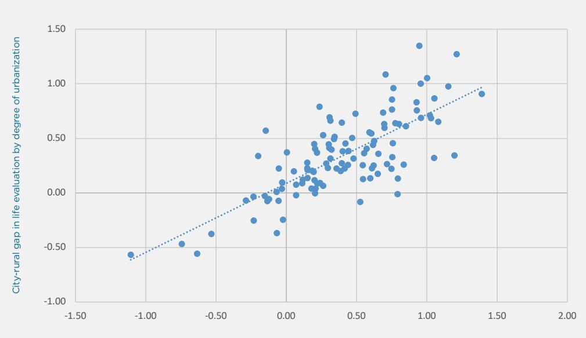

Urban-rural gap in life evaluation by perceived urbanization level

Note: Correlation = 0.75;  $R^2=0.57$ ; Sample weights were used to estimate country averages. This figure was kindly provided by Lewis Dijkstra. The country sample is as in Figure 4.3.

parts of the world, we utilized the Gallup World Poll data for the period 2006-2018, pooling the data for the period 2006-2011 into a single observation (due to the more limited country set before 2011 and to obtain a robust baseline level). With regards to the trends in urban minus rural differences in life evaluations, positive affect, and negative affect (see Online Appendix G, Figure G1) the following main conclusions can be drawn:

- The urban-rural difference in life evaluations and positive affect have remained the same in the past decade across the globe, but people in urban areas have become less likely to report negative affect.
- People in urban areas have become relatively better off compared with those in rural areas in Northern and Western Europe (in terms of life evaluations and positive affect), Sub-Saharan Africa (life evaluations and negative affect), South Asia, and Middle East and North Africa (negative affect).

- At the same time, people in rural areas have become relatively better off compared to people in urban areas in Eastern Europe in terms of positive affect.
- Mixed evidence is found in East Asia,
  Australia-New Zealand and Northern America,
  where the rural population has become
  relatively better off in terms of life evaluations
  while urban populations reported less
  negative affect.
- On a global scale, there has been a general stability in the urban-peri-urban differences and peri-urban-rural differences in happiness, with the exception that the people in peri-urban areas have become relatively better off in terms of negative affect compared with people in rural areas. These results are also presented in Online Appendix G (Figures G2 and G3).
- Time trends by country are presented in Online Appendix H.

#### **Urban-Rural Happiness Puzzles**

In the second section of this chapter, we have seen that there are considerable differences in happiness between urban and rural areas of countries and that these differences are contingent on the level of development of a country. However, pinpointing the exact reasons for these geographical differences in happiness within countries is challenging. On the one hand, geographical differences can be attributed to urban-rural differences in the quality of the living environment or imbalances between happiness advantages and disadvantages of living in certain areas of the country. On the other hand, lower levels of happiness in certain areas can also be explained by selection and composition effects, such as the fact that urban and rural areas attract and are home to different types of people. In this regard, it may very well be that urban-rural differences in happiness are explained by 'people-based' factors.

To explore the relative importance of higher standards of living in cities we use a Blinder-Oaxaca decomposition (see Online Appendix I)61 that draws on several factors in order to explain the difference between urban and rural assessments of happiness in Sub-Saharan Africa. Utilizing the Gallup World Poll, we take into consideration the following 'people' factors and local 'place' factors (see Online Appendix I, Table I1 for the exact variable definitions):

#### People factors:

- *Economic situation*: annual household income, income sufficiency, and employment status
- *Economic optimism*: optimism about own economic situation
- *Education*: number of years of education
- *Health*: health problems and experience of pain
- *Social capital*: social support and civic engagement
- *Safety*: feelings of safety and victimhood
- *Demographics*: age, gender, having a partner, and having children
- *Migrant*: born in country or elsewhere
- *Perceptions of country conditions*: quality of institutions, corruption, and perceived freedom.

#### Place factors:

- *Local: Water and air quality*: satisfaction with water and air quality in local area
- *Local: Public infrastructure*: satisfaction with infrastructure, public transportation, availability of quality healthcare, and the education system in local area
- *Local: Housing affordability*: perceived housing affordability in local area
- *Local: Job climate*: economic conditions and job market conditions in local area
- *Local: Community attachment*: propensity to stay in local area and satisfaction with local area
- *Local: Diversity*: local area is a good place to live for minorities.
- *Other*: We control for country and year fixed effects that may drive urban-rural happiness differentials.

Both the people and place factors subsume groups of variables and, therefore, we report their joint statistical significance. Although we try to distinguish between the people-based and place-based effects, the two are not always separable. For example, higher income and lower levels of unemployment in urban areas may be result of concentrations of higher skilled and talented people in cities (selection and composition effects) as well as better job opportunities. Likewise, we consider social capital and feelings of safety to be people-based, while it can be argued that at least part of the factors are location-bound.62

We focus on two extremes present in the dataset. First, we consider urban happiness in Sub-Saharan Africa and then turn to the Western world (Western Europe, Northern America, Australia and New Zealand). We conclude with a brief overview of underlying reasons for urban-rural happiness differentials in other parts of the world.

### **Urban Happiness in Sub-Saharan Africa**

With 63% of total Sub-Saharan population of 854 million living in rural areas, Africa is currently the least urbanized continent and the only remaining continent where the rural population outnumbers the urban.63 This is one of the reasons why Africa's urbanization rate of 3.5% per year is the fastest in the world, having risen from about 27% in 1950 to 40% in 2015 and projected to reach 60% by 2050.64 The agricultural sector remains the dominant livelihood for many in Sub-Saharan Africa. However, the rapid growth of the urban population stimulates economic opportunity and increases access of a rising number of people to superior infrastructure and related services.

African countries will double in population by 2050 and more than 80% of that increase will occur in cities. Africa's largest city, Lagos, Nigeria, is predicted to expand by 77 people every *hour* between now and 2030.65 By 2025 there will be 100 African cities with more than one million inhabitants, twice as many as in Latin America. Already 70% of Africans are under 30 years old, accounting for about 20% of the population, 40% of the workforce, and 60% of the unemployed. It seems that Sub-Saharan Africa is not prepared for its urban expansion and many African governments are trying to limit rural-urban migration.

Internal migration accounts for a significant proportion of urbanization in Africa with most of the urban growth projected to take place in small and intermediate cities and not in the megacities.66 However, in spite of local exceptions67, migration is not the primary determinant of urban growth in Sub-Saharan Africa. Instead, with a young population and high fertility rates, natural increase is the primary driver.68 In addition, large cities are not responsible for this growth; rather the urbanization being experienced in Africa is due to the gradual accretion of existing smaller settlements and the growth of medium-sized cities and the continual redrawing of the urban map.69

The speed of urbanization in Africa poses a number of challenging questions when it comes to understanding the geography of happiness in Sub-Saharan Africa. The Gallup World Poll relies not on official redrawing of rural/urban

boundaries, but on the respondents' self-reported assessment of where they reside, whether urban, peri-urban, or rural. Based on these subjective assessments, we find a higher evaluation of life returned by those living in areas they classify as urban and peri-urban.

There are very real challenges to development in the African countryside (e.g., lack of basic needs such as food, drinking water, and health care) and expanding cities provide economic opportunities to move out of poverty.70 Cities have always been seen as the places to go for jobs, services, amenities, socio-economic mobility, freedom, and happiness, and cities are associated with expectations, hopes and "urban promises".71 At the same time rural to urban migration is often associated with decreases in subjective well-being as a result of emotional costs of being away from one's family, false expectations, and increasing aspirations, as documented in the South African case, for example.72

#### **Why are Life Evaluations Higher in Cities in Sub-Saharan Africa?**

The high expectations many Africans have of cities may help to explain both the positive affect and the markedly higher life evaluations expressed by urban residents in Africa. Figure 4.5 shows the Blinder-Oaxaca decompositions for Sub-Saharan Africa, based on 95,758 observations for the period 2014-2018. Of the 0.71 point difference in life evaluation difference between urban and rural areas, over 0.50 points (71%) can be statistically explained by differences in people and place characteristics. The dominant factor associated with the urban-rural differential is the better economic situation in cities (0.15 points) which is associated with their more highly educated population (0.11 points). The factor "Other" (0.15 points) particularly reflects that the poorer African nations are, on average, more rural and less happy. Other factors that favour the city are a higher level of economic optimism (0.04 points), better public infrastructure (0.03 points), higher levels of social capital (0.03 points), and better health (0.01 points). Urban-rural differences with regards to these factors are shown in Table 4.3. These other (groups of) variables are all statistically insignificant at the 5% level.73

**Table 4.3: Life comparisons of urban and rural Sub-Saharan Africa**

|                                                         | Urban  | Rural  |  |
|---------------------------------------------------------|--------|--------|--|
| Income (International dollars)                          | \$7919 | \$3786 |  |
| % Finding it (very) difficult to live on present income | 52%    | 67%    |  |
| % Standard of living getting better                     | 53%    | 47%    |  |
| % Unemployed                                            | 11%    | 7%     |  |
| % Higher educated (9+ years)                            | 65%    | 36%    |  |
| % Satisfied with public transport                       | 57%    | 41%    |  |
| % Satisfied with infrastructure                         | 50%    | 37%    |  |
| % Satisfied with local education                        | 61%    | 56%    |  |
| % Satisfied with local healthcare                       | 53%    | 43%    |  |
| % Can count on friend                                   | 76%    | 70%    |  |
| Civic engagement index (0-100)                          | 37     | 33     |  |
| % Health problems                                       | 23%    | 29%    |  |
| % Experienced pain yesterday                            | 32%    | 36%    |  |

Notes: Averages are weighted using sampling and population weights. N=95,758 individuals.

Source: Gallup World Poll

**Figure 4.5: Why is life evaluation higher in urban Sub-Saharan Africa than in rural Sub-Saharan Africa? Exploring people-based and place-based factors explaining the urban-rural gap**

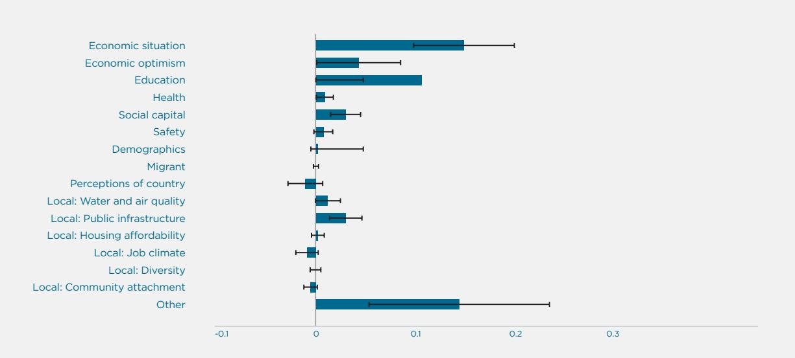

Note: Figures are weighted using sampling and population weights. N=95,758 individuals. Horizontal lines show a 95% confidence range.

When re-estimating the Blinder-Oaxaca decomposition for positive and negative affect in Sub-Saharan Africa, we draw more or less similar conclusions, with health and community attachment playing a more important role and education a less important role in explaining urban-rural differences. These results can be found in Online Appendix J.

Whether urban-rural happiness differences in Sub-Saharan Africa are predominantly driven by people or place effects is hard to ascertain, but when we re-estimate the Blinder-Oaxaca decomposition and only include the local place factors (water and air quality, public infrastructure, housing affordability, job climate, diversity, and community attachment), we find that these local factors only account for 8% of the urban-rural happiness differential. At the same time, we do not have objective characteristics of the settlement in which people live, but only the subjective perceptions of its actual features, which are in part dependent on people-based characteristics.

### **The Heterogeneous Relationship Between City Living and Life Evaluation in Sub-Saharan Africa**

Different kinds of people fit best in different kinds of living environments, and therefore people do not necessarily rate place characteristics in a similar way.74 This complicates our understanding of the relationship between place of residence and life evaluation. For Sub-Saharan Africa, we examined whether some groups in society are better off in the countryside than the city. We found that life evaluation levels for *all* major socio-demographic groups were higher when living in cities, and that this was especially marked for the more highly educated as the moderation analysis in Figure 4.6 shows. Although many of the lower educated also experience hardship in Sub-Saharan African cities, relatively speaking, they are still better off in the cities.

## **Urban Unhappiness in the Western world**

When it comes to differences in happiness across the urban hierarchy the distinctive feature of the countries in Northern and Western Europe, Northern America, and Australia-New Zealand (NWAS) is not only the higher average level of

happiness of the majority who live in cities, but also the equally high and sometimes higher level of happiness of those who live in rural areas.75 The juxtaposition of these two results alongside the fact that most of the very large metropolitan centres continue to attract people and generate a disproportionate share of their country's wealth is the reason for the urban paradox label.76

In contrast to much of the developing world, the absolute and relative size of the rural population in developed regions is much lower and is expected to further decline by 35% during the period 2018-2050.77 Not only do rural areas in the NWAS countries house a small and diminishing proportion of the population, but those who live in rural areas now undertake vastly different types of work compared to those living in developing countries. Much of the 'rural' work is non-agricultural and is remunerated at levels which are often as high as the cities. Rural populations are also closely connected by a sophisticated transportation infrastructure to cities, meaning they are able to 'borrow' the positive effects of cities, and those who are no longer in paid work in rural areas are often supported by relatively generous retirement incomes, unemployment, or disability benefits.

The urban paradox described in phase B of Figure 4.1 can be largely explained by both the inequalities associated with large city growth by the fundamentally altered occupational structure and standard of living in surrounding rural areas.78 Meanwhile, the large conurbations with which they are being compared are experiencing high levels of inequality, meaning a large proportion of their population are subject to the negative externalities of urbanization.79 At the same time, the negative externalities associated with urban growth might still be limited because the NWAS region has relatively few megacities compared to the developing world.80 Instead, the urban population in high-income countries is skewed towards the intermediate size classes.81 Whereas in Europe two-third of the urban population lives in cities with fewer than 500,000 inhabitants, in Australia-New Zealand the majority of the urban population is residing in 6 medium-sized cities.82

**Figure 4.6: Urban-rural happiness differences by subgroup in Sub-Saharan Africa**

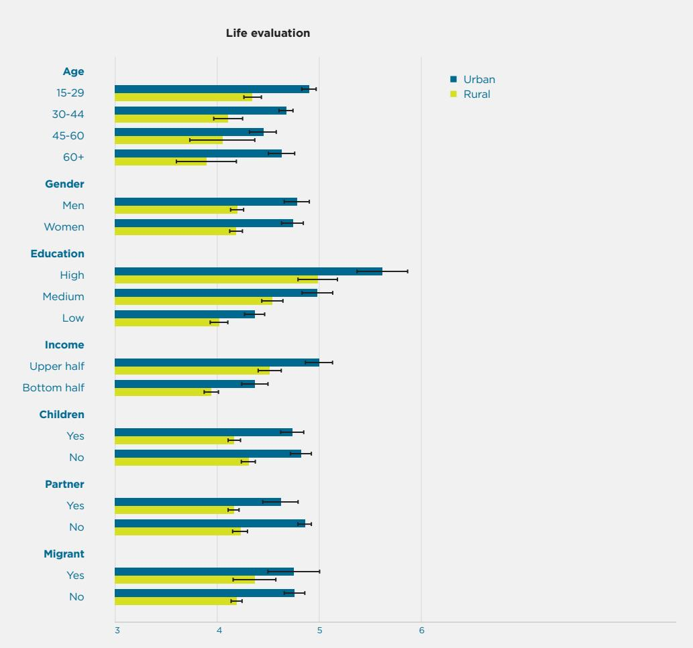

Note: Estimates are derived from individual-level OLS regression analyses with robust standard errors clustered at the country level. For age, life evaluation was regressed on the urban dummy, age group, urban x age group, country, and year. The same model structure was used for the other socio-demographic variables, except for (household) income where the number of 15+ aged household members is included as an additional control to account for the number of potential income earners in a household. Figures are weighted using sampling and population weights. Sample sizes vary between subgroups and range from 94,765 to 102,342. Horizontal lines show a 95% confidence range.

#### **Why are People in Many Western Countries Happier Living in Rural Areas?**

Figure 4.7 shows the Blinder-Oaxaca decompositions for the Western world, based on 63,440 observations for the period 2014-2018. It shows the contributions of each variable group in explaining the life evaluation gap of -0.04 points between urban and rural parts of Northern and Western Europe, Northern America, Australia and New Zealand. We find that higher happiness scores in rural areas are particularly explained by higher degrees of community attachment and

housing affordability and a lower percentage of single households.

 These findings are consistent with the evidence presented in Hoogerbrugge and Burger for the United Kingdom (see Online Appendix K). While people in urban areas are more positive about the country, more optimistic, healthier, and higher educated than people in rural areas, the lower well-being of the majority predominates (see Table 4.4).

**Table 4.4: Life comparisons of urban and rural NWAS**

|                                                         | Urban    | Rural    |
|---------------------------------------------------------|----------|----------|
| Annual household income (International dollars)         | \$92,393 | \$86,410 |
| % Finding it (very) difficult to live on present income | 13%      | 11%      |
| % Standard of living getting better                     | 54%      | 49%      |
| % Unemployed                                            | 4%       | 3%       |
| % Completed tertiary education                          | 32%      | 21%      |
| % No partner                                            | 48%      | 37%      |
| % Satisfied with affordable housing                     | 54%      | 66%      |
| % Likely to move in 12 months                           | 15%      | 11%      |
| % Satisfied with living place                           | 85%      | 87%      |
| National institutions index (0-100)                     | 47       | 44       |
| % Health problems                                       | 18%      | 22%      |
| % Experienced pain yesterday                            | 26%      | 32%      |
|                                                         |          |          |

Note: Figures are weighted using sampling and population weights. N=63,440 individuals.

Source: Gallup World Poll

**Figure 4.7: Why are life evaluations higher in rural areas in the Western world? Exploring people-based and place-based factors explaining the urban-rural gap**

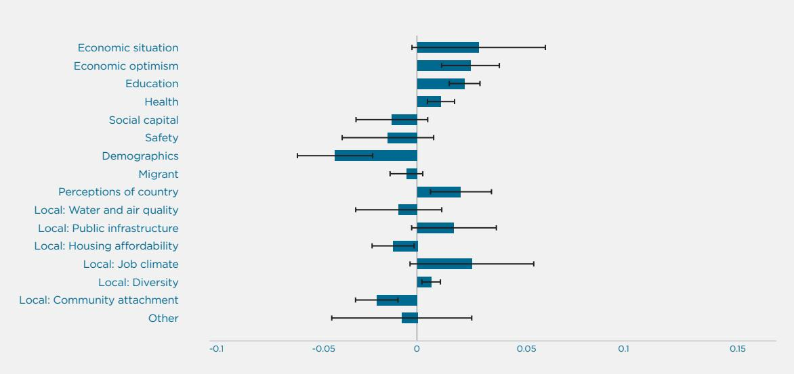

Note: Figures are weighted using sampling and population weights. N=63,440 individuals. Horizontal lines show a 95% confidence range.

The variables we have used in the decomposition do not fully explain the urban-rural differential in the Western world (see also Online Appendix L) and it is possible that longer commutes, higher inequality, traffic congestion, and stress associated with daily urban life lowers the social capital experienced by many. In addition, issues of safety and security may contribute to the lower social capital of those in cities. At the same time, some of the same factors are likely to be valued differently in urban and rural areas. For example, social capital and being a native inhabitant (i.e., non-migrant) has a significantly stronger positive association with life evaluation in rural areas. A more elaborate discussion is beyond the scope of this chapter, but these findings do show that explaining urban-rural differentials in the Western world may involve a different set of factors than was apparent in the African case.

#### **The Heterogeneous Relationship Between City Living and Happiness in the Western World**

We also examined which groups in society are better off in the countryside than the city (see Figure 4.8). While most subgroups are similarly happy in urban and rural areas, there are three notable exceptions. A first exception is that those aged 15-29 are on average significantly happier in rural areas. Indeed, a moderation analysis reveals that those aged 15-29 tend to feel relatively happier in rural areas compared with those in the 30-60 group. However, this rural happiness advantage is contingent on education level; medium and low educated people aged 15-29 are happier in rural areas (M=7.28 and M=7.01) than in urban areas (M=6.86 and M=6.57), while the highly educated in that age group are significantly happier in urban areas (M=7.15) than in rural areas (M=6.83). These findings are consistent with findings in the literature that highly educated students in the United Kingdom experience happiness benefits from moving to the city, while less-highly educated students experience negative effects from moving to the city (see Online Appendix K). A second and related exception is that the low and medium educated are generally happier in rural areas than in urban areas. A moderation analysis reveals that, correspondingly, low educated people are relatively unhappy in urban areas compared with medium and highly educated people. Third, we find that international migrants are relatively happy in urban areas.

In summary, the quest for and achievement of education is a major inducement to urban living in both developing and developed economies. The large cities in particular provide the necessary infrastructure for realisation of returns to tertiary education as a result of the expansion of both the scale and scope of economic and cultural activities. The tertiary educated in turn attract a large number of the less educated who work in the non-tradable sector where they are potentially more vulnerable to monopsonistic83 employment practices.84 The demand for such personal services is highly dependent on income and since very large cities pay much higher wages to the skilled, the ratio of service to educated personnel is higher than in smaller urban settlements. However, the economic imperative of working locally for low wages competes with the rising price of residence close to work resulting in many service workers having to endure long commutes. The resulting gap in happiness is further stretched by joint effect of education and income on the level of social interaction in the large city, in part because the longer commute reduces quality time with family and leisure and lower incomes limit the scope for social interaction in an increasingly commercialised environment. Since the educated are better paid and can exercise a much wider choice as to where to live, they can not only live closer to work, but cluster geographically and thereby solidify social networks which enhance their subjective well-being.

#### **Exploring Urban-Happiness Differentials in Other Parts of the World**

In our analyses on urban-rural happiness differentials, we have focused on Sub-Saharan Africa and the Western world as two extremes. However, how do these two world regions compare to other parts of the world? In order to get a basic idea of the uniqueness of the two cases that were examined, we ran the Blinder-Oaxaca decompositions for the other parts of the world, ranging from Eastern Europe (Online Appendix Figure L1) to the Middle East and North Africa (Online Appendix Figure L8). Although every region has its particularities (which need further research), a number of general conclusions can be drawn:

- In general, people-factors account for urban-rural differences more clearly than do place-factors as measured by experienced place quality. Place factors only matter to a limited extent, explaining at most just over one-third of the differences (Online Appendix Table L1).
- Economic situation and education are the important factors explaining urban-rural differentials in most regions of the world.
- The Western world is an anomaly when it comes to the nature and reasons for ruralurban differences. Not only are these differences much smaller in the NWAS region, but the factors that explain urban-rural differentials also differ, being driven by relativities which greatly favour the tertiary educated who move to cities but have less enduring effects on the majority who service them. By comparison demographics and community attachment are less important explanatory factors for the urban-rural differential in non-NWAS countries.

**Figure 4.8: Urban-rural happiness differences by subgroup in NWAS**

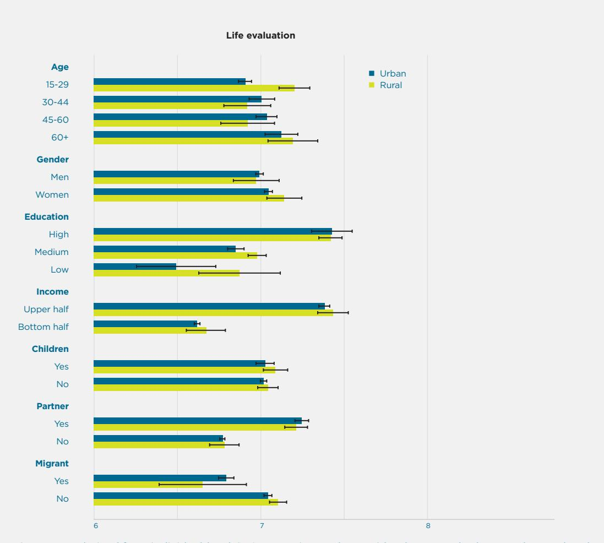

Note: Estimates are derived from individual-level OLS regression analyses with robust standard errors clustered at the country level. For age, life evaluation was regressed on the urban dummy, age group, urban x age group, country, and year. The same model structure was used for the other socio-demographic variables, expect for (household) income where the number of 15+ aged household members is included as an additional control to account for the number of potential income earners in a household. Figures are weighted using sampling and population weights. Sample sizes vary between subgroups and range from 52,828 to 64,476. Horizontal lines show a 95% confidence range.

## **Concluding Remarks and Research Agenda**

In this chapter, we have examined urban-rural happiness differentials across the world. In line with earlier research, we found that urban populations are, on average, happier than rural populations in that they return higher levels of happiness. Our results are robust to different measures of well-being: life evaluations, positive affect, and negative affect, although differences are most pronounced for the life evaluation measure.

The differences we found can primarily be explained by higher living standards and better economic prospects in cities, especially for those with tertiary education. At the same time, the relative importance of these place and people effects may vary from country to country and, hence invite a case-study approach. In this chapter, urban-rural differences in well-being were shown to be strongly dependent on development level, and as Figure 4.1 suggests the urbanisation experience in the more developed Western world can lead to lower rather than higher average levels of well-being in cities. In contrast to other parts of the world, in many countries in Northern and Western Europe, Northern America, and Australia-New Zealand, the relatively much smaller rural populations have higher average levels of well-being than urban populations. This can partly be explained by the fact that despite the larger urban areas having higher proportions of tertiary educated residents the tertiary educated are still in the minority. By comparison, the much larger less-educated majority face higher costs of living in cities relative to income, include a larger proportion of singles on low incomes (many of whom are students), and for a variety of reasons including reduced access to owner occupied housing and longer average commutes, experience return lower levels of well-being. The results are consistent with what we already know about the urban paradox, but local variations in such patterns warrant further research.

In this regard, our research has also shown that some groups are better able to reap the advantages of cities and are less exposed to the negative effects of cities than others. People with lower levels of education and/or lower income have fewer means of buying their way

out of a poorer urban environment. In this research, we found that the urban happiness advantage is considerably larger for higher educated people than for lower educated people, both in Sub-Saharan Africa and Northern and Western Europe, Northern America, and Australia-New Zealand. Future research should in this regard examine more specifically which kind of living environment is best for which kind of people, specifically turning attention to lifestyles. Of particular importance in the Western world are the higher real housing costs the lower educated face in cities, resulting in longer commutes, which lowers time for leisure and time with family, coupled with compounding *relative* income effects in highly proximate environments. These are disadvantages generated from *within* the large conurbation rather than the result of selective in-migration from a relatively tiny rural population base.

Although the Gallup World Poll data has allowed considerable progress in understanding the geography of urban-rural differences in subjective well-being there remain several open questions. The first of these concerns the sensitivity of the urban-rural differences to the way we measure subjective well-being. The three measures we have explored here – life evaluation, and the positive and negative experiences recalled from the day before – differ not only on average across countries but from country to country, as observed earlier almost a decade ago.85 In other words, there are place-specific as well as development-level specific differences to the way the various dimensions of well-being behave, which deserve further analysis.

Secondly, when it comes to happiness, the effect of place is conditional upon the people who live there and vice versa. Any expression of happiness from a place-specific sample is going to reflect the combined effect of the actual features of a place, subjective perceptions of its features, and how the difference between the two varies with both the characteristics of places and people themselves. Our appreciation of these interactions and how they vary with the measure of subjective well-being warrants a closer analysis, beginning with a case study approach. Related to this point and as earlier mentioned in this chapter, future research could also use more objective measures of urbanization, as presented in the Annex of this World Happiness Report. The use of such objective

measure seems to be particularly relevant in understanding 'urbanization' in Africa and China where there is an important difference between the 'urbanization of places' (cities accrete to engulf rural villages), and the 'urbanisation of people' (people move to the cities). In both these parts of the world, it is the reclassification of formally rural areas as urban that explains much of the growth in urbanization. In other words, vast numbers of people in these countries become urbanized without moving.86

A related third issue begs the meaning of place itself. The way we bound place – urban and rural, for example – is often quite arbitrary.87 Furthermore, places do not exist in isolation and are embedded within one another (cities and towns within regions within countries) and an understanding of the role of place in the context of such hierarchical clustering would benefit from more regular applications of the multi-level model. Based on several pioneering applications using other global surveys88, the scope for multilevel modelling of the contemporary Gallup World Poll samples remains considerable.

A fourth feature, which space has prevented us from exploring in this chapter, is the relationship between average levels of happiness and the variance in happiness. There is considerable scope for extending to other countries the testing of the thesis that economic growth is inversely related to subjective well-being inequality89 even if it does not increase average subjective well-being.90 While there is a generally accepted negative relationship between within country inequality in well-being and the country's level of development, there is room for extending existing work on the Gallup World Poll data.91

Our discussion of the urban paradox also highlights a fifth issue – namely the spatial well-being consequences of socio-economic inequality. Well-being assumes a geography as a result of two processes: spatial sorting and adaptation. Both are influenced primarily by the resources households have available, and while the market largely determines who lives where and under what conditions92, the internal geography of well-being is heavily conditioned by the characteristics of the country itself and its level of development.93 Both these sorting and adaptation processes await further attention.

As a sixth point, when it comes to understanding the geography of happiness *within* urban areas, competition for residence close to central city places results in a negative relationship between income and commuting distance.94 As a result, the competition for accessibility has a number of unexplored implications for the spatial distribution of well-being. For this reason, we would recommend the addition of a question on duration of the commute to the questions in the World Gallup Poll as this would go some way in our understanding the non-linear well-being consequences of urban size.

A final point to emerge from our work is the role of personality and genetic predispositions and their influence on well-being.95 The World Gallup Poll does not collect data on personality types, and therefore these attributes of individuals can not be controlled for in understanding the relationship between people's happiness and where they live.96 For example, do extraverted people thrive in different types of environment than introverted people, and are cities good places to live for neurotic people? It would be valuable to ask these and related questions in future research.

#### **Endnotes**

- 1 In this chapter, the word 'happiness' is used as an umbrella term, including both cognitive evaluations (life evaluation) and emotional evaluations (positive affect and negative affect) (see also Veenhoven, 2000).
- 2 Easterlin et al. (2011).
- 3 United Nations (2019).
- 4 Africa and Asia are home to nearly 90% of the world's rural population. India has the largest rural population (893 million), followed by China (578 million). Asia, despite being less urbanized than most other regions today, is home to 54% of the world's urban population, followed by Europe and Africa (13% each).
- 5 Following the Human Development Report, a developing country (or a low and middle income country (LMIC), less developed country, less economically developed country (LEDC), or underdeveloped country) is a country with a less developed industrial base and a low Human Development Index (HDI) relative to other countries.
- 6 Ibidem.
- 7 Deaton (2015).
- 8 Veenhoven & Berg (2013); World Bank (2009);
- 9 See the argument developed by Behrens & Robert-Nicoud (2014).
- 10 Easterlin et al. (2011).
- 11 Cantril (1965).
- 12 Harris & Todaro (1970).
- 13 Several international reviews have kept this issue in front of policy makers: Albouy, 2008; European Commission, 2013; Lagas, Van Dongen, Van Rin, & Visser, 2015; OECD, 2014. Contemporary geographic variations in subjective well-being are regularly summarized in the World Happiness Reports (Helliwell, Layard, & Sachs, 2015; Helliwell, Layard, & Sachs, 2012; Helliwell, Layard, & Sachs, 2013).
- 14 The term 'urban paradox' has been used in related contexts to refer to the joint presence of dynamic growth and social exclusion in urban regions but it is used in Morrison (2020), to refer to the discordance between the popularity of cities to live and their lower well-being levels (Hoogerbrugge & Burger, 2019) and here to refer to the apparent contradiction between the higher productivity and growth of urban centers in combination with being an attractive location to live and their lower average level of well-being; see also OECD (2010).
- 15 Okulicz-Kozaryn (2015).
- 16 Faggian et al. (2012); Glaeser et al. (2016).
- 17 E.g., Morrison (2011); Glaeser et al. (2016).
- 18 E.g., Scharf & De Jong Gierveld (2008); Sørensen (2014).
- 19 E.g., MacKerron & Mourato (2009).
- 20 E.g., Broersma & Van Dijk (2008).
- 21 E.g., Glaeser & Sacerdote (1999).
- 22 E.g., Graham & Felton (2006).
- 23 E.g., MacKerron & Mourato, 2013.
- 24 E.g., Alirol (2008).

- 25 Part of the popularity of cities in the rich countries may simply be a focusing illusion (cf. Kahneman, 2011). Following Okulicz-Kozaryn (2015), individuals often underestimate the happiness costs of living in cities, while they overestimate the happiness advantages of living in cities. Indeed, although employment opportunities and access to amenities are some of the perceived happiness advantages of cities, these urban rewards are not necessarily available everywhere and for everyone (Cardoso et al., 2018). According to Cardoso and colleagues (2018), 'bright city lights can dazzle as well as illuminate'. While the potential happiness advantages of urban agglomeration are evident across different periods and places, the outcomes for individuals can be extremely diversified. People may expect to profit from the happiness advantages of cities, but in the end may predominantly suffer from its happiness disadvantages.
- 26 Alonso (1973), Meijers & Burger (2017).
- 27 Veenhoven (1994).
- 28 Yet, Italian evidence suggests that city size is more strongly associated with the unhappiness of longer-term residents (Loschiavo, 2019).
- 29 In part, this effect is driven by urban households who have lived in the city all their lives.
- 30 Berry & Okulicz-Kozaryn (2009, 2011); Glaeser, Gottlieb, & Ziv (2016); Valdmanis (2015).
- 31 Lu, Schellenberg, Hou, & Helliwell (2015).
- 32 Cummins, Davern, Okerstrom, Lo, & Eckersley (2005); Shields & Wooden (2003).
- 33 Morrison (2007, 2011).
- 34 Ballas (2008), Ballas & Tranmer (2012), Smarts (2012), Dunlop., Davies, & Swales (2016), Hoogerbrugge & Burger (2019).
- 35 Brereton, Clinch, & Ferreira (2008).
- 36 Aslam & Corrado (2012); European Commission (2013); Lenzi & Perucca (2016a; 2016b); Piper (2014); Pittau, Zelli, & Gelman (2010).
- 37 Botzen (2016).
- 38 Lenzi & Perucca (2019).
- 39 Burger et al. (2017).
- 40 Chen, Davis, Wu, & Dai (2015); Clark, Yi, & Huang (2019); Dang et al. (2019).
- 41 Schwanen & Wang (2014).
- 42 Plaut et al. (2002).
- 43 Hoogerbrugge & Burger (2019).
- 44 Okulicz-Kozaryn (2018).
- 45 Morrison (2018).
- 46 Morrison (2020).
- 47 See for example Loschiavo (2019).
- 48 Behrens & Robert-Nicoud (2014).
- 49 Barry & Waldfogel (2010); Burger et al. (2014).
- 50 See Appendix B for an overview of countries included in the analysis.
- 51 Cantril (1965).

- 52 Respondents are excluded from analysis when not answering all items on the positive affect index or negative affect index.
- 53 Kahneman & Deaton (2010).
- 54 Easterlin et al. (2011).
- 55 The creation of population weights involved two steps. First, to account for sample size differences between countries and years, we adjusted the sampling weights so that each country has the same weight in each year (one-countryone-vote). Next we multiplied the total population aged 15+ in each country by the one-country-one-vote weight. Total population aged 15+ is equal to the total population minus the amount of population aged 0-14. Data are taken from the World Development Indicators (WDI) released by the World Bank. Specifically, the total population and the proportion of population aged 0-14 are taken from the series "Population ages 0-14 (% of total)" and "Population, total" respectively from WDI. Kosovo, Northern Cyprus, Somaliland, and Taiwan Province of China lack data in WDI and are therefore not included in the analyses.
- 56 For exceptions, see e.g. Morrison (2007; 2011).
- 57 We find a positive correlation (0.44) between urban-rural differences based on life evaluation and urban-rural differences based on positive affect.
- 58 The excluded countries/territories are Hong Kong, Hungary, Lesotho, Palestinian Territories, Qatar, Singapore, and Trinidad and Tobago.
- 59 We find similar differences when we replace GDP per capita by average life evaluation. These results are available upon request.
- 60 E.g., Berry & Okulicz-Kozaryn (2009); Hoogerbrugge & Burger (2019).
- 61 See Blinder (1973) and Oaxaca (1973). This decomposition analysis allows us to examine group differences in an outcome variable and has been more recently used in studies on subjective well-being (e.g. Helliwell & Barrington-Leigh, 2010; Becchetti et al., 2013; Arampatzi et al., 2018).
- 62 Völker & Flap, 2007; Hoogerbrugge & Burger (2018).
- 63 Sub-Saharan Africa (shortened to SSA or Africa for variety in our text) includes the following countries: Angola, Benin, Botswana, Burkina Faso, Burundi, Cameroon, Central African Republic, Chad, Comoros, Congo Brazzaville, Congo Kinshasa, Djibouti, Ethiopia, Gabon, Gambia, Ghana, Guinea, Ivory Coast, Kenya, Lesotho, Liberia, Madagascar, Malawi, Mali, Mauritania, Mauritius, Mozambique, Namibia, Niger, Nigeria, Rwanda, Senegal, Sierra Leone, Somalia, South Africa, South Sudan, Sudan, Swaziland, Tanzania, Togo, Uganda, Zambia, Zimbabwe.
- 64 UN-DESA (2014); Despite its rapid rate of urbanisation Africa is not expected to have over half its population classified as urban for at least another 20 years (by comparison Asia's urban population is projected to surpass its rural population within five years).
- 65 According to data collected by the United Nations Department of Economic and Social Affairs between 2010 and 2015, Rwanda has the highest average annual rate of change in its urban population at 3.69% per year, an increase of more than 1.3 million over the five year period. Burkina Faso comes third after Laos with a 3.03% change per year. Despite this rapid growth, both African countries remain largely rural – only 28% of Rwandans and 29% of Burkinabés live in urban areas.

- 66 Teye (2018).
- 67 Mulcahy & Kollamparambil (2016).
- 68 Teye (2018).
- 69 Ibidem, p. 1.
- 70 Teye (2018).
- 71 Guneralp et al. (2018).
- 72 Mulcahy & Kollamparambil (2016).
- 73 The unexplained part of the Blinder-Oaxaca decomposition analysis accounts for the remaining difference of 0.2 points out of 0.71 points difference and can be attributed to excluded variables as well as systematic differences in the estimated value of coefficients between urban and rural areas. Not all relevant factors explaining urban-rural differences (e.g., traffic and travel satisfaction) may have been included in the model, and not all concepts have been captured fully with the variables available in the Gallup World Poll (e.g., for social capital an indicator of loneliness was missing). Although it is possible that the relative importance of factors associated with happiness may vary between urban and rural areas, we only find housing affordability differently valued in cities compared to the countryside.
- 74 Plaut et al. (2002).
- 75 However, it should be noted that in NWAS most people live in peri-urban areas. Hence, peri-urban – urban differences and peri-urban – rural differences.
- 76 Our use of the term 'urban paradox' is not unique. The term is also used to contrast simultaneous dynamic growth the social exclusion. For example, in a set of forces directly related to well-being the OECD notes that, "most urban areas in OECD countries appear to be characterised by high concentrations of wealth and employment, associated with leading sectors and the focal points of their national economies, they also tend to concentrate a high number of unemployed residents." As they point out, wealth is not adequately translated into job creation and while employment and employment growth are typically higher in cities, urban areas also contain disproportionate numbers of people who are either unemployed or inactive (or who work in the informal economy). See also https://www.oecd.org/urban/ roundtable/45159707.pdf p. 191.
- 77 United Nations (2019, p. 18). By comparison, the rural population of the less developed regions has continued to grow, from 1.4 billion in 1950 to 3.1 billion in 2018, more than doubling over those 64 years (Ibid). The UN has pointed out that in 2018 the 'more developed regions' housed 0.99 billion people while the less developed regions more than three times that number at 3.23 (World urbanisation prospects , table 11, p. 9). And the rate of change expected 2018 -2030 is only 0.46% for 'more developed regions' compared to 2.03 in less developed regions or 4.41 times as fast. Even so, in less than a decade, by 2030 the percentage urban in less developed regions will still only by 56.7% compared to 81.4% in developed (United Nations, 2019, Table 1.3, p. 11).

prices will adjust in such way that spatial equilibrium will be reached. 79 OECD (2018). 80 See United Nations (2019). In approximately half of OECD countries, more than 40% of the national GDP is produced in less than 10% of all regions, which account for a small

share of the country's total surface and a high share of the

78 Alternatively, our results suggest that in poor countries there is a spatial disequilibrium, but in rich countries this has been eliminated by migration. More specifically, it can be argued that individuals move from areas of low utility to areas of high utility (Glaeser et al., 2016; Winters & Li, 2017). When people move from places with lower levels of utility to places with higher levels of utility, wages and housing

- 81 United Nations (2019).
- 82 Ibidem.
- 83 A monopsony means that the employer has buying power over their potential employees, particularly providing them wage-setting power and often leading to underpayment.
- 84 Morrison et al. (2006).
- 85 Deaton (2013), p. 52.
- 86 See e.g. Chen et al. (2015) and Teye (2018).

country's population (OECD, 2010).

- 87 Sheppard & McMasters (2004).
- 88 Bonini (2008); Schyns (2002); Deeming & Hayes (2012); Novak & Pahor (2017).
- 89 Ifcher & Zarghamee (2016).
- 90 Jorda & Sarabia (2015).
- 91 Helliwell et al. (2017).
- 92 Behrens & Robert-Nicoud (2014).
- 93 Haller & Hadler (2006).
- 94 Christian (2012).
- 95 E.g. Lynn & Stell (2006).
- 96 Rentfrow et al. (2008); Rentfrow (2010).

#### **References**

Albouy, D. (2008). Are big cities really bad places to live? Improving quality-of-life estimates across cities Working Paper National Bureau of Economic Research

Alirol E., Getaz, L., Stoll, B., Chappuis, F.and Loutan, L. (2011) Urbanisation and infectious diseases in a globalised world. *The Lancet Infectious Diseases* 11(2): 131-141.

Alonso, W. (1973). Urban zero population growth. *Daedalus*, 102(4), 191-206.

Arampatzi, E., Burger, M., Ianchovichina, E., Röhricht, T., & Veenhoven, R. (2018). Unhappy development: Dissatisfaction with Life on the Eve of the Arab Spring. *Review of Income and Wealth,* 64, S80-S113.

Aslam, A., & Corrado, L. (2012). The geography of well-being. *Journal of Economic Geography*, 12(3), 627-649.

Ballas, D. (2008). Geographical modelling of happiness and well-being. Paper presented at the BURISA 177.

Ballas, D., & Tranmer, M. (2012). Happy people or happy places? A multilevel modeling approach to the analysis of happiness and wellbeing. *International Regional Science Review*, 35, 70-102.

Becchetti, L., Massari, R., & Naticchioni, P. (2013). The drivers of happiness inequality: suggestions for promoting social cohesion. *Oxford Economic Papers*, 66(2), 419-442.

Behrens, K. & Robert-Nicoud, F. 2014. Survival of the fittest in cities: urbanisation and inequality. *The Economic Journal*, 124, 1371-1400.

Berry, B. J. L., & Okulicz-Kozaryn, A. (2009). Dissatisfaction with city life: a new look at some old questions. *Cities*, 26, 117-124.

Berry, B. J. L., & Okulicz-Kozaryn, A. (2011). An urban-rural happiness gradient. *Urban Geography*, 32(6), 871-883.

Berry, S., & Waldfogel, J. (2010). Product quality and market size. *The Journal of Industrial Economics*, 58(1), 1-31.

Blinder, A. S. (1973). Wage discrimination: reduced form and structural estimates. *Journal of Human Resources*, 8(4), 436-455.

Bonini, A.N. (2008). Cross-national variation in individual life satisfaction: effects of national wealth, human development, and environmental conditions. *Social Indicators Research*, 87, 223-236.

Botzen, K. (2016). Social capital and economic well-being in Germany's regions: an exploratory spatial data analysis. *Region*, 3(1), 1-24.

Brereton, F., Clinch, P., & Ferreira, S. (2008). Happiness, geography and the environment. *Ecological Economics*, 65, 386-396.

Broersma L and Van Dijk J (2008) The effect of congestion and agglomeration on multifactor productivity growth in Dutch regions. *Journal of Economic Geography*, 8(2), 181-209.

Burger, M. J., Meijers, E. J., & Van Oort, F. G. (2014). Regional spatial structure and retail amenities in the Netherlands. *Regional Studies*, 48(12), 1972-1992.

Burger, M., Hendriks, M., Marlet, G., Van Oort, F., Ponds, R., & Van Woerkens, C. (2017), De geluksatlas [The Happiness Atlas], *Atlas voor Gemeenten 2017*, Chapter 1. Nijmegen: VOC Uitgevers

Cantril, H. (1965). *The Pattern of Human Concerns*. New Brunswick, NJ: Rutgers University Press.

Cardoso, R., Meijers, E., Van Ham, M., Burger, M., & de Vos, D. (2019). Why bright city lights dazzle and illuminate: A cognitive science approach to urban promises. *Urban Studies*, *56*(2), 452-470.

Chen, J., Davis, D. S., Wu, K., & Dai, H. (2015). Life satisfaction in urbanising China: the effect of city size and pathways to urban residency. *Cities*, 49, 88-97.

Christian, T.J. (2012). Automobile commuting duration and the quantity of time spent with spouse, children, and friends. *Preventative Medicine*, 55, 215-218.

Clark, W. A. V., Yi, D., & Huang, Y. (2019). Subjective well-being in China's changing society. PNAS.

Cummins, R. A., Davern, M., Okerstrom, E., Lo, S. K., & Eckersley, R. (2005). Report 12.1. Australian Unity Wellbeing Index. Special report on city and country living. Melbourne: The School of Psychology and Australian Centre on Quality of Life, Deakin University.

Dang, Y., Chen, L., Zhang, W., Zheng, D., & Zhan, D. (2020). How does growing city size affect residents' happiness in urban China? A case study of the Bohai rim area. *Habitat International*, 102120.

Deaton, A. (2015). *The Great Escape: Health, Wealth, and the Origins of Inequality*. New Jersey: Princeton University Press.

Deeming, C. & Hayes, D. (2012). Worlds of welfare capitalism and wellbeing: A multilevel analysis. *Journal of Social Policy*, 41, 811-829.

Dunlop. S., Davies, S., & Swales, K. (2016). Metropolitan misery: why do Scots live in 'bad places to live?'. *Regional Studies, Regional Science*, 3(1), 717-736.

European\_Commission. (2013). Quality of life in cities Flash Eurobarmeter 366. Luxembourg: Belgium: The European Union.

Easterlin, R. A., Angelescu, L., & Zweig, J. S. (2011). The impact of modern economic growth on urban-rural differences in subjective wellbeingwell-being. *World Development*, 39(12), 2187-2198.

Faggian, A., Olfert, M. R., & Partridge, M. D. (2011). Inferring regional well-being from individual revealed preferences: the 'voting with your feet'approach. Cambridge Journal of Regions, Economy and Society, 5(1), 163-180.

Glaeser E (2011) *Triumph of the City*. Basingstoke and Oxford: Palgrave Macmillan.

Glaeser E, Gottlie JD and Ziv O (2016) Unhappy cities. *Journal of Labor Economics*,34(2),S129-S182.

Glaeser E. & Sacerdote, B. (1999) Why is there more crime in cities? *Journal of Political Economy* 107(6), S225-S258.

Guneralp, B., Lwasa, S., Masundire, H., Parnell, S., & Seto, K. C. (2018). Urbanisation in Africa: challenges and opportuntiies for conservation. *Environmental Research Letters*, 13, 1-8.

Haller, M. & Hadler, M. (2006). How social relations and structures can produce happiness and unhappiness: An international comparative analysis. *Social Indicators Research*, 75, 169-216.

Harris, J.R. and Todaro, M.D. (1970) Migration, unemployment and development: a two sector analysis. *American Economic Review*, 60, 126-142

Helliwell, J. F., & Barrington-Leigh, C. P. (2010). Measuring and understanding subjective well-being. *Canadian Journal of Economics*, *43*(3), 729-753.

Helliwell, J.F., Huang, H. & Wang, S. (2017). The social foundations of world happiness. *In:* Helliwell, J., Layard, R. & Sachs, J. (eds.) *World Happiness Report 2017*. New York: Sustainable Development Solutions Network.

Helliwell, J., Layard, R., & Sachs, J. (Eds.). (2012). *World Happiness Report*. New York: The Earth Institute, Columbia University.

Helliwell, J., Layard, R., & Sachs, J. (Eds.). (2013). *World Happiness Report 2013*. New York: UN Sustainable Development Solutions Network.

Helliwell, J., Layard, R., & Sachs, J. (2015). *World Happiness Report 2015*. New York Sustainable Development Solutions Network.

Hoogerbrugge, M.M., & Burger, M.J. (2018). Neighborhoodbased social capital and life satisfaction: the case of Rotterdam, the Netherlands. *Urban Geography*, 39(10), 1484-1509.

Hoogerbrugge, M.M. & Burger, M.J. (2019) The urban happiness paradox. Evidence from the United Kingdom. Working Paper, Erasmus University Rotterdam.

Ifcher, J. & Zarghamee, H. (2016). Inequality of happiness: evidence of the compression of the subjective- distribution with economic growth. *In:* Basu, K. & Stiglitz, J.E. (eds.) *Inequality and Growth: Patterns and Policy. Vol 1. Concepts and analysis*. New York: Palgrave macmillan.

Jorda, V. & Sarabia, J.M. (2015). Wellbeing distribution in the globalisationera: 30 years of convergence. *Applied Research in Quality of Life*, 10, 123-140.

Kahneman, D. (2011). *Thinking, Fast and Slow*. Macmillan.

Kahneman, D., & Deaton, A. (2010). High income improves evaluation of life but not emotional well-being. Proceedings of the national academy of sciences, 107(38), 16489-16493.

Lagas, P., van Dongen, F., van Rin, F., & Visser, H. (2015). Regional quality of living in Europe. *Region*, 2(2), 1-26.

Lenzi, C., & Perucca, G. (2016a). Are urbanised areas source of life satisfaction? Evidence from EU regions. *Papers in Regional Science*, 97(S1), S105-S122.

Lenzi, C., & Perucca, G. (2016b). Life satisfaction in Romanian cities on the road from post-communism transition to EU accession. *Region*, 3(2), 1-22.

Lenzi, C., & Perucca, G. (2019). Subjective well-being over time and across space. *Scienze Regionali*, 18(Special issue), 611-632.

Loschiavo, D. (2019). Big-city life (dis) satisfaction? The effect of living in urban areas on subjective well-being (No. 1221). Bank of Italy, Economic Research and International Relations Area.

Lu, C., Schellenberg, G., Hou, F., & Helliwell, J. F. (2015). How's life in the city? Life satisfaction across census metropolitan areas and economic regions in *Canada Economic Insights* (pp. 11). Ottawa: Statistics Canada.

Lynn, M. and Steel, P. (2006). National differences in subjective wellbeing: the interactive effects of extraversion and neuroticism. *Journal of Happiness Studies*, 7, 155-165.

MacKerron G and Mourato S (2009) Life satisfaction and air quality in London. *Ecological Economics* 68(5): 1441-1453.

Meijers, E. J., & Burger, M. J. (2017). Stretching the concept of 'borrowed size'. *Urban Studies*, 54(1), 269-291.

Morrison, P. S. (2007). Subjective wellbeing and the city. *Social Policy Journal of New Zealand*, 31(July), 74-103.

Morrison, P.S. (2020). Wellbeing and the region. *Handbook of Regional Science* (forthcoming). Berlin: Springer.

Morrison P.S. (2011) Local expressions of subjective well-being: The New Zealand experience. *Regional Studies* 45(8): 1039-1058.

Morrison, P.S. (2018). Resolving the urban paradox: subjective wellbeing, education and the big city. *Promotion of quality of life in the changing world. 16th annual meeting of the International Society for Quality-of-Life Studies*. The Hong Kong Polytechnic University, Kowloon, Hong Kong.

Morrison, P.S., Papps, K. & Poot, J. (2006). Wages, employment, labour turnover and the accessibility of local labour markets. *Labour Economics*, 13, 639-663.

Morrison, P.S. & Weckroth, M. (2017). Human values, subjective wellbeing and the metropolitan region. *Regional Studies*, 52, 325-337.

Mulcahy, K., & Kollamparambil, U. (2016). The impact of rural-urban migration on SWB in South Africa. *The Journal of Development Studies*, 52(9), 1357-1371.

Novak, M. & Pahor, M. (2017). Using a multilevel modelling approach to explain the influence of economic development on the subjective well-being of individuals. *Economic research-Ekonomska Istraživanja*, 30, 705-720.

Oaxaca, R. (1973). Male-female wage differentials in urban labor markets. *International Economic Review*, 693-709.

Okulicz-Kozaryn A (2015) *Happiness and Place: Why Life is Better Outside of the City*. New York: Palgrave Macmillan.

Okulicz-Kozaryn, A., & Valente, R. R. (2019). No urban malaise for Millennials. *Regional Studies*, 53(2), 195-205.

OECD (2010). *Trends in Urbanisation and Urban Policies in OECD countries: What Lessons for China?* Paris: OECD Publishing.

OECD. (2014). *How's Life in Your Region? Measuring Regional and Local Well-being for Policymaking*. Paris: OECD Publishing.

OECD 2018. *Divided Cities: Understanding Intra-urban Inequalities*. Paris: OECD Publishing

Piper, A. T. (2014). Europe's capital cities and the happiness penalty: an investigation using the European Social Survey. *Social Indicators Research*, 123(1), 103-126.

Pittau, M. G., Zelli, R., & Gelman, A. (2010). Economic disparities and life satisfaction in European regions. *Social Indicators Research*, 96, 339-361.

Plaut, V. C., Markus, H. R., & Lachman, M. E. (2002). Place matters: Consensual features and regional variation in American well-being and self. *Journal of Personality and Social Psychology*, 83(1), 160.

Rentfrow, P.J. (2010). Statewide differences in personality: toward a psychological geography of the United States. *American Psychologist*, 65, 548-558.

Rentfrow, P.J., Gosling, S.D. & Potter, J. (2008). A theory of the emergence, persistence, and expression of geographic variation in psychological characteristics. *Perspectives on Psychological Science*, 3, 339-369.

Saghir, J., & Santoro, J. (2018). Urbanisation in Sub-Saharan Africa. Centre for Strategic & International Studies (CSIS), April, 1-7.

Scharf T., & De Jong Gierveld J (2008) Loneliness in urban neighbourhoods: An Anglo-Dutch comparison. *European Journal of Ageing*, 5(2): 103-115.

Schwanen, T., & Wang, D. (2014). Well-being, context, and everyday activities in space and time. *Annals of the Association of American Geographers*, 104(4), 833-851.

Schyns, P. (2002). Wealth of nations, individual income and life satisfaction in 42 countries: A multilevel approach. *Social Indicators Research*, 60, 5-40.

Sheppard, E. & McMasters, R.B. (2004). *Scale and Geographic Inquiry: Nature, Society, and Method*, Cornwall, Blackwell Publishers.

Shields, M., & Wooden, M. (2003). Investigating the role of neighbourhood characteristics in determining life satisfaction Melbourne Institute Working Paper, no 24/03. Melbourne: Melbourne Institute of Applied Economic and Social Research.

Smarts, E. (2012). Well-being in London: measurement and use. GLA Economics Current Issues Note 35. London: Mayor of London.

Sørensen, J. F. (2014). Rural–urban differences in life satisfaction: Evidence from the European Union. *Regional Studies*, *48*(9), 1451-1466.

Teye, J. (2018). Urbanisation and migration in Africa. Paper presented at the Expert Group Meeting, United Nations Headquarters.

UN-DESA (2014) World urbanization prospects, the 2011 revision. Population Division, Department of Economic and Social Affairs, United Nations Secretariat (2014).

United Nations (2019). *2018 Revision of World Urbanization Prospects*. New York: UN

Valdmanis, V. G. (2015). Factors affecting well-being at the state level in the United States. *Journal of Happiness Studies*, 16, 985-997.

Veenhoven, R. (2000). The four qualities of life. *Journal of Happiness Studies*, *1*(1), 1-39.

Veenhoven, R. (1994). How satisfying is rural life?, In J. Cecora (ed.), *Changing Values and Attitudes in Family Households, with Rural Peer Groups, Social Networks and Action Spaces*, Bonn, Germany: Society for Agricultural Policy and Rural Sociology, pp. 4–52.

Veenhoven, R., & Berg, M. (2013). Has modernization gone too far? Happiness and modernity in 141 contemporary nations. *International Journal of Happiness and Development*, 1(2), 172-19

Völker, Beate, & Flap, Henk. (2007). Sixteen million neighbors. A multilevel study of the role of neighbors in the personal networks of the Dutch. *Urban Affairs Review*, 43(2), 256–284.

Winters, J. V., & Li, Y. (2017). Urbanisation, natural amenities and subjective well-being: Evidence from US counties. *Urban Studies*, *54*(8), 1956-1973.

World Bank. (2009). World development report 2009. Reshaping economic geography. Washington DC: The International Bank for Reconstruction and Development/ The World Bank.

## Chapter 5 **95**

## How Environmental Quality Affects Our Happiness

### Christian Krekel

Assistant Professor, London School of Economics

#### George MacKerron

Senior Lecturer, University of Sussex Co-Founder and CTO, Psychological Technologies

We are grateful to Ekaterina Oparina for outstanding research assistance. We are thankful to John F. Helliwell and Richard Layard for helpful comments and suggestions. The use of the Gallup World Poll and the Gallup U.S. Poll is generously granted by Gallup, Inc. Modelled air pollution data were kindly supplied from the London Air Quality Network by Gary Fuller and Andrew Grieve, MRC Centre for Environment & Health at King's College London. Lakes data were generously provided by Philip J. Taylor and Laurence Carvalho, UK Centre for Ecology & Hydrology.

### **Introduction**

On August 20, 2018, Swedish fifteen-year-old Greta Thunberg did not go to school but began to strike. Until the Swedish parliamentary election on September 9, she stood – every workday during school hours – in front of the Swedish parliament building, demanding government action to reduce carbon emissions. Her *school strike for the climate* soon went global. On March 15, 2019, 1.4 million young people in 128 countries took to the streets under its *Fridays for Future* banner to demand climate action from their governments.1

One month later, on April 15, thousands of protesters of all age groups and backgrounds occupied major landmarks in London in a protest organised by British climate group *Extinction Rebellion*, bringing widespread disruption to the city for more than ten days and resulting in more than a thousand arrests.2 Activists also took to the streets in more than 80 other cities and countries around the world, including Australia, Canada, France, and Sweden. On May 26, Green parties had their best-ever result in a European Parliament election, overtaking traditional parties in many European Union member states.3 Climate change and environmental protection were the dominant themes of their campaigns.

Our natural environment, how to protect it, and in particular, how to deal with the causes and consequences of climate change are clearly amongst the leading issues of our time. This is reflected not only in global movements, grassroots activism, and voting behaviour, but also in policy at the highest national and international levels.

Answering protesters' calls, on May 1, 2019, the UK government declared a *climate emergency*. 4 It was followed shortly after by Ireland, Canada, and France, as well as large metropolitan areas, including Amsterdam, Milan, New York City, San Francisco, and Sydney.

In the meantime, major international organisations such as the World Bank have substantially ramped up their financial commitments to the environment and natural resource management. At the International Bank for Reconstruction and Development (IBRD) – the World Bank Group entity lending mostly to middle-income countries – commitments to the environment in fiscal year

2018 were about \$10.4 billion (up by 44% from fiscal year 2017), constituting the largest financial position by topic (followed by urban and rural development with \$8.6 billion). At the International Development Association (IDA), which provides interest-free loans and grants to the poorest countries, commitments have increased even more – by 65% – from \$5.8 to \$9.5 billion.5 The European Bank for Reconstruction and Development (EBRD) directed 36% of its investment (¤3.3 billion) into the green economy in fiscal year 2018 and aims at raising this share to 40% by 2020.6 Other organisations, including those in the private sector, are following suit, by assessing how their operations impact the environment and incorporating environmental protection into their corporate social responsibility.

This chapter reflects the growing awareness of the major role that the natural environment plays in our happiness. It is the first in the *World Happiness Report* series to look at how environmental quality shapes how we feel and how we evaluate our lives. The chapter focuses on the natural environment, which is determined by the quantity of natural endowments and their change over time, as well as the quality of the environment and changes in global and local environmental quality resulting from pollution, climate change, and other factors.

The importance of the environment to people seems universal around the world. In the Gallup World Poll, a nationally representative survey that is conducted annually in more than 160 countries, respondents are regularly asked about their attitudes towards the environment. Figure 5.1 shows their responses to some of these items.7

When given the choice, 62% of respondents say they would prioritise environmental protection over economic growth. Only half of them are satisfied with efforts to preserve the environment in their countries.8 Notably, 74% of respondents perceive global warming as a very or somewhat serious threat to them and their families, and 65% believe that climate change will make their lives harder.

The importance of the natural environment to people is confirmed in nationally representative household surveys. For example, when asked how important environmental protection is for their well-being and life satisfaction, 88% of

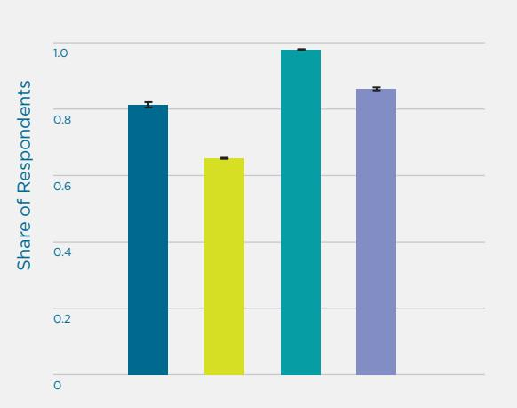

- Prioritise Environment Over Growth
- Satisfied With Environmental Protection
- Climate Change as Threat
- Climate Change Makes Life Harder

Notes: Plotted means denote the share of respondents agreeing with the respective question. The item asking respondents whether environmental protection should be prioritised over economic growth is available in years 2009 to 2011. The item asking whether respondents are satisfied with their country's efforts to preserve the environment is available in years 2006 to 2018. The item asking whether climate change is perceived as a threat to oneself or one's family is available in years 2007 to 2010. The item asking whether climate change makes lifer harder is available in years 2007 to 2010. Confidence bands are 95%.

Sources: Gallup World Poll, Various Years.

respondents in the German Socio-Economic Panel Study (SOEP) rate it as important or very important. When asked about whether they are concerned about environmental protection, 72% state that they are somewhat or very concerned. Similarly, 70% state that they are somewhat or very concerned about the consequences of climate change.9

How the environment affects people's well-being has also been the subject of academic research. More and more datasets including indicators of subjective well-being have become available in recent years and can now be merged – often at a very precise geographical level – with external, objective indicators of environmental factors. A growing stream of studies exploits these data to

show how people's feelings and life evaluations depend on these factors in their surroundings. These include, for example, geography10, natural capital11, temperature and precipitation12, land cover13, air pollution14, noise pollution15, infrastructure16, or natural disasters17, including the risk thereof.18

Academic interest in the relationship between the environment and happiness has been two-fold: first, there has been a genuine interest in how the environment affects people's subjective well-being. There has also been work done to use indicators of subjective well-being to monetarily value environmental factors, which are public, often intangible goods for which no market prices exist.19 Trading off the impact of environmental factors on life satisfaction – a measure of experienced utility20 – with that of income, this approach has been termed *experiencedpreference valuation*. 21 Second, there is a growing interest in how pro-environmental behaviour affects people's subjective well-being, and in turn, how people's emotional states can be effectively leveraged to nudge them into behaving in more environmentally friendly ways.

In what follows, we first study how our natural environment shapes our happiness in international comparison by looking at differences in natural endowments and environmental quality between countries and relating these to differences in happiness at the country level. We exploit nationally representative survey data from the Gallup World Poll merged with official OECD and World Bank statistics on the environment. In the second part of the chapter we "zoom in", by studying local environmental quality and happiness in mega cities, using the example of London. We are looking at similar environmental factors as in the first part but at a much more precise geographical level: the level of an individual's immediate surroundings. Here, we use data from *Mappiness*, a smartphone app that randomly asks users during the day to report their feelings of happiness while recording the exact time of answer and their exact geographical location. Answers are then linked to environmental factors in users' immediate surroundings at particular points in time.

## **How the Natural Environment Shapes Our Happiness: Evidence from Around the World**

Before showing evidence on how the natural environment shapes our happiness, we first take a step back and ask: why do we expect nature to influence happiness in the first place?

There are three, potentially overlapping, reasons: first, *biophilia* refers to the hypothesis that there exists an instinctive, close connection between human beings and other living organisms or specific habitats arising from biological evolution, whereby nature has a *direct*, positive impact on happiness shaped by our evolutionary origins.22

There is indeed evidence in psychology suggesting that being exposed to green, natural environments improves mental well-being.23 Mechanisms include a reduction in stress24, a rise in positive emotions25, cognitive restoration26, and positive effects on self-regulation.27

Second, green, natural environments may have *indirect* positive impacts by encouraging certain behaviours, for example, physical exercise or social interaction, through the

provision of public, open space, which improves mental or physical health and longevity, and thereby happiness.

The health benefits of green, natural environments are well-documented.32 There is evidence in the medical and epidemiological literature for both mechanisms: natural environments encourage physical activity33, which brings about health benefits (that may be unevenly distributed amongst the population34) while encouraging social interaction.35 Socialising with friends, relatives, or spouses is amongst the strongest determinants of happiness.36

Finally, green, natural environments may have higher environmental quality by being free of certain environmental stressors such as air or noise pollution, which are associated with respiratory and cardiovascular disease and heightened stress levels. At the same time, they may provide environmental goods such as scenic amenity or land cover for recreation. Both have *indirect* impacts on happiness, but stressors can, arguably, also have direct impacts, by causing worries when they are salient to people.

#### **Green, Healthy, and Happy**

Even short-term exposure to green is sufficient to unfold salutogenic effects. In a classical study, Ulrich (1984) studied the recovery records of surgical patients in a suburban Pennsylvania hospital between 1972 and 1981.28 Some of the patients were – purely by chance – allocated to a room with a view of a natural setting, others to a room with a view of a brick wall. Patients facing a natural setting had shorter post-operative hospital stays, received fewer negative comments in nurses' notes, and requested less medication. In a followup experiment, Ulrich et al. (1991) had 120 subjects first view a stressful film and then exposed them to videos of different natural and urban settings, measuring their self-reported affective and physiological states.29 The authors find that stress

recovery was faster and more complete when subjects were exposed to natural rather than urban settings. Mechanisms include a shift towards a more positivelytoned emotional state, positive changes in physiological activity levels, and that these changes are accompanied by sustained attention. Kaplan (2001) replicated the analysis in a real-world setting for the general population, studying views of natural settings from windows in private homes, and confirmed the positive wellbeing effects of visible, nearby nature.30 Interestingly, people do not anticipate these effects: Nisbet and Zelenski (2011) show that people systematically underestimate the well-being benefits of nature, potentially failing to maximise their well-being by spending more time in natural settings.31

To study how the natural environment and its quality affect our happiness around the world, we first use data from the Gallup World Poll, a nationally representative survey that is conducted annually in more than 160 countries, covering more than 99 per cent of the world's adult population. It includes about 1,000 observations per country per year, covering both urban and rural areas. Given this extensive coverage, we can study how environmental quality affects our happiness worldwide.

Our primary outcome is a survey participant's *life evaluation*, obtained from the so-called *Cantril ladder*, which is an item asking respondents to imagine themselves on a ladder with steps numbered from zero at the bottom to ten at the top, whereby zero represents the worst possible and ten the best possible life.37 Besides life evaluation, which is a cognitive, evaluative measure of subjective well-being, we also look at *positive and negative affect*, which are experiential measures.38 These items are constructed from batteries of yes-no questions that ask respondents about their emotional experiences during the previous day. For positive affect, we include whether respondents experienced feelings of happiness and enjoyment, and whether they smiled and laughed a lot. For negative affect, we include whether respondents often experienced feelings of sadness, worry, and anger. We create indices of positive and negative affect by averaging across items. They are bounded between zero and 100.

To relate people's happiness to the natural environment surrounding them, we restrict our sample to OECD countries and obtain internationally comparable data on different types of environmental factors – measured at the country level – from various data sources.39 First, we obtain data on air pollution from the OECD Environmental Database, including per-capita human-made emissions of sulphur oxide (SO), nitrogen oxide (NO), particulate matter (PM10 and PM2.5), carbon monoxide (CO), and non-methane volatile organic compounds (OC).40 Second, we use data on forest area per capita from the World Bank.41 Finally, we obtain data on environmental factors related to climate from the World Bank's Climate Change Knowledge Portal, including monthly average as well as minimum and maximum temperatures in degrees centigrade and monthly average precipitation in millimetres.42

Our sample covers, for most environmental factors, the period from 2005 to 2015.

We employ multiple regression analysis to relate people's happiness to the quality of the natural environment surrounding them. More specifically, we regress happiness, measured as life evaluation or positive or negative affect, on each type of environmental factor, alongside a range of control variables to net out differences in social and economic development between countries. Such differences may be related to happiness both directly and indirectly through differences in environmental factors. For instance, a higher level of economic development may be related to higher income, which has direct, positive effects on happiness. At the same time, however, a higher level of economic development may be related to more air pollution due to more economic activity, which has, in turn, negative effects on happiness. To isolate the effect of environmental factors on happiness, therefore, we control for a wide range of socio-demographic characteristics and economic conditions of respondents. Moreover, we control for a range of country-level characteristics, in particular GDP per capita as well as population level and density.43 Finally, to net out fixed, regional characteristics as well as overall and region-specific time trends, we control for regions in which countries are located, years, and region-year interactions. Robust standard errors are clustered at the country level to account for correlations between observations within countries.

We take the natural logarithm of our air pollution measures to reduce skewness, while leaving all other environmental factors in their natural units. Figure 5.2 shows our findings for life evaluation as our primary outcome.

Across the world, we find that particulate matter, measured at a per-capita per-annum level to proxy for exposure, has, on average, negative effects on how people evaluate their lives: both PM10 (larger particulates) and PM2.5 (smaller ones) are associated with significantly decreased overall life evaluation. Both pollutants are statistically significant at the 5% level; differences between them, however, turn out insignificant. A 1% increase in PM10 per capita per annum (about 150 grams at the mean) decreases overall life evaluation by about 0.0064 points on a zero-to-ten scale. A 1% increase in PM2.5 (about

Figure 5.2: How Environmental Quality Affects Life Evaluation Around the World

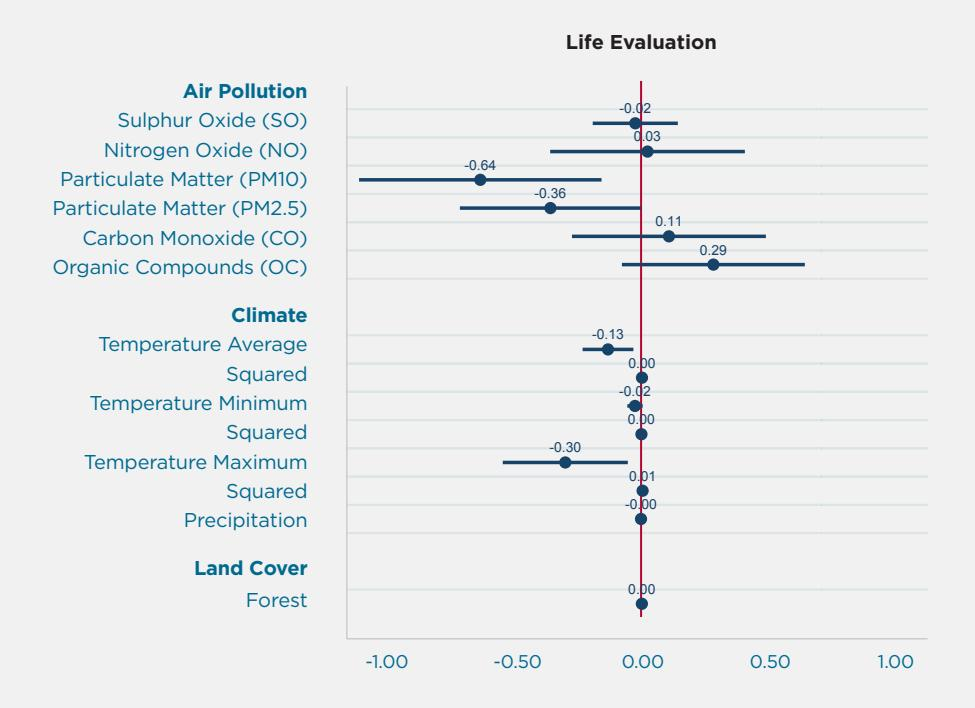

Notes: Plotted coefficients are obtained from separate models regressing life evaluation on each environmental factor alongside controls at the individual, household, and country level. See Table A1 in the Appendix for the full regression table. Confidence bands are 95%.

Sources: Gallup World Poll, 2005 to 2015; OECD Environmental Database; World Bank and World Bank Climate Change Knowledge Portal.

60 grams at the mean) decreases overall life evaluation by about 0.0036 points. Negative effects of air pollution on life evaluation are well-documented in the subjective well-being literature.44 Figures A1 and A2 in the Appendix show that pollutants in most cases fail to significantly change affect, suggesting that how people evaluate their lives overall is more sensitive to air pollution, especially particulate matter, than how they report to feel on a day-to-day basis.

Besides sample compositional effects (the Gallup World Poll oversamples urban areas where particulate matter might be more prevalent), strong effect sizes for particulate matter may be due to its relatively higher salience compared to other, relatively odourless and less noticeable air pollutants. Particulate matter has also featured highly in the media and on the political agenda recently, especially in discussions centring around the surpassing of particulate matter threshold

values in inner cities and bans on diesel cars, which potentially contributes to its salience. Besides indirect, worry-related effects, negative impacts of particulate matter on health have been documented, which may directly contribute to a reduction in overall life evaluation.45

Next, we look at climate. To account for non-linear effects of average, minimum, and maximum temperature per month, we include both the level and the squared term of the respective measure in our regressions. We find that both monthly average and maximum temperature significantly decrease overall life evaluation at the 5% level; monthly minimum temperature seems to matter less for how people evaluate their lives overall. There is some evidence for non-linear relationships between temperatures and life evaluation, but squared terms turn out to be rather small and only statistically significant at the 10% level. Overall, this is suggestive of

a preference for milder climate. Contrary to temperature, average monthly precipitation seems to matter little for life evaluation. Figures A1 and A2 in the Appendix show that the impacts of temperatures on life evaluation are mirrored by impacts on positive (rather than negative) affect. Again, the impact of climate on life evaluation is well-documented.46

When it comes to land cover, and in particular, per-capita area of natural forests, we find that the area of forests in a country has no significant effect on how people evaluate their lives. We find no impacts on how they feel about their lives on a day-to-day basis either. Finally, we studied whether environmental factors influence people's happiness differently depending on whether they live inside or outside cities, but we did not find significant differences: most point estimates are very similar, and where differences exist, they mostly turn out to be insignificant.

So far, we have been looking at how our environment affects our happiness around the world, by linking environmental factors, measured at the country level, to the happiness of survey respondents living in the respective country. However, not everybody is exposed to them in the same

way, and our point estimates implicitly assume that their impacts are immediate to everybody, which is unlikely to be the case. For example, we have had to assume that air pollutants are evenly mixed throughout a country, whereas, for example, particulate concentrations vary strongly with distance to their sources, such as major roads. A more refined analysis is thus needed to link our immediate environment to our happiness. We turn to this type of analysis in the next section.

## **Local Environmental Quality and Happiness in Mega Cities: The Case of London**

We now move from a highly generalised approach which relates country-level averages of happiness to country-level averages of environmental characteristics to a highly specific one, which relates individuals' momentary happiness to characteristics of their immediate environmental surroundings. In doing so, we narrow our geographical focus to a single large city (London) rather than looking across countries, and our treatment of well-being to a momentary hedonic rather than global evaluative measure.51

#### **Natural Land, Scenic Beauty, and Happiness**

Are people who live closer to nature happier? Sampling the happiness of more than 20,000 users of the smartphone app *Mappiness*, who contribute more than one million unique, geo-located data points, and leveraging data on land cover from the UK Centre for Ecology and Hydrology's Land Cover Map 2000, MacKerron and Mourato find that people living in the UK report the highest happiness when outdoors and in natural habitats relative to dense urban areas.47 In particular, they are happiest when close to marine and coastal marginal areas; mountains, moors, and heathland; and woodland. Kopmann and Rehdanz show that this positive relationship holds in 31 European countries, and that people prefer "balanced" over "extreme" allocations of land; that is, they prefer more variety in natural land cover.48 An important channel for the positive relationship between natural land and happiness may be a deep preference of people for nature, which may manifest itself in a preference for certain, more natural landscapes. In fact, Seresinhe et al., using crowdsourced data of ratings of over 200,000 photos of Great Britain and machine learning algorithms to evaluate the scenic beauty of images, show that natural features such as coasts, mountains, and natural canals as well as areas with more tree cover are rated as more scenic.49 Scenic beauty, however, does not seem to be limited exclusively to natural environments but can also relate to the built environment.50

Our data source on well-being is the *Mappiness* study.52 This is a panel data set collected in the UK between 2011 and 2018, using a smartphone app to elicit repeated self-reports of happiness and some key control variables alongside a precise timestamp and GPS location. The full data set comprises around 4.5 million responses from 66,000 volunteers, but we limit this to a subset of approximately half a million responses located in Greater London from about 13,000 respondents. The sample is self-selected, and hence not representative of the country as a whole (for example, the average respondent is somewhat younger, wealthier, and more likely to be in education or employment than the average citizen). Nevertheless, the size and richness of the data enable us to address the link between happiness and the environment in a particularly powerful way.

We join a number of environmental data sets to this well-being data set using the location and/or time of response. All environmental characteristics are coded as one or more binary variables (for example, we split air temperature into 5°C bands between < 0°C and >\_ 25°C).53

*Weather and daylight* Weather is an important environmental characteristic in its own right, and also represents a key control when considering other characteristics. For example, weather conditions may affect both airborne pollutant concentrations and an individual's decision to spend time outdoors and in natural environments. Using data from the UK Met Office Integrated Data Archive System (MIDAS), we link each response with the conditions reported by the weather station nearest to the response location at the nearest available moment to the response time.54 We include data on air temperature, wind speed, precipitation, sunshine, and cloud cover. We also calculate whether there was daylight at the response date, time, and location.55

*Air quality* Air pollution concentrations in Greater London, now and during the period covered by our data set, are relatively high. For example, in 2014, 39 out of 69 monitoring sites recorded a breach of EU objectives for NO2.56 This has substantial impacts on health and mortality.57 We use pollutant concentration maps for 2008, 2010, and 2013 from the London Atmospheric Emissions Inventory (LAEI)58 in conjunction with historical hourly 'Nowcast'

pollutant concentration estimates supplied by the London Air Quality Network (LAQN). These combined data sources enable us to estimate NO2 and PM10 concentrations within a 20m grid cell and for the appropriate date and hour for each response.59 For all air quality variables, we treat the middle 50% of the distribution as the baseline, and create binary variables indicating very low (bottom 5% of estimates), quite low (next 20% upward), very high (top 5%), and quite high (next 20% downward) concentrations.

*Noise* During responses to the *Mappiness* survey, noise levels were measured using the phone's microphone. We include binary variables indicating the top and bottom quartiles of these noise levels. This could be an important control in relation to air pollution, which is likely to be high where there is also greater traffic noise, but is subject to the important caveat that we cannot tell what sources of noise are being measured in each case: these could equally be music, conversation, birdsong, and so on.

*Green spaces* Responses from within green areas, such as parks and allotments, were identified using the Ordnance Survey Open Greenspace data set.60 Responses within areas of street tree cover were recognised via the Street Tree Layer of the European Environment Agency's European Urban Atlas data.61

#### *Blue spaces: ponds, lakes, canals, and rivers*

Binary variables indicating proximity to the tidal River Thames were created using the outline of England and Wales clipped to the high water mark.62 One variable indicates that the respondent is on or within 10m of the river – likely on a bridge, vessel, or bank – while a second indicates that they are within 10 – 50m of either bank. We also create a binary variable for proximity to canals using the Ordnance Survey Open Rivers data set, identifying responses within 20m of each waterway's centreline.63 Finally, we create two binary variables that flag proximity to ponds and lakes using data from the UK Centre for Ecology & Hydrology (CEH) Lakes Portal.64 Like the River Thames variables, these indicate that a response is made either within 10m of the water body, or within 10 – 50m of its banks.

Using *Mappiness* and these other spatial data sources, we estimate multiple regression models similar to those in the earlier section, but at a different scale. Each data point in these regressions is a happiness report by a single individual at a particular moment in time, and we seek to explain that report with reference to the other data available. Descriptive statistics for the environmental variables used are shown in Table A6 of the Appendix.

In order to isolate the impacts of environmental factors from other influences, we include a range of control variables, including a large set of dummy variables to account for temporal variations in momentary happiness.65 Controls also include variables that indicate respondents' choices, such as what respondents are currently doing; whom they are with; whether they are at home, at work, or somewhere else; and whether they are indoors, outdoors, or in a vehicle. In addition, all models control for individual fixed effects. Given that the average *Mappiness* user participates for about six weeks, we regard these fixed effects as adequate controls for personspecific characteristics such as age, gender, marital status, employment status, personality, and so on. Controlling for individual fixed effects means that our models are estimated using only the within-person variation in the data, and this helps us to rule out that effects are caused by selection of different individuals into different environments.66 Finally, we include local-area fixed effects for each of the 983 Middle Layer Super Output Areas (MSOAs) that make up Greater London.67 This helps increase confidence that we are truly picking up the effects of environmental characteristics, rather than many possible correlates that also vary by location (for example, central *versus* suburban areas or property values). Standard errors are clustered accordingly.68

A key issue in analysing environmental influences on subjective well-being is that individuals make choices about the environments in which they spend time. Because these choices may depend on their current well-being and/or current environmental characteristics, estimating causal effects is challenging.69 Our baseline model includes all environmental characteristics for which we have data, only applied for when respondents are outdoors, where these environmental characteristics are more directly

experienced. The results of this model are presented in Figure 5.2. Note that momentary happiness is recorded on a zero-to-100 scale (unlike the Cantril ladder in the previous section, which runs from zero to ten). Variations of our baseline model, and a reduced-choice model that has a stronger causal interpretation but includes a much more limited range of environmental data, are presented in the Appendix to this chapter.

We find that being outdoors in green or blue spaces is predictive of a significant boost in happiness. Responses that are from public green spaces such as parks and allotments are on average approximately one percentage point happier than responses that are not (after taking into account all controls). Happiness responses from areas with street trees show roughly the same increase. Responses from the vicinity of the River Thames or a canal are happier still, by on average 1.3 to 2.2 percentage points. Reported happiness is not significantly different near ponds and lakes (these coefficients are still positive, and it might be that the standard errors are large simply because the sample size is relatively small).

Weather conditions when outdoors also have substantial and intuitive effects. In particular, unbroken sunshine adds nearly two percentage points to happiness, while air temperatures of 25°C or higher add almost three points.70 Conversely, rain and high winds (15 knots and above) are both significantly negative, reducing happiness by close to one percentage point each.

Activities that are typically undertaken outdoors and in nature have the largest effects. Walking or hiking predicts an increase of two percentage points in happiness, while gardening, nature watching, and sporting activities each add on between four and seven points. Finally, simply being outside has a positive association of its own, on top of the environmental interaction effects mentioned above: outdoor responses are just over 1.5 percentage points happier than indoor ones.

We do not see significant effects of either NO2 or PM10 concentrations in our baseline model. Since the health and mortality impacts of air pollution are well-documented, this should not be taken as indicating that air pollution is unimportant for well-being, but rather that the present method is not effective at assessing

**Figure 5.3: Happiness Associations With Environmental Characteristics When Being Outdoors in Greater London**

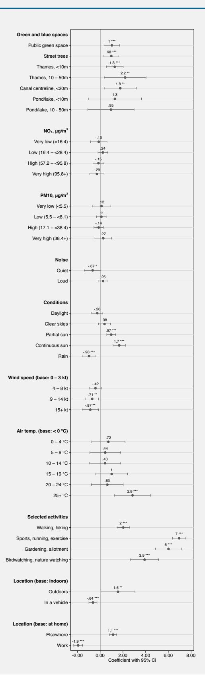

Notes: Plotted coefficients are obtained from a single model, regressing reported happiness (scaled 0 – 100) on environmental factors interacted with being outdoors, alongside controls for additional activities, companionship, date and time, and local-area and individual fixed effects. See Table A4 Model 4 in the Appendix for the full regression results.

Sources: Mappiness data set; London Air Quality Network; OS Open Greenspace; OS Open Rivers; ONS boundary data; EU EEA European Urban Atlas, Street Tree layer; Centre for Ecology & Hydrology, Lakes Portal; UK Met Office.

Confidence bars are at the 95% level.

\* p < 0.1, \*\* p < 0.05, \*\*\* p < 0.01

well-being effects of these pollutants (perhaps because *acute* impacts are limited at the concentrations typically observed in London). The more limited model presented in the Appendix does identify a modest negative impact of middling and high NO2 concentrations, however. We see no influence of noise levels as measured by the respondent's smartphone, except a marginal indication that quiet outdoor environments are less happy, but since noise may be generated by a wide range of different processes this finding does not have a clear interpretation.

Overall, these results support the importance of positive features of the natural environment for individuals' happiness in cities. We find that being in green or blue spaces or a variety of (intuitively pleasant) weather conditions is in each case associated with an increase of one to three percentage points on the happiness scale. Based on earlier research with the *Mappiness* data set,71 these effect sizes are roughly equivalent to those associated with everyday leisure activities (one percentage point is approximately the increase seen for rest and relaxation; two points for washing and dressing, or eating and snacking; and three points for playing computer games,

or playing with pets). On that basis, these environmental effects are of a meaningful size. Since we control for many of the *indirect* benefits that natural environments facilitate, including outdoor leisure activities and interaction with friends and family, the total benefits of these environments are likely even higher. Furthermore, the effects may commonly be combined, so that when people spend time outdoors, near both green and blue space, and in warm and sunny weather, we can expect happiness levels to be elevated further still.

#### **Discussion**

We have seen that people world-wide recognise the importance of the natural environment and its protection to their continued well-being, and the particular threat posed by climate change amongst the wide range of environmental risks we face. Bringing quantitative evidence to this relationship is challenging for three reasons: first, individuals can choose to seek out or avoid particular environmental characteristics, which may obscure their true benefits or costs. Second, *experiences* of the physical environment – such

#### **Green Spaces and Happiness**

Green spaces are beneficial for nearby residents. There is an established evidence base documenting the positive effects of green spaces on residents' health. Besides that, there is growing evidence which shows that there is a significant, positive relationship between the amount of green space around households and the happiness of household members:72 residents living in closer proximity to the nearest green space report, on average, significantly higher life satisfaction. This is especially true for older residents who are presumably less mobile and for whom the immediate, local environment matters relatively more.73 Importantly, unlike with other life circumstances and living conditions, there seems to be little adaptation to green spaces:

green spaces seem to have permanent, positive effects on residential well-being.74 It is unfortunate, then, that there is often an undersupply of green spaces: Krekel et al., for example, document that residents in the 32 major German cities (with inhabitants equal to or greater than 100,000) fall short by about a third of the optimal supply, that is, the life-satisfaction maximising amount, of green spaces.75 A potentially cost-effective way to increase the amount of green spaces in cities is to transform currently vacant land, which is associated with reduced life satisfaction, into green spaces. In densely built cities where no vacant land is available, architectural innovations such as vertical gardens could be used.

as exposure to air pollutants – are often brief and localised, and thus hard to accurately capture, while their *effects* may be cumulative and longterm. And third, environmental changes are typically gradual, non-random, and at least partially anticipated, so that natural experiments are hard to find.

In this chapter, we follow two contrasting approaches to estimating the strength of the relationship between natural environmental quality and happiness, which bring complementary strengths and weaknesses. At the most aggregated level, we analyse averaged environmental quality in relation to well-being levels (both evaluative and experiential) across OECD countries. We find significant effects of climate and air pollutant emissions, and these point in intuitive directions.

At the other end of the scale, we analyse a large panel of individuals' momentary hedonic experi ences of happiness in the range of environments found in one large city: London. Although the data and underlying method are quite different, this second analysis broadly corroborates and extends the first. We find significant weather effects, and strong positive effects of both green and blue spaces on self-reported happiness. We are not able to pick up a clear negative effect of air pollution using this method, however, despite the increasingly well-documented damage it does to physical health. Air pollution seems difficult to adequately quantify when it comes to individuals' momentary experiences of happiness, exposures to air pollution may be brief and not necessarily salient. When it comes to cross-country analyses, findings are sensitive to measures of air pollutants and often correlate with economic activity and levels of development, which may confound the relationship. This point perhaps highlights an important area for future work: improving models to help us understand the total, causal impact of the natural environment on happiness, and in particular, the variety of routes and mechanisms by which this impact is felt, which can range from the satisfaction of basic needs and physical health impacts to socio-cultural influences and aesthetic or spiritual effects.

#### **Endnotes**

- 1 See Guardian (2019a).
- 2 See Guardian (2019b), Guardian (2019c).
- 3 See Guardian (2019d).
- 4 See Guardian (2019e).
- 5 World Bank Group (2018).
- 6 European Bank for Reconstruction and Development (2019).
- 7 There is variation in terms of interview years and regional coverage of these items in the Gallup World Poll. The item on environmental protection *versus* economic growth was asked from 2009 to 2011 in the Commonwealth, Southeast Asia, South Asia, East Asia, and Latin America. The item on satisfaction with efforts to preserve the environment was asked from 2006 to 2018 in all regions. The item on global warming as a threat to oneself or one's family was asked from 2007 to 2010 in all regions. The item on whether life gets harder as a result of climate change was asked from 2007 to 2010 in Europe, the Commonwealth, Southeast Asia, South Asia, East Asia, Latin America, the Middle East, and Sub-Saharan Africa. Although some of these items are not up to date, one can reasonably argue that the importance of the environment to people is generally increasing over time, due to the increasing salience of issues such as climate change. Thus, past responses may be interpreted as lower bounds to potential responses today.
- 8 Stated attitudes towards the environment also translate into pro-environmental behaviour: 62% of respondents state that they tried to use less water in their households, 45% that they avoided using certain products which are known to harm the environment, and 28% that they voluntarily recycled in the past year. Such stated attitudes and behaviours are, of course, to some extent subject to social desirability bias.
- 9 The item on the importance of the environment for well-being and satisfaction was last asked in 1999. The items on worries about environmental protection and climate change were last asked in 2016.
- 10 Brereton et al. (2008).
- 11 Engelbrecht (2009).
- 12 MacKerron & Mourato (2013).
- 13 Smyth et al. (2008); Ambrey & Fleming (2011); Kopmann & Rehdanz (2013); MacKerron & Mourato (2013); Ambrey & Fleming (2014); Krekel et al. (2016); Kuehn et al. (2017); Bertram et al. (2020).
- 14 Rehdanz & Maddison (2008); Lüchinger (2009); Levinson (2012); Ferreira et al. (2013); Ambrey et al. (2014); Zhang et al. (2017a, 2017b).
- 15 van Praag & Baarsma (2005); Rehdanz & Maddison (2008); Weinhold (2013).
- 16 Krekel (n.d); Krekel & Zerrahn (2017); von Möllendorff & Welsch (2017).
- 17 Lüchinger & Raschky (2009); Goebel et al. (2015); Rehdanz et al. (2015).
- 18 Berlemann (2016).
- 19 Welsch (2007); Frey et al. (2010).
- 20 Kahneman et al. (1997).
- 21 Kahneman & Sugden (2005); Welsch & Ferreira (2013).

- 22 Wilson (1984).
- 23 Guite et al. (2006); O'Campo et al. (2009); Annerstedt et al. (2012).
- 24 Wells & Evans (2003); Agyemang et al. (2007); Gidlöf-Gunnarsson & Öhrström (2007); Nielsen & Hansen (2007); Stigsdotter et al. (2010).
- 25 Ulrich (1983, 1984); Ulrich et al. (1991).
- 26 Berman et al. (2008).
- 27 Hartig et al. (2003); Karmanov & Hamel (2008); van den Berg et al. (2010).
- 28 Ulrich (1984).
- 29 Ulrich et al. (1991).
- 30 Kaplan (2001).
- 31 Nisbet & Zelenski (2011).
- 32 de Vries et al. (2003); Maas et al. (2006); Maas et al. (2009).
- 33 Maas et al. (2008); Richardson et al. (2013).
- 34 Takano et al. (2002); Potwarka et al. (2008).
- 35 Leslie & Cerin (2008).
- 36 Kahneman et al. (2004).
- 37 Cantril (1965).
- 38 If not stated otherwise, we use the terms *happiness* and *subjective well-being* interchangeably.
- 39 These countries include Australia, Austria, Belgium, Canada, Chile, the Czech Republic, Denmark, Estonia, Finland, France, Germany, Greece, Hungary, Iceland, Ireland, Israel, Italy, Japan, Latvia, Lithuania, Luxembourg, Mexico, the Netherlands, New Zealand, Norway, Poland, Portugal, Russia, Slovakia, Slovenia, South Korea, Spain, Sweden, Switzerland, Turkey, the UK, and the US.
- 40 OECD (2020).
- 41 World Bank (a).
- 42 World Bank (b).
- 43 Control variables at the individual level include age, gender, marital status, health, education, employment status, household income, and the number of individuals and children in the household. Control variables at the country level include GDP per capita as well as population level and density.
- 44 Rehdanz & Maddison (2008); Lüchinger (2009); Ferreira et al. (2013); Ambrey et al. (2014). Most of these studies look at life satisfaction rather than life evaluation, which is a closely related concept. Items on life satisfaction typically ask respondents how satisfied they are currently with their lives, all things considered. Different from life evaluation, life satisfaction is less prone to social comparisons, which should matter less for environmental factors. In this chapter, therefore, we assume that both life evaluation and life satisfaction refer to the same underlying concept.
- 45 Anderson et al. (2012); Rohr & Wyzga (2012).
- 46 Maddison & Rehdanz (2011); Murray et al. (2013); Lucas & Lawless (2013).
- 47 MacKerron & Mourato (2013).
- 48 Kopmann & Rehdanz (2013).

- 49 Seresinhe et al. (2017).
- 50 Seresinhe et al. (2017, 2019).
- 51 Environmental characteristics such as weather and air quality vary from hour to hour, and individuals generally move to new environments several times a day, so responses to long-term evaluative items such as the Cantril ladder are not informative in this context.
- 52 MacKerron & Mourato (2013, n.d.).
- 53 In general, there are no clear prior expectations regarding the functional forms of the relationships between our well-being and environmental variables: they could be linear, logarithmic, or quadratic, they could exhibit threshold effects, and so on. Since we have a fairly large sample, we address this issue by specifying binary or 'dummy' variables for all environmental characteristics, which separately identify the impact of ranges of values. GPS location is reported, at best, at around +/– 5m accuracy, and to varying degrees all environmental data sources are noisy or imperfect. The effect of this noise in the data is to bias any effects that we pick up in the direction of zero.
- 54 Met Office (2006a, 2006b). We use only those weather stations that provide hourly readings and have a reporting rate of at least 90% during the period covered by our well-being data. This limits us to 33 stations for sunshine duration and 125 stations for all other variables across the UK as a whole. Fewer than 300 responses are lost to missing weather data.
- 55 We use the NOAA sunrise/sunset calculations of the R StreamMetabolism library (Sefick, 2009).
- 56 Mittal et al. (2014).
- 57 Walton et al. (2015).
- 58 Details are available at https://data.london.gov.uk/ air-quality/
- 59 As advised by the LAQN, for each response we take annual average concentrations from the latest LAEI map for the relevant 20m grid cell, then multiply by a scale factor and add an offset parameter, both looked up in the Nowcast data for the date, hour, pollutant species, and base map in question. Other air pollutant species may well be relevant for well-being: for example, PM2.5 may be more strongly associated with negative health outcomes than PM10, and previous work at local authority level has found it to be negatively associated with life satisfaction (Dolan & Laffan, 2016). Only NO2 and PM10 concentrations are available in a form that can be mapped across the city for the main period of Mappiness responses, however.
- 60 The Open Greenspace data set consists of the following classifications: public parks or gardens, play spaces, golf courses, sports areas or playing fields, churchyards or burial grounds, and allotments or community growing spaces (Ordnance Survey, 2018).
- 61 European Environment Agency (2016).
- 62 The tidal River Thames extends through central London and past Richmond Park to Teddington Lock. Boundary data from Office for National Statistics (2011).
- 63 Inspection of satellite imagery for the canals suggests 20m as a generally appropriate bandwidth. The Open Rivers data set includes other inland rivers, but in London many of these run underground, and therefore cannot be expected to influence well-being levels.
- 64 Hughes et al. (2004).

- 65 These time controls are: year, month, the Christmas period (December 24 to 31), day of week, public holidays, hour of day (separately on weekdays and weekends or public holidays) and, since there is an upward trend in subjective well-being with continued use of the app, the number of previous responses made by the same individual, as a third order polynomial.
- 66 In other words, if our results show that green space has a positive impact, we can say that, on average, the same person feels better when they are exposed to green space than when they are not. Conversely, if we did not include fixed effects and if, as is likely, people who respond from areas with different levels of pollution or green space also have different individual characteristics, then any identified differences in well-being according to response environments would have been partly attributable to that variation between the sorts of people who spend time in those environments.
- 67 We use the 2011 MSOAs, each with a population of between 5,000 and 15,000 individuals (Office for National Statistics, n.d.).
- 68 Standard errors are clustered at the individual level to account for correlations between observations from the same individual. Where local-area fixed effects are also included, which are not nested within individuals, standard errors are nevertheless clustered at both individual and local-area level using the method of Correia (2017).
- 69 For example, in terms of well-being, individuals might be likelier to choose to visit green spaces when they are unhappy, in order to cheer themselves up. In that case, a positive effect of green spaces could be partly masked by the negative circumstances that encourage individuals to visit. Or, regarding environmental characteristics, an individual might choose to avoid the most polluted areas of a city during episodes when air pollution is generally high. We can assume that this behavioural adaptation reduces well-being, since it is not what the individual would otherwise have chosen, but our analysis may not fully ascribe those costs to the high levels of air pollution in the most polluted areas since the individual, having modified their behaviour, is not now exposed to those.
- 70 Recall that this is London weather: air temperatures of 25°C or higher are found only in around 1% of observations, and remain under 30°C in over 99.9% of those. We therefore do not have the data that would be needed to assess the happiness impacts of higher temperatures experienced in other parts of the world.
- 71 MacKerron (2012).
- 72 White et al. (2013); Ambrey & Fleming (2014); Bertram & Rehdanz (2015).
- 73 Eibich et al. (2016).
- 74 Alcock et al. (2014).
- 75 Krekel et al. (2016).

#### **References**

Agyemang, C., Hooijdonk, C., Wendel-Vos, W., Lindeman, E., Stronks, K., & Droomers, M. (2007). The association of neighbourhood psychosocial stressors and self-rated health in Amsterdam, The Netherlands. *Journal of Epidemiology and Community Health*, *61*(12), 1042–1049.

Alcock, I., White, M. P., Wheeler, B. W., Fleming, L. E., & Depledge, M. H. (2014). Longitudinal Effects on Mental Health of Moving to Greener and Less Greener Urban Areas. *Environmental Science and Technology*, *48*(2), 1247–1255.

Ambrey, C. L., & Fleming, C. M. (2011). Valuing scenic amenity using life satisfaction data. *Ecological Economics*, *72*, 106–115.

Ambrey, C. L., Fleming, C. M., & Chan, A. Y.C. (2014). Estimating the cost of air pollution in South East Queensland: An application of the life satisfaction non-market valuation approach. *Ecological Economics*, *97*, 172–181.

Ambrey, C. L., & Fleming, C. (2014). Public Greenspace and Life Satisfaction in Urban Australia. *Urban Studies*, *51*(6), 1290–1321.

Anderson, J. O., Thundiyil, J. G., and Stolbach, A. (2012). Clearing the Air: A Review of the Effects of Particulate Matter Air Pollution on Human Health. *Journal of Medical Toxicology*, 8, 166-175.

Annerstedt, M., Östergren, P. O., Björk, J., Grahn, P., Skärbäck, E., & Währborg, G. (2012). Green qualities in the neighbourhood and mental health – results from a longitudinal cohort study in Southern Sweden. *Public Health*, *12*, 337.

Berlemann, M. (2016). Does hurricane risk affect individual well-being? Empirical evidence on the indirect effects of natural disasters. *Ecological Economics*, *124*, 99–113.

Berman, M. G., Jonides, J., & Kaplan, S. (2008). The Cognitive Benefits of Interacting With Nature. *Psychological Science*, *19*(2), 1207–1212.

Bertram, C., & Rehdanz, K. (2015). The role of urban green space for human well-being. *Ecological Economics*, *120*, 139–152.

Bertram, C., Goebel, J., Krekel, C., & Rehdanz, K. (2020). Urban Land Use Fragmentation and Human Wellbeing. *Kiel Working Papers*, *2147*.

Brereton, F., Clinch, J.P., & Ferreira, S. (2008). Happiness, geography and the environment. *Ecological Economics*, *65*(2), 386–396.

Bryson, A., & MacKerron, G. (2017). Are You Happy While You Work? *Economic Journal*, *127*(599), 106–125.

Cantril, H. (1965). *The pattern of human concerns*. Rutgers University Press.

Clark, A. E., Flèche, S., Layard, R., Powdthavee, N., & Ward, G. (2018). *The Origins of Happiness: The Science of Well-Being Over the Life Course*. Princeton University Press.

Correia (2017). 'REGHDFE: Stata module for linear and instrumental-variable/GMM regression absorbing multiple levels of fixed effects'. Statistical Software Components S457874, Boston College Department of Economics. https://ideas.repec. org/c/boc/bocode/s457874.html

de Vries, S., Verheij, R. A., Groenewegen, P. P., & Spreeuwenberg, P. (2003). Natural Environments – Healthy Environments? An Exploratory Analysis of the Relationship between Greenspace and Health. *Environment and Planning A: Economy and Space*, *35*(10), 1717–1731.

Dolan, P., & K. Laffan (2016) "Bad air days: The effects of air quality on different measures of subjective well-being," *Journal of Benefit-Cost Analysis*, 7(1), 147–195.

Eibich, P., Krekel, C., Demuth, J., & Wagner, G. (2016). Associations between Neighborhood Characteristics, Well-Being and Health Vary over the Life Course. *Gerontology*, *62*(3), 362–370.

Engelbrecht, H.J. (2009). Natural capital, subjective well-being, and the new welfare economics of sustainability. *Ecological Economics*, *69*, 380–388.

European Bank for Reconstruction and Development (2019). *European Bank for Reconstruction and Development, Annual Review 2018*.

European Environment Agency (2016). *Urban Atlas, Street Tree Layer 2012*. European Environment Agency Copernicus Programme. Online: https://land.copernicus.eu/local/urbanatlas/street-tree-layer-stl

Ferreira, S., Akay, A., Brereton, F., Cuñado, J., Martinsson, P., Moro, M., & Ningal, T. F. (2013). Life satisfaction and air quality in Europe. *Ecological Economics*, *88*, 1–10.

Frey, B. S., Lüchinger, L., & Stutzer, S. (2010). The Life Satisfaction Approach to Environmental Valuation. *Annual Review of Resource Economics*, *2*, 139–160.

Frijters, P., Clark, A., Krekel, C., & Layard, R. (2019). A happy choice: Wellbeing as the goal of government. *Behavioural Public Policy*.

Gidlöf-Gunnarsson, A., & Öhrström, E. (2007). Noise and well-being in urban residential environments: The potential role of perceived availability to nearby green areas. *Landscape and Urban Planning*, *83*(2–3), 115–126.

Goebel, J., Krekel, C., Tiefenbach, T., & Ziebarth, N. R. (2015). How natural disasters can affect environmental concerns, risk aversion, and even politics: Evidence from Fukushima and three European countries. *Journal of Population Economics*, *28*(4), 1137–1180.

Guardian (2019a). *School climate strikes: 1.4 million people took part, say campaigners*, Online: http://www.theguardian.com/ environment/2019/mar/19/school-climate-strikes-more-than-1 million-took-part-say-campaigners-greta-thunberg, last accessed 09/07/2019.

Guardian (2019b), *Thousands block roads in Extinction Rebellion protests across London*, Online: http://www.theguardian. com/environment/2019/apr/15/thousands-expected-in-londonfor-extinction-rebellion-protest, last accessed 09/07/2019.

Guardian, (2019c). *Extinction Rebellion arrests pass 1,000 on eighth day of protests*, Online: http://www.theguardian.com/ environment/2019/apr/22/people-arrested-at-londonclimate-protests, last accessed 09/07/2019.

Guardian (2019d). *Greens surge as parties make strongest ever showing across Europe*, Online: http://www.theguardian.com/ politics/2019/may/26/greens-surge-as-parties-make-strongestever-showing-across-europe, last accessed 09/07/2019.

Guardian (2019e). *UK citizens' assembly on climate emergency announced*, Online: http://www.theguardian.com/environment /2019/jun/20/uk-citizens-assembly-on-climate-emergencyannounced, last accessed 09/07/2019.

Guite, H. F., Clark, C., & Ackrill, G. (2006). The Impact of the Physical and Urban Environment on Mental Well-Being. *Public Health*, *120*(12), 1117–1126.

Hartig, T., Evans, G. W., Jamner, L. D., Davis, D. S., & Gärling, T. (2003). Tracking restoration in natural and urban field settings. *Journal of Environmental Psychology*, *23*(2), 109–123.

Hughes, M., Hornby, D. D., Bennion, H., Kernan, M., Hilton, J., Phillips, G., & Thomas, R. (2004). The Development of a GIS-based Inventory of Standing Waters in Great Britain together with a Risk-based Prioritisation Protocol. Water, Air and Soil Pollution: Focus, 4(2), 73–84.

Kahneman, D., & Sugden, R. (2005). Experienced Utility as a Standard of Policy Evaluation. *Environmental and Resource Economics*, *32*(1), 161–181.

Kahneman, D., Krueger, A. B., Schkade, D. A., Schwarz, N., & Stone, A. A. (2004). A Survey Method for Characterizing Daily Life Experience: The Day Reconstruction Method. *Science*, *306*(5702), 1776–1780.

Kahneman, D., Wakker, P. P., & Sarin, R. (1997). Back to Bentham? Explorations of Experienced Utility. *Quarterly Journal of Economics*, *112*(2), 375–405.

Kaplan, R. (2001). The Nature of the View from Home: Psychological Benefits. *Environment and Behavior*, *33*(4), 507–542.

Karmanov, D., & Hamel, R. (2008). Assessing the restorative potential of contemporary urban environment(s): Beyond the nature versus urban dichotomy. *Landscape and Urban Planning*, *86*(2), 115–125.

Kopmann, A., & Rehdanz, K. (2013). A human well-being approach for assessing the value of natural land areas. *Ecological Economics*, *93*, 20–33.

Krekel, C. (n.d). Valuing Energy Infrastructure Externalities Using Wellbeing and Hedonic Price Data: The Case of Wind Turbines. In D. Maddison, K. Rehdanz, & H. Welsch (Eds.), *Handbook on Wellbeing, Happiness and the Environment*. Edward Elgar, *forthcoming*.

Krekel, C., & Zerrahn, A. (2017). Does the presence of wind turbines have negative externalities for people in their surroundings? Evidence from well-being data. *Journal of Environmental Economics and Management*, *82*, 221–238.

Krekel, C., Kolbe, J., & Wüstemann, H. (2016). The greener, the happier? The effect of urban land use on residential well-being. *Ecological Economics*, *121*, 117–127.

Kuehn, S., Duezel, S., Eibich, P., Krekel, C., Wuestemann, H., Kolbe, J., Martensson, J., Goebel, J., Gallinat, J., Wagner, G. G., & Lindenberger, U. (2017). In search of features that constitute an 'enriched environment' in humans: Associations between geographical properties and brain structure. *Nature: Scientific Reports*, *7*(11920), 1–8.

Leslie, E., & Cerin, E. (2008). Are perceptions of the local environment related to neighbourhood satisfaction and mental health in adults? *Preventive Medicine*, *47*(3), 273–278.

Levinson, A. (2012). Valuing public goods using happiness data: The case of air quality. *Journal of Public Economics*, *96*(9–10), 869–880.

Lucas, R. E., & Lawless, N. M. (2013). Does life seem better on a sunny day? Examining the association between daily weather conditions and life satisfaction judgments. *Journal of Personality and Social Psychology*, *104*(5), 872–878.

Lüchinger, S. (2009). Valuing Air Quality Using the Life Satisfaction Approach. *Economic Journal*, *119*(536), 482–515.

Lüchinger, S., & Raschky, P. (2009). Valuing flood disasters using the life satisfaction approach. *Journal of Public Economics*, *93*, 620–633.

Maas, J., Verheij, R. A., Groenewegen, P. P., Vries, S., & Spreeuwenberg, P. (2006). Green space, urbanity, and health: How strong is the relation? *Journal of Epidemiology and Community Health*, *60*(7), 587–592.

Maas, J., Verheij, R. A., Spreeuwenberg, P., & Groenewegen, P. P. (2008). Physical activity as a possible mechanism behind the relationship between green space and health: A multilevel analysis. *Public Health*, *8*, 260–273.

Maas, J., Verheij, R. A., Vries, S., Spreeuwenberg, P., Schellevis, F. G., & Groenewegen, P. P. (2009). Morbidity is related to a green living environment. *Journal of Epidemiology and Community Health*, *63*(12), 967–973.

MacKerron, G. (2012). *Happiness and Environmental Quality*. PhD thesis, London School of Economics and Political Science. Online: http://etheses.lse.ac.uk/383

MacKerron, G., & Mourato, S. (2013). Happiness is greater in natural environments. *Global Environmental Change*, *23*, 992–1000.

MacKerron, G., & Mourato, S. (n.d.). Mappiness: Natural environments and in-the-moment happiness. In D. Maddison, K. Rehdanz, & H. Welsch (Eds.), *Handbook on Wellbeing, Happiness and the Environment*. Edward Elgar, forthcoming.

Maddison, D., & Rehdanz, K. (2011). The impact of climate on life satisfaction. *Ecological Economics*, *70*(12), 2437–2445.

Met Office (2006a). *MIDAS UK hourly rainfall data*. NCAS British Atmospheric Data Centre.

Met Office (2006b). *MIDAS UK hourly weather observation data*. NCAS British Atmospheric Data Centre.

Mittal, L., T. Bakerand, & G. Fuller (2014). *London Air Quality Network Summary Report 2014*, Environmental Research Group, King's College London. Online: https://www.londonair. org.uk/london/reports/2014\_LAQN\_Summary\_Report.pdf

Morbidity is related to a green living environment. *Journal of Epidemiology and Community Health*, *63*(12), 967–973.

Morton, D., Rowland, C., Wood, C., Meek, L., Marston, C., & Smith, G. (2011). Final report for LCM2007—The new UK land cover map. *NERC/Centre for Ecology & Hydrology Countryside Survey Technical Report*, *11*(07).

Murray, T., Maddison, D., & Rehdanz, K. (2013). Do Geographical Variations in Climate Influence Life-Satisfaction? *Climate Change Economics*, *4*(1).

Nielsen, T. S., & Hansen, K. B. (2007). Do green areas affect health? Results from a Danish survey on the use of green areas and health indicators. *Health and Place*, *13*(4), 839–850.

Nisbet, E. K., & Zelenski, J. M. (2011). Underestimating Nearby Nature: Affective Forecasting Errors Obscure the Happy Path to Sustainability. *Psychological Science*, *22*(9), 1101–1106.

O'Campo, P., Salmon, C., & Burke, J. (2009). Neighbourhoods and mental well-being: What are the pathways? *Health and Place*, *15*(1), 56–58.

OECD (2020). *Environment: Air and climate*, Online: https:// data.oecd.org/environment.htm, last accessed 08/01/2020.

Office for National Statistics (2011). *2011 Census: Boundary data (England and Wales)*, 2011 Census: boundary data (England and Wales). UK Data Service. SN:5819 UKBORDERS: Digitised Boundary Data, 1840.

Office for National Statistics (n.d.). Census Geography. Online:

https://www.ons.gov.uk/methodology/geography/ ukgeographies/censusgeography

Ordnance Survey (2018). *OS Open Greenspace: Technical specification*, 2018. https://www.ordnancesurvey.co.uk/ documents/os-open-greenspace-technical-specification.pdf

Potwarka, L. R., Kaczynski, A. T., & Flack, A. L. (2008). Places to Play: Association of Park Space and Facilities with Healthy Weight Status among Children. *Journal of Community Health*, *33*(5), 344–350.

Rehdanz, K., & Maddison, D. (2008). Local environmental quality and life-satisfaction in Germany. *Ecological Economics*, *64*(4), 787–797.

Rehdanz, K., Welsch, H., Narita, D., & Okubo, T. (2015). Wellbeing effects of a major natural disasters: The case of Fukushima. *Journal of Economic Behavior & Organization*, *116*, 500–517.

Richardson, E. A., Pearce, J., Mitchell, R., & Kingham, S. (2013). Role of physical activity in the relationship between urban green space and health. *Public Health*, *127*(4), 318–324.

Rohr, A. C., and Wyzga, R. E. (2012). Attributing health effects to individual particulate matter constituents. *Atmospheric Environment*, 62, 130-152.

Sefick S. A. Jr., 2009, Stream Metabolism: A package for calculating single station metabolism from diurnal oxygen curves. CRAN repository. http://CRAN.R-project.org/package=StreamMetabolism

Seresinhe, C., Preis, T., & Moat, H. (2017). Using deep learning to quantify the beauty of outdoor places. *Royal Society Open Science*, *4*(7), 170.

Seresinhe, C., Preis, T., MacKerron, G., & Moat, H. (2019). Happiness is Greater in More Scenic Locations. *Nature: Scientific Reports*, *9*(1), 4498.

Smyth, R., Mishra, V., & Qian, X. (2008). The Environment and Well-Being in Urban China. *Ecological Economics*, *68*(1–2), 547–555.

Stigsdotter, U. K., Ekholm, O., Schipperijn, J., Toftager, M., Kamper-Jorgensen, F., & Randrup, T. B. (2010). Health promoting outdoor environments – Associations between green space, and health, health-related quality of life and stress based on a Danish national representative survey. *Scandinavian Journal of Public Health*, *38*(4), 411–417.

Takano, T., Nakamura, K., & Watanabe, M. (2002). Urban residential environments and senior citizens' longevity in megacity areas: The importance of walkable green spaces. *Journal of Epidemiology and Community Health*, *56*(12), 913–918.

Ulrich, R. S. (1983). Aesthetic and Affective Response to Natural Environment. In I. Altman & J. F. Wohlwill (Eds.), *Behavior and the Natural Environment. Human Behavior and Environment (Advances in Theory and Research)*. Springer.

Ulrich, R. S. (1984). View through a window may influence recovery from surgery. *Science*, *224*(4647), 420–421.

Ulrich, R. S., Simons, R. F., Losito, B. D., Fiorito, E., Miles, M. A., & Zelson, M. (1991). Stress recovery during exposure to natural and urban environments. *Journal of Environmental Psychology*, *11*(3), 201–230.

van den Berg, A. E., Maas, J., Verheij, R. A., & Groenewegen, P. P. (2010). Green space as a buffer between stressful life events and health. *Social Science & Medicine*, *70*(8), 1203–1210.

van Praag, B. M. S., & Baarsma, B. E. (2005). Using Happiness Surveys to Value Intangibles: The Case of Airport Noise. *Economic Journal*, *115*(500), 224–246.

von Möllendorff, C., & Welsch, H. (2017). Measuring Renewable Energy Externalities: Evidence from Subjective Well-being Data. *Land Economics*, *93*(1), 109–126.

Walton, H., D. Dajnak, S. Beevers, M. Williams, P. Watkiss, & A. Hunt (2015). *Understanding the Health Impacts of Air Pollution in London*, Environmental Research Group, King's College London, for Transport for London and the Greater London Authority. Online:

https://www.kcl.ac.uk/lsm/research/divisions/aes/research/ ERG/research-projects/HIAinLondonKingsReport14072015final. pdf

Weinhold, D. (2013). The Happiness-Reducing Costs of Noise Pollution. *Journal of Regional Science*, *53*(2), 292–303.

Wells, N. M., & Evans, G. W. (2003). Nearby Nature: A Buffer of Life Stress among Rural Children. *Environment and Behavior*, *35*(3), 311–330.

Welsch, H. (2007). Environmental welfare analysis: A life satisfaction approach. *Ecological Economics*, *62*(3–4), 544–551.

Welsch, H., & Ferreira, S. (2013). Environment, Well-Being, and Experienced Preference. *International Review of Environmental and Resource Economics*, *7*, 205–238.

White, M. P., Alcock, I., Wheeler, B. W., & Depledge, M. H. (2013). Would You Be Happier Living in a Greener Urban Area? A Fixed-Effects Analysis of Panel Data. *Psychological Science*, *24*(6), 920–928.

Wilson, E. O. (1984). *Biophilia*. Harvard University Press.

World Bank Group (2018). *Annual Report 2018: Ending Poverty. Investing in Opportunity*.

World Bank (a). *DataBank*. Online: http://climateknowledgeportal. worldbank.org/download-data, last accessed 08/01/2020.

World Bank (b). *Climate Change Knowledge Portal*. Online: http://climateknowledgeportal.worldbank.org/download-data, last accessed 08/01/2020.

Zhang, X., Zhang, X., & Chen, X. (2017a). Happiness in the air: How does a dirty sky affect mental health and subjective well-being. *Journal of Environmental Economics and Management*, *85*, 81–94.

Zhang, X., Zhang, X., & Chen, X. (2017b). Valuing Air Quality Using Happiness Data: The Case of China. *Ecological Economics*, *137*, 29–36.

## Chapter 5 Appendix

## **Local Environmental Quality and Happiness in Mega Cities: Additional Regression Models**

As noted in the main text of the chapter, we estimate several variations of our principal model, plus a reduced-choice model that has a stronger causal interpretation but includes a much more limited range of environmental data.

Four variations of the main model are presented in Table A4. These arise from the combination of two treatments: first, whether or not we include local-area (MSOA) fixed effects; and second, whether or not we interact all environmental characteristics with being outdoors. The inclusion of local-area fixed effects makes little difference to the results, which is encouraging for the robustness of our findings. The interaction of environmental characteristics with being outdoors is important, however. In the absence of the interaction, there are few significant effects. Presumably this is because weather, green space, and so on do not strongly affect people in the indoor environments in which they spend most of their time. By contrast, most environmental characteristics do show significant effects in interaction with being outdoors, where people experience them more directly. The discussion in the main text is focused on Model 4 in Table A4, which has both local-area fixed effects and environmental characteristics interacted with being outdoors.

Our 'low-choice' model is presented in Table A5. In terms of environmental characteristics, it includes only weather conditions and average air pollution concentrations, measured at the level of the city as a whole. We take weather observations from a single weather station (London Heathrow airport) at the nearest available time and within two hours before/after the response, and we link each response with London Air Quality Network (LAQN) estimates of background NO2 and PM10 concentrations across London as a whole for the relevant date and hour. We deliberately exclude other environmental characteristics, such as green space, and other controls, such as activity and location, over which individuals have a high degree of choice. An element of choice, however, remains – individuals might choose to escape the city entirely, or wear a face mask to filter out

pollution, for example – but the effects estimated in the low-choice model should nevertheless bear somewhat stronger causal interpretation.

Weather effects in the low-choice model are very similar to those of the main models that interact weather conditions with being outdoors, but with the effect sizes somewhat reduced, as we might expect. Happiness is increased, and by increasing margins, by cloudless skies, partial sun, and continuous sunshine. The latter adds almost one percentage point of happiness compared to no sun at all. Happiness is also higher by just over one percentage point when the air temperature exceeds 25°C compared to temperatures below freezing. Happiness falls slightly as wind speeds rise, so that at 15 knots or more, happiness is slightly over half a percentage point lower than in still conditions. The effects of daylight and rain are not significantly different from zero in this specification.

As regards air quality, in the low-choice model low NO2 is associated with a modest increase in reported happiness: responses subject to the lowest pollutant concentrations (the bottom 5%) are 0.34 percentage points happier than those at the middle quartiles, and those subject to low concentrations (the next 20%) are 0.16 percentage points happier. This is a small but meaningful boost in well-being. Neither low nor high concentrations of PM10 are seen to affect happiness at the 5% significance level (though there does appear to be a modest *upward* trend with increasing concentration, which is not intuitive). Note that the NO2 and PM10 variables are not strongly correlated, and results obtained when they are entered separately in their own regressions (not shown) differ little from these ones.

Table A7 presents some additional regression estimates supporting Chapter 1. In this model, which is run for the full sample (not just Greater London responses), all activities are interacted both with being with friend(s) and with being with a partner.

Figure A1: How Environmental Quality Affects Positive Affect Around the World

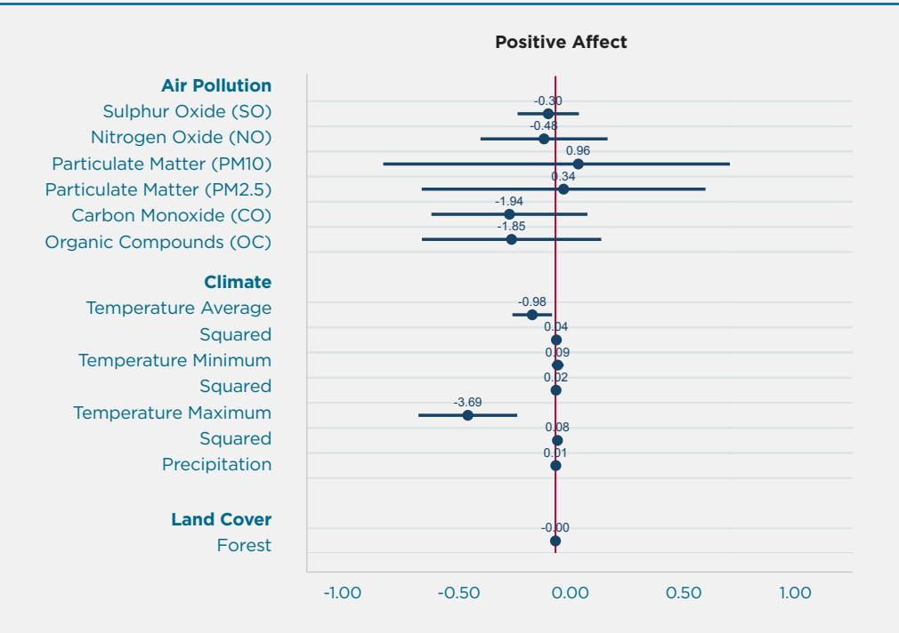

Notes: Plotted coefficients are obtained from separate models regressing positive affect on each environmental factor alongside controls at the individual, household, and country level. See Table A2 in this Appendix for the full regression table. Confidence bands are 95%.

Figure A2: How Environmental Quality Affects Negative Affect Around the World

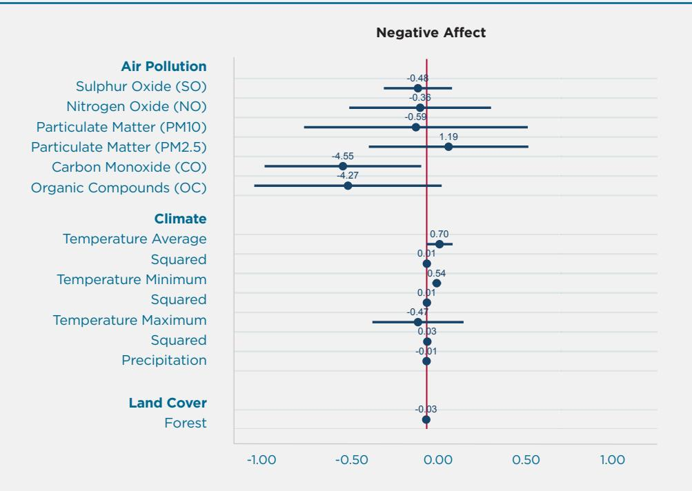

Notes: Plotted coefficients are obtained from separate models regressing negative affect on each environmental factor alongside controls at the individual, household, and country level. See Table A3 in this Appendix for the full regression table. Confidence bands are 95%.

**Figure A3: Happiness Impacts of Air Quality and Weather Conditions in Greater London, UK: Low-Choice Model**

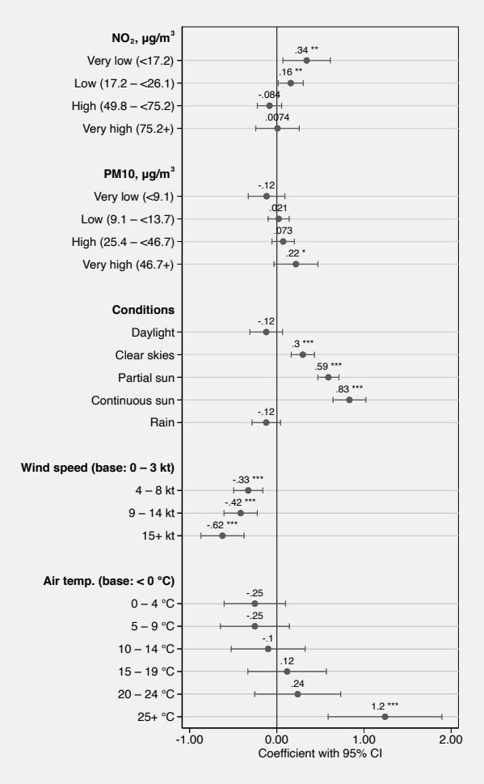

*Figure A3. Happiness impacts of air quality and weather conditions in Greater London, UK: low-*

Notes: Plotted coefficients are obtained from a single model (see Table A4), regressing reported happiness (scaled 0 – 100) on all environmental factors, alongside date and time controls and individual fixed effects.

Sources: Mappiness data set; London Air Quality Network; UK Met Office.

Confidence bands are at the 95% level.

\* p < 0.1, \*\* p < 0.05, \*\*\* p < 0.01

**Table A1: How Environmental Quality Affects Life Evaluation Around the World** 

|                            | Life Evaluation       |                       |                       |                       |                       |  |
|----------------------------|-----------------------|-----------------------|-----------------------|-----------------------|-----------------------|--|
|                            | (1)                   | (2)                   | (3)                   | (4)                   | (5)                   |  |
| Air Pollution              |                       |                       |                       |                       |                       |  |
| Sulphur Oxide (SO)         | -0.0230 (0.0829)   |                       |                       |                       |                       |  |
| Nitrogen Oxide (NO)        |                       | 0.0255 (0.190)     |                       |                       |                       |  |
| Particulate Matter (PM10)  |                       |                       | -0.637** (0.235)   |                       |                       |  |
| Particulate Matter (PM2.5) |                       |                       |                       | -0.359** (0.176)   |                       |  |
| Carbon Monoxide (CO)       |                       |                       |                       |                       | 0.110 (0.189)      |  |
| Organic Compounds (OC)     |                       |                       |                       |                       |                       |  |
| Climate                    |                       |                       |                       |                       |                       |  |
| Temperature Average        |                       |                       |                       |                       |                       |  |
| Squared                    |                       |                       |                       |                       |                       |  |
| Temperature Minimum        |                       |                       |                       |                       |                       |  |
| Squared                    |                       |                       |                       |                       |                       |  |
| Temperature Maximum        |                       |                       |                       |                       |                       |  |
| Squared                    |                       |                       |                       |                       |                       |  |
| Precipitation              |                       |                       |                       |                       |                       |  |
| Land Cover                 |                       |                       |                       |                       |                       |  |
| Forest                     |                       |                       |                       |                       |                       |  |
| Controls                   |                       |                       |                       |                       |                       |  |
| Age                        | -0.0617***            | -0.0617***            | -0.0606***            | -0.0595***            | -0.0614***            |  |
|                            | (0.00463)             | (0.00464)             | (0.00521)             | (0.00531)             | (0.00457)             |  |
| Age Squared                | 0.000610***           | 0.000610***           | 0.000586***           | 0.000577***           | 0.000608***           |  |
|                            | (4.75e-05)            | (4.77e-05)            | (5.37e-05)            | (5.51e-05)            | (4.75e-05)            |  |
| Is Female                  | 0.172***              | 0.172***              | 0.170***              | 0.170***              | 0.171***              |  |
|                            | (0.0163)              | (0.0164)              | (0.0152)              | (0.0152)              | (0.0159)              |  |
| Is Partnered               | 0.115***              | 0.113***              | 0.108***              | 0.104***              | 0.112***              |  |
|                            | (0.0302)              | (0.0300)              | (0.0324)              | (0.0322)              | (0.0308)              |  |
| Is Separated               | -0.172***             | -0.172***             | -0.176***             | -0.180***             | -0.175***             |  |
|                            | (0.0230)              | (0.0234)              | (0.0258)              | (0.0244)              | (0.0224)              |  |
| Is Widowed                 | -0.225*** (0.0478) | -0.226*** (0.0477) | -0.229*** (0.0471) | -0.235*** (0.0469) | -0.229*** (0.0466) |  |
| Has Health Problem         | -0.722***             | -0.723***             | -0.713***             | -0.719***             | -0.727***             |  |
|                            | (0.0326)              | (0.0324)              | (0.0360)              | (0.0358)              | (0.0319)              |  |
|                            | -0.470***             | -0.470***             | -0.450***             | -0.444***             | -0.469***             |  |
|                            |                       |                       |                       |                       |                       |  |
| Has Primary Education      | (0.0754)              | (0.0755)              | (0.0752)              | (0.0782)              | (0.0734)              |  |
| Has Tertiary Education     | 0.238***              | 0.238***              | 0.268***              | 0.258***              | 0.239***              |  |

|                          | (6)                      | (7)                      | (8)                      | (9)                      | (10)                     | (11)                     |
|--------------------------|--------------------------|--------------------------|--------------------------|--------------------------|--------------------------|--------------------------|
|                          |                          |                          |                          |                          |                          |                          |
|                          |                          |                          |                          |                          |                          |                          |
|                          |                          |                          |                          |                          |                          |                          |
|                          |                          |                          |                          |                          |                          |                          |
|                          |                          |                          |                          |                          |                          |                          |
|                          |                          |                          |                          |                          |                          |                          |
|                          |                          |                          |                          |                          |                          |                          |
| 0.110                    |                          |                          |                          |                          |                          |                          |
| (0.189)                  |                          |                          |                          |                          |                          |                          |
|                          | 0.287                    |                          |                          |                          |                          |                          |
|                          | (0.178)                  |                          |                          |                          |                          |                          |
|                          |                          | -0.131**                 |                          |                          |                          |                          |
|                          |                          | (0.0495)                 |                          |                          |                          |                          |
|                          |                          | 0.00354*                 |                          |                          |                          |                          |
|                          |                          | (0.00193)                |                          |                          |                          |                          |
|                          |                          |                          | -0.0242                  |                          |                          |                          |
|                          |                          |                          | (0.0150) 0.00134      |                          |                          |                          |
|                          |                          |                          | (0.00120)                |                          |                          |                          |
|                          |                          |                          |                          | -0.300**                 |                          |                          |
|                          |                          |                          |                          | (0.122)                  |                          |                          |
|                          |                          |                          |                          | 0.00602*                 |                          |                          |
|                          |                          |                          |                          | (0.00299)                |                          |                          |
|                          |                          |                          |                          |                          | -0.000297 (0.000938)  |                          |
|                          |                          |                          |                          |                          |                          |                          |
|                          |                          |                          |                          |                          |                          | 0.00307                  |
|                          |                          |                          |                          |                          |                          | (0.00694)                |
|                          |                          |                          |                          |                          |                          |                          |
| -0.0614***               | -0.0611***               | -0.0595***               | -0.0599***               | -0.0607***               | -0.0618***               | -0.0640***               |
| (0.00457) 0.000608*** | (0.00462) 0.000604*** | (0.00491) 0.000585*** | (0.00477) 0.000591*** | (0.00466) 0.000595*** | (0.00459) 0.000611*** | (0.00516) 0.000627*** |
| (4.75e-05)               | (4.76e-05)               | (5.18e-05)               | (5.05e-05)               | (4.89e-05)               | (4.68e-05)               | (5.46e-05)               |
| 0.171***                 | 0.171***                 | 0.174***                 | 0.173***                 | 0.174***                 | 0.172***                 | 0.175***                 |
| (0.0159)                 | (0.0162)                 | (0.0163)                 | (0.0165)                 | (0.0159)                 | (0.0161)                 | (0.0158)                 |
| 0.112***                 | 0.111***                 | 0.118***                 | 0.113***                 | 0.122***                 | 0.113***                 | 0.117***                 |
| (0.0308)                 | (0.0304)                 | (0.0288)                 | (0.0302)                 | (0.0273)                 | (0.0303)                 | (0.0302)                 |
| -0.175***                | -0.177***                | -0.174***                | -0.178***                | -0.166***                | -0.173***                | -0.178***                |
| (0.0224)                 | (0.0240)                 | (0.0221)                 | (0.0227)                 | (0.0195)                 | (0.0219)                 | (0.0253)                 |
| -0.229***                | -0.230***                | -0.207***                | -0.217***                | -0.206***                | -0.226***                | -0.224***                |
|                          | (0.0479)                 | (0.0379)                 | (0.0402)                 | (0.0403)                 | (0.0475)                 | (0.0470)                 |
|                          | -0.726***                | -0.735***                | -0.733***                | -0.725***                | -0.723***                | -0.724***                |
|                          | (0.0325)                 | (0.0310)                 | (0.0318)                 | (0.0288)                 | (0.0324)                 | (0.0333)                 |
|                          | -0.467***                | -0.438***                | -0.449***                | -0.448***                | -0.472***                | -0.475***                |
|                          | (0.0752)                 | (0.0605)                 | (0.0624)                 | (0.0615)                 | (0.0749)                 | (0.0807)                 |
|                          | 0.239***                 | 0.223***                 | 0.230***                 | 0.216***                 | 0.237***                 | 0.247***                 |
|                          | (0.0337)                 | (0.0389)                 | (0.0371)                 | (0.0358)                 | (0.0339)                 | (0.0377)                 |

**Table A1: How Environmental Quality Affects Life Evaluation Around the World** (continued)

|                                    | Life Evaluation |             |              |              |             |  |
|------------------------------------|-----------------|-------------|--------------|--------------|-------------|--|
|                                    | (1)             | (2)         | (3)          | (4)          | (5)         |  |
| Is Part-Time Employed              | 0.234***        | 0.236***    | 0.234***     | 0.233***     | 0.238***    |  |
|                                    | (0.0246)        | (0.0249)    | (0.0233)     | (0.0224)     | (0.0244)    |  |
| Is Underemployed                   | -0.274***       | -0.273***   | -0.272***    | -0.266***    | -0.269***   |  |
|                                    | (0.0436)        | (0.0440)    | (0.0423)     | (0.0427)     | (0.0426)    |  |
| Is Self-Employed                   | 0.0697*         | 0.0694*     | 0.0689*      | 0.0655*      | 0.0733**    |  |
|                                    | (0.0349)        | (0.0356)    | (0.0365)     | (0.0371)     | (0.0344)    |  |
| Is Unemployed                      | -0.729***       | -0.729***   | -0.763***    | -0.759***    | -0.722***   |  |
|                                    | (0.0432)        | (0.0439)    | (0.0448)     | (0.0464)     | (0.0397)    |  |
| Is Out of Labour Force             | -0.0299         | -0.0298     | -0.0273      | -0.0268      | -0.0279     |  |
|                                    | (0.0282)        | (0.0291)    | (0.0303)     | (0.0303)     | (0.0286)    |  |
| Annual Household Income            | 0.534***        | 0.535***    | 0.514***     | 0.525***     | 0.534***    |  |
|                                    | (0.0694)        | (0.0696)    | (0.0705)     | (0.0716)     | (0.0700)    |  |
| Number of Individuals in Household | -0.0589***      | -0.0584***  | -0.0595***   | -0.0569***   | -0.0586***  |  |
|                                    | (0.0168)        | (0.0168)    | (0.0170)     | (0.0176)     | (0.0167)    |  |
| Has Children in Household          | 0.0657***       | 0.0660***   | 0.0625***    | 0.0637***    | 0.0652***   |  |
|                                    | (0.0144)        | (0.0146)    | (0.0140)     | (0.0142)     | (0.0140)    |  |
| Is Urban                           | -0.0451*        | -0.0463*    | -0.0498*     | -0.0517*     | -0.0459*    |  |
|                                    | (0.0263)        | (0.0251)    | (0.0285)     | (0.0291)     | (0.0263)    |  |
| GDP Per Capita                     | 2.12e-05        | 2.13e-05*   | 1.83e-05     | 1.92e-05*    | 2.21e-05    |  |
|                                    | (1.32e-05)      | (1.21e-05)  | (1.08e-05)   | (1.12e-05)   | (1.34e-05)  |  |
| Population Density                 | 0.00106         | 0.00111     | -0.00120     | -0.000365    | 0.00129*    |  |
|                                    | (0.000708)      | (0.000725)  | (0.00102)    | (0.000916)   | (0.000697)  |  |
| Population Level                   | -2.15e-09**     | -2.06e-09** | -4.48e-09*** | -3.24e-09*** | -2.04e-09** |  |
|                                    | (8.00e-10)      | (7.99e-10)  | (1.06e-09)   | (8.61e-10)   | (7.75e-10)  |  |
| Observations                       | 258,212         | 258,212     | 231,695      | 231,695      | 258,212     |  |
| Adjusted R Squared                 | 0.224           | 0.224       | 0.231        | 0.229        | 0.224       |  |
| Constant                           | Yes             | Yes         | Yes          | Yes          | Yes         |  |
| Region Fixed Effects               | Yes             | Yes         | Yes          | Yes          | Yes         |  |
| Year Fixed Effects                 | Yes             | Yes         | Yes          | Yes          | Yes         |  |
| Region-Year Fixed Effects          | Yes             | Yes         | Yes          | Yes          | Yes         |  |
|                                    |                 |             |              |              |             |  |

Robust standard errors clustered at country level in parentheses.

Notes: We take the natural logarithm of our air pollution measures to reduce their skewedness while leaving all other environmental factors in their natural units.

\*\*\* p<0.01, \*\* p<0.05, \* p<0.1

| (6)        | (7)        | (8)        | (9)        | (10)         | (11)        |
|------------|------------|------------|------------|--------------|-------------|
| 0.241***   | 0.215***   | 0.223***   | 0.222***   | 0.237***     | 0.232***    |
| (0.0245)   | (0.0220)   | (0.0238)   | (0.0205)   | (0.0234)     | (0.0255)    |
| -0.272***  | -0.277***  | -0.269***  | -0.289***  | -0.271***    | -0.277***   |
| (0.0439)   | (0.0400)   | (0.0416)   | (0.0383)   | (0.0425)     | (0.0456)    |
| 0.0750**   | 0.0844**   | 0.0821**   | 0.0736**   | 0.0715**     | 0.0731*     |
| (0.0344)   | (0.0340)   | (0.0341)   | (0.0328)   | (0.0326)     | (0.0383)    |
| -0.721***  | -0.708***  | -0.716***  | -0.712***  | -0.728***    | -0.733***   |
| (0.0438)   | (0.0392)   | (0.0394)   | (0.0380)   | (0.0429)     | (0.0425)    |
| -0.0217    | -0.0274    | -0.0302    | -0.0197    | -0.0298      | -0.0309     |
| (0.0297)   | (0.0290)   | (0.0285)   | (0.0275)   | (0.0284)     | (0.0304)    |
| 0.537***   | 0.502***   | 0.517***   | 0.513***   | 0.536***     | 0.517***    |
| (0.0697)   | (0.0599)   | (0.0642)   | (0.0600)   | (0.0701)     | (0.0697)    |
| -0.0582*** | -0.0372*** | -0.0438*** | -0.0447*** | -0.0589***   | -0.0589***  |
| (0.0166)   | (0.0131)   | (0.0138)   | (0.0144)   | (0.0169)     | (0.0167)    |
| 0.0659***  | 0.0560***  | 0.0564***  | 0.0687***  | 0.0658***    | 0.0597***   |
| (0.0148)   | (0.0135)   | (0.0137)   | (0.0147)   | (0.0144)     | (0.0144)    |
| -0.0482*   | -0.0319    | -0.0375    | -0.0364    | -0.0459*     | -0.0442     |
| (0.0259)   | (0.0234)   | (0.0249)   | (0.0233)   | (0.0265)     | (0.0268)    |
| 1.93e-05   | 2.01e-05*  | 2.19e-05*  | 1.85e-05*  | 2.19e-05     | 2.31e-05*   |
| (1.27e-05) | (1.01e-05) | (1.14e-05) | (1.01e-05) | (1.30e-05)   | (1.36e-05)  |
| 0.00145*   | 0.00175*** | 0.00173*** | 0.00117*   | 0.00111      | 0.00142*    |
| (0.000766) | (0.000553) | (0.000615) | (0.000631) | (0.000688)   | (0.000721)  |
| -1.55e-09* | 2.02e-09   | 6.74e-10   | 1.03e-10   | -2.02e-09*** | -2.08e-09** |
| (8.38e-10) | (2.25e-09) | (2.30e-09) | (1.27e-09) | (7.19e-10)   | (8.66e-10)  |
| 258,212    | 258,212    | 258,212    | 258,212    | 258,212      | 226,052     |
| 0.225      | 0.232      | 0.228      | 0.232      | 0.224        | 0.223       |
| Yes        | Yes        | Yes        | Yes        | Yes          | Yes         |
| Yes        | Yes        | Yes        | Yes        | Yes          | Yes         |
| Yes        | Yes        | Yes        | Yes        | Yes          | Yes         |
| Yes        | Yes        | Yes        | Yes        | Yes          | Yes         |
|            |            |            |            |              |             |

**Table A2: How Environmental Quality Affects Positive Affect Around the World** 

|                            | Positive Affect       |                       |                       |                       |                       |  |
|----------------------------|-----------------------|-----------------------|-----------------------|-----------------------|-----------------------|--|
|                            | (1)                   | (2)                   | (3)                   | (4)                   | (5)                   |  |
| Air Pollution              |                       |                       |                       |                       |                       |  |
| Sulphur Oxide (SO)         | -0.0230 (0.0829)   |                       |                       |                       |                       |  |
| Nitrogen Oxide (NO)        |                       | 0.0255 (0.190)     |                       |                       |                       |  |
| Particulate Matter (PM10)  |                       |                       | -0.637** (0.235)   |                       |                       |  |
| Particulate Matter (PM2.5) |                       |                       |                       | -0.359** (0.176)   |                       |  |
| Carbon Monoxide (CO)       |                       |                       |                       |                       | 0.110 (0.189)      |  |
| Organic Compounds (OC)     |                       |                       |                       |                       |                       |  |
| Climate                    |                       |                       |                       |                       |                       |  |
| Temperature Average        |                       |                       |                       |                       |                       |  |
|                            |                       |                       |                       |                       |                       |  |
| Squared                    |                       |                       |                       |                       |                       |  |
| Temperature Minimum        |                       |                       |                       |                       |                       |  |
| Squared                    |                       |                       |                       |                       |                       |  |
| Temperature Maximum        |                       |                       |                       |                       |                       |  |
| Squared                    |                       |                       |                       |                       |                       |  |
| Precipitation              |                       |                       |                       |                       |                       |  |
|                            |                       |                       |                       |                       |                       |  |
| Land Cover                 |                       |                       |                       |                       |                       |  |
| Forest                     |                       |                       |                       |                       |                       |  |
| Controls                   |                       |                       |                       |                       |                       |  |
| Age                        | -0.0617***            | -0.0617***            | -0.0606***            | -0.0595***            | -0.0614***            |  |
|                            | (0.00463)             | (0.00464)             | (0.00521)             | (0.00531)             | (0.00457)             |  |
| Age Squared                | 0.000610***           | 0.000610***           | 0.000586***           | 0.000577***           | 0.000608***           |  |
|                            | (4.75e-05)            | (4.77e-05)            | (5.37e-05)            | (5.51e-05)            | (4.75e-05)            |  |
| Is Female                  | 0.172***              | 0.172***              | 0.170***              | 0.170***              | 0.171***              |  |
|                            | (0.0163)              | (0.0164)              | (0.0152)              | (0.0152)              | (0.0159)              |  |
| Is Partnered               | 0.115***              | 0.113***              | 0.108***              | 0.104***              | 0.112***              |  |
|                            | (0.0302)              | (0.0300)              | (0.0324)              | (0.0322)              | (0.0308)              |  |
| Is Separated               | -0.172***             | -0.172***             | -0.176***             | -0.180***             | -0.175***             |  |
|                            | (0.0230)              | (0.0234)              | (0.0258)              | (0.0244)              | (0.0224)              |  |
| Is Widowed                 | -0.225***             | -0.226***             | -0.229***             | -0.235***             | -0.229***             |  |
|                            | (0.0478)              | (0.0477)              | (0.0471)              | (0.0469)              | (0.0466)              |  |
| Has Health Problem         | -0.722***             | -0.723***             | -0.713***             | -0.719***             | -0.727***             |  |
|                            | (0.0326)              | (0.0324)              | (0.0360)              | (0.0358)              | (0.0319)              |  |
| Has Primary Education      | -0.470*** (0.0754) | -0.470*** (0.0755) | -0.450*** (0.0752) | -0.444*** (0.0782) | -0.469*** (0.0734) |  |
| Has Tertiary Education     | 0.238***              | 0.238***              | 0.268***              | 0.258***              | 0.239***              |  |
|                            | (0.0339)              | (0.0340)              | (0.0359)              | (0.0362)              | (0.0340)              |  |
|                            |                       |                       |                       |                       |                       |  |

|                       | (6)                   | (7)                   | (8)                   | (9)                   | (10)                  | (11)                  |
|-----------------------|-----------------------|-----------------------|-----------------------|-----------------------|-----------------------|-----------------------|
|                       |                       |                       |                       |                       |                       |                       |
|                       |                       |                       |                       |                       |                       |                       |
|                       |                       |                       |                       |                       |                       |                       |
|                       |                       |                       |                       |                       |                       |                       |
|                       |                       |                       |                       |                       |                       |                       |
|                       |                       |                       |                       |                       |                       |                       |
|                       |                       |                       |                       |                       |                       |                       |
|                       |                       |                       |                       |                       |                       |                       |
|                       | 0.287                 |                       |                       |                       |                       |                       |
|                       | (0.178)               |                       |                       |                       |                       |                       |
|                       |                       |                       |                       |                       |                       |                       |
|                       |                       | -0.131** (0.0495)  |                       |                       |                       |                       |
|                       |                       | 0.00354*              |                       |                       |                       |                       |
|                       |                       | (0.00193)             |                       |                       |                       |                       |
|                       |                       |                       | -0.0242               |                       |                       |                       |
|                       |                       |                       | (0.0150)              |                       |                       |                       |
|                       |                       |                       | 0.00134 (0.00120)  |                       |                       |                       |
|                       |                       |                       |                       | -0.300**              |                       |                       |
|                       |                       |                       |                       | (0.122)               |                       |                       |
|                       |                       |                       |                       | 0.00602*              |                       |                       |
|                       |                       |                       |                       | (0.00299)             | -0.000297             |                       |
|                       |                       |                       |                       |                       | (0.000938)            |                       |
|                       |                       |                       |                       |                       |                       |                       |
|                       |                       |                       |                       |                       |                       | 0.00307               |
|                       |                       |                       |                       |                       |                       | (0.00694)             |
| -0.0614***            | -0.0611***            | -0.0595***            | -0.0599***            | -0.0607***            | -0.0618***            | -0.0640***            |
| (0.00457)             | (0.00462)             | (0.00491)             | (0.00477)             | (0.00466)             | (0.00459)             | (0.00516)             |
| 0.000608***           | 0.000604***           | 0.000585***           | 0.000591***           | 0.000595***           | 0.000611***           | 0.000627***           |
|                       | (4.76e-05)            | (5.18e-05)            | (5.05e-05)            | (4.89e-05)            | (4.68e-05)            | (5.46e-05)            |
|                       | 0.171***              | 0.174***              | 0.173***              | 0.174***              | 0.172***              | 0.175***              |
|                       | (0.0162)              | (0.0163)              | (0.0165)              | (0.0159)              | (0.0161)              | (0.0158)              |
|                       | 0.111***              | 0.118***              | 0.113***              | 0.122***              | 0.113***              | 0.117***              |
|                       | (0.0304)              | (0.0288)              | (0.0302)              | (0.0273)              | (0.0303)              | (0.0302)              |
| -0.175*** (0.0224) | -0.177***             | -0.174***             | -0.178***             | -0.166***             | -0.173***             | -0.178***             |
|                       | (0.0240) -0.230*** | (0.0221) -0.207*** | (0.0227) -0.217*** | (0.0195) -0.206*** | (0.0219) -0.226*** | (0.0253) -0.224*** |
|                       | (0.0479)              | (0.0379)              | (0.0402)              | (0.0403)              | (0.0475)              | (0.0470)              |
|                       | -0.726***             | -0.735***             | -0.733***             | -0.725***             | -0.723***             | -0.724***             |
|                       | (0.0325)              | (0.0310)              | (0.0318)              | (0.0288)              | (0.0324)              | (0.0333)              |
|                       | -0.467***             | -0.438***             | -0.449***             | -0.448***             | -0.472***             | -0.475***             |
|                       | (0.0752)              | (0.0605)              | (0.0624)              | (0.0615)              | (0.0749)              | (0.0807)              |
|                       | 0.239***              | 0.223***              | 0.230***              | 0.216***              | 0.237***              | 0.247***              |
|                       | (0.0337)              | (0.0389)              | (0.0371)              | (0.0358)              | (0.0339)              | (0.0377)              |

**Table A2: How Environmental Quality Affects Positive Affect Around the World** (continued)

|                                    | Positive Affect |             |              |              |             |
|------------------------------------|-----------------|-------------|--------------|--------------|-------------|
|                                    | (1)             | (2)         | (3)          | (4)          | (5)         |
| Is Part-Time Employed              | 0.234***        | 0.236***    | 0.234***     | 0.233***     | 0.238***    |
|                                    | (0.0246)        | (0.0249)    | (0.0233)     | (0.0224)     | (0.0244)    |
| Is Underemployed                   | -0.274***       | -0.273***   | -0.272***    | -0.266***    | -0.269***   |
|                                    | (0.0436)        | (0.0440)    | (0.0423)     | (0.0427)     | (0.0426)    |
| Is Self-Employed                   | 0.0697*         | 0.0694*     | 0.0689*      | 0.0655*      | 0.0733**    |
|                                    | (0.0349)        | (0.0356)    | (0.0365)     | (0.0371)     | (0.0344)    |
| Is Unemployed                      | -0.729***       | -0.729***   | -0.763***    | -0.759***    | -0.722***   |
|                                    | (0.0432)        | (0.0439)    | (0.0448)     | (0.0464)     | (0.0397)    |
| Is Out of Labour Force             | -0.0299         | -0.0298     | -0.0273      | -0.0268      | -0.0279     |
|                                    | (0.0282)        | (0.0291)    | (0.0303)     | (0.0303)     | (0.0286)    |
| Annual Household Income            | 0.534***        | 0.535***    | 0.514***     | 0.525***     | 0.534***    |
|                                    | (0.0694)        | (0.0696)    | (0.0705)     | (0.0716)     | (0.0700)    |
| Number of Individuals in Household | -0.0589***      | -0.0584***  | -0.0595***   | -0.0569***   | -0.0586***  |
|                                    | (0.0168)        | (0.0168)    | (0.0170)     | (0.0176)     | (0.0167)    |
| Has Children in Household          | 0.0657***       | 0.0660***   | 0.0625***    | 0.0637***    | 0.0652***   |
|                                    | (0.0144)        | (0.0146)    | (0.0140)     | (0.0142)     | (0.0140)    |
| Is Urban                           | -0.0451*        | -0.0463*    | -0.0498*     | -0.0517*     | -0.0459*    |
|                                    | (0.0263)        | (0.0251)    | (0.0285)     | (0.0291)     | (0.0263)    |
| GDP Per Capita                     | 2.12e-05        | 2.13e-05*   | 1.83e-05     | 1.92e-05*    | 2.21e-05    |
|                                    | (1.32e-05)      | (1.21e-05)  | (1.08e-05)   | (1.12e-05)   | (1.34e-05)  |
| Population Density                 | 0.00106         | 0.00111     | -0.00120     | -0.000365    | 0.00129*    |
|                                    | (0.000708)      | (0.000725)  | (0.00102)    | (0.000916)   | (0.000697)  |
| Population Level                   | -2.15e-09**     | -2.06e-09** | -4.48e-09*** | -3.24e-09*** | -2.04e-09** |
|                                    | (8.00e-10)      | (7.99e-10)  | (1.06e-09)   | (8.61e-10)   | (7.75e-10)  |
| Observations                       | 258,212         | 258,212     | 231,695      | 231,695      | 258,212     |
| Adjusted R Squared                 | 0.224           | 0.224       | 0.231        | 0.229        | 0.224       |
| Constant                           | Yes             | Yes         | Yes          | Yes          | Yes         |
| Region Fixed Effects               | Yes             | Yes         | Yes          | Yes          | Yes         |
| Year Fixed Effects                 | Yes             | Yes         | Yes          | Yes          | Yes         |
| Region-Year Fixed Effects          | Yes             | Yes         | Yes          | Yes          | Yes         |
|                                    |                 |             |              |              |             |

Robust standard errors clustered at country level in parentheses.

Notes: We take the natural logarithm of our air pollution measures to reduce their skewedness while leaving all other environmental factors in their natural units.

\*\*\* p<0.01, \*\* p<0.05, \* p<0.1

| (6)        | (7)        | (8)        | (9)        | (10)         | (11)        |
|------------|------------|------------|------------|--------------|-------------|
| 0.241***   | 0.215***   | 0.223***   | 0.222***   | 0.237***     | 0.232***    |
| (0.0245)   | (0.0220)   | (0.0238)   | (0.0205)   | (0.0234)     | (0.0255)    |
| -0.272***  | -0.277***  | -0.269***  | -0.289***  | -0.271***    | -0.277***   |
| (0.0439)   | (0.0400)   | (0.0416)   | (0.0383)   | (0.0425)     | (0.0456)    |
| 0.0750**   | 0.0844**   | 0.0821**   | 0.0736**   | 0.0715**     | 0.0731*     |
| (0.0344)   | (0.0340)   | (0.0341)   | (0.0328)   | (0.0326)     | (0.0383)    |
| -0.721***  | -0.708***  | -0.716***  | -0.712***  | -0.728***    | -0.733***   |
| (0.0438)   | (0.0392)   | (0.0394)   | (0.0380)   | (0.0429)     | (0.0425)    |
| -0.0217    | -0.0274    | -0.0302    | -0.0197    | -0.0298      | -0.0309     |
| (0.0297)   | (0.0290)   | (0.0285)   | (0.0275)   | (0.0284)     | (0.0304)    |
| 0.537***   | 0.502***   | 0.517***   | 0.513***   | 0.536***     | 0.517***    |
| (0.0697)   | (0.0599)   | (0.0642)   | (0.0600)   | (0.0701)     | (0.0697)    |
| -0.0582*** | -0.0372*** | -0.0438*** | -0.0447*** | -0.0589***   | -0.0589***  |
| (0.0166)   | (0.0131)   | (0.0138)   | (0.0144)   | (0.0169)     | (0.0167)    |
| 0.0659***  | 0.0560***  | 0.0564***  | 0.0687***  | 0.0658***    | 0.0597***   |
| (0.0148)   | (0.0135)   | (0.0137)   | (0.0147)   | (0.0144)     | (0.0144)    |
| -0.0482*   | -0.0319    | -0.0375    | -0.0364    | -0.0459*     | -0.0442     |
| (0.0259)   | (0.0234)   | (0.0249)   | (0.0233)   | (0.0265)     | (0.0268)    |
| 1.93e-05   | 2.01e-05*  | 2.19e-05*  | 1.85e-05*  | 2.19e-05     | 2.31e-05*   |
| (1.27e-05) | (1.01e-05) | (1.14e-05) | (1.01e-05) | (1.30e-05)   | (1.36e-05)  |
| 0.00145*   | 0.00175*** | 0.00173*** | 0.00117*   | 0.00111      | 0.00142*    |
| (0.000766) | (0.000553) | (0.000615) | (0.000631) | (0.000688)   | (0.000721)  |
| -1.55e-09* | 2.02e-09   | 6.74e-10   | 1.03e-10   | -2.02e-09*** | -2.08e-09** |
| (8.38e-10) | (2.25e-09) | (2.30e-09) | (1.27e-09) | (7.19e-10)   | (8.66e-10)  |
| 258,212    | 258,212    | 258,212    | 258,212    | 258,212      | 226,052     |
| 0.225      | 0.232      | 0.228      | 0.232      | 0.224        | 0.223       |
| Yes        | Yes        | Yes        | Yes        | Yes          | Yes         |
| Yes        | Yes        | Yes        | Yes        | Yes          | Yes         |
| Yes        | Yes        | Yes        | Yes        | Yes          | Yes         |
| Yes        | Yes        | Yes        | Yes        | Yes          | Yes         |
|            |            |            |            |              |             |

**Table A3: How Environmental Quality Affects Positive Affect Around the World** 

|                            | Negative Affect      |                      |                      |                      |                      |
|----------------------------|----------------------|----------------------|----------------------|----------------------|----------------------|
|                            | (1)                  | (2)                  | (3)                  | (4)                  | (5)                  |
| Air Pollution              |                      |                      |                      |                      |                      |
| Sulphur Oxide (SO)         | -0.476               |                      |                      |                      |                      |
|                            | (0.909)              |                      |                      |                      |                      |
| Nitrogen Oxide (NO)        |                      | -0.355 (1.891)    |                      |                      |                      |
| Particulate Matter (PM10)  |                      |                      | -0.586               |                      |                      |
|                            |                      |                      | (2.968)              |                      |                      |
| Particulate Matter (PM2.5) |                      |                      |                      | 1.186 (2.116)     |                      |
| Carbon Monoxide (CO)       |                      |                      |                      |                      | -4.547**             |
|                            |                      |                      |                      |                      | (2.088)              |
| Organic Compounds (OC)     |                      |                      |                      |                      |                      |
|                            |                      |                      |                      |                      |                      |
| Climate                    |                      |                      |                      |                      |                      |
| Temperature Average        |                      |                      |                      |                      |                      |
| Squared                    |                      |                      |                      |                      |                      |
|                            |                      |                      |                      |                      |                      |
| Temperature Minimum        |                      |                      |                      |                      |                      |
|                            |                      |                      |                      |                      |                      |
| Squared                    |                      |                      |                      |                      |                      |
|                            |                      |                      |                      |                      |                      |
| Temperature Maximum        |                      |                      |                      |                      |                      |
| Squared                    |                      |                      |                      |                      |                      |
|                            |                      |                      |                      |                      |                      |
| Precipitation              |                      |                      |                      |                      |                      |
|                            |                      |                      |                      |                      |                      |
| Land Cover                 |                      |                      |                      |                      |                      |
| Forest                     |                      |                      |                      |                      |                      |
|                            |                      |                      |                      |                      |                      |
| Controls                   |                      |                      |                      |                      |                      |
| Age                        | 0.509*** (0.0592) | 0.509*** (0.0591) | 0.510*** (0.0636) | 0.508*** (0.0636) | 0.500*** (0.0577) |
| Age Squared                | -0.00634***          | -0.00634***          | -0.00633***          | -0.00630***          | -0.00626***          |
|                            | (0.000519)           | (0.000520)           | (0.000570)           | (0.000572)           | (0.000513)           |
| Is Female                  | 3.271***             | 3.273***             | 3.350***             | 3.339***             | 3.318***             |
|                            | (0.230)              | (0.231)              | (0.242)              | (0.240)              | (0.228)              |
| Is Partnered               | -0.116               | -0.123               | -0.107               | -0.136               | -0.0528              |
|                            | (0.285)              | (0.278)              | (0.317)              | (0.306)              | (0.303)              |
| Is Separated               | 2.512***             | 2.508***             | 2.434***             | 2.403***             | 2.615***             |
|                            | (0.371)              | (0.367)              | (0.382)              | (0.372)              | (0.352)              |
| Is Widowed                 | 2.392***             | 2.383***             | 2.519***             | 2.454***             | 2.508***             |
|                            | (0.304)              | (0.306)              | (0.359)              | (0.346)              | (0.323)              |
| Has Health Problem         | 16.03***             | 16.02***             | 16.05***             | 16.03***             | 16.18***             |
|                            | (0.628)              | (0.634)              | (0.682)              | (0.692)              | (0.611)              |
| Has Primary Education      | 4.031***             | 4.020***             | 4.266***             | 4.208***             | 3.984***             |
|                            | (0.871)              | (0.876)              | (0.928)              | (0.936)              | (0.822)              |
| Has Tertiary Education     | -0.731*              | -0.730**             | -0.764*              | -0.778*              | -0.787**             |
|                            | (0.363)              | (0.359)              | (0.397)              | (0.403)              |                      |

| (6)                 | (7)                 | (8)                 | (9)                | (10)                | (11)                |
|---------------------|---------------------|---------------------|--------------------|---------------------|---------------------|
|                     |                     |                     |                    |                     |                     |
|                     |                     |                     |                    |                     |                     |
|                     |                     |                     |                    |                     |                     |
|                     |                     |                     |                    |                     |                     |
|                     |                     |                     |                    |                     |                     |
|                     |                     |                     |                    |                     |                     |
|                     |                     |                     |                    |                     |                     |
|                     |                     |                     |                    |                     |                     |
|                     |                     |                     |                    |                     |                     |
| -4.273*             |                     |                     |                    |                     |                     |
| (2.499)             |                     |                     |                    |                     |                     |
|                     |                     |                     |                    |                     |                     |
|                     | 0.697*              |                     |                    |                     |                     |
|                     | (0.348)             |                     |                    |                     |                     |
|                     | 0.00693 (0.0180) |                     |                    |                     |                     |
|                     |                     | 0.543***            |                    |                     |                     |
|                     |                     | (0.117)             |                    |                     |                     |
|                     |                     | 0.0109              |                    |                     |                     |
|                     |                     | (0.00761)           |                    |                     |                     |
|                     |                     |                     | -0.474             |                     |                     |
|                     |                     |                     | (1.216)            |                     |                     |
|                     |                     |                     | 0.0319 (0.0341) |                     |                     |
|                     |                     |                     |                    | -0.00725            |                     |
|                     |                     |                     |                    | (0.0130)            |                     |
|                     |                     |                     |                    |                     |                     |
|                     |                     |                     |                    |                     | -0.0267             |
|                     |                     |                     |                    |                     | (0.0391)            |
|                     |                     |                     |                    |                     |                     |
| 0.502***            | 0.485***            | 0.478***            | 0.496***           | 0.508***            | 0.510***            |
| (0.0602)            | (0.0583)            | (0.0574)            | (0.0564)           | (0.0609)            | (0.0634)            |
| -0.00625***         | -0.00606***         | -0.00602***         | -0.00617***        | -0.00631***         | -0.00630***         |
| (0.000542)          | (0.000528)          | (0.000527)          | (0.000502)         | (0.000537)          | (0.000575)          |
| 3.284***            | 3.246***            | 3.267***            | 3.258***           | 3.267***            | 3.368***            |
| (0.229)             | (0.227)             | (0.225)             | (0.231)            | (0.228)             | (0.250)             |
| -0.0827             | -0.177              | -0.0874             | -0.220             | -0.148              | -0.139              |
| (0.287)             | (0.280)             | (0.295)             | (0.273)            | (0.288)             | (0.267)             |
| 2.573***            | 2.622***            | 2.709***            | 2.561***           | 2.475***            | 2.503***            |
| (0.370)             | (0.327)             | (0.311)             | (0.333)            | (0.354)             | (0.389)             |
| 2.441***            | 2.330***            | 2.511***            | 2.305***           | 2.357***            | 2.394***            |
| (0.320)             | (0.313)             | (0.337)             | (0.302)            | (0.318)             | (0.306)             |
| 16.07***            | 16.24***            | 16.32***            | 16.16***           | 16.01***            | 15.91***            |
| (0.633)             | (0.574)             | (0.586)             | (0.565)            | (0.626)             | (0.654)             |
| 3.962***            | 3.517***            | 3.451***            | 3.596***           | 3.967***            | 4.018***            |
|                     |                     |                     |                    |                     |                     |
| (0.903)             | (0.585)             | (0.614)             | (0.622)            | (0.892)             | (0.898)             |
| -0.742** (0.342) | -0.520 (0.311)   | -0.633** (0.301) | -0.488 (0.309)  | -0.750** (0.352) | -0.825** (0.377) |

**Table A3: How Environmental Quality Affects Positive Affect Around the World** (continued)

|                                    | Negative Affect |             |             |             |             |  |
|------------------------------------|-----------------|-------------|-------------|-------------|-------------|--|
|                                    | (1)             | (2)         | (3)         | (4)         | (5)         |  |
| Is Part-Time Employed              | -2.061***       | -2.051***   | -1.852***   | -1.762***   | -2.166***   |  |
|                                    | (0.271)         | (0.274)     | (0.286)     | (0.306)     | (0.287)     |  |
| Is Underemployed                   | 3.734***        | 3.752***    | 3.879***    | 3.931***    | 3.586***    |  |
|                                    | (0.512)         | (0.517)     | (0.562)     | (0.549)     | (0.498)     |  |
| Is Self-Employed                   | 2.536***        | 2.522***    | 2.669***    | 2.718***    | 2.355***    |  |
|                                    | (0.375)         | (0.373)     | (0.391)     | (0.384)     | (0.318)     |  |
| Is Unemployed                      | 7.965***        | 7.975***    | 8.134***    | 8.208***    | 7.682***    |  |
|                                    | (0.807)         | (0.806)     | (0.842)     | (0.838)     | (0.713)     |  |
| Is Out of Labour Force             | -0.390          | -0.400      | -0.356      | -0.355      | -0.490      |  |
|                                    | (0.401)         | (0.401)     | (0.448)     | (0.448)     | (0.394)     |  |
| Annual Household Income            | -2.925***       | -2.917***   | -2.934***   | -2.856***   | -2.888***   |  |
|                                    | (0.365)         | (0.353)     | (0.416)     | (0.403)     | (0.357)     |  |
| Number of Individuals in Household | 0.666***        | 0.673***    | 0.710***    | 0.679***    | 0.678***    |  |
|                                    | (0.121)         | (0.122)     | (0.141)     | (0.147)     | (0.118)     |  |
| Has Children in Household          | -1.871***       | -1.869***   | -1.981***   | -1.959***   | -1.842***   |  |
|                                    | (0.173)         | (0.173)     | (0.176)     | (0.177)     | (0.164)     |  |
| Is Urban                           | 1.436***        | 1.436***    | 1.410***    | 1.420***    | 1.440***    |  |
|                                    | (0.304)         | (0.285)     | (0.322)     | (0.329)     | (0.278)     |  |
| GDP Per Capita                     | -3.41e-05       | -1.82e-05   | -2.99e-05   | -1.85e-05   | -4.11e-05   |  |
|                                    | (4.87e-05)      | (6.54e-05)  | (5.26e-05)  | (4.97e-05)  | (5.71e-05)  |  |
| Value Added in Agriculture         | 0.000816        | 0.00113     | 1.03e-05    | 0.00530     | -0.00707    |  |
|                                    | (0.00518)       | (0.00490)   | (0.0107)    | (0.00845)   | (0.00662)   |  |
| Value Added in Industry            |                 |             |             |             |             |  |
|                                    | 7.04e-09        | 6.46e-09    | 4.31e-09    | 1.26e-08    | 3.83e-09    |  |
|                                    | (8.70e-09)      | (8.69e-09)  | (1.60e-08)  | (1.29e-08)  | (9.66e-09)  |  |
| Population Density                 | 0.509***        | 0.509***    | 0.510***    | 0.508***    | 0.500***    |  |
|                                    | (0.0592)        | (0.0591)    | (0.0636)    | (0.0636)    | (0.0577)    |  |
| Environmental Tax Revenue          | -0.00634***     | -0.00634*** | -0.00633*** | -0.00630*** | -0.00626*** |  |
|                                    | (0.000519)      | (0.000520)  | (0.000570)  | (0.000572)  | (0.000513)  |  |
| Observations                       | 259,254         | 259,254     | 232,659     | 232,659     | 259,254     |  |
| Adjusted R Squared                 | 0.107           | 0.107       | 0.107       | 0.107       | 0.110       |  |
| Constant                           | Yes             | Yes         | Yes         | Yes         | Yes         |  |
| Region Fixed Effects               | Yes             | Yes         | Yes         | Yes         | Yes         |  |
| Year Fixed Effects                 | Yes             | Yes         | Yes         | Yes         | Yes         |  |
| Region-Year Fixed Effects          | Yes             | Yes         | Yes         | Yes         | Yes         |  |
|                                    |                 |             |             |             |             |  |

Robust standard errors clustered at country level in parentheses.

Notes: We take the natural logarithm of our air pollution measures to reduce their skewedness while leaving all other environmental factors in their natural units.

\*\*\* p<0.01, \*\* p<0.05, \* p<0.1

| (6)         | (7)         | (8)         | (9)         | (10)        | (11)        |  |
|-------------|-------------|-------------|-------------|-------------|-------------|--|
| -2.126***   | -1.817***   | -1.905***   | -1.863***   | -2.010***   | -2.145***   |  |
| (0.291)     | (0.303)     | (0.308)     | (0.305)     | (0.297)     | (0.311)     |  |
| 3.727***    | 3.642***    | 3.449***    | 3.718***    | 3.801***    | 3.623***    |  |
| (0.518)     | (0.449)     | (0.446)     | (0.465)     | (0.500)     | (0.526)     |  |
| 2.437***    | 2.320***    | 2.249***    | 2.414***    | 2.581***    | 2.415***    |  |
| (0.363)     | (0.288)     | (0.278)     | (0.303)     | (0.348)     | (0.353)     |  |
| 7.865***    | 7.510***    | 7.485***    | 7.563***    | 7.988***    | 7.869***    |  |
| (0.765)     | (0.650)     | (0.661)     | (0.641)     | (0.805)     | (0.794)     |  |
| -0.521      | -0.477      | -0.461      | -0.495      | -0.386      | -0.470      |  |
| (0.418)     | (0.355)     | (0.364)     | (0.365)     | (0.400)     | (0.416)     |  |
| -2.945***   | -2.654***   | -2.775***   | -2.728***   | -2.877***   | -2.806***   |  |
| (0.355)     | (0.306)     | (0.338)     | (0.309)     | (0.369)     | (0.351)     |  |
| 0.671***    | 0.541***    | 0.574***    | 0.599***    | 0.664***    | 0.683***    |  |
| (0.119)     | (0.107)     | (0.107)     | (0.109)     | (0.117)     | (0.135)     |  |
| -1.868***   | -1.762***   | -1.717***   | -1.857***   | -1.867***   | -1.887***   |  |
| (0.179)     | (0.166)     | (0.163)     | (0.173)     | (0.175)     | (0.171)     |  |
| 1.465***    | 1.138***    | 1.181***    | 1.150***    | 1.420***    | 1.504***    |  |
| (0.299)     | (0.215)     | (0.228)     | (0.220)     | (0.316)     | (0.294)     |  |
| 1.20e-05    | -4.62e-06   | -2.39e-05   | 1.30e-05    | -2.02e-05   | -2.32e-05   |  |
| (4.99e-05)  | (2.94e-05)  | (4.05e-05)  | (3.15e-05)  | (4.70e-05)  | (4.84e-05)  |  |
| -0.00397    | -0.00801    | -0.0114*    | -0.000422   | 0.00188     | -0.00144    |  |
| (0.00677)   | (0.00515)   | (0.00630)   | (0.00485)   | (0.00508)   | (0.00647)   |  |
| -1.31e-09   | -1.46e-08   | -2.55e-09   | -2.67e-09   | 1.02e-08    | 3.77e-09    |  |
| (1.11e-08)  | (1.46e-08)  | (1.47e-08)  | (9.02e-09)  | (9.24e-09)  | (8.89e-09)  |  |
| 0.502***    | 0.485***    | 0.478***    | 0.496***    | 0.508***    | 0.510***    |  |
| (0.0602)    | (0.0583)    | (0.0574)    | (0.0564)    | (0.0609)    | (0.0634)    |  |
| -0.00625*** | -0.00606*** | -0.00602*** | -0.00617*** | -0.00631*** | -0.00630*** |  |
| (0.000542)  | (0.000528)  | (0.000527)  | (0.000502)  | (0.000537)  | (0.000575)  |  |
| 259,254     | 259,254     | 259,254     | 259,254     | 259,254     | 226,933     |  |
| 0.108       | 0.115       | 0.114       | 0.114       | 0.107       | 0.106       |  |
| Yes         | Yes         | Yes         | Yes         | Yes         | Yes         |  |
| Yes         | Yes         | Yes         | Yes         | Yes         | Yes         |  |
| Yes         | Yes         | Yes         | Yes         | Yes         | Yes         |  |
| Yes         | Yes         | Yes         | Yes         | Yes         | Yes         |  |
|             |             |             |             |             |             |  |

**Table A4: Happiness Impacts of Environmental Characteristics and Controls in Greater London, UK: Regression Models** 

|                                   |           |          |           | Happiness (0 – 100) |          |         |          |         |
|-----------------------------------|-----------|----------|-----------|---------------------|----------|---------|----------|---------|
|                                   |           | 1        |           | 2                   |          | 3       |          | 4       |
|                                   | Coeff     | SE       | Coeff     | SE                  | Coeff    | SE      | Coeff    | SE      |
| Green and blue space              |           |          |           |                     |          |         |          |         |
| Public green space                | 0.458**   | (0.226)  | 0.522***  | (0.183)             |          |         |          |         |
| Street trees                      | 0.281     | (0.260)  | 0.112     | (0.189)             |          |         |          |         |
| Thames, <10m                      | 0.556     | (0.353)  | 0.814***  | (0.299)             |          |         |          |         |
| Thames, 10 – 50m                  | 3.320     | (2.197)  | 1.950***  | (0.711)             |          |         |          |         |
| Canal centreline, <20m            | -0.0746   | (0.785)  | -0.0245   | (0.815)             |          |         |          |         |
| Pond/lake, <10m                   | 1.396     | (0.971)  | 1.358     | (1.240)             |          |         |          |         |
| Pond/lake, 10 - 50m               | 0.352     | (0.835)  | 0.506     | (0.720)             |          |         |          |         |
| Public green space x outdoors     |           |          |           |                     | 1.118*** | (0.298) | 1.029*** | (0.351) |
| Street trees x outdoors           |           |          |           |                     | 0.993*** | (0.330) | 0.981*** | (0.336) |
| Thames, <10m x outdoors           |           |          |           |                     | 1.157**  | (0.511) | 1.284*** | (0.378) |
| Thames, 10 – 50m x outdoors       |           |          |           |                     | 2.548**  | (1.264) | 2.198**  | (0.938) |
| Canal centreline, <20m x outdoors |           |          |           |                     | 1.610*   | (0.872) | 1.767**  | (0.719) |
| Pond/lake, <10m x outdoors        |           |          |           |                     | 1.601    | (1.143) | 1.295    | (1.191) |
| Pond/lake, 10 - 50m x outdoors    |           |          |           |                     | 0.892    | (0.991) | 0.947    | (1.039) |
|                                   |           |          |           |                     |          |         |          |         |
| NO2, μg/m3                        |           |          |           |                     |          |         |          |         |
| Very low (<16.4)                  | 0.214     | (0.179)  | 0.292*    | (0.149)             |          |         |          |         |
| Low (16.4 – <28.4)                | 0.0888    | (0.0899) | 0.137*    | (0.0799)            |          |         |          |         |
| High (57.2 – <95.8)               | 0.0102    | (0.0819) | -0.0338   | (0.0769)            |          |         |          |         |
| Very high (95.8+)                 | -0.0185   | (0.158)  | -0.140    | (0.152)             |          |         |          |         |
| Very low (<16.4) x outdoors       |           |          |           |                     | -0.230   | (0.383) | -0.130   | (0.370) |
| Low (16.4 – <28.4) x outdoors     |           |          |           |                     | 0.164    | (0.220) | 0.236    | (0.220) |
| High (57.2 – <95.8) x outdoors    |           |          |           |                     | -0.0972  | (0.217) | -0.154   | (0.246) |
| Very high (95.8+) x outdoors      |           |          |           |                     | -0.0456  | (0.355) | -0.290   | (0.320) |
| PM10, μg/m3                       |           |          |           |                     |          |         |          |         |
| Very low (<5.5)                   | -0.136    | (0.137)  | -0.133    | (0.136)             |          |         |          |         |
| Low (5.5 – <8.1)                  | 0.0274    | (0.0719) | 0.0328    | (0.0694)            |          |         |          |         |
| High (17.1 – <38.4)               | -0.0156   | (0.0756) | -0.0171   | (0.0715)            |          |         |          |         |
| Very high (38.4+)                 | 0.101     | (0.138)  | 0.115     | (0.132)             |          |         |          |         |
| Very low (<5.5) x outdoors        |           |          |           |                     | 0.0922   | (0.432) | 0.118    | (0.415) |
| Low (5.5 – <8.1) x outdoors       |           |          |           |                     | 0.110    | (0.216) | 0.106    | (0.215) |
| High (17.1 – <38.4) x outdoors    |           |          |           |                     | -0.148   | (0.211) | -0.139   | (0.211) |
| Very high (38.4+) x outdoors      |           |          |           |                     | 0.224    | (0.350) | 0.269    | (0.374) |
|                                   |           |          |           |                     |          |         |          |         |
| Noise                             |           |          |           |                     |          |         |          |         |
| Quiet                             | -0.902*** | (0.0751) | -0.918*** | (0.0749)            |          |         |          |         |
| Loud                              | 0.769***  | (0.0995) | 0.781***  | (0.105)             |          |         |          |         |
| Quiet x outdoors                  |           |          |           |                     | -0.619*  | (0.371) | -0.667*  | (0.372) |
| Loud x outdoors                   |           |          |           |                     | 0.238    | (0.220) | 0.251    | (0.220) |
| Conditions                        |           |          |           |                     |          |         |          |         |
| Daylight                          | 0.00748   | (0.0990) | 0.000809  | (0.107)             |          |         |          |         |
| Clear skies                       | 0.189*    | (0.106)  | 0.299***  | (0.0898)            |          |         |          |         |

**Table A4: Happiness Impacts of Environmental Characteristics and Controls in Greater London, UK: Regression Models** (continued)

|                                       |           |          |           |          | Happiness (0 – 100) |         |           |         |
|---------------------------------------|-----------|----------|-----------|----------|---------------------|---------|-----------|---------|
|                                       | 1         |          | 2         |          | 3                   |         | 4         |         |
|                                       | Coeff     | SE       | Coeff     | SE       | Coeff               | SE      | Coeff     | SE      |
| Rain                                  | -0.0602   | (0.0809) | -0.0546   | (0.0855) |                     |         |           |         |
| Partial sun                           | 0.542***  | (0.0618) | 0.537***  | (0.0597) |                     |         |           |         |
| Continuous sun                        | 0.879***  | (0.0916) | 0.861***  | (0.103)  |                     |         |           |         |
| Daylight x outdoors                   |           |          |           |          | -0.277              | (0.254) | -0.262    | (0.249) |
| Clear skies x outdoors                |           |          |           |          | 0.229               | (0.277) | 0.378     | (0.272) |
| Rain x outdoors                       |           |          |           |          | -1.018***           | (0.318) | -0.983*** | (0.309) |
| Partial sun x outdoors                |           |          |           |          | 0.976***            | (0.188) | 0.967***  | (0.201) |
| Continuous sun x outdoors             |           |          |           |          | 1.712***            | (0.262) | 1.676***  | (0.280) |
| Wind speed (base: 0 – 3 kt)           |           |          |           |          |                     |         |           |         |
| 4 – 8 kt                              | -0.225*** | (0.0829) | -0.221*** | (0.0811) |                     |         |           |         |
| 9 – 14 kt                             | -0.284*** | (0.0965) | -0.303*** | (0.0889) |                     |         |           |         |
| 15+ kt                                | -0.430*** | (0.131)  | -0.454*** | (0.118)  |                     |         |           |         |
| 4 – 8 kt x outdoors                   |           |          |           |          | -0.347              | (0.285) | -0.417    | (0.259) |
| 9 – 14 kt x outdoors                  |           |          |           |          | -0.602**            | (0.294) | -0.708**  | (0.288) |
| 15+ kt x outdoors                     |           |          |           |          | -0.734*             | (0.411) | -0.870**  | (0.364) |
| Air temperature (base: < 0¬ ºC)       |           |          |           |          |                     |         |           |         |
| 0 – 4 °C                              | -0.264    | (0.184)  | -0.284    | (0.184)  |                     |         |           |         |
| 5 – 9 °C                              | -0.318    | (0.202)  | -0.368*   | (0.208)  |                     |         |           |         |
| 10 – 14 °C                            | -0.135    | (0.217)  | -0.194    | (0.222)  |                     |         |           |         |
| 15 – 19 °C                            | -0.00285  | (0.231)  | -0.0775   | (0.239)  |                     |         |           |         |
| 20 – 24 °C                            | 0.0545    | (0.256)  | -0.0548   | (0.271)  |                     |         |           |         |
| 25+ °C                                | 1.081***  | (0.366)  | 1.004***  | (0.360)  |                     |         |           |         |
| 0 – 4 °C x outdoors                   |           |          |           |          | 0.725               | (0.688) | 0.719     | (0.747) |
| 5 – 9 °C x outdoors                   |           |          |           |          | 0.531               | (0.683) | 0.442     | (0.688) |
| 10 – 14 °C x outdoors                 |           |          |           |          | 0.528               | (0.671) | 0.433     | (0.696) |
| 15 – 19 °C x outdoors                 |           |          |           |          | 1.147*              | (0.679) | 1.011     | (0.712) |
| 20 – 24 °C x outdoors                 |           |          |           |          | 0.746               | (0.704) | 0.626     | (0.715) |
| 25+ °C x outdoors                     |           |          |           |          | 2.871***            | (0.806) | 2.847***  | (0.805) |
| Selected activities                   |           |          |           |          |                     |         |           |         |
| Walking, hiking                       | 2.032***  | (0.270)  | 2.087***  | (0.276)  | 1.968***            | (0.271) | 2.032***  | (0.275) |
| Sports, running, exercise             | 6.902***  | (0.291)  | 6.951***  | (0.298)  | 6.904***            | (0.291) | 6.955***  | (0.299) |
| Gardening, allotment                  | 6.348***  | (0.646)  | 6.197***  | (0.591)  | 6.201***            | (0.645) | 6.016***  | (0.590) |
| Birdwatching, nature watching         | 4.414***  | (0.627)  | 4.406***  | (0.631)  | 3.901***            | (0.636) | 3.905***  | (0.629) |
|                                       |           |          |           |          |                     |         |           |         |
| Other activities Working, studying | -1.242*** | (0.129)  | -1.193*** | (0.123)  | -1.305***           | (0.134) | -1.250*** | (0.123) |
|                                       | 0.408**   | (0.171)  | 0.348**   | (0.168)  | 0.464***            | (0.173) | 0.401**   | (0.169) |
| In a meeting, seminar, class          |           |          |           |          |                     |         |           |         |
| Travelling, commuting                 | -1.712*** | (0.151)  | -1.658*** | (0.165)  | -1.530***           | (0.151) | -1.471*** | (0.163) |
| Cooking, preparing food               | 2.346***  | (0.175)  | 2.367***  | (0.166)  | 2.374***            | (0.175) | 2.397***  | (0.167) |
| Housework, chores, DIY                | -0.186    | (0.176)  | -0.153    | (0.174)  | -0.180              | (0.177) | -0.148    | (0.175) |
| Waiting, queueing                     | -3.214*** | (0.279)  | -3.211*** | (0.281)  | -3.186***           | (0.280) | -3.179*** | (0.281) |
| Shopping, errands                     | 0.603***  | (0.153)  | 0.599***  | (0.166)  | 0.671***            | (0.155) | 0.675***  | (0.166) |

**Table A4: Happiness Impacts of Environmental Characteristics and Controls in Greater London, UK: Regression Models** (continued)

|                                   | Happiness (0 – 100) |         |           |         |           |         |           |         |
|-----------------------------------|---------------------|---------|-----------|---------|-----------|---------|-----------|---------|
|                                   | 1                   |         | 2         |         | 3         |         | 4         |         |
|                                   | Coeff               | SE      | Coeff     | SE      | Coeff     | SE      | Coeff     | SE      |
| Admin, finances, organising       | -1.448***           | (0.240) | -1.440*** | (0.230) | -1.480*** | (0.241) | -1.472*** | (0.231) |
| Childcare, playing with children  | 2.427***            | (0.300) | 2.486***  | (0.281) | 2.438***  | (0.301) | 2.505***  | (0.281) |
| Pet care, playing with pets       | 4.031***            | (0.426) | 3.966***  | (0.415) | 3.996***  | (0.432) | 3.928***  | (0.418) |
| Care or help for adults           | -2.437*             | (1.369) | -2.477**  | (1.256) | -2.428*   | (1.389) | -2.478*   | (1.269) |
| Sleeping, resting, relaxing       | 0.701***            | (0.176) | 0.766***  | (0.159) | 0.612***  | (0.179) | 0.682***  | (0.159) |
| Sick in bed                       | -16.66***           | (0.588) | -16.66*** | (0.585) | -16.73*** | (0.594) | -16.73*** | (0.589) |
| Meditating, religious activities  | 4.084***            | (0.558) | 4.088***  | (0.523) | 4.040***  | (0.561) | 4.059***  | (0.523) |
| Washing, dressing, grooming       | 1.786***            | (0.154) | 1.829***  | (0.146) | 1.739***  | (0.155) | 1.781***  | (0.147) |
| Talking, chatting, socialising    | 4.475***            | (0.148) | 4.472***  | (0.155) | 4.511***  | (0.149) | 4.509***  | (0.154) |
| Intimacy, making love             | 11.40***            | (0.473) | 11.43***  | (0.540) | 11.41***  | (0.473) | 11.43***  | (0.538) |
| Eating, snacking                  | 2.011***            | (0.122) | 2.037***  | (0.118) | 2.048***  | (0.123) | 2.075***  | (0.120) |
| Drinking tea/coffee               | 1.774***            | (0.129) | 1.762***  | (0.123) | 1.783***  | (0.129) | 1.774***  | (0.122) |
| Drinking alcohol                  | 3.566***            | (0.197) | 3.565***  | (0.196) | 3.630***  | (0.197) | 3.624***  | (0.197) |
| Smoking                           | -0.167              | (0.363) | -0.186    | (0.338) | -0.135    | (0.363) | -0.149    | (0.339) |
| Texting, email, social media      | 1.221***            | (0.138) | 1.196***  | (0.129) | 1.196***  | (0.138) | 1.169***  | (0.129) |
| Browsing the Internet             | 0.612***            | (0.126) | 0.634***  | (0.127) | 0.560***  | (0.126) | 0.580***  | (0.128) |
| Watching TV, film                 | 2.316***            | (0.131) | 2.313***  | (0.125) | 2.314***  | (0.131) | 2.313***  | (0.125) |
| Listening to music                | 3.375***            | (0.205) | 3.319***  | (0.205) | 3.416***  | (0.205) | 3.360***  | (0.205) |
| Listening to speech/podcast       | 1.932***            | (0.259) | 1.946***  | (0.253) | 1.963***  | (0.260) | 1.978***  | (0.253) |
| Reading                           | 1.900***            | (0.214) | 1.897***  | (0.212) | 1.856***  | (0.217) | 1.849***  | (0.211) |
| Theatre, dance, concert           | 5.886***            | (0.443) | 5.851***  | (0.403) | 6.022***  | (0.445) | 5.971***  | (0.405) |
| Exhibition, museum, library       | 4.727***            | (0.366) | 4.871***  | (0.377) | 4.747***  | (0.364) | 4.871***  | (0.384) |
| Match, sporting event             | 2.483***            | (0.753) | 2.660***  | (0.642) | 2.517***  | (0.742) | 2.696***  | (0.641) |
| Computer games, iPhone games      | 2.502***            | (0.238) | 2.485***  | (0.231) | 2.456***  | (0.239) | 2.445***  | (0.231) |
| Hunting, fishing                  | 0.171               | (2.885) | 0.396     | (2.959) | 0.376     | (2.883) | 0.581     | (2.954) |
| Other games, puzzles              | 2.621***            | (0.446) | 2.647***  | (0.438) | 2.632***  | (0.443) | 2.665***  | (0.433) |
|                                   | -0.794              | (1.288) | -0.712    | (1.255) | -0.661    | (1.289) | -0.591    | (1.255) |
| Gambling, betting                 |                     |         |           |         |           |         |           |         |
| Hobbies, arts, crafts             | 5.154***            | (0.483) | 5.111***  | (0.462) | 5.145***  | (0.490) | 5.087***  | (0.463) |
| Singing, performing               | 4.985***            | (0.535) | 4.943***  | (0.530) | 5.047***  | (0.539) | 5.006***  | (0.535) |
| Something else (version < 1.0.2)  | -0.993**            | (0.393) | -1.024*** | (0.387) | -1.017*** | (0.393) | -1.045*** | (0.387) |
| Something else (version >= 1.0.2) | -2.633***           | (0.247) | -2.642*** | (0.271) | -2.660*** | (0.247) | -2.666*** | (0.272) |
| Companionship                     |                     |         |           |         |           |         |           |         |
| Spouse, partner, girl/boyfriend   | 3.949***            | (0.217) | 3.927***  | (0.198) | 3.980***  | (0.219) | 3.964***  | (0.198) |
| Children                          | 0.338               | (0.266) | 0.394     | (0.258) | 0.380     | (0.265) | 0.441*    | (0.257) |
| Friends                           | 3.956***            | (0.150) | 3.920***  | (0.155) | 4.017***  | (0.150) | 3.984***  | (0.156) |
| Other family members              | 0.633***            | (0.214) | 0.668***  | (0.200) | 0.671***  | (0.214) | 0.709***  | (0.200) |
| Colleagues, classmates            | 0.135               | (0.160) | 0.172     | (0.136) | 0.188     | (0.164) | 0.227*    | (0.134) |
| Clients, customers                | 1.771***            | (0.362) | 1.662***  | (0.313) | 1.820***  | (0.371) | 1.713***  | (0.319) |
| Others                            | -0.293              | (0.240) | -0.264    | (0.245) | -0.276    | (0.241) | -0.243    | (0.245) |
|                                   |                     |         |           |         |           |         |           |         |
| Location (base: indoors)          |                     |         |           |         |           |         |           |         |
| Outdoors                          | 2.209***            | (0.134) | 2.213***  | (0.137) | 1.393*    | (0.746) | 1.564**   | (0.763) |

**Table A4: Happiness Impacts of Environmental Characteristics and Controls in Greater London, UK: Regression Models** (continued)

|                                                       |           |         |           |         | Happiness (0 – 100) |         |           |         |
|-------------------------------------------------------|-----------|---------|-----------|---------|---------------------|---------|-----------|---------|
|                                                       | 1         |         |           | 2       | 3                   |         | 4         |         |
|                                                       | Coeff     | SE      | Coeff     | SE      | Coeff               | SE      | Coeff     | SE      |
| Location (base: at home)                              |           |         |           |         |                     |         |           |         |
| Work                                                  | -1.849*** | (0.198) | -2.025*** | (0.202) | -1.754***           | (0.195) | -1.942*** | (0.201) |
| Elsewhere                                             | 1.121***  | (0.154) | 0.968***  | (0.157) | 1.290***            | (0.151) | 1.136***  | (0.158) |
| Hour of day x weekend/ weekend dummies (46)        | Yes       |         | Yes       |         | Yes                 |         | Yes       |         |
| Day of week/public holiday dummies (7)             | Yes       |         | Yes       |         | Yes                 |         | Yes       |         |
| Month dummies (11)                                    | Yes       |         | Yes       |         | Yes                 |         | Yes       |         |
| Year dummies (8)                                      | Yes       |         | Yes       |         | Yes                 |         | Yes       |         |
| Christmas week dummy                                  | Yes       |         | Yes       |         | Yes                 |         | Yes       |         |
| Number of earlier responses (3rd order polynomial) | Yes       |         | Yes       |         | Yes                 |         | Yes       |         |
| Individual fixed effects                              | Yes       |         | Yes       |         | Yes                 |         | Yes       |         |
| Local area (MSOA) fixed effects                       | No        |         | Yes       |         | No                  |         | Yes       |         |
| Constant                                              | 62.49***  | (1.109) | 63.63***  | (1.203) | 61.69***            | (1.102) | 62.92***  | (1.193) |
| N                                                     | 503814    |         |           | 501325  | 503814              |         | 501325    |         |
| Clusters: individuals                                 | 15466     |         |           | 12977   | 15466               |         | 12977     |         |
| Clusters: local areas (MSOAs)                         | —         |         |           | 982     | —                   |         | 982       |         |

Model 4 is the preferred specification presented in the main text.

Robust standard errors, clustered at individual level and (for models 2 and 4) local-area level, in parentheses.

Sources: Mappiness data set; London Air Quality Network; OS Open Greenspace; OS Open Rivers; ONS boundary data; EU EEA European Urban Atlas, Street Tree layer; Centre for Ecology & Hydrology, Lakes Portal; UK Met Office.

\* p < 0.1, \*\* p < 0.05, \*\*\* p < 0.01

**Table A5. Happiness Impacts of Air Quality and Weather Conditions in Greater London, UK: Low-Choice Regression Model** 

|                                                       |           | Happiness (0 – 100) |
|-------------------------------------------------------|-----------|---------------------|
| Background NO2, μg/m3                                 |           |                     |
| Very low (<17.2)                                      | 0.342**   | (0.139)             |
| Low (17.2 – <26.1)                                    | 0.159**   | (0.0731)            |
| High (49.8 – <75.2)                                   | -0.0840   | (0.0710)            |
| Very high (75.2+)                                     | 0.00739   | (0.127)             |
| Background PM10, μg/m3                                |           |                     |
| Very low (<9.1)                                       | -0.118    | (0.107)             |
| Low (9.1 – <13.7)                                     | 0.0212    | (0.0619)            |
| High (25.4 – <46.7)                                   | 0.0726    | (0.0656)            |
| Very high (46.7+)                                     | 0.219*    | (0.129)             |
| Conditions                                            |           |                     |
| Daylight                                              | -0.122    | (0.0959)            |
| Clear skies                                           | 0.298***  | (0.0680)            |
| Partial sun                                           | 0.591***  | (0.0617)            |
| Continuous sun                                        | 0.833***  | (0.0964)            |
| Rain                                                  | -0.122    | (0.0834)            |
| Wind speed (base: 0 – 3kt)                            |           |                     |
| 4 – 8 kt                                              | -0.328*** | (0.0854)            |
| 9 – 14 kt                                             | -0.415*** | (0.0973)            |
| 15+ kt                                                | -0.624*** | (0.126)             |
| Air temperature (base: < 0°C)                         |           |                     |
| 0 – 4 °C                                              | -0.252    | (0.180)             |
| 5 – 9 °C                                              | -0.252    | (0.202)             |
| 10 – 14 °C                                            | -0.0998   | (0.217)             |
| 15 – 19 °C                                            | 0.118     | (0.230)             |
| 20 – 24 °C                                            | 0.239     | (0.252)             |
| 25+ °C                                                | 1.241***  | (0.333)             |
| Hour of day x weekend/weekend dummies (46)         |           | Yes                 |
| Day of week/public holiday dummies (7)             |           | Yes                 |
| Month dummies (11)                                    |           | Yes                 |
| Year dummies (8)                                      |           | Yes                 |
| Christmas week dummy                                  |           | Yes                 |
| Number of earlier responses (3rd order polynomial) |           | Yes                 |
| Individual fixed effects (15,839)                     |           | Yes                 |
| Constant                                              | 67.29***  | (1.074)             |
| N                                                     |           | 606,479             |
| Individuals                                           |           | 15,839              |

Robust standard errors, clustered at individual level, in parentheses.

Sources: Mappiness data set; London Air Quality Network; UK Met Office.

\* p < 0.1, \*\* p < 0.05, \*\*\* p < 0.01

**Table A6. Descriptive Statistics: Environmental Characteristics of Mappiness Observations, Greater London** 

| Binary variable                   | Proportion of observations (%) | Number of observations |  |
|-----------------------------------|-----------------------------------|---------------------------|--|
| Green and blue spaces             |                                   |                           |  |
| Public green space                | 2.74                              | 13,731                    |  |
| Street trees                      | 5.64                              | 28,294                    |  |
| Thames, <10m                      | 1.68                              | 8,434                     |  |
| Thames, 10 – 50m                  | 0.86                              | 4,305                     |  |
| Canal centreline, <20m            | 0.27                              | 1,362                     |  |
| Pond/lake, <10m                   | 0.12                              | 610                       |  |
| Pond/lake, 10 - 50m               | 0.18                              | 893                       |  |
| Public green space x outdoors     | 0.82                              | 4,098                     |  |
| Street trees x outdoors           | 0.61                              | 3,071                     |  |
| Thames, <10m x outdoors           | 0.21                              | 1,060                     |  |
| Thames, 10 – 50m x outdoors       | 0.08                              | 414                       |  |
| Canal centreline, <20m x outdoors | 0.05                              | 228                       |  |
| Pond/lake, <10m x outdoors        | 0.03                              | 135                       |  |
| Pond/lake, 10 - 50m x outdoors    | 0.05                              | 226                       |  |
| NO2, μg/m3                        |                                   |                           |  |
| Very low (<16.4)                  | 5.02                              | 25,158                    |  |
| Low (16.4 – <28.4)                | 20.12                             | 100,867                   |  |
| High (57.2 – <95.8)               | 19.79                             | 99,231                    |  |
| Very high (95.8+)                 | 4.85                              | 24,291                    |  |
| Very low (<16.4) x outdoors       | 0.56                              | 2,822                     |  |
| Low (16.4 – <28.4) x outdoors     | 2.03                              | 10,161                    |  |
| High (57.2 – <95.8) x outdoors    | 1.84                              | 9,229                     |  |
| Very high (95.8+) x outdoors      | 0.61                              | 3,068                     |  |
| PM10, μg/m3                       |                                   |                           |  |
| Very low (<5.5)                   | 5.06                              | 25,388                    |  |
| Low (5.5 – <8.1)                  | 20.3                              | 101,746                   |  |
| High (17.1 – <38.4)               | 19.92                             | 99,878                    |  |
| Very high (38.4+)                 | 5.04                              | 25,281                    |  |
| Very low (<5.5) x outdoors        | 0.39                              | 1,936                     |  |
| Low (5.5 – <8.1) x outdoors       | 1.8                               | 9,000                     |  |
| High (17.1 – <38.4) x outdoors    | 2.08                              | 10,434                    |  |
| Very high (38.4+) x outdoors      | 0.58                              | 2,887                     |  |
| Noise                             |                                   |                           |  |
| Quiet                             | 21.74                             | 108,993                   |  |
| Loud                              | 23.38                             | 117,224                   |  |
| Quiet x outdoors                  | 0.52                              | 2,608                     |  |
| Loud x outdoors                   | 2.57                              | 12,897                    |  |
| Conditions                        |                                   |                           |  |
| Daylight                          | 78.91                             | 395,582                   |  |
| Clear skies                       | 8.65                              | 43,354                    |  |
| Rain                              | 9.61                              | 48,185                    |  |
| No sun                            | 57.34                             | 287,476                   |  |
| Partial sun                       | 29.81                             | 149,439                   |  |
| Continuous sun                    | 12.85                             | 64,410                    |  |
| Daylight x outdoors               | 7.9                               | 39,588                    |  |
|                                   |                                   |                           |  |
| Clear skies x outdoors            | 0.94                              | 4,704                     |  |

**Table A6. Descriptive Statistics: Environmental Characteristics of Mappiness Observations, Greater London** (continued)

| Binary variable               | Proportion of observations (%) | Number of observations |  |
|-------------------------------|-----------------------------------|---------------------------|--|
| Rain x outdoors               | 0.64                              | 3,215                     |  |
| No sun x outdoors             | 4.51                              | 22,586                    |  |
| Partial sun x outdoors        | 3.25                              | 16,313                    |  |
| Continuous sun x outdoors     | 1.61                              | 8,063                     |  |
| Wind speed                    |                                   |                           |  |
| 0 – 3 kt                      | 9.95                              | 49,894                    |  |
| 4 – 8 kt                      | 41.68                             | 208,963                   |  |
| 9 – 14 kt                     | 40.22                             | 201,613                   |  |
| 15+ kt                        | 8.15                              | 40,855                    |  |
| 0 – 3 kt x outdoors           | 0.86                              | 4,331                     |  |
| 4 – 8 kt x outdoors           | 4                                 | 20,032                    |  |
| 9 – 14 kt x outdoors          | 3.81                              | 19,122                    |  |
| 15+ kt x outdoors             | 0.69                              | 3,477                     |  |
| Air temperature               |                                   |                           |  |
| < 0 °C                        | 2.84                              | 14,253                    |  |
| 0 – 4 °C                      | 11.35                             | 56,885                    |  |
| 5 – 9 °C                      | 22.9                              | 114,783                   |  |
| 10 – 14 °C                    | 28.24                             | 141,561                   |  |
| 15 – 19 °C                    | 26.68                             | 133,766                   |  |
| 20 – 24 °C                    | 6.86                              | 34,381                    |  |
| 25+ °C                        | 1.14                              | 5,696                     |  |
| < 0 °C x outdoors             | 0.17                              | 839                       |  |
| 0 – 4 °C x outdoors           | 0.73                              | 3,682                     |  |
| 5 – 9 °C x outdoors           | 1.65                              | 8,252                     |  |
| 10 – 14 °C x outdoors         | 2.54                              | 12,737                    |  |
| 15 – 19 °C x outdoors         | 3.01                              | 15,093                    |  |
| 20 – 24 °C x outdoors         | 1.06                              | 5,299                     |  |
| 25+ °C x outdoors             | 0.21                              | 1,060                     |  |
| Selected activities           |                                   |                           |  |
| Walking, hiking               | 1.5                               | 7,496                     |  |
| Sports, running, exercise     | 1.22                              | 6,127                     |  |
| Gardening, allotment          | 0.19                              | 974                       |  |
| Birdwatching, nature watching | 0.14                              | 686                       |  |
| Location                      |                                   |                           |  |
| Indoors                       | 84.53                             | 423,788                   |  |
| Outdoors                      | 9.37                              | 46,962                    |  |
| In a vehicle                  | 6.1                               | 30,575                    |  |
| Location                      |                                   |                           |  |
| At home                       | 42.31                             | 212,096                   |  |
| At work                       | 32.4                              | 162,446                   |  |
| Elsewhere                     | 25.29                             | 126,783                   |  |
|                               |                                   |                           |  |

Notes: Statistics are reported here for all responses included in our preferred model specification (N = 501,325) as presented in Model 4, Table A4.

**Table A7. Companionship-Activity Interactions, Full Sample** 

|                                   | Happiness (0 – 100) |          |
|-----------------------------------|---------------------|----------|
|                                   | Coeff               | SE       |
| Binary variable Activities     |                     |          |
| Working, studying                 | -1.398***           | (0.0942) |
| In a meeting, seminar, class      | 0.693***            | (0.138)  |
| Travelling, commuting             | -1.888***           | (0.116)  |
| Cooking, preparing food           | 2.756***            | (0.119)  |
|                                   |                     |          |
| Housework, chores, DIY            | 0.494***            | (0.105)  |
| Waiting, queueing                 | -3.539***           | (0.159)  |
| Shopping, errands                 | 0.977***            | (0.111)  |
| Admin, finances, organising       | -0.817***           | (0.157)  |
| Childcare, playing with children  | 4.285***            | (0.182)  |
| Pet care, playing with pets       | 3.866***            | (0.235)  |
| Care or help for adults           | -3.679***           | (0.798)  |
| Sleeping, resting, relaxing       | 0.466***            | (0.115)  |
| Sick in bed                       | -18.33***           | (0.372)  |
| Meditating, religious activities  | 5.561***            | (0.443)  |
| Washing, dressing, grooming       | 2.601***            | (0.106)  |
| Talking, chatting, socialising    | 5.375***            | (0.103)  |
| Intimacy, making love             | 10.18***            | (0.497)  |
| Eating, snacking                  | 2.008***            | (0.0786) |
| Drinking tea/coffee               | 2.016***            | (0.0972) |
| Drinking alcohol                  | 3.903***            | (0.155)  |
| Smoking                           | -0.188              | (0.227)  |
| Texting, email, social media      | 1.280***            | (0.0924) |
| Browsing the Internet             | 1.019***            | (0.103)  |
| Watching TV, film                 | 2.338***            | (0.0827) |
| Listening to music                | 3.449***            | (0.113)  |
| Listening to speech/podcast       | 1.937***            | (0.142)  |
| Reading                           | 2.299***            | (0.158)  |
|                                   |                     |          |
| Theatre, dance, concert           | 8.013***            | (0.386)  |
| Exhibition, museum, library       | 6.116***            | (0.373)  |
| Match, sporting event             | 3.896***            | (0.366)  |
| Walking, hiking                   | 2.157***            | (0.167)  |
| Sports, running, exercise         | 7.604***            | (0.178)  |
| Gardening, allotment              | 5.910***            | (0.319)  |
| Birdwatching, nature watching     | 5.350***            | (0.387)  |
| Computer games, iPhone games      | 3.016***            | (0.125)  |
| Hunting, fishing                  | 4.246**             | (1.725)  |
| Other games, puzzles              | 3.062***            | (0.391)  |
| Gambling, betting                 | 0.775               | (0.895)  |
| Hobbies, arts, crafts             | 5.932***            | (0.249)  |
| Singing, performing               | 6.835***            | (0.379)  |
| Something else (version < 1.0.2)  | -2.558***           | (0.192)  |
| Something else (version >= 1.0.2) | -3.597***           | (0.699)  |
|                                   |                     |          |

**Table A7. Companionship-Activity Interactions, Full Sample** (continued)

|                                           | Happiness (0 – 100) |          |  |
|-------------------------------------------|---------------------|----------|--|
| Binary variable                           | Coeff               | SE       |  |
| Companionship                             |                     |          |  |
| Spouse, partner, girl/boyfriend           | 4.680***            | (0.139)  |  |
| Children                                  | 0.378***            | (0.135)  |  |
| Other family members                      | 0.669***            | (0.0856) |  |
|                                           |                     |          |  |
| Colleagues, classmates                    | -0.438***           | (0.115)  |  |
| Clients, customers                        | 0.880***            | (0.289)  |  |
| Friends                                   | 6.296***            | (0.132)  |  |
| Others                                    | -0.713***           | (0.145)  |  |
| Friend x activity interactions            |                     |          |  |
| Friend x Working, studying                | -0.943***           | (0.194)  |  |
| Friend x In a meeting, seminar, class     | -1.310***           | (0.260)  |  |
| Friend x Travelling, commuting            | 0.867***            | (0.173)  |  |
| Friend x Cooking, preparing food          | -1.928***           | (0.198)  |  |
| Friend x Housework, chores, DIY           | -1.787***           | (0.281)  |  |
|                                           |                     |          |  |
| Friend x Waiting, queueing                | 0.753***            | (0.285)  |  |
| Friend x Shopping, errands                | -0.266              | (0.230)  |  |
| Friend x Admin, finances, organising      | -0.380              | (0.334)  |  |
| Friend x Childcare, playing with children | -2.412***           | (0.234)  |  |
| Friend x Pet care, playing with pets      | -1.600***           | (0.414)  |  |
| Friend x Care or help for adults          | 1.540               | (0.984)  |  |
| Friend x Sleeping, resting, relaxing      | -0.702***           | (0.195)  |  |
| Friend x Sick in bed                      | 0.550               | (0.804)  |  |
| Friend x Meditating, religious activities | -3.515***           | (0.676)  |  |
| Friend x Washing, dressing, grooming      | -1.534***           | (0.289)  |  |
| Friend x Talking, chatting, socialising   | -2.372***           | (0.112)  |  |
| Friend x Intimacy, making love            | -0.436              | (0.814)  |  |
| Friend x Eating, snacking                 | -0.536***           | (0.106)  |  |
| Friend x Drinking tea/coffee              | -1.271***           | (0.161)  |  |
| Friend x Drinking alcohol                 | 0.371**             | (0.161)  |  |
| Friend x Smoking                          | 1.385***            | (0.328)  |  |
| Friend x Texting, email, social media     | -1.009***           | (0.218)  |  |
| Friend x Browsing the Internet            | -1.491***           | (0.260)  |  |
|                                           |                     |          |  |
| Friend x Watching TV, film                | -1.977***           | (0.142)  |  |
| Friend x Listening to music               | -1.262***           | (0.164)  |  |
| Friend x Listening to speech/podcast      | -2.104***           | (0.436)  |  |
| Friend x Reading                          | -2.518***           | (0.339)  |  |
| Friend x Theatre, dance, concert          | -3.153***           | (0.407)  |  |
| Friend x Exhibition, museum, library      | -3.296***           | (0.499)  |  |
| Friend x Match, sporting event            | -3.064***           | (0.377)  |  |
| Friend x Walking, hiking                  | -0.882***           | (0.262)  |  |
| Friend x Sports, running, exercise        | -3.535***           | (0.292)  |  |
| Friend x Gardening, allotment             | -2.825***           | (0.765)  |  |
| Friend x Birdwatching, nature watching    | -1.972**            | (0.786)  |  |
| Friend x Computer games, iPhone games     | -1.129***           | (0.282)  |  |
| Friend x Hunting, fishing                 | 1.614               | (1.797)  |  |
| Friend x Other games, puzzles             | -0.572              | (0.462)  |  |
|                                           |                     |          |  |

**Table A7. Companionship-Activity Interactions, Full Sample** (continued)

|                                            | Happiness (0 – 100) |         |  |
|--------------------------------------------|---------------------|---------|--|
| Binary variable                            | Coeff               | SE      |  |
| Friend x Gambling, betting                 | 1.941*              | (1.101) |  |
| Friend x Hobbies, arts, crafts             | -2.730***           | (0.425) |  |
| Friend x Singing, performing               | -2.335***           | (0.485) |  |
| Friend x Something else (version < 1.0.2)  | 3.822***            | (0.393) |  |
| Friend x Something else (version >= 1.0.2) | 3.489***            | (0.659) |  |
| Partner x activity interactions            |                     |         |  |
| Partner x Working, studying                | -0.710***           | (0.198) |  |
| Partner x In a meeting, seminar, class     | -1.348***           | (0.498) |  |
| Partner x Travelling, commuting            | 0.861***            | (0.145) |  |
| Partner x Cooking, preparing food          | -0.789***           | (0.148) |  |
| Partner x Housework, chores, DIY           | -2.784***           | (0.153) |  |
| Partner x Waiting, queueing                | -0.265              | (0.264) |  |
| Partner x Shopping, errands                | -0.569***           | (0.175) |  |
| Partner x Admin, finances, organising      | -1.794***           | (0.239) |  |
| Partner x Childcare, playing with children | -3.019***           | (0.213) |  |
|                                            |                     |         |  |
| Partner x Pet care, playing with pets      | -1.208***           | (0.327) |  |
| Partner x Care or help for adults          | -2.253              | (1.422) |  |
| Partner x Sleeping, resting, relaxing      | 1.890***            | (0.149) |  |
| Partner x Sick in bed                      | -0.972              | (0.743) |  |
| Partner x Meditating, religious activities | -2.424**            | (0.974) |  |
| Partner x Washing, dressing, grooming      | -1.439***           | (0.163) |  |
| Partner x Talking, chatting, socialising   | -1.598***           | (0.130) |  |
| Partner x Intimacy, making love            | 2.850***            | (0.534) |  |
| Partner x Eating, snacking                 | 0.351***            | (0.104) |  |
| Partner x Drinking tea/coffee              | -1.417***           | (0.147) |  |
| Partner x Drinking alcohol                 | -1.017***           | (0.170) |  |
| Partner x Smoking                          | 1.271***            | (0.377) |  |
| Partner x Texting, email, social media     | -1.438***           | (0.180) |  |
| Partner x Browsing the Internet            | -0.559***           | (0.168) |  |
| Partner x Watching TV, film                | 0.410***            | (0.110) |  |
| Partner x Listening to music               | 0.0153              | (0.166) |  |
| Partner x Listening to speech/podcast      | -0.683**            | (0.335) |  |
| Partner x Reading                          | -0.716***           | (0.191) |  |
| Partner x Theatre, dance, concert          | -0.997**            | (0.426) |  |
| Partner x Exhibition, museum, library      | -0.395              | (0.472) |  |
|                                            |                     |         |  |
| Partner x Match, sporting event            | -2.150***           | (0.465) |  |
| Partner x Walking, hiking                  | 2.097***            | (0.245) |  |
| Partner x Sports, running, exercise        | -1.998***           | (0.315) |  |
| Partner x Gardening, allotment             | -2.298***           | (0.451) |  |
| Partner x Birdwatching, nature watching    | -0.814              | (0.576) |  |
| Partner x Computer games, iPhone games     | -0.828***           | (0.196) |  |
| Partner x Hunting, fishing                 | 0.804               | (2.229) |  |
| Partner x Other games, puzzles             | -0.671              | (0.463) |  |
| Partner x Gambling, betting                | 0.395               | (1.278) |  |
| Partner x Hobbies, arts, crafts            | -1.584***           | (0.349) |  |
| Partner x Singing, performing              | -1.189**            | (0.507) |  |
|                                            |                     |         |  |

**Table A7. Companionship-Activity Interactions, Full Sample** (continued)

|                                               | Happiness (0 – 100) |          |  |
|-----------------------------------------------|---------------------|----------|--|
| Binary variable                               | Coeff               | SE       |  |
| Partner x Something else (version < 1.0.2)    | 2.794***            | (0.377)  |  |
| Partner x Something else (version >= 1.0.2)   | -0.911**            | (0.409)  |  |
|                                               |                     |          |  |
| Conditions                                    |                     |          |  |
| Daylight                                      | 0.0292              | (0.0488) |  |
| Clear skies                                   | 0.144***            | (0.0392) |  |
| Rain                                          | -0.241***           | (0.0399) |  |
| Partial sun                                   | 0.460***            | (0.0304) |  |
| Continuous sun                                | 0.900***            | (0.0454) |  |
|                                               |                     |          |  |
| Wind speed (base: 0 – 3 kt)                   |                     |          |  |
| 4 – 8 kt                                      | -0.0248             | (0.0375) |  |
| 9 – 14 kt                                     | -0.102**            | (0.0419) |  |
| 15+ kt                                        | -0.220***           | (0.0559) |  |
|                                               |                     |          |  |
| Air temperature (base: < 0¬ ºC)               |                     |          |  |
| 0 – 4 °C                                      | -0.386***           | (0.0961) |  |
| 5 – 9 °C                                      | -0.349***           | (0.116)  |  |
| 10 – 14 °C                                    | -0.242*             | (0.127)  |  |
| 15 – 19 °C                                    | -0.208              | (0.136)  |  |
| 20 – 24 °C                                    | -0.0113             | (0.159)  |  |
| 25+ °C                                        | 0.747***            | (0.249)  |  |
|                                               |                     |          |  |
| Location (base: indoors)                      |                     |          |  |
| Outdoors                                      | 2.834***            | (0.0979) |  |
| In a vehicle                                  | 0.0128              | (0.107)  |  |
|                                               |                     |          |  |
| Location (base: home)                         |                     |          |  |
| Work                                          | -2.066***           | (0.110)  |  |
| Elsewhere                                     | 1.591***            | (0.0698) |  |
|                                               |                     |          |  |
| Hour of day x weekend/weekend dummies (46) |                     | Yes      |  |
| Day of week/public holiday dummies (7)        |                     | Yes      |  |
| Month dummies (11)                            |                     | Yes      |  |
| Year dummies (8)                              |                     | Yes      |  |
| Christmas week dummy                          |                     | Yes      |  |
| Number of earlier responses (3rd order        |                     | Yes      |  |
| polynomial)                                   |                     |          |  |
| Individual fixed effects (35,543)             |                     | Yes      |  |
| Constant                                      | 62.45***            | (0.711)  |  |
| N                                             |                     | 2385711  |  |
| Clusters: individuals                         |                     | 35,543   |  |

Notes: Standard errors in parentheses.

\* p < 0.10, \*\* p < 0.05, \*\*\* p < 0.01

## Chapter 6 **113**

## Sustainable Development and Human Well-Being

Jan-Emmanuel De Neve

Director, Wellbeing Research Centre, University of Oxford

Jeffrey D. Sachs

President, SDSN Director, Center for Sustainable Development, Columbia University

We are grateful to Sidharth Bhushan and Pekka Vuorenlehto for outstanding research assistance. We thank Guillaume Lafortune and Grayson Fuller at the UN Sustainable Development Solutions Network for guidance on the SDG Index data. Use of the Gallup World Poll data is generously granted by The Gallup Organization. We also acknowledge very helpful comments from John Helliwell, Richard Layard, Andrew Oswald, Steve Bond, Tyler VanderWeele, and participants at seminar meetings of the Wellbeing Research Centre at Oxford.

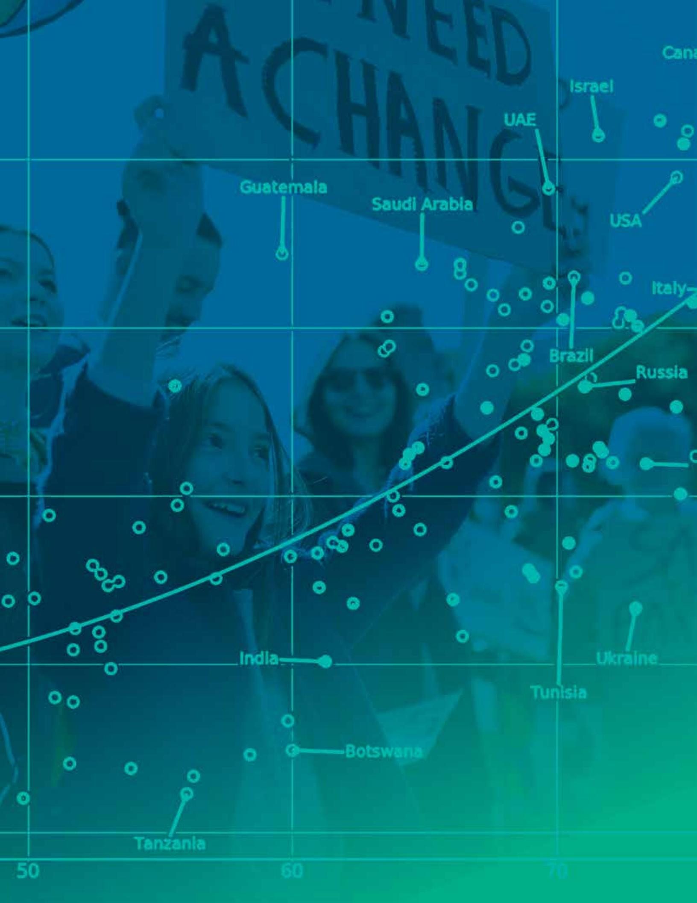

### **Introduction**

This chapter explores the empirical links between the Sustainable Development Goals (SDGs) and human well-being. The SDGs were ratified in 2015 as the successor to the Millennium Development Goals and have a target date of 2030. The goals measure different aspects of the economic, social and environmental development within countries. To empirically explore the linkages between sustainable development and wellbeing we combine two major data gathering efforts. We leverage the SDG Index1 , which measures how far along countries are in the process of achieving the SDGs. We also use the Gallup World Poll, which is a survey that is representative of about 98% of the world's population and includes an item on how people evaluate the quality of their lives, which we will henceforth refer to as subjective well-being (SWB). Data on other dimensions of subjective well-being, such as the experience of positive and negative emotions, will be referred to explicitly rather than as elements of a more broadly defined SWB. Combining the Gallup World Poll and SDG Index data sets enables us to empirically explore how sustainable development relates to the way people experience their lives.

Intuitively, making progress in terms of sustainable development is likely to benefit both people and planet. Detailed empirical work, however, may reveal some tensions where actions needed to achieve sustainability may challenge people into changing behaviours and potentially reducing their well-being (at least in the short run). In fact, large-scale social movements such as the "yellow vests" in France were initiated when additional fuel taxes were introduced. While fuel taxes are considered an effective way to induce more sustainable behaviour, they put additional pressure on the lifestyles and purchasing power of people living outside of major cities who require more use of automobiles given that there are less public transport options available to them. Alongside social movements such as the "yellow vests," there are the pro-environment movements such as "Extinction Rebellion" that raise alarm bells over climate change and the need for drastic and immediate measures to reduce our reliance on carbon fuels. By unpacking the seventeen SDGs in relation to well-being, this chapter tries to take a closer empirical look at

how sustainable development aligns with the interests of people and planet, but also where there may be inherent tensions that require more complex policy efforts in order to chart a course towards environmentally sustainable and socially equitable growth without reducing human well-being.2

A related empirical question concerns the relative importance of each of the SDGs in terms of driving human well-being. All SDGs are important but some SDGs may be more relevant to well-being than others. This is of interest for a number of reasons. Those SDGs that are most strongly linked to advancing well-being could perhaps be prioritized if budgets are limited (and well-being considered a goal of policymaking). Advancing on SDGs that are negatively correlated with well-being metrics will likely require more complex policy action in order to alleviate other concerns. By unpacking the SDGs in terms of well-being, we also show how their relative importance may change over time and by regional context. The analyses reported in this chapter may provide some broad policy guidance to policymakers across the world's regions that are keen to advance the well-being of both people and the planet.

In line with intuition, the countries with a higher SDG Index score tend to do better in terms of subjective well-being (SWB)—with the Nordic countries topping both rankings. In fact, there is a highly significant correlation coefficient of 0.79 between the SDG Index3 and the SWB scores. This shows the importance of a holistic approach to economic development when trying to improve citizen well-being. Interestingly, the best fitting model to describe the relationship between the SDG Index and SWB takes a quadratic form indicating that a higher SDG Index score correlates more strongly with higher SWB at higher levels of the SDG Index. This would indicate that economic growth is an important driver of well-being at early stages but becomes less significant later in the development cycle. Put differently, this result implies increasing marginal returns to *sustainable* development in terms of human well-being.

A conceptual model that explores the pathways between sustainable development and well-being finds that the SDGs are strongly related to the 'determinants of well-being' as laid out in

Chapter 2. These are income, social support, generosity, freedom, trust in government, and health. Among the different SDGs, however, we find much heterogeneity in how they correlate to SWB. In fact, some of the environmental goals are significantly negatively correlated with SWB. These are Goal 12 (responsible consumption and production) and Goal 13 (climate action). Moreover, there are significant regional differences in these correlations. For example, Goal 10 (reducing inequality) has a 0.71 correlation with SWB in Europe but is not correlated with SWB in many other regions. As such, these analyses reveal a number of intrinsic tensions between sustainable development and well-being that will hopefully stimulate further research and debate in order to inform policy action.

This chapter begins by discussing the headline correlation between the SDG Index and SWB. We analyse the quadratic relationship depicted and then show which countries significantly deviate from the main trend. We then also look at how SWB is related to other indices that measure progress to show that the SDG Index compares well with them. In the next section, the SDG Index is split into its 17 component goals and we analyse the varying relationships with well-being. Here we discuss the trade-offs that appear when we dig deeper into the relationship between sustainable development and well-being. We finish this section by conducting a variance decomposition analysis to show which goals contribute most strongly to the variation in well-being between countries. Finally, we look into the determinants of well-being and analyse them as pathways by which the sustainable development goals affect well-being. Generally, this chapter finds that the SDGs are a critically important but complex set of targets as governments increasingly appreciate the overarching goal of improving the well-being of their populations.

## **Is sustainable development conducive to human well-being?**

For our analyses, we use the standard measure of well-being used in the World Happiness Report rankings and most other research on the topic. The survey item asks respondents to value their current lives on a 0 to 10 scale, with the worst possible life as a 0 and the best possible

life as a 10. Countries are coded to represent the six regions they belong to: Europe, Middle East and Northern Africa, Americas, Sub-Saharan Africa and Former Soviet Union. The G7 and BRICS countries are also labelled, as well as some of the outlier countries.

Figure 6.1 shows the scatterplot for the SDG Index and SWB for all countries in the dataset. The SDG Index and SWB have a highly significant correlation coefficient of 0.79, and interestingly, the line of best fit is not linear but quadratic. In Appendix, we show that the quadratic fit is statistically superior compared to a pure linear fit, as well as higher-powered models as borne out when applying the Bayesian information criterion and Akaike information criterion to test the relative quality of model fits. The notion of increasing marginal returns to sustainable development aligns with economic intuition and prior research on the economics of well-being. As countries become more developed, a higher SDG Index score is associated with an ever higher SWB score. This implies that economic activity is more important for well-being at lowers levels of economic development. As countries become richer the well-being of their citizens stagnates unless further economic growth is more sustainable by, for example, addressing inequality and improving environmental quality.

Our measure of SWB is an evaluative measure of well-being and the survey responses may differ from emotional measures of well-being, especially when looked at in relation to economic measures such as income and development.4 As such, in the Appendix we also report on the relationship between the SDG Index and measures of emotional well-being. The Gallup World Poll includes measures of positive emotions such as "enjoyment" and "smile or laugh," as well as negative emotions such as "worry", "sadness", and "anger". Correlating an index of positive emotional experiences with the SDG Index scores leads to a correlation coefficient of 0.27—while statistically significant, this indicates a much weaker empirical link between achieving the SDGs and the experience of positive emotions as compared to life evaluations already examined. This is less the case for an index of negative emotional experiences, for which we obtain a correlation coefficient of -0.57 suggesting that countries that are not doing well in terms of the SDGs also tend to have populations that are

**Figure 6.1: Sustainable development and subjective well-being**

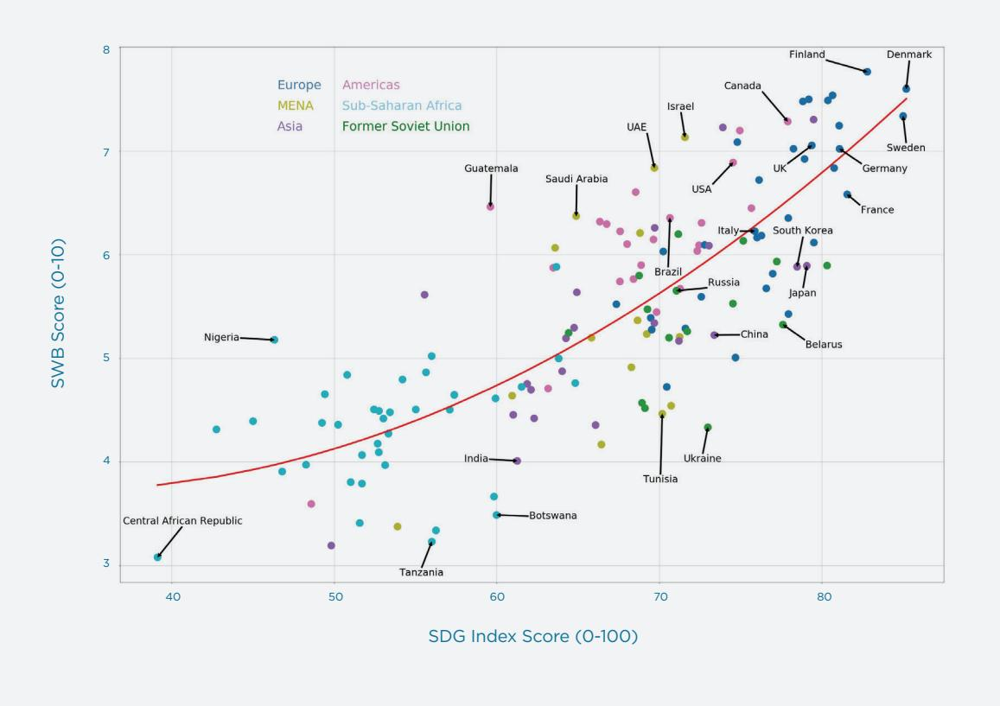

**Table 6.1: Country outliers relative to model line of best fit**

|              | Distance above |          | Distance below |  |
|--------------|----------------|----------|----------------|--|
| Country      | fit line       | Country  | fit line       |  |
| Guatemala    | 1.73           | Ukraine  | 1.61           |  |
| Israel       | 1.36           | Botswana | 1.24           |  |
| Nigeria      | 1.28           | Tanzania | 1.23           |  |
| Saudi Arabia | 1.25           | Tunisia  | 1.18           |  |
| UAE          | 1.24           | Belarus  | 1.16           |  |
| Pakistan     | 1.22           | Syria    | 1.16           |  |
| Australia    | 1.19           | Iran     | 1.15           |  |
| Mexico       | 1.12           | Rwanda   | 1.14           |  |
| Qatar        | 1.11           | Bulgaria | 1.12           |  |
| Panama       | 1.06           | Egypt    | 1.10           |  |

experiencing more negative emotions. In general, these results are in line with the notion that evaluative measures correlate more strongly with economic measures such as income,

development, and inequality than emotional measures of well-being.5

Table 6.1 show the list of countries that deviate most from the trend line. The countries significantly above the line of best fit clearly punch above their weight in terms of happiness relative to where the model would expect these countries to be given their scores on the SDG Index. Conversely, countries significantly below the line of best fit punch below their weight in terms of well-being relative to where we expect their average levels to be given their score on the SDG Index. These empirical observations raise interesting questions on why these countries' average well-being levels deviate substantially from the trend. These results also indicate that there are a number of aspects that drive human well-being that are not fully captured by the SDGs.

## **How well do the SDG Index and other development indices explain well-being?**

In this section, we investigate how well the SDG Index relates to human well-being. To be able to compare and contrast the SDG Index6 (SDGI) we also include the Human Development Index (HDI)7 , Index of Economic Freedom (IEF)8, Global Peace Index (GPI)9, Global Competitiveness Index (GCI)10, Environmental Protection Index (EPI)11, and GDP per capita.12

Table 6.2 indicates that the SDG Index and other indices of development are positively and significantly correlated with SWB. SWB is most strongly correlated with the Human Development Index, but the statistical confidence intervals around these estimates suggests that there is no significant difference with the coefficients on the SDG Index, Global Competitiveness Index, Environmental Protection Index, and even with GDP per capita. The Index of Economic Freedom and the Global Peace Index are, however, significantly less correlated with SWB as compared to the aforementioned indices.

The Human Development Index measures the level of welfare within a country by looking at three different indicators: Life Expectancy Indicators, Educational Attainment Indicators, and Standard of Living Indicators. The Life Expectancy Indicator refers to life expectancy at birth. Educational Attainment consists of the adult literacy rate and gross enrolment ratio. Standard of Living is measured by GDP per capita. These data that make up the HDI have much overlap with what the SDG Index measures (correlation of 0.92 between the HDI and the SDG Index).

**Table 6.2: Regression analysis of SDG Index and other development indicators on subjective well-being**

|             | SWB (1)             | SWB (2)             | SWB (3)             | SWB (4)             | SWB (5)            | SWB (6)             | SWB (7)             | SWB (8)            | SWB (9)            |
|-------------|---------------------|---------------------|---------------------|---------------------|--------------------|---------------------|---------------------|--------------------|--------------------|
| SDGI        | 0.790*** (15.63) |                     |                     |                     |                    |                     |                     | 0.379** (2.50)  | 0.368*** (4.23) |
| GCI         |                     | 0.812*** (16.05) |                     |                     |                    |                     |                     | 0.210 (1.22)    |                    |
| IEF         |                     |                     | 0.650*** (10.37) |                     |                    |                     |                     | 0.098 (1.08)    |                    |
| HDI         |                     |                     |                     | 0.814*** (17.22) |                    |                     |                     | -0.185 (-1.02)  |                    |
| GPI13       |                     |                     |                     |                     | 0.527*** (7.52) |                     |                     | -0.085 (-1.34)  |                    |
| EPI         |                     |                     |                     |                     |                    | 0.786*** (15.44) |                     | 0.243** (2.46   | 0.243** (2.52)  |
| GDP PC      |                     |                     |                     |                     |                    |                     | 0.709*** (12.30) | 0.264*** (2.75) | 0.321*** (4.69) |
| Adjusted R2 | 0.622               | 0.657               | 0.418               | 0.660               | 0.273              | 0.616               | 0.499               | 0.702              | 0.691              |
| N           | 149                 | 135                 | 149                 | 153                 | 149                | 149                 | 152                 | 130                | 130                |

Note: Coefficients are standardized. T-statistics are in parentheses. \* represents significance at 10% level. \*\* represents significance at 5% level. \*\*\* represents significance at 1% level.

The Global Competitiveness Index consists of the following 12 pillars: Institutions, Infrastructure, ICT adoption, Macro Stability, Health, Skills, Product Market, Labour Market, Financial System, Market Size, Business Dynamism, and Innovation Capability. This is a comprehensive measure that also has significant overlap with the SDG Index and HDI. The correlations are 0.87 and 0.92 respectively.

The Environmental Protection Index has twentyfour indicators organized into ten issue categories and two policy objectives. These ten issue categories cover: Biodiversity & Habitat, Forests, Fisheries, Climate & Energy, Air Pollution, Water Resources, Agriculture, Heavy Metals, Water & Sanitation, and Air Quality. The EPI is a comprehensive measure of the natural environment that is much wider in scope than the environmentally oriented SDGs.

GDP per capita and the Index of Economic Freedom are also positively correlated with SWB, but less so than the aforementioned indicators. This is perhaps to be expected: economic growth is only one of the many drivers of well-being. In turn, the Index of Economic Freedom gauges how conducive the socio-economic environment is for economic growth.

Finally, we note the relatively weak correlation between the Global Peace Index and SWB. The GPI is a very broad measure that considers international and domestic conflict, crime, political instability, number of police per 100,000 citizens, and nuclear and heavy weapons capability, among others. The relatively low correlation with SWB and other development indices such as the GPI (see correlation table in Appendix) may be the result of more developed nations also being more likely to have nuclear capability and perhaps a larger police force while no less reports of crime than developing nations. It would appear that the GPI is constructed in a way that does not lend itself easily to gauge the common sense that safe environments to live in would be a necessary precursor to happy communities.

In column (8) of Table 6.2 we include all these development indices in a single regression with SWB as the dependent variable. As noted before, some of these indices are strongly correlated so this multivariate regression suffers from multicollinearity. The results of this exploratory analysis suggest that the SDG Index remains

significant alongside the Environmental Protection Index and GDP per capita. Other tests show that the four insignificant variables can be safely omitted, such that the model reported in column (9) that only includes the SDG Index, Environmental Protection Index and GDP per capita provides a sufficient explanation.14

## **Unpacking the SDGs in relation to well-being**

In this section, we unpack the SDGs and consider the seventeen goals separately in relation to well-being. While the overall SDG Index may correlate strongly with human well-being, the question remains whether some SDGs may be more or less conducive to well-being. We start by considering the basic univariate correlations between each SDG and well-being globally before doing the same by region of the world. Later in this section we apply a variance decomposition method to consider the relative importance of each SDG in explaining the variance in well-being between countries. Both these approaches reveal important heterogeneity in how the SDGs relate to well-being.

#### **How does each SDG relate to well-being?**

In Table 6.3 we report on how each SDG correlates with well-being both globally and regionally. As expected from the aforementioned general results, we find that most SDGs correlate strongly and positively with higher well-being. At the same time, by unpacking the SDGs we discover much heterogeneity in how some of the SDGs relate to well-being. In fact, we find SDGs 14 (Life below water), 15 (Life on land), and 17 (Partnerships for the goals) to be generally insignificant. Strikingly, we find that SDGs 12 (Responsible consumption and production) and 13 (Climate action) are significantly negatively correlated with human well-being.

When looking at the relationship between SDGs and well-being by region we detect further levels of heterogeneity in how individual SDGs relate to well-being in different contexts. It is, however, important to note that considering these data by region reduces the number of observations and therefore both the precision of the coefficient and the statistical power to report significant differences. As Figure 6.1 revealed visually, there

**Table 6.3: Correlation table for each SDG and well-being (globally and regionally)**

|    |                                            |        |        |                           | REGION |        |                          |          |
|----|--------------------------------------------|--------|--------|---------------------------|--------|--------|--------------------------|----------|
|    | SDG                                        | All    | Europe | Former Soviet Union | Asia   | MENA   | Sub Saharan Africa | Americas |
| 1  | No Poverty                                 | 0.65*  | 0.49*  | -0.03                     | 0.44   | 0.22   | 0.50*                    | 0.76*    |
| 2  | Zero Hunger                                | 0.62*  | 0.44   | 0.30                      | 0.41   | 0.70*  | 0.23                     | 0.38     |
| 3  | Good Health                                | 0.77*  | 0.76*  | 0.40                      | 0.69*  | 0.82*  | 0.15                     | 0.89*    |
| 4  | Quality Education                          | 0.64*  | 0.48*  | 0.12                      | 0.55*  | 0.67*  | 0.14                     | 0.62*    |
| 5  | Gender Equality                            | 0.61*  | 0.78*  | 0.55                      | 0.69*  | 0.75*  | -0.29                    | 0.66*    |
| 6  | Clean Water and Sanitation                 | 0.73*  | 0.69*  | 0.16                      | 0.83*  | 0.26   | 0.00                     | 0.61*    |
| 7  | Affordable and Clean Energy                | 0.69*  | 0.40   | -0.40                     | 0.71*  | 0.47   | 0.51*                    | 0.68*    |
| 8  | Decent Work and Economic Growth         | 0.69*  | 0.62*  | 0.68*                     | 0.54*  | 0.77*  | 0.34                     | 0.61*    |
| 9  | Industry, Innovation and Infrastructure | 0.80*  | 0.90*  | 0.36                      | 0.78*  | 0.92*  | 0.35                     | 0.62*    |
| 10 | Reducing Inequality                        | 0.32*  | 0.71*  | 0.06                      | 0.12   | 0.01   | 0.07                     | -0.08    |
| 11 | Sustainable Cities and Communities      | 0.61*  | 0.74*  | 0.51                      | 0.56*  | 0.08   | 0.00                     | 0.77*    |
| 12 | Responsible Consumption and Production  | -0.75* | -0.69* | -0.39                     | -0.78* | -0.80* | -0.26                    | -0.51    |
| 13 | Climate Action                             | -0.35* | -0.19  | -0.19                     | -0.54* | -0.71* | -0.10                    | -0.23    |
| 14 | Life Below Water                           | -0.02  | 0.12   | 0.44                      | 0.18   | -0.14  | -0.02                    | 0.28     |
| 15 | Life on Land                               | 0.03   | -0.06  | 0.50                      | -0.13  | -0.24  | -0.06                    | 0.09     |
| 16 | Peace, Justice and Strong Institutions  | 0.69*  | 0.85*  | 0.12                      | 0.72*  | 0.73*  | 0.06                     | 0.72*    |
| 17 | Partnerships for the Goals                 | 0.16   | -0.03  | -0.28                     | 0.27   | 0.21   | 0.04                     | -0.02    |
|    | ALL                                        | 0.79*  | 0.79*  | 0.37                      | 0.74*  | 0.55   | 0.32                     | 0.77*    |

Note: Univariate correlations where \* represents statistical significance at the 1% level. In line with SDG Index methodology, regional averages are used for missing values.

is a stronger link between the SDG Index and well-being at higher levels of economic development. In Table 6.3 we indeed find that the general correlation between the SDGs and well-being is considerably lower in regions with mostly developing nations. In fact, only for Europe, Asia, and the Americas do we pick up a strong statistically significant correlation between the SDG Index and well-being. When looking at the SDGs individually, we pick up even more variation in how some SDGs are more strongly correlated than others with well-being. Some noteworthy regional results include (1) the important role of SDG 8 (decent work and economic growth) for countries in the former Soviet Union; (2) the relative importance of SDG 9 (industry, innovation and infrastructure) for nations in Europe and the MENA region; and (3) SDG 10 (reducing inequality) appears to only matter significantly for the European nations.

These regional correlations need to be taken with due caution given the relatively low number of observations available but, taken together, Table 6.3 paints a vivid picture of the varied and complex ways in which the SDGs relate to human well-being and how these pathways are highly context specific.

### **Are there trade-offs between the SDGs and human well-being?**

Table 6.3 reveals that SDG 12 (responsible consumption and production) and SDG 13 (climate action) have, in fact, strong negative correlations with self-reported measures of human well-being. Moreover, these negative correlations appear to hold for each one of the world's regions and therefore merit more academic and policy attention.

Studying the indicators underlying the SDG Index shows that SDG 12 (responsible consumption and production) is determined by municipal solid waste, electronic-waste generated, productionbased and imported SO2-emissions, nitrogen production footprint, net imported emissions of reactive nitrogen, and non-recycled municipal solid waste. Based on these indicators, SDG 12 may be highly correlated with the quantity of waste created through consumption and production rather than the proportion of responsible production and consumption. Since economically developed nations produce more waste but also tend to have higher levels of well-being, this may help explain why SDG 12 has such a strong negative correlation with wellbeing. If *responsible* consumption and production is also taken to mean *less* consumption and production in the first place, it tends to go hand in hand with economic contexts that are generally lower in terms of well-being. However, this is not what we find to be the case when regressing SDG 12 on well-being controlling for the general level of economic development. As Table 6.4 suggests, SDG 12 continues to correlate negatively with SWB even when taking into account the general level of economic development as measured using GDP per capita. This analysis therefore suggests that advancing responsible consumption and production comes with a trade-off in terms of (short-term) well-being as self-reported by citizens.

SDG 13 (climate action) is determined by per capita energy-related CO2 emissions, technology adjusted imported CO2 emissions per 100,000 people, people affected by climate related disasters, CO2 emissions embodied in fossil fuel exports, and effective carbon rate from all non-road energy excluding emissions from biomass. As was the case with SDG 12, countries that are more economically developed tend to pollute more while also having higher well-being. Climate action here would imply not only qualitative actions to reduce CO2-emissions (while maintaining general production levels), but climate action would also benefit from quantitative reductions in productive capacity that would lead to structural economic changes that would be in tension with other drivers of well-being. Unlike SDG 12, however, we find that accounting for the general level of economic development turns a negative correlation into an insignificant one. As reported in Table 6.4, this suggests that the underlying measures for climate action are strongly correlated with the level of economic development in the first place which, in turn, drives the relationship with well-being (more so than climate action by itself).

More generally, it is possible that neither of these environmental SDGs properly captures how people actually value the environment. The Environmental Protection Index (EPI) has a strong positive correlation with subjective well-being, as shown in Table 6.2.15 This is supported by earlier work16 finding that subjective well-being is negatively influenced by poor air quality, that people are willing to pay for observably cleaner air, and that

**Table 6.4: Regression analyses of SDG 12 and SDG 13 on well-being (controlling for GDP)**

|                                                 | SWB                  | SWB                 |
|-------------------------------------------------|----------------------|---------------------|
| SDG 12 (Responsible consumption and production) | -0.522*** (-4.72) |                     |
| SDG 13 (Climate action)                         |                      | 0.108 (1.54)     |
| GDP per capita                                  | 0.264** (2.39)    | 0.783*** (11.12) |
| Adjusted R2                                     | 0.577                | 0.520               |
| N                                               | 147                  | 147                 |

Note: T-statistics are in parentheses. \* represents significance at 10% level. \*\* represents significance at 5% level. \*\*\* represents significance at 1% level.

time in nature enhances well-being and is necessary for humanity.17 These research insights indicate that well-being is positively correlated with the outcome of environmental policies, even if it is not necessarily positively correlated with the efforts required of the policies. A large-scale study assessed possible explanations for this environmental paradox18, finding that it is plausible that (1) there is a time lag after ecosystem degradation before well-being is affected; (2) technology and innovation have to some extent decoupled well-being from nature; and that (3) well-being is dependent on provisioning services, such as food production, that are increasingly putting pressure on our ecosystem. Such observations may help explain why ecological degradation has not negatively impacted human well-being even though people depend on ecosystem services.

Trade-offs between the SDGs and SWB can also arise as a result of trade-offs between different

SDGs. Arguably SDGs 11, 13, 14, 16, and 17 continue to have negative trade-offs and non-associations with other SDGs.19 The highly positive links between goals 11 and 16 and human well-being may possibly compensate for these intra-SDG trade-offs, but policy-makers may find pursuing SDGs 13, 14, and 17 more difficult due to the negative or insignificant correlation with the well-being of current generations. Needless to say, however, the urgency of climate change does require action to ensure the well-being of future generations.20

## Variance decomposition analysis of the SDGs in relation to well-being

In this section, we apply variance decomposition to explore the relative importance of each SDG in explaining the variance in well-being between countries. This method, called "dominance analysis", investigates the relative contribution to the variance explained in well-being (R2) for a

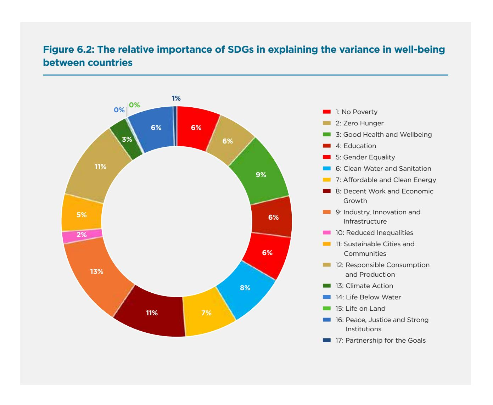

given set of predictors—in this case the 17 SDGs.21 One important assumption being made in such an analysis is that it forces the SDGs to explain all of the variance in well-being between countries. There are also a number of important limitations in that it hinges on there being variance in the first place, and yet the measurements for some SDGs do not vary much. Moreover, we are limited in terms of number of observations as we can only consider the 149 countries available in the data (or less when looking at regions). In line with the SDG Index approach, we impute missing SDG values with regional values when necessary rather than lose observations.22

Figure 6.2 presents the results of the variance decomposition and suggests large differences in how each SDG contributes to explaining the variance in well-being between countries. This figure paints a picture that aligns closely with the correlation coefficients reported in Table 6.3.

SDGs 10, 14, 15 and 17 would appear to contribute negligibly to explaining variation in well-being across the globe. On the other hand, the greatest explanatory power seems to lie with SDGs 3, 8, 9, and 12. SDG 8 (decent work and economic growth), SDG 9 (industry, innovation and infrastructure), and SDG 12 (responsible consumption and production) each explain 10% or more of the variance. It is important to note, of course, that SDG 12 (as well as SDG 13) are negatively correlated with well-being, as was shown earlier on in Table 6.3.

## Variance decomposition analysis of regional SDG groups in relation to well-being

In these analyses, we group the SDGs into Economic (4,8,9), Social (1,5,10), Health (3), Law (16), and Environmental goals (2, 6, 7, 11, 12, 13, 14, 15). Figure 6.3 first shows the results for how well these SDG groups explain the variance between all countries. In Figure 6.4 we show the results by region.

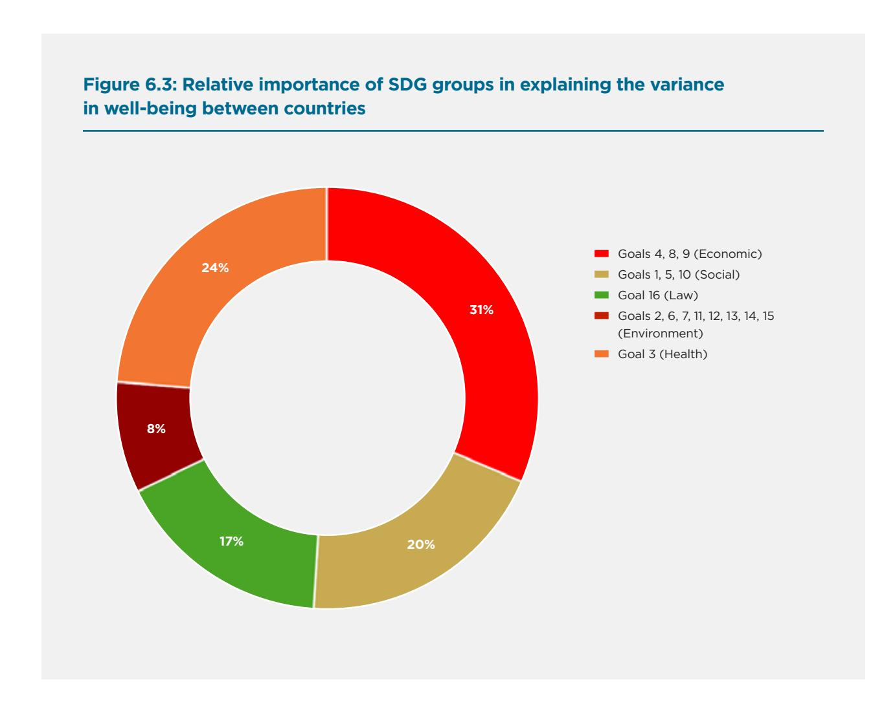

Figure 6.4: Relative importance of SDG groups in explaining regional well-being **Americas Grouped Well-being Asia Grouped Well-being Variance Decomposition Variance Decomposition** 16% 29% 26% 19% **Europe Grouped Well-being MENA Grouped Well-being** Variance Decomposition Variance Decomposition 18% 1% 34% 34% 24% 13% Former Soviet Union Grouped Well-being SSA Grouped Well-being **Variance Decomposition Variance Decomposition** 31% 25% 54%

The general takeaway from the regional variance decomposition analyses is that there is much regional heterogeneity hidden behind a global analysis, with the regional context driving which SDGs are most important in explaining the variance in well-being between countries in the region. In Europe (N=33), and especially in the countries of the former Soviet Union (N=15), we find the great importance of the Economic SDGs in explaining regional variation in well-being. In Asia (N=23) we find a fairly balanced role for the Economic, Law, Social, and Health SDG groups in explaining regional differences in well-being. In the Americas (N=23) we find that Health plays the most important role in driving regional variation in well-being. The results for Sub-Saharan Africa (N=38) point towards the Social and Economic SDGs as playing the largest roles in explaining regional differences, but the Environmental SDGs also play a large role, especially in comparison to other regions. For the countries in the MENA region (N=17) we find a more balanced picture with the Health and Economic SDGs driving most of the variation, but an important role as well for the Social, Law, and Environmental SDGs.

It is important to reiterate that these variance decomposition analyses are limited by their methods and the number of observations. As such these results are exploratory and solely aim to stimulate thinking and further research on how the SDGs relate to human well-being—and how general analyses may hide important heterogeneity when looking at individual SDGs and in the context of different regions.

## **A simple baseline theory of SDGs and SWB**

In this section, we propose a simple conceptual model of how the SDGs may shape well-being by way of the six well-being determinants as laid out in Chapter 2. These are Income, Social support, Generosity, Freedom to make life choices, Trust in government and business, and Healthy life expectancy.

The arrows in the model represent linear correlations between the five aforementioned SDG groups and the six well-being determinants. We show those relationships that we believe best highlight the most relevant pathways. In the Appendix, we present a general correlation table

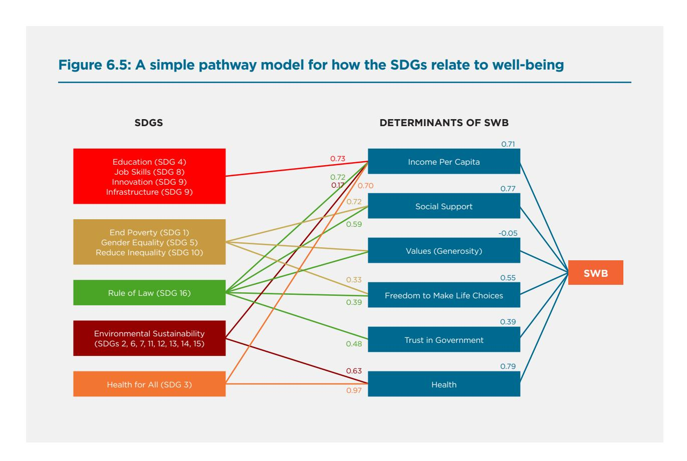

for all possible links. In terms of the determinants of well-being we find that the strongest correlations to well-being are Income per capita, Social support, and Health. This is intuitive, but is also a result of having good measures for these features. Freedom to make life choices and Trust in government come in next. The measure for Values is insignificant but we note that this is likely to be a result of generosity being very hard to measure.

Three of the SDG groups have strong positive correlations with Income per capita. Unsurprisingly, these are the groups that capture Economic features (SDGs 4, 8 and 9), Law (SDG 16), and Health (SDG 3). The goals representing the Environment (SDGs 2, 6, 7, 11, 12, 13, 14, 15) also have a positive correlation with Income per capita but we note that it is lower at 0.17. These pathways are a very important route for the SDGs to affect well-being because of the strong relationship between Income per capita and SWB. Social support, another strong determinant of SWB, is very positively related to goals representing social equality (SDGs 1, 5, and 10). Counter-intuitively, we note the lower correlations between this group and the SWB determinants of Values (Generosity) and Freedom to make life choices. The Rule of Law has a similar relationship with these three determinants as the Social SDGs group. Finally, the health determinant has a correlation of close to 1 with the Health SDG. We see that the Environmental group is quite important for Health too with a positive correlation of 0.63.

#### **Conclusion**

This chapter has studied the empirical relationship between the SDGs and subjective well-being using data from the SDG Index and the Gallup World Poll. There is a strong correlation between achieving sustainable development and selfreported measures of well-being. Moreover, the analyses indicate that there are increasing marginal returns to sustainable development in terms of well-being.

Splitting the SDG Index into its 17 component goals allowed for analysing possible trade-offs between sustainable development and wellbeing. While most SDGs were positively correlated with well-being, goal 12 (responsible consumption and production) and goal 13 (climate action)

were negatively correlated with SWB. However, the Environmental Protection Index is positively correlated with SWB, suggesting that the outcome of environmental policies is positively correlated with SWB, even if the process of reaching those policies may not be. This raises the challenge of policy action in these areas since they run counter to the subjective well-being of important groups in society. Given that lowering well-being erodes the support for incumbent governments23 this makes such policies even more difficult to implement. A recent report by the OECD attempts to address this challenge by proposing climate change mitigation through a well-being lens and putting people at the centre of climate action.24

We have studied the link between the SDGs and SWB of the current generations. Future research should investigate the extent to which self-reported SWB metrics account for the well-being of future generations. This is especially relevant when considering SDG 12 (responsible consumption and production) and SDG 13 (climate action). Implementing these policies requires intergenerational reciprocity, which has been shown to depend on the behaviour of previous generations.25 To be able to assess the extent to which self-reported measures of well-being integrate longer-term aspects of well-being, including the well-being of future generations, is a particularly important limitation for this line of work.

This work also does not address international dynamics. The sustainable development of a country may come at a cost to other countries, or the actions of countries may influence the well-being in others.26 Furthermore, the model of linking SDGs with well-being assumes only direct relationships. Some recent work shows that addressing SDGs have knock-on effects for other SDGs.27 Another dynamic that has not been discussed is the extent to which the well-being of populations may itself exert influence on their country's approach to development. Changes in well-being have been documented to have wide-ranging effects on economic, social, and health outcomes.28 These objective benefits of subjective well-being include pro-social behaviours. As such, there is an urgent need to combine the SDG and SWB research and policy agendas to generate solutions that work for both people and planet and help accelerate sustainable development.

1 See Sachs et al. (2019)

**Endnotes**

- 2 See for instance Bennett et al. (2019), Kroll et al. (2019)
- 3 Note that the SDG Index is modified to remove the SWB score, which is one of the indicators for SDG 3 (Health and Wellbeing). Given the large number of variables that make up the SDG Index, we find that leaving in or taking out the SWB variable does not meaningfully impact any results.
- 4 See Deaton and Kahneman (2010)
- 5 See Powdthavee, Burkhauser, and De Neve (2017)
- 6 In this section, we use the SDG Index scores uncorrected for their inclusion of the SWB measure (as part of SDG 3) in order to be able to compare it as such with the other development indicators.
- 7 HDI data comes from its 2019 report.
- 8 IEF data comes from its 2019 report.
- 9 GPI data comes from its 2019 report.
- 10 GCI data comes from its 2019 report.
- 11 EPI data comes from its 2018 report.
- 12 GDP per capita data are taken from the World Happiness Report 2019 data file available at https://worldhappiness. report/ed/2019/
- 13 For the sake of ease in comparison between indicators, we report the opposite sign value for this coefficient since the GPI tabulates lower scores as implying more peace.
- 14 An F-test on the four insignificant indices reveals F(4,120) = 1.85 with p-value = 0.1228 suggesting that we can omit these four indices.
- 15 The Environmental Protection Index (EPI) is a more comprehensive measure of the environment that goes further than the environmentally oriented SDGs, so it may help in explaining the complex relationship between environment, environmental policies and human well-being. The indicators for the EPI clearly affect a larger range of SDGs: Goals 2, 6, 7, and 11-15 take the same inputs as EPI. In fact, SDGs 6, 7, and 13-15 are the ones that most represent components of the EPI. Out of these, 6 and 7 have strong positive correlations with SWB while 13 has a moderately negative correlation, and 14 and 15 are statistically insignificant.
- 16 See for instance Levinson (2012) and Luechinger (2009)
- 17 See Williams (2017)
- 18 See Raudsell-Hearne et al. (2010)
- 19 See Kroll et al. (2019)
- 20 See for instance Stern (2015 and 2018), OECD (2019)
- 21 See Azen and Budescu (2003)
- 22 Imputation with regional values is most relevant with regards goal 14 (life below water).
- 23 See Ward (2020)
- 24 See OECD (2019)
- 25 See Wade-Benzoni (2002)
- 26 See Schmidt-Traub et al. (2019).
- 27 See ICSU (2017)
- 28 See De Neve et al. (2013)

#### **References**

Bennett, N.J., Cisneros-Montemayor, A.M., Blythe, J. et al. (2019): Towards a sustainable and equitable blue economy. *Nature Sustainability*, 2, 991–993 doi:10.1038/s41893-019-0404-1

Azen, R., and Budescu, D. V. (2003): The dominance analysis approach for comparing predictors in multiple regression. *Psychological Methods*, 8, 129-48.

Deaton, A., and Kahneman, D. (2010): High income improves evaluation of life but not emotional well-being. *Proceedings of the National Academy of Sciences*, 107 (38) 16489-16493.

De Neve, J-E, Diener, E., Tay, L., and Xuereb, C. (2013): The Objective Benefits of Subjective Well-Being. In Helliwell, J., Layard, R., and Sachs, J. (eds) *World Happiness Report*, New York: Sustainable Development Solutions Network.

Helliwell, J., Layard, R., and Sachs, J. (2019): World Happiness Report 2019, New York: Sustainable Development Solutions Network.

International Council for Science (ICSU) (2017). A Guide to "SDG" Interactions: From Science to Implementation (). Paris, France: International Council for Science (ICSU).

Kroll, C., Warchold, A., and Pradhan, P. (2019): Sustainable Development Goals (SDGs): Are we successful in turning trade-offs into synergies? *Palgrave Communications* (doi: 10.1057/s41599-019-0335-5).

Levinson, A. (2012): Valuing public goods using happiness data: The case of air quality. *Journal of Public Economics*, 96, 869-880, 2012.

Luechinger, S. (2009): Valuing air quality using the life satisfaction approach. *Economic Journal*, 119, 482-515.

OECD (2019): Accelerating Climate Action: Refocusing Policies through a Well-being Lens, *OECD Publishing*, Paris, https://doi.org/10.1787/2f4c8c9a-en

Powdthavee, N., Burkhauser, R., and De Neve, J.-E. (2017): Top incomes and human well-being: Evidence from the Gallup World Poll, *Journal of Economic Psychology*, 62, 246-257.

Sachs, J., Schmidt-Traub, G., Kroll, C., Lafortune, G., and Fuller, G. (2019): Sustainable Development Report 2019. New York: *Bertelsmann Stiftung and Sustainable Development Solutions Network (SDSN)*.

Schmidt-Traub, G., Moff, H., and Bernlöhr, M. (2019): International spillovers and the Sustainable Development Goals (SDGs): *Sustainable Development Solutions Network (SDSN)*.

Stern, N. (2015): Why are we waiting? The logic, urgency, and promise of tackling climate change, MIT Press.

Stern, N. (2018): Public economics as if time matters: Climate change and the dynamics of policy. *Journal of Public Economics*, 162, S.I., 4-17.

Wade-Benzoni, K.A. (2002): A golden rule over time: Reciprocity in intergenerational allocation decisions, *Academy of Management Journal*, 45, 1011-30.

Ward, G. (2020). Happiness and Voting: Evidence from Four Decades of Elections in Europe. *American Journal of Political Science*. https://doi.org/10.1111/ajps.12492

Williams, F. (2017): The Nature Fix: Why Nature Makes us Happier, Healthier, and More Creative, 1st edition, W. W. Norton Company.

Raudsepp-Hearne, C., Peterson, G.D., Tengo, M., Bennett, E.M., Holland, T., Benessaiah, K., MacDonald, G.K., and Pfeifer, L. (2010) Untangling the Environmentalist's Paradox: Why Is Human Well-being Increasing as Ecosystem Services Degrade? *BioScience*, Vol. 60, No. 8.

## Chapter 6 Appendix

Table A1: Model curvature test for SDG Index on SWB

| SWB                  | SWB                       |
|----------------------|---------------------------|
| 0.7865*** (15.44) | -0.8926 (-1.53)        |
| _                    | 1.6852*** (2.90)       |
| 0.616                | 0.634                     |
| 149                  | 149                       |
|                      | 0.7865*** (15.44) — |

Note: \*\*\* means significant at the 1% level and t-statistics are given in parentheses

Table A2: Model fit for SDG Index on SWB by power

| Model fit by power | Akaike information criterion (AIC) score | Bayesian information criterion (BIC) score |  |  |  |  |
|-----------------------|------------------------------------------|-----------------------------------------------------|--|--|--|--|
| Linear                | 313.4523                                 | 319.4602                                            |  |  |  |  |
| quadratic             | 307.1310                                 | 316.1428                                            |  |  |  |  |
| 3d power              | 309.1064                                 | 321.1221                                            |  |  |  |  |
| 4th power             | 311.0866                                 | 326.1063                                            |  |  |  |  |

Figure A1: Sustainable development and positive affect

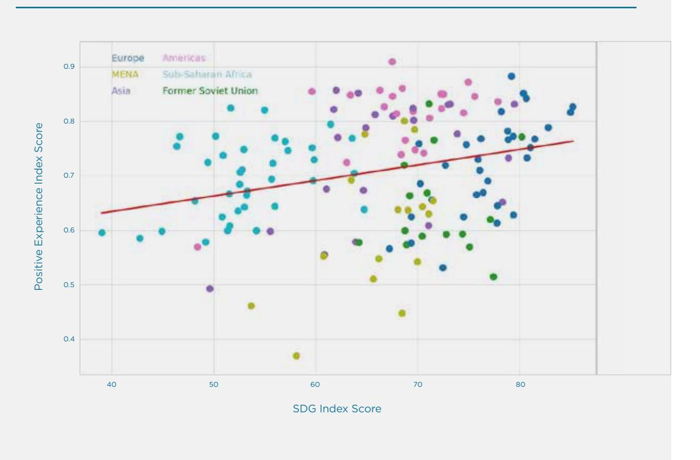

Figure A2: Sustainable development and negative affect

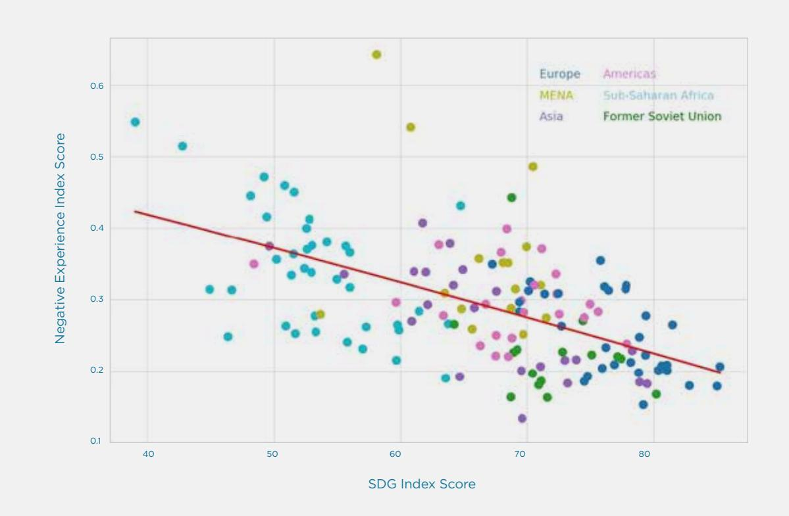

**Table A3: Correlation table for development indicators** 

| Indices Correlation |      |      |      |      |      |      |      |      |  |  |
|---------------------|------|------|------|------|------|------|------|------|--|--|
|                     | SWB  | IEF  | HDI  | GPI7 | GCI  | EPI  | GDPC | SDGI |  |  |
| SWB                 | _    | _    | _    | _    | _    | _    | _    | _    |  |  |
| IEF                 | 0.65 | _    | _    | _    | _    | _    | _    | _    |  |  |
| HDI                 | 0.81 | 0.68 | _    | _    | _    | _    | _    | _    |  |  |
| GPI 1    | 0.53 | 0.56 | 0.53 | _    | _    | _    | _    | _    |  |  |
| GCI                 | 0.81 | 0.81 | 0.92 | 0.53 | _    | _    | _    | _    |  |  |
| EPI                 | 0.79 | 0.61 | 0.86 | 0.52 | 0.82 | _    | _    | _    |  |  |
| GDPC                | 0.71 | 0.69 | 0.77 | 0.47 | 0.80 | 0.71 | _    | _    |  |  |
| SDGI                | 0.79 | 0.60 | 0.92 | 0.55 | 0.87 | 0.83 | 0.61 | _    |  |  |

**Table A4: Pathways model correlation matrix** 

|                              | SDG (4,8, 9) | SDG (1, 5, 10) | SDG 16  | SDG (2, 6-7, 11-15) | SDG 3   |
|------------------------------|--------------|-------------------|---------|------------------------|---------|
|                              |              |                   |         |                        |         |
| SDG (4,8, 9)                 | —            |                   |         |                        |         |
| SDG (1, 5, 10)               | 0.8106*      | —                 |         |                        |         |
| SDG 16                       | 0.7947*      | 0.7366*           | —       |                        |         |
| SDG (2, 6-7, 11-15)          | 0.6372*      | 0.5552*           | 0.4531* | —                      |         |
| SDG 3                        | 0.9073*      | 0.8518*           | 0.8005* | 0.6219*                | —       |
| Income Per Capita            | 0.7254*      | 0.6265*           | 0.7154* | 0.1716                 | 0.6964* |
| Social Support               | 0.7741*      | 0.7218*           | 0.5873* | 0.5616*                | 0.7422* |
| Values (Generosity)          | -0.1416      | -0.0712           | -0.0613 | -0.3313*               | -0.2066 |
| Freedom to Make Life Choices | 0.4662*      | 0.3284*           | 0.3895* | 0.2870*                | 0.3481* |
| Trust in Government2         | 0.3760*      | 0.3389*           | 0.4761* | 0.0582                 | 0.3103* |
| Healthy Life Expectancy      | 0.8966*      | 0.8312*           | 0.7776* | 0.6261*                | 0.9685* |
| SWB                          | 0.8089*      | 0.7226*           | 0.6865* | 0.5156*                | 0.7741* |
|                              |              |                   |         |                        |         |

\* represents statistical significance at the 1% level

| Income Per Capita | Social Support | Values (Generosity) | Freedom to Make Life Choices | Trust in Government2 | Healthy Life Expectancy | SWB |
|----------------------|-------------------|------------------------|---------------------------------|-------------------------|----------------------------|-----|
|                      |                   |                        |                                 |                         |                            |     |
|                      |                   |                        |                                 |                         |                            |     |
|                      |                   |                        |                                 |                         |                            |     |
|                      |                   |                        |                                 |                         |                            |     |
|                      |                   |                        |                                 |                         |                            |     |
| —                    |                   |                        |                                 |                         |                            |     |
| 0.6041*              | —                 |                        |                                 |                         |                            |     |
| -0.0507              | -0.1418           | —                      |                                 |                         |                            |     |
| 0.3718*              | 0.4501*           | 0.2652*                | —                               |                         |                            |     |
| 0.5825*              | 0.1877            | 0.2525*                | 0.4113*                         | —                       |                            |     |
| 0.6791*              | 0.7638*           | -0.1849                | 0.3923*                         | 0.3073*                 | —                          |     |
| 0.7086*              | 0.7683*           | -0.0471                | 0.5481*                         | 0.3932*                 | 0.7859*                    | —   |
|                      |                   |                        |                                 |                         |                            |     |

#### **Endnotes**

- 1 This correlation is technically negative as lower scores imply more peace.
- 2 This is technically a negative correlation because lower scores represent less perception of corruption in government.

## Chapter 7 **129**

# The Nordic Exceptionalism: What Explains Why the Nordic Countries are Constantly Among the Happiest in the World

#### Frank Martela

School of Business / Department of Industrial Engineering and Management, Aalto University, Finland

#### Bent Greve

Department of Social Sciences and Business, Roskilde University, Denmark

#### Bo Rothstein

Department of Political Science, University of Gothenburg,

#### Juho Saari

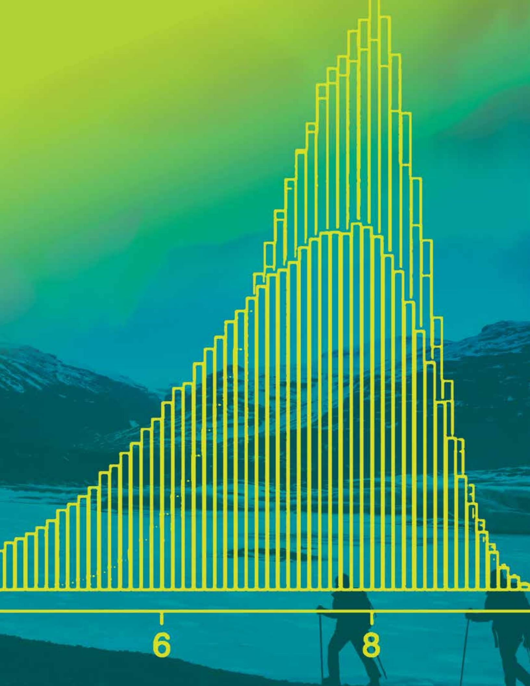

## **Introduction**

From 2013 until today, every time the *World Happiness Report* (WHR) has published its annual ranking of countries, the five Nordic countries – Finland, Denmark, Norway, Sweden, and Iceland – have all been in the top ten, with Nordic countries occupying the top three spots in 2017, 2018, and 2019. Clearly, when it comes to the level of average life evaluations, the Nordic states are doing something right, but Nordic exceptionalism isn't confined to citizen's happiness. No matter whether we look at the state of democracy and political rights, lack of corruption, trust between citizens, felt safety, social cohesion, gender equality, equal distribution of incomes, Human Development Index, or many other global comparisons, one tends to find the Nordic countries in the global top spots.1

What exactly makes Nordic citizens so exceptionally satisfied with their lives? This is the question that this chapter aims to answer. Through reviewing the existing studies, theories, and data behind the *World Happiness Report*, we find that the most prominent explanations include factors related to the quality of institutions, such as reliable and extensive welfare benefits, low corruption, and well-functioning democracy and state institutions. Furthermore, Nordic citizens experience a high sense of autonomy and freedom, as well as high levels of social trust towards each other, which play an important role in determining life satisfaction. On the other hand, we show that a few popular explanations for Nordic happiness such as the small population and homogeneity of the Nordic countries, and a few counterarguments against Nordic happiness such as the cold weather and the suicide rates, actually don't seem to have much to do with Nordic happiness.

Most of the potential explanatory factors for Nordic happiness are highly correlated with each other and often also mutually reinforcing, making it hard to disentangle cause from effect. Therefore, focusing on just a single explanation may result in distorted interpretations. For example, does trust in institutions and other citizens create a fertile ground for building a welfare state model with extensive social benefits? Or does the welfare state model contribute to low crime and corruption, which leads citizens to trust each other more? Most

likely, both directions of influence play a role, leading to a self-reinforcing feedback loop that produces high levels of trust in the Nordic region, and a high-functioning state and society model. We seek insight on this by taking a brief look at the history of the Nordic countries, which helps us to identify some practical takeaways about what other countries could learn from the Nordic region to ignite a positive feedback loop and enhance the happiness of their citizens. As Thomas Jefferson noted in 1809, "The care of human life and happiness and not their destruction is the first and only legitimate object of good government."2

### **Review of existing explanations**

Many theories have been put forth to explain the high level of Nordic happiness, from successful modernization3 and the ability to support better the less well off,4 to high levels of social capital5. Here we review the most prominent theories to see the strength of their explanatory power as regards Nordic happiness. After having reviewed each explanation individually in this section, we turn to the more difficult question of how these factors are linked together, as there are crucial interlinks and feedback mechanisms between them.

#### **Weather, smallness, homogeneity, and suicides – Dispelling four myths contradicting the idea of Nordic happiness**

Before turning to what we see as the most probable explanations for Nordic happiness, we will dispel some myths that challenge Nordic happiness by discussing a few factors sometimes raised in popular press that in fact don't have much to do with Nordic happiness.

First, it is true that the Nordic countries do not have the pleasant tropical weather that popular images often associate with happiness; rather, the Nordic winter tends to be long, dark, and cold. It is true that people account for changes in weather in their evaluations of life satisfaction, with too hot, too cold, and too rainy weather decreasing life satisfaction. However, effect sizes for changes in weather tend to be small, and are complicated by people's expectations and seasonal patterns. For example, people in the tropics are found to be happier during winter but less happy during spring, as compared to people in more temperate zones.6 Average weather is something people adapt to and thus typically doesn't much affect the life satisfaction of those used to a given weather. Accordingly, although the warming of the weather due to climate change could slightly increase the life satisfaction of people living in cold countries such as the Nordic countries,7 based on current evidence, weather probably doesn't play a major role in increasing or decreasing Nordic happiness.

Second, there is a myth that in addition to high happiness metrics, the Nordic countries have high suicide rates, a seeming paradox. However, even though the Nordic countries, especially Finland, used to have relatively high suicide rates in the 1970s and 1980s, these rates have declined sharply since those days, and nowadays the reported suicide rates in the Nordic countries are close to the European average, and are also similar to rates in France, Germany, and the United States, for example8. Although wealthy countries, such as the Nordics, tend to have higher suicide rates than poorer countries,9 in general, the same factors that predict higher life satisfaction tend to predict lower suicide rates. For example, higher national levels of social capital and quality of government predict both higher subjective well-being and lower suicide rates, while higher divorce rates predict more suicides and lower life satisfaction – although quality of government seems to have a bigger effects on life satisfaction and divorces on suicide.10 Thus this seeming paradox seems to be based on outdated information,11 as Nordic suicide rates are not especially high and are well predicted by the theoretical models where the same factors contribute to both higher life satisfaction in the Nordics and to lower suicide rates.

Third, it is often suggested that it is easier to build welfare societies in small and homogenous countries such as the Nordics, compared to larger and more diverse countries. However, research has not found a relationship, either negative or positive, between the size of a country's population and life satisfaction. In addition, smaller countries on average are not more homogenous than larger countries.12 In fact, today the Nordic countries are actually quite heterogenous, with some 19 % of the population of Sweden being born outside the country. Some

empirical studies have found that increased ethnic diversity is associated with reduced trust. This is attributed to ethnically diverse societies having more difficulty generating and sharing public goods, but Eric Uslaner shows that it is not ethnic diversity per se, but rather ethnic residential segregation that undermines trust.13 Corroborating this, other research has demonstrated that the economic inequality between ethnic groups, rather than cultural or linguistic barriers, seems to explain this effect of ethnic diversification leading to less public goods.14 Thus the historical fact that the Nordic countries have not had an underclass of slaves or cheap labor imported from colonies could play some role in explaining the Nordic path to welfare societies. Furthermore, Charron & Rothstein15 show that the effect of ethnic diversity on social trust becomes negligible when controlling for quality of government, indicating that in countries of high-quality institutions such as the Nordic countries, ethnic diversity might not have any effect on social trust. Furthermore, according to the analysis in *World Happiness Report 2018*, the ratio of immigrants within a country has no effect on the average level of happiness of those locally born, with the ten happiest countries having foreign-born population shares averaging 17.2 %, about twice as much as the world average.16 Other studies have tended to find a small positive rather than negative effect of immigration on the well-being of locally born populations.17 Ethnic homogeneity thus provides no explanation of Nordic happiness.

Also, immigrants within a country tend to be about as happy as people born locally.18 As we argue later, quality of governmental institutions play a big part of Nordic happiness and these institutions serve all people living within the country, including immigrants. This is a probable explanation for the high ranking of the Nordics in the comparison of happiness of foreign-born people in various countries, in which Finland, Denmark, Norway, and Iceland occupy the top four spots, with Sweden seventh globally.19 The well-being advantage of the Nordic countries thus extends also to those immigrating to these countries.

#### **Welfare state generosity**

Given that the Nordic countries are renowned for their welfare-state model with extensive social benefits, a natural candidate to explain Nordic happiness is the welfare state. Early analyses quantifying welfare as an aggregate measure of government welfare spending, like the percentage of GDP devoted to public welfare programs, tended to find no link between welfare expenditure and happiness, or even a negativelycorrelated link.20 Government spending as such thus seems not to be clearly linked to greater or worse life satisfaction, which is no surprise given that government spending is tightly linked to economic cycles and demographic changes, rather than an adequate measure for tracking the distribution and redistribution of goods and services. More recent work has tended to operationalize the welfare state in terms of the *benefits (in-kind and in-cash)* offered to citizens rather than mere *spending as proportion of GDP*, because the latter does not tell what the state actually provides for its citizens. In a longitudinal study of 18 industrial countries from 1971-2002, Pacek and Radcliff examine welfare state generosity by using an index capturing the extent of emancipation from market dependency in terms of pensions, income maintenance for the ill or disabled, and unemployment benefits, finding that welfare state generosity exerts a positive and significant impact on life satisfaction.21 Another study that examined OECD countries found that indicators such as the extensiveness of welfare benefits and degree of labor market regulation had a significant positive association with life satisfaction.22 This study also found that this effect is not moderated by people's income, meaning that both poor and rich individuals and households benefit from more extensive government. Income security in case of unemployment plays a strong role in determining life satisfaction, as both unemployment and fear of unemployment strongly affect quality of life.23 Furthermore, using Gallup World Poll data, Oishi et al. demonstrate that the positive link between progressive taxation and global life evaluation is fully mediated by citizens' satisfaction with public and common goods such as health care, education, and public transportation that the progressive taxation helps to fund24. These and other studies25 suggest that one secret to Nordic happiness is the institutional framework of the

Nordic welfare state. People tend to be happier in countries where there is easy access to relatively generous welfare benefits, and where the labor market is regulated to avoid employee exploitation.26

#### **Institutional quality**

Quality of government is another key explanation often provided for the high life satisfaction of Nordic countries, because in comparisons of institutional quality, the Nordic countries occupy the top spots along with countries such as New Zealand and Switzerland.27 Indeed, several studies have shown that people are more satisfied with their lives in countries that have better institutional quality.28 While most of the evidence is cross-sectional, Helliwell et al. examined changes in government quality in 157 countries over the years 2005-2012, finding that improvements in quality tend to lead to improvements in well-being.29 Moreover, as regards changes in well-being, changes in government quality explained as much as changes in GDP.

Typically, government quality has been divided into two dimensions: democratic quality and delivery quality.30 The first is about the *access* to power including factors such as the ability to participate in selecting the government, freedom of expression, freedom of association, and political stability. The latter is about the *exercise* of power, including the rule of law, control of corruption, regulatory quality, and government effectiveness. These dimensions are typically deeply embedded into institutional practices of a given country, thereby promoting continuity and stabilizing people's expectations. Studies have tended to find that it is the latter type of government quality, delivery quality, that is more strongly related to citizen happiness. However, in countries with high delivery quality, such as the Nordic countries, the quality of democracy plays an increasingly strong role in further explaining citizen life satisfaction.31

These studies demonstrate that the quality of the government and public institutions matter for life satisfaction. The Nordic countries tend to occupy the top spots in international comparisons of government quality, which helps to explain the high life satisfaction in these countries.

#### **Income inequality**

The Nordic countries are also famous for low levels of income inequality, but the evidence is not clear that a lack of income inequality is a potential explanation for high life satisfaction. Zagorski et al., for example, in their examination of 28 European countries, found that while inequality is negatively correlated with average life satisfaction, this effect disappears completely when controlled for GDP per capita.32 This conclusion is supported by other research that similarly found no link between income inequality and well-being, while there are also studies that have found both negative and positive correlations between inequality and well-being.33 The range of results from positive to negative to no connection suggest that no clear link exists between income inequality and well-being. Instead, this connection is sensitive to the inclusion of various covariates. However, if inequality leads to lower levels of perceived fairness and trust, and high levels of status anxiety and lack of economic and social opportunities, these factors might more directly contribute to a lower life satisfaction in the nation.34 Furthermore, living in a highlydeveloped welfare state seems to have an impact on people's perceptions of the acceptance of income inequality.35 More particularly, Europeans prefer more equal societies, and inequality has a negative relation with happiness, especially among the poor in Europe.36 Thus, low levels of inequality might be important for the happiness of Nordic citizens, even though the same direct effect is not visible in many other countries.

#### **Freedom to make life choices**

Autonomy and the freedom to make life choices are known to be connected to subjective well-being.37 For example, a study of 63 countries showed that the degree to which autonomy and individualism were valued in those countries was a more consistent predictor of well-being (measured with anxiety, burnout, and general health) than national wealth.38 Accordingly, the extent to which a country is able to provide individuals a sense of agency, freedom, and autonomy plays a significant role in explaining citizen happiness.39 Using World Values Survey data from 1981 to 2007, Inglehart et al. showed that rises in national levels of sense of free choice were associated with similar rises in

national levels of subjective well-being, with change in free choice explaining about 30% of the change over time in subjective well-being.40 Other research has also demonstrated the importance of freedom to make life choices for national levels of happiness.41 Inglehart et. al argue and demonstrate in their data that this sense of freedom is the result of three factors that feed into each other including material prosperity that liberates people from scarcity, democratic political institutions that liberate people from political oppression, and more tolerant and liberal cultural values that give people more room to express themselves and their unique identity.42 For Inglehart, the Nordic countries constitute "the leading example of successful modernization, maximizing prosperity, social solidarity, and political and personal freedom."43 Thus the high sense of autonomy and freedom – and the resulting high well-being – that Nordic citizens experience can be attributed to relatively high material prosperity combined with well-functioning democracy and liberal values that prevail in the Nordic countries.

#### **Trust in other people and social cohesion**

Trust in other people has also been linked to citizen happiness. Several studies have demonstrated that various measures of social or horizontal trust are robustly correlated with life satisfaction, and that this relation holds even when controlling for factors such as Gross National Income per capita.44 The most commonly used measure of generalized trust asks about whether most people can be trusted. Other measures of trust, such as whether people believe that a lost wallet will be returned to its owner, have been shown to be correlated with life satisfaction, as well.45 In addition to betweencountry evidence, Helliwell et al. show using European Social Survey data that within-country changes in social trust are linked to significant changes in national levels of subjective wellbeing.46 High levels of social trust also seem to make people's well-being more resilient to various national crises.47

Furthermore, it has been argued that social cohesion, which is a broader notion than generalized trust, predicts well-being. In a recent study, Delhey and Dragolov defined social cohesion as having three dimensions including connectedness to other people, having good

social relations, and having a focus on the common good. They found that both the aggregate level of social cohesion as well as each of the three dimensions individually were associated with higher well-being in a sample of 27 European Union countries.48 The three Nordic countries included in the analysis – Denmark, Finland, and Sweden – occupy the top three positions in their index of social cohesion, making trust and social cohesion one additional explanation for the Nordic happiness.

#### **Other explanations**

The explanations of Nordic happiness mentioned in the review above are by no means an exhaustive list. Many other factors can be used to try to explain Nordic happiness. For example, economic insecurity and vulnerability to economic losses are detrimental for well-being. The Nordic countries, due to the extensive welfare benefits, are better able to make their citizens less vulnerable to economic insecurity than other countries.49

Research has also consistently shown that social comparisons matter for well-being. In assessing how good their lives are, humans often compare their own lives to the lives of those around them. This makes people's subjective perception of their position in society more predictive of well-being than objective measures such as income.50 However, this effect is moderated by the welfare state, because in Nordic countries with strong welfare states, people's perceptions of their position in society have less influence on their own happiness than in other countries.51 This is corroborated by findings according to which status anxiety, defined as the fear of failing to conform to the ideals of success laid down by society, tends to be lower in Nordic countries compared to most other countries measured.52 The ethos of equality, manifested in universal public services that reduce social and economic risks, thus seems to be visible in and reinforced through a more egalitarian culture, as well. Furthermore, a comparison of United States and Denmark shows that the favorable difference in happiness for the Danes was particularly pronounced for low income citizens.53 Being poor in Denmark does not have as harsh effect on happiness than in the US, where the gap between rich and poor is much larger and where there are not similar welfare services and public goods available for the poor. It thus seems possible that

keeping up with the Joneses doesn't carry as much weight in Nordic countries as in the US and many other countries.

## **Examining Nordic countries in WHR data**

The *World Happiness Report* tends to use six factors as predictors of life evaluation: GDP per capita, social support, healthy life expectancy, freedom to make life choices, generosity, and corruption. Are the Nordic countries somehow different as regards these six factors? Among these factors, are there some in which the Nordic countries perform especially well, which could explain why Nordic countries are so happy?

To examine this issue, we take a look at the Gallup World Poll data as regards these factors. Given that the Nordic countries are all relatively rich (Nordic countries occupy a range from 6 (Norway) to 21 (Finland) in the 149-country ranking of GDP per capita), we are especially interested what factors beyond GDP per capita make the Nordic countries stand out. For this we compare the ten richest non-Nordic countries – Luxembourg, Singapore, United Arab Emirates, Kuwait, Ireland, Switzerland, Hong Kong, United States, and the Netherlands – with the five Nordic countries as regards the six predictors. This allows us to consider how the Nordic countries are able to produce more happiness than countries that have higher GDP.

Table 7.1 shows that the Netherlands and Switzerland are in essence indistinguishable from the Nordic countries on the examined six factors: GDP per capita, social support, healthy life expectancy, freedom, generosity, and corruption. The Netherlands and Switzerland, along with the Nordic countries, rank high not only in life satisfaction, but also in social support, freedom to make life choices, and lack of corruption. In fact, the Nordic countries occupy the top positions across the world for social support, and are all in top ten for freedom. For lack of corruption, the Nordic countries are otherwise in the global top ten, but Iceland is surprisingly only 36th. This may reflect a recent banking crisis that revealed major economic and social irregularities among the Icelandic elite, which would make this low position temporary. As regards generosity, measured by how much

**Table 7.1: The factors influencing happiness in Nordic and richest countries**

|                         |      | Life evaluation |       | Log GDP per capita |      | Social support |       | Healthy life expectancy |                                                                                                                 | Freedom |       | Generosity |      | Corruption |
|-------------------------|------|--------------------|-------|-----------------------|------|-------------------|-------|----------------------------|-----------------------------------------------------------------------------------------------------------------|---------|-------|------------|------|------------|
| Country                 |      |                    |       |                       |      |                   |       |                            | Average Ranking Average Ranking Average Ranking Average Ranking Average Ranking Average Ranking Average Ranking |         |       |            |      |            |
| Finland                 | 7.77 | 1                  | 10.61 | 21                    | 0.96 | 2                 | 71.80 | 27                         | 0.95                                                                                                            | 5       | -0.06 | 91         | 0.21 | 4          |
| Denmark                 | 7.60 | 2                  | 10.75 | 13                    | 0.95 | 4                 | 72.10 | 24                         | 0.95                                                                                                            | 6       | 0.10  | 34         | 0.18 | 3          |
| Norway                  | 7.54 | 3                  | 11.08 | 6                     | 0.96 | 3                 | 73.10 | 13                         | 0.96                                                                                                            | 3       | 0.14  | 23         | 0.31 | 8          |
| Iceland                 | 7.49 | 4                  | 10.72 | 16                    | 0.98 | 1                 | 73.00 | 14                         | 0.94                                                                                                            | 7       | 0.27  | 6          | 0.69 | 36         |
| Netherlands             | 7.49 | 5                  | 10.79 | 11                    | 0.93 | 15                | 72.20 | 20                         | 0.92                                                                                                            | 18      | 0.21  | 11         | 0.39 | 12         |
| Switzerland             | 7.48 | 6                  | 10.96 | 7                     | 0.94 | 12                | 73.80 | 3                          | 0.93                                                                                                            | 11      | 0.12  | 27         | 0.31 | 7          |
| Sweden                  | 7.34 | 7                  | 10.76 | 12                    | 0.92 | 25                | 72.50 | 18                         | 0.93                                                                                                            | 10      | 0.12  | 26         | 0.25 | 6          |
| Luxembourg              | 7.09 | 14                 | 11.46 | 1                     | 0.92 | 28                | 72.60 | 17                         | 0.89                                                                                                            | 27      | 0.01  | 62         | 0.36 | 9          |
| Ireland                 | 7.02 | 17                 | 11.11 | 5                     | 0.95 | 6                 | 72.20 | 19                         | 0.88                                                                                                            | 32      | 0.17  | 15         | 0.37 | 10         |
| United States           | 6.89 | 19                 | 10.90 | 9                     | 0.91 | 35                | 68.40 | 40                         | 0.82                                                                                                            | 64      | 0.14  | 20         | 0.71 | 39         |
| United Arab Emirates | 6.82 | 21                 | 11.12 | 3                     | 0.85 | 69                | 66.90 | 57                         | 0.95                                                                                                            | 4       | 0.12  | 29         |      | —          |
| Saudi Arabia            | 6.37 | 28                 | 10.81 | 10                    | 0.87 | 61                | 66.00 | 74                         | 0.81                                                                                                            | 65      | -0.17 | 127        |      | —          |
| Singapore               | 6.26 | 34                 | 11.34 | 2                     | 0.91 | 34                | 76.50 | 1                          | 0.92                                                                                                            | 19      | 0.13  | 24         | 0.10 | 1          |
| Kuwait                  | 6.06 | 49                 | 11.12 | 4                     | 0.84 | 71                | 66.30 | 71                         | 0.85                                                                                                            | 47      | -0.03 | 78         |      | —          |
| Hong Kong               | 5.44 | 75                 | 10.90 | 8                     | 0.83 | 75                | 75.86 | 2                          | 0.82                                                                                                            | 57      | 0.14  | 21         | 0.41 | 14         |
| Nordic average          | 7.55 |                    | 10.78 |                       | 0.95 |                   | 72.50 |                            | 0.95                                                                                                            |         | 0.12  |            | 0.33 |            |
| Richest average         | 6.69 |                    | 11.05 |                       | 0.89 |                   | 71.08 |                            | 0.88                                                                                                            |         | 0.08  |            | 0.38 |            |
| World average           | 5.45 |                    | 9.26  |                       | 0.81 |                   | 64.20 |                            | 0.77                                                                                                            |         | -0.01 |            | 0.74 |            |

Source: Calculations based upon data from WHP, 2019

**Table7.2: Coefficient of variation in life evaluation across countries**

| Country                   | Coefficient of variation in life evaluation | Ranking |
|---------------------------|---------------------------------------------------|---------|
| Netherlands               | 0.171                                             | 1       |
| Finland                   | 0.185                                             | 2       |
| Luxembourg                | 0.196                                             | 3       |
| Norway                    | 0.209                                             | 4       |
| Nordic average            | 0.211                                             |         |
| Denmark                   | 0.216                                             | 5       |
| Switzerland               | 0.217                                             | 6       |
| Iceland                   | 0.217                                             | 7       |
| Belgium                   | 0.219                                             | 8       |
| Austria                   | 0.222                                             | 9       |
| New Zealand               | 0.226                                             | 10      |
| Sweden                    | 0.227                                             | 11      |
| Singapore                 | 0.229                                             | 12      |
| Ireland                   | 0.260                                             | 21      |
| Richest countries average | 0.275                                             |         |
| United States             | 0.289                                             | 26      |
| United Arab Emirates      | 0.313                                             | 32      |
| Hong Kong S.A.R. of China | 0.332                                             | 43      |
| Saudi Arabia              | 0.361                                             | 51      |
| Kuwait                    | 0.385                                             | 65      |
| Global average            | 0.430                                             |         |

Source. Calculations based upon data from WHR, 2019

people donate money to charity, there is more variability within the Nordic countries, with Finland being below world average and only Iceland making it into the top 10. This result might be specific to charity donations, because the Nordic countries tend to have high scores for comparisons of other types of prosocial behavior such as volunteering.54 As regards healthy life expectancy, the Nordic countries are found in spots from 13 to 27. This is relatively high, but not best in the world. However, differences between countries are rather small in this variable. Thus, it seems that what unites the Nordic countries as regards these predictors of life satisfaction is high levels of social support, freedom to make life choices, and lack of corruption.

Recently, more attention has been given not only to the average levels of happiness in countries, but the degree of equality of happiness within countries. In other words, is the distribution of happiness narrow in the sense that responses cluster around the same average answer, or wide in the sense that there is a broad range of answers provided to questions about happiness? Some previous research suggests that happiness differences in Nordic countries might be smaller than in other countries55, and accordingly we examine WHR data to see how equally distributed the happiness scores are in the Nordic countries as compared to the rest of the world. For this, we looked at the *coefficients of variation* calculated by dividing the standard deviations of life evaluation by the averages of life evaluation in 149 countries using the average of last three years data. We want to compare Nordic scores to global averages and to the scores of the ten richest countries in the world.

As Table 7.2 shows, all Nordic countries are in the top eleven in the world as regards low levels of variance in life evaluations, well below the global average and the average of the richest countries. This means that there is less inequality in happiness in the Nordic countries and countries such as the Netherlands, Luxembourg, and Switzerland, meaning that people's happiness scores tend to be closer to one another in these countries compared to other countries in the world. Of the top ten richest countries in the world, the Netherlands, Luxembourg, and Switzerland rank similarly to Nordic countries in terms of both high life satisfaction and low inequality of life satisfaction scores. In contrast,

the other richest countries—the United States, United Arab Emirates, Hong Kong, and especially Saudi Arabia and Kuwait—have a more unequal distribution of happiness, and the average life satisfaction in these countries is lower than in the Nordics.

Finally, it is worth noting that high Nordic happiness levels are dependent on the measure of happiness used. The *World Happiness Report*  and most other international comparisons use general life evaluation as the measure of citizen happiness. In the WHR, people are asked to make a general evaluation of their life on a Cantril ladder scale from 0 to 10, with the worst possible life as 0 and the best possible life as 10. In these studies, we consistently find the Nordic countries are the happiest in the world.

However, if instead of life satisfaction, we look at the data for the prevalence of positive emotions in various countries, we see that Latin American countries like Paraguay, Costa Rica, and Mexico, as well as Laos in Southeast Asia, occupy the top positions, with Iceland third in the world and other Nordic countries in positions ranging from 15 to 36.56 Similarly, Gallup World Poll's Positive Experience Index has nine Latin American countries and Indonesia in the top 10.57 Nordic countries thus seem to be places where people experience *quite frequent* positive emotions, but they are not the countries where people report *the most frequent* positive emotions. Similarly, in a ranking of countries by lack of negative emotions, Iceland (3rd), Sweden (9th) and Finland (10th) make it into the top ten, while Denmark and Norway are 24th and 26th, respectively.58 What these results demonstrate is the multidimensional nature of human wellness and well-being. High life satisfaction, on an individual or national level, is not a guarantee that one has high frequency of positive emotions or low frequency of negative emotions. Examining multiple indicators of happiness leads to a richer picture of the type and nature of national happiness.59 When newspapers declared Denmark the happiest country on earth in 2012, 2013, and 2016, Norway in 2017, and Finland in 2018 and 2019, many citizens of these countries were taken by surprise, because they held much more melancholic self-images. Perhaps they were thinking about smiling, displays of joy or other indicators of positive affect, concluding rightly that they are not as prevalent in these countries

as in some other countries. Yet, if they would have been thinking about life satisfaction, they very well could have concluded that yes, despite our grudges, citizens here tend to be quite satisfied with how their lives have turned out. As noted, of the multiple well-being measures, general life evaluation is the one most frequently used and recommended60 for evaluating the well-being of countries, as it is more responsive than positive or negative emotions to changes in various national-level factors, such as wealth or policy decisions.

## **History and the Hunt for the Root Cause**

The key difficulty in explaining Nordic exceptionalism is that the Nordic countries rank highly on such a number of well-being predicting indicators that it is hard to disentangle cause and effect. There are a cluster of factors that tend to cooccur, including high life satisfaction, high levels of social and institutional trust, high-quality democratic institutions, extensive welfare benefits, and social-economic equality, and this cluster of factors is nowhere else so strong as in the Nordics.61 However, from the point of view of policy-makers interested in replicating the Nordic model, it is not particularly helpful to know just that all of these positive factors are concentrated in the same countries; rather, policy-makers need concrete ways to produce higher levels of happiness, and those can be hard to find. For example, Rothstein and Uslaner argue that if a country is trapped in a vicious cycle of low social and institutional trust, high corruption, and high levels of inequality, it can be hard to build the citizen and public servant trust needed to make the necessary reforms for a more trustworthy and representative system that serves all citizens equally.62 The Nordic countries, in contrast, are arguably caught up in a virtuous cycle, where well-functioning and democratic institutions are able to provide citizens extensive benefits and security, so that citizens trust institutions and each other, which leads them to vote for parties that promise to preserve the welfare model.63 Both of these situations might be thought of as relatively stable, and thus, the crucial question is how to get from a low-trust equilibrium to a high-trust equilibrium. Here, a historical look into how the Nordic countries made this leap provides some insight.

In the beginning of the modern era, the Nordic countries didn't have the kind of feudalism and serfdom that characterized continental Europe and Russia. Farmers were relatively more independent and many of them owned the land they cultivated. Furthermore, in the decades leading to the twentieth century, farmers held significant political power, even within the Nordic parliaments.64 Although there were class conflicts in the Nordic countries, as well – most dramatically the Finnish Civil War between leftist "reds" and rightist "whites" in 1918 that led to over 30,000 casualties – the divide in the Nordics was less deep than in most other countries during that era, making possible "a historical compromise" and the development of a "spirit of trust" between the laboring classes and the elite in the early decades of the twentieth century.65 While in other Nordic countries, the transformation was peaceful, what is remarkable of the Finnish trajectory is how quickly after the civil war the unification of the country started. Many institutions were reconstructed in a few years. For instance, less than a year after the end of the war, the Social Democratic Party, which had been on the losing side of the war, was allowed to participate in general elections and became the biggest party in the parliament. Within a few years, most of the reforms that the left had fought for in the civil war, such as the agrarian land reform, had been implemented through parliamentary means.

One potential root cause for the Nordic model thus could be the fact that the Nordic countries didn't have the deep class divides and economic inequality of most other countries at the beginning of the twentieth century. Research tends to show that inequality has a strong effect on generalized trust.66 In more equal societies, people trust each other more. This increased trust contributes in the long term to a preference for a stronger and more universal welfare state. Although statistics about social trust do not exist from a hundred years ago, we know that levels of social trust tend to be remarkably stable over relatively long historical periods67, supporting the role of social trust as contributing to the building of better institutions.

The quality of governmental institutions seems to also have been relatively good in the Nordic countries already in the late 19th century, with independent court systems able to handle

corruption-related matters fairly well.68 This made key institutions more trustworthy and reliable, giving both the common people and the elite the sense that reforms could be effective and would fulfill their purpose. Another important underlying factor might have been mass education. Uslaner and Rothstein have shown that the mean number of years of schooling in a country in 1870 is surprisingly strongly correlated with the corruption level of the same country in 2010, explaining 70% of its variance.69 The Nordic countries invested heavily in universal and free education for all citizens, and one of the key goals was to produce citizens that have a strong national identity and sense of social cohesion, contributing to more social trust and institutional trust. Mass education was typically introduced in 19th century as a means of building stronger states.70 Often this was related to external threats that scared the elites to push for reforms to make their states more efficient, meritocratic, and less corrupt because this was seen as necessary for the survival of the state in the face of these threats.71

As regards historical influences, some people argue that the legacy of the Protestant religion dominant in the Nordic countries contributes to Nordic exceptionalism. Indeed, in cross-cultural comparisons, Protestantism seems to be positively related to institutional quality and generalized trust, as well as higher life satisfaction.72 However, given that there are relatively few Protestant countries in the world, it is hard to say whether this has something to do with religion itself or if it is just a historical coincidence. For example, Broms and Rothstein argue that it was not the religious doctrines of Protestantism that contributed to more inclusive state institutions later on, but rather the fact that the local parishes in Protestant countries were more inclusive, egalitarian, representative, and monetarily accountable already in the 16th century as compared to other religious institutions.73 Rather than being an explanation for high institutional quality in Nordic countries, Protestant religious institutions might have been one part in the chain of historical institutional development taking place in the Nordic countries.

Accordingly, one way to try to understand the Nordic model is to state that high levels of social and institutional trust produced by mass education and relatively equal societal setting

in the beginning of the 20th century made possible the public support for the welfare state policies that were introduced throughout the century, which further enhanced the social and institutional trust. Although there are many historical particularities and path dependencies that make the picture more complex, one could argue that the main flow of events towards the Nordic model started from low levels of inequality and mass education, which transformed into social and institutional trust, and later allowed for the formation of well-functioning welfare state institutions.74

#### **Conclusion**

The Nordic countries are characterized by a virtuous cycle in which various key institutional and cultural indicators of good society feed into each other including well-functioning democracy, generous and effective social welfare benefits, low levels of crime and corruption, and satisfied citizens who feel free and trust each other and governmental institutions. While this chapter focuses on the Nordic countries, a quick glance at the other countries regularly found at the top of international comparisons of life satisfaction – Switzerland, the Netherlands, New Zealand, Canada, and Australia – reveals that they also have most of the same elements in place. Thus, there seems to be no secret sauce specific to Nordic happiness that is unavailable to others. There is rather a more general recipe for creating highly satisfied citizens: Ensure that state institutions are of high quality, non-corrupt, able to deliver what they promise, and generous in taking care of citizens in various adversities.

Granted, there is a gap between *knowing* what a happiness-producing society looks like and *transforming* a certain society to follow that model. Low-trust societies easily get trapped into a vicious cycle where low levels of trust in corrupt institutions lead to low willingness to pay taxes and low support for reforms that would allow the state to take better care of its citizens. Thus, there is no easy path from the vicious cycle into a virtuous cycle. However, we shall give a few ideas for constructing what we see as helpful pathways.

Firstly, the quality of institutions plays a key role in ensuring citizen happiness. Thus, minimizing corruption and maximizing citizen participation and representation in various decisions can help to ensure that institutions serve citizens and maintain their trust. Democratic quality and factors such as free press, informed and educated citizens, and strong civic society play an important role in keeping the government accountable and citizen-oriented.

On a cultural level, arguably the most important factor is to generate a sense of community, trust, and social cohesion among citizens. A divided society has a hard time providing the kind of public goods that would universally support each citizen's ability to live a happier life. In a divided society, people also tend to be less supportive of various welfare benefits because worry they would benefit the 'other' groups, as well. When people care about each other and trust each other, this provides a much more stable base on which to build public support for various public goods and welfare benefit programs.

Thus, institutionally, building a government that is trustworthy and functions well, and culturally, building a sense of community and unity among the citizens are the most crucial steps towards a society where people are happy. While the Nordic countries took their own particular paths to their current welfare state model, each country must follow its own path. If citizen well-being and happiness are truly the goals of government, then taking seriously research on institutional and cultural determinants of citizen happiness is the first step in starting an evidence-based journey towards fulfilling that goal.

#### **Endnotes**

- 1 Greve, 2017. References for relevant rankings are: state of democracy and political rights (Freedom House, 2019), lack of corruption (Transparency International, 2019), trust between citizens (Delhey & Newton, 2005), felt safety (Gallup Inc., 2018), social cohesion (Delhey & Dragolov, 2016), gender equality (WEF, 2017), equal distribution of incomes (OECD, 2019), Human Development Index (UNDP, 2019).
- 2 Quoted in Miner & Rawson, 2006.
- 3 Inglehart, 2010.
- 4 Biswas-Diener, Vittersø, & Diener, 2010.
- 5 Bjørnskov, 2003.
- 6 See Connolly, 2013; Peng et al., 2016; Rehdanz & Maddison, 2005. For small effect sizes, see, e.g. Tsutsui, 2013, for gender specific effects, see Connolly, 2013, for seasonal patterns, see Peng et al., 2016.
- 7 As suggested by Rehdanz & Maddison, 2005.
- 8 See WHO, 2018; Eurostat, 2018.
- 9 See Oishi & Diener, 2014
- 10 For evidence on social capital, see Helliwell 2007. For divorce rates and quality of governance, see Helliwell 2006.
- 11 One much publicized study of states within US linked higher happiness and higher suicide rates, see Daly et al. 2011, but a more recent study found no relationship between subjective well-being and suicide rates between US states, see Pendergast et al. 2019.
- 12 For research on smallness of country and well-being, see Stanca, 2010 and Rose, 2006.
- 13 For studies linking ethnic diversity and reduced trust, see Bjørnskov, 2007; Delhey & Newton, 2005. For suggestions that ethnically diverse countries have a harder time generating and sharing public goods, see Alesina, Baqir, & Easterly, 1999; Habyarimana, Humphreys, Posner, & Weinstein, 2007. For Uslaner's study, see Uslaner, 2012.
- 14 See Baldwin & Huber, 2010; see also Habyarimana et al., 2007.
- 15 Charron & Rothstein (2018)
- 16 Helliwell, Huang, Wang, & Shiplett, 2018.
- 17 See Akay et al. 2014; Betz & Simpson, 2013.
- 18 Helliwell, Huang, Wang, & Shiplett, 2018.
- 19 See Helliwell, Huang, Wang, & Shiplett, 2018.
- 20 For no link, see e.g. Veenhoven, 2000, for negative link see, e.g., Bjørnskov, Dreher, & Fischer, 2007
- 21 Pacek and Radcliff, 2008.
- 22 Flavin, Pacek, & Radcliff, 2014.
- 23 Hacker, 2018; Pugno, 2016.
- 24 Oishi et al. 2011.
- 25 See, e.g., Flavin, Pacek, & Radcliff, 2011; Ochsen & Welsch, 2012.
- 26 Flavin et al., 2014.
- 27 See e.g. Ott, 2011.
- 28 See Bjørnskov, Dreher, & Fischer, 2010; Helliwell & Huang, 2008; Ott, 2010.

- 29 Helliwell et al. 2018.
- 30 See, e.g., Helliwell & Huang, 2008; Helliwell, Huang, Grover, et al., 2018; Ott, 2011.
- 31 See Bjørnskov et al., 2010; Bjørnskov & Tsai, 2015; Helliwell & Huang, 2008; Helliwell, Huang, Grover, et al., 2018.
- 32 Zagorski et al. 2014.
- 33 For negative link, see e.g. Hagerty, 2000; Oishi, Kesebir, & Diener, 2011, for positive link, see e.g. Ott, 2005; Rözer & Kraaykamp, 2013. For a review of various results, see Schneider, 2016.
- 34 See Delhey & Dragolov, 2013; Oishi et al., 2011.
- 35 See Schneider, 2012.
- 36 Alesina, Di Tella, & MacCulloch, 2004.
- 37 See, e.g., Chirkov, Ryan, Kim, & Kaplan, 2003; Deci & Ryan, 2000.
- 38 Fischer & Boer, 2011.
- 39 Welzel & Inglehart, 2010.
- 40 Inglehart et al. 2008.
- 41 See e.g. Helliwell, Huang, Grover, et al., 2018; Helliwell, Huang, & Wang, 2019.
- 42 Inglehart et al., 2008; see also Welzel, 2013.
- 43 The quote is from Inglehart 2010, pp. 384–385.
- 44 E.g. Bjørnskov, 2003; Helliwell, Huang, & Wang, 2018.
- 45 For lost wallet measure, see Helliwell & Wang, 2011.
- 46 Helliwell et al. 2018.
- 47 Helliwell, Huang, & Wang, 2014.
- 48 Delhey and Dragolov 2016.
- 49 See Hacker, 2018.
- 50 See Ejrnæs & Greve, 2017.
- 51 Ejrnæs & Greve, 2017.
- 52 See Delhey & Dragolov, 2013.
- 53 Biswas-Diener et al., 2010.
- 54 See Plagnol & Huppert, 2010.
- 55 See Biswas-Diener et al., 2010.
- 56 Based on WHR, 2019, Online Data
- 57 Gallup, 2019.
- 58 Based on WHR, 2019, Online Data.
- 59 As argued by, e.g., Martela & Sheldon, 2019.
- 60 See, e.g., the recommendations by OECD in OECD, 2013.
- 61 See Rothstein, 2010.
- 62 Rothstein and Uslaner 2005.
- 63 Rothstein, 2010.
- 64 Rothstein & Uslaner, 2005.
- 65 Rothstein & Uslaner, 2005, p. 58.
- 66 Elgar & Aitken, 2011; Uslaner & Brown, 2005.
- 67 See e.g. Algan & Cahuc, 2010.
- 68 Rothstein & Teorell, 2015.

- Uslaner and Rothstein 2016.
- Uslaner & Rothstein, 2016.
- Teorell & Rothstein, 2015.
- See Broms & Rothstein, 2020, Haller & Hadler, 2006.
- Broms and Rothstein 2020.
- Rothstein & Uslaner, 2005; Uslaner & Rothstein, 2016.

#### **References**

Akay, A., Constant, A., & Giulietti, C. (2014). The impact of immigration on the well-being of natives. *Journal of Economic Behavior & Organization*, *103*, 72–92.

Alesina, A., Baqir, R., & Easterly, W. (1999). Public goods and ethnic divisions. *The Quarterly Journal of Economics*, *114*(4), 1243–1284.

Alesina, A., Di Tella, R., & MacCulloch, R. (2004). Inequality and happiness: are Europeans and Americans different? *Journal of Public Economics*, *88*(9–10), 2009–2042.

Algan, Y., & Cahuc, P. (2010). Inherited trust and growth. *American Economic Review*, *100*(5), 2060–92.

Baldwin, K., & Huber, J. D. (2010). Economic versus cultural differences: Forms of ethnic diversity and public goods provision. *American Political Science Review*, *104*(4), 644–662.

Betz, W., & Simpson, N. B. (2013). The effects of international migration on the well-being of native populations in Europe. *IZA Journal of Migration*, *2*(12), 1–21.

Biswas-Diener, R., Vittersø, J., & Diener, E. (2010). The Danish effect: Beginning to explain high well-being in Denmark. *Social Indicators Research*, *97*(2), 229–246.

Bjørnskov, C. (2003). The happy few: Cross–country evidence on social capital and life satisfaction. *Kyklos*, *56*(1), 3–16.

Bjørnskov, C. (2007). Determinants of generalized trust: A cross-country comparison. *Public Choice*, *130*(1–2), 1–21.

Bjørnskov, C., Dreher, A., & Fischer, J. A. (2007). The bigger the better? Evidence of the effect of government size on life satisfaction around the world. *Public Choice*, *130*(3–4), 267–292.

Bjørnskov, C., Dreher, A., & Fischer, J. A. (2010). Formal institutions and subjective well-being: Revisiting the cross-country evidence. *European Journal of Political Economy*, *26*(4), 419–430.

Bjørnskov, C., & Tsai, M.-C. (2015). How Do Institutions Affect Happiness and Misery? A Tale of Two Tails. *Comparative Sociology*, *14*(3), 353–385.

Broms, R., & Rothstein, B. (2020). Religion and institutional quality: Long-term effects of the financial systems in Protestantism and Islam. *Comparative Politics*, *Advance Online Publication*.

Charron, N., & Rothstein, B. (2018). Regions of trust and distrust: How good institutions can foster social cohesion. In U. Bernitz, M. Mårtensson, L. Oxelheim, & T. Persson (Eds.), *Bridging the prosperity gap in the EU. The social challenges ahead* (pp. 220–242). Cheltenham, UK.: Edward Elgar Publishing.

Connolly, M. (2013). Some like it mild and not too wet: The influence of weather on subjective well-being. *Journal of Happiness Studies*, *14*(2), 457–473.

Chirkov, V., Ryan, R. M., Kim, Y., & Kaplan, U. (2003). Differentiating autonomy from individualism and independence: A selfdetermination theory perspective on internalization of cultural orientations and well-being. *Journal of Personality and Social Psychology*, *84*(1), 97–110.

Daly, M. C., Oswald, A. J., Wilson, D., & Wu, S. (2011). Dark contrasts: The paradox of high rates of suicide in happy places. *Journal of Economic Behavior & Organization*, *80*(3), 435–442.

Deci, E. L., & Ryan, R. M. (2000). The" what" and" why" of goal pursuits: Human needs and the self-determination of behavior. *Psychological Inquiry*, *11*(4), 227–268.

Delhey, J., & Dragolov, G. (2013). Why inequality makes Europeans less happy: The role of distrust, status anxiety, and perceived conflict. *European Sociological Review*, *30*(2), 151–165.

Delhey, J., & Dragolov, G. (2016). Happier together. Social cohesion and subjective well-being in Europe. *International Journal of Psychology*, *51*(3), 163–176.

Delhey, J., & Newton, K. (2005). Predicting Cross-National Levels of Social Trust: Global Pattern or Nordic Exceptionalism? *European Sociological Review*, *21*(4), 311–327. https://doi. org/10.1093/esr/jci022

Ejrnæs, A., & Greve, B. (2017). Your position in society matters for how happy you are. *International Journal of Social Welfare*, *26*(3), 206–217. https://doi.org/10.1111/ijsw.12233

Elgar, F. J., & Aitken, N. (2011). Income inequality, trust and homicide in 33 countries. *European Journal of Public Health*, *21*(2), 241–246.

Eurostat. (2018). *Just over 56 000 persons in the EU committed suicide*. Retrieved from https://ec.europa.eu/eurostat/web/ products-eurostat-news/-/DDN-20180716-1

Fischer, R., & Boer, D. (2011). What is more important for national well-being: money or autonomy? A meta-analysis of well-being, burnout, and anxiety across 63 societies. *Journal of Personality and Social Psychology*, *101*(1), 164–184.

Flavin, P., Pacek, A. C., & Radcliff, B. (2011). State intervention and subjective well-being in advanced industrial democracies. *Politics & Policy*, *39*(2), 251–269.

Flavin, P., Pacek, A. C., & Radcliff, B. (2014). Assessing the impact of the size and scope of government on human well-being. *Social Forces*, *92*(4), 1241–1258.

Freedom House. (2019). *Freedom in the world 2019*. Washington D.C.: Freedom House.

Gallup Inc. (2018). *Peace, security still out of reach for many worldwide*. Retrieved from https://news.gallup.com/ poll/235391/peace-security-reach-worldwide.aspx

Gallup Inc. (2019). *Gallup Global Emotions*. Washington D.C.: Gallup.

Greve, B. (2017). How to measure social progress? *Social Policy & Administration*, *51*(7), 1002–1022.

Habyarimana, J., Humphreys, M., Posner, D. N., & Weinstein, J. M. (2007). Why does ethnic diversity undermine public goods provision? *American Political Science Review*, *101*(4), 709–725.

Hacker, J. S. (2018). Economic security. In J. Stiglitz, J.-P. Fitoussi, & M. Durand (Eds.), *For Good Measure: Advancing Research on Well-being Metrics Beyond GDP* (pp. 203–240). Retrieved from https://www.oecd-ilibrary.org/economics/ for-good-measure/economic-security\_9789264307278-10-en

Hagerty, M. R. (2000). Social comparisons of income in one's community: Evidence from national surveys of income and happiness. *Journal of Personality and Social Psychology*, *78*(4), 764–771.

Haller, M., & Hadler, M. (2006). How social relations and structures can produce happiness and unhappiness: An international comparative analysis. *Social Indicators Research*, *75*(2), 169–216.

Helliwell, J. F., & Huang, H. (2008). How's your government? International evidence linking good government and well-being. *British Journal of Political Science*, *38*(4), 595–619.

Helliwell, J. F., Huang, H., Grover, S., & Wang, S. (2018). Empirical linkages between good governance and national well-being. *Journal of Comparative Economics*, *46*(4), 1332–1346. Ott, J. C. (2011). Government and happiness in 130 nations: Good governance fosters higher level and more equality of happiness. *Social Indicators Research*, *102*(1), 3–22.

Helliwell, J. F., Huang, H., & Wang, S. (2014). Social Capital and Well-Being in Times of Crisis. *Journal of Happiness Studies*, *15*(1), 145–162. https://doi.org/10.1007/s10902-013-9441-z

Helliwell, J. F., Huang, H., & Wang, S. (2018). New evidence on trust and well-being. In E. M. Uslaner (Ed.), *The Oxford Handbook of Social and Political Trust* (p. 409). Oxford University Press.

Helliwell, J. F., Huang, H., & Wang, S. (2019). Changing world happiness. In J. F. Helliwell, R. Layard, & J. Sachs (Eds.), *World Happiness Report 2019* (pp. 10–45). New York: Sustainable Development Solutions Network.

Helliwell, J. F., Huang, H., Wang, S., & Shiplett, H. (2018). International migration and world happiness. In J. F. Helliwell, R. Layard, & J. Sachs (Eds.), *World Happiness Report 2018* (pp. 13–44). New York: Sustainable Development Solutions Network.

Helliwell, J. F., & Wang, S. (2011). Trust and Wellbeing. *International Journal of Wellbeing*, *1*(1), 42–78. https://doi.org/10.5502/ ijw.v1i1.9

Inglehart, R. (2010). Faith and freedom: Traditional and modern ways to happiness. In E. Diener, D. Kahneman, & J. Helliwell (Eds.), *International Differences in Well-Being* (pp. 351–397). Oxford University Press.

Inglehart, R., Foa, R., Peterson, C., & Welzel, C. (2008). Development, freedom, and rising happiness: A global perspective (1981–2007). *Perspectives on Psychological Science*, *3*(4), 264–285.

Martela, F., & Sheldon, K. M. (2019). Clarifying the concept of well-being: Psychological need-satisfaction as the common core connecting eudaimonic and subjective well-being. *Review of General Psychology*, *23*(4), 458–474.

Miner, M., & Rawson, H. (Eds.). (2006). *The Oxford Dictionary of American Quotations - Second Edition*. New York: Oxford University Press.

Ochsen, C., & Welsch, H. (2012). Who benefits from labor market institutions? Evidence from surveys of life satisfaction. *Journal of Economic Psychology*, *33*(1), 112–124.

OECD. (2013). OECD Guidelines on Measuring Subjective Well-being. Paris: OECD Publishing.

OECD. (2019). *Income inequality indicator (Gini coefficient)*. https://doi.org/10.1787/459aa7f1-en

Oishi, S., & Diener, E. (2014). Residents of Poor Nations Have a Greater Sense of Meaning in Life Than Residents of Wealthy Nations. *Psychological Science*, *25*(2), 422–430.

Oishi, S., Kesebir, S., & Diener, E. (2011). Income inequality and happiness. *Psychological Science*, *22*(9), 1095–1100.

Oishi, S., Schimmack, U., & Diener, E. (2012). Progressive Taxation and the Subjective Well-Being of Nations. *Psychological Science*, *23*(1), 86–92.

Ott, J. C. (2005). Level and inequality of happiness in nations: Does greater happiness of a greater number imply greater inequality in happiness? *Journal of Happiness Studies*, *6*(4), 397–420.

Ott, J. C. (2010). Good governance and happiness in nations: Technical quality precedes democracy and quality beats size. *Journal of Happiness Studies*, *11*(3), 353–368.

Pacek, A. C., & Radcliff, B. (2008). Welfare policy and subjective

well-being across nations: An individual-level assessment. *Social Indicators Research*, *89*(1), 179–191.

Pendergast, P. M., Wadsworth, T., & Kubrin, C. E. (2019). Suicide in Happy Places: Is There Really a Paradox? *Journal of Happiness Studies*, *20*(1), 81–99.

Peng, Y.-F., Tang, J.-H., Fu, Y., Fan, I. -chu., Hor, M.-K., & Chan, T.-C. (2016). Analyzing Personal Happiness from Global Survey and Weather Data: A Geospatial Approach. *PLOS ONE*, *11*(4), e0153638.

Plagnol, A. C., & Huppert, F. A. (2010). Happy to help? Exploring the factors associated with variations in rates of volunteering across Europe. *Social Indicators Research*, *97*(2), 157–176.

Pugno, M. (2016). *On the foundations of happiness in economics: reinterpreting Tibor Scitovsky*. Oxon: Routledge.

Rehdanz, K., & Maddison, D. (2005). Climate and happiness. *Ecological Economics*, *52*(1), 111–125.

Rose, A. K. (2006). Size really doesn't matter: In search of a national scale effect. *Journal of the Japanese and International Economies*, *20*(4), 482–507.

Rothstein, B. (2010). Happiness and the Welfare State. *Social Research*, *77*(2), 441–468.

Rothstein, B., & Teorell, J. (2015). Getting to Sweden, Part II: Breaking with Corruption in the Nineteenth Century. *Scandinavian Political Studies*, *38*(3), 238–254.

Rothstein, B., & Uslaner, E. M. (2005). All for all: Equality, corruption, and social trust. *World Politics*, *58*(1), 41–72.

Rözer, J., & Kraaykamp, G. (2013). Income inequality and subjective well-being: A cross-national study on the conditional effects of individual and national characteristics. *Social Indicators Research*, *113*(3), 1009–1023.

Schneider, S. M. (2012). Income Inequality and its Consequences for Life Satisfaction: What Role do Social Cognitions Play? *Social Indicators Research*, *106*(3), 419–438.

Schneider, S. M. (2016). Income Inequality and Subjective Wellbeing: Trends, Challenges, and Research Directions. *Journal of Happiness Studies*, *17*(4), 1719–1739.

Stanca, L. (2010). The Geography of Economics and Happiness: Spatial Patterns in the Effects of Economic Conditions on Well-Being. *Social Indicators Research*, *99*(1), 115–133.

Teorell, J., & Rothstein, B. (2015). Getting to Sweden, part I: War and malfeasance, 1720–1850. *Scandinavian Political Studies*, *38*(3), 217–237.

Transparency International. (2019). *Corruption Perceptions Index*.

Tsutsui, Y. (2013). Weather and individual happiness. *Weather, Climate, and Society*, *5*(1), 70–82.

UNDP. (2019). *Human Development Report 2019*. New York: United Nations Development Programme.

Uslaner, E. M. (2012). Segregation and mistrust : diversity, isolation, and social cohesion. Cambridge: Cambridge University Press.

Uslaner, E. M., & Brown, M. (2005). Inequality, trust, and civic engagement. *American Politics Research*, *33*(6), 868–894.

Uslaner, E. M., & Rothstein, B. (2016). The historical roots of corruption: State building, economic inequality, and mass education. *Comparative Politics*, *48*(2), 227–248.

Veenhoven, R. (2000). Well-being in the welfare state: Level not higher, distribution not more equitable. *Journal of Comparative Policy Analysis: Research and Practice*, *2*(1), 91–125.

WEF. (2017). *The Global Gender Gap Report*. Cologny, Switzerland: World Economic Forum.

Welzel, C. (2013). *Freedom rising - Human empowerment and the quest for emancipation*. New York: Cambridge University Press.

Welzel, C., & Inglehart, R. (2010). Agency, Values, and Well-Being: A Human Development Model. *Social Indicators Research*, *97*(1), 43–63. https://doi.org/10.1007/s11205-009-9557-z

WHO. (2018). *Global Health Observatory data repository: Suicide rate estimates by country*. Retrieved from https://www.who.int/gho/mental\_health/suicide\_rates/en/

Zagorski, K., Evans, M. D., Kelley, J., & Piotrowska, K. (2014). Does national income inequality affect individuals' quality of life in Europe? Inequality, happiness, finances, and health. *Social Indicators Research*, *117*(3), 1089–1110.

## Annex **147**

# Using a New Global Urban-Rural Definition, Called the Degree of Urbanisation, to Assess Happiness

### Lewis Dijkstra

Head of the Economic Analysis Sector, Directorate-General for Regional and Urban Policy of the European Commission, Visiting Professor at the London School of Economics and Political Science

### Eleni Papadimitriou

Competence Centre on Composite Indicators and Commission

The longstanding lack of a global definition of urban and rural areas is an obstacle to reliably comparing these areas across national borders. Six international organisations (EU, FAO, ILO, OECD, UN-Habitat and World Bank) have developed a new harmonised definition that can be applied to every country in the world, called the Degree of Urbanisation. This work was presented to the UN Statistical Commission and endorsed on 5 March 2020. Instead of relying on only two classes, this new method uses three classes to capture the urban-rural continuum: 1) Cities, 2) Towns and semi-dense areas and 3) Rural areas.

The Gallup World Poll data in 115 countries (see annex for the list) was coded by Degree of Urbanisation for the years 2016, 2017 and 2018. The years 2019 to 2022 will also be coded in this way. The countries covered by our data include the United States plus all countries where faceto-face interviews are used. Because the Gallup World Poll mostly uses telephone interviews in high-income countries, only 11 high-income countries could be included. This explains some of the differences between our results and those presented in chapter 4.

The perceived level of urbanisation reported in the Gallup World Poll in these 115 countries tends to match the Degree of Urbanisation (Figure 1).

Of the people who say they live in a large city, 80% are classified as in a city. Of the people who say they live in rural areas or on a farm, 75% are classified as in a rural area by the Degree of Urbanisation. Small towns and villages fall primarily into two Degrees of Urbanisation: towns and semi-dense areas and rural areas, respectively. Of the people who say they live in a small town or a village, 83% classified in those two degrees of urbanisation. The remaining 17% of the people who say they live in a small town or village are classified as living in a city. This could be because people who live in a small city may select the category 'small town or village' instead of the category 'large city.' People who say they live in a suburb are mostly classified as living in a city (62%) or in towns and semi-dense areas (19%).

Chapter 4 reports differences between rural areas and farms, on the one hand, and large cities plus suburbs, on the other hand. The distinction between rural and urban in Chapter 4 produces slightly larger gaps than between rural areas and cities as defined by the Degree of Urbanisation. The Degree of Urbanisation includes villages in rural areas and it also includes smaller cities, and thus accounts for more of the middle of the urban-rural continuum in those two

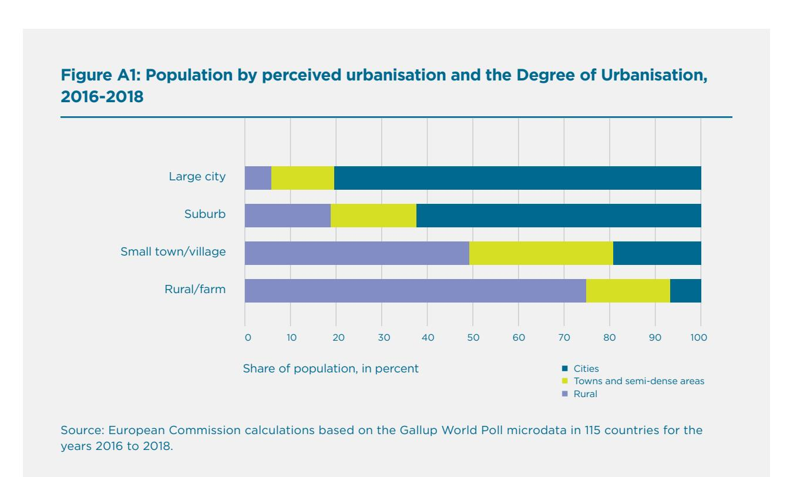

classes. This in turn reduces the size of gap as compared to the perceived level of urbanisation that focuses on more of the extremes of the urban-rural continuum.

## **Life evaluation, feelings and making friends by Degree of Urbanisation**

In cities, life evaluation scores are generally higher than those in rural areas. In an average country in this sample, life evaluation is between 0.2 and 0.6 higher in cities than in rural areas, depending on the country income level (See Figure 2). The difference in life evaluation scores between cities and rural areas is smallest in the high-income countries included in this sample of 115 countries. People living in towns and semidense areas tend to rate their life evaluations in between those in cities and rural areas.

The higher life evaluation in cities is mirrored by parallel findings for the prevalence of positive and negative feelings. More people experienced enjoyment in cities than in rural areas, and physical pain and sadness are more common in rural areas than in cities. This gap is especially big in the low-income countries in which 46% of the people in rural areas stated they experienced physical pain a lot yesterday compared to 43% in towns and semi-dense areas and 41% in cities. Sadness is also more prevalent in rural areas in low-income countries with 38% stating they experience sadness a lot of the day as compared to only 34% in cities.

These differences may in part be due to lower access to services (such as health care) in rural areas, different type of jobs (with more hard and manual labour in rural areas), and lower incomes. In rural areas, more people work in agriculture, which tends to pay less and is more vulnerable to changes in weather and fluctuations in market prices. The Gallup World Poll shows that more people are self-employed in rural areas, which may also lead to a less predictable income. Furthermore, the Gallup World Polls shows that more people in rural areas lack money to pay for food than in cities.

Despite the image of rural life being more closely knit, fewer people in rural areas than in cities say they have relatives or friends they can count on to help them when they are in trouble. This gap is again the biggest in the low-income countries,

with 63% of the people in rural areas saying they can count on family or friends as compared to 68% in cities. In high-income countries, more people say they can count on family or friends than in low- and middle-income countries and the gap between rural areas and cities is smaller (87% in rural areas and 89% in cities). This may be in part because in rural areas economies tend to be less diversified, which means that if one person's income shrinks or disappears many of his or her neighbours will be in the same situation, making it harder to help each other. This could happen, for example, due to a drought or a big employer shutting down.

Life in cities is socially more satisfying than in rural areas. The difference between cities and rural areas for the share of people satisfied with the opportunities to meet people and make friends is biggest in high-income countries, in which 79% of the people living in cities are satisfied compared to 68% in rural areas. Towns and semi-dense areas score almost as well as cities in all the four income groups.

In cities more people experience joy and fewer experience pain or sadness than in rural areas, especially in low- and middle-income countries. More city dwellers feel they can rely on family or friends for help, meet people, and make friends than people living in rural areas. It should not come as a surprise that city dwellers evaluate their life more highly and that migration tends to go from rural areas to cities.

### **Methodology**

The figures presented here are based on data from the Gallup World Poll in 115 countries coded by Degree of Urbanisation for the years of 2016, 2017 and 2018 and the World Bank country income classifications. The European Commission and Gallup have agreed to continue the coding of the Gallup World Poll in countries with geotagged face-to-face interviews and the USA until 2022. The newly developed Degree of Urbanisation variable is available through a free download (as a .csv file) that Gallup data subscribers can integrate back into the World Poll data sets. https://news.gallup.com/poll/287000/ new-definition-urban-rural.aspx

The figures presented are the unweighted averages of the weighted respondents for those

Figure A2: Life evaluation, feelings and friends by Degree of Urbanisation and country by income level, 2016-2018

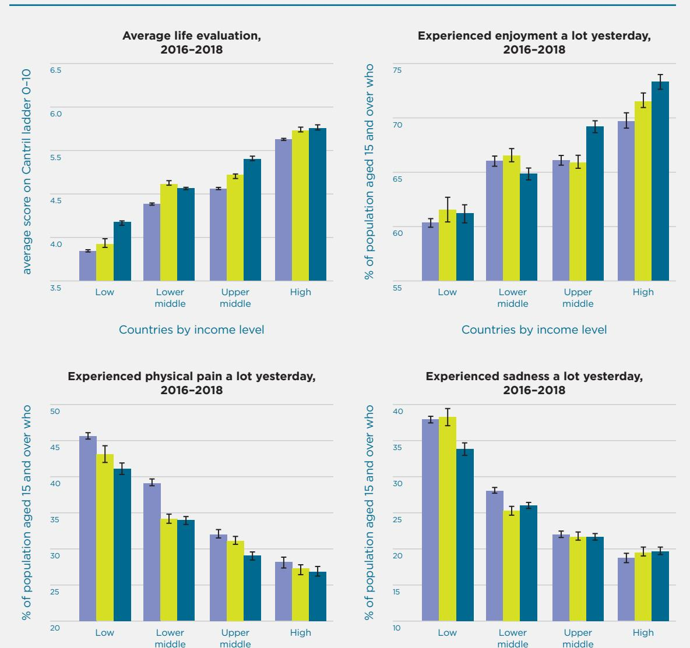

Countries by income level

Towns and semi-dense areasRural

■ Cities

Source: Gallup World Poll

Source: European Commission calculations using Gallup World Poll microdata in 115 countries. The 95% confidence intervals are included on the graphs. The averages are not weighted by country population to show the differences in the average country.

Countries by income level

Population weighted averages show a similar pattern, with the exception of life evaluation in high-income countries, where the gap between cities and rural areas becomes statistically insignificant.

countries covered by face-to-face surveys and the USA for scores by Degree of Urbanisation. In other words, they show the experience and opinion of someone living in a city, town and semi-dense area, or rural area in an average country of that specific income level; not the average rural or city resident. This approach was chosen because it shows average gap between cities and rural areas. A population-weighted average would primarily reflect the gaps in the biggest countries, while the small countries would only have negligible impact.

It is important to note that a significant number of middle- and high-income countries are not included in the analysis, as in those countries the surveys telephone-based and precise information about the location of the respondent is not available. For that reason, many EU countries are not present.

Both authors work for the European Commission. Nevertheless, this document reflects the views only of the authors; the European Commission cannot be held responsible for any use made of the information contained therein.

The World Happiness Report was written by a group of independent experts acting in their personal capacities. Any views expressed in this report do not necessarily reflect the views of any organization, agency or programme of the United Nations.

This publication may be reproduced using the following reference: Helliwell, John F., Richard Layard, Jeffrey Sachs, and Jan-Emmanuel De Neve, eds. 2020. *World Happiness Report 2020.* New York: Sustainable Development Solutions Network.

Full text and supporting documentation can be downloaded from the website: **http://worldhappiness.report/**

#happiness2020 #WHR2020

ISBN 978-1-7348080-0-1

scientists, engineers, business and civil society leaders, and development to support sustainable development.

475 Riverside Dr. STE 530

The World Happiness Report is a publication of the Sustainable Development Solutions Network, powered by data from the Gallup World Poll, and supported by the Ernesto Illy Foundation, illycaffè, Davines Group, Blue Chip Foundation, the William, Jeff, and Jennifer Gross Family Foundation, and Unilever's largest ice cream brand Wall's.