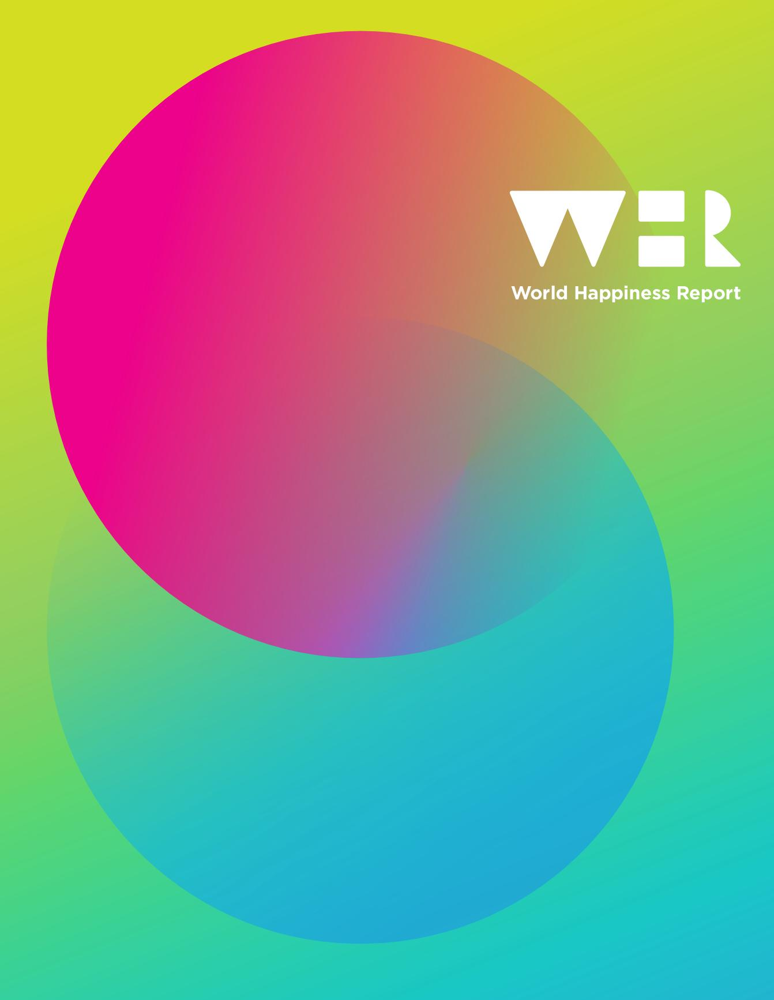

# Table of Contents

# World Happiness Report 2021

|   | Foreword 3                                                                                                                                        |
|---|---------------------------------------------------------------------------------------------------------------------------------------------------|
| 1 | Overview: Life under COVID-19 5 Helliwell, Layard, Sachs, De Neve, Aknin, & Wang                                                               |
| 2 | Happiness, Trust and Deaths under COVID-19 13 Helliwell, Huang, Wang, & Norton                                                              |
| 3 | COVID-19 Prevalence and Well-being: Lessons from East Asia 57 Ma, Wang, & Wu                                                                |
| 4 | Reasons for Asia-Pacific Success in Suppressing COVID-19  91 Sachs                                                                    |
| 5 | Mental Health and the COVID-19 Pandemic 107 Banks, Fancourt, & Xu                                                                              |
| 6 | Social Connection and Well-Being during COVID-19 . 131 Okabe-Miyamoto & Lyubomirsky                                                         |
| 7 | Work and Well-being during COVID-19: Impact, Inequalities, Resilience, and the Future of Work 153 Cotofan, De Neve, Golin, Kaats, & Ward |
| 8 | Living Long and Living Well: The WELLBY Approach . 191 Layard & Oparina                                                                     |

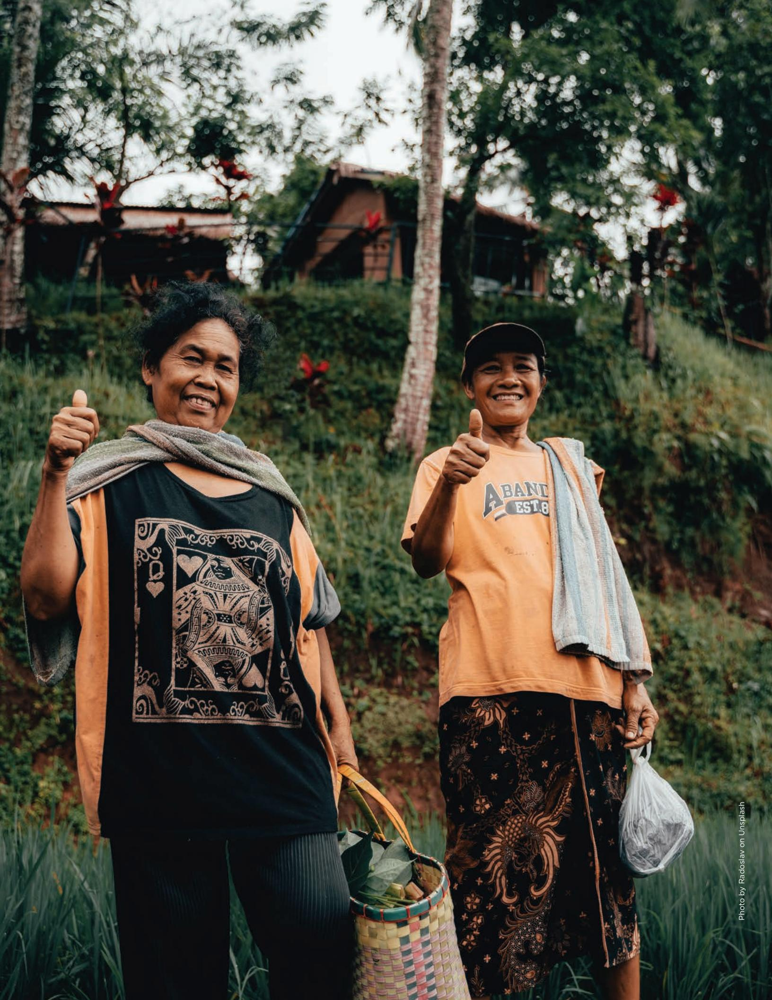

## **Foreword**

This is the ninth World Happiness Report. We use this Foreword to offer our thanks to all those who have made the Report possible over the past nine years and to thank our team of editors and partners as we prepare for our decennial report in 2022.

The first eight reports were produced by the founding trio of co-editors assembled in Thimphu in July 2011 pursuant to the Bhutanese Resolution passed by the General Assembly in June 2011 that invited national governments to "give more importance to happiness and well-being in determining how to achieve and measure social and economic development." The Thimphu meeting, chaired by Prime Minister Jigme Y. Thinley and Jeffrey D. Sachs, was called to plan for a United Nations High-Level Meeting on 'Well-Being and Happiness: Defining a New Economic Paradigm' held at the UN on April 2, 2012. The first World Happiness Report was prepared in support of that meeting and reviewing evidence from the emerging science of happiness.

The preparation of the first World Happiness Report was based in the Earth Institute at Columbia University, with the Centre for Economic Performance's research support at the LSE and the Canadian Institute for Advanced Research, through their grants supporting research at the Vancouver School of Economics at UBC. The central base for the reports has since 2013 been the Sustainable Development Solutions Network (SDSN) and The Center for Sustainable Development at Columbia University, directed by Jeffrey D. Sachs. Although the editors and authors are volunteers, there are administrative, and research support costs covered most recently through a series of grants from The Ernesto Illy Foundation, illycaffè, Davines Group, The Blue Chip Foundation, The William, Jeff, and Jennifer Gross Family Foundation, The Happier Way Foundation, Indeed, and Unilever's largest ice cream brand Wall's.

As noted within the report, this year has been one like no other. The Gallup World Poll team has faced significant challenges in collecting responses this year due to COVID-19, and we much appreciate

their efforts to provide timely data for this Report. We were also grateful for the World Risk Poll data provided by the Lloyd's Register Foundation as part of their risk supplement to the Gallup World Poll in 2019. We also greatly appreciate the life satisfaction data collected during 2020 as part of the Covid Data Hub run in 2020 by Imperial College London and the YouGov team. These data partnerships are all much appreciated.

Although the World Happiness Reports are based on a wide variety of data, the most important source has always been the Gallup World Poll, which is unique in the range and comparability of its global series of annual surveys.

The life evaluations from the Gallup World Poll provide the basis for the annual happiness rankings that have always sparked widespread interest. Readers may be drawn in by wanting to know how their nation is faring but soon become curious about the secrets of life in the happiest countries. The Gallup team has always been extraordinarily helpful and efficient in getting each year's data available in time for our annual launches on International Day of Happiness, March 20th. Right from the outset, we received very favourable terms from Gallup and the very best of treatment. Gallup researchers have also contributed to the content of several World Happiness Reports. The value of this partnership was recognized by two Betterment of the Human Conditions Awards from the International Society for Quality of Life Studies. The first was in 2014 for the World Happiness Report, and the second, in 2017, went to the Gallup Organization for the Gallup World Poll.

Since last year, Gallup has been a full data partner in recognition of the Gallup World Poll's importance to the contents and reach of the World Happiness Report. We are proud to embody in this more formal way a history of co-operation stretching back beyond the first World Happiness Report to the start of the Gallup World Poll itself. COVID-19 has posed unique problems for data collection, and the team at Gallup has been extremely helpful in building the largest possible sample of data in time for inclusion in this report. They have gone the extra mile, and we thank them for it.

We have had a remarkable range of expert contributing authors over the years and are deeply grateful for their willingness to share their knowledge with our readers. Their expertise assures the quality of the reports, and their generosity is what makes it possible. Thank you.

Our editorial team has evolved over the years. In 2017, we added Jan-Emmanuel De Neve, Haifang Huang, and Shun Wang as Associate Editors, joined in 2019 by Lara Aknin. In 2020, Jan-Emmanuel De Neve became a co-editor, and the Oxford Wellbeing Research Centre thereby became a fourth research pole for the Report. In 2021, Haifang Huang stepped down as an Associate Editor, following four years of much-appreciated service. He has kindly agreed to continue as co-author of Chapter 2, where his contributions have been crucial since 2015.

Sharon Paculor has continued her excellent work as the Production Editor. For many years, Kyu Lee of the Earth Institute handled media management with great skill, and we are very grateful for all he does to make the reports widely accessible. Ryan Swaney has been our web designer since 2013, and Stislow Design has done our graphic design work over the same period.

*John Helliwell, Richard Layard, Jeffrey D. Sachs, Jan-Emmanuel De Neve, Lara Aknin, Shun Wang; and Sharon Paculor, Production Editor*

The team at the Center for Sustainable Development at Columbia University, Sybil Fares, Juliana Bartels, Meredith Harris, and Savannah Pearson, and Jesse Thorson, have provided an essential addition to our editorial and proof-reading capacities. All have worked on very tight timetables with great care and friendly courtesy.

Our data partner is Gallup, and institutional sponsors include the Sustainable Development Solutions Network (SDSN), the Center for Sustainable Development at Columbia University, the Centre for Economic Performance at the LSE, the Vancouver School of Economics at UBC, and the Wellbeing Research Centre at Oxford.

Whether in terms of research, data, or grants, we are enormously grateful for all of these contributions.

# Chapter 1

# Overview: Life under COVID-19

John F. Helliwell

Richard Layard

Jeffrey D. Sachs

Jan-Emmanuel De Neve

Lara B. Aknin

Shun Wang

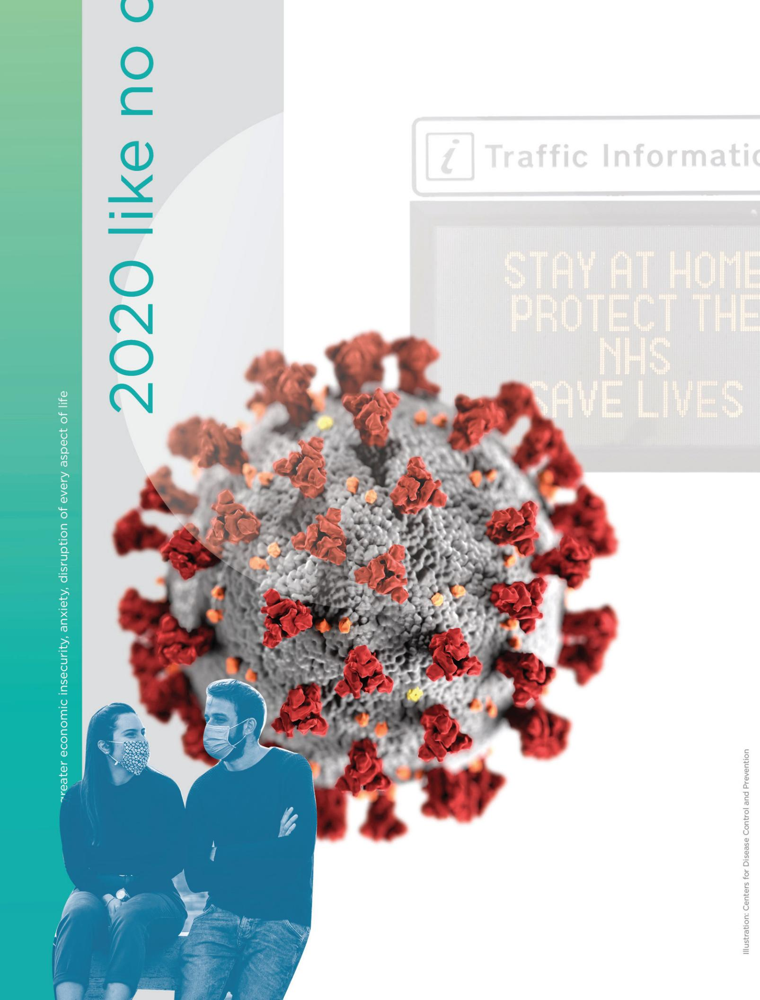

2020 has been a year like no other. This whole report focuses on the effects of COVID-19 and how people all over the world have fared. Our aim was two-fold, first to focus on the effects of COVID-19 on the structure and quality of people's lives, and second to describe and evaluate how governments all over the world have dealt with the pandemic. In particular, we try to explain why some countries have done so much better than others.

- The pandemic's worst effect has been the 2 million deaths from COVID-19 in 2020. A rise of nearly 4% in the annual number of deaths worldwide represents a serious social welfare loss.
- For the living there has been greater economic insecurity, anxiety, disruption of every aspect of life, and, for many people, stress and challenges to mental and physical health.

# **Happiness, trust and deaths under COVID-19 (Chapter 2)**

There has been surprising resilience in how people rate their lives overall. The Gallup World Poll data are confirmed for Europe by the separate Eurobarometer surveys and several national surveys.

- The change from 2017-2019 to 2020 varied considerably among countries, but not enough to change rankings in any significant fashion materially. The same countries remain at the top.
- Emotions changed more than did life satisfaction during the first year of COVID-19, worsening more during lockdown and recovering faster, as illustrated by large samples of UK data. For the world as a whole, based on the annual data from the Gallup World Poll, there was no overall change in positive affect, but there was a roughly 10% increase in the number of people who said they were worried or sad the previous day.

- Trust and the ability to count on others are major supports to life evaluations, especially in the face of crises. To feel that your lost wallet would be returned if found by a police officer, by a neighbour, or a stranger, is estimated to be more important for happiness than income, unemployment, and major health risks (see Figure 2.4 in chapter 2).
- Trust is even more important in explaining the very large international differences in COVID-19 death rates, which were substantially higher in the Americas and Europe than in East Asia, Australasia, and Africa, as shown here (see Figure 2.5 of chapter 2). These differences were almost half due to differences in the age structure of populations (COVID-19 much more deadly for the old), whether the country is an island, and how exposed each country was, early in the pandemic, to large numbers of infections in nearby countries. Whatever the initial circumstances, the most effective strategy for controlling COVID-19 was to drive community transmission to zero and to keep it there. Countries adopting this strategy had death rates close to zero, and were able to avoid deadly second waves, and ended the year with less loss of income and lower death rates.
- Factors supporting successful COVID-19 strategies include
  - confidence in public institutions. Trusted public institutions were more likely to choose the right strategy and have their populations support the required actions. For example, Brazil's death rate was 93 per 100,000, higher than in Singapore, and of this difference, over a third could be explained by the difference in public trust.
  - income inequality, acting partly as a proxy for social trust, explains 20% of the difference in death rates between Denmark and Mexico. A second measure of social trust, whether there was a high expected return of lost wallets found by

- neighbours or strangers, was associated with far fewer deaths.
- whether the country had, or learned from, the lessons from SARS and other earlier pandemics.
- whether the head of the government was a woman.

# **COVID-19 prevalence and well-being: lessons from East Asia (Chapter 3)**

East Asia, Australia, and New Zealand's success are explained in detail as a case study in Chapter 3. The chapter describes country by country, the workings of test and trace and isolate, and travel bans to ensure that the virus never got out of control. It also analyses citizens' responses, stressing that policy can be effective when citizens are compliant (as in East Asia) and more freedom-oriented (as in Australia and New Zealand). In East Asia, as elsewhere, the evidence shows that people's morale improves when the government acts.

- The success of the Asia/Pacific countries in controlling deaths has not been at the cost of greater economic losses. In fact, countries with the highest deaths also had the greatest falls in GDP per head (r = 0.34). Thus, in 2020, there was no choice between health and a successful economy. The route to success on both scores came from rapid, decisive intervention wherever cases appeared (test and trace, and quarantining of those at risk) as well as personal hygiene (including masks) and quarantining of international travellers.
- The rise in the daily number of new confirmed cases was found to be associated with a lower level of the public expressed happiness in mainland China, and a higher level of negative affect in the other four East Asian regions. However, having stricter mobility control and physical distancing policies considerably offset the decrease in happiness caused by the rise in the daily new confirmed cases.

• In early 2020, East Asian countries were better prepared to act because of their previous pandemics experience. However, by mid-2020, the international evidence was clear – you have to suppress the virus. But in the summer, the West opened up and had a second wave of infections that as bad as the first.

# **Reasons for Asia-Pacific success in suppressing COVID-19 (Chapter 4)**

- The Asia-Pacific region has achieved notable success compared to the North Atlantic region in controlling the pandemic, with far lower mortality rates and greater successful implementation of Non-Pharmaceutical Interventions (NPIs) to stop the spread of the disease, such as border controls; face-mask use; physical distancing; and widespread testing, contact tracing, and quarantining (or home isolation) of infected individuals.
- The successes of NPI implementation in the Asia-Pacific region resulted from measures that were both *top-down*, with governments setting strong control policies, and *bottomup*, with the general public supporting governments and complying with government-directed public health measures.
- The more individualistic culture of the North Atlantic countries compared to countries in the Asia-Pacific region and the relative looseness of social norms may also have contributed to lower public support for NPIs. Assertions of "personal liberty" and demands for privacy in the North Atlantic contributed to the reluctance of individuals in the North Atlantic countries to comply with public health measures such as contact tracing.
- A lack of sufficient scientific knowledge among the populations of the North Atlantic countries has also contributed to the failure of effective pandemic control due to the public's lack of understanding of the epidemiology of the pandemic and susceptibility to false information and fake news.

**World Happiness Report 2021** Photo by Alec Favale on Unsplash

# **Mental health in the COVID-19 pandemic (Chapter 5)**

Mental health has been one of the casualties both of the pandemic and the resulting lockdowns. As the pandemic struck, there was a large and immediate decline in mental health in many countries worldwide. Estimates vary depending on the measure used and the country in question, but the findings are remarkably similar. In the UK, in May 2020, a general measure of mental health was 7.7% lower than predicted in the absence of the pandemic, and the number of mental health problems reported was 47% higher.

- The early decline in mental health was higher in groups that already had more mental health problems – women, young people, and poorer people. It thus increased the existing inequalities in mental well-being.
- However, after the sharp initial decline in mental health, there was a considerable improvement in average mental health, though not back to where it started. But a significant proportion of people (22% in the UK) had mental health that was persistently and significantly lower than before COVID-19.
- At the same time, as mental healthcare needs have increased, mental health services have been disrupted in many countries. This is serious when we consider that the pandemic is likely to leave a lasting impact on the younger generation.
- On the positive side, the pandemic has shone a light on mental health as never before. This increased public awareness bodes well for future research and better services that are so urgently needed.

# **Social connections and well-being during COVID-19 (Chapter 6)**

• One major element in COVID-19 policy has been physical distancing or self-isolation, posing a significant challenge for people's social connections, vital for their happiness.

- People whose feeling of connectedness fell had decreased happiness, as did people whose sense of loneliness increased and whose social support was reduced.
- Many positive features of a person's life helped to protect their sense of connectedness. These included gratitude, grit, prior connections, volunteering, taking exercise, and having a pet. It also helped to have activities that provided 'flow.'
- Likewise, there were negative features that weakened a person's protection. These included prior mental illness, a sense of uncertainty, and a lack of proper digital connections. Clearly, digital connection is vital, and many people have been helped by digital programmes promoting mental health.

# **Work and well-being during COVID-19: impact, inequalities, resilience, and the future of work (Chapter 7)**

- Global GDP is estimated to have shrunk by roughly 5% in 2020, representing the largest economic crisis in a generation. In many countries, job vacancies remained approximately 20% below normal levels by the end of 2020. Young people, low-income, and low-skill workers have also been more likely to lose working hours or lose their jobs entirely.
- Not being able to work has had a negative impact on well-being. Unemployment during the pandemic is associated with a 12% decline in life satisfaction and a 9% increase in negative affect. For labour market inactivity, these figures are 6.3% and 5%, respectively. While young people report lower levels of well-being than other age groups, the effect of not being able to work is less severe than older cohorts, suggesting that they may be more optimistic about future labour market opportunities post-COVID-19. Countries that have introduced more substantial labour market

protections for workers have generally seen less severe declines in well-being.

- For those who have remained at work, the impact is mixed. In the United States, workplace happiness declined just before the federal emergency declaration in March, followed by a quick recovery. Suggesting that (a) happier workers may have been more likely to retain their jobs, (b) workers' reference groups may have changed, or (c) workers remaining employed may have been more able to work from home in the first place, and therefore have been less negatively affected. Supportive management and job flexibility have become even more important drivers of workplace well-being during the pandemic. Purpose, achievement, and learning at work have become less important. However, other drivers' importance (trust, support, inclusivity, belonging, etc.) have remained unchanged, suggesting that what makes workplaces supportive of well-being in normal times also makes them more resilient in hard times.
- Social support can protect against the negative impact of not being able to work. In the United Kingdom, the negative effect of not working on life satisfaction was 40% more severe for lonely workers to begin with. Furloughing helps but may not fully compensate for the negative impact of not working. Furloughed workers, even those without any income loss, still experienced a significant decline in life satisfaction relative to those who continued working.
- The impacts of the pandemic on the world of work are likely to endure. Evidence from past recessions and early research from the COVID-19 pandemic suggests that young people who come of age in worse macroeconomic conditions are more likely to be driven by financial security in adulthood. The shift to remote working is likely to last long after the crisis has subsided. Providing future workers with more flexibility and control over their working lives, but at the risk of undermining social capital at work.

# **Living long and living well: the WELLBY approach (Chapter 8)**

To evaluate social progress and to make effective policy, we have to take into account both:

- o the quality of life, and
- o the length of life.

Health economists use the concept of Quality-Adjusted Life Years to do this, but they only count the individual patient's health-related quality of life. In the well-being approach, we consider total well-being, whoever experiences it, and for whatever reason: All policy-makers should aim to maximise the Well-Being-Adjusted Life-Years (or WELLBYs) of all who are born. And include the life-experiences of future generations (subject to a small discount rate).

- The well-being approach puts a lower value than is customary upon money relative to life. According to many studies in rich countries, an extra \$1 raises WELLBYs by around 1/100,000 points. But an extra year of life increases WELLBYs by around 7.5 WELLBYs. So, the community should value a year of life equally to \$750,000 of GDP.
- The WELLBY approach also provides a more complete way of measuring human progress and comparing the performance of different countries. It does this by multiplying average well-being by life expectancy. On this basis, the number of WELLBYs per person rose by 1.3% between 2006-08 and 2017-19, due to higher lifeexpectancy, especially in the less healthy countries. This was a significant reduction in fundamental inequality across the world, and inequality remains lower in 2020 despite COVID-19.

# Chapter 2

# World Happiness, Trust and Deaths under COVID-19

# John F. Helliwell

Vancouver School of Economics, University of British Columbia

# Haifang Huang

Associate Professor, Department of Economics, University of Alberta

## Shun Wang

Professor, KDI School of Public Policy and Management

## Max Norton

Vancouver School of Economics, University of British Columbia

# life evaluations and emotions

# **Introduction**

This ninth *World Happiness Report* is unlike any that have come before. COVID-19 has shaken, taken, and reshaped lives everywhere. In this chapter, our central purpose remains just what it has always been – to measure and use subjective well-being to track and explain the quality of lives all over the globe. Our capacity to do this has been shaken at the same time as the lives we are struggling to assess. While still relying on the Gallup World Poll as our primary source for our measures of the quality of life, this year, we tap a broader variety of data to trace the size and distribution of the happiness impacts of COVID-19. We also devote equal efforts to unravelling how geography, demography, and the spread of the virus have interacted with each country's scientific knowledge and social and political underpinnings, especially their institutional and social trust levels, to explain international differences in death rates from COVID-19.

First, we shall present the overall life evaluations and measures of positive and negative emotions (affect) for those countries for which 2020 surveys are available. The resulting rankings exclude the many countries without 2020 surveys, and the smaller sample sizes, compared to the three-year averages usually used, increase their imprecision. We then place these rankings beside those based on data for 2017-2019, before COVID-19 struck, and also present our usual ranking figure based on the three-year average of life evaluations 2018-2020.

Second, we use responses at the individual level to investigate how COVID-19 has affected the happiness of different population subgroups, thus attempting to assess possible inequalities in the distribution of the well-being consequences of COVID-19.

Third, we review and extend the evidence on the links between trust and well-being. We find evidence that trust and benevolence are strong supports for well-being, and also for successful strategies to control COVID-19. We present new evidence on the power of expected benevolence, as measured by the extent to which people think their lost wallets would be returned if found by

neighbours, strangers, or the police. All are found to be strong supports for well-being, and for effective COVID-19 strategies.

Fourth, we turn to examine how different features of national demographic, social and political structures have combined with the consequences of policy strategies and disease exposure to help explain international differences in 2020 death rates from COVID-19. A central feature of our evidence is the extent to which the quality of the social context, and especially the extent to which people trust their governments, and have trust in the benevolence of others, supports not only their ability to maintain their happiness before and during the pandemic but also reduces the COVID-19 death toll by facilitating more effective strategies for limiting the spread of the pandemic while maintaining and building a sense of common purpose.

Our results are summarized in a short concluding section.

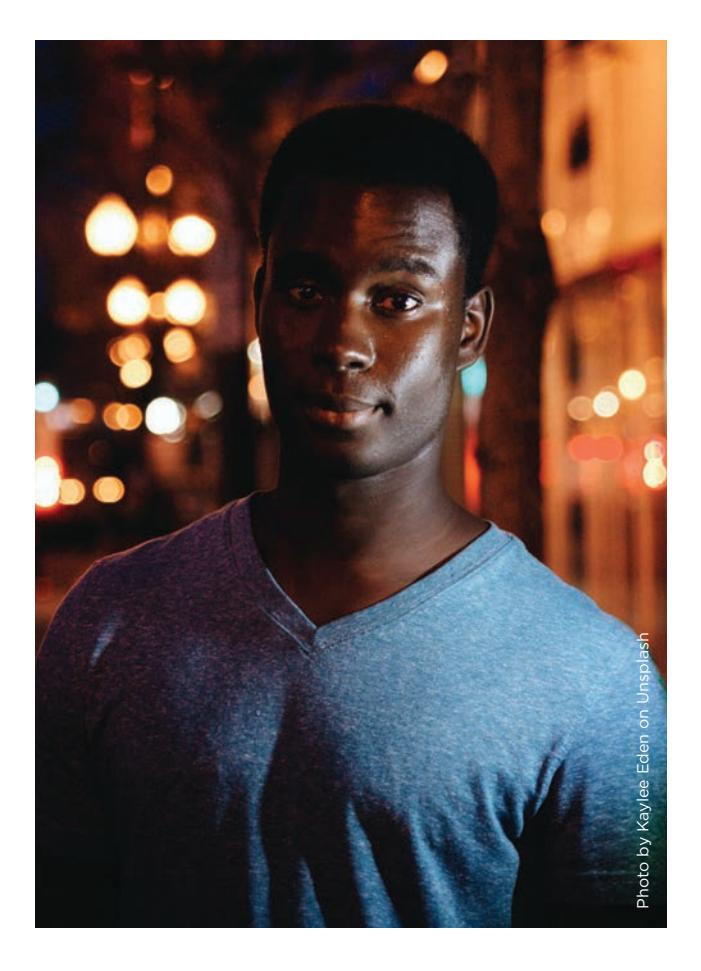

#### **Technical Box 1: Measuring subjective well-being**

Our measurement of subjective well-being relies on three main indicators: life evaluations, positive emotions, and negative emotions (described in the report as positive and negative affect). Our happiness rankings are based on life evaluations, as the more stable measure of the quality of people's lives. In *World Happiness Report 2021*, we pay more attention than usual to specific daily emotions (the components of positive and negative affect) to better track how COVID-19 has altered different aspects of life.

*Life evaluations.* The Gallup World Poll, which remains the principal source of data in this report, asks respondents to evaluate their current life as a whole using the image of a ladder, with the best possible life for them as a 10 and worst possible as a 0. Each respondent provides a numerical response on this scale, referred to as the Cantril ladder. Typically, around 1,000 responses are gathered annually for each country. Weighted averages are used to construct populationrepresentative national averages for each year in each country. We base our usual happiness rankings on a three-year average to increase the sample size to give more precise estimates. This year, in order to focus on the effects of COVID-19, we consider how life evaluations and emotions in 2020 compare to their averages for 2017-2019.

*Positive emotions.* Respondents to the Gallup World Poll are asked whether they smiled or laughed a lot yesterday and whether they experienced enjoyment during a lot of yesterday. For each of these two questions, if a person says no, their response is coded as 0. If a person says yes, their response is coded as a 1. We calculate the average

response for each person, with values ranging from 0 and 1. When needed, we use weighted averages across all individuals surveyed within a country to give national averages for positive affect.

*Negative emotions.* Negative affect is measured by asking respondents whether they experienced specific negative emotions during a lot of the day yesterday. Negative affect, for each person, is given by the average of their yes or no answers about three emotions: worry, sadness, and anger. National averages are created in the same way as for positive affect.

Comparing life evaluations and emotions:

- Life evaluations provide the most informative measure for international comparisons because they capture quality of life in a more complete and stable way than emotional reports based on daily experiences.
- Life evaluations differ more between countries than emotions and are better explained by the widely differing life experiences in different countries. Emotions yesterday are well explained by events of the day being asked about, while life evaluations more closely reflect the circumstances of life as a whole. But we find and will show later in the chapter that emotions are significant supports for life evaluations.
- Positive emotions are almost three times more frequent (global average of 0.71) than negative emotions (global average of 0.27).

# **How have life evaluations and emotions evolved in 2020?**

The Gallup World Poll, which has been our principal source of data for assessing lives around the globe, has not been able to conduct the face-to-face interviews that were previously used for more than three-quarters of the countries surveyed. Conversion from computer-assisted personal interviews (CAPI) to computer-assisted telephone interviews (CATI) has been difficult and time-consuming. The number of 2020 surveys available in time for our analysis is about twothirds as large as usual. The change of mode does not affect the industrial countries, most of which were already being surveyed by telephone in previous years. Earlier research on the effect of survey mode has shown that answers to some questions differ between telephone and in-person surveys, while answers to well-being questions were subject to very small mode effects. Recent UK large-sample evidence found life satisfaction to be only 0.04 points higher by telephone than in-person interviewing.1 However, the shift from personal interviews to phone surveys may in some countries have changed the pool of respondents in various ways, only some of which can be adjusted for by weighting techniques. This leads us to be somewhat cautious when interpreting the results reported for 2020. But the overall rankings for 2020, especially among the top countries, are unlikely to have been altered by pure mode effects, since most of the top countries were already being reached by telephone surveys prior to 2020, while the countries that shifted to telephone mode in 2020 (marked by an asterisk beside their country names in Table 2.1) are grouped further down in the rankings.

Regular readers of this report will remember that our rankings are based on the average of surveys from the three previous years, so the number of countries covered by our usual procedures is somewhat less affected. Most countries not surveyed in 2020 continue to be represented by their 2018 and 2019 survey results. This year's version, along with the estimated contributions from our six supporting factors, appears here as Figure 2.1. Given our emphasis on life under COVID-19, we also pay special attention to the 2020 surveys and compare them with 2017-2019 data.

First a look at the primary data for 2020. The first column of Table 2.1 shows ranked orderings of average national life evaluations based on the 2020 surveys, accompanied in the second column by a ranked list of the same countries based on the 2017-2019 surveys used for the national rankings in *World Happiness Report 2020*. From the 95% confidence regions shown for both series, it is easy to see that the bands are much wider for 2020, primarily because the sample sizes are generally 1,000 compared to 3,000 for the combined sample covering 2017-2019.

Figure 2.1 combines the 2020 data with that from 2018 and 2019, just as done in a normal year. The figure covers 149 countries, because countries are included as long as they have had one or more surveys in the 2018-2020 averaging period. Country positions in all three rankings are quite similar. Comparing the first two rankings, where the number of countries is the same, the pairwise rank correlation is 0.92. Comparing the 2017-2019 rankings with those based on the 2018-2020 data, for the 95 countries with data for 2020, the rank correlation is 0.99. This shows that COVID-19 has led to only modest changes in the overall rankings, reflecting both the global nature of the pandemic and a widely shared resilience in the face of it.

*Global life evaluations have shown remarkable resilience in the face of COVID-19.*

**Table 2.1. Ranking of happiness (average life evaluations) based on the 2020 surveys compared to those in 2017-2019** 

| Country name             | Rank by 2020 score | Score, 2020 (95pct conf. interval) | Rank by 2017-19 score | Score, 2017-19 (95pct conf. interval) |
|--------------------------|-----------------------|---------------------------------------|--------------------------|------------------------------------------|
| Finland                  | 1                     | 7.889 (7.784-7.995)                   | 1                        | 7.809 (7.748-7.870)                      |
| Iceland                  | 2                     | 7.575 (7.405-7.746)                   | 4                        | 7.504 (7.388-7.621)                      |
| Denmark                  | 3                     | 7.515 (7.388-7.642)                   | 2                        | 7.646 (7.580-7.711)                      |
| Switzerland              | 4                     | 7.508 (7.379-7.638)                   | 3                        | 7.560 (7.491-7.629)                      |
| Netherlands              | 5                     | 7.504 (7.412-7.597)                   | 6                        | 7.449 (7.394-7.503)                      |
| Sweden                   | 6                     | 7.314 (7.182-7.447)                   | 7                        | 7.354 (7.283-7.425)                      |
| Germany                  | 7                     | 7.312 (7.163-7.460)                   | 15                       | 7.076 (7.006-7.146)                      |
| Norway                   | 8                     | 7.290 (7.160-7.421)                   | 5                        | 7.488 (7.420-7.556)                      |
| New Zealand              | 9                     | 7.257 (7.124-7.391)                   | 8                        | 7.300 (7.222-7.377)                      |
| Austria                  | 10                    | 7.213 (7.080-7.347)                   | 9                        | 7.294 (7.229-7.360)                      |
| Israel*                  | 11                    | 7.195 (7.072-7.318)                   | 12                       | 7.200 (7.136-7.265)                      |
| Australia                | 12                    | 7.137 (6.984-7.291)                   | 11                       | 7.223 (7.141-7.305)                      |
| Ireland                  | 13                    | 7.035 (6.903-7.166)                   | 14                       | 7.094 (7.016-7.172)                      |
| United States            | 14                    | 7.028 (6.859-7.197)                   | 16                       | 6.940 (6.847-7.032)                      |
| Canada                   | 15                    | 7.025 (6.884-7.166)                   | 10                       | 7.232 (7.153-7.311)                      |
| Czech Republic*          | 16                    | 6.897 (6.743-7.051)                   | 17                       | 6.911 (6.827-6.995)                      |
| Belgium                  | 17                    | 6.839 (6.727-6.950)                   | 18                       | 6.864 (6.796-6.931)                      |
|                          |                       |                                       |                          |                                          |
| United Kingdom           | 18                    | 6.798 (6.671-6.925)                   | 13                       | 7.165 (7.092-7.237)                      |
| Taiwan Province of China | 19                    | 6.751 (6.619-6.883)                   | 24                       | 6.455 (6.379-6.532)                      |
| France                   | 20                    | 6.714 (6.601-6.827)                   | 21                       | 6.664 (6.590-6.737)                      |
| Saudi Arabia             | 21                    | 6.560 (6.370-6.749)                   | 26                       | 6.406 (6.296-6.517)                      |
| Slovakia*                | 22                    | 6.519 (6.360-6.678)                   | 33                       | 6.281 (6.204-6.357)                      |
| Croatia*                 | 23                    | 6.508 (6.304-6.712)                   | 61                       | 5.505 (5.431-5.579)                      |
| Spain                    | 24                    | 6.502 (6.357-6.647)                   | 27                       | 6.401 (6.318-6.484)                      |
| Italy                    | 25                    | 6.488 (6.319-6.658)                   | 28                       | 6.387 (6.303-6.472)                      |
| Slovenia                 | 26                    | 6.462 (6.309-6.615)                   | 30                       | 6.363 (6.277-6.449)                      |
| United Arab Emirates     | 27                    | 6.458 (6.341-6.576)                   | 19                       | 6.791 (6.711-6.871)                      |
| Estonia*                 | 28                    | 6.453 (6.306-6.599)                   | 41                       | 6.022 (5.951-6.092)                      |
| Lithuania*               | 29                    | 6.391 (6.223-6.560)                   | 35                       | 6.215 (6.129-6.302)                      |
| Uruguay*                 | 30                    | 6.310 (6.143-6.476)                   | 25                       | 6.440 (6.351-6.529)                      |
| Kosovo*                  | 31                    | 6.294 (6.059-6.529)                   | 32                       | 6.325 (6.223-6.428)                      |
| Cyprus                   | 32                    | 6.260 (6.088-6.431)                   | 38                       | 6.159 (6.060-6.258)                      |
| Kyrgyzstan*              | 33                    | 6.250 (6.087-6.412)                   | 58                       | 5.542 (5.456-5.627)                      |
| Latvia*                  | 34                    | 6.229 (6.085-6.373)                   | 46                       | 5.950 (5.882-6.018)                      |
| Bahrain                  | 35                    | 6.173 (5.977-6.369)                   | 22                       | 6.657 (6.537-6.777)                      |
| Kazakhstan*              | 36                    | 6.168 (6.000-6.337)                   | 40                       | 6.058 (5.973-6.143)                      |
| Malta                    | 37                    | 6.157 (5.998-6.315)                   | 20                       | 6.773 (6.689-6.857)                      |
| Chile*                   | 38                    | 6.151 (5.984-6.317)                   | 34                       | 6.228 (6.139-6.318)                      |
| Poland*                  | 39                    | 6.139 (5.974-6.305)                   | 36                       | 6.186 (6.117-6.256)                      |
| Japan                    | 40                    | 6.118 (5.985-6.251)                   | 50                       | 5.871 (5.790-5.952)                      |
| Brazil*                  | 41                    | 6.110 (5.888-6.332)                   | 29                       | 6.376 (6.296-6.456)                      |
| Serbia*                  | 42                    | 6.042 (5.834-6.249)                   | 51                       | 5.778 (5.679-5.878)                      |
| Hungary*                 | 43                    | 6.038 (5.833-6.243)                   | 43                       | 6.000 (5.923-6.078)                      |
| Mauritius                | 44                    | 6.015 (5.819-6.211)                   | 39                       | 6.101 (5.989-6.213)                      |
| Mongolia*                | 45                    | 6.011 (5.852-6.171)                   | 63                       | 5.456 (5.377-5.535)                      |
|                          |                       |                                       |                          |                                          |
| Mexico*                  | 46                    | 5.964 (5.765-6.163)                   | 23                       | 6.465 (6.371-6.559)                      |
| Argentina*               | 47                    | 5.901 (5.688-6.113)                   | 45                       | 5.975 (5.870-6.079)                      |
| Thailand*                | 48                    | 5.885 (5.657-6.112)                   | 44                       | 5.999 (5.915-6.082)                      |
| Moldova*                 | 49                    | 5.812 (5.643-5.980)                   | 55                       | 5.607 (5.525-5.690)                      |

**Table 2.1: Ranking of happiness (average life evaluations) based on the 2020 surveys compared to those in 2017-2019** continued

| Country name              | Rank by 2020 score | Score, 2020 (95pct conf. interval) | Rank by 2017-19 score | Score, 2017-19 (95pct conf. interval) |
|---------------------------|-----------------------|---------------------------------------|--------------------------|------------------------------------------|
| South Korea               | 50                    | 5.793 (5.653-5.932)                   | 49                       | 5.872 (5.786-5.959)                      |
| Greece*                   | 51                    | 5.788 (5.620-5.955)                   | 59                       | 5.515 (5.423-5.607)                      |
| China*                    | 52                    | 5.771 (5.649-5.893)                   | 69                       | 5.124 (5.073-5.175)                      |
| Portugal                  | 53                    | 5.768 (5.579-5.957)                   | 48                       | 5.911 (5.807-6.015)                      |
| Montenegro*               | 54                    | 5.722 (5.503-5.941)                   | 57                       | 5.546 (5.450-5.642)                      |
| Colombia*                 | 55                    | 5.709 (5.488-5.930)                   | 37                       | 6.163 (6.053-6.274)                      |
| Bulgaria*                 | 56                    | 5.598 (5.364-5.832)                   | 70                       | 5.102 (5.015-5.188)                      |
| Bolivia*                  | 57                    | 5.559 (5.365-5.753)                   | 52                       | 5.747 (5.648-5.847)                      |
| Bosnia and Herzegovina*   | 58                    | 5.516 (5.314-5.717)                   | 54                       | 5.674 (5.583-5.765)                      |
| Nigeria*                  | 59                    | 5.503 (5.282-5.723)                   | 80                       | 4.724 (4.622-4.826)                      |
| Russia*                   | 60                    | 5.495 (5.366-5.625)                   | 62                       | 5.501 (5.440-5.561)                      |
| El Salvador*              | 61                    | 5.462 (5.227-5.697)                   | 31                       | 6.348 (6.234-6.462)                      |
| Tajikistan*               | 62                    | 5.373 (5.183-5.563)                   | 56                       | 5.556 (5.492-5.619)                      |
| Albania*                  | 63                    | 5.365 (5.139-5.591)                   | 75                       | 4.883 (4.773-4.993)                      |
| Ecuador*                  | 64                    | 5.354 (5.142-5.567)                   | 47                       | 5.925 (5.822-6.029)                      |
| Ghana*                    | 65                    | 5.319 (5.043-5.596)                   | 67                       | 5.148 (5.033-5.263)                      |
| Hong Kong S.A.R. of China | 66                    | 5.295 (5.154-5.437)                   | 60                       | 5.510 (5.420-5.601)                      |
| Laos*                     | 67                    | 5.284 (5.043-5.525)                   | 74                       | 4.889 (4.810-4.968)                      |
| Bangladesh*               | 68                    | 5.280 (5.014-5.546)                   | 77                       | 4.833 (4.754-4.911)                      |
| Ukraine*                  | 69                    | 5.270 (5.072-5.467)                   | 86                       | 4.561 (4.463-4.658)                      |
| Ivory Coast*              | 70                    | 5.257 (4.996-5.517)                   | 64                       | 5.233 (5.090-5.377)                      |
| Cameroon*                 | 71                    | 5.241 (4.953-5.530)                   | 72                       | 5.085 (4.953-5.217)                      |
| Dominican Republic*       | 72                    | 5.168 (4.931-5.406)                   | 53                       | 5.689 (5.552-5.826)                      |
| Georgia*                  | 73                    | 5.123 (4.891-5.356)                   | 81                       | 4.673 (4.588-4.758)                      |
| Philippines*              | 74                    | 5.080 (4.869-5.290)                   | 42                       | 6.006 (5.908-6.104)                      |
| North Macedonia*          | 75                    | 5.054 (4.851-5.256)                   | 66                       | 5.160 (5.068-5.251)                      |
| South Africa*             | 76                    | 4.947 (4.766-5.128)                   | 78                       | 4.814 (4.696-4.932)                      |
| Iran                      | 77                    | 4.865 (4.677-5.052)                   | 82                       | 4.672 (4.563-4.782)                      |
| Turkey*                   | 78                    | 4.862 (4.638-5.085)                   | 68                       | 5.132 (5.054-5.210)                      |
| Zambia*                   | 79                    | 4.838 (4.577-5.099)                   | 92                       | 3.759 (3.641-3.878)                      |
| Morocco*                  | 80                    | 4.803 (4.592-5.013)                   | 71                       | 5.095 (4.986-5.204)                      |
| Iraq*                     | 81                    | 4.785 (4.550-5.021)                   | 79                       | 4.752 (4.634-4.869)                      |
| Tunisia*                  | 82                    | 4.731 (4.502-4.960)                   | 88                       | 4.392 (4.295-4.490)                      |
| Uganda*                   | 83                    | 4.641 (4.381-4.901)                   | 87                       | 4.432 (4.298-4.566)                      |
| Venezuela*                | 84                    | 4.574 (4.345-4.802)                   | 73                       | 5.053 (4.927-5.179)                      |
| Ethiopia*                 | 85                    | 4.549 (4.249-4.850)                   | 90                       | 4.186 (4.110-4.263)                      |
| Kenya*                    | 86                    | 4.547 (4.307-4.786)                   | 84                       | 4.583 (4.450-4.716)                      |
| Egypt*                    | 87                    | 4.472 (4.200-4.745)                   | 91                       | 4.151 (4.081-4.222)                      |
| Namibia*                  | 88                    | 4.451 (4.207-4.695)                   | 85                       | 4.571 (4.452-4.691)                      |
| Myanmar*                  | 89                    | 4.431 (4.223-4.639)                   | 89                       | 4.308 (4.224-4.392)                      |
| Benin*                    | 90                    | 4.408 (4.212-4.603)                   | 65                       | 5.216 (5.064-5.368)                      |
| Cambodia*                 | 91                    | 4.377 (4.140-4.614)                   | 76                       | 4.848 (4.735-4.962)                      |
| India**                   | 92                    | 4.225 (4.151-4.299)                   | 93                       | 3.573 (3.519-3.628)                      |
| Jordan*                   | 93                    | 4.094 (3.882-4.306)                   | 83                       | 4.633 (4.518-4.749)                      |
| Tanzania*                 | 94                    | 3.786 (3.504-4.067)                   | 94                       | 3.476 (3.352-3.600)                      |
| Zimbabwe*                 | 95                    | 3.160 (2.954-3.365)                   | 95                       | 3.299 (3.184-3.414)                      |
|                           |                       |                                       |                          |                                          |

Note: A small number of countries/territories have 2017-19 averages different from those reported in *WHR 2020* due to their 2019 survey data arriving too late for inclusion in *WHR 2020*. An asterisk beside a country name marks a switch from face-to-face interviews to phone interviews in 2020; India added a portion of phone interviews in 2020, amounting to 0.16 of the weighted sample.

Figure 2.1: Ranking of happiness 2018-2020 (Part 1)

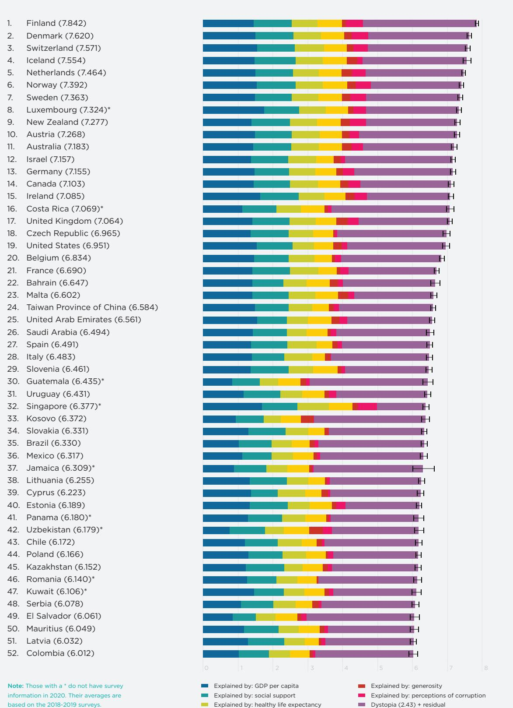

Explained by: freedom to make life choices

→ 95% confidence interval

Figure 2.1: Ranking of happiness 2018-2020 (Part 2)

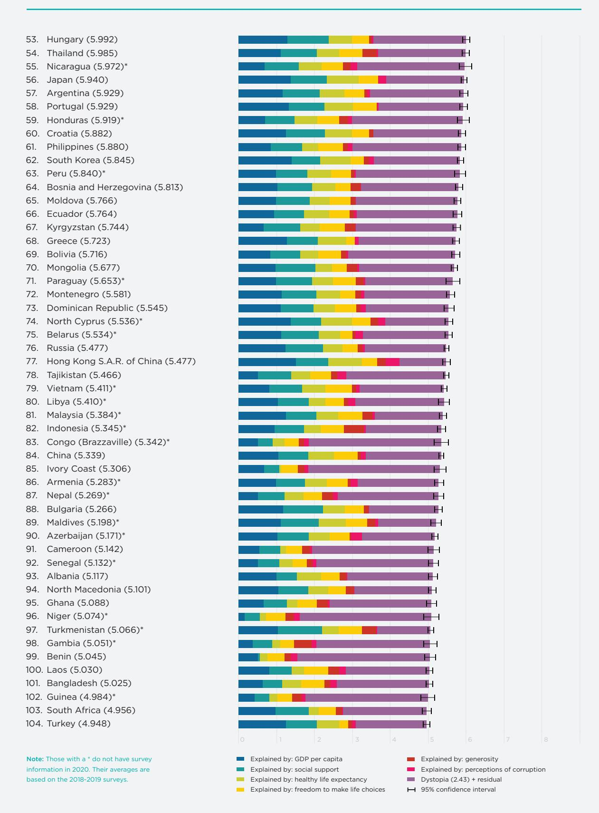

Figure 2.1: Ranking of happiness 2018-2020 (Part 3)

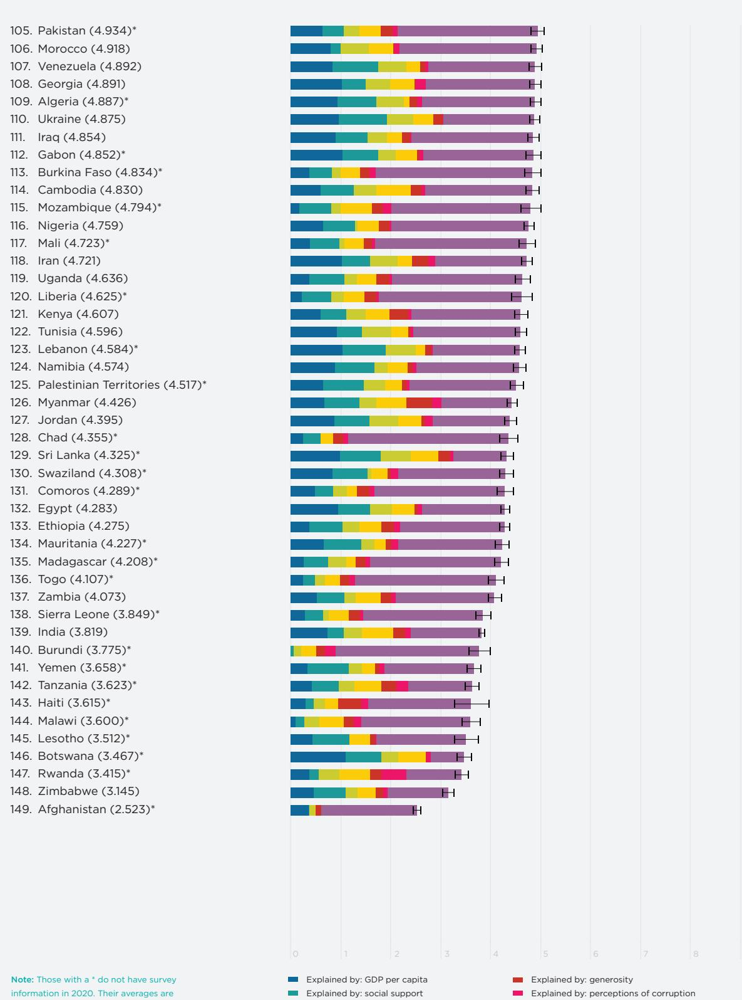

Explained by: healthy life expectancy

Explained by: freedom to make life choices

Dystopia (2.43) + residual

→ 95% confidence interval

information in 2020. Their averages are based on the 2018-2019 surveys.

We remind readers that the rankings in Figure 2.1 depend only on the average life evaluations reported by respondents in the Gallup surveys, and not on our model to explain the international differences. The first six sub-bars for each country/ territory reflect our efforts to attribute the reported life evaluation score in that country to its average income, life expectancy and four social factors. The final bar includes two elements. The first is the residual error, the part of the national average that our model does not explain. The second is the estimated life evaluation in a mythical country called dystopia, since its score is the model's predicted life evaluation (2.43) for an imaginary country having the world's lowest observed values for each of the six variables. With dystopia and the residual included, the sum of all the sub-bars adds up to the actual average life evaluations on which the rankings are based. For more details, please refer to previous annual reports, including *WHR 2020*, and the Statistical Appendix 1.

To get a more precise impression of the direction and size of the national level changes during 2020, Table 2.2 shows the size and significance of changes from 2017-2019 average to 2020 for each country's life evaluations, positive affect, and negative affect. The countries in each column are listed in the order of the estimated size of the changes, with the most improved conditions shown at the top of each list. The first column shows the average changes in life evaluations, on the scale of 0 to 10. The second column shows increases in the average frequency for two measures of positive affect (laughter and enjoyment), where the scale is zero where none of the emotions was felt a lot on the previous day, and 1.0 if all respondents frequently felt all measures on the previous day. The third column shows the average for three measures of negative affect (worry, sadness and anger), but in the reverse ordering, with the countries at the top being those in which the frequency of negative affect has fallen. In all cases, asterisks show the level of statistical significance of the changes.

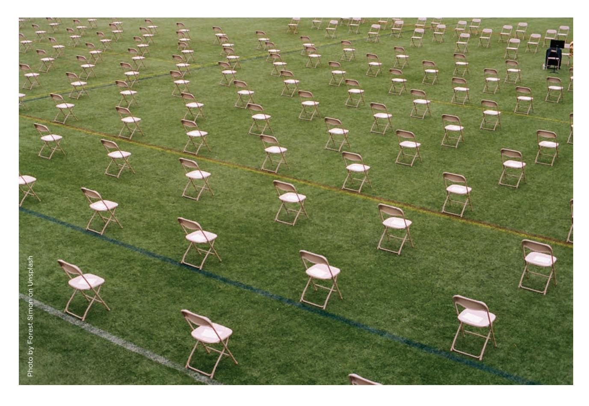

# *The pandemic's toll on negative emotions is clear.*

Using the data from all 95 countries, life evaluations showed an insignificant increase from 2017-2019 to 2020 (+0.036, p=0.354) in a regression analysis of individual-level data for changes in reported means.2 Negative affect showed a significant increase (+0.023, p<0.001) while positive affect was unchanged (-0.000, p=0.991). When comparing changes in life evaluations and emotions, it is important to remember that life evaluations are on a 0 to 10 scale, while emotions are on a 0 to 1 scale. Within negative affect, worry (+0.032, p<0.001) and sadness (+0.029, p<0.001) have both shown statistically significant increases for the global sample of countries, while anger has not changed. Within positive affect, both laughter and enjoyment yesterday were mostly unchanged between 2017-2019 and 2020. Among other COVID-interesting variables in the Gallup World Poll, the reported frequency of stress shows an increase in 2020 (+0.021, p=0.002). There was an increase in the number of people who did something interesting yesterday (+0.031, p<0.001), and in the share of respondents who felt well-rested (+0.014, p=0.007). There was also a significant drop in the reported frequency of health problems (-0.029, p<0.001), which we shall show later was concentrated among those over 60 years of age.

The results in Table 2.2 reveal a considerable variety of national changes in life evaluations and emotions, with the overall stability of the global and regional trends comprising differing national experiences.

For all our measures of subjective well-being and their main determinants, there are some countries with significant improvements and others where life has gotten worse. For life evaluations, there are 26 countries with significant increases, and 20 with decreases marked by two (p<0.05) or three (p<0.01) asterisks. The pandemic's toll on negative emotions is clear, with 42 countries showing significantly higher frequency of negative emotions, compared to 9 where they were significantly less frequent. Positive emotions lie in the middle ground, with 22 countries on the upside and 25 heading down, in all cases relative to the average values in 2017-2019. Given how all lives have been so importantly disrupted, it is remarkable that the averages are so stable.

Many countries with large increases in life evaluations also shifted from in-person to telephone mode in 2020. This led us to investigate more broadly if there was a more general upward movement of life evaluations in countries that shifted from in-person to telephone samples. For the 61 switching countries other than China, there was an average increase of 0.055 points. For the 32 countries that used telephone interview throughout the sample period, there was an average drop of 0.049 points. In neither case was the change statistically significant. Although changes in the composition of surveyed populations may underlie some of the very large life evaluation increases in China and perhaps other countries, the data suggest that the effects of the method change are unlikely to have been large enough for the world as a whole to mask any large drops. As already noted, a careful study of mode effects in the United Kingdom estimated pure mode effects to be 0.04 points, not large enough to materially affect country rankings. Almost all of the top-ranking countries used telephone surveys before 2020, so that for them there has been no shift in mode. There have been both in-person and telephone samples for India, with the in-person responses being lower than telephone responses, while significantly higher than in-person responses in 2019. Hence the reversal in 2020 of the longerterm slide in Indian life evaluations was not attributable to mode effects.

**Table 2.2: Change in well-being from 2017-2019 to 2020**

| Ladder                          |           | Positive affect                  |           | Negative affect                 |           |
|---------------------------------|-----------|----------------------------------|-----------|---------------------------------|-----------|
| Global average                  |           |                                  |           |                                 |           |
| Mean country                    | 0.036     | Mean country                     | -0.000    | Mean country                    | 0.023***  |
| By region                       |           |                                  |           |                                 |           |
| East Asia                       | 0.584***  | South Asia                       | 0.084*    | Western Europe                  | -0.007    |
| South Asia                      | 0.535***  | Central & Eastern Europe         | 0.052***  | South Asia                      | 0.004     |
| Sub-Saharan Africa              | 0.291***  | Middle East/North Africa         | 0.009     | Commonwealth of Indep States | 0.015     |
| Commonwealth of Indep States | 0.156     | Southeast Asia                   | 0.009     | Southeast Asia                  | 0.017     |
| Central & Eastern Europe        | 0.151     | Sub-Saharan Africa               | -0.002    | Sub-Saharan Africa              | 0.025     |
| North America + Australia/NZ | 0.048     | Western Europe                   | -0.006    | North America + Australia/NZ | 0.028***  |
| Middle East/North Africa        | 0.043     | Commonwealth of Indep States  | -0.014    | Middle East/North Africa        | 0.042     |
| Western Europe                  | 0.019     | North America + Australia/ NZ | -0.03***  | Latin America & Caribbean       | 0.050***  |
| Latin America & Caribbean       | -0.327*** | Lat America & Car                | -0.044*** | East Asia                       | 0.054***  |
| Southeast Asia                  | -0.392    | East Asia                        | -0.058*** | Central & Eastern Europe        | 0.082***  |
| By country                      |           |                                  |           |                                 |           |
| Zambia                          | 1.079***  | Croatia                          | 0.148***  | Benin                           | -0.151*** |
| Croatia                         | 1.003***  | Moldova                          | 0.128***  | Morocco                         | -0.126*** |
| Nigeria                         | 0.779***  | Latvia                           | 0.120***  | Hong Kong                       | -0.068*** |
| Ukraine                         | 0.709***  | Czech Republic                   | 0.105***  | Ivory Coast                     | -0.050*** |
| Kyrgyzstan                      | 0.708***  | Lithuania                        | 0.095***  | Albania                         | -0.043*** |
| India                           | 0.652***  | India                            | 0.094***  | Italy                           | -0.040**  |
| China                           | 0.647***  | Egypt                            | 0.083***  | Ethiopia                        | -0.034    |
| Mongolia                        | 0.555***  | Serbia                           | 0.078***  | Zambia                          | -0.033*   |
| Bulgaria                        | 0.496***  | Ukraine                          | 0.074***  | Bolivia                         | -0.032*   |
| Albania                         | 0.482***  | Iraq                             | 0.071***  | Israel                          | -0.032**  |
| Georgia                         | 0.451***  | Tunisia                          | 0.068***  | France                          | -0.027**  |
| Bangladesh                      | 0.447***  | Bulgaria                         | 0.067***  | Philippines                     | -0.027    |
| Estonia                         | 0.431***  | Tajikistan                       | 0.064***  | Saudi Arabia                    | -0.026*   |
| Laos                            | 0.396***  | Bolivia                          | 0.059***  | India                           | -0.022*** |
| Ethiopia                        | 0.363**   | Cambodia                         | 0.054***  | Lithuania                       | -0.022    |
| Tunisia                         | 0.339***  | North Macedonia                  | 0.048***  | Mauritius                       | -0.020    |
| Egypt                           | 0.321**   | Poland                           | 0.044**   | Taiwan                          | -0.017*   |
| Tanzania                        | 0.309**   | Myanmar                          | 0.043***  | Germany                         | -0.016    |
| Taiwan                          | 0.296***  | Kyrgyzstan                       | 0.042***  | Cambodia                        | -0.015    |
| Latvia                          | 0.279***  | Greece                           | 0.039**   | Cyprus                          | -0.013    |
| Greece                          | 0.273***  | Bangladesh                       | 0.038*    | Namibia                         | -0.010    |
| Serbia                          | 0.263**   | Spain                            | 0.037**   | Latvia                          | -0.010    |
| Japan                           | 0.247***  | Ethiopia                         | 0.037     | Russia                          | -0.009    |
| Slovakia                        | 0.238***  | Montenegro                       | 0.036*    | Spain                           | -0.008    |
| Germany                         | 0.236***  | Philippines                      | 0.028*    | Bahrain                         | -0.007    |
| Uganda                          | 0.209     | Georgia                          | 0.024     | Kazakhstan                      | -0.007    |
|                                 |           |                                  |           |                                 |           |
| Moldova                         | 0.204**   | Italy                            | 0.023     | Croatia                         | -0.006    |
| Iran                            | 0.192*    | New Zealand                      | 0.023     | Bangladesh                      | -0.005    |
| Montenegro                      | 0.176     | South Africa                     | 0.021     | United Kingdom                  | -0.005    |
| Lithuania                       | 0.176*    | Bosnia & Herz                    | 0.020     | Ghana                           | -0.003    |
| Ghana                           | 0.172     | Hungary                          | 0.016     | Australia                       | 0.000     |

**Table 2.2: Difference between 2020 happiness and 2017-2019 averages**  continued

| Ladder          |           | Positive affect      |           | Negative affect      |          |
|-----------------|-----------|----------------------|-----------|----------------------|----------|
| Cameroon        | 0.156     | Japan                | 0.014     | Myanmar              | 0.001    |
| Saudi Arabia    | 0.153     | Austria              | 0.011     | Japan                | 0.001    |
| South Africa    | 0.133     | Nigeria              | 0.009     | Austria              | 0.003    |
| Myanmar         | 0.123     | Ivory Coast          | 0.008     | Moldova              | 0.004    |
| Kazakhstan      | 0.110     | Estonia              | 0.005     | Uruguay              | 0.007    |
| Spain           | 0.101     | Uganda               | 0.005     | Switzerland          | 0.007    |
| Italy           | 0.101     | Germany              | 0.004     | Iceland              | 0.009    |
| Cyprus          | 0.101     | Ghana                | 0.002     | Iran                 | 0.010    |
| Slovenia        | 0.099     | Bahrain              | 0.002     | Norway               | 0.013    |
| United States   | 0.089     | Slovakia             | 0.000     | Finland              | 0.013    |
| Finland         | 0.081     | Australia            | -0.001    | Iraq                 | 0.015    |
| Iceland         | 0.071     | Iceland              | -0.003    | Belgium              | 0.018    |
| Netherlands     | 0.056     | Saudi Arabia         | -0.003    | South Korea          | 0.018    |
| France          | 0.050     | Taiwan               | -0.003    | South Africa         | 0.021    |
| Hungary         | 0.038     | Cameroon             | -0.005    | United States        | 0.028*   |
| Iraq            | 0.033     | Cyprus               | -0.007    | Estonia              | 0.028**  |
| Ivory Coast     | 0.023     | Morocco              | -0.007    | Bulgaria             | 0.029*   |
| Israel          | -0.005    | Albania              | -0.009    | Denmark              | 0.030**  |
| Russia          | -0.005    | Norway               | -0.010    | Laos                 | 0.030    |
| Czech Republic  | -0.014    | Mauritius            | -0.010    | Ireland              | 0.030**  |
| Belgium         | -0.025    | Hong Kong            | -0.011    | Tanzania             | 0.031    |
|                 |           |                      |           |                      |          |
| Kosovo          | -0.031    | Chile                | -0.012    | New Zealand          | 0.031**  |
| Kenya           | -0.036    | United Kingdom       | -0.014    | Argentina            | 0.032**  |
| Sweden          | -0.039    | South Korea          | -0.017    | Uganda               | 0.033*   |
| New Zealand     | -0.042    | Denmark              | -0.018    | Colombia             | 0.033**  |
| Poland          | -0.047    | Zambia               | -0.019    | Cameroon             | 0.033*   |
| Switzerland     | -0.051    | Switzerland          | -0.019    | Venezuela            | 0.034**  |
| Ireland         | -0.059    | Ireland              | -0.020    | Chile                | 0.034**  |
| Argentina       | -0.074    | El Salvador          | -0.021    | Slovakia             | 0.035**  |
| Chile           | -0.078    | France               | -0.023    | United Arab Emirates | 0.036*** |
| South Korea     | -0.080    | Dominican Republic   | -0.023    | Kosovo               | 0.037*** |
| Austria         | -0.081    | Venezuela            | -0.027    | Dominican Republic   | 0.038**  |
| Australia       | -0.085    | Kosovo               | -0.029*   | Netherlands          | 0.040*** |
| Mauritius       | -0.086    | Finland              | -0.030**  | Sweden               | 0.042*** |
| North Macedonia | -0.106    | Iran                 | -0.031    | Tunisia              | 0.047*** |
| Thailand        | -0.114    | United States        | -0.032**  | Greece               | 0.048*** |
| Namibia         | -0.120    | Benin                | -0.032    | Slovenia             | 0.051*** |
| Uruguay         | -0.130    | Portugal             | -0.032*   | Canada               | 0.052*** |
| Denmark         | -0.131*   | Kenya                | -0.033*   | Hungary              | 0.053*** |
| Zimbabwe        | -0.139    | Colombia             | -0.033**  | Montenegro           | 0.054*** |
| Portugal        | -0.143    | Israel               | -0.035**  | Brazil               | 0.055*** |
| Bosnia & Herz   | -0.158    | Slovenia             | -0.036*   | Kenya                | 0.058*** |
| Tajikistan      | -0.182*   | United Arab Emirates | -0.040*** | El Salvador          | 0.060*** |
| Bolivia         | -0.188*   | Canada               | -0.040**  | Mexico               | 0.060*** |
| Norway          | -0.198*** | Zimbabwe             | -0.041**  | China                | 0.060*** |
| Canada          | -0.207**  | Laos                 | -0.041**  | Georgia              | 0.062*** |
| Hong Kong       | -0.215**  | Mongolia             | -0.043**  | Bosnia & Herz        | 0.064*** |
|                 | -0.266**  | Russia               | -0.046*** | North Macedonia      | 0.065*** |
| Brazil          |           |                      |           |                      |          |

**Table 2.2: Difference between 2020 happiness and 2017-2019 averages**  continued

| Ladder               |           | Positive affect |           | Negative affect |          |
|----------------------|-----------|-----------------|-----------|-----------------|----------|
| Morocco              | -0.292**  | Tanzania        | -0.049**  | Kyrgyzstan      | 0.067*** |
| United Arab Emirates | -0.332*** | Ecuador         | -0.049*** | Mongolia        | 0.070*** |
| United Kingdom       | -0.366*** | Mexico          | -0.053*** | Nigeria         | 0.070*** |
| Colombia             | -0.454*** | Thailand        | -0.053*** | Serbia          | 0.071*** |
| Cambodia             | -0.471*** | Sweden          | -0.055*** | Ecuador         | 0.077*** |
| Venezuela            | -0.479*** | Argentina       | -0.055*** | Portugal        | 0.079*** |
| Bahrain              | -0.484*** | Brazil          | -0.058*** | Czech Republic  | 0.088*** |
| Mexico               | -0.501*** | Uruguay         | -0.060*** | Turkey          | 0.090*** |
| Dominican Republic   | -0.521*** | Kazakhstan      | -0.063*** | Malta           | 0.093*** |
| Jordan               | -0.539*** | Namibia         | -0.063*** | Egypt           | 0.111*** |
| Ecuador              | -0.571*** | China           | -0.065*** | Thailand        | 0.115*** |
| Malta                | -0.616*** | Netherlands     | -0.067*** | Zimbabwe        | 0.122*** |
| Benin                | -0.808*** | Belgium         | -0.110*** | Tajikistan      | 0.122*** |
| El Salvador          | -0.886*** | Malta           | -0.115*** | Poland          | 0.147*** |
| Philippines          | -0.926*** |                 |           |                 |          |

Notes: Each change is calculated by regressing the dependent variable on an indicator for the year 2020, using all individual responses in the GWP in the given sample in the years 2017 through 2020. Significance calculated with robust standard errors, clustered by country when more than one is present. \* p < 0.1, \*\* p < 0.05, \*\*\* p < 0.01.

# **Comparing the Gallup World Poll data with other sources**

How do these Gallup World Poll results compare with those from other international surveys and data from national sources? Other chapters in this report review many of the scores of studies documenting how different aspects of well-being have been affected by COVID-19. We concentrate on surveys with large nationally representative samples, mostly obtained by repeated surveys of different representatives from the same underlying population.

Comparing the Gallup World Poll data with other surveys where survey modes have not changed helps to show the extent to which the change in survey mode for many Gallup World Poll countries is affecting the overall pattern of changes. We also provide data from two UK surveys with several observations during 2020 to help expose how evaluations were changing during the course of the year. The relative stability within the year confirms our finding that the date of survey did not have systematic effects on the 2020 evaluations.

The Gallup surveys were all taken after the start of the pandemic, with fewer than 2% of interviews taking place before March 15th.

Our broadest comparison is for a group of European countries for which the Eurobarometer annually collects life satisfaction responses for about 1,000 respondents in each of 34 countries. For the whole sample of roughly 34,000 respondents, life satisfaction measured on a four-point response scale, converted to a 0 to 10 scale, averaged 6.66 in 2019 and 6.64 in 2020. The Eurobarometer and the Gallup World Poll provide consistent information about international differences in life evaluations. For the 30 countries with data available for 2019 and 2020 in both surveys, the two surveys provide quite consistent cross-country rankings. The rankings from the two surveys are well correlated, both for 2019 (r=0.84) and for 2020 (r=0.80). Given the generally small size of the year-to-year changes in both surveys, the changes from 2019 to 2020 are not correlated across the two surveys, sometimes moving in the same direction, and sometimes not. Here are several examples, in some cases supported by national polls:

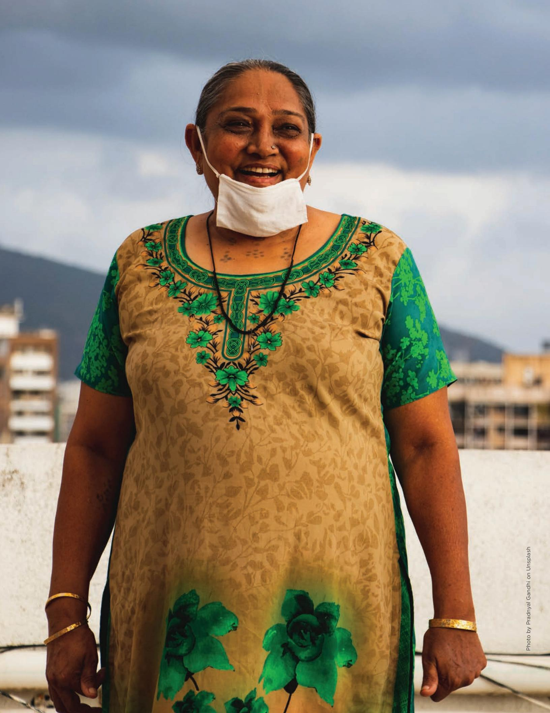

For the United Kingdom, average Gallup World Poll life evaluation fell from 7.16 in 2019 to 6.80 in 2020, while the Eurobarometer life satisfaction measure fell from 7.74 to 7.36, with both changes being of statistical significance. The UK Office for National Statistics (ONS) has recently published3 life satisfaction, anxiety, happiness yesterday, and the extent to which people think that the things they do in their lives are worthwhile, all asked on the same 0 to 10 response scale, based on large samples drawn from the Labour Force Survey. These are probably the largest samples from any country enabling comparisons between each of the first three quarters of 2020 with the corresponding quarters of the 2019. Given the second wave of COVID-19 infections and deaths that started at the end of the summer, it is expected that all three measures will be worse in Q4. But the average results for the first three quarters are the data most comparable with the other surveys, all of which were undertaken in the first three quarters of the year. The ONS data, based on much larger samples, show a life satisfaction drop of 0.13 points on the 0 to 10 scale compared to 0.36 for

the Gallup World Poll and 0.38 for the Eurobarometer. All three surveys provide a fairly consistent picture of moderate, but statistically significant, reductions in life evaluations using different surveys and question wording. The ONS estimates provide additional value from their large sample size, exposing quarterly patterns that match the pandemic stages and revealing larger but more quickly recovering changes for the emotions than for life evaluations. Between the two emotions, anxiety was affected almost twice as much as happiness yesterday.

To get some idea of the possible size of Q4 drops in life evaluations, Figure 2.2 brings together the ONS quarterly estimates of life satisfaction with the monthly Cantril ladder estimates drawn from the ICL/YouGov survey. The monthly data confirm the expectation that Q4 life satisfaction fell as infections, deaths, and lockdowns were all rising. It also shows an increase in December, when optimism was growing about the possibilities for vaccine efficacy and delivery. The 95% confidence intervals for the estimates are shown by vertical

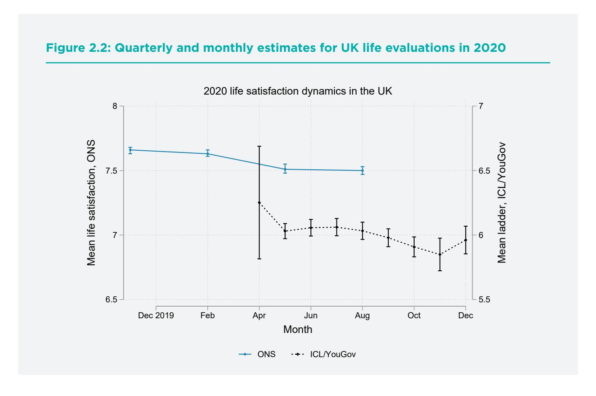

bars. The confidence regions for the ONS estimates are much tighter because their samples included more than 25,000 respondents in each quarter.

The ONS has also split their large samples by age and gender, providing some large sample counterpart to discussions in chapters 5 and 6 based generally on smaller samples of earlier data. Panel A of Figure 2.3 shows the dynamics for the four well-being measures collected by the ONS, reported separately for male and female respondents. For both genders, there is a ranking of effects, with life worthwhile being least affected, followed by life satisfaction, happiness, and anxiety. For both emotions- happiness yesterday and anxiety yesterday - the effects were largest during the lockdown Q2, and largely returned to baseline in Q3, when cases and fatalities seemed to be in check and restrictions were being lifted. The drops in life satisfaction and happiness, and the increases in anxiety, in Q2 were significantly greater for women than men, with the gender gap disappearing in Q3. Panel B shows the same four well-being measures for the population divided into three age groups. All four well-being measures were less changed for the young, who showed little decline from Q1 to Q2 and no improvements from Q2 to Q3." `The Q2 worsening and Q3 recovery were felt almost equally for both of the older age groups. Before and during the pandemic, life satisfaction was highest for those over 60, and lowest for those between 30 and 59. Although the advantage of the young relative to the middleaged grew in Q1 and Q2, it shrank thereafter, and even crossed over for the emotional measures in Q3. How things evolved during the second and deadlier wave in Q4 is hinted at by the monthly data in Figure 2.2 but must await the larger ONS samples for a more complete story to be told.

For Germany, the Eurobarometer data show slightly increased life evaluations from 2019 to 2020, while the Gallup World Poll shows a larger increase. For France, the Gallup World Poll and the Eurobarometer both show increases in average life evaluations from 2019 to 2020, significantly so in the latter case. Two national surveys for France match these increases.4 For Finland, the two surveys tell slightly different stories, as life

evaluations rise slightly in the Gallup World Poll, while falling in the Eurobarometer. For Italy, both surveys show life evaluations essentially unchanged from 2019 to 2020. As shown in Table 2.2 above, the 2020 Italian ladder score is higher than its average for 2017-2019, though the difference is not statistically significant.

As already indicated for the Gallup World Poll data, most countries did not significantly change in either survey. It is reassuring that the two surveys tell generally consistent stories about life evaluations in 2020, despite using different questions and response scales, and being fielded at different times.

# **How have the well-being effects of COVID-19 varied among population subgroups?**

There have been numerous studies, ably surveyed in subsequent chapters, of how the effects of COVID-19, whether in terms of illness and death, or living conditions for the uninfected, have differed among population sub-groups. The fact that the virus is more easily transmitted in close living and working arrangements, where physical distancing can be challenging to maintain, partly explains the higher incidence of disease among those in elder care, prisons, hospitals, housing for migrant and temporary workers, and other forms of group living. Similarly, risks are higher for those employed in essential services, especially for front-line health care workers and others who deal with many members of the public or work in crowded conditions. Age has been the main factor separating those with differing risks of serious or fatal consequences, although the relation is complicated by the preponderance of fatalities in elder-care settings where lower immune responses of the elderly are compounded by co-morbidities that partly explain why these individuals are in institutional care in the first place. Those with lower incomes are also thought to be more at risk, being perhaps more likely to be in high-risk workplaces, with fewer opportunities to work from home, and fewer resources to support the isolation required for those infected.

**Figure 2.3: Quarterly estimates of four UK well-being measures, 2019–2020**

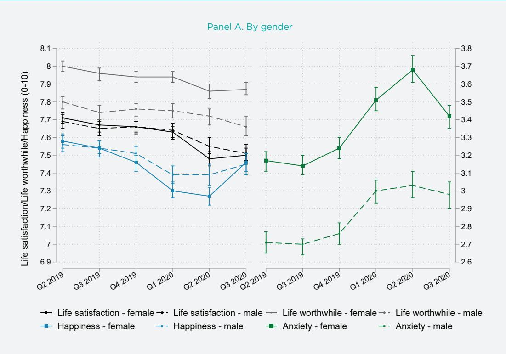

Panel B. By age group

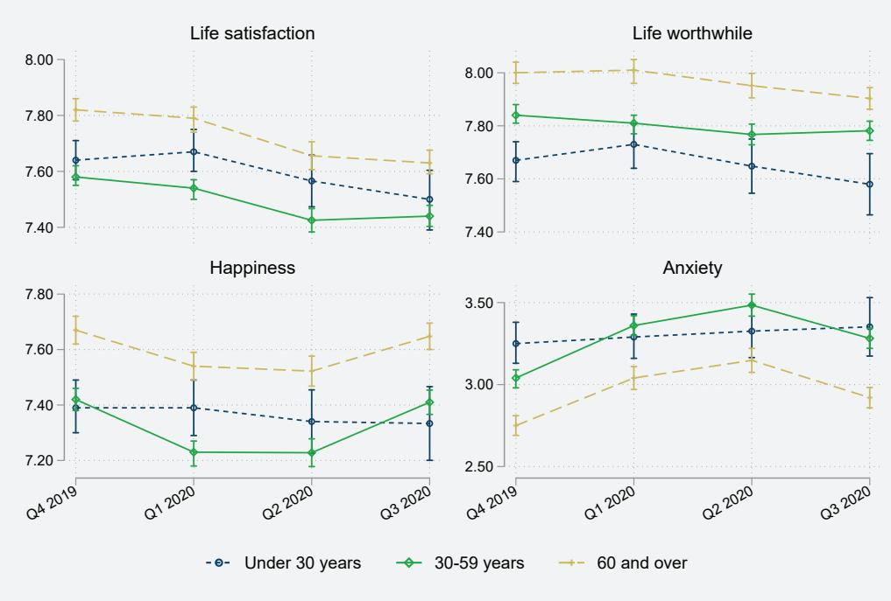

The Gallup World Poll data are not sufficiently fine-grained to separate respondents by their living or working arrangements, but they do provide several ways of testing for different patterns of consequences. In particular, we can separate respondents by age, gender, immigration status, income, unemployment, and general health status. Previous well-being research by ourselves and many others has shown subjective life evaluations to be lower for those who are unemployed, in poor health, and in the lowest income categories. In *World Happiness Report 2015* we examined the distribution of life evaluations and emotions by age and gender, finding a widespread but not universal U-shape in age for life evaluations, with those under 30 and over 60 happier than those in between. Female life evaluations, and frequency of negative affect, were generally slightly higher than for males. For immigrants, we found in *World Happiness Report 2018* that life evaluations of international migrants tend to move fairly quickly toward the levels of respondents born in the destination country.

In this section we shall first confirm these general findings using all individual-level data from the years 2017 through 2020, testing to see which if any of these effects have become larger or smaller in 2020. We use the 2020 effects as a proxy for the effects of COVID-19 and all related changes to economic and social circumstances, a simplification not easily avoided.

Table 2.3 shows the results of individual-level estimation of a version of the model that we regularly use to explain differences at the national level. We use the same column structure as in our usual Table 2.1, while adding more rows to introduce variables that help to explain differences among individuals but which average out at the national level. The first three columns show separate equations for life evaluations, positive affect and negative affect. The fourth column is a repeat of the life evaluation equation with positive and negative emotions as additional independent variables, reflecting their power to influence how people rate the lives they are leading.

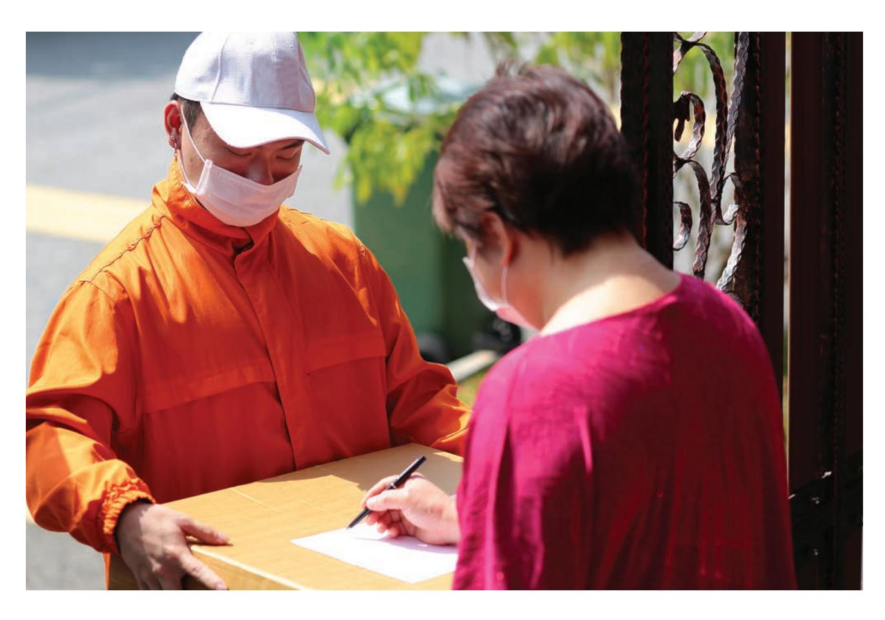

**Table 2.3: Individual-level well-being equations, 2017–2020** 

|                           | (1)       | (2)         | (3)         | (4)       |  |
|---------------------------|-----------|-------------|-------------|-----------|--|
|                           | Ladder    | Pos. affect | Neg. affect | Ladder    |  |
| Log HH income             | 0.130***  | 0.009***    | -0.010***   | 0.116***  |  |
|                           | (0.009)   | (0.001)     | (0.001)     | (0.008)   |  |
| Health problem            | -0.562*** | -0.081***   | 0.131***    | -0.402*** |  |
|                           | (0.032)   | (0.004)     | (0.004)     | (0.028)   |  |
| Count on friends          | 0.884***  | 0.118***    | -0.095***   | 0.722***  |  |
|                           | (0.030)   | (0.004)     | (0.004)     | (0.027)   |  |
| Freedom                   | 0.573***  | 0.113***    | -0.099***   | 0.411***  |  |
|                           | (0.024)   | (0.004)     | (0.004)     | (0.021)   |  |
| Donation                  | 0.259***  | 0.050***    | 0.009***    | 0.228***  |  |
|                           | (0.018)   | (0.003)     | (0.002)     | (0.016)   |  |
| Perceptions of corruption | -0.227*** | -0.000      | 0.043***    | -0.190*** |  |
|                           | (0.023)   | (0.003)     | (0.003)     | (0.022)   |  |
| Age < 30                  | 0.297***  | 0.050***    | -0.016***   | 0.245***  |  |
|                           | (0.027)   | (0.004)     | (0.004)     | (0.025)   |  |
| Age 60+                   | 0.059     | -0.023***   | -0.041***   | 0.044     |  |
|                           | (0.040)   | (0.005)     | (0.004)     | (0.036)   |  |
| Female                    | 0.182***  | 0.011***    | 0.032***    | 0.193***  |  |
|                           | (0.025)   | (0.003)     | (0.003)     | (0.022)   |  |
| Married/common-law        | 0.003     | -0.007*     | 0.015***    | 0.020     |  |
|                           | (0.026)   | (0.004)     | (0.003)     | (0.024)   |  |
| Sep div wid               | -0.241*** | -0.048***   | 0.053***    | -0.169*** |  |
|                           | (0.031)   | (0.005)     | (0.004)     | (0.031)   |  |
| College                   | 0.402***  | 0.018***    | -0.012***   | 0.378***  |  |
|                           | (0.023)   | (0.003)     | (0.003)     | (0.022)   |  |
| Unemployed                | -0.497*** | -0.052***   | 0.084***    | -0.384*** |  |
|                           | (0.027)   | (0.004)     | (0.004)     | (0.025)   |  |
| Foreign-born              | -0.076*   | -0.018***   | 0.027***    | -0.054    |  |
|                           | (0.042)   | (0.005)     | (0.004)     | (0.039)   |  |
| Institutional trust       | 0.260***  | 0.048***    | -0.039***   | 0.196***  |  |
|                           | (0.019)   | (0.003)     | (0.003)     | (0.017)   |  |
| COVID                     | 0.013     | -0.007      | 0.026***    | 0.042     |  |
|                           | (0.036)   | (0.005)     | (0.005)     | (0.036)   |  |
| Pos. affect               |           |             |             | 0.652***  |  |
|                           |           |             |             | (0.024)   |  |
| Neg. affect               |           |             |             | -0.815*** |  |
|                           |           |             |             |           |  |
|                           |           |             |             | (0.036)   |  |
| Constant                  | 3.309***  | 0.432***    | 0.446***    | 3.430***  |  |
|                           | (0.095)   | (0.012)     | (0.010)     | (0.087)   |  |
| Country fixed effects     | Yes       | Yes         | Yes         | Yes       |  |
| Adj. R2                   | 0.254     | 0.124       | 0.139       | 0.278     |  |
| Number of countries       | 95        | 95          | 95          | 95        |  |
| Number of obs.            | 358,013   | 344,045     | 355,636     | 346,780   |  |

Notes: 1) The equations include all complete observations 2017-2020 for countries with 2020 surveys, including country-years with particular missing questions with appropriate controls. The variable COVID is a dummy variable taking the value 1.0 in 2020. Standard errors clustered at the country level are reported in parentheses. \* p<.1, \*\* p<.05, \*\*\* p<.01. Institutional trust: The first principal component of the following five measures: confidence in the national government, confidence in the judicial system and courts, confidence in the honesty of elections, confidence in the local police force, and perceived corruption in business. This principal component is then used to create a binary measure of high institutional trust using the 75th percentile in the global distribution as the cutoff point. This measure is not available for all countries since not all surveys in all countries ask all of the questions that are used to derive the principal component. When an entire country is missing this institutional-trust measure, we use a missing-value indicator to maintain overall sample size.

By adding a specific measure of institutional trust to our usual six variables explaining well-being, the effect of institutions is now split between the new variable and the usual perceptions of corruption in business and government. We leave both in the equation to show that the index for confidence in government represents more than just an absence of corruption. Indeed, we shall show later that it is the most important institutional variable explaining how nations have succeeded or failed in their attempts to control COVID-19.

The equations are estimated using about 1,000 respondents in each year from 2017 through 2020. The results show the continued importance of all the six variables we regularly use to explain differences among nations, as well as a number of additional individual-level variables. These additional variables include age, gender, marital status, education, unemployment and whether the respondent was born in another country. Income is represented by the logarithm of household income and health status by whether the respondent reports having health problems. The effects of COVID-19 are estimated by adding a variable (called COVID) equal to 1.0 for each 2020 survey respondent. These estimates for 2020 effects differ from those we have previously seen in the raw data because here we are estimating the 2020 effects beyond those that are due to changes in the main driving variables, some of which have themselves been affected by COVID-19.

Just as we found with the analysis of the basic data reported in previous tables and figures, and in most comparable population-representative surveys in other countries, the equations in Table 2.3 show that subjective well-being has been strikingly resilient in the face of COVID-19. As shown by the very small estimated coefficient on 'COVID', there have been no significant changes in average life evaluations, while the frequency of positive emotions has fallen, and of negative emotions has risen, with the increase in negative emotions much higher than the reduction in positive emotions, in terms of shares of the population surveyed. Since the frequency of positive emotions in previous surveys is more than twice as large as for negative emotions (71% vs 27%), the increase in the numbers of

those reporting negative emotions looms larger when measured, as is often done, in relation to the previous number of people reporting negative feelings. Thus, we find that while the percentage of the population feeling sad during a lot of the previous day grew by 2.9%, from 23.2% to 26.1% of the population, this represented a 12% increase in the number of people feeling sad during a lot of the previous day.

How do we square this substantial resiliency at the population level with evidence everywhere of lives and livelihoods torn asunder? First, it is important to note that some population subgroups hardest hit by the pandemic are not included in most surveys. For example, surveys usually exclude those living in elder care, hospitals, prisons, and most of those living on the streets and in refugee camps. These are populations that were already worse off and have been most affected by COVID-19.

Second, the shift from face-to-face interviews to cell phone surveys has tended to alter the characteristics of the surveyed population in ways that are hard to adjust for by usual weighting methods. For example, the average incomes of 2020 respondents in China were much larger than those of 2019 respondents, explicable in part because cell-phone sampling procedures would cover people living inside high income gated communities otherwise inaccessible by face-toface methods.

Third, is it possible that the relative stability of subjective well-being in the face of the pandemic does not reflect resilience in the face of hardships, but instead suggests that life evaluations are inadequate measures of well-being? If the chosen measures do not move a lot under COVID-19, perhaps they will not change whatever happens. In response to this quite natural scepticism, it is important to remind ourselves that subjective life evaluations do change, and by very large amounts, when many key life circumstances change. For example, unemployment, discrimination, and several types of ill-health have large and sustained influences on measured life evaluations. Perhaps even more convincing is the evidence that the happiness of immigrants tends to move quickly towards the levels and distributions of life

evaluations of those born in their new countries of residence, and even in the sub-national regions to which they move.5

The monitoring of emotions has been especially important under COVID-19, since negative emotions have been the most affected of all the well-being measures. In a typical country, the number of people reporting being sad or worried in the previous day in 2020, compared to 2017-2019, was more than 10% greater for sadness (from 23.2% of the population to 26.1%) and 8% greater for worry (from 38.4% of the population to 41.5%).

The equations in Table 2.3 replicate the same general pattern as we normally show for the national-level data (analysis using national average data including 2020, shown in Statistical Appendix 1). Income, health, having someone to count on, having a sense of freedom to make key life decisions, generosity, and the absence of corruption all play strong roles in supporting life

evaluations. Confidence in public institutions also plays an important role.

These large samples of individual responses can be used to show how average life evaluations, and the factors that support them, have varied among different sub-groups of the population. What do the results show? We start by reporting how the 2020 changes in life evaluations and emotions differ by population subgroups, and then consider two possible reasons for these differences. We first consider how the basic supports for well-being have changed for different subgroups, and then see whether the well-being effects of these conditions have become greater or less under COVID-19.

For the world sample, as shown in Table 2.4, and in most countries, there have been significant changes from 2017-2019 to 2020 in some of the key influences on life evaluations. There has been a significant increase in unemployment and

**Table 2.4: Changes in sample characteristics from 2017-2019 to 2020**

|                           | (1)       | (2)    | (3) Change in mean from 2017-2019 to 2020 |                 |  |  |
|---------------------------|-----------|--------|----------------------------------------------|-----------------|--|--|
|                           | 2017-2019 | 2020   |                                              |                 |  |  |
| Log HH income             | 9.415     | 9.250  |                                              |                 |  |  |
| Health problem            | 0.231     | 0.202  | -0.029***                                    | ● Increase      |  |  |
| Count on friends          | 0.845     | 0.844  |                                              | ● Decrease      |  |  |
| Freedom                   | 0.806     | 0.812  |                                              | ● Insignificant |  |  |
| Donation                  | 0.317     | 0.324  |                                              |                 |  |  |
| Perceptions of corruption | 0.715     | 0.700  | -0.015**                                     |                 |  |  |
| Age < 30                  | 0.317     | 0.323  |                                              | +0.006*         |  |  |
| Age 60+                   | 0.183     | 0.170  | -0.013***                                    |                 |  |  |
| Female                    | 0.495     | 0.493  |                                              |                 |  |  |
| Married/common-law        | 0.569     | 0.534  | -0.034***                                    |                 |  |  |
| Sep div wid               | 0.110     | 0.113  |                                              |                 |  |  |
| College                   | 0.169     | 0.193  |                                              | +0.024***       |  |  |
| Unemployed                | 0.064     | 0.083  |                                              | +0.019***       |  |  |
| Foreign-born              | 0.066     | 0.072  |                                              |                 |  |  |
| Institutional trust       | 0.286     | 0.284  |                                              |                 |  |  |
| Number of countries       | 95        | 95     |                                              |                 |  |  |
| Number of obs             | 265,377   | 92,636 |                                              |                 |  |  |

Note: Columns 1 and 2 report the mean values for each variable in 2017-2019 and 2020, respectively, from the set of all complete observations in countries with 2020 surveys. Column 3 reports the changes in means from 2017-2019 to 2020 that have a p-value of 0.1 or less in a two-sample t-test with standard errors clustered at the country level. \* p < .1, \*\* p < .05, \*\*\* p < .01.

**Table 2.5: How have life evaluations changed in 2020 for different people?** 

|                           | (1)       | (2)       | (3)                                          |  |  |  |
|---------------------------|-----------|-----------|----------------------------------------------|--|--|--|
|                           | 2017-2019 | 2020      | Change in coefficient from 2017-2019 to 2020 |  |  |  |
| Log HH income             | 0.152***  | 0.109***  | -0.043***                                    |  |  |  |
|                           | (0.009)   | (0.012)   | ● Larger effect                              |  |  |  |
| Health problem            | -0.553*** | -0.572*** | ● Smaller effect                             |  |  |  |
|                           | (0.032)   | (0.041)   | ● Insignificant                              |  |  |  |
| Count on friends          | 0.867***  | 0.889***  |                                              |  |  |  |
|                           | (0.0315)  | (0.050)   |                                              |  |  |  |
| Freedom                   | 0.570***  | 0.587***  |                                              |  |  |  |
|                           | (0.023)   | (0.035)   |                                              |  |  |  |
| Donation                  | 0.238***  | 0.290***  | +0.052**                                     |  |  |  |
|                           | (0.019)   | (0.024)   |                                              |  |  |  |
| Perceptions of corruption | -0.240*** | -0.215*** |                                              |  |  |  |
|                           | (0.023)   | (0.042)   |                                              |  |  |  |
| Age < 30                  | 0.278***  | 0.342***  |                                              |  |  |  |
|                           | (0.027)   | (0.044)   |                                              |  |  |  |
| Age 60+                   | 0.006     | 0.216***  | +0.210***                                    |  |  |  |
|                           | (0.042)   | (0.049)   |                                              |  |  |  |
| Female                    | 0.177***  | 0.199***  |                                              |  |  |  |
|                           | (0.025)   | (0.035)   |                                              |  |  |  |
| Married/common-law        | -0.011    | 0.046     | +0.057*                                      |  |  |  |
|                           | (0.027)   | (0.036)   |                                              |  |  |  |
| Sep., div., wid.          | -0.235*** | -0.247*** |                                              |  |  |  |
|                           | (0.033)   | (0.050)   |                                              |  |  |  |
| College                   | 0.393***  | 0.402***  |                                              |  |  |  |
|                           | (0.023)   | (0.033)   |                                              |  |  |  |
| Unemployed                | -0.471*** | -0.553*** |                                              |  |  |  |
|                           | (0.030)   | (0.049)   |                                              |  |  |  |
| Foreign-born              | -0.060    | -0.108**  |                                              |  |  |  |
|                           | (0.045)   | (0.050)   |                                              |  |  |  |
| Institutional trust       | 0.278***  | 0.228***  |                                              |  |  |  |
|                           | (0.020)   | (0.032)   |                                              |  |  |  |
| Country FEs               | Yes       | Yes       |                                              |  |  |  |
| Adj. R2                   | 0.263     | 0.246     |                                              |  |  |  |
| Number of countries       | 95        | 95        |                                              |  |  |  |
| N of obs.                 | 265,377   |           |                                              |  |  |  |

Note: Regressions in columns 1 and 2 include a constant, country fixed effects, and controls for country-years with missing questions. Column 3 reports significant changes in the absolute value of the coefficients from 2017-2019 to 2020. See appendix note on calculation of standard errors in column 3. Standard errors are clustered by country. \* p < 0.1, \*\* p < 0.05, \*\*\* p < 0.01.

negative emotions, offset by a reduction in the reported frequency of health problems. The frequency of the reporting of health problems fell from 23% to 20% for the population as a whole.6 These changes, and the related improvements in

well-being are concentrated among those over the age of 60, where the frequency of reported health problems fell from 46% to 36% for men and from 51% to 42% for women. Among the survey respondents, the increases in unemployment were concentrated among those under 30, where it was up from 9.2% to 10.2% (p=.006) for men and up from 10.5% to 14.6% for women (p<.001), and those between 30 and 60, up from 5.1% to 6.3% (p<.001) for men and from 5.8% to 8.0% (p<.001) for women. Unemployment increases were much larger for those in the bottom quarter of their country's income distribution (up from 8.3% to 11.8%, p<.001).

In Table 2.5 we repeat the basic equation for life evaluations in Table 2.3, but now fit separate equations for 2017-2019 and for 2020. This permits us to see to what extent the happiness impacts of COVID-19 have varied among population sub-groups.

For those variables that do not change due to COVID-19, such as age, then the difference between column 1 and 2 shows the effects of COVID-19 on people in that category. The bars on the right-hand side of Table 2.5 show the size and significance of these changes. For other variables, such as unemployment, then the total effects of COVID-19 depend on how much unemployment has changed and whether the happiness effect of being unemployed is larger or smaller in 2020.

These results suggest that COVID-19 has reduced the effect of income on life satisfaction, increased the benefits of living as a couple relative to being single, separated, divorced or widowed, increased the happiness effects of generosity, and sharply increased the life satisfaction of those 60 years and older. In some groups of countries, including East Asia, South Asia and the Middle East and North Africa, there was a significant drop in the life satisfaction of the foreign-born. For countries with large foreign-born shares, this effect was enough to affect the overall rankings. For example, the United Arab Emirates, where only 12% of the population was born in the country, has average life evaluations, and corresponding country rankings, that fell substantially in 2020 even though life evaluations of the locally-born increased from 2019 to 2020.

To find the total effect of variables that have changed under COVID-19, we need to take account both of how much the variable has changed, as shown in Table 2.4 and any change that has taken place in its impact, as shown in Table 2.5. For unemployment, there has been a significant increase in the number of unemployed plus a slightly greater average happiness loss from being unemployed.

As for institutional trust, Table 2.5 shows that it remains a highly important determinant of life evaluations. We shall explore below how it also enables societies to deal effectively with crises, especially in limiting deaths from COVID-19.

# **The importance of trust and benevolence**

Many studies of the effects of COVID-19, including those surveyed in other chapters, have emphasized the importance of public trust as a support for successful pandemic responses.7 We have studied similar linkages in earlier reports dealing with other national and personal crisis situations, so it is appropriate here to review and augment our earlier analysis before we do our assessment of how trust has affected the success of national strategies to limit COVID-19 death rates. In *World Happiness Report 2020* we found that individuals with high social and institutional trust levels were happier than those living in less trusting and trustworthy environments. The benefits of high trust were especially great for those in conditions of adversity, including ill-health, unemployment, low income, discrimination and unsafe streets.8 In *World Happiness Report 2013*, we found that the happiness consequences of the financial crisis of 2007-2008 were smaller in those countries with greater levels of mutual trust. These findings are consistent with a broad range of studies showing that communities with high levels of trust are generally much more resilient in the face of a wide range of crises, including tsunamis,9 earthquakes,10 accidents, storms, and floods. Trust and cooperative social norms not only facilitate rapid and cooperative responses, which themselves improve the happiness of citizens, but also demonstrate to people the extent to which others are prepared to do benevolent acts for them, and for the community in general. Since this sometimes comes as a surprise, there is a happiness bonus when people get a chance to see the goodness of

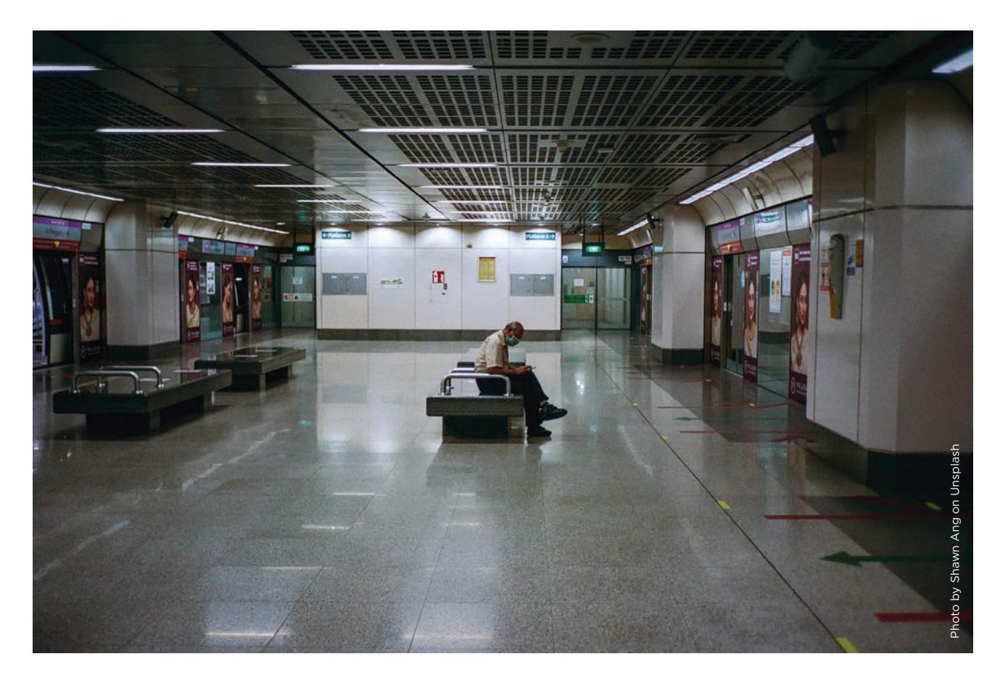

others in action, and to be of service themselves. Seeing trust in action has been found to lead to post-disaster increases in trust,11 especially where government responses are considered to be sufficiently timely and effective.12

COVID-19, as the biggest health crisis in more than a century, with unmatched global reach and duration, provides a correspondingly important test of the power of trust and prosocial behaviour to provide resilience and save lives and livelihoods. Since COVID-19 is such a silently infectious virus, there is a risk that communities with more frequent face-to-face meetings have the potential for faster transmission, unless social closeness can be quickly recreated at greater physical distance. A pandemic may also engender a fear of others that can make it more difficult to create and have a sense of common purpose, and to adopt social norms aimed at saving lives. We found in the previous section that trust is still an important support for well-being in 2020. In the next section, we will consider the extent to which higher trust

supports the selection and success of policies that save lives. Here we set the stage by presenting some new evidence on the power and plausibility of the links between trust and well-being, and especially trust that others will not only be honest, but will go out of their way to do a good turn for others.

This new evidence comes from the World Risk Poll sponsored by Lloyd's Register Foundation and administered during the 2019 round of the Gallup World Poll. Lloyd's Register Foundation agreed to include, among their more usual risk measures relating to the prevalence and perceived likelihood of bad events, a measure of positive risk. The measure chosen is usually called the 'wallet question' because its original form asked respondents to assess the likelihood of their hypothetically lost wallet containing \$200 being returned if found, alternatively, by a neighbour, a police officer, or a stranger.13 With the likelihood of wallet return being assessed on the same basis as a range of negative risks faced by survey respondents all over the world, it is now possible

for us to test the well-being importance of expected benevolence relative to that posed by mental illness, violent crime, and other risks of negative outcomes.

The answers to the wallet question are used to measure the climate of trust in several dimensions, as measured by the expected return of wallets found by neighbours, police officers and strangers. They are more than a conventional measure of trust. To return a wallet requires a level of benevolence extending far beyond basic trustworthiness, since the finder has to go out of their way, often at considerable effort, to do a good turn for someone else. It is no surprise that people are happier if they live in a community where others stand ready to help. Knowing that others are acting in such a way has been shown in experimental studies to encourage others to do good turns, making them even happier.14

Sceptics of the power of trust have emphasized that unwarranted trust can place your life, or that of your child, at needless risk. A distinction can be made between warranted and unwarranted trust, and between trust and trustworthiness. If one's trust exceed the trustworthiness of their society, they may be led to take unwarranted risks. On the other hand, if one is too pessimistic about the trustworthiness of others, then they may be less willing to make social connections with others, reducing potential happiness for themselves and others. Thus, it is very important to know the actual level of trust and whether it represents a reliable guide for prudent behaviour. The wallet question was originally designed with an eye to verify the reality of trust perceptions. There had already been wallets experimentally dropped in the 1990s, and international differences in wallet return rates were later found to be correlated with answers to general questions about whether other people could be trusted.15 To ask a question more specific to wallet return provides a stronger test, since it is possible to discover whether communities with different rates of wallet return have different levels of trust. It can also show whether people are on average too optimistic, too pessimistic, or are well-balanced in their assessments of the kindness of others. By good luck, there has recently been an experiment

involving large numbers of wallets being dropped in 40 countries, some containing money and some not.16 For the 39 of those countries that were also included in the World Risk Poll, the data show a strong positive relation (r=0.64) between expected and actual wallet return. More importantly, the expected rate of return17 for a wallet found by a stranger averaged 25%, while the actual average in the same countries was almost 50%, suggesting that people are generally too pessimistic about the kindness of others. The pandemic has provided many chances to see the kindness of others. If seeing these kindnesses has been a pleasant surprise, then the resulting increase in perceived benevolence will help to offset the more widely recognized costs of uncertain income and employment, health risks, and disrupted social lives.

How big is the happiness benefit of expected benevolence? We find it useful to consider wallet return by police and by the general community separately. Someone who thinks it very likely their wallet will be returned if found by the police has a life evaluation higher by 0.49 points in the 2019 World Risk Poll data after controlling for basic demographics. For community benevolence, we take the average expected return of wallets found by strangers and neighbours. If they think it is very likely to be returned if found by either a neighbour or a stranger, their life evaluation is higher by another 0.58 points, for a total of more than a full point on the 0 to 10 scale.18 This is more than twice the estimated negative effect of being unemployed and more than having an income several times higher. Another way of calibrating the well-being effects of expected benevolence is to compare them with the effects of negative events. The combined positive well-being effect of expected wallet return is again over a full point, twice or more as large as the negative effects of expected personal harm from violent crime, mental illness and any or all of five other risks measured on the same scale.19 Figure 2.4 shows the effects of expected wallet return in comparison with actual unemployment, and violent crime and mental health, the two most damaging of the seven risks identified in this part of the World Risk Poll.

Thus we find that a variety of trust and generosity measures remain extremely important supports

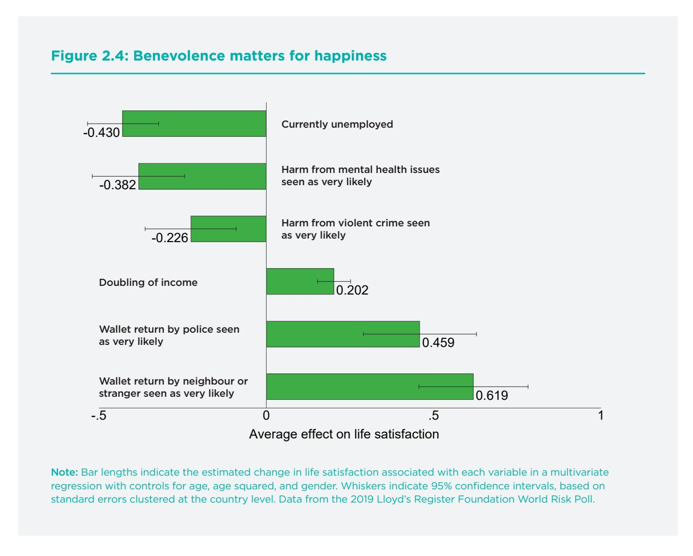

for well-being. They may provide an important element in understanding why life evaluations have been as resilient in 2020 as previous sections have shown. In the next section, we ask whether these primary supports for happiness have also helped countries in their efforts to find and implement strategies to control COVID-19. We will carry forward our data on expected wallet return by neighbours and strangers as a measure of social capital that could, and does, supplement institutional trust (which includes trust in police as a component) in predicting a successful COVID-19 strategy.

# **How have countries done in the fight against COVID-19?**

At the core of our interest in investigating international differences in death rates from COVID-19 is to see what links there may be between the variables that support high life evaluations and those that are related to success in keeping death rates low. We find that social and institutional trust are the only main determinants of subjective well-being that show a strong carry-forward into success in fighting COVID-19.20

This section seeks to explain international differences in national average COVID-19 deaths per 100,000 population in 2020. In 31 countries COVID-19 deaths were fewer than 1 per 100,000 population. These include countries as large as China and as small as New Zealand and Bhutan.

This group with extremely low COVID-19 death rates contains 20 African countries and several Asian countries and regions that, like China, Bhutan and New Zealand, adopted policy strategies to drive community transmission to zero and keep it there, including Singapore, Taiwan, Cambodia, and Thailand.

At the other extreme, there were 11 countries with over 100 COVID-19 deaths per 100,000 population. These included the United States, the United Kingdom, Belgium, Italy, Spain, Czech Republic, Peru and five smaller European countries. The full list covering 163 countries is in the statistical appendix. Figure 2.5 shows the national death rates in 2020 on a global map revealing stark regional divides, with very low death rates in Asia, Africa, and Australasia, and the highest death rates in some European countries, the United States and parts of Latin America.

If we take a broad view of subjective well-being, we should consider, as is done in Chapter 8, extending our measure of national well-being to adjust for international differences in life expectancy. Chapter 8 proposes direct adjustment for the length of life in the measurement of national well-being. Doing so in the way suggested would increase the trend growth of national well-being where life expectancy has been improving, reflecting that in countries with greater life expectancy people have longer to enjoy being alive. It also strengthens the links between COVID-19 death rates and national well-being beyond their impact on the life evaluations of those still living.

In this section we try to estimate the extent to which the quality of the social context, which we have found so important to explaining life evaluations within and across societies, might help or hinder progress in fighting COVID-19. Several studies within nations have found that regions with high social capital have been more successful in reducing rates of infection and deaths.21 Others have argued that different elements of the social context might have opposite effects in the fight against COVID-19.22 In particular, it has been suggested that the close personal relations within families and communities that are sparked and fed by frequent in-person meetings, might

*The best strategy was to drive community transmission to zero, and to keep it there, thus saving lives and achieving more open societies and economies by late 2020.This is likely to make for happier societies in 2021 and beyond.*

provide a good transmission climate for the virus. On the other hand, those aspects of social capital relating to pro-social behaviour, trust in others, and especially trust in institutions might be expected to foster behaviours that would help a society to follow physical distancing and other rules designed to stop the spread of the virus. We capture these vital trust linkages in two ways. We have a direct measure of trust in public institutions, to be described below. We do not have a measure of general trust in others for our large sample of countries, so we make use instead of a measure of the inequality of income distribution, which has often been found to be a robust predictor of the level of social trust.23

Our attempts to explain international differences in COVID-19 death rates divide the explanatory variables into two sets, both of which refer to circumstances that are likely to have affected a country's success in battling COVID-19. The first set of variables cover demographic, geographic and disease exposure circumstances at the beginning of the pandemic. The second set of variables covers several aspects of economic and social structure, also measured before the pandemic, that help to explain the differential success rates of national COVID-19 strategies.

The first set of three variables comprises:

- a) the median age of the population. This variable captures the fact that COVID-19 fatality rates are very high for the elderly and very low for the young. The median age captures both aspects of this differential fatality better than do measures of the share of the population above a certain age,24 and almost as well as a more sophisticated adjustment based on age-standardized mortality rates for COVID-19.25 There are big regional differences in the averages of national median ages, being highest in Europe at 42 years and less than 20 in Sub-Saharan Africa.
- b) whether the country is an island. The island variable covers 21 island nations, augmented to 22 by treating Australia as an island rather than a continent. All 22 share the characteristic that access must be by air or sea, simplifying the application of measures to monitor and block virus movements.
- c) an exposure index measuring how close a country was, in the early stages of the pandemic (March 31), to infections in other countries. It embodies the propinquity principle implicit in the law of gravity, and embodied in a variety of gravity-based models of trade,26 migration,27 and infections.28 Distance matters, as does the size of the objects of interest, in this case the number of infections. In our application of the gravity principle, we treat early infections elsewhere to be a risk factor for future infections here, with transmission being less likely when physical distance is greater. We use geographic distance as a proxy for a range of additional factors cultural, linguistic, climatic, and migrationbased - that jointly determine the frequency of population movements, which in turn facilitate the spread of a virus. The variable used is the sum across partner countries of total early infections in each country divided by the distance29 separating them. Our measure of the infection mass in each possible source

country is based on infections early in the first wave of the pandemic (March 31), and distances are those between the capital cities of the exposed country and each of the possible source countries. For example, the observation for India is the sum across all other countries of their cumulative national infections by March 31 divided by the distance between that country and India. The exposure index ranges from a low of 0.4 to a high of almost 8, with an average value of 5.1. Australia and New Zealand are the only countries with exposure below 0.5, reflecting their great distance from countries with high infection rates at March 31. All of the eight countries with an exposure index above 5.0 are in Western Europe.

The second set of variables comprises:

- a) a pair of measures of the extent to which a country was able to remember and apply the epidemic control strategies learned during the SARS epidemic of 2003. Countries in the WHO Western Pacific Region have been building on SARS experiences to develop fast and maintained virus suppression strategies.30 Hence membership in that region (WHOWPR) defines one of our SARS variables. Being geographically close to countries with SARS experience may have accelerated the transmission of information about alternative COVID-19 suppression strategies. Our second SARS-related variable is the average distance between each country and each of the six countries or regions most heavily affected by SARS (China, Hong Kong, Canada, Vietnam, Singapore and Taiwan).
- b) whether the country has a female head of government. Female heads of government (there are 23 in our sample) have tended to favour making policy with overall well-being as the objective, and this makes suppressing community transmission an even more obvious choice for them.

- c) the level of institutional trust. We use the national average for 2017-2019 of institutional trust (on a scale from 0 to 1) as defined in Table 2.4 of *World Happiness Report 2020*. Confidence in public institutions supports the choice and successful application of a virus-suppression strategy because those living in societies with high institutional trust levels are more likely to accept the necessity of fast and sometimes painful policy measures. They may be more likely to follow official advice, and also to reach out to help others in their communities.
- d) the Gini coefficient measuring the country's degree of income inequality, on a scale from 0 to 100, with 0 representing complete equality. In our global sample of 163 countries, the lowest value is 23 and the highest 65, with an average of 38.

These variables together explain two-thirds of the international differences in COVID-19 death rates in our global sample of 163 countries, as shown in the second column of Table 2.6. The first column of the Table shows that the three geographic and demographic variables alone can explain almost one-half (48%) of the international differences in COVID-19 death rates in 2020.

Although the more complete model of equation (2) still has a simple structure, we have tested, and report in Table A1 of Statistical Appendix 2, what happens if we augment our basic structure by adding other variables that have epidemiological or other grounds for inclusion. Of the 18 additional variables considered separately, six contribute significant explanatory power. More hospital beds were associated with a reduction of 3.3 deaths per 100,000 population for each additional bed per thousand population. We did not include the variable in our basic model because it did not affect the other results but materially reduced the number of countries covered. Three different trust variables made contributions, including social trust and expected return of a lost wallet if found by community members, whether strangers or neighbours. These all contributed explanatory power beyond that provided by our institutional trust measure and income inequality. Although

**Table 2.6: COVID-19 deaths in 2020 per 100,000 population** 

|                                           | (1)        | (2)         | Beta   |
|-------------------------------------------|------------|-------------|--------|
| Median age                                | 1.265***   | 1.840***    | 0.450  |
|                                           | (0.332)    | (0.308)     |        |
| Island dummy                              | -18.459*** | -15.602***  | -0.140 |
|                                           | (5.333)    | (4.867)     |        |
| Exposure to infections in other countries | 12.606***  | 12.912***   | 0.441  |
| (on Mar 31)                               | (3.003)    | (2.728)     |        |
| Ln average distance to SARS countries     |            | 16.069**    | 0.158  |
|                                           |            | (6.953)     |        |
| WHOWPR                                    |            | -8.720      | -0.064 |
|                                           |            | (7.913)     |        |
| Female heads of government                |            | -18.493***  | -0.169 |
|                                           |            | (4.926)     |        |
| Index for institutional trust             |            | -47.672***  | -0.216 |
|                                           |            | (9.878)     |        |
| Gini                                      |            | 0.777***    | 0.168  |
|                                           |            | (0.241)     |        |
| Constant                                  | -26.731*** | -201.870*** |        |
|                                           | (5.592)    | (63.101)    |        |
| Observations                              | 163        | 163         |        |
| Adjusted R-squared                        | 0.469      | 0.653       |        |

Notes: Robust standard errors in parentheses. Column 3 shows the standardized beta coefficients for the equation in column 2. Robust standard errors are in parentheses \*\*\* p<0.01, \*\* p<0.05, \* p<0.1.

these variables do not figure in our base model because of the smaller country coverage, their explanatory power strengthens our confidence in the importance of institutional and social trust in reducing COVID-19 fatalities. A variable covering the six countries in the East Asian region was associated with further reductions in fatalities in that region beyond those provided by the SARS-related variables in Table 2.6. As already noted, we leave the East Asia variable out of our base model to identify likely channels of influence. The reasons why these countries did even better than countries with similar SARS experience are considered in more detail in Chapters 3 and 4, with the tightness of their social norms being a suggested reason.31 Finally, we found, and show as equation (18) in Table A1 of Appendix 2, that a more accurate adjustment for the interaction of age-specific mortality risks of COVID-19 with each country's population age distribution produces a

slightly tighter fitting equation than does the median age variable. Since it reduces the sample size and does not materially influence any of the other main coefficients of the model, we treat this result as a robustness check on our use of median age in the base model. These tests together give us confidence that a range of other possible variables do not alter the main results we discuss below.

First consider the three variables that set the context facing nations at the start of the pandemic, all of which affect their likely COVID-19 death rates. These relate to demography, geography and exposure. The first equation of Table 2.6, where three variables are the only ones used to explain death rates, increasing median age by one year is associated with 1.26 more deaths per 100,000 people. Therefore, moving from sub-Saharan median age to the European average is

associated with 29 more COVID-19 deaths per hundred thousand population in 2020, thereby accounting for almost half of the actual death rate difference of 65 between the two regions. Using the more precise adjustment described in Statistical Appendix 2, the difference between the European and African age structures, when combined with the age structure of COVID-19 fatality rates, would predict at difference of 39 deaths per hundred thousand, two-thirds of the total difference.32 Being an island nation, which makes population movements easier to control, is associated with 18 fewer deaths per 100,000 population. Finally, each 1 unit increase in the March 31 infection exposure index is associated with an additional 12.6 deaths per 100,000 people. Comparing a low-exposure country with an index of 1 to a high exposure country with an index of 5 would be associated with a death rate that is higher by 50 per 100,000 population. Actual death rates averaged 65 per 100,000 in Western Europe versus about 1 in East Asia. The difference predicted using the first equation in Table 2.6 would be 36.33

Next, we add a group of scientific, political and social variables to help explain the likelihood of a country finding and implementing a successful COVID-19 suppression strategy. The most successful overall strategy for minimizing death rates has been to drive community transmission to zero and keep it there. Instead, some governments chose to start reopening their economies before they had reduced community transmission to zero and established sufficient testing, tracing and isolation strategies to avoid subsequent surges in infection rates. These governments were assuming that they had found a reasonable trade-off between saving lives and saving the economy. However, the evidence is becoming clearer that there is no such trade-off when it comes to the basic strategy. As will be illustrated below and in Chapters 3 and 4, countries that chose to achieve and defend zero community transmission levels have generally done better on all fronts.

How do our policy-related variables fit in to help explain the likelihood of a successful strategy being chosen? The first two variables relate to scientific understanding, the next one to political leadership, and the final two to the underlying social and economic contexts.

Starting with the science, there is considerable evidence that countries in the front lines of the SARS epidemic in 2003 learned important lessons about the need for fast and effective response to novel viral threats. Our two SARS-related measures attempt to measure the likely flow of ideas and experience that helped some countries find and choose a successful virus suppression strategy. First, there is evidence that ideas,34 like trade flows and viruses, transmit more readily when distances (geographic, cultural, linguistic, or political) are less. Our SARS distance variable finds that doubling a country's geographic distance from the six countries with the greatest SARS experience is associated with a 2020 death rate higher by 16 per 100,000. However, there is some potential for SARS experience to have contributed to costly delays in recognizing the importance of transmission via aerosols and asymptomatic carriers, since neither of these crucial aspects was present in SARS. The key SARS lesson was not to expect another SARS, but to be prepared to act fast to halt virus transmission even while its characteristics were unknown.

Second, the World Health Organization's Western Pacific Region has provided for many years a forum and a focal point for the development of pandemic strategies. The average COVID-19 death rate in 2020 was 1.52 per 100,000 population for the 14 WHOWPR countries35 in our sample, compared to 33.4 for other countries. The estimated coefficient suggests that WHOWPR membership accounts for a difference of 9 deaths per 100,000, about a third of the total difference. This estimated effect is statistically insignificant because the WHOWPR variable is one of two SARS-related variables, and the two are quite closely correlated (r=-0.55). If either of the two variables is included without the other, it attracts a larger and highly significant coefficient.36 We prefer to leave both in, since they each provide a plausible part of the knowledge transmission story.37 We should also note, and report in the statistical appendix, that the two SARS variables are statistically dominated by an indicator variable for the East Asian countries that are the focus of Chapters 3 and 4. We choose not to use that variable here, since it risks being a description of the considerable differences to be explained rather than being, as we prefer, an attempt to explain them. But we recognize that we have thus far not provided a complete explanation.38 Chapter 3 describes the timing and content of the policies that enabled those countries to achieve results even better than would be expected from their SARS experience and lessons.

Turning to political leadership, there are many specific examples where national leaders have strengthened or weakened the prospects for policy strategies aimed at minimizing COVID-19 deaths. We focus here on one objectively easyto-measure characteristic of national leadership – whether the head of government is a man or a woman. Several of the 23 female heads of government have favoured making policy with overall well-being as the objective,39 making the suppression of community transmission an even more obvious choice for them. Countries that rank highly on a range of social features likely to support a virus suppression strategy are also more likely to have chosen a female leader.40 Having a female leader is associated with death rates lower by 19 per 100,000 population.

Confidence in public institutions supports the choice and successful application of the preferred strategy because those living in such societies are more likely to accept the necessity of fast and sometimes painful policy measures, and are personally more likely to follow policy advice and to reach out to help others in their communities. We use the same measure of confidence in public institutions that we used in Table 2.4 of *World Happiness Report 2020*. It is derived from the first principal component of several Gallup World Poll questions about confidence in various public institutions.41 It has a global average of 0.3, and is highest in Southeast Asia (0.56) and lowest in Eastern Europe (0.20). The coefficient of -48 suggests that to have the level of institutional trust in Brazil (0.11) rather than Singapore (0.86) would be matched by COVID-19 death rates higher by 36 per 100,000. This is more than one-third of the actual difference in deaths, which were fewer than 1 per 100,000 in Singapore and 92 in Brazil.

We do not have a full global sample measure for social trust, so we use income inequality as a strong proxy variable because social trust is generally lower in countries where income inequality is higher.42 We have previously found43 that inequality of subjective well-being is an even stronger predictor of social trust. We find here that income inequality is more predictive than is happiness inequality as a factor limiting the population's ability or willingness to follow COVID-19 virus-suppression guidelines. There is some early evidence44 of empirical linkages between income inequality and COVID-19 death rates, supported by pre-COVID evidence of links between income inequality and health45 beyond those flowing through social trust. There is also evidence from within countries46 that various COVID-19 impacts are worse for those with relatively low incomes, and this might have a counterpart in cross-country analysis. Hence, we are not surprised to find inequality of income to be a stronger predictor of COVID-19 death rates than is well-being inequality. The coefficient of 0.78 suggests than to move from a country with a Gini coefficient of 27 (like Denmark or Sweden) to 47 (like Mexico or the United States) is associated with COVID-19 death rates higher by 16 per 100,000 population.

Another powerful measure of social capital is the expected rate of wallet return if found by a stranger or a neighbour. Equation (16) in Appendix Table A2 shows that adding that measure of community benevolence has a large impact on lives saved, above and beyond that explained by the main institutional trust variable. A country where wallet return is seen as very likely, when compared to a country where such return is seen as very unlikely, is estimated to have had almost 50 fewer deaths per 100,000 population, about as large an effect as provided by institutional trust on its own.47 We do not use the wallet return variable as part of our base model, because of the smaller number of countries covered. It nevertheless provides important evidence that strong benevolent community connections and trusted public institutions are both crucial supports for successful COVID-19 strategies. The model including all three trust-related variables – institutional trust, community wallet return, and

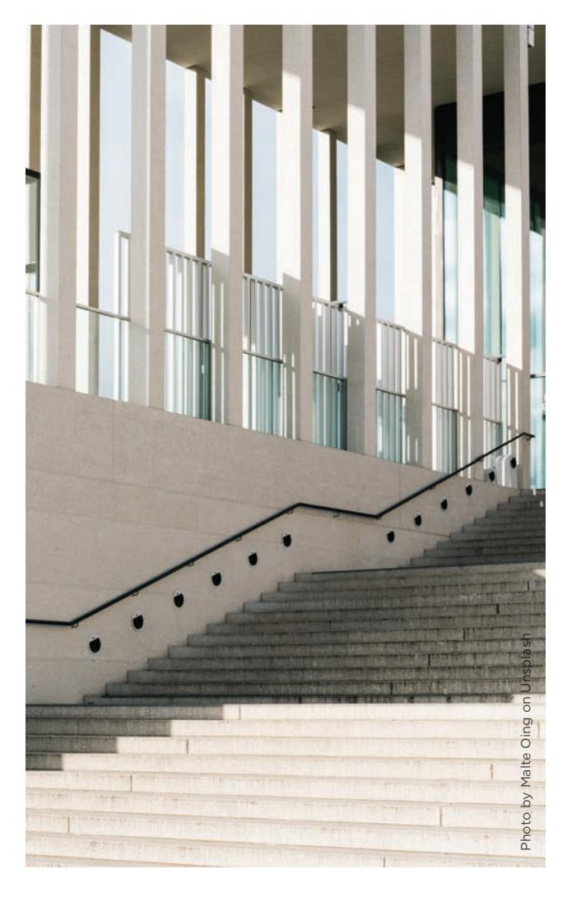

income inequality, suggests that the trust differences between Finland and Mexico could explain a difference of 41 deaths per 100,000 in 2020, almost half of the total difference between the two countries. COVID-19 deaths in 2020 were 10.1 per 100,000 in Finland compared to 97.6 in Mexico.48

The fact that experts and governments in countries distant from the earlier SARS epidemics did not get the message faster about the best COVID-19 response strategy provides eloquent testimony to the power of a "won't happen here" mindset, vividly illustrated by the death rate impacts of distance from SARS countries and membership of the Western Pacific Region of the WHO.49 There was very early evidence that COVID-19 was highly infectious, spread by asymptomatic50 and pre- symptomatic51 carriers, and subject to

aerosol transmission.52 These characteristics require masks53 and physical distancing to slow transmission, rapid and widespread testing54 to identify and eliminate community55 outbreaks, and effective testing and isolation for those needing to move from one community or country to another. As shown in Chapter 3,56 countries that quickly adopted all these pillar policies were able to drive community transmission to zero. By doing so, and then using widespread testing and targeted lockdowns when faced with fresh outbreaks, those countries were able to avoid the high levels of community exposure that have been responsible for subsequent waves that have in many countries been even more deadly than the first. Countries that did not drive their community transmission to zero almost always found themselves with insufficient testing, tracking and tracing capacities to stop subsequent waves of infection. They also made the infection risks worse for everyone by providing large community pools of infection that provided more scope for mutations to develop and spread. Hence it was unsurprising that the first new variants appear to have come from countries (the United Kingdom, South Africa, and Brazil)57 with widespread community transmission of the original virus.

Although it still remains something of a mystery why what seem to be obvious lessons were so slow to be learned, our policy-related variables each pick up possible parts of the story. The three building blocks include ready access to good examples, effective leadership capable of acting quickly and appropriately, and a receptive society.

Taken together, our measures of risks of infection and policy supports combine to explain two-thirds of the differences in death rates among countries. Countries with death rates much higher than the model predicts, as shown in Table A2 of statistical appendix 2, were sometimes places where there was scepticism at the highest political level about the severity of the virus (e.g. Brazil, United States). In some other jurisdictions where actual deaths exceed predicted values there was a shared view by governments and health authorities that there was a trade-off to be exploited between virus suppression and the overall health of the economy and society (e.g. Sweden, United Kingdom).

There is a special group of countries where actual death rates were bounded at zero while the model predicts values below zero. Think of this as representing an exam, where the highest possible mark is 100%, but some students had more than enough knowledge and beneficial circumstances to achieve 100%. Our model adds up the factors adding to their likely success, which were clearly more than enough to keep their death rates close to zero. These countries include some African nations with young populations far removed from major centres of infection. It also includes several countries that were among the earliest and most effective adopters of an infection elimination strategy, including Bhutan, New Zealand, Singapore and Laos. Bhutan is an especially relevant case in making explicit use of the principles of Gross National Happiness in mobilizing the whole population in collaborative efforts to avoid even a single death58 from COVID-19 in 2020, despite having strong international travel links.

Another notable group of countries are those whose exposure and other factors suggested large expected death rates, but which were able to achieve very low death rates. Examples include South Korea, Hong Kong, Japan and China and Taiwan in East Asia and Iceland, Norway and Finland in Europe. At the end of 2020, which marks the cut-off for the data we are considering in this report, neither the health effects nor the economic and social consequences of COVID-19 are finished, so it is premature to make final judgments as to whether those countries that did not choose to suppress community transmission were able to deliver economic or social benefits to support their more open strategies.

The evidence from 2020 suggests strongly that countries that gave priority to suppressing transmission have also managed to achieve better results in the economic and social dimensions. Both globally and within each region, where disease risk and exposure are more comparable, the countries that kept their COVID-19 death rates low have also achieved better economic performance, as measured by preliminary estimates of 2020 GDP compared to that in 2019. We have already seen that COVID-19 death rates were far higher in Western Europe than in East

Asia. But there was no offsetting gain on the economic front, as GDP in 2020 is estimated to have shrunk by 1.3% in East Asia compared to a 6.5% decline in Western Europe.

Moving into 2021, those countries with low death rates have managed to reopen successfully, while the high death rate countries have continued to face unhappy combinations of fatalities and lockdowns. As further evidence of the continued applicability of our results, we have re-estimated our base model using death rates up to the end of February 2021, and find that it fits even more tightly now.59

It is useful to compare New Zealand with Sweden, since both have high social capital and institutional trust. In both countries COVID-19 strategies were developed with the full collaboration of governments and health authorities. Both countries are always in the top group of countries ranked by happiness, and both had citizen trust levels high enough to support a wide range of COVID-19 strategies. They chose very different routes right from the outset. New Zealand chose to take community transmission to zero and keep it there, while Sweden60 preferred instead to keep its society and economy open. COVID-19 death rates in 2020 averaged 86.4 per 100,000 population in Sweden compared to 0.5 in New Zealand. By early 2021, a comparison of the two countries' openness showed them to be equally open on six of ten indicators. New Zealand was one step more open on three indicators – non-essential businesses, school and youth activities, and social gatherings – and less open only for cross-border travel.61 And being an island was not an essential part of the story, as a comparison between Sweden and its Nordic neighbors Norway, Finland and Denmark makes clear. Their COVID-19 strategy was more akin to that of New Zealand than of Sweden, and their death rates a fraction as large. For example, Norway's COVID-19 death rate was less than one-tenth as large as that of Sweden, its economy shrunk less in 2020, and at the beginning of 2021 it was equally or more open62 on all measures except border controls. Both countries had their Gallup World Poll surveys centred in April 2020, and showed similar small drops in life evaluations and worse emotions when compared to 2019.63 It

is to be expected that further evidence from 2021 will support the conclusions reached here, that driving community transmission to zero and keeping it there has been better for all the pillars supporting happy lives: good health, good jobs, and a society where people can connect easily with each other in mutual trust and support.

## **Summary**

This has been a challenging year for the world, and for the preparation of the *World Happiness Report*. Millions of lives have been lost, and billions of others shaken to their core. COVID-19 has altered how people live, how they think about life, and even how surveys can be used to assess these consequences. Many strands of data have been pieced together to produce a picture of almost astonishing resilience. This general pattern shows up in a number of different large-sample surveys with different timing and sampling methods, so we have some confidence that the pattern is there, especially as the surveys taken more frequently match the pandemic stages and severity appropriately. Who are we most likely to be missing? The surveys employed to measure happiness cannot be taken within many of the hardest-hit groups, including those living in elder-care, prisons, hospitals, refugee camps, and on the streets. But they can still represent the vast majority of the world's population, including rich and poor, healthy and sick, employed and unemployed, living in very supportive or very divided communities and countries. Although there were significant increases in average sadness and worry, we found that overall life evaluations, and happiness rankings, were surprising stable. The top countries before the pandemic remained the top countries in 2020, so there is little change in the overall rankings. The top countries already had higher levels of trust and lower levels of inequality, both of which helped them to keep death rates low and social cohesion high, and hence to maintain their favourable positions.

As we go to press in early March of 2021, the pandemic is still far from over, and our conclusions about happiness during COVID-19 must remain tentative. We found for 2020 that the same six factors supporting well-being (income, health, someone to count on, freedom, generosity, and trust) continue to do so in almost exactly the same way as in previous years, and our measures of support have also been generally maintained. People were just as likely to have someone to count on, even though the ways in which this support is delivered have been upended. People have not toured the world, but many have rediscovered their neighbourhoods. Respondents over 60 years of age were in 2020 significantly less likely than in earlier years to report having health problems, despite being the age group most at risk from COVID-19. They were also the group showing a significant increase in having someone to count on in times of trouble, suggesting that, at least for them, neighbours and Zoom calls were filling in for the face-to-face contacts being put on hold.

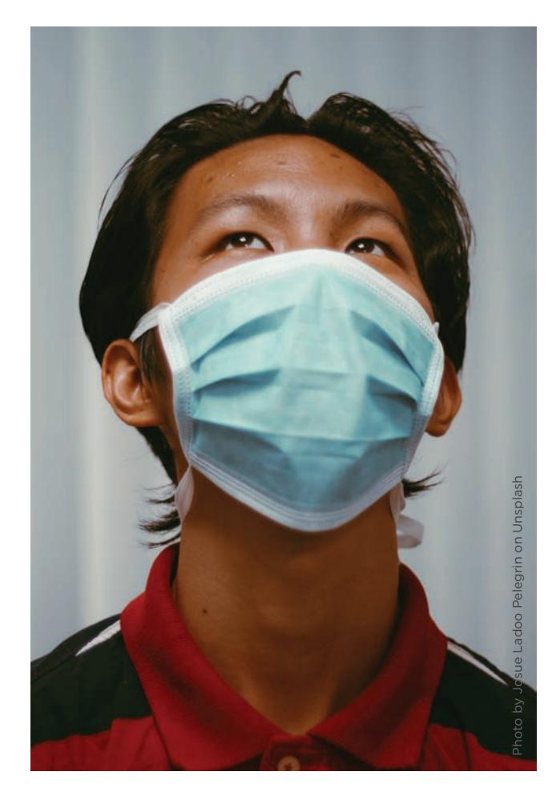

# *Trust has been the key common factor linking happiness and COVID-19 control.*

We looked for differences in COVID-19 happiness effects by gender and age. We found no significant gender differences, as in our global sample females retained their advantage in life satisfaction, and greater frequency of both positive and negative emotions. The well-being of those over 60 rose significantly relative to the middle age group. while in some countries, but not for the global sample as a whole, the young lost their advantage. In some regions, but not for the world as a whole, we found a significant reduction in the average life evaluations of the foreign-born. We found no significant changes in the inequality of well-being within the surveyed populations.

Trust was shown to be the key factor linking happiness and COVID-19. Of all the six factors supporting happiness, only trust played an equally strong role in helping countries to find and implement successful COVID-19 strategies. It was shown to be as important as ever in supporting happiness during the pandemic, and was found to be even more important when COVID-19 required the whole structure of private and public lives to be refocused on fighting the pandemic. Societies with higher trust in public institutions and greater income equality were shown to be more successful in fighting COVID-19, as measured by 2020 rates of COVID-19 deaths. Death rates differed, as expected, by population age structure and geography, being lower in young populations and on islands, and for countries less exposed to early infections nearby. The most successful strategy was shown to be to drive community transmission to zero, and to keep it there. Countries that did so saved lives and achieved more open societies and economies at the end of 2020. This is likely to help them to be happier societies in 2021 and beyond.

Countries with experience from the SARS epidemic seemed to have absorbed the relevant lessons, as did countries with female leaders. Countries with less inequality of income also had significantly lower death rates from COVID-19. This is partly because high social trust tends to go along with less income inequality. The economically disadvantaged in many countries faced the greatest chances of illness and death from COVID-19. The countries that chose to control the pandemic showed no trade-off between a healthy economy and a healthy population. On average, those countries with lower deaths rates had lower drops or bigger gains in expected 2020 growth rates for GDP (r=-.36). In 2021, the advantages of virus control look to be even larger, as many of the less controlled countries are still facing high case counts and death rates coupled with deep restrictions on economic and social life.

#### **Endnotes**

- 1 See ONS (2021b). For earlier evidence, see St-Pierre & Béland (2004), where telephone respondents gave lower answers for self-assessed obesity, smoking, and ever driving after two drinks, similar to findings in other mode-effect studies. But the answers to the physical and mental health questions (on a multi-point scale) were the same whether asked in person or by telephone.
- 2 We adjust the original Gallup sample weights to ensure equal weights across countries/territories in a year.
- 3 See Office for National Statistics (2021a).
- 4 See Recchi et al. (2020) and Perona and Senik (2020).
- 5 See several chapters of *World Happiness Report 2018*, and Helliwell, Shiplett and Bonikowska (2020).
- 6 This is consistent with panel evidence from Singapore, where although a number of satisfaction measures decreased during lockdown, there was an increase in satisfaction with health. See Cheng et al. (2020).
- 7 See several references in the next section, especially Fraser and Aldrich (2020) and Bartscher et al. (2020).
- 8 See Helliwell et al. (2018) and Table 2.3 in Chapter 2 of WHR 2020.
- 9 See Aldrich (2011).
- 10 See Yamamura et al. (2015) and Dussaillant and Guzmán (2014).
- 11 See Toya and Skidmore (2014) and Dussaillant and Guzmán (2014).
- 12 See Kang and Skidmore (2018).
- 13 For the logic and first use of the wallet questions, see Soroka et al. (2003). To make the question of equal applicability in countries where wallets or their equivalent are not normally used, the Gallup World Poll version refers to an object of great personal value, with name and address attached.
- 14 See Aknin et al. (2011).
- 15 See Knack (2001) and Helliwell and Wang (2011).
- 16 Cohn et al. (2019). The researchers were surprised to find the rates of return of the wallets with money included are even higher than if there was no money.
- 17 To obtain an index of expected wallet return in the Lloyd's data, the three possible responses: very likely, somewhat likely, and very unlikely were coded at 1.0, 0.50, and zero.
- 18 Life evaluations for those who think it highly likely a wallet will be returned whether found by police, a neighbour, or a stranger are estimated to be 1.094 points higher on a 0-10 scale (t=8.4). This is based on a micro regression for the Cantril ladder using the Gallup World Poll data for the 2019 survey wave in which the wallet question was included. Income, unemployment, age, education, gender, and marital status were included as controls.
- 19 The other risks asked about in the same personal harm answer format included personal harm from food, water, severe weather, powerlines and appliances.

- 20 For example, if we regress 2020 COVID-19 death rates on the 2017-2019 national averages of the main variables used in Table 2.3 to support life evaluations and emotions, only institutional trust has a significant effect of the correct sign (-92, t=4.2). The log of GDP per capita is the only other significant variable, and it shows that higher income countries have generally had higher COVID-19 death rates.
- 21 Fraser and Aldrich (2020), looking across Japanese prefectures, found that those with greater social connections initially had higher rates of infection, but as time passed they had lower rates. Bartscher et al. (2020) use withincountry variations in social capital in several European countries to show that regions with higher social capital had fewer COVID-19 cases per capita. Wu (2021) finds that trust and norms are important in influencing COVID-19 responses at the individual level, while in authoritarian contexts compliance depends more on trust in political institutions and less on interpersonal trust.
- 22 Elgar et al. (2020).
- 23 See Rothstein and Uslaner (2005).
- 24 See Statistical Appendix 2 for a comparison with ways of linking demography to COVID-19 fatalities.
- 25 This alternative mortality risk variable is the ratio of an indirectly standardized death rate to the crude death rate for each of 54 countries. The indirect standardization is based on interacting the US age-sex mortality pattern for COVID-19 with each country's overall death rate and its population age and sex composition. Use of this variable adjusts, in a more precise way than does the median age, for the COVID-19 mortality implications of each country's population distribution by age and gender. Data from Heuveline and Tzen (2020).
- 26 Well-surveyed by Head and Mayer (2014).
- 27 See Poot et al. (2016).
- 28 See Xia et al. (2004) for an early application of a gravity-based modelling of infection risk for explaining within-country transmission of measles. There have been subsequent further applications of the gravity model to help explain the spatial transmission of disease.
- 29 The bilateral distances are taken from the *GeoDist Database* provided by CEPII. The *GeoDist* was developed in Mayer and Zignago (2005) to analyze market access in global and regional trade flows. Detailed explanations of the distance measures can also be found in Mayer and Zignago (2011).
- 30 See World Health Organization (2017).
- 31 See Gelfand et al. (2021).
- 32 The age/mortality adjustment variable takes the value of 0.85 in Western Europe, and 5.18 in Sub-Saharan Africa. Based on a sample of 154 countries, the estimated coefficient on the index is 9.23, as shown in equation 18 of Table A1 in Statistical Appendix 2. The age structure difference between the two regions predicts a 4.23\*9.23=39.0 difference in COVID-19 death rates.

- 33 To consider the possibility that the exposure variable perhaps gives too much credit for infections that could have been stopped, we constructed an alternative exposure index that depended only on factors that influence the spread on the disease but do not depend on a country's policy strategy. These were the distance from China, a country's remoteness from all other countries, and whether a country was in the Schengen group of European countries that had abolished border controls for population movements within the Schengen zone. The predicted exposure index was lower for countries further from China, lower for countries far from other centres of population, and higher for countries in the Schengen zone. This alternative did not significantly change the predicted gap between Europe and East Asia, but worsened the overall fit of the model, since it ignored the actual spread of the virus. So we continue to use the exposure index based on the actual virus spread by March 31.
- 34 See Sin (2018).
- 35 We include Hong Kong SAR and Taiwan as part of our WHOWPR group of countries, even though they are not official members, because both were heavily affected by SARS.
- 36 Using just WHOWPR, the coefficient is 19.4 (t=2.7, p=0.008), while on its own the SARS distance variable takes a coefficient of -19.6 (t=3.5, p=0.001). Combining the two variables into one, as supported by the equality of their coefficients, gives an even more significant coefficient, 13.0 (t=3.6, p<0.001). Most of the explanatory power is coming from the SARS distance variable.
- 37 We also found that WHOWPR membership was even more important in explaining international differences in infection rates.
- 38 2020 death rates averaged 1.1 per 100,000 in the six East Asian countries (China, Taiwan, Hong Kong, Japan, South Korea and Mongolia) and 31.8 in the rest of the world.
- 39 There was a meeting of well-being leaders in Reykjavik, with Iceland hosting New Zealand and Finland, all three countries having female heads of government.
- 40 Evidence for both parts of this linkage is provided by Coscieme et al. (2020).
- 41 To get our binary measure, we start by taking the first principal component of the following five measures: confidence in the national government, confidence in the judicial system and courts, confidence in the honesty of elections, confidence in the local police force, and perceived corruption in business. This principal component is then used to create the binary measure using the 75th percentile as the cutoff point.
- 42 See Rothstein and Uslaner (2005).
- 43 See Goff et al. (2018).
- 44 See Elgar et al. (2020) using data for a smaller sample of countries.
- 45 See Pickett and Wilkinson (2015).
- 46 See Blundell et al. (2020) for UK evidence, Demenech et al. (2020) for Brazil, and Oronce et al. (2020) for the United States.

- 47 Adding the community wallet return variable to equation (2) in Table 2.6 lowers the coefficient slightly on institutional quality, to 42.0, and the coefficient on the Gini index from 0.77 to 0.73, as shown in equation (16) in Appendix 2 Table A1. Note the sample size is smaller in equation (16). The combined effects of the wallet variable and institutional quality in the equation where both appear are 42+49=92 deaths per 100,000 for what would be an impossibly large increase from 0 to 1 in both variables. Actual country-based calculations are shown in the text and matching end-note.
- 48 The contributions were 0.734\*(47.5-25.9)=15.85 for the Gini, 41.95\*(0.55-0.129)=17.7 for institutional trust, and 49.0\*(0.645-0.285)=17.6 for community wallet return, making a total of 51.2. Coefficients are from equation (16) in Table A1 in Statistical Appendix 2, and the values of the variables from the on-line datafile.
- 49 There is experimental evidence that chess players at all levels of expertise are subject to the Einstellung (or set-point) effect, which limits their search for better solutions. The implications extend far beyond chess. See Bilalic and McLeod (2014). See also Rosella et al. (2013).
- 50 See Emery et al. (2020), Gandi et al. (2020), Li et al. (2020), Savvides et al. (2020) and Yu and Yang (2020).
- 51 See Wei et al. (2020) and Savvides et al. (2020).
- 52 See, for examples, Assadi et al. (2020), Setti et al. (2020), Godri Pollitt et al. (2020), and Wang & Du (2020).
- 53 See Chernozhukov et al. (2021) for causal estimates from US state data, Ollila et al. (2020) for a meta-analysis of controlled trials, and Miyazawa & Kaneko (2020) for cross-country analysis of the effectiveness of masks.
- 54 See Louie et al. (2020).
- 55 For an early community example from Italy, see Lavezzo et al. (2020).
- 56 See also Tan et al. (2020).
- 57 See Mahase (2021).
- 58 See Ongmo and Parikh (2020) for an explanation of the Bhutanese strategy. Although there were no deaths in 2020 there was a death on January 8, 2021.
- 59 See equation (20) in Table A1 in Appendix 2. The adjusted R-squared rises from .653 to .703 using death rate data updated to include the first two months of 2021.
- 60 See Claeson and Hanson (2021).
- 61 As downloaded on February 17, 2021 from https://www.reopeningaftercovid.com
- 62 As downloaded on March 2, 2021 from https://www. reopeningaftercovid.com The contrasts between Sweden and Norway are replicated almost equally for Sweden's other Nordic neighbours Finland and Denmark.
- 63 For example, negative affect rose (from 2019 to April 2020) from .194 to .215 in Norway, and from 0.203 to 0.220 in Sweden, in neither case a large enough change to be statistically significant. The 95% confidence intervals for the magnitude of the change had widths of about .05 with roughly 1,000 observations in each case.

#### **References**

Aknin, L. B., Dunn, E. W., & Norton, M. I. (2011). Happiness runs in a circular motion: Evidence for a positive feedback loop between prosocial spending and happiness. *Journal of Happiness Studies*, *13*(2), 347-355.

Aldrich, D. P. (2011). The externalities of strong social capital: Post-tsunami recovery in Southeast India. *Journal of Civil Society*, *7*(1), 81–99.

Asadi, S., Bouvier, N., Wexler, A. S., & Ristenpart, W. D. (2020). The coronavirus pandemic and aerosols: does COVID-19 transmit via expiratory particles? https://www.tandfonline.com/ doi/full/10.1080/02786826.2020.1749229

Bartscher, A. K., Seitz, S., Slotwinski, M., Siegloch, S., & Wehrhöfer, N. (2020). Social capital and the spread of Covid-19: insights from European countries. CESifo Working Paper 8346. https://www.cesifo.org/DocDL/cesifo1\_wp8346.pdf

Bilali´c, M., & McLeod, P. (2014). Why good thoughts block better ones. *Scientific American*, *310*(3), 74-79.

Blundell, R., Costa Dias, M., Joyce, R., & Xu, X. (2020). COVID-19 and Inequalities. *Fiscal Studies*, *41*(2), 291-319.

Borgonovi, F., & Andrieu, E. (2020). Bowling together by bowling alone: social capital and Covid-19. *Social science & medicine*, *265*, 113501.

Cheng, T. C., Kim, S., & Koh, K. (2020). The impact of COVID-19 on subjective well-being: Evidence from Singapore. IZA Discussion Paper 13702. https://www.econstor.eu/ bitstream/10419/227229/1/dp13702.pdf

Chernozhukov, V., Kasahara, H., & Schrimpf, P. (2021). Causal impact of masks, policies, behavior on early covid-19 pandemic in the US. *Journal of Econometrics*, *220*(1), 23-62.

Claeson, M., & Hanson, S. (2021). COVID-19 and the Swedish enigma. *The Lancet*, *397*(10271), 259-261.

Cohn, A., Maréchal, M. A., Tannenbaum, D., & Zünd, C. L. (2019). Civic honesty around the globe. *Science*, *365*(6448), 70-73. https://science.sciencemag.org/content/365/6448/70

Coscieme, L., Fioramonti, L., Mortensen, L. F., Pickett, K. E., Kubiszewski, I., Lovins, H., ... & Wilkinson, R. (2020). Women in power: female leadership and public health outcomes during the COVID-19 pandemic. *MedRxiv*. Doi: https://doi. org/10.1101/2020.07.13.20152397

Daoust, J. F. (2020). Elderly people and responses to COVID-19 in 27 Countries. *PloS ONE*, *15*(7), e0235590. https://journals. plos.org/plosone/article?id=10.1371/journal.pone.0235590

Dussaillant, F., & Guzmán, E. (2014). Trust via disasters: The case of Chile's 2010 earthquake. *Disasters*, *38*(4), 808-832.

Demenech, L. M., Dumith, S. D. C., Vieira, M. E. C. D., & Neiva-Silva, L. (2020). Income inequality and risk of infection and death by COVID-19 in Brazil. *Revista Brasileira de Epidemiologia*, *23*, e200095.

Elgar, F. J., Stefaniak, A., & Wohl, M. J. (2020). The trouble with trust: Time-series analysis of social capital, income inequality, and COVID-19 deaths in 84 countries. *Social Science & Medicine*, *263*, 113365. https://doi.org/10.1016/j. socscimed.2020.113365

Emery, J. C., Russell, T. W., Liu, Y., Hellewell, J., Pearson, C. A., Knight, G. M., … & Houben, R. M. (2020). The contribution of asymptomatic SARS-CoV-2 infections to transmission on the Diamond Princess cruise ship. *Elife*, *9*, e58699.

EU Open Data Portal (2020) Eurobarometer 93 Summer 2020 https://data.europa.eu/euodp/en/data/dataset/ S2262\_93\_1\_93\_1\_ENG

Fraser, T., & Aldrich, D. P. (2020). Social ties, mobility, and covid-19 spread in Japan. https://assets.researchsquare.com/ files/rs-34517/v1/07ba6a97-bafb-44fc-979a-4c4e06519d56.pdf

Fraser, T., Aldrich, D. P., & Page-Tan, C. (2020). Bowling alone or masking together? The role of social capital in excess death rates from COVID19 *(December 7, 2020)*. Available at SSRN: https://ssrn.com/abstract=3744251

Gandhi, M., Yokoe, D. S., & Havlir, D. V. (2020). Asymptomatic transmission, the Achilles' heel of current strategies to control COVID-19. *The New England journal of medicine*. April 24 *Editorial*., 2158-2160.

Gelfand, M. J., Jackson, J. C., Pan, X., Nau, D., Pieper, D., Denison, E., ... & Wang, M. (2021). The relationship between cultural tightness–looseness and COVID-19 cases and deaths: a global analysis. *The Lancet planetary health*. https://www.thelancet.com/journals/lanplh/article/PIIS2542- 5196(20)30301-6/fulltext

Godri Pollitt, K. J., Peccia, J., Ko, A. I., Kaminski, N., Dela Cruz, C. S., Nebert, D. W., ... & Vasiliou, V. (2020). COVID-19 vulnerability: the potential impact of genetic susceptibility and airborne transmission. *Human genomics*, *14*, 1-7.

Goff, L., Helliwell, J. F., & Mayraz, G. (2018). Inequality of subjective well-being as a comprehensive measure of inequality. *Economic Inquiry*, *56*(4), 2177-2194.

Head, K., & Mayer, T. (2014). Gravity equations: workhorse, toolkit, and cookbook. In G. Gopinath, E. Helpman, & K. Rogoff (eds.). *Handbook of international economic*s (Vol. 4, pp. 131-195). Elsevier.

Helliwell, J. F., & Wang, S. (2011). Trust and well-being. *International Journal of Wellbeing*, *1*(1), 42-78.

Helliwell, J. F., Aknin, L. B., Shiplett, H., Huang, H., & Wang, S. (2018). Social capital and prosocial behavior as sources of well-being. In E. Diener, S. Oishi, & L. Tay (Eds.), *Handbook of well-being*. Salt Lake City, UT: DEF Publishers. DOI:nobascholar.co

Helliwell, J. F., Shiplett, H., & Bonikowska, A. (2020). Migration as a test of the happiness set-point hypothesis: Evidence from immigration to Canada and the United Kingdom. *Canadian journal of economics/Revue canadienne d'économique*.

Heuveline, P., & Tzen, M. (2020). Beyond deaths per capita: three CoViD-19 mortality indicators for temporal and international comparisons. *MedRxiv*.

Kang, S. H., & Skidmore, M. (2018). The effects of natural disasters on social trust: Evidence from South Korea. *Sustainability*, *10*(9), 2973.

Knack, S. (2001). Trust, associational life and economic performance. In J. F. Helliwell (Ed.), *The Contribution of Human and Social Capital to Sustained Economic Growth and Well-Being*. Quebec: Human Resources Development.

Kushlev, K., Proulx, J. D., & Dunn, E. W. (2017). Digitally connected, socially disconnected: The effects of relying on technology rather than other people. *Computers in Human Behavior*, *76*, 68-74.

Lau, P. Y. F. (2020). Fighting COVID-19: Social capital and community mobilisation in Hong Kong. *International Journal of Sociology and Social Policy*. *40*(9–10), 1059–1067.

Lavezzo, E., Franchin, E., Ciavarella, C., Cuomo-Dannenburg, G., Barzon, L., Del Vecchio, C., ... & Abate, D. (2020). Suppression of a SARS-CoV-2 outbreak in the Italian municipality of Vo'. *Nature*, *584*(7821), 425-429.

Li, R., Pei, S., Chen, B., Song, Y., Zhang, T., Yang, W., & Shaman, J. (2020). Substantial undocumented infection facilitates the rapid dissemination of novel coronavirus (SARS-CoV-2). *Science*, *368*(6490), 489-493. https://science.sciencemag.org/ content/368/6490/489.abstra

Liotta, G., Marazzi, M. C., Orlando, S., & Palombi, L. (2020). Is social connectedness a risk factor for the spreading of COVID-19 among older adults? The Italian paradox. *Plos one*, *15*(5), e0233329. https://journals.plos.org/plosone/ article?id=10.1371/journal.pone.0233329

Louie, J. K., Scott, H. M., DuBois, A., Sturtz, N., Lu, W., Stoltey, J., ... & Bobba, N. (2020). Lessons from mass-testing for COVID-19 in long term care facilities for the elderly in San Francisco. *Clinical Infectious Diseases*.

Mahase, E. (2021) Covid-19: What new variants are emerging and how are they being investigated? *BMJ* 2021;372:158 http://dx.doi.org/10.1136/bmj.n158

Mayer, T., & Zignago, S. (2005). Market access in global and regional trade. CEPII Working Paper 2005–02.

Mayer, T., & Zignago, S. (2011). Notes on CEPII's distances measures: The GeoDist database. CEPII Working Paper 2011–25. http://www.cepii.fr/PDF\_PUB/wp/2011/wp2011-25.pdf

Miyazawa, D., & Kaneko, G. (2020). Face mask wearing rate predicts country's COVID-19 death rates. *medRxiv*.

Moghadas, S. M., Fitzpatrick, M. C., Sah, P., Pandey, A., Shoukat, A., Singer, B. H., & Galvani, A. P. (2020). The implications of silent transmission for the control of COVID-19 outbreaks. *Proceedings of the National Academy of Sciences*, *117*(30), 17513-17515. https://www.pnas.org/content/pnas/117/30/17513. full.pdf

O'Donnell, A., Wilson, L., Bosch, J. A., & Borrows, R. (2020). Life satisfaction and happiness in patients shielding from the COVID-19 global pandemic: A randomised controlled study of the 'mood as information' theory. *PloS one*, *15*(12), e0243278.

Office for National Statistics (2021a) Quarterly estimates of personal well-being in the UK: April 2011 to September 2020. https://www.ons.gov.uk/releases/quarterlyestimatesofpersonal wellbeingintheukapril2011toseptember2020

Office for National Statistics (2021b) Data collection changes due to the pandemic and their impact on estimating personal well-being. https://www.ons.gov.uk/peoplepopulationand community/wellbeing/methodologies/datacollectionchanges duetothepandemicandtheirimpactonestimatingpersonalwell being#mode-effects-on-personal-well-being-estimates

Ongmo, S., & Parikh, T. (2020) What explains Bhutan's success in battling COVID-19?' *The Diplomat* May 8, 2020. https://thediplomat.com/2020/05/what-explains-bhutanssuccess-battling-covid-19/

Ollila, H. M., Partinen, M., Koskela, J., Savolainen, R., Rotkirch, A., & Laine, L. T. (2020). Face masks prevent transmission of respiratory diseases: a meta-analysis of randomized controlled trials. *medRxiv*.

Oronce, C. I. A., Scannell, C. A., Kawachi, I., & Tsugawa, Y. (2020). Association between state-level income inequality and COVID-19 cases and mortality in the USA. *Journal of General Internal Medicine*, *35*(9), 2791-2793.

Perona, M., & Senik, C. (2020) *Le Bien-etre en France: Rapport 2020*. Paris: CEPREMAP. http://www.cepremap.fr/depot/2021/01/Le-Bien-etre-en-France-–-Rapport-2020.pdf

Pew Research Center (2020). Most Approve of National Response to COVID-19 in 14 Advanced Economies. August 2020. https://www.pewresearch.org/global/2020/08/27/ most-approve-of-national-response-to-covid-19-in-14 advanced-economies/

Pickett, K. E., & Wilkinson, R. G. (2015). Income inequality and health: a causal review. *Social science & medicine*, *128*, 316-326.

Poot, J., Alimi, O., Cameron, M. P., & Maré, D. C. (2016). The gravity model of migration: the successful comeback of an ageing superstar in regional science. *Investigaciones Regionales - Journal of Regional Research*, 36, 63-86.

Rosella, L. C., Wilson, K., Crowcroft, N. S., Chu, A., Upshur, R., Willison, D., ... & Goel, V. (2013). Pandemic H1N1 in Canada and the use of evidence in developing public health policies–a policy analysis. *Social Science & Medicine*, *83*, 1-9.

Rothstein, B., & Uslaner, E. M. (2005). All for all: Equality, corruption, and social trust. *World Pol.*, *58*, 41.

Savvides, C., & Siegel, R. (2020). Asymptomatic and presymptomatic transmission of SARS-CoV-2: A systematic review. *medRxiv*. Doi: 10.1101/2020.06.11.20129072

Setti, L., Passarini, F., De Gennaro, G., Barbieri, P., Perrone, M. G., Borelli, M., ... & Miani, A. (2020). Airborne transmission route of COVID-19: why 2 meters/6 feet of inter-personal distance could not be enough. *International journal of environmental research and public health*, *17*(8), 2932.

Sin, I. (2018). The gravity of ideas: How distance affects translations. *The Economic Journal*, *128*(615), 2895-2932. https://doi.org/10.1111/ecoj.12537

Soroka, S., Helliwell, J. F., & Johnston, R. (2003). Measuring and modelling trust. *Diversity, social capital and the welfare state*, 279-303.

St-Pierre, M., & Béland, Y. (2004, August). Mode effects in the Canadian Community Health Survey: A comparison of CAPI and CATI. In *Proceedings of the Annual Meeting of the American Statistical Association, Survey Research Methods Section, August 2004*.

Tan, T. H. Y., Toh, M. P. H. S., Vasoo, S., Lye, D. C. B., Ang, B. S. P., Leo, Y. S., ... & Kurup, A. (2020). Coronavirus Disease 2019 (COVID-19): The Singapore Experience. A Review of the First Eight Months. *Annals of the Academy of Medicine, Singapore*, *49*(10), 764-778.

Toya, H., & Skidmore, M. (2014). Do natural disasters enhance societal trust?. *Kyklos*, *67*(2), 255-279.

Wang, J., & Du, G. (2020). COVID-19 may transmit through aerosol. *Irish Journal of Medical Science (1971-)*, 1-2.

Wei, W. E., Li, Z., Chiew, C. J., Yong, S. E., Toh, M. P., & Lee, V. J. (2020). Presymptomatic Transmission of SARS-CoV-2— Singapore, January 23–March 16, 2020. *Morbidity and Mortality Weekly Report*, *69*(14), 411.

World Health Organization (2017) Asia Pacific strategy for emerging diseases and public health emergencies (APSED III): advancing implementation of the International Health Regulations (2005): working together towards health security. https://iris.wpro.who.int/bitstream/handle/10665.1/13654/9789 290618171-eng.pdf

Wu, C. (2021). Social capital and COVID-19: a multidimensional and multilevel approach. *Chinese Sociological Review*, *53*(1), 27–54. https://www.tandfonline.com/doi/pdf/10.1080/21620555. 2020.1814139

Xia, Y., Bjørnstad, O. N., & Grenfell, B. T. (2004). Measles metapopulation dynamics: a gravity model for epidemiological coupling and dynamics. *The American Naturalist*, *164*(2), 267-281.

Yamamura, E., Tsutsui, Y., Yamane, C., Yamane, S., & Powdthavee, N. (2015). Trust and happiness: Comparative study before and after the Great East Japan Earthquake. *Social Indicators Research*, *123*(3), 919–935.

Yu, X., & Yang, R. (2020). COVID-19 transmission through asymptomatic carriers is a challenge to containment. *Influenza and other respiratory viruses*, *14*(4), 474-475.

# Chapter 3

# COVID-19 Prevalence and Well-being: Lessons from East Asia

## Mingming Ma

Shanghai University of Finance and Economics

## Shun Wang

KDI School of Public Policy and Management

## Fengyu Wu

Wake Forest University

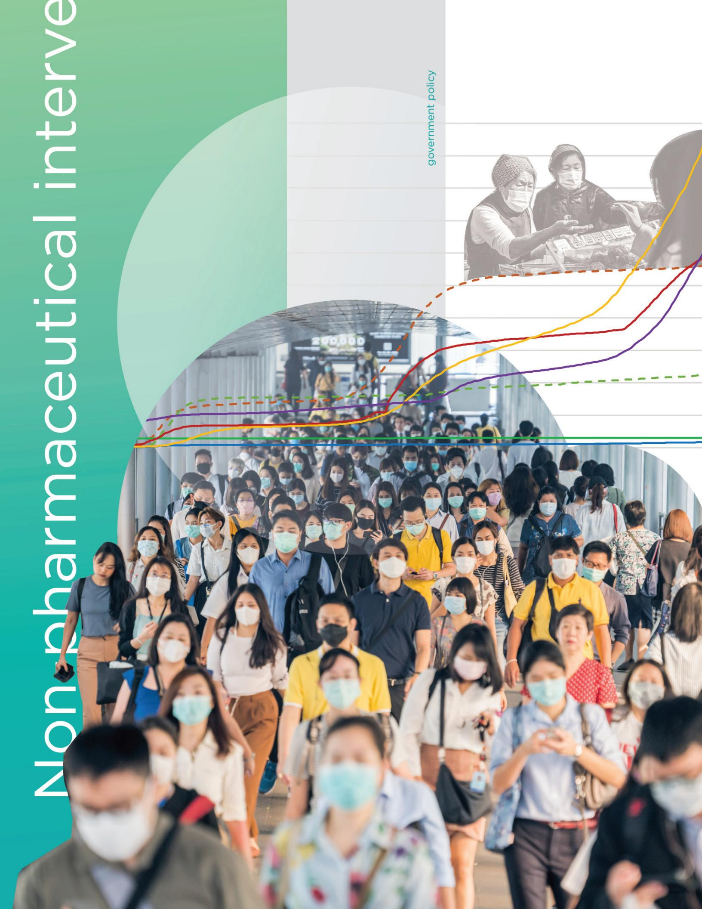

## **Introduction**

COVID-19, which was first discovered and reported in Wuhan, China in December 2019, spread across the world at a fast and terrifying pace throughout 2020. The pandemic has affected many key aspects of life around the world. Government policies and personal behaviors in coping with the pandemic have varied greatly across countries and regions, and the resulting infection and death rates have differed correspondingly. In general, some countries in East Asia and the Pacific had better performance in containing the spread of COVID-19, compared to the rest of the world.

This chapter explores how the East Asian countries or regions (hereafter "East Asian regions," for simplicity) have dealt with the pandemic and how both the infection and government policy have affected emotional well-being. Our study focuses on five regions: mainland China; Hong Kong SAR of China (hereafter "Hong Kong SAR"); Taiwan, China (hereafter "Taiwan"); South Korea; and Japan. We then compare the East Asian regions' performance with a selected group of Western countries with large populations and economies, including: France, Germany, Italy, Spain, the United Kingdom, and the United States. We will also compare them with two Western countries located in the Asia-Pacific region, Australia and New Zealand, which have done quite well in controlling the spread of COVID-19.

Our analysis shows that East Asia's success, compared with the six selected Western societies, can be attributed to stronger and more prompt government responses, as well as better civic cooperation. In particular, East Asian governments implemented more stringent mobility control and physical distancing policies, as well as more comprehensive testing, tracing, and isolation policies (except for Japan) since the early stages. The weaker policies in Japan are associated with the worst performance in containing COVID-19 among the five East Asian regions.

A detailed summary of the policies in the five East Asian regions shows the importance of restructured and strong government response systems in providing the necessary institutional infrastructure for effectively enforcing control measures. It is

also essential to have multi-pronged strategies and comprehensive use of mobility restrictions combined with other interventions. In addition, as the pandemic continues across the globe, East Asian governments have built up the capacity of their public health systems, and they have explored dynamic response protocols that are more targeted and sustainable in their prevention of major resurgences. Specifically, proactive screening, rapid government response to local outbreaks, and extensive testing, tracing, and isolation measures have been the pillars of COVID-19 control mechanisms in these countries, aiming for a swift resumption of normal life alongside the virus, i.e., the "new normal." We also show that the early success of government policies in the East Asia regions in combating COVID-19 is similarly found in Australia and New Zealand. These successes have shown that effective virus control policies can be implemented in more typical Western democracies.

In addition to rapid and systematic government responses, citizens in East Asia (except for Japan)1 were generally more compliant with government mandates for mask-wearing, improving personal hygiene, and maintaining physical distance than citizens in the selected Western countries. We argue that certain cultural traits (defined in Hofstede's model of national culture), such as being less individualistic, more long-term oriented, and less indulgent may help to explain the more self-regulated behavior and greater compliance with government policies in East Asia.2 However, these cultural tendencies alone are not indispensable for controlling the pandemic. The successes of Australia and New Zealand suggest that even in countries with more individualistic, short-term oriented, and more indulgent citizens, a responsible government still can implement very effective policies to contain the spread of COVID-19.

Finally, we examine the impact of COVID-19 and mobility control and physical distancing policies on emotions. We find individual emotions to be significantly impacted by COVID-19 in East Asia. An increase in daily new confirmed cases is associated with a lower level of publicly expressed happiness in mainland China, and a higher level of negative affect in the other four regions. Mobility

*Some countries in East Asia and the Pacific had better performance in containing the spread of COVID-19, compared to the rest of the world.*

control and physical distancing policies are found to play an important role in people's well-being, as they can largely offset the decrease in happiness that occurs due to the rise in the daily new confirmed cases. In summary, more stringent government responses not only reduce the spread of COVID-19, but also help to buffer the negative impact of new daily infection rates on emotions in East Asia.

## **An overview of COVID-19 in East Asia**

#### **COVID-19 in East Asia**

We first present the dynamics of infection in the five East Asian regions. In Figure 3.1, the left axis shows new infections, and the right axis shows total infections. Panel A illustrates the dynamics in mainland China, where the COVID-19 virus was first discovered and reported. Figure 3.1 shows that new cases in mainland China started to increase rapidly in early January, and reached a peak on February 12, with 14,106 cases reported. New cases then declined to fewer than 1,000 on February 19, and further fell below 500 at the beginning of March. New case rates have since remained at a very low level. From the lockdown of Wuhan on January 23, it took about two months to reduce local community infection cases below 100 and almost fully contain the spread of COVID-19 in mainland China: The total amount of infections rapidly increased from late January 2020 to over 80,000 cases on March 1, but then remained flat until the end of December 2020.

We report the quantity of new infections for the period March 1 to December 31 in Appendix Figure 1, as new infections are too infrequent to be displayed clearly in Figure 3.1. There are two curves in the figure, one for total daily new

infections and another for the new infections imported by visitors from outside mainland China. A few small bumps can be found in April, which are mainly caused by imported cases. The bumps around April 17, June 14, and July 31 were due mainly to local outbreaks, which were all contained within approximately one month. In most days, the new infections were largely due to imported cases.

The dynamics of infections in Hong Kong SAR are reported in Panel B. New infections remained low until early March 2020 with a peak in late March. The infection was then largely controlled until another peak emerged on July 22, but the curve was compressed in about two weeks. The infection rate remained low until mid-November, followed by a small bump starting in late November. The curve for total infections clearly shows three periods of rising infections in March, July, and November. The total cumulative infections were still below 9,000 at the end of December 2020.

Infections in Taiwan, as shown on Panel C, have been very low for the whole study period. New infections were mainly recorded in the second half of March and early December. The peak of 27 infections was observed on March 20. The total cumulative number of infections was just 799 by December 31.

South Korea has experienced three waves of infections. The first two waves were largely related to indoor religious activities and political assemblies organized mainly by religious groups.3 The first wave occurred from late February to early March, and the second wave took place in late August. The infection rate of the second peak was 441 new cases on August 26, which was much lower than the first peak of 851 cases on March 3. For most days between the peaks, new infections were successfully controlled with a rate below 100 cases per day. The third wave recorded higher infections than the first two waves and lasted longer as a result of more scattered infections in metropolitan areas. On December 31, the total amount of infections reached 61,769, which is more than double the amount of infections at the beginning of the third wave.

Figure 3.1: Daily total and new confirmed COVID-19 cases in Mainland China, Hong Kong SAR, Taiwan, South Korea, and Japan (December 31, 2019 - December 31, 2020)

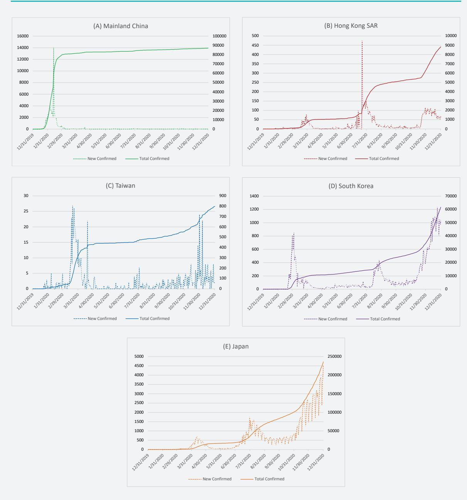

Notes: The left axis corresponds to daily new confirmed cases; the right axis corresponds to daily total confirmed cases.

The COVID-19 data of mainland China before January 15, 2020, come from World Health Organization, and the data from January 15, 2020, are from China Data Lab (2020), which scraped the data from DXY.cn. The COVID-19 data of Hong Kong SAR, Taiwan, South Korea, and Japan come from John Hopkins University Center for Systems Science and Engineering (JHU CSSE). The data start from January 22, 2020. The few negative numbers of new confirmed cases due to corrections by public health are replaced with zeros when we produced the figure.

Japan has also experienced three waves of infections. The first peak was in mid-April, with 701 new cases on April 11. The second peak was in late July and early August, with 1,762 new cases on July 30, and the third peak had not yet arrived by until December 31, when the highest daily cases exceeded 4,500. The number of infections at the three peaks are much higher than those in other East Asian regions. The total number of infections was over 230,000 on December 31.

#### **Comparisons with western countries**

This section compares the infection rates observed in the five East Asian regions to six Western countries: France, Germany, Italy, Spain, the United Kingdom, and the United States. These Western nations offer a useful comparison because of their relative size and income level in the Western sphere. We use the per capita rates of infection to account for population size and to enable easier comparisons across countries and regions, as larger nations may have higher infection counts due to the size of their population. Panel A of Figure 3.2 shows the cumulative daily confirmed cases per 100,000 people in the five East Asian regions. In the early stage (January and February), mainland China recorded the highest infection rate, mainly due to the outbreak in Wuhan and other cities in Hubei province. China's infection rate was surpassed by South Korea in late February, Hong Kong SAR in late March, and then Japan in mid-April. The infection rate in Taiwan was the lowest among the five regions for most of this period, reaching 3.3 per 100,000 on December 31. The infection rate in mainland China has been the

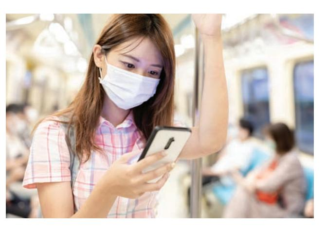

second lowest since mid-April, with the highest rate of infection at 6.1 per 100,000 on December 31. The infection rates in Hong Kong SAR and South Korea were similar at the end of 2020, with 117 and 120 per 100,000 respectively. Japan's infection rate started to increase rapidly beginning in mid-July, and the country recorded 186.4 per 100,000 by the end of the year.

Even though Japan seems to have a high number of infections in comparison to other East Asian peers, Japan's infection rates are much lower than many Western countries, as shown in Panel B of Figure 3.2. The recorded infection rates in France, Germany, Italy, Spain, the United Kingdom, and the United States remained low until the end of February, but they started to rise rapidly in March and April. Italy and Spain's infection rates rose above 100 per 100,000 on March 23 and March 25, respectively. The remaining four countries reached 100 per 100,000 about two weeks later. The infection rate in Spain on March 30 (188 per 100,000) was already higher than the highest infection rates in East Asia (i.e., Japan) by the end of 2020.

All six countries, which rank top in population size and income level in the western sphere, have recorded high growth rates of infections, particularly since October. The infection rate in Germany was the lowest among the six countries and increased at the lowest speed, but the infection rate in Germany at the end of the year was 2,101 per 100,000, which is still about 11 times the rate of Japan. Italy and the United Kingdom recorded higher infection rates, with 3,485 and 3,677 per 100,000 respectively. Spain and France had even higher rates, both over 4,100 per 100,000. The United States departed from other countries, with an almost linear increase in the infection rate up to 2,760 per 100,000 in late October. The U.S. infection rate increased at an even higher rate until it reached 6,060 per 100,000 by the end of 2020. The unique trend of the infection rate in the United States may imply that very limited effective anti-COVID-19 measures were adopted. By the end of 2020, the infection rates of the six selected Western countries were about 11 to 32.5 times the rate of Japan, and 340 to 991.6 times the rate of mainland China.

Figure 3.2: Daily total confirmed cases per 100k in 5 East Asian regions, Australia, New Zealand, and the other 6 western countries (December 31, 2019 - December 31, 2020)

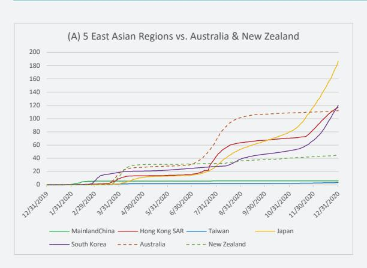

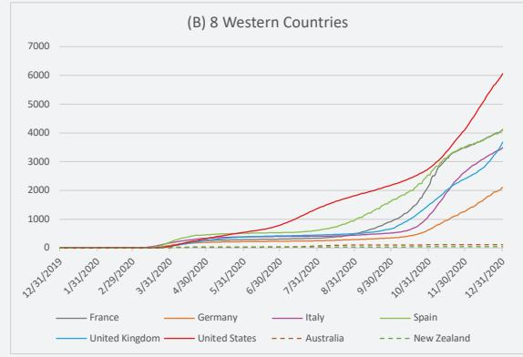

**Notes:** The COVID-19 data of mainland China before January 15, 2020, come from World Health Organization, and the data from January 15, 2020, are from China Data Lab (2020), which scraped the data from DXY.cn. The COVID-19 data of Hong Kong SAR, Taiwan, South Korea, Japan, France, Germany, Italy, Spain, the United Kingdom, the United States, Australia, and New Zealand come from John Hopkins University Center for Systems Science and Engineering (JHU CSSE). The data start from January 22, 2020.

To provide some middle ground between the five East Asian economies and the six selected Western economies, we have added the infection rates in Australia and New Zealand in both panels of Figure 3.2. These are countries which adopted COVID-19 control strategies very similar to those employed in the five East Asian regions. Their results are considerably better than the other Western countries shown in Panel B and are much more comparable to those for the five countries in Panel A. Australia and New Zealand's relative curves in Panels A and B reveal the striking difference in infection between East Asia and the six Western countries.

#### Government responses

Governments across the world have gradually adopted a wide range of measures in response to the COVID-19 outbreak. In this section, we first compare the government responses of the five East Asian regions with those of six Western countries, including the early stages of the

outbreak and the subsequent waves. Second, we summarize the similarities and differences of the response systems and the non-pharmaceutical and pharmaceutical interventions adopted by the five East Asian governments to demonstrate successful responses that other countries can draw upon for their own responses. We also discuss government responses to the COVID-19 pandemic in Australia and New Zealand and point out the possibilities for Western countries.

#### An overall picture

To compare the government responses in East Asian and Western regions, we rely on information from the Oxford COVID-19 Government Response Tracker (OxCGRT), which collects publicly available information for 17 indicators of government responses from more than 180 countries. We focus on the stringency index, which consists of nine indicators of policies whose primary goal is to restrict people's mobility and behaviors. Indicators include school closures, workplace closures, public event cancellations, restrictions

*The success in East Asia and the Pacific points to the importance of strong government leadership and the use of rigorous non-pharmaceutical and pharmaceutical measures in fighting the COVID-19 pandemic.*

on gatherings, public transport closures, stayat-home requirements, restrictions on internal movement, international travel controls, and public information campaigns. The index is an additive score of the nine indicators measured on an ordinal scale, rescaled to vary from 0 to 100 (100 = strictest).4 We acknowledge that this stringency index, though simple for international comparison, may not provide enough detail for each of these policies in mobility control and physical distancing. More detailed policies in the five East Asian regions will be discussed in the following subsection. This index may also not fully represent the effectiveness and efficiency of the policies, since neither actual enforcement, civic engagement, nor individual compliance is covered by the index.

Figure 3.3 shows the stringency index for the five East Asian regions and the six Western countries from December 31, 2019 to December 31, 2020. We also indicate the level of the stringency index for each region when the 10th, 100th, or 1,000th COVID-19 case was confirmed.5 The left axis corresponds to the stringency index, and the right axis corresponds to daily new confirmed cases. Although the governments of most of the 11 regions implemented quite stringent policies in mobility control and physical distancing when the COVID-19 situation became more severe, we find that the stringency of these policies varied significantly at the early stages across these regions. The governments of Hong Kong SAR, Italy, and Taiwan responded the fastest to the outbreak among all the regions; when the 10th case was confirmed, their stringency indexes were already 49, 28, and 19, respectively. It seems that the strictness of the government responses in

Hong Kong SAR and Taiwan at the earliest stage of the outbreak helped to reduce the spread of the virus in these two regions. Despite the comparably stringent policies at this early stage, the relatively poor performance of Italy in containing the virus may be attributable to less compliance with those policies or insufficient and inconsistent testing, tracing and quarantine6.

On the other extreme, the governments of Germany, Spain, the United States, and the United Kingdom were among the slowest to respond: their stringency indexes were only 25, 25, 22, and 11 respectively when the 1,000th case was confirmed in each country even though the indexes rose substantially right after that. Weak government responses in these countries at the early stages inhibited them from preventing the rapid spread of the virus. The governments of mainland China, Japan, South Korea, and France had relatively weak policies when the 10th case was confirmed but raised the strictness of mobility control and physical distancing measures considerably when the 100th or 1,000th case was confirmed. Overall, the governments of the five East Asian regions implemented stricter interventions than those of the four western countries including Germany, Spain, the United States and the United Kingdom at the earlier stages of the outbreak. This helps to explain the relatively mild first waves in the East Asian countries.

Testing and contact tracing also appeared to be effective in managing COVID-19, alongside early adoption of mobility control and physical distancing policies. Each of the five East Asian regions and the six Western countries offered comprehensive testing, such as testing of anyone showing COVID-19 symptoms or open public testing. When the situation got much worse (i.e., having more than 1,000 cases confirmed). However, some countries offered more extensive testing than others at earlier stages. France and the United States did not have any testing policies when the 10th case was confirmed, while all of the five East Asian regions and the other four Western countries offered testing to those who both had symptoms and met certain criteria (e.g., essential workers, admitted to hospital, came into contact with a known case, and returned from overseas). When

Figure 3.3: Stringency index and daily new confirmed for 5 East Asian regions and 6 western countries (December 31, 2019 - December 31, 2020)

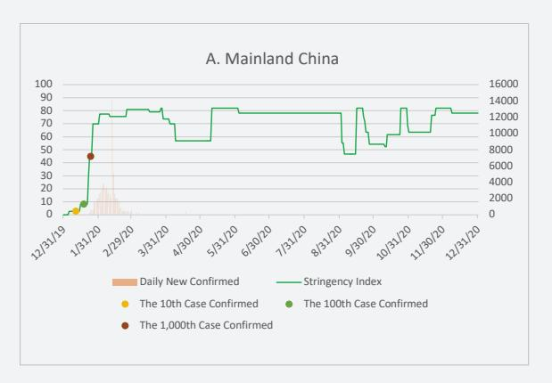

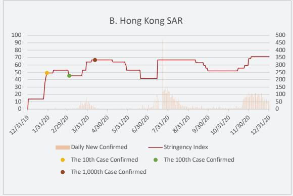

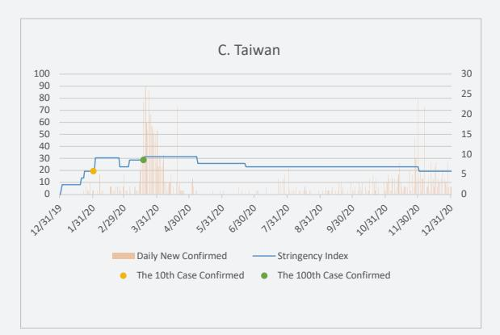

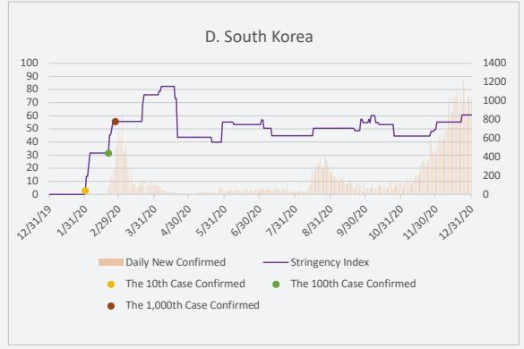

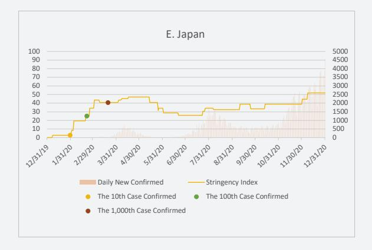

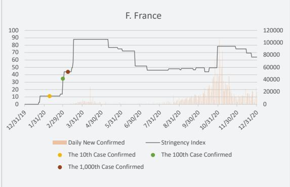

Figure 3.3: Stringency index and daily new confirmed for 5 East Asian regions and 6 western countries (December 31, 2019 - December 31, 2020) continued

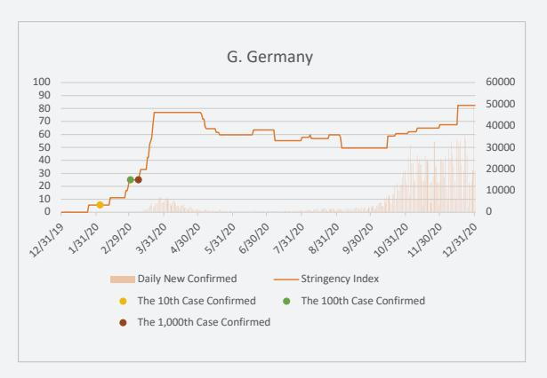

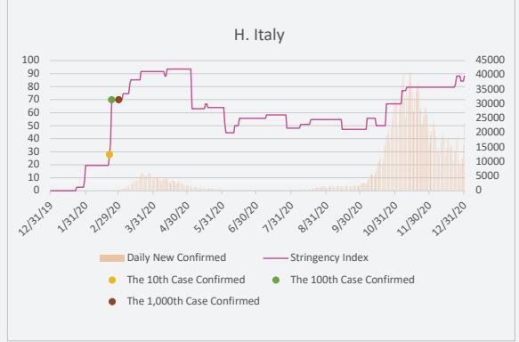

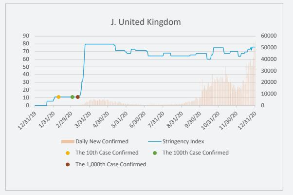

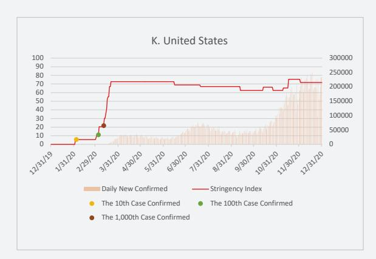

Notes: The left axis corresponds to the stringency index; the right axis corresponds to daily new confirmed cases.

The stringency index comes from Oxford COVID-19 Government Response Tracker (OxCGRT) and is a simple additive score of nine indicators of mobility control and physical distancing or "lockdown style" policies measured on an ordinal scale, rescaled to vary from 0 to 100. The nine indicators include school closures, workplace closures, public events cancelations, restrictions on gatherings, public transport closures, stay-at-home requirements, restrictions on internal movement, international travel controls, and public information campaigns.

the number of confirmed cases reached 100, France and the United States began to implement testing policies, whereas three of the East Asian regions–Hong Kong SAR, Taiwan, and South Korea–broadened the criteria for testing at this stage. Hong Kong SAR and Taiwan offered testing to anyone showing COVID-19 symptoms, and, most impressively, South Korea offered open public testing to asymptomatic people.

Another strength of most of the East Asian regions is their much more aggressive contact-tracing efforts. Table 3.1 presents the comprehensiveness of contact tracing in each of the 11 regions at various stages of the outbreak. It shows that four out of the five East Asian regions (mainland China, Hong Kong SAR, Taiwan, and South Korea) implemented comprehensive contact tracing at the early stages and continued making their efforts later (even when the situations improved). There is more heterogeneity on contact tracing among the six Western countries. The governments of Italy, Germany, and the United Kingdom made great efforts for contact

tracing at the early stages, but the policies were loosened after more than 1,000 cases were confirmed. The time periods during which these three countries loosened their contact tracing policy unfortunately coincided with periods in which daily new confirmed cases surged. However, the United States only had very limited contact tracing and did not conduct tracing for all identified cases throughout the whole time period under investigation. Japan, France, and Spain did not practice contact tracing for all identified cases until the total number of confirmed cases reached nearly 120,000, 178,000, and 890,000, respectively.

Most of the regions experienced a second and third wave of the COVID-19 pandemic after the spring. When these subsequent waves arrived, Hong Kong SAR, South Korea, and Japan responded quickly by raising the stringency of mobility control and physical distancing policies. In mainland China and Taiwan, there have been no significant subsequent waves mainly because of consistent comprehensive testing, contact tracing, and quarantine policies that quickly and fully suppressed

**Table 3.1: Responses of contact tracing to COVID-19 (December 31, 2019 – December 31, 2020)** 

|                                       | Mainland China | Hong Kong SAR | Taiwan | South Korea | Japan | France | Germany | Italy | Spain | United Kingdom | United States |
|---------------------------------------|-------------------|------------------|--------|----------------|-------|--------|---------|-------|-------|-------------------|------------------|
| The 10th Case Confirmed            | ●                 | ●                | ●      | ●              | ●     | ●      | ●       | ●     | ●     | ●                 | ●                |
| The 100th Case Confirmed           | ●                 | ●                | ●      | ●              | ●     | ●      | ●       | ●     | ●     | ●                 | ●                |
| The 1,000th Case Confirmed         | ●                 | ●                | n/a    | ●              | ●     | ●      | ●       | ●     | ●     | ●                 | ●                |
| More than 1,000 Cases Confirmed | ●                 | ●                | n/a    | ●              | ●●    | ●●     | ●●●     | ●●●●  | ●●    | ●●●●●             | ●                |

- No contact tracing
- Limited contact tracing; not done for all cases
- Comprehensive contact tracing; done for all identified cases

Note: Japan, France, and Spain did not have comprehensive contact tracing until the total number of confirmed cases reached nearly 120,000, 178,000, and 890,000, respectively; Germany loosened the contact tracing policy between March 18 and June 14 when the total number of confirmed cases exceeded 10,000 but did not reach 188,000; Italy loosened the contact tracing policy for 17 days in October and after November 9; The United Kingdom loosened the policy between March 12 and May 31 when the total number of confirmed cases exceeded 1,000 but did not reach 258,000 and between August 30 and December 16 when the total number of confirmed cases exceeded 336,000 but did not reach 1,920,000.

**Figure 3.4: Stringency index and daily new confirmed for Australia and New Zealand (December 31, 2019 – December 31, 2020)**

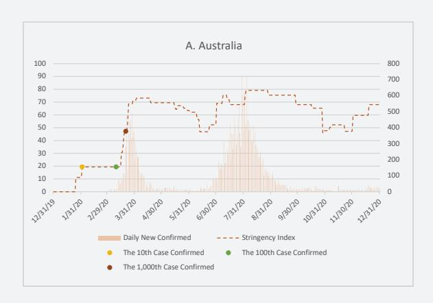

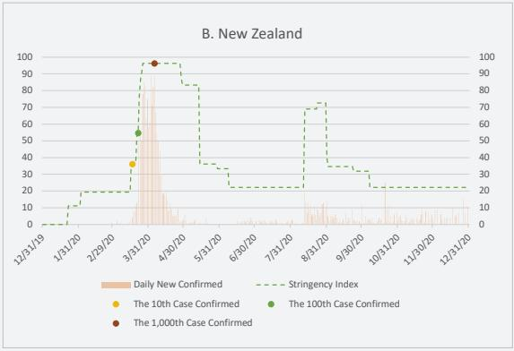

Notes: The left axis corresponds to the stringency index; the right axis corresponds to daily new confirmed cases.

The stringency index comes from Oxford COVID-19 Government Response Tracker (OxCGRT) and is a simple additive score of nine indicators of mobility control and physical distancing or "lockdown style" policies measured on an ordinal scale, rescaled to vary from 0 to 100. The nine indicators include school closures, workplace closures, public events cancelations, restrictions on gatherings, public transport closures, stay-at-home requirements, restrictions on internal movement, international travel controls, and public information campaigns.

some regional outbreaks.7 On the other hand, France and the United Kingdom did not enforce stricter mobility control and physical distancing measures quickly enough when subsequent waves hit. The United States did not significantly raise the stringency of control measures until mid-November when the situation became most severe. Overall, the lack of government responses regarding mobility control and physical distancing policies in these Western countries during subsequent waves partly explains why they experienced much stronger waves than the East Asian regions.

All of the East Asian regions, except Japan, have made testing available to the general public. In comparison, only three out of the six Western countries–France, Germany, and the United States– had similar levels of testing when the second wave arrived. Italy, Spain, and the United Kingdom continued to only test those with symptoms. None of the Western countries have conducted contact tracing as thoroughly as the four East Asian regions (not including Japan).

Overall, the success of the East Asian regions in controlling subsequent waves is mainly attributable to the timely enforcement of more stringent policies for mobility control and physical distancing, together with continued extensive testing and comprehensive contact tracing.

The success stories in battling the COVID-19 pandemic have not only taken place in East Asia. Australia and New Zealand, two Western countries located in the Asia-Pacific region, appear to be successfully suppressing the pandemic. As shown in the two panels of Figure 3.4, both countries enforced strong mobility control and physical distancing policies, similar to the East Asia regions; the stringency index was already about 19 and 36 when the 10th cases were confirmed in Australia and New Zealand, respectively. These levels of stringency were higher than those of not only most of the other Western countries, but some of the East Asian regions under study at the earliest stage of the outbreak. The policies also became rapidly stricter in response to the rise in new

confirmed cases, especially in New Zealand. Furthermore, the level of stringency of the policies was raised immediately wherever subsequent infections appeared to hit the two countries. These restrictions were directly aimed at the locality subject to new infections. Australia and New Zealand also had comprehensive contact tracing policies (i.e., doing contact tracing for all identified cases) from the very beginning of the outbreak.

#### **A closer look**

East Asian governments have adopted control and mitigation measures that were found to be effective in combating the COVID-19 pandemic, enabling a swift resumption of normal life without severe resurgence of infections. Restructured and strong government response systems, early and rigorous mobility control, extensive screening, testing, contact tracing and isolation, coordinated resource allocation, clear communication, enforced self-protection practices, and supportive economic measures have jointly contributed to the comparatively low COVID-19 rates in the East Asian regions.8 Table 3.2 provides a summary of government responses in East Asia. In addition, as COVID-19 continued to spread globally, these regions have built up their capacities and explored sustainable response protocols that are more targeted and proactive in the prevention and control of COVID-19 outbreaks, as well as rejuvenating their economies.9

**Table 3.2: Summary table of government responses in Mainland China, Hong Kong SAR, Taiwan, South Korea, and Japan** 

| Policy                                                                                         | Mainland China             | Hong Kong SAR        | Taiwan               | South Korea          | Japan                 |
|------------------------------------------------------------------------------------------------|----------------------------|----------------------|----------------------|----------------------|-----------------------|
| 1. Response system                                                                             |                            |                      |                      |                      |                       |
| Nationwide directive (YES/NO)                                                               | YES                        | YES1                 | YES1                 | YES                  | YES                   |
| Multisectoral coordination (YES/NO)                                                         | YES                        | YES                  | YES                  | YES                  | NO                    |
| Central-Local government cooperation (YES/NO)                                               | YES                        | YES2                 | YES3                 | YES                  | NO                    |
| 2. Nonpharmaceutical Interventions                                                             |                            |                      |                      |                      |                       |
| Mobility restriction and social distancing (Comprehensive/Targeted) (Enforced/Requested) | Comprehensive Enforced  | Targeted Enforced | Targeted Enforced | Targeted Enforced | Targeted Requested |
| Testing(Extensive/Targeted)                                                                    | Extensive                  | Extensive            | Extensive            | Extensive            | Targeted              |
| Tracing(Extensive/Targeted)                                                                    | Extensive                  | Extensive            | Extensive            | Extensive            | Targeted              |
| Isolation and quarantine (Mandatory/Voluntary) (Institutional/Home-based/Mixed)          | Mandatory Institutional | Mandatory Mixed   | Mandatory Mixed   | Mandatory Mixed   | Mandatory Mixed    |
| Nationwide coordinated resource allocation and mobilization (YES/NO)                     | YES                        | YES1                 | YES1                 | YES                  | NO                    |
| Communication (Timely/Delayed) (Clear/Equivocal)                                         | Timely Clear            | Timely Equivocal  | Timely Clear      | Timely Clear      | Delayed Clear      |
| Self-protection practice (Required/Requested)                                               | Required                   | Required             | Required             | Required             | Requested             |
| Economic support (YES/NO)                                                                   | YES                        | YES                  | YES                  | YES                  | YES                   |
| 3. Pharmaceutical Interventions                                                                |                            |                      |                      |                      |                       |
| Free treatment (YES/NO)                                                                     | YES                        | YES                  | YES                  | YES                  | YES                   |
| Hospitalization of mild cases required (YES/NO)                                             | YES                        | NO                   | NO                   | YES                  | NO                    |

1. &quot;Nationwide" here refers to regionwide.

2. &quot;Central" here refers to the Chinese central government for Hong Kong SAR.

3. &quot;Central" here refers to the central government within Taiwan province of China.

#### **Response systems**

Fostered by the experience with previous epidemics such as Severe Acute Respiratory Syndrome (SARS) and Middle East Respiratory Syndrome Coronavirus (MERS), all of the five East Asian governments, except Japan, have improved their crisis management systems and established relevant regulatory procedures to address public health emergencies.10 Though legal and policy bases for the public health systems need further strengthening,11 strong nationwide directives, multi-departmental coordination, and collaboration between different levels of government in these East Asian regions have provided the institutional infrastructure for aggressive and/or timely response to the COVID-19 pandemic.12

*Mainland China.* Despite the delayed response to the outbreak in its very early stage,13 a "whole-of-government" and "whole-of-society" approach was subsequently followed. On January 24, 2020, the State Council of China established the *Joint Prevention and Control Mechanism* (the *Mechanism*) which consisted of 32 departments of the government. The *Mechanism*, led by the National Health Commission, played a crucial role in coordinating collective actions and facilitating cooperation for, "epidemic prevention and control, medical treatment, scientific research, publicity, foreign affairs, logistics support, and frontier work."14 Within five days of January 24, 31 Chinese provinces, municipalities, and autonomous regions declared a Level I (the highest level) response to the COVID-19 epidemic. At the local level, the *Epidemic Prevention and Control Headquarters System* was launched for leading and commanding the response and mobilization of community engagement.15

*Taiwan & Hong Kong SAR.* Both regions benefitted from the legacy of the SARS epidemic and were able to activate public health emergency management mechanisms in response to the COVID-19 outbreak from its onset.16 For example, on January 20, 2020, the Taiwan Centers for Disease Control (TCDC) activated the *Central Epidemic Command Center* (*CECC*) under the National Health Command Center (NHCC), with the minister of health and welfare as the designated commander. CECC coordinated the response efforts of multiple

government departments in Taiwan, such as Ministries of Labor, Economics, Transportation, and Education.17 As early as January 4, the Hong Kong SAR government launched the *Preparedness and Response Plan Novel Infectious Disease of Public Health Significance* (the *Plan*) and activated the "Serious Response Level," which was then raised to "Emergency Level" on January 24. Under the *Plan*, a *Steering Committee*, consisting of directors and permanent secretaries of multiple departments of the government, was formed.18

*South Korea.* To coordinate the governmentwide response to the COVID-19 pandemic, the South Korean government assembled the *Central Disaster and Safety Countermeasures Headquarters*, which consisted of multiple relevant ministries and was headed by the Prime Minister. The Korean CDC led the prevention and control efforts under the *Headquarters*, with assistance from the Minister of Health and Welfare and the Minister of Interior and Safety, to coordinate among the central and local governments. *Local Disaster and Safety Management Headquarters* were established at the local level with support from the central government for necessary resources.19

*Japan.* On January 30, 2020, three days after the Prime Minister declared COVID-19 as an infectious disease, Japan established the *Novel Coronavirus Response Headquarters*, with a task force consisting of 36 senior officers from different key ministries. However, the authority of both the task force and the Japanese government to implement epidemic countermeasures was greatly restricted by the Constitution.20 Even with further amendments of the emergency law later in March, the governments still lacked superseding emergency power over ministries and stood in need of support for multisectoral and central-local collaboration for COVID-19 responses.21

#### **Non-pharmaceutical interventions**

*Mobility restriction and physical distancing*

Measures to control mobility and physical distancing were widely adopted, but the extent and intensity of these measures varied among the five East Asian regions. Dynamic and

incremental control measures were also introduced in these regions in response to new outbreaks and resurgence.

*Mainland China.* Mainland China introduced comprehensive and rigorous interventions to control mobility and physical distancing.22 The epicenter, Wuhan city, implemented a complete lockdown which lasted for 76 days beginning on January 23, followed by lockdowns in other prefectures in Hubei province beginning the next day. Unprecedented mobility control measures, including travel bans, suspension of public transport, bans of all public gatherings, cancelling of public events, strict stay-at-home requirements, and lockdowns of communities were instituted. Mobility restrictions and physical distancing policies were also adopted early in the rest of China.23 For example, cross-regional travel restrictions, health checkpoints, rules for public gatherings, and stay-at-home orders were mandated in most areas during the Spring Festival. Schools of all levels remained closed until June, and workplace closures and community lockdowns were strictly

enforced in high-risk areas. Although their proportionality was controversial, the drastic measures that characterized the Phase I containment efforts of mainland China were shown to have been effective in delaying and reducing the size of epidemic in China.24 The prolonged interventions in Wuhan, and the gradual relaxation of mobility control and physical distancing measures, instead of a sudden and premature lifting, also helped prevent early resurgence.25

When the initial outbreak was suppressed, the COVID-19 response strategy of mainland China shifted to Phase II containment.26 To prevent importation of cases from overseas, international travel restrictions were tightened in March 2020.27 In addition, testing and disinfection requirements for imported cold-chain foods were enhanced, according to the plan of "full-chain, closed-loop, traceable management" introduced by the *Mechanism*. 28 Dynamic control measures were refined by local governments and tailored to risk levels of COVID-19 infections (high vs. medium vs. low risk). These measures were targeted to contain outbreaks promptly at a scale as granular as the community level while the country worked hard to revive socioeconomic life. For example, to avoid large-scale lockdowns, outbreaks in Beijing, Qingdao, Shanghai, and other mainland cities were quickly identified and suppressed within less than a month by tightening mobility control measures on the community level.

*Hong Kong SAR and Taiwan.* These neighbors of mainland China adopted targeted mobility control measures rather than regionwide lockdowns. One reason for their success at keeping COVID-19 under control is their early, incremental, and stringent border control.29 For instance, Taiwan started onboard quarantine of passengers from Wuhan as early as December 31, 2019. In all three regions, entry of Wuhan residents and all foreign nationals were banned in late-January and mid-March respectively, with a health declaration and 14-day quarantine mandated for inbound travelers. Imported cases were greatly reduced by

these border control measures. In Hong Kong SAR, testing for COVID-19 was required and administered at the airport for inbound travelers from high-risk areas or who were symptomatic. Other physical distancing measures, including school closures, work-from-home requirements (for civil servants in Hong Kong SAR), closing of leisure venues, reducing the capacity of restaurants, and restricting public gatherings were also introduced incrementally later in response to accelerating risk of local transmission.30

*South Korea.* South Korea avoided full lockdowns and had less restrictive border controls than Taiwan and Hong Kong SAR. While the Korean government banned the entry of foreigners with a travel history to Hubei on February 4, 2020, its border remained relatively open. However, South Korea instituted rigorous screenings at the border including requirements of health declarations, testing, and quarantine for inbound travelers. When potential new outbreaks emerged, measures including physical distancing, limitations

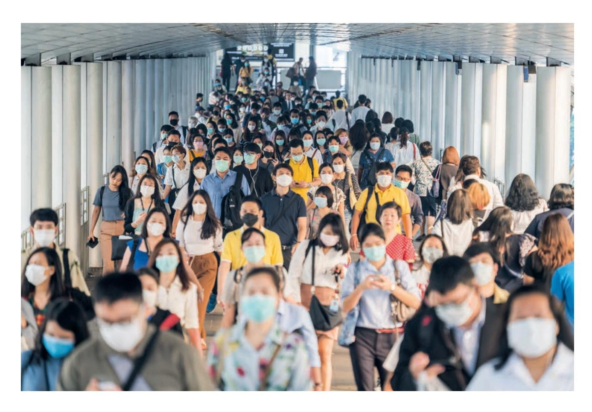

on public gatherings, closure of public schools, churches, and nightclubs, and working-fromhome recommendations were also introduced or tightened.31 In particular, starting in June, South Korea adopted a 3-stage physical distancing system and implemented control measures according to the severity of COVID-19 infections,32 which were recently further refined and modified at local levels.

*Japan.* The Japanese government did not implement comprehensive and intense mobility control measures such as lockdowns due to the constitutional restrictions. The countermeasures of the Japanese governments were targeted at border control and the quarantine of the *Diamond Princess* (the cruise ship with suspected/ confirmed cases anchored at Port of Yokohama) at the early phase of the outbreak. Subsequent amendments to the law made it possible to declare a "state of emergency" in several prefectures and at the national level. Nevertheless, most mobility restrictions and physical distancing measures were still *voluntary* rather than *mandatory*. Central and local governments in Japan therefore only made *appeals* to the public, and they *requested* school closures, remoteworking of non-essential business employees, and avoidance of public gatherings in multiple prefectures.33 While there is some evidence that supports the effectiveness of the non-enforced requests in reducing the spread of COVID-19 in Japan,34 critics also noted that the lack of clear incentives delayed behavioral changes in the early phase of the pandemic.35

#### *Testing*

Testing was the cornerstone public health measure for controlling the COVID-19 epidemic, as it was essential in preventing and containing resurgence in COVID-19 cases. Although testing capacities increased over time, testing policies varied in terms of availability and scale in the five East Asian regions.

*Mainland China, Hong Kong SAR, Taiwan and South Korea.* These regions aimed for extensive testing by aggressively increasing public access to COVID-19 tests. For example, despite initial

short supply and slow turnaround, mainland China offered free testing services to potential COVID-19 patients beginning in late January and introduced affordable COVID-19 tests to the general public in April. More recently, testing was made free and required on a regular basis for high-risk groups, essential workers, and imported products, which helped proactively screen and contain COVID-19 infections. In Hong Kong SAR, through multiple testing and surveillance programs, free testing for COVID-19 was made available to people with symptoms at public and private clinics and hospitals, as well as for inbound travelers, inpatients, and healthcare workers. On May 23, 2020, Taiwan *CECC* also lowered restrictions on testing, as they allowed the general public to take COVID-19 tests at their own expense for emergency reasons, or for work, study, and travel purposes. The "*testing, tracing, treating*" model for containing COVID-19 was adopted by South Korea, whose testing capacity was greatly enhanced after the MERS outbreak in 2015. With cooperation between the government and the private sector, South Korea was able to conduct large-scale and rapid testing at the onset of the COVID-19 pandemic by setting up triage centers and innovations such as the "Drive-through/Walk-in" testing approach. Testing was free to confirmed cases and potential contacts but available to all in need of a test. Moreover, in later stages, rapid population-level mass testing for COVID-19 has been conducted in a number of cities across China such as Beijing, Wuhan, Qingdao, Dalian, and Hong Kong SAR, as well as in South Korea, allowing for rapid identification of clusters and resurgence of COVID-19 to avoid the second wave of massive infection.

*Japan.* Testing was targeted rather than extensive in Japan as compared to the other East Asian regions. Testing services were only available to people with potential symptoms, close contacts of confirmed cases, and inbound travelers. Testing costs were covered by the government or health insurance for confirmed cases. Until August 2020, although testing was widely used for cluster identification, testing capacity was still low in Japan and restrictions remained high. Often, requests for testing by clinicians were rejected by bureaucrats at local healthcare centers.36

#### *Tracing*

Extensive tracing of COVID-19 cases and close contacts were introduced and enhanced by the use of big data and information technologies in all of the East Asian regions except Japan. Large-scale contact tracing was shown to play an important role in suppressing local epidemics and enabling rapid government response to prevent resurgence.37

*Mainland China, Hong Kong SAR, Taiwan and South Korea.* In these regions, comprehensive and rapid epidemiological investigations were conducted in communities, hospitals, and triage centers for tracing potential COVID-19 patients. Extensive tracing was aided by the use of big data from surveillance infrastructure, border controls, medical records, and transportation systems, as well as mobile GPS and transaction records. Mainland China launched nationwide individual risk assessment services, called *health barcodes*, which utilized big data from multiple sources and machine learning algorithms.38 Taiwan integrated data from mobile GPS, immigration and customs, health insurance, and health declaration at entry to screen and trace potential patients.39 South Korea also made use of card transactions and surveillance data, as well as mobile phone apps ("Self-Quarantine Safety Protection App" and "Self-Diagnosis App") for tracking.40 In Hong Kong SAR, Taiwan, and South Korea, wristbands paired with mobile phones were also used as "electronic fences" to track people under quarantine. Moreover, mobile phone apps that map COVID-19 cases were developed in these regions to help people avoid areas of infection.

*Japan.* Japan adopted a contact tracing strategy that was targeted for early clustering identification. However, Japanese authorities had limited access to personal information other than that from confirmed cases. The download of tracking apps was also voluntary. Therefore, contact tracing and screening in Japan were not as extensive as in other regions, and often failed when clusters became large and widespread.41

#### *Isolation and quarantine*

Case isolation was important in controlling COVID-19 outbreaks and more effective when combined with contact tracing and physical distancing measures. All of the East Asian regions enforced mandatory and monitored isolation and quarantine for confirmed COVID-19 cases, suspected cases, close contacts, and inbound travelers, though with varying requirements for isolation venues.

*Mainland China.* Institutional isolation of all confirmed and suspected cases, and centralized quarantine of close contacts and inbound travelers, were required. Under institutional quarantine or isolation, living necessities, triage, basic medical care, frequent monitoring, and rapid referrals were provided.42 Recent evidence suggests that institutional isolation was more effective than home-based isolation in reducing within-household and community transmission.43

#### *Hong Kong SAR, Taiwan, South Korea and Japan.*

Unlike in mainland China, both home-based and institution-based quarantine were allowed in different circumstances. For example, in Hong Kong SAR, inbound travelers were subject to a 14-day self-quarantine at home or at designated quarantine centers, while institutional quarantine was required for close contacts of inbound travelers who tested positive.44 Either homebased or institutional isolation were required for close contacts of COVID-19 cases in these regions, where home-based isolation was monitored electronically or physically by community workers. In particular, fines and/or imprisonment were enforced in Hong Kong SAR,45 Taiwan,46 and South Korea47 for non-compliance with isolation requirements.

#### *Resource allocation and mobilization*

In the five East Asian regions excluding Japan, allocations of medical and non-medical resources were coordinated across regions, prioritized for the frontline and for the treatment of severe COVID-19 patients, and facilitated by the use of information technology and partnership between government and private sectors.

*Mainland China and Hong Kong SAR.* The Chinese government boosted the domestic production of medical products through a host of supporting measures, such as providing tax reductions, subsidies, and social security benefits. International procurement of medical supplies by governments and private firms (e.g., tech giant Alibaba) was coordinated to help meet local needs. The government also promoted the import of medical products from overseas and shift of sales from export to domestic markets by local firms and encouraged manufacturers to reconfigure production lines to produce medical equipment. Health workers from the military and other provinces were paired with and sent to cities at the epicenter in Hubei, Hong Kong SAR, as well as to cities with resurgence. Medical resources were also concentrated through temporary redistribution systems to frontline workers. In addition, makeshift hospitals were established for separately treating patients with mild and severe conditions. Local governments, community workers, volunteers, and private sector entities, such as e-commerce platforms and logistic firms, worked together for distribution of vital products.48

*Taiwan and South Korea.* Domestic supply of face masks and PPE in Taiwan and South Korea was enhanced by banning the export of N95 (or similar standard, such as KF94 in South Korea) and surgical masks, the requisition of domestically produced face masks, and the expansion of production lines. In South Korea, the initial epicenters *Daegu* and *Cheongdo* were designated as "special care zones" in order to allow more resources to be allocated there. In addition, a national-level coordination center was set up in South Korea to allocate COVID-19 patients to hospitals and across regions.49 Coordinated supply of resources was also made possible by the use of information technologies. Both Taiwan and South Korea introduced face mask rationing and distribution systems based on health insurance information. The Taiwanese health insurance administration and private developers also cooperated in providing real-time information about the availability of face masks on a "Mask Map."

*Japan.* In contrast to other East Asian regions, Japan has a regionalized public health system. In response to the COVID-19 pandemic, Japan expanded its hospital networks and restructured the triage pathway at local levels. However, local health systems still lacked adequate redistribution of resources and national support.50

#### *Communication*

In mainland China, Taiwan, South Korea, and Japan, public information campaigns provided consistent and clear messages about government response efforts, guidelines, the risks of COVID-19, and self-protection measures, while the government in Hong Kong SAR was equivocal with regard to the use of protective face masks at the early stages of the outbreak.51 Both traditional and social media were used to facilitate communication efforts and trust in government, though these efforts were less successful in Hong Kong SAR and Japan.52 Efficient and timely case reporting systems were also crucial for the public health response and behavioral changes. Daily reporting and release of COVID-19 data was timelier in mainland China (despite its early failure in transparency), Hong Kong SAR, Taiwan, and South Korea than in Japan, where data sharing and reporting between different stakeholders and prefectures was delayed due to manual data entry systems and the norm of using fax machines and paper.53

#### *Self-protection practice*

In these East Asian regions, strict self-protection measures were either requested or mandated. For example, wearing a face mask was only requested on public transportation and at hospitals in Japan, while it was required in mainland China, Taiwan, Hong Kong SAR and South Korea, where non-compliance might lead to rejection of services.

#### *Economic support*

All five East Asian governments implemented supportive fiscal measures such as tax cuts, subsidies, wage support, and rent concession to help small businesses and households. While mainland China and Taiwan mainly provided

consumer vouchers to households as part of their economic stimulus packages, South Korea, Hong Kong SAR, and Japan rolled out emergency cash payment programs either universally (Japan, Hong Kong SAR) or among low-income populations (South Korea).54

#### **Pharmaceutical interventions**

#### *Treatment*

All five East Asian governments provided free treatment for COVID-19 for their citizens/residents through government health insurance programs and/or government budgets.

#### *Hospitalization of mild cases*

Hospitalization and institutional isolation of mild cases varied across the five East Asian regions.

*Mainland China and South Korea* required all COVID-19 patients to be institutionalized despite the limited capacity in the healthcare system. They activated makeshift hospitals or observation admission centers to accommodate COVID-19 patients with mild to moderate symptoms, while saving beds at COVID-19-designated hospitals for more severe cases.55

*Hong Kong SAR, Taiwan, and Japan* did not mandate hospitalization of patients with mild symptoms.

#### **Silver lining**

There have been concerns of whether the stringent control measures adopted in East Asia would prove useful in the Western world. As we have shown earlier in this section, some Western countries, such as Australia and New Zealand, also managed to keep their COVID-19 infections low and re-opened their economies without major second waves. The success in East Asia and the Pacific points to the importance of strong government leadership and the use of rigorous non-pharmaceutical and pharmaceutical measures in fighting the COVID-19 pandemic. In particular, extensive testing, tracing, and isolation, combined with dynamic physical distancing that is responsive to infection risks, were found to be more efficient in controlling the spread of COVID-19

than any of these strategies implemented alone.56 For example, both Australia and New Zealand implemented early bans on travel from China. A subsequent sharp rise of COVID-19 infections in Australia in March prompted a series of strict physical distancing measures, including workplace closures, restrictions of indoor and outdoor gatherings, and strict institutional quarantine requirements on returning nationals. Starting on March 26, the New Zealand government also implemented a stringent nationwide lockdown to eliminate the virus that lasted for 7 weeks.57 Similar to East Asia, the stringent border controls and intense physical distancing in Australia and New Zealand bought them time to build up testing and tracing capacities,58 and the resulting widespread testing and contact tracing in those regions enabled governments to rapidly and efficiently suppress COVID-19 infections.59

## **Civil engagement**

#### **Personal behaviors**

Responsible civil engagement in East Asia is also important in explaining the efficacy of government action and resulting low rates of infection. Citizens in East Asia were usually willing to abide by anti-COVID guidelines, such as avoiding unnecessary gatherings, maintaining physical distance, wearing masks in public spaces, improving personal hygiene, and cooperating with testing and isolation. YouGov's COVID-19 Public Monitor provides some evidence of these behaviors.60 Figure 3.5 uses YouGov data to show six panels of personal behavior during the pandemic in the East Asian regions (except South Korea due to missing data), Australia, and the six Western countries, up to the end of 2020. Except for Japan, citizens in the East Asian regions were generally performing better in all personal behaviors than in the Western countries. Australia,61 also shown on each panel, is doing very well except for wearing masks and avoiding raw meat.

Panel A shows the share of respondents wearing a face mask when in public spaces. Mainland China, Hong Kong SAR, and Taiwan all had high mask-wearing levels, mostly above 80% in the

Figure 3.5: Percentage of respondents adopting personal behaviors to slow the spread of COVID-19 during the Pandemic

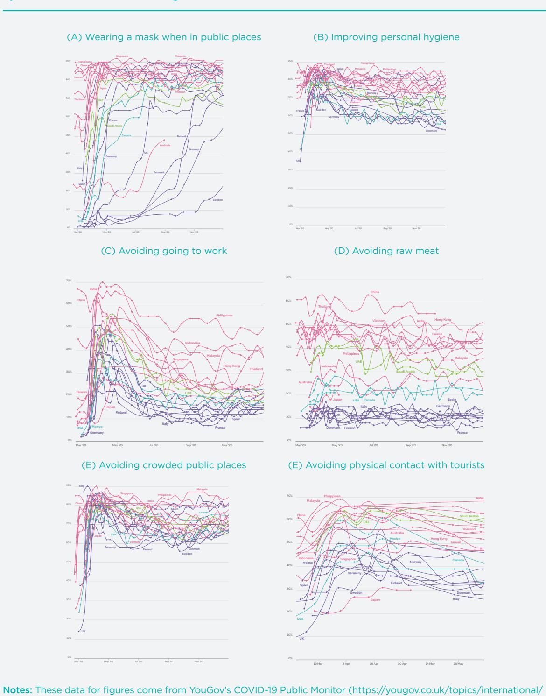

articles-reports/2020/03/17/personal-measures-taken-avoid-covid-19).

*With effective government policies, COVID-19 can be successfully contained in countries with cultures quite different from those of East Asia.*

whole study period. This percentage is much higher than in the Western countries, especially during March and April. The share of mask-wearing in Japan was the lowest among the four East Asian regions until late March, but there was no data for the later period. Japan's personal behaviors are consistent with the worst COVID-19 situation among the five East Asian regions in our study. Though the share of mask-wearing in Japan was relatively low, it was still higher than in Western countries, except Italy, during the same period. Italy's share of mask-wearing increased early and rose above 80% around mid-April. Spain and France also followed, but Germany, the United Kingdom, and the United States adopted mask-wearing very slowly, and still had a lower level of mask-wearing than East Asian countries by the end of 2020.

Panel B presents the level of personal hygiene habits. Similar to mask-wearing, mainland China, Hong Kong SAR, and Taiwan all adopted improved personal hygiene measures (e.g., washing hands frequently, using hand sanitizer, etc.) in the early stages of the pandemic and maintained high compliance over the whole period. Japan's data was only available before the end of May. During the survey period, the share of people in Japan with improved personal hygiene was lower than that of other East Asian regions. Among the seven Western countries with data, Spain was the only country that adopted similar practices. Australia and Italy had similar trends as Spain but with lower levels. All other Western countries in the study had much lower levels and peaked in late April.

Panel C shows whether people avoided going to work during the pandemic. Mainland China had the highest share of respondents who answered yes before early August. The level for Hong Kong SAR was also quite high during the whole study

period. Japan had the lowest share of people avoiding going to work among East Asian regions before May. Taiwan had a low share for the whole year, as the pandemic was largely under control there. The share of people who avoided going to work in the Western countries increased in early April but soon declined to a low level, followed by a small upward trend since October.

Panel D shows the share of respondents avoiding raw meat. Evidence shows that COVID-19 can survive on the surface of many objects.62 Raw meat is generally kept under a low temperature through the storage and transport, and this low temperature can prolong the survival of SARS-CoV-2.63 The figure shows a clear distinction between consumption of raw meat in the East Asian regions (except Japan) and Western countries. The levels in mainland China, Hong Kong SAR, and Taiwan are much higher than those in Japan and Western countries.

Panel E illustrates the share of respondents avoiding crowded public places. The shares in mainland China and Taiwan were much higher than those in other countries and regions in March. The share in Japan was lower in the beginning but caught up in May. Western countries also caught up since early April. Panel F shows a related behavior, which is about respondents avoiding physical contact with tourists. Mainland China, Hong Kong SAR, and Taiwan were most frequently achieving the highest levels. Japan has a very low level during the survey period (early April to late May). Most western countries, particularly the United Kingdom and Italy, have significantly lower levels than the East Asian regions (except for Japan) from the very early period till the end of 2020.

#### **Cultural traits**

In addition to being educated or required by the government, East Asian residents' civil engagement may be deeply rooted in their culture. We consider three relevant traits of Hofstede's national culture model to compare East Asia with the six Western countries (France, Germany, Italy, Spain, the United Kingdom, and the United States), Australia, and New Zealand.64 The panels of Figure 3.6 show three dimensions of culture: individualism versus

collectivism, long-term orientation versus short term normative orientation, and indulgence versus restraint. The countries on each panel are ranked from left to right by infection rate (by the end of 2020) from low to high. Panel A shows the score of individualism in the 13 countries/regions. The total score for each cultural trait is 100, with higher scores indicating a higher level of individualism, long-term orientation, or less restraint. We can observe that the five East Asian

regions all have lower scores for individualism than the six selected Western countries. Moreover, mainland China, Hong Kong SAR, South Korea, and Taiwan all have much lower scores than the Western countries. Japan seems to be an exception, as its score is much higher than the other four Asian regions but similar to Spain's. The United States has the highest score for individualism. Citizens with a higher level of individualism tend to place higher weights on personal rights such as

Figure 3.6: Comparisons on three dimensions of culture across 5 East Asian regions and 8 western countries (ordered by the infection rate by December 31, 2020)

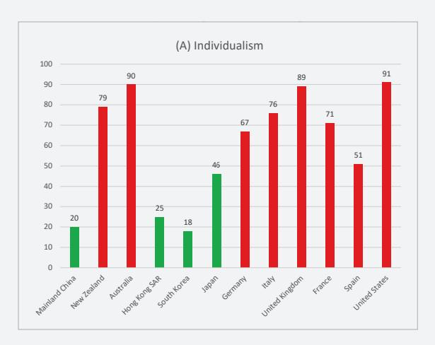

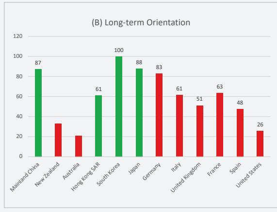

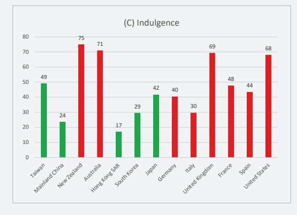

**Notes:** The three dimensions, individualism, long-term orientation, and indulgence, are from the Hofstede model of national culture (Hofstede et al., 2010). The data come from https://www.hofstede-insights.com/product/compare-countries/.

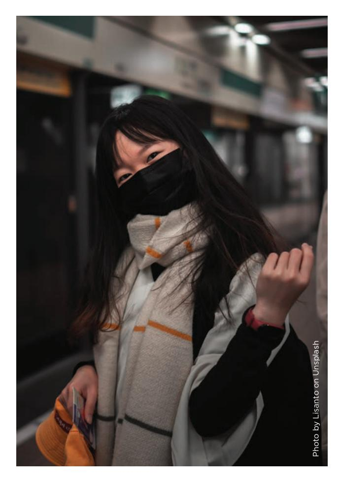

freedom, and they are less likely to consider the implications of their actions (spillover effect) on others. For example, mask wearing, which protects both mask wearers and others, was not successfully adopted in some countries with high individualism. The externalities of a pandemic like COVID-19 imply that the personal anti-virus choices that ignore negative externalities prevent the achievement of socially optimal outcomes. The relative level of individualism across countries is largely consistent with the pattern of total infection.

Containing the virus requires that people sacrifice their short-term interests, such as personal freedom and not wearing masks, for long-term benefits. Therefore, a country's attitude towards long-term or short-term interests is likely important. We show the histogram of the long-term orientation trait in Panel B of Figure 3.6. Hong Kong SAR has the lowest score, which is the same as Italy. All of the other four East Asian regions have much

higher scores – South Korea has the highest score among them, and it is also the maximum score. In contrast, five of the six Western countries have lower scores. Germany, which has a score slightly lower than mainland China, is an exception. The United States has the lowest level of long-term orientation. Countries with higher levels of long-term orientation have been more successful in controlling COVID-19.

Lastly, we show that the degree of restraint is also correlated with the performance in containing COVID-19. Restraint in this context means that a society places less emphasis on the relatively quick and easy gratification of basic and natural human drives related to enjoying life and having fun. Such restraint is likely to improve acceptance and adoption of non-pharmaceutical rules such as keeping physical distance and avoiding gatherings. Mainland China, Hong Kong SAR and South Korea have high scores in this cultural trait. Both the United Kingdom and the United States have much lower scores.

Australia and New Zealand seem to be outliers. Their citizens have higher levels of individualism, lower levels of long-term orientation, and lower levels of restraint than East Asia, but still show cooperative behaviors in several key respects, as discussed above. This implies that cultural traits, though important, are not the only determinants of people's behaviors and the outcome of the pandemic control. With effective government policies, COVID-19 can be successfully contained in countries with cultures quite different from those of East Asia.

## **Infections, actions, and emotions**

This section investigates the effects of the COVID-19 pandemic on individual happiness in the five East Asian regions, and the role that mobility control and physical distancing policies may have played in shaping these effects.

#### **Mainland China**

Our data on happiness comes from nearly 34.5 million geotagged microblog tweets posted on the Chinese largest microblog platform, *Sina* 

*Weibo* (the Chinese equivalent of Twitter), of 2 million active users for mainland China.65 The data cover 337 Chinese cities over the period December 1, 2019 to April 30, 2020. We apply the "Tencent" natural language processing (NLP) platform for each Weibo post, a machine-trained sentiment analysis algorithm from computational linguistics, to measure the sentiment. The overall happiness for the region on a given day is constructed by calculating the median sentiment value for that day. This measure of expressed happiness ranges from 0 to 100, with 0 indicating a strongly negative and 100 a strongly positive mood.

The results from the regression analysis are presented in Table 3.3. We find that a larger number of daily new confirmed cases is associated with a lower level of public expressed happiness in mainland China: a one-standard-deviation increase in the number of daily confirmed cases is associated with a 0.2-standard-deviation decrease in expressed happiness. On the other hand, more daily recovered cases are associated with a higher level of happiness. More stringent policies (as

*Having stricter mobility control and physical distancing policies could considerably offset the decrease in happiness due to the rise in the daily new confirmed cases.*

represented by the stringency index) by themselves are associated with lower levels of expressed happiness. However, stringent policies could significantly mitigate the negative effect of the number of daily new confirmed cases. Specifically, at the average level of strictness (stringency index=47.45), those policies can offset about 60% of the negative effect of daily new confirmed cases on expressed happiness. More detailed analysis suggests that those policies are particularly important to expressed happiness when COVID-19 conditions become more severe (i.e., when the number of daily new confirmed cases exceeded 1,000) in mainland China.

**Table 3.3: The effect of COVID-19 on expressed happiness and the role of mobility control and physical distancing policies in Mainland China** 

| Dependent Variable: Expressed Happiness |             |             |  |  |  |
|-----------------------------------------|-------------|-------------|--|--|--|
|                                         | (1)         | (2)         |  |  |  |
| Number of Daily New Confirmed Cases     | -0.000516** | -0.0278***  |  |  |  |
|                                         | (0.000225)  | (0.00744)   |  |  |  |
| Stringency Index                        | -0.0654***  | -0.0670***  |  |  |  |
|                                         | (0.00861)   | (0.00798)   |  |  |  |
| Number of Daily                         |             | 0.000360*** |  |  |  |
| New Confirmed Cases ✕ Stringency Index  |             | (9.84e-05)  |  |  |  |
| Number of Daily New Recovered Cases     | 0.00112***  | 0.000918*** |  |  |  |
|                                         | (0.000301)  | (0.000280)  |  |  |  |
| Observations                            | 150         | 150         |  |  |  |
| R-squared                               | 0.694       | 0.745       |  |  |  |

Note: Each column reports the coefficients from OLS estimation, controlling for day-of-week fixed effects, day-of-month fixed effects, and holiday dummies, including Christmas, New Year, Lunar New Year, and Qing Ming. Natural log transformation of the COVID-19 variables was also performed, and the results appear to be consistent.

Robust standard errors in parentheses

\*\*\* p<0.01, \*\* p<0.05, \* p<0.1

#### **Hong Kong SAR, Japan, South Korea, and Taiwan**

For the other four regions, we collect data from *Google Trends*, which supplies the relative popularity of *Google* searches over the time period requested in a geographic area. A search term query on *Google Trends* provides searches for an exact search term, while a topic query includes related search terms in any language. We obtain daily data on relative popularity for eight well-being related topics between December 1, 2019 and August 31, 2020: Apathy, Boredom, Frustration, Fear, Irritability, Sadness, Death, and Hospital. The index of relative popularity (or search intensity) for each topic ranges from 0 to 100, where 100 indicates the peak popularity for that topic over the time period, and 0 means that there was not enough search volume for the topic on a given date.66 Our qualitative investigation into each search topic query suggests that the relative popularity of each topic of negative effect should be a good proxy for the corresponding negative mood state.67 We derive a "negative affect search index" by taking the simple average of the relative popularity of all the six topics of negative affect

(i.e., Apathy, Boredom, Frustration, Fear, Irritability, and Sadness) as a proxy for overall negative emotional states or negative affect.68

A rise in the daily new confirmed cases is found to be associated with an increase in negative affect, as measured by an increase in the negative affect search index (Table 3.4). Specifically, a one-standard-deviation increase in the number of daily new confirmed cases per 100,000 is associated with a 0.09-standard deviation increase in the negative affect search index. Stricter mobility control and physical distancing policies are associated with a decrease in negative affect in these four regions. They are also able to moderate the increase in negative affect due to the rise in daily new confirmed cases: at the average level of strictness for the four regions (stringency index=33.38), mobility control policies can offset about 46% of the positive influence of daily new confirmed cases on the interest in the topics on negative affect. A rise in the daily number of new recovered cases is associated with a decrease in negative affect, but the relationship is not statistically significant. We also examine the

**Table 3.4: The effect of COVID-19 on overall negative affect search and the role of mobility control and physical distancing policies in Hong Kong SAR, Taiwan, Japan, and South Korea** 

| Dependent Variable: Expressed Happiness      |            |           |  |  |  |
|----------------------------------------------|------------|-----------|--|--|--|
|                                              | (1)        | (2)       |  |  |  |
| Number of Daily New Confirmed Cases per 100K | 1.779***   | 9.082***  |  |  |  |
|                                              | (0.581)    | (2.175)   |  |  |  |
| Stringency Index                             | -0.0563*** | -0.0404** |  |  |  |
|                                              | (0.0198)   | (0.0203)  |  |  |  |
| Number of Daily New Confirmed Cases per 100K |            | -0.125*** |  |  |  |
| ✕ Stringency Index                           |            | (0.0354)  |  |  |  |
| Number of Daily New Recovered Cases per 100K | -0.0230    | -0.0351   |  |  |  |
|                                              | (0.736)    | (0.700)   |  |  |  |
| Observations                                 | 1,090      | 1,090     |  |  |  |
| R-squared                                    | 0.530      | 0.536     |  |  |  |

Note: Each column reports the coefficients from OLS estimation, controlling for country fixed effects and date fixed effects. Natural log transformation of the Covid-19 variables was also performed, and the results appear to be consistent.

Robust standard errors in parentheses

\*\*\* p<0.01, \*\* p<0.05, \* p<0.1

**Table 3.5: The effect of COVID-19 on the searches for the topic of death and hospital and the role of mobility control and physical distancing policies in Hong Kong SAR, Taiwan, Japan, and South Korea** 

| Dependent Variable                  | Death    | Hospital  |           |           |
|-------------------------------------|----------|-----------|-----------|-----------|
|                                     | (1)      | (2)       | (3)       | (4)       |
| Number of Daily New Confirmed Cases | 1.168    | 10.81***  | 4.629***  | -2.001    |
| per 100K                            | (0.762)  | (3.882)   | (0.985)   | (2.750)   |
| Stringency Index                    | 0.0424*  | 0.0634*** | 0.0203    | 0.00591   |
|                                     | (0.0244) | (0.0239)  | (0.0305)  | (0.0320)  |
| Number of Daily New Confirmed Cases |          | -0.165*** |           | 0.114**   |
| per 100K ✕ Stringency Index         |          | (0.0577)  |           | (0.0471)  |
| Number of Daily New Recovered Cases | -1.356** | -1.372**  | -4.254*** | -4.243*** |
| per 100K                            | (0.594)  | (0.565)   | (1.306)   | (1.316)   |
| Observations                        | 1,090    | 1,090     | 1,090     | 1,090     |
| R-squared                           | 0.761    | 0.765     | 0.690     | 0.692     |

Note: Each column reports the coefficients from OLS estimation, controlling for country fixed effects and date fixed effects. Natural log transformation of the Covid-19 variables was also performed, and the results appear to be consistent.

Robust standard errors in parentheses

searches for the six topics of negative affect separately (Appendix Table 2). People appear to have more emotions of apathy and fear when the number of daily new confirmed cases increases. More stringent policies are associated with less apathy and frustration but more fear. However, the stricter policies help to reduce the rise in fear due to the increase in daily new confirmed cases. Besides, a rise in the daily new recovered cases is associated with a decline in the emotion of fear. In general, our findings align with those from a recent COVID-19 study, which shows that announcing a national lockdown is associated with better mental well-being in the United Kingdom and worldwide.69 70

With respect to the searches for Death and Hospital, two topics particularly related to the pandemic, we find, as expected, that a rise in new confirmed cases is associated with an increase of interest in the two topics, even though the relationship is statistically significant only for Hospital (columns (1) and (3) of Table 3.5). Stricter policies are associated with a decrease in the interest in the topic of Death. After adding the

interaction term between the number of new confirmed cases and the stringency index, we find that the number of daily new confirmed cases becomes significantly positively associated with interest in the topic of Death. However, more stringent policies can mitigate the increase in the interest due to the rise in daily new confirmed cases (column (2)). We also demonstrate that it is the interaction between the number of daily new confirmed cases and the strictness of the mobility control and physical distancing policies that led to a rise in interest in the topic of Hospital (column (4)). Finally, an increase in the number of new recovered cases is associated with a decrease in interest in both topics.

## **Conclusion**

COVID-19 spread across the world at an alarming pace, causing a tremendous impact on every aspect of life. Many countries have recorded very high infection rates, while a handful of countries, such as East Asian countries, had much better performance. This chapter discusses the lessons

\*\*\* p<0.01, \*\* p<0.05, \* p<0.1

from five East Asian regions, including mainland China, Hong Kong SAR, Taiwan, Japan, and South Korea, with respect to government responses and civic engagement. We also examine the impact of COVID-19 on people's emotions and the potential role of mobility control and physical distancing policies.

In general, we find that the relatively successful story of the five East Asian regions, compared with the six western societies, can be attributed to the stronger and more prompt government responses and better civic cooperation. Except for Japan, all of the East Asian governments implemented more stringent mobility control and physical distancing policies, as well as more comprehensive testing and contact tracing, especially at the early stages of the outbreak. A summary of the government interventions and anti-COVID measures in the East Asian regions indicates that a combination of strong government response systems, early and rigorous mobility

control, extensive screening, testing, contact tracing and isolation, coordinated resource allocation, clear communication, enforced self-protection practice, and supportive economic measures are important in fighting COVID-19 outbreaks and resurgence. People in East Asia, except for Japan, were generally more compliant with government rules and guidance than the selected Western countries. Not surprisingly, weaker policies and less individual compliance in Japan has been associated with its worst performance among the five East Asian regions.

Certain cultural traits (being less individualistic, more long-term oriented, and more restrained) may have contributed to more self-regulated behaviors and greater compliance with government policies, impacting the overall battle with COVID-19. But, this does not mean that COVID-19 can only be controlled in countries with cultures similar to East Asia. We show that East Asia's successful government actions can be transplanted

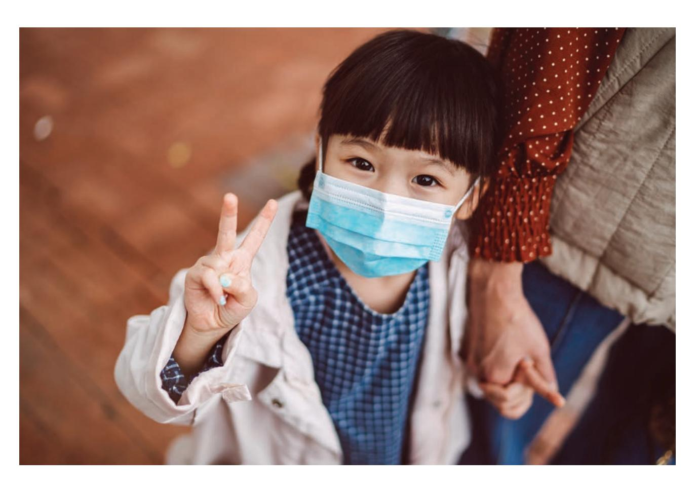

to other nations with different cultural backgrounds, such as Australia and New Zealand, which are more similar to other Western counties in terms of cultural traits.

Finally, we showed that the impact of COVID-19 on individual emotions is significant in East Asia. A rise in the daily number of new confirmed cases is associated with a lower level of the public expressed happiness in mainland China, and a higher level of negative affect in the other four regions. Fortunately, having stricter mobility control and physical distancing policies could considerably offset the decrease in happiness due to the rise in the daily new confirmed cases. Therefore, more stringent government responses seem to reduce the spread of the virus and help to improve people's emotions throughout the pandemic in East Asia. However, we have yet to see the impact of government actions on emotions in the long run, and how other policies, such as population-level vaccination and international cooperation, could mitigate the shock caused by the pandemic and emerging mutations of the virus. Although recent data from Israel, the world leader in mass vaccination, showed early signs that COVID-19 vaccines were effective in reducing infections and hospitalizations among the elderly population, it is difficult to gauge the size of effect as extensive lockdowns were still in place.71 While aggressive vaccination programs have begun in both the west and the east, strong non-pharmaceutical interventions such as mobility restrictions, testing, and contact tracing are likely to be still crucial in controlling the pandemic, and their impact on well-being should be closely monitored.

#### **Endnotes**

- 1 We only have Japanese behavioral data before early June.
- 2 The cultural traits are defined by Hofstede model of national culture (Hofstede et al., 2010). Similarly, Gelfand et al. (2021) also use cultural traits (tightness–looseness) to explain COVID-19 cases and deaths.
- 3 See https://qz.com/1808390/religion-is-at-the-heart-ofkoreas-coronavirus-outbreak for details.
- 4 Please see https://ourworldindata.org/grapher/COVIDstringency-index for more information on the components and the construction of the stringency index.
- 5 We realize that using case numbers may make more populous countries look slower to respond. The main reason we chose to use case numbers rather than case rates is that COVID-19 is a highly infectious disease. Therefore, it is important for governments to react according to the absolute numbers of cases.
- 6 See Pisano, Sadun, and Zanini (2020) for more discussions on the Italy case.
- 7 Based on the information we collected, the stringency index of mainland China may not be accurate from May to November 2020. The true levels of stringency may be lower during that period of time.
- 8 See Chowdhury et al. (2020), Hsiang et al. (2020), Koh et al. (2020), and You (2020),
- 9 https://www.who.int/westernpacific/news/commentaries/ detail-hq/from-the-new-normal-to-a-new-future-asustainable-response-to-covid-19
- 10 See An and Tang (2020).
- 11 See Bouey (2020) and Wang et al. (2020).
- 12 See An and Tang (2020).
- 13 See for example, https://www.theregreview. org/2020/04/20/delayed-response-wuhan-revealslegal-holes/
- 14 See Chen and Xiao (2020).
- 15 See Ning et al. (2020).
- 16 See An and Tang (2020).
- 17 See Wang et al. (2020).
- 18 See Hartley and Jarvis (2020).
- 19 See Development Finance Bureau at Ministry of Economy and Finance (2020).
- 20 See An and Tang (2020).
- 21 See Kazuto and Murakami (2020).
- 22 See China Watch Institute (2020).
- 23 See China Watch Institute (2020).
- 24 See Chen et al. (2020), Fang et al. (2020), and Kraemer et al. (2020).
- 25 See Prem (2020).
- 26 See Zhou et al. (2021).

- 27 For example, on March 26, the Civil Aviation Administration of China announced the so-called "Five One" policy. Under this policy, all Chinese airlines/foreign airlines were allowed to maintain one international route to/from any specific country from/to China, with no more than one flight per week. China also denied the entry of most foreign nationals starting March 28. Negative COVID-19 test and mandatory 14-day institution-based quarantine were required for inbound travelers from overseas.
- 28 For example, see http://www.xinhuanet.com/english/ 2020-11/09/c\_139503825.htm.
- 29 See Cowling et al. (2020).
- 30 See Wong et al. (2020).
- 31 For instance, see https://www.reuters.com/article/ us-health-coronavirus-southkorea-idUSKCN26G0E0.
- 32 See https://world.kbs.co.kr/service/news\_view.htm?Seq\_ Code=154470
- 33 See Tashiro and Shaw (2020).
- 34 See Yabe (2020).
- 35 See Shimizu (2020).
- 36 See Sawano et al. (2020).
- 37 See Aleta et al. (2020) and Kucharski et al. (2020).
- 38 See China Watch Institute (2020).
- 39 See Wang et al. (2020).
- 40 See Development Finance Bureau at Ministry of Economy and Finance (2020).
- 41 See Tashiro and Shaw (2020).
- 42 See Dickens et al. (2020).
- 43 See Dickens et al. (2020).
- 44 See Wong et al. (2020).
- 45 See Wong et al. (2020).
- 46 See Su and Han (2020).
- 47 See Development Finance Bureau at Ministry of Economy and Finance (2020).
- 48 See China Watch Institute (2020).
- 49 See Oh et al. (2020).
- 50 See Hamaguchi et al. (2020).
- 51 See Hartley and Jarvis (2020).
- 52 See Legido-Quigley et al. (2020).
- 53 See Hamaguchi et al. (2020).
- 54 See https://COVID19policy.adb.org/policy-measures.
- 55 See Chen et al. (2020), Oh et al. (2020) and Shaw (2020).
- 56 See Chowdhury et al. (2020) and Kucharski et al. (2020).
- 57 See Baker et al. (2020).
- 58 See Summers et al. (2020).
- 59 See Jefferies et al. (2020).

- 60 See YouGov's COVID-19 Public Monitor (https://yougov. co.uk/topics/international/articles-reports/2020/03/17/ personal-measures-taken-avoid-covid-19).
- 61 There is no YouGov survey data in New Zealand, so only Australia is included.
- 62 See van Doremalen et al. (2020), Han et al. (2020), and Harbourt et al. (2020).
- 63 See Han et al. (2020), Harbourt et al (2020), and Fisher et al. (2020). Avoding raw meat is just an indicator about how cautions people generally are during the pandemic, and whether the virus is truly transmitted through meat surface or not does not change the story behind.
- 64 The data is retrieved from https://www.hofstede-insights. com/product/compare-countries/.
- 65 The active Weibo user is defined by four rules: 1) follows number >50; 2) fans number>50; 3) tweets number>50; and 4) recent post<30 days. Based on this definition, active users account for 8% of the total number of users.
- 66 For one query, daily data on searches is only provided for a period of no more than 270 days. To obtain daily search trends between December 1, 2019 and August 31, 2020, we downloaded daily data between December 6, 2019 and August 31, 2020 and between June 1, 2019 and February 25, 2020 separately and then rescaled the values for December 1 to 5, 2019 to make them comparable to the data between December 6, 2019 and August 31, 2020.
- 67 We also collected data on the search intensity for topics related to positive mood states, including Happiness, Well-being, Optimism, and Contentment. However, similar to Foa et al. (2020), we concluded that those topics are a poor proxy for positive mood states based on our qualitative investigation into the related queries of each search topic query.
- 68 To construct the "negative affect search index", we also tried conducting principal component analysis on the relative popularity of the 6 topics of negative affect and obtained the scores of the first principle component or taking the average of the z-score of relative popularity of the 6 topics, and our regression results remained consistent.
- 69 See Fetzer et al. (2020).
- 70 Using data from 36,520 adults in England, Fancourt et al. (2021) suggest that individuals experienced the highest levels of depression and anxiety at the early stages of lockdown but those mental health problems got improved as individuals adapt to circumstances.
- 71 See Chodick et al. (2021).

#### **Reference**

Aleta, A., Martín-Corral, D., Pastore y Piontti, A., Ajelli, M., Litvinova, M., Chinazzi, M., et al. (2020). Modelling the impact of testing, contact tracing and household quarantine on second waves of COVID-19. *Nature Human Behaviour*, *4*(9), 964–971. https://doi.org/10.1038/s41562-020-0931-9

An, B. Y., & Tang, S.-Y. (2020). Lessons from COVID-19 responses in East Asia: Institutional infrastructure and enduring policy instruments. *The American Review of Public Administration*, *50*(6–7), 790–800. https://doi.org/10.1177/0275074020943707

Baker, M. G., Wilson, N., & Anglemyer, A. (2020). Successful elimination of Covid-19 transmission in New Zealand. *New England Journal of Medicine*, *383*(8), e56. https://doi.org/10.1056/NEJMc2025203

Bouey, J. (2020). Strengthening China's public health response system: From SARS to COVID-19. *American Journal of Public Health*, *110*(7), 939–940. https://doi.org/10.2105/ AJPH.2020.305654

Chen, L., & Xiao, C. (2020). *China's strategies and actions against COVID-19 and key insights* (WP-2020-006 EN; p. 66). Center for International Knowledge on Development (CIKD).

Chen, S., Yang, J., Yang, W., Wang, C., & Bärnighausen, T. (2020). COVID-19 control in China during mass population movements at New Year. *The Lancet*, *395*(10226), 764–766. https://doi.org/10.1016/S0140-6736(20)30421-9

Chen, S., Zhang, Z., Yang, J., Wang, J., Zhai, X., Bärnighausen, T., & Wang, C. (2020). Fangcang shelter hospitals: A novel concept for responding to public health emergencies. *The Lancet*, *395*(10232), 1305–1314. https://doi.org/10.1016/S0140 6736(20)30744-3

China Data Lab. (2020). China COVID-19 Daily Cases with Basemap (Version 35) [Data file]. Retrieved from https://dataverse.harvard.edu/dataset.xhtml?persistentId= doi:10.7910/DVN/MR5IJN&version=35.0

China Watch Institute, Institute of Contemporary China Studies, Tsinghua University, & School of Health Policy and Management, Peking Union Medical College. (2020). *China's fight against COVID-19*.

Chodick, G., Tene, L., Patalon, T., Gazit, S., Tov, A. B., Cohen, D., & Muhsen, K. (2021). The effectiveness of the first dose of BNT162b2 vaccine in reducing SARS-CoV-2 infection 13-24 days after immunization: Real-world evidence. *MedRxiv*, 2021.01.27.21250612. https://doi.org/10.1101/2021.01.27.21250612

Chowdhury, R., Heng, K., Shawon, M. S. R., Goh, G., Okonofua, D., Ochoa-Rosales, C., Gonzalez-Jaramillo, V., Bhuiya, A., Reidpath, D., Prathapan, S., Shahzad, S., Althaus, C. L., Gonzalez-Jaramillo, N., Franco, O. H., & Global Dynamic Interventions Strategies for COVID-19 Collaborative Group. (2020). Dynamic interventions to control COVID-19 pandemic: A multivariate prediction modelling study comparing 16 worldwide countries. *European Journal of Epidemiology*, *35*(5), 389–399. https://doi.org/10.1007/s10654-020-00649-w

Chudik, A., Pesaran, M. H., & Rebucci, A. (2020). Voluntary and mandatory social distancing: Evidence on COVID-19 exposure rates from Chinese provinces and selected countries. NBER Working Paper No. w27039. https://doi.org/10.3386/w27039

Cowling, B. J., Ali, S. T., Ng, T. W. Y., Tsang, T. K., Li, J. C. M., Fong, M. W., Liao, Q., Kwan, M. Y., Lee, S. L., Chiu, S. S., Wu, J. T., Wu, P., & Leung, G. M. (2020). Impact assessment of nonpharmaceutical interventions against coronavirus disease 2019 and influenza in Hong Kong: An observational study. *The Lancet Public Health*, *5*(5), e279–e288. https://doi.org/10.1016/ S2468-2667(20)30090-6

Development Finance Bureau at Ministry of Economy and Finance. (2020). *Tackling COVID-19 health, quarantine and economic measures: Korean experience.* The Government of the Republic of Korea.

Dickens, B. L., Koo, J. R., Wilder-Smith, A., & Cook, A. R. (2020). Institutional, not home-based, isolation could contain the COVID-19 outbreak. *The Lancet*, *395*(10236), 1541–1542. https://doi.org/10.1016/S0140-6736(20)31016-3

Fancourt, D., Steptoe, A., & Bu, F. (2021). Trajectories of anxiety and depressive symptoms during enforced isolation due to COVID-19: a longitudinal observational study. *The Lancet Psychiatry*, *8*(2), 141–149.

Fang, H., Wang, L., & Yang, Y. (2020). Human mobility restrictions and the spread of the Novel Coronavirus (2019 nCoV) in China. *Journal of Public Economics*, *191*, 104272.

Fetzer, T., Witte, M., Hensel, L., Jachimowicz, J., Haushofer, J., Ivchenko, A., et al. (2020). Perceptions of an insufficient government response at the onset of the COVID-19 pandemic are associated with lower mental well-being. *PsyArxiv preprint*. https://doi. org/10.31234/osf.io/3kfmh.

Fisher, D., Reilly, A., Zheng, A. K., Cook, A. R., Anderson, D. E. (2020). Seeding of outbreaks of COVID-19 by contaminated fresh and frozen food. *BioRxiv*. https://doi. org/10.1101/2020.08.17.255166

Foa, R., Gilbert, S., & Fabian, M. O. (2020). COVID-19 and subjective well-being: Separating the effects of lockdowns from the pandemic. *SSRN Working Paper 3674080*. http://dx.doi.org/10.2139/ssrn.3674080

Gelfand, M., Jackson, J. C., Pan, X., Nav, D., Pieper, D., Denison, E., et al. (2021). The relationship between cultural tightness– looseness and COVID-19 cases and deaths: a global analysis. *Lancet Planet Health*, *S2542-5196*(20): 30301–6. https://doi.org/10.1016/S2542-5196(20)30301-6

Hamaguchi, R., Negishi, K., Higuchi, M., Funato, M., Kim, J.-H., & Bitton, A. (2020). A regionalized public health model to combat COVID-19: Lessons from Japan. *Health Affairs* Blog. Retrieved October 31, 2020 from /do/10.1377/ hblog20200721.404992/full

Han, J., Zhang, X., He, S., & Jia, P. (2020). Can the coronavirus disease be transmitted from food? A review of evidence, risks, policies and knowledge gaps. *Environmental Chemistry Letters*, *Oct 1*(1–12). doi: 10.1007/s10311-020-01101-x

Harbourt, D. E., Haddow, A. D., Piper, A. E., Bloomfield, H., Kearney, B. J., Fetterer, D., et al. (2020). Modeling the stability of severe acute respiratory syndrome coronavirus 2 (SARS-CoV-2) on skin, currency, and clothing. *PLOS Neglected Tropical Diseases*, *14*(11): e0008831.

Hartley, K., & Jarvis, D. S. L. (2020). Policymaking in a low-trust state: Legitimacy, state capacity, and responses to COVID-19 in Hong Kong. *Policy and Society*, *39*(3), 403–423. https://doi.org /10.1080/14494035.2020.1783791

Hofstede, G., Hofstede, G. J., & Minkov, M. (2010). *Cultures and organizations: Software of the mind* (Rev. 3rd ed.). New York: McGraw-Hill.

Hsiang, S., Allen, D., Annan-Phan, S., Bell, K., Bolliger, I., Chong, T., et al. (2020). The effect of large-scale anti-contagion policies on the COVID-19 pandemic. *Nature*, *584*(7820), 262–267. https://doi.org/10.1038/s41586-020-2404-8

Jefferies, S., French, N., Gilkison, C., Graham, G., Hope, V., Marshall, J., et al. (2020). COVID-19 in New Zealand and the impact of the national response: A descriptive epidemiological study. *The Lancet Public Health*, *5*(11), e612–e623. https://doi. org/10.1016/S2468-2667(20)30225-5

Katuto, S., & Hiromi, M. (2020). RESOLVED: Japan's response to COVID-19 is prudent. *Debating Japan*, *3*(4), 6.

Koh, W. C., Naing, L., & Wong, J. (2020). Estimating the impact of physical distancing measures in containing COVID-19: An empirical analysis. *International Journal of Infectious Diseases*, *100*, 42–49. https://doi.org/10.1016/j.ijid.2020.08.026

Kraemer, M. U. G., Yang, C.-H., Gutierrez, B., Wu, C.-H., Klein, B., Pigott, D. M., et al. (2020). The effect of human mobility and control measures on the COVID-19 epidemic in China. *Science*, *368*, 6.

Kucharski, A. J., Klepac, P., Conlan, A. J. K., Kissler, S. M., Tang, M. L., Fry, H., et al. (2020). Effectiveness of isolation, testing, contact tracing, and physical distancing on reducing transmission of SARS-CoV-2 in different settings: A mathematical modelling study. *The Lancet Infectious Diseases*, *20*(10), 1151–1160. https://doi.org/10.1016/S1473-3099(20)30457-6

Legido-Quigley, H., Asgari, N., Teo, Y. Y., Leung, G. M., Oshitani, H., Fukuda, K., et al. (2020). Are high-performing health systems resilient against the COVID-19 epidemic? *The Lancet*, *395*(10227), 848–850. https://doi.org/10.1016/S0140- 6736(20)30551-1

Ning, Y., Ren, R., & Nkengurutse, G. (2020). China's model to combat the COVID-19 epidemic: A public health emergency governance approach. *Global Health Research and Policy*, *5*(1), 34. https://doi.org/10.1186/s41256-020-00161-4

Oh, J., Lee, J.-K., Schwarz, D., Ratcliffe, H. L., Markuns, J. F., & Hirschhorn, L. R. (2020). National response to COVID-19 in the Republic of Korea and lessons learned for other countries. *Health Systems & Reform*, *6*(1), e1753464. https://doi.org/10.108 0/23288604.2020.1753464

Pisano, G., Sadun, R., & Zanini, M. (2020, March 27). Lessons from Italy's Response to Coronavirus. *Harvard Business Review*. https://hbr.org/2020/03/lessons-from-italys-response-tocoronavirus

Prem, K., Liu, Y., Russell, T. W., Kucharski, A. J., Eggo, R. M., Davies, N., et al. (2020). The effect of control strategies to reduce social mixing on outcomes of the COVID-19 epidemic in Wuhan, China: A modelling study. *The Lancet. Public Healt*h, *5*(5), e261–e270. https://doi.org/10.1016/S2468-2667(20)30073-6 Sawano, T., Kotera, Y., Ozaki, A., Murayama, A., Tanimoto, T., Sah, R., & Wang, J. (2020). Underestimation of COVID-19 cases in Japan: An analysis of RT-PCR testing for COVID-19 among 47 prefectures in Japan. *QJM: An International Journal of Medicine*, *113*(8), 551–555. https://doi.org/10.1093/qjmed/hcaa209

Shaw, R., Kim, Y., & Hua, J. (2020). Governance, technology and citizen behavior in pandemic: Lessons from COVID-19 in East Asia. *Progress in Disaster Science*, *6*, 100090. https://doi.org/10.1016/j.pdisas.2020.100090

Shimizu, K., Wharton, G., Sakamoto, H., & Mossialos, E. (2020). Resurgence of covid-19 in Japan. *British Medical Journal*, *370*, m3221. https://doi.org/10.1136/bmj.m3221

Su, S.-F., & Han, Y.-Y. (2020). How Taiwan, a non-WHO member, takes actions in response to COVID-19. *Journal of Global Health*, *10*(1), 010380. https://doi.org/10.7189/jogh.10.010380

Summers, D. J., Cheng, D. H.-Y., Lin, P. H.-H., Barnard, D. L. T., Kvalsvig, D. A., Wilson, P. N., & Baker, P. M. G. (2020). Potential lessons from the Taiwan and New Zealand health responses to the COVID-19 pandemic. *The Lancet Regional Health - Western Pacific*, 100044. https://doi.org/10.1016/j.lanwpc.2020.100044

Tashiro, A., & Shaw, R. (2020). COVID-19 pandemic response in Japan: What is behind the initial flattening of the curve? *Sustainability*, *12*(13), 5250. https://doi.org/10.3390/su12135250

van Doremalen, N., Bushmaker, T., Morris, D. H., Holbrook, M. G., Gamble, A., Williamson, B. N., et al. (2020). Aerosol and surface stability of SARS-CoV-2 as compared with SARS-CoV-1. *New England Journal of Medicine*, *382*, 1564–1567.

Wang, C. J., Ng, C. Y., & Brook, R. H. (2020). Response to COVID-19 in Taiwan: Big Data analytics, new technology, and proactive testing. *Journal of the American Medical Association*, *323*(14), 1341. https://doi.org/10.1001/jama.2020.3151

Wang, J., Yuan, B., Li, Z., & Wang, Z. (2019). Evaluation of public health emergency management in China: A systematic review. *International Journal of Environmental Research and Public Health*, *16*(18), 3478. https://doi.org/10.3390/ijerph16183478

Wong, S. Y. S., Kwok, K. O., & Chan, F. K. L. (2020). What can countries learn from Hong Kong's response to the COVID-19 pandemic? *Canadian Medical Association Journal*, *192*(19), E511–E515. https://doi.org/10.1503/cmaj.200563

Yabe, T., Tsubouchi, K., Fujiwara, N., Wada, T., Sekimoto, Y., & Ukkusuri, S. V. (2020). Non-compulsory measures sufficiently reduced human mobility in Tokyo during the COVID-19 epidemic. *Scientific Reports*, *10*(1), 18053. https://doi. org/10.1038/s41598-020-75033-5

You, J. (2020). Lessons from South Korea's Covid-19 policy response. *The American Review of Public Administration*, *50*(6–7), 801–808. https://doi.org/10.1177/0275074020943708

Zhou, L., Wu, Z., Li, Z., Zhang, Y., McGoogan, J. M., Li, Q., et al. (2021). One hundred days of Coronavirus Disease 2019 prevention and control in China. *Clinical Infectious Diseases*, *72*(2), 332–339. https://doi.org/10.1093/cid/ciaa725

# Chapter 4

# Reasons for Asia-Pacific Success in Suppressing COVID-19

# Jeffrey D. Sachs

University Professor and Director of the Center for Sustainable Development at Columbia University

One of the keys to human well-being is the ability of societies to confront urgent societal challenges. Societal crises demand pro-sociality: the ability of societies to work harmoniously and rationally towards common objectives. In the case of COVID-19, the most dramatic global peacetime crisis since the Great Depression, pro-sociality is required at all scales of interactions. Individuals must abide by pro-social behaviors, such as physical distancing and wearing face masks. Governments must attend to human needs of the most vulnerable citizens. And nations must cooperate with each other in order to bring the global pandemic to a halt.

COVID-19 has exposed many acts of heroism, notably among front-line workers and healthcare workers who have battled the disease at great peril to their own safety, often without the benefit of even rudimentary personal protective equipment (PPE). Yet COVID-19 has also exposed the shortcomings and outright failures of pro-sociality in many countries, including many of the richest countries, for which lack of material resources is not an issue. This paper explores the differences in pro-sociality between the countries of the Asia-Pacific region, where the pandemic was effectively contained to low levels of community transmission, and the countries of the North Atlantic region, where community transmission and excess mortality have been extremely high throughout the course of the pandemic.

Perhaps the most notable variation across world regions of the COVID-19 pandemic has been the far lower mortality rate (deaths per million) in the Asia-Pacific region (northeast Asia, southeast Asia, and Oceania) compared with the North-Atlantic region (the US, Canada, the UK, and the European Union).1 Both regions are home to temperate-zone, urbanized, and developed economies and are broadly comparable in economic structure. Yet, the death rates were vastly lower in the Asia-Pacific than the North Atlantic in every quarter of 2020 and in January 2021, the most recent month at the time of completing this paper (Table 4.1). In January 2021, for example, the countries of the North Atlantic region had an unweighted average of 7.6 deaths per day per million population, while in the

Asia-Pacific region, the unweighted average was a mere 0.18 deaths per day per million population, 42X lower than the North Atlantic.

The Asia-Pacific success in suppressing the pandemic has been consistent since last spring. On April 8, 2020, I wrote the following:2

East Asian countries are outperforming the United States and Europe in controlling the COVID-19 pandemic, despite the fact that the outbreak began in China, to which the rest of East Asia is very closely bound by trade and travel. The US and Europe should be learning as rapidly as possible about the East Asian approaches, which could still save vast numbers of lives in the West and the rest of the world.

The main sources of the successes of East Asia, and more broadly the Asia-Pacific, were also discernible at an early stage. The Asia-Pacific countries, in contrast with the North Atlantic, were actively engaged in a wide range of intensive Non-Pharmaceutical Interventions (NPIs), including tight border controls; quarantining of arriving passengers; high rates of face-mask use; physical distancing; and public health surveillance systems engaged in widespread testing, contact tracing, and quarantining (or home isolation) of infected individuals. I also document such differences across the two regions in a companion paper.3

The successes of the NPIs in the Asia-Pacific region reflected both the leadership of governments and the strong support of the public for the government's bold leadership. The Asia -Pacific successes were both *top-down*, with governments setting strong control policies, and *bottom-up*, with the general public supporting governments and complying with government -directed public health measures.

One key factor in the success of the Asia-Pacific was the preparedness of the region for newly emerging zoonotic diseases, a point also emphasized by Helliwell et al. in this report. The Asia-Pacific region was on the front line of the battle against SARS in 2003 and also was mobilized in the H1N1 (2009) and MERS (2012) crises. Southeast Asia is battle-hardened against dengue fever. The practical import of the earlier

**Table 4.1: Deaths per day per million population, averages per quarter**

| Country                | 2020:Q1 | 2020:Q2 | 2020:Q3 | 2020:Q4 | 2021:Jan |
|------------------------|---------|---------|---------|---------|----------|
| Australia              | 0.04    | 0.04    | 0.33    | 0.01    | 0.00     |
| Brunei                 | 0.05    | 0.05    | 0.00    | 0.00    | 0.00     |
| Burma                  | 0.18    | 0.00    | 0.06    | 0.47    | 0.27     |
| Cambodia               | 0.00    | 0.00    | 0.00    | 0.00    | 0.00     |
| China                  | 0.03    | 0.01    | 0.00    | 0.00    | 0.00     |
| Indonesia              | 0.23    | 0.11    | 0.31    | 0.45    | 0.93     |
| Japan                  | 0.06    | 0.08    | 0.05    | 0.15    | 0.63     |
| Laos                   | 0.00    | 0.00    | 0.00    | 0.00    | 0.00     |
| Malaysia               | 0.07    | 0.03    | 0.01    | 0.11    | 0.29     |
| New Zealand            | 0.03    | 0.05    | 0.01    | 0.00    | 0.00     |
| Philippines            | 0.10    | 0.12    | 0.42    | 0.37    | 0.44     |
| Singapore              | 0.02    | 0.04    | 0.00    | 0.00    | 0.00     |
| South Korea            | 0.08    | 0.03    | 0.03    | 0.11    | 0.32     |
| Taiwan                 | 0.00    | 0.00    | 0.00    | 0.00    | 0.00     |
| Thailand               | 0.00    | 0.01    | 0.00    | 0.00    | 0.01     |
| Vietnam                | 0.00    | 0.00    | 0.00    | 0.00    | 0.00     |
| Average Asia-Pacific   | 0.06    | 0.03    | 0.08    | 0.10    | 0.18     |
|                        |         |         |         |         |          |
| Austria                | 1.35    | 0.71    | 0.11    | 6.56    | 5.37     |
| Belgium                | 4.50    | 8.61    | 0.25    | 8.98    | 4.35     |
| Bulgaria               | 3.32    | 0.35    | 0.93    | 10.59   | 6.82     |
| Canada                 | 0.93    | 2.50    | 0.18    | 1.83    | 3.66     |
| Croatia                | 3.94    | 0.27    | 0.46    | 9.64    | 8.70     |
| Cyprus                 | 0.40    | 0.14    | 0.04    | 1.20    | 2.95     |
| Czech Republic         | 2.60    | 0.33    | 0.31    | 11.14   | 14.24    |
| Denmark                | 1.08    | 0.98    | 0.09    | 1.21    | 4.61     |
| Estonia                | 0.63    | 0.54    | -0.04   | 1.35    | 4.62     |
| Finland                | 0.22    | 0.62    | 0.03    | 0.42    | 0.64     |
|                        |         |         |         |         |          |
| France                 | 2.50    | 4.46    | 0.36    | 5.49    | 5.65     |
| Germany                | 1.29    | 1.08    | 0.07    | 3.14    | 9.00     |
| Greece                 | 1.10    | 0.15    | 0.21    | 4.65    | 2.96     |
| Hungary                | 2.09    | 0.65    | 0.21    | 9.88    | 9.97     |
| Ireland                | 1.38    | 3.72    | 0.15    | 0.95    | 6.99     |
| Italy                  | 3.88    | 4.07    | 0.20    | 6.81    | 7.66     |
| Latvia                 | 1.63    | 0.18    | 0.04    | 3.43    | 9.58     |
| Lithuania              | 2.12    | 0.23    | 0.06    | 6.85    | 11.99    |
| Luxembourg             | 2.44    | 1.53    | 0.24    | 6.47    | 4.23     |
| Malta                  | 1.69    | 0.32    | 0.65    | 4.54    | 3.51     |
| Netherlands            | 2.51    | 3.28    | 0.21    | 3.22    | 4.86     |
| Poland                 | 2.29    | 0.42    | 0.30    | 7.51    | 7.35     |
| Portugal               | 2.65    | 1.53    | 0.42    | 5.27    | 17.64    |
| Romania                | 2.56    | 0.90    | 1.80    | 6.20    | 4.31     |
| Slovakia               | 2.09    | 0.06    | 0.04    | 4.16    | 14.79    |
| Slovenia               | 4.13    | 0.51    | 0.20    | 13.36   | 12.51    |
| Spain                  | 4.34    | 4.71    | 0.81    | 4.45    | 5.16     |
| Sweden                 | 3.72    | 5.38    | 0.60    | 3.04    | 9.15     |
| United Kingdom         | 2.55    | 6.17    | 0.28    | 5.03    | 15.56    |
| United States          | 1.93    | 4.07    | 2.62    | 4.71    | 9.26     |
| Average North Atlantic | 2.26    | 1.95    | 0.39    | 5.40    | 7.60     |

Source: Our World in Data, https://ourworldindata.org/

epidemics is a regional preparedness strategy, "Asia-Pacific Strategy for Emerging Diseases and Public Health Emergencies" (now in its third version, APSED III), coordinated by the Western Pacific Regional Office (WPRO) of the World Health Organization.

Yet something more than preparedness is at work. Cultural and educational differences are also apparently playing key roles. The countries of the North Atlantic region have now had a year to learn from the Asia-Pacific countries, but by and large, they have not done so. The North Atlantic countries have failed to implement comprehensive NPIs during the entirety of 2020 and early 2021. Even after the first wave of infections was brought down in the summer of 2020 following lockdowns during the spring, the North Atlantic countries failed to introduce rigorous control systems akin to those of the Asia-Pacific. This article explores the puzzle as to why the North Atlantic failure persisted throughout 2020 and now into 2021.

# **Structural features in COVID-19 mortality rates**

Before delving into the policy and behavioral differences between the two regions, we should note that cross-country differences in COVID-19 mortality rates depend not only on policy and behavioral factors but also on structural factors in societies that shape the COVID-19 epidemiology. There are at least five key structural factors:

- Age of the population: The age-specific mortality rate from COVID-19 is far higher among individuals aged 65+, so populationwide mortality is higher in countries with a higher proportion of elderly people.
- Comorbidities of the population: COVID-19 mortality is associated with a number of comorbidities, including cardiovascular disease, obesity, chronic obstructive pulmonary disease, diabetes, and others, so countries with higher rates of these comorbidities would have higher mortality rates.

- Health-system coverage: COVID-19 mortality is reduced by access to Intensive Care Units (ICUs) and the interventions they provide (respirators, therapeutics). Disparities in health-system infrastructure affect mortality rates.
- Contact patterns: The transmission of the COVID-19 virus (SARS-CoV-2) depends on structural factors such as time spent indoors (where transmission is more likely) versus outdoors, and thus on temperature, seasonality, employment patterns, urbanization, and the like.
- International travel: The frequency of new infections arriving from abroad depends on the magnitude of international arrivals. More connected regions are more vulnerable to new introductions of the virus from abroad.

Such structural factors help to explain the low-to-moderate mortality rates observed in Africa and South Asia. In Africa and South Asia, death rates are far lower than in the North Atlantic despite less healthcare coverage (e.g., fewer hospital beds per capita). However, in Africa and South Asia, populations are younger; comorbidities are less prevalent; more time is spent outdoors because of higher temperatures, more farm work, and lower rates of urbanization; and there are fewer international tourist arrivals than in the North Atlantic.

Yet, such structural factors do not explain the differences in mortality rates between the Asia-Pacific and the North Atlantic regions. Both regions share broad structural commonalities in climate, population age structure, healthcare access, prevalence of comorbidities, and the flows of international tourist arrivals. In a cross-country

*Cross-country differences in COVID-19 mortality rates depend not only on policy and behavioral factors but also on structural factors in societies.*

regression of total deaths per million as of January 2021, the Asia-Pacific region has far lower mortality rates after controlling such structural factors (see supplementary information).

# **Higher public support for NPIs in the Asia-Pacific**

We have useful comparative information on public attitudes towards NPIs from YouGov, the UK survey company. YouGov surveys cover 18 countries across the two regions, including nine in the Asia-Pacific and nine in the North Atlantic. According to almost all behavioral indicators, the public in the Asia-Pacific countries has regarded the pandemic with greater concern and with larger behavioral responses than in the North Atlantic region. Part of this improved public response is no doubt due to the clarity of policies in the Asia-Pacific based on the region's readiness for emerging diseases. When public officials sent contradictory messages, such as violating

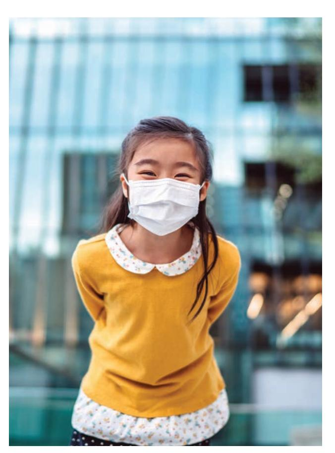

government curfew policies, public confidence in government policies was seriously eroded.4 Another part seems to be both cultural and cognitive, reflecting the public's own higher readiness to adopt pro-social health-seeking behaviors based on social norms and better scientific understanding of the pandemic.

Consider, for example, the proportion of the population wearing face masks in public places, shown in Figure 4.1 for the period March 2020 to January 2021. The public in the Asia-Pacific countries, in red, adopted face mask-wearing earlier and then at consistently higher rates of use compared with Europe and North America.

This higher face mask use in the Asia-Pacific is consistent with the public's fears of catching the infection (Figure 4.2). A far higher proportion of the public in the Asia-Pacific region is "very" or "somewhat" scared of contracting COVID-19, compared with the North Atlantic region. Remarkably, these differences in fears have persisted throughout the pandemic, even though, in fact, the North Atlantic region has incurred far higher rates of infection and mortality.

The publics of the Asia-Pacific have also endorsed tough public policy measures by the government. According to the YouGov survey data, the publics in the Asia-Pacific has consistently supported two core pillars of NPIs: quarantining all inbound airline passengers (Figure 4.3) and quarantining (or locking down) locations in regions hit by infection (Figure 4.4). Such strong measures are key to suppressing transmission, and public support is vital for implementation, but these measures do not garner majority backing in many countries in the North Atlantic region.

Another indicator of public support or opposition to NPIs is the frequency and intensity of public protests against COVID-19 lockdowns. The *Al Jazeera* news agency monitors large-scale protests against COVID-19 control measures (defined as those that lead to arrests), resulting in the global map of protests in January 2021 shown in Figure 4.5.5

The map records 11 major protests in the North Atlantic region but just one in the Asia-Pacific region in Wellington, New Zealand.

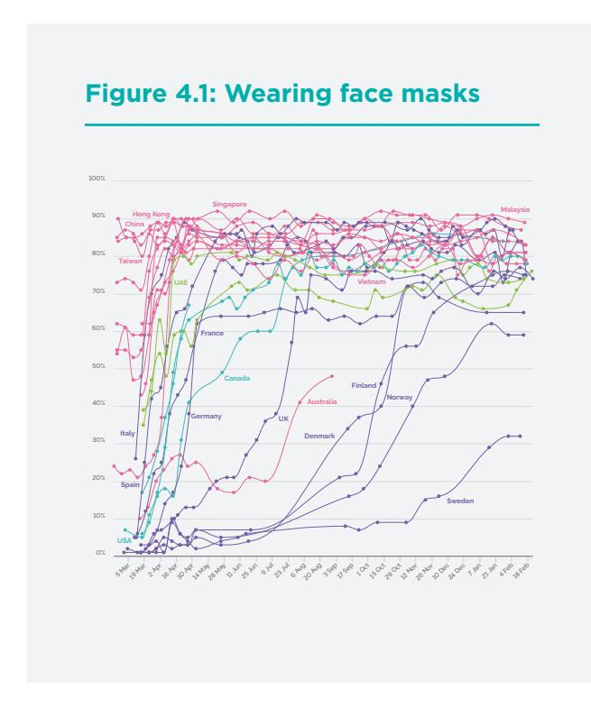

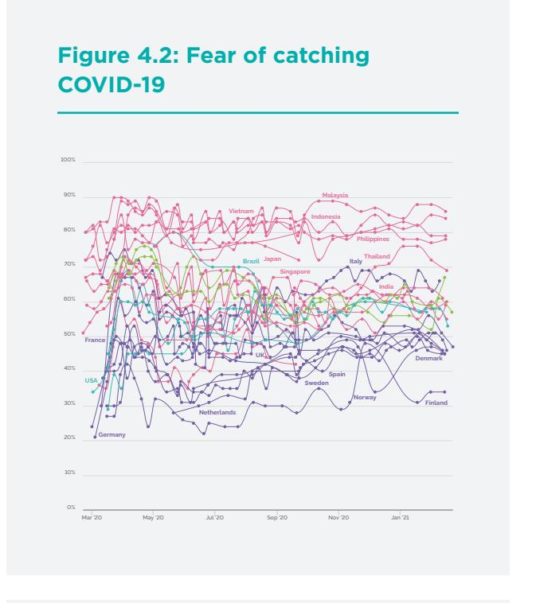

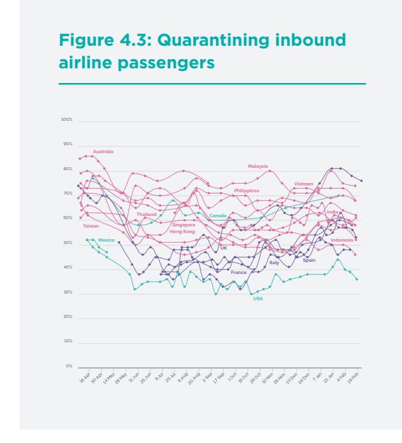

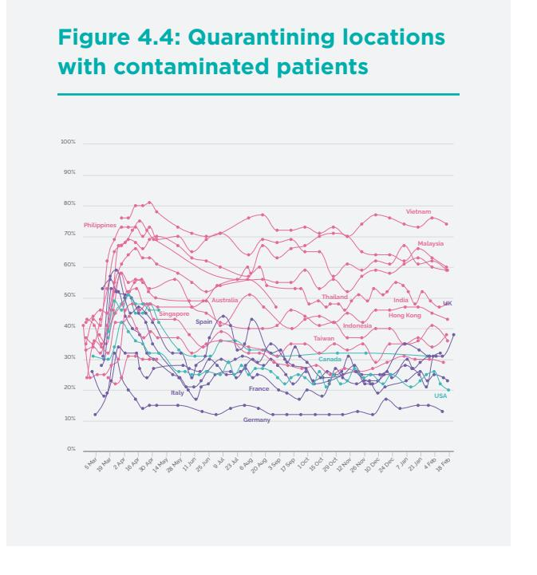

**Source:** YouGov COVID-19 behaviour changes tracker https://today.yougov.com/topics/international/articles-reports/2020/03/17/personal-measures-taken-avoid-covid-19

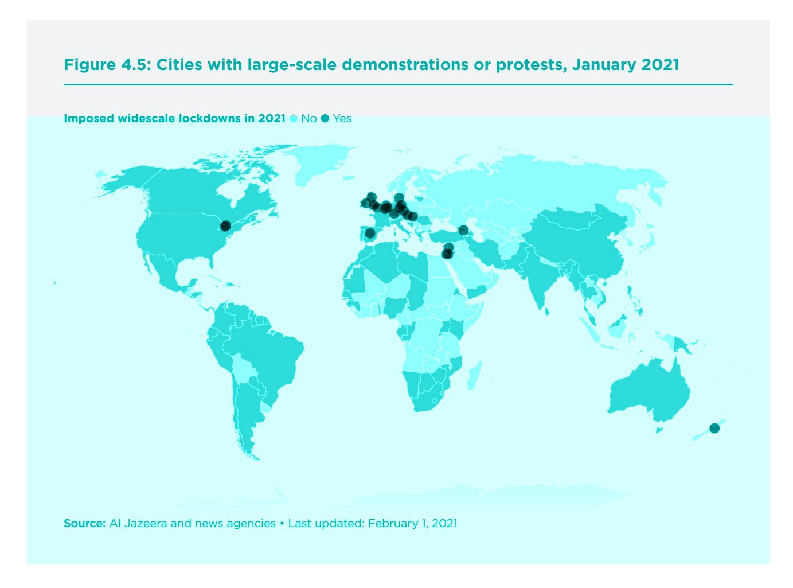

Another key determinant of NPI success in the Asia-Pacific is the public's adherence to government protocols. While we do not have authoritative data on public compliance with NPIs, we do have an interesting data point from a YouGov survey covering the period December 7-20, 2020. In this survey, individuals were asked whether they and others in their country were following the government's COVID-19 rules. In general, the survey respondents gave themselves quite high grades for compliance (between 77% and 94%) but reported much lower compliance rates by "most people" in their local neighborhood (Figure 4.6).

Interestingly, the five locations in the Asia-Pacific region (Australia, China, Hong Kong SAR, Indonesia, and Singapore) score an average of 67.4% for "most people" following COVID-19 rules, while the nine locations in the North Atlantic region (Denmark, France, Germany, Italy, Poland, Spain,

Sweden, United Kingdom and United States) score an average of 55.4%. Only Indonesia scores low in the Asia-Pacific region, at 43%, whereas none of the North Atlantic countries reaches a score of 70% of "most people" following the COVID-19 rules.

# **Culture and the failure of the North Atlantic region to learn from the Asia-Pacific**

The North Atlantic region was perhaps too inexperienced with emerging pandemic diseases to react promptly and decisively to the COVID-19 pandemic when it first emerged in late 2019/early 2020. This was true even after the WHO declared COVID-19 a "public health emergency of international concern" on January 30, 2020. By the time the dramatic scale of the pandemic was widely understood in mid-March 2020, the transmission

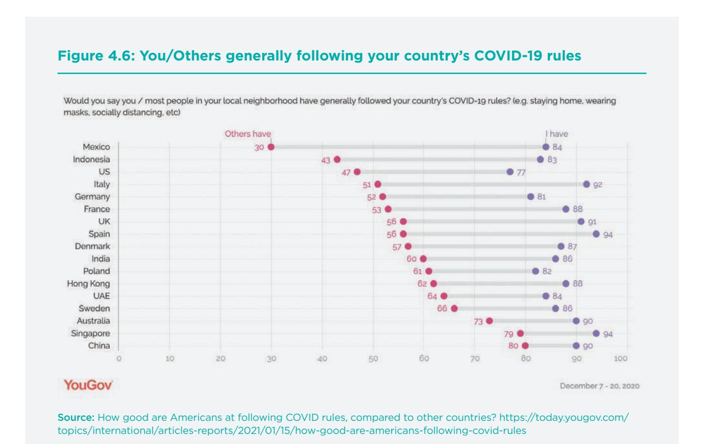

of the virus was far too high for the understaffed and limited systems for testing, tracing, and quarantining.

Therefore, most countries in the world adopted stringent lockdowns in the spring of 2020, which brought the incidence of new infections to relatively low levels by June (around ten new confirmed cases per million per day in the UK and European Union on average in June). Yet even then, with incidence drastically lower, the North Atlantic region did not dramatically scale up its testing, tracing, and quarantining activities. By last summer, precautionary behavior had dissipated, and Europeans and Americans vacationed, setting the stage for a second and even larger wave of the pandemic in the fall.

Amazingly, the mainstream media also failed to draw any lessons from the glaring gap in performance between the Asia-Pacific and the North Atlantic. The leading business daily in the United States is the *Wall Street Journal*. The

*Journal's* editorial board completely disregarded the evidence from the Asia-Pacific throughout 2020. In the course of dozens of editorials, the *Wall Street Journal* editorial board utterly overlooked the lower mortality rates in the Asia-Pacific and consistently failed to inquire how those low rates could be achieved in the US.

The real puzzle is why there was so little learning during 2020. The lockdowns should have been followed by a massive scale-up of NPIs in order to keep incidence low. Why did this did not happen?

Part of the problem, no doubt, was the incompetence of some of key leaders, including former President of the United States Donald Trump. Trump incorrectly believed that the only choice facing the US was whether or not to close the economy. His biggest mistake (which probably cost him the election in November 2020) was to overlook the NPI option. The US Government's top infectious disease scientist, Dr. Anthony Fauci, recently put the situation this way: "My influence

with [Trump] diminished when he decided to essentially act like there was no outbreak and focus on re-election and opening the economy. That's when he said, 'It's going to go away, it's magical, don't worry about it.'"6

The failure obviously goes well beyond Trump. It was common to the European Union as well. The blunders ran both from the top-down and the bottom-up, in a kind of *folie a deux* between politicians and the public. In many North Atlantic countries, there were public protests against even the most basic public health measures, such as wearing face masks, with agitators rejecting mask mandates in the name of "liberty." Nobody explained to these would-be libertarians that the first dictum of classic libertarianism is that the right to liberty does not include the right to harm others. John Stuart Mill famously put it this way: "The only purpose for which power can be rightfully exercised over any member of a civilized community, against his will, is to prevent harm to others." A government requirement to wear face masks would surely have passed Mill's strict scrutiny.

The researchers Iveta Silova, Hikaru Komatsu, and Jeremy Rappleye have recently and cogently argued that that excessive individualism of the Western nations made these countries resistant to the kinds of pro-social policies needed to end human-induced climate change7 and COVID-198.

In their statistical analysis, the authors feature a cross-country measure of individualism originating from the work of Hofstede et al.9 The measure ranges from 0 (complete collectivism) to 100 (complete individualism). It includes scores for nine countries in the Asia-Pacific region and 18 in the North Atlantic region. The mean score for the Asia-Pacific countries is 38.3, compared with 64.9 for the North Atlantic. The difference is statistically significant at the 0.01 level. All of the Asia-Pacific countries score below 50 (that is, are more collectivist) except for Australia (90) and New Zealand (79). In contrast, all of the North Atlantic countries score above 50 (that is, are more individualist) except for Greece (35) and Portugal (27).

The higher individualism of the North Atlantic is correlated with lower public support for NPIs, such as face masks. The proportion of the face mask use (according to the YouGov survey data) is a negative function of Individualism for June 2020 (Figure 4.7a) and January 2021 (Figure 4.7b).

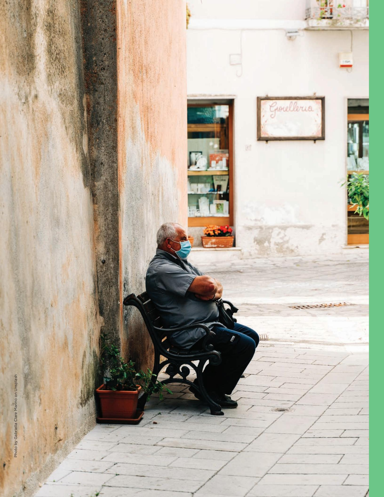

The lower public support for NPIs in the North Atlantic countries also helps to explain the poorer performance of contact tracing in these countries. Many individuals in Europe and the United States were simply unwilling to disclose personal information, even their contacts, to public health officials. A recent report in *Nature* summarized the situation as follows:10

For contact-tracing to work, people with COVID-19 must be prepared to answer questions about their whereabouts, and they must isolate themselves from others while unwell. In many places, that's not happening.

A survey of attitudes to contact-tracing across 19 countries in August found that nearly three-quarters of respondents would be willing to provide contact information. But rates varied. In Vietnam, only 4% of participants said that they wouldn't provide this information. In the United States and Germany, the proportion was 21%, and in France, it was 25%. Concerns around data privacy and tracking are partly to blame, says researcher Sarah Jones at Imperial College London, who co-led the survey. "Many health authorities and governments, especially in North America and Western Europe, may need to urgently improve public-health messaging to mitigate concerns about contact-tracing," she says.

Similarly, the public in North Atlantic countries rejected phone applications to signal proximity to COVID-positive individuals, with such apps widely criticized as invasions of privacy. Though considerations of privacy are important, the failure of testing, tracing, and isolating in the North Atlantic countries has had devastating consequences on mortality rates, suggesting that claims of liberty have been carried too far.

Another research team tested the cultural concept of "tightness-looseness" of social norms as a related factor in public behavior.11 The measure of tightness-looseness "captures the strength of norms in a nation and the tolerance for people who violate norms." It is based on respondents attitudes to six statements such as, "There are very clear expectations for how people should act in most situations," and "In this country, if someone acts in an inappropriate way, others will strongly disapprove." The authors show that countries with high levels of cultural tightness (strictness of social norms) have had far fewer cases and deaths per capita compared with countries with high levels of cultural looseness. The Asia-Pacific region rank far higher in cultural tightness than the North Atlantic countries (see supplementary material).

The indicators of individualism and cultural tightness are negatively correlated. For the 22 countries in our sample of Asia-Pacific and North Atlantic countries with scores on both individualism and cultural tightness, the correlation coefficient is -0.49, p = 0.02 (see supplementary material). Nonetheless, there are some discrepancies. Sweden, for example, is scored as high in cultural tightness as well as individualism.

# **Scientific knowledge and public behavior**

Another possible source of poor performance in the North Atlantic is the public's insufficient scientific understanding of the pandemic. The pandemic has been accompanied by an "infodemic" of fake news. Trump actually used his social media to propagate conspiracy theories, fake cures to COVID-19, and other misinformation in the US. As a recent article in *Nature* puts it, "a world leader amplified once-obscure conspiracy theories, with each tweet and retweet strengthening the ideas and emboldening their supporters."12 A recent study shows how social media are conducive to the spread of fake news because of the tendency of individuals to spread false information on social media without thinking carefully as to whether the information is true.13

The same study shows that the public's susceptibility to fake news also depends on the quality of the public's scientific knowledge, which in turn depends on the quality of public education in science and mathematics. The authors report: "In particular, science knowledge was negatively correlated with belief in false headlines and positively correlated with belief in true headlines, whereas science knowledge was negatively

correlated with sharing false headlines [on social media] and uncorrelated with sharing of true headlines" (p.744).

Therefore, we may gain some additional insight into the comparative performance of countries in controlling the pandemic by comparing the science skills of students across these countries. The Programme on International Student Assessment (PISA) of the Organization for Economic Cooperation and Development (OECD) offers us the needed data. The 2018 scores on science knowledge and skills show that several of the East Asian countries, including China, Singapore, Vietnam, Japan, Korea, and Taiwan, significantly outperform countries in the North Atlantic region, though a few of the ASEAN countries (Indonesia, Philippines, and Thailand) score low.

What is also notable is that the PISA science score is highly correlated with the YouGov score on public compliance with COVID-19 rules: countries with high science scores also have high compliance scores. This intriguing albeit limited evidence is shown in Figure 4.8, based on a regression of Compliance (YouGov) on PISA (Science). The two countries with highest (perceived) compliance with COVID-19 rules, China and Singapore, are also the two countries with the highest PISA science scores. Indonesia

**COVID-19 rules and PISA(Science)** FRA DNK DEU POLHKG SGP CHN -20 -10 0 10 20 e( behaveYouGov | X )

> -100 -50 0 50 100 e( PISA\_scienceavg | X )

coef = .21286154, se = .04640166, t = 4.59

**Figure 4.8: Compliance with** 

*The failure of effective control in many countries may result from the public's lack of proper understanding of the scientific challenges, and as a consequence, low public compliance with or acceptance of COVID-19 NPIs.*

scores the lowest in the group on both assessed compliance with COVID-19 rules and PISA science scores. While such data are suggestive at best, they raise a pertinent concern: are the publics in all countries sufficiently knowledgeable about assessing the basic epidemiology of COVID-19 and, therefore, the appropriate control measures? The failure of effective control in many countries may result from the public's lack of proper understanding of the scientific challenges, and as a consequence, low public compliance with or acceptance of COVID-19 NPIs.

# **Conclusions and follow up**

One of the most striking facts of the COVID-19 pandemic is the very high mortality rates in the North Atlantic countries compared with the Asia-Pacific region. No doubt, the Asia-Pacific region was better prepared for a newly emerging zoonotic pandemic. No doubt, the region put in place a successful package of NPIs that eluded the nations of Europe and North America and the public in the Asia-Pacific countries generally encouraged the strong measures taken by the governments.

What is less clear and more puzzling is why the North Atlantic countries persisted in their failures despite the strong and growing evidence of the successes of the Asia-Pacific region. The North Atlantic countries demonstrated a persistent inability or unwillingness to learn from the Asia-Pacific experience. Part of this reflected a persistent conceptual failure in the US and some of the European countries; specifically the belief that the pandemic could not be controlled

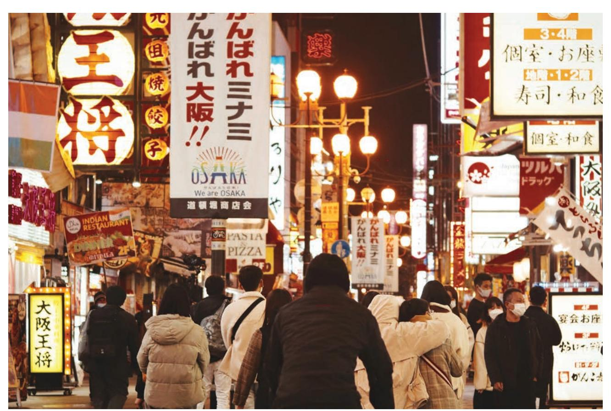

Photo by Amy Tran on Unsplash

through NPIs, short of locking down the economy. Since political leaders were loath to close the economy, they essentially gave up on the idea of controlling the pandemic.

Yet beyond this lay public attitudes. The public in the North Atlantic region was less supportive of NPIs, less compliant with public policies, and more resistant to stringent control measures. We surmise that this resistance reflects two considerations: an excessive individualism at play in the North Atlantic societies and a poor level of scientific awareness, which increases the public's susceptibility to fake news and undermines their readiness to comply with necessary control measures.

While these conclusions are merely suggestive at this stage, they direct our attention to the need for four prongs of action. The first is much better technical advice provided to national governments. The second is better information and explanation by the government to the general public to build support for and compliance with more effective

policies. This information should routinely include data on best practices from other parts of the world. The third is a public debate and recalibration of the appropriate boundaries of individual liberty in the face of urgent collective challenges such as COVID-19 and climate change. The fourth is the need to improve science and math education and the public's ability to reject fake news and conspiracy theories.

None of this will be easy or quick. We will need years to recover from this devastating shock. Yet, our future happiness depends on our coming to grips with the societal weaknesses and failures that led us into our current difficulties.

#### **Endnotes**

- 1 In this paper, the Asia-Pacific region includes 17 locations: three for China (mainland, Hong Kong SAR, and Taiwan), plus Japan and Korea in East Asia; Australia and New Zealand in Oceania, and the 10 countries of ASEAN in southeast Asia. The North Atlantic includes 30 locations: the US, Canada, and the UK, plus the 27 members of the EU.
- 2 Sachs, J. D. (8 April 2020). The East-West Divide in COVID-19 Control. *Project Syndicate*. https://www.project-syndicate.org/commentary/westmust-learn-covid19-control-from-east-asia-by-jeffreyd-sachs-2020-04
- 3 Sachs, J.D. "Comparing Covid-19 Control in the Asia-Pacific and North-Atlantic Regions," *Asian Economic Papers*, 2021 (forthcoming).
- 4 See Fancourt, D., Steptoe, A. and Wright, L, "The Cummings effect: politics, trust, and behaviours during the COVID-19 pandemic," *Lancet*, *396*, August 15, 2020, correspondence
- 5 Haddad, M. (2 Feb 2021). Mapping coronavirus antilockdown protests around the world. *Al Jazeera*. https://www.aljazeera.com/news/2021/2/2/mappingcoronavirus-anti-lockdown-protests-around-the-world
- 6 Fletcher, M. (19 February 2021). Anthony Fauci exclusive interview: 'When I publicly disagreed with Trump he let terrible things happen'. *The Telegraph*. https://www.telegraph.co.uk/politics/0/dr-anthonyfauci-had-publicly-disagree-trump-allowed-terrible/
- 7 Komatsu, H., Rappleye, J., & Silova, I. (June 2019). Culture and the Independent Self: Obstacles to environmental sustainability? *Anthropocene*, *26*. doi:https://doi. org/10.1016/j.ancene.2019.100198
- 8 Silova, I., Komatsu, H., & Rappleye, J. (14 January 2021). Covid-19, Climate, and Culture: Facing the Crisis of (Neo) Liberal Individualism. https://www.norrag.org/COVID-19 climate-and-culture-facing-the-crisis-of-neoliberalindividualism-by-iveta-silova-hikaru-komatsu-andjeremy-rappleye/
- 9 Hofstede, G., Hofstede, G. J., & Minkov, M. (2010). *Cultures and Organizations: Software of the Mind, 3rd edition*. New York: McGraw Hill.
- 10 Lewis, D. (14 December 2020). Why many countries failed at COVID contact-tracing — but some got it right. *Nature*, *588*, 384-387. https://www.nature.com/articles/ d41586-020-03518-4#ref-CR9
- 11 Gelfand, M. J., et al., "The relationship between cultural tightness-looseness and COVID-19 cases and deaths: a global analysis," *Lancet*, online, 29 January 2021.
- 12 Tollefson, J. (11 February 2021). How Trump Turned Conspiracy-Theory Research Upside Down. *Nature*, *590*, 192-193.
- 13 Pennycook, G., et al., "Fighting COVID-19 Misinformation on Social Media: Experimental Evidence for a Scalable Accuracy-Nudge Intervention," *Psychological Science*, *31*(7), 770-780, 2020.

#### **References**

Fancourt, D., Steptoe, A. and Wright, L, "The Cummings effect: politics, trust, and behaviours during the COVID-19 pandemic," *Lancet*, *396*, August 15, 2020, correspondence

Gelfand, M. J., et al., "The relationship between cultural tightness-looseness and COVID-19 cases and deaths: a global analysis," *Lancet*, online, 29 January 2021.

Haddad, M. (2 Feb 2021). Mapping coronavirus anti-lockdown protests around the world. *Al Jazeera*. https://www.aljazeera. com/news/2021/2/2/mapping-coronavirus-anti-lockdownprotests-around-the-world

Hofstede, G., Hofstede, G. J., & Minkov, M. (2010). *Cultures and Organizations: Software of the Mind, 3rd edition*. New York: McGraw Hill.

Fletcher, M. (19 February 2021). Anthony Fauci exclusive interview: 'When I publicly disagreed with Trump he let terrible things happen'. *The Telegraph*. https://www.telegraph.co.uk/ politics/0/dr-anthony-fauci-had-publicly-disagree-trumpallowed-terrible/

Komatsu, H., Rappleye, J., & Silova, I. (June 2019). Culture and the Independent Self: Obstacles to environmental sustainability? *Anthropocene*, 26. doi:https://doi.org/10.1016/j.ancene.2019.100198

Lewis, D. (14 December 2020). Why many countries failed at COVID contact-tracing — but some got it right. *Nature*, *588*, 384-387. https://www.nature.com/articles/d41586-020- 03518-4#ref-CR9

Pennycook, G., et al., "Fighting COVID-19 Misinformation on Social Media: Experimental Evidence for a Scalable Accuracy-Nudge Intervention," *Psychological Science*, *31*(7), 770-780, 2020.

Sachs, J. D. (8 April 2020). The East-West Divide in COVID-19 Control. *Project Syndicate*. https://www.project-syndicate.org/ commentary/west-must-learn-covid19-control-from-eastasia-by-jeffrey-d-sachs-2020-04

Sachs, J. D. "Comparing Covid-19 Control in the Asia-Pacific and North-Atlantic Regions," *Asian Economic Papers*, 2021 (forthcoming)

Silova, I., Komatsu, H., & Rappleye, J. (14 January 2021). Covid-19, Climate, and Culture: Facing the Crisis of (Neo)Liberal Individualism. https://www.norrag.org/COVID-19-climate-and-culture-facing-the-crisis-of-neoliberal-individualismby-iveta-silova-hikaru-komatsu-and-jeremy-rappleye/

Tollefson, J. (11 February 2021). How Trump Turned Conspiracy-Theory Research Upside Down. *Nature*, *590*, 192-193.

# Chapter 5

# Mental Health and the COVID-19 Pandemic

## James Banks

Professor of Economics, University of Manchester and Senior Research Fellow, Institute for Fiscal Studies

## Daisy Fancourt

Associate Professor of Psychobiology and Epidemiology, University College London

## Xiaowei Xu

Senior Research Economist, Institute for Fiscal Studies

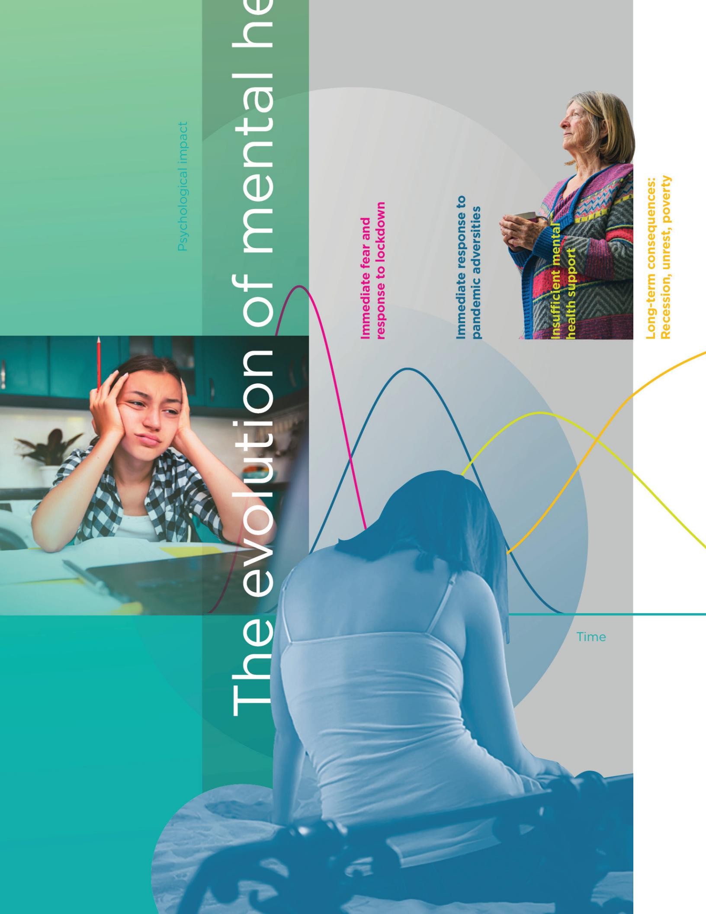

# **Introduction**

From the outset, it has been clear that the potential mental health effects of the COVID-19 pandemic and the various physical distancing, social restrictions, and stay-at-home related policies introduced in response to it, would be one of the most important challenges of the pandemic. Mental health is a key component of subjective well-being in its own right and is also a risk factor for future physical health and longevity,1 which will be a leading indicator of the future, indirect long-run health consequences of the pandemic. Mental health will influence and drive a number of other individual choices, behaviours, and outcomes.

This paper summarises and discusses the emerging evidence on the mental health consequences of COVID-19. Our focus is on negative mental health consequences, such as depression and anxiety, and does not cover life-satisfaction more broadly. Analysis of factors such as social cohesiveness and sense of community, which may relate to positive mental health, are discussed in Chapter 6 of this report. Additionally, it is worth noting that the evidence we discuss here relates only to adults and almost entirely to adults in wealthy industrialised countries, with a strong focus on the U.K. and the U.S. There has been less evidence emerging outside of these domains to date, but as new data become available, these will be important avenues for investigation.

A consistent finding of the rapidly emerging evidence discussed here is that the COVID-19 pandemic has been associated with a substantial rise in symptoms of mental ill-health. In the months following the initial outbreak and lockdown, however, trajectories improved. There is still much uncertainty surrounding the pandemic's second and third waves and how the associated lockdowns of economic and social activities will affect mental health, including the pandemic's long-run consequences on mental health trajectories and mental health services. In keeping with other consequences of COVID-19, the pandemic has also appeared to increase inequalities in mental health, both within the population as a whole and between demographic groups.

In interpreting and bringing together the various measures and evidence, it is useful to consider the various mechanisms2 by which different stressors3 associated with the pandemic might affect broad mental health measures and the time frames over which these mechanisms might play out. With regard to the former, four main types of mechanisms may be important, differentially so for different types of individuals.

First, there will be mechanisms related to health-related anxieties directly arising from COVID-19, such as the likelihood of being infected, the chance of being hospitalised or dying, the probability of infecting others, and indeed the possibility of loved ones being infected or dying. These may differ according to an individual's vulnerabilities and exposure (which affect the underlying probabilities themselves) and also according to perceptions of, and attitudes to, the health risk.

Second, there will be the mental health consequences of worries resulting from how the pandemic affects an individual's financial situation, both in the short and the long run. These worries will likely differ according to socioeconomic position, to which countries, regions, or sectors individuals live and work in, and the way in which their economies and economic policies are affected.

There will be a third mechanism related to the complications that arise from domestic family arrangements during times of lockdown or shelter-in-place regulations. In this dimension, one might expect variation according to demographic status (the presence of pre-school or school-age children, housing conditions, etc.).

Finally, the fourth mechanism relates to the direct mental health effects of the loss or restriction of otherwise fulfilling activities caused by the pandemic and the various lockdown policies. These effects might plausibly differ according to pre-pandemic lifestyles and levels of social contact or social networks and by individual differences in the extent to which people can create and gain benefit from online and other types of positive social connections.

As well as varying across individuals, these different mechanisms will play out to different degrees over different time horizons. Figure 5.1 shows four key phases that outline the pandemic's mental health impacts. The initial two phases are short-run responses within the pandemic. First, to fear of the virus and worries about lockdown measures, and second, to the broader adversities (whether economic or social) created by the pandemic and governments' responses to it. There will also be longer-term effects of the pandemic due to its subsequent effects on the demand for, and supply of mental health services, as well as the even longer-term mental health consequences of recession, unrest and poverty. It is important to note that this phenomenon will be relevant even in countries where the pandemic has not had sizeable direct health effects since there will still be economic consequences through disruptions in trade and travel.

Given the time of this paper's writing and the available data and research, our summary of quantitative evidence focusses on phases one and two in Figure 5.1. The latter stages relating to the supply of mental health services and the demand for such services amid rising mental health inequalities and long-term mental health consequences of the pandemic's macroeconomic impacts, may well be substantial. Whilst we don't have much evidence on these phases to date, they should be uppermost in policymakers' and researchers' minds. More generally, the precise scale, timing, and duration of these phases (which are only plotted indicatively in Figure 5.1), as well as any interactions between them, will be necessary to analyse. Disruption to mental health services, and specific challenges in accessing mental health medication and support during lockdowns, for example, will affect all the other phases. We will return to some of these issues in our conclusions below.

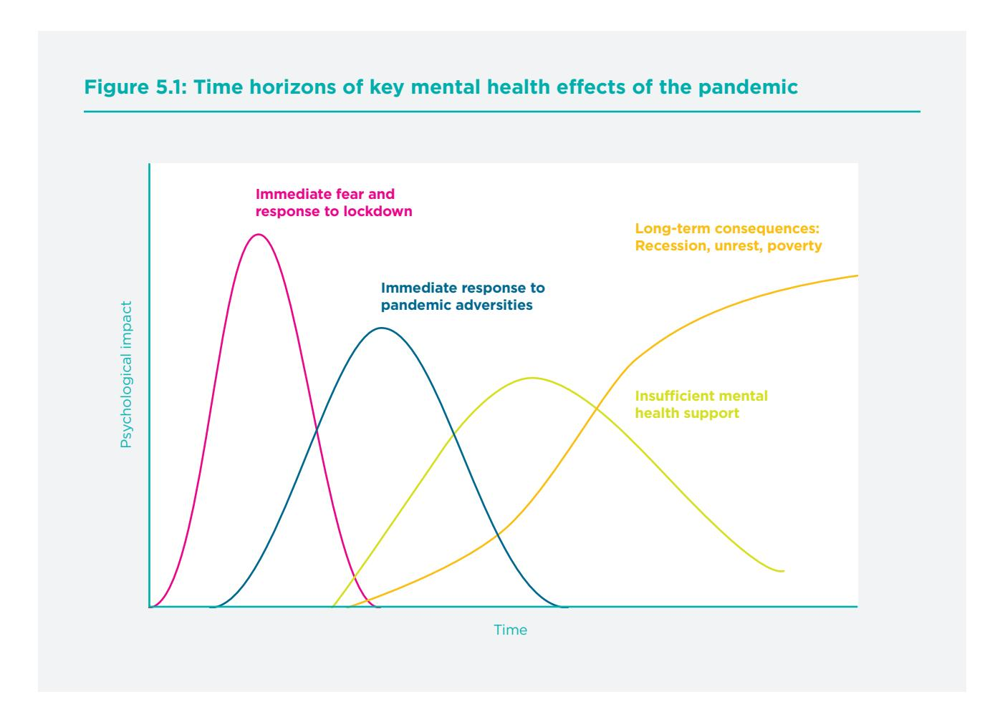

# **Measuring mental health during the pandemic**

One of the many challenges of COVID-19 has been the difficulty in collecting evidence, whether through new real-time studies or the continuation of pre-existing data collection activities such as cross-sectional or longitudinal household surveys. The research community has stepped up to the challenge, and the availability of new data has been impressive. There is, however, considerable variation in the data sources underlying the emerging evidence on mental health. In particular, data on mental health during the pandemic comes from one of three types of sources.

A number of pre-existing cross-sectional or longitudinal surveys have implemented other COVID-19 data collections, typically online and by phone. The availability of pre-COVID-19 data is a clear advantage of such surveys. The drawback is that the sample sizes in new COVID-19 waves tend to be relatively small (compared to other data sources discussed below). Many surveys have carried out just one or two observations during the COVID-19 period. A notable exception is the Understanding Society (UKHLS) panel in the U.K., used in this paper, which implemented monthly and bi-monthly surveys from April 2020 onwards.

Second, many bespoke COVID-19 studies have been set up to track mental health over the course of the pandemic (see https://www.covid minds.org/longitudinal-studies). Key among these is the UCL COVID-19 Social Study, the USC Understanding America Panel, and equivalent studies in European countries. Whilst these studies provide large-scale, high-frequency data on changes in mental health during the pandemic, they do not contain information from before the onset of COVID-19, which makes it difficult to estimate the impact of the pandemic. Further, sampling techniques have varied from random samples to quota or weighted samples to convenience samples. The data's representativeness and comparability can be challenging in interpreting findings.

Finally, researchers have drawn on harvested data from internet searches, helplines, and hospital records. A key strength of these sources is that they tend to provide large sample sizes and

high-frequency data from both before and after the pandemic. The drawback is that these data typically contain very little information on demographics and other characteristics and may not represent the general population.

Given the variation in data sources and data collection methods, it is not surprising many mental health measures are in use. Survey data, and the primary studies used in our empirical analysis, typically include summary measures of overall mental health such as the GHQ-12,4 more specific measures such as the GAD-7 for anxiety,5 the CES-D6 or PHQ-97 for depression, or short screening scales such as the PHQ-4 that cover both.8 Such surveys often also measure other factors (for example, the UCLA scale for loneliness or various social isolation measures) that can be crucially important in understanding mental health and its drivers. Harvested data contain other proxy outcomes for mental health, such as suicides, self-harm, the number of calls to helplines, and internet searches for mental health-related keywords.

As there is no single dominant measure or data source on mental health during the pandemic, it is not straightforward to quantify effects across studies. In what follows, we draw on data sources as appropriate. Evidence from pre-existing surveys and harvested data help to identify and quantify the initial causal impacts of COVID-19. Bespoke surveys are useful in tracing out variation in mental health trajectories over the course of the pandemic. What is apparent is that the key themes emerge regardless of the measurement issues - the triangulation of data from studies using different samples and methodological approaches provides some reassuringly consistent messages as to the mental health impact of the pandemic.

# **The initial mental health effects of the pandemic**

Most developed countries saw a large immediate decline in mental health after the pandemic outbreak compared to earlier points in time, typically measured between 2017 and 2019. By comparing different cross-sectional surveys in the U.K., the ONS reported a 12.3 percentage-point fall in numbers reporting low happiness and a 28.6 percentage point rise in those reporting elevated anxiety between the last quarter of 2019 and March 2020. Over the same broad period, feelings of life being worthwhile fell from 7.86 to 7.42, and life satisfaction fell from 7.67 to 6.91, both measured on a scale of 0 to 10.9 Repeated cross-sectional surveys also show a rise in the prevalence of depressive symptoms, from 9.7% among adults in July 2019-March 2020 to 19.2% in June 2020.10 In the U.S., bespoke COVID surveys in April-May 2020 show significantly higher rates of poor mental health compared to comparable surveys in 201811 and higher levels of loneliness.12 Data from representative cohort studies across the world also show increases in average scores of psychological distress and a rise in the share of people experiencing clinically significant levels of mental illness in the first few weeks of lockdown, compared to data collected prior to the pandemic.13

Whilst important, comparisons of mental health levels before and after the pandemic cannot be taken as estimates of the pandemic's *causal* effect. They do not account for what would have happened in the absence of the pandemic. For example, some mental health measures in the U.K. had already been worsening in recent years, before the COVID-19 outbreak. Since this trend may well have continued even in the absence of the COVID-19, attributing the entire decline in mental health between pre-pandemic years and Spring 2020 to COVID-19 would lead us to overstate the effect of the pandemic. Importantly, Banks and Xu14 show that pre-existing mental health trends differ across demographic groups: mental health deteriorated much more sharply among younger age groups than older groups between 2014 and 2018. This means that naïve before-after comparisons could also lead to incorrect estimates of the *relative* effect of COVID-19 across groups.

Secondly, simple comparisons do not account for seasonal trends in mental health, which may be necessary when assessing mental health at a single point in time, as is typical in 'real-time' COVID-19 studies. Banks and Xu15 show that there are seasonal trends in GHQ scores, with mental

health improving in the spring and summer months and declining in the autumn and winter. A sample observed entirely at one point in time (for example, April 2020) is not comparable to samples in previous surveys, typically interviewed over an entire year.

#### **Causal estimates of the initial effects of the pandemic**

Given these issues, researchers have adopted two strategies to estimate the causal effect of COVID-19 on mental health. One strand of research uses variation in the timing of the disease outbreak and/or the public health response across different areas (countries or different regions within a country) to identify the causal effect. Much like a randomised trial, the underlying assumption is that mental health trajectories across areas would have evolved to preserve pre-existing differences, so any subsequent deviations between areas can be attributed to the pandemic. Another set of studies attempt to explicitly model mental health levels over time using historical longitudinal data in a single country or area, in order to create a counterfactual prediction for what would have happened without COVID-19. The assumption here is that pre-pandemic trends, defined for specific demographic groups, would have continued in the absence of the pandemic, so deviations from those trends can be interpreted as the effects of the pandemic. We now discuss each type of evidence in turn.

#### **Variation in the timing of the pandemic and lockdown**

Typically, studies that use variation in events' timing require high-frequency data and have relied on trends in Google searches and calls to helplines as proxies for mental health, rather than survey data with conventional mental health measures. Brodeur16 track Google searches for well-being related keywords in Western European countries and the U.S., comparing searches pre- and post-lockdown in 2020 to the same dates in 2019, controlling for seasonal patterns of searches within countries and states. They find a substantial increase in the search intensity for

boredom, at two standard deviations in Europe and over one standard deviation in the U.S., as well as smaller statistically significant increases in searches for loneliness, worry, and sadness. On the other hand, search intensity for suicide and divorce fell when lockdowns were imposed. Analysing changes in Google searches over time (but not variation in timings across areas), Knipe17 and Tubadji18 also find a fall in searches for suicide. However, the former finds an increase in searches for fear, and the latter increases in searches for death, starting in March 2020. Foa19 finds that most of the rise in 'negative' search terms (psychological stress, boredom, fear, etc.) in developed countries took place before the start of the first lockdown, before stabilising and falling over the course of lockdown.

Armbruster and Klotzbuecher20 find that the number of calls to Germany's largest online and telephone counselling helpline service increased by 20% in the first week of lockdown. Analysis of the conversations' content suggests that this increase was driven by heightened loneliness, anxiety, and suicidal ideation rather than fear of the virus or financial worries. Looking across

German federal states and controlling for differences in infection rates, they find larger effects in states that imposed stricter lockdown measures, suggesting that the deterioration in mental health was partly driven by the public health response to the virus instead of the virus itself. In contrast, helpline data from Switzerland do not show an increase in the total volume of calls resulting from the pandemic,21 with an increase only in calls directly related to the virus (calls by the elderly and calls about fear of infection).

The results suggest some deterioration in mental health as a direct result of the pandemic, though not along all dimensions, with some contradictory results. Conflicting findings may reflect differences in impacts across countries (for example, Germany versus Switzerland) or the manifestation of mental health issues in different behaviours (for example, the link between suicidal ideation in Google searches versus helpline calls). But it is difficult to draw clear conclusions from this evidence, partly because the outcome measures used cannot be directly related to common measures of mental health. Furthermore, because they rely on data from a self-selected group

(those who use Google search or those prone to calling helplines), their findings may not represent the general population.

Studies that use variation in timing to identify effects typically use harvested data, making it challenging to study how the pandemic's mental health impact varies across demographic groups.22 One notable exception is the study by Adams-Prassl23 who use two survey waves in March and April 2020 and identify the causal effect of lockdowns across the U.S. using variation in the timing of stay-at-home orders. They measure mental health using the WHO-5 module and find that mental health deteriorated by 0.1 standard deviations in states that imposed lockdowns in April, with the effect entirely driven by women. These states had had similar mental health levels in March. As the surveys contain detailed information on people's experiences over lockdown, they can establish that women's differential effect cannot be explained by increased financial worries or additional childcare responsibilities.

#### **Modelling counterfactual mental health levels**

The second strand of research tries to identify the pandemic's causal effect by estimating counterfactual levels of mental health in the absence of the pandemic, using longitudinal data from previous years. Banks and Xu24 model individual-level counterfactuals in April 2020 using longitudinal data spanning several years before the pandemic, taking account of age profiles in mental health, seasonal trends, gender- and age-specific trends, and changes in observed personal circumstances between the latest pre-pandemic wave (in 2017-18) and the

*A number of sources have suggested that during COVID-19, mental health deteriorated prior to lockdown or stay-at-home orders coming in. Once lockdowns were introduced, mental health stabilised and even began to improve.*

period immediately before the pandemic. They estimate that average GHQ scores using the Likert 0-36 point metric rose by 0.9 points as a result of the pandemic, indicating a worsening of mental distress by 0.17 of a standard deviation of the pre-pandemic distribution. The causal effect is smaller than the simple difference between April 2020 and 2017-18 (1.2 points) for the reasons discussed above. Still, it is a considerable deterioration, roughly equivalent in size to the mean difference in GHQ scores between the top and bottom quintiles of the income distribution in 2017-18, and nearly double the deterioration between 2013 and 2018. The GHQ-12 caseness score, which captures the number of mental ill-health dimensions reported as being worse than usual, deteriorated even more. Individuals reported an average of 0.9 more mental health problems25 out of a possible 12 – a difference equivalent to 0.3 of a standard deviation and twice the pre-pandemic difference between the top and bottom income quintiles. Finally, the share of the population reporting one or more of the 12 dimensions being 'much more than usual' more than doubled relative to the counterfactual prediction, from 10% to 24%. Pierce26 adopts a similar approach, estimating the deviation from individual-level predictions using the same dataset, finding a 0.5-point increase in average GHQ scores. However, their main estimates may well be an underestimate of the causal effect due to the particular modelling approach taken.27

The advantage of modelling counterfactual mental health levels using rich survey data is that it allows us to examine differences between groups and the mechanisms through which mental health changes arise. However, one drawback is that results may be sensitive to the model specification. As shown by the differences between Banks and Xu,28 and Pierce29 model specifications for the counterfactual will matter. Results are also sensitive to the period used to fit the model and predict the counterfactual. They use data up to 2017-18, as this was the latest wave of the survey available at the time each analysis was conducted. Since then, survey data up to 2019 has been released, allowing us to revise and improve our estimate of pre-pandemic trends, hence the pandemic's estimated initial impact.

**Table 5.1: Estimated impact of COVID-19 on mental health in the UK, April 2020: Effect on GHQ scores** 

|             | GHQ score (Likert) |           |        | GHQ score (caseness) |      |           |        |        |
|-------------|--------------------|-----------|--------|----------------------|------|-----------|--------|--------|
|             | 2019               | Predicted | Actual | Impact               | 2019 | Predicted | Actual | Impact |
| 16-34 Women | 12.8               | 13.5      | 15.3   | 1.8                  | 2.6  | 2.8       | 4.2    | 1.4    |
| 35-64 Women | 12.3               | 12.5      | 13.7   | 1.2                  | 2.3  | 2.3       | 3.4    | 1.1    |
| 65+ Women   | 10.8               | 10.8      | 12.0   | 1.2                  | 1.4  | 1.4       | 2.4    | 1.0    |
| 16-34 Men   | 12.2               | 12.2      | 13.0   | 0.7                  | 2.2  | 2.0       | 2.9    | 0.9    |
| 35-64 Men   | 11.3               | 11.1      | 11.5   | 0.4                  | 1.8  | 1.6       | 2.1    | 0.6    |
| 65+ Men     | 9.4                | 9.7       | 10.1   | 0.4                  | 0.8  | 0.9       | 1.5    | 0.6    |
| All         | 11.5               | 11.7      | 12.6   | 0.9                  | 1.9  | 1.9       | 2.8    | 0.9    |

Note: GHQ Likert scores range from 0-36; GHQ caseness scores count the number of dimensions reported as being worse than usual and range from 0-12.

Table 5.1 shows the updated estimates of the mental health impacts of COVID-19, incorporating the 2018-2019 data and based on the methodology of Banks and Xu.30 Estimates of the overall impact in April 2020 are unchanged – GHQ-19 scores rose by 0.9 points relative to the predicted value in April 2020 of 11.7, representing a deterioration in mental health of 7.9% using the GHQ-12 Likert metric. The GHQ-12 caseness score, capturing the number of dimensions reported worse than usual, rose by 47% from 1.9 to 2.8. As with the previous analysis (and as discussed in detail in section "The evolution of mental health during the pandemic" below), Table 5.1 shows clearly that the pandemic had the most considerable effects on women and young people.31

# **The evolution of mental health during the pandemic**

The findings on the initial effects of the pandemic on mental health discussed above echo those from studies of previous epidemics such as SARS (severe acute respiratory syndrome), during which individuals who had to quarantine experienced increases in symptoms of depression and PTSD.32 But it has now become clear that the trajectory of subsequent experiences has differed from previous epidemics. A number of sources have suggested that during COVID-19, mental health deteriorated *prior* to lockdown or stay-at-home orders coming in. Once lockdowns were introduced, mental health stabilised and even began to improve. Initial U.K. evidence on this began to emerge quite rapidly from the study of trajectories between March and June.33 We provide some further evidence on trajectories over the six months leading up to September 2020, both in the U.K. and elsewhere.

#### **Changes in the U.K. between April and September**

The section, *The initial mental health effects of the pandemic*, discussed the immediate impacts of the COVID-19 outbreak on mental health during the first lockdown in the U.K. and elsewhere. From May 2020 onwards, many of the early stringent restrictions were relaxed. Schools reopened in many countries and regions, and as sector shutdowns were lifted and businesses learned to adapt to the new environment, many furloughed workers returned to work. Nevertheless, individuals' lifestyles, and their material circumstances, were still dramatically affected compared to before the pandemic, so it is natural to ask how these changes affected subsequent trajectories of mental health after the first initial shock.

**Figure 5.2a: Impact of COVID-19 on mental health in the U.K. in April and September 2020. Difference between observed levels and 'no-COVID' predictions, by age and sex**

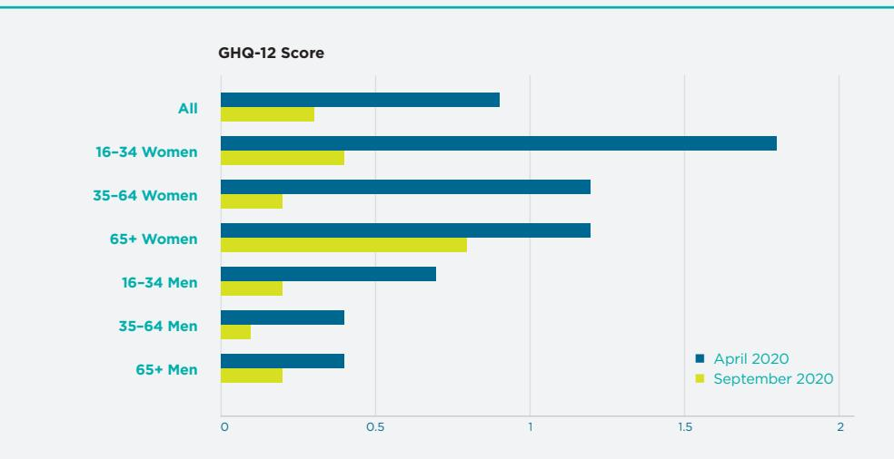

Note: Authors calculations using UKHLS COVID-19 data (NApril=11,751; NSept=9,506).

**Figure 5.2b: Impact of COVID-19 on mental health in the U.K. in April and September 2020. Difference between observed levels and 'no-COVID' predictions, by age and sex**

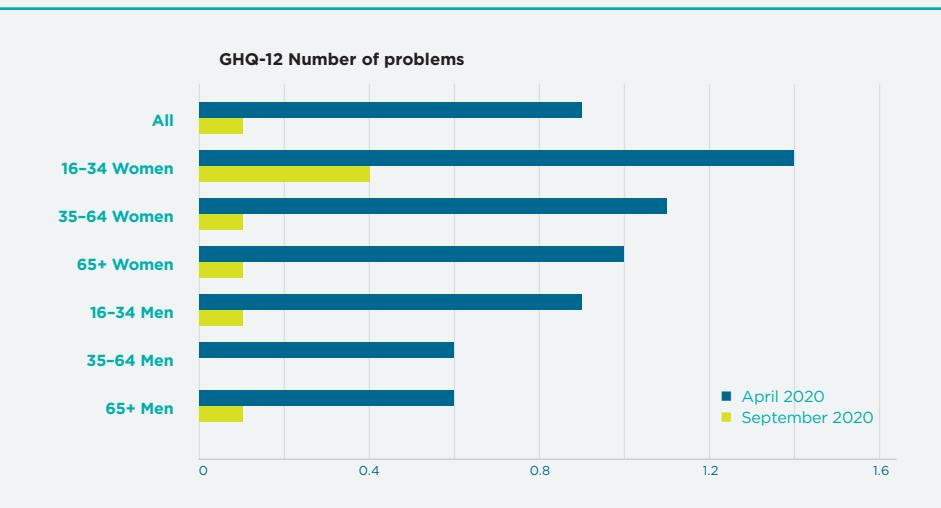

Note: Authors calculations using UKHLS COVID-19 data (NApril=11,751; NSept=9,506).

We repeat the exercise in Banks and Xu34 using the September wave of the UKHLS, estimating the pandemic's impact on mental health in the U.K. in September by comparing actual mental health levels to individual-level counterfactual predictions for that month. Figure 5.2 presents the pandemic's estimated causal effects across age and gender groups in April 2020 and September 2020. The bars labelled April 2020 correspond to the 'impacts' of the pandemic in April, as listed in Table 5.1 above. The second series is the equivalent estimates for September 2020. Figure 5.2 shows that mental health across the population improved substantially over the course of the summer, though by September, it had not yet returned to counterfactual trend values, with average GHQ scores still 0.3 points above the counterfactual prediction (compared to 0.9 points above in April 2020).

There are considerable differences in the relative persistence of initial effects across demographic groups. Young women age 16-34 had by far the worst initial mental health shocks (their GHQ scores increased by twice the overall increase), but they were not much worse off than the general population by September. In contrast, the mental health shock suffered by elderly women was remarkably persistent, and by September, they were the group experiencing the most considerable deterioration relative to the counterfactual. These patterns of adaptation and persistence mean that the impact of COVID-19 on mental health was much less unequal (across age and gender groups) in September than in April.

Using the balanced panel of respondents to UKHLS who responded to both the April and September surveys, we can also explore trajectories at the individual level. We define an individual as 'badly affected' if, at the point of the interview, their GHQ-12 score was one or more points worse than would have been predicted given their (individualspecific) 'no-COVID' counterfactual value for that month. We then assign individuals to one of four groups according to whether they were 'badly affected' in each of the two waves.

Figure 5.3 shows the distribution of April to September trajectories by age and gender group. A substantial fraction of the population (22.5%)

was severely affected in both waves; this large group experienced a sustained period of poor mental health relative to their previous levels. On the other hand, and in keeping with evidence in Figure 5.2, there was also evidence of improving trajectories. Almost half of those who were badly affected in April were no longer 'badly' affected in September (i.e., their GHQ-12 score worsened by less than one point). Whilst a non-negligible fraction of the population (13.6%) had entered the badly affected group, the overall affect is still a reduction in the size of the badly affected group by September. When split by age and sex, these trajectories also show important differences in the persistence of mental health effects across groups. For example, whilst younger women were most severely affected in April, their recovery rate was relatively high. Looking at the groups with the highest prevalence of persistent poor mental health, older women and younger men have been most affected. Men of all ages, and older men, in particular, are least likely to have been in the persistently badly affected group.

With multiple covariates available, it is possible to look deeper into the individual-level determinants of membership of these transition groups. We estimate a simple logit model to

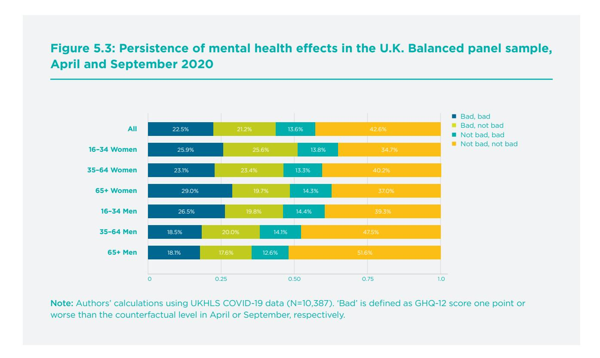

look at the characteristics of the persistently badly affected group, including controls for individuals' health, economic situation, and social and demographic circumstances.35 Substantial differences between age-sex groups remain, even when controlling for the differential other circumstances. Women over 65 are 1.77 times more likely to be persistently badly affected than the reference group of middle-aged men, and 16-34-year-olds of both sexes are around 40% more likely to be in the persistently badly affected group, even controlling for the other circumstances of these groups. The covariates in these models show some preliminary evidence of the various mechanisms by which the pandemic might affect mental health, as discussed in the introduction. Those with COVID-19 symptoms in either April or September, those who lost work after April 2020, or those reporting closer friends pre-pandemic, were all more likely to be in the persistently badly affected group.36 Those in strong romantic relationships (who reported their relationship quality as 'very happy' or better) had a reduced likelihood of being persistently badly affected, highlighting the importance of the nuclear family at a time when social circles have shrunk outside of the household.

## **Detailed evidence from within-pandemic trajectories**

Since detailed COVID-19 studies have started up since the onset of the pandemic, it is also possible to look at within-pandemic trajectories with much more specific measures of mental health, both in terms of the mental health measures themselves and in terms of the periodicity of measurement. In this section, we begin by looking again at the U.K. context before turning to evidence from other countries.

The UCL COVID-19 Social Study involves repeated weekly assessments of a large sample of over 70,000 adults living in the U.K. from the start of the first U.K. lockdown in March 2020. As the study lacks pre-pandemic data on respondents, it does not aim to provide prevalence data on symptoms. Instead, it identifies how and when psychological and social experiences changed during the pandemic and how these changes coincided with changes in the spread of the virus, social restrictions, and broader societal disruptions. Exploring the average symptom trajectories of anxiety and depression across the first lockdown and beyond, Fancourt, Steptoe and Bu37 show

The unique circumstances of the COVID-19 pandemic may have led to a different kind of psychological experience than previous epidemics. both to be above previous national averages at the start of lockdown, echoing research from the generic mental health measures in the studies mentioned above, with a steady decline from early April and onwards. This decline continues as lockdown restrictions were eased in May, June, and July, flattening over the summer when restrictions were at their lowest (see Figure 5.438).

The findings reinforce the general conclusions on trends seen in the UKHLS data above and provide insight into when improvements occurred. Furthermore, such studies offer the possibility of examining different effects on mental health's various dimensions. The key result on improving trajectories is further echoed in data emerging from COVID-19 mental health studies in other countries. Figure 5.5 compares the trends in the U.K. data with international data from similar studies in Denmark, France, and the Netherlands and shows decreases in the percentage of people experiencing high anxiety from early in the Spring in all countries.39

Figure 5.4: Predicted growth trajectories of estimated mean anxiety and depressive symptom scores since the beginning of the pandemic in the U.K.

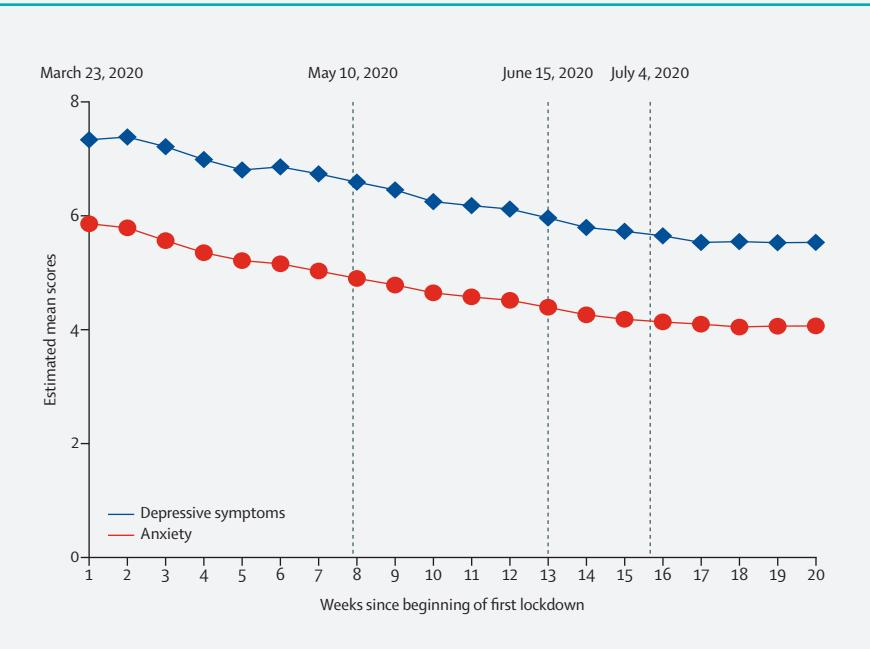

Note: Reproduced from Fancourt, Steptoe, and Bu (2020).

**Figure 5.5: Worries and anxiety about the COVID-19 pandemic in Denmark, France, the Netherlands and the United Kingdom**

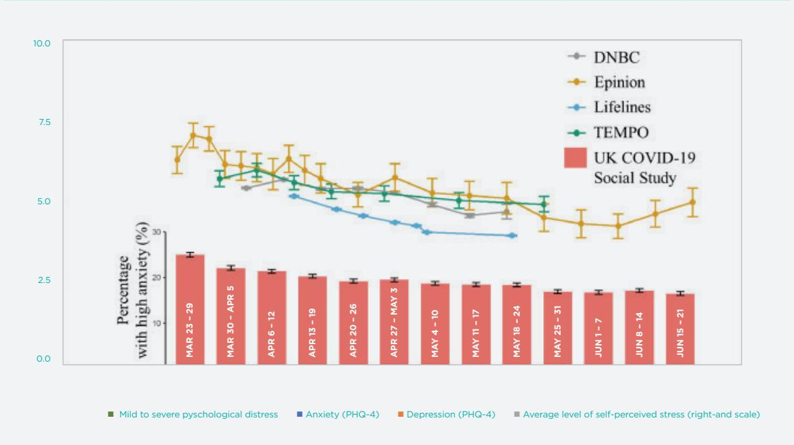

Note: Reproduced from Varga et al. (2020), Figure 340

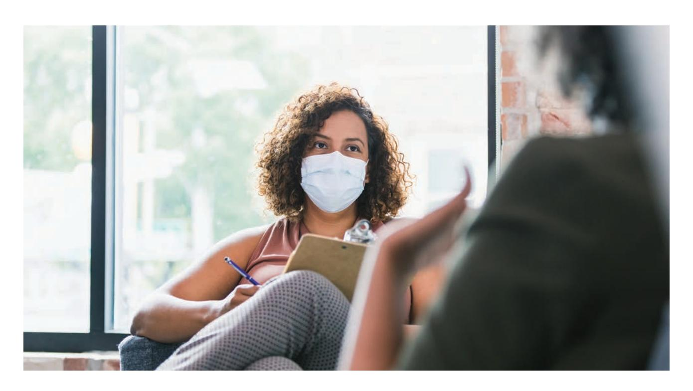

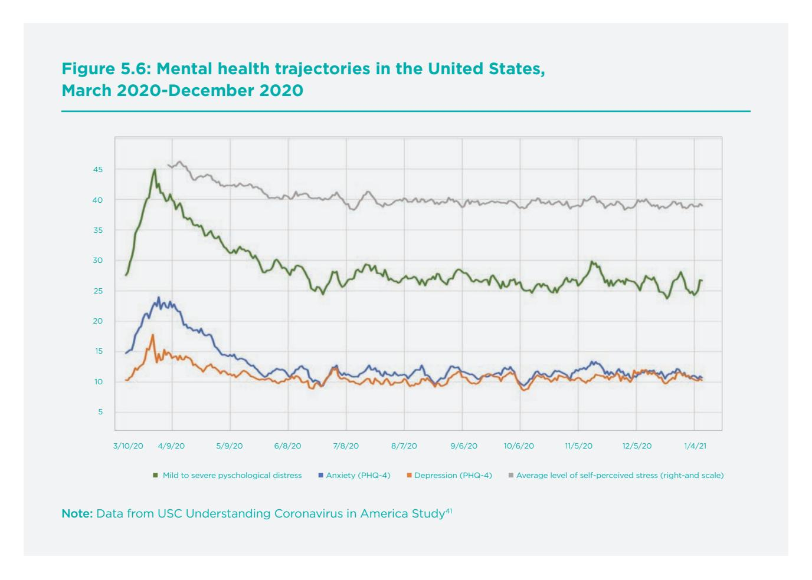

Figure 5.6 presents data for the United States from the USC Understanding Coronavirus in America Study and shows the same improvement after the initial lockdown, both in the prevalence of anxiety and depression, and in other mental health measures such as self-perceived stress.

Notably, there is consensus among a number of international studies that mental health started to improve early during the lockdown, suggesting that the pandemic's psychological burden was, on average, felt most acutely by individuals in the early stages before decisive actions to control the virus were brought in. This finding went against some predictions that lockdown itself could drive increases in poor mental health, and diverges from data on previous epidemics, where mental health worsened during periods of quarantine.42 One explanation for these differing results is that the unique circumstances of the COVID-19 pandemic (such as the substantial lead-in period to, and thus anticipation of, lockdown being

announced, the national nature of the restrictions, and the social emphasis on self-care, including the continued allowance of outdoor exercise and proliferation of online leisure activities) may have led to a different kind of psychological experience than previous epidemics.43 But there are other potential explanations too. If we consider the literature on other types of isolation, such as incarceration, studies have shown that depression levels can stabilise and even improve over time as people adjust to their new circumstances and develop coping strategies. It is possible that adults in the U.K. and elsewhere faced a similar psychological adjustment process during lockdown.

Furthermore, the instigation of lockdown brought an immediate reduction in the number of stressors relating to the pandemic. People reported experiencing fears about catching or becoming seriously ill from the virus to concerns about finances and jobs (potentially owing to the

measures brought in by the government around the same time) and worries about accessing food and other essentials.44 Notably, both the worries about these adverse experiences and experiencing them first-hand were related to worse anxiety and depression during lockdown. Future research using these detailed COVID-19 studies will identify correlations between these mental health trajectories in a multivariate setting.

# **COVID-19 and mental health inequalities**

The pandemic has so far led to a substantial initial deterioration in mental health, followed by a degree of recovery, but these effects have not been evenly felt across different groups. Differences between groups reflect and shed light on the mechanisms through which the pandemic affects mental health – fear of the virus, health impacts, social restrictions, economic recession, and so on – which differentially affect parts of the

population. In many ways, the initial impact of COVID-19 has exacerbated pre-existing mental health inequalities between men and women, the old and the young, and between ethnic groups. However, these impacts are evolving as the pandemic goes on.

Many studies, using a variety of data sources and mental health measures, show that the pandemic led to a larger decline in mental health among women, who already had worse levels of mental health than men before the pandemic hit.45 Whilst women bore the brunt of the additional childcare that resulted from school closures,46 additional caring duties explain only a small fraction of the gender differences in the initial impact of the pandemic.47 Nor can they be explained by differences in men's and women's exposure to the pandemic's health and economic consequences, for example, the fact that women disproportionately work in sectors affected by physical distancing.48 Instead, Etheridge and Spantig49 point to the importance of social factors in explaining gender

differences and demonstrating that women had larger social networks than men before the pandemic. They argued that they were therefore hit harder by the social restrictions imposed as part of the public health response.

In the pandemic's initial stages, the mental health impact was also much larger on young people.50 Since young people had worse mental health levels before the pandemic, this served to widen mental health inequalities by age. However, (as shown in the section, *The evolution of mental health during the pandemic* above) the gap narrowed over the course of the pandemic as young people's mental health returned to normal more quickly51 – perhaps reflecting higher adaptability to shocks among this group as well as positive changes in circumstances that disproportionately benefitted the young, like the (temporary) lifting of social restrictions and the reopening of schools and universities. Data from the U.S. (presented in Appendix Figure A2) show that the percentage of people experiencing psychological distress was greatest in the under 40 age group. In contrast, to mental health levels that would be expected without covid, there has been less catch-up or convergence as the pandemic has progressed.

The pandemic has also disproportionately affected the *physical* health of ethnic minorities both in the U.K. and the U.S.52 Research that examines *mental* health impacts by coarse ethnic groups (white/ non-white, or pooling across genders) has typically not found statistically significant differences, after removing effect of factors such as gender, age, and exposure to the virus's health and economic impact.53 Looking at finer ethnic groups and disaggregating by gender, Proto and Quintana-Domeque54 find a larger initial impact on mental health among men of Bangladeshi, Indian and Pakistani ethnicities in the U.K. An important question for future research is whether ethnicity differences are also found in other developed countries and how much they remain in models that control exposure to the pandemic's various socioeconomic effects.

Those who lost their jobs and suffered income shocks saw particularly sharp deteriorations in mental health. Workers in sectors that were shut

down during the first lockdown (retail, hospitality, creative industries, etc.) experienced larger impacts even if their jobs were not directly affected.55 People of lower socioeconomic positions were also more likely to experience adversities, including loss of employment and income, challenges meeting basic needs (such as accessing food and medications), and experiences directly relating to the virus, including contracting or becoming seriously ill from COVID-19.56 Moreover, these experiences were more strongly related to poor mental health amongst those with lower household incomes.57

There is also some evidence that healthcare workers have suffered particularly bad mental health shocks.58 These are likely to have exacerbated the already high rates of pre-existing mental health problems among this group.59 Alonso,60 for example, use a bespoke large scale survey (N=9138) to estimate that, on average, 1 in 7 healthcare workers in Spain presented a disabling mental disorder, with this fraction becoming 4 in 10 for those workers with any pre-pandemic mental health disorder. However, critical workers in general (including other occupations like teachers, retail food workers, and delivery drivers) appear to have experienced better mental health trajectories, perhaps due to the greater recognition given to their professions as a result of the pandemic.61

Finally, inequalities in mental health levels between certain groups are an ongoing cause for concern, even if the groups with poor mental health pre-pandemic were not disproportionally affected by the pandemic. Figures A3 and A4 in the appendix reveal stark differences in mental health between income groups in both the U.S. and U.K. that have persisted throughout the pandemic so far. Similarly, differences in the household composition may be significant. Without identifying causal effects relative to a counterfactual, trajectory data from the U.K. show that adults living alone experienced worse levels of depressive symptoms (although their mean anxiety levels were no different from those living with others). This could be due to higher levels of loneliness caused by social restrictions, which were felt more amongst this group.62 Individuals

living with children showed higher levels of anxiety and depressive symptoms initially but a faster rate of improvement, potentially due to the growing public awareness of research suggesting that children were less affected by COVID-19.63 Whilst these inequalities are well reported outside of pandemic settings, the wider gap between the groups seen in the early stages of the pandemic suggests an exacerbation of such inequalities during COVID-19.

## **Conclusions**

There is no doubt that the initial effects of the COVID-19 pandemic on mental ill-health symptoms were large, negative, and remarkably consistent across the data and studies discussed here. It is worth reiterating that these relate only to adults and solely to wealthy industrialised countries. These effects were worst in younger age groups and women, ethnic minorities, and those with pre-existing mental health problems, thus reinforcing many pre-existing mental health inequalities.

In the months following the outbreak, however, the story has been more positive. The evidence in many countries suggests that, following the initial shock to mental health, measures in all dimensions recovered considerably, although not completely. In the U.K., for example, one simple metric of mental health worsened by 7.9% initially, and we estimate that by September 2020, it was still 2.2% below the level it would have been in the absence of the pandemic. In addition, while there is very little large-scale evidence on the most extreme consequences of mental health problems - suicide and self-harm – what evidence there is has yet to show any consistent or significant trends64 in terms of causal effects of the pandemic. And the rapid discovery of a vaccine, leading to the immediate roll-out of vaccination programmes, will provide grounds for optimism for many individuals.

Notably, mental health has quickly risen high on policymakers65 and researchers' agenda, as evidenced by the Lancet COVID-19 Commission Mental Health Task Force, which will report in February 2021. Indeed, those without previous

specialisation in mental health issues will have considerably more appreciation for the importance and role of mental health and key factors such as loneliness, social isolation, and social support than before. This new energy, coupled with the vast amounts of data collection that are now going on, should lead to important new insights, both on the COVID-19 effects and drivers of mental health levels more generally. Indeed, the varied experiences of countries and regions within the pandemic provide fertile ground for researchers studying the drivers of mental health in a way that can and will inform policy going forwards. There are already exciting prospects for longitudinal research on trajectories for anxiety, depression, and loneliness that will distinguish between the roles for the virus, the economic consequences of policy responses to the virus, and the local physical distancing and stay-at-home restrictions. And as more internationally comparable data emerge, there will be further prospects for international comparative research. Both will provide a more global understanding of mental health effects around the world and enable researchers to exploit international differences in the impact of the pandemic and governments' reactions to it to identify causal processes.

Given our analysis's timing, there is still much uncertainty on how the full mental health consequences of COVID-19 will play out. We can only speculate at this point, but there are many potential causes for ongoing concern. With regard to the first two phases of effects that we identified in Figure 5.1: Whilst the improving trajectories post-May 2020 suggest that the second phase may not have been as bad as feared on average, it is still the case that a substantial group of individuals have had persistent large, negative shocks to their mental health. Furthermore, at the time of writing, many countries are going into lockdowns and extensive social and economic restrictions as a result of the second and third waves of the virus and its new highly infectious variants. In the U.K., COVID-19 Social Study data are already showing some deterioration again. It remains to be seen how relative impacts will evolve as the gradual vaccine roll-out alleviates the pandemic's health risks,

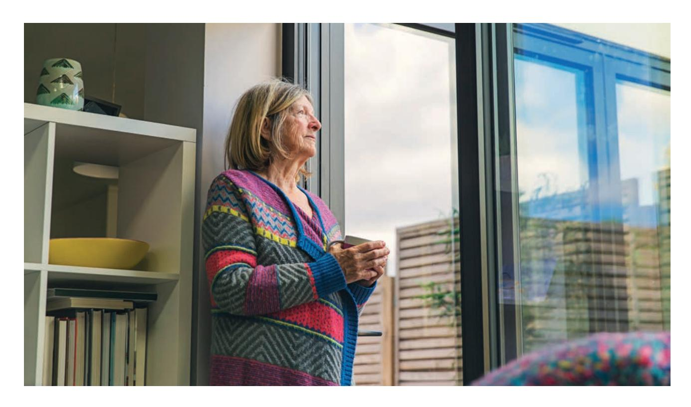

that bear more heavily on older people, whilst the ensuing recession and lockdowns damage job prospects and social activities of all, but particularly the young.

Perhaps more importantly, however, is that the third and fourth phases of mental health effects that we identified in Figure 5.1 are only just beginning to play out, and these may turn out to be the most consequential. Certainly, mental health and inequalities in mental health will need to be foremost in policymakers' minds as they respond to the pandemic's continued challenges and then the need to rebuild the economy. With regard to phase three, there is already emerging evidence of disruption to mental health services around the world (WHO 2020), and the increased burden on such services (and on healthcare in general) could exacerbate current and future mental health problems and mental health inequalities. Indeed, the pandemic's effect on healthcare itself may make it hard to return to *normal* mental health care levels, let alone provide the additional services needed given the increased burden caused by COVID-19. And looking beyond this- the long-run effects of the pandemic's economic consequences on mental health could be substantial. We know that

COVID-19 will undoubtedly cause extensive and persistent recessions around the world (even in those countries without major outbreaks of the virus). It is hard to speculate precisely on the magnitude of the mental health consequences since the economic shocks have been of a nature and size that we have not seen in modern times. Focusing on the different stressors caused by the pandemic and the various mechanisms by which these stressors have their mental health effects, as well as the continual measurement and monitoring of all population subgroups, will help researchers derive long-run estimates effects in as timely a manner possible. Such research should be treated as a priority. This will be particularly crucial for younger generations, who will be most heavily affected by the long-run economic consequences and who are already a group with poor mental health and high mental health inequalities.

#### **Endnotes**

- 1 see Kivimäki et al. (2017).
- 2 Mechanisms are the processes the ways in which risk factors turn into outcomes.
- 3 Stressors are objects the risk factors themselves.
- 4 see Goldberg et al. (1997).
- 5 Spitzer et al. (2006).
- 6 Radloff et al. (1977).
- 7 Kroenke et al. (2001).
- 8 Kroenke et al, (2009).
- 9 ONS (2020a).
- 10 ONS (2020b).
- 11 McGinty et al. (2020); Swaziek and Wozniak (2020).
- 12 Kilgore et al. (2020).
- 13 Pierce et al. 2020, Shanahan et al. (2020).
- 14 Banks and Xu (2020).
- 15 Banks and Xu (2020).
- 16 Brodeur et al. (2020).
- 17 Knipe et al. (2020).
- 18 Tubadji et al. (2020).
- 19 Foa et al. (2020).
- 20 Armbruster and Klotzbuecher (2020).
- 21 Brülhart and Lalive (2020).
- 22 For example, studies using Google trends cannot disaggregate searches by the characteristics of those searching. Even if this were possible, researchers could not distinguish between the pandemic having a larger effect on the mental health of certain groups, or certain groups being more inclined to search for well-being-related keywords in response to a given fall in mental health.
- 23 Adams-Prassl et al. (2020).
- 24 Banks and Xu (2020).
- 25 Measured using 0-12-point GHQ Caseness scale, where each of the 12 items of the questionnaire is assigned a score of 1 if the respondent experiences the negative (positive) event less (more) or much less (much more) than usual.
- 26 Pierce et al. (2020).
- 27 The modelling in Pierce et al. (2020) does not control for seasonal trends and also differs from Banks and Xu (2020) in a number of other ways: it uses a quadratic (rather than linear) time trend, does not allow trends to differ across demographic groups, and does not control for changes in mental health over the lifecycle or changes in individual circumstances such as marital status and (pre-pandemic) employment outcomes. Most importantly, it includes the April 2020 data in estimating individual fixed effects, which is likely to lead to downward bias in estimated effects.

- 28 Banks and Xu (2020).
- 29 Pierce et al. (2020).
- 30 We depart from the specific Banks and Xu (2020) methodology in a few other ways here. First, the sample in Banks and Xu was restricted to those observed in the 2017-18 wave of the survey, whereas we now include all individuals observed in 2019. Second, the addition of further waves of the survey means that we are able to identify individual fixed effects for more individuals. Third, given the larger sample, we estimate our prediction model using only individuals in the Covid waves. Fourth, we define age groups based on their 2019 values, as opposed to their April 2020 values. Fifth, age groups are defined in a more disaggregated way, to allow comparisons to September 2020 figures in Figure 5.2 (for which the sample size is much smaller). Finally, we use revised cross-sectional weights issued by UKHLS.
- 31 The revised estimate of the impact on young men is smaller than in Banks and Xu (2020), however. This is because the new data reveal a sharper deterioration in mental health among young men from 2017-18 to 2019 than would have been predicted by the trend up to 2017-2018). The continuation of this trend implies a worse level of mental health in 2020 in the absence of the pandemic, and hence a smaller causal effect of the pandemic. In contrast, the impact on women in all age groups is slightly larger than in Banks and Xu (2020), owing to better pre-pandemic mental health trends than the previous data suggested. Full updated results are available from the authors on request.
- 32 Hawryluck et al. (2004); Reynolds et al. (2008); Mihashi et al. (2009); Liu et al. (2012).
- 33 Yougov (2020); Layard et al. (2020); Daly et al. (2020).
- 34 Banks and Xu. (2020).
- 35 We have also run multinomial logit specifications to model all four transitions simultaneously but do not discuss or present the results for ease of exposition. Qualitative conclusions on the determinants of the persistently badly affected group are unaffected, and some of the transitions reveal other interesting effects, such as the presence of school or pre-school age children being associated with movements in and out of the badly affected group, in keeping with the timing of school closures. Results are available from authors.
- 36 This final result is consistent with the findings on the initial effects reported in Etheridge and Spantig (2020), who argue that those with large social circles suffered more from restrictions on socialising, and also with Folk et al (2020) in a smaller scale but more specifically focused US UK study. It is also worth noting that, other things equal, this effect would reduce mental health inequalities.
- 37 Fancourt, Steptoe, and Bu (2020).
- 38 taken from Fancourt, Steptoe, and Bu (2020).
- 39 Varga et al. (2020).

- 40 The figure presents weighted means and 95% CIs of levels of worries in individuals from the Epinion general population cohort (Ntotal=2,123) and the Lifelines cohort (Ntotal=44,076), and unweighted means and 95% CIs of levels of worries in individuals from the DNBC cohort (Ntotal=23,029) and the TEMPO cohort (Ntotal=729). On the same graph, weighted proportions are presented of individuals reporting high levels of anxiety in the UCL COVID-19 Social Study (Ntotal=70,538).
- 41 USC Dornslife (2021) https://uasdata.usc.edu/.
- 42 see Brooks et al (2020).
- 43 Fancourt, Steptoe and Bu (2020).
- 44 see Wright et al. (2020a for the U.K.).
- 45 Adams-Prassl et al. (2020); Banks and Xu (2020); Daly et al. (2020); Etheridge and Spantig (2020)' Pierce et al. (2020); Yamamura and Tsutsui (2020).
- 46 Andrews et al. (2020).
- 47 Adams-Prassl et al. (2020); Etheridge and Spantig (2020).
- 48 Banks and Xu (2020); Etheridge and Spantig (2020).
- 49 Etheridge and Spantig (2020).
- 50 Banks and Xu (2020); Daly et al. (2020); Pierce et al. (2020).
- 51 Figure A1 also presents trajectories for Anxiety and Depression from the UCL Covid-19 Social Study and reveals the same patterns for these more specific dimensions of mental health.
- 52 Kirby 2020, Platt and Warwick (2020); Sze et al. (2020).
- 53 Banks and Xu (2020); Daly et al. (2020); Pierce et al. (2020); Fancourt, Steptoe and Bu (2020).
- 54 Proto and Quintana-Domeque (2020).
- 55 Banks and Xu (2020).
- 56 Wright et al. (2020a).
- 57 Wright et al. (2020b).
- 58 ONS (2020b); Vizheh et al. (2020).
- 59 Kalmoe et al. (2019); Angres et al. (2008).
- 60 Alonso et al. (2020).
- 61 Banks and Xu (2020).
- 62 Bu, Steptoe and Fancourt (2020a, 2020b).
- 63 Guan et al. (2020).
- 64 John et al. (2020); Kapur et al. (2020).
- 65 see UN (2020), Campion et al (2020) for example.

#### **References**

Adams-Prassl, A., T.Boneva, M.Golin and C.Rauh, 2020, The impact on the lockdown on mental health: Evidence from the US, HCEO Working paper 2020-030

Andrew, A., S. Cattan, M. Costa Dias, C. Farquharson, L. Kraftman, S. Ktutikov, A. Phimister and A. Sevilla, 2020, How are mothers and fathers balancing work and family under lockdown?, London: IFS, https://www.ifs.org.uk/publications/14860

Angres D., McGovern M., Shaw M., Rawal P. (2008). Psychiatric comorbidity and physicians with substance use disorders: a comparison between the 1980s and 1990s. Journal of Addictive Diseases. https://doi.org/10.1300/J069v22n03\_07 pmid:14621346

Armbruster, S. and V. Klotzbücher, 2020, Lost in lockdown? Covid-19, social distancing, and mental health in Germany, Covid Economics, Issue 22, 117-154, 26 May 2020, CEPR

Banks, J., and X. Xu, 2020, The mental health effects of the first two months of lockdown during the Covid-19 pandemic in the UK, *Fiscal Studies 41*(3), September 2020, 685-708

https://onlinelibrary.wiley.com/doi/10.1111/1475-5890.12239 First published in Covid Economics Issue 28 (June 2020)

Brodeur, A., A.Clark, S. Flèche and N.Powdthavee, 2020, COVID-19, Lockdowns and Well-Being: Evidence from Google Trends, IZA Discussion paper No.13204, May 2020

Brooks SK, Webster RK, Smith LE, *et al*. The psychological impact of quarantine and how to reduce it: rapid review of the evidence. *The Lancet* 2020; 395: 912–20.

Brülhart, M. and R. Lalive, 2020, 'Daily suffering Helpline calls during the Covid-19 crisis', Covid Economics, Issue 19, 143-158, 18 May 2020, CEPR

Bu, F., Steptoe A, and D. Fancourt, 2020a, Loneliness during a strict lockdown: Trajectories and predictors during the COVID-19 pandemic in 38,217 United Kingdom adults, *Social Science and Medicine*, 265, 113521, November 2020

Bu, F., Steptoe A, and D. Fancourt, 2020b, Who is lonely in lockdown? Cross-cohort analyses of predictors of loneliness before and during the COVID-19 pandemic. *Public Health*. 2020; 186: 31-34

Campion J, Javed A, Marmot M, Valsraj K. The Need for a Public Mental Health Approach to COVID-19. World Soc Psychiatry 2020;2:77-83

Daly,M. A.Sutin and E.Robinson, 2020, 'Longitudinal changes in mental health and the COVID-19 pandemic: Evidence from the UK Household Longitudinal Study', Psychological Medicine. (Usoc data April-May-June) https://psyarxiv.com/qd5z7/

Etheridge, B. and Spantig, 2020 'The gender gap in mental well-being during the Covid-19 outbreak: Evidence from the UK', Covid Economics, Issue 52

Fancourt D, Steptoe A, Bu F. Trajectories of anxiety and depressive symptoms during enforced isolation due to COVID-19 in England: a longitudinal observational study. *The Lancet Psychiatry* 2020; published online Dec 9. DOI:10.1016/ S2215-0366(20)30482-X.

Foa, R., Gilbert, S., and Fabian, M., 2020 'COVID-19 and Subjective Well-Being: Separating the Effects of Lockdowns from the Pandemic', mimeo, Bennett Institute. https://www. bennettinstitute.cam.ac.uk/media/uploads/files/Happiness\_ under\_Lockdown.pdf

Folk, D. Okabe-Miyamoto, E. Dunn and S.Lyubomirsky, 2020, 'Did Social Connection Decline During the First Wave of COVID-19?: The Role of Extraversion' Collabra: Psychology, 6(1): 37. DOI: https://doi.org/10.1525/collabra.365

Goldberg DP, Gater R, Sartorius N, Ustun TB, Piccinelli M, Gureje O, et al. The validity of two versions of the GHQ in the WHO study of mental illness in general health care. Psychol Med. 1997;27(1):191–7.

Guan, W., Z.Ni, Y.Hu et al, 2002, Clinical characteristics of coronavirus disease 2019 in China. *N Engl J Med*. 2020; https://doi.org/10.1056/NEJMoa2002032

Hawryluck L, Gold WL, Robinson S, Pogorski S, Galea S, Styra R. SARS Control and Psychological Effects of Quarantine, Toronto, Canada. *Emerg Infect Dis* 2004; 10: 1206–12.

John, A., J.Pirkis, D.Gunnell, L.Appleby and J. Morrissey, 2020, Trends in suicide during the covid-19 pandemic, BMJ 2020;371:m4352 https://doi.org/10.1136/bmj.m4352 :

Kalmoe, M. C., Chapman, M. B., Gold, J. A. and Giedinghagen, A. M. (2019). Physician Suicide: A Call to Action. Missouri medicine, 116(3), 211–216.

Kapur, N. et al, 2020, Effects of the COVID-19 pandemic on self-harm, Lancet Psychiatry, December 2020, https://doi.org/10.1016/S2215-0366(20)30528-9

Kilgore, W., S.Cloonan, E.Taylor and N.Dailey, 2020, 'Loneliness: A signature mental health concern in the era of COVID-19', Psychiatry Research, 290, 113117, August 2020.

Kivimäki, M., G. Batty, A. Steptoe and I. Kawachi, 2017, The Routledge International Handbook of Pschosocial Epidemiology. Abingdon: Routledge, Routledge Handbooks Online, https://doi.org/:10.4324/9781315673097, accessed 4 June 2020

Knipe, D. H.Evans, A.Marchant, D.Gunnell and A.John, 2020, 'Mapping population health concerns related to COVID-19 and the consequences of physical distancing: A Google trends analysis', Wellcome Open Research 2020, 5.82

Kroenke K, Spitzer RL, Williams JB. The PHQ-9: validity of a brief depression severity measure. *J Gen Intern Med*. 2001;16(9):606-613. doi:10.1046/j.1525-1497.2001.016009606.x

Kroenke, K., Spitzer, R. L., Williams, J. B. W., Löwe, B. (2009). An ultra-brief screening scale for anxiety and depression: the PHQ-4 Psychosomatics, 50, 613-621.

Layard, R., D. Fancourt, A. Clark, N. Hey, J-E De Neve, G. O'Donnell and C.Krekel, 2020, 'When to release the lockdown? A wellbeing framework for analysing costs and benefits', IZA Discussion Paper No 13186, April 2020, http://ftp.iza.org/ dp13186.pdf

Liu X, Kakade M, Fuller CJ, *et al*. Depression after exposure to stressful events: lessons learned from the severe acute respiratory syndrome epidemic. *Comprehensive Psychiatry* 2012; 53: 15–23.

McGinty EE, Presskreischer R, Han H, Barry CL. 2020, Psychological Distress and Loneliness Reported by US Adults in 2018 and April 2020. *JAMA*. 2020;324(1):93–94. doi:10.1001/ jama.2020.9740

Mental Health Foundation, 2020, Millions of UK adults have felt panicked, afraid and unprepared as a result of the coronavirus pandemic - new poll data reveal impact on mental health. published online March 26. https://www.mentalhealth.org.uk/ news/millions-uk-adults-have-felt-panicked-afraid-andunprepared-result-coronavirus-pandemic-new (accessed April 24, 2020).

Mihashi M, Otsubo Y, Yinjuan X, Nagatomi K, Hoshiko M, Ishitake T. Predictive factors of psychological disorder development during recovery following SARS outbreak. *Health Psychology* 2009; 28: 91–100.

ONS, 2020a, 'Personal and economic well-being in Great Britain: May 2020', London: Office for National Statistics, accessed 4 June 2020. https://www.ons.gov.uk/peoplepopulation andcommunity/wellbeing/bulletins/personalandeconomic wellbeingintheuk/may2020

ONS, 2020b, "Coronavirus and depression in adults, Great Britain: June 2020", Office for National Statistics, August 2020, accessed November 2020, https://www.ons.gov.uk/people populationandcommunity/wellbeing/articles/coronavirusand depressioninadultsgreatbritain/june2020

Pierce M, Hope H, Ford T, et al. Mental health before and during the COVID-19 pandemic: a longitudinal probability sample survey of the UK population. *The Lancet Psychiatry* 2020; 0. DOI:10.1016/S2215-0366(20)30308-4.

Proto, E and C. Quintana-Domeque, Climent, 2021, COVID-19 and Mental Health Deterioration by ethnicity and gender in the UK, PLOS One, January, https://doi.org/10.1371/journal. pone.0244419

Radloff, L. S. (1977). The CES-D scale: A self report depression scale for research in the general population. *Applied Psychological Measurements*, 1, 385-401.

Reynolds DL, Garay JR, Deamond SL, Moran MK, Gold W, Styra R. Understanding, compliance and psychological impact of the SARS quarantine experience. *Epidemiology & Infection* 2008; 136: 997–1007.

Shanahan L, Steinhoff A, Bechtiger L, *et al*. Emotional distress in young adults during the COVID-19 pandemic: evidence of risk and resilience from a longitudinal cohort study. *Psychological Medicine* 2020; 1–10.

Spitzer RL, Kroenke K, Williams JBW, Löwe B. A Brief Measure for Assessing Generalized Anxiety Disorder: The GAD-7. *Arch Intern Med*. 2006;166(10):1092–1097. doi:10.1001/ archinte.166.10.1092

Swaziek, Z. and A. Wozniak, 2020, Disparities Old and New in U.S. Mental Health during COVID-19, *Fiscal Studies 41(3)*, September 2020, 709-732 https://onlinelibrary.wiley.com/doi/ full/10.1111/1475-5890.12244

Tubadji, A., F. Boy and D. Webber, 2020, Narrative economics, public policy and mental health, Covid Economics, Issue 20, 109-131, 20 May 2020, CEPR Press https://voxeu.org/article/ covid-19-narrative-economics-public-policy-and-mental-health Varga, T.V. et al, 2021, Loneliness, worries, anxiety, and precautionary behaviours in response to the COVID-19 pandemic: a longitudinal analysis of 200,000 Western and Northern Europeans, Lancet Regional Health, January 2021, 100020 https://doi.org/10.1016/j.lanepe.2020.100020

United Nations, 2020, Covid-19 and the need for action on mental health, Policy Brief, 13 May 2020 https://www.un.org/ sites/un2.un.org/files/un\_policy\_brief-covid\_and\_mental\_ health\_final.pdf

Vizheh, M., Qorbani, M., Arzaghi, S. M., Muhidin, S., Javanmard, Z., & Esmaeili, M. (2020). The mental health of healthcare workers in the COVID-19 pandemic: A systematic review. Journal of diabetes and metabolic disorders, 1–12. Advance online publication. https://doi.org/10.1007/s40200-020-00643-9

World Health Organisation, 2020, The impact of COVID-19 on mental, neurological and substance use services: Results of a rapid assessment, October 2020, https://www.who.int/ publications/i/item/978924012455

Wright L, Steptoe A, Fancourt D, 2020a, Are we all in this together? Longitudinal assessment of cumulative adversities by socioeconomic position in the first 3 weeks of lockdown in the UK, *J Epidemiol Community Health* 2020;74:683-688.

Wright, L., A. Steptoe and D. Fancourt, 2020b What predicts adherence to COVID-19 government guidelines? Longitudinal analyses of 51,000 UK adults, medrXiv preprint, doi: https://doi.org/10.1101/2020.10.19.20215376

Yamamura, E. and Y. Tsutsui, 2020, Impact of the state of emergency declaration for Covid-19 on preventative behaviours and mental conditions in Japan: Difference in difference analysis using panel data, Covid Economics, Issue 23, 303-324, 28 May 2020, CEPR https://voxeu.org/article/covid-19-mentalhealth-and-domestic-violence

YouGov, 2020, Britain's mood, measured weekly. https://yougov.co.uk/topics/science/trackers/britainsmood-measured-weekly (accessed April 20, 2020)

# Chapter 6

# Social Connection and Well-Being during COVID-19

Karynna Okabe-Miyamoto & Sonja Lyubomirsky University of California, Riverside

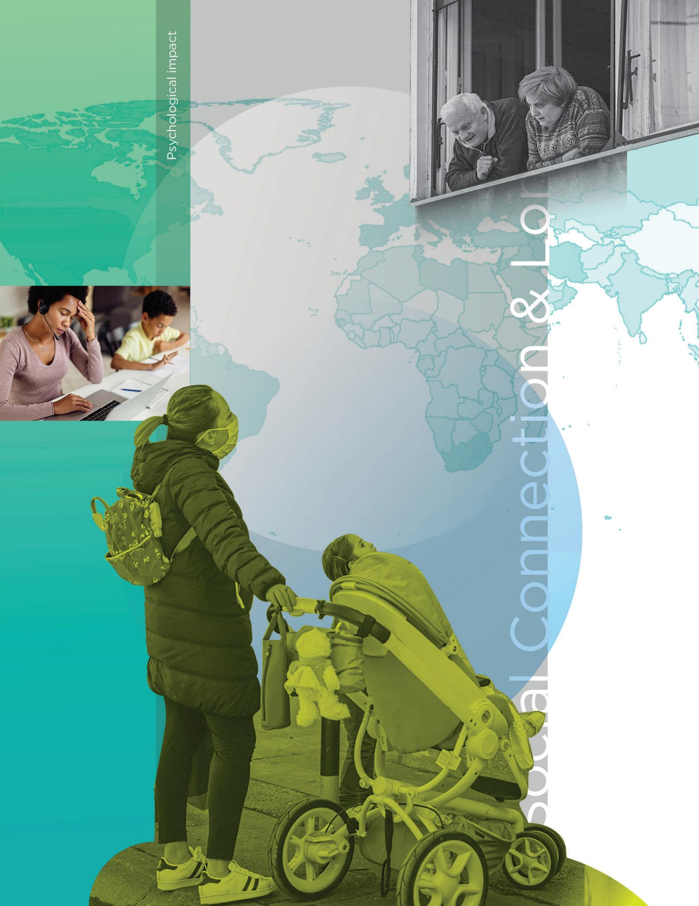

The COVID-19 pandemic has impacted life worldwide. Globally, governments have attempted to slow the spread of the disease by promoting "social distancing" guidelines, including staying at least 6 feet (2 meters) away from anyone outside one's household.1 Early in the implementation of social distancing, the World Health Organization (WHO) announced that the term "physical distancing" better captured the essence of the guidelines, such that people should remain physically but not socially distant from others.2 The same recommendation was independently decided by the (World Happiness Report Editors) on the same day, at the March 20 virtual launch of World Happiness Report (WHR) 2020. Although the term "social distancing" continues to be widely used (including within peer-reviewed journals), because the topic of this chapter is about maintaining connections while distancing, we adopt the WHO and WHR recommendation to use "physical distancing."

Physical separation curtails the spread of the virus, yet the practice of physical distancing inherently limits people's in-person social interactions, which may narrow their sense of social connection.3 The reduction in the physical availability of social connections is concerning, as over a century of research has proven how crucial social connection is for well-being.4 Aware of the potential negative consequences to well-being posed by COVID-19 and its sequelae, researchers in the social, behavioral, and clinical sciences have published urgent calls for action to mitigate the disease's potential harms.5 One noteworthy and particularly relevant potential harm discussed by these researchers is the possible increase in social isolation and strife in intimate relationships, which can be exacerbated by the many sources of stress (social, financial, health, etc.) associated with the pandemic. However, it is important to note that physical distancing—which permits social interaction with housemates, digital interactions with the outside world, and is imposed on entire regions, not solitary individuals—is not the same as social isolation.6

As such, COVID-19 has imposed a myriad of consequences for health and well-being globally. Understanding how and why well-being has

shifted due to the pandemic is especially important given its unknown trajectory. Indeed, although vaccines are being distributed globally, it is unclear when daily life will revert to pre-pandemic times, given the persistence of spikes in cases worldwide. Furthermore, published literature reviews about past pandemics have revealed that quarantining or separating those who may be infected to minimize the spread of a disease leads to long-lasting negative psychological effects—a finding that is important to keep in mind as the pandemic continues.7 Accordingly, the goal of this chapter is to advance understanding of how the COVID-19 pandemic has impacted overall wellbeing and social connection across the globe by reviewing relevant research published in 2020.

# **Psychological well-being during COVID-19**

The negative psychological impact of COVID-19 has been observed across the world. In a U.S. study examining people's experiences from January 2020 (*N* = 1,010) to June 2020 (*N* = 3,020), reports of happiness and life satisfaction saw one of the largest declines during the pandemic, along with mental and physical health, together with more modest declines in meaning in life and overall flourishing.8 In a study that followed about 2,000 respondents in the U.K. from June 2019 to June 2020, researchers found that positive emotions (i.e., happy, energetic, inspired, optimistic, and content) became less prevalent and some negative emotions (i.e., sad, stressed, scared, frustrated) worsened during the initial outbreak in March, but most eventually recovered to pre-pandemic levels during the lockdown in May.9 Interestingly, other negative emotional states actually declined (i.e., loneliness, apathy) or remained stable (i.e., boredom) during the month of the outbreak but began rising as the lockdown progressed.

Although the negative psychological impact of the COVID-19 pandemic is readily apparent, some people are doing surprisingly well. In France, researchers surveyed participants three times between April 1 and May 6, 2020, and found that these respondents, especially those who had low

exposure to the disease, reported increases in health and well-being during the quarantine, regardless of income level.10 Other research found no change in life satisfaction from before to during the pandemic. In a sample of adults mostly from the U.S. and U.K. (*N* = 336), respondents reported no changes to their life satisfaction from mid-February to late May 2020.11

# **Protective factors and risk factors for positive and negative well-being**

In light of the growing research on the pandemic, particular patterns have emerged about who is faring better or worse. Here we outline several protective factors and risk factors for positive and negative well-being during COVID-19 (see Figure 6.1).

#### **Protective factors for positive well-being**

**Psychological Characteristics.** First, a number of psychological characteristics, such as extraversion, grit, gratitude, and resilience, have been shown to be protective factors for well-being during COVID-19.

*Personality.* Some researchers have investigated the role that personality may play in protecting people's well-being during the pandemic. A snowball sampling study that included 516 U.S. adults who responded to a survey between April and June 2020 demonstrated that extraversion was negatively associated with distancing, while conscientiousness, agreeableness, and neuroticism were positively related to distancing.12 However, as distancing behavior increased, extraversion was related to more positive affect, less negative affect, and greater life satisfaction. This pattern

**Figure 6.1: Psychological well-being during COVID-19 PROTECTIVE FACTORS RISK FACTORS Psychological Positive psychological characteristics:** Gratitude, resilience, grit, flow **Personality:** Extraversion **Intolerance for uncertainty Pre-existing mental health conditions:** Clinical diagnosis of depression, anxiety, & others **Social Quality of relationships Connectedness, positivity resonance Quantity of relationships:** Larger social networks **Prosocial behavior Engaging in distancing Quality of relationships:**  Loneliness, poor social support, abuse **Types of relationships:**  Parent, child **Time Use Social media use Daily activities:**  Physical activity, time outdoors **Social media use Online news sources:**  Consulting more sources, more time spent consulting sources **Circumstantial Demographic factors:** Older age **Demographic factors**: Disease risk factors, occupation type **Vulnerable groups:** Financial insecurity, food insecurity, lower SES

of results may be accounted for by extraverts engaging in relatively more online social activities, such as virtual chatting. Thus, having an extraverted personality appears to serve as a unique protective factor for individuals' well-being during COVID-19.

*Positive Psychological Characteristics.* Research also suggests that several positive psychological characteristics may protect well-being, broadly defined, during the pandemic. For example, in a cross-sectional study of 878 community-dwelling older adults (60 to 80 years old) in Spain surveyed three weeks after lockdown instructions, the three variables that showed significant associations with personal growth and purpose in life were gratitude, resilience, and good family functioning.13 Accordingly, although older adults are at a higher risk for contracting COVID-19, those with psychological resources appear to be buffered from declines in personal growth or purpose in life, regardless of whether they are "young-old" (60 to 70) or "old-old" (71 to 80).

Similarly, a study following 86 undergraduates from before their university's campus closure (January 27 to March 10, 2020) to the end of the semester (April 30 to May 20, 2020) found that gratitude and grit were associated with greater well-being, while grit was also associated with greater resilience.14 Finally, a study of 5,115 participants in China conducted in mid-February 2020 found that, although longer time spent in quarantine was linked with worse well-being outcomes, experiencing flow was protective of well-being.15 The researchers point to the value of distraction conferred by the experience of flow; that is, during a time filled with uncertainty, being absorbed in something neutral or positive during the pandemic may benefit well-being.

**Social Factors.** Along with psychological factors, social factors and social behaviors—including the quality and quantity of people's social relationships—have also been shown to protect well-being during the pandemic.

*Quality of Social Relationships.* Researchers have examined the quality of people's social relationships and social interactions during COVID-19. For example, among a survey of adults primarily from the U.S. and U.K, increases in the sense of connectedness from before to during the pandemic were associated with increases in life

satisfaction, while increases in loneliness were associated with decreases in life satisfaction.16 Furthermore, a survey of 1,059 participants in the U.S. (in April and May 2020 for communitydwelling adults and in March and April 2020 for undergraduates) found that positivity resonance, or shared feelings of positivity and caring for another, explained the relationship between trait resilience and better mental health during the pandemic.17 Similarly, researchers have found that higher levels of relatedness (i.e., connectedness) during COVID-19 were associated with greater well-being.18 The same research team conducted a single-timepoint intervention study of 215 MTurk workers, aimed at increasing psychological needs. In this study, the sense of relatedness mediated the relationship between the psychological needs intervention (i.e., asking participants to provide instances when they felt a sense of autonomy, competence, and relatedness during the pandemic) and mental well-being.

*Quantity of Social Relationships.* In addition to the quality of one's social relationships, the number of relationships people have access to during COVID-19 has also been related to wellbeing. In a study of 902 Austrians surveyed once in late April 2020, researchers found that those who had larger social networks (i.e., a greater number of social connections) reported less stress and worry during the lockdown.19 These findings suggest that having a team of people to rely on for support, rather than a specific close other, may be protective of well-being during the pandemic.

*Prosocial Behavior.* Prosocial (or helping) behavior is a type of social behavior that has been shown to improve well-being in many studies before the pandemic.20 Furthermore, prior research has demonstrated that some people engage in prosocial behavior when under stress or during an emergency, such as following Hurricane Katrina.21 Accordingly, some researchers have explored helping behavior during the pandemic. A study of over 50,000 U.K. adults found that they reported greater life satisfaction on days in which individuals engaged in volunteering.22 Similarly, 389 Prolific, participants between April 16 to 17, 2020 and 1,234 Prolific participants between April 24 to 30, 2020 reported greater

well-being (i.e., positive affect) after prosocial spending.23 As such, engaging in prosocial behavior during the pandemic appears to confer benefits to well-being.

Researchers have not only explored the effects of performing prosocial behaviors but of receiving them. For example, in a survey of 437 U.S. adolescents completed in mid-April 2020, engaging in prosocial behavior during COVID-19 was associated with greater anxiety, burdensomeness, and social responsibility; however, receiving prosocial acts was associated with fewer depressive symptoms and greater belongingness.24 This research provides preliminary evidence that people reach out and help others during the pandemic when they are struggling or perceive others as struggling—for example, when they are perceiving more threat, experiencing greater anxiety, or feeling the need to help. By contrast, those who receive support during the pandemic are higher in well-being and belongingness.

Other research has explored why people might choose to engage in prosocial behavior during the pandemic. In a study that followed 600 U.S. adults across four weeks (*n* = 150 at each timepoint) from March 24 to April 14, 2020, individuals who reported acute anxiety and high physiological arousal, indicative of higher perceived threat imminence, reported more prosocial behaviors.25 Furthermore, greater perceived COVID-19 threat was linked to greater everyday acts of kindness. Thus, having high perceptions of threat may be one trigger for engaging in more prosocial behavior during the pandemic. However, the data in this study were correlational, and the objects of people's reported threat perceptions (i.e., threat to self vs. threat to others) were unclear. One possibility is that people help other individuals when they perceive these others to be at risk for disease or related adverse outcomes. In sum, although many are looking for ways to improve their well-being during the COVID-19 pandemic, more experimental research needs to be conducted to identify the optimal prosocial or social interventions tailored to people's needs and challenges during these unprecedented times.

**Time Use.** Given massive shifts in observed daily behaviors during COVID-19, studies have begun to examine specific behaviors in an attempt to

identify which are most strongly related to well-being.

*Social Media Use.* Although some research suggests that engaging with social media may have adverse effects on well-being, other research points to the possibility of social media producing positive outcomes. In a sample of 1,412 participants from Italy who were recruited online in mid-March 2020, using social media as a way to express emotions to overcome hardships was related to post-traumatic growth, which in turn was related to greater prosocial behavior.26 Furthermore, perceptions of stronger online social support were associated with greater well-being, which in turn was related to greater prosocial behavior as well.

Moreover, research has examined how specific social networking sites are associated with well-being; for example, active usage of Instagram was linked to both greater satisfaction with life and higher negative affect.27 Thus, more research on specific social networking sites and their individual features may better explain their links to well-being. Relatedly, recent evidence suggests that interactions that include voice (e.g., phone, video chat, or voice chat) lead to stronger social connection compared to those without voice.28 Thus, although more post-pandemic research is needed, the ways in which one engages with social media and whether voice is involved appears to impact whether positive or adverse outcomes follow.

*Daily Activities.* Engagement in daily physical activity has been a recurring theme in recent research, with more frequent exercise related to increased well-being during the pandemic. Interestingly, researchers examining changes in people's activities in France, Germany, the U.S., and the U.K. (*N* = 23,210) from before to during the pandemic via Apple navigation requests, Google location data, and previously published survey data found that physical activity was the only activity that increased consistently in each country during the pandemic.29 Many other studies corroborate this finding, showing that exercising during the pandemic predicts higher well-being. In a sample of about 600 adults in Ireland surveyed a day after stay-at-home orders, those who spent more time outdoors and engaged in activities such as exercising or going for a walk

reported more positive affect and less negative affect.30 In a sample of 13,696 participants from 99 countries who were surveyed between March 29 and May 7, 2020, those who exercised nearly every day during the pandemic reported more positive moods.31 Similarly, increases in exercising, as well as gardening, were negatively associated with depression and anxiety and positively associated with life satisfaction.32 Thus, it appears that people may be increasing their exercise routine during COVID-19, and those who do so report being happier.

**Circumstantial Factors.** Along with psychological and social factors, research has found that circumstantial factors (i.e., older age) may be protective of well-being during the pandemic.

*Demographic Factors.* While a number of demographic factors have been revealed as risk factors for worse well-being during the pandemic (see below), mixed evidence has emerged about whether age is a risk or protective factor. For example, in a sample of 945 Americans between the ages of 18 and 76 assessed in April 2020, older adults reported relatively greater emotional well-being, even in a global pandemic.33 More research is needed to identify whether age is a risk or protective factor of well-being, as well as to establish whether other demographic factors might protect well-being during the pandemic.

#### **Risk factors for negative well-being**

**Psychological Characteristics.** Research has revealed that two types of psychological characteristics—namely, intolerance for uncertainty and pre-existing mental health conditions—appear to be risk factors for worse well-being during COVID-19.

*Intolerance for Uncertainty.* Having an intolerance for uncertainty or feeling a lack of control has been shown to produce negative outcomes during the pandemic. For example, in a single timepoint study of 1,772 Turkish individuals, intolerance for uncertainty demonstrated a direct effect on well-being, with rumination and fear of COVID-19 serially mediating this relationship.34 As such, because many aspects of the pandemic have been uncertain (e.g., transmission risk, availability of a vaccine, duration of antibodies),

*Perceptions of stronger online social support were associated with greater well-being, which in turn was related to greater prosocial behavior.*

those with an intolerance for uncertainty are reporting particularly poor well-being, especially if they also tend to ruminate or have fears about the disease.

*Pre-Existing Mental Health Conditions.* Those who have pre-existing mental health conditions may be especially at risk for worse well-being during the pandemic. In the study of more than 50,000 U.K. adults surveyed seven times, having pre-existing mental or physical health conditions was associated with severe depressive symptoms (which were prevalent in 11% of the study population) during the pandemic.35 Similarly, in the study of 3,077 U.K. adults who were surveyed three times during the pandemic beginning March 31 to April 9, 2020, those with pre-existing mental health conditions were more likely to report worse well-being compared to those without pre-existing mental health conditions.36 Further research is needed to replicate these results, as well as to better understand the unique impacts of particular types of pre-existing conditions (e.g., depression, anxiety, chronic health problems, etc.).

**Social Factors.** Social factors and social behaviors including the extent to which people engage in distancing behavior and whether they have high-quality social relationships—have also been shown to be risk factors for worse well-being during the pandemic.

*Engaging in Distancing.* Physical distancing policies instituted worldwide to mitigate COVID-19 may have adverse impacts on people's well-being. For example, in a study with 435 U.S. adults in March 2020, those who distanced reported increases in depressive symptoms, generalized anxiety disorder, intrusive thoughts, and acute stress.37 Moreover, this effect remained when accounting for people's social resources, such as social support and the size of their social

networks. Future research could seek to understand the impact of distancing itself on well-being, as well as what context, type, duration, and frequency of distancing is optimal.

*Quality of Social Relationships.* The quality of people's social relationships and social interactions during the pandemic were also found to be risk factors for worse well-being and mental health during COVID-19. For example, increases in loneliness from before to during the pandemic were associated with decreases in life satisfaction among U.S. and U.K. adults.38 Furthermore, in the study of more than 50,000 U.K. adults, having poor social support was associated with severe depressive symptoms (which were prevalent in 11% of the study population).39 Research during the pandemic has demonstrated that those who experience relational issues such as abuse (both physical and psychological) report worse outcomes. In a study of 44,775 U.K. adults surveyed between

late March and late April 2020, among those experiencing physical abuse, 27% reported severe depressive symptoms, 22% reported severe anxiety symptoms, 24% had thoughts of self-harm or suicide, and 41% reported self-harm behaviors.40 Those experiencing psychological abuse exhibited similar patterns, albeit to a lesser extent. Similarly, in the study of more than 50,000 U.K. adults, experiencing physical or psychological abuse was associated with severe depressive symptoms.41

*Types of Social Relationships.* Different types of social relationships have also been found to differentially impact people's well-being during the pandemic. For example, some parents and children appear to have experienced diminished well-being. In a June 2020 study of parents with children under the age of 18, 27% of parents personally reported worse well-being, and 14% reported worse behavioral problems in their children since March 2020.42 Changes in daily

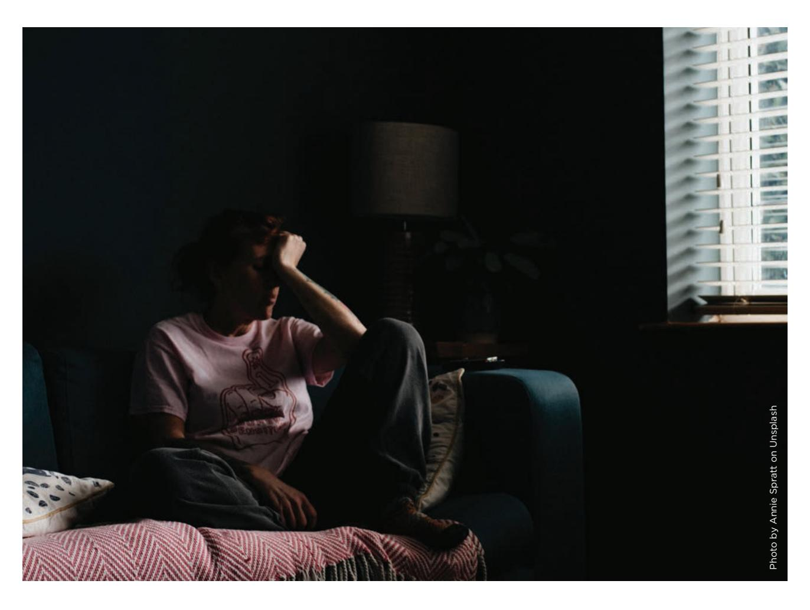

life prompted by the shift to online learning and remote work may be especially challenging for both children and their parents.

**Time Use.** Studies have begun to identify specific daily behaviors during COVID-19 that may be risk factors for worse well-being and mental health during COVID-19.

*Social Media Use.* For example, research has touched on the ramifications of interacting with social media during COVID-19. In a study of 558 participants living in Wuhan from early February, those who used social media more often reported greater depression and secondary trauma.43 In a different study from China conducted at the beginning of the pandemic, interacting with social media more frequently was associated with a higher likelihood of anxiety and the combination of both depression and anxiety.44 Parallel data comes from a study of 6,329 U.S. adults surveyed in March 2020: those who used social media were more likely to report relatively greater mental distress.45 Similarly, a study of 604 adults in Ireland reported greater negative affect when using social media.46 Although social connection is vital in times of stress, such as a global pandemic, and many may use social media to connect with others while at a physical distance, research seems to point to social media having detrimental psychological outcomes.47

One possibility for why social media has been associated with worse emotional outcomes during the pandemic was raised by a study of 17,865 users of Weibo (a Chinese social media site) in China. Compared to the language used on Weibo before the declaration of the pandemic (mid-January, 2020), people used more negative emotion words, fewer positive emotion words, and fewer life satisfaction words after the declaration of the pandemic in China (late-January, 2020).28 Thus, although reaching out to friends and family over social media may strengthen connections, the negative sentiment on social media may make people who are scrolling through or contributing to posts feel objectively worse.

*Online News Sources.* In addition to using social media, digital news outlets have been a common way for people to seek out COVID-19 related information. Given the myriad of fears about the pandemic, people may be searching for

ways to gain more control and knowledge of how to best stay protected.49 However, in a large study of U.S. adults, those who consulted a larger number of media sources for COVID-related information reported greater mental distress.50 Similar evidence comes from the U.K. study of 55,204 adults: Those who spent more time following COVID-19 news reported greater depression, more anxiety, and worse life satisfaction.51 Therefore, research indicates that consulting news media sources—particularly a large number of sources and for a longer period of time—may lead to worse psychological outcomes. Alternatively, individuals who are already distressed may be more likely to seek out information about COVID-19.

Another possibility raised by these studies is the potential "overdose" of information that may occur when consulting news on COVID-19. As previously noted, reducing uncertainty has been related to well-being benefits during COVID. However, if one's behaviors go beyond reducing uncertainty, such that one consults news outlets *too* often, those behaviors may fuel, rather than alleviate, distress. The process of seeking out information about COVID may be especially detrimental given the copious amounts of conflicting and intimidating information circulating in mainstream news. Furthermore, COVID-19 misinformation (or "fake news") appears to be pervasive in both news outlets and on social media.52 Thus, researchers have sought to explain how or why people fall prey to misinformation, as well as suggesting strategies to combat the spread of misinformation.53

**Circumstantial Factors.** Circumstantial or demographic factors have also been found to be risk factors for worse well-being during COVID-19.

*Demographic Factors.* Researchers have identified a number of demographic variables as risk factors for worse well-being during the pandemic. For example, a French study of participants who were surveyed three times during the pandemic found multiple demographic risk factors. Those who spent more hours working from home lived in Paris and were blue-collar workers (whose COVID-19 rate was 11% compared to the population average of 6%) reported worse well-being.54 The researchers noted that the

health and well-being inequalities found in France were concentrated among blue-collar workers, rather than just low-income earners in general, highlighting occupation-specific inequalities. Moreover, the low levels of well-being reported among those living in Paris could have been due to small living spaces, the lack of green spaces, and being surrounded by local attractions (e.g., museums, theatres, cafes) but being unable to enjoy them.

*Vulnerable Groups.* A number of populations are disproportionately experiencing worse well-being (or greater distress) due to COVID-19. For example, not surprisingly, those facing adversities (e.g., financial insecurity, food insecurity, inability to access proper medication) during the pandemic may be at greater risk for worse well-being. In a large sample of 35,784 U.K. adults surveyed weekly from April 1 to April 28, 2020, having a larger number of worries about adversities each week and the actual number of adversities faced each week were associated with greater anxiety and depression.55 Parallel findings come from the study of more than 50,000 U.K. adults, whereby those with low socioeconomic status encountered more severe depressive symptoms.56 Furthermore, in another study, people with high COVID-19 stressor scores coupled with lower social and economic resources had relatively greater odds of reporting depressive symptoms.57 It is unclear, however, whether the pandemic is contributing to and exacerbating the low well-being of individuals who were experiencing adversities, abuse, or other forms of suffering before it started, or whether these experiences are consequences of the pandemic. Future research is vital to disentangle the directionality of these effects.58

# **Social connection and loneliness during COVID-19**

Given that much of the world has been physically distancing for the better part of 2020, feelings of social connection and loneliness during COVID-19 have been a popular topic of study. As such, similar to work on which factors have predicted well-being during the pandemic (see above), parallel research has explored how *social connection and loneliness* may have shifted

during the pandemic and what factors might predict positive and negative changes. For example, among 654 Prolific participants in a relationship who were surveyed before (December 2019) and during the pandemic (March and April 2020), relationship satisfaction remained unchanged.59 In a study of 500 U.S. adults surveyed between March 27 and April 5, 2020, people who resided in areas with stay-at-home restrictions reported relatively more loneliness; however, describing COVID as having a great impact on their lives was associated with *less* loneliness and *greater* perceptions of social support.60 A study of over 1,500 participants in the U.S. assessed before and during the pandemic (i.e., from early February to mid-March and mid-April, 2020) partially replicated this finding, such that participants did not report any changes in loneliness but did report increases in perceived social support.61 Feelings of connectedness declined slightly in the sample of undergraduates in Canada surveyed before and during the pandemic. Still, they felt connectedness did not change—and loneliness actually decreased—during the same time period in a sample of community adults, mostly in the U.S. and U.K.62

#### **Protective factors and risk factors for social connection and loneliness**

Similar to the literature on well-being, investigators have explored the protective and risk factors for social connection during COVID-19 (see Figure 6.2). In light of research on the importance of social connection for health and well-being both before and during the pandemic, understanding the ways in which social connection may be promoted or thwarted is essential.63

#### **Protective factors for social connection and less loneliness**

**Psychological Characteristics.** Several psychological characteristics, such as pre-existing mental health conditions, have been shown to be protective of social connection and loneliness during COVID-19.

*Pre-Existing Mental Health Conditions.* Contrary to expectations, some research has identified pre-existing mental health conditions as protective of social connection and loneliness during the

|               | PROTECTIVE FACTORS                                                 | RISK FACTORS                                                                                     |
|---------------|--------------------------------------------------------------------|--------------------------------------------------------------------------------------------------|
|               | Pre-existing mental health conditions                              | Personality: Extraversion                                                                     |
| Psychological |                                                                    | Pre-existing mental health conditions: Clinical diagnosis of depression, anxiety, & others |
|               | Engaging in distancing                                             | Engaging in distancing                                                                           |
|               | Features of household: Living with a partner                    | Features of the household: Living alone                                                       |
| Social        | Types of relationships: Family, friends, pets                   |                                                                                                  |
|               | Prosocial behavior                                                 |                                                                                                  |
|               | Using digital media to connect: If used to cope with loneliness | Using digital media to connect: No access to internet/digital inequality                      |
| Time Use      | Daily activities: Spending more time with family & friends      |                                                                                                  |
|               | Demographic factors: Older age                                  | Demographic factors: Occupation type, older age                                               |
|               |                                                                    | Vulnerable groups: Chronically ill,                                                              |

pandemic. An investigation of 3,077 U.K. adults surveyed three times during the pandemic demonstrated that those with pre-existing mental health conditions actually decreased in loneliness over the three waves of data collection.64 This finding may be accounted for by ceiling effects for loneliness or by these distressed participants receiving relatively more attention and social support. However, more research is needed on whether and how other mental health conditions, such as anxiety and substance use disorders, may put people at risk for loneliness or poor relationship quality.

**Social Factors.** Because social connection and loneliness are inherently social constructs, they have been found, not surprisingly, to be protected by a number of social factors during the pandemic.

*Engaging in Distancing.* One potential source of changes in social connection is distancing

guidelines, which have confined people to their homes, limited their in-person social interactions, and led to the use of electronic meetings as a substitute. Indeed, most people are abiding by these guidelines. In a sample of 683 U.S. adolescents surveyed in March 2020, 98% reported engaging in at least a little distancing.65 Among 467 Canadian undergraduates and 336 adults mostly from the U.S. and U.K. surveyed in April 2020, 99% and 93% reported practicing distancing, respectively.66 However, surprisingly, the correlations between engaging in distancing and measures of social connection (i.e., connectedness, loneliness) were null.67 In light of evidence that social connection and loneliness have largely remained unchanged and in some instances have improved and that more distancing is not associated with less felt social connection or with more loneliness—the worry that physical distancing is

impeding connection for the majority of people may be unfounded.68 Recent studies suggest that it may be possible, through the internet and other means, to maintain social closeness while being physically separated.

*Features of the Household.* Social distancing has forced people to remain in their homes, sheltering with their household members. In a sample of 38,217 U.K. participants surveyed between March 31 and May 10, 2020, those who lived with others had 75% lower odds of being lonely compared to those living alone.69 However, in a pair of studies, household size (including living alone) was not related to changes in perceptions of social connection from before to during the pandemic.70 Similarly, in a study of 888 elderly adults from Lower Austria surveyed once in Spring 2019 and again in Spring 2020, people living alone also did not report increases in loneliness.71 Notably, these results may be explained by self-selection effects, such that individuals who choose to live alone may have unique personality characteristics or social resources that help them weather stay-at-home policies.

However, one feature of household composition does seem to matter, and that is whether one has a partner. In the two studies conducted with undergraduates and community-dwelling adults, respectively, those living with a partner reported feeling relatively more socially connected during the early phases of the pandemic.72 Mirroring these findings, the study of 1,964 participants from Prolific found that those who were married or cohabiting had lower odds of being lonely.73

Cooper and colleagues (2020) assessed social distancing, personality, and relationships with household members in a single study. They found an overall effect, such that the longer people were social distancing, the higher their relationship quality with their household members. However, this effect was pronounced for those higher in agreeableness; as social distancing increased, more agreeable people reported better relationship quality with people in their household, particularly their children and partners.

*Types of Relationships.* In addition to the association between the composition of one's household and feelings of connection, researchers have also examined time spent with specific

people (or pets) and feelings of connection during COVID-19. For example, in a study of 1,054 Canadian adolescents surveyed between April 4 to 16, 2020, spending more time with family and friends was predictive of lower levels of loneliness.74 Moreover, those who had a larger group of close friends were 42% less likely to be in the loneliest group.75

Furthermore, owning a pet during the pandemic has been shown to be protective for mental health and a buffer against loneliness. In a study of 5,926 U.K. adults from April 16 to May 31, 2020, those who owned a pet indicated smaller increases in loneliness during the pandemic compared to those who did not own a pet, regardless of pet type.76 Similar results were found in a sample of 384 Australian adults between May 5 to 13, 2020, whereby owning dogs, but not cats, was protective of loneliness during the pandemic.77 However, qualitative analyses showed that both dog and cat owners reported their pets as helping with their feelings of connection and loneliness during the pandemic.

*Prosocial Behavior.* A common way that people connect with others is by helping or supporting them.78 In fact, recent research on prosocial behavior during the pandemic has revealed improvements in social connection for those who engage in acts of kindness. For example, 389 Prolific participants recruited on April 16 to 17, 2020, and 1,234 Prolific participants recruited on April 24 to 30, 2020, reported greater well-being (i.e., positive affect) after spending money on others during the pandemic.79 Similarly, a study from the U.S. and Canada of 1,028 participants ages 18 to 19 reported that those who engaged in more prosocial activities (i.e., formal volunteering, support provision, support receipt) reported greater social satisfaction on the days in which these activities occurred.80

**Time Use.** Given that people around the world have been encouraged to physically distance, there are many ways in which people can spend their time during stay-at-home or lockdown orders that protect their feelings of social connection and loneliness.

*Using Digital Media to Connect.* Because people are physically distancing, some may be turning towards digital means to connect with

others. In a study of 1,374 U.S. adults aged 18 to 82 from April 4 to 8, 2020 (average age = 46), participants reported increases in digital communication: 43% increase in texting, 36% increase in voice calls, 35% increase in social media, and 30% increase in video calls.81 Those in the youngest quartile of the sample were more likely to increase their digital communication use compared to other age groups. In addition, data from a Gallup/Knight Foundation survey from April 14-20, 2020, demonstrated that 74% of users found social media to be "very" or "moderately" important for remaining connected with people they are unable to see during the pandemic. In the same dataset, women (81%) were more likely to find social media to be important for connection in comparison to men (66%).82 Furthermore, in a study of 2,165 Belgian adolescents surveyed between April 16-30, 2020, lonely adolescents were more likely to use social media to cope with their loneliness.83 Thus, adults and adolescents appear to be increasing their use of digital media, including texting and social media, as a means to connect during the pandemic.

*Daily Activities.* Researchers have examined how individuals have been spending their time during the pandemic and how such time use may boost social connection and alleviate loneliness. For example, in a study of 1,054 Canadian adolescents surveyed between April 4-16, 2020, spending more time with family, friends and engaging in physical activity were all predictive of lower levels of loneliness.84 A study by Wray-Lake and colleagues (2020) used latent profile analysis of how 555 U.S. adolescents spent their time during a typical day, and they found that support from family and friends likely influenced how adolescents spent their time. For example, "media users" had relatively lower family support but more friend support, those labeled "educationfocused" had higher family support and lower friend support, and those labeled "work-focused" spent relatively more time with friends in person. Thus, the types of relationships or social support that people have may influence the kinds of daily activities they engage in during the pandemic.

**Circumstantial Factors.** Demographic factors such as one's age—may be protective of social connection and feelings of loneliness.

*Demographic Factors.* Similar to the research on age and well-being, mixed evidence has emerged regarding whether age is a risk or protective factor for social connection and loneliness. For example, elderly adults in Lower Austria revealed a slight increase in loneliness during the pandemic.85 However, other research demonstrated that loneliness during COVID-19 has decreased with age, with young adults being 4 to 5 times more likely to be lonely compared to those who are over 65 years old.86 Thus, additional research is needed to identify whether age is a protective or risk factor for social connection and loneliness.

#### **Risk factors for worse social connection and loneliness**

**Psychological Characteristics.** Several psychological characteristics have been shown to be potential risk factors for worse social connection and increased loneliness during COVID-19.

*Personality.* Researchers have investigated which personality traits—especially extraversion may adversely factor in people's experiences during the pandemic. In the study that sampled undergraduates and adults from before to during the pandemic (i.e., January/February to April 2020), although extraverts fared relatively worse in terms of felt social connection as the pandemic got underway, the pattern of results suggested that they declined more in connection only

because they started far higher than did introverts before the pandemic.87 Thus, future work is needed to determine whether extraversion is truly a risk factor.

#### *Pre-Existing Mental Health Conditions.*

Research during the pandemic has also revealed that those living with pre-existing mental health conditions may be at a higher risk for loneliness. For example, those with clinical levels of major depressive disorder were nearly twice as likely to report being lonely during the pandemic, signaling that such individuals may be disproportionately affected.88 Similarly, those with mental health conditions (e.g., clinical depression, anxiety) were more than five times as likely to fall in the loneliest group in the sample.89 Thus, pre-existing mental health conditions present a risk vis-à-vis people's sense of social connection and loneliness during the pandemic.

**Social Factors.** A number of social factors during the pandemic have also been revealed as risk factors for worse social connection and greater loneliness during COVID-19.

*Engaging in Distancing.* In most countries, people have been engaging in distancing behavior. The reasons reported for engaging in distancing may shed light on some of the negative experiences observed during the pandemic. The study of 683 adolescents in the U.S. assessed in late March 2020 revealed the following reasons for following distancing guidelines to be most common: not wanting to become ill, preferring to stay home regardless of the pandemic, not wanting to be judged by peers, and pressure from parents.90 Interestingly, when parents compelled distancing, the adolescents reported greater belongingness. However, when the adolescents

*Some households may not have access to Wi-Fi, or older adults may have trouble navigating technology, which may put such individuals at risk both socially and physically.*

were told to distance by peers or when they were worried about being judged for not distancing, they reported greater depressive and anxiety symptoms, respectively. Although these findings are correlational, they suggest that *who* instructs adolescents to keep their distance may impact their psychological outcomes; thus, this work may inform how best to communicate important health practices to maximize adherence, social connection, and psychological well-being.

*Features of the Household.* Because lockdown and distancing measures forced people to shelter in their homes, whether, with family members, roommates, in a senior living facility, or alone, household size has been of interest to researchers as a factor potentially influencing feelings of connection or loneliness. Some studies have also examined how felt social connection has changed over the course of COVID-19 as a function of the size of one's household. Mixed findings have emerged when examining the relationship between household size or living alone and reports of social connection. For example, in a sample of 1964 Prolific participants, living alone was related to more than double the risk for loneliness, yet in a sample of 336 Prolific participants, living alone was unrelated to loneliness.91

**Time Use.** How people choose to spend their time in response to distancing recommendations can serve as risk factors for feelings of reduced social connection and greater loneliness.

*Using Digital Media to Connect.* Although many individuals are using digital media to connect during COVID-19, it is important to note that not everyone has access to the internet. Nguyen and colleagues (2020) addressed digital inequality, which highlights that some people did not have the same access to and skills using the internet before the pandemic, and how this inequality may be exacerbated during the pandemic.92 For example, some households may not have access to Wi-Fi, or older adults may have trouble navigating technology, which may put such individuals at risk both socially and physically. More work should be done to assess digital inequality during the pandemic and how it may impact social connection and loneliness during the pandemic.

**Circumstantial Factors.** A number of circumstantial factors—such as one's age, occupation, or membership in a vulnerable group—may increase the likelihood of worse social connection and increased feelings of loneliness.

*Demographic Factors.* Some demographic variables may put certain people at risk for lower social connection or greater loneliness. For example, healthcare workers may be at increased risk for isolation and stigma because friends and family may choose to avoid them due to the increased risk of COVID-19 exposure that their profession involves.93 In addition, the elderly are at high risk for contracting the disease and thus, should practice physical distancing to preserve their health. However, despite their vulnerability, some research has shown that they are no more likely to isolate than any other age group.94 A study of elderly adults in Lower Austria revealed a slight increase in loneliness during the pandemic.95 However, research in the U.K. found that adults between the ages of 18 and 59 were more likely to be lonely compared to adults 60 and older.96 Future work is needed to reconcile these conflicting findings with regard to age—for example, by uncovering critical moderators (e.g., culture, occupation type, and living situation).x

*Vulnerable Groups.* Theory and research suggest that vulnerable populations are especially at risk for poor connection, social isolation, and loneliness. Because some individuals were at risk for social isolation even before the pandemic, researchers have highlighted specific populations that must be studied further, such as those living with a chronic illness. Those with chronic conditions, such as HIV, tend to have smaller social networks (even prior to the pandemic) due to social stigma, leading to isolation; hence, these individuals may be especially at risk for isolation during the pandemic.97 Furthermore, a review of the literature on disease containment strategies from 1946 to 2020 revealed that children are particularly vulnerable to loneliness and social isolation, which in turn increases their risk for depression and anxiety between 3 months to 9 years later.98 Another review of articles published on isolation during a variety of public health crises (e.g., COVID-19, Ebola, SARS) found empirical research on the impact of social isolation on disadvantaged

and vulnerable groups largely lacking.99 Thus, it is critical for future researchers to investigate what factors impact connection in disadvantaged or vulnerable groups, such as people of color, those with pre-existing conditions, and marginalized and low-income individuals.

## **Future directions**

Although a wealth of data is rapidly distributed and published on people's psychological experiences during the pandemic, much of the research has focused on relatively Western, Educated, Industrialized, Rich, and Democratic (WEIRD) populations, which limits the generalizability of these findings.100 As such, future investigators should strive to replicate the current findings in BIPOC (Black, Indigenous, and People of Color) and non-WEIRD populations. Furthermore, by necessity, most of the research on people's responses to COVID-19 is correlational, which means that several plausible alternative explanations could be advanced for each of the findings reported here. Researchers may also wish to explore the many nuances that remain untested, including how and when such factors interact with one another as the pandemic progresses, as well as how they might be moderated by individual differences or contextual variables.

Moreover, researchers are only beginning to understand how to improve well-being and connection during these challenging times. For example, few interventions have been conducted during the pandemic with the aim of making people happier and more socially connected. Given the need to remain at home, digitally delivered mental health support (e.g., via telehealth or with locally trained mental health providers) and self-administered well-being interventions (for example, prompting people to practice mindfulness, gratitude, or kindness may serve as powerful tools to improve well-being during the pandemic).101 However, such interventions need to be validated and tailored to the realities and challenges specific to COVID-19. Furthermore, research on the most vulnerable and disadvantaged populations including both cross-sectional research and

intervention research—is largely lacking, and a great deal more needs to be done to help those most at risk.

# **Conclusion**

As the pandemic persists and surges in COVID-19 cases recur, it is critical to continue to closely and regularly examine the causes, antecedents, and consequences of shifts in well-being and social connection in 2021 and beyond. Accumulating research has shown that the pandemic has led to increases in negative psychological outcomes, such as depression and anxiety, for a large portion of the population. However, many people are arguably faring better than expected, with some reporting increases in life satisfaction and felt social connection. Researchers have identified

multiple factors that may account for individual differences in well-being and social connection across the globe, such as seeking out COVID-19 -related information, experiencing flow during the pandemic, using social media, being from a vulnerable population, living with a partner, and having positive psychological characteristics like gratitude or resilience. However, before effective interventions to improve well-being and social connection globally can be recommended, much more research is needed. With the wealth of information already published and more on the horizon, researchers, policymakers, and health officials must continue to rely on empirical data to inform interventions and policies that aim to balance physical health with a focus on maintaining or boosting the well-being and social connection of people around the globe.

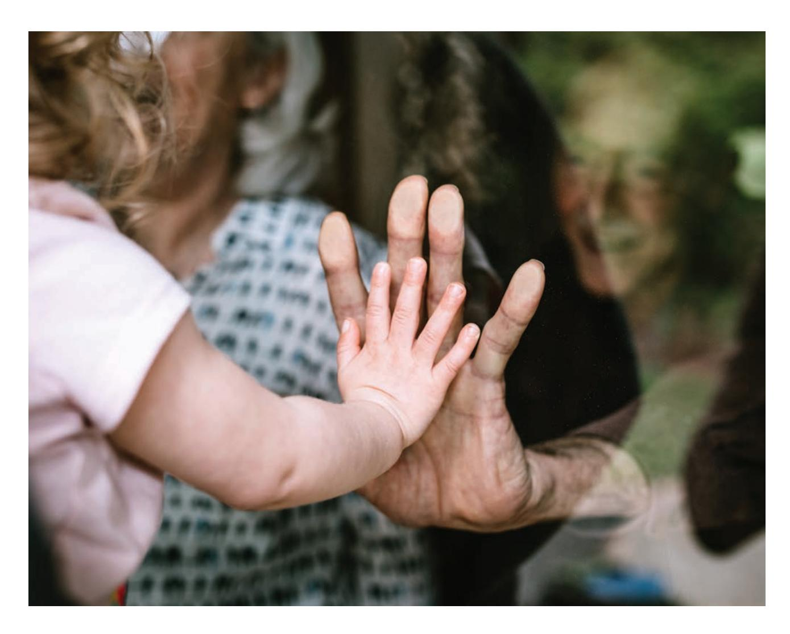

#### **Endnotes**

- Wilder-Smith & Freedman, 2020.
- WHO, 2020.
- Markel et al., 2007.
- 4 Baumeister & Leary, 1995; Cacioppo & Cacioppo, 2018; Diener & Seligman, 2002; Maslow, 1943; Ryan & Deci, 2000.
- Gruber et al., 2020; Van Bavel et al., 2020.
- Fancourt & Steptoe, 2020.
- Brooks et al., 2020.
- VanderWeele et al., 2020.
- Foa et al., 2020.
- Recchi et al., 2020.
- Folk et al., 2020; Okabe-Miyamoto et al., 2020.
- Cooper et al., 2020.
- López et al., 2020.
- Bono et al., 2020.
- Sweeny et al., 2020.
- Folk et al., 2020.
- Prinzing et al., 2020.
- Cantarero et al., 2020.
- Nitschke et al., 2020.
- 20 Martela & Ryan, 2016; Nelson et al., 2016; Weinstein & Ryan, 2010.
- Buchanan & Preston, 2014; Rodríguez et al., 2006.
- Bu, Steptoe, Mak, et al., 2020.
- Varma et al., 2020.
- Alvis et al., 2020.
- Vieira et al., 2020.
- Canale et al., 2020.
- Masciantonio et al., 2020.
- Fritz et al., 2020; Kumar & Epley, 2020.
- Rieger & Wang, 2020.
- Lades et al., 2020.
- Brand et al., 2020.
- Bu, Steptoe, Mak, et al., 2020.
- Carstensen et al., 2020.
- Satici et al., 2020.
- Frank et al., 2020.
- O'Connor et al., 2020.
- Marroquín et al., 2020.
- Folk et al., 2020.
- Frank et al., 2020.
- Iob et al., 2020.

- Frank et al., 2020.
- Patrick et al., 2020.
- Zhong et al., 2021.
- Gao et al., 2020.
- Riehm et al., 2020.
- Lades et al., 2020.
- Feeney & Collins, 2014.
- Li et al., 2020.
- Schimmenti et al., 2020.
- Riehm et al., 2020.
- Bu, Steptoe, Mak, et al., 2020; Lades et al., 2020.
- Frenkel et al., 2020.
- Van Bavel et al., 2020.
- Recchi et al., 2020.
- Wright et al., 2020.
- Frank et al., 2020.
- Ettman et al., 2020.
- see also Banks, Xu, & Fancourt, this volume
- Williamson, 2020.
- Tull et al., 2020.
- Luchetti et al., 2020.
- Okabe-Miyamoto et al., 2021.
- 63 Holt-Lunstad et al., 2017; Nitschke et al., 2020; Prinzing et al., 2020.
- O'Connor et al., 2020.
- Oosterhoff et al., 2020.
- Folk et al., 2020.
- Okabe-Miyamoto et al., 2021.
- 68 Luchetti et al., 2020; Okabe-Miyamoto et al., 2021; Tull et al., 2020.
- Bu, Steptoe, Mak, et al., 2020.
- Okabe-Miyamoto et al., 2021.
- Heidinger & Richter, 2020.
- Okabe-Miyamoto et al., 2021.
- Groarke et al., 2020.
- Ellis et al., 2020.
- Bu, Steptoe, & Fancourt, 2020.
- Ratschen et al., 2020.
- Oliva & Johnston, 2020.
- Aknin et al., 2018; Fritz et al., 2020.
- Varma et al., 2020.
- Sin et al., 2020.

- 81 Nguyen et al., 2020.
- 82 Ritter, 2020.
- 83 Cauberghe et al., 2020.
- 84 Ellis et al., 2020.
- 85 Heidinger & Richter, 2020.
- 86 Groarke et al., 2020.
- 87 Folk et al., 2020.
- 88 Groarke et al., 2020.
- 89 Bu et al., 2020.
- 90 Oosterhoff et al., 2020.
- 91 Groarke et al., 2020; Okabe-Miyamoto et al., 2021.
- 92 also see Beaunoyer et al., 2020.
- 93 Brooks et al., 2020.
- 94 Daoust, 2020.
- 95 Heidinger & Richter, 2020.
- 96 Bu, Steptoe, & Fancourt, 2020.
- 97 Marziali et al., 2020.
- 98 Loades et al., 2020.
- 99 Gayer-Anderson et al., 2020.

100Henrich et al., 2010.

101 Layous & Lyubomirsky, 2014; Parks & Biswas-Diener, 2013; VanderWeele, 2020.

#### **References**

Aknin, L. B., Van de Vondervoort, J. W., & Hamlin, J. K. (2018). Positive feelings reward and promote prosocial behavior. *Early Development of Prosocial Behavior*, *20*, 55–59. https://doi.org/10.1016/j.copsyc.2017.08.017

Alvis, L., Douglas, R., Shook, N., & Oosterhoff, B. (2020). Adolescents' prosocial experiences during the COVID-19 pandemic: Associations with mental health and community attachments. *PsyArxiv*. https://doi.org/10.31234/osf.io/2s73n

Baumeister, R. F., & Leary, M. R. (1995). The need to belong: Desire for interpersonal attachments as a fundamental human motivation. *Psychological Bulletin*, *117*(3), 497–529. https://doi.org/10.1037/0033-2909.117.3.497

Beaunoyer, E., Dupéré, S., & Guitton, M. J. (2020). COVID-19 and digital inequalities: Reciprocal impacts and mitigation strategies. *Computers in Human Behavior*, *111*, 106424–106424. PubMed. https://doi.org/10.1016/j.chb.2020.106424

Bono, G., Reil, K., & Hescox, J. (2020). Stress and wellbeing in college students during the COVID-19 pandemic: Can grit and gratitude help? *International Journal of Wellbeing*, *10*(3), 39–57. https://doi.org/10.5502/ijw.v10i3.1331

Brand, R., Timme, S., & Nosrat, S. (2020). When pandemic hits: Exercise frequency and subjective well-being during COVID-19 pandemic. *Frontiers in Psychology*, *11*, 2391. https://doi.org/10.3389/fpsyg.2020.570567

Brooks, S. K., Webster, R. K., Smith, L. E., Woodland, L., Wessely, S., Greenberg, N., & Rubin, G. J. (2020). The psychological impact of quarantine and how to reduce it: Rapid review of the evidence. *The Lancet*, *395*(10227), 912–920. https://doi.org/10.1016/S0140-6736(20)30460-8

Bu, F., Steptoe, A., & Fancourt, D. (2020). Loneliness during strict lockdown: Trajectories and predictors during the COVID-19 pandemic in 38,217 adults in the UK. *MedRxiv*. https://doi.org/10.1101/2020.05.29.20116657

Bu, F., Steptoe, A., Mak, H. W., & Fancourt, D. (2020). Time-use and mental health during the COVID-19 pandemic: A panel analysis of 55,204 adults followed across 1 weeks of lockdown in the UK. *MedRxiv*. https://www.medrxiv.org/content/10.1101/ 2020.08.18.20177345v1.full.pdf

Buchanan, T., & Preston, S. (2014). Stress leads to prosocial action in immediate need situations. *Frontiers in Behavioral Neuroscience*, *8*, 5. https://doi.org/10.3389/fnbeh.2014.00005

Cacioppo, J. T., & Cacioppo, S. (2018). Loneliness in the modern age: An evolutionary theory of loneliness (ETL). In J. M. Olson (Ed.), *Advances in Experimental Social Psychology* (Vol. 58, pp. 127–197). Academic Press. https://doi.org/10.1016/bs. aesp.2018.03.003

Canale, N., Marino, C., Lenzi, M., Vieno, A., Griffiths, M. D., Gaboardi, M., Cervone, C., & Massino, S. (2020). How communication technology helps mitigating the impact of COVID-19 pandemic on individual and social wellbeing: Preliminary support for a compensatory social interaction model. *PsyArxiv*. https://psyarxiv.com/zxsra/

Cantarero, K., van Tilburg, W. A. P., & Smoktunowicz, E. (2020). Affirming basic psychological needs promotes mental well-being during the COVID-19 outbreak. *Social Psychological and Personality Science*, 1948550620942708. https://doi.org/10.1177/1948550620942708

Carstensen, L. L., Shavit, Y. Z., & Barnes, J. T. (2020). Age advantages in emotional experience persist even under threat from the COVID-19 pandemic. *Psychological Science*, *31*(11), 1374–1385. https://doi.org/10.1177/0956797620967261

Cauberghe, V., Van Wesenbeeck, I., De Jans, S., Hudders, L., & Ponnet, K. (2020). How adolescents use social media to cope with feelings of loneliness and anxiety during COVID-19 lockdown. *Cyberpsychology, Behavior, and Social Networking*. https://doi.org/10.1089/cyber.2020.0478

Cooper, A. B., Pauletti, R. E., & DiDonato, C. A. (2020). You, me, and no one else: Degree of social distancing and personality predict psychological wellness and relationship quality during the COVID-19 pandemic. *PsyArxiv*. https://psyarxiv.com/w6dru/

Daoust, J.-F. (2020). Elderly people and responses to COVID-19 in 27 Countries. *PLOS ONE*, *15*(7), e0235590. https://doi.org/10.1371/journal.pone.0235590

Diener, E., & Seligman, M. E. P. (2002). Very happy people. *Psychological Science*, *13*(1), 81–84. https://doi.org/10.1111/ 1467-9280.00415

Ellis, W. E., Dumas, T. M., & Forbes, L. M. (2020). Physically isolated but socially connected: Psychological adjustment and stress among adolescents during the initial COVID-19 crisis. *Canadian Journal of Behavioural Science / Revue Canadienne Des Sciences Du Comportement*, *52*(3), 177–187. https://doi.org/10.1037/cbs0000215

Ettman, C. K., Abdalla, S. M., Cohen, G. H., Sampson, L., Vivier, P. M., & Galea, S. (2020). Prevalence of depression symptoms in US adults before and during the COVID-19 pandemic. *JAMA Network Open*, *3*(9), e2019686–e2019686. https://doi.org/10.1001/jamanetworkopen.2020.19686

Fancourt, D., & Steptoe, A. (2020, May 22). Is this social isolation?—We need to think broadly about the impact of social experiences during covid-19. *The BMJ Opinion*. https://blogs.bmj.com/bmj/2020/05/22/is-this-social-isolationwe-need-to-think-broadly-about-the-impact-of-socialexperiences-during-covid-19/

Feeney, B. C., & Collins, N. L. (2014). A New Look at Social Support: A Theoretical Perspective on Thriving Through Relationships. *Personality and Social Psychology Review*, *19*(2), 113–147. https://doi.org/10.1177/1088868314544222

Foa, R. S., Gilbert, S., & Fabian, M. O. (2020). *COVID-19 and subjective well-being: Separating the effects of lockdowns from the pandemic*. https://www.bennettinstitute.cam.ac.uk/media/ uploads/files/Happiness\_under\_Lockdown.pdf

Folk, D., Okabe-Miyamoto, K., Dunn, E., & Lyubomirsky, S. (2020). Did social connection decline during the first wave of COVID-19?: The role of extraversion. *Collabra: Psychology*, *6*(1), 37. https://doi.org/10.1525/collabra.365

Frank, P., Iob, E., Steptoe, A., & Fancourt, D. (2020). Trajectories of depressive symptoms among vulnerable groups in the UK during the COVID-19 pandemic. *MedRxiv*. https://www.medrxiv. org/lookup/doi/10.1101/2020.06.09.20126300

Frenkel, S., Alba, D., & Zhong, R. (2020, March 8). *Surge of virus misinformation stumps Facebook and Twitter*. The New York Times. https://www.nytimes.com/2020/03/08/technology/ coronavirus-misinformation-social-media.html

Fritz, M. M., Margolis, S., Revord, J. C., Kellerman, G. R., Nieminen, L. R. G., Reece, A., & Lyubomirsky, S. (2020). *Examining the social in the prosocial: Episode-level features of social interactions and kind acts predict social connection and well-being*.

Gao, J., Zheng, P., Jia, Y., Chen, H., Mao, Y., Chen, S., Wang, Y., Fu, H., & Dai, J. (2020). Mental health problems and social media exposure during COVID-19 outbreak. *PLOS ONE*, *15*(4), e0231924. https://doi.org/10.1371/journal.pone.0231924

Gayer-Anderson, C., Latham, R., El Zerbi, C., Strang, L., Hall, V. M., Knowles, G., Marlow, S., Avendano, M., Manning, N., Das-Munshi, J., Fisher, H., Rose, D., Arseneault, L., Kienzler, H., Rose, N., Hatch, S., Woodhead, C., Morgan, C., & Wilkinson, B. (2020). *Impacts of social isolation among disadvantaged and vulnerable groups during public health crises*. https://esrc.ukri. org/files/news-events-and-publications/evidence-briefings/ impacts-of-social-isolation-among-disadvantaged-andvulnerable-groups-during-public-health-crises/

Groarke, J. M., Berry, E., Graham-Wisener, L., McKenna-Plumley, P. E., McGlinchey, E., & Armour, C. (2020). Loneliness in the UK during the COVID-19 pandemic: Cross-sectional results from the COVID-19 psychological wellbeing study. *PLOS ONE*, *15*(9), e0239698. https://doi.org/10.1371/journal.pone.0239698

Gruber, J., Prinstein, M. J., Clark, L. A., Rottenberg, J., Abramowitz, J. S., Albano, A. M., Aldao, A., Borelli, J. L., Chung, T., Davila, J., Forbes, E. E., Gee, D. G., Hall, G. C. N., Hallion, L. S., Hinshaw, S. P., Hofmann, S. G., Hollon, S. D., Joormann, J., Kazdin, A. E., … Weinstock, L. M. (2020). Mental health and clinical psychological science in the time of COVID-19: Challenges, opportunities, and a call to action. *American Psychologist*. https://doi.org/10.1037/ amp0000707

Heidinger, T., & Richter, L. (2020). The effect of COVID-19 on loneliness in the elderly. An empirical comparison of pre-and peri-pandemic loneliness in community-dwelling elderly. *Frontiers in Psychology*, *11*, 2595. https://doi.org/10.3389/ fpsyg.2020.585308

Henrich, J., Heine, S. J., & Norenzayan, A. (2010). Most people are not WEIRD. *Nature*, *466*(7302), 29–29. https://doi.org/10.1038/466029a

Holt-Lunstad, J., Robles, T. F., & Sbarra, D. A. (2017). Advancing social connection as a public health priority in the United States. *American Psychologist*, *72*(6), 517–530. https://doi.org/10.1037/amp0000103

Iob, E., Steptoe, A., & Fancourt, D. (2020). Abuse, self-harm and suicidal ideation in the UK during the COVID-19 pandemic. *The British Journal of Psychiatry*, *217*, 543–546. https://doi.org/10.1192/bjp.2020.130

Kumar, A., & Epley, N. (2020). It's surprisingly nice to hear you: Misunderstanding the impact of communication media can lead to suboptimal choices of how to connect with others. *Journal of Experimental Psychology: General*, No Pagination Specified-No Pagination Specified. https://doi.org/10.1037/ xge0000962

Lades, L. K., Laffan, K., Daly, M., & Delaney, L. (2020). Daily emotional well-being during the COVID-19 pandemic. *British Journal of Health Psychology*. https://doi.org/10.1111/bjhp.12450 Layous, K., & Lyubomirsky, S. (2014). The how, why, what, when, and who of happiness. In J. Gruber & J. T. Moskowitz (Eds.), *Positive emotion: Integrating the light sides and the dark sides*  (pp. 472–495). Oxford University Press. https://doi.org/10.1093/ acprof:oso/9780199926725.003.0025

Li, S., Wang, Y., Xue, J., Zhao, N., & Zhu, T. (2020). The impact of COVID-19 epidemic declaration on psychological consequences: A study on active Weibo users. *International Journal of Environmental Research & Public Health*, *17*(6), 2032. https://doi.org/10.3390/ijerph17062032

Loades, M. E., Chatburn, E., Higson-Sweeney, N., Reynolds, S., Shafran, R., Brigden, A., Linney, C., McManus, M. N., Borwick, C., & Crawley, E. (2020). Rapid systematic review: The impact of social isolation and loneliness on the mental health of children and adolescents in the context of COVID-19. *Journal of the American Academy of Child and Adolescent Psychiatry*, *59*(11), 1218-1239.e3. PubMed. https://doi.org/10.1016/j. jaac.2020.05.009

López, J., Perez-Rojo, G., Noriega, C., Carretero, I., Velasco, C., Martinez-Huertas, J. A., López-Frutos, P., & Galarraga, L. (2020). Psychological well-being among older adults during the COVID-19 outbreak: A comparative study of the young–old and the old–old adults. *International Psychogeriatrics*, 1–6. https://doi.org/10.1017/S1041610220000964

Luchetti, M., Lee, J. H., Aschwanden, D., Sesker, A., Strickhouser, J. E., Terracciano, A., & Sutin, A. R. (2020). The trajectory of loneliness in response to COVID-19. *American Psychologist*, Advance Online Publication. https://doi.org/10.1037/ amp0000690

Markel, H., Lipman, H. B., Navarro, J. A., Sloan, A., Michalsen, J. R., Stern, A. M., & Cetron, M. S. (2007). Nonpharmaceutical Interventions Implemented by US Cities During the 1918-1919 Influenza Pandemic. *JAMA*, *298*(6), 644–654. https://doi.org/10.1001/jama.298.6.644

Marroquín, B., Vine, V., & Morgan, R. (2020). Mental health during the COVID-19 pandemic: Effects of stay-at-home policies, social distancing behavior, and social resources. *Psychiatry Research*, *293*, 113419–113419. PubMed. https://doi.org/10.1016/j.psychres.2020.113419

Martela, F., & Ryan, R. M. (2016). Prosocial behavior increases well-being and vitality even without contact with the beneficiary: Causal and behavioral evidence. *Motivation and Emotion*, *40*(3), 351–357. https://doi.org/10.1007/s11031-016-9552-z

Marziali, M. E., Card, K. G., McLinden, T., Wang, L., Trigg, J., & Hogg, R. S. (2020). Physical distancing in COVID-19 may exacerbate experiences of social isolation among people living with HIV. *AIDS and Behavior*, *24*(8), 2250–2252. https://doi.org/10.1007/s10461-020-02872-8

Masciantonio, A., Bourguinon, D., Bouchat, P., Balty, M., & Rime, B. (2020). Don't put all social network sites in one basket: Facebook, Instagram, Twitter, TikTok and their relations with well-being during the COVID-19 pandemic. *PsyArxiv*. https://psyarxiv.com/82bgt/

Maslow, A. H. (1943). A theory of human motivation. *Psychological Review*, *50*(4), 370–396. https://doi.org/10.1037/h0054346

Nelson, S. K., Layous, K., Cole, S. W., & Lyubomirsky, S. (2016). Do unto others or treat yourself? The effects of prosocial and self-focused behavior on psychological flourishing. *Emotion*, *16*(6), 850–861. https://doi.org/10.1037/emo0000178

Nguyen, M. H., Gruber, J., Fuchs, J., Marler, W., Hunsaker, A., & Hargittai, E. (2020). Changes in digital communication during the COVID-19 global pandemic: Implications for digital inequality and future research. *Social Media + Society*, *6*(3), 2056305120948255. PMC. https://doi.org/10.1177/2056305120948255

Nitschke, J. P., Forbes, P. A. G., Ali, N., Cutler, J., Apps, M. A. J., Lockwood, P. L., & Lamm, C. (2020). Resilience during uncertainty? Greater social connectedness during COVID-19 lockdown is associated with reduced distress and fatigue. *British Journal of Health Psychology*, *n/a*(n/a). https://doi.org/10.1111/bjhp.12485

O'Connor, R. C., Wetherall, K., Cleare, S., McClelland, H., Melson, A. J., Niedzwiedz, C. L., O'Carroll, R. E., O'Connor, D. B., Platt, S., Scowcroft, E., Watson, B., Zortea, T., Ferguson, E., & Robb, K. A. (2020). Mental health and well-being during the COVID-19 pandemic: Longitudinal analyses of adults in the UK COVID-19 Mental Health & Wellbeing study. *The British Journal of Psychiatry*, 1–8. Cambridge Core. https://doi.org/10.1192/ bjp.2020.212

Okabe-Miyamoto, K., Folk, D., Lyubomirsky, S., & Dunn, E. (2021). Changes in social connection during COVID-19 social distancing: It's not (household) size that matters, its who you're with. *PLOS ONE*, *16*(1), e0245009.

Okabe-Miyamoto, K., Regan, A., & Lyubomirsky, S. (2020). Thriving buffers the negative impact of drops in connectedness on well-being from before to during COVID-19. *In Prep*.

Oliva, J. L., & Johnston, K. L. (2020). Puppy love in the time of Corona: Dog ownership protects against loneliness for those living alone during the COVID-19 lockdown. *The International Journal of Social Psychiatry*, 20764020944195207640209 44195. PubMed. https://doi.org/10.1177/0020764020944195

Oosterhoff, B., Palmer, C. A., Wilson, J., & Shook, N. (2020). Adolescents' motivations to engage in social distancing during the COVID-19 pandemic: Associations with mental and social health. *The Journal of Adolescent Health*, *67*(2), 179–185. PubMed. https://doi.org/10.1016/j.jadohealth.2020.05.004

Parks, A. C., & Biswas-Diener, R. (2013). Positive interventions: Past, present, and future. In *Mindfulness, acceptance, and positive psychology: The seven foundations of well-being*. (pp. 140–165). New Harbinger Publications, Inc.

Patrick, S. W., Henkhaus, L. E., Zickafoose, J. S., Lovell, K., Halvorson, A., Loch, S., Letterie, M., & Davis, M. M. (2020). Well-being of parents and children during the COVID-19 pandemic: A national survey. *Pediatrics*, *146*(4), e2020016824. https://doi.org/10.1542/peds.2020-016824

Prinzing, M. M., Zhou, J., West, T. N., Nguyen, K. D. L., Wells, J. C., & Fredrickson, B. L. (2020). Staying "in sync" with others during COVID-19: Positivity resonance mediates cross-sectional and longitudinal links between trait resilience and mental health. *PsyArxiv*. https://psyarxiv.com/z934e/

Ratschen, E., Shoesmith, E., Shahab, L., Silva, K., Kale, D., Toner, P., Reeve, C., & Mills, D. S. (2020). Human-animal relationships and interactions during the Covid-19 lockdown phase in the UK: Investigating links with mental health and loneliness. *PLOS ONE*, *15*(9), e0239397. https://doi.org/10.1371/journal. pone.0239397

Recchi, E., Ferragina, E., Helmeid, E., Pauly, S., Safi, M., Sauger, N., & Schradie, J. (2020). The "Eye of the Hurricane" paradox: An unexpected and unequal rise of well-being during the COVID-19 lockdown in France. *Research in Social Stratification and Mobility*, *68*, 100508–100508. PMC. https://doi. org/10.1016/j.rssm.2020.100508

Rieger, M. O., & Wang, M. (2020). Secret erosion of the "lockdown"? Patterns in daily activities during the SARS-Cov2 pandemics around the world. *Review of Behavioral Economics*, *7*(3), 223–235. https://doi.org/10.1561/105.00000124

Riehm, K. E., Holingue, C., Kalb, L. G., Bennett, D., Kapteyn, A., Jiang, Q., Veldhuis, C., Johnson, R. M., Fallin, M. D., Kreuter, F., Stuart, E. A., & Thrul, J. (2020). Associations between media exposure and mental distress among U.S. adults at the beginning of the COVID-19 pandemic. *American Journal of Preventive Medicine*. https://doi.org/10.1016/j.amepre.2020. 06.008

Ritter, Z. (2020, May 21). Americans use social media for COVID-19 info, connection. *Gallup News*. https://news.gallup. com/poll/311360/americans-social-media-covid-informationconnection.aspx

Rodríguez, H., Trainor, J., & Quarantelli, E. L. (2006). Rising to the challenges of a catastrophe: The emergent and prosocial behavior following Hurricane Katrina. *The ANNALS of the American Academy of Political and Social Science*, *604*(1), 82–101. https://doi.org/10.1177/0002716205284677

Ryan, R. M., & Deci, E. L. (2000). Self-determination theory and the facilitation of intrinsic motivation, social development, and well-being. *American Psychologist*, *55*(1), 68–78. https://doi.org/10.1037/0003-066X.55.1.68

Satici, B., Saricali, M., Satici, S. A., & Griffiths, M. D. (2020). Intolerance of uncertainty and mental wellbeing: Serial mediation by rumination and fear of COVID-19. *International Journal of Mental Health and Addiction*, 1–12. https://doi.org/10.1007/s11469-020-00305-0

Schimmenti, A., Billieux, J., & Starcevic, V. (2020). The four hoursemen of fear: An integrated model of understanding fear experiences during the COVID-19 pandemic. *Clinical Neuropsychiatry*, *17*(2), 41–45. https://doi.org/10.36131/ CN20200202

Sin, N. L., Klaiber, P., Wen, J. H., & DeLongis, A. (2020). Helping amid the pandemic: Daily affective and social implications of COVID-19-related prosocial activities. *The Gerontologist*, *gnaa140*. https://doi.org/10.1093/geront/gnaa140

Sweeny, K., Rankin, K., Cheng, X., Hou, L., Long, F., Meng, Y., Azer, L., Zhou, R., & Zhang, W. (2020). Flow in the time of COVID-19: Findings from China. *PLOS ONE*, *15*(11), e0242043. https://doi.org/10.1371/journal.pone.0242043

Tull, M. T., Edmonds, K. A., Scamaldo, K. M., Richmond, J. R., Rose, J. P., & Gratz, K. L. (2020). Psychological outcomes associated with stay-at-home orders and the perceived impact of COVID-19 on daily life. *Psychiatry Research*, *289*, 113098. https://doi.org/10.1016/j.psychres.2020.113098

Van Bavel, J. J., Baicker, K., Boggio, P. S., Capraro, V., Cichocka, A., Cikara, M., Crockett, M. J., Crum, A. J., Douglas, K. M., Druckman, J. N., Drury, J., Dube, O., Ellemers, N., Finkel, E. J., J. H., J. H., Gelfand, M., Han, S., Haslam, S. A., Jetten, J., … Willer, R. (2020). Using social and behavioural science to support COVID-19 pandemic response. *Nature Human Behaviour*, *4*(5), 460–471. https://doi.org/10.1038/s41562-020-0884-z

VanderWeele, T. J. (2020). Activities for flourishing: An evidence-based guide. *Journal of Positive Psychology and Wellbeing*, *4*(1), 79–91.

VanderWeele, T. J., Fulks, J., Plake, J. F., & Lee, M. T. (2020). National well-being measures before and during the COVID-19 pandemic in online samples. *Journal of General Internal Medicine*. https://doi.org/10.1007/s11606-020-06274-3

Varma, M. M., Chen, D., Lin, X. L., Aknin, L. B., & Hu, X. (2020). Prosocial behavior promotes positive emotion during the COVID-19 pandemic. *PsyArxiv*. https://doi.org/10.31234/osf.io/ vdw2e

Vieira, J., Pierzchajlo, S., Jangard, S., Marsh, A., & Olsson, A. (2020). Perceived threat and acute anxiety predict increased everyday altruism during the COVID-19 pandemic. *PsyArxiv*. https://doi.org/10.31234/osf.io/n3t5c

Weinstein, N., & Ryan, R. M. (2010). When helping helps: Autonomous motivation for prosocial behavior and its influence on well-being for the helper and recipient. *Journal of Personality and Social Psychology*, *98*(2), 222–244. https://doi.org/10.1037/ a0016984

Wilder-Smith, A., & Freedman, D. O. (2020). Isolation, quarantine, social distancing and community containment: Pivotal role for old-style public health measures in the novel coronavirus (2019-nCoV) outbreak. *Journal of Travel Medicine*, *27*(2). https://doi.org/10.1093/jtm/taaa020

Williamson, H. C. (2020). Early effects of the COVID-19 pandemic on relationship satisfaction and attributions. *Psychological Science*, 0956797620972688. https://doi.org/10.1177/0956797620972688

World Health Organization. (2020, March 20). *World Health Organization coronavirus press briefing*. https://www.who.int/ docs/default-source/coronaviruse/transcripts/who-audioemergencies-coronavirus-press-conference-full-20mar2020. pdf?sfvrsn=1eafbff\_0

Wray-Lake, L., Wilf, S., Kwan, J. Y., & Oosterhoff, B. (2020). Adolescence during a pandemic: Examining US adolescents' time use and family and peer relationships during COVID-19. *PsyArxiv*. https://psyarxiv.com/7vab6/

Wright, L., Steptoe, A., & Fancourt, D. (2020). How are adversities during COVID-19 affecting mental health? Differential associations for worries and experiences and implications for policy. *MedRxiv*. https://doi.org/10.1101/2020.05.14.20101717

Zhong, B., Huang, Y., & Liu, Q. (2021). Mental health toll from the coronavirus: Social media usage reveals Wuhan residents' depression and secondary trauma in the COVID-19 outbreak. *Computers in Human Behavior*, *114*, 106524. https://doi.org/10.1016/j.chb.2020.106524

# Chapter 7

# Work and Well-being during COVID-19: Impact, Inequalities, Resilience, and the Future of Work

Maria Cotofan London School of Economics and Political Science

Jan-Emmanuel De Neve University of Oxford

Marta Golin University of Oxford

Micah Kaats University of Oxford

George Ward MIT Sloan

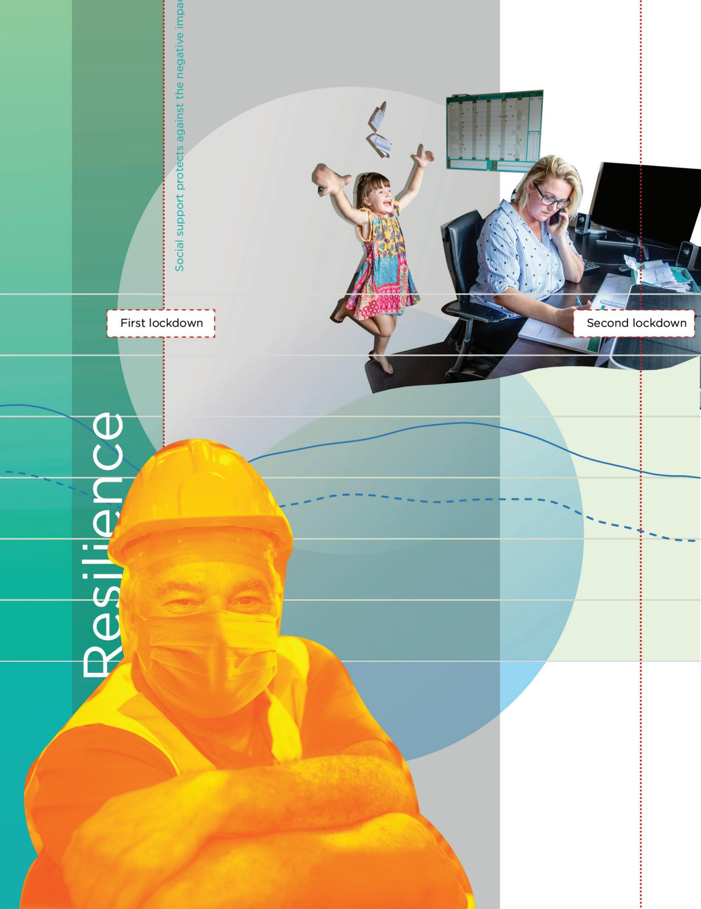

The consequences of the COVID-19 pandemic on economic activity, employment, and our way of working have been far-reaching. In turn, all of these shocks have the potential to substantially impact subjective well-being. Our goal in this chapter is to outline the various ways in which the pandemic has affected the global labour market and the world of work, and investigate the downstream impacts on workers' well-being around the world.

We structure the chapter around five broad issues. In the first section, we begin by surveying global changes in employment and working hours, and highlighting some key inequalities of impact by country, income, gender, age, and type of work. The remainder of the chapter focuses on the well-being implications of these changes. In the second section, we consider the well-being impacts of unemployment and labour market inactivity throughout the pandemic. In the third section, we turn to the well-being of employees who have retained their jobs, using a novel dataset of more than four million individuals collected on an ongoing basis since November 2019. In the fourth section, we build on this analysis by investigating the key drivers of worker resilience during the crisis. In the final section, we speculate on how the changes to the global labour market brought on by COVID-19 may influence the future of work. In doing so, we offer a tentative account of how workers' expectations may begin to change in the aftermath of the pandemic and how these changes could influence the drivers of workplace well-being in the years to come.

# **COVID-19 and the global labour market**

Global growth is estimated to have contracted by more than 4 percent in 2020, representing the largest economic crisis in a generation.1 At the beginning of the year, at the onset of the pandemic, consumer spending began to decline dramatically, most notably in retail and recreation. By April, visits to restaurants, cafes, shopping centres, theme parks, museums, libraries, and movie theatres had declined globally by almost 60 percent, and by more than 80 percent in many

European countries.2 By December, almost 15 million airline flights had been cancelled, an average of 50,000 per day.3 While the global economy began to rebound in the summer, many countries were gripped by a second wave in the autumn and winter. A full return to pre-pandemic levels of stability still appears to be a long way off.

Such dramatic economic downturns have had profound effects on the global labour market. As of January 2021, more than 90 percent of the world's workforce lived in countries where business closures were still in place for at least some sectors.4 Unemployment has also increased in many countries affected by the COVID-19 crisis, though unemployment figures alone do not capture the full extent of the labour market impact for two primary reasons.

First, many workers who have suffered job losses during the COVID-19 pandemic are not actively looking to find new jobs, and are therefore classified as "inactive" or "out of the labour force" in official statistics.5 Increases in inactivity have, in fact, outpaced increases in unemployment in a majority of countries (Figure 7.1).6 For workers who have recently lost their jobs, finding a new one amid a recession can be exceedingly difficult. Data from the international jobs site *Indeed.com* shows that, in many countries, the trend in job postings

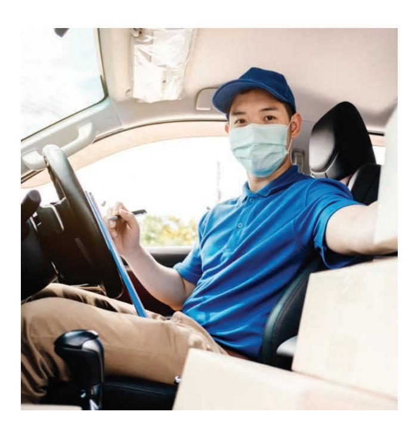

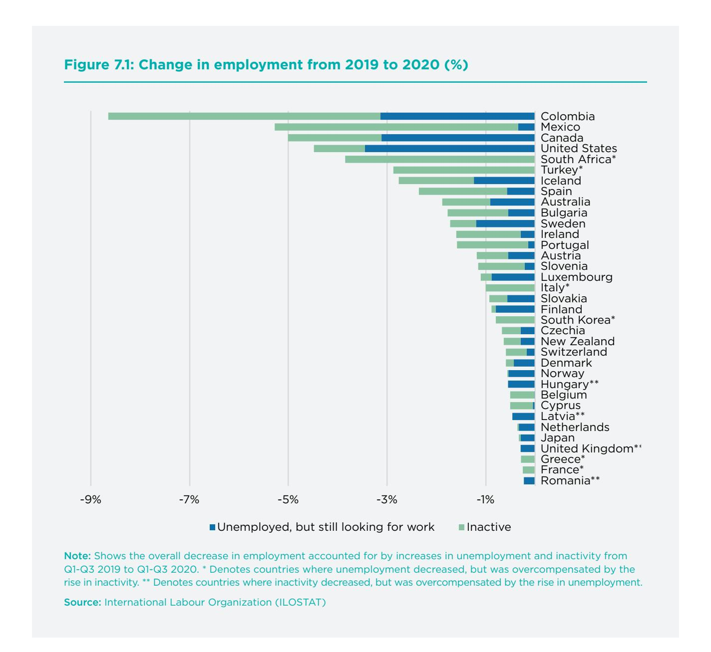

plummeted by more than 50 percent in April and remained well below 2019 trends by the end of the year (Figure 7.2).

Second, even while still in paid work, many workers have had to reduce their working hours as a result of the pandemic. Therefore, looking at declines in total hours worked offers a complete picture of the labour market impact of the crisis. According to the International Labour Organization (ILO), global working hours declined by 17.3 percent in the second quarter of 2020.7 This is equivalent to 495 million full-time jobs lost.8 By the end of the

year, total working hour losses were roughly four times greater than during the Great Recession in 2009.9 These dramatic reductions in working hours have been accompanied by equally dramatic reductions in income. Global labour income declined by 8.3 percent in 2020, amounting to a loss of USD 3.7 trillion, or 4.4 percent of global GDP.10

These changes are likely to have significant effects on well-being. Most studies generally find that those who are unemployed are 5 to 15 percent less satisfied with their lives than those who are

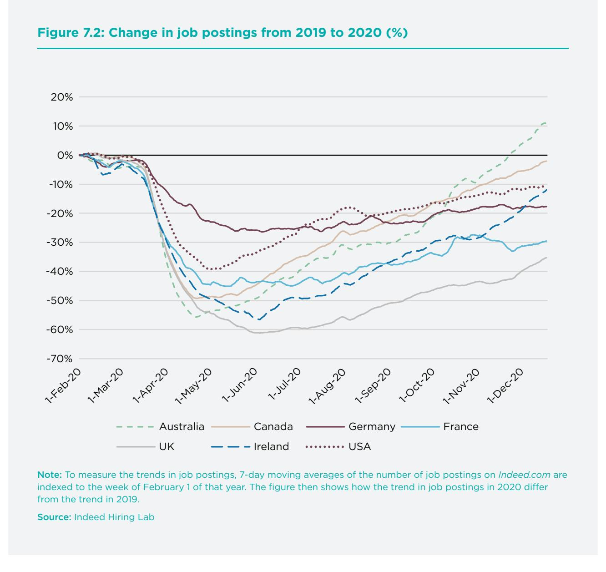

employed.11 In the 2017 edition of this report, we found that unemployed workers are on average 0.6 points less satisfied than counterparts working full-time on a scale from 0-10.12 In high-income countries, this difference becomes even larger. In Western Europe and North America, full-time workers have been found to be 1.11 and 1.31 points more satisfied with their lives than those who are unemployed, respectively.13 Relative to other life circumstances, becoming unemployed is also less subject to well-being adaptation over time.14 Yet, importantly, the relationship between work and

well-being extends beyond simply unemployment. Past research has documented strong negative impacts of underemployment, as well as labour market inactivity. In some analyses, the negative impact of working hour reductions and inactivity on life satisfaction is even larger than the negative impact of becoming unemployed.15

While the labour market impacts of the pandemic have been almost universally widespread, they have also been highly unequal. In the sections that follow, we highlight some key differences of impact across five dimensions: country, income,

gender, age, and type of work. In turn, all of these dimensions feed into the uneven ways the pandemic has affected well-being across society.

#### **Differences in impact between countries**

The global economic impacts of the crisis have been so far highly unequal, with disproportionate effects in developing countries. Since March 2020, workers in lower-middle-income countries have experienced a 43 percent larger reduction in working hours and labour income than in highincome countries.16 Informal sector workers, who make up a considerable portion of the labour force in developing countries, have been particularly at risk. Estimates from the ILO suggest that 1.6 billion informal sector workers have seen their hours decrease since the onset of the pandemic. In low-income countries, the resulting drop in earnings is estimated to be 86 percent.17 Workers in developing countries are generally much less likely to work remotely, and therefore at higher risk of losing their jobs and contracting the disease in their normal work environments.18 Many governments in low-income countries have also been financially incapable of providing workers with sufficient economic relief. As of October 2020, announced fiscal stimulus packages in low-income countries amount to only 13 percent of what would be required to offset the total loss in working hours.19 These trends contribute to increased labour market instability in many of the world's most vulnerable regions.

Even within high-income countries, there are large differences in the magnitude of the economic downturn. By the end of June 2020, GDP growth had decreased by 22 percent in Spain and the United Kingdom relative to the year before. In South Korea, Finland, and Norway, this figure was less than 5 percent.20 In Europe, the economic consequences of the crisis have been outsized in countries with already precarious labour market conditions. Even workers employed in the same sector face considerably different economic outlooks. Among those working in food and accommodation, the risk of losing working hours at the beginning of the crisis was four times larger in Spain and Italy than in Denmark or Finland.21 Young and low-skill workers have also been more

likely to lose their jobs or reduce their working hours in Spain and Ireland than in Denmark or France (Figure 7.3b-c). Individual-level survey data collected at the height of the first wave documents similar cross-country differences in the United Kingdom, United States, and Germany, with employment losses being much more pronounced in the U.K. and U.S.22

While many of these effects have been shaped by public health policies in each country, labour market policies have also played an important role. Many countries have introduced fiscal stimulus packages to buffer the economic shock. By October 2020, governments around the world had promised upwards of USD 9 trillion to mitigate the negative economic consequences of the pandemic.23 Where these policies pertain to the labour market, they are generally aimed at job retention and/or income replacement. Job retention schemes strive to keep contracts between employees and employers intact by alleviating firms' labour costs and subsidizing workers for lost hours. As of May 2020, job retention policies were supporting more than 50 million jobs in OECD countries.24 On the other hand, income replacement schemes aim to provide financial relief directly to affected workers without explicitly seeking to maintain employment contracts. This approach was characteristic of the early response to the pandemic in the United States.

Generally speaking, countries that have introduced larger and more comprehensive fiscal stimulus packages have seen less severe reductions in working hours.25 However, key differences of impact across countries have also emerged, depending on the policy approach adopted. We will explore these dynamics in greater detail in the second part of this chapter.

#### **Low-income and low-skill workers**

One of the starkest consequences of the crisis has been the exacerbation of existing socio-economic inequalities. In almost every European country, low-income and low-skill workers were more likely to have reduced their working hours (Figure 7.3a) or lost their jobs (Figure 7.3b) in the early phases of the pandemic.26 In Ireland, twice as many low-income workers reduced their working hours

relative to high-income workers. In Sweden, low-skill workers experienced working hour declines that were almost three times as large as the national average. Similar trends have been observed in Japan, the United States, and the United Kingdom.27 In the U.K., almost one-third of low-income households had lost more than 20 percent of their earnings by the end of the first wave, while only one-fifth of high-income households reported the same.28 College-educated workers in the U.K. were also 6 percent less likely to have lost their jobs in April relative to lowereducated workers.29 In the United States, employment rates for low-income workers sunk by 24 percent as of December 2020. For highincome workers, the recession had practically ended by the same time, with an observable increase in employment of 1 percent compared to the beginning of the year.30

Vulnerable workers were also at greater risk of experiencing low subjective well-being before the pandemic took root. Low-income and low-skill workers are typically less satisfied with their jobs while also more dependent on them.31 Like many other dynamics detailed in this chapter, the labour market impacts of the pandemic have seemed to fall disproportionally on those already in more vulnerable positions, to begin with.

#### **Disproportionate effects of the pandemic on young people**

Young people are facing multiple social and economic shocks resulting from the COVID-19 crisis. Data from the International Labour

*Coupled with delays to education and training programs, obstacles to finding work, and increases in loneliness and social isolation, the COVID-19 pandemic has taken a particularly dramatic toll on young people's well-being.*

Organization (ILO) indicates that roughly 178 million young people – 1 in 4 of the global working population between the ages of 15 and 24 – worked in the hardest-hit sectors when the pandemic began. Young women, in particular, make up more than half of youth employment in food and accommodation. More than 75 percent of young workers are also informally employed. In low-income countries, this percentage climbs to above 90 percent.32

The resulting increases in youth unemployment and inactivity have been severe. Between February and July 2020, employment among adults declined by 5.1 percent, while employment among young adults fell by 17.4 percent, more than three times as much.33 In the United States, roughly 1 in 4 young adults were unemployed during the same period, an increase of 290 percent from the year before.34 By the end of September, young people also faced greater than average risks of losing their jobs in almost every European country (Figure 7.3c). Rates of inactivity among young workers have also outpaced corresponding rates of inactivity among adults in Australia, Canada, South Korea, and the United States.35 Coupled with delays to education and training programs, obstacles to finding work, and increases in loneliness and social isolation, the COVID-19 pandemic has taken a particularly dramatic toll on young people's well-being.36

#### **Gendered impacts of COVID-19**

Women have also been particularly vulnerable to the labour market consequences of the pandemic. Globally, four in ten employed women work in sectors that were hard-hit COVID-19, including travel, retail, food, accommodation, and services. In low-and middle-income countries, women are also much more likely to be employed in domestic work, a sector in which three out of four workers were at risk of losing their job in June 2020. At the same time, women are also overrepresented in certain essential sectors, including health and social work, exposing them to greater physical and mental health risks. In many high-income countries, more than 80 percent of the health workforce is made up of women.37 Perhaps, as a result, early estimates

**Figure 7.3a: Risk of reduced working hours by income level (Q2 2020)**

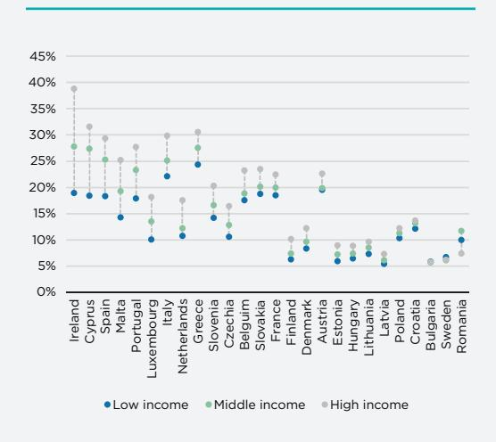

Note: Includes 0 to 100% reduction in working hours while still remaining employed. Risks estimated using logistic regression.

Source: Eurostat (2020)

**Figure 7.3b: Decline in working hours by skill level (Q3 2019 – Q3 2020)**

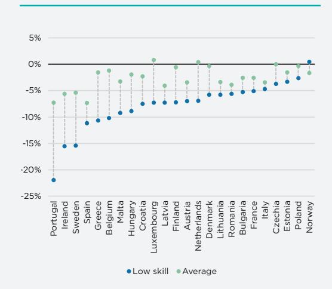

Note: Data refers to low-skill blue-collar workers (ISCO08 codes 8 and 9).

Source: Eurostat (2021)

**Figure 7.3c: Change in employment rate by age (Q3 2019 – Q3 2020)**

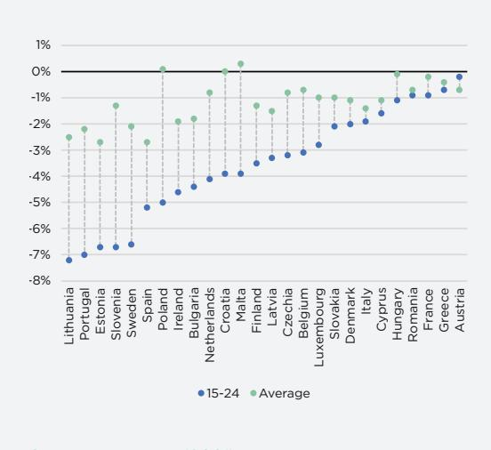

Source: Eurostat (2021)

**Figure 7.3d: Change in employment rate by gender (Q3 2019 – Q3 2020)**

Source: Eurostat (2021)

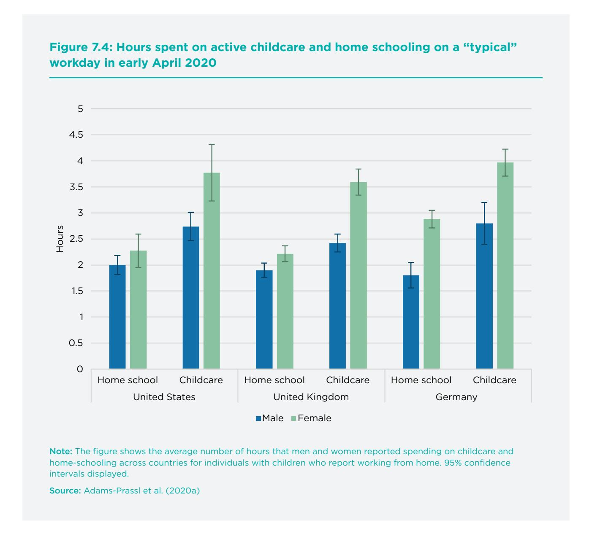

regarding gender gaps in the ability to work from home and employment changes have provided mixed results.38 For example, in Europe, women were more likely to lose their jobs in Finland, France, and Belgium, but not in Sweden, Portugal, or Denmark (Figure 7.3d).

Childcare responsibilities arising as a result of school closures can also play a role in the reduction of working mothers' labour supply.39 Single parents are particularly at risk, of whom almost four out of five around the world are women.40 Single mothers were also much more likely to be

socioeconomically disadvantaged before the pandemic began.41 In the United Kingdom, single mothers are more likely to work in hard-hit sectors, less likely to own a house, and less likely to have access to a car. They have also been much more likely to reduce their hours or leave the labour force entirely as a result of the crisis.42 In the United States – a country in which one in four children live in single-parent households, the highest rate globally – single mothers have been less satisfied with their working hours and more likely to report low productivity since the pandemic began.43

Yet, even among coupled adults, women have seemed to bear the brunt of the burden. Using panel data collected in the United States from February to April 2020, one study found that mothers had reduced their working hours by two hours per week, roughly four to five times more than fathers.44 This trend was even more pronounced among parents with young children and did not seem to depend on the extent to which either partner worked from home. In the early phases of the pandemic, mothers in the U.K., U.S., and Germany were also spending considerably more time on childcare than fathers and slightly more time on home-schooling activities.45 Even among working parents, large gender gaps in time spent on childcare remain (Figure 7.4).46 However, there is also evidence to suggest that these gender gaps may be getting smaller. In many countries, fathers have also increased time spent on childcare since the beginning of the pandemic, leading to slight shifts towards more egalitarian distributions of labour.47

#### **Accommodation, food service, and temporary workers have been hit hardest**

Differences in the extent to which workers can shift to a home office have become extremely salient during the pandemic. The ability to work from home has been an important predictor of job loss.48 These impacts have also varied considerably by sector. Accommodation and food service employees have been particularly hard hit (Figure 7.5). Workers employed under less secure work arrangements have also been more likely to lose their job or suffer earnings losses during the crisis. One study found that roughly 30 percent of survey respondents employed under temporary contracts in the United States and the United Kingdom had lost their job by early April, compared to roughly 15 percent of permanent employees.49 In Europe, workers on temporary contracts were more likely to lose their jobs in the second quarter of 2020 than both low-income and low-skill workers.50

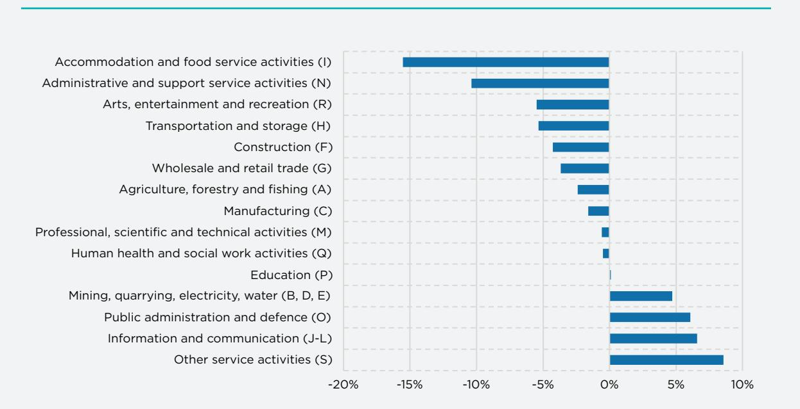

Note: Includes data from the EU-27 minus Germany. Sectors broken down by NACE categories.

Source: Eurostat (2021)

# **(Un)employment and well-being during COVID-19**

Given the vital role that work plays in our lives, it is crucial to understand how rising levels of unemployment and inactivity have impacted well-being. To address this issue, we use data from the COVID-19 Behaviour Tracker, a joint project between Imperial College London and YouGov, which integrates weekly data on behaviour and life satisfaction as a response to COVID-19.51 We restrict our analysis to 32 weeks of data, beginning at the onset of the pandemic, that track life satisfaction and negative affect on a weekly basis for a representative sample of respondents from 29 large economies (n=363,768). Between April 2020 and January 2021, the average respondent in these countries ranked their life satisfaction as 6.3 on a 0 to 10-point scale, with a standard deviation of 2.0.52

#### **Life satisfaction, unemployment, and inactivity**

One of the most robust and well-documented findings in the economics of subjective well-being is that the unemployed are significantly less happy than the employed. Yet, the relationship between employment and well-being also tends to be moderated by background labour market conditions. In times of recession, the negative impact of unemployment on subjective well-being is generally less severe – an effect that is usually attributed to the reduced social stigma associated with job loss.53 In the present context, the large increases in unemployment and inactivity due to the coronavirus may therefore attenuate the negative impact of being laid off or reducing working hours. At the same time, workers who experience hardships associated with COVID-19 and become more unhappy may also become more likely to resign from work or lose their jobs.54 This dynamic could lead to even greater declines in well-being associated with job loss for vulnerable workers during the pandemic.

Figure 7.6 shows the average life satisfaction for the unemployed compared to those in part-time or full-time employment, averaged across all months between April 2020 and January 2021. In line with previous findings, we find that in all

countries, unemployed respondents score substantially lower on the Cantril Ladder. On average, the life satisfaction of employed respondents is 6.4 on a scale from 0 to 10, while the life satisfaction of unemployed respondents is markedly lower at 5.2. This is a sizable difference of 1.2 points, equivalent to 60 percent of a standard deviation in life satisfaction.55

**Figure 7.6: Life satisfaction by employment status around the world (2020)**

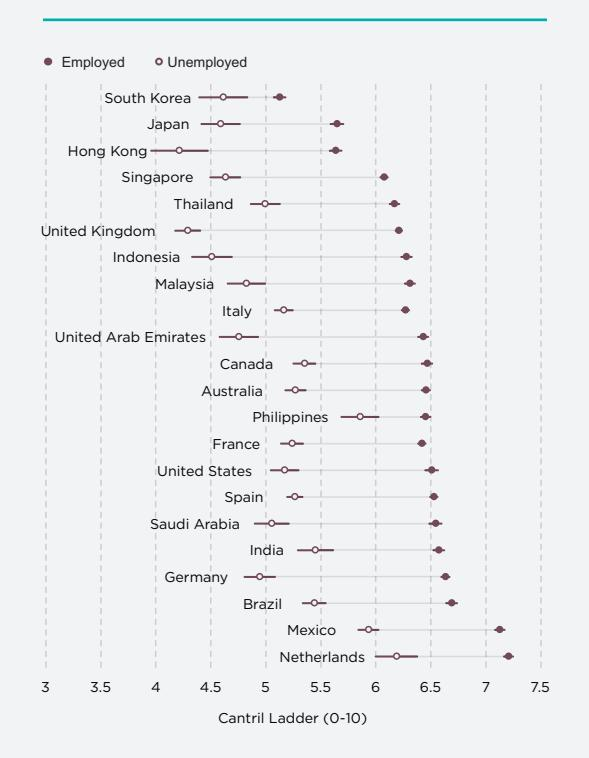

Note: The figure shows average life satisfaction differences for unemployed and employed adults (full-time and part-time) across 22 large economies. Life satisfaction is measured using the Cantril Ladder on a scale from 0 to 10. The sample includes respondents aged 18 to 65. 95% confidence intervals displayed.

Source: YouGov, Imperial College

Figure 7.7 shows how life satisfaction by employment status varies across gender. When employed, men and women have very similar levels of life satisfaction. However, unemployment appears to decrease men's happiness more than women, though the gap varies significantly across countries. This finding, that men tend to be more severely affected by unemployment than women, is largely consistent with prior evidence and appears not to have been dramatically altered by the onset of COVID-19.56 In the appendix, we also plot patterns of life satisfaction and employment for different age groups.57 Across countries, middle-aged adults are generally less satisfied with their lives when unemployed than other age cohorts, although there are some notable exceptions, including Brazil, India, and Mexico.58

In Table 7.1, we estimate a linear regression model in which life satisfaction is regressed on employment

status and additional control variables to isolate the impact of not being able to work during the pandemic. The reference category in terms of employment status, in this case, are respondents working full-time. The coefficients in column (1) show that unemployed respondents' life satisfaction is significantly lower than that of people working full-time throughout this period. Labour market inactivity – characterised by not having a job and no longer looking for one – also has a statistically significant negative effect on life satisfaction.

In column (2), we add into the equation a set of individual characteristics, including age, gender, household size, and parenthood status. In column (3), we add two variables indicating trust in the national healthcare system and trust in the national government. Finally, in column (4), we add a series of health-related control variables, including the presence of any pre-existing conditions,

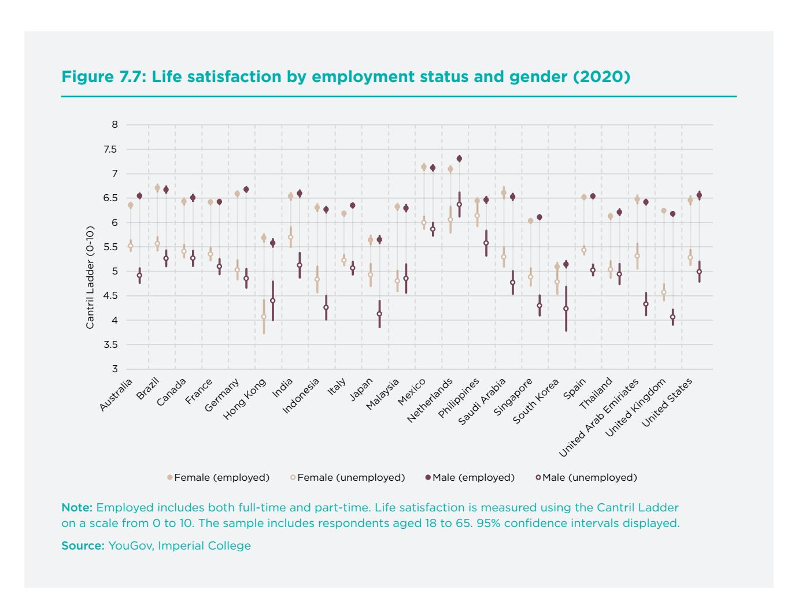

**Table 7.1: Determinants of life satisfaction during the COVID-19 pandemic**

|                        | (1)       | (2)       | (3)                   | (4)       |
|------------------------|-----------|-----------|-----------------------|-----------|
|                        |           |           | Cantril Ladder (0-10) |           |
| Full-time (reference)  |           |           |                       |           |
| Unemployed             | -1.376*** | -1.349*** | -1.321***             | -1.300*** |
|                        | (0.069)   | (0.066)   | (0.066)               | (0.063)   |
| Inactive               | -0.703*** | -0.788*** | -0.769***             | -0.732*** |
|                        | (0.111)   | (0.108)   | (0.107)               | (0.097)   |
| 18-24                  |           | -0.175*   | -0.159*               | -0.204**  |
|                        |           | (0.084)   | (0.086)               | (0.086)   |
| 25-34                  |           | -0.000    | 0.007                 | -0.027    |
|                        |           | (0.039)   | (0.039)               | (0.039)   |
| 35-44 (reference)      |           |           |                       |           |
| 45-54                  |           | 0.011     | -0.003                | 0.023     |
|                        |           | (0.045)   | (0.045)               | (0.045)   |
| 55-64                  |           | 0.194**   | 0.160*                | 0.219**   |
|                        |           | (0.080)   | (0.080)               | (0.081)   |
| 65+                    |           | 0.606***  | 0.576***              | 0.647***  |
|                        |           | (0.169)   | (0.165)               | (0.166)   |
| Male                   |           | -0.129*** | -0.124***             | -0.122*** |
|                        |           | (0.025)   | (0.027)               | (0.026)   |
| Live alone             |           | -0.449*** | -0.441***             | -0.438*** |
|                        |           | (0.039)   | (0.040)               | (0.035)   |
| Parent                 |           | 0.249***  | 0.240***              | 0.248***  |
|                        |           | (0.045)   | (0.044)               | (0.041)   |
| Trust in health system |           |           | 0.397***              | 0.352***  |
|                        |           |           | (0.024)               | (0.023)   |
| Trust in government    |           |           | 0.296***              | 0.265***  |
|                        |           |           | (0.047)               | (0.044)   |
| Health controls        | No        | No        | No                    | Yes       |
| Country fixed effects  | Yes       | Yes       | Yes                   | Yes       |
| Week fixed effects     | Yes       | Yes       | Yes                   | Yes       |
| Constant               | 6.490***  | 6.586***  | 6.131***              | 6.616***  |
|                        | (0.022)   | (0.059)   | (0.076)               | (0.091)   |
| Mean dependent var     | 6.183     | 6.183     | 6.183                 | 6.183     |
| Observations           | 97613     | 97613     | 97613                 | 97613     |
| R-squared              | 0.102     | 0.116     | 0.134                 | 0.151     |

Note: Regressions are estimated using OLS. Heteroskedasticity robust standard errors are reported in parenthesis, adjusted for clustering at the country level. Health controls include presence of pre-existing conditions, individual and household COVID-19 status, ability to isolate, and willingness to isolate. \*\*\* p<.01, \*\* p<.05, \* p<.1

Source: YouGov, Imperial College

whether or not the respondent or anyone else in the household has tested positive for COVID-19, ability to isolate, and willingness to isolate. Overall, we find highly consistent associations between unemployment, inactivity, and subjective wellbeing. Once the full suite of control variables is added, we find that, relative to full-time workers, unemployment predicts a 1.3-point decline in life satisfaction, while inactivity predicts a 0.7-point decline on a scale from 0 to 10. These effects render employment status one of the most important predictors of subjective well-being during the COVID-19 crisis across countries.

#### **Negative affect and employment status**

In this section, we consider the association between employment status and negative affect. Our dataset records responses along four dimensions: depression, anxiety, worry, and lack of interest in daily activities. Responses to each negative affect question are recorded on a scale from 0 to 3, where higher values correspond to higher levels of negative affect.61 Responses to these four questions are then aggregated to provide an overall assessment of negative affect on a scale from 0 to 12, with a mean value of 3.7. Disaggregated regressions for each dimension are also provided in the appendix.62

Table 7.2 shows how variation in negative affect is explained by employment status, personal characteristics, trust in institutions, health status, and country and week fixed effects. Those who report being unemployed or inactive during the pandemic report significantly higher levels of negative affect than those who are employed on a full-time basis. The standard deviation of the negative affect index variable is about 3.3 on a 0 to 12-point scale, indicating that the coefficients on unemployment and inactivity are both statistically and meaningfully significant. Even after including an extensive set of controls, unemployed respondents score 1.2 points (0.4 standard deviations) higher in negative affect than full-time workers, while those who are out of the labour force report negative affect scores that are 0.67 points (0.2 standard deviations) higher.

#### **Age, gender, and employment status during COVID-19**

Given the unequal impacts of the crisis, it is worth commenting on differential well-being impacts of unemployment by age and gender. First, we find that every age group reported higher levels of life satisfaction than young people (18-24) during the pandemic, a difference that also seems to increase with age (Table 7.1). Related research conducted during COVID-19 has documented similar decreases in life satisfaction among young people.63 These trends are notably different from past studies before the crisis, which tend to track a U-shape curve in life satisfaction over the life course.64 At the same time, we also find that young people have seemed to experience higher levels of negative affect than older adults (Table 7.2). Taken together, this evidence suggests that young people's subjective wellbeing has been dramatically impacted by the onset of the pandemic, more so than almost any other age group.

However, in the appendix, we provide evidence that the effect of unemployment on life satisfaction and on negative affect has been comparatively smaller for young people than for older adults throughout the crisis.65 Instead, we observe particularly pronounced effects of unemployment on well-being for those middle-aged and older. This could indicate that young people may expect the difficulties in finding work to pass once the pandemic has subsided, while older adults who have lost their job in the midst of COVID-19 may be less optimistic.66 While we observe slight increases in the impact of inactivity on negative affect for middle-aged adults relative to young people, these differences prove to be only marginally significant.

In line with previous studies, we also find that the effects of unemployment on life satisfaction for men have been more severe than for women throughout the pandemic.67 Labour market inactivity has also seemed to reduce life satisfaction more for men than for women, to an even greater extent than the gendered impact of unemployment.68

**Table 7.2: Determinants of negative affect during the COVID-19 pandemic**

|                        | (1)      | (2)       | (3)                    | (4)       |
|------------------------|----------|-----------|------------------------|-----------|
|                        |          |           | Negative affect (0-12) |           |
| Full-time (reference)  |          |           |                        |           |
| Unemployed             | 1.354*** | 1.257***  | 1.213***               | 1.204***  |
|                        | (0.113)  | (0.107)   | (0.107)                | (0.092)   |
| Inactive               | 0.736*** | 0.753***  | 0.724***               | 0.663***  |
|                        | (0.185)  | (0.194)   | (0.193)                | (0.159)   |
| 18-24                  |          | 0.831***  | 0.812***               | 0.776***  |
|                        |          | (0.071)   | (0.071)                | (0.068)   |
| 25-34                  |          | 0.448***  | 0.437***               | 0.424***  |
|                        |          | (0.057)   | (0.058)                | (0.056)   |
| 35-44 (reference)      |          |           |                        |           |
| 45-54                  |          | -0.325*** | -0.304***              | -0.355*** |
|                        |          | (0.077)   | (0.077)                | (0.077)   |
| 55-64                  |          | -0.731*** | -0.680***              | -0.846*** |
|                        |          | (0.107)   | (0.104)                | (0.106)   |
| 65+                    |          | -1.127*** | -1.082***              | -1.302*** |
|                        |          | (0.151)   | (0.147)                | (0.156)   |
| Male                   |          | -0.370*** | -0.375***              | -0.441*** |
|                        |          | (0.071)   | (0.064)                | (0.058)   |
| Live alone             |          | 0.371***  | 0.362***               | 0.337***  |
|                        |          | (0.072)   | (0.075)                | (0.064)   |
| Parent                 |          | 0.122**   | 0.134**                | 0.009     |
|                        |          | (0.053)   | (0.049)                | (0.036)   |
| Trust in health system |          |           | -0.660***              | -0.565*** |
|                        |          |           | (0.062)                | (0.051)   |
| Trust in government    |          |           | -0.375***              | -0.327*** |
|                        |          |           | (0.084)                | (0.079)   |
| Health controls        | No       | No        | No                     | Yes       |
| Country fixed effects  | Yes      | Yes       | Yes                    | Yes       |
| Week fixed effects     | Yes      | Yes       | Yes                    | Yes       |
| Constant               | 3.603*** | 4.163***  | 4.853***               | 3.790***  |
|                        | (0.039)  | (0.100)   | (0.065)                | (0.102)   |
| Mean dependent var     | 3.903    | 3.903     | 3.903                  | 3.903     |
| Observations           | 91981    | 91981     | 91981                  | 91981     |
| R-squared              | 0.041    | 0.067     | 0.081                  | 0.127     |

Note: Regressions are estimated using OLS. Heteroskedasticity robust standard errors are reported in parenthesis, adjusted for clustering at the country level. Health controls include presence of pre-existing conditions, individual and household COVID-19 status, ability to isolate, and willingness to isolate. \*\*\* p<.01, \*\* p<.05, \* p<.1

Source: YouGov, Imperial College

#### **Parenthood and unemployment**

In Table 7A.4 in the appendix, we also consider the impacts of unemployment and inactivity on life satisfaction for adults with and without children. First, it is worth noting that both men and women with children have generally reported higher levels of life satisfaction than non-parents throughout the crisis.69 However, the interactions of parenthood and unemployment on life satisfaction prove to be insignificant. In other words, we do not find strong evidence that having children exacerbated the impact of unemployment on life satisfaction during the pandemic.

However, we do observe that having children in the household can mitigate the negative impact of inactivity on life satisfaction. While the overall impact of inactivity is still negative, men and women with children seemed to have experienced less severe reductions in life satisfaction as a result of being out of the labour force than those without children. This dynamic may suggest that adults with children who have left the labour market due to the pandemic have been able to spend more time with their children at home, thereby attenuating the negative effects of the crisis on life satisfaction.

We also find that, while having children predicts higher levels of negative affect for both men and women, having children does diminish the affective impact of unemployment for men and inactivity for women. Overall, we find that men without children experience a sharper uptick in negative affect as a result of unemployment and inactivity than any other group under consideration.70

#### **Labour market policy responses to COVID-19 and well-being**

While most governments have adopted measures to protect workers from labour market shocks related to COVID-19, there has been a large degree of variation in the responses and policy packages implemented by different countries. Following our discussion in earlier sections, we distinguish between policies focused on job retention, which aim to keep workers employed in their jobs, and interventions focused on income replacement, aiming to top up lost wages without necessarily maintaining employment contracts.

Alongside their economic effects, these strategies are also expected to have differential effects on subjective well-being. Most importantly, income replacement schemes are not designed to address the non-pecuniary aspects of work. While maintaining a sustainable source of income is undeniably important to well-being, employed workers also benefit from a broad range of non-monetary rewards. Jobs can provide a source of meaning, community, and social status. Therefore, job retention policies are likely preferable to income replacement policies from a well-being perspective, as the former are better poised to keep these non-financial advantages of employment intact.

In this section, we look at three large economies that have adopted different labour market policies: Germany, which focused on job retention using short-time work schemes; the United Kingdom, which focused on job retention using wage subsidy schemes; and the United States, which focused largely on income replacement.

In Germany, workers have benefited from *Kurzarbeit*, a long-running program that allows employers to reduce their employees' working hours up to 100 percent, with the state covering all or most of the difference in lost wages. In March 2020, the German government expanded access to the program and loosened the eligibility criteria so that more businesses would be able to apply for benefits. Governments in the United Kingdom and the United States also introduced relief packages to assist workers, though they have generally been more restrictive.71 In the U.K., the Coronavirus Job Retention Scheme allowed firms to furlough workers for up to three months while replacing 80 percent of employees' lost wages, for up to £2,500 per month. However, unlike the German *Kurzarbeit*, furloughed workers were not allowed to undertake any work for their employers in the initial phase of the program.72 From July 2020 onwards, this policy was adjusted to allow employees to work part-time. In the United States, the Coronavirus Aid, Relief, and Economic Security (CARES) Act included provisions to subsidize firms' labour costs, although few firms took up the program. The program's rollout was limited by administrative bottlenecks, lack of

awareness, weak financial incentives, and caps on reductions in working hours.73 In practice, the United States relief effort functioned much more effectively as an income replacement scheme. Initially, unemployment benefits were increased to \$600 per week for four months, and households earning under \$75,000 per year were sent one-time direct payments of \$1,200, plus an extra \$500 per child. Likely as a result of these divergent approaches, rates of unemployment and inactivity increased much more in the United States than in the United Kingdom or Germany.74

To consider the well-being implications of these approaches, we plot national averages of life satisfaction (Figure 7.8a) and negative affect (Figure 7.8b) for all three countries starting in April 2020.75 Data for the United States extends until mid-September, while data for the United Kingdom and Germany extends through December. For both Germany and the U.K., we see slight increases in life satisfaction from April onwards followed by slight decreases as both countries entered second waves of infections in autumn. However, while Germany never drops below initial

record levels, the trend in the U.K. becomes increasingly negative towards the end of the summer. Both trends are also dramatically different than the United States, which sees a steep linear decline in life satisfaction throughout the spring and summer. In September, respondents in the U.S. rated their life satisfaction to be 0.2 points lower than Germany, even though the former reported higher levels of life satisfaction at the start of the pandemic in April.

In terms of negative affect, we see a sharp divergence between Germany and the United States, and the United Kingdom. Respondents in the latter two countries not only reported higher levels of negative affect, to begin with, but also seemed to experience steeper increases as time went on. By September, negative affect had increased by 10 percent in the United States and 6 percent in the United Kingdom. In Germany, negative affect had decreased by 2 percent by the same time. However, Germany then began to experience increases in negative affect towards the end of the year, while negative affect in the United Kingdom began to steadily decline.

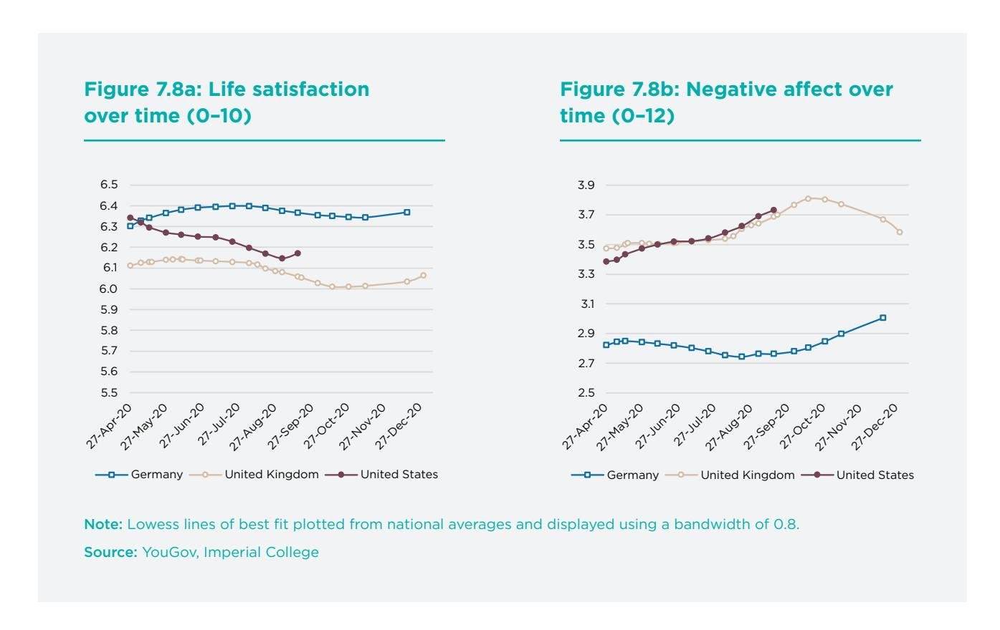

While this analysis does not allow for causal interpretations, it does suggest that Germany and the United Kingdom, both of which adopted policies aimed at job retention, have been better able to withstand the negative well-being impacts of the pandemic than the United States.

# **Employee well-being during the COVID-19 pandemic**

Thus far, we have mostly considered the wellbeing impacts of unemployment and inactivity. In this section, we turn our focus to those who have remained employed. The landscape of work has changed dramatically as a result of COVID-19. Many workers have begun working from home, while others have had to reduce their working hours. At the same time, employees in key professions may have seen their workload increase dramatically, while being exposed to additional workplace stressors and health risks. Changes to workplace conditions and cultures brought on by the crisis are likely to have long-lasting impacts. Many of the world's largest companies, including Google, Facebook, Twitter, Amazon, and Viacom, have announced plans to allow employees to continue working remotely after the pandemic has subsided.76 Therefore, it is crucial to understand how employees have fared in this new world of work, and what these effects may tell us about the future of work.

#### **For those remaining at work, how was their well-being affected?**

In this section, we consider the evolution of worker well-being throughout the pandemic thus far. To do so, we make use of a novel proprietary dataset set collected in the United States. Beginning in November 2019, the jobs website *Indeed.com* has been collecting data on employee happiness in an effort to assist jobseekers in their job search and decision-making process by providing them with company reviews from current and former employees. Since then, the company has amassed a very large and growing depository of data on workplace happiness in the United States, with over 5 million individual responses so far.

The great benefit of this unique dataset is its sheer size. Even over a relatively short period, such a large number of observations allows for a granular look at workplace happiness across companies, locations, and time. However, because users decide for themselves whether or not to use the site and whether or not to review the company they currently work for, the sample is, of course, not a random or nationally representative one. Average estimates of workplace happiness may be biased if, for example, very happy or very disgruntled employees are more motivated to fill in the survey. However, to the extent that these potential sources of bias are evenly distributed across companies and over time, it may nevertheless be instructive to observe trends in the evolution of workplace happiness during the pandemic.

Since users can review companies they currently and formerly work for, we limit the sample for our purposes here to include only a subset of respondents who we are most confident currently work for the company they are reviewing. In this case, we are primarily concerned with the extent to which respondents agree with the following statement: *"I feel happy at work most of the time."* Responses are recorded from 1 (strongly disagree) to 5 (strongly agree).77 This number is then rescaled by Indeed to provide an overall indication of workplace happiness from 0 to 100.78

In order to study the evolution of workplace happiness over time, we first plot average daily happiness using the raw data in Figure 7.9, overlayed with a local regression (or "lowess") line of best fit. We find that workplace happiness declined throughout January and February, as the beginnings of the crisis unfolded. This downward trend reaches its bottom and levels out around the time that the federal government declared a national state of emergency, and various state and local governments began to impose stay-at-home orders. Perhaps counterintuitively, workplace happiness then proceeded to increase, reaching the year's high around the time \$1,200 stimulus checks were mailed out to recipients in mid-April as a result of the CARES Act.

Given our dataset's limitations, it is impossible for us to say exactly why workplace happiness increased following the state of emergency

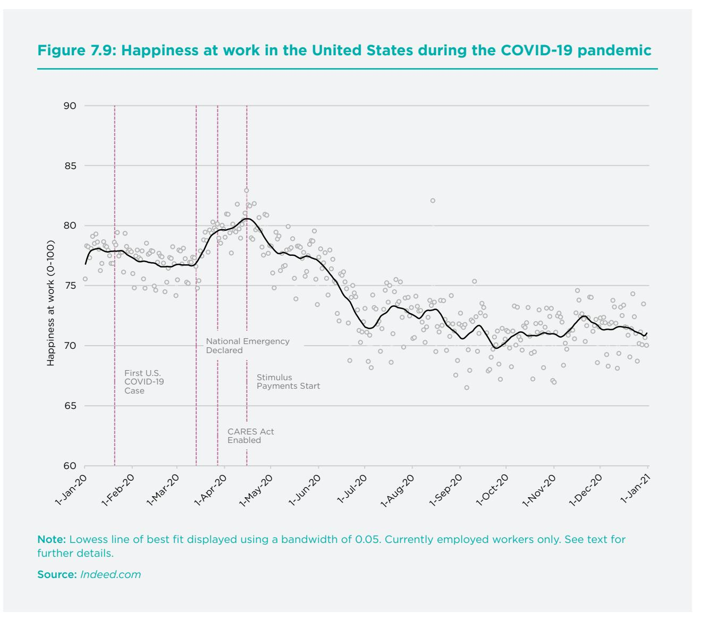

declaration and remains open to future research. One conjecture is that the uncertainty of a rapidly unfolding crisis was eased once local governments began to respond to the severity of the crisis with policy measures, and many people were ordered to stay home. During this period, the federal government also began negotiating a stimulus package, which may have helped to soothe some workers' fears of job loss and provided the reassurance of an eventual cash stimulus payment. In the final sections of this chapter, we present related evidence that happiness levels reached their lowest point in the United Kingdom just before lockdowns were implemented, after which they began to recover. Taken together, this may

suggest that uncertainty and anticipation effects could have had stronger negative effects on well-being than government policy throughout the crisis.

Another possibility is more mechanical. As we have seen elsewhere in this chapter, this phase of increasing workplace happiness in March and April coincided with an unprecedented and precipitous rise in unemployment.79 It is worth re-iterating that ours is not a measure of average workforce happiness, but only of average happiness for those currently employed. As a result, we are only observing those who remain in work – the "survivors" in this period. This changing composition of the sample may account for at least some of the observed changes in happiness. For example, (a) happier workers may have been more likely to retain their jobs in any given occupation or industry, (b) higher wage (and generally happier) industries were less acutely affected, (c) workers' reference groups may have changed, and/or (d) workers remaining employed may have been more able to work from home in the first place, and therefore less negatively affected by workplace closures.80 Given the limitations of our data, we cannot easily distinguish between these potential explanations.

Workplace happiness then began to decline after the initial boost in March and April. Interestingly, the lowest point of the year was not when a national emergency was declared, but later in the year, once workers' resilience ostensibly began to wear off and the long-haul nature of the pandemic became a reality. Happiness levels continued to erode in autumn and still had not recovered by the end of the year. This is notable since, by autumn, employment levels among high-wage workers had fully returned to pre-pandemic levels

in the United States, while employment levels for middle-wage workers and especially low-wage workers remained well below the baseline.81 Inasmuch as this changing composition of the national workforce is reflected in our sample, the fact that happiness levels did not increase even as high-wage workers were increasingly re-hired is worth highlighting. The lack of a summer recovery in happiness levels is also somewhat at odds with trends observed in other countries, including the United Kingdom and Germany.82 However, while many European countries experienced declines in COVID-19 cases after the first wave in the spring, the United States experienced an even more dramatic second wave throughout the summer months. Nevertheless, it is again important to stress that these explanations should be interpreted with caution because the sample is not randomly collected or nationally representative. It remains possible that at least some of the observed changes in happiness may be attributable to changes in data collection procedures.83 Future research using more traditional academic and government data sources may begin to shed more light on these dynamics.

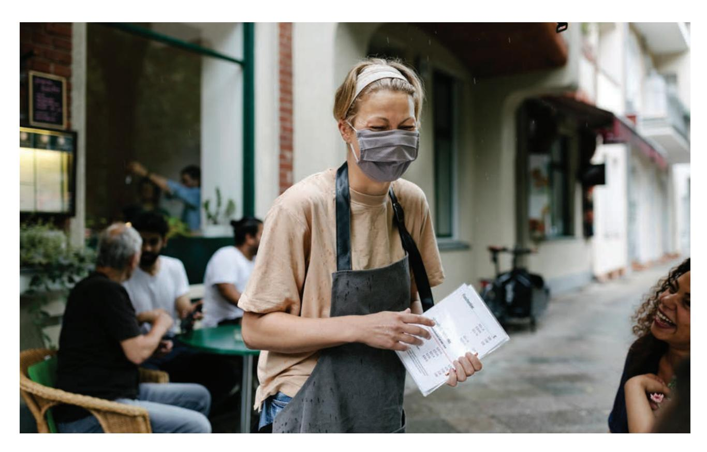

#### **Drivers of employee well-being in times of crisis**

Alongside the happiness question, survey respondents on *Indeed.com* were also asked about eleven "drivers" of workplace well-being as part of the company reviewing process.84 In this section, we use this data to consider how job and workplace characteristics shaped employee well-being throughout the course of the pandemic. We look at the extent to which workers (1) feel they achieve their goals at work, (2) have a clear sense of purpose, (3) feel appreciated, (4) feel a sense of belonging, (5) have the time and location flexibility they need, (6) work in an inclusive and respectful environment, (7) learn at work, (8) have a manager who helps them succeed, (9) are paid fairly, (10) feel supported, and (11) trust their colleagues.85 Our intention in this section is not only to assess the degree to which of these drivers are correlated with workplace happiness, but also to consider if and to what extent their importance has shifted throughout the course of the pandemic.

To this end, we again restrict the sample to include only respondents who we are confident are currently employed at the company they are reviewing. In Table 7.3, we regress workplace happiness (measured on a scale from 0 to 100) on this set of eleven drivers (each one of which we z-score to have a mean of 0 and standard deviation of 1). We use data recorded prior to March 1, 2020, and after April 1, 2020.86 We create an indicator variable for the period after the onset of COVID-19 – i.e., after April 1 – and interact it with each driver.87 Finally, we include a battery of fixed effects, including the date of survey completion, company, occupation, where the respondent clicked through to the survey, and state.88 To help visualize these dynamics, coefficients associated with each driver are plotted on a month-to-month basis in Figure 7.10.89

While all of the eleven drivers are significantly related to happiness, we can also observe a number of changes in the strength of these correlations as the year progressed.90 We note two broad developments here. First, more eudaimonic drivers of workplace happiness – achievement, purpose, and learning at work – appear to have declined in importance.91 Amid rising unemployment

**Table 7.3: Drivers of happiness at work before and after the onset of the COVID-19 in the United States**

| Happiness at work (0-100) | Coef.             | Std. Err. |
|---------------------------|-------------------|-----------|
| Achieve                   | 1.679***          | (0.027)   |
| Purpose                   | 2.883***          | (0.033)   |
| Learn                     | 1.717***          | (0.032)   |
| Flexibility               | 5.014***          | (0.026)   |
| Paid fairly               | 2.311***          | (0.025)   |
| Manager                   | 0.857***          | (0.036)   |
| Support                   | 2.287***          | (0.043)   |
| Appreciate                | 1.599***          | (0.042)   |
| Trust                     | 2.154***          | (0.044)   |
| Belonging                 | 6.063***          | (0.045)   |
| Inclusive                 | 3.530***          | (0.038)   |
|                           |                   |           |
| COVID x Achieve           | -0.124***         | (0.048)   |
| COVID x Purpose           | -0.184***         | (0.059)   |
| COVID x Learn             | -0.159***         | (0.056)   |
| COVID x Flexibility       | 0.158***          | (0.047)   |
| COVID x Paid fairly       | -0.019            | (0.044)   |
| COVID x Manager           | 0.246***          | (0.064)   |
| COVID x Support           | 0.089             | (0.077)   |
| COVID x Appreciate        | 0.017             | (0.075)   |
| COVID x Trust             | 0.013             | (0.079)   |
| COVID x Belonging         | 0.082             | (0.081)   |
| COVID x Inclusive         | 0.093             | (0.069)   |
|                           |                   |           |
| Constant                  | 69.428*** (0.013) |           |
|                           |                   |           |
| Mean dependent var        | 70.30             |           |
| Observations              | 968,363           |           |
| R-squared                 | 0.836             |           |
|                           |                   |           |

Note: Dependent variable is workplace happiness on a 0-100 scale. All explanatory variables are z-scored to have a mean of 0 and standard deviation of 1. Standard errors reported in parentheses. Data is drawn from Indeed.com company surveys and restricted to include currently employed respondents. "COVID" represents a dummy variable for April, May, and June 2020; the omitted category is December 2019, January, and February 2020. The regression includes fixed effects for company, occupation, date, U.S. state, and review page source.

\*\*\* p<.01, \*\* p<.05, \* p<.1

Source: *Indeed.com*

and shifts to remote working environments, this may suggest that employees have come to value their work for more fundamental reasons during the pandemic and may simply be happy to have a reliable source of income. These developments may also have long-term consequences. For

example, there is an intriguing possibility that young people who come of age during this crisis may be more likely to prioritize financial security than job meaning or purpose as they enter the workforce. We will return to this issue in the final section of this chapter.

**Figure 7.10: Drivers of happiness at work before and after the onset of COVID-19 in the U.S. (monthly)**

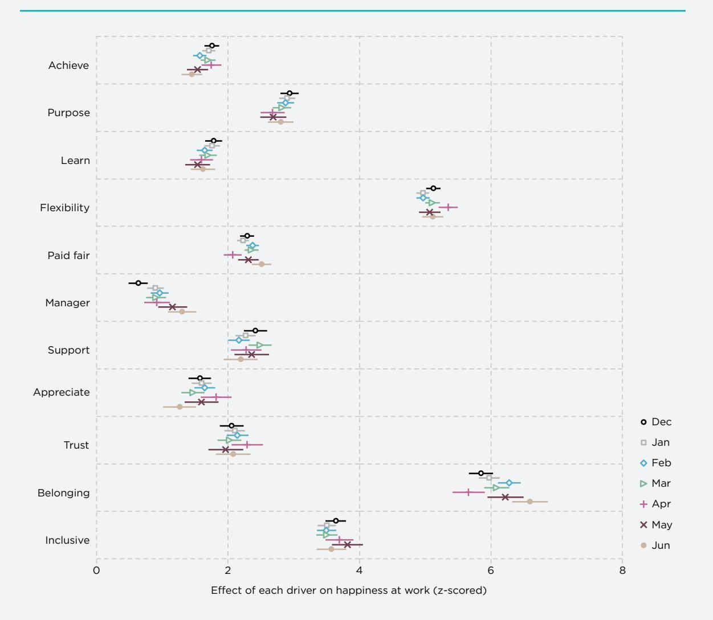

Note: Coefficients plotted from seven regression models with monthly samples restricted from December 2019 to June 2020. In all cases, workplace happiness serves as the dependent variable, on a 0 to 100 scale, and drivers as the key independent variables of interest (all z-scored). Fixed effects included for the date of survey completion, company, occupation, response collector link, and state. Sample includes employees reviewing companies they currently work for. 95% confidence intervals displayed.

Source: *Indeed.com*

*The drivers of workplace well-being have generally remained constant since the onset of COVID-19. Even in turbulent times, the well-being of workers is highly dependent on consistent and fundamental drivers.*

The second notable development is that, as the pandemic worsened, flexible work schedules and supportive management have become even more important. With ever-changing workplace restrictions, it may be unsurprising that workers have come to value time and location flexibility more than ever before. Yet, the role of managers has also increased in importance to an even greater degree. Past research suggests that the more employees work from home, the more likely they are to depend on their supervisors' frequent contact.92 Since the onset of the crisis, many workers have reported feeling unprepared to fulfil their responsibilities, again underscoring the need for good communication between managers and employees.93 Our analysis in this section reflects these trends.

However, despite these modest changes, it is worth noting that the drivers of workplace well-being have generally remained constant since the onset of COVID-19. Even in turbulent times, the well-being of workers is highly dependent on consistent and fundamental drivers. As a result, organizations that cultivate workplace environments to foster and sustain these drivers in good times may also be better prepared to withstand labour market shocks and support employee well-being in times of economic uncertainty.

## **Resilience**

As documented in earlier sections, the consequences of the pandemic on the global labour market have been unequally shared. Yet even for workers faced with similar prospects and labour market outcomes, some have been better able to maintain high levels of well-being than others. To better understand the determinants of worker resilience throughout the crisis, in this section, we will focus on the United Kingdom using two longitudinal datasets. The first is a weekly quasi-panel study surveying representative samples of the British public from January to December 2020, provided by YouGov.94 The second is a weekly panel study surveying respondents over time from April to December 2020, provided by University College London.95

#### **White- and blue-collar workers**

In this section, using data provided by the YouGov Weekly Tracker, we consider the happiness trajectories of white- and blue-collar workers who remained employed throughout the crisis. White-collar workers include managers, senior administrators, higher technical workers, professionals, and clerical workers. Blue-collar workers include those performing skilled or unskilled manual labour. In Figure 7.11, we plot the percent of each group reporting feeling happy in the previous week.96 Dotted vertical lines indicate national lockdowns implemented in the United Kingdom on March 23 and November 5.97

First, it is worth noting the consistent gap in happiness levels between white- and blue-collar workers. From January to March of 2020, roughly 12 percent more white-collar workers reported feeling happy than blue workers, a gap that widened to 14 percent from April to December, on average. However, the size of this gap also varied throughout the year, with the smallest differences recorded at the time of the first and second lockdowns.

In line with previous results reported in this chapter, both groups' happiness levels also began to decline dramatically in February and March, before the first national lockdown was implemented. Both declines are roughly comparable, reaching

lows of 35 percent for white-collar workers and 31 percent for blue-collar workers. Beginning in April, happiness levels began to steadily rebound for both groups, although white-collar workers recovered faster than blue-collar workers after the first wave. Whereas 40 percent of white-collar workers reported feeling happy by mid-April, it took another six weeks for blue-collar workers to reach the same milestone. This upward trend continued throughout the summer until both groups had almost fully recovered to baseline levels in August. However, fewer workers in both groups then began to report feeling happy in the period leading up to the second lockdown. These drops were again roughly proportional, though in this case, a higher percentage of white-collar workers seem to have been affected than blue-collar workers.

While we can't rule out the possibility that survivorship bias may again drive some of the happiness recoveries after the first wave, this dynamic may be expected to affect both groups of workers equally. Overall, this analysis would suggest that, at least among these two groups, the government response to coronavirus was not responsible for the most severe drops in employee well-being. Rather, anxieties relating to the spread of the virus itself, anticipated future lockdowns, or uncertain employment prospects seem more likely to be driving declines in happiness throughout the pandemic.98

#### **Social support protects against the negative impact of being unable to work**

Earlier in this chapter, we found that having children seemed to protect against some of the negative well-being impacts of not having a job during the pandemic, especially for men. However, while rates of unemployment and inactivity have certainly increased in many countries worldwide,

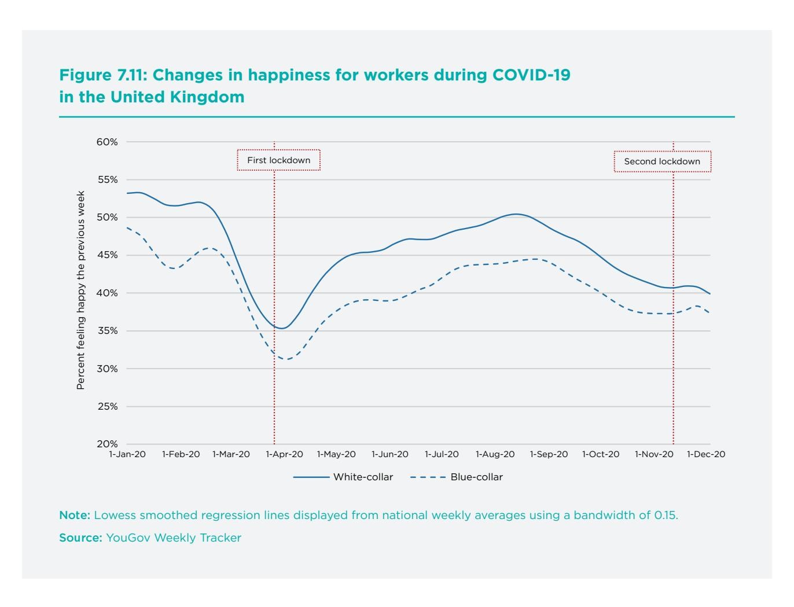

the crisis has also resulted in many more subtle labour market effects. Even for workers who have not lost their jobs, many have been unable to work for short periods of time due to virus infections or exposure, to take care of loved ones, or because workplace closures or restrictions temporarily prevented them from doing so. How these workers have fared throughout the crisis is crucial to understanding the full well-being impact of COVID-19. In this section, we will again focus on the United Kingdom using data provided by the UCL Social Study, a longitudinal panel documenting changes in social behaviour and mental health in the U.K. since April 2020.

As has been documented in numerous editions of this report, social connection has consistently proven to be one of the essential drivers of subjective well-being. Here we consider social connection in terms of subjective loneliness assessed using the three-item UCLA Loneliness

Scale.99 We limit the sample to those employed at the beginning of the survey period and split respondents into two groups, one containing respondents who report rarely feeling lonely and the other containing respondents who report often feeling lonely.100 Throughout the pandemic, respondents in the U.K. who were not lonely reported average life satisfaction scores of 7.0 on a scale from 0 to 10, while those who were lonely reported average scores of 4.9 points. In other words, non-lonely respondents were roughly 43 percent more satisfied with their lives than lonely respondents, representing a substantial difference in quality of life.

Feeling isolated may also make it more difficult to deal with negative life events. In Figure 7.12, we document changes in life satisfaction for lonely and non-lonely respondents in the eight weeks before and after the first time in the survey period where they reported being unable to work.101

**Figure 7.12: Life satisfaction changes before and after work stoppage in the U.K.** Note: Happiness levels are averaged by week and normalized to a baseline level recorded eight weeks before the first work stoppage recorded in the survey period. Lowess smoothed regression lines displayed using a bandwidth of 0.5. Source: UCL COVID-19 Social Study -20% -15% -10% -5% 0% 5% -8 -7 -6 -5 -4 -3 -2 -1 0 1 2 3 4 5 6 7 8 Change in life satisfaction Weeks since first work stoppage Figure 12: Life satisfaction changes before and after work stoppage in the U.K. Not lonely Lonely

**Table 7.4: Effect of work stoppage on life satisfaction by loneliness**

|                    | Full sample              | Full sample | Not lonely | Lonely    |  |  |  |
|--------------------|--------------------------|-------------|------------|-----------|--|--|--|
|                    | (1)                      | (2)         | (3)        | (4)       |  |  |  |
|                    | Life satisfaction (0-10) |             |            |           |  |  |  |
| Stop work          | -0.330***                | -0.278***   | -0.275***  | -0.379*** |  |  |  |
|                    | (0.020)                  | (0.026)     | (0.026)    | (0.030)   |  |  |  |
| Stop work x Lonely |                          | -0.101***   |            |           |  |  |  |
|                    |                          | (0.039)     |            |           |  |  |  |
| Constant           | 5.653***                 | 5.652***    | 6.254***   | 4.808***  |  |  |  |
|                    | (0.029)                  | (0.029)     | (0.034)    | (0.051)   |  |  |  |
| Mean dependent var | 6.173                    | 6.173       | 6.173      | 6.173     |  |  |  |
| Observations       | 407187                   | 407187      | 240682     | 166505    |  |  |  |
| R-squared          | 0.039                    | 0.039       | 0.045      | 0.038     |  |  |  |

Note: Fixed effects regression controlling for individual and week fixed effects. Heteroskedastic robust standard errors clustered at the individual level are reported in parenthesis. \*\*\* p<.01, \*\* p<.05, \* p<.1

Source: UCL COVID-19 Social Study

In the weeks leading up to the work stoppage, we notice a potential anticipation effect for both groups, as life satisfaction levels begin to decline steadily. However, for lonely respondents, this drop becomes substantially larger than for non-lonely respondents. By the time they stopped working, lonely respondents' life satisfaction had dropped by 15 percent of its baseline level, while the life satisfaction of non-lonely respondents had declined by 9 percent. Feeling lonely also seems to predict a slower pace of recovery. While we do not observe full adaptation for either group, non-lonely respondents had recovered to 95 percent of their baseline life satisfaction five weeks later. Lonely respondents had still not reached this milestone eight weeks on.

To further investigate these dynamics, in Table 7.4, we consider the effect of stopping work on life satisfaction using fixed effects regressions controlling for individual and time fixed effects. We find significant and meaningful differences between the impact of work stoppages for lonely and non-lonely respondents. While not being able to work reduces life satisfaction by 0.28 points for those who are not lonely, this figure rises by

roughly one third to 0.38 points for lonely respondents. Taken together, this evidence suggests that social support networks can help to buffer against the negative impacts of hard times.

#### **Impact of furloughing on subjective well-being**

In response to the economic consequences of the pandemic, many governments introduced labour market legislation to protect workers against reductions in working hours and losses in income. As discussed earlier, the United Kingdom government enabled firms to furlough workers for up to three months while replacing 80 percent of employees' lost wages for up to £2,500 per month. However, until July 2020, to receive these benefits, workers could not undertake any paid work for their employers. In this section, we consider the potential well-being impacts of this scheme. In this case, we limit our sample to include workers who were employed part-time or full-time at the beginning of the survey period, but then stopped working entirely and were either (a) furloughed without any income loss, (b) furloughed with income loss, or (c) stopped work without being furloughed at all.102

In Figure 7.13, we plot average changes in life satisfaction levels for all three groups of workers four weeks before and after stopping work for the first time in the survey period. Regardless of furlough status or income loss, all groups of workers appear to suffer a decline in life satisfaction when unable to work. However, for workers who are furloughed without any income losses, this decline never exceeds 6 percent. On the other hand, the life satisfaction of furloughed and non-furloughed workers with income losses drops by 10 and 21 percent, respectively. Moreover, only furloughed workers without any income loss achieve full adaptation four weeks later. This may suggest that furlough schemes in which wages are replaced in full protect the well-being of affected workers better than those with only partial income replacement.

Table 7.5 expands this analysis by estimating the effect of stopping work on life satisfaction depending on furlough status and income losses using a fixed effects regression controlling for individual and week fixed effects.103 Once again, we find that stopping work has a negative impact on life satisfaction, regardless of furlough status or income losses.104 Even for workers who suffered no income losses due to being furloughed, their life satisfaction declined by 0.39 points relative to those who were able to continue working. These dynamics again indicate that the relationship between work and well-being extends beyond pecuniary benefits alone. This would also seem to run counter to classic tenets of economic theory, which understand the relationship between employment and welfare exclusively in terms of financial compensation. From this perspective, workers who stopped working without any lost income should not only have experienced no

**Figure 7.13: Life satisfaction changes before and after work stoppage in the U.K. depending on furlough status**

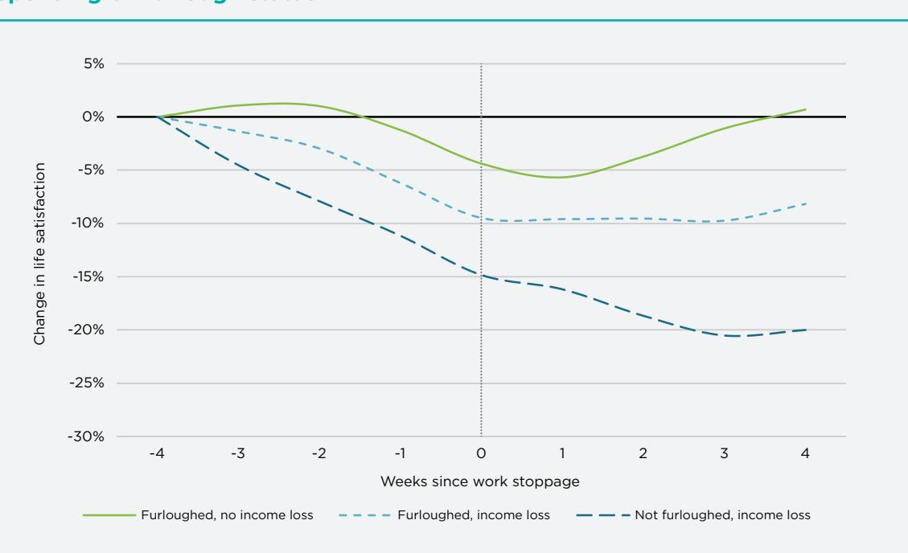

Note: Happiness levels are averaged by week and normalized to a baseline level recorded eight weeks before the first work stoppage recorded in the survey period. Lowess smoothed regression lines displayed using a bandwidth of 0.5.

Source: UCL COVID-19 Social Study

**Table 7.5: Impacts of stopping work depending on furloughing**

| Life satisfaction (0-10)                     | Coef.     | Std. Err. |
|----------------------------------------------|-----------|-----------|
| Did not stop work (reference)                |           |           |
| Stopped work, furloughed, no income loss  | -0.393**  | (0.154)   |
| Stopped work, furloughed, income loss     | -0.538*** | (0.154)   |
| Stopped work, not furloughed, income loss | -0.546*** | (0.119)   |
| Constant                                     | 5.681***  | (0.217)   |
|                                              |           |           |
| Mean dependent var                           | 6.221     |           |
| Observations                                 | 154,978   |           |
| R-squared                                    | 0.029     |           |
|                                              |           |           |

Note: Fixed effects regression controlling for individual and week fixed effects. Heteroskedastic robust standard errors clustered at the individual level are reported in parenthesis. \*\*\* p<.01, \*\* p<.05, \* p<.1

Source: UCL COVID-19 Social Study

decline in welfare but actually experienced a welfare gain. We do not observe this to be the case. However, we do find suggestive evidence that workers who suffered no income losses as a result of being furloughed were better off than workers who did. Yet, these differences are mostly within the margin of error.

## **Lessons for the "future of work"**

Throughout this chapter, we have documented stark labour market impacts brought on by the coronavirus crisis and their impact on workers' well-being. While the crisis itself might end soon, its impact on the global world of work may well endure. In the wake of the crisis, it is possible that some workers may begin to look for jobs that are more meaningful and that have strong social support networks, while others may begin to prioritize earnings and job security. The dynamics of these effects are difficult to predict, though documented changes in labour market expectations in the aftermath of previous recessions may

provide some indication. Using longitudinal data on more than 20,000 workers in the United States from 1973 to 2014, one analysis found that young people who come of age in worse macroeconomic conditions are more likely to value financial security than job meaning throughout their careers.105 Early evidence from the initial phase of the current crisis also suggests that young people who experienced health and financial losses resulting from the pandemic were more likely to report career uncertainty and financial worry.106 While it is still too early to tell, the pandemic's impact on this generation of young people may result in a shifting landscape of work values and expectations in the years to come.

In the short term, perhaps the most salient change brought on by the pandemic has been the need to work from home for those who can. As is the case in most other countries, the fraction of the workforce homeworking in the United Kingdom stood at one fourth in October 2020, down from about half during the first lockdown, but far above the pre-pandemic level of just 5 percent.107 While workers have reported slight productivity declines during the crisis, they have also experienced immediate benefits such as greater autonomy and avoiding the commute (and the expenses associated with it).108

Sensing a workplace revolution, some companies have already decided to get rid of their offices entirely.109 However, this risks overlooking important potential negative impacts of homeworking full-time. This shift could undermine social and intellectual capital, which may harm companies and their employees in the long-term. In this context, social and intellectual capital can be visualised as stocks that are slowly being depleted when working mostly from home. These stocks are normally replenished by new in-flows of people, places, and ideas. For workers, social and intellectual capital is built by shared experiences with co-workers and unplanned social interactions that broaden one's thinking. While past research has found some clear benefits in productivity for home workers, they also found that they are more likely to be overlooked for promotion—a clear indication of the need to build social capital with colleagues.110

*Moving forward, it will be important to maintain the benefits of working from home while still enabling employees and companies to build and sustain their social and intellectual capital.*

Building meaningful relationships with co-workers, especially management, is critical to job and life satisfaction. Working from home all the time does not allow for that to the same extent as the office.111 Work itself represents more than a pay check – it is a large part of many people's identity. Prior research suggests that when somebody loses their job, half of the negative impact on well-being stems not from the loss of income but from the loss of social ties, identity, and routine that come with a job.112 In this chapter, we found that during the pandemic, workers who were furloughed with full income replacement still

suffered significant well-being losses relative to those who were able to remain at work. While the pandemic's labour market shock will eventually subside, the drive for social connection and social support at work is unlikely to.

Moving forward, it will be important to maintain the benefits of working from home while still enabling employees and companies to build and sustain their social and intellectual capital. Throughout the pandemic, flexibility has become an even more important driver of workplace well-being than it already was. Even working at the office one or two days a week can provide people with the network, routine, and identity needed to support well-being. A flexible homeworking model that still affords employees opportunities to network, collaborate, and socialise in person could provide the necessary in-flows of social and intellectual capital and lead to large productivity dividends.113 These and other insights derived from applied well-being science can help societies build back better in the post-pandemic world.

#### **Endnotes**

- 1 International Monetary Fund (2020); World Bank (2020, 2021).
- 2 Google (2020).
- 3 Airportia (2020).
- 4 See Figure 7A.1 in the appendix and International Labour Organization (2021).
- 5 See, for example, Coibion et al. (2020); Brewer et al. (2020).
- 6 Globally, increases in inactivity accounted for 71 percent of total employment losses (International Labour Organization, 2021).
- 7 International Labour Organization (2020a).
- 8 Assumes a 48-hour work week.
- 9 International Labour Organization (2021).
- 10 International Labour Organization (2021).
- 11 Dolan et al. (2008).
- 12 De Neve & Ward (2017).
- 13 Authors' calculations using 2017 data from the Gallup World Poll, weighted by population.
- 14 Clark et al. (2019).
- 15 Angrave & Charlwood (2015); Zhou et al. (2019).
- 16 March to December change of 14.3 percent in lowermiddle-income countries and 10 percent in high income countries (International Labour Organization, 2021).
- 17 International Labour Organization (2020b).
- 18 Marinescu et al. (2020); Hatayama et al. (2020); Gottlieb et al. (2020).
- 19 International Labour Organization (2020a).
- 20 Estimated from ILOSTAT data. For more information, see: International Labour Organization (2020e).
- 21 Data from Q2, 2020. Eurostat (2020).
- 22 Adams-Prassl et al. (2020a).
- 23 International Labour Organization (2020a).
- 24 OECD (2020a).
- 25 International Labour Organization (2020a).
- 26 There are at least two primary interrelated drivers of these effects. First, lower income and lower educated workers are more likely to be employed in jobs and sectors that have been negatively affected by the pandemic. These include food and accommodation, retail, passenger transport, childcare, arts and leisure, and domestic services. (Blundell et al., 2020). Food and accommodation sector workers in particular have experienced the highest rates of job loss in the European Union since the pandemic began, and many of these workers are low-income earners (Eurostat, 2020). Second, highly educated workers and higher earners are also more likely to be able to work from home. In the United States and United Kingdom, the highest earners are roughly more than three times more likely to be able to work from home than the lowest earners (Adams-Prassl et al., 2020b). Workers' ability to carry out their tasks from home has also been found to be a strong predictor of job

- losses during the coronavirus pandemic. Using survey data, Adams-Prassl et al. (2020b) find that workers who were able to perform more tasks at home were significantly less likely to lose their jobs in the US, UK, and Germany. Ability to work from home proved to be a strong predictor of employment status even after accounting for occupation or industry. For additional information, see: Adams-Prassl et al. (2020b); Benzeval et al. (2020); Bick and Blandin (2020); Dingel and Neiman (2020); Galasso (2020); Hatayama, et al. (2020); Mongey et al. (2020).
- 27 Kikuchi et al. (2020); Chetty et al. (2020); Coibion et al. (2020); Benzeval et al. (2020).
- 28 Benzeval et al. (2020).
- 29 Adams-Prassl et al. (2020a). This difference turns out to be almost entirely explained by differences in the ability to work from home.
- 30 Low income (<\$27k). High income (>\$60k). For more information, see: Chetty et al. (2020).
- 31 De Neve & Ward (2017).
- 32 International Labour Organization (2020b).
- 33 Statistics Canada (2020).
- 34 Authors' calculations using ILOSTAT data. For more information, see: International Labour Organization (2020e).
- 35 International Labour Organization (2020a).
- 36 International Labour Organzation (2020d); Helliwell et al. (2020); Czeisler et al. (2020); Happiness Research Institute (2020).
- 37 International Labour Organization (2020c); Benzeval et al. (2020); Zhou et al. (2020).
- 38 Hatayama et al. (2020) and Hupkau & Petrongolo (2020) find that women in the United Kingdom are more able to work from home, while Adams-Prassl et al. (2020a) find that the difference is insignificant in the UK, though they do find that women are significantly less likely to be able to work from home in the United States. Alon et al. (2020) finds countervailing results in the United States depending on where and how the threshold of tasks that can be performed from home are defined.
- 39 Adams-Prassl et al. (2020a); Andrew et al. (2020); Del Boca et al. (2020); Sevilla & Smith (2020).
- 40 International Labour Organization (2020c).
- 41 Crabtree & Kluch (2020).
- 42 Blundell et al. (2020); Zhou et al. (2020).
- 43 Kramer (2019); Hertz et al. (2020).
- 44 Collins et al. (2020).
- 45 Adams-Prassl et al. (2020a).
- 46 In Italy, using survey data collected in April, Del Boca et al. (2020) also replicate this result noting that most of the additional childcare and housework responsibilities associated with the pandemic had fallen on mothers working from home, regardless of their partner's working arrangements.

- 47 Carlson et al. (2020); Sevilla & Smith (2020); Hupkau & Petrongolo (2020); Shafer et al. (2020); Kreyenfeld & Zinn (2020).
- 48 Adams-Prassl et al. (2020a); Bick et al. (2020).
- 49 Adams-Prassl et al. (2020a).
- 50 Eurostat (2020).
- 51 Imperial College London Big Data Analytical Unit and YouGov (2020). For more information, visit: www.coviddatahub.com.
- 52 This non-population weighted average is largely in line with prior data collected by the Gallup World Poll, which documented an average life satisfaction level of 6.4 out of 10 for the same group of countries in 2017. However, due to the different sampling procedures employed by both surveys, these comparisons should be interpreted with caution.
- 53 Clark (2003).
- 54 Past research has demonstrated that subjective well-being is predictive of labour market outcomes (De Neve & Oswald, 2012).
- 55 This is larger than previously recorded differences using Gallup World Poll data. In 2019, for the same group of countries, employed workers were on average 0.78 points more satisfied with their lives than those who were unemployed, a difference of 6.54 to 5.76. However, this increase should be interpreted with caution as it may be attributable to the unique sampling procedures used in both studies, and not necessarily reflective of any changes associated with the onset of COVID-19.
- 56 De Neve & Ward (2017); Van der Meer (2014).
- 57 See Figure 7A.2 in the appendix.
- 58 For these countries, unemployment appears to reduce the life satisfaction of younger cohorts more than older cohorts.
- 59 In this case, respondents are asked to report their employment status from the following options: (1) Full-time employment, (2) Full-time student, (3) Not working, (4) Part-time employment, (5) Retired, (6) Unemployed, or (7) Other.
- 60 Trust variables are recoded on a scale from 0 to 1.
- 61 More specifically, respondents are asked to extent to which they have felt each emotion in the past two weeks: (1) Not at all, (2) Several days, (3) More than half the days, or (4) Almost every day.
- 62 See Table 7A.1 in the appendix.
- 63 Helliwell et al. (2020); Czeisler et al. (2020); Happiness Research Institute (2020).
- 64 Blanchflower & Oswald (2008).
- 65 See Table 7A.2 in the appendix.
- 66 Nevertheless, even though young people seem to be relatively less affected by unemployment than older age groups, the fact that so many young people have been unemployed throughout the crisis may still be partially responsible for the overall average declines in young people's well-being that have been documented in related research and elsewhere in this report.

- 67 See Table 7A.3 in the appendix. For past studies, see: Dolan et al. (2008); De Neve & Ward (2017).
- 68 The relationship between gender, employment status, and negative affect is slightly more complicated. While gender does not seem to play a role in moderating the impact of unemployment on negative affect, the impact of inactivity on negative affect seems to be driven entirely by males. This would suggest that, even though men have reported lower levels of negative affect than women during the pandemic, the impact of leaving the labour force has led to larger increases in negative affect for men than for women. For more information, see Table 7A.3 in the appendix.
- 69 See Table 7A.4 in the appendix.
- 70 See Table 7A.4 in the appendix.
- 71 In Germany, while roughly 30 percent of the labour force has been eligible to participate in job retention programs, 18 percent have been enrolled in the program by their employers. In the United Kingdom, a similar portion of the workforce has been eligible for job retention benefits, though almost all eligible workers have taken them up. In the United States, only 0.14 percent of the workforce was approved for job retention schemes and unemployment has soared as a result, reaching highs of 13 percent in June, a 360 percent increase from the year before. For more information, see: OECD (2020b, 2021).
- 72 Adams-Prassl et al. (2020b).
- 73 OECD (2020a).
- 74 From Q2 2019 to Q2 2020, employment declined by 8.8 percentage points in the United States, and 0.3 percentage points in the United Kingdom and Germany (OECD, 2021). Also see Figure 7.1.
- 75 Plots include all residents of each country, not just those who are employed or unemployed.
- 76 Benveniste (2020).
- 77 It is worth noting that this score is what one might describe as an "overall" happiness measure rather than a short-term hedonic one, meaning that we would not *ex ante* expect there to be large hour-to-hour or day-to-day swings in the level of happiness.
- 78 For more details on the Indeed Workplace Happiness score, see: www.indeed.com/about/happiness
- 79 Also see Figure 7A.4 in the appendix.
- 80 Pilipiec et al. (2020).
- 81 See Figure 7A.4 in the appendix.
- 82 See Figures 7.8a-b in Section II, and Figure 7.11 in Section IV.
- 83 For example, the number of responses collected from users who were directed to company review pages after filling in their resume details declined as the year went on. The data also becomes noisier towards the end of the year, though it is difficult to say whether this attributable to high volatility in the true level of happiness or not, since the daily number of happiness surveys also went down in this period, meaning that the daily means are more imprecisely estimated.

- 84 Further questions on job satisfaction, stress, and purpose were added toward the end of the year, and will likely provide key insights on further dimensions of subjective well-being in the workplace in the future.
- 85 Each driver is again measured on a 5-point Likert scale from "strongly disagree" to "strongly agree".
- 86 For the purposes of this analysis, we exclude responses collected after June 2020, due to a change in question ordering in the survey.
- 87 The post dummy variable itself is not included in the regression as it is perfectly colinear with date fixed effects.
- 88 Surveys were collected from different links on the website depending on the date of completion.
- 89 In this case we split the sample by month (rather than include interaction effects in one model), and plot the coefficients from each separate model.
- 90 It is worth noting that at least some of this significance may be attributable to common method bias.
- 91 Given the format of the learning at work item *"I often learn something at work"* – it is unlikely that this indicator refers to formal work training programs, but rather ongoing skill development.
- 92 Wigert & Barrett (2020).
- 93 Gandhi (2020).
- 94 YouGov (2020).
- 95 University College London (2020). The COVID-19 Social Study is funded by the Nuffield Foundation [WEL/FR-000022583], but the views expressed are those of the authors and not necessarily the Foundation. The COVID-19 Social Study was also supported by the MARCH Mental Health Network, funded by the Cross-Disciplinary Mental Health Network Plus initiative supported by the U.K. Research and Innovation [ES/S002588/1], and by the Wellcome Trust [221400/Z/20/Z].
- 96 Happiness is measured using the following question: *"Broadly speaking, which of the following best describe your mood and/or how you have felt in the past week. Please select all that apply."* In the appendix, we also plot normalized response relative to a baseline average in January 2020 to illustrate relative changes in happiness levels throughout the course of the pandemic (Figure 7A.5). In subsequent graphs, we overlay rises in unemployment (Figure 7A.6), and provide the absolute difference in happiness between white- and blue-collar workers (Figure 7A.7).
- 97 See Figure 7A.5 in the appendix.
- 98 This finding that lockdowns have generally not been responsible for the largest declines in well-being throughout the crisis – is also supported by related research using YouGov and Google Trends data for a variety of countries (Foa et al., 2020).
- 99 The UCLA Loneliness Scale is measured using the following three questions, scored on a three-point scale from "hardly ever," "some of the time," and "often": (1) *How often do you feel that you lack companionship?* (2) *How often do you feel left out?* (3) *How often do you feel isolated from*

- *others?* Answers to all three questions are aggregated to give an overall indication of loneliness on a 6-point scale from 3 to 9. For more information, see: Hughes et al. (2004).
- 100 In this case, the sample includes respondents who are employed full-time, part-time, or self-employed. We consider respondents to be "not lonely" if they have an index score of 3 throughout the course of the study period, and lonely if they report a score of 7 or higher at least once. In the appendix, we provide an additional robustness check with respondents grouped by baseline loneliness levels instead of maximum loneliness levels, and find highly consistent results. For more information, see Figure 7A.8 and Table 7A.5 in the appendix.
- 101 The variable for work stoppage is phrased as follows: *"In the last week, have you lost your job, or been unable to do paid work?"*
- 102 For those who are not furloughed with income loss, it seems likely that they have lost their jobs entirely. However, given the nature of the question this variable is based on, we cannot rule out the possibility that these workers may still have maintained an employment contract with their original employer, but have not enrolled in any furlough scheme and are now not working without pay.
- 103 Because demographic controls including marital status, educational attainment, and age were only recorded once in the baseline survey, they do not vary over time and are therefore do not need to be added as separate controls since they are captured by the individual fixed effect.
- 104 While we cannot rule out the possibility that workers who have stopped work and been furloughed may also have received financial support from other means, in the appendix we provide an additional robustness check that produces largely similar results even after excluding respondents from the sample who report receiving additional financial help (Table 7A.6).

105 Cotofan et al. (2020).

106 Giurge et al. (forthcoming).

107 Cameron (2020); Gibbs (2020); Watson (2020).

108 Morikawa (2020); Lee & Tipoe (2020).

109 Lebowitz (2020).

110 Bloom et al. (2015).

111 Krekel et al. (2020).

112 Bloom et al. (2015).

113 Davis et al. (2021).

#### **References**

Adams-Prassl, A., Boneva, T., Golin, M., & Rauh, C. (2020*a*). Inequality in the Impact of the Coronavirus Shock: Evidence from Real Time Surveys. *Journal of Public Economics*.

Adams-Prassl, A., Boneva, T., Golin, M., & Rauh, C. (2020*b*). Work Tasks that Can Be Done from Home: Evidence on Variation within & Across Occupations and Industries. *IZA Discussion Paper* 13374.

Airportia (2020). Coronavirus Global Flight Disruption Monitor. Retrieved from: https://www.airportia.com/coronavirus

Alon, T. M., Doepke, M., Olmstead-Rumsey, J., & Tertilt, M. (2020). *The impact of COVID-19 on gender equality* (No. w26947). National Bureau of Economic Research.

Andrew, A., Cattan, S., Costa Dias, M., Farquharson, C., Kraftman, L., Krutikova, S., ... & Sevilla, A. (2020). The gendered division of paid and domestic work under lockdown. *SSRN Papers*.

Angrave, D., & Charlwood, A. (2015). What is the relationship between long working hours, over-employment, under-employment and the subjective well-being of workers? Longitudinal evidence from the UK. *Human Relations*, *68*(9), 1491-1515.

Benveniste, A. (2020). These companies are working from home until 2021 – or forever. *CNN Business*. Retrieved from: https://edition.cnn.com/2020/08/02/business/companieswork-from-home-2021

Benzeval, M., Burton, J., Crossley, T. F., Fisher, P., Jäckle, A., Low, H., & Read, B. (2020). The Idiosyncratic Impact of an Aggregate Shock: The Distributional Consequences of COVID-19. *Available at SSRN 3615691*.

Bick, A., & Blandin, A. (2020). Real-time labor market estimates during the 2020 coronavirus outbreak. *Available at SSRN 3692425*.

Bick, A., Blandin, A., & Mertens, K. (2020). Work from home after the COVID-19 Outbreak. *SSRN Papers*.

Blanchflower, D. G., & Oswald, A. J. (2008). Is well-being U-shaped over the life cycle?. *Social science & medicine*, *66*(8), 1733-1749.

Bloom, N., Liang, J., Roberts, J., & Ying, Z. J. (2015). Does working from home work? Evidence from a Chinese experiment. *The Quarterly Journal of Economics*, *130*(1), 165-218.

Blundell, R., Costa Dias, M., Joyce, R., & Xu, X. (2020). COVID-19 and Inequalities. *Fiscal Studies*, *41*(2), 291-319.

Brewer, M., Gardiner, L., & Handscomb, K. (2020). The truth will out: understanding labour market statistics during the coronavirus crisis: July 2020.

Cameron, A. (2020). Coronavirus and homeworking in the UK: April 2020. *UK Office of National Statistics (ONS)*. Retrieved from: www.ons.gov.uk/employmentandlabourmarket/ peopleinwork/employmentandemployeetypes/bulletins/ coronavirusandhomeworkingintheuk/april2020

Carlson, D. L., Petts, R., & Pepin, J. (2020). US Couples' Divisions of Housework and Childcare During COVID-19 Pandemic.

Chetty, R., Friedman, J., Hendren, N., & Stepner, M. (2020). The economic impacts of COVID-19: Evidence from a new public database built from private sector data. *Opportunity Insights*. Retrieved from: www.tracktherecovery.org

Clark, A. E. (2003). Unemployment as a social norm: Psychological evidence from panel data. *Journal of Labor Economics*, *21*(2), 323-351.

Clark, A. E., Flèche, S., Layard, R., Powdthavee, N., & Ward, G. (2019). *The origins of happiness: the science of well-being over the life course*. Princeton University Press.

Coibion, O., Gorodnichenko, Y., & Weber, M. (2020). Labor markets during the covid-19 crisis: A preliminary view (No. w27017). *National Bureau of Economic Research*.

Collins, C., Landivar, L. C., Ruppanner, L., & Scarborough, W. J. (2020). COVID-19 and the gender gap in work hours. *Gender, Work & Organization*.

Cotofan, M., Cassar, L., Dur, R., & Meier, S. (2020). Macroeconomic Conditions When Young Shape Job Preferences for Life.

Crabtree, M., & Kluch, S. (2020). How Many Women Worldwide Are Single Moms? *Gallup*. DOI: https://news.gallup.com/ poll/286433/women-worldwide-single-moms.aspx

Czeisler et al. (2020). Mental health, substance use, and suicidal ideation during the COVID-19 pandemic—United States, June 24–30, 2020. *Morbidity and Mortality Weekly Report*, *69*(32), 1049.

Davis, M. A., Ghent, A. C., & Gregory, J. (2021). The Work-at-Home Technology Boon and its Consequences. *Available at SSRN 3768847*.

De Neve, J. E., & Oswald, A. J. (2012). Estimating the influence of life satisfaction and positive affect on later income using sibling fixed effects. *Proceedings of the National Academy of Sciences*, *109*(49), 19953-19958.

De Neve, J. E., & Ward, G. (2017). Happiness at work. *In World Happiness Report 2017*.

Del Boca, D., Oggero, N., Profeta, P., & Rossi, M. (2020). Women's Work, Housework and Childcare, before and during COVID-19.

Dingel, J. I., & Neiman, B. (2020). *How many jobs can be done at home?* (No. w26948). National Bureau of Economic Research.

Dolan, P., Peasgood, T., & White, M. (2008). Do we really know what makes us happy? A review of the economic literature on the factors associated with subjective well-being. *Journal of economic psychology*, *29*(1), 94-122.

Eurostat (2020). COVID-19 labour effects across the income distribution. *European Commission*. Retrieved from: https://ec.europa.eu/eurostat/web/products-eurostat-news/-/ DDN-20201027-2

Eurostat (2021). Labour Market in the light of the COVID-19 pandemic – quarterly statistics. *European Commission*. Retrieved from: https://ec.europa.eu/eurostat/statisticsexplained/index.php?title=Labour\_market\_in\_the\_light\_of\_ the\_COVID\_19\_pandemic\_-\_quarterly\_statistics.

Foa, R., Gilbert, S., & Fabian, M. O. (2020). COVID-19 and subjective well-being: Separating the effects of lockdowns from the pandemic. *Available at SSRN 3674080*.

Galasso, V. (2020). Covid: not a great equaliser. *Covid Economics Vetted and Real-Time Papers* 1(19): 241-265.

Gandhi, V. (2020). As COVID-19 Continues, Employees Are Feeling Less Prepared. *Gallup*. Retrived from: https://www. gallup.com/workplace/313358/covid-continues-employeesfeeling-less-prepared.aspx

Gibbs, C. (2020). Coronavirus and the latest indicators for the UK economy and society. *UK Office of National Statistics (ONS)*. Retrieved from: www.ons.gov.uk/peoplepopulation andcommunity/healthandsocialcare/conditionsanddiseases/ bulletins/coronavirustheukeconomyandsocietyfasterindicators/ 1october2020

Giurge, L. M., Macchia, L., Whillans, A. V., & Yemiscigil, A. (forthcoming). How COVID-19 Shapes Students' Extrinsic and Prosocial Work Values: The Role of Uncertainty, Worry and Reflection.

Google (2020). Google COVID-19 Community Mobility Reports. DOI: https://www.google.com/covid19/mobility/

Gottlieb, C., Grobovšek, J., & Poschke, M. (2020). Working from home across countries. *COVID Economics*, *1*(8): 71-91.

Happiness Research Institute (2020) *Well-being in the age of COVID-19*, Copenhagen: Happiness Research Institute.

Hatayama, M., Viollaz, M., & Winkler, H. (2020). Jobs' Amenability to Working from Home: Evidence from Skills Surveys for 53 Countries. *COVID Economics*, *1*(19): 211-240.

Helliwell, J., Schellenberg, G., and Fonberg, J. (2020). Life satisfaction in Canada before and during the COVID-19 pandemic. Ottawa: Statistics Canada Analytical Branch Research Paper Series https://www150.statcan.gc.ca/n1/ pub/11f0019m/11f0019m2020020-eng.htm

Hertz, R., Mattes, J., & Shook, A. (2020). When Paid Work Invades the Family: Single Mothers in the COVID-19 Pandemic. *Journal of Family Issues*, 0192513X20961420.

Hughes, M. E., Waite, L. J., Hawkley, L. C., & Cacioppo, J. T. (2004). A short scale for measuring loneliness in large surveys: Results from two population-based studies. *Research on aging*, *26*(6), 655-672.

Hupkau, C., & Petrongolo, B. (2020). Work, care and gender during the Covid-19 crisis. *CEP Discussion Paper, No. 1723*. Centre for Economic Performance: London.

Indeed Hiring Lab (2020). Indeed Hiring Lab Data [database]. Available from: https://github.com/hiring-lab/data

International Labour Organization (2020a). *ILO Monitor: COVID-19 and the world of work. Sixth edition*. Switzerland: ILO.

International Labour Organization (2020b). *ILO Monitor: COVID-19 and the world of work. Third edition*. Switzerland: ILO.

International Labour Organization (2020c). *ILO Monitor: COVID-19 and the world of work. Fifth edition*. Switzerland: ILO.

International Labour Organization (2020d). *ILO Monitor: COVID-19 and the world of work. Fourth edition*. Switzerland: ILO.

International Labour Organization. (2020e). ILOSTAT database [database]. Available from: www.ilostat.ilo.org/data

International Labour Organization (2021). *ILO Monitor: COVID-19 and the world of work. Seventh edition.* Switzerland: ILO.

International Monetary Fund (2020). *World Economic Outlook: A Long and Difficult Ascent*. Washington, DC: IMF.

Imperial College London Big Data Analytical Unit and YouGov (2020). Imperial College London YouGov Covid Data Hub, v1.0 [database]. Available from: https://github.com/YouGov-Data/ covid-19-tracker

Kikuchi, S., Kitao, S., & Mikoshiba, M. (2020). Who Suffers from the COVID-19 Shocks? Labor Market Heterogeneity and Welfare Consequences in Japan. *Covid Economics*, *1*(40): 76-114.

Kramer, S. (2019). U.S. has world's highest rate of children living in single-parent households. *Pew Research Center*. Retrieved from: https://pewrsr.ch/2LLvbxW

Krekel, C., Ward, G., & De Neve, J. E. (2019). What makes for a good job? Evidence using subjective well-being data. In *The Economics of Happiness* (pp. 241-268). Springer, Cham.

Kreyenfeld, M., & Zinn, S. (2020). *Coronavirus & care: How the coronavirus crisis affected fathers' involvement in Germany* (No. 1096). SOEPpapers on Multidisciplinary Panel Data Research.

Lebowitz, S. (2020). You could save more than \$10,000 a month by getting rid of your company's offices. 5 CEOs who did just that told us how they made the decision. *Business Insider*. Retrieved from: https://www.businessinsider.com/ ceos-no-offices-fully-remote-virtual-work-coronavirus-pandemicrecession-2020-10

Lee, I., & Tipoe, E. (2020). Time use and productivity during the COVID-19 lockdown: Evidence from the UK. *IZA Working Paper*.

Marinescu, I. E., Skandalis, D., & Zhao, D. (2020). Job search, job posting and unemployment insurance during the COVID-19 crisis. *Job Posting and Unemployment Insurance During the COVID-19 Crisis* (July 30, 2020).

Mertens, K., Blandin, A., & Bick, A. (2020). Work from Home After the COVID-19 Outbreak.

Mongey, S., Pilossoph, L. & Weinberg, A. (2020). Which workers bear the burden of social distancing policies? *(No. w27085). National Bureau of Economic Research*.

Morikawa, M. (2020). *Productivity of Working from Home during the COVID-19 Pandemic: Evidence from an Employee Survey (Japanese)*. Research Institute of Economy, Trade and Industry (RIETI).

OECD (2020a). *Job retention schemes during the COVID-19 lockdown and beyond*. Paris: Organization for Economic Co-operation and Development.

OECD (2020b). *OECD Employment Outlook 2020: Worker Security and the COVID-19 Crisis*. OECD Publishing, Paris. DOI: https://www.oecd-ilibrary.org/employment/oecd-employmentoutlook-2020\_1686c758-en

OECD (2021), Employment rate (indicator). DOI: 10.1787/ 1de68a9b-en (Accessed January 2021).

Pilipiec, P., Groot, W., & Pavlova, M. (2020). A longitudinal analysis of job satisfaction during a recession in The Netherlands. *Social Indicators Research*, *149*(1), 239-269.

Rinne, U., & Zimmermann, K. F. (2012). Another economic miracle? The German labor market and the Great Recession. *IZA Journal of Labor Policy*, *1*(1), 3.

Sevilla, A., & Smith, S. (2020). Baby steps: The gender division of childcare during the COVID-19 pandemic. *COVID Economics*, *1*(23): 58-78.

Shafer, K., Milkie, M., & Scheibling, C. (2020). The Division of Labour Before & During the COVID-19 Pandemic in Canada.

Statistics Canada (2020). Labour Force Survey, July 2020. *Statistics Canada*. Retrieved from: https://www150.statcan. gc.ca/n1/daily-quotidien/200807/dq200807a-eng.htm

University College London (2020). Covid-19 Social Study [database]. Private access data. For more information, visit: www.covidsocialstudy.org

Van der Meer, P. H. (2014). Gender, unemployment and subjective well-being: Why being unemployed is worse for men than for women. *Social Indicators Research*, *115*(1), 23-44.

Watson, B. (2020). Coronavirus and homeworking in the UK labour market: 2019. *UK Office of National Statistics (ONS)*. Retrieved from: https://www.ons.gov.uk/employmentand labourmarket/peopleinwork/employmentandemployeetypes/ articles/coronavirusandhomeworkingintheuklabourmarket/ 2019#overview-of-homeworking

Wigert, B, & Barrett, H. (2020). Performance Management Must Evolve to Survive COVID-19. *Gallup*. Retrieved from: https://www.gallup.com/workplace/318029/performancemanagement-evolve-survive-covid.aspx

World Bank (2020). *Global Economic Prospects, June 2020*. Washington, DC: World Bank. DOI: 10.1596/978-1-4648-1553-9.

World Bank (2021). *Global Economic Prospects, January 2021*. Washington, DC: World Bank. DOI: 10.1596/978-1-4648-1612-3.

YouGov (2020). Britain's mood, measured weekly [database]. Available from: https://yougov.co.uk/topics/science/trackers/ britains-mood-measured-weekly

Zhou, M., Hertog, E., Kolpashnikova, K., & Kan, M. Y. (2020). Gender inequalities: Changes in income, time use and well-being before and during the UK COVID-19 lockdown.

Zhou, Y., Zou, M., Woods, S. A., & Wu, C. H. (2019). The restorative effect of work after unemployment: An intraindividual analysis of subjective well-being recovery through reemployment. *Journal of applied psychology*, *104*(9), 1195.

# Chapter 8

# Living Long and Living Well: The WELLBY Approach

## Richard Layard

Programme Co-Director, Wellbeing Programme, Centre for Economic Performance, London School of Economics and Political Science

## Ekaterina Oparina

Research Economist at the Centre for Economic Performance of the London School of Economics

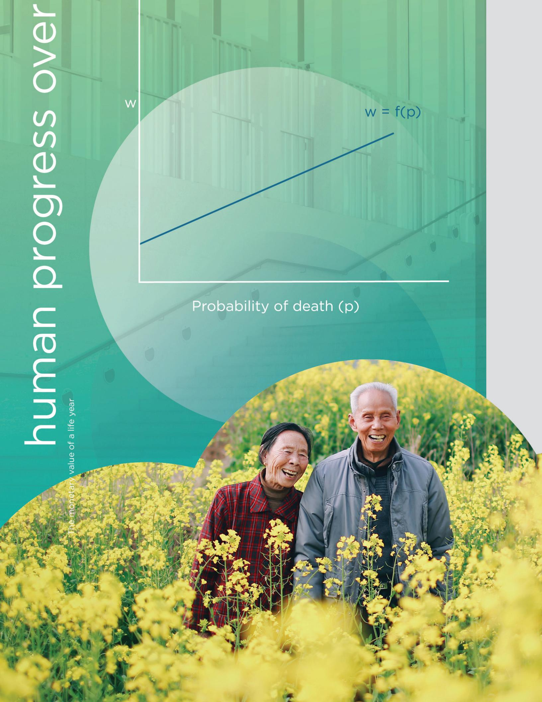

Most accounts of well-being focus on the experience of the living. But, if we are to judge the overall welfare of a country, we must also consider how long people live. This is vital

- whenever we want to evaluate a policy change, and
- when we want to compare how different countries are doing.

In this chapter, we tackle four major questions:

- How can we combine the length of life and its quality into a single metric?
- How can we use this metric for policy?
- What does this metric show about the performance of different countries?
- What does this metric imply for the monetary equivalent of a life lost?

#### The WELLBY approach

The well-being approach to these issues is simple. People want to live well, and they want to live long. Therefore, we should judge a society by the extent to which it enables people to experience lives that are long and full of well-being. For any individual, the measure of this is simply the well-being she experiences each year summed up over all the years that she lives.

A natural name for the well-being experienced over one year is a Well-Being-Year (or WELLBY). What we want to maximise, across people in all present and future generations, is their number of future WELLBYs - with one qualification. Things that happen in the future are increasingly uncertain the further we look, and we, therefore, apply a "pure time discount rate,"  $\delta$ .2 Thus

(1) Future social welfare = 
$$\sum_{i}^{\sum} WELLBY_{it} (1 - \delta)^{t}$$

where i is the individual and t is the number of years ahead. Well-being is measured on a scale of 0-10. In proceeding in this way, we are making a number of key assumptions, which are summarised in the box.

#### Some key assumptions

In following this approach, we are making four key assumptions. The first is that well-being is measured like weight — the difference between 3 and 4 is the same as the difference between 7 and 8. There is good evidence that when people answer questions, they do it in this way.3 The second is that people who are dead score 0. To validate this, researchers are beginning to ask people what point on the scale is as bad as being dead. So far, there is no strong evidence against assuming the answer is 0.4 Third, in evaluating the changes produced by a policy, we shall ignore the changes in the objective, which results from changes in the number of births. Thus, we are focusing essentially on WELLBYs per person born. Finally, we are simply adding up well-being experience, as Bentham recommended, without giving extra weight to the prevalence of misery. We do this because choosing such weights is an ethical issue on which people differ, though individual policymakers may wish to use them.

This concept of the role of the state goes back to the 18th Century Enlightenment.5 As Thomas Jefferson put it, "The care of human life and happiness... is the sole legitimate object of good government." We shall revert to the policy in more detail later on. But before that, we shall look at how different countries are doing when we take the length of life into account (as well as well-being).

#### The performance of nations

To do this, we focus on the present rather than the future, and this requires a slightly different metric. For clearly, it is not easy to measure the length of life at one moment in time. But demographers have a clever way of doing it. They do not calculate the prospects of each cohort born. Instead, they construct a snapshot of mortality rates at each age in the current year. Thus the "expectation of life" today is how long someone born now could expect to live if her chance of dying at each age was the same as that experienced this year by people of that age. This roots the calculations of life expectancy in data from the current year. We can do the same with our measure of well-being.

Hence the measure of national social welfare today is average current well-being  $(\overline{W})$  times the expectation of years (Y) of life:6

#### (2) Current social welfare $t = \overline{W}_t Y_t$

So how does taking a length of life into account in this way change our ranking of countries? And which countries have been doing the best in terms of the changes, they have achieved in social welfare?

In Table 8.1, we present the ranking of countries according to their level of WELLBYs per person in 2017-19. Remarkably, the top 11 countries in terms of WELLBYs are the same as the top 11 in Well-being. This is because life expectancy is so similar across the top 19 or so countries. At the very top is Finland, both in Well-being and in WELLBYs. Again, at the bottom, the lowest 11 countries in terms of WELLBYs include most of those, which are also lowest in well-being. Overall, the correlation across countries between well-being and WELLBYs is 0.97 (while that between life expectancy and WELLBYs is 0.87). So adding in the length of life makes little difference to the ranking of countries by well-being, with which we are already familiar.

However, adding in the length of life transforms our understanding of **human progress over time**. Since 2006-08, world well-being has been static,

but life expectancy increased by nearly four years up to 2017-19 (we shall come to 2020 later). The rate of progress differed a lot across regions. The biggest improvements in life expectancy were in the former Soviet Union, in Asia, and (the greatest) in Sub-Saharan Africa. And these were the regions that had the biggest increases in WELLBYs. In Asia, the exception is South Asia, where India has experienced a remarkable fall in Well-being which more than outweighs its improved life expectancy. Life expectancy grew slowest in North America, which also had a substantial fall in well-being — hence an overall fall in WELLBYs. The other area where well-being fell was the Middle East/North Africa, and that area also experienced a fall in WELLBYs.

One thing is clear. Since 2006-08 there has been a huge reduction in the inequality of social welfare between countries. This is not because well-being has become more equal — it has not, due to the huge fall in well-being in India. But life expectancy has become much more equal, and the seven years increase in sub-Saharan Africa is truly remarkable.

Coming to 2020, life expectancy fell substantially. In the first year of COVID-19, two million people died of the disease — an increase of some 3.4% in deaths worldwide. But most of the deaths have been among older people, so the fall in life expectancy is much less than 3.4%. In the USA, which had a high death rate, one estimate is that life expectancy fell by one year in 2020. Similar estimates have been made for Britain, which has also had a high death rate. But, even if the fall in life expectancy in 2020 worldwide were as much as one year, this would not altogether undo the gain of 3.7 years over the preceding decade.

So, sticking with 2020, what can be said about the change in overall social welfare? It will have fallen if the proportional fall in life expectancy exceeded the proportional rise in average well-being. As Chapter 2 showed, estimated well-being fell in half the countries of the world and rose in the other half. But life expectancy probably fell in most countries. Not a good year.

**Table 8.1: WELLBYs per person, average well-being and life expectancy, 2006–08 to 2017–19: by region and country**

|                                           |         | WELLBY  |       |         |         | Wellbeing |         | Life Expectancy |      |
|-------------------------------------------|---------|---------|-------|---------|---------|-----------|---------|-----------------|------|
|                                           | 2006–08 | 2017–19 | ∆     | 2006–08 | 2017–19 | ∆         | 2006–08 | 2017–19         | ∆    |
| World                                     | 368.7   | 373.6   | 4.9   | 5.4     | 5.2     | -0.2      | 68.7    | 72.4            | 3.7  |
| North America, Australia & New Zealand | 576.3   | 555.7   | -20.6 | 7.3     | 7       | -0.3      | 78.6    | 79.5            | 1    |
| Latin America and Caribbean               | 455.2   | 463.2   | 8     | 6.2     | 6.1     | -0.1      | 73.4    | 75.3            | 2    |
| Western Europe                            | 550.3   | 561.3   | 11    | 6.9     | 6.8     | 0         | 80.3    | 82.2            | 1.9  |
| Central and Eastern Europe                | 402     | 468.2   | 66.3  | 5.4     | 6.1     | 0.7       | 74.6    | 77.4            | 2.8  |
| Commonwealth of Independent States     | 352.4   | 393.2   | 40.8  | 5.2     | 5.4     | 0.2       | 67.5    | 72.2            | 4.7  |
| Southeast Asia                            | 354.3   | 390.8   | 36.5  | 5.1     | 5.4     | 0.3       | 69.4    | 72.5            | 3.1  |
| East Asia                                 | 368.8   | 407.6   | 38.8  | 4.9     | 5.2     | 0.3       | 74.8    | 77.8            | 3.1  |
| South Asia                                | 334     | 278     | -56   | 5.1     | 4       | -1.1      | 65.7    | 69.5            | 3.8  |
| Middle East and North Africa              | 380     | 363.9   | -16   | 5.3     | 4.9     | -0.4      | 71.9    | 74.6            | 2.7  |
| Sub-Saharan Africa                        | 240.2   | 271.3   | 31.1  | 4.5     | 4.5     | 0         | 53.6    | 60.7            | 7.1  |
| By country                                |         |         |       |         |         |           |         |                 |      |
| Finland                                   | 609.4   | 638.3   | 28.8  | 7.7     | 7.8     | 0.1       | 79.4    | 81.7            | 2.3  |
| Switzerland                               | 610.2   | 632.1   | 22.0  | 7.5     | 7.6     | 0.1       | 81.6    | 83.6            | 2.0  |
| Iceland                                   | 560.6   | 621.8   | 61.2  | 6.9     | 7.5     | 0.6       | 81.4    | 82.9            | 1.5  |
| Denmark                                   | 620.3   | 617.6   | -2.7  | 7.9     | 7.6     | -0.3      | 78.5    | 80.8            | 2.3  |
| Norway                                    | 605.5   | 616.1   | 10.6  | 7.5     | 7.5     | 0.0       | 80.5    | 82.3            | 1.8  |
| Netherlands                               | 603.3   | 611.9   | 8.6   | 7.5     | 7.4     | -0.1      | 80.0    | 82.1            | 2.1  |
| Sweden                                    | 597.4   | 607.8   | 10.3  | 7.4     | 7.4     | 0.0       | 81.0    | 82.7            | 1.7  |
| Australia                                 | 591.6   | 601.5   | 9.9   | 7.3     | 7.2     | 0.0       | 81.4    | 83.3            | 1.9  |
| New Zealand                               | 596.0   | 599.7   | 3.7   | 7.4     | 7.3     | -0.1      | 80.2    | 82.1            | 1.9  |
| Canada                                    | 603.7   | 595.4   | -8.3  | 7.5     | 7.2     | -0.3      | 80.7    | 82.3            | 1.6  |
| Austria                                   | 572.3   | 594.1   | 21.8  | 7.2     | 7.3     | 0.1       | 80.0    | 81.4            |      |
|                                           |         |         |       |         |         |           |         |                 | 1.4  |
| Israel                                    | 573.0   | 590.4   | 17.5  | 7.1     | 7.1     | 0.0       | 80.8    | 82.8            | 2.0  |
| Ireland                                   | 584.5   | 582.2   | -2.3  | 7.4     | 7.1     | -0.3      | 79.5    | 82.1            | 2.6  |
| United Kingdom                            | 548.7   | 582.1   | 33.4  | 6.9     | 7.2     | 0.3       | 79.6    | 81.2            | 1.7  |
| Germany                                   | 515.1   | 574.4   | 59.3  | 6.5     | 7.1     | 0.6       | 79.6    | 81.2            | 1.6  |
| Costa Rica                                | 558.1   | 570.4   | 12.3  | 7.1     | 7.1     | 0.0       | 78.4    | 80.1            | 1.7  |
| Belgium                                   | 569.4   | 559.2   | -10.2 | 7.2     | 6.9     | -0.3      | 79.4    | 81.5            | 2.0  |
| France                                    | 549.2   | 550.0   | 0.9   | 6.8     | 6.7     | -0.1      | 80.8    | 82.5            | 1.7  |
| Czech Republic                            | 499.4   | 547.5   | 48.1  | 6.5     | 6.9     | 0.4       | 76.8    | 79.2            | 2.4  |
| United States                             | 572.1   | 547.2   | -24.8 | 7.3     | 6.9     | -0.4      | 78.1    | 78.9            | 0.8  |
| Spain                                     | 579.4   | 534.0   | -45.4 | 7.1     | 6.4     | -0.7      | 81.1    | 83.4            | 2.3  |
| Italy                                     | 543.5   | 532.3   | -11.1 | 6.7     | 6.4     | -0.3      | 81.4    | 83.3            | 2.0  |
| Singapore                                 | 538.4   | 532.2   | -6.2  | 6.6     | 6.4     | -0.3      | 81.0    | 83.5            | 2.4  |
| United Arab Emirates                      | 510.2   | 527.9   | 17.7  | 6.7     | 6.8     | 0.1       | 75.8    | 77.8            | 2.0  |
| Taiwan Province of China                  | 458.3   | 518.2   | 59.9  | 5.9     | 6.5     | 0.6       | 78.1    | 80.3            | 2.2  |
| Slovenia                                  | 455.3   | 516.3   | 61.0  | 5.8     | 6.4     | 0.5       | 78.4    | 81.2            | 2.8  |
| Uruguay                                   | 435.7   | 500.5   | 64.8  | 5.7     | 6.4     | 0.7       | 76.2    | 77.8            | 1.5  |
| Chile                                     | 456.9   | 498.9   | 42.0  | 5.9     | 6.2     | 0.4       | 78.1    | 80.0            | 1.9  |
| Cyprus                                    | 492.3   | 497.8   | 5.5   | 6.2     | 6.2     | -0.1      | 78.9    | 80.8            | 1.9  |
| Japan                                     | 501.6   | 495.9   | -5.7  | 6.1     | 5.9     | -0.2      | 82.6    | 84.5            | 1.9  |
| Panama                                    | 507.0   | 494.4   | -12.7 | 6.7     | 6.3     | -0.3      | 76.2    | 78.3            | 2.1  |
| South Korea                               | 435.5   | 486.4   | 50.9  | 5.5     | 5.9     | 0.4       | 79.2    | 82.8            | 3.6  |
| Slovakia                                  | 393.3   | 486.1   | 92.8  | 5.3     | 6.3     | 1.0       | 74.7    | 77.4            | 2.7  |
| Poland                                    | 444.6   | 485.7   | 41.2  | 5.9     | 6.2     | 0.3       | 75.5    | 78.5            | 3.0  |
| Mexico                                    | 502.4   | 484.8   | -17.7 | 6.7     | 6.5     | -0.2      | 75.2    | 75.0            | -0.3 |
| Portugal                                  | 439.9   | 483.7   | 43.8  | 5.6     | 5.9     | 0.3       | 79.1    | 81.9            | 2.7  |
| Saudi Arabia                              | 517.2   | 480.3   | -36.9 | 7.0     | 6.4     | -0.6      | 73.5    | 75.0            | 1.5  |
| Brazil                                    | 472.4   | 478.6   | 6.2   | 6.5     | 6.3     | -0.2      | 72.6    | 75.7            | 3.1  |

**Table 8.1: WELLBYs per person, average well-being and life expectancy, 2006–08 to 2017–19: by region and country** continued

|                           | WELLBY  |         | Wellbeing |         |         | Life Expectancy |         |         |      |
|---------------------------|---------|---------|-----------|---------|---------|-----------------|---------|---------|------|
|                           | 2006–08 | 2017–19 | ∆         | 2006–08 | 2017–19 | ∆               | 2006–08 | 2017–19 | ∆    |
| Colombia                  | 456.7   | 475.3   | 18.6      | 6.1     | 6.2     | 0.1             | 74.7    | 77.1    | 2.4  |
| Guatemala                 | 437.6   | 474.3   | 36.7      | 6.2     | 6.4     | 0.2             | 70.4    | 74.1    | 3.6  |
| Estonia                   | 396.4   | 473.0   | 76.6      | 5.4     | 6.0     | 0.6             | 73.6    | 78.6    | 4.9  |
| Lithuania                 | 415.3   | 470.7   | 55.3      | 5.8     | 6.2     | 0.4             | 72.0    | 75.7    | 3.8  |
| Hong Kong S.A.R. of China | 438.4   | 466.7   | 28.3      | 5.3     | 5.5     | 0.2             | 82.3    | 84.7    | 2.3  |
| Romania                   | 393.5   | 464.9   | 71.4      | 5.4     | 6.1     | 0.7             | 73.0    | 75.9    | 3.0  |
| El Salvador               | 380.7   | 463.8   | 83.1      | 5.4     | 6.3     | 0.9             | 70.5    | 73.1    | 2.6  |
| Thailand                  | 420.6   | 460.8   | 40.2      | 5.8     | 6.0     | 0.2             | 72.9    | 76.9    | 4.0  |
| Hungary                   | 364.9   | 460.2   | 95.3      | 5.0     | 6.0     | 1.0             | 73.7    | 76.7    | 3.0  |
| Kuwait                    | 448.5   | 459.9   | 11.5      | 6.1     | 6.1     | 0.0             | 73.8    | 75.4    | 1.6  |
| Argentina                 | 457.4   | 457.0   | -0.4      | 6.1     | 6.0     | -0.1            | 74.8    | 76.5    | 1.7  |
| Nicaragua                 | 346.6   | 455.8   | 109.1     | 4.8     | 6.1     | 1.3             | 71.7    | 74.3    | 2.6  |
|                           |         |         |           |         |         |                 |         |         |      |
| Ecuador                   | 380.4   | 455.1   | 74.6      | 5.1     | 5.9     | 0.8             | 74.5    | 76.8    | 2.3  |
| Trinidad and Tobago       | 446.1   | 454.3   | 8.3       | 6.3     | 6.2     | -0.1            | 71.2    | 73.4    | 2.2  |
| Greece                    | 531.3   | 451.7   | -79.7     | 6.6     | 5.5     | -1.1            | 79.9    | 82.1    | 2.1  |
| Uzbekistan                | 363.4   | 448.0   | 84.6      | 5.3     | 6.3     | 1.0             | 68.9    | 71.6    | 2.6  |
| Latvia                    | 346.7   | 447.2   | 100.5     | 4.8     | 5.9     | 1.1             | 71.6    | 75.2    | 3.5  |
| Honduras                  | 384.8   | 447.0   | 62.1      | 5.3     | 6.0     | 0.6             | 72.5    | 75.1    | 2.5  |
| Peru                      | 371.4   | 443.5   | 72.1      | 5.1     | 5.8     | 0.7             | 73.5    | 76.5    | 3.0  |
| Kazakhstan                | 375.4   | 443.1   | 67.7      | 5.7     | 6.1     | 0.4             | 65.9    | 73.2    | 7.3  |
| Jamaica                   | 460.2   | 438.0   | -22.1     | 6.2     | 5.9     | -0.3            | 74.1    | 74.4    | 0.2  |
| Bosnia and Herzegovina    | 369.9   | 437.6   | 67.7      | 4.9     | 5.7     | 0.8             | 75.5    | 77.3    | 1.8  |
| Serbia                    | 348.2   | 437.4   | 89.2      | 4.8     | 5.8     | 1.0             | 73.3    | 75.8    | 2.5  |
| Croatia                   | 442.2   | 431.0   | -11.1     | 5.8     | 5.5     | -0.3            | 76.0    | 78.3    | 2.4  |
| Montenegro                | 385.2   | 426.1   | 40.9      | 5.2     | 5.6     | 0.4             | 74.1    | 76.8    | 2.6  |
| Paraguay                  | 374.0   | 421.3   | 47.2      | 5.2     | 5.7     | 0.5             | 72.1    | 74.1    | 2.1  |
| Philippines               | 331.4   | 420.2   | 88.8      | 4.8     | 5.9     | 1.1             | 69.4    | 71.1    | 1.7  |
| Dominican Republic        | 356.8   | 419.7   | 63.0      | 5.0     | 5.7     | 0.7             | 71.3    | 73.9    | 2.6  |
| Belarus                   | 385.7   | 412.8   | 27.1      | 5.6     | 5.5     | 0.0             | 69.1    | 74.6    | 5.4  |
| Bolivia                   | 360.8   | 409.4   | 48.6      | 5.4     | 5.7     | 0.3             | 66.4    | 71.2    | 4.8  |
| Malaysia                  | 445.0   | 409.1   | -35.9     | 6.0     | 5.4     | -0.6            | 73.9    | 76.0    | 2.1  |
| Turkey                    | 393.4   | 404.3   | 11.0      | 5.4     | 5.2     | -0.1            | 73.2    | 77.4    | 4.2  |
| Moldova                   | 350.3   | 402.4   | 52.1      | 5.1     | 5.6     | 0.5             | 68.3    | 71.8    | 3.5  |
| Russia                    | 352.1   | 401.4   | 49.3      | 5.3     | 5.5     | 0.3             | 66.8    | 72.4    | 5.5  |
|                           |         |         |           |         |         |                 |         |         |      |
| Vietnam                   | 402.0   | 400.2   | -1.9      | 5.4     | 5.3     | -0.1            | 74.5    | 75.3    | 0.9  |
| Tajikistan                | 316.8   | 396.7   | 79.9      | 4.7     | 5.6     | 0.9             | 67.4    | 70.9    | 3.5  |
| Kyrgyzstan                | 316.9   | 394.9   | 78.0      | 4.7     | 5.5     | 0.8             | 67.5    | 71.3    | 3.8  |
| China                     | 349.9   | 393.1   | 43.2      | 4.8     | 5.1     | 0.4             | 73.6    | 76.7    | 3.1  |
| Macedonia                 | 333.4   | 390.8   | 57.4      | 4.5     | 5.2     | 0.7             | 74.2    | 75.7    | 1.5  |
| Albania                   | 350.6   | 382.8   | 32.2      | 4.6     | 4.9     | 0.2             | 75.7    | 78.5    | 2.8  |
| Bulgaria                  | 280.9   | 382.2   | 101.3     | 3.8     | 5.1     | 1.3             | 73.1    | 74.9    | 1.9  |
| Mongolia                  | 300.3   | 380.1   | 79.7      | 4.6     | 5.5     | 0.9             | 66.0    | 69.7    | 3.7  |
| Pakistan                  | 324.9   | 379.3   | 54.4      | 5.0     | 5.7     | 0.6             | 64.4    | 67.1    | 2.7  |
| Lebanon                   | 358.8   | 377.2   | 18.4      | 4.6     | 4.8     | 0.2             | 77.6    | 78.9    | 1.3  |
| Azerbaijan                | 328.1   | 376.3   | 48.2      | 4.7     | 5.2     | 0.5             | 69.7    | 72.9    | 3.1  |
| Indonesia                 | 337.4   | 376.2   | 38.8      | 5.0     | 5.3     | 0.3             | 68.1    | 71.5    | 3.4  |
| Venezuela                 | 466.6   | 364.5   | -102.1    | 6.4     | 5.1     | -1.3            | 73.0    | 72.1    | -0.9 |
| Iran                      | 380.1   | 356.9   | -23.2     | 5.2     | 4.7     | -0.6            | 72.6    | 76.5    | 3.8  |
| Nepal                     | 303.8   | 354.6   | 50.8      | 4.6     | 5.0     | 0.4             | 66.3    | 70.5    | 4.2  |
| Armenia                   | 335.6   | 350.4   | 14.8      | 4.6     | 4.7     | 0.1             | 72.8    | 74.9    | 2.1  |
| Jordan                    | 383.9   | 344.7   | -39.2     | 5.3     | 4.6     | -0.6            | 72.9    | 74.4    | 1.5  |

**Table 8.1: WELLBYs per person, average well-being and life expectancy, 2006–08 to 2017–19: by region and country** continued

|                          |         | WELLBY  |       | Wellbeing |         |      | Life Expectancy |         |      |
|--------------------------|---------|---------|-------|-----------|---------|------|-----------------|---------|------|
|                          | 2006–08 | 2017–19 | ∆     | 2006–08   | 2017–19 | ∆    | 2006–08         | 2017–19 | ∆    |
| Georgia                  | 272.2   | 343.5   | 71.2  | 3.8       | 4.7     | 0.8  | 70.8            | 73.6    | 2.8  |
| Cambodia                 | 262.7   | 341.0   | 78.3  | 4.1       | 4.9     | 0.8  | 64.7            | 69.6    | 4.9  |
| Senegal                  | 285.4   | 337.0   | 51.6  | 4.6       | 5.0     | 0.4  | 62.1            | 67.7    | 5.5  |
| Iraq                     | 312.8   | 336.8   | 24.0  | 4.6       | 4.8     | 0.2  | 68.2            | 70.5    | 2.3  |
| Palestinian Territories  | 319.7   | 336.6   | 16.9  | 4.4       | 4.6     | 0.1  | 72.4            | 73.9    | 1.5  |
| Bangladesh               | 319.8   | 335.6   | 15.8  | 4.7       | 4.6     | 0.0  | 68.6            | 72.3    | 3.7  |
| Sri Lanka                | 329.9   | 332.3   | 2.4   | 4.4       | 4.3     | -0.1 | 75.0            | 76.8    | 1.8  |
| Ghana                    | 293.1   | 328.5   | 35.4  | 4.9       | 5.2     | 0.2  | 59.7            | 63.8    | 4.0  |
| Ukraine                  | 344.9   | 328.0   | -16.9 | 5.1       | 4.6     | -0.5 | 67.9            | 72.0    | 4.0  |
| Benin                    | 203.8   | 320.7   | 116.9 | 3.5       | 5.2     | 1.7  | 58.2            | 61.5    | 3.2  |
| South Africa             | 284.2   | 307.1   | 22.9  | 5.2       | 4.8     | -0.4 | 54.5            | 63.8    | 9.3  |
| Niger                    | 224.5   | 305.6   | 81.1  | 4.1       | 4.9     | 0.8  | 55.0            | 62.0    | 7.0  |
| Kenya                    | 245.3   | 304.0   | 58.6  | 4.3       | 4.6     | 0.3  | 57.4            | 66.3    | 8.9  |
| Cameroon                 | 223.6   | 299.7   | 76.1  | 4.2       | 5.1     | 0.9  | 53.7            | 58.9    | 5.2  |
| Egypt                    | 355.0   | 293.6   | -61.4 | 5.1       | 4.1     | -1.0 | 69.8            | 71.8    | 2.0  |
| Burkina Faso             | 213.2   | 291.9   | 78.7  | 3.9       | 4.8     | 0.9  | 54.8            | 61.2    | 6.3  |
| Liberia                  | 227.1   | 290.5   | 63.4  | 4.0       | 4.6     | 0.6  | 57.3            | 63.7    | 6.4  |
| Namibia                  | 257.3   | 289.6   | 32.3  | 4.9       | 4.6     | -0.3 | 52.7            | 63.4    | 10.7 |
| Mauritania               | 259.4   | 283.5   | 24.1  | 4.2       | 4.4     | 0.2  | 61.8            | 64.7    | 2.9  |
| Uganda                   | 229.2   | 278.5   | 49.3  | 4.3       | 4.4     | 0.2  | 53.9            | 63.0    | 9.1  |
| Mozambique               | 239.2   | 277.8   | 38.6  | 4.7       | 4.6     | -0.1 | 51.0            | 60.1    | 9.2  |
| Mali                     | 217.6   | 277.6   | 60.1  | 4.1       | 4.7     | 0.7  | 53.5            | 58.9    | 5.4  |
| Madagascar               | 267.6   | 277.6   | 10.0  | 4.3       | 4.2     | -0.1 | 62.1            | 66.7    | 4.6  |
| Nigeria                  | 239.2   | 270.4   | 31.1  | 4.8       | 5.0     | 0.1  | 49.4            | 54.3    | 5.0  |
| India                    | 338.1   | 257.1   | -81.0 | 5.2       | 3.7     | -1.5 | 65.4            | 69.4    | 4.1  |
| Togo                     | 167.1   | 254.5   | 87.4  | 3.0       | 4.2     | 1.2  | 55.6            | 60.8    | 5.2  |
| Botswana                 | 280.4   | 240.8   | -39.6 | 5.1       | 3.5     | -1.6 | 55.0            | 69.2    | 14.2 |
| Chad                     | 200.8   | 239.2   | 38.4  | 4.1       | 4.4     | 0.4  | 49.4            | 54.0    | 4.6  |
| Zambia                   | 231.1   | 238.7   | 7.6   | 4.5       | 3.8     | -0.8 | 51.2            | 63.5    | 12.3 |
| Haiti                    | 225.8   | 236.7   | 11.0  | 3.8       | 3.7     | -0.1 | 59.4            | 63.7    | 4.2  |
| Yemen                    | 288.6   | 231.5   | -57.0 | 4.5       | 3.5     | -1.0 | 64.5            | 66.1    | 1.6  |
| Burundi                  | 195.8   | 231.2   | 35.4  | 3.6       | 3.8     | 0.2  | 54.9            | 61.2    | 6.3  |
| Rwanda                   | 252.5   | 227.5   | -25.0 | 4.3       | 3.3     | -1.0 | 58.9            | 68.7    | 9.8  |
| Tanzania                 | 235.4   | 226.0   | -9.4  | 4.2       | 3.5     | -0.7 | 55.9            | 65.0    | 9.0  |
| Malawi                   | 220.8   | 225.8   | 5.0   | 4.4       | 3.5     | -0.8 | 50.6            | 63.8    | 13.1 |
| Sierra Leone             | 158.3   | 214.4   | 56.0  | 3.4       | 3.9     | 0.5  | 46.5            | 54.3    | 7.8  |
| Zimbabwe                 | 154.6   | 202.8   | 48.3  | 3.4       | 3.3     | -0.1 | 45.1            | 61.2    | 16.1 |
| Central African Republic | 189.9   | 183.4   | -6.5  | 4.2       | 3.5     | -0.7 | 45.7            | 52.8    | 7.1  |
| Afghanistan              | 221.1   | 166.2   | -54.9 | 3.7       | 2.6     | -1.1 | 59.4            | 64.5    | 5.1  |

Sources: Gallup World Poll and UN World Population Prospects 2019.

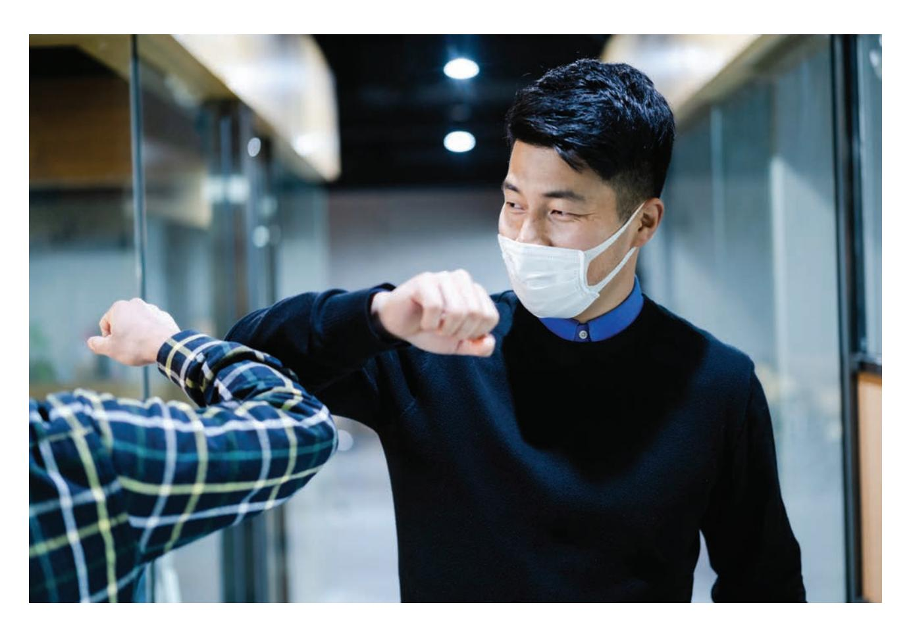

# **Public policy**

Until recently, it was not possible to apply the WELLBY approach to public policy for lack of direct quantitative information about well-being. So effects on well-being had to be inferred from people's choices, and cost-benefit analysis done this way could only be applied to a limited range of policy choices. Now, however, the science of happiness provides **direct evidence on measured well-being** and what affects it. This makes it possible to analyse policy in a quantitative way over a much wider range of policy areas. The numbers may not be perfect, but it is far better to use empirically-based numbers than pure hunch.10

So we now have for the first time a way of dealing with the fundamental problem of all public policy — how to compare the claims of different policies whose aims are not obviously commensurable. Using WELLBYs, we have at last a common currency with which to compare the outcomes of all policies.

The new objective is, in fact, not that different from the objective of many existing health services, but more ambitious. They talk about **Quality-Adjusted** Life Years (or QALYs), and by quality of life, they mean the "health-related" quality of life of the individual patient. But we are concerned with people's well-being, whatever its source, and we are concerned with everybody who is affected by any decision.

Policymakers have many levers: they can spend money, raise money, and make regulations. All these decisions should be based on their impact on WELLBYs. When it comes to spending money, the most realistic approach is to assume that the total amount of public expenditure is a political decision. But, once the total is determined, it is vital that it should be spent effectively - to produce the greatest possible WELLBYs. This means that spending policies should be ranked according to the total WELLBYs they produce per dollar of expenditure and authorised in that order until the available budget is exhausted. A number of

countries already analyse the impact of new spending policies upon the well-being of the population.11 New Zealand has an annual well-being budget, and the EU Council of Ministers and the OECD have requested their members to "put people and their well-being at the centre of policy design."12 This should include policies on regulation and tax as well as spending. All policies should be based on the total WELLBYs that result.

As regards COVID-19 policy, as the earlier chapters in this report show, the right strategy in 2020 was to suppress the virus. Countries that did this had fewer deaths **and** a better economy. There was no need to balance one against the other. However, in 2021 we shall increasingly have the vaccine. So, for countries that have failed to suppress the virus so far, the best course now may involve accepting some cases of illness (while the vaccine is being distributed) in order to protect the economy, children's education, and the mental health of the population. For such a balancing act, the WELLBY approach is helpful and is illustrated in Layard et al. (2020).13

# **The monetary value of a life year**

In this balancing act, we have to take into account everything which affects WELLBYs. Besides much else, this includes the impact on WELLBYs of life-years lost and of changes in incomes. There is, thus, in any policy evaluation, an implicit measure of the amount of money that is of equivalent value to a year of life lost. For decades governments have been using estimates of this number to evaluate health interventions and safety improvements in road, rail, air transport, and workplaces. These have been obtained using quite different methods from the WELLBY approach. Interestingly, the numbers they provide would not justify any of the lockdowns we have seen in Europe or the USA.14 And yet, the public approve the lockdown.15 So it is interesting to ask if the WELLBY approach offers similar or higher numbers compared with traditional approaches.

We shall revert shortly to the traditional estimates, which involve extended chains of inference. But by contrast with them, the WELLBY approach is very direct. We simply find out:

- (i) the number of WELLBYs lost when a year of life is lost, and
- (ii) the loss of money, which (when spread over a large number of people) would produce the same loss of WELLBYs.
- **(i) On the WELLBY value of a life year,** we assume that if someone dies one year earlier than otherwise, the loss of WELLBYs equals average well-being in the population. The reasoning is that we all want a life that is both long and enjoyable — in other words, we wish for the maximum of WELLBYs in our life. If a year of life is lost, that is a loss of WELLBYs. In advanced societies, the average WELLBYs per year lived is 7.5 (out of a maximum of 10), and that is. Therefore, the cost (in WELLBYs) of a year of life lost.
- **(ii) On the value of money** (measured again in WELLBYs), we know a huge amount from equations where life-satisfaction (0-10) has been regressed on log income.16 So suppose *Wellbeing* = *Log Income*. Then the impact of an extra dollar of annual income on annual well-being is /*Annual Income*.

So what is the value of ? Within four advanced countries, the coefficient on log income is between 0.15 and 0.30 in cross-sectional regressions (and very much lower in panel analysis). Similar studies using the Gallup World Poll for nearly every country in the world give an average coefficient (with a few controls) of 0.16 in advanced countries and 0.28 in middle and low-income countries — again, a similar range.18 However, there are two factors that could make this an underestimate, while two others go in the opposite direction.

- 1. If income affects some of the variables controlled for, then income has a bigger true effect than has been allowed for. Removing all controls raises the coefficient by a multiple of between 1.5 and 2.
- 2. If income is measured with error, we should also raise the coefficient.
- 3. On the other hand, in any equation, there must be unobservable differences between people, which are positively correlated with both income and well-being and thus

tend to exaggerate the effect of income. This is one reason why panel estimates of the effects of income are typically twothirds lower than those so far quoted. (Other reasons are additional effects of measurement error and problems of timing). One interesting way to reduce the effect of unobserved variables is to study the effect of purely exogenous shocks on income. One type of income that is completely exogenous is the size of lottery wins (among those who play the lottery). In one careful study, the effect of money gained in this way is to raise well-being in a way equivalent to a coefficient of 0.38 on log income.19

4. A final complication is that there is overwhelming evidence that much of the effect of income measured in these studies is an effect of relative income.20 But the point of estimating the value of a life-year is to answer the question, "What fall in absolute income, shared across the population, would be as bad as the loss of a life-year." There is good evidence that an absolute change in national income per head has a smaller effect than the effects of changes in individual income quoted so far. These latter are measured holding other incomes constant and therefore include the effect of gains in relative income. One type of evidence on the effects of absolute income comes from looking at country time-series. In European countries since 1970, one estimate is that an increase in trend log income raised well-being by 0.2, with very wide confidence intervals.21

Based on all this evidence, we propose to use the figure as 0.3 as a generous measure of the impact on well-being (0-10) of a unit change in absolute log income. From this, it follows that the loss of WELLBYs from one dollar fall in annual income is no higher than 0.3 / Average annual income. If the average annual disposable income per head is \$30,000, the loss of \$1 when widely spread is equivalent to the loss of 1/100,000 WELLBYs.

**(iii)** Thus, in rich countries, the loss of \$1 reduces WELLBYs by around 1/100,000. At the same time, an extra year of life delivers an average of 7.5 WELLBYs. So we should be willing to pay up to around \$750,000 (widely spread) to save one Life-Year in the WELLBY approach that is the monetary value of a Life-Year. It is a large number and (as we shall see) higher than traditional values. Two comments are in order.

First, traditional values would not justify most lockdowns, but the people support the lockdowns. Second, if public expenditure is constrained, it would not be right to fund all savings of a life-year that cost less than \$750,000. But in this constrained situation, life-years should still be valued at that level relative to monetary outcomes.

The well-being approach to this issue is relatively new.22 But over the last forty years, other methods have been used to produce a range of numbers used by governments in many countries. These methods fall into two main types, based on either "revealed preference" or "stated preferences."

## **Revealed preference**

The revealed preference method relies mainly on the wages paid in jobs that differ in the frequency of fatal accidents. The basic idea is that, for people of a given ability, a higher risk of death has to be compensated by a higher wage. More precisely, there is (for people of given ability) a market relationship, w = f(p), where a higher probability of death (p) is associated with a higher wage (w).23 Along this market line, each

*From 2006-08 to 2017-19 social welfare in the world rose from 369 to 374 WELLBYs per person; in 2020 life expectancy fell in most countries, though not enough to wipe out at world level the gains since 2006-08.*

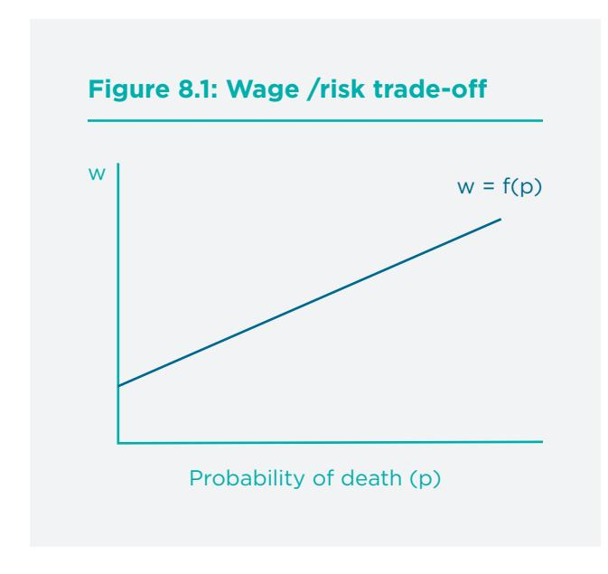

individual chooses a point where the extra wage equals her subjective valuation of the extra risk, while at the same time, each firm chooses a point where the extra wage is matched by the reduced cost of safety measures. Only when all individuals and all firms are in equilibrium is the market relationship stable. (see Figure 8.1)

If all firms and individuals share the same, correct information about risk, we can claim that the slope of the line w=f(p) measures the monetary equivalent of a prevented fatality.24

Many such evaluations have been used by different agencies. In 2011 and 2012, a variety of US government agencies valued a prevented death at between \$6 million and \$10 million.25

Such estimates are, of course, generated by the choices of workers of a wide variety of ages. So, to move from the value of a **prevented fatality** to the value of **one life-year saved**, we have to allow for the remaining life expectancy of those who die. Suppose this is 40 years, and applying no discount rate, we would get the value of a life-year of \$150k to 250k. But those figures should be increased somewhat to allow for discounting. The resulting calculation would, however, be lower than the typical result of the WELLBY calculation that we have documented.

In comparing the two, we should remember that the labour market valuation depends very much

on the assumption of accurate information on the part of workers. It is also based on people's ex ante valuations of the risk of death, whereas the well-being estimate is essentially ex-post — it relies on an empirical estimate of how much well-being is actually lost (plus the marginal value of money).

# **Stated preferences**

The second approach that has been widely used depends on people's answers to hypothetical questions about how much they would be willing to pay for a reduced probability of death. This is the preferred method in the UK. It results in lower numbers, and the UK government currently uses a figure of £1.6 million for a prevented fatality and £60k for a life-year.26

The argument for the stated preference approach is that it addresses the question of valuation directly. The main problem with it is that people have great difficulty thinking clearly about very small probabilities. For example, in one study, 40% of respondents reported the same willingness to pay for a reduced probability of 4 in 100,000 and a reduced probability of 12 in 100,000.27

There is another problem. The question of valuation can, of course, be put in two ways.

- 1. How much would you pay to achieve some given reduction in the probability of death?
- 2. How much would you need to be paid to give up the same reduction in the probability of death?

For small changes, these numbers should, in theory, be very close to each other. But people, in fact, give answers to the second question that are almost five times higher — because they see it as a loss.28 This is a big problem.

And there is a further problem with both stated preference and revealed preference methods: they estimate what an individual would be willing to pay for a reduced risk of death on the assumption that other people's incomes are unchanged. But in fact, if taxes were raised to finance increased safety, other people's incomes

would also fall. This fall in comparator income would partly offset the loss of well-being experienced by each individual from the loss of her own income. So people would each be willing to pay more if others were doing the same. For this reasoning, a country should be willing to pay more in order to save a life. The WELLBY approach provides a more reasonable alternative.

#### The impact of COVID-19

Finally, we can apply the WELLBY approach to estimating the combined impact of COVID on social welfare, taking into account only its effect on income per head, unemployment, and life expectancy. So unlike the rest of the chapter, we are not looking at estimates of the total change in well-being but only at estimated effects on well-being coming through GDP per head and unemployment. We start from equation (2) so that, if we look at proportional changes, we have the following.

Column (3) does the same for deaths from COVID-19. Despite the approximate and provisional nature of the data, we have ranked countries according to how much they have suffered from these three factors combined, starting with those that suffered most.

Those who have suffered most include South Africa, the USA, and many Latin American countries. Most European countries come in the next group down. And in the least affected group come all the main parts of East and Southeast Asia (mainland China, Taiwan, Cambodia, Thailand, Vietnam, Singapore, and Japan).

It is extremely interesting to look at the correlation of death rates and losses to GDP. Across 79 countries, the correlation is positive and quite substantial (r = 0.38). In other words, countries that controlled the virus also avoided the economic losses which affected other countries.31

(3) 
$$\frac{\Delta \, Social \, welfare}{Social \, welfare} = \frac{\Delta \, Average \, wellbeing}{Average \, wellbeing} + \frac{\Delta \, Life \, expectancy}{Life \, expectancy}$$

But for the present purpose, we are only interested in changes in well-being coming from GDP per head and unemployment. Thus, the equation we use to calculate Table 8.2 is29

(4) 
$$\frac{\Delta Social \ welfare}{Social \ welfare} = \frac{0.3 \ \Delta \log(GDP/N)}{Average \ wellbeing} - \frac{1.2 \ \Delta u}{Average \ wellbeing} + \frac{\Delta \ Life \ expectancy}{Life \ expectancy}$$

Where N is population, and u is the proportional rate of unemployment. For the last term, we assume that it bears the same ratio to Deaths per million as it does in the US.30 The results are therefore very approximate and provisional. They are shown in Table 8.2.

Column (1) shows the percentage change in welfare due to changes in GDP, Column (2) does the same for changes in unemployment, and

**Table 8.2: Percentage changes in social welfare due to changes in GDP per head and unemployment and deaths from COVID-19**

|                        | Change in GDP per capita | Change in Unemployment rate | Deaths from COVID | Total |  |
|------------------------|-----------------------------|-----------------------------------|----------------------|-------|--|
|                        | (1)                         | (2)                               | (3)                  | (4)   |  |
| All countries          | -0.4                        | -0.3                              | -0.4                 | -1.0  |  |
| Peru                   | -0.8                        | -1.2                              | -1.4                 | -3.4  |  |
| South Africa           | -0.6                        | -2.1                              | -0.6                 | -3.3  |  |
| Colombia               | -0.5                        | -1.3                              | -1.0                 | -2.8  |  |
| Dominican Republic     | -0.4                        | -2.1                              | -0.3                 | -2.7  |  |
| Belgium                | -0.4                        | -0.1                              | -2.0                 | -2.5  |  |
| Slovenia               | -0.3                        | -0.6                              | -1.5                 | -2.5  |  |
| Bosnia and Herzegovina | -0.3                        | -0.7                              | -1.5                 | -2.5  |  |
| Ecuador                | -0.7                        | -0.9                              | -0.9                 | -2.5  |  |
| Macedonia              | -0.3                        | -0.7                              | -1.4                 | -2.4  |  |
| Spain                  | -0.6                        | -0.5                              | -1.3                 | -2.4  |  |
| Costa Rica             | -0.3                        | -1.6                              | -0.5                 | -2.4  |  |
| United States          | -0.2                        | -0.9                              | -1.2                 | -2.4  |  |
| Panama                 | -0.5                        | -0.7                              | -1.1                 | -2.4  |  |
| Armenia                | -0.3                        | -0.9                              | -1.1                 | -2.3  |  |
| Bolivia                | -0.5                        | -0.8                              | -0.9                 | -2.3  |  |
| Chile                  | -0.4                        | -0.8                              | -1.0                 | -2.2  |  |
| Italy                  | -0.5                        | -0.2                              | -1.5                 | -2.2  |  |
| Argentina              | -0.7                        | -0.2                              | -1.1                 | -2.1  |  |
| Hungary                | -0.3                        | -0.5                              | -1.2                 | -2.0  |  |
| United Kingdom         | -0.5                        | -0.3                              | -1.3                 | -2.0  |  |
| Romania                | -0.2                        | -0.8                              | -1.0                 | -2.0  |  |
| Mexico                 | -0.5                        | -0.3                              | -1.2                 | -2.0  |  |
| Croatia                | -0.5                        | -0.3                              | -1.1                 | -1.9  |  |
| Bulgaria               | -0.2                        | -0.3                              | -1.3                 | -1.8  |  |
| Czech Republic         | -0.3                        | -0.2                              | -1.3                 | -1.8  |  |
| France                 | -0.5                        | -0.1                              | -1.2                 | -1.7  |  |
| Philippines            | -0.5                        | -1.1                              | -0.1                 | -1.7  |  |
| Brazil                 | -0.3                        | -0.3                              | -1.1                 | -1.7  |  |
| Portugal               | -0.5                        | -0.3                              | -0.8                 | -1.7  |  |
| Ukraine                | -0.5                        | -0.7                              | -0.5                 | -1.7  |  |
| Moldova                | -0.2                        | -0.6                              | -0.9                 | -1.6  |  |
| Greece                 | -0.5                        | -0.6                              | -0.6                 | -1.6  |  |
| Sweden                 | -0.3                        | -0.3                              | -1.0                 | -1.6  |  |
| Iran                   | -0.4                        | -0.4                              | -0.8                 | -1.6  |  |
| Canada                 | -0.4                        | -0.7                              | -0.5                 | -1.5  |  |
| Switzerland            | -0.3                        | -0.1                              | -1.1                 | -1.5  |  |
| Netherlands            | -0.2                        | -0.3                              | -0.8                 | -1.4  |  |
| Sri Lanka              | -0.4                        | -1.0                              | 0.0                  | -1.4  |  |
| Austria                | -0.3                        | -0.2                              | -0.8                 | -1.3  |  |
|                        |                             |                                   |                      |       |  |
| Latvia                 | -0.3                        | -0.5                              | -0.4                 | -1.2  |  |
| Lithuania              | -0.1                        | -0.4                              | -0.8                 | -1.2  |  |
| El Salvador            | -0.5                        | -0.5                              | -0.2                 | -1.2  |  |

**Table 8.2: Percentage changes in social welfare due to changes in GDP per head and unemployment and deaths from COVID-19** continued

|                          | Change in GDP per capita | Change in Unemployment rate | Deaths from COVID | Total |  |
|--------------------------|-----------------------------|-----------------------------------|----------------------|-------|--|
|                          | (1)                         | (2)                               | (3)                  | (4)   |  |
| Slovakia                 | -0.4                        | -0.4                              | -0.5                 | -1.2  |  |
| Serbia                   | -0.1                        | -0.5                              | -0.6                 | -1.2  |  |
| Poland                   | -0.2                        | -0.1                              | -0.9                 | -1.2  |  |
| Israel                   | -0.3                        | -0.4                              | -0.5                 | -1.2  |  |
| Nicaragua                | -0.3                        | -0.9                              | 0.0                  | -1.2  |  |
| Estonia                  | -0.3                        | -0.7                              | -0.2                 | -1.1  |  |
| Honduras                 | -0.4                        | -0.3                              | -0.4                 | -1.1  |  |
| Iceland                  | -0.4                        | -0.6                              | -0.1                 | -1.1  |  |
| Kyrgyzstan               | -0.8                        | 0.0                               | -0.2                 | -1.0  |  |
| Albania                  | -0.5                        | -0.1                              | -0.5                 | -1.0  |  |
| Azerbaijan               | -0.3                        | -0.4                              | -0.3                 | -1.0  |  |
| Kazakhstan               | -0.2                        | -0.6                              | -0.2                 | -1.0  |  |
| Germany                  | -0.3                        | -0.2                              | -0.5                 | -0.9  |  |
| Russia                   | -0.2                        | -0.2                              | -0.5                 | -0.9  |  |
| Turkey                   | -0.4                        | -0.2                              | -0.3                 | -0.9  |  |
| Indonesia                | -0.1                        | -0.6                              | -0.1                 | -0.9  |  |
| Paraguay                 | -0.3                        | -0.2                              | -0.4                 | -0.9  |  |
| Ireland                  | -0.2                        | -0.1                              | -0.5                 | -0.8  |  |
| Malaysia                 | -0.4                        | -0.4                              | 0.0                  | -0.8  |  |
| Cyprus                   | -0.4                        | -0.2                              | -0.2                 | -0.7  |  |
| New Zealand              | -0.3                        | -0.3                              | 0.0                  | -0.6  |  |
| Mongolia                 | -0.2                        | -0.4                              | 0.0                  | -0.6  |  |
| Denmark                  | -0.2                        | -0.2                              | -0.3                 | -0.6  |  |
| Belarus                  | -0.1                        | -0.2                              | -0.2                 | -0.5  |  |
| Australia                | -0.2                        | -0.3                              | 0.0                  | -0.5  |  |
| Finland                  | -0.2                        | -0.2                              | -0.1                 | -0.5  |  |
| Singapore                | -0.3                        | -0.1                              | 0.0                  | -0.5  |  |
| Japan                    | -0.3                        | -0.2                              | 0.0                  | -0.5  |  |
| Uruguay                  | -0.2                        | -0.1                              | -0.1                 | -0.4  |  |
| Thailand                 | -0.4                        | 0.0                               | 0.0                  | -0.4  |  |
| Norway                   | -0.1                        | -0.1                              | -0.1                 | -0.4  |  |
| Pakistan                 | -0.1                        | -0.1                              | -0.1                 | -0.3  |  |
| Vietnam                  | 0.0                         | -0.2                              | 0.0                  | -0.2  |  |
| South Korea              | -0.1                        | -0.1                              | 0.0                  | -0.2  |  |
| Taiwan Province of China | 0.0                         | 0.0                               | 0.0                  | 0.0   |  |
| China                    | 0.1                         | 0.0                               | 0.0                  | 0.0   |  |
| Egypt                    | 0.1                         | 0.1                               | -0.1                 | 0.1   |  |

Sources: GDP: International Monetary Fund, World Economic Outlook Database, October 2020. Unemployment: International Monetary Fund, World Economic Outlook Database, October 2020 (country level), The World Bank. World Development Indicators (World estimates). Covid deaths: Johns Hopkins University database. Dong E, Du H, Gardner L. An interactive web-based dashboard to track COVID-19 in real-time. Lancet Infect Dis; published online Feb 19. All figures have been calculated to five decimal places before rounding.

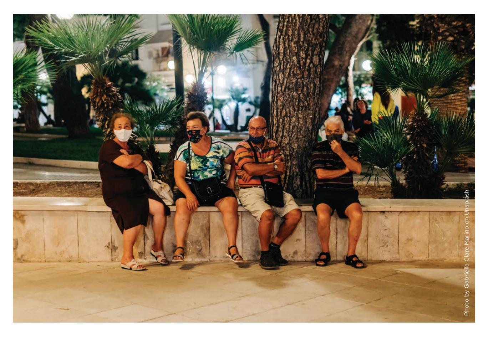

# **Conclusions**

The WELLBY approach offers the most plausible way of combining well-being with the length of life. It assumes that the value of life comes from the well-being it provides. We do not rely on how individuals respond to the ex-ante risk of losing their lives but on the ex-post satisfaction that life actually delivers. And we do this because of our view that a good society delivers lives that are both long and satisfying.

This approach serves two purposes. First, it provides us with a more comprehensive way of assessing human progress and the **performance of different countries**. The story is basically positive. From 2006-08 to 2017-19 social welfare in the world rose from 369 to 374 WELLBYs per person. This was because, while well-being fell somewhat, life expectancy rose by 3.7 years. And WELLBYs became more evenly distributed across the world because life expectancy rose most in low-WELLBY regions.

However, in 2020 life expectancy fell in most countries, though not enough to wipe out at world level the gains since 2006-08. At the same time, the economy shrank, and unemployment increased. But typically, those countries which controlled the virus best also experienced the least hit to the economy — there was no trade-off between these two outcomes.

The second use of WELLBYs is to **evaluate policy options**. Well-being science now provides enough evidence for this to become more and more feasible. It should be used wherever possible to evaluate future strategies against COVID-19. And within 20 years, it will surely become the standard method of policy evaluation in more and more countries.

#### **Endnotes**

- 1 For a fuller treatment see De Neve et al (2020).
- 2 This is often assumed at 1.5% per annum.
- 3 If they do, we would expect the test-rest differences to be similar at different parts of the scale. They are (Krueger and Schadke (2008)).
- 4 But see Peasgood et al (2018).
- 5 Bentham (1789). Mill (1861).
- 6 The product of two averages is not the same as the average of the product but in this case it is a good approximation since well-being is similar across ages.
- 7 Andrasfay, T., & Goldman, N. (2021).
- 8 Aburto, J. M et al (2021).
- 9 *Social welfare = WY, so social welfare rises if ¯* Δ log*W ¯* + Δ log *Y* > 0
- 10 For a useful survey of quantitative estimates of the effects on wellbeing of a whole range of factors see Frijters et al (2020), Table 1.
- 11 For example, France, Sweden. See OECD (2016).
- 12 See European Council (2019). https://data.consilium.europa. eu/doc/document/ST-13171-2019-INIT/en/pdf.
- 13 Layard et al (2020).
- 14 On the UK see Dolan and Jenkins (2020). A similar point has been made by Paul Frijters and others.
- 15 See for example Duffy and Allington (2020)
- 16 This is the functional form with the best power to explain life-satisfaction (Layard et al 2008).
- 17 If *W* = 0.3log*Y, dW/dY* = 0.3/*Y*
- 18 Clark et al (2018), table 2.2. Britain, Germany, Australia and US. For the whole world Chapter 2 of this report finds a coefficient of 0.25.
- 19 Lundqvist et al (2020).
- 20 Clark et al (2008). Layard et al (2010).
- 21 Layard et al (2010). Using a wider range of countries. Wolfers et al (2013) got a higher figure, with again wide confidence intervals. By contrast Easterlin et al (2020) find no effect.
- 22 It was first proposed by Dolan (2011).
- 23 Viscusi and Aldi (2003), reflecting Rosen (1986).
- 24 For example, suppose

*w* = *a* + *bp, where w is the annual wage and p the annual probabilty of death.* 

*If N workers ecperience a given* Δ*p, then the total change in wages is b*Δ*p. N.* 

*If* Δ*p. N equalled one, there would be one life lost per year and the total wage compensation per year would be* \$*b.*

25 Viscusi (2014).

- 26 Chilton et al (2020). Note that in the wellbeing approach the quality of life is measured directly. In the QALY approach used by the British NHS the quality of life of a given medical condition is measured by comparison with a fully healthy life by a time-trade-off exercise. (People are asked "If you could have either ten years with your condition or x years without your medical condition, what value of x would make you indifferent?"). For a critique of this approach see Dolan and Kahneman (2008) who advocate a wellbeing approach to measuring the quality of life in the presence of a disease.
- 27 Dubourg et al (1996). For a devastating analysis of the stated preference approach in general see Kahneman et al (1999). Focusing illusion is a particular problem.
- 28 Tuncel and Hammitt (2014).
- 29 For the coefficient of 1.2 see Chapter 2. A similar coefficient comes from Di Tella et al. (2003) for substantially higher coefficients, see Clark et al. (2018) Table 4.4.
- 30 In the USA in 2020, COVID-19 deaths were 1.049 per 1000. And life expectancy fell by 1 year i.e. by 1.2%.
- 31 The correlations between the columns are r12 0.32, r13 0.38, r14 0.63, r23 0.14, r24 0.68, r34 0.79. For 49 countries covered in Chapter 2 and Table 8.2, the correlations between the measured changes in well-being and columns (1)-(4) in this table are: (1) 0.12; (2) 0.34; (3) 0.33; (4) 0.31.

#### **References**

Aburto, J. M., Kashyap, R., Schöley, J., Angus, C., Ermisch, J., Mills, M. C., & Dowd, J. B. (2021). Estimating the burden of the COVID-19 pandemic on mortality, life expectancy and lifespan inequality in England and Wales: a population-level analysis. *Journal of Epidemiol Community Health*.

Andrasfay, T., & Goldman, N. (2021). Reductions in 2020 US life expectancy due to COVID-19 and the disproportionate impact on the Black and Latino populations. *Proceedings of the National Academy of Sciences*, *118*(5).

Bentham, J. (1789). An Introduction to the Principles of Morals and Legislation. Oxford, Clarendon Press.

Chilton, S. et al (2020) A scoping study on the valuation of risks to life and health: the monetary Value of a Life year (VOLY). UK Health and Safety Executive.

Clark, Andrew E., Paul Frijters, and Michael A. Shields. 2008. "Relative Income, Happiness, and Utility: An Explanation for the Easterlin Paradox and Other Puzzles." Journal of Economic Literature, 46 (1): 95-144.

Clark, A. E., et al. (2018). The Origins of Happiness: The Science of Wellbeing over the Life Course, Princeton University Press.

Council of the European Union. (October 2019). The Economy of Well-being: Creating Opportunities for people's well-being and economic growth. P. R. Committee. Brussels, Council of the European Union. Draft Council conclusions on the Economy of Well-being

De Neve, J.-E., Clark, A., Krekel, C., Layard, R., & O'Donnell, G. (2020). Taking a well-being years approach to policy choice. *The British Medical Journal*. 371:m3853

Di Tella, R., MacCulloch, R., & Oswald, A. J. (2003). The macroeconomics of happiness. *Review of Economics and Statistics*, *85*(4), 809-827.

Dolan, P. and D. Kahneman (2008). "Interpretations of utility and their implications for the valuation of health." Economic Journal 118 (525): 215-234.

Dolan, P., (2011). "Using Happiness to Value Health," Monographs, Office of Health Economics, number 000176.

Dolan, P., & Jenkins, P. (2020). Estimating the monetary value of the deaths prevented from the UK Covid-19 lockdown when it was decided upon--and the value of" flattening the curve". LSE mimeo.

Dubourg, Jones-Lee, and Loomes, G. (1997), Imprecise Preferences and Survey Design in Contingent Valuation. Economica, 64: 681-702.

Duffy, B., & Allington, D. (2020). The accepting, the suffering and the resisting: the different reactions to life under lockdown. *King's College London*.

Durand, M. (2018). Countries' Experiences with Well-being and Happiness Metrics. Global Happiness Policy Report. J. Helliwell, P. R. G. Layard and J. Sachs. New York, Sustainable Development Solutions Network.

Easterlin, R. A., & O'Connor, K. (2020). The Easterlin Paradox. IZA Discussion Paper No. 13923.

Frijters, P., Clark, A. E., Krekel, C., & Layard, R. (2020). A happy choice: well-being as the goal of government. Behavioural Public Policy, 4(2), 126-165.

Kahneman, D., Ritov, I., Chikado, D. (1999). Economic Preferences or Attitude Expressions? An analysis of dollar responses to public issues. Journal of Risk and Uncertainty. 19:1-3; 203-235.

Krueger, A. B., & Schkade, D. A. (2008). The reliability of subjective well-being measures. Journal of Public Economics, *92*(8-9), 1833-1845

Layard, R., Mayraz, G., & Nickell, S. (2008). The marginal utility of income. Journal of Public Economics, 92(8-9), 1846-1857.

Layard, R., et al. (2010). Does relative income matter? Are the critics right? International Differences in Well-Being. E. Diener, J. F. Helliwell and D. Kahneman. New York, Oxford University Press: 139-165.

Layard, R.,Clark, A., De Neve, J. E., Fancourt, D., Hey, N., Krekel, C., & O'Donnell, G. (2020). When to release the lockdown: a well-being framework for analysing costs and benefits. Centre for Economic Performance, LSE. (Occasional Paper No. 049).

Lindqvist, E., Östling, R., & Cesarini, D. (2020). Long-run effects of lottery wealth on psychological well-being. *The Review of Economic Studies*, *87*(6), 2703-2726.

Mill, J. S. (1861). Utilitarianism. London, Everyman.

OECD. (2016). *Strategic Orientations of the Secretary-General: For 2016 and beyond*. Retrieved from Meeting of the OECD Council at Ministerial Level Paris, 1-2 June 2016. https://www. oecd.org/mcm/documents/strategic-orientations-of-thesecretary-general-2016.pdf

Peasgood, T., Brazier, J., Mukuria, C., & Karimi, M. (2018). *Eliciting preference weights for life satisfaction: a feasibility study*. Mimeo.

Rosen, S. (1986). The theory of equalizing differences. Handbook of Labor Economics Volume I. O. Ashenfelter and R. Layard (eds).

Tunçel, T., & Hammitt, J. K. (2014). A new meta-analysis on the WTP/WTA disparity. Journal of Environmental Economics and Management, *68*(1), 175-187.

Viscusi, W. K., & Aldy, J. E. (2003). The value of a statistical life: a critical review of market estimates throughout the world. Journal of risk and uncertainty, *27*(1), 5-76.

Viscusi, W. K. (2014). The value of individual and societal risks to life and health. In Handbook of the Economics of Risk and Uncertainty (Vol. 1, pp. 385-452). North-Holland.

This publication may be reproduced using the following reference: Helliwell, John F., Richard Layard, Jeffrey Sachs, and Jan-Emmanuel De Neve, eds. 2021. *World Happiness Report 2021.* New York: Sustainable Development Solutions Network.

Full text and supporting documentation can be downloaded from the website: **http://worldhappiness.report/**

#happiness2021 #WHR2021

ISBN 978-1-7348080-1-8

SDSN The Sustainable Development Solutions Network (SDSN) engages scientists, engineers, business and civil society leaders, and development practitioners for evidence-based problem solving. It promotes solutions initiatives that demonstrate the potential of technical and business innovation to support sustainable development.

475 Riverside Dr. STE 530 New York, NY 10115 USA

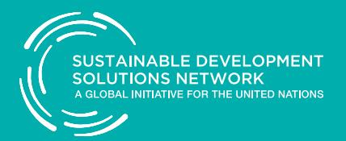

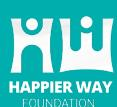

The World Happiness Report is a publication of the Sustainable Development Solutions Network, powered by data from the Gallup World Poll and Lloyd's Register Foundation, who provided access to the World Risk Poll. The 2021 Report includes data from the ICL-YouGov Behaviour Tracker as part of the COVID Data Hub.

The Report is supported by The Ernesto Illy Foundation, illycaffè, Davines Group, The Blue Chip Foundation, The William, Jeff, and Jennifer Gross Family Foundation, The Happier Way Foundation, Indeed, and Unilever's largest ice cream brand, Wall's.