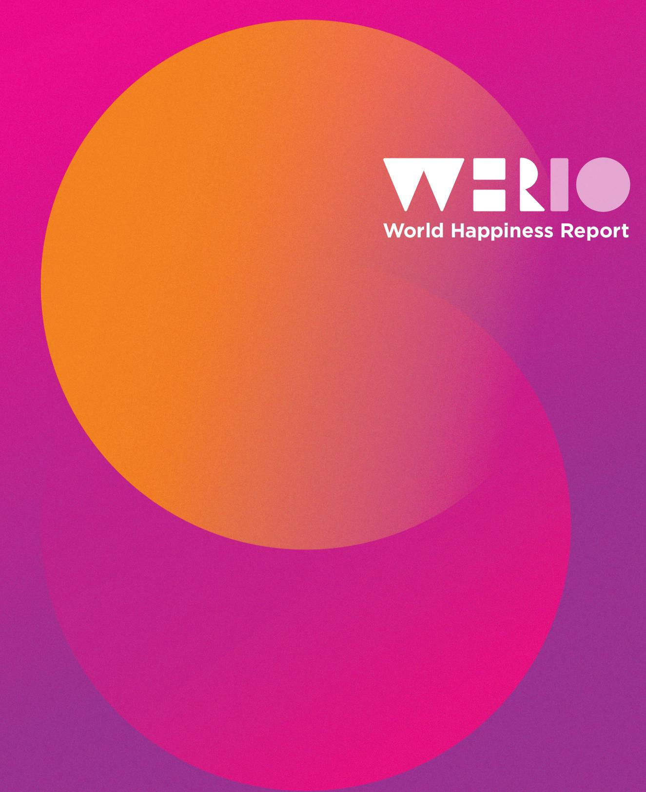

John F. Helliwell, Richard Layard, Jeffrey D. Sachs, Jan-Emmanuel De Neve, Lara B. Aknin, and Shun Wang

# Table of Contents

# World Happiness Report 2022

|   | Foreword 3                                                                                                                       |
|---|----------------------------------------------------------------------------------------------------------------------------------|
| 1 | Overview on Our Tenth Anniversary 5 Helliwell, Layard, Sachs, De Neve, Aknin, & Wang                                       |
| 2 | Happiness, Benevolence, and Trust During COVID-19 and Beyond 13 Helliwell, Wang, Huang, & Norton                        |
| 3 | Trends in Conceptions of Progress and Well-being 53 Barrington-Leigh                                                          |
| 4 | Using Social Media Data to Capture Emotions Before and During COVID-19 75 Metzler, Pellert, & Garcia                       |
| 5 | Exploring the Biological Basis for Happiness 105 Bartels, Nes, Armitage, Van de Weijer, de Vries, & Haworth                   |
| 6 | Insights from the First Global Survey of Balance and Harmony 127 Lomas, Lai, Shiba, Diego-Rosell, Uchida, & VanderWeele |

Growing international interest in Photo by Natalya Letunova on Unsplash

greater economic insecurity, anxiety, disruption of every aspect of life

## **Foreword**

This is the tenth anniversary of the World Happiness Report. We use this Foreword to thank those that make the Report possible over the past ten years, including our teams of editors and partners.

The World Happiness Report, and much of the growing international interest in happiness, as documented in Chapter 3, exists thanks to Bhutan. They sponsored Resolution 65/309, "Happiness: Towards a holistic approach to development," adopted by the General Assembly of the United Nations on 19 July 2011, inviting national governments to "give more importance to happiness and well-being in determining how to achieve and measure social and economic development."

On 2 April 2012, chaired by Prime Minister Jigmi Y. Thinley and Jeffrey D. Sachs, the first *World Happiness Report* was presented to review evidence from the emerging science of happiness for the 'Defining a New Economic Paradigm: The Report of the High-Level Meeting on Well-being and Happiness.' On 28 June 2012, the United Nations General Assembly adopted Resolution 66/281, proclaiming 20 March International Day of Happiness to be observed annually. The World Happiness Report is now released every year around March 20th as part of the International Day of Happiness celebration.

The preparation of the first *World Happiness Report* was based at the Earth Institute at Columbia University, with the Centre for Economic Performance's research support at LSE (the London School of Economics), and CIFAR (the Canadian Institute for Advanced Research), through their grants supporting research at the Vancouver School of Economics at UBC (the University of British Columbia). The central base for the reports since 2013 has been SDSN (Sustainable Development Solutions Network) and CSD (the Center for Sustainable Development) at Columbia University, directed by Jeffrey D. Sachs. Although the editors and authors are volunteers, there are administrative, and research support costs covered most recently through a series of grants from The Ernesto Illy Foundation, illycaffè, Davines Group, Unilever's largest ice cream brand Wall's,

The Blue Chip Foundation, The William, Jeff, and Jennifer Gross Family Foundation, The Happier Way Foundation, and The Regenerative Society Foundation.

Although the World Happiness Reports are based on a wide variety of data, the most important source has always been the Gallup World Poll, unique in its range and comparability of global annual surveys.

Life evaluations from the Gallup World Poll provide the basis for the annual happiness rankings that have always sparked widespread interest. Readers may be drawn in by wanting to know how their nation is faring but soon become curious about the secrets of life in the happiest countries. The Gallup team has always been extraordinarily helpful and efficient in getting each year's data available in time for our annual launch. Right from the outset, we received very favorable terms from Gallup and the very best of treatment. Gallup researchers have also contributed to the content of several World Happiness Reports. The value of this partnership was recognized by two Betterment of the Human Conditions Awards from the International Society for Quality of Life Studies. The first was in 2014 for the World Happiness Report, the second, in 2017, went to the Gallup Organization for the Gallup World Poll. The value of this partnership was recognized by two Betterment of the Human Conditions Awards from the International Society for Quality of Life Studies.

Gallup has since become our data partner in recognition of the Gallup World Poll's importance to the contents and reach of the World Happiness Report. In this more formal way, we are proud to embody a history of cooperation stretching back beyond the first *World Happiness Report* to the start of the Gallup World Poll itself. They have always gone the extra mile, and we thank them for it.

We were also grateful for the World Risk Poll data provided by the Lloyd's Register Foundation providing access to the World Risk Poll. We also greatly appreciate data from the ICL-YouGov Behaviour Tracker as part of the COVID Data Hub from the Institute of Global Health Innovation.

We have had a remarkable range of expert contributing authors and expert reviewers over the years and are deeply grateful for their willingness to share their knowledge with our readers. Their expertise assures the quality of the reports, and their generosity is what makes it possible. Thank you.

Our editorial team has evolved over the years. Currently, it includes the three founding editors plus Jan-Emmanual De Neve, Lara B. Aknin, and Shun Wang. Sharon Paculor manages operations and leads the design and distribution efforts as Production Editor. Ryan Swaney has been our web developer since 2013, and Stislow Design has done our graphic design work over the same period. Kyu Lee handles media management with great skill, and we are very grateful for all he does to make the reports widely accessible.

Our institutional sponsors include SDSN, CSD at Columbia University, the Centre for Economic Performance at LSE, the Vancouver School of Economics at UBC, the Wellbeing Research Centre at Oxford, and Simon Fraser University.

Whether in terms of research, data, or grants, we are enormously grateful for all of these contributions.

*John Helliwell, Richard Layard, Jeffrey D. Sachs, Jan-Emmanuel De Neve, Lara B. Aknin, Shun Wang; and Sharon Paculor, Production Editor*

# Chapter 1

# Overview on Our Tenth Anniversary

# John F. Helliwell

Vancouver School of Economics, University of British Columbia

# Richard Layard

Wellbeing Programme, Centre for Economic Performance, London School of Economics and Political Science

# Jeffrey D. Sachs

University Professor and Director of the Center for Sustainable Development at Columbia University

## Jan-Emmanuel De Neve

Director, Wellbeing Research Centre, University of Oxford

## Lara B. Aknin

Distinguished Associate Professor, Department of Psychology, Simon Fraser University

## Shun Wang

Professor, KDI School of Public Policy and Management

This is the tenth anniversary of the World Happiness Report. From its first year, the report has had a large and growing readership reaching over 9 million in 2021. It has been widely cited. But more important has been the message the Report has carried. The true measure of progress is the happiness of the people; that happiness can be measured; and that we know a lot about what causes it. Given this knowledge, it is now possible for policy-makers to make people's happiness the goal of their policies. And each of us can live a wiser life.

We take the tenth anniversary as an opportunity to consider how far happiness research has come, where it stands, and the promising opportunities that lie ahead.

## **Looking back**

Over the last ten years, there has been a transformation of public interest in happiness (see Chapter 3). Policy-makers worldwide increasingly see it as an important and overarching objective of public policy. With encouragement from the OECD, nearly all its member countries now measure the happiness of their people annually. The European Union asks its member countries to put well-being at the heart of policy design.

While interest in happiness has mushroomed over the ten years of World Happiness Reports, the global average of national life evaluations has been relatively stable. This average stability masks a great variety of national and regional experiences. As Chapter 2 demonstrates, life evaluations have risen by one full point or more in some countries (led by three Balkan countries, Romania, Bulgaria, and Serbia) and fallen this much or more in other countries in deep trouble, with Venezuela, Afghanistan, and Lebanon dropping the most. There has, on average, been a long-term moderate upward trend in stress, worry, and sadness in most countries and a slight long-term decline in the enjoyment of life.

# **Happiness, benevolence, and trust during COVID-19 and beyond (Chapter 2)**

Chapter 2 contains the national happiness rankings, explores trends over the past ten years, and provides a deeper examination of emotions, behaviour, and life in general during 2020 and 2021. The 2021 data confirm the 2020 finding that average life evaluations, reflecting the net effects of offsetting negative and positive influences, have remained remarkably resilient during COVID-19. For the young, life satisfaction has fallen, while for those over 60, it has risen — with little overall change. Worry and stress have risen — by 8% in 2020 and 4% in 2021 compared with pre-pandemic levels.

On the positive side, the most remarkable change seen during COVID-19 has been the global upsurge in benevolence in 2021. This benevolence has provided notable support for the life evaluations of givers, receivers, and observers, who have been gratified to see their community's readiness to reach out to help each other in times of need. In every global region, there have been large increases in the proportion of people who give money to charity, help strangers, and do voluntary work in every global region. Altogether the global average of these three measures was up by a quarter in 2021, compared with before the pandemic.

COVID-19 has also demonstrated the crucial importance of trust for human well-being. Deaths from COVID-19 during 2020 and 2021 have been markedly lower in those countries with higher trust in public institutions and where inequality is lower.

# **Looking forward**

For the future, the prospects for happiness will depend on a whole range of factors, including the future course of the pandemic and the scale of military conflict. But an important contribution will come from improvements in the science of happiness. In this tenth anniversary issue, we celebrate three major promising developments in our ability to measure and explain happiness.

The first is our new ability to measure the happiness content of printed text, be it in books or social media. This can be done mechanically by counting the frequency of different types of words or by machine learning which also analyses content.

These methods show that references to happiness have increased sharply over the last ten years (see Chapter 3). Meanwhile, references to income and GDP have fallen, and they have become less common than references to happiness. These are encouraging long-term trends.

Automated text analysis can also be used to measure changes in emotion over weeks or even days — at least among those who tweet (see Chapter 4). It turns out that measures of emotion on Twitter move closely in line with the replies about emotion given in social surveys — which reinforces one's confidence in both methods of measuring emotion.

A second major area of progress concerns the relationship between biology and happiness. We now have many 'biomarkers' of happiness. In addition, the genes we inherit provide important clues as to why some people are happier than others (see Chapter 5).

The third area of advance is the range of emotions covered in happiness research. Happiness research in the West has tended to ignore important positive emotions which involve low arousal — such as calm, peace, and harmony. Recent research shows how significant these emotions contribute to overall life satisfaction (see Chapter 6).

As the science of happiness develops further, the World Happiness Report will continue to search for even deeper insights into the secrets of human happiness. This search will be aided by new data and research tools like those described in Chapters 3 to 6, as summarised below.

# **Trends in conceptions of progress and well-being (Chapter 3)**

- Interest in happiness and subjective well-being has risen sharply, whether measured by the frequency of those words in books in multiple global languages, or by the scale of published research, or by the number of government measurement initiatives.
- By contrast, attention to income and GDP is decreasing, and in books published since 2013, the words GDP (or the like) have appeared less frequently than the word 'happiness'.
- •The World Happiness Report is referred to widely, and it is now mentioned twice as often (in books) as the phrase 'Beyond GDP', which itself has also been on a rapidly rising trajectory.
- Academic research on happiness has exploded and now involves authors from all over the world.
- When organisations, academics, or governments try to define progress through creating a new set of indicators, they increasingly include measures of happiness. This reflects the strong public appetite for this conception of progress and the growing availability of data on happiness.
- Thus, the science of happiness has much to offer governments devising better policies. But it can never tell them how to handle inequality or questions of long-run sustainability.

# **Using social media data to capture emotions before and during COVID-19 (Chapter 4)**

• Millions of people share their thoughts and feelings online via social media each day. Automated analysis of social media data offers exciting promise for measuring trends in emotions. The methods used include counts of emotional words listed in emotion dictionaries and machine learning methods which also take into account the structure and meaning of sentences.

- Two case studies of tweets on Twitter examined the daily and weekly movements of positive and negative emotions, including sadness and anxiety, before and during COVID-19 in the U.K. and Austria. These were then compared with the measurements of these emotions as recorded in standard social surveys of the population. The two measures of emotion (social-media-based and survey-based) tracked each other extraordinarily well, although clear differences between text analysis methods and emotions exist. The Twitter measures of emotion were less closely related to survey-based questions on life satisfaction.
- As regards the impact of COVID-19, Twitter data in 18 countries showed strong increases in anxiety and sadness during COVID-19 (together with decreases in anger). These changes in anxiety and sadness were positively related to the incidence of COVID-19 itself and the stringency of anti-COVID measures.
- How to best analyze social media data to achieve valid measures of emotions of the population is still an important research topic. Nonetheless, it is becoming increasingly clear that measures of emotion from social media can effectively complement measures based on social surveys when robust methods are applied — a big step forward for happiness research.

# **Exploring the biological basis for happiness (Chapter 5)**

- Genetic studies involving twin or family designs reveal that about 30-40% of the differences in happiness between people within a country are accounted for by genetic differences among individuals. The other 60-70% of differences between people result from the effect of environmental influences that are independent of the genes.
- Genome-Wide Association Studies show that the genetic influence comes from the cumulative effects of numerous genetic variants, each with small effects. The next step is to use the outcome of these large-scale studies to create a so-called Polygenic Score; a number

- that summarises the estimated effect of the many genetic variants on an individual's phenotype. It reflects an individual's estimated genetic predisposition for a given trait and can be used as a predictor for that trait.
- Some people are born with a set of genetic variants that makes it easier to feel happy, while others are less fortunate. But genes and environment are generally correlated: genes can affect people's choice of environment and how others react to them. At the same time, genes can influence how people are affected by the world around them — there is 'gene-environment interaction'.
- The most consistent finding with respect to the brain areas involved in well-being is that a more active default mode network (DMN) is related to lower well-being. (The DMN is a large brain network primarily composed of the medial prefrontal cortex, posterior cingulate cortex/ praecuneus, and angular gyrus). This network is most active when a person is not focused on the outside world, and the brain is at wakeful rest, such as during daydreaming and mind-wandering.
- Many other processes in the human body are important for explaining individual differences in happiness and well-being among individuals. For example, based on the limited number of available studies, higher positive emotion is probably associated with higher levels of serotonin and lower levels of cortisol, whereas chronic activity of the immune system is linked to lower well-being.
- We should use findings from genetically informative research to create happinessenhancing interventions, social policies, activities, and environments that make possible the flourishing of genetic potential and simultaneously offset vulnerability and risk.

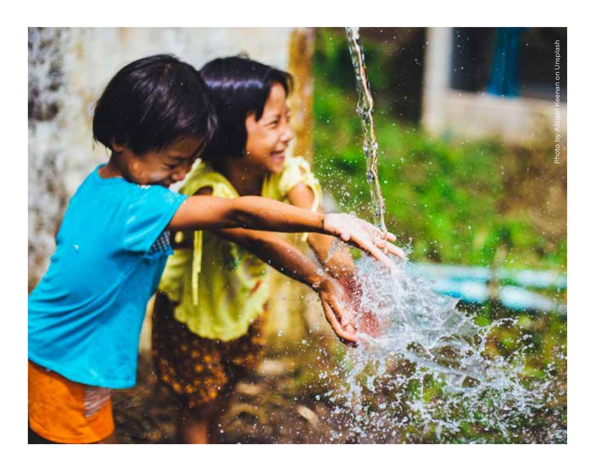

## **Balance and Harmony (Chapter 6)**

- Among positive experiences, Eastern culture gives special value to experiences of balance and harmony. These are important, low-arousal positive emotions, but they have been relatively neglected in happiness research, which has stronger roots in Western cultures.
- In 2020 for the first time, the Gallup World Poll asked questions on the experience of
  - Your life being in balance
  - Feeling at peace with your life
  - Experiencing calm for a lot of the day
  - Preferring a calm life to an exciting life
  - Focus on caring for others or self.

- The experiences of balance, peace, and calm are more prevalent in Western countries, which also experience the highest levels of satisfaction and they are less prevalent in poorer countries, including those in East Asia.
- The majority of people in almost every country prefer a calmer life to an exciting one. But that preference is no higher in Eastern countries than elsewhere. However, it is particularly high in the poorer countries, especially in Africa, where actual calm is low.
- Both balance and peace contribute strongly to a satisfying life in all regions of the world.

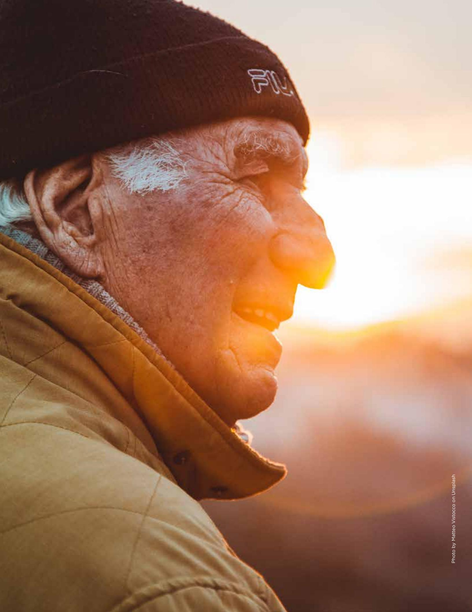

# Chapter 2

# Happiness, Benevolence, and Trust During COVID-19 and Beyond

## John F. Helliwell

Vancouver School of Economics, University of British Columbia

# Shun Wang

Professor, KDI School of Public Policy and Management

## Haifang Huang

Professor, Department of Economics, University of Alberta

## Max Norton

Vancouver School of Economics, University of British Columbia

The authors are grateful for the financial support of the WHR sponsors, and especially for data from the Gallup World Poll, the Lloyd's Register Foundation World Risk Poll, and the ICL/YouGov Data Portal. For much helpful assistance and advice we are grateful to Lara Aknin, Ragnhild Bang Nes, Chris Barrington-Leigh, Meike Bartels, Jan-Emmanuel De Neve, Liz Dunn, Martine Durand, Maja Eilertsen, Carrie Exton, Carol Graham, Jon Hall, David Halpern, Nancy Hey, Sarah Jones, Richard Layard, Sonja Lyubomirsky, Hannah Metzler, Tim Ng, Gus O'Donnell, Rachel Penrod, Julie Ray, Rajesh Srinivasan, Jeff Sachs, Grant Schellenberg, Ashley Whillans, and Meik Wiking.

# **Introduction**

This year marks the tenth anniversary of the World Happiness Report, thus inviting us to look back and forward while maintaining our reporting of current well-being and broadening our analysis of the far-ranging effects of COVID-19. Our first section presents our usual ranking and modelling of national happiness based on data covering 2019 through 2021.

In our second section, we look back at the evolution of life evaluations and a number of emotions since the Gallup World Poll data first became available in 2005-2006. Using a wider range of the emotional and other supports for life evaluations enables us to distinguish a greater variety of global and regional trends. It also sets the stage for the third section of the chapter, where we use individual-level data from 2017 through 2021 to examine how life under COVID-19 has changed for people in different circumstances.

In our fourth section, we briefly update our analysis of how different features of national demographic, social, and political structures have combined with the consequences of policy strategies and disease exposure to help explain international differences in 2020 and 2021 COVID-19 death rates. A central finding continues to be the extent to which the quality of the social context, especially the extent to which people trust their governments and have trust in the benevolence of others, supports their happiness before, during, and likely after the pandemic. Countries where people trusted their governments and each other experienced lower COVID-19 death tolls and set the stage for maintaining or rebuilding a sense of common purpose to deliver happier, healthier and more sustainable lives. This forward-looking part permits an optimistic tinge based on the remarkable growth in prosocial activities during 2021.

Our results are summarised in a short concluding section.

# **Measuring and Explaining National Differences in Life Evaluations**

# **Technical Box 1: Measuring subjective well-being**

Our measurement of subjective well-being continues to rely on three main well-being indicators: life evaluations, positive emotions, and negative emotions (described in the report as positive and negative affect). Happiness rankings are based on life evaluations as the more stable measure of the quality of people's lives. In *World Happiness Report 2022*, we pay special attention, as we did in *World Happiness Report 2021*, to specific daily emotions (the components of positive and negative affect) to better track how COVID-19 has altered different aspects of life.

*Life evaluations*. The Gallup World Poll, which remains the principal source of data in this report, asks respondents to evaluate their current life as a whole using the mental image of a ladder, with the best possible life for them as a 10 and worst possible as a 0. Each respondent provides a numerical response on this scale, referred to as the Cantril ladder. Typically, around 1,000 responses are gathered annually for each country. Weights are used to construct population-representative national averages for each year in each country. We base our national happiness rankings on a three-year average, thereby increasing the sample size to provide more precise estimates.

*Positive emotions*. Positive affect is given by the average of individual yes or no answers for three questions about emotions experienced or not on the previous day: laughter, enjoyment, and learning or doing something interesting (for details, see Technical Box 2).

*Negative emotions*. Negative affect is given by the average of individual yes or no answers about three emotions experienced or the previous day: worry, sadness, and anger.

#### **Comparing life evaluations and emotions:**

- Life evaluations provide the most informative measure for international comparisons because they capture quality of life in a more complete and stable way than emotional reports based on daily experiences.
- Life evaluations differ more between countries than emotions and are better explained by the widely differing life experiences in different countries. Emotions experienced the previous day are well explained by events of the day being asked about, while life evaluations more closely reflect the circumstances of life as a whole. We show later in the chapter that emotions are significant supports for life evaluations and provide essential insights into how the quality of life has changed during COVID-19 for people in different life circumstances.1
- Positive emotions are more than twice as frequent as negative emotions. Looking at last year's data, the global average of positive emotions was 0.66 (i.e., the average respondent experienced 2 of the 3 positive emotions the previous day) compared to the global average of 0.29 for negative emotions.

### **Ranking of Happiness 2019-2021**

Our country rankings in Figure 2.1 show life evaluations (answers to the Cantril ladder question) for each country, averaged over 2019-2021. Not every country has surveys every year. The total sample sizes are reported in Statistical Appendix 1 and are reflected in Figure 2.1 by the horizontal lines showing the 95% confidence intervals. The confidence intervals are tighter for countries with larger samples.

The overall length of each country bar represents the average ladder score, also shown in numerals next to the country names. The rankings in Figure 2.1 depend only on the respondents' average Cantril ladder scores, not on the values of the six variables that we use to help account for the large differences we find.

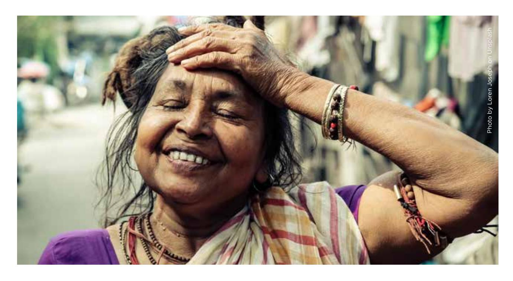

Explained by: Perceptions of corruption

Explained by: Freedom to make life choices Explained by: Healthy life expectancy

**Figure 2.1: Ranking of happiness 2019-2021** (Part 1)

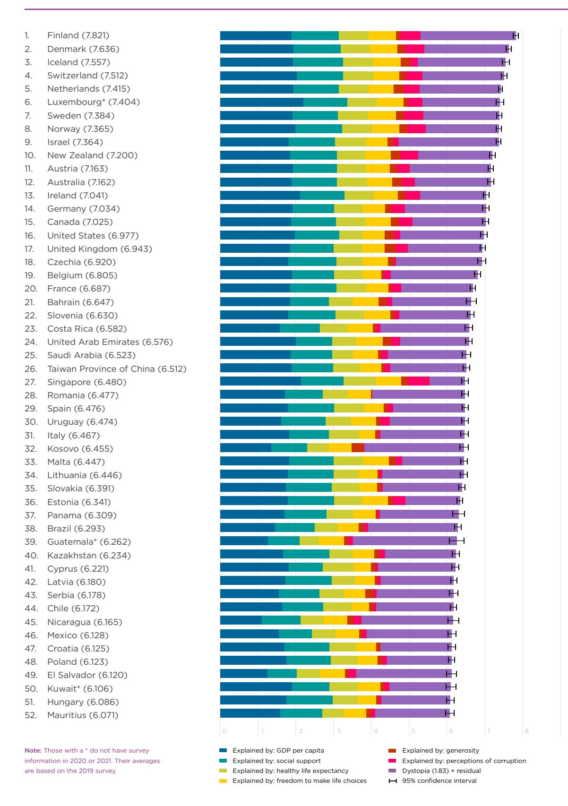

**Figure 2.1: Ranking of happiness 2019-2021** (Part 2)

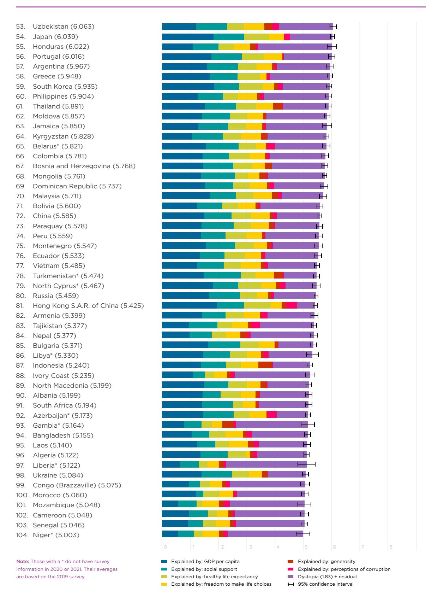

Figure 2.1: Ranking of happiness 2019-2021 (Part 3)

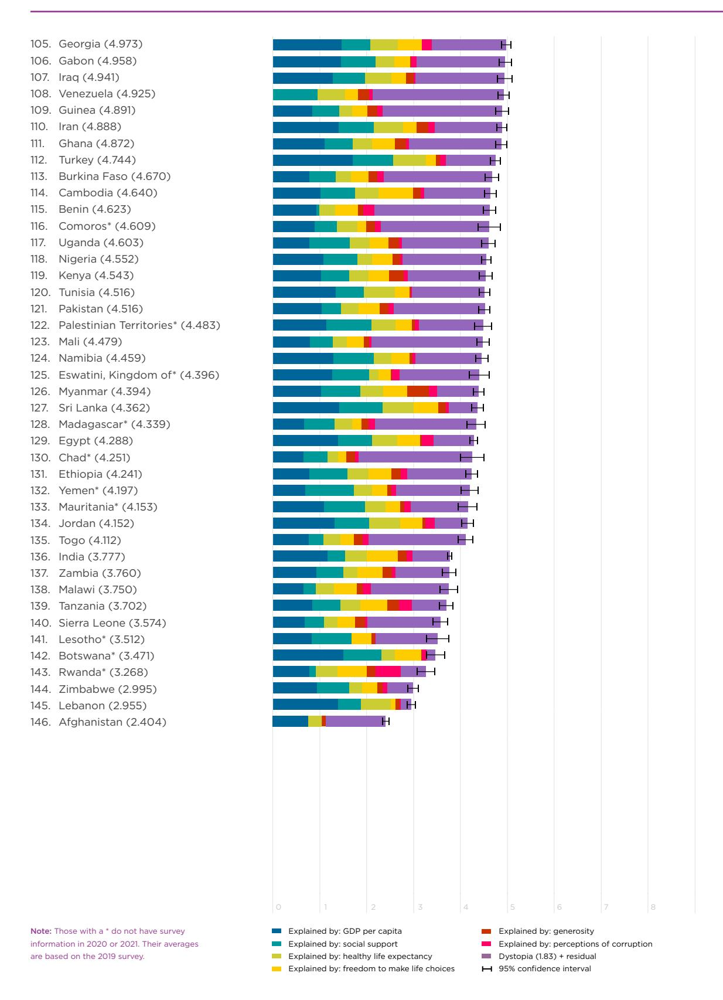

**Table 2.1: Regressions to Explain Average Happiness across Countries (Pooled OLS)** 

|                                  | Dependent Variable       |                          |                          |                          |  |
|----------------------------------|--------------------------|--------------------------|--------------------------|--------------------------|--|
| Independent Variable             | Cantril Ladder (0-10) | Positive Affect (0-1) | Negative Affect (0-1) | Cantril Ladder (0-10) |  |
| Log GDP per capita               | 0.36                     | 013                      | 0.0001                   | 0.388                    |  |
|                                  | (0.066)***               | (0.009)                  | (0.007)                  | (0.065)***               |  |
| Social support                   | 2.420                    | 0.316                    | 328                      | 1.778                    |  |
|                                  | (0.368)***               | (0.055)***               | (0.049)***               | (0.361)***               |  |
| Healthy life expectancy at birth | 0.029                    | 0007                     | 0.003                    | 0.03                     |  |
|                                  | (0.01)***                | (0.001)                  | (0.001)***               | (0.01)***                |  |
| Freedom to make life choices     | 1.305                    | 0.368                    | 090                      | 0.509                    |  |
|                                  | (0.298)***               | (0.041)***               | (0.04)**                 | (0.284)*                 |  |
| Generosity                       | 0.583                    | 0.09                     | 0.024                    | 0.378                    |  |
|                                  | (0.265)**                | (0.032)***               | (0.027)                  | (0.254)                  |  |
| Perceptions of corruption        | 704                      | 006                      | 0.094                    | 704                      |  |
|                                  | (0.271)***               | (0.027)                  | (0.022)***               | (0.259)***               |  |
| Positive affect                  |                          |                          |                          | 2.222                    |  |
|                                  |                          |                          |                          | (0.333)***               |  |
| Negative affect                  |                          |                          |                          | 0.173                    |  |
|                                  |                          |                          |                          | (0.395)                  |  |
| Year fixed effects               | Included                 | Included                 | Included                 | Included                 |  |
| Number of countries              | 156                      | 156                      | 156                      | 156                      |  |
| Number of obs.                   | 1853                     | 1848                     | 1852                     | 1847                     |  |
| Adjusted R-squared               | 0.753                    | 0.439                    | 0.322                    | 0.777                    |  |

Notes: This is a pooled OLS regression for a tattered panel explaining annual national average Cantril ladder responses from all available surveys from 2005 through 2021. See Technical Box 2 for detailed information about each of the predictors. Coefficients are reported with robust standard errors clustered by country in parentheses. \*\*\*, \*\*, and \* indicate significance at the 1, 5 and 10 percent levels respectively.

The colour-coded sub-bars in each country row represent the extent to which six key variables contribute to explaining life evaluations. These variables (shown in Table 2.1) are GDP per capita, social support, healthy life expectancy, freedom, generosity, and corruption. As already noted, our happiness rankings are not based on any index of these six factors—the scores are instead based on individuals' own assessments of their lives, as revealed by their answers to the single-item Cantril ladder life-evaluation question. We use observed data on the six variables and estimates of their associations with life evaluations to explain the observed variation of life evaluations across countries, much as epidemiologists estimate the extent to which life expectancy is affected by factors such as smoking, exercise and diet. As will be explained in more detail later, and in the online FAQ, the value for Dystopia (1.83) is the predicted

Cantril ladder for a hypothetical country with the world's lowest values for each of the six variables. This permits the calculated contributions from the six factors to be zero or positive for every actual country. We also show how measures of experienced well-being, especially positive affect, are predicted by the six factors and how the affect measures contribute to the explanation2 of higher life evaluations.

In Table 2.1, we present our latest modelling of national average life evaluations and measures of positive and negative affect (emotion) by country and year.3 For ease of comparison, the table has the same basic structure as Table 2.1 did in several previous editions, most recently in *World Happiness Report 2020*. We now include data for both 2020 and 2021. Despite difficulties COVID-19 posed for the Gallup World Poll's operations, our sample now includes data from 116 countries and territories in

### **Technical Box 2: Detailed information about each of the predictors in Table 2.1**

- 1. GDP per capita is in terms of Purchasing Power Parity (PPP) adjusted to constant 2017 international dollars, taken from the World Development Indicators (WDI) released by the World Bank on December 16, 2021. See Statistical Appendix 1 for more details. GDP data for 2021 are not yet available, so we extend the GDP time series from 2020 to 2021 using country-specific forecasts of real GDP growth from the OECD Economic Outlook No. 110 (Edition December 2021) or, if missing, the World Bank's Global Economic Prospects (Last Updated: 01/11/2022), after adjustment for population growth. The equation uses the natural log of GDP per capita, as this form fits the data significantly better than GDP per capita.
- 2. The time series for healthy life expectancy at birth is constructed based on data from the World Health Organization (WHO) Global Health Observatory data repository, with data available for 2000, 2010, 2015, and 2019. Interpolation and extrapolation are used to match this report's sample period (2005-2021). See Statistical Appendix 1 for more details.
- 3. Social support is the national average of the binary responses (0=no, 1=yes) to the Gallup World Poll (GWP) question "If you were in trouble, do you have relatives or friends you can count on to help you whenever you need them, or not?"
- 4. Freedom to make life choices is the national average of binary responses (0=no, 1=yes) to the GWP question "Are you satisfied or

- dissatisfied with your freedom to choose what you do with your life?"
- 5. Generosity is the residual of regressing the national average of GWP responses to the donation question "Have you donated money to a charity in the past month?" on log GDP per capita.
- 6. Perceptions of corruption are the average of binary answers to two GWP questions: "Is corruption widespread throughout the government in this country or not?" and "Is corruption widespread within businesses in this country or not?" Where data for government corruption are missing, the perception of business corruption is used as the overall corruption-perception measure.
- 7. Positive affect is defined as the average of previous-day affect measures for laughter, enjoyment, and doing or learning something interesting. This marks a change from recent years, where only laughter and enjoyment were included. The inclusion of interest gives us three components in each of positive and negative affect and slightly improves the equation fit in column 4. The general form for the affect questions is: Did you experience the following feelings during a lot of the day yesterday? Only the interest question is phrased differently: Did you learn or do something interesting yesterday? See Statistical Appendix 1 for more details.
- 8. Negative affect is defined as the average of previous-day affect measures for worry, sadness, and anger.

2020 and 119 in 2021. Adding the data from 2020 and 2021 slightly improves the model's overall fit while leaving the coefficients largely unchanged. There are four equations in Table 2.1. The first equation provides the basis for constructing the sub-bars shown in Figure 2.1.

The results in the first column of Table 2.1 explain national average life evaluations in terms of six key variables: GDP per capita, social support, healthy life expectancy, freedom to make life choices, generosity, and freedom from corruption.4 Taken together, the six variables explain more than three-quarters of the variation in national annual

average ladder scores among countries, using data from the years 2005 to 2021.5

The second and third columns of Table 2.1 use the same six variables to estimate equations for national averages of positive and negative affect, where both are based on answers about yesterday's emotional experiences (see Technical Box 2 for how the affect measures are constructed). In general, emotional measures, especially negative ones, are differently and much less fully explained by the six variables than life evaluations. Per-capita income and healthy life expectancy have significant effects on life evaluations, but not, in these national average data, on affect.6 The situation changes when we consider social variables. Bearing in mind that positive and negative affect are measured on a 0 to 1 scale, while life evaluations are on a 0 to 10 scale, social support can be seen to have similar proportionate effects on positive and negative emotions as on life evaluations. Freedom and generosity have even larger associations with positive affect than with the Cantril ladder. Negative affect is significantly reduced by social support, freedom, and the absence of corruption.

In the fourth column, we re-estimate the life evaluation equation from column 1, adding both positive and negative affect to partially implement the Aristotelian presumption that sustained positive emotions are important supports for a good life.7 The most striking feature is the extent to which the results continue to buttress a finding in psychology that the existence of positive emotions matters much more than the absence of negative ones when predicting either longevity8 or resistance to the common cold.9 Consistent with this evidence, we find that positive affect has a large and highly significant impact in the final equation of Table 2.1, while negative affect has none. This finding of national differences does not carry forward into our later modelling of differences among individuals within the same country, where we find positive and negative affect to have almost equal impacts at the individual level.

As for the other coefficients in the fourth column, the differences are only substantial on variables that have the largest impacts on positive affect: social support, freedom, and generosity. Thus, we infer that positive emotions play a strong role in

support of life evaluations. Much of the impact of social support, freedom, and generosity on life evaluations is channelled through their influence on positive emotions. That is, these three variables have large impacts on positive affect, which in turn has a major impact on life evaluations.

In Figure 2.1, each country's bar is divided into seven segments, showing our research efforts to associate the ladder levels with possible sources. The first six sub-bars show how much each of the six key variables is calculated to contribute to that country's ladder score, relative to a hypothetical country called "Dystopia"—named because it has values equal to the world's lowest national averages for 2019-2021 for each of the six key variables used in Table 2.1. We use Dystopia as a benchmark against which to compare contributions from each of the six factors. The choice of Dystopia as a benchmark permits every real country to have a positive (or at least zero) contribution from each of the six factors. Based on the estimates in the first column of Table 2.1, we calculate that Dystopia had a 2019-2021 life evaluation equal to 1.83 on the 0 to 10 scale. The final sub-bar is the sum of two components: the calculated average 2017-2019 life evaluation in Dystopia (=1.83) plus each country's own prediction error, which measures the extent to which life evaluations are higher or lower than those predicted by our equation in the first column of Table 2.1. These residuals are as likely to be negative as positive.10

How do we calculate each factor's contribution to average life evaluations? Taking the example of healthy life expectancy, the sub-bar in the case of Tanzania is equal to the number of years by which healthy life expectancy in Tanzania exceeds the world's lowest value, multiplied by the Table 2.1 coefficient for the influence of healthy life expectancy on life evaluations. The width of each sub-bar then shows, country-by-country, how much each of the six variables contributes to the international ladder differences.

These calculations are illustrative rather than conclusive for several reasons. One important limitation is that our selection of candidate variables is restricted to what is available for all these countries. Traditional variables like GDP per capita and healthy life expectancy are widely

available. But measures of the quality of the social context, including a variety of indicators of social trust, engagement, and belonging, are not yet available for all countries. The variables we use may be properly taking credit due to other variables or unmeasured factors. There are also likely to be vicious or virtuous circles, with twoway linkages among the variables. For example, there is much evidence that those who have happier lives are likely to live longer, and be more trusting, more cooperative, and generally better able to meet life's demands.11 This will feed back to improve health, income, generosity, corruption, and a sense of freedom. Additionally, some of the variables are derived from the same respondents as the life evaluations, and hence possibly determined by common factors. There is less risk when using national averages because individual differences in personality and many life circumstances tend to average out at the national level.

We developed robustness tests to ensure that our results are not significantly biased because we use the same individuals to report life evaluations, social support, freedom, generosity, and corruption. We first split each country's respondents (see Table 10 of Statistical Appendix 1 of *World Happiness Report 2018* for more detail) randomly into two groups. We then used the average values for social support, freedom, generosity, and absence of corruption taken from one half of the sample to explain average life evaluations in the other half. As expected, the coefficients on each of the four variables fell slightly.12 But the changes were reassuringly small (ranging from 1% to 5%) and were not statistically significant, thus giving additional confidence in the estimates shown in Table 2.1.13

The seventh and final segment in each bar is the sum of two components. The first component is a fixed number representing our calculation of the 2017-2019 ladder score for Dystopia (=1.83). The second component is the average 2017-2019 residual for each country. The sum of these two components comprises the right-hand sub-bar (in violet) for each country. It varies from one country to the next because some countries have life evaluations above their predicted values, and others lower. The residual simply represents the part of the

national average ladder score not explained by our six variables. With the residual included, the sum of all the sub-bars adds up to the average actual life evaluation response. This average actual life evaluation is what is used for our country rankings.

## **What do the data show for the 2019-2021 country rankings?**

Two features carry over from previous editions of the *World Happiness Report*. First, there is still a lot of year-to-year consistency in the way people rate their lives in different countries. Since we do our ranking on a three-year average, information is carried forward from one year to the next (See Figure 1 of Statistical Appendix 1 for individual country trajectories). For the fifth year in a row, Finland continues to occupy the top spot, with a score significantly ahead of other countries in the top ten. Denmark continues to occupy second place, with Iceland up from 4th place last year to 3rd this year. Switzerland is 4th, followed by the Netherlands and Luxembourg. The top ten are

# *Finland continues to occupy the top spot, one of five Nordic countries in the top ten.*

rounded out by Sweden, Norway, Israel and New Zealand. The following five are Austria, Australia, Ireland, Germany, and Canada. This marks a substantial fall for Canada, which was 5th ten years ago in the first *World Happiness Report*. The rest of the top 20 include the United States at 16th (up from 19th last year), the United Kingdom and Czechia still in 17th and 18th, followed by Belgium at 19th, and France at 20th, its highest ranking yet.

When looking at average ladder scores, it is also important to note the horizontal whisker lines at the right-hand end of the main bar for each country. These lines denote the 95% confidence regions for the estimates, so that countries with overlapping error bars have scores that do not significantly differ from each other.14

Second, there remains a large gap between the top and bottom countries. Within these groups, the top countries are more tightly grouped than are the bottom countries. Within the top group, national life evaluation scores have a gap of 0.40 between the 1st and 5th positions and another 0.21 between the 5th and 10th positions. Thus, there is a gap of about 0.6 points between the first and 10th positions. The bottom ten countries have a much bigger range of scores, covering almost 1.4 points.

Despite the general consistency among the top country scores, there have been many significant changes among the other countries. Looking at changes over the longer term, many countries have exhibited substantial changes in average scores, and hence in country rankings, as shown in more detail in Figures 13 to 15 in the Statistical Appendix.

Scores and confidence regions are based on resident populations in each country rather than their citizenship or place of birth. In *World Happiness Report 2018*, we split the responses between the locally and foreign-born populations in each country. We found the happiness rankings to be essentially the same for the two groups. There is, in some cases, some continuing influence from source-country happiness and some tendency for migrants to move to happier countries. Among the 20 happiest countries in that report, the average happiness for the locally born was about 0.2 points higher than for the foreign-born.

Overall, the model explains average life evaluation levels quite well within regions, among regions, and for the world as a whole. On average, the countries of Latin America still have mean life evaluations that are significantly higher (by about 0.5 on the 0 to 10 scale) than predicted by the model. This difference has been attributed to a variety of factors, including some unique features of family and social life in Latin American countries. To explain what is special about social life in Latin America, Chapter 6 of *World Happiness Report 2018* by Mariano Rojas presented a range of new data and results showing how a multigenerational social environment supports Latin American happiness beyond what is captured by the variables available in the Gallup World Poll. In partial contrast, the countries of East Asia have average

life evaluations below predictions, although only slightly and insignificantly so in our latest results.15 This has been thought to reflect, at least in part, cultural differences in the way people think about and report on the quality of their lives.16 Our findings of the relative importance of the six factors are generally unaffected by whether or not we make explicit allowance for these regional differences.17 Chapter 6 contains data (only available for 2020) from several new variables sometimes thought to be more prevalent in East Asia than elsewhere, including life balance, feeling at peace with life, and a focus on others rather than oneself. As shown in Chapter 6, these variables are important to life evaluations everywhere and are, in fact, most prevalent in the top-ranked Nordic countries. Thus, taking those data into account when explaining life evaluations does not materially change the relative importance of the other variables and does not change the relative predicted rankings, and hence the average residuals, in East Asia and the Nordic Countries.18

Our main country rankings are not based on the predicted values from our equations but rather, and by our deliberate choice, on the national averages of answers to the Cantril ladder life evaluation question. The other two happiness measures for positive and negative affect are themselves of independent importance and interest and contribute to overall life evaluations, especially in the case of positive affect. Measures of emotions play an even greater role in our analysis of life under COVID-19. This is partly because COVID-19 has affected various emotions differently and partly because emotions based on yesterday's experiences tend to be more volatile than life evaluations, which are more stable in response to temporary disturbances. Various attempts to use big data to measure happiness using word analysis of Twitter feeds, as in Chapter 4 of this report, are more likely to capture mood changes rather than changes in overall life evaluations. In *World Happiness Report 2019*, we presented comparable rankings for all three subjective well-being measures that we track: the Cantril ladder (and its standard deviation, which provides a measure of happiness inequality19), positive affect and negative affect, along with country rankings for the six variables we use in

Table 2.1 to explain our measures of subjective well-being. Comparable data for 2019-2021 are reported in Figures 16 to 39 of Statistical Appendix 1.

# **Tracking happiness since 2005-2006**

As shown in Chapter 3, there has been in this century a surge of interest in happiness. This has been to a significant extent enabled by the data available in the Gallup World Poll since 2005-2006 and analysed in the *World Happiness Report* since 2012. Looking back over these years, what has happened to happiness? The availability of fifteen years of data covering more than 150 countries provides a unique stock-taking opportunity. In this section, we consider how life evaluations, emotions and many of their supports have evolved for the world as a whole, and more importantly, by global region and country.20 Country-by-country analysis can be found in Figures 13-15 in the online Statistical Appendix for this chapter. We show the difference for each country between their average Cantril ladder 2008-2012 with the corresponding average for 2019-2021. The latter is the same average used in the rankings shown in Figure 2.1. As shown in the Appendix, life evaluations rose by more than a full point on the 0 to 10 scale in 15 counties and fell by that amount or more in eight countries. The ten countries with the largest gains from 2008-2012 to 2019-2021 were, in order, Serbia, Bulgaria, Romania, Hungary, Togo, Bahrain, Latvia, Benin, Guinea and Armenia. The ten countries with the largest drops were Lebanon, Venezuela, Afghanistan, Lesotho, Zimbabwe, Jordan, Zambia, India, Mexico and Botswana.

Figure 2.2 has several panels showing global trends in life evaluations, emotions, and other key

*Over the past ten years, life evaluations rose by more than a full point on the 0 to 10 scale in 15 countries and fell by that amount or more in eight countries.*

variables from the outset of the Gallup World Poll in 2005-2006 through 2021. The first panel shows average life evaluations calculated in three different ways: A global series with each country weighted by its adult population (aged 15+), a second series like the first but excluding the five countries with the largest population (specifically China, India, the United States, Indonesia, and Pakistan)21, and a third, in which each country is weighted equally, as is also the case for our earlier and subsequent analysis in this chapter. The volatility of the population-weighted series reflects the sharp changes in the two largest countries, China and India, partly due to changes in survey collection methods.22 The population-weighted series, excluding the five most populous countries, shows smaller swings and a slightly declining pattern over the past 15 years. The third series, where each country is counted equally, shows a level slightly higher now than at the start of the Gallup World Poll. The remaining panels in this and subsequent figures give each country equal weight in constructing global and regional averages.

The second panel shows positive affect in total and also its three components. Smiling or laughing a lot during the previous day is the most common of all the components of either positive or negative affect, and has been on a slightly rising trend over the past 15 years, slipping slightly during the pandemic years 2020 and 2021. Enjoyment started at the same frequency as laughter, but by 2021 it was significantly less common. Doing or learning something interesting fell over the first five years of the survey but has been on a generally rising trend since 2011. Positive affect, as the average of the three measures, has been more stable than any of the components, with no discernable trend in its average value of about 0.66 on the scale from 0 to 1.

The third panel shows negative affect, its three components separately (worry, sadness and anger), and stress, all referring to a person's feelings on the day preceding the survey. The levels and patterns are quite different from positive affect, and their average levels are less than half as high. After five reasonably stable years (2005/06 through 2010), worry and sadness

Fig. 2.2: Global trends from 2006 through 2021

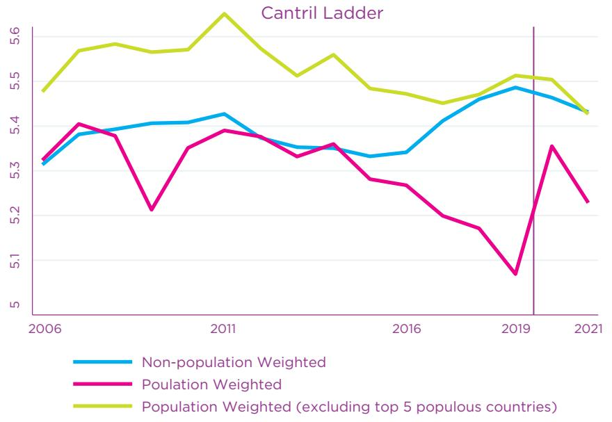

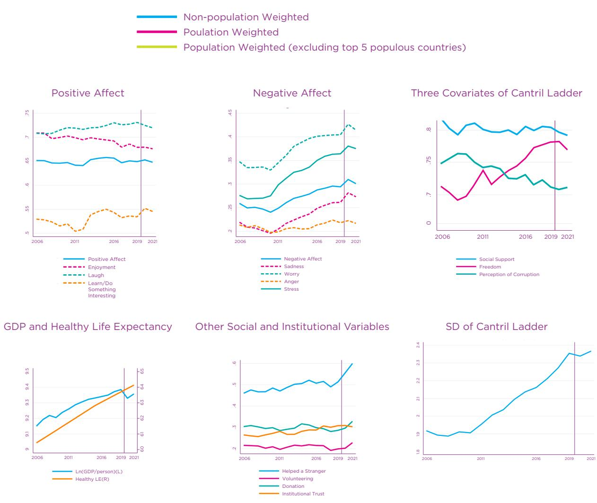

have been rising over the past ten years, especially during 2020, the first year of COVID-19, before improving somewhat in 2021. Anger remains much less frequent, with no significant trend changes. The average for negative affect was about 0.25 for the first five years and followed a fairly steady upward trend since, with a jump in 2020 and mostly returning to the underlying trend in 2021. Stress, which is not a component of our negative affect measure, was also fairly constant for the first five years but has increased steadily ever since, faster than worry or sadness, with its steepest increase in 2020.

The following panels show the corresponding time paths for the main variables used to explain happiness in Figure 2.1. There has been growth in both real GDP per capita and healthy life expectancy,23 fairly constant levels of social support, declines in perceived corruption, and substantial average growth in the extent to which people feel they have the freedom to make key

life choices and in helping strangers and other forms of benevolence.24

Finally, we show that average levels of trust in public institutions have generally grown slightly since 2012.

These global patterns mask considerable variety among global regions, as shown by Figures 2.3 to 2.5. As shown by the Cantril ladder, life evaluations have continued their 15-year convergence between Western and Eastern Europe, with three Balkan countries, Bulgaria, Romania and Serbia, as already noted, having the largest increases in life evaluations from 2008-2012 to 2019-2021. The current gap in life evaluations between Western and Eastern Europe is now less than half what it was ten years ago. The Commonwealth of Independent States (CIS) countries shared this convergence at first but not in later years. Life evaluations in Asia show some growth in East and Southeast Asia and drops since 2010 in South

Asia. Ladder evaluations grew until 2012 in Latin America subsequently falling slightly, especially in 2020. Ladder scores have generally fallen in the MENA (the Middle East and North Africa) region while being fairly constant for Sub-Saharan Africa (SSA). The NA+ANZ group of countries (North America, Australia, and New Zealand) had higher life evaluations than Western Europe at the beginning of the period, but that gap has mostly disappeared. Within Western Europe, the Nordic countries have especially high life evaluations and generally better performance in handling COVID-19, as shown later in the chapter.

The remaining panels of Figure 2.3 show positive affect and its components for each of the ten global regions. Over the survey period, the average for positive affect has been highest in the Americas, but on a generally falling trend. It has been rising fastest in Eastern Europe, Southeast Asia and the CIS, and low and falling in South Asia and the MENA countries. There have been no significant trends for positive affect in Sub-Saharan Africa and East Asia.

There are interesting regional differences in the components of positive affect, with enjoyment highest in the NA+ANZ group and lowest in MENA but falling on the same downward trend in both. Enjoyment was initially much higher in Western than Eastern Europe until 2012 but had been falling in the west and rising in the east since reaching full convergence in 2020 before rising in both parts of Europe in 2021.

Smiling and laughing started high and have since risen further in Southeast Asia while starting low and falling since in South Asia. By 2020 and 2021, these two parts of Asia were the world's top and bottom regions, respectively. Smiling and laughing were least frequent, and equally so, in Eastern Europe and the CIS at the beginning of the Gallup World Poll in 2005-2006. They have since been rising in lockstep to exceed those in South Asia and MENA. Laughing and smiling were initially most frequent in Latin America and the NA+ANZ group and have been fairly constant there since then. Nine of the ten regions have seen less laughter during both of the COVID-19 years, with Eastern Europe providing the sole exception.

Doing or learning something of interest has large inter-regional differences in levels but fewer trends than for the other components of positive affect. Interest was lowest in South Asia throughout the survey period, but generally rising rather than falling. Interest grew equally, from initially low levels, in the CIS and Eastern Europe. It was highest and fairly constant in Latin America and NA+ANZ, and slightly lower but converging upwards in Western Europe, following a similar path as in Sub-Saharan Africa.

Figure 2.4 shows the regional averages for negative affect and its components and stress. Negative affect as a whole was highest and rising in MENA and South Asia, with the increase greatest in South Asia. All regions have more negative affect now than ten years ago, except for Eastern Europe. This is best explained by looking at the components separately.

Sadness in East Asia has throughout the period been less than in any other region, declining until 2010 and rising thereafter, still less than half as prevalent as elsewhere in the world. The fastest increases in sadness and the highest eventual levels were in South Asia, MENA, Latin America, and Sub-Saharan Africa. There were mid-range levels and no clear trends in the other regions. There was increased sadness in 2020 in every region except South Asia and Sub-Saharan Africa, followed in 2021 by reductions in sadness in every region except South Asia, which has also seen by far the largest increases in worry over the past ten years. The patterns for worry and sadness thus share many similarities.

Worry ten years ago was lowest in East Asia and the CIS and since has risen less fast there than elsewhere. Worry was much more frequent in Eastern than Western Europe in 2010, growing in the west and declining in the east to converge in 2019 before both rose in 2020 and fell in 2021. The 2021 decline in worry was shared by all other regions but South Asia, with the largest increases over the past ten years.

Although anger has low global levels and no trend, the regional differences are striking. Anger is far more prevalent in MENA than in the rest of the world, at a fairly constant level. Anger has

Fig. 2.3: Regional Trends of Life Evaluations and Positive Affect

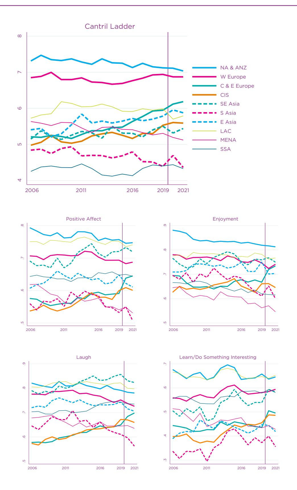

Fig. 2.4: Regional Trends of Negative Affect and Stress

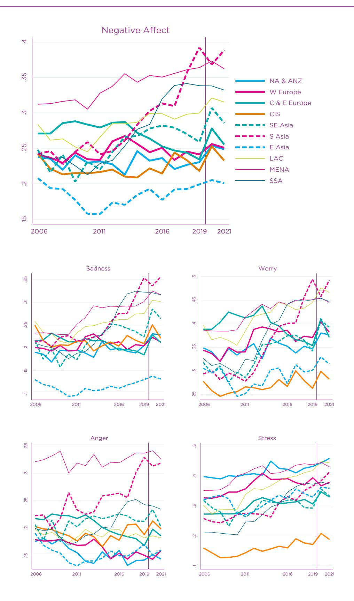

risen most dramatically in South Asia, approaching MENA levels in 2020 and 2021. There have been longer-term drops in the prevalence of anger in Western and Eastern Europe, especially in Eastern Europe, and also in NA+ANZ. There was a rising trend of anger in Sub-Saharan Africa until 2018, with reductions since. Anger in Southeast Asia is fairly stable, currently just below the middle of the large gap between the high level in South Asia and the low level in East Asia.

Stress, also shown in Figure 2.4, is higher now than ten years ago in every global region. Unusually, all three parts of Asia had similar levels and growth rates, staying in the middle of the global range throughout the period. Nonetheless, among the three regions, South Asia was the least stressed at the outset and the most stressed at the end. Stress started and finished at the top of the range in both NA+ANZ and MENA. Stress rose faster in Eastern than Western Europe, almost converging by the end of the period. Stress started lowest in the CIS and grew fairly slowly, ending the period with stress half as frequent as in the rest of the world.

Figure 2.5 presents regional differences in levels and trends for the six main variables from Table 2.1, plus other variables of special interest for this chapter. GDP per capita and healthy life expectancy, for which the national data come from international agencies, show trend growth over the 15 years, with both levels and growth differing among the regions. Real GDP per capita grew fastest in Asia, followed by Africa, Eastern Europe and the CIS, and slowest in Latin America, MENA, Western Europe, and NA+ANZ. Healthy life expectancy grew fastest in Sub Saharan Africa, followed by South Asia. It grew most slowly in MENA and NA+ANZ.

Social support, as measured by having someone to count on in times of trouble, was least (and not growing) in South Asia and Sub-Saharan Africa. It was slightly above average and growing in both the CIS and Eastern Europe, declining in MENA, globally high but slightly declining in Western Europe and NA+ANZ, and fairly constant elsewhere.

Having a sense of freedom to make key life decisions grew substantially in most regions. It had the lowest initial levels but the fastest

subsequent growth in Eastern Europe, sharing its recent path with the CIS. Within Asia, it started high and grew fast in Southeast Asia, while starting low and growing even faster in South Asia. It started fairly low and grew very little in MENA and Sub-Saharan Africa, leaving those regions with the lowest regional levels in 2021. Freedom to make life choices started high in Western Europe but did not grow, so the two parts of Europe had mostly converged by 2020. Freedom was initially highest in NA+ANZ but did not share in the general global growth.

Perceived levels of corruption fell since 2010 in all regions except for Latin America (where it remained higher than anywhere else but Eastern Europe) and NA+ANZ (where it remained unchanged at the globally lowest levels). Both Western and Eastern Europe had favourable corruption trends, but at a far higher level in Eastern Europe. All three parts of Asia reported high but slightly falling corruption. Western Europe had the biggest drop in perceived corruption between 2012 and the most recent years.

Three measures of prosocial behaviour—donations, volunteering and helping strangers—had differing levels and trends. Still, all showed increases in 2021 in every global region, often at remarkable rates not seen for any of the variables we have tracked before and during the pandemic. We shall discuss this more fully in the final section of this chapter.

Regional averages of well-being inequality remained fairly stable until about 2012 and have risen thereafter. The biggest increases in inequality have been in Sub Saharan Africa and MENA. Southeast Asia started with the least inequality but has since passed through that in East Asia and converged to that in South Asia, which has also been on a sharply rising trend over the past

*Three measures of prosocial behaviour—donations, volunteering, and helping strangers—all showed increases in 2021 in every global region.*

Fig. 2.5: Regional Trends of Happiness-Supporting Factors and Inequality

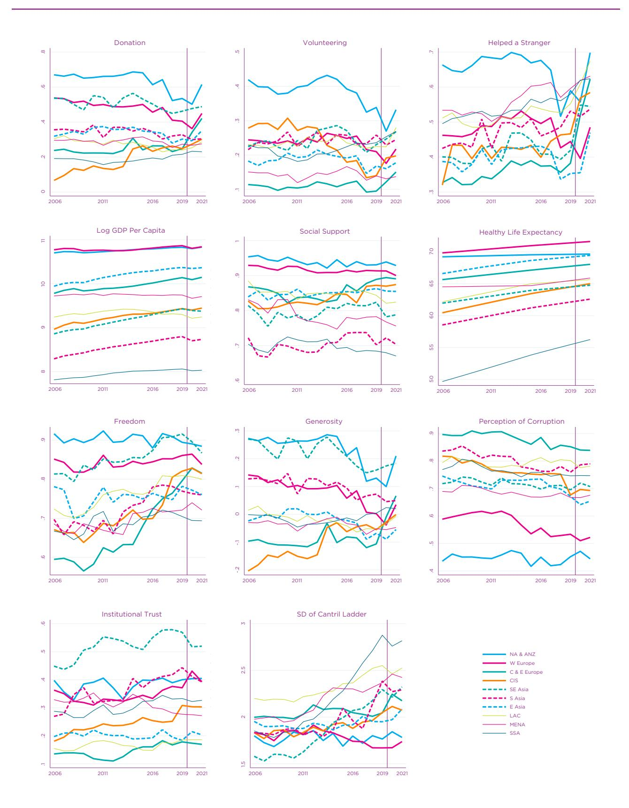

decade. Well-being inequality in Eastern Europe was initially greater than in the CIS, but the two have since converged to a level significantly higher than in Western Europe and the NA+ANZ groups, where inequality has shown no increase over the 15 years. Well-being inequality in East Asia has remained in the middle of the range, following the same increase as the global average.

# **How has well-being under COVID-19 varied among population subgroups in 2020 and 2021?**

We turn now from long-run trends to changes during the last two years. There have been numerous studies of how the effects of COVID-19, whether in terms of illness and death or living conditions for the uninfected, have differed among population sub-groups.25 The fact that the virus is more easily transmitted in close living and working arrangements partly explains the higher incidence of disease among those in elder care, prisons, hospitals, housing for migrant and temporary workers, and other forms of group living. Similarly, risks are higher for those employed in essential services, especially for front-line health care workers and others who deal with many members of the public or work in crowded conditions. Age has been the main factor separating those with differing risks of serious or fatal consequences, although this association is complicated by the preponderance of fatalities in elder-care settings where lower immune responses of the elderly are compounded by comorbidities.26 Those with lower incomes are also thought to be more at risk, being perhaps more likely to be in high-risk workplaces, with fewer opportunities to work from home and fewer resources to support the isolation required for those infected.

The Gallup World Poll data are not sufficiently fine-grained to separate respondents by their living or working arrangements. Still, they provide several ways of testing for different patterns of consequences. In particular, we can separate respondents by age, gender, migrant status, income, unemployment, and general health status. Previous well-being research by ourselves and

many others have shown subjective life evaluations to be lower for the unemployed, poor in health, and in the lowest income categories. In *World Happiness Report 2015*, we examined the distribution of life evaluations and emotions by age and gender, finding a widespread but not universal U-shape in age for life evaluations, with those under 30 and over 60 happier than those in between. Female life evaluations, and frequency of negative affect, were generally slightly higher than for males. For immigrants, we found in *World Happiness Report 2018* that life evaluations of international migrants tend to move fairly quickly toward the levels of respondents born in the destination country.

In this section, we shall first confirm these general findings using all individual-level data from the years 2017 through 2021, testing if these effects have become larger or smaller during 2020 or 2021. We use the 2020 and 2021 effects as proxies for the effects of COVID-19 and all related changes to economic and social circumstances, a simplification not easily avoided.

Table 2.2 shows the results of individual-level estimation of a version of the model used in Table 2.1 to explain differences at the national level. At the individual level, all of the variables except the log of household income are either 0 or 1 according to whether each respondent was in that category or felt the emotion in question the previous day. We use the same column structure as in our usual Table 2.1 while adding more rows to introduce variables that help to explain differences among individuals but average out at the national level. The first three columns show separate equations for life evaluations, positive affect and negative affect. The fourth column is a repeat of the life evaluation equation with several positive and negative emotions as additional independent variables, reflecting their power to influence how people rate the lives they are leading.

By adding a specific measure of institutional trust to our usual six variables explaining well-being, the effect of institutions is now split between the new variable and the usual perceptions of corruption in business and government. We leave both in the equation to show that the index for confidence in government represents more than

**Table 2.2: Individual-level well-being equations, 2017-2021** 

|                                | (1)              | (2) (3)               |                          | (4)              |  |
|--------------------------------|------------------|--------------------------|--------------------------|------------------|--|
|                                | Ladder (0–10) | Positive affect (0–1) | Negative affect (0–1) | Ladder (0–10) |  |
| Log HH income                  | 0.125***         | 0.009***                 | -0.009***                | 0.109***         |  |
|                                | (0.007)          | (0.001)                  | (0.001)                  | (0.007)          |  |
| Health problem                 | -0.546***        | -0.064***                | 0.133***                 | -0.370***        |  |
|                                | (0.029)          | (0.003)                  | (0.003)                  | (0.025)          |  |
| Count on friends               | 0.873***         | 0.102***                 | -0.097***                | 0.701***         |  |
|                                | (0.025)          | (0.003)                  | (0.003)                  | (0.022)          |  |
| Freedom                        | 0.542***         | 0.093***                 | -0.092***                | 0.377***         |  |
|                                | (0.022)          | (0.003)                  | (0.004)                  | (0.018)          |  |
| Donation                       | 0.263***         | 0.065***                 | 0.011***                 | 0.218***         |  |
|                                | (0.017)          | (0.003)                  | (0.002)                  | (0.016)          |  |
| Perceptions of corruption      | -0.232***        | 0.003                    | 0.042***                 | -0.190***        |  |
|                                | (0.021)          | (0.003)                  | (0.003)                  | (0.020)          |  |
| Age < 30                       | 0.291***         | 0.046***                 | -0.019***                | 0.231***         |  |
|                                | (0.023)          | (0.004)                  | (0.003)                  | (0.021)          |  |
| Age 60+                        | 0.073**          | -0.040***                | -0.040***                | 0.050            |  |
|                                | (0.036)          | (0.004)                  | (0.003)                  | (0.031)          |  |
| Female                         | 0.212***         | 0.003                    | 0.033***                 | 0.236***         |  |
|                                | (0.022)          | (0.002)                  | (0.002)                  | (0.020)          |  |
|                                |                  |                          |                          |                  |  |
| Married/common-law             | -0.018           | -0.015***                | 0.012***                 | 0.005            |  |
|                                | (0.024)          | (0.003)                  | (0.002)                  | (0.022)          |  |
| Sep div wid                    | -0.260***        | -0.047***                | 0.048***                 | -0.185***        |  |
|                                | (0.028)          | (0.003)                  | (0.003)                  | (0.027)          |  |
| College                        | 0.404***         | 0.040***                 | -0.010***                | 0.373***         |  |
|                                | (0.021)          | (0.003)                  | (0.002)                  | (0.020)          |  |
| Unemployed                     | -0.478***        | -0.048***                | 0.086***                 | -0.357***        |  |
|                                | (0.026)          | (0.003)                  | (0.004)                  | (0.023)          |  |
| Foreign-born                   | -0.090**         | -0.014***                | 0.027***                 | -0.062*          |  |
|                                | (0.037)          | (0.004)                  | (0.004)                  | (0.034)          |  |
| Institutional trust            | 0.285***         | 0.050***                 | -0.038***                | 0.210***         |  |
|                                | (0.019)          | (0.003)                  | (0.003)                  | (0.017)          |  |
| Covid1                         | -0.023           | -0.000                   | 0.025***                 | 0.003            |  |
|                                | (0.039)          | (0.004)                  | (0.004)                  | (0.037)          |  |
| Covid2                         | -0.020           | -0.001                   | -0.000                   | -0.020           |  |
|                                | (0.036)          | (0.003)                  | (0.004)                  | (0.033)          |  |
| Smile/laugh                    |                  |                          |                          | 0.201***         |  |
|                                |                  |                          |                          | (0.016)          |  |
| Enjoyment                      |                  |                          |                          | 0.342***         |  |
|                                |                  |                          |                          | (0.016)          |  |
| Learn/do something interesting |                  |                          |                          | 0.211***         |  |
|                                |                  |                          |                          | (0.012)          |  |
| Worry                          |                  |                          |                          | -0.289***        |  |
|                                |                  |                          |                          | (0.016)          |  |
| Sadness                        |                  |                          |                          | -0.293***        |  |
|                                |                  |                          |                          | (0.021)          |  |
| Anger                          |                  |                          |                          | -0.102***        |  |
|                                |                  |                          |                          | (0.018)          |  |
|                                |                  |                          |                          |                  |  |
| Stress                         |                  |                          |                          | -0.191***        |  |
|                                |                  |                          |                          | (0.016)          |  |
| Constant                       | 3.411***         | 0.404***                 | 0.446***                 | 3.563***         |  |
|                                | (0.084)          | (0.009)                  | (0.009)                  | (0.074)          |  |
| Country fixed effects          | Yes              | Yes                      | Yes                      | Yes              |  |
| Adj. R2                        | 0.230            | 0.153                    | 0.138                    | 0.257            |  |
| Number of countries            | 110              | 110                      | 110                      | 110              |  |
| Number of obs.                 | 488,697          | 479,791                  | 486,765                  | 471,029          |  |

Notes: The equations include all complete observations 2017-2021 for countries with surveys in both 2020 and 2021, including country-years with particular missing questions with appropriate controls. The variable Covid1 is a dummy variable taking the value 1.0 in 2020, with Covid2 equivalently defined for 2021. Standard errors clustered at the country level are reported in parentheses. \* p <.1, \*\* p <.05, \*\*\* p <.01. Institutional trust: The first principal component of the following five measures: confidence in the national government, confidence in the judicial system and courts, confidence in the honesty of elections, confidence in the local police force, and perceived corruption in business. This principal component is then used to create a binary measure of high institutional trust using the 75th percentile in the global distribution as the cutoff point. This measure is not available for all countries since not all surveys in all countries ask all of the questions that are used to derive the principal component. When an entire country is missing this institutional-trust measure, we use a missing-value indicator to maintain overall sample size.

just an absence of corruption. Indeed, we shall show later that it is the most important institutional variable explaining how nations have succeeded or failed in their attempts to control COVID-19.

The equations are estimated using about 1,000 respondents in each country in each year from 2017 through 2021. The results show the continued importance of all the six variables we regularly use to explain differences among nations, as well as a number of additional individual-level variables. These additional variables include age, gender, marital status, education, unemployment and whether the respondent was born in another country. Income is represented by the logarithm of household income, and health status by whether the respondent reports having health problems. The effects of COVID-19 are estimated by adding variables (called Covid1 and Covid2) equal to 1.0 for 2020 and 2021 survey respondents, respectively.

The equations in Table 2.2 show that subjective well-being continues to be strikingly resilient in the face of COVID-19. As shown by the very small estimated coefficients on both Covid1 and Covid2, there have been no significant changes in average life evaluations in either of the two COVID-19 years compared to the 2017-2019 baseline.

How do we square this substantial resiliency at the population level with evidence everywhere of lives and livelihoods torn asunder? First, it is important to note that some population subgroups hardest hit by the pandemic are not included in most surveys. For example, surveys usually exclude those living in elder care, hospitals, prisons, and most living on the streets and in refugee camps. These populations were already worse off and have been most affected by COVID-19.

Second, the shift from face-to-face interviews to cell phone surveys for many countries in 2020 may have altered the characteristics of the surveyed population in ways that are hard to adjust for by usual weighting methods. For example, the average incomes of 2020 respondents in China were much larger than those of 2019 respondents, explicable in part because cell-phone sampling procedures would cover people living inside high

income gated communities otherwise inaccessible by face-to-face methods. In 2021, face-to-face interviews were restored in many countries, suggesting that the resilience shown in both years is not due to changes in survey methods.

Third, is it possible that the relative stability of subjective well-being in the face of the pandemic does not reflect resilience in the face of hardships but instead suggests that life evaluations are inadequate measures of well-being? If the chosen measures do not move a lot under COVID-19, perhaps they will not change whatever happens. In response to this quite natural scepticism, it is important to remind ourselves that subjective life evaluations do change, and by very large amounts, when many key life circumstances change. For example, unemployment, perceived discrimination, and several types of ill-health have large and sustained influences on measured life evaluations.27 Perhaps even more convincing is evidence that the happiness of immigrants tends to move quickly towards the levels and distributions of life evaluations of those born in their new countries of residence and even those already living in the sub-national regions to which the migrants move.28

Fourth, there is also the emerging evidence of increasing levels of prosocial activity during COVID-19, emerging initially in 2020 with increased help to strangers, but now including donations and volunteering, with large increases in all activities in 2021. This evidence will be discussed later in our forward-looking section but is worth mentioning here as evidence of changes in feelings and behaviour likely to be providing support for life evaluations during the COVID-19 years.

The equations in Table 2.2 produce the same general patterns of results as Table 2.1. Income, health, having someone to count on, having a sense of freedom to make key life decisions, generosity, and the absence of corruption all play strong roles in supporting life evaluations. Confidence in public institutions also plays an important role.

These large samples of individual responses can also be used to show how average life evaluations, and the factors that support them, have varied

among different sub-groups of the population. What do the results show? We start by reporting (in Table 2.3) how the 2020 and 2021 levels of key variables differ from those in the base period 2017-2019 and then see (in Table 2.4) whether the well-being effects of these conditions have become greater or less under COVID-19.

For the world sample, as shown in Table 2.3, and most countries, there have been significant changes from 2017-2019 to 2020 and 2021 in some of the key components and sources of happiness.

Average household incomes were significantly lower in both years, by almost twice as much in 2021 as in 2020. Unemployment rates were significantly higher in 2020 and reverted mostly to baseline in 2021. About 25% of respondents reported having a health problem in 2017-2019. This fell to 22% in 2020 before reverting mostly to baseline in 2021.29 In times of trouble, the number of respondents who felt they had someone to count on dropped more in 2021 than in 2020, from 83.3% in the baseline to 81.5% in 2021.

On average, there were no significant changes in the sense of freedom, perceived corruption and institutional trust during 2020 and 2021. Confidence in government rose in 2020 and then returned to baseline in 2021.

By far the largest changes were in three types of benevolent actions, especially in 2021. As shown later in Figure 2.6, in 2020, there was a substantial increase in help given to strangers but no substantial change in donations and volunteering. In 2021, all three types of activity were much higher than in 2017-2019, having an increase averaging about 25% of baseline activity. We shall return to this in the next section of the chapter.

What about emotions in 2020 and 2021? Worry and sadness were both significantly higher than baseline in 2020, with about 3% more of the population feeling each of these emotions.30 This is equal to about 10% of people feeling these emotions pre-pandemic. The increases in 2021 were about half their 2020 size, remaining statistically significant only for sadness. Anger remained stable and infrequent at its 20% baseline level in both years. Negative affect as a whole

# *Positive emotions as a whole remained more than twice as frequent as negative ones.*

was about 8% above its pre-pandemic value in 2020, falling almost completely back to baseline in 2021 (as shown below in Figure 2.6). Similarly, perceived stress was higher by 8% of its prepandemic frequency in 2020 but has also fallen back to baseline in 2021.

In the base period 2017-2019, worry, sadness, and stress were about 10% more prevalent among females than males, while anger was 10% less frequent among females. The same patterns continued during 2020 and 2021, with males and females having similar proportionate increases in worry, sadness and stress, with the female increases being slightly higher than those for males. For example, worry grew in frequency, relative to its base value, by 5.7% for females and 4.7% for males.31 Anger was unchanged for both males and females.

Positive emotions as a whole remained more than twice as frequent as negative ones, and their average frequency did not change during 2020 and 2021. Positive affect in the baseline was 13% more frequent for the young than the old (72% frequency for the young vs 59% for the old), with that initial gap reducing to about 8.5% in 2020 and 2021, with gains for the old being offset by losses for the young. These patterns were similar for both laughter and enjoyment while doing something of interest did not change for the young but increased for the other two groups. The gains were twice as large for the old as for those in middle age, reducing an initial gap of 9% to 7%, about equally in both years. These patterns for positive emotions and their changes were very similar for females and males.

For negative emotions, there are some interactions of gender and age. Among those over 60, there were reductions rather than increases in negative emotions, to the same extent for females and males. In the youngest age group, baseline values were lower for worry, sadness and stress and were

**Table 2.3: Changes in key variables from 2017-2019 to 2020 and 2021** 

|                                   | (1)          | (2)                            | (3)                            | (4)            |  |
|-----------------------------------|--------------|--------------------------------|--------------------------------|----------------|--|
|                                   | 2017-19 mean | Change from 2017-19 to 2020 | Change from 2017-19 to 2021 | N of countries |  |
| Ladder                            | 5.745        | -0.015                         | -0.040                         | 110            |  |
|                                   | (0.095)      | (0.043)                        | (0.042)                        |                |  |
| Positive affect                   | 0.661        | 0.006                          | -0.001                         | 109            |  |
|                                   | (0.010)      | (0.004)                        | (0.004)                        |                |  |
| Laughter                          | 0.740        | -0.003                         | -0.009*                        | 110            |  |
|                                   | (0.010)      | (0.005)                        | (0.005)                        |                |  |
| Enjoyment                         | 0.703        | -0.001                         | -0.006                         | 109            |  |
|                                   | (0.011)      | (0.006)                        | (0.006)                        |                |  |
| Interest                          | 0.532        | 0.023***                       | 0.013***                       | 110            |  |
|                                   | (0.012)      | (0.006)                        | (0.005)                        |                |  |
| Negative affect                   | 0.278        | 0.023***                       | 0.004                          | 109            |  |
|                                   | (0.008)      | (0.005)                        | (0.004)                        |                |  |
| Worry                             | 0.392        | 0.033***                       | 0.006                          | 109            |  |
|                                   | (0.010)      | (0.006)                        | (0.005)                        |                |  |
| Sadness                           | 0.242        | 0.031***                       | 0.012**                        | 109            |  |
|                                   | (0.008)      | (0.006)                        | (0.005)                        |                |  |
| Anger                             | 0.202        | 0.007                          | -0.005                         | 109            |  |
|                                   | (0.008)      | (0.005)                        | (0.005)                        |                |  |
| Stress                            | 0.366        | 0.025***                       | 0.009                          | 109            |  |
|                                   | (0.011)      | (0.006)                        | (0.006)                        |                |  |
| Ln of HH income                   | 9.236        | -0.114**                       | -0.232***                      | 108            |  |
|                                   | (0.095)      | (0.047)                        | (0.050)                        |                |  |
| Unemployed                        | 0.065        | 0.019***                       | 0.005**                        | 109            |  |
|                                   | (0.003)      | (0.002)                        | (0.002)                        |                |  |
| Health problem                    | 0.250        | -0.030***                      | -0.008**                       | 110            |  |
|                                   | (0.007)      | (0.005)                        | (0.004)                        |                |  |
|                                   |              |                                |                                |                |  |
| Social support                    | 0.833        | -0.010*                        | -0.018***                      | 110            |  |
|                                   | (0.010)      | (0.005)                        | (0.005)                        |                |  |
| Prosociality                      | 0.324        | 0.027***                       | 0.078***                       | 110            |  |
|                                   | (0.009)      | (0.007)                        | (0.007)                        |                |  |
| Donation                          | 0.299        | 0.011                          | 0.059***                       | 110            |  |
|                                   | (0.016)      | (0.008)                        | (0.009)                        |                |  |
| Volunteering                      | 0.189        | 0.001                          | 0.040***                       | 110            |  |
|                                   | (0.010)      | (0.006)                        | (0.005)                        |                |  |
| Helped stranger                   | 0.484        | 0.068***                       | 0.135***                       | 110            |  |
|                                   | (0.011)      | (0.010)                        | (0.010)                        |                |  |
| Freedom to make life choices      | 0.801        | 0.007                          | -0.011*                        | 109            |  |
|                                   | (0.010)      | (0.006)                        | (0.006)                        |                |  |
| Perceptions of corruption         | 0.737        | -0.012**                       | -0.008                         | 105            |  |
|                                   | (0.018)      | (0.006)                        | (0.005)                        |                |  |
| Institutional trust               | 0.267        | 0.007                          | 0.003                          | 95             |  |
|                                   | (0.016)      | (0.008)                        | (0.007)                        |                |  |
| Confidence in national government | 0.468        | 0.024**                        | 0.008                          | 97             |  |
|                                   | (0.018)      | (0.011)                        | (0.012)                        |                |  |
| Age<30                            | 0.322        | 0.004                          | -0.007**                       | 110            |  |
|                                   | (0.010)      | (0.003)                        | (0.003)                        |                |  |
| Age 60+                           | 0.188        | -0.018***                      | 0.001                          | 110            |  |
|                                   | (0.009)      | (0.003)                        | (0.003)                        |                |  |
| Female                            | 0.513        | -0.008***                      | -0.002                         | 110            |  |
|                                   | (0.003)      | (0.002)                        | (0.001)                        |                |  |
| Married/Common-law                | 0.564        | -0.025***                      | -0.025***                      | 109            |  |
|                                   | (0.009)      | (0.005)                        | (0.005)                        |                |  |
|                                   |              |                                |                                |                |  |
| Sep., div., wid.                  | 0.114        | 0.000                          | 0.010***                       | 109            |  |
|                                   | (0.005)      | (0.002)                        | (0.002)                        |                |  |
| College                           | 0.147        | 0.024***                       | 0.011***                       | 110            |  |
|                                   | (0.010)      | (0.005)                        | (0.004)                        |                |  |
| Foreign-born                      | 0.056        | 0.011***                       | 0.013***                       | 109            |  |
|                                   | (0.008)      | (0.002)                        | (0.003)                        |                |  |

Notes: Prosociality is the average of the binary Gallup World Poll measures for making a donation, volunteering, and helping a stranger. Columns 1 to 3 report the mean values for each variable in 2017-2019, and then the differences between those base values and those observed in 2020 and 2021 respectively, from the set of all complete observations in countries with both 2020 and 2021 surveys. The 2020 values differ from those reported in WHR 2021 because we now have completed 2020 surveys for additional countries, most of which also have data for 2021. Columns 2 and 3 also report the significance level of the changes in means: \* p < .1, \*\* p < .05, \*\*\* p < .01. Standard errors clustered at the country level are reported in parentheses. Column 4 indicates the number of countries with valid observations of each variable.

quite similar for females and males. Anger was the exception, taking its highest average value (.22) for young males. In the young age group, negative affect was increased more than for other age groups, and equally so for females and males.

Table 2.4 repeats the basic equation for life evaluations in Table 2.2 but now fits separate equations for 2017-2019 and 2020-2021. This permits us to see to what extent the happiness impacts of COVID-19 have varied among population sub-groups.

For those variables that do not change under COVID-19, such as age, the difference between columns 1 and 2 shows the total effects of COVID-19 on people in that category. The bars on the right-hand side of Table 2.4 show the size and significance of these changes. For other variables, such as unemployment, the total effects of COVID-19 depend on how much unemployment has changed and whether the happiness effect of being unemployed is larger or smaller in 2020-2021.

These results suggest that COVID-19 has reduced the effect of income on life satisfaction, increased the benefits of having someone to count on in times of trouble, and increased the negative effects of having a health problem or being unemployed. The biggest change is the increase, averaging 0.132 points, in the life satisfaction of those 60 years and older relative to the younger age groups. The female life evaluation advantage has not changed significantly, rising from .20 to .21 points from 2017-2019 to 2020-2021.

To find the total effect of variables that have changed under COVID-19, we need to take into account both of how much the variable has changed, as shown in Table 2.3, and any change that has taken place in its impact, as shown in Table 2.4. For unemployment, there has been a significant increase in the number of unemployed plus a greater average happiness loss from being unemployed. Comparing 2017-2019 with 2020, the worst year for unemployment, the total effect of

**Table 2.4: How have life evaluations changed during COVID-19 for different people?** 

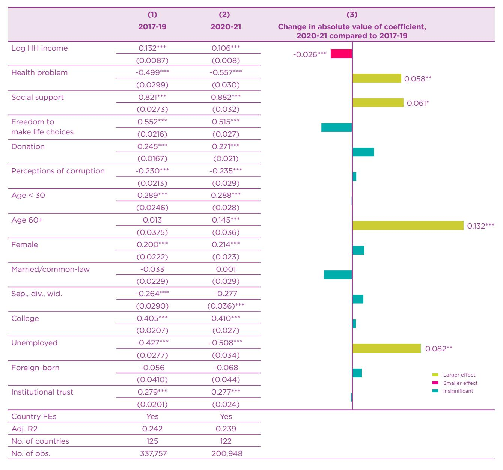

Note: Regressions in columns 1 and 2 include a constant, country fixed effects, and controls for country-years with missing questions. Column 3 reports changes in the absolute value of the coefficients from 2017–2019 to 2020–2021. See appendix note on calculation of standard errors in column 3. Standard errors are clustered by country. \* p < 0.1, \*\* p < 0.05, \*\*\* p < 0.01.

unemployment on national average happiness is estimated to have risen from .028 points to .043 points.32

As for institutional trust, Table 2.4 shows that it remains a highly important determinant of life evaluations. We shall now explore how it also enables societies to deal effectively with crises, especially in limiting deaths from COVID-19.

# **Trust and benevolence during and after COVID-19**

Many studies of the effects of COVID-19 have emphasised the importance of public trust as support for successful pandemic responses.33 We have studied similar linkages in earlier reports dealing with other national and personal crises. In *World Happiness Report 2020*, we found that individuals with high social and institutional trust levels were happier than those living in less trusting and trustworthy environments.34 The benefits of high trust were especially great for those in conditions of adversity, including ill-health, unemployment, low income, discrimination and unsafe streets.35 In *World Happiness Report 2013*, we found that the happiness consequences of the financial crisis of 2007-2008 were smaller in those countries with greater levels of mutual trust. These findings are consistent with a broad range of studies showing that communities with high levels of trust are generally much more resilient in the face of a wide range of crises, including tsunamis,36 earthquakes,37 accidents, storms, and floods. Trust and cooperative social norms facilitate rapid and cooperative responses, which themselves improve the happiness of citizens and demonstrate to people the extent to which others are prepared to do benevolent acts for them and the community in general. Since this sometimes comes as a surprise, there is a happiness bonus when people get a chance to see the goodness of others in action and to be of service themselves. Seeing trust in action has been found to lead to post-disaster increases in trust,38 especially where government responses are considered to be sufficiently timely and effective.39

*World Happiness Report 2021* presented new evidence using the return of lost wallets as a

powerful measure of trust and benevolence. We compared the life satisfaction effects of the likelihood of a Gallup World Poll respondent's lost wallet being returned with the comparably measured likelihood of negative events, such as illness or violent crime. The results were striking, with the expected likely return of a lost wallet being associated with a life evaluation more than one point higher on the 0 to 10 scale, far higher than the association with any of the negative events assessed by the same respondents.40

COVID-19, as the biggest health crisis in more than a century, with unmatched global reach and duration, has provided a correspondingly important test of the power of trust and prosocial behaviour to provide resilience and save lives and livelihoods. Now that we have two years of evidence, we can assess the importance of benevolence and trust and see how they have fared during the pandemic. Many have seen the pandemic as creating social and political divisions above and beyond those created by the need to maintain physical distance from loved ones for many months. Some of the evidence noted above shows that large crises can lead to improvements in trust, benevolence and well-being if it leads people to reach out to help others, especially if seeing that benevolence comes as a welcome surprise to their neighbours more used to reading of acts of ill-will. Looking to the future, it is important to know whether trust and benevolence have been fostered or destroyed by two years of the pandemic. We have not found significant changes in our measures of institutional trust during the pandemic but did find, especially in 2021, very large increases in the reported frequency of benevolent acts.

## **The increasing importance of trust in limiting deaths from COVID-19**

At the core of our interest in investigating international differences in death rates from COVID-19 is to see what links there may be between the variables that support high life evaluations and those that are related to success in keeping death rates low. We found in *World Happiness Report 2021* that social and institutional trust are the only main determinants of subjective well-being that

showed a strong carry-forward into success in fighting COVID-19. This section updates our analysis to include data from both 2020 and 2021 to see whether these results also appeared in 2021.

We find continuing evidence that the quality of the social context, which we have previously found so important to explaining life evaluations within and across societies, has also affected progress in fighting COVID-19. Several studies within nations have found that regions with high social capital have been more successful in reducing rates of infection and deaths. 41 Others have argued that different elements of the social context might have opposite effects in the fight against COVID-19.42 In particular, it has been suggested that the close personal relations within families and communities sparked and fed by frequent in-person meetings might provide a good transmission climate for the virus. On the other hand, those aspects of social capital relating to prosocial behaviour, trust in others, and especially trust in institutions might be expected to foster behaviours that would help a society follow physical distancing and other rules designed to stop the spread of the virus. Our 2020 finding that trust is an important determinant of international differences in COVID-19 has since been confirmed independently for cumulative COVID-19 infection rates extending to September 30, 2021,43 and we show below that this finding also holds for the whole of 2021.

We capture these vital trust linkages in two ways. We have a direct measure of trust in public institutions, described below. We do not have a measure of general trust in others for our large sample of countries, so we make use instead of a measure of the inequality of income distribution, which has often been found to be a robust predictor of the level of social trust.44

Our attempts to explain international differences in COVID-19 death rates divide the explanatory variables into two sets, both of which refer to circumstances that are likely to have affected a country's success in battling COVID-19. The first set of variables covers demographic, geographic and disease exposure circumstances at the beginning of the pandemic. The second set of

variables covers several aspects of economic and social structure, also measured before the pandemic, that help to explain the differential success rates of national COVID-19 strategies.

The first set comprises a variable combining the age distribution of each country's population with the age-specific mortality risks45 for COVID-19, whether the country is an island, and an exposure index measuring how close a country was, in the very early stages of the pandemic (March 31, 2020), to infections in other countries. In *World Happiness Report 2021*, we used a pair of measures of the extent to which a country could remember and apply the epidemic control strategies learned during the SARS epidemic of 2003. These include membership in the World Health Organisation's Western Pacific Region (WHOWPR) and distance from countries with the most direct experience of the SARS epidemic. These two variables are highly correlated, so in our current modelling, we make use only of the WHOWPR variable. Countries in the WHO Western Pacific Region have been building on SARS experiences to develop fast and maintained virus suppression strategies.46 Hence membership in that region is used as a proxy measure of the likelihood of a country adopting a virus elimination strategy.47 The trust-related variables include a measure of institutional trust and the Gini coefficient measuring each country's income inequality. An earlier version of this model was explained more fully and first applied in chapter 2 of *World Happiness Report 2021*, while further developments are reported elsewhere.48

The fact that experts and governments in countries distant from the earlier SARS epidemics did not get the message faster about the best COVID-19 response strategy provides eloquent testimony to the power of a "won't happen here" mindset. This is illustrated by the death rate impacts of membership in the Western Pacific Region of the WHO, whose members had the most direct experience with the SARS epidemic and were hence more likely to have learned the relevant lessons.49 There was very early evidence that COVID-19 was highly infectious, spread by asymptomatic50 and pre-symptomatic51 carriers, and subject to aerosol transmission.52 These

**Table 2.5: COVID-19 deaths in 2020 and 2021 per 100,000 population**

|                                           | (1) 2020 (2) 2021 |          |             |          |
|-------------------------------------------|----------------------|----------|-------------|----------|
|                                           | Coef/SE              | Std beta | Coef/SE     | Std beta |
| Institutional trust (2017-19)             | -52.940***           | -0.233   | -163.685*** | -0.325   |
|                                           | (11.490)             |          | (30.633)    |          |
| Country is an island                      | -14.763***           | -0.134   | -29.343**   | -0.120   |
|                                           | (5.245)              |          | (12.340)    |          |
| WHOWPR member                             | -20.234**            | -0.130   | -54.787**   | -0.158   |
|                                           | (8.390)              |          | (23.884)    |          |
| Risk adjusted age profile                 | -9.237***            | -0.441   | -23.909***  | -0.514   |
|                                           | (1.384)              |          | (3.156)     |          |
| Exposure to infections in other countries | 16.824***            | 0.485    | 14.088*     | 0.183    |
| (at Mar 31, 2020)                         | (3.396)              |          | (7.550)     |          |
| Gini for income inequality (0-100)        | 1.271***             | 0.270    | 2.045***    | 0.196    |
|                                           | (0.255)              |          | (0.573)     |          |
| Constant                                  | 2.731                |          | 97.402***   |          |
|                                           | (14.564)             |          | (34.085)    |          |
| N                                         | 154                  |          | 154         |          |
| adj. R2                                   | 0.602                |          | 0.490       |          |

Note: Robust standard errors reported in parentheses. \*p<.1, \*\*p<.05, \*\*\*p<.01.

characteristics require masks53 and physical distancing to slow transmission, rapid and widespread testing54 to identify and eliminate community55 outbreaks, and effective testing and isolation for those needing to move from one community or country to another. Countries that quickly adopted all these pillar policies were able to drive community transmission to zero. By doing so, and then using widespread testing and targeted lockdowns when faced with fresh outbreaks, those countries were able to avoid the high levels of community exposure that led to subsequent waves that were in most countries even more deadly than the first. Countries that did not try to drive their community transmission to zero almost always found themselves with insufficient testing, tracking and tracing capacities to suppress subsequent waves of infection, requiring them eventually to have higher average levels of stringency than in countries that chose to eliminate community transmission.56 They also made the infection risks worse for everyone by providing large community pools of infection that provided opportunities for mutations to develop and spread.

The results for 2020 and 2021 are most appropriately compared by looking at the standardised beta coefficients, which adjust for the fact that average COVID-19 death rates across our 154-country sample were twice as high in 2021 as in 2020. Comparing the standardised coefficients, the two equations are very consistent. The only significant differences are for the early exposure variable, which shows, as expected, a weaker association during the second year, and the institutional trust variable, which is of even greater importance in 2021 than in 2020. If the associations between institutional trust and COVID-19 deaths in 2021 could be regarded as causal, they suggest that an increase of 0.12 in institutional trust57 would have reduced average deaths per 100,000 population by 6.4 in 2020 (21% of average deaths) and by 19.7 in 2021 (representing 28% of average deaths). The death reduction is greater in 2021 mainly because average deaths were more than twice as great58 in 2021, plus an even greater role for trust in explaining 2021 death rates. This does not reflect possible increases in trust triggered by the pandemic because the measure used reflects

average confidence levels during 2017-2019. The results for income inequality, which we treat here as partially representing interpersonal trust,59 suggest that to move from a country with a Gini coefficient of 0.27 (like Denmark or Sweden) to 0.47 (like Mexico or the United States) is associated with COVID-19 death rates per 100,000 population that are higher by 25 in 2020 and 41 in 2021. Our results for both institutional trust and income inequality suggest important associations in both years, even larger in 2021 than in 2020.

The Nordic countries merit special attention in the light of their generally high levels of personal and institutional trust. They have also had COVID-19 death rates only one-third as high as elsewhere in Western Europe during 2020 and 2021, 27 per 100,000 in the Nordic countries compared to 80 in the rest of Western Europe. There is an equally great divide when Sweden is compared with the other Nordic countries as death rates were five times higher in Sweden, with 2020-2021 COVID-19 death rates of 75 per 100,000 compared to 15 in the other Nordic countries. This difference shows the importance of a chosen pandemic strategy. Sweden, at the outset, chose60 not to suppress community transmission, while the other Nordic countries aimed to contain it. As a result, Sweden had much higher death rates than the other Nordic countries, while in the end being forced to

adopt stringency measures that were on average stricter61 than in the other Nordic countries. High trust helps, but it requires an appropriate strategy to deliver better results.

### **Growth of benevolence during 2020 and 2021**

A primary message from the 2020 data analysed in *World Happiness Report 2021* was of significant increases in negative emotions accompanied by an even larger increase in the extent to which people helped strangers, with the comparison in both cases being to the average values in 2017- 2019. As shown in Figures 2.5 and 2.6, a striking feature of our new evidence is that the size of the increase since 2017-2019 in the helping of strangers has doubled from 2020 to 2021 and is now accompanied by significant increases in donations and volunteering. While benevolence has increased in 2021 relative to both 2017-2019 and 2020, negative affect in 2021 has fallen back towards the 2017-2019 baseline. Hence, relative to 2020, the second year of COVID-19 has seen global growth of prosocial activities of all three types combined, while negative affect is now only slightly above baseline.

Giving help to strangers in 2021 was above baseline in all global regions and by more than 10% of the population in six of the ten. Moreover, everywhere,

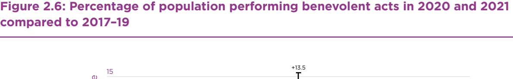

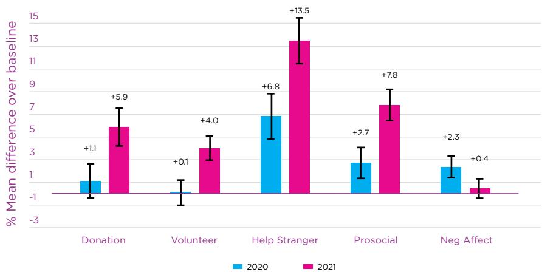

*Life evaluations continue to be strikingly resilient in the face of COVID-19, supported by a 2021 pandemic of benevolence.*

it was ways above its 2020 value. The prosociality average is also higher in 2021 in every region than in the 2017-2019 baseline, also showing in all regions an increase from 2020 to 2021.

The variable 'prosocial' is an average of the measures for donations, volunteering and helping strangers. In 2021 this combined measure of benevolence was above its pre-pandemic level by 8% as a share of the total population of responders, 25% of the pre-pandemic frequency of these prosocial acts.

Among the regions, some interesting patterns appear. Before the pandemic, prosociality was significantly higher in Western than in Eastern Europe, averaging 38% in Western Europe and 24% in Eastern Europe. In 2021, prosociality was up by 2% in Western Europe and 16% in Eastern Europe, erasing the pre-pandemic gap. At the global level, a somewhat similar comparison can be made. In 2017-2019 the percentage of the population involved in the selected prosocial acts was 40% in the western industrial countries62 and 30% in the rest of the world. This gap was substantially closed in 2020 and especially in 2021. Prosociality in 2021 was greater than baseline in both groups of countries, by 2.5% of the population in the western industrial countries and by 9.5% in all other regions, thus removing two-thirds of the 2017-2019 gap.

Looking at these regional differences over the long term, as shown earlier in Figure 2.5, shows that the universally significant increases in 2021 were a stable continuation of an established upward trend in MENA and South Asia, an accelerated upward trend in Latin America, Southeast Asia, Eastern Europe and the CIS, and a reversal of previous downward trends in Western Europe and NA+ANZ.

It is too early to tell whether the increased benevolence in 2021 will carry forward as a welcome addition to global well-being. In research at the individual level, benevolence has been found to contribute to a positive feedback loop with happiness, with the benevolent more likely to be happy and the happy more likely to act benevolently.63 But there are counter forces at work, with pandemic fatigue possibly fuelling a loss of public trust and perhaps private benevolence. The reported averages for the fraction of the population expressing trust in government is globally the same in 2020 and 2021 as before the pandemic began. However, many countries have evident signs of discontent and political polarisation as the pandemic enters its third year.

## **Summary**

Overall levels of life evaluations have been fairly stable during two years of COVID-19, matched by modest changes in the global rankings. Finland remains in the top position for the fifth year running, followed by Denmark in 2nd and all five Nordic countries among the top eight countries, joined by Switzerland, the Netherlands and Luxembourg. France reached its highest ranking to date, at 20th, while Canada slipped to its lowest ranking ever, at 15th, just behind Germany at 14th and followed closely by the United States and the United Kingdom at 16th and 17th.

Trends over the past 15 years show slight growth in life evaluations for the typical country until 2011 and reductions since. The largest trend increases were in Central and Eastern Europe, East Asia and the CIS. Consistent with trend convergence in happiness between Eastern and Western Europe, the three countries with the greatest growth in average life evaluations over the past 10 years were Serbia, Bulgaria and Romania, with gains averaging 1.4 points on the 0 to 10 scale, or more than 20% of their levels in the 2008-2012 period.

Among the six variables used to explain these levels, there has been general growth in real GDP per capita and healthy life expectancy, generally declining perceptions of corruption and freedom, declining generosity (until 2020), and fairly constant overall levels of social support.

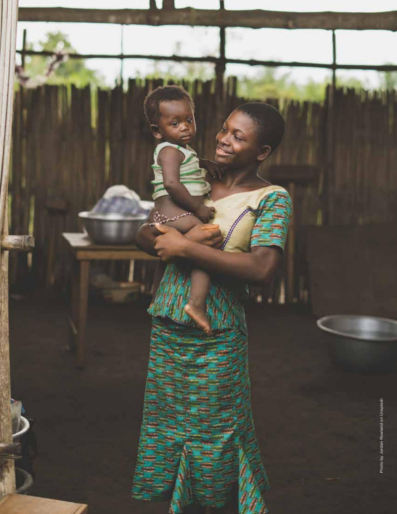

Well-being inequality has generally grown since 2011, especially in Sub Saharan Africa, MENA, Latin America, and South and Southeast Asia.

Positive emotions have generally been twice as prevalent as negative ones. That gap has been narrowing over the past ten years, with enjoyment and laughter on a negative trend in most regions and worry and sadness on rising trends (with the general exception of Central and Eastern Europe). Over the past decade, the trend growth in worry and sadness has been greatest in South Asia, Latin America, MENA, and Sub-Saharan Africa.

Anger has remained low and stable in the global average, with large increases in South Asia and Sub-Saharan Africa offset by trend declines elsewhere.

There have been trend increases in nationalaverage stress levels in all ten global regions.

Individual-level data for emotions and life evaluations reveal that COVID-19 has worsened the well-being costs of unemployment and ill health. The pandemic has also exposed, but not increased, pre-existing differences between males and females and between those with low and high incomes.

Fuelled by worry and sadness, but not by anger, negative affect as a whole was about 8% above its pre-pandemic value in 2020, falling to 3% above baseline in 2021.

Over the five most recent years, positive emotions as a whole remained more than twice as frequent as negative ones and greater for the young than the old. Their average frequency did not change during 2020 and 2021, with losses among the young offset by increases for the old, partially closing the initial gap favouring the young age group.

Trust and benevolence have, if anything, become more important. Higher institutional trust continues to be linked to lower death rates from COVID-19 to a greater extent in 2021 than in 2020.

Although our three measures of prosocial behaviour—donations, volunteering and

helping strangers—had differing levels and trends, all showed increases in 2021 in every global region, often at remarkable rates not seen for any of the variables we have tracked before and during the pandemic.

Global benevolence, as measured by the average of the three measures of prosocial behaviour, has increased remarkably in 2021, up by almost 25% of its pre-pandemic level, led by the helping of strangers, but with strong growth also in donations and volunteering. The COVID-19 pandemic starting in 2020 has led to a 2021 pandemic of benevolence with equally global spread. All must hope that the pandemic of benevolence will live far beyond COVID-19. If sustainable, this outpouring of kindness provides grounds for hope and optimism in a world needing more of both.

#### **Endnotes**

- 1 For a recent review of alternative ways of measuring well-being, see the various chapters of Lee, Kubzansky and VanderWeele, eds. (2021).
- 2 Because of the presence of two-way linkages and the inability to formally define a causal structure, our results are based on correlations that do not in themselves imply causality. Our use of the term 'explanation' should thus be interpreted to imply correlation but not necessarily causation.
- 3 The statistical appendix contains alternative forms without year effects (Table 9), and a repeat version of the Table 2.1 equation showing the estimated year effects (Table 8). These results confirm, as we would hope, that inclusion of the year effects makes no significant difference to any of the coefficients.
- 4 The definitions of the variables are shown in Technical Box 2, with additional detail in the online data appendix.
- 5 The model's predictive power is little changed if the year fixed effects in the model are removed, falling from 0.753 to 0.748 in terms of the adjusted R-squared.
- 6 The exception to this is the newly significant positive coefficient on healthy life expectancy in the equation for negative affect. This is likely reflecting the fact that negative affect within countries is lowest among the young (age<30).
- 7 This influence may be direct, as many have found, e.g. De Neve et al. (2013). It may also embody the idea, as made explicit in Fredrickson's broaden-and-build theory (Fredrickson, 2001), that good moods help to induce the sorts of positive connections that eventually provide the basis for better life circumstances.
- 8 See, for example, the well-known study of the longevity of nuns, Danner, Snowdon, and Friesen (2001).
- 9 See Cohen et al. (2003), Doyle et al. (2006), and Pressman et al. (2019).
- 10 We put the contributions of the six factors as the first elements in the overall country bars because this makes it easier to see that the length of the overall bar depends only on the average answers given to the life evaluation question. In *World Happiness Report 2013* we adopted a different ordering, putting the combined Dystopia+residual elements on the left of each bar to make it easier to compare the sizes of residuals across countries. To make that comparison equally possible in subsequent *World Happiness Reports*, we include the alternative form of the figure in the online Statistical Appendix 1 (Appendix Figures 7-9).
- 11 The prevalence of these feedbacks was documented in Chapter 4 of *World Happiness Report 2013*, De Neve et al. (2013).
- 12 We expect the coefficients on these variables (but not on the variables based on non-survey sources) to be reduced to the extent that idiosyncratic differences among respondents tend to produce a positive correlation between the four survey-based factors and the life evaluations given by the same respondents. This line of possible influence is cut when the life evaluations are coming from an entirely

- different set of respondents than are the four social variables. The fact that the coefficients are reduced only very slightly suggests that the common-source link is real but very limited in its impact.
- 13 The coefficients on GDP per capita and healthy life expectancy were affected even less, and in the expected direction. The changes were very small because the data come from other sources, and are unaffected by our experiment. The income coefficient does increase slightly, since income is positively correlated with the other four variables being tested, so that income is now able to pick up a fraction of the drop in influence from the other four variables. We also performed an alternative robustness test, using the previous year's values for the four survey-based variables. This also avoided using the same respondent's answers on both sides of the equation, and produced similar results, as shown in Table 13 of Statistical Appendix 1 in *World Happiness Report 2018*. The Appendix Table 13 results are very similar to the split-sample results shown in Tables 11 and 12, and all three tables give effect sizes very similar to those in Table 2.1. Because the samples change only slightly from year to year, there was no need to repeat these tests with this year's sample.
- 14 Throughout the top 20 positions, and indeed at most places in the rankings, the three-year average scores are close enough to one another that significant differences are found only between country pairs that are several positions apart.
- 15 If special variables for Latin America and East Asia are added to the equation in column 1 of Table 2.1, the Latin American coefficient is +.51 (t=5.3) while that for East Asia is -.18 (t=1.8).
- 16 See Chen et al. (1995) for differences in response style, and Chapter 6 for data on regional differences in variables thought to be of special importance in East Asian cultures. The data discussed in Chapter 6 cannot explain the lower predicted values for East Asian countries, since the key variables, including especially feeling one's life in balance and feeling at peace with life, are more prevalent in the ten happiest countries, and especially the top-ranking Nordic countries, than they are in East Asia. However, as shown in Chapter 6, balance, but not peace, is found to be correlated more closely with life evaluations in East Asia than elsewhere, so that the low actual values may help to partially explain the negative residuals for East Asia.
- 17 One slight exception is that the negative effect of corruption is estimated to be slightly larger (.84 rather than .70), although not significantly so, if we include a separate regional effect variable for Latin America. This is because perceived corruption is worse than average in Latin America, and its happiness effects there are offset by stronger close-knit social networks, as described in Rojas (2018). The inclusion of a special Latin American variable thereby permits the corruption coefficient to take a higher value.
- 18 Adding indicator variables for East Asia and the Nordic countries shows that the inclusion of the four additional variables does not materially alter the residuals for either group of countries relative to the rest of the world, and

- hence each other. This result appears whether individual level or aggregate data are being used.
- 19 See Goff et al. (2018).
- 20 We use national averages to calculate global and regional averages for all survey measures. This is slightly different from the method in previous waves of WHR (e.g. WHR 2019), when we calculated global and regional averages based on individual data. The change in method might lead to minor changes in the calculated averages. Before calculating global and regional averages, we interpolate and extrapolate missing national values of all the variables. Linear interpolation/extrapolation is used for log GDP per capita and healthy life expectancy. Nearest-neighbour interpolation/extrapolation is used for other variables.
- 21 This is slightly different from the top five populous countries (where Brazil is included) used in WHR 2019 to calculate the same trend, since Pakistan's population became larger than that of Brazil in 2017 according to World Development Indicators.
- 22 As described in Chapter 2 of World Happiness Report 2021.
- 23 The extrapolated healthy life expectancy data in 2020 and 2021 do not capture the negative health shocks caused by the pandemic since the actual data for 2020 and 2021 are not available yet.
- 24 There is a slight difference in the definition of the generosity variable illustrated here and the one used in Figure 2.1 and Table 2.1. We report the original score for generosity (i.e. "Donation") in Figures 2.2 and 2.5, and in our individuallevel regressions, while we use the income-adjusted donation score in the regressions to produce Table 2.1 and the generosity sub-bars in Figure 2.1.
- 25 See Blundell et al. (2020) for an early review.
- 26 See Liotta et al. (2020) for an illustration of the challenges posed in teasing apart the effects of age, comorbidities, and the social context inhabited by older adults.
- 27 See Helliwell et al. (2018, Figure 4) for direct evidence, including the finding that these effects are significantly less damaging for those who live in high trust environments.
- 28 See several chapters of *World Happiness Report 2018*, and Helliwell, Shiplett and Bonikowska (2020).
- 29 One potential explanation for the drop in 2020 is that respondents with minor health problems regarded these as less important in the context of a global pandemic. See O'Donnell et al. (2020) for related evidence that the COVID-19 setting can influence subjective answers given by survey respondents.
- 30 See also Santomauro et al. (2021).
- 31 These figures are from a regression of worry on a single covid variable covering 2020 and 2021, done separately for males and females. The coefficients obtained (.0239, t=4.58 for females and .0177, t=3.59 for males) were then divided by the 2017-2019 prevalence for each gender, as given by the constant terms in the regression (.418 for females and .375 for males) and converted to percentages for presentation in the text. When considered in a combined-sample regression with terms for covid, gender, and their interaction, the larger increase in worry for females is significant at the 5% level.

- 32 The total effect of unemployment is calculated as .065\*.427 for 2017-2019 and .084\*.508 in 2020, where .065 and .084 are the proportionate unemployment rates in 2017-2019 and 2020, respectively, and .427 and .508 are the estimated happiness effects for each unemployed person in those same two periods. This calculation assumes no spillover effects to others in the local community.
- 33 See especially Fraser and Aldrich (2020) and Bartscher et al. (2021).
- 34 See Helliwell and Wang (2011) for additional evidence.
- 35 See Helliwell et al. (2018) and Table 2.3 in Chapter 2 of WHR 2020.
- 36 See Aldrich (2011).
- 37 See Yamamura et al. (2015) and Dussaillant and Guzmán (2014).
- 38 See Toya and Skidmore (2014) and Dussaillant and Guzmán (2014).
- 39 See Kang and Skidmore (2018).
- 40 See Figure 2.4 in Chapter 2 of *World Happiness Report 2021*.
- 41 Borgonovi and Andrieu (2020) show that US counties with higher social capital experienced larger, faster declines in mobility during the first wave of COVID-19. Fraser et al. (2020) add to this evidence, showing that high social capital US counties experienced lower excess deaths in 2020. Fraser and Aldrich (2020), looking across Japanese prefectures, found that those with greater social connections initially had higher rates of infection, but as time passed they had lower rates. Bartscher et al. (2021) use withincountry variations in social capital in several European countries to show that regions with higher social capital had fewer COVID-19 cases per capita. In a cross-national sample, Gelfand et al. (2021) find that countries with strict adherence to cultural norms experience lower death rates from COVID-19. Wu (2021) similarly finds that trust and norms are important in influencing COVID-19 responses at the individual level, while in authoritarian contexts compliance depends more on trust in political institutions and less on interpersonal trust. Lau (2020) provides a detailed conceptual examination of the role of social capital in fighting COVID-19 in Hong Kong.
- 42 Elgar et al. (2020).
- 43 See COVID-19 National Preparedness Collaborative (2022).
- 44 See Rothstein and Uslaner (2005).
- 45 This mortality risk variable is the ratio of an indirectly standardized death rate to the crude death rate for each of 54 countries. The indirect standardization is based on interacting the US age-sex mortality pattern for COVID-19 with each country's overall death rate and its population age and sex composition. Data from Heuveline and Tzen (2021).
- 46 See World Health Organization (2017).
- 47 In WHR 2021 we also used a second SARS-related variable based on the average distance between each country and each of the six countries or regions most heavily affected by SARS (China, Hong Kong, Canada, Vietnam, Singapore and Taiwan). The two variables are sufficiently highly

- correlated that we can simplify this year's application by using just the WHOWHR variable, as has also been done in other research investigating the success of alternative COVID-19 strategies. See Helliwell et al. (2021) and Aknin et al. (2022).
- 48 See Statistical Appendix 2 of Chapter 2 of *World Happiness Report 2021*, and Helliwell et al. (2021) for a later application making use of the same mortality risk variable we are using here.
- 49 There is experimental evidence that chess players at all levels of expertise are subject to the Einstellung (or set-point) effect, which limits their search for better solutions. The implications extend far beyond chess. See Bilali´c and McLeod (2014). See also Rosella et al. (2013).
- 50 See Emery et al. (2020), Gandhi et al. (2020), Li et al. (2020), Moghadas et al. (2020), Savvides et al. (2020) and Yu and Yang (2020).
- 51 See Moghadas et al. (2020), Wei et al. (2020) and Savvides and Siegel (2020).
- 52 See, for examples, Asadi et al. (2020), Setti et al. (2020), Godri Pollitt et al. (2020), and Wang and Du (2020).
- 53 See Chernozhukov et al. (2021) for causal estimates from US state data, Ollila et al. (2021) for a meta-analysis of controlled trials, and Miyazawa and Kaneko (2020) for cross-country analysis of the effectiveness of masks.
- 54 See Louie et al. (2020).
- 55 For an early community example from Italy, see Lavezzo et al. (2020).
- 56 Evidence relating to average stringency levels in eliminator and mitigator countries is reported in Aknin et al. (in press).
- 57 This 0.12 is equal to the difference between the average trust value (0.316) for all nations and the average value for all nations with trust values below that average (0.296). The .12 thus represents a trust increase for the low-trust nations sufficient to bring them up to the 2017-2019 average.
- 58 These averages are made across the 163 countries in our sample. Because they are per capita rates they will not match changes in total global deaths, which depend greatly on the death rate experiences of the more populous countries.
- 59 See Rothstein and Uslaner (2005) and Graafland and Lous (2019). Our estimates will also capture any direct effect of income inequality on population health, as found by Pickett and Wilkinson (2015).
- 60 See Claeson and Hanson (2021).
- 61 See Aknin et al. (in press).
- 62 This group, sometimes referred to as WEIRD, for Western, Educated, Industrial, Rich, and Democratic, is represented in our data by regions 0 and 7. Region 0 is Western Europe, and region 7 includes the United States, Canada, Australia and New Zealand.
- 63 See Aknin et al. (2011).

#### **References**

Aknin, L. B., Dunn, E. W., & Norton, M. I. (2011). Happiness runs in a circular motion: Evidence for a positive feedback loop between prosocial spending and happiness. *Journal of Happiness Studies*, *13*(2), 347-355.

Aknin, L. B., Andretti, B., Goldszmidt, R., Helliwell, J. F., Petherick, A., De Neve, J., Dunn, E. W., Fancourt, D., Goldberg, E., Jones, S. P., Karadag, O., Karam, E., Layard, R., Saxena, S., Thornton, E. Whillans, A. V., & Zaki, J. (in press). Policy stringency and mental health during the COVID-19 pandemic: A longitudinal analysis of psychological distress and life evaluations in 15 countries. *Lancet Public Health*.

Aldrich, D. P. (2011). The externalities of strong social capital: Post-tsunami recovery in Southeast India. *Journal of Civil Society*, *7*(1), 81–99.

Asadi, S., Bouvier, N., Wexler, A. S., & Ristenpart, W. D. (2020). The coronavirus pandemic and aerosols: does COVID-19 transmit via expiratory particles? *Aerosol Science and Technology*, *54*(6), 635-638. https://doi.org/10.1080/02786826.2020.1749229

Bartscher, A. K., Seitz, S., Siegloch, S., Slotwinski, M., & Wehrhöfer, N. (2021). Social capital and the spread of Covid-19: insights from European countries. *Journal of Health Economics*, *80*, 102531. https://doi.org/10.1016/j.jhealeco.2021.102531

Bilali´c, M., & McLeod, P. (2014). Why good thoughts block better ones. *Scientific American*, *310*(3), 74-79.

Blundell, R., Costa Dias, M., Joyce, R., & Xu, X. (2020). COVID-19 and Inequalities. *Fiscal Studies*, *41*(2), 291-319.

Borgonovi, F., & Andrieu, E. (2020). Bowling together by bowling alone: social capital and Covid-19. *Social science & medicine*, *265*, 113501.

Chen, C., Lee, S. Y., & Stevenson, H. W. (1995). Response style and cross-cultural comparisons of rating scales among East Asian and North American students. *Psychological Science*, *6*(3), 170-175.

Chernozhukov, V., Kasahara, H., & Schrimpf, P. (2021). Causal impact of masks, policies, behavior on early covid-19 pandemic in the US. *Journal of Econometrics*, *220*(1), 23-62.

Claeson, M., & Hanson, S. (2021). The Swedish COVID-19 strategy revisited. *The Lancet*, *397*(10285), 1619.

Cohen, S., Doyle, W. J., Turner, R.B., Alper, C.M., Skoner, D. P. (2003). Emotional style and susceptibility to the common cold. Psychosomatic Medicine, 65(4), 652-657. doi: 10.1097/01. psy.0000077508.57784.da. PMID: 12883117.

COVID-19 National Preparedness Collaborative (2022). Pandemic preparedness and COVID-19: an exploratory analysis of infection and fatality rates, and contextual factors associated with preparedness in 177 countries, from Jan 1, 2020, to Sept 30, 2021. *The Lancet* online first. https://doi.org/10.1016/ S0140-6736(22)00172-6

Danner, D. D., Snowdon, D. A., & Friesen, W. V. (2001). Positive emotions in early life and longevity: Findings from the nun study. Journal of Personality and Social Psychology, 80(5), 804–813. https://doi.org/10.1037/0022-3514.80.5.804

De Neve, J., Diener, E., Tay, L., & Xuereb, C. (2013). The objective benefits of subjective well-being. In J. Helliwell, R. Layard, & J. Sachs (eds.), *World happiness report 2013* (pp. 54-79). New York: SDSN.

Dolan, P., Krekel, C., Shreedhar, G., Lee, H., Marshall, C., & Smith, A. (2021). Happy to help: The welfare effects of a nationwide micro-volunteering programme. IZA Discussion Paper 14431.

Doyle, W. J., Gentile, D. A., & Cohen, S. (2006). Emotional style, nasal cytokines and illness expression after experimental rhinovirus exposure. *Brain, Behavior and Immunity*, *20*, 175-181.

Dussaillant, F., & Guzmán, E. (2014). Trust via disasters: The case of Chile's 2010 earthquake. *Disasters*, *38*(4), 808-832.

Elgar, F. J., Stefaniak, A., & Wohl, M. J. (2020). The trouble with trust: Time-series analysis of social capital, income inequality, and COVID-19 deaths in 84 countries. *Social Science & Medicine*, *263*, 113365. https://doi.org/10.1016/j. socscimed.2020.113365

Emery, J. C., Russell, T. W., Liu, Y., Hellewell, J., Pearson, C. A., Knight, G. M., … & Houben, R. M. (2020). The contribution of asymptomatic SARS-CoV-2 infections to transmission on the Diamond Princess cruise ship. *Elife*, *9*, e58699.

Fraser, T., & Aldrich, D. P. (2020). Social ties, mobility, and covid-19 spread in Japan. https://assets.researchsquare.com/ files/rs-34517/v1/391c6d62-6416-40f7-bb76-c844207e3e27. pdf?c=1631843240

Fraser, T., Aldrich, D. P., & Page-Tan, C. (2020). Bowling alone or masking together? The role of social capital in excess death rates from COVID19 *(December 7, 2020)*. Available at SSRN: https://ssrn.com/abstract=3744251

Fredrickson, B. L. (2001). The role of positive emotions in positive psychology: The broaden-and-build theory of positive emotions. *American Psychologist*, *56*(3), 218–226. https://doi.org/10.1037/0003-066X.56.3.218

Gandhi, M., Yokoe, D. S., & Havlir, D. V. (2020). Asymptomatic transmission, the Achilles' heel of current strategies to control COVID-19. *The New England Journal of Medicine. April 24 Editorial*, 2158-2160.

Gelfand, M. J., Jackson, J. C., Pan, X., Nau, D., Pieper, D., Denison, E., ... & Wang, M. (2021). The relationship between cultural tightness–looseness and COVID-19 cases and deaths: a global analysis. *The Lancet planetary health*. https://doi.org/10.1016/S2542-5196(20)30301-6

Godri Pollitt, K. J., Peccia, J., Ko, A. I., Kaminski, N., Dela Cruz, C. S., Nebert, D. W., ... & Vasiliou, V. (2020). COVID-19 vulnerability: the potential impact of genetic susceptibility and airborne transmission. *Human genomics*, *14*, 1-7.

Goff, L., Helliwell, J. F., & Mayraz, G. (2018). Inequality of subjective well-being as a comprehensive measure of inequality. *Economic Inquiry*, *56*(4), 2177-2194.

Graafland, J., & Lous, B. (2019). Income inequality, life satisfaction inequality and trust: a cross country panel analysis. *Journal of Happiness Studies*, *20*(6), 1717-1737.

Helliwell, J. F., & Wang, S. (2011). Trust and well-being. *International Journal of Wellbeing*, *1*(1), 42-78.

Helliwell, J. F., Aknin, L. B., Shiplett, H., Huang, H., & Wang, S. (2018). Social capital and prosocial behavior as sources of well-being. In E. Diener, S. Oishi, & L. Tay (Eds.), *Handbook of well-being*. Salt Lake City, UT: DEF Publishers. DOI:nobascholar.co

Helliwell, J. F., Shiplett, H., & Bonikowska, A. (2020). Migration as a test of the happiness set-point hypothesis: Evidence from immigration to Canada and the United Kingdom. *Canadian Journal of Economics/Revue canadienne d'économique*, *53*(4), 1618-1641

Helliwell, J. F., Norton, M. B., Wang, S., Aknin, L. B., & Huang, H. (2021). *Well-being analysis favours a virus-elimination strategy for COVID-19* (No. w29092). National Bureau of Economic Research.

Heuveline, P., & Tzen, M. (2021). Beyond deaths per capita: comparative COVID-19 mortality indicators. BMJ open, 11(3), e042934.

Kang, S. H., & Skidmore, M. (2018). The effects of natural disasters on social trust: Evidence from South Korea. *Sustainability*, *10*(9), 2973.

Lau, P. Y. F. (2020). Fighting COVID-19: Social capital and community mobilisation in Hong Kong. *International Journal of Sociology and Social Policy*. *40*(9–10), 1059–1067.

Lavezzo, E., Franchin, E., Ciavarella, C., Cuomo-Dannenburg, G., Barzon, L., Del Vecchio, C., ... & Abate, D. (2020). Suppression of a SARS-CoV-2 outbreak in the Italian municipality of Vo'. *Nature*, *584*(7821), 425-429.

Lee, M. T., Kubzansky, L. D., & VanderWeele, T. J. (Eds.). (2021). *Measuring well-being: Interdisciplinary perspectives from the social sciences and the humanities*. Oxford University Press.

Li, R., Pei, S., Chen, B., Song, Y., Zhang, T., Yang, W., & Shaman, J. (2020). Substantial undocumented infection facilitates the rapid dissemination of novel coronavirus (SARS-CoV-2). *Science*, *368*(6490), 489-493. https://doi.org/10.1126/ science.abb3221

Liotta, G., Marazzi, M. C., Orlando, S., & Palombi, L. (2020). Is social connectedness a risk factor for the spreading of COVID-19 among older adults? The Italian paradox. *PLoS ONE*, *15*(5), e0233329. https://doi.org/10.1371/journal. pone.0233329

Louie, J. K., Scott, H. M., DuBois, A., Sturtz, N., Lu, W., Stoltey, J., ... & Bobba, N. (2020). Lessons from mass-testing for COVID-19 in long term care facilities for the elderly in San Francisco. *Clinical Infectious Diseases*, *72*(11), 2018-2020

Moghadas, S. M., Fitzpatrick, M. C., Sah, P., Pandey, A., Shoukat, A., Singer, B. H., & Galvani, A. P. (2020). The implications of silent transmission for the control of COVID-19 outbreaks. *Proceedings of the National Academy of Sciences*, *117*(30), 17513-17515. https://doi.org/10.1073/pnas.2008373117

O'Donnell, A., Wilson, L., Bosch, J. A., & Borrows, R. (2020). Life satisfaction and happiness in patients shielding from the COVID-19 global pandemic: A randomised controlled study of the 'mood as information' theory. *PloS ONE*, *15*(12), e0243278.

Ollila, H. M., Partinen, M., Koskela, J., Savolainen, R., Rotkirch, A., & Laine, L. T. (2021). Face masks prevent transmission of respiratory diseases: a meta-analysis of randomized controlled trials. *International Journal of Infectious Diseases*, *104*, 198-206.

Pew Research Center (2020). Most Approve of National Response to COVID-19 in 14 Advanced Economies. August 2020. https://www.pewresearch.org/global/2020/08/27/ most-approve-of-national-response-to-covid-19-in-14 advanced-economies/

Pickett, K. E., & Wilkinson, R. G. (2015). Income inequality and health: a causal review. *Social Science & Medicine*, *128*, 316-326.

Pressman, S. D., Jenkins, B. N., & Moskowitz, J. T. (2019). Positive affect and health: what do we know and where next should we go?. Annual Review of Psychology, 70, 627-650.

Rojas, M. (2018). Happiness in Latin America has social foundations. In J. F. Helliwell, R. Layard, & J. Sachs (eds). *World happiness report 2018* (pp. 115-145). New York: SDSN.

Rosella, L. C., Wilson, K., Crowcroft, N. S., Chu, A., Upshur, R., Willison, D., ... & Goel, V. (2013). Pandemic H1N1 in Canada and the use of evidence in developing public health policies–a policy analysis. *Social Science & Medicine*, *83*, 1-9.

Rothstein, B., & Uslaner, E. M. (2005). All for all: Equality, corruption, and social trust. *World Pol.*, *58*, 41.

Santomauro, D. F., Herrera, A. M. M., Shadid, J., Zheng, P., Ashbaugh, C., Pigott, D. M., ... & Ferrari, A. J. (2021). Global prevalence and burden of depressive and anxiety disorders in 204 countries and territories in 2020 due to the COVID-19 pandemic. The Lancet, 398(10312), 1700-1712.

Savvides, C., & Siegel, R. (2020). Asymptomatic and presymptomatic transmission of SARS-CoV-2: A systematic review. *medRxiv*. Doi: 10.1101/2020.06.11.20129072

Setti, L., Passarini, F., De Gennaro, G., Barbieri, P., Perrone, M. G., Borelli, M., ... & Miani, A. (2020). Airborne transmission route of COVID-19: why 2 meters/6 feet of inter-personal distance could not be enough. *International journal of environmental research and public health*, *17*(8), 2932.

Toya, H., & Skidmore, M. (2014). Do natural disasters enhance societal trust?. *Kyklos*, *67*(2), 255-279.

Wang, J., & Du, G. (2020). COVID-19 may transmit through aerosol. *Irish Journal of Medical Science*, *189*(4), 1-2.

Wei, W. E., Li, Z., Chiew, C. J., Yong, S. E., Toh, M. P., & Lee, V. J. (2020). Presymptomatic Transmission of SARS-CoV-2— Singapore, January 23–March 16, 2020. *Morbidity and Mortality Weekly Report*, *69*(14), 411.

World Health Organization (2017). Asia Pacific strategy for emerging diseases and public health emergencies (APSED III): advancing implementation of the International Health Regulations (2005): working together towards health security https://iris.wpro.who.int/bitstream/handle/10665.1/13654/9789 290618171-eng.pdf

Wu, C. (2021). Social capital and COVID-19: a multidimensional and multilevel approach. *Chinese Sociological Review*, *53*(1), 27–54. https://doi.org/10.1080/21620555.2020.1814139

Yamamura, E., Tsutsui, Y., Yamane, C., Yamane, S., & Powdthavee, N. (2015). Trust and happiness: Comparative study before and after the Great East Japan Earthquake. *Social Indicators Research*, *123*(3), 919–935.

Yu, X., & Yang, R. (2020). COVID-19 transmission through asymptomatic carriers is a challenge to containment. *Influenza and other respiratory viruses*, *14*(4), 474-475.

# Chapter 3

# Trends in Conceptions of Progress and Well-being

Christopher P. Barrington-Leigh McGill University

I am grateful to Su Zhang, Wassim Wazzi, and Ben Boehlert for excellent research assistance, to Anna Almakaeva, Jorge Amigo, Caspar Kaiser, Eduard Ponarin, Rauf Salahodjaev, and Giulia Slater for help translating phrases, and to Lara Aknin, John Helliwell, Jan-Emmanuel De Neve, Richard Layard, Sharon Paculor, and Shun Wang for guidance and helpful suggestions. This study was supported by the Social Sciences and Humanities Research Council of Canada (grant 435-2016-0531).

# **Introduction**

Is interest in happiness growing? The World Happiness Report exists because of the deep idea that individuals are able to report their subjective experience in a way which can meaningfully guide individuals and societies towards better lives. The first part of this idea, to do with measurement, requires extensive, widespread collection of happiness data over decades, as well as the research that takes us from raw data to understanding differences and changes in happiness across individuals and countries.

Equally important as that base of evidence about well-being, needed by policy wonks and scientists, is the *narrative change* that is key for society to begin to privilege human experience in its conception of progress. This chapter explores this latter subject: to what extent is the public and popular narrative about well-being and progress shifting towards a modern, happiness-oriented view of human experience? While the recent pandemic has likely had a strong impact on popular conceptions of what is most important for a good life, and indeed on how society can foster collective improvements to well-being, the sections below review evidence for broader trends towards associating happiness with progress.

Such changes could manifest themselves in public and social discourse, in published literature such as books, in research articles, and in government initiatives. Sections below will examine the last three of these, including a survey of indicators of progress and well-being that reflects the ideas of organizations, researchers, and government at all levels. This tour starts by looking at the changing use of "happiness" and related terms in books, finding that there is increasing attention to this topic across multiple languages.

In recent years, more and more of the books that get published are academic, so the subsequent section looks at trends in academic research on happiness, with a particular focus on research articles published in economics, a field which specializes in devising policies to improve overall human welfare. The evidence to be found there is somewhat nuanced. While there has been more

*The recent pandemic has likely had a strong impact on popular conceptions of what is most important for a good life, and indeed on how society can foster collective improvements to well-being.*

than a 10-fold increase in research output on happiness since the turn of the century, there may also be something holding back the work in recent years.

Ultimately, if the vast amount of data and analysis in that field is providing valuable knowledge about how to measure and improve world happiness, we should expect to see an evolution in the design of indicators of well-being and progress around the world. *Indicator systems for measuring progress and well-being* addresses this question, using a newly expanded database of more than 150 efforts to define and measure progress.

The largest share of those indicators is devised by governments themselves, so, *Who defines "quality of life"?* examines a number of recent examples of central governments reorienting their policy-making and measurement systems towards happiness. In the final sections, I describe three crucial challenges faced by these government efforts to measure progress and well-being and to devise new ways to inform policy-making using the science of happiness. They arise from the following question: Can a single number or index capture society's well-being or goals, sufficiently to guide all policy decisions? This idea is still seductive, just as it was to the early utilitarians. The three challenges relate to: handling distributions and inequality, simplifying multiple dimensions down to a single index, and treating sustainability within happiness-oriented indicators. The current trajectories of government efforts in happiness policy suggest trouble ahead if these conceptual issues are not taken on carefully.

# **International language around happiness**

Google Books' "*Ngram*" database records the frequency of occurrence of all short phrases in published books.1 By comparing how often a word or phrase related to the science of well-being occurs in printed text, the database can paint a picture of how the interest in happiness and the discourse around measuring well-being are changing over time.

Figure 3.1 shows trends in the frequency of appearance of several words and phrases related to the evaluation of progress and wellbeing. The frequencies are from books published between 1995 and 2019. It is worth noting that the database ends prior to the pandemic, so the trends described below do not reflect any additional shifts in language use and focus which may have happened during the pandemic.

The word "happiness" accounts for more than 25 out of each million words in print.2 Since 2013, this word has occurred more frequently than the phrase "gross domestic product" (GDP), an older marker of progress, which has been declining in frequency of usage since 2010.

The terms "life satisfaction" and "subjective well-being" occur much less frequently than "happiness," but have also been rising steadily for more than two decades. Since 1995, the frequency of use of "happiness," as a fraction of all text in books, has more than doubled, while that of "subjective well-being" has increased by a factor of eight.

By contrast, the word "income" is, like GDP, on a multi-decade trend of decreasing use, having peaked around 1980 and having halved in relative usage since 1995. The phrases "beyond GDP" and "genuine progress indicator" (GPI), which are also

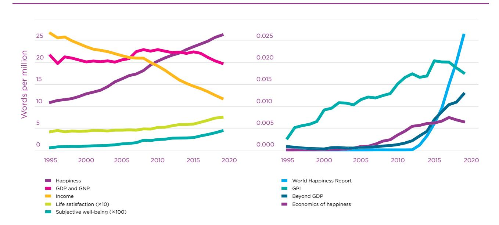

Figure 3.1: Recent trends in some well-being-related phrases

**Note:** Recent trends in some wellbeing-related phrases. Data are based on the 2019 English version of Google's Ngram database, and smoothed using an exponentially-weighted kernel with an 11-year span. Plots show the growth or decline in the relative incidence of "happiness" and other phrases since 1995, measured as frequency per million words. For visibility, some frequencies in the plot on the left are scaled up, as noted in the legend for each line, and phrases with even smaller frequencies are plotted separately on the right with a vertical scale 1000 times smaller. Alternative arrangements of this figure are available in Appendix 3, Supplementary Material.

representative of newer thought in the measurement of well-being and progress, have grown enormously — each by a factor of six or more — since 1995, and use of the former, at least, is still increasing. The term "economics of happiness," to which I will return in subsequent sections, is another new phrase whose use has grown since its inception this century, although the data show that it may have peaked in 2017.

Together, these trends paint a tentative picture of an increasing interest in new and subjective measures of well-being and a waning focus on income and production. These trends clearly predate the influence of the first *World Happiness Report* in 2012. However, as Figure 3.1 shows, mentions of the *Report* in books have grown rapidly in frequency since then, and are now twice as numerous as the use of the term "Beyond GDP." In 2019, "World Happiness Report" accounts for 1 in 1000 among all appearances of the word "happiness."

A strength of the *Ngram* database is that it sources information from several corpora in different languages, which provide both a more international view as well as some assurance that observed trends are not spurious or idiosyncratic to one language, but rather represent a reproducible measure of widespread changes in interest in a *concept*.

To give this broader view, the next few figures, including several in Appendix 3, show a slightly longer period and address the question of consistency across different languages and sets of text. Not only are Google *Ngrams* compiled for Chinese, Spanish, Russian, French, German, and Italian, but three variants are available for English: all U.K.-published books, all US-published books, and books of fiction. This is useful because part of the enormous rise in the volume of published books in recent decades is due to an overall increase in academic writing in book form. Separating the content in fictional stories serves to check that the observed trends are a broad

Figure 3.2: Frequency of occurrence of "happiness" across languages

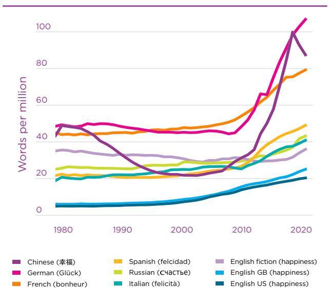

**Note:** Frequency of occurrence of "happiness" across languages. Data are from Google Books' ngram database and have been smoothed to remove short-term fluctuations. Translations of "happiness" used for each language are shown in the legend. The vertical scale shows the frequency of occurrence of the word "happiness" as a fraction of all words in printed books.

Figure 3.3: Frequency of occurrence of "economic growth" across languages

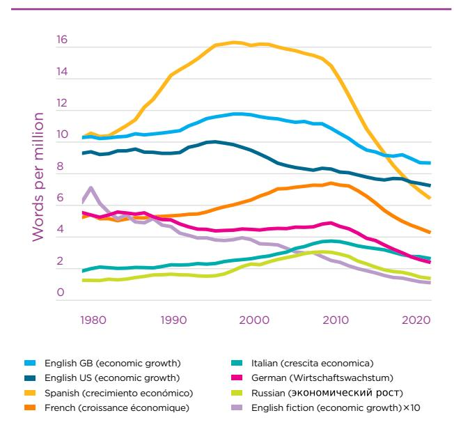

**Note:** Frequency of occurrence of "economic growth" across languages. The format is as for Figure 3.2 and shows that the recent decline in the relative frequency of mention of economic growth in published books is a common feature of the data in all available languages.

cultural-linguistic pattern, rather than changes confined to the research community.

We see in Figure 3.2 that the rise in the use of "happiness" is a consistent phenomenon across all the languages shown, with a possible exception of the final two years (2018–2019) in Chinese. The trend is less pronounced in the corpus of fiction, but in recent years even fiction has an increasing focus on happiness.

The Google *ngrams* database only includes phrases when they are found at least 40 times for a given language. In Appendix 3, Fig. S3 shows that while no translations of the title were found to be sufficiently common, *World Happiness Report* has occurred in its English form in four other languages. The steep rise in mentions of the *Report* in English have also occurred in Italian, German, Spanish, and French, and to comparable frequencies, albeit with slower starts than in English.

Turning to a phrase with waning popularity, Figure 3.3 confirms the decreasing frequency of references to "economic growth" across languages. This decline is evident since 2008 or earlier in each language, and over several decades in the case of English fiction. Fig. S4 in Appendix 3 shows similar patterns for "income" and "GDP" across a number of languages, with Chinese and possibly Italian being exceptions. Overall, interest in income generally peaked at different times in the middle and late 20th century, while interest in GDP and economic growth has come down only since the turn of the 21st century. In Chinese text, use of the term "GDP" in its English form has been increasing during this entire period and, remarkably, now constitutes a larger fraction of Chinese text than it ever did in any of the other languages.

By contrast, translations of the term "beyond GDP," which were found in two languages besides English, in all cases show rising interest (see Fig. S4 in Appendix 3). The term's popularity appears to have begun slightly before the prominent high-level conference "Beyond GDP" in 2007, hosted by the European Commission, European Parliament, Club of Rome, OECD and WWF. Two years later, the Stiglitz-Sen-Fitoussi Commission, a milestone in the "beyond GDP" movement, began the opening paragraph of its

report with the words "gross domestic product." The paragraph explains:

Too much emphasis on GDP as the unique benchmark can lead to misleading indications about how well-off people are and run the risk of leading to the wrong policy decisions. The purpose of this chapter is to go beyond GDP in our quest for better economic measures of living standards.

The report had an important role in the rise of happiness as a valid and meaningful element of national accounting, and it continues to frame recent efforts, particularly by the OECD, to measure well-being. Overall, then, tracking the use of these key phrases across multiple languages captures a broad sense that discourse around progress may be changing.

Of course, "happiness" is used in informal contexts. We can look at terminology more specifically related to the measurement and pursuit of well-being to gauge the growth of interest in specific empirically-based approaches to human happiness. Fig. S5 in Appendix 3 shows trends for "subjective well-being," "life satisfaction," and "positive psychology." In these we notice the same pattern of increasing trends, overall, even though these technical terms do not appear ("subjective well-being") or do not increase ("life satisfaction" and "positive psychology") in the English Fiction corpus.

Interestingly, "quality of life," another important phrase in English used to capture a sense of well-being related to overall cognitive and affective human experience, has been relatively popular in several languages but is no longer growing in use (see Fig. S6 in Appendix 3). Because this term is important in policy circles, I will return to it below.

# **Trends in the academic literature on happiness**

The subsequent section of this chapter provides an investigation into the evolution of quantitative approaches to measurement of progress and well-being as conceived by communities, academics, and governments. As a prelude to that examination and as a complement to the

preceding look at language use overall, this section investigates trends in the attention given by academic researchers to measuring and understanding happiness.

For this purpose I appeal to the Web of Science's database on more than 50 million journal articles.3 The contemporary context for any analysis of academic output is that, overall, the rate of academic publication is growing at an explosive 5.5% per year, more than five times the human population growth rate and amounting to a tripling since the turn of the 21st century. In this landscape, the rate of production of journal articles with titles or abstracts containing "happiness", "life satisfaction," "satisfaction with life", or "subjective well(-)being" has grown by a factor of ten since just 2003, recently totaling more than 4000 per year. Scaling this rate by the overall publication volume gives the fraction of papers that are related to happiness. Figure 3.4 shows how this fraction has changed over time. Prior to the early 1970s, there were essentially no papers using these terms. In the 1990s, 0.03%, and more recently about 0.2% of all research papers refer to these ideas. The figure also shows the evolving fractions for the subset of research articles classified in Web of Science's "multidisciplinary psychology" subject category and in its "economics" category. Overall, the economics category is larger but the psychology field has, not surprisingly, a larger fraction of happinessrelated publications. Moreover, the attention to happiness began about 15 years earlier in the psychological sciences than in economics, where, other than a few isolated papers in the 1970s and 1980s, interest grew substantially only starting in the mid-1990s.

Below I turn the focus on academic publications to economics because, although there are more publications in psychological and psychiatric journals, it is the economics literature which tends to focus more on conditions which make one country happier than another. To give some further context to the trends just described, Fig. S7 in Appendix 3, shows several other features of economics publications since 1980. First, happiness is not the only topic gaining interest. "Sustainability" is found in a growing

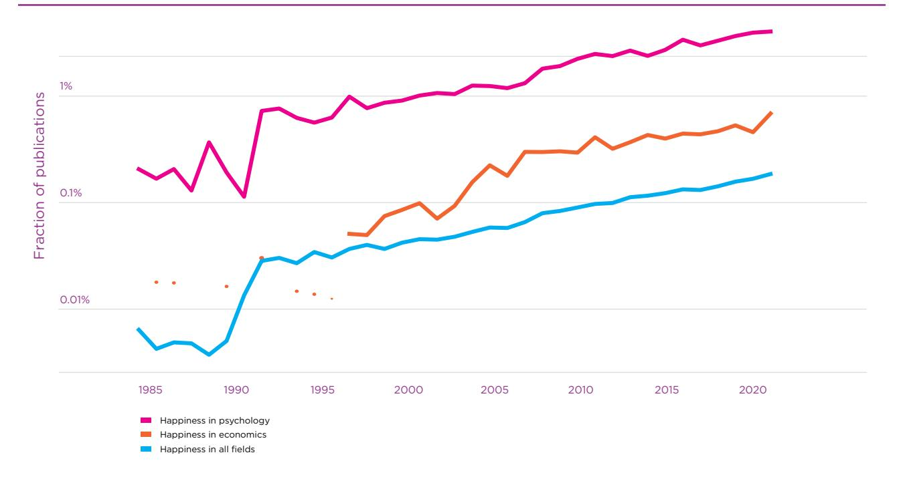

Figure 3.4: Fraction of academic papers related to happiness

**Note:** Fraction of academic papers related to happiness. Publication rates are shown relative to their respective denominators. The dots show years in which only one or two articles were published. The criterion for being related to happiness is that the title or abstract of a journal article contains any of "happiness", "life satisfaction," "satisfaction with life", or "subjective well(-)being." In 2021, the raw numbers of publications related to happiness were 4217 in all fields, 682 in psychology, and 212 in economics. Data come from the Web of Science.

share of the titles and abstracts of work over the last two decades, appearing in 2% of economics publications, while the happiness phrases appear in 0.6%. Both "income" and "inequality" have maintained their order-of-magnitude-higher incidences above that of "happiness" and, moreover, have begun to increase in relative frequency in recent years.

A more subtle feature to glean from Fig. S7 is that since 2010, happiness-related publications have grown less quickly in economics than in other fields. Even more interestingly, restricting the scope of search to the most prominent journals in economics shows that, if anything, the interest in happiness there has peaked. The blue line in Fig. S7 shows the relative frequency of articles in the top 20 economics journals,4 while the orange one shows publications in the canonical "Top Five" most prestigious economics journals. In both cases, the interest evident prior to 2010 has

not been sustained. How should one interpret this discrepancy? Why have the top journals not followed the broader trend in economics and other fields? One possibility is that many of the easy questions about the causes and distribution of happiness may have been answered early on, leaving fewer ground-breaking findings or applications of novel methods to be taken up by the most choosy journals. Another explanation might be that the implications of happiness economics are too great to be easily adopted into most frontier work in the field. After four decades of the "economics of happiness," the methods and findings are accepted within economics but are still not emphasized in teaching and training, and have for some reason not transformed the focus of economic welfare analysis or discussion of policy implications in the vast majority of research within the discipline.

**Figure 3.5: Trends within happiness-related publications in economics**

Note: Trends within happiness-related publications in economics. Within the set of economics journal articles containing any of "happiness", "life satisfaction," "satisfaction with life", or "subjective well(-)being" in the title or abstract, the plot shows the fraction which contain each word or phrase shown in the legend. "SWB" corresponds to "subjective well-being" or "subjective wellbeing", while "LS" indicates that the title or abstract mentions "life satisfaction" and/or "satisfaction with life." In general, the data, taken from the Web of Science, show that the non-specific term "happiness" is being replaced by references to more specific kinds of measurements. Also, discussion of policy is becoming more frequent in research papers on happiness.

The last point to be made from Fig. S7 is that the relative frequency of mention of "policy" in economics articles which treat happiness is rising faster than the overall rise in happiness research. I will return below to themes raised by the evident importance of inequality, sustainability, and policy in the publication record.

One last plot on this subject reveals something further about trends in discourse and academic thought. Restricted now not just to publications in economics, but to those articles within economics which make reference to the happiness-related terms mentioned above, Figure 3.5 shows the relative frequency of appearance of certain specific language in titles and abstracts. Most notable is that the use of the word "happiness" itself is in decline. In its stead, both "subjective" and "life satisfaction" are increasingly used. These are more technical and precise terms

than "happiness," the way it is usually used. Their use likely reflects the increasing familiarity and sophistication of economists with subjective well-being measures.

I now turn to a different and crucial dimension of the expansion of research relevant to the World Happiness Report. Figure 3.6 shows the spread of work — again related to the number of economics-related journal articles referring to "happiness", "life satisfaction," "satisfaction with life", or "subjective well(-)being" — around the world since the earliest ones in the 1970s.5 The rates show happiness-related authorship as a proportion of each country's total population. The first panel shows a period of 25 years, over which the most prolific country produced only 11 research papers containing one of these terms in its title or abstract. This amounts to 0.3 per ten million population. The subsequent panels show successive periods of 5 or 6 years each, during which research on happiness grows from just a few countries — notably in North America, western Europe, and Australia — to a much more global endeavor. While publication is still partly dominated by the early contributors to the field, China now ranks third in output, with Turkey, Slovakia, South Korea, India, and Taiwan also in the top 20 (see Table 1 in Appendix 3). World happiness is now studied worldwide.

*Research on happiness [has grown] from just a few countries — notably in North America, western Europe, and Australia to a much more global endeavor.*

# **Indicator systems for measuring progress and well-being**

After ten years of the *World Happiness Report*, some aspects of happiness research have become common knowledge. Popular press annually report which are the happiest countries. The modern availability of happiness data across

**Figure 3.6: Internationalization of academic research on happiness, as measured by authorship per capita. 1970–2021**

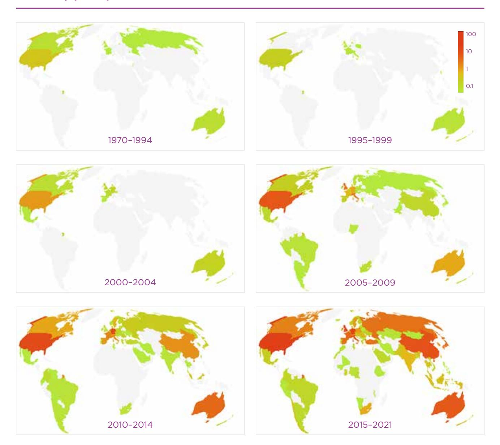

Note: Internationalization of academic research on happiness, as measured by authorship per capita. Each map shows the number of authors of happiness-related research articles per ten million population, during the periods shown.

diverse populations and over time is one of the important factors that is shaping thinking about human progress. So are the increased availability of other statistical measures known to be important supports for happiness, the growing scientific understanding of how human subjective experience relates to those supports and to life circumstances and practices, and indeed, an increased public appetite for and acceptance of statistical information.

Recent, influential works of scholarship have also affected beliefs about economic growth and inequality, as have a parade of disruptions to the lives — and assumptions — of even those who are relatively content. These include the financial crisis, the COVID-19 pandemic, and disruptions from a changing climate. The widespread growth of inequalities not well counted by traditional measures of economic performance is not new, but an increased recognition that environmental degradation threatens the predictability of future welfare is.

In light of these ongoing trends, what do individuals, organizations, local governments, central governments, and international agencies come up with when they follow the natural instinct to gauge progress and merit? This section reports on the content of indicators which are intended to capture the broadest conceptions of human social progress. The underlying database, "Measuring progress and well-being" (MPWB), has been updated from its 2016 version,6 doubling in size to 166 projects. Each project, or indicator system, is an attempt to capture well-being and progress in a coherent and measurable way, but each also serves to advocate for its particular way of doing so. These efforts to forge new indicators are therefore a representation of how we might conceive of and pursue well-being and progress in the future.

Indicator projects are eligible for inclusion in the MPWB database if their intent is to capture the idea of overarching progress for the entire population. Nevertheless, due to differences in proponents' assumptions and approach, indicators reflect a variety of conceptually different rationales. These include concepts of economic development, generalized wealth,

life quality, social development, progress, happiness, and sustainability.

For continuity with the tracking of words and phrases in the preceding sections, Fig. S8 in Appendix 3 shows trends in the language content of indicators in the MPWB database. In each plot, lines show the cumulative number of indicators over time containing each phrase, while the black notches show the dates of creation for all 166 indicators.

The first graph relates to how indicators are named. "Quality of life" and "well-being" and "progress" have been prominent in the titles given by the creators of indicators since the earliest entries in the database. By contrast, the word "happiness" itself did not appear prior to 2003 but since then has appeared in the names of over a dozen new indicator projects.

Also shown in Fig. S8 in Appendix 3 are the occurrence of words in the rationales given (usually by the creators) for the creation of each indicator, and for the selection of its constituent measures. Nearly a third of indicators to date explain their purpose by making reference to "quality of life", and the same is true of "well-being." "Progress", "sustainability," "happiness," and words related to subjective well-being and satisfaction also feature prominently. The steepness of each line reflects how many new indicators referencing each phrase were created in a given year.

When it comes to describing the thematic or specific content of indicators, however, "income" outranks subjective well-being, even in recentlycreated indicator systems.

Although the verbal analysis given above is carried out in English, the database includes translated descriptions and rationale for indicators from around the world. In Appendix 3 Fig. S10 shows the global distribution of indicators. Because of the number of indicators with global scope, all countries are now covered by at least 8 schemes. Some of those cover a particular region of the world, while some apply to a particular country. Also shown are a number of cities with their own local indicator systems for well-being or progress. The second map in Fig. S10 shows the

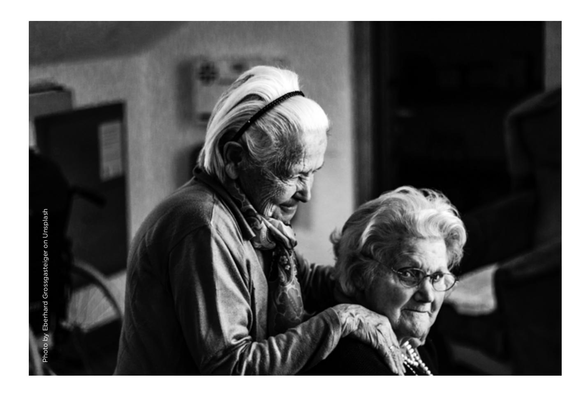

coverage of indicator systems which mention happiness or subjective measures in their descriptions or rationale. These amount to 40% of all the indicators in the database.

Combined with the global spread of happiness research shown earlier, this map suggests that the desire for new measures of policy success and human thriving is a worldwide phenomenon, and that the subjective well-being approach holds growing sway around the world.

#### **Who defines "quality of life"?**

Creating and promoting new indicators is one part of shifting societies' values and conceptions around measured happiness, leading to new expectations for progress and good policy. Along that path, however, that which is actually measured, policy that is made, and intellectual ideas that gain attention must all pull each other along with those public expectations. The design of indicator

frameworks is driven in part by what measurements are available, but that availability was in turn driven by what held people's attention and interest in the preceding years. Without embracing any particular theory of change, and having seen that these shifts are underway as a geographically broad trend around the world, one might ask *who* is designing new measures of progress and well-being?

In Appendix 3 Fig. S11 shows the geographic distribution of indicators in the MPWB database according to whether they were formulated by academics, governments, or other organizations. The distributions in these maps look different than in the maps of Fig. S10. Academically-designed indicators tend to be overwhelmingly focused on the U.S. and China, while non-government organizations have been most active in Canada and the U.S. In any case, with the exception of those focused on the U.S. and France, most new indicators around the world were devised by

governments themselves or by inter-governmental agencies.

Has that pattern changed over time? The grouped bars in Appendix 3, Fig. S12 show the decadal distributions of designer categories. The thicker lines show the number of ongoing indicators over time — that is, taking into account both newly created additions as well as attrition due to indicator frameworks falling out of use. According to the MPWB database, academics did not get into the game until 1995, after which they have contributed a growing fraction of new indicator designs. However, their indicators have had less staying power, with less than a third of indicators created since 1995 still in use. Privately-created indicator systems are more numerous and were more successful, at least until about 2001. Altogether a little more than half of them are still in use. Over the last decade, though, the rate at which privately-created indicators are being retired has been similar to the rate at which new ones are proposed. Although governments are subject to political cycles and platform changes, only government-created indicators appear to have staying power, with more than two thirds of those created still in use.7 For these reasons, in recent years the number of extant governmentcreated progress and well-being indicators is growing both in absolute terms and relative to the other categories.

The originator — whether an individual or an institution — of an indicator framework is not the only one involved in defining quality of life, progress, or well-being or in devising the structure of the framework. The method used to choose a design typically involves either the public, through a consultative process, or expert advice or, in a few cases, principled use of data to drive the design. These may be named "bottomup," "top-down," and "empirical" approaches.8

A prominent example of a method classified as bottom-up is the 2010–2011 effort by the U.K. Office of National Statistics (ONS) to construct a national consensus definition of "national well-being," under a new objective to "Measure what matters." The ONS organized in-person discussions around the country, extensive online debates, and venues for comment submissions,

in order to solicit opinions from the population about what is important in life, how to measure national well-being, and how to use such a measure. The results were formed into an indicator framework comprising 10 domains and 38 individual measures.9 A top-down approach, by contrast, would have reached the set of domains and indicators based on academic thought, experts' opinions, or political priorities.

Fig. S13 in Appendix 3 shows the evolving proportions of approaches across all three categories, along with one in which expert judgment or principled choices are followed up with a more democratic process for selection or refinement of the indicator framework. The top-down and mixed approaches dominate among the indicators in the MPWB, and there is no obvious pattern of shifting tendencies over time, except for the recent rise of the "empirical" category. Interestingly, academic originators of indicator projects tend to prefer top-down approaches, using them 80% of the time, often based on some theoretical idea or principle, yet they are also the most likely to create an empirically-derived indicator.

One approach for empirically deriving indicators of well-being and progress is to use happiness data to choose weights for other, objectively-measured supports to well-being. As discussed later in this chapter, this may be the most defensible approach for constructing new indices.

# **Government conceptions of progress and well-being**

Well-being and progress indicator initiatives which provide public information for wide audiences may have some role in shifting public expectations and priorities. A more tangible mark of effectiveness, and of change, is for those indicators to have a role in policy. As shown above, it is also governments which have taken and are expanding the lead in formulating new ways to express and formalize social priorities using measurable indicators. This section presents a few specific examples of the kind of language being used in government initiatives to turn towards evidence about happiness.

The Nordic Council of Ministers in 2021 classified government well-being initiatives by whether they use well-being metrics for monitoring, for prioritizing, or for policy making.10 A new piece of language that they see as synonymous with a "beyond-GDP approach" is a "well-being economy," a term which first appears in Google Books' *Ngrams* in 2001 and relates to the second and third uses of well-being metrics, just mentioned. That is, a country is considered a Wellbeing Economy only if it actively uses well-being measures for informing government priorities and "actively [guiding] government policymaking towards the most well-being impact." While this leaves wide open the definition of well-being, and while they state that well-being economies are varied in their use of subjective versus objective measures of well-being, "it is the adoption of [subjective] well-being measures [like satisfaction with life] by states, policymakers, and other members of the international community that are today paving the way towards the concept now known as the Wellbeing Economy."11

The Nordic Council of Ministers identifies three countries — Bhutan, United Kingdom, and New Zealand — as governments which use well-being metrics in all three roles: monitoring, prioritizing, and policy making. In fact, New Zealand has for three years branded its budget as a "well-being budget." In its 2021 edition, the budget's second page is entirely devoted to reporting statistics of happiness (life satisfaction). Interestingly, however, life satisfaction does not yet have any formal role in New Zealand's budgeting process or well-being objectives, beyond the mention of "mental well-being." One key feature of the New Zealand approach is that it is explicitly under active development. Two frameworks, the "Living Standards Framework" and a newer Maori approach (He Ara Waiora, or "healthy path"), are still evolving towards being more specifically able to guide policy.

Similarly, the Canadian federal government has taken an evolutionary approach to developing its new well-being framework in 2021, which it dubs a Quality of Life Strategy. Canada's Finance Department released a version of this framework in 2021, writing:12

Self-reported life satisfaction is a measure of SWB that directly gauges overall, experienced quality of life, providing information that cannot be gathered in any other way. Life satisfaction has been the primary measure of SWB in the literature, understood as an evaluative and overarching assessment of the state of one's own life.

For its new measurement framework, it proposes that one option would be to include life satisfaction "as an overarching indicator to complement several key domain-specific indicators in providing a high-level assessment of overall quality of life in Canada."13 They recognize that using happiness as a headline indicator of well-being would help to communicate that the government cares about the subjective experiences of its citizens as a central goal. They also mention that it could inform priority setting or budget allocation decisions and support cost-benefit analysis, in line with the second and third roles described by the Nordic Council of Ministers.

Furthest along of all in those roles is probably the United Kingdom government. Three noteworthy documents were published in 2021: the autumn budget, an official "Green Book" supplement on using a well-being approach in cost-benefit assessment, and a discussion paper providing further details on the latter topic. The budget uses the word well-being several times in phrases conveying the objective of policy, such as "health, prosperity, and well-being," "people's well-being, wages, and prospects," "young people's wellbeing and prospects," "health, well-being, and opportunities," and "economies, livelihoods, and well-being." As in the case of New Zealand's budget, the U.K.'s mentions life satisfaction in the context of measured inequality, referring to "inequalities in wages, life satisfaction, and productivity."

An interesting observation is that neither the New Zealand or Canada documents mentioned so far, nor the U.K. budget, use the word "happiness." This mirrors the growing preference, mentioned earlier in regard to the academic literature, for more precise terms denoting specific subjective well-being questions. Such specificity would

however contrast heavily with the broad and typically poorly defined meaning of the term "well-being" and "quality of life" in these same documents. On this point, the U.K. stands out sharply. The first part of the first section of the Green Book supplement is entitled "What is well-being?" and begins with the simple sentence "Wellbeing is about how people feel."14 It goes on to mention that "personal well-being is measured by the Office of National Statistics through subjective reports of satisfaction, purpose, happiness and anxiety." The step of openly embracing subjective well-being as a formal and core objective of government policy has been many years in the making in the U.K., but it should be seen nevertheless as a landmark point of evolution in 2021.

The remainder of the Green Book supplement buttresses this view. As well as summarizing happiness research findings, it explains quantitative methods for using happiness data to make decisions about government spending. There

is no ambiguity about the role of subjective well-being or life satisfaction in this document, nor in the accompanying U.K. Treasury background paper, which gives more technical detail on cost-benefit calculations when life satisfaction is the explicit outcome measure.15 Of course, the next step will be for these guidelines to influence actual practise.

Interestingly, while the central role of subjective measures is clear, the Green Book supplement does go on to use the word "well-being" to refer also to an open-ended list of desirable outcomes. Bridging earlier language used by the U.K. Office of National Statistics, it mentions ten "dimensions of well-being" such as health, relationships, where we live, and so on, and refers to these as "national well-being." The analysis it prescribes, however, is largely about valuing these "national well-being" dimensions and outcomes using evidence from their effects on "personal well-being," i.e., happiness.

Reflecting on the history and the landscape of existing government language and conception around well-being and progress, it appears that the flexibly-defined language around "well-being" and "quality of life" serves as a rhetorical and conceptual gateway to recognizing happiness as an important or even central policy outcome, and to incorporating happiness data and insights into policy formation.

In all three country examples mentioned above, the Treasury or Department of Finance has taken the lead in embracing new conceptions of progress and well-being. However, the same language is visible in other domains where expertise, training, and practice require a shift to reorient towards promoting overall happiness. One example is from the U.K. "Policy Profession Standards," which gives official guidance for recruitment, performance assessment and training of 14,000 policy staff.16 Updated in November 2021, it now subtly but importantly includes "well-being" as an example of a cross-cutting policy objective. A more prominent example comes from the Geneva Charter for Wellbeing, a product of the World Health Organization's 10th Global Conference on Health Promotion in December 2021, at which over 5000 representatives from 149 countries participated.17 The Charter makes reference to creating "well-being societies," which seemingly have features in common with "well-being economies," mentioned above, and would be characterized by a more "positive vision of health" including "social well-being", and "new indicators of success beyond GDP that ... lead to new priorities for public spending." While naturally featuring nonspecific language, this document will undoubtedly influence conversations and conceptions in the enormous public health communities and agencies around the world.

# **Three challenges**

This chapter concludes with three warnings about challenges faced when forging new conceptions of, or measures of, progress and well-being. They arise in most of the government initiatives just described, and in many of the indicator initiatives in the MPWB database. The warnings are to avoid

pitfalls with the construction of indices that sum across different domains, that sum across people, or that address both current outcomes and ones in the far future.

#### **Indices and aggregation across domains**

The first of these challenges relates to a basic question in composing any new indicator framework aimed at capturing a meaningful concept such as well-being or progress. With several measures in hand, all believed to be important dimensions of or contributors to well-being or progress, how should they be packaged together to form a new indicator? The entries in the MPWB database are classified into four alternative approaches, whose incidence is shown in Appendix 3 Fig. S14. The first is a "dashboard" of relevant measures meant to capture the desired concept of the framework, but which remain quantitatively separate. The second is an "index," in which the measures are combined into a single number, necessarily using weights to account for the relative importance of each component. The third is a subclass of index, in which the component measures that are summed together have the same units and form an accounting system, like GDP, but this format is no longer common.18 Last are systems consisting exclusively of subjective well-being measures, left in their natural units.

Fig. S14 shows that indices and dashboards both remain popular in recent years, as judged by the pace of new creations. Indices have the attractive feature of a simple headline number, accessible for diverse audiences, and providing unambiguous up or down trends over time and differences across regions or groups. In fact, 36% of the indicator projects in the MPWB database have names which include the word "index." However, indices tend to suffer from an arbitrary choice of weights and therefore a shortfall of meaning and accountability. Likely as a result, they also suffer from diminished longevity: 58% of indicators in the "index" category have become defunct, as compared with 38% of the efforts which left their measures as dashboards. Nevertheless this design decision faces every government or other organisation trying to communicate its new ideas

about progress in a compelling way. Happiness data offer a new way to build indices from other life conditions in a meaningful way by providing empirical weights to different dimensions and sub-measures, and I have recommended avoiding all indices that are not based on such a principled or accountable weighting scheme.19

### **The happiness of a population?**

Populations do not experience happiness; individuals do. No matter the extent to which shared or collective undertakings, experiences, or even identities contribute to happiness, it is ultimately individual brains that experience and report satisfaction, joy, or their absence or opposites. Indeed, this is precisely the power of the subjective well-being approach: it privileges each human's individual experience, not specialist intuition or political priorities, above all in defining well-being.

A rather important feature of the discourse around happiness and well-being is, therefore, the way individual experience is aggregated and expressed as summary numbers for groups or populations. In this regard, no advance has been made over the manner in which GDP was used in the past to compare collective outcomes. That is, while a population sum or average like GDP has a role as an accounting measure, one of its problems in representing well-being is that individuals experience their individual income and consumption (along with benefits from public or collective goods), while the average value does not correspond to anyone's experience. The only truly representative way to summarize the experienced well-being of a group is therefore to show its distribution.

The second challenge, and recommendation from this chapter, is therefore to move away from means and from inequality indices when expressing group outcomes of individually-lived experience. Those devising indicator systems expend great effort to incorporate measures of inequality into their framework and, increasingly, into their concept of well-being or progress. I suspect this is driven by a habitual inclination to use averages, and therefore find oneself in need also of awkward measures like Gini coefficients and so forth. In the

same way that it is enticing to simplify a dashboard to an index, analysts tend to be trained to represent distributions using means. If, instead, we are able to present, communicate, and interpret distributions of individual outcomes as distributions, rather than through the awkward statistics of means and scalar inequality metrics, we may find that the public is ready to digest them at face value. Seeing a distribution, not a mean, as the fundamental collective outcome portrays the experience of individuals at the lower end directly, and can also be useful to avoid drawing arbitrary divisions across groups. Above all, it may simplify and generalize conceptions of well-being and progress by removing choices about levels and dimensions of inequality from the fundamental concept being measured.

Of course, there will always be some appropriate uses for indices. For instance, in the context of cost-benefit analysis, one ultimately has no choice but to choose a way to express values through numerical weights. For broader consumption, however, and for communicating outcomes, facing the full distribution directly does the most justice to the measurement of happiness. For instance, if we consider the distribution of happiness for a population, we are naturally drawn to ask about who is doing less well, and why, if we can see that some are suffering. We are naturally drawn to ask about the respective distributions of sub-populations known to be disadvantaged. Yet these analytic and policy questions are best understood as ethical issues, rather than confusing them with the very concept of happiness.

### **Happiness and sustainability**

A final and enormous challenge in modern conceptions of progress and well-being relates to sustainability. In the same way that proponents of new indicator systems have an inclination to include measures of inequality as part of their concept of well-being, likely because they see that certain ways of mitigating inequality could improve well-being for all, there is a growing tendency to include sustainability or ecological health as a component of the very concept of well-being or happiness, or a "well-being economy," or to blend well-being and ecological

*The enormous value of happiness science for improving lives may be lost due to muddying the analytic waters with unanswerable questions.*

health in a single index. Again, this may be because sustainability problems are an obvious threat to well-being.

Of course, facing an uncertain future causes anxiety and is bad for present well-being. Moreover, many societies have incorporated an attitude to stewarding natural ecosystems as part of their identity, which is also core to well-being. While such identities are likely the result of learning from past policy mistakes, the problem to address in this section arises only in the modern context of the science of happiness.20 In particular, as more governments progress towards well-being accounting systems that use evidence from happiness to quantitatively inform priority setting and budgeting, they face a limit in the application of happiness data. For extremely long-run outcomes; unfamiliar futures; or unpredictable, complex, or uncertain dynamics, future predictions of human well-being will always be too uncertain to be used in cost-benefit tradeoffs against shorter-term outcomes.

An outstanding example is the question of climate change mitigation, for which no one has been able to calculate with confidence an optimum level of mitigation to maximise future well-being or to maximise some balance of future and current well-being. The exercise of trying to do so precisely is futile, even though it may be argued that economic advice for decades was to wait until we could do this calculation more confidently. Instead, societies are shaping their policies based on a different rationale that is not directly related to well-being at all; it is to achieve production systems with net-zero greenhouse gas emission.

On the other hand, we have extensive knowledge already about the happiness effects of local pollution and local greenspace, so that shorterterm environmental decision making can certainly be informed using a well-being approach, in which both the costs and benefits of pollution mitigation have sufficiently well-known impacts on well-being.

There is thus a distinction between measurable aspects of the environment which can be affected in the short run and therefore fine-tuned based on cost, and long-run questions where the best policy may be a more arbitrary "precautionary" approach. The risk in not making this distinction is that the enormous value of happiness science for improving lives may be lost due to muddying the analytic waters with unanswerable questions. That is, the overwhelming flood of speculation required for considering the longest time horizons can dilute away the insight available for improving shorter term decisions. A solution, in common with that for handling the challenge of inequality and distributions, is to realize that a well-specified concept for human happiness or well-being, and a well-measured indicator for it, is not sufficient to prescribe all policy. This is a lesson which appears still to be in need of digesting by most governments trying to incorporate the happiness approach into new language, concepts, and indicators that reflect the aspirations and expectations of society.

## **Conclusion**

This chapter has explored trends in thought about human well-being and social progress. Quantitative indicator frameworks put such ideas into concrete form and do so without the enormous ambiguity that often accompanies the use of expressions like "well-being," "quality of life," and "progress."

Indeed, changes in language use do not always straightforwardly inform us of changes in values or conceptions.21 The word well-being, in its various forms, is increasing in popularity and is more often being used to connote sustainability and equality, in addition to its older range of meanings.

Several threads run through the evidence reviewed above. First, the role and prominence of happiness and its related concepts and

terminology are on the rise — in books, in research, in government and private constructions of progress indicators, and in central government policy initiatives. In the last quarter century, the words "happiness" and "income" have undergone opposite trajectories, respectively doubling and halving their use in printed books. Across multiple languages, references to the World Happiness Report are growing rapidly as a fraction of all words. Authors of economics research articles on happiness have written from 69 countries spread around the world.

Second, policy is increasingly part of the context when academics discuss happiness, and governments are increasingly the ones innovating in the articulation of social objectives and wellbeing indicators. Nevertheless, the efforts which are likely to endure involve some deep form of accountability to democratic process or to empirical evidence when specifying the weights or constituents in indicator systems.

Third, there are signs of conceptual maturation of these efforts, in which the statistical measurement of happiness, the frameworks for assessing progress, and the technical analysis for informing policy are coming into alignment. Some of the "fuzzy" language mentioned above may be particularly useful to help facilitate discourse within governments and among the public, as they progress from seeking and exploring new and more hopeful and human-centred aspirations for society, towards specific and implementable measurements, indicator frameworks, and evidence-informed policy-making capabilities.

A future expectation is that well-connected, international collaborations among innovating governments are likely to address the challenges mentioned in this chapter and to develop concepts of progress which incorporate happiness appropriately and which are clear, compelling, informative, and useful for monitoring progress and improving policy.

#### **Endnotes**

- 1 See Michel et al. (2011). The 2019 update of Ngram addresses a number of the earlier concerns about using these data to make inference about language trends.
- 2 See Appendix 3 for alternative formats to Figure 3.1, showing these comparisons of frequencies of use in terms of their growth since 1995.
- 3. See https://webofscience.com.
- 4 This list is by Google Scholar's determination.
- 5 The vast majority (97%) of these scientific studies were published in English. These data are again from the Web of Science. Population data are from the World Bank's World Development Indicators. Each author in each published paper counts once, and totals are over the entire period shown in each map. The online appendix includes versions of these maps showing raw authorship rates, not normalized by population.
- 6 See Barrington-Leigh and Escande (2018) and Barrington-Leigh (2016) for analysis. The 2017 version of the MPWB database is available online: http://alum.mit.edu/www/cpbl/ publications/WB-indicator-database-2017
- 7 These inferences could be somewhat biased if the historical record of defunct indicators were easier to find for some types than for others. The database was compiled mostly between 2015 and 2017, and again in 2021.
- 8 See Barrington-Leigh and Escande (2018) for more detail on this classification and other subjects to do with the MPWB database.
- 9 See Office for National Statistics (2012).
- 10 Birkjær et al. (2021)
- 11 Birkjær et al. (2021, p. 11)
- 12 Department of Finance (2021, p. 13)
- 13 Department of Finance (2021, p. 14)
- 14. UK Treasury (2021, p. 3). Interestingly, and in contrast to the other government documents mentioned, the Green Book supplement does not shy away from using the word happiness several times in its looser generic meaning of subjective well-being, even though it also uses the term when referring to the emotional meaning of happiness, i.e, specific questions assessing affective feelings.
- 15 MacLennan et al. (2021)
- 16 Nancy Hey, personal communication; UK Policy Profession (2021, see annex, p. 8)
- 17 See https://www.who.int/publications/m/item/the-genevacharter-for-well-being-(unedited)
- 18. See Barrington-Leigh and Escande (2018) for more detail on these categories.
- 19 See Barrington-Leigh and Escande (2018) for elaboration on this point and others in this section.
- 20 See Barrington-Leigh (2021) for a more extensive articulation and discussion of this problem.
- 21 See, for instance, Oishi et al. (2013).

#### **References**

Barrington-Leigh, C. (2017). The role of subjective well-being as an organizing concept for community indicators. In *Community quality-of-life indicators: Best cases VII* (pp. 19-34). Ed. Phillips, R., Holden, M., Stevens, C. Springer, Cham. 27.

Barrington-Leigh, C. (2021). *Review of Department of Finance Canada's Toward a Quality of Life Strategy for Canada*.

Barrington-Leigh, C. P. (2021). Life satisfaction and sustainability: a policy framework. SN Social Sciences, 1(7), 1-25.

Barrington-Leigh, C., & Escande, A. (2018). Measuring progress and well-being: A comparative review of indicators. *Social Indicators Research*, *135*(3), 893-925.

Birkjær, M., Gamerdinger, A., & El-Abd, S. (2021). *Towards a Nordic Wellbeing Economy*. Nordic Council of Ministers.

Department of Finance (2021) `Toward a Quality of Life Strategy for Canada' ie. that which is available here: https://www.canada.ca/en/department-finance/services/ publications/measuring-what-matters-toward-quality-lifestrategy-canada.html

MacLennan, S., Stead I., & Rowlatt A. (2021). *Wellbeing discussion paper: monetisation of life satisfaction effect sizes: A review of approaches and proposed approach*. Technical Report. Social Impacts Task Force. UK Government. https://assets.publishing.service.gov.uk/government/uploads/ system/uploads/attachment\_data/file/1005389/Wellbeing\_ guidance\_for\_appraisal\_-\_background\_paper\_reviewing\_ methods\_and\_approaches.pdf

Michel, J. B., Shen, Y. K., Aiden, A. P., Veres, A., Gray, M. K., Google Books Team, ... & Aiden, E. L. (2011). Quantitative analysis of culture using millions of digitized books. *Science*, *331*(6014), 176-182.

Office for National Statistics. (2012). *Measuring national well-being: Report on consultation responses on proposed domains and measures*. Technical Report.

Oishi, S., Graham, J., Kesebir, S., & Galinha, I. C. (2013). Concepts of happiness across time and cultures. *Personality and social psychology bulletin*, *39*(5), 559-577. PMID: 23599280

UK Policy Profession. (2021). *Policy Profession Standards*. Technical Report. UK Government.

UK Treasury. (2021). *Wellbeing Guidance for Appraisal: Supplementary Green Book Guidance*. Technical Report. Social Impacts Task Force. UK Government.

# Chapter 4

# Using Social Media Data to Capture Emotions Before and During COVID-19

## Hannah Metzler

Complexity Science Hub Vienna, Medical University of Vienna & Graz University of Technology

## Max Pellert

Sony CSL Paris, Complexity Science Hub Vienna & Graz University of Technology

# David Garcia

Complexity Science Hub Vienna, Medical University of Vienna & Graz University of Technology

This work was supported by a grant from the Vienna Science and Technology Fund (Grant No. VRG16-005). We thank other researchers involved in one of the studies we describe in this chapter for the great collaboration, including Anna Di Natale, Bernard Rimé, Thomas Niederkrotenthaler and Jana Lasser. We are thankful to Lara B. Aknin, John F. Helliwell, Jan-Emmanuel De Neve, and Wang Shun for helpful comments and suggestions. We finally thank the newspaper Der Standard for providing their survey data.

# **Introduction**

Most people now use social media platforms to interact with others, get informed, or simply be entertained.1 During the COVID-19 pandemic, social lives moved online to a larger extent than ever before, as opportunities for face-to-face social contact in daily life were limited.

In this chapter, we focus on what can be learned about people's emotional experiences and well-being from analyzing text data on social media. Such data is relevant for emotion research, because emotions are not only internal experiences, but often social in nature: Humans communicate their emotions in either verbal or nonverbal ways, including spoken and written language, tone of voice, facial expressions, body postures and other behaviors.2 Emotions are often triggered by social events: we are sad when we miss someone, happy when we meet loved ones, or angry when someone disappoints us. Emotions also provide important social signals for others,3 informing them of adaptive ways to interact given their own motivation and goals. Given their valuable social function, emotions are regularly shared with other people and thereby influence other people's emotions.4 For instance, happiness may spread through social networks, and give rise to clusters of happy and unhappy people.5

Social media continuously captures communication between millions of individuals and large groups over long periods of time. Data from these platforms provide new opportunities to trace emotions and well-being of individuals and societies at new scales and resolutions. This has motivated researchers to use social media data to investigate questions around mental health,6 emotional well-being,7 anxiety,8 collective emotions,9 or emotion regulation.10

A particular strength of new computational approaches is that they can aggregate emotion data at large scales and fast temporal resolutions, often relying on text analysis.11 Large social media datasets that combine data from many individuals are particularly well suited to examine large group phenomena at the level of populations, especially those involving interactions between individuals. For instance, social media has made it possible to study collective emotions, which emerge from the emotional dynamics in a large group of people responding to the same situation at proximate points in time.12 Interaction between individuals is a key feature of collective emotions, which can change the quality, the intensity and the duration of emotional experiences.

In the following, we provide an introduction to how emotional trends in society at-large can be measured using text data from social media. We describe two studies assessing whether this social media approach in the United Kingdom (U.K.) and Austria agrees with surveys on short-lived emotional experiences. We also briefly illustrate their application to long-term experiences like well-being or life satisfaction. We then provide an example from the COVID-19 outbreak to illustrate how social media text analysis can be used to track emotions around the globe. Finally, we discuss the advantages and disadvantages of social media emotion measures as compared to self-report surveys.

# **Assessing emotional expressions in social media data**

The language that people use to talk about their own and others' emotions on social media provides a possible window into their experiences. In this section, we discuss different methods for assessing emotional expressions from text, including their most important strengths and weaknesses.

### **Dictionary-based methods**

One simple way of assessing emotional expressions developed by psychologists are emotion dictionaries, that is, lists of words that are usually associated with a particular emotion or emotional dimension. For example, a dictionary of positive emotions could include words like accept, beautiful, carefree, easiness, trust, and hope. In contrast, a dictionary for sadness may contain expressions like dull, cried, gloomy, heartbreak and miss.13 The dictionary approach is based on simple word counting: the higher the percentage of words associated with an emotion, the more a text is thought to express this emotion. In this so-called "bag-of-words" approach, the order or context of words is largely ignored.

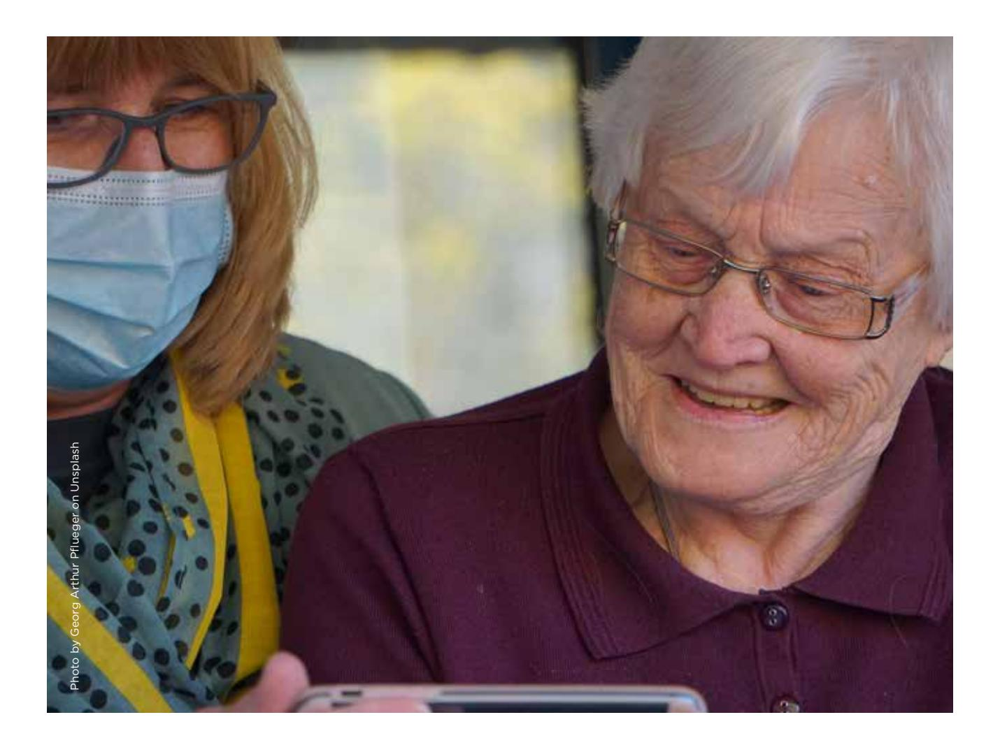

Researchers have developed dictionaries for discrete emotions (e.g. anxiety, sadness, anger),14 as well as dictionaries for dimensions of emotions such as valence, arousal and dominance.15 The expert word lists of LIWC, in particular, have been manually translated and evaluated in many different languages, such as Chinese,16 French,17 Spanish18 or German,19 making them particularly suitable to investigate emotions around the globe. Other approaches that only distinguish between negative vs. positive sentiment are SentiStrength20 and VADER.21 They also use counts of emotional words, but additionally assign weights to words to indicate the strength of sentiment, and further apply rules to account for other text features like exclamation marks, modifiers like "very" or negation of emotional words such as "not happy". These additional strategies make

SentiStrength and VADER less sensitive to word ambiguities.22 Lexicon- and rule-based approaches are referred to as unsupervised methods, because they do not require training on datasets of text examples with emotion labels.

Figure 4.1 depicts the coding of two example tweets based on the anxiety and sadness dictionaries from LIWC in English. There are two common approaches to code the emotional expressions in such tweets: (1) to calculate the fraction of emotional terms per tweet, and then take the average across all tweets per day, week or other time period of interest,23 or (2) to calculate the percentage of tweets in a given time period that contain at least one emotional expression.24 The latter approach only makes sense when the analyzed texts are short, such as in the case of tweets.

**Figure 4.1: Coding of two example tweets based on the anxiety and sadness dictionary from LIWC.**

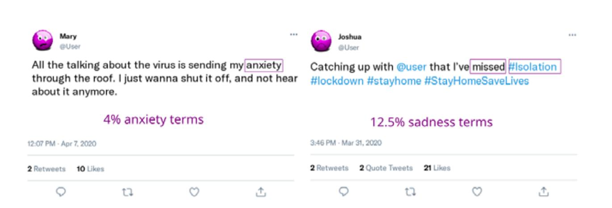

Note: The first tweet contains the word anxiety, and 25 words in total. Based on this, one can calculate the fraction of anxiety relevant content (4%) per tweet, or simply count the tweet as one anxiety tweet in a large sample of tweets. After splitting hashtags into separate words (so called "tokenization"), the second tweet contains 16 words. Two sadness-related terms make up a fraction of 12.5%, or the tweet could simply be counted as a sad tweet.

## **Machine learning methods**

Machine learning methods for emotion classification originated from Natural Language Processing research in Computer Science.25 Among them, the so-called deep learning models or neural networks have the advantage of being able to consider not only word frequencies, but also information such as word order and other features of the context. The usual approach for emotion classification in machine learning relies on supervised methods, which require datasets of annotated texts with emotion labels for model training. These text labels are referred to as "ground truth", and try to capture how humans would most likely interpret or express emotions in text. To train machine learning models with such a dataset, the texts contained in it need to be transformed to a numerical representation. This can be done through word embeddings or be constructed from unweighted or weighted frequencies for single words or short sequences of words (n-grams)26, or from index positions of words in vocabulary lists. Current state-of-the-art machine learning models for emotion classification are deep learning models: These models include an *unsupervised* first

training step, during which they learn contextual embeddings, that is, information about word order and context, on large bodies of text without labels from general sources such as news or Wikipedia. This general training step involves, for example, learning to predict words that have been masked in sequences or predicting if a sentence follows a previous sentence (e.g. the models BERT or RoBERTa).27 In a second *supervised* training step, these models are adapted ("fine-tuned") to the particular data source and classification task by running the word embeddings of the training data set through the pre-trained model and only tuning the final layer to predict the labeled classes for all text items (e.g., Twitter postings with emotion labels).28

While these deep learning models have the advantage of using most of the information available in text, they have the disadvantage of being black boxes that make it hard to explain why they predict a particular emotion for a particular text. This makes it difficult to check for systematic errors. This, in contrast, is very easy with dictionary-based methods as well as simpler machine learning models based on word frequencies as numerical representations. Yet,

such approaches can often catch words in contexts where they do not express an emotion and fail to distinguish between ambiguous meanings of words. However, under the right conditions, when these errors are not systematic and there is enough data (e.g. for population-level emotions), or after removing ambiguous words,29 dictionary- and frequency-based methods can still lead to satisfying results.

It is important to keep in mind that all of these approaches can only capture expressions of emotions presented in text, which may not necessarily align with people's own current internal experiences. On social media, people may for instance talk about other people's emotions, or reflect on emotions they experienced recently. Yet, for research questions about collective emotional states, or the emotions of populations, talking about the emotions of others may actually contribute valuable information about users not active on the specific social media platform.30 Similarly, talking about recent and not current emotional experiences is only an issue when looking at minute-time scales, but not when daily or weekly emotional expressions are measured. One has to further keep in mind that social media data are not actively designed for research purposes, but are the by-product of the use of a technology often designed for profit and influenced by technical decisions ("digital traces"). This raises problems linked to representativity, performative behavior and algorithmic biases.31 For all of these reasons, it is important to validate measures of emotion for the particular use case. In the following, we present three studies that test which social media emotion measures correlate with self-reported emotions and life satisfaction at the population-level. These studies provide some evidence that certain social media measures can be valid indicators for emotional trends and well-being in societies at large.

# **Social media correlates for emotions and well-being of populations**

We assessed how social media measures for emotions at the level of societies are related to self-reported emotions and life satisfaction in

three case studies. They analyzed Twitter and survey data, collected at a weekly and daily frequency in the U.K. and Austria, respectively.

## **Weekly emotion measures from the United Kingdom**

The weekly YouGov survey in the U.K. includes questions about how people have felt in the last week.32 The sample includes around 2000 responses per week, and is representative for the U.K. population in terms of age, gender, social class, region and education. YouGov achieves this, first, through active sampling by inviting the right proportions per sub-group and allowing only invited participants to take the survey, and second, through statistically weighting to the national profile of all British adults.33 The survey started in June 2019, and constitutes one of the first opportunities to compare self-reported emotions in a large representative survey of the population with emotion scores derived from social media data.

*The correlation of social media and survey emotions seems particularly high for the negative emotions of sadness and anxiety.*

In our study,34 we correlated weekly emotion reports with both dictionary and machine-learning emotion measures based on the text of 1.54 billion tweets from users in the U.K.. We chose social media emotion measures that correspond to three emotions assessed in the survey: sad, scared and happy. We used both the English LIWC dictionaries for sadness, anxiety and positive emotions,35 and the most closely related emotion labels from a supervised classifier based on RoBERTa (sadness, fear and joy).36 We trained the RoBERTa model to categorize emotions in a dataset of affective tweets from the SemEval'18 emotion classification competition,37 before predicting emotion labels on our dataset. For more details on model training

and accuracy, refer to the Supplementary Information (SI) of our manuscript.38

Before analyzing the data, we reported our hypotheses and our precise analysis plan in a so-called pre-registration.39 If results can be predicted in advance, this increases confidence in the evidence for the particular hypothesis - in our case - a positive correlation of social media and self-reported emotion measures. We pre-registered our analysis for two different time periods: a retrospective analysis of already existing data from June 2019 to October 2020 (the historical period), and a predictive analysis for tweets posted from November 2020 (the prediction period). Given that men are more visible on Twitter,40 we used gender information from our Twitter datasource (Brandwatch) to rescale our emotion measures to be more representative of the U.K. population. Specifically, we rescaled for gender by conducting separate analyses for each gender, before averaging across these results to calculate our final emotion scores. This corrects the measures for the higher proportion of male Twitter users.

Figure 4.2 shows the time-series of emotion reports in the survey and emotion scores calculated based on Twitter data, for both the dictionary and the machine-learning approach. It depicts our analysis separated into the historical period, for which data already existed when we pre-registered our analysis, and the prediction period, for which data did not yet exist at that moment. The x-axis depicts the gender-rescaled proportion of emotion reports in the survey, as well as the proportion of all tweets per week containing emotional terms, or labeled as emotional by our model. To make the time-series visually comparable, the figure presents a z-score for each proportion, calculated by subtracting the mean and dividing by the standard deviation of each time-series. Both social media and survey measures of sadness and anxiety clearly increased during the first COVID-19 outbreak for a relatively long time period. The proportion of tweets with positive emotional expressions on social media changed less, whereas tweets labeled as joy by our machine-learning model, as well as selfreports of being happy, experienced some sharp

drops during the outbreak. We discuss emotional responses to the COVID-19 pandemic in detail in the case example later in this chapter.

Importantly, we observed high correlations between self-reported sadness and anxiety with Twitter emotion scores for both the historical and the prediction time period (see Figure 4.2). These correlations were particularly high for time periods that included large variations of emotions, such as the historical period that included the start of the COVID-19 pandemic. In most cases, the correlations were similar for dictionary and machine-learning based emotion scores. One notable exception, however, was for the happiness self-reports, which correlate more strongly with the machine-learning score for joy, than the LIWC dictionary-score for positive emotions. In the prediction period, the correlation with the positive emotions dictionary-score was non-significant.

In most cases, correlations were very similar when not re-scaled for gender. Yet, especially in cases where correlations were weaker (i.e., in the prediction period for the scores LIWC anxiety, supervised fear and LIWC positive emotions), rescaling for gender improved the correlation. Rescaling for gender may make the measures more representative, and remove the gender bias present on Twitter, since tweets posted by male users account for more than 60% of tweets with gender detected in our sample.

The degree of association that we observed between self-report and Twitter data is comparable to correlations among subjective variables detected in past research, such as surveys of political attitudes.41 While social media measures of emotions are not perfect, this analysis demonstrates that they provide a useful complementary source of information about the emotional state of a population. The relationship between social media and survey emotion measures becomes most visible in times of large variations of emotions, such as during the COVID-19 outbreak.

The correlation of social media and survey emotions seems particularly high for the negative emotions of sadness and anxiety. The supervised emotion classifier for joy also revealed good

**Figure 4.2: Time-series of the weekly proportion of emotion reports in the YouGov survey and gender-rescaled emotion-scores on Twitter.**

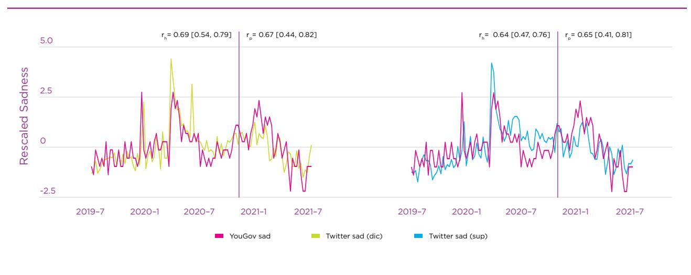

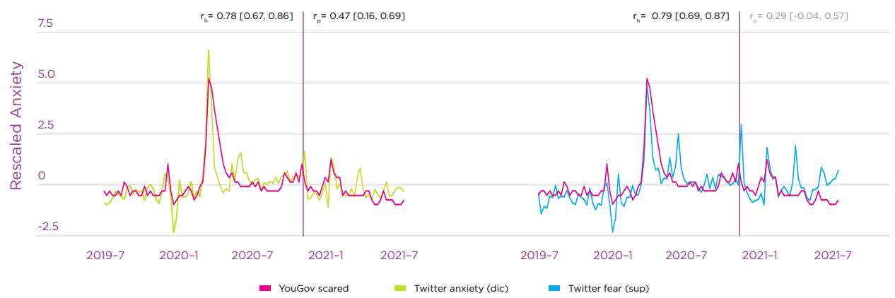

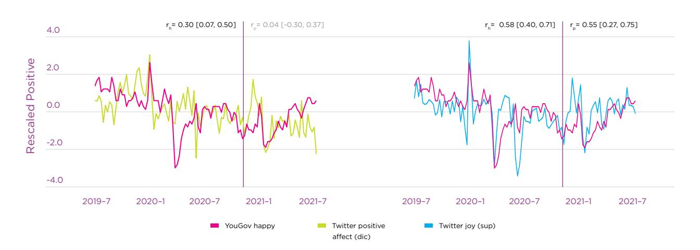

Note: The left column presents results for the dictionary method (left) and the right for the supervised emotion classifier. Reported correlation coefficients between YouGov and Twitter time series are calculated for the historical period (rh) and for the prediction period (rp), along with 95% confidence intervals. The 2 periods are separated by the date on which we publicly registered our hypotheses and analysis plan (pre-registration). Values in gray are not significant, values in black are significant at p < .05.

results, while the LIWC dictionary for positive emotions did not. This could be attributed to the LIWC positive emotion dictionary not being specific to a particular emotion, but including a very broad range of positive terms (ranging from handsome to heroic, yummy, intelligent, value or bonus). In contrast to this dictionary, the classifier label "joy" maps directly to the emotion assessed in the survey, which likely explains the higher correlation. Additionally, this could also reflect a dissociation between positive verbal expressions and subjective states: People may use positive words as a way to bond with others or reassure them rather than to express their emotions, perhaps particularly so in negative situations. A similar deviation between positive emotional expressions on Twitter and self-reports has also been found in previous research on populationlevel life satisfaction and affective well-being.42

Given that Twitter users are not representative of the general population in terms of demographics and ideology,43 the positive correlations between Twitter and survey emotion measures we observed here are somewhat surprising. In contrast, tracking public opinion with Twitter data seems to be more challenging.44 A potential explanation is that emotional responses to crisis events are fairly similar across different groups of people, here those that use Twitter and those that do not. A second explanation for the strong correlations is that social media users notice and talk about the emotions of other people who are not using these platforms.45 This may increase the size and representativeness of the group of people whose emotions can be captured using social media data.

In addition to the above analyses focused on correlating social media with survey emotions, we investigated if social media emotion levels would reveal potential gender-differences in response to COVID-19. Gallup World Poll data46 show that women experienced worry and sadness more often than men in the years before the COVID-19 outbreak. The proportionate increases under COVID-19 were significant for both genders, and slightly larger for females. We analyzed social media emotion levels and changes to test if they replicate these patterns. To do this, we first calculated the proportion of tweets by women and men that expressed anxiety or sadness on Twitter in a pre and post COVID time period. Given that attention on Twitter quickly shifts to novel topics, we used a short COVID-specific time period instead of yearly emotion levels reported for the Gallup World Poll: We compared the first ten weeks after the COVID outbreak in the U.K. in 2020 to a baseline period at exactly the same time in the year 2019. These ten weeks start with the day with 30 confirmed COVID-cases, namely March 1st, and end with May 10th, thereby excluding tweets linked to the Black Lives Matter protests toward the end of May 2020.

Table 4.1 summarizes the results. The proportion of male and female Twitter users in the U.K. who expressed anxiety-terms was similar during the

**Table 4.1: Percent of male and female Twitter users expressing anxiety or sadness pre- and during COVID, as well as absolute and relative changes between time periods**

|                 | Pre-COVID |       | During COVID |       | Abs. change |      | Rel. change |       |
|-----------------|-----------|-------|--------------|-------|-------------|------|-------------|-------|
|                 | m         | f     | m            | f     | m           | f    | m           | f     |
| LIWC anxiety    | 4.27      | 4.28  | 4.87         | 5.29  | 0.60        | 1.01 | 14.06       | 23.66 |
| LIWC sadness    | 5.96      | 6.34  | 6.58         | 7.50  | 0.63        | 1.17 | 10.50       | 18.39 |
| RoBERTa fear    | 6.04      | 6.46  | 7.28         | 7.83  | 1.23        | 1.37 | 20.40       | 21.25 |
| RoBERTa sadness | 14.96     | 16.24 | 16.43        | 18.33 | 1.47        | 2.10 | 9.83        | 12.91 |

Note: Time periods include data from 1 March to 10 May in 2019 for the pre-COVID period and in 2020 for the period during COVID. LIWC denotes the dictionaries with anxiety and sadness words, and RoBERTa the deep learning model used to predict emotion labels. baseline, and increased slightly more in women (by 23%) than in men (by 14%) during COVID-19. The percent of users expressing fear, according to the RoBERTa model, was slightly higher pre-COVID among women (6.46 vs. 6.04%), but then increased similarly in both genders (by 20-21%). For sadness, both methods (LIWC and RoBERTa) showed that sadness expression was more prevalent in women before COVID, and increased more strongly among women during COVID-19 (by about 13-18% vs. around 10% in men). In summary, our Twitter data thus confirm the higher prevalence of sadness pre-COVID in women than men. This gender difference is also slightly visible for fear, but not necessarily for anxiety. During COVID-19, the increases in anxiety and sadness are larger for women than men in both types of data, to a greater extent in the Twitter data than in the Gallup survey.

## **Daily negative and positive sentiment measures from Austria**

In a similar study using data from Austria,47 we compared daily self-reports of negative and positive emotions collected in a survey with sentiment based on postings from two social media platforms. We used data from a daily emotion survey conducted on the website of an Austrian online newspaper (Der Standard) for three weeks in November 2021, and text data from the discussion forum on the same website with around 25 thousand posts per day on average, as well as from Twitter users in Austria.

In the emotion survey, participants reported if they had rather positive or negative feelings when thinking of the previous day. Based on 268,128 reports, we calculated the fraction of self-reported positive emotions over the total of self-reports in a day. As in the U.K. study, we calculated text sentiment scores with both emotion dictionaries,48 as well as a supervised deep learning classifier based on BERT (German Sentiment, GS).49 The text data included a large number of postings from the two social media platforms: around 1.5 million posts on the forum of Der Standard, and around 1.35 million tweets. Despite their large size, these datasets are noticeably smaller than the ones in the U.K. study above due to the much

shorter time window (three weeks vs. two years), the much smaller country population (8.9 million vs. 67.2), because a lower proportion of the total population use each social media platform (U.K. active Twitter users 29% vs. Austrians with an account on Twitter 17% and on Der Standard 6%).50 We rescaled daily text sentiment aggregates by subtracting and dividing by a baseline mean. The baseline was defined as the time period from the first Austrian COVID-19 lockdown (March 16th to April 20th 2020), since the survey period was also during a lockdown. To make text sentiment comparable to the survey, we subtracted the rescaled negative emotion measure from the rescaled positive emotion measure for both LIWC and GS. We also calculated an aggregate text sentiment measure by taking the average of the resulting scores across LIWC and GS. Results reported below used this aggregate measure, but Table 4.2 reports results separately for each method and the positive and negative component.

We found a very strong and robust positive correlation between the survey and the Der Standard aggregate sentiment (see Figure 4.3A, r=0.93, 95% CI [0.82,0.97], p<10-8). The text sentiment aggregate explained 85% of the variance in the daily proportion of positive emotions (see Figure 4.3B). Similarly, when comparing changes in the proportion of positive emotions between one day and the next, the text sentiment aggregate explained 70% of the variance in changes in reported emotions (Figure 4.3C).

We tested the robustness and generalizability of our results using data from Twitter as a second social media platform. This pre-registered analysis also found a clear positive correlation between the survey on Der Standard and aggregate text sentiment on Twitter (r=0.63, 95% CI [0.26,0.84], p<0.003). This correlation is already in itself surprisingly strong, especially given that the survey and the postings come from different platforms. Based on our pre-registration, we had only included data from non-organisational accounts and accounts with fewer than 5000 followers. When we relaxed this criterion to 100 000 followers, as in our other studies,51 the correlation increased to r=0.71 (95% CI

**Figure 4.3: Time-series and correlation of reported emotions and text sentiment in the Der Standard online forum.**

Note: Panel A: Time series of the daily percentage of positive emotions reported in the survey and the aggregated sentiment of user-generated text on derstandard.at. The shaded blue area corresponds to 95% bootstrapped confidence intervals. Panel B: Scatterplot of text sentiment and survey responses with regression line. Panel C: Scatterplot of the daily changes in both text sentiment and survey responses compared to the previous day, with regression line.

[0.39, 0.88], p<.0005). This shows that influential accounts in social networks contain crucial information to calculate sentiment aggregates, in line with the hypothesis discussed above that Twitter users may sense the emotions of others.52 We further found that the Twitter sentiment signal is lagged by a day compared to the emotion survey. Shifting by one day yielded a correlation of r=0.90 (95% CI [0.75,0.96], p<10–6). While news articles are immediately discussed in the online newspaper forum, this discussion seems to take a day to reach other social media platforms.

Comparing dictionary-based (LIWC) and machine-learning based methods (GS) in this study with German text data revealed that both methods contribute to explaining self-reported emotions (see Table 4.2). Positive GS measures correlated more strongly with survey emotions, although positive LIWC also performed well. Yet, for negative emotions, the best method depended on the platform (GS for Der Standard data, LIWC for Twitter data). Overall, both of these German negative sentiment measures performed worse than the positive ones, suggesting some room for improvement.

**Table 4.2: Correlation of positive emotions in the survey with sentiment measures based on text from two social media platforms and either dictionary-based (LIWC) or machine-learning (GS, German Sentiment) methods.**

| Correlation with positive survey emotions | Der Standard postings on the same day | Twitter postings one day later |
|----------------------------------------------|------------------------------------------|-----------------------------------|
| LIWC+GS combined                             | 0.93 [0.82,0.97]                         | 0.90 [0.75,0.96]                  |
| LIWC (positive-negative)                     | 0.74 [0.44,0.89]                         | 0.85 [0.65,0.94]                  |
| LIWC positive                                | 0.81 [0.56,0.92]                         | 0.80 [0.56,0.92]                  |
| LIWC negative                                | 0.03 [-0.42,0.46]                        | -0.74 [-0.89,-0.43]               |
| GS (positive-negative)                       | 0.91 [0.78,0.96]                         | 0.91 [0.79,0.96]                  |
| GS positive                                  | 0.89 [0.75,0.96]                         | 0.91 [0.79,0.97]                  |
| GS negative                                  | -0.57 [-0.81,-0.18]                      | -0.39 [-0.71,0.06]                |

Note: The table includes sentiment aggregates (positive minus negative emotions), as well as positive and negative components separately. Shift 1 denotes a shift of one day. Brackets indicate 95% bootstrapped confidence intervals.

Combining negative and positive emotion components into one aggregate score proved to result in the highest correlations with self-reported emotions in the GS case, and for LIWC with data from one of the two social media platforms. Table 4.2 reports results for each component (positive, negative) and each method (LIWC, GS) separately.

In conclusion, this second study finds that measures of sentiment based on text from the online forum of a newspaper track daily emotions reported by readers of that newspaper. These results also generalize to text sentiment on a second and separate social media platform. We find strong positive correlations with both levels and changes of daily sentiment. When comparing machine-learning and dictionary-based methods, the supervised classifier shows more consistent performance and generally higher point estimates (although with overlapping confidence intervals and not for LIWC negative on Twitter). Combining both methods for Der Standard adds a small increase to the already strong correlations of the supervised classifier alone.

## **Longer-term well-being: satisfaction with life in the United Kingdom**

Affective measures of well-being, like current happiness, anger, or sadness, can change on a daily basis. For instance, affective measures of well-being follow a well-known weekly pattern, with more positive emotions on weekends than weekdays.53 In contrast, evaluative measures of well-being, including life satisfaction, are more stable,54 given that they ask people to reflect on their life as a whole rather than their current affective state. Given that most social media interactions are very short-lived, one would therefore predict a lower correlation between text-based positive or negative emotion measures with self-reported life satisfaction than with affective measures.

We explored whether social media posts can be used to predict changes in life satisfaction using YouGov's U.K. weekly life satisfaction survey in which respondents are asked: "Overall, how satisfied are you with your life nowadays?" To approximate the answer to this question with text from social media, we used Twitter data from the above study in the U.K.. We calculated a gender-rescaled daily score as dictionary-based positive minus negative emotions, as in previous

research.55 We used LIWC to measure the frequency of tweets expressing positive and negative emotion. We applied a rolling window of four weeks to encode the longer timescale of the question and compared the answers to the survey in a given week to the Twitter data from the same week and the previous three weeks.

Figure 4.4 shows the time series of life satisfaction and Twitter sentiment for the historical and prediction period defined in the U.K. study. The correlation between the Twitter signal and satisfaction with life is 0.38 (95% CI [0.14, 0.57], p<.01) in the historical period and 0.56 (95% CI [0.27, 0.75], p<.001) in the prediction period, suggesting that emotional expression on Twitter might be partially informative of population-level changes in subjective well-being. As anticipated, these correlations are smaller than those seen between Twitter sentiment and daily or weekly emotion measures reported above, which aligns with past research on the relative sensitivity of affective state measures and stability of life evaluation measures.56 That social media measures relate to life satisfaction in similar ways as self-reported emotions further increases the confidence in the validity of social media emotion measures.

We must highlight, however, that this analysis shows the changes over time within a country and does not test whether different levels across regions could be explained with social media data. Previous research has shown weak or inconsistent results when correlating various well-being measures with LIWC-dictionary-based text analysis results across regions in the United States.57 This may hint that these emotion measures might not be good to identify differences in well-being between places, but can be good enough to identify changes over time within the same place. In contrast to LIWC, machine-learning based emotion scores yielded more robust predictions of self-reported life satisfaction in the same U.S. study. Future research could investigate if LIWC works better for correlating across regions when using changes rather than levels of well-being. One further explanation for why we observed positive correlations with LIWC-emotion measures, although Jaidka et al.58 did not, are the strong variations of social media emotions and subjective well-being during large events like the COVID-19 pandemic.

Given that life evaluation measures encompass so much information, the medium-sized correlations with social media emotions we observed are impressive, and suggest that further developing

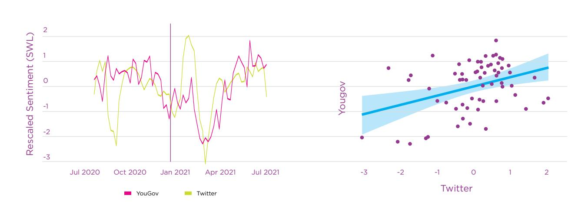

**Figure 4.4: SWL in Yougov and sentiment in Twitter**

Note: Dictionary-based sentiment was calculated by subtracting the frequency of tweets expressing positive emotions minus those expressing negative emotions.

social media measures for long-term well-being is promising. However, we must note that the time span for which the YouGov survey is currently available is too short to draw strong conclusions about such slowly-changing time series. This also calls for future research when more data are available.

Given that digital traces from social media seem to be valid indicators for the emotional state of populations, we will now demonstrate how social media data can be used to investigate the evolution of emotions around the globe during the early outbreak of the COVID-19 pandemic in 2020.

# **A case example: Emotional expressions on Twitter during the COVID-19 outbreak**

The COVID-19 pandemic exposed people from all over the world to unexpected and unprecedented health threats and drastic changes to their social lives. Using social media data, we tracked people's emotional well-being in countries around the world as a new dangerous virus spread, and increasingly stricter protection measures were implemented. During the first 5 weeks of the COVID-19 outbreak, we analyzed data on 8.3 billion public tweets in six languages, (English, Italian, Spanish, German, Dutch and French) from 18 countries. These countries included ten from Western Europe (Austria, Belgium, France, Germany, Ireland, Italy, the Netherlands, Spain, Switzerland and the United Kingdom) four from Latin America (Chile, Ecuador, Mexico and Peru) and four other western industrial countries (Australia, Canada, New Zealand and the United States). We focused on evolutions of anxiety, anger, sadness and positive emotions, because we expected the pandemic events to impact these emotions, and because all of them may be relevant to the management of a pandemic outbreak. Anxiety, for instance, develops when people lack clear explanations and feel unable to cope with a threat,59 and impacts risk perception, active information seeking, and compliance with recommendations.

Following the methodological approach in earlier studies of emotional responses to catastrophic events,60 we measured the proportion of emotional tweets expressing either anxiety, sadness, anger or positive emotions using LIWC,61 a validated emotion-dictionary that exists in all of these six languages. We matched the text of tweets to the word lists from the dictionary, and then calculated the daily number of tweets that contained at least one of the emotional terms for the time period between 1 January 2019 and 15 April 2020. In order to allow for comparisons between countries, we baseline-corrected the proportion of emotional tweets for the average level in 2019 (subtracting and dividing by this baseline). In addition to investigating the evolution of emotional expressions over time, we analyzed associations with real world events, including the number of confirmed COVID-19 cases62 and the stringency of measures against the spread of the virus.63

#### **Anxiety**

At the start of the COVID-19 outbreak, we observed large increases in the percent of tweets containing anxiety terms in all countries. Figure 4.5 illustrates this change for anxiety in four example countries with different native languages. It shows for instance that anxiety-terms increased for the first time by more than 40% exactly at the time the first case of COVID-19 was diagnosed in Italy. They then increased to their highest peak of 96% when cases began to rise, shortly before stringent measures against the spread of the virus were implemented for the first time. The highest anxiety peaks in the 18 countries were in between 20% and 96% increases from the baseline. The brief anxiety peak just before the outbreak in Germany is a good example for how emotional expressions on Twitter usually change in response to one-off catastrophic events, here a terrorist

*Anxiety seems not only related to cases, but also to the increase in the stringency of measures.*

**Figure 4.5: Time series of emotional expressions on Twitter in four example countries with different languages.**

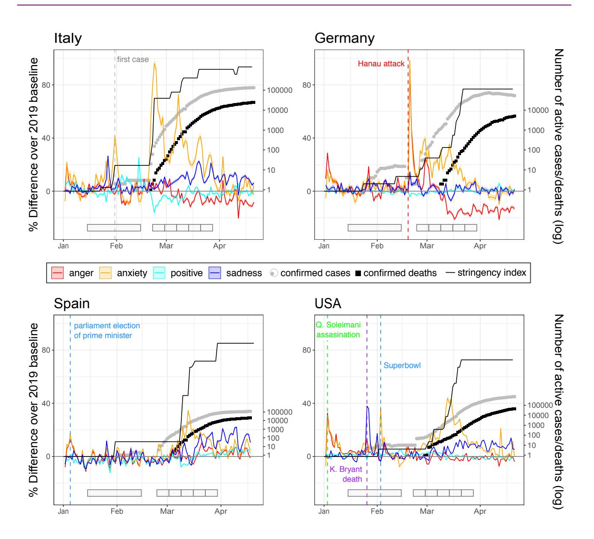

Note: The left y-axis depicts the percentage of tweets containing words for each emotion, as well as the value of the stringency increase (range 0-100). For emotions, a value of zero corresponds to the average level per weekday in 2019. The right y-axis depicts cumulative number of cases and deaths on a log-scale (the maximal number is different for each country). Colored vertical lines depict important events, which were identified by inspecting word frequency plots on the date of the peak. The labelled spikes highlight the face validity of the emotion measures: In Germany, anxiety and anger increased after a terrorist attack. In the U.S. and Canada, sadness increased in response to reports about Kobe Bryant's death, whereas anxiety increased as Americans excitedly followed the play of their favorite football teams during the Superbowl. Anger and anxiety spiked after the U.S. military assassinated Iranian military officer Soleimani, as well as during the election of a prime minister in a politically polarized climate in Spain. The gray rectangles at the bottom of each figure depict the time periods this study used for some analyses: a control period from mid-January to mid-February, and 5 consecutive weeks after the outbreak in each country (the day with 30 cases).

attack in Hanau. The higher use of anxiety-terms during COVID-19 was much more sustained. Figure 4.5 further indicates the time periods used for most statistical analysis with gray rectangles at the bottom of each panel: A control period from mid-January to mid-February, and the first five weeks after the outbreak (the day with 30 cases) in each country. Using the average across these five weeks, Figure 4.6A shows that the increase in anxiety-terms could be observed in all 18 countries in our sample. More specifically, during the first five weeks after the outbreak, anxiety-related terms were on average between 5 and 40% higher than during the baseline period (the year 2019).

In the first week after the outbreak (defined as the day where COVID-cases reached 30 cases in a country), the extent of the anxiety increase clearly correlated with the growth in COVID-19 cases across countries (r=0.52, p=.023, Figure 4.7A). Most of the countries with the highest anxiety

levels were also those with the strongest growth in confirmed COVID-cases in the first week, including for example Ireland and New Zealand. Italy is one exception with a lot of anxiety expressions but lower case growth; anxiety in Italy was likely influenced by Italy being the first country in Europe where cases were diagnosed.

Anxiety seems not only related to cases, but also to the increase in the stringency of measures that governments implemented to reduce the spread of the virus. As the timelines of Italy, Spain and the U.S. in Figure 4.5 illustrate, anxiety and the stringency increase happen almost in parallel. The increase of anxiety-related terms on Twitter occured shortly before or at the same time as more stringent measures were implemented in 15 of 18 countries. As Figure 4.5 shows, anxiety starts to decrease 2-3 weeks later, once stricter measures are in place. This decrease may reflect that people relaxed as they felt that governments were doing something to cope with the threat and

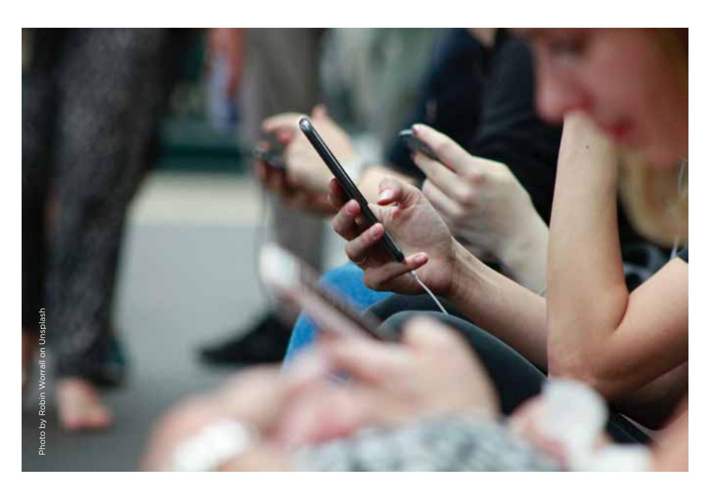

**Figure 4.6: Consistency of emotion changes across countries in the 5 weeks after the outbreak.**

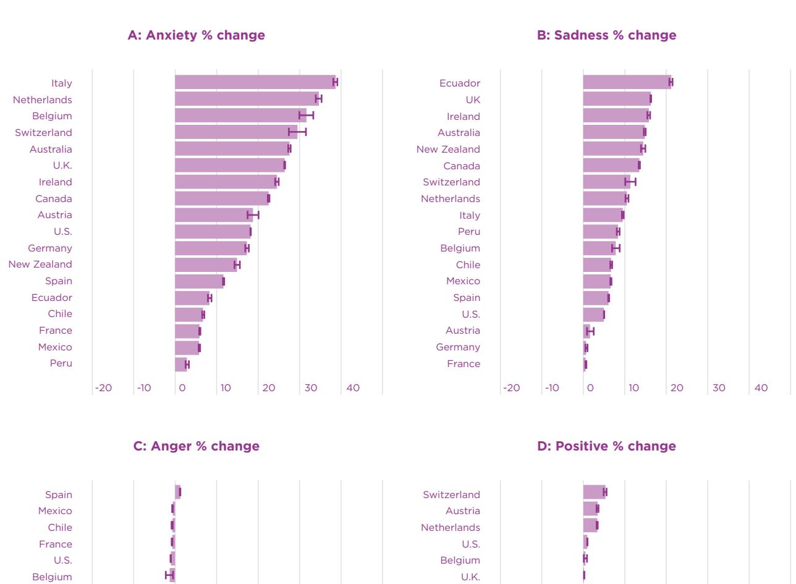

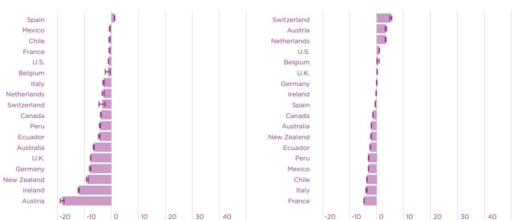

Note: The x-axis depicts the average percentage change of tweets containing at least one emotion word in the five weeks after the COVID-19 outbreak compared to the baseline. Error bars represent binomial 95% confidence intervals calculated with the Clopper-Pearson method.

to protect them. Words like staying (at home), buying (of groceries), emergency, health, contagion and information were among the most frequent words in anxiety tweets, confirming that a large part of people's worries were directly linked to the spread of the virus as well as the consequences of lockdowns.

#### **Sadness**

Sadness-related expressions increased more gradually and later than anxiety-related ones. This is visible in Italy, Spain and the U.S. in Figure 4.5. On average, sadness reached its highest level three weeks after the outbreak, and remained stable for the following two weeks (these weeks are visually indicated with gray rectangles for the four example countries in Figure 4.5). The gradual increase of sadness terms occurred a while after

stringency of social distancing measures increased, and remained high about two weeks later (Figure 4.7B). Although sadness increased less than anxiety, peak increases still ranged from 7% to 52% among countries. Figure 4.6B illustrates that the increase in sadness expressions was also quite consistent across countries, with only 2 countries not showing a significant increase. The timing and the duration of the changes in sadness terms suggests that sadness may have been a response to the loss of contact and daily routines during lockdowns. Consistent with this, words related to physical distancing (quarantine, isolation, confinement, social, lockdown, stay at home, going out) were used more often in tweets expressing sadness (and other emotions) than in other tweets (see the SI of our study).64 In contrast, deaths were in general not mentioned frequently,

Figure 4.7: Associations of emotion levels with COVID-19 cases and measure stringency

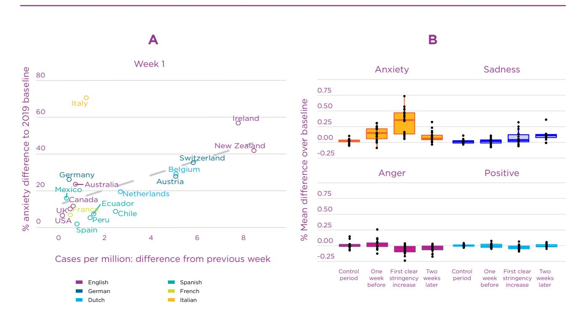

Note: (a) Cross-country correlation of anxiety with increase in COVID-19 cases in the first week after the outbreak: Correlation between mean difference in anxiety compared to baseline and absolute difference in cases compared to the previous week. (b) Box-plots of country emotion means in time periods before, during and after the first strong increase in stringency of measures. In the control period, there were none or only light measures in most countries. One week before the first clear increase, measure stringency was still low in most countries. Two weeks after the first clear increase it was constantly high in all countries. Dots represent individual countries.

which makes sense given that there were not that many casualties during the early stage of the pandemic. Altogether, the timing and content of tweets with sadness-related expressions suggest that changes to people's everyday life were a driving factor of the increase in sadness.

### **Anger**

Anger expressions on Twitter decreased during the onset of the pandemic. Similar to sadness, this change also occurred gradually, starting around the time of the first clear increase in measure stringency in most countries. Anger expressions significantly dropped in 14 out of the 18 countries, and remained less frequent until the end of the five weeks we analyzed. The decreases around the onset of stringent measures may indicate that people were generally not opposed to the actions their governments took at this early point in the pandemic. In addition, decreases of anger terms may also be a consequence of discussions on Twitter focusing on COVID-19, and therefore less on the many other controversial and political topics that are usually discussed on this social media platform in many countries. Although media discourse might have created the impression that people were angry about government regulations during the first outbreak, they may actually have been less angry than about previous political decisions. Consistent with this, we observed a shift in topics of conversation from political ones in 2019 to pandemic-related issues after the outbreak across countries and emotions.

*Anger expressions on Twitter decreased during the onset of the pandemic.*

### **Positive emotions**

In contrast to the three negative emotions discussed above, expressions of positive emotions on Twitter remained relatively stable during the first 5 weeks of the pandemic. Average changes

during this time period were between -5 and +5% (Figure 4.6D). In six countries, positive emotion terms dropped slightly just at the moment when public health measures became more strict (Peru, Italy, New Zealand, Mexico, Chile, Spain). This can be observed, for example, in the time series for Italy in Figure 4.5. This decrease was brief, however, possibly because people started to notice positive aspects (e.g., of spending more time at home). This finding could suggest at least a short-term resilience to the challenges during the early phase of the COVID-19 outbreak. Yet, it could also be a consequence of the broad range of terms included in the positive emotions LIWC-dictionaries. Some positive emotions may have actually decreased more, while others may have increased.

#### **Duration of emotional changes**

To assess the duration of emotional changes, we counted the number of days in a row during which social media emotion measures remained significantly above or below their median level of the previous year in each country. These time periods were much longer during the pandemic outbreak than what was observed during previous one-off catastrophic events.65 The maximal duration of sustained changes in all four emotions during COVID-19 were among the longest ones since the beginning of 2019 in all countries, and the single longest one in the majority of countries (see Figure 4.8). Specifically, 16 out of 18 countries had not experienced such long periods of elevated anxiety and sadness before COVID-19. Ten and eleven countries, respectively, also experienced the longest sustained periods of decreased anger and positive emotions during COVID-19. Longer increased anxiety before COVID-19 occurred only in two countries during political protests in 2019 (against social inequality in Chile, and austerity measures in Ecuador). Similarly, longer elevated sadness occurred in Chile during the same protests, and after a political scandal in Austria (the socalled Ibiza affair).

## **Conclusion on collective emotions during the COVID-19 outbreak**

Taken together, our analysis of social media text data during the early COVID-19 outbreak revealed

**Anxiety Sadness** 40 N days in a row 0 0 0 0 0 0 0 o 0 O o o o 0 0 10 0 0 ô ô 8 Vetherlands Jew Zealand Spain Spain Ital) Serman Ireland Italy After first case Before first case

Figure 4.8: Time intervals for which anxiety and sadness remained continuously above their median level in 2019 in each country.

**Note:** Time intervals (number of days) are split into those occurring before (from 1 January 2019 until first case) vs. during the COVID-19 pandemic (from the first case per country until April 15). Empty circles represent the maximal number of days per time period, while the gray box plot represents the distribution of time intervals before COVID-19. Because most countries only experience one or a few long intervals after the first case, only maximal values are depicted for this time period.

the most enduring changes in emotional expression observed on Twitter since at least the beginning of 2019 in most of the 18 countries. Anxiety-related terms increased early and strongly in all countries, shortly before the onset of lock-downs. The upsurge of anxiety was stronger in countries with larger increases in cases. Sadness terms rose and anger terms decreased around two weeks later. shortly after strict physical distancing measures like lock-downs were implemented. Sadness and anger expressions remained high and low, respectively, until the end of the five weeks we analyzed, suggesting that expressions of these emotions may have been associated with people's experiences during lock-downs. In contrast, anxiety expressions gradually decreased towards baseline a while after the onset of strict measures. possibly indicating that people got used to the new danger and public health measures, or were relieved that measures were taken. Positive emotions remained relatively stable throughout this early phase of the pandemic. Time-sensitive

analyses of large-scale samples of emotional expression such as this one could potentially inform mental health support and risk communication during crisis.

# When to use social media data: Strengths and limitations

Social media indicators for emotions are better suited to assess emotional well-being in some than in other situations. Many features of social media data are not clearly disadvantages or advantages, but have good and bad sides depending on the research question. Although we have assigned each feature to either strength or limitations below, we highlight both sides and compare to survey research where relevant.

### Strengths of social media data

Collecting social media data typically requires much lower effort and costs than surveys. Digital

*Social media data seem to more accurately reflect people's responses in surveys for shortlived emotional experiences, than longer-term well-being.*

trace data is collected constantly as social media are "always on",66 allowing changes in emotions or other measures to be monitored at very short time intervals. Their continous historical record further allows matching the time course of emotional changes to unexpected events, such as natural disasters and terrorist attacks.67 Most survey research only starts with a considerable delay after such events, and therefore lacks a baseline measure. In addition to studying rare and unexpected events, the large size of social media datasets also allows researchers to study heterogeneity across regions or time, and to detect small differences.68

The above case studies have shown that social media data seem to more accurately reflect people's responses in surveys for short-lived emotional experiences, than longer-term wellbeing, such as life evaluations. That social media data is better suited for more short-lived phenomena is true beyond emotion research: Long-term analyses of social media data are complicated by drift in who uses social media, in how it is used, and of the platform system itself over time.69

Social media analysis relies on written emotional expressions to provide an indirect measure of emotions. This is sometimes seen as a disadvantage compared to surveys, which directly ask people about their internal emotional experiences. Yet, indirect measures also have their advantages: They are less reactive than direct measures, that is, less likely to change behavior.70 Direct questions make strategic answers more likely, that is, respondents can say what others like to hear and avoid unpopular answers. In contrast, indirect social media emotion measures are less influenced by social desirability, the reference group effect, and other reporting biases.71 Their continuously

available measures also reduce memory biases in questions about emotions in the past. Furthermore, if a more direct measure is required, this can also be achieved with social media data by only focusing on explicit emotion expressions like "I am sad/angry/happy etc".72

Finally, social media can in some circumstances include people that are hard to reach with surveys. For instance, they make it easier to include non-English speakers as no survey translation is necessary, which is especially important when studying low-income countries.73

#### **Limitations of social media data**

Unlike surveys and experiments, which can be tightly controlled and usually include control groups, it is much harder to draw causal conclusions from observational social media studies (low internal validity). In contrast, social media emotion measures have potentially high ecological validity, and can capture the social nature of emotions, as they trace emotional expressions in real online social interactions.74

Social media data are usually not representative, and the lack of individual demographic data makes it hard to study specific population sub-groups. Surveys are more suited for research questions that require such data. Non-representative social media data can still be very useful for within-sample comparisons,75 and, as we have shown, can correlate with emotional self-reports in representative surveys at the population-level, providing some evidence for convergent validity. Yet, we only provide evidence that social media indicators can capture emotions in societies at large. It remains to be further investigated under which circumstances and with which methods this works best. Evidence regarding validity of social media emotion measures at the level of individuals or small groups is currently weak. Some studies on within-person correlations of self-reported emotions or life satisfaction with emotion expressions in text found higher correlations for negative than positive LIWC dictionaries.76 Others found no substantial correlations.77 Some of these studies work with Facebook posts, others with recordings of everyday speech or essays in which individuals wrote down their current thoughts

(stream of consciousness). Some use counts of words, others look at the size of vocabularies individuals use to express each emotion. It remains to be explored which methods work best, and which types of data contain information about emotions.

Although social media data is less influenced by reporting biases than surveys, social media users know that their postings will be read by others, which influences what they say and do not say. Social media data are further not designed for research purposes, and often do not contain the information that would most precisely measure the construct of interest.78 Instead, they are much more "dirty"79 than traditional social science

experiences.

research data, usually including spam and postings by bots. Additionally, they are algorithmically confounded, meaning that algorithms and platform design influence the behavior that is observed. Finally, access to social media data is controlled by private corporations, and the data can sometimes include sensitive information.

Table 4.3 provides an overview of strengths and limitations of social media emotion measures discussed in this section.80 To provide a guide for interested researchers, we published a methodological survey of best practice examples, as well as common pitfalls of research using social media data in affective science.81 When used critically and with robust methodologies,

**Table 4.3: Strengths and limitations of social media data, and how these influence the validity of social media research**

| Features of social media data                                                                                                        |                                                                                                                      |  |  |  |  |
|--------------------------------------------------------------------------------------------------------------------------------------|----------------------------------------------------------------------------------------------------------------------|--|--|--|--|
| Strengths                                                                                                                            | Limitations                                                                                                          |  |  |  |  |
| Low cost and effort for data collection                                                                                              | Incomplete: Not designed for research                                                                                |  |  |  |  |
| High time-resolution (down to minute time-scales)                                                                                    | "Dirty": Include spam and postings by bots                                                                           |  |  |  |  |
| Continuous historical record                                                                                                         | Drift in social media users, ways of using them, and in platform design complicates studies of long-term trends   |  |  |  |  |
| Access to very large samples                                                                                                         | Non-representative samples                                                                                           |  |  |  |  |
| Non-reactivity of indirect measures: not influenced by reporting biases                                                           | Behavior is not "natural": People only talk about certain things on social media, and avoid talking about others. |  |  |  |  |
| Provides access to information from people that are hard to reach with surveys (e.g. working population, non-English speakers) | Data are sometimes inaccessible and/or sensitive                                                                     |  |  |  |  |
|                                                                                                                                      | Data is algorithmically confounded                                                                                   |  |  |  |  |

**Influence on validity of social media research** High ecological validity: behavior in real online social interactions Low internal validity: causal conclusions are difficult Current evidence suggests potential convergent validity for measuring emotions of large groups (e.g. societies). Yet, evidence differs across different emotions and methods. Evidence for convergent validity of individual-level emotion is weak. Higher convergent validity for short-lived emotional Lower convergent validity for long-term well-being

measures like life satisfaction.

*Social media data can support research questions for which survey data are not available.*

these large-scale observational data can serve as valuable complements to traditional methodologies in the social sciences.

# **Conclusion**

Three case studies presented in this chapter provide evidence that emotion measures based on social media postings can track emotions at a society-wide level. These aggregate measures seem to be more accurate for measuring affective experiences at shorter time-scales, with correlations highest for short-lived emotions reported daily, and lowest for more slowly changing measures of well-being like satisfaction with life. In both cases, and especially for slower well-being trends, more research is needed once further data are available. When gender information is available, rescaling for gender can increase the information available from sentiment measures. Dictionary-based as well as machine-learning based methods of assessing emotions in text seem to contribute some information to predict emotions reported in surveys at the population level in our case studies. Regarding the LIWC dictionaries, this works better for anxiety and sadness than positive emotions in English, and better for positive than negative emotions in German. Finally, in English and German, machine-learning measures for positive emotions performed better than dictionary-based measures.

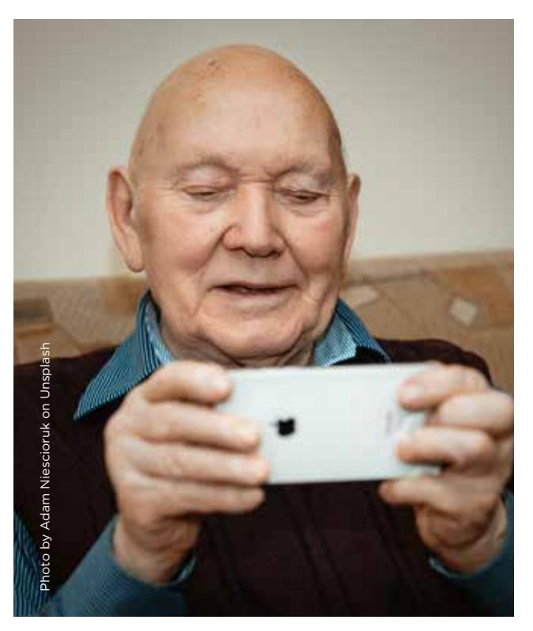

The correlation studies presented in the first half of this chapter suggest that social media data reveal information about the emotional well-being of residents of these countries during this early pandemic stage. Taken together, social media emotion data provide added value in addition to representative surveys. The correlations we observed in the U.K. study were in the range of correlations between surveys, suggesting that social media data are suitable as a complementary source of information on emotions. Potentially, social media and survey data may even contribute some unique information to predict outcomes like suicide hotline calls, hospital visits, police calls, or overdose rates. Future research could explore if combining these two sources of data could help to better predict and respond to such important outcomes.

Social media data can support research questions for which survey data are not available, such as retrospective analyses, crisis research, or studies on populations hard to reach with surveys. We have presented one example for crisis research, using indicators of emotional well-being in 18 countries during the COVID-19 outbreak. During the first five weeks of the COVID-19 outbreak, we observed strong initial increases in expressions of anxiety on Twitter, associated with the growth in cases and the stringency of measures. A bit later, social media measures of emotional expressions indicated a gradual increase in sadness and decrease in anger, which began at the time where stringency measures included strict lockdowns. Anxiety gradually relaxed once measures had been implemented, suggesting that people habituated to the new circumstances or felt reassured by their governments' actions. Anger expressions dropped as discourse on social media shifted away from politically polarized discussions and focused on COVID-19. Sadness seemed more strongly associated with effects of social distancing measures on people's personal lives, and only linked to deaths by COVID-19 as these became more prevalent.

#### **Endnotes**

- See Shearer (2018), and European Commission (2018)
- See Rimé (2009)
- See Hareli and Hess (2012)
- See Goldenberg et al. (2020), and Rimé (2009)
- See Fowler and Christakis (2008)
- See Chancellor and De Choudhury (2020)
- See Jaidka et al. (2020)
- See Elayan et al. (2020)
- See Garcia and Rimé (2019)
- See Fan et al. (2019)
- See Golder and Macy (2011) and Dodds et al. (2011)
- See Goldenberg et al. (2020)
- 13 examples taken from Linguistic Inquiry and Word Count, LIWC; Pennebaker et al. (2007)
- e.g., LIWC, Pennebaker et al. (2015)
- 15 National Research Council Valence, Arousal, and Dominance lexicon, by Mohammad (2018), and Warriner-Kuperman-Brysbaert Affective Norms lexicon by Warriner, Kuperman, and Brysbaert (2013)
- See Huang and Zhang (2012)
- See Piolat et al. (2011)
- See Ramírez-Esparza et al. (2007)
- See Wolf et al. (2008)
- See Thelwall et al. (2010)
- See Hutto and Gilbert (2014)
- See Jaidka et al., (2020)
- See Garcia and Rimé (2019), and Pellert et al. (2021)
- See Garcia et al. (2021) and Metzler et al. (2021)
- See Mohammad (2021)
- 26 Unweighted word frequencies are referred to as "bag-ofwords". Weighted frequency techniques include for example Term Frequency-Inverse Document Frequency, which gives higher weights to words that distinguish one type of text from another (see Uther et al. (2011).
- 27 See Devlin et al. (2019) for BERT, and Liu et al. (2019) for RoBERTa
- See Barbieri et al. (2020)
- Schwartz et al. (2013)
- See Garcia et al. (2021)
- See Salganik (2019)
- See YouGov, (2022a)
- See YouGov, (2022b)
- See Garcia et al.(2021)
- See Pennebaker et al. (2007)
- See Barbieri et al. (2020)

- See Mohammad, Bravo-Marquez, and Kiritchenko (2018)
- See Garcia et al., (2021)
- See Nosek et al. (2018)
- See Nilizadeh et al. (2016)
- See the SI of our study, Garcia et al. (2021)
- See Jaidka et al. (2020)
- See Mellon and Prosser (2017)
- See Conrad et al. (2021)
- See Galesic et al. (2021)
- 46 See Fortin et al. (2015) especially pp 56-59 for data covering the first ten years of the Gallup World Poll, and Chapter 2 of the current report for the years 2017-2021
- See Pellert et al. (2021)
- 48 The German positive and negative emotion dictionaries from LIWC, see Wolf et al. (2008)
- See Guhr et al. (2020)
- 50 See Statista, (2022) for the number of people actively using Twitter in the U.K. (19.5 million). Austrian percentages are based on unpublished data from the representative survey described in Niederkrotenthaler et al. (2021). Participants were asked if they had a Twitter or Der Standard account (passive usage). As not all questions were included in all survey waves, 4003 and 3002 participants answered questions about Twitter and Der Standard usage, respectively.
- 51 See Garcia et al. (2021) and Metzler et al. (2021)
- See Galesic et al. (2021)
- See Dodds et al. (2011)
- See Diener, Oishi, and Lucas (2003)
- See Jaidka et al. (2020)
- See See Aknin et al. (2021)
- See Jaidka et al. (2020)
- See Jaidka et al. (2020)
- See Frijda (1986)
- See Garcia and Rimé (2019)
- See Pennebaker et al. (2007)
- See Dong, Du, and Gardner (2020)
- See Hale et al. (2021)
- See Metzler et al. (2021)
- See e.g., Garcia and Rimé (2019)
- See Salganik (2019)
- See Garcia and Rimé (2019), and Gruebner et al. (2017)
- See Salganik (2019)
- See Salganik (2019)
- See Salganik (2019)

- 71 See Credé et al. (2010) for references to many biases
- 72 See Garcia et al. (2021)
- 73 See e.g. Metzler et al. (2021)
- 74 See Pellert, Schweighofer, and Garcia (2021)
- 75 See Salganik (2019)
- 76 Higher correlations for negative than positive LIWC counts were found, first, for Facebook posts and self-reported long-term life satisfaction (Liu et al., 2015), and second, for stream-of-consciousness essays with self-reported emotion in Vine et al., (2020). Vine et al. calculate the size of active emotion vocabularies instead of word counts.
- 77 No substantial correlations in Beasley et al. (2016) for Twitter and Facebook, Kross et al., (2019) for Facebook posts and in Sun et al., (2020) for audio-recordings of everyday-speech.
- 78 See Salganik (2019)
- 79 See Salganik (2019)
- 80 We recommend chapter 2.3 of the book Bit by Bit for a more detailed discussion of these strengths and weaknesses. See Salganik (2019).
- 81 See Pellert, Schweighofer, and Garcia (2021)

#### **References**

Aknin, L., De Neve, J.-E., Dunn, E., Fancourt, D., Goldberg, E., Helliwell, J. F., Jones, S. P., Karam, E., Layard, R., Lyubomirsky, S., Rzepa, A., Saxena, S., Thornton, E. M., VanderWeele, T. J., Whillans, A. V., Zaki, J., Karadag Caman, O., & Ben Amor, Y. (2021). Mental health during the first year of the COVID-19 pandemic: A review and recommendations for moving forward. *Perspectives on Psychological Science*. https://ora.ox.ac.uk/ objects/uuid:eb6e61dd-9e50-48d1-b64b-5d9106b6225d

Barbieri, F., Camacho-Collados, J., Neves, L., & Espinosa-Anke, L. (2020). TweetEval: Unified Benchmark and Comparative Evaluation for Tweet Classification. *ArXiv:2010.12421 [Cs]*. http://arxiv.org/abs/2010.12421

Beasley, A., Mason, W., & Smith, E. (2016). Inferring emotions and self-relevant domains in social media: Challenges and future directions. *Translational Issues in Psychological Science*, *2*(3), 238–247. https://doi.org/10.1037/tps0000086

Chancellor, S., & De Choudhury, M. (2020). Methods in predictive techniques for mental health status on social media: A critical review. *Npj Digital Medicine*, *3*(1), 1–11. https://doi.org/10.1038/s41746-020-0233-7

Credé, M., Bashshur, M., & Niehorster, S. (2010). Reference Group Effects in the Measurement of Personality and Attitudes. *Journal of Personality Assessment*, *92*(5), 390–399. https://doi.org/10.1080/00223891.2010.497393

Devlin, J., Chang, M.-W., Lee, K., & Toutanova, K. (2019). BERT: Pre-training of Deep Bidirectional Transformers for Language Understanding. *ArXiv:1810.04805 [Cs]*. http://arxiv.org/abs/1810.04805

Diener, E., Oishi, S., & Lucas, R. E. (2003). Personality, Culture, and Subjective Well-Being: Emotional and Cognitive Evaluations of Life. *Annual Review of Psychology*, *54*(1), 403–425. https://doi.org/10.1146/annurev.psych.54.101601.145056

Dodds, P. S., Harris, K. D., Kloumann, I. M., Bliss, C. A., & Danforth, C. M. (2011). Temporal Patterns of Happiness and Information in a Global Social Network: Hedonometrics and Twitter. *PLOS ONE*, *6*(12), e26752. https://doi.org/10.1371/ journal.pone.0026752

Dong, E., Du, H., & Gardner, L. (2020). An interactive web-based dashboard to track COVID-19 in real time. *The Lancet Infectious Diseases*, *20*(5), 533–534. https://doi.org/10.1016/S1473- 3099(20)30120-1

Elayan, S., Sykora, M., Shankardass, K., Robertson, C., Feick, R., Shaughnessy, K., Haydn, L., & Jackson, T. (2020). The stresscapes ontology system: Detecting and measuring stress on social media. In *ECSM 2020 7th European Conference on Social Media*  (p. 74). Academic Conferences and publishing limited.

European Commission. (2018). *Eurobarometer 88.3 (2017)*. (ZA6928 Data file Version 1.0.0). TNS opinion, Brussels [producer]. GESIS Data Archive, Cologne. https://doi.org/10.4232/1.13007

Fan, R., Varol, O., Varamesh, A., Barron, A., Leemput, I. A. van de, Scheffer, M., & Bollen, J. (2019). The minute-scale dynamics of online emotions reveal the effects of affect labeling. *Nature Human Behaviour*, *3*(1), 92. https://doi.org/10.1038/ s41562-018-0490-5

Fortin, N., Helliwell, J. F., & Wang, S. (2015). Chapter 3. How does subjective well-being vary around the world by gender and age? In J. F. Helliwell, R. Layard, & J. Sachs (Eds.), *World Happiness Report 2015* (pp. 42–75). Sustainable Development Solutions Network. https://worldhappiness.report/ed/2015/

Fowler, J. H., & Christakis, N. A. (2008). Dynamic spread of happiness in a large social network: Longitudinal analysis over 20 years in the Framingham Heart Study. *BMJ*, *337*, a2338. https://doi.org/10.1136/bmj.a2338

Frijda, N. H. (1986). *The emotions*. Cambridge University Press.

Galesic, M., Bruine de Bruin, W., Dalege, J., Feld, S. L., Kreuter, F., Olsson, H., Prelec, D., Stein, D. L., & van der Does, T. (2021). Human social sensing is an untapped resource for computational social science. *Nature*, 1–9. https://doi.org/10.1038/s41586-021- 03649-2

Garcia, D., Pellert, M., Lasser, J., & Metzler, H. (2021). Social media emotion macroscopes reflect emotional experiences in society at large. *ArXiv:2107.13236 [Cs]*. http://arxiv.org/ abs/2107.13236

Garcia, D., & Rimé, B. (2019). Collective Emotions and Social Resilience in the Digital Traces After a Terrorist Attack. *Psychological Science*, *30*(4), 617–628. https://doi.org/10.1177/0956797619831964

Goldenberg, A., Garcia, D., Halperin, E., & Gross, J. J. (2020). Collective Emotions. *Current Directions in Psychological Science*, *29*(2), 154–160. https://doi.org/10.1177/0963721420901574

Golder, S. A., & Macy, M. W. (2011). Diurnal and Seasonal Mood Vary with Work, Sleep, and Daylength Across Diverse Cultures. *Science*, *333*(6051), 1878–1881. https://doi.org/10.1126/ science.1202775

Gruebner, O., Lowe, S. R., Sykora, M., Shankardass, K., Subramanian, S. V., & Galea, S. (2017). A novel surveillance approach for disaster mental health. *PLOS ONE*, *12*(7), e0181233. https://doi.org/10.1371/journal.pone.0181233

Guhr, O., Schumann, A.-K., Bahrmann, F., & Böhme, H. J. (2020). Training a Broad-Coverage German Sentiment Classification Model for Dialog Systems. *Proceedings of the 12th Language Resources and Evaluation Conference*, 1627–1632. https://www.aclweb.org/anthology/2020.lrec-1.202

Hale, T., Angrist, N., Goldszmidt, R., Kira, B., Petherick, A., Phillips, T., Webster, S., Cameron-Blake, E., Hallas, L., Majumdar, S., & Tatlow, H. (2021). A global panel database of pandemic policies (Oxford COVID-19 Government Response Tracker). *Nature Human Behaviour*, *5*(4), 529–538. https://doi.org/10.1038/s41562-021-01079-8

Hareli, S., & Hess, U. (2012). The social signal value of emotions. *Cognition & Emotion*, *26*(3), 385–389. https://doi.org/10.1080/ 02699931.2012.665029

Huang, F., & Zhang, J.-X. (2012). Dominance and Affiliation Perceptions and Relationship Quality in Same-Gender Friendships. In Z. Qian, L. Cao, W. Su, T. Wang, & H. Yang (Eds.), *Recent Advances in Computer Science and Information Engineering* (pp. 583–588). Springer Berlin Heidelberg. https://doi.org/10.1007/978-3-642-25778-0\_81

Hutto, C., & Gilbert, E. (2014). VADER: A Parsimonious Rule-Based Model for Sentiment Analysis of Social Media Text. *Proceedings of the International AAAI Conference on Web and Social Media*, *8*(1), 216–225.

Jaidka, K., Giorgi, S., Schwartz, H. A., Kern, M. L., Ungar, L. H., & Eichstaedt, J. C. (2020). Estimating geographic subjective well-being from Twitter: A comparison of dictionary and data-driven language methods. *Proceedings of the National Academy of Sciences*. https://doi.org/10.1073/pnas.1906364117

Kross, E., Verduyn, P., Boyer, M., Drake, B., Gainsburg, I., Vickers, B., Ybarra, O., & Jonides, J. (2019). Does counting emotion words on online social networks provide a window into people's subjective experience of emotion? A case study on Facebook. *Emotion (Washington, D.C.)*, *19*(1), 97–107. https://doi.org/10.1037/emo0000416

Lazer, D., Hargittai, E., Freelon, D., Gonzalez-Bailon, S., Munger, K., Ognyanova, K., & Radford, J. (2021). Meaningful measures of human society in the twenty-first century. Nature, 1–8. https://doi.org/10.1038/s41586-021-03660-7

Liu, P., Tov, W., Kosinski, M., Stillwell, D. J., & Qiu, L. (2015). Do Facebook Status Updates Reflect Subjective Well-Being? *Cyberpsychology, Behavior and Social Networking*, *18*(7), 373–379. https://doi.org/10.1089/cyber.2015.0022

Liu, Y., Ott, M., Goyal, N., Du, J., Joshi, M., Chen, D., Levy, O., Lewis, M., Zettlemoyer, L., & Stoyanov, V. (2019). RoBERTa: A Robustly Optimized BERT Pretraining Approach. *ArXiv:1907.11692 [Cs]*. http://arxiv.org/abs/1907.11692

Mellon, J., & Prosser, C. (2017). Twitter and Facebook are not representative of the general population: Political attitudes and demographics of British social media users. *Research & Politics*, *4*(3), 2053168017720008. https://doi. org/10.1177/2053168017720008

Metzler, H., Rimé, B., Pellert, M., Niederkrotenthaler, T., Natale, A. D., & Garcia, D. (2021). *Collective Emotions during the COVID-19 Outbreak*. PsyArXiv. https://doi.org/10.31234/osf.io/qejxv

Mohammad, S. (2021). Sentiment Analysis: Automatically Detecting Valence, Emotions, and Other Affectual States from Text. *ArXiv:2005.11882 [Cs]*. http://arxiv.org/abs/2005.11882

Mohammad, S. (2018). Obtaining Reliable Human Ratings of Valence, Arousal, and Dominance for 20,000 English Words. *Proceedings of the 56th Annual Meeting of the Association for Computational Linguistics (Volume 1: Long Papers)*, 174–184. https://doi.org/10.18653/v1/P18-1017

Mohammad, S., Bravo-Marquez, F., & Kiritchenko, S. (2018). SemEval-2018 Task 1: Affect in Tweets. *Proceedings of the 12th International Workshop on Semantic Evaluation*, 1–17. https://doi.org/10.18653/v1/S18-1001

Nilizadeh, S., Groggel, A., Lista, P., Das, S., Ahn, Y.-Y., Kapadia, A., & Rojas, F. (2016). Twitter's Glass Ceiling: The Effect of Perceived Gender on Online Visibility. *Proceedings of the International AAAI Conference on Web and Social Media*, *10*(1), 289–298.

Nosek, B. A., Ebersole, C. R., DeHaven, A. C., & Mellor, D. T. (2018). The preregistration revolution. *Proceedings of the National Academy of Sciences*, *115*(11), 2600–2606. https://doi.org/10.1073/pnas.1708274114

Pellert, M., Metzler, H., Matzenberger, M., & Garcia, D. (2021). Validating daily social media macroscopes of emotions. *ArXiv:2108.07646 [Cs]*. http://arxiv.org/abs/2108.07646

Pellert, M., Schweighofer, S., & Garcia, D. (2021). Social Media Data in Affective Science. In U. Engel, A. Quan-Haase, S. X. Liu, & L. Lyberg (Eds.), *Handbook of computational social science: Vol. 1: Theory, Case Studies and Ethics* (1st ed., pp. 240–255). Routledge. https://doi.org/10.4324/9781003024583-18

Pennebaker, J. W., Boyd, R. L., Jordan, K., & Blackburn, K. (2015). *The Development and Psychometric Properties of LIWC2015*. https://repositories.lib.utexas.edu/handle/ 2152/31333

Pennebaker, J. W., Chung, C. K., Ireland, M., Gonzales, A., & Booth, R. J. (2007). *The Development and Psychometric Properties of LIWC2007*. 23.

Piolat, A., Booth, R. J., Chung, C. K., Davids, M., & Pennebaker, J. W. (2011). La version française du dictionnaire pour le LIWC: Modalités de construction et exemples d'utilisation [The French dictionary for LIWC: Modalities of construction and examples of use]. *Psychologie Française*, *56*(3), 145–159. https://doi.org/10.1016/j.psfr.2011.07.002

Ramírez-Esparza, N., Pennebaker, J. W., García, F. A., & Suriá Martínez, R. (2007). *La psicología del uso de las palabras: Un programa de computadora que analiza textos en español*. http://rua.ua.es/dspace/handle/10045/25918

Rimé, B. (2009). Emotion Elicits the Social Sharing of Emotion: Theory and Empirical Review. *Emotion Review*, *1*(1), 60–85. https://doi.org/10.1177/1754073908097189

Salganik, M. J. (2019). *Bit by bit: Social research in the digital age*. Princeton University Press. https://www.bitbybitbook.com

Shearer, E. (2018, December 10). Social media outpaces print newspapers in the U.S. as a news source. *Pew Research Center*. https://www.pewresearch.org/fact-tank/2018/12/10/social-mediaoutpaces-print-newspapers-in-the-u-s-as-a-news-source/

Sun, J., Schwartz, H. A., Son, Y., Kern, M. L., & Vazire, S. (2020). The language of well-being: Tracking fluctuations in emotion experience through everyday speech. *Journal of Personality and Social Psychology*, *118*(2), 364–387. https://doi.org/10.1037/ pspp0000244

Thelwall, M., Buckley, K., Paltoglou, G., Cai, D., & Kappas, A. (2010). Sentiment strength detection in short informal text. *Journal of the American Society for Information Science and Technology*, *61*(12), 2544–2558. https://doi.org/10.1002/asi.21416

Uther, W., et al. (2011). TF–IDF. In C. Sammut & G. I. Webb (Eds.), *Encyclopedia of Machine Learning* (pp. 986–987). Springer US. https://doi.org/10.1007/978-0-387-30164-8\_832

Vine, V., Boyd, R. L., & Pennebaker, J. W. (2020). Natural emotion vocabularies as windows on distress and well-being. *Nature Communications*, *11*(1), 4525. https://doi.org/10.1038/ s41467-020-18349-0

Warriner, A. B., Kuperman, V., & Brysbaert, M. (2013). Norms of valence, arousal, and dominance for 13,915 English lemmas. *Behavior Research Methods*, *45*(4), 1191–1207. https://doi. org/10.3758/s13428-012-0314-x

Wolf, M., Horn, A. B., Mehl, M. R., Haug, S., Pennebaker, J. W., & Kordy, H. (2008). Computergestützte quantitative Textanalyse— Äquivalenz und Robustheit der deutschen Version des Linguistic Inquiry and Word Count. *Diagnostica*, *54*(2), 85–98. https://doi.org/10.1026/0012-1924.54.2.85

YouGov. (2022a). *Britain's mood, measured weekly*. https://yougov.co.uk/topics/science/trackers/britains-moodmeasured-weekly

YouGov. (2022b). *Panel Methodology*. https://yougov.co.uk/ about/panel-methodology/

# Chapter 5

# Exploring the Biological Basis for Happiness

## Meike Bartels

Professor in Genetics and Wellbeing, Vrije Universiteit Amsterdam

# Ragnhild Bang Nes

Professor, Norwegian Institute of Public Health Professor, Department of Psychology, University of Oslo

# Jessica M. Armitage

Research Associate, Wolfson Centre for Young People's Mental Health Cardiff University

## Margot P. van de Weijer

PhD candidate, Vrije Universiteit Amsterdam

## Lianne P. de Vries

PhD candidate, Vrije Universiteit Amsterdam

## Claire M.A. Haworth

Professor of Behavioural Genetics, University of Bristol

MB, MPW, and LPV are supported by an European Research Council Consolidator grant (WELL-BEING, 771057 PI Bartels)

CMAH is supported by a Philip Leverhulme Prize

Well-being, like other complex traits that provide rich diversity to our lives, has multiple causes. Rather than being daunted by the complexity of the genetic and environmental influences, we can draw hope from the dynamic nature of these influences. Findings so far show that some people find it easier than others to maintain good well-being, but these findings also tell us that positive and protective environmental experiences could be used to promote well-being in more people. The differences between us suggest that we may need multiple and diverse interventions that are personalised to individuals.

# **Causes of differences in Happiness between people**

Why are some people happier than others, even if they live in the same country under more or less similar circumstances? This is an intriguing question. Knowledge on why some people feel better about their lives than others may provide us with clues about how best to help those most in need. Genetically informed research, such as twin and family studies, can provide valuable clues.

One of the first studies, and maybe also the most unique, based on data from twins is by Tellegen and colleagues.1 This study made use of a unique sample of twins with data collected in the Minnesota Twin Study between 1970 and 1984 and the Minnesota Study of Twins Reared Apart between 1979 and 1986. By combining these two studies researchers had access to well-being data for four types of twin pairs. Information on well-being was available for identical (100% genetically identical) and fraternal twins (share 50% of genetic material on average) who grew up together, like most twin pairs and non-twin siblings. Tellegen and colleagues also had access to unique data for identical and fraternal twins who were separated shortly after they were born. The Minnesota team brought the twins back together and, among other things, assessed their well-being. Remarkably, identical twins who were reared apart (100% genetically identical, no shared environmental influences or experiences) turned out to be more similar with respect to their well-being than fraternal twins who grew up together (50% overlap on average

and shared environment). The correlation for identical twins reared apart was .48, while the twin correlation for the fraternal twins who grew up together was .23. So, even though these identical twins had never met before the study, their happiness ratings were still more similar than the fraternal twins who grew up together in the same family and environment. This finding was the first, but very powerful, indication that genetic differences between people are a source of differences in happiness.

Since this foundational work, dozens of twin-family studies have been conducted to understand how genetics and environment influence well-being. Information about the magnitude of genetic and environmental influences can be obtained from twin-family studies that contrast the resemblance of identical (monozygotic) twins and fraternal (dizygotic) twins, and their non-twin siblings or other family members. Because estimates from any individual study may be limited, it is useful to consolidate information across multiple investigations. In 2015 two comprehensive reviews of the causes of individual differences in happiness and well-being were published.2 The weighted average heritability of well-being in the first review,3 based on a sample size of 55,974 individuals, was

MZ twins who participated in the Minnesota Study of Twins Reared Apart. Jerry Levey (left) and Mark Newman met at age thirty-one years. Both twins were volunteer firefighters. COURTESY: DR. NANCY L. SEGAL

estimated at 36% (95% CI: 34%–38%), while the weighted average heritability for satisfaction with life was 32% (95% CI: 29%–35%) (n = 47,750). Nes and Røysamb4 reported the weighted average heritability across 13 independent studies including more than 30,000 twins (aged 12-88) from seven different countries to be 40% (95% CI: 37%-42%). These highly similar results, with overlapping confidence intervals, provide a robust estimate of the genetic influence on well-being. Both reviews and meta-analyses showed that both genetic and environmental influences are important for variation in well-being among individuals living in the same society.

Since 2015, the twin design has been used in an additional 15 studies to investigate the heritability of well-being using different measures of well-being.5 Figure 5.1 summarises the heritability estimates of twin studies in the earlier meta-analyses, and of the recent twin studies on well-being. The heritability estimates of the recent studies on well-being vary somewhat (range: 0.27-0.67), but are mostly in line with the previous meta-analytic estimates. Since most of the studies are based on adult samples, a recent study using a Dutch twin sample6 investigated the contribution of genetic and environmental factors on well-being across the lifespan. Genetic factors explained a substantial part of the phenotypic variance in well-being during childhood, adolescence, and adulthood (range 31–47%). In the younger samples, during childhood, shared environmental influences explained a large part of the variation, but these influences disappeared with age. This is of course partly explained by the fact that young twins really share more of their environment by living in the same household, while household sharing for adult twins is rare.

Taken together, these studies based on European ancestry samples reveal that approximately 40%

*30-40% of the differences in happiness between people is accounted for by genetic differences between people.*

of the differences in happiness are accounted for by genetic differences between people while the remaining variance is accounted for by environmental influences that are unique to an individual. It is important to note that these estimates are based on models that assume that genetic and environmental influences are independent and added together explain the differences between people. In reality, though, genetic and environmental influences interact and correlate. Gene-environment interaction describes the phenomenon that the effects of the environment vary based on the genetic predisposition of an individual. For example, exposure to sunlight has a different effect for different people due to differences in skin pigmentation, which is based on an individual's genetic background. Gene-environment correlation refers to the phenomenon that environmental effects are not randomly distributed. Our partly genetic features, moods and personalities elicit reactions in others. For example, some people have, due to the position of their eyes and the shape of their mouth, a more friendly-looking face than others. People in the environment unintentionally respond differently to people with more friendly faces. The shape of someone's face is of course mainly driven by genetic background. Finally, individuals create and choose their own environment based on genetically informed preferences. Some people for example like quiet places while others feel better in busy cities. Below, we explore the interplay of genes and environment with respect to happiness and well-being in more detail.

# **Gene-Environment Interplay**

Although there is a clear impact of genetic influences on creating individual differences in well-being, it is important to understand what it means to find genetic influence on a complex trait, like well-being. First, if 30-40% of the variance in well-being within a population is due to genetic differences, this means that 60-70% of the variance can be attributed to differences in our environmental experiences and exposures. Another key finding is that the importance of genetic influences is not fixed from birth but can

**Figure 5.1: Overview of twin-based heritability estimates of well-being** 

|                                      | Subjective Well-being |  |               |
|--------------------------------------|-----------------------|--|---------------|
| Tellegen et al. (1988)               |                       |  |               |
| Finkel & McGue(1997)                 |                       |  |               |
| Røysamb et al. (2002)                |                       |  |               |
| Eid et al. (2003)                    |                       |  | Female        |
| Røysamb et al. (2003)                |                       |  | Male          |
| Nes et al. (2005)                    |                       |  | Female & Male |
| Nes et al. (2006) (sample a)         |                       |  | Siblings      |
| Nes et al. (2006) (sample b)         |                       |  |               |
| Weiss et al. (2008)                  |                       |  |               |
| Keyes et al. (2010)                  |                       |  |               |
| Nes et al. (2010a)                   |                       |  |               |
| Nes et al. (2010a)                   |                       |  |               |
| Kendler et al. (2011a) (sample 1995) |                       |  |               |
| Kendler et al. (2011a) (sample 2005) |                       |  |               |
|                                      |                       |  |               |
| Kendler et al. (2011b)               |                       |  |               |
| Bartels et al. (2013)                |                       |  |               |
| Van 't Ent et al. (2017)             |                       |  |               |
| Luo et al. (2020)                    |                       |  |               |
| Franz et al. (2012)                  |                       |  |               |
| Wang et al. (2017)                   |                       |  |               |
|                                      | Life Satisfaction     |  |               |
| Bergeman et al. (1991)               |                       |  |               |
| Harris et al. (1992) (age 52)        |                       |  |               |
|                                      |                       |  |               |
| Harris et al. (1992) (age 72)        |                       |  |               |
| Franz et al. (2012)                  |                       |  |               |
| Stubbe et al. (2005)                 |                       |  |               |
| Koivumaa-Honkanen et al. (2005)      |                       |  |               |
| Johnson et al. (2006)                |                       |  |               |
| Nes et al. (2008)                    |                       |  |               |
| Bartels et al. (2009)                |                       |  |               |
| Wang et al. (2017)                   |                       |  |               |
| Caprara (2009)                       |                       |  |               |
| Paunio (2009)                        |                       |  |               |
| De Neve et al. (2012)                |                       |  |               |
| Hahn et al. (2013)                   |                       |  |               |
|                                      |                       |  |               |
| Nes et al. (2013) (sample a)         |                       |  |               |
| Nes et al. (2013) (sample b)         |                       |  |               |
| Haworth et al. (2017)                |                       |  |               |
| Thege et al. (2017)                  |                       |  |               |
| Wootton et al. (2017)                |                       |  |               |
| Milovanovic et al. (2018)            |                       |  |               |
| Sadikovic et al. (2018)              |                       |  |               |
|                                      |                       |  |               |
| Røysamb et al. (2018)                |                       |  |               |
| Jamshidi et al. (2020)               |                       |  |               |
|                                      | Meta analysis         |  |               |
| Bartels (2015) (SWB)                 |                       |  |               |
| Nes & Røysamb (2015) (SWB)           |                       |  |               |
|                                      |                       |  |               |
| Bartels (2015) (LS)                  |                       |  |               |

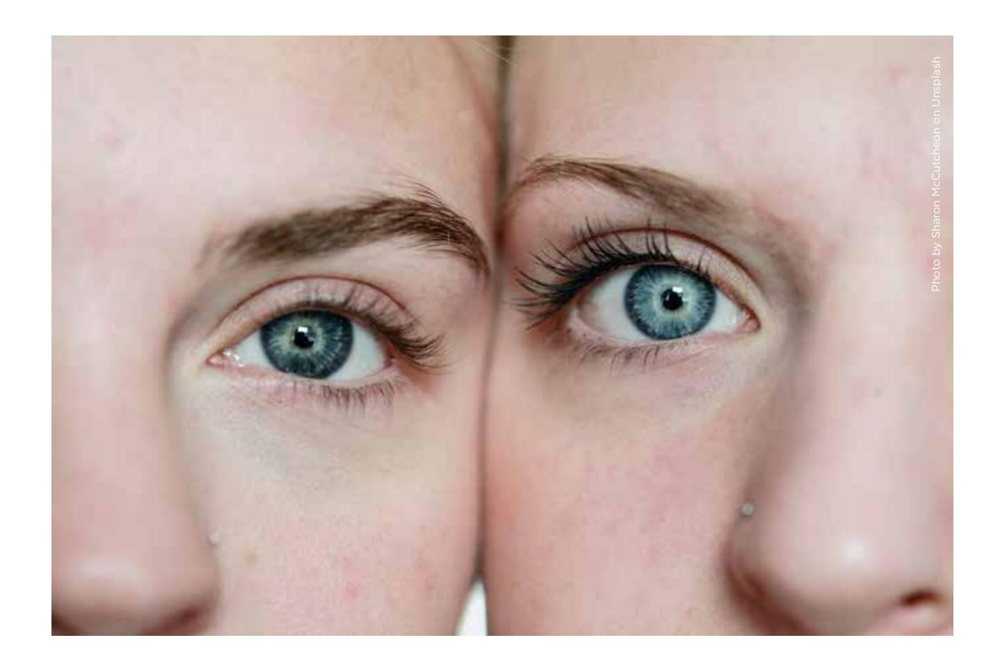

change throughout the lifespan and in response to current environmental conditions.7 Unlike genetic influences for eye colour and blood type which are determined by DNA, genetic influences for complex traits like well-being do not operate in a deterministic fashion. Instead, they make a particular outcome more (or less) likely. Finding genetic influence on well-being means that for some people it is easier to maintain higher levels of well-being.

The key to explain individual differences in happiness and well-being will most likely be the complex interplay of an individual's genetic

*Some people will be born with a set of genetic variants that makes it easier to feel happy, while others are less fortunate.*

predisposition and his or her environment. All humans have, more or less, the same set of genes at birth. The variants within our genes, though, differ. Some people will be born with a set of genetic variants that makes it easier to feel happy, while others are less fortunate. Genetic variants also play a role in an individual's responsiveness to the environment. Likewise, people's genetic profile partly drives their life choices and in that sense the environment in which they navigate. Moreover, an individual's behaviour and happiness (driven by his or her genetic make-up), triggers environmental reactions.

A simple way to consider whether the environment can change the impact of our genes is to estimate heritability in two groups of people where one is exposed to a certain environment, and the other is not. A classic example demonstrating a gene-environment interaction for well-being comes from a paper that estimates and compares heritability for well-being among married and

unmarried twin pairs.8 This study used a large sample of monozygotic (MZ) and dizygotic (DZ) male and female twin pairs (n = 4462) from a cohort in Norway. Around 48% of those included in the study were married, with married males and females shown to have greater well-being than those not married. The study revealed that genetic factors accounted for up to 51% and 54% of the variance in well-being among unmarried males and females respectively. This was reduced to 41% and 39% for those who were married, suggesting that the expression of genes associated with well-being are partly dependent on marital status (see Figure 5.2). The authors proposed that the greater reliance on genetic dispositions among unmarried individuals may be due to there being fewer behavioural cues in the environment. It was suggested that with its well-defined social arena, marriage is often coupled with unambiguous behavioural clues that may limit opportunities to express individual differences and thus dispositional genes.

The differences in heritability between those who were married and those who were not was present even though experiences of marriage vary widely from couple to couple, so what about an environmental change that happens to all? A recent twin study in the Netherlands considered whether the COVID-19 pandemic has changed the importance of genetic and environmental influences on well-being.9 Participants completed surveys on optimism and meaning in life before the pandemic, and during the first few months of the pandemic in April and May 2020. Findings revealed that heritability estimates decreased slightly after the pandemic began, dropping from 26% and 32% for optimism and meaning in life pre-pandemic, to 20% and 25%, respectively. The genetic correlations between these two time points were 0.75 for optimism and 0.63 for meaning in life, suggesting a role for different genetic factors pre-pandemic and during the pandemic. Crucially these results show that the importance of genetic factors can change in response to changes in our environment, which indicates an interaction between genetic and environmental factors. One implication of finding interactions between genetic and environmental factors is the potential to draw out genetic

**Figure 5.2: Genetic and environmental influences on well-being across marital status: demonstrating gene-environment interaction** 

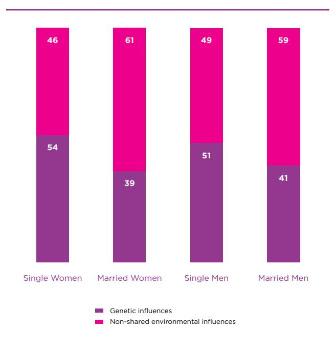

Note: These results taken from Nes et al., 2010 show how the magnitude of genetic influences on well-being can vary based on marital status. Heritability for both males and females were higher for those who were unmarried. These results indicate a gene-environment interaction.

strengths and dampen genetic risks using environmental interventions.

A fascinating insight from this study on optimism and meaning in life during a pandemic is that while most participants experienced decreases in their optimism and meaning in life, for more than a third of the participants their levels of optimism and meaning in life remained stable. It is possible that understanding the complexity of genetic and environmental influences can explain this finding too. Some research has shown that we are not all equally susceptible to our environmental experiences and exposures. Some individuals may be more sensitive and will respond negatively to poor environments and positively to good environments. Our sensitivity to environmental exposures has been shown to be partly due to genetic differences.10 It is safe to say that estimates of the importance of genetic and environmental influences are just the starting point for much

further research that explores the intricate ways in which genetic and environmental propensities play out across a lifespan and in response to changing experiences and exposures. And there is an added complexity, not only are there likely to be interactions between genetic and environmental influences, our environmental experiences and exposures are likely to be actively shaped by us and the people we surround ourselves with. In a study published in 2008, researchers found that levels of happiness among individuals tend to cluster, with people shown to be happier if they are connected to other happy people.11 It is possible that this effect occurs due to what is known as a gene-environment correlation.

A gene-environment correlation (rGE) occurs when exposure to an event in the environment is not random, but determined in part, by genetic factors. Genes can influence our environments through a number of different ways, with many agreeing that there exist three types of rGE: passive, active, and evocative. A passive rGE occurs when genetically influenced traits of a parent alter the environment of their child. This is because parents create an environment that is consistent with their own genotype. For example, a child who has inherited relevant genes associated with well-being may also experience a warm and happy home. This environment would then serve to reinforce the genetically influenced well-being traits, resulting in a happier child. Children are also more likely to select their environments that are consistent with their genotype. This is what is known as an active rGE and could occur if a happy-prone child engaged in more positive play with their peers and experienced more happiness as a result of this. Here, the genotype of the child has led them towards a certain environment, which has further amplified their genetic disposition. If the peers then also responded positively to the child, the impact of the environment would be further strengthened and an evocative rGE would occur.

It is possible to test for the presence of geneenvironment correlation, and one method to do this is using the twin design to estimate the heritability of environmental experiences. A systematic review of gene-environment

correlation twin studies estimated that the average heritability of measures of the environment was as high as 27%.12 More recent findings have revealed that genetically influenced traits that drive behaviour, such as grit and ambition, are positively correlated with positive life events, and negatively correlated with negative life events.13 This means that inheriting positive well-being-related traits can increase our likelihood of not only maintaining higher well-being, but also the chances of experiencing positive life events. This resonates well with the finding of the catalysing effects of well-being revealing that happiness is associated with and precedes numerous successful outcomes, as well as behaviours paralleling success.14

# **Molecular (epi) genetic findings for well-being**

Given the robust heritability estimate of 40% and the progress in the field of molecular genetics, it is important to go beyond an estimate based on twin-family designs to search for differences in the actual DNA patterns of humans (the human genome) to explain differences in well-being. The human genome is the complete assembly of DNA (deoxyribonucleic acid)-about 3 billion base pairs - that makes each individual unique. DNA holds the instructions for building the proteins that carry out a variety of functions in a cell. Better knowledge of the link between the human genome and well-being could improve understanding of the underlying biological processes to support improved prevention and intervention programs. This might even permit personalised well-being interventions.

The first reliable molecular evidence for the genetic complexity of well-being came from a method called GCTA (genome-wide complex trait analysis), where the proportion of phenotypic variance explained by all genome-wide SNPs (single nucleotide polymorphisms – DNA sequence variation of a single nucleotide) is estimated by comparing the phenotype (in this case well-being) and genetic similarity across a group of unrelated individuals. In a pooled sample of ~11,500 unrelated genotyped Swedish and Dutch participants, well-being was measured using the

positive affect subscale of the Center for Epidemiology Studies Depression Scale (CES-D). In this group of genetically unrelated individuals, those with more similar overall DNA patterns scored more similarly for well-being. Based on this approach, it was estimated that 12-18% of the variance in well-being was accounted for by the additive effects of the SNPs measured on genotyping platforms.15

Next, the development of genome-wide association studies (GWASs) allowed for the first identification of specific genetic variants associated with well-being. In a GWAS, millions of genetic variants are measured and regressed on a phenotype in a large group of individuals. In this way, the association between each genetic variant and an outcome of interest is tested with a strong correction for multiple testing, so that the chance of finding false positives is greatly reduced. The first successful GWAS for well-being, with a sample of almost 300K participants, was performed in 2016.16 This study led to the identification of 3 genetic variants (3 locations on the human genome) associated with well-being (defined as life satisfaction and positive affect). The SNPs had estimated effects in the range of 0.015–0.018 standard deviation per allele (each R2 0.01%), so altogether have a tiny effect in explaining differences in well-being.

To increase the power of the gene finding effort, the latest GWAS for well-being combined wellbeing with depressive symptoms and neuroticism, to form the well-being spectrum.17 In this study, 304 independent significant variant-phenotype associations were identified for the well-being spectrum, with 148 and 191 associations specific for life satisfaction and positive affect, respectively. Biological annotation of these variants revealed evidence for enrichment of genes differentially expressed in the subiculum (part of the hippocampus) and enrichment for GABAergic interneurons. However, even with this progress, the identified variants account for only a small percentage of the variation, meaning that we still have a long road ahead.

Another layer of genomic influences is captured in the epigenome. The epigenome is a multitude of chemical compounds that can tell the genome what to do. The epigenome is made up

of chemical compounds and proteins that can attach to DNA and direct such actions as turning genes on or off, controlling the production of proteins in particular cells. The first and only epigenome-wide association study (EWAs) approach, to identify differentially methylated sites associated with individual differences in well-being, reported two genome-wide significant sites.18 Gene ontology (GO) analyses, to see if the involved epigenome locations can explain biological processes, highlighted enrichment of several central nervous system categories among higherranking methylation sites. However, replication of these results is warranted in larger samples.

Twin studies in the available European ancestry samples have shown that about 40% of individual differences in well-being can be explained by genetic factors. These follow-up analyses taught us about the genetic complexity of well-being, with likely thousands of variants contributing to the trait. These studies also revealed that each genetic variant only contributes a tiny amount to the variation in well-being, so we cannot speak of a single "happiness gene" or a few "happiness genes" that assert substantial influence on well-being.

### **Use of Molecular Genetic Results**

Based on the Genome-wide Association studies for well-being and other complex human traits, the overall genetic architecture of well-being is assumed to be polygenic involving the cumulative effects of numerous single-nucleotide polymorphisms (SNPs), each often with small effects. The first Genome-wide association study identified 3 genome-wide significant locations for well-being.

*The overall genetic architecture of well-being is found to be polygenic involving the cumulative effects of numerous genetic variants, each with small effects.*

The most recent Genome-wide Association Study (GWAS) revealed 304 independent genome-wide signals associated with the well-being spectrum. These significant variants together yet only explain a tiny bit of the total variance.

A promising next step is to use the outcome of the large-scale genome-wide association studies to create a so-called Polygenic Score.19 A polygenic score (PGS), also called a polygenic risk score (PRS) or a Polygenic Index (PGI), is a number that summarises the estimated effect of many genetic variants on an individual's phenotype, typically calculated as a weighted sum of trait-associated alleles. It reflects an individual's estimated genetic predisposition for a given trait and can be used as a predictor for that trait.

For example, in a sample of 4,571 individuals (50 to 65 years old) representing 14,937 individualyear observations from the Health and Retirement Study, it is reported that the PGS of well-being is positively associated with self-employment and earnings.20 In addition, the PGS of well-being is negatively associated with loneliness in a large sample of 8,798 adult subjects (3,206 males and 5,592 females; ages 18-91, mean age=45.3, median age=43) in the Netherlands.21 This indicates that people with a higher genetic predisposition for well-being are less lonely. As a final example, it has been found that higher PGS for well-being was related to a younger subjective age (the age people feel relative to their chronological age) in 7,763 individuals of the Health and Retirement Study.22

Another promising approach that leverages the outcomes of genome-wide association studies is Genetic instrumental variable analysis (aka Mendelian Randomization analysis). This is an instrumental variable approach with the use of genetic variants or polygenic scores as instrumental variables to obtain causal inferences on the effect of an exposure (risk factor) on an outcome from observational data. The method relies on the natural, random assortment of genetic variants resulting in a random distribution of genetic variants in a population.23 In short, if the assumptions are met and a genetic variant is associated both with the exposure and the outcome, this would provide supportive evidence

for a causal effect of the exposure on well-being.

Using this approach reveals, for example, bidirectional causal associations of insomnia with depressive symptoms and well-being.24 The association between well-being and resilience is also found to be bidirectional.25 While two studies indicate that higher Body Mass Index (BMI) leads to lower well-being, there is limited evidence that lower well-being leads to higher BMI.26 Both approaches (PGS and Mendelian Randomization) hold a promise for the future. Both techniques, though, largely depend on the quality and power of the discovery Genome-Wide Association study.

To conclude, while there are still hurdles to be overcome and many unanswered questions, considerable progress has been made over the past years in identifying genetic and environmental factors that influence well-being. The findings of the behavioural and molecular genetics studies, and follow-up studies indicate a substantial role of biological factors underlying differences in well-being. To enhance the development of future (more precise) mental health support and intervention strategies, it is crucial to better understand the association between biological factors and well-being.

## **Happiness and the Brain**

An obvious organ to study to attempt to explain differences in well-being among individuals is the brain. The human brain is the central organ of the human nervous system and is a key player in mood and emotion regulation. A distinction can be made between the brain structure (e.g. the size of the brain or brain areas) and brain functioning (e.g. the activation of brain areas in response to stimuli). Due to rapid technological developments, it became feasible to assess brain structure and brain functioning in living subjects. To assess brain structure the common approach is Magnetic Resonance Imaging (MRI). MRI maps the structure of the brain and can be used to compare sizes of certain brain areas across people. To assess brain functioning, functional Magnetic Resonance Imaging (fMRI), magnetoencephalography (MEG), and electroencephalography (EEG) are the three most common and most frequently used measures.

**Figure 5.3: Brain areas related to well-being** 

For example, the association between well-being and subcortical brain volumes has been explored in a dataset of 724 twins and siblings.27 The results of this study indicated associations of well-being with hippocampal volumes but not with volumes of the basal ganglia, thalamus, amygdala, or nucleus accumbens. The well-being-hippocampus relation turned out to be nonlinear and characterised by lower well-being in subjects with relatively smaller hippocampal volumes compared to subjects with medium and higher hippocampal volumes.

Beyond this example study, brain areas that are most consistently found in relation to well-being are the prefrontal cortex, precuneus, anterior cingulate cortex (ACC), thalamus, orbitofrontal cortex, insula and the posterior cingulate cortex (PCC) (see figure 5.3). Using the different techniques (e.g., fMRI, MRI and EEG), the relation between well-being and the prefrontal cortex, precuneus, insula and posterior cingulate cortex are replicated.

Importantly, however, the direction and strength of the associations differ to a great extent across studies. For example, in the fMRI studies that associated the prefrontal cortex to well-being, half of the relations were negative, whereas the other half were positive. The same inconsistency was found in the relation between the orbitofrontal cortex and precuneus. The most consistent finding in fMRI studies that investigated the connectivity between brain areas in relation to well-being is that a stronger functional connectivity within the default mode network (DMN) is related to lower well-being. The DMN is a large-scale brain network primarily composed of the medial

prefrontal cortex, posterior cingulate cortex/ precuneus, and angular gyrus. It is best known for being active when a person is not focused on the outside world and the brain is at wakeful rest, such as during daydreaming and mind-wandering.

In general, the inconsistent results might be explained by the large differences in brain imaging and the analysis techniques. Whereas fMRI assesses the brain activation, structural MRI is applied to investigate the volume of brain areas. Although it has been shown that the function of a brain area and its structure are related,28 the findings might not be completely comparable. Furthermore, when using the same imaging technique, the analysis techniques still differed a lot. For example, the resting state fMRI studies either assessed fractional amplitude of lowfrequency fluctuations (fALFF), or applied functional connectivity or regional homogeneity (ReHo) analyses to assess the regional neural activity or connectivity between brain areas.

These differences in analytic techniques add further difficulties in comparing the results of the studies. In addition, an issue in the field of imaging is, due to the costs of such techniques, sample size and as a consequence, the power of the study, since high costs for this type of data collection limit the number of people who can be examined, which makes conclusions/insights less accurate.

# **Happiness and human physiology**

Besides the brain, many processes in the human body could be of importance in explaining individual differences in happiness and well-being among individuals. For example, differences in neurotransmitter levels, hormone levels, and immune parameter activity, have all been linked to well-being.

With respect to neurotransmitters, dopamine and serotonin have often been linked to mood and

well-being and have been studied in the link to depression with mixed results. Based on a limited number of available studies, higher positive affect is likely to be associated with higher levels of serotonin. In 2004, Flory and colleagues29 first reported a positive association between serotonergic functioning and positive affect with no sex differences, indicating that in both men and women a higher average positive mood was associated with better serotonergic functioning, assessed as the response of the serotonin system to administered fenfluramine. Furthermore, the relation between positive affect and serotonin was significant when controlling for negative affect, suggesting independent effects for positive affect and serotonin. In direct blood measures of serotonin, both Duffy and colleagues30 and Williams and colleagues31 replicated this positive association between positive affect and serotonin levels in a sample of females and a sample of males, respectively.

The association of hormones, especially cortisol, with well-being has been investigated more often compared to the neurotransmitter research, as hormones are easier to assess in saliva or blood samples. In two studies with large samples (respectively n=2,873 and n=1,657) small negative associations between average or momentary level of cortisol and well-being have been observed. This indicates that people with lower levels of cortisol report higher levels of well-being, assessed as positive mood over the day and daily positive events respectively.32 Furthermore, these studies did control for negative affect or depression, suggesting independent effects on well-being. In addition, the slope of the cortisol decrease over the day seems to be a consistent factor related to well-being, where higher well-being is associated with a faster decrease of cortisol levels over the day.

Another often-studied aspect of human physiology is the immune system. Given the immense impact of the COVID-19 pandemic, the importance of the immune system and its response has become crystal clear for human health. Inflammation is a reaction of the immune system, the activity of which can be split into innate immune responses, which are quick and generalised, and adaptive

responses, which take longer but are more accurate and specific. The inflammatory response is a natural part of the immune response and is adaptive in the short-term, whereas chronic systemic inflammation has been linked to all-cause mortality.33 Examples of inflammatory markers are C-reactive protein (CRP), interleukin-6 (IL-6), and fibrinogen (FIB). These are pro-inflammatory meaning that elevated levels are linked with negative health outcomes.34

Multiple studies report a negative association of CRP with different well-being measures (e.g. positive affect, life satisfaction, happiness) including the main measures used in the *World Happiness Report*. 35 Several studies report a negative association after controlling for depressive symptoms, indicating independent associations between CRP levels and well-being.36 Similarly, several studies report that IL-6 was negatively related to different measures of well-being mainly with well-being assessed as positive affect, quality of life, and life satisfaction. The effects of IL-6 after controlling for depression are less clear with some studies still reporting an effect,37 while in other studies the effects disappear.38

# **Some Considerations for future study of human physiology**

Most of the studies mentioned with respect to human physiology investigated the biological factors within a single category, whereas combining multiple biological factors across the different categories, also known as multi-omics approaches, in relation to well-being might provide a more complete picture of the biology underlying well-being. Multi-omics is the combination and integration of multiple types of omics data, such as the genome, proteome, transcriptome, epigenome, and microbiome.39 All the different processes have influences on each other and by combining these data, researchers can get a broader picture of the biological factors underlying complex traits like well-being. To understand the biology underlying well-being, an approach like multi-omics can also be applied to the combination of brain measures, hormones, neurotransmitters, and the immune system. In addition, the gut

microbiome is a new research field. So far only four studies have related well-being to the microbiome diversity or composition.40 All four studies reported significant results with well-being or positive mood relating to the abundance of different bacteria, indicating a relation between well-being and the microbiome. However, as one study only included 3 participants and there are conflicting results about the direction of the effect, much more research is needed to be confident about the effects on well-being.

Microbiome research is complicated by the possible effects of variation in dietary habits and geography on the composition of the gut microbiota. This might influence the results of microbiome studies and these concerns should be taken into account in future studies of well-being and the microbiome. The multi-omics approach might be helpful to clarify complex associations. For example, recent research reported an influence of the gut microbiome on mental health via the level of neurotransmitters.41 The gut microbiome can alter the levels of different neurotransmitters and this alteration of neurotransmitters influences mental health. Similarly, an interaction among three categories, namely the gut microbiome, the stress response, including cortisol, and the immune system is suggested to play a role in depression, and anxiety.42 Furthermore, it is important to consider the direction of effect. So far, most studies focus on an association but in the end to improve prevention and intervention strategies for well-being it is crucial to understand the direction of effect between human physiological factors and well-being. Causality analyses, such as longitudinal designs and the previously described Mendelian Randomization enable future researchers to investigate the direction of causality.

# **Implications for intervention and public health**

So what are the implications of genetically informative research for happiness interventions? And how can we explain the seemingly paradoxical findings of substantial genetic effects and no shared environmental influences with large differences in average happiness across nations

and overtime? A wealth of evidence, based on various research approaches, supports the notion of well-being as changing and changeable – at the individual, group, and national levels. Happiness intervention studies, including meta-analyses43 have firmly documented that happiness may change in individuals and populations and have identified effective factors and moderators. The same holds for clinical psychology and therapy research, experimental and longitudinal studies, migration studies, and research on national differences and changes in such differences over time.

Importantly, twin and family studies deal with the causes of individual differences, and thus the variation or variance, and not with mean levels of happiness. Furthermore, they examine only within-country variability and do not account for average differences across nations. And finally, they are most often based on twin-family samples of European ancestry. The findings are therefore not necessarily a good approach to compare country differences at a global level. Yet, the majority of the variance in happiness tends to be within-country (>80%) rather than between countries. In a previous study of satisfaction with life44 in 41 countries across the world, only 13% of the total variance was accounted for by betweennation differences. The effect of national differences was high compared to that of gender (1.5%) and maybe somewhat underestimated due to random measurement error. Nevertheless, the results indicate that the twin and family study findings are relevant also in a global context.

How do we take genetic/biological differences into account if we aim to increase the happiness level of the population? At the population level, welfare policies that target structural inequities and provide access to healthy living standards, meaningful and inclusive work, safety, sufficient economic resources, low corruption, and socially sustainable communities appear to play important roles. For example, a recent "environment-wide association study" linking well-being data from the Netherlands Twin Register to 139 neighbourhood-level environmental exposures,45 identified 21 environmental factors significantly associated with well-being. These

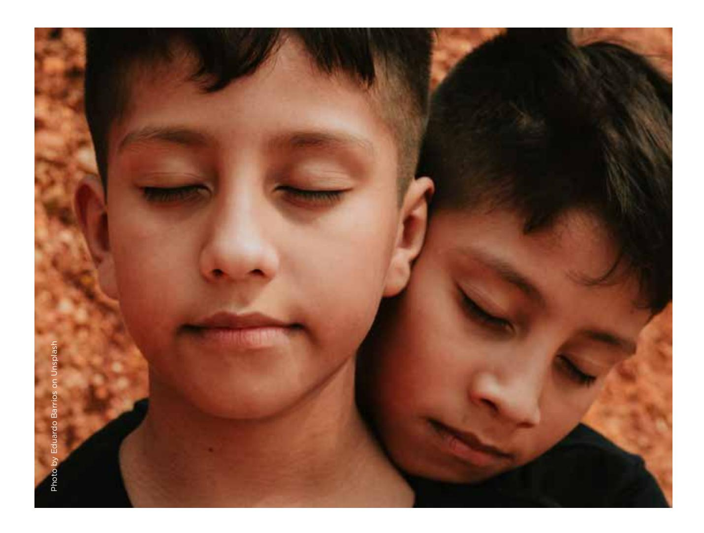

factors clustered in the domains of housing stock, income, core neighbourhood characteristics, livability (a composite measure of population composition, social cohesion, public space, safety, level of resources, and housing), and SES. Evidence also shows that people are happier when and where they have a sense of ownership and participation in the intervention or policy design process (i.e., experience autonomy, empowerment, social justice). For example, Knight and colleagues46 showed that residents involved in decisions regarding their surroundings (i.e., décor), reported increased identification with staff and fellow residents, displayed enhanced citizenship, reported improved well-being, and made more use of the communal space than residents not involved in such decision-making processes. The staff also found "empowered"

residents to be more engaged with their environment and the people around them, to be generally happier and to have better health. Likewise, people get happier from their prosocial acts if they are actively involved in the design and delivery of these acts.47

Yet, while such factors and measures maintain or improve well-being for most, their effects often differ across people. Individual (e.g., personality, activity fit, effort), contextual (e.g., rural, urban, culture), and intervention-related factors (e.g., fidelity of completion), independently or in sum, cause some people or population groups to respond more positively or negatively than others. *People differ -* and due to their differences, they benefit from somewhat different interventions. To illustrate, let's consider physical activity interventions, which may serve secondary aims

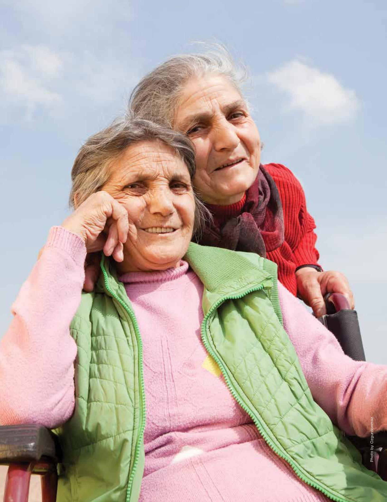

of raising mood and quality of life. To increase daily activity levels, a highly heritable trait,48 in the population a general approach might include a population-wide campaign urging all people to exercise at a moderate level for at least 30 minutes a day. These campaigns seem practical and attractive but are rarely universally effective: some like to exercise outdoors, others prefer indoors, some like to exercise in groups, others enjoy solitude – and some cannot afford training gear or have limited free time. Different people may also need different information in terms of content, form, and mode. When we acknowledge these individual differences and tailor interventions, effects are often more likely to arise across different groups.

So how can genetic research contribute to raising happiness in different segments of the population simultaneously? In theory the answer is simple: by deepening our understanding of the causal processes involved and taking us beyond a one-size-fits-all approach. The practical solutions are obviously more complex.

Most if not all human traits, including happiness are influenced by both genes and environments.49 One major advantage of genetically informative designs is their ability to control for genetic and social endowments and to delineate causal mechanisms, for example processes of transmission in families, communities, or neighbourhoods. Such causal knowledge may help us to develop more effective biologically informed, evidenced-based interventions, to improve existing preventive programs, and to inform the next

*We should use findings from genetically informative designs to create happiness-enhancing interventions, social policies, activities, and environments that enable flourishing of genetic potentials and simultaneously buffer vulnerability and risk.*

generation of measures - regardless of whether they are individual therapies or population-wide interventions (e.g., education, tax reforms, city-planning). Genetically informative designs are also critical in terms of fitting happiness measures to different individuals and subgroups. The notion of gene-environment matchmaking50 invites us to use findings from genetically informative designs to create happiness-enhancing interventions, social policies, activities, and environments that enable flourishing of genetic potentials and simultaneously buffer vulnerability and risk. The processes involved are implicitly present in approaches like personalised medicine,51 treatment-matching,52 and precision medicine/ prevention – many of which are incorporated also in extant happiness enhancing strategies (e.g., person-activity-fit). Collectively, these approaches build on individual variability in genes and environments to guide development, selection, and implementation of interventions to optimise results.

Efforts to navigate such tailored interventions *from* the individual level *towards* improving happiness and health in the general population are still in their early stages. From a population perspective, a notable challenge concerns the competing perspectives involved. Precision approaches commonly focus on individual vulnerabilities, whereas the population-wide approaches target public health, population well-being, and social inequalities. From a population perspective, the individual focus of precision approaches may not at first seem very useful. A number of major health-related successes have had little to do with precision prevention. One example is the tobacco warning campaigns and their associated measures (e.g., taxes, prohibition of smoking in public settings), which led to a striking reduction in the prevalence of cigarette smoking. Similarly, and of relevance to happiness; population-wide measures targeting satisfaction of universal, genetically founded human needs – for social relations, safety, and autonomy are likely to improve happiness for most. So, why would we invest in and prioritise additional tailored measures?

The genetically informed, matchmaking approaches may be particularly important in combination with universal (i.e., population-wide, primary) interventions. Such proportionate universalism aims to balance the universal and targeted (typically focusing on risk groups) perspectives in order to maximise effectiveness and benefits, and to narrow the gap in happiness inequality. Although genetically informed interventions may aggravate individual differences, econometric policy analyses combined with genetic tools have also been shown to reduce inequalities. A recent example from obesity research illustrates this important point.53 Many nations have seen a rising obesity trend over the past decades. This trend is clearly not reflecting genetic changes over time, but rather results from radical modification of the diet and marketing of food products. Nevertheless, an additional year of secondary education seems to benefit those with higher genetic risk of obesity more than those with lower risk, substantially reducing the gap in unhealthy body size between the top and bottom terciles (from 20 to 6 percentage points). This effect is likely to reflect changes in material resources and/or changes in health behaviour and underscores that social policy may play an important role in mitigating health differences rising from genetic variation. Hence, genetically informed approaches clearly have the potential to improve prevention strategies and reduce differences between people, and may over time improve population health - provided that environmental and socioeconomic factors are incorporated. Importantly though, the existing research base is narrow. For example, strategies like the one above resting on polygenic risk score approaches are better calibrated for individuals of European ancestry than for others. Greater diversity of participants included and analysed in such studies - and related genetically informed designs - would improve utility for all groups, and particularly for those most underrepresented.

In conclusion, genetic studies are likely to be a gamechanger for the study of happiness and well-being and to have ground-breaking impact on intervention models and strategies. Currently, genetically informed population strategies targeting population well-being and inequalities in happiness are in their early stages. More needs to be known about how to break down adverse

gene-environment interplay and frame favourable interplay—in individuals and different segments of different populations. More knowledge is also needed about how various aspects of the home and community environments affect the expression of genetic propensity to happiness. Further studies into this arena will illuminate how social gradients in happiness and health may be formed by social selection or causation, and directly inform us on how to create beneficial neighbourhoods that prevent manifestations of genetic risk and promote opportunities for different individuals and population groups.

### **Endnotes**

- Tellegen et al., 1988
- Bartels, 2015, Nes & Røysamb, 2015
- Bartels, 2015
- Nes et al., 2010
- Van de Weijer et al., 2020
- B. M. L. Baselmans et al., 2019
- Haworth & Davis, 2014
- Nes et al., 2010
- de Vries, van de Weijer, et al., 2021
- Assary et al., 2021
- Fowler & Christakis, 2008
- Kendler & Baker, 2007
- Wootton et al., 2017
- Lyubomirsky et al., 2005
- Bartels et al., 2013
- Okbay et al., 2016. https://doi.org/10.1038/ng.3552
- B. M. L. Baselmans et al., 2019
- 18 cg10845147, p = 1.51 \* 10-8 and cg01940273, p = 2.34 \* 10-8) that reached genome-wide significance following Bonferroni correction. Four more sites (cg03329539, p = 2.76 \* 10-7; cg09716613, p = 3.23 \* 10-7; cg04387347, p = 3.95 \* 10-7; and cg02290168, p = 5.23 \* 10-7) significant when applying the widely used criterion of an FDR q value < 0.05 for statistical significance.
- *Polygenic Risk Scores*, n.d.
- Patel et al., 2021
- Abdellaoui et al., 2018
- Stephan et al., 2019
- Smith & Ebrahim, 2003
- Zhou et al., 2021
- de Vries, Baselmans, et al., 2021
- Broek et al., 2018, Wootton et al., 2018
- Van 't Ent et al., 2017
- Sui et al., 2014, Toosy et al., 2004
- Flory et al., 2004
- Duffy et al., 2006
- Williams et al., 2006
- Steptoe et al., 2008, Sin et al., 2017
- Proctor et al., 2011
- Davalos & Akassoglou, 2012, Maluf et al., 2020
- Carpenter et al., 2012, Steptoe et al., 2008
- Ironson et al., 2018
- Friedman & Ryff, 2012
- Ong et al., 2018

- Hasin et al., 2017
- 40 Li et al., 2016, Valles-Colomer et al., 2019, Michels et al., 2019, Lee et al., 2020
- Liu et al., 2020
- Peirce & Alviña, 2019
- 43 Sin & Lyubomirsky, 2009, Bolier et al., 2013, van Agteren et al., 2021
- Vittersø et al., 2002
- van de Weijer et al., 2021
- Knight et al., 2010
- 47 For more details and examples see chapter 4 of the *World Happiness Report 2019*. (Aknin et al., n.d.)
- 48 van der Zee et al., 2020, van der Zee, Matthijs Daniël et al.,
- Polderman et al., 2015
- Røysamb & Nes, 2018
- Gordon, 2007
- Gastfriend & McLellan, 1997
- Barcellos et al., 2018

#### **References**

Abdellaoui, A., Nivard, M. G., Hottenga, J.-J., Fedko, I., Verweij, K. J., Baselmans, B. M., Ehli, E. A., Davies, G. E., Bartels, M., & Boomsma, D. I. (2018). Predicting loneliness with polygenic scores of social, psychological and psychiatric traits. *Genes, Brain and Behavior*, *17*(6), e12472.

Aknin, L. B., Whillans, A. V., Norton, M. I., & Dunn, E. W. (n.d.). *Happiness and Prosocial Behavior: An Evaluation of the Evidence*. 20.

Assary, E., Zavos, H. M. S., Krapohl, E., Keers, R., & Pluess, M. (2021). Genetic architecture of Environmental Sensitivity reflects multiple heritable components: A twin study with adolescents. *Molecular Psychiatry*, *26*(9), 4896–4904. https://doi.org/10.1038/s41380-020-0783-8

Barcellos, S. H., Carvalho, L. S., & Turley, P. (2018). Education can reduce health differences related to genetic risk of obesity. *Proceedings of the National Academy of Sciences*, *115*(42), E9765–E9772. https://doi.org/10.1073/pnas.1802909115

Bartels, M. (2015). Genetics of wellbeing and its components satisfaction with life, happiness, and quality of life: A review and meta-analysis of heritability studies. *Behavior Genetics*, *45*(2), 137–156.

Bartels, M., Benjamin, D. J., Cesarini, D., De Neve, J.-E., Johannesson, M., Koellinger, P. D., Krueger, R. F., Magnusson, P. K. E., Pedersen, N. L., Rietveld, C. A., & Tiemeier, H. (2013). *Molecular genetics and subjective well-being* (Monograph No. CEPDP1225). Centre for Economic Performance, London School of Economics and Political Science. http://cep.lse.ac.uk/\_new/ publications/series.asp?prog=CEP

Baselmans, B. M. L., Jansen, R., Ip, H. F., van Dongen, J., Abdellaoui, A., van de Weijer, M. P., Bao, Y., Smart, M., Kumari, M., Willemsen, G., Hottenga, J.-J., Boomsma, D. I., de Geus, E. J. C., Nivard, M. G., & Bartels, M. (2019). Multivariate genome-wide analyses of the well-being spectrum. *Nature Genetics*, *51*(3), 445–451. https://doi.org/10.1038/s41588-018-0320-8

Baselmans, B. M., Willems, Y. E., van Beijsterveldt, C. E. M., Ligthart, L., Willemsen, G., Dolan, C. V., Boomsma, D. I., & Bartels, M. (2018). Unraveling the genetic and environmental relationship between well-being and depressive symptoms throughout the lifespan. *Frontiers in Psychiatry*, *9*, 261.

Bolier, L., Haverman, M., Westerhof, G. J., Riper, H., Smit, F., & Bohlmeijer, E. (2013). Positive psychology interventions: A meta-analysis of randomized controlled studies. *BMC Public Health*, *13*(1), 1–20.

Broek, N. van den, Treur, J. L., Larsen, J. K., Verhagen, M., Verweij, K. J. H., & Vink, J. M. (2018). Causal associations between body mass index and mental health: A Mendelian randomisation study. *J Epidemiol Community Health*, *72*(8), 708–710. https://doi.org/10.1136/jech-2017-210000

Carpenter, L. L., Gawuga, C. E., Tyrka, A. R., & Price, L. H. (2012). C-reactive protein, early life stress, and wellbeing in healthy adults. *Acta Psychiatrica Scandinavica*, *126*(6), 402–410. https://doi.org/10.1111/j.1600-0447.2012.01892.x

Davalos, D., & Akassoglou, K. (2012). Fibrinogen as a key regulator of inflammation in disease. *Seminars in Immunopathology*, *34*(1), 43–62.

de Vries, L. P., Baselmans, B. M. L., Luykx, J. J., de Zeeuw, E. L., Minică, C. C., de Geus, E. J. C., Vinkers, C. H., & Bartels, M. (2021). Genetic evidence for a large overlap and potential bidirectional causal effects between resilience and well-being. *Neurobiology of Stress*, *14*, 100315. https://doi.org/10.1016/j. ynstr.2021.100315

de Vries, L. P., van de Weijer, M. P., Pelt, D. H., Ligthart, L., Willemsen, G., Boomsma, D. I., de Geus, E. J., & Bartels, M. (2021). Gene-by-Crisis Interaction for Optimism and Meaning in Life: The Effects of the COVID-19 Pandemic. *Behavior Genetics*, 1–13.

Duffy, M. E., Stewart-Knox, B. J., McConville, C., Bradbury, I., O'Connor, J., Helander, A., & Strain, J. J. (2006). The relationship between whole-blood serotonin and subjective mood in apparently healthy postmenopausal women. *Biological Psychology*, *73*(2), 165–168. https://doi.org/10.1016/j.biopsycho.2006.01.014

Flory, J. D., Manuck, S. B., Matthews, K. A., & Muldoon, M. F. (2004). Serotonergic function in the central nervous system is associated with daily ratings of positive mood. *Psychiatry Research*, *129*(1), 11–19. https://doi.org/10.1016/j.psychres.2004.06.010

Fowler, J. H., & Christakis, N. A. (2008). Dynamic spread of happiness in a large social network: Longitudinal analysis over 20 years in the Framingham Heart Study. *BMJ*, *337*, a2338. https://doi.org/10.1136/bmj.a2338

Friedman, E. M., & Ryff, C. D. (2012). Living Well With Medical Comorbidities: A Biopsychosocial Perspective. *The Journals of Gerontology: Series B*, *67*(5), 535–544. https://doi.org/10.1093/ geronb/gbr152

Gastfriend, D. R., & McLellan, A. T. (1997). TREATMENT MATCHING: Theoretic Basis and Practical Implications. *Medical Clinics of North America*, *81*(4), 945–966. https://doi.org/10.1016/S0025-7125(05)70557-5

Gordon, E. (2007). Integrating genomics and neuromarkers for the era of brain-related personalized medicine. *Personalized Medicine*, *4*(2), 201–215. https://doi.org/10.2217/17410541.4.2.201

Hasin, Y., Seldin, M., & Lusis, A. (2017). Multi-omics approaches to disease. *Genome Biology*, *18*(1), 83. https://doi.org/10.1186/ s13059-017-1215-1

Haworth, C., & Davis, O. (2014). From observational to dynamic genetics. *Frontiers in Genetics*, *5*. https://www.frontiersin.org/ article/10.3389/fgene.2014.00006

Ironson, G., Banerjee, N., Fitch, C., & Krause, N. (2018). Positive emotional well-being, health Behaviors, and inflammation measured by C-Reactive protein. *Social Science & Medicine*, *197*, 235–243. https://doi.org/10.1016/j.socscimed.2017.06.020

Kendler, K. S., & Baker, J. H. (2007). Genetic influences on measures of the environment: A systematic review. *Psychological Medicine*, *37*(5), 615–626.

Knight, C., Haslam, S. A., & Haslam, C. (2010). In home or at home? How collective decision making in a new care facility enhances social interaction and wellbeing amongst older adults. *Ageing & Society*, *30*(8), 1393-1418.

- Lee, S.-H., Yoon, S.-H., Jung, Y., Kim, N., Min, U., Chun, J., & Choi, I. (2020). Emotional well-being and gut microbiome profiles by enterotype. *Scientific Reports*, *10*(1), 20736. https://doi.org/10.1038/s41598-020-77673-z
- Li, L., Su, Q., Xie, B., Duan, L., Zhao, W., Hu, D., Wu, R., & Liu, H. (2016). Gut microbes in correlation with mood: Case study in a closed experimental human life support system. *Neurogastroenterology & Motility*, *28*(8), 1233–1240. https://doi.org/10.1111/ nmo.12822
- Liu, T., Feenstra, K. A., Heringa, J., & Huang, Z. (2020). Influence of Gut Microbiota on Mental Health via Neurotransmitters: A Review. *Journal of Artificial Intelligence for Medical Sciences*, *1*(1–2), 1–14. https://doi.org/10.2991/jaims.d.200420.001
- Lyubomirsky, S., King, L., & Diener, E. (2005). The benefits of frequent positive affect: Does happiness lead to success? *Psychological Bulletin*, *131*(6), 803.
- Maluf, C. B., Barreto, S. M., Giatti, L., Ribeiro, A. L., Vidigal, P. G., Azevedo, D. R. M., Griep, R. H., Matos, S. M. A., Ji, C., Cappuccio, F. P., & Miller, M. A. (2020). Association between C reactive protein and all-cause mortality in the ELSA-Brasil cohort. *Journal of Epidemiology and Community Health*, *74*(5), 421–427. https://doi.org/10.1136/jech-2019-213289
- Michels, N., Van de Wiele, T., Fouhy, F., O'Mahony, S., Clarke, G., & Keane, J. (2019). Gut microbiome patterns depending on children's psychosocial stress: Reports versus biomarkers. *Brain, Behavior, and Immunity*, *80*, 751–762. https://doi.org/10.1016/j.bbi.2019.05.024
- Nes, R. B., & Røysamb, E. (2015). The heritability of subjective well-being: Review and meta-analysis. *The Genetics of Psychological Wellbeing: The Role of Heritability and Genetics in Positive Psychology*, 75–96.
- Nes, R. B., Røysamb, E., Harris, J. R., Czajkowski, N., & Tambs, K. (2010). Mates and Marriage Matter: Genetic and Environmental Influences on Subjective Wellbeing Across Marital Status. *Twin Research and Human Genetics*, *13*(4), 312–321. https://doi.org/10.1375/twin.13.4.312
- Okbay, A., Baselmans, B. M. L., De Neve, J.-E., Turley, P., Nivard, M. G., Fontana, M. A., Meddens, S. F. W., Linnér, R. K., Rietveld, C. A., Derringer, J., Gratten, J., Lee, J. J., Liu, J. Z., de Vlaming, R., Ahluwalia, T. S., Buchwald, J., Cavadino, A., Frazier-Wood, A. C., Furlotte, N. A., … Cesarini, D. (2016). Genetic variants associated with subjective well-being, depressive symptoms, and neuroticism identified through genome-wide analyses. *Nature Genetics*, *48*(6), 624–633. https://doi.org/10.1038/ ng.3552
- Ong, A. D., Benson, L., Zautra, A. J., & Ram, N. (2018). Emodiversity and biomarkers of inflammation. *Emotion*, *18*(1), 3–14. https://doi.org/10.1037/emo0000343
- Patel, P. C., Rietveld, C. A., Wolfe, M. T., & Wiklund, J. (2021). The polygenic risk score of subjective well-being, self-employment, and earnings among older individuals. *Entrepreneurship Theory and Practice*, *45*(2), 440–466.
- Peirce, J. M., & Alviña, K. (2019). The role of inflammation and the gut microbiome in depression and anxiety. *Journal of Neuroscience Research*, *97*(10), 1223–1241.

- Polderman, T. J. C., Benyamin, B., de Leeuw, C. A., Sullivan, P. F., van Bochoven, A., Visscher, P. M., & Posthuma, D. (2015). Meta-analysis of the heritability of human traits based on fifty years of twin studies. *Nature Genetics*, *47*(7), 702–709. https://doi.org/10.1038/ng.3285
- *Polygenic Risk Scores*. (n.d.). Genome.Gov. Retrieved 15 February 2022, from https://www.genome.gov/Health/ Genomics-and-Medicine/Polygenic-risk-scores
- Proctor, M. J., Morrison, D. S., Talwar, D., Balmer, S. M., Fletcher, C. D., O'Reilly, D. St. J., Foulis, A. K., Horgan, P. G., & McMillan, D. C. (2011). A comparison of inflammation-based prognostic scores in patients with cancer. A Glasgow Inflammation Outcome Study. *European Journal of Cancer*, *47*(17), 2633–2641. https://doi.org/10.1016/j.ejca.2011.03.028
- Røysamb, E., & Nes, R. (2018). *The Genetics of Well-being*.
- Sin, N. L., & Lyubomirsky, S. (2009). Enhancing well-being and alleviating depressive symptoms with positive psychology interventions: A practice-friendly meta-analysis. *Journal of Clinical Psychology*, *65*(5), 467–487. https://doi.org/10.1002/ jclp.20593
- Sin, N. L., Ong, A. D., Stawski, R. S., & Almeida, D. M. (2017). Daily positive events and diurnal cortisol rhythms: Examination of between-person differences and within-person variation. *Psychoneuroendocrinology*, *83*, 91–100. https://doi.org/10.1016/ j.psyneuen.2017.06.001
- Smith, G. D., & Ebrahim, S. (2003). 'Mendelian randomization': Can genetic epidemiology contribute to understanding environmental determinants of disease? *International Journal of Epidemiology*, *32*(1), 1–22. https://doi.org/10.1093/ije/dyg070
- Stephan, Y., Sutin, A. R., Kornadt, A., & Terracciano, A. (2019). Polygenic scores for education, health, and personality as predictors of subjective age among older individuals of European ancestry: Evidence from the Health and Retirement Study. *Psychology and Aging*, *34*(1), 139.
- Steptoe, A., O'Donnell, K., Badrick, E., Kumari, M., & Marmot, M. (2008). Neuroendocrine and Inflammatory Factors Associated with Positive Affect in Healthy Men and Women: The Whitehall II Study. *American Journal of Epidemiology*, *167*(1), 96–102. https://doi.org/10.1093/aje/kwm252
- Sui, J., Huster, R., Yu, Q., Segall, J. M., & Calhoun, V. D. (2014). Function–structure associations of the brain: Evidence from multimodal connectivity and covariance studies. *NeuroImage*, *102*, 11–23. https://doi.org/10.1016/j.neuroimage.2013.09.044
- Tellegen, A., Lykken, D. T., Bouchard, T. J., Wilcox, K. J., Segal, N. L., & Rich, S. (1988). Personality similarity in twins reared apart and together. *Journal of Personality and Social Psychology*, *54*(6), 1031.
- Toosy, A. T., Ciccarelli, O., Parker, G. J. M., Wheeler-Kingshott, C. A. M., Miller, D. H., & Thompson, A. J. (2004). Characterizing function–structure relationships in the human visual system with functional MRI and diffusion tensor imaging. *NeuroImage*, *21*(4), 1452–1463. https://doi.org/10.1016/j.neuroimage.2003.11.022

Valles-Colomer, M., Falony, G., Darzi, Y., Tigchelaar, E. F., Wang, J., Tito, R. Y., Schiweck, C., Kurilshikov, A., Joossens, M., Wijmenga, C., Claes, S., Van Oudenhove, L., Zhernakova, A., Vieira-Silva, S., & Raes, J. (2019). The neuroactive potential of the human gut microbiota in quality of life and depression. *Nature Microbiology*, *4*(4), 623–632. https://doi.org/10.1038/ s41564-018-0337-x

van Agteren, J., Iasiello, M., Lo, L., Bartholomaeus, J., Kopsaftis, Z., Carey, M., & Kyrios, M. (2021). A systematic review and meta-analysis of psychological interventions to improve mental wellbeing. *Nature Human Behaviour*, *5*(5), 631–652. https://doi.org/10.1038/s41562-021-01093-w

van de Weijer, M. P., Baselmans, B. M. L., Hottenga, J.-J., Dolan, C. V., Willemsen, G., & Bartels, M. (2021). Expanding the environmental scope: An environment-wide association study for mental well-being. *Journal of Exposure Science & Environmental Epidemiology*. https://doi.org/10.1038/s41370- 021-00346-0

van de Weijer, M. P., de Vries, L., & Bartels, M. (2020). *Happiness and Wellbeing; the value and findings from genetic studies*.

van der Zee, M. D. (2021). *Molecular and behavioral genetic investigation of voluntary exercise behaviors*. Proefschriftenprinten.

Van der Zee, M. D., Helmer, Q., Boomsma, D. I., Dolan, C. V., & De Geus, E. J. C. (2020). An extended twin-pedigree study of different classes of voluntary exercise behavior. *Behavior genetics*, *50*(2), 94-104.

Van 't Ent, D., den Braber, A., Baselmans, B. M. L., Brouwer, R. M., Dolan, C. V., Hulshoff Pol, H. E., de Geus, E. J. C., & Bartels, M. (2017). Associations between subjective well-being and subcortical brain volumes. *Scientific Reports*, *7*(1), 6957. https://doi.org/10.1038/s41598-017-07120-z

Vittersø, J., Røysamb, E., & Diener, E. (2002). The Concept of Life Satisfaction Across Cultures: Exploring Its Diverse Meaning and Relation to Economic Wealth. In E. Gullone & R. A. Cummins (Eds.), *The Universality of Subjective Wellbeing Indicators: A Multi-disciplinary and Multi-national Perspective*  (pp. 81–103). Springer Netherlands. https://doi.org/10.1007/ 978-94-010-0271-4\_6

Williams, E., Stewart-Knox, B., Helander, A., McConville, C., Bradbury, I., & Rowland, I. (2006). Associations between whole-blood serotonin and subjective mood in healthy male volunteers. *Biological Psychology*, *71*(2), 171–174.

Wootton, R. E., Davis, O. S., Mottershaw, A. L., Wang, R. A. H., & Haworth, C. (2017). Genetic and environmental correlations between subjective wellbeing and experience of life events in adolescence. *European Child & Adolescent Psychiatry*, *26*(9), 1119–1127.

Wootton, R. E., Lawn, R. B., Millard, L. A. C., Davies, N. M., Taylor, A. E., Munafò, M. R., Timpson, N. J., Davis, O. S. P., Smith, G. D., & Haworth, C. M. A. (2018). Evaluation of the causal effects between subjective wellbeing and cardiometabolic health: Mendelian randomisation study. *BMJ*, *362*, k3788. https://doi.org/10.1136/bmj.k3788

Zhou, F., Guo, Y., Wang, Z., Liu, S., & Xu, H. (2021). Assessing the causal associations of insomnia with depressive symptoms and subjective well-being: A bidirectional Mendelian randomization study. *Sleep Medicine*, *87*, 85–91. https://doi.org/10.1016/ j.sleep.2021.08.025

# Chapter 6

# Insights from the First Global Survey of Balance and Harmony

## Tim Lomas

Psychology Research Scientist, Harvard T. H. Chan School of Public Health & Human Flourishing Program at Harvard University

# Alden Yuanhong Lai

Assistant Professor of Public Health Policy and Management, New York University

## Koichiro Shiba

Postdoctoral Research Fellow, Harvard T. H. Chan School of Public Health & Human Flourishing Program at Harvard University

## Pablo Diego-Rosell

Senior Researcher, The Gallup Organization

## Yukiko Uchida

Professor, Kyoto University

## Tyler J VanderWeele

John L. Loeb and Frances Lehman Loeb Professor of Epidemiology, Harvard T. H. Chan School of Public Health & Director, Human Flourishing Program at Harvard University

We are grateful above all to the founding members of the Global Wellbeing Initiative (GWI) – including Dominique Chen, Ed Diener, Jim Harter, Yoshiki Ishikawa, Mohsen Joshanloo, Takafumi Kawakami, Takuya Kitagawa, Louise Lambert, Hiroaki Miyata, Holli Anne Passmore, and Margot van de Weijer – whose work includes the research featured in this chapter.\*

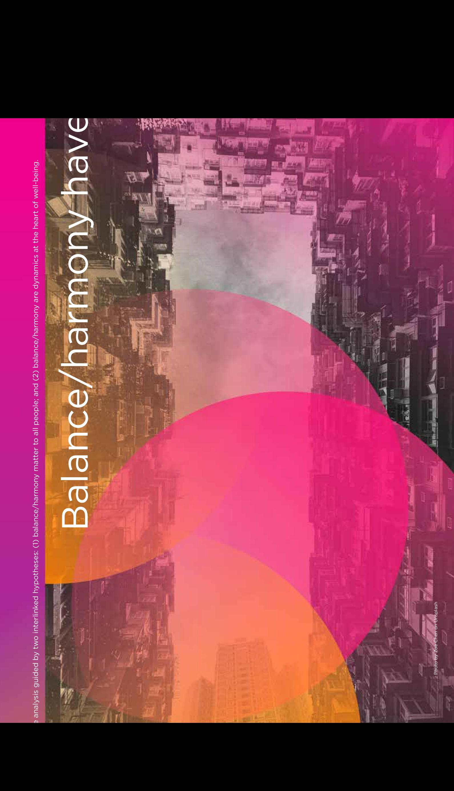

# **Introduction**

Scholarly understanding of happiness continues to advance with every passing year, with new ideas and insights constantly emerging. Some constructs, like life evaluation, have been established for decades, generating extensive research. Cantril's "ladder" item on life evaluation, for example – the question in the Gallup World Poll upon which this report is based – was created in 1965.1 By contrast, other well-being related topics are only beginning to receive due recognition and attention, including balance and harmony.

Balance and harmony – concepts that are closely linked but not synonymous – are used and defined in myriad ways, each having "fuzzy"2 conceptual boundaries. We shall delve into their meaning in the first subsection below, but we can note here that across academic fields they are invoked as important principles in the context of phenomena as varied as emotions,3 attention,4 motivation,5 character,6 diet,7 sleep,8 exercise,9 work-life patterns,10 relationships,11 society,12 politics,13 and nature.14

Historically and currently, balance/harmony have been particularly associated with Eastern cultures.15 But does that mean they are overlooked or undervalued in the rest of the world? Possibly not. There are significant ideas and traditions around balance/harmony globally, including in the West, such as Aristotle's ideal of the "golden mean."16 Furthermore, in the present day, two key well-being related domains in which balance/harmony apply, "work-life balance" and a "balanced diet," have received considerable attention in the literature.17 Moreover, balance/ harmony have salience among the public at large: a survey of lay perceptions of happiness across

*Balance/harmony have been particularly associated with Eastern cultures, historically and currently. But does that mean they are overlooked or undervalued in the rest of the world? Possibly not.*

seven Western nations found participants primarily defined happiness as a condition of "psychological balance and harmony," while a more extensive follow-up study similarly observed that the most prominent psychological definition was one of "inner harmony" (featuring themes of inner peace, contentment, and balance).18

However, empirical insight into how balance/ harmony are linked with happiness around the globe is rare and under-studied, mainly due to a lack of data. This chapter redresses this lacuna by reporting on a unique data set collected as part of the 2020 Gallup World Poll, constituting the most thorough global approach thus far to these topics. Based on our reading of the literature, we approached the analysis guided by two interlinked hypotheses: (1) balance/harmony matter to all people, and (2) balance/harmony are dynamics at the heart of well-being. As will be seen, both hypotheses were corroborated to some extent.

This introductory section discusses what balance/ harmony are in themselves, as well as the related phenomenon of low arousal positive states (e.g., peace and calm). We next introduce several new questions used to measure balance/harmony which were added to the Gallup World Poll in 2020 and look at their global distribution of responses. Third, we examine whether balance/harmony matter for happiness – and specifically life evaluation, the construct at the centre of this report – and then test for regional heterogeneity in the associations. The chapter concludes with some considerations of the overall significance of balance/harmony.

### **Defining Key Concepts**

What is meant by balance/harmony? Like many concepts, their meanings are contested and debated. Moreover, their conceptualisations are usually tied to specific domains of life rather than defined in the abstract. In the arena of physiology, for instance, one review of the literature suggested that balance has been operationalised in two main ways: as a physical state (e.g., "in which the body is in equilibrium") and as a function (e.g., "demanding continuous adjustments of muscle activity and joint position to keep the bodyweight above the base of support").19 Nevertheless, having reviewed the application and conceptualization of these

concepts across different academic disciplines, we have formulated some *generic* orienting definitions – which apply across diverse contexts – to guide our analysis and discussion.

Balance is commonly used to mean that the various elements which constitute a phenomenon, and/or the various forces acting upon it, are in proportionality and/or equilibrium, often with an implication of stability, evenness, and poise.

These dynamics are frequently – but not only – applied to binary or dyadic phenomena.20 Its etymology reflects this usage, deriving from the Latin *bilanx*, which denotes two (*bi*) scale pans (*lanx*). Substantively, these pairs may either be poles of a spectrum (e.g., hot-cold) or discrete categories that are frequently linked (e.g., worklife). Then, temporally, such connections can be synchronic (e.g., neither too hot nor cold) or diachronic (e.g., averaging good work-life balance over a career). In such cases, balance usually does not mean a crude calculation of averages, nor finding a simple mid-point on a spectrum, but skillfully finding the *right* point or amount, an ideal known as the Goldilocks principle.21 However, balance not only pertains to dyads but can also be applied to relationships among multiple phenomena, as per a "balanced diet," for example.

Harmony is sometimes used synonymously with balance, but there are subtle differences. On our reading of the literature, a common distinguishing

*Empirical insight into how balance/harmony are linked with happiness around the globe is rare and under-studied, mainly due to a lack of data. This chapter redresses this lacuna by reporting on a unique data set collected as part of the 2020 Gallup World Poll, which constitutes the most complete global approach so far to these topics.*

theme seems to be this: harmony means that the various elements which constitute a phenomenon, and/or the various forces acting upon it, cohere and complement one another, leading to an overall configuration which is appraised positively.

To appreciate how this differs subtly from balance, it helps to begin with its etymology, with the term deriving from the Latin *harmonia*, meaning joining or concord. This "concord" can then be obtained with respect to all manner of phenomena involving multiple elements. In classical Chinese and Greek philosophy, for instance, harmony was often elucidated with reference to music, where it denotes a pleasing overall gestalt, involving an ordered arrangement of numerous notes which complement each other tonally and aesthetically.22

Thus, in this positive "concord", one can potentially appreciate a subtle yet meaningful point of distinction between balance and harmony. Both are invariably interpreted as good (desirable, beneficial, etc.). However, balance is possibly more neutral and detached, while harmony is often "warmer" and even more positively valenced, with a more definite sense of flourishing. If one described a work team, for instance, as "balanced," while this could imply a good mix of people and skills, it would not necessarily mean the colleagues got on well or thrived as a unit. But these latter qualities may well be brought to mind if the team were deemed "harmonious."

Our understanding of balance/harmony is deepened by considering a nexus of psychological phenomena which are closely related, namely low arousal positive states (e.g., peace, calmness). Although balance/harmony apply across most life domains, as articulated in the introduction, they are often seen as intrinsically connected to low arousal states. As noted above, for example, in an international survey of lay perceptions of happiness, the most prominent psychological definition was one of "inner harmony," which comprised themes of inner peace, contentment, and balance.23

Indeed, one way of interpreting experiences of balance/harmony overall is as being a form of low arousal subjective well-being. The concept of "subjective well-being," as developed by Ed Diener and colleagues, is usually regarded

as having two main dimensions: cognitive (i.e., life evaluation or satisfaction) and affective (i.e., positive affect).24 Life evaluation tends not to imply any specific arousal level, while assessments of positive emotions usually focus on high arousal forms (such as enjoyment).25 By contrast, one might suggest that experiences of balance and harmony constitute low arousal forms of *cognitive evaluation* (and so augment the idea of life evaluation).26 In contrast, states like calmness and tranquillity constitute low arousal positive emotions, with peace having both cognitive and affective dimensions.

However, as with balance/harmony, these low arousal states have been relatively overlooked in the literature. Our understanding of these concepts – in themselves and in relation to each other – is currently lacking, hence the value of analyses those reported here.

### **Cross-Cultural Perspectives on Balance/Harmony**

At the start of the chapter, we suggested that although balance/harmony have attracted some academic interest (e.g., work-life balance), overall, they have not received the research attention they deserve. One potential explanation for this lacuna is that balance/harmony have traditionally been emphasised and valorized more in the East than the West. Since academia is widely appraised as Western-centric, this bias might explain the lack of prominence given to these topics. In this section, we delve into the literature behind these claims, looking in turn at five areas: (1) the Western-centricity of academia, and the need for more cross-cultural research; (2) East versus West comparisons; (3) East versus West comparisons around balance/harmony; (4) issues with East versus West comparisons; and (5) the importance of balance/harmony more generally.

The place to begin is the increasingly voluble critique that happiness research, and academia generally, is Western-centric. An influential article in *Nature* in 2010, for example, suggested that the vast majority of research in psychology was conducted in cultures that are "WEIRD" (Western, Educated, Industrialised, Rich, and Democratic).27 It cited an analysis showing that 96% of participants in studies in top psychology journals were from Western industrialised countries, even though these are home to only 12% of the world's population.28 Thus, given that most cultures are not comparably WEIRD, this limits the extent to which such research can be generalised. It is widely acknowledged that people are shaped, at least to some degree, by their cultural context, for instance in terms of what they value and believe.29 As such, there may be important differences among people depending on the extent to which their locale is indeed WEIRD.30

Given this background, there are increasing calls for more cross-cultural research. There is *already* a rich tradition of such research, of course.31 Indeed, the *World Happiness Report* itself is an exemplar of such work, as is the Gallup World Poll. There is always scope for further development, though. One could argue, for instance, that the Gallup World Poll items used to assess happiness are Western-centric, influenced by the values and traditions of the U.S. in particular (where such concepts were formulated). With positive emotions, for example, the poll has focused on high arousal forms, such as enjoyment, which tend to receive more prominence in the West than low arousal forms; by contrast, Eastern cultures are seen as placing greater value on the latter, like peace and calmness,32 as discussed below.

Thus, rather than only comparing cultures on concepts and metrics developed in Western contexts, there is increasing recognition of the importance of studying cultures through the prism of their *own* ideas and values, and of exploring cross-cultural differences in how people experience and interpret life. Again though, there has already been some excellent work in that respect. Arguably the most widely-studied cross-cultural dynamic is one that is germane to this chapter, namely the differences between

Western and Eastern cultures. There are some issues with this East versus West distinction, as we discuss below. Nevertheless, it has received attention in thousands of studies across a wide range of interconnected phenomena.

Most prominent is the differentiation between individualism and collectivism – a dichotomy that can be interpreted in various ways, but perhaps above all is about whether a culture prioritises either the individual or the group.33 By now, hundreds of studies appear to show that Western cultures lean towards the former and Eastern cultures towards the latter,34 even if most of this work is more nuanced than this simple generalisation implies.35 Then, beyond this distinction, numerous other psychosocial dynamics have been studied and mapped onto the East versus West binary. In terms of cognition, for instance, research has suggested the East tends to favour holistic and dialectical forms, and the West more linear, analytic modes.36 Then, besides these, many other East versus West distinctions have been observed.37

Most relevantly, differences between East and West have been found in relation to balance/ harmony. Before reviewing the empirical literature, it is worth noting that, despite our hypothesis that these matter to all people, Eastern cultures have historically been *particularly* attentive and receptive to ideas of balance/harmony, as exemplified by traditions like Confucianism and Taoism (e.g., as reflected in the latter's *yin-yang* motif).38 In that respect, a theoretical review described "yin-yang balance" as "a unique frame of thinking in East Asia that originated in China but is shared by most Asian countries."39 This frame relates to the holistic, dialectical form of cognition noted above and is contrasted, for example, with Aristotle's formal "either/or" logic, which is viewed as dominant in the West. Much more could be said about this frame and the cultural traditions that support it, but it will suffice to note that Eastern cultures are widely viewed as having developed an especially strong affinity and preference for ideas and practices relating to balance/harmony.

This affinity is borne out in the empirical literature, although the relevant research is very sparse (e.g., compared to studies on individualism-collectivism).

Most of this work focuses on low arousal states rather than balance/harmony per se. However, there is some emergent interest in the latter constructs in themselves. Research has suggested, for instance, that societal harmony is closely associated with happiness in Eastern cultures, to the point where such intersubjective harmony may be seen as actually *constituting* happiness itself (in contrast to Western cultures, which tend to construe happiness in more individualised ways as a personal subjective experience).40 In that sense, happiness may be regarded more as an *interdependent* phenomenon in the East (rather than an independent one), as found in recent work on the Interdependent Happiness Scale.41

However, although the concepts are interlinked, most studies in this space focus on low arousal states rather than balance/harmony per se. A good example of such interlinking is that people from Eastern cultures are thought to generally place greater value on low rather than high arousal positive states (and vice versa for Western cultures), a preference which is then *explained* by valorization of balance/ harmony in various ways.42 One suggestion is that high arousal positive states are liable to be interpreted in the East as self-aggrandizing and therefore disruptive of social harmony, whereas low arousal states are more conducive to such harmony.43 A related interpretation is that low arousal states are *in themselves* more reflective of balance/harmony (compared to high arousal ones), insofar as such emotions invoke balance-related notions such as equilibrium and equanimity.44

So, there is a clear case for thinking that balance/ harmony may be more valued in the East than the West. However, while it is important to be cognizant of such cross-cultural differences, we must also be wary of broad generalisations. This is especially so when these are made based on very narrow samples. Indeed, most studies in this arena only involve college students (as noted in endnote 42) – as indeed does psychological research more broadly – which is hardly a sufficient basis on which to draw conclusions about vast regions like the "West." Moreover, as Edward Said argued in his classic text Orientalism, the very notions of West and East are problematic constructions that

homogenise and obscure the dynamic complexity of both areas.45 Fortunately, cross-cultural scholars are generally aware of and responsive to these critiques and the need to attend to regional nuances. As noted above with the individualismcollectivism distinction, for example, many recent analyses have uncovered subtle, fine-grained differences among Eastern and Western countries.

Concerning balance/harmony, though, the research has not yet developed to the point where such nuances are evident or widely noted (unlike the work on individualism-collectivism). However, there are signs that balance/harmony are not only of interest or value in the East and may have more universal appeal. The aforementioned study, on lay perceptions of happiness in seven Western nations, for example, found that participants primarily defined happiness as a condition of "psychological balance and harmony,"46 while the follow-up work suggested that the most prominent psychological definition was a sense of "inner harmony" (comprising inner peace, contentment, and balance).47

However, cross-cultural research on balance/ harmony is still just beginning, and much more work is needed to better understand these phenomena. Fortunately, efforts are already underway in that respect. These include a set of new items on balance/harmony which were added to the World Poll in 2020, as the next section explains.

## **Data and Methodology**

### **The Global Wellbeing Initiative Module**

Happiness research has tended to be Westerncentric, as discussed above, and even when the analyses are international – such as the Gallup World Poll – the metrics used could still be regarded as influenced by Western norms and values. In light of such considerations, in 2019 Gallup embarked on a new Global Wellbeing Initiative in partnership with Wellbeing for Planet Earth (a Japan-based research and policy foundation). This aims towards developing new items for the World Poll that reflect non-Western perspectives on well-being.48

Given the location of the foundation, the initial focus has been on Eastern cultures (with a longterm goal of gradually expanding outwards to ideally include cultures worldwide). As a result, nine new items were formulated and introduced into the World Poll in 2020.49 Of these, four directly pertain to our central topic of balance/ harmony: one on balance in life and three on low arousal positive states. There is also a question on prioritising self versus others – which can be interpreted through the lens of the individualismcollectivism distinction – that also relates to balance / harmony, albeit less directly. The items and response options are as follows:

- Balance: "In general, do you feel the various aspects of your life are in balance, or not?" [Response options: yes; no; don't know; refused to answer]
- Peace: "In general, do you feel at peace with your life, or not?" [Response options: yes; no; don't know; refused to answer]
- Calmness: "Did you experience the following feelings during a lot of the day yesterday?" [Followed by a series of feelings, including . . .] "How about Calmness?" [Response options: yes; no; don't know; refused to answer]
- Calmness preference: "Would you rather live an exciting life or a calm life?" [Response options: an exciting life; a calm life; both; neither; don't know; refused to answer]
- Self-other prioritisation: "Do you think people should focus more on taking care of themselves or on taking care of others?" [Response options: taking care of themselves; taking care of others; both; neither; don't know; refused to answer]

Having introduced these items, we now delve into their analysis. In the introduction, we set out two interlinked propositions that this chapter considered: (1) balance/harmony matter to all people, and (2) balance/harmony dynamics are at the heart of well-being. In terms of the first

hypothesis, there are at least three main ways of ascertaining whether balance/harmony "matter", namely, asking whether these are: (a) *experienced* by people; (b) *preferred* by people; and (c) *influence people's evaluations*.

So, here, we shall consider (a), (b), and (c) in turn. With (a), this is covered by the items asking whether people experience balance, peace, and calmness in their life. With (b), this is assessed by the two preference items, especially whether people prefer a calm versus an exciting life (and, less directly, whether people should focus more on taking care of others versus themselves). Finally, (c) is assessed by considering the association of balance/harmony with life evaluation.

#### **Global Patterns of Balance in Life**

Our analysis begins by exploring *experiences* of balance/harmony around the globe. Of the relevant three items, most directly pertinent is one specifically asking about balance: "In general, do you feel the various aspects of your life are in balance, or not." We explore this item in various ways in this chapter. First, we can simply rank countries according to the percentage of people who answered yes (see Appendix 6 Table 1 for details).

There are striking differences in this respect, as indicated in Figure 1, which maps the global distribution of responses. At the top are Finland and Malta, 90.4% of whose respondents deemed their life in balance, followed in the top ten by Switzerland (88.7), Romania (88.3), Portugal (88.2), Lithuania (88.1), Norway (87.5), Slovenia (87.2), Denmark (87.1), and the Netherlands (86.9). These high figures are in stark contrast to the bottom ten of Cambodia (55.1), Cameroon (49.4), Congo Brazzaville (48.0), Gabon (46.5), Zambia (44.0), Benin (42.5), Uganda (41.9), Lebanon (39.1), Mali (32.1), and lastly Zimbabwe (20.2).

Much could be said about these rankings, but to us, two clear patterns stand out and warrant mention. Indeed, these patterns are largely reflected in responses to all our main items, making them even more noteworthy. First, the notion that balance is a particularly Eastern phenomenon in some way is not borne out in

the data. The top ten countries are all European, while those in the East do not rank particularly highly relative to other nations. While China and Taiwan are placed 13th and 14th (with 85.3 and 85.2 respectively), others are much further down, with Japan for instance only 73rd (69.2), and South Korea last among Eastern countries in 89th place (60.6).

To delve further into these East-West comparisons, we have created rough groupings of nations to represent these regions. Of course, exactly which nations fall into these respective categories is a topic of debate. Nevertheless, we have assembled a set of prototypically WEIRD countries to represent the West (namely, the countries of Western Europe plus the United States, Canada, Australia and New Zealand), and the nations of East Asia to represent the East (namely, Japan, South Korea,

China, Hong Kong, Taiwan, and Mongolia).50 Overall, the average percentage for people deeming their life in balance was higher in WEIRD countries (81.0) than in East Asian countries (71.2) or the rest of the world (69.0). Per the point above about regional heterogeneity, interesting differences were also observed within these broad categories. Among the WEIRD countries, for instance, balance is more prevalent in the Nordic nations (86.4) than in others (79.5).51

The second stand-out pattern pertains to economics. Observing these rankings, we were struck that the top ten are all relatively affluent European countries and the bottom ten are mostly poor African countries. The top ten all rank highly on GDP per capita, for instance, while the bottom ten rank very low (as detailed in Appendix 6 Table 6).52 Indeed, there is a

**Figure 6.1: Global distribution of people's life being in balance population** 

Note: Grey regions denote places for which there is no data.

0.2 0.4 0.6 0.8 1.0

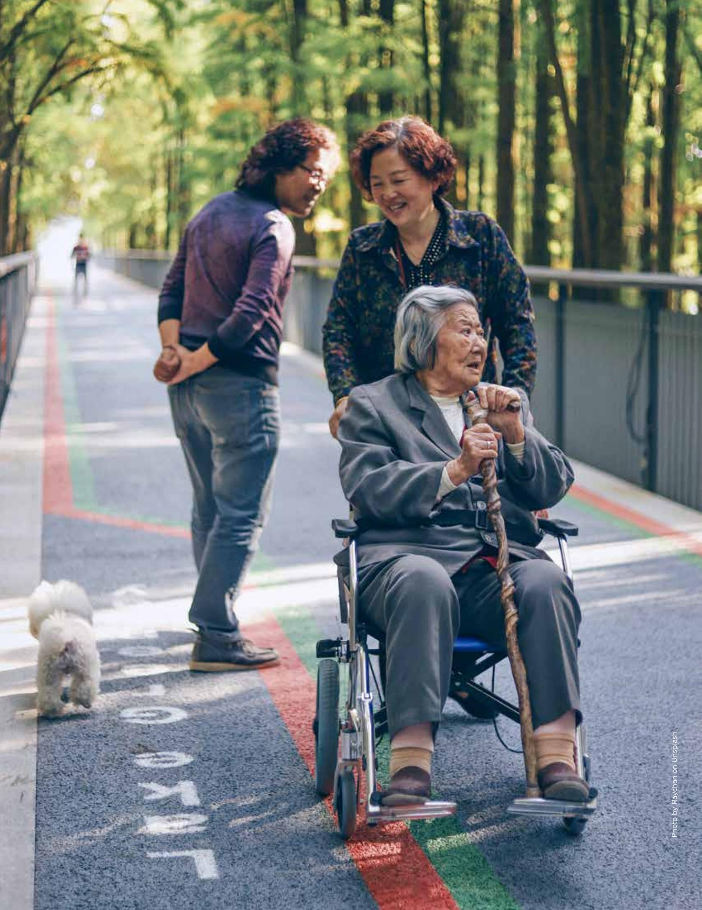

moderately strong correlation of 0.69 between balance and GDP per capita. GDP is not the only relevant factor for balance - as we show in appendix 2 - but the economic dimension to these rankings is too stark to not remark upon here.

#### **Global Patterns of Peace with Life**

The item on balance is supplemented by a trio of questions around low arousal positive states, two of which pertain to *experiences* of such states. The first is, "In general, do you feel at peace with your life, or not?" We might note that asking about peace *with* one's life perhaps suggests an acceptance of one's situation (e.g., "I've made peace with that"), whereas asking about peace *in* one's life would more directly imply that life is peaceful and serene. Nevertheless, it still can be read as an item pertaining to low arousal positive states.

Again, this item has striking variation (see Appendix 6 Table 2 for details). The list is topped by the Netherlands (97.6), followed by Iceland (97.3), Taiwan (95.6), Finland (95.1), Norway (94.9), Lithuania (94.6), Saudi Arabia (94.6), Malta (94.4), Denmark (94.1), and Austria (93.9). These high levels are in contrast to the bottom ten, featuring Pakistan (65.7), Hong Kong (65.1), Iran (64.1), Zimbabwe (63.9), Uganda (63.5), Turkey (62.6), Congo Brazzaville (62.3), Georgia (57.2), Mali (50.5), and Lebanon (46.9).

The two trends noted above are also apparent here. First, as per balance, experiences of peace do not seem a particularly Eastern phenomenon. The top ten countries are mostly European, while countries in the East do not rank especially highly. Although Taiwan is 3rd (95.6%), others are much further down, with Japan 88th (75.0), followed by the Philippines in 91st (74.1), and Cambodia 102nd (67.9), with Hong Kong in the bottom ten (65.1). Using our regional groupings, there was again a higher average of people feeling at peace in WEIRD countries (90.1) than East Asian ones (80.5) or the rest of the world (79.8). Similarly, as per balance, among the WEIRD group, feeling at peace is more prevalent in the Nordic countries (95.2) than others (88.6). Second, we again see a notable economic dimension to this outcome, with the top ten mostly being affluent European

countries and the bottom ten mostly poor African countries. Indeed, overall there is a correlation of 0.48 (*p* < .001) between country GDP and the percentage of the population saying they feel at peace.

#### **Global Patterns of Experiencing Calmness**

The second item on low arousal positive states asked whether people experienced calmness "during a lot of the day yesterday." There is again substantial variation on this item. However, the distribution is slightly different compared to the first two items. The top ten is far less eurocentric, led by Vietnam (94.7), then Jamaica (93.8), Philippines (92.7), Kyrgyzstan (91.8), Finland (89.7), Romania (88.8), Estonia (88.8), Portugal (88.2), Ghana (88.0), and Croatia (87.1). The bottom ten is also less African-centric, comprising Pakistan (61.1), Iran (60.4), Benin (59.3), Tajikistan (59.1), Lebanon (56.2), Congo Brazzaville (55.4), Guinea (54.2), India (50.2), Israel (47.7), and Nepal (37.7).

Despite the different composition of the top and bottom ten countries (compared to the first two items), the two patterns noted above are nevertheless evident here as well (though to a slightly lesser extent). Once again, first, the rankings have no particular association with Eastern countries. Second, this outcome also has an economic dimension, with a small-to-medium correlation of 0.25 between calmness and GDP per capita. However, this relationship is less marked than the first two items since the higher ranking countries include those further down the economic scale.

### **Global Patterns of Preference for Calmness**

The final question relating to low arousal positive states also pertains to calmness. However, while the previous item asked about *experiences* of calmness, this one is about *preferences* for it. In particular, it asks whether people would rather live "an exciting life or a calm life." The item was formulated based on the notion that both options are potentially desirable and not mutually exclusive. More specifically, calmness and excitement were selected as potential proxies for a preference for low versus high arousal positive emotions. Although this alignment is not perfect,53 the item nevertheless may allow

exploration of the extent to which cultures may differentially valorize these two arousal forms. As such, it is interesting to see, if prompted to choose, which people prefer. Indeed, most people *do* choose one or the other: in total, 74.3% of respondents around the globe preferred a calm life, and 17.4% preferred an exciting life, while only 8% said both and 0.4% said neither.

Overall, there was a clear preference for a calm life, which most people chose in all but two countries (Vietnam and Georgia were the exceptions). There was nevertheless a range of scores (see Appendix 6 Table 4 for details). Moreover, the pattern constituted a relative inversion of that for balance and peace. Here, the *top* ten were African-centric, led by Congo Brazzaville (93.7), followed by Cameroon (94.5), Tanzania (93.6), Mali (92.0), Guinea (91.6), Hong Kong (91.3), Myanmar (91.1), El Salvador (90.4), Gabon (90.1), and Morocco (89.8). By contrast, the bottom ten were relatively mixed globally, featuring Lithuania (54.1), Nigeria (53.3), Iceland (53.2), Ghana (51.6), South Africa (51.4), Kyrgyzstan (49.0), Israel (45.8), Cambodia (45.6), Georgia (44.8), and Vietnam (37.5).

Once again, we can remark upon the two main trends we've been commenting upon throughout these items. First, the preference for calmness does not have any particular association with Eastern countries. Second, there again appears to be an economic dimension, but this time the higher-ranked countries – i.e., with a greater preference for calmness – are relatively *poor*. In that respect, GDP per capita has a small-medium positive correlation with preference for an exciting life (0.37) and a small negative correlation with preference for a calm life (-0.21). One possible interpretation of these trends is that people in richer countries may have greater relative security to pursue excitement. In contrast, poorer countries may prefer the comparative safe haven of calmness. The latter preference makes even more sense given that people in poorer countries are less likely to *experience* calmness – as discussed above – hence making it all the more appealing as an option.

#### **Global Patterns of Caring for Self versus Others**

Besides asking about people's preference for calmness, the module featured another relevant value preference item about prioritising self versus others, which could be read as tapping into the individualism-collectivism distinction. It asks, "Do you think people should focus more on taking care of themselves or on taking care of others?" While the relevance of this item to balance/ harmony is more subtle and oblique, it does have a meaningful contribution to our understanding of these topics.

One might argue, for example, that harmony is best served – at least in a social or relational sense – by people giving greater priority to caring for others than for themselves. Then, more generally, the question of focusing on self versus others is one of the many phenomena to which considerations of balance/harmony apply. Clearly, there is a balance to be struck between being self- and other-focused, and arguably people rarely *exclusively* focus on either option. It is interesting to explore though which option people select if prompted to choose. Once again, people *do* often choose (albeit not to the same degree as calm versus excitement). Overall, 47.9% of respondents opted for taking care of themselves, and 27.8% picked taking care of others, while 22.8% of people answered "both", and only 0.3% said neither.

The further significance of this item is that, to an extent, it maps onto the distinction between individualism and collectivism.54 As discussed above, while this binary has long been used as a marker differentiating Western and Eastern cultures, it is problematic in various ways. Moreover, emergent research suggests global patterns in relation to these constructs may be more complex and nuanced than the simple yet common generalisation of the West as individualist and the East as collectivistic.

These nuances are borne out in the data. Just as balance/harmony are not exclusively Eastern phenomena – but are experienced and preferred globally – neither is the prosocial prerogative of focusing on other people. Based on the standard narrative of the East being collectivistic, one might expect a trend in that region towards a

**Table 6.1: Simple correlations between life evaluation, balance, calmness, and peace**

| Item name       | Life Evaluation | Balance | Calmness | Peace |
|-----------------|-----------------|---------|----------|-------|
| Life evaluation | 1               | 0.25    | 0.11     | 0.25  |
| Balance         | 0.25            | 1       | 0.16     | 0.40  |
| Calmness        | 0.11            | 0.16    | 1        | 0.18  |
| Peace           | 0.25            | 0.40    | 0.18     | 1     |

preference for taking care of others. However, contrary to that expectation, responses in Eastern countries appear to show a clear preference for people taking care of *themselves* (see Appendix 6 Table 5 for details). The top ten countries with such a preference are Asian-centric, led by the Philippines (89.0), followed by Indonesia (84.1), Thailand (81.5), Cambodia (79.0), Mauritius (77.5), South Korea (77.2), Kosovo (74.6), Malaysia (72.3), Tunisia (71.6), and Taiwan (71.5). By contrast, the bottom ten – those where only a minority of respondents asserted that people should take care of themselves – featured six European nations, including Italy (30.3), Belgium (29.9), Ghana (29.7), Lithuania (29.1), Netherlands (27.9), India (26.0), Tajikistan (25.9), Germany (22.9), Austria (18.2), and Pakistan (13.3). Indeed, comparing East Asia with the WEIRD countries, a focus on others (relative to focus on self or both) is much more prevalent in the WEIRD countries (44.6) than in East Asia (25.4).

# **The Relationship between Life Evaluation and Balance / Harmony**

Having explored the extent to which balance/ harmony are experienced and preferred by people, lastly we consider whether they seem to be *impactful* for people. Specifically, we assess how balance/harmony relate to life evaluation (as indexed by Cantril's ladder). We begin by looking at the correlations between life evaluation and balance/harmony. Then we consider the associations between these items using regression analyses. Finally, we investigate whether balance/harmony are more predictive of life evaluation in certain world regions (e.g., East versus West).

## **Relations Between Life Evaluation and Balance / Harmony**

In exploring the relationship between life evaluation and balance/harmony, we can begin with simple correlations. Table 6.1 above shows the correlations between life evaluation and experiences of balance, peace, and calmness.55 The correlations between life evaluations and balance (+0.25) and peace (also +0.25) are higher than between individual-level life evaluations and any of the other variables used in Chapter 2 and Tables 6.2 and 6.3 below to explain life evaluations. In the sample of almost 96,000 global respondents replying to all relevant questions, the next two highest correlations are between life evaluations and the log of household income (+0.220) and having friends to count on (+0.225).

Moreover, we can go beyond the simple correlations to ask what the balance/harmony variables contribute to the explanation of life evaluations when added to the model used in Chapter 2 to explain individual-level life evaluations over the 2017-2021 sample period (which is thus used to assess the impact of COVID-19 on life evaluations). Table 6.2 has two equations, one with and one without the balance/ harmony variables. Both equations are estimated using the same samples of 2020 data, including all respondents answering the balance/harmony and other questions. Both equations also include country fixed effects, as is also done in the equations in Chapter 2.

The balance/harmony items are statistically significant predictors of life evaluation (all at *p* < 0.001), especially balance and peace (and less so calmness), which have fairly strong

**Table 6.2: Individual-level regressions for life evaluations using 2020 data, with and without balance/harmony variables**

| Characteristics      | Estimate (with balance / harmony) | Estimate (without balance / harmony | Characteristics     | Estimate (with balance / harmony)                                                                                                                                                                                                                                                   | Estimate (without balance / harmony |
|----------------------|-----------------------------------------|----------------------------------------------|---------------------|-------------------------------------------------------------------------------------------------------------------------------------------------------------------------------------------------------------------------------------------------------------------------------------------|----------------------------------------------|
| Balance              | 0.37***                                 |                                              | Sep div wid         | -0.17***                                                                                                                                                                                                                                                                                  | -0.18***                                     |
|                      | (0.03)                                  |                                              |                     | (0.04) 0.38*** (0.02) -0.38*** (0.04) -0.04 (0.04) 0.08** (0.03) 0.17*** (0.03) 0.26*** (0.03) 0.19*** (0.02) -0.27*** (0.02) -0.20*** (0.03) -0.10** (0.03) -0.18*** (0.02) 4.27 (0.13) 0.26 113 95,182 | (0.04)                                       |
| Peace                | 0.46***                                 |                                              | College             |                                                                                                                                                                                                                                                                                           | 0.39***                                      |
|                      | (0.03)                                  |                                              |                     |                                                                                                                                                                                                                                                                                           | (0.02)                                       |
| Calm yesterday       | 0.02                                    |                                              | Unemployed          |                                                                                                                                                                                                                                                                                           | -0.43***                                     |
|                      | (0.03)                                  |                                              |                     |                                                                                                                                                                                                                                                                                           | (0.04)                                       |
| Preference for       | -0.09***                                |                                              | Foreign born        |                                                                                                                                                                                                                                                                                           | -0.05                                        |
| calmness             | (0.02)                                  |                                              |                     |                                                                                                                                                                                                                                                                                           | (0.04)                                       |
| Focus on others      | 0.03                                    |                                              | Institutional trust |                                                                                                                                                                                                                                                                                           | 0.13**                                       |
|                      | (0.02)                                  |                                              |                     |                                                                                                                                                                                                                                                                                           | (0.03)                                       |
| Log HH income        | 0.09 ***                                | 0.10***                                      | Smile/laugh         |                                                                                                                                                                                                                                                                                           | 0.22***                                      |
|                      | (0.01)                                  | (0.01)                                       |                     |                                                                                                                                                                                                                                                                                           | (0.03)                                       |
| Health problem       | -0.33***                                | -0.37***                                     | Enjoyment           |                                                                                                                                                                                                                                                                                           | 0.32***                                      |
|                      | (0.03)                                  | (0.03)                                       |                     |                                                                                                                                                                                                                                                                                           | (0.03)                                       |
| Count on friends     | 0.57***                                 | 0.63***                                      | Learn/do something  |                                                                                                                                                                                                                                                                                           | 0.21***                                      |
|                      | (0.03)                                  | (0.03)                                       | interesting         |                                                                                                                                                                                                                                                                                           | (0.02)                                       |
| Freedom              | 0.26***                                 | 0.39***                                      | Worry               |                                                                                                                                                                                                                                                                                           | -0.31***                                     |
|                      | (0.03)                                  | (0.03)                                       |                     |                                                                                                                                                                                                                                                                                           | (0.02)                                       |
| Donation             | 0.24***                                 | 0.26***                                      | Sadness             |                                                                                                                                                                                                                                                                                           | -0.25***                                     |
|                      | (0.02)                                  | (0.02)                                       |                     |                                                                                                                                                                                                                                                                                           | (0.03)                                       |
| Perceptions of       | -0.23***                                | -0.23***                                     | Anger               |                                                                                                                                                                                                                                                                                           | -0.13***                                     |
| corruption           | (0.03)                                  | (0.03)                                       |                     |                                                                                                                                                                                                                                                                                           | (0.03)                                       |
| Age < 30             | 0.25***                                 | 0.25***                                      | Stress              |                                                                                                                                                                                                                                                                                           | -0.21***                                     |
|                      | (0.03)                                  | (0.03)                                       |                     |                                                                                                                                                                                                                                                                                           | (0.02)                                       |
| Age 60+              | 0.14***                                 | 0.18***                                      | Constant            |                                                                                                                                                                                                                                                                                           | 4.61                                         |
|                      | (0.03)                                  | (0.03)                                       |                     |                                                                                                                                                                                                                                                                                           | (0.13)                                       |
| Female               | 0.25***                                 | 0.26***                                      | Adj. R2             |                                                                                                                                                                                                                                                                                           | 0.25                                         |
|                      | (0.02)                                  | (0.02)                                       | Number of countries |                                                                                                                                                                                                                                                                                           | 113                                          |
| Married / common law | 0.00                                    | 0.03                                         | Number of observa   |                                                                                                                                                                                                                                                                                           | 95,182                                       |
|                      | (0.03)                                  | (0.03)                                       | tions               |                                                                                                                                                                                                                                                                                           |                                              |

Standard errors clustered at the country level are reported in parentheses. \* = p < .05, \*\* = p < .01, \*\*\* = p < .001

associations. With balance, for instance, the estimate of 0.37 means that compared to people without a balanced life, those with a balanced life had 0.37 points higher life evaluation (holding all other independent variables constant). In this analysis, only friend support (0.57) was more predictive of life evaluation than balance/ harmony. Other factors such as health and

education were comparable in their associations with life evaluation.

In conducting these regression analyses, it is also interesting to consider which factors predict people's experiences of balance/harmony. An analysis of these factors can be found in appendix 2, but we can note here that they include a wide array of characteristics. Being older, being

married, not having health problems, friendship support, freedom, generosity, institutional trust, lack of negative emotions (worry, sadness, stress, anger), and enjoyment and laughter are all significant predictors associated with at least a 5% increase in the likelihood of having a sense of balance in life.

## **Regional Associations Between Life Evaluation and Balance/Harmony**

One of the central propositions animating this chapter is that balance/harmony matter to all people. It is natural to ask though whether this impact is nevertheless *different* for particular cultures. To do this, in Table 6.3 below we re-estimate the equation in Table 6.2 for our three main regional groupings – WEIRD, East Asian, and the rest of the world – in terms of the associations between balance / harmony and life evaluation.

Within the overall finding that these variables matter for people all over the globe, some intriguing regional patterns were observed. While appraisals of life balance are less prevalent in East Asia than in the WEIRD countries, their presence more strongly predicts life evaluations in East Asia (0.58 in East Asia compared to 0.29 in the WEIRD countries). This combination of high preference and low attainment for life balance may be a factor contributing to lower life evaluations in East Asia relative to other regions. In contrast, the pattern was reversed for peace in life, where its presence more strongly predicts life evaluations in WEIRD places (0.74) than in East Asia (0.28). Given that peace in life is also less prevalent in East Asia than in WEIRD countries, and by about the same amount, this would offset the possible consequences outlined above for balance. Overall though, the positive associations between life evaluations and experiences of peace and balance are substantial in all regions.

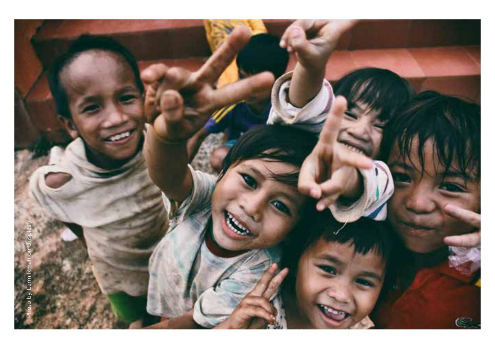

**Table 6.3: Regional Individual-level regressions for life evaluations with and without balance/harmony variables**

|                           |          | With balance / harmony |                  |          | Without balance / harmony |                  |  |  |
|---------------------------|----------|------------------------|------------------|----------|---------------------------|------------------|--|--|
| Characteristics           | WEIRD    | East Asia              | Rest of world | WEIRD    | East Asia                 | Rest of world |  |  |
| Balance                   | 0.29***  | 0.58***                | 0.37***          |          |                           |                  |  |  |
|                           | (0.05)   | (0.09)                 | (0.03)           |          |                           |                  |  |  |
| Peace                     | 0.73***  | 0.28**                 | 0.42***          |          |                           |                  |  |  |
|                           | (0.07)   | (0.1)                  | (0.04)           |          |                           |                  |  |  |
| Calm yesterday            | -0.04    | 0.10                   | 0.04             |          |                           |                  |  |  |
|                           | (0.04)   | (0.08)                 | (0.03)           |          |                           |                  |  |  |
| Preference for calmness   | -0.10**  | 0.03                   | -0.08**          |          |                           |                  |  |  |
|                           | (0.03)** | (0.08)                 | (0.03)           |          |                           |                  |  |  |
| Focus on others           | 0.00     | 0.12                   | 0.04             |          |                           |                  |  |  |
|                           | (0.03)   | (0.07)                 | (0.03)           |          |                           |                  |  |  |
| Log HH income             | 0.14***  | 0.12***                | 0.08***          | 0.15***  | 0.12***                   | 0.09***          |  |  |
|                           | (0.02)   | (0.03)                 | (0.01)           | (0.02)   | (0.03)                    | (0.01)           |  |  |
| Health problem            | -0.45*** | -0.23**                | -0.30***         | -0.52*** | -0.24**                   | -0.32***         |  |  |
|                           | (0.04)   | (0.09)                 | (0.03)           | (0.04)   | (0.09)                    | (0.03)           |  |  |
| Count on friends          | 0.51***  | 0.74***                | 0.57***          | 0.59***  | 0.79***                   | 0.63***          |  |  |
|                           | (0.07)   | (0.11)                 | (0.04)           | (0.07)   | (0.11)                    | (0.04)           |  |  |
| Freedom                   | 0.27***  | 0.28***                | 0.26***          | 0.39***  | 0.45***                   | 0.39***          |  |  |
|                           | (0.05)   | (0.08)                 | (0.03)           | (0.05)   | (0.07)                    | (0.03)           |  |  |
| Donation                  | 0.17***  | 0.09                   | 0.27***          | 0.18***  | 0.09                      | 0.29***          |  |  |
|                           | (0.03)   | (0.07)                 | (0.03)           | (0.03)   | (0.07)                    | (0.03)           |  |  |
| Perceptions of corruption | -0.11**  | -0.24**                | -0.27***         | -0.12**  | -0.29***                  | -0.27***         |  |  |
|                           | (0.04)   | (0.09)                 | (0.04)           | (0.04)   | (0.09)                    | (0.04)           |  |  |
| Age < 30                  | 0.14**   | 0.09                   | 0.26***          | 0.13**   | 0.10                      | 0.26***          |  |  |
|                           | (0.05)   | (0.09)                 | (0.03)           | (0.05)   | (0.09)                    | (0.03)           |  |  |
| Age 60+                   | 0.15***  | 0.52***                | 0.13**           | 0.18***  | 0.58***                   | 0.17***          |  |  |
|                           | (0.04)   | (0.1)                  | (0.04)           | (0.04)   | (0.1)                     | (0.04)           |  |  |
| Female                    | 0.09***  | 0.20**                 | 0.29***          | 0.10***  | 0.24***                   | 0.31***          |  |  |
|                           | (0.03)   | (0.06)                 | (0.02)           | (0.03)   | (0.06)                    | (0.02)           |  |  |
| Married / common law      | 0.15***  | 0.06                   | -0.04            | 0.19***  | 0.12                      | -0.02            |  |  |
|                           | (0.04)   | (0.08)                 | (0.03)           | (0.04)   | (0.08)                    | (0.03)           |  |  |
|                           |          |                        |                  |          |                           |                  |  |  |

**Table 6.3: Regional Individual-level regressions for life evaluations with and without balance/harmony variables** (continued)

|                                   | With balance / harmony |           |                  | Without balance / harmony |           |                  |
|-----------------------------------|------------------------|-----------|------------------|---------------------------|-----------|------------------|
| Characteristics                   | WEIRD                  | East Asia | Rest of world | WEIRD                     | East Asia | Rest of world |
| Sep div wid                       | -0.01                  | 0.00      | -0.21***         | 0.00                      | -0.03     | -0.23***         |
|                                   | (0.06)                 | (0.15)    | (0.05)           | (0.06)                    | (0.15)    | (0.05)           |
| College                           | 0.19***                | 0.41***   | 0.45***          | 0.20***                   | 0.45***   | 0.46***          |
|                                   | (0.03)                 | (0.06)    | (0.02)           | (0.03)                    | (0.06)    | (0.02)           |
| Unemployed                        | -0.31***               | -0.35*    | -0.40***         | -0.37***                  | -0.37*    | -0.44***         |
|                                   | (0.08)                 | (0.14)    | (0.05)           | (0.08)                    | (0.15)    | (0.05)           |
| Foreign born                      | -0.08                  | -0.19     | -0.01            | -0.10                     | -0.20     | -0.01            |
|                                   | (0.05)                 | (0.13)    | (0.06)           | (0.05)                    | (0.13)    | (0.06)           |
| Institutional trust               | 0.08*                  | 0.07      | 0.09*            | 0.10**                    | 0.13      | 0.14***          |
|                                   | (0.03)                 | (0.09)    | (0.04)           | (0.03)                    | (0.08)    | (0.04)           |
| Smile/laugh                       | 0.16***                | 0.32***   | 0.17***          | 0.20***                   | 0.37***   | 0.22***          |
|                                   | (0.04)                 | (0.08)    | (0.03)           | (0.04)                    | (0.09)    | (0.03)           |
| Enjoyment                         | 0.30***                | 0.27**    | 0.25***          | 0.34***                   | 0.33***   | 0.31***          |
|                                   | (0.04)                 | (0.09)    | (0.03)           | (0.04)                    | (0.09)    | (0.03)           |
| Learn/do something interesting | 0.21***                | 0.25***   | 0.18***          | 0.23***                   | 0.24***   | 0.20***          |
|                                   | (0.03)                 | (0.06)    | (0.03)           | (0.03)                    | (0.07)    | (0.03)           |
| Worry                             | -0.20***               | -0.11     | -0.29***         | -0.23***                  | -0.18*    | -0.33***         |
|                                   | (0.03)                 | (0.08)    | (0.03)           | (0.03)                    | (0.08)    | (0.03)           |
| Sadness                           | -0.38***               | -0.04     | -0.15***         | -0.45***                  | -0.09     | -0.20***         |
|                                   | (0.04)                 | (0.11)    | (0.03)           | (0.04)                    | (0.11)    | (0.03)           |
| Anger                             | -0.16***               | -0.15     | -0.09**          | -0.22***                  | -0.19*    | -0.12***         |
|                                   | (0.05)                 | (0.1)     | (0.03)           | (0.05)                    | (0.1)     | (0.03)           |
| Stress                            | -0.18***               | -0.35***  | -0.18***         | -0.21***                  | -0.40***  | -0.22***         |
|                                   | (0.03)                 | (0.08)    | (0.03)           | (0.03)                    | (0.08)    | (0.03)           |
| Constant                          | 3.68                   | 2.02      | 2.35             | 4.10                      | 2.50      | 2.72             |
|                                   | (0.24)                 | (0.33)    | (0.16)           | (0.23)                    | (0.32)    | (0.16)           |
| Adj. R2                           | 0.30                   | 0.21      | 0.20             | 0.28                      | 0.19      | 0.19             |
| Number of countries               | 23                     | 6         | 84               | 23                        | 6         | 84               |
| Number of observations            | 19,433                 | 6,960     | 68,789           | 19,433                    | 6,960     | 68,789           |

Standard errors clustered at the country level are reported in parentheses. \* = p < .05, \*\* = p < .01, \*\*\* = p < .001

## **Conclusion**

This chapter exploits a unique global dataset to shed new light on the often-overlooked and under-appreciated topic of balance/harmony – a constellation of phenomena which includes experiences of balance and harmony in themselves, as well as low arousal positive states such as peace and calmness.

Our data first show that experiences of, and preferences for, balance/harmony appear to have universal relevance and appeal. Thus, contrary to the preconceptions or expectations some people may hold, balance/harmony do not have any particular associations with Eastern cultures. In terms of *experiences* of balance/harmony, people in Eastern cultures did not generally have higher levels than those in other regions and indeed had relatively low levels overall. Rather, the higher rankings tended to be dominated by Western countries, particularly the Nordic ones, as do the overall happiness rankings.

However, we should emphasise that this does not mean Eastern cultures have not excelled in highlighting, promoting, and understanding balance/ harmony. As noted above, the East is renowned for traditions that emphasize balance/harmony, like Taoism. Indeed, several of the authors have been greatly influenced by such traditions, which have shaped our collective views on these topics. Moreover, it is possible that such traditions *do* still positively influence balance/harmony in Eastern cultures, even if that impact is not discernible in the associations presented here. Although such cultures did not show particularly high balance/ harmony in our results, it is counterfactually conceivable (but not testable) that *without* their traditions, they might have fared yet more poorly on these outcomes.

In terms of whether people *prefer* to experience balance/harmony, there was a clear preference for a calm life, as chosen by a majority of people in all countries (except Vietnam and Georgia). Once again though, Eastern cultures did not score especially highly on this item. Indeed, the top-ranked nations were mostly in Africa. In that respect, as per experiences of balance/harmony, there may be an economic dimension to the

pattern of responses. However, whereas those most likely to experience balance/harmony may be in richer countries, the people who most *want* to experience it – but crucially may well not do so – tend to be those in poorer places.

As such, experiences of and preferences for balance/harmony appear to be shaped, at least to an extent, by people's social and economic situation. Indeed, from one perspective, these concepts are statements *about* people's situations, at least partly. Concepts like balance, harmony, peace and calm are ambiguous, with an inherent dual meaning: they are inner states of mind *and* outer states of circumstances. Indeed, in responding to the World Poll items, it is not obvious which meaning people are thinking of. Potentially both are at play in an intertwined fashion. Experiencing balance/harmony may be both an inner state and a commentary on one's life situation. Further work will thus be needed to tease apart these two dimensions – 'inner' and 'outer' – of balance/ harmony.

Our results further show that balance/harmony matter to people's happiness worldwide. As detailed in Table 6.2, the global data indicate that balance/harmony variables have highly significant linkages to life evaluations above and beyond those explained by other variables. Regression analyses indicated that, apart from experiencing calmness, balance/harmony items all had a significant association with life evaluation (*p* < 0.001), including especially balance (0.37) and peace (0.46). We obtained interestingly mixed results regarding whether this association

*We approached the analysis guided by two interlinked hypotheses: (1) balance/harmony matter to all people; and (2) balance/harmony are dynamics at the heart of well-being. As we have seen, both hypotheses were corroborated to some extent.*

varies among different cultures. While balance appeared to have a stronger impact in East Asia than in WEIRD countries (with effects of 0.58 versus 0.29 respectively), this pattern was reversed for peace in life (0.74 versus 0.28 respectively). This difference merits further study and understanding. It also raises the question of what the associations might look like if "harmony" itself (rather than "balance") were examined explicitly (i.e., with "harmony" itself included in the item phrasing).

To that latter point, there are various other limitations and open questions regarding this work. It is unclear the extent to which the questions were interpreted similarly across countries (e.g., are words concerning "balance," "calmness," and "peace" understood in similar ways in various languages and cultures)? Do standards of having attained balance or peace differ across countries? Might Eastern countries have higher standards by which they are judging? Further work could also be done to examine longitudinal associations to provide more evidence for causal relations: is it principally that balance and peace contribute to life evaluation, or that those satisfied with their life subsequently find peace and balance, or both?

Nevertheless, such open questions notwithstanding, the World Poll data for 2020 offer support for two important points that previous research has not been able to address comprehensively, but which the unique worldwide vantage point of the poll allows us to explore globally. First, balance/ harmony "matter" to all people, including being *experienced* by, *preferred* by, and seemingly *impactful* for people, in a relatively universal way. Second, and relatedly, balance and feeling at peace with life could be considered central to well-being, on a par with other key variables linked to high life evaluations, such as income, absence of health problems, and having someone to count on in times of need. This provides a strong case for their continuing to be monitored and further studied regularly, both in the Gallup World Poll and beyond.

#### **Endnotes**

- \* We are likewise thankful for the funders of the GWI, including the Wellbeing for Planet Earth foundation, Unson Foundation and PERSOL Holdings co., ltd. We would especially like to share credit with the Gallup personnel involved with the GWI, including Kristjan Archer, Benedicte Clouet, Joe Daly, Cynthia English, Khorshied Nusratty, and Priscilla Standridge. Finally, we greatly appreciate the community of scholars connected with the GWI, especially Antonella Delle Fave, Oscar Kjell, Matt Lee, and Paul Wong, whose prior work on balance/harmony helped shape the research.
- 1 See Cantril (1965).
- 2 See Zadeh (2015) for a review of the concepts of "fuzzy" sets, boundaries, and logic.
- 3 In terms of emotions, balance/harmony are invoked in numerous constructs. Following work by Bradburn (1969), "affect balance" is understood as pertaining to the ratio of positive to negative emotions experienced by a person, whereby well-being is generally viewed as the former outweighing the latter to some extent. Parks et al. (2012), for instance, conclude that high well-being involves a ratio of positive to negative emotions of at least 2.15:1. However, work on such ratios has been critiqued by Brown et al. (2013), and their precise dynamics are yet to be ascertained (Nickerson, 2018). In slightly different conceptual territory are constructs like "emotional equanimity" (Desbordes et al., 2015) and "emotional equilibrium" (Labouvie-Vief et al., 2010), which pertain more to low arousal emotional states (e.g., calmness, peace, tranquillity). These two have subtle differences though, in that equanimity often implies synchronous balance (e.g., emotional neutrality at a given moment), while equilibrium can describe a diachronous process that averages out over time (e.g., a capacity to return relatively swiftly from negative or positive affect to a neutral baseline). In that respect, the latter relates to notions such as "emotional homeostasis" (Rinomhota & Cooper, 1996), which describes a complex system's ability to self-regulate around a desired set-point.
- 4 Attentional balance is one of several forms of "mental balance" identified in a comprehensive review - drawing on Buddhist psychology - by Wallace and Shapiro (2006). They argue for an optimal balance between attentional deficit (i.e., inability to focus) and hyperactivity (i.e., the mind being excessively aroused or distracted), which they suggest can be cultivated through practices like mindfulness. Closely related to attentional balance is "cognitive balance." In their framework, this refers to mental engagement with reality: cognitive deficit means a relative lack of engagement (i.e., being absent-minded or inattentive), whereas hyperactivity means being overly engaged (i.e., caught up in one's assumptions, and imposing biases and projections upon reality).
- 5 Motivational balance is another form of mental balance identified by Wallace and Shapiro (2006), who refer to it as "conative balance" (which also encompasses phenomena such as intention and volition). Situated in this space are numerous relevant constructs and related research. One example is Vallerand's (2008) dualistic model of passion, which differentiates "harmonious" forms (i.e., accommodating to other aspects of life, and conducive to well-being overall) from "obsessive" forms (i.e., all-consuming, and

- hindering well-being). Another example is Block and Block's (2006) notions of ego control and ego resiliency. Ego control refers to whether people characteristically express affect and impulse (under-control) versus inhibit such tendencies (over-control). Ego resiliency is then the ability to strike an optimal balance between under- and overcontrol, skilfully adapting according to one's situational dynamics (Seaton & Beaumont, 2015).
- 6 In terms of character, recognition of the relevance of balance/harmony is often traced specifically to Aristotle (2000). In articulating his ideas on virtue, for instance, his principle of the "golden mean" held that one should judiciously tread a middle line between opposing vices of excess and deficiency (courage, for example, involves avoiding both cowardice and recklessness). Such ideas have been embraced by contemporary researchers. For instance, Rashid (2015) and Niemiec (2017) have pioneered an approach to understanding mental illness and health based on under- and over-use of character strengths. From this perspective, strengths (e.g., perseverance) are not positive in themselves, but only insofar as one finds a middle ground between under-use (e.g., laziness) and over-use (e.g., stubbornness). Such ideas have been applied vis-a-vis conditions including social anxiety (Freidlin et al., 2017) and obsessive-compulsive disorder (Littman-Ovadia & Freidlin, 2019).
- 7 Diet and nutrition are one of several areas of "body maintenance activities" - i.e., keeping the body healthy and functioning well - to which principles of balance/harmony apply. Indeed such activities are sometimes specifically called ''energy balance-related behaviours" (Kremers, 2010). Although finding expert consensus around dietary recommendations is rare, balance/harmony are nevertheless usually present in most guidance. In terms of specific items, seldom can substances be categorically deemed helpful or harmful; e.g., even "water intoxication" can be dangerous (Radojevic et al., 2012). Rather, it depends upon the Goldilocks principle of finding the *right* amount. Then, overall, it is almost universally recognized that a diet ought to be "balanced," comprising a good composite mixture of various food groups and elements (Sofi et al., 2008).
- 8 Sleep/rest are another important category of body maintenance activities to which balance/harmony apply. With sleep, one should ideally strike an optimal balance between insufficient and excessive sleep, both of which can be detrimental to well-being (Yang et al., 2015). Similar principles apply to rest/activity in general. In the workplace, for instance, while over-exertion can be problematic (e.g., necessitating remedial actions, such as regulations to limit working hours), so too is under-exertion (e.g., leading to interventions to limit sedentary behaviours, such as active workstations) (Dupont et al., 2019).
- 9 Regarding exercise, although finding consensus in recommendations is also rare (as per diet), balance/ harmony are invariably integral to most guidelines. First, as per other body maintenance activities, while exercise is generally recognized as important, it is nevertheless a question of striking an optimal balance between too little and too much, both of which can hinder well-being (Blond et al., 2019). Then, in terms of specific activities, a good

- balanced mix of different types including endurance, strength, flexibility, and balance activities - is usually recommended (National Institute on Aging, 2018).
- 10 Work-life balance is the most widely recognized and cited aspect of balance/harmony in academia, with the largest literature devoted to it (e.g., a Google Scholar search for "work-life balance" returns 273,000 results). The relevant research is now so extensive that there are numerous systematic reviews or meta-analyses focusing just on specific aspects and outcomes, such as organisational performance (Wong et al., 2020), or on particular contexts and populations, such as Asia (Le et al., 2020).
- 11 Many relationship scholars and therapists emphasise the importance of balance/harmony in some way. This includes, for example, acknowledging the value to successful partnerships of principles such as reciprocity and fairness, which can be interpreted as being about striking a balance between the needs and goals of the various partners (Pillemer et al., 2008). The importance of reciprocity is partly a question of people wanting fair treatment, as elucidated by game theory (Debove et al., 2016). However, people also tend to value treating others fairly, and are often reluctant to "over-benefit" from the relationship at their conspecific's expense (McPherson et al., 2010).
- 12 With larger aggregations of people, one often finds reference to a "harmonious society". This goal may potentially be more commonly invoked in Eastern rather than Western societies, given the former's emphasis on collectivism - as discussed in the text - an ideal frequently *interpreted* through the lens of societal harmony itself (Hook et al., 2008; Ip, 2014). That said, even if the notion of "societal harmony" is less often used in Western contexts, ideals around social interaction can nevertheless be construed as a form of harmony, wherein people co-exist and interact productively (Hall & Lamont, 2013).
- 13 Regarding politics, it is conventional to analyse and situate political views on a left-right spectrum. In that respect, democratic governments usually try to win and maintain power by striking an optimal balance between these poles, one that is appealing to a majority of people (Lomas, 2017). For example, one manifestation of this left-right polarity is taxation, with the left and right generally favouring higher and lower taxation respectively. Rather than cleaving to either extreme (i.e., a 100% versus 0% tax rate), most governments try to find some optimal point between them (i.e., one that is practical, sustainable, and supported or at least tolerated by a majority of the population).
- 14 Balance/harmony apply to humans' relationship with the natural world, as elucidated by Kjell (2011). Indeed, it is increasingly recognized that finding such balance/harmony is necessary for the prosperity and even the very survival of humankind. Notions of living in harmony with nature have previously tended to be somewhat niche concerns in industrialised nations. Less industrialised cultures – particularly indigenous ones – are often seen as having more successfully developed and/or maintained philosophies of such harmony, which includes balancing humans' needs with those of the natural world (Izquierdo, 2005; Lomas, 2019). By contrast, more industrialised countries have been dominated by disconnected, instrumentalist modes of relationship which view nature

- more as a resource to be exploited. But growing recognition of the climate crisis has brought environmentalism to the fore worldwide (Pihkala, 2018), including realising that aspirations for economic growth must be balanced against the earth's capacity to sustain it (Schumacher, 2011).
- 15 See Li (2008, 2012) and Lomas (2021).
- 16 As developed in Aristotle's (2000) Nicomachean Ethics; see Niemiec (2017) for a contemporary exposition and adaptation.
- 17 Each has an extensive literature: a search on Google Scholar in January 2022, for example, returned approximately 273,000 hits for the specific phrase "work-life balance" and 115,000 for "balanced diet."
- 18 See Delle Fave et al. (2011), who conducted a mixed-methods study with 666 participants in Australia, Croatia, Germany, Italy, Portugal, Spain, and South Africa (although the status of the latter as Western is potentially ambiguous and disputed). Delle Fave et al. (2016) then also conducted a follow-up study with 2,799 participants in Argentina, Brazil, Croatia, Hungary, India, Italy, Mexico, New Zealand, Norway, Portugal, South Africa, and the United States.
- 19 See Ragnarsdottir (1996).
- 20 See Lomas (2021) for a review of the concepts of balance and harmony and their application across various life domains.
- 21 See Dunne (2017).
- 22 See Li (2008) for a review of ideals of harmony in classical Chinese and Greek philosophy.
- 23 See Delle Fave et al. (2016).
- 24 See e.g., Diener et al. (1999).
- 25 See McManus et al. (2019) for commentary on the tendency of research on positive emotions to focus on high arousal forms, and also for a review of the predictive value of low arousal positive emotions.
- 26 See Kjell and Diener (2021).
- 27 See Henrich et al. (2010).
- 28 See Arnett (2008).
- 29 See Lomas (2018) for a theoretical review of the impact of language in particular on the way people experience and understand the world (an extensive body of research sometimes referred to broadly as the "linguistic relativity hypothesis").
- 30 Although the WEIRD framework has been very impactful and necessary, Ghai (2021) suggests that classifying places in a binary way as WEIRD or non-WEIRD may be unhelpful, and it may be better to view each element of the acronym as a spectrum upon which countries may be variously situated. See also Muthukrishna et al. (2020), who have created a tool for mapping degrees of WEIRDness (and more generally measuring the psychological and cultural distance between societies).
- 31 Analysing wellbeing scholarship over the past 150 years, Lomas (2022) suggests we are now seeing an emergent wave of "global well-being scholarship," featuring a concerted effort to engage with cross-cultural populations

and ideas. Although there is a long tradition of cross-cultural research dating back over a century, it has been fairly niche in fields like psychology as a whole. However, in the wake of critiques like Henrich et al. (2010), there is an increasingly widespread recognition of the need for research to become less Western-centric, and indeed positive steps towards that goal. Hendricks et al. (2019) conducted a bibliometric analysis of randomised controlled trials of "positive psychology interventions", for example, and of 188 studies identified, 78.2% were conducted in Western countries. However, the authors note "a strong and steady increase in publications from non-Western countries since 2012", indicating an encouraging "trend towards globalization" of happiness research (p.489).

- 32 Tsai (2007) described such preferences as "ideal affect" (i.e., "the affective states that people strive for or ideally want to feel"; p.243). Tsai has been at the forefront of work indicating different forms of ideal affect in Eastern and Western cultures, observing overall that Eastern cultures lean towards valuing low arousal forms of affect (see e.g., Tsai et al., 2000, 2006a, 2006b, 2007a, 2007b, 2007c, Tsai & Levenson, 1997, Sims et al., 2015).
- 33 The individualism-collectivism distinction was first brought to attention by Hofstede (1980), who developed it initially as a societal identifier (i.e., a way of identifying and differentiating cultural contexts). It was then developed further by Markus and Kitayama (1991), who shifted the emphasis by viewing it more in terms of self-construal (i.e., how people in different cultures view themselves).
- 34 This literature is now so substantial that there are many meta-analyses, not only of the individualism-collectivism distinction in general, but of specific facets of it, including its relationship to: subjective well-being (Yu et al., 2018); self-concepts (Oyserman et al., 2002); conformity (Bond & Smith, 1996); social media use (Cheng et al., 2021); ethnicity (Vargas & Kemmelmeier, 2013); socio-economic development (Santos et al., 2017); cultural products (Morling & Lamoreaux, 2008); cultural change (Taras et al., 2012); and justice (Sama & Papamarcos, 2000).
- 35 Santos et al. (2017), for example, examined 51 years of data on individualist practices and values across 78 countries, and found that individualism appears to be rising in most (with the exceptions being Cameroon, Malawi, Malaysia, and Mali in terms of "cultural practices," and Armenia, China, Croatia, Ukraine, and Uruguay in terms of "cultural values").
- 36 Nisbett et al. (2001) presented an initial case for this distinction, drawing on various empirical literature. It has since been explored and corroborated in numerous studies. For instance, Han and Ma (2014) found different patterns of neural activation in Western versus Eastern participants based on these modes.
- 37 As with the individualism-collectivism distinction, the literature is now so extensive that meta-analyses of East versus West differences have been conducted in relation to various specific phenomena, including: neural activity (Han & Ma, 2014); locus of control (Cheng et al., 2013); moral viewpoints (Forsyth et al., 2008); social anxiety (Woody et al., 2015); grit (Lam & Zhou, 2021); social capital (Zhang et al., 2019); gender differences (Shan et al., 2019); bullying/ victimisation (Yuchang et al., 2019); corporate governance

- (Cao et al., 2019); organisational justice (Li & Cropanzano, 2009); and attitudes towards ageing (North & Fiske, 2015).
- 38 See Joshanloo (2014) for a review of how various Eastern traditions have shaped cultural views around happiness in the region.
- 39 See Li (2012), p.845, and also Li (2008).
- 40 This analysis derives from a qualitative analysis of college students (95 American and 73 Japanese) by Uchida and Kitayama (2009).
- 41 Hitokoto and Uchida (2015) developed their nine item Interdependent Happiness Scale over several studies. In study 1, interdependent happiness correlated with both subjective well-being and interdependent self-construal among Japanese students. Study 2 then found that these students' subjective well-being was more likely to be explained by the Interdependent Happiness Scale than that of American students. In study 3, the Interdependent Happiness Scale explained the subjective well-being of working adults in the US, Germany, Japan, and Korea. Likewise in study 4 it explained the subjective well-being of Japanese adults and elders from more collectivist regions of the country.
- 42 Besides the work by Tsai (see endnote 32), these studies include: a survey of college students (597 Chinese and Taiwanese and 91 European American) by Lee et al. (2013) in the development of their Peace of Mind Scale; a survey of college students (330 European-American, 156 immigrant Asian, and 147 Asian American) by Leu et al. (2011); a survey of college students (439 Taiwanese and 344 British) by Lu et al. (2001); a survey of college students (482 Belgian/Dutch, 223 Spanish, 535 Canadian, 487 Chinese/ Hong Kong, 450 Japanese, and 365 Korean) by Kuppens et al. (2017); an analysis of survey data collected in Hong Kong (n = 2002) and China (n not reported) by Ip (2014); and a longitudinal survey of 107 Chinese workers by Xi et al. (2021).
- 43 See e.g., Leu et al. (2011) and Uchida and Kitayama (2009).
- 44 See e.g., Lee et al. (2012).
- 45 Said (1979) showed that notions of East versus West were not merely generalisations but moreover were potent discourses that could be harnessed in harmful ways. He coined the term "Orientalism" to denote the process by which 19th Century thinkers in the West came to understand themselves and their society by contrasting it with the "Other" of the East in various ways. More benevolent, albeit still problematic, were forms of "Romantic Orientalism," in which the East was viewed through a utopian lens as superior to the West in some manner, such as wiser, less materialistic, and more spiritual. More pernicious were disparaging Orientalist discourses that were used in attempts to justify imperialism and colonialism, for instance presenting the East as apparently inefficient and badly-run and therefore "in need" of intervention.
- 46 See Delle Fave et al. (2011).
- 47 See Delle Fave et al. (2016).
- 48 See Lambert et al. (2020) for an introduction to the Global Wellbeing Initiative, and for a discussion of initial topics of interest.

- 49 See appendix 1.
- 50 The Gallup World Poll divides the countries of the world into 10 regional groups. For the WEIRD countries we combined region 0 (Western Europe) and region 7 (comprising the United States, Canada, New Zealand, and Australia). The East Asian group includes all those in region 5 for which data are available (Japan, South Korea, China, Hong Kong, Taiwan, and Mongolia).
- 51 In these calculations, the WEIRD sample includes the countries of Western Europe (Gallup's region 0) and the countries in Gallup's region 7 (United States, Canada, Australia and New Zealand).
- 52 Of the top ten countries for balance, their rankings on GDP per capita are: Finland 15th; Malta 23rd; Switzerland 2nd; Romania 37th; Portugal 33rd; Lithuania 29th; Norway 5th; Slovenia 28th; Denmark 6th; and the Netherlands 8th. Of the bottom countries for balance, their rankings on GDP per capita are: Cambodia 100th; Cameroon 103rd; Congo Brazzaville 104th; Gabon 59th; Zambia 107th; Benin 105th; Uganda 113th; Lebanon 70th; Mali 112th; and Zimbabwe 108th.
- 53 Although calmness is an exemplar of a low arousal positive emotion, excitement is a more complex and even ambiguous construct. Excitement is usually coded as positive in various ways, including in terms of physiology, valence, and desirability (Machizawa et al., 2020). However, it can also be read, to an extent, as an "ambivalent" or "mixed" emotion, since it can include affective dimensions or elements that may be more negatively coded, such as fear or anxiety (Brooks, 2014). People may be drawn towards risk-taking activities, for instance, because they find these exciting, but inherent in that experience is a certain degree of danger, which is precisely what helps make it exciting. Indeed, research on "edgework" suggests that people pursue self-transcendence through a wide variety of risky activities that can threaten the very existence or integrity of the self, which some observers might evaluate quite negatively (Lyng, 1990). So, excitement is not an unambiguously positive emotion. Nevertheless, it is a close enough proxy for high arousal positive emotions.
- 54 The item does not map onto the individualism-collectivism distinction in its *entirety*. After all, the distinction itself is multifaceted, with different interpretations and applications. As noted in endnote 33, for instance, Hofstede (1980) developed it initially as a societal identifier, while Markus and Kitayama (1991) shifted the emphasis by viewing it more in terms of self-construal. This item is primarily about a judgement or belief that is, (a) normative (i.e., asking what respondents think *should* be the case, rather than necessarily *is* the case), and (b) more about others (i.e., asking how respondents think people in general should act, rather than how they *themselves* should act, although respondents are likely to include themselves within the answer, since they are among the general "people" referred to). Nevertheless, even in its partiality, this item can be regarded as a decent proxy for the individualism-collectivism distinction.
- 55 Correlations were calculated by pooling individual-level data across countries.

#### **References**

Aristotle. (2000). Nicomachean Ethics (R. Crisp, Trans.). Cambridge, UK: Cambridge University Press (Original work composed 4th century BCE).

Berry, J. W. (2013). Achieving a global psychology. *Canadian Psychology/Psychologie Canadienne*, *54*(1), 55–61. https://doi.org/10.1037/a0031246

Besser, L. L., & Oishi, S. (2020). The psychologically rich life. *Philosophical Psychology*, *33*(8), 1053-1071. https://doi.org/10.10 80/09515089.2020.1778662

Biswas-Diener, R., Kashdan, T. B., & King, L. A. (2009). Two traditions of happiness research, not two distinct types of happiness. *The Journal of Positive Psychology*, *4*(3), 208-211. https://doi.org/10.1080/17439760902844400

Block, J., & Block, J. H. (2006). Venturing a 30-year longitudinal study. *American Psychologist*, *61*(4), 315- 237. https://doi.org/10.1037/0003-066X.61.4.315

Blond, K., Brinkløv, C. F., Ried-Larsen, M., Crippa, A., & Grøntved, A. (2019). Association of high amounts of physical activity with mortality risk: a systematic review and meta-analysis. *British Journal of Sports Medicine*, bjsports-2018-100393. https://doi.org/10.1136/bjsports-2018-100393

Bond, R., & Smith, P. B. (1996). Culture and conformity: A meta-analysis of studies using Asch's (1952b, 1956) line judgment task. *Psychological Bulletin*, *119*(1), 111–137. https://doi.org/10.1037/0033-2909.119.1.111

Bradburn, N. (1969). The Structure of Psychological Wellbeing. New York: Aldine.

Brooks, A. W. (2014). Get excited: reappraising pre-performance anxiety as excitement. *Journal of Experimental Psychology*, *143*(3), 1144–1158. https://doi.org/10.1037/a0035325

Brown, N. J. L., Sokal, A. D., & Friedman, H. L. (2013). The complex dynamics of wishful thinking: The critical positivity ratio. *American Psychologist*, *68*(9), 801–813. https://doi.org/10.1037/a0032850

Cao, Z., Li, Y., Jayaram, J., Liu, Y., & Lumineau, F. (2018). A meta-analysis of the exchange hazards–interfirm governance relationship: An informal institutions perspective. *Journal of International Business Studies*, *49*(3), 303-323. https://doi.org/10.1057/s41267-017-0144-2

Cantril, H. (1965). *The Pattern of Human Concerns*. New Brunswick, NJ: Rutgers University Press.

Chaput, J. P. (2014). Sleep patterns, diet quality and energy balance. *Physiology & Behavior*, *134*, 86-91. https://doi.org/10.1016/j.physbeh.2013.09.006

Cheng, C., Cheung, S. F., Chio, J. H.-m., & Chan, M.-P. S. (2013). Cultural meaning of perceived control: A meta-analysis of locus of control and psychological symptoms across 18 cultural regions. *Psychological Bulletin*, *139*(1), 152–188. https://doi.org/10.1037/a0028596

Cheng, C., Lau, Y.-c., Chan, L., & Luk, J. W. (2021). Prevalence of social media addiction across 32 nations: Meta-analysis with subgroup analysis of classification schemes and cultural values. *Addictive Behaviors*, *117*, Article 106845. https://doi. org/10.1016/j.addbeh.2021.106845

Csikszentmihalyi, M. (2013). *Flow: The Psychology of Happiness*. New York: Random House.

Debove, S., Baumard, N., & André, J. B. (2016, May 1). Models of the evolution of fairness in the ultimatum game: A review and classification. *Evolution and Human Behavior*, *37*, 245–254. https://doi.org/10.1016/j.evolhumbehav.2016.01.001

Delle Fave, A., Brdar, I., Freire, T., Vella-Brodrick, D., & Wissing, M. P. (2011). The eudaimonic and hedonic components of happiness: Qualitative and quantitative findings. *Social indicators research*, *100*(2), 185-207. https://doi.org/10.1007/ s11205-010-9632-5

Delle Fave, A., Brdar, I., Wissing, M. P., Araujo, U., Castro Solano, A., Freire, T., … Soosai-Nathan, L. (2016). Lay definitions of happiness across nations: The primacy of inner harmony and relational connectedness. *Frontiers in Psychology*, *7*. https://doi.org/10.3389/fpsyg.2016.00030

Desbordes, G., Gard, T., Hoge, E.A. Hölzel, B. K., Kerr, C., Lazar, S. W., Olendzki, A., & Vago, D. R. (2015). Moving Beyond Mindfulness: Defining Equanimity as an Outcome Measure in Meditation and Contemplative Research. *Mindfulness*, *6*, 356–372. https://doi.org/10.1007/s12671-013-0269-8

Diener, E., Suh, E. M., Lucas, R. E., & Smith, H. L. (1999). Subjective well-being: Three decades of progress. *Psychological bulletin*, *125*(2), 276-302. https://doi.org/10.1037/0033- 2909.125.2.276

Dunne, L. (2017). *Lagom: The Swedish Art of Balanced Living*. London: Running Press Adult.

Dupont, F., Léger, P. M., Begon, M., Lecot, F., Sénécal, S., Labonté-Lemoyne, E., & Mathieu, M. E. (2019). Health and productivity at work: which active workstation for which benefits: a systematic review. *Occupational and Environmental Medicine*, *76*(5), 281-294. http://dx.doi.org/10.1136/ oemed-2018-105397

Fang, T. (2012). Yin yang: A new perspective on culture. *Management and Organization Review*, *8*(1), 25–50. https://doi.org/10.1111/j.1740-8784.2011.00221.x

Ghai, S. (2021). It's time to reimagine sample diversity and retire the WEIRD dichotomy. *Nature Human Behaviour*, https://doi.org/10.1038/s41562-021-01175-9.

Hall, P. A., & Lamont, M. (2013). Why social relations matter for politics and successful societies. *Annual Review of Political Science*, *16*(1), 49–71. https://doi.org/10.1146/annurev-polisci-031710-101143

Han, S., & Ma, Y. (2014). Cultural differences in human brain activity: a quantitative meta-analysis. *NeuroImage*, *99*, 293-300. https://doi.org/10.1016/j.neuroimage.2014.05.062

Helliwell, J. F., Layard, R., Sachs, J. D., & De Neve, J.-E. (2020). The 8th World Happiness Report. Sustainable Development Solutions Network.

Hendriks, T., Warren, M. A., Schotanus-Dijkstra, M., Hassankhan, A., Graafsma, T., Bohlmeijer, E., & de Jong, J. (2019). How WEIRD are positive psychology interventions? A bibliometric analysis of randomized controlled trials on the science of well-being. *The Journal of Positive Psychology*, *14*(4), 489-501. https://doi.org/10.1080/17439760.2018.1484941

Henrich, J., Heine, S. J., & Norenzayan, A. (2010). Most people are not WEIRD. *Nature*, 466, 29. https://doi. org/10.1038/466029a

Hitokoto, H., & Uchida, Y. (2015). Interdependent happiness: Theoretical importance and measurement validity. *Journal of Happiness Studies*, *16*(1), 211-239. https://doi.org/10.1007/ s10902-014-9505-8

Hoffman, D. (2014). Becoming beautiful: The aesthetics of individuation. *Psychological Perspectives*, *57*(1), 50-64. https://doi.org/10.1080/00332925.2014.874906

Hofstede, G. (1980). *Culture's Consequences: International Differences in Work-Related Values*. Beverly Hills, CA: Sage Publications.

Hook, J. N., Worthington Jr, E. L., & Utsey, S. O. (2009). Collectivism, forgiveness, and social harmony. *The Counseling Psychologist*, *37*(6), 821-847. https://doi.org/10.1177/ 0011000008326546

Ip, P. K. (2014). Harmony as happiness? Social harmony in two Chinese societies. *Social Indicators Research*, *117*(3), 719–741. https://doi.org/10.1007/s11205-013-0395-7

Izquierdo, C. (2005). When "health" is not enough: Societal, individual and biomedical assessments of well-being among the Matsigenka of the Peruvian Amazon. *Social Science and Medicine*, *61*(4), 767– 783. https://doi.org/10.1016/j. socscimed.2004.08.045

Joshanloo, M. (2014). Eastern conceptualizations of happiness: Fundamental differences with western views. *Journal of happiness studies*, *15*(2), 475-493. https://doi.org/10.1007/ s10902-013-9431-1

Kjell, O. N. E. (2011). Sustainable well-Being: A potential synergy between sustainability and well-being research. *Review of General Psychology*, *15*(3), 255–266. https://doi.org/10.1037/ a0024603

Kjell, O. N. E., Daukantaite, D., Hefferon, K., & Sikström, S. (2016). The Harmony in Life Scale complements the Satisfaction with Life Scale: Expanding the conceptualization of the cognitive component of subjective well-being. *Social Indicators Research*, *126*(2), 893–919. http://doi:10.1007/s11205-015-0903-z

Kjell, O. N. E., & Diener, E. (2021). Abbreviated three-item versions of the Satisfaction with Life Scale and the Harmony in Life Scale yield as strong psychometric properties as the original scales. *Journal of Personality Assessment*, *103*(2), 183–194. https://doi.org/10.1080/00223891.2020.1737093

Kitayama, S., & Markus, H.R. (1999). Yin and yang of the Japanese self: The cultural psychology of personality coherence. In D. Cervone & Y. Shoda (Eds.), The coherence of personality: Social cognitive bases of personality consistency, variability, and organization (pp. 242-302). New York: Guilford Press

Kremers, S. P. J. (2010). Theory and practice in the study of influences on energy balance-related behaviors. *Patient Education and Counseling*, *79*(3), 291–298. https://doi.org/10.1016/j.pec.2010.03.002

Kuppens, P., Tuerlinckx, F., Yik, M., Koval, P., Coosemans, J., Zeng, K. J., & Russell, J. A. (2017). The relation between valence and arousal in subjective experience varies with personality and culture. *Journal of Personality*, *85*(4), 530-542.https://doi. org/10.1111/jopy.12258

Labouvie-Vief, G., Grühn, D., & Studer, J. (2010). Dynamic integration of emotion and cognition: Equilibrium regulation in development and aging. In M. E. Lamb, A. M. Freund, & R. M. Lerner (Eds.), The handbook of life-span development, Vol. 2. Social and emotional development (pp. 79–115). John Wiley & Sons, Inc.. https://doi.org/10.1002/9780470880166.hlsd002004

Lam, K. K. L., & Zhou, M. (2021). Grit and academic achievement: A comparative cross-cultural meta-analysis. *Journal of Educational Psychology*. Advance online publication. https://doi.org/10.1037/edu0000699

Lambert, L., Lomas, T., van de Weijer, M. P., Passmore, H. A., Joshanloo, M., Harter, J., Ishikawa, Y., Lai, A., Kitagawa, T., Chen, D., Kawakami, T., Miyata, H., & Diener, E. (2020). Towards a greater global understanding of wellbeing: A proposal for a more inclusive measure. *International Journal of Wellbeing*, *10*(2), 1-18. http://doi:10.5502/ijw.v10i2.1037

Le, H., Newman, A., Menzies, J., Zheng, C., & Fermelis, J. (2020). Work–life balance in Asia: A systematic review. *Human Resource Management Review*, *30*(4), 100766. https://doi.org/10.1016/j.hrmr.2020.100766

Leu, J., Wang, J., & Koo, K. (2011). Are positive emotions just as "positive" across cultures? *Emotion*, *11*(4), 994-999. https://doi.org/10.1037/a0021332

Li, C. (2008). The ideal of harmony in ancient Chinese and Greek philosophy. *Dao*, *7*(1), 81–98. https://doi.org/10.1007/ s11712-008-9043-3

Li, P. P. (2012). Toward an integrative framework of indigenous research: The geocentric implications of Yin-Yang Balance. *Asia Pacific Journal of Management*, *29*(4), 849-872. https://doi.org/10.1007/s10490-011-9250-z

Li, A., & Cropanzano, R. (2009). Do East Asians respond more/ less strongly to organizational justice than North Americans? A meta-analysis. *Journal of Management Studies*, *46*(5), 787-805. https://doi.org/10.1111/j.1467-6486.2009.00825.x

Littman-Ovadia, H., & Freidlin, P. (2019). Positive psychopathology and positive functioning: OCD, flourishing and satisfaction with life through the lens of character strength underuse, overuse and optimal use. *Applied Research in Quality of Life*. https://doi.org/10.1007/s11482-018-9701-5

Lomas, T. (2017). Positive politics: Left-wing versus right-wing policies, and their impact on the determinants of wellbeing. In Brown, N. J., Lomas, T., & Eiroa-Orosa, F. J. (Eds.), *The Routledge International Handbook of Critical Positive Psychology* (pp. 351–367). London: Routledge.

Lomas, T. (2018). Experiential cartography and the significance of "untranslatable" words. *Theory & Psychology*, *28*(4), 476-495. https://doi.org/10.1177/0959354318772914

Lomas, T. (2019). The elements of eco-connection: A crosscultural lexical enquiry. *International Journal of Environmental Research and Public Health*, *16*(24), 5120. https://doi. org/10.3390/ijerph16245120

Lomas, T. (2021). Life balance and harmony. *International Journal of Wellbeing*, *11*(1), 50-68. https://doi.org/10.5502/ijw. v11i1.1477

Lomas, T. (2022). Making waves in the great ocean: A historical perspective on the emergence and evolution of wellbeing scholarship. *The Journal of Positive Psychology* , *17*(2), 257-270. https://doi.org/10.1080/17439760.2021.2016900

Lu, L., Gilmour, R., & Kao, S. F. (2001). Cultural values and happiness: An East-West dialogue. *The Journal of Social Psychology*, *141*(4), 477-493. https://doi. org/10.1080/00224540109600566

Lyng, S. (1990). Edgework: A social psychological analysis of voluntary risk taking. *American Journal of Sociology*, *95*(4), 851-886. https://www.jstor.org/stable/2780644

Machizawa, M. G., Lisi, G., Kanayama, N., Mizuochi, R., Makita, K., Sasaoka, T., & Yamawaki, S. (2020). Quantification of anticipation of excitement with a three-axial model of emotion with EEG. *Journal of Neural Engineering*, *17*(3), 36011. https://doi. org/10.1088/1741-2552/ab93b4

Martela, F., & Steger, M. F. (2016). The three meanings of meaning in life: Distinguishing coherence, purpose, and significance. *The Journal of Positive Psychology*, *11*(5), 531-545. https://doi.org/10.1080/17439760.2015.1137623

McPherson, C. J., Wilson, K. G., Leclerc, C., & Chyurlia, L. (2010). The balance of give and take in caregiver-partner relationships: An examination of self-perceived burden, relationship equity, and quality of life from the perspective of care recipients following stroke. *Rehabilitation Psychology*, *55*(2), 194–203. https://doi.org/10.1037/a0019359

Minkov, M., Dutt, P., Schachner, M., Morales, O., Sanchez, C., Jandosova, J., ... & Mudd, B. (2017). A revision of Hofstede's individualism-collectivism dimension: A new national index from a 56-country study. *Cross Cultural & Strategic Management*, *24*(3): 386-404. https://doi.org/10.1108/CCSM-11- 2016-0197

Morling, B., & Lamoreaux, M. (2008). Measuring culture outside the head: a meta-analysis of individualism—collectivism in cultural products. *Personality and Social Psychology Review*, *12*(3), 199-221.https://doi.org/10.1177/1088868308318260

Muthukrishna, M., Bell, A. V., Henrich, J., Curtin, C. M., Gedranovich, A., McInerney, J., & Thue, B. (2020). Beyond Western, Educated, Industrial, Rich, and Democratic (WEIRD) psychology: Measuring and mapping scales of cultural and psychological distance. *Psychological Science*, *31*(6), 678-701. https://doi.org/10.1177/0956797620916782

National Institute on Aging (2018). *Exercise and Physical activity.* Washington DC: National Institutes of Health.

Nickerson, C. A. (2018). There is no empirical evidence for critical positivity ratios: Comment on Fredrickson (2013). *Journal of Humanistic Psychology*, *58*(3), 284–312. https://doi.org/10.1177/0022167817740468

Niemiec, R. M. (2019). Finding the golden mean: the overuse, underuse, and optimal use of character strengths. *Counselling Psychology Quarterly*, *32*(3-4), 453-471. https://doi.org/10.1080 /09515070.2019.1617674

Nisbett, R. E., Peng, K., Choi, I., & Norenzayan, A. (2001). Culture and systems of thought: holistic versus analytic cognition. *Psychological Review*, *108*(2), 291–310. https://doi. org/10.1037/0033-295X.108.2.291

North, M. S., & Fiske, S. T. (2015). Modern attitudes toward older adults in the aging world: A cross-cultural meta-analysis. *Psychological Bulletin*, *141*(5), 993–1021. https://doi.org/10.1037/ a0039469

Ntoumanis, N., Ng, J. Y., Prestwich, A., Quested, E., Hancox, J. E., Thøgersen-Ntoumani, C. Deci, E. L., Ryan, R. M., Lonsdale, C., & Williams, G. C. (2021). A meta-analysis of self-determination theory-informed intervention studies in the health domain: effects on motivation, health behavior, physical, and psychological health. *Health Psychology Review*, *15*(2), 214-244. https://doi.org/10.1080/17437199.2020.1718529

Oyserman, D., Coon, H. M., & Kemmelmeier, M. (2002). Rethinking individualism and collectivism: Evaluation of theoretical assumptions and meta-analyses. *Psychological Bulletin*, *128*(1), 3–72. https://doi.org/10.1037/0033-2909.128.1.3

Parks, A. C., Della Porta, M. D., Pierce, R. S., Zilca, R., & Lyubomirsky, S. (2012). Pursuing happiness in everyday life: The characteristics and behaviors of online happiness seekers. *Emotion*, *12*(6), 1222- 1234. https://doi.org/ 10.1037/a0028587

Pillemer, J., Hatfield, E., & Sprecher, S. (2008). The importance of fairness and equity for the marital satisfaction of older women. *Journal of Women and Aging*, *20*(3–4), 215–229. https://doi.org/10.1080/08952840801984493

Ragnarsdottir, M. (1996). The concept of balance. *Physiotherapy*, *82*(6), 368-375.

Rashid, T. (2015). Positive psychotherapy: A strength-based approach. *The Journal of Positive Psychology*, *10*(1), 25–40. https://doi.org/10.1080/17439760.2014.920411

Rinomhota, A. S., & Cooper, K. (1996). Homeostasis: restoring the internal wellbeing in patients/clients. *British Journal of Nursing*, *5*(18), 1100-1108. https://doi.org/10.12968/ bjon.1996.5.18.1100

Rothbaum, F., Pott, M., Azuma, H., Miyake, K., & Weisz, J. (2000). The development of close relationships in Japan and the United States: Paths of symbiotic harmony and generative tension. *Child Development*, *71*(5), 1121–1142. https://doi.org/10.1111/1467-8624.00214

Ryff, C. D. (1989). Happiness is everything, or is it? Explorations on the meaning of psychological well-being. *Journal of Personality and Social Psychology*, *57*(6), 1069–1081. https://doi.org/10.1037/0022-3514.57.6.1069

Santos, H. C., Varnum, M. E., & Grossmann, I. (2017). Global increases in individualism. *Psychological Science*, *28*(9), 1228-1239. https://doi.org/10.1177/0956797617700622

Seaton, C. L., & Beaumont, S. L. (2015). Pursuing the good life: A short-term follow-up study of the role of positive/negative emotions and ego-resilience in personal goal striving and eudaimonic wellbeing. *Motivation and Emotion*, *39*(5), 813–826. https://doi.org/10.1007/s11031-015-9493-y

Said, E. W. (1979). *Orientalism*. London: Vintage.

Sama, L. M., & Papamarcos, S. D. (2000). Hofstede's IC dimension as predictive of allocative behaviors: A metaanalysis. *International Journal of Value-Based Management*, *13*(2), 173-188. https://doi.org/10.1023/A:1007838221341

Schumacher, E. F. (2011). Small is Beautiful: A Study of Economics as if People Mattered. New York: Random House.

Shan, W., Keller, J., & Joseph, D. (2019). Are men better negotiators everywhere? A meta-analysis of how gender differences in negotiation performance vary across cultures. *Journal of Organizational Behavior*, *40*(6), 651-675. https://doi.org/10.1002/job.2357

- Sirgy, M. J., & Lee, D. J. (2018). Work-life balance: An integrative review. *Applied Research in Quality of Life*, *13*(1), 229-254. https://doi.org/10.1007/s11482-017-9509-8
- Sims, T., Tsai, J. L., Jiang, D., Wang, Y., Fung, H. H., & Zhang, X. (2015). Wanting to maximize the positive and minimize the negative: Implications for mixed affective experience in American and Chinese contexts. *Journal of Personality and Social Psychology*, *109*(2), 292–315. https://doi.org/10.1037/ a0039276
- Sofi, F., Cesari, F., Abbate, R., Gensini, G. F., & Casini, A. (2008). Adherence to Mediterranean diet and health status: Meta-analysis. *BMJ*, *337*(7671), 673–675. https://doi.org/10.1136/bmj.a1344
- Taras, V., Steel, P., & Kirkman, B. L. (2012). Improving national cultural indices using a longitudinal meta-analysis of Hofstede's dimensions. *Journal of World Business*, *47*(3), 329–341. https://doi.org/10.1016/j.jwb.2011.05.001
- Tsai, J. L. (2007). Ideal affect: Cultural causes and behavioral consequences. *Perspectives on Psychological Science*, 242-259. https://doi.org/10.1111/j.1745-6916.2007.00043.x
- Tsai, J.L., Knutson, B.K., & Fung, H.H. (2006a). Cultural variation in affect valuation. *Journal of Personality and Social Psychology*, *90*, 288–307. https://doi.org/10.1037/0022-3514.90.2.288
- Tsai, J.L., & Levenson, R.W. (1997). Cultural influences on emotional responding: Chinese American and European American dating couples during interpersonal conflict. *Journal of Cross-Cultural Psychology*, *28*, 600–625. https://doi.org/10.1177/0022022197285006
- Tsai, J.L., Levenson, R.W., & Carstensen, L.L. (2000). Autonomic, expressive, and subjective responses to emotional films in older and younger Chinese American and European American adults. *Psychology and Aging*, *15*, 684–693. https://doi. org/10.1037//0882-7974.15.4.684.
- Tsai, J.L., Levenson, R., & McCoy, K. (2006b). Cultural and temperamental variation in emotional response. *Emotion*, *6*, 484–497. https://doi.org/10.1037/1528-3542.6.3.484
- Tsai, J.L., Louie, J., Chen, E., & Uchida, Y. (2007a). Learning what feelings to desire: Socialization of ideal affect through children's storybooks. *Personality and Social Psychology Bulletin*, *33*, 17– 30. https://doi.org/10.1177/0146167206292749
- Tsai, J.L., Miao, F.F., & Seppala, E. (2007b). Good feelings in Christianity and Buddhism: Religious differences in ideal affect. *Personality and Social Psychology Bulletin*, *33*, 409–421. https://doi.org/10.1177/0146167206296107
- Tsai, J.L., Miao, F.F., Seppala, E., Fung, H.H., & Yeung, D.Y. (2007c). Influence and adjustment goals: Sources of cultural differences in ideal affect. *Journal of Personality and Social Psychology*, *92*, 1102–1117. https://doi.org/10.1037/0022- 3514.92.6.1102
- Uchida, Y., & Kitayama, S. (2009). Happiness and unhappiness in east and west: Themes and variations. *Emotion*, *9*, 441–456. https://doi.org/10.1037/a0015634
- Vallerand, R. J. (2008). On the psychology of passion: In search of what makes people's lives most worth living. *Canadian Psychology/Psychologie Canadienne*, *49*(1), 1-13. https://doi.org/10.1037/0708-5591.49.1.1

- VanderWeele, T. J., Long, K., & Balboni, M. J. (2021). On tradition-specific measures of spiritual wellbeing. In M. Lee, K. L. D., & T. J. VanderWeele (Eds.), Measuring Wellbeing: Interdisciplinary Perspectives from the Social Sciences and the Humanities. Oxford: Oxford University Press.
- Vargas, J. H., & Kemmelmeier, M. (2013). Ethnicity and contemporary American culture: A meta-analytic investigation of horizontal–vertical individualism–collectivism. *Journal of Cross-Cultural Psychology*, *44*(2), 195-222. https://doi.org/10.1177/0022022112443733
- Wallace, B. A., & Shapiro, S. L. (2006). Mental balance and well-being: Building bridges between Buddhism and Western psychology. *American Psychologist*, *61*, 690–701. https://doi.org/10.1037/0003-066X.61.7.690
- Watson, D., Clark, L. A., & Tellegen, A. (1988). Development and validation of brief measures of positive and negative affect: the PANAS scales. *Journal of Personality and Social Psychology*, *54*(6), 1063-1070.
- Woody, S. R., Miao, S., & Kellman-McFarlane, K. (2015). Cultural differences in social anxiety: A meta-analysis of Asian and European heritage samples. *Asian American Journal of Psychology*, *6*(1), 47–55. https://doi.org/10.1037/a0036548.
- Wong, K., Chan, A. H., & Teh, P. L. (2020). How is work–life balance arrangement associated with organisational performance? A meta-analysis. *International Journal of Environmental Research and Public Health*, *17*(12), 4446. https://doi.org/10.3390/ijerph17124446
- Wong, Y. J., Wang, S. Y., & Klann, E. M. (2018). The emperor with no clothes: A critique of collectivism and individualism. *Archives of Scientific Psychology*, *6*(1), 251-260. http://dx.doi.org/10.1037/arc0000059
- World Health Organization (1948). Preamble to the Constitution of the World Health Organization as Adopted by the International Health Conference, New York, 19-22 June, 1946. Geneva: World Health Organization.
- Xi, Y., Zhou, L., & Wang, Y. (2021). The Construction of Positive Social Psychology During the COVID-19 Pandemic: Exploring the Relationship Between Social Support and Peace of Mind Through a Three-Wave Longitudinal Cross-Lag Study. *Frontiers in Psychology*, *12*, 631748. https://doi.org/10.3389/ fpsyg.2021.631748
- Yamaguchi, S. (2001). Culture and control orientations. In D. Matsumoto (Ed.), The Handbook of Culture and Psychology (pp. 223–243). Oxford University Press.
- Yang, X., Chen, H., Li, S., Pan, L., & Jia, C. (2015). Association of sleep duration with the morbidity and mortality of coronary artery disease: A meta-analysis of prospective studies. *Heart Lung and Circulation*, *24*, 1180–1190. https://doi.org/10.1016/ j.hlc.2015.08.005
- Yu, S., Levesque-Bristol, C., & Maeda, Y. (2018). General need for autonomy and subjective well-being: A meta-analysis of studies in the U.S. and East Asia. *Journal of Happiness Studies*, *19*(6), 1863-1882. https://doi.org/10.1007/s10902-017-9898-2
- Yuchang, J., Junyi, L., Junxiu, A., Jing, W., & Mingcheng, H. (2019). The differential victimization associated with depression and anxiety in cross-cultural perspective: A meta-analysis. *Trauma, Violence, & Abuse*, *20*(4), 560-573, https://doi.org/10.1177/1524838017726426

Zadeh, L. A. (2015). Fuzzy logic—a personal perspective. *Fuzzy Sets and Systems*, *281*, 4-20. https://doi.org/10.1016/ j.fss.2015.05.009

Zhang, H., Wang, L., & Han, R. (2019). The China-West divide on social capital: A meta-analysis. *Asia Pacific Journal of Management*, *36*(3), 745-772. https://doi.org/10.1007/s10490-018-9585-9

This publication may be reproduced using the following reference: Helliwell, J. F., Layard, R., Sachs, J. D., De Neve, J.-E., Aknin, L. B., & Wang, S. (Eds.). (2022). *World Happiness Report 2022.* New York: Sustainable Development Solutions Network.

Full text and supporting documentation can be downloaded from the website: **http://worldhappiness.report/**

#happiness2022 #WHR2022

ISBN 978-1-7348080-2-5

SDSN The Sustainable Development Solutions Network (SDSN) engages scientists, engineers, business and civil society leaders, and development practitioners for evidence-based problem solving. It promotes solutions initiatives that demonstrate the potential of technical and business innovation to support sustainable development.

Sustainable Development Solutions Network 475 Riverside Dr. STE 530 New York, NY 10115 USA

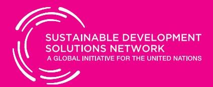

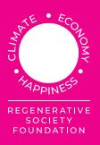

The World Happiness Report is a publication of the Sustainable Development Solutions Network, powered by the Gallup World Poll data.

The Report is supported by The Ernesto Illy Foundation, illycaffè, Davines Group, Unilever's largest ice cream brand Wall's, The Blue Chip Foundation, The William, Jeff, and Jennifer Gross Family Foundation, The Happier Way Foundation, and The Regenerative Society Foundation.

The World Happiness Report was written by a group of independent experts acting in their personal capacities. Any views expressed in this report do not necessarily reflect the views of any organization, agency, or program of the United Nations.