John F. Helliwell, Richard Layard, Jeffrey D. Sachs, Jan-Emmanuel De Neve, Lara B. Aknin, and Shun Wang

### Table of Contents

# World Happiness Report 2023

|   | Executive Summary 2                                                                                                                                                     |
|---|-------------------------------------------------------------------------------------------------------------------------------------------------------------------------|
| 1 | The Happiness Agenda: The Next 10 Years 15 Helliwell, Layard, and Sachs                                                                                           |
| 2 | World Happiness, Trust, and Social Connections in Times of Crisis 29 Helliwell, Huang, Norton, Goff, and Wang                                                     |
| 3 | Well-being and State Effectiveness 77 Besley, Marshall, and Persson                                                                                                  |
| 4 | Doing Good and Feeling Good: Relationships between Altruism and Well-being for Altruists, Beneficiaries, and Observers 103 Rhoads and Marsh                    |
| 5 | Towards Well-being Measurement with Social Media Across Space, Time and Cultures: Three Generations of Progress 131 Oscar, Giorgi, Schwartz, and Eichstaedt |

The World Happiness Report was written by a group of independent experts acting in their personal capacities. Any views expressed in this report do not necessarily reflect the views of any organization, agency, or program of the United Nations.

### **Executive Summary**

It has been over ten years since the first World Happiness Report was published. And it is exactly ten years since the United Nations General Assembly adopted Resolution 66/281, proclaiming 20 March to be observed annually as International Day of Happiness. Since then, more and more people have come to believe that our success as countries should be judged by the happiness of our people. There is also a growing consensus about how happiness should be measured. This consensus means that national happiness can now become an operational objective for governments.

So in this year's report, we ask the following questions:

- 1. What is the consensus view about measuring national happiness, and what kinds of behaviour does it require of individuals and institutions? (Chapter 1)
- 2. How have trust and benevolence saved lives and supported happiness over the past three years of COVID-19 and other crises? (Chapter 2)
- 3. What is state effectiveness and how does it affect human happiness? (Chapter 3)
- 4. How does altruistic behaviour by individuals affect their own happiness, that of the recipient, and the overall happiness of society? (Chapter 4)
- 5. How well does social media data enable us to measure the prevailing levels of happiness and distress? (Chapter 5)

In short, our answers are these.

### **Chapter 1. The happiness agenda. The next 10 years.**

- The natural way to measure a nation's happiness is to ask a nationally-representative sample of people how satisfied they are with their lives these days.
- A population will only experience high levels of overall life satisfaction if its people are also pro-social, healthy, and prosperous. In other words, its people must have high levels of what Aristotle called 'eudaimonia'. So at the level of society, life satisfaction and eudaimonia go hand-in-hand.
- At the individual level, however, they can diverge. As the evidence shows, virtuous behaviour generally raises the happiness of the virtuous actor (as well as the beneficiary). But there are substantial numbers of virtuous people, including some carers, who are not that satisfied with their lives.
- When we assess a society, a situation, or a policy, we should not look only at the average happiness it brings (including for future generations). We should look especially at the scale of misery (i.e., low life satisfaction) that results. To prevent misery, governments and international organisations should establish rights such as those in the United Nations' Universal Declaration of Human Rights (UDHR). They should also broaden the Sustainable Development Goals (SDGs) to consider wellbeing and environmental policy dimensions jointly in order to ensure the happiness of future generations. These rights and goals are essential tools for increasing human happiness and reducing misery now and into the future.
- Once happiness is accepted as the goal of government, this has other profound effects on institutional practices. Health, especially mental health, assumes even more priority, as does the quality of work, family life, and community.
- For researchers, too, there are major challenges. All government policies should be evaluated against the touchstone of well-being (per dollar spent). And how to promote virtue needs to become a major subject of study.

### **Chapter 2. World Happiness, Trust, and Social Connections in Times of Crisis**

- **Life evaluations** have continued to be remarkably resilient, with global averages in the COVID-19 years 2020-2022 just as high as those in the pre-pandemic years 2017-2019. Finland remains in the top position for the sixth year in a row. War-torn Afghanistan and Lebanon remain the two unhappiest countries in the survey, with average life evaluations more than five points lower (on a scale running from 0 to 10) than in the ten happiest countries.
- To study the **inequality** of happiness, we first focus on the happiness gap between the top and the bottom halves of the population. This gap is small in countries where most people are happy but also in those countries where almost no one is happy. However, more generally, people are happier living in countries where the happiness gap is smaller. Happiness gaps globally have been fairly stable over time, although there are growing gaps in many African countries.
- We also track two measures of misery the share of the population having life evaluations of 4 and below and the share rating the lives at 3 and below. Globally, both of these measures of misery fell slightly during the three COVID-19 years.
- To help to explain this continuing resilience, we document four cases that suggest how trust and social support can support happiness during crises.
- **COVID-19 deaths.** In 2020 and 2021, countries attempting to suppress community transmission had lower death rates and better well-being overall. Not enough countries followed suit, thus enabling new variants to emerge, such that in 2022, Omicron made elimination infeasible. Although trust continues to be correlated with lower death rates in 2022, policy strategies, infections, and death rates are now very similar in all countries, but with total deaths over all three years being much lower in the **eliminator** countries.

- **Benevolence.** There was a globe-spanning **surge of benevolence** in 2020 and especially in 2021. Data for 2022 show that prosocial acts remain about one-quarter more common than before the pandemic.
- **Ukraine and Russia.** Both countries shared the global **increases in benevolence** during 2020 and 2021. During 2022, benevolence grew sharply in Ukraine but fell in Russia. Despite the magnitude of suffering and damage in Ukraine, life evaluations in September 2022 remained higher than in the aftermath of the 2014 annexation, supported now by a stronger sense of common purpose, benevolence, and trust in Ukrainian leadership. Confidence in their national governments grew in 2022 in both countries, but much more in Ukraine than in Russia. Ukrainian support for Russian leadership fell to zero in all parts of Ukraine in 2022.
- **Social support.** New data show that **positive social connections** and support in 2022 were twice as prevalent as loneliness in seven key countries spanning six global regions. They were also strongly tied to overall ratings of how satisfied people are with their relationships with other people. The importance of these positive social relations helps further to explain the resilience of life evaluations during times of crisis.

### **Chapter 3. Well-being and State Effectiveness**

- The effectiveness of the government has a major influence on human happiness of the people.
- The capacity of a state can be well-measured by
- its fiscal capacity (ability to raise money)
- its collective capacity (ability to deliver services)
- its legal capacity (rule of law)

### Also crucial are

- the avoidance of civil war, and
- the avoidance of repression.
- Across countries, all these five measures are well correlated with the average life satisfaction of the people.

- Using the five characteristics (and income), it is possible to classify states into 3 clusters: common-interest states, special-interest states and weak states. In common-interest states, average life satisfaction is 2 points (out of 10) higher than in weak states and in special-interest states it is 1 point higher than in weak states.
- In those countries where average life satisfaction is highest, it is also more equally distributed – with fewer citizens having relatively low life satisfaction.

### **Chapter 4. Doing Good and Feeling Good: Relationships between Altruism and Well-being for Altruists, Beneficiaries, and Observers**

- A person is being altruistic when they help another person without expecting anything in return. Altruistic behaviours like helping strangers, donating money, giving blood, and volunteering are common, while others (like donating a kidney) are less so.
- There is a positive relationship between happiness and all of these altruistic behaviours. This is true when we compare across countries, and when we compare across individuals. But why?
- Normally, people who receive altruistic help will experience improved well-being, which helps explain the correlation across countries. But in addition, there is much evidence (experimental and others) that helping behaviour increases the well-being of the individual helper. This is especially true when the helping behaviour is voluntary and mainly motivated by concern for the person being helped.
- The causal arrow also runs in the opposite direction. Experimental and other evidence shows that when people's well-being increases, they can become more altruistic. In particular, when people's well-being rises through experiencing altruistic help, they become more likely to help others, creating a virtuous spiral.

### **Chapter 5. Towards Reliably Forecasting the Well-being of Populations Using Social Media: Three Generations of Progress**

- Assessments using social media can provide timely and spatially detailed well-being measurement to track changes, evaluate policy, and provide accountability.
- Since 2010, the methods using social media data for assessing well-being have increased in sophistication. The two main sources of development have been data collection/ aggregation strategies and better natural language processing (i.e., sentiment models).
- Data collection/aggregation strategies have evolved from the analysis of random feeds (Generation 1) to the analyses of demographicallycharacterized samples of users (Generation 2) to an emerging new generation of digital cohort design studies in which users are followed over time (Generation 3).
- Natural Language Processing models have improved mapping language use to well-being estimates – progressing from counting dictionaries of keywords (Level 1) to relying on robust machine-learning estimates (Level 2) to using large language models that consider words within contexts (Level 3).
- The improvement in methods addresses various biases that affect social media data, including selection, sampling, and presentation biases, as well as the impact of bots.
- The current generation of digital cohort designs gives social media-based well-being assessment the potential for unparalleled measurement in space and time (e.g., monthly subregional estimation). Such estimates can be used to test scientific hypotheses about well-being, policy, and population health using quasi-experimental designs (e.g., by comparing trajectories across matched counties).

### **Acknowledgments**

We have had a remarkable range of expert contributing authors and expert reviewers to whom we are deeply grateful for their willingness to share their knowledge with our readers.

Although the editors and authors of the World Happiness Report are volunteers, there are administrative and research support costs covered by our partners: Fondazione Ernesto Illy; illycaffè; Davines Group; Unilever's largest ice cream brand Wall's; The Blue Chip Foundation; The William, Jeff, and Jennifer Gross Family Foundation; The Happier Way Foundation; and The Regeneration Society Foundation. We value our data partnership with Gallup, providing World Poll data.

We appreciate the continued work by Ryan Swaney, Kyu Lee, and Stislow Design for their skills in design and web development, and media engagement. New this year, we thank Marwan Hazem Mostafa Badr Saleh for his assistance with reference preparation.

Whether in terms of research, data, or grants, we are enormously grateful for all of these contributions.

*John Helliwell, Richard Layard, Jeffrey D. Sachs, Jan-Emmanuel De Neve, Lara Aknin, Shun Wang; and Sharon Paculor, Production Editor*

# Six Factors Explained

Income, health, having someone to count on, having a sense of freedom to make key life decisions, generosity, and the absence of corruption all play strong roles in supporting life evaluations.

# GDP per capita

Gross Domestic Product, or how much each country produces, divided by the number of people in the country.

GDP per capita gives information about the size of the economy and how the economy is performing.

Social support, or having someone to count on in times of trouble.

"If you were in trouble, do you have relatives or friends you can count on to help you whenever you need them, or not?"

# Healthy Life Expectancy

More than life expectancy, how is your physical and mental health?

Mental health is a key component of subjective well-being and is also a risk factor for future physical health and longevity. Mental health influences and drives a number of individual choices, behaviours,

# Freedom to make Life Choices

## Generosity

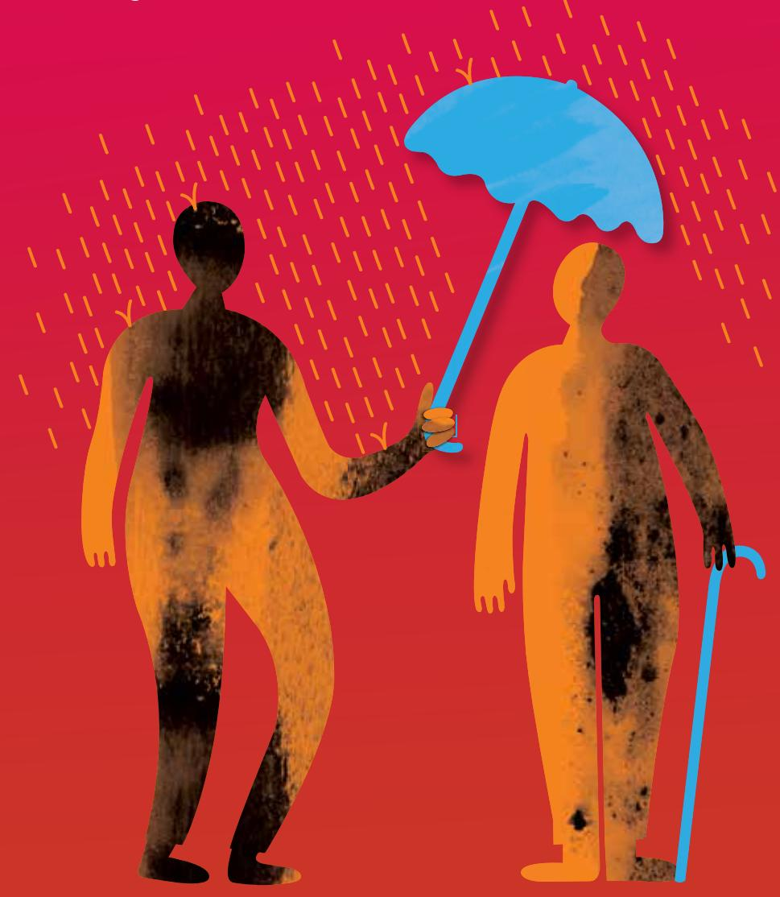

"Have you donated money to a charity in the past month?"

A clear marker for a sense of positive community engagement and a central way that humans connect with each other.

Research shows that in all cultures, starting in early childhood, people are drawn to behaviours which benefit other people.

# Perception of Corruption

"Is corruption widespread throughout the government or not" and "Is corruption widespread within businesses or not?"

Do people trust their governments and have trust in the benevolence of others?

# Dystopia

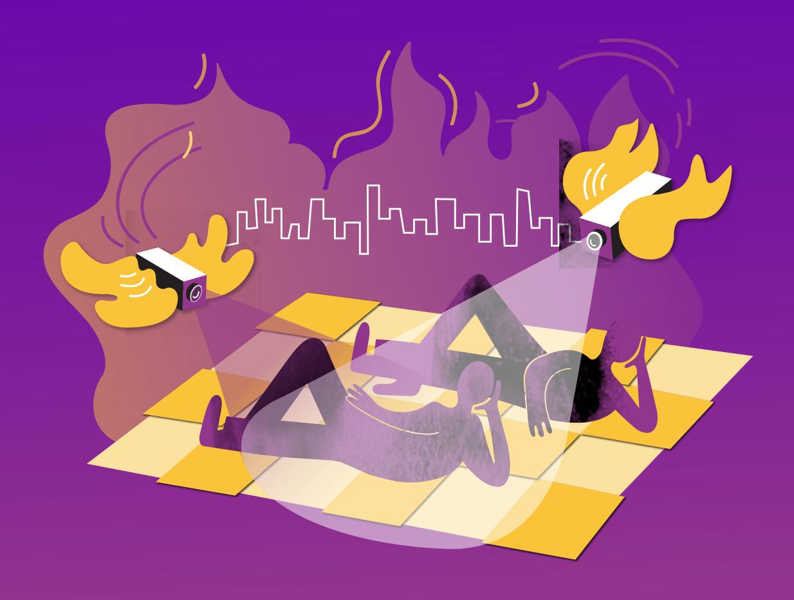

Dystopia is an imaginary country that has the world's least-happy people. The purpose of establishing Dystopia is to have a benchmark against which all countries can be favorably compared (no country performs more poorly than Dystopia) in terms of each of the six key variables. The lowest scores observed for the six key variables, therefore, characterize Dystopia. Since life would be very unpleasant in a country with the world's lowest incomes, lowest life expectancy, lowest generosity, most corruption, least freedom, and least social support, it is referred to as "Dystopia," in contrast to Utopia.

## Chapter 1

# The Happiness Agenda: The Next 10 Years

### John F. Helliwell

Vancouver School of Economics, University of British Columbia

### Richard Layard

Wellbeing Programme, Centre for Economic Performance, London School of Economics and Political Science

### Jeffrey D. Sachs

University Professor and Director of the Center for Sustainable Development at Columbia University

Our main thanks are to the philosophers over the centuries who have clarified the nature of a good life, to subjective well-being researchers over the past half century, to Jigme Thinley, who, as Bhutanese Prime Minister, championed the global study of Gross National Happiness and introduced the 2011 UN Resolution that led to the first *World Happiness Report*, and to the many invited chapter authors who have shared their expertise to make the World Happiness Reports a broader and deeper resource than we ever envisioned ten years ago. And, of course, our fellow editors Jan Emmanuel De Neve, Lara Aknin, and Shun Wang, who have done so much to improve and extend the content of World Happiness Reports they also provided, along with Heather Orpana, specific suggestions for this chapter.

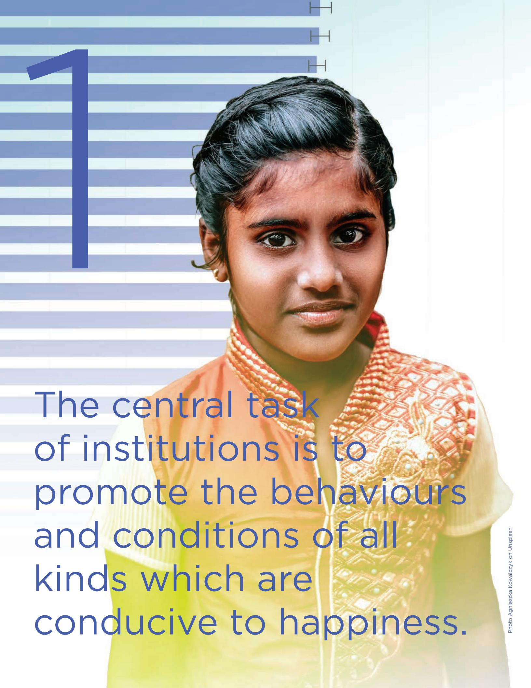

Concern for happiness and the alleviation of suffering goes back to the Buddha, Confucius, Socrates and beyond. But looking back over the first ten years of the World Happiness Report, it is striking how public interest in happiness and well-being has grown in recent years. This can be seen in newspaper stories, Google searches, and academic research.1 It can also be seen in books, where talk of happiness has overtaken the talk of income and GDP.2 Although this growth in interest started well before the first *World Happiness Report* in 2012, we have been surprised at the extent to which the Reports have appeared to fill a need for a better knowledge base for evaluating human progress.3

Moreover, policy-makers themselves increasingly talk about well-being. The OECD and the EU call on member governments to "put people and their well-being at the heart of policy design."4 And five countries now belong to the Well-being Economy Government Alliance.5

These are broadly the conditions identified by Aristotle in the Nicomachean Ethics.7 He identified a person who was high in these attributes – character virtues and sufficient external goods – as achieving "eudaimonia." In particular, he stressed the importance of the person's character, built by mentorship and habits, and he famously defined eudaimonia as "the activity of the soul according to virtue". In other words, high eudaimonia required a virtuous character, including moderation, fortitude, a sense of justice, an ability to form and maintain friendships, as well as good citizenship in the polis (the political community). Today we describe the outwardfacing virtues of friendship and citizenship as "pro-social" attitudes and behaviour. For the Greeks, and us, living the right kind of life is a hard-won skill. The Greeks used the term arete, which means excellence or virtue. Individual virtue

### **The Basic Ideas**

A natural way to measure people's well-being is to ask them how satisfied they are with their lives. A typical question is, "Overall, how satisfied are you with your life these days?" People reply on a scale of 0-10 (0= completely dissatisfied, 10= completely satisfied). This allows people to evaluate their own happiness without making any assumptions about what causes it. Thus 'life satisfaction' is a standard measure of well-being.

However, an immediate question arises of what habits, institutions and material conditions produce a society where people have higher well-being. We must also ask how people can gain the skills to further their own long-term (or sustainable) well-being. The World Happiness Reports have studied these questions each year, in part by comparing the average life satisfaction in different countries and seeing what features in the population explain these differences.6 The findings are clear. The ethos of a country matters – are people trustworthy, generous, and mutually supportive? The institutions also matter – are people free to make important life decisions? And the material conditions of life matter – both income and health.

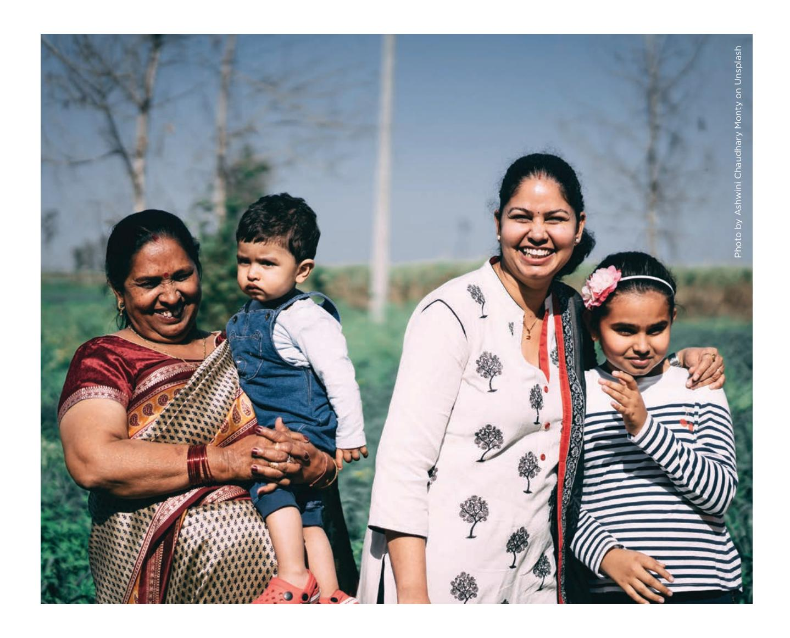

is essential, as is pro-sociality. Our modern evidence also shows that the development of virtuous behaviours needs a supportive social and institutional environment if it is to result in widespread happiness. Aristotle, too knew this through his investigation of the constitutions of Athens and other city-states of ancient Greece.

A society where the average citizen exhibits strong virtues and high eudaimonia will also be one where the average citizen experiences high life satisfaction. To see why this is true we have only to consider how far our own life satisfaction depends on the behaviour and attitudes of others. So to have a society with high average life satisfaction, we need a society with virtuous citizens and with supportive institutions. At the level of

society, the two terms go hand-in-hand. Effective institutions support character development; virtuous citizens promote effective institutions.

Being virtuous generally makes people feel better. In several studies, some people were given money to give to others, while others were given money to keep – the former group became happier.8 That

*To have a society with high average life satisfaction, we need a society with high average eudaimonia.*

happier people are more likely to help others is also shown in Chapter 4 of this Report, and elsewhere.9 And in Prisoner's Dilemma games in laboratories, it has been shown that when people choose to behave cooperatively, they experience increased activity in the reward centres of the brain.10

But virtue is not always and necessarily rewarding. For example, some full-time voluntary caregivers (looking after vulnerable children or elderly parents) have quite low life satisfaction.11 Thus, when we look at individuals, life satisfaction and eudaimonia are not identical. We need, for example, special institutions to support the hard work of caregivers. Caregiving is rewarding but also difficult and painful and needs social support. The general policy point remains, however. We should train individuals in virtue and eudaimonia – both for their own sake and that of others.

The central task of institutions is to promote the behaviours and conditions of all kinds which are conducive to happiness. But before we come to institutions and research, there are two other fundamental issues of principle. The first is the **distribution of happiness** – as compared with its average level. Unlike the British philosopher Jeremy Bentham, we do not think the average level of happiness (or the simple sum of happiness, per person) is all that matters. We should care about the distribution of happiness and be happier when misery can be relieved. Most ethical systems emphasise that the world (and "creation") is for everybody, not merely for the lucky, the rich, or the favoured. One obvious step in this direction is to guarantee minimum human rights (including food, shelter, freedom, and civil rights). Thus the **UN's Universal Declaration of Human Rights**12 is an integral component of the happiness agenda. Without such basic human rights, there would today be many more people living in misery. Yet the agenda of the Universal Declaration is still far from fulfilled, and its realisation remains a central task of our time.

A second issue is equally vital: **the well-being of future generations**. In most ethical systems, and from the happiness perspective, happiness matters for everybody across the world and across generations. Today's decisions should give due weight to the well-being of future

*Being virtuous generally makes people feel better… But virtue is not always rewarding.*

generations and our own. In technical terms, the discount rate used to compare the circumstances across generations should be very low, and indeed much below the discount rates typically used by economists. Future well-being must be given its due. For this reason, the **UN Sustainable Development Goals (SDGs)**13 are also a vital component of the happiness agenda.

In short, the interests of others (human rights) and of a sustainable environment (SDGs) are integral to happy lives rather than something that is either additional or in conflict with them.

### **Priorities for Institutions**

Thus, there is now the potential for a real well-being revolution, that is, a broad advance in human well-being achieved by deploying our knowledge, technologies, and ethical perspectives. The appetite for such an advance is growing, and the knowledge base of how to promote human well-being is exploding.

Based on what we have learned from the life evaluations of millions of survey respondents around the globe, we now more clearly understand the key factors at work. To explain the differences in well-being around the world, both within and among countries, the key factors include14

physical and mental health

human relationships (in the family, at work and in the community),

income and employment

 character virtues, including pro-sociality and trust

social support

personal freedom

lack of corruption, and

effective government

### *Human beings do not spring into the world fully formed, like mushrooms, as Hobbes once suggested.*

Human beings do not spring into the world fully formed, like mushrooms, as Hobbes once suggested. Nor do they have tastes and values which can be taken as given, as the economists Becker and Stigler once suggested.15 Their characters, habits, and values are formed by the social institutions where they live and the norms which they absorb from them. For example, the Nordic countries have the highest well-being, though they are not richer than many other countries. But they do have higher levels of trust and of mutual respect and support.16

Thus, the well-being revolution will depend on the performance of the social institutions in each country. The objective of every institution should be to contribute what it can to human well-being. From our existing knowledge, we can already see many of the key things that institutions have to do. Let us take these institutions in turn.

### **Governments and NGOs**

Thomas Jefferson once said, "The care of human life and happiness is the only legitimate object of good government".17 This echoes Aristotle's belief that politics should aim to promote eudaimonia. The overarching objective of a government must be to create conditions for the greatest possible well-being and, especially, the least misery in the population. (Fortunately, as we show later, it is also in the electoral interest of the government to increase happiness since this makes it more likely that the government will be re-elected).

Thus, all policies on expenditure, tax and regulation need to be assessed in terms of their impact on well-being. Total expenditure will probably be determined by political forces, but which policies attract money should depend on their likely effect on well-being per dollar spent.18 We already have rough estimates of some of these effects and what follows reflects this evidence.

Policy choices should always take proper account of future generations ("sustainability") and the need to preserve basic human rights. The fight against climate change is, of course, international, and each government should play its proper role in this inescapable commitment.

There is evidence that other things being equal, countries with higher levels of government social expenditure (but not military expenditure), backed by the revenues to pay for them, have higher well-being.19 Social expenditure leads to higher happiness, especially in countries with trusted and effective governments (see Chapter 3). This is more than coincidence, as where social and institutional trust are deservedly higher, people are more prepared to pay for social programs, and governments are more able to deliver them efficiently. But, whatever the scope of government, there is always a key role for charitable, voluntary organisations (NGOs) – in almost every sphere of human activity. The rationale for an NGO is its contribution to well-being, and every NGO would naturally evaluate its alternative options against this criterion.

### **Health Services and Social Care**

Many health services already evaluate their spending options by their impact per dollar on the number of Quality-of-life-Adjusted Life Years (QALYs) – a procedure similar to that needed for all government expenditure. Since resources are limited, this is the only approach that can be justified.

One clear finding is that much more needs to be spent on mental healthcare and public health. For example, modern evidence-based psychological therapy for depression and anxiety disorders has been shown to save more money than it costs. (The savings are on reduced disability benefits, increased tax payments and reduced physical healthcare costs).20 Even more proactive than providing mental health care, a focus on mental health promotion – or promoting the conditions for good mental health and preventing the onset of mental illness – has been shown to be cost effective.21

Many problems of mental and physical health can be prevented by better lifestyles (e.g., more

exercise, better sleep, diet, social activities, volunteering, and mindfulness). We must also acknowledge that these lifestyle choices take place within social and physical environments – shaping these environments to make the "right" choice the easy choice is important, as we know that individual behaviour change is difficult. Governments and health systems have a role to play in helping to shape the environments in which we live to facilitate ways of living that promote well-being. Community organisations have a major role to play here. So does 'social prescribing' by general medical practitioners. These are areas for major expansion.

But, whatever happens, millions of vulnerable children and adults will need further help. These include children who are orphaned or have mental or physical disabilities, disabled adults of working age (including those living with an addiction disorder), and the vulnerable elderly. In a wellbeing strategy, these people have high priority.

### **Schools**

In promoting positive well-being, schools have a standing start. But they do not always take advantage of it, and, even before COVID, the well-being of adolescents in most advanced countries was falling, especially among girls.22 This has been attributed partly to the increased pressures of exams and partly to social media. There are many ways in which schools can improve well-being, and many do. First, there is the whole ethos and value system of the school, as shown in relations between teachers, pupils and parents. Second is the practice of measurement – by measuring well-being, schools will show they treasure it and aim to improve it.23 Finally, there is the regular teaching of life skills in an evidence-based way, where many methods based on positive psychology have been found to be effective.24

### **Business and Work**

Business plays a huge role in the generation of well-being. It supplies customers with goods and services, provides workers with income, employment and quality of work, and provides profits to the owners. Business operates within a

framework of law, and its existence is justified by its contribution to well-being. In 2019 the US Business Roundtable, representing many of the world's leading companies, publicly asserted that business has obligations to the welfare of customers, workers and suppliers as well as shareholders. There is now a major industry of consultants who advise companies on how to promote worker well-being – both for its own sake and because of its benefits to the shareholder.25 One US time-use study showed that the worst time of the day for workers was when they were with their boss.26 Clearly, some workplaces have much to gain from a well-being revolution.

### **Community Life: Humans as Social Animals**

Adult life consists of more than work. It contains family life and all kinds of social interactions outside the home. As Aristotle said, Man is a social animal. A clear finding of well-being research is the massive role of social connections in promoting well-being – and the corresponding power of loneliness to reduce it.27

One major form of connection is membership in voluntary organisations (be it for sports, arts, religious worship, or just doing good). The evidence is clear: membership in such organisations is good for well-being.28 A society that wants high well-being has to make it easy for such organisations to flourish. The power of human connections to improve life is, of course, not restricted to formal organisations – time-use studies show that almost any activity is more enjoyable when done in friendly company.29

### **Environmental Agencies**

It is also the job of society to protect the environment – for the sake of present and future generations. There is powerful evidence of how contact with nature and green space enhances human well-being.30 It is the job of environmental agencies and central and local governments to protect our contact with nature. But there is also the overarching challenge of climate change, where our present way of life can only be protected by major international effects to reduce to net zero the emission of greenhouse gases.

### **Rule of Law**

The legal system has, of course, many functions. It has to uphold human rights, adjudicate civil disputes and punish crime. On punishment, the well-being approach is clear. There are only three justifications for punishment: deterrence of future crime, protection of the public today, and rehabilitation of the offender. There is no role for retribution. And the overriding aim has to be reintegration of the offender into society. For offenders in prison, this requires real effort, and the Singapore Prison Reform of 1998 provides a good example of prisoners, wardens and the community collaborating to enable prisoners to have better lives, in which they return to the institutions later as volunteers rather than prisoners.31

### Individuals and Families

So far, we have discussed institutions outside the family. But for most people, their family affects their well-being as much as any other institution. How families function, and indeed how all institutions function, depends ultimately on individuals and their objectives in life. According to the well-being approach, the greatest overall well-being will only result if individuals try in their own lives to create the most well-being that they can (for themselves and others).32

### **Belief Systems**

The goal of civic virtue has, of course, been promoted throughout the ages. It was central to

the teachings of Aristotle as well as Confucius and most of the world's religious faiths. It is now being promoted by secular movements like Action for Happiness,33 Effective Altruism34 and the World Wellbeing Movement.35 More movements of this kind are needed.

### **Research Priorities**

To complete the well-being revolution will, however, require a lot more knowledge. So here are some priorities for further research, following the sequence of our previous arguments.

### **Happiness and Virtue**

A first key issue is how to cultivate and promote virtuous character and behaviour. If we compare one society with another we can see that countries with superior social norms tend to achieve higher levels of well-being. For example, in chapter 2 of each World Happiness Report, we show the positive effects of living in a more generous, trusting and supportive society. There are two reasons for this relationship. First, virtuous behaviour by one person makes other people feel better. But second, there is evidence that when an individual behaves virtuously, she herself feels better. But we also need more naturalistic studies of the relation between people's values and their individual happiness.

Photo by Rajat Sarki on Unsplash

Going on, if virtue matters so much, the key question is how to help people to become more virtuous. Aristotle introduced this question in the Nichomachean Ethics more than 2,300 years ago. The Buddha, Hindu philosophers (in the Bhagavad Gita and elsewhere), Jewish and Christian theologians, Islamic thinkers, and others have long asked the same questions.

This subject is difficult to study empirically because we do not have sufficient quantitative measures of virtuous values and behaviour. The most common question used by Britain's Office of National Statistics is, "Do you feel that the things you do in your life are worthwhile?" But what we really want to know is whether the things people do are actually worthwhile. Returning lost wallets is an example of pro-social behaviour with strongly positive well-being effects36 and deserves more regular monitoring by surveys and experiments. The frequency of other benevolent behaviours is surveyed regularly in the Gallup World Poll, and found to support happiness.37 There is evidently vast scope for far more research on individual character, virtues, and well-being, and we strongly encourage such research.

The problem of how to study behaviour may be easier to solve with children because teachers observe them closely enough to be able to rate their behaviour. In such studies, many strategies in schools have been found to improve behaviour. The most striking of these is the Good Behaviour Game,38 where students are rewarded for the average behaviour of their group. Many life-skills programmes have also been found to influence behaviour.39 But for adults, it is not enough to say that better values lead to greater happiness. We also need to know how to promote virtues, including self-control, moderation, trustworthiness, and pro-sociality.

### **Cost-Effectiveness Experiments and Models (for Government and NGOs)**

A second major need concerns the effective use of public money to increase happiness and (especially) to remove misery. If the aim of all public spending is to increase the level of wellbeing, policy proposals (and existing policies) should keep a focus on long-term well-being.40

In some cases, it may be possible to quantify a policy's effects on the level and distribution of well-being. In other cases, the effects will be complex and downstream, yet the long-term implications of the policies for well-being may still be subject to scrutiny, with due regard for long-term uncertainties.

Scrutiny of the links between policy and well-being will require new tools, including experimental methods when appropriate, combined with complete monitoring of the well-being of all those affected. Evaluations of past policies in terms of their impacts on the subjective well-being of the affected individuals and communities are still rare. Closing that research gap will require a change in outcome measures at both the individual and community levels. Even where well-being itself is not included, research based on the determinants of life evaluations in the relevant populations can still be used to provide weights to attach to the various other outcomes. This is a key step in moving from a list of well-being objectives to specific policy decisions.

### **Measurement**

The World Happiness Reports use subjective life evaluations as their central umbrella measure of well-being, with positive and negative emotions playing important mediating roles. The evidence thus far available suggests that several different forms of life evaluation, including the Cantril ladder, satisfaction with life, and being happy with life as a whole all provide similar conclusions about the sources of well-being.41 They are, therefore, interchangeable as basic measures of underlying well-being. Short-term positive and negative emotions are also useful to measure the impact of fast-changing circumstances. They also provide important mediating pathways for longerterm factors, especially those relating to the quality of the social context.42 That emotions and life evaluations react differently to changes in the sources of well-being in just the ways that theory and experiments would suggest43 adds to the credibility of both.

There is much also to be gained by complementary information about well-being available from examining neural pathways,44 genetic differences,

and what can be inferred from the nature of how people communicate using social media (see Chapter 5). These are all active and valuable research streams worthy of further development. The future measurement agenda should also seek much better measures of the quality of the social and institutional fabric that is so central to explaining well-being.

Such subjective measures should, of course, be complemented by the continued collection of various kinds of objective measures, such as measures of deprivation (hunger, destitution, lack of housing), physical and mental health status, civil rights and personal freedoms, measures of values held within the society, and indicators of social trust and social capital.

### **The Effect of Well-being**

Finally, there is the issue of the effects of well-being on other valued outcomes – such as longevity, productivity, pro-sociality, conflict, and voting behaviour. Such effects add to the case for improving well-being. Some of these effects are well documented, 45 but work on the political and social effects of well-being is in its infancy. Some studies show that higher well-being increases the vote share of the government46 and that well-being is more important than the economy in explaining election results. Similarly, low well-being increases support for populism.47 Clearly, well-being will be at the centre of future political debate. But it needs a lot more work.

### **Conclusion**

Increasingly, people are judging the state of affairs by the level and distribution of well-being, both within and across generations. People have many values (like health, wealth, freedom and so on) as well as well-being. But increasingly, they think of well-being as the ultimate good, the summum bonum. For this reason, we suggest that the Sustainable Development Goals for 2030 and beyond should put much greater operational and ethical emphasis on well-being. The role of well-being in sustainable development is already present, but well-being should play a much more central role in global diplomacy and in international and national policies in the years to come.

### **Endnotes**

- 1 See Layard (2020, p.9.
- 2 See Barrington-Leigh (2022)
- 3 This is illustrated by the increasing number of references, even when compared to the triggering 'beyond GDP' concept, as shown in Figure 3.1 of chapter 3 of WHR 2022.
- 4 See EU Council (2019) and remarks by OECD Secretary General Angel Gurria, Brussels, July 8th, 2019 (https://www.oecd.org/social/economy-of-well-beingbrussels-july-2019.htm).
- 5 New Zealand, Iceland, Finland, Scotland and Wales.
- 6 See for example Table 2.1 in this report.
- 7 'Ancient ethical theories are theories about happiness – theories that claim to have a reflective account of happiness will conclude that it requires having the virtues and giving due weight to the interests of others' Annas (1993), p. 330.
- 8 See Aknin et al, (2019, p. 72). For a fuller review of pre-registered studies, see Aknin et al. (2022).
- 9 See Kushlev et al. (2020), Kushlev et al. (2022), Rhoads et al. (2021), Brethel-Haurwitz et al. (2014) and Aknin et al. (2018).
- 10 See Rilling et al (2002).
- 11 See Zeller (2018).
- 12 https://www.un.org/en/about-us/universal-declaration-ofhuman-rights
- 13 https://sdgs.un.org/goals. For the links between the SDGs and happiness, see De Neve and Sachs (2020).
- 14 The importance of these variables appears both in cross-country context, as in Table 2.1 of Chapter 2 in this Report, and in analysis of individual responses, as shown, for example in Table 2.4 of *World Happiness Report 2022*, or in Clark et al. (2018).
- 15 See Stigler and Becker (1977).
- 16 As shown in Chapter 2, when large numbers of cashcontaining wallets were experimentally dropped in 40 different countries, the percentage returned was 81% in the Nordic countries, 60% elsewhere in Western Europe, and 43% in all other countries combined. The underlying data are from Cohn et al (2019).
- 17 See Jefferson, T. (2004).
- 18 See Layard and De Neve (2023) and Frijters and Krekel (2021).
- 19 See Table 16 of Statistical Appendix 2 of Chapter 2 of *World Happiness Report 2019*. *See also* Flavin et al (2011), O'Connor (2017), and Helliwell et al. (2018)
- 20 See Layard and Clark (2014) particularly Chapter 11. See also Chisholm et al. (2016).
- 21 See Le et al. (2021).
- 22 See Cosma et al. (2020); Marquez and Long (2021). Krokstad et al (2022); McManus et al (2016); Sadler et al (2018).

- 23 See #BeeWell Report (2022)
- 24 See Durlak et al. (2011) and Lordan and McGuire (2019).
- 25 See Edmans (2012)
- 26 See Krueger (2009, p. 49).
- 27 See Waldinger and Schulz (2023).
- 28 See Helliwell and Putnam (2004).
- 29 13,000 Londoners asked on half a million occasions about their momentary happiness were happier in the company of a friend or partner, regardless of the nature or location of their activity. The overall results relating to the physical environment are in Krekel & MacKerron (2020), with the social context interactions reported in Helliwell et al. (2020) at p. 9.
- 30 For example Krekel et a.l (2016) and Krekel & MacKerron (2020).
- 31 See Leong (2010) and Helliwell (2011).
- 32 This is the pledge taken by members of Action for Happiness.
- 33 https://actionforhappiness.org/
- 34 https://www.effectivealtruism.org/
- 35 https://worldwellbeingmovement.org/
- 36 See Figure 2.4 in *World Happiness Report 2021.*
- 37 As with the role of donations in Table 2.1 of each year's Chapter 2. There were more increases in several types of benevolent acts in 2022, as reported in *World Happiness Report 2022*.
- 38 See Kellam et al. (2011) and Ialongo et al. (1999).
- 39 See Durlak et al. (2011) and Lordan and McGuire (2019).
- 40 See Layard and De Neve (2023) especially Chapter 18.
- 41 See *World Happiness Report 2015*, p. 15-16.
- 42 For example, Table 2.1 of *World Happiness Report 2022* shows that the coefficients for social support, freedom and generosity are materially lower in column 4 (where emotions are included) than in column 1 (where they are not) while the coefficients for income, health and corruption are unchanged.
- 43 For example, the level of workplace trust is an important determinant of both life evaluations and daily emotions, but with different patterns: high workplace trust lessens the size of the weekend effect for emotions, while life evaluations do not display any weekend patterns.
- 44 For example, see Davidson & Schuyler (2015).
- 45 For a range of outcomes, see Lyubomirsky et al. (2005) and De Neve et al. (2013). On longevity see Steptoe and Wardle (2012) and Rosella et al. (2019), on productivity see Bellet et al. (2020), and for subsequent income see De Neve and Oswald (2012).
- 46 See Ward (2019), Ward (2020), and Ward et al. (2021).
- 47 See Nowakowski (2021).

### **References**

Aknin, L. B., Van de Vondervoort, J. W., & Hamlin, J. K. (2018). Positive feelings reward and promote prosocial behavior. *Current opinion in psychology*, *20*, 55-59.

Aknin, L. B., Whillans, A. V., Norton, M. I., & Dunn, E. W. (2019). Happiness and prosocial behavior: An evaluation of the evidence. In J. F. Helliwell, R. Layard, J. Sachs & De Neve, J. E (Eds.) *World Happiness Report 2019*, 67-86.

Aknin, L. B., Dunn, E. W., & Whillans, A. V. (2022). The Emotional Rewards of Prosocial Spending Are Robust and Replicable in Large Samples. Current Directions in Psychological Science, 31(6), 536-545.

Annas, J. (1993). *The morality of happiness*. Oxford University Press.

Barrington-Leigh, C. (2022). Trends in Conceptions of Progress and Well-being. In Helliwell, Layard, Sachs, De Neve, Aknin, & Wang (Eds) *World Happiness Report 2022*, 53-74.

#BeeWell Overview Briefing. (2022) #BeeWell Survey 2021 findings for the University of Manchester, Greater Manchester Combined Authority and the Anna Freud Centre. Manchester UK.

Bellet, C., De Neve, J. E., & Ward, G. (2020). *Does employee happiness have an impact on productivity?.* Saïd Business School WP 2019-13.

Brethel-Haurwitz, K. M., & Marsh, A. A. (2014). Geographical differences in subjective well-being predict extraordinary altruism. *Psychological science*, *25*(3), 762-771.

Chisholm, D., Sweeny, K., Sheehan, P., Rasmussen, B., Smit, F., Cuijpers, P., & Saxena, S. (2016). Scaling-up treatment of depression and anxiety: a global return on investment analysis. *The Lancet Psychiatry*, 3(5), 415-424.

Clark, A. E., Flèche, S., Layard, R., Powdthavee, N., & Ward, G. (2018). *The Origins of Happiness: The Science of Wellbeing over the Life Course*. Princeton University Press

Cohn, A., Maréchal, M. A., Tannenbaum, D., & Zünd, C. L. (2019). Civic honesty around the globe. *Science*, 365(6448), 70-73.

Cosma, A., Stevens, G., Martin, G., Duinhof, E. L., Walsh, S. D., Garcia-Moya, I., ... & De Looze, M. (2020). Cross-national time trends in adolescent mental well-being from 2002 to 2018 and the explanatory role of schoolwork pressure. *Journal of Adolescent Health*, 66(6), S50-S58.

Davidson, R. J., & Schuyler, B. S. (2015). Neuroscience of happiness. In J. F. Helliwell, R. Layard, & J. Sachs (Eds.), *World Happiness Report 2015* (pp. 88-105). New York: Sustainable Development Solutions Network.

De Neve, J. E., & Oswald, A. J. (2012). Estimating the influence of life satisfaction and positive affect on later income using sibling fixed effects. *Proceedings of the National Academy of Sciences*, *109*(49), 19953-19958.

De Neve, J. E., Diener, E., Tay, L., & Xuereb, C. (2013). The objective benefits of subjective well-being. In J. F. Helliwell, R. Layard, & J. Sachs (Eds.), *World Happiness Report 2013* (pp. 54-79).

De Neve, J.-E., & Sachs, J. (2020). The SDGs and human well-being: a global analysis of synergies, trade-offs, and regional differences. *Nature Scientific Reports*, 10, 15113.

Durlak, J. A., Weissberg, R. P., Dymnicki, A. B., Taylor, R. D., & Schellinger, K. B. (2011). The impact of enhancing students' social and emotional learning: A meta-analysis of school-based universal interventions. *Child development*, 82(1), 405-432.

Edmans, A. (2012). The link between job satisfaction and firm value, with implications for corporate social responsibility. *Academy of Management Perspectives*, 26(4), 1-19.

EU Council (2019). *The Economy of Wellbeing: Creating Opportunities for people's wellbeing and economic growth*. (13171/19). Brussels: Council of the European Union Retrieved from https://data.consilium.europa.eu/doc/document/ ST-13171-2019-INIT/en/pdf.

Flavin, P., Pacek, A. C., & Radcliff, B. (2011). State intervention and subjective well-being in advanced industrial democracies. *Politics & Policy*, 39(2), 251-269.

Frijters, P., & Krekel, C. (2021). *A handbook for wellbeing policy-making in the UK: History, measurement, theory, implementation, and examples*. Oxford University Press. Available online via Open Access in summer 2022.

Helliwell, J. F. (2011). Institutions as enablers of wellbeing: The Singapore prison case study. *International Journal of Wellbeing*, 1(2).

Helliwell, J. F., & Putnam, R. D. (2004). The social context of well–being. *Philosophical Transactions of the Royal Society of London. Series B: Biological Sciences*, 359(1449), 1435-1446.

Helliwell, J. F., Huang, H., Grover, S., & Wang, S. (2018). Empirical linkages between good governance and national well-being. *Journal of Comparative Economics*, 46(4), 1332-1346.

Helliwell, J. F., Layard, R., Sachs, J. F., & De Neve, J. E. (2020). Environments for Happiness: An Overview. *World Happiness Report*, *2020*, 3-12.

Ialongo, N. S., Werthamer, L., Kellam, S. G., Brown, C. H., Wang, S., & Lin, Y. (1999). Proximal impact of two first-grade preventive interventions on the early risk behaviors for later substance abuse, depression, and antisocial behavior. *American journal of community psychology*, 27(5), 599-641.

Jefferson, T. (2004). *Thomas Jefferson to the Republicans of Washington County, Maryland, 31 March 1809.* National Archives and Records Administration. https://founders.archives.gov/ documents/Jefferson/03-01-02-0088#:~:text=the%20care%20 of%20human%20life,purity%20of%20it's%20republican%20 principles.

Kellam, S. G., Mackenzie, A. C., Brown, C. H., Poduska, J. M., Wang, W., Petras, H., & Wilcox, H. C. (2011). The good behavior game and the future of prevention and treatment. *Addiction science & clinical practice*, *6*(1), 73.

Krekel, C., Kolbe, J., & Wüstemann, H. (2016). The greener, the happier? The effect of urban land use on residential well-being. *Ecological Economics*, 121, 117-127.

Krekel, C., & MacKerron, G. (2020). How environmental quality affects our happiness. In J. F. Helliwell, R. Layard, J. Sachs & De Neve, J. E (Eds.), *World Happiness Report 2020*, 95-112.

Krokstad, S., Weiss, D. A., Krokstad, M. A., Rangul, V., Kvaløy, K., Ingul, J. M., ... & Sund, E. R. (2022). Divergent decennial trends in mental health according to age reveal poorer mental health for young people: repeated cross-sectional population-based surveys from the HUNT Study, Norway. *BMJ open*, 12(5)

Krueger, A. B. (2009). *Measuring the subjective well-being of nations: National accounts of time use and well-being.* University of Chicago Press.

Kushlev, K., Drummond, D. M., Heintzelman, S. J., & Diener, E. (2020). Do happy people care about society's problems?. *The Journal of Positive Psychology*, *15*(4), 467-477.

Kushlev, K., Radosic, N., & Diener, E. (2022). Subjective well-being and prosociality around the globe: Happy people give more of their time and money to others. *Social Psychological and Personality Science*, *13*(4), 849-861.

Layard, R., & Clark, D. M. (2014). *Thrive: The power of evidencebased psychological therapies*. Penguin UK.

Layard R., & De Neve, J.E. (2023). *Wellbeing: Science and Policy*. Cambridge University Press.

Layard, R., & Ward, G. (2020). *Can we be happier?: Evidence and ethics*. Penguin UK.

Le, L. K. D., Esturas, A. C., Mihalopoulos, C., Chiotelis, O., Bucholc, J., Chatterton, M. L., & Engel, L. (2021). Cost-effectiveness evidence of mental health prevention and promotion interventions: A systematic review of economic evaluations. *PLoS medicine*, 18(5), e1003606.

Leong, L. (2010). *The Story of the Singapore Prison Service, From Custodian of Prisoners to Captains of Life*. Civil Service College, Singapore.

Lordan, G. McGuire, A.J. (2019). *Widening the high school curriculum to include soft skill training: impacts on health, behaviour, emotional wellbeing and occupational aspirations*. CEP Discussion Paper 1630, Centre for Economic Performance, LSE.

Lyubomirsky, S., King, L., & Diener, E. (2005). The benefits of frequent positive affect: Does happiness lead to success?. *Psychological bulletin*, *131*(6), 803.

Marquez, J., & Long, E. (2021). A global decline in adolescents' subjective well-being: a comparative study exploring patterns of change in the life satisfaction of 15-year-old students in 46 countries. *Child indicators research*, 14(3), 1251-1292.

McManus, S., Bebbington, P., Jenkins, R., & Brugha, T. (2016). Mental health and wellbeing in England: *Adult Psychiatric Morbidity Survey 2014*.

Nowakowski, A. (2021). Do unhappy citizens vote for populism?. *European Journal of Political Economy*, 68, 101985.

O'Connor, K. J. (2017). Happiness and welfare state policy around the world. *Review of Behavioral Economics*, 4(4), 397-420.

Rhoads, S. A., Gunter, D., Ryan, R. M., & Marsh, A. A. (2021). Global variation in subjective well-being predicts seven forms of altruism. Psychological Science, 32(8), 1247-1261.

Rilling, J. K., Gutman, D. A., Zeh, T. R., Pagnoni, G., Berns, G. S., & Kilts, C. D. (2002). A neural basis for social cooperation. *Neuron*, 35(2), 395-405.

Rosella, L. C., Fu, L., Buajitti, E., & Goel, V. (2019). Death and chronic disease risk associated with poor life satisfaction: a population-based cohort study. *American journal of epidemiology*, *188*(2), 323-331.

Sadler, K., Vizard, T., Ford, T., Marcheselli, F., Pearce, N., Mandalia, D., . . . McManus, S. (2018). *Mental Health of Children and Young People in England, 2017*. NHS Digital., https://digital. nhs.uk/data-and-information/publications/statistical/mentalhealth-of-children-and-young-people-in-england/2017/2017

Steptoe, A. and J. Wardle (2012). Enjoying life and living longer. *Archives of Internal Medicine* 172(3): 273-275.

Stigler, G. J., & Becker, G. S. (1977). De gustibus non est disputandum. *American Economic Review*, 67(2), 76-90.

Waldinger, R. and Schulz, M. (2023). *The Good Life: Lessons from the World's Longest Study on Happiness*. Penguin Random House, USA.

Ward, G. (2019). Happiness and voting behaviour. In J. F. Helliwell, R. Layard, J. Sachs & De Neve, J. E (Eds.), *World Happiness Report 2019*, 46-65.

Ward, G. (2020). Happiness and voting: evidence from four decades of elections in Europe. *American Journal of Political Science*, 64(3), 504-518.

Ward, G., De Neve, J. E., Ungar, L. H., & Eichstaedt, J. C. (2021). (Un) happiness and voting in US presidential elections. *Journal of personality and social psychology*, 120(2), 370.

Zeller, S. (2018). The happiness of the caregivers. *The Oxford Institute of Population Ageing Blog*. 21 November 2018. Retrieved from: https://www.ageing.ox.ac.uk/blog/thehappiness-of-the-caregivers.

## Chapter 2

# World Happiness, Trust, and Social Connections in Times of Crisis

### John F. Helliwell

Vancouver School of Economics, University of British Columbia

### Haifang Huang

Department of Economics, University of Alberta

### Max Norton

Vancouver School of Economics, University of British Columbia

### Leonard Goff

Department of Economics, University of Calgary

### Shun Wang

International Business School Suzhou, Xi'an Jiaotong-Liverpool University

The authors are grateful for the financial support of the WHR sponsors and for data from the Gallup World Poll and the Gallup/Meta State of Social Connections study. For much helpful assistance and advice, we are grateful to Lara B. Aknin, Bernardo Andretti, Chris Barrington-Leigh, Tim Besley, Jan-Emmanuel De Neve, Anya Drabkin, Anat Noa Fanti, Dunigan Folk, Rodrigo Furst, Rafael Goldszmidt, Carol Graham, Jon Hall, David Halpern, Nancy Hey, Sarah Jones, Richard Layard, Eden Litt, Joe Marshall, Marwan H. Saleh, Chris McCarty, Tim Ng, Sharon Paculor, Rachel Penrod, Anna Petherick, Julie Ray, Ryan Ritter, Rajesh Srinivasan, Jeffrey D. Sachs, Lance Stevens, and Meik Wiking.

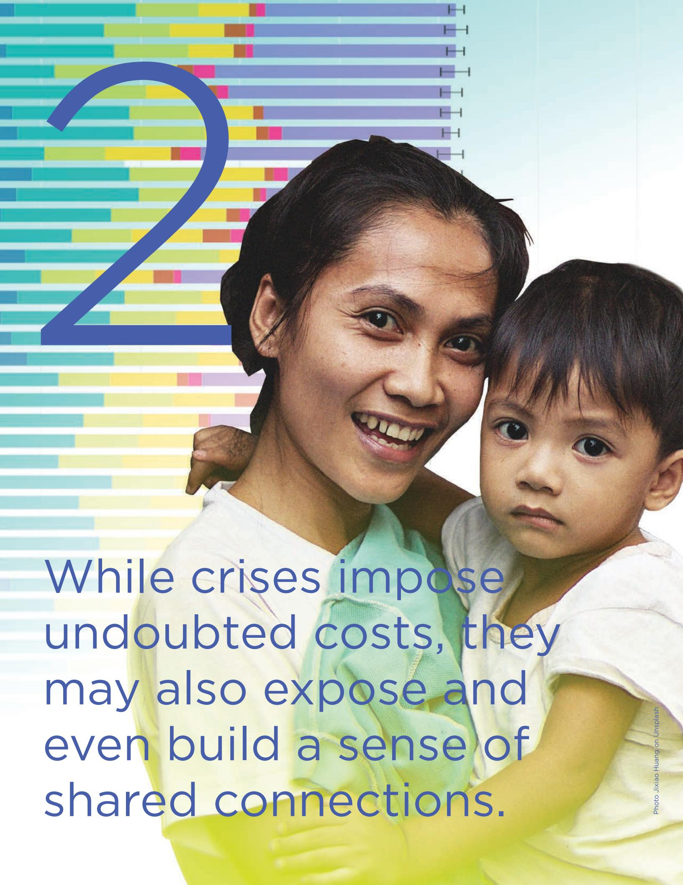

### **Introduction**

By any standard, 2022 was a year of crises, including the continuing COVID-19 pandemic, war in Ukraine, worldwide inflation, and a range of local and global climate emergencies. We thus have more evidence about how life evaluations, trust and social connections together influence the ability of nations, and of the world as a whole, to adapt in the face of crisis. Our main analysis relates to happiness as measured by life evaluations and emotions, how they have evolved in crisis situations, and how lives have been better where trust, benevolence, and supportive social connections have continued to thrive.

In our first section, we present our annual ranking and modelling of national happiness, but in a way slightly different from previous practice. Our key figure 2.1 continues to rank countries by their average life evaluations over the three preceding years, with that average spanning the three COVID-19 years of 2020-2022. That much remains the same. The main change is that this year we have removed the coloured sub-bars showing our attempts to explain the differences we find in national happiness. We introduced these bars in 2013 because readers wanted to know more about some of the likely reasons behind the large differences we find. Over the succeeding years, however, many readers and commentators have thereby been led to think that our ranking somehow reflects an index based on the six variables we use in our modelling. To help correct this false impression, we removed the explanatory bars, leaving the actual life evaluations alone on centre stage. We continue to include horizontal whiskers showing the 95% confidence bands for our national estimates, supplemented this year by showing a measure for each country of the range of rankings within which its own ranking is likely to be. We also continue to present our attempts to explain how and why life evaluations vary among countries and over time. We then present our latest attempts to explain the happiness differences revealed by the wide variations in national life evaluations.

In our second section, we look back once again at the evolution of life evaluations and emotions since Gallup World Poll data first became available in 2005-2006. This year we focus especially on how COVID-19 has affected the distribution of well-being. Has well-being inequality grown or shrunk? Where, and for whom? We divide national populations into their happier and less happy halves to show how the two groups have fared before and during the pandemic. We do this for life evaluations, and for their emotional, social, and material foundations.

In the third section, we document the extent to which trust, benevolence, and social connections have supported well-being in times of crisis. First we add a third year of COVID-19 data to illustrate how much death rate patterns changed in 2022 under the joint influences of Omicron variants, widespread vaccination, and changes in public health measures. Countries where people have confidence in their governments were still able to have lower COVID-19 death tolls in 2022, just as they did in 2020 and 2021.

Next we update our reporting on the extent to which benevolence has increased during COVID-19, finding it still well above pre-pandemic levels.

Then we present data on how the conflict between Ukraine and Russia since 2014, and especially in 2022, is associated with patterns of life evaluations, emotions, trust in governments, and benevolence in both countries.

Finally, we leverage new data from 2022 on the relative importance of positive and negative aspects of the social context. These data show that positive social environments were far more prevalent than loneliness and that gains from increases in positive social connections exceed the well-being costs of additional loneliness, even during COVID-19. These findings help us explain the resilience of life evaluations. While crises impose undoubted costs, they may also expose and even build a sense of shared connections.

Our concluding section provides a summary of our key results.

### **Measuring and Explaining National Differences in Life Evaluations**

Country rankings this year are based on life evaluations in 2020, 2021, and 2022, so all of the observations are drawn from years of high infection and deaths from COVID-19.

### **Ranking of Happiness 2020-2022**

The country rankings in Figure 2.1 show life evaluations (answers to the Cantril ladder question) for each country, averaged over the years 2020-2022.1

The overall length of each country bar represents the average response to the ladder question, which is also shown in numerals. The confidence intervals for each country's average life evaluation are shown by horizontal whiskers at the righthand end of each country bar. Confidence

### **Box 2.1: Measuring Subjective Well-Being**

Our measurement of subjective well-being continues to rely on three main well-being indicators: life evaluations, positive emotions, and negative emotions (described in the report as positive and negative affect). Our happiness rankings are based on life evaluations, as the more stable measure of the quality of people's lives. In *World Happiness Report 2023*, we continue to pay special attention to specific daily emotions (the components of positive and negative affect) to better track how COVID-19 has altered different aspects of life.

*Life evaluations*. The Gallup World Poll, which remains the principal source of data in this report, asks respondents to evaluate their current life as a whole using the image of a ladder, with the best possible life for them as a 10 and worst possible as a 0. Each respondent provides a numerical response on this scale, referred to as the Cantril ladder. Typically, around 1,000 responses are gathered annually for each country. Weights are used to construct population-representative national averages for each year in each country. **We base our usual happiness rankings on a three-year average of these life evaluations**, since the larger sample size enables more precise estimates.

*Positive emotions*. Positive affect is given by the average of individual yes or no answers about three emotions: laughter, enjoyment, and interest (for details see Technical Box 2).

*Negative emotions*. Negative affect is given by the average of individual yes or no answers about three emotions: worry, sadness, and anger.

Comparing life evaluations and emotions:

- Life evaluations provide the most informative measure for international comparisons because they capture quality of life in a more complete and stable way than do emotional reports based on daily experiences.
- Life evaluations differ more between countries than do emotions and are better explained by the widely differing life experiences in different countries. Emotions yesterday are well explained by events of the day being asked about, while life evaluations more closely reflect the circumstances of life as a whole. We show later in the chapter that emotions are significant supports for life evaluations.
- Positive emotions are more than twice as frequent (global average of 0.66) as negative emotions (global average of 0.29), even during the three COVID years 2020-2022.

intervals for the *rank* of a country are displayed to the right of each country bar.2 These ranking ranges are wider where there are many countries with similar averages, and for countries with smaller sample sizes.3

In the Statistical Appendix, we show a version of Figure 2.1 that includes colour-coded sub-bars in each country row, representing the extent to which six key variables contribute to explaining life evaluations. These variables (described in more detail in Technical Box 2) are GDP per capita, social support, healthy life expectancy, freedom, generosity, and corruption. As already noted, our happiness rankings are not based on any index of these six factors—the scores are instead based on individuals' own assessments of their lives, in particular their answers to the single-item Cantril ladder life-evaluation question. We use observed data on the six variables and estimates of their associations with life evaluations to explain the observed variation of life evaluations across countries, much as epidemiologists estimate the extent to which life expectancy is affected by factors such as smoking, exercise, and diet.

What do the latest data show for the 2020-2022 country rankings?4

Two features carry over from previous editions of the *World Happiness Report*. First, there is still a lot of year-to-year consistency in the way people rate their lives in different countries, and since our rankings are based on a three-year average there is information carried forward from one year to the next (See Figure 1 of Statistical Appendix 1 for individual country trajectories on an annual basis). Finland continues to occupy the top spot, for the sixth year in a row, with a score that is significantly ahead of all other countries. Denmark remains in the 2nd spot, with a confidence region bounded by 2nd and 4th. Among the rest of the countries in the top twenty, the confidence regions for their ranks cover five to ten countries. Iceland is 3rd, and with its smaller sample size, has a confidence region from 2nd to 7th. Israel is in 4th position, up five positions from last year, with a confidence range between 2nd and 8th. The 5th through 8th positions are filled by the Netherlands, Sweden, Norway, and Switzerland. The top ten are rounded out by Luxembourg and New Zealand. Austria and Australia follow in 11th and 12th positions, as last year, both within the likely range of 8th to 16th. They are followed by Canada, up two places from last year's lowest-ever ranking. The next four positions are filled by Ireland, the United States, Germany, and Belgium, all with ranks securely in the top twenty, as shown by the rank ranges.

The rest of the top 20 include Czechia, the United Kingdom, and Lithuania, 18th to 20th. The same countries tend to appear in the top twenty year after year, with 19 of this year's top 20 also being there last year. The exception is Lithuania, which has steadily risen over the past six years, from 52nd in 2017 to 20th this year.5 Throughout the rankings, except at the very top and the very bottom, the three-year average scores are close enough to one another that significant differences are found only between country pairs that are in some cases many positions apart in the rankings. This is shown by the ranking ranges for each country.

There remains a large gap between the top and bottom countries, with the top countries being more tightly grouped than the bottom ones. Within the top group, national life evaluation scores have a gap of 0.40 between the 1st and 5th position, and another 0.28 between 5th and

Figure 2.1: Ranking of Happiness based on a three-year-average 2020–2022 (Part 1)

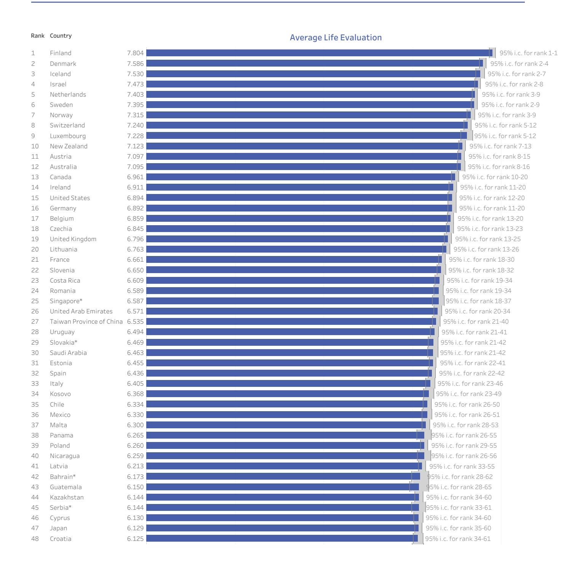

Average Life Evaluation

→ 95% confidence interval

Figure 2.1: Ranking of Happiness based on a three-year-average 2020–2022 (Part 2)

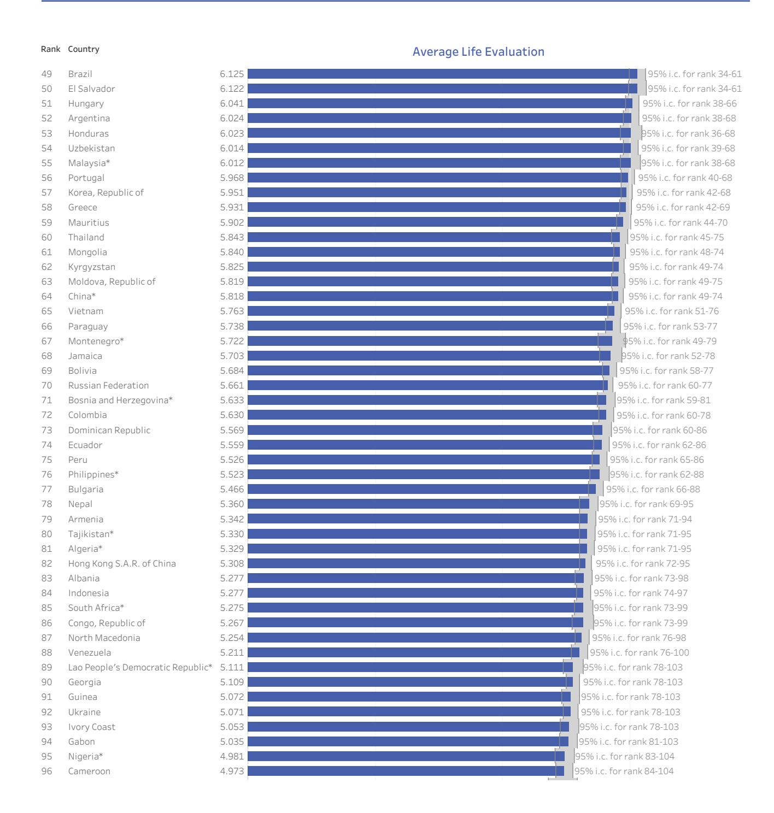

Average Life Evaluation

→ 95% confidence interval

Figure 2.1: Ranking of Happiness based on a three-year-average 2020-2022 (Part 3)

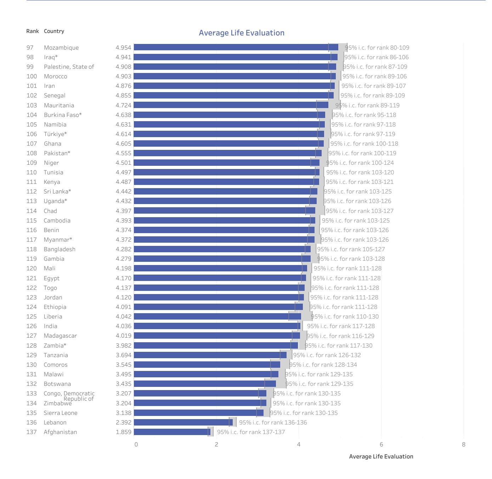

Average Life Evaluation

→ 95% confidence interval

10th positions. Thus there is a gap of less than 0.7 points between the first and 10th positions.

There is a much bigger range of scores covered by the bottom 10 countries, where the range of scores covers 2.1 points. The range estimates show that Afghanistan in the last position, and Lebanon second last, have ranks significantly different from each other, and from all higher countries. Further up the scale the gaps become narrower, and the ranges larger, with the 95% range exceeding 25 ranks for several countries in the middle of the global list.

Despite the general consistency among the top country scores, there have been many significant changes among the rest of the countries. Looking at changes over the longer term, many countries have exhibited substantial changes in average scores, and hence in country rankings, as shown in more detail in the Statistical Appendix, and as noted above for the Baltic countries.

The scores are based on the resident populations in each country, rather than their citizenship or place of birth. In *World Happiness Report 2018* we split the responses between the locally and foreign-born populations in each country and found the happiness rankings to be essentially the same for the two groups. There was some footprint effect after migration, and some tendency for migrants to move to happier countries, so that among the 20 happiest countries in that report, the average happiness for the locally born was about 0.2 points higher than for the foreign-born.

### **Why do happiness levels differ?**

In Table 2.1 we present our latest modelling of national average life evaluations and measures of positive and negative affect (emotions) by country and year.6 The results in the first column explain national average life evaluations in terms of six key variables: GDP per capita, social support, healthy life expectancy, freedom to make life choices, generosity, and freedom from corruption.7 Taken together, these six variables explain more than three-quarters of the variation in national annual average ladder scores among countries and years, using data from 2005 through 2022.8 The six variables were originally

chosen as the best available measures of factors established in both experimental and survey data as having significant links to subjective well-being, and especially life evaluations. The explanatory power of the unchanged model has gradually increased as we have added more years to the sample, which is now more than twice as large as when the equation was first introduced in *World Happiness Report 2013*. We keep looking for possible improvements as sufficient evidence becomes available.9 Chapter 3 introduces five measures of government effectiveness, all of which are shown to be individually correlated with life evaluations. It is reassuring for the robustness of our Table 2.1 equation that these new measures of government effectiveness contribute importantly (as shown in Chapter 3) to the explanations of the six variables used in Table 2.1, but do not provide additional explanatory power when added to the equation in the first column of Table 2.1.

The second and third columns of Table 2.1 use the same six variables to estimate equations for national averages of positive and negative affect, where both are based on answers about yesterday's emotional experiences (see Technical Box 2 for how the affect measures are constructed). In general, emotional measures, and especially negative ones, are differently and much less fully explained by the six variables than are life evaluations. Per-capita income and healthy life expectancy have significant effects on life evaluations,10 but not, in these national average data, on positive affect.11 But the social variables do have significant effects on both positive and negative emotions. Bearing in mind that positive and negative affect are measured on a 0 to 1 scale, while life evaluations are on a 0 to 10 scale,

*Only at the extremes do country rankings for life evaluations differ significantly from all others—Finland at the top and Afghanistan and Lebanon at the bottom.*

social support can be seen to have similar proportionate effects on positive and negative emotions as on life evaluations. Freedom and generosity have even larger associations with positive affect than with the Cantril ladder. Negative affect is significantly ameliorated by social support, freedom, and the absence of corruption.

In the fourth column, we re-estimate the life evaluation equation from column 1, adding both positive and negative affect to partially implement the Aristotelian presumption that sustained positive emotions are important supports for a good life.12 The results continue to buttress a finding in psychology that the existence of positive emotions matters much more than the absence of negative ones when predicting either longevity13 or resistance to the common cold.14 Consistent with this evidence, we find that positive affect has a large and highly significant impact in the final

equation of Table 2.1, while negative affect has none. In a parallel way, we find in the final section of this chapter that the effects of a positive social environment are larger than the effects of loneliness.

As for the coefficients on the other variables in the fourth column, the changes are substantial only on those variables—especially freedom and generosity —that have the largest impacts on positive affect. Thus we can infer that positive emotions play a strong role in supporting life evaluations, and that much of the impact of freedom and generosity on life evaluations is channelled through their influence on positive emotions. That is, freedom and generosity have large impacts on positive affect, which in turn has a major impact on life evaluations. The Gallup World Poll does not have a widely available measure of life purpose to test whether it also would play a strong role in support of high life evaluations.

**Table 2.1: Regressions to Explain Average Happiness across Countries (Pooled OLS)** 

|                                    |                          |                          | Dependent Variable       |                          |
|------------------------------------|--------------------------|--------------------------|--------------------------|--------------------------|
| Independent Variable               | Cantril Ladder (0-10) | Positive Affect (0-1) | Negative Affect (0-1) | Cantril Ladder (0-10) |
| Log GDP per capita                 | 0.359                    | 015                      | 001                      | 0.392                    |
|                                    | (0.067)***               | (0.009)                  | (0.007)                  | (0.065)***               |
| Social support (0-1)               | 2.526                    | 0.318                    | 337                      | 1.865                    |
|                                    | (0.356)***               | (0.056)***               | (0.046)***               | (0.35)***                |
| Healthy life expectancy at birth   | 0.027                    | 0005                     | 0.003                    | 0.028                    |
|                                    | (0.01)***                | (0.001)                  | (0.001)***               | (0.01)***                |
| Freedom to make life choices (0-1) | 1.331                    | 0.371                    | 090                      | 0.505                    |
|                                    | (0.297)***               | (0.041)***               | (0.039)**                | (0.278)*                 |
| Generosity                         | 0.537                    | 0.088                    | 0.027                    | 0.33                     |
|                                    | (0.256)**                | (0.032)***               | (0.027)                  | (0.245)                  |
| Perceptions of corruption (0-1)    | 716                      | 009                      | 0.094                    | 712                      |
|                                    | (0.262)***               | (0.027)                  | (0.022)***               | (0.249)***               |
| Positive affect (0-1)              |                          |                          |                          | 2.285                    |
|                                    |                          |                          |                          | (0.331)***               |
| Negative affect (0-1)              |                          |                          |                          | 0.185                    |
|                                    |                          |                          |                          | (0.388)                  |
| Year fixed effects                 | Included                 | Included                 | Included                 | Included                 |
| Number of countries                | 156                      | 156                      | 156                      | 156                      |
| Number of observations             | 1,964                    | 1,959                    | 1,963                    | 1,958                    |
| Adjusted R-squared                 | 0.757                    | 0.439                    | 0.334                    | 0.782                    |

Notes: This is a pooled OLS regression for a tattered panel explaining annual national average Cantril ladder responses from all available surveys from 2005 through 2022. See Technical Box 2 for detailed information about each of the predictors. Coefficients are reported with robust standard errors clustered by country (in parentheses). \*\*\*, \*\*, and \* indicate significance at the 1, 5, and 10 percent levels respectively.

### **Box 2.2: Detailed information about each of the predictors in Table 2.1**

- 1. GDP per capita is in terms of Purchasing Power Parity (PPP) adjusted to constant 2017 international dollars, taken from the World Development Indicators (WDI) by the World Bank (version 17, metadata last updated on January 22, 2023). See Statistical Appendix 1 for more details. GDP data for 2022 are not yet available, so we extend the GDP time series from 2021 to 2022 using country-specific forecasts of real GDP growth from the OECD Economic Outlook No. 112 (November 2022) or, if missing, from the World Bank's Global Economic Prospects (last updated: January 10, 2023), after adjustment for population growth. The equation uses the natural log of GDP per capita, as this form fits the data significantly better than GDP per capita.
- 2. The time series for healthy life expectancy at birth are constructed based on data from the World Health Organization (WHO) Global Health Observatory data repository, with data available for 2005, 2010, 2015, 2016, and 2019. To match this report's sample period (2005-2022), interpolation and extrapolation are used. See Statistical Appendix 1 for more details.
- 3. Social support is the national average of the binary responses (0=no, 1=yes) to the Gallup World Poll (GWP) question "If you were in trouble, do you have relatives or friends you can count on to help you whenever you need them, or not?"

- 4. Freedom to make life choices is the national average of binary responses to the GWP question "Are you satisfied or dissatisfied with your freedom to choose what you do with your life?"
- 5. Generosity is the residual of regressing the national average of GWP responses to the donation question "Have you donated money to a charity in the past month?" on log GDP per capita.
- 6. Perceptions of corruption are the average of binary answers to two GWP questions: "Is corruption widespread throughout the government or not?" and "Is corruption widespread within businesses or not?" Where data for government corruption are missing, the perception of business corruption is used as the overall corruptionperception measure.
- 7. Positive affect is defined as the average of previous-day affect measures for laughter, enjoyment, and interest. The inclusion of interest (first added for *World Happiness Report 2022*), gives us three components in each of positive and negative affect, and slightly improves the equation fit in column 4. The general form for the affect questions is: Did you experience the following feelings during a lot of the day yesterday? See
- 8. Negative affect is defined as the average of previous-day affect measures for worry, sadness, and anger.

Statistical Appendix 1 for more details.

The variables we use in our Table 2.1 modelling may be taking credit properly due to other variables, or to unmeasured factors. There are also likely to be vicious or virtuous circles, with two-way linkages among the variables. For example, there is much evidence that those who have happier lives are likely to live longer, and be more trusting, more cooperative, and generally

better able to meet life's demands.15 This will double back to improve health, income, generosity, corruption, and a sense of freedom. Chapter 4 of this report highlights the importance of twoway linkages between altruism and subjective well-being.

Another possible reason for a cautious interpretation of our results is that some of the data come

from the same respondents as the life evaluations and are thus possibly determined by common factors. This is less likely when comparing national averages because individual differences in personality and individual life circumstances tend to average out at the national level. To provide even more assurance that our results are not significantly biased because we are using the same respondents to report life evaluations, social support, freedom, generosity, and corruption, we tested the robustness of our procedure by splitting each country's respondents randomly into two groups (see Table 10 of Statistical Appendix 1 of *World Happiness Report 2018* for more detail). We then examined whether the average values of social support, freedom, generosity, and absence of corruption from one half of the sample explained average life evaluations in the other half of the sample. The coefficients on each of the four variables fell slightly, just as we expected.16 But the changes were reassuringly small (ranging from 1% to 5%) and were not statistically significant.17

Overall, the model explains average life evaluation levels quite well within regions, among regions, and for the world as a whole.18 On average, the countries of Latin America still have mean life evaluations that are significantly higher (by about 0.5 on the 0 to 10 scale) than predicted by the model. This difference has been attributed to a variety of factors, including some unique features of family and social life in Latin American countries.19 In partial contrast, the countries of East Asia have average life evaluations below predictions, although only slightly and insignificantly so in our latest results.20 This has been thought to reflect, at least in part, cultural differences in the way people think about and report on the quality of their lives.21 It is reassuring that our findings about the relative importance of the six factors are generally unaffected by whether or not we make explicit allowance for these regional differences.22

We can now use the model of Table 2.1 to assess the overall effects of COVID-19 on life evaluations. A simple comparison of average life evaluations during 2017-2019 and the pandemic years 2020-2022 shows them to be down slightly

(-0.09, t=2.2) in the western industrial countries23 (for which the 2022 data are complete) and slightly higher than pre-pandemic levels in the rest of the world, where there are fewer available surveys for 2022. Our modelling suggests that the growth of prosociality cushioned the fall of life evaluations in the industrial countries, and made it a net increase in the rest of the world. Thus if we add an indicator for the three COVID years 2020-2022 to our Table 2.1 equation, using data only from the three COVID years and the three preceding years, it shows no net increase or decrease in life evaluations.24 This suggests, in a preliminary way, that the undoubted pains were offset by increases in the extent to which respondents had been able to discover and share the capacity to care for each other in difficult times. We shall explore other evidence on this point in the next section.

### **Inequality of happiness before and during COVID**

Last year, we traced the longer-term trends in life evaluations and emotions as part of our review of the first ten years of the *World Happiness Report*. 25 This year we dig deeper to search for trends in the distribution of well-being. Our main technique is to calculate trends in all these same variables separately for the more and less happy halves of each national population. We are thus able to show in Figure 2.2 the size of the happiness gap between the more and less happy halves of the population, ranking from the smallest to the largest gap. A higher ranking means a lower happiness inequality.26

The gap between the mean life evaluation among the top and bottom halves of the distribution has several notable features. First, the gap has a maximum value of 10 and a minimum of zero,

*Inequality measured by happiness gaps differs by a full five points between the most equal and the least equal countries.*

Figure 2.2: Happiness gaps between the top and bottom halves of each country's population, 2020-2022 (Part 1)

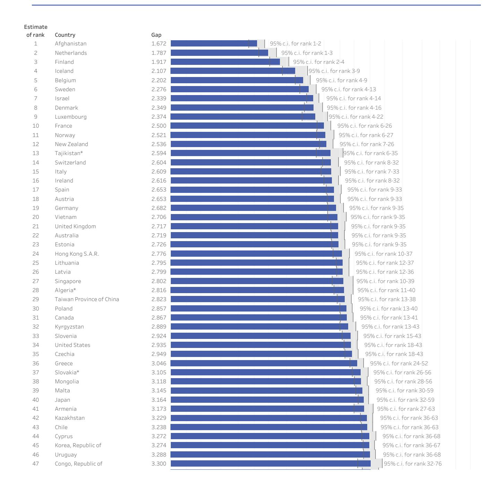

Happiness gap

→ 95% confidence interval

Figure 2.2: Happiness gaps between the top and bottom halves of each country's population, 2020-2022 (Part 2)

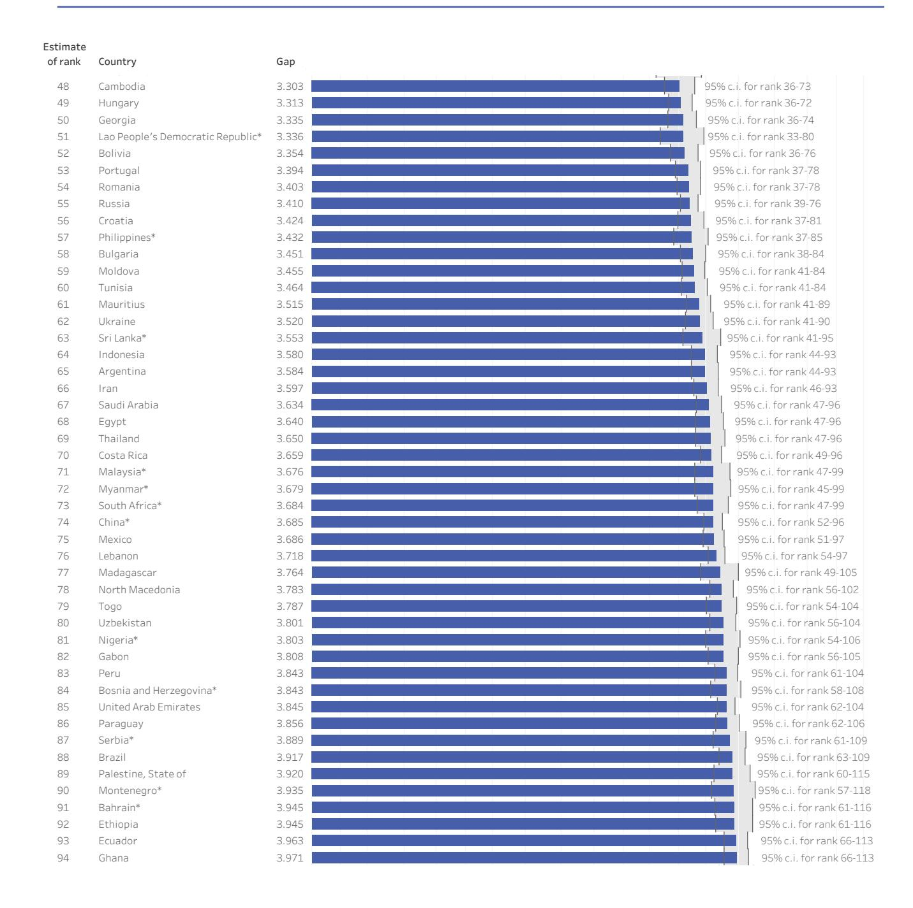

Happiness gap

→ 95% confidence interval

Figure 2.2: Happiness gaps between the top and bottom halves of each country's population, 2020-2022 (Part 3)

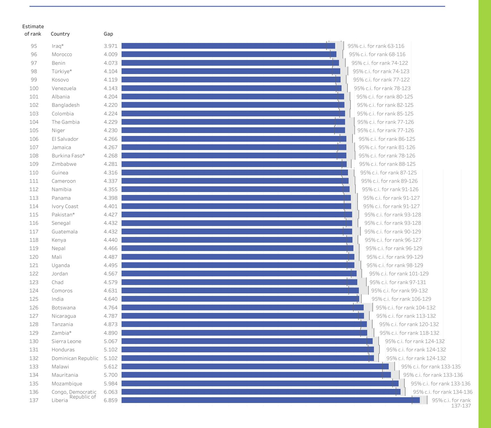

Happiness gap95% confidence interval

Notes: Standard errors for happiness gaps (and the associated rank confidence intervals) in Figure 2.2 are computed by nonparametric bootstrap with 500 replications. Those with a \* do not have survey information in 2022. Their averages are based on the 2020 and 2021 surveys.

sharing the same scale as individual life evaluations. Second, the overall mean life evaluation in a given year is equal to the arithmetic average of the top and bottom half means. This permits the evolution of inequality and mean life evaluations in a region to be shown in the same figure. Third, the gap shows a lot of variation among countries, covering a full five point range between the most and least equal countries.27

The equality rankings shown in Figure 2.2 are quite different from the life evaluation rankings shown in Figure 2.1. There is of course a positive correlation in general between the two rankings, since greater equality of well-being is something valued by survey respondents, and hence influences average life evaluations.28 But there remain substantial differences, since inequality is only one among many factors influencing how people evaluate their lives as a whole. When the rankings in the two figures are compared, there are eighteen countries where the equality ranking is 35 or more ranks below their ladder ranking. At the other extreme, there are another eighteen countries where the equality ranking is 35 or more places above their happiness ranking. The former group, where equality of happiness is lower than indicated by the happiness rank, includes Mexico and all six Central American countries in the rankings, three Persian Gulf states (the United Arab Emirates, Bahrain, and Saudi Arabia), and eight from four other global regions. The contrasting group, where the equality ranking is 35 or more places higher than the ladder ranking, includes Afghanistan and Lebanon, the two least happy countries, where almost everyone is very unhappy, leading to low values for both life evaluations and the gap between the two halves of the population. The group also includes four countries in Southeast Asia, three current or former members of the Commonwealth of Independent States, six African countries, of which three in North Africa, plus Hong Kong, Sri Lanka, and Iran. The 24 WEIRD countries29 are all located towards the middle of

### *The Nordic countries all have high ranks for both happiness and equality.*

this spectrum, spanning about 40 places, from the most unequal relative to life evaluations (the United States, with an equality gap 19 places below the life evaluations ranking), to Greece at the other end, with an equality ranking of 36 and a life evaluations ranking of 58. The Nordic countries are even more closely aligned, with all having high rankings for both equality and life evaluations.

Figure 2.3 has several panels showing global inequality trends for life evaluations, emotions, and other key variables from the outset of the Gallup World Poll in 2005-2006 through 2022. For life evaluations, in Panel (a), we present the median response along with the means of happiness in the happier and less happy halves of the population. We also present two measures of the frequency of misery, which we define in two alternative ways. The first is the share of respondents giving answers of 3 and below, while the second is the share giving answers of 4 and below.30 Growth in either of these shares reflects a general lowering of life evaluations or an increasing concentration of responses at the bottom end of the distribution. The happiness gaps between the two halves of the population provide a good measure of trends in the inequality of well-being, while the misery ratios reveal the extent of very low life evaluations. The overall mean, illustrated as a dashed green line, shows how remarkably resilient global happiness has remained throughout the pandemic.

For emotions, as shown in panels (b) to (d) in Figure 2.3, we pair one positive and one negative emotion in each panel. The fact that all of the positive emotions are more frequent than the negative ones helps to keep the two parts of each panel separate. Even for the less happy half of the population the frequency of each negative emotion is less than the frequency of the corresponding positive emotion.

In panels (e) through (g) we pair one social pillar of well-being and one measure of benevolence in each panel, again contrasting the mean response in the more and less happy halves of the population.31 The measures of benevolence illustrated by dashed lines in these panels have surged worldwide in the last 3 years—especially helping a stranger. Year after year we have found that generosity is a meaningful predictor of happiness. Our measure of generosity is based on the frequency of charitable donations in a given country, shown in panel (f) (see Technical Box 2). The growth in the broader set of benevolence measures helps explain the resilience of life evaluations during the pandemic. We expand on this theme further in the third section of this chapter.

Figure 2.4 disaggregates Figure 2.3 Panel (a) by region to show, for each of ten global regions, the mean life evaluations of the happier 50% and the less happy 50%, and our two measures of misery. The first panels show continued convergence between Western and Eastern Europe, mainly comprising rising life evaluations and falling misery shares in Central and Eastern Europe, with the gaps between the top and bottom halves fairly constant, except for a recent widening of the gap in Western Europe. Among the Asian regions, misery shares have been falling in East Asia, fairly constant in Southeast Asia and growing in South Asia. Misery shares are lowest in Western Europe and the other group of Western industrial countries.

There have been numerous studies of how the effects of COVID-19, whether in terms of illness and death or living conditions for the uninfected, have differed among population subgroups. The Gallup World Poll data are not sufficiently finegrained to separate respondents by their living or working arrangements, but they do provide several ways of testing for different patterns of consequences. In particular, we can separate respondents by age, gender, immigration status, income, unemployment, and general health status. Previous well-being research has shown subjective life evaluations to be lower for those who are unemployed, in poor health, and in the lowest income categories, with the negative effects being less for those living where social trust is

Fig. 2.3: Global trends for the more and less happy 50% of each country (not population weighted)

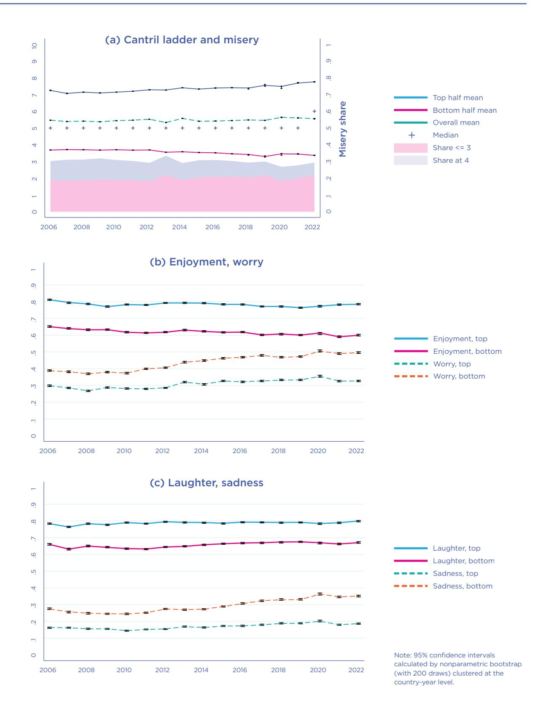

Fig. 2.3: Global trends for the more and less happy 50% of each country (not population weighted) continued

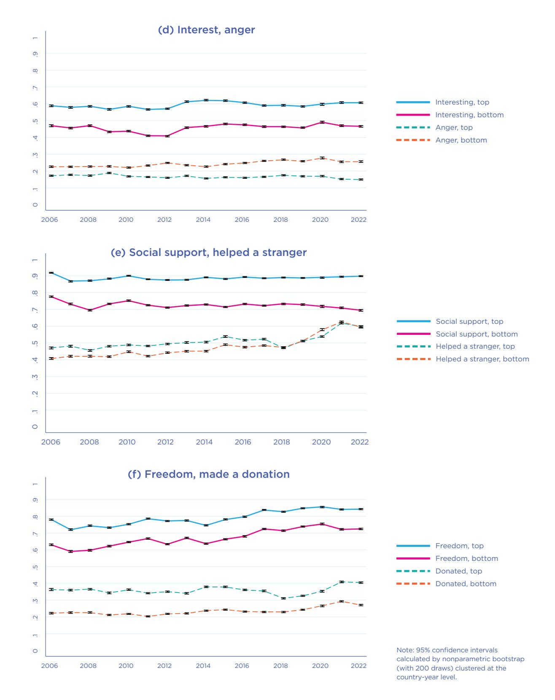

Fig. 2.3: Global trends for the more and less happy 50% of each country (not population weighted) continued

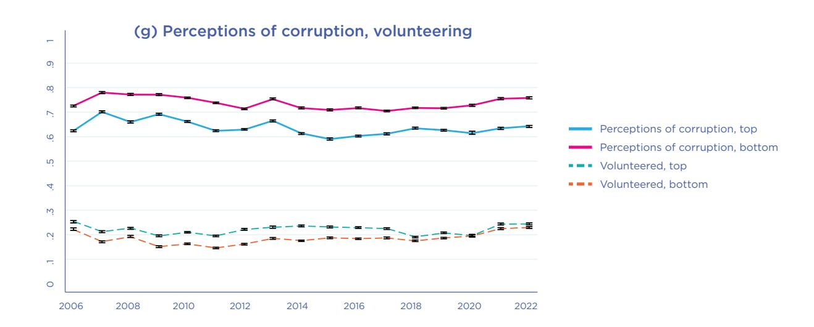

perceived to be high (as shown in Figure 2.3 in World Happiness Report 2020). In World Happiness Report 2015, we examined the distribution of life evaluations and emotions by age and gender, finding a widespread but not universal U-shape in age for life evaluations, with those under 30 and over 60 happier than those in between. Female life evaluations, and frequency of negative affect, were generally slightly higher than for males. For immigrants, we found in World Happiness Report 2018 that life evaluations of international migrants tend to move fairly quickly toward the levels of respondents born in the destination country.

When considering the effects of COVID-19 on equality, it is interesting and important to see how different sub-groups of the population have fared during the pandemic. We did this by estimating an individual-level life evaluation equation using data from more than 560,000 respondents from 2017 through 2022, seeing how pre-pandemic life evaluations (2017-2019) were altered during the three COVID-19 years treated together (2020-2022).32 As shown in Table 2.2 (where the COVID-19 period effects are shown in the right-hand column) our estimates suggest that

COVID-19 tended to continue but not change pre-existing patterns of inequality. Respondents 60 years and older saw COVID-19 era improvements relative to those in the two younger age groups, with a COVID-vears increase of 0.105 relative to the middle aged (t=3.7). There was also a significant increase during COVID-19 in the life evaluation gains from having someone to count on in times of trouble (+0.13, t=2.9). Globally, 80% of respondents have someone to count on, so the positive 0.13 COVID-19 interaction effect adds almost one-tenth of a point to average life satisfaction during the pandemic years. We also looked for COVID-19 effects by age, by gender, by gender and age together, by marital status, for the foreign-born, and for those who were unemployed or in ill-health. Despite the large sample size, none of these effects were significant to the 1% level. The only other COVID-19 effect significant at the 5% level or better was health. Those with health problems were approximately 10% more negatively affected by their health problems during the COVID years.33 This is generally similar to the pattern of results that we found last year for the first two years of COVID-19. Moving to the three-year coverage increased the size and significance of

**Fig. 2.4: Regional trends in life evaluations for the more and less happy halves of each country** (population weighted to calculate regional averages)

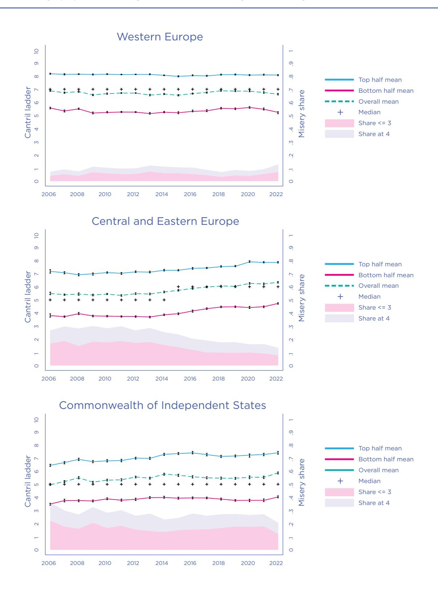

Fig. 2.4: Regional trends in life evaluations for the more and less happy halves of each country (population weighted to calculate regional averages) continued

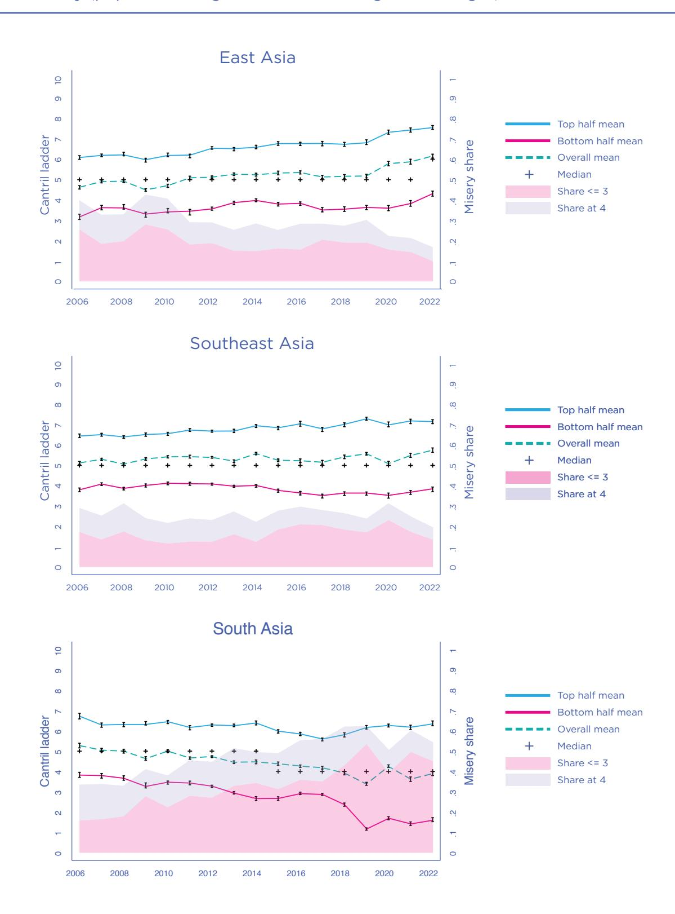

Fig. 2.4: Regional trends in life evaluations for the more and less happy halves of each country (population weighted to calculate regional averages) continued

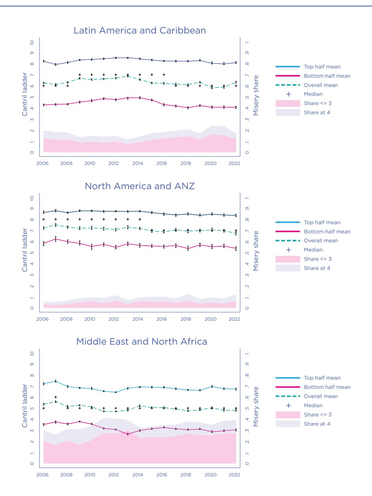

**Fig. 2.4: Regional trends in life evaluations for the more and less happy halves of each country** (population weighted to calculate regional averages) continued

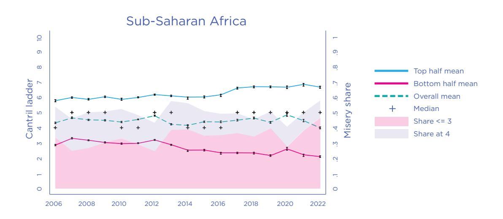

social support and cut the size and eliminated the significance of the unemployment interaction. The general conclusion remains, in the light of three years of pandemic experience, that for the major demographic groups surveyed, the pre-pandemic distributions were unaffected by COVID-19, except as reported above. But it is important to remember that some of those most affected by COVID-19, including the homeless and the institutionalized, are not included in the survey samples.

Should we be sceptical about this relative stability of the distribution of well-being in the face of COVID-19? Is it possible that the relative stability of subjective well-being in the face of the pandemic does not reflect resilience in the face of hardships, but instead suggests that life evaluations are inadequate measures of well-being? In response to this possible scepticism, it is important to remember that subjective life evaluations do change, and by very large amounts, when many key life circumstances change. For example, unemployment, perceived discrimination, and

several types of ill-health, have large and sustained influences on measured life evaluations.34 Perhaps even more convincing is the evidence that the happiness of immigrants tends to move quickly towards the levels and distributions of life evaluations of those born in their new countries of residence, and even towards the life evaluations of others in the specific sub-national regions to which the migrants move.35 In the next section we shall show that the post-2014 conflict in Ukraine was accompanied by a 2-point increase in the life evaluation gap between Ukraine and Russia. This demonstrates again that life evaluations can indeed shift in the face of material changes.

Further, there is also evidence of increasing levels of pro-social activity during COVID-19, as shown in Figure 2.6 in the next section. As discussed later in Chapter 4 of this report, and in Chapter 2 of *World Happiness Report 2022*, these increases in benevolence are likely to have cushioned life evaluations during the COVID-19 years.

**Table 2.2: How have life evaluations changed during COVID-19 for different people?** 

|                              | Dependent variable: Cantril ladder (0-10) |                                            |  |  |  |
|------------------------------|-------------------------------------------|--------------------------------------------|--|--|--|
|                              | (1)                                       |                                            |  |  |  |
|                              | Direct effect                             | Interaction w/ COVID in same regression |  |  |  |
| Constant                     | 1.688***                                  | 0.115                                      |  |  |  |
|                              | (0.255)                                   | (0.218)                                    |  |  |  |
| Log household income         | 0.321***                                  | -0.0315                                    |  |  |  |
|                              | (0.0262)                                  | (0.0219)                                   |  |  |  |
| Social support               | 0.748***                                  | 0.131***                                   |  |  |  |
|                              | (0.0282)                                  | (0.0447)                                   |  |  |  |
| Unemployed                   | -0.385***                                 | -0.0465                                    |  |  |  |
|                              | (0.0252)                                  | (0.0335)                                   |  |  |  |
| Freedom to make life choices | 0.485***                                  | 0.00903                                    |  |  |  |
|                              | (0.0214)                                  | (0.0320)                                   |  |  |  |
| College                      | 0.327***                                  | -0.0247                                    |  |  |  |
|                              | (0.0203)                                  | (0.0247)                                   |  |  |  |
| Married/common-law           | -0.0199                                   | 0.0368                                     |  |  |  |
|                              | (0.0196)                                  | (0.0266)                                   |  |  |  |
| Sep., div., wid.             | -0.196***                                 | 0.0245                                     |  |  |  |
|                              | (0.0273)                                  | (0.0294)                                   |  |  |  |
| Donation                     | 0.240***                                  | -0.00392                                   |  |  |  |
|                              | (0.0151)                                  | (0.0224)                                   |  |  |  |
| Foreign-born                 | -0.0793**                                 | 0.0256                                     |  |  |  |
|                              | (0.0312)                                  | (0.0328)                                   |  |  |  |
| Perceptions of corruption    | -0.239***                                 | 0.0352                                     |  |  |  |
|                              |                                           |                                            |  |  |  |
|                              | (0.0281)                                  | (0.0353)                                   |  |  |  |
| Health problem               | -0.459***                                 | -0.0551**                                  |  |  |  |
|                              | (0.0289)                                  | (0.0250)                                   |  |  |  |
| Age < 30                     | 0.273***                                  | 0.00528                                    |  |  |  |
|                              | (0.0305)                                  | (0.0303)                                   |  |  |  |
| Age 60+                      | 0.0688**                                  | 0.105***                                   |  |  |  |
|                              | (0.0341)                                  | (0.0283)                                   |  |  |  |
| Female                       | 0.215***                                  | -0.00198                                   |  |  |  |
|                              | (0.0236)                                  | (0.0210)                                   |  |  |  |
| Age < 30 x female            | 0.0171                                    | -0.00758                                   |  |  |  |
|                              | (0.0257)                                  | (0.0264)                                   |  |  |  |
| Age 60+ x female             | -0.0730***                                | 0.00165                                    |  |  |  |
|                              | (0.0263)                                  | (0.0291)                                   |  |  |  |
| Institutional trust          | 0.274***                                  | -0.00267                                   |  |  |  |
|                              | (0.0211)                                  | (0.0302)                                   |  |  |  |
| Country fixed effects        |                                           | Yes                                        |  |  |  |
| Number of observations       |                                           | 563,543                                    |  |  |  |
| Number of countries          |                                           | 128                                        |  |  |  |
| Adjusted R2                  |                                           | 0.257                                      |  |  |  |
|                              |                                           | 2.174                                      |  |  |  |

Notes: Standard errors in parentheses clustered by country. \* p<.1, \*\* p<.05, \*\*\* p<.01. Estimates reported in the two columns are from a single regression using individual-level survey data from 2017-2022 with 563,543 respondents from 128 countries. The left column reports the happiness effects of the explanatory variables without COVID-19 influences. The right column shows the extra effects from COVID-19 captured by interactive terms with the indicator variable taking the value 1.0 for all observations in the years 2020-2022.

### **Trust and benevolence in times of crisis**

Many studies of the effects of COVID-19 have emphasized the importance of public trust as a support for successful pandemic responses.36 We have studied similar linkages in earlier reports dealing with COVID-19 and other national and personal crisis situations. In *World Happiness Report 2020*, we found that individuals with high social and institutional trust levels were happier than those living in less trusting and trustworthy environments. The benefits of high trust were especially great for those in conditions of adversity, including ill-health, unemployment, low income, discrimination, and unsafe streets.37 In *World Happiness Report 2013*, we found that the happiness consequences of the financial crisis of 2007-2008 were smaller in those countries with greater levels of mutual trust. These findings are consistent with a broad range of studies showing that communities with high levels of trust are generally much more resilient in the face of a wide range of crises, including tsunamis,38 earthquakes,39 accidents, storms, and floods. Trust and cooperative social norms not only facilitate rapid and cooperative responses, which themselves improve the happiness of citizens, but also demonstrate to people the extent to which others are prepared to do benevolent acts for them and for the community in general. Since this sometimes comes as a surprise, there is a happiness bonus when people get a chance to see the goodness of others in action, and to be of service themselves. Seeing trust in action has been found to lead to post-disaster increases in trust,40 especially where government responses are considered to be sufficiently timely and effective.41

In *World Happiness Report 2021* we presented new evidence using the return of lost wallets as a powerful measure of both trust and benevolence. We compared the life satisfaction effects of

*Benevolent acts in 2022 were about one-quarter higher than before the pandemic.*

the expected likelihood of a Gallup World Poll respondent's lost wallet being returned with the comparably measured likelihood of negative events, such as illness or violent crime. The results were striking, with the expected return of a lost wallet being associated with a life evaluation more than one point higher on the 0 to 10 scale, far higher than the association with any of the negative events assessed by the same respondents.42

COVID-19, as the biggest health crisis in more than a century, with unmatched global reach and duration, has provided a correspondingly important test of the power of trust and prosocial behaviour to provide resilience and save lives and livelihoods. Now that we have three years of evidence, we can assess not just the importance of benevolence and trust, but see how they have fared during the pandemic. The pandemic has been seen by many as creating social and political divisions above and beyond those created by the need to maintain physical distance from loved ones for many months. But some of the evidence noted above shows that large crises can lead to improvements in trust, benevolence, and well-being if they induce people to reach out to help others. This is especially likely if seeing that benevolence comes as a welcome surprise to their neighbours more used to reading of acts of ill-will. Looking to the future, it is important to know whether trust and benevolence have been fostered or destroyed by three years of pandemic. We have not found significant changes in our measures of institutional trust during the pandemic, but did find, as we show below, especially for 2021 and 2022, very large increases in the reported frequency of benevolent acts.

In this section we present several different types of evidence on the importance of trust and benevolence in times of crisis.

First, we update our analysis of COVID-19 death rates to show how the patterns of deaths changed by modelling COVID-19 deaths for 2020 and 2021 combined, and then separately for 2022. This separation enables us to show the great extent to which Omicron variants of COVID-19 have changed the consequences of COVID-19 policy strategies.

Second, we update our measurements of the upsurge of benevolence during COVID-19, showing that the very large increases in 2021 were largely maintained during 2022.

In the third part, we present data on trust, benevolence, and life evaluations in Ukraine and Russia from 2010 to 2022.

Finally, we provide a first look at new data for social connections and loneliness during 2022.

### **COVID-19: Omicron changed everything except the role of trust**

At the core of our original interest in investigating international differences in death rates from COVID-19 was curiosity about the links between variables that support high life evaluations and those that are related to success in keeping death rates low. We found in our two previous *World Happiness Reports* that institutional and social trust were the only main determinants of subjective well-being that showed a strong carry-forward into success in fighting COVID-19. We are now

able to add data for 2022, and thereby show what a different year it has been, with a continued role for institutional trust as almost the only unchanged part of the story. The data for 2022 reveal dramatically how much the combination of Omicron variants, widespread vaccination and changes in policy measures have combined to give a very different international pattern of death rates.

We find continuing evidence that the quality of the social context, which we have previously found so important to explaining life evaluations within and across societies, has also affected progress in fighting COVID-19. Several studies within nations have found that regions with high social capital have been more successful in reducing rates of infection and deaths.43 Our earlier finding that trust is an important determinant of international differences in COVID-19 death rates has since been confirmed independently for cumulative COVID-19 infection rates extending to September 30, 2021,44 and we show below that this finding also holds for all of 2021 and for 2022.

We capture these vital trust linkages in two ways. We have a direct measure of trust in public institutions, as described below. We do not have a measure of general trust in others for our large sample of countries, so we make use instead of a measure of income inequality, which has often been found to be a robust predictor of the level of social trust.45

Our attempts to explain international differences in COVID-19 death rates divide the explanatory variables into two sets, both of which refer to circumstances likely to have affected a country's success in battling COVID-19. The first set of variables cover demographic, geographic, and disease exposure circumstances at the beginning of the pandemic. The second set of variables covers several aspects of economic and social structure, also measured before the pandemic, that help to explain the differential success rates of national COVID-19 strategies.

The first set comprises a variable combining the age distribution of each country's population with the age-specific mortality risks46 for COVID-19, whether the country is an island, and an exposure

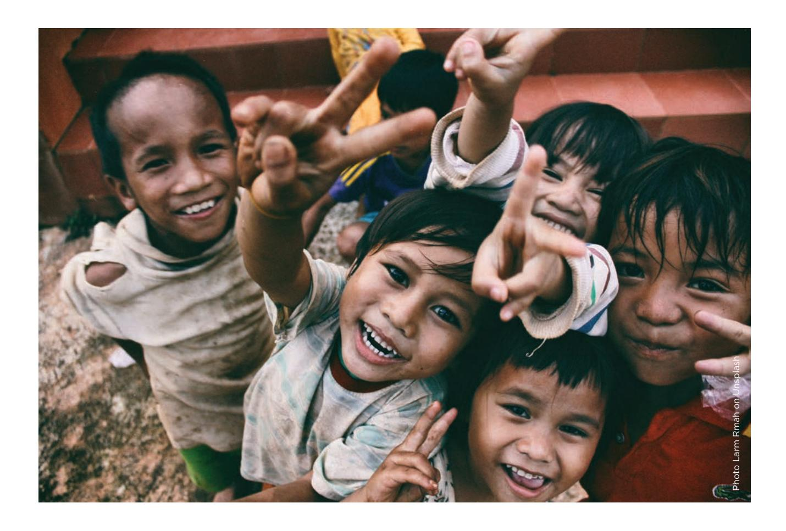

index measuring how close a country was in the very early stages of the pandemic (March 31, 2020), to infections in other countries. In World Happiness Report 2022, we used a single measure of the extent to which a country could remember and apply the epidemic control strategies learned during the SARS epidemic of 2003. Countries in the WHO Western Pacific Region were able to build on SARS experiences to develop fast and maintained virus suppression strategies,47 so we used membership in that region (WHOWPR) as a proxy measure of the likelihood of a country adopting a virus elimination strategy.48 The trust-related variables include a measure of institutional trust, and the Gini coefficient measuring each country's income inequality.49

The fact that experts and governments in countries distant from the earlier SARS epidemics did not get the message faster about the best COVID-19 response strategy provides eloquent testimony to the power of a "won't happen here" mindset,

illustrated by the death rate impacts of membership of the Western Pacific Region of the WHO, whose members had the most direct experience with the SARS epidemic, and were hence more likely to have learned the relevant lessons. 50 There was very early evidence that COVID-19 was highly infectious, spread by asymptomatic51 and pre-symptomatic52 carriers, and subject to aerosol transmission.53 These characteristics require masks54 and physical distancing to slow transmission, rapid and widespread testing55 to identify and eliminate community56 outbreaks, and effective testing and isolation for those needing to move from one community or country to another. Countries that quickly adopted all these pillar policies were able to drive community transmission to zero. But most countries were not able and willing to remove the virus from community transmission, resulting in the creation of new variants,57 with the more infectious of them quickly achieving dominance, and rendering

ever more difficult the application of a COVID-19 elimination strategy. Omicron led in 2022 to a convergence of death rates, as shown in Panel A of Figure 2.5. Although policy stringency was reduced58 or removed in all countries, and health authorities largely stopped measuring and reporting the number of infections, death rates were held in check by vaccines and treatments that reduced the frequency of serious illness and deaths.

Previous research covering the first 15 months of the pandemic found that among 15 countries with diverse strategies, the eliminator countries achieved these lower death rates with no net cost in terms of mental health. This was attributed to the timeliness and careful direction of policies resulting in the eliminator countries, on average, requiring less stringent policies.59 Given the Omicron-induced prevalence of community transmission everywhere in 2022, what can be said about the eventual net national and global benefits of an elimination strategy? Panel B of Figure 2.5 shows that the members of the

WHOWPR and the near-eliminator Nordic countries (excluding Sweden) had cumulative COVID-19 deaths for 2020 through 2022 that were significantly below those among the other countries of Western Europe and the rest of the world. If elimination strategies had been quickly enough implemented everywhere, then the genie might have been put back in the bottle and the virus kept out of general circulation. That was the lesson from SARS, where the virus was removed from circulation, and both infections and deaths went quickly to zero. The eliminator countries helped to reduce the space for variants to develop. This global benefit depended on country size, with China as the largest eliminator.60 But there was clearly enough community spread in the rest of the world to enable the development of variants so transmissible as to make an elimination strategy infeasible everywhere. Now there is a fully global field for the evolution of still further variants, with possibly declining virulence,61 improved and more widely used vaccines62 and treatments, better ventilation,

**Table 2.3: Regressions to explain COVID-19 deaths per 100,000 population** 

| COVID-19 death rate per 100k            |           | One country one vote |           |            | Population-weighted |            |           |            |
|-----------------------------------------|-----------|----------------------|-----------|------------|---------------------|------------|-----------|------------|
|                                         | (1)       |                      | (2)       |            | (3)                 |            | (4)       |            |
| Variables                               | 2020-21   | Std. coef.           | 2022      | Std. coef. | 2020-21             | Std. coef. | 2022      | Std. coef. |
| Institutional trust                     | -220.8*** | -0.321               | -44.67*** | -0.228     | -279.3***           | -0.458     | -71.65*** | -0.461     |
| (2017-19)                               | (38.83)   |                      | (11.54)   |            | (39.24)             |            | (12.44)   |            |
| Country is an island                    | -39.99**  | -0.120               | -4.898    | -0.052     | 26.25               | 0.078      | 6.498     | 0.076      |
|                                         | (15.51)   |                      | (5.824)   |            | (19.53)             |            | (4.314)   |            |
| WHOWPR member                           | -77.91*** | -0.165               | 15.72     | 0.117      | -110.8***           | -0.479     | -14.05*   | -0.238     |
|                                         | (29.77)   |                      | (13.18)   |            | (14.48)             |            | (7.632)   |            |
| Risk adjusted age profile               | -33.35*** | -0.526               | -9.865*** | -0.547     | -37.27***           | -0.564     | -9.707*** | -0.576     |
|                                         | (3.773)   |                      | (1.235)   |            | (4.540)             |            | (2.269)   |            |
| Exposure to infections                  | 30.97***  | 0.295                | 7.196***  | 0.241      | 21.57**             | 0.159      | 4.570     | 0.132      |
| in other countries (at Mar 31, 2020) | (8.477)   |                      | (2.587)   |            | (9.467)             |            | (3.452)   |            |
| Gini for income                         | 3.192***  | 0.224                | 0.223     | 0.055      | 4.524***            | 0.307      | 0.177     | 0.047      |
| inequality (0-100)                      | (0.758)   |                      | (0.282)   |            | (1.045)             |            | (0.335)   |            |
| Constant                                | 107.2**   |                      | 48.86***  |            | 87.22               |            | 58.27***  |            |
|                                         | (43.54)   |                      | (14.00)   |            | (60.46)             |            | (15.80)   |            |
| Number of countries                     | 154       |                      | 154       |            | 154                 |            | 154       |            |
| R-squared                               | 0.611     |                      | 0.564     |            | 0.747               |            | 0.633     |            |
| Adj. R-squared                          | 0.595     |                      | 0.546     |            | 0.736               |            | 0.618     |            |

Notes: Robust standard errors are reported in parentheses. \*\*\*, \*\*, and \* indicate significance at the 1, 5, and 10 percent levels respectively.

**Figure 2.5: COVID-19 death rates by world region in different years of the pandemic**

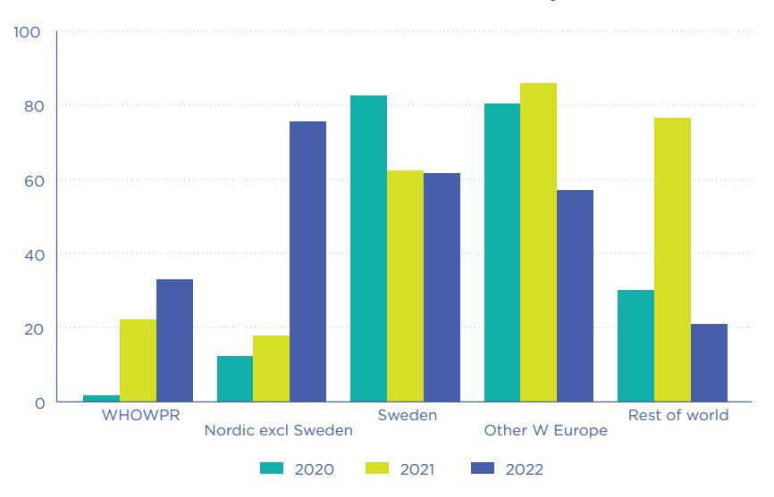

Total COVID deaths over three years per 100k **Panel B. Total COVID-19 deaths over three years per 100k**

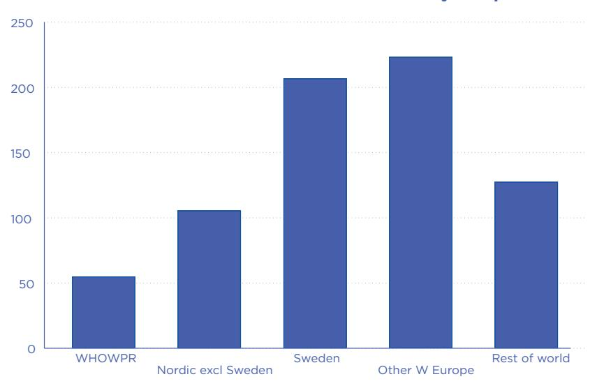

and personal hygiene as the main defences available during this new endemic phase.

As expected, the results of our COVID-19 modelling are dramatically different before and after the appearance of Omicron at the end of 2021. Our earlier modelling showed a similar structure for 2020 and 2021. In our new results, we thus combine 2020 and 2021, and compare that to a separate equation for 2022. As shown in Table 2.3, the disappearance of an effective elimination strategy means that there were only two significant variables still in play in 2022. The first is the level of institutional trust, which has retained most of the importance that it had in the first two years of the pandemic. The second is a risk variable based on each country's age profile, weighted by the estimated age-specific death rates, which are much higher in older populations. To show that these results adequately represent the global population, the results on the right-hand side of the table are weighted by each country's share of

the global population, and produce very similar results, as do estimates making use of estimates of excess deaths from all causes.63

The Nordic countries merit special attention in light of their generally high levels of both personal and institutional trust. They also had COVID-19 death rates only one-third as high as elsewhere in Western Europe during 2020 and 2021, 27 per 100,000 per year in the Nordic countries compared to 80 in the rest of Western Europe. There is an equally great divide in death rates, but not in trust, when Sweden is compared with the other Nordic countries, as shown in Figure 2.5. This difference shows the importance of a chosen pandemic strategy. Sweden, at the outset, chose64 not to suppress community transmission, while the other Nordic countries aimed to contain it. As a result, Sweden had much higher death rates in 2020-2021 than the other Nordic countries, while in the end being forced to adopt stringency measures that were on average stricter65 than in

the other Nordic countries. By the end of 2022, however, most countries had similar strategies and similar death rates, reflecting the increasingly endemic nature of the virus.

### **Growth of benevolence during the pandemic**

A striking feature of the benevolence data presented in *World Happiness Report 2022* was the sharp increase in the helping of strangers during 2020 and especially 2021, coupled with significant increases in 2021 in both volunteering and donations. Figure 2.6 below now shows these three measures of generosity for each of the three COVID-19 years, in each case compared to the average values 2017-2019. The average of the three measures, labelled 'prosocial', is shown by the right-hand set of bars.

There has been much interest in whether these high levels of benevolence would be maintained in 2022 as the Omicron and other variants gradually shifted COVID-19 from pandemic to endemic status, and many pre-pandemic patterns of life were resumed. Could some part of the 2021 benevolence boost be maintained? The 2022

results in Figure 2.6 show that although benevolent acts have become slightly less frequent than in 2021, they remain significantly higher than pre-pandemic levels, which is the case for all global regions.

There remain some interesting differences among the regions. Before the pandemic, prosociality was significantly higher in Western than in Eastern Europe, averaging 23% in Eastern Europe and 38% in Western Europe. In 2021, prosociality was up by 2% in Western Europe and by 17% in Eastern Europe, erasing the pre-pandemic gap. At the global level, there is a somewhat similar comparison to be made. In 2017-2019 the percentage of the population involved in the selected prosocial acts was 40% in the Western industrial countries66 and 30% in the rest of the world. This gap was substantially closed during the past three years, especially in 2021 and 2022.

Globally, the continued high levels of benevolence likely help to support high happiness,67 with some added potential for creating a virtuous circle supporting future benevolence.68

**Fig 2.6: Percentage of population performing benevolent acts** 

2020, 2021, and 2022 compared to 2017-2019

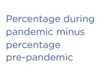

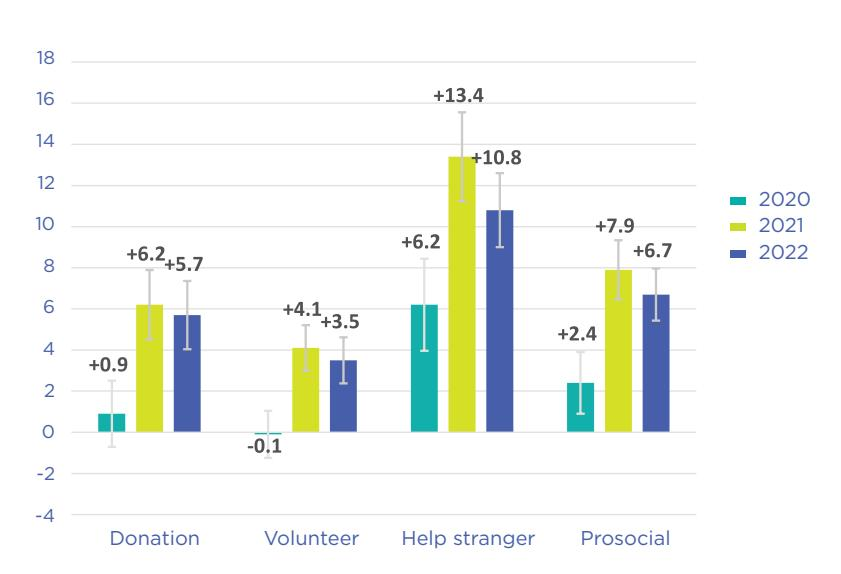

### **Ukraine and Russia**

Data from the Gallup World Poll permit us to compare life evaluations, trust in governments, emotions and benevolence in Ukraine and Russia from before the annexation of Crimea in 2014 up to and including the Russian invasion of Ukraine in 2022.69 Crimea has been excluded from all our data because it was not possible to maintain consistent sampling over the past decade.

Panel A of Figure 2.7 shows life evaluations in Russia and Ukraine from 2012 through 2022. Life evaluations in Ukraine fell in 2014 by more than a full point on the 0 to 10 scale,70 while rising by half that much in Russia. This gap gradually narrowed over the rest of the decade, with life evaluations in Ukraine and Russia being the same in 2020 and 2021, subsequent to Zelensky's election on March 31, 2019. In 2022, life evaluations fell by about three-quarters of a point across Ukraine.

Both the 2014 and the 2022 changes are very large, providing further evidence, should any still be needed, that life evaluations do respond to major changes in the circumstances of life.

Panel B of Figure 2.7 shows approval of each country's own national leadership, and also the extent to which Ukrainians approved of Russian leadership. The events of 2014 raised Russian evaluations of their country's leadership, with initially varying effects on Ukrainian evaluations of their national leadership in the different parts of Ukraine. At first, evaluations of the national government were little changed in SE Ukraine71 while rising sharply elsewhere. In 2015 Ukrainian approval of their national government was down everywhere, while in Russia, approval of the national government remained high in 2015 but then gradually fell. The gap between Russian and Ukrainian evaluations of their own governments closed over the rest of the decade until the election year 2019 when approval ratings rose sharply throughout Ukraine. After falling back somewhat in 2020 and 2021, approval of the national government rose sharply in 2022 in both Ukraine and Russia, but by much more in Ukraine than in Russia, quite different from the 2014 pattern.

Ukrainian approval of Russian leadership fell sharply in 2014 in all parts of the country. This drop was reversed by approximately 10% in the subsequent years before falling essentially to zero in all parts of Ukraine in 2022. Out of 1,000 residents of Ukraine surveyed in September 2022, only two, both in the southeast, approved of Russian leadership. That this elimination of any Ukrainian approval of Russian leadership was due to the invasion in March 2022 is confirmed by a Ukrainian survey showing some residual approval of Russian leadership as late as February 2022.72

All three negative emotions were more frequent in Ukraine than in Russia in 2014, and again in 2022. The largest increases were for worry, which was experienced by almost 40% of Ukrainian respondents in 2014, and more than 50% in 2022, as shown in Panel C. By contrast, worry was actually less frequent in Russia during the 2014-2016 period, when its frequency was only about half of that in Ukraine. It was also unaffected by the Russian invasion of Ukraine in 2022.

**Fig 2.7: Trends in Russia and Ukraine from 2012 through 2022** 

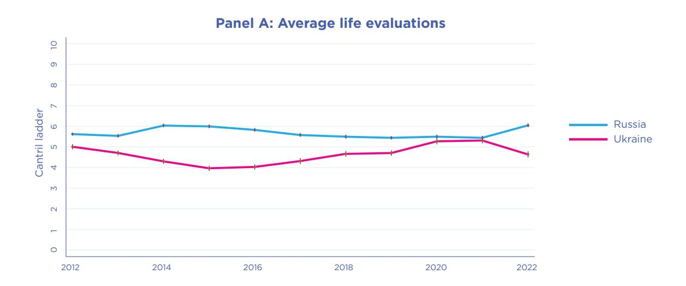

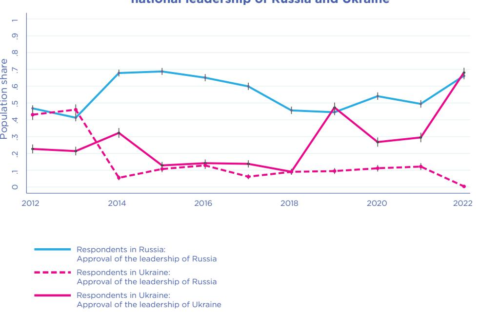

**Fig 2.7: Trends in Russia and Ukraine from 2012 through 2022** (continued)

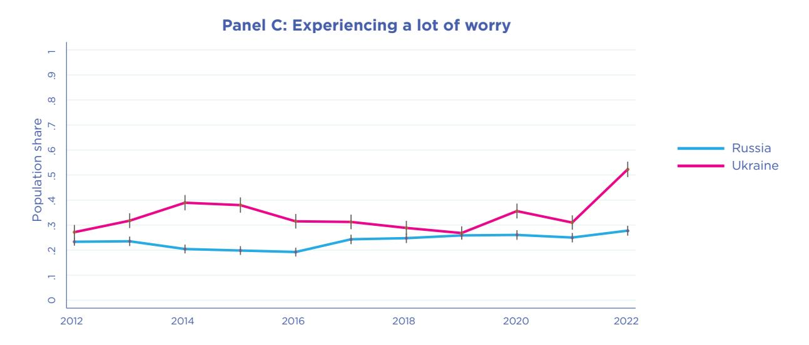

Russia: Made donation Russia: Helped stranger Ukraine: Made donation Ukraine: Helped stranger

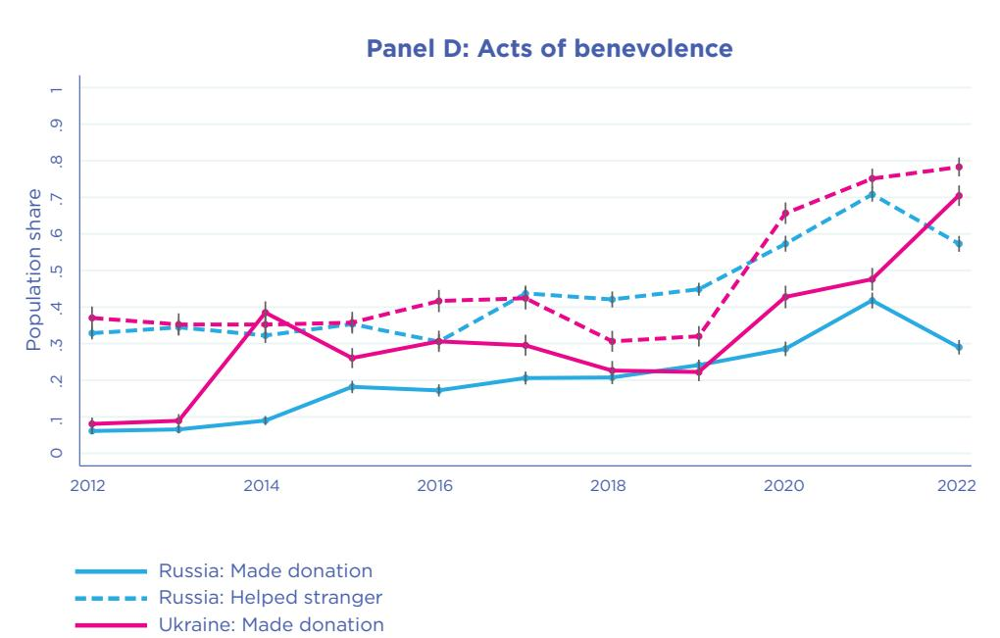

Ukraine: Helped stranger

What about benevolent acts in Ukraine and Russia? As shown in panel D of the figure, donations started from an average frequency of 10% in 2013 in both Ukraine and Russia, and in 2014 more than trebled in Ukraine, a far bigger increase than in Russia. Both Ukraine and Russia shared in the general worldwide increase in benevolence during the pandemic years of 2020 and 2021. In 2022, benevolence in Ukraine rose to record levels, above 70% for both donations and the helping of strangers, while falling significantly in Russia.

Wars are crises that can raise life evaluations if people feel themselves united in a common cause and have trust in their leadership. These factors were more in evidence in Ukraine in 2022 than after 2014. Following the Russian annexation of Crimea in 2014, life evaluations climbed in Russia

and fell in Ukraine, with a gap reaching 2 points.73 This gap was eliminated by 2021, but grew again in 2022, but followed a different pattern. Despite the magnitude of suffering and damage in Ukraine, life evaluations in September 2022 remained higher than in the aftermath of the 2014 annexation, supported by a much stronger sense of common purpose, benevolence and trust in their leadership.

Increased benevolence and trust in government are frequently found in times of crisis, especially if the population is united in a common cause. In the Ukrainian case, both factors74 helped to limit the overall well-being damage caused by the Russian invasion. Nonetheless, the net effect was to reduce life evaluations by more than two-thirds of a point in Ukraine, as shown in the first panel of Figure 2.7.

**Figure 2.8: Social support, loneliness, and relationship satisfaction in seven countries in 2022**

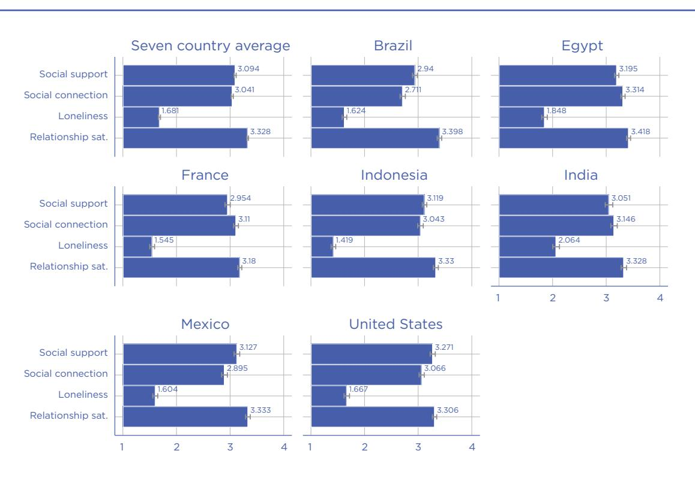

### **New evidence on social connections**

In 2022, Gallup, Meta and a group of academic advisors collaborated on the State of Social Connections study, a first-of-its-kind, in-depth look at people's social connections around the world. The first phase of the study, the State of Social Connections 7-country survey, involved a detailed survey on the quality and quantity of people's social interactions in a diverse set of seven large countries (Brazil, Egypt, France, Indonesia, India, Mexico, and the United States) spanning six global regions.75 The resulting data show how connected, socially supported, and lonely people feel in various cultural, economic and technological environments.76 A second phase of the research, the State of Social Connections Gallup World Poll survey, expanded its global reach by running a select set of the State of Social Connections study questions on the Gallup World Poll, reaching 140+ countries,

and providing the ability to study overall life evaluations and the relative importance of social connections, social support, and loneliness.

What have we been able to learn from the State of Social Connections 7-country survey? First and perhaps foremost, respondents in all regions reported high levels of social connectedness and social support, generally almost twice as high as reports of loneliness, even during the third year of COVID-19 disruptions to social life. For the 7 countries considered together, using a scale from 1 to 4, where higher numbers indicate more of what is being measured, social connections and social support both average over 3.0, with loneliness less than 1.7. There were relatively small differences among the countries for all three measures, as shown in Figure 2.8.77 As shown in the bottom bars for each country in Figure 2.8, overall satisfaction with social relationships averaged 3.33 for the seven countries as a group,

**Figure 2.9: Using loneliness and a combined measure of social connectedness and support to predict relationship satisfaction** 

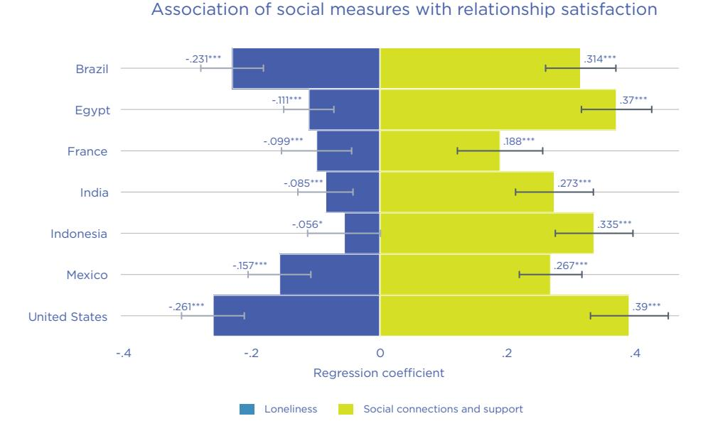

\* p < .1, \*\*\* p < .01.

with the separate national averages all within the range of 3.2 to 3.4.78 The results were very similar for females and males.

Second, we used data from the State of Social Connections 7-country survey to assess the power of positive social connections to improve selfassessed quality of social relationships. In particular, we compared the effects of positive social connections with the long-recognized adverse effects of loneliness.79 Although both positive social support and loneliness are important aspects of the quality of the social contexts in which people live, there have previously been few systematic attempts to assess their relative importance, especially on a global basis. Most attention has been focused on loneliness, particularly during the pandemic, with much less attention given to the levels and consequences of positive measures of social support.

What do the results show? As shown in Figure 2.9, and explained in detail in a companion paper,80 in each of the seven countries the strength of the relationship between the combined measure of social support (equal to the average of the answers to the connectedness and support questions) and overall domain satisfaction was much greater than that between loneliness and social domain satisfaction, even in 2022, the third of three difficult years for social relations.81

These new data showing that positive social connections and support have larger effects than an important negative factor such as loneliness, help further to explain why life evaluations can remain high even in the face of reported increases in loneliness during the pandemic years.

The Gallup World Poll data for the full set of countries is still being processed, including the set of questions from the State of Social Connections Gallup World Poll survey. However, based on early access to country-level aggregate data for 114 countries, the relative frequency of loneliness is less than that of social support and social connection, as already shown for the State of Social Connections 7-country survey data in Figure 2.8.

We have also been provided with results from pre-registered analyses of the individual level State of Social Connections Gallup World Poll

survey data. These analyses allow us to compare results from the State of Social Connections 7-country survey (where relationship satisfaction is used as the outcome) against results from the Gallup World Poll in 114 countries (where wellbeing is used as the outcome), given that both surveys ask the same questions about social support, connection, and loneliness. To see if the two surveys give consistent data when asked in the same countries, we compared the answers to the three social connections questions in the same seven countries. The results are very reassuring, as for the three survey questions within the seven countries that are common to both the State of Social Connections 7-country and Gallup World Poll surveys, the distributions of responses among the answer options are almost identical.82 This high comparability of the two surveys makes us confident that any differences we find in the relative power of social connections and loneliness variables when we are comparing the Gallup World Poll and the 7-country survey reflects the use of a different dependent variable.

Figure 2.9 uses relationship satisfaction as the outcome, whereas the Gallup World Poll has the broader Cantril ladder life evaluation used elsewhere in this Chapter but does not have a social domain satisfaction variable. Despite this important change in the dependent variable from domain satisfaction to the broader life evaluation, we find that for more than half of surveyed countries the loneliness and combined social support variables both have statistically significant links to life evaluations at the 10% level, and for most countries the social support effects are larger than those of loneliness. There is some slight evidence also that loneliness may weigh more heavily on life evaluations than on domain satisfaction with social relations. Thus the individual level data from the State of Social Connections Gallup World Poll survey tell a very consistent story with that appearing in the 7-country survey.

Given the larger number of countries, it is interesting to see if these new social variables contribute to explaining cross-national differences in life evaluations. Preliminary evidence suggests that they do have significant explanatory power when considered on their own, but not when added to

the Table 2.1 aggregate equation that makes use of a simpler binary social support variable.83 This encourages continued reliance on the social support variable we have long been using. Within each country, we have found strong evidence that social connections and especially social support are important correlates of well-being, and generally more than is the case for loneliness.

### **Summary**

Life evaluations have continued to be remarkably resilient, with global averages in the COVID-19 years 2020-2022 just as high as those in the pre-pandemic years 2017-2019. Finland remains in the top position, for the sixth year in a row. Lithuania is the only new country in the top

twenty, up more than 30 places since 2017. War-torn Afghanistan and Lebanon remain the two unhappiest countries in the survey, with average life evaluations more than five points lower (on a scale running from 0 to 10) than in the ten happiest countries.

This year's report uses three measures to study the inequality of happiness. The first is the happiness gap between the top and the bottom halves of the population. This gap is small in countries where almost everyone is very unhappy, and in the top countries where almost no one is unhappy. More generally, people are happier living in countries where the happiness gap is smaller. Happiness gaps globally have been fairly stable, although there are growing gaps in Africa. The second and third are measures of misery—the share of the population having life evaluations of 4 and below, and the share rating their lives at 3 and below. Globally, both of these measures fell slightly during the three COVID-19 years.

The rest of the chapter helps to explain this resilience using four examples to suggest how trust and social support can support happiness during crises.

*COVID deaths*. In 2020 and 2021, countries attempting to suppress community transmission had lower death rates without incurring offsetting costs elsewhere. Not enough countries followed suit, thus enabling new variants to emerge, such that in 2022, Omicron made elimination infeasible. While policy strategies, infections and death rates are now much alike in all countries, our new modelling shows that trust continues to be correlated with lower death rates, and total deaths over the three years are still much lower in the eliminator countries.

*Benevolence*. One of the striking features of *World Happiness Report 2022* was the globe-spanning surge of benevolence in 2020 and especially 2021. Data for 2022 show that prosocial acts are still about one-quarter more frequent than before the pandemic.

*Ukraine and Russia*. Confidence in their national governments grew in 2022 in both countries, but much more in Ukraine than in Russia. Ukrainian support for Russian leadership fell to zero in all

### *Ukrainian support for Russia leadership fell to zero in 2020, in all parts of the country.*

parts of Ukraine in 2022. Both countries shared the global increases in benevolence during 2020 and 2021. During 2022, benevolence grew sharply in Ukraine but fell in Russia. Despite the magnitude of suffering and damage in Ukraine, life evaluations in September 2022 remained higher than in the aftermath of the 2014 annexation, supported by a much stronger sense of common purpose, benevolence and trust in Ukrainian leadership.

*Social support*. New data show that positive social connections and support in 2022 were twice as prevalent as loneliness in seven key countries spanning six global regions. They were also strongly tied to overall ratings of how satisfied people are with their relationships with other people. The importance of these positive social relations helps further to explain the resilience of life evaluations during times of crisis.

#### **Endnotes**

- 1 A country's average answer to the Cantril ladder question is exactly equivalent to a notion of average underlying satisfaction with life under an assumption of "cardinality:" the idea that the difference between a 4 and a 3 should count the same as the difference between a 3 and a 2, and be comparable across individuals. Some social scientists argue that too little is known about how people choose their answer to the Cantril ladder question to make this assumption and that if it is wrong enough, then rankings based on average survey responses could differ from rankings based on underlying satisfaction with life (Bond & Lang, 2019). Other researchers have concluded that answers to the Cantril ladder question are indeed approximately cardinal (Bloem & Oswald, 2022; Ferrer-i-Carbonell & Frijters, 2004; Kaiser & Oswald, 2022; Krueger & Schkade, 2008).
- 2 For any pair of countries, the confidence intervals for the *means* (depicted in Figure 2.1 as whiskers) can be used to gauge which country's mean is higher than the other, accounting for statistical uncertainty in the measurement of each. The confidence interval for a country's *rank* (given in Figure 2.1 as text) represents a range of possible values for the ranking of their mean among all countries, accounting for uncertainty in the measurement of all of the means (following Mogstad et al., 2020). The ranges are constructed so that the chance that the range does not contain the country's true rank is no more than 5%.
- 3 Not every country has a survey every year. The total sample sizes are reported in Statistical Appendix 1, and are reflected in Figure 2.1 by the size of the 95% confidence intervals for the mean, indicated by horizontal lines. The confidence intervals are naturally tighter for countries with larger samples.
- 4 Countries marked with an \* do not have survey information in 2022. Their averages are based on the 2020 and/or 2021 surveys.
- 5 This can be seen as part of a more general Baltic phenomenon. The increase in Estonia's rank was even larger, from 66th in 2017 to 31st in 2023. Latvia's increase was also significant, but smaller, from 54th in 2017 to 41st in 2023. These increases reflect the general increases in life evaluations in Central and Eastern Europe shown in Figure 2.3, with the Baltic countries converging faster than average toward Western European levels.
- 6 The statistical appendix contains alternative forms without year effects (Appendix Table 9), and a repeat version of the Table 2.1 equation showing the estimated year effects (Appendix Table 8). These results continue to confirm that inclusion of the year effects makes no significant difference to any of the coefficients. In these aggregate equations, adding regional or country fixed effects would lower the coefficients on relatively slow moving variables where most of the variance is across countries rather than over time, such as healthy life expectancy and the log of GDP. With equations based on individual observations, such as in Table 2.2 of *World Happiness Report 2022*, where income and health are measured by individual-level variables, adding country fixed effects makes little difference to any of the coefficients.

- 7 The definitions of the variables are shown in Technical Box 2, with additional detail in the online data appendix.
- 8 The model's predictive power is little changed if the year fixed effects in the model are removed, with adjusted R-squared falling only from 0.757 to 0.752.
- 9 For example, unemployment responses at the individual level are available in most waves of the Gallup World Poll. While they show an effect size similar to that found in other research, the coefficient has never been significant, and its inclusion does not influence the size of the other coefficients.
- 10 Below, we use the term "effect" when describing the coefficients in these regressions; some caveats to this interpretation are discussed later in this section.
- 11 In the equation for negative affect, healthy life expectancy takes a significant positive coefficient, despite its positive simple correlation with life evaluations in this aggregate dataset.
- 12 This influence may be direct, as many have found, e.g. De Neve et al. (2013). It may also embody the idea, as made explicit in Fredrickson's broaden-and-build theory (Fredrickson, 2001), that good moods help to induce the sorts of positive connections that eventually provide the basis for better life circumstances.
- 13 See, for example, the well-known study of the longevity of nuns, Danner et al. (2001).
- 14 See Cohen et al. (2003), and Doyle et al. (2006).
- 15 The prevalence of these feedbacks was documented in Chapter 4 of *World Happiness Report 2013*, De Neve et al. (2013).
- 16 We expected the coefficients on these variables (but not on the variables based on non-survey sources) to be reduced to the extent that idiosyncratic differences among respondents tend to produce a positive correlation between the four survey-based factors and the life evaluations given by the same respondents. This line of possible influence is cut when the life evaluations are coming from an entirely different set of respondents than are the four social variables. The fact that the coefficients are reduced only very slightly suggests that the commonsource link is real but very limited in its impact.
- 17 The coefficients on GDP per capita and healthy life expectancy were affected even less, and in the opposite direction in the case of the income measure, being increased rather than reduced, once again just as expected. The changes were very small because the data come from other sources, and are unaffected by our experiment. However, the income coefficient does increase slightly, since income is positively correlated with the other four variables being tested, so that income is now able to pick up a fraction of the drop in influence from the other four variables. We also performed an alternative robustness test, using the previous year's values for the four survey-based variables. Because each year's respondents are from a different random sampling of the national populations, using the previous year's average data also avoids using the same respondent's answers on both sides of the equation. This alternative test produced similarly reassuring results as

- shown in Table 13 of Statistical Appendix 1 in *World Happiness Report 2018*. The Table 13 results are very similar to the split-sample results shown in Tables 11 and 12, and all three tables give effect sizes very similar to those in Table 2.1 in the main text. Because the samples change only slightly from year to year, there was no need to repeat these tests with this year's sample.
- 18 Actual and predicted national and regional average 2020-2022 life evaluations are plotted in Figure 37 of Statistical Appendix 1. The 45-degree line in each part of the Figure shows a situation where the actual and predicted values are equal. A predominance of country dots below the 45-degree line shows a region where actual values are below those predicted by the model, and vice versa. Southeast Asia provides the largest current example of the former case, and Latin America of the latter.
- 19 See Rojas (2018).
- 20 If special variables for Latin America and East Asia are added to the equation in column 1 of Table 2.1, the Latin American coefficient is +0.51 (t=5.4) while that for East Asia is -0.17 (t=1.7).
- 21 See Chen et al. (1995) for differences in response style, and Chapter 6 of *World Happiness Report 2022* for data on regional differences in variables thought to be of special importance in East Asian cultures. Those data do not explain the slightly lower rankings for East Asian countries, as the key variables, including especially feeling one's life is in balance and feeling at peace with life, are more prevalent in the ten happiest countries, and especially the top-ranking Nordic countries, than they are in East Asia. However, as also shown in Chapter 6 of *World Happiness Report 2022*, balance, but not peace, is correlated more closely with life evaluations in East Asia than elsewhere, so that the low actual values may help to partially explain the negative residuals for East Asia.
- 22 One slight exception is that the negative effect of corruption is estimated to be slightly larger (0.86 rather than 0.71), although not significantly so, if we include a separate regional variable for Latin America. This is because perceived corruption is worse than average in Latin America, and its happiness effects there are offset by stronger close-knit social networks, as described in Rojas (2018). The inclusion of a special Latin American variable thereby permits the corruption coefficient to take a higher value.
- 23 As represented by Western European countries, the United States, Australia, New Zealand and Canada.
- 24 More precisely, the test vehicle is the equation in column 1 with no year fixed effects, given our wish to compare the three COVID-19 years to the three preceding years.
- 25 These results are presented and explained on pages 26-34 of *World Happiness Report 2022*.
- 26 Standard errors for happiness gaps (and the associated rank confidence intervals) in Figure 2.2 are computed by nonparametric bootstrap with 500 replications.
- 27 Allison and Foster (2004) show that even if life evaluations are interpreted as containing ordinal information only, a distribution of responses is more "spread-out" than a second distribution if and only if the gap in top/bottom

- means in the first distribution is greater than of the second distribution, for any assignment of values to the categories. Thus when the ranking of distributions by top-minus-bottom mean spread is unambiguous, it represents the correct ranking of inequality.
- 28 See Goff et al. (2018) for evidence that equality of happiness is correlated with happiness levels, even using a purely ordinal measure of equality. Grimes et al. (2023) report further evidence on this front, specifically that a concentration of individuals at the unhappy end of the ladder creates a negative externality that brings down happiness levels overall.
- 29 WEIRD=Western Educated Industrial Rich Democracies, represented in our data by Western Europe and the mixed group including the United States, Australia, New Zealand, and Canada.
- 30 The latter measure was the focus of chapter 5 of *World Happiness Report 2015*, on the sources of happiness and misery.
- 31 Splitting a country into more and less happy halves requires a rule to assign survey respondents at the country's median ladder rung to one or the other half. To calculate means for life evaluations in each half, we simply split the median respondents in the proportions necessary to produce two halves of equal size. To calculate top- and bottom-half means of emotions, social pillars of well-being, and benevolent behaviours, we use predicted life evaluations for each respondent to split the respondents at a country's median based on how they rank by these predicted values. The regression used to fit the predictions is an individuallevel analogue of the specification in the first column of Table 2.1 with a specification akin to that used in Table 2.2 of *World Happiness Report 2022*. We run this regression on the entire global sample of individual responses from 2005 through 2022, with country and year fixed effects, and use the estimated coefficients to calculate predicted life evaluations for each respondent. Those at a country's median are assigned to the more or less happy half of their country on the basis of this ranking in the proportions necessary to achieve equal halves. This means that among respondents at the median, the social pillars of well-being are higher for those assigned to the top half than for those assigned to the bottom half, by design. Respondents at values other than the country's median are assigned to the top or bottom half on the basis of their actual life evaluation, regardless of the life evaluation predicted by their other survey responses.
- 32 We included individuals in all countries where there was at least one survey in 2017-2019 and in every year 2020-2022, producing a sample of 563,543 individuals in 128 countries. The structure of the equation matched very closely that in column 3 of Table 2.4 in *World Happiness Report 2022*, with the addition this year of an interaction between age and gender. We eliminated this year all respondents who reported zero household income, which substantially raised the income effect and also removed any significant change to the income effect during COVID-19.
- 33 The pre-pandemic effect of having a health problem was -0.459 (t=15.9), and the additional effect during 2020-2022 was -0.055 (t=2.2).

- 34 See, for example, Table 2.3 in *World Happiness Report 2020*.
- 35 See several chapters of *World Happiness Report 2018*, and Helliwell, Shiplett and Bonikowska (2020).
- 36 See Fraser and Aldrich (2020) and Bartscher et al. (2021) for national and regional evidence. Using a large global set of countries and data from the first year of the pandemic, Besley and Dray (2021) find that COVID-19 death rates in 2020 were lower in countries where respondents had greater confidence in their governments.
- 37 See Helliwell et al. (2018) and Table 2.3 in Chapter 2 of *World Happiness Report 2020*.
- 38 See Aldrich (2011).
- 39 See Yamamura et al. (2015) and Dussaillant and Guzmán (2014).
- 40 See Toya and Skidmore (2014) and Dussaillant and Guzmán (2014).
- 41 See Kang and Skidmore (2018).
- 42 See Figure 2.4 in Chapter 2 of *World Happiness Report 2021*.
- 43 Fraser and Aldrich (2020), looking across Japanese prefectures, found that those with greater social connections initially had higher rates of infection, but as time passed they had lower rates. Bartscher et al. (2021) use withincountry variations in social capital in several European countries to show that regions with higher social capital had fewer COVID-19 cases per capita. Wu (2021) finds that trust and norms are important in influencing COVID-19 responses at the individual level, while in authoritarian contexts compliance depends more on trust in political institutions and less on interpersonal trust.
- 44 See COVID-19 National Preparedness Collaborative (2022).
- 45 See Rothstein and Uslaner (2005).
- 46 This mortality risk variable is the ratio of an indirectly standardized death rate to the crude death rate, done separately for each of 154 countries. The indirect standardization is based on interacting the US age-sex mortality pattern for COVID-19 with each country's overall death rate and its population age and sex composition. Data from Heuveline and Tzen (2021). Our procedure is described more fully in Statistical Appendix 2 of *World Happiness Report 2021*.
- 47 See World Health Organization (2017).
- 48 An earlier version of this model was explained more fully and first applied in chapter 2 of *World Happiness Report 2021*. In the 2021 report we also used a second SARS-related variable based on the average distance between each country and each of the six countries or regions most heavily affected by SARS (China mainland, Hong Kong SAR, Canada, Vietnam, Singapore, and Taiwan). The two variables are sufficiently highly correlated that we can simplify this year's application by using just the WHOWPR variable, as has also been done in other research investigating the success of alternative COVID-19 strategies. See Helliwell et al. (2021) and Aknin et al. (2022).

- 49 See Statistical Appendix 2 of Chapter 2 of *World Happiness Report 2021*, and Helliwell et al. (2021) for a later application making use of the same mortality risk variable we are using here.
- 50 There is experimental evidence that chess players at all levels of expertise are subject to the Einstellung (or set-point) effect, which limits their search for better solutions. The implications extend far beyond chess. See Bilalic and McLeod (2014) and also Rosella et al. (2013).
- 51 See Emery et al. (2020), Gandhi et al. (2020), Li et al. (2020), Savvides et al. (2020), and Yu and Yang (2020).
- 52 See Wei et al. (2020), Savvides et al. (2020), and Moghadas et al. (220).
- 53 See, for example, Godri Pollitt et al. (2020), Setti et al. (2020), and Wang & Du (2020).
- 54 See Chernozhukov et al. (2021) for causal estimates from US state data, Ollila et al. (2020) for a meta-analysis of controlled trials, and Miyazawa and Kaneko (2020) for cross-country analysis of the effectiveness of masks.
- 55 See Louie et al. (2021).
- 56 For an early community example from Italy, see Lavezzo et al. (2020).
- 57 See Mahase (2021) for a discussion of the emergence of early variants.
- 58 Rodrigo Furst has kindly used the latest data from the Oxford COVID-19 Government Response Tracker (Hale et al., 2021) to show that at the beginning of 2022, regional average stringency scores ranged from 40-60 out of 100 among their six global regions, while by the end of the year the range had fallen to 15-20.
- 59 See Aknin et al. (2022). The policy stringency measures are from Hale et al. (2021)
- 60 China then faced correspondingly larger infections when the elimination strategy was no longer feasible. See Yu et al (2022). On a smaller scale, Hong Kong, another eliminator overcome by Omicron, faced similar problems. See Ma & Parry (2022).
- 61 See Wang et al (2022) for a review of evidence showing reduced case fatality rates under Omicron.
- 62 Kislaya et al. (2022) show continuing vaccine effectiveness under Omicron, while Lyke et al (2022) find rapid decline in vaccine-boosted neutralizing antibodies against SARS-CoV-2 Omicron variant.
- 63 When a version of Panel B of Figure 2.5 is used to compare total directly reported COVID-19 deaths in 2020-2021 with all-cause excess deaths for the same years, the results are very similar for the four country groups at the left hand side of the Figure. These are all countries with relatively high quality measurements for both direct COVID-19 deaths and all-cause excess death rates. For the rest of the world, excess death rates, where they are available, appear to be significantly higher than the report COVID-19 death rates.
- 64 See Claeson and Hanson (2021).
- 65 See Aknin et al. (2022).

- 66 This group, sometimes referred to as WEIRD, for Western, Educated, Industrial, Rich, and Democratic, is represented in our data by regions 0 and 7. Region 0 is Western Europe, and region 7 includes the United States, Canada, Australia, and New Zealand.
- 67 See Dolan et al.(2021), for UK experimental evidence from a large-scale volunteering programme.
- 68 See, for example, Aknin et al (2011) and Chapter 4 of this report.
- 69 The Ukrainian data were collected mainly during September 2022. See also the earlier analysis of the Gallup data in Ray (2022). For Ukrainian attitudes towards the Crimean annexation and its implications see Ray and Esipova (2014) and O'Loughlin et al. (2017).
- 70 Osiichuk & Shepotylo (2021) examined health and financial well-being during the post-2014 period, and found negative effects to be much greater for those living closer to the zones of conflict.
- 71 This includes the data for eight oblasts: Dnipropetrovsk, Donetsk, Zaporizhzhya, Luhansk, Kharkiv, Kherson, Mykolayiv, and Odessa.
- 72 See Kiev International Institute of Sociology (2022).
- 73 Ukrainian survey research in 2015 found that the happiness reductions were concentrated in the Donbas Oblasts of Donetsk and Luhansk. See Coupe & Obrizon (2016).
- 74 Tamilina (2022) finds that the war with Russia, but not war worries, predicted higher social trust in Ukraine using data from two rounds of the World Values Survey.
- 75 See Gallup/Meta (2022). The State of Social Connections study, by Gallup & Meta (Meta-commissioned study of at least 2,000 people ages 15+ in Brazil, Egypt, France, India, Indonesia, Mexico, and the United States), April-June 2022.
- 76 The three social connection questions included measures of support ("In general, how supported do you feel by people? By supported, I mean how much you feel cared for by people."), connection ("In general, how connected do you feel to people? By connected, I mean how close you feel to people emotionally."), and loneliness ("In general, how lonely do you feel? By lonely, I mean how much you feel emotionally isolated from people."). All response options were on a 4-point scale that ranged from "Not at all [supported/connected/lonely]" to "Very [supported/ connected/lonely]. The social domain satisfaction question available in the 7-country poll is "In general, how satisfied are you with your relationships with people". The four answers offered are very satisfied, somewhat satisfied, somewhat dissatisfied and very dissatisfied. The Gallup World Poll subset does not include this social domain satisfaction variable, but the Cantril ladder is asked elsewhere of all respondents, on a scale from 0 to 10, and provides a more general umbrella measure with which to value different aspects of social relations.
- 77 For social connections, the seven-country average was 3.04 with the significant departures being Brazil and Mexico lower (by 0.33 and 0.15, respectively), Egypt higher by 0.28, and France and India above the average by smaller amounts (0.07 and 0.11 respectively). For social support, the seven-country mean was 3.09 with significant departures

- being Egypt and the US higher (by 0.10 and 0.17 respectively) and Brazil and France lower (by 0.15 and 0.14 respectively). For loneliness the seven-country average was 1.68, with Egypt and India being higher (by 0.17 and 0.38 respectively) and Brazil, France, Indonesia and Mexico lower, (by 0.05, 0.13, 0.26, and 0.08 respectively).
- 78 For the umbrella measure of social domain satisfaction, the countries fell in a fairly narrow band, with the only significant departures being Brazil and Egypt higher by 0.07 and 0.09, respectively, and France lower by 0.15.
- 79 For example, as reviewed by Holt-Lunstad et al. (2015) and Leigh-Hunt et al (2017).
- 80 See Folk et al. (2023).
- 81 These are coefficients drawn from an equation using the combined social support variable and loneliness to predict satisfaction with social connections. See Folk et al. (2023) for details.
- 82 In both the 7-country and Gallup World Poll surveys, there are four answer options for each of three social connections questions in the seven countries appearing in both surveys. If we treat the deep dive survey's share of responses in each of these 84 country-question-response bins as observations of one random variable, and the Gallup World Poll shares as a second random variable observed for the same 84 bins, the Pearson correlation of the two survey variables is 0.983. Within individual countries, the correlation of the 12 observations is consistently greater than .975, from a low of 0.976 in Egypt to a high of 0.995 in Indonesia.
- 83 We found that none of the three variables added significant explanatory power, whether or not we included our existing social support variable. This may reflect the relatively small sample size (104 countries) and no doubt also reflects the fact that the international share of total variance is much greater for life evaluations than for social context variables, as shown in Figure 2.1 of *World Happiness Report 2013*.

### **References**

Aknin, L. B., Dunn, E. W., & Norton, M. I. (2011). Happiness runs in a circular motion: Evidence for a positive feedback loop between prosocial spending and happiness. *Journal of Happiness Studies*, *13*(2), 347–355.

Aknin, L. B., Andretti, B., Goldszmidt, R., Helliwell, J. F., Petherick, A., De Neve, J. E., ... & Zaki, J. (2022). Policy stringency and mental health during the COVID-19 pandemic: a longitudinal analysis of data from 15 countries. *The Lancet Public Health*, *7*(5), e417–e426.

Aldrich, D. P. (2011). The externalities of strong social capital: Post-tsunami recovery in Southeast India. *Journal of Civil Society*, *7*(1), 81–99.

Bartscher, A. K., Seitz, S., Siegloch, S., Slotwinski, M., & Wehrhöfer, N. (2021). Social capital and the spread of Covid-19: Insights from European countries. *Journal of Health Economics*, *80*, 102531.

Besley, T. & Dray, S., (2021). Institutions, Trust and Responsiveness: Patterns of Government and Private Action During the COVID-19 Pandemic. LSE Public Policy Review, 1(4), p.10. DOI: http://doi.org/10.31389/lseppr.30

Bilalic, M., & McLeod, P. (2014). Why good thoughts block better ones. *Scientific American*, *310*(3), 74–79.

Bloem, J. R., & Oswald, A. J. (2022). The analysis of human feelings: a practical suggestion for a robustness test. Review of Income and Wealth, 68(3), 689-710.

Bond, T. N., & Lang, K. (2019). The sad truth about happiness scales. Journal of Political Economy, 127(4), 1629–1640.

Chen, C., Lee, S. Y., & Stevenson, H. W. (1995). Response style and cross-cultural comparisons of rating scales among East Asian and North American students. *Psychological Science*, *6*(3), 170–175.

Chernozhukov, V., Kasahara, H., & Schrimpf, P. (2021). Causal impact of masks, policies, behavior on early covid-19 pandemic in the US. *Journal of Econometrics*, *220*(1), 23–62.

Claeson, M., & Hanson, S. (2021). The Swedish COVID-19 strategy revisited. *The Lancet*, *397*(10285), 1619.

Cohen, S., Doyle, W. J., Turner, R. B., Alper, C. M., & Skoner, D. P. (2003). Emotional style and susceptibility to the common cold. Psychosomatic Medicine, 65(4), 652-657.

Coupe, T., & Obrizan, M. (2016). The impact of war on happiness: The case of Ukraine. *Journal of Economic Behavior & Organization*, *132*, 228–242.

COVID-19 National Preparedness Collaborative, (2022) Pandemic preparedness and COVID-19: An exploratory analysis of infection and fatality rates, and contextual factors associated with preparedness in 177 countries, from Jan 1, 2020, to Sept 30, 2021. *The Lancet*, 399(10334), 1489–1512.

Danner, D. D., Snowdon, D. A., & Friesen, W. V. (2001). Positive emotions in early life and longevity: Findings from the nun study. *Journal of Personality and Social Psychology*, *80*(5), 804–813.

De Neve, J. E., Diener, E., Tay, L., & Xuereb, C. (2013). The objective benefits of subjective well-being. In J. F. Helliwell, R. Layard, & J. Sachs (Eds.), World Happiness Report 2013 (pp. 54–79). New York: SDSN.

Dolan, P., Krekel, C., Shreedhar, G., Lee, H., Marshall, C., & Smith, A. (2021). Happy to help: The welfare effects of a nationwide micro-volunteering programme. IZA Discussion Paper 14431.

Doyle, W. J., Gentile, D. A., & Cohen, S. (2006). Emotional style, nasal cytokines, and illness expression after experimental rhinovirus exposure. Brain, Behavior, and Immunity, 20(2), 175-181.

Dussaillant, F., & Guzmán, E. (2014). Trust via disasters: The case of Chile's 2010 earthquake. *Disasters*, *38*(4), 808–832.

Emery, J. C., Russell, T. W., Liu, Y., Hellewell, J., Pearson, C. A., Knight, G. M., … & Houben, R. M. (2020). The contribution of asymptomatic SARS-CoV-2 infections to transmission on the Diamond Princess cruise ship. *Elife*, *9*, e58699.

Ferrer-i-Carbonell, A., & Frijters, P. (2004). How important is methodology for the estimates of the determinants of happiness?. *The Economic Journal*, *114*(497), 641–659.

Folk, D., Helliwell, J.F., Norton, M., & Tov, W. (2023) Comparing the Effects of Loneliness, Social Support, and Social Connections on Relationship Satisfaction in Seven Countries. In preparation.

Fraser, T., & Aldrich, D. P. (2020). Social ties, mobility, and covid-19 spread in Japan. https://assets.researchsquare.com/ files/rs-34517/v1/07ba6a97-bafb-44fc-979a-4c4e06519d56.pdf

Fredrickson, B. L. (2001). The role of positive emotions in positive psychology: The broaden-and-build theory of positive emotions. *American Psychologist*, *56*(3), 218–226.

Gallup/Meta (2022). The State of Social Connections study. https://dataforgood.facebook.com/dfg/docs/2022-state-ofsocial-connections-study

Gandhi, M., Yokoe, D. S., & Havlir, D. V. (2020). Asymptomatic transmission, the Achilles' heel of current strategies to control COVID-19. *The New England Journal of Medicine*. April 24 *Editorial*., 2158–2160.

Godri Pollitt, K. J., Peccia, J., Ko, A. I., Kaminski, N., Dela Cruz, C. S., Nebert, D. W., ... & Vasiliou, V. (2020). COVID-19 vulnerability: the potential impact of genetic susceptibility and airborne transmission. *Human Genomics*, *14*, 1–7.

Goff, L., Helliwell, J. F., & Mayraz, G. (2018). Inequality of subjective well-being as a comprehensive measure of inequality. *Economic Inquiry*, *56*(4), 2177–2194.

Grimes, A., Jenkins, S. P., & Tranquilli, F. (2023). The relationship between subjective wellbeing and subjective wellbeing inequality: An important role for skewness. *Journal of Happiness Studies*, *24*, 309-330.

Hale, T., Angrist, N., Goldszmidt, R., Kira, B., Petherick, A., Phillips, T., ... & Tatlow, H. (2021). A global panel database of pandemic policies (Oxford COVID-19 Government Response Tracker). Nature human behaviour, 5(4), 529-538.

Helliwell, J. F., & Wang, S. (2011). Trust and well-being. *International Journal of Wellbeing*, *1*(1), 42–78.

Helliwell, J. F., Aknin, L. B., Shiplett, H., Huang, H., & Wang, S. (2018). Social capital and prosocial behavior as sources of well-being. In E. Diener, S. Oishi, & L. Tay (Eds.), *Handbook of well-being*. (pp. 528–543). Salt Lake City, UT: DEF Publishers. DOI:nobascholar.co

Helliwell, J. F., Shiplett, H., & Bonikowska, A. (2020). Migration as a test of the happiness set-point hypothesis: Evidence from immigration to Canada and the United Kingdom. *Canadian Journal of Economics/Revue canadienne d'économique*, *53*(4), 1618–1641.

Helliwell, J. F., Norton, M. B., Wang, S., Aknin, L. B., & Huang, H. (2021). *Well-being analysis favours a virus-elimination strategy for COVID-19* (No. w29092). National Bureau of Economic Research.

Heuveline, P., & Tzen, M. (2021). Beyond deaths per capita: comparative COVID-19 mortality indicators. *BMJ Open*, *11*(3), e042934.

Holt-Lunstad, J., Smith, T. B., Baker, M., Harris, T., & Stephenson, D. (2015). Loneliness and social isolation as risk factors for mortality: a meta-analytic review. *Perspectives on Psychological Science*, *10*(2), 227–237.

Kaiser, C., & Oswald, A. J. (2022). The scientific value of numerical measures of human feelings. *Proceedings of the National Academy of Sciences*, *119*(42), e2210412119. Chicago

Kang, S. H., & Skidmore, M. (2018). The effects of natural disasters on social trust: Evidence from South Korea. *Sustainability*, *10*(9), 2973.

Kiev International Institute of Sociology (2022) Attitude of the population of Ukraine to Russia and to what the relations between Ukraine and Russia should be, February 2022. Press release February 17, 2022. https://www.kiis.com.ua/ ?lang=eng&cat=reports&id=1102&page=10

Kislaya, I., Machado, A., Magalhães, S., Rodrigues, A. P., Franco, R., Leite, P. P., ... & Nunes, B. (2022). COVID-19 mRNA vaccine effectiveness (second and first booster dose) against hospitalisation and death during Omicron BA. 5 circulation: cohort study based on electronic health records, Portugal, May to July 2022. *Eurosurveillance*, *27*(37), 2200697.

Krueger, A. B., & Schkade, D. A. (2008). The reliability of subjective well-being measures. *Journal of Public Economics*, 92(8-9), 1833–1845.

Lavezzo, E., Franchin, E., Ciavarella, C., Cuomo-Dannenburg, G., Barzon, L., Del Vecchio, C., ... & Abate, D. (2020). Suppression of a SARS-CoV-2 outbreak in the Italian municipality of Vo'. *Nature*, *584*(7821), 425–429.

Leigh-Hunt, N., Bagguley, D., Bash, K., Turner, V., Turnbull, S., Valtorta, N., & Caan, W. (2017). An overview of systematic reviews on the public health consequences of social isolation and loneliness. *Public Health*, *152*, 157–171.

Li, R., Pei, S., Chen, B., Song, Y., Zhang, T., Yang, W., & Shaman, J. (2020). Substantial undocumented infection facilitates the rapid dissemination of novel coronavirus (SARS-CoV-2). *Science*, *368*(6490), 489–493. https://science.sciencemag.org/ content/368/6490/489.abstra

Liotta, G., Marazzi, M. C., Orlando, S., & Palombi, L. (2020). Is social connectedness a risk factor for the spreading of COVID-19 among older adults? The Italian paradox. *PLOS ONE*, *15*(5), e0233329. https://journals.plos.org/plosone/ article?id=10.1371/journal.pone.0233329

Lorenzo-Redondo, R., Ozer, E. A., & Hultquist, J. F. (2022). Covid-19: Is omicron less lethal than delta?. *BMJ*, *378*, 1806. Louie, J. K., Scott, H. M., DuBois, A., Sturtz, N., Lu, W., Stoltey, J., ... & Aragon, T. (2021). . Lessons from mass-testing for COVID-19 in long term care facilities for the elderly in San Francisco. *Clinical Infectious Diseases*, *s*, *72*(11), 2018–2020.

Lyke, K. E., Atmar, R. L., Islas, C. D., Posavad, C. M., Szydlo, D., Chourdhury, R. P., ... & Patel, M. (2022). Rapid decline in vaccine-boosted neutralizing antibodies against SARS-CoV-2 Omicron variant. *Cell Reports Medicine*, *3*(7), 100679.

Ma, A., & Parry, J. (2022). When Hong Kong's "dynamic zero" covid-19 strategy met omicron, low vaccination rates sent deaths soaring. *BMJ*, *377*, 980.

Mahase, E. (2021) Covid-19: What new variants are emerging and how are they being investigated? *BMJ*, *372*,158 http://dx. doi.org/10.1136/bmj.n158

Miyazawa, D., & Kaneko, G. (2020). Face mask wearing rate predicts country's COVID-19 death rates. medRxiv.

Moghadas, S. M., Fitzpatrick, M. C., Sah, P., Pandey, A., Shoukat, A., Singer, B. H., & Galvani, A. P. (2020). The implications of silent transmission for the control of COVID-19 outbreaks. *Proceedings of the National Academy of Sciences*, *117*(30), 17513–17515. https://www.pnas.org/content/pnas/117/30/17513. full.pdf

Mogstad, M. Romano J.P., Shaikh, A. & Wilhelm D., (2020). Inference for Ranks with Applications to Mobility across Neighborhoods and Academic Achievement across Countries, NBER Working Papers 26883, National Bureau of Economic Research, Inc .(forthcoming in *Review of Economic Studies*, 2023).

O'Loughlin, J., Toal, G., & Kolosov, V. (2017). Who identifies with the "Russian World"? Geopolitical attitudes in southeastern Ukraine, Crimea, Abkhazia, South Ossetia, and Transnistria. *Eurasian Geography and Economics*, *57*(6), 745–778.

Ollila, H. M., Partinen, M., Koskela, J., Savolainen, R., Rotkirch, A., & Laine, L. T. (2020). Face masks prevent transmission of respiratory diseases: a meta-analysis of randomized controlled trials. *medRxiv*.

Osiichuk, M., & Shepotylo, O. (2020). Conflict and well-being of civilians: The case of the Russian-Ukrainian hybrid war. *Economic Systems*, *44*(1), 100736.

Ray, J. (2022) Ukrainians denounce Russia, pivot towards US. https://news.gallup.com/poll/403490/ukrainians-denouncekremlin-pivot.aspx

Ray, J. & Esipova, N.(2014) Ukrainians seek stability after Crimean crisis.

https://news.gallup.com/poll/180209/ukrainians-seek-stabilitycrimean-crisis.aspx

Rojas, M. (2018). Happiness in Latin America has social foundations. In J. F. Helliwell, R. Layard, & J. Sachs (Eds.), *World happiness report 2018* (pp. 114–145). New York: SDSN.

Rosella, L. C., Wilson, K., Crowcroft, N. S., Chu, A., Upshur, R., Willison, D., ... & Goel, V. (2013). Pandemic H1N1 in Canada and the use of evidence in developing public health policies–a policy analysis. *Social Science & Medicine*, *83*, 1–9.

Rothstein, B., & Uslaner, E. M. (2005). All for all: Equality, corruption, and social trust. *World Politics*., *58*(1), 41–72.

Savvides, C., & Siegel, R. (2020). Asymptomatic and presymptomatic transmission of SARS-CoV-2: A systematic review. *medRxiv*. Doi: 10.1101/2020.06.11.20129072

Setti, L., Passarini, F., De Gennaro, G., Barbieri, P., Perrone, M. G., Borelli, M., ... & Miani, A. (2020). Airborne transmission route of COVID-19: Why 2 meters/6 feet of inter-personal distance could not be enough. *International Journal of Environmental Research and Public Health*, *17*(8), 2932.

Tamilina, L. (2022). Key Features and Factors behind Social Trust Formation in Ukraine. *East European Politics and Societies*, 08883254221115303.

Toya, H., & Skidmore, M. (2014). Do natural disasters enhance societal trust?. *Kyklos*, *67*(2), 255–279.

Wang, J., & Du, G. (2020). COVID-19 may transmit through aerosol. *Irish Journal of Medical Science*, *189*(4), 1143–1144.

Wang, C., Liu, B., Zhang, S., Huang, N., Zhao, T., Lu, Q. B., & Cui, F. (2022). Differences in incidence and fatality of COVID-19 by SARS-CoV-2 Omicron variant versus Delta variant in relation to vaccine coverage: A world-wide review. *Journal of Medical Virology*, *95*(1), e28118.

Wei, W. E., Li, Z., Chiew, C. J., Yong, S. E., Toh, M. P., & Lee, V. J. (2020). Presymptomatic Transmission of SARS-CoV-2—Singapore, January 23–March 16, 2020. *Morbidity and Mortality Weekly Report*, *69*(14), 411.

World Health Organization (2017) Asia Pacific strategy for emerging diseases and public health emergencies (APSED III): advancing implementation of the International Health Regulations (2005): working together towards health security https://iris.wpro.who.int/bitstream/handle/10665.1/13654/9789 290618171-eng.pdf

Wu, C. (2021). Social capital and COVID-19: a multidimensional and multilevel approach. *Chinese Sociological Review*, *53*(1), 27–54. https://www.tandfonline.com/doi/pdf/10.1080/21620555. 2020.1814139

Yamamura, E., Tsutsui, Y., Yamane, C., Yamane, S., & Powdthavee, N. (2015). Trust and happiness: Comparative study before and after the Great East Japan Earthquake. *Social Indicators Research*, *123*(3), 919–935.

Yu, X., & Yang, R. (2020). COVID-19 transmission through asymptomatic carriers is a challenge to containment. *Influenza and Other Respiratory Viruses*, *14*(4), 474–475.

Yu, H., Cai, J., Deng, X., Yang, J., Sun, K., Liu, H., ... & Ajelli, M. (2022). Projecting the impact of the introduction of SARS-CoV-2 Omicron variant in China in the context of waning immunity after vaccination. DOI: 10.21203/rs.3.rs-1478539/v1

## Chapter 3

# Well-being and State Effectiveness

### Timothy Besley

School Professor of Economics and Political Science, London School of Economics and Political Science

### Joseph Marshall

Pre-Doctoral Fellow, London School of Economics and Political Science

### Torsten Persson

Swedish Research Council Distinguished Professor, Institute for International Economic Studies, Stockholm University

We are grateful for detailed and perceptive comments by Lara Aknin, Jan-Emmanuel De Neve, John Helliwell, and Richard Layard. We also thank the Gallup World Poll for generous sharing of data and Max Norton for assistance in combining the data across chapters in this report. Sharon Paculor, John Stislow, and Ryan Swaney kindly helped us get the chapter ready for print.

can effectively pursue happiness as a goal of public policy, we need to appreciate what drives government effectiveness.

Photo by Jixiao Huang on Unsplash

### **Introduction**

In a long tradition – from Jeremy Bentham's "greatest happiness principle" and onwards – many observers have argued that governments should aspire to raise the happiness of their citizens. Yet, experience suggests that it is a huge challenge to orient the government towards this goal and ensure that it can effectively deliver on it. A key reason is that even benevolent-minded policymakers who would like to pursue a happiness goal may not have the capability to do so. Thus, maintaining internal security and peaceful resolution of domestic conflicts is problematic in many places – between 2006-2016, around 78 percent of the global population lived in countries that experienced civil conflicts, or where individuals were subjected to state repression.1 As for protecting or raising citizens' well-being, many states fail to provide effective social protection, build necessary infrastructure, and ensure availability of services such as universal healthcare or basic education. So if we are to understand whether a government can effectively pursue happiness as a goal of public policy, we need to appreciate what drives government effectiveness.

Early history provides examples of remarkable government achievements – mainly infrastructure investments, like in Mesopotamian irrigation, Egyptian pyramids, Incan temples, or Holy Roman Empire buildings – but effective states with wide-ranging responsibilities only appeared in the past century and a half. The twentieth century saw a remarkable transformation of some states towards a new form of cohesive capitalism, where markets and states came to coexist and promote prosperity and well-being. In contrast to earlier history, many countries not only created benchmarks for state effectiveness, but also became politically open, with competitive contests for power and universally enjoyed political rights and freedoms. For those who would like to promote human happiness, it is thus key to understand the scaffolding that supports the building of such effective states.

In the chapter, we show how evidence of overlapping clusters of effective states emerge from the data. We also show how these clusters extend to state activities and levels of well-being. In particular, the beginning of the chapter explores the forces that have shaped the emergence of effective states in two core dimensions: (i) establishing peace and security and (ii) building capacities to enforce laws and regulate markets alongside capacities to fiscally fund programs with universal benefits. Later in the chapter, we argue that focusing on these core dimensions gives useful insights into the link between effective government and well-being.

Although effective states today may share key features, we do not argue that these emerged from a common ideal path. Each functioning state has its own unique history, leading to its current circumstances. However, we do highlight certain features, namely institutions, norms, and values that foster political cohesiveness. All societies have cleavages based on different incomes, social classes, regions of residence, religions, or ethnicities. For a state to govern successfully in the presence of such cleavages, it must find ways of bringing citizens together to recognize their common interests and reconcile their conflicting priorities.

 Institutional arrangements, such as legislatures and independent courts, create a platform for managing conflicting policy interests. Norms of respect and reciprocity can help those in charge of making policy decisions to reach equitable and sustainable compromises. Certain organizational and institutional structures entail weaker incentives to engage in political violence and stronger incentives to expand state capacities – e.g., to build armies or police forces or train cadres of lawyers, doctors, or educators.

Following Besley and Persson,2 we label such states as *common-interest states*. The basic analytical framework presented by these authors illuminates how institutions and norms/values can galvanize universal interests. Aligned interests promote the incentives for building the capacities of the state needed to support a rich array of welfare-enhancing policy interventions as well as a flourishing market economy. Together these *state capacities* promote peace, prosperity, and happiness. The approach that we suggest also emphasizes that looking solely at links between policy and well-being misses a crucial intermediate step, namely the conditions for the delivery of welfare-enhancing policies. It also stresses that political institutions are vital, not only because they play a key role in policy choice, but also because they can help to sustain state capacities in the long run.

Besley and Persson's framework spells out a theory, which does not rely on simple one-way causation. Its stress of two-way processes and feedback effects makes it difficult to tell a simple story in terms of ultimate drivers, as we explain in the discussion to follow. One of the key ideas is the emergence of development clusters – i.e., different aspects of state effectiveness that tend

to appear together. In particular, the data suggest that there are three broad clusters of states in the world today. We order these clusters in a hierarchy and label them (from the top down) as *common-interest* states, *special-interest* states, and *weak* states.

Based on this typology and our earlier discussion, we frame the key long-run challenge to promote well-being as the challenge of transitioning to a common-interest state. However, the difficulty of making such a transition cannot be underestimated, given the complementary elements that maintain the three clusters. Indeed, such transitions are extremely rare.

The chapter is organized as follows. In the next section, we discuss the two key dimensions of state effectiveness – peace and security and high state capacities – in greater detail. Then we discuss the underlying processes that promote state effectiveness. We pull this analysis together in the section after that. In the final section, we develop the implications for well-being, and also make an empirical connection with the results that were presented in Chapter 2.

### **Elements of State Effectiveness**

We begin by discussing the two core dimensions of state effectiveness introduced above: the ability to establish peace and to build state capacities.

**Peace and social order: The Weber doctrine** One core function of an effective state is to limit the use of violence and maintain law and order. Since Max Weber first enunciated the idea,3 it is widely accepted that a key feature of an effective state is to establish a monopoly on the legitimate use of coercive force in the territory over which it has jurisdiction. Of course, what constitutes "legitimate" in this context is not obvious. But it is generally accepted that this term refers to a state where the citizens accept such coercion and trust the state to use its power to coerce in a responsible manner. It is not enough for the state to coerce by depriving their citizens of basic political rights in the name of establishing order, although this remains extremely common. The Weberian approach unambiguously rules out political violence by non-state actors, as occurs during civil wars where citizens from different groups use violent means to compete for power. It is useful to begin with an empirical overview.4

Civil wars remain today: standard data sources suggest that 22 countries out of 170 had at least one year of civil war during the period 2006-16. Such wars are more common in poorer countries with 13 of the 22 being low income, 7 middle income, and only 2 high income.5 Low income can be both a cause and a consequence of such violence. But political conditions matter as well. A standard measure of such conditions, discussed in more detail below, is whether executive power

is subject to legislative and judicial constraints. According to a standard measure of strong executive constraints,6 20 out of the 22 countries with a civil war in 2006-16 never had strong executive constraints over this period. The frequency of civil wars peaked in the 1980s and 1990s, and the proportion of countries with internal conflict has been steadily declining thereafter. The prevalence of civil war has now leveled out at around 10 percent.7

A country not having an outright civil war does not imply that political violence is absent. It may just reflect that the incumbent regime uses its monopoly on violence to repress any political opposition. Such a state may appear to be effective in a Weberian sense, but violence here is "one-sided" as rulers lock up opposition groups and stamp out protests. Historically, coercive repression was the main method for sustaining political power, rather than winning elections. But it remains prevalent today with 76 countries experiencing state repression in at least one year between 2006-16. While the share of countries engaging in repression fell from 30-40 percent in the 1950s to near zero by the late 1990s/early 2000s, it has been on an upward trend since 2006, with almost 10 percent of countries carrying out some form of political purges. This is linked to a democratic recession over this period, with the populations of Brazil, the Philippines, Russia, Thailand, Turkey, and Venezuela all seeing higher repression.8

There are thus good reasons to think about repression and civil war as two sides of the same coin – i.e., as substitutes. Indeed, over the post-war period, repression has generally declined while civil war has been on the rise. Moreover, repression generally occurs in a higher portion of the world income distribution than does civil war. Of the 76 countries with repression in 2006-16, 37 were low income, 26 were middle income, and 9 were high income. Moreover, 53 did not have strong executive constraints in this period.

The presence of political violence has important implications for investment in education as well as for the kinds of private investment needed to create jobs and prosperity. Civil conflict has negative consequences for income, as it typically involves uncoordinated violence among multiple parties, which leads to widespread economic disruption and significant destruction of physical and human capital. In this way, a state can enter a vicious cycle with lower income levels reducing the cost of fighting, which further reduces income.

Effective and entrenched repression can create a form of political stability, such as the one we see in China, or the Middle-East monarchies. While there is always a risk that incumbents use their arbitrary power to expropriate the returns to investment, it may be feasible for repressive states to pursue long-term economic goals that are credible in the eyes of investors. In this way, repressive regimes can enjoy some economic success at the cost of limited political rights. As corrupt practices that negate economic results may be hard to control, rulers in stable repressive dictatorships who recognize this can have self-serving incentives to control corruption and promote prosperity.

**State capacities: The Tilly doctrine** State capacities can support an effective state by strengthening the ability to identify and deliver efficient policies, or by lowering their cost. For example, to work well an income tax requires investment in infrastructure for monitoring and compliance. The term state capacity was coined by the historical sociologist Charles Tilly to describe the power to tax.9 But it is helpful to think of state capacity in wider domains. Besley and Persson10 suggest three key dimensions of state capacities: fiscal, legal, and collective. They present both crosssectional and time-series evidence on how state capacities have been built in each of these three dimensions.

*Fiscal capacity* refers to the power to tax. Being able to tax effectively requires having systems for tracking incomes and contributions to social security programs, and promoting compliance with tax laws by firms and individuals. Fiscal capacity is also built by ensuring that tax bases are broad: indeed taxes on income and value added – rather than, say border taxes – finance the bulk of state spending in modern economies.

*Legal capacity* refers to the power to adjudicate and implement laws. Having an effective legal

system requires a range of investments in legal institutions, courts, and regulatory bodies. These enable the protection of property rights and enforcement of contracts to encourage trade and investment. Legal capacity can also support economic, political, and civil rights, for example, by making it possible to limit discrimination or enforce minimum-wage laws.

*Collective capacity* refers to the power to deliver a range of public services. This requires organizational structures that enable effective provision of public health and education. Examples include building statistical agencies to plan service provision and developing systems for lifetime interactions between the state and citizens. Investment in intangible capital is hugely important in finding ways of keeping and maintaining records and ensuring delivery of medicines and other supplies.

State capacities can be thought of as a form of capital. They often involve public buildings, but they also rely on what is nowadays often referred to as "intangible capital" rather than physical infrastructure.

Measuring state capacities is not straightforward and there are no standard, agreed-upon metrics. By way of illustration, we use three crude measures. For fiscal capacity, we use the share of total tax revenues raised by income taxes in 2016. Compared to, say, border taxes, income taxes generally require more extensive bureaucratic infrastructures — e.g., for withholding — to collect taxes or facilitate compliance with tax rules. For legal capacity, we use the 2016 value of the World Bank's contract enforcement index (from the Doing Business Project).11 For collective capacity, finally, we construct a basic index that takes the average of educational attainment (from Barro and Lee's dataset12) and life expectancy (from the World Development Indicators).13

These three forms of state capacity are highly correlated across countries and are positively related to income per capita. The patterns in the data are illustrated in a three-dimensional plot (Figure 3.2) in Besley and Persson.14 Although state capacities are related to income, it is not because income *causes* higher levels of state

capacity, nor indeed the other way round. Our preferred framework for understanding state capacities stresses a web of mutually interdependent factors which eschews a simple causal story. This strong correlation between a range of outcomes across countries creates *development clusters*.

### **Origins of Peace and State Capacity**

Whether peaceful political orders are established and whether state capacities are built both depend on how leaders purposefully allocate resources towards uses that have future consequences. It is useful to conceptualize these as forward-looking investments by the state.

**The key role of investments** Political violence can be seen as an attempt to invest resources with the purpose to acquire or establish political control, or to remove incumbent groups from power. A peaceful social and political order requires systems of conflict resolution, such that no group finds it necessary to invest in violence for these purposes. Indeed, peaceful transitions of power are perhaps the most remarkable achievement of democratic systems. Repression is a form of investment where state power is deployed to enable autocrats to stay in place. This is frequently achieved by the extensive use of secret police and military force against civilians. Civil wars can be thought of arising as a consequence of two-sided investments in violence, where one side is the opposition that most often organizes as anti-state militias. To understand how peaceful societies come about, we thus have to investigate the conditions under which it is *unattractive* to invest in political violence.

A similar, but reverse, line of argument applies to state-capacity building. Consider, for example, fiscal capacity. Setting up a tax system requires monitoring and compliance systems to be built involving organizational structures with tax inspectors and auditing. States that make such investments look to the future revenues that can be generated. Building legal structures, health systems, and social security systems similarly take time and thus requires forward-looking decisions to invest in the required institutions. To understand how state capacities come about, we thus have to

Photo by Karson on Unsplash

understand under which conditions it is *attractive* to invest in them.

Institutions and norms are crucial supporting structures for the promotion of investments in state capacities and/or limiting investments in political violence. In either case, leaders need to be reassured about the future. Let us give two examples to illustrate this. First, consider a case where citizens comprising the opposition believe that a disputed leader who loses an election will indeed step down. This will weaken motives to invest in political violence. Second, consider a case where incumbent leaders believe that future additional revenues from investments in the tax system will be used for expenditures with common benefits. They will then have a stronger incentive to invest in building fiscal capacity as their own group will benefit regardless of who holds power in the future.

**Cohesive institutions** When we speak of "cohesive institutions," we have in mind a whole set of arrangements that constrain state power

towards pursuing common interests. Over the course of history, parliamentary oversight has become an increasingly important constraint on executive power, as has the legal principle that political leaders are also subject to the law. These constraints have been further reinforced as states have created independent judiciaries who uphold the law and apply justice impartially to all citizens, whether or not they are part of a political or social elite. Many states have deployed a range of institutional arrangements, which ensure that leaders cannot silence the media and that citizens can express critical opinions with impunity.

A good starting point for building cohesive institutions is a broad social consensus on the rules and limits to government power. These can be enshrined in written documents, such as constitutions. But they can also be sustained by tacit agreement on taking a long-term view, understanding that corruption or nepotism by incumbent policy-makers can have damaging long-term consequences. The bedrock of cohesiveness is a shared understanding that the benefits from collective action are not zero-sum, meaning that citizens have strong motives to work together to achieve collective benefits.

The political history of the past two hundred years shows that creating some kinds of cohesion is a real possibility as manifested in the transition to peaceful social orders. Indeed, many countries forged their politics in response to periods of violent conflict and turmoil. But how far it is possible to leave historical conflicts behind and move on is far from clear.

To create empirical measures of cohesive institutions is not straightforward. In the results presented in this chapter, we use data from the V-Dem project to measure the strength of executive constraints; specifically, we take a simple average of two V-Dem variables: (i) executive constraints by the judiciary and (ii) executive constraints by the legislature and government agencies.15 In our opinion, this measure is preferable to broader indicators of whether a country is deemed to be democratic, as it stresses whether existing political institutions allow for checks on executive power which are more likely to create cohesive policy outcomes. This aspect of

democracy has generally evolved more slowly than open contests for power using elections.

The way political institutions aggregate preferences and distribute political power is also an important determinant of state-capacity investments. Besley and Persson16 formalize the political mechanics by highlighting a specific, but important, policy cleavage: how state revenue is split between broadly targeted and more narrowly targeted programs.17 In their stylized model, this decision is made without commitment by policymakers who look out for the interests of their own group. Absent any institutional constraints on executive behavior, this favors excessive spending on narrow programs targeted to the special interests of the ruling group. Classic examples would include spending on tertiary education by a wealthy and well-educated ruling elite, or public programs targeted to the home region of the ruling group. However, executive power can be constrained by institutional forces: electoral systems inducing the ruling group to gain wide appeal to be (re)elected, rules for legislative decision-making motivating executives to seek broad agreements, or independent judiciaries enforcing rules for minority protection. Transparency in decision-making supported by free media may also make it harder for executives to get away with using their power to narrowly target benefits toward their own groups. Besley and Persson18 argue that cohesive political institutions that induce greater spending on common-interest public goods may also support common interests in other ways. For example, they may ensure that property rights are extended broadly to all citizens, without discrimination towards groups that are not connected to the ruling group.

The bottom line is that more cohesive institutions create a stronger interest in investing in an effective state. Less cohesive institutions allow the state to be run more in the interest of a narrow segment of the population, which weakens the motive to improve the core functions of revenue collection, market augmentation, and market support. Nevertheless, governing groups in such specialinterest states may decide to invest in state capacities if these support the ruling group's specific ambitions. Cohesive political institutions

are an important common driver of all three kinds of state capacity. Moreover, building legal capacity and infrastructure will also support economic development and hence higher income.

**Political turnover** The length of political horizons affects state capacity investments more in states that lack cohesive political institutions since such investments are more valuable to an incumbent group that expects to hold onto power rather than one that expects to be ousted. As incumbency brings greater control rights over policy, a wider set of policies is most valuable when a group can control their use. This suggests a positive link between political stability and state-capacity investments, as emphasized in Besley and Persson19. However, political turnover also interacts with cohesive institutions. An incumbent government constrained by cohesive institutions has more circumscribed control rights, and can therefore tolerate higher expected political turnover without compromising the incentive to invest. High political turnover is therefore likely to damage state-capacity investment the most when political institutions are non-cohesive, as the policies chosen by *any* incumbent will be less reflective of common interests.

Traditionally, the best hope for state-capacity building was to have rulers with long time horizons. Ruling elites would have incentives to build functioning states not just to buttress their chances of staying in power, but to placate citizens who might otherwise grow concerned about political inequalities. In such cases, investments in state capacity become akin to investments in private capital. To pick an example among today's states, some entrenched monarchies in the Middle East resemble family firms, with opaque distinctions between private assets of the ruling dynasty and collective state assets.

However, political longevity is rarely a product of voluntary consent even though many elites try to foster benevolence myths - or appeals to divine rights - to justify their right to rule. But the reality is that state repression is almost always the tool used to maintain power. Such repression can wax and wane depending on events. For example, periods of high growth when the state can

increase the quality of public services can stave off the need for intensive repression. But the threat of civil conflict is rarely far away if a substantial group of citizens decides to challenge the elite, either to establish local control over a particular terrain or the national state. The state may also face threat if a substantial prosperous and educated middle class emerges that demands political rights. Whether this results in greater repression or outright conflict is not so clear. But where it does lead to a prospect of conflict it can lead to greater political instability, with rulers reallocating resources from investments in state capacity to investments in coercive power.

**Norms and values** In broad terms, norms and values comprise what is often referred to as "civic cultures." A large body of work in political science and political sociology already stresses how norms and values may underpin state effectiveness.20 This research argues that norms and values may foster prosocial forms of behavior directly, or indirectly by coordinating beliefs on the benefits of prosociality. To be more concrete, norms and values may determine whether a public official will refuse to take a bribe, whether a citizen will pay her taxes, or whether she will obey the law. Similarly, norms and values about good citizenship may limit people's willingness to use violence against fellow citizens. Those who wield coercive power may therefore serve as a check on state coercion as well as a propagator of it.

The role of norms in regulating behavior came to the fore during the recent pandemic determining willingness to wear a face mask, to engage in social distancing, or to become vaccinated. In times of war, values may shape a citizen's willingness to volunteer for active duty. Social norms can motivate people to seek occupations that stress selfless public service. Choosing to vote or to participate in political activities can also reflect socially oriented values.21

Some have argued that norm-following can arise purely from self-interest if individuals fear social sanctions or ostracism for disobeying a norm. Thus, politicians who pursue the public good may do so for purely self-interested reasons, because they care about their social reputations.

Alternatively, norms can be internalized in values that are learned at a formative age from parents, peers, or educators. Such norms often become "second nature" rather than being the result of calculating behavior. The strength of such values can be assessed in survey data like those assembled in the World Values Survey (WVS). This survey and its many followers contain a number of questions about attitudes and show how much these attitudes, and the values they reflect, differ across individuals, both within and between countries. Nonetheless, looking across waves of surveys, as well across cohorts in the same survey, there is strong evidence of persistence. Moreover, values strongly correlate with education attainment, volunteering, and other forms of civic behavior that are more common among the more educated.22

Aside from these general properties, values and norms can be important in fostering state effectiveness, both directly and indirectly.

Directly, they can help to underpin the motives to invest in state capacity. A clear example is a higher perceived return to building legal capacity in the form of a court system when judicial norms have evolved to support the rule of law. Another example concerns the returns to building fiscal capacity. Levi23 argues that trust in the state is important for the building of a tax system, as the power to tax is part of a social contract where tax paying becomes a quasi-voluntary act encouraged by a belief that the state promotes common interests. A culture of tax compliance can also emerge based on principles of reciprocity between the state and the citizen.24

Indirectly, norms and values can help make institutional arrangements more cohesive and hence increase incentives for investment in state capacity. Norms saying that the state should be used for the public good can thus help underpin commitments to universal public programs. Analogously, norms saying that incumbents should be electorally rewarded for delivering universal benefits can be important, although they do require citizens to turn out and vote in the prescribed way, despite any private costs of doing so.

**Complementarities** The conceptual framework we have just sketched gives us good reasons to expect that state capacities, peace, and income will cluster together. In one part, this prediction reflects an expectation that these outcomes have common drivers in the form of cohesive norms, values, and institutions. In another part, it reflects a coevolution due to positive feedback loops among the three outcomes over time.

To illustrate the coevolution, consider investments in fiscal capacity. These will tend to be greatest when the formal economy is most developed, something that will be reinforced by a strong legal system. Having a social-security system funded by an income tax will also tend to broaden the tax base – and hence stimulate investments in fiscal capacity – by pulling people into the formal economy, where they are subject to taxation. Cohesive institutions which ensure that tax revenues are used to fund the social-security system also provides reassurance to citizens. Likewise, a contribution-based social security system fosters norms of reciprocity between citizens and the state. The fact that such programs are universalistic means that political control is less important. Hence the incentives are weaker for each group to invest in violence so as to capture the state. The increased expectation of peaceful resolution of conflicts fosters private investment and raises incomes. And so on.

### **Putting the Pieces Together**

**State Spaces** Based on our discussion in the previous sections, we can now succinctly describe the characteristics of the three stylized forms of states suggested by the theoretical approach in Besley and Persson.25

**Common-interest States** Revenue is spent largely for the common good. Political institutions are sufficiently cohesive, with strong constraints on the executive to drive outcomes closer to this one. These institutions constrain the political power of incumbents, which gives them powerful incentives to invest in state capacity with longterm benefits, knowing that future rulers will continue to govern in the collective interest. Common-interest states tend to have effective

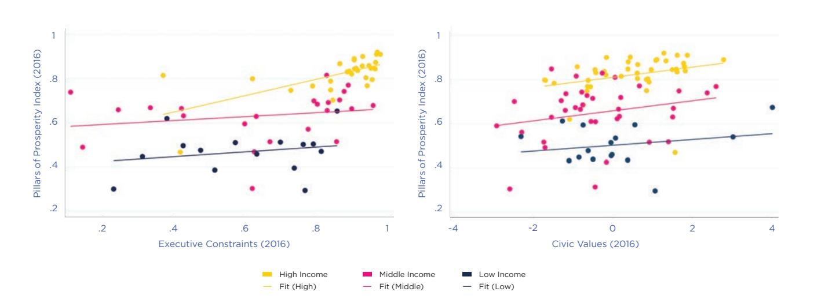

**Figure 3.1: Pillars of Prosperity Index vs. Executive Constraints and Civic Values**

systems of revenue collection with broad-based taxation, strong collective provision using universal programs for health, education, and retirement. They also have legal and regulatory systems which provide the foundations for a strong market economy. While common-interest states are heterogenous, they are concentrated in western Europe and North America.

**Special-interest States** These states are run to favor the interests of a ruling group which is weakly constrained by political institutions. However, ruling elites are often entrenched in power, possibly due to high levels of repression, which foster a form of political stability. State capacities primarily serve the interests of the ruling group. But this limits the domain of the state and weakens the motives to invest in state capacity compared to common-interest states (all else equal). Special-interest states, too, are heterogeneous and include oil-rich states such as Kuwait or Saudi Arabia, as well as some one-party autocracies such as China. Special-interest states can have a focus on raising income levels when this suits the interests of the ruling elite or is seen as a way to keep the populace quiescent.

**Weak States** Like special-interest states, weak states lack strong constraints on the ruling group. However, unlike redistributive states, they are politically unstable, giving frail incentives for

incumbent groups to invest in state capacity. As a consequence, the abilities to raise revenue, protect property rights and support markets, or to deliver welfare services are limited. Political instability is often the result of violent contests for state power, as seen, e.g., in Afghanistan. Low state capacity and pervasive conflict limit the incentives for private investment, which may lead to a vicious cycle of poverty and conflict.

**The Pillars of Prosperity Index** To get an empirical handle on these two core dimensions of state effectiveness – peaceful resolution of conflict and high state capacity – along with a more conventional approach based on income differences, Besley and Persson26 suggested a Pillars of Prosperity index. This index was constructed as the simple average of three measures which all range between zero and one. The first component is itself an index of the three components of state capacity which we introduced above, i.e., fiscal, legal, and collective capacity; the second component is an index of peacefulness, based on the prevalence of civil war and repression;27 while the third component is a measure of income per capita.28 Figure 3.1 shows how this measure is related to the two factors highlighted in our discussion of the origins of peaceful orders and high state capacity. One is simply the measure of constraints on executive power (from V-Dem) that we discussed above. The other is an index of civic values (from

the WVS). Specifically, the civic values index aggregates five variables: confidence in government, general trust in people, attitudes to complying (not to cheat) on taxes, confidence in the justice system/courts, and attitudes (not being justified) to accepting bribes.29

Figure 3.1 shows a strong positive correlation between the Pillars of Prosperity index and the history of executive constraints (left graph) and civic values (right graph). Each dot represents a country and the color of that dot indicates which third of the world income distribution that country is in. As both graphs show, the positive correlation is present not only across all countries but also more narrowly within each income group.

**Clusters** The evidence in Figure 3.1 relies on a more or less arbitrary amalgamation of various indicators into a single index. Because of the positively correlated indicators, we prefer to think in terms of clusters of countries. We now show, using our data, that positive and negative attributes tend to cluster together, just as we would expect if the components of social peace and state capacity were the result of common causes and complementarities (recalling the discussion at the end of the previous section).

**Figure 3.2: Clustering of Attributes Across Countries**

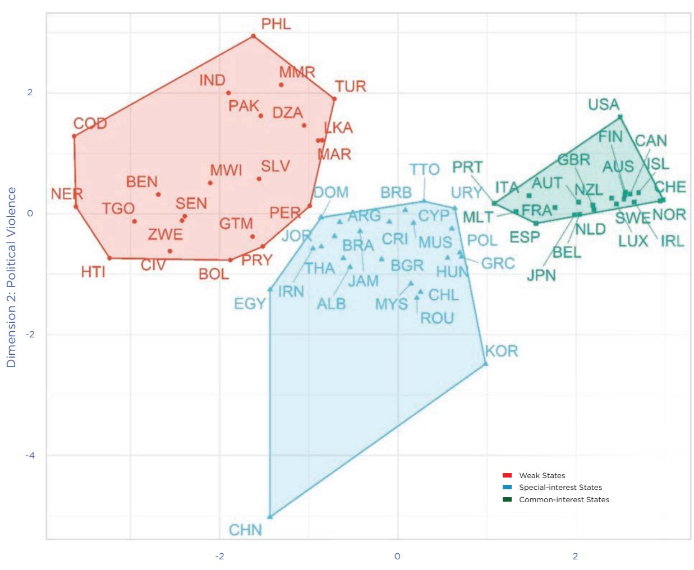

Dimension 1: State Capacity and Income

Specifically, we undertake a 'cluster analysis' using a fairly standard statistical algorithm that uses machine learning to find groupings of similar countries based on a set of observable attributes. The algorithm used also "decides" how many groups are needed to best fit the data.30

The core variables that are used to construct these clusters are the same as those that go into the Pillars of Prosperity index that we constructed above.31 As illustrated in Figure 3.2, we find that allowing two distinct dimensions of heterogeneity across countries does a reasonably good job of describing the data. The first dimension (along the x-axis of the figure) broadly captures differences in state capacity and income, while the second dimension (along the y-axis of the figure) captures political violence.32 The clustering algorithm identifies three distinct clusters of countries as illustrated in Figure 3.2, where we have shaded the three groups in distinct colors and identified each country by its standard three-letter country code.

It is striking that these three clusters correspond neatly to the groupings suggested by our theoretical approach to state effectiveness, as summarized at the beginning of this section. The weak states in the figure are those shaded in orange and positioned in the negative orthant of Dimension 1 (state capacity/income) and positive orthant of Dimension 2 (civil war). This rhymes well with the idea that they have relatively high levels of civil war and low levels of state capacity and income.

Special-interest states are shaded in blue and have intermediate levels of state capacity and income. These countries are situated in the negative orthant of Dimension 2, which represents high levels of repression. China is a particular outlier in this dimension, with exceptionally high repression.

Common-interest states are shaded in green and form a particularly tight cluster. Countries in this cluster belong to the positive orthant of Dimension 1 (state capacity/income) and they have values on Dimension 2 (conflict) that hover around zero, which represents low levels of repression as well as civil war.

### **Implications for Well-being – Theory and Evidence**

In this section, we draw out the implications of the preceding analysis for well-being. Moreover, we show that these implications are consistent with the patterns in the data, when we measure well-being with life satisfaction data from the Gallup World Poll. Finally, we relate these empirical patterns directly to the determinants of well-being highlighted in Chapter 2.

**Effective states and well-being** Our two-dimensional approach to state effectiveness gives ample *a priori* reasons to believe that peaceful states with larger state capacities are conducive to higher well-being for their residents. Living in an environment with peace conveys direct benefits, even more so when such peace is not dependent on state repression. Below, we connect this to the themes developed in Chapter 2. Strong state capacities may mean higher taxation. But we expect this to be the case only when cohesive institutions and/or values encourage public spending on common interest programs for the provision of healthcare, education, or infrastructure. Similarly, high legal capacity may help to promote freedom, serve as a bulwark against discrimination, enhance economic opportunities for disadvantaged groups, and prevent abuse of market power or raise product and workplace safety.

We expect this pattern to manifest itself in cross-country comparisons. That said, looking at cross-country data is more of a suggestive exercise than a method to pin down convincing causal relations. Moreover, if the elements of effective states cluster together, it would be hazardous to give too much prominence to any single element of state capacity or peacefulness. This would amount to treating better performance in that particular dimension as a kind of silver bullet for well-being. Instead, the presence of development clusters emphasizes that many state features go hand in hand in effective states.

In drawing conclusions from our analysis of well-being differences across countries, we should also be realistic about time frames. Besley, Dann, and Persson33 stress that clustering patterns are

very stable over long periods, as almost every country remains in the same cluster over several decades. Even though some institutions can change fairly quickly – as we see from time to time, when countries shift towards more democratic institutions – investments underpinning state effectiveness may take a long time to bear fruit. Moreover, supporting values and norms are likely to change even more slowly than institutions.

Although we include it in the Pillars of Prosperity index, our approach suggests how it may be misleading to look only at income when comparing country patterns in well-being since income itself may (partly) be the product of an effective state. Moreover, effective states may permit human flourishing on a wider range of outcomes than income. For instance, China's astonishing economic progress over the past forty years has not been coupled with freedom of expression or political rights.

Our study of clustering suggests that the real challenge in promoting well-being is finding the ingredients needed to become a commoninterest state. Two centuries ago, the world had no such states. But it is no better to tell countries outside the common-interest cluster that they need to be more like Denmark, than it is to tell an athlete that she will win an Olympic medal by running faster. Norms, values, and institutions are the scaffolding that supports the construction of common-interest states. Neither are simple prescriptions on the need for a democratic transition credible and useful, especially when interpreted merely as greater openness in access to power. If free elections are not combined with cohesive institutions and values, they may just generate political instability associated with transitions into violence.

*The highest values for the three state-capacity measures and the highest values of life satisfaction are found in the green-colored common-interest states.*

**Figure 3.3: Country-level Life Satisfaction (average Cantril Ladder scores) vs. Pillars of Prosperity Index, by State Clusters**

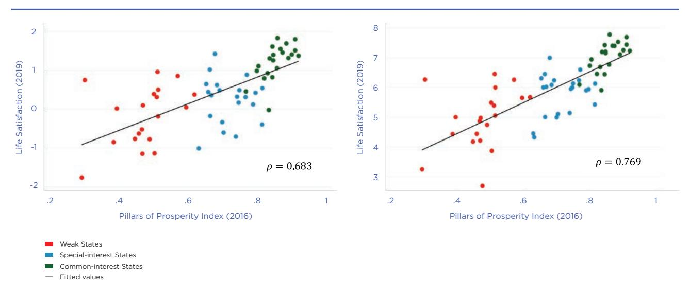

**Note:** Left graph holds constant individual age, income, gender, health, employment, and marital status. Right graph shows unconditional correlation.

### **Life satisfaction and measures of state**

**effectiveness** These broad lessons regarding state effectiveness and well-being turn out to correspond well with patterns in the data. To see this, consider the measure of life satisfaction used in Chapter 2, namely the Cantril Ladder scores from the Gallup World Poll. Recall that these reflect subjective expressions of the respondent's life satisfaction, when the best possible life is scored by 10 and the worst possible life by 0. We average these scores at the country level, possibly after conditioning on a range of individual characteristics that have been claimed to drive individual well-being (age, income, gender, health, employment status, and marital status).

Figure 3.3 relates these adjusted country-level happiness scores to the Pillars of Prosperity index. To connect to the clustering theme, we color the dots for every country by the cluster it belongs to in Figure 3.2: orange for weak states, blue for special-interest states, and green for commoninterest states.34

The left-hand graph controls for differences in survey respondents' age, income, gender, health, employment, and marital status (which are well established correlates of life satisfaction) before computing the country-average scores, while the right-hand graph shows the average raw scores without such controls. In line with our expectation, life satisfaction is strongly positively correlated with the Pillars of Prosperity index in both cases. Moreover, the figure clearly illustrates how life satisfaction is aligned expectedly with the three state clusters identified in Figure 3.2 – clearly highest among common-interest states and lowest in weak states.

The value added of our approach is now laid bare. The headline story from the data is that residing in a common-interest state – with its specific configuration of state capacities, and with peace that is not upheld by repression – appears to be strongly related to a high level of life satisfaction. Although many factors are certainly at work, our narrative about drivers of state effectiveness rhymes very well with the data. This underscores our earlier argument that it is vital to understand the forces that can support the building of commoninterest states, such as investing in cohesive

institutions and fostering norms and values that are conducive to political cohesion.

Figure 3.4 offers a more disaggregated take on our core finding and shows how country-level, life-satisfaction scores correlate with each one of our three measures of state capacities (fiscal, legal, and collective) and our two measures of peacefulness (absence of civil war and repression). Each one of these measures of effective states correlates with life satisfaction, with (total) correlation coefficients that range between 0.55 and 0.7 for the state capacities and 0.3 and 0.35 for the absent-violence measures.

Moreover, Figure 3.4 makes eminent sense in view of the clustering patterns in Figure 3.2. The highest values for the three state-capacity measures and the highest values of life satisfaction are found in the green-colored common-interest states. Moreover, the lowest values of the two peacefulness measures and the lowest values of life satisfaction are found in special-interest states and in weak states, with the main variation in repression coming from the special-interest cluster, and the main variation in civil war coming from the weak-state cluster.

The five graphs in Figure 3.4 show the *total* correlation between average life satisfaction and each one of the five components of effective states –i.e., we do not hold the other components of state effectiveness constant. It is tempting to ask whether each one of these measures independently helps explain life satisfaction. However, as we have already stressed, this is a very hazardous exercise.

With this caveat in mind, we now show the *partial* – rather than total – correlations between life satisfaction and each measure of state effectiveness. Specifically, we show the results from a regression, which includes all measures of state effectiveness simultaneously. The regression coefficients for the five measures in Figure 3.4 (together with their 95% confidence intervals with standard errors clustered by country) appear in the left-hand graph of Figure 3.5. All the estimates are positive, as expected, but only two of the partial correlations – those for collective capacity and absence of repression – are significantly different from zero.

**Figure 3.4: Country-level Life Satisfaction (average Cantril Ladder scores) vs. Three State Capacities, Absence of Civil War and Absence of Repression, by State Clusters (unconditional)**

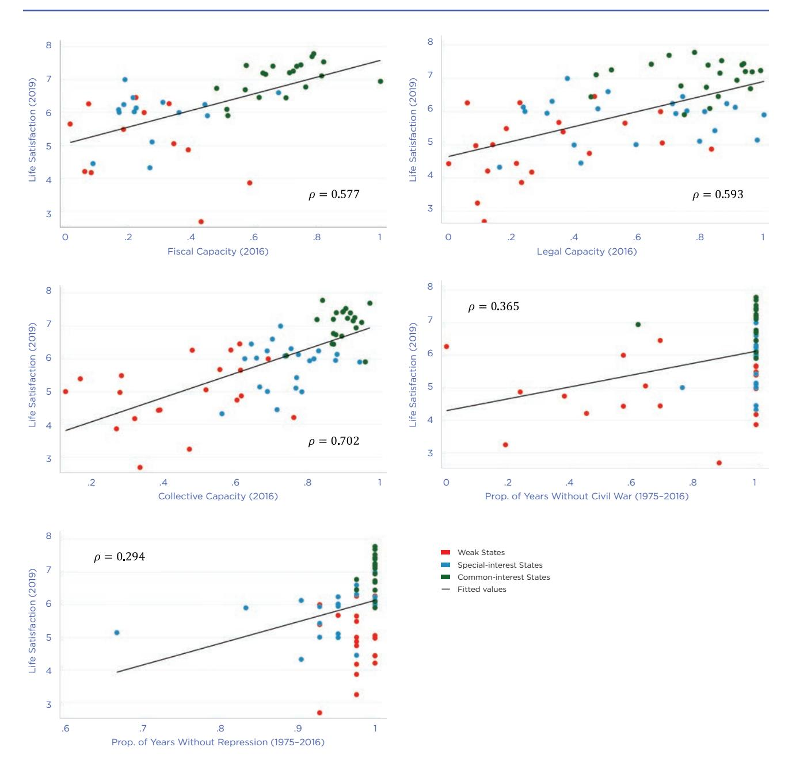

Figure 3.5: Regressions of Average Life Satisfaction on Separate Components of State Effectiveness (left) and on Dummies for State Clusters (right)

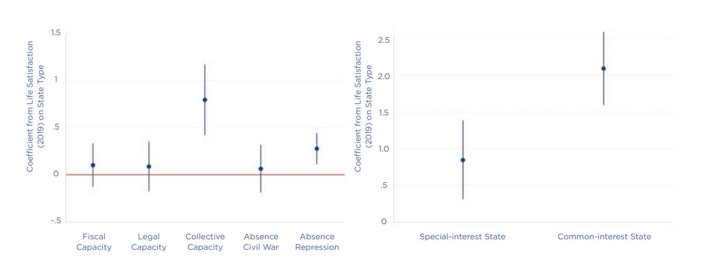

Figure 3.6: Within-Country Spread of Life Satisfaction vs. Mean Life Satisfaction (average Cantril Ladder score), by State Clusters (unconditional)

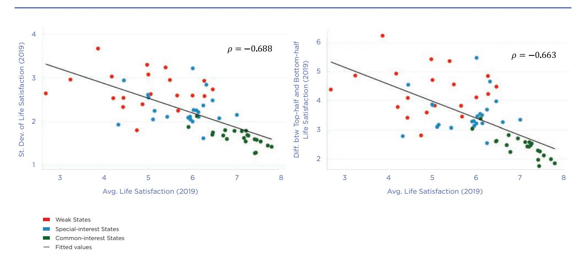

To us, these results do not represent evidence against the theory. In fact, the feedback effects as well as the common drivers we have stressed throughout the chapter mean that we cannot learn much from the individual variation in different aspects of state effectiveness.

A better approach is to use state types as a summary of state effectiveness showing that average happiness levels in countries are related to the assignment of a country to a state type. In this spirit, the right-hand graph of Figure 3.5 shows the results from a regression of average life satisfaction on two dummies, one for specialinterest states and another for common-interest states (weak states being the left-out category). The classification is derived from our clustering analysis in Figure 3.2 and also corresponds to the coloring of the observations in Figures 3.3 and 3.4. As expected from those figures, both coefficients are positive and statistically significant. Moreover, they are substantial in magnitude.

Living in a special-interest state, rather than a weak state, is associated with almost a full point higher score on the 10-point Cantril Ladder, while living in a common-interest state is associated with more than 2 points higher life satisfaction.35

This finding summarizes, in a nutshell, the main message of the chapter: a set of mutually occurring and reinforcing attributes of state performance work together to support the well-being of citizens. Moreover, although marginal improvements in state capacity and peace can be valuable, the big picture is making the transition to a commoninterest state with all of its positive attributes, a transition we believe is supported by cohesive norms and institutions.

**The level vs dispersion of happiness** An additional implication of the theory is that we would expect the *dispersion*, and not just the *level*, of life satisfaction to vary systematically with the effectiveness of the state. This is because the

cohesiveness of institutions and norms that underpins common-interest states should bring the focus on common-interest rather than special-interest benefits. This focus should show not just in the level of life satisfaction, but in a smaller dispersion of life satisfaction across people within a country. Figure 3.6 confronts this prediction with the data on life satisfaction.

The two panels in the figure plot average life satisfaction against two measures of dispersion: the standard deviation of the individual scores (to the left) and the difference between the averages in the upper and lower halves of the individual scores (to the right). Again, we color the individual country markers by the color of the cluster to which it was assigned in Figure 3.2. The figure shows the expected pattern. When average life satisfaction is high its dispersion is low, and vice versa. Further, in each one of the graphs, we find the common-interest states systematically located in the lower right corner with high levels and less

inequality in life satisfaction. This finding dovetails well with the observation in Goff et al.36 that levels of life satisfaction are negatively correlated with dispersion.

Chapter 2 redux Finally, to tie our discussion to the more conventional analysis of happiness, we now explore how our measures of state effectiveness relate to the determinants of life satisfaction discussed in Chapter 2. Specifically, consider the six determinants of life satisfaction, which are included as right-hand-side variables in the regressions underlying Table 2.1. These variables are GDP per capita, social support, healthy life expectancy, freedom to make life choices, freedom from corruption, and generosity (we refer the reader to Chapter 2 for precise definitions).

Figure 3.7 shows the relationships between, on the one hand, the average country score for each of the six Chapter 2 life-satisfaction determinants and, on the other hand, an index of state effectiveness.

Figure 3.7: Chapter 2's Determinants of Well-being vs. Index of State Effectiveness, by State Clusters (unconditional)

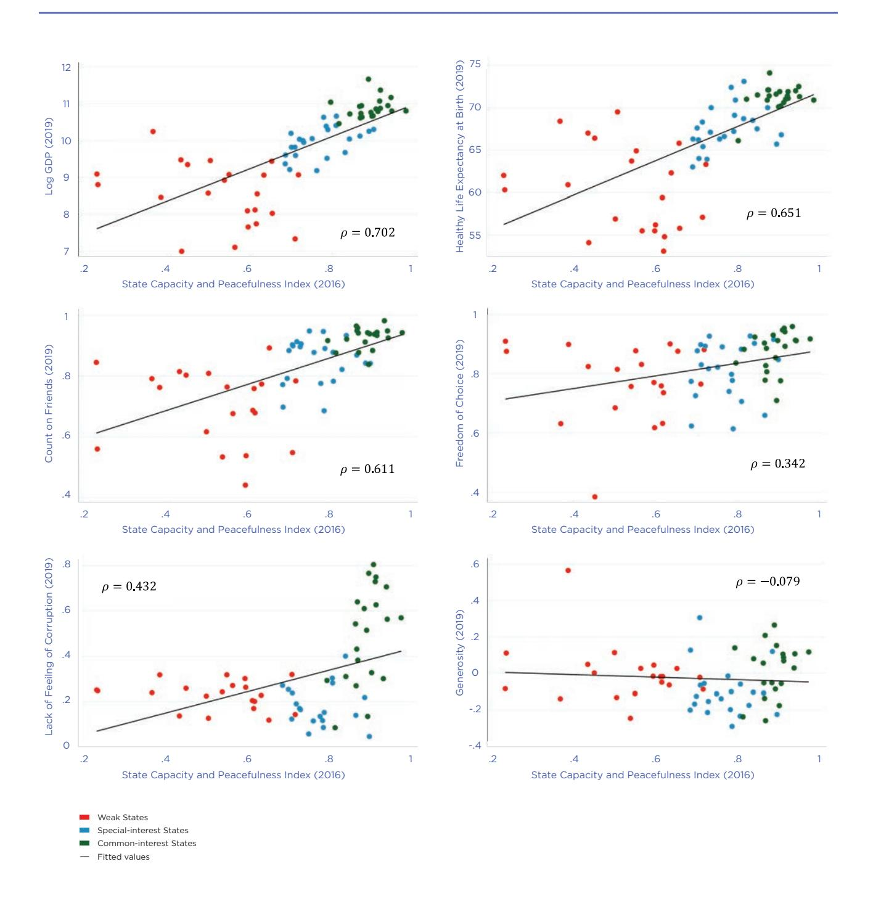

*"Little else is required to carry a state to the highest degree of opulence from the lowest barbarism, but peace, easy taxes, and a tolerable administration of justice; all the rest being brought about by the natural course of things" (Adam Smith, 1755).*

The latter includes our three measures of state capacities and our measure of peacefulness – thus, it coincides with our Pillars of Prosperity Index, except that we now exclude GDP per capita.37

The six graphs show a positive relationship with our measure of state effectiveness for five of the life-satisfaction determinants from Chapter 2, the exception being generosity (measured by private donations).38 The positive correlation coefficients range from 0.35 to 0.7. This exercise does not take into account the fact that different aspects of state effectiveness may correlate more or less strongly with different life-satisfaction determinants. This becomes clearly visible when we disaggregate the state-effectiveness index into its subcomponents. In that case, we find that the life-satisfaction determinants relate most strongly to our measures of collective capacity and fiscal capacity.39

### **Concluding Comments**

This chapter has focused on the building blocks of effective states and their support for peace, prosperity, and happiness. This links an extensive literature in political economics with studies on the determinants of well-being. We have argued that investments in state capacities and achieving peace without repression are central elements in the creation of effective states. We have also seen that the underpinnings of those states - especially when it comes to common-interest states – appear to be conduits of life satisfaction.

Although we can pinpoint a number of factors that shape effective states, there is no magic formula; each polity has to build a solution that works in its own historical and cultural context. The cross-cutting cleavages supplied by history can be helpful or harmful in making progress. But institutions, norms, and values can help to foster common interests. However, there are few examples of progress based on external advice or conditions, no matter how well-meaning external actors may be in their attempts to help. The common-interest states that we have identified here as having the highest levels of life satisfaction have largely been crafted from the toil and vision of their own citizens.

Even though many challenges are global, it is hard to dispel the idea that nation-states remain the basic building block by which governments support the well-being of their citizens. That said, it is undeniable that judicious decentralization in some federations may offer further support for well-being. In the other direction, government action to support well-being beyond the nationstate is, at best, work in progress. Even though many things have been effectively organized in the European Union, core state capacities – like the ability to defend the territory and to raise taxes – have not. It is also difficult to identify strong supranational cohesive institutions, despite the existence of acute global challenges such as the climate problem. While the future may see more global cooperation, the basic architecture of state effectiveness is therefore likely to remain at the national level for some time to come.

### **Endnotes**

- 1 Classifications come from UCDP/PRIO Armed Conflict Dataset version 19.1.
- 2 Besley, T., & Persson, T. (2011)
- 3 See Weber, M. (1919)
- 4 See Besley, T., Dann, C., & Persson,T. (2021) for a discussion of data sources. The frequency of civil wars is measured using the UCDP/PRIO Armed Conflict dataset and repression is measured by the presence of political purges in the Banks Cross-National Time-Series (CNTS) Data Archive.
- 5 The latter according to the UCDP/PRIO data are Israel and the USA.
- 6 Namely, if V-Dem's executive constraints variable is greater than 0.8 (corresponding to roughly the top third of the global distribution).
- 7 See Figure 9 in Besley, T., Dann, C., & Persson,T. (2021)
- 8 See Figure 9 in Besley, T., Dann, C., & Persson,T. (2021)
- 9 See, for example, Tilly, C. (1990)
- 10 See Besley, T., & Persson, T. (2014)
- 11 https://www.worldbank.org/en/programs/businessenabling-environment/doing-business-legacy
- 12 See Barro, R. J., & Lee, J. W. (2013)
- 13 https://databank.worldbank.org/source/world-developmentindicators
- 14 See Besley, T., & Persson, T. (2014)
- 15 Both these variables take on values between 0 and 1 (with higher values capturing stronger constraints). We create a binary indicator, which we set equal to 1 if the average of V-Dem's two executive-constraints measures is greater than or equal 0.8, and 0 otherwise. Having an average greater than 0.8 corresponds to being roughly in the top third of the distribution.
- 16 Besley, T., & Persson, T. (2011)
- 17 This is also the focus of Bueno de Mesquita et al. (2005) and Persson, T., & Tabellini, G. (2005)
- 18 Besley, T., & Persson, T. (2011)
- 19 Besley, T., & Persson, T. (2010)
- 20 See, for example, Almond, G. A., & Verba, S. (1963); Levy (1989); and Putnam et al. (1994)
- 21 See Blais, A. (2006) for an overview of the literature on voter turnout and the factors that shape it.
- 22 Willeck, C., & Mendelberg, T. (2022) for a review and discussion.
- 23 See Levi, M. (1989)
- 24 Besley, T. (2020)
- 25 Besley, T., & Persson, T. (2011)
- 26 Besley, T., & Persson, T. (2011)

- 27 This is constructed as one minus the proportion of years a country has been in repression but not civil war since 1975 (multiplied by one half) and the proportion of years that a country is in civil war (but not repression) since 1975. Thus the index gives half as much weight to repression as it gives to civil war.
- 28 Here we use a min-max normalization so it lies between zero and one.
- 29 Besley, T., Dann, C., & Persson,T. (2021) for details on the construction of this variable.
- 30 We use a hierarchical clustering method based on principal components (HCPC) which has two core steps; see Hastie et al. (2009, section 14.3) for further details. First, we use the raw data to create principal components of the variables of interest. This reduces the "dimensionality" of the data so as to find the number of dimensions needed to summarize the underlying variables. Second, we employ an agglomerative hierarchical clustering algorithm (Ward's criterion) to identify clusters based on the principal components. To confirm the number of principal components, Kaiser's criterion and the "elbow test" indicate that two components are optimal.
- 31 As a reminder, these are income tax as a share of total tax intake, legal quality index, collective capacity index, proportion of years in repression since 1975, proportion of years in civil war since 1975, and GDP per capita.
- 32 To understand the figure, note that the clustering analysis first takes into account the variation in civil war, repression, income, fiscal capacity, legal capacity, and collective capacity. It then uses a principal-component analysis to construct two core dimensions. One of these distinct clustering dimensions (dimension 2 in the figure) combines civil war and repression into a single component. But it also identifies civil war and repression as distinct factors, giving negative values to repression, positive values to civil war, and values around 0 to peace.
- 33 Besley, T., Dann, C., & Persson,T. (2021)
- 34 The weak states are: Algeria, Benin, Bolivia, Côte d'Ivoire, El Salvador, Guatemala, India, Malawi, Morocco, Myanmar, Niger, Pakistan, Paraguay, Peru, Philippines, Senegal, Sri Lanka, Togo, and Turkey. The special-interest states are: Albania, Argentina, Brazil, Bulgaria, Chile, China, Costa Rica, Cyprus, Dominican Republic, Egypt, Greece, Hungary, Iran, Jamaica, Malaysia, Mauritius, Poland, Romania, South Korea, Thailand, and Uruguay. The common-interest states are: Australia, Austria, Belgium, Canada, Finland, France, Iceland, Ireland, Italy, Japan, Luxembourg, Malta, Netherlands, New Zealand, Norway, Portugal, Spain, Sweden, Switzerland, United Kingdom, United States.
- 35 We have tested the robustness of this core finding by redoing the clustering analysis without including income per capita as a variable. A clear cluster of common interest states still emerges and there is a strong, and statistically significant correlation between being in this group and the average level of life satisfaction.
- 36 Goff et al. (2018)

- 37 Of course, we need to remove GDP per capita from the Pillars of Prosperity Index here to see the relationship between state effectiveness and income in the top-left panel of Figure 3.7.
- 38 Arguably this is not too surprising if common states look after the needs of their citizens to a point where private donations are less necessary. In the online appendix, we consider an alternative measure of (perceived) generosity: whether citizens believe a lost wallet would be returned to them by a neighbor, stranger, or the police. For example, donation rates are low in Finland, but citizens are highly likely to expect lost wallets to be returned. With this measure of generosity, we find a strong positive correlation with state effectiveness as in the other panels of Figure 3.7.
- 39 We do not include these figures in the chapter but they are available in the online appendix.

#### **References**

Almond, G. A., & Verba, S. (1963). *The civic culture: Political Attitudes and Democracy in Five Nations*. Princeton university press.

Barro, R. J., & Lee, J. W. (2013). A new data set of educational attainment in the world, 1950–2010. *Journal of development economics*, *104*, 184-198.

Besley, T. (2020). State Capacity, Reciprocity, and the Social Contract. *Econometrica*, *88*(4), 1307-1335.

Besley, T., Dann, C., & Persson,T. (2021). *Pillars of Prosperity: A Ten-Year Update*, CEPR Discussion Paper, No. 16256.

Besley, T., & Persson, T. (2010). State Capacity, Conflict, and Development. *Econometrica*, *78*(1), 1-34.

Besley, T., & Persson, T. (2011). Pillars of prosperity. In *Pillars of Prosperity*. Princeton University Press.

Besley, T., & Persson, T. (2014). The Causes and Consequences of Development Clusters: State capacity, Peace, and Income. *Annual Review of Economics*, *6*(1), 927-949.

Blais, A. (2006). What Affects Voter Turnout?. *Annual Review of Political Science*, *9*, 111-125.

De Mesquita, B. B., Smith, A., Siverson, R. M., & Morrow, J. D. (2005). *The Logic of Political Survival*. MIT press.

Goff, L., Helliwell, J. F., & Mayraz, G. (2018). Inequality of Subjective Well-being as a Comprehensive Measure of Inequality. *Economic Inquiry*, *56*(4), 2177-2194.

Hastie, T., Tibshirani, R., Friedman, J. H., & Friedman, J. H. (2009). *The Elements of Statistical Learning: Data Mining, Inference, and Prediction* (Vol. 2, pp. 1-758). Berlin: Springer.

Levi, M. (1989). *Of Rule and Revenue*, Berkeley: University of California Press.

Persson, T., & Tabellini, G. (2005). *The Economic Effects of Constitutions*. MIT press.

Nanetti, R. Y., Leonardi, R., & Putnam, R. D. (1994). Making democracy work: Civic traditions in modern Italy. Princeton: Princeton University Press.

Tilly, C. (1990). *Coercion, Capital, and European states, AD 990-1992* (p. 70). Oxford: Blackwell.

Weber, M. (1919), "Politics as a Vocation," reprinted in Hans Gerth and C. Wright Mills (eds) *From Max Weber*, New York: Free Press.

Willeck, C., & Mendelberg, T. (2022). Education and Political Participation. *Annual Review of Political Science*, *25*, 89-110.

### Chapter 4

# Doing Good and Feeling Good: Relationships Between Altruism and Well-being for Altruists, Beneficiaries, and Observers

### Shawn A. Rhoads

Postdoctoral Research Fellow

Center for Computational Psychiatry, Icahn School of Medicine at Mount Sinai

### Abigail A. Marsh

Professor, Department of Psychology, Georgetown University

The authors are grateful to the editors, including Lara B. Aknin, John F. Helliwell, and Richard Layard, for helpful discussions, feedback, and suggestions. We are also grateful to the following for providing data used in Figures 4.1 and 4.2: Charities Aid Foundation, Donation and Transplant Institute, Gallup, Hofstede Insights, the U.S. Central Intelligence Agency, the World Animal Protection Organization, the World Bank, the World Health Organization, and the World Marrow Donor Association. We would also like to thank Devon Gunter, Rebecca M. Ryan, and the production team, including Sharon Paculor.

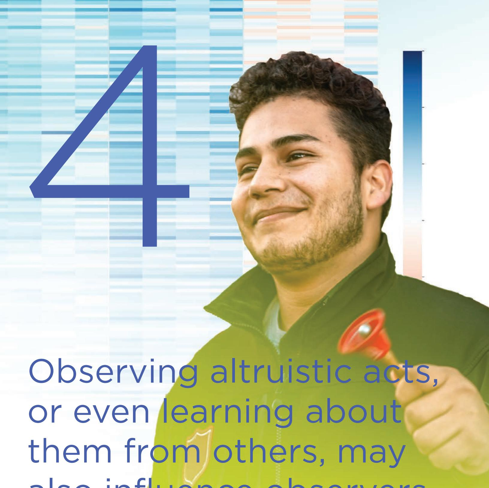

also influence observers to be more altruistic in their future interactions.

### **Introduction**

The years 2020 and 2021 brought seismic changes to the emotional and social lives of people around the globe as an unprecedented global pandemic catalyzed various forms of social, political, and economic upheaval and unrest. But unanticipated positive changes were documented as well during this period1 . One that has garnered relatively little attention was a surge in various forms of prosocial behavior around the globe. Relative to the years leading up to the pandemic, in 2020-21 more people around the globe reported that they had donated to charity, volunteered, or helped a stranger during the prior month.2 Countless people in need of assistance undoubtedly benefited from this increase in prosocial behaviors—with likely impacts on global well-being.

What spurred this surge in prosociality and what were its possible outcomes? Answering these questions requires the consideration of altruism, what motivates it, and what its downstream consequences are. Altruism includes any act that is aimed at improving another's well-being.3 The motives that drive specific behaviors in the social world can be difficult to determine conclusively, but acts of altruism can usually be identified as such when they are costly to the actor and do not bring them any foreseeable extrinsic benefit.4 For example, when a person anonymously gives money to someone in need, they knowingly forfeit resources and do not stand to gain in any concrete way, suggesting altruistic motives. Given widespread beliefs that people's behavior is usually driven by selfish motives,5 the fact that unselfish altruistic acts like these are nonetheless ubiquitous around the world is noteworthy.

One reason for the ubiquity of altruism may be that it *does* bring benefits of various kinds, not only to the intended beneficiary, but to altruists themselves and perhaps to third parties as well. Research has documented that altruism improves the subjective well-being of actors6 and even observers.7 This positive association between altruism and well-being appears to be bidirectional,8 as happier people have also been observed to engage in more altruism.9

This chapter will explore the nature of the bidirectional relationship between altruism and well-being. We begin by first defining altruism. Second, we review the data demonstrating a bidirectional association between prosociality and well-being for actors, recipients, and observers (noting that many studies on this topic are correlational, which limits causal inferences in some cases). We will also review the conditions under which this relationship is observed. Finally, we consider some of the many unanswered questions between altruism and well-being.

### **What is Altruism?**

Before considering the relationship between well-being and altruism, it is important to situate altruism within the broader category of prosocial behaviors. Prosocial behaviors include a wide range of behaviors that bring social benefits but result from a variety of circumstances and motivations. The results of two recent research studies indicate that the many varieties of prosocial behavior can be roughly grouped into three types: altruism, cooperation, and fairness (or equity).10 Altruism refers to behaviors that benefit another person or alleviate their distress without any foreseeable extrinsic benefit—and often a cost—to the actor and without an expectation of anything in return.11 In many instances, altruism reflects the fact that the altruist genuinely values the welfare of the beneficiary, such that they intrinsically want to improve their well-being.12 Common forms of altruism include volunteering, donating money, and donating blood. So-called extraordinary forms of altruism include extremely non-normative acts that are risky or costly, such as heroic rescues or donating bone marrow or an organ to a stranger.13

In contrast to altruism, cooperation is prosocial behavior performed in the context of an exchange, such as when two or more actors are working toward a common goal. Thus, cooperation is performed with the expectation that everyone will benefit. Cooperation may reflect sacrificing resources in the short-term, but typically only to pay back the beneficiary or in the expectation that the beneficiary will reciprocate in the future. Common forms of cooperation include friends

taking turns paying for meals or sports teammates helping each other practice their skills.

Finally, fairness (or equity) reflects prosocial behavior motivated by the goal of adhering to desirable norms, such as equitable outcomes. Fairness may reflect sacrificing resources, typically not to alleviate distress or suffering or in anticipation of future benefits, but to achieve outcomes that are considered equitable or just for everyone. Common forms of fairness involve dividing a shared resource equally—for example, friends dividing a shared meal into equal portions or roommates sharing their limited space equally.

It is important to distinguish among these forms of prosociality because they occur in different contexts and are promoted by different neural and cognitive processes.14 Thus, each form of prosocial behavior is likely to have variable effects on social and emotional outcomes. Although cooperation and fairness may promote (or be

promoted by) subjective well-being, a particularly robust literature links well-being to acts of altruism—including a wide range of non-obligatory, non-reciprocal behaviors such as volunteering, making charitable donations, helping strangers, donating blood, donating bone marrow, or donating an organ. In this chapter, we focus exclusively on the link between altruism and well-being.

### **Positive Associations Between Altruism and Subjective Well-Being**

A wealth of research now demonstrates that altruism is often positively correlated with subjective well-being, which comprises both high life satisfaction and experiencing more positive emotions and fewer negative emotions in daily life.15 Two recent global investigations have found this at both the geographic and individual level using data collected from countries around the world.

One approach examines correlations across countries, which determines the impact of different cultures. In one such study,16 the researchers conducted a global investigation that compiled country-level data regarding seven forms of altruism collected in 152 countries. The forms of altruism included data collected by Gallup (donating money, volunteering, or helping strangers) as well as four altruistic behaviors drawn from other international databases. These included blood donations per capita, bone marrow donations per capita, living kidney donations per capita, and the humane treatment of non-human animals as evaluated by a global non-profit organization. The researchers also collected data on subjective well-being, including both life satisfaction and daily positive or negative affect. The results demonstrated that when subjective well-being at the national level (i.e., average life satisfaction and daily positive affect of respondents in a country) is higher, the prevalence of all seven forms of altruism is higher as well (Figure 4.1). This relationship was independently observed for life satisfaction and daily affect, except when life satisfaction and daily affect were included in the same statistical model, in which case only life satisfaction predicted altruism. Results indicated that improved objective well-being, including high levels of wealth and health, are associated with altruism because they lead to increased life satisfaction. Furthermore, these effects were most robust among countries high in the cultural value of individualism, which reflects highly valuing individuals' autonomy to pursue personal goals. This suggests that when individuals have more material and cultural resources to pursue altruistic goals, they are more likely to do so.

Another approach looks at correlations across individuals. In another study, the researchers compiled the data collected by Gallup between 2006 and 2017 from approximately 1.4 million people across 161 countries. Participants reported both their life satisfaction and daily positive or negative affect. They also reported whether they had engaged in three forms of altruism in the last month: donating money, volunteering, or helping strangers. Again, results showed that life satisfaction and positive (but not negative) daily affect were

*This suggests that when individuals have more material and cultural resources to pursue altruistic goals, they are more likely to do so.*

positively correlated with engaging in these altruistic behaviors.17 Although the magnitude of this positive association varied across countries, it was observed in the overwhelming majority of them, as can be seen from the fact that the correlations between life satisfaction and altruistic behaviors are almost without exception positive, as can be observed in **Figure 4.2**, (positive correlations are shown in blue) whereas the correlations between negative affect and altruism are mixed (negative relationships are shown in red, and no relationship is shown in white.

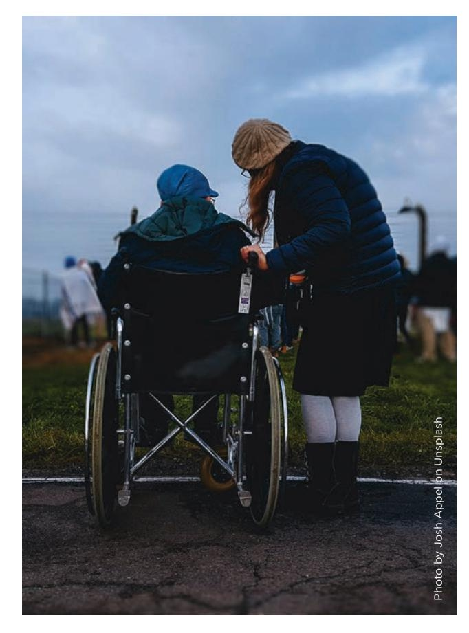

**Figure 4.1: Relationship Between Life Satisfaction and Altruism Around the World**

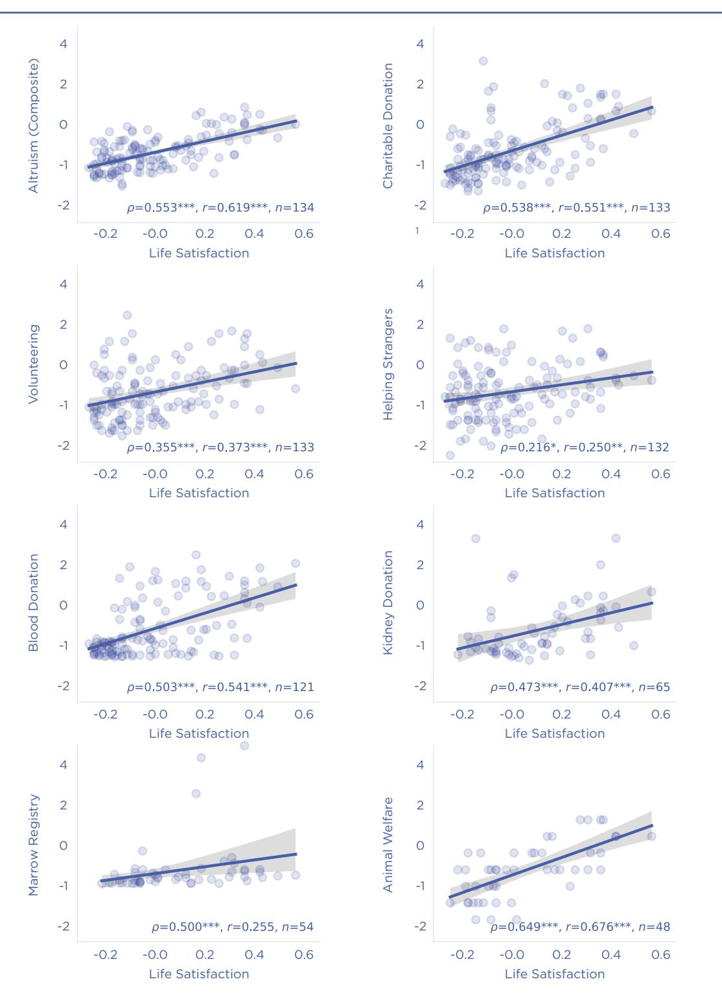

**Note:** Relationships between subjective well-being (mean-centered) and seven altruism variables (including the total for all altruism variables; z-scored)18, excluding countries without both altruism and well-being data. Each dot represents a country, lines indicate the best-fitting regression model, and ribbons represent 95% confidence intervals. Annotations report Spearman , Pearson's r, and number of included countries (n). Asterisks indicate significant correlations (\*p < .05, \*\*p < .01, \*\*\*p < .001). Results indicate that around the world increased life satisfaction (subjective well-being) reliably relates to a greater frequency of seven different types of prosocial behavior.

**Figure 4.2: Relationship Between Subjective Well-being and Generosity by Country**

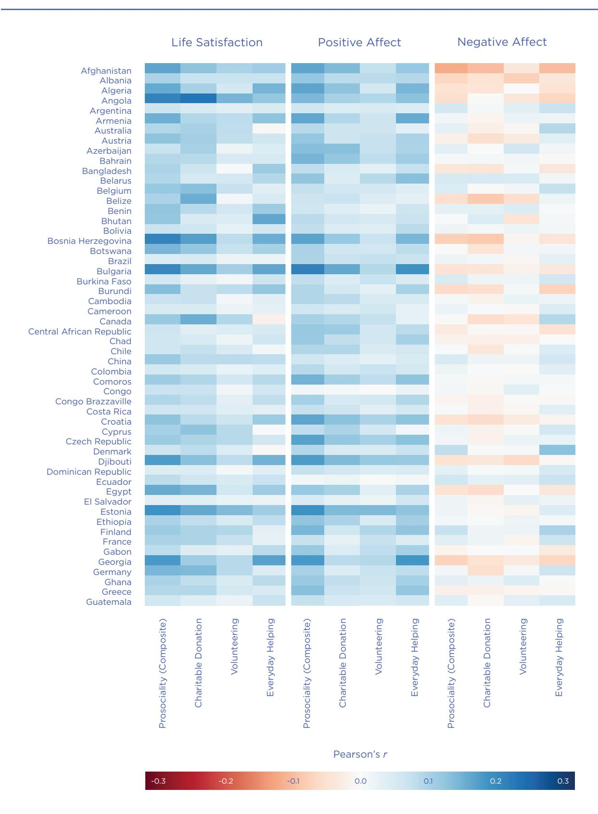

Figure 4.2: Relationship Between Subjective Well-being and Generosity by Country (continued)

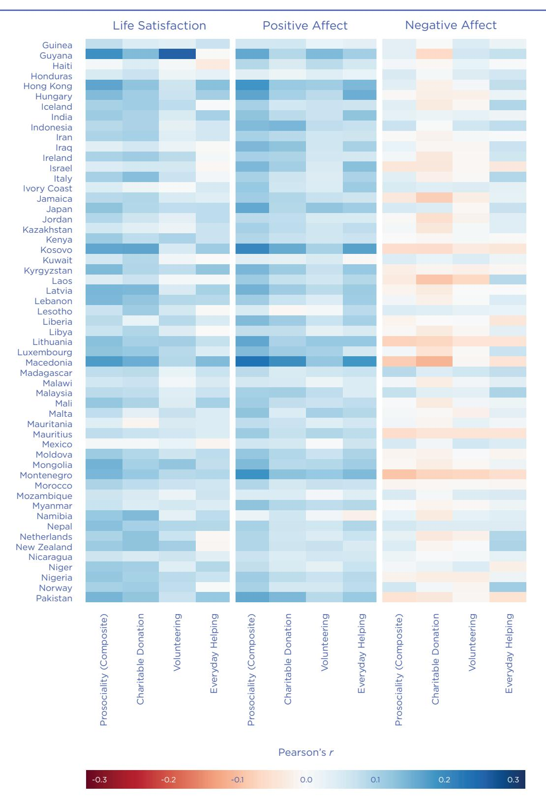

Figure 4.2: Relationship Between Subjective Well-being and Generosity by Country (continued)

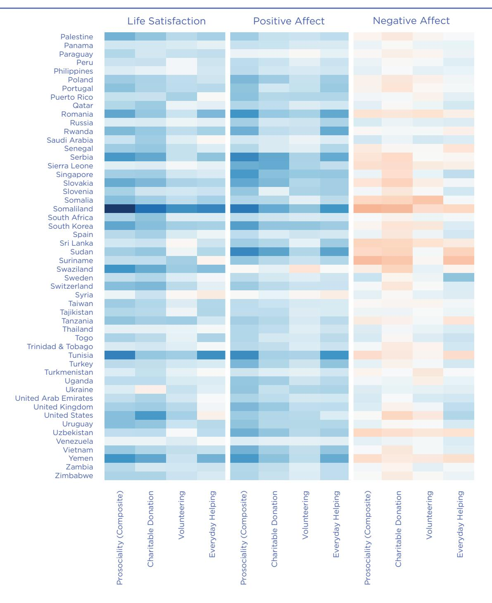

**Note:** Heatmap indicates the strength and direction of the relationships between subjective well-being and prosociality across 161 countries. Fach row represents a country. Colormap indicates the Pearson's *r* correlation. Blue indicates stronger positive relationship. Red indicates a stronger negative relationship. Results indicate that around the world greater life satisfaction and positive affect reliably relate to increased prosocial behavior (bluer), while greater negative affect reliably relates to decreased prosocial behavior (redder).

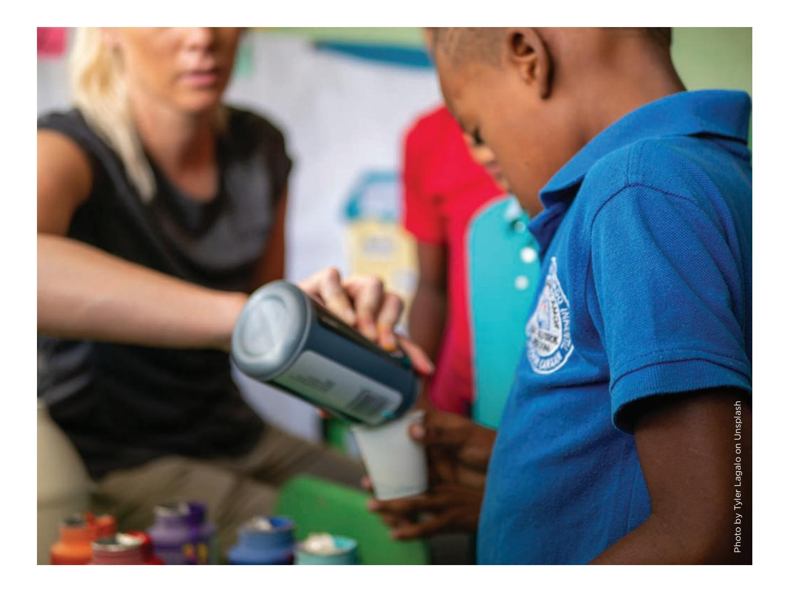

Although these studies demonstrate a consistent positive relationship between well-being and altruism around the world on average, they cannot determine the causal nature of that relationship: Does altruism promote well-being, or does well-being promote altruism—or are the effects bidirectional? Also, does altruism increase well-being for the beneficiary, the altruist, or even third parties? We next explore studies aimed at distinguishing among these possibilities using more targeted examinations of the correlations between altruism and well-being, some of which also use experimental manipulations or longitudinal investigations in an effort to establish the causal directions of the observed effects.

### Well-Being as an Outcome of Altruism

### Effects of Altruism on Beneficiaries' Well-Being

Altruism is defined as an action intended to benefit the welfare of the recipient and so most acts of altruism should increase beneficiaries' well-being. Many forms of altruism are explicitly aimed at improving recipients' objective well-being, such as donating money to increase recipients' wealth or donating blood to improve their health. In addition to improving recipients' objective well-being, such acts can also improve their subjective well-being. A recent pre-registered study sponsored by the TED organization demonstrated this robust effect by redistributing \$2 million in total from philanthropists to recipients around the world. Adults in this study were recruited from Australia, Brazil, Canada, Indonesia,

*Recipients of help also report that receiving help improved their trust in social relationships, empathy for others, and optimism about human nature.*

Kenya, the United Kingdom, and the United States to take part in a "Mystery Experiment." Participants were randomly assigned to one of two conditions: a cash condition, in which they received a \$10,000 cash transfer that they were instructed to spend within three months, or a control condition, in which participants did not receive a cash transfer. Results demonstrated that the recipients of the cash transfer from anonymous donors reported greater subjective well-being (including greater life satisfaction and positive affect and lower negative affect) after receiving and spending these funds, with greater effects observed for recipients living in lower-income countries.

Other forms of altruism, such as offering to help someone who is lost or providing support for someone in distress, are aimed at improving subjective well-being. In general, people who receive such forms of help report subjective well-being benefits afterward, including greater well-being and self-esteem.22 Recipients of help also report that receiving help improved their trust in social relationships, empathy for others, and optimism about human nature.23 This may be because altruistic acts like these promote social affiliation, which could stem from feelings of gratitude experienced by beneficiaries24 but could also result from feelings of guilt or indebtedness.25 Interestingly, altruistic actors seem to underestimate the positive effects of helping on beneficiaries' well-being.26 In one recent study, people who were instructed to perform a "random act of kindness" consistently underestimated how much the act would be valued by recipients and how much it would improve their well-being. 27

A number of factors affect the degree to which (or whether) helping improves the well-being of the beneficiary, however. One is the relationship between the altruistic actor and the beneficiary.

Most acts of altruism are performed by close others, including family members and close friends of the beneficiary.28 This is unsurprising in light of established biological models of altruism, such as kin selection, which promotes preferentially helping genetic relatives, thereby improving the altruist's own evolutionary fitness. Kin-selected altruism is an evolutionarily selected bias across many species, including humans,29 and can help account for the fact that the vast majority of altruism, including donations of money, time, blood, and organs, is performed to benefit family members.30 Help provided to distant versus close others tends to take different forms, with help for strangers tending to be relatively spontaneous.31 Such help occurs more often in response to immediate distress or need and is thus more unambiguously altruistic than helping close friends or family, which is more often planned and may more often reflect reciprocity or equity-related motives. People may thus view help from family as relatively more obligatory,32 which may affect well-being to the extent people report lower life satisfaction and more negative affect when they do not receive the support they had expected to receive.33

Although helping relationships are inherently unequal, greater asymmetry between the altruist and beneficiary may also reduce the degree to which help improves well-being. When an altruist has a higher status than the beneficiary (for example, higher socioeconomic status), the beneficiary may experience more negative emotions related to feeling pitied or dependent.34 This suggests a potential benefit of anonymous

*Altruism's effects on beneficiaries' well-being (e.g., positive affect, vitality, and self-esteem) seem to be especially robust when the beneficiary believes that the altruist personally chose to help and was intrinsically motivated to do so.*

giving: by concealing asymmetries in the relative status of the altruist and beneficiary, it may yield higher well-being for the beneficiary. Alternately, when beneficiaries anticipate being able to pay forward the help they received, their subjective well-being is also improved.35

The motivation perceived to drive acts of altruism also shapes its effects on beneficiaries. Altruism's effects on beneficiaries' well-being (e.g., positive affect, vitality, and self-esteem) seem to be especially robust when the beneficiary believes that the altruist personally chose to help and was intrinsically motivated to do so.36 By contrast, if recipients perceive the altruistic acts as having been performed for selfish (as opposed to benevolent) reasons, their sense of self-esteem may decrease, which can lead to feelings of sadness and anxiety.37 In some cases, receiving help may also elicit feelings of indebtedness and mixed emotional reactions in recipients.38 For example, recipients of help sometimes experience guilt, indebtedness, or negative mood after someone has sacrificed for them.39

As these findings demonstrate, altruism's effects on the recipient's well-being can be moderated by its effects on specific emotions. The emotion that may most reliably link altruism to improved well-being is gratitude.40 When helping elicits feelings of gratitude in recipients, they reliably experience increases in well-being. Gratitude is typically experienced by recipients when the altruistic actor helped (or was perceived to have helped) voluntarily and autonomously rather than under duress.41 Gratitude is consistently related to various positive well-being outcomes, including positive affect, optimism, and perceived closeness to others.42 Gratitude's effects on well-being may even potentially yield improvements in objective health indices as well, such as improved sleep and inflammatory markers.43 In addition, gratitude may make beneficiaries more likely to engage in future altruism themselves.44 This may yield

further increases in well-being, in light of the positive effects of altruism on altruists' well-being, as will be discussed next.

Interestingly, feelings of guilt in beneficiaries of altruism can also increase future prosocial behavior.45 Although this may seem counterintuitive, guilt is generally considered a prosocial emotion.46 The fact that it can both result from and lead to prosocial behavior may, therefore, not be surprising. Guilt can be distinguished from gratitude by its subjectively unpleasant nature, of course, as well as the fact that it may increase prosociality due to feelings of indebtedness rather than internally generated desires to help—perhaps as a result of the benefactor's expectation of reciprocity.47 Thus, altruism, given freely and without expectations of reciprocity may be most likely to yield gratitude rather than indebtedness or guilt and thus enhance beneficiaries' well-being.

### **Effects of Altruism on Altruistic Actors' Well-Being**

Whereas it is self-evident that altruism improves the well-being of recipients, it may be less obvious it would improve the subjective well-being of altruists themselves. And yet it often does. This may seem unintuitive, since altruistic acts often entail a cost to the actor (i.e., sacrificing resources), thus resulting in some decrease in their objective well-being. But that helping others—including giving them money, blood, or other kinds of assistance—nonetheless reliably causes increased subjective well-being is well-documented, with consistently small-to-medium effect sizes.48

A seminal investigation of this effect was conducted by Dunn and colleagues.49 They found not only that happier people report spending more money on others (as other studies have also found) but that when participants were given a small amount of money (either \$5 or \$20) and randomly assigned to spend it on themselves or someone else, those assigned to spend money on others consistently reported being happier than those who spent the money on themselves. This effect has been replicated in a subsequent registered report50 and has been observed in multiple cultures around the globe.51 Other forms of altruism have also been consistently associated with improved well-being

*It is self-evident that altruism improves the well-being of recipients, it may be less obvious it would improve the subjective well-being of altruists themselves. And yet it often does.*

in altruists, including volunteering52 and donating blood.53 It should be noted, though, that the magnitude of the relationship between altruism and well-being is larger when altruism is measured via self-report questionnaires rather than via singleitem measures of volunteering or helping frequency.54

The positive feelings induced by altruism are sometimes described as a "warm glow" that corresponds to feelings of satisfaction and general positive affect.55 This effect may yield a range of positive downstream consequences. For example, behavioral and neural evidence demonstrates that donating money can reduce the experience of pain in altruists.56 These benefits may be durable over the long term. Altruistic actors report higher life satisfaction, fewer symptoms of depression, and higher job satisfaction that lasts up to two months after helping others.57 The fact that altruism feels subjectively good may make altruism self-reinforcing,58 such that those who feel better after helping are more likely to continue helping at higher rates.59 If this is the case, the benefits of altruism may continue to accrue over time. Supporting this possibility, people around the world who regularly engage in altruistic behaviors like volunteering, donations, and helping report higher life satisfaction across the life span than those who are less altruistic.60

Paradoxically, however, some assert that if altruism yields positive emotional effects for the altruist, it undercuts the selfless or virtuous nature of the act.61 But others counter that altruism's warm glow in part reflects vicarious positive emotion from having improved others' well-being,62 which is the inevitable outcome of genuinely altruistically motivated help—and which, therefore, should be considered a marker, not a contra-indication, of altruistic motivation.63

*Helping others—including giving them money, blood, or other kinds of assistance—nonetheless reliably causes increased subjective well-being, with consistently small-to-medium effect sizes.*

As is the case for altruism's effects on beneficiaries, the effects of altruism may also vary as a function of the relationship between the altruistic actor and the beneficiary. When the type of altruism is held constant, helping close others may be more beneficial for well-being, as well-being is more reliably elevated when people help others with whom they have stronger versus weaker ties.64 However, the fact that altruism for close others is more likely to be planned and formal may make its real-world effects on well-being weaker, as informal helping (versus formal helping) is generally linked to greater well-being.65

Altruism's effects on the well-being of altruists also tend to be greater when helping is autonomous and voluntary rather than obligatory.66 In one study of daily helping, participants only reported greater well-being when they helped by choice rather than because they were required to. This is because helping by choice had the greatest positive effect on feelings of autonomy, social connectedness, and competence, in accordance with theories of self-determination.67 These findings might appear to conflict with studies in which participants who are randomly assigned to help others by researchers nonetheless report increased well-being.68 However, in such studies, the choice of how and whom participants help is left up to them, which may preserve the beneficial effects of altruism as an autonomous choice.69 The fact that altruism that is freely chosen is more strongly linked to well-being may help to explain why the positive relationship between altruism and well-being tends to be strongest in individualistic cultures,70 in which helping may be more often construed as an autonomous voluntary choice, rather than an obligation.

Finally, whether altruism benefits altruists' well-being may depend on various demographic features. One meta-analysis found that younger altruists experience higher levels of well-being relative to older altruists, perhaps because altruism in younger adults is more likely to result in durable changes in self-concept and feelings of personal growth.71 Women may also benefit more than men from acting altruistically, as research suggests that helping is more positively associated with eudaimonic well-being, social relations, and physical health in women than in men.72

### **Effects of Altruism on Third Parties' Well-Being**

The positive effects of altruism on well-being may not be limited to the altruist and the beneficiary, but might also extend to third parties, such as those who observe an act of altruism or who are part of the social network of either altruists or beneficiaries. Relatively little research has explored this question. However, some evidence suggests that simply witnessing acts of altruism promotes well-being. For example, observing altruism has been found to result in what is termed "moral elevation," which reflects extreme elevation in mood, increased energy, desire for affiliation, the motivation to do good things for other people, and the desire to become a better person.73 Observing altruistic acts, or even learning about them from others, may also influence observers to be more altruistic in their future interactions.74 People may update their beliefs about normative behaviors when observing others' altruism and, as a result, may adopt more altruistic norms in the future.75 Frequently observing altruistic acts may thus yield more positive beliefs about human nature and build interpersonal trust. By contrast, people may adopt more cynical beliefs after observing antagonistic interactions.76

Under some circumstances, observing others' altruistic behavior may lead to negative outcomes, particularly when the altruistic act is perceived as strongly non-normative. Witnessing others deviating, even generously, from norms such as equity can result in negative affect,77 perhaps by making observers feel worse about themselves. This may lead to "do-gooder derogation", in which altruistic actors are perceived more

negatively,78 and may be criticized, seen as irrational or psychologically disturbed, or even punished.79 In one study, for example, the least prosocial participants in a laboratory economic game penalized players who had contributed the most to a common pool, perhaps to deter them from continuing to behave in a way that makes others look worse by comparison.80 Because it serves to deter prosocial behavior and thus harms the group, punishment of prosocial behavior is sometimes termed "antisocial punishment" (in contrast to "altruistic punishment" which serves to deter antisocial behavior). Antisocial punishment is observed to some degree across many societies, but it is particularly prevalent in societies with weak norms of civic cooperation and the weak rule of law, whereas failure to act prosocially is punished more frequently in societies with stronger civic cooperation norms.81

Together, then, preliminary evidence suggests that observing acts of altruism may improve observers' well-being through its effects on mood and emotion, interpersonal trust, and beliefs about human nature, but these effects may be stronger among individuals and societies for which altruism and other forms of prosociality are normative.

### **Well-Being as Predictor of Altruism**

### **Effects of Beneficiaries' Well-Being on Altruism**

One reason it can be difficult to disentangle relationships between well-being and altruism is that these relationships are bidirectional. That is, not only does altruism improve the well-being of beneficiaries, altruists, and even observers, but the causal arrows may also run the other way: well-being may sometimes increase altruism. This is the case for well-being experienced by both potential altruists and potential beneficiaries. For example, expressing higher well-being (particularly positive emotions) may increase the likelihood that a person will receive help from others. This may seem counter-intuitive, given that altruism is often the result of empathic concern elicited by a recipient's suffering or distress—indeed, suffering and distress are among the strongest elicitors of

altruism because they stimulate neural and hormonal mechanisms that promote interpersonal care and altruistic motivation.82 But it may be that either negative or positive emotions can elicit help, albeit through different routes. For example, a series of field studies found that various forms of helping (e.g., holding open a door, providing hypothetical help to hospitalized patients) are more likely to be directed toward beneficiaries displaying positive emotion relative to neutral or negative emotion.83

These findings are generally consistent with various other studies indicating that whereas empathy-based altruism can result from observing others' negative emotions linked to distress or need, observable positive emotion can also promote prosocial intentions. For example, increased prosociality is directed towards people who speak with a positive and friendly tone of voice84 and people are more willing to share money with a beneficiary presented as happy.85 Although negative emotions like sadness increase the perceived need of the beneficiary, people may nonetheless prefer helping happier people because they are seen as more desirable social partners and thus elicit stronger affiliation goals.86 Preferential helping for happy people may also be mediated by vicarious responding to others' positive affect87—that is, it may induce positive affect in the altruist that subsequently elicits prosocial behavior.

### **Effects of Altruistic Actors' Well-Being on Altruism**

Well-being increases not only the likelihood of being the recipient of altruism but of engaging in altruism. In general, altruistic behaviors are enacted more frequently in those experiencing higher well-being. People who are happier invest more hours in volunteer service,88 spend more money on others,89 and exert greater effort to benefit others.90 On a larger scale, when well-being increases in a geographic region, extraordinary forms of altruism like altruistic kidney donation also increase.91 Because altruistic kidney donation is so rare, it is implausible that the relationship between well-being and altruism results from the effect of these donations on population levels of

well-being; it seems more likely that population levels of well-being increase altruism. This study also demonstrated that increasing objective well-being in a geographic area over time is associated with increased altruism through its effects on subjective well-being.

That increasing objective well-being promotes altruism may seem surprising in light of the results of a small but influential series of studies that seemingly found greater objective well-being (for example, greater wealth or social status) to be associated with increased selfishness and reduced altruism.92 However, larger, more representative studies from researchers across various disciplines have tended to find the reverse to be true: that increased objective well-being, including having more resources, better health, and higher status, is generally associated with increases in various forms of prosociality, including volunteering, charitable donations, helping strangers in economic games, and returning lost items.93 This may, in

part, reflect the fact that those with more wealth, health, and status have more available resources for helping others. It may also reflect the positive link between objective and subjective well-being, however, as those experiencing poverty, poor health, or low status typically report lower well-being.94

Even holding macro-level factors constant, however, transitory positive changes in mood also are linked to altruism, and experimental evidence suggests that inducing positive moods may cause increased prosociality.95 This may in part reflect the fact that people experiencing positive moods are intrinsically motivated to maintain that state.96 This effect may be more robust when the help is not too costly. For example, when people in a positive state believe complying with a request for help would ruin their good mood, they may be less willing to help than those not experiencing a positive emotional state.97 In some cases, however, acute stress is also linked to altruism. Indeed,

during the pandemic people experiencing the most acute stress were the most likely to exhibit increases in various forms of prosocial behavior.98 This may be because acute stress or fear motivates people to act, which can manifest as helping behavior when the stress emerges in a social context.99 This effect may help to explain the surge in altruism observed during the COVID-19 pandemic. It may also help to explain why in general daily affect is less reliably associated with altruism than life satisfaction: because acute changes in both positive mood and some forms of negative mood—including acute stress or fear—can motivate helping.

A positive mood may be particularly likely to increase even costly altruism when it is the result of having received help from others. Those who receive help are more likely to help others, often as a result of increased gratitude,100 a positive emotion consistently linked to both well-being and altruistic behavior. This pay-it-forward effect, in which generous allocations of resources spread from person to person, has been observed across many studies.101 In one longitudinal study, recipients paid acts of kindness forward with 278% more prosocial behaviors than controls who did not experience acts of kindness.102 And in an economic exchange game, people who had been helped by another person gave more money to a stranger than those who had not been helped.103 In another economic game in which participants were continuously changing partners, participants who received more money from one partner were more likely to make voluntary donations to other partners in subsequent rounds.104 While it should be noted that the effect appears to gradually decline with repeated prosocial decisions over time,105 in theory, this phenomenon of "upstream reciprocity" could yield durable and widespread increases in well-being among altruists, beneficiaries of altruism, and others they encounter.

### **Open Questions**

In previous sections, we have described the robust relationships between altruism and subjective well-being. Existing work suggests a reciprocal causal relationship between the two, with each influencing the other in a bidirectional manner. However, many unanswered questions about the nature of this causal relationship remain, in part due to the challenges and complexities involved in studying the relationship between altruism and well-being.

### **The Complexity of Directionality**

The research presented here points towards a multi-causal relationship between altruism and subjective well-being in actors, beneficiaries, and observers. Although some of this work can draw strong causal conclusions using careful design or randomized assignment to interventions,106 the conclusions that can be drawn from some research studies are more limited due to their correlational nature. For example, some studies that find positive effects of volunteering on well-being107 have not accounted for factors that may drive self-selection into volunteering by those who are happier. However, one study sought to account for this possibility. Using a longitudinal panel in the United Kingdom, the authors controlled for higher prior levels of well-being of those who volunteer and found that volunteering nevertheless led to subsequent increases in well-being.108 This study focused on one potential causal arrow: the effect of altruism on the altruist's well-being. But larger, more comprehensive studies should ultimately consider a wider range of causal arrows, including the effects of altruism on the happiness of beneficiaries and observers, and the effects of well-being on acting altruistically or being the beneficiary of altruism. Addressing such questions would require the collection of comprehensive longitudinal, momentary assessment data, similar to data that have been collected to measure a wide variety of everyday altruistic behaviors (enacted, received, or observed).109 These data could be collected at both the individual level and aggregated at the regional or country level, with the goal of disentangling the level of analysis at which this

**Table 4.1. Summary of the relationships between altruism and subjective well-being.** 

| Beneficiaries                                                                                                                                                                                                                         | Altruistic Actors                                                                                    | Third-Party Observers                                                                                                                                            |  |  |
|---------------------------------------------------------------------------------------------------------------------------------------------------------------------------------------------------------------------------------------|------------------------------------------------------------------------------------------------------|------------------------------------------------------------------------------------------------------------------------------------------------------------------|--|--|
| Altruism improves beneficiaries' well-being                                                                                                                                                                                        | Altruism improves altruistic actors' well-being                                                   | Observing altruistic acts improves observers' well-being                                                                                                      |  |  |
| Examples:                                                                                                                                                                                                                             | Examples:                                                                                            | Examples:                                                                                                                                                        |  |  |
| Altruistic acts, such as donating money to increase recipients' wealth or donating blood to improve their health, aim to increase others' well-beingi                                                                        | Spending money on others,v volunteering,vi and donating bloodvii promote altruists' well-being | Observing altruism elevates mood, increases energy, desire for affiliation, the motivation to do good things for other people, and the desire to become |  |  |
| People who received cash payments                                                                                                                                                                                                     | Additional details:                                                                                  | a better personx                                                                                                                                                 |  |  |
| report greater life satisfaction and positive affect and lower negative affect,                                                                                                                                                    | These acts may also be associated with negative outcomes—for example, when                        | Additional details:                                                                                                                                              |  |  |
| with greatest effects observed among lower income countriesii                                                                                                                                                                      | helping is viewed as obligatoryviii                                                                  | Observing altruism may also lead to                                                                                                                              |  |  |
| Additional details:                                                                                                                                                                                                                   | This effect appears to be greater for younger peopleix                                            | negative affect—for example, when witnessing others deviating from norms or when perceiving altruistic acts in a                                           |  |  |
| These acts may also lead to unintended negative effects on beneficiaries' well-being—for example, when beneficiaries feel indebted to the altruistiii or if they perceive the altruist as acting for selfish reasonsiv |                                                                                                      | way that makes observers feel worse by comparisonxii                                                                                                          |  |  |
| Increased well-being of beneficiaries leads to altruism                                                                                                                                                                            | Increased well-being of altruistic actors leads to altruism                                       | Increased well-being from observing altruistic acts leads to altruism                                                                                         |  |  |
| Examples:                                                                                                                                                                                                                             | Examples:                                                                                            | Examples:                                                                                                                                                        |  |  |
| Expressing more positive emotions may increase the likelihood that a person will receive help from othersxiii                                                                                                                   | People who are happier are more likely to volunteer, give to charity, and help strangersxviii  | "Moral elevation" after observing altruism influences observers to be more altruistic in the futurexxiii                                                   |  |  |
| Additional details:                                                                                                                                                                                                                   | People who are happier are more likely to donate blood, bone marrow, and                          | Additional details:                                                                                                                                              |  |  |
| Decreased well-being (e.g., increased                                                                                                                                                                                                 | organsxix                                                                                            | When altruistic acts are perceived as                                                                                                                            |  |  |
| emotional distress or physical pain) also increases the likelihood that a person                                                                                                                                                   | Additional details:                                                                                  | strongly non-normative, it may lead to "do-gooder derogation"xxiv                                                                                             |  |  |
| will receive help from othersxiv                                                                                                                                                                                                      | At the national level, this effect is weaker                                                         |                                                                                                                                                                  |  |  |
| Beneficiaries of altruism are more likely to pay it forward in the future,xv which                                                                                                                                                 | among less individualistic countriesxx                                                               |                                                                                                                                                                  |  |  |
| may result from feelings of gratitudexvi                                                                                                                                                                                              | The strength of this relationship decreases among those with very high                            |                                                                                                                                                                  |  |  |

**Note:** The top row describes how altruism leads to subjective well-being; the Bottom row describes how subjective well-being leads to altruism.

Acute stress or fear can also promote

#### **Table 4.1 References:**

i Batson & Powell (2003); de Waal (2008)

Feelings of guilt in beneficiaries of altruism increases future altruismxvii

- ii Dwyer & Dunn (2022)
- iii Righetti et al., (2022); Zhang et al. (2018)
- iv Maisel & Gable (2009)
- v Dunn et al. (2008); Aknin et al. (2013, 2015;
- vi Dolan et al. (2021); Lawton et al. (2021); Meier & Stutzer (2008)
- vii Hinrichs et al. (2008); Sojka & Sojka (2003)
- viii Lok & Dunn (2022); Weinstein et al. (2010)

well-beingxxi

- ix Hui et al. (2020) x Algoe & Haidt (2009); Haidt (2000)
- xi Blain et al. (2022)

helping behaviorxxii

- xii Pleasant & Barclay (2018)
- xiii Hauser et al. (2014) xiv Batson & Powell (2003); de Waal (2008)
- xv Chancellor et al. (2018); DeSteno et al. (2010);
- Fowler & Christakis (2010) xvi Grant & Gino (2010)
- xvii Baumeister et al. (1994) xviii Kushlev et al. (2021)

- xix Brethel-Haurwitz et al. (2019); Rhoads et al.
- xx Rhoads, et al. (2021) xxi Rhoads et al. (2021)
- xxii Vieira et al. (2022); Vieira & Olsson (2022)
- xxiii Spivey & Prentice-Dunn (1990); Carlson & Zaki
- xxiv Barclay (2013); Minson & Monin (2012); Tasimi et al. (2015)

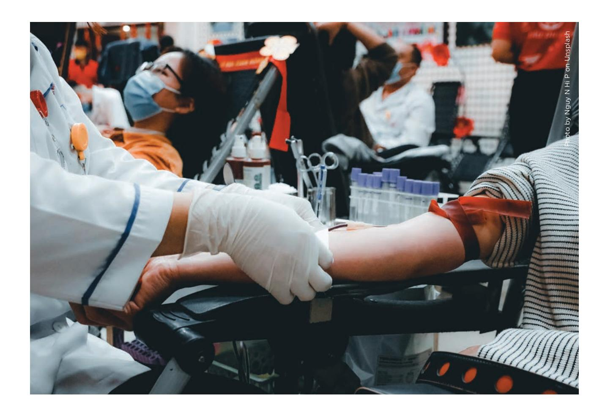

relationship is strongest and for which types of well-being and altruism. This kind of data could also address the timescale at which these effects occur.

Longitudinal effects are particularly important to consider given the apparent self-reinforcing nature of altruism, such that engaging in altruism tends to beget more altruism in the future.110 One open question remains: Why does this occur, and how are altruistic behaviors reinforced? Existing research points to a few possibilities. One is that improving someone else's well-being may be rewarding because it enhances positive mood vicariously.111 In other words, people become happier upon seeing others become happier as a result of empathic processes. Another possibility is that altruism may be self-reinforcing when it yields more social rewards, such as the social approval and intrinsic satisfaction that result from conforming to desirable social norms. In general,

adhering to altruistic norms may increase social rewards like affiliation, social approval, or prestige.112 By contrast, digressing from such norms may result in social punishments that signal violators to update their behavior.113 Finally, altruism may be self-reinforcing because altruists discover it is a reliable route to fulfilling desirable outcomes like autonomy (feelings of personal choice), competence (feelings of self-efficacy), and relatedness (feelings of social connection).114 Meeting these needs through altruism may increase altruists' subjective well-being and thus promote future altruistic behavior. However, more research is required to determine the circumstances in which each of these potential mechanisms contributes to reinforced altruistic behavior.

### **Different Features of Altruism and Well-being**

It will also be important to assess how different types of altruism are related to different wellbeing outcomes. Specific features of an altruistic act, such as the identity of the recipient, the costliness of the act, or the certainty of beneficial outcomes may play important roles in promoting altruists' well-being. As described previously, for example, one meta-analysis found that the relationship between altruism and well-being is diminished when the sacrifice made to benefit another person is large—even when the beneficiary is a romantic partner.115 This effect held despite altruists' reported willingness to sacrifice being positively correlated with well-being.

In light of this, larger studies may be needed to explore the ways that distinct forms of altruism promote and are promoted by well-being. Though behaviors like rescuing a stranger from a fire, giving someone directions, returning a lost wallet, and volunteering for a local charity all qualify as altruism, they vary in terms of their cost to the altruist, the benefits to the recipient, the identity of the beneficiary (e.g., friends, strangers), and context (e.g., in response to signs of distress or need, in uncertain or novel situations). Future work should disentangle how specific features of altruistic acts like these may promote (or prevent) well-being.

More research is also needed to explore when the association between altruism and well-being is enhanced (vs. reduced) and positive (vs. negative). One example includes how the cultural context in which altruism occurs shapes its outcomes. Most experimental altruism research has been conducted in North America and Europe, which are relatively individualistic cultural contexts that promote individuals' autonomy to pursue prosocial goals outside of parochial connections. This context may increase the strength of the relationship between well-being and various types of altruism performed for strangers or other relatively weak ties, such as donating blood or volunteering.116 Future work should investigate how altruism for close others, such as family or friends, is associated with wellbeing in societies with different cultural values.

Different facets of well-being may also be associated with altruism in distinct ways. At the individual level, life satisfaction and positive affect predict altruistic behaviors that include volunteering, helping, and donating.117 However,

in country-aggregated measures, only life satisfaction (not daily positive and negative affect) predicts these three behaviors, as well as four additional forms of altruism.118 Understanding whether these observed relationships reflect real differences in the relationships between altruism and the distinct facets of well-being will require further study. Finally, as most work has focused on altruism, it remains an open question how other types of prosocial behavior, like cooperation or fairness, may relate to subjective well-being.

### **Conclusion**

This chapter has explored the bidirectional relationship between altruism and well-being, highlighting well-being as both cause and outcome of altruism for altruistic actors, recipients, and observers (and reviewing the conditions under which this relationship may be promoted). Overall, the evidence is convincing that higher well-being promotes altruism, and that altruism promotes higher well-being in altruists. Altruism also creates higher well-being in beneficiaries, although the degree to which this is true depends on the nature of the altruistic act, such as whether it was performed out of obligation or an intrinsic desire to help. Preliminary evidence suggests altruism may also increase well-being in observers, although this effect may depend on prevailing social norms.

Taken together, the available evidence suggests that the global increase in altruism observed in 2020 and 2021 is likely good news on multiple counts: Not only is an increase in altruistic behavior good in its own right, but this increase almost certainly corresponded to widespread increases in well-being during the same time period whether because it caused the rise in altruism, was caused by the rise in altruism, or both. But more research is needed to address this and other open questions that remain regarding the causal relationship between well-being and specific forms of altruism. Answering these questions will be crucial for identifying the most effective ways to further promote both altruism and well-being around the world.

### **Endnotes**

- Fridman et al. (2022)
- Helliwell et al. (2022)
- Batson & Powell (2003); de Waal (2008)
- Rhoads, Cutler, et al. (2021)
- Miller (1999); Pew Research Center (2019)
- 6 Aknin et al. (2015); Curry et al. (2018); Dunn et al. (2008); Hui et al. (2020)
- 7 Algoe & Haidt (2009); Haidt (2000); Spivey & Prentice-Dunn (1990)
- Aknin et al. (2012); Weinstein & Ryan (2010)
- 9 Aknin et al. (2018); Brethel-Haurwitz & Marsh (2014); Kushlev et al., (2021); Rhoads, Gunter, et al., (2021)
- Böckler et al. (2016); Rhoads, Cutler, et al., (2021)
- Batson & Powell (2003); de Waal (2008)
- Rhoads, O'Connell, et al. (2022)
- 13 Brethel-Haurwitz et al., (2018); Marsh et al. (2014); O'Connell et al. (2019); Rhoads, Vekaria, et al. (2022); Vekaria et al. (2017, 2019)
- Rhoads, Cutler, et al. (2021); Rilling & Sanfey (2011)
- Diener (1984, 1994)
- Rhoads, Gunter, et al. (2021)
- Kushlev et al. (2021)
- Rhoads et al. (2021)
- Kushlev et al. (2021)
- Batson & Powell (2003); de Waal (2008)
- Dwyer & Dunn (2022)
- Weinstein & Ryan (2010)
- Hoffman et al. (2020)
- Bartlett et al. (2012)
- Alvarez & van Leeuwen (2015)
- Epley et al. (2022)
- Kumar & Epley (2022)
- Amato (1990)
- Lieberman et al. (2007)
- 30 e.g., Amato (1990); Batson (2010); Government of Canada (2014); Hart et al. (2020); Kurleto et al. (2022)
- Amato (1990)
- Earp et al. (2021)
- Siedlecki et al. (2014)
- Alvarez & van Leeuwen (2015); Sandstrom et al. (2019)
- Alvarez & van Leeuwen (2015)
- Weinstein & Ryan (2010)
- Maisel & Gable (2009)
- Righetti et al. (2022); Zhang et al. (2018)

- Righetti, Schneider, et al. (2020)
- McCullough et al. (2001)
- Weinstein et al. (2010)
- Wood et al. (2010)
- Jans-Beken et al. (2020); O'Connell & Killeen-Byrt (2018)
- Grant & Gino (2010)
- Baumeister et al. (1994)
- Vaish (2018)
- Watkins et al. (2006)
- Curry et al. (2018); Hui et al. (2020)
- Dunn et al. (2008)
- Aknin et al. (2020)
- Aknin et al. (2013, 2015)
- 52 Dolan et al. (2021); Lawton et al. (2021); Meier & Stutzer (2008)
- Hinrichs et al. (2008); Sojka & Sojka (2003)
- Hui et al. (2020)
- Andreoni (1990)
- Wang et al. (2019)
- Chancellor et al. (2018)
- Mobbs et al. (2009)
- Aknin et al. (2012); Chancellor et al. (2018)
- Jebb et al. (2020)
- Andreoni (1989)
- Gesiarz & Crockett (2015)
- Barasch et al. (2014); Morelli et al. (2015, 2018); Zaki (2014)
- Aknin et al. (2011)
- Hui et al. (2020)
- Lok & Dunn (2022); Weinstein et al. (2010)
- Weinstein & Ryan (2010)
- Aknin et al. (2013, 2015); Dunn et al. (2008)
- Aknin & Whillans (2021)
- Rhoads et al. (2021)
- Hui et al. (2020)
- Hui et al. (2020)
- Algoe & Haidt (2009); Haidt (2000)
- Spivey & Prentice-Dunn (1990)
- Carlson & Zaki (2022)
- Neumann & Zaki (2022)
- Blain et al. (2022)
- Minson & Monin (2012); Tasimi et al. (2015)
- Barclay (2013)

- Pleasant & Barclay (2018)
- Herrmann et al. (2008)
- 82 de Waal (2008); Decety et al. (2016); Lamm et al. (2016); Marsh (2018, 2022)
- Hauser et al. (2014)
- Goldman & Fordyce (1983)
- Telle & Pfister (2012); Tong et al. (2021)
- Hauser et al. (2014)
- Telle & Pfister (2012)
- Thoits & Hewitt (2001)
- Aknin et al. (2012)
- Layous et al. (2017)
- Brethel-Haurwitz & Marsh (2014)
- e.g., Piff et al. (2010)
- 93 Gittell & Tebaldi (2006); Hughes & Luksetich (2008); Korndörfer et al. (2015); Kumar et al. (2012); Post (2005); Stamos et al. (2020); Zwirner & Raihani (2020)
- Howell & Howell (2008); Kahneman & Deaton (2010)
- Carlson et al. (1988); Isen & Levin (1972)
- Telle & Pfister (2016)
- Isen & Simmonds (1978)
- Vieira et al. (2022)
- Taylor (2006); Vieira & Olsson (2022)
- 100Bartlett & DeSteno (2006); Chang et al. (2012)
- 101 DeSteno et al. (2010); Fowler & Christakis (2010); Gray et al. (2014)
- Chancellor et al. (2018)
- DeSteno et al. (2010)
- Fowler & Christakis (2010)
- Horita et al. (2016)
- Aknin et al. (2020)
- 107 Dolan et al. (2021); Greenfield & Marks (2004); Meier & Stutzer (2008)
- Lawton et al. (2021)
- Gallup (2010); Helliwell et al. (2022); Vekaria et al. (2020)
- Aknin et al. (2012); Chancellor et al. (2018)
- Mobbs et al. (2009); Morelli et al. (2015)
- Hardy & Van Vugt (2006)
- Fehr & Fischbacher (2003)
- Aknin & Whillans (2021); Weinstein & Ryan (2010)
- Righetti, Sakaluk, et al. (2020)
- Rhoads, Gunter, et al. (2021)
- Kushlev et al. (2021)
- Rhoads, Gunter, et al. (2021)

### **References**

Aknin, L. B., Barrington-Leigh, C. P., Dunn, E. W., Helliwell, J. F., Burns, J., Biswas-Diener, R., Kemeza, I., Nyende, P., Ashton-James, C. E., & Norton, M. I. (2013). *Prosocial Spending and Well-Being: Cross-Cultural Evidence for a Psychological Universal*. *104*(4), 635–652.

Aknin, L. B., Broesch, T., Kiley Hamlin, J., & Van De Vondervoort, J. W. (2015). Prosocial behavior leads to happiness in a small-scale rural society. *Journal of Experimental Psychology: General*, *144*(4), 788–795. https://doi.org/10.1037/xge0000082

Aknin, L. B., Dunn, E. W., & Norton, M. I. (2012). Happiness Runs in a Circular Motion: Evidence for a Positive Feedback Loop between Prosocial Spending and Happiness. *Journal of Happiness Studies*, *13*(2), 347–355. https://doi.org/10.1007/ s10902-011-9267-5

Aknin, L. B., Dunn, E. W., Proulx, J., Lok, I., & Norton, M. I. (2020). Does spending money on others promote happiness?: A registered replication report. *Journal of Personality and Social Psychology*, *119*(2), e15–e26. https://doi.org/10.1037/ pspa0000191

Aknin, L. B., Sandstrom, G. M., Dunn, E. W., & Norton, M. I. (2011). It's the Recipient That Counts: Spending Money on Strong Social Ties Leads to Greater Happiness than Spending on Weak Social Ties. *PLOS ONE*, *6*(2), e17018. https://doi.org/10.1371/ journal.pone.0017018

Aknin, L. B., Van de Vondervoort, J. W., & Hamlin, J. K. (2018). Positive feelings reward and promote prosocial behavior. *Current Opinion in Psychology*, *20*, 55–59. https://doi. org/10.1016/j.copsyc.2017.08.017

Aknin, L. B., & Whillans, A. V. (2021). Helping and Happiness: A Review and Guide for Public Policy. *Social Issues and Policy Review*, *15*(1), 3–34. https://doi.org/10.1111/sipr.12069

Algoe, S. B., & Haidt, J. (2009). Witnessing excellence in action: The 'other-praising' emotions of elevation, gratitude, and admiration. *The Journal of Positive Psychology*, *4*(2), 105–127. https://doi.org/10.1080/17439760802650519

Alvarez, K., & van Leeuwen, E. (2015). Paying it forward: How helping others can reduce the psychological threat of receiving help. *Journal of Applied Social Psychology*, *45*(1), 1–9. https://doi.org/10.1111/jasp.12270

Amato, P. R. (1990). Personality and Social Network Involvement as Predictors of Helping Behavior in Everyday Life. *Social Psychology Quarterly*, *53*(1), 31–43. https://doi. org/10.2307/2786867

Andreoni, J. (1989). Giving with Impure Altruism: Applications to Charity and Ricardian Equivalence. *Journal of Political Economy*. https://doi.org/10.1086/261662

Andreoni, J. (1990). Impure Altruism and Donations to Public Goods: A Theory of Warm-Glow Giving. *The Economic Journal*. https://doi.org/10.2307/2234133

Barasch, A., Levine, E. E., Berman, J. Z., & Small, D. A. (2014). Selfish or selfless? On the signal value of emotion in altruistic behavior. Journal of Personality and Social Psychology, 107(3), 393–413. https://doi.org/10.1037/a0037207

Barclay, P. (2013). Strategies for cooperation in biological markets, especially for humans. *Evolution and Human Behavior*, *34*(3), 164–175. https://doi.org/10.1016/ j.evolhumbehav.2013.02.002

Bartlett, M. Y., Condon, P., Cruz, J., Baumann, J., & Desteno, D. (2012). Gratitude: Prompting behaviours that build relationships. *Cognition and Emotion*, *26*(1), 2–13. https://doi.org/10.108 0/02699931.2011.561297

Bartlett, M. Y., & DeSteno, D. (2006). Gratitude and Prosocial Behavior: Helping When It Costs You. *Psychological Science*, *17*(4), 319–325. https://doi.org/10.1111/j.1467-9280.2006.01705.x

Batson, C. D. (2010). The naked emperor: Seeking a more plausible genetic basis for psychological altruism. *Economics and Philosophy*. https://doi.org/10.1017/S0266267110000179

Batson, C. D., & Powell, A. A. (2003). Altruism and Prosocial Behavior. In I. B. Weiner (Ed.), *Handbook of Psychology*. Wiley. https://doi.org/10.1002/0471264385.wei0519

Baumeister, R. F., Stillwell, A. M., & Heatherton, T. F. (1994). Guilt: An interpersonal approach. *Psychological Bulletin*, *115*, 243–267. https://doi.org/10.1037/0033-2909.115.2.243

Blain, B., Marks, J., Czech, P., & Sharot, T. (2022). Observing others give & take: A computational account of bystanders' feelings and actions. *PLOS Computational Biology*, *18*(5), e1010010. https://doi.org/10.1371/journal.pcbi.1010010

Böckler, A., Tusche, A., & Singer, T. (2016). The Structure of Human Prosociality: Differentiating Altruistically Motivated, Norm Motivated, Strategically Motivated, and Self-Reported Prosocial Behavior. *Social Psychological and Personality Science*, *7*(6), 530–541. https://doi. org/10.1177/1948550616639650

Brethel-Haurwitz, K. M., Cardinale, E. M., Vekaria, K. M., Robertson, E. L., Walitt, B., VanMeter, J. W., & Marsh, A. A. (2018). Extraordinary Altruists Exhibit Enhanced Self–Other Overlap in Neural Responses to Distress. *Psychological Science*, *29*(10), 1–11. https://doi.org/10.1177/0956797618779590

Brethel-Haurwitz, K. M., & Marsh, A. A. (2014). Geographical Differences in Subjective Well-Being Predict Extraordinary Altruism. *Psychological Science*, *25*(3), 762–771. https://doi. org/10.1177/0956797613516148

Carlson, M., Charlin, V., & Miller, N. (1988). Positive mood and helping behavior: A test of six hypotheses. *Journal of Personality and Social Psychology*, *55*, 211–229. https://doi. org/10.1037/0022-3514.55.2.211

Carlson, R. W., & Zaki, J. (2022). Belief in Altruistic Motives Predicts Prosocial Actions and Inferences. *Psychological Reports*, *125*(4), 2191–2212. https://doi. org/10.1177/00332941211013529

Chancellor, J., Margolis, S., Bao, K. J., Lyubomirsky, S., & Emerson, R. W. (2018). Everyday prosociality in the workplace: The reinforcing benefits of giving, getting, and glimpsing. *Emotion*, *18*(4), 507–517. https://doi.org/10.1037/emo0000321. supp

Chang, Y.-P., Lin, Y.-C., & Chen, L. H. (2012). Pay It Forward: Gratitude in Social Networks. *Journal of Happiness Studies*, *13*(5), 761–781. https://doi.org/10.1007/s10902-011-9289-z

Curry, O. S., Rowland, L. A., Van Lissa, C. J., Zlotowitz, S., McAlaney, J., & Whitehouse, H. (2018). Happy to help? A systematic review and meta-analysis of the effects of performing acts of kindness on the well-being of the actor. *Journal of Experimental Social Psychology*, *76*, 320–329. https://doi.org/10.1016/j.jesp.2018.02.014

de Waal, F. B. M. (2008). Putting the altruism back into altruism: The evolution of empathy. *Annual Review of Psychology*, *59*, 279–300. https://doi.org/10.1146/annurev. psych.59.103006.093625

Decety, J., Bartal, I. B. A., Uzefovsky, F., & Knafo-Noam, A. (2016). Empathy as a driver of prosocial behaviour: Highly conserved neurobehavioural mechanisms across species. *Philosophical Transactions of the Royal Society B: Biological Sciences*, *371*(1686), 20150077. https://doi.org/10.1098/ rstb.2015.0077

DeSteno, D., Bartlett, M. Y., Baumann, J., Williams, L. A., & Dickens, L. (2010). Gratitude as moral sentiment: Emotion-guided cooperation in economic exchange. *Emotion*, *10*, 289–293. https://doi.org/10.1037/a0017883

Diener, E. (1984). Subjective well-being. *Psychological Bulletin*, *95*(3), 542–575. https://doi.org/10.1037/0033-2909.95.3.542

Diener, E. (1994). Assessing subjective well-being: Progress and opportunities. *Social Indicators Research*, *31*(2), 103–157. https://doi.org/10.1007/BF01207052

Dolan, P., Krekel, C., Shreedhar, G., Lee, H., Marshall, C., & Smith, A. (2021). Happy to Help: The Welfare Effects of a Nationwide Micro-Volunteering Programme. *SSRN Electronic Journal*. https://doi.org/10.2139/ssrn.3865456

Dunn, E. W., Aknin, L. B., & Norton, M. I. (2008). Spending money on others promotes happiness. *Science*, *319*(5870), 1687–1688. https://doi.org/10.1126/science.1150952

Dwyer, R. J., & Dunn, E. W. (2022). Wealth redistribution promotes happiness. *Proceedings of the National Academy of Sciences*, *119*(46), e2211123119. https://doi.org/10.1073/ pnas.2211123119

Earp, B. D., McLoughlin, K. L., Monrad, J. T., Clark, M. S., & Crockett, M. J. (2021). How social relationships shape moral wrongness judgments. *Nature Communications*, *12*(1), Article 1. https://doi.org/10.1038/s41467-021-26067-4

Epley, N., Kumar, A., Dungan, J., & Echelbarger, M. (2022). *A Prosociality Paradox: How Miscalibrated Social Cognition Creates a Misplaced Barrier to Prosocial Action*. PsyArXiv. https://doi.org/10.31234/osf.io/9t3wf

Fehr, E., & Fischbacher, U. (2003). The nature of human altruism. *Nature*, *425*(6960), 785–791. https://doi.org/10.1038/ nature02043

Fowler, J. H., & Christakis, N. A. (2010). Cooperative behavior cascades in human social networks. *Proceedings of the National Academy of Sciences*, *107*(12), 5334–5338. https://doi. org/10.1073/pnas.0913149107

Fridman, A., Gershon, R., & Gneezy, A. (2022). Increased generosity under COVID-19 threat. Scientific Reports, 12, 4886. https://doi.org/10.1038/s41598-022-08748-2

Gallup. (2010). *Gallup global wellbeing: The behavioral economics of GDP growth*. https://news.gallup.com/ poll/126965/gallup-global-wellbeing.aspx

Gesiarz, F., & Crockett, M. J. (2015). Goal-directed, habitual and Pavlovian prosocial behavior. *Frontiers in Behavioral Neuroscience*, *9*(May), 1–18. https://doi.org/10.3389/fnbeh.2015.00135

Gittell, R., & Tebaldi, E. (2006). Charitable giving: Factors influencing giving in U.S. states. *Nonprofit and Voluntary Sector Quarterly*, *35*(4), 721–736. https://doi.org/10.1177/ 0899764006289768

Goldman, M., & Fordyce, J. (1983). Prosocial Behavior as Affected by Eye Contact, Touch, and Voice Expression. *The Journal of Social Psychology*, *121*(1), 125–129. https://doi.org/10.1 080/00224545.1983.9924474

Government of Canada, S. C. (2014, March 31). *Time spent providing care to a family member or friend with a long-term illness, disability or aging needs by sex and relationship between respondent and primary care receiver*. https:// www150.statcan.gc.ca/t1/tbl1/en/tv.action?pid=4410001001

Grant, A. M., & Gino, F. (2010). A little thanks goes a long way: Explaining why gratitude expressions motivate prosocial behavior. *Journal of Personality and Social Psychology*, *98*, 946–955. https://doi.org/10.1037/a0017935

Gray, K., Ward, A. F., & Norton, M. I. (2014). Paying it forward: Generalized reciprocity and the limits of generosity. *Journal of Experimental Psychology: General*, *143*, 247–254. https://doi. org/10.1037/a0031047

Greenfield, E. A., & Marks, N. F. (2004). Formal Volunteering as a Protective Factor for Older Adults' Psychological Well-Being. *The Journals of Gerontology: Series B*, *59*(5), S258–S264. https://doi.org/10.1093/geronb/59.5.S258

Haidt, J. (2000). The Positive emotion of elevation. *Prevention & Treatment*, *3*(1). https://psycnet.apa.org/buy/2000-03082- 003

Hardy, C. L., & Van Vugt, M. (2006). Nice Guys Finish First: The Competitive Altruism Hypothesis. *Personality and Social Psychology Bulletin*, *32*(10), 1402–1413. https://doi. org/10.1177/0146167206291006

Hart, A., Smith, J. M., Skeans, M. A., Gustafson, S. K., Wilk, A. R., Castro, S., Foutz, J., Wainright, J. L., Snyder, J. J., Kasiske, B. L., & Israni, A. K. (2020). OPTN/SRTR 2018 Annual Data Report: Kidney. *American Journal of Transplantation*, *20*(s1), 20–130. https://doi.org/10.1111/ajt.15672

Hauser, D. J., Preston, S. D., & Stansfield, R. B. (2014). Altruism in the wild: When affiliative motives to help positive people overtake empathic motives to help the distressed. *Journal of Experimental Psychology: General*, *143*, 1295–1305. https://doi. org/10.1037/a0035464

Helliwell, J. F., Huang, H., Wang, S., & Norton, M. (2022). Happiness, Benevolence, and Trust During COVID-19 and Beyond. In J. F. Helliwell, R. Layard, & J. D. Sachs (Eds.), *World Happiness Report 2022* (pp. 14–52). Sustainable Development Solutions Network. https://worldhappiness.report/ed/2022/ happiness-benevolence-and-trust-during-covid-19-and-beyond/

Herrmann, B., Thöni, C., & Gächter, S. (2008). Antisocial Punishment Across Societies. *Science*, *319*(5868), 1362–1367. https://doi.org/10.1126/science.1153808

Hinrichs, A., Picker, S. M., Schneider, A., Lefering, R., Neugebauer, E. a. M., & Gathof, B. S. (2008). Effect of blood donation on well-being of blood donors. *Transfusion Medicine*, *18*(1), 40–48. https://doi.org/10.1111/j.1365-3148.2007.00805.x

Hoffman, E., Gonzalez-Mujica, J., Acosta-Orozco, C., & Compton, W. C. (2020). The Psychological Benefits of Receiving Real-Life Altruism. *Journal of Humanistic Psychology*, *60*(2), 187–204. https://doi.org/10.1177/0022167817690280

Horita, Y., Takezawa, M., Kinjo, T., Nakawake, Y., & Masuda, N. (2016). Transient nature of cooperation by pay-it-forward reciprocity. *Scientific Reports*, *6*(1), Article 1. https://doi. org/10.1038/srep19471

Howell, R. T., & Howell, C. J. (2008). The relation of economic status to subjective well-being in developing countries: A meta-analysis. *Psychological Bulletin*, *134*, 536–560. https://doi. org/10.1037/0033-2909.134.4.536

Hughes, P., & Luksetich, W. (2008). Income volatility and wealth: The effect on charitable giving. *Nonprofit and Voluntary Sector Quarterly*, *37*(2), 264–280. https://doi. org/10.1177/0899764007310416

Hui, B. P. H., Ng, J. C. K., Berzaghi, E., Cunningham-Amos, L. A., & Kogan, A. (2020). Rewards of Kindness? A Meta-Analysis of the Link Between Prosociality and Well-Being. *Psychological Bulletin*, *146*(12), 1084–1116. https://doi.org/10.1037/bul0000298

Isen, A. M., & Levin, P. F. (1972). Effect of feeling good on helping: Cookies and kindness. *Journal of Personality and Social Psychology*, *21*, 384–388. https://doi.org/10.1037/h0032317

Isen, A. M., & Simmonds, S. F. (1978). The Effect of Feeling Good on a Helping Task that is Incompatible with Good Mood. *Social Psychology*, *41*(4), 346–349. https://doi.org/10.2307/3033588

Jans-Beken, L., Jacobs, N., Janssens, M., Peeters, S., Reijnders, J., Lechner, L., & Lataster, J. (2020). Gratitude and health: An updated review. *The Journal of Positive Psychology*, *15*(6), 743–782. https://doi.org/10.1080/17439760.2019.1651888

Jebb, A. T., Morrison, M., Tay, L., & Diener, E. (2020). Subjective Well-Being Around the World: Trends and Predictors Across the Life Span. *Psychological Science*, *31*(3), 293–305. https://doi.org/10.1177/0956797619898826

Kahneman, D., & Deaton, A. (2010). High income improves evaluation of life but not emotional well-being. *Proceedings of the National Academy of Sciences*, *107*(38), 16489–16493. https://doi.org/10.1073/pnas.1011492107

Korndörfer, M., Egloff, B., & Schmukle, S. C. (2015). A large scale test of the effect of social class on prosocial behavior. *PLoS ONE*, *10*(7), e0133193. https://doi.org/10.1371/journal. pone.0133193

Kumar, A., & Epley, N. (2022). A Little Good Goes an Unexpectedly Lond Way: Underestimating the Positive Impact of Kindness on Recipients. *Journal of Experimental Psychology: General*. https://doi.org/10.1037/xge0001271

Kumar, S., Calvo, R., Avendano, M., Sivaramakrishnan, K., & Berkman, L. F. (2012). Social support, volunteering and health around the world: Cross-national evidence from 139 countries. *Social Science & Medicine*, *74*(5), 696–706. https://doi. org/10.1016/j.socscimed.2011.11.017

Kurleto, P., Tomaszek, L., Milaniak, I., & Medrzycka-Dabrowska, W. (2022). Factors Associated with the Willingness to Become a Living Kidney Donor: A National Cross-Sectional Study. *International Journal of Environmental Research and Public Health*, *19*(3), Article 3. https://doi.org/10.3390/ijerph19031313

Kushlev, K., Radosic, N., & Diener, E. (2021). Subjective Well-Being and Prosociality Around the Globe: Happy People Give More of Their Time and Money to Others. *Social Psychological and Personality Science*, *13*(4), 849–861. https://doi. org/10.1177/19485506211043379

Lamm, C., Bukowski, H., & Silani, G. (2016). From shared to distinct self-other representations in empathy: Evidence from neurotypical function and socio-cognitive disorders. *Philosophical Transactions of the Royal Society B: Biological Sciences*, *371*(1686). https://doi.org/10.1098/rstb.2015.0083

Lawton, R. N., Gramatki, I., Watt, W., & Fujiwara, D. (2021). Does Volunteering Make Us Happier, or Are Happier People More Likely to Volunteer? Addressing the Problem of Reverse Causality When Estimating the Wellbeing Impacts of Volunteering. *Journal of Happiness Studies*, *22*(2), 599–624. https://doi.org/10.1007/s10902-020-00242-8

Layous, K., Nelson, S. K., Kurtz, J. L., & Lyubomirsky, S. (2017). What triggers prosocial effort? A positive feedback loop between positive activities, kindness, and well-being. *Journal of Positive Psychology*, *12*(4), 385–398. https://doi.org/10.1080/174 39760.2016.1198924

Lieberman, D., Tooby, J., & Cosmides, L. (2007). The architecture of human kin detection. *Nature*, *445*(7129), Article 7129. https://doi.org/10.1038/nature05510

Lok, I., & Dunn, E. W. (2022). Are the benefits of prosocial spending and buying time moderated by age, gender, or income? *PLOS ONE*, *17*(6), e0269636. https://doi.org/10.1371/ journal.pone.0269636

Maisel, N. C., & Gable, S. L. (2009). The Paradox of Received Social Support: The Importance of Responsiveness. *Psychological Science*, *20*(8), 928–932. https://doi. org/10.1111/j.1467-9280.2009.02388.x

Marsh, A. A. (2018). The neuroscience of empathy. *Current Opinion in Behavioral Sciences*, *19*, 110–115.

Marsh, A. A. (2022). Getting our Affect Together: Shared Representations as the Core of Empathy. *Emotion Review*, *0*(0), 175407392211070. https://doi.org/10.1177/17540739221107029

Marsh, A. A., Stoycos, S. A., Brethel-Haurwitz, K. M., Robinson, P., VanMeter, J. W., & Cardinale, E. M. (2014). Neural and cognitive characteristics of extraordinary altruists. *Proceedings of the National Academy of Sciences*, *111*(42), 15036–15041. https://doi.org/10.1073/pnas.1408440111

McCullough, M. E., Kilpatrick, S. D., Emmons, R. A., & Larson, D. B. (2001). Is gratitude a moral affect? *Psychological Bulletin*, *127*, 249–266. https://doi.org/10.1037/0033-2909.127.2.249

Meier, S., & Stutzer, A. (2008). Is Volunteering Rewarding in Itself? *Economica*, *75*(297), 39–59. https://doi. org/10.1111/j.1468-0335.2007.00597.x

Miller, D. T. (1999). The norm of self-interest. *American Psychologist*, *81*(1), 5–16. https://doi.org/10.1037/0003-066X.54.12.1053

Minson, J. A., & Monin, B. (2012). Do-Gooder Derogation: Disparaging Morally Motivated Minorities to Defuse Anticipated Reproach. *Social Psychological and Personality Science*, *3*(2), 200–207. https://doi.org/10.1177/1948550611415695

Mobbs, D., Yu, R., Meyer, M., Passamonti, L., Seymour, B., Calder, A. J., Schweizer, S., Frith, C. D., & Dalgleish, T. (2009). A key role for similarity in vicarious reward. *Science*, *324*(5929), 900. https://doi.org/10.1126/science.1170539

- Morelli, S. A., Knutson, B., & Zaki, J. (2018). Neural sensitivity to personal and vicarious reward differentially relate to prosociality and well-being. *Social Cognitive and Affective Neuroscience*, *13*(8), 831–839. https://doi.org/10.1093/scan/nsy056
- Morelli, S. A., Lieberman, M. D., & Zaki, J. (2015). The Emerging Study of Positive Empathy. *Social and Personality Psychology Compass*, *9*(2), 57–68. https://doi.org/10.1111/spc3.12157
- Neumann, E., & Zaki, J. (2022). Toward a social psychology of cynicism. *Trends in Cognitive Sciences*. https://doi.org/10.1016/ j.tics.2022.09.009
- O'Connell, B. H., & Killeen-Byrt, M. (2018). Psychosocial health mediates the gratitude-physical health link. *Psychology, Health & Medicine*, *23*(9), 1145–1150. https://doi.org/10.1080/13548506. 2018.1469782
- O'Connell, K., Brethel-Haurwitz, K. M., Rhoads, S. A., Cardinale, E. M., Vekaria, K. M., Robertson, E. L., Walitt, B., Vanmeter, J. W., & Marsh, A. A. (2019). Increased similarity of neural responses to experienced and empathic distress in costly altruism. *Scientific Reports*, *9*(10774), 1–11. https://doi.org/10.1038/ s41598-019-47196-3
- Pew Research Center. (2019). *Trust and Distrust in America*. https://www.pewresearch.org/politics/2019/07/22/trust-anddistrust-in-america/
- Piff, P. K., Kraus, M. W., Côté, S., Cheng, B. H., & Keltner, D. (2010). Having Less, Giving More: The Influence of Social Class on Prosocial Behavior. *Journal of Personality and Social Psychology*, *99*(5), 771–784. https://doi.org/10.1037/a0020092
- Pleasant, A., & Barclay, P. (2018). Why Hate the Good Guy? Antisocial Punishment of High Cooperators Is Greater When People Compete To Be Chosen. *Psychological Science*, *29*(6), 868–876.
- Post, S. G. (2005). Altruism, Happiness, and Health: It's Good to Be Good. *International Journal of Behavioral Medicine*, *12*(2), 66–77.
- Rhoads, S. A., Cutler, J., & Marsh, A. A. (2021). A feature-based network analysis and fMRI meta-analysis reveal three distinct types of prosocial decisions. *Social Cognitive and Affective Neuroscience*. https://doi.org/10.1093/scan/nsab079
- Rhoads, S. A., Gunter, D., Ryan, R. M., & Marsh, A. A. (2021). Global variation in subjective well-being predicts seven forms of altruism. *Psychological Science*, *32*(8), 1–15. https://doi. org/10.1177/0956797621994767
- Rhoads, S. A., O'Connell, K., Berluti, K., Ploe, M. L., Elizabeth, H. S., Dutton, M. A., VanMeter, A. S., & Marsh, A. A. (2022). Neural responses underlying extraordinary altruists' generosity for socially distant others. *PsyArXiv*. https://doi.org/10.31234/osf. io/8erfa
- Rhoads, S. A., Vekaria, K. M., O'Connell, K., Elizabeth, H. S., Rand, D. G., Kozak Williams, M. N., & Marsh, A. A. (2022). Unselfish traits and social decision-making patterns characterize six populations of real-world extraordinary altruists. *PsyArXiv*. https://doi.org/10.31234/osf.io/sykmv
- Righetti, F., Sakaluk, J. K., Faure, R., & Impett, E. A. (2020). The link between sacrifice and relational and personal well-being: A meta-analysis. *Psychological Bulletin*, *146*(10), 900–921. https://doi.org/10.1037/bul0000297

- Righetti, F., Schneider, I., Ferrier, D., Spiridonova, T., Xiang, R., & Impett, E. A. (2020). The bittersweet taste of sacrifice: Consequences for ambivalence and mixed reactions. *Journal of Experimental Psychology: General*, *149*, 1950–1968. https://doi. org/10.1037/xge0000750
- Righetti, F., Visserman, M. L., & Impett, E. A. (2022). Sacrifices: Costly prosocial behaviors in romantic relationships. *Current Opinion in Psychology*, *44*, 74–79. https://doi.org/10.1016/j. copsyc.2021.08.031
- Rilling, J. K., & Sanfey, A. G. (2011). The neuroscience of social decision-making. *Annual Review of Psychology*, *62*, 23–48. https://doi.org/10.1146/annurev.psych.121208.131647
- Sandstrom, G. M., Schmader, T., Croft, A., & Kwok, N. (2019). A social identity threat perspective on being the target of generosity from a higher status other. *Journal of Experimental Social Psychology*, *82*, 98–114. https://doi.org/10.1016/j. jesp.2018.12.004
- Siedlecki, K. L., Salthouse, T. A., Oishi, S., & Jeswani, S. (2014). The Relationship Between Social Support and Subjective Well-Being Across Age. *Social Indicators Research*, *117*(2), 561–576. https://doi.org/10.1007/s11205-013-0361-4
- Sojka, B. N., & Sojka, P. (2003). The blood-donation experience: Perceived physical, psychological and social impact of blood donation on the donor. *Vox Sanguinis*, *84*(2), 120–128. https:// doi.org/10.1046/j.1423-0410.2003.00271.x
- Spivey, C. B., & Prentice-Dunn, S. (1990). Assessing the Directionality of Deindividuated Behavior: Effects of Deindividuation, Modeling, and Private Self-Consciousness on Aggressive and Prosocial Responses. *Basic and Applied Social Psychology*, *11*(4), 387–403. https://doi.org/10.1207/s15324834basp1104\_3
- Stamos, A., Lange, F., Huang, S., & Dewitte, S. (2020). Having Less, Giving More? Two Preregistered Replications of the Relationship Between Social Class and Prosocial Behavior. *Journal of Research in Personality*, *84*(103902), 1–9. https://doi. org/10.1016/J.JRP.2019.103902
- Tasimi, A., Dominguez, A., & Wynn, K. (2015). Do-gooder derogation in children: The social costs of generosity. *Frontiers in Psychology*, *6*. https://www.frontiersin.org/articles/10.3389/ fpsyg.2015.01036
- Taylor, S. E. (2006). Tend and Befriend: Biobehavioral Bases of Affiliation Under Stress. *Current Directions in Psychological Science*, *15*(6), 273-277.
- Telle, N.-T., & Pfister, H.-R. (2012). Not Only the Miserable Receive Help: Empathy Promotes Prosocial Behaviour Toward the Happy. *Current Psychology*, *31*(4), 393–413. https://doi. org/10.1007/s12144-012-9157-y
- Telle, N.-T., & Pfister, H.-R. (2016). Positive Empathy and Prosocial Behavior: A Neglected Link. *Emotion Review*, *8*(2), 154–163. https://doi.org/10.1177/1754073915586817
- Thoits, P. A., & Hewitt, L. N. (2001). Volunteer Work and Well-Being. *Journal of Health and Social Behavior*, *42*(2), 115–131.
- Tong, Z., Yi, M., Feng, W., Yu, Y., Liu, D., & Zhang, J. (2021). The Interaction of Facial Expression and Donor-Recipient Eye Contact in Donation Intentions: Based on the Intensity of Emotion. *Frontiers in Psychology*, *12*. https://www.frontiersin. org/articles/10.3389/fpsyg.2021.661851

Vaish, A. (2018). The prosocial functions of early social emotions: The case of guilt. *Current Opinion in Psychology*, *20*, 25–29. https://doi.org/10.1016/j.copsyc.2017.08.008

Vekaria, K. M., Brethel-Haurwitz, K. M., Cardinale, E. M., Stoycos, S. A., & Marsh, A. A. (2017). Social discounting and distance perceptions in costly altruism. *Nature Human Behaviour*, *1*(5), 1–7. https://doi.org/10.1038/s41562-017-0100

Vekaria, K. M., Hammell, A. E., Vincent, L., Smith, M., Rogers, T., Switzer, G. E., & Marsh, A. A. (2019). The Role of Prospection in Altruistic Bone Marrow Donation Decisions. *Health Psychology*, *2*(999).

Vekaria, K. M., O'Connell, K., Rhoads, S. A., Brethel-Haurwitz, K. M., Cardinale, E. M., Robertson, E. L., Walitt, B., VanMeter, J. W., & Marsh, A. A. (2020). Activation in bed nucleus of the stria terminalis (BNST) corresponds to everyday helping. *Cortex*, *127*, 67–77. https://doi.org/10.1016/j.cortex.2020.02.001

Vieira, J. B., & Olsson, A. (2022). Neural defensive circuits underlie helping under threat in humans. *eLife*, *11*, e78162.

Vieira, J. B., Pierzchajlo, S., Jangard, S., Marsh, A. A., & Olsson, A. (2022). Acute anxiety during the COVID-19 pandemic was associated with higher levels of everyday altruism. *Scientific Reports*, *12*(1), 18619.

Wang, Y., Ge, J., Zhang, H., Wang, H., & Xie, X. (2019). Altruistic behaviors relieve physical pain. *Proceedings of the National Academy of Sciences*, *29*, 1–9. https://doi.org/10.1073/ pnas.1911861117

Watkins, P., Scheer, J., Ovnicek, M., & Kolts, R. (2006). The debt of gratitude: Dissociating gratitude and indebtedness. *Cognition and Emotion*, *20*(2), 217–241. https://doi. org/10.1080/02699930500172291

Weinstein, N., DeHaan, C. R., & Ryan, R. M. (2010). Attributing autonomous versus introjected motivation to helpers and the recipient experience: Effects on gratitude, attitudes, and well-being. *Motivation and Emotion*, *34*(4), 418–431. https://doi. org/10.1007/s11031-010-9183-8

Weinstein, N., & Ryan, R. M. (2010). When Helping Helps: Autonomous Motivation for Prosocial Behavior and Its Influence on Well-Being for the Helper and Recipient. *Journal of Personality and Social Psychology*, *98*(2), 222–244. https://doi. org/10.1037/a0016984

Wood, A. M., Froh, J. J., & Geraghty, A. W. A. (2010). Gratitude and well-being: A review and theoretical integration. *Clinical Psychology Review*, *30*(7), 890–905. https://doi.org/10.1016/ j.cpr.2010.03.005

Zaki, J. (2014). The Altruism Hierarchy. *Edge.Org*. https://www.edge.org/response-detail/25507

Zhang, W., Chen, M., Xie, Y., & Zhao, Z. (2018). Prosocial Spending and Subjective Well-Being: The Recipient Perspective. *Journal of Happiness Studies*, *19*(8), 2267–2281. https://doi.org/10.1007/s10902-017-9918-2

Zwirner, E., & Raihani, N. (2020). Neighbourhood wealth, not urbanicity, predicts prosociality towards strangers. *Proceedings of the Royal Society B: Biological Sciences*, *287*(1936), 20201359. https://doi.org/10.1098/rspb.2020.1359

## Chapter 5

# Towards Well-Being Measurement with Social Media Across Space, Time and Cultures: Three Generations of Progress

### Oscar Kjell

Department of Psychology, Lund University

### Salvatore Giorgi

Department of Computer and Information Science, University of Pennsylvania

### H. Andrew Schwartz

Computer Science, Stony Brook University

### Johannes C. Eichstaedt

Department of Psychology & Institute for Human-Centered AI, Stanford University

This research was supported by the Stanford Institute for Human-Centered Artificial Intelligence and NIH/NSF Smart and Connected Health R01 R01MH125702 and a Grant from NIH-NIAAA R01 AA028032. The work was further funded by the Swedish Research Council (2019-06305). We thank the reviewers and the World Happiness Report (WHR) team for their thoughtful comments.

### **Summary Abstract**

Social media data has become the largest cross-sectional and longitudinal dataset on emotions, cognitions, and behaviors in human history. To use social media data, such as Twitter, to assess well-being on a large-scale promises to be cost-effective, available near real-time, and with a high spatial resolution (for example, down to town, county, or zip code levels).

The methods for assessment have undergone substantial improvement over the last decade. For example, the cross-sectional prediction of U.S. county life satisfaction from Twitter has improved from *r = .37* to *r = .54* (when training and comparing against CDC surveys, out-of-sample),1 which exceeds the predictive power of log. income of *r = .35*. 2 Using Gallup phone surveys, Twitter-based estimation reaches accuracies of *r* = .62.3 Beyond the cost-effectiveness of this unobtrusive measurement, these "big data" approaches are flexible in that they can operate at different levels of geographic aggregation (nations, states, cities, and counties) and cover a wide range of well-being constructs spanning life satisfaction, positive/ negative affect, as well as the relative expression of positive traits, such as empathy and trust.4

Perhaps most promising, the size of the social media datasets allows for measurement in space and time down to county–month, a granularity well suited to test hypotheses about the determinants and consequences of well-being with quasi-experimental designs.

In this chapter, we propose that the methods to measure the psychological states of populations have evolved along two main axes reflecting (1) how social media data are collected, aggregated, and weighted and (2) how psychological estimates are derived from the unstructured language.

For organizational purposes, we argue that (1) the methods to aggregate data have evolved roughly over three generations. In the *first generation (Gen 1)*, random samples of tweets (such as those obtained through Twitter's random data feed) were aggregated – and then analyzed. In the *second generation (Gen 2)*, Twitter data is aggregated to the person-level, so geographic or

*The size of the social media datasets allows for measurement in space and time down to county–month.*

temporal language samples are analyzed as a sample of *individuals* rather than a collection of *tweets.* More advanced *Gen 2* approaches also introduce person-level weights through post-stratification techniques – similar to representative phone surveys – to decrease selection biases and increase the external validity of the measurements. We suggest that we are at the beginning of *the third generation of methods (Gen 3)* that leverage within-person longitudinal designs (i.e., model individuals over time) in addition to the *Gen 2* advances to achieve increased assessment accuracy and enable quasi-experimental research designs. Early results indicate that these newer generations of personlevel methods enable *digital cohort* studies and may yield the greatest longitudinal stability and external validity.

Regarding (2) how psychological states and traits are estimated from language, we briefly discuss the evolution of methods in terms of three levels (for organizational purposes), which have been discussed in prior work.5 These are the use of dictionaries and annotated word lists (*Level 1*), machine-learning-based models, such as modern sentiment systems (*Level 2*), and large language models (*Level 3*).

These methods have iteratively addressed most of the prominent concerns about using noisy social media data for population estimation. Specifically, the use of machine-learning prediction models applied to open-vocabulary features (*Level 2*) trained on relatively reliable population estimates (such as random phone surveys) allows the language signal to fit to the "ground truth." It implicitly addresses (a) self-presentation biases and social desirability biases (by only fitting on the signal that generalizes), as evidenced by high out-of-sample prediction accuracies. The user-level aggregation and resultant equal weighting of users in *Gen 2* reduce the error due to (b) bots.

Through weighting, (c) selection biases are addressed. Lastly, through tracking within-user changes in *Gen 3*, (d) social media estimates can yield stable longitudinal estimates beyond cross-sectional analyses, and (e) provide more nuanced methodological design control (such as through difference-in-difference or instrumental variable designs).

Taken together, social media-based measurement of well-being has come a long way. Around 2010, it started as technological demonstrations that applied simple dictionaries (designed for different applications) to noisy and unstabilized random feeds of Twitter data yielding unreliable time series estimates. With the evolution across generations of data aggregation and levels of language models, current state-of-the-art methods produce robust cross-sectional regional estimates of well-being.6 They are just maturing to the point of producing stable longitudinal estimates that allow for the detection of meaningful changes in well-being and mental health of countries, regions, and cities.

A lot of the initial development of these methods has taken place in the U.S., mainly because most well-being survey data for training and benchmarking of the models have been collected there. However, with the maturation of the methods and reproduction of the findings by multiple labs, the approach is ready to be implemented in different countries around the world, as showcased by the Instituto Nacional de Estadística y Geografía (INEGI) of Mexico building a first such prototype.7

### **The Biggest Dataset in Human History**

### **The need for timely well-being measurement**

To achieve high-level policy goals, such as the promotion of well-being as proposed in the Sustainable Development Goals,8 policymakers need to be able to evaluate the effectiveness of different implementations across private and public sector institutions and organizations. For that, "everyone in the world should be represented in up-to-date and timely data that can be used to

measure progress and make decisions to improve people's lives."9 Specifically, ongoing data about people's well-being can help to evaluate policy, provide accountability, and help close feedback loops about what works and what does not. For such ongoing evaluation, well-being estimates are needed at higher than annual and national levels of temporal and geographic aggregation. Particularly with an eye towards under-resourced contexts and developing economies, it would be ideal if such estimates could be derived unobtrusively and cost-effectively by analyzing digital traces that populations naturally produce on social media.

### **The potential of social media data for population health and well-being**

As perhaps the most prominent of such data sources, social media data has become the largest cross-sectional and longitudinal dataset on human emotions, cognitions, behaviors, and health in human history.10 Social media platforms are widely used across the globe. In a survey conducted in 11 emerging economies and developing countries across a wide range of global regions (e.g., Venezuela, Kenya, India, Lebanon), social media platforms (such as Facebook) and messaging apps (such as WhatsApp) were found to be widely used. Across studied countries, a median of 64% of surveyed adults report currently using at least one social media platform or messaging app, ranging from 31 % (India) to 85% (Lebanon).11

Over the last decade, a body of research has developed – spanning computational linguistics, computer science, the social sciences, public health, and medicine – that mines social media to understand human health, progress, and well-being. For example, social media has been used to measure mental health, including depression,12 health behaviors, including excessive alcohol use,13 more general public health ailments (e.g., allergies and insomnia),14 communicable diseases, including the flu15 and H1N1 influenza,16 as well as the risk for non-communicable diseases,17 including heart disease mortality.18

*Over the last decade, a body of research has developed – spanning computational linguistics, computer science, the social sciences, public health, and medicine – that mines social media to understand human health, progress, and well-being.*

### **The measurement of different well-being components**

Well-being is widely understood to have multiple components, including evaluative (life satisfaction), affective (positive and negative emotion), and eudaimonic components (purpose; OECD, 2013). Existing methods in the social sciences and in Natural Language Processing have been particularly well-suited to measuring the affective/ emotional component of well-being. Namely, in psychology, positive and negative emotion dictionaries are available, such as those provided by the widely-used Linguistic Inquiry and Word Count (LIWC) software.19 In Natural Language Processing, "sentiment analysis", which aims to measure the overall affect/sentiment of texts, is widely studied by different research groups that routinely compare the performance of sentiment prediction systems on "shared tasks."20 As a result, social media data has typically been analyzed with emotion dictionaries and sentiment analysis to derive estimates of well-being. In reviewing the *early* work of well-being estimates from social media, these affect-focused analyses in combination with simple random Twitter sampling techniques, led some scholars to conclude that well-being estimates "provide satisfactory accuracy for emotional experiences, but not yet for life satisfaction."21

Other researchers recently reviewed studies using social media language to assess well-being.22 Of 45 studies, six used social media to estimate the aggregated well-being of geographies, and all of them relied on Twitter data and on emotional and sentiment dictionaries to derive their estimates.

However, because life satisfaction is generally more widely surveyed than affective well-being, five of the six studies used life satisfaction as an outcome against which the language-based (affect) estimates were validated; only one study23 also included independent positive and negative affect measures to compare the language measures against (at the county level, from Gallup).

Thus, taken together, there is a divergence in this nascent literature on geographic well-being estimation between the predominant measurement methods that foreground affective well-being (such as sentiment systems) and available data sources for geographic validation that often rely on evaluative well-being. This mismatch between the well-being construct of measurement and validation is somewhat alleviated by the fact that–particularly under geographic aggregation– affective and evaluative well-being inter-correlate moderately to highly.

As we will discuss in this chapter, recent methodological advancements have resulted in high convergent validity also for social-media-predicted evaluative well-being (e.g., see **Fig. 5.5: : Life Satisfaction Model**). If social media data is first aggregated to the person-level (before geographic aggregation) and a language model is specifically trained to derive life satisfaction, the estimates show higher convergent validity with surveyreported life satisfaction than with survey-reported affect (happiness). Thus, specific well-being components should ideally be measured with tailored language models, which can be done based on separately collected training data.24

**Figure. 5.1** showcases international examples in which different well-being components were predicted through Twitter language, including a "PERMA" well-being map for Spain estimating levels of Positive Emotions, Engagement, Relationships, Meaning, and Accomplishment,25 a sentiment-based map for Mexico,26 and a life-satisfaction map for the U.S.27

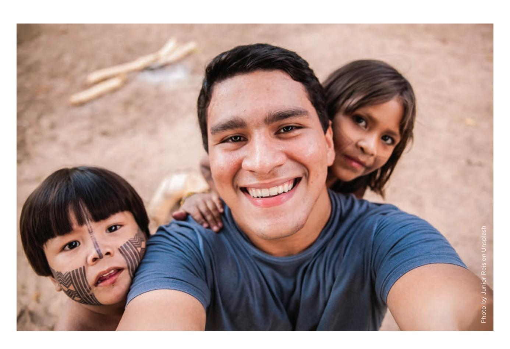

**Figure 5.1: Scalable population measurement of well-being through Twitter**

### **A. PERMA** (Spain) **B. Sentiment/Affect** (Mexico)

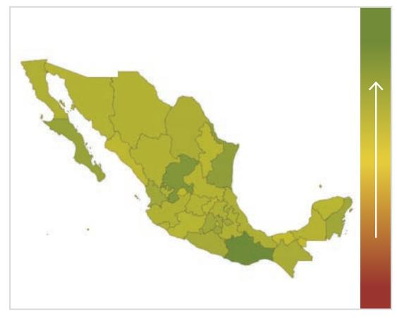

Source: INEGI

### **C. Life Satisfaction** (United States)

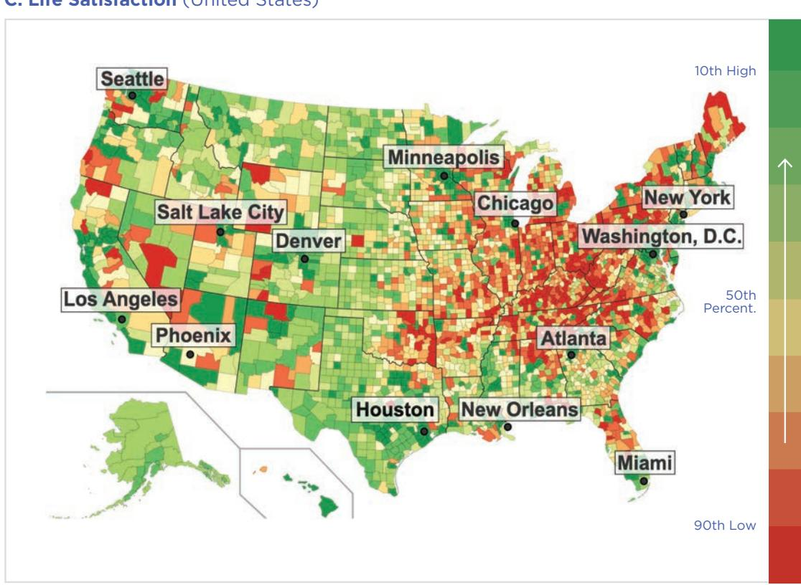

**Figure 5.1:** Scalable population measurement of well-being through Twitter. **A:** in Spain, based on 2015 Twitter data and Spanish well-being language models measuring PERMA: Positive Emotions, Engagement, Relationships, Meaning, and Accomplishment based on custom dictionaries,28 **B:** in Mexico, built on Spanish sentiment models and provided by a web dashboard through Mexico's *Instituto Nacional de Estadística y Geografía*, 29 and **C:** for U.S. counties,30 with interpolation of missing counties provided through a Gaussian process model using demographic and socioeconomic similarity between counties.31

### **The advantages of social media: "retroactive" measurement and multi-construct flexibility**

Social media data have the advantage of being constantly "banked," that is, stored unobtrusively. This means that it can be accessed at a later point in time and analyzed retroactively. This data collection is done, at minimum, by the tech companies themselves (such as Twitter, Facebook, and Reddit), but the data may also be accessible to researchers, such as through Twitter's academic Application Programming Interface (an automatic interface). This means that when unpredictable events occur (e.g., natural disasters or a mass unemployment event), it is not only possible to observe the post-event impact on well-being for a given specific geographic area but, in principle, to derive pre-event baselines retroactively for comparison. While similar comparisons may also be possible with extant well-being survey data, such data are rarely available with high spatial or temporal resolution and are generally limited to a few common constructs (such as *Life Satisfaction*).

Second, language is a natural way for individuals to describe complex mental states, experiences, and desires. Consequently, the richness of social media language data allows for the *retrospective*  estimation of different constructs, extending beyond the set of currently measured well-being dimensions such as positive emotion and life satisfaction. For example, a language-based measurement model (trained today) to estimate the construct of "balance and harmony"32 can be retroactively applied to historical Twitter data to quantify the expression of this construct over the last few years. In this way, social-media-based estimations can complement existing survey-data collections with the potential for flexible coverage of additional constructs for specific regions for present and past periods. This flexibility inherent

*Data sources such as Twitter and Reddit have different selection and presentation biases and are generally noisy, with shifting patterns of language use over time.*

in the social-media-based measurement of well-being may be particularly desirable as the field moves to consider other conceptualizations of well-being beyond the typical Western concepts (such as life satisfaction), as these, too, can be flexibly derived from social media language.33

### **The Evolution of Social Media Well-Being Analyses**

Analyzing social media data is not without challenges. Data sources such as Twitter and Reddit have different selection and presentation biases and are generally noisy, with shifting patterns of language use over time. As data sources, they are relatively new to the scientific community. To realize the potential of social media-based estimation of well-being constructs, it is essential to analyze social media data in a way that maximizes the signal-to-noise ratio. Despite the literature being relatively nascent, the methods for analyzing social media language to assess psychological traits and states are maturing. To date, we have seen evolution along two main axes of development: Data collection/aggregation strategies and language models (see **Table 5.1** for a high-level overview).

*Language is a natural way for individuals to describe complex mental states, experiences, and desires.*

**Table 5.1: Overview of generations of aggregation methods and levels of language models**

| Sampling and data aggregation methods                     | Language models                                                               |
|-----------------------------------------------------------|-------------------------------------------------------------------------------|
| Gen 1: Aggregation of random posts                        | Level 1: Closed vocabulary (curated or word-annotation-based dictionaries) |
| Gen 2: Aggregation across persons                         | Level 2: Open vocabulary (data-driven AI, ML predictions)                  |
| Gen 3: Aggregation across a longitudinal cohort design | Level 3: Contextual representations (large pre-trained language models)    |

**Note:** AI = Artificial Intelligence, ML= Machine Learning. See Table 5.2 for more information about the three generations of data aggregation methods and Table 5.3 for the three levels of language models.

The first axis of development – *data collection and aggregation strategies* – can be categorized into **three generations** which have produced stepwise increases in prediction accuracies and reductions in the impact of sources of error, such as bots (detailed in Table 2):

*Gen 1:* Aggregation of random posts (i.e., treating each communities' posts as unstructured "bags of posts").

*Gen 2:* Person-level sampling and aggregation of posts, with the potential to correct for sample biases (i.e., aggregation across persons).

*Gen 3:* Aggregation across a longitudinal cohort design (i.e., creating digital cohorts in which users are followed over time and temporal trends are described by extrapolating from the changes observed within users).

The second axis of development – *language models*– describes how language is analyzed; that is, how numerical well-being estimates are derived from language. We argue that these *have advanced stepwise,* which we refer to as *Levels* for organizational purposes. These iterations improve the accuracy with which the distribution of language use is mapped onto estimates of well-being (see Table 3 for a detailed overview). The *Levels* have advanced from closed-vocabulary (dictionarybased) methods to machine learning and large language model methods that ingest the whole vocabulary.34 We propose the following three

levels of developmental stages in language models:

*Level 1: Closed-vocabulary* approaches use word-frequency counts that are derived based on defined or crowdsourced (annotation-based) dictionaries, such as for sentiment (e.g., ANEW)35 or word categories (e.g., Linguistic Inquiry and Word Count 2015 or 2022).36

*Level 2: Open-vocabulary* approaches use data-driven machine learning predictions. Here, words, phrases, or topic features (e.g., LDA)37 are extracted and used as inputs in supervised machine learning models, in which language patterns are automatically detected.

*Level 3: Contextual word embedding*  approaches use *large language models* to represent words in their context; so, for example, "down" is represented differently in "*I'm feeling down*" as compared with "*I'm down for it*." Pre-trained models include BERT,38 RoBERTa,39 and BLOOM.40

*Generations* and *Levels* increase the complexity with which data is processed and analyzed – and typically also, as we detail below, the accuracy of the resultant well-being estimates.

### **Addressing social media biases**

The language samples from social media are noisy and can suffer from a variety of biases, and unfamiliar audiences sometimes dismiss social-media-based measurement on these grounds. We discuss them in relation to *selection, sampling,* and *presentation biases*.

**Selection biases** include demographic and sampling biases. *Demographic biases* – i.e., that individuals on social media platforms are not representative of the larger population (refer to Figure 5.2),41 reveal concerns that assessments do not generalize to a population with another demographic structure. Generally, social media platforms differ from the general population; Twitter users, for example, tend to be younger and more educated than the general U.S. population.42 These biases can be addressed in several ways; for example, demographic biases can be addressed by applying post-stratification weights to better match the target population on important demographic variables.43

**Sampling biases** involve concerns that a few accounts generate the majority of content,44 including super-posting social bots, and organizational accounts, which in turn have a disproportionate influence on the estimates. Robust techniques to address these sampling biases, such as person-level aggregation, largely remove the disproportionate impact of superposting accounts.45 It is also possible to identify and remove social bots with high accuracy (see **Box 5.1**).46

*The out-of-sample prediction accuracies of the machine learning models demonstrate empirically that these biases can be handled.*

**Presentation biases** include *self-presentation* (or *impression management*), and *social desirability biases,* and involve concerns that individuals "put on a face" and only present curated aspects of themselves and their life to evoke a positive perception of themselves.47 However, empirical studies indicate that these biases have a limited effect on machine learning algorithms that take the whole vocabulary into account (rather than merely counting keywords). As discussed below, machine- learning-based estimates (*Level 2*) reliably converge with non-social-media assessments, such as aggregated survey responses (out-of-sample convergence above Pearson *r* of .60).48 These estimates thus provide an empirical upper limit on the extent that these biases can influence machine learning algorithms.

Taken together, despite the widespread prima facie concern about selection, sampling, and presentation biases, the out-of-sample prediction accuracies of the machine learning models demonstrate empirically that these biases can be handled49 – as we discuss below.

**Figure 5.2: Use of social media platforms by demographic groups in the US**

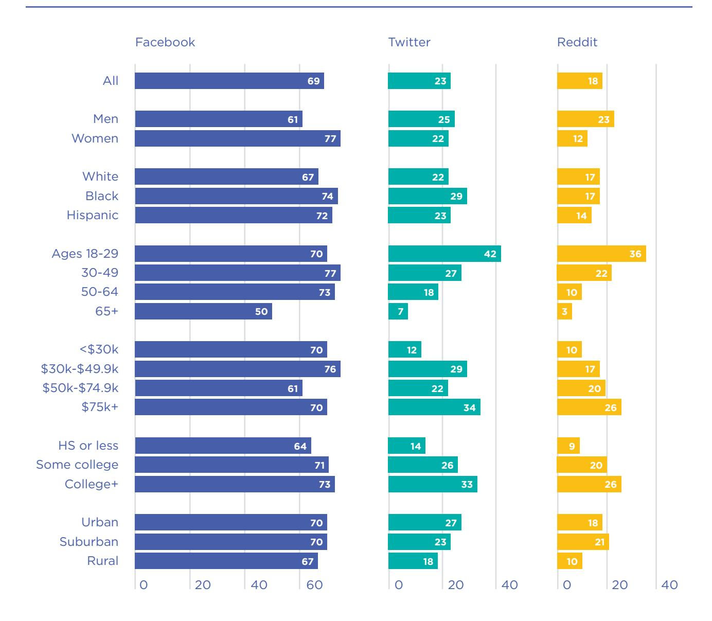

**Figure 5.2.** Percentage of adults using each social media platform within each demographic group.50

**Table 5.2: Advances in data sampling and aggregation methods**

| Data sampling and aggregation method                                                                                                                                                                             | Typical examples                                                                                                                       | Advantages                                                                                                                                                                                                                                    | Disadvantages                                                                                                                                                                                  |  |
|---------------------------------------------------------------------------------------------------------------------------------------------------------------------------------------------------------------------|----------------------------------------------------------------------------------------------------------------------------------------|-----------------------------------------------------------------------------------------------------------------------------------------------------------------------------------------------------------------------------------------------|------------------------------------------------------------------------------------------------------------------------------------------------------------------------------------------------|--|
| Aggregation of Random Sampling of Posts                                                                                                                                                                    | Aggregate posts geographically, extract language features, use machine learning to predict outcomes (cross-sectionally) | Relatively easy to implement (e.g., random Twitter API + sentiment model).                                                                                                                                                           | Suffers from the disproportionate impact of super-posting accounts (e.g., bots). For longitudinal applications: A new random sample of individuals in every temporal period. |  |
| Gen 2: Person-Level Person-level Present Aggregation aggregation51 and (2018–) and Sampling (some with the sample towards a sample bias more representative correction)         |                                                                                                                                        | Addresses the impact of super-posting social media users (e.g., bots). With post-stratification: known sample demographics and correction for sample biases. Increases measurement reliability and external validity. | For longitudinal applica tions: A new random sample of individuals in every temporal period.                                                                                          |  |
| Gen 3: Digital Cohort Robust mental health Near Sampling assessments in time and future (following the space through social same individuals media language analyses.53 over time) |                                                                                                                                        | All of Gen 2 + Increases the temporal stability of estimates. Defined resolution across time and space (e.g., county-months), enables                                                                                          | Higher complexity in collecting person-level time series data (security, data warehousing). Difficult to collect enough data for higher spatiotemporal resolutions           |  |
|                                                                                                                                                                                                                     |                                                                                                                                        | poststratification to adjust sample (e.g., U.S. Census).52                                                                                                                                                                                 | quasi-experimental designs                                                                                                                                                                     |  |

**Table 5.3: Advances in language analysis methods**

| Language | analysis approach                                             | Proto-typical                                                                                                                                                           | Examples                                           | Advantages                                                                                                                                                     | Disadvantages                                                                                                                                                                                                                                                                                                                                             |  |
|----------|---------------------------------------------------------------|-------------------------------------------------------------------------------------------------------------------------------------------------------------------------|----------------------------------------------------|----------------------------------------------------------------------------------------------------------------------------------------------------------------|-----------------------------------------------------------------------------------------------------------------------------------------------------------------------------------------------------------------------------------------------------------------------------------------------------------------------------------------------------------|--|
| Level 1  | Closed vocabulary, or crowdsourced dictionaries      | Word frequency counts are derived based on defined dictionaries such as sentiment or word categories.                                        | LIWC LabMT ANEW                              | Straightforward, easy-to-use software interface (LIWC).                                                                                                  | Top-down approaches typically rely on hand-coded categories defined by researchers. Most words have multiple words senses, which human raters do not anticipate e.g., "I feel great" and "I am in great sorrow."54                                                                                                                   |  |
|          |                                                               |                                                                                                                                                                         | Warriner's ANEW                                 | Good for understanding the same patterns in language use across studies (e.g., use of pronouns).                                                   |                                                                                                                                                                                                                                                                                                                                                           |  |
|          |                                                               |                                                                                                                                                                         |                                                    |                                                                                                                                                                | Dictionaries without weights (like LIWC) may insufficiently capture differences in valence between words (e.g., good vs. fantastic).                                                                                                                                                                                                          |  |
| Level 2  | Open vocabulary, data-driven ML or AI predictions | Words, phrases, or topic features are extracted, filtered (based on [co-] occurrence), and used as inputs for machine learning models. | Words Phrases LDA topic models LSA     | Data-driven, bottom-up, unsupervised methods rely on the statistical patterns of word use (rather than subjective evaluations).                 | Numerical representations do not take context into account. Data-driven units of analysis (such as topics) can be challenging to                                                                                                                                                                                                           |  |
|          |                                                               |                                                                                                                                                                         |                                                    | Words are represented with high precision (not just binary).                                                                                             | compare across studies.                                                                                                                                                                                                                                                                                                                                   |  |
|          |                                                               |                                                                                                                                                                         |                                                    | Topics can naturally appear and provide basic handling of word sense ambiguities.                                                                     |                                                                                                                                                                                                                                                                                                                                                           |  |
| Level 3  | Contextual representations, large language models    | Contextualized word embed dings through self-attention.                                                                                                        | Transformer models: BERT RoBERTa BLOOM | Produces state-of-the art representations of text. Takes context into account. Disambiguates word meaning. Leverages large internet corpora. | Computationally resource intensive (needs GPUs). Semantic biases: transformers models get their representations of text from the structure of the training dataset (corpus) that is used; this involves the risk of reproducing existing biases in the corpus (N.b.: there are methods to examine and reduce these biases). |  |

ML = Machine Learning; LabMT = Language Assessment by Mechanical Turk (LabMT) word list (Dodds et al. (2015); ANEW = Affective Norms for English Words (Bradley & Lang, 1999); LIWC = Linguistic Inquiry and Word Count (Boyd et al. (2022); Pennebaker et al. (2001); Warriner's ANEW – a list with 13915 words (Warriner et al. (2013). LSA = Latent Semantic Analysis (Deerwester et al. (1990); LDA = (Blei et al. (2003); BERT = Bidirectional Encoder Representations from Transformers (Devlin et al. (2019); RoBERTa = Robustly Optimized Bidirectional Encoder Representations from Transformers Pretraining Approach (Y. Liu et al. (2019); BLOOM = BigScience Large Open-science Open-access Multilingual Language Model. GPU = Graphical Processing Units (Graphics Cards)

### **Box 5.1: Effects of bots on social media measurement**

On social media, bots are accounts that automatically generate content, such as for marketing purposes, political messages, and misinformation (fake news). Recent estimates suggest that 8 – 18% of Twitter accounts are bots55 and that these accounts tend to stay active for between 6 months to 2.5 years.56 Historically, bots were used to spread unsolicited content or malware, inflate follower numbers, and generate content via retweets.57 More recently, bots have been found to play a large part in spreading information from lowcredibility sources; for example, targeting individuals with many followers through mentions and replies.58 More sophisticated bots, namely social spambots, are now interacting with and mimicking humans while evading standard detection techniques.59 There is concern that the growing sophistication of generative language models (such as GPT) may lead to a new generation of bots that become increasingly harder to distinguish from human users.

### **How bots impact measurement of well-being using social media**

The content generated by bots should not, of course, influence the assessment of human well-being. While bots compose fewer original tweets than humans, they have been shown to express sentiment and happiness patterns that differ from the human population.60 Applying the person-level aggregation (*Gen 2*) technique effectively limits the bot problem since all their generated content is aggregated into a single "data point." Additional heuristics, such as removing retweets, should minimize the bot problem by removing content from retweet bots. Finally, work has shown that bots exhibit extremely average human-like characteristics, such as estimated age and gender.61 Thus, applying post-stratification techniques downweight bots in the aggregation process since accounts with average demographics will be over-represented in the sample. With modern machine learning systems, bots can be detected and removed.62

### **Generations of sampling and dataaggregation methods**

The following methodological review is organized by generations of data aggregation methods (*Gen 1, 2,* and *3*), which we observed to be the primary methodological choice when working with social media data. But within these generations, the most important distinction in terms of reliability is the transition from dictionary-based (word-level) *Level 1* approaches to those relying on machine learning to train language models (*Level 2*) and beyond.

### *Gen 1***: Random Samples of Social Media Posts**

Initially, a prototypical example of analyzing social media language for population assessments involved simply aggregating posts geographically or temporally – e.g., a random sample of tweets from the U.S. for a given day. In this approach, the aggregation of language is carried out based on a naive sampling of posts – without taking into account the people writing them (see **Fig. 5.3**).

The language analysis was typically done using a *Level 1* closed-vocabulary approach – for example, the LIWC positive emotion dictionary was applied to word counts. Later, *Level 2* approaches have been used with random samples of tweets, such as open-vocabulary approaches based on

### **Figure 5.3**

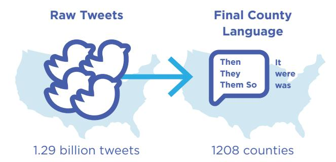

**Figure 5.3.** Example of a *Gen 1* Twitter pipeline: A random collection of tweets is aggregated directly to the county level.

machine learning; this includes using modern sentiment systems or predicting county-level Gallup well-being survey outcomes directly using machine learning cross-sectionally.

### *Gen 1* **with** *Level 1* **dictionary/ annotation-based methods**

**In the U.S.** In 2010, Kramer analyzed 100 million Facebook users' posts using word counts based on the Linguistic Inquiry and Word Count (LIWC) 2007 positive and negative emotions dictionaries (*Gen 1, Level 1*).63 The well-being index was created as the difference between the standardized (z-scored) relative frequencies of the LIWC 2007 positive and negative emotion dictionaries. However, the well-being index of users was only weakly correlated with users' responses to the Satisfaction with life scale,64 a finding that was replicated in later work65 in a sample of more than 24,000 Facebook users.

Surprisingly, SWLS scores and *negative* emotion dictionary frequencies correlated *positively*  across days (*r* = .13), weeks (*r* = .37), and months (*r* = .72), whereas the positive emotion dictionary showed no significant correlation. This presented some early evidence that *using Level 1* closedvocabulary methods (here in the form of LIWC 2007 dictionaries) can yield unreliable and implausible results.

Moving from LIWC dictionaries to crowdsourced annotations of single words, the Hedonometer project (ongoing, https://hedonometer.org/,

**Fig. 5.4A**)66 aims to assess the happiness of Americans on a large scale by analyzing language expressions from Twitter (*Gen 1, Level 1*;

**Fig. 5.4B)**. 67 The words are assigned a happiness score (ranging from 1 = sad to 9 = happy) from a crowdsourced dictionary of 10,000 common words called LabMT ("Language Assessment By Mechanical Turk").68 The LabMT dictionary has been used to show spatial variations in happiness over timescales ranging from hours to years69 – and geospatially across states, cities,70 and neighborhoods71 based on random feeds of tweets.

However, applying the LabMT dictionary to geographically aggregated Twitter language can yield unreliable and implausible results. Some researchers examined spatially high-resolution well-being assessments of neighborhoods in San Diego using the LabMT dictionary72 (see **Fig. 5.4C**). The estimates were, however, *negatively* associated with self-reported mental health at the level of census tracts (and not at all when controlling for neighborhood factors such as demographic variables). Other researchers found additional implausible results; using person-to-county-aggregated Twitter data73 (*Gen 2*), LabMT estimates of 1,208 US counties and Gallup-reported county Life Satisfaction have been observed to anti-correlate, which is further discussed below (see **Fig 5.5**).

**Outside in the U.S.** To date, *Gen 1* approaches have been applied broadly, in different countries, with different languages. In China, it has been

used for assessing positive and negative emotions (e.g., joy, love, anger, and anxiety) on a national level across days, months, and years using blog posts (63,505 blogs from Sina.com by 316 bloggers) from 2008 to 2013 (Gen 1, Level 1).74 A dictionary targeting subjective well-being for Chinese, Ren-CECps-SWB 2.0 was used for this purpose, spanning 17,961 entries. The validation involved examining the face validity of the resulting time series by comparing the highs and lows of the index with national events in China.

In Turkey, sentiment analysis has been applied to 35 million tweets posted between 2013 and 2014 by more than 20,000 individuals (Gen 1, Level 1).75 More than 35 million tweets were analyzed using the Turkish sentiment dictionary "Zemberek".76 However, the index did not significantly correlate with well-being from the province survey results of the Turkish Statistical Institute (see supplementary material for additional international studies).

In general, applying dictionary-based (*Level 1*) approaches to random Twitter samples (*Gen 1*) has been the most common choice across research groups around the world, but results have generally not been validated in the literature beyond the publication of maps time series.

**Figure 5.4**

### **A.**

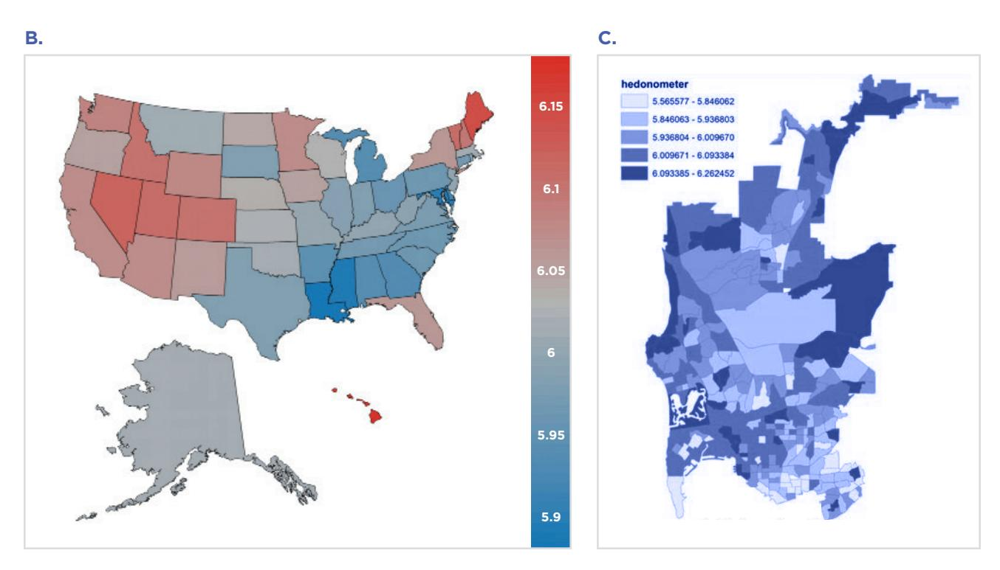

**Figure 5.4.** The Hedonometer measures happiness by analyzing keywords from random Twitter feeds – across **A)** time based on a 10% random Twitter feed,77 **B)** U.S. States.78 This method has also been applied to **C)** Census tracts.79

**Figure 5.5**

|                   |                     | Level 1: Dictionaries |           | Level 2: Machine-Learning Models |                       |                               |                                      |
|-------------------|---------------------|-----------------------|-----------|----------------------------------|-----------------------|-------------------------------|--------------------------------------|
|                   | LIWC 2015           |                       | LabMT     | Swiss Chocolate                  |                       | World Well-Being Project   |                                      |
| Gallup surveys    | Positive Emotion | Negative Emotion   | Happiness | Positive Sentiment            | Negative Sentiment | Life Satisfaction Model | Direct County-Level Prediction |
| Life Satisfaction | 21                  | 32                    | 27        | .24                              | 29                    | .39                           | .62                                  |
| Happiness         | 13                  | 27                    | 07        | .24                              | 30                    | .23                           | .51                                  |
| Sadness           | .25                 | .22                   | .19       | 20                               | .33                   | 23                            | .64                                  |

**Figure 5.5.** Using different kinds ("levels") of language models in the prediction for Gallup-reported county-level Life Satisfaction, Happiness, and Sadness (using a Gen 2: User-level-aggregated 2009-2015 10% Twitter dataset) across 1,208 US counties. *Level 2*-based estimates, such as those based on Swiss Chocolate – a modern Sentiment system derived through machine learning – yield consistent results.80 However, estimates derived through the *Level 1 Linguistic Inquiry and Word Count* (LIWC 2015) *Positive Emotions* dictionary or the word-level annotation-based Language Assessment by Mechanical Turk (labMT) dictionary anti-correlate with the county-level Gallup-reported survey measure for Life Satisfaction.81

### *Gen 1* **using** *Level 2* **machine learning methods**

More advanced language analysis approaches, including *Level 2* (machine learning) and *Level 3* (large language models), have been applied to random Twitter feeds. For example, random tweets aggregated to the U.S. county level were used to predict life satisfaction (*r* = .31; 1,293 counties)82 and heart disease mortality rates (*r* = .42, 95% CI = [.38, .45]; 1,347 counties; Gen 1, Level 1–2)83; in these studies, machine learning models were applied to open-vocabulary words, phrases, and topics (see supplementary material for social media estimates with a spatial resolution below the county level).

In addition, researchers have used text data from discussion forums at a large online newspaper (Der Standard) and Twitter language to capture the temporal dynamics of individuals' moods.84 Readers of the newspaper (*N* = 268,128 responses) were asked to rate their mood of the preceding day (response format: "good," "somewhat good," "somewhat bad," or "bad"), which were aggregated to the national level (Gen 1, Level 1 and 3).85

Language analyses based on a combination of *Level 1* (German adaptation of LIWC 2001)86 and *Level 3* (German Sentiment, based on contextual embeddings, BERT) yielded high agreement across days with the aggregated *Der Standard*  self-reports over 20 days (*r* =.93 [.82, .97]). Similarly, in a preregistered replication, estimates from Twitter language (more than 500,000 tweets by Austrian Twitter users) correlated with the same daily-aggregated self-reported mood at *r* = .63 (.26, .84).

### *Gen 1:* **Random post aggregation - Summary**

To aggregate random tweets directly into geographic estimates is intuitively straightforward and relatively easy to implement; and it has been used for over a decade (2010+). However, it is susceptible to many types of noise, such as changing sample composition over time, inconsistent posting patterns, and the disproportionate impact of super-posting accounts (e.g., bots, see **Box 5.1**), which may decrease measurement accuracy.

### *Gen 2***: Person-Level Sampling of Twitter Feeds**

Measurement accuracies can be increased substantively by improving the sampling and aggregation methods, especially by aggregating tweets first to the person level. Person-level sampling addresses the disproportionate impact that a small number of highly active accounts can have on geographic estimates. In addition to person-level sampling, demographic person characteristics (such as age and gender) can be estimated through language, and on their basis, post-stratification weights can be determined, which is similar to the methods used in representative phone surveys (see **Fig. 5.6** for a method sketch). This approach shows remarkable improvements in accuracy (see **Fig. 5.7**).

### *Gen 2* **with** *Level 1* **dictionary/ annotation-based methods**

One of the earliest examples of *Gen 2* evaluated the predictive accuracy of community-level language (as measured with *Level 1* dictionaries such as LIWC) across 27 health-related outcomes, such as obesity and mentally unhealthy days.87 Importantly, this work evaluated several aggregation methods, including random samples of posts (*Gen 1* methods) and a person-focused approach (*Gen 2*). This person-focused aggregation significantly outperformed (in terms of out-ofsample predictive accuracy) the *Gen 1* aggregation methods with an accuracy (average Pearson *r* across all 27 health outcomes) of .59 for *Gen 1* vs. .63 for *Gen 2*.

### *Gen 2* **using** *Level 2* **machine learning methods**

**User-level aggregation.** Some researchers have proposed a *Level 2* person-centered approach, which first measures word frequencies at the person-level and then averages those frequencies to the county-level, effectively yielding a county language average across users.88 Furthermore, through sensitivity analyses, this work calibrated minimum thresholds on both the number of tweets needed per person (30 tweets or more) and the number of people needed per county to produce stable county-level language estimates

(at least 100 people), which are standard techniques in geo-spatial analysis.89 Across several prediction tasks, including estimating life satisfaction, the *Gen 2* outperformed *Gen 1* approaches, as seen in **Fig. 5.7**. Additional work has shown that *Gen 2* language estimates show how external validity (e.g., language estimates of county-level personality correlate with surveybased measures) and are robust to spatial autocorrelations (i.e., county correlations are not an artifact of, or dependent on, the physical spatial nature of the data).90

**Correction for representativeness.** One common limitation with work on social media text is selection bias – the social media sample is not representative of the population from which we would like to infer additional information. The person-centered approach has also been expanded to consider *who* uses social media relative to their respective community. When using state-of-the-art machine learning approaches, sociodemographics (such as age, gender, income, and education) can be estimated for each Twitter user from their social media language, thus allowing for the measurement of the sociodemographic makeup of the sample.91 Comparing the sociodemographic distribution of the sample to the population's distribution gives a measure of Twitter users' degree of over- or under-presentation. This comparison can be used to reweight each user's language estimate in the county-aggregation process using post-stratification techniques commonly used in demography and public health.92 Applying these reweighting techniques to closed vocabulary (e.g., LIWC dictionaries, *Level 1*)93 and open-vocabulary features (e.g., LDA topics, *Level 2*)94 increased predictive accuracy above that of previous *Gen 2* methods (see **Fig. 5.7, top**).

*The person-centered approach has also been expanded to consider who uses social media relative to their respective community.*

**Averaging across genders.** In chapter 4 of the *World Happiness Report 2022 (WHR 2022)*, the authors95 report results from a study that assessed emotions, including *happy/joy/positive affect*, *sadness*, and *fear/anxiety/scared* over two years in the U.K. Prior work has found demographics like gender and age to impact patterns in language use more than personality and are thus important confounding variables to consider when analyzing language use.96 The authors in chapter 4 of the *WHR 2022*, 97 separately derived (and then combined) gender-specific estimates from Twitter data using both *Level 1* (LIWC) and *Level 3* (contextualized word embeddings; RoBERTa) approaches.98 Twitter-estimated joy correlated at *r* = .55 [.27, .75] with YouGov reported happiness over eight months from November 2020 to June 2021.

over time (*Gen 3*). *Person-level aggregation can down-weight highly active accounts and minimize the influences of bots.*

### *Gen 2* **person-level aggregation – Summary**

Person-level *Gen 2* methods are built on a decade of research using *Gen 1* random feed aggregation methods based on the (in hindsight obvious) intuition that communities are groups of people who produce language rather than a random assortment of tweets. This intuition has several methodological advantages. First, person-level aggregation treats each person as a single observation, which can down-weight highly active accounts and minimize the influences of bots or organizations. Second, it paves the way for addressing selection biases as one can now weight each person in the sample according to their representativeness in the population. Furthermore, these methods can be applied to any digital data. Finally, these methods more closely reflect the methodological approaches in demography and public health that survey *people* and lay the foundation for tracking digital cohorts

**Figure 5.6** 

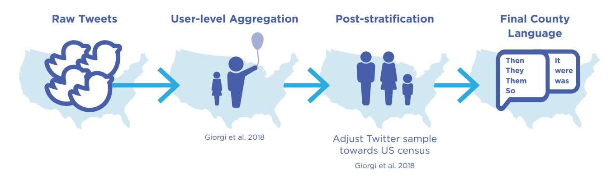

**Figure 5.6.** Example of a *Gen 2* Twitter pipeline: Person-level aggregation and post-stratification.

**Figure 5.7: Twitter Prediction of U.S. County Life Satisfaction**

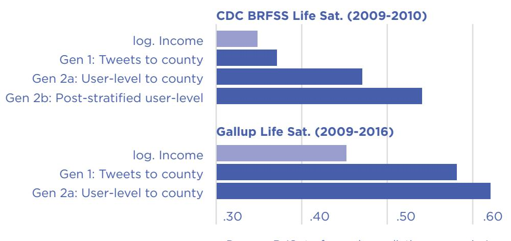

Pearson R (Out-of-sample prediction accuracies)

**Figure 5.7**. Cross-sectional Twitter-based county-level cross-validated prediction performances using (*Gen 1*) direct aggregation of tweets to counties, *Gen 2a*: person-level aggregation before county aggregation, and *Gen 2b:* robust post-stratification based on age, gender, income, and education.99 Life satisfaction values were obtained from: **Top,** the CDC's Behavioral Risk Factor Surveillance System (BRFSS) estimates (2009 to 2010, N = 1,951 counties)100; **Bottom:** the Gallup-Sharecare Well-Being Index (2009-2016, N = 1,208 counties).101 Twitter data was the same in both cases, spanning a random 10% sample of Twitter collected from 2009- 2015.102 Publicly released here. https://github.com/wwbp/county\_tweet\_lexical\_bank.

### *Gen 3***: Digital Cohort Sampling – the Future of Longitudinal Measurement**

Most of the work discussed thus far has been constrained to cross-sectional, between-community analysis, but social media offers high-resolution measurement over time at a level that is not practically feasible with survey-based methods (e.g., the potential for daily measurement at the community level). This abundance of time-specific psychological signals has motivated much prior work. In fact, a lot of early work using social media text datasets focused heavily on longitudinal analyses, ranging from predicting stock market indices using sentiment and mood lexicons (Gen 1, Level 1)103 to evaluating the temporal diurnal variation of positive and negative affect *within* individuals expressed in Twitter feeds (*Gen 1, Level 1*).104 For example, some analyses showed that individuals tend to wake up with a positive mood that decreases over the day.105

This early work on longitudinal measurement seemed to fade after one of the most iconic projects, Google Flu Trends (*Gen 1, Level 1*),106 began to produce strikingly erroneous results.107 Google Flu Trends monitored search queries for keywords associated with the flu; this approach could detect a flu outbreak up to a week ahead of the Center for Disease Control and Prevention's (CDC's) reports. While the CDC traditionally detected flu outbreaks from healthcare provider intake counts; Google sought to detect the flu from something people often do much earlier when they fall sick – google their symptoms.

However, Google Flu Trends had a critical flaw – it could not fully consider the context of language;108 for example, it could not distinguish symptom discussions because of concerns around the bird flu from that of describing one's own symptoms. This came to a head in 2013 when its estimates turned out to be nearly double those from the health systems.109 In short, this approach was susceptible to these kinds of noisy influences partly because it relied on random time series analyzed primarily with dictionary-based (keyword) approaches (*Gen 1* and *Level 1*).

After the errors of Google Flu Trends were revealed, interest at large subsided, but research within

Natural Language Processing began to address this flaw, drawing on machine learning methods (*Level 2* and *3*). For infectious diseases, researchers have shown that topic modeling techniques could distinguish mentions of one's symptoms from other medical discussions.110 For well-being, as previously discussed, techniques have moved beyond using lists of words assumed to signify well-being (by experts or annotators; *Level 1*) to estimates relying on machine learning techniques to empirically link words to accepted well-being outcomes (often cross-validated out-of-sample; *Level 2*).111 Most recently, large language models such as (contextualized word embeddings, RoBERTa) have been used to distinguish the context of words (*Level 3*).112 Here, we discuss what we believe will be the third generation of methods that take the person-level sampling and selection bias correction of *Gen 2* and combine them with longitudinal sampling and study designs.

### **Pioneering digital cohort samples**

Preliminary results from ongoing research demonstrate the potential of longitudinal *digital cohort sampling* (**Fig. 5.8**). This takes a step beyond user-level sampling while enabling tracking variance in well-being outcomes across time: Changes in well-being are estimated as the aggregate of the within-person changes observed in the sample. Digital cohort sampling presents several new opportunities. Changes in well-being and mental health can be assessed at both the individual and (surrounding) group level, opening the door to studying their interaction. Further, short-term (weekly) and long-term patterns (changes on multi-year time scales) can be discovered. Finally, the longitudinal design unlocks quasi-experimental designs, such as difference-in-difference, instrumental variable or regression discontinuity designs. For example,

*Short-term (weekly) and long-term patterns (changes on multi-year time scales) can be discovered.*

Figure 5.8

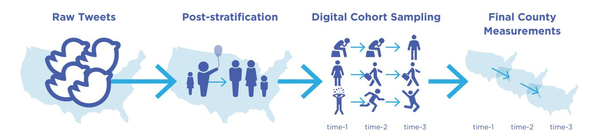

Figure 5.8. Example of a Gen 3 Twitter pipeline: longitudinal digital cohorts compose spatial units.

Figure 5.9

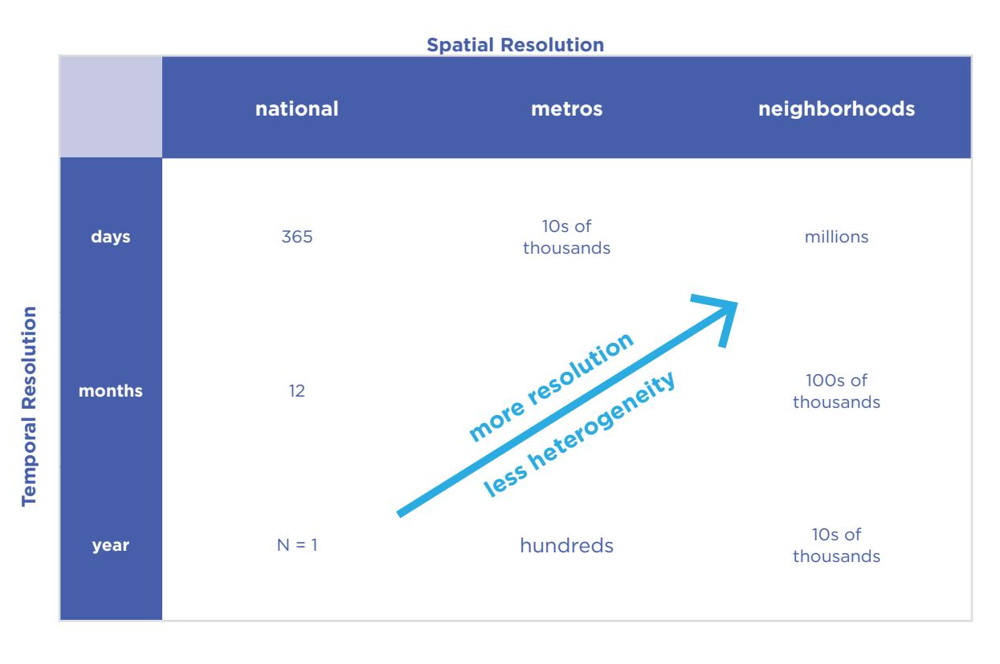

Figure 5.9. The number of measurement data points produced as a function of different choices of temporal and spatial resolution in digital cohort design studies (Gen 3).

trends in socioeconomically matched counties can be compared to study the impact of specific events, such as pandemic lockdowns, large-scale unemployment, or natural disasters.

**The choice of spatiotemporal resolution.** Social media data is particularly suitable for longitudinal designs since many people frequently engage with social media. For example, in the U.S., 38% of respondents reported interacting with others "once per day or more" through one of the top five social media platforms (this ranges from 19% in India to 59% in Brazil across seven countries).113 Even in research studies conducted by university research labs, sample sizes of more than 1% of the U.S. population are feasible (e.g., the County-Tweet Lexical Bank with 6.1 million Twitter users).114 In principle, such an abundance of data allows for high resolution in both space and time, such as estimates for county–weeks (see **Fig. 5.9**). The higher resolution can provide economists and policymakers with more fine-grained, reliable

information that can be used for evaluating the impact of policies within a quasi-experimental framework.

**Enabling data linkage.** Estimates at the countymonth level also appear to be well-suited for data linkage with the population surveillance projects in population health (for example, the Office of National Drug Control Policy's [ONDCP] Non-Fatal Opioid Overdose Tracker) and serve as suitable predictors of sensitive time-varying health outcomes, such as county-level changes in rates of low birth weights. The principled and stabilized estimation of county-level time series opens the door for social-media-based measurements to be integrated with the larger ecosystem of datasets designed to capture health and well-being.

### **Forthcoming work: Well-being and mental health assessment in time and space**

Studies employing digital cohorts have only recently emerged (i.e., preliminary studies in preprints) related to tracking the opioid epidemic from social media. For example, some researchers (*Gen 3, Level 1*) use Reddit forum data to identify and follow more than 1.5 million individuals geolocated to a state and city to test relationships between discussion topics and changes in opioid mortality rate.115 Similarly, other researchers (*Gen 3, Level 2*) tracks opioid rates of a cohort of counties to predict *future* changes in opioid mortality rates. Albeit utilizing coarse-grained temporal resolutions (i.e., annual estimates), these works lay a foundation of within-person and within-community cohort designs that can be mirrored for well-being monitoring at scale.116

The field is on the verge of combining *Gen 3* sampling and aggregation with *Level 3* contextualized embedding-based language analyses (*Gen 3, Level 3*), which will provide state-of-theart resolutions and accuracies.

### **Gen 3 digital cohort designs – Summary and Limitations**

The digital cohort approach comes with the advantages of the person-level approaches, as well as increased methodological design control and temporal stability of estimates, including improved measurement resolution across time and space (e.g., county–months). As such, it unlocks the control needed for quasi-experimental designs. However, disadvantages include higher complexity in collecting and analyzing person-level time series data (including the need for higher security and data warehousing). It may also be challenging to collect enough data for higher spatiotemporal resolutions (e.g., resolutions down to the county-day).

### **Summary and Future Directions**

### **A full methodological toolkit to address biases and provide accurate measurement**

Regarding the question of self-presentation biases, while they can lead keyword-based dictionary methods astray (*Level 1*; as discussed in the section Addressing Social Media Biases), research indicates that these biases have less impact on machine learning algorithms fit to representative samples (*Level 2*) that consider the entire vocabulary to learn language associations, rather than just considering pre-selected keywords out of context (**Fig. 5.5**).117 Instead of relying on assumptions about how words relate to well-being (which is perilous due to most words having many senses, and words generally only conveying their full meaning in context),118 *Level 2* open-vocabulary and machine-learning methods derive relations between language and well-being statistically. Machine-learning-based social media estimates can show strong agreement with assessments from extra-linguistic sources, such as survey responses, and demonstrate that, at least to machine-learning models, language use is robustly related to well-being.119

Person-level approaches (*Gen 2*) take large steps towards addressing the problems of the potential influence of social media bots. The person-level aggregation facilitates the reliable identification and removal of bots from the dataset. This reduces their influence on the estimates.120 Further, the post-stratified person-level-aggregation methods address the problem that selection biases dominate social media analysis. There is an important

difference between non-representative data and somebody not being represented in the data "at all" (i.e., every group may be represented, but they are relatively under- or over-represented) – using robust post-stratification methods can correct non-representative data towards representativeness (as long as demographic strata are sufficiently represented in the data). Lastly, the digital cohort design (*Gen 3*) overcomes the shortcomings of data aggregation strategies that rely on random samples of tweets from changing samples of users. Instead, ongoing research shows the possibility of following a well-characterized sample over time and "sampling" from it through unobtrusive social media data collection. This approach opens the door to the toolkit of quasi-experimental methods and to meaningful data linkage with other fine-grained population monitoring efforts in population health.

### **Limitations: Language evolves in space and time**

**Regional semantic variation.** One challenge of using language across geographic regions and time periods is that words (and their various senses) vary with location and time. Geographic and temporal predictions pose different difficulties: Geographically, some words express subcultural differences (e.g., "jazz" tends to refer to music, but in Utah, it often refers to the Utah Jazz basketball team). Some words are also used in ways that are temporally dependent (e.g., happy is, for example, frequently invoked in Happy New Year, which is a speech act with high frequency – on January 1st, while at other times, it may refer to an emotion or evaluation/judgment (e.g., "happy about," "a happy life"). Language use is also demographically dependent ("sick" means different things among youths and older adults). While Level 3 approaches (contextual word embeddings) can typically disambiguate word senses, there are also examples where Level 2 methods (data-driven topics) have been successfully used to model regional lexical variation.121 It is important to examine the covariance structure of the most influential words in language models with markers of cultural and socioeconomic gradients.122

**Semantic drift (over time).** Words in natural languages are also subject to drifts in meaning over time as they adapt to the requirements of people and their surroundings.123 It is possible to document semantic drift using machine learning techniques acting over the span of 5-10 years.124 Because of semantic drift, machine learning models are not permanently stable and thus may require updating (retraining or "finetuning") every decade as culture and language use evolve.

### **Limitations: Changes in the Twitter platform**

**An uncertain future of Twitter under Musk.** The accessibility of social media data may change across platforms. For example, after buying and taking over Twitter at the end of 2022, Elon Musk is changing how Twitter operates. Future access to Twitter interfaces (APIs) presents the biggest risk to Twitter for research, as these may only become accessible subject to high fees, with pricing for academic use currently uncertain. There are also potentially unknown changes in the sample composition of Twitter post-November 2022, as users may be leaving Twitter in protest (and entering it in accordance with perceived political preference). In addition, changes in user interface features (e.g., future mandatory verification) may change the type of conversations taking place and sample composition. Different account/post status levels (paid, verified, unverified) may differentiate the reach and impact of tweets, which will have to be considered; thus, temporal models may likely have to account for sample/ platform changes.

### **A history of undocumented platform changes.**

This is a new twist on prior observations that the nature of the random sample and language composition of Twitter has changed discontinuously in ways that Twitter has historically not documented and only careful analysis could reveal.125 For example, it has been shown that changes in Twitter's processing of tweets have resulted in corrupted time series of language frequencies (i.e., word frequencies show abrupt changes not reflecting actual changes in language use but merely changes in processing – such as different applications of language filters in the background).126 These corrupted time series are not documented by Twitter and may skew research. To some extent, such inconsistencies

can be addressed by identifying and removing time series of particular words, but also through the more careful initial aggregation of language into users. Methods relying on the random aggregation of tweets may be particularly exposed to these inconsistencies, while the use of person-level and cohort designs (*Gen 2* and *3*) that rely on well-characterized samples of specific users may likely prove to be more robust.

### **Future directions: Beyond social media and across cultures**

**Data beyond social media.** A common concern for well-being assessments derived from social media language analyses is that *people may fall silent on social media or migrate to other social media platforms.* It is hard to imagine that social media usage will disappear, although there will be challenges with gathering data while preserving privacy. In addition, work suggests that other forms of communication may also be used. For example, individuals' text messages can be used to assess both self-reported depression127 and suicide risk128; and online discussion forums at a newspaper can be used to assess mood.129 The limiting factor for these analyses is often how much data is easily accessible, public-by-default social media platforms such as Twitter and Reddit generate data that is considered in the public domain. This is particularly easy to collect at scale without consenting individual subjects.

**Measurement beyond English.** Beyond these difficulties within the same language, more research is needed in cross-cultural and crosslanguage comparisons. Most research on social media and well-being is carried out on single-language data, predominantly in English. A recent meta-analysis identified 45 studies using social media to assess well-being, with 42 studying a single language, with English being the most common (*n* = 30);130 To improve the potential of comparisons across languages, more research is needed to understand how this may be done. One potential breakthrough in this domain may be provided by the recent evolution of large multi-language models,131 which provide shared representations in multiple common languages and, in principle, may allow for the simultaneous

measurement of well-being in multiple languages based on limited training data to "fine-tune" these models. Beyond measurement, research is also needed on how social media is used differently across cultures. For example, research indicates that individuals tend to generate content on social media that is in accordance with the ideal affect of their culture.132

We are beginning to see the use of social mediabased indicators in policy contexts. Foremost among them, the Mexican Instituto Nacional de Estadística y Geografía (INEGI) has shown tremendous leadership in developing Twitter-based well-being measurements for Mexican regions.

**Well-being across cultures.** Beyond cross-cultural differences in social media use, as the field is considering a generation of measurement instruments beyond self-report, it is essential to carefully reconsider the assumptions inherent in the choice of measured well-being constructs. Cultures differ in how well-being—or the good life more generally—is understood and conceptualized.133 One of the potential advantages of language-based measurement of the good life is that many aspects of it can be measured through fine-tuned language models. In principle, language can measure harmony, justice, a sense of equality, and other aspects that cultures around the world value.

### **Ethical considerations**

The analysis of social media data requires careful handling of privacy concerns. Key considerations include maintaining the confidentiality and privacy of individuals, which generally involves de-identifying and removing sensitive information automatically. This work is overseen and approved by institutional review boards (IRBs). When data collection at the individual level is part of the study design – for example, when collecting language data from a sample of social media users who have taken a survey to train a language model – obtaining IRB-approved informed consent from these study participants is always required. While a comprehensive discussion on all relevant ethical considerations is beyond the scope of this chapter, we encourage the reader to consult reviews of ethical considerations.134

*It is our hope that more research groups and institutions use these methods to develop well-being indicators around the world.*

### **Conclusion and outlook**

The approaches for assessing well-being from social media language are maturing: Methods to aggregate and sample social media data have become increasingly sophisticated as they have evolved from the analysis of random feeds (*Gen 1*) to the analyses of demographically-characterized samples of users (*Gen 2*) to digital cohort studies (*Gen 3*). Language analysis approaches have become more accurate at representing and summarizing the extent to which language captures well-being constructs – from counting lists of dictionary keywords (*Level 1*) to relying on robust language associations learned from the data (*Level 2*) to the new generation of large language models that consider words within contexts (*Level 3*).

**The potential for global measurement.** Together, these advances have resulted in both increased measurement accuracy and the potential for more advanced quasi-experimental research designs. As always with big data methods – "data is king" – the more social media data that is being collected and analyzed, the more accurate and fine-grained these estimates can be. After a decade of the field developing methodological foundations, the vast majority of which are open-source and in the public domain, it is our hope that more research groups and institutions use these methods to develop well-being indicators around the world, especially in languages other than English, drawing on additional kinds of social media, and outside of the US. It is through such a joint effort that social-media-based estimation of well-being may mature into a cost-effective, accurate, and robust complement to traditional indicators of well-being.

### **Endnotes**

- Giorgi et al. (2018)
- Giorgi et al. (2022); Jaidka et al. (2020)
- Jaidka et al. (2020)
- Yaden et al. (2022); Zamani et al. (2018)
- Jaidka et al. (2020; Metzler et al. (2022
- Giorgi et al. (2022); Jaidka et al. (2020)
- 7 INEGI, 2022, https://www.inegi.org.mx/app/ animotuitero/#/app/map
- U.N. (2016)
- 9 Global Partnership for Sustainable Development Data et al. (2022)
- 10 e.g., see the *World Happiness Report 2019*, Chapter 6, Frijters & Bellet (2019)
- Silver et al. (2019)
- De Choudhury et al. (2013); Seabrook et al. (2018)
- Jose et al. (2022)
- Paul & Dredze, (2011); Paul & Dredze (2012)
- Alessa & Faezipour (2018)
- Chew & Eysenbach (2010)
- Culotta (2014a)
- Eichstaedt et al. (2015)
- Boyd et al. (2022)
- e.g., Mohammad et al. (2018)
- Luhmann (2017, *p*. 28)
- Sametoglu et al. (2022)
- Jaidka et al. (2020)
- Jaidka et al. (2020); Schwartz et al. (2016)
- Smith et al. (2016)
- INEGI (2022)
- Jaidka et al. (2020)
- Forgeard et al. (2011); Smith et al. (2016)
- INEGI (2022)
- Jaidka et al. (2020)
- 31 Giorgi et al. in revision; see supplementary material for information on spatial interpolation.
- 32 see *World Happiness Report 2022*, Chapter 6; Lomas et al. (2022)
- Flanagan et al. (2023)
- 34 as previously discussed in *WHR 2022*, Chapter 4; Metzler, Pellert & Garcia (2022); see also Jaidka, et al. (2020)
- Bradley & Lang (1999)
- Boyd et al. (2022)
- Blei et al. (2003)
- Devlin et al. (2019)

- Y. Liu et al. (2019)
- Scao et al. (2022)
- Auxier & Anderson (2021)
- Auxier & Anderson (2021)
- Giorgi et al. (2022)
- Wojcik & Hughes (2019)
- Giorgi et al. (2018)
- Giorgi et al. (2021)
- Hogan (2010)
- see Jaidka et al. (2020)
- e.g., Jaidka et al. (2020)
- adapted from Auxier & Anderson (2021)
- Giorgi et al. (2018)
- Giorgi et al. (2022)
- Mangalik et al. (2023)
- Schwartz, Eichstaedt, Blanco, et al. (2013)
- Fukuda et al. (2022)
- Elmas et al. (2022)
- Ferrara et al. (2016)
- Shao et al. (2018)
- Cresci et al. (2017)
- Davis et al. (2016)
- Giorgi et al. (2021)
- Davis et al. (2016)
- Kramer (2010)
- SWLS; Diener et al. (1985)
- N. Wang et al. (2014)
- Hedonometer (2022)
- Dodds et al. (2011); Mitchell et al. (2013)
- Dodds et al. (2011)
- Dodds et al. (2011)
- Mitchell et al. (2013)
- Gibbons et al. (2019)
- Gibbons et al. (2019)
- Jaidka et al. (2020)
- Qi et al. (2015)
- Durahim & Coskun (2015)
- Vural et al. (2013)
- From https://hedonometer.org/, see also Dodds et al. (2011)
- Mitchell et al. (2013)
- Gibbons et al. (2019)
- see Jaidka et al. (2020) for a full discussion

- 81 Sources and references: LIWC 2015 (Pennebaker et al. (2015); LabMT (Dodds et al. (2011); Swiss Chocolate (Jaggi et al. (2014); World Well-Being Project Life Satisfaction model and direct prediction (Jaidka et al. (2020).
- Schwartz, Eichstaedt, Kern, et al. (2013)
- Eichstaedt et al. (2015)
- Pellert et al. (2022)
- Pellert et al. (2022)
- Wolf et al. (2008)
- Culotta (2014a, 2014b)
- Giorgi et al. (2018)
- Ebert et al. (2022)
- Giorgi et al. (2022)
- Giorgi et al. (2022); Z. Wang et al. (2019)
- Little (1993)
- Culotta (2014b); Jaidka et al. (2020)
- Giorgi et al. (2022)
- Metzler et al. (2022)
- Eichstaedt et al. (2021)
- Metzler et al. (2022)
- Metzler et al. (2022)
- Giorgi et al. (2022)
- 100Giorgi et al. (2022)
- Jaidka et al. (2020)
- 102 Publicly released here: https://github.com/wwbp/ county\_tweet\_lexical\_bank).
- Bollen et al. (2011)
- Golder & Macy (2011)
- Golder and Macy (2011)
- Ginsberg et al. (2009); Santillana et al. (2014)
- Butler (2013); Lazer et al. (2014)
- Butler (2013)
- Lazer et al. (2014)
- Paul & Dredze (2014)
- Jaidka et al. (2020)
- e.g., Garcia et al. (2022)
- Gallup & Meta (2022, *p*.18)
- Giorgi et al. (2018)
- Lavertu et al. (2021) preprint
- Matero et al. (2022)
- e.g., see Jaidka et al. (2020)
- 118 see Jaidka et al. (2020); and Schwartz, Eichstaedt, Blanco, et al. (2013)
- Jaidka et al. (2020)
- e.g., see Giorgi et al. (2021)

- 121 Eisenstein et al. (2010); see supplementary material formore information
- 122 See Jaidka et al. (2020); Eichstaedt et al. (2021); Schwartz, Eichstaedt, Blanco, et al. (2013) for a fuller discussion
- Jaidka et al. (2018)
- Jaidka et al. (2018)
- Dodds et al. (2020)
- Dodds et al. (2020)
- T. Liu et al. (2022)
- Glenn et al. (2020)
- Pellert et al. (2022)
- Sametoglu et al. (2022)
- DeLucia et al. (2022)
- Hsu et al. (2021)
- see Flanagan et al. (2023) for a review
- 134 We encourage the reader to see Benton et al. (2017); Shah et al. (2020) and Townsend and Wallace (2017)

### **References**

Alessa, A., & Faezipour, M. (2018). A review of influenza detection and prediction through social networking sites. *Theoretical Biology and Medical Modelling*, *15*(1), 1–27.

Auxier, B., & Anderson, M. (2021). Social media use in 2021. *Pew Research Center*, *1*, 1–4.

Bellet, C., & Frijters, P. (2019). Big data and well-being. *World Happiness Report 2019*. 2019, 97-122.

Benton, A., Coppersmith, G., & Dredze, M. (2017). Ethical research protocols for social media health research. *Proceedings of the First ACL Workshop on Ethics in Natural Language Processing*, 94–102.

Blei, D. M., Ng, A. Y., & Jordan, M. I. (2003). Latent dirichlet allocation. *Journal of Machine Learning Research*, *3*(Jan), 993–1022.

Bollen, J., Mao, H., & Zeng, X. (2011). Twitter mood predicts the stock market. *Journal of Computational Science*, *2*(1), 1–8.

Boyd, R. L., Ashokkumar, A., Seraj, S., & Pennebaker, J. W. (2022). The development and psychometric properties of LIWC-22. *Austin, TX: University of Texas at Austin*.

Bradley, M. M., & Lang, P. J. (1999). *Affective norms for English words (ANEW): Instruction manual and affective ratings*. Technical Report C-1, The Center for Research in Psychophysiology, University of Florida.

Butler, D. (2013). When Google got flu wrong. *Nature*, *494*(7436), Article 7436. https://doi.org/10.1038/494155a

Chew, C., & Eysenbach, G. (2010). Pandemics in the age of Twitter: Content analysis of Tweets during the 2009 H1N1 outbreak. *PloS One*, *5*(11), e14118.

Cresci, S., Di Pietro, R., Petrocchi, M., Spognardi, A., & Tesconi, M. (2017). The paradigm-shift of social spambots: Evidence, theories, and tools for the arms race. *Proceedings of the 26th International Conference on World Wide Web Companion*, 963–972.

Culotta, A. (2014a). Estimating county health statistics with Twitter. *Proceedings of the SIGCHI Conference on Human Factors in Computing Systems*, 1335–1344.

Culotta, A. (2014b). Reducing sampling bias in social media data for county health inference. *Joint Statistical Meetings Proceedings*, 1–12.

Davis, C. A., Varol, O., Ferrara, E., Flammini, A., & Menczer, F. (2016). Botornot: A system to evaluate social bots. *Proceedings of the 25th International Conference Companion on World Wide Web*, 273–274.

De Choudhury, M., Counts, S., & Horvitz, E. (2013). Social media as a measurement tool of depression in populations. *Proceedings of the 5th Annual ACM Web Science Conference*, 47–56.

Deerwester, S., Dumais, S. T., Furnas, G. W., Landauer, T. K., & Harshman, R. (1990). Indexing by latent semantic analysis. *Journal of the American Society for Information Science*, *41*(6), 391.

DeLucia, A., Wu, S., Mueller, A., Aguirre, C., Resnik, P., & Dredze, M. (2022). *Bernice: A Multilingual Pre-trained Encoder for Twitter*. 6191–6205. https://aclanthology.org/2022. emnlp-main.415

Devlin, J., Chang, M.-W., Lee, K., & Toutanova, K. (2019). BERT: Pre-training of Deep Bidirectional Transformers for Language Understanding. *Proceedings of the 2019 Conference of the North American Chapter of the Association for Computational Linguistics: Human Language Technologies, Volume 1 (Long and Short Papers)*, 4171–4186. https://doi.org/10.18653/v1/N19-1423

Dodds, P. S., Clark, E. M., Desu, S., Frank, M. R., Reagan, A. J., Williams, J. R., Mitchell, L., Harris, K. D., Kloumann, I. M., & Bagrow, J. P. (2015). Human language reveals a universal positivity bias. *Proceedings of the National Academy of Sciences*, *112*(8), 2389–2394.

Dodds, P. S., Harris, K. D., Kloumann, I. M., Bliss, C. A., & Danforth, C. M. (2011). Temporal patterns of happiness and information in a global social network: Hedonometrics and Twitter. *PloS One*, *6*(12), e26752.

Dodds, P. S., Minot, J. R., Arnold, M. V., Alshaabi, T., Adams, J. L., Dewhurst, D. R., Reagan, A. J., & Danforth, C. M. (2020). Long-term word frequency dynamics derived from Twitter are corrupted: A bespoke approach to detecting and removing pathologies in ensembles of time series. *ArXiv Preprint ArXiv:2008.11305*.

Durahim, A. O., & Coskun, M. (2015). # iamhappybecause: Gross National Happiness through Twitter analysis and big data. *Technological Forecasting and Social Change*, *99*, 92–105.

Ebert, T., Götz, F. M., Mewes, L., & Rentfrow, P. J. (2022). Spatial analysis for psychologists: How to use individual-level data for research at the geographically aggregated level. *Psychological Methods*.

Eichstaedt, J. C., Schwartz, H. A., Kern, M. L., Park, G., Labarthe, D. R., Merchant, R. M., Jha, S., Agrawal, M., Dziurzynski, L. A., & Sap, M. (2015). Psychological language on Twitter predicts county-level heart disease mortality. *Psychological Science*, *26*(2), 159–169.

Elmas, T., Overdorf, R., & Aberer, K. (2022). Characterizing Retweet Bots: The Case of Black Market Accounts. *Proceedings of the International AAAI Conference on Web and Social Media*, *16*, 171–182.

Ferrara, E., Varol, O., Davis, C., Menczer, F., & Flammini, A. (2016). The rise of social bots. *Communications of the ACM*, *59*(7), 96–104.

Flanagan, O., LeDoux, J. E., Bingle, B., Haybron, D. M., Mesquita, B., Moody-Adams, M., Ren, S., Sun, A., Frey, Y. Y. W. W. responses from critics J. A., Markus, H. R., Sachs, J. D., & Tsai, J. L. (2023). *Against Happiness* (p. 360 Pages). Columbia University Press.

Forgeard, M. J., Jayawickreme, E., Kern, M. L., & Seligman, M. E. (2011). Doing the right thing: Measuring wellbeing for public policy. *International Journal of Wellbeing*, *1*(1).

Fukuda, M., Nakajima, K., & Shudo, K. (2022). Estimating the Bot Population on Twitter via Random Walk Based Sampling. *IEEE Access*, *10*, 17201–17211. https://doi.org/10.1109/ ACCESS.2022.3149887

Gallup, & Meta. (2022). *The State of Social Connections*.

Gibbons, J., Malouf, R., Spitzberg, B., Martinez, L., Appleyard, B., Thompson, C., Nara, A., & Tsou, M.-H. (2019). Twitter-based measures of neighborhood sentiment as predictors of residential population health. *PLOS ONE*, *14*(7), e0219550. https://doi.org/10.1371/journal.pone.0219550

Ginsberg, J., Mohebbi, M. H., Patel, R. S., Brammer, L., Smolinski, M. S., & Brilliant, L. (2009). Detecting influenza epidemics using search engine query data. *Nature*, *457*(7232), 1012–1014.

Giorgi, S., Eichstaedt, J. C., Preotiuc-Pietro, D., Gardner, J.R., Schwartz, H. A., Ungar, L. (under review). Filling in the White Space: Spatial Interpolation with Gaussian Processes and Social Media Data.

Giorgi, S., Lynn, V. E., Gupta, K., Ahmed, F., Matz, S., Ungar, L. H., & Schwartz, H. A. (2022). Correcting Sociodemographic Selection Biases for Population Prediction from Social Media. *Proceedings of the International AAAI Conference on Web and Social Media*, *16*, 228–240.

Giorgi, S., Preotiuc-Pietro, D., Buffone, A., Rieman, D., Ungar, L., & Schwartz, H. A. (2018). The Remarkable Benefit of User-Level Aggregation for Lexical-based Population-Level Predictions. In *Proceedings of the 2018 Conference on Empirical Methods in Natural Language Processing* (pp. 1167-1172).

Giorgi, S., Ungar, L., & Schwartz, H. A. (2021). Characterizing Social Spambots by their Human Traits. *Findings of the Association for Computational Linguistics: ACL-IJCNLP 2021*, 5148–5158.

Glenn, J. J., Nobles, A. L., Barnes, L. E., & Teachman, B. A. (2020). Can text messages identify suicide risk in real time? A within-subjects pilot examination of temporally sensitive markers of suicide risk. *Clinical Psychological Science*, *8*(4), 704–722.

Global Partnership for Sustainable Development Data, The World Bank, United Nations, & Sustinable Development Solution Network. (2022). *REAL-TIME DATA FOR THE SDGS: Accelerating progress through timely information*. https://www. data4sdgs.org/sites/default/files/2019-05/Real-time%20 Data%20for%20the%20SDGs\_Concept%20Note.pdf

Golder, S. A., & Macy, M. W. (2011). Diurnal and seasonal mood vary with work, sleep, and daylength across diverse cultures. *Science*, *333*(6051), 1878–1881.

Hedonometer. Average Happiness for Twitter. (2022, December 19). Retrieved from https://hedonometer.org/.

Hogan, B. (2010). The presentation of self in the age of social media: Distinguishing performances and exhibitions online. *Bulletin of Science, Technology & Society*, *30*(6), 377–386.

Hsu, T. W., Niiya, Y., Thelwall, M., Ko, M., Knutson, B., & Tsai, J. L. (2021). Social media users produce more affect that supports cultural values, but are more influenced by affect that violates cultural values. *Journal of Personality and Social Psychology*.

Iacus, S. M., Porro, G., Salini, S., & Siletti, E. (2020). An Italian composite subjective well-being index: The voice of Twitter users from 2012 to 2017. *Social Indicators Research*, 1–19.

INEGI (2022, December 19). Map of the state of mind of Twitter users in Mexico. Retrieved from https://www.inegi.org.mx/app/ animotuitero/#/app/map.

Jaggi, M., Uzdilli, F., & Cieliebak, M. (2014). Swiss-chocolate: Sentiment detection using sparse SVMs and part-of-speech n-grams. *Proceedings of the 8th International Workshop on Semantic Evaluation (SemEval 2014)*, 601–604.

Jaidka, K., Chhaya, N., & Ungar, L. (2018). Diachronic degradation of language models: Insights from social media. *Proceedings of the 56th Annual Meeting of the Association for Computational Linguistics (Volume 2: Short Papers)*, 195–200. https://doi.org/10.18653/v1/P18-2032

Jaidka, K., Giorgi, S., Schwartz, H. A., Kern, M. L., Ungar, L. H., & Eichstaedt, J. C. (2020). Estimating geographic subjective well-being from Twitter: A comparison of dictionary and data-driven language methods. *Proceedings of the National Academy of Sciences*, *117*(19), 10165–10171.

Jose, R., Matero, M., Sherman, G., Curtis, B., Giorgi, S., Schwartz, H. A., & Ungar, L. H. (2022). Using Facebook language to predict and describe excessive alcohol use. *Alcoholism: Clinical and Experimental Research*.

Kramer, A. D. (2010). An unobtrusive behavioral model of" gross national happiness". *Proceedings of the SIGCHI Conference on Human Factors in Computing Systems*, 287–290.

Lavertu, A., Hamamsy, T., & Altman, R. B. (2021). Monitoring the opioid epidemic via social media discussions. *MedRxiv*.

Lazer, D., Kennedy, R., King, G., & Vespignani, A. (2014). The parable of Google Flu: Traps in big data analysis. *Science*, *343*(6176), 1203–1205.

Little, R. J. (1993). Post-stratification: A modeler's perspective. *Journal of the American Statistical Association*, *88*(423), 1001–1012.

Liu, T., Meyerhoff, J., Eichstaedt, J. C., Karr, C. J., Kaiser, S. M., Kording, K. P., Mohr, D. C., & Ungar, L. H. (2022). The relationship between text message sentiment and self-reported depression. *Journal of Affective Disorders*, *302*, 7–14.

Liu, Y., Ott, M., Goyal, N., Du, J., Joshi, M., Chen, D., Levy, O., Lewis, M., Zettlemoyer, L., & Stoyanov, V. (2019). Roberta: A robustly optimized bert pretraining approach. *ArXiv Preprint ArXiv:1907.11692*.

Lomas, T., Lai, A., Shiba, K., Diego-Rosell, P., Uchida, Y., & VanderWeele, T. J. (2022). Insights from the first global survey of balance and harmony. *World Happiness Report 2022*, 127–154.

Luhmann, M. (2017). Using big data to study subjective well-being. *Current Opinion in Behavioral Sciences*, *18*, 28–33.

Mangalik, S., Eichstaedt, J. C., Giorgi, S., Mun, J., Ahmed, F., Gill, G., ... & Schwartz, H. A. (2023). Robust language-based mental health assessments in time and space through social media. *arXiv preprint arXiv:2302.12952.*

Metzler, H., Pellert, M., & Garcia, D. (2022). Using social media data to capture emotions before and during COVID-19. *World Happiness Report 2022*, 75–104.

Mitchell, L., Frank, M. R., Harris, K. D., Dodds, P. S., & Danforth, C. M. (2013). The geography of happiness: Connecting Twitter sentiment and expression, demographics, and objective characteristics of place. *PloS One*, *8*(5), e64417.

Mohammad, S., Bravo-Marquez, F., Salameh, M., & Kiritchenko, S. (2018). Semeval-2018 task 1: Affect in tweets. *Proceedings of the 12th International Workshop on Semantic Evaluation*, 1–17.

OECD. (2013). *OECD guidelines on measuring subjective well-being*. OECD publishing. http://dx.doi. org/10.1787/9789264191655-en

Paul, M., & Dredze, M. (2011). You are what you tweet: Analyzing Twitter for public health. *Proceedings of the International AAAI Conference on Web and Social Media*, *5*(1), 265–272.

Paul, M. J., & Dredze, M. (2012). A model for mining public health topics from Twitter. *Health*, *11*(16–16), 1.

Paul, M. J., & Dredze, M. (2014). Discovering health topics in social media using topic models. *PloS One*, *9*(8), e103408.

Pellert, M., Metzler, H., Matzenberger, M., & Garcia, D. (2022). Validating daily social media macroscopes of emotions. *Scientific Reports*, *12*(1), Article 1. https://doi.org/10.1038/ s41598-022-14579-y

Pennebaker, J. W., Boyd, R. L., Jordan, K., & Blackburn, K. (2015). The development and psychometric properties of LIWC2015. *UT Faculty/Researcher Works*.

Pennebaker, J. W., Francis, M. E., & Booth, R. J. (2001). Linguistic inquiry and word count: LIWC 2001. *Mahway: Lawrence Erlbaum Associates*, *71*, 2001.

Qi, J., Fu, X., & Zhu, G. (2015). Subjective well-being measurement based on Chinese grassroots blog text sentiment analysis. *Information & Management*, *52*(7), 859–869. https://doi. org/10.1016/j.im.2015.06.002

Sametoglu, S., Pelt, D., Ungar, L. H., & Bartels, M. (2022). *The Value of Social Media Language for the Assessment of Wellbeing: A Systematic Review and Meta-Analysis*.

Santillana, M., Zhang, D. W., Althouse, B. M., & Ayers, J. W. (2014). What Can Digital Disease Detection Learn from (an External Revision to) Google Flu Trends? *American Journal of Preventive Medicine*, *47*(3), 341–347. https://doi.org/10.1016/ j.amepre.2014.05.020

Scao, T. L., Fan, A., Akiki, C., Pavlick, E., Ilić, S., Hesslow, D., Castagné, R., Luccioni, A. S., Yvon, F., & Gallé, M. (2022). BLOOM: A 176B-Parameter Open-Access Multilingual Language Model. *ArXiv Preprint ArXiv:2211.05100*.

Schwartz, H. A., Eichstaedt, J., Blanco, E., Dziurzynski, L., Kern, M., Ramones, S., Seligman, M., & Ungar, L. (2013). Choosing the right words: Characterizing and reducing error of the word count approach. *Second Joint Conference on Lexical and Computational Semantics (\* SEM), Volume 1: Proceedings of the Main Conference and the Shared Task: Semantic Textual Similarity*, 296–305.

Schwartz, H. A., Eichstaedt, J. C., Kern, M. L., Dziurzynski, L., Lucas, R. E., Agrawal, M., Park, G. J., Lakshmikanth, S. K., Jha, S., & Seligman, M. E. (2013). *Characterizing Geographic Variation in Well-Being Using Tweets*. ICWSM.

Schwartz, H. A., Sap, M., Kern, M. L., Eichstaedt, J. C., Kapelner, A., Agrawal, M., Blanco, E., Dziurzynski, L., Park, G., & Stillwell, D. (2016). *Predicting individual well-being through the language of social media*. 516–527.

Seabrook, E. M., Kern, M. L., Fulcher, B. D., & Rickard, N. S. (2018). Predicting depression from language-based emotion dynamics: Longitudinal analysis of Facebook and Twitter status updates. *Journal of Medical Internet Research*, *20*(5), e9267.

Shah, D. S., Schwartz, H. A., & Hovy, D. (2020). Predictive Biases in Natural Language Processing Models: A Conceptual Framework and Overview. *Proceedings of the 58th Annual Meeting of the Association for Computational Linguistics*, 5248–5264. https://doi.org/10.18653/v1/2020.acl-main.468

Shao, C., Ciampaglia, G. L., Varol, O., Yang, K.-C., Flammini, A., & Menczer, F. (2018). The spread of low-credibility content by social bots. *Nature Communications*, *9*(1), 1–9.

Silver, L., Smith, A., Johnson, C., Taylor, K., Jiang, J., Anderson, M., & Rainie, L. (2019). Mobile connectivity in emerging economies. *Pew Research Center, 7*.

Smith, L., Giorgi, S., Solanki, R., Eichstaedt, J., Schwartz, H. A., Abdul-Mageed, M., Buffone, A., & Ungar, L. (2016). Does 'well-being' translate on Twitter? *Proceedings of the 2016 Conference on Empirical Methods in Natural Language Processing*, 2042–2047.

Townsend, L., & Wallace, C. (2017). The ethics of using social media data in research: A new framework. In *The ethics of online research* (Vol. 2, pp. 189–207). Emerald Publishing Limited.

U.N. (2016). *Transforming our world: The 2030 agenda for sustainable development*.

Vural, A. G., Cambazoglu, B. B., Senkul, P., & Tokgoz, Z. O. (2013). A framework for sentiment analysis in turkish: Application to polarity detection of movie reviews in turkish. In *Computer and Information Sciences III* (pp. 437–445). Springer.

Wang, N., Kosinski, M., Stillwell, D. J., & Rust, J. (2014). Can Well-Being be Measured Using Facebook Status Updates? Validation of Facebook's Gross National Happiness Index. *Social Indicators Research*, *115*(1), 483–491. https://doi.org/10.1007/ s11205-012-9996-9

Wang, Z., Hale, S., Adelani, D. I., Grabowicz, P., Hartman, T., Flöck, F., & Jurgens, D. (2019). Demographic inference and representative population estimates from multilingual social media data. *The World Wide Web Conference*, 2056–2067.

Warriner, A. B., Kuperman, V., & Brysbaert, M. (2013). Norms of valence, arousal, and dominance for 13,915 English lemmas. *Behavior Research Methods*, *45*(4), 1191–1207. https://doi.org/10.3758/s13428-012-0314-x

Wojcik, S., & Hughes, A. (2019). Sizing up Twitter users. *PEW Research Center*, *24*.

Wolf, M., Horn, A. B., Mehl, M. R., Haug, S., Pennebaker, J. W., & Kordy, H. (2008). Computergestützte quantitative textanalyse: Äquivalenz und robustheit der deutschen version des linguistic inquiry and word count. *Diagnostica*, *54*(2), 85–98.

Yaden, D. B., Giorgi, S., Jordan, M., Buffone, A., Eichstaedt, J., Schwartz, H. A., Ungar, L., & Bloom, P. (2022). *Characterizing Empathy and Compassion Using Computational Linguistic Analysis. in press*.

Zamani, M., Buffone, A., & Schwartz, H. A. (2018). Predicting human trustfulness from Facebook language. *ArXiv Preprint ArXiv:1808.05668*.

This publication may be reproduced using the following reference: Helliwell, J. F., Layard, R., Sachs, J. D., De Neve, J.-E., Aknin, L. B., & Wang, S. (Eds.). (2023). *World Happiness Report 2023.* New York: Sustainable Development Solutions Network.

Full text and supporting documentation can be downloaded from the website: **http://worldhappiness.report/**

#happiness2023 #WHR2023

ISBN 978-1-7348080-5-6

SDSN The Sustainable Development Solutions Network (SDSN) engages scientists, engineers, business and civil society leaders, and development practitioners for evidence-based problem solving. It promotes solutions initiatives that demonstrate the potential of technical and business innovation to support sustainable development.

Sustainable Development Solutions Network 475 Riverside Dr. STE 530 New York, NY 10115 USA

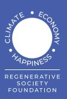

The World Happiness Report is a publication of the Sustainable Development Solutions Network, powered by the Gallup World Poll data.

The Report is supported by Fondazione Ernesto Illy, illycaffè, Davines Group, Unilever's largest ice cream brand Wall's, The Blue Chip Foundation, The William, Jeff, and Jennifer Gross Family Foundation, The Happier Way Foundation, and The Regeneration Society Foundation.

The World Happiness Report was written by a group of independent experts acting in their personal capacities. Any views expressed in this report do not necessarily reflect the views of any organization, agency, or program of the United Nations.