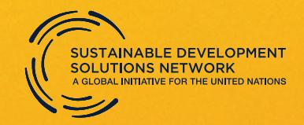

John F. Helliwell, Richard Layard, Jeffrey D. Sachs, Jan-Emmanuel De Neve, Lara B. Aknin, and Shun Wang

This publication may be reproduced using the following reference: Helliwell, J. F., Layard, R., Sachs, J. D., De Neve, J.-E., Aknin, L. B., & Wang, S. (Eds.). (2024). *World Happiness Report 2024.* University of Oxford: Wellbeing Research Centre.

Full text and supporting documentation can be downloaded from the website: **worldhappiness.report**

ISBN 978-1-7348080-7-0

The *World Happiness Report* is a partnership of Gallup, the Oxford Wellbeing Research Centre, the UN Sustainable Development Solutions Network, and the WHR's Editorial Board. The report is produced under the editorial control of the WHR Editorial Board.

From 2024, the *World Happiness Report* is a publication of the Wellbeing Research Centre at the University of Oxford, UK.

Any views expressed in this report do not necessarily reflect the views of any organization, agency or program of the United Nations.

## Table of Contents

# World Happiness Report 2024

| 1 | Happiness and Age: Summary 3 Helliwell, Layard, Sachs, De Neve, Aknin, and Wang                                                             |
|---|------------------------------------------------------------------------------------------------------------------------------------------------|
| 2 | Happiness of the Younger, the Older, and Those In Between 9 Helliwell, Huang, Shiplett, and Wang                                         |
| 3 | Child and Adolescent Well-Being: Global Trends, Challenges and Opportunities 61 Marquez, Taylor, Boyle, Zhou, and De Neve             |
| 4 | Supporting the Well-being of an Aging Global Population: Associations between Well-being and Dementia 103 Britton, Hill, and Willroth |
| 5 | Differences in Life Satisfaction Among Older Adults in India 129 Paul, Pai, Thalil, and Srivastava                                       |

The World Happiness Report was written by a group of independent experts acting in their personal capacities. Any views expressed in this report do not necessarily reflect the views of any organization, agency, or program of the United Nations.

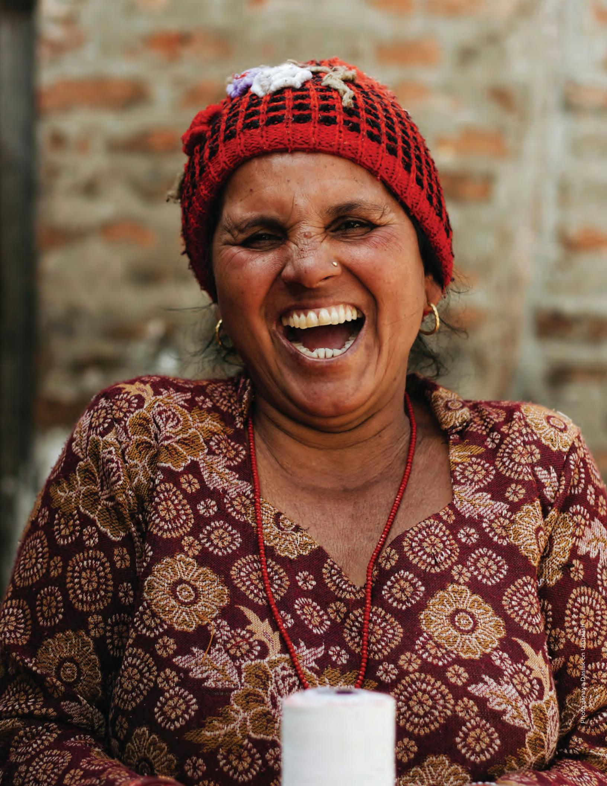

## Chapter 1

# Happiness and Age: Summary

## John F. Helliwell

Vancouver School of Economics, University of British Columbia

## Richard Layard

Wellbeing Programme, Centre for Economic Performance, London School of Economics and Political Science

## Jeffrey D. Sachs

Center for Sustainable Development at Columbia University

## Jan-Emmanuel De Neve

Wellbeing Research Centre, University of Oxford

## Lara B. Aknin

Department of Psychology, Simon Fraser University

## Shun Wang

International Business School Suzhou, Xi'an Jiaotong-Liverpool University

**doi.org/10.18724/whr-kk3m-b586**

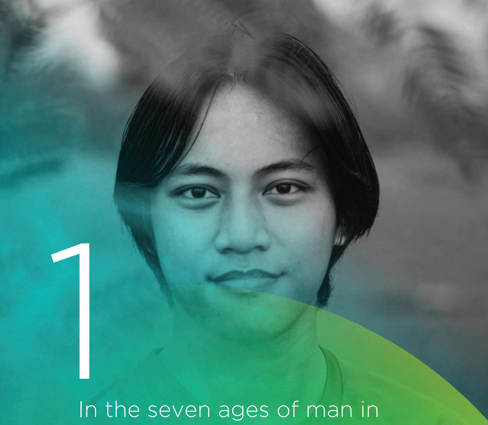

Shakespeare's *As You Like It*, the later stages of life are portrayed as deeply depressing. But happiness research shows a more nuanced picture, and one that is changing over time.

In this issue of the *World Happiness Report* we focus on the happiness of people at different stages of life. In the seven ages of man in Shakespeare's *As You Like It*, the later stages of life are portrayed as deeply depressing. But happiness research shows a more nuanced picture, and one that is changing over time.

In the West, the received wisdom was that the young are the happiest and that happiness thereafter declines until middle age, followed by substantial recovery. But since 2006-10, as we shall see, happiness among the young (aged 15-24) has fallen sharply in North America – to a point where the young are less happy than the old. Youth happiness has also fallen (but less sharply) in Western Europe.

By contrast, happiness at every age has risen sharply in Central and Eastern Europe, so that young people are now equally happy in both parts of Europe. In the former Soviet Union and East Asia too there have been large increases in happiness at every age, while in South Asia and the Middle East and North Africa happiness has fallen at every age.

It is of course an issue to what extent these changes reflect generational changes that can be expected to persist as each generation gets older. In pioneering work, Chapter 2 disentangles the effect of which cohort you are in from that of age. At the global level, it reveals a lower level of happiness among people born since 1980.

One thing is the average level of happiness, another is its dispersion. Since 2006-10, the inequality of happiness has increased in every region except Europe – another worrying trend. As usual, all these trends are discussed in Chapter 2, together with the country rankings.

The position of the young is discussed in finer detail in Chapter 3. This draws on a wide range of data sources and also includes data for young people aged 10-15. The rest of the report focuses on the old. As Chapter 4 stresses, the greatest plague in old age is dementia. Fortunately, new and accumulating research demonstrates that higher well-being is a protective factor against future dementia. In addition, there are significant environmental and behavioral strategies that improve the lives of those living with dementia. Finally, Chapter 5 focuses on India, the first such chapter in the *World Happiness Report*. It stresses that in India, the world's most populous country, with a rapidly growing elder share, happiness rises into old age,more so for men than women.

In what follows, we give summaries of each chapter, which will hopefully tempt readers to read further.

## Chapter 2

## **Happiness of the Younger, the Older, and Those In Between**

#### **Overall rankings**

• The top 10 countries have remained much the same since before COVID. Finland is still top, with Denmark now very close, and all five Nordic countries in the top 10. But in the next 10, there is more change, with the transition countries of Eastern Europe rising in happiness (especially Czechia, Lithuania and Slovenia). Partly for this reason the United States and Germany have fallen to 23 and 24 in the rankings.

### **Happiness by age group**

- In many but not all regions, the young are happier than the old. But in North America happiness has fallen so sharply for the young that they are now less happy than the old. By contrast, in the transition countries of Central and Eastern Europe, the young are much happier than the old. In Western Europe as a whole happiness is similar at all ages, while elsewhere it tends to decline over the life cycle (with an occasional upturn for the old).
- For these reasons, the ranking of countries by happiness is very different for the young and for the old. As between generations, after taking into account age and life circumstances, those born before 1965 have life evaluations about one-quarter of a point higher than those born after 1980.

## **Changes in happiness since 2006-2010: by age group**

- The countries of Central and Eastern Europe have had the largest increase in happiness – by similar amounts in all age groups. The gains in the former Soviet Union were half as large. In East Asia too there were large increases, especially among the old.
- By contrast, happiness fell in South Asia in all age groups. It also fell in North America, especially among the young. And it fell in the Middle East and North Africa in all age groups.
- In Central and Eastern Europe, the young are now as happy as in Western Europe, and among the old the gap between East and West is one half of what it was in 2006-10, though still large (one whole point on the scale of 0 to 10).

#### **Inequality of happiness**

• Since 2006-10 there has been a large increase in the inequality of happiness in every region except Europe. And it has increased especially for the old. The biggest increase is in Sub-Saharan Africa.

#### **Negative emotions**

- Negative emotions are more frequent now than in 2006-2010 everywhere except in East Asia and in Europe. In fact in Central and Eastern Europe, negative emotions are now less frequent in all age groups than they were in 2006-2010.
- In 2021-2023 negative emotions were in every region more prevalent for females than males. Almost everywhere the gender gap is larger at older ages.

#### **Positive emotions**

• In all regions the frequency of positive emotions has changed since 2006-2010 in the same direction as life evaluations. But the age patterns differ. The frequency of positive emotions in every region is highest for those under 30, thereafter steadily declining with age in every region except North America, where positive emotions are least frequent for those in the middle age groups.

#### **Benevolence by generation**

• The COVID crisis led to a worldwide increase in the proportion of people who have helped others in need. This increase in benevolence has been large for all generations, but especially so for those born since 1980, who are even more likely than earlier generations to help others in need.

#### **Social support, loneliness and social interactions**

• In almost every global region comparably measured feelings of social support are more than twice as prevalent as loneliness. Both social support and loneliness affect happiness, with social support usually having the larger effect. Social interactions of all kinds also add to happiness, in addition to their effects flowing through increases in social support and reductions in loneliness.

## Chapter 3

## **Child and Adolescent Well-being: Global Trends, Challenges and Opportunities**

- In most countries life satisfaction drops gradually from childhood through adolescence and into adulthood. Globally, young people aged 15-24 still report higher life satisfaction than older adults. But this gap is narrowing in Western Europe and recently reversed in North America due to falling life satisfaction among the young. Conversely, in Sub-Saharan Africa life satisfaction has increased among the young.
- Overall, globally, young people aged 15-24 experienced improved life-satisfaction between 2006 and 2019, and stable life satisfaction since then. But the picture varied by region. Youth wellbeing fell in North America, Western Europe, Middle East and North Africa, and South Asia. In the rest of the world it rose.
- Turning to younger ages (10-15), evidence is limited. In high income countries, life satisfaction has declined since 2019, especially for girls. For East Asian countries, life satisfaction increased in 2019. Before 2019, the evidence on trends is mixed.

• Girls report lower life satisfaction than boys by around the age of 12. This gap widens at ages 13 and 15, and the pandemic has amplified the difference. These points apply only to high-income countries since data on these young ages is rarely gathered elsewhere. For ages 15-24, global data shows no global gender differences from 2006 until 2013. But from 2014, females began reporting higher life satisfaction than males, although the gap has narrowed after the pandemic. This global gender gap masks regional differences, and is more pronounced in lower-income countries. There are no gender differences in high-income countries.

## Chapter 4

## **Supporting the Well-being of an Aging Global Population: Associations between Well-being and Dementia**

- As the global population of older adults increases, the number of worldwide dementia cases is also expected to increase. Dementia is associated with reduced quality of life and well-being, and thus dementia prevention is critical to maintaining the well-being of an aging global population.
- Higher levels of prior well-being have been robustly associated with lower risk for future dementia, suggesting that increasing well-being may be a promising non-pharmacological approach to dementia prevention. Among individuals living with dementia, there are environmental changes and well-being enhancing activities which have been shown to improve well-being.

## Chapter 5

## **Differences in Life Satisfaction among Older Adults in India**

- Older age is associated with higher life satisfaction in India, refuting some claims that the positive association between age and life satisfaction only exists in high-income nations. However, older women in India report lower life satisfaction than older men.
- Older adults with secondary or higher education and those of higher social castes report higher life satisfaction than counterparts without formal education and those from scheduled castes and scheduled tribes.
- Satisfaction with living arrangements, perceived discrimination, and self-rated health emerged as the top three predictors of life satisfaction.

## **Acknowledgments**

We have had a remarkable range of contributing authors and expert reviewers to whom we are deeply grateful for their willingness to share their knowledge with our readers. Although the editors and authors of the *World Happiness Report* are volunteers, there are administrative and research support costs covered by our partners: Glico, the Katsuiku Foundation, Blue Zones, illycaffè, and Fondazione Ernesto Illy. We greatly value our special relationship with Gallup who enable the early access to the World Poll data that underpins so much of the report. We very much appreciate the continued work by Ryan Swaney and Stislow Design for their skills in design and web development. New this year, we are deeply grateful to Jonathan Whitney and Leoni Boyle for their extraordinary efforts on the production of the report and media engagement. All of these contributions together are what makes the *World Happiness Report* the go-to source for so many around the world wanting to find out the latest evidence on the global state of happiness.

*John Helliwell, Richard Layard, Jeffrey D. Sachs, Jan-Emmanuel De Neve, Lara B. Aknin, and Shun Wang.*

## Chapter 2

# Happiness of the Younger, the Older, and Those In Between

## John F. Helliwell

Vancouver School of Economics, University of British Columbia

## Haifang Huang

Department of Economics, University of Alberta

## Hugh Shiplett

Faculty of Business, University of New Brunswick

## Shun Wang

International Business School Suzhou, Xi'an Jiaotong-Liverpool University

The authors are grateful for the financial support of the WHR sponsors and for data from the Gallup World Poll and the Gallup/Meta State of Social Connections study. For much helpful assistance and advice, we are grateful to Lara Aknin, Chris Barrington-Leigh, Leoni Boyle, Felix Cheung, Jan-Emmanuel De Neve, Anat Noa Fanti, Len Goff, Carol Graham, Richard Layard, Jessica Mahoney, Max Norton, Andrew Oswald, Julie Ray, Laura Rosella, Marwan Saleh, Jonathan Whitney, Meik Wiking, and Maggie Zhou.

**doi.org/10.18724/whr-f1p2-qj33**

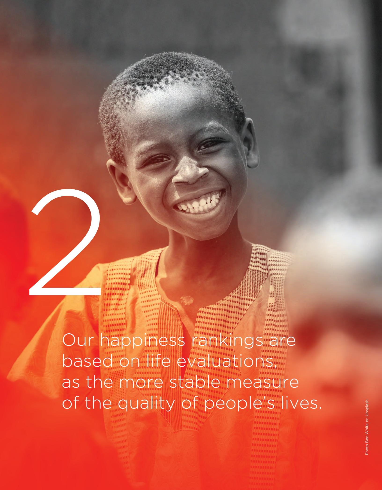

## **Key Insights**

**Ranking convergence continues** between the two halves of Europe, with Czechia, Lithuania and Slovenia at positions 18, 19 and 21, contributing to the fall of the United States and Germany from 15 and 16 last year to 23 and 24 this year.

**Rankings differ a lot for the young and the old.** In some cases these differences favour the old, as in the United States and Canada, where the rankings for those aged 60 and older are 50 or more places higher than for those under 30. In other cases, especially in Central and Eastern Europe, the reverse is true, with many rankings being more than 40 places higher for the young than for the old.

**From 2006-2010 to 2021-2023 changes in overall happiness varied greatly from country to country,**  ranging from increases as large as 1.8 points in Serbia, (up 69 ranks from WHR2013 to WHR2024) and 1.6 points in Bulgaria (up 63 ranks from WHR2013 to WHR2024) to decreases as large as 2.6 points in Afghanistan (13th from bottom in WHR2013 to unhappiest country in WHR2024).

**Happiness changes also varied by global region.** Central and Eastern Europe had the largest increases, of the same size for all age groups. Gains were half as large in the CIS countries. East Asia also had large increases, especially for the older population. By contrast, life evaluations fell in South Asia in all age groups, especially in the middle age groups. Happiness fell significantly in the country group including the United States, Canada, Australia and New Zealand, by twice as much for the young as for the old. Happiness has fallen from 2006-2010 to 2021-2023 in the Middle East and North Africa, with larger declines for those in the middle age groups than for the old and the young.

**For those under 30, happiness levels are now equal in both halves of Europe.** For those ever 60, the gap between the two halves of Europe is about half of what it was in 2006-2010. But it is still very large, more than a full point in 2021-2023.

**In 2021-2023 negative emotions were in every region more prevalent for females than males,** with almost everywhere the gender gap being larger at higher ages.

**Negative emotions are more frequent than in 2006-2010** everywhere except East Asia and both parts of Europe. In Central and Eastern Europe, in contrast to the rest of the world, but consistently with the happiness convergence taking place within Europe, negative emotions are now less frequent in all age groups than they were in 2006-2010.

**Positive emotions** have not changed much, while still remaining more frequent for the young than for older age groups.

**Global happiness inequality** has increased by more than 20% over the past dozen years, in all regions and age groups, to an extent that differs a lot by age and by region.

**Post-COVID increases in benevolence,** whether measured as shares of the population, or percentage increases from pre-pandemic levels, are large for all generations, but especially so for the Millennials and Generation Z, who are even more likely than their predecessors to help others in need.

**New global social connections data** show feelings of social support to have been more than twice as prevalent as loneliness in 2022. Both social support and loneliness affect happiness, with social support usually having the larger effect. Social interactions add to happiness, with their effects flowing through increases in social support and reductions in loneliness.

**Age and generation both matter for happiness.** As between generations, those born before 1965 (Boomers and their predecessors) have life evaluations about one-quarter of a point higher than those born after 1980 (Millennials and Gen Z). Within each generation, life evaluations rise with age for those in the older generations and fall with age for the younger ones, with little age effect for those in between.

This chapter is about happiness during different life stages and of those in different generations. It is not the first time we have looked at happiness by age and gender.1 But it is the first time we have enough survey years to start separating the life course from the ever-changing patterns of history. Some important parts of life are tied mainly to age, such as schooling, employment and health. Others depend more on what is going on in society and the world. These society-wide factors range from violence, earthquakes and pandemics to how new technologies and changing natural and social environments interact with also-changing ways of seeing history, facing inequalities, and connecting with each other. While most of our analysis deals with life at different ages, we bring in generational effects where we find them most salient.

Our early sections relate to happiness as measured by life evaluations and emotions, showing their levels and changes for the younger (<30), the older (60+), and those in between divided into two groups, aged 30-44 and 45-59. For our later analysis by generation, we make a three-way

split: those born before 1965, 1965-1980, and after 1980. Although the best separation points for generational differences will differ from country to country, depending on their key events, our separation does match some widely used definitions,2 and also divides the sample fairly evenly, with roughly 30% in each of the first two groups, and 40% in the youngest cohort, which includes Millennials and their successors.

We start by presenting our usual ranking and modelling of national happiness of the population as a whole. In Figure 2.1 we rank countries by their average life evaluations over the three preceding years, 2021-2023. We have two versions of Figure 2.1. The first version presents actual life evaluations alone on centre stage. We include horizontal whiskers showing the 95% confidence bands for our national estimates, supplemented by a measure for each country of the range of rankings within which its own ranking is likely to be. The second version includes bars showing how much each of the six variables explains each country's average life evaluation. We also present the latest version, in Table 2.1, of the equation we use to explain how and why life evaluations vary among countries and over time.

Subsequent sections look separately at the life evaluations for the young, the old, and those in between, compare country rankings for each age group, and show how life evaluations at different ages have changed from a base period3 of 2006- 2010 to the three most recent years, 2021-2023.

We then consider differences among age groups in the levels and trends of positive and negative emotions, proceeding from there to the important topic of inequality. We show that inequality of well-being is generally greater at higher age (perhaps due to differences in health status increasing more among people as individuals age), and has been increasing in all age groups in most global regions.

In the subsequent sections of the chapter, we consider differences by generation as well as by age. In the first of these sections we return to one of the most striking findings in our two previous reports: the sharp increase, in every global region, of benevolent acts in 2020 and after, relative to

their levels in the three pre-COVID years 2017-2019. This year we ask whether there have been differences in the extent to which different generations stepped to help others during the pandemic.

We then use new evidence from the Gallup/Meta global state of social connections survey included in the 2022 round of the Gallup World Poll for 140 countries to show how generational differences in feelings of social support, loneliness, and being socially connected relate to six types of reported social interactions and to overall life evaluations.

Finally, we return to international differences in life evaluations at different ages and in different generations. We assess the extent to which the often-found U-shape in age is present or absent across the globe, how these results have changed between 2006-2010 and 2021-2023, and attempt to separate the age-related changes from generational ones.

The concluding section highlights our key results.

## **Measuring and Explaining National Differences in Life Evaluations**

### **Box 2.1: Measuring Subjective Well-Being**

Our measurement of subjective well-being continues to rely on three main well-being indicators: life evaluations, positive emotions, and negative emotions (described in the report as positive and negative affect). Our happiness rankings are based on life evaluations, as the more stable measure of the quality of people's lives.

*Life evaluations.* The Gallup World Poll, which remains the principal source of data in this report, asks respondents to evaluate their current life as a whole using the image of a ladder, with the best possible life for them as a 10 and worst possible as a 0. Each respondent provides a numerical response on this scale, referred to as the Cantril ladder. Typically, around 1,000 responses are gathered annually for each country. Weights are used to construct population-representative national averages for each year in each country. **We base our usual happiness rankings on a three-year average of these life evaluations**,

*Positive emotions*. Positive affect is given by the average of individual yes or no answers

since the larger sample size enables more

precise estimates.

about three emotions: laughter, enjoyment, and interest (for details see Technical Box 2).

*Negative emotions*. Negative affect is given by the average of individual yes or no answers about three emotions: worry, sadness, and anger.

Comparing life evaluations and emotions:

- Life evaluations provide the most informative measure for international comparisons because they capture quality of life in a more complete and stable way than do emotional reports based on daily experiences.
- Life evaluations vary more between countries than do emotions and are better explained by the diverse life experiences in different countries. Emotions yesterday are well explained by events of the day being asked about, while life evaluations more closely reflect the circumstances of life as a whole. We show later in the chapter that emotions are significant supports for life evaluations.
- Positive emotions are still more than twice as frequent as negative emotions, even during the years since the onset of COVID.

#### **Ranking of Happiness 2021-2023**

Countries are ranked according to their selfassessed life evaluations (answers to the Cantril ladder question in the Gallup World Poll), averaged over the years 2021-2023.4 The overall length of each country bar in Figure 2.1 represents the average response to the ladder question. The confidence intervals for each country's average life evaluation are shown by horizontal whiskers at the right-hand end of each country bar. Confidence intervals for the *rank* of a country are shown in Figure 2.1 to the right of each country's bar.5 These ranking ranges are wider where there are many countries with similar averages, and for countries with smaller sample sizes.6

The online version Figure 2.1 also includes colour-coded sub-bars in each country row, representing the extent to which six key variables contribute to explaining life evaluations. These variables (described in more detail in Technical Box 2) are GDP per capita, social support, healthy life expectancy, freedom, generosity, and corruption. **As already noted, our happiness rankings are not based on any index of these six factors. Rather, scores are based on individuals' own assessments of their lives, in particular their answers to the single-item Cantril ladder life-evaluation question.** We use observed data on the six variables and estimates of their associations with life evaluations to help explain the variation of life evaluations across countries, much as epidemiologists estimate the extent to which life expectancy is affected by factors such as smoking, exercise, and diet.

*Scores are based on individuals' own assessments of their lives, in particular their answers to the single-item Cantril ladder life-evaluation question.*

Figure 2.1: Country Rankings by Life Evaluations in 2021-2023

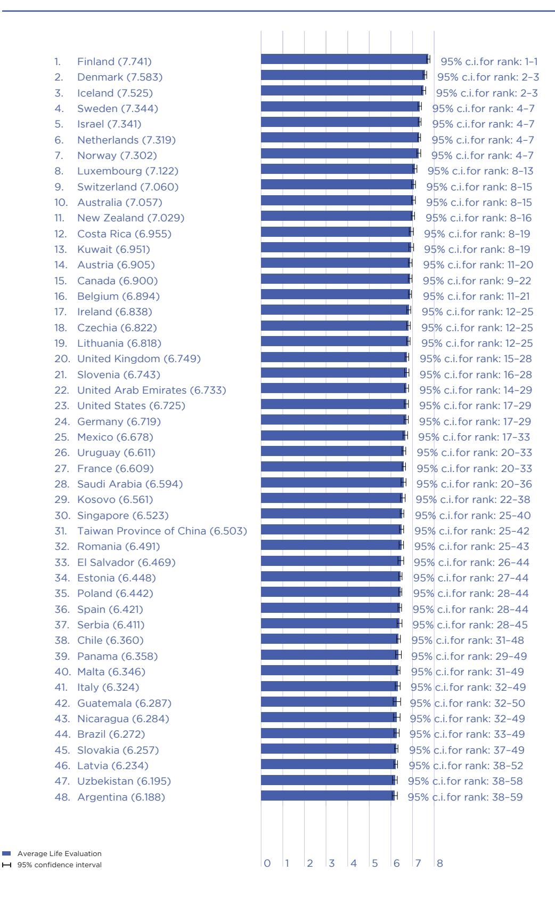

Figure 2.1: Country Rankings by Life Evaluations in 2021-2023 (continued)

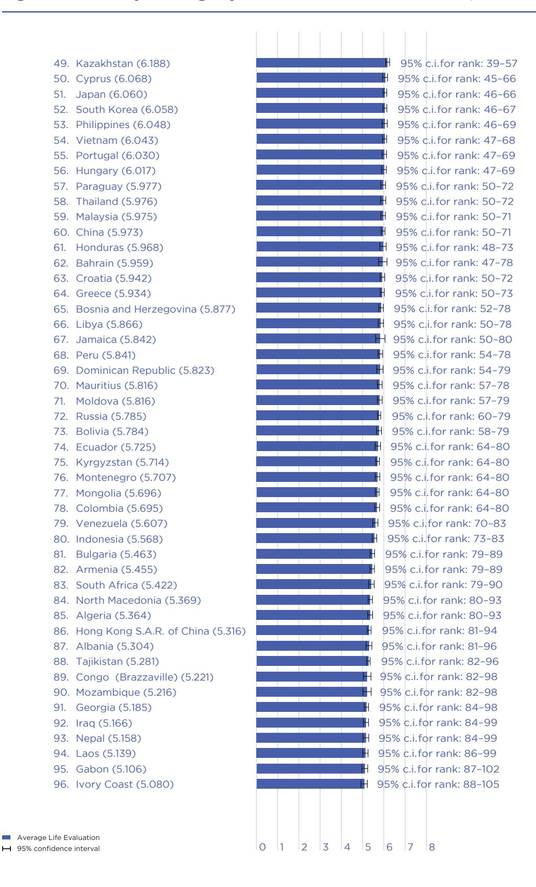

Figure 2.1: Country Rankings by Life Evaluations in 2021-2023 (continued)

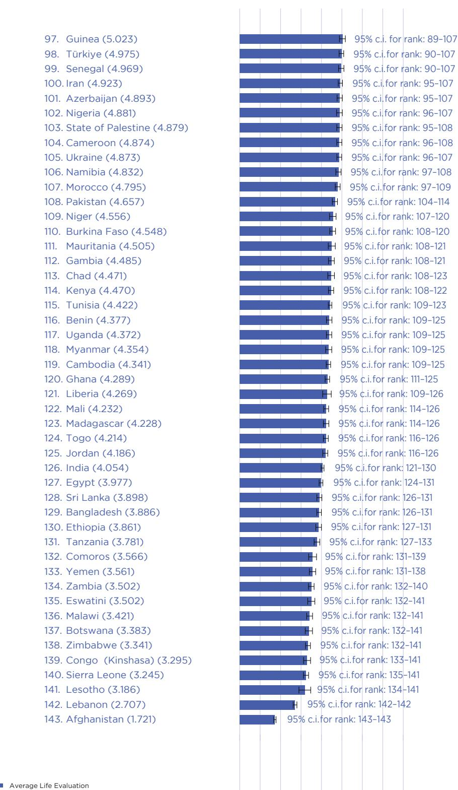

→ 95% confidence interval

## **What do the latest data show for the 2021-2023 country rankings?7**

Two features carry over from previous editions of the *World Happiness Report*. First, there is still a lot of year-to-year consistency in the way people rate their lives in different countries, and since our rankings are based on a three-year average there is information carried forward from one year to the next. In the case of cataclysmic events happening during a particular year, their effect on the rankings will depend on when the survey took place, and will be muted by the three-year averaging. In the case of the October 7th attack on Israel and the subsequent war between Israel and Hamas, the survey in Palestine took place earlier in the year and the Israel survey after the hostage taking but before much of the subsequent warfare. Life evaluations fell sharply in Israel, by 0.9 on the 10-point scale, only one-third of which will enter the three-year averages discussed below. (See the Statistical Appendix for individual country trajectories on an annual basis, plotted separately by age group and by generation).8

Second, there remains a large gap between the top and bottom countries, a full six points (on the 0 to 10 scale) between Finland at the top and Afghanistan at the bottom. The top countries are more tightly grouped than the bottom ones. The top twenty countries all fall within 1 point of each other, compared with a 2.5 point spread among the bottom twenty. The remaining 100-odd countries cover the remaining 2.5 points of the total range. This means that relatively modest changes in a national average can lead to a large shift in ranks, as illustrated by the 95% confidence region exceeding 25 ranks for several countries in the middle of the global list.

Happiness scores are based on the resident populations in each country, rather than their citizenship or place of birth. In *World Happiness Report 2018* we split the responses between the locally and foreign-born populations in each country and found the happiness rankings to be essentially the same for the two groups.9 There was some footprint effect after migration, and some tendency for migrants to move to happier countries, so that among 20 happiest countries in that report, the average happiness for the locally

*While the top ten countries remain largely unchanged, there has been much more action in the top twenty.*

born was about 0.2 points higher than for the foreign-born.

How have the rankings changed since last year? While the top ten countries remain largely unchanged, there has been much more action in the top twenty. Costa Rica and Kuwait are both new entrants10 to the top 20, at positions 12 and 13. The continuing convergence in happiness levels between the two sides of Europe led last year to Czechia and Lithuania being in the top twenty, nearly joined now by Slovenia in 21st place. The new entrants are matched by the departures of the United States and Germany from the top 20, dropping from 15 and 16 last year to 23 and 24 this year.

The top countries no longer include any of the largest countries. In the top ten countries only the Netherlands and Australia have populations over 15 million. In the whole of the top twenty, only Canada and the United Kingdom have populations over 30 million.

#### **Why do happiness levels differ?**

In Table 2.1 we present our latest modelling of national average life evaluations and measures of positive and negative emotions (affect) by country and year.11 The results in the first column explain national average life evaluations in terms of six key variables: GDP per capita, healthy life expectancy, having someone to count on, freedom to make life choices, generosity, and freedom from corruption.12 Taken together, these six variables explain more than three-quarters of the variation in national annual average ladder scores across countries and years, using data from 2005 through 2023.13 The six variables were originally chosen as the best available measures of factors established in both experimental and survey data as having significant links to subjective well-being, and especially to life evaluations.14 The

explanatory power of the unchanged model has gradually increased as we have added more years to the sample, which is now almost three times as large as when the equation was first introduced in *World Happiness Report 2013*. We keep looking for possible improvements when and if new evidence becomes available.15

The second and third columns of Table 2.1 use the same six variables to estimate equations for national averages of positive and negative affect, where both are based on answers about yesterday's emotional experiences (see Technical Box 2 for how the affect measures are constructed). In general, emotional measures, and especially negative ones, are differently and much less fully explained by the six variables than are life evaluations. Per-capita income and healthy life expectancy have significant effects on life evaluations,16 but not, in these national average data, on positive emotions.17 But the social variables do have significant effects on both positive and negative emotions. Bearing in mind that positive and negative emotions are measured on a 0 to 1 scale, while life evaluations are on a 0 to 10 scale, having someone to count on can be seen to have similar proportionate effects on positive and negative emotions as on life evaluations. Freedom and generosity have even larger associations with positive emotions than with the Cantril ladder. Negative emotions are significantly reduced by social support, a sense of freedom, and the absence of corruption.

In the fourth column, we re-estimate the life evaluation equation from column 1, adding both positive and negative emotions to partially implement the Aristotelian presumption that sustained positive emotions are important supports for a good life.18 The results continue to buttress a finding in psychology that the existence of positive emotions matters more than the absence of negative ones when predicting either longevity19 or resistance to the common cold.20 Consistent with this evidence, we find that positive affect has a large and highly significant impact in the final equation of Table 2.1, while negative affect has none. In a parallel way, we show in a later section of this chapter that the effects of a positive social environment are

larger than the effects of loneliness in all age groups and generations.

As for the coefficients on the other variables in the fourth column, the changes are substantial only on those variables – especially freedom and generosity – that have the largest impacts on positive affect. Thus we can infer that positive emotions play a strong role in supporting life evaluations, and that much of the impact of freedom and generosity on life evaluations is channelled through their influence on positive emotions. That is, freedom and generosity have large impacts on positive affect, which in turn has a major impact on life evaluations. The Gallup World Poll does not have a widely available measure of life purpose to test whether it also would play a strong role in support of high life evaluations.

**Table 2.1: Regressions to Explain Average Happiness across Countries (Pooled OLS)**

|                                  |                | Dependent Variable |                 |                |  |  |  |
|----------------------------------|----------------|--------------------|-----------------|----------------|--|--|--|
| Independent Variable             | Cantril Ladder | Positive Affect    | Negative Affect | Cantril Ladder |  |  |  |
| Log GDP per capita               | 0.349          | 015                | 002             | 0.382          |  |  |  |
|                                  | (0.068)***     | (0.009)            | (0.007)         | (0.066)***     |  |  |  |
| Social support                   | 2.563          | 0.315              | 342             | 1.936          |  |  |  |
|                                  | (0.349)***     | (0.056)***         | (0.045)***      | (0.349)***     |  |  |  |
| Healthy life expectancy at birth | 0.028          | 0007               | 0.003           | 0.029          |  |  |  |
|                                  | (0.011)***     | (0.001)            | (0.001)***      | (0.011)***     |  |  |  |
| Freedom to make life choices     | 1.378          | 0.376              | 090             | 0.571          |  |  |  |
|                                  | (0.295)***     | (0.044)***         | (0.039)**       | (0.273)**      |  |  |  |
| Generosity                       | 0.487          | 0.084              | 0.029           | 0.296          |  |  |  |
|                                  | (0.252)*       | (0.032)***         | (0.027)         | (0.241)        |  |  |  |
| Perceptions of corruption        | 733            | 012                | 0.093           | 724            |  |  |  |
|                                  | (0.256)***     | (0.027)            | (0.022)***      | (0.243)***     |  |  |  |
| Positive affect                  |                |                    |                 | 2.206          |  |  |  |
|                                  |                |                    |                 | (0.33)***      |  |  |  |
| Negative affect                  |                |                    |                 | 0.193          |  |  |  |
|                                  |                |                    |                 | (0.381)        |  |  |  |
| Year fixed effects               | Included       | Included           | Included        | Included       |  |  |  |
| Number of countries              | 155            | 155                | 155             | 155            |  |  |  |
| Number of obs.                   | 2103           | 2098               | 2102            | 2097           |  |  |  |
| Adjusted R-squared               | 0.757          | 0.43               | 0.343           | 0.781          |  |  |  |

Notes: This is a pooled OLS regression for a tattered panel explaining annual national average

Cantril ladder responses from all available surveys from 2005 through 2023. See Technical Box 2 for detailed information about each of the predictors. Coefficients are reported with robust standard errors clustered by country (in parentheses). \*\*\*, \*\*, and \* indicate significance at the 1, 5, and 10 percent levels respectively.

## **Box 2.2: Detailed information about each of the predictors in Table 2.1**

- 1. GDP per capita is in terms of Purchasing Power Parity (PPP) adjusted to constant 2017 international dollars, taken from the World Development Indicators (WDI) by the World Bank (version 23, metadata last updated on September 27, 2023). See Statistical Appendix for more details. GDP data for 2023 are not yet available, so we extend the GDP time series from 2022 to 2023 using country-specific forecasts of real GDP growth from the OECD Economic Outlook No. 113 (June 2023) or, if missing, from the World Bank's Global Economic Prospects (last updated: June 6, 2023), after adjustment for population growth. The equation uses the natural log of GDP per capita, as this form fits the data significantly better than GDP per capita.
- 2. The time series for healthy life expectancy at birth are constructed based on data from the World Health Organization (WHO) Global Health Observatory data repository, with data available for 2005, 2010, 2015, 2016, and 2019. To match this report's sample period (2005-2023), interpolation and extrapolation are used. See Statistical Appendix for more details.
- 3. Social support is the national average of the binary responses (0=no, 1=yes) to the Gallup World Poll (GWP) question "If you were in trouble, do you have relatives or friends you can count on to help you whenever you need them, or not?"

- 4. Freedom to make life choices is the national average of binary responses to the GWP question "Are you satisfied or dissatisfied with your freedom to choose what you do with your life?"
- 5. Generosity is the residual of regressing the national average of GWP responses to the donation question "Have you donated money to a charity in the past month?" on log GDP per capita.
- 6. Perceptions of corruption are the average of binary answers to two GWP questions: "Is corruption widespread throughout the government or not?" and "Is corruption widespread within businesses or not?" Where data for government corruption are missing, the perception of business corruption is used as the overall corruption-perception measure.
- 7. Positive affect is defined as the average of previous-day affect measures for laughter, enjoyment, and doing interesting things. The inclusion of doing interesting things (first added for *World Happiness Report 2022*), gives us three components in each of positive and negative affect, and slightly improves the equation fit in column 4. The general form for the affect questions is: Did you experience the following feelings during a lot of the day yesterday? See Statistical Appendix 1 for more details.
- 8. Negative affect is defined as the average of previous-day affect measures for worry, sadness, and anger.

The variables we use in our Table 2.1 modelling may be taking credit properly due to other variables, or to unmeasured factors. There are also likely to be vicious or virtuous circles, with two-way linkages among the variables. For example, there is much evidence that those who have happier lives are likely to live longer,21 and be more trusting, more cooperative, and generally better able to meet life's demands.22 This will double back to improve health, income, generosity, corruption, and a sense of freedom. Collectively, these possibilities suggest that we should interpret the observed relationships with some caution.

Another possible reason for a cautious interpretation of our results is that some of the data come from the same respondents as the life evaluations and are thus possibly determined by common factors. This is less likely when comparing national averages because individual differences in personality and individual life circumstances tend to average out at the national level. To provide even more assurance that our results are not significantly biassed because we are using the same respondents to report life evaluations, social support, freedom, generosity, and corruption, we tested the robustness of our procedure by splitting each country's respondents randomly into two groups (see Table 10 of Statistical Appendix 1 of *World Happiness Report 2018* for more detail). We then examined whether the average values of social support, freedom, generosity, and absence of corruption from one half of the sample explained average life evaluations in the other half of the sample. The coefficients on each of the four variables fell slightly, just as we expected.23 But the changes were reassuringly small (ranging from 1% to 5%) and were not statistically significant.24

Overall, the model explains average life evaluation levels quite well within regions, among regions, and for the world as a whole.25 On average, the countries of Latin America still have mean life evaluations that are significantly higher (by about 0.5 on the 0 to 10 scale) than predicted by the model. This difference has been attributed to a variety of factors, including some unique features of family and social life in Latin American countries.26 In partial contrast, countries in East Asia have average life evaluations below predictions,

although only slightly and insignificantly so in our latest results.27 This may reflect, at least in part, cultural differences in the way people think about and report on the quality of their lives.28 It is reassuring that our findings about the relative importance of the six factors are generally unaffected by whether or not we make explicit allowance for these regional differences.29

We once again used the model of Table 2.1 to assess the overall effects of COVID-19 on life evaluations. If we add an indicator for the four COVID years 2020-2023 to our Table 2.1 equation, we find no net increase or decrease in life evaluations.30 This suggests, in a preliminary way, that the undoubted pains of living through a pandemic were offset by increases in countervailing forces, such as the extent to which respondents had been able to discover and share the capacity to care for each other in difficult times.

## **How do happiness rankings vary by age group?**

Figure 2.2 shows the happiness rankings for the young (under 30), and Figure 2.3 does the same for those over 60.31

As shown by Figures 2.2 and 2.3, country rankings for the young and the old are quite different, and systematically so. For example, Lithuania, a recent entrant to the overall top twenty, ranks number 1 for those under 30 compared to 44 for those over 60, underscoring the fact that convergence between the two halves of Europe has been driven mainly by the rising happiness of the young. Countries ranking highest for the old are generally countries with high overall rankings, but include several where the young have recently fared very poorly.

*Countries ranking highest for the old are generally countries with high overall rankings, but include several where the young have recently fared very poorly.*

Figure 2.2: Ranking of Happiness - the Young (Age below 30): 2021-2023

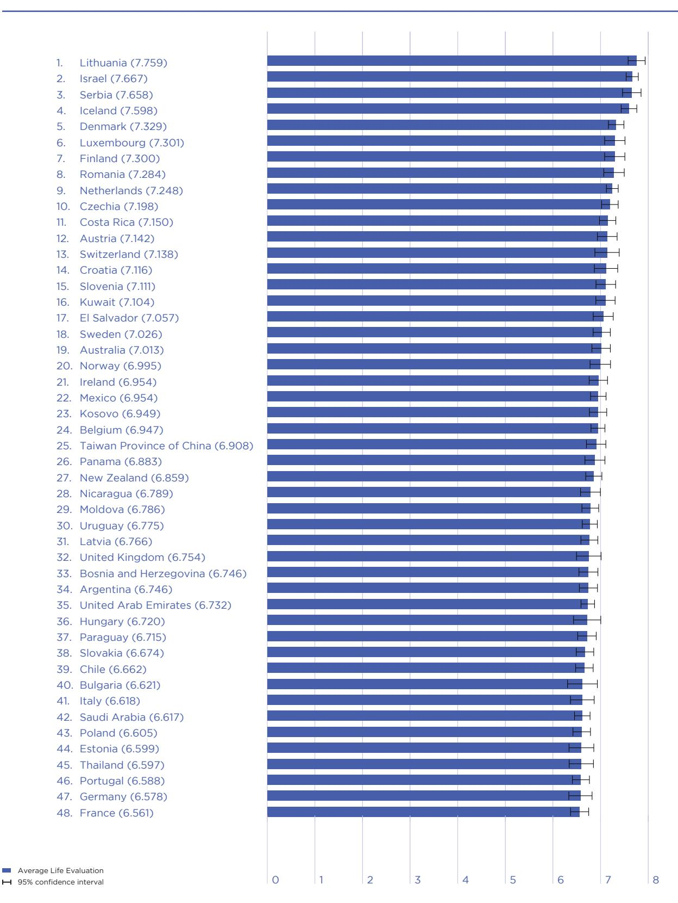

Figure 2.2: Ranking of Happiness - the Young (Age below 30): 2021-2023 (continued)

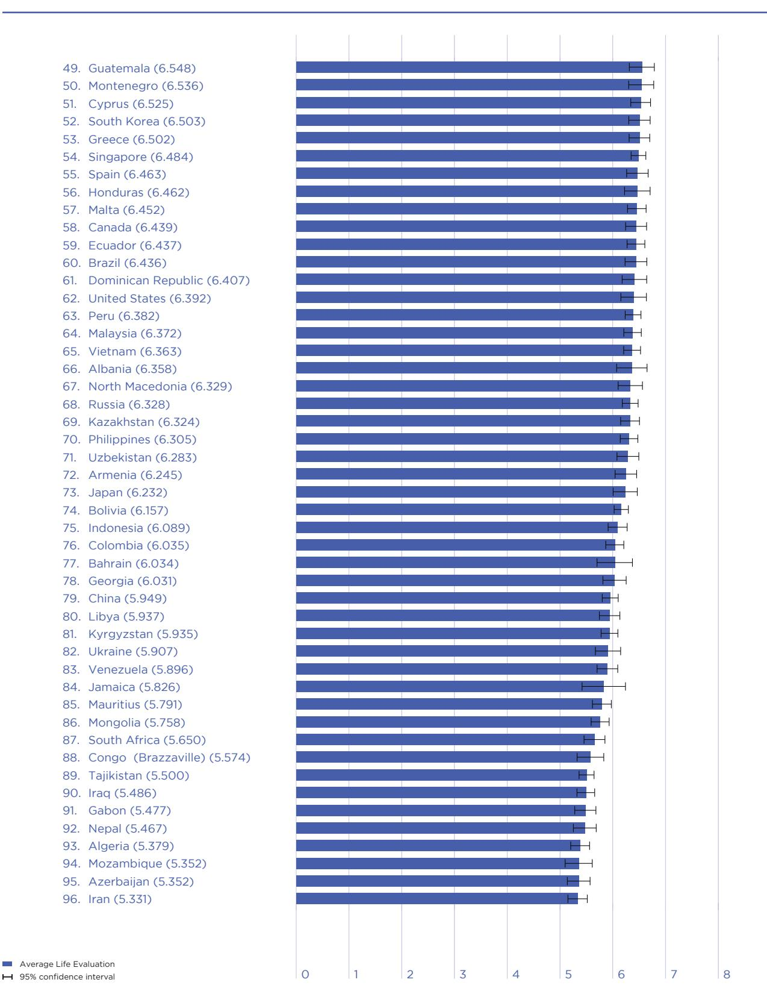

Figure 2.2: Ranking of Happiness - the Young (Age below 30): 2021-2023 (continued)

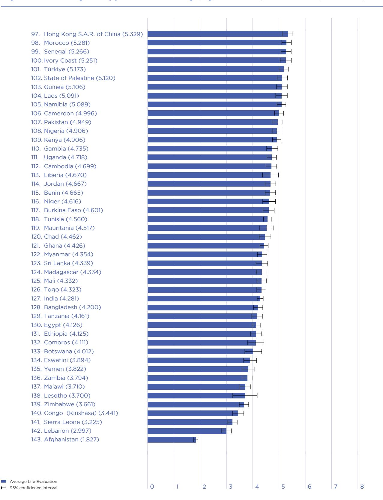

Figure 2.3: Ranking of Happiness - the Old (age 60 and above): 2021-2023

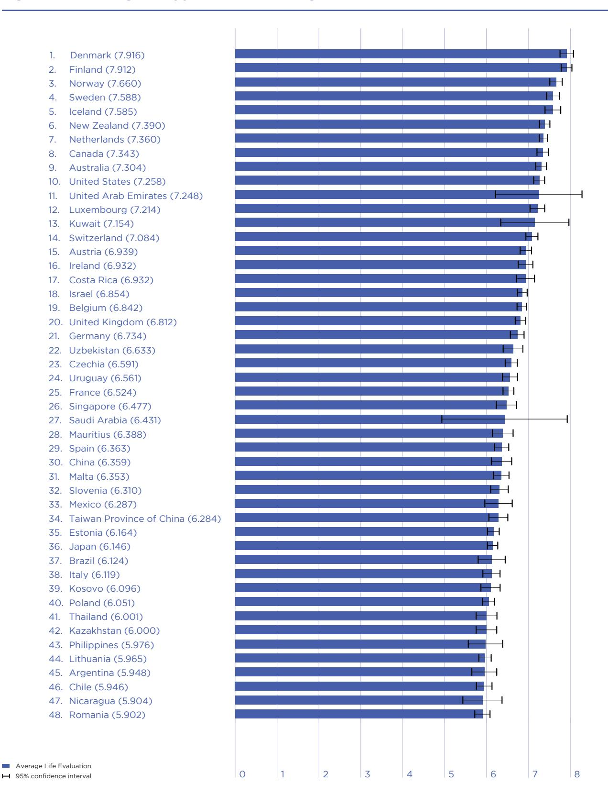

Figure 2.3: Ranking of Happiness - the Old (age 60 and above): 2021-2023 (continued)

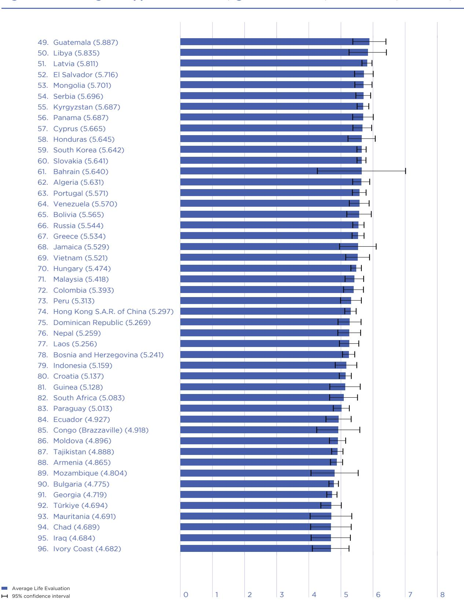

Figure 2.3: Ranking of Happiness - the Old (age 60 and above): 2021-2023 (continued)

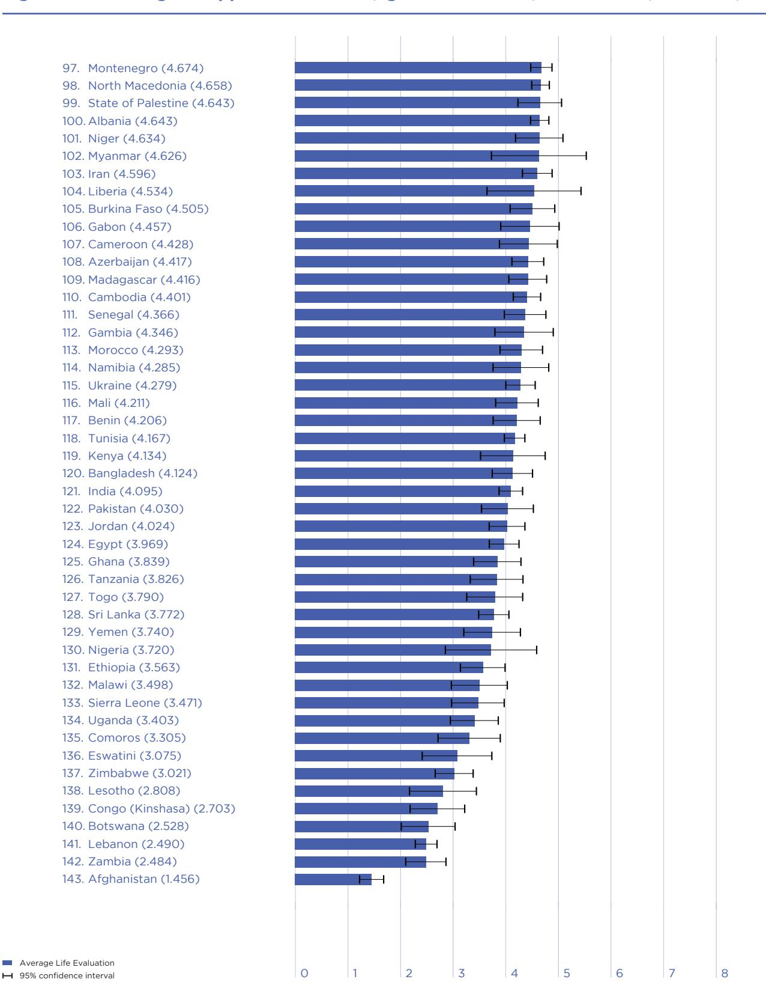

To better illustrate the overall patterns of international differences in happiness at different ages, Table 2.2 shows for each country the ranking of its life evaluations for the whole population (in the first column) and then four age groups- under 30, 30-44, 45-59, and 60+. The two columns at the right hand side of the table show for each country the happiest and least happy ages. The countries are listed in order of 2021-2023 average life evaluations for the whole population, the same order as is used for Figure 2.1. Countries with very different rankings at different ages reflect something unusual, relative to the world average experience for each age group. For example, the four countries in the NANZ group the United States, Canada, Australia and New Zealand - all have rankings for the young that are much lower than for the old, with the biggest discrepancies in the United States and Canada where the gap is 50 places or more. As we shall

see in the following sections, these gaps have mainly arisen since 2010, and probably involve some mix of generational and age effects.

There are many more countries where the rankings for the young are more than 40 places higher than for the old, mainly in Central and Eastern Europe and Latin America. The biggest gap is in Croatia, where the ranking for the young is 66 places higher than for the old. There are gaps of 50 or more places for Bulgaria, Moldova, and Serbia, and between 40 and 50 places in Romania, Bosnia and Herzegovina, Montenegro, and Paraguay. There are clearly generational as well as age effects at play here as well, as the older populations of Bosnia, Serbia, Croatia, and Montenegro bear the most scars from the early 1990s wars and genocide following the breakup of the former Yugoslavia.32

**Table 2.2: Ranking of life evaluations by age group, 2021- 2023**

| Country                  | All Ages | The Young | Lower Middle | Upper Middle | The Old | Happiest    | Least Happy |
|--------------------------|----------|-----------|--------------|--------------|---------|-------------|-------------|
| Finland                  | 1        | 7         | 1            | 1            | 2       | Old         | Young       |
| Denmark                  | 2        | 5         | 3            | 4            | 1       | Old         | Young       |
| Iceland                  | 3        | 4         | 4            | 2            | 5       | Young       | LowerMiddle |
| Sweden                   | 4        | 18        | 8            | 3            | 4       | Old         | Young       |
| Israel                   | 5        | 2         | 2            | 7            | 18      | Young       | Old         |
| Netherlands              | 6        | 9         | 5            | 5            | 7       | Old         | Young       |
| Norway                   | 7        | 20        | 6            | 6            | 3       | Old         | Young       |
| Luxembourg               | 8        | 6         | 11           | 8            | 12      | Young       | LowerMiddle |
| Switzerland              | 9        | 13        | 9            | 11           | 14      | Young       | UpperMiddle |
| Australia                | 10       | 19        | 14           | 10           | 9       | Old         | LowerMiddle |
| New Zealand              | 11       | 27        | 18           | 13           | 6       | Old         | LowerMiddle |
| Costa Rica               | 12       | 11        | 15           | 23           | 17      | Young       | UpperMiddle |
| Kuwait                   | 13       | 16        | 20           | 9            | 13      | Old         | LowerMiddle |
| Austria                  | 14       | 12        | 17           | 18           | 15      | Young       | UpperMiddle |
| Canada                   | 15       | 58        | 28           | 12           | 8       | Old         | Young       |
| Belgium                  | 16       | 24        | 13           | 15           | 19      | LowerMiddle | Old         |
| Ireland                  | 17       | 21        | 21           | 21           | 16      | Young       | UpperMiddle |
| Czechia                  | 18       | 10        | 12           | 22           | 23      | Young       | Old         |
| Lithuania                | 19       | 1         | 7            | 20           | 44      | Young       | Old         |
| United Kingdom           | 20       | 32        | 27           | 19           | 20      | Old         | LowerMiddle |
| Slovenia                 | 21       | 15        | 10           | 27           | 32      | Young       | Old         |
| United Arab Emirates     | 22       | 35        | 25           | 16           | 11      | Old         | LowerMiddle |
| United States            | 23       | 62        | 42           | 17           | 10      | Old         | LowerMiddle |
| Germany                  | 24       | 47        | 16           | 28           | 21      | LowerMiddle | Young       |
| Mexico                   | 25       | 22        | 19           | 32           | 33      | Young       | Old         |
| Uruguay                  | 26       | 30        | 22           | 34           | 24      | Young       | UpperMiddle |
| France                   | 27       | 48        | 23           | 26           | 25      | LowerMiddle | Old         |
| Saudi Arabia             | 28       | 42        | 39           | 14           | 27      | UpperMiddle | LowerMiddle |
| Kosovo                   | 29       | 23        | 37           | 33           | 39      | Young       | Old         |
| Singapore                | 30       | 54        | 36           | 25           | 26      | UpperMiddle | Old         |
| Taiwan Province of China | 31       | 25        | 35           | 31           | 34      | Young       | Old         |
| Romania                  | 32       | 8         | 26           | 35           | 48      | Young       | Old         |
| El Salvador              | 33       | 17        | 38           | 45           | 52      | Young       | Old         |
| Estonia                  | 34       | 44        | 24           | 30           | 35      | LowerMiddle | Old         |
| Poland                   | 35       | 43        | 34           | 24           | 40      | UpperMiddle | Old         |
| Spain                    | 36       | 55        | 40           | 29           | 29      | UpperMiddle | Old         |
| Serbia                   | 37       | 3         | 29           | 44           | 54      | Young       | Old         |
| Chile                    | 38       | 39        | 32           | 42           | 46      | Young       | Old         |
| Panama                   | 39       | 26        | 43           | 41           | 56      | Young       | Old         |
| Malta                    | 40       | 57        | 41           | 38           | 31      | Young       | UpperMiddle |
| Italy                    | 41       | 41        | 31           | 39           | 38      | Young       | Old         |
| Guatemala                | 42       | 49        | 46           | 54           | 49      | Young       | Old         |
| Nicaragua                | 43       | 28        | 53           | 61           | 47      | Young       | UpperMiddle |
| Brazil                   | 44       | 60        | 44           | 40           | 37      | Young       | Old         |
| Slovakia                 | 45       | 38        | 33           | 37           | 60      | Young       | Old         |
| Latvia                   | 46       | 31        | 30           | 49           | 51      | Young       | Old         |
|                          |          |           |              |              |         |             |             |
| Uzbekistan               | 47       | 71        | 62           | 36           | 22      | Old         | LowerMiddle |
| Argentina                | 48       | 34        | 52           | 64           | 45      | Young       | UpperMiddle |
| Kazakhstan               | 49       | 69        | 48           | 43           | 42      | Young       | Old         |

**Table 2.2: Ranking of life evaluations by age group, 2021- 2023** (continued)

| Country                   | All Ages | The Young | Lower Middle | Upper Middle | The Old | Happiest    | Least Happy |
|---------------------------|----------|-----------|--------------|--------------|---------|-------------|-------------|
| Cyprus                    | 50       | 51        | 49           | 62           | 57      | Young       | Old         |
| Japan                     | 51       | 73        | 63           | 52           | 36      | Young       | LowerMiddle |
| South Korea               | 52       | 52        | 45           | 55           | 59      | Young       | Old         |
| Philippines               | 53       | 70        | 68           | 58           | 43      | Young       | LowerMiddle |
| Vietnam                   | 54       | 65        | 54           | 53           | 69      | Young       | Old         |
| Portugal                  | 55       | 46        | 50           | 46           | 63      | Young       | Old         |
| Hungary                   | 56       | 36        | 51           | 48           | 70      | Young       | Old         |
| Paraguay                  | 57       | 37        | 59           | 75           | 83      | Young       | Old         |
| Thailand                  | 58       | 45        | 69           | 69           | 41      | Young       | UpperMiddle |
| Malaysia                  | 59       | 64        | 66           | 60           | 71      | Young       | Old         |
| China                     | 60       | 79        | 67           | 57           | 30      | Old         | LowerMiddle |
| Honduras                  | 61       | 56        | 72           | 73           | 58      | Young       | UpperMiddle |
| Bahrain                   | 62       | 77        | 60           | 50           | 61      | Young       | Old         |
| Croatia                   | 63       | 14        | 47           | 59           | 80      | Young       | Old         |
| Greece                    | 64       | 53        | 58           | 56           | 67      | Young       | Old         |
| Bosnia and Herzegovina    | 65       | 33        | 65           | 67           | 78      | Young       | Old         |
| Libya                     | 66       | 80        | 73           | 51           | 50      | UpperMiddle | LowerMiddle |
| Jamaica                   | 67       | 84        | 61           | 47           | 68      | UpperMiddle | Old         |
| Peru                      | 68       | 63        | 64           | 80           | 73      | Young       | UpperMiddle |
| Dominican Republic        | 69       | 61        | 70           | 79           | 75      | Young       | Old         |
| Mauritius                 | 70       | 85        | 77           | 63           | 28      | Old         | LowerMiddle |
| Moldova                   | 71       | 29        | 55           | 66           | 86      | Young       | Old         |
| Russia                    | 72       | 68        | 57           | 78           | 66      | Young       | UpperMiddle |
| Bolivia                   | 73       | 74        | 75           | 77           | 65      | Young       | UpperMiddle |
| Ecuador                   | 74       | 59        | 79           | 89           | 84      | Young       | Old         |
| Kyrgyzstan                | 75       | 81        | 81           | 68           | 55      | Young       | LowerMiddle |
| Montenegro                | 76       | 50        | 56           | 70           | 97      | Young       | Old         |
| Mongolia                  | 77       | 86        | 74           | 65           | 53      | Young       | LowerMiddle |
| Colombia                  | 78       | 76        | 78           | 71           | 72      | Young       | Old         |
| Venezuela                 | 79       | 83        | 80           | 83           | 64      | Young       | UpperMiddle |
| Indonesia                 | 80       | 75        | 82           | 84           | 79      | Young       | Old         |
| Bulgaria                  | 81       | 40        | 71           | 74           | 90      | Young       | Old         |
| Armenia                   | 82       | 72        | 83           | 88           | 88      | Young       | Old         |
| South Africa              | 83       | 87        | 84           | 81           | 82      | Young       | Old         |
| North Macedonia           | 84       | 67        | 76           | 85           | 98      | Young       | Old         |
| Algeria                   | 85       | 93        | 85           | 82           | 62      | Old         | UpperMiddle |
| Hong Kong S.A.R. of China | 86       | 97        | 89           | 72           | 74      | UpperMiddle | LowerMiddle |
| Albania                   | 87       | 66        | 86           | 97           | 100     | Young       | Old         |
| Tajikistan                | 88       | 89        | 88           | 86           | 87      | Young       | Old         |
| Congo (Brazzaville)       | 89       | 88        | 97           | 90           | 85      | Young       | Old         |
| Mozambique                | 90       | 94        | 87           | 96           | 89      | Young       | UpperMiddle |
| Georgia                   | 91       | 78        | 91           | 91           | 91      | Young       | Old         |
| Iraq                      | 92       | 90        | 96           | 94           | 95      | Young       | Old         |
| Nepal                     | 93       | 92        | 101          | 93           | 76      | Young       | UpperMiddle |
|                           |          |           |              |              |         |             |             |
| Laos                      | 94       | 104       | 93           | 76           | 77      | UpperMiddle | LowerMiddle |
| Gabon                     | 95       | 91        | 99           | 100          | 106     | Young       | Old         |
| Ivory Coast               | 96       | 100       | 92           | 95           | 96      | Young       | Old         |
| Guinea                    | 97       | 103       | 94           | 99           | 81      | Old         | UpperMiddle |
| Türkiye                   | 98       | 101       | 98           | 92           | 92      | Young       | Old         |

**Table 2.2: Ranking of life evaluations by age group, 2021- 2023** (continued)

| Country            | All Ages | The Young | Lower Middle | Upper Middle | The Old | Happiest    | Least Happy |
|--------------------|----------|-----------|--------------|--------------|---------|-------------|-------------|
| Senegal            | 99       | 99        | 104          | 102          | 111     | Young       | Old         |
| Iran               | 100      | 96        | 100          | 104          | 103     | Young       | UpperMiddle |
| Azerbaijan         | 101      | 95        | 103          | 103          | 108     | Young       | Old         |
| Nigeria            | 102      | 108       | 95           | 87           | 130     | UpperMiddle | Old         |
| State of Palestine | 103      | 102       | 105          | 109          | 99      | Young       | UpperMiddle |
| Cameroon           | 104      | 106       | 102          | 98           | 107     | Young       | Old         |
| Ukraine            | 105      | 82        | 90           | 110          | 115     | Young       | Old         |
| Namibia            | 106      | 105       | 106          | 101          | 114     | Young       | Old         |
| Morocco            | 107      | 98        | 108          | 107          | 113     | Young       | Old         |
| Pakistan           | 108      | 107       | 109          | 113          | 122     | Young       | Old         |
| Niger              | 109      | 116       | 110          | 114          | 101     | Old         | UpperMiddle |
| Burkina Faso       | 110      | 117       | 107          | 116          | 105     | LowerMiddle | UpperMiddle |
| Mauritania         | 111      | 119       | 112          | 106          | 93      | Old         | LowerMiddle |
| Gambia             | 112      | 110       | 116          | 115          | 112     | Young       | LowerMiddle |
| Chad               | 113      | 120       | 111          | 111          | 94      | Old         | UpperMiddle |
| Kenya              | 114      | 109       | 119          | 123          | 119     | Young       | UpperMiddle |
| Tunisia            | 115      | 118       | 113          | 108          | 118     | Young       | Old         |
| Benin              | 116      | 115       | 117          | 122          | 117     | Young       | UpperMiddle |
| Uganda             | 117      | 111       | 118          | 124          | 134     | Young       | Old         |
| Myanmar            | 118      | 122       | 115          | 105          | 102     | Old         | LowerMiddle |
| Cambodia           | 119      | 112       | 122          | 120          | 110     | Young       | LowerMiddle |
| Ghana              | 120      | 121       | 114          | 119          | 125     | Young       | Old         |
| Liberia            | 121      | 113       | 126          | 127          | 104     | Young       | UpperMiddle |
| Mali               | 122      | 125       | 120          | 118          | 116     | Young       | LowerMiddle |
| Madagascar         | 123      | 124       | 123          | 117          | 109     | Old         | LowerMiddle |
| Togo               | 124      | 126       | 121          | 112          | 127     | UpperMiddle | Old         |
|                    |          |           |              |              |         |             |             |
| Jordan             | 125      | 114       | 124          | 130          | 123     | Young       | UpperMiddle |
| India              | 126      | 127       | 127          | 121          | 121     | Young       | LowerMiddle |
| Egypt              | 127      | 130       | 125          | 126          | 124     | Young       | UpperMiddle |
| Sri Lanka          | 128      | 123       | 128          | 128          | 128     | Young       | UpperMiddle |
| Bangladesh         | 129      | 128       | 129          | 129          | 120     | Young       | UpperMiddle |
| Ethiopia           | 130      | 131       | 130          | 125          | 131     | Young       | LowerMiddle |
| Tanzania           | 131      | 129       | 132          | 131          | 126     | Young       | UpperMiddle |
| Comoros            | 132      | 132       | 139          | 133          | 135     | Young       | LowerMiddle |
| Yemen              | 133      | 135       | 135          | 136          | 129     | Young       | UpperMiddle |
| Zambia             | 134      | 136       | 131          | 138          | 142     | Young       | Old         |
| Eswatini           | 135      | 134       | 134          | 137          | 136     | Young       | UpperMiddle |
| Malawi             | 136      | 137       | 140          | 135          | 132     | Young       | LowerMiddle |
| Botswana           | 137      | 133       | 133          | 140          | 140     | Young       | Old         |
| Zimbabwe           | 138      | 139       | 138          | 139          | 137     | Young       | UpperMiddle |
| Congo (Kinshasa)   | 139      | 140       | 137          | 134          | 139     | Young       | Old         |
| Sierra Leone       | 140      | 141       | 136          | 132          | 133     | Old         | LowerMiddle |
| Lesotho            | 141      | 138       | 141          | 142          | 138     | Young       | UpperMiddle |
| Lebanon            | 142      | 142       | 142          | 141          | 141     | Young       | Old         |
| Afghanistan        | 143      | 143       | 143          | 143          | 143     | Young       | Old         |

The ranking gaps are imperfect measures of the happiness gaps between the old and young, because the distribution of country averages is much more tightly spaced in the middle, where a small change in average happiness can translate to many ranks. There are fewer countries with large rank differences at both ends of the distribution, where the ranks are most consistent. A country at the top of the overall ranking has to have pretty high happiness in all age groups, while in the really unhappy countries there are no happy age groups. Thus to assess happiness at different ages it is better to look at the average reported happiness levels at different ages, as we now do.

What is typical for happiness at different ages?33 Figure 2.4 shows average life evaluations in the four age groups for the world as a whole and for each of ten regions, separately for males and females. For the world as a whole, in recent years, there is a gradual slight decline in average happiness as age increases.34 As will be shown by Figure 2.5 and 2.6 in the next section, it has not always been thus, as in the early years of the Gallup World Poll (2006-2010) the young were the happiest group, followed by those over 60 and then those 30 to 44, with 45-59 as the least happy group.

**Figure 2.4: Happiness at different ages, 2021-2023**

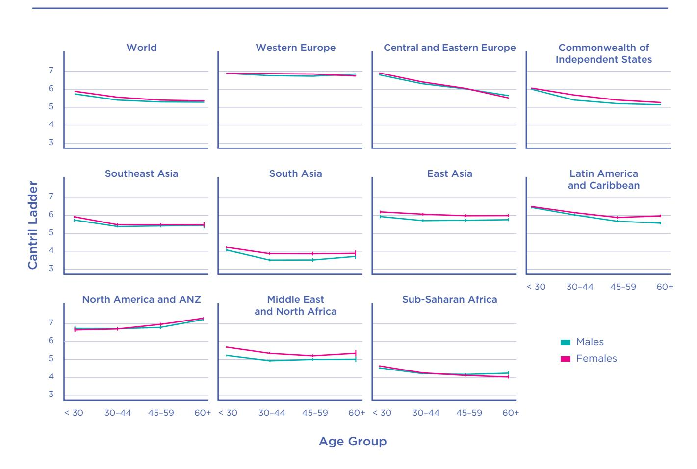

*Norway, Sweden, Germany, France, the United Kingdom and Spain are countries where the old are now significantly happier than the young, while Portugal and Greece show the reverse pattern.*

The first panel of Figure 2.4 displays a fairly flat global pattern of life evaluations across age groups, with the young on average happier than the old, and a slight gender difference favouring females.35 This global average obscures a range of regional experiences. When considering the regional differences, and how they contribute to the global average, it is important to remember that every country has equal weight in the regional and global averages, so that the regions with more countries contribute correspondingly more to the global averages.36 Considering the regions in the order shown in Table 2.4, Western Europe has an almost completely flat profile across the age groups, although Table 2.2 and Figures 2.2 and 2.3 show a variety of experiences within the region. For example, Norway, Sweden, Germany, France, the United Kingdom and Spain are countries where the old are now significantly happier than the young, while Portugal and Greece show the reverse pattern.

The countries of Central and Eastern Europe show much higher life evaluations for the young, with a steady decline across age groups thereafter, accumulating to a gap between the young and the old of more than a full point on the 0 to 10 scale. This pattern is slightly more pronounced for females than for males. The twelve countries in the Commonwealth of Independent States, with Russia and Ukraine as the largest, show a more muted pattern than in Central and Eastern Europe, and with a larger mid-life drop for males than for females.

The ten countries of Southeast Asia, with Indonesia the largest and Singapore the smallest, show a declining structure of happiness across age groups and a gender difference favouring young females, with the largest contribution to this effect coming from Singapore.

In South Asia, happiness is lowest in the middle age groups, especially for males, exposing a large middle age life evaluation gap favouring females, with a definite U-shape for males.

In East Asia, there is a general slight downward tilt with age, with females happier than males in all age groups.

In Latin America and the Caribbean, there is a general downward trend across ages less than 60, with an increase thereafter for females. Male and female happiness is equal under the age of 30, with a growing age gap thereafter favouring females.

In North America, Australia and New Zealand, life evaluations in 2021-2023 were lowest among the young, rising gradually with age to be highest among the old. The age gap favouring the old is evident in all four countries, while being much larger in the United States and Canada. The only significant gender gap is in older middle age, favouring females.

For the twenty countries of the Middle East and North Africa, by contrast, happiness is highest for the young, especially young females, and then falls steadily thereafter before rising again for females 60 and over. There is diversity within the region, with the gap favouring the young found especially in Israel, while being reversed in the UAE and Saudi Arabia, both of which have large numbers of foreign-born workers in their lower age groups.

Averaging across more than 40 countries in Sub-Saharan Africa, life evaluations are highest for the young, fairly similar in the two middle age groups, and then higher for males and lower for females in the 60+ age group.

What about global differences within age groups? Within the group of those under the age of 30, average life evaluations drop significantly with age,37 a finding that has echoes in Chapter 3 dealing with a broader range of evidence on adolescent and youth well-being. Within the global sample of those over 60, we find life evaluations rising with age, as is also found in the Indian evidence in Chapter 5.38 For a global sample including both of the middle age groups,

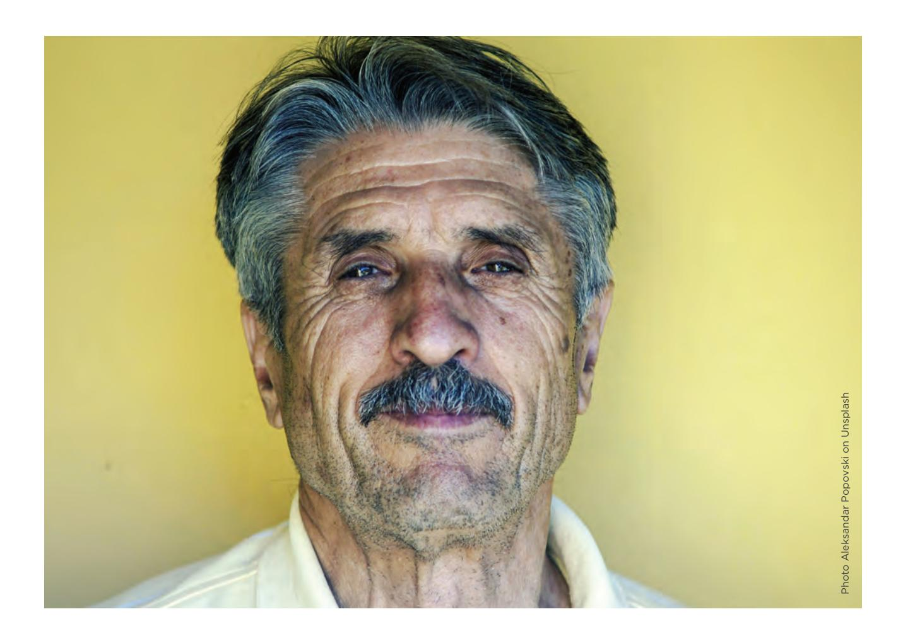

there is a negative influence from age and a positive one from age-squared, with an implied low point slightly below age 50.39 Within the 30 to 44 age group, the age effect is generally down, with no sign of a low point within that age range. Within the 45 to 59 group, there is an implied U-shape in age, with an estimated low point just over 50 years of age. More on this later in the chapter.

## **Is life getting better or worse, and for which age groups?**

The most fine-grained national-level indication of how the quality of life has been changing in each country is provided in Figures 7 through 34 in the Statistical Appendix. Figures 7-20 plot for each country the year-by-year trajectories for life evaluations in each of the four age groups, and Figures 21-34 repeat the analysis with the

population divided into three birth cohorts: those born before 1964, between 1965 and 1980, and after 1980.

For the population as a whole, Figure 2.5 below shows for each country the change in happiness from 2006-2010 to 2021-2023. Seventeen countries have increases in average life evaluations of a full point or more, compared to seven countries with reductions of a point or more on the 0 to 10 scale. Among the larger gainers, there are several countries in Eastern Europe where the increases were more than one-third of their average happiness scores in 2006-2010. Some of the worst faring countries, especially Lebanon and Afghanistan saw their life evaluations halved from their base values.

Figure 2.5: Changes in Happiness: from 2006-2010 to 2021-2023

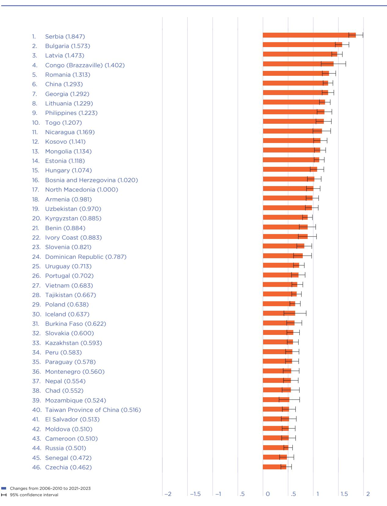

Figure 2.5: Changes in Happiness: from 2006-2010 to 2021-2023 (continued)

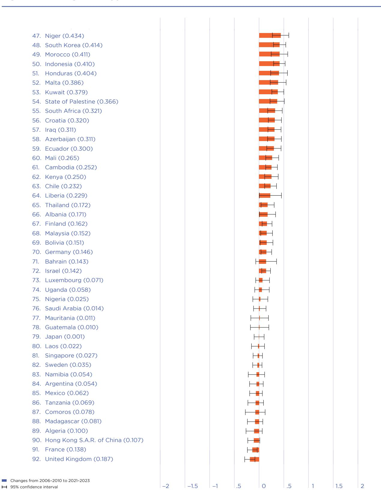

Figure 2.5: Changes in Happiness: from 2006-2010 to 2021-2023 (continued)

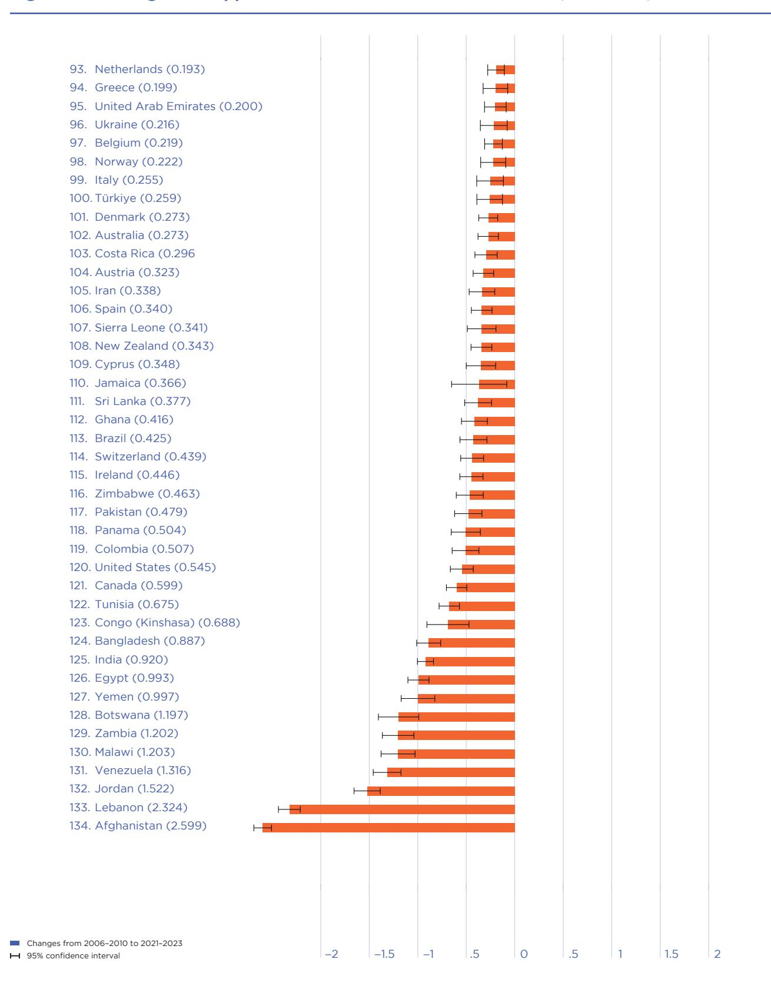

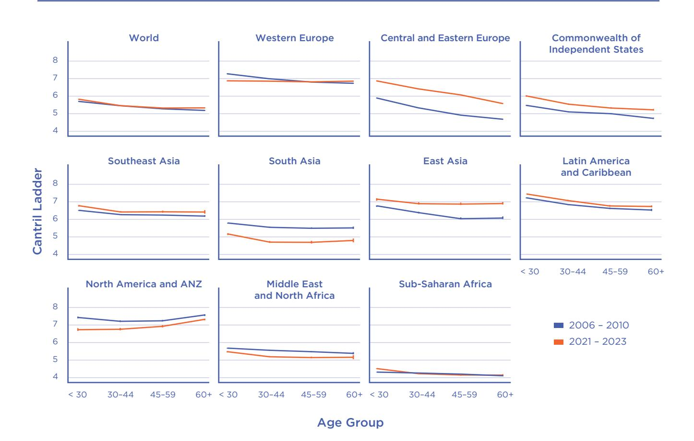

**Figure 2.6: Happiness changes from 2006-2010 to 2021-2023**

Figure 2.6 returns to a regional focus to show how average life evaluations have changed between 2006-2010 and 2021-2023 for each of the ten regions, as well as for the average of all countries, for each of four age groups.

Looking first at the global average across countries, life evaluations have improved very slightly in all age groups. Once again, this global average masks some very different regional trajectories. Happiness has generally increased for all age groups in East Asia, Central and Eastern Europe, and the CIS, and fallen in South Asia, the NANZ group and the Middle East and North Africa. There are interesting age group differences within this general pattern.

In Western Europe, life evaluations among the young are significantly lower in 2021-2023 than they were in 2006-2010, with a lesser drop in lower middle age and a small increase for those over 60.

In Central and Eastern Europe, life has improved by a full point or more at all ages, especially in the middle age groups. Happiness continues to be much higher in the younger age groups, although by less now than in 2006-2010. The convergence of happiness levels in Central and Eastern Europe toward those in Western Europe has continued. For those under 30, this convergence is complete, as happiness levels for them are essentially equal in both halves of Europe. For those over 60, the gap between the two halves of Europe is about half of what it was in 2006-2010, while still being more than a full point in 2021-2023.

Life evaluations have also risen for all age groups in the CIS countries, by on average half as much as in Central and Eastern Europe, even though starting a half-point lower in 2006-2020. Hence the increased gap between these two regional groups, especially so for the young and lowermiddle age groups.

For the United States, Canada, Australia and New Zealand, happiness has decreased in all age groups, but especially for the young, so much so that the young are now, in 2021-2023, the least happy age group. This is a big change from 2006-2010, when the young were happier than those in the midlife groups, and about as happy as those aged 60 and over. For the young, the happiness drop was about three-quarters of a point, and greater for females than males.

In the Middle East and North Africa, average life evaluations fell in all groups between 2006-2010 and 2021-2023, by almost twice as much for those over 60 and for those under 30. Thus there has been in the past dozen years a steepening of the age gradient favouring the young over the old.

Finally, average life evaluations in Sub-Saharan Africa have not changed for those in the middle age groups, while rising slightly for both the young and the old.

## **Emotions at different ages**

How do emotions differ by age? We shall first consider negative emotions and then positive ones, following the definitions in Technical Box 2.

## **Females have more frequent negative emotions at all ages**

Figure 2.7 shows negative emotions in the years 2021-2023 by age, separately for females and males. For the world as a whole, the average frequency of the selected negative emotions is higher for females than males, with the gender gap growing slightly from the young to the old.

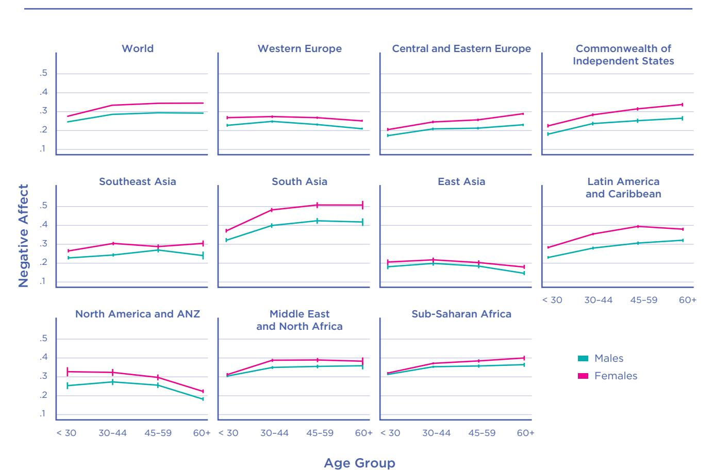

**Figure 2.7: Negative emotions by gender and age, 2021-2023**

Looking across the regions, there is a mixed pattern. In Western Europe, negative emotions are relatively less frequent for males than females at all ages, and decline slightly with age for both males and females. Negative emotions in 2021- 2023 were generally more frequent in Central and Eastern Europe than in Western Europe, have a slightly larger gender gap, and rise with age for both females and males, but by more for females than males. The same pattern repeats when moving to the CIS countries, with negative emotions more frequent at higher ages, and more for females than males.

The three parts of Asia show quite different patterns. In Southeast Asia, negative emotions yesterday are more frequent for females than males for the two younger age groups, and less frequent for those over 60. In South Asia, negative emotions are more frequent than elsewhere in the world, especially at higher ages and for females. In East Asia, negative emotions are globally low, and show little difference by age and gender.

In Latin America and the Caribbean, negative emotions are more frequent for females than males, especially in the middle age groups, and generally rise with age.

The group including the United States, Canada, Australia and New Zealand shows a quite different pattern than elsewhere. Negative emotions are at all ages more frequent for females than males, especially for those under 30. In this region, unlike anywhere else except Western Europe, negative emotions are more frequent among the young and least frequent for the old.

Negative emotions in SubSaharan Africa are equally frequent for males and females under the age of 30, and rise with age for both genders thereafter, by more for females than males. In the Middle East and North Africa, the biggest gender gap is in the middle age groups, flanked by rough gender equality for the young and old.

## **Negative emotions have gone up in some regions, and down in others**

 We now consider changes in emotions between 2006-2010 and 2021-2023. As shown in Figure 2.8, negative emotions are more frequent now than in 2006-2010 everywhere, only slightly so in East Asia and Western Europe. The big exception is in Central and Eastern Europe, where there has been a drop in the frequency of negative emotions in all age groups, in contrast to the rest of the world, but consistent with the happiness convergence taking place within Europe.

Increases in negative emotions have been most frequent in South Asia and Sub-Saharan Africa, especially at higher ages. In Latin America there has been no increased frequency of negative emotions among those under 30, but a substantial increase in the older age groups. The CIS countries show a similar but somewhat muted pattern.

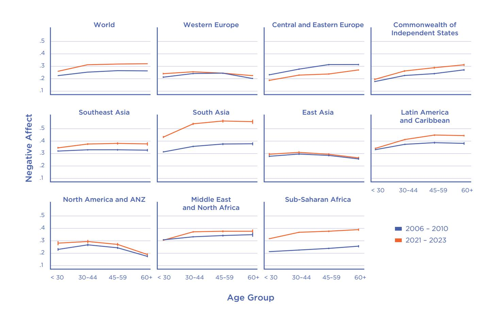

**Figure 2.8: Negative affect levels by age 2006-2010 vs 2021-2023**

There is the reverse pattern in the NANZ countries where negative emotions have increased more for the young than for the old. No other region shows negative emotions increasing more for the young than for the old.

## **Positive emotions are more frequent at lower ages, and have changed less**

As shown in Figure 2.9, positive emotions, which include laughter, enjoyment, and doing interesting things,40 are based on experience the previous day, are almost everywhere more frequent in the youngest age groups, and are gradually less frequent at higher ages. The only exception is in the NANZ group of countries, which show a U-shape in age, with those 60+ having about the same frequency of positive emotions as those under 30. Age-related decreases in the frequency

of positive emotions, coupled with increases in the prevalence of physical pain, encourage a deeper look at why life evaluations as a whole so frequently rise after a mid-life low. We do this in later sections.

What about changes from 2006-2010 to 2021- 2023? Figure 2.9 shows no change at the global level, except for those over 60 where positive emotions are now more frequent than before. The unchanged global average shows the net effects of differing regional patterns. The increased global frequency of positive emotions among those over 60 is driven by the countries of Sub-Saharan Africa, Central and Eastern Europe, and the CIS. In all other regions, positive emotions at all ages are either unchanged or lower in 2021-2013 than they were in 2006-2010.

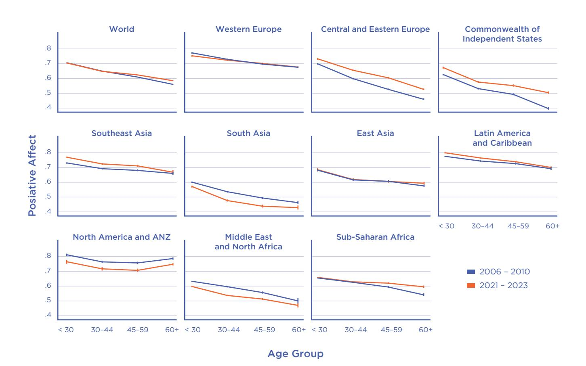

**Figure 2.9: positive affect levels by age 2006-2010 vs 2021-2023**

## **How unequal is happiness at different ages?**

From the outset of our WHR research, we have emphasised the importance of the distribution of happiness. Research has shown that inequality of well-being has a bigger effect on overall happiness than does inequality of income.41 This is, we think, because it is a broader and more encompassing measure. Inequality in the distribution of happiness reflects inequalities of access to any of the direct and indirect supports for well-being, including income, education, health care, social acceptance, trust, and the presence of supportive social environments at the family, community and national levels. People are happier living in countries where the equality of happiness is greater. The use of a 0 to 10 scale for life evaluations permits

us to measure inequality as the standard deviation of each country's distribution - the bigger the average gap between the happier and less happy people, the higher will be our inequality measure.42

This is the first report to consider equality of happiness by age group, set in a global environment of increasing inequality. At the global level, averaged across all ages and regions, inequality of happiness has increased by more than 20% over the past dozen years. This is shown in the world panel of Figure 2.10.

*People are happier living in countries where the equality of happiness is greater.*

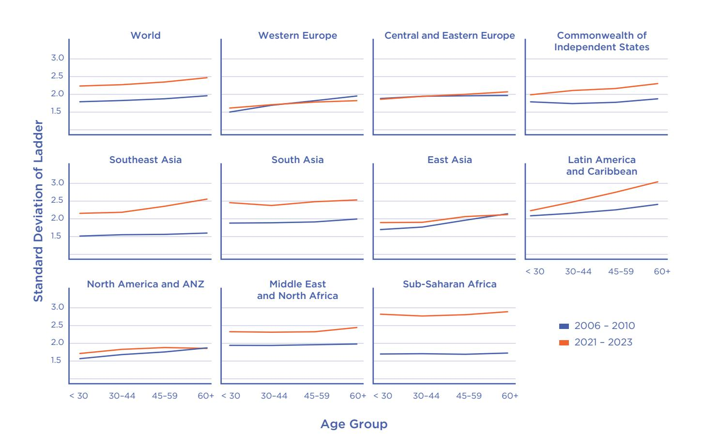

**Figure 2.10: Inequality of Happiness by age group, time and region**

The red line in each panel of Figure 2.10 shows the most recent values for happiness inequality in each group, with the grey line showing inequality by age group in 2006-2010. Inequality of happiness, as measured by the standard deviation of life evaluations within an age group, has increased in every region, except in Western Europe, where it has on average remained constant, with an increase in inequality among the old being offset by a drop for the young. In the North America plus ANZ group, inequality has increased for the young but not for the old. Every other region has seen inequality increases for the old that have been greater than those for the young, sometimes by very large amounts, as in Latin America, Southeast Asia, and the Commonwealth of Independent States. Happiness inequality in Sub-Saharan Africa has increased by more than 50% for all age groups, and only slightly less so for those of middle age than for the old and the young.

In light of the diverse regional trends for inequality at different ages, the overall inequality rankings by age are not the same as they were a dozen years ago. Inequality among those over 60 is now greatest in Latin America, followed closely by Sub-Saharan Africa, then, significantly lower, by Southeast and South Asia, followed then by the Middle East and North Africa, the CIS countries, and East Asia. Both halves of Europe, and the United States, Canada, Australia, and New Zealand group currently have the lowest levels of inequality, without significant age-group differences.

For those under 30, inequality of happiness is by far the greatest in Sub-Saharan Africa, followed by Southeast Asia, South Asia, and MENA. Although happiness inequality among the young has grown, it is still lowest in Western Europe, as it was in our base period of 2006-2010.

## **Are there generational differences in benevolence?**

We updated last year the startling finding in *World Happiness Report 2022* that all three benevolent actions surveyed in the Gallup World Poll - donations, volunteering and especially the helping of strangers - showed remarkably large increases over their pre-pandemic values. Now we can expand on those results in two important ways, first by adding a fourth year of COVID experience and second by seeing the extent to which benevolence levels and post-COVID frequencies differ by generation.

There has been much discussion about possible shifts of values, including benevolence, from one generation to the next since the middle of the last century. In particular, in the US context the Millennials have been alternatively called the 'me generation', the 'we generation' or just another generation.43 With almost twenty years of data from the Gallup World Poll, it is becoming feasible to decouple the age of respondents from their year of birth, with the latter defining which generation they represent. These data permit us to make a more global assessment of generational shifts in benevolent actions. In addition, the COVID pandemic provided a natural experiment to capture generational differences in benevolence. It has been argued that greater levels of social trust among older than among younger Americans was likely to represent mainly a generational effect rather than a consequence of the ageing process.44 There have also been studies, based on smaller samples of data, of whether benevolent values have shifted from one generation to the next, and whether they have changed over time within a given cohort.45 All three of our benevolence measures can be interpreted as proxy measures of the quality of community-level social capital. How these behaviours were altered by COVID for people in different generations provides a nice test of generational differences. If there has been a generational shift, with those born more recently being less inclined towards benevolent acts, then we would expect to find that the surge in benevolence we have found would be larger among those in earlier generations. If the increases

in benevolence have been equally or more present in recent generations, then that is an encouraging finding. Either there has not been a significant generational shift towards less societal connection, or possibly it has been offset by more recent positive generational shifts or masked by the inability of sheltered-in-place older adults to perform the benevolent acts they would otherwise have liked to do.

To sort out these possibilities, it is useful to compare the pre-pandemic and COVID-era frequencies of benevolent acts by birth cohort. To do this, we divide respondents into three cohorts: those born before 1965 (Boomers and their predecessors), those born between 1965 and 1980 inclusive (Gen X), and those born after 1980 (Millennials and Gen Z).

Figure 2.11 shows the percentage of the population performing the three benevolent acts by each of these birth-year cohorts, with grey bars showing the 2017-2019 values and the red bars the frequencies in and after 2020.46

For all cohorts, both before COVID and now, the helping of strangers is most frequent, followed by donations and then volunteering. The pre-COVID generational patterns differ for the three acts. The helping of strangers was most common among the younger cohorts, and lowest for those born before 1965, perhaps reflecting in part their lesser ability to be out and about. Charitable donations were less frequent in the younger generations than for the other age groups, perhaps reflecting their lower disposable incomes. Volunteering was fairly equal in the three generations. These data do not show levels that would suggest a generational shift to less social engagement, although there remains the problem of separating age and cohort effects. For that purpose, the COVID experience provides a very useful natural experiment.

The post-COVID increases are large in both size and statistical significance for all three birth cohorts and all three benevolent acts. For all three acts, the increases in benevolence, whether measured as shares of the population, or percentage increases from pre-pandemic levels, are greatest for Millennials and Gen Z, suggesting that Millennials are even more likely than their

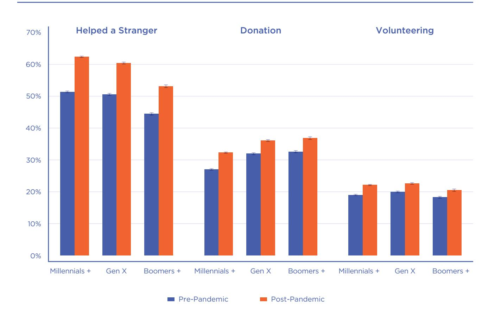

**Figure 2.11: Frequency of benevolent acts by generation, before and since COVID**

predecessors47 to increase their benevolent acts when a new need like COVID arises. In any event, the difference between generations in their responses is dwarfed by the general size of the increases in all generations. These benevolence results, if we compare 2017-2019 to 2020-2023, apply in every global region.48 This increased benevolence provides an important part of our explanation for the relative stability of life evaluations during COVID. The chance to help those in need, and to see others doing the same, serves to give purpose and increase trust in the benevolence of others, all of which is associated with higher ratings of life as a whole.49

## **Social support, loneliness and social interactions by generation**

There is widespread concern, especially in the United States, about an emerging epidemic of loneliness, and about the consequences of loneliness for mental and physical health.50 In *World Happiness Report 2023* we showcased the Gallup/Meta social connections and loneliness data from seven large countries51 representing six global regions. We found that in all of the seven countries, feelings of social support were generally twice or more prevalent than feelings of loneliness. In subsequent use of the seven-country data, we have found that what respondents thought about the trustworthiness and kindness of others were

very strong supports for overall satisfaction with social relations.52 This year we are able to provide full global coverage, since some of the social connections variables were included in the 2022 Gallup World Poll, and can be analysed using data for 140 countries.53 We developed separate measures for each of our three generations, thus bringing the Gallup/Meta data directly to bear on how these important relations vary by generation. Also valuable are data on the reported frequency of six types of social interactions. These permit us to compare the extent of social interaction with reported feelings of loneliness and social support, and see how they are correlated with our key overall life evaluation, the Cantril ladder.

Figure 2.12 shows regional averages of individual responses for each of the three generations. The first column shows how socially supported respondents feel using four response possibilities, with 'not-at-all' coded as 0 and 'very' as 1.0.54 The second column reports on feelings of loneliness, using the same scale. Strong social support is generally two times as prevalent as loneliness. The third column turns to the reported average frequency of six types of social interactions, including those with family and friends, at work, school, community groups, neighbours and strangers.

**Figure 2.12: Social Support, Loneliness, and Social Interactions by Generation**

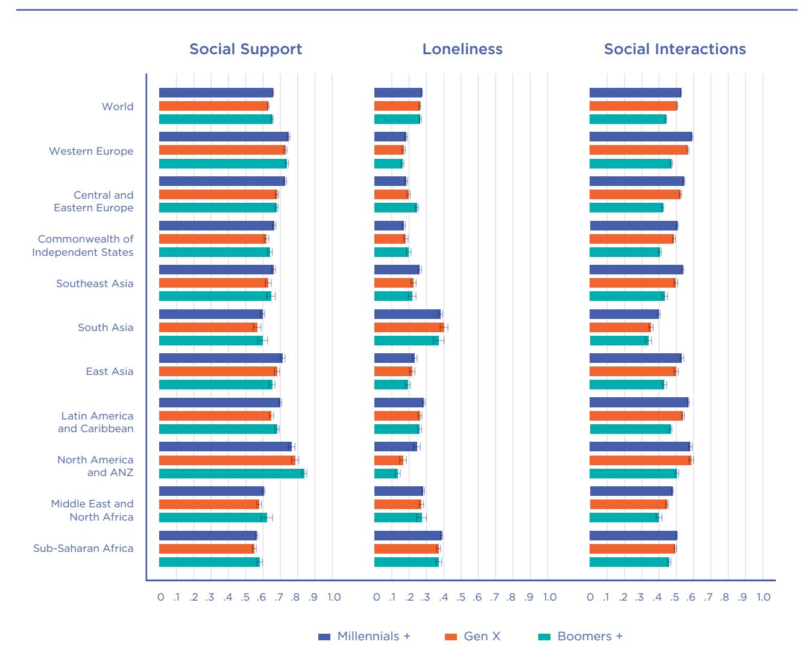

*In the four-country group including North America loneliness is almost twice as high among the Millennials as among those born before 1965.*

Globally, perceived social support is highest in East Asia, Western Europe and the NANZ countries, and lowest in South Asia, especially in the intermediate age groups. The age gradient favours the old in Western Europe and the NANZ countries, and the young in Central and Eastern Europe, mirroring what was found earlier for life evaluations.

Loneliness, when measured on the same scale as social support, is in all regions generally half as prevalent as social support. It displays somewhat matching patterns, being low where social support is high, and vice versa. Only in Southeast Asia, Western Europe and the NANZ countries is loneliness significantly higher for the Millennials than for the Boomers, a pattern that is reversed in Central and Eastern Europe.

An earlier study found age to be the most important factor in explaining loneliness differences among survey respondents in the United States.55 They found a peak in loneliness at age 20, with a steady age-related decline thereafter. This same phenomenon is evident in the Gallup/Meta data for the group of four countries including the United States. Although overall levels of loneliness are not unduly high in global terms56, there is a significantly different pattern across the generations. Loneliness is almost twice as high among the Millennials than among those born before 1965.57 Millennials also feel less socially supported than Boomers in those countries, another place in which these countries look different from the rest of the world. This is despite the fact that actual social connections are much more frequent for Millennials than Boomers, and about as frequent as for Generation X.

Do the high prevalence of loneliness and the lesser feelings of social support help to explain the very large ranking disparities between the

old and young for the NANZ countries shown in Figures 2.2 and 2.3, and in Table 2.2? To some extent yes, but they can only be part of the story. If we add the three variables of Figure 2.12 to our preferred58 individual-level equation, all three variables add very significantly to explaining life evaluations in 2022, the year in which the social connections data were collected. Feelings of social support are the most important, followed by loneliness and social interactions.59 If those under 30 in the NANZ region had the same feelings of loneliness and social support as those over 60, their average life evaluations would be predicted to be higher by slightly more than one-tenth of a point on the 0 to 10 scale, about one-seventh of the happiness gap between those under 30 and those 60 and older in that region.

Another interesting feature of the Gallup/Meta results, applicable in all global regions, is that the oldest members of the population, those in the boomer and earlier generations, feel more socially supported and less lonely than those in the younger generations despite having less frequent actual interactions with all groups except neighbours. This ability to gain more perceived support with fewer interactions likely helps to explain why life satisfaction so often rises after middle age even as the frequency and seriousness of health problems increases. We turn now to consider these issues in more detail.

## **What are the happiest and least happy stages of life in different countries?**

Our international rankings and trends of life across life stages show big differences. How does our evidence relate to the many studies of the U-shape in life evaluations frequently found in Western Europe and North America? The Gallup World Poll provides the largest set of countries ever available to study the generality of the U-shape in age. As suggested by the name, the U-shape describes a situation where there is a mid-life low in life satisfaction, with most findings placing the low point at about 50 years of age.60 The first major age-related study with Gallup World Poll data61 used evidence from 2006-2010. The study found a U-shape in the high-income

English speaking countries, accompanied by a flat profile in Africa and life evaluations falling with age in Eastern Europe, the Commonwealth of Independent States (CIS) and Latin America. In this chapter we start with evidence from the same early years of Gallup World Poll data used in the earlier analysis, and then repeat the analysis using the three most recent years, allowing us to see the extent that age patterns for life evaluations have changed in the past fifteen years.

Most studies of life evaluations based on large samples of survey data include both age and age-squared among their variables, with the almost universal finding being a negative coefficient on age and a positive one on agesquared. The relative sizes of these two coefficients can be used to calculate the low point in the estimated relationship, usually found to be about 50 years of age.62 These age effects are sometimes estimated with other variables in the equation, and sometimes not, with the

differences in the estimated age of minimum happiness depending on what other variables are included, but generally found to be similar to those based on the age terms alone. For this chapter, we first look at the effects of age alone, without including other variables, and without forcing any particular functional form for the relationship, echoing what was done in *World Happiness Report 2015*, where we examined the global distribution of life evaluations and emotions by country, region, age and gender.63 We then turn later to confirming the generality of this sort of curvature after allowing for our full set of variables linked to life evaluation differences among individuals and among countries. We find as well that significant U-shape patterns persist even after allowing for generational differences.

In this chapter we are first interested in knowing the happiest and least happy age groups in each country. For this purpose it is helpful to have the in-between group split into low-middle (30-44)

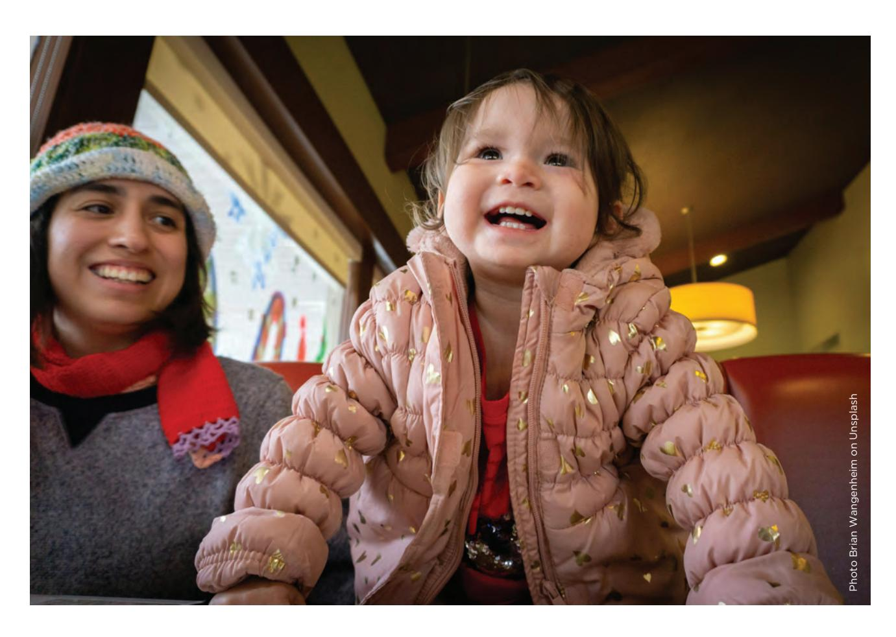

and high-middle (44-59) groups, because the high-middle group includes the most commonly estimated low points for happiness.64 We consider a country to exhibit a U-shape in age if average life evaluations in *either* of the two middle-age groups are below those for *both* the young and the old. Table 2.3 shows the number of countries in each global region according to which age group was the least happy using data from 2021-2023. Globally the old age group is the least happy in about half of the countries, the young the least happy group in seven countries, with the remaining countries having a mid-life low, most of them in the 45 to 60 age range. So by this definition the U-shape is currently found in almost half of our countries. It is currently evident in more than half the countries of Asia and Africa, and less than half in Europe and Latin America. In Western Europe the unhappiest age groups are diverse: one-third each for those below 30, 60+, and those in between. In all of the countries in Central and Eastern Europe and in two-thirds of the CIS countries those 60 and older are the least happy. In the NANZ group the reverse holds true, with the young and the early middle age groups being the least happy.

How do these results compare with those revealed by the Gallup World Poll data for 2006-2010, as shown in the Statistical Appendix? There have been remarkable changes over the past dozen years, especially in Africa, where for the continent as a whole the old were the least happy group in 24 of the 34 counties in the 2006-2010 data, compared to just over one-third now. Latin America shows a similar pattern, with unhappy-old countries being much less numerous now than in 2006-2010. There are also fewer unhappy-old countries in Western Europe now than earlier, while in Eastern Europe and the CIS the change has gone in the reverse direction, with more unhappy-old countries now than previously. The overall drop since 2006-2010 in the number of unhappy-old countries has been offset by an increase in the number of unhappy-young countries, and in the 30-44 age group. Thus the U-shape in age is more prevalent now than it was a dozen years ago, when it was present in just a third of the countries. We show below that this change in patterns by age may be linked in part to generational shifts favouring earlier generations over the Millennials and their successors.

The most interesting questions for us relate not to whether a U-shape exists but whether and why these patterns differ from one country or time period to another.65 The life satisfaction evidence is matched by other evidence of a mid-life crisis.66 Many factors influencing life evaluations differ in prevalence for people at different ages, and may

**Table 2.3: Numbers of Countries/Territories by Least Happy Age Group, Period 2021 to 2023** 

| Region                             | The Young | Lower Middle | Upper Middle | The Old | Total |
|------------------------------------|-----------|--------------|--------------|---------|-------|
| Western Europe                     | 6         | 3            | 4            | 7       | 20    |
| Central and Eastern Europe         | 0         | 0            | 0            | 17      | 17    |
| Commonwealth of Independent States | 0         | 2            | 1            | 7       | 10    |
| Southeast Asia                     | 0         | 4            | 1            | 4       | 9     |
| South Asia                         | 0         | 1            | 3            | 2       | 6     |
| East Asia                          | 0         | 4            | 0            | 2       | 6     |
| Latin America and Caribbean        | 0         | 0            | 8            | 11      | 19    |
| North America and ANZ              | 1         | 3            | 0            | 0       | 4     |
| Middle East and North Africa       | 0         | 4            | 6            | 7       | 17    |
| Sub-Saharan Africa                 | 0         | 9            | 12           | 14      | 35    |
| All                                | 7         | 30           | 35           | 71      | 143   |

matter more at one stage of life than another. Self-assessed health status provides a striking example. The relevant individual-level Gallup World Poll question asks respondents whether they have health problems,with the possible answers being yes or no. The national level for this variable is thus the share of respondents in that age group who have health problems. This proportion rises strikingly across our three main age groups, trebling from under 15% for those under 30 to more than 45% for those over 60. There is also a difference among the age groups in how much having health problems affects life evaluations. As shown by our individual level global modelling in the Statistical Appendix, the damage to life evaluations from having a health problem rises from 0.3 for those under 30 to about 0.45 for those in the middle age groups, and 0.6 for those 60 and over. Thus not only the prevalence but also the well-being consequences of health problems are greater for those over 60. Putting these two differences together suggests that the impact of health problems on average life evaluations rises from 0.045 for those under 30 to 0.3 for those 60 and over, a sixfold increase.67

Given the general downward influence of health problems on the life evaluations of the old, what helps to explain their greater happiness? One reason may simply be a lessening of the often taxing need to balance the competing demands of work and family pressures. This hypothesis is supported by the slightly rising prevalence of freedom to make key life decisions, from 75% of respondents in the middle groups to 80% for those over 60. Such freedom is apparently valued even more highly by the old than by those in middle age, with a combined effect raising life satisfaction for those over 60 by about the same as it is pushed down from middle to old age by the increasing frequency and severity of health problems.

Is there also perhaps something more fundamental in the ageing process that might help to explain the extent to which life evaluations can rise after middle age even if circumstances do not improve? That life evaluations can rise after middle age without any matching improvement in life circumstances is suggested by many studies that find a

U-shape in age even when several important life circumstances are taken into account.68 One possible explanation is provided by experiments showing an age-related increase in the relevance of positive over negative information in both perception and memory.69 This increase in positivity occurs against a backdrop of a prevailing negative bias in the way people view and react to new information.70 There is a growing strand of experimental research suggesting that, as people age, they generally attach more importance to remembering the positive aspects of their lives, and less to remembering the negative aspects.71 This could help to explain why life evaluations rise with age, especially in countries where this transfer of attention is more likely. These are likely to be where a larger fraction of the population has the basic necessities of life, as suggested by evidence that the increase in positivity is greater where there are fewer externally imposed constraints.72

Does the age-related increase in trust and positivity, accompanied by possible technological obsolescence, and age-related increases in dementia, mean that online scammers will more successfully target the elderly, and make them the major victims? Early studies of the effects of scamming concentrated on older victims, assuming them to be especially vulnerable.73 Ten years ago there was a recognized lack of evidence comparing the scamming susceptibility of the young and the old.74 That research gap is being filled, with results showing that although lesser mental capacities and technological smarts do increase susceptibility to scams, ageing can produce a trust that is greater but also wisely directed,75 so that the older targets are more likely to be suspicious and less likely to fall for the scam than are the young.76

There is also some evidence that changes in life evaluations as people age depend on their social environment. To feel a sense of belonging meets an essential human need.77 Evidence shows a sense of community belonging to have a larger influence on life satisfaction and to be more prevalent at higher ages,78 providing yet another explanation for life evaluations that rise at higher ages.

*Boomers and earlier generations are happier than Gen Xers, who are in turn happier than their 21st Century successors.*

Marriage and the family are important elements of the social context whose importance to happiness may vary by age. For example, it has been found that in some countries that normally exhibit a U-shape the protective effects of marriage and living together are greatest for those in the middle age group, so that the U-shape is flatter, and mid-life relatively happier for the married, a finding we have been able to confirm with our global data.79

An age-related positivity effect also helps to explain our finding in previous *World Happiness Reports* that life evaluations among the old were maintained or even improved despite COVID morbidity and mortality being much higher for that age group.80

Although age-related positivity research has mainly focused on positive and negative emotions, it clearly has implications for overall life evaluations, as illustrated by results reported above and elsewhere. As people age, the prevailing negativity bias of younger ages is on average across the world increasingly offset as age leads people to focus more on positive news and memories, to accumulate enriching life experiences,81 to think better of others, and to rate their lives more highly.

We can now exploit the growing number of years of Gallup World Poll data to attempt to separate the effects of age from those of being in a particular generation. For example, the changes in age patterns that we have found when comparing 2006-2010 with 2021-2023 may reflect generational shifts as well as age. To assess those possibilities, we have used our individual-level data to estimate happiness equations (as shown in Table 12 in the Statistical Appendix) showing a U-shape in age appearing in concert with generational shifts in average happiness, with the Boomers and earlier generations being happier than Gen Xers, who are in turn happier than

Millennials and their 21st century successors.82 These differences vary by region, of course, while across the globe the Millennials as a group, after taking into account their other life circumstances, have life evaluations that are about one-quarter of a point lower than the Boomers, with Gen X in between, but closer to the Millennials.83 The U-shape in age continues to operate, both between and within generations. Within the boomer group, life evaluations rise with each extra year of age, while falling by a bigger annual amount for the Millennials.84

## **Summary**

### **Overall ranking of happiness**

The biggest change this year is within the top 20. There are two new entrants, Costa Rica and Kuwait at 12 and 13. Coupled with the continuing convergence between the two halves of Europe, with Czechia, Lithuania and Slovenia at positions 18, 19 and 21, have contributed to the fall of the United States and Germany from 15 and 16 last year to 23 and 24 this year.

The top 10 have remained fairly stable, with Finland still in first position, although now followed more closely by Denmark. All of the top 10 countries, except for Australia and the Netherlands, have populations less than 15 million, while in the top twenty, only Canada and the United Kingdom have populations over 30 million.

#### **Rankings by age group**

Rankings differ a lot for the young and the old. In some cases these favour the old, as in the United States and Canada, where the rankings for those aged 60 and older are 50 or more places higher than for those under 30. In other cases, especially in Central and Eastern Europe, the reverse is true, with many rankings being more than 40 places higher for the young than for the old.

#### **Changes in happiness overall and by age group**

From 2006-2010 to 2021-2023 changes in overall happiness varied greatly from country to country, ranging from increases as large as 1.8 points (Serbia) to decreases as large as 2.6 points (Afghanistan).

Central and Eastern Europe had the largest increases, of the same size for all age groups. Gains were half as large in the CIS countries. East Asia also had large increases, especially for the older population. By contrast, life evaluations fell in South Asia in all age groups, especially in the middle age groups.

Happiness also fell significantly in the NANZ group, by twice as much for the young as for the old. There were also significant declines in the Middle East and North Africa, with larger declines for those in the middle age groups than for the old and the young.

The convergence of happiness levels in Central and Eastern Europe toward those in Western Europe has continued. For those under 30, this convergence is essentially complete, as their happiness levels are now equal in both halves of Europe. For those ever 60, the gap between the two halves of Europe is about half of what it was in 2006-2010. But it is still very large, more than a full point in 2021-2023.

#### **Emotions at different ages**

In 2021-2023 negative emotions were in every region more prevalent for females than males, with almost everywhere the gender gap being larger at higher ages. The exception to this global pattern is provided by the small group of countries that includes the United States, Canada, Australia and New Zealand, where females under 30 have one-third more negative emotions than males, a gap that is smaller at higher ages. There is no corresponding gap in life evaluations, as the gender gap is small at all ages, and tends to favour females.

Negative emotions are more frequent now than in 2006-2010 everywhere except East Asia and both parts of Europe. In Central and Eastern Europe, in contrast to the rest of the world, but consistently with the happiness convergence taking place within Europe, negative emotions are now less frequent in all age groups than they were in 2006-2010.

Positive emotions have not changed much, while still remaining more frequent for the young than for older age groups.

#### **Inequality by age**

Global happiness inequality has increased by more than 20% over the past dozen years, in all regions and age groups, to an extent that differs a lot by age and by region. It has increased most for the old in Latin America, Southeast Asia and the CIS, and at all ages in SubSaharan Africa, South Asia, and the Middle East and North Africa.

#### **Benevolence by generation**

The COVID crisis provided a natural experiment to compare the benevolence of different generations. The Post-COVID increases in benevolence, whether measured as shares of the population, or percentage increases from pre-pandemic levels, are large for all generations, but especially so for the Millennials and Generation Z, who are even more likely than their predecessors to help others in need.

## **Social support, loneliness and social interactions by generation**

In almost every global region, as confirmed by the new Gallup/Meta global social connections data, comparably measured feelings of social support are more than twice as prevalent as loneliness. Both social support and loneliness affect happiness, with social support usually having the larger effect. Social interactions add to happiness, with their effects flowing through increases in social support and reductions in loneliness.

#### **The U-shape in age**

The U-shape in age, with a mid-life low, is widespread, accompanied by a generational effect favouring earlier generations. Among those born before 1965, life evaluations rise with age, as also shown in Chapter 5. Among those born after 1980, happiness falls with each year of age, as also shown in Chapter 3.

As between generations, after taking into account age and life circumstances other than generation, those born before 1965 (Boomers and their predecessors) have life evaluations about one-quarter of a point higher than those born after 1980 (Millennials and gen Z).85

#### **Endnotes**

- 1 See Fortin et al. (2015).
- 2 Our groups follow the approximate demarcation lines between Boomers and their predecessors, Generation X, the Millennials (often called Gen Y) and Gen Z (those born 1995 or later. Our global data show that these Westerncentric definitions do not apply to many of the key generational shifts we find, such as those before and after the collapse of the USSR, civil wars and genocides, and first and subsequent generations of migrants from one country to another. Generational differences have been highlighted in the workplace (Parry & Unwin 2011, Campbell et al. 2015), in voting behaviour (Van den Brug & Kritzinger 2012) and values more generally (Twenge et al. 2012).
- 3 The base period also includes data collected from 27 countries in 2005, as the first round of the Gallup World Poll was divided between 2005 and 2006. Only one country, France, had surveys in both 2005 and 2006. Thus our base period includes all data collected before 2011.
- 4 A country's average answer to the Cantril ladder question is exactly equivalent to a notion of average underlying satisfaction with life under an assumption of "cardinality:" the idea that the difference between a 4 and a 3 should count the same as the difference between a 3 and a 2, and be comparable across individuals. Some social scientists argue that too little is known about how people choose their answer to the Cantril ladder question to make this assumption and that if it is wrong enough, then rankings based on average survey responses could differ from rankings based on underlying satisfaction with life (Bond & Lang, 2019). Other researchers have concluded that answers to the Cantril ladder question are indeed approximately cardinal (Bloem & Oswald, 2022; Ferrer-i-Carbonell & Frijters, 2004; Kaiser & Oswald, 2022; Krueger & Schkade, 2008).
- 5 For any pair of countries, the confidence intervals for the *means* (depicted in Figure 2.1 as whiskers) can be used to gauge which country's mean is higher than the other, accounting for statistical uncertainty in the measurement of each. The confidence interval for a country's *rank* (given in Figure 2.1 as text) represents a range of possible values for the ranking of their mean among all countries, accounting for uncertainty in the measurement of all of the means (following Mogstad et al., 2024). The ranges are constructed so that the chance that the range does not contain the country's true rank is no more than 5%.
- 6 Not every country has a survey every year. The total sample sizes are reported in Statistical Appendix 1, and are reflected in Figure 2.1 by the size of the 95% confidence intervals for the mean, indicated by horizontal lines. The confidence intervals are naturally tighter for countries with larger samples.
- 7 Countries marked with an \* do not have survey information in 2023. Their averages are based on the 2021 and/or 2022 surveys.
- 8 The actual average values for each survey year may be found in the online data file supporting the equations in Table 2.1. For Israel, the average ladder for 2021-2022 was 7.61, compared to 6.78 in 2023. The latter average, if compared to the three-year averages used for other countries, would put Israel 19th in the rankings.

- 9 For detailed analysis of the life satisfaction of immigrants to the United Kingdom and Canada from many source countries of, see Helliwell et al. (2020).
- 10 Costa Rica is actually a re-entrant, having also been in 12th position in WHR 2013. Kuwait was out of the rankings last year for lack of surveys during the three-year period, so its ranking in WHR 2024 is based only on the 2023 survey.
- 11 The statistical appendix contains alternative forms without year effects (Appendix Table 9), and a repeat version of the Table 2.1 equation showing the estimated year effects (Appendix Table 8). These results continue to confirm that inclusion of year effects makes no significant difference to any of the coefficients. In these aggregate equations, adding regional or country fixed effects would lower the coefficients on relatively slow moving variables where most of the variance is across countries rather than over time, such as healthy life expectancy and the log of GDP. With equations based on individual observations, where income and health are measured by individual-level variables, adding country fixed effects makes little difference to any of the coefficients.
- 12 The definitions of the variables are shown in Technical Box 2, with additional detail in the online Statistical Appendix.
- 13 The model's predictive power is little changed if the year fixed effects in the model are removed, with adjusted R-squared falling only from 0.757 to 0.753.
- 14 The data and rankings for the 2021-2023 averages for the six variables are to be found in Figures 68-91 of the Statistical Appendix. The underlying annual data used in estimating the equations shown in Table 2.1 can be found in an online file accompanying the chapter.
- 15 For example, unemployment responses at the individual level are available in most waves of the Gallup World Poll. While they show an effect size similar to that found in other research, the coefficient has never been significant in the country-level equation, and their inclusion does not influence the size of the other coefficients.
- 16 Below, we use the term "effect" when describing the coefficients in these regressions; some caveats to this interpretation are discussed later in this section.
- 17 In the equation for negative affect, healthy life expectancy takes a significant positive coefficient, despite its positive simple correlation with life evaluations in this aggregate dataset. This may be due to the fact that in the global sample there is a positive correlation between age and the frequency of reports of negative emotions. Countries with higher healthy life expectancies have respondents who are on average older, since the sample data are weighted to replicate the actual age shares of the population.
- 18 This influence may be direct, as many have found, e.g. De Neve et al. (2013). It may also embody the idea, as made explicit in Fredrickson's broaden-and-build theory (Fredrickson, 2001), that good moods help to induce the sorts of positive connections that eventually provide the basis for better life evaluations.
- 19 See, for example, the well-known study of the longevity of nuns, Danner et al. (2001).

- 20 See Cohen et al. (2003), and Doyle et al. (2006).
- 21 The meta analysis by Chida & Steptoe (2008) shows significant linkages from positive affect to health, independent of the effects of negative affect. For a recent survey of the links running from positive emotions and life evaluations to subsequent morbidity and mortality, see Pressman et al. (2019).
- 22 The prevalence of these feedbacks was documented in Chapter 4 of *World Happiness Report 2013*, De Neve et al. (2013).
- 23 We expected the coefficients on these variables (but not on the variables based on non-survey sources) to be reduced to the extent that idiosyncratic differences among respondents tend to produce a positive correlation between the four survey-based factors and the life evaluations given by the same respondents. This line of possible influence is cut when the life evaluations are coming from an entirely different set of respondents than are the four social variables. The fact that the coefficients are reduced only very slightly suggests that the commonsource link is real but very limited in its impact.
- 24 The coefficients on GDP per capita and healthy life expectancy were affected even less, and in the opposite direction in the case of the income measure, being increased rather than reduced, once again just as expected. The changes were very small because the data come from other sources, and are unaffected by our experiment. However, the income coefficient does increase slightly, since income is positively correlated with the other four variables being tested, so that income is now able to pick up a fraction of the drop in influence from the other four variables. We also performed an alternative robustness test, using the previous year's values for the four surveybased variables. Because each year's respondents are from a different random sampling of the national populations, using the previous year's average data also avoids using the same respondent's answers on both sides of the equation. This alternative test produced similarly reassuring results as shown in Table 13 of Statistical Appendix 1 in *World Happiness Report 2018*. The Table 13 results are very similar to the split-sample results shown in Tables 11 and 12, and all three tables give effect sizes very similar to those in Table 2.1 in the main text. Because the samples change only slightly from year to year, there was no need to repeat these tests with this year's sample.
- 25 Actual and predicted national and regional average 2021-2023 life evaluations are plotted in Figure 92 of the Statistical Appendix. The 45-degree line in each part of the Figure shows a situation where the actual and predicted values are equal. A predominance of country dots below the 45-degree line shows a region where actual values are below those predicted by the model, and vice versa. Southeast and South Asia provide the largest current example of the former case, and Latin America of the latter.
- 26 See Rojas (2018).
- 27 If special variables for Latin America and Southeast Asia are added to the equation in column 1 of Table 2.1, the Latin American coefficient is +0.49 (t=5.2) while that for Southeast Asia is -0.31 (t=2.3). Special variables for East Asia and South Asia are not significant.

- 28 See Chen et al. (1995) for differences in response style, and Chapter 6 of *World Happiness Report 2022* for data on regional differences in variables thought to be of special importance in Asian cultures.
- 29 One slight exception is that the negative effect of corruption is estimated to be slightly larger (0.87 rather than 0.73), although not significantly so, if we include a separate regional variable for Latin America. This is because perceived corruption is worse than average in Latin America, and its happiness effects there are offset by stronger close-knit social networks, as described in Rojas (2018). The inclusion of a special Latin American variable thereby permits the corruption coefficient to take a higher value.
- 30 More precisely, the test vehicle is the equation in column 1 with no year fixed effects, given our wish to compare the four COVID years to the preceding years. Aknin et al. (2022), in a study for the Lancet task force, used the high frequency COVID policy stringency data of Hale el al. (2021) and longitudinal survey data of well-being in 15 countries to show that COVID deaths and policy stringency both to have negative partial linkages to mental health, with the stringency effect being small and offset in many countries by the corresponding lower death rates. See also Bu et al. (2020).
- 31 The corresponding rankings for the two intermediate age groups are in the Statistical Appendix.
- 32 Although Rwanda is not in the current rankings, its data from earlier years also confirms that past internecine violence leaves bigger scars on the lives of those who lived through them. In Rwanda, the average life evaluation of those 60 and over is lower than that of those under 30 by nearly two-thirds of a point.This is in contrast to natural disasters, which have been shown, where initial levels of social trust are sufficiently high, to lead to subsequent increases as people reach out to help others in need. See, for examples, Toya & Skidmore (2014), Yamamura et al. (2015), Kang & Skidmore (2018), Dussaillant & Guzman (2014) and Aldrich (2011). And for COVID-19, see Bartscher et al. (2021), Bu et al. (2020), and the COVID death rate modelling in Helliwell et al. (2021).
- 33 It has been argued that response styles of respondents (the extent to which they tend to give middling or end-point answers, for example) varies by age, and hence might influence conclusions about relative happiness at different ages (Stone et al. 2019). However, their evidence suggests the potential effects on life evaluations are not significant. See also Benjamin et al. (2023). Barrington-Leigh (2024) argues that differing use of focal points may be leading to underestimating the effects of education and income, while Nilsson et al. (2024) argue that the ladder framing of the Gallup life evaluation question may induce higher estimates of the effects of income and power.
- 34 What is plotted here is the average across countries of each country's average happiness in the age group in question. If we were instead to use the number of people in our global sample in each age group, we would show average happiness being greatest for those over 60, since those countries with greater longevity (and hence more people over 60) also have higher average happiness, for that and other related reasons.

- 35 Montgomery (2022) studies gender differences in the ranking of life vignettes in the Gallup World Poll, finding a difference of about the same size as the average global ladder advantage for females, and hence a sufficient explanation for the global average gap. This is less likely to affect the analysis of differences among regions or over time. There is no matching vignette analysis available for the Gallup data on emotions.
- 36 We have calculated and compared these 'one-county-onevote' data with population-weighted averages in several earlier reports. The latter tend in some regions to reflect almost entirely the experience of the largest country in the region, and to depend on circumstances and measurement issues best studied on a national level rather than as part of a regional average.
- 37 The drop is about .04 per year of age in the context of our full model specification,including country and year fixed effects. The drop is only slightly less without any control variables and is slightly greater for males than females.
- 38 This evidence of life evaluations being higher at higher ages, even among those over 60 years of age, is not found in the earlier years of Gallup World Poll data for India, but is clearly evident in the surveys since 2016, the time period within which the Indian survey was fielded. In Chapter 5 of this volume, the average increase in SWL (on a 0 to 10 scale) is 0.012 per year. In a similar equation for all the global data from the Gallup World Poll, the increase is 0.008 per year. For the South Asian countries as a group the average annual increase is .023. As for other regions, the average annual increase is .025 in Latin America and in the NANZ group, .023 in SE Asia, .013 in East Asia, and approximately zero in Africa and all parts of Europe and the CIS.
- 39 These equations are run with country fixed effects and the control variables used in the micro equations reported in the statistical appendix.
- 40 The pattern of declining frequency of positive emotions is roughly the same for laughter, enjoyment and doing something interesting yesterday. It also applies if the sample is split by generation rather than age, reflecting the relatively high correlation between age and generation, due to the still limited number of years in our synthetic panel.
- 41 See Goff et al. (2018).
- 42 We cannot measure inequality for the positive and negative emotions because they are only available in the Gallup World Poll as binary yes/no answers about experiences yesterday.
- 43 Twenge et al. (2012) summarise key papers presenting each of these alternative positions. Their own analysis modestly favours the 'me generation' view, except in the case of volunteering, where the evidence is more mixed.
- 44 See especially Putnam (2000), where it was estimated the generational change "might account for perhaps half of the overall decline" (p.283) in civic engagement and social capital in the last third of the 20th century. See also Putnam (2020).

- 45 Leijen et al. (2022) found benevolent values in 2020 to be similar in all generations in their longitudinal study of Dutch data. Their Millennials started with a lower benevolence value in 2008, but this gradually rises to reach the average of the other generations by 2020.
- 46 The sample makes use of the data from the 136 countries with surveys in at least five of the seven years spanning 2017-2023. The results are qualitatively similar if the analysis is done using only the 81 countries (as of mid-February 2024) with surveys reported for all seven years. This more restricted sample leaves out countries where surveys were not possible in 2020, the first year of the pandemic.
- 47 For donations, the COVID-induced increases are similar in magnitude for all generations.
- 48 If we compare the 2021-2023 data to the average of all previous Gallup years, then there are no increases in benevolence in the NANZ and Western European countries. That is because these countries, which have always had globally high levels of benevolent acts, but have seen significant drops over the past dozen years. Thus for them the COVID-induced growth in benevolence represented the reversal of a downward trend rather than an increase over the levels in 2006-2010.
- 49 See Dolan et al. (2021) for COVID-related evidence, and more generally, Aknin et al. (2011), Helliwell et al. (2018), and Helliwell & Wang (2011).
- 50 Murthy (2023), Holt-Lunstad et al. (2015), Kannan & Veazie (2023), Leigh-Hunt et al. (2017), Steptoe et al. (2013).
- 51 Gallup/Meta (2022)
- 52 Folk et al. (2024).
- 53 See Gallup/Meta (2023)
- 54 The intermediate answers 'a little' and 'a lot' are coded as 0.33 and 0.67 respectively, reflecting a linear conversion of the original 4-point response scale.This replicates the Likert scale are adopted in the Mate/Gallup (2022) study, transformed from the 1 to 4 scale to a 0 to 1 scale.
- 55 See Shovestul et al. (2020).
- 56 In 2022 it averaged 27% across all countries, and 21% for the four-country group including the US, Canada, Australia and New Zealand.
- 57 With only a single year of data it is not possible to distinguish age and cohort effects. Those under 30 years of age (who are only have as numerous as the Millennials+Gen Z) have a frequency of loneliness more than twice that for those 60 and over (who are very similar in number to the Boomers, and are hence the same people)
- 58 In column 1 of Table 12 of the Statistical Appendix.
- 59 The standardized betas for the three variables are .076, .053 and .036, respectively. The estimated coefficients are .623 (t=17.7) for feelings of social support, .456 (t=12.4) for feelings of loneliness, and .473 (t=8.5) for the reported frequency of social interactions.
- 60 See, for example, Blanchflower & Oswald (2008) and Stone et al. (2010).
- 61 Steptoe et al. (2015).

- 62 The equation being estimated is y=a +b\*age + c\*age squared, The slope is b+2 c\*age, equaling zero where b-2c\*age=0, or at age=b/2c. If b is 100 times as large as c, then the age of minimum happiness is 50 years. The equation is often estimated using age and 100\*age-squared in order to show more significant figures for c. In this case the low point is equal to 50 years if -c=b., and is less than 50 if -c>b. See Blanchflower (2021) for a survey of studies using this method, most of which produce minima within the 45-59 age range.
- 63 Fortin et al. (2015). That chapter uses data from the beginning of the Gallup World Poll in 2005-2006 through most of 2014.
- 64 See the review of recent estimates in Blanchflower (2021).
- 65 In the same vein, see Graham & Ruiz Pozuelo (2017).
- 66 For a wide-ranging review, see Giuntella et al. (2023).
- 67 For the young, the effect is 0.15\*0.30=0.045, while for the old it is 0.5\*0.6=0.3.
- 68 E.g. Blanchflower (2021). However, see another research stream (e.g. Gerstorf et al. 2010) that finds in some countries a sharp drop in subjective well-being as death becomes imminent.
- 69 Charles et al. (2003) and Mather & Carstensen (2003). Zak et al. (2022) finds a corroborating age-related increase in oxytocin release.
- 70 Baumeister et al. (2001) provide an influential review of many sorts of evidence that people perceive and react to the bad rather than the good, and prefer to avoid losses rather than to make gains. The authors argue that there is, or at least may once have been, an evolutionary advantage in doing so.
- 71 See Reed et al. (2014) for a meta analysis of more than 100 experimental studies showing that events are seen in more positive terms at higher ages.
- 72 According to the socioemotional selectivity theory advanced by Carstensen (2006) the positivity effect is likely to be absent for those who are constrained by experimental or life constraints.
- 73 James et al. (2014), Burnes et al. (2017).
- 74 Reed & Carstensen (2012).
- 75 Mueller et al. (2020).
- 76 Walzak (2023).
- 77 Baumeister & Leary (1995).
- 78 See Michalski et al. (2020) and Helliwell et al. (2019)
- 79 See Anusic et al. (2014), Clark et al. (2021), Grover & Helliwell (2019) and Helliwell et al. (2019). Using our global model (from Table 12 in the Statistical Appendix) based on individual data for those under 50 years of age, we estimated equations for those who are married (or cohabiting) separately from the rest of the population. The estimated annual drop in life evaluations is one-third less for the married/cohabiting group. Thus the global data confirm the earlier findings based on data mainly from the UK and other countries in Western Europe.

- 80 See Carstensen et al. (2020) for survey evidence showing robustness of the age-related positivity effect during COVID in a US sample. The authors argue that this robustness in the face of a highly salient and powerful threat tends to favour its generality. Some argue that this effect may be muted or reversed when death is imminent (Charles, 2010).
- 81 Oishi and Westgate (2022) argue that a rich life, which prioritises curiosity and seeks challenges, has a value quite beyond happiness and meaning. They argue that such richness 'grows over time in response to perspectivechanging life experiences' (Oishi & Westgate, 2022, p. 17). As such it is likely to provide an additional reason for life evaluations to rise at older ages.
- 82 It requires a substantial number of years of data to attempt to identify separate effects for age, time and generation, as in a single year the three are linked by the identity whereby for each individual age+ year of birth = year. The ability to partition the effects among age, cohort and time is heavily dependent on the number of years, the selection of cohorts, and the functional forms used (Bell & Jones, 2018). Our identification attempt makes use of an established quadratic form for the effects of age on life satisfaction and a fairly well established split of respondents into three generational groups. It also includes fixed effects for each year. The results confirm the usual positive coefficient on age and a negative coefficient of age squared while delivering also highly significant generational coefficients, with t-values of about 10 for the intergenerational differences. Much of the increase in life satisfaction for those in the older age group is in this equation transferred from the age squared term to a generational advantage for the Boomers and, to a lesser extent, Gen X.
- 83 See column 1 of Table 12.
- 84 The annual rise for the Boomers is 0.006 (from column 4 of Table 12) while the annual fall for the Millennials is 0.029 (column 2 of Table 12).
- 85 See column 1 in Table 12 of the Statistical Appendix. That equation includes country and year fixed effects, gender, age, age-squared, and individual-level counterparts to the six variables in the model of Table 2.1. The age effects within each generation are shown in columns 2 and 4 of Appendix Table 12.

#### **References**

Aknin, L. B., Dunn, E. W., & Norton, M. I. (2011). Happiness runs in a circular motion: Evidence for a positive feedback loop between prosocial spending and happiness. *Journal of Happiness Studies*, *13*(2), 347–355.

Aknin, L. B., Andretti, B., Goldszmidt, R., Helliwell, J. F., Petherick, A., De Neve, J. E., ... & Zaki, J. (2022). Policy stringency and mental health during the COVID-19 pandemic: a longitudinal analysis of data from 15 countries. *The Lancet Public Health*, *7*(5), e417–e426.

Aldrich, D. P. (2011). The externalities of strong social capital: Post-tsunami recovery in Southeast India. *Journal of Civil Society*, *7*(1), 81–99.

Anusic, I., Yap, S. C., & Lucas, R. E. (2014). Testing set-point theory in a Swiss national sample: Reaction and adaptation to major life events. *Social indicators research*, 119, 1265-1288.

Bartscher, A. K., Seitz, S., Siegloch, S., Slotwinski, M., & Wehrhöfer, N. (2021). Social capital and the spread of Covid-19: Insights from European countries. *Journal of Health Economics*, *80*, 102531.

Barrington-Leigh, C. P. (2024). The econometrics of happiness: Are we underestimating the returns to education and income?. *Journal of Public Economics*, 230, 105052.

Baumeister, R. F., & Leary, M. R. (1995). The need to belong: Desire for interpersonal attachments as a fundamental human motivation. *Psychological Bulletin*, *117*(3), 497.

Baumeister, R. F., Bratslavsky, E., Finkenauer, C., & Vohs, K. D. (2001). Bad is stronger than good. *Review of general psychology*, *5*(4), 323-370.

Bell, A., & Jones, K. (2018). The hierarchical age–period–cohort model: Why does it find the results that it finds?. *Quality & quantity*, 52, 783-799.

Benjamin, D. J., Cooper, K., Heffetz, O., Kimball, M. S., & Zhou, J. (2023). Adjusting for Scale-Use Heterogeneity in Self-Reported Well-Being (No. w31728). National Bureau of Economic Research.

Blanchflower, D. G. (2021). Is happiness U-shaped everywhere? Age and subjective well-being in 145 countries. *Journal of Population Economics*, *34*(2), 575-624.

Blanchflower, D. G., & Oswald, A. J. (2008). Is well-being U-shaped over the life cycle?. *Social science & Medicine*, *66*(8), 1733-1749.

Bloem, J. R., & Oswald, A. J. (2022). The analysis of human feelings: a practical suggestion for a robustness test. *Review of Income and Wealth*, *68*(3), 689-710.

Bond, T. N., & Lang, K. (2019). The sad truth about happiness scales. *Journal of Political Economy*, *127*(4), 1629–1640.

Bu, F., Steptoe, A., & Fancourt, D. (2020). Who is lonely in lockdown? Cross-cohort analyses of predictors of loneliness before and during the COVID-19 pandemic. *Public health*, 186, 31-34.

Burnes, D., Henderson Jr, C. R., Sheppard, C., Zhao, R., Pillemer, K., & Lachs, M. S. (2017). Prevalence of financial fraud and scams among older adults in the United States: A systematic review and meta-analysis. *American journal of public health*, *107*(8), e13-e21.

Campbell, W. K., Campbell, S. M., Siedor, L. E., & Twenge, J. M. (2015). Generational differences are real and useful. *Industrial and Organizational Psychology*, *8*(3), 324-331.

Carstensen, L. L. (2006). The influence of a sense of time on human development. *Science*, *312*(5782), 1913-1915.

Carstensen, L. L., Shavit, Y. Z., & Barnes, J. T. (2020). Age advantages in emotional experience persist even under threat from the COVID-19 pandemic. *Psychological science*, *31*(11), 1374-1385.

Charles, S. T. (2010). Strength and vulnerability integration: a model of emotional well-being across adulthood. *Psychological bulletin*, *136*(6), 1068.

Charles, S. T., Mather, M., & Carstensen, L. L. (2003). Aging and emotional memory: the forgettable nature of negative images for older adults. *Journal of Experimental Psychology: General*, *132*(2), 310.

Chen, C., Lee, S. Y., & Stevenson, H. W. (1995). Response style and cross-cultural comparisons of rating scales among East Asian and North American students. *Psychological Science*, *6*(3), 170–175.

Chida, Y., & Steptoe, A. (2008). Positive psychological well-being and mortality: a quantitative review of prospective observational studies. *Psychosomatic medicine*, *70*(7), 741-756.

Cogin, J. (2012). Are generational differences in work values fact or fiction? Multi-country evidence and implications. *The International Journal of Human Resource Management*, *23*(11), 2268-2294.

Cohen, S., Doyle, W. J., Turner, R. B., Alper, C. M., & Skoner, D. P. (2003). Emotional style and susceptibility to the common cold. *Psychosomatic Medicine*, *65*(4), 652-657.

Clark, A. E., d'Albis, H., & Greulich, A. (2021). The age U-shape in Europe: The protective role of partnership. *Vienna Yearbook of Population Research*, *19*, 293-318. https://shs.hal.science/ halshs-03467204/document

Danner, D. D., Snowdon, D. A., & Friesen, W. V. (2001). Positive emotions in early life and longevity: Findings from the nun study. *Journal of Personality and Social Psychology*, *80*(5), 804–813.

De Neve, J. E., Diener, E., Tay, L., & Xuereb, C. (2013). The objective benefits of subjective well-being. In J. F. Helliwell, R. Layard, & J. Sachs (Eds.), *World Happiness Report 2013* (pp. 54–79). New York: SDSN.

Dolan, P., Krekel, C., Shreedhar, G., Lee, H., Marshall, C., & Smith, A. (2021). Happy to help: The welfare effects of a nationwide micro-volunteering programme. IZA Discussion Paper 14431.

Doyle, W. J., Gentile, D. A., & Cohen, S. (2006). Emotional style, nasal cytokines, and illness expression after experimental rhinovirus exposure. *Brain, Behavior, and Immunity*, *20*(2), 175-181.

Dussaillant, F., & Guzmán, E. (2014). Trust via disasters: The case of Chile's 2010 earthquake. *Disasters*, *38*(4), 808–832.

Ferrer-i-Carbonell, A., & Frijters, P. (2004). How important is methodology for the estimates of the determinants of happiness?. *The Economic Journal*, *114*(497), 641–659.

Folk, D. P., Helliwell, J. F., Holt-Lunstad, J., Norton, M., & Tov, W. (2024). Comparing the Effects of Loneliness, Social Support, and Social Connection on Relationship Satisfaction in Seven Countries. *PsyArXiv*. https://doi.org/10.31234/osf.io/vzpk4

Fortin, N., Helliwell, J.F., & Wang, S. (2015) How does subjective well-being vary around the world by gender and age? In J. F. Helliwell, R. Layard, & J. Sachs (Eds.), *World Happiness Report 2015* (pp. 42–75). New York: SDSN.

Fredrickson, B. L. (2001). The role of positive emotions in positive psychology: The broaden-and-build theory of positive emotions. *American Psychologist*, *56*(3), 218–226.

Gallup/Meta (2022). *The State of Social Connections study*. https://dataforgood.facebook.com/dfg/docs/2022-state-ofsocial-connections-study

Gallup/Meta (2023). *The Global State of Social Connections*.

Gerstorf, D., Ram, N., Mayraz, G., Hidajat, M., Lindenberger, U., Wagner, G. G., & Schupp, J. (2010). Late-life decline in wellbeing across adulthood in Germany, the United Kingdom, and the United States: Something is seriously wrong at the end of life. *Psychology and aging*, *25*(2), 477.

Giuntella, O., McManus, S., Mujcic, R., Oswald, A. J., Powdthavee, N., & Tohamy, A. (2023). The midlife crisis. *Economica*, *90*(357), 65-110.

Goff, L., Helliwell, J. F., & Mayraz, G. (2018). Inequality of subjective well-being as a comprehensive measure of inequality. *Economic Inquiry*, *56*(4), 2177–2194.

Graham, C., & Ruiz Pozuelo, J. (2017). Happiness, stress, and age: How the U curve varies across people and places. *Journal of Population Economics*, 30, 225-264.

Grover, S., & Helliwell, J. F. (2019). How's life at home? New evidence on marriage and the set point for happiness. *Journal of Happiness Studies*, 20(2), 373-390.

Hale, T., Angrist, N., Goldszmidt, R., Kira, B., Petherick, A., Phillips, T., ... & Tatlow, H. (2021). A global panel database of pandemic policies (Oxford COVID-19 Government Response Tracker). *Nature human behaviour*, *5*(4), 529-538.

Helliwell, J. F., & Wang, S. (2011). *Trust and well-being. International Journal of Wellbeing*, *1*(1), 42–78.

Helliwell, J. F., Aknin, L. B., Shiplett, H., Huang, H., & Wang, S. (2018). Social capital and prosocial behaviour as sources of well-being. In E. Diener, S. Oishi, & L. Tay (Eds.), *Handbook of well-being*. (pp. 528–543). Salt Lake City, UT: DEF Publishers.

Helliwell, J., Huang, H., Norton, M., and Wang, S. (2019). Happiness at different ages: The social context matters. In *The economics of happiness: How the Easterlin paradox transformed our understanding of well-being and progress*, ed. M. Rojas, New York: Springer.

Helliwell, J. F., Shiplett, H., & Bonikowska, A. (2020). Migration as a test of the happiness set-point hypothesis: Evidence from immigration to Canada and the United Kingdom. *Canadian Journal of Economics/Revue canadienne d'économique*, *53*(4), 1618–1641.

Helliwell, J. F., Huang, H., Wang, S., & Norton, M. (2021). World happiness, trust and deaths under COVID-19. *World Happiness Report 2021*, 13-57.

Holt-Lunstad, J., Smith, T. B., Baker, M., Harris, T., & Stephenson, D. (2015). Loneliness and social isolation as risk factors for mortality: a meta-analytic review. *Perspectives on Psychological Science*, *10*(2), 227–237.

James, B. D., Boyle, P. A., & Bennett, D. A. (2014). Correlates of susceptibility to scams in older adults without dementia. *Journal of elder abuse & neglect*, *26*(2), 107-122.

Kannan, V. D., & Veazie, P. J. (2023). US trends in social isolation, social engagement, and companionship—nationally and by age, sex, race/ethnicity, family income, and work hours, 2003–2020. *SSM-Population Health*, 21, 101331.

Kaiser, C., & Oswald, A. J. (2022). The scientific value of numerical measures of human feelings. *Proceedings of the National Academy of Sciences*, *119*(42), e2210412119.

Kang, S. H., & Skidmore, M. (2018). The effects of natural disasters on social trust: Evidence from South Korea. *Sustainability*, *10*(9), 2973.

Krueger, A. B., & Schkade, D. A. (2008). The reliability of subjective well-being measures. *Journal of Public Economics*, *92*(8-9), 1833–1845.

Leigh-Hunt, N., Bagguley, D., Bash, K., Turner, V., Turnbull, S., Valtorta, N., & Caan, W. (2017). An overview of systematic reviews on the public health consequences of social isolation and loneliness. *Public Health*, *152*, 157–171.

Leijen, I., van Herk, H., & Bardi, A. (2022). Individual and generational value change in an adult population, a 12-year longitudinal panel study. *Scientific Reports*, *12*(1), 17844.

Mather, M., & Carstensen, L. L. (2003). Aging and attentional biases for emotional faces. *Psychological science*, *14*(5), 409-415.

Michalski, C. A., Diemert, L. M., Helliwell, J. F., Goel, V., & Rosella, L. C. (2020). Relationship between sense of community belonging and self-rated health across life stages. *SSM-population health*, 12, 100676.

Mogstad, M. Romano J.P., Shaikh, A. & Wilhelm D.,(2024) Inference for Ranks with Applications to Mobility across Neighbourhoods and Academic Achievement across Countries, *The Review of Economic Studies*, Volume 91, Issue 1, January 2024, Pages 476–518.

Montgomery, M. (2022). Reversing the gender gap in happiness. *Journal of Economic Behavior & Organization*, 196, 65-78.

Mueller, E. A., Wood, S. A., Hanoch, Y., Huang, Y., & Reed, C. L. (2020). Older and wiser: age differences in susceptibility to investment fraud: the protective role of emotional intelligence. *Journal of Elder Abuse & Neglect*, *32*(2), 152-172.

Murthy, V.H. (2023). *Our Epidemic of Loneliness and Isolation: The U.S. Surgeon General's Advisory on the Healing Effects of Social Connection and Community.* https://www.hhs.gov/sites/ default/files/surgeon-general-social-connection-advisory.pdf

Nilsson, A. H., Eichstaedt, J. C., Lomas, T., Schwartz, A., & Kjell, O. (2024). The Cantril Ladder elicits thoughts about power and wealth. *Scientific Reports*, *14*(1), 2642.

Oishi, S., & Westgate, E. C. (2022). A psychologically rich life: Beyond happiness and meaning. *Psychological Review*, *129*(4), 790.

Parry, E., & Urwin, P. (2011). Generational differences in work values: A review of theory and evidence. *International journal of management reviews*, *13*(1), 79-96.

Pressman, S. D., Jenkins, B. N., & Moskowitz, J. T. (2019). Positive affect and health: What do we know and where next should we go?. *Annual review of psychology*, 70, 627-650.

Putnam, R. D. (2000). *Bowling alone: The collapse and revival of American community*. Simon and schuster.

Putnam, R. D. (2020). *The upswing: How America came together a century ago and how we can do it again*. Simon and Schuster.

Reed, A. E., & Carstensen, L. L. (2012). The theory behind the age-related positivity effect. *Frontiers in psychology*, *3*, 339. https://doi.org/10.3389/fpsyg.2012.00339

Reed, A. E., Chan, L., & Mikels, J. A. (2014). Meta-analysis of the age-related positivity effect: age differences in preferences for positive over negative information. *Psychology and aging*, *29*(1), 1.

Rojas, M. (2018). Happiness in Latin America has social foundations. In J. F. Helliwell, R. Layard, & J. Sachs (Eds.), *World happiness report 2018* (pp. 114–145). New York: SDSN.

Shovestul, B., Han, J., Germine, L., & Dodell-Feder, D. (2020). Risk factors for loneliness: The high relative importance of age versus other factors. *PloS one*, *15*(2), e0229087.

Steptoe, A., Deaton, A., & Stone, A. A. (2015). Subjective wellbeing, health, and ageing. *The Lancet*, *385*(9968), 640-648.

Steptoe, A., Shankar, A., Demakakos, P., & Wardle, J. (2013). Social isolation, loneliness, and all-cause mortality in older men and women. *Proceedings of the National Academy of Sciences*, *110*(15), 5797-5801.

Stone, A. A., Schwartz, J. E., Broderick, J. E., & Deaton, A. (2010). A snapshot of the age distribution of psychological well-being in the United States. *Proceedings of the National Academy of Sciences*, *107*(22), 9985-9990.

Stone, A. A., Schneider, S., Junghaenel, D. U., & Broderick, J. E. (2019). Response styles confound the age gradient of four health and well-being outcomes. *Social Science Research*, 78, 215-225.

Toya, H., & Skidmore, M. (2014). Do natural disasters enhance societal trust?. *Kyklos*, *67*(2), 255–279.

Twenge, J. M., Campbell, W. K., & Freeman, E. C. (2012). Generational differences in young adults' life goals, concern for others, and civic orientation, 1966–2009. *Journal of personality and social psychology*, *102*(5), 1045.

Van der Brug, W., & Kritzinger, S. (2012). Generational differences in electoral behaviour. *Electoral Studies*, *31*(2), 245-249.

Walzak, L. C. (2023). Fraud susceptibility across adulthood: Age, context, and the role of individual differences. https://summit.sfu.ca/\_flysystem/fedora/2023-11/etd22730.pdf

Yamamura, E., Tsutsui, Y., Yamane, C., Yamane, S., & Powdthavee, N. (2015). Trust and happiness: Comparative study before and after the Great East Japan Earthquake. *Social Indicators Research*, *123*(3), 919–935.

Zak, P. J., Curry, B., Owen, T., & Barraza, J. A. (2022). Oxytocin release increases with age and is associated with life satisfaction and prosocial behaviors. *Frontiers in behavioral neuroscience*, 16, 846234.

## Chapter 3

# Child and Adolescent Well-Being: Global Trends, Challenges and Opportunities

## Jose Marquez

Manchester Institute of Education, University of Manchester, UK and Wellbeing Research Centre, University of Oxford, UK

## Laura Taylor

Wellbeing Research Centre, University of Oxford, UK

## Leoni Boyle

Wellbeing Research Centre, University of Oxford, UK

## Wanying Zhou

Wellbeing Research Centre, University of Oxford, UK

## Jan-Emmanuel De Neve

Wellbeing Research Centre, University of Oxford, UK

Acknowledgement: The authors are grateful for the support from Ferran Casas; Gwyther Rees (UNICEF Innocenti); Camila Teixeira (UNICEF); Olivier Thevenon (OECD); Mental Health and Wellbeing Focus Group (HBSC); Coordinating Team of the Adolescent Well-being Measurement Expert Consultative Group (WHO); as well as the editors of the WHR, including John F. Helliwell; Lara B. Aknin, and Richard Layard.

**doi.org/10.18724/whr-91b0-ek06**

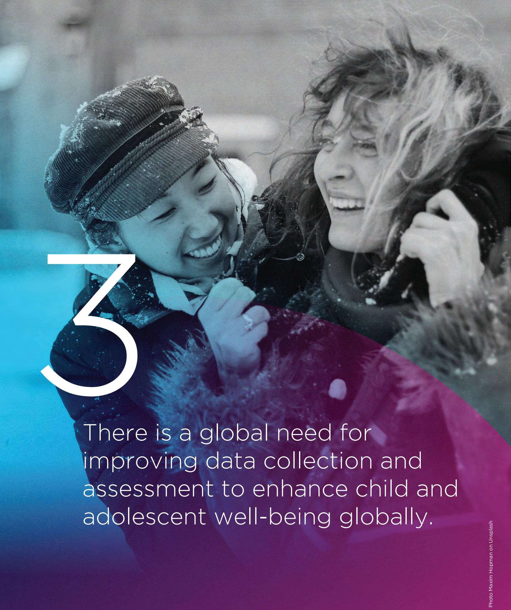

## **Key Insights**

**Life satisfaction gradually drops** from childhood through adolescence into adulthood. Globally, adolescents aged 15-24 report higher life satisfaction than adults aged 25 or above, but the gap is narrowing in Western Europe and recently reversed in North America and Australia and New Zealand (ANZ) due to negative trends for young people. Conversely, the gap is widening in Sub-Saharan Africa due to increasing life satisfaction among the youth.

**In middle-to-late adolescence** (age 15-24), there was a positive 2006-2019 global trend in life satisfaction, which ended with the pandemic, in line with adult trends.

**Global trends obscure regional variations,** some of which differ from adult trends. Negative trends between 2006 and 2022 at age 15-24 are found in North America and ANZ, Western Europe, Middle East and North Africa (MENA), and South Asia, and positive trends in Sub-Saharan Africa, Central and Eastern Europe, the Commonwealth of Independent States, Latin America and the Caribbean, and Southeast Asia.

**In early-to-middle adolescence** (age 10-15), global well-being data is lacking, with many world regions having no available information. Evidence primarily from high-income countries indicates significant life satisfaction declines post-COVID-19, especially among females, contrasting with East Asian countries, where life satisfaction increased. There is mixed evidence regarding pre-pandemic trends.

**Females start reporting lower life satisfaction than males by around age 12.** This gap widens at ages 13 and 15, and the pandemic has amplified these inequalities. These patterns are primarily observed in high-income countries due to limited data worldwide. In contrast, global data for middle-to-late adolescence (age 15-24) shows no global gender differences from 2006 until 2013, but from 2014, females began reporting higher life satisfaction than males, although the gap has narrowed following the pandemic. This global gender gap masks regional differences, and is more pronounced in lower-income countries, with no gender differences observed in high-income countries.

**Life satisfaction levels, trends and correlates vary** across age, gender, world regions and countries, and economic development levels. This underscores the importance of addressing current data gaps to enhance our understanding of child and adolescent well-being and how to promote it globally.

This chapter is the first across the 10+ years of the *World Happiness Report* that explores child and adolescent well-being in some detail. In this chapter, we examine data from four wellestablished international datasets with respondents aged 10-24. We present the global state of child and adolescent well-being, with a focus on levels, trends, inequalities, and correlates. An important aspect of this chapter is a discussion of the shortcomings of the available international data and what action should be taken to improve data quantity and quality, and thereby improve our understanding of child and adolescent well-being and how to improve it worldwide.

#### **Defining Childhood and Adolescence**

In this chapter, we define childhood and adolescence within the age range of 10 to 24, reflecting critical brain development stages.1 The extended upper age boundary might surprise some readers, but contemporary understanding considers adolescence to persist until around 24 years of age,2 aligning with the ongoing brain development linked to adolescence that extends into the early 20s,3 and other aspects of individual development and cultural norms.4 Similarly, childhood spans birth (or conception) to around 10 years, however, we acknowledge that childhood can extend beyond age 10, prompting us to include both terms childhood and adolescence throughout this chapter.

In the analysis and discussion, we differentiate between *early-to-middle adolescence* (ages 10-15) and *middle-to-late adolescence* (ages 15-24). This distinction is needed due to differences in available international datasets, requiring distinct approaches to analyze and interpret the data. We also acknowledge that significant hormonal, physical, neurobiological, psychological, social, and environmental changes occur not only from age 10-24, but also within the two age ranges examined.5 We consider these in the interpretation of the results (e.g. life satisfaction declines from age 10 to 15).

## **Defining Well-Being in Childhood and Adolescence**

Similar to adult research featured in previous *World Happiness Reports*, this chapter centers on child and adolescent *subjective well-being*, which is how young individuals perceive and assess their own lives. Every time we use the term 'well-being' in this chapter, we refer to subjective well-being. The prevailing theoretical framework for subjective well-being in childhood and adolescence (and adulthood) includes affective evaluations (positive and negative emotions), cognitive evaluations (life satisfaction), and sometimes also comprises eudaimonic evaluations (such as meaning and purpose).6 However, there are nuanced differences between approaches in adult and child/adolescent subjective well-being research. Cognitive evaluations, covering overall life satisfaction, also tend to consider domain-specific assessments, such as satisfaction with school, school peers, physical appearance, and time use, to cite a few.7 Additionally, in certain fields like health sciences, mental health is integral to child and adolescent well-being, and the terms are often used interchangeably.8 It is important to acknowledge that these components are primarily derived from a Western perspective due to the origin of much of the research. In this chapter, we focus on cognitive evaluations, specifically overall life satisfaction measured on a 0-10 response scale, driven by data availability and comparability. There are slight differences in the life satisfaction/ evaluation scales used across the data sets examined, which are described below. However, for ease, we refer to them as life satisfaction as this is the established term in the child and adolescent literature.9

## **Child and Adolescent Well-Being: What We Know**

While research into subjective well-being in adulthood has been an established field for many decades,10 subjective well-being as a specific field with children and adolescents is a more recent field of inquiry. Particularly in the last 15 years, increased interest in this field has been driven by advances in child development theory, increased children's rights legislation, and developments in

positive psychology and social science.11 Interest has also increased following some specific research findings. A detailed literature review is beyond the scope of this chapter, but there are a few key findings worth noting. Most of them refer to school-age children and adolescents.

Research has highlighted the importance of consulting children directly, as their subjective well-being is weakly correlated with that of adults or families, and parents' reports of their children's well-being are not always aligned with children's own reports.12 There is evidence supporting the validity and reliability of measuring child subjective well-being and related factors from age 8.13 Evidence from the health literature further supports children as reliable and accurate reporters of their health and well-being, emphasizing the importance of their self-reported perceptions in understanding their experiences.14 There is also specific evidence on the validity of the Cantril Ladder as a measure for adolescent samples of 11, 13, and 15-year-olds.15

Children and adolescents generally report higher subjective well-being than adults, with variations across societies and vulnerable groups, including females, immigrants, children in care, and certain minorities.16 Subjective well-being trajectories show a decline from age 10 to late adolescence and adulthood,17 varying among groups and countries, with evidence suggesting a more profound decline in lower-income countries.18 Furthermore, studies indicate that adolescent subjective well-being is declining in many countries, including evidence from both before19 and after the onset of the COVID-19 pandemic.20 There is also evidence that these declines are more pronounced among females than males,21 and that the drivers of this decline may differ between countries,22 which emphasizes the need for cross-cultural insights.

Childhood and adolescence, besides being crucial life stages in their own right,23 are subjects of interest for their impact on individuals as they transition into adulthood. Research on developmental trajectories from these periods to adulthood reveals a significant influence on later life outcomes, encompassing adult well-being, labor market success, physical health, and relationships. There

*The best predictor for adult life satisfaction is subjective well-being and emotional health during childhood.*

is evidence that indicates that the best predictor for adult life satisfaction is subjective well-being and emotional health during childhood, and that the next major influence on emotional health, after family, is school both in childhood and adolescence.24 In addition, further research suggests that subjective well-being in adolescence predicts levels of income in adulthood, even when employing family-fixed-effects (with sibling clusters) and controlling for factors such as education, intelligence quotient, physical health, height, self-esteem, and later happiness. These findings were mediated by a higher probability of obtaining a college degree, getting hired and promoted, having higher degrees of optimism and extraversion, and less neuroticism.25 Thus, childhood and adolescence represent periods of considerable importance and a unique window opportunity for intervention, allowing for strong and positive impacts on global society.

A range of factors have been found to explain variations in child and adolescent subjective well-being. There is a nuanced association with socio-economic status, with stronger links to material deprivation – especially when measured via child-derived indices – than family income.26 Relationships, both with parents and peers, play a substantial role, and schools are considered as key domains where policy interventions can make a significant impact. Factors like bullying and school-related anxiety influence subjective well-being, but this relationship is nuanced and varies across population groups, countries, and measures.27 Other influential drivers include aspects related to various life domains, including health, physical activity, time use, neighborhood, safety, and children's rights.28 Most of the drivers identified in the literature are factors in the close environment, such as family, school, and community.29 Associations with subjective well-being have been found for some childfocused macro-level factors (e.g.spending on families and education as a percentage of GDP).30 However, for many others, and particularly macro-economic factors, associations are found for adults but not for children and adolescents aged 10-15.31 Indeed, researchers have reported counterintuitive results, such as findings on the negative association between the country level of economic development and adolescent subjective well-being at age 15.32 However, some of these counterintuitive findings may be the results of adolescents from non-high-income countries not being considered in these analyses as data in these countries is not available for younger adolescents.33

It is important to note that most of what we know about child and adolescent subjective well-being is mainly from adolescents in high-income countries. Thus, improved worldwide data collection is crucial for understanding and promoting adolescent subjective well-being globally.

## **International Data on Child and Adolescent Well-Being**

Despite the surge of interest in these critical developmental periods, the available international data on child and adolescent subjective well-being remains notably limited. As a result, while subjective well-being research within specific cultural contexts is abundant,34 international research remains comparatively scarce. Four major cross-sectional datasets provide information on child and/or adolescent subjective well-being (see Box 1 for details): the Programme for International Student Assessment (PISA) survey; the Health Behaviour in School-aged Children (HBSC) survey; the International Survey of Children's Well-being (ISCWeB or "Children's Worlds"); and the Gallup World Poll (GWP). Children's Worlds explicitly centers on child subjective well-being, and not only measures life satisfaction (the cognitive component) but also affective and eudaimonic components, which are crucial for holistic analyses.35 In contrast, the other studies measure subjective well-being but not as their primary focus. The GWP, though collecting nationally representative data for their entire sample aged 15+ to late adulthood, lacks such

representation for the subset used in this chapter, focusing on adolescents aged 15-24 (middle-to-late adolescence). However, the GWP collects global data from 120-140 countries in most world regions, including many low-income countries. By contrast, PISA, HBSC, and Children's Worlds collect nationally representative samples of adolescents aged 10 to 15 (early-to-middle adolescence) in some 20-70 countries and territories, mostly in high-income, Western societies.

The *World Happiness Report* 2023 underscored the natural approach of measuring a nation's happiness by asking a nationally-representative sample about their life satisfaction.36 In the annual *World Happiness Report* rankings, the Cantril Ladder from the Gallup World Poll gauges well-being or "happiness".37 In this chapter on childhood and adolescence well-being, data is drawn from these four surveys focusing on their overall life satisfaction/evaluation measures on an 11-point response scale. This is the only comparable measure in the four data sets, although each survey uses a slightly different version, as described in Box 1. This 11-point scale enhances sensitivity for adolescent respondents in most countries compared to shorter scales,38 and enables us to develop measures of subjective well-being inequalities (e.g. gender and age-based differences) that are consistent across surveys. As explained earlier, for ease, we use the term life satisfaction throughout this chapter.

The four surveys examined represent significant endeavors in collecting extensive international child and adolescent well-being data. However, before delving into the results of our analyses, it is essential to acknowledge a few key data limitations affecting the analysis and the subsequent discussion. A primary challenge is the lack of a standardized subjective well-being measure across surveys. Two surveys (HBSC and GWP) utilize a version of the Cantril Ladder, akin to the one used for the adult global happiness ranking in the *World Happiness Report*, while PISA and Children's Worlds employ a question about overall life satisfaction. Another limitation stems from the age distribution in the datasets; none cover the entire span from childhood to late adolescence or adulthood, constraining the ability

## **Box 3.1: Which large international datasets include measures of child and adolescent well-being?**

**PISA** is the OECD's Programme for International Student Assessment which surveys nationally representative samples of young people aged 15 across 70 countries/territories.39 The main focus of the questionnaire is young people's ability to apply their mathematical, reading, and science skills to real-life challenges. While subjective well-being questions have inconsistently been included in the PISA, data on life satisfaction has been systematically collected in most participating countries in the last three waves (2015, 2018, 2022). In 2022, 74 countries and territories collected life satisfaction data (43 high-income, 24 upper-middle-income, 7 lower-middle-income, zero low-income in the 2022 edition). PISA employs a one-item measure of life satisfaction: "The following question asks how satisfied you feel about your life, on a scale from "0" to "10". Zero means you feel 'not at all satisfied' and "10" means 'completely satisfied'. Overall, how satisfied are you with your life as a whole these days?".

The **HBSC** survey is conducted in collaboration with the WHO Regional Office for Europe. It assesses the health and well-being of adolescents across Europe, North America, and – more recently – Central Asia, using nationally representative samples at ages 11, 13, and 15. There are six waves of data that include subjective well-being measurements (2002, 2006, 2010, 2014, 2018, 2022). The most recent waves included 39 European and North American countries and 5 Commonwealth of Independent States (CIS) in Central Asia in 2022 (35 high-income, seven uppermiddle-income, one lower-middle-income, and one low-income). Subjective well-being is assessed using an adapted version of the Cantril Ladder measuring life satisfaction: "Here is a picture of a ladder. The top of the ladder '10' is the best possible life for you, and

the bottom '0' is the worst possible life for you. In general, where on the ladder do you feel you stand at the moment? Tick the box next to the number that best describes where you stand."

The **Children's Worlds** survey explores the subjective well-being of children aged 8, 10, and 12, using nationally representative samples of 1000 children in up to 35 countries per wave. There have been three waves of data collection (2011-12, 2013-14, 2017-19), plus a post-COVID-19 wave in 2020-22, which was not nationally representative. The 2017-19 wave expanded to include 30-35 countries (depending on age group; 21-25 high-income, five upper-middle-income, five lower-middleincome, and zero low-income). This study includes a "0" to "10" life satisfaction item: "How satisfied are you with each of the following things in your life? […] 0 = Not at all satisfied; 10 = totally satisfied […]. Your life as a whole". Data from children aged 8 was excluded in this chapter as the response scale used was different making comparability more challenging.

The **Gallup World Poll** has tracked the most important issues annually worldwide since 2005. Responses from 15-64-year-olds are representative across 140-160 countries, and the sample includes many lower-middle and low-income countries. For the 15-24 age group employed in this chapter, the sample is not representative. The Cantril Ladder is used to assess life satisfaction: "Please imagine a ladder with steps numbered from zero at the bottom to 10 at the top. The top of the ladder represents the best possible life for you, and the bottom of the ladder represents the worst possible life for you. On which step of the ladder would you say you personally feel you stand at this time?".

to consistently analyze well-being responses across various age groups. Additionally, a predominant focus on high- and upper-middleincome countries (mostly Western nations) in the data covering early-to-middle adolescence (age 10-15) raises concerns about the generalizability of many findings to lower-income countries. A more detailed discussion of these and other limitations follows at the end of this chapter.

#### **This Chapter**

Despite these limitations, this chapter provides a comprehensive examination of global child and adolescent subjective well-being. It begins by exploring life satisfaction levels and trends among children and adolescents, with consideration of regional, gender, and age group variations. The following section offers an overview of current country-level life satisfaction in the post-pandemic world and how these vary across different age groups. We then present correlational analyses

to examine inequalities across different sociodemographic groups, and assess how factors within distinct life domains contribute to variations in adolescent life satisfaction. Subsequently, we discuss our findings, as well as shortcomings in international child and adolescent subjective well-being data and how these limitations impact our understanding. Finally, we conclude the chapter by highlighting initiatives that are making major inroads in improving data availability and assessing and promoting child and adolescent well-being, which serve as inspiration for exploring further necessary steps to collectively enhance the well-being of children and adolescents globally.

## **Trends in Child and Adolescent Well-Being**

The four data sets examined differ significantly in participant age, data collection commencement, number and frequency of waves, representative-

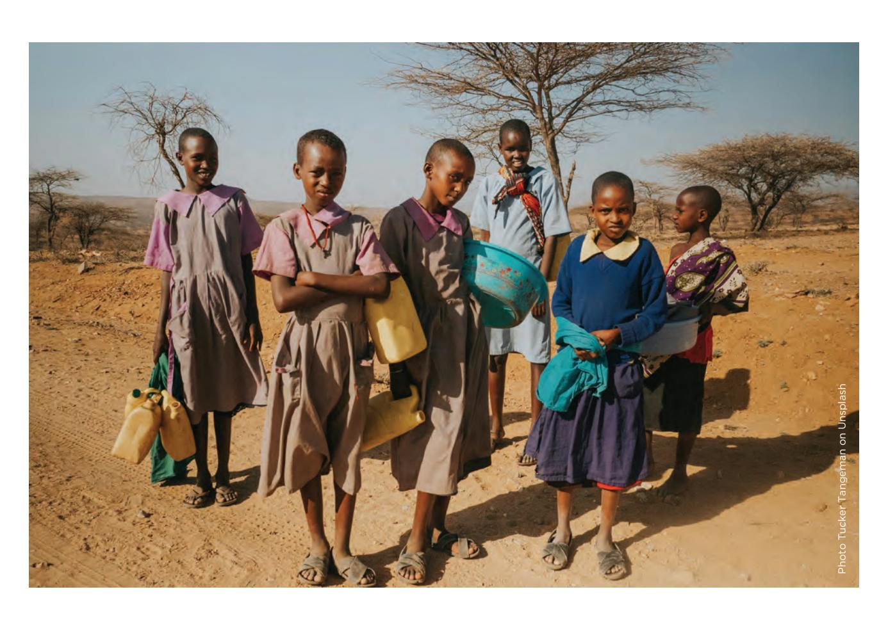

ness of the samples, and participating countries and territories. These differences, described above, imply that different analytical approaches are needed to study trends across these data sets. Specifically, in middle-to-late adolescence (age 15-24), we use the GWP to study population changes over time at the global- and regional-level, similar to past *World Happiness Report* editions.40 The small *n* per country and wave (see Table A1.1 in Appendix 1) prevent us from conducting rigorous assessments at the country level. In contrast, in early-to-middle adolescence (age 10-15), conducting robust analyses at the global level and in most regions is not possible. Thus, we analyze PISA, HBSC, and Children's Worlds data to examine trends in country means and discuss them in the context of regional trends when feasible.

Furthermore, in view of evidence of pre-COVID-19 trends in adolescent life satisfaction in multiple countries,41 the further negative impact of the COVID-19 pandemic on children and young people's subjective well-being,42 and gender differences in adolescent subjective well-being trends,43 our analyses emphasize the distinction between pre- and post-COVID-19 trends and examine gender differences whenever possible.

## **Global Levels and Trends in Middle-to-Late Adolescence (Age 15-24): Gallup World Poll**

In our analysis of global trends using the GWP data, we assign countries equal weight in the analysis regardless of their population to replicate the main analysis presented in previous editions of the *World Happiness Report* for the adult population (e.g. Figure 2.2 in the 2022 edition).44 Four main findings emerge (Figure 3.1A). First, global life satisfaction is higher at age 15-24 than at age 25 or above. Second, trends in middle-tolate adolescence (age 15-24) are similar to those observed in the adult population45 and those aged 25 or above before the COVID-19 pandemic, with evidence of a moderate increase in global life satisfaction between 2006 and 2019. Third, the pandemic ended positive global trends. And fourth, there are no gender differences until 2013, but females aged 15-24 begin to report higher life satisfaction than males from 2014, although this

gender gap has narrowed after the COVID-19 pandemic. Despite 95% confidence interval overlap in 2022 in Figure 3.1B, small gender differences are still observed in 2022 in the correlational analysis presented below in Table 3.3, which uses a slightly different (more global) sample of countries.

The use of slightly different samples of countries in different parts of the analysis is needed due to data limitations. In 2020, the number of countries where data were collected dropped significantly, especially in low-income countries (see Table A1.1 in Appendix 1). In the global trends in Figures 3.1A and 3.1B, we decided to use data only from the countries where data were collected in 2020 (i.e. consistent sample) to ensure that these trends represent a consistent sample of countries. The main caveat is that these global trends are somewhat less global as they exclude a number of low-income countries that were not sampled in 2020. For clarity, Figure A1.1 in Appendix 1 shows a comparison of global trends using an inconsistent sample (i.e. considering all the countries with available data each year) and a consistent sample (i.e. considering only the countries where data were collected in 2020). The former shows a peak in 2020/21 due to the reduced number of lowincome countries, where life satisfaction tends to be lower on average. In contrast to this approach, in the analysis of regional trends presented in the next section, we considered more adequate to use data from all the countries with available data each year as otherwise some regions (e.g. Sub-saharan Africa) would represent a small, far less representative sample of countries. The main caveat is that 2020-21 levels in certain lowincome regions are to be interpreted with caution.

## **Regional Levels and Trends in Middle-to-Late Adolescence (Age 15-24): Gallup World Poll**

Positive 2006 to 2022 global trends contrast with the large body of research reporting on international declines in youth subjective well-being in the last 10-15 years. Since declines have largely been documented in high-income, Western nations, it seems plausible that positive global trends mask regional and country trends moving in opposite directions, with increases in less

**Fig. 3.1A: Global levels and trends in life satisfaction from 2006 through 2022.**  Gallup World Poll (age 15-24 vs. age 25+)

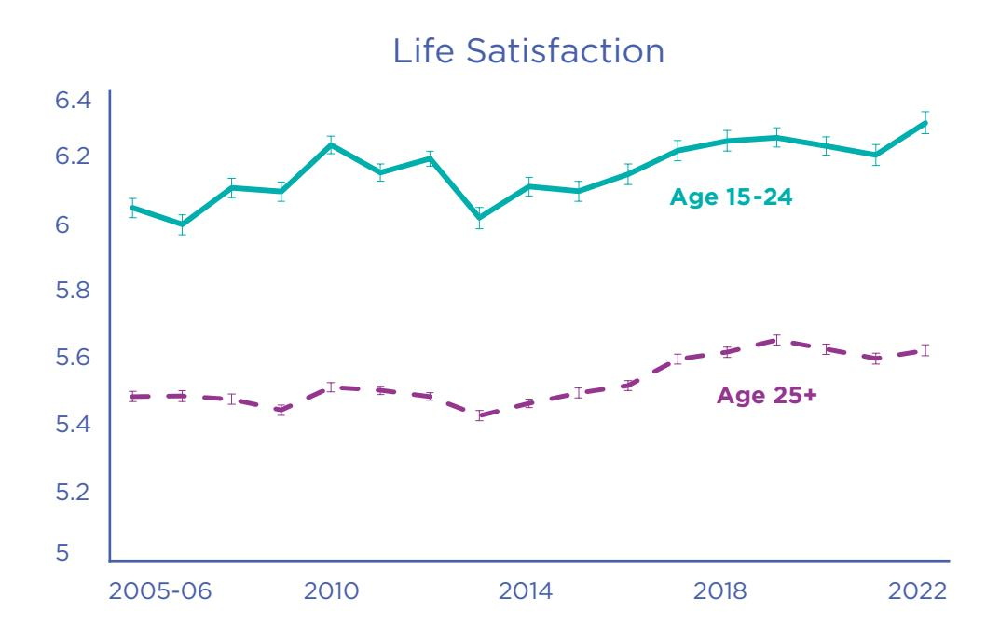

**Fig. 3.1B: Global levels and trends in life satisfaction from 2006 through 2022.**  Gallup World Poll (age 15-24), by gender

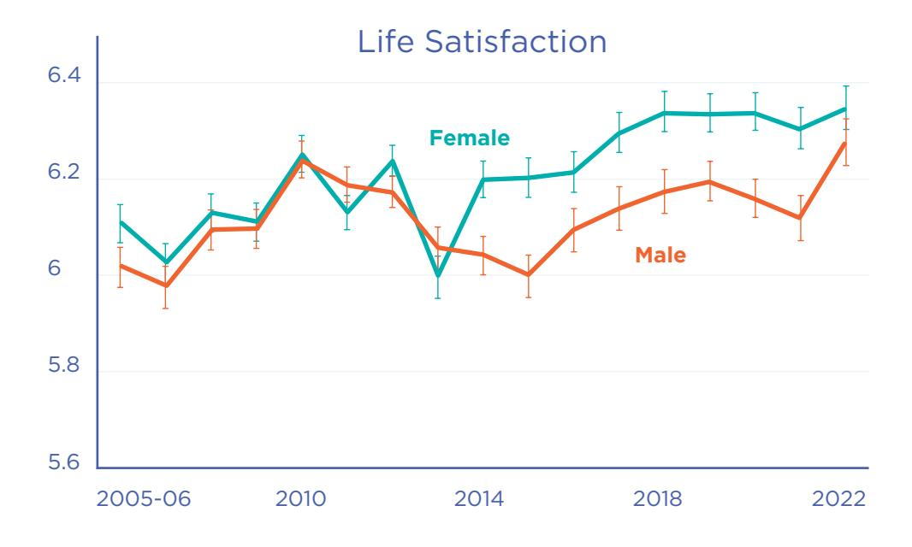

surveyed regions compensating for potential declines in the most commonly surveyed regions. We now turn our attention to this issue by examining trends at regional and country levels. Using GWP data, we explore regional trends across the 10 world regions commonly examined in the *World Happiness Report* (see Figure 3.2A and Figure A1.2C, Figure 3.2B, Figure 3.2C, and Figure A1.3), revealing four key findings.

#### *Positive Regional Trends*

Positive trends emerged in various regions during the period 2006-2019, including the CIS, Central and Eastern Europe, Sub-Saharan Africa, Latin America and the Caribbean, and Southeast Asia. The former two regions exhibit more sustained trends, while the latter three display greater volatility. Comparatively, life satisfaction levels in 2022, when contrasted with 2019, remain similar in the CIS and Central and Eastern Europe, decrease in Sub-Saharan Africa, and slightly increase in Latin America and the Caribbean. There is also some evidence of a positive trend in East Asia, where life satisfaction is substantially higher in 2006 than in 2007 partly due to the non-inclusion of Mongolia in 2006, which drags down the East Asian series, and the non-inclusion of Taiwan in 2007, the happiest country in the region in 2006. When considering 2007 or 2008 as a reference instead, a positive pre-COVID-19 trend is observed in East Asia, followed by a further increase from 2019 to 2022. There is minimal evidence of gender differences throughout the series in the CIS, Central and Eastern Europe, Latin America and the Caribbean, and Southeast Asia. In contrast, females exhibit higher life satisfaction than males in East Asia during the period 2006-11 and in Sub-Saharan Africa during the period 2018-21.

#### *Negative Regional Trends*

Negative trends preceding the COVID-19 era (2006/07-2019) are evident in the Middle East and North Africa (MENA), South Asia, North America (Canada and the United States), Australia and New Zealand (ANZ), and Western Europe. In Western Europe, despite minimal 95% confidence interval overlap between 2006 and 2019 estimates, the declining trend is noticeable when comparing

the periods 2006-12 and 2013-18. Regarding post-COVID-19 trends in these regions, life satisfaction levels in 2022 are similar to 2019 in all these regions, except for Western Europe, where a clear decline is apparent. However, the small sample size, leading to larger 95% confidence intervals, may obscure further declines in North America and ANZ. The 2020 increase in South Asia is explained by Afghanistan, which drags down South Asian levels throughout the entire series, especially in recent years (see Figure A1.2A in Appendix 1), and did not collect data in 2020. There are no gender differences in any of these regions, except for the MENA, which is the only world region where females consistently exhibit higher life satisfaction than males throughout the entire series.

#### *Sub-Regional and Country Trends*

Positive and negative trends at both sub-regional and country levels can be observed within specific regions. For instance, when separating North America from ANZ in Figure A1.3 in Appendix 1, despite limitations in sample size, we identify stable pre-COVID-19 trends from 2006 to 2019 and a post-COVID-19 decline in ANZ. In contrast, declining trends in North America appear to have started several years before the COVID-19 pandemic. Rigorous assessment of gender differences is hindered by a small sample size. It is conceivable that other intra-regional trends may exist in some of these large and diverse regions. Unfortunately, small sample size limitations involving this age group restrict our ability to thoroughly explore this question. However, in Figure A1.2A-B in Appendix 1, we present some instances of country-level trends in countries where previous evidence on adolescent subjective well-being is almost non-existent as these data are rarely collected in these nations. This includes some positive trends (Mongolia, Togo, Ivory Coast, and Gabon) and negative trends (Lebanon and Afghanistan).

## *Contrasts with Adult Trends*

When comparing regional trends for those ages 15-24 and aged 25 or above, contrasting patterns are evident. These are illustrated in Figure A1.3 in Appendix 1, as well as in Figure 3.2C for some

**Fig. 3.2A: Regional levels and trends in life satisfaction from 2006 through 2022.**  Gallup World Poll (age 15-24)

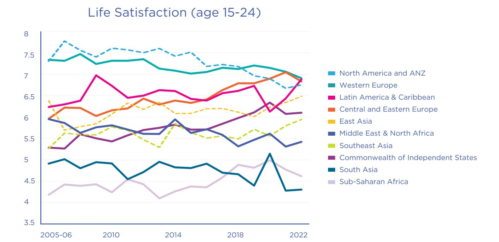

selected regions. The gap is notably large in the CIS, Latin America and the Caribbean, and especially in Central and Eastern Europe. Additionally, the gap varies over the years in some regions as shown in Figure 3.2C. In Sub-Saharan Africa, the gap widened from 2013 due to stable life satisfaction levels among those aged 25+ and positive trends among those aged 15-24. In contrast, the gap has narrowed in Western Europe for over a decade due to a moderate negative trend among adolescents (age 15-24) and a moderate positive trend among those aged 25 and above. In North America and ANZ, despite 95% confidence interval overlaps in some years, there is evidence of a potential reversal in this gap in recent years, suggesting that life satisfaction could now be higher among those aged 25+ than among those aged 15-24, which is not observed anywhere else. Separate analyses for North America and ANZ are shown in Figure A1.3 in Appendix 1, which suggest the same pattern in both regions – and especially in North America – despite 95% confidence interval overlaps likely due to small sample size.

Further evidence of age-based differences in regional trends can be observed in Chapter 2.46

**Regional and Country Levels and Trends in Early-to-Middle Adolescence (Age 10-15). Data from PISA (Age 15), HBSC (Age 15, 13, 11), and Children's Worlds (Age 12, 10)**

In early-to-middle adolescence (age 10-15), global subjective well-being analyses are not possible due to limited data, mainly available in highincome Western countries. Consequently, we focus on regional and country trends, starting with those aged 15 and then shifting to age 10-13. Assessing regional trends is complex in PISA and HBSC, and unfeasible in Children's Worlds, due to a limited number of participating countries and data gaps across waves. This limitation hampers the ability to make robust, evidence-based claims about regional trends. As a result, we turn to national trends, presented in Tables A1.2-A1.3 in Appendix 1, with discussions considering regional contexts where possible.

**Fig. 3.2B: Regional levels and trends in life satisfaction from 2006 through 2022.** 

Gallup World Poll (age 15-24), by gender

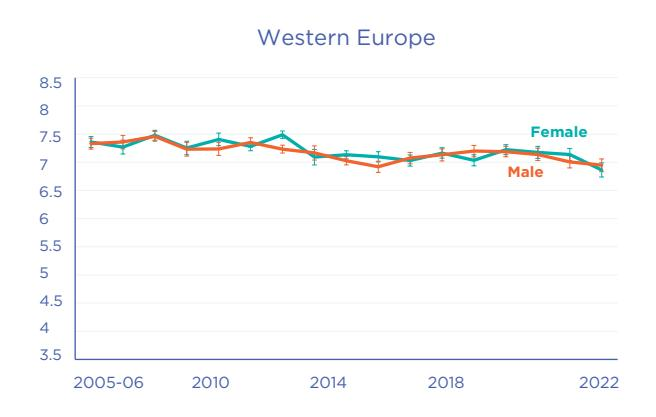

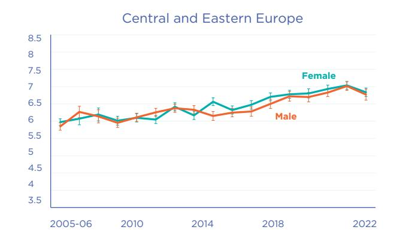

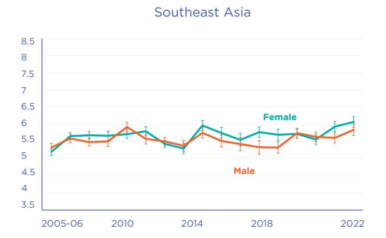

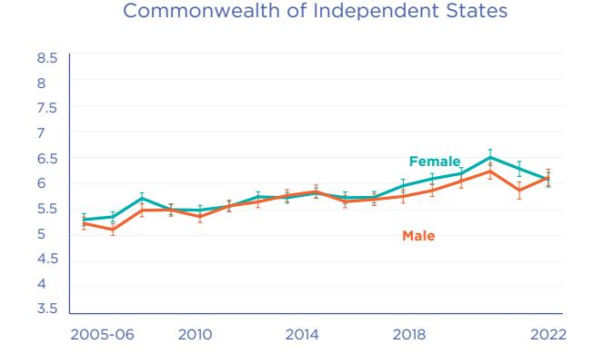

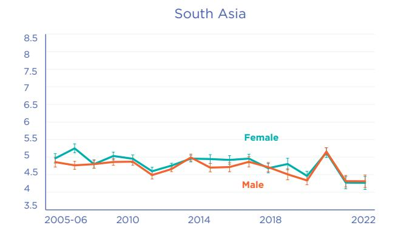

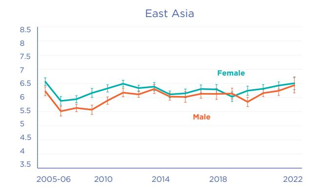

**Fig. 3.2B: Regional levels and trends in life satisfaction from 2006 through 2022.** (continued) Gallup World Poll (age 15-24), by gender

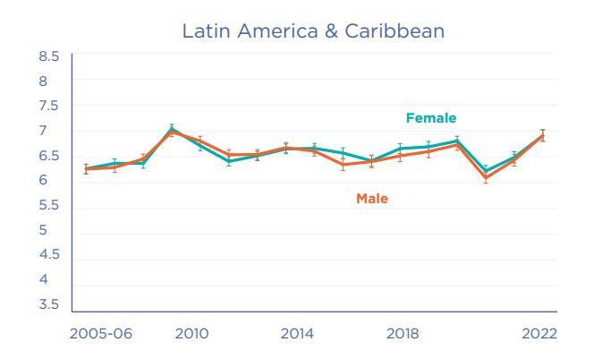

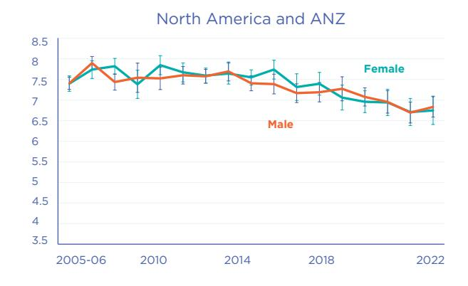

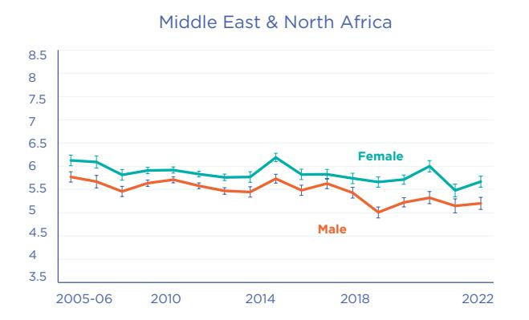

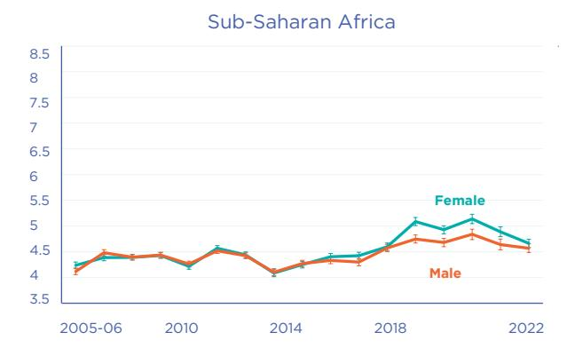

#### *Age 15*

From PISA and HBSC data, two key findings emerge. Firstly, both datasets reveal a significant post-COVID-19 decline in most countries with available data (mainly high-income, Western nations), with a more pronounced decrease among females. Notably, some countries in East Asia (Japan, Macau, Taiwan, and Hong Kong) show an increase, as indicated by PISA data, the only study collecting information in these regions. In HBSC, post-pandemic declines are noted in countries in North America (Canada), Western Europe, Central and Eastern Europe, and the CIS. In PISA, similar declines are observed across countries in these regions, as well as in the MENA, Latin America and the Caribbean, and Southeast Asia.

The second key finding at age 15 is the existence of mixed results concerning pre-COVID-19 trends, with notable disparities in country means and trends between PISA and HBSC. This is detailed in Table 3.1, and further explored in Appendix 2 (Table A2.1 and Figure A2.1). PISA indicates a pre-COVID-19 decline in most countries with data from 2015 and 2018, encompassing North America, Western Europe, Central and Eastern Europe, the CIS (Russia), Latin America and the Caribbean, MENA, and East Asia. This decline is more prominent among females, particularly in Central and East Europe, the CIS (Russia), Latin America and the Caribbean, and East Asia (see Table A1.2 in Appendix 1). Notably, the only pre-COVID-19 increase is observed in South Korea, though this

**Fig. 3.2C: Regional levels and trends in life satisfaction from 2006 through 2022.** 

Gallup World Poll (age 15-24 vs. age 25+)

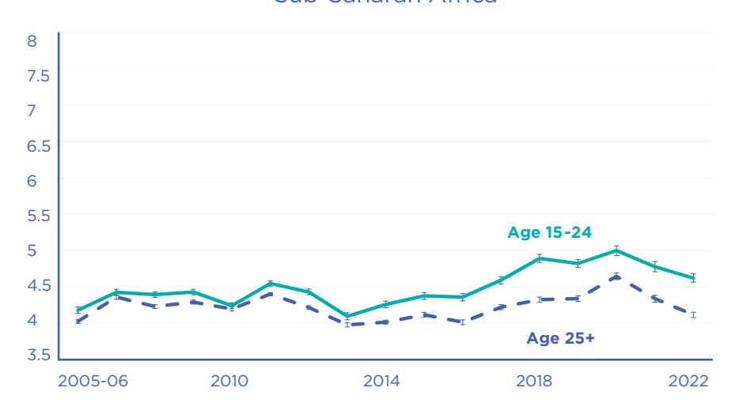

## North America and ANZ

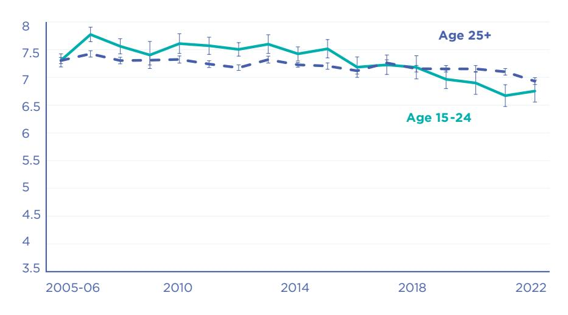

masks a decline among females and an increase among males (see Table A1.2 in Appendix 1). This underscores the importance of assessing inequalities across distinct socio-demographic groups within countries, achievable only through nationally representative samples of the studied population group.

In contrast, in many countries where PISA indicates a pre-COVID-19 decline between 2015 and 2018, this decline is absent in HBSC data from 2013/14 to 2017/18. In Western Europe, HBSC data depicts a mixed picture, predominantly showing increases, while PISA consistently indicates declines. In Central and Eastern Europe, HBSC shows an overall increase and PISA an overall decline. In Russia, the only CIS country with comparable data, PISA indicates a decline, contrasting with HBSC's absence of statistically

significant changes (*p*<0.05). Discrepancies in country means, as seen in Table A2.1 and Figure A2.1 in Appendix 2, may explain disparities in trends. Although most differences in country means are minor, a few instances reveal surprisingly large gaps, with PISA estimates generally lower than HBSC estimates. In the U.K., for instance, HBSC 2017/18 shows life satisfaction levels almost 1 point higher than PISA 2018. Considering research evidence of subjective well-being declines throughout adolescence,47 this discrepancy may partly be explained by the fact that most students surveyed in HBSC are enrolled in Year 10, while in PISA, unlike most participating countries, most students surveyed in England, Northern Ireland, Scotland and Wales are enrolled in Year 11. Appendix 2 delves into a detailed discussion of factors potentially explaining PISA-HBSC discrepancies, including variations in the life satisfaction measure, the year and month of data collection, survey context (e.g., right after/before taking an academic test in PISA), the target population (e.g. differences in the average age and school year), and sampling issues (notably exclusions in PISA).

In view of the above, it is evident that while there is robust evidence of post-COVID-19 declines in nearly all examined countries (with increases in most East Asian nations), caution is warranted when interpreting evidence on pre-COVID-19 trends at age 15, where contrasting results emerge in many countries. National studies, such as those in the U.K. outlined in Appendix 2, can provide further support to trends observed in international studies. However, in countries lacking alternative data, making definitive claims about trends during these years for this age group is challenging. Further research is essential to elucidate the factors contributing to these discrepancies.

#### *Age 10-13*

Unlike PISA, HBSC collects data from younger adolescents aged 13 and 11, enabling an examination of longer-term trends starting from 2001/02. Table A1.3 and Figure A1.4 in Appendix 1 show stability in most countries and sustained prepandemic trends in some regions. Canada, the only North American country with data throughout the series, exhibits a continuous negative trend predating the pandemic, persisting into 2022, primarily driven by a decrease among females (see Figure A1.4 in Appendix 1). Males in Canada experience a negative trend affecting only 15-year-olds post-COVID-19, while females endure a prolonged negative trend impacting those aged 13 and 15 for over a decade before the pandemic, as well as those aged 11 after the pandemic. Negative pre-pandemic trends (2005/06-17/18) are also observed in the MENA countries Turkey and Israel. Conversely, sustained pre-pandemic positive trends are noted across several HBSC waves in countries in Central and Eastern Europe, including Croatia, Latvia, and Estonia. The picture is more mixed in the CIS and Western Europe. Lastly, the post-pandemic decline observed in those aged 15 is mirrored in those aged 13 and 11, affecting all regions with available data, including North America (Canada), Western Europe, and Central and Eastern Europe. This decline is prevalent across most countries surveyed in 2017/18 and 2021/22, with a more substantial impact on females and older age groups.

Moving to younger children and adolescents, trend analyses in Children's Worlds (age 12, 10) are not feasible due to the data limitations explained earlier. However, country-level estimates by survey wave and gender, presented in Table A1.5 in Appendix 1, suggest a decline in most participating countries following the COVID-19 pandemic.

## **Current Global State of Child and Adolescent Well-Being**

Providing an overview of the current global state of child and adolescent subjective well-being in the post-pandemic world is imperative given the widespread post-COVID-19 decline in life satisfaction, along with age-related and geographic patterns and the earlier-discussed data limitations. Country means in life satisfaction across age groups, studies, and countries/territories are outlined in Tables 3.2A-J (alphabetically ordered within each of the 10 world regions) and Tables A1.6A-D in Appendix 1 (countries ranked by GDP).

## **Middle-to-Late Adolescence (Age 15-24): Gallup World Poll**

There are notable regional differences in life satisfaction in middle-to-late adolescence, with Israel, parts of Central and Eastern Europe (Croatia, Serbia, Lithuania, Romania), and Northern Europe reporting the highest levels and Sub-Saharan Africa and South Asia recording the lowest in the GWP (age 15-24). The poor performance in South Asia is mostly driven by the extremely low life satisfaction reported by adolescents in Afghanistan. All this is consistent with adult data, with the exception of the cited Central and Eastern European countries, which are found much lower in the adult ranking, and North America, ANZ, and Western Europe, where adult life satisfaction is much higher compared to other regions.48

## **Early-to-Middle Adolescence (Age 10-15): PISA, HBSC, and Children's Worlds**

The main observation is the limited number of countries collecting subjective well-being data in early-to-middle adolescence, primarily high-income Western nations (although Table A2.1 in Appendix 2 indicates increased participation from lower-income countries in recent years, notably in PISA 2022). In the available data, regional variations are evident. PISA 2022 data reveal the highest life satisfaction in Central and Eastern Europe (particularly in the Balkans), and the CIS, with the lowest in East Asia, North America and ANZ, and MENA. HBSC data, primarily focused on Europe, North America and the CIS, indicates highest life satisfaction levels in the Balkans and CIS countries, and lowest in North America (Canada) and specific European nations like Ireland, the U.K., Italy,

**Table 3.1: Regional and country in PISA (2015-18-22) and HBSC (2013/14-17/18-21/22)**

|                            |      | PISA (Age 15) |      |           |           |  | HBSC (Age 15) |               |         |               |               |  |  |
|----------------------------|------|---------------|------|-----------|-----------|--|---------------|---------------|---------|---------------|---------------|--|--|
|                            |      | Country means |      |           | Trends    |  |               | Country means |         |               | Trends        |  |  |
| Country                    | 2015 | 2018          | 2022 | 2015–18   | 2018–22   |  | 2013/14       | 2017/18       | 2021/22 | 2013/14–17/18 | 2017/18–21/22 |  |  |
| Western Europe             |      |               |      |           |           |  |               |               |         |               |               |  |  |
| Austria                    | 7.52 | 7.14          | 6.69 | -0.39     | -0.44     |  | 7.53          | 7.29          | 7.20    | -0.24         | non.sign.     |  |  |
| Belgium                    | 7.49 |               |      |           |           |  |               |               |         |               |               |  |  |
| Belgium (Flemish)          |      |               |      |           |           |  | 6.89          | 7.48          | 7.46    | 0.60          | non.sign.     |  |  |
| Belgium (French)           |      |               |      |           |           |  | 7.19          | 7.22          | 6.81    | non.sign.     | -0.41         |  |  |
| Cyprus                     |      |               |      |           |           |  | 6.99          |               | 7.45    |               |               |  |  |
| Denmark*                   |      |               | 7.19 |           |           |  | 7.37          | 7.48          | 7.10    | non.sign.     | -0.39         |  |  |
| Finland                    | 7.89 | 7.61          | 7.41 | -0.28     | -0.21     |  | 7.47          |               | 7.46    |               |               |  |  |
| France                     | 7.63 | 7.19          | 6.77 | -0.44     | -0.42     |  | 6.97          | 7.28          | 6.91    | 0.32          | -0.37         |  |  |
| Germany                    | 7.35 | 7.02          | 6.51 | -0.33     | -0.51     |  | 7.05          | 7.33          | 7.12    | 0.28          | -0.21         |  |  |
| Greece                     | 6.91 | 6.99          | 6.62 | non.sign. | -0.37     |  | 7.16          | 7.04          | 6.70    | non.sign.     | -0.34         |  |  |
| Greenland                  |      |               |      |           |           |  | 7.48          | 7.49          | 6.66    | non.sign.     | -0.83         |  |  |
| Iceland                    | 7.80 | 7.34          | 6.90 | -0.46     | -0.44     |  | 7.47          | 7.26          | 7.12    | -0.21         | -0.14         |  |  |
| Ireland*                   | 7.30 | 6.74          | 6.59 | -0.57     | -0.15     |  | 7.01          | 6.89          | 6.22    | non.sign.     | -0.67         |  |  |
| Italy                      | 6.89 | 6.91          | 6.53 | non.sign. | -0.38     |  | 6.95          | 7.11          | 6.55    | 0.16          | -0.55         |  |  |
| Luxembourg                 | 7.38 | 7.04          |      | -0.34     |           |  | 7.01          | 7.35          | 7.10    | 0.33          | -0.24         |  |  |
| Malta                      |      |               | 6.24 |           |           |  | 7.11          | 6.71          | 6.48    | -0.40         | -0.23         |  |  |
| Netherlands*               | 7.83 | 7.50          | 7.29 | -0.33     | -0.21     |  | 7.36          | 7.33          | 6.90    | non.sign.     | -0.43         |  |  |
| Norway                     |      |               |      |           |           |  | 7.54          | 7.48          | 7.05    | non.sign.     | -0.43         |  |  |
| Portugal                   | 7.36 | 7.13          | 7.06 | -0.24     | non.sign. |  | 6.99          | 7.35          | 7.05    | 0.36          | -0.29         |  |  |
| Spain                      | 7.42 | 7.35          | 6.88 | non.sign. | -0.46     |  | 7.30          | 7.64          | 6.77    | 0.34          | -0.87         |  |  |
| Sweden                     |      |               | 6.91 |           |           |  | 6.83          | 7.10          | 6.80    | 0.27          | -0.30         |  |  |
| Switzerland                | 7.72 | 7.38          | 7.06 | -0.34     | -0.31     |  | 7.54          | 7.34          | 6.99    | -0.19         | -0.35         |  |  |
| U.K.*                      | 6.98 | 6.16          | 6.07 | -0.81     | non.sign. |  |               |               |         |               |               |  |  |
| U.K. (England)             | 6.94 | 6.12          | 6.01 | -0.82     | non.sign. |  | 6.81          | 7.11          | 6.51    | 0.30          | -0.60         |  |  |
| U.K. (Northern Ireland)    | 7.24 | 6.58          | 6.50 | -0.67     | non.sign. |  |               |               |         |               |               |  |  |
| U.K. (Scotland)            | 7.17 | 6.25          | 6.48 | -0.92     | 0.23      |  | 7.14          | 7.03          | 6.66    | non.sign.     | -0.37         |  |  |
| U.K. (Wales)               | 7.13 | 6.45          | 6.16 | -0.68     | -0.29     |  | 6.93          | 7.09          | 6.61    | 0.16          | -0.48         |  |  |
| Average                    | 7.37 | 6.94          | 6.69 | -0.51     | -0.31     |  | 7.17          | 7.25          | 6.90    | 0.15          | -0.43         |  |  |
|                            |      |               |      |           |           |  |               |               |         |               |               |  |  |
| Central and Eastern Europe |      |               |      |           |           |  |               |               |         |               |               |  |  |
| Albania                    |      |               | 8.01 |           |           |  | 7.71          | 7.56          | 8.14    | non.sign.     | 0.58          |  |  |
| Bulgaria                   | 7.42 | 7.15          | 7.04 | -0.26     | non.sign. |  | 7.43          | 7.59          | 7.10    | 0.16          | -0.49         |  |  |
| Croatia                    | 7.90 | 7.69          | 7.37 | -0.22     | -0.32     |  | 7.49          | 7.72          | 7.57    | 0.23          | -0.15         |  |  |
| Czech Republic             | 7.05 | 6.91          | 6.56 | -0.14     | -0.36     |  | 6.99          | 7.43          | 7.26    | 0.44          | -0.17         |  |  |
| Estonia                    | 7.50 | 7.19          | 6.91 | -0.31     | -0.28     |  | 7.33          | 7.35          | 6.95    | non.sign.     | -0.40         |  |  |
| Hungary                    | 7.17 | 7.12          | 7.21 | non.sign. | non.sign. |  | 7.09          | 7.14          | 6.99    | non.sign.     | non.sign.     |  |  |
| Kosovo                     |      |               | 7.87 |           |           |  |               |               |         |               |               |  |  |
| Latvia*                    | 7.37 | 7.16          | 6.76 | -0.21     | -0.40     |  | 7.06          | 7.00          | 6.73    | non.sign.     | -0.27         |  |  |
| Lithuania                  | 7.86 | 7.61          | 7.14 | -0.26     | -0.47     |  |               | 7.47          | 6.95    |               | -0.52         |  |  |
| Montenegro                 | 7.75 | 7.69          | 7.52 | non.sign. | -0.16     |  |               |               |         |               |               |  |  |
| North Macedonia            |      |               | 7.65 |           |           |  | 7.11          | 7.82          | 7.42    | 0.70          | -0.39         |  |  |
|                            |      |               |      |           |           |  |               |               |         |               |               |  |  |
| Poland                     | 7.18 | 6.74          | 6.26 | -0.44     | -0.49     |  | 6.80          | 7.03          | 6.20    | 0.23          | -0.84         |  |  |
| Romania                    |      |               | 7.53 |           |           |  | 7.61          | 7.94          | 7.76    | 0.32          | -0.18         |  |  |
| Serbia                     |      |               | 7.48 |           |           |  |               | 7.85          | 7.89    |               | non.sign.     |  |  |
| Slovakia                   | 7.47 | 7.22          | 7.02 | -0.25     | -0.20     |  | 7.06          | 7.36          | 6.00    | 0.29          | -1.35         |  |  |
| Slovenia                   | 7.17 | 6.86          | 6.61 | -0.32     | -0.25     |  | 7.41          | 7.45          | 7.08    | non.sign.     | -0.36         |  |  |
| Average                    | 7.44 | 7.21          | 7.18 | -0.27     | -0.33     |  | 7.26          | 7.48          | 7.15    | 0.34          | -0.38         |  |  |

Note: Countries marked with an asterisk (\*) should exercise caution when interpreting estimates, as they may not fully meet one or more PISA sampling standards

**Table 3.1: Regional and country trends at age 15 in PISA (2015-18-22) and HBSC (2013/14-17/18-21/22)** continued

| PISA (Age 15)                                                                             |               |              |              |                |                |         | HBSC (Age 15) |         |               |               |  |  |
|-------------------------------------------------------------------------------------------|---------------|--------------|--------------|----------------|----------------|---------|---------------|---------|---------------|---------------|--|--|
|                                                                                           | Country means |              |              |                | Trends         |         | Country means |         |               | Trends        |  |  |
| Country                                                                                   | 2015          | 2018         | 2022         | 2015–18        | 2018–22        | 2013/14 | 2017/18       | 2021/22 | 2013/14–17/18 | 2017/18–21/22 |  |  |
| CIS                                                                                       |               |              |              |                |                |         |               |         |               |               |  |  |
| Armenia                                                                                   |               |              |              |                |                | 8.19    | 8.06          | 8.15    | non.sign.     | non.sign.     |  |  |
| Azerbaijan                                                                                |               |              |              |                |                |         | 7.83          |         |               |               |  |  |
| Baku (Azerbaijan)                                                                         |               |              | 6.80         |                |                |         |               |         |               |               |  |  |
| Georgia                                                                                   |               |              | 7.62         |                |                |         | 7.57          |         |               |               |  |  |
| Kazakhstan                                                                                |               |              | 8.41         |                |                |         | 8.18          | 7.97    |               | -0.21         |  |  |
| Kyrgyzstan                                                                                |               |              |              |                |                |         |               | 7.95    |               |               |  |  |
| Republic of Moldova                                                                       |               |              | 7.01         |                |                | 7.87    | 7.85          | 7.70    | non.sign.     | -0.15         |  |  |
|                                                                                           |               |              |              |                |                |         |               |         |               |               |  |  |
| Russia                                                                                    | 7.76          | 7.32         |              | -0.44          |                | 6.94    | 6.92          |         | non.sign.     |               |  |  |
| Tajikistan                                                                                |               |              |              |                |                |         |               | 8.00    |               |               |  |  |
| Ukraine                                                                                   |               |              |              |                |                | 7.31    | 7.34          |         | non.sign.     |               |  |  |
| Uzbekistan                                                                                |               |              | 8.20         |                |                |         |               |         |               |               |  |  |
| Average                                                                                   | 7.76          | 7.32         | 7.61         | -0.44          |                | 7.58    | 7.68          | 7.95    |               | -0.18         |  |  |
|                                                                                           |               |              |              |                |                |         |               |         |               |               |  |  |
| North America and ANZ                                                                     |               |              |              |                |                |         |               |         |               |               |  |  |
| Canada                                                                                    |               |              |              |                |                | 7.18    | 6.98          | 6.63    | -0.19         | -0.36         |  |  |
| New Zealand*                                                                              |               |              | 6.27         |                |                |         |               |         |               |               |  |  |
| U.S.*                                                                                     | 7.36          | 6.75         |              | -0.60          |                |         |               |         |               |               |  |  |
|                                                                                           |               |              | 6.27         | -0.60          |                | 7.18    | 6.98          | 6.63    | -0.19         | -0.36         |  |  |
| Average Middle East and North Africa Israel                                         | 7.36          | 6.75         |              |                |                | 7.56    | 7.47          |         | non.sign.     |               |  |  |
|                                                                                           |               |              |              |                |                |         |               |         |               |               |  |  |
| Jordan                                                                                    |               |              | 6.77         |                |                |         |               |         |               |               |  |  |
| Morocco                                                                                   |               |              | 6.76         |                |                |         |               |         |               |               |  |  |
| Qatar                                                                                     | 7.41          | 6.84         | 6.77         | -0.56          | non.sign.      |         |               |         |               |               |  |  |
| Saudi Arabia                                                                              |               |              | 7.36         |                |                |         |               |         |               |               |  |  |
| Tunisia                                                                                   | 6.90          |              |              |                |                |         |               |         |               |               |  |  |
| Turkey                                                                                    | 6.12          | 5.62         | 4.90         | -0.50          | -0.72          |         | 6.09          |         |               |               |  |  |
| United Arab Emirates                                                                      | 7.30          | 6.88         | 6.85         | -0.42          | non.sign.      |         |               |         |               |               |  |  |
|                                                                                           | 6.93          | 6.45         | 6.57         | -0.49          | -0.72          | 7.56    | 6.78          |         |               |               |  |  |
| Average                                                                                   |               |              |              |                |                |         |               |         |               |               |  |  |
|                                                                                           |               |              |              |                |                |         |               |         |               |               |  |  |
|                                                                                           |               |              | 6.69         |                |                |         |               |         |               |               |  |  |
|                                                                                           | 7.59          | 7.05         | 6.85         | -0.53          | -0.21          |         |               |         |               |               |  |  |
|                                                                                           | 7.37          | 7.03         | 6.41         | -0.34          | -0.62          |         |               |         |               |               |  |  |
|                                                                                           | 7.88          | 7.62         | 6.96         | -0.27          | -0.66          |         |               |         |               |               |  |  |
| Latin America and the Caribbean Argentina Brazil Chile Colombia Costa Rica | 8.21          | 7.96         | 7.32         | -0.25          | -0.64          |         |               |         |               |               |  |  |
| Dominican Republic                                                                        | 8.50          | 8.09         | 7.44         | -0.41          | -0.65          |         |               |         |               |               |  |  |
|                                                                                           |               |              | 7.40         |                |                |         |               |         |               |               |  |  |
| El Salvador Guatemala                                                                  |               |              | 7.72         |                |                |         |               |         |               |               |  |  |
|                                                                                           |               |              |              |                |                |         |               |         |               |               |  |  |
|                                                                                           |               |              | 5.83         |                |                |         |               |         |               |               |  |  |
|                                                                                           | 8.27          | 8.11         | 7.26         | -0.16          | -0.85          |         |               |         |               |               |  |  |
| Jamaica* Mexico Panama*                                                             |               |              | 7.04         |                |                |         |               |         |               |               |  |  |
| Paraguay                                                                                  |               |              | 7.32         |                |                |         |               |         |               |               |  |  |
| Peru Uruguay                                                                           | 7.50 7.70  | 7.31 7.54 | 6.37 7.03 | -0.19 -0.16 | -0.94 -0.50 |         |               |         |               |               |  |  |

Note: Countries marked with an asterisk (\*) should exercise caution when interpreting estimates, as they may not fully meet one or more PISA sampling standards

**Table 3.1: Regional and country trends at age 15 in PISA (2015-18-22) and HBSC (2013/14-17/18-21/22)** continued

|                 |      |               |      | PISA (Age 15) |         |  |         |               |         |               |               |  |
|-----------------|------|---------------|------|---------------|---------|--|---------|---------------|---------|---------------|---------------|--|
|                 |      | Country means |      |               | Trends  |  |         | Country means |         |               | Trends        |  |
| Country         | 2015 | 2018          | 2022 | 2015–18       | 2018–22 |  | 2013/14 | 2017/18       | 2021/22 | 2013/14–17/18 | 2017/18–21/22 |  |
| East Asia       |      |               |      |               |         |  |         |               |         |               |               |  |
| China (B-S-J-G) | 6.83 |               |      |               |         |  |         |               |         |               |               |  |
| Hong Kong*      | 6.48 | 6.27          | 6.49 | -0.20         | 0.22    |  |         |               |         |               |               |  |
| Japan           | 6.80 | 6.18          | 6.76 | -0.62         | 0.58    |  |         |               |         |               |               |  |
| Macau           | 6.59 | 6.07          | 6.41 | -0.52         | 0.34    |  |         |               |         |               |               |  |
| Mongolia        |      |               | 7.20 |               |         |  |         |               |         |               |               |  |
| South Korea     | 6.36 | 6.52          | 6.36 | 0.15          | -0.16   |  |         |               |         |               |               |  |
| Taiwan          | 6.59 | 6.52          | 6.85 | non.sign.     | 0.33    |  |         |               |         |               |               |  |
| Average         | 6.61 | 6.31          | 6.68 | -0.30         | 0.26    |  |         |               |         |               |               |  |

| Southeast Asia    |      |      |      |           |       |
|-------------------|------|------|------|-----------|-------|
| Brunei Darussalam |      |      | 5.86 |           |       |
| Cambodia          |      |      | 7.65 |           |       |
| Indonesia         |      |      | 7.22 |           |       |
| Malaysia          |      | 7.04 | 6.63 |           | -0.40 |
| Philiphines       |      |      | 6.97 |           |       |
| Thailand          | 7.71 | 7.64 | 7.12 | non.sign. | -0.51 |
| Vietnam           |      |      | 7.35 |           |       |
| Average           | 7.71 | 7.34 | 6.97 |           | -0.46 |

Note: Countries marked with an asterisk (\*) should exercise caution when interpreting estimates, as they may not fully meet one or more PISA sampling standards

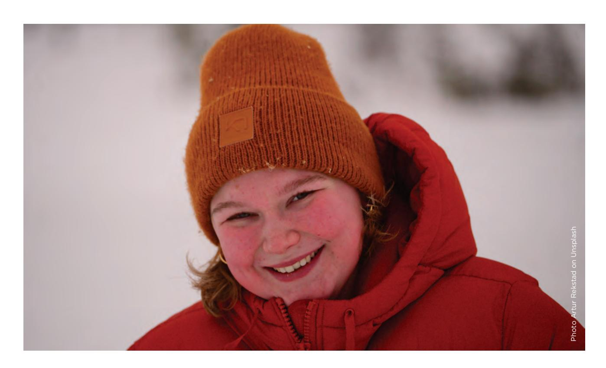

**Table 3.2A: Adolescent life satisfaction in Western Europe, by country and age** 

|                        | GWP       | PISA   |         | HBSC    |         |           | CW        |
|------------------------|-----------|--------|---------|---------|---------|-----------|-----------|
|                        | 2020/22   | 2022   | 2021/22 | 2021/22 | 2021/22 | 2020/22   | 2020/22   |
|                        | Age 15-24 | Age 15 | Age 15  | Age 13  | Age 11  | Age 12-13 | Age 10-11 |
| Austria                | 7.34      | 6.69   | 7.20    | 7.70    | 8.36    |           |           |
| Belgium                | 6.95      |        |         |         |         | 8.05      | 8.27      |
| Belgium (Flemish)      |           |        | 7.46    | 7.78    | 8.05    |           |           |
| Belgium (French)       |           |        | 6.81    | 7.20    | 7.80    |           |           |
| Cyprus                 | 6.88      |        | 7.45    | 7.99    | 8.46    |           | 9.28      |
| Denmark                | 7.45      | 7.19   | 7.10    | 7.32    | 7.76    |           |           |
| Finland                | 7.41      | 7.41   | 7.46    | 7.66    | 8.13    | 8.69      | 8.78      |
| France                 | 6.83      | 6.77   | 6.91    | 7.16    | 7.68    |           |           |
| Germany                | 6.58      | 6.51   | 7.12    | 7.50    | 8.17    | 7.41      | 8.11      |
| Greece                 | 6.66      | 6.62   | 6.70    | 7.09    | 8.43    |           |           |
| Greenland              |           |        | 6.66    | 6.78    | 6.98    |           |           |
| Iceland                | 7.76      | 6.90   | 7.12    | 7.28    | 7.79    |           |           |
| Ireland                | 7.08      | 6.59   | 6.22    | 6.87    | 7.73    |           |           |
| Italy                  | 6.71      | 6.53   | 6.55    | 7.16    | 7.55    | 8.71      | 9.13      |
| Luxembourg             | 7.12      |        | 7.10    | 7.46    | 8.12    |           |           |
| Malta                  | 6.69      | 6.24   | 6.48    | 7.00    | 7.81    |           |           |
| Netherlands            | 7.30      | 7.29   | 6.90    | 7.22    | 7.95    |           |           |
| Norway                 | 7.28      |        | 7.05    | 7.24    | 7.67    |           |           |
| Portugal               | 6.83      | 7.06   | 7.05    | 7.54    | 8.21    |           |           |
| Spain                  | 6.46      | 6.88   | 6.77    | 7.13    | 8.25    |           |           |
| Spain (Catalonia only) |           |        |         |         |         | 8.18      | 8.88      |
| Sweden                 | 7.24      | 6.91   | 6.80    | 6.91    | 7.83    |           |           |
| Switzerland            |           | 7.06   | 6.99    | 7.21    | 7.95    |           |           |
| U.K. (England)         |           | 6.01   | 6.51    | 6.89    | 7.37    |           |           |
| U.K. (North Ireland)   |           | 6.50   |         |         |         |           |           |
| U.K. (Scotland)        |           | 6.48   | 6.66    | 6.97    | 7.64    |           |           |
| U.K. (Wales)           |           | 6.16   | 6.61    | 7.09    | 7.70    | 7.76      | 8.52      |
| U.K.                   | 6.92      | 6.07   |         |         |         |           |           |

**Table 3.2B: Adolescent life satisfaction in Central and Eastern Europe, by country and age** 

|                        | GWP       | PISA   | HBSC    |         |         | CW        |           |  |
|------------------------|-----------|--------|---------|---------|---------|-----------|-----------|--|
|                        | 2020/22   | 2022   | 2021/22 | 2021/22 | 2021/22 | 2020/22   | 2020/22   |  |
|                        | Age 15-24 | Age 15 | Age 15  | Age 13  | Age 11  | Age 12-13 | Age 10-11 |  |
| Albania                | 6.51      | 8.01   | 8.14    | 8.67    | 9.18    | 8.51      | 9.16      |  |
| Bosnia and Herzegovina | 6.88      |        |         |         |         |           |           |  |
| Bulgaria               | 6.29      | 7.04   | 7.10    | 7.34    | 7.64    |           |           |  |
| Croatia                | 7.51      | 7.37   | 7.57    | 7.91    | 8.47    | 8.50      | 9.03      |  |
| Czech Republic         | 7.17      | 6.56   | 7.26    | 7.51    | 8.04    |           |           |  |
| Estonia                | 6.79      | 6.91   | 6.95    | 7.26    | 7.91    | 8.00      | 8.53      |  |
| Hungary                | 7.03      | 7.21   | 6.99    | 7.33    | 7.92    |           |           |  |
| Kosovo                 | 6.94      | 7.87   |         |         |         |           |           |  |
| Latvia                 | 6.86      | 6.76   | 6.73    | 7.06    | 7.64    |           |           |  |
| Lithuania              | 7.39      | 7.14   | 6.95    | 7.21    | 7.71    |           |           |  |
| Montenegro             | 6.56      | 7.52   |         |         |         |           |           |  |
| North Macedonia        | 6.58      | 7.65   | 7.42    | 7.79    | 8.42    |           |           |  |
| Poland                 | 6.55      | 6.26   | 6.20    | 6.28    | 7.06    |           |           |  |
| Romania                | 7.62      | 7.53   | 7.76    | 8.06    | 8.67    | 9.00      | 9.09      |  |
| Serbia                 | 7.53      | 7.48   | 7.89    | 8.30    | 8.84    |           |           |  |
| Slovak Republic        | 6.70      | 7.02   | 6.00    | 6.28    | 6.91    |           |           |  |
| Slovenia               | 7.17      | 6.61   | 7.08    | 7.34    | 8.05    |           |           |  |

**Table 3.2C: Adolescent life satisfaction in Commonwealth of Independent States, by country and age** 

|                      | GWP       | PISA HBSC |         |         |         | CW        |           |  |
|----------------------|-----------|--------------|---------|---------|---------|-----------|-----------|--|
|                      | 2020/22   | 2022         | 2021/22 | 2021/22 | 2021/22 | 2020/22   | 2020/22   |  |
|                      | Age 15-24 | Age 15       | Age 15  | Age 13  | Age 11  | Age 12-13 | Age 10-11 |  |
| Armenia              | 6.16      |              | 8.15    | 8.52    | 8.80    |           |           |  |
| Azerbaijan           | 5.34      |              |         |         |         |           |           |  |
| Azerbaijan (Baku)    |           | 6.80         |         |         |         |           |           |  |
| Georgia              | 6.08      | 7.62         |         |         |         |           |           |  |
| Kazakhstan           | 6.52      | 8.41         | 7.97    | 8.30    | 8.49    |           |           |  |
| Kyrgyz Republic      | 6.15      |              | 7.95    | 8.30    | 8.60    |           |           |  |
| Moldova, Republic of | 6.94      | 7.01         | 7.70    | 8.02    | 8.47    |           |           |  |
| Russian Federation   | 6.34      |              |         |         |         | 7.76      |           |  |
| Tajikistan           | 5.61      |              | 8.00    | 8.07    | 8.10    |           |           |  |
| Ukraine              | 6.23      |              |         |         |         |           |           |  |
| Uzbekistan           | 5.98      | 8.20         |         |         |         |           |           |  |

**Table 3.2D: Adolescent life satisfaction in East Asia, by country and age** 

|                             | GWP       | PISA   | HBSC    |         |         | CW        |           |  |
|-----------------------------|-----------|--------|---------|---------|---------|-----------|-----------|--|
|                             | 2020/22   | 2022   | 2021/22 | 2021/22 | 2021/22 | 2020/22   | 2020/22   |  |
|                             | Age 15-24 | Age 15 | Age 15  | Age 13  | Age 11  | Age 12-13 | Age 10-11 |  |
| China, People's Republic of | 6.05      |        |         |         |         |           |           |  |
| Hong Kong S.A.R. of China   | 5.33      | 6.49   |         |         |         | 7.74      | 7.55      |  |
| Japan                       | 6.51      | 6.76   |         |         |         |           |           |  |
| Macao S.A.R. of China       |           | 6.41   |         |         |         |           |           |  |
| Mongolia                    | 5.94      | 7.20   |         |         |         |           |           |  |
| South Korea                 | 6.59      | 6.36   |         |         |         |           | 7.36      |  |
| Taiwan Province of China    | 7.12      | 6.85   |         |         |         | 7.80      | 7.91      |  |

**Table 3.2E: Adolescent life satisfaction in Latin America and Caribbean region, by country and age** 

|                    | GWP       | PISA HBSC |         |         |         | CW        |           |  |
|--------------------|-----------|--------------|---------|---------|---------|-----------|-----------|--|
|                    | 2020/22   | 2022         | 2021/22 | 2021/22 | 2021/22 | 2020/22   | 2020/22   |  |
|                    | Age 15-24 | Age 15       | Age 15  | Age 13  | Age 11  | Age 12-13 | Age 10-11 |  |
| Argentina          | 6.55      | 6.69         |         |         |         |           |           |  |
| Bolivia            | 6.23      |              |         |         |         |           |           |  |
| Brazil             | 6.46      | 6.85         |         |         |         |           |           |  |
| Chile              | 6.65      | 6.41         |         |         |         | 7.76      | 8.44      |  |
| Colombia           | 5.95      | 6.96         |         |         |         |           | 8.82      |  |
| Costa Rica         | 6.93      | 7.32         |         |         |         |           |           |  |
| Dominican Republic | 6.38      | 7.44         |         |         |         |           |           |  |
| Ecuador            | 6.40      |              |         |         |         |           |           |  |
| El Salvador        | 6.72      | 7.40         |         |         |         |           |           |  |
| Guatemala          | 6.65      | 7.72         |         |         |         |           |           |  |
| Honduras           | 6.47      |              |         |         |         |           |           |  |
| Jamaica            | 5.81      | 5.83         |         |         |         |           |           |  |
| Mexico             | 6.77      | 7.26         |         |         |         |           |           |  |
| Nicaragua          | 6.84      |              |         |         |         |           |           |  |
| Panama             | 6.94      | 7.04         |         |         |         |           |           |  |
| Paraguay           | 6.18      | 7.32         |         |         |         |           |           |  |
| Peru               | 6.23      | 6.37         |         |         |         |           |           |  |
| Uruguay            | 6.77      | 7.03         |         |         |         |           |           |  |
| Venezuela          | 5.59      |              |         |         |         |           |           |  |

**Table 3.2F: Adolescent life satisfaction in Middle East and North Africa, by country and age** 

|                      | GWP       | PISA HBSC |         |         |         | CW        |           |  |
|----------------------|-----------|--------------|---------|---------|---------|-----------|-----------|--|
|                      | 2020/22   | 2022         | 2021/22 | 2021/22 | 2021/22 | 2020/22   | 2020/22   |  |
|                      | Age 15-24 | Age 15       | Age 15  | Age 13  | Age 11  | Age 12-13 | Age 10-11 |  |
| Algeria              | 5.54      |              |         |         |         | 8.15      | 7.94      |  |
| Bahrain              | 6.52      |              |         |         |         |           |           |  |
| Egypt                | 4.38      |              |         |         |         |           |           |  |
| Iran                 | 5.46      |              |         |         |         |           |           |  |
| Iraq                 | 5.61      |              |         |         |         |           |           |  |
| Israel               | 7.98      |              |         |         |         | 8.58      | 8.78      |  |
| Jordan               | 4.86      | 6.77         |         |         |         |           |           |  |
| Kuwait               | 7.39      |              |         |         |         |           |           |  |
| Lebanon              | 2.93      |              |         |         |         |           |           |  |
| Libya                | 5.93      |              |         |         |         |           |           |  |
| Morocco              | 5.34      | 6.76         |         |         |         |           |           |  |
| Palestine, State of  | 5.25      |              |         |         |         |           |           |  |
| Qatar                |           | 6.77         |         |         |         |           |           |  |
| Saudi Arabia         | 6.45      | 7.36         |         |         |         |           |           |  |
| Tunisia              | 4.87      |              |         |         |         |           |           |  |
| Turkish Republic     | 5.32      |              |         |         |         |           |           |  |
| of Northern Cyprus   |           |              |         |         |         |           |           |  |
| Türkiye, Republic of | 5.07      | 4.90         |         |         |         | 7.28      | 8.11      |  |
| United Arab Emirates | 6.54      | 6.85         |         |         |         |           |           |  |
| Yemen                | 3.93      |              |         |         |         |           |           |  |

**Table 3.2G: Adolescent life satisfaction in North America and ANZ, by country and age** 

|             | GWP       | PISA   | HBSC    |         | CW      |           |           |
|-------------|-----------|--------|---------|---------|---------|-----------|-----------|
|             | 2020/22   | 2022   | 2021/22 | 2021/22 | 2021/22 | 2020/22   | 2020/22   |
|             | Age 15-24 | Age 15 | Age 15  | Age 13  | Age 11  | Age 12-13 | Age 10-11 |
| Australia   | 6.94      |        |         |         |         |           |           |
| Canada      | 6.70      |        | 6.63    | 7.00    | 7.54    |           |           |
| New Zealand | 6.85      | 6.27   |         |         |         |           |           |
| U.S.        | 6.61      |        |         |         |         |           |           |

**Table 3.2H: Adolescent life satisfaction in South Asia, by country and age** 

|             | GWP       | PISA   | HBSC    |         |         | CW        |           |  |
|-------------|-----------|--------|---------|---------|---------|-----------|-----------|--|
|             | 2020/22   | 2022   | 2021/22 | 2021/22 | 2021/22 | 2020/22   | 2020/22   |  |
|             | Age 15-24 | Age 15 | Age 15  | Age 13  | Age 11  | Age 12-13 | Age 10-11 |  |
| Afghanistan | 1.96      |        |         |         |         |           |           |  |
| Bangladesh  | 4.72      |        |         |         |         | 7.55      | 7.66      |  |
| India       | 4.33      |        |         |         |         |           |           |  |
| Nepal       | 5.67      |        |         |         |         |           |           |  |
| Pakistan    | 5.17      |        |         |         |         |           |           |  |
| Sri Lanka   | 4.80      |        |         |         |         | 8.22      | 7.96      |  |

**Table 3.2I: Adolescent life satisfaction in Southeast Asia, by country and age** 

|                   | GWP       | PISA   | HBSC    |         |         | CW        |           |  |
|-------------------|-----------|--------|---------|---------|---------|-----------|-----------|--|
|                   | 2020/22   | 2022   | 2021/22 | 2021/22 | 2021/22 | 2020/22   | 2020/22   |  |
|                   | Age 15-24 | Age 15 | Age 15  | Age 13  | Age 11  | Age 12-13 | Age 10-11 |  |
| Brunei Darussalam |           | 5.86   |         |         |         |           |           |  |
| Cambodia          | 4.62      | 7.65   |         |         |         |           |           |  |
| Indonesia         | 5.81      | 7.22   |         |         |         | 8.12      | 8.46      |  |
| Lao P.D.R.        | 4.90      |        |         |         |         |           |           |  |
| Malaysia          | 6.41      | 6.63   |         |         |         |           |           |  |
| Myanmar           | 4.40      |        |         |         |         |           |           |  |
| Philippines       | 6.12      | 6.97   |         |         |         |           |           |  |
| Singapore         | 6.45      |        |         |         |         |           |           |  |
| Thailand          | 6.75      | 7.12   |         |         |         |           |           |  |
| Vietnam           | 6.06      | 7.35   |         |         |         |           |           |  |

**Table 3.2J: Adolescent life satisfaction in Sub-Saharan Africa, by country and age** 

|                                   | GWP       | PISA   |         | HBSC    |         |           | CW        |
|-----------------------------------|-----------|--------|---------|---------|---------|-----------|-----------|
|                                   | 2020/22   | 2022   | 2021/22 | 2021/22 | 2021/22 | 2020/22   | 2020/22   |
|                                   | Age 15-24 | Age 15 | Age 15  | Age 13  | Age 11  | Age 12-13 | Age 10-11 |
| Benin                             | 4.52      |        |         |         |         |           |           |
| Botswana                          | 4.09      |        |         |         |         |           |           |
| Burkina Faso                      | 4.98      |        |         |         |         |           |           |
| Cameroon                          | 5.36      |        |         |         |         |           |           |
| Chad                              | 4.56      |        |         |         |         |           |           |
| Comoros                           | 4.01      |        |         |         |         |           |           |
| Congo                             | 5.78      |        |         |         |         |           |           |
| Congo, Democratic Republic of the | 3.37      |        |         |         |         |           |           |
| Côte d'Ivoire                     | 5.32      |        |         |         |         |           |           |
| Eswatini                          | 3.84      |        |         |         |         |           |           |
| Ethiopia                          | 4.48      |        |         |         |         |           |           |
| Gabon                             | 5.52      |        |         |         |         |           |           |
| Gambia                            | 4.52      |        |         |         |         |           |           |
| Ghana                             | 4.84      |        |         |         |         |           |           |
| Guinea                            | 5.05      |        |         |         |         |           |           |
| Kenya                             | 4.78      |        |         |         |         |           |           |
| Lesotho                           | 3.80      |        |         |         |         |           |           |
| Liberia                           | 4.73      |        |         |         |         |           |           |
| Madagascar                        | 4.17      |        |         |         |         |           |           |
| Malawi                            | 3.83      |        |         |         |         |           |           |
| Mali                              | 4.47      |        |         |         |         |           |           |
| Mauritania                        | 4.61      |        |         |         |         |           |           |
| Mauritius                         | 6.03      |        |         |         |         |           |           |
| Mozambique                        | 5.32      |        |         |         |         |           |           |
| Namibia                           | 5.05      |        |         |         |         |           |           |
| Niger                             | 4.63      |        |         |         |         |           |           |
| Nigeria                           | 5.28      |        |         |         |         |           |           |
| Senegal                           | 5.06      |        |         |         |         |           |           |
| Sierra Leone                      | 3.19      |        |         |         |         |           |           |
| South Africa                      | 5.75      |        |         |         |         | 8.60      | 8.86      |
| Tanzania                          | 4.15      |        |         |         |         |           |           |
| Togo                              | 4.34      |        |         |         |         |           |           |
|                                   |           |        |         |         |         |           |           |
| Uganda                            | 4.69      |        |         |         |         |           |           |
| Zambia                            | 4.09      |        |         |         |         |           |           |
| Zimbabwe                          | 3.77      |        |         |         |         |           |           |

**Fig. 3.3: Life satisfaction declines throughout early-to-middle adolescence**  (HBSC 2021/22), by gender

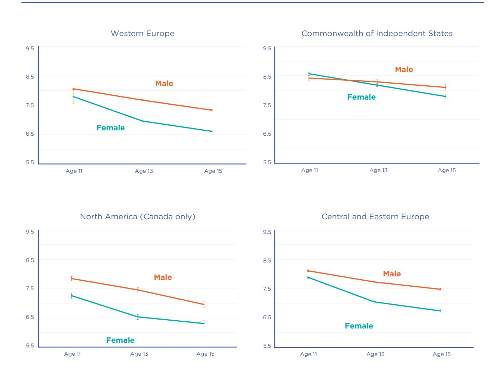

*PISA 2022 data reveals the highest life satisfaction for individuals aged 15 is found in Central and Eastern Europe.*

Malta, Poland, and Slovakia. HBSC and Children's Worlds data also show that regional and country differences decrease in younger children and adolescents.

Finally, it is also evident that younger children and adolescents consistently report higher life satisfaction than their older counterparts, illustrating an early start to the decline from childhood to middle age. Figure 3.3 shows the decline from age 11 to 15 in HBSC data, indicating a larger decline among females, particularly between age 11 and 13, with some variation across regions. Including data from the other three studies, Tables 3.2A-J shows that this declining pattern is evident from age 10 to 15 in all countries, and continues into late adolescence (age 15-24) in most of them. The decline from age 10-12 to age 15-24 is remarkably larger in lower-income countries. This is observed in the lowest-income countries with available data, including Algeria, Turkey, Bangladesh, Sri Lanka, Tajikistan, Indonesia and South Africa. In contrast, in many Western countries (mostly in Europe), there is no further decline at age 15-24, and in some of them (notably, Iceland, Ireland, Sweden, and the U.K.), there seems to be higher life satisfaction at age 15-24 than at age 15.

## **Adolescent Well-Being Inequalities and Correlates**

To offer a more comprehensive view of the current global state of child and adolescent well-being, we enhance the preceding analyses on subjective well-being levels and trends by presenting a series of correlational analyses. Using data from the GWP and PISA, we examine subjective well-being inequalities across sociodemographic groups, and life domain factors explaining variation in adolescent subjective well-being. Inequalities across gender and age

have been explored in some of the previous analyses, and further insights are provided in the correlational analysis presented in this section.

## **Middle-to-Late Adolescence (Age 15-24): Gallup World Poll**

The correlational analysis of GWP data (age 15-24) considers all the countries where data were collected in 2022, and delves into sociodemographic factors (gender, rural/urban residence, household income, and country GDP) and 10 items on satisfaction with different aspects of life.49 This analysis is summarized in Table 3.3, which shows the results for Model 1 (socio-demographic factors only) and Model 2 (10 satisfaction items, controlling for socio-demographic factors). Separate analyses by GDP levels are available in Tables A1.7.A-D in Appendix 1.

#### *Inequalities Across Socio-Demographic Groups*

On average, females report a life satisfaction 0.09 points higher than males (Table 3.3), and this gap is larger in lower-income countries, with no gender differences noted in high-income countries (Tables A1.7.A-D in Appendix 1). Similarly, life satisfaction is -0.10 points lower in rural communities compared to urban ones, and this gap is larger in lower-income countries, with no differences observed in high-income countries. Additionally, compared to those in the first (lowest) quintile of the country's household income distribution, those in the third, fourth, and fifth (highest) quintiles report 0.16, 0.30, and 0.43 points higher life satisfaction respectively, with smaller effects in high-income countries than lower-income ones. Moreover, compared to residents of high-income countries, those in upper-middle-, lower-middle-, and low-income countries report -0.63, -1.74, and -2.91 points lower life satisfaction respectively. This association can also be visualized in Table A1.7.A-D in Appendix 1, which ranks all countries by GDP.

Chapter 2 of this *World Happiness Report* presents a similar analysis for those aged 15-29, including a broader range of correlates. This analysis suggests that the relative importance of household income diminishes when controlling for other important factors.50

**Table 3.3: Correlates of life satisfaction.** Gallup World Poll 2022 (age 15-24)

|                                                                                | Model 1 |     | Model 2 |       |     |      |
|--------------------------------------------------------------------------------|---------|-----|---------|-------|-----|------|
|                                                                                |         |     | S.E.    |       |     | S.E. |
| Socio-demographic factors                                                      |         |     |         |       |     |      |
| Gender (ref.: male)                                                            |         |     |         |       |     |      |
| Female                                                                         | 0.09    | **  | 0.03    | 0.12  | *** | 0.03 |
| Urban/rural residence (ref.: urban residence)                                  |         |     |         |       |     |      |
| Rural residence                                                                | -0.10   | **  | 0.03    | -0.08 | **  | 0.03 |
| Household income (ref.: lowest 20%)                                            |         |     |         |       |     |      |
| Second 20%                                                                     | 0.04    |     | 0.04    | 0.03  |     | 0.05 |
| Middle 20%                                                                     | 0.16    | *** | 0.04    | 0.11  | *   | 0.05 |
| Fourth 20%                                                                     | 0.30    | *** | 0.04    | 0.24  | *** | 0.05 |
| Highest 20%                                                                    | 0.43    | *** | 0.05    | 0.33  | *** | 0.05 |
| Country's economic development (ref.: high-income countries)                   |         |     |         |       |     |      |
| Upper middle-income countries                                                  | -0.63   | *** | 0.04    | -0.40 | *** | 0.04 |
| Lower middle-income countries                                                  | -1.74   | *** | 0.04    | -1.40 | *** | 0.04 |
| Low-income countries                                                           | -2.91   | *** | 0.05    | -2.07 | *** | 0.06 |
| 10 satisfaction items                                                          |         |     |         |       |     |      |
| Satisfied with the public transportation system in your city/area              |         |     |         | 0.08  | *   | 0.03 |
| Satisfied with the roads and highways in your city/area                        |         |     |         | -0.04 |     | 0.03 |
| Satisfied with the quality of air in your city/area                            |         |     |         | 0.03  |     | 0.04 |
| Satisfied with the quality of water in your city/area                          |         |     |         | 0.02  |     | 0.04 |
| Satisfied with the availability of affordable housing in your city/area        |         |     |         | 0.20  | *** | 0.03 |
| Satisfied with the education system/schools in your city/area                  |         |     |         | 0.07  |     | 0.04 |
| Satisfied with the quality healthcare in your city/area                        |         |     |         | 0.24  | *** | 0.04 |
| Satisfied with opportunities to meet people and make friends in your city/area |         |     |         | 0.28  | *** | 0.04 |
| Satisfied with the city/area where you live                                    |         |     |         | 0.37  | *** | 0.04 |
| Satisfied with your standard of living (things you can buy and do)             |         |     |         | 1.42  | *** | 0.04 |

Note. Significance Levels: \* 0.05 \*\* 0.01 \*\*\* 0.001. Model 1: R2= 0.15; N=25,877, *p<*.001. Model 2: R2= 0.25; N=22699, *p<*.001

#### *Satisfaction with Different Aspects of Life*

Life satisfaction tends to be higher amongst those who report being satisfied with: standards of living, the city or region they reside in, opportunities for social interactions and friendships in their city or area, accessibility of quality healthcare services in their city or area, availability of good and affordable housing in their city or area, and the public transportation system. Satisfaction with standards of living has – by far – the most significant impact on life satisfaction, emphasizing the role of material well-being. In contrast, statistically significant associations (*p*<0.05) are not found for the quality of roads, air quality, water quality, and the quality of the schools and education system within their city or area.

Separate analyses by GDP levels reveal additional insights:

• In upper-middle-income countries, there are no statistically significant associations (*p*<0.05)

between life satisfaction and satisfaction with the public transportation system and access to quality healthcare.

- In lower-middle-income countries, there are no statistically significant associations (*p*<0.05) between life satisfaction and satisfaction with the public transportation system, access to quality healthcare and opportunities to meet people and make friends. In contrast, there is an association with satisfaction with the education system/schools.
- In low-income countries, there are no statistically significant associations (*p*<0.05) between life satisfaction and satisfaction with the public transportation system, opportunities to meet people and make friends, and the city/area of residence. In contrast, there is an association with satisfaction with water quality and the education system/schools.

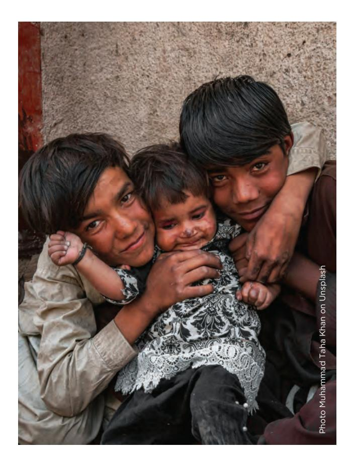

#### **Middle Adolescence (Age 15): PISA**

Similar to the GWP correlational analysis, the correlational analysis of PISA 2022 data (age 15) examines inequalities across socio-demographic groups (gender, rural/urban residence, household possessions, and economic development of the country of residence) and 10 items on satisfaction with different aspects of life. The results are presented in Table 3.4. Model 1 examines sociodemographic factors in the 74 countries and territories with available life satisfaction data, and Model 2 examines the 10 satisfaction items – controlling for socio-demographic factors – in the 13 countries where these data were collected (Brazil, Hong Kong, Hungary, Ireland, Macau, Mexico, the Netherlands, New Zealand, Panama, Saudi Arabia, Slovenia, Spain, and the United Arab Emirates).

#### *Inequalities Across Socio-Demographic Groups*

On average, life satisfaction is -0.78 points lower among females than males. This contrasts with findings at age 15-24 showing higher life satisfaction among females than males since 2014 globally (see Figure 3.1B and Table 3.4). This could largely be explained by the focus on mostly high-income, Western countries in the available data. Indeed, GWP results at age 15-24 show no gender differences (*p*<0.05) in high-income countries (Table A1.7A in Appendix 1). Evidence from HBSC (Table A1.4 and Figure A1.4 in Appendix 1), and Children's Worlds (Table A1.5 in Appendix 1) from mainly high-income Western countries shows that the gender gap is rarely observed at age 10-11, tends to become noticeable from age 12, and widens at age 13-15.

Similarly, life satisfaction is lower in more populated areas compared to more rural areas. The GWP analysis at age 15-24 reveals the opposite pattern globally, but no statistically significant differences in high-income countries (Table A1.7A in Appendix 1). This suggests again that these differences could partly be explained by the different nature of countries collecting PISA and GWP data.

Moreover, compared to those in the lowest quintile of the household possessions distribution within each country, those in higher quintiles report increasingly higher life satisfaction. By contrast, there is a negative association between the level of economic development in the country of residence (log GDP)51 and life satisfaction. This association is also illustrated in Table A1.7 in Appendix 1, which ranks all countries by GDP. This table shows a distinct pattern at age 15-24, when a clear positive association is evident, compared to age 10-15, when no clear association is observed, arguably due in part to the nature of participating countries in each study.

#### *Satisfaction with Different Aspects of Life*

The 10 satisfaction items analysis in Model 2 shows that, compared to those who report not being satisfied, life satisfaction is higher among those who report being satisfied with their body image (1.02 points), their relationship with their parents (1.01 points), their life at school (0.88 points), their health (0.57 points), their use of their time (0.56 points), their neighborhood (0.24 points), and what they learn at school (0.13 points). Interestingly, differences are not

**Table 3.4: Correlates of life satisfaction.** PISA (age 15)

|                                                                |       | Model 1 |      | Model 2 |     |      |
|----------------------------------------------------------------|-------|---------|------|---------|-----|------|
|                                                                |       |         | S.E. |         |     | S.E. |
| Socio-demographic factors                                      |       |         |      |         |     |      |
| Gender (ref.: male)                                            |       |         |      |         |     |      |
| Female                                                         | -0.78 | ***     | 0.01 | -0.51   | *** | 0.01 |
| Urban/rural residence (ref.: population of +10 million people) |       |         |      |         |     |      |
| 1 million to 10 million                                        | 0.02  |         | 0.03 | -0.09   | *   | 0.04 |
| 100,000 to 1 million                                           | 0.26  | ***     | 0.03 | -0.02   |     | 0.04 |
| 15,000 to 100,000                                              | 0.34  | ***     | 0.03 | 0.02    |     | 0.04 |
| 3,000 to 15,000                                                | 0.55  | ***     | 0.03 | 0.07    |     | 0.04 |
| Less than 3,000                                                | 0.62  | ***     | 0.03 | 0.05    |     | 0.05 |
| Household possessions (ref.: lowest 20%)                       |       |         |      |         |     |      |
| Second 20%                                                     | 0.17  | ***     | 0.02 | 0.20    | *** | 0.02 |
| Middle 20%                                                     | 0.27  | ***     | 0.02 | 0.28    | *** | 0.03 |
| Fourth 20%                                                     | 0.39  | ***     | 0.02 | 0.40    | *** | 0.04 |
| Highest 20%                                                    | 0.50  | ***     | 0.02 | 0.49    | *** | 0.05 |
| Log GDP                                                        | -0.04 | ***     | 0.01 |         |     |      |
| 10 satisfaction items                                          |       |         |      |         |     |      |
| Satisfied with your health                                     |       |         |      | 0.57    | *** | 0.02 |
| Satisfied with the way you look                                |       |         |      | 1.02    | *** | 0.02 |
| Satisfied with what you learn at school                        |       |         |      | 0.13    | *** | 0.02 |
| Satisfied with the friends you have                            |       |         |      | -0.05   | *   | 0.03 |
| Satisfied with the neighbourhood you live in                   |       |         |      | 0.24    | *** | 0.02 |
| Satisfied with all the things you have                         |       |         |      | 0.02    |     | 0.03 |
| Satisfied with how you use your time                           |       |         |      | 0.56    | *** | 0.02 |
| Satisfied with the relationship with your parents/guardians    |       |         |      | 1.01    | *** | 0.02 |
| Satisfied with your relationships with your teachers           |       |         |      | -0.11   | *** | 0.02 |
| Satisfied with your life at school                             |       |         |      | 0.88    | *** | 0.02 |

Note. Significance Levels: \* 0.05 \*\* 0.01 \*\*\* 0.001. Model 1 (43 countries): R2 = 0.03; N=295,345, *p<*.001. Model 2 (13 countries): R2 = 0.25; N=92,666, p<.001. GDP= Gross Domestic Product per capita, constant prices. We follow World Bank Analytical Classifications (GNI per capita in US\$; Atlas methodology (World Bank, n.d.)), to categorize countries as high-income, upper middle-income, lower middle-income and low-income.

statistically significant (*p*<0.05) for satisfaction with the things you have (material well-being), and a small negative association is found for satisfaction with the friends you have (-0.05 points) and relationships with teachers (-0.11 points). These results (especially those involving a small effect size) are to be interpreted with caution given the small number of countries considered in Model 2 due to data availability limitations.

## **Discussion**

The analyses presented in this chapter have provided insights into the state of child and adolescent subjective well-being and the key data limitations affecting the field. These are discussed

below. We also present a discussion on the necessary steps to collectively enhance the well-being of children and adolescents globally.

#### **Main Findings**

#### *Life Satisfaction Levels*

In the post-pandemic world, the life satisfaction of those aged 10-15 tends to be the highest in Central and Eastern Europe (notably in the Balkans), and the CIS, and the lowest in East Asia, North America and ANZ, and MENA. However, it is important to note that, for this age group, data is only available in some world regions, including mostly highincome countries. Cross-country inequalities among younger adolescents (age 10-15) are smaller compared to older adolescents (age 15-24).

For those aged 15-24, global data is available and the highest life satisfaction is observed in Israel, Northern Europe and some Central and Eastern European countries, and the lowest in Sub-Saharan Africa and South Asia. This contrasts with the adult ranking in Chapter 2, where most Central and Eastern European countries rank much lower, and life satisfaction in North America and ANZ and Western Europe is much higher compared to other regions. These differences have been

shaped by distinct trends for these age groups observed in the last 15 years.

### Trends in Middle-to-Late Adolescence

In middle-to-late adolescence (age 15-24), there was a positive 2006-2019 global trend in life satisfaction, in line with adult trends, which ended with the pandemic, in line with adult trends.

Global trends mask regional trends – which, at the same time, mask sub-regional and national trends

– that do not always match adult trends. Our results suggest that the widely reported pre-COVID-19 declines in young people's subjective well-being observed across countries52 may concentrate in those regions that tend to collect data systematically (e.g. North America and Western Europe), as well as in other regions such as the MENA and South Asia. However, when young people from (almost) the whole world are considered, these negative trends start to look less global as positive trends are observed in Sub-Saharan Africa, Central and Eastern Europe, the CIS, Latin America and the Caribbean, and Southeast Asia. As a result of these trends, while life satisfaction for those aged 15-24 and adults was the highest in Western Europe, and North America and ANZ in the late 2000s, in 2022 this held true only for adults, while for those aged 15-24 life satisfaction was on par and not higher compared to Central and Eastern Europe, and Latin America and the Caribbean.

#### *Trends in Early-to-Middle Adolescence*

In early-to-middle adolescence (age 10-15), assessments of global trends are not possible as data is only available mostly in high-income, Western countries. PISA, HBSC and Children's Worlds data show substantial post-COVID-19 declines in almost all of the countries analyzed, which tend to be more severe among females and older adolescents. However, as opposed to declines in (mostly) Western countries, increases are observed in most East Asian countries at age 15.

While there seems to be robust evidence regarding post-pandemic trends, evidence is more mixed with regards to pre-pandemic trends, including some discrepancies between HBSC and PISA at age 15. Contrasting results emerge in many Western European nations and almost all the Central and Eastern European countries examined at age 15 in the 5-6 years preceding the COVID-19 pandemic. These discrepancies highlight the need for caution when interpreting trends for this age group only on the basis of evidence from international studies in the absence of further evidence from national studies (see Appendix 2). This speaks of the need to address shortcomings in the available international data, which is

discussed in the next section. Despite discrepancies affecting some countries and regions, there is consistent evidence in others, including declines in North America (Canada, and the U.S.), some Western European countries (e.g. Austria, Iceland, Ireland, and the Netherlands), and two MENA countries (Turkey and Israel), which are largely driven by female declines. Canada emerges as the country with the longest female decline in the available data, which started in the early 2010s, and is still ongoing. In contrast, HBSC data (age 11, 13, 15) shows evidence of positive trends in some countries in Central and Eastern Europe (Estonia, Latvia, Croatia) in the 2000s and early 2010s.

#### *Age Decline*

Consistent with existing literature,53 we find life satisfaction declines from childhood through adolescence into adulthood. This decline is more pronounced among females and in lower-income countries. From age 15 to 24, declines are not observed in multiple European countries, and increases are observed in some of them. Moreover, although adults tend to report lower life satisfaction than adolescents, the gap between those aged 15-24 and those 25 and older is contracting in Western Europe and reversing in North America, juxtaposed with a widening gap in Sub-Saharan Africa.

#### *Gender Differences*

Also consistent with prior research,54 we observe no gender differences at age 10-11, but females start to report lower life satisfaction than males at around age 12 and the gap further expands from age 13 to 15. This gender gap has widened after the pandemic. In contrast, when moving from analyses in early-to-middle adolescence (age 10-15) in mostly high-income, Western countries, to global analyses in middle-to-late adolescence (age 15-24), a distinct picture emerges. Our global analyses show no gender differences between 2006 and 2013 at age 15-24, but that females started reporting higher life satisfaction than males from 2014. The global gender gap has narrowed after the pandemic. Regional analyses at age 15-24 show that gender differences are small or non-existent in most world regions

*Females start to report lower life satisfaction than males at around age 12 and the gap further expands between age 13 to 15.*

during most years in the 2006-2022 series, with the notable exception of the MENA, where females consistently report higher life satisfaction than males. In 2022, this gender gap favoring females over males was more pronounced in lower-income countries, with no gender differences observed in high-income countries.

#### *Other Inequalities*

Beyond the gender, age and geographic inequalities discussed above, the correlational analysis in middle-to-late adolescence (age 15-24) shows higher life satisfaction in urban areas than in rural areas. However, this is not observed in high-income countries or in early-to-middle adolescence (age 15), where data was collected mainly in high-income nations.

We also find that the higher the country's GDP the higher the average life satisfaction in middleto-late adolescence (age 15-24), which contrasts with findings in early-to-middle adolescence (age 10-15), where no association is observed at age 10-12, and a paradoxical negative association is found at age 15.55 Recent evidence suggests this contradiction may stem from limited data collection in non-high-income countries in early-to-middle adolescence because when adolescents from these countries are considered, a positive association is observed in middle adolescence (age 15-17). Notably, this association is stronger in lower-income countries for adolescents but this pattern reverses with age in adulthood.56

#### *Correlates of Life Satisfaction*

The correlational analyses presented in this chapter using GWP data in middle-to-late adolescence (age 15-24) underscore the significance of socio-economic indicators not only at the national level (GDP) but also at the household (household income quintile within each country) and individual levels (satisfaction with living standards). Among the life domain factors examined, satisfaction with living standards emerges as the strongest correlate of life satisfaction by far. Moreover, we find differences across levels of economic development again. For instance, satisfaction with schools and the education system is positively associated with life satisfaction in lower middleand low-income countries, but not in upper middle- and high-income countries. The correlational analysis in middle adolescence (age 15) highlights the importance of body image, relationships with parents, school life, health, and time-use to the life satisfaction of 15-year-olds, although this is only reflective of the 13 countries that collected these data in PISA 2022, which limits the generalizability of these results.

Several of the above findings underscore disparities when considering adolescents from lower-income countries and regions with limited subjective well-being data, challenging prevailing literature largely derived from high-income, Western countries. Given that the majority of our understanding of child and adolescent subjective well-being stems from data in these more affluent Western contexts, the implications are substantial for global initiatives aimed at enhancing the well-being of children and young people worldwide. These and other data limitations are discussed next.

## **Addressing Limitations in International Data on Child and Adolescent Well-Being**

The existing data limitations represent a substantial challenge in generating evidence-based insights to advance the well-being of children and adolescents on a global scale. Despite substantial efforts in the past 15 years to enhance data availability across countries, a considerable gap persists in global data for children and adolescents compared to adults. This chapter has shone some light on the key gaps and limitations in international data, together with some other data issues (see Appendix 2) that warrant attention. The main limitations are:

• The absence of a common subjective wellbeing measure. Establishing at least one identical subjective well-being item in each survey would facilitate data comparability across children's, adolescents', and adults' subjective well-being.

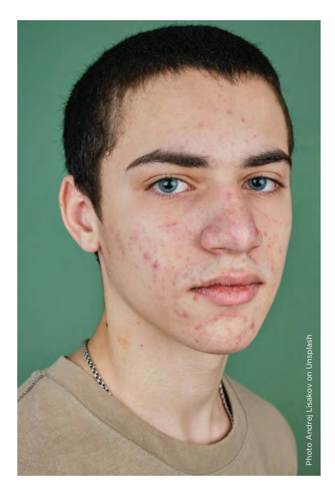

This becomes crucial in the absence of large international panel surveys exploring well-being from childhood to adulthood globally.

• The limited number of subjective well-being measures. Since the existing surveys, on the whole, are not primarily subjective well-being focused – with the exception of Children's Worlds – they tend to only include one aspect of subjective well-being, predominantly overall life satisfaction, usually measured using a single item. It would be advantageous to have the capacity to explore affect and eudaimonia in the child and adolescent surveys to give us a more nuanced understanding of how the three components interact in global samples, comparable with what exists in the literature on adults. It is also important to improve data availability on drivers of subjective well-being to be able to

- rigorously examine what explains variations in subjective well-being levels and trends – and among whom.
- The ages of the samples. No one dataset spans across the range of middle-childhood (when self-report measures become reliable, at around age 8) to late-adolescence (at the upper bound, age 24), nor into adulthood. Moreover, data from representative samples in late adolescence (age 16-24) is lacking. This means that comparing across ages and exploring how subjective well-being changes globally over time is limited to using multiple datasets, which are not consistent and comparable.
- Data in early-to-middle adolescence (age 10-15) is only available in high- and upper middle-income countries, mostly in the Western World. This is largely due to the fact that gaining access to children in lower-income countries is challenging, expensive, and time consuming for researchers.57 School is a common point of access for researchers to survey children across the world, and children in lower-income countries have less access to schooling and are less likely to attend for a myriad of reasons.58 The findings in this chapter referring to early-to-middle adolescents (age 10-15), and those from the existing literature, largely represent what we find in high-income, and a few middle-income countries. As noted, there is recent evidence suggesting that, when adolescents from lower-income countries are considered, findings may contradict the existing literature from higher-income countries.59 This is troubling, as it means that children and adolescents across the largest parts of the world, who arguably need the most support, are not represented in global samples, which prevent us from reaching a better understanding on how we can promote their well-being.

## **Promoting the Well-Being of Children and Adolescents Globally**

It is evident that for younger populations international data collection and availability are lagging due to a variety of difficulties in collecting data from younger people. However, there is a global appetite for improving data collection and

*The widely reported negative trends in adolescent well-being in Western Europe and North America, supported by our analysis, contrast with positive pre-pandemic trends in regions like Sub-Saharan Africa and positive post-pandemic trends in East Asia.*

assessment to enhance child and adolescent well-being globally. This is being materialized in efforts in three main areas.

#### *Addressing Shortcomings in International Data*

The four data providers whose data has been used in this chapter have made huge efforts over the last decade in expanding the number of available measures (e.g. the OECD has included a well-being questionnaire in the last two editions of PISA), and the number of participating countries, including more non-Western non-high-income countries (e.g. HBSC, which began to collect data in Central Asian countries in its latest wave, and has a global Linked Projects initiative which enables countries outside of Europe and North America to collect comparable data using a common protocol).60 Beyond these four studies, there are some excellent initiatives making inroads at the international level with the collection of data from lower-income populations such as PISA for Development by the OECD;61 and Multiple Indicator Cluster Surveys (MICS) by UNICEF.62 In Europe, there is ongoing work to conduct the first cross-national birth cohort survey of child well-being through GUIDE (Growing Up In Digital Europe), supported by the Coordinate project.63 This project is mobilizing researchers and organizations, fostering coordinated efforts to enhance the harmonization and accessibility of international survey data, specifically focusing on panel survey data for examining the well-being of children and young individuals as they grow up. This initiative will contribute significantly to a key longer-term

goal in the field: obtaining more comparable longitudinal data across countries to enable more robust evidence on how to promote child and adolescent well-being.

## *Improving Current Approaches to Assess Child and Adolescent Well-Being Across Nations*

Various international actors are leading the way on this issue. For example, the OECD has established a Child Well-Being Data Portal64 with data from the major international surveys and a focus on inclusivity, with consideration of inequalities across relevant socio-demographic groups. Moreover, OECD's WISE Centre is updating the 'Guidelines on Measuring Subjective Well-being', also among children and adolescents, with a call for considering broader and more globally inclusive measures.65 Similarly, UNICEF Innocenti is expanding its work on child well-being in high-income nations to include the views and experiences of children living in lower-income countries, where this type of work is far more scarce.66 Moreover, the World Health Organisation, in collaboration with the Partnership for Maternal, Newborn and Child Health and United Nations partners and together with the support of an Expert Consultative Group, is developing an adolescent well-being measurement approach for use at global, regional, and country levels, with an emphasis on existing data use and adolescent and youth engagement.67 Apart from these well-known international actors, other organizations such as the Wellbeing for Planet Earth Foundation68 are working to establish a more inclusive and global understanding of well-being by incorporating cross-cultural perspectives.

#### *From Data to Action*

At the international level, the OECD has recently published a report to facilitate the development of policies aimed at enhancing child well-being,69 and UNICEF is working towards policy initiatives to promote child well-being.70 At the national level, South Korea is a good from-data-to-action example. In its efforts to make children's happiness a national priority, South Korea aims to integrate a child-centered perspective into all government policy by using insights into child and adolescent subjective well-being.71 An

important consideration is that initiatives such as this require effective inter-sectoral collaborations encompassing data collection, analysis, and evidence-based responses, which may be difficult to achieve at the national and international levels. In certain contexts, regional or local cooperation can be more feasible, particularly where regions and local authorities wield influence over crucial aspects of children's lives, such as education and social services. A pioneering project that exemplifies the potential of such initiatives is #BeeWell, a youth-centered programme led by the University of Manchester, The Gregson Family Foundation and Anna Freud, initially launched in Greater Manchester, U.K., and now expanding to other locations in England. This programme brings together academic expertise, policymakers, and hundreds of local organizations to make adolescents' well-being everybody's business. Utilizing data from the #BeeWell survey (co-produced with adolescents) and linked to data from other sources, it offers schools and local authorities personalized well-being dashboards and advice to facilitate evidencebased responses. #BeeWell provides valuable insights into the efficacy of bottom-up approaches for assessing and promoting child and adolescent well-being. While focused on a Western sociocultural context, these insights can be applicable to regions and countries facing challenges in country-level initiatives, fostering progress across diverse parts of the world.

**Conclusions**

There is a growing interest in improving child and adolescent well-being globally. Despite notable progress in research and data availability over the past 15 years, along with recent ground-breaking initiatives at regional, national, and international levels, a significant data gap persists for children and adolescents compared to adults. These limitations prevent researchers from substantially improving our understanding of how to promote child and adolescent well-being worldwide.

This chapter outlines the crucial necessary next steps to address existing data limitations: the use of – at least one – standardized subjective wellbeing measure(s) across the available international studies, a broader age coverage from age 8 to late adolescence and into adulthood, and collecting data from more world regions, with particular attention to improving data collection in middleand low-income countries.

The chapter aims to provide the most accurate picture of the global state of child and adolescent subjective well-being that is possible despite existing data limitations. The analysis reveals a nuanced picture: life satisfaction levels, trends, and correlates vary across age, gender, world regions, countries, and levels of economic development. Notably, the analysis suggests that shifting the focus from constantly surveyed high-income countries in the Western World reveals different patterns. For instance, the widely reported negative trends in adolescent subjective well-being (and related constructs) in Western Europe and North America, supported by our analysis, contrast with positive pre-pandemic trends in regions like Sub-Saharan Africa and positive post-pandemic trends in East Asia. These and other findings presented in this chapter underscore the importance of addressing data limitations to understand what drives positive and negative change – and among whom – in different parts of the world.

#### **Endnotes**

- 1 Batalle et al. (2019); Innocenti and Price (2005); Watson et al. (2006)
- 2 Nelson et al. (2016); Sawyer et al. (2018)
- 3 Blakemore (2018); Foulkes et al. (2018); Giedd et al. (1999); Tamnes et al. (2017); Vijayakumar et al. (2016)
- 4 Arian et al. (2013)
- 5 Sawyer et al. (2018)
- 6 Diener et al. (2002)
- 7 Huebner (2004)
- 8 Campbell et al. (2021); Fuhrmann et al. (2022); Orben and Przybylski (2019); Stewart-Brown et al. (2009)
- 9 Aymerich et al. (2021); González-Carrasco et al. (2017); Savahl et al. (2023)
- 10 Diener et al. (1999); Pavot and Diener (2004)
- 11 Savahl et al. (2021)
- 12 Bedin and Sarriera (2014); Casas (2011); Casas et al. (2012); Clair (2012)
- 13 Bevans et al. (2010); Gilman and Huebner (2003); Lewis et al. (2011)
- 14 Bevans et al. (2010); Riley (2004)
- 15 Levin and Currie (2014)
- 16 Cerna et al. (2023); Marquez and Main (2021); Weinstein (2022)
- 17 Casas and Gonzále-Carrasco (2019); Goldbeck et al. (2007); Orben et al. (2022)
- 18 Casas et al. (2014)
- 19 Marquez and Long (2021); The Children's Society (2020)
- 20 Cosma et al. (2023); Savahl et al. (2022)
- 21 Cosma et al. (2023); Marquez and Long (2021)
- 22 Marquez and Long (2021)
- 23 Ben-Arieh (2008)
- 24 Clark et al. (2018)
- 25 De Neve and Oswald (2012)
- 26 Knies (2017); Main (2014)
- 27 Casas and González (2017); Marquez and Main (2020)
- 28 Azzopardi et al. (2019); Casas et al., 2018; Department for Education (2022); OECD (2021)
- 29 Lee and Yoo (2015)
- 30 Bradshaw (2015)
- 31 Casas et al. (2022); Helliwell et al. (2023); Lee and Yoo (2015)
- 32 Rudolf and Bethmann (2023)
- 33 Marquez et al. (2024)
- 34 Diener and Suh (2003); Helliwell et al. (2023)
- 35 Diener et al. (1999); Huebner (2004)

- 36 Helliwell et al. (2023)
- 37 Lucas and Diener (2009); Veenhoven (2008)
- 38 Casas (2016); Cummins (2016)
- 39 We follow World Bank Analytical Classifications (GNI per capita in US\$; Atlas methodology (World Bank, n.d.)), to categorize countries as high-income, upper middle-income, lower middle-income and low-income. World Bank (n.d.). World Bank Country and Lending Groups. Country Classification. The World Bank. Accessible at: https://datahelpdesk.worldbank.org/knowledgebase/ articles/906519-world-bank-country-and-lending-groups
- 40 Helliwell et al. (2019); Helliwell et al. (2020); Helliwell et al. (2022)
- 41 Marquez and Long (2021)
- 42 Engel De Abreu et al. (2021); Pigaiani et al. (2020)
- 43 Engel De Abreu et al. (2021); Marquez and Long (2021)
- 44 Helliwell et al. (2022)
- 45 Helliwell et al. (2022)
- 46 See Chapter 2 of the current *World Happiness Report*
- 47 Casas and González-Carrasco (2019); Goldbeck et al. (2007); Orben et al. (2022)
- 48 See Chapter 2 of the current *World Happiness Report*
- 49 Cummins (1996)
- 50 See Chapter 2 of the current *World Happiness Report*
- 51 PISA includes mostly high-income countries, so logGDP is the only option.

GWP includes many high-, upper middle-, lower middle-, and low-income countries, which allows for a more nuanced comparison across GDP tiers. We believe this is preferable to visualize the magnitude of well-being inequalities across countries from different GDP tiers compared to the other inequalities examined. This approach also facilitates the discussion on the links between GDP and life satisfaction (negative or non-existent in high-income countries; positive everywhere else) and the limitations on available data that explain counterintuitive results found in the literature (Marquez et al., 2024).

- 52 Cosma et al. (2023); Due et al. (2019)
- 53 Daly (2022); Orben et al. (2022)
- 54 Chen et al. (2020); Orben et al. (2022);
- 55 Campbell et al. (2021); Rudolf and Bethmann (2023)
- 56 Marquez et al. (2024)
- 57 Byrne et al. (2021); Colom and Rohloff (2018)
- 58 Huisman and Smits (2009)
- 59 Marquez et al. (2024)

- 60 Cosma et al. (2023); see Gallup World Poll retrieved from: https://www.gallup.com/analytics/318875/global-research. aspx ; see PISA Participants retrieved from: https://www.oecd.org/pisa/aboutpisa/pisa-participants. htm; see HBSC Participants retrieved from: https://hbsc.org/network/countries/; see Children's Worlds retrieved from: https://isciweb.org/wp-content/ uploads/2019/12/Session1-ChildrensWorlds.pdf
- 61 OECD (2018)
- 62 See MICS by UNICEF retrieved from: https://mics.unicef.org/
- 63 See Coordinate Project retrieved from: https://www.coordinate-network.eu/
- 64 See OECD retrieved from: https://www.oecd.org/els/ family/child-well-being/data/
- 65 Mahoney (2023); OECD (2017)
- 66 See UNICEF retrieved from: https://www.unicef.org/ health/child-and-adolescent-health-and-well-being; Gramoda et al. (2020)
- 67 Guthold et al. (2023)
- 68 See Wellbeing for Planet Earth retrieved from: https://www.globalwellbeinginitiative.org/about-us
- 69 OECD (2021)
- 70 See https://www.unicef.org/globalinsight/media/2116/file/ UNICEF-Global-Insight-Understanding-Child-Subjective-Wellbeing-2021.pdf
- 71 OECD (2019)

#### **References**

Anaya, L. M., & Zamarro, G. (2023). The role of student effort on performance in PISA: Revisiting the gender gap in achievement. *Oxford Economic Papers*, gpad018. https://doi.org/10.1093/oep/gpad018

Anders, J., Has, S., Jerrim, J. et al. Is Canada really an education superpower? The impact of non-participation on results from PISA 2015. *Educ Asse Eval Acc 33*, 229–249 (2021). https://doi.org/10.1007/s11092-020-09329-5

Andersson, C., & Sandgren Massih, S. (2023). PISA 2018: Did Sweden exclude students according to the rules? *Assessment in Education: Principles, Policy & Practice, 30*(1), 33–52. https://doi.org/10.1080/0969594X.2023.2189566

Arain, M., Haque, M., Johal, L., Mathur, P., Nel, W., Rais, A., Sandhu, R., & Sharma, S. (2013). Maturation of the adolescent brain. *Neuropsychiatric Disease and Treatment, 9*, 449–461. https://doi.org/10.2147/NDT.S39776

Atasever, U., Jerrim, J., & Tieck, S. (2023). Exclusion rates from international large-scale assessments: An analysis of 20 years of IEA data. *Educational Assessment, Evaluation and Accountability*. https://doi.org/10.1007/s11092-023-09416-3

Aymerich, M., Cladellas, R., Castelló, A., Casas, F., & Cunill, M. (2021). The Evolution of Life Satisfaction Throughout Childhood and Adolescence: Differences in Young People's Evaluations According to Age and Gender. *Child Indicators Research, 14*(6), 2347–2369. https://doi.org/10.1007/ s12187-021-09846-9

Azzopardi, P. S., Hearps, S. J. C., Francis, K. L., Kennedy, E. C., Mokdad, A. H., Kassebaum, N. J., Lim, S., Irvine, C. M. S., Vos, T., Brown, A. D., Dogra, S., Kinner, S. A., Kaoma, N. S., Naguib, M., Reavley, N. J., Requejo, J., Santelli, J. S., Sawyer, S. M., Skirbekk, V., … Patton, G. C. (2019). Progress in adolescent health and wellbeing: Tracking 12 headline indicators for 195 countries and territories, 1990–2016. *The Lancet, 393*(10176), 1101–1118. https://doi.org/10.1016/S0140-6736(18)32427-9

Ball, J., Grucza, R., Livingston, M., Ter Bogt, T., Currie, C., & De Looze, M. (2023). The great decline in adolescent risk behaviours: Unitary trend, separate trends, or cascade? Social *Science & Medicine, 317*, 115616. https://doi.org/10.1016/ j.socscimed.2022.115616

Banks, J., & Smyth, E. (2015). 'Your whole life depends on it': Academic stress and high-stakes testing in Ireland. *Journal of Youth Studies, 18*(5), 598–616. https://doi.org/10.1080/ 13676261.2014.992317

Batalle, D., O'Muircheartaigh, J., Makropoulos, A., Kelly, C. J., Dimitrova, R., Hughes, E. J., Hajnal, J. V., Zhang, H., Alexander, D. C., Edwards, A. D., & Counsell, S. J. (2019). Different patterns of cortical maturation before and after 38 weeks gestational age demonstrated by diffusion MRI in vivo. *NeuroImage, 185*, 764–775. https://doi.org/10.1016/j.neuroimage.2018.05.046

Bedin, L. M., & Sarriera, J. C. (2014). Dyadic Analysis of Parent-Children Subjective Well-Being. *Child Indicators Research, 7*(3), 613–631. https://doi.org/10.1007/s12187- 014-9235-9

Ben-Arieh, A. (2008). The Child Indicators Movement: Past, Present, and Future. *Child Ind Res 1*, 3–16 (2008). https://doi.org/10.1007/s12187-007-9003-1

Bevans, K. B., Riley, A. W., & Forrest, C. B. (2010). Development of the Healthy Pathways Child-Report Scales. *Quality of Life Research, 19*(8), 1195–1214. https://doi. org/10.1007/s11136-010-9687-4

Blakemore, S.-J. (2018). Avoiding Social Risk in Adolescence. *Current Directions in Psychological Science, 27*(2), 116–122. https://doi.org/10.1177/0963721417738144

Bradshaw, J. (2015). Subjective Well-Being and Social Policy: Can Nations Make Their Children Happier? *Child Indicators Research, 8*(1), 227–241. https://doi.org/10.1007/s12187-014- 9283-1

Byrne, J., Day, E., & Raftree, L. (2021) The Case for Better Governance of Children's Data: A Manifesto. *UNICEF*. New York.

Campbell, A. (1976). Subjective measures of well-being. *American Psychologist, 31*(2), 117–124. https://doi.org/10.1037/0003-066X.31.2.117

Campbell, O. L. K., Bann, D., & Patalay, P. (2021). The gender gap in adolescent mental health: A cross-national investigation of 566,829 adolescents across 73 countries. *SSM - Population Health, 13*, 100742. https://doi.org/10.1016/j.ssmph.2021.100742

Cantril, H. (1965). The pattern of human concerns. New Brunswick, NJ: Rutgers University Press

Casas, F. (2011). Subjective Social Indicators and Child and Adolescent Well-being. *Child Indicators Research, 4*(4), 555–575. https://doi.org/10.1007/s12187-010-9093-z

Casas, F. (2016). Children, Adolescents and Quality of Life: The Social Sciences Perspective Over Two Decades. In: Maggino, F. (eds) A Life Devoted to Quality of Life. *Social Indicators Research Series, 60*. https://doi.org/10.1007/978-3-319-20568-7\_1

Casas, F., Coenders, G., González, M., Malo, S., Bertran, I., & Figuer, C. (2012). Testing the Relationship Between Parents' and Their Children's Subjective Well-Being. *Journal of Happiness Studies, 13*(6), 1031–1051. https://doi.org/10.1007/ s10902-011-9305-3

Casas, F., & González, M. (2017). School: One world or two worlds? Children's perspectives. *Children and Youth Services Review, 80*, 157–170. https://doi.org/10.1016/j. childyouth.2017.06.054

Casas, F., & González-Carrasco, M. (2019). Subjective Well-Being Decreasing With Age: New Research on Children Over 8. *Child Development, 90*(2), 375–394. https://doi.org/10.1111/ cdev.13133

Casas, F., González-Carrasco, M., & Luna, X. (2018). Children's rights and their subjective well-being from a multinational perspective. *European Journal of Education, 53*(3), 336–350. https://doi.org/10.1111/ejed.12294

Casas, F., González-Carrasco, M., Oriol, X., & Malo, S. (2022). Economic and Children's Subjective Well-Being Indicators at the National Level in 35 Countries. *Child Indicators Research, 15*(5), 1539–1563. https://doi.org/10.1007/s12187-022-09918-4

Casas, F., Tiliouine, H., & Figuer, C. (2014). The Subjective Well-being of Adolescents from Two Different Cultures: Applying Three Versions of the PWI in Algeria and Spain. *Social Indicators Research, 115*(2), 637–651. https://doi.org/10.1007/ s11205-012-0229-z

Cerna, L., Brussino, O., & Mezzanotte, C. (2023). *Social and emotional skills (SES): Latest evidence on teachability and impact on life outcomes* (OECD Education Working Papers 304; OECD Education Working Papers, Vol. 304). https://doi.org/10.1787/ba34f086-en

Chen, X., Cai, Z., He, J., & Fan, X. (2020). Gender Differences in Life Satisfaction Among Children and Adolescents: A Meta-analysis. *Journal of Happiness Studies, 21*(6), 2279–2307. https://doi.org/10.1007/s10902-019-00169-9

Clair, A. (2012). The Relationship Between Parent's Subjective Well-Being and the Life Satisfaction of Their Children in Britain. *Child Indicators Research, 5*(4), 631–650. https://doi.org/10.1007/s12187-012-9139-5

Clark, A. E., Flèche, S., Layard, R., Powdthavee, N., & Ward, G. (2018). The Origins of Happiness: The Science of Well-Being over the Life Course. Princeton University Press. https://doi.org/10.2307/j.ctvc77dgq

Colom, M., & Rohloff, P. (2018). Cultural considerations for informed consent in paediatric research in low/middle-income countries: A scoping review. *BMJ Paediatrics Open, 2*(1), e000298. https://doi.org/10.1136/bmjpo-2018-000298

Cosma A., Abdrakhmanova, S., Taut, D., Schrijvers, K.,Catunda, C., & Schnohr, C. (2023). A focus on adolescent mental health and well- being in Europe, central Asia and Canada. Health Behaviour in School-aged Children international report from the 2021/2022 survey. Volume 1. Copenhagen: WHO Regional Office for Europe; 2023. Licence: CC BY-NC-SA 3.0 IGO.

Cosma, A., Stevens, G., Martin, G., Duinhof, E. L., Walsh, S. D., Garcia-Moya, I., Költo, A., Gobina, I., Canale, N., Catunda, C., Inchley, J., & De Looze, M. (2020). Cross-National Time Trends in Adolescent Mental Well-Being From 2002 to 2018 and the Explanatory Role of Schoolwork Pressure. *Journal of Adolescent Health, 66*(6), S50–S58. https://doi.org/10.1016/j. jadohealth.2020.02.010

Cummins, R. A. (1996). The domains of life satisfaction: An attempt to order chaos. *Social Indicators Research, 38*(3), 303–328. https://doi.org/10.1007/BF00292050

Cummins, R. A. (2016). The Theory of Subjective Wellbeing Homeostasis: A Contribution to Understanding Life Quality. In F. Maggino (Ed.), A Life Devoted to Quality of Life (Vol. 60, pp. 61–79). Springer International Publishing. https://doi. org/10.1007/978-3-319-20568-7\_4

Cummins, R., & Gullone, E. (2000). Why we should not use 5-point Likert scales: The case for subjective quality of life measurement. *Proceedings, Second International Conference on Quality of Life in Cities*, 74–93.

Daly, M. (2022). Cross-national and longitudinal evidence for a rapid decline in life satisfaction in adolescence. *Journal of Adolescence, 94*(3), 422–434. https://doi.org/10.1002/ jad.12037

Deaton, A. (2008). Income, Health, and Well-Being around the World: Evidence from the Gallup World Poll. *Journal of Economic Perspectives, 22*(2), 53–72. https://doi.org/10.1257/ jep.22.2.53

De Neve, J.-E., & Oswald, A. J. (2012). Estimating the influence of life satisfaction and positive affect on later income using sibling fixed effects. *PNAS Proceedings of the National Academy of Sciences of the United States of America, 109*(49), 19953–19958. https://doi.org/10.1073/pnas.1211437109

Department for Education. (2022). State of the nation 2021: Children and young people's wellbeing. Department for Education.

Diener, E., Kahneman, D., & Helliwell, J. (2010). *International Differences in Well-Being* (1st ed.). Oxford University Press New York. https://doi.org/10.1093/acprof:oso/9780199732739.001.0001

Diener, E., Lucas, R. E., & Oishi, S. (2002). Subjective well-being: The science of happiness and life satisfaction. In C. R. Snyder & S. J. Lopez (Eds.), Handbook of positive psychology (pp. 463–73). Oxford University Press.

Diener, E., & Suh, E. M. (Eds.). (2003). Culture and subjective well-being. MIT press.

Diener, E., Suh, E. M., Lucas, R. E., & Smith, H. L. (1999). Subjective well-being: Three decades of progress. *Psychological Bulletin, 125*(2), 276–302. https://doi.org/10.1037/0033- 2909.125.2.276

Due, P., Eriksson, C., Torsheim, T., et al. (2019). Trends in high life satisfaction among adolescents in five Nordic countries 2002–2014. *Nordisk välfärdsforskning, 4*, 54–66. https://doi.org/10.18261/issn.2464-4161-2019-02-03

Elgar, F. J., Sen, A., Gariépy, G., Pickett, W., Davison, C., Georgiades, K., Hammami, N., Azevedo Da Silva, M., Gordon, D., & Melgar-Quiñonez, H. R. (2021). Food insecurity, state fragility and youth mental health: A global perspective. *SSM - Population Health, 14*, 100764. https://doi.org/10.1016/j. ssmph.2021.100764

Engel De Abreu, P. M. J., Neumann, S., Wealer, C., Abreu, N., Coutinho Macedo, E., & Kirsch, C. (2021). Subjective Well-Being of Adolescents in Luxembourg, Germany, and Brazil During the COVID-19 Pandemic. *Journal of Adolescent Health, 69*(2), 211–218. https://doi.org/10.1016/j.jadohealth.2021.04.028

Foulkes, L., Leung, J. T., Fuhrmann, D., Knoll, L. J., & Blakemore, S. (2018). Age differences in the prosocial influence effect. *Developmental Science, 21*(6), e12666. https://doi.org/10.1111/ desc.12666

Fuhrmann, D., Madsen, K. S., Johansen, L. B., Baaré, W. F. C., & Kievit, R. A. (2022). The midpoint of cortical thinning between late childhood and early adulthood differs between individuals and brain regions: Evidence from longitudinal modelling in a 12-wave neuroimaging sample. *NeuroImage, 261*, 119507. https://doi.org/10.1016/j.neuroimage.2022.119507

Giedd, J. N., Blumenthal, J., Jeffries, N. O., Castellanos, F. X., Liu, H., Zijdenbos, A., Paus, T., Evans, A. C., & Rapoport, J. L. (1999). Brain development during childhood and adolescence: A longitudinal MRI study. *Nature Neuroscience, 2*(10), 861–863. https://doi.org/10.1038/13158

Gilman, R., & Huebner, S. (2003). A review of life satisfaction research with children and adolescents. *School Psychology Quarterly, 18*(2), 192–205. https://doi.org/10.1521/ scpq.18.2.192.21858

Goldbeck, L., Schmitz, T. G., Besier, T., Herschbach, P., & Henrich, G. (2007). Life Satisfaction Decreases during Adolescence. *Quality of Life Research, 16*(6), 969–979. http://www.jstor.org/stable/27641333

González-Carrasco, M., Casas, F., Viñas, F., Malo, S., Gras, M. E., & Bedin, L. (2017). What Leads Subjective Well-Being to Change Throughout Adolescence? An Exploration of Potential Factors. *Child Indicators Research, 10*(1), 33–56. https://doi.org/10.1007/s12187-015-9359-6

Gromada, A., Rees, G., & Chzhen, Y(2020). Worlds of Influence: Understanding What Shapes Child Well-being in Rich Countries, *Innocenti Report Card*, no. 16, UNICEF Office of Research - Innocenti, Florence

Guthold, R., Newby, H., Keogh, S., Afifi, R. A., Austrian, K., Baird, S., Blum, R. W., Bundy, D. A. P., Deardorff, J., Engel, D., Klein, J. D., Kostelecky, S. M., Mackworth-Young, C., Marquez, J., NicGabhainn, S., Requejo, J., Ross, D. A., Saewyc, E., & Mohan, A. (2023). Developing a Global Approach for Measurement of Adolescent Well-Being. *The Journal of adolescent health: official publication of the Society for Adolescent Medicine*, *73*(6), 972–974. https://doi.org/10.1016/j. jadohealth.2023.08.029

Handa, S., Pereira, A., & Holmqvist, G. (2023). The Rapid Decline of Happiness: Exploring Life Satisfaction among Young People across the World. *Applied Research in Quality of Life, 18*(3), 1549–1579. https://doi.org/10.1007/s11482-023-10153-4

Helliwell, J., Huang, H., & Wang, S. Changing World Happiness. In Helliwell, J., Layard, R., & Sachs, J. (2019). World Happiness Report 2019, New York: Sustainable Development Solutions Network.

Helliwell, J., Huang, H., Wang, S., & Norton, M. Social Environments for World Happiness. In Helliwell, J., Layard, R., Sachs, J., & De Neve, J E. (2020). World Happiness Report 2020, New York: Sustainable Development Solutions Network.

Helliwell, J., Huang, H., Wang, S., & Norton, M. Happiness, Benevolence, and Trust During COVID-19 and Beyond. In Helliwell, J., Huang, H., Wang, S., & Norton, M.Helliwell, J. F., Layard, R., Sachs, J. D., De Neve, J.-E., Aknin, L. B., & Wang, S. (Eds.). (2022). World Happiness Report 2022. New York: Sustainable Development Solutions Network.

Helliwell, J., Huang, H., Wang, S., & Norton, M.Helliwell, J. F., Layard, R., Sachs, J. D., De Neve, J.-E., Aknin, L. B., & Wang, S. (Eds.). (2022). World Happiness Report 2022. New York: Sustainable Development Solutions Network.

Helliwell, J. F., Layard, R., Sachs, J. D., Aknin, L. B., De Neve, J.-E., & Wang, S. (Eds.). (2023). World Happiness Report 2023 (11th ed.). Sustainable Development Solutions Network.

Holte, A., Barry, M. M., Bekkhus, M., Borge, A. I. H., Bowes, L., Casas, F., Friborg, O., Grinde, B., Headey, B., Jozefiak, T., Lekhal, R., Marks, N., Muffels, R., Nes, R. B., Røysamb, E., Thimm, J. C., Torgersen, S., Trommsdorff, G., Veenhoven, R., … Zachrisson, H. D. (2014). Psychology of Child Well-Being. In A. Ben-Arieh, F. Casas, I. Frønes, & J. E. Korbin (Eds.), Handbook of Child Well-Being (pp. 555–631). Springer Netherlands. https://doi.org/10.1007/978-90-481-9063-8\_13

Huebner, E. S. (2004). Research on Assessment of Life Satisfaction of Children and Adolescents. *Social Indicators Research, 66*(1/2), 3–33. https://doi.org/10.1023/B:SOCI.0000007497.57754.e3

Huisman, J., & Smits, J. (2009). Effects of Household- and District-Level Factors on Primary School Enrollment in 30 Developing Countries. *World Development, 37*(1), 179–193. https://doi.org/10.1016/j.worlddev.2008.01.007

Inchley, J. (Ed.). (2016). Growing up unequal: Gender and socioeconomic differences in young people's health and well-being: health behaviour in school-aged children (HBSC) study: International Report from the 2013/2014 survey. World Health Organization, Regional Office for Europe.

Inchley, J., Currie, D., Budisavljevic, S., Torsheim, T., Jåstad, A., & Cosma, A. (2020). Spotlight on adolescent health and well-being. Findings from the 2017/2018 Health Behaviour in School-aged Children (HBSC) survey in Europe and Canada. International report. Volume 1. Key findings. Copenhagen: WHO Regional Office for Europe; 2020

Innocenti, G. M., & Price, D. J. (2005). Exuberance in the development of cortical networks. *Nature Reviews Neuroscience, 6*(12), 955–965. https://doi.org/10.1038/nrn1790

Jerrim, J. (2021). PISA 2018 in England, Northern Ireland, Scotland and Wales: Is the data really representative of all four corners of the UK? *Review of Education, 9*(3), e3270. https://doi.org/10.1002/rev3.3270

Knies, G. (2017). Income effects on children's life satisfaction: Longitudinal evidence for England. Institute for Social and Economic Research. University of Exeter. https://repository.essex.ac.uk/21104/1/2017-02.pdf

Lee, B. J., & Yoo, M. S. (2015). Family, School, and Community Correlates of Children's Subjective Well-being: An International Comparative Study. *Child Indicators Research, 8*(1), 151–175. https://doi.org/10.1007/s12187-014-9285-z

Levin, K. A., & Currie, C. (2014). Reliability and validity of an adapted version of the Cantril Ladder for use with adolescent samples. *Social Indicators Research, 119*(2), 1047–1063. https://doi.org/10.1007/s11205-013-0507-4

Lewis, A. D., Huebner, E. S., Malone, P. S., & Valois, R. F. (2011). Life Satisfaction and Student Engagement in Adolescents. *Journal of Youth and Adolescence, 40*(3), 249–262. https://doi.org/10.1007/s10964-010-9517-6

Lucas, R. E., & Diener, E. (2009). Personality and subjective well-being. In E. Diener (Ed.), The science of well-being: The collected works of Ed Diener (pp. 75–102). Springer Science + Business Media.

Mahoney, J. (2023), "Subjective well-being measurement: Current practice and new frontiers", *OECD Papers on Well-being and Inequalities*, No. 17, OECD Publishing, Paris, https://doi.org/10.1787/4e180f51-en.

Main, G. (2014). Child Poverty and Children's Subjective Well-Being. *Child Indicators Research, 7*(3), 451–472. https://doi.org/10.1007/s12187-014-9237-7

Main, G., Montserrat, C., Andresen, S., Bradshaw, J., & Lee, B. J. (2019). Inequality, material well-being, and subjective well-being: Exploring associations for children across 15 diverse countries. *Children and Youth Services Review, 97*, 3–13. https://doi.org/10.1016/j.childyouth.2017.06.033

Marquez, J. (2023). Gender Differences in School Effects on Adolescent Life Satisfaction: Exploring Cross-National Variation. *Child & Youth Care Forum*. https://doi.org/10.1007/ s10566-023-09756-7

Marquez, J., Casas, F., Taylor, L., & De Neve, JE. (2024, under review). Economic development and adolescent wellbeing in 139 countries. [*under review in Child Indicators Research*]. Preprint: https://osf.io/preprints/socarxiv/7cqen/

Marquez, J., & Long, E. (2021). A Global Decline in Adolescents' Subjective Well-Being: A Comparative Study Exploring Patterns of Change in the Life Satisfaction of 15-Year-Old Students in 46 Countries. *Child Indicators Research, 14*(3), 1251–1292. https://doi.org/10.1007/s12187-020-09788-8

Marquez, J., & Main, G. (2021). Can Schools and Education Policy Make Children Happier? A Comparative Study in 33 Countries. *Child Indicators Research, 14*(1), 283–339. https://doi.org/10.1007/s12187-020-09758-0

Nelson, E. E., Jarcho, J. M., & Guyer, A. E. (2016). Social re-orientation and brain development: An expanded and updated view. *Developmental Cognitive Neuroscience, 17*, 118–127. https://doi.org/10.1016/j.dcn.2015.12.008

OECD (2017). *PISA for Development Assessment and Analytical Framework: Reading, Mathematics and Science*. Preliminary Version. OECD Publishing, Paris.

OECD. (2018). *PISA for Development Assessment and Analytical Framework: Reading, Mathematics and Science*. OECD. https://doi.org/10.1787/9789264305274-en

OECD. (2019). *Rejuvenating Korea: Policies for a Changing Society*. OECD. https://doi.org/10.1787/c5eed747-en

OECD. (2021). *Measuring What Matters for Child Well-Being and Policies*. OECD. https://doi.org/10.1787/e82fded1-en

Orben, A., Lucas, R. E., Fuhrmann, D., & Kievit, R. A. (2022). Trajectories of adolescent life satisfaction. *Royal Society Open Science, 9*(8), 211808. https://doi.org/10.1098/rsos.211808

Orben, A., & Przybylski, A. K. (2019). The association between adolescent well-being and digital technology use. *Nature Human Behaviour, 3*(2), 173–182. https://doi.org/10.1038/ s41562-018-0506-1

Pavot, W., & Diener, E. (2004). The subjective evaluation of well-being in adulthood: Findings and implications. *Ageing International, 29*(2), 113–135. https://doi.org/10.1007/ s12126-004-1013-4

Pigaiani, Y., Zoccante, L., Zocca, A., Arzenton, A., Menegolli, M., Fadel, S., Ruggeri, M., & Colizzi, M. (2020). Adolescent Lifestyle Behaviors, Coping Strategies and Subjective Wellbeing during the COVID-19 Pandemic: An Online Student Survey. *Healthcare, 8*(4), 472. https://doi.org/10.3390/healthcare8040472

Riley, A. W. (2004). Evidence That School-Age Children Can Self-Report on Their Health. *Ambulatory Pediatrics, 4*(4), 371–376. https://doi.org/10.1367/A03-178R.1

Rudolf, R., & Bethmann, D. (2023). The Paradox of Wealthy Nations' Low Adolescent Life Satisfaction. *Journal of Happiness Studies, 24*(1), 79–105. https://doi.org/10.1007/s10902-022- 00595-2

Ryff, C. D., Boylan, J. M., & Kirsch, J. A. (2021). Eudaimonic and Hedonic Well-Being: An Integrative Perspective with Linkages to Sociodemographic Factors and Health. In M. T. Lee, L. D. Kubzansky, & T. J. VanderWeele (Eds.), Measuring Well-Being (1st ed., pp. 92–135). Oxford University Press New York. https://doi.org/10.1093/oso/9780197512531.003.0005

Savahl, S., Casas, F., & Adams, S. (2021). The Structure of Children's Subjective Well-being. *Frontiers in Psychology, 12*, 650691. https://doi.org/10.3389/fpsyg.2021.650691

Savahl, S., Casas, F., & Adams, S. (2023). Considering a Bifactor Model of Children's Subjective Well-Being Using a Multinational Sample. *Child Indicators Research, 16*(6), 2253–2278. https://doi.org/10.1007/s12187-023-10058-6

Savahl, S., Lee, B. J., & Casas, F. (eds.), (2022). Children's views on their lives and well-being during Covid- 19: A report on the Children's Worlds project, 2020-2022. Jerusalem, Israel: Children's Worlds Project (ISCWeB).

Save the Children. (2021). Adolescent Wellbeing Framework – A Critical Opportunity to Fulfil Human Rights and Drive Change. Save the Children International. https://resourcecentre. savethechildren.net/pdf/adolescent\_wellbeing\_framework.pdf/

Sawyer, S. M., Azzopardi, P. S., Wickremarathne, D., & Patton, G. C. (2018). The age of adolescence. *The Lancet Child & Adolescent Health, 2*(3), 223–228. https://doi.org/10.1016/ S2352-4642(18)30022-1

Stevenson, B., & Wolfers, J. (2013). Subjective Well-Being and Income: Is There Any Evidence of Satiation? *American Economic Review, 103*(3), 598–604. https://doi.org/10.1257/ aer.103.3.598

Stewart-Brown, S., Tennant, A., & Tennant, R. (2009). Internal construct validity of the Warwick-Edinburgh Mental Well-being Scale (WEMWBS): a Rasch analysis using data from the Scottish Health Education Population Survey. *Health Qual Life Outcomes 7*, 15. https://doi.org/10.1186/1477-7525-7-15

Sutcliffe, K., Ball, J., Clark, T. C., Archer, D., Peiris-John, R., Crengle, S., & Fleming, T. (Theresa). (2023). Rapid and unequal decline in adolescent mental health and well-being 2012–2019: Findings from New Zealand cross-sectional surveys. *Australian & New Zealand Journal of Psychiatry, 57*(2), 264–282. https://doi.org/10.1177/00048674221138503

Tamnes, C. K., Herting, M. M., Goddings, A.-L., Meuwese, R., Blakemore, S.-J., Dahl, R. E., Güroglu, B., Raznahan, A., Sowell, E. R., Crone, E. A., & Mills, K. L. (2017). Development of the cerebral cortex across adolescence: A multisample study of inter-related longitudinal changes in cortical Vol., surface area, and thickness. *The Journal of Neuroscience, 37*(12), 3402–3412. https://doi.org/10.1523/JNEUROSCI.3302-16.2017

The Children's Society (2020). The Good Childhood Report 2020. https://www.childrenssociety.org.uk/sites/default/ files/2020-11/Good-Childhood-Report-2020.pdf

The Children's Society (2020). The Good Childhood Report 2023. https://www.childrenssociety.org.uk/sites/default/ files/2023-09/The%20Good%20Childhood%20Report%20 2023.pdf

Twenge, J. M., Martin, G. N., & Campbell, W. K. (2018). Decreases in psychological well-being among American adolescents after 2012 and links to screen time during the rise of smartphone technology. *Emotion, 18*(6), 765–780. https://doi.org/10.1037/ emo0000403

UNICEF. (2013). UNICEF Multiple Indicator Cluster Surveys. https://mics.unicef.org

Veenhoven, R. (2008). Healthy happiness: Effects of happiness on physical health and the consequences for preventive health care. *Journal of Happiness Studies: An Interdisciplinary Forum on Subjective Well-Being, 9*(3), 449–469. https://doi.org/10.1007/s10902-006-9042-1

Vijayakumar, N., Allen, N. B., Youssef, G., Dennison, M., Yücel, M., Simmons, J. G., & Whittle, S. (2016). Brain development during adolescence: A mixed-longitudinal investigation of cortical thickness, surface area, and volume. *Human Brain Mapping, 37*(6), 2027–2038. https://doi.org/10.1002/ hbm.23154

Von Der Embse, N., Jester, D., Roy, D., & Post, J. (2018). Test anxiety effects, predictors, and correlates: A 30-year metaanalytic review. *Journal of Affective Disorders, 227*, 483–493. https://doi.org/10.1016/j.jad.2017.11.048

Watson, R. E., DeSesso, J. M., Hurtt, M. E., & Cappon, G. D. (2006). Postnatal growth and morphological development of the brain: a species comparison. *Birth Defects Research Part B: Developmental and Reproductive Toxicology, 77*(5), 471-484.

Weinstein, N. (2022). 'Life is getting better' for most lookedafter children. Children & Young People Now. https://www.cypnow.co.uk/news/article/life-is-getting-betterfor-most-looked-after-children

Wierzbicka, A. (2004). "Happiness" in Cross-Linguistic & Cross-Cultural Perspective. *Daedalus, 133*(2), 34–43. http://www.jstor.org/stable/20027911

## Chapter 4

# Supporting the Well-being of an Aging Global Population: Associations between Well-being and Dementia

## Karysa Britton

PhD Student, Washington University in St. Louis

## Kyrsten C. Hill

Postdoctoral Researcher, Washington University in St. Louis

## Emily C. Willroth

Assistant Professor, Washington University in St. Louis

All three authors contributed equally. This research was supported by the National Institutes of Health (R00AG071838). The content is solely the responsibility of the authors and does not represent the official views of the National Institutes of Health.

**doi.org/10.18724/whr-21fb-sb82**

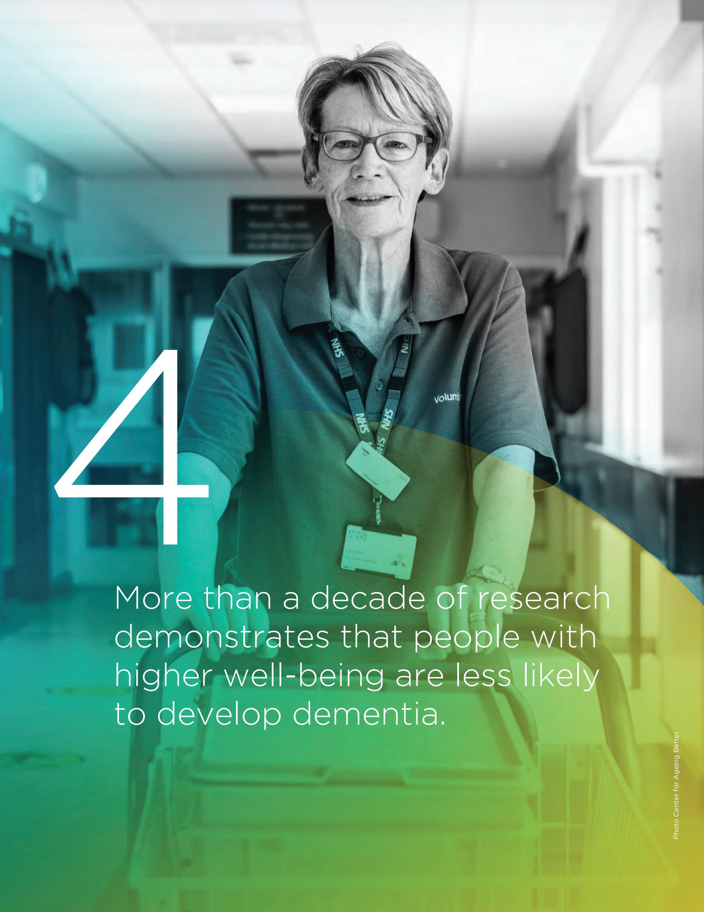

## **Key Insights**

**As the global population** of older adults increases, the number of worldwide dementia cases is also expected to increase.

**Dementia** is associated with reduced quality of life and lower well-being, and thus dementia prevention is critical to maintain the well-being of an aging global population.

**Higher levels of well-being** have been robustly associated with lower risk for future dementia, suggesting that increasing well-being maybe a promising non-pharmacological approach to dementia prevention.

**Among individuals living with dementia,** environmental changes and activities that enhance autonomy, competence, and relatedness have been shown to improve well-being.

By the year 2050, the World Health Organization estimates that the global population of people 65 and older will double1 (see Figure 4.1 for historic population growth of older adults by world region). As the global population of older adults continues to rise, the number of people living with dementia is also expected to grow, reaching approximately 139 million dementia cases by the year 2050.2 Dementia is an age-related clinical syndrome that results in progressive or persistent loss of memory and thinking abilities,3 which in turn can negatively impact well-being.4 Given that there is currently no cure for dementia and biomedical treatments remain limited, it is vital to evaluate and implement non-pharmacological dementia prevention strategies. A growing body of evidence suggests that well-being may be a promising target for dementia prevention efforts, given its associations with better cognitive health

and lower dementia risk.5 However, dementia prevention science is still a long way away from preventing all dementia cases.6 Thus, it is also crucial to evaluate and implement strategies to support the well-being of people living with dementia and their care partners.

In this chapter, we begin by reviewing evidence for well-being as a potential prevention target that may reduce the risk for dementia, in turn promoting continued well-being in later life. Then, we review evidence for strategies to increase the well-being of people living with dementia. Throughout the chapter, we consider evidence from international data sources and describe innovative dementia care models from around the world. We conclude by discussing how these research findings can inform policy to support the well-being of an aging global population.

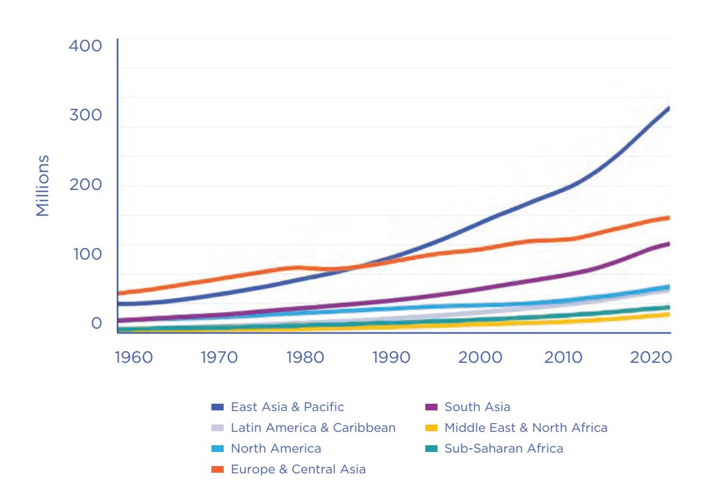

**Figure 4.1.** Data were retrieved from https://data.worldbank.org/indicator/SP.POP.65UP.TO. The World Bank (2022). Population ages 65 and above, total.

**Fig. 4.2: Higher well-being may support memory and thinking abilities and lower risk for later dementia.**

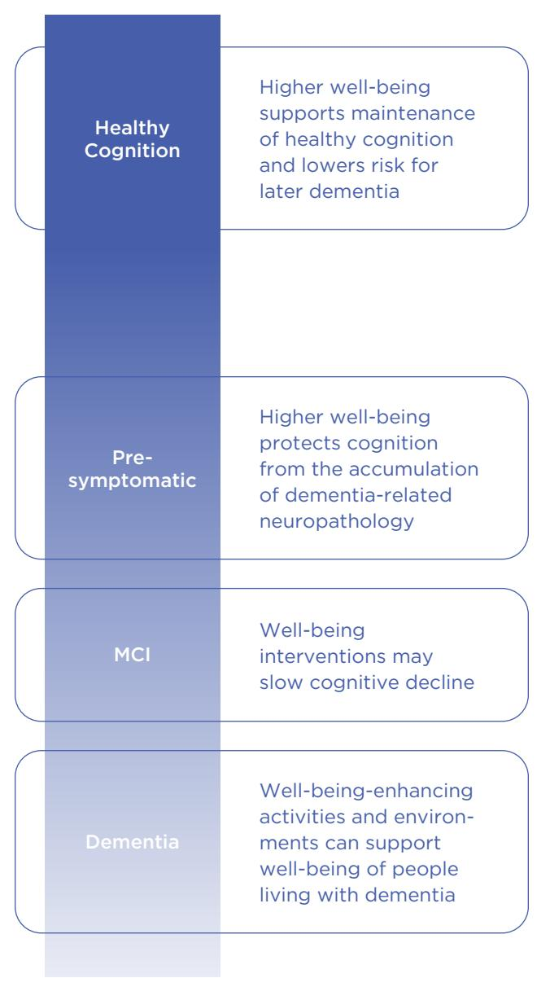

**Figure 4.2.** In individuals with healthy cognition, research suggests that higher well-being may support memory and thinking abilities and lower risk for later dementia. After dementia-related neuropathology accumulates but while individuals remain pre-symptomatic, evidence suggests that well-being protects memory and thinking abilities from the accumulating neuropathology. In the early stages of cognitive impairment (e.g., mild cognitive impairment; MCI), well-being interventions are a promising but largely untested strategy to slow declines in memory and thinking abilities. Finally, well-being-enhancing activities and environments are crucial for supporting the well-being of people living with dementia and their care partners.

## **Well-being as a Protective Factor against Dementia**

More than a decade of research demonstrates that people with higher well-being are less likely to develop dementia.7 These studies have defined well-being in many different ways, including positive emotional experiences, cognitive evaluations of one's satisfaction with their life, and one's sense that their life has purpose or meaning. However, a recent meta-analysis suggests that the association between well-being and dementia may be more consistent for some types of well-being, such as sense of purpose, than for others, such as positive affect.8 Prior research suggests that well-being may protect health through social, behavioral, and biological pathways,9 and similar mechanisms may link well-being to lower dementia risk. For example, research suggests that well-being promotes social engagement, which is critical for supporting cognitive functioning and preventing dementia.10 Higher well-being also supports positive health behaviors that are beneficial for cognitive and brain health, such as greater physical activity and abstinence from smoking.11 Finally, research suggests that higher well-being is associated with better cardiovascular functioning,12 which in turn reduces dementia risk.13

To test the possibility that well-being may protect against dementia, dozens of research studies have followed people across middle and older adulthood in numerous countries and world regions, including Australia, China, Europe, Israel, Korea, Singapore, and the United States.14 These studies have found that people with higher well-being have better memory and thinking abilities,15 experience less declines in memory and thinking abilities,16 and are less likely to develop dementia.17 For example, a research study conducted at the Rush Alzheimer's Disease Center in Chicago, United States, found that people with higher well-being appear resilient to the brain diseases that cause dementia.18 Well-being was assessed at the beginning of the study period, and memory and thinking abilities were assessed yearly for the rest of the participants' lives. After participants died, the researchers conducted autopsies to quantify the amount of

dementia-related neuropathology that was present in participants' brains. People with higher levels of well-being experienced better-thanexpected memory and thinking abilities and less-than-expected declines in memory and thinking abilities in their final years of life relative to the amount of dementia-related neuropathology that researchers discovered in their brains during autopsy (see Figure 4.3.). The association was

present above and beyond other known resilience factors (i.e., socioeconomic status, education, cognitive activity, personality, low depression) and known dementia risk factors (i.e., genetic risk for dementia, medical comorbidities). This suggests that well-being may protect memory and thinking abilities from the brain diseases that cause dementia.

**Fig. 4.3: Resilience to Dementia-Related Neuropathy**

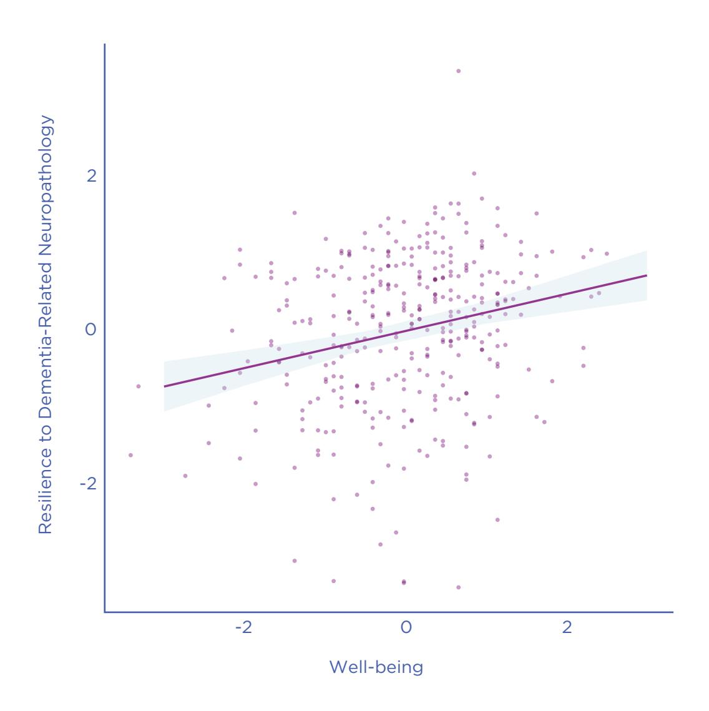

**Figure 4.3.** People with higher well-being at the study baseline demonstrated better-than-expected memory and thinking abilities relative to the amount of dementia-related neuropathology present in their brains (i.e., cognitive resilience). Both well-being and cognitive resilience are shown in units of standard deviations. Willroth, E. C., James, B. D., Graham, E. K., Kapasi, A., Bennett, D. A., & Mroczek, D. K. (2023). Well-being and cognitive resilience to dementia-related neuropathology. *Psychological Science*, *34*(3), 283-297. Copyright © 2022 (the authors).

#### **Overview of Causal Evidence**

Taken together, high-quality international data sources provide strong evidence that higher well-being is associated with lower dementia risk (see Table 4.1). However, this does not necessarily mean that well-being causes lower dementia risk. Establishing a causal effect of well-being on dementia is challenging because well-being and dementia share many common causes, including lifestyle, medical, and socioeconomic factors. For example, social isolation, low educational attainment, or poor physical and mental health may simultaneously reduce well-being and increase dementia risk. Reverse causality is also possible. For example, lower levels of well-being may be an early indicator of underlying brain changes that occur prior to the development of dementia. In this case, intervening to improve well-being may not necessarily change the course of underlying brain changes or future dementia. Therefore, it is crucial to establish whether the

effects of well-being on dementia are causal because this determines whether interventions and policies that increase well-being would also reduce dementia incidence. A strong causal path from well-being to dementia would increase the likelihood of positive feedback to well-being attributable to the lower incidence of dementia.

Randomized controlled trials are one of the most common methods researchers use to investigate causality. In randomized controlled trials, researchers randomly assign participants to either an experimental condition in which the theorized causal variable is manipulated or to a control condition. This random assignment reduces the risk of confounding or reverse causality. Randomized controlled trials of well-being interventions have been shown to effectively increase well-being.19 However, further research is needed to test the effects of those interventions on cognitive health and dementia incidence.

**Table 4.1: Selection of research findings regarding the association between well-being and dementia risk.** 

| Authors               | Country of Well-being Cognitive Data Collection Measurement Measurement                                                                                                                             |                                                                                                                                                                              | Key Findings                                                                                                                                                                                                                         |                                                                                                                                                                                                                                                                                                                              |  |
|-----------------------|--------------------------------------------------------------------------------------------------------------------------------------------------------------------------------------------------------------------|------------------------------------------------------------------------------------------------------------------------------------------------------------------------------|--------------------------------------------------------------------------------------------------------------------------------------------------------------------------------------------------------------------------------------|------------------------------------------------------------------------------------------------------------------------------------------------------------------------------------------------------------------------------------------------------------------------------------------------------------------------------|--|
| Sutin et al. 2020     | Austria, Belgium, Czech Republic, Denmark, France, Germany, Greece, Israel, Italy, the Netherlands, Poland, Spain, Sweden, Switzerland                                                        | "How often do you feel that your life has meaning?"                                                                                                                    | Incident cognitive impairment based on scores on memory and verbal fluency tasks                                                                                                                                         | People who experienced more meaning in life were less likely to develop cognitive impairment across a nine-year period. Findings were consistent in four regions of Europe and Israel.                                                                                                                        |  |
| Willroth et al., 2022 | United States                                                                                                                                                                                                      | Satisfaction with Life Scale; Ryff Psychological Well-being Scale                                                                                                   | Functioning on 19 cognitive tests relative to the amount of neuropathology present in participants' brains at autopsy                                                                                                 | People with higher well-being had better-than-expected memory and thinking abilities and less-than-expected declines in memory and thinking abilities relative to the dementia-related neuropathology present in their brains and discovered at autopsy.                                             |  |
| Ma et al. 2021        | Europe, United States                                                                                                                                                                                              | Genetic variants associated with overall life satisfaction and positive affect based on the largest meta-analysis of genome-wide association studies | Alzheimer's disease diagnosis according to the National Institute on Aging Alzheimer's Association (NIA/AA), the NINCDS-ADRDA criteria, DSM-IV criteria, or the ICD-10 criteria, or autop sy-confirmed | Higher genetically-predicted well-being was associated with a lower risk for dementia. The effect was considered "causally suggestive."                                                                                                                                                                          |  |
| Bell et al., 2022     | Austria, Belgium, China, Czech Republic, Denmark, England, France, Germany, Greece, Ireland, Israel, Italy, the Netherlands, Poland, Singapore, Sweden, Switzerland, Spain, United States, | Purpose and meaning in life, positive affect, life satisfaction, optimism                                                                                        | Incident cognitive impairment or dementia based on clinical diagnoses, cognitive status assessments, task-based cognitive functioning, and/or neuropsychiatric interview                                  | Meta-analytic findings suggest that purpose and meaning in life are associated with lower incident cognitive impairment and dementia. Results were mixed for life satisfaction and optimism, and positive affect was not significantly associated with incident cognitive impairment or dementia. |  |

**Table 4.1.** Selection of research findings regarding the association between well-being and dementia risk.

An alternative to experimental randomization is Mendelian randomization, a technique that leverages the random allocation of genetic variants to test for causal effects. In a recent Mendelian randomization study, researchers examined associations between genetic variants associated with well-being (i.e., life satisfaction and positive affect) and incidence of dementia.20 The researchers found that genetically predicted well-being was associated with a lower risk for dementia. The strength of the evidence was "suggestive" of a causal effect, which means that more research is needed to investigate this possibility further.

## **Future Directions for Research on Well-being and Dementia Risk**

As the evidence for a potentially causal effect of well-being on lower dementia risk grows, a critical next step is to test well-being-enhancing interventions to prevent or delay dementia. The field may benefit from testing the effects of existing well-being interventions on changes in memory and thinking abilities and, ultimately, dementia diagnosis. This will require longer-term follow-ups than most previous randomized controlled trials of well-being interventions. Researchers may also consider pairing well-being interventions with existing lifestyle interventions designed to lower dementia risk, such as those targeting health behaviors and other lifestyle factors. Given the pressing need to lower dementia risk worldwide, it is important to test well-beingenhancing interventions that are highly scalable and are accessible and effective in racially, ethnically, and geographically diverse samples.21

To increase the likelihood of successful intervention, researchers should investigate several other basic science questions about the association between well-being and dementia. First, it is not clear when in the lifespan well-being may reduce dementia risk. On the one hand, increasing well-being as early in the lifespan as possible may enable individuals to experience life-long benefits of higher well-being, and these benefits may accumulate to lower dementia risk in late life. On the other hand, increasing well-being in midlife and older adulthood when individuals are at greatest risk for developing dementia may be an effective strategy. Relatedly, we don't yet know on what timescale well-being may impact cognitive functioning or dementia risk. Studies have observed associations between well-being and later cognitive functioning or dementia risk across one- to 20-year intervals, but the impact of these different timescales on the strength of associations has not been tested. In addition to questions about timing, more research is needed to test the associations between well-being and dementia in socioculturally diverse samples. One of the strengths of existing research on well-being and dementia is the use of samples from many different countries and world regions. However, more research is needed on the groups at greatest risk for developing dementia, including people living in low- and middle-income countries, racial and ethnic minority groups, and people of lower socioeconomic status.

Given the complexity of research on well-being and dementia risk, future research on this topic will benefit from the continuation and adoption of open science practices. For example, many existing studies of well-being and dementia have made their data publicly available. This allows the research community to reproduce scientific findings and test new research questions,

*More research is needed on the groups at greatest risk for developing dementia, including people living in lowand middle-income countries, racial and ethnic minority groups, and people of lower socioeconomic status.*

accelerating scientific progress. Multi-site and multi-study collaborations are also useful, as they allow researchers to test their questions in large samples and to evaluate the generalizability of findings across diverse populations. Moving forward, the field would also benefit from more widespread adoption of preregistration. Preregistration involves specifying research questions, hypotheses, methods, and/or analytic approaches prior to collecting or analyzing data. This enables researchers to distinguish predicted findings from unexpected or exploratory findings, which in turn can help readers calibrate confidence in researchers' findings. Finally, research findings should be made widely accessible to the research community, healthcare providers, policymakers, and the general public.

## **Well-being in People Living with Dementia**

In the previous section, we considered well-being across the lifespan as a potential resource to lower dementia risk, in turn further supporting well-being in older adulthood. However, dementia prevention science is still a long way away from preventing all dementia cases, with 10 million new diagnoses each year.22 As the global population of people living with dementia grows, it is crucially important to evaluate strategies to increase the well-being of people living with dementia.

People living with dementia or exhibiting cognitive decline often experience decreased well-being.23 Yet, it is still possible to live well with dementia. Well-being and quality of life are widely studied

and often used interchangeably in research examining the lived experiences of people with dementia.24 Quality of life is a multidimensional concept that can include individuals' physical condition, mood, relationships, financial situation, and engagement in activities.25 Some researchers suggest that well-being is a component of quality of life, whereas others define well-being as an outcome of quality of life. Similar to well-being, studies have found declines in quality of life for people living with cognitive impairment and dementia.26Awareness of one's diagnosis and prognosis also play a role, such that individuals with cognitive impairment and dementia report lower quality of life when they are aware of their diagnosis and when they expect their condition to worsen over time.27

Despite these findings, research also shows that people living with dementia retain personal strengths and positive lived experiences.28 A recent study using a nationally representative sample of community-dwelling older adults found that life satisfaction did not differ for people living with and without dementia.29 However, this study also found that dementia status was modestly associated with lower life satisfaction via greater limitations in activities of daily living. Qualitative research from the perspective of people living with dementia highlights the importance of living with and adapting to change while also striving for continuity.30Additionally, people living with dementia report that the sociocultural and physical environment can be both helpful and harmful for the quality of life and well-being.31

## **Well-being Measurement in People Living with Dementia**

Researchers have developed several tools to test how different factors impact the quality of life and well-being of people living with dementia. These tools include self-report measures that people living with dementia complete directly, as well as proxy ratings from nurses, clinicians, and family members. Some researchers have debated the self-report abilities of people living with dementia. On the one hand, researchers have argued that declines in cognitive functioning can distort self-reports of well-being.32 On the other

hand, self-reports by people living with mild and moderate-to-severe dementia have been found to be reliable across several studies.33 Proxy ratings by relatives and staff are often lower than self-ratings of well-being and are therefore not interchangeable.34 Researchers generally agree that self-ratings by people living with dementia should be used whenever possible, as they better capture individuals' subjective perceptions of well-being.35 Methods also exist that enable researchers to observe people living with dementia and rate the extent to which they engage in behaviors typically associated with well-being.

A systematic review examining quality of life and well-being in people living with dementia found that the Quality of Life in Alzheimer's Disease scale36 was the most commonly used measure of quality of life and the Psychological Well-Being in Cognitively Impaired Persons scale37 was the most commonly used measure of well-being.38 A conceptual scoping review identified 35 selfreport instruments that have been used to assess well-being in people living with dementia, but only six of those measures were specifically designed for people living with dementia.39 There is a lack of consensus on optimal measurement instruments and a need for more rigorously tested measures of well-being and quality of life in people living with dementia.40 Further, research is needed that assesses specific aspects of well-being in people living with dementia rather than quality of life more generally. As well-being and quality of life are not clearly distinguished in the literature, the remainder of this section will use well-being as an umbrella term that includes quality of life.

#### **Individual Interventions and Strategies**

Using the tools described above, researchers have identified several factors that contribute to the well-being of people living with dementia (see Table 4.2, Table 4.3 and Figure 4.4). Social Determination Theory posits that the basic psychological needs of autonomy, competence, and relatedness are essential for psychological well-being.41 According to Social Determination Theory, autonomy refers to a feeling of choice and ownership over one's actions, competence

refers to a sense of mastery, and relatedness refers to a sense of mutual belonging and support.42 Qualitative research suggests that these basic psychological needs are often negatively impacted by dementia.43As such, interventions targeting autonomy, competence, and relatedness may help to enhance well-being among people living with dementia.

Qualitative studies highlight the importance of activity engagement to promote well-being in people living with dementia.44 An integrative review of 45 studies found that engagement in activities is related to positive affect and well-being among nursing home residents both

with and without cognitive impairment.45 This review examined a wide range of activities and interventions, such as animal-facilitated activities, cultural arts interventions, exercise programs, massage, life review/reminiscence, and outdoor activities such as gardening. Results suggested that activities are most effective when tailored to the individual. Research emphasizes the importance of activities that are not only pleasant but also personally meaningful to the individual.46 Consistent with Social Determination Theory, engagement in meaningful activity is thought to promote well-being in people living with dementia by addressing fundamental psychological needs.47

**Fig. 4.4: Several activities and interventions have been shown to support the well-being of people living with dementia.** 

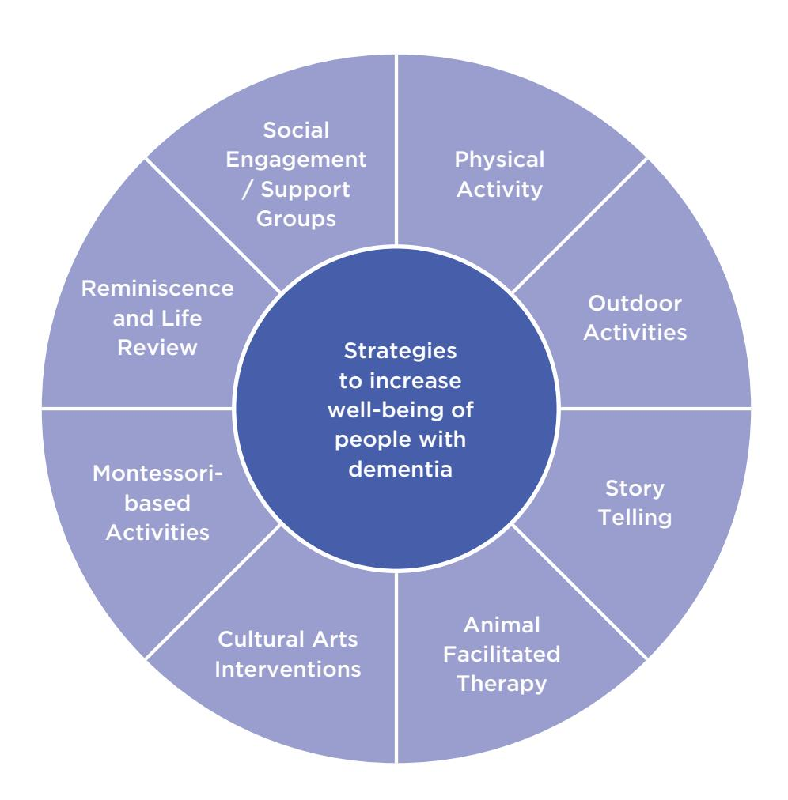

**Figure 4.4.** Several activities and interventions have been shown to support the well-being of people living with dementia.

**Table 4.2: Strategies and activities for increasing well-being for people living with dementia.** 

| Strategy or Activity                                                                  | Benefits                                                                                                                                                                                                        | Evidentiary Support                                                                                                                                              |  |  |
|---------------------------------------------------------------------------------------|-----------------------------------------------------------------------------------------------------------------------------------------------------------------------------------------------------------------|------------------------------------------------------------------------------------------------------------------------------------------------------------------|--|--|
| Animal facilitated therapy                                                            | Improved mood; Improved verbalizations                                                                                                                                                                          | Consistent evidence supporting benefits                                                                                                                       |  |  |
| Behavioral activation                                                                 | Improved health-related quality of life; Improved everyday function; Increased participation in meaningful activities                                                                                     | Consistent evidence supporting benefits, but evidence is limited to few studies                                                                            |  |  |
| Cultural arts interventions (e.g., music, dance, and visual arts interventions) | Improved mood; Increased quality of life, meaning, and engagement; Decreased agitation and aggressive behaviors; Enhanced communication; Positive impacts on cognitive processes; Decreased anxiety | Consistent evidence supporting benefits; Methodology has been criticized                                                                                   |  |  |
| Literature / storytelling                                                             | Increased positive affect and life satisfaction; Increased meaning, engagement, and pleasure; Improved communication                                                                                      | Mixed evidence                                                                                                                                                   |  |  |
| Montessori-based activities                                                           | Increased engagement and positive affect; Improved eating behaviors; Benefits for memory and attention                                                                                                    | Mixed evidence                                                                                                                                                   |  |  |
| Outdoor activities (e.g., gardening)                                               | Increased life satisfaction, engagement, and enjoyment; Decreased agitation                                                                                                                                  | Mixed evidence                                                                                                                                                   |  |  |
| Physical exercise                                                                     | Improved mood, sleep, and cognition; Decreased agitation; Increased mobility and functional ability                                                                                                       | Consistent evidence supporting benefits for people living with dementia in nursing homes; Mixed evidence for individuals not living in nursing homes |  |  |
| Reminiscence and life review                                                          | Improved mood and well-being; Improved autobiographical memory                                                                                                                                               | Consistent evidence supporting benefits                                                                                                                       |  |  |
| Robotic animal companions                                                             | Increased social engagement                                                                                                                                                                                     | Consistent evidence supporting benefits of reduced agitation and depression; Mixed evidence for benefits on QoL                                         |  |  |
| Social engagement / support groups                                                 | Increased well-being; Foster a sense of belonging; Provide coping strategies; Improved self-esteem                                                                                                        | Consistent evidence supporting benefits                                                                                                                       |  |  |

**Table 4.2** Strategies and activities for increasing well-being for people living with dementia.

Engagement in social and leisure activities can enhance well-being in people living with dementia by increasing feelings of agency, autonomy, and purpose while also providing opportunities for social connection.48 Engaging in hobbies and maintaining an active social life have been found to be more strongly related to well-being in people living with dementia compared to other everyday activities.49 Systematic reviews of the literature consistently find that social interaction is important to the well-being of people living with dementia,50 and for people in general (see Chapter 2). Although additional research is needed in this area, studies have shown that social support groups for people living with dementia may have benefits for self-esteem and well-being.51 Support groups can offer a sense of

belonging, increase social interaction, and provide strategies for coping, each of which is related to reductions in depressive symptoms and improvements in well-being among people living with dementia.52 Social and leisure activities therefore have the potential to increase autonomy, competence, and relatedness among people living with dementia, leading to improvements in well-being.

Cultural arts interventions have gained attention as one potential way to increase engagement in meaningful activity and improve well-being among people living with dementia. Research on cultural arts interventions has found music therapy, visual arts interventions, and dance/ movement therapy to increase well-being in people living with dementia.53 Despite these positive outcomes, researchers have cited a

need for greater methodological rigor and theoretical underpinnings in research on cultural arts interventions. Across cultural arts interventions, research provides the strongest support for music therapy, and systematic reviews have shown significant effects of music therapy on lowering anxiety in people living with dementia.54 Although the mechanisms underlying the effects of music therapy are not well understood, it is likely that cultural arts interventions play a role in supporting the basic psychological needs of people living with dementia. Using a Social Determination Theory framework, a cultural arts intervention was recently developed with a focus on promoting autonomy, competence, and relatedness among older adults with mild cognitive impairment.55

There is also a growing body of research supporting the benefits of reminiscence interventions for people living with dementia. Reminiscence interventions are widely used in dementia care but have also shown psychological benefits for cognitively unimpaired older adults.56 Reminiscence interventions for people living with dementia have used several different structures and approaches. Broadly, reminiscence involves the discussion of past experiences with another person or group, often using prompts such as photographs, music, or personal possessions.57

Some reminiscence interventions take a narrative approach based on sharing stories and memories. Others take an integrative approach to help individuals make sense of their life stories.58 One particular integrative intervention called life review involves the creation of a life storybook containing photographs and written accounts.59 Studies suggest that structured life review interventions, including the use of life story books, may have greater benefits for mood and well-being in people living with dementia relative to other reminiscence approaches.60 Reminiscence and life review interventions are typically led by trained professionals (e.g., psychologists, social workers, nurses) and can be conducted in individual or group formats. However, there is a growing interest in intergenerational reminiscence interventions using trained young adult volunteers, such as college students.61

Intergenerational programs are a promising way to enhance well-being among people living with dementia while also promoting social connection and relatedness. Intergenerational programs bring together different generations by involving them in combined activities. Examples include intergenerational classrooms, where students complete their curriculum alongside older adult volunteers or senior care residents,62 or arts programs such as intergenerational choirs.63 Intergenerational programs have also been developed specifically for people living with dementia, with the most common being music, art, and narrative/reminiscence programs.64 These programs are mutually beneficial for younger and older generations and have been associated with increased activity engagement, reduced social isolation, and enhanced well-being among people living with dementia.65

*Intergenerational programs are a promising way to enhance well-being among people living with dementia while also promoting social connection and relatedness.*

Advances in technology have also been used to enhance individual and group interventions promoting well-being in people living with dementia. For example, one study found that participants showed greater improvements in well-being when virtual reality was used to project realistic memories during reminiscence therapy.66 Digital storytelling, which uses

technology to create audio-visual story clips, has also been incorporated into reminiscence interventions. Given increased interest in digital storytelling, more rigorous research is needed to determine the effectiveness and mechanism of these methods.67 Robotic animal companions, which can replace more traditional animal-assisted therapies, represent another unique use of

**Table 4.3: Environmental factors supporting well-being for people living with dementia.**

| Environmental factors                                                                                               |                                                                                                                                                                                                                                                      |                                                                                       |  |
|---------------------------------------------------------------------------------------------------------------------|------------------------------------------------------------------------------------------------------------------------------------------------------------------------------------------------------------------------------------------------------|---------------------------------------------------------------------------------------|--|
| Strategy or Activity                                                                                                | Benefits                                                                                                                                                                                                                                             | Evidentiary Support                                                                   |  |
| Aging in place                                                                                                      | Maintenance of autonomy and independence; Comfort and security of a familiar environment; Reduced financial burden; Increased social engagement; Engagement with natural environments and access to public space; Improved well-being | Consistent evidence upporting benefits                                             |  |
| Dementia Villages                                                                                                   | Improved well-being; Increased social engagement; Maintenance of physical health; Engagement with everyday activities                                                                                                                          | Consistent evidence supporting benefits, but evidence is limited to few studies |  |
| Long-term care facilities                                                                                           | Increased social engagement; Improved mood                                                                                                                                                                                                        | Mixed evidence; Benefits may vary based on well-being initiatives in place      |  |
| Assistive Technology (e.g., sensors, location monitoring, cognitive stimulation, medication dispensers) | Improved mood, coping, stress, autonomy, activities of daily living, overall health and well-being; Reduced wandering; Fall prevention; Independence                                                                                        | Mixed evidence                                                                        |  |
| Snoezelen Rooms                                                                                                     | Improved well-being via sensory stimulation; Reduced agitation; Improved mood                                                                                                                                                                     | Consistent evidence supporting benefits, but evidence is limited to few studies |  |

**Table 4.3** Environmental factors supporting well-being for people living with dementia.

technology in the care of people living with dementia.68 Technology has also been incorporated into cultural arts interventions, with one study utilizing a touchscreen-based art intervention where people living with dementia viewed art on a tablet computer.69 In fact, one systematic review found that a diverse range of touchscreen-based interventions have been used with people living with dementia.70 The authors noted that, while more research is needed in this area, there is some evidence that these interventions may be beneficial for well-being.

#### **Environmental Factors**

In addition to individual activities and interventions, several environmental factors can support the well-being of people living with dementia (see Table 4.3). Community-dwelling older adults prefer remaining in their own homes within the community instead of moving to a long-term care facility.71 This is known as "aging in place," and research suggests that people living with dementia can experience well-being benefits from aging in place.72 This is especially true for people living with dementia since their risk of death increases after being placed in long-term care facilities.73 People living with dementia who continue to live in their homes benefit from the comfort and security of a familiar space, the opportunity to maintain healthy social relationships with friends and family, continued participation in activities with others in their community, engagement with natural environments, and reduced financial burden.74 In alignment with Social Determination Theory, the ability to maintain one's autonomy and independence by continuing to live at home is one way to improve the well-being of people living with dementia.

While many older adults and people living with dementia prefer aging in place, researchers emphasize the importance of safety while doing so. As people living with dementia progress to later stages, they typically lose the ability to complete activities of daily living.75 To address safety concerns, researchers have sought to make adaptations to homes through simple, low-cost changes and through the assistance of technology. These methods have been used to enhance the

*People living with dementia who continue to live in their homes benefit from the comfort and security of a familiar space, the opportunity to maintain healthy social relationships with friends and family, continued participation in activities with others in their community, engagement with natural environments, and reduced financial burden.*

independence of people aging in place and to divert the need for transfer to long-term care. The use of a screener to identify the specific abilities and limitations of an individual living with dementia may be an important first step in understanding the adjustments to the home that should be made. For individuals in the earlier stages of dementia, small changes in the home can have a positive impact on well-being. The National Institute on Aging in the United States suggests making changes to reduce fall risk, including removing area rugs, installing grab bars around the home, and placing light switches at the bottom and top of stairs for easy access.76 In addition to these recommendations, the National Health System in the United Kingdom suggests incorporating contrasting colors to help individuals with dementia differentiate between objects, removing mirrors to avoid confusion, adding visual cues such as clear labels around the home, replacing analog clocks with digital clocks, and adding easy-to-read calendars to assist with orientation to time.77

People living with dementia can also use technological aids in their homes to support aging in place and maintenance of autonomy. Literature suggests that assistive technology is both feasible and acceptable for people living with dementia and their caregivers, although people in the later stages of dementia may experience challenges using technologies.78 Importantly, studies have

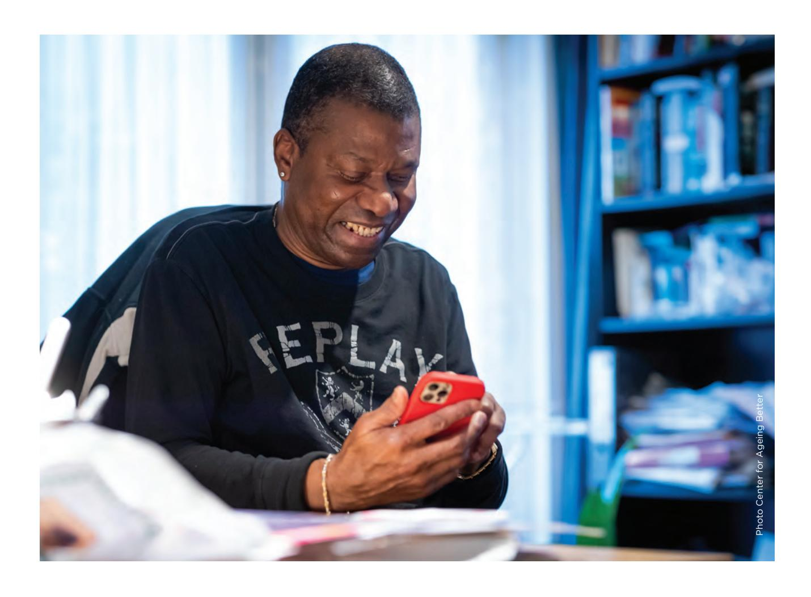

reported improved mood, coping, stress, autonomy, activities of daily living, and overall health in response to the adoption of assistive technology, all culminating in better overall well-being.79 Assistive technology in the home can include sensors, location monitoring, cognitive stimulation mechanisms, and medication dispensing devices.80 Both sensors and GPS can be useful for people living with dementia who engage in wandering, or getting lost or confused about their location.81 Sensors can be installed on doors to detect wandering and forced entry and can alert caregivers in case of emergency.82 GPS is also useful for detecting night wandering and wandering during the winter. GPS can be used to promote autonomy and encourage outdoor activities, which are especially important for overall health in this population.83 Importantly, people living with dementia have reported that using GPS has provided them with a sense of freedom, further

promoting their well-being. However, challenges using GPS should be considered and can include forgetting to take the device when leaving the home or low battery of the device. Wearable sensors have also been successfully used for fall detection, and installation of light pathways on the ground and brightly lit handrails are utilized for fall prevention.84 These mechanisms promote safety and independence, putting less strain on both the person living with dementia and their caregiver. Item locators and reminder systems can be used to further enhance independence. Item locators can be placed on objects such as phones or television remote controls and can reduce search time, whereas reminder systems can improve medication compliance and reduce hospitalization.85

A recent systematic review highlights the use of mobile applications to support activities of daily living, including maintaining hygiene, cooking, remembering appointments, and even setting a dinner table.86 This type of support may bolster a fundamental psychological need of Social Determination Theory, a sense of mastery and competence, that can be reduced in people living with dementia. This is accomplished with applications that support various types of cognition, including memory, by providing prompts and reminders. For example, calendar applications are used to remind people living with dementia of their daily schedule, while visual or vocal prompts help remind people to complete tasks. In sum, aging in place can enhance the well-being of people living with dementia, and aging in place can be supported with inexpensive home modifications and technological aids. However, additional research and innovation on technological systems are still needed to maximize their efficacy and address ethical considerations.87

While aging in place is an option for people living with mild to moderate dementia, it may not be an option for everyone due to advanced disease stage or lack of access to at-home caregivers. An alternative option for people living with advanced dementia is an innovative residential care model known as dementia villages, which are communities that encourage a supportive, homelike environment that is conducive to well-being.88 The overarching goal of dementia villages is to deinstitutionalize dementia through a patient-centered approach. Several countries have built or are building dementia villages to promote the well-being of people living with advanced dementia, including Amsterdam, Australia, Denmark, France, Germany, Ireland, Italy, Japan, New Zealand, Norway, Scotland, Switzerland. The first dementia village, De Hogeweyk, was conceived in the Netherlands and aimed to provide individuals with an engaging life using meaningful activities. The Hogeweyk Care Concept includes six pillars of a dementia village: 1) favorable surroundings (e.g., a familiar home space, outdoor space), 2) life's pleasure and meaning, 3) health, 4) lifestyle (e.g., acknowledging that the person living with dementia is the same person they were before their diagnosis), 5) staff and volunteers trained in dementia care, and 6) the organization (e.g., policies and staff facilitate

a "normal" life for the residents).89 Well-being is supported through social relationships and opportunities to engage in activities of interest, including eating at restaurants, attending concerts, and maintaining physical health through walking in the outdoor spaces within the village. Like the use of assistive technology in one's own home within the community, dementia villages utilize sensors to aid in the maintenance of the autonomy of their residents. An alternative to dementia villages in the United States is the Green House Project, which is comprised of individual residences that focus on viewing individuals with dementia as people outside of their medical label.

Consistent with Social Determination Theory, dementia villages promote both autonomy and relatedness, supporting the well-being of people living with dementia. Of note, while dementia villages were designed to promote well-being, little research has been conducted to assess if there are meaningful differences in the well-being of dementia village residents compared to individuals living in more traditional dementia care environments.90 More research is needed to better understand the impacts of dementia villages in comparison to traditional long-term care facilities. Further, countries should continue to develop and assess care models that are designed with the goal of enhancing the well-being of people living with dementia.

If aging in place or residing in a dementia village is not an option, long-term care facilities like nursing homes may be an alternative. One way that well-being is encouraged in this setting is through the use of multisensory environments. Research exploring two types of multisensory environments including Snoezelen rooms and landscaped gardens suggests that they both aid in the well-being of people living with dementia.91 Snoezelen rooms were developed in the Netherlands and are used to stimulate the senses via light, smell, sound, and taste.92 Like the dementia villages, Snoezelen rooms utilize a patient-centered approach. This mode of multisensory stimulation is effective for people living with dementia at various stages of the disease and increases well-being by reducing agitation and improving mood symptoms including depression and anxiety.93

Together, long-term care facilities can enhance the well-being of people living with dementia by implementing various interventions and activities including multisensory environments, animal-facilitated activities, cultural arts interventions, exercise programs, massage, life review/reminiscence, and outdoor activities such as gardening.

Despite the challenges that can accompany a diagnosis of dementia, people living with dementia can live well. This is evidenced through both individual and group activities that promote well-being via engagement in interventions and hobbies that facilitate a sense of purpose and improve mood. Importantly, each of these methods can be applied to people living with dementia both in the community and in care facilities like dementia villages or nursing homes, aiming to promote well-being. The global population of people living with dementia continues to grow, invoking a pressing need for researchers and policymakers to place well-being at the forefront of approaches to care.

Moreover, research is needed to extend well-being interventions developed for broader older adult populations to people living with dementia. For example, positive psychological interventions using practices such as gratitude and savoring have been shown to increase well-being among older adults. In a sample of healthy, communityliving adults aged 60+, a 'three good things in life' gratitude intervention was found to increase well-being from baseline to day 45.94 In a pilot study examining a savoring intervention, older adults who completed the intervention with high fidelity reported increased happiness over time.95Another study found that older adults who engaged in a positive psychological intervention showed increases in life satisfaction and subjective happiness compared to the control group.96 However, prior studies testing positive psychological interventions typically exclude people experiencing cognitive impairment or living with dementia. Future research is needed to determine whether these well-being interventions are effective for people living with dementia and to determine best practices for adapting these interventions for this population.

## **Policy Implications**

The research reviewed in this chapter suggests that policies designed to increase well-being may lower dementia risk, which in turn would result in a happier and healthier older adult population. Policies that enable equitable access to well-beingand health-enhancing activities may be especially beneficial, such as those that increase equitable access to education, safe public spaces for physical and social activity, health screenings, and affordable and effective health care. Such policies would provide individuals with the resources needed to maintain their well-being and health, resulting in widespread benefits for dementia prevention.

In addition, resources should be invested to test the long-term effects of well-being-enhancing interventions on cognitive health and dementia. Because targeting well-being as a dementia prevention strategy requires large-scale dissemination in the general population, resources should be invested into potentially scalable interventions such as those that can be delivered digitally, single-session interventions, and micro-interventions.97

*Policies that enable equitable access to well-being- and health-enhancing activities may be especially beneficial, such as those that increase equitable access to education, safe public spaces for physical and social activity, health screenings, and affordable and effective health care. Such policies would provide individuals with the resources needed to maintain their well-being and health, resulting in widespread benefits for dementia prevention.*

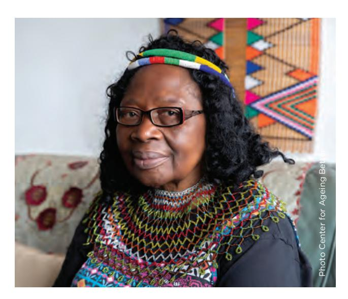

In addition to policies designed to decrease dementia prevalence, policies are needed to enhance the well-being of people living with dementia. A critical first step is to invest resources into collecting more high-quality data on the well-being of individuals living with dementia, ideally using self-report instruments that enable individuals living with dementia to report their own well-being. Such data are invaluable to better understand the lived experiences of individuals living with dementia, and to enable evaluations of the impact of different environments on the well-being of people living with dementia.

Given existing research suggesting individuals living with dementia benefit from continuing to live at home or in the community, policies should aim to increase access to and the affordability of assistive technology and paid care partners to enable more individuals living with dementia to remain at home. For individuals who can no longer safely live at home, assisted living facilities should aim to create more home-like environments and to implement activities and interventions shown to enhance well-being. Critically, the development and evaluation of the policies described here will require a shift away from a deficit-focused medical model and toward a strengths-based model that recognizes and preserves the personhood of people living with dementia.

## **Conclusion**

All over the world, people are living longer than ever. In most countries, the average person can expect to live to age 65 or older. As the global population ages, it is crucial to develop and implement dementia prevention strategies and to help individuals live well with dementia. This chapter reviewed evidence from multiple scientific disciplines and world regions showing that investing in well-being across the lifespan is essential to achieve these goals. In early and midlife, higher well-being may serve as a protective factor that prevents or delays dementia onset, which in turn further supports late-life well-being. In older adulthood, interventions and policies that facilitate continued engagement in social, physical, and intellectual activities are critical for the maintenance of both well-being and cognitive health. Among older adults living with dementia, interventions, environments, and policies that support the basic needs of autonomy, competence, and relatedness may help promote well-being.

#### **Endnotes**

- 1 World Health Organization (2020)
- 2 Alzheimer's Association (2020)
- 3 Alzheimer's Association (2023)
- 4 Meléndez et al. (2018); Wilson et al. (2013)
- 5 See Willroth et al. (2023) for review
- 6 Alzheimer's Disease International (2023)
- 7 Willroth (2023)
- 8 Bell et al. (2022); Sutin et al. (2018); Willroth et al., (2023). Beck et al. (2023). Results of one meta-analysis found that purpose in life was significantly associated with a reduced risk of dementia; however, results for positive affect were non-significant (Bell et al., 2022). There were not enough studies on life satisfaction to conduct a meta-analysis, however, individual study results were mixed. Consistent with these meta-analytic findings, another paper by Sutin and colleagues (2018) examined associations between several well-being constructs (life satisfaction, optimism, mastery, purpose in life, and positive affect) and incident dementia, and found that only purpose in life was significantly associated with dementia after adjusting for covariates (psychological distress, other clinical and behavioral risk factors, income/wealth, and genetic risk). Similarly, Willroth and colleagues (2023) found that both life satisfaction and eudaimonic well-being were associated with greater cognitive resilience to dementia-related neuropathology, but only the association of eudaimonic well-being remained when adjusting for covariates (socioeconomic status, education, cognitive activity, low neuroticism, low depression, ApoE genotype, medical comorbidities). Finally, a recent individual participant data meta-analysis found that positive affect, but not life satisfaction, was significantly associated with lower incident dementia (Beck et al., 2023). These findings highlight the complex associations between particular facets of well-being and dementia risk.
- 9 Cross & Grimm (2018)
- 10 Middleton & Yaffe (2009); Livingston et al. (2020); Marioni et al. (2015)
- 11 Grant et al. (2009)
- 12 Sin (2016)
- 13 Livingston et al. (2020)
- 14 Wilroth et al. (2023)
- 15 Dewitte et al. (2021); Lee (2016); Wagner et al. (2022)
- 16 Hittner et al. (2020); Gerstorf et al. (2007); Zainal & Newman (2022); Boyle et al. (2010); Kim et al. (2019)
- 17 Bell et al. (2022); Sutin et al. (2018); Boyle et al. (2010); Peitsch et al. (2016); Rawtaer et al. (2017); Zhu et al. (2022); Sutin et al. (2020)
- 18 Boyle et al. (2012); Willroth et al. (2022)
- 19 Carr et al. (2023). A meg-analysis of 198 meta-analyses of 4,065 primary studies found that interventions designed to enhance well-being through pathways consistent with positive psychological theory had small to medium positive effects on well-being, and these well-being increases were partially maintained at 7.5 months post-intervention.

- 20 Ma et al. (2021)
- 21 Kubzansky et al. (2023). Time-intensive, multi-component, face-to-face interventions often show the largest effect sizes. However, light-touch interventions delivered in digital formats are likely to be more scalable for delivery to the general population. Thus, more work is needed to enhance and test the effectiveness of these more scalable alternatives.
- 22 Alzheimer's Disease International (2023)
- 23 Meléndez et al. (2018); Wilson et al. (2013). Memory and thinking changes can impact well-being directly by causing frustration or embarrassment, or indirectly by impacting one's ability to participate in necessary or valued activities. In addition, the brain changes that cause dementia can directly impact mood.
- 24 Clarke et al. (2020); Kaufmann et al. (2016)
- 25 Logsdon et al. (1999)
- 26 Missotten et al. (2008); van de Beek et al. (2019)
- 27 Sites et al. (2017)
- 28 Wolverson et al. (2016)
- 29 Gotanda et al. (2023)
- 30 Górska et al. (2018)
- 31 Górska et al. (2018)
- 32 Katschnig (1997)
- 33 Brod et al. (1999); Hoe et al. (2005); Thorgrimsen et al. (2003)
- 34 Griffiths et al. (2020); Ready et al (2004); Römhild et al. (2018)
- 35 Brod et al. (1999); Thorgrimsen et al. (2003)
- 36 Logsdon et al. (1999)
- 37 Burgener et al. (2005)
- 38 Martyr et al. (2018)
- 39 Clarke et al. (2020)
- 40 Bowling et al. (2015)
- 41 Deci & Ryan (2011)
- 42 Ryan & Deci (2017)
- 43 Górska et al. (2018)
- 44 Górska et al. (2018)
- 45 Shyrock & Meeks (2022)
- 46 Dewitte et al. (2022); Nyman & Szymczynska (2016)
- 47 Nyman & Szymczynska (2016)
- 48 Orgeta et al. (2019)
- 49 Giebel & Sutcliffe (2018)
- 50 Shropshire (2020)
- 51 Leung (2015)
- 52 Leung et al. (2015); Logsdon et al. (2007)

- de Medeiros & Basting (2014)
- Shryock & Meeks (2022); Ueda et al. (2013)
- Huang et al. (2023)
- Tam et al. (2021)
- Woods et al. (2018)
- Subramaniam & Woods (2012)
- Haight et al. (2006); Haight et al. (1992)
- Shryock & Meeks (2022); Subramaniam & Woods (2012)
- Xu et al. (2023)
- Proulx et al. (2023)
- Harris & Caporella (2019)
- Galbraith et al. (2015)
- Gerritzen et al. (2020)
- Tominari et al. (2021)
- Rios Rincon et al. (2022)
- Tummers et al. (2020)
- Tyack et al. (2017)
- Tyack & Camic (2017)
- Ratnayake et al. (2022); Wiles et al. (2012)
- Ratnayake et al. (2022)
- McClendon et al. (2006)
- Ratnayake et al. (2022); Wiles et al. (2012)
- Circo et al. (2015)
- National Institute on Aging (2023)
- Soilemezi et al. (2019)
- 78 Farina et al. (2019); Malmgren et al. (2020); Astell et al. (2019); Kruse et al. (2020)
- Kruse et al. (2020)
- 80 Soilemezi et al. (2019); Kruse et al. (2020); Daly et al. (2019); Behera et al. (2021); Gettel et al. (2021); Pappadà et al. (2021)
- 81 Behera et al. (2021)
- 82 Pappadà et al. (2021)
- 83 Behera et al. (2021); Liu et al. (2017)
- 84 Pappadà et al. (2021)
- 85 Behera et al. (2021)
- 86 Pappadà et al. (2021)
- 87 Astell et al. (2019); Kruse et al. (2020)
- 88 Harris et al. (2017)
- 89 Harris et al. (2017)
- 90 Hestevik et al. (2022); Krier et al. (2023)
- 91 Cox et al. (2004)
- 92 Van Weert et al. (2005)

- 93 Cox et al. (2004); Van Weert et al. (2005); Solé et al. (2022); Berkheimer et al. (2017)
- Killen & Macaskill (2015)
- Smith & Hanni (2019)
- Ramírez et al. (2014)
- Kubzansky et al. (2023)

#### **References**

*Aging in Place: Tips on Making Home Safe and Accessible.* (n.d.). National Institute on Aging. Retrieved September 21, 2023, from https://www.nia.nih.gov/health/infographics/ aging-place-tips-making-home-safe-and-accessible

Alzheimer's Association. (2023a). *Alzheimer's Disease Facts and Figures*. https://www.alz.org/alzheimers-dementia/ facts-figures

Alzheimer's Association. (2023b). *What is Dementia?* https:// www.alz.org/alzheimers-dementia/what-is-dementia

Alzheimer's Disease International. (2023). *Dementia statistics.* https://www.alzint.org/about/dementia-facts-figures/ dementia-statistics

Astell, A. J., Bouranis, N., Hoey, J., Lindauer, A., Mihailidis, A., Nugent, C., Robillard, J. M., & Technology and Dementia Professional Interest Area ... (2019). Technology and Dementia: The Future is Now. *Dementia and Geriatric Cognitive Disorders*, *47*(3), 131–139. https://doi.org/10.1159/000497800

Beck, E. D., Yoneda, T., James, B. D., Bennett, D. A., Hassenstab, J., Katz, M. J., ... & Graham, E. K. (2023). Personality predictors of dementia diagnosis and neuropathological burden: An individual participant data meta-analysis. *Alzheimer's & Dementia*.

Behera, C. K., Condell, J., Dora, S., Gibson, D. S., & Leavey, G. (2021). State-of-the-Art Sensors for Remote Care of People with Dementia during a Pandemic: A Systematic Review. *Sensors*, *21*(14), Article 14. https://doi.org/10.3390/s21144688

Bell, G., Singham, T., Saunders, R., John, A., & Stott, J. (2022). Positive psychological constructs and association with reduced risk of mild cognitive impairment and dementia in older adults: A systematic review and meta-analysis. *Ageing Research Reviews*, *77*, 101594. https://doi.org/10.1016/j.arr.2022.101594

Berkheimer, S. D., Qian, C., & Malmstrom, T. K. (2017). Snoezelen Therapy as an Intervention to Reduce Agitation in Nursing Home Patients With Dementia: A Pilot Study. *Journal of the American Medical Directors Association*, *18*(12), 1089–1091. https://doi.org/10.1016/j.jamda.2017.09.009

Bowling, A., Rowe, G., Adams, S., Sands, P., Samsi, K., Crane, M., Joly, L., & Manthorpe, J. (2015). Quality of life in dementia: A systematically conducted narrative review of dementia-specific measurement scales. *Aging & Mental Health*, *19*(1), 13–31. https://doi.org/10.1080/13607863.2014.915923

Boyle, P. A., Buchman, A. S., Barnes, L. L., & Bennett, D. A. (2010). Effect of a purpose in life on risk of incident Alzheimer disease and mild cognitive impairment in community-dwelling older persons. *Archives of General Psychiatry*, *67*(3), 304–310. https://doi.org/10.1001/archgenpsychiatry.2009.208

Boyle, P. A., Buchman, A. S., Wilson, R. S., Yu, L., Schneider, J. A., & Bennett, D. A. (2012). Effect of purpose in life on the relation between alzheimer disease pathologic changes on cognitive function in advanced age. *Archives of General Psychiatry*, *69*(5), 499–504. https://doi.org/10.1001/archgenpsychiatry.2011.1487

Brod, M., Stewart, A. L., Sands, L., & Walton, P. (1999). Conceptualization and measurement of quality of life in dementia: The Dementia Quality of Life Instrument (DQoL). *The Gerontologist*, *39*(1), 25–36. https://doi.org/10.1093/geront/39.1.25

Burgener, S. C., Twigg, P., & Popovich, A. (2005). Measuring psychological well-being in cognitively impaired persons. *Dementia*, *4*(4), 463–485. https://doi. org/10.1177/1471301205058303

Carr, A., Finneran, L., Boyd, C., Shirey, C., Canning, C., Stafford, O., ... & Burke, T. (2023). The evidence-base for positive psychology interventions: a mega-analysis of meta-analyses. *The Journal of Positive Psychology*, 1-15.

Ciro, C. A., Anderson, M. P., Hershey, L. A., Prodan, C. I., & Holm, M. B. (2015). Instrumental Activities of Daily Living Performance and Role Satisfaction in People With and Without Mild Cognitive Impairment: A Pilot Project. *The American Journal of Occupational Therapy*, *69*(3), 6903270020p1-6903270020p10. https://doi.org/10.5014/ajot.2014.015198

Clarke, C., Woods, B., Moniz-Cook, E., Mountain, G., Øksnebjerg, L., Chattat, R., Diaz, A., Gove, D., Vernooij-Dassen, M., & Wolverson, E. (2020). Measuring the well-being of people with dementia: A conceptual scoping review. *Health and Quality of Life Outcomes*, *18*(1), 249. https://doi.org/10.1186/s12955-020- 01440-x

Cox, H., Burns, I., & Savage, S. (2004). Multisensory Environments for Leisure: Promoting Well-being in Nursing Home Residents With Dementia. *Journal of Gerontological Nursing*, *30*(2), 37–45. https://doi.org/10.3928/0098-9134-20040201- 08

Cross, M. P., & Grimm, M. (2018). Subjective well-being and physical health. *Handbook of Well-Being*.

Daly Lynn, J., Rondón-Sulbarán, J., Quinn, E., Ryan, A., McCormack, B., & Martin, S. (2019). A systematic review of electronic assistive technology within supporting living environments for people with dementia. *Dementia*, *18*(7–8), 2371–2435. https:// doi.org/10.1177/1471301217733649

de Medeiros, K., & Basting, A. (2014). "Shall I compare thee to a dose of donepezil?": Cultural arts interventions in dementia care research. *The Gerontologist*, *54*(3), 344–353. https://doi. org/10.1093/geront/gnt055

Deci, E. L., & Ryan, R. M. (2011). Self-determination theory. In P. A. M. Van Lange, E. T. Higgins, & A. W. Kruglanski (Eds.), *Handbook of theories of social psychology*. Sage. http://digital. casalini.it/9781446269008

Dewitte, L., Haugan, G., Vandenbulcke, mathieu, & Dezutter, J. (2022). Living meaningfully with dementia. In *Dementia & society* (pp. 63–80). Cambridge University Press. https://doi. org/10.1017/9781108918954.005

Dewitte, L., Lewis, N. A., Payne, B. R., Turiano, N. A., & Hill, P. L. (2021). Cross-lagged relationships between sense of purpose in life, memory performance, and subjective memory beliefs in adulthood over a 9-year interval. *Aging & Mental Health*, *25*(11), 2018–2027. https://doi.org/10.1080/13607863.2020.1822284

Farina, N., Sherlock, G., Thomas, S., Lowry, R. G., & Banerjee, S. (2019). Acceptability and feasibility of wearing activity monitors in community-dwelling older adults with dementia. *International Journal of Geriatric Psychiatry*, *34*(4), 617–624. https://doi.org/10.1002/gps.5064

Galbraith, B., Larkin, H., Moorhouse, A., & Oomen, T. (2015). Intergenerational programs for persons with dementia: A scoping review. *Journal of Gerontological Social Work*, *58*(4), 357–378. https://doi.org/10.1080/01634372.2015.1008166

Gerritzen, E. V., Hull, M. J., Verbeek, H., Smith, A. E., & de Boer, B. (2020). Successful elements of intergenerational dementia programs: A scoping review. *Journal of Intergenerational Relationships*, *18*(2), 214–245. https://doi.org/10.1080/1535077 0.2019.1670770

Gerstorf, D., Lövdén, M., Röcke, C., Smith, J., & Lindenberger, U. (2007). Well-being affects changes in perceptual speed in advanced old age: Longitudinal evidence for a dynamic link. *Developmental Psychology*, *43*(3), 705–718. https://doi. org/10.1037/0012-1649.43.3.705

Gettel, C. J., Chen, K., & Goldberg, E. M. (2021). Dementia Care, Fall Detection, and Ambient-Assisted Living Technologies Help Older Adults Age in Place: A Scoping Review. *Journal of Applied Gerontology*. https://doi. org/10.1177/07334648211005868

Giebel, C. M., & Sutcliffe, C. (2018). Initiating activities of daily living contributes to well-being in people with dementia and their carers. *International Journal of Geriatric Psychiatry*, *33*(1), e94–e102. https://doi.org/10.1002/gps.4728

Górska, S., Forsyth, K., & Maciver, D. (2018). Living with dementia: A meta-synthesis of qualitative research on the lived experience. *The Gerontologist*, *58*(3), e180–e196. https://doi. org/10.1093/geront/gnw195

Gotanda, H., Tsugawa, Y., Xu, H., & Reuben, D. B. (2023). Life satisfaction among persons living with dementia and those without dementia. *Journal of the American Geriatrics Society*, *71*(4), 1105–1116. https://doi.org/10.1111/jgs.18174

Grant, N., Wardle, J., & Steptoe, A. (2009). The Relationship Between Life Satisfaction and Health Behavior: A Cross-cultural Analysis of Young Adults. *International Journal of Behavioral Medicine*, *16*(3), 259–268. https://doi.org/10.1007/s12529-009- 9032-x

Griffiths, A. W., Smith, S. J., Martin, A., Meads, D., Kelley, R., & Surr, C. A. (2020). Exploring self-report and proxy-report quality-of-life measures for people living with dementia in care homes. *Quality of Life Research*, *29*(2), 463–472. https://doi. org/10.1007/s11136-019-02333-3

Haight, B. K., Gibson, F., & Michel, Y. (2006). The Northern Ireland life review/life storybook project for people with dementia. *Alzheimer's & Dementia*, *2*(1), 56–58. https://doi. org/10.1016/j.jalz.2005.12.003

Haight, B. K., Jones, G. M. M., & Miesen, B. M. L. (1992). The structured life-review process: A community approach to the ageing client. In *Caregiving in dementia: Research and applications* (Vol. 1, pp. 272–292).

Harris, J. Topfer, L., & Ford, C. (2017) *Dementia Villages: Innovative Residential Care for People With Dementia*. https://www. cadth.ca/dementia-villages-innovative-residential-care-people-dementia

Harris, P. B., & Caporella, C. A. (2019). Making a university community more dementia friendly through participation in an intergenerational choir. *Dementia*, *18*(7–8), 2556–2575. https:// doi.org/10.1177/1471301217752209

Hestevik, Christine Hillestad, Rosness, Tor, Holte, Hilde H., & Bjerk, Maria. (2022, January 14). *Dementia villages and other modern forms of residential care for persons with dementia*. Norwegian Institute of Public Health. https://www.fhi.no/en/ publ/2022/Dementia-villages-and-other-modern-forms-of-residential-care-for-persons-with-dementia/

Hittner, E. F., Stephens, J. E., Turiano, N. A., Gerstorf, D., Lachman, M. E., & Haase, C. M. (2020). Positive affect is associated with less memory decline: Evidence from a 9-year longitudinal study. *Psychological Science*, *31*(11), 1386–1395. https://doi.org/10.1177/0956797620953883

Hoe, J., Katona, C., Roch, B., & Livingston, G. (2005). Use of the QOL-AD for measuring quality of life in people with severe dementia—The LASER-AD study. *Age and Ageing*, *34*(2), 130–135. https://doi.org/10.1093/ageing/afi030

Huang, C., Yan, Y., Lin, R., Sun, W., Ye, Y., Wang, N., & Li, H. (2023). Effect of self-determination theory-based integrated creative art (SDTICA) program on older adults with mild cognitive impairment in nursing homes: Study protocol for a cluster randomised controlled trial. *BMC Geriatrics*, *23*(1), 238. https://doi.org/10.1186/s12877-023-03896-0

Katschnig, H. (1997). How useful is the concept of quality of life in psychiatry? *Current Opinion in Psychiatry*, *10*(5). https:// journals.lww.com/co-psychiatry/fulltext/1997/09000/how\_ useful\_is\_the\_concept\_of\_quality\_of\_life\_in.1.aspx

Kaufmann, E. G., & Engel, S. A. (2016). Dementia and well-being: A conceptual framework based on Tom Kitwood's model of needs. *Dementia*, *15*(4), 774–788. https://doi. org/10.1177/1471301214539690

Killen, A., & Macaskill, A. (2015). Using a gratitude intervention to enhance well-being in older adults. *Journal of Happiness Studies*, *16*(4), 947–964. https://doi.org/10.1007/s10902-014- 9542-3

Kim, G., Shin, S. H., Scicolone, M. A., & Parmelee, P. (2019). Purpose in life protects against cognitive decline among older adults. *The American Journal of Geriatric Psychiatry*, *27*(6), 593–601. https://doi.org/10.1016/j.jagp.2019.01.010

Krier, D., Boer, B. de, Hiligsmann, M., Wittwer, J., & Amieva, H. (2023). Evaluation of Dementia-Friendly Initiatives, Small-Scale Homelike Residential Care, and Dementia Village Models: A Scoping Review. *Journal of the American Medical Directors Association*, *24*(7), 1020-1027.e1. https://doi.org/10.1016/j. jamda.2023.03.024

Kruse, C. S., Fohn, J., Umunnakwe, G., Patel, K., & Patel, S. (2020). Evaluating the Facilitators, Barriers, and Medical Outcomes Commensurate with the Use of Assistive Technology to Support People with Dementia: A Systematic Review Literature. *Healthcare*, *8*(3), Article 3. https://doi.org/10.3390/ healthcare8030278

Kubzansky, L. D., Kim, E. S., Boehm, J. K., Davidson, R. J., Huffman, J. C., Loucks, E. B., Lyubomirsky, S., Picard, R. W., Schueller, S. M., Trudel-Fitzgerald, C., VanderWeele, T. J., Warran, K., Yeager, D. S., Yeh, C. S., & Moskowitz, J. T. (2023). Interventions to modify psychological well-being: Progress, promises, and an agenda for future research. *Affective Science*, *4*(1), 174–184. https://doi.org/10.1007/s42761-022-00167-w

Lee, P.-L. (2016). A Joyful Heart is Good Medicine: Positive Affect Predicts Memory Complaints. *The American Journal of Geriatric Psychiatry*, *24*(8), 662–670. https://doi.org/10.1016/j. jagp.2016.04.001

Leung, P., Orrell, M., & Orgeta, V. (2015). Social support group interventions in people with dementia and mild cognitive impairment: A systematic review of the literature. *International Journal of Geriatric Psychiatry*, *30*(1), 1–9. https://doi. org/10.1002/gps.4166

Liu, L., Miguel Cruz, A., Ruptash, T., Barnard, S., & Juzwishin, D. (2017). Acceptance of Global Positioning System (GPS) Technology Among Dementia Clients and Family Caregivers. *Journal of Technology in Human Services*, *35*(2), 99–119. https://doi.org/10.1080/15228835.2016.1266724

Livingston, G., Huntley, J., Sommerlad, A., Ames, D., Ballard, C., Banerjee, S., Brayne, C., Burns, A., Cohen-Mansfield, J., Cooper, C., Costafreda, S. G., Dias, A., Fox, N., Gitlin, L. N., Howard, R., Kales, H. C., Kivimäki, M., Larson, E. B., Ogunniyi, A., … Mukadam, N. (2020). Dementia prevention, intervention, and care: 2020 report of the Lancet Commission. *The Lancet*, *396*(10248), 413–446. https://doi.org/10.1016/S0140- 6736(20)30367-6

Logsdon, R. G., Gibbons, L. E., McCurry, S. M., & Teri, L. (1999). Quality of life in Alzheimer's disease: Patient and caregiver reports. *Journal of Mental Health and Aging*, *5*(1), 21–32.

Logsdon, R. G., McCurry, S. M., & Teri, L. (2007). Evidence-based interventions to improve quality of life for individuals with dementia. *Alzheimers Care Today*, *8*, 309.

Ma, Y.-H., Yang, Y.-X., Shen, X.-N., Chen, S.-D., Tan, L., Dong, Q., & Yu, J.-T. (2021). Evaluation relationships between subjective wellbeing, personality traits, and Alzheimer's disease: A two-sample Mendelian randomization study. *Journal of Psychiatric Research*, *137*, 498–505. https://doi.org/10.1016/j. jpsychires.2021.03.033

Malmgren Fänge, A., Carlsson, G., Chiatti, C., & Lethin, C. (2020). Using sensor-based technology for safety and independence – the experiences of people with dementia and their families. *Scandinavian Journal of Caring Sciences*, *34*(3), 648–657. https://doi.org/10.1111/scs.12766

Martyr, A., Nelis, S. M., Quinn, C., Wu, Y.-T., Lamont, R. A., Henderson, C., Clarke, R., Hindle, J. V., Thom, J. M., Jones, I. R., Morris, R. G., Rusted, J. M., Victor, C. R., & Clare, L. (2018). Living well with dementia: A systematic review and correlational meta-analysis of factors associated with quality of life, well-being and life satisfaction in people with dementia. *Psychological Medicine*, *48*(13), 2130–2139. Cambridge Core. https://doi.org/10.1017/S0033291718000405

McClendon, M. J., Smyth, K. A., & Neundorfer, M. M. (2006). Long-Term-Care Placement and Survival of Persons With Alzheimer's Disease. *The Journals of Gerontology: Series B*, *61*(4), P220–P227. https://doi.org/10.1093/geronb/61.4.P220

Meléndez, J. C., Satorres, E., Redondo, R., Escudero, J., & Pitarque, A. (2018). Wellbeing, resilience, and coping: Are there differences between healthy older adults, adults with mild cognitive impairment, and adults with Alzheimer-type dementia? *Archives of Gerontology and Geriatrics*, *77*, 38–43. https:// doi.org/10.1016/j.archger.2018.04.004

Middleton, L. E., & Yaffe, K. (2009). Promising Strategies for the Prevention of Dementia. *Archives of Neurology*, *66*(10), 1210–1215. https://doi.org/10.1001/archneurol.2009.201

Missotten, P., Squelard, G., Ylieff, M., Di Notte, D., Paquay, L., De Lepeleire, J., & Fontaine, O. (2008). Quality of life in older Belgian people: Comparison between people with dementia, mild cognitive impairment, and controls. *International Journal of Geriatric Psychiatry*, *23*(11), 1103–1109. https://doi. org/10.1002/gps.1981

Nyman, S. R., & Szymczynska, P. (2016). Meaningful activities for improving the wellbeing of people with dementia: Beyond mere pleasure to meeting fundamental psychological needs. *Perspectives in Public Health*, *136*(2), 99–107. https://doi. org/10.1177/1757913915626193

Orgeta, V., Tuijt, R., Leung, P., Verdaguer, E. S., Gould, R. L., Jones, R., & Livingston, G. (2019). Behavioral activation for promoting well-being in mild dementia: Feasibility and outcomes of a pilot randomized controlled trial. *Journal of Alzheimer's Disease*, *72*(2), 563–574. https://doi.org/10.3233/ JAD-190696

Pappadà, A., Chattat, R., Chirico, I., Valente, M., & Ottoboni, G. (2021). Assistive Technologies in Dementia Care: An Updated Analysis of the Literature. *Frontiers in Psychology*, *12*, 644587. https://doi.org/10.3389/fpsyg.2021.644587

Peitsch, L., Tyas, S. L., Menec, V. H., & John, P. D. S. (2016). General life satisfaction predicts dementia in community living older adults: A prospective cohort study. *International Psychogeriatrics*, *28*(7), 1101–1109. https://doi.org/10.1017/ S1041610215002422

Proulx, J. D. E., Van de Vondervoort, J. W., Hamlin, J. K., Helliwell, J. F., & Aknin, L. B. (2023). Are real-world prosociality programs associated with greater psychological well-being in primary school-aged children? *International Journal of Environmental Research and Public Health*, *20*(5). https://doi. org/10.3390/ijerph20054403

Ramírez, E., Ortega, A. R., Chamorro, A., & Colmenero, J. M. (2014). A program of positive intervention in the elderly: Memories, gratitude and forgiveness. *Aging & Mental Health*, *18*(4), 463–470. https://doi.org/10.1080/13607863.2013.856858

Ratnayake, M., Lukas, S., Brathwaite, S., Neave, J., & Henry, H. (2022). Aging in Place: *Delaware Journal of Public Health*, *8*(3), 28–31. https://doi.org/10.32481/djph.2022.08.007

Rawtaer, I., Gao, Q., Nyunt, M. S. Z., Feng, L., Chong, M. S., Lim, W. S., Lee, T.-S., Yap, P., Yap, K. B., & Ng, T. P. (2017). Psychosocial risk and protective factors and incident mild cognitive impairment and dementia in community dwelling elderly: Findings from the singapore longitudinal ageing study. *Journal of Alzheimer's Disease*, *57*(2), 603–611. https://doi.org/10.3233/ JAD-160862

Ready, R. E., Ott, B. R., & Grace, J. (2004). Patient versus informant perspectives of quality of life in mild cognitive impairment and Alzheimer's Disease. *International Journal of Geriatric Psychiatry*, *19*(3), 256–265. https://doi.org/10.1002/ gps.1075

Rios Rincon, A. M., Miguel Cruz, A., Daum, C., Neubauer, N., Comeau, A., & Liu, L. (2022). Digital Storytelling in Older Adults With Typical Aging, and With Mild Cognitive Impairment or Dementia: A Systematic Literature Review. *Journal of Applied Gerontology*, *41*(3), 867–880. https://doi. org/10.1177/07334648211015456

Römhild, J., Fleischer, S., Meyer, G., Stephan, A., Zwakhalen, S., Leino-Kilpi, H., Zabalegui, A., Saks, K., Soto-Martin, M., Sutcliffe, C., Rahm Hallberg, I., Berg, A., & on behalf of the RightTime-PlaceCare Consortium. (2018). Inter-rater agreement of the Quality of Life-Alzheimer's Disease (QoL-AD) self-rating and proxy rating scale: Secondary analysis of RightTimePlaceCare data. *Health and Quality of Life Outcomes*, *16*(1), 131. https:// doi.org/10.1186/s12955-018-0959-y

Ryan, R. M., & Deci, E. L. (2017). *Self-Determination Theory: Basic Psychological Needs in Motivation, Development, and Wellness. Guilford Publications*. https://books.google.com/ books?id=Bc\_DDAAAQBAJ

Shropshire, M. (2020). Reminiscence intervention for community-dwelling older adults without dementia: A literature review. *British Journal of Community Nursing*, *25*(1), 40–44. https://doi. org/10.12968/bjcn.2020.25.1.40

Shryock, S. K., & Meeks, S. (2022). Activity, activity personalization, and well-being in nursing home residents with and without cognitive impairment: An integrative review. *Clinical Gerontologist*, *45*(5), 1058–1072. https://doi.org/10.1080/07317115.2020.1 844356

Sin, N. L. (2016). The Protective Role of Positive Well-Being in Cardiovascular Disease: Review of Current Evidence, Mechanisms, and Clinical Implications. *Current Cardiology Reports*, *18*(11), 106. https://doi.org/10.1007/s11886-016-0792-z

Smith, J. L., & Hanni, A. A. (2019). Effects of a savoring intervention on resilience and well-being of older adults. *Journal of Applied Gerontology*, *38*(1), 137–152. https://doi. org/10.1177/0733464817693375

*Social activity, cognitive decline and dementia risk: A 20-year prospective cohort study* | *BMC Public Health* | *Full Text*. (n.d.). Retrieved October 10, 2023, from https://bmcpublichealth. biomedcentral.com/articles/10.1186/s12889-015-2426-6

Soilemezi, D., Drahota, A., Crossland, J., & Stores, R. (2019). The Role of the Home Environment in Dementia Care and Support: Systematic review of Qualitative Research. *Dementia*, *18*(4), 1237–1272. https://doi.org/10.1177/1471301217692130

Solé, C., Celdrán, M., & Cifre, I. (2022). Psychological and Behavioral Effects of Snoezelen Rooms on Dementia. *Activities, Adaptation & Aging, 0*(0), 1–16. https://doi.org/10.1080/019247 88.2022.2151805

Stites, S. D., Karlawish, J., Harkins, K., Rubright, J. D., & Wolk, D. (2017). Awareness of mild cognitive impairment and mild Alzheimer's Disease dementia diagnoses associated with lower self-ratings of quality of life in older adults. *The Journals of Gerontology: Series B*, *72*(6), 974–985. https://doi.org/10.1093/ geronb/gbx100

Subramaniam, P., & Woods, B. (2012). The impact of individual reminiscence therapy for people with dementia: Systematic review. *Expert Review of Neurotherapeutics*, *12*(5), 545–555. https://doi.org/10.1586/ern.12.35

Sutin, A. R., Luchetti, M., Stephan, Y., & Terracciano, A. (2020). Meaning in life and risk of cognitive impairment: A 9-Year prospective study in 14 countries. *Archives of Gerontology and Geriatrics*, *88*, 104033. https://doi.org/10.1016/j.archger.2020.104033

Sutin, A. R., Stephan, Y., & Terracciano, A. (2018). Psychological well-being and risk of dementia. *International Journal of Geriatric Psychiatry*, *33*(5), 743–747. https://doi.org/10.1002/ gps.4849

Tam, W., Poon, S. N., Mahendran, R., Kua, E. H., & Wu, X. V. (2021). The effectiveness of reminiscence-based intervention on improving psychological well-being in cognitively intact older adults: A systematic review and meta-analysis. *International Journal of Nursing Studies*, *114*, 103847. https://doi. org/10.1016/j.ijnurstu.2020.103847

Thorgrimsen, L., Selwood, A., Spector, A., Royan, L., de Madariaga Lopez, M., Woods, R. T., & Orrell, M. (2003). Whose quality of life is it anyway?: The validity and reliability of the Quality of Life-Alzheimer's Disease (QoL-AD) Scale. *Alzheimer Disease & Associated Disorders*, *17*(4). https://journals.lww. com/alzheimerjournal/fulltext/2003/10000/whose\_quality\_ of\_life\_is\_it\_anyway\_\_\_the\_validity.2.aspx

Tominari, M., Uozumi, R., Becker, C., & Kinoshita, A. (2021). Reminiscence therapy using virtual reality technology affects cognitive function and subjective well-being in older adults with dementia. *Cogent Psychology*, *8*(1), 1968991. https://doi.or g/10.1080/23311908.2021.1968991

Tummers, A. I. M., Hillen, M. F., De Kort, Y. A. W., & Ijsselsteijn, W. A. (2020). Use of robotic animal companions in dementia care: A qualitative study of the immediate and long-term effects to enhance quality of life and feelings of wellbeing for individuals living with dementia. *Annual Review of CyberTherapy and Telemedicine*, *18*, 45–49. APA PsycInfo.

Tyack, C., & Camic, P. M. (2017). Touchscreen interventions and the well-being of people with dementia and caregivers: A systematic review. *International Psychogeriatrics*, *29*(8), 1261–1280. Cambridge Core. https://doi.org/10.1017/ S1041610217000667

Tyack, C., Camic, P. M., Heron, M. J., & Hulbert, S. (2017). Viewing art on a tablet computer: A well-being intervention for people with dementia and their caregivers. *Journal of Applied Gerontology*, *36*(7), 864–894. https://doi. org/10.1177/0733464815617287

Ueda, T., Suzukamo, Y., Sato, M., & Izumi, S.-I. (2013). Effects of music therapy on behavioral and psychological symptoms of dementia: A systematic review and meta-analysis. *Ageing Research Reviews*, *12*(2), 628–641. https://doi.org/10.1016/j. arr.2013.02.003

van de Beek, M., van Steenoven, I., Ramakers, I. H. G. B., Aalten, P., Koek, H. L., Olde Rikkert, M. G. M., Manniën, J., Papma, J. M., de Jong, F. J., Lemstra, A. W., & van der Flier, W. M. (2019). Trajectories and determinants of quality of life in dementia with lewy bodies and Alzheimer's Disease. *Journal of Alzheimer's Disease*, *70*(2), 389–397. https://doi.org/10.3233/JAD-190041

Van Weert, J. C. M., Van Dulmen, A. M., Spreeuwenberg, P. M. M., Ribbe, M. W., & Bensing, J. M. (2005). Behavioral and Mood Effects of Snoezelen Integrated into 24-Hour Dementia Care. *Journal of the American Geriatrics Society*, *53*(1), 24–33. https://doi.org/10.1111/j.1532-5415.2005.53006.x

Wagner, M., Guimond, A.-J., Kubzansky, L. D., Zhang, Y., Bennett, D. A., Barnes, L. L., & Grodstein, F. (2022). Negative and Positive Psychosocial Factors in Relation to Cognitive Health in Older African Americans. *Innovation in Aging*, *6*(3), igac019. https://doi.org/10.1093/geroni/igac019

Wiles, J. L., Leibing, A., Guberman, N., Reeve, J., & Allen, R. E. S. (2012). The Meaning of "Aging in Place" to Older People. *The Gerontologist*, *52*(3), 357–366. https://doi.org/10.1093/geront/ gnr098

Willroth, E. C., James, B. D., Graham, E. K., Kapasi, A., Bennett, D. A., & Mroczek, D. K. (2022). Well-being and cognitive resilience to dementia-related neuropathology. *Psychological Science*, 09567976221119828. https://doi. org/10.1177/09567976221119828

Willroth, E. C., Pfund, G. N., McGhee, C., & Rule, P. (2023). Well-being as a protective factor against cognitive decline and dementia: A review of the literature and directions for future research. *The Journals of Gerontology: Series B*, *78*(5), 765–776. https://doi.org/10.1093/geronb/gbad020

Wilson, R. S., Boyle, P. A., Segawa, E., Yu, L., Begeny, C. T., Anagnos, S. E., & Bennett, D. A. (2013). The influence of cognitive decline on well-being in old age. *Psychology and Aging*, *28*(2), 304–313. https://doi.org/10.1037/a0031196

Wolverson, E. L., Clarke, C., & Moniz-Cook, E. D. (2016). Living positively with dementia: A systematic review and synthesis of the qualitative literature. *Aging & Mental Health*, *20*(7), 676–699. https://doi.org/10.1080/13607863.2015.1052777

Woods, B., O'Philbin, L., Farrell, E., Spector, A., & Orrell, M. (2018). Reminiscence therapy for dementia. *Cochrane Database of Systematic Reviews*, *3*. https://doi.org/10.1002/14651858. CD001120.pub3

World Health Organization. (2020). *Decade of Healthy Aging 2021-2030*.

Xu, L., Fields, N. L., Daniel, K. M., Cipher, D. J., & Troutman, B. A. (2023). Reminiscence and digital storytelling to improve the social and emotional well-being of older adults with Alzheimer's Disease and related dementias: Protocol for a mixed methods study design and a randomized controlled trial. *JMIR Res Protoc*, *12*, e49752. https://doi.org/10.2196/49752

Zainal, N. H., & Newman, M. G. (2022). Life satisfaction prevents decline in working memory, spatial cognition, and processing speed: Latent change score analyses across 23 years. *European Psychiatry*, *65*(1), e27. https://doi.org/10.1192/j.eurpsy.2022.19

Zhu, X., Luchetti, M., Aschwanden, D., Sesker, A. A., Stephan, Y., Sutin, A. R., & Terracciano, A. (2022). Satisfaction With Life and Risk of Dementia: Findings From the Korean Longitudinal Study of Aging. *The Journals of Gerontology: Series B*, *77*(10), 1831–1840. https://doi.org/10.1093/geronb/gbac064

## Chapter 5

# Differences in Life Satisfaction among Older Adults in India

## Ronak Paul

Senior Research Fellow Department of Public Health and Mortality Studies International Institute for Population Sciences

## Manacy Pai, Ph.D.

Associate Professor Department of Sociology and Criminology Kent State University

## Muhammad Thalil, Ph.D.

Postdoctoral Scholar, Center for Healthy Aging The Pennsylvania State University

## Shobhit Srivastava, Ph.D.

Independent Researcher

Acknowledgement: we would like to express our sincere gratitude to the editors for their invaluable insights and suggestions on our chapter drafts.

**doi.org/10.18724/whr-2f21-he52**

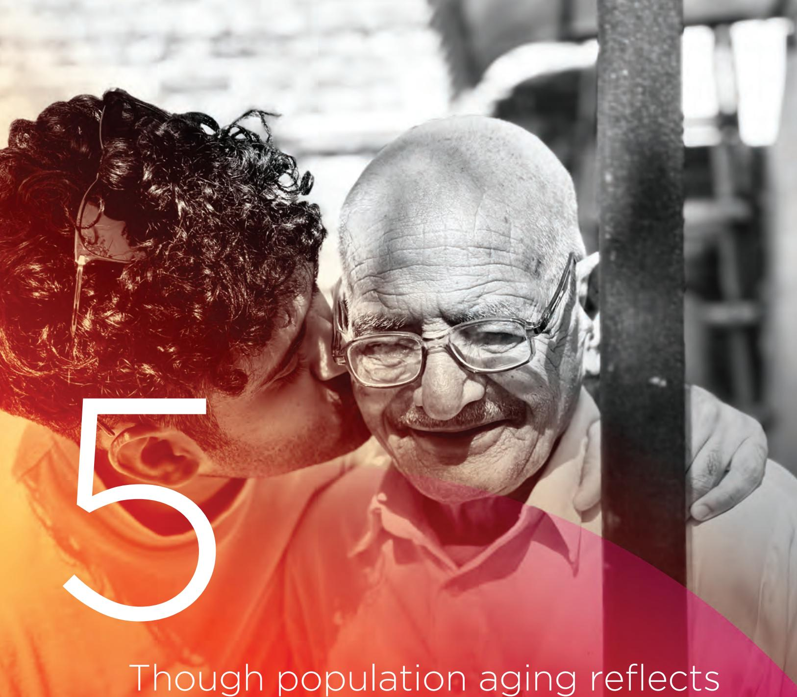

social and economic progress, scientists across the globe continue to debate the factors that contribute to quality of life in older age.

## **Key Insights**

**Older age is associated with higher life satisfaction in India,**  refuting some claims that the positive association between age and life satisfaction only exists in high-income nations.

On average, **older men in India are more satisfied with life than older women** (Table 5.1), but when taking all other measures into account, **older women report higher life satisfaction than their male counterparts** (Table 5.2).

**Older adults** with secondary or higher education and those of higher social castes report higher life satisfaction than counterparts without formal education and those from scheduled castes and scheduled tribes.

**Satisfaction** with living arrangements, perceived discrimination, and self-rated health emerge as the top three predictors of life satisfaction in this study.

India's older population is the second largest worldwide, with 140 million Indians aged 60 and over, second only to its 250 million Chinese counterparts.1 Additionally, the average growth rate for Indians aged 60 and above is three times higher than the overall population growth rate of the country.2 Though population aging reflects social and economic progress, scientists across the globe continue to debate the factors that contribute to quality of life in older age.

Life satisfaction, which is the best indicator of quality of life3 reflects the subjective assessment of one's life as a whole. Although participants, when inquired, rate their present quality of life, life satisfaction in older ages may serve as a measure to evaluate whether one's life has been successful overall.4 Older adults with higher life satisfaction report healthy behaviors5, which translates into better overall health.6 However, it can become difficult to maintain higher levels of life satisfaction with advancing age, often accompanied by social, physical, and mental health challenges.7 As such, zeroing in on the factors that contribute to life satisfaction is central to creating policies and programs that can improve the quality of life in older ages.8

A systematic review of 24 studies among older adults (60+ years) in Asian countries, including India, has identified age, gender, social relationships, social engagement, living arrangements, education, income, caste, religion, health behaviors, health conditions, and health care to affect life satisfaction in later life.9 Few studies have examined life satisfaction among older adults in India, yet those that have found that factors such as poor childhood, financial status, lack of social support in late life, physical frailty, and feelings of loneliness are associated

*Though population aging reflects social and economic progress, scientists across the globe continue to debate the factors that contribute to quality of life in older age.*

with lower levels of life satisfaction.10 However, past studies have focused on particular factors determining satisfaction with life in old age, meaning that comprehensive assessment of diverse predictors of life satisfaction among older men and women in a gendered sociocultural context of India remains limited. In this chapter, we strive to fill this gap by estimating the extent to which various sociodemographic, household, and health-related factors contribute to the differences in life satisfaction among older adults in India.

## **Methods**

#### **Data**

This chapter used the baseline wave of the Longitudinal Aging Study in India (LASI, 2017-19), which is the Health and Retirement Studies' (HRS) Indian adaptation11. The LASI provides vital information on demography, health symptoms, conditions, disabilities, health service utilization, household socioeconomic status, family and social networks, and life expectations of 73,396 adults aged 45 years and above.12 LASI used a

multistage stratified area probability cluster sampling design to arrive at the final observation units: older individuals aged 45 and above, as well as their spouses of any age.13

This study used a sample of 31,902 individuals aged 60 and above, whom we refer to as "older adults'' from here on forward. The sample who responded to the questions on life satisfaction totals 30,795 older adults.

#### **Outcome Variable**

All respondents reported their life satisfaction, which served as this study's primary outcome variable. Life satisfaction is defined as a person's cognitive appraisal of their life as a whole.14 During LASI round-I, the interviewers collected information on the following five life satisfaction indicators:

- In most ways, the respondents' life is close to ideal.
- The conditions of the respondents' life are excellent.
- The respondents are satisfied with their lives.
- The respondents have achieved the essential things they want in their lives so far.
- If the respondents could relieve their life, they would change almost nothing.

Ratings were provided on a scale ranging from 1-7, where one meant strongly disagree and seven meant strongly agree. The life satisfaction score15 of older persons, which ranges from 5-35, was then calculated by adding the five indicators with greater scores implying higher levels of life satisfaction. To maintain comparability and continuity with life satisfaction measures used in other chapters of the *World Happiness Report*, we transformed this life satisfaction variable into a 0-10 scale by subtracting 5 and then dividing by 3. Notably, the average Indian older adult scored 6.32 points in the life satisfaction scale. It is worth pointing out that life satisfaction in our study is self-reported, thus there always lingers the possibility of misreporting due to the fear of social stigma.

#### **Explanatory Variables**

Given their relevance to older adults' life satisfaction, we included sociodemographic, health, and household characteristics in this study. The sociodemographic characteristics of the older adults are:

- Age group was coded as young-old (60-69 years), old-old (70-79 years), and oldest-old (80+ years).
- Gender was coded as male and female.
- Level of education was coded as no formal education, up to primary, secondary and above.
- Work status was categorized as never worked, currently not working, currently working, and retired.
- Marital status was coded as currently not married and currently married.
- The importance of religion was coded as not important and important.
- Living arrangement satisfaction was coded as satisfied, neutral, and not satisfied.
- Victim of ill-treatment (within one year of the interview) was coded as no and yes.
- Perceived discrimination was coded as no and yes.
- Social participation was coded as: socially active and socially inactive. The family and social networks module of the LASI survey questionnaire includes detailed questions about older adults' participation and engagement in social activities, organizations or society. The survey asked participants whether they were a member of any of the organizations, religious groups, clubs, or societies from a given list and how many meetings/regular gatherings, if any, they attend in a year. Older adults who engage in the above social activities were classified as "socially active" and otherwise as "socially inactive."

The next set of variables included the following health-related characteristics of older adults:

- Depression symptoms were coded as: 0 "Not depressed" and 1 "Depressed." Major depression among older adults with symptoms of dysphoria was calculated using the CIDI-SF (Short Form Composite International Diagnostic Interview), with a cut-point of 3 on a scale of 0-10.16 This scale estimates a probable psychiatric diagnosis of major depression and has been validated in field settings and widely used in population-based health surveys.
- Self-rated health was coded as good, average, and poor.
- Chronic morbidity was coded as: no condition, single condition, or multiple conditions. LASI collected information on whether an older adult was ever diagnosed with hypertension or high blood pressure, diabetes or high blood pressure, cancer or malignant tumor, chronic lung diseases, chronic heart diseases, stroke, bone, or joint diseases, any neurological or psychological problems, or high cholesterol. Individuals having no diseases, any one of the diseases and two or more diseases were categorized into "no condition", "single condition", and "multiple conditions," respectively.
- Physical activity was coded as: physically inactive or physically active. Physical activity was assessed based on WHO guidelines for persons aged 18 and above.17 Older adults who performed at least 75 minutes of vigorous-intensity physical activity or at least 150 minutes of moderate-intensity physical activity in a day or a combination of both were classified as "physically active." Otherwise, they were categorized as "physically inactive".
- Difficulty in Activities of Daily Living (ADL) included items on whether older adults experienced any difficulty with the following six activities: (a) walking across a room, (b) dressing, (c) bathing, (d) eating, (e) getting in and out of bed, and (f) toileting. Responses for the six items (1 = *yes*; 0 = *no*) were summed, with higher scores indicating more

- activity limitations (range: 0–6). Older individuals who struggled with activities for more than three months were labeled "faces difficulties." The "no difficulty" group comprised those with no trouble with any of the ADLs. We included ADLs given that difficulty in everyday functioning and independence can be crucial for one's life satisfaction.
- Difficulty in Instrumental Activities of Daily Living (IADL) included items on whether older adults experienced any difficulty when performing the following seven activities: grocery shopping, preparing meals, making phone calls, taking medication, doing household chores, managing finances, and getting oneself to an otherwise unfamiliar location. Each item response was coded as *0 = no difficulty* or *1 = any difficulty*. Those who reported trouble with any of these activities for more than three months were labeled "faces difficulties." Otherwise, they were categorized as having "no difficulty." Even though IADLs may not require hands-on-personal assistance, difficulty in executing IADLs may compromise independent living, which could adversely affect life satisfaction.
- Covered by any health insurance was coded as yes, no.

Further, we considered the following household-related characteristics –

- Based on recommendations for "better" indicators of SES in LMICs18older adults' SES was assessed using the monthly per-capita consumption expenditure (MPCE) quintile. Sets of 11 and 29 questions on the expenditures on food and non-food items, respectively, were used to canvass the sample households. Food expenditure was collected based on a reference period of seven days, while the non-food expenditure was collected using reference periods of 30 days and 365 days.19 Food and non-food expenditures have been standardized to the 30-day reference period. The income quintile variable was divided into five quintiles i.e., from poorest to richest.
- Religious affiliation was coded as Hinduism, Islam, and Others.

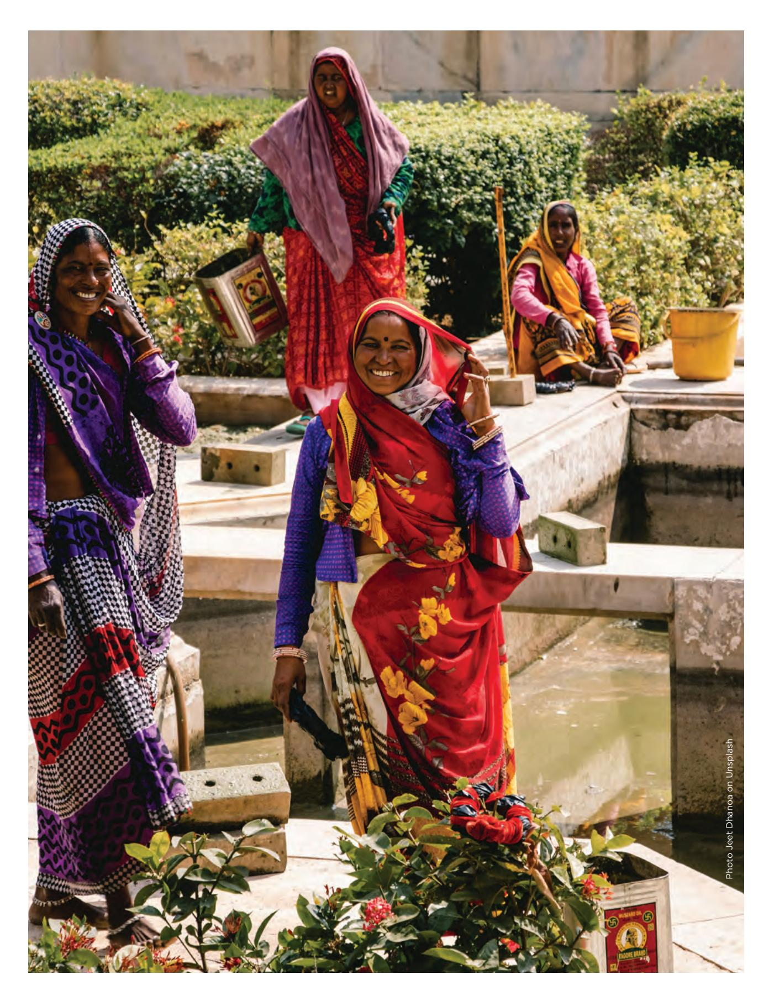

- Given the documented link between poorer health and lower SES among certain castes,20 we also included respondent's self-reported social group, and categories were Scheduled Tribe (ST), Scheduled Caste (SC), Other Backward Class (OBC) and Others.
- The place of residence was coded as rural or urban.
- The region of residence (south, north, central, western, eastern, and north-eastern) was also included as a covariate in the analyses to assess regional disparities. This variable was constructed by including the 29 states and six union territories of India during 2017-1821 into six categories based on administrative similarity.

#### **Statistical Methods**

We began by showing older adults' absolute and percentage distributions based on their background characteristics. Bivariate analysis examined variations in older adults' average life satisfaction score by their background characteristics. Additionally, one-way ANOVA tests were used to discern the difference in average life satisfaction scores across the independent variables. Further, multivariable linear regression analysis was used to examine the associations between the life satisfaction score and the independent variables. The partial correlation coefficients in regression models showed the difference in the life satisfaction score of older adults belonging to a specific category compared to older adults from the reference category, given that the effect of all the other independent variables remains constant.22

Next, dominance analysis (DA)23 was used to determine the relative importance of independent variables in explaining the variation in the outcome variable.24 Here, we used the DA method developed by Budescu with the older adults' life satisfaction score as the outcome variable.25 The DA computed sub-regression models with the same outcome variable and different sets of independent variables to determine the contribution of each predictor to the overall model prediction power denoted by the

coefficient of determination statistic (R2). The DA gives the dominance statistic that denotes the prediction power of each predictor, the percentage variation in older adults' life satisfaction explained by each predictor and ranks showing the relative importance of each predictor variable.26

Our background checks showed that the regression models did not violate the multicollinearity and heteroscedasticity assumptions. Standard errors were corrected for weighting and clustering in all estimations, given that LASI utilized a multistage sampling strategy.

## **Results**

*Table 5.1* presents an overview of the socioeconomic and demographic characteristics of the study participants. The distribution reveals that 11% of the older adults fell into the oldest-old age group, with 59% categorized as young-old and 30% as old-old. Approximately 53% of the participants were women. Notably, 56% had not pursued formal education, while 21% had attained secondary or higher education levels. In terms of employment status, 7% were retired, while nearly 31% were currently working. Furthermore, 38% were not currently married, and for 21% of the participants, religion held no importance. Concerningly, 6% expressed dissatisfaction with their current living arrangements. Instances of ill treatment were reported by 5% of respondents, while 18% reported experiencing discrimination at some point. Social inactivity affected almost 9% of participants, with a similar proportion experiencing depression. Moreover, 23% rated their health as poor, and 24% reported having multiple health conditions. Physical inactivity was prevalent among 72% of older adults, and 23% faced difficulty with Activities of Daily Living (ADL), while 48% encountered challenges with Instrumental Activities of Daily Living (IADL). Alarmingly, only 18% had health insurance coverage.

**Table 5.1: Distribution of older adults by socio-demographic, health-related, and household characteristics in India 2017–19**

| Characteristics                 | All older adults |      |
|---------------------------------|------------------|------|
|                                 | N                | %    |
| Age group                       |                  |      |
| Young-old                       | 18,755           | 60.9 |
| Old-old                         | 8,898            | 28.9 |
| Oldest-old                      | 3,142            | 10.2 |
| Gender                          |                  |      |
| Male                            | 14,785           | 48.0 |
| Female                          | 16,010           | 52.0 |
| Level of education              |                  |      |
| No formal education             | 16,514           | 53.6 |
| Up to primary                   | 7,417            | 24.1 |
| Secondary and above             | 6,864            | 22.3 |
| Working status                  |                  |      |
| Currently working               | 8,861            | 28.8 |
| Currently not working           | 10,558           | 34.3 |
| Never worked                    | 8,751            | 28.4 |
| Retired                         | 2,625            | 8.5  |
| Current marital status          |                  |      |
| Currently not married           | 11,146           | 36.2 |
| Currently married               | 19,649           | 63.8 |
| Importance of religion          |                  |      |
| Not important                   | 5,979            | 19.4 |
| Very important                  | 24,816           | 80.6 |
| Living arrangement satisfaction |                  |      |
| Not satisfied                   | 1,421            | 4.6  |
| Neutral                         | 5,248            | 17.0 |
| Satisfied                       | 24,126           | 78.3 |
| Received ill-treatment          |                  |      |
| Yes                             | 1,267            | 4.1  |
| No                              | 29,528           | 95.9 |
| Faces discrimination in life    |                  |      |
| Yes                             | 4,750            | 15.4 |
| No                              | 26,045           | 84.6 |
| Social participation            |                  |      |
| Socially inactive               | 2,474            | 8.0  |
| Socially active                 | 28,321           | 92.0 |
| Depression symptoms             |                  |      |
| Depressed                       | 2,104            | 6.8  |
| Not depressed                   | 28,691           | 93.2 |
| Self-rated health               |                  |      |
| Poor                            | 6,686            | 21.7 |
| Average                         | 19,624           | 63.7 |
|                                 |                  | 14.6 |

| Characteristics             | All older adults |       |  |
|-----------------------------|------------------|-------|--|
|                             | N                | %     |  |
| Chronic morbidity status    |                  |       |  |
| No condition                | 14,079           | 45.7  |  |
| Single condition            | 9,134            | 29.7  |  |
| Multiple conditions         | 7,582            | 24.6  |  |
| Physical activity status    |                  |       |  |
| Physically active           | 7,984            | 25.9  |  |
| Physically inactive         | 22,811           | 74.1  |  |
| Difficulty in ADL           |                  |       |  |
| Faces difficulty            | 6,295            | 20.4  |  |
| No difficulty               | 24,500           | 79.6  |  |
| Difficulty in IADL          |                  |       |  |
| Faces difficulty            | 13,359           | 43.4  |  |
| No difficulty               | 17,436           | 56.6  |  |
| Covered by health insurance |                  |       |  |
| No                          | 24,355           | 79.1  |  |
| Yes                         | 6,440            | 20.9  |  |
| Household income quintile   |                  |       |  |
| Poor                        | 12,656           | 41.1  |  |
| Not poor                    | 18,139           | 58.9  |  |
| Religion of household       |                  |       |  |
| Hinduism                    | 22,528           | 73.2  |  |
| Islam                       | 3,582            | 11.6  |  |
| Others                      | 4,685            | 15.2  |  |
| Caste of household          |                  |       |  |
| SC-ST group                 | 10,111           | 32.8  |  |
| Non-SC-ST group             | 20,684           | 67.2  |  |
| Place of residence          |                  |       |  |
| Rural                       | 20,383           | 66.2  |  |
| Urban                       | 10,412           | 33.8  |  |
| Country Region              |                  |       |  |
| Southern                    | 7,291            | 23.7  |  |
| Northern                    | 7,726            | 25.1  |  |
| Central                     | 2,017            | 6.5   |  |
| Western                     | 4,133            | 13.4  |  |
| Eastern                     | 5,601            | 18.2  |  |
| North-eastern               | 4,027            | 13.1  |  |
| Aggregate number            | 30,795           | 100.0 |  |

Note: (a) N: Unweighted sample size, %: Unweighted percentage; (b) ADL: Activities of daily living, IADL: Instrumental activities of daily living.

**Fig. 5.1: Represents the bar plot for life satisfaction score by gender and marital status among older adults.** In all age groups, unmarried women reported the lowest levels of life satisfaction.

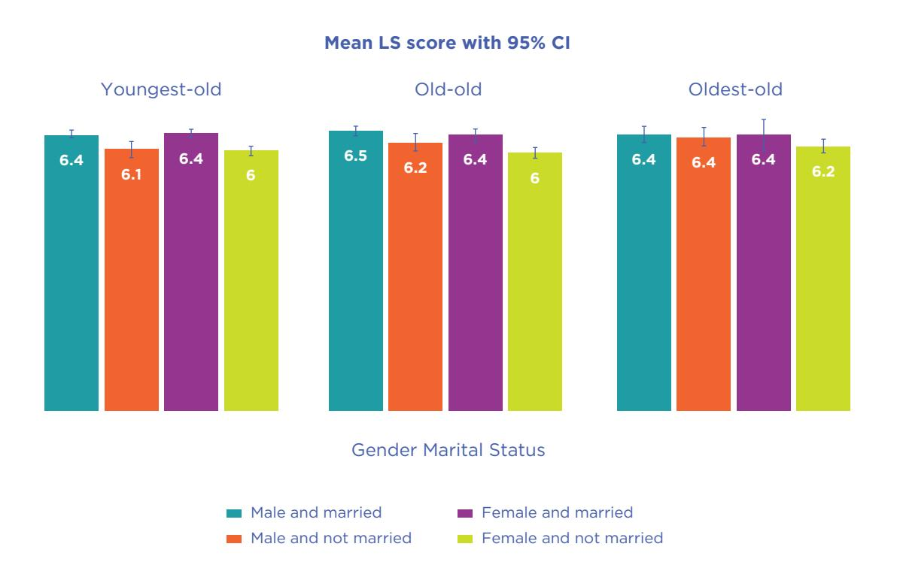

*Figure 5.1* represents the bar plot for life satisfaction score by gender and marital status among older adults. In all age groups, unmarried women reported the lowest levels of life satisfaction.

In *Table 5.2*, we delve into the life satisfaction of older adults based on their backgrounds. Notably, women consistently reported lower life satisfaction than men, while those without formal education tended to show significantly lower satisfaction compared to their educated peers. Retirement seemed to correlate with lower satisfaction levels, contrasting with those still in the workforce. Interestingly, unmarried individuals, those less concerned with religion, and those discontent with their living situations displayed notably lower satisfaction scores. Moreover, experiences of ill-treatment or discrimination, social inactivity, depression, poor self-rated health, and difficulties with daily activities were all linked to diminished life satisfaction among older adults. Financial status, caste, and rural residence also emerged as influential factors, with those from the western region of India reporting the highest satisfaction levels, followed by counterparts in the central, north-eastern, and northern regions.

**Table 5.2: Life satisfaction score summary of older adults by socio-demographic, health-related, and household characteristics in India 2017-18**

| Characteristics                 | Life satisfaction score of older adults |     |                              |
|---------------------------------|-----------------------------------------|-----|------------------------------|
|                                 | Mean                                    | SD  | ANOVA statistic (p-value) |
| Age group                       |                                         |     |                              |
| Young-old                       | 6.3                                     | 2.4 | 1.17 (0.3111)                |
| Old-old                         | 6.3                                     | 2.4 |                              |
| Oldest-old                      | 6.3                                     | 2.4 |                              |
| Gender                          |                                         |     |                              |
| Male                            | 6.4                                     | 2.4 | 43.60 (<0.001)               |
| Female                          | 6.2                                     | 2.4 |                              |
| Level of education              |                                         |     |                              |
| No formal education             | 6.0                                     | 2.4 | 438.18 (<0.001)              |
| Up to primary                   | 6.4                                     | 2.3 |                              |
| Secondary and above             | 7.0                                     | 2.3 |                              |
| Working status                  |                                         |     |                              |
| Currently working               | 6.2                                     | 2.4 | 139.50 (<0.001)              |
| Currently not working           | 6.1                                     | 2.5 |                              |
| Never worked                    | 6.3                                     | 2.4 |                              |
| Retired                         | 7.2                                     | 2.2 |                              |
| Current marital status          |                                         |     |                              |
| Currently not married           | 6.1                                     | 2.5 | 162.34 (<0.001)              |
| Currently married               | 6.4                                     | 2.4 |                              |
| Importance of religion          |                                         |     |                              |
| Not important                   | 5.7                                     | 2.5 | 511.95 (<0.001)              |
| Very important                  | 6.5                                     | 2.4 |                              |
| Living arrangement satisfaction |                                         |     |                              |
| Not satisfied                   | 3.8                                     | 2.6 | 1836.82 (<0.001)             |
| Neutral                         | 5.2                                     | 2.4 |                              |
| Satisfied                       | 6.7                                     | 2.2 |                              |
| Received ill-treatment          |                                         |     |                              |
| Yes                             | 5.0                                     | 2.7 | 373.07 (<0.001)              |
| No                              | 6.4                                     | 2.4 |                              |
| Faces discrimination in life    |                                         |     |                              |
| Yes                             | 5.5                                     | 2.5 | 740.61 (<0.001)              |
| No                              | 6.5                                     | 2.4 |                              |
| Social participation            |                                         |     |                              |
| Socially inactive               | 5.9                                     | 2.8 | 94.96 (<0.001)               |
| Socially active                 | 6.4                                     | 2.4 |                              |
| Depression symptoms             |                                         |     |                              |
| Depressed                       | 5.2                                     | 2.7 | 492.64 (<0.001)              |
| Not depressed                   | 6.4                                     | 2.4 |                              |
| Self-rated health               |                                         |     |                              |
| Poor                            | 5.6                                     | 2.6 | 465.96 (<0.001)              |
| Average                         | 6.4                                     | 2.3 |                              |
| Good                            | 6.9                                     | 2.3 |                              |

| Characteristics                 | Life satisfaction score of older adults |     |                              |
|---------------------------------|-----------------------------------------|-----|------------------------------|
|                                 | Mean                                    | SD  | ANOVA statistic (p-value) |
| Chronic morbidity status        |                                         |     |                              |
| No condition                    | 6.3                                     | 2.4 | 4.08 (0.0169)                |
| Single condition                | 6.3                                     | 2.4 |                              |
| Multiple conditions             | 6.4                                     | 2.5 |                              |
| Physical activity status        |                                         |     |                              |
| Physically active               | 6.3                                     | 2.3 | 4.67 (0.0306)                |
| Physically inactive             | 6.3                                     | 2.4 |                              |
| Difficulty in ADL               |                                         |     |                              |
| Faces difficulty                | 6.0                                     | 2.5 | 98.13 (<0.001)               |
| No difficulty                   | 6.4                                     | 2.4 |                              |
| Difficulty in IADL              |                                         |     |                              |
| Faces difficulty                | 6.0                                     | 2.4 | 411.81 (<0.001)              |
| No difficulty                   | 6.6                                     | 2.4 |                              |
| Covered by health insurance     |                                         |     |                              |
| No                              | 6.4                                     | 2.4 | 43.08 (<0.001)               |
| Yes                             | 6.1                                     | 2.5 |                              |
| Household income quintile       |                                         |     |                              |
| Poor                            | 6.1                                     | 2.4 | 163.82 (<0.001)              |
| Not poor                        | 6.5                                     | 2.4 |                              |
| Religion of household           |                                         |     |                              |
| Hinduism                        | 6.3                                     | 2.5 | 25.38 (<0.001)               |
| Islam                           | 6.2                                     | 2.3 |                              |
| Others                          | 6.5                                     | 2.2 |                              |
| Caste of household              |                                         |     |                              |
| SC-ST group                     | 6.1                                     | 2.3 | 109.18 (<0.001)              |
| Non-SC-ST group                 | 6.4                                     | 2.4 |                              |
| Place of residence              |                                         |     |                              |
| Rural                           | 6.1                                     | 2.4 | 307.40 (<0.001)              |
| Urban                           | 6.7                                     | 2.4 |                              |
| Country Region                  |                                         |     |                              |
| Southern                        | 6.0                                     | 2.6 | 214.00 (<0.001)              |
| Northern                        | 6.3                                     | 2.3 |                              |
| Central                         | 6.3                                     | 2.6 |                              |
| Western                         | 7.3                                     | 2.2 |                              |
| Eastern                         | 5.9                                     | 2.3 |                              |
| North-eastern                   | 6.5                                     | 2.0 |                              |
| Overall life satisfaction score | 6.3                                     | 2.4 |                              |

Note: (a) Mean: Average life satisfaction score, SD: Standard deviation; (b) ADL: Activities of daily living, IADL: Instrumental activities of daily living.

**Table 5.3: Multivariable association between life satisfaction and socio-demographic, health-related and household characteristics of older adults in India 2017-18 from linear regression models**

| Characteristics                 | Life satisfaction of older adults Coef 95% CI |                 |         |  |
|---------------------------------|-----------------------------------------------------|-----------------|---------|--|
|                                 |                                                     |                 | p-value |  |
| Age group                       |                                                     |                 |         |  |
| Young-old                       | (ref)                                               |                 |         |  |
| Old-old                         | 0.090                                               | (0.031, 0.149)  | 0.003   |  |
| Oldest-old                      | 0.241                                               | (0.150, 0.332)  | <0.001  |  |
| Gender                          |                                                     |                 |         |  |
| Male                            | (ref)                                               |                 |         |  |
| Female                          | 0.085                                               | (0.017, 0.153)  | 0.014   |  |
| Level of education              |                                                     |                 |         |  |
| No formal education             | (ref)                                               |                 |         |  |
| Up to primary                   | 0.214                                               | (0.146, 0.283)  | <0.001  |  |
| Secondary and above             | 0.697                                               | (0.616, 0.778)  | <0.001  |  |
| Working status                  |                                                     |                 |         |  |
| Currently working               | (ref)                                               |                 |         |  |
| Currently not working           | -0.023                                              | (-0.093, 0.047) | 0.525   |  |
| Never worked                    | 0.138                                               | (0.054, 0.222)  | 0.001   |  |
| Retired                         | 0.255                                               | (0.140, 0.370)  | <0.001  |  |
| Current marital status          |                                                     |                 |         |  |
| Currently not married           | (ref)                                               |                 |         |  |
| Currently married               | 0.126                                               | (0.067, 0.185)  | <0.001  |  |
| Importance of religion          |                                                     |                 |         |  |
| Not important                   | (ref)                                               |                 |         |  |
| Very important                  | 0.218                                               | (0.153, 0.283)  | <0.001  |  |
| Living arrangement satisfaction |                                                     |                 |         |  |
| Not satisfied                   | (ref)                                               |                 |         |  |
| Neutral                         | 1.107                                               | (0.984, 1.229)  | <0.001  |  |
| Satisfied                       | 2.270                                               | (2.154, 2.385)  | <0.001  |  |
| Received ill-treatment          |                                                     |                 |         |  |
| Yes                             | (ref)                                               |                 |         |  |
| No                              | 0.368                                               | (0.248, 0.488)  | <0.001  |  |
| Faces discrimination in life    |                                                     |                 |         |  |
| Yes                             | (ref)                                               |                 |         |  |
| No                              | 0.511                                               | (0.440, 0.582)  | <0.001  |  |
| Social participation            |                                                     |                 |         |  |
| Socially inactive               | (ref)                                               |                 |         |  |
| Socially active                 | 0.086                                               | (-0.007, 0.178) | 0.071   |  |
| Depression symptoms             |                                                     |                 |         |  |
| Depressed                       | (ref)                                               |                 |         |  |
| Not depressed                   | 0.647                                               | (0.553, 0.741)  | <0.001  |  |
| Self-rated health               |                                                     |                 |         |  |
| Poor                            | (ref)                                               |                 |         |  |
| Average                         | 0.388                                               | (0.322, 0.454)  | <0.001  |  |
| Good                            | 0.521                                               | (0.427, 0.616)  | <0.001  |  |
| Chronic morbidity status        |                                                     |                 |         |  |

| Characteristics             | Life satisfaction of older adults |                  |         |
|-----------------------------|-----------------------------------|------------------|---------|
|                             | Coef                              | 95% CI           | p-value |
| No condition                | (ref)                             |                  |         |
| Single condition            | -0.034                            | (-0.095, 0.027)  | 0.274   |
| Multiple conditions         | 0.107                             | (0.037, 0.177)   | 0.003   |
| Physical activity status    |                                   |                  |         |
| Physically active           | (ref)                             |                  |         |
| Physically inactive         | 0.016                             | (-0.046, 0.079)  | 0.614   |
| Difficulty in ADL           |                                   |                  |         |
| Faces difficulty            | (ref)                             |                  |         |
| No difficulty               | 0.278                             | (0.209, 0.346)   | <0.001  |
| Difficulty in IADL          |                                   |                  |         |
| Faces difficulty            | (ref)                             |                  |         |
| No difficulty               | -0.038                            | (-0.096, 0.021)  | 0.209   |
| Covered by health insurance |                                   |                  |         |
| No                          | (ref)                             |                  |         |
| Yes                         | -0.217                            | (-0.284, -0.149) | <0.001  |
| Household income quintile   |                                   |                  |         |
| Poor                        | (ref)                             |                  |         |
| Not poor                    | 0.190                             | (0.137, 0.243)   | <0.001  |
| Religion of household       |                                   |                  |         |
| Hinduism                    | (ref)                             |                  |         |
| Islam                       | 0.023                             | (-0.062, 0.107)  | 0.601   |
| Others                      | 0.012                             | (-0.093, 0.117)  | 0.821   |
| Caste of household          |                                   |                  |         |
| SC-ST group                 | (ref)                             |                  |         |
| Non-SC-ST group             | 0.196                             | (0.134, 0.258)   | <0.001  |
| Place of residence          |                                   |                  |         |
| Rural                       | (ref)                             |                  |         |
| Urban                       | 0.047                             | (-0.017, 0.111)  | 0.150   |
| Country Region              |                                   |                  |         |
| Southern                    | (ref)                             |                  |         |
| Northern                    | 0.266                             | (0.187, 0.345)   | <0.001  |
| Central                     | 0.647                             | (0.540, 0.754)   | <0.001  |
| Western                     | 1.327                             | (1.241, 1.413)   | <0.001  |
| Eastern                     | 0.277                             | (0.197, 0.357)   | <0.001  |
| North-eastern               | 0.485                             | (0.327, 0.644)   | <0.001  |
| Adjusted R-squared          | 0.209                             |                  |         |
| Analytical sample size      | 30,795                            |                  |         |

Note: (a) Coef: Partial correlation coefficients, CI: Confidence Interval, (ref): Reference category; (b) ADL: Activities of daily living, IADL: Instrumental activities of daily living.

In *Table 5.3*, we present the multivariable regression estimates adjusting for various socioeconomic and demographic characteristics to determine their associations with life satisfaction among older adults. Our findings indicate that certain demographic and socioeconomic factors are significantly associated with higher life satisfaction scores. Specifically, older adults categorized as 'oldest-old' exhibited a significantly greater likelihood of higher life satisfaction compared to those classified as 'young-old' (Coefficient: 0.241). Additionally, older women, individuals with secondary education or higher, currently married respondents, and those who considered religion as very important demonstrated a significantly higher likelihood of reporting higher life satisfaction scores compared to their respective counterparts. Moreover, individuals who reported satisfaction with their current living arrangements (Coefficient: 2.218), those who did not experience ill treatment (Coefficient: 0.368) or discrimination (Coefficient: 0.511), those who were not depressed (Coefficient: 0.647), and those who rated their health as good (Coefficient: 0.521) all exhibited significantly higher likelihoods of having higher life satisfaction scores. Furthermore, older adults from non-poor households (Coefficient: 0.190), Non-Scheduled Caste/Tribe backgrounds (Coefficient: 0.196), and those residing in western regions of India (Coefficient: 1.327) also demonstrated significantly higher likelihoods of reporting higher life satisfaction scores compared to their respective counterparts from other demographic and socioeconomic backgrounds.

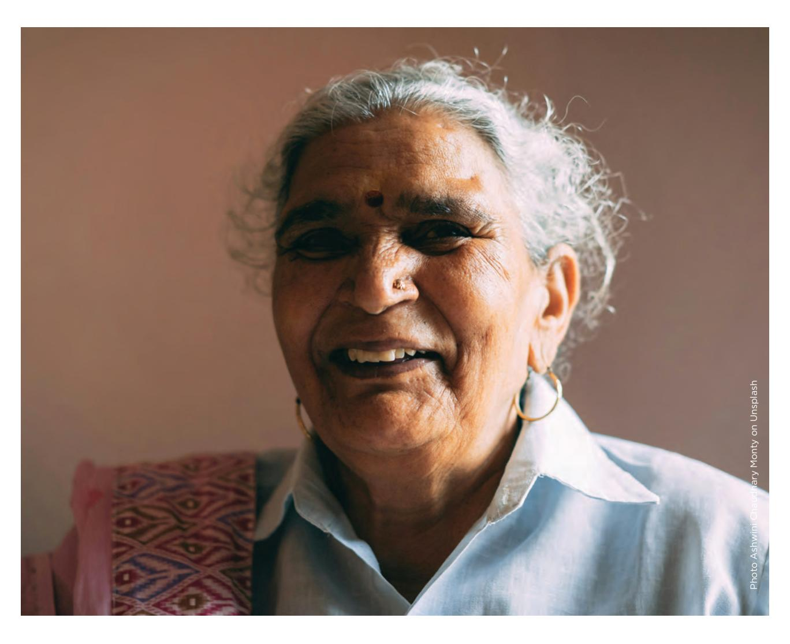

**Fig. 5.2: Contribution (%) of independent variable to overall variation in Life Satisfaction among older adults in India during 2017–18**

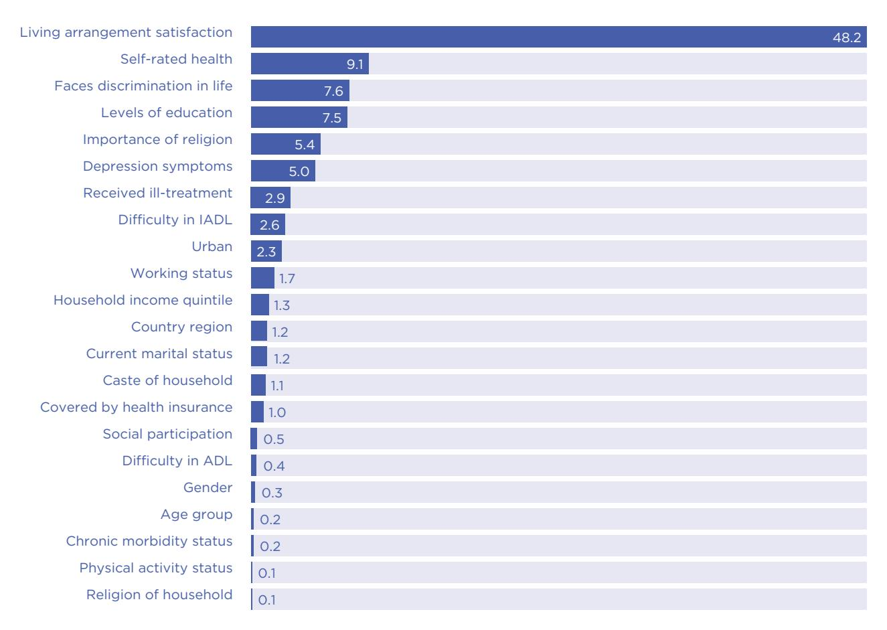

*Figure 5.2* shows the relative importance of independent variables in predicting the life satisfaction score of older adults. The independent variables collectively explained away 15.8% of the variation in life satisfaction. We observed that satisfaction with living arrangements (rank 1), self-rated health (rank 2) and perceived discrimination (rank 3) were the top 3 predictors of life satisfaction among older adults. These three variables accounted for 65% of the variation in older adults' life satisfaction scores. On the contrary, the dominance analysis output showed that gender, age, morbidity status, physical

activity and religion ranked 18th, 19th, 20th, 21st, and 22nd (of the 22 independent variables) in "their influence on life satisfaction among older Indians. These relatively non-significant life satisfaction score predictors accounted for 0.9% of the predicted variance.

## **Discussion**

Subjective well-being (SWB) can be characterized as a favorable assessment of one's life coupled with positive affect. In the field of gerontology,

overall SWB is commonly assessed using evaluations of happiness, self-esteem, and life satisfaction. While happiness usually reflects the emotional facet of SWB, self-esteem and life satisfaction capture the cognitive appraisal of one's sense of self and life overall.27

#### **Gender and Life Satisfaction**

Empirical research on gender and life satisfaction in later life has yielded mixed findings.28 Some studies have found older women to report higher life satisfaction than older men,29 others have found older women to report lower life satisfaction than their male peers,30 and yet others observed no significant gender difference in life satisfaction.31 In the present study, we find that older women in India have higher levels of life satisfaction than older men.

This is somewhat surprising given that women are exposed to more everyday life stressors (e.g., workplace discrimination; secondary social status within families and society at large) and are considered to be more susceptible to them.32 Some studies33 have found women's disadvantages in health contribute towards their lower life satisfaction compared to older men.34 For instance, although women outlive men, they have lower levels of mental and physical health and a greater burden of later life sickness and disability, possibly lowering their satisfaction with life.35 Previous research has identified different factors that impact life satisfaction disparately for women and men. One study36 found monthly income to affect life satisfaction only among older women while others found that having adequate income affected the life satisfaction among both women and men.37 Likewise, research has reported on the role's education, marital status, religion, depression, and physical activity and exercise play in gender differentials in life satisfaction.38

*In the present study, we find that older women in India have higher levels of life satisfaction than older men.*

One factor that may contribute to older women's greater life satisfaction relative to older men is social resources, namely social support. Women, in general, possess wider and more diverse social networks, including a greater number of friends and confidants,39 which likely translates into not only more social support but diverse forms of it. Men, alternatively, report fewer intimate social relationships and mostly rely on their spouses for support with far fewer people they deem to be their confidants.40 Older women in India, especially of older cohorts, also may have invested more in building and maintaining family ties (e.g., organizing gatherings, writing holiday and birthday cards, doing physical and emotional care work) while older Indian men may have shouldered the responsibility of building family finances.41 Gendered division of labor of this nature may explain differences in support later in life, which may reflect gender differences in life satisfaction with older women reporting to be more satisfied with life than their older male peers.

#### **Age and Life Satisfaction**

Given the social, functional, and cognitive losses tied to aging, the general public, including older adults themselves believe that life satisfaction decreases with advancing age.42 Yet, a number of empirical studies — both cross-sectional and longitudinal — have shown that life satisfaction either rises or stays constant as one ages.43 For instance, a meta-analysis of data from 145 countries reports a U-shaped linkage between age and life satisfaction in most countries, including 109 developing nations.44

In the present study, we find some interesting patterns. In the bivariate analysis, we find that life satisfaction was not associated with age of older adults. Other studies45 have found similar patterns, where over 6 years, the overall level of life satisfaction declined among those aged 80 and above. Likewise, other authors have found that life satisfaction decreased among participants in their late 70s and 80s.46 This may be because with increasing age, individuals experience increasing rates of disease and functional deficits,47 declining social and physical activity,48 increasing sensory limitations49 and

problems with memory, attention, and other cognitive functions.50 Moreover, aging also is accompanied by loss of social roles, friends, and family. Such experiences can erode an individual's sense of self-efficacy and self-worth. Reduced psychological resources of such nature, in turn, can lead to disengagement, depression, and apathy, all likely manifested in lowered satisfaction with one's life.51

That said, at the multivariate level, upon controlling several conceptually relevant covariates, we found that increased age was accompanied by higher levels of life satisfaction. Several explanations have been offered to explain this finding, where despite the functional, physical, social, and cognitive losses, increasing age is accompanied by increasing life satisfaction.

Mirowsky's "age as maturity" hypothesis52 suggests that with age, people become experienced, accomplished, and mature, which translates into lower frustration, fewer negative emotions, less emptiness, and more life satisfaction. Based on Baltes and Baltes' (1990) selective optimization with compensation theory,53 some have argued that life satisfaction increases with age because older adults adopt accommodative strategies to maximize the gains and minimize the deficits, which help sustain or even improve satisfaction with life. Similarly, Carstensen's (1999; 2006) socioemotional selectivity theory postulates that as people become more aware that time is limited, they learn to regulate their emotions, savor the most valuable moments in everyday life, and surround themselves with close friends and family, all of which may help sustain high levels of subjective well-being.54 Relatedly, it is possible that, as found in one previous study,55 individuals in this age group have acclimated to major life transitions, such as retirement, and are investing in personally and socially fulfilling activities, which may improve life satisfaction.

We also find that a greater proportion of older adults in our sample report being married and socially active, which may mean greater social and emotional support and reduced risk for loneliness, which remains a major risk factor for diminishing health and well-being.56 Similarly, good mental and physical health also mean

*Taken together, the pattern found in this study surrounding age and life satisfaction refutes some claims that the positive association between age and life satisfaction only exists in high-income nations while life satisfaction declines with advancing age in countries that are socioeconomically constrained.*

higher life satisfaction57 and a greater proportion of older Indians in our study report not being depressed, having no difficulty in carrying out daily living activities, and either have no chronic illnesses or a single condition. Most also reported facing no discrimination or ill-treatment and being satisfied with their living situations. Recent studies have found older Indians to express a strong desire to "age in place," as this may reflect the human urge to preserve autonomy, independence, and social bonds.58 Unsurprisingly then, satisfaction with living arrangement emerges to be the highest contributory factor to life satisfaction in this study and this matches recent Indian studies, which find that living conditions and being satisfied with those conditions are consequential for later-life health.59

Taken together, the pattern found in this study surrounding age and life satisfaction refutes some claims that the positive association between age and life satisfaction only exists in high-income nations while life satisfaction declines with advancing age in countries that are socioeconomically constrained.60 Our finding on age and life satisfaction also corroborates the findings in Chapter 2 of this report, which reveals an overall improvement in the levels of life satisfaction at higher ages in the global sample of older adults and among those living in South Asian countries. One way of extending the present research is to consider additional dimensions of subjective well-being. Although unlike several prior studies that are limited to single-item measurement of life satisfaction, we were able to measure this important marker of SWB using a multiple-item scale, future research replicating this work should consider employing multiple measures of subjective well-being, including happiness.61 62

#### **Educational Differences in Life Satisfaction**

We found a significant association between educational status and life satisfaction among older adults in India. Older Indians with higher levels of education were significantly more satisfied with life compared to their peers without any formal education. Several social, health, and demographic factors could explain the educational differences in life satisfaction among older Indians.

For instance, while education may have an appreciable impact on quality of life, at least partly, through its link to material assets, such as employment and income, it also "*develops habits, skills, resources, and abilities that enable people to achieve a better life,*"63 ultimately impacting life satisfaction. That education is positively associated with life satisfaction, in fact, is found in previous studies as well.64

Recent research in India also highlights that lack of education can decrease health care utilization and increase the likelihood of mental and physical illnesses,65 which can negatively affect satisfaction with life in older ages. The educational differences in life satisfaction among older Indians in our study also could be interpreted in the light of recent research findings in India and other low- and middle-income countries that older adults with lower education endure a higher risk of depression than their peers with higher education.66

Future studies should consider mechanisms connecting educational attainment and life satisfaction among older Indians. One potential mechanism could be that those with more education have a more diverse social network,67 which may translate into more diverse forms of support. Diversity in social networks also may mean interactions with different types of individuals and more diverse social activities, both of which could promote higher order processing leading to better cognitive health.68 Diverse sources of social support and strong cognitive function may be consequential for older adults' life satisfaction. Though grounded in prior research, these suppositions remain to be empirically tested within the context of aging in India.

#### **Caste and Life Satisfaction**

Like in the case of social class, caste can determine access to multiple flexible resources, including knowledge, power, prestige, and mainstream social connections.69 These flexible resources, often available to higher social caste individuals, are consequential throughout the life course and particularly in later life because they can be mobilized to avoid risks, deploy protective strategies, and preserve and promote health and well-being.70

In the present study, we find a significant difference between the SC/ST and non-SC/ST groups. Compared to the SC/ST group, older Indians who belong to the non-SC/ST group were more satisfied with their life. At the multivariate level as well, those in the non-SC/ST group reported higher life satisfaction than their SC-ST peers,

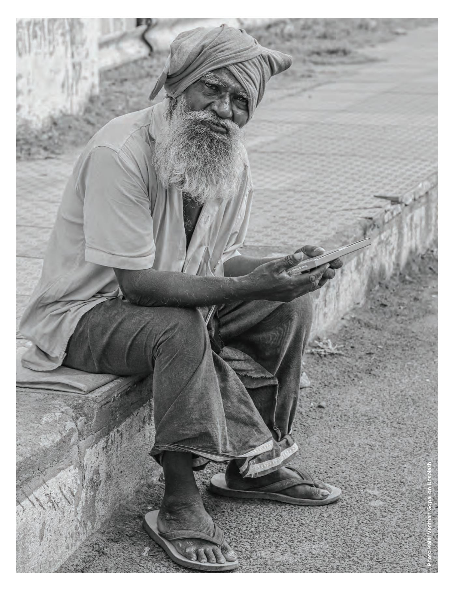

though the overall size of difference diminished after controlling for several social structural factors, including education, perceived discrimination, and experiences of ill-treatment. Corroborating previous studies, we find that the variations in life satisfaction between castes were strongly related to education. Satisfaction with one's life often is the result of the cumulative advantages, which are influenced by education, both directly and indirectly through its linkage with social and economic resources of income, power, wealth, and mainstream social connections. In addition to education, we also find that older Indians who never experience discrimination or ill-treatment are more satisfied with their lives and that experiences of discrimination and ill-treatment contribute significantly to the caste-based discrepancies in life satisfaction.

These findings are not surprising given the enduring hold caste has on the lives of people in India.71 There is ample research on caste-based discrepancies in financial distress, lack of access to quality health care and social services.72 Given the stigma attached to lower social caste, studies also have found that SC/ST groups are significantly less likely to seek treatment for health conditions than their non-SC/ST counterparts.73 One recent study found that various factors such as education, perceived social standing, and satisfaction with one's living arrangements and place of residence contributed to the caste disparities in life satisfaction among older Indians.74 Aside from this, research points out the psychological toll that stigma takes on those of lower social caste groups. Those socially deprived may experience reduced sense of self-worth and self-efficacy, increased feelings of anger, anxiety, depression, and envy, and withdrawal from social interactions and activities.75 This ultimately can negatively affect satisfaction with life.76

## **Conclusion**

The present study substantially contributes to the literature on later-life subjective well-being in India. And we do so by employing a sizable, heterogenous, nationally representative sample of older Indians. We found that older men, those in the higher age groups, currently married, and those who were educated report higher life satisfaction compared to their respective peers. Lower satisfaction with living arrangements, perceived discrimination, and poor self-rated health were important factors associated with low life satisfaction among older Indians. Findings of this study indicate that strengthening family networks to ensure a comfortable living arrangement for older adults, men, widowed, and those without formal education in particular, and bolstering social networks to reduce discrimination may enhance well-being in older age.

*Corroborating previous studies, we find that the variations in life satisfaction between castes were strongly related to education.*

#### **Endnotes**

- 1 See United Nations (2020)
- 2 The average growth rate for Indians aged 60 and above is 300% higher than the overall population growth rate in India. See Agarwal et al. (2016) and Arokiasamy (2016)
- 3 See Papi & Cheraghi (2021)
- 4 See Diener et al. (1999), Mroczek & Spiro III (2005) and Park & Kang (2022)
- 5 See Vijayakumar et al. (2016)
- 6 See Chia et al. (2023), Selivanova & Cramm (2014) and Wu et al. (2016)
- 7 See Papi et al. (2019)
- 8 See Mroczek & Spiro III (2005), Park & Kang (2022) and Srivastava et al. (2022)
- 9 See Khodabakhsh (2022)
- 10 See Muhammad & Joy (2022), Nagargoje et al. (2022), Muhammad et al. (2023) and Pai et al. (2023).
- 11 The University of Southern California (USC), the Harvard School of Public Health, and the International Institute for Population Sciences (IIPS) collaborated to conduct this nationally representative survey.
- 12 See The Longitudinal Ageing Study in India 2017-18 - National Report (2020)
- 13 In rural areas, the survey used a three-stage sample strategy, whereas in urban areas, a four-stage sampling design was used. The first stage in each state/UT required choosing Primary Sampling Units (PSUs), which are sub-districts (Tehsils/Talukas), and the second stage involved choosing villages in rural regions and wards in urban areas within the chosen PSUs. In the third step, households were chosen from various settlements in rural areas. Sampling in metropolitan areas required an additional measure. Specifically, one Census Enumeration Block (CEB) was chosen at random in each urban area in the third stage. Households from this CEB were chosen in the fourth stage. In the survey report, the detailed methodology was released, together with complete information on the survey design and data collection (30). Additional information about the survey instruments, fieldwork, data collecting and processing, response rates, and sample design is accessible to the public elsewhere.15
- 14 See Diener et al. (1985, 1999, 2009)
- 15 This scale showed a high degree of internal consistency. Cronbach's alpha value: 0.90
- 16 See Kessler et al. (1998) and Trainor et al. (2013)
- 17 See WHO (2020)
- 18 See Hu et al. (2017)
- 19 See The Longitudinal Ageing Study in India 2017-18 - National Report (2020)
- 20 See Borooah (2018) and Nayar (2007)
- 21 Since then, the Indian state of Jammu and Kashmir has been divided to form two union territories of J&K and Ladakh.

- 22 See Cameron & Trivedi (2005)
- 23 The partial correlation coefficient (PCC) from the regression model and the General Dominance analysis estimates are two different measures. In simple terms, the PCC displays the strength of association between the life satisfaction score and independent variable(s). However, the DA reveals which independent variable is more important than others in explaining the life satisfaction score of older adults.
- 24 See Budescu (1993) and Grömping (2007)
- 25 See Budescu (1993) and Luchman (2021)
- 26 See Luchman (2021)
- 27 See Plouffe (2010) and Rosenberg (1979).
- 28 See Kim et al. (2021)
- 29 See Camacho et al. (2019), Kim et al. (2021), Macia et al. (2015) and Muhammad & Joy (2022)
- 30 See Chen et al. (2022a, 2022b), Cheng & Chan (2006) and Okabayashi et al. (2019)
- 31 See Meggiolaro & Ongaro (2015)
- 32 See Bird & Rieker (2008), McDonough & Walters (2001) and McLeod & Kessler (1990)
- 33 See Chen et al. (2022), Cheng & Chan (2006) and Tobiasz-Adamczyk et al. (2017)
- 34 See Bramhankar et al. (2023), Camacho et al. (2019), Lee & Williams (2023), Mandi & Bansod (2023), Mekonnen et al. (2022) and Pai et al. (2023)
- 35 See Freedman et al. (2016), J. Lee et al. (2021) and Whitson et al. (2010)
- 36 See Kim et al. (2021)
- 37 See S.-H. Lee et al. (2020)
- 38 See Kim et al. (2021) and S.-H. Lee et al. (2020)
- 39 See Paskulin & Vianna (2007) and Shye et al. (1995)
- 40 See Antonucci & Akiyama (1987)
- 41 See Sharma et al. (2016), Silverstein et al. (2006) and Ugargol & Bailey (2018)
- 42 See Lacey et al. (2006)
- 43 See Berg et al. (2009), Carstensen et al. (2011), Diener & Ryan (2009), Hansen & Blekesaune (2022), Schilling (2006), Siedlecki et al. (2008) and Wettstein et al. (2016, 2022)
- 44 See Blanchflower (2021), Blanchflower & Oswald (2008), Hansen & Blekesaune (2022)
- 45 See Berg et al. (2009)
- 46 See Enkvist et al. (2012) and Mroczek & Spiro III (2005)
- 47 See Freedman & Martin (1998) and Maresova et al. (2019)
- 48 See Milanović et al. (2013)
- 49 See Cavazzana et al. (2018)
- 50 See Murman (2015)

- 51 See Borg et al. (2008)
- 52 See Mirowsky & Ross (1992)
- 53 See Baltes & Baltes (1990)
- 54 See Carstensen et al. (2003)
- 55 See de Grip et al. (2012)
- 56 See National Institute on Aging (2019)
- 57 See Puvill et al. (2016)
- 58 See Muhammad et al. (2021) and Puvill et al. (2016)
- 59 See Kandapan et al. (2023) and Srivastava & Shaw, et al. (2021)
- 60 See Deaton, (2008), Hansen & Blekesaune (2022), Morgan et al. (2015) and Swift et al. (2014)
- 61 Though used interchangeably, happiness and life satisfaction are distinct with the former gauging transient experiences and the latter used to appraise whether one's life has been successful overall
- 62 Some also have argued in favor of assessing multiple domains of life satisfaction, including satisfaction with economic status, housing, health, neighborhood, social networks, and family relationships
- 63 See Ross & Mirowsky (2010)
- 64 See Berg et al. (2009), Cho et al. (2015), Kim et al. (2021) and Ngoo et al. (2015)
- 65 See Roy et al. (2020), Srivastava & Purkayastha, et al. (2021)
- 66 See Brinda et al. (2016) and Saravanakumar et al. (2022)
- 67 See Fischer & Beresford (2015)
- 68 See Bishop (2013), Henderson et al. (2022), Prior et al. (2022) and Rhee et al. (2021)
- 69 See Hatzenbuehler et al. (2013) and Link & Phelan (1995)
- 70 See Hatzenbuehler et al. (2013) and Link & Phelan (1995)
- 71 See Borooah (2018), Chalam (2007) and Nayar (2007)
- 72 See Li et al. (2009) and Zhang (2015)
- 73 See Dey et al. (2012)
- 74 See Muhammad et al. (2022)
- 75 See Johri & Anand (2022)
- 76 Given that LASI only collected data from community-dwelling adults, factors affecting life satisfaction among those residing in formal care institutions, including assisted living facilities and nursing homes remain to be determined. In addition to social group status, such as social caste, future work should consider the additional stressors faced by those older adults not being able to "age in place."

#### **References**

Agarwal, A., Lubet, A., Mitgang, E., Mohanty, S., & Bloom, D. E. (2016). *Population Aging in India: Facts, Issues, and Options* (SSRN Scholarly Paper 2834212). https://doi.org/10.2139/ ssrn.2834212

Antonucci, T. C., & Akiyama, H. (1987). An examination of sex differences in social support among older men and women. *Sex Roles: A Journal of Research*, *17*(11–12), 737–749. https://doi.org/10.1007/BF00287685

Arokiasamy, P. (2016). G. Giridhar, K. M. Sathyanarayana, Sanjay Kumar, K. S. James and Moneer Alam (eds), Population Ageing in India, Cambridge University Press, Cambridge, 2014, Hardback, 250 pp., ISBN 13: 9781107073326. *Ageing & Society*, *36*(2), 445–447. https://doi.org/10.1017/S0144686X15001300

Baltes, P. B., & Baltes, M. M. (1990). Psychological perspectives on successful aging: The model of selective optimization with compensation. In *Successful aging: Perspectives from the behavioral sciences* (pp. 1–34). Cambridge University Press. https://doi.org/10.1017/CBO9780511665684.003

Berg, A. I., Hoffman, L., Hassing, L. B., McClearn, G. E., & Johansson, B. (2009). What matters, and what matters most, for change in life satisfaction in the oldest-old? A study over 6 years among individuals 80+. *Aging & Mental Health*, *13*(2), 191–201. https://doi.org/10.1080/13607860802342227

Bird, C. E., & Rieker, P. P. (2008). *Gender and health: The effects of constrained choices and social policies* (pp. xv, 256). Cambridge University Press.

Bishop, J. (2013). Networked: The New Social Operating System. *International Journal of E-Politics*, *4*, 64–66. https://doi.org/10.4018/jep.2013040106

Blanchflower, D. G. (2021). Is happiness U-shaped everywhere? Age and subjective well-being in 145 countries. *Journal of Population Economics*, *34*(2), 575–624. https://doi.org/10.1007/s00148-020-00797-z

Blanchflower, D. G., & Oswald, A. J. (2008). Is well-being U-shaped over the life cycle? *Social Science & Medicine (1982)*, *66*(8), 1733–1749. https://doi.org/10.1016/j.socscimed. 2008.01.030

Borg, C., Fagerström, C., Balducci, C., Burholt, V., Ferring, D., Weber, G., Wenger, C., Holst, G., & Hallberg, I. R. (2008). Life satisfaction in 6 European countries: The relationship to health, self-esteem, and social and financial resources among people (Aged 65-89) with reduced functional capacity. *Geriatric Nursing (New York, N.Y.)*, *29*(1), 48–57. https://doi.org/10.1016/j.gerinurse.2007.05.002

Borooah, V. (2018). Caste, religion, and health outcomes in India, 2004-14. *Economic and Political Weekly*, *53*, 65–73.

Brinda, E. M., Rajkumar, A. P., Attermann, J., Gerdtham, U. G., Enemark, U., & Jacob, K. S. (2016). Health, Social, and Economic Variables Associated with Depression Among Older People in Low and Middle Income Countries: World Health Organization Study on Global AGEing and Adult Health. *The American Journal of Geriatric Psychiatry*, *24*(12), 1196–1208. https://doi.org/10.1016/j.jagp.2016.07.016

Budescu, D. V. (1993). Dominance analysis: A new approach to the problem of relative importance of predictors in multiple regression. *Psychological Bulletin*, *114*(3), 542–551. https://doi.org/10.1037/0033-2909.114.3.542

Camacho, D., Lee, Y., Bhattacharya, A., Vargas, L. X., Kimberly, L., & Lukens, E. (2019). High Life Satisfaction: Exploring the Role of Health, Social Integration and Perceived Safety among Mexican Midlife and Older Adults. *Journal of Gerontological Social Work*, *62*(5), 521–542. https://doi.org/10.1080/01634372. 2019.1621975

Cameron, A., & Trivedi, P. (2005). *Microeconometrics: Methods and Applications*. https://doi.org/10.1017/CBO9780511811241

Carstensen, L. L., Fung, H. H., & Charles, S. T. (2003). Socioemotional Selectivity Theory and the Regulation of Emotion in the Second Half of Life. *Motivation and Emotion*, *27*(2), 103–123. https://doi.org/10.1023/A:1024569803230

Carstensen, L. L., Turan, B., Scheibe, S., Ram, N., Ersner-Hershfield, H., Samanez-Larkin, G. R., Brooks, K. P., & Nesselroade, J. R. (2011). Emotional Experience Improves With Age: Evidence Based on Over 10 Years of Experience Sampling. *Psychology and Aging*, *26*(1), 21–33. https://doi.org/10.1037/a0021285

Cavazzana, A., Röhrborn, A., Garthus-Niegel, S., Larsson, M., Hummel, T., & Croy, I. (2018). Sensory-specific impairment among older people. An investigation using both sensory thresholds and subjective measures across the five senses. *PloS One*, *13*(8), e0202969. https://doi.org/10.1371/journal. pone.0202969

Chalam, K. S. (2007). *Caste—Based Reservations and Human Development in India* (First Edition). Sage India.

Chen, M., Fu, Y., & Chang, Q. (2022). Life satisfaction among older adults in urban China: Does gender interact with pensions, social support and self-care ability? *Ageing & Society*, *42*(9), 2026–2045. https://doi.org/10.1017/ S0144686X20001877

Cheng, S.-T., & Chan, A. C. M. (2006). Relationship with others and life satisfaction in later life: Do gender and widowhood make a difference? *The Journals of Gerontology. Series B, Psychological Sciences and Social Sciences*, *61*(1), P46-53. https://doi.org/10.1093/geronb/61.1.p46

Chia, F., Huang, W.-Y., Huang, H., & Wu, C.-E. (2023). Promoting Healthy Behaviors in Older Adults to Optimize Health-Promoting Lifestyle: An Intervention Study. *International Journal of Environmental Research and Public Health*, *20*(2), 1628. https://doi.org/10.3390/ijerph20021628

Cho, J., Martin, P., Poon, L. W., & Georgia Centenarian Study. (2015). Successful aging and subjective well-being among oldest-old adults. *The Gerontologist*, *55*(1), 132–143. https://doi.org/10.1093/geront/gnu074

de Grip, A., Dupuy, A., Jolles, J., & van Boxtel, M. (2012). *Retirement and Cognitive Development: Are the Retired Really Inactive?* (SSRN Scholarly Paper 2149479). https://doi.org/10.2139/ssrn.2149479

Deaton, A. (2008). Income, Health, and Well-Being around the World: Evidence from the Gallup World Poll. *Journal of Economic Perspectives*, *22*(2), 53–72. https://doi.org/10.1257/ jep.22.2.53

Dey, S., Nambiar, D., Lakshmi, J. K., Sheikh, K., & Reddy, K. S. (2012). Health of the Elderly in India: Challenges of Access and Affordability. In *Aging in Asia: Findings From New and Emerging Data Initiatives*. National Academies Press (US). https://www.ncbi.nlm.nih.gov/books/NBK109208/

Diener, E., Emmons, R. A., Larsen, R. J., & Griffin, S. (1985). The Satisfaction With Life Scale. *Journal of Personality Assessment*, *49*(1), 71–75. https://doi.org/10.1207/s15327752jpa4901\_13

Diener, E., Oishi, S., & Lucas, R. E. (2009). Subjective Well-Being: The Science of Happiness and Life Satisfaction. In S. J. Lopez & C. R. Snyder (Eds.), *The Oxford Handbook of Positive Psychology* (pp. 186–194). Oxford University Press. https://doi.org/10.1093/oxfordhb/9780195187243.013.0017

Diener, E., & Ryan, K. (2009). Subjective well-being: A general overview. *South African Journal of Psychology*, *39*(4), 391–406. https://doi.org/10.1177/008124630903900402

Diener, E., Suh, E. M., Lucas, R. E., & Smith, H. L. (1999). Subjective well-being: Three decades of progress. *Psychological Bulletin*, *125*(2), 276–302. https://doi.org/10.1037/0033- 2909.125.2.276

Enkvist, A., Ekström, H., & Elmståhl, S. (2012). What factors affect life satisfaction (LS) among the oldest-old? *Archives of Gerontology and Geriatrics*, *54*(1), 140–145. https://doi.org/10.1016/j.archger.2011.03.013

Fischer, C. S., & Beresford, L. (2015). Changes in Support Networks in Late Middle Age: The Extension of Gender and Educational Differences. *The Journals of Gerontology Series B: Psychological Sciences and Social Sciences*, *70*(1), 123–131. https://doi.org/10.1093/geronb/gbu057

Freedman, V. A., & Martin, L. G. (1998). Understanding trends in functional limitations among older Americans. *American Journal of Public Health*, *88*(10), 1457–1462.

Freedman, V. A., Wolf, D. A., & Spillman, B. C. (2016). Disability-Free Life Expectancy Over 30 Years: A Growing Female Disadvantage in the US Population. *American Journal of Public Health*, *106*(6), 1079–1085. https://doi.org/10.2105/ AJPH.2016.303089

Grömping, U. (2007). Estimators of Relative Importance in Linear Regression Based on Variance Decomposition. *The American Statistician*, *61*(2), 139–147. https://doi.org/10.1198/000313007X188252

Hansen, T., & Blekesaune, M. (2022). The age and well-being "paradox": A longitudinal and multidimensional reconsideration. *European Journal of Ageing*, *19*(4), 1277–1286. https://doi.org/10.1007/s10433-022-00709-y

Hatzenbuehler, M. L., Phelan, J. C., & Link, B. G. (2013). Stigma as a Fundamental Cause of Population Health Inequalities. *American Journal of Public Health*, *103*(5), 813–821. https://doi.org/10.2105/AJPH.2012.301069

Henderson, A. K., Walsemann, K. M., & Ailshire, J. A. (2022). Religious Involvement and Cognitive Functioning at the Intersection of Race-Ethnicity and Gender Among Midlife and Older Adults. *The Journals of Gerontology. Series B, Psychological Sciences and Social Sciences*, *77*(1), 237–248. https://doi.org/10.1093/geronb/gbab034

Hu, P., Wang, S., & Lee, J. (2017). Socioeconomic Gradients of Cardiovascular Risk Factors in China and India: Results from the China Health and Retirement Longitudinal Study and Longitudinal Aging Study in India. *International Journal of Public Health*, *62*(7), 763–773. https://doi.org/10.1007/ s00038-017-0968-3

Johri, A., & Anand, P. V. (2022). Life Satisfaction and Well-Being at the Intersections of Caste and Gender in India. *Psychological Studies*, *67*(3), 317–331. https://doi.org/10.1007/ s12646-022-00667-6

Kandapan, B., Pradhan, J., & Pradhan, I. (2023). Living arrangement of Indian elderly: A predominant predictor of their level of life satisfaction. *BMC Geriatrics*, *23*(1), 88. https://doi.org/10.1186/s12877-023-03791-8

Kessler, R. C., Andrews, G., Mroczek, D., Ustun, B., & Wittchen, H.-U. (1998). The World Health Organization Composite International Diagnostic Interview short-form (CIDI-SF). *International Journal of Methods in Psychiatric Research*, *7*(4), 171–185. https://doi.org/10.1002/mpr.47

Khodabakhsh, S. (2022). Factors Affecting Life Satisfaction of Older Adults in Asia: A Systematic Review. *Journal of Happiness Studies*, *23*(3), 1289–1304. https://doi.org/10.1007/ s10902-021-00433-x

Kim, J., Lee, M., & Dan, H. (2021). Gender Differences in Factors Affecting Life Satisfaction of the Elderly with Multimorbidity in Korea. *Nursing Reports*, *11*(1), 54–63. https://doi.org/10.3390/ nursrep11010006

Lacey, H. P., Smith, D. M., & Ubel, P. A. (2006). Hope I Die before I Get Old: Mispredicting Happiness Across the Adult Lifespan. *Journal of Happiness Studies*, *7*(2), 167–182. https://doi.org/10.1007/s10902-005-2748-7

Lee, J., Meijer, E., Phillips, D., & Hu, P. (2021). Disability Incidence Rates for Men and Women in 23 Countries: Evidence on Health Effects of Gender Inequality. *The Journals of Gerontology. Series A, Biological Sciences and Medical Sciences*, *76*(2), 328–338. https://doi.org/10.1093/gerona/glaa288

Lee, S.-H., Lee, J., & Choi, I. (2020). Life Satisfaction in Later Life: The Interplay of Marital Condition and Income among Elderly Koreans. *Sustainability*, *12*(8), Article 8. https://doi.org/10.3390/su12083483

Li, L. W., Zhang, J., & Liang, J. (2009). Health among the Oldest-Old in China: Which Living Arrangements Make a Difference? *Social Science & Medicine (1982)*, *68*(2), 220–227. https://doi.org/10.1016/j.socscimed.2008.10.013

Link, B. G., & Phelan, J. (1995). Social conditions as fundamental causes of disease. *Journal of Health and Social Behavior*, *Spec No*, 80–94.

Luchman, J. N. (2021). Determining relative importance in Stata using dominance analysis: Domin and domme. *The Stata Journal*, *21*(2), 510–538. https://doi. org/10.1177/1536867X211025837

Macia, E., Duboz, P., Montepare, J. M., & Gueye, L. (2015). Exploring Life Satisfaction Among Older Adults in Dakar. *Journal of Cross-Cultural Gerontology*, *30*(4), 377–391. https://doi.org/10.1007/s10823-015-9275-8

Maresova, P., Javanmardi, E., Barakovic, S., Barakovic Husic, J., Tomsone, S., Krejcar, O., & Kuca, K. (2019). Consequences of chronic diseases and other limitations associated with old age – a scoping review. *BMC Public Health*, *19*(1), 1431. https://doi.org/10.1186/s12889-019-7762-5

McDonough, P., & Walters, V. (2001). Gender and health: Reassessing patterns and explanations. *Social Science & Medicine (1982)*, *52*(4), 547–559. https://doi.org/10.1016/ s0277-9536(00)00159-3

McLeod, J. D., & Kessler, R. C. (1990). Socioeconomic status differences in vulnerability to undesirable life events. *Journal of Health and Social Behavior*, *31*(2), 162–172.

Meggiolaro, S., & Ongaro, F. (2015). Life satisfaction among older people in Italy in a gender approach. *Ageing & Society*, *35*(7), 1481–1504. https://doi.org/10.1017/S0144686X14000646

Milanovi´c, Z., Panteli´c, S., Trajkovi´c, N., Sporiš, G., Kosti´c, R., & James, N. (2013). Age-related decrease in physical activity and functional fitness among elderly men and women. *Clinical Interventions in Aging*, *8*, 549–556. https://doi.org/10.2147/ CIA.S44112

Mirowsky, J., & Ross, C. E. (1992). Age and depression. *Journal of Health and Social Behavior*, *33*(3), 187–205. https://doi.org/10.2307/2137349

Morgan, J., Robinson, O., & Thompson, T. (2015). Happiness and age in European adults: The moderating role of gross domestic product per capita. *Psychology and Aging*, *30*(3), 544–551. https://doi.org/10.1037/pag0000034

Mroczek, D. K., & Spiro III, A. (2005). Change in Life Satisfaction During Adulthood: Findings From the Veterans Affairs Normative Aging Study. *Journal of Personality and Social Psychology*, *88*(1), 189–202. https://doi.org/10.1037/0022- 3514.88.1.189

Muhammad, T., Balachandran, A., & Srivastava, S. (2021). Socio-economic and health determinants of preference for separate living among older adults: A cross-sectional study in India. *PLoS ONE*, *16*(4), e0249828. https://doi.org/10.1371/ journal.pone.0249828

Muhammad, T., & Joy, A. M. (2022). Does childhood financial status relate to satisfaction in late life: Findings from the longitudinal aging study in India. *Aging and Health Research*, *2*(1), 100054. https://doi.org/10.1016/j.ahr.2022.100054

Muhammad, T., Pai, M., Afsal, K., Saravanakumar, P., & Irshad, C. V. (2023). The association between loneliness and life satisfaction: examining spirituality, religiosity, and religious participation as moderators. BMC geriatrics, 23(1), 1-17.

Muhammad, T., Paul, R., Meher, T., Rashmi, R., & Srivastava, S. (2022). Decomposition of caste differential in life satisfaction among older adults in India. *BMC Geriatrics*, *22*(1), 832. https://doi.org/10.1186/s12877-022-03526-1

Murman, D. L. (2015). The Impact of Age on Cognition. *Seminars in Hearing*, *36*(3), 111–121. https://doi.org/10.1055/s-0035-1555115

Nagargoje, V. P., James, K. S., & Muhammad, T. (2022). Moderation of marital status and living arrangements in the relationship between social participation and life satisfaction among older Indian adults. Scientific Reports, 12(1), 20604

Nayar, K. R. (2007). Social exclusion, caste & health: A review based on the social determinants framework. *The Indian Journal of Medical Research*, *126*(4), 355–363.

Ngoo, Y. T., Tey, N. P., & Tan, E. C. (2015). Determinants of Life Satisfaction in Asia. *Social Indicators Research*, *124*(1), 141–156.

Okabayashi, S., Kawamura, T., Wakai, K., Ando, M., Tsushita, K., Ohira, H., Ukawa, S., & Tamakoshi, A. (2019). Lifestyle and psychosocial factors and a decline in competence in daily living among Japanese early elderly people: From an age-specified community-based cohort study (NISSIN project). *Environmental Health and Preventive Medicine*, *24*, 28. https://doi.org/10.1186/s12199-019-0787-7

Pai, M., Muhammad, T., Das, S., Chaudhary, M., & Srivastava, S. (2023). Gender differences in the association between physical frailty and life satisfaction among older adults in India. Psychogeriatrics, 23(6), 930-943.

Papi, S., & Cheraghi, M. (2021). Multiple factors associated with life satisfaction in older adults. *Przeglad Menopauzalny = Menopause Review*, *20*(2), 65–71. https://doi.org/10.5114/ pm.2021.107025

Papi, S., Karimi, Z., Zilaee, M., & Shahry, P. (2019). Malnutrition and Its Relation to General Health and Multimorbidity in the Older People. *Journal of Holistic Nursing And Midwifery*, *29*(4), 228–235. https://doi.org/10.32598/JHNM.29.4.228

Park, J.-H., & Kang, S.-W. (2022). Factors Related to Life Satisfaction of Older Adults at Home: A Focus on Residential Conditions. *Healthcare*, *10*(7), Article 7. https://doi.org/10.3390/healthcare10071279

Paskulin, L. M. G., & Vianna, L. A. C. (2007). [Sociodemographic profile and self-referred health conditions of the elderly in a city of Southern Brazil]. *Revista De Saude Publica*, *41*(5), 757–768. https://doi.org/10.1590/s0034-89102007000500010

Plouffe, L. (2010). M.J. Stones, Albert Kozma, and J.K. McNeil. Psychological Weil-Being in Later Life. Toronto: Butterworths, 1991, pp. 160. *Canadian Journal on Aging / La Revue Canadienne Du Vieillissement*, *11*, 202–204. https://doi.org/10.1017/S0714980800011740

Prior, N. H., Bentz, E. J., & Ophir, A. G. (2022). Reciprocal processes of sensory perception and social bonding: An integrated social-sensory framework of social behavior. *Genes, Brain and Behavior*, *21*(3), e12781. https://doi.org/10.1111/ gbb.12781

Puvill, T., Lindenberg, J., de Craen, A. J. M., Slaets, J. P. J., & Westendorp, R. G. J. (2016). Impact of physical and mental health on life satisfaction in old age: A population based observational study. *BMC Geriatrics*, *16*(1), 194. https://doi.org/10.1186/s12877-016-0365-4

Rhee, T. G., Marottoli, R. A., & Monin, J. K. (2021). Diversity of social networks versus quality of social support: Which is more protective for health-related quality of life among older adults? *Preventive Medicine*, *145*, 106440. https://doi.org/10.1016/j. ypmed.2021.106440

Rosenberg, C. E. (1979). *Conceiving The Self*. Basic Books.

Ross, C. E., & Mirowsky, J. (2010). Why education is the key to socioeconomic differentials in health. *Handbook of Medical Sociology, Sixth Edition*, 33–51.

Roy, M., Bhatta, T., & Burnette, J. D. (2020). Intersectional Effects of Gender, Education, and Geographic Region on Functional Health Disparities Among Older Adults in India. *Journal of Aging and Health*, *32*(9), 1188–1197. https://doi.org/10.1177/0898264319899246

Saravanakumar, P., Muhammad, T., & Srivastava, S. (2022). Cross-sectional associations of personal efforts and beliefs and depressive symptoms among older adults in India. *Scientific Reports*, *12*(1), Article 1. https://doi.org/10.1038/ s41598-022-17578-1

Schilling, O. (2006). Development of Life Satisfaction in Old Age: Another View on the "Paradox''. *Social Indicators Research*, *75*(2), 241–271. https://doi.org/10.1007/s11205-004- 5297-2

Selivanova, A., & Cramm, J. M. (2014). The relationship between healthy behaviors and health outcomes among older adults in Russia. *BMC Public Health*, *14*(1), 1183. https://doi.org/10.1186/1471-2458-14-1183

Sharma, N., Chakrabarti, S., & Grover, S. (2016). Gender differences in caregiving among family—Caregivers of people with mental illnesses. *World Journal of Psychiatry*, *6*(1), 7–17. https://doi.org/10.5498/wjp.v6.i1.7

Shye, D., Mullooly, J. P., Freeborn, D. K., & Pope, C. R. (1995). Gender differences in the relationship between social network support and mortality: A longitudinal study of an elderly cohort. *Social Science & Medicine (1982)*, *41*(7), 935–947. https://doi.org/10.1016/0277-9536(94)00404-h

Siedlecki, K. L., Tucker-Drob, E. M., Oishi, S., & Salthouse, T. A. (2008). Life satisfaction across adulthood: Different determinants at different ages? *The Journal of Positive Psychology*, *3*(3), 153–164. https://doi.org/10.1080/17439760701834602

Silverstein, M., Cong, Z., & Li, S. (2006). Intergenerational transfers and living arrangements of older people in rural China: Consequences for psychological well-being. *The Journals of Gerontology. Series B, Psychological Sciences and Social Sciences*, *61*(5), S256-266. https://doi.org/10.1093/ geronb/61.5.s256

*Social isolation, loneliness in older people pose health risks*. (2019, April 23). National Institute on Aging. https://www.nia. nih.gov/news/social-isolation-loneliness-older-people-posehealth-risks

Srivastava, S., Muhammad, T., Sulaiman, K. M., Kumar, M., & Singh, S. K. (2022). Types of household headship and associated life satisfaction among older adults in India: Findings from LASI survey, 2017-18. *BMC Geriatrics*, *22*(1), 78. https://doi.org/10.1186/s12877-022-02772-7

Srivastava, S., Purkayastha, N., Chaurasia, H., & Muhammad, T. (2021). Socioeconomic inequality in psychological distress among older adults in India: A decomposition analysis. *BMC Psychiatry*, *21*(1), 179. https://doi.org/10.1186/s12888-021-03192-4 Srivastava, S., Shaw, S., Chaurasia, H., Purkayastha, N., & Muhammad, T. (2021). Feeling about living arrangements and associated health outcomes among older adults in India: A cross-sectional study. *BMC Public Health*, *21*(1), 1322. https://doi.org/10.1186/s12889-021-11342-2

Swift, H. J., Vauclair, C.-M., Abrams, D., Bratt, C., Marques, S., & Lima, M.-L. (2014). Revisiting the Paradox of Well-being: The Importance of National Context. *The Journals of Gerontology: Series B*, *69*(6), 920–929. https://doi.org/10.1093/geronb/ gbu011

Trainor, K., Mallett, J., & Rushe, T. (2013). Age related differences in mental health scale scores and depression diagnosis: Adult responses to the CIDI-SF and MHI-5. *Journal of Affective Disorders*, *151*(2), 639–645. https://doi.org/10.1016/j. jad.2013.07.011

*The Longitudinal Ageing Study in India 2017-18—National report*. (2020). International Institute for Population Sciences, National Programme for Health Care of Elderly, Ministry of Health and Family Welfare, Harvard T. H. Chan School of Public Health, and the University of Southern California.

Tobiasz-Adamczyk, B., Galas, A., Zawisza, K., Chatterji, S., Haro, J. M., Ayuso-Mateos, J. L., Koskinen, S., & Leonardi, M. (2017). Gender-related differences in the multi-pathway effect of social determinants on quality of life in older age—The COURAGE in Europe project. *Quality of Life Research*, *26*(7), 1865–1878. https://doi.org/10.1007/s11136-017-1530-8

Ugargol, A. P., & Bailey, A. (2018). Family caregiving for older adults: Gendered roles and caregiver burden in emigrant households of Kerala, India. *Asian Population Studies*, *14*(2), 194–210. https://doi.org/10.1080/17441730.2017.1412593

United Nations. (2020). *Department of Economic and Social Affairs, Population Division. World Population Ageing 2019*  ((ST/ESA/SER.A/444).).

Vijayakumar, G., Devi, E. S., & Jawahar, P. (2016). Life Satisfaction of Elderly in Families and Old Age Homes: A Comparative Study. *International Journal of Nursing Education*, *8*(1), 94. https://doi.org/10.5958/0974-9357.2016.00017.9

Wettstein, M., Schilling, O. K., & Wahl, H.-W. (2016). "Still feeling healthy after all these years": The paradox of subjective stability versus objective decline in very old adults' health and functioning across five years. *Psychology and Aging*, *31*(8), 815–830. https://doi.org/10.1037/pag0000137

Wettstein, M., Wahl, H.-W., & Schlomann, A. (2022). The Impact of the COVID-19 Pandemic on Trajectories of Well-Being of Middle-Aged and older Adults: A Multidimensional and Multidirectional Perspective. *Journal of Happiness Studies*, *23*(7), 3577–3604. https://doi.org/10.1007/s10902-022- 00552-z

Whitson, H. E., Landerman, L. R., Newman, A. B., Fried, L. P., Pieper, C. F., & Cohen, H. J. (2010). Chronic Medical Conditions and the Sex-based Disparity in Disability: The Cardiovascular Health Study. *The Journals of Gerontology: Series A*, *65A*(12), 1325–1331. https://doi.org/10.1093/gerona/glq139

WHO. (2020). *WHO guidelines on physical activity and sedentary behaviour: At a glance*. https://www.who.int/ publications-detail-redirect/9789240014886

Wu, T.-T., Chen, I.-J., Cho, S.-L., & Chiou, A.-F. (2016). The Relationship Between Health-Promoting Behaviors and Metabolic Syndrome in Community-Dwelling Older Adults. *Biological Research for Nursing*, *18*(5), 549–557. https://doi.org/10.1177/1099800416655882

Zhang, L. (2015). Living Arrangements and Subjective Well-Being among the Chinese Elderly. *Open Journal of Social Sciences*, *3*(3), Article 3. https://doi.org/10.4236/ jss.2015.33024

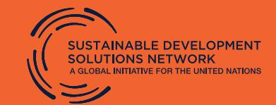

## Center for Sustainable Development Earth Institute | Columbia University

